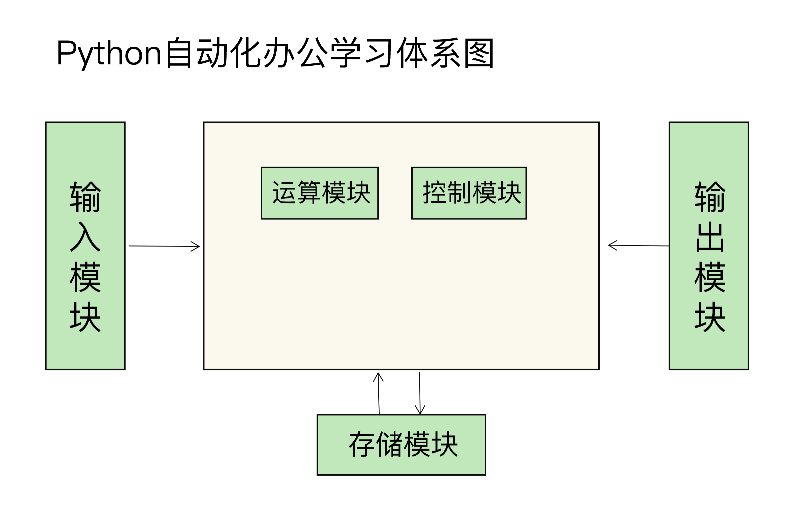

# Python 自动化办公

<!-- @import "[TOC]" {cmd="toc" depthFrom=1 depthTo=6 orderedList=false} -->

<!-- code_chunk_output -->

- [Python 自动化办公](#python-自动化办公)
  - [一. 介绍](#一-介绍)
    - [1.1 运行环境配置](#11-运行环境配置)
    - [1.2 数据类型](#12-数据类型)
    - [1.3 流程控制](#13-流程控制)
      - [1.3.1 分支结构](#131-分支结构)
      - [1.3.2 循环结构](#132-循环结构)
      - [1.3.3 使用函数库](#133-使用函数库)
  - [二. "输入"模块：不同文件类型的批量合并和拆分问题](#二-输入模块不同文件类型的批量合并和拆分问题)
    - [2.1 拆分与合并：如何快速地批量处理内容相似的 Excel？](#21-拆分与合并如何快速地批量处理内容相似的excel)

<!-- /code_chunk_output -->



## 一. 介绍

Python 的扩展库很丰富，可以满足非常多的复杂场景的需求，能够替代非常多的手工操作。这也是 Python 相对于其他编程语言的一大优势。目前，Python 的扩展库已经覆盖了文件、声音、视频、数据科学、深度学习等众多行业。

通过这些扩展库，可以用 Python 连接 Excel、Word、邮件等常用办公组件，轻松应对各类工作场景，不用手动写很多功能代码了。而连接方法也很简单，以操作 Word 文档为例，只要掌握下面这行代码就可以了：

```python
import docx
```

### 1.1 运行环境配置

一般情况下，运行的 Python 代码会被保存到一个以 `.py` 作为扩展名的文件中，也就是 Python 脚本文件。要想让 Python 程序运行，需要打开终端应用程序：

```sh
python3 /py文件所在的路径/xxx.py
或
cd /py文件所在的路径
python3 xxx.py
```

在运行程序的过程中，有两点需要注意。

1. Windows 和 macOS 默认是没有安装 Python 解释器的，所以需要通过 [Python 官方网站](https://www.python.org/downloads/)下载 Python 解释器。
2. Python3 解释器需要在字符终端下运行。

验证 Python 解释器是否安装成功

```sh
python3 -V   # 执行的命令
Python 3.9.1 # 返回的结果
```

### 1.2 数据类型

Python 支持的数据类型有数字、字符串、元组、列表、集合、字典 6 种，不同的数据类型用于描述不同的类别。整数、浮点数和布尔型都是属于数字类型。


> 注意 : 使用布尔类型的时候，True 和 False 首字母必须要大写，它们是 Python 的关键字，如果首字母没有大写会被当作变量处理，解释器也会报错。

### 1.3 流程控制

#### 1.3.1 分支结构

```python
x = 20
if x > 10:  # 注意结尾的冒号:
    print("if的判断结果为True")
    print("x的值大于10")
else:
    print("if的判断结果为False")
    print("x的值小于10")
print("程序执行结束")

# 执行结果如下
if的判断结果为True
x的值大于10
程序执行结束
```

在上面这段代码当中，实现了判断变量 x 是否大于 10 的功能。在书写分支结构时，要**注意 if 判断的书写格式，冒号标志着 if 判断的结束**。

> 注意 : **在整个程序当中，缩进方式必须一致，要么使用 Tab、要么使用 4 个空格进行缩进。Python 对于缩进和复合语句结尾的冒号要求非常严格**，如果弄错了就会报错。而且，缩进不同会大大影响一个程序的运行结果。例如上面的代码中“print("程序执行结束")” 如果有缩进，就看不到“程序执行结束”这行执行结果了。

#### 1.3.2 循环结构

**while 循环**：

```python
start = 1
total = 10
sum = 0
while start <= total: # 条件为True 继续执行循环
    sum += start
    start += 1
print(sum)  #条件为False循环结束,输出结果
```

**for 循环**：

```python
total = list(range(1,11))  # 定义一个1-10 的列表
for i in total:
    print(i)

# 输出结果
1
2
3
4
5
6
7
8
9
10
```

#### 1.3.3 使用函数库

Python 的函数库有标准库和第三方库（也叫扩展库）。标准库是 Python 自带的，而扩展库是需要再进行安装的库。可以从[Python 的官方文档](https://docs.python.org/zh-cn/3.9/library/index.html) 和 [PyPI](https://pypi.org/search/) 网站中找到它们，其中，PyPI 网站的库就是扩展库。

PyPI 网站上面的项目超过 28 万个，几乎包含了各个行业和各个功能的应用，实现了很多日常需要手动操作的功能。

1. **如果要使用官方自带的库，可以使用 `import` 关键字导入**。例如计算算数平方根功能，就可以使用如下方法：

   ```python
   import math
   math.sqrt(16)
   ```

   `import` 后面指定要使用的库的名称，使用库的具体功能，通过官方文档来找到相应的函数。例如，算数平方根使用 sqrt 函数就可以实现想要的功能了。

2. 扩展库需要**在终端使用 pip3 命令进行下载和安装**。例如希望 Python 可以支持 Word 文件格式, 就需要在终端执行下面的代码。

   ```python
   pip3 install python-docx
   ```

   下载和安装之后, 就可以像标准函数库一样使用 import 导入使用了。

## 二. "输入"模块：不同文件类型的批量合并和拆分问题

### 2.1 拆分与合并：如何快速地批量处理内容相似的 Excel？
