# 计算机组成原理

<!-- @import "[TOC]" {cmd="toc" depthFrom=1 depthTo=6 orderedList=false} -->

<!-- code_chunk_output -->

- [计算机组成原理](#计算机组成原理)
  - [一. 总论](#一-总论)
    - [1.1 概念](#11-概念)
    - [1.2 知识地图](#12-知识地图)
      - [1.2.1 计算机的基本组成](#121-计算机的基本组成)
      - [1.2.2 计算机的指令和计算](#122-计算机的指令和计算)
      - [1.2.3 处理器设计](#123-处理器设计)
      - [1.2.4 存储器和 I/O 设备](#124-存储器和-io-设备)
  - [二.计算机的基本组成](#二计算机的基本组成)
    - [2.1 基本硬件组成](#21-基本硬件组成)
      - [2.1.1 主要](#211-主要)
      - [2.1.2 次要](#212-次要)
    - [2.2 冯·诺依曼体系](#22-冯诺依曼体系)
    - [2.3 性能](#23-性能)
      - [2.3.1 指标](#231-指标)
      - [2.3.2 计算机的计时单位: CPU 时钟](#232-计算机的计时单位-cpu-时钟)
      - [2.3.3 性能提升思路](#233-性能提升思路)
      - [2.3.4 功耗](#234-功耗)
      - [2.3.5 提升性能的方法](#235-提升性能的方法)
  - [三. 计算机指令和运算](#三-计算机指令和运算)
    - [3.1 计算机指令 (Instruction Code)](#31-计算机指令-instruction-code)
      - [3.1.1 计算机指令集 (Instruction Set)](#311-计算机指令集-instruction-set)
      - [3.1.2 存储程序型计算机 (Stored-program Computer)](#312-存储程序型计算机-stored-program-computer)
      - [3.1.3 程序如何变成计算机指令](#313-程序如何变成计算机指令)
      - [3.1.4 常见指令分类](#314-常见指令分类)
      - [3.1.5 汇编器把对应的汇编代码翻译成为机器码](#315-汇编器把对应的汇编代码翻译成为机器码)
      - [3.1.6 小结](#316-小结)
    - [3.2 指令跳转](#32-指令跳转)
      - [3.2.1 CPU 执行指令的过程](#321-cpu-执行指令的过程)
      - [3.2.2 寄存器种类与执行过程](#322-寄存器种类与执行过程)
      - [3.2.3 从 if…else 来看程序的执行和跳转](#323-从-ifelse-来看程序的执行和跳转)
      - [3.2.4 通过 if...else 和 goto 来实现循环](#324-通过-ifelse-和-goto-来实现循环)
      - [3.2.5 小结](#325-小结)
    - [3.3 函数调用](#33-函数调用)
      - [3.3.1 程序栈](#331-程序栈)
      - [3.3.2 利用函数内联进行性能优化](#332-利用函数内联进行性能优化)
    - [3.4 ELF 和静态链接](#34-elf-和静态链接)
      - [3.4.1 编译、链接和装载：拆解程序执行](#341-编译-链接和装载拆解程序执行)
      - [3.4.2 ELF 格式和链接：理解链接过程](#342-elf-格式和链接理解链接过程)
    - [3.5 程序装载](#35-程序装载)
      - [3.5.1 内存分段](#351-内存分段)
      - [3.5.2 内存分页](#352-内存分页)
    - [3.6 动态链接](#36-动态链接)
      - [3.6.1 动态链接的解决方案: PLT 和 GOT](#361-动态链接的解决方案-plt-和-got)
    - [3.7 二进制编码](#37-二进制编码)
      - [3.7.1 理解二进制的"逢二进一"](#371-理解二进制的逢二进一)
      - [3.7.2 字符串的表示，从编码到数字](#372-字符串的表示从编码到数字)
    - [3.8 理解电路](#38-理解电路)
      - [3.8.1 继电器](#381-继电器)
    - [3.9 加法器](#39-加法器)
      - [3.9.1 异或门和半加器](#391-异或门和半加器)
      - [3.9.2 全加器](#392-全加器)
    - [3.10 乘法器](#310-乘法器)
      - [3.10.1 顺序乘法的实现过程](#3101-顺序乘法的实现过程)
      - [3.10.2 并行加速方法](#3102-并行加速方法)
      - [3.10.3 电路并行](#3103-电路并行)
    - [3.11 浮点数和定点数](#311-浮点数和定点数)
      - [3.11.1 定点数的表示](#3111-定点数的表示)
      - [3.11.2 浮点数的表示](#3112-浮点数的表示)
      - [3.11.3 浮点数的二进制转换](#3113-浮点数的二进制转换)
      - [3.11.4 浮点数的加法和精度损失](#3114-浮点数的加法和精度损失)
      - [3.11.5 Kahan Summation 算法](#3115-kahan-summation-算法)
  - [四. 处理器](#四-处理器)
    - [4.1 建立数据通路](#41-建立数据通路)
      - [4.1.1 指令周期(Instruction Cycle)](#411-指令周期instruction-cycle)
      - [4.1.2 建立数据通路的组成](#412-建立数据通路的组成)
      - [4.1.3 CPU 所需要的硬件电路](#413-cpu-所需要的硬件电路)
      - [4.1.4 时钟信号的硬件实现](#414-时钟信号的硬件实现)
      - [4.1.5 通过 D 触发器实现存储功能](#415-通过-d-触发器实现存储功能)
      - [4.1.6 PC 寄存器所需要的计数器](#416-pc-寄存器所需要的计数器)
      - [4.1.7 读写数据所需要的译码器](#417-读写数据所需要的译码器)
      - [4.1.8 建立数据通路，构造一个最简单的 CPU](#418-建立数据通路构造一个最简单的-cpu)
    - [4.2 面向流水线的指令设计](#42-面向流水线的指令设计)
      - [4.2.1 单指令周期处理器](#421-单指令周期处理器)
      - [4.2.2 现代处理器的指令流水线](#422-现代处理器的指令流水线)
      - [4.2.3 超长流水线的性能瓶颈](#423-超长流水线的性能瓶颈)
      - [4.4.4 小结](#444-小结)
    - [4.5 冒险跟预测](#45-冒险跟预测)
      - [4.5.1 结构冒险](#451-结构冒险)
      - [4.5.2 数据冒险：三种不同的依赖关系](#452-数据冒险三种不同的依赖关系)
        - [4.5.2.1 先写后读](#4521-先写后读)
        - [4.5.2.2 先读后写](#4522-先读后写)
        - [4.5.2.3 写后再写](#4523-写后再写)
        - [4.5.2.4 通过流水线停顿解决数据冒险](#4524-通过流水线停顿解决数据冒险)
        - [4.5.2.5 操作数前推](#4525-操作数前推)
          - [4.5.2.5.1 NOP 操作和指令对齐](#45251-nop-操作和指令对齐)
          - [4.5.2.5.2 操作数前推](#45252-操作数前推)
        - [4.5.2.6 乱序执行：填上空闲的 NOP](#4526-乱序执行填上空闲的-nop)
          - [4.5.2.6.1 CPU 里的"线程池"：理解乱序执行](#45261-cpu-里的线程池理解乱序执行)
      - [4.5.5 控制冒险](#455-控制冒险)
        - [4.5.5.1 缩短分支延迟](#4551-缩短分支延迟)
        - [4.5.5.2 分支预测](#4552-分支预测)
        - [4.5.5.3 动态分支预测](#4553-动态分支预测)
        - [4.5.5.4 为什么循环嵌套的改变会影响性能？](#4554-为什么循环嵌套的改变会影响性能)
    - [4.6 Superscalar 和 VLIW](#46-superscalar-和-vliw)
      - [4.6.1 多发射与超标量(Superscalar)：同一时间执行的两条指令](#461-多发射与超标量superscalar同一时间执行的两条指令)
      - [4.6.2 Intel 的失败之作：安腾的超长指令字设计(VLIW)](#462-intel-的失败之作安腾的超长指令字设计vliw)
    - [4.7 单指令多数据流(SIMD)：加速矩阵乘法](#47-单指令多数据流simd加速矩阵乘法)
      - [4.7.1 超线程的起源](#471-超线程的起源)
      - [4.7.2 超线程](#472-超线程)
      - [4.7.3 单指令多数据流(SIMD)](#473-单指令多数据流simd)
    - [4.8 异常和中断](#48-异常和中断)
      - [4.8.1 异常：硬件、系统和应用的组合拳](#481-异常硬件-系统和应用的组合拳)
      - [4.8.2 异常的分类：中断、陷阱、故障和中止](#482-异常的分类中断-陷阱-故障和中止)
      - [4.8.3 异常的处理：上下文切换](#483-异常的处理上下文切换)
    - [4.9 CISC 和 RISC](#49-cisc-和-risc)
      - [4.9.1 CISC VS RISC](#491-cisc-vs-risc)
      - [4.9.2 Intel 的进化：微指令架构的出现](#492-intel-的进化微指令架构的出现)
      - [4.9.3 ARM 和 RISC-V：CPU 的现在与未来](#493-arm-和-risc-vcpu-的现在与未来)
    - [4.10 GPU](#410-gpu)
      - [4.10.1 GPU 的历史进程](#4101-gpu-的历史进程)
      - [4.10.2 图形渲染的流程](#4102-图形渲染的流程)
      - [4.10.3 解放图形渲染的 GPU](#4103-解放图形渲染的-gpu)
      - [4.10.4 Shader 的诞生和可编程图形处理器](#4104-shader-的诞生和可编程图形处理器)
      - [4.10.5 现代 GPU 的三个核心创意](#4105-现代-gpu-的三个核心创意)
      - [4.10.6 GPU 在深度学习上的性能差异](#4106-gpu-在深度学习上的性能差异)
    - [4.11 FPGA 和 ASIC：计算机体系结构的黄金时代](#411-fpga-和-asic计算机体系结构的黄金时代)
      - [4.11.1 现场可编程门阵列(FPGA)](#4111-现场可编程门阵列fpga)
      - [4.11.2 专用集成电路(ASIC)](#4112-专用集成电路asic)
      - [4.11.3 解读 TPU: 设计和拆解一块 ASIC 芯片](#4113-解读-tpu-设计和拆解一块-asic-芯片)
        - [4.11.3.1 TPU V1 想要解决什么问题](#41131-tpu-v1-想要解决什么问题)
        - [4.11.3.2 深入理解 TPU V1](#41132-深入理解-tpu-v1)
    - [4.12 理解虚拟机：在云上拿到的计算机是什么样的](#412-理解虚拟机在云上拿到的计算机是什么样的)
      - [4.12.1 公有云](#4121-公有云)
      - [4.12.2 虚拟机](#4122-虚拟机)
        - [4.12.2.1 解释型虚拟机](#41221-解释型虚拟机)
        - [4.12.2.2 Type-1 和 Type-2：虚拟机的性能提升](#41222-type-1-和-type-2虚拟机的性能提升)
      - [4.12.3 Docker: 新时代的最佳选择](#4123-docker-新时代的最佳选择)
  - [五. 存储与 I/O 系统](#五-存储与-io-系统)
    - [5.1 存储器层次结构全景](#51-存储器层次结构全景)
      - [5.1.1 理解存储器的层次结构](#511-理解存储器的层次结构)
      - [5.1.2 存储器的层级结构](#512-存储器的层级结构)
    - [5.2 局部性原理：数据库性能与成本综合考虑](#52-局部性原理数据库性能与成本综合考虑)
    - [5.3 高速缓存](#53-高速缓存)
      - [5.3.1 为什么需要高速缓存](#531-为什么需要高速缓存)
      - [5.3.2 Cache 的数据结构和读取过程](#532-cache-的数据结构和读取过程)
      - [5.3.3 Java 关键字 volatile 与 Java 内存模型的关系](#533-java-关键字-volatile-与-java-内存模型的关系)
      - [5.3.4 CPU 高速缓存的写入](#534-cpu-高速缓存的写入)
        - [5.3.4.1 数据写入修改问题一 : 写入策略](#5341-数据写入修改问题一-写入策略)
        - [5.3.4.2 数据写入修改问题二 : 多个 CPU 核的缓存一致性问题](#5342-数据写入修改问题二-多个-cpu-核的缓存一致性问题)
        - [5.3.4.3 总线嗅探机制和 MESI 协议](#5343-总线嗅探机制和-mesi-协议)
    - [5.4 理解内存](#54-理解内存)
      - [5.4.1 简单页表](#541-简单页表)
      - [5.4.2 多级页表](#542-多级页表)
      - [5.4.3 加速地址转换：TLB](#543-加速地址转换tlb)
      - [5.4.4 安全性与内存保护](#544-安全性与内存保护)
        - [5.4.4.1 可执行空间保护](#5441-可执行空间保护)
        - [5.4.4.2 地址空间布局随机化](#5442-地址空间布局随机化)
    - [5.5 总线: 计算机内部的高速公路](#55-总线-计算机内部的高速公路)
      - [5.5.1 降低复杂性: 总线的设计思路来源](#551-降低复杂性-总线的设计思路来源)
      - [5.5.2 理解总线: 多总线架构和三种线路](#552-理解总线-多总线架构和三种线路)
    - [5.6 输入输出设备](#56-输入输出设备)
      - [5.6.1 接口和设备：经典的适配器模式](#561-接口和设备经典的适配器模式)
      - [5.6.2 CPU 如何控制 I/O 设备](#562-cpu-如何控制-io-设备)
      - [5.6.3 信号和地址：发挥总线的价值](#563-信号和地址发挥总线的价值)
      - [5.6.4 IO 性能、顺序访问和随机访问](#564-io-性能-顺序访问和随机访问)
      - [5.6.5 如何定位 IO_WAIT](#565-如何定位-io_wait)
    - [5.7 机械硬盘](#57-机械硬盘)
      - [5.7.1 机械硬盘构造与读取数据过程](#571-机械硬盘构造与读取数据过程)
      - [5.7.2 Partial Stroking：根据场景提升性能](#572-partial-stroking根据场景提升性能)
    - [5.8 SSD 硬盘](#58-ssd-硬盘)
      - [5.8.1 SSD 的读写原理与种类](#581-ssd-的读写原理与种类)
      - [5.8.2 P/E 擦写问题](#582-pe-擦写问题)
      - [5.8.3 SSD 读写的生命周期](#583-ssd-读写的生命周期)
      - [5.8.4 磨损均衡、TRIM 和写入放大效应](#584-磨损均衡-trim-和写入放大效应)
        - [5.8.4.1 FTL 和磨损均衡](#5841-ftl-和磨损均衡)
        - [5.8.4.2 文件删除: TRIM 指令的支持](#5842-文件删除-trim-指令的支持)
        - [5.8.4.3 写入放大](#5843-写入放大)
      - [5.8.5 AeroSpike：最大化 SSD 的使用效率](#585-aerospike最大化-ssd-的使用效率)
    - [5.9 直接内存访问(DMA)](#59-直接内存访问dma)
      - [5.9.1 理解 DMA，一个协处理器](#591-理解-dma一个协处理器)
      - [5.9.2 Kafka 项目的实现原理](#592-kafka-项目的实现原理)
    - [5.10 数据完整性](#510-数据完整性)
      - [5.10.1 硬件错误与解决思路](#5101-硬件错误与解决思路)
      - [5.10.2 最知名的纠错码: 海明码](#5102-最知名的纠错码-海明码)
        - [5.10.2.1 海明码的纠错原理](#51021-海明码的纠错原理)
        - [5.10.2.2 海明距离：形象理解海明码的作用](#51022-海明距离形象理解海明码的作用)
    - [5.11 分布式计算](#511-分布式计算)
      - [5.11.1 从硬件升级到水平扩展](#5111-从硬件升级到水平扩展)
      - [5.11.2 高可用性和单点故障](#5112-高可用性和单点故障)
  - [六. 应用](#六-应用)
    - [6.1 设计大型 DMP 系统](#61-设计大型-dmp-系统)
      - [6.1.1 DMP: 数据管理平台](#611-dmp-数据管理平台)
      - [6.1.2 KV 数据库、数据管道以及数据仓库最佳技术方案](#612-kv-数据库-数据管道以及数据仓库最佳技术方案)
      - [6.1.3 关系型数据库: 不得不做的随机读写](#613-关系型数据库-不得不做的随机读写)
      - [6.1.4 Cassandra: 顺序写和随机读](#614-cassandra-顺序写和随机读)
      - [6.1.5 SSD: 解决 Cassandra 的数据读问题](#615-ssd-解决-cassandra-的数据读问题)
    - [6.2 理解 Disruptor](#62-理解-disruptor)
      - [6.2.1 Padding Cache Line: 体验高速缓存的威力](#621-padding-cache-line-体验高速缓存的威力)
      - [6.2.2 使用 RingBuffer，利用缓存和分支预测](#622-使用-ringbuffer利用缓存和分支预测)
      - [6.2.3 缓慢的锁](#623-缓慢的锁)
      - [6.2.4 无锁的 RingBuffer](#624-无锁的-ringbuffer)

<!-- /code_chunk_output -->

---

## 一. 总论

### 1.1 概念

> 计算机组成原理的英文叫 Computer Organization。这里的 Organization 是"组织机构"的意思。
> 计算机是由很多个不同部件组合在一起，变成了一个"组织机构"。这个组织机构最终能够进行各种计算、控制、读取输入，进行输出，达成各种强大的功能。
> 组成原理是计算机体系结构的入门课程。**冯·诺依曼体系**结构确立了现代计算机**硬件的基础架构**。因此，学习计算机组成原理，其实就是学习和拆解冯·诺依曼体系结构。

### 1.2 知识地图


从这张图可以看出，整个计算机组成原理，就是**围绕着计算机是如何组织运作展开的**，整个计算机组成原理的知识点被拆分成了**四大部分**。

#### 1.2.1 计算机的基本组成

需要学习计算机是由哪些硬件组成的。这些硬件，又是怎么对应到经典的冯·诺依曼体系结构中的，也就是**运算器**、**控制器**、**存储器**、**输入设备**和**输出设备**这五大基本组件。除此之外，还需要了解计算机的两个==核心指标==，**性能**和**功耗**。性能和功耗也是应用和设计五大基本组件中需要 **重点** 考虑的因素。

#### 1.2.2 计算机的指令和计算

**指令**
: 需要搞明白，一行行 C、Java、PHP 程序，是怎么在计算机里面跑起来的。这里面，既需要==了解程序是怎么通过编译器和汇编器，变成一条条机器指令这样的编译过程==，还需要知道==操作系统是怎么链接、装载、执行这些程序的==。而这一条条指令执行的控制过程，是由计算机五大组件之一的**控制器**来控制的。

**计算**
: 从二进制和编码开始，理解数据在计算机里的表示，以及是怎么从数字电路层面，实现加法、乘法这些基本的运算功能的。实现这些运算功能的算术逻辑单元(Arithmetic Logic Unit/ALU)，就是计算机五大组件之一的**运算器**。

#### 1.2.3 处理器设计

**CPU 时钟** (CPU Clock)
: 可以用来构造寄存器和内存的锁存器和触发器，因此，CPU 时钟是学习 CPU 的前导知识。需要搞明白为什么需要 CPU 时钟，以及寄存器和内存是用什么样的硬件组成的。

**数据通路**
: 连接了整个**运算器**和**控制器**，并最终组成了 **CPU**。而出于对性能和功耗的考虑，需要进一步理解和掌握面向流水线设计的 CPU、数据和控制冒险，以及分支预测的相关技术。

**CPU**
: **CPU 作为控制器要和输入输出设备通信**，那么就要知道异常和中断发生的机制。所以，在 CPU 设计部分的最后，会**学习指令的并行执行**，看看如何直接在 CPU 层面，通过 SIMD 来支持并行计算。

#### 1.2.4 存储器和 I/O 设备

- 通过存储器的层次结构作为基础的框架引导，需要掌握从上到下的 CPU 高速缓存、内存、SSD 硬盘和机械硬盘的工作原理，它们之间的性能差异，以及实际应用中利用这些设备会遇到的挑战。

- 存储器很多时候又扮演了输入输出设备的角色，所以需要进一步了解，CPU 和这些存储器之间是如何进行通信的，以及最重要的**性能问题**是怎么回事。

- 对于存储器，不仅需要它们能够正常工作，还要确保里面的数据不能丢失。于是要掌握如何通过 RAID、Erasure Code、ECC 以及分布式 HDFS，这些不同的技术，来**确保数据的完整性和访问性能**。

- 理解什么是 `IO_WAIT`，如何通过 DMA 来提升程序性能。

## 二.计算机的基本组成

### 2.1 基本硬件组成

#### 2.1.1 主要

**CPU**
: 它是计算机**最重要的核心配件**，计算机的所有"计算"都是由 CPU 来进行的，全名是中央处理器(Central Processing Unit)。

**内存** (Memory)
: 撰写的程序、打开的浏览器、运行的游戏，都要加载到内存里才能运行。程序读取的数据、计算得到的结果，也都要放在内存里。内存越大，能加载的东西自然也就越多。存放在内存里的程序和数据，需要被 CPU 读取，CPU 计算完之后，还要把数据写回到内存。

**主板**
: 主板是一个有着各种各样插槽的配件。主要有以下作用:

1. CPU 和 内存都要插在主板上。
2. 主板的芯片组(Chipset)和总线(Bus)解决了 CPU 和 内存 之间如何通信的问题。芯片组控制了数据传输的流转，也就是数据从哪里到哪里的问题。
3. 总线则是实际数据传输的高速公路。因此，总线速度(Bus Speed)决定了数据能传输得多快。

#### 2.1.2 次要

**I/O 设备**
: 输入(Input) / 输出(Output)设备，如: 显示器、键盘、鼠标等。

**硬盘**
: 长久保存数据。

**显卡(Graphics Card)**
: 使用图形界面操作系统的计算机，无论是 Windows、Mac OS 还是 Linux，显卡都是必不可少的。显卡之所以特殊，是因为显卡里有除了 CPU 之外的另一个"处理器"，也就是 **GPU**(Graphics Processing Unit，图形处理器)，GPU 一样可以做各种"计算"的工作。

**南桥(SouthBridge)**
: 主板上的南桥芯片组，是用来**控制 外部 I/O 设备 和 CPU 之间的通信**的。"南桥"芯片的名字很直观，一方面，它在主板上的位置，通常是主板的"南面"。另一方面，它的作用是作为"桥"，来连接鼠标、键盘以及硬盘这些外部设备和 CPU 之间的通信。以前的主板上通常也有"北桥"芯片，用来作为"桥"，连接 CPU 和内存、显卡之间的通信。不过，随着时间的变迁，现在的主板上的"北桥"芯片的工作，已经被移到了 CPU 的内部，所以现在主板上，已经看不到北桥芯片了。

### 2.2 冯·诺依曼体系

**概念**
: 无论是电脑、手机、还是服务器，都遵循着同一个"计算机"的抽象概念。也就是，计算机祖师爷之一冯·诺依曼(John von Neumann)提出的 **冯·诺依曼体系结构** (Von Neumann architecture)，也叫**存储程序型计算机**。

**历史**
: 冯·诺依曼在 1945 年 6 月 30 日，基于当时在秘密开发的 EDVAC 写了一篇报告 **《First Draft of a Report on the EDVAC》** ，描述了他心目中的一台计算机应该长什么样。这篇报告在历史上有个很特殊的简称，叫 **First Draft**。
First Draft 里面说了一台计算机应该有哪些部分组成:

- **处理器单元** : 一个包含算术逻辑单元(Arithmetic Logic Unit，ALU)和处理器寄存器(Processor Register)的处理器单元(Processing Unit)，用来完成各种算术和逻辑运算。因为它能够完成各种数据的处理或者计算工作，因此也有人把这个叫作数据通路(Datapath)或者运算器。

- **控制器单元** : 一个包含指令寄存器(Instruction Register)和程序计数器(Program Counter)的控制器单元(Control Unit/CU)，用来控制程序的流程，通常就是不同条件下的分支和跳转。在现代计算机里，上面的处理器单元和这里的控制器单元，共同组成了 CPU。

- **存储器** : 用来存储数据(Data)和指令(Instruction)的内存。以及更大容量的外部存储，在过去，可能是磁带、磁鼓这样的设备，现在通常就是硬盘。

- **I/O 设备** : 各种输入和输出设备，以及对应的输入和输出机制。现在无论是使用什么样的计算机，其实都是和输入输出设备在打交道。个人电脑的鼠标键盘是输入设备，显示器是输出设备。智能手机，触摸屏既是输入设备，又是输出设备。而跑在各种云上的服务器，则是通过网络来进行输入和输出。这个时候，网卡既是输入设备又是输出设备。


> **总结**: 任何一台计算机的任何一个部件都可以归到 **运算器**、 **控制器**、 **存储器**、 **输入设备** 和 **输出设备** 中，所有的现代计算机也都是基于这个基础架构来设计开发的。
>
> **扩展**: 所有的计算机程序，也都可以抽象为从输入设备读取输入信息，通过运算器和控制器来执行存储在存储器里的程序，最终把结果输出到输出设备中。所有无论高级还是低级语言的程序，也都是基于这样一个抽象框架来进行运作的。

### 2.3 性能

一般把性能，定义成响应时间的倒数，也就是：**性能 = 1 / 响应时间**

#### 2.3.1 指标

计算机的性能，主要用两个 **标准指标** 来衡量:

**响应时间** (Response time) 或 执行时间 (Execution time)
: 执行一个程序，需要花多少时间。想要提升这个指标，可以理解为让计算机"跑得更快"。

**吞吐率** (Throughput) 或 带宽 (Bandwidth)
: 在一定的时间范围内，能处理多少事情。这里的"事情"，在计算机里就是处理的数据或者执行的程序指令。想要提升这个指标，可以理解为让计算机"搬得更多"。

> 提升吞吐率的办法有很多，大部分时候，只要多加一些机器，多堆一些硬件就好了。但是**响应时间的提升却没有那么容易**。

#### 2.3.2 计算机的计时单位: CPU 时钟

虽然时间是一个很自然的用来 **衡量性能** 的指标，但是用时间来衡量时，有两个问题:

1. **时间不准**
   统计时间是用类似于"掐秒表"一样，记录 **程序运行结束的时间 - 程序开始运行的时间**。这个时间也叫 Wall Clock Time 或者 Elapsed Time。
   计算机可能同时运行着好多个程序，CPU 实际上不停地在各个程序之间进行切换。在 Wall Clock Time 时间里面，很可能 CPU 切换去运行别的程序了。
   有些程序在运行的时候，可能要从网络、硬盘去读取数据，要等网络和硬盘把数据读出来，给到内存和 CPU。

   - **解决思路** : 要想准确统计某个程序运行时间，进而去比较两个程序的实际性能，得把上面的时间给刨除掉。

2. **会受到主板、内存这些其他相关硬件的影响**

   - **解决思路** : 因为会受到相关硬件的影响，所以需要对"时间"这个可以感知的指标进行 **拆解** ，把程序的 **CPU 执行时间** 变成 **CPU 时钟周期数** (CPU Cycles) 和 **时钟周期时间** (Clock Cycle) 的 **乘积**:

     ```txt
     程序的 CPU 执行时间 = CPU 时钟周期数 × 时钟周期时间
     ```

**时钟周期时间**
: 在 CPU 内部，有一个叫 **晶体振荡器** (Oscillator Crystal)的东西，简称为晶振。计算机把晶振当成 CPU 内部的电子表来使用。晶振带来的每一次"滴答"，就是时钟周期时间。CPU 是按照这个"时钟"提示的时间来进行自己的操作。 **时钟周期越短，CPU 也就越快**。

#### 2.3.3 性能提升思路

**思路**:
最简单的提升性能方案，自然是 **缩短时钟周期时间** ，也就是提升主频。不过，这个是软件控制不了的事情，但是，如果能够减少程序需要的 **CPU 时钟周期数量** ，一样能够提升程序性能。

对于 CPU 时钟周期数，可以再做一个分解，把它变成 "**指令数 × 每条指令的平均时钟周期数**(Cycles Per Instruction，简称 CPI)" 。不同的指令需要的 Cycles 是不同的，加法和乘法都对应着一条 CPU 指令，但是乘法需要的 Cycles 就比加法要多，自然也就慢。在这样拆分了之后，程序的 CPU 执行时间就可以变成这样三个部分的乘积:

> **程序的 CPU 执行时间 = 指令数 × CPI × 时钟周期时间**

**解决性能问题**，就是要优化这三者:

- **时钟周期时间** (计算机主频) : 这个取决于计算机硬件。所熟知的摩尔定律就一直在不停地提高计算机的主频。

- **每条指令的平均周期数 CPI** : 就是一条指令需要多少 CPU Cycles。现代的 CPU 通过 **流水线技术** (Pipeline)，让一条指令需要的 CPU Cycle 尽可能地少。因此，对于 CPI 的优化，也是计算机组成和体系结构中的重要一环。

- **指令数** : 代表执行程序到底需要多少条指令、用哪些指令。这个很多时候就把挑战交给了编译器。同样的代码，编译成计算机指令时候，就有各种不同的表示方式。

#### 2.3.4 功耗

**功耗的增加** :

CPU，一般都被叫作**超大规模集成电路** (Very-Large-Scale Integration，VLSI) 。这些电路，实际上都是一个个晶体管组合而成的。CPU 在计算时，其实就是让晶体管里面的"开关"不断地去"打开"和"关闭"，来组合完成各种运算和功能。可从以下几个方面提升性能:

- **增加密度** : 在 CPU 里，同样的面积里面多放晶体管。
- **提升制程** : 同样的面积下，想要多放一点晶体管，就要把晶体管造得小一点。
- **提升主频** : 也就是让晶体管"打开"和"关闭"得更快一点。

但这三者，都会 **增加功耗** ，带来耗电和散热的问题。因此，在 CPU 里面，能够放下的 **晶体管数量** 和 **晶体管的"开关"频率** 也都是有限的。一个 CPU 的功率，可以用这样一个公式来表示:

> **功耗 ~= 1/2 × 负载电容 × 电压的平方 × 开关频率 × 晶体管数量**

**降低功耗方法** :

- **降低电压** : 在整个功耗的公式里面，功耗和电压的平方是成正比的。这意味着电压下降到原来的 1/5，整个的功耗会变成原来的 1/25 ，这点**非常关键**。

#### 2.3.5 提升性能的方法

- **并行优化，理解 [阿姆达尔定律](#Amdahl)**
  **通过并行提高性能是最常见的提升性能的方式**。但是，并不是所有问题，都可以通过并行提高性能来解决。如果想要使用这种思想，需要满足以下条件:

  - 需要进行的计算，本身可以分解成几个可以并行的任务。
  - 需要能够分解好问题，并确保结果能够汇总到一起。
  - 在"汇总"这个阶段，是没有办法并行进行的，还是得顺序执行，一步一步来。

- **不受影响的执行时间** : 指的是汇总相加的时间，这部分时间是不能通过并行来优化的。

- **加速大概率事件**

- **通过流水线提高性能** : 把 CPU 指令执行的过程进行拆分，细化运行，也是现代 CPU 在主频没有办法提升那么多的情况下，性能仍然可以得到提升的重要原因之一。

- **通过预测提高性能** : 通过预先猜测下一步该干什么，而不是等上一步运行的结果，提前进行运算，也是让程序跑得更快一点的办法。典型的例子就是在一个循环访问数组的时候，凭经验，也会猜到下一步会访问数组的下一项。"分支和冒险"、"局部性原理"这些 CPU 和存储系统设计方法，其实都是在利用对于未来的"预测"，提前进行相应的操作，来提升程序性能。

## 三. 计算机指令和运算

### 3.1 计算机指令 (Instruction Code)

从软件工程师的角度来讲，CPU 就是一个**执行各种计算机指令的逻辑机器**。这里的计算机指令，就好比一门 CPU 能够听得懂的语言，也可以把它叫作 **机器语言** (Machine Language) 。

#### 3.1.1 计算机指令集 (Instruction Set)

**计算机指令集** 是 CPU 支持的语言，不同的 CPU 能够听懂的语言不太一样。比如，个人电脑用的是 Intel 的 CPU，苹果手机用的是 ARM 的 CPU。这两者能听懂的语言就不太一样。

#### 3.1.2 存储程序型计算机 (Stored-program Computer)

一个计算机程序，不可能只有一条指令，而是由成千上万条指令组成的。但是 CPU 里不能一直放着所有指令，所以计算机程序平时是存储在存储器中的。这种程序指令存储在存储器里面的计算机，就叫作 **存储程序型计算机**。

#### 3.1.3 程序如何变成计算机指令

要让一段程序在操作系统上跑起来，需要把整个程序翻译成一个 **汇编语言** (ASM，Assembly Language) 程序，这个过程一般叫 **编译 (Compile) 成汇编代码**。

针对汇编代码，可以再用汇编器 (Assembler) 翻译成机器码 (Machine Code) 。这些机器码由"0"和"1"组成的机器语言表示。这一条条机器码，就是一条条 CPU 真正认识的计算机指令。


**不直接编译成机器码的好处** :

- 方便优化和调试 : 因为编译器也是工具，也是机器，毕竟是机器生成的程序，不是非常完美的，而汇编是机器指令的助记符，一个汇编指令就对应一条机器指令 (特殊指令除外) ，调试起来肯定会比机器指令方便，这样优化起来也方便。

- 从人脑可分析的粒度来减弱复杂性 : 高级语言只需要编译成汇编代码就可以了，汇编代码到机器码的转换是由硬件实现的，实现这样的分层，可以有效地减弱编译器编写的复杂性，提高了效率。

#### 3.1.4 常见指令分类

**常见的指令可以分成以下五类** :

1. **算术类指令** : 加减乘除，在 CPU 层面，都会变成一条条算术指令。
2. **数据传输类指令** : 给变量赋值、在内存里读写数据，用的都是数据传输类指令。
3. **逻辑类指令** :逻辑上的与或非，都是这一类指令。
4. **条件分支类指令** : if/else、switch，都是套件分支类指令。
5. **无条件跳转指令** : 调用函数时，其实就是发起了一个无条件跳转指令。


#### 3.1.5 汇编器把对应的汇编代码翻译成为机器码

使用最简单的 MIPS 指令集，来演示机器码是如何生成的。


MISP 的指令是一个 32 位 的整数，高 6 位叫 **操作码** (Opcode)，也就是代表这条指令具体是一条什么样的指令，剩下的 26 位有三种格式，分别是 R、I 和 J。

1. **R 指令** : 一般用来做 **算术和逻辑操作** ，里面有读取和写入数据的寄存器的地址。如果是逻辑位移操作，后面还有位移操作的位移量，而最后的功能码，则是在前面的操作码不够的时候，扩展操作码表示对应的具体指令的。
2. **I 指令** : 通常是用在 **数据传输、条件分支 ，以及在运算的时候使用的**。变量是常数的时候，没有了位移量和操作码，也没有了第三个寄存器，而是把这三部分直接合并成了一个地址值或者一个常数。
3. **J 指令** : **跳转指令** ，高 6 位之外的 26 位都是一个跳转后的地址。

**例** :
以一个最简单的加法算术指令 `add t0,s1,$s2` 为例，下面都用十进制来表示对应的代码。

对应 MIPS 指令里 `opcode` 是 `0`，`rs` 代表第一个寄存器的地址是 `17`，`rt` 代表第二个寄存器的地址是 `18`， `rd` 代表目标的临时寄存器 `t0` 的地址是 `8` 。因为不是位移操作，所以位移量是 `0` 。把这些数字拼起来，就变成了一个 MIPS 的加法指令。

为了读起来方便，一般把对应的二进制数，用 16 进制表示出来。这个例子是 **0X02324020**，这个数字也就是这条指令对应的机器码。


#### 3.1.6 小结

除了 C 这样的编译型的语言之外，不管是 Python 这样的解释型语言，还是 Java 这样使用虚拟机的语言，其实最终都是由不同形式的程序，把代码，转换成 CPU 能够理解的 **机器码** 来执行的。
只是解释型语言，是通过解释器在程序运行的时候逐句翻译，而 Java 这样使用虚拟机的语言，则是由虚拟机对编译出来的中间代码进行解释，或者即时编译成为机器码来最终执行。

### 3.2 指令跳转

#### 3.2.1 CPU 执行指令的过程

实际上，一条条计算机指令执行起来非常复杂。CPU 在软件层面已经做好了 **封装**。对于程序员来说，只要知道，写好的代码变成了指令之后，是 **一条一条顺序执行** 的就可以了。

逻辑上，可以认为，CPU 其实就是由一堆 **寄存器** 组成的。而寄存器就是 CPU 内部，**由多个 [触发器](#LogicGates) (Flip-Flop) 或 [锁存器](#LogicGates) (Latches) 组成的简单电路**。

N 个触发器或锁存器，就可以组成一个 N 位 (Bit) 的 **寄存器** ，能够保存 N 位的数据。

#### 3.2.2 寄存器种类与执行过程


一个 CPU 里会有很多种 **不同功能** 的 **寄存器**。下面是三种比较特殊的:

1. **PC 寄存器** (Program Counter Register) : 也叫 **指令地址寄存器** (Instruction Address Register)。顾名思义，就是用来存放下一条需要执行的计算机指令的内存地址。
2. **指令寄存器** (Instruction Register) : 用来存放当前正在执行的指令。
3. **条件码寄存器** (Status Register) : 用里面一个个标记位(Flag)，存放 CPU 进行算术或逻辑运算的结果。

除了这些特殊的寄存器，CPU 里面还有更多用来存储数据和内存地址的寄存器。这样的寄存器通常一类里面不止一个。通常根据存放的数据内容来给它们取名字，比如整数寄存器、浮点数寄存器、向量寄存器和地址寄存器等等。有些寄存器既可以存放数据，又能存放地址，就叫它 **通用寄存器**。


实际上，一个程序执行的时候，CPU 会根据 PC 寄存器里的地址，从内存里把需要执行的指令读取到指令寄存器里执行，然后根据指令长度自增，开始顺序读取下一条指令，一个程序的一条条指令，在内存里是连续保存的，也会一条条顺序加载。

#### 3.2.3 从 if…else 来看程序的执行和跳转

```C
// test.c

int main()
{
  srand(time(NULL));
  // 用 rand 生成了一个随机数 r，r 要么是 0，要么是 1。当 r 是 0 的时候，把之前定义的变量 a 设成 1，否则就设成 2。
  int r = rand() % 2;
  int a = 10;
  if(r == 0)
  {
    a = 1;
  } else {
    a = 2;
  }
}
```

```shell
gcc -g -c test.c
objdump -d -M intel -S test.o
```

把这个程序编译成 **汇编代码** 。忽略前后无关的代码，只关注 **if…else** 条件判断语句。对应的汇编代码是这样的:

```C
// r == 0 的条件判断，被编译成了 cmp 和 jne 两条指令
// cmp 指令比较了前后两个操作数的值，这里的 DWORD PTR 代表操作的数据类型是 32 位的整数，而[rbp-0x4]则是一个寄存器的地址。所以，第一个操作数就是从寄存器里拿到的变量 r 的值。第二个操作数 0x0 就是设定的常量 0 的 16 进制表示。cmp 指令的比较结果，会存入到 条件码寄存器 当中去

// 如果比较的结果是 True，也就是 r == 0，就把 零标志条件码 (对应的条件码是 ZF，Zero Flag) 设置为 1。除了零标志之外，Intel 的 CPU 下还有 进位标志 (CF，Carry Flag) 、符号标志 (SF，Sign Flag) 以及 溢出标志 (OF，Overflow Flag) ，用在不同的判断条件下。
  if (r == 0)
// cmp 指令执行完成之后，PC 寄存器会自动自增，开始执行下一条 jne 的指令
3b:   83 7d fc 00             cmp    DWORD PTR [rbp-0x4],0x0
// 跟着的 jne 指令，是 jump if not equal 的意思，它会查看对应的零标志位。如果为 0，会跳转到后面跟着的操作数 4a 的位置。这个 4a，对应这里汇编代码的行号，也就是上面设置的 else 条件里的第一条指令。当跳转发生的时候，PC 寄存器就不再是自增变成下一条指令的地址，而是被直接设置成这里的 4a 这个地址。这个时候，CPU 再把 4a 地址里的指令加载到指令寄存器中来执行。
3f:   75 09                   jne    4a <main+0x4a>
  {
      a = 1;
41:   c7 45 f8 01 00 00 00    mov    DWORD PTR [rbp-0x8],0x1
48:   eb 07                   jmp    51 <main+0x51>
  }
  else
  {
      a = 2;
// 执行地址为 4a 的指令，实际是一条 mov 指令，第一个操作数和前面的 cmp 指令一样，是另一个 32 位整型的寄存器地址，以及对应的 2 的 16 进制值 0x2。mov 指令把 2 设置到对应的寄存器里去，相当于一个赋值操作。然后，PC 寄存器里的值继续自增，执行下一条 mov 指令。
4a:   c7 45 f8 02 00 00 00    mov    DWORD PTR [rbp-0x8],0x2
// 这条 mov 指令的第一个操作数 eax，代表累加寄存器，第二个操作数 0x0 则是 16 进制的 0 的表示。这条指令其实没有实际的作用，它的作用是一个占位符。
// 回过头去看前面的 if 条件，如果满足的话，在赋值的 mov 指令执行完成之后，有一个 jmp 的无条件跳转指令。跳转的地址就是这一行的地址 51。
// main 函数没有设定返回值，而 mov eax, 0x0 其实就是给 main 函数生成了一个默认的为 0 的返回值到累加器里面。if 条件里面的内容执行完成之后也会跳转到这里，和 else 里的内容结束之后的位置是一样的。
51:   b8 00 00 00 00          mov    eax,0x0
  }
```


#### 3.2.4 通过 if...else 和 goto 来实现循环

```C
int main()
{
  int a = 0;
  for (int i = 0;i < 3;i++)
  {
    a += i;
  }
}
```

对应的汇编代码:

```C
  for (int i = 0; i <= 2; i++)
  b:   c7 45 f8 00 00 00 00    mov    DWORD PTR [rbp-0x4],0x0
// 对应的循环也是用 1e 这个地址上的 cmp 比较指令，和紧接着的 jle 条件跳转指令 1e 来实现的。
12:   eb 0a                   jmp    1e
  {
      a += i;
14:   8b 45 f8                mov    eax,DWORD PTR [rbp-0x4]
17:   01 45 fc                add    DWORD PTR [rbp-0x8],eax

1a:   83 45 f8 01             add    DWORD PTR [rbp-0x4],0x1
1e:   83 7d f8 02             cmp    DWORD PTR [rbp-0x4],0x2
// 主要的差别在于，这里的 jle 跳转的地址，是在这条指令之前的地址 14，而非 if…else 编译出来的跳转指令之后。往前跳转使得条件满足的时候，PC 寄存器会把指令地址设置到之前执行过的指令位置，重新执行之前执行过的指令，直到条件不满足，顺序往下执行 jle 之后的指令，整个循环才结束。
22:   7e f0                   jle    14
24:   b8 00 00 00 00          mov    eax,0x0
  }
```

#### 3.2.5 小结

在单条指令的基础上，程序里的多条指令，是如何一条一条被执行的。

1. 简单地通过 PC **寄存器自增** 的方式顺序执行。
2. 条件码寄存器会记录下当前执行指令的条件判断状态，然后通过跳转指令读取对应的条件码，修改 PC 寄存器内的下一条指令的地址，最终实现 `if…else` 以及 `for/while` 这样的程序控制流程。

虽然可以用高级语言，可以用不同的语法，比如 `if…else` 这样的条件分支，或者 `while/for` 这样的循环方式，来实现不同的程序运行流程，但是回归到计算机可以识别的机器指令级别，其实都只是一个简单的地址跳转而已，也就是一个类似于 `goto` 的语句。

想要在硬件层面实现这个 `goto` 语句，只需要三个寄存器:

1. 用来保存下一条指令地址的 **PC 寄存器**
2. 当前正要执行指令的 **指令寄存器**
3. 保留条件判断状态的 **条件码寄存器**

这样三个寄存器，就可以实现 **条件判断** 和 **循环重复执行代码** 的功能。

### 3.3 函数调用

函数间的相互调用，在计算机指令层面是怎么实现的，以及什么情况下会发生栈溢出这个错误。

#### 3.3.1 程序栈

```C
// 这个程序定义了一个简单的函数 add，接受两个参数 a 和 b，返回值就是 a+b。
// 而 main 函数里则定义了两个变量 x 和 y，然后通过调用这个 add 函数，来计算 u=x+y，最后把 u 的数值打印出来。
// function_example.c
#include <stdio.h>
int static add(int a, int b)
{
    return a+b;
}

int main()
{
    int x = 5;
    int y = 10;
    int u = add(x, y);
}
```

```C
gcc -g -c function_example.c
objdump -d -M intel -S function_example.o
```

把这个程序编译之后，[objdump](#objdump) 出来。对应的汇编代码:

```C

int static add(int a, int b)
{
   0:   55                      push   rbp
   1:   48 89 e5                mov    rbp,rsp
   4:   89 7d fc                mov    DWORD PTR [rbp-0x4],edi
   7:   89 75 f8                mov    DWORD PTR [rbp-0x8],esi
    return a+b;
   a:   8b 55 fc                mov    edx,DWORD PTR [rbp-0x4]
   d:   8b 45 f8                mov    eax,DWORD PTR [rbp-0x8]
  10:   01 d0                   add    eax,edx
}
  12:   5d                      pop    rbp
  13:   c3                      ret
0000000000000014 <main>:
int main()
{
  14:   55                      push   rbp
  15:   48 89 e5                mov    rbp,rsp
  18:   48 83 ec 10             sub    rsp,0x10
    int x = 5;
  1c:   c7 45 fc 05 00 00 00    mov    DWORD PTR [rbp-0x4],0x5
    int y = 10;
  23:   c7 45 f8 0a 00 00 00    mov    DWORD PTR [rbp-0x8],0xa
    int u = add(x, y);
  2a:   8b 55 f8                mov    edx,DWORD PTR [rbp-0x8]
  2d:   8b 45 fc                mov    eax,DWORD PTR [rbp-0x4]
  30:   89 d6                   mov    esi,edx
  32:   89 c7                   mov    edi,eax
  // 函数调用的跳转，在对应函数的指令执行完了之后，还要再回到函数调用的地方，继续执行 call 之后的指令
  34:   e8 c7 ff ff ff          call   0 <add>
  39:   89 45 f4                mov    DWORD PTR [rbp-0xc],eax
  3c:   b8 00 00 00 00          mov    eax,0x0
}
  41:   c9                      leave
  42:   c3                      ret
```

函数调用的跳转需要回到调用函数的地方，但单独记录跳转回来的地址有诸多问题，所以，使用在内存里开辟一段空间，用栈这个 **后进先出** (LIFO，Last In First Out) 的数据结构。栈就像一个乒乓球桶，每次程序调用函数之前，把调用返回后的地址写在一个乒乓球上，然后塞进这个球桶。这个操作就是 **压栈**。如果函数执行完了，从球桶里取出最上面的那个乒乓球，这就是 **出栈**。

拿到出栈的乒乓球，找到上面的地址，把程序跳转过去，就返回到了函数调用后的下一条指令了。如果函数 A 在执行完成之前又调用了函数 B，那么在取出乒乓球之前，还需要往球桶里塞一个乒乓球。而从球桶最上面拿乒乓球的时候，拿的也一定是最近一次的，也就是最下面一层的函数调用完成后的地址。乒乓球桶的底部，就是 **栈底**，最上面的乒乓球所在的位置，就是 **栈顶**。


在真实的程序里，压栈的不只有函数调用完成后的返回地址。比如函数 A 在调用 B 的时候，需要传输一些参数数据，这些参数数据在寄存器不够用的时候也会被压入栈中。整个函数 A 所占用的所有内存空间，就是函数 A 的 **栈帧** (Stack Frame) 。

而实际的程序栈布局，顶和底与乒乓球桶相比是倒过来的。底在最上面，顶在最下面，这样的布局是因为栈底的内存地址是在一开始就固定的。而一层层压栈之后，栈顶的内存地址是在逐渐变小而不是变大。


这张图，对应上面函数 add 的汇编代码，main 函数调用 add 函数时，add 函数入口在 0 ～ 1 行，add 函数结束之后在 12 ～ 13 行。

在调用第 34 行的 call 指令时，会把当前的 PC 寄存器里的下一条指令的地址压栈，保留函数调用结束后要执行的指令地址。而 add 函数的第 0 行，push rbp 这个指令，就是在进行压栈。这里的 rbp 又叫栈帧指针(Frame Pointer)，是一个存放了当前栈帧位置的寄存器。push rbp 就把之前调用函数，也就是 main 函数的栈帧的栈底地址，压到栈顶。

接着，第 1 行的一条命令 mov rbp, rsp 里，则是把 rsp 这个栈指针(Stack Pointer)的值复制到 rbp 里，而 rsp 始终会指向栈顶。这个命令意味着，rbp 这个栈帧指针指向的地址，变成当前最新的栈顶，也就是 add 函数的栈帧的栈底地址了。

而在函数 add 执行完成之后，又会分别调用第 12 行的 pop rbp 来将当前的栈顶出栈，这部分操作维护好了整个栈帧。然后，可以调用第 13 行的 ret 指令，这时候同时要把 call 调用的时候压入的 PC 寄存器里的下一条指令出栈，更新到 PC 寄存器中，将程序的控制权返回到出栈后的栈顶。

#### 3.3.2 利用函数内联进行性能优化

如果被调用的函数里，没有调用其他函数，可以把这个实际调用的函数产生的指令，直接插入到调用的位置，来替换对应的函数调用指令。

事实上，这就是一个常见的编译器进行自动优化的场景，通常叫**函数内联**(Inline)。只要在 GCC 编译的时候，加上对应的一个让编译器自动优化的参数 `-O`，编译器就会在可行的情况下，进行这样的指令替换。

除了依靠编译器的自动优化，还可以在定义函数的地方，加上 `inline` 的关键字，来提示编译器对函数进行内联。

- 优点 : CPU 需要执行的指令数变少了，根据地址跳转的过程不需要了，压栈和出栈的过程也不用了。
- 缺点 : 内联意味着，把可以复用的程序指令在调用它的地方完全展开了。如果一个函数在很多地方都被调用了，那么就会展开很多次，整个程序占用的空间就会变大。


这样没有调用其他函数，只会被调用的函数，一般称之为**叶子函数**(或叶子过程)。

### 3.4 ELF 和静态链接

#### 3.4.1 编译、链接和装载：拆解程序执行

C 语言程序是如何变成一个可执行程序的:

```c
// add_lib.c
int add(int a, int b)
{
  return a+b;
}

// link_example.c
#include <stdio.h>
int main()
{
  int a = 10;
  int b = 5;
  int c = add(a, b);
  printf("c = %d\n", c);
}
```

通过 `gcc` 来编译这两个文件，然后通过 [objdump](#objdump) 命令看看它们的汇编代码。

```txt
gcc -g -c add_lib.c link_example.c
objdump -d -M intel -S add_lib.o
objdump -d -M intel -S link_example.o
```

```c
add_lib.o:     file format elf64-x86-64
Disassembly of section .text:
0000000000000000 <add>:
   0:   55                      push   rbp
   1:   48 89 e5                mov    rbp,rsp
   4:   89 7d fc                mov    DWORD PTR [rbp-0x4],edi
   7:   89 75 f8                mov    DWORD PTR [rbp-0x8],esi
   a:   8b 55 fc                mov    edx,DWORD PTR [rbp-0x4]
   d:   8b 45 f8                mov    eax,DWORD PTR [rbp-0x8]
  10:   01 d0                   add    eax,edx
  12:   5d                      pop    rbp
  13:   c3                      ret


link_example.o:     file format elf64-x86-64
Disassembly of section .text:
0000000000000000 <main>:
   0:   55                      push   rbp
   1:   48 89 e5                mov    rbp,rsp
   4:   48 83 ec 10             sub    rsp,0x10
   8:   c7 45 fc 0a 00 00 00    mov    DWORD PTR [rbp-0x4],0xa
   f:   c7 45 f8 05 00 00 00    mov    DWORD PTR [rbp-0x8],0x5
  16:   8b 55 f8                mov    edx,DWORD PTR [rbp-0x8]
  19:   8b 45 fc                mov    eax,DWORD PTR [rbp-0x4]
  1c:   89 d6                   mov    esi,edx
  1e:   89 c7                   mov    edi,eax
  20:   b8 00 00 00 00          mov    eax,0x0
  25:   e8 00 00 00 00          call   2a <main+0x2a>
  2a:   89 45 f4                mov    DWORD PTR [rbp-0xc],eax
  2d:   8b 45 f4                mov    eax,DWORD PTR [rbp-0xc]
  30:   89 c6                   mov    esi,eax
  32:   48 8d 3d 00 00 00 00    lea    rdi,[rip+0x0]        # 39 <main+0x39>
  39:   b8 00 00 00 00          mov    eax,0x0
  3e:   e8 00 00 00 00          call   43 <main+0x43>
  43:   b8 00 00 00 00          mov    eax,0x0
  48:   c9                      leave
  49:   c3                      ret
```

运行 ./link_example.o。文件没有执行权限，遇到一个 Permission denied 错误。通过 chmod 命令赋予 link_example.o 文件可执行的权限，运行 ./link_example.o 仍然只会得到一条 cannot execute binary file: Exec format error 的错误。

仔细看 objdump 出来的两个文件的代码，会发现两个程序的地址都是从 0 开始的。如果地址是一样的，程序如果需要通过 call 指令调用函数的话，它怎么知道应该跳转到哪一个文件里呢？

无论是这里的运行报错，还是 objdump 出来的汇编代码里面的重复地址，都是因为 add_lib.o 以及 link_example.o 并不是一个可执行文件(Executable Program)，而是目标文件(Object File)。只有通过链接器(Linker)把多个目标文件以及调用的各种函数库链接起来，才能得到一个可执行文件。

通过 gcc 的 -o 参数，可以生成对应的可执行文件，对应执行之后，就可以得到这个简单的加法调用函数的结果。

```c
gcc -o link-example add_lib.o link_example.o
./link_example
c = 15
```

**"C 语言代码 - 汇编代码 - 机器码"** 这个过程，在计算机上进行的时候是由两部分组成的。

- 第一个部分，由编译(Compile)、汇编(Assemble)以及链接(Link)三个阶段组成。在这三个阶段完成之后，就生成了一个可执行文件。
- 第二部分，通过装载器(Loader)把可执行文件装载(Load)到内存中。CPU 从内存中读取指令和数据，来开始真正执行程序。


#### 3.4.2 ELF 格式和链接：理解链接过程

程序最终是通过装载器变成指令和数据的，所以生成的可执行代码也并不仅仅是一条条的指令。通过 objdump 指令，把可执行文件的内容拿出来看。

```c
link_example:     file format elf64-x86-64
Disassembly of section .init:
...
Disassembly of section .plt:
...
Disassembly of section .plt.got:
...
Disassembly of section .text:
...

 6b0:   55                      push   rbp
 6b1:   48 89 e5                mov    rbp,rsp
 6b4:   89 7d fc                mov    DWORD PTR [rbp-0x4],edi
 6b7:   89 75 f8                mov    DWORD PTR [rbp-0x8],esi
 6ba:   8b 55 fc                mov    edx,DWORD PTR [rbp-0x4]
 6bd:   8b 45 f8                mov    eax,DWORD PTR [rbp-0x8]
 6c0:   01 d0                   add    eax,edx
 6c2:   5d                      pop    rbp
 6c3:   c3                      ret
00000000000006c4 <main>:
 6c4:   55                      push   rbp
 6c5:   48 89 e5                mov    rbp,rsp
 6c8:   48 83 ec 10             sub    rsp,0x10
 6cc:   c7 45 fc 0a 00 00 00    mov    DWORD PTR [rbp-0x4],0xa
 6d3:   c7 45 f8 05 00 00 00    mov    DWORD PTR [rbp-0x8],0x5
 6da:   8b 55 f8                mov    edx,DWORD PTR [rbp-0x8]
 6dd:   8b 45 fc                mov    eax,DWORD PTR [rbp-0x4]
 6e0:   89 d6                   mov    esi,edx
 6e2:   89 c7                   mov    edi,eax
 6e4:   b8 00 00 00 00          mov    eax,0x0
 6e9:   e8 c2 ff ff ff          call   6b0 <add>
 6ee:   89 45 f4                mov    DWORD PTR [rbp-0xc],eax
 6f1:   8b 45 f4                mov    eax,DWORD PTR [rbp-0xc]
 6f4:   89 c6                   mov    esi,eax
 6f6:   48 8d 3d 97 00 00 00    lea    rdi,[rip+0x97]        # 794 <_IO_stdin_used+0x4>
 6fd:   b8 00 00 00 00          mov    eax,0x0
 702:   e8 59 fe ff ff          call   560 <printf@plt>
 707:   b8 00 00 00 00          mov    eax,0x0
 70c:   c9                      leave
 70d:   c3                      ret
 70e:   66 90                   xchg   ax,ax
...
Disassembly of section .fini:
...
```

可执行代码 dump 出来内容，和之前的目标代码长得差不多，但是长了很多。因为在 Linux 下，可执行文件和目标文件所使用的都是一种叫 **ELF**(Executable and Linkable File Format)的文件格式，中文名叫 **可执行与可链接文件格式**，这里面不仅存放了编译成的汇编指令，还保留了很多别的数据。

比如过去所有 objdump 出来的代码里，都可以看到对应的函数名称，像 add、main 等等，乃至定义的全局可以访问的变量名称，都存放在这个 ELF 格式文件里。这些名字和它们对应的地址，在 ELF 文件里面，存储在一个叫作**符号表**(Symbols Table)的位置里。符号表相当于一个地址簿，把名字和地址关联了起来。

先只关注和 add 以及 main 函数相关的部分。会发现，这里面，main 函数里调用 add 的跳转地址，不再是下一条指令的地址了，而是 add 函数的入口地址了，这就是 EFL 格式和链接器的功劳。


ELF 文件格式把各种信息，分成一个一个的 Section 保存起来。ELF 有一个基本的文件头(File Header)，用来表示这个文件的基本属性，比如是否是可执行文件，对应的 CPU、操作系统等等。除了这些基本属性之外，大部分程序还有这么一些 Section：

1. 首先是 .text Section，也叫作**代码段**或者指令段(Code Section)，用来保存程序的代码和指令。
2. 接着是 .data Section，也叫作**数据段**(Data Section)，用来保存程序里面设置好的初始化数据信息。
3. 然后就是 .rel.text Section，叫作**重定位表**(Relocation Table)。重定位表里，保留的是当前的文件里面，哪些跳转地址是不知道的。比如上面的 link_example.o 里面，在 main 函数里面调用了 add 和 printf 这两个函数，但是在链接发生之前，并不知道该跳转到哪里，这些信息就会存储在重定位表里。
4. 最后是 .symtab Section，叫作**符号表**(Symbol Table)。符号表保留了当前文件里面定义的函数名称和对应地址的地址簿。

链接器会扫描所有输入的目标文件，然后把所有符号表里的信息收集起来，构成一个全局的符号表。再根据重定位表，把所有不确定要跳转地址的代码，根据符号表里面存储的地址，进行一次修正。最后，把所有的目标文件的对应段进行一次合并，变成了最终的可执行代码。


在链接器把程序变成可执行文件之后，要装载器去执行程序就容易多了。装载器不再需要考虑地址跳转的问题，只需要解析 ELF 文件，把对应的指令和数据，加载到内存里面供 CPU 执行就可以了。

> 同样一个程序，在 Linux 下可以执行而在 Windows 下不能执行了。其中一个非常重要的原因就是，两个操作系统下可执行文件的格式不一样。
> Windows 的可执行文件格式是一种叫作 PE(Portable Executable Format)的文件格式。Linux 下的装载器只能解析 ELF 格式而不能解析 PE 格式。
> Linux 著名的开源项目 Wine，通过兼容 PE 格式的装载器，使得能直接在 Linux 下运行 Windows 程序。而微软的 Windows 也提供了 WSL，也就是 Windows Subsystem for Linux，可以解析和加载 ELF 格式的文件。
> 代码变成可执行文件，不仅仅是把所有代码放在一个文件里来编译执行，而是拆分成不同的函数库，最后通过一个静态链接的机制，使得不同的文件之间既有分工，又能通过静态链接来"合作"，变成一个可执行的程序。
> 对于 ELF 格式的文件，为了能够实现这样一个静态链接的机制，里面不只是简单罗列了程序所需要执行的指令，还会包括链接所需要的重定位表和符号表。

### 3.5 程序装载

装载到内存里面，装载器需要满足两个要求:

1. **可执行程序加载后占用的内存空间应该是连续的**。执行指令的时候，程序计数器是顺序地一条一条指令执行下去。这也就意味着，这一条条指令需要连续地存储在一起。

2. **需要同时加载很多个程序，并且不能让程序自己规定在内存中加载的位置**。虽然编译出来的指令里已经有了对应的各种各样的内存地址，但是实际加载的时候，其实没有办法确保，这个程序一定加载在哪一段内存地址上。因为现在的计算机通常会同时运行很多个程序，可能想要的内存地址已经被其他加载了的程序占用了。

要满足这两个基本的要求，可以在内存里面，找到一段连续的内存空间，然后分配给装载的程序，然后把这段连续的内存空间地址，和整个程序指令里指定的内存地址做一个映射。

指令里用到的内存地址叫作 **虚拟内存地址**(Virtual Memory Address)，实际在内存硬件里面的空间地址，叫 **物理内存地址**(Physical Memory Address)。

程序里有指令和各种内存地址，**只需要关心虚拟内存地址**就行了。对于任何一个程序来说，它看到的都是同样的内存地址。维护一个虚拟内存到物理内存的映射表，这样实际程序指令执行的时候，会通过虚拟内存地址，找到对应的物理内存地址，然后执行。因为是连续的内存地址空间，所以只需要维护映射关系的起始地址和对应的空间大小就可以了。

#### 3.5.1 内存分段

这种找出一段连续的物理内存和虚拟内存地址进行映射的方法，叫 **分段**(Segmentation)。这里的段，就是指系统分配出来的那个连续的内存空间。


分段的办法很好，解决了程序本身不需要关心具体的物理内存地址的问题，但它也有一些不足之处:

- **内存碎片**(Memory Fragmentation)
  例：一台电脑，有 1GB 的内存。先启动一个图形渲染程序，占用了 512MB 的内存，接着启动一个 Chrome 浏览器，占用了 128MB 内存，再启动一个 Python 程序，占用了 256MB 内存。这个时候，关掉 Chrome，于是空闲内存还有 1024 - 512 - 256 = 256MB。按理来说，有足够的空间再去装载一个 200MB 的程序。但是，这 256MB 的内存空间不是连续的，而是被分成了两段 128MB 的内存。因此，实际情况是，程序没办法加载进来。
  
  - 解决的办法叫**内存交换**(Memory Swapping)
    可以把 Python 程序占用的那 256MB 内存写到硬盘上，然后再从硬盘上读回来到内存里面。不过读回来的时候，不再把它加载到原来的位置，而是紧紧跟在那已经被占用了的 512MB 内存后面。这样，就有了连续的 256MB 内存空间，就可以去加载一个新的 200MB 的程序。如果安装过 Linux 操作系统，应该遇到过分配一个 swap 硬盘分区的问题。这块分出来的磁盘空间，其实就是专门给 Linux 操作系统进行内存交换用的。
    - 内存交换的问题
      虚拟内存、分段，再加上内存交换，看起来似乎已经解决了计算机同时装载运行很多个程序的问题。不过，这三者的组合仍然会遇到一个性能瓶颈。硬盘的访问速度要比内存慢很多，而每一次内存交换，都需要把一大段连续的内存数据写到硬盘上。所以，如果内存交换的时候，交换的是一个很占内存空间的程序，这样整个机器都会显得卡顿。

#### 3.5.2 内存分页

既然问题出在内存碎片和内存交换的空间太大上，那么解决问题的办法就是，少出现一些内存碎片。另外，当需要进行内存交换的时候，让需要交换写入或者从磁盘装载的数据更少一点，这样就可以解决这个问题。这个办法，在现在计算机的内存管理里面，就叫作 **内存分页**(Paging)。

**和分段这样分配一整段连续的空间给到程序相比，分页是把整个物理内存空间切成一段段固定尺寸的大小。而对应的程序所需要占用的虚拟内存空间，也会同样切成一段段固定尺寸的大小**。这样一个连续并且尺寸固定的内存空间，叫 **页**(Page)。从虚拟内存到物理内存的映射，不再是拿整段连续的内存的物理地址，而是按照一个一个页来的。页的尺寸一般远远小于整个程序的大小。在 Linux 下，通常只设置成 4KB。可以通过 `getconf PAGE_SIZE` 看看 Linux 系统设置的页的大小。

由于内存空间都是预先划分好的，也就没有了不能使用的碎片，而只有被释放出来的很多 4KB 的页。即使内存空间不够，需要让现有的、正在运行的其他程序，通过内存交换释放出一些内存的页出来，一次性写入磁盘的也只有少数的一个页或者几个页，不会花太多时间，让整个机器被内存交换的过程给卡住。


更进一步地，分页的方式使得在加载程序的时候，不再需要一次性都把程序加载到物理内存中。完全可以在进行虚拟内存和物理内存的页之间的映射之后，并不真的把页加载到物理内存里，而是只在程序运行中，需要用到对应虚拟内存页里面的指令和数据时，再加载到物理内存里面去。

实际上，操作系统，的确是这么做的。当要读取特定的页，却发现数据并没有加载到物理内存里的时候，就会触发一个来自于 CPU 的 **缺页错误**(Page Fault)。操作系统会捕捉到这个错误，然后将对应的页，从存放在硬盘上的虚拟内存里读取出来，加载到物理内存里。这种方式，使得计算机可以运行那些远大于实际物理内存的程序。同时，这样一来，任何程序都不需要一次性加载完所有指令和数据，只需要加载当前需要用到就行了。

**通过 虚拟内存、内存交换和内存分页 这三个技术的组合，最终得到了一个让程序不需要考虑实际的物理内存地址、大小和当前分配空间的解决方案**。这些技术和方法，对于程序的编写、编译和链接过程都是透明的。这也是在计算机的软硬件开发中常用的一种方法，就是**加入一个间接层**。

通过引入虚拟内存、页映射和内存交换，程序本身，就不再需要考虑对应的真实的内存地址、程序加载、内存管理等问题了。任何一个程序，都只需要把内存当成是一块完整而连续的空间来直接使用。

### 3.6 动态链接

程序的链接，是把对应的不同文件内的代码段，合并到一起，最后成为可执行文件。这个链接的方式，让代码的时候做到了"复用"。同样的功能代码只要写一次，然后提供给不同的程序进行链接就行了。

但是，如果有很多个程序都要通过装载器装载到内存里面，那里面链接好的同样的功能代码，也都需要再装载一遍，再占一遍内存空间。占用的内存空间就会特别大。

**链接可以分动、静，共享运行省内存**:

**最根本的问题是内存空间不够用**。于是想到了，让同样功能的代码，在不同的程序里面，不需要各占一份内存空间，共享代码。

这个思路就引入一种新的链接方法，叫**动态链接**(Dynamic Link)。相应的，之前说的合并代码段的方法，就是**静态链接**(Static Link)。

在动态链接的过程中，想要"链接"的，不是存储在硬盘上的目标文件代码，而是加载到内存中的**共享库**(Shared Libraries)。顾名思义，这里的共享库重在"共享"这两个字。

这个加载到内存中的共享库会被很多个程序的指令调用到。在 Windows 下，这些共享库文件就是 .dll 文件，也就是 Dynamic-Link Library(DLL，动态链接库)。在 Linux 下，这些共享库文件就是 .so 文件，也就是 Shared Object(一般也称之为动态链接库)。这两大操作系统下的文件名后缀，一个用了"动态链接"的意思，另一个用了"共享"的意思，正好覆盖了两方面的含义。


**地址无关很重要，相对地址解烦恼**:

不过，要想要在程序运行的时候共享代码，也有一定的要求，就是这些机器码必须是 "**地址无关**" 的。也就是说，编译出来的共享库文件的指令代码，是地址无关码(Position-Independent Code)。换句话说就是，这段代码，无论加载在哪个内存地址，都能够正常执行。如果不是这样的代码，就是地址相关的代码。

大部分函数库其实都可以做到地址无关，因为它们都接受特定的输入，进行确定的操作，然后给出返回结果就好了。无论是实现一个向量加法，还是实现一个打印的函数，这些代码逻辑和输入的数据在内存里面的位置并不重要。

而常见的地址相关的代码，比如绝对地址代码(Absolute Code)、利用重定位表的代码等等，都是地址相关的代码。重定位表。在程序链接的时候，就把函数调用后要跳转访问的地址确定下来了，这意味着，如果这个函数加载到一个不同的内存地址，跳转就会失败。


对于所有动态链接共享库的程序来讲，虽然共享库用的都是同一段物理内存地址，但是在不同的应用程序里，它所在的虚拟内存地址是不同的。没办法、也不应该要求动态链接同一个共享库的不同程序，必须把这个共享库所使用的虚拟内存地址变成一致。

动态代码库内部的变量和函数调用都很容易解决，只需要使用**相对地址**(Relative Address)就好了。各种指令中使用到的内存地址，给出的不是一个绝对的地址空间，而是一个相对于当前指令偏移量的内存地址。因为整个共享库是放在一段连续的虚拟内存地址中的，无论装载到哪一段地址，不同指令之间的相对地址都是不变的。

#### 3.6.1 动态链接的解决方案: PLT 和 GOT

要实现动态链接共享库，也并不困难，和前面的静态链接里的符号表和重定向表类似，首先，lib.h 定义了动态链接库的一个函数 show_me_the_money。

```c
// lib.h
#ifndef LIB_H
#define LIB_H

void show_me_the_money(int money);

#endif
```

lib.c 包含了 lib.h 的实际实现。

```c
// lib.c
#include <stdio.h>

void show_me_the_money(int money)
{
  printf("Show me USD %d from lib.c \n", money);
}
```

然后，show_me_poor.c 调用了 lib 里面的函数。

```c
// show_me_poor.c
#include "lib.h"
int main()
{
  int money = 5;
  show_me_the_money(money);
}
```

最后，把 lib.c 编译成了一个动态链接库，也就是 .so 文件。

```shell
gcc lib.c -fPIC -shared -o lib.so
gcc -o show_me_poor show_me_poor.c ./lib.so
```

可以看到，在编译的过程中，指定了一个 `-fPIC` 的参数。这个参数其实就是 Position Independent Code 的意思，也就是要把这个编译成一个地址无关代码。然后，再通过 gcc 编译 show_me_poor 动态链接了 lib.so 的可执行文件。在这些操作都完成了之后，把 show_me_poor 这个文件通过 objdump 出来看一下。

```shell
objdump -d -M intel -S show_me_poor
```

```shell
……
0000000000400540 <show_me_the_money@plt-0x10>:
  400540:       ff 35 12 05 20 00       push   QWORD PTR [rip+0x200512]        # 600a58 <_GLOBAL_OFFSET_TABLE_+0x8>
  400546:       ff 25 14 05 20 00       jmp    QWORD PTR [rip+0x200514]        # 600a60 <_GLOBAL_OFFSET_TABLE_+0x10>
  40054c:       0f 1f 40 00             nop    DWORD PTR [rax+0x0]

0000000000400550 <show_me_the_money@plt>:
  400550:       ff 25 12 05 20 00       jmp    QWORD PTR [rip+0x200512]        # 600a68 <_GLOBAL_OFFSET_TABLE_+0x18>
  400556:       68 00 00 00 00          push   0x0
  40055b:       e9 e0 ff ff ff          jmp    400540 <_init+0x28>
……
0000000000400676 <main>:
  400676:       55                      push   rbp
  400677:       48 89 e5                mov    rbp,rsp
  40067a:       48 83 ec 10             sub    rsp,0x10
  40067e:       c7 45 fc 05 00 00 00    mov    DWORD PTR [rbp-0x4],0x5
  400685:       8b 45 fc                mov    eax,DWORD PTR [rbp-0x4]
  400688:       89 c7                   mov    edi,eax
  40068a:       e8 c1 fe ff ff          call   400550 <show_me_the_money@plt>
  40068f:       c9                      leave
  400690:       c3                      ret
  400691:       66 2e 0f 1f 84 00 00    nop    WORD PTR cs:[rax+rax*1+0x0]
  400698:       00 00 00
  40069b:       0f 1f 44 00 00          nop    DWORD PTR [rax+rax*1+0x0]
……
```

可以看到，在 main 函数调用 show_me_the_money 的函数的时候，对应的代码是这样的

```shell
call   400550 <show_me_the_money@plt>
```

这里后面有一个 **@plt** 的关键字，代表了需要从 PLT，也就是**程序链接表**(Procedure Link Table)里面找要调用的函数。对应的地址，则是 400550 这个地址。
在上面的 400550 这个地址，又会看到里面进行了一次跳转，这个跳转指定的跳转地址，可以在后面的注释里面可以看到，GLOBAL_OFFSET_TABLE+0x18。这里的 GLOBAL_OFFSET_TABLE，就是接下来的全局偏移表。

```shell
400550:       ff 25 12 05 20 00       jmp    QWORD PTR [rip+0x200512]        # 600a68 <_GLOBAL_OFFSET_TABLE_+0x18>
```

在动态链接对应的共享库，在共享库的 data section 里面，保存了一张全局偏移表(GOT，Global Offset Table)。**虽然共享库的代码部分的物理内存是共享的，但是数据部分是各个动态链接它的应用程序里面各加载一份的**。所有需要引用当前共享库外部的地址的指令，都会查询 GOT，来找到当前运行程序的虚拟内存里的对应位置。而 GOT 表里的数据，则是在加载一个个共享库的时候写进去的。

不同的进程，调用同样的 lib.so，各自 GOT 里面指向最终加载的动态链接库里面的虚拟内存地址是不同的。这样，虽然不同的程序调用的同样的动态库，各自的内存地址是独立的，调用的又都是同一个动态库，但是不需要去修改动态库里面的代码所使用的地址，而是各个程序各自维护好自己的 GOT，能够找到对应的动态库就好了。


GOT 表位于共享库自己的数据段里。GOT 表在内存里和对应的代码段位置之间的偏移量，始终是确定的。这样，共享库就是地址无关的代码，对应的各个程序只需要在物理内存里面加载同一份代码。而又要通过各个可执行程序在加载时，生成的各不相同的 GOT 表，来找到它需要调用到的外部变量和函数的地址。

这是一个典型的、不修改代码，而是通过修改"地址数据"来进行关联的办法。它有点像在 C 语言里面用函数指针来调用对应的函数，并不是通过预先已经确定好的函数名称来调用，而是利用当时它在内存里面的动态地址来调用。

### 3.7 二进制编码

#### 3.7.1 理解二进制的"逢二进一"

二进制和平时用的十进制，其实并没有什么本质区别，只是平时是"逢十进一"，二进制变成了"逢二进一"而已。每一位，相比于十进制下的 0 ～ 9 这十个数字，只能用 0 和 1 这两个数字。

任何一个十进制的整数，都能通过二进制表示出来。把一个二进制数，对应到十进制，就是把从右到左的第 N 位，乘上一个 2 的 N 次方，然后加起来，就变成了一个十进制数。二进制是一个面向程序员的"语言"，这个从右到左的位置，自然是从 0 开始的。

比如 0011 这个二进制数，对应的十进制表示，就是 0×2^3^ + 0×2^2^ + 1×2^1^ + 1 × 2^0^ = 3，代表十进制的 3。

对应地，如果想要把一个十进制的数，转化成二进制，使用**短除法**就可以了。也就是，把十进制数除以 2 的余数，作为最右边的一位。然后用商继续除以 2，把对应的余数紧靠着刚才余数的右侧，这样递归迭代，直到商为 0 就可以了。
比如，想把 13 这个十进制数，用短除法转化成二进制，需要经历以下几个步骤：


因此，对应的二进制数，就是 1101。

刚才举的例子都是正数，对于负数来说，可以把一个数最左侧的一位，当成是对应的正负号，比如 0 为正数，1 为负数，这样来进行标记。

这样，一个 4 位的二进制数， 0011 就表示为 +3。而 1011 最左侧的第一位是 1，所以它就表示 -3。这个其实就是整数的**原码表示法**。原码表示法有一个很直观的缺点就是，0 可以用两个不同的编码来表示，1000 代表 0， 0000 也代表 0。

于是，就有了另一种表示方法。仍然通过最左侧第一位的 0 和 1，来判断这个数的正负。但是，不再把这一位当成单独的符号位，在剩下几位计算出的十进制前加上正负号，而是在计算整个二进制值的时候，在左侧最高位前面加个负号。

比如，一个 4 位的二进制补码数值 1011，转换成十进制，就是 −1×2^3 + 0×2^2^ + 1×2^1^ + 1×2^0^ = −5。

如果最高位是 1，这个数必然是负数；最高位是 0，必然是正数。并且，只有 0000 表示 0，1000 在这样的情况下表示 -8。一个 4 位的二进制数，可以表示从 -8 到 7 这 16 个整数，不会白白浪费一位。

当然更重要的一点是，用补码来表示负数，使得整数相加变得很容易，不需要做任何特殊处理，只是把它当成普通的二进制相加，就能得到正确的结果。

拿一个 4 位的整数来算一下，比如 -5 + 1 = -4，-5 + 6 = 1。各自把它们转换成二进制。如果它们和无符号的二进制整数的加法用的是同样的计算方式，这也就意味着它们是同样的电路。


#### 3.7.2 字符串的表示，从编码到数字

不仅数值可以用二进制表示，字符乃至更多的信息都能用二进制表示。最典型的例子就是**字符串**(Character String)。最早计算机只需要使用英文字符，加上数字和一些特殊符号，然后用 8 位的二进制，就能表示日常需要的所有字符了，这个就是常用的 **ASCII 码**(American Standard Code for Information Interchange，美国信息交换标准代码)。

ASCII 码就好比一个字典，用 8 位二进制中的 128 个不同的数，映射到 128 个不同的字符里。比如，小写字母 a 在 ASCII 里面，是第 97 个，也就是二进制的 0110 0001，对应的十六进制表示就是 61。而大写字母 A，是第 65 个，也就是二进制的 0100 0001，对应的十六进制表示就是 41。

在 ASCII 码里面，数字 9 不再像整数表示法里一样，用 0000 1001 来表示，而是用 0011 1001 来表示。字符串 15 也不是用 0000 1111 这 8 位来表示，而是变成两个字符 1 和 5 连续放在一起，也就是 0011 0001 和 0011 0101，需要用两个 8 位来表示。

可以看到，最大的 32 位整数，就是 2147483647。如果用整数表示法，只需要 32 位就能表示了。但是如果用字符串来表示，一共有 10 个字符，每个字符用 8 位的话，需要整整 80 位。比起整数表示法，要多占很多空间。

这也是为什么，很多时候在存储数据的时候，要采用二进制序列化这样的方式，而不是简单地把数据通过 CSV 或者 JSON，这样的文本格式存储来进行序列化。**不管是整数也好，浮点数也好，采用二进制序列化会比存储文本省下不少空间**。

ASCII 码只表示了 128 个字符，一开始倒也堪用，然而随着越来越多的不同国家的人都用上了计算机，想要表示譬如中文这样的文字，128 个字符显然是不太够用的。于是，计算机工程师们开始，给自己国家的语言创建了对应的**字符集**(Charset)和**字符编码**(Character Encoding)。

**字符集**，表示的可以是字符的一个集合。比如"中文"就是一个字符集，不过这样描述一个字符集并不准确。想要更精确一点，可以说，"第一版《新华字典》里面出现的所有汉字"，这是一个字符集。这样，才能明确知道，一个字符在不在这个集合里面。比如，日常说的 Unicode，其实就是一个字符集，包含了 150 种语言的 14 万个不同的字符。

而**字符编码**则是对于字符集里的这些字符，怎么一一用二进制表示出来的一个字典。上面说的 Unicode，就可以用 UTF-8、UTF-16，乃至 UTF-32 来进行编码，存储成二进制。所以，有了 Unicode，其实可以用不止 UTF-8 一种编码形式，也可以自己发明一套 GT-32 编码。只要别人知道这套编码规则，就可以正常传输、显示这段代码。


> 同样的文本，采用不同的编码存储下来。如果另外一个程序，用一种不同的编码方式来进行解码和展示，就会出现乱码。在中文里，最典型的就是"锟斤拷" 和 "烫烫烫"。
> 如果想要用 Unicode 编码记录一些文本，特别是一些遗留的老字符集内的文本，但是这些字符在 Unicode 中可能并不存在。于是，Unicode 会统一把这些字符记录为 U+FFFD 这个编码。如果用 UTF-8 的格式存储下来，就是 \xef\xbf\xbd。如果连续两个这样的字符放在一起，\xef\xbf\xbd\xef\xbf\xbd，这个时候，如果程序把这个字符，用 GB2312 的方式进行 decode，就会变成"锟斤拷"。
> 而"烫烫烫"，则是因为使用了 Visual Studio 的调试器，默认使用 MBCS 字符集。"烫"在里面是由 0xCCCC 来表示的，而 0xCC 又恰好是未初始化的内存的赋值。于是，在读到没有赋值的内存地址或者变量的时候，就变成"烫烫烫"了。

### 3.8 理解电路

电报传输的信号有两种，一种是短促的**点信号**(dot 信号)，一种是长一点的**划信号**(dash 信号)。把"点"当成"1"，把"划"当成"0"。这样一来，电报信号就是另一种特殊的二进制编码了。电影里最常见的电报信号是"SOS"，这个信号表示出来就是 "点点点划划划点点点"。

比起灯塔和烽火台这样的设备，电报信号有三个明显的优势:

- 信号的传输距离迅速增加。因为电报本质上是通过电信号来进行传播的，所以从输入信号到输出信号基本上没有延时。
- 输入信号的速度加快了很多。电报机只有一个按钮，按下就是输入信号，按的时间短一点，就是发出了一个"点"信号；按的时间长一些，就是一个"划"信号。
- 制造容易。电报机本质上就是一个"**蜂鸣器 + 长长的电线 + 按钮开关**"。蜂鸣器装在接收方手里，开关留在发送方手里。双方用长长的电线连在一起。当按钮开关按下的时候，电线的电路接通了，蜂鸣器就会响。

#### 3.8.1 继电器

有了电报机，只要铺设好电报线路，就可以传输需要的讯息了。但是这里面又出现了一个新的挑战，就是随着电线的线路越长，电线的电阻就越大。当电阻很大，而电压不够的时候，即使按下开关，蜂鸣器也不会响。

对于电报来说，电线太长了，使得线路接通也没有办法让蜂鸣器响起来。那么，就不要一次铺太长的线路，而把一小段距离当成一个线路。这样，信号就可以一段段传输下去，而不会因为距离太长，导致电阻太大，没有办法成功传输信号。为了能够实现这样**接力传输信号**，在电路里面，工程师们造了一个叫作**继电器**(Relay)的设备。


事实上，这个过程中，需要在每一阶段**原样传输信号**，可以利用电磁效应和磁铁，来实现这个事情。

把原先用来输出声音的蜂鸣器，换成一段环形的螺旋线圈，让电路封闭通上电。因为电磁效应，这段螺旋线圈会产生一个带有磁性的电磁场。原本需要输入的按钮开关，就可以用一块磁力稍弱的磁铁把它设在"关"的状态。这样，按下上一个电报站的开关，螺旋线圈通电产生了磁场之后，磁力就会把开关"吸"下来，接通到下一个电报站的电路。

如果在中间所有小电报站都用这个"**螺旋线圈 + 磁性开关**"的方式，来替代蜂鸣器和普通开关，而只在电报的始发和终点用普通的开关和蜂鸣器，就有了一个拆成一段一段的电报线路，接力传输电报信号。这样，就不需要解决因为线缆太长导致的电阻太大或者电压不足的问题了。只要在终点站安排电报员，听写最终的电报内容就可以了。

事实上，继电器还有一个名字就叫作**电驿**，这个"驿"就是驿站的驿。这个接力的策略不仅可以用在电报中，在通信类的科技产品中其实都可以用到。

> 比如，家里用 WiFi，如果屋子比较大，可能某些房间的信号就不好。可以选用支持"中继"的 WiFi 路由器，在信号衰减的地方，增加一个 WiFi 设备，接收原来的 WiFi 信号，再重新从当前节点传输出去。这种中继对应的英文名词和继电器是一样的，也叫 Relay。

有了继电器之后，不仅有了一个能够接力传输信号的方式，更重要的是，和输入端通过开关的"开"和"关"来表示"1"和"0"一样，在输出端也能表示"1"和"0"了。

输出端的作用，不仅仅是通过一个蜂鸣器或者灯泡，提供一个供人观察的输出信号，通过"螺旋线圈 + 磁性开关"，使得有"开"和"关"这两种状态，这个"开"和"关"表示的"1"和"0"，还可以作为后续线路的输入信号，通过最简单的电路，来组合形成需要的逻辑。

通过这些线圈和开关，也可以很容易地创建出 "与(AND)" "或(OR)" "非(NOT)" 这样的逻辑。在输入端的电路上，提供串联的两个开关，只有两个开关都打开，电路才接通，输出的开关也才能接通，这其实就是模拟了计算机里面的"与"操作。

在输入端的电路，提供两条独立的线路到输出端，两条线路上各有一个开关，那么任何一个开关打开了，到输出端的电路都是接通的，这其实就是模拟了计算机中的"或"操作。

当把输出端的"螺旋线圈 + 磁性开关"的组合，从默认关掉，只有通电有了磁场之后打开，换成默认是打开通电的，只有通电之后才关闭，就得到了一个计算机中的"非"操作。输出端开和关正好和输入端相反。这个在数字电路中，也叫作**反向器**(Inverter)。


与、或、非的电路都非常简单，要想做稍微复杂一点的工作，需要很多电路的组合。不过，这也彰显了**现代计算机体系中一个重要的思想，就是通过分层和组合，逐步搭建起更加强大的功能**。

### 3.9 加法器


这些基本的门电路，是计算机硬件端的最基本的"积木"。

#### 3.9.1 异或门和半加器

基础门电路，都是输入两个单独的 bit，输出是一个单独的 bit。如果要对 2 个 8 位(bit)的数，计算与、或、非这样的简单逻辑运算。只要连续摆放 8 个开关，来代表一个 8 位数。这样的两组开关，从左到右，上下单个的位开关之间，都统一用"与门"或者"或门"连起来，就是两个 8 位数的 AND 或者 OR 的运算了。

比起 AND 或者 OR 这样的电路外，要想实现整数的加法，就需要组建稍微复杂一点儿的电路了。

先回归一个最简单的 8 位的无符号整数的加法。这里的"无符号"，表示并不需要使用补码来表示负数。无论高位是"0"还是"1"，这个整数都是一个正数。

要表示一个 8 位数的整数，简单地用 8 个 bit。那 2 个 8 位整数的加法，就是 2 排 8 个开关。加法得到的结果也是一个 8 位的整数，所以又需要 1 排 8 位的开关。要想实现加法，就要看一下，通过什么样的门电路，能够连接起加数和被加数，得到最后期望的和。


要做到这一点，可以用**列竖式**来计算。从右到左，一位一位进行计算，只是把从逢 10 进 1 变成逢 2 进 1。


先看最简单的个位数加法。输入一共是 4 种组合，00、01、10、11。得到的结果，也不复杂。一方面，需要知道，加法计算之后的个位是什么，在输入的两位是 00 和 11 的情况下，对应的输出都应该是 0；在输入的两位是 10 和 01 的情况下，输出都是 1。

与、或、非门，很容易就能和程序里面的 "AND(通常是 & 符号)" "OR(通常是 | 符号)" 和 "NOT(通常是 ! 符号)" 对应起来。那为什么会需要"异或(XOR)"，这样一个在逻辑运算里面没有出现的形式，作为一个基本电路。**其实，异或门就是一个最简单的整数加法，所需要使用的基本门电路**。

算完个位的输出还不算完，输入的两位都是 1 的时候，还需要向更左侧的一位进行进位。那这个就对应一个与门，也就是有且只有在加数和被加数都是 1 的时候，进位才会是 1。所以，通过一个异或门计算出个位，通过一个与门计算出是否进位，就通过电路算出了一个一位数的加法。于是，**把两个门电路打包，给它取一个名字，就叫作半加器**(Half Adder)。


#### 3.9.2 全加器

半加器可以解决个位的加法问题，但是如果放到二位上来说，就不够用了。这里的竖式是个二进制的加法，所以如果从右往左数，第二列不是十位，称之为"二位"。对应的再往左，就应该分别是四位、八位。

二位用一个半加器不能计算完成的原因也很简单。因为二位除了一个加数和被加数之外，还需要加上来自个位的进位信号，一共需要三个数进行相加，才能得到结果。

**解决方案**
**用两个半加器和一个或门，就能组合成一个全加器**。第一个半加器，用和个位的加法一样的方式，得到是否进位 X 和对应的二个数加和后的结果 Y，这样两个输出。然后，把这个加和后的结果 Y，和个位数相加后输出的进位信息 U，再连接到一个半加器上，就会再拿到一个是否进位的信号 V 和对应的加和后的结果 W。


这个 W 就是在二位上留下的结果。把两个半加器的进位输出，作为一个或门的输入连接起来，只要两次加法中任何一次需要进位，那么在二位上，就会向左侧的四位进一位。因为一共只有三个 bit 相加，即使 3 个 bit 都是 1，也最多会进一位。

这样，通过两个半加器和一个或门，就得到了一个，能够接受进位信号、加数和被加数，这样三个数组成的加法。这就是需要的全加器。

有了全加器，要进行对应的两个 8 bit 数的加法就很容易了。只要把 8 个全加器串联起来就好了。个位的全加器的进位信号作为二位全加器的输入信号，二位全加器的进位信号再作为四位的全加器的进位信号。这样一层层串接八层，就得到了一个支持 8 位数加法的算术单元。如果要扩展到 16 位、32 位，乃至 64 位，都只需要多串联几个输入位和全加器就好了。


> **注意**:
> 对于这个全加器，在个位，只需要用一个半加器，或者让全加器的进位输入始终是 0。因为个位没有来自更右侧的进位。而最左侧的一位输出的进位信号，表示的并不是再进一位，而是表示加法是否溢出了。
> int 是 16 位的整数加法，结果也是 16 位数，那怎么知道加法最终是否溢出了呢？因为结果也只存得下加法结果的 16 位数。并没有留下一个第 17 位，来记录这个加法的结果是否溢出。
> 看到全加器的电路设计，就应该能明白，在整个加法器的结果中，其实有一个电路的信号，会标识出加法的结果是否溢出。可以把这个对应的信号，输出给到硬件中其他标志位里，让计算机知道计算的结果是否溢出。而现代计算机也正是这样做的。这就是为什么在撰写程序的时候，能够知道计算结果是否溢出在硬件层面得到的支持。

通过门电路来搭建算术计算的一个小功能，就好像搭积木一样。用两个门电路，搭出一个半加器，然后再用两个半加器和一个或电路，搭建一个全加器，再用全加器搭建出加法器，加法器并不关注半加器是怎么搭建的。这其实就是计算机中，无论软件还是硬件中一个很重要的设计思想，**分层**。


从简单到复杂，一层层搭出了拥有更强能力的功能组件。在上面的一层，只需要考虑怎么用下一层的组件搭建出自己的功能，而不需要下沉到更低层的其他组件。就像没有深入学习过计算机组成原理，一样可以直接通过高级语言撰写代码，实现功能。

在硬件层面，通过门电路、半加器、全加器一层层搭出了加法器这样的功能组件。把这些用来做算术逻辑计算的组件叫作 ALU，也就是算术逻辑单元。当进一步打造强大的 CPU 时，不会再去关注最细颗粒的门电路，只需要把门电路组合而成的 ALU，当成一个能够完成基础计算的黑盒子就可以了。

以此类推，理解 CPU 的设计和数据通路的时候，以 ALU 为一个基础单元来解释问题，也就够了。

> 出于性能考虑，实际 CPU 里面使用的加法器，比起以上电路还有些差别，会更复杂一些。真实的加法器，使用的是一种叫作 **超前进位加法器** 的东西。可以找到北京大学在 [Coursera](https://www.coursera.org/learn/jisuanji-zucheng) 上开设的《计算机组成》课程中的 Video-306 "加法器优化"一节，了解一下超前进位加法器的实现原理，以及为什么要使用它。

### 3.10 乘法器

十进制中的 13 乘以 9，计算的结果应该是 117。通过转换成二进制，然后列竖式的办法，来看整个计算的过程是怎样的。


#### 3.10.1 顺序乘法的实现过程

从列出竖式的过程中会发现，单个位置上，乘数只能是 0 或者 1，所以实际的乘法，就退化成了位移和加法。

在 13×9 这个例子里面，被乘数 13 表示成二进制是 1101，乘数 9 在二进制里面是 1001。最右边的个位是 1，所以个位乘以被乘数，就是把被乘数 1101 复制下来。因为二位和四位都是 0，所以乘以被乘数都是 0，那么保留下来的都是 0000。乘数的八位是 1，仍然需要把被乘数 1101 复制下来。不过这里和个位位置的单纯复制有一点小小的差别，那就是要把复制好的结果向左侧移三位，然后把四位单独进行乘法加位移的结果，再加起来，就得到了最终的计算结果。

对应到之前的 数字电路 和 ALU，可以看到，最后一步的加法，可以用加法器来实现。乘法因为只有"0"和"1"两种情况，所以可以做成输入输出都是 4 个开关，中间用 1 个开关，同时来控制这 8 个开关的方式，这就实现了二进制下的单位的乘法。


可以用一个开关来决定，下面的输出是完全复制输入，还是将输出全部设置为 0

至于位移也不麻烦，只要不是直接连线，把正对着的开关之间进行接通，而是斜着错开位置去接就好了。如果要左移一位，就错开一位接线；如果要左移两位，就错开两位接线。


这样，并不需要引入任何新的、更复杂的电路，仍然用最基础的电路，只要用不同的接线方式，就能够实现一个"列竖式"的乘法。而且，因为二进制下，只有 0 和 1，也就是开关的开和闭这两种情况，所以计算机也不需要单独实现一个更复杂的电路，就能够实现乘法。

为了节约一点开关，也就是晶体管的数量。实际上，像 13×9 这样两个四位数的乘法，不需要把四次单位乘法的结果，用四组独立的开关单独都记录下来，然后再把这四个数加起来。因为这样做，需要很多组开关。如果顺序地来计算，只需要一组开关就好了。

先拿乘数最右侧的个位乘以被乘数，然后把结果写入用来存放计算结果的开关里面，然后，把被乘数左移一位，把乘数右移一位，仍然用乘数去乘以被乘数，然后把结果加到刚才的结果上。反复重复这一步骤，直到不能再左移和右移位置。这样，乘数和被乘数就像两列相向而驶的列车，仅仅需要简单的加法器、一个可以左移一位的电路和一个右移一位的电路，就能完成整个乘法。


乘法器硬件结构示意图里的控制测试，其实就是通过一个时钟信号，来控制左移、右移以及重新计算乘法和加法的时机。还是以计算 13×9，也就是二进制的 1101×1001 来具体看。


这个计算方式虽然节约电路了，但是也有一个很大的缺点，那就是慢。

在这个乘法器的实现过程里，其实就是把乘法展开，变成了 "**加法 + 位移**" 来实现。用的是 4 位数，所以要进行 4 组 "位移 + 加法" 的操作。而且这 4 组操作还不能同时进行。因为**下一组的加法要依赖上一组的加法后的计算结果，下一组的位移也要依赖上一组的位移的结果。这样，整个算法是"顺序"的，每一组加法或者位移的运算都需要一定的时间**。

所以，最终这个乘法的计算速度，其实和要计算的数的位数有关。比如，这里的 4 位，就需要 4 次加法。而现代 CPU 常常要用 32 位或者是 64 位来表示整数，那么对应就需要 32 次或者 64 次加法。比起 4 位数，要多花上 8 倍乃至 16 倍的时间。

用算法和数据结构中的术语来说就是，这样的一个顺序乘法器硬件进行计算的时间复杂度是 O(N)。这里的 N，就是乘法的数里面的**位数**。

#### 3.10.2 并行加速方法

研究数据结构和算法的时候，总是希望能够把 O(N) 的时间复杂度，降低到 O(logN)。和软件开发里面改算法一样，在涉及 CPU 和电路的时候，也可以改电路。

32 位数虽然是 32 次加法，但是可以让很多加法同时进行。把位移和乘法的计算结果加到中间结果里的方法，32 位整数的乘法，其实就变成了 32 个整数相加。

加速的办法，就是 32 个数两两相加后，可以得到 16 个结果。也就是 O(log2N) 的时间，就能得到计算的结果。但是这种方式要求 CPU 的硬件上，需要更多的晶体管开关，来放下中间计算结果。


#### 3.10.3 电路并行

并行加速的办法，看起来还是有点儿笨。之所以计算会慢，核心原因其实是"顺序"计算，也就是说，要等前面的计算结果完成之后，才能得到后面的计算结果。

最典型的例子就是前面的加法器。每一个全加器，都要等待上一个全加器，把对应的进入输入结果算出来，才能算下一位的输出。位数越多，越往高位走，等待前面的步骤就越多，这个等待的时间有个专门的名词，叫作**门延迟**(Gate Delay)。

每通过一个门电路，就要等待门电路的计算结果，就是一层的门电路延迟，一般给它取一个"T"作为符号。一个全加器，其实就已经有了 3T 的延迟(进位需要经过 3 个门电路)。而 4 位整数，最高位的计算需要等待前面三个全加器的进位结果，也就是要等 9T 的延迟。如果是 64 位整数，那就要变成 63×3=189T 的延迟。

除了门延迟之外，还有一个问题就是**时钟频率**。在上面的顺序乘法计算里面，如果想要用更少的电路，计算的中间结果需要保存在寄存器里面，然后等待下一个时钟周期的到来，控制测试信号才能进行下一次移位和加法，这个延迟比上面的门延迟更可观。

**思路**
实际上，在进行加法的时候，如果相加的两个数是确定的，那高位是否会进位其实也是确定的。对于人本身去做计算都是顺序执行的，所以要一步一步计算进位。但是，计算机是连结的各种线路。不用让计算机模拟人脑的思考方式，来连结线路。
那怎么才能让高位和低位的计算同时出结果呢？怎样才能让高位不需要等待低位的进位结果，而是把低位的所有输入信号都放进来，直接计算出高位的计算结果和进位结果呢？

**解决方法**
只要把进位部分的电路完全展开就好了。半加器到全加器，再到加法器，都是用最基础的门电路组合而成的。门电路的计算逻辑，可以像做数学里面的多项式乘法一样完全展开。在展开之后，可以把原来需要较少的，但是有较多层前后计算依赖关系的门电路，展开成需要较多的，但是依赖关系更少的门电路。

如果完全展开电路，高位的进位和计算结果，可以和低位的计算结果同时获得。这个的核心原因是电路是天然并行的，一个输入信号，可以同时传播到所有接通的线路当中。


如果一个 4 位整数最高位是否进位，展开门电路图，会发现，只需要 3T 的延迟就可以拿到是否进位的计算结果。而对于 64 位的整数，也不会增加门延迟，只是从上往下复制这个电路，接入更多的信号而已。通过把电路变复杂，就解决了延迟的问题。

**这个优化，本质上是利用了电路天然的并行性**。电路只要接通，输入的信号自动传播到了所有接通的线路里面，**这其实也是硬件和软件最大的不同**。

无论是这里把对应的门电路逻辑进行完全展开以减少门延迟，还是上面的乘法通过并行计算多个位的乘法，都是把完成一个计算的电路变复杂了。而电路变复杂了，也就意味着晶体管变多了。

> 通过更多的晶体管，可以拿到更低的门延迟，以及用更少的时钟周期完成一个计算指令。
> 硬件电路有一个很大的特点，那就是信号都是实时传输的。
> 通过精巧地设计电路，用较少的门电路和寄存器，就能够计算完成乘法这样相对复杂的运算。是用更少更简单的电路，但是需要更长的门延迟和时钟周期；还是用更复杂的电路，但是更短的门延迟和时钟周期来计算一个复杂的指令，这之间的权衡，其实就是计算机体系结构中 RISC 和 CISC 的经典历史路线之争。

### 3.11 浮点数和定点数

在日常的程序开发中，不只会用到整数。更多情况下，用到的都是实数。

**浮点数的不精确性**
可以在 Chrome 浏览器里面打开 Console，输入 "0.3 + 0.6"。

```js
0.3 + 0.9 = 0.8999999999999999;
```

现代计算机通常用 16/32 个比特(bit)来表示一个数。32 个比特，只能表示 2 的 32 次方个不同的数，差不多是 40 亿个。40 亿个数比起无限多的实数集合只是沧海一粟。所以，这个时候，计算机的设计者们，就要面临了一个问题：到底应该让这 40 亿个数映射到实数集合上的哪些数，在实际应用中才能最划得来呢？

#### 3.11.1 定点数的表示

有一个很直观的想法，就是用 4 个比特来表示 0 ～ 9 的整数，那么 32 个比特就可以表示 8 个这样的整数。然后把最右边的 2 个 0 ～ 9 的整数，当成小数部分；把左边 6 个 0 ～ 9 的整数，当成整数部分。这样，就可以用 32 个比特，来表示从 0 到 999999.99 这样 1 亿个实数了。


这种用二进制来表示十进制的编码方式，叫作**BCD 编码**(Binary-Coded Decimal)。它的运用非常广泛，最常用的是在超市、银行这样需要用小数记录金额的情况里。在超市里面，小数最多也就到分。这样的表示方式，比较直观清楚，也满足了小数部分的计算。

**缺点**:

- 这样的表示方式有点"浪费"。本来 32 个比特可以表示 40 亿个不同的数，但是在 BCD 编码下，只能表示 1 亿个数。
- 没办法同时表示很大的数字和很小的数字。在写程序的时候，实数的用途可能是多种多样的。有时候想要表示商品的金额，关心的是 9.99 这样小的数字；有时候，又要进行物理学的运算，需要表示光速，也就是 3×10^8^ 这样很大的数字。

#### 3.11.2 浮点数的表示

在现实生活中，会用科学计数法来表示一个很大的数字。宇宙内的原子的数量，大概在 10 的 82 次方左右，就用 1.0×10^82^ 这样的形式来表示这个数值，不需要写下 82 个 0。

在计算机里，也可以用科学计数法来表示实数。浮点数的科学计数法的表示，有一个 **IEEE** 的标准，它定义了两个基本的格式:

- 用 32 比特表示单精度的浮点数，也就是常说的 float 或者 float32 类型。
- 用 64 比特表示双精度的浮点数，也就是平时说的 double 或者 float64 类型。

双精度类型和单精度类型差不多，这里用单精度做示例:


单精度的 32 个比特可以分成三部分。

- 第一部分是一个**符号位**，用来表示是正数还是负数。一般用 **s** 来表示。在浮点数里，不像正数分符号数还是无符号数，所有的浮点数都是有符号的。
- 接下来是一个 8 个比特组成的**指数位**。一般用 **e** 来表示。8 个比特能够表示的整数空间，就是 0 ～ 255。在这里用 1 ～ 254 映射到 -126 ～ 127 这 254 个有正有负的数上。因为浮点数，不仅仅想要表示很大的数，还希望能够表示很小的数，所以指数位也会有负数。
  > 没有用到 0 和 255。这里的 0(也就是 8 个比特全部为 0) 和 255 (也就是 8 个比特全部为 1)在下面另有它用。
- 最后，是一个 23 个比特组成的**有效数位**。用 **f** 来表示。综合科学计数法，浮点数就可以表示成下面这样：
  > (-1)^s^ × 1.f × 2^e^

上面的浮点数表达式，没有办法表示 0。的确，要表示 0 和一些特殊的数，就要用上在 e 里面留下的 0 和 255 这两个表示，这两个表示其实是两个标记位。在 e 为 0 且 f 为 0 的时候，就把这个浮点数认为是 0。其它的 e 是 0 或者 255 的特殊情况，可以看下面这个表格，分别可以表示出无穷大、无穷小、NAN 以及一个特殊的不规范数。


可以以 0.5 为例子。0.5 的符号为 s 应该是 0，f 应该是 0，而 e 应该是 -1，也就是 0.5=(−1)^0^ × 1.0 × 2^−1^=0.5 ，对应的浮点数表示，就是 32 个比特。


s=0，e=2^−1^，需要注意，e 表示从 -126 到 127 个，-1 是其中的第 126 个数，这里的 e 如果用整数表示，就是 2^6^ + 2^5^ + 2^4^ + 2^3^ + 2^2^ + 2^1^ = 126，1.f=1.0。

在这样的浮点数表示下，不考虑符号的话，浮点数能够表示的最小的数和最大的数，差不多是 1.17×10^−38^ 和 3.40×10^38^。比前面的 BCD 编码能够表示的范围大多了。

#### 3.11.3 浮点数的二进制转换

输入一个任意的十进制浮点数，背后都会对应一个二进制表示。比方说，输入了一个十进制浮点数 9.1，在二进制里面，应该把它变成一个 "符号位 s + 指数位 e + 有效位数 f" 的组合。

1. 第一步，就是要把这个数变成二进制。

   1. 首先，把这个数的整数部分，变成一个二进制。这里的 9，换算之后就是 1001。
   2. 接着，把对应的小数部分也换算成二进制。先来定义一下，小数的二进制表示是怎么回事。拿 0.1001 这样一个二进制小数来举例说明。和上面的整数相反，把小数点后的每一位，都表示对应的 2 的 -N 次方。那么 0.1001，转化成十进制就是：

      > 1×2^-1^ + 0×2^-2^ + 0×2^-3^+ 1×2^-4^ = 0.5625

      和整数的二进制表示采用"除以 2，然后看余数"的方式相比，小数部分转换成二进制是用一个相似的反方向操作，就是乘以 2，然后看看是否超过 1。如果超过 1，就记下 1，并把结果减去 1，进一步循环操作。在这里，就会看到，0.1 其实变成了一个无限循环的二进制小数，0.000110011。这里的"0011"会无限循环下去。
      

   3. 然后，把整数部分和小数部分拼接在一起，9.1 这个十进制数就变成了 1001.000110011…这样一个二进制表示。浮点数是用二进制的科学计数法来表示的，所以可以把小数点左移三位，这个数就变成了：1.001000110011…×2^3^

2. 接着，把这个二进制的科学计数法表示，对应到了浮点数的格式里。

   - 这里的符号位 s = 0，对应的有效位 f=001000110011…。
   - 因为 f 最长只有 23 位，那这里"0011"无限循环，最多到 23 位就截止了。于是，f=00100011001100110011001。最后的一个"0011"循环中的最后一个"1"会被截断掉。
   - 对应的指数为 e，代表的应该是 3。因为指数位有正又有负，所以指数位在 127 之前代表负数，之后代表正数，那 3 其实对应的是加上 127 的偏移量 130，对应的就是指数位的二进制，表示出来就是 10000010。
     

3. 然后，把 "s+e+f" 拼在一起，就可以得到浮点数 9.1 的二进制表示了。最终得到的二进制表示就变成了：

   > 010000010 0010 0011001100110011 001

   如果再把这个浮点数表示换算成十进制， 实际准确的值是 9.09999942779541015625。最后计算结果会出现精度问题。

#### 3.11.4 浮点数的加法和精度损失

浮点数的加法原理很简单，那就是 **先对齐、再计算**。

两个浮点数的指数位可能是不一样的，所以要把两个的指数位，变成一样的，然后只去计算有效位的加法就好了。

比如 0.5，表示成浮点数，对应的指数位是 -1，有效位是 00…(后面全是 0，记住 f 前默认有一个 1)。0.125 表示成浮点数，对应的指数位是 -3，有效位也还是 00…(后面全是 0，记住 f 前默认有一个 1)。

那在计算 0.5+0.125 的浮点数运算的时候，首先要把两个的指数位对齐，也就是把指数位都统一成两个其中较大的 -1。对应的有效位 1.00…也要对应右移两位，因为 f 前面有一个默认的 1，所以就会变成 0.01。然后计算两者相加的有效位 1.f，就变成了有效位 1.01，而指数位是 -1，这样就得到了加法后的结果。

实现这样一个加法，也只需要位移。和整数加法类似的半加器和全加器的方法就能够实现，在电路层面，也并没有引入太多新的复杂性。


在浮点数的加法过程中，会发现，其中指数位较小的数，需要在有效位进行右移，在右移的过程中，最右侧的有效位就被丢弃掉了。这会导致对应的指数位较小的数，在加法发生之前，就**丢失精度**。两个相加数的指数位差的越大，位移的位数越大，可能丢失的精度也就越大。当然，也有可能，右移丢失的有效位都是 0。这种情况下，对应的加法虽然丢失了需要加的数字的精度，但是因为对应的值都是 0，实际的加法的数值结果不会有精度损失。

32 位浮点数的有效位长度一共只有 23 位，如果两个数的指数位差出 23 位，较小的数右移 24 位之后，所有的有效位就都丢失了。这也就意味着，虽然浮点数可以表示上到 3.40×10^38^，下到 1.17×10^−38^ 这样的数值范围。但是在实际计算的时候，只要两个数，差出 2^24^，也就是差不多 1600 万倍，那这两个数相加之后，结果完全不会变化。下面这个 Java 程序，让一个值为 2000 万的 32 位浮点数和 1 相加，会发现，+1 这个过程因为精度损失，被"完全抛弃"了。

```java
public class FloatPrecision {
  public static void main(String[] args) {
    float a = 20000000.0f;
    float b = 1.0f;
    float c = a + b;
    System.out.println("c is " + c); // c is 2.0E7
    float d = c - a;
    System.out.println("d is " + d); // d is 0.0
  }
}
```

#### 3.11.5 Kahan Summation 算法

用一个循环相加 2000 万个 1.0f，最终的结果会是 1600 万左右，而不是 2000 万。这是因为，加到 1600 万之后的加法因为精度丢失都没有了。这个代码比起上面的使用 2000 万来加 1.0 更具有现实意义。

```java
public class FloatPrecision {
  public static void main(String[] args) {
    float sum = 0.0f;
    for (int i = 0; i < 20000000; i++) {
      float x = 1.0f;
      sum += x;
    }
    System.out.println("sum is " + sum); // sum is 1.6777216E7
  }
}
```

**解决办法**
一种叫作 Kahan Summation 的算法来解决这个问题。从中可以看到，同样是 2000 万个 1.0f 相加，用这种算法可以得到了准确的 2000 万的结果。

```java
public class KahanSummation {
  public static void main(String[] args) {
    float sum = 0.0f;
    // 存放当前加法计算中损失的精度
    float c = 0.0f;
    for (int i = 0; i < 20000000; i++) {
      float x = 1.0f;
      // 2. 把精度损失放在要加的小数上，再做一次运算。
      float y = x - c;
      float t = sum + y;
      // 1. 用一次减法，把当前加法计算中损失的精度记录下来
      c = (t-sum)-y;
      sum = t;
    }
    System.out.println("sum is " + sum); // sum is 2.0E7
  }
}
```

**这个算法的原理，是在每次的计算过程中，都用一次减法，把当前加法计算中损失的精度记录下来，然后在后面的循环中，把这个精度损失放在要加的小数上，再做一次运算。**

## 四. 处理器

### 4.1 建立数据通路

#### 4.1.1 指令周期(Instruction Cycle)

仔细看 PC 寄存器、指令寄存器，MIPS 体系结构的计算机所用到的 R、I、J 类指令。可以发现，计算机每执行一条指令的过程，可以分解成以下几个步骤。

1. **Fetch(取得指令)**，也就是从 PC 寄存器里找到对应的指令地址，根据指令地址从内存里把具体的指令，加载到指令寄存器中，然后把 PC 寄存器自增，好在未来执行下一条指令。
2. **Decode(指令译码)**，也就是根据指令寄存器里面的指令，解析成要进行什么样的操作，是 R、I、J 中的哪一种指令，具体要操作哪些寄存器、数据或者内存地址。
3. **Execute(执行指令)**，也就是实际运行对应的 R、I、J 这些特定的指令，进行算术逻辑操作、数据传输或者直接的地址跳转。
4. 重复进行 1 ～ 3 的步骤。

这样的步骤，其实就是一个永不停歇的 **"Fetch - Decode - Execute"** 的循环，这个循环被称之为**指令周期**(Instruction Cycle)。

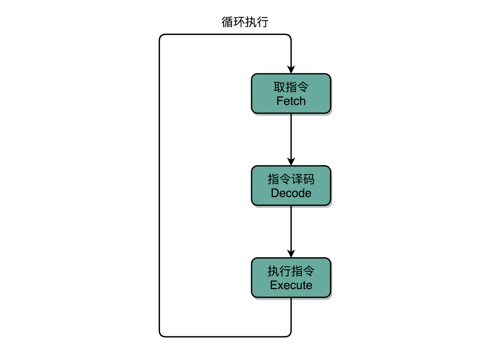

在这个循环过程中，不同部分其实是由计算机中的不同组件完成的:

- 在取指令的阶段，指令是放在**存储器**里的，实际上，通过 PC 寄存器和指令寄存器取出指令的过程，是由**控制器**(Control Unit)操作的。
- 指令的解码过程，也是由**控制器**进行的。
- 到了执行指令阶段，无论是进行算术操作、逻辑操作的 R 型指令，还是进行数据传输、条件分支的 I 型指令，都是由**算术逻辑单元**(ALU)操作的，也就是由运算器处理的。不过，如果是一个简单的无条件地址跳转，那么可以直接在控制器里面完成，不需要用到运算器。


除了 Instruction Cycle 这个指令周期，在 CPU 里面还会见到另外两个常见的 Cycle:

- **机器周期(Machine Cycle) 或 CPU 周期**。CPU 内部的操作速度很快，但是访问内存的速度却要慢很多。每一条指令都需要从内存里面加载而来，所以一般把从内存里面读取一条指令的最短时间，称为 CPU 周期。
- **时钟周期 (Clock Cycle) 以及 机器的主频**。一个 CPU 周期，通常会由几个时钟周期累积起来。一个 CPU 周期的时间，就是这几个 Clock Cycle 的总和。

对于一个指令周期来说，取出一条指令，然后执行它，至少需要两个 CPU 周期。取出指令至少需要一个 CPU 周期，执行至少也需要一个 CPU 周期，复杂的指令则需要更多的 CPU 周期。

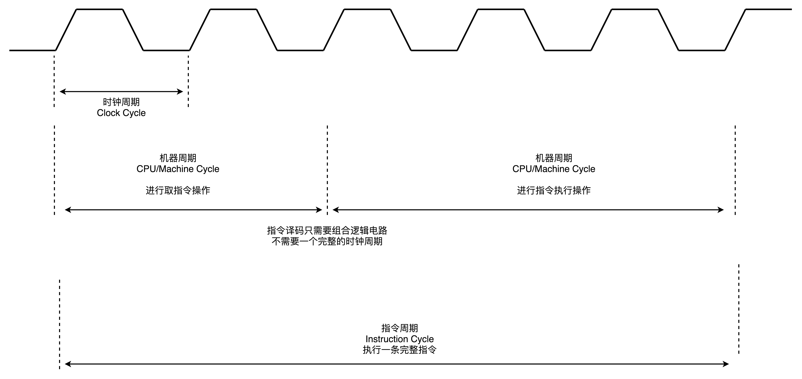

所以，一个指令周期，包含多个 CPU 周期，而一个 CPU 周期包含多个时钟周期。

#### 4.1.2 建立数据通路的组成

一般来说，可以认为，数据通路就是处理器单元。它通常由两类原件组成:

- 第一类叫**操作元件**，也叫组合逻辑元件(Combinational Element)，其实就是 ALU。它们的功能就是在特定的输入下，根据下面的组合电路的逻辑，生成特定的输出。
- 第二类叫**存储元件**，也有叫状态元件(State Element)的。比如在计算过程中需要用到的寄存器，无论是通用寄存器还是状态寄存器，其实都是存储元件。

通过数据总线的方式，把它们连接起来，就可以完成数据的存储、处理和传输了，这就是所谓的建立数据通路了。

下面来说**控制器**。它的逻辑就没那么复杂了。可以把它看成只是机械地重复 "Fetch - Decode - Execute" 循环中的前两个步骤，然后把最后一个步骤，通过控制器产生的控制信号，交给 ALU 去处理。看起来很简单，但实际上，控制器的电路特别复杂。

一方面，所有 CPU 支持的指令，都会在控制器里面，被解析成不同的输出信号。现在的 Intel CPU 支持 2000 个以上的指令。这意味着，控制器输出的控制信号，至少有 2000 种不同的组合。

运算器里的 ALU 和各种组合逻辑电路，可以认为是一个固定功能的电路。控制器"翻译"出来的，就是不同的控制信号。这些控制信号，告诉 ALU 去做不同的计算。可以说正是控制器的存在，让计算机可以"编程"来实现功能，让"存储程序型计算机"名副其实。

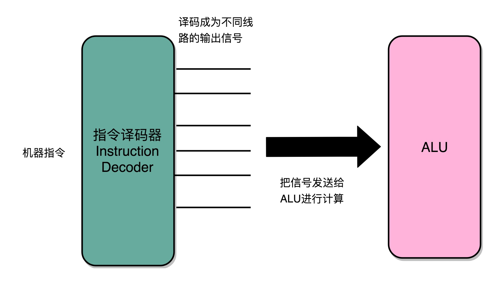
指令译码器将输入的机器码，解析成不同的操作码和操作数，然后传输给 ALU 进行计算

#### 4.1.3 CPU 所需要的硬件电路

要想搭建出来整个 CPU，需要在数字电路层面，实现下面的功能:

- 首先，是 **算术逻辑单元**(ALU) ，它实际就是一个没有状态的，根据输入计算输出结果的一个电路。

- 第二，需要有一个能够进行状态读写的电路元件，也就是**寄存器**。需要有一个电路，能够存储上一次的计算结果。这个计算结果并不一定要立刻拿到电路的下游去使用，但是可以在需要的时候拿出来用。常见的能够进行状态读写的电路，就有锁存器(Latch)，以及 D 触发器(Data/Delay Flip-flop)的电路。

- 第三，需要有一个"自动"的电路，按照固定的周期，不停地实现 PC 寄存器自增，自动地去执行 "Fetch - Decode - Execute" 的步骤。程序执行，是希望有一个"自动"的电路，不停地去一条条执行指令。
  看似各种复杂的高级程序进行各种函数调用、条件跳转。其实只是修改 PC 寄存器里面的地址。PC 寄存器里面的地址一修改，计算机就可以加载一条指令新指令，往下运行。实际上，PC 寄存器还有一个名字，就叫作程序计数器。顾名思义，就是随着时间变化，不断去数数。数的数字变大了，就去执行一条新指令。所以，需要的就是一个自动数数的电路。

- 第四，需要有一个"译码"的电路。无论是对于指令进行 decode，还是对于拿到的内存地址去获取对应的数据或者指令，都需要通过一个电路找到对应的数据。这个对应的自然就是"译码器"的电路。

把这四类电路，通过各种方式组合在一起，就能最终组成功能强大的 CPU 了。但是，要实现这四种电路中的中间两种，还需要时钟电路的配合。

#### 4.1.4 时钟信号的硬件实现

要能够实现一个完整的 CPU 功能，除了加法器这样的电路之外，还需要实现其他功能的电路。其中像算术逻辑单元这样的只需要给定输入，就能得到固定的输出的电路，被称为**组合逻辑电路**(Combinational Logic Circuit)。但是，光有组合逻辑电路是不够的。电路输入是确定的，对应的输出自然也就确定了。干不了太复杂的工作，只能协助完成一些计算工作。

这时，就需要引入第二类电路，也就是**时序逻辑电路**(Sequential Logic Circuit)。时序逻辑电路可以解决下面几个问题:

- **自动运行的问题** : 时序电路接通之后可以不停地开启和关闭开关，进入一个自动运行的状态。这个使控制器不停地让 PC 寄存器自增读取下一条指令成为可能。
- **存储的问题** : 通过时序电路实现的触发器，能把计算结果存储在特定的电路里面，而不是像组合逻辑电路那样，一旦输入有任何改变，对应的输出也会改变。
- **本质上解决了各个功能按照时序协调的问题** : 无论是程序实现的软件指令，还是到硬件层面，各种指令的操作都有先后的顺序要求。时序电路使得不同的事件按照时间顺序发生。

想要实现时序逻辑电路，第一步需要的就是一个[时钟](#232-计算机的计时单位-cpu-时钟)。CPU 的主频是由一个晶体振荡器来实现的，而这个晶体振荡器生成的电路信号，就是时钟信号。

实现这样一个电路，和通过电的磁效应产生开关信号的方法是一样的。只不过，这里的磁性开关，打开的不再是后续的线路，而是当前的线路。

在下面这张图里可以看到，在原先一般只放一个开关的信号输入端，放上了两个开关。一个开关 A，一开始是断开的，由手工控制；另外一个开关 B，一开始是合上的，磁性线圈对准一开始就合上的开关 B。

于是，一旦合上开关 A，磁性线圈就会通电，产生磁性，开关 B 就会从合上变成断开。一旦这个开关断开了，电路就中断了，磁性线圈就失去了磁性。于是，开关 B 又会弹回到合上的状态。这样一来，电路接通，线圈又有了磁性。电路就会来回不断地在开启、关闭这两个状态中切换。


这个不断切换的过程，对于下游电路来说，就是不断地产生新的 0 和 1 这样的信号。这个按照固定的周期不断在 0 和 1 之间切换的信号，就是**时钟信号**(Clock Signal)。

一般这样产生的时钟信号，是一个振荡产生的 0、1 信号。

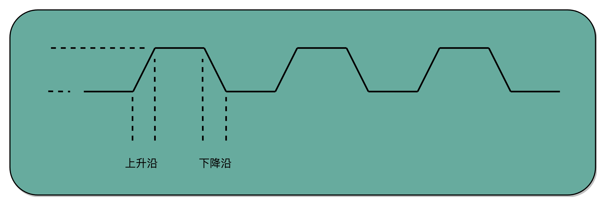

这种电路，其实就相当于把电路的输出信号作为输入信号，再回到当前电路。这样的电路构造方式，叫作**反馈电路**(Feedback Circuit)。
上面这个反馈电路一般可以用下面这个示意图来表示，其实就是一个输出结果接回输入的**反相器**(Inverter)，也就是**非门**。

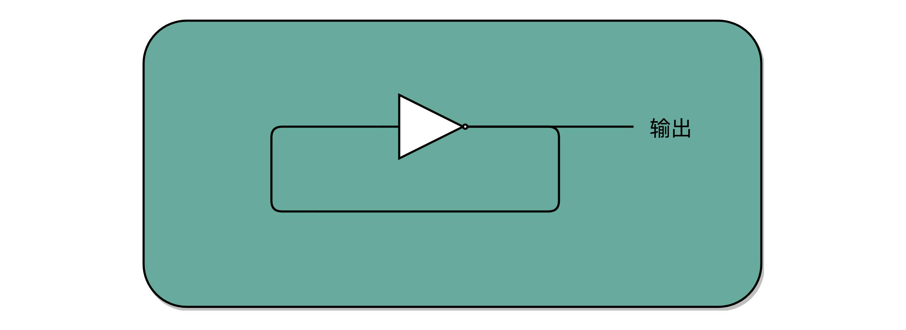

#### 4.1.5 通过 D 触发器实现存储功能

有了时钟信号，系统里就有了一个像"自动门"一样的开关。利用这个开关和相同的反馈电路，就可以构造出一个有"记忆"功能的电路。这个有记忆功能的电路，可以实现在 CPU 中用来存储计算结果的寄存器，也可以用来实现计算机五大组成部分之一的存储器。


先来看上面这个 RS 触发器电路。这个电路由两个或非门电路组成。在图里面，把它标成了 A 和 B。

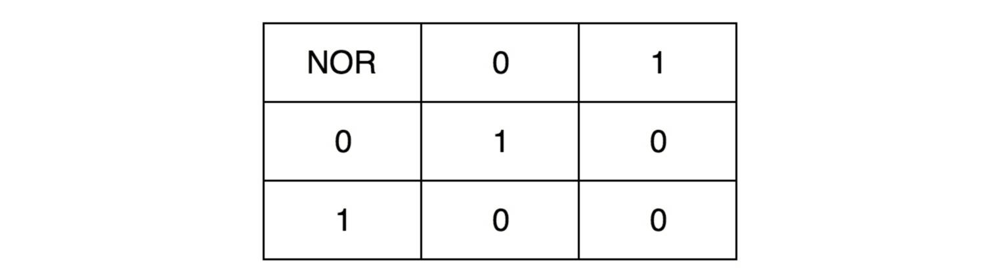

1. 在这个电路一开始，输入开关都是关闭的，所以或非门(NOR)A 的输入是 0 和 0。对应到上面的真值表，输出就是 1。而或非门 B 的输入是 0 和 A 的输出 1，对应输出就是 0。B 的输出 0 反馈到 A，和之前的输入没有变化，A 的输出仍然是 1。而整个电路的**输出 Q**，也就是 0。
2. 当把 A 前面的开关 R 合上的时候，A 的输入变成了 1 和 0，输出就变成了 0，对应 B 的输入变成 0 和 0，输出就变成了 1。B 的输出 1 反馈给到了 A，A 的输入变成了 1 和 1，输出仍然是 0。所以把 A 的开关合上之后，电路仍然是稳定的，不会像晶振那样振荡，但是整个电路的**输出 Q** 变成了 1。
3. 这个时候，如果再把 A 前面的开关 R 打开，A 的输入变成和 1 和 0，输出还是 0，对应的 B 的输入没有变化，输出也还是 1。B 的输出 1 反馈给到了 A，A 的输入变成了 1 和 0，输出仍然是 0。这个时候，电路仍然稳定。**开关 R 和 S 的状态和上面的第一步是一样的，但是最终的输出 Q 仍然是 1**，和第 1 步里 Q 状态是相反的。输入和刚才第二步的开关状态不一样，但是输出结果仍然保留在了第 2 步时的输出没有发生变化。
4. 这个时候，再去关闭下面的开关 S，可以看到，这个时候，B 有一个输入必然是 1，所以 B 的输出必然是 0，也就是电路的最终输出 Q 必然是 0。

这样一个电路，称之为**触发器**(Flip-Flop)。接通开关 R，输出变为 1，即使断开开关，输出还是 1 不变。接通开关 S，输出变为 0，即使断开开关，输出也还是 0。也就是，**当两个开关都断开的时候，最终的输出结果，取决于之前动作的输出结果，这个也就是记忆功能**。

这里的这个电路是最简单的 RS 触发器，也就是所谓的复位置位触发器 (Reset-Set Flip Flop) 。对应的输出结果的真值表，可以看下面这个表格。可以看到，当两个开关都是 0 的时候，对应的输出不是 1 或者 0，而是和 Q 的上一个状态一致。


再往这个电路里加两个与门和一个时钟信号，就可以实现一个利用时钟信号来操作一个电路了。这个电路可以帮助实现什么时候可以往 Q 里写入数据。

看下面这个电路，这个在上面的 R-S 触发器基础之上，在 R 和 S 开关之后，加入了两个与门，同时给这两个与门加入了一个 **时钟信号 CLK** 作为电路输入。

这样，当时钟信号 CLK 在低电平的时候，与门的输入里有一个 0，两个实际的 R 和 S 后的与门的输出必然是 0。也就是说，无论怎么按 R 和 S 的开关，根据 R-S 触发器的真值表，对应的 Q 的输出都不会发生变化。

只有当时钟信号 CLK 在高电平的时候，与门的一个输入是 1，输出结果完全取决于 R 和 S 的开关。可以在这个时候，通过开关 R 和 S，来决定对应 Q 的输出。


如果这个时候，让 R 和 S 的开关，也用一个反相器连起来，也就是通过同一个开关控制 R 和 S。只要 CLK 信号是 1，R 和 S 就可以设置输出 Q。而当 CLK 信号是 0 的时候，无论 R 和 S 怎么设置，输出信号 Q 是不变的。这样，这个电路就成了最常用的 D 型触发器。用来控制 R 和 S 这两个开关的信号，视作一个输入的数据信号 D，也就是 Data，这就是 D 型触发器的由来。


把 R 和 S 两个信号通过一个反相器合并，可以通过一个数据信号 D 进行 Q 的写入操作

一个 D 型触发器，只能控制 1 个比特的读写，但是如果同时拿出多个 D 型触发器并列在一起，并且把用同一个 CLK 信号控制作为所有 D 型触发器的开关，这就变成了一个 N 位的 D 型触发器，也就可以同时控制 N 位的读写。

CPU 里面的寄存器可以直接通过 D 型触发器来构造。可以在 D 型触发器的基础上，加上更多的开关，来实现清 0 或者全部置为 1 这样的快捷操作。

> 电路的输出信号不单单取决于当前的输入信号，还要取决于输出信号之前的状态。最常见的这个电路就是 D 触发器，它也是实际在 CPU 内实现存储功能的寄存器的实现方式。
> 这也是现代计算机体系结构中的"冯·诺伊曼"机的一个关键，就是程序需要可以"存储"，而不是靠固定的线路连接或者手工拨动开关，来实现计算机的可存储和可编程的功能。

#### 4.1.6 PC 寄存器所需要的计数器

有了时钟信号，可以提供定时的输入；有了 D 型触发器，可以在时钟信号控制的时间点写入数据。把这两个功能组合起来，就可以实现一个自动的计数器了。

加法器的两个输入，一个始终设置成 1，另外一个来自于一个 D 型触发器 A。把加法器的输出结果，写到这个 D 型触发器 A 里面。于是，D 型触发器里面的数据就会在固定的时钟信号为 1 的时候更新一次。


这样，就有了一个每过一个时钟周期，就能固定自增 1 的自动计数器了。这个自动计数器，可以拿来当 PC 寄存器。事实上，PC 寄存器的这个 PC，英文就是 Program Counter，也就是**程序计数器**的意思。

每次自增之后，可以去对应的 D 型触发器里面取值，这也是下一条需要运行指令的地址。[程序装载](#35-程序装载)中，同一个程序的指令应该要顺序地存放在内存里面。这里就和前面对应上了，顺序地存放指令，就是为了通过程序计数器就能定时地不断执行新指令。

加法计数、内存取值，乃至后面的命令执行，最终其实都是由时钟信号，来控制执行时间点和先后顺序的，这也是需要时序电路最核心的原因。

在最简单的情况下，需要让每一条指令，从程序计数，到获取指令、执行指令，都在一个时钟周期内完成。如果 PC 寄存器自增地太快，程序就会出错。因为前一次的运算结果还没有写回到对应的寄存器里面的时候，后面一条指令已经开始读取里面的数据来做下一次计算了。这个时候，如果指令使用同样的寄存器，前一条指令的计算就会没有效果，计算结果就错了。

在这种设计下，需要在一个时钟周期里，确保执行完一条最复杂的 CPU 指令，也就是耗时最长的一条 CPU 指令。这样的 CPU 设计，称之为**单指令周期处理器**(Single Cycle Processor)。

> 很显然，这样的设计有点儿浪费。因为即便只调用一条非常简单的指令，也需要等待整个时钟周期的时间走完，才能执行下一条指令。可以通过流水线技术进行性能优化，可以减少需要等待的时间。

#### 4.1.7 读写数据所需要的译码器

现在，数据能够存储在 D 型触发器里。如果把很多个 D 型触发器放在一起，就可以形成一块很大的存储空间。那怎么才能知道，写入和读取的数据，是内存的哪几个比特呢？于是，就需要有一个电路，来完成"寻址"的工作。这个"寻址"电路，就是译码器。

现在实际使用的计算机里，内存所使用的 DRAM，并不是通过上面的 D 型触发器来实现的，而是使用了一种 CMOS 芯片来实现的。不过，这并不影响从基础原理方面来理解译码器。在这里，还是可以把内存芯片，当成是很多个连在一起的 D 型触发器来实现的。

如果把"寻址"这件事情简化到最简单的情况，就是在两个地址中，去选择一个地址。这样的电路，叫作 **2-1 选择器**。

通过一个反相器、两个与门和一个或门，就可以实现一个 2-1 选择器。通过控制反相器的输入是 0 还是 1，能够决定对应的输出信号，是和地址 A，还是地址 B 的输入信号一致。


一个反向器只能有 0 和 1 这样两个状态，所以只能从两个地址中选择一个。如果输入的信号有三个不同的开关，就能从 2^3^，也就是 8 个地址中选择一个。这样的电路，就叫 **3-8 译码器**。现代的计算机，如果 CPU 是 64 位的，就意味着寻址空间也是 2^64^，那么就需要一个有 64 个开关的译码器。


所以说，其实译码器的本质，就是从输入的多个位的信号中，根据一定的开关和电路组合，选择出自己想要的信号。除了能够进行"寻址"之外，还可以把对应的需要运行的指令码，同样通过译码器，找出期望执行的指令，也就是 opcode，以及后面对应的操作数或者寄存器地址。只是，这样的"译码器"，比起 2-1 选择器和 3-8 译码器，要复杂的多。

#### 4.1.8 建立数据通路，构造一个最简单的 CPU

D 触发器、自动计数以及译码器，再加上 ALU，就凑齐了一个拼装一个 CPU 必须要的零件了。下面，就是把这些零件组合起来，成为实现指令执行和算术逻辑计算的 CPU。


1. 首先，有一个自动计数器。这个自动计数器会随着时钟主频不断地自增，来作为 PC 寄存器。

2. 在这个自动计数器的后面，连上一个地址译码器。译码器还要同时连着通过大量的 D 触发器组成的内存。

3. 自动计数器会随着时钟主频不断自增，从译码器当中，找到对应的计数器所表示的内存地址，然后读取出里面的 CPU 指令。

4. 读取出来的 CPU 指令会通过 CPU 时钟的控制，写入到一个由 D 触发器组成的寄存器，也就是指令寄存器当中。

5. 在指令寄存器后面，可以再跟一个指令译码器。这个译码器不再是用来寻址的了，而是把拿到的指令，解析成 opcode 和 对应的操作数。

6. 当拿到对应的 opcode 和 操作数，对应的输出线路就要连接 ALU，开始进行各种算术和逻辑运算。对应的计算结果，则会再写回到 D 触发器组成的寄存器或者内存当中。

这样的一个完整的通路，也就完成了 CPU 的一条指令的执行过程。在这个过程中，会发现几个有意思的问题。

- 之前[程序跳转](#323-从-ifelse-来看程序的执行和跳转)中所使用的条件码寄存器。在计算机的指令执行的时候，高级语言中的 if…else，其实是变成了一条 cmp 指令和一条 jmp 指令。cmp 指令是在进行对应的比较，比较的结果会更新到条件码寄存器当中。jmp 指令则是根据条件码寄存器当中的标志位，来决定是否进行跳转以及跳转到什么地址。
  这样分成两个指令实现，完全匹配了在电路层面 "译码 - 执行 - 更新寄存器" 这样的步骤。
  cmp 指令的执行结果放到了条件码寄存器里面，条件跳转指令也是在 ALU 层面执行的，而不是在控制器里面执行的。这样的实现方式在电路层面非常直观，不需要一个非常复杂的电路，就能实现 if…else 的功能。

- [指令周期、CPU 周期和时钟周期的差异](#411-指令周期instruction-cycle)。在上面的抽象的逻辑模型中，很容易发现，执行一条指令，其实可以不放在一个时钟周期里面，可以直接拆分到多个时钟周期。
  可以在一个时钟周期里面，去自增 PC 寄存器的值，也就是指令对应的内存地址。然后，根据这个地址从 D 触发器里面读取指令，这个还是可以在刚才那个时钟周期内。但是对应的指令写入到指令寄存器，可以放在一个新的时钟周期里面。指令译码给到 ALU 之后的计算结果，要写回到寄存器，又可以放到另一个新的时钟周期。所以，执行一条计算机指令，其实可以拆分到很多个时钟周期，而不是必须使用单指令周期处理器的设计。
  因为从内存里面读取指令时间很长，所以如果使用单指令周期处理器，就意味着指令都要去等待一些慢速的操作。这些不同指令执行速度的差异，也正是计算机指令有指令周期、CPU 周期和时钟周期之分的原因。因此，现代优化 CPU 的性能时，用的 CPU 都不是单指令周期处理器，而是通过流水线、分支预测等技术，来实现在一个周期里同时执行多个指令。

### 4.2 面向流水线的指令设计

#### 4.2.1 单指令周期处理器

一条 CPU 指令的执行，是由 "取得指令(Fetch)- 指令译码(Decode)- 执行指令(Execute)" 这样三个步骤组成的。这个执行过程，至少需要花费一个时钟周期。因为在取指令的时候，需要通过时钟周期的信号，来决定计数器的自增。

于是就，希望能确保让这样一整条指令的执行，在一个时钟周期内完成。这样，一个时钟周期可以执行一条指令，CPI 也就是 1，看起来就比执行一条指令需要多个时钟周期性能要好。采用这种设计思路的处理器，就叫作**单指令周期处理器**(Single Cycle Processor)，也就是在一个时钟周期内，处理器正好能处理一条指令。

不过，时钟周期是固定的，但是指令的电路复杂程度是不同的，所以实际一条指令执行的时间是不同的。在[加法器](#39-加法器)和[乘法器](#310-乘法器)的电路中，随着门电路层数的增加，由于门延迟的存在，位数多、计算复杂的指令需要的执行时间会更长。

不同指令的执行时间不同，但是需要让所有指令都在一个时钟周期内完成，那就只好把时钟周期和执行时间最长的那个指令设成一样。

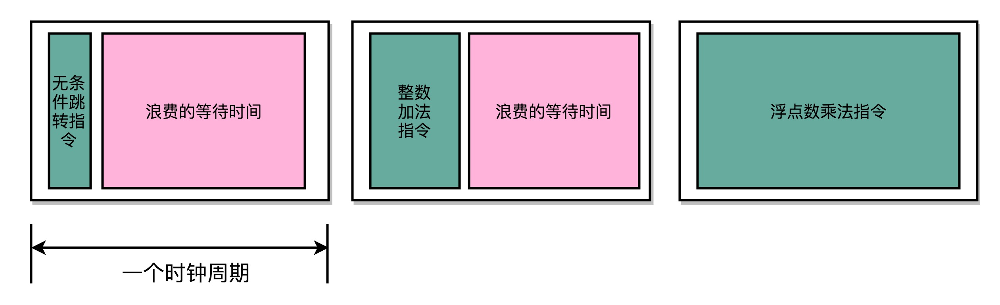

所以，在单指令周期处理器里面，无论是执行一条用不到 ALU 的无条件跳转指令，还是一条计算起来电路特别复杂的浮点数乘法运算，都等要等满一个时钟周期。在这个情况下，虽然 CPI 能够保持在 1，但是时钟频率却没法太高。因为太高的话，有些复杂指令没有办法在一个时钟周期内运行完成。那么在下一个时钟周期到来，开始执行下一条指令的时候，前一条指令的执行结果可能还没有写入到寄存器里面。那下一条指令读取的数据就是不准确的，就会出现错误。

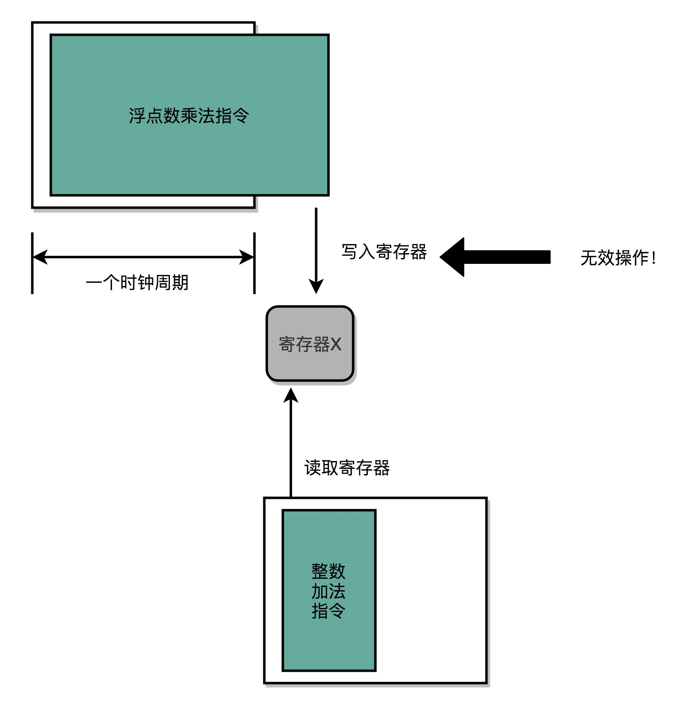

因为单指令周期处理器的局限，所以，无论是 PC 上使用的 Intel CPU，还是手机上使用的 ARM CPU，都不是单指令周期处理器，而是采用了一种叫作**指令流水线**(Instruction Pipeline)的技术。

#### 4.2.2 现代处理器的指令流水线

指令执行过程，可以拆分成 "取指令、译码、执行" 这三大步骤。更细分一点的话，执行的过程，其实还包含从寄存器或者内存中读取数据，通过 ALU 进行运算，把结果写回到寄存器或者内存中。

CPU 的指令执行过程，是由各个电路模块组成的。在取指令的时候，需要一个译码器把数据从内存里面取出来，写入到寄存器中；在指令译码的时候，需要另外一个译码器，把指令解析成对应的控制信号、内存地址和数据；到了指令执行的时候，需要的则是一个完成计算工作的 ALU。这些都是一个一个独立的组合逻辑电路，然后共同协作完成的任务。


这样一来，就不用把时钟周期设置成整条指令执行的时间，而是拆分成完成这样的一个一个小步骤需要的时间。同时，每一个阶段的电路在完成对应的任务之后，也不需要等待整个指令执行完成，而是可以直接执行下一条指令的对应阶段。这样的协作模式，就是**指令流水线**。这里面每一个独立的步骤，就称之为**流水线阶段**或者流水线级(Pipeline Stage)。

如果把一个指令拆分成 "取指令 - 指令译码 - 执行指令" 这样三个部分，那这就是一个三级的流水线。如果进一步把"执行指令"拆分成"ALU 计算(指令执行)- 内存访问 - 数据写回"，那么它就会变成一个五级的流水线。

五级的流水线，就表示在同一个时钟周期里面，同时运行五条指令的不同阶段。这个时候，虽然执行一条指令的时钟周期变成了 5，但是可以把 CPU 的主频提得更高了。**不需要确保最复杂的那条指令在时钟周期里面执行完成，而只要保障一个最复杂的流水线级的操作，在一个时钟周期内完成就好了**。

如果某一个操作步骤的时间太长，就可以考虑把这个步骤，拆分成更多的步骤，让所有步骤需要执行的时间尽量都差不多长。这样，也就可以解决在单指令周期处理器中遇到的，性能瓶颈来自于最复杂的指令的问题。像现代的 ARM 或者 Intel 的 CPU，流水线级数都已经到了 14 级。

虽然不能通过流水线，来减少单条指令执行的"延时"这个性能指标，但是，通过同时执行多条指令的不同阶段，提升了 CPU 的"**吞吐率**"。因为不同的指令，实际执行需要的时间是不同的。在外部看来，CPU 好像是"一心多用"，在同一时间，同时执行 5 条不同指令的不同阶段。在 CPU 内部，其实它就像生产线一样，不同分工的组件不断处理上游传递下来的内容，而不需要等待单件商品生产完成之后，再启动下一件商品的生产过程。

看下面这个例子，顺序执行三条指令:

1. 一条整数的加法，需要 200ps。
2. 一条整数的乘法，需要 300ps。
3. 一条浮点数的乘法，需要 600ps。

如果是在单指令周期的 CPU 上运行，最复杂的指令是一条浮点数乘法，那就需要 600ps。那这三条指令，都需要 600ps。三条指令的执行时间，就需要 1800ps。

如果采用的是 6 级流水线 CPU，每一个 Pipeline 的 Stage 都只需要 100ps。那么，在这三个指令的执行过程中，在指令 1 的第一个 100ps 的 Stage 结束之后，第二条指令就开始执行了。在第二条指令的第一个 100ps 的 Stage 结束之后，第三条指令就开始执行了。这种情况下，这三条指令顺序执行所需要的总时间，就是 800ps。那么在 1800ps 内，使用流水线的 CPU 比单指令周期的 CPU 就可以多执行一倍以上的指令数。

虽然每一条指令从开始到结束拿到结果的时间并没有变化，也就是响应时间没有变化。但是同样时间内，完成的指令数增多了，也就是吞吐率上升了。

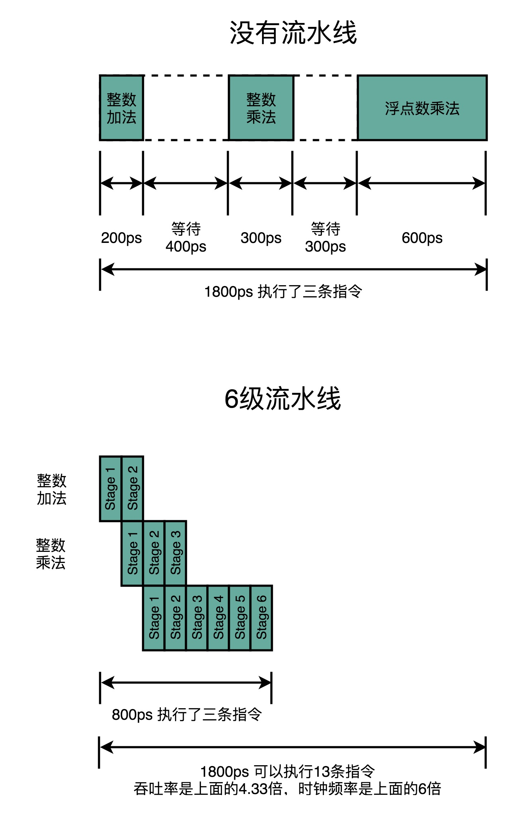

#### 4.2.3 超长流水线的性能瓶颈

既然流水线可以增加吞吐率，为什么不把流水线级数做得更深呢？

1. **最基本的原因，就是增加流水线深度，是有性能成本的**

   用来同步时钟周期的，不再是指令级别的，而是流水线阶段级别的。每一级流水线对应的输出，都要放到流水线寄存器(Pipeline Register)里面，然后在下一个时钟周期，交给下一个流水线级去处理。所以，每增加一级的流水线，就要多一级写入到流水线寄存器的操作。虽然流水线寄存器非常快，比如只有 20 皮秒(ps，10^-12^ 秒)。

   

   但是，如果不断加深流水线，这些操作占整个指令的执行时间的比例就会不断增加。最后，我性能瓶颈就会出现在这些 overhead 上。如果指令的执行有 3 纳秒，也就是 3000 皮秒。需要 20 级的流水线，那流水线寄存器的写入就需要花费 400 皮秒，占了超过 10%。如果需要 50 级流水线，就要多花费 1 纳秒在流水线寄存器上，占到 25%。这也就意味着，**单纯地增加流水线级数，不仅不能提升性能，反而会有更多的 overhead**。所以，设计合理的流水线级数也是现代 CPU 中非常重要的一点。

2. [功耗](#234-功耗)问题

   提升流水线深度，必须要和提升 CPU 主频同时进行。因为在单个 Pipeline Stage 能够执行的功能变简单了，也就意味着单个时钟周期内能够完成的事情变少了。所以，只有提升时钟周期，CPU 在指令的响应时间这个指标上才能保持和原来相同的性能。
   同时，由于流水线深度的增加，需要的电路数量变多了，也就是使用的晶体管变多了。主频的提升和晶体管数量的增加都使得 CPU 的功耗变大了。

3. 流水线技术带来的性能提升，是一个理想情况。在实际的程序执行中，并不一定能够做得到。看下面三条指令：

   ```c
   int a = 10 + 5; // 指令1
   int b = a * 2; // 指令2
   float c = b * 1.0f; // 指令3
   ```

   指令 2，不能在指令 1 的第一个 Stage 执行完成之后进行。因为指令 2，依赖指令 1 的计算结果。同样的，指令 3 也要依赖指令 2 的计算结果。这样，即使采用了流水线技术，这三条指令执行完成的时间，也是 200 + 300 + 600 = 1100 ps，而不是 800ps。而如果指令 1 和 2 都是浮点数运算，需要 600ps。那这个依赖关系会导致需要的时间变成 1800ps，和单指令周期 CPU 所要花费的时间是一样的。

   这个依赖问题，就是计算机组成里面的**冒险**(Hazard)问题。这里只列举了在数据层面的依赖，也就是数据冒险。在实际应用中，还会有**结构冒险**、**控制冒险**等其他的依赖问题。对应这些冒险问题，也有**乱序执行**、**分支预测**等相应的解决方案。

   但是，流水线越长，这个冒险的问题就越难以解决。这是因为，同一时间同时在运行的指令太多了。如果只有 3 级流水线，可以把后面没有依赖关系的指令放到前面来执行。这个就是乱序执行的技术。比方说，扩展一下上面的 3 行代码，再加上几行代码。

   ```c
   int a = 10 + 5; // 指令1
   int b = a * 2; // 指令2
   float c = b * 1.0f; // 指令3
   int x = 10 + 5; // 指令4
   int y = a * 2; // 指令5
   float z = b * 1.0f; // 指令6
   int o = 10 + 5; // 指令7
   int p = a * 2; // 指令8
   float q = b * 1.0f; // 指令9
   ```

   可以不先执行 1、2、3 这三条指令，而是在流水线里，先执行 1、4、7 三条指令。这三条指令之间是没有依赖关系的。然后再执行 2、5、8 以及 3、6、9。这样，又能够充分利用 CPU 的计算能力了。
   但是，如果有 20 级流水线，意味着要确保这 20 条指令之间没有依赖关系。这个挑战一下子就变大了很多。毕竟平时撰写程序，通常前后的代码都是有一定的依赖关系的，几十条没有依赖关系的指令可不好找。这也是为什么，超长流水线的执行效率反而降低了的一个重要原因。

#### 4.4.4 小结

流水线技术和其他技术一样，都讲究一个"折衷"(Trade-Off)。一个合理的流水线深度，会提升 CPU 执行计算机指令的吞吐率。**一般用 IPC(Instruction Per Cycle)来衡量 CPU 执行指令的效率**。

IPC 其实就是之前在[性能提升思路](#233-性能提升思路)里的 CPI(Cycle Per Instruction)的倒数。也就是说， IPC = 3 对应着 CPI = 0.33。

过深的流水线，不仅不能提升计算机指令的吞吐率，还会加大计算的功耗和散热问题。而流水线带来的吞吐率提升，只是一个理想情况下的理论值。在实践的应用过程中，还需要解决指令之间的依赖问题。这个使得流水线，特别是超长的流水线的执行效率变得很低。要想解决好**冒险**的依赖关系问题，需要引入乱序执行、分支预测等技术。

### 4.5 冒险跟预测

任何一本讲解 CPU 的流水线设计的教科书，都会提到流水线设计需要解决的三大冒险，分别是**结构冒险**(Structural Hazard)、**数据冒险**(Data Hazard)以及**控制冒险**(Control Hazard)。

#### 4.5.1 结构冒险

结构冒险，本质上是一个硬件层面的资源竞争问题，也就是一个硬件电路层面的问题。

CPU 在同一个时钟周期，同时在运行两条计算机指令的不同阶段。但是这两个不同的阶段，可能会用到同样的硬件电路。

最典型的例子就是内存的数据访问。在下面这张示意图中，可以看到，在第 1 条指令执行到访存(MEM)阶段的时候，流水线里的第 4 条指令，在执行取指令(Fetch)的操作。访存和取指令，都要进行内存数据的读取。内存只有一个地址译码器的作为地址输入，那就只能在一个时钟周期里面读取一条数据，没办法同时执行第 1 条指令的读取内存数据和第 4 条指令的读取指令代码。


类似的资源冲突，最常见的就是薄膜键盘的"锁键"问题。常用的薄膜键盘，并不是每一个按键的背后都有一根独立的线路，而是多个键共用一个线路。如果在同一时间，按下两个共用一个线路的按键，这两个按键的信号就没办法都传输出去。这也是为什么，重度键盘用户，都要买贵一点儿的机械键盘或者电容键盘。因为这些键盘的每个按键都有独立的传输线路，可以做到"全键无冲"。

"全键无冲"这样的资源冲突解决方案，其实本质就是**增加资源**。同样的方案，一样可以用在 CPU 的结构冒险里面。对于访问内存数据和取指令的冲突，一个直观的解决方案就是把内存分成两部分，让它们各有各的地址译码器。这两部分分别是**存放指令的程序内存**和**存放数据的数据内存**。

这样把内存拆成两部分的解决方案，在计算机体系结构里叫作哈佛架构(Harvard Architecture)，来自哈佛大学设计 Mark I 型计算机时候的设计。对应的，冯·诺依曼体系结构，又叫作普林斯顿架构(Princeton Architecture)。从这些名字里，可以看到，早年的计算机体系结构的设计，其实产生于美国各个高校之间的竞争中。

不过，今天使用的 CPU，仍然是冯·诺依曼体系结构的，并没有把内存拆成程序内存和数据内存这两部分。因为如果那样拆的话，对程序指令和数据需要的内存空间，就没有办法根据实际的应用去动态分配了。虽然解决了资源冲突的问题，但是也失去了灵活性。


不过，借鉴了哈佛结构的思路，现代的 CPU 虽然没有在内存层面进行对应的拆分，却在 CPU 内部的高速缓存部分进行了区分，把高速缓存分成了**指令缓存**(Instruction Cache)和**数据缓存**(Data Cache)两部分。

内存的访问速度远比 CPU 的速度要慢，所以现代的 CPU 并不会直接读取主内存。它会从主内存把指令和数据加载到高速缓存中，这样后续的访问都是访问高速缓存。而指令缓存和数据缓存的拆分，使得 CPU 在进行数据访问和取指令的时候，不会再发生资源冲突的问题了。

#### 4.5.2 数据冒险：三种不同的依赖关系

结构冒险是一个硬件层面的问题，可以靠增加硬件资源的方式来解决。然而还有很多冒险问题，是程序逻辑层面的事。其中，最常见的就是数据冒险。

数据冒险，其实就是同时在执行的多个指令之间，有数据依赖的情况。这些数据依赖，可以分成三大类，分别是:

- **先写后读**(Read After Write，RAW)
- **先读后写**(Write After Read，WAR)
- **写后再写**(Write After Write，WAW)

##### 4.5.2.1 先写后读

下面是一段 C 语言代码编译出来的汇编指令。这段代码简单地定义两个变量 a 和 b，然后计算 a = a + 2。再根据计算出来的结果，计算 b = a + 3。

```c
int main() {
  int a = 1;
  int b = 2;
  a = a + 2;
  b = a + 3;
}
```

```shell
int main() {
   0:   55                      push   rbp
   1:   48 89 e5                mov    rbp,rsp
  int a = 1;
   4:   c7 45 fc 01 00 00 00    mov    DWORD PTR [rbp-0x4],0x1
  int b = 2;
   b:   c7 45 f8 02 00 00 00    mov    DWORD PTR [rbp-0x8],0x2
  a = a + 2;
  12:   83 45 fc 02             add    DWORD PTR [rbp-0x4],0x2
  b = a + 3;
  16:   8b 45 fc                mov    eax,DWORD PTR [rbp-0x4]
  19:   83 c0 03                add    eax,0x3
  1c:   89 45 f8                mov    DWORD PTR [rbp-0x8],eax
}
  1f:   5d                      pop    rbp
  20:   c3                      ret
```

可以看到，在内存地址为 12 的机器码，把 0x2 添加到 rbp-0x4 对应的内存地址里面。然后，在紧接着的内存地址为 16 的机器码，又要从 rbp-0x4 这个内存地址里面，把数据写入到 eax 这个寄存器里面。

所以，需要保证，在内存地址为 16 的指令读取 rbp-0x4 里面的值之前，内存地址 12 的指令写入到 rbp-0x4 的操作必须完成。这就是先写后读所面临的数据依赖。如果这个顺序保证不了，程序就会出错。

这个先写后读的依赖关系，一般被称之为**数据依赖**，也就是 Data Dependency。

##### 4.5.2.2 先读后写

实际中还会面临的另外一种情况，先读后写。修改代码，先计算 a = b + a，然后再计算 b = a + b。

```c
int main() {
  int a = 1;
  int b = 2;
  a = b + a;
  b = a + b;
}
```

```shell
int main() {
   0:   55                      push   rbp
   1:   48 89 e5                mov    rbp,rsp
   int a = 1;
   4:   c7 45 fc 01 00 00 00    mov    DWORD PTR [rbp-0x4],0x1
   int b = 2;
   b:   c7 45 f8 02 00 00 00    mov    DWORD PTR [rbp-0x8],0x2
   a = b + a;
  12:   8b 45 f8                mov    eax,DWORD PTR [rbp-0x8]
  15:   01 45 fc                add    DWORD PTR [rbp-0x4],eax
   b = a + b;
  18:   8b 45 fc                mov    eax,DWORD PTR [rbp-0x4]
  1b:   01 45 f8                add    DWORD PTR [rbp-0x8],eax
}
  1e:   5d                      pop    rbp
  1f:   c3                      ret
```

对应生成的汇编代码。在内存地址为 15 的汇编指令里，把 eax 寄存器里面的值读出来，再加到 rbp-0x4 的内存地址里。接着在内存地址为 18 的汇编指令里，再写入更新 eax 寄存器里面。

如果在内存地址 18 的 eax 的写入先完成了，在内存地址为 15 的代码里面取出 eax 才发生，程序计算就会出错。这里，同样要保障对于 eax 的先读后写的操作顺序。

这个先读后写的依赖，一般被叫作**反依赖**，也就是 Anti-Dependency。

##### 4.5.2.3 写后再写

改写代码，先设置变量 a = 1，然后再设置变量 a = 2。

```c
int main() {
  int a = 1;
  a = 2;
}
```

```shell
int main() {
   0:   55                      push   rbp
   1:   48 89 e5                mov    rbp,rsp
  int a = 1;
   4:   c7 45 fc 01 00 00 00    mov    DWORD PTR [rbp-0x4],0x1
  a = 2;
   b:   c7 45 fc 02 00 00 00    mov    DWORD PTR [rbp-0x4],0x2
}
```

在这个情况下，会看到，内存地址 4 所在的指令和内存地址 b 所在的指令，都是将对应的数据写入到 rbp-0x4 的内存地址里面。如果内存地址 b 的指令在内存地址 4 的指令之后写入。那么指令完成之后，rbp-0x4 里的数据就是错误的。这就会导致后续需要使用这个内存地址里的数据指令，没有办法拿到正确的值。所以，也需要保障内存地址 4 的指令的写入，在内存地址 b 的指令的写入之前完成。

这个写后再写的依赖，一般被叫作**输出依赖**，也就是 Output Dependency。

##### 4.5.2.4 通过流水线停顿解决数据冒险

除了读之后再进行读，会发现，对于同一个寄存器或者内存地址的操作，都有明确强制的顺序要求。而这个顺序操作的要求，也为使用流水线带来了很大的挑战。因为流水线架构的核心，就是在前一个指令还没有结束的时候，后面的指令就要开始执行。

所以，需要有解决这些数据冒险的办法。其中最简单的一个办法，也是最笨的一个办法，就是[流水线停顿](https://en.wikipedia.org/wiki/Pipeline_stall)(Pipeline Stall)，或者叫流水线冒泡(Pipeline Bubbling)。

流水线停顿的办法很容易理解。如果发现了后面执行的指令，会对前面执行的指令有数据层面的依赖关系，那最简单的办法就是"再等等"。在进行指令译码的时候，会拿到对应指令所需要访问的寄存器和内存地址。所以，在这个时候，能够判断出来，这个指令是否会触发数据冒险。如果会触发数据冒险，就可以决定，让整个流水线停顿一个或者多个周期。

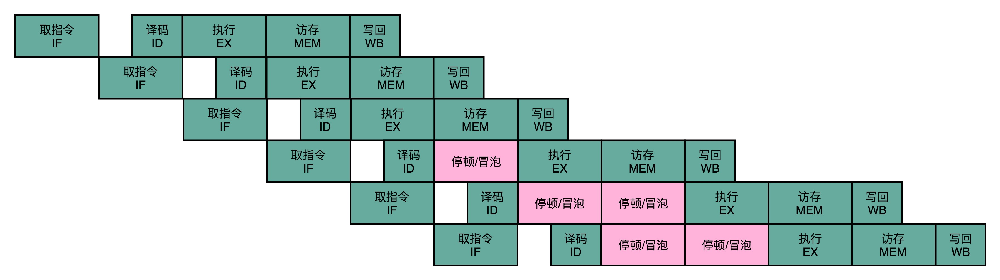

时钟信号会不停地在 0 和 1 之前自动切换，并没有办法真的停顿下来。流水线的每一个操作步骤必须要干点儿事情。所以，在实践过程中，并不是让流水线停下来，而是在执行后面的操作步骤前面，插入一个 NOP 操作，也就是执行一个其实什么都不干的操作。


这个插入的指令，就好像一个水管(Pipeline)里面，进了一个空的气泡。在水流经过的时候，没有传送水到下一个步骤，而是给了一个什么都没有的空气泡。这也是为什么，流水线停顿，又被叫作流水线冒泡(Pipeline Bubble)的原因。

##### 4.5.2.5 操作数前推

针对流水线冒险的问题，在计算机组成原理中，还有一个更加精巧的解决方案，**操作数前推**。

###### 4.5.2.5.1 NOP 操作和指令对齐

要想理解操作数前推技术，需要 [MIPS 体系结构](#315-汇编器把对应的汇编代码翻译成为机器码)下的 R、I、J 三类指令，以及[五级流水线](#422-现代处理器的指令流水线) "取指令(IF)- 指令译码(ID)- 指令执行(EX)- 内存访问(MEM)- 数据写回(WB)"。


在 MIPS 的体系结构下，不同类型的指令，会在流水线的不同阶段进行不同的操作。

以 MIPS 的 LOAD，这样从内存里读取数据到寄存器的指令为例，它需要经历的 5 个完整的流水线。STORE 这样从寄存器往内存里写数据的指令，不需要有写回寄存器的操作，也就是没有数据写回的流水线阶段。至于像 ADD 和 SUB 这样的加减法指令，所有操作都在寄存器完成，所以没有实际的内存访问(MEM)操作。

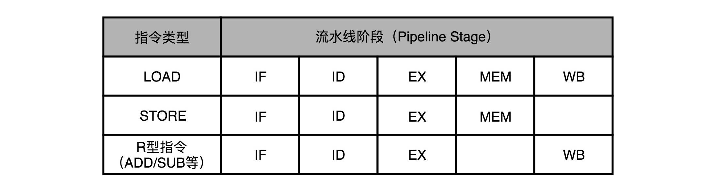

有些指令没有对应的流水线阶段，但是并不能跳过对应的阶段直接执行下一阶段。不然，如果先后执行一条 LOAD 指令和一条 ADD 指令，就会发生 LOAD 指令的 WB 阶段和 ADD 指令的 WB 阶段，在同一个时钟周期发生。这样，相当于触发了一个结构冒险事件，产生了资源竞争。

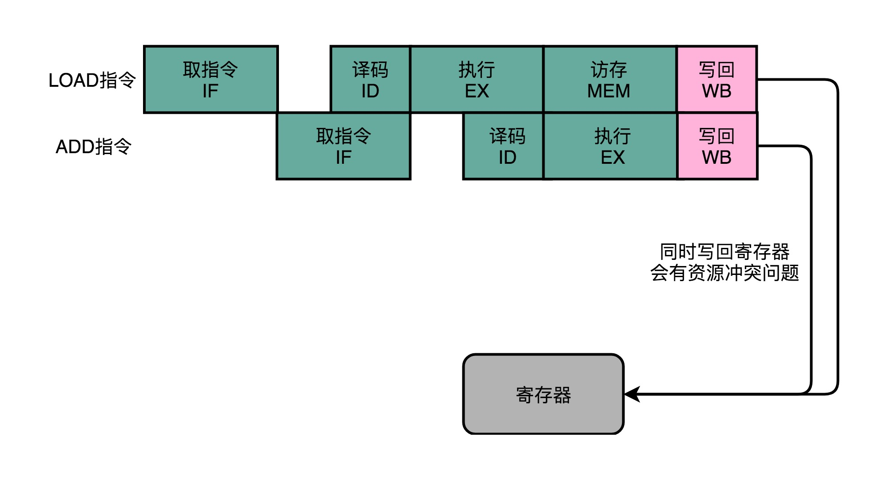

所以，在实践当中，各个指令不需要的阶段，并不会直接跳过，而是会运行一次 NOP 操作。通过插入一个 NOP 操作，可以使后一条指令的每一个 Stage，一定不和前一条指令的同 Stage 在一个时钟周期执行。这样，就不会发生先后两个指令，在同一时钟周期竞争相同的资源，产生结构冒险了。

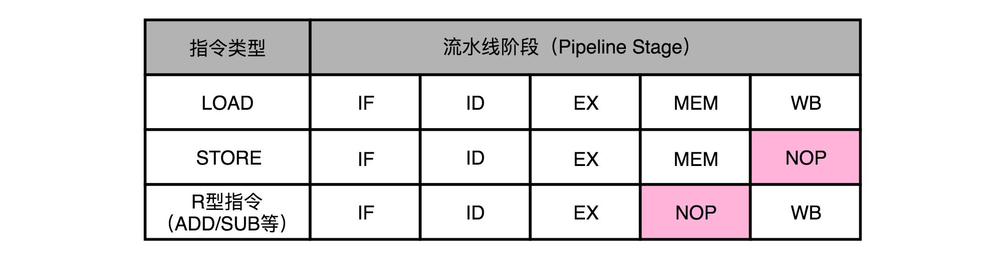

###### 4.5.2.5.2 操作数前推

通过 NOP 操作进行对齐，在流水线里，就不会遇到资源竞争产生的结构冒险问题了。除了可以解决结构冒险之外，这个 NOP 操作，也是之前讲的流水线停顿插入的对应操作。但是，插入过多的 NOP 操作，意味着 CPU 总是在空转。

下面以两条先后发生的 ADD 指令作为例子，看解决方案。

```shell
add $t0, $s2,$s1
add $s2, $s1,$t0
```

这两条指令很简单。

- 第一条指令，把 s1 和 s2 寄存器里面的数据相加，存入到 t0 这个寄存器里面。
- 第二条指令，把 s1 和 t0 寄存器里面的数据相加，存入到 s2 这个寄存器里面。

因为后一条的 add 指令，依赖寄存器 t0 里的值。而 t0 里面的值，又来自于前一条指令的计算结果。所以后一条指令，需要等待前一条指令的数据写回阶段完成之后，才能执行。遇到了一个数据依赖类型的冒险。于是，就不得不通过流水线停顿来解决这个冒险问题。要在第二条指令的译码阶段之后，插入对应的 NOP 指令，直到前一天指令的数据写回完成之后，才能继续执行。

这样的方案，虽然解决了数据冒险的问题，但是也浪费了两个时钟周期。第 2 条指令，其实就是多花了 2 个时钟周期，运行了两次空转的 NOP 操作。


不过，其实第二条指令的执行，未必要等待第一条指令写回完成，才能进行。如果第一条指令的执行结果，能够直接传输给第二条指令的执行阶段，作为输入，那第二条指令，就不用再从寄存器里面，把数据再单独读出来一次，才来执行代码。

完全可以在第一条指令的执行阶段完成之后，直接将结果数据传输给到下一条指令的 ALU。然后，下一条指令不需要再插入两个 NOP 阶段，就可以继续正常走到执行阶段。


这样的解决方案，就叫作**操作数前推**(Operand Forwarding)，或者操作数旁路(Operand Bypassing)。也可以叫**操作数转发**。

转发，其实是这个技术的逻辑含义，也就是在第 1 条指令的执行结果，直接"转发"给了第 2 条指令的 ALU 作为输入。另外一个名字，旁路(Bypassing)，则是这个技术的硬件含义。为了能够实现这里的"转发"，在 CPU 的硬件里面，需要再单独拉一根信号传输的线路出来，使得 ALU 的计算结果，能够重新回到 ALU 的输入里来。这样的一条线路，就是"旁路"。它越过(Bypass)了写入寄存器，再从寄存器读出的过程，也节省了 2 个时钟周期。

操作数前推的解决方案不但可以单独使用，还可以和流水线冒泡一起使用。有时候，虽然可以把操作数转发到下一条指令，但是下一条指令仍然需要停顿一个时钟周期。

比如说，先去执行一条 LOAD 指令，再去执行 ADD 指令。LOAD 指令在访存阶段才能把数据读取出来，所以下一条指令的执行阶段，需要在访存阶段完成之后，才能进行。

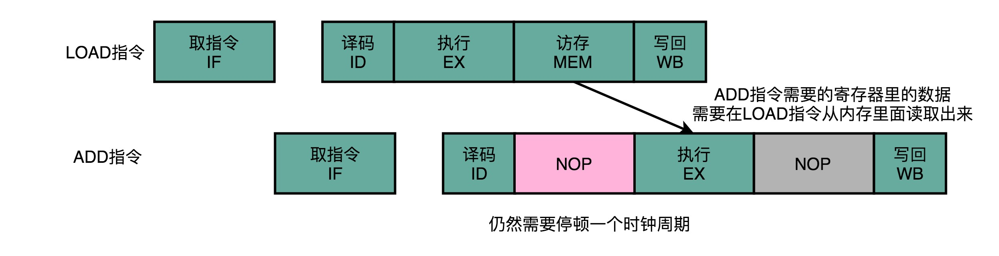

总的来说，操作数前推的解决方案，比流水线停顿更进了一步。

##### 4.5.2.6 乱序执行：填上空闲的 NOP

无论是流水线停顿，还是操作数前推，归根到底，只要前面指令的特定阶段还没有执行完成，后面的指令就会被"阻塞"住。

但是这个"阻塞"很多时候是没有必要的。因为尽管代码生成的指令是顺序的，但是如果后面的指令不需要依赖前面指令的执行结果，完全可以不必等待前面的指令运算完成。

比如说，下面这三行代码:

```c
a = b + c
d = a * e
x = y * z
```

计算里面的 x ，却要等待 a 和 d 都计算完成，实在没必要。所以完全可以在 d 的计算等待 a 的计算的过程中，先把 x 的结果给算出来。在流水线里，后面的指令不依赖前面的指令，那就不用等待前面的指令执行，它完全可以先执行。


可以看到，因为第三条指令并不依赖于前两条指令的计算结果，所以在第二条指令等待第一条指令的访存和写回阶段的时候，第三条指令就已经执行完成了。

这样的解决方案，在计算机组成里面，被称为**乱序执行**(Out-of-Order Execution，OoOE)。乱序执行，最早来自于著名的 IBM 360。《人月神话》这本软件工程届的经典著作，它讲的就是 IBM 360 开发过程中的"人生体会"。而 IBM 360 困难的开发过程，也少不了第一次引入乱序执行这个新的 CPU 技术。

###### 4.5.2.6.1 CPU 里的"线程池"：理解乱序执行

从今天软件开发的维度来思考，乱序执行就好像是在指令的执行阶段，引入了一个"线程池"。使用乱序执行技术后，CPU 里的流水线就和之前的 5 级流水线不太一样了。


1. 在取指令和指令译码的时候，乱序执行的 CPU 和其他使用流水线架构的 CPU 是一样的。它会一级一级顺序地进行取指令和指令译码的工作。

2. 在指令译码完成之后，就不一样了。CPU 不会直接进行指令执行，而是进行一次指令分发，把指令发到一个叫作保留站(Reservation Stations)的地方。顾名思义，这个保留站，就像一个火车站一样。发送到车站的指令，就像是一列列的火车。
3. 这些指令不会立刻执行，而要等待它们所依赖的数据，传递给它们之后才会执行。这就好像一列列的火车都要等到乘客来齐了才能出发。
4. 一旦指令依赖的数据来齐了，指令就可以交到后面的功能单元(Function Unit，FU)，其实就是 ALU，去执行了。有很多功能单元可以并行运行，但是不同的功能单元能够支持执行的指令并不相同。
5. 指令执行的阶段完成之后，并不能立刻把结果写回到寄存器里面去，而是把结果再存放到一个叫作重排序缓冲区(Re-Order Buffer，ROB)的地方。
6. 在重排序缓冲区里，CPU 会按照取指令的顺序，对指令的计算结果重新排序。只有排在前面的指令都已经完成了，才会提交指令，完成整个指令的运算结果。
7. 实际的指令的计算结果数据，并不是直接写到内存或者高速缓存里，而是先写入存储缓冲区(Store Buffer) 里面，最终才会写入到高速缓存和内存里。

可以看到，在乱序执行的情况下，只有 CPU 内部指令的执行层面，可能是"乱序"的。只要能在指令的译码阶段正确地分析出指令之间的数据依赖关系，这个"乱序"就只会在互相没有影响的指令之间发生。

即便指令的执行过程中是乱序的，在最终指令的计算结果写入到寄存器和内存之前，依然会进行一次排序，以确保所有指令在外部看来仍然是有序完成的。

有了乱序执行，重新执行下面的 3 行代码:

```c
a = b + c
d = a * e
x = y * z
```

里面的 d 依赖于 a 的计算结果，不会在 a 的计算完成之前执行。但是 CPU 并不会闲着，因为 x = y \* z 的指令同样会被分发到保留站里。因为 x 所依赖的 y 和 z 的数据是准备好的， 这里的乘法运算不会等待计算 d，而会先去计算 x 的值。

如果只有一个 FU 能够计算乘法，那么这个 FU 并不会因为 d 要等待 a 的计算结果，而被闲置，而是会先被拿去计算 x。

在 x 计算完成之后，d 也等来了 a 的计算结果。这个时候，FU 就会去计算出 d 的结果。然后在重排序缓冲区里，把对应的计算结果的提交顺序，仍然设置成 a -> d -> x，而计算完成的顺序是 x -> a -> d。

在这整个过程中，整个计算乘法的 FU 都没有闲置，这也意味着 CPU 的吞吐率最大化了。

整个乱序执行技术，就好像在指令的执行阶段提供一个"线程池"。指令不再是顺序执行的，而是根据池里所拥有的资源，以及各个任务是否可以进行执行，进行动态调度。在执行完成之后，又重新把结果在一个队列里面，按照指令的分发顺序重新排序。即使内部是"乱序"的，但是在外部看起来，仍然是井井有条地顺序执行。

乱序执行，极大地提高了 CPU 的运行效率。**核心原因是，现代 CPU 的运行速度比访问主内存的速度要快很多**。如果完全采用顺序执行的方式，很多时间都会浪费在前面指令等待获取内存数据的时间里。CPU 不得不加入 NOP 操作进行空转。而现代 CPU 的流水线级数也已经相对比较深了，到达了 14 级。这也意味着，同一个时钟周期内并行执行的指令数是很多的。

而乱序执行以及高速缓存，弥补了 CPU 和内存之间的性能差异。同样，也充分利用了较深的流水行带来的并发性，使得可以充分利用 CPU 的性能。

#### 4.5.5 控制冒险

在结构冒险和数据冒险中，会发现，所有的流水线停顿操作都要从**指令执行阶段**开始。流水线的前两个阶段，也就是取指令(IF)和指令译码(ID)的阶段，是不需要停顿的。CPU 会在流水线里面直接去取下一条指令，然后进行译码。

取指令和指令译码不会需要遇到任何停顿，这是基于一个假设。这个假设就是，所有的指令代码都是顺序加载执行的。不过这个假设，在执行的代码中，一旦遇到 if…else 这样的条件分支，或者 for/while 循环，就会不成立。


在 [从 if…else 来看程序的执行和跳转](#323-从-ifelse-来看程序的执行和跳转) 里的 cmp 比较指令、jmp 和 jle 这样的条件跳转指令。可以看到，在 jmp 指令发生的时候，CPU 可能会跳转去执行其他指令。jmp 后的那一条指令是否应该顺序加载执行，在流水线里面进行取指令的时候，没法知道。要等 jmp 指令执行完成，去更新了 PC 寄存器之后，才能知道，是否执行下一条指令，还是跳转到另外一个内存地址，去取别的指令。

这种为了确保能取到正确的指令，而不得不进行等待延迟的情况，就是**控制冒险**(Control Hazard)。这也是流水线设计里最后一种冒险。

##### 4.5.5.1 缩短分支延迟

第一个办法，叫作**缩短分支延迟**。条件跳转指令其实进行了两种电路操作:

- 第一种，是进行条件比较。这个条件比较，需要的输入是，根据指令的 opcode，就能确认的条件码寄存器。
- 第二种，是进行实际的跳转，也就是把要跳转的地址信息写入到 PC 寄存器。无论是 opcode，还是对应的条件码寄存器，还是跳转的地址，都是在指令译码(ID)的阶段就能获得的。而对应的条件码比较的电路，只要是简单的逻辑门电路就可以了，并不需要一个完整而复杂的 ALU。

所以，可以将条件判断、地址跳转，都提前到指令译码阶段进行，而不需要放在指令执行阶段。对应的，也要在 CPU 里面设计对应的旁路，在指令译码阶段，就提供对应的判断比较的电路。

这种方式，本质上和数据冒险的[操作数前推](#4525-操作数前推)的解决方案类似，就是在硬件电路层面，把一些计算结果更早地反馈到流水线中。这样反馈变得更快了，后面的指令需要等待的时间就变短了。

不过只是改造硬件，并不能彻底解决问题。跳转指令的比较结果，仍然要在指令执行的时候才能知道。在流水线里，第一条指令进行指令译码的时钟周期里，其实就要去取下一条指令了。这个时候，其实还没有开始指令执行阶段，自然也就不知道比较的结果。

##### 4.5.5.2 分支预测

为了解决缩短分支延迟的问题，就引入了一个新的解决方案，叫作**分支预测**(Branch Prediction)技术，也就是说，让 CPU 来预测，条件跳转后执行的指令，应该是哪一条。

最简单的分支预测技术，叫作"**假装分支不发生**"。顾名思义，自然就是仍然按照顺序，把指令往下执行。其实就是 CPU 预测，条件跳转一定不发生。这样的预测方法，其实也是一种**静态预测**技术。

如果分支预测是正确的，自然赚到了。这个意味着，节省下来本来需要停顿下来等待的时间。如果分支预测失败了，那就把后面已取出指令已经执行的部分，给丢弃掉。这个丢弃的操作，在流水线里面，叫作 Zap 或者 Flush。CPU 不仅要执行后面的指令，对于这些已经在流水线里面执行到一半的指令，还需要做对应的清除操作。比如，清空已经使用的寄存器里面的数据等等，这些清除操作，也有一定的开销。

所以，CPU 需要提供对应的丢弃指令的功能，通过控制信号清除掉已经在流水线中执行的指令。只要对应的清除开销不要太大，就是划得来的。

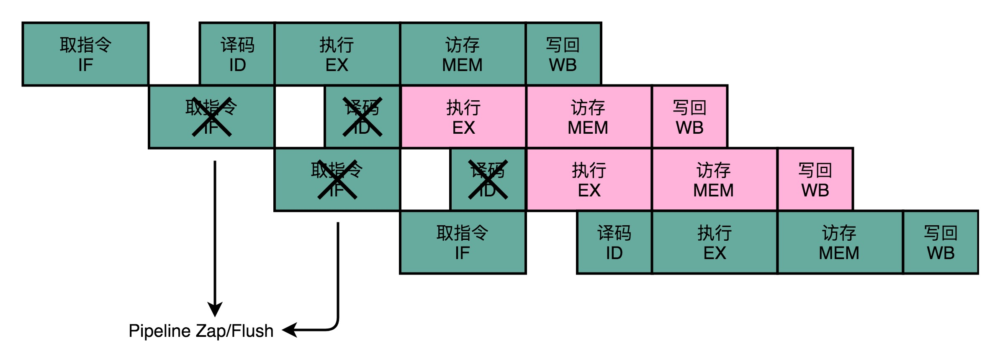

##### 4.5.5.3 动态分支预测

第三个办法，叫作**动态分支预测**。

简单的动态分支预测，是完全根据已有的信息来猜测。比如，今天下雨，就预测明天下雨。如果今天天晴，就预测明天也不会下雨。这种策略，叫**一级分支预测**(One Level Branch Prediction)，或者叫 **1 比特饱和计数**(1-bit saturating counter)。这个方法，其实就是用一个比特，去记录当前分支的比较情况，直接用当前分支的比较情况，来预测下一次分支时候的比较情况。

还可以用更多的信息，而不只是一次的分支信息来进行预测。于是，可以引入一个**状态机**(State Machine)来做这个事情。


这个状态机里，一共有 4 个状态，所以需要 2 个比特来记录对应的状态。这样这整个策略，就可以叫作 **2 比特饱和计数**，或者叫**双模态预测器**(Bimodal Predictor)。

> 并不是更复杂的算法，效果一定就更好。实际的预测效果，和实际执行的指令高度相关。如果想对各种分支预测技术有所了解，[Wikipedia](https://en.wikipedia.org/wiki/Branch_predictor)里面有更详细的内容和更多的分支预测算法。

##### 4.5.5.4 为什么循环嵌套的改变会影响性能？

```java
public class BranchPrediction {
  public static void main(String args[]) {
    long start = System.currentTimeMillis();
    for (int i = 0; i < 100; i++) {
      for (int j = 0; j <1000; j ++) {
        for (int k = 0; k < 10000; k++) {
        }
      }
    }
    long end = System.currentTimeMillis();
    System.out.println("Time spent is " + (end - start));

    start = System.currentTimeMillis();
    for (int i = 0; i < 10000; i++) {
      for (int j = 0; j <1000; j ++) {
        for (int k = 0; k < 100; k++) {
        }
      }
    }
    end = System.currentTimeMillis();
    System.out.println("Time spent is " + (end - start) + "ms");
  }
}
```

这是一个简单的三重循环，里面没有任何逻辑代码。用两种不同的循环顺序各跑一次。第一次，最外重循环循环了 100 次，第二重循环 1000 次，最内层的循环了 10000 次。第二次，把顺序倒过来，最外重循环 10000 次，第二重还是 1000 次，最内层 100 次。

对应的命令行输出：

```shell
Time spent in first loop is 5ms
Time spent in second loop is 15ms
```

同样循环了十亿次，第一段程序只花了 5 毫秒，而第二段程序则花了 15 毫秒，足足多了 2 倍。

这个差异就来自分支预测。循环其实也是利用 cmp 和 jle 这样先比较后跳转的指令来实现的。这里的代码，每一次循环都有一个 cmp 和 jle 指令。每一个 jle 就意味着，要比较条件码寄存器的状态，决定是顺序执行代码，还是要跳转到另外一个地址。也就是说，在每一次循环发生的时候，都会有一次"分支"。

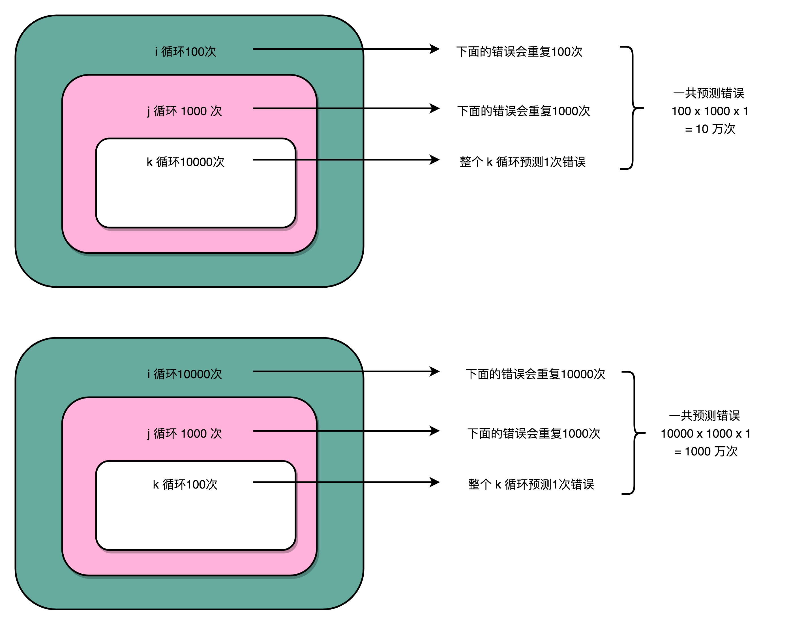

分支预测策略最简单的一个方式，自然是"**假定分支不发生**"。对应到上面的循环代码，就是循环始终会进行下去。在这样的情况下，上面的第一段循环，也就是内层 k 循环 10000 次的代码。每隔 10000 次，才会发生一次预测上的错误。而这样的错误，在第二层 j 的循环发生的次数，是 1000 次。

最外层的 i 的循环是 100 次。每个外层循环一次里面，都会发生 1000 次最内层 k 的循环的预测错误，所以一共会发生 100 × 1000 = 10 万次预测错误。

上面的第二段循环，也就是内存 k 的循环 100 次的代码，则是每 100 次循环，就会发生一次预测错误。这样的错误，在第二层 j 的循环发生的次数，还是 1000 次。最外层 i 的循环是 10000 次，所以一共会发生 1000 × 10000 = 1000 万次预测错误。

因为第一段代码发生"分支预测"错误的情况比较少，更多的计算机指令，在流水线里顺序运行下去了，而不需要把运行到一半的指令丢弃掉，再去重新加载新的指令执行。所以，第一段代码运行的时间要少得多。

### 4.6 Superscalar 和 VLIW

IPC(Instruction Per Clock)，是一个时钟周期里面能够执行的指令数，代表了 CPU 的吞吐率。这个指标，最佳情况下也只能到 1。因为无论做了哪些流水线层面的优化，即使做到了指令执行层面的乱序执行，CPU 仍然只能在一个时钟周期里面，取一条指令。

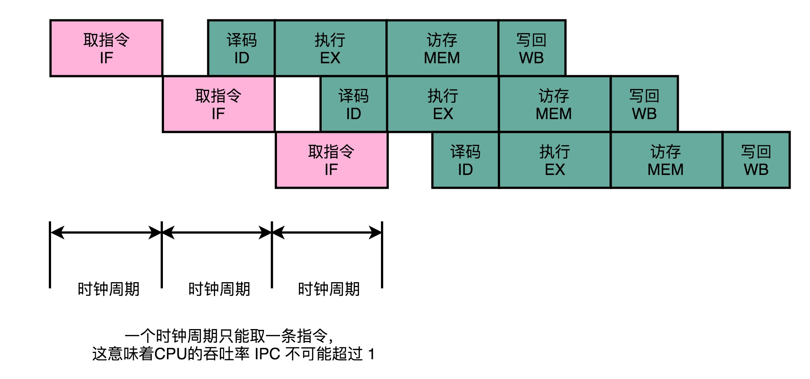

这说明，无论指令后续能优化得多好，一个时钟周期也只能执行完这样一条指令，CPI 只能是 1。但是，现在用的 Intel CPU 或者 ARM 的 CPU，一般的 CPI 都能做到 2 以上，这是怎么做到的呢？

#### 4.6.1 多发射与超标量(Superscalar)：同一时间执行的两条指令

ALU 是把所有算术和逻辑运算都抽象出来的 CPU 的硬件组成。加法器、乘法器、乃至浮点数计算的部分中，其实整数的计算和浮点数的计算过程差异还是不小的。实际上，整数和浮点数计算的电路，在 CPU 层面也是分开的。

一直到 80386，CPU 都是没有专门的浮点数计算的电路的。当时的浮点数计算，都是用软件进行模拟的。所以，在 80386 时代，Intel 给 386 配了单独的 387 芯片，专门用来做浮点数运算。

其实，现在的 Intel CPU 芯片也是一样的。虽然浮点数计算已经变成 CPU 里的一部分，但并不是所有计算功能都在一个 ALU 里面，真实的情况是，会有多个 ALU。这也是为什么，在[乱序执行](#4526-乱序执行填上空闲的-nop)的时候，会看到，指令的执行阶段，是由很多个功能单元(FU)并行(Parallel)进行的。

不过，在指令乱序执行的过程中，取指令(IF)和指令译码(ID)部分并不是并行进行的。

**取指令(IF)和指令译码(ID)部分并行进行**
只要把取指令和指令译码，也一样通过增加硬件的方式，并行进行。就可以一次性从内存里面取出多条指令，然后分发给多个并行的指令译码器，进行译码，然后对应交给不同的功能单元去处理。这样，在一个时钟周期里，能够完成的指令就不只一条了。IPC 也就能做到大于 1 了。


这种 CPU 设计，叫作**多发射**(Multiple Issue)和**_超标量_**(Superscalar)。

什么叫多发射呢？这个词听起来很抽象，其实它意思就是说，同一个时间，可能会同时把多条指令发射(Issue)到不同的译码器或者后续处理的流水线中去。

在超标量的 CPU 里面，有很多条并行的流水线，而不是只有一条流水线。"超标量"这个词是说，本来在一个时钟周期里面，只能执行一个标量(Scalar)的运算。在多发射的情况下，就能够超越这个限制，同时进行多次计算。

在上图中会看到一个有意思的现象，每一个功能单元的流水线的长度是不同的。事实上，不同的功能单元的流水线长度本来就不一样。平时所说的 14 级流水线，指的通常是进行整数计算指令的流水线长度。如果是浮点数运算，实际的流水线长度则会更长一些。

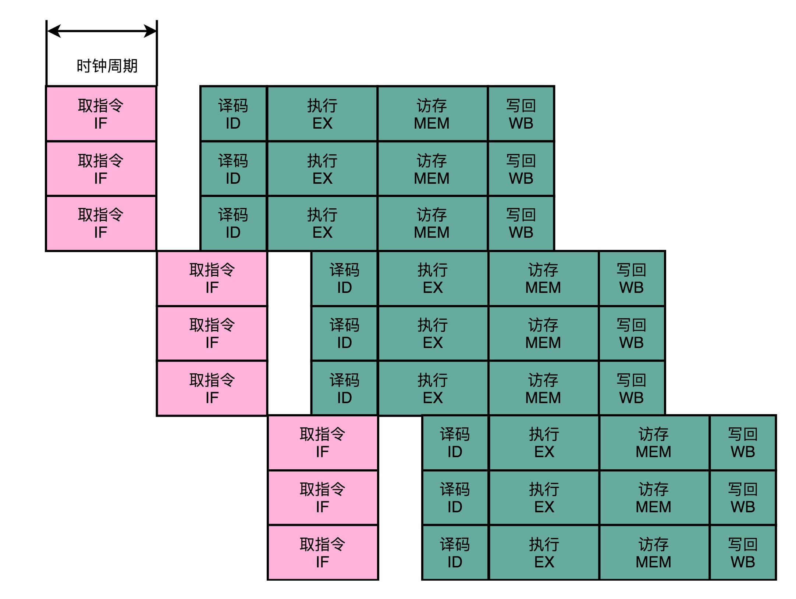

#### 4.6.2 Intel 的失败之作：安腾的超长指令字设计(VLIW)

无论是乱序执行，还是更进一步的超标量技术，在实际的硬件层面，其实实施起来都挺麻烦的。这是因为，在乱序执行和超标量的体系里面，CPU 要解决依赖冲突的问题，也就是[冒险问题](#45-冒险跟预测)。

CPU 需要在指令执行之前，去判断指令之间是否有依赖关系。如果有对应的依赖关系，指令就不能分发到执行阶段。因为这样，超标量 CPU 的多发射功能，又被称为**动态多发射处理器**。这些对于依赖关系的检测，都会使得 CPU 电路变得更加复杂。

于是，计算机科学家和工程师们就又有了一个大胆的想法。能不能不把分析和解决依赖关系的事情，放在硬件里面，而是放到软件里面来干呢？

前面的[计算机的计时单位 CPU 时钟](#232-计算机的计时单位-cpu-时钟)中写过，要想优化 CPU 的执行时间，关键就是拆解公式：

```txt
程序的 CPU 执行时间 = 指令数 × CPI × Clock Cycle Time
```

这个公式里面，可以通过改进编译器来优化指令数这个指标。那接下来，就来看看一个非常大胆的 CPU 设计想法，叫作**超长指令字设计**(Very Long Instruction Word，VLIW)。这个设计，不仅想让编译器来优化指令数，还想直接通过编译器，来优化 CPI。

围绕着这个设计的，是 Intel 一个著名的"史诗级"失败，也就是著名的 IA-64 架构的安腾(Itanium)处理器。只不过，这一次，责任不全在 Intel，还要拉上可以称之为硅谷起源的另一家公司，也就是惠普。之所以称为"史诗"级失败，这个说法来源于惠普最早给这个架构取的名字，**显式并发指令运算**(Explicitly Parallel Instruction Computer)，这个名字的缩写 EPIC，正好是"史诗"的意思。但是，安腾处理器和和 Pentium 4 一样，在市场上是一个失败的产品。在经历了 12 年之久的设计研发之后，安腾一代只卖出了几千套。而安腾二代，在从 2002 年开始反复挣扎了 16 年之后，最终在 2018 年被 Intel 宣告放弃，退出了市场。

那么，就来看看，这个超长指令字的安腾处理器是怎么回事儿。

在乱序执行和超标量的 CPU 架构里，指令的前后依赖关系，是由 CPU 内部的硬件电路来检测的。而到了**超长指令字**的架构里面，这个工作交给了编译器这个软件。

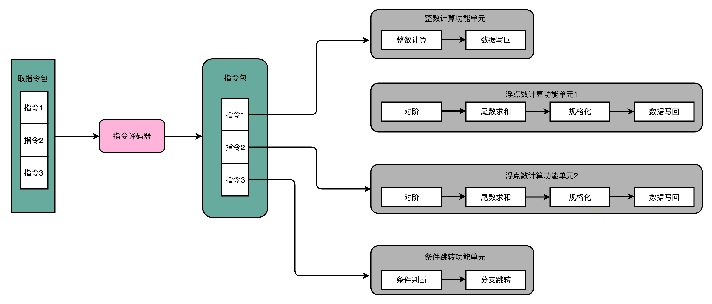

编译器在这个过程中，其实也能够知道前后数据的依赖。于是，可以让编译器把没有依赖关系的代码位置进行交换。然后，再把多条连续的指令打包成一个指令包。安腾的 CPU 就是把 3 条指令变成一个指令包。

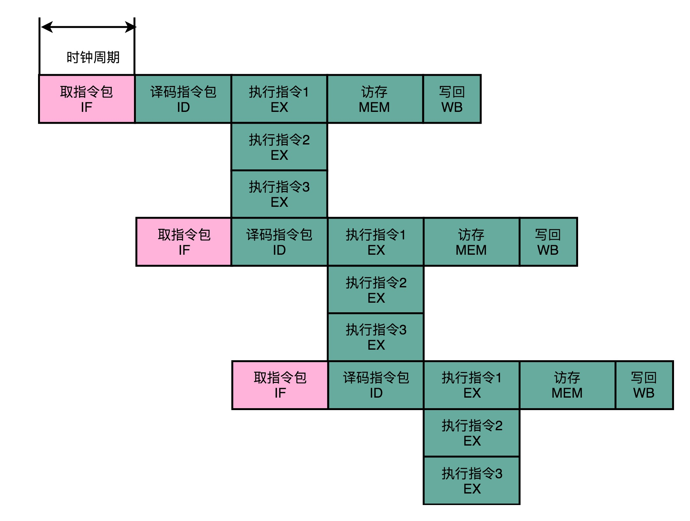

CPU 在运行的时候，不再是取一条指令，而是取出一个指令包。然后，译码解析整个指令包，解析出 3 条指令直接并行运行。可以看到，使用超长指令字架构的 CPU，同样是采用流水线架构的。也就是说，一组指令，仍然要经历多个时钟周期。同样的，下一组指令并不是等上一组指令执行完成之后再执行，而是在上一组指令的指令译码阶段，就开始取指令了。

> **注意**:
> 流水线停顿这件事情在超长指令字里面，很多时候也是由编译器来做的。除了停下整个处理器流水线，超长指令字的 CPU 不能在某个时钟周期停顿一下，等待前面依赖的操作执行完成。编译器需要在适当的位置插入 NOP 操作，直接在编译出来的机器码里面，就把流水线停顿这个事情在软件层面就安排妥当。

虽然安腾的设想很美好，Intel 也曾经希望能够让安腾架构成为替代 x86 的新一代架构，但是最终安腾还是在前前后后折腾将近 30 年后失败了。2018 年，Intel 宣告安腾 9500 会在 2021 年停止供货。

**失败原因**
安腾失败的原因有很多，其中有一个重要的原因就是"**向前兼容**"。

- 安腾处理器的指令集和 x86 是不同的。这就意味着，原来 x86 上的所有程序是没有办法在安腾上运行的，而需要通过编译器重新编译才行。
- 另一方面，安腾处理器的 VLIW 架构决定了，如果安腾需要提升并行度，就需要增加一个指令包里包含的指令数量，比方说从 3 个变成 6 个。一旦这么做了，虽然同样是 VLIW 架构，同样指令集的安腾 CPU，程序也需要重新编译。因为原来编译器判断的依赖关系是在 3 个指令以及由 3 个指令组成的指令包之间，现在要变成 6 个指令和 6 个指令组成的指令包。编译器需要重新编译，交换指令顺序以及 NOP 操作，才能满足条件。甚至，需要重新来写编译器，才能让程序在新的 CPU 上跑起来。

于是，安腾就变成了一个既不容易向前兼容，又不容易向后兼容的 CPU。那么，它的失败也就不足为奇了。

可以看到，技术思路上的先进想法，在实际的业界应用上会遇到更多具体的实践考验。无论是指令集向前兼容性，还是对应 CPU 未来的扩展，在设计的时候，都需要更多地去考虑实践因素。

### 4.7 单指令多数据流(SIMD)：加速矩阵乘法

#### 4.7.1 超线程的起源

Pentium 4 失败的一个重要原因，就是它的 CPU 的流水线级数太深了。早期的 Pentium 4 的流水线深度高达 20 级，而后期的代号为 Prescott 的 Pentium 4 的流水线级数，更是到了 31 级。超长的流水线，使得之前很多解决"冒险"、提升并发的方案都用不上。

因为这些解决"冒险"、提升并发的方案，本质上都是一种**指令级并行**(Instruction-level parallelism，简称 IPL)的技术方案。换句话说就是，CPU 想要在同一个时间，去并行地执行两条指令。而这两条指令，原本在代码里，是有先后顺序的。无论是在流水线里面讲到的流水线架构、分支预测以及乱序执行，还是超标量和超长指令字，都是想要通过同一时间执行两条指令，来提升 CPU 的吞吐率。

然而在 Pentium 4 这个 CPU 上，这些方法都可能因为流水线太深，而起不到效果。更深的流水线意味着同时在流水线里面的指令就多，相互的依赖关系就多。于是，很多时候不得不把流水线停顿下来，插入很多 NOP 操作，来解决这些依赖带来的"冒险"问题。

于是，2002 年底，Intel 为了提高性能，在 3.06GHz 主频的 Pentium 4 CPU 上，第一次引入了**超线程**(Hyper-Threading)技术。

#### 4.7.2 超线程

什么是超线程技术？Intel 想，既然 CPU 同时运行那些在代码层面有前后依赖关系的指令，会遇到各种冒险问题，不如去找一些和这些指令完全独立，没有依赖关系的指令来运行。那么，这样的指令哪里来呢？自然是同时运行在另外一个程序里的。

现代计算机，其实同一个时间可以运行很多个程序。每个程序，是完全相互独立的，指令完全并行运行，而不会产生依赖问题带来的"冒险"。

现代 CPU 都是多核的，本来就可以用多个不同的 CPU 核心，去运行不同的任务。即使当时的 Pentium 4 是单核的，也能同时运行多个进程，或者多个线程。这个超线程技术有什么特别的用处呢？

无论是上面说的多个 CPU 核心运行不同的程序，还是在单个 CPU 核心里面切换运行不同线程的任务，在同一时间点上，一个物理的 CPU 核心只会运行一个线程的指令，所以其实并没有真正地做到指令的并行运行。


超线程可不是这样的。超线程的 CPU，其实是把一个物理层面 CPU 核心，"伪装"成两个逻辑层面的 CPU 核心。这个 CPU，会在硬件层面增加很多电路，使一个 CPU 核心内部可以，维护两个不同线程的指令的状态信息。

比如，在一个物理 CPU 核心内部，会有双份的 PC 寄存器、指令寄存器乃至条件码寄存器。这样，这个 CPU 核心就可以维护两条并行的指令的状态。在外面看起来，似乎有两个逻辑层面的 CPU 在同时运行。所以，超线程技术一般也被叫作**同时多线程**(Simultaneous Multi-Threading，简称 SMT)技术。

**目的**
不过，在 CPU 的其他功能组件上，Intel 可不会提供双份。无论是指令译码器还是 ALU，一个 CPU 核心仍然只有一份。因为超线程并不是真的去同时运行两个指令，那就真的变成物理多核了。超线程的目的，是在一个线程 A 的指令，在流水线里停顿的时候，让另外一个线程去执行指令。因为这个时候，CPU 的译码器和 ALU 就空出来了，那么另外一个线程 B，就可以拿来干自己需要的事情。这个线程 B 可没有对于线程 A 里面指令的关联和依赖。

这样，CPU 通过很小的代价，就能实现"同时"运行多个线程的效果。通常只要在 CPU 核心的添加 10% 左右的逻辑功能，增加可以忽略不计的晶体管数量，就能做到这一点。

**局限与应用场景**
不过，实际上并没有增加真的功能单元。所以超线程只在特定的应用场景下效果比较好。一般是在那些各个线程"等待"时间比较长的应用场景下。比如，需要应对很多请求的数据库应用，就很适合使用超线程。各个指令都要停顿在流水线上等待访问内存数据，但是并不需要做太多计算。于是，就可以利用好超线程，让 CPU 里的各个功能单元，去处理另外一个数据库连接的查询请求。

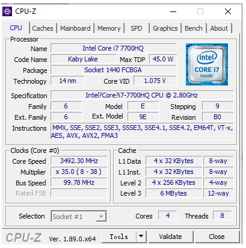

在右下角里，CPU 的 Cores，被标明了是 4，而 Threads，则是 8。这说明这个 CPU，只有 4 个物理的 CPU 核心，也就是所谓的 4 核 CPU。但是在逻辑层面，它"装作"有 8 个 CPU 核心，可以利用超线程技术，来同时运行 8 条指令。Windows，可以下载安装 CPU-Z 来查看 CPU 里面对应的参数。

#### 4.7.3 单指令多数据流(SIMD)

在上面的 CPU 信息图里会看到，中间有一组信息叫作 Instructions，里面写了有 MMX、SSE 等等。这些信息就是这个 CPU 所支持的指令集。这里的 MMX 和 SSE 的指令集，也是一个提升 CPU 性能的技术方案，SIMD，中文叫作**单指令多数据流**(Single Instruction Multiple Data)。

下面是两段示例程序，一段是通过循环的方式，给一个 list 里面的每一个数加 1。另一段，是实现相同的功能，但是直接调用 NumPy 这个库的 add 方法。在统计两段程序的性能的时候，直接调用了 Python 里面的 timeit 库。

```python
python
>>> import numpy as np
>>> import timeit
>>> a = list(range(1000))
>>> b = np.array(range(1000))
>>> timeit.timeit("[i + 1 for i in a]", setup="from __main__ import a", number=1000000)
32.82800309999993
>>> timeit.timeit("np.add(1, b)", setup="from __main__ import np, b", number=1000000)
0.9787889999997788
>>>
```

从两段程序的输出结果来看，会发现，两个功能相同的代码性能有着巨大的差异，足足差出了 30 多倍。也难怪所有用 Python 讲解数据科学的教程里，往往在一开始就告诉不要使用循环，而要把所有的计算都向量化(Vectorize)。NumPy 之所以这么快，原因就是，直接用到了 SIMD 指令，能够并行进行向量的操作。

而前面使用循环来一步一步计算的算法呢，一般被称为 **SISD**，也就是**单指令单数据**(Single Instruction Single Data)的处理方式。如果是一个多核 CPU，那么它同时处理多个指令的方式可以叫作 MIMD，也就是**多指令多数据**(Multiple Instruction Multiple Data)。

SIMD 指令之所以能快那么多，是因为，**SIMD 在获取数据和执行指令的时候，都做到了并行**。一方面，在从内存里面读取数据的时候，SIMD 是一次性读取多个数据。

以上面的程序为例，数组里面的每一项都是一个 integer，也就是需要 4 Bytes 的内存空间。Intel 在引入 SSE 指令集的时候，在 CPU 里面添上了 8 个 128 Bits 的寄存器。128 Bits 也就是 16 Bytes ，也就是说，一个寄存器一次性可以加载 4 个整数。比起循环分别读取 4 次对应的数据，时间就省下来了。

在数据读取到了之后，在指令的执行层面，SIMD 也是可以并行进行的。4 个整数各自加 1，互相之前完全没有依赖，也就没有冒险问题需要处理。只要 CPU 里有足够多的功能单元，能够同时进行这些计算，这个加法就是 4 路同时并行的，自然也省下了时间。

所以，对于那些在计算层面存在大量"数据并行"(Data Parallelism)的计算中，使用 SIMD 是一个很划算的办法。在这个大量的"数据并行"，其实通常就是实践当中的向量运算或者矩阵运算。在实际的程序开发过程中，过去通常是在进行图片、视频、音频的处理。最近几年则通常是在进行各种机器学习算法的计算。

而基于 SIMD 的向量计算指令，也正是在 Intel 发布 Pentium 处理器的时候，被引入的指令集。当时的指令集叫作 MMX，也就是 Matrix Math eXtensions 的缩写，中文名字就是**矩阵数学扩展**。而 Pentium 处理器，也是 CPU 第一次有能力进行多媒体处理。这也正是拜 SIMD 和 MMX 所赐。

### 4.8 异常和中断

#### 4.8.1 异常：硬件、系统和应用的组合拳

与硬件、系统相关的异常，既有来自硬件的，也有来自软件层面的。

比如，在硬件层面，当加法器进行两个数相加的时候，会遇到算术溢出；或者，在玩游戏的时候，按下键盘发送了一个信号给到 CPU，CPU 要去执行一个现有流程之外的指令，这也是一个"异常"。

同样，来自软件层面的，比如程序进行系统调用，发起一个读文件的请求。这样应用程序向系统调用发起请求的情况，一样是通过"异常"来实现的。

**关于异常，最有意思的一点就是，它其实是一个硬件和软件组合到一起的处理过程。异常的前半生，也就是异常的发生和捕捉，是在硬件层面完成的。但是异常的后半生，也就是说，异常的处理，其实是由软件来完成的。**

计算机会为每一种可能会发生的异常，分配一个异常代码(Exception Number)。有些教科书会把异常代码叫作中断向量(Interrupt Vector)。异常发生的时候，通常是 CPU 检测到了一个特殊的信号。比如，按下键盘上的按键，输入设备就会给 CPU 发一个信号。或者，正在执行的指令发生了加法溢出，同样，可以有一个进位溢出的信号。这些信号，在组成原理里面，一般叫作**发生了一个事件**(Event)。CPU 在检测到事件的时候，其实也就拿到了对应的异常代码。

**这些异常代码里，I/O 发出的信号的异常代码，是由操作系统来分配的，也就是由软件来设定的。而像加法溢出这样的异常代码，则是由 CPU 预先分配好的，也就是由硬件来分配的。这又是另一个软件和硬件共同组合来处理异常的过程。**

拿到异常代码之后，CPU 就会触发异常处理的流程。计算机在内存里，会保留一个异常表(Exception Table)。也有地方，把这个表叫作中断向量表(Interrupt Vector Table)，好和上面的中断向量对应起来。这个异常表有点儿像 [GOT 表](#361-动态链接的解决方案-plt-和-got)，存放的是不同的异常代码对应的异常处理程序(Exception Handler)所在的地址。

CPU 在拿到了异常码之后，会先把当前的程序执行的现场，保存到程序栈里面，然后根据异常码查询，找到对应的异常处理程序，最后把后续指令执行的指挥权，交给这个异常处理程序。


这样"检测异常，拿到异常码，再根据异常码进行查表处理"的模式，在日常开发的过程中很常见。

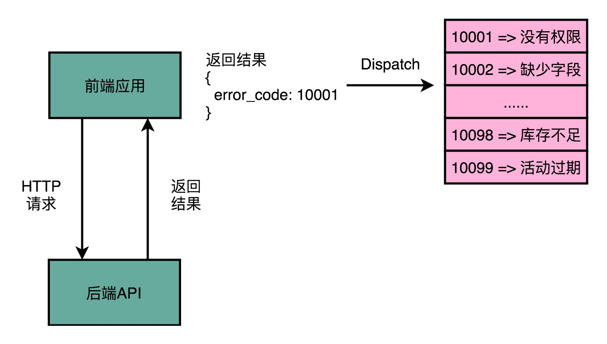

比如说，现在日常进行的 Web 或者 App 开发，通常都是前后端分离的。前端的应用，会向后端发起 HTTP 的请求。当后端遇到了异常，通常会给到前端一个对应的错误代码。前端的应用根据这个错误代码，在应用层面去进行错误处理。在不能处理的时候，它会根据错误代码向用户显示错误信息。

```java
public class LastChanceHandler implements Thread.UncaughtExceptionHandler
{
  @Override
  public void uncaughtException(Thread t, Throwable e) {
    // do something here - log to file and upload to    server/close resources/delete files...
  }
}

Thread.setDefaultUncaughtExceptionHandler(new LastChanceHandler());
```

再比如说，Java 里面，使用一个线程池去运行调度任务的时候，可以指定一个异常处理程序。对于各个线程在执行任务出现的异常情况，是通过异常处理程序进行处理，而不是在实际的任务代码里处理。这样，就把业务处理代码就和异常处理代码的流程分开了。

#### 4.8.2 异常的分类：中断、陷阱、故障和中止

- 第一种异常叫**中断**(Interrupt)。顾名思义，自然就是程序在执行到一半的时候，被打断了。这个打断执行的信号，来自于 CPU 外部的 I/O 设备。在键盘上按下一个按键，就会对应触发一个相应的信号到达 CPU 里面。CPU 里面某个开关的值发生了变化，也就触发了一个中断类型的异常。

- 第二种异常叫**陷阱**(Trap)。陷阱，其实是程序员"故意"主动触发的异常。就好像在程序里面打了一个断点，这个断点就是设下的一个"陷阱"。当程序的指令执行到这个位置的时候，就掉到了这个陷阱当中。然后，对应的异常处理程序就会来处理这个"陷阱"当中的猎物。
  最常见的一类陷阱，发生在应用程序调用系统调用的时候，也就是从程序的用户态切换到内核态的时候。用 Linux 下的 time 指令，去查看一个程序运行实际花费的时间，里面有在用户态花费的时间(user time)，也有在内核态发生的时间(system time)。
  应用程序通过系统调用去读取文件、创建进程，其实也是通过触发一次陷阱来进行的。这是因为，用户态的应用程序没有权限来做这些事情，需要把对应的流程转交给有权限的异常处理程序来进行。

- 第三种异常叫**故障**(Fault)。它和陷阱的区别在于，陷阱是开发程序的时候刻意触发的异常，而故障通常不是。比如，在程序执行的过程中，进行加法计算发生了溢出，其实就是故障类型的异常。这个异常不是在开发的时候计划内的，也一样需要有对应的异常处理程序去处理。

  > 故障和陷阱、中断的一个重要区别是，故障在异常程序处理完成之后，仍然回来处理当前的指令，而不是去执行程序中的下一条指令。因为当前的指令因为故障的原因并没有成功执行完成。

- 最后一种异常叫**中止**(Abort)。与其说这是一种异常类型，不如说这是故障的一种特殊情况。当 CPU 遇到了故障，但是恢复不过来的时候，程序就不得不中止了。


在这四种异常里，中断异常的信号来自系统外部，而不是在程序自己执行的过程中，所以称之为"异步"类型的异常。而陷阱、故障以及中止类型的异常，是在程序执行的过程中发生的，所以称之为"同步"类型的异常。

在处理异常的过程当中，无论是异步的中断，还是同步的陷阱和故障，都是采用同一套处理流程，也就是上面所说的，"保存现场、异常代码查询、异常处理程序调用"。而中止类型的异常，其实是在故障类型异常的一种特殊情况。当故障发生，但是发现没有异常处理程序能够处理这种异常的情况下，程序就不得不进入中止状态，也就是最终会退出当前的程序执行。

#### 4.8.3 异常的处理：上下文切换

在实际的异常处理程序执行之前，CPU 需要去做一次"保存现场"的操作。这个保存现场的操作，和[函数调用](#331-程序栈)的过程非常相似。

因为切换到异常处理程序的时候，其实就好像是去调用一个异常处理函数。指令的控制权被切换到了另外一个"函数"里面，所以自然要把当前正在执行的指令去压栈。这样，才能在异常处理程序执行完成之后，重新回到当前的指令继续往下执行。

不过，切换到异常处理程序，比起函数调用，还是要更复杂一些。原因有下面几点:

- 第一点，因为异常情况往往发生在程序正常执行的预期之外，比如中断、故障发生的时候。所以，除了本来程序压栈要做的事情之外，还需要把 CPU 内当前运行程序用到的所有寄存器，都放到栈里面。最典型的就是条件码寄存器里面的内容。
- 第二点，像陷阱这样的异常，涉及程序指令在用户态和内核态之间的切换。对应压栈的时候，对应的数据是压到内核栈里，而不是程序栈里。
- 第三点，像故障这样的异常，在异常处理程序执行完成之后。从栈里返回出来，继续执行的不是顺序的下一条指令，而是故障发生的当前指令。因为当前指令因为故障没有正常执行成功，必须重新去执行一次。

所以，对于异常这样的处理流程，不像是顺序执行的指令间的函数调用关系。而是更像两个不同的独立进程之间在 CPU 层面的切换，所以这个过程称之为**上下文切换**(Context Switch)。

### 4.9 CISC 和 RISC

MIPS 体系结构计算机的机器指令都是固定的 32 位长度，Intel x86 的机器码的长度是可变的。而 CPU 的指令集里的机器码是固定长度还是可变长度，也就是**复杂指令集**(Complex Instruction Set Computing，简称 CISC)和**精简指令集**(Reduced Instruction Set Computing，简称 RISC)这两种风格的指令集一个最重要的差别。

#### 4.9.1 CISC VS RISC

在计算机历史的早期，其实没有什么 CISC 和 RISC 之分。或者说，所有的 CPU 其实都是 CISC。

虽然冯·诺依曼高屋建瓴地提出了存储程序型计算机的基础架构，但是实际的计算机设计和制造还是严格受硬件层面的限制。当时的计算机很慢，存储空间也很小。《人月神话》这本软件工程界的名著，讲的是花了好几年设计 IBM 360 这台计算机的经验。IBM 360 的最低配置，每秒只能运行 34500 条指令，只有 8K 的内存。为了让计算机能够做尽量多的工作，每一个字节乃至每一个比特都特别重要。

所以，CPU 指令集的设计，需要仔细考虑硬件限制。为了性能考虑，很多功能都直接通过硬件电路来完成。为了少用内存，指令的长度也是可变的。就像算法和数据结构里的赫夫曼编码(Huffman coding)一样，常用的指令要短一些，不常用的指令可以长一些。那个时候的计算机，想要用尽可能少的内存空间，存储尽量多的指令。

不过，随着计算机的性能越来越好，存储的空间也越来越大了。到了 70 年代末，RISC 开始登上了历史的舞台。当时，UC Berkeley 的大卫·帕特森(David Patterson)教授发现，实际在 CPU 运行的程序里，80% 的时间都是在使用 20% 的简单指令。于是，他就提出了 RISC 的理念。自此之后，RISC 类型的 CPU 开始快速蓬勃发展。


RISC 架构的 CPU 的想法其实非常直观。既然 80% 的时间都在用 20% 的简单指令，那就只要 20% 的简单指令就好了。但是因为指令数量多，计算机科学家们在软硬件两方面都受到了很多挑战。

在硬件层面，要想支持更多的复杂指令，CPU 里面的电路就要更复杂，设计起来也就更困难。更复杂的电路，在散热和功耗层面，也会带来更大的挑战。在软件层面，支持更多的复杂指令，编译器的优化就变得更困难。毕竟，面向 2000 个指令来优化编译器和面向 500 个指令来优化编译器的困难是完全不同的。

于是，在 RISC 架构里面，CPU 选择把指令"精简"到 20% 的简单指令。而原先的复杂指令，则通过用简单指令组合起来来实现，让软件来实现硬件的功能。这样，CPU 的整个硬件设计就会变得更简单了，在硬件层面提升性能也会变得更容易了。

RISC 的 CPU 里完成指令的电路变得简单了，于是也就腾出了更多的空间。这个空间，常常被拿来放通用寄存器。因为 RISC 完成同样的功能，执行的指令数量要比 CISC 多，所以，如果需要反复从内存里面读取指令或者数据到寄存器里来，那么很多时间就会花在访问内存上。于是，RISC 架构的 CPU 往往就有更多的通用寄存器。

除了寄存器这样的存储空间，RISC 的 CPU 也可以把更多的晶体管，用来实现更好的分支预测等相关功能，进一步去提升 CPU 实际的执行效率。

总的来说，对于 CISC 和 RISC 的对比，可以用程序运行时间的公式：

```txt
程序的 CPU 执行时间 = 指令数  ×  CPI  ×  Clock Cycle Time
```

CISC 的架构，其实就是通过优化**指令数**，来减少 CPU 的执行时间。而 RISC 的架构，其实是在优化 CPI。因为指令比较简单，需要的时钟周期就比较少。

因为 RISC 降低了 CPU 硬件的设计和开发难度，所以从 80 年代开始，大部分新的 CPU 都开始采用 RISC 架构。从 IBM 的 PowerPC，到 SUN 的 SPARC，都是 RISC 架构。

#### 4.9.2 Intel 的进化：微指令架构的出现

x86 架构所面临的种种问题，其实都来自于一个最重要的考量，那就是指令集的向前兼容性。因为 x86 在商业上太成功了，所以市场上有大量的 Intel CPU。而围绕着这些 CPU，又有大量的操作系统、编译器。这些系统软件只支持 x86 的指令集，就比如著名的 Windows 95。而在这些系统软件上，又有各种各样的应用软件。如果 Intel 要放弃 x86 的架构和指令集，开发一个 RISC 架构的 CPU，面临的第一个问题就是所有这些软件都是不兼容的。

反而是 AMD，趁着 Intel 研发安腾的时候，推出了兼容 32 位 x86 指令集的 64 位架构，也就是 AMD64。现在在 Linux 下安装各种软件包，一定经常会看到像下面这样带有 AMD64 字样的内容。这是因为 x86 下的 64 位的指令集 x86-64，并不是 Intel 发明的，而是 AMD 发明的。

```txt
Get:1 http://archive.ubuntu.com/ubuntu bionic/main amd64 fontconfig amd64 2.12.6-0ubuntu2 [169 kB]
```

Intel 在开发安腾处理器的同时，也在不断借鉴其他 RISC 处理器的设计思想。既然核心问题是要始终向前兼容 x86 的指令集，那么就让 CISC 风格的指令集，用 RISC 的形式在 CPU 里面运行。

于是，从 Pentium Pro 时代开始，Intel 就开始在处理器里引入了**微指令(Micro-Instructions/Micro-Ops)架构**。而微指令架构的引入，也让 CISC 和 RISC 的分界变得模糊了。


在微指令架构的 CPU 里面，编译器编译出来的机器码和汇编代码并没有发生什么变化。但在指令译码的阶段，指令译码器"翻译"出来的，不再是某一条 CPU 指令。译码器会把一条机器码，"**翻译**"成好几条"微指令"。这里的一条条微指令，就不再是 CISC 风格的了，而是变成了固定长度的 RISC 风格的了。

这些 RISC 风格的微指令，会被放到一个微指令缓冲区里面，然后再从缓冲区里面，分发给到后面的超标量，并且是乱序执行的流水线架构里面。不过这个流水线架构里面接受的，就不是复杂的指令，而是精简的指令了。在这个架构里，指令译码器相当于变成了设计模式里的一个"适配器"(Adaptor)。这个适配器，填平了 CISC 和 RISC 之间的指令差异。

不过，凡事有好处就有坏处。这样一个能够把 CISC 的指令译码成 RISC 指令的指令译码器，比原来的指令译码器要复杂。这也就意味着更复杂的电路和更长的译码时间：本来以为可以通过 RISC 提升的性能，结果又有一部分浪费在了指令译码上。

之所以认为 RISC 优于 CISC，来自于一个数字统计，那就是在实际的程序运行过程中，有 80% 运行的代码用着 20% 的常用指令。这意味着，CPU 里执行的代码有很强的局部性。而对于有着很强局部性的问题，常见的一个解决方案就是使用缓存。

所以，Intel 就在 CPU 里面加了一层 L0 Cache。这个 Cache 保存的就是指令译码器把 CISC 的指令"翻译"成 RISC 的微指令的结果。于是，在大部分情况下，CPU 都可以从 Cache 里面拿到译码结果，而不需要让译码器去进行实际的译码操作。这样不仅优化了性能，因为译码器的晶体管开关动作变少了，还减少了功耗。

因为"微指令"架构的存在，从 Pentium Pro 开始，Intel 处理器已经不是一个纯粹的 CISC 处理器了。它同样融合了大量 RISC 类型的处理器设计。不过，由于 Intel 本身在 CPU 层面做的大量优化，比如乱序执行、分支预测等相关工作，x86 的 CPU 始终在功耗上还是要远远超过 RISC 架构的 ARM，所以最终在智能手机崛起替代 PC 的时代，落在了 ARM 后面。

#### 4.9.3 ARM 和 RISC-V：CPU 的现在与未来

2017 年，ARM 公司的 CEO Simon Segards 宣布，ARM 累积销售的芯片数量超过了 1000 亿。作为一个从 12 个人起步，在 80 年代想要获取 Intel 的 80286 架构授权来制造 CPU 的公司，ARM 是如何在移动端把自己的芯片塑造成了最终的霸主呢？

ARM 这个名字现在的含义，是"Advanced RISC Machines"。从名字就能够看出来，ARM 的芯片是基于 RISC 架构的。不过，ARM 能够在移动端战胜 Intel，并不是因为 RISC 架构。到了 21 世纪的今天，CISC 和 RISC 架构的分界已经没有那么明显了。Intel 和 AMD 的 CPU 也都是采用译码成 RISC 风格的微指令来运行。而 ARM 的芯片，一条指令同样需要多个时钟周期，有乱序执行和多发射。

ARM 真正能够战胜 Intel，主要是因为下面这两点原因:

- **功耗优先的设计**。一个 4 核的 Intel i7 的 CPU，设计的时候功率就是 130W。而一块 ARM A8 的单个核心的 CPU，设计功率只有 2W。两者之间差出了 100 倍。在移动设备上，功耗是一个远比性能更重要的指标。ARM 的 CPU，主频更低，晶体管更少，高速缓存更小，乱序执行的能力更弱。所有这些，都是为了功耗所做的妥协。

- **低价**。ARM 并没有自己垄断 CPU 的生产和制造，只是进行 CPU 设计，然后把对应的知识产权授权出去，让其他的厂商来生产 ARM 架构的 CPU。它甚至还允许这些厂商可以基于 ARM 的架构和指令集，设计属于自己的 CPU。像苹果、三星、华为，它们都是拿到了基于 ARM 体系架构设计和制造 CPU 的授权。ARM 自己只是收取对应的专利授权费用。多个厂商之间的竞争，使得 ARM 的芯片在市场上价格很便宜。所以，尽管 ARM 的芯片的出货量远大于 Intel，但是收入和利润却比不上 Intel。

不过，ARM 并不是开源的。所以，在 ARM 架构逐渐垄断移动端芯片市场的时候，"开源硬件"也慢慢发展起来了。一方面，MIPS 在 2019 年宣布开源；另一方面，从 UC Berkeley 发起的 RISC-V 项目也越来越受到大家的关注。而 RISC 概念的发明人，图灵奖的得主大卫·帕特森教授从伯克利退休之后，成了 RISC-V 国际开源实验室的负责人，开始推动 RISC-V 这个"CPU 届的 Linux"的开发。可以想见，未来的开源 CPU，也多半会像 Linux 一样，逐渐成为一个业界的主流选择。如果想要"打造一个属于自己 CPU"，不可不关注这个项目。

### 4.10 GPU

#### 4.10.1 GPU 的历史进程

GPU 是随着计算机里面开始需要渲染三维图形的出现，而发展起来的设备。图形渲染和设备的先驱，第一个要算是 SGI(Silicon Graphics Inc.)这家公司。SGI 的名字翻译成中文就是"硅谷图形公司"。这家公司从 80 年代起就开发了很多基于 Unix 操作系统的工作站。它的创始人 Jim Clark 是斯坦福的教授，也是图形学的专家。

后来，他也是网景公司(Netscape)的创始人之一。而 Netscape，就是那个曾经和 IE 大战 300 回合的浏览器公司，虽然最终败在微软的 Windows 免费捆绑 IE 的策略下，但是也留下了 Firefox 这个完全由开源基金会管理的浏览器。

到了 90 年代中期，随着个人电脑的性能越来越好，PC 游戏玩家们开始有了"3D 显卡"的需求。那个时代之前的 3D 游戏，其实都是伪 3D。比如，大神卡马克开发的著名 Wolfenstein 3D(德军总部 3D)，从不同视角看到的是 8 幅不同的贴图，实际上并不是通过图形学绘制渲染出来的多边形。

这样的情况下，游戏玩家的视角旋转个 10 度，看到的画面并没有变化。但是如果转了 45 度，看到的画面就变成了另外一幅图片。而如果能实时渲染基于多边形的 3D 画面的话，那么任何一点点的视角变化，都会实时在画面里面体现出来，就好像在真实世界里面看到的一样。

而在 90 年代中期，随着硬件和技术的进步，终于可以在 PC 上用硬件直接实时渲染多边形了。"真 3D"游戏开始登上历史舞台了。"古墓丽影" "最终幻想 7"，这些游戏都是在那个时代诞生的。

#### 4.10.2 图形渲染的流程

现在电脑里面显示出来的 3D 画面，其实是通过多边形组合出来的。可以看看下面这张图，各种游戏，里面的人物的脸，并不是相机或者摄像头拍出来的，而是通过**多边形建模**(Polygon Modeling)创建出来的。


这些人物在画面里面的移动、动作，乃至根据光线发生的变化，都是通过计算机根据图形学的各种计算，实时渲染出来的。这个对于图像进行实时渲染的过程，可以被分解成下面 5 个步骤：

1. 顶点处理(Vertex Processing)
   图形渲染的第一步是顶点处理。构成多边形建模的每一个多边形呢，都有多个顶点(Vertex)。这些顶点都有一个在三维空间里的坐标。但是屏幕是二维的，所以在确定当前视角的时候，需要把这些顶点在三维空间里面的位置，转化到屏幕这个二维空间里面。这个转换的操作，就被叫作顶点处理。
   在图形学里，这样的转化都是通过线性代数的计算来进行的。建模越精细，需要转换的顶点数量就越多，计算量就越大。**而且，这里面每一个顶点位置的转换，互相之间没有依赖，是可以并行独立计算的**。
   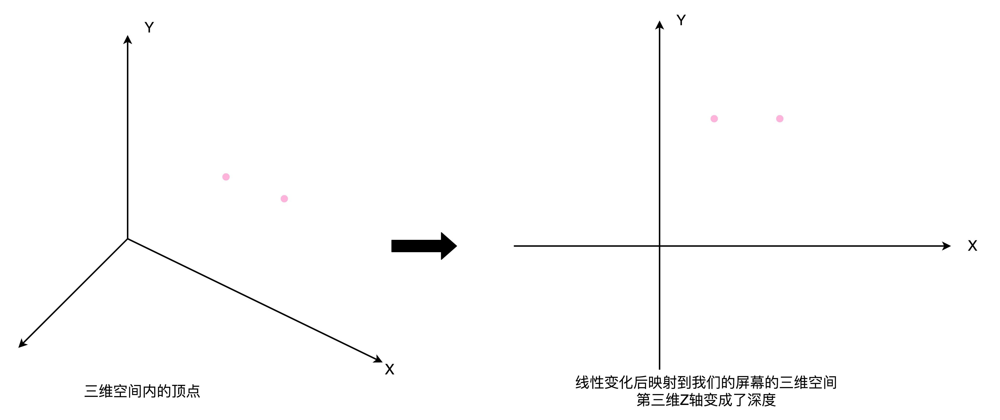

2. 图元处理(Primitive Processing)
   在顶点处理完成之后，开始进行第二步，也就是图元处理。图元处理，其实就是要把顶点处理完成之后的各个顶点连起来，变成多边形。其实转化后的顶点，仍然是在一个三维空间里，只是第三维的 Z 轴，是正对屏幕的"深度"。所以针对这些多边形，需要做一个操作，叫剔除和裁剪(Cull and Clip)，也就是把不在屏幕里面，或者一部分不在屏幕里面的内容给去掉，减少接下来流程的工作量。
   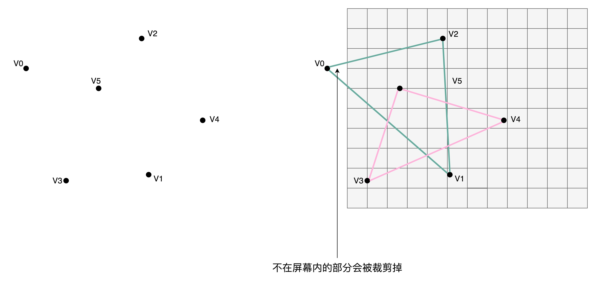

3. 栅格化(Rasterization)
   在图元处理完成之后，渲染还远远没有完成。屏幕分辨率是有限的。它一般是通过一个个"像素(Pixel)"来显示出内容的。所以，对于做完图元处理的多边形，要开始进行第三步操作。这个操作就是把它们转换成屏幕里面的一个个像素点。这个操作，就叫作栅格化。**这个栅格化操作，有一个特点和上面的顶点处理是一样的，就是每一个图元都可以并行独立地栅格化**。
   

4. 片段处理(Fragment Processing)
   在栅格化变成了像素点之后，图还是"黑白"的。还需要计算每一个像素的颜色、透明度等信息，给像素点上色。这步操作，就是片段处理。这步操作，同样也可以每个片段并行、独立进行，和上面的顶点处理和栅格化一样。
   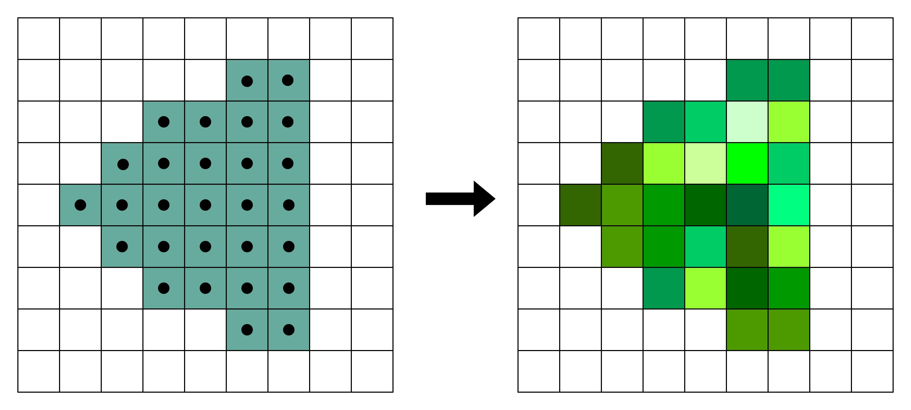

5. 像素操作(Pixel Operations)
   最后一步，就要把不同的多边形的像素点"混合(Blending)"到一起。可能前面的多边形可能是半透明的，那么前后的颜色就要混合在一起变成一个新的颜色；或者前面的多边形遮挡住了后面的多边形，那么只要显示前面多边形的颜色就好了。最终，输出到显示设备。
   

经过这完整的 5 个步骤之后，就完成了从三维空间里的数据的渲染，变成屏幕上可以看到的 3D 动画了。这样 5 个步骤的渲染流程，一般也被称之为**图形流水线**(Graphic Pipeline)。


#### 4.10.3 解放图形渲染的 GPU

在上世纪 90 年代的时候，屏幕的分辨率还没有现在那么高。一般的 CRT 显示器也就是 640×480 的分辨率。这意味着屏幕上有 30 万个像素需要渲染。为了让眼睛看到画面不晕眩，希望画面能有 60 帧。于是，每秒就要重新渲染 60 次这个画面。也就是说，每秒需要完成 1800 万次单个像素的渲染。从栅格化开始，每个像素有 3 个流水线步骤，即使每次步骤只有 1 个指令，那也需要 5400 万条指令，也就是 54M 条指令。

93 年出货的第一代 Pentium 处理器，主频是 60MHz，后续逐步推出了 66MHz、75MHz、100MHz 的处理器。以这个性能来看，用 CPU 来渲染 3D 图形，基本上就要把 CPU 的性能用完了。因为实际的每一个渲染步骤可能不止一个指令，CPU 可能根本就跑不动这样的三维图形渲染。

也就是在这个时候，Voodoo FX 这样的图形加速卡登上了历史舞台。既然图形渲染的流程是固定的，那直接用硬件来处理这部分过程，不用 CPU 来计算是不是就好了？很显然，这样的硬件会比制造有同样计算性能的 CPU 要便宜得多。因为整个计算流程是完全固定的，不需要流水线停顿、乱序执行等等的各类导致 CPU 计算变得复杂的问题。也不需要有什么可编程能力，只要让硬件按照写好的逻辑进行运算就好了。

那个时候，整个顶点处理的过程还是都由 CPU 进行的，不过后续所有到图元和像素级别的处理都是通过 Voodoo FX 或者 TNT 这样的显卡去处理的。

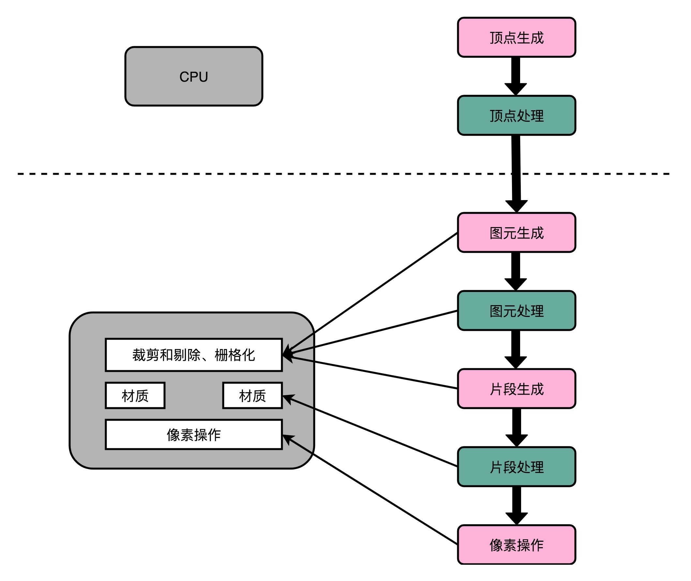

不过，无论是 Voodoo FX 还是 NVidia TNT。整个显卡的架构还不同于现代的显卡，也没有现代显卡去进行各种加速深度学习的能力。这个能力，要到 NVidia 提出 Unified Shader Achitecture 才开始具备。

#### 4.10.4 Shader 的诞生和可编程图形处理器

在 Voodoo 和 TNT 显卡的渲染管线里面，没有"顶点处理"这个步骤。在当时，把多边形的顶点进行线性变化，转化到屏幕的坐标系的工作还是由 CPU 完成的。所以，CPU 的性能越好，能够支持的多边形也就越多，对应的多边形建模的效果自然也就越像真人。而 3D 游戏的多边形性能也受限于 CPU 的性能。无论显卡有多快，如果 CPU 不行，3D 画面一样还是不行。

所以，1999 年 NVidia 推出的 GeForce 256 显卡，就把顶点处理的计算能力，也从 CPU 里挪到了显卡里。不过，这对于想要做好 3D 游戏的程序员们还不够，即使到了 GeForce 256。整个图形渲染过程都是在硬件里面固定的管线来完成的。程序员们在加速卡上能做的事情，只有改配置来实现不同的图形渲染效果。如果通过改配置做不到，就没有什么办法了。

这个时候，程序员希望 GPU 也能有一定的可编程能力。这个编程能力不是像 CPU 那样，有非常通用的指令，可以进行任何操作，而是在整个的**渲染管线**(Graphics Pipeline)的一些特别步骤，能够自己去定义处理数据的算法或者操作。于是，从 2001 年的 Direct3D 8.0 开始，微软第一次引入了**可编程管线**(Programable Function Pipeline)的概念。

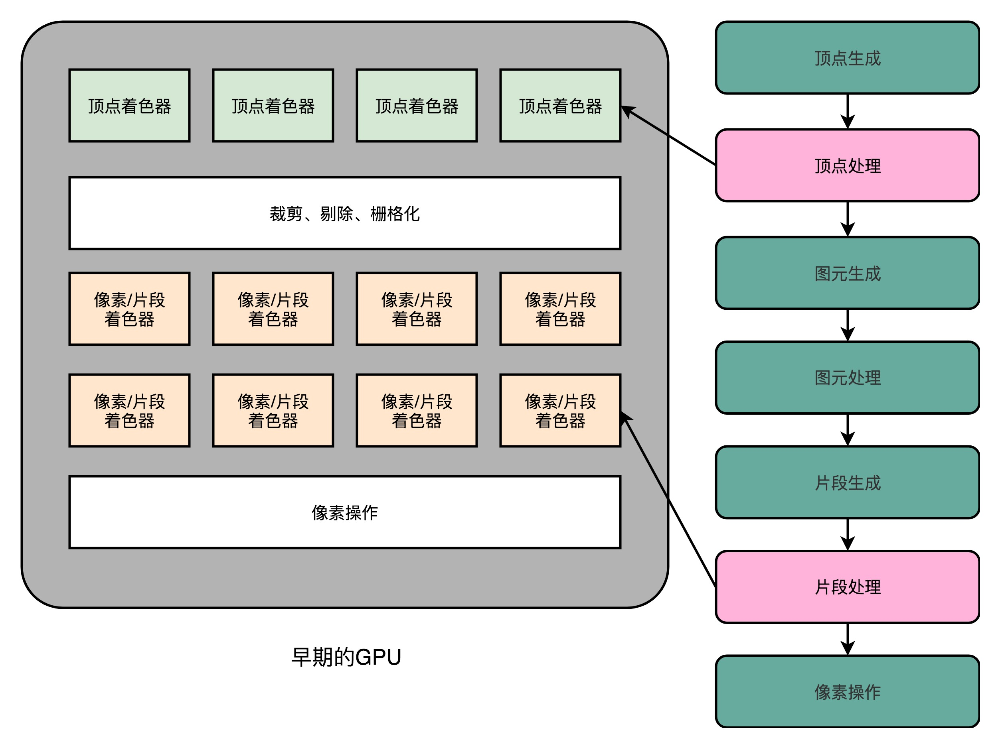

一开始的可编程管线，仅限于顶点处理(Vertex Processing)和片段处理(Fragment Processing)部分。比起原来只能通过显卡和 Direct3D 这样的图形接口提供的固定配置，程序员们终于也可以开始在图形效果上开始大显身手了。

这些可以编程的接口，称之为 **Shader**，中文名称是**着色器**。之所以叫"着色器"，是因为一开始这些"可编程"的接口，只能修改顶点处理和片段处理部分的程序逻辑。用这些接口来做的，也主要是光照、亮度、颜色等等的处理，所以叫着色器。

这个时候的 GPU，有两类 Shader，也就是 Vertex Shader 和 Fragment Shader。在进行顶点处理的时候，操作的是多边形的顶点；在片段操作的时候，操作的是屏幕上的像素点。对于顶点的操作，通常比片段要复杂一些。所以一开始，这两类 Shader 都是独立的硬件电路，也各自有独立的编程接口。因为这么做，硬件设计起来更加简单，一块 GPU 上也能容纳下更多的 Shader。

不过，很快发现，虽然在顶点处理和片段处理上的具体逻辑不太一样，但是里面用到的指令集可以用同一套。而且，虽然把 Vertex Shader 和 Fragment Shader 分开，可以减少硬件设计的复杂程度，但是也带来了一种浪费，有一半 Shader 始终没有被使用。在整个渲染管线里，Vertex Shader 运行的时候，Fragment Shader 停在那里什么也没干。Fragment Shader 在运行的时候，Vertex Shader 也停在那里发呆。

本来 GPU 就不便宜，结果设计的电路有一半时间是闲着的。于是，**统一着色器架构**(Unified Shader Architecture)就应运而生了。

既然使用指令集是一样的，那不如就在 GPU 里面放很多个一样的 Shader 硬件电路，然后通过统一调度，把顶点处理、图元处理、片段处理这些任务，都交给这些 Shader 去处理，让整个 GPU 尽可能地忙起来。这样的设计，就是现代 GPU 的设计，就是统一着色器架构。

有意思的是，这样的 GPU 并不是先在 PC 里面出现的，而是来自于一台游戏机，就是微软的 XBox 360。后来，这个架构才被用到 ATI 和 NVidia 的显卡里。这个时候的"着色器"的作用，其实已经和它的名字关系不大了，而是变成了一个通用的抽象计算模块的名字。

正是因为 Shader 变成一个"通用"的模块，才有了把 GPU 拿来做各种通用计算的用法，也就是 GPGPU(General-Purpose Computing on Graphics Processing Units，通用图形处理器)。而正是因为 GPU 可以拿来做各种通用的计算，才有了过去 10 年深度学习的火热。

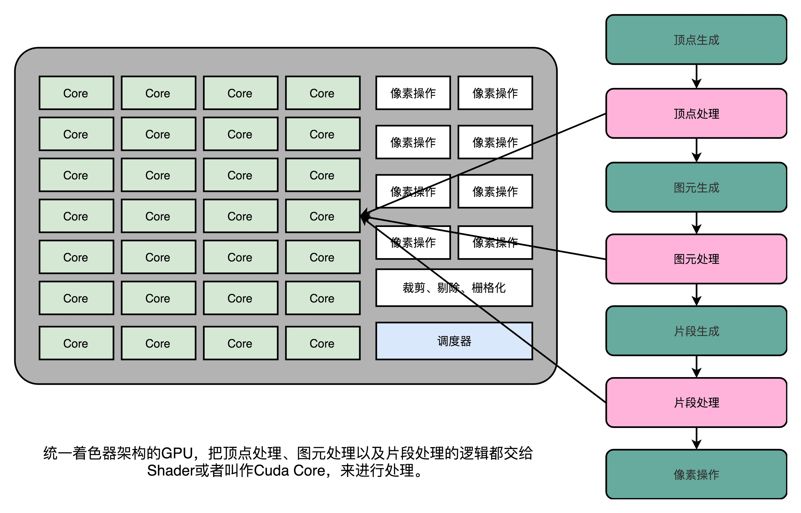

#### 4.10.5 现代 GPU 的三个核心创意

为什么现代的 GPU 在图形渲染、深度学习上能那么快。

- **芯片瘦身**
  现代 CPU 里的晶体管变得越来越多，越来越复杂，其实已经不是用来实现"计算"这个核心功能，而是拿来实现处理乱序执行、进行分支预测，以及存储器的高速缓存。
  而在 GPU 里，这些电路就显得有点多余了，GPU 的整个处理过程是一个[流式处理](https://en.wikipedia.org/wiki/Stream_processing)(Stream Processing)的过程。因为没有那么多分支条件，或者复杂的依赖关系，可以把 GPU 里这些对应的电路都可以去掉，做一次瘦身，只留下取指令、指令译码、ALU 以及执行这些计算需要的寄存器和缓存就好了。一般来说，会把这些电路抽象成三个部分，就是下面图里的取指令和指令译码、ALU 和执行上下文。
  

- **多核并行和 SIMT**
  这样一来，GPU 电路就比 CPU 简单很多了。于是，就可以在一个 GPU 里面，塞很多个这样并行的 GPU 电路来实现计算，就好像 CPU 里面的多核 CPU 一样。和 CPU 不同的是，GPU 不需要单独去实现什么多线程的计算。因为 GPU 的运算是天然并行的。

  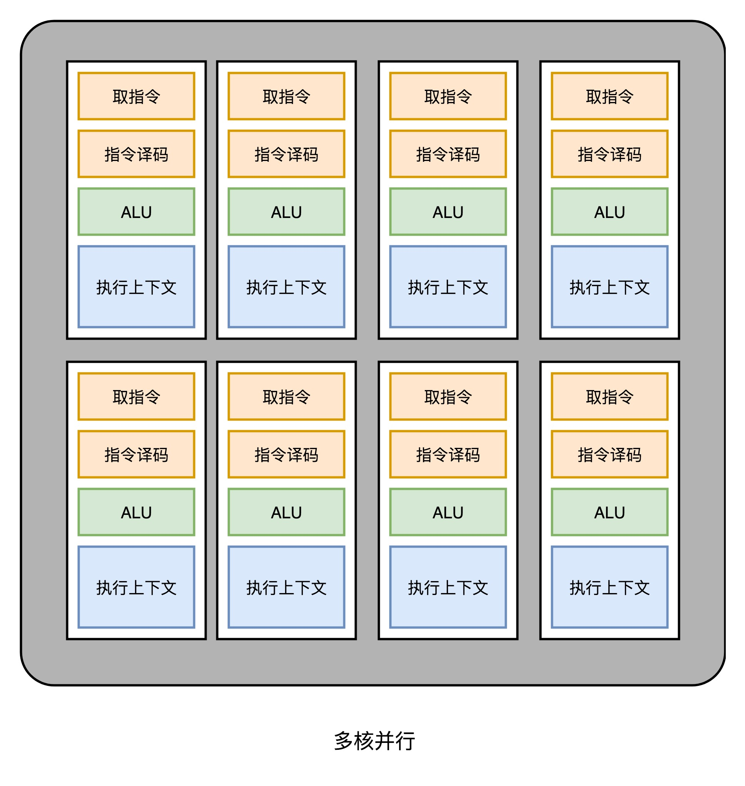

  无论是对多边形里的顶点进行处理，还是屏幕里面的每一个像素进行处理，每个点的计算都是独立的。所以，简单地添加多核的 GPU，就能做到并行加速。不过光这样加速还是不够，工程师们觉得，性能还有进一步被压榨的空间。
  CPU 里有一种叫作 [SIMD](#47-单指令多数据流simd加速矩阵乘法) 的处理技术。这个技术是说，在做向量计算的时候，要执行的指令是一样的，只是同一个指令的数据有所不同而已。在 GPU 的渲染管线里，这个技术可就大有用处了。

  无论是顶点去进行线性变换，还是屏幕上临近像素点的光照和上色，都是在用相同的指令流程进行计算。所以，GPU 就借鉴了 CPU 里面的 SIMD，用了一种叫作 SIMT(Single Instruction，Multiple Threads)的技术。SIMT 呢，比 SIMD 更加灵活。在 SIMD 里面，CPU 一次性取出了固定长度的多个数据，放到寄存器里面，用一个指令去执行。而 SIMT，可以把多条数据，交给不同的线程去处理。

  各个线程里面执行的指令流程是一样的，但是可能根据数据的不同，走到不同的条件分支。这样，相同的代码和相同的流程，可能执行不同的具体的指令。这个线程走到的是 if 的条件分支，另外一个线程走到的就是 else 的条件分支了。

  于是，GPU 设计就可以进一步进化，也就是在取指令和指令译码的阶段，取出的指令可以给到后面多个不同的 ALU 并行进行运算。这样，一个 GPU 的核里，就可以放下更多的 ALU，同时进行更多的并行运算了。

  

- **GPU 里的"超线程"**
  虽然 GPU 里面的主要以数值计算为主。不过既然已经是一个"通用计算"的架构了，GPU 里面也避免不了会有 if…else 这样的条件分支。但是，在 GPU 里没有 CPU 这样的分支预测的电路。这些电路在上面"芯片瘦身"的时候，就已经被砍掉了。
  所以，GPU 里的指令，可能会遇到和 CPU 类似的"流水线停顿"问题。想到流水线停顿，就可以想到[超线程](#472-超线程)技术。在 GPU 上，一样可以做类似的事情，也就是遇到停顿的时候，调度一些别的计算任务给当前的 ALU。
  和超线程一样，既然要调度一个不同的任务过来，就需要针对这个任务，提供更多的执行上下文。所以，一个 Core 里面的执行上下文的数量，需要比 ALU 多。
  

#### 4.10.6 GPU 在深度学习上的性能差异

在通过芯片瘦身、SIMT 以及更多的执行上下文，就有了一个更擅长并行进行暴力运算的 GPU。这样的芯片，也正适合现代深度学习的使用场景。

一方面，GPU 是一个可以进行"通用计算"的框架，可以通过编程，在 GPU 上实现不同的算法。另一方面，现在的深度学习计算，都是超大的向量和矩阵，海量的训练样本的计算。整个计算过程中，没有复杂的逻辑和分支，非常适合 GPU 这样并行、计算能力强的架构。

看一下 NVidia 2080 显卡的技术规格，就可以算出，它到底有多大的计算能力。

2080 一共有 46 个 SM(Streaming Multiprocessor，流式处理器)，这个 SM 相当于 GPU 里面的 GPU Core，所以可以认为这是一个 46 核的 GPU，有 46 个取指令指令译码的渲染管线。每个 SM 里面有 64 个 Cuda Core。可以认为，这里的 Cuda Core 就是上面说的 ALU 的数量或者 Pixel Shader 的数量，46x64 一共就有 2944 个 Shader。然后，还有 184 个 TMU，TMU 就是 Texture Mapping Unit，也就是用来做纹理映射的计算单元，它也可以认为是另一种类型的 Shader

2080 的主频是 1515MHz，如果自动超频(Boost)的话，可以到 1700MHz。而 NVidia 的显卡，根据硬件架构的设计，每个时钟周期可以执行两条指令。所以，能做的浮点数运算的能力，就是：

```txt
(2944 + 184)× 1700 MHz × 2  = 10.06  TFLOPS
```

对照一下官方的技术规格，正好就是 10.07TFLOPS。

那么，最新的 Intel i9 9900K 的性能是不到 1TFLOPS。而 2080 显卡和 9900K 的价格却是差不多的。所以，在实际进行深度学习的过程中，用 GPU 所花费的时间，往往能减少一到两个数量级。而大型的深度学习模型计算，往往又是多卡并行，要花上几天乃至几个月。这个时候，用 CPU 显然就不合适了。今天，随着 GPGPU 的推出，GPU 已经不只是一个图形计算设备，更是一个用来做数值计算的好工具了。同样，也是因为 GPU 的快速发展，带来了过去 10 年深度学习的繁荣。

### 4.11 FPGA 和 ASIC：计算机体系结构的黄金时代

#### 4.11.1 现场可编程门阵列(FPGA)

CPU 其实就是一些简单的门电路像搭积木一样搭出来的。从最简单的门电路，搭建成半加器、全加器，然后再搭建成完整功能的 ALU。这些电路里呢，有完成各种实际计算功能的组合逻辑电路，也有用来控制数据访问，创建出寄存器和内存的时序逻辑电路。

一个四核 i7 的 Intel CPU，上面的晶体管数量差不多有 20 亿个。要想设计一个 CPU，就要想办法连接这 20 亿个晶体管。这已经够难了，后面还有更难的。就像写程序一样，连接晶体管不是一次就能完事儿了的。设计更简单一点儿的专用于特定功能的芯片，少不了要几个月。而设计一个 CPU，往往要以"年"来计。在这个过程中，硬件工程师们要设计、验证各种各样的技术方案，可能会遇到各种各样的 Bug。如果每次验证一个方案，都要单独设计生产一块芯片，那这个代价也太高了。

有没有什么办法，不用单独制造一块专门的芯片来验证硬件设计呢？能不能设计一个硬件，通过不同的程序代码，来操作这个硬件之前的电路连线，通过"编程"让这个硬件变成设计的电路连线的芯片呢？

这个就是 FPGA，也就是**现场可编程门阵列**(Field-Programmable Gate Array)。从 FPGA 里面的每一个字符，一个一个来看看它到底是什么意思:

- P 代表 Programmable，这个很容易理解。也就是说这是一个可以通过编程来控制的硬件。
- G 代表 Gate 也很容易理解，它就代表芯片里面的门电路。能够去进行编程组合的就是这样一个一个门电路。
- A 代表的 Array，叫作阵列，说的是在一块 FPGA 上，密密麻麻列了大量 Gate 这样的门电路。
- F 其实是说，一块 FPGA 这样的板子，可以在"现场"多次进行编程。它不像 PAL(Programmable Array Logic，可编程阵列逻辑)这样更古老的硬件设备，只能"编程"一次，把预先写好的程序一次性烧录到硬件里面，之后就不能再修改了。

这么看来，其实"FPGA"这样的组合，基本上解决了前面说的想要设计硬件的问题。可以像软件一样对硬件编程，可以反复烧录，还有海量的门电路，可以组合实现复杂的芯片功能。

CPU 其实就是通过晶体管，来实现各种组合逻辑或者时序逻辑。那么，怎么去"编程"连接这些线路呢？FPGA 的解决方案很精巧，有这样三个步骤:

1. **用存储换功能实现组合逻辑**
   在实现 CPU 的功能的时候，需要完成各种各样的电路逻辑。在 FPGA 里，这些基本的电路逻辑，不是采用布线连接的方式进行的，而是预先根据在软件里面设计的逻辑电路，算出对应的真值表，然后直接存到一个叫作 LUT(Look-Up Table，查找表)的电路里面。这个 LUT 其实就是一块存储空间，里面存储了"特定的输入信号下，对应输出 0 还是 1"。
   

2. **对于需要实现的时序逻辑电路，可以在 FPGA 里面直接放上 D 触发器，作为寄存器**
   这个和 CPU 里的触发器没有什么本质不同。不过，会把很多个 LUT 的电路和寄存器组合在一起，变成一个叫作逻辑簇(Logic Cluster)的东西。在 FPGA 里，这样组合了多个 LUT 和寄存器的设备，也被叫做 CLB(Configurable Logic Block，可配置逻辑块)。
   通过配置 CLB 实现的功能有点儿像全加器。它已经在最基础的门电路上做了组合，能够提供更复杂一点的功能。更复杂的芯片功能，不用再从门电路搭起，可以通过 CLB 组合搭建出来。
   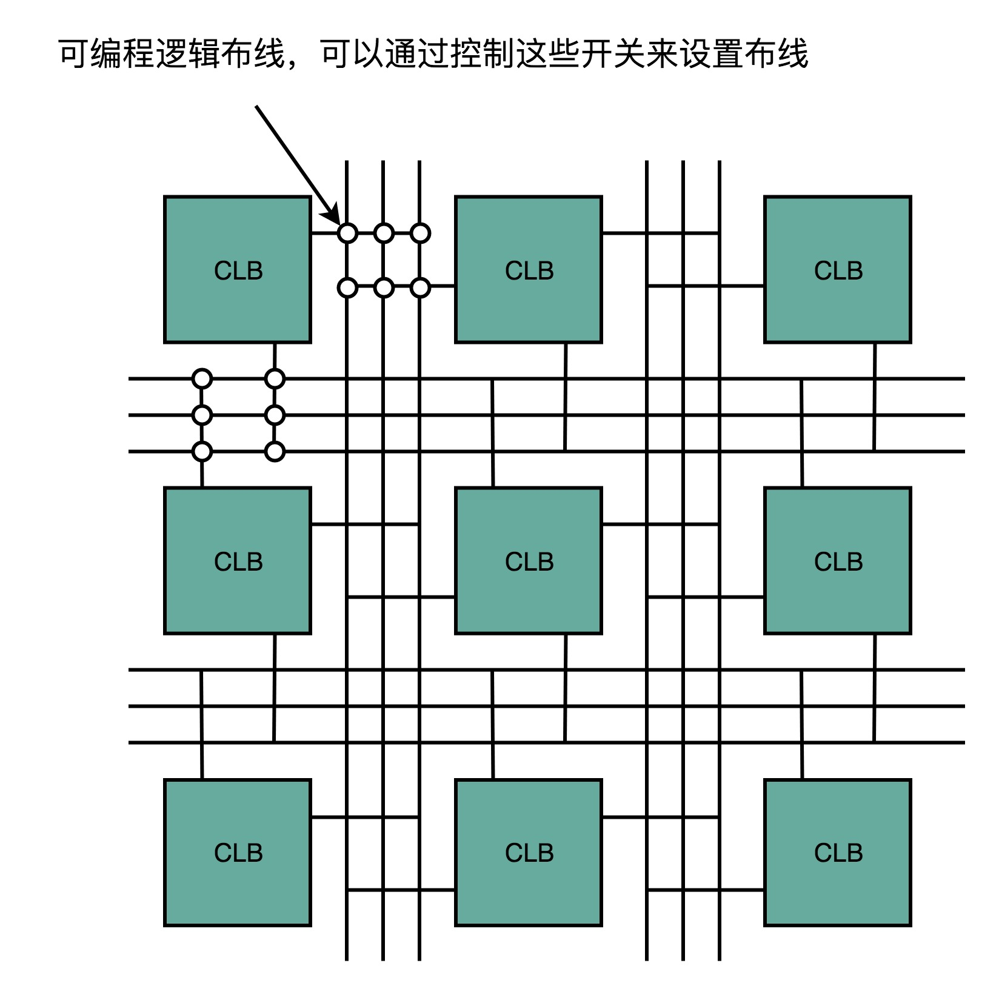

3. **FPGA 是通过可编程逻辑布线，来连接各个不同的 CLB，最终实现想要实现的芯片功能**
   这个可编程逻辑布线，可以把它当成铁路网。整个铁路系统已经铺好了，但是整个铁路网里面，设计了很多个道岔。可以通过控制道岔，来确定不同的列车线路。在可编程逻辑布线里面，"编程"在做的，就是拨动像道岔一样的各个电路开关，最终实现不同 CLB 之间的连接，完成想要的芯片功能。
   于是，通过 LUT 和寄存器，能够组合出很多 CLB，而通过连接不同的 CLB，最终有了想要的芯片功能。最关键的是，这个组合过程是可以"编程"控制的。而且这个编程出来的软件，还可以后续改写，重新写入到硬件里。让同一个硬件实现不同的芯片功能。从这个角度来说，FPGA 也是"软件吞噬世界"的一个很好的例子。

#### 4.11.2 专用集成电路(ASIC)

除了 CPU、GPU，以及刚刚的 FPGA，其实还需要用到很多其他芯片。比如，现在手机里就有专门用在摄像头里的芯片；录音笔里会有专门处理音频的芯片。尽管一个 CPU 能够处理好手机拍照的功能，也能处理好录音的功能，但是直接在手机或者录音笔里塞上一个 Intel CPU，显然比较浪费。

于是，就考虑为这些有专门用途的场景，单独设计一个芯片。这些专门设计的芯片，称之为 **ASIC**(Application-Specific Integrated Circuit)，也就是**专用集成电路**。事实上，过去几年，ASIC 发展得特别快。因为 ASIC 是针对专门用途设计的，所以它的电路更精简，单片的制造成本也比 CPU 更低。而且，因为电路精简，所以通常能耗要比用来做通用计算的 CPU 更低。

因为 ASIC 的生产制造成本，以及能耗上的优势，过去几年里，有不少公司设计和开发 ASIC 用来"挖矿"。这个"挖矿"，说的其实就是设计专门的数值计算芯片，用来"挖"比特币、ETH 这样的数字货币。

对 FPGA 进行"编程"，其实就是把 FPGA 的电路变成了一个 ASIC。这样的芯片，往往在成本和功耗上优于需要做通用计算的 CPU 和 GPU。但是 FPGA 一样有缺点，那就是它的硬件上有点儿"浪费"。

**FPGA 缺点**
每一个 LUT 电路，其实都是一个小小的"浪费"。一个 LUT 电路设计出来之后，既可以实现与门，又可以实现或门，自然用到的晶体管数量，比单纯连死的与门或者或门的要多得多。同时，因为用的晶体管多，它的能耗也比单纯连死的电路要大，单片 FPGA 的生产制造的成本也比 ASIC 要高不少。

**FPGA 优点**
当然，有缺点就有优点，FPGA 的优点在于，它**没有硬件研发成本**。ASIC 的电路设计，需要仿真、验证，还需要经过流片(Tape out)，变成一个印刷的电路版，最终变成芯片。所以，如果设计的专用芯片，只是要制造几千片，那买几千片现成的 FPGA，可能远比花上几百万美元，来设计、制造 ASIC 要经济得多。

实际上，到底使用 ASIC 这样的专用芯片，还是采用 FPGA 这样可编程的通用硬件，核心的决策因素还是成本。不过这个成本，不只是单个芯片的生产制造成本，还要考虑**总体拥有成本**(Total Cost of Ownership)，也就是说，除了生产成本之外，还要把研发成本也算进去。如果只制造了一片芯片，那么成本就是"这枚芯片的成本 + 为了这枚芯片建的生产线的成本 + 芯片的研发成本"。

单个 ASIC 的生产制造成本比 FPGA 低，ASIC 的能耗也比能实现同样功能的 FPGA 要低。能耗低，意味着长时间运行这些芯片，所用的电力成本也更低。

但是，ASIC 有一笔很高的 NRE(Non-Recuring Engineering Cost，一次性工程费用)成本。这个成本，就是 ASIC 实际"研发"的成本。只有需要大量生产 ASIC 芯片的时候，才能摊薄这份研发成本。

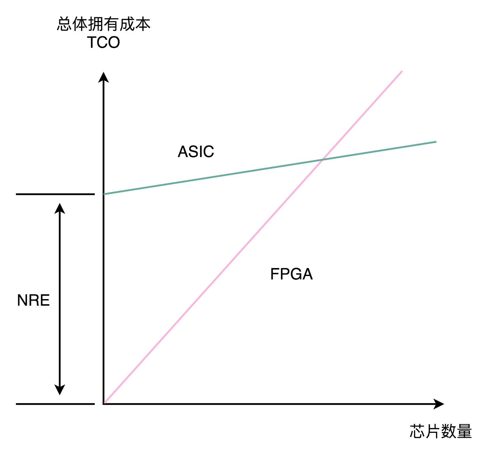

其实，在的日常软件开发过程中，也需要做同样的决策。很多需要的功能，可能在市面上已经有开源的软件可以实现。可以在开源的软件之上做配置或者开发插件，也可以选择自己从头开始写代码。

在开源软件或者是买来的商业软件上启动，往往能很快让产品上线。如果从头开始写代码，往往会有一笔不地的 NRE 成本，也就是研发成本。但是通常自己写的代码，能够 100% 贴近业务需求，后续随着业务需求的改造成本会更低。如果要大规模部署很多服务器的话，服务器的成本会更低。学会从 TCO 和 NRE 的成本去衡量做决策，也是每一个架构师的必修课。

#### 4.11.3 解读 TPU: 设计和拆解一块 ASIC 芯片

过去几年，最知名、最具有实用价值的 ASIC 就是 TPU 了。那么，怎么能够设计出来一块有真实应用场景的 ASIC 呢？如果要去设计一块 ASIC，应该如何思考和拆解问题呢？

##### 4.11.3.1 TPU V1 想要解决什么问题

第一代 TPU 的设计并不是异想天开的创新，而是来自于真实的需求。从 2012 年解决计算机视觉问题开始，深度学习一下子进入了大爆发阶段，也一下子带火了 GPU，NVidia 的股价一飞冲天。[GPU](#4104-shader-的诞生和可编程图形处理器) 天生适合进行海量、并行的矩阵数值计算，于是它被大量用在深度学习的模型训练上。

在深度学习热起来之后，计算量最大并不是进行深度学习的训练，而是深度学习的推断部分。

所谓**推断部分**，是指在完成深度学习训练之后，把训练完成的模型存储下来。这个存储下来的模型，是许许多多个向量组成的参数。然后，根据这些参数，去计算输入的数据，最终得到一个计算结果。这个推断过程，可能是在互联网广告领域，去推测某一个用户是否会点击特定的广告；也可能是在经过高铁站的时候，扫一下身份证进行一次人脸识别，判断一下是不是本人。

虽然训练一个深度学习的模型需要花的时间不少，但是实际在推断上花的时间要更多。所以，第一代的 TPU，首先优化的并不是深度学习的模型训练，而是深度学习的模型推断。

模型的训练和推断，主要有三点不同:

- **深度学习的推断工作更简单，对灵活性的要求也就更低**。模型推断的过程，只需要去计算一些矩阵的乘法、加法，调用一些 Sigmoid 或者 RELU 这样的激活函数。这样的过程可能需要反复进行很多层，但是也只是这些计算过程的简单组合。

- **深度学习的推断的性能，首先要保障响应时间的指标**。计算机关注的性能指标，有响应时间(Response Time)和吞吐率(Throughput)。在模型训练的时候，只需要考虑吞吐率问题就行了。因为一个模型训练少则好几分钟，多的话要几个月。而推断过程，像互联网广告的点击预测，希望能在几十毫秒乃至几毫秒之内就完成，而人脸识别也不希望会超过几秒钟。很显然，模型训练和推断对于性能的要求是截然不同的。

- **深度学习的推断工作，希望在功耗上尽可能少一些**。深度学习的训练，对功耗没有那么敏感，只是希望训练速度能够尽可能快。这是因为，深度学习的推断，要 7×24h 地跑在数据中心里面。而且，对应的芯片，要大规模地部署在数据中心。一块芯片减少 5% 的功耗，就能节省大量的电费。而深度学习的训练工作，大部分情况下只是少部分算法工程师用少量的机器进行。很多时候，只是做小规模的实验，尽快得到结果，节约人力成本。

这三点的差别，也就带出了第一代 TPU 的设计目标。那就是，在保障响应时间的情况下，能够尽可能地提高**能效比**这个指标，也就是进行同样多数量的推断工作，花费的整体能源要显著低于 CPU 和 GPU。

##### 4.11.3.2 深入理解 TPU V1

**快速上线和向前兼容，一个 FPU 的设计**
除了满足上面的深度学习的推断特性之外，还有两件事情必须要考虑:

- TPU 要有向前兼容性
  在计算机产业界里，因为没有考虑向前兼容，惨遭失败的产品数不胜数。所以，TPU 并没有设计成一个独立的"CPU"，而是设计成一块像显卡一样，插在主板 PCI-E 接口上的板卡。更进一步地，TPU 甚至没有像现代 GPU 一样，设计成自己有对应的取指令的电路，而是通过 CPU，向 TPU 发送需要执行的指令。

- 希望 TPU 能够尽早上线
  上面两个设计，使得 TPU 的硬件设计变得简单了，只需要专心完成一个专用的"计算芯片"就好了。所以，TPU 整个芯片的设计上线时间也就缩短到了 15 个月。不过，这样的 TPU 是一个像 FPU(浮点数处理器)的协处理器(Coprocessor)，而不是像 CPU 和 GPU 这样可以独立工作的 Processor Unit。

**专用电路和大量缓存，适应推断的工作流程**
明确了 TPU 整体的设计思路之后，可以来看一看，TPU 内部有哪些芯片和数据处理流程。

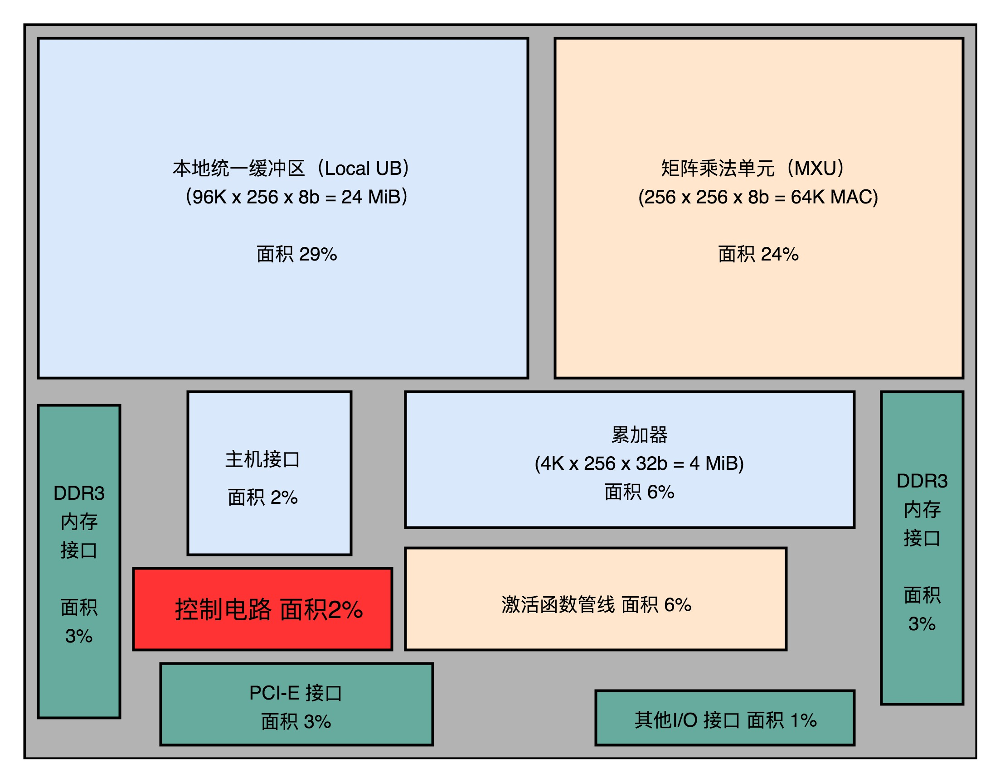

> 模块图：整个 TPU 的硬件，完全是按照深度学习一个层(Layer)的计算流程来设计的

可以看到，在芯片模块图里面，有单独的矩阵乘法单元(Matrix Multiply Unit)、累加器(Accumulators)模块、激活函数(Activation)模块和归一化 / 池化(Normalization/Pool)模块。而且，这些模块是顺序串联在一起的。

这是因为，一个深度学习的推断过程，是由很多层的计算组成的。而每一个层(Layer)的计算过程，就是先进行矩阵乘法，再进行累加，接着调用激活函数，最后进行归一化和池化。这里的硬件设计，就是把整个流程变成一套固定的硬件电路。这也是一个 ASIC 的典型设计思路，其实就是把确定的程序指令流程，变成固定的硬件电路。

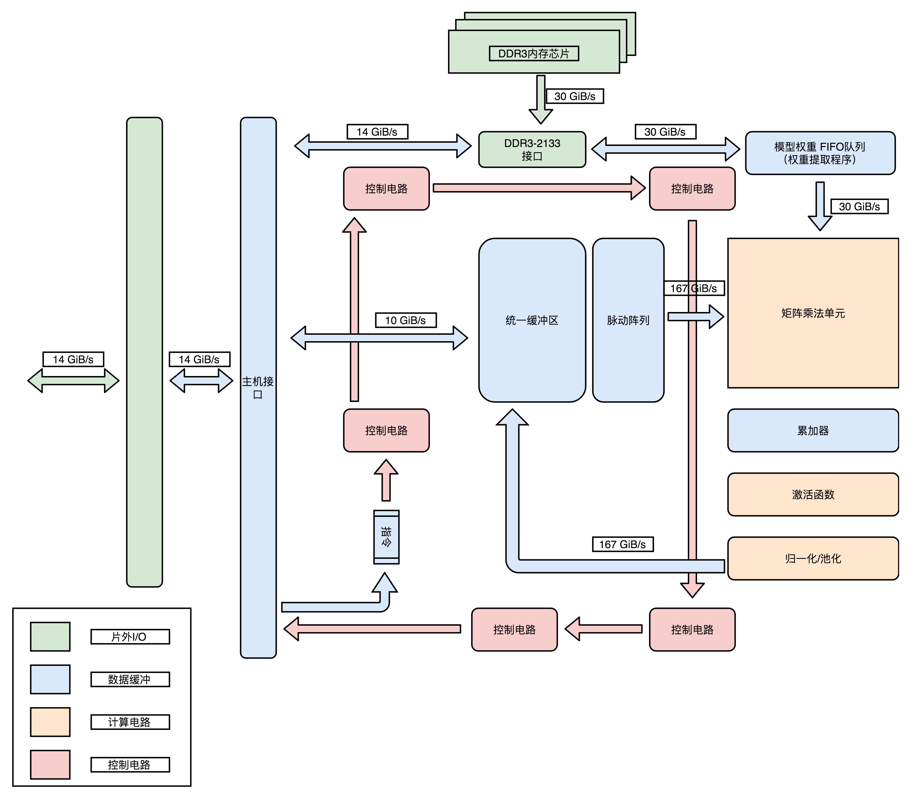

> 芯片布局图：从尺寸可以看出，统一缓冲区和矩阵乘法单元是 TPU 的核心功能组件

接着，再来看芯片布局图，其中控制电路(Control)只占了 2%。这是因为，TPU 的计算过程基本上是一个固定的流程。不像 CPU 那样，有各种复杂的控制功能，比如冒险、分支预测等等。

可以看到，超过一半的 TPU 的面积，都被用来作为 Local Unified Buffer(本地统一缓冲区)(29%)和 矩阵乘法单元(Matrix Multiplication Unit)(24%)了。

相比于矩阵乘法单元，累加器、实现激活函数和后续的归一 / 池化功能的激活管线(Activation Pipeline)也用得不多。这是因为，在深度学习推断的过程中，矩阵乘法的计算量是最大的，计算也更复杂，所以比简单的累加器和激活函数要占用更多的晶体管。

而统一缓冲区(Unified Buffer)，则由 SRAM 这样高速的存储设备组成。SRAM 一般被直接拿来作为 CPU 的寄存器或者高速缓存。SRAM 比起内存使用的 DRAM 速度要快上很多，但是因为电路密度小，所以占用的空间要大很多。统一缓冲区之所以使用 SRAM，是因为在整个的推断过程中，它会高频反复地被矩阵乘法单元读写，来完成计算。

可以看到，整个 TPU 里面，每一个组件的设计，完全是为了深度学习的推断过程设计出来的。这也是**设计开发 ASIC 的核心原因：用特制的硬件，最大化特定任务的运行效率**。

**细节优化，使用 8 Bits 数据**
除了整个 TPU 的模块设计和芯片布局之外，TPU 在各个细节上也充分考虑了自己的应用场景，可以拿里面的矩阵乘法单元(Matrix Multiplication Unit)来作为一个例子。

这个矩阵乘法单元，没有用 32 Bits 来存放一个浮点数，而是只用了一个 8 Bits 来存放浮点数。这是因为，在实践的机器学习应用中，会对数据做归一化(Normalization)和正则化(Regularization)的处理。这两个操作，会使得深度学习里面操作的数据都不会变得太大。通常来说，都能控制在 -3 到 3 这样一定的范围之内。

因为这个数值上的特征，需要的浮点数的精度也不需要太高了。用 8 位或者 16 位表示浮点数，也能把精度放到 2^6^ 或者 2^12^，也就是 1/64 或者 1/4096。在深度学习里，也够用了。特别是在模型推断的时候，要求的计算精度，往往比模型训练低。所以，8 Bits 的矩阵乘法器，就可以放下更多的计算量，使得 TPU 的推断速度更快。

**用数字说话，TPU 的应用效果**
综合了这么多优秀设计点的 TPU，实际的使用效果 Google 在 TPU 的论文里面给出了答案:

- 在性能上，TPU 比现在的 CPU、GPU 在深度学习的推断任务上，要快 15 ～ 30 倍。而在能耗比上，更是好出 30 ～ 80 倍。
- Google 已经用 TPU 替换了自家数据中心里 95% 的推断任务。

### 4.12 理解虚拟机：在云上拿到的计算机是什么样的

上世纪 60 年代，计算机还是异常昂贵的设备，实际的计算机使用需求要面临两个挑战。

- 计算机特别昂贵，要尽可能地让计算机忙起来，一直不断地去处理一些计算任务。
- 很多工程师想要用上计算机，但是没有能力自己花钱买一台，所以，要让很多人可以共用一台计算机。

**分时系统**
为了应对这两个问题，分时系统的计算机就应运而生了。

无论是个人用户，还是一个小公司或者小机构，都不需要花大价钱去买一台电脑。只需要买一个输入输出的终端，就好像一套鼠标、键盘、显示器这样的设备，然后通过电话线，连到放在大公司机房里面的计算机就好了。这台计算机，会自动给程序或任务分配计算时间。只需要为花费的 "计算时间"和使用的电话线路付费就可以了。

#### 4.12.1 公有云

现代公有云上的系统级虚拟机能够快速发展，其实和分时系统的设计思路是一脉相承的，这其实就是来自于电商巨头亚马逊大量富余的计算能力。

和国内有"双十一"一样，美国会有感恩节的"黑色星期五(Black Friday)"和"网络星期一(Cyber Monday)"，这样一年一度的大型电商促销活动。几天的活动期间，会有大量的用户进入亚马逊这样的网站，看商品、下订单、买东西。这个时候，整个亚马逊需要的服务器计算资源可能是平时的数十倍。

于是，亚马逊会按照"黑色星期五"和"网络星期一"的用户访问量，来准备服务器资源。这个就带来了一个问题，那就是在一年的 365 天里，有 360 天这些服务器资源是大量空闲的。

所以，亚马逊就想把这些服务器给租出去。出租物理服务器当然是可行的，但是却不太容易自动化，也不太容易面向中小客户。

直接出租物理服务器，意味着只能进行服务器的"整租"，这样大部分中小客户就不愿意了。为了节约数据中心的空间，亚马逊实际用的物理服务器，大部分多半是强劲的高端 8 核乃至 12 核的服务器。想要租用这些服务器的中小公司，起步往往只需要 1 个 CPU 核心乃至更少资源的服务器。

这个"整租"的问题，还发生在"时间"层面。物理服务器里面装好的系统和应用，不租了而要再给其他人使用，就必须清空里面已经装好的程序和数据，得做一次"重装"。如果只是暂时不用这个服务器了，过一段时间又要租这个服务器，数据中心服务商就不得不先重装整个系统，然后租给别人。等别人不用了，再重装系统租给你，特别地麻烦。

其实，对于想要租用服务器的用户来说，最好的体验不是租房子，而是住酒店。

而这样的需求，用虚拟机技术来实现，再好不过了。虚拟机技术，使们可以在一台物理服务器上，同时运行多个虚拟服务器，并且可以动态去分配，每个虚拟服务器占用的资源。对于不运行的虚拟服务器，也可以把这个虚拟服务器"关闭"。这个"关闭"了的服务器，就和一个被关掉的物理服务器一样，它不会再占用实际的服务器资源。但是，重新打开这个虚拟服务器的时候，里面的数据和应用都在，不需要再重新安装一次。

#### 4.12.2 虚拟机

**虚拟机**(Virtual Machine)技术，其实就是指在现有硬件的操作系统上，**模拟**一个计算机系统的技术。而模拟一个计算机系统，最简单的办法，其实不能算是虚拟机技术，而是一个模拟器(Emulator)。

##### 4.12.2.1 解释型虚拟机

要模拟一个计算机系统，最简单的办法，就是兼容这个计算机系统的指令集。可以开发一个应用程序，跑在操作系统上。这个应用程序，可以识别想要模拟的、计算机系统的程序格式和指令，然后一条条去解释执行。

在这个过程中，把原先的操作系统叫作**宿主机**(Host)，把能够有能力去模拟指令执行的软件，叫作**模拟器**(Emulator)，而实际运行在模拟器上被"虚拟"出来的系统呢，叫**客户机**(Guest VM)。

这个方式，其实和运行 Java 程序的 Java 虚拟机很像。只不过，Java 虚拟机运行的是 Java 自己定义发明的中间代码，而不是一个特定的计算机系统的指令。

**优点**:
**这种解释执行方式的最大的优势就是，模拟的系统可以跨硬件**。比如，Android 手机用的 CPU 是 ARM 的，而开发机用的是 Intel X86 的，两边的 CPU 指令集都不一样，但是一样可以正常运行。如果想玩的街机游戏，里面的硬件早已停产，那自然只能选择 MAME 这样的模拟器。

**缺点**:
不过这个方式也有两个明显的缺陷:

- **做不到精确的"模拟"**。很多的老旧的硬件的程序运行，要依赖特定的电路乃至电路特有的时钟频率，想要通过软件达到 100% 模拟是很难做到的。
- **这种解释执行的方式，性能实在太差了**。因为并不是直接把指令交给 CPU 去执行的，而是要经过各种解释和翻译工作。

所以，虽然模拟器这样的形式有它的实际用途。甚至为了解决性能问题，也有类似于 Java 当中的 JIT 这样的"编译优化"的办法，把本来解释执行的指令，编译成 Host 可以直接运行的指令。但是，这个性能还是不能让人满意。

##### 4.12.2.2 Type-1 和 Type-2：虚拟机的性能提升

所以，希望虚拟化技术，能够克服上面的模拟器方式的两个缺陷。同时，可以放弃掉模拟器方式能做到的跨硬件平台的这个能力。因为毕竟对于想要做的云服务里的"服务器租赁"业务来说，中小客户想要租的也是一个 x86 的服务器。而另外一方面，他们希望这个租用的服务器用起来，和直接买一台或者租一台物理服务器没有区别。出租方，也希望服务器不要因为用了虚拟化技术，而在中间损耗掉太多的性能。

所以，首先需要一个"全虚拟化"的技术，也就是说，可以在现有的物理服务器的硬件和操作系统上，去跑一个或多个完整的、不需要做任何修改的客户机操作系统(Guest OS)。这里用到了软件开发中很常用的一个解决方案，加入一个中间层。在虚拟机技术里面，这个中间层就叫作**虚拟机监视器**，英文叫 VMM(Virtual Machine Manager)或者 Hypervisor。

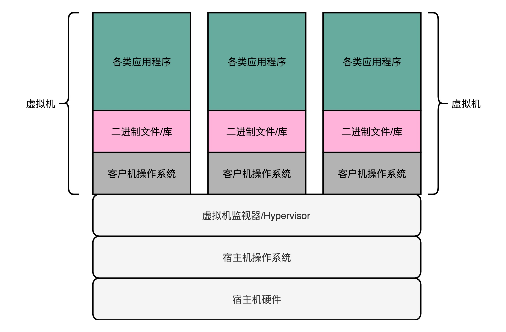

如果说宿主机的 OS 是房东的话，这个虚拟机监视器，就像一个二房东。运行的虚拟机，都不是直接和房东打交道，而是要和这个二房东打交道。跑在上面的虚拟机，会把整个的硬件特征都映射到虚拟机环境里，这包括整个完整的 CPU 指令集、I/O 操作、中断等等。

既然要通过虚拟机监视器这个二房东，实际的指令是怎么落到硬件上去实际执行的呢？这里有两种办法，也就是 Type-1 和 Type-2 这两种类型的虚拟机。

- 先来看 Type-2 类型的虚拟机。在 Type-2 虚拟机里，上面说的虚拟机监视器好像一个运行在操作系统上的软件。客户机的操作系统，把最终到硬件的所有指令，都发送给虚拟机监视器。而虚拟机监视器，又会把这些指令再交给宿主机的操作系统去执行。
  Type-2 型的虚拟机，只是把在模拟器里的指令翻译工作，挪到了虚拟机监视器里。Type-2 型的虚拟机，更多是用在日常的个人电脑里，而不是用在数据中心里。

- 在数据中心里面用的虚拟机，通常叫作 Type-1 型的虚拟机。这个时候，客户机的指令交给虚拟机监视器之后，不再需要通过宿主机的操作系统，才能调用硬件，而是可以直接由虚拟机监视器去调用硬件。
  另外，在数据中心里面，并不需要在 Intel x86 上面去跑一个 ARM 的程序，而是直接在 x86 上虚拟一个 x86 硬件的计算机和操作系统。所以，指令不需要做什么翻译工作，可以直接往下传递执行就好了，指令的执行效率也会很高。
  所以，在 Type-1 型的虚拟机里，虚拟机监视器其实并不是一个操作系统之上的应用层程序，而是一个嵌入在操作系统内核里面的一部分。无论是 KVM、XEN 还是微软的 Hyper-V，其实都是系统级的程序。

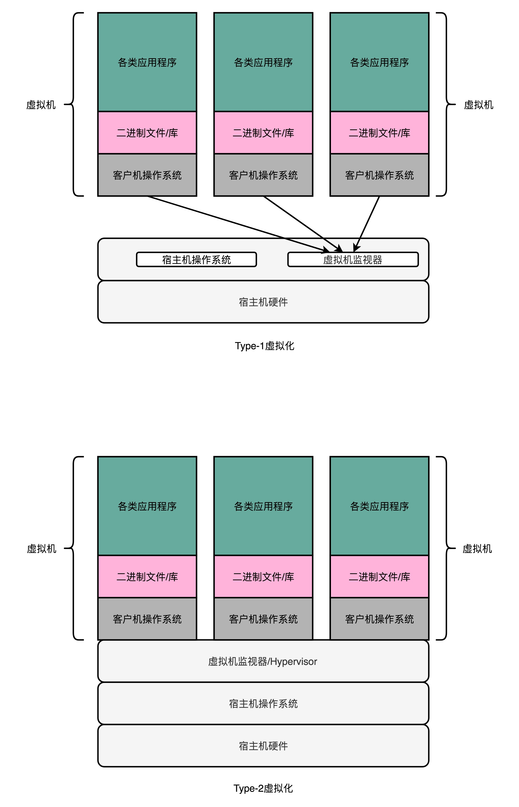

因为虚拟机监视器需要直接和硬件打交道，所以它也需要包含能够直接操作硬件的驱动程序。所以 Type-1 的虚拟机监视器更大一些，同时兼容性也不能像 Type-2 型那么好。不过，因为它一般都是部署在数据中心里面，硬件完全是统一可控的，这倒不是一个问题了。

#### 4.12.3 Docker: 新时代的最佳选择

虽然，Type-1 型的虚拟机看起来已经没有什么硬件损耗。但是，这里面还是有一个浪费的资源。在实际的物理机上，可能同时运行了多个的虚拟机，而这每一个虚拟机，都运行了一个属于自己的单独的操作系统。

多运行一个操作系统，意味着要多消耗一些资源在 CPU、内存乃至磁盘空间上。那能不能不要多运行的这个操作系统呢？

其实是可以的。因为想要的未必是一个完整的、独立的、全虚拟化的虚拟机。很多时候想要租用的不是"独立服务器"，而是独立的计算资源。在服务器领域，开发的程序都是跑在 Linux 上的。其实并不需要一个独立的操作系统，只要一个能够进行资源和环境隔离的"独立空间"就好了。那么，能够满足这个需求的解决方案，就是过去几年特别火热的 Docker 技术。使用 Docker 来搭建微服务，可以说是过去两年大型互联网公司的必经之路了。

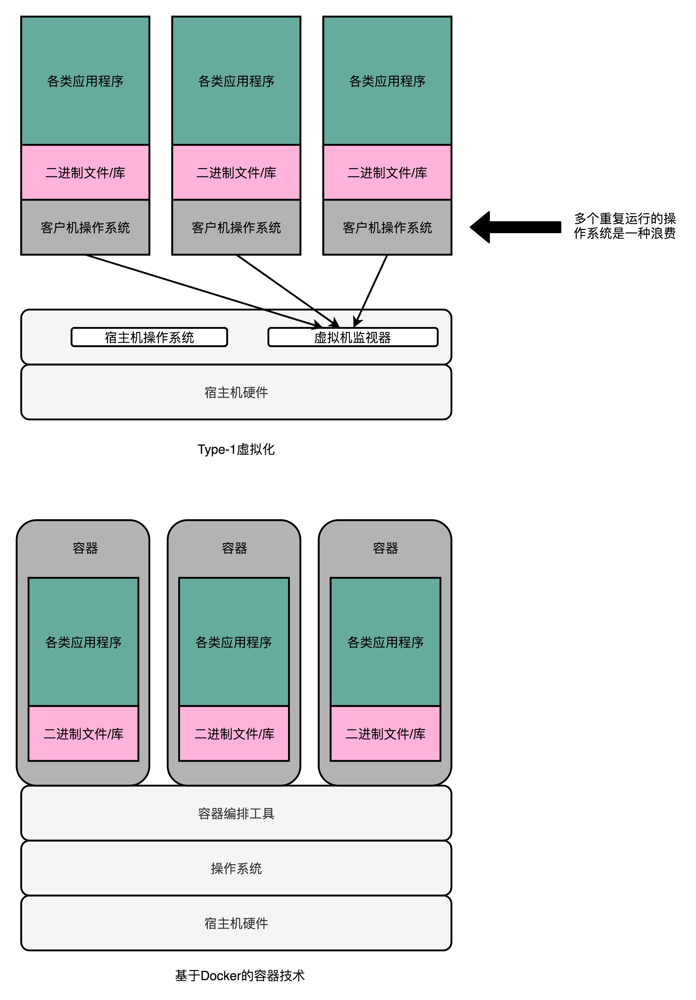

在实践的服务器端的开发中，虽然应用环境需要各种各样不同的依赖，可能是不同的 PHP 或者 Python 的版本，可能是操作系统里面不同的系统库，但是通常来说，其实都是跑在 Linux 内核上的。通过 Docker，不再需要在操作系统上再跑一个操作系统，而只需要通过容器编排工具，比如 Kubernetes 或者 Docker Swarm，能够进行各个应用之间的环境和资源隔离就好了。

这种隔离资源的方式，也有人称之为"操作系统级虚拟机"，好和上面的全虚拟化虚拟机对应起来。不过严格来说，Docker 并不能算是一种虚拟机技术，而只能算是一种资源隔离的技术。

## 五. 存储与 I/O 系统

### 5.1 存储器层次结构全景

#### 5.1.1 理解存储器的层次结构

在计算机中通常把数据存储在计算机的存储器里面。而存储器系统是一个通过各种不同的方法和设备，一层一层组合起来的系统。

把 CPU 比喻成计算机的"大脑"。思考的东西，就好比 CPU 中的**寄存器**(Register)。寄存器与其说是存储器，其实它更像是 CPU 本身的一部分，只能存放极其有限的信息，但是速度非常快，和 CPU 同步。而大脑中的记忆，就好比 **CPU Cache**(CPU 高速缓存，简称为"缓存")。CPU Cache 用的是一种叫作 **SRAM**(Static Random-Access Memory，静态随机存取存储器)的芯片。

**SRAM**
SRAM 之所以被称为"静态"存储器，是因为只要处在通电状态，里面的数据就可以保持存在。而一旦断电，里面的数据就会丢失了。在 SRAM 里面，一个比特的数据，需要 6 ～ 8 个晶体管。所以 SRAM 的存储密度不高。同样的物理空间下，能够存储的数据有限。不过，因为 SRAM 的电路简单，所以访问速度非常快。


在 CPU 里，通常会有 L1、L2、L3 这样三层高速缓存。每个 CPU 核心都有一块属于自己的 L1 高速缓存，通常分成**指令缓存**和**数据缓存**，分开存放 CPU 使用的指令和数据。这里的指令缓存和数据缓存，其实是来自于[哈佛架构](#451-结构冒险)。L1 的 Cache 往往就嵌在 CPU 核心的内部。

L2 的 Cache 同样是每个 CPU 核心都有的，不过它往往不在 CPU 核心的内部。所以，L2 Cache 的访问速度会比 L1 稍微慢一些。而 L3 Cache，则通常是多个 CPU 核心共用的，尺寸会更大一些，访问速度自然也就更慢一些。
可以把 CPU 中的 L1 Cache 理解为短期记忆，把 L2/L3 Cache 理解成长期记忆，把内存当成书架。 当记忆中没有资料的时候，可以从书架上拿书来翻阅。这个过程中就相当于，数据从内存中加载到 CPU 的寄存器和 Cache 中，然后通过"大脑"，也就是 CPU，进行处理和运算。

**DRAM**
内存用的芯片和 Cache 有所不同，它用的是一种叫作 **DRAM**(Dynamic Random Access Memory，动态随机存取存储器)的芯片，比起 SRAM 来说，它的密度更高，有更大的容量，而且它也比 SRAM 芯片便宜不少。

DRAM 被称为"动态"存储器，是因为 DRAM 需要靠不断地"刷新"，才能保持数据被存储起来。DRAM 的一个比特，只需要一个晶体管和一个电容就能存储。所以，DRAM 在同样的物理空间下，能够存储的数据也就更多，也就是存储的"密度"更大。但是，因为数据是存储在电容里的，电容会不断漏电，所以需要定时刷新充电，才能保持数据不丢失。DRAM 的数据访问电路和刷新电路都比 SRAM 更复杂，所以访问延时也就更长。

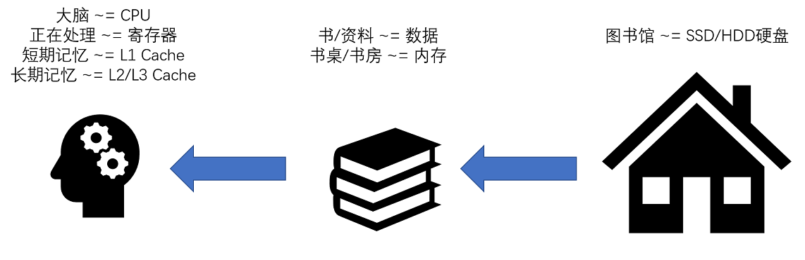

#### 5.1.2 存储器的层级结构

整个存储器的层次结构，其实都类似于 SRAM 和 DRAM 在性能和价格上的差异。SRAM 更贵，速度更快。DRAM 更便宜，容量更大。SRAM 好像大脑中的记忆，而 DRAM 就好像书架。

大脑(CPU)中的记忆(L1 Cache)，不仅受成本层面的限制，更受物理层面的限制。这就好比 L1 Cache 不仅昂贵，其访问速度和它到 CPU 的物理距离有关。芯片造得越大，总有部分离 CPU 的距离会变远。电信号的传输速度又受物理原理的限制，没法超过光速。所以想要快，并不是靠多花钱就能解决的。

内存空间是有限的，没有办法放下很多的数据。如果想要扩大空间的话，成本会很高。于是，想要放下更多的数据，就要寻找更加廉价的解决方案。对于内存来说，**SSD**(Solid-state drive 或 Solid-state disk，固态硬盘)、**HDD**(Hard Disk Drive，硬盘)这些被称为**硬盘**的外部存储设备，就是公共图书馆。


从 Cache、内存，到 SSD 和 HDD 硬盘，一台现代计算机中，就用上了所有这些存储器设备。其中，容量越小的设备速度越快，而且，CPU 并不是直接和每一种存储器设备打交道，而是每一种存储器设备，只和它相邻的存储设备打交道。比如，CPU Cache 是从内存里加载而来的，或者需要写回内存，并不会直接写回数据到硬盘，也不会直接从硬盘加载数据到 CPU Cache 中，而是先加载到内存，再从内存加载到 Cache 中。

**这样，各个存储器只和相邻的一层存储器打交道，并且随着一层层向下，存储器的容量逐层增大，访问速度逐层变慢，而单位存储成本也逐层下降，也就构成了存储器层次结构。**

存储器在不同层级之间的性能差异和价格差异，都至少在一个数量级以上。L1 Cache 的访问延时是 1 纳秒(ns)，而内存就已经是 100 纳秒了。在价格上，这两者也差出了 400 倍。下面是一张各种存储器成本的对比表格:


### 5.2 局部性原理：数据库性能与成本综合考虑

平时进行服务端软件开发的时候，通常会把数据存储在数据库里。而服务端系统遇到的第一个性能瓶颈，往往就发生在访问数据库的时候。这个时候，大部分工程师和架构师会拿出一种叫作"缓存"的武器，通过使用 Redis 或者 Memcache 这样的开源软件，在数据库前面提供一层缓存的数据，来缓解数据库面临的压力，提升服务端的程序性能。

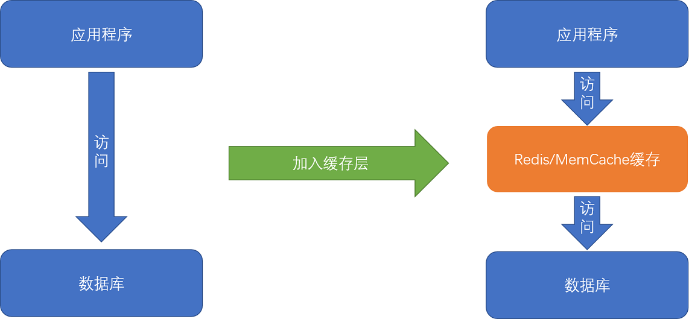

在上面的存储器成本与速度的对比图中，可以看到性能和价格的巨大差异，这就给工程师带来了一个挑战：**能不能既享受 CPU Cache 的速度，又享受内存、硬盘巨大的容量和低廉的价格**？

想要同时享受到这三点，前辈们已经探索出了答案，那就是，存储器中数据的**局部性原理**(Principle of Locality)。可以利用这个局部性原理，来制定管理和访问数据的策略。这个局部性原理包括**时间局部性**(temporal locality)和**空间局部性**(spatial locality)这两种策略。

- **时间局部性**。这个策略是说，如果一个数据被访问了，那么它在短时间内还会被再次访问。比如，在一个电子商务型系统中，如果一个用户打开了 App，看到了首屏。推断他应该很快还会再次访问网站的其他内容或者页面，就将这个用户的个人信息，从存储在硬盘的数据库读取到内存的缓存中来。这利用的就是时间局部性。

  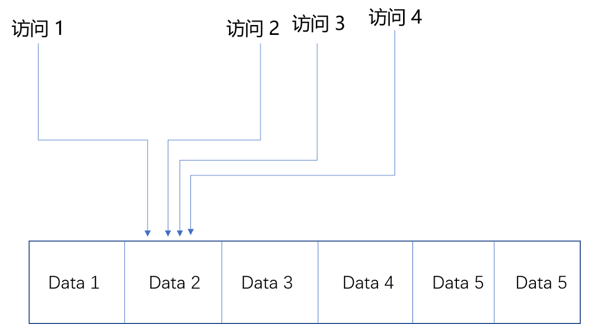

- **空间局部性**。这个策略是说，如果一个数据被访问了，那么和它相邻的数据也很快会被访问。这就好比程序，在访问了数组的首项之后，多半会循环访问它的下一项。因为，在存储数据的时候，数组内的多项数据会存储在相邻的位置。

  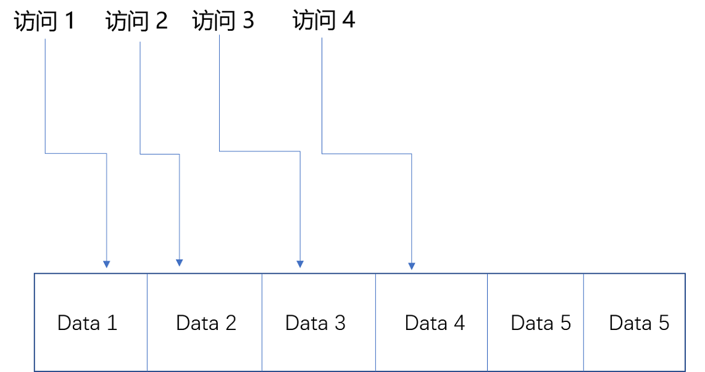

有了时间局部性和空间局部性，就不用再把所有数据都放在内存里，也不用都放在 HDD 硬盘上，而是把访问次数多的数据，放在贵但是快一点的存储器里，把访问次数少的数据，放在慢但是大一点的存储器里。这样组合使用内存、SSD 硬盘以及 HDD 硬盘，使得可以用最低的成本提供实际所需要的数据存储、管理和访问的需求。

**实例：如何花最少的钱，装下一个电商网站的所有商品？**
一个电商网站，假设里面有 6 亿件商品，如果每件商品需要 4MB 的存储空间，那么一共需要 2400TB 的数据存储。

如果把数据都放在内存里面，那就需要 3600 万美元( = 2400TB/1MB × 0.015 美元 = 3600 万美元)。但是，这 6 亿件商品中，不是每一件商品都会被经常访问。

如果只在内存里放前 1% 的热门商品，也就是 600 万件热门商品，而把剩下的商品，放在机械式的 HDD 硬盘上，那么，需要的存储成本就下降到 45.6 万美元( = 3600 万美元 × 1% + 2400TB / 1MB × 0.00004 美元)，是原来成本的 1.3% 左右。

这里用的就是时间局部性。把有用户访问过的数据，加载到内存中，一旦内存里面放不下了，就把最长时间没有在内存中被访问过的数据，从内存中移走，这个其实就是常用的 **LRU(Least Recently Used)缓存算法**。热门商品被访问得多，就会始终被保留在内存里，而冷门商品被访问得少，就只存放在 HDD 硬盘上，数据的读取也都是直接访问硬盘。即使加载到内存中，也会很快被移除。越是热门的商品，越容易在内存中找到，也就更好地利用了内存的随机访问性能。

那么，只放 600 万件商品真的可以满足实际的线上服务请求吗？这个就要看 LRU 缓存策略的**缓存命中率**(Hit Rate/Hit Ratio)了，也就是访问的数据中，可以在设置的内存缓存中找到的，占有多大比例。

内存的随机访问请求需要 100ns。这也就意味着，在极限情况下，内存可以支持 1000 万次随机访问。用了 24TB 内存，如果 8G 一条的话，意味着有 3000 条内存，可以支持每秒 300 亿次( = 24TB/8GB × 1s/100ns)访问。以 3 亿的用户数来看，估算每天的活跃用户为 1 亿，这 1 亿用户每人平均会访问 100 个商品，那么平均每秒访问的商品数量，就是 12 万次。

但是如果数据没有命中内存，那么对应的数据请求就要访问到 HDD 磁盘了。一块 HDD 硬盘只能支撑每秒 100 次的随机访问，2400TB 的数据，以 4TB 一块磁盘来计算，有 600 块磁盘，也就是能支撑每秒 6 万次( = 2400TB/4TB × 1s/10ms )的随机访问。

这就意味着，所有的商品访问请求，都直接到了 HDD 磁盘，HDD 磁盘支撑不了这样的压力。至少要 50% 的缓存命中率，HDD 磁盘才能支撑对应的访问次数。不然的话，要么选择添加更多数量的 HDD 硬盘，做到每秒 12 万次的随机访问，或者将 HDD 替换成 SSD 硬盘，让单个硬盘可以支持更多的随机访问请求。

当然，这里只是一个简单的估算。在实际的应用程序中，查看一个商品的数据可能意味着不止一次的随机内存或者随机磁盘的访问。对应的数据存储空间也不止要考虑数据，还需要考虑维护数据结构的空间，而缓存的命中率和访问请求也要考虑均值和峰值的问题。

通过这个估算过程，需要理解，如何进行存储器的硬件规划:

- 需要考虑硬件的成本、访问的数据量以及访问的数据分布。
- 然后根据这些数据的估算，来组合不同的存储器，能用尽可能低的成本支撑所需要的服务器压力。

而当用上了数据访问的局部性原理，组合起了多种存储器，也就理解了怎么基于存储器层次结构，来进行硬件规划了。

### 5.3 高速缓存

```java
int[] arr = new int[64 * 1024 * 1024];
// 循环1
for (int i = 0; i < arr.length; i++) arr[i] *= 3;
// 循环2
for (int i = 0; i < arr.length; i += 16) arr[i] *= 3
```

在这段 Java 程序中，首先构造了一个 64×1024×1024 大小的整型数组。在循环 1 里，遍历整个数组，将数组中每一项的值变成了原来的 3 倍；在循环 2 里，每隔 16 个索引访问一个数组元素，将这一项的值变成了原来的 3 倍。

按道理来说，循环 2 只访问循环 1 中 1/16 的数组元素，只进行了循环 1 中 1/16 的乘法计算，那循环 2 花费的时间应该是循环 1 的 1/16 左右。但是实际上，循环 1 在电脑上运行需要 50 毫秒，循环 2 只需要 46 毫秒。这两个循环花费时间之差在 15% 之内。

为什么会有这 15% 的差异呢？这和 CPU Cache 有关。在 CPU 眼里，内存也慢得不行。于是，就在 CPU 里面嵌入了 CPU Cache(高速缓存)

#### 5.3.1 为什么需要高速缓存

按照摩尔定律，CPU 的访问速度每 18 个月便会翻一番，相当于每年增长 60%。但现在的，内存的访问速度虽然也在不断增长，却远没有这么快，每年只增长 7% 左右。而这两个增长速度的差异，使得 CPU 性能和内存访问性能的差距不断拉大。到今天来看，一次内存的访问，大约需要 120 个 CPU Cycle，这也意味着，在今天，CPU 和内存的访问速度已经有了 120 倍的差距。

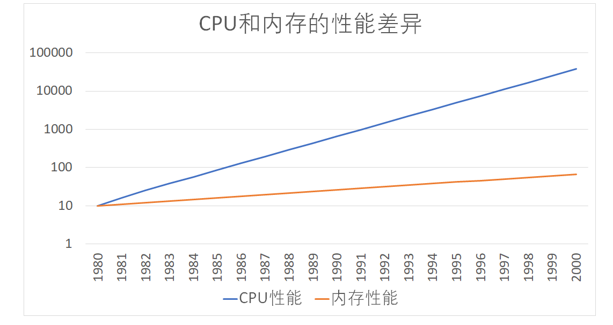

为了弥补两者之间的性能差异，能真实地把 CPU 的性能提升用起来，而不是让它在那儿空转，现代 CPU 中引入了高速缓存。

从 CPU Cache 被加入到现有的 CPU 里开始，内存中的指令、数据，会被加载到 L1-L3 Cache 中，而不是直接由 CPU 访问内存去拿。在 95% 的情况下，CPU 都只需要访问 L1-L3 Cache，从里面读取指令和数据，而无需访问内存。

> **注意** : 这里的 CPU Cache 或者 L1/L3 Cache，不是一个单纯的、概念上的缓存(比如之前的拿内存作为硬盘的缓存)，而是指特定的由 SRAM 组成的物理芯片。

在前面的 Java 程序里，运行程序的时间主要花在了将对应的数据从内存中读取出来，加载到 CPU Cache 里。CPU 从内存中读取数据到 CPU Cache 的过程中，是一小块一小块来读取数据的，而不是按照单个数组元素来读取数据的。这样一小块一小块的数据，在 CPU Cache 里面，把它叫作 Cache Line(缓存块)。

在日常使用的 Intel 服务器或者 PC 里，Cache Line 的大小通常是 64 字节。而在上面的循环 2 里面，每隔 16 个整型数计算一次，16 个整型数正好是 64 个字节。于是，循环 1 和循环 2，需要把同样数量的 Cache Line 数据从内存中读取到 CPU Cache 中，最终两个程序花费的时间就差别不大了。

#### 5.3.2 Cache 的数据结构和读取过程

现代 CPU 进行数据读取的时候，无论数据是否已经存储在 Cache 中，CPU 始终会首先访问 Cache。只有当 CPU 在 Cache 中找不到数据的时候，才会去访问内存，并将读取到的数据写入 Cache 之中。当时间局部性原理起作用后，这个最近刚刚被访问的数据，很快会再次被访问。而 Cache 的访问速度远远快于内存，这样，CPU 花在等待内存访问上的时间就大大变短了。

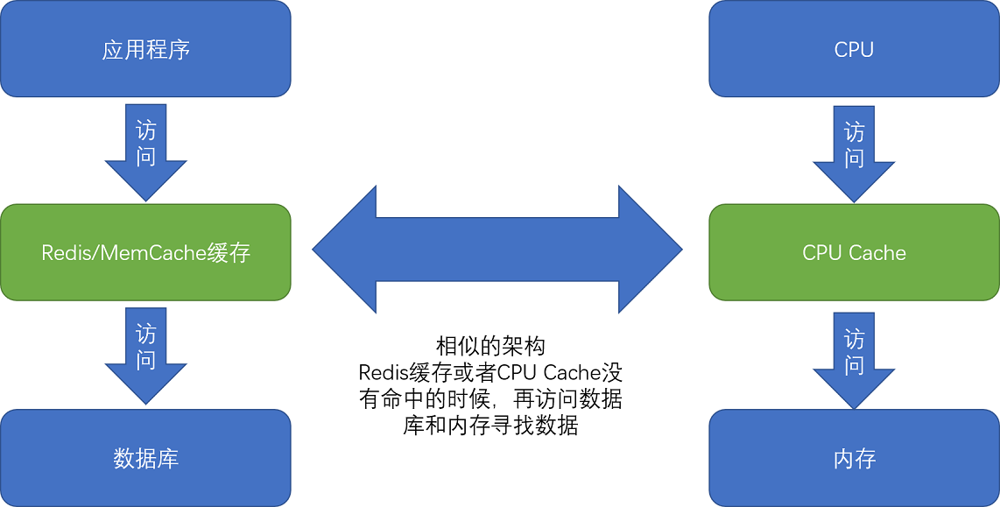

这样的访问机制，和开发应用系统的时候，"使用内存作为硬盘的缓存"的逻辑是一样的。在各类基准测试(Benchmark)和实际应用场景中，CPU Cache 的命中率通常能达到 95% 以上。

那么，CPU 是如何知道要访问的内存数据，存储在 Cache 的哪个位置呢？接下来，就从最基本的**直接映射 Cache**(Direct Mapped Cache)来看整个 Cache 的数据结构和访问逻辑。

CPU 访问内存数据，是一小块一小块数据来读取的。对于读取内存中的数据，首先拿到的是数据所在的**内存块**(Block)的地址。而直接映射 Cache 采用的策略，就是确保任何一个内存块的地址，始终映射到一个固定的 CPU Cache 地址(Cache Line)。而这个映射关系，通常用 mod 运算(求余运算)来实现。下面举个例子:

比如说，主内存被分成 0 ～ 31 号这样 32 个块。一共有 8 个缓存块。用户想要访问第 21 号内存块。如果 21 号内存块内容在缓存块中的话，它一定在 5 号缓存块(21 mod 8 = 5)中。


实际计算中，有一个小技巧，通常会把缓存块的数量设置成 2 的 N 次方。这样在计算取模的时候，可以直接取地址的低 N 位，也就是二进制里面的后几位。比如这里的 8 个缓存块，就是 2 的 3 次方。那么，在对 21 取模的时候，可以对 21 的 2 进制表示 10101 取地址的低三位，也就是 101，对应的 5，就是对应的缓存块地址。


取 Block 地址的低位，就能得到对应的 Cache Line 地址，除了 21 号内存块外，13 号、5 号等很多内存块的数据，都对应着 5 号缓存块中。既然如此，假如现在 CPU 想要读取 21 号内存块，在读取到 5 号缓存块的时候，怎么知道里面的数据，究竟是不是 21 号对应的数据呢？

这个时候，在对应的缓存块中:

- 会存储一个**组标记**(Tag)。这个组标记会记录，当前缓存块内存储的数据对应的内存块，而缓存块本身的地址表示访问地址的低 N 位。就像上面的例子，21 的低 3 位 101，缓存块本身的地址已经涵盖了对应的信息、对应的组标记，只需要记录 21 剩余的高 2 位的信息，也就是 10 就可以了。

除了组标记信息之外，缓存块中还有两个数据:

- 一个自然是从主内存中加载来的实际存放的数据
- 另一个是**有效位**(valid bit)。有效位就是用来标记，对应的缓存块中的数据是否是有效的，确保不是机器刚刚启动时候的空数据。如果有效位是 0，无论其中的组标记和 Cache Line 里的数据内容是什么，CPU 都不会管这些数据，而是直接访问内存，重新加载数据。

CPU 在读取数据的时候，并不是要读取一整个 Block，而是读取一个它需要的数据片段。这样的数据，叫作 CPU 里的一个字(Word)。具体是哪个字，就用这个字在整个 Block 里面的位置来决定。这个位置，叫作**偏移量**(Offset)。

> **总结 : 一个内存的访问地址，最终包括高位代表的组标记、低位代表的索引，以及在对应的 Data Block 中定位对应字的位置偏移量**。


而内存地址对应到 Cache 里的数据结构，则多了一个有效位和对应的数据，由 "**索引 + 有效位 + 组标记 + 数据**" 组成。如果内存中的数据已经在 CPU Cache 里了，那一个内存地址的访问，就会经历 4 个步骤:

1. 根据内存地址的低位，计算在 Cache 中的索引
2. 判断有效位，确认 Cache 中的数据是有效的
3. 对比内存访问地址的高位，和 Cache 中的组标记，确认 Cache 中的数据就是要访问的内存数据，从 Cache Line 中读取到对应的数据块(Data Block)
4. 根据内存地址的 Offset 位，从 Data Block 中，读取希望读取到的字。

如果在 2、3 这两个步骤中，CPU 发现，Cache 中的数据并不是要访问的内存地址的数据，那 CPU 就会访问内存，并把对应的 Block Data 更新到 Cache Line 中，同时更新对应的有效位和组标记的数据。

> 除了直接映射 Cache 之外，常见的缓存放置策略还有全相连 Cache(Fully Associative Cache)、组相连 Cache(Set Associative Cache)。这几种策略的数据结构都是相似的，理解了最简单的直接映射 Cache，其他的策略就很容易理解了。现代 CPU 已经很少使用直接映射 Cache 了，通常用的是组相连 Cache(set associative cache)。

#### 5.3.3 Java 关键字 volatile 与 Java 内存模型的关系

Java 中有一个关键字 volatile 它最核心的知识点，要关系到 Java 内存模型(JMM，Java Memory Model)上。

虽然 JMM 只是 Java 虚拟机这个进程级虚拟机里的一个内存模型，但是这个内存模型，和计算机组成里的 CPU、高速缓存和主内存组合在一起的硬件体系非常相似。理解了 JMM，可以更容易理解计算机组成里 CPU、高速缓存和主内存之间的关系。

这是一段经典的 volatile 代码，来自知名的 Java 开发者网站 [dzone.com](https://dzone.com/articles/java-volatile-keyword-0)。

```java
public class VolatileTest {
  private static volatile int COUNTER = 0;

  public static void main(String[] args) {
    new ChangeListener().start();
    new ChangeMaker().start();
  }

  static class ChangeListener extends Thread {
    @Override
    public void run() {
      int threadValue = COUNTER;
      while ( threadValue < 5) {
        if( threadValue!= COUNTER) {
          System.out.println("Got Change for COUNTER : " + COUNTER + "");
          threadValue = COUNTER;
        }
      }
    }
  }

  static class ChangeMaker extends Thread{
    @Override
    public void run() {
      int threadValue = COUNTER;
      while (COUNTER <5) {
        System.out.println("Incrementing COUNTER to : " + (threadValue+1) + "");
        COUNTER = ++threadValue;
        try {
          Thread.sleep(500);
        } catch (InterruptedException e) { e.printStackTrace(); }
      }
    }
  }
}
```

在这个程序里，先定义了一个 volatile 的 int 类型的变量，COUNTER。然后，分别启动了两个单独的线程:

- 一个线程叫 ChangeListener，这个线程运行的任务很简单。它先取到 COUNTER 当前的值，然后一直监听着这个 COUNTER 的值。一旦 COUNTER 的值发生了变化，就把新的值通过 println 打印出来。直到 COUNTER 的值达到 5 为止。这个监听的过程，通过一个永不停歇的 while 循环的忙等待来实现。

- 另一个线程，叫 ChangeMaker，这个线程运行的任务同样很简单。它同样是取到 COUNTER 的值，在 COUNTER 小于 5 的时候，每隔 500 毫秒，就让 COUNTER 自增 1。在自增之前，通过 println 方法把自增后的值打印出来。

最后，在 main 函数里，分别启动这两个线程，来看一看这个程序的执行情况。程序的输出结果并不让人意外。ChangeMaker 函数会一次一次将 COUNTER 从 0 增加到 5。因为这个自增是每 500 毫秒一次，而 ChangeListener 去监听 COUNTER 是忙等待的，所以每一次自增都会被 ChangeListener 监听到，然后对应的结果就会被打印出来。

```java
Incrementing COUNTER to : 1
Got Change for COUNTER : 1
Incrementing COUNTER to : 2
Got Change for COUNTER : 2
Incrementing COUNTER to : 3
Got Change for COUNTER : 3
Incrementing COUNTER to : 4
Got Change for COUNTER : 4
Incrementing COUNTER to : 5
Got Change for COUNTER : 5
```

这个时候，把定义 COUNTER 这个变量时，设置的 volatile 关键字给去掉。

```js
private static int COUNTER = 0;
```

ChangeMaker 还是能正常工作的，每隔 500ms 仍然能够对 COUNTER 自增 1。但是，奇怪的事情在 ChangeListener 上发生了，ChangeListener 不再工作了。在 ChangeListener 眼里，它似乎一直觉得 COUNTER 的值还是一开始的 0。似乎 COUNTER 的变化，对于 ChangeListener 彻底"隐身"了。

```java
Incrementing COUNTER to : 1
Incrementing COUNTER to : 2
Incrementing COUNTER to : 3
Incrementing COUNTER to : 4
Incrementing COUNTER to : 5
```

再对程序做一些小小的修改。不再让 ChangeListener 进行完全的忙等待，而是在 while 循环里面，等待上 5 毫秒。

```java
static class ChangeListener extends Thread {
  @Override
  public void run() {
    int threadValue = COUNTER;
    while ( threadValue < 5) {
      if( threadValue!= COUNTER) {
        System.out.println("Sleep 5ms, Got Change for COUNTER : " + COUNTER + "");
        threadValue= COUNTER;
      }
      try {
        Thread.sleep(5);
      } catch (InterruptedException e) { e.printStackTrace(); }
    }
  }
}
```

虽然 COUNTER 变量，仍然没有设置 volatile 这个关键字，但是 ChangeListener 似乎"睡醒了"。在通过 Thread.sleep(5) 在每个循环里"睡上"5 毫秒之后，ChangeListener 又能够正常取到 COUNTER 的值了。

```java
Incrementing COUNTER to : 1
Sleep 5ms, Got Change for COUNTER : 1
Incrementing COUNTER to : 2
Sleep 5ms, Got Change for COUNTER : 2
Incrementing COUNTER to : 3
Sleep 5ms, Got Change for COUNTER : 3
Incrementing COUNTER to : 4
Sleep 5ms, Got Change for COUNTER : 4
Incrementing COUNTER to : 5
Sleep 5ms, Got Change for COUNTER : 5
```

这些现象，其实来自于 Java 内存模型以及关键字 volatile 的含义。**volatile 关键字会确保对于这个变量的读取和写入，都一定会同步到主内存里，而不是从 Cache 里面读取**。通过刚才的例子来分析理解这个解释。

刚刚第一个使用了 volatile 关键字的例子里，因为所有数据的读和写都来自主内存。那么自然地，ChangeMaker 和 ChangeListener 之间，看到的 COUNTER 值就是一样的。

在第二段代码中，去掉了 volatile 关键字。这个时候，ChangeListener 又是一个忙等待的循环，它尝试不停地获取 COUNTER 的值，这样就会从当前线程的"Cache"里面获取。于是，这个线程就没有时间从主内存里面同步更新后的 COUNTER 值。这样，它就一直卡死在 COUNTER=0 的死循环上了。

而到了再次修改的第三段代码里面，虽然还是没有使用 volatile 关键字，但是短短 5ms 的 Thead.Sleep 给了这个线程喘息之机。既然这个线程没有这么忙了，它也就有机会把最新的数据从主内存同步到自己的高速缓存里面了。于是，ChangeListener 在下一次查看 COUNTER 值的时候，就能看到 ChangeMaker 造成的变化了。

> 虽然 Java 内存模型是一个隔离了硬件实现的虚拟机内的抽象模型，但是它给了一个很好的"缓存同步"问题的示例。也就是说，如果数据，在不同的线程或者 CPU 核里面去更新，因为不同的线程或 CPU 核有着自己各自的缓存，很有可能在 A 线程的更新，到 B 线程里面是看不见的。

#### 5.3.4 CPU 高速缓存的写入

事实上，可以把 Java 内存模型和计算机组成里的 CPU 结构对照起来看。

现在用的 Intel CPU，通常都是多核的。每一个 CPU 核里面，都有独立属于自己的 L1、L2 的 Cache，然后再有多个 CPU 核共用的 L3 的 Cache、主内存。

因为 CPU Cache 的访问速度要比主内存快很多，而在 CPU Cache 里面，L1/L2 的 Cache 也要比 L3 的 Cache 快。所以，CPU 始终都是尽可能地从 CPU Cache 中去获取数据，而不是每一次都要从主内存里面去读取数据。


这个层级结构，就好像 Java 内存模型里面，每一个线程都有属于自己的线程栈。线程在读取 COUNTER 的数据的时候，其实是从本地的线程栈的 Cache 副本里面读取数据，而不是从主内存里面读取数据。如果对于数据仅仅只是读，问题还不大。

但是，对于数据，不光要读，还要去写入修改。这个时候，有两个问题来了。

##### 5.3.4.1 数据写入修改问题一 : 写入策略

**第一个问题是，写入 Cache 的性能也比写入主内存要快，那写入的数据，到底应该写到 Cache 里还是主内存呢？如果直接写入到主内存里，Cache 里的数据是否会失效？**

对于这个问题，有两种写入策略:

- **写直达(Write-Through)**
  

  最简单的一种写入策略，叫作写直达(Write-Through)。在这个策略里，每一次数据都要写入到主内存里面。在写直达的策略里面，写入前，会先去判断数据是否已经在 Cache 里面了。如果数据已经在 Cache 里面了，先把数据写入更新到 Cache 里面，再写入到主内存里面；如果数据不在 Cache 里，就只更新主内存。

  - **缺点**
    写直达的这个策略很直观，但是问题也很明显，那就是这个策略很慢。无论数据是不是在 Cache 里面，都需要把数据写到主内存里面。这个方式就有点儿像上面的 volatile 关键字，始终都要把数据同步到主内存里面。

- **写回(Write-Back)**
  

  在 CPU Cache 的写入策略里，还有一种策略就叫作写回(Write-Back)。这个策略里，不再是每次都把数据写入到主内存，而是只写到 CPU Cache 里。只有当 CPU Cache 里面的数据要被"替换"的时候，才把数据写入到主内存里面去。写回策略的过程是这样的：

  - 如果发现要写入的数据，就在 CPU Cache 里面，那么就只是更新 CPU Cache 里面的数据。同时，会标记 CPU Cache 里的这个 Block 是脏(Dirty)的。所谓脏的，就是指这个时候，CPU Cache 里面的这个 Block 的数据，和主内存是不一致的。
  - 如果发现，要写入的数据所对应的 Cache Block 里，放的是别的内存地址的数据，那么就要看一看，那个 Cache Block 里面的数据有没有被标记成脏的。如果是脏的话，要先把这个 Cache Block 里面的数据，写入到主内存里面。然后，再把当前要写入的数据，写入到 Cache 里，同时把 Cache Block 标记成脏的。如果 Block 里面的数据没有被标记成脏的，那么直接把数据写入到 Cache 里面，然后再把 Cache Block 标记成脏的就好了。

  在用了写回这个策略之后，在加载内存数据到 Cache 里面的时候，也要多出一步同步脏 Cache 的动作。如果加载内存里面的数据到 Cache 的时候，发现 Cache Block 里面有脏标记，也要先把 Cache Block 里的数据写回到主内存，才能加载数据覆盖掉 Cache。

  可以看到，在写回这个策略里，如果大量的操作，都能够命中缓存。那么大部分时间里，都不需要读写主内存，自然性能会比写直达的效果好很多。

##### 5.3.4.2 数据写入修改问题二 : 多个 CPU 核的缓存一致性问题

然而，无论是写回还是写直达，其实都还没有解决在上面 volatile 程序示例中遇到的问题，也就是**多个线程，或者是多个 CPU 核的缓存一致性的问题。这也就是在写入修改缓存后，需要解决的第二个问题**。

要解决这个问题，需要引入一个新的方法，叫作 MESI 协议。这是一个维护缓存一致性协议。这个协议不仅可以用在 CPU Cache 之间，也可以广泛用于各种需要使用缓存，同时缓存之间需要同步的场景下。

现代电脑都是多核的 CPU。多核 CPU 有很多好处，其中**最重要的一个就是，它使得在不能提升 CPU 的主频之后，找到了另一种提升 CPU 吞吐率的办法**。

多核 CPU 里的每一个 CPU 核，都有独立的属于自己的 L1 Cache 和 L2 Cache。多个 CPU 之间，只是共用 L3 Cache 和主内存。

CPU Cache 解决的是内存访问速度和 CPU 的速度差距太大的问题。而多核 CPU 提供的是，在主频难以提升的时候，通过增加 CPU 核心来提升 CPU 的吞吐率的办法。把多核和 CPU Cache 两者一结合，就带来了一个新的挑战。因为 CPU 的每个核各有各的缓存，互相之间的操作又是各自独立的，就会带来**缓存一致性**(Cache Coherence)的问题。

**缓存一致性问题**
用一个双核心 CPU，来看一下什么是缓存一致性。


在这两个 CPU 核心里，1 号核心要写一个数据到内存里。比方说，iPhone 降价了，要把 iPhone 最新的价格更新到内存里。为了性能问题，它采用了写回策略，先把数据写入到 L2 Cache 里面，然后把 Cache Block 标记成脏的。这个时候，数据其实并没有被同步到 L3 Cache 或者主内存里。1 号核心希望在这个 Cache Block 要被交换出去的时候，数据才写入到主内存里。

如果 CPU 只有 1 号核心这一个 CPU 核，那这其实是没有问题的。不过，旁边还有一个 2 号核心！这个时候，2 号核心尝试从内存里面去读取 iPhone 的价格，结果读到的是一个错误的价格。这是因为，iPhone 的价格刚刚被 1 号核心更新过。但是这个更新的信息，只出现在 1 号核心的 L2 Cache 里，而没有出现在 2 号核心的 L2 Cache 或者主内存里面。**这个问题，就是所谓的缓存一致性问题，1 号核心和 2 号核心的缓存，在这个时候是不一致的**。

**解决方法**
为了解决这个缓存不一致的问题，就需要有一种机制，来同步两个不同核心里面的缓存数据。这样的机制满足下面两点就是合理的：

- **写传播**(Write Propagation)
  写传播是说，在一个 CPU 核心里，Cache 数据更新，必须能够传播到其他的对应节点的 Cache Line 里。
- **事务的串行化**(Transaction Serialization)
  事务串行化是说，在一个 CPU 核心里面的读取和写入，在其他的节点看起来，顺序是一样的。

第一点写传播很容易理解。既然数据写完了，自然要同步到其他 CPU 核的 Cache 里。但是第二点事务的串行化，可能没那么好理解了。还拿刚才修改 iPhone 的价格来解释。

这一次，找一个四核心的 CPU。1 号核心，先把 iPhone 的价格改成了 5000 块。差不多在同一个时间，2 号核心把 iPhone 的价格改成了 6000 块。这里两个修改，都会传播到 3 号核心和 4 号核心。

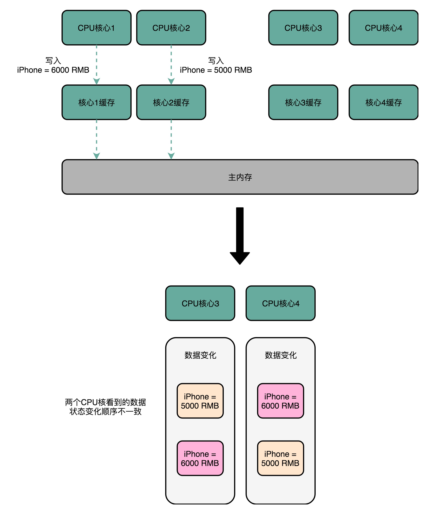

然而这里有个问题，3 号核心先收到了 2 号核心的写传播，再收到 1 号核心的写传播。所以 3 号核心看到的 iPhone 价格是先变成了 6000 块，再变成了 5000 块。而 4 号核心呢，是反过来的，先看到变成了 5000 块，再变成 6000 块。虽然写传播是做到了，但是各个 Cache 里面的数据，是不一致的。

事实上，需要的是，从 1 号到 4 号核心，都能看到相同顺序的数据变化。比如说，都是先变成了 5000 块，再变成了 6000 块。这样，才能称之为实现了事务的串行化。

事务的串行化，不仅仅是缓存一致性中所必须的。比如，平时所用到的系统当中，最需要保障事务串行化的就是数据库。多个不同的连接去访问数据库的时候，必须保障事务的串行化，做不到事务的串行化的数据库，根本没法作为可靠的商业数据库来使用。

而在 CPU Cache 里做到事务串行化，需要做到两点:

- 第一点是一个 CPU 核心对于数据的操作，需要同步通信给到其他 CPU 核心。
- 第二点是，如果两个 CPU 核心里有同一个数据的 Cache，那么对于这个 Cache 数据的更新，需要有一个"锁"的概念。只有拿到了对应 Cache Block 的"锁"之后，才能进行对应的数据更新。

> MESI 协议实现了这两个机制。

##### 5.3.4.3 总线嗅探机制和 MESI 协议

要解决缓存一致性问题，首先要解决的是多个 CPU 核心之间的数据传播问题。最常见的一种解决方案，叫作**总线嗅探**(Bus Snooping)。

这个策略，本质上就是把所有的读写请求都通过总线(Bus)广播给所有的 CPU 核心，然后让各个核心去"嗅探"这些请求，再根据本地的情况进行响应。

总线本身就是一个特别适合广播，进行数据传输的机制，所以总线嗅探这个办法也是日常使用的 Intel CPU 进行缓存一致性处理的解决方案。

基于总线嗅探机制，其实还可以分成很多种不同的缓存一致性协议。不过其中最常用的，就是 MESI 协议。和很多现代的 CPU 技术一样，MESI 协议也是在 Pentium 时代，被引入到 Intel CPU 中的。

MESI 协议，是一种叫作**写失效**(Write Invalidate)的协议。在写失效协议里，只有一个 CPU 核心负责写入数据，其他的核心，只是同步读取到这个写入。在这个 CPU 核心写入 Cache 之后，它会去广播一个"失效"请求告诉所有其他的 CPU 核心。其他的 CPU 核心，只是去判断自己是否也有一个"失效"版本的 Cache Block，然后把这个也标记成失效的就好了。

相对于写失效协议，还有一种叫作**写广播**(Write Broadcast)的协议。在那个协议里，一个写入请求广播到所有的 CPU 核心，同时更新各个核心里的 Cache。

写广播在实现上自然很简单，但是写广播需要占用更多的总线带宽。写失效只需要告诉其他的 CPU 核心，哪一个内存地址的缓存失效了，但是写广播还需要把对应的数据传输给其他 CPU 核心。


MESI 协议的由来，来自于对 Cache Line 的四个不同的标记，分别是：

- M：代表已修改(Modified)
  "已修改"，就是[写回策略](#5341-数据写入修改问题一-写入策略)中的"脏"的 Cache Block。Cache Block 里面的内容已经更新过了，但是还没有写回到主内存里面。

- E：代表独占(Exclusive)
  在独占状态下，对应的 Cache Line 只加载到了当前 CPU 核所拥有的 Cache 里。其他的 CPU 核，并没有加载对应的数据到自己的 Cache 里。这个时候，如果要向独占的 Cache Block 写入数据，可以自由地写入数据，而不需要告知其他 CPU 核。
  在独占状态下的数据，如果收到了一个来自于总线的读取对应缓存的请求，它就会变成共享状态。这个共享状态是因为，这个时候，另外一个 CPU 核心，也把对应的 Cache Block，从内存里面加载到了自己的 Cache 里来。

- S：代表共享(Shared)
  在共享状态下，因为同样的数据在多个 CPU 核心的 Cache 里都有。所以，当想要更新 Cache 里面的数据的时候，不能直接修改，而是要先向所有的其他 CPU 核心广播一个请求，要求先把其他 CPU 核心里面的 Cache，都变成无效的状态，然后再更新当前 Cache 里面的数据。这个广播操作，一般叫作 RFO(Request For Ownership)，也就是获取当前对应 Cache Block 数据的所有权。
  这个操作有点儿像多线程里面用到的读写锁。在共享状态下，大家都可以并行去读对应的数据。但是如果要写，就需要通过一个锁，获取当前写入位置的所有权。

- I：代表已失效(Invalidated)
  "已失效"，自然是这个 Cache Block 里面的数据已经失效了，不可以相信这个 Cache Block 里面的数据。

> "独占"和"共享"这两个状态。是 MESI 协议的精华所在。无论是独占状态还是共享状态，缓存里面的数据都是"干净"的。这个"干净"，自然对应的是[写回策略](#5341-数据写入修改问题一-写入策略)中的"脏"，也就是说，这个时候，Cache Block 里面的数据和主内存里面的数据是一致的。

整个 MESI 的状态，可以用一个有限状态机来表示它的状态流转。需要注意的是，对于不同状态触发的事件操作，可能来自于当前 CPU 核心，也可能来自总线里其他 CPU 核心广播出来的信号。

### 5.4 理解内存

计算机有五大组成部分，分别是：运算器、控制器、存储器、输入设备和输出设备。如果说计算机最重要的组件，是承担了运算器和控制器作用的 CPU，那内存就是第二重要的组件了。内存是五大组成部分里面的存储器，指令和数据，都需要先加载到内存里面，才会被 CPU 拿去执行。

在[程序装载](#35-程序装载)中知道了，在日常使用的 Linux 或者 Windows 操作系统下，程序并不能直接访问物理内存。


内存需要被分成固定大小的页(Page)，然后再通过虚拟内存地址(Virtual Address)到物理内存地址(Physical Address)的地址转换(Address Translation)，才能到达实际存放数据的物理内存位置。而程序看到的内存地址，都是虚拟内存地址。既然如此，这些虚拟内存地址究竟是怎么转换成物理内存地址的呢？

#### 5.4.1 简单页表

想要把虚拟内存地址，映射到物理内存地址，最直观的办法，就是来建一张映射表。这个映射表，能够实现虚拟内存里面的页，到物理内存里面的页的一一映射。这个映射表，在计算机里面，就叫作**页表**(Page Table)。

页表这个地址转换的办法，会把一个内存地址分成**页号**(Directory)和**偏移量**(Offset)两个部分。以一个 32 位的内存地址为例：

前面的高位，就是内存地址的页号。后面的低位，就是内存地址里面的偏移量。做地址转换的页表，只需要保留虚拟内存地址的页号和物理内存地址的页号之间的映射关系就可以了。同一个页里面的内存，在物理层面是连续的。以一个页的大小是 4K 字节(4KB)为例，需要 20 位的高位，12 位的低位。


总结一下，对于一个内存地址转换，其实就是这样三个步骤：

1. 把虚拟内存地址，切分成页号和偏移量的组合。
2. 从页表里面，查询出虚拟页号，对应的物理页号。
3. 直接拿物理页号，加上前面的偏移量，就得到了物理内存地址。

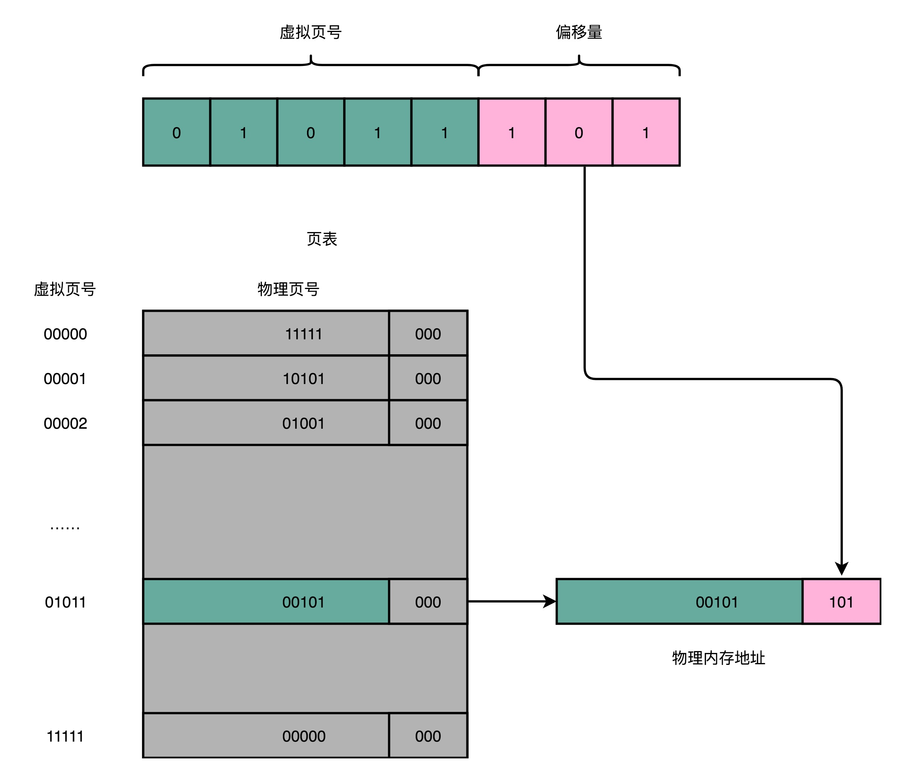

看起来这个逻辑很简单，很容易理解，但这样一个页表需要的空间很大。以 32 位的内存地址空间为例，页表一共需要记录 2^20^ 个到物理页号的映射关系。这个存储关系，就好比一个 2^20^ 大小的数组。一个页号是完整的 32 位的 4 字节(Byte)，这样一个页表就需要 4MB 的空间。听起来 4MB 的空间好像还不大啊，毕竟现在的内存至少也有 4GB，服务器上有个几十 GB 的内存和很正常。

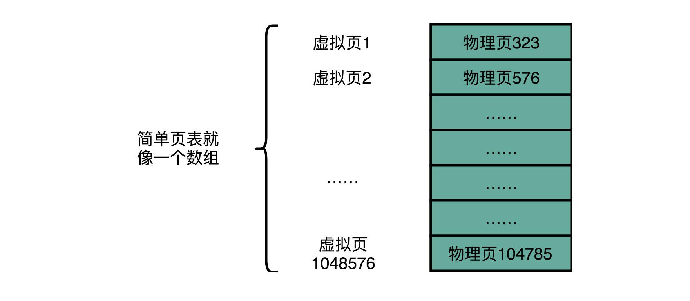

不过，这个空间可不是只占用一份。每一个进程，都有属于自己独立的虚拟内存地址空间。这也就意味着，每一个进程都需要这样一个页表。不管这个进程，是个本身只有几 KB 大小的程序，还是需要几 GB 的内存空间，都需要这样一个页表。

#### 5.4.2 多级页表

仔细想一想，其实没有必要存下这 2^20^ 个物理页表。大部分进程所占用的内存是有限的，需要的页也自然是很有限的。只需要去存那些用到的页之间的映射关系就好了。在实践中，其实采用的是一种叫作**多级页表**(Multi-Level Page Table)的解决方案。

先来看一看，一个进程的内存地址空间是怎么分配的。在整个进程的内存地址空间，通常是"两头实、中间空"。在程序运行的时候，内存地址从顶部往下，不断分配占用的栈的空间。而堆的空间，内存地址则是从底部往上，是不断分配占用的。

所以，在一个实际的程序进程里面，虚拟内存占用的地址空间，通常是两段连续的空间。而不是完全散落的随机的内存地址。而多级页表，就特别适合这样的内存地址分布。

以一个 4 级的多级页表为例，来看一下。同样一个虚拟内存地址，偏移量的部分和上面简单页表一样不变，但是原先的页号部分，把它拆成四段，从高到低，分成 4 级到 1 级这样 4 个页表索引。


1. 对应的，一个进程会有一个 4 级页表。先通过 4 级页表索引，找到 4 级页表里面对应的条目(Entry)。这个条目里存放的是一张 3 级页表所在的位置。4 级页面里面的每一个条目，都对应着一张 3 级页表，所以可能有多张 3 级页表。

2. 找到对应这张 3 级页表之后，用 3 级索引去找到对应的 3 级索引的条目。3 级索引的条目再会指向一个 2 级页表。同样的，2 级页表里可以用 2 级索引指向一个 1 级页表。

3. 而最后一层的 1 级页表里面的条目，对应的数据内容就是物理页号了。在拿到了物理页号之后，同样可以用"页号 + 偏移量"的方式，来获取最终的物理内存地址。

可能有很多张 1 级页表、2 级页表，乃至 3 级页表。但是，因为实际的虚拟内存空间通常是连续的，很可能只需要很少的 2 级页表，甚至只需要 1 张 3 级页表就够了。

事实上，多级页表就像一个多叉树的数据结构，所以常常称它为**页表树**(Page Table Tree)。因为虚拟内存地址分布的连续性，树的第一层节点的指针，很多就是空的，也就不需要有对应的子树了。所谓不需要子树，其实就是不需要对应的 2 级、3 级的页表。找到最终的物理页号，就好像通过一个特定的访问路径，走到树最底层的叶子节点。

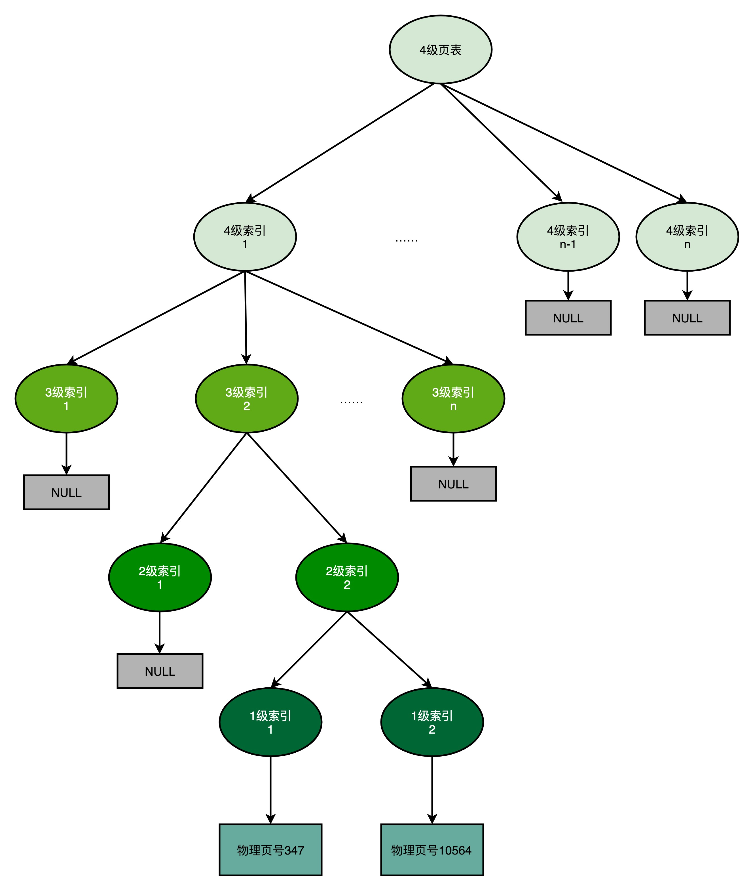

以这样的分成 4 级的多级页表来看，每一级如果都用 5 个比特表示。那么每一张某 1 级的页表，只需要 2^5^=32 个条目。如果每个条目还是 4 个字节，那么一共需要 128 个字节。而一个 1 级索引表，对应 32 个 4KB 的也就是 128KB 的大小。一个填满的 2 级索引表，对应的就是 32 个 1 级索引表，也就是 4MB 的大小。

可以一起来测算一下，一个进程如果占用了 8MB 的内存空间，分成了 2 个 4MB 的连续空间。那么，它一共需要 2 个独立的、填满的 2 级索引表，也就意味着 64 个 1 级索引表，2 个独立的 3 级索引表，1 个 4 级索引表。一共需要 69 个索引表，每个 128 字节，大概就是 9KB 的空间。比起 4MB 来说，只有差不多 1/500。

> 不过，多级页表虽然节约了的存储空间，却带来了时间上的开销，所以它其实是一个"以时间换空间"的策略。原本进行一次地址转换，只需要访问一次内存就能找到物理页号，算出物理内存地址。但是，用了 4 级页表，就需要访问 4 次内存，才能找到物理页号了。
> 内存访问其实比 Cache 要慢很多。本来只是要做一个简单的地址转换，反而是一下子要多访问好多次内存。对于这个时间层面的性能损失，可以使用**解析 TLB**来解决。

#### 5.4.3 加速地址转换：TLB

机器指令里面的内存地址都是虚拟内存地址。程序里面的每一个进程，都有一个属于自己的虚拟内存地址空间。可以通过地址转换来获得最终的实际物理地址。每一个指令都存放在内存里面，每一条数据都存放在内存里面。因此，"地址转换"是一个非常高频的动作，"地址转换"的性能就变得至关重要了，也就是**性能问题**。

从虚拟内存地址到物理内存地址的转换，是通过页表这个数据结构来处理。为了节约页表的内存存储空间，会使用多级页表数据结构。

不过，多级页表虽然节约了存储空间，但是却带来了时间上的开销，变成了一个"以时间换空间"的策略。原本进行一次地址转换，只需要访问一次内存就能找到物理页号，算出物理内存地址。但是用了 4 级页表，就需要访问 4 次内存，才能找到物理页号。内存访问其实比 Cache 要慢很多。本来只是要做一个简单的地址转换，现在反而要多访问好多次内存。

程序所需要使用的指令，都顺序存放在虚拟内存里面。执行的指令，也是一条条顺序执行下去的。也就是说，对于指令地址的访问，存在["空间局部性"和"时间局部性"](#52-局部性原理数据库性能与成本综合考虑)，而需要访问的数据也是一样的。连续执行了 5 条指令。因为内存地址都是连续的，所以这 5 条指令通常都在同一个"虚拟页"里。

因此，这连续 5 次的内存地址转换，其实都来自于同一个虚拟页号，转换的结果自然也就是同一个物理页号。那就可以用一个"加个缓存"的办法。把之前的内存转换地址缓存下来，使得不需要反复去访问内存来进行内存地址转换。

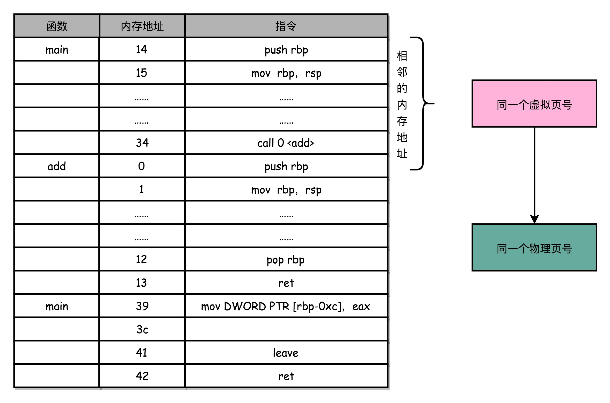

于是，计算机工程师们专门在 CPU 里放了一块缓存芯片。这块缓存芯片称之为 **TLB**，全称是**地址变换高速缓冲**(Translation-Lookaside Buffer)。这块缓存存放了之前已经进行过地址转换的查询结果。这样，当同样的虚拟地址需要进行地址转换的时候，可以直接在 TLB 里面查询结果，而不需要多次访问内存来完成一次转换。

TLB 和前面的 CPU 的高速缓存类似，可以分成指令的 TLB 和数据的 TLB，也就是 **ITLB** 和 **DTLB**。同样的，也可以根据大小对它进行分级，变成 L1、L2 这样多层的 TLB。

除此之外，还有一点和 CPU 里的高速缓存也是一样的，需要用脏标记这样的标记位，来实现"写回"这样缓存管理策略。


为了性能，整个内存转换过程也要由硬件来执行。在 CPU 芯片里面，封装了**内存管理单元(MMU，Memory Management Unit)芯片**，用来完成地址转换。和 TLB 的访问和交互，都是由这个 MMU 控制的。

#### 5.4.4 安全性与内存保护

因为指令、数据都存放在内存里面，如果被人修改了内存里面的内容，CPU 就可能会去执行计划之外的指令。这个指令可能是破坏服务器里面的数据，也可能是被人获取到服务器里面的敏感信息，也就是**内存安全问题**。

进程的程序也好，数据也好，都要存放在内存里面。实际程序指令的执行，也是通过程序计数器里面的地址，去读取内存内的内容，然后运行对应的指令，使用相应的数据。

虽然现代的操作系统和 CPU，已经做了各种权限的管控。正常情况下，已经通过虚拟内存地址和物理内存地址的区分，隔离了各个进程。但是，无论是 CPU 这样的硬件，还是操作系统这样的软件，都太复杂了，难免还是会被黑客们找到各种各样的漏洞。

就像在软件开发过程中，常常会有一个"兜底"的错误处理方案一样，在对于内存的管理里面，计算机也有一些最底层的安全保护机制。这些机制统称为**内存保护**(Memory Protection)。

##### 5.4.4.1 可执行空间保护

第一个常见的安全机制，叫**可执行空间保护**(Executable Space Protection)。

这个机制是说，对于一个进程使用的内存，只把其中的指令部分设置成"可执行"的，对于其他部分，比如数据部分，不给予"可执行"的权限。因为无论是指令，还是数据，在 CPU 看来，都是二进制的数据。直接把数据部分拿给 CPU，如果这些数据解码后，也能变成一条合理的指令，其实就是可执行的。

这个时候，黑客们想到了一些搞破坏的办法。在程序的数据区里，放入一些要执行的指令编码后的数据，然后找到一个办法，让 CPU 去把它们当成指令去加载，那 CPU 就能执行想要执行的指令了。对于进程里内存空间的执行权限进行控制，可以使得 CPU 只能执行指令区域的代码。对于数据区域的内容，即使找到了其他漏洞想要加载成指令来执行，也会因为没有权限而被阻挡掉。

其实，在实际的应用开发中，类似的策略也很常见。下面举两个例子:

- 在用 PHP 进行 Web 开发的时候，通常会禁止 PHP 有 eval 函数的执行权限。这个其实就是害怕外部的用户，没有把数据提交到服务器，而是把一段想要执行的脚本提交到服务器。服务器里在拼装字符串执行命令的时候，可能就会执行到预计之外被"注入"的破坏性脚本。

- SQL 注入攻击。如果服务端执行的 SQL 脚本是通过字符串拼装出来的，那么在 Web 请求里面传输的参数就可以藏下一些想要执行的 SQL，让服务器执行一些其他的 SQL 语句。这样的结果就是，或者破坏了数据库里的数据，或者被人拖库泄露了数据。

##### 5.4.4.2 地址空间布局随机化

第二个常见的安全机制，叫**地址空间布局随机化**(Address Space Layout Randomization)。

内存层面的安全保护核心策略，是在可能有漏洞的情况下进行安全预防。上面的可执行空间保护就是一个很好的例子。但是，内存层面的漏洞还有其他的可能性。

这里的核心问题是，其他的人、进程、程序，会去修改掉特定进程的指令、数据，然后，让当前进程去执行这些指令和数据，造成破坏。要想修改这些指令和数据，需要知道这些指令和数据所在的位置才行。

原先一个进程的内存布局空间是固定的，所以任何第三方很容易就能知道指令在哪里，程序栈在哪里，数据在哪里，堆又在哪里。这个其实为想要搞破坏的人创造了很大的便利。而地址空间布局随机化这个机制，就是让这些区域的位置不再固定，在内存空间随机去分配这些进程里不同部分所在的内存空间地址，让破坏者猜不出来。猜不出来，自然就没法找到想要修改的内容的位置。如果只是随便做点修改，程序只会 crash 掉，而不会去执行计划之外的代码。


这样的"随机化"策略，其实也是日常应用开发中一个常见的策略。最常见例子就是密码登陆功能。网站和 App 都需要设置用户名和密码，之后用来登陆账号。然后，在服务器端，会把用户名和密码保存下来，在下一次用户登陆的时候，使用这个用户名和密码验证。

密码当然不能明文存储在数据库里，不然就会有安全问题。如果明文存储在数据库里，意味着能拿到数据库访问权限的人，都能看到用户的明文密码。这个可能是因为安全漏洞导致被人拖库，而且网站的管理员也能直接看到所有的用户名和密码信息。

于是，大家会在数据库里存储密码的哈希值，比如用现在常用的 SHA256，生成一一个验证的密码哈希值。但是这个往往还是不够的。因为同样的密码，对应的哈希值都是相同的，大部分用户的密码又常常比较简单。于是，拖库成功的黑客可以通过彩虹表的方式，来推测出用户的密码。

这个时候，"随机化策略"就可以用上了。可以在数据库里，给每一个用户名生成一个随机的、使用了各种特殊字符的**盐值**(Salt)。这样，哈希值就不再是仅仅使用密码来生成的了，而是密码和盐值放在一起生成的对应的哈希值。哈希值的生成中，包括了一些类似于"乱码"的随机字符串，所以通过彩虹表碰撞来猜出密码的办法就用不了了。

```java
// 密码是明文存储的
$password = "goodMorning12345";

// 对应的hash值是 054df97ac847f831f81b439415b2bad05694d16822635999880d7561ee1b77ac
// 但是这个hash值里可以用彩虹表直接"猜出来"原始的密码就是goodmorning12345
$hashed_password = hash('sha256', password);

// 这个hash后的slat因为有部分随机的字符串，不会在彩虹表里面出现。
// 261e42d94063b884701149e46eeb42c489c6a6b3d95312e25eee0d008706035f
$salt = "#21Pb$Hs&Xi923^)?";
$salt_password = $salt.$password;
$hashed_salt_password = hash('sha256', salt_password);
```

可以看到，通过加入"随机"因素，有了一道最后防线。即使在出现安全漏洞的时候，也有了更多的时间和机会去补救这些问题。虽然安全机制似乎在平时用不太到，但是在开发程序的时候，还是要有安全意识。

### 5.5 总线: 计算机内部的高速公路

#### 5.5.1 降低复杂性: 总线的设计思路来源

计算机里有很多不同的硬件设备，除了 CPU 和内存之外，还有大量的输入输出设备。可以说，计算机上的每一个接口，键盘、鼠标、显示器、硬盘，乃至通过 USB 接口连接的各种外部设备，都对应了一个设备或者模块。

如果各个设备间的通信，都是互相之间单独进行的。有 N 个不同的设备，它们之间需要各自单独连接，那么系统复杂度就会变成 N^2^。每一个设备或者功能电路模块，都要和其他 N-1 个设备去通信。为了简化系统的复杂度，就引入了总线，把这个 N^2^ 的复杂度，变成一个 N 的复杂度。

思路是，与其让各个设备之间互相单独通信，不如去设计一个公用的线路。CPU 想要和什么设备通信，通信的指令是什么，对应的数据是什么，都发送到这个线路上；设备要向 CPU 发送什么信息呢，也发送到这个线路上。这个线路就好像一个高速公路，各个设备和其他设备之间，不需要单独建公路，只建一条小路通向这条高速公路就好了。

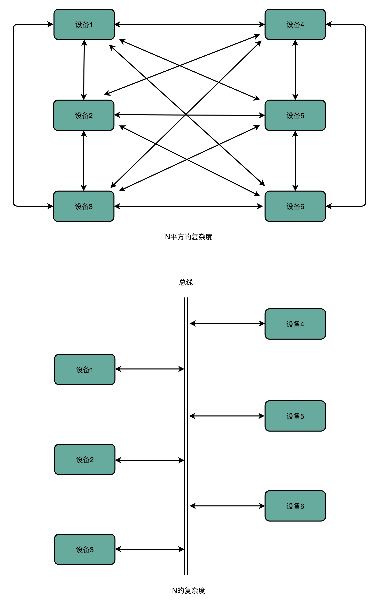

这个设计思路，就是**总线**(Bus)。总线，其实就是一组线路。CPU、内存以及输入和输出设备，都是通过这组线路，进行相互间通信的。总线的英文叫作 Bus，就是一辆公交车。这个名字很好地描述了总线的含义。"公交车"的各个站点，就是各个接入设备。要想向一个设备传输数据，只要把数据放上公交车，在对应的车站下车就可以了。

其实，对应的设计思路，在软件开发中也是非常常见的。在做大型系统开发的过程中，经常会用到一种叫作**事件总线**(Event Bus)的设计模式。进行大规模应用系统开发的时候，系统中的各个组件之间也需要相互通信。模块之间如果是两两之间单独去定义协议，这个软件系统一样会遇到一个复杂度变成了 N^2^ 的问题。所以常见的一个解决方案，就是事件总线这个设计模式。

在事件总线这个设计模式里，各个模块触发对应的事件，并把事件对象发送到总线上。也就是说，每个模块都是一个发布者(Publisher)。而各个模块也会把自己注册到总线上，去监听总线上的事件，并根据事件的对象类型或者是对象内容，来决定自己是否要进行特定的处理或者响应。

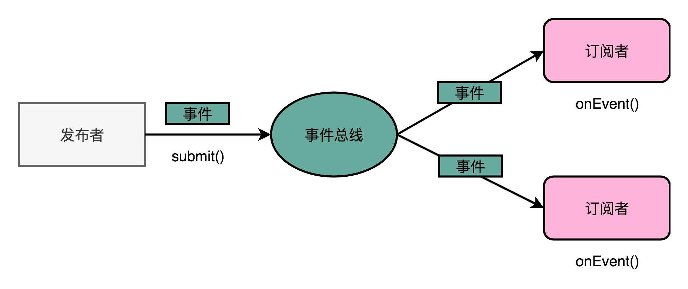

> 这样的设计下，注册在总线上的各个模块就是松耦合的。模块互相之间并没有依赖关系。无论代码的维护，还是未来的扩展，都会很方便。

#### 5.5.2 理解总线: 多总线架构和三种线路

**多总线架构**
现代 Intel CPU 的体系结构里面，通常有好几条总线。

首先，CPU 和内存以及高速缓存通信的总线，这里面通常有两种总线。这种方式，称之为**双独立总线**(Dual Independent Bus，缩写为 DIB)。CPU 里，有一个快速的**本地总线**(Local Bus)，以及一个速度相对较慢的**前端总线**(Front-side Bus)。

现代的 CPU 里，通常有专门的高速缓存芯片。这里的高速本地总线，就是用来和高速缓存通信的。而前端总线，则是用来和主内存以及输入输出设备通信的。有时候，会把本地总线也叫作后端总线(Back-side Bus)，和前面的前端总线对应起来。而前端总线也有很多其他名字，比如处理器总线(Processor Bus)、内存总线(Memory Bus)。


除了前端总线，还会听到 PCI 总线、I/O 总线或者系统总线(System Bus)。这些名词容易混为一谈。其实各种总线的命名一直都很混乱，不如直接来看上面的 **CPU 的硬件架构图**。对照图来看，一切问题就都清楚了。

CPU 里面的北桥芯片，把上面的前端总线，一分为二，变成了三个总线。前端总线，其实就是**系统总线**。CPU 里面的内存接口，直接和系统总线通信，然后系统总线再接入一个 I/O 桥接器(I/O Bridge)。这个 I/O 桥接器，一边接入了内存总线，使得 CPU 和内存通信；另一边呢，又接入了一个 I/O 总线，用来连接 I/O 设备。

事实上，真实的计算机里，这个总线层面拆分得更细。根据不同的设备，还会分成独立的 PCI 总线、ISA 总线等等。

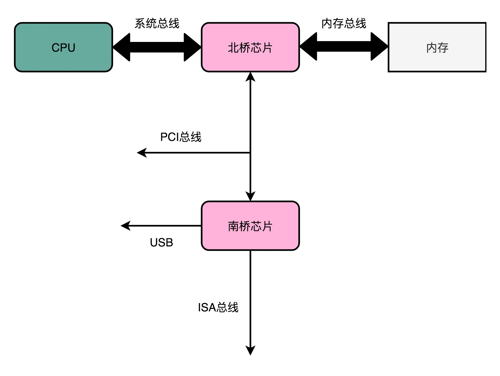

<span id="Bus-ThreeLines">**三种线路**</span>
在物理层面，其实完全可以把总线看作一组"电线"。不过，这些电线之间也是有分工的，通常有三类线路:

- **数据线**(Data Bus)，用来传输实际的数据信息，也就是实际上了公交车的"人"。
- **地址线**(Address Bus)，用来确定到底把数据传输到哪里去，是内存的某个位置，还是某一个 I/O 设备。这个其实就相当于拿了个纸条，写下了上面的人要下车的站点。
- **控制线**(Control Bus)，用来控制对于总线的访问。
  虽然把总线比喻成了一辆公交车。那么有人想要坐公交车的时候，也需要告诉公交车司机，这个就是控制信号。

**总线的问题**
尽管总线减少了设备之间的耦合，也降低了系统设计的复杂度，但同时也带来了一个新问题，那就是总线不能同时给多个设备提供通信功能。

总线是很多个设备公用的，那多个设备都想要用总线，就需要有一个机制，去决定这种情况下，到底把总线给哪一个设备用。这个机制，就叫作**总线裁决**(Bus Arbitraction)，总线裁决的机制有很多种不同的实现。

> 2008 年之后，Intel CPU 其实已经没有前端总线了。Intel 发明了快速通道互联(Intel Quick Path Interconnect，简称为 QPI)技术，替代了传统的前端总线。

### 5.6 输入输出设备

#### 5.6.1 接口和设备：经典的适配器模式

实际上，输入输出设备，并不只是一个设备。大部分的输入输出设备，都有两个组成部分。第一个是它的**接口**(Interface)，第二个才是**实际的 I/O 设备**(Actual I/O Device)。硬件设备并不是直接接入到总线上和 CPU 通信的，而是通过接口，用接口连接到总线上，再通过总线和 CPU 通信。

平时所说的并行接口(Parallel Interface)、串行接口(Serial Interface)、USB 接口，都是计算机主板上内置的接口。实际硬件设备，比如，使用并口的打印机、使用串口的老式鼠标或者使用 USB 接口的 U 盘，都要插入到这些接口上，才能和 CPU 工作以及通信的。

接口本身就是一块电路板。CPU 其实不是和实际的硬件设备打交道，而是和这个接口电路板打交道。设备里面有三类寄存器，其实都在这个设备的接口电路上，而不在实际的设备上。

三类寄存器分别是状态寄存器(Status Register)、 命令寄存器(Command Register)以及数据寄存器(Data Register)，除了内置在主板上的接口之外，有些接口还可以集成在设备上。

上世纪 90 年代的时候，用的硬盘都叫作 IDE 硬盘。这个 IDE 不是像 IntelliJ 或者 WebStorm 这样的软件开发集成环境(Integrated Development Environment)的 IDE，而是代表着集成设备电路(Integrated Device Electronics)。也就是说，设备的接口电路直接在设备上，而不在主板上。需要通过一个线缆，把集成了接口的设备连接到主板上去。

把接口和实际设备分离，这个做法实际上来自于计算机走向开放架构(Open Architecture)的时代。

当要对计算机升级，不会扔掉旧的计算机，直接买一台全新的计算机，而是可以单独升级硬盘这样的设备。把老硬盘从接口上拿下来，换一个新的上去就好了。各种输入输出设备的制造商，也可以根据接口的控制协议，来设计和制造硬盘、鼠标、键盘、打印机乃至其他种种外设。正是这样的分工协作，带来了 PC 时代的繁荣。

其实，在软件的设计模式里也有这样的思路。面向对象里的面向接口编程的接口，就是 Interface。如果做 iOS 的开发，Objective-C 里面的 Protocol 其实也是这个意思。而 Adaptor 设计模式，更是一个常见的、用来解决不同外部应用和系统"适配"问题的方案。可以看到，计算机的软件和硬件，在逻辑抽象上，其实是相通的。

如果用的是 Windows 操作系统，可以打开设备管理器，里面有各种各种的 Devices(设备)、Controllers(控制器)、Adaptors(适配器)。这些，其实都是对于输入输出设备不同角度的描述。被叫作 Devices，看重的是实际的 I/O 设备本身。被叫作 Controllers，看重的是输入输出设备接口里面的控制电路。而被叫作 Adaptors，则是看重接口作为一个适配器后面可以插上不同的实际设备。

#### 5.6.2 CPU 如何控制 I/O 设备

无论是内置在主板上的接口，还是集成在设备上的接口，除了三类寄存器之外，还有对应的控制电路。正是通过这个控制电路，CPU 才能通过向这个接口电路板传输信号，来控制实际的硬件。

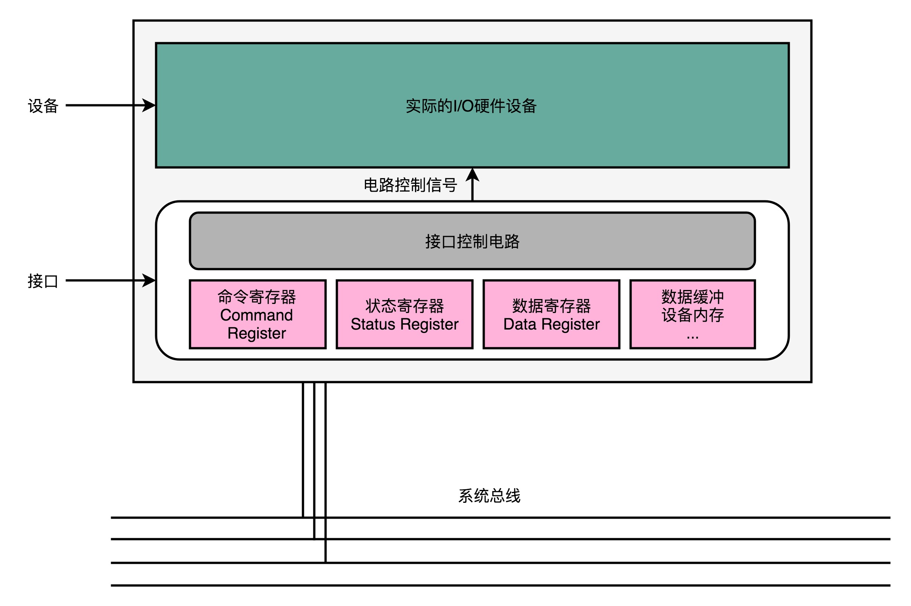

1. 首先是数据寄存器(Data Register)。CPU 向 I/O 设备写入需要传输的数据，比如要打印的内容是"GeekTime"，就要先发送一个"G"给到对应的 I/O 设备。
2. 然后是命令寄存器(Command Register)。CPU 发送一个命令，告诉打印机，要进行打印工作。这个时候，打印机里面的控制电路会做两个动作。
   1. 第一个，是去设置状态寄存器里面的状态，把状态设置成 not-ready
   2. 第二个，就是实际操作打印机进行打印。
3. 而状态寄存器(Status Register)，就是告诉 CPU，现在设备已经在工作了，所以这个时候，CPU 再发送数据或者命令过来，都是没有用的。直到前面的动作已经完成，状态寄存器重新变成了 ready 状态，CPU 才能发送下一个字符和命令。

当然，在实际情况中，打印机里通常不只有数据寄存器，还会有数据缓冲区。CPU 也不是真的一个字符一个字符这样交给打印机去打印的，而是一次性把整个文档传输到打印机的内存或者数据缓冲区里面一起打印的。

#### 5.6.3 信号和地址：发挥总线的价值

CPU 和 I/O 设备的通信，一样是通过 CPU 支持的机器指令来执行的。但在 MIPS 的机器指令的分类中会发现，并没有一种专门的和 I/O 设备通信的指令类型。那么，MIPS 的 CPU 到底是通过什么样的指令来和 I/O 设备来通信呢？

答案就是，和访问主内存一样，使用"内存地址"。为了让已经足够复杂的 CPU 尽可能简单，计算机会把 I/O 设备的各个寄存器，以及 I/O 设备内部的内存地址，都映射到主内存地址空间里来。主内存的地址空间里，会给不同的 I/O 设备预留一段一段的内存地址。CPU 想要和这些 I/O 设备通信时，就往这些地址发送数据。这些地址信息，就是通过总线中的[地址线](#Bus-ThreeLines)来发送的，而对应的数据信息，自然就是通过总线中的[数据线](<(#Bus-ThreeLines)>)来发送的。

而 I/O 设备，就会监控地址线，并且在 CPU 往自己地址发送数据的时候，把对应的数据线里面传输过来的数据，接入到对应的设备里面的寄存器和内存里面来。CPU 无论是向 I/O 设备发送命令、查询状态还是传输数据，都可以通过这样的方式。这种方式叫作**内存映射 IO**(Memory-Mapped I/O，简称 MMIO)。

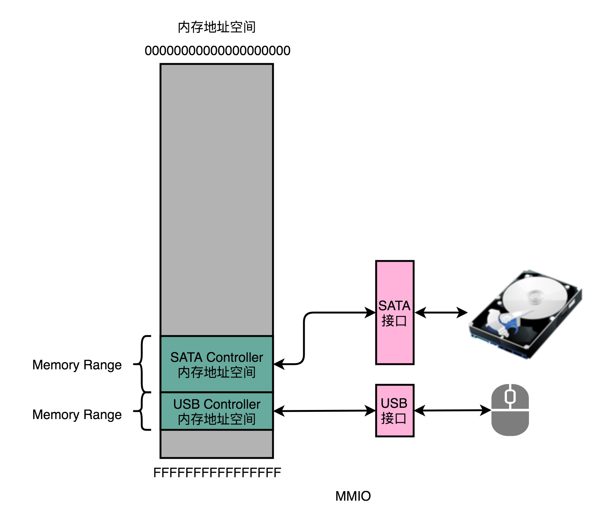

MMIO 也不是唯一一种 CPU 和设备通信的方式。精简指令集 MIPS 的 CPU 特别简单，所以这里只有 MMIO。而 Intel X86 架构的计算机有 2000 多个指令，自然可以设计专门的和 I/O 设备通信的指令，也就是 in 和 out 指令。

Intel CPU 虽然也支持 MMIO，不过它还可以通过特定的指令，来支持**端口映射 I/O**(Port-Mapped I/O，简称 PMIO)或者也可以叫独立输入输出(Isolated I/O)。

其实 PMIO 的通信方式和 MMIO 差不多，**核心的区别**在于，PMIO 里面访问的设备地址，不再是在内存地址空间里面，而是一个专门的端口(Port)。这个端口并不是指一个硬件上的插口，而是和 CPU 通信的一个抽象概念。

无论是 PMIO 还是 MMIO，CPU 都会传送一条二进制的数据，给到 I/O 设备的对应地址。设备自己本身的接口电路，再去解码这个数据。解码之后的数据就会变成设备支持的一条指令，再去通过控制电路去操作实际的硬件设备。对于 CPU 来说，它并不需要关心设备本身能够支持哪些操作。它要做的，只是在总线上传输一条条数据就好了。

这个，其实也有点像设计模式里面的 Command 模式。在总线上传输的，是一个个数据对象，然后各个接受这些对象的设备，再去根据对象内容，进行实际的解码和命令执行。

#### 5.6.4 IO 性能、顺序访问和随机访问

大部分程序员开发的都是应用系统。在开发应用系统的时候，遇到的性能瓶颈大部分都在 I/O 上。在[局部性原理](#52-局部性原理数据库性能与成本综合考虑)中，是通过把内存当作是缓存，来提升系统的整体性能。在[CPU Cache](#53-高速缓存) 中，看到了 CPU Cache 和主内存之间性能的巨大差异。

然而，并不是所有问题都能靠利用内存或者 CPU Cache 做一层缓存来解决。特别是在这个"大数据"的时代。硬盘上存储了越来越多的数据，一个 MySQL 数据库的单表可能有个几千万条记录。这也就意味着，用内存当缓存，存储空间是不够用的。大部分时间，请求还是要打到硬盘上。

如果去看硬盘厂商的性能报告，通常会看到两个指标:

- **数据传输率**(Data Transfer Rate)
  现在常用的硬盘有两种。一种是 HDD 硬盘，也就是常说的机械硬盘。另一种是 SSD 硬盘，一般也被叫作固态硬盘。现在的 HDD 硬盘，用的是 SATA 3.0 的接口。而 SSD 硬盘，通常会用两种接口，一部分用的也是 SATA 3.0 的接口；另一部分，用的是 PCI Express 的接口。

  现在常用的 SATA 3.0 的接口，带宽是 6Gb/s。这里的"b"是比特。这个带宽相当于每秒可以传输 768MB 的数据。而日常用的 HDD 硬盘的数据传输率，差不多在 200MB/s 左右。

  当换成 SSD 的硬盘，性能会好上不少。它的数据传输速率能到差不多 500MB/s，比 HDD 的硬盘快了一倍不止。不过 SATA 接口的硬盘，差不多到这个速度，性能也就到顶了。

  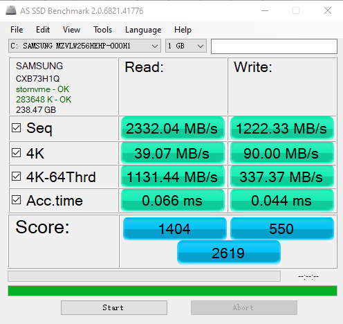

  不过，实际 SSD 硬盘能够更快，可以换用 PCI Express 的接口。数据传输率，在读取的时候就能做到 2GB/s 左右，差不多是 HDD 硬盘的 10 倍，而在写入的时候也能有 1.2GB/s。

- **响应时间**(Response Time)
  除了数据传输率这个吞吐率指标，另一个指标响应时间，其实也可以在 AS SSD 的测试结果里面看到，就是里面的 Acc.Time 指标。

  这个指标，其实就是程序发起一个硬盘的写入请求，直到这个请求返回的时间。可以看到，在上面的 SSD 硬盘上，响应时间大概是在几十微秒这个级别。如果去测试一块 HDD 的硬盘，通常会在几毫秒到十几毫秒这个级别。这个性能的差异，就不是 10 倍了，而是在几十倍，乃至几百倍。

  光看响应时间和吞吐率这两个指标，似乎硬盘性能很不错。即使是廉价的 HDD 硬盘，接收一个来自 CPU 的请求，也能够在几毫秒时间返回。一秒钟能够传输的数据，也有 200MB 左右。平时往数据库里写入一条记录，也就是 1KB 左右的大小。拿 200MB 去除以 1KB，那差不多每秒钟可以插入 20 万条数据。但是硬盘的读写。在**顺序读写**和**随机读写**的情况下，硬盘的性能是完全不同的。

  在上面的 AS SSD 的性能指标中会看到，里面有一个"4K"的指标。这个指标它其实就是程序，去随机读取磁盘上某一个 4KB 大小的数据，一秒之内可以读取到多少数据。

  在这个指标上，使用 SATA 3.0 接口的硬盘和 PCI Express 接口的硬盘，性能差异变得很小。这是因为，在这个时候，接口本身的速度已经不是硬盘访问速度的瓶颈了。更重要的是，即使用 PCI Express 的接口，在随机读写的时候，数据传输率也只能到 40MB/s 左右，是顺序读写情况下的几十分之一。

  拿这个 40MB/s 和一次读取 4KB 的数据算一下。40MB / 4KB = 10000。也就是说，一秒之内，这块 SSD 硬盘可以随机读取 1 万次的 4KB 的数据。如果是写入的话呢，会更多一些，90MB /4KB 差不多是 2 万多次。

  这个每秒读写的次数，称之为 IOPS，也就是每秒输入输出操作的次数。事实上，比起响应时间，通常更关注 IOPS 这个性能指标。**IOPS 和 DTR(Data Transfer Rate，数据传输率)才是输入输出性能的核心指标**。

  这是因为，在实际的应用开发当中，对于数据的访问，更多的是随机读写，而不是顺序读写。平时所说的服务器承受的"并发"，其实是在说，会有很多个不同的进程和请求来访问服务器。自然，它们在硬盘上访问的数据，是很难顺序放在一起的。这种情况下，随机读写的 IOPS 才是服务器性能的核心指标。

#### 5.6.5 如何定位 IO_WAIT

即使是用上了 PCI Express 接口的 SSD 硬盘，IOPS 也就是在 2 万左右。而现代 CPU 的主频通常在 2GHz 以上，也就是每秒可以做 20 亿次操作。

即使 CPU 向硬盘发起一条读写指令，需要很多个时钟周期，一秒钟 CPU 能够执行的指令数和硬盘能够进行的操作数，也有好几个数量级的差异。这也是为什么，在应用开发的时候往往会说"性能瓶颈在 I/O 上"。因为很多时候，CPU 指令发出去之后，不得不去"等" I/O 操作完成，才能进行下一步的操作。

那么，在实际遇到服务端程序的性能问题的时候，怎么知道这个问题是不是来自于 CPU 等 I/O 来完成操作呢？接下来，就通过 top 和 iostat 这些命令，一起来看看 CPU 到底有没有在等待 io 操作。

在 Linux 下用 top 命令，可以去看服务的负载，也就是 load average。不过，在 top 命令里面，一样可以看到 CPU 是否在等待 IO 操作完成。

```linux
top - 06:26:30 up 4 days, 53 min,  1 user,  load average: 0.79, 0.69, 0.65
Tasks: 204 total,   1 running, 203 sleeping,   0 stopped,   0 zombie
%Cpu(s): 20.0 us,  1.7 sy,  0.0 ni, 77.7 id,  0.0 wa,  0.0 hi,  0.7 si,  0.0 st
KiB Mem:   7679792 total,  6646248 used,  1033544 free,   251688 buffers
KiB Swap:        0 total,        0 used,        0 free.  4115536 cached Mem
```

在 top 命令的输出结果里面，有一行是以 %CPU 开头的。这一行里，有一个叫作 wa 的指标，这个指标就代表着 iowait，也就是 CPU 等待 IO 完成操作花费的时间占 CPU 的百分比。下一次，当服务器遇到性能瓶颈，load 很大的时候，就可以通过 top 看一看这个指标。

知道了 iowait 很大，那么就去看一看，实际的 I/O 操作情况是什么样的。这个时候，就可以去用 iostat 这个命令了。输入"iostat"，就能够看到实际的硬盘读写情况。

```linux
avg-cpu:  %user   %nice %system %iowait  %steal   %idle
          17.02    0.01    2.18    0.04    0.00   80.76
Device:            tps    kB_read/s    kB_wrtn/s    kB_read    kB_wrtn
sda               1.81         2.02        30.87     706768   10777408
```

这个命令里，不仅有 iowait 这个 CPU 等待时间的百分比，还有一些更加具体的指标了，并且它还是按照机器上安装的多块不同的硬盘划分的。

这里的 tps 指标，其实就对应着硬盘的 IOPS 性能。而 kB_read/s 和 kB_wrtn/s 指标，对应的是数据传输率的指标。

知道实际硬盘读写的 tps、kB_read/s 和 kb_wrtn/s 的指标后，基本上可以判断出，机器的性能是不是卡在 I/O 上了。那么，接下来，就是要找出到底是哪一个进程是这些 I/O 读写的来源了。这个时候，需要用到"iotop"这个命令。

```linux
Total DISK READ :       0.00 B/s | Total DISK WRITE :      15.75 K/s
Actual DISK READ:       0.00 B/s | Actual DISK WRITE:      35.44 K/s
  TID  PRIO  USER     DISK READ  DISK WRITE  SWAPIN     IO>    COMMAND
  104 be/3 root        0.00 B/s    7.88 K/s  0.00 %  0.18 % [jbd2/sda1-8]
  383 be/4 root        0.00 B/s    3.94 K/s  0.00 %  0.00 % rsyslogd -n [rs:main Q:Reg]
 1514 be/4 www-data    0.00 B/s    3.94 K/s  0.00 %  0.00 % nginx: worker process
```

通过 iotop 这个命令，可以看到具体是哪一个进程实际占用了大量 I/O，就可以有的放矢，去优化对应的程序了。

上面的这些示例里，不管是 wa 也好，tps 也好，它们都很小。那么，接下来，在 Linux 下用 stress 命令，来模拟一个高 I/O 复杂的情况，来看看这个时候的 iowait 是怎么样的。

在一台云平台上的单个 CPU 核心的机器上输入 "stress -i 2"，让 stress 这个程序模拟两个进程不停地从内存里往硬盘上写数据。再使用 top 命令，可以看到 top 的输出里面，CPU 有大量的 sy 和 wa，也就是系统调用和 iowait。

```linux
top - 06:56:02 up 3 days, 19:34,  2 users,  load average: 5.99, 1.82, 0.63
Tasks:  88 total,   3 running,  85 sleeping,   0 stopped,   0 zombie
%Cpu(s):  3.0 us, 29.9 sy,  0.0 ni,  0.0 id, 67.2 wa,  0.0 hi,  0.0 si,  0.0 st
KiB Mem :  1741304 total,  1004404 free,   307152 used,   429748 buff/cache
KiB Swap:        0 total,        0 free,        0 used.  1245700 avail Mem
```

此时通过 iostat，再查看硬盘的 I/O，会看到，里面的 tps 很快就到了 4 万左右，占满了对应硬盘的 IOPS。

```linux
avg-cpu:  %user   %nice %system %iowait  %steal   %idle
           5.03    0.00   67.92   27.04    0.00    0.00
Device:            tps    kB_read/s    kB_wrtn/s    kB_read    kB_wrtn
sda           39762.26         0.00         0.00          0          0
```

这个时候去看 iotop，就会发现，I/O 占用，都来自于 stress 产生的两个进程。

```linux
Total DISK READ :       0.00 B/s | Total DISK WRITE :       0.00 B/s
Actual DISK READ:       0.00 B/s | Actual DISK WRITE:       0.00 B/s
  TID  PRIO  USER     DISK READ  DISK WRITE  SWAPIN     IO>    COMMAND
29161 be/4 xuwenhao    0.00 B/s    0.00 B/s  0.00 % 56.71 % stress -i 2
29162 be/4 xuwenhao    0.00 B/s    0.00 B/s  0.00 % 46.89 % stress -i 2
    1 be/4 root        0.00 B/s    0.00 B/s  0.00 %  0.00 % init
```

> 通过 top、iostat 以及 iotop，可以一步一步快速定位服务器端的 I/O 带来的性能瓶颈。也可以通过 Linux 的 man 命令，看一看这些命令还有哪些参数，以及通过 stress 来模拟其他更多不同的性能压力，看看机器负载会发生什么变化。

### 5.7 机械硬盘

#### 5.7.1 机械硬盘构造与读取数据过程

机械硬盘的 IOPS(每秒输入输出操作的次数)，大概只能做到每秒 100 次左右。那么，这个 100 次和机械硬盘的物理构造有关。

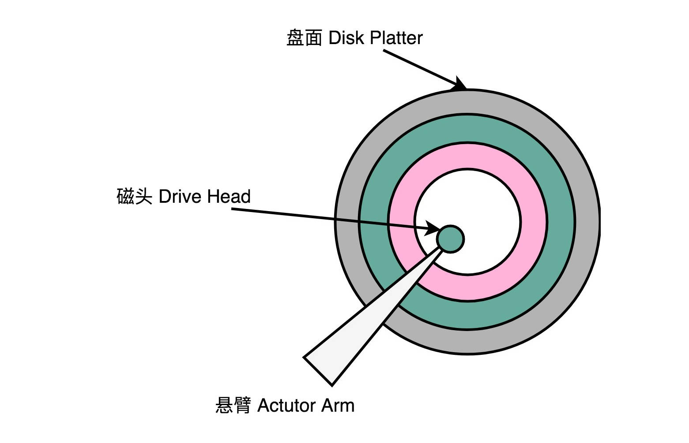

一块机械硬盘是由盘面、磁头和悬臂三个部件组成的:

- **盘面**(Disk Platter)
  盘面其实就是实际存储数据的盘片。盘面本身通常是用的铝、玻璃或者陶瓷这样的材质做成的光滑盘片。然后，盘面上有一层磁性的涂层。数据就存储在这个磁性的涂层上。盘面中间有一个受电机控制的转轴。这个转轴会控制盘面去旋转。
  平时买硬盘的时候经常会听到一个指标，叫作**硬盘转速**。硬盘有 5400 转的、7200 转的，乃至 10000 转的。这个硬盘转速，指的就是盘面中间电机控制的转轴的旋转速度，英文单位叫 **RPM**，也就是**每分钟的旋转圈数**(Rotations Per Minute)。所谓 7200 转，其实更准确地说是 7200RPM，指的就是一旦电脑开机供电之后，硬盘就可以一直做到每分钟转上 7200 圈。如果折算到每一秒钟，就是 120 圈。

- **磁头**(Drive Head)
  数据并不能直接从盘面传输到总线上，而是通过磁头，从盘面上读取到，然后再通过电路信号传输给控制电路、接口，再到总线上的。
  通常，一个盘面上会有两个磁头，分别在盘面的正反面。盘面在正反两面都有对应的磁性涂层来存储数据，而且一块硬盘也不是只有一个盘面，而是上下堆叠了很多个盘面，各个盘面之间是平行的。每个盘面的正反两面都有对应的磁头。

- **悬臂**(Actutor Arm)
  悬臂链接在磁头上，并且在一定范围内会去把磁头定位到盘面的某个特定的磁道(Track)上。
  一个盘面通常是圆形的，由很多个同心圆组成，就好像是一个个大小不一样的"甜甜圈"嵌套在一起。每一个"甜甜圈"都是一个磁道。每个磁道都有自己的一个编号。悬臂其实只是控制，到底是读哪个磁道的数据。

**读取数据过程**
一个磁道，会分成一个一个扇区(Sector)。上下平行的一个一个盘面的相同扇区就叫作一个柱面(Cylinder)。读取数据，其实就是两个步骤:

1. 把盘面旋转到某一个位置。在这个位置上，悬臂可以定位到整个盘面的某一个子区间。一般把这个子区间叫作**几何扇区**(Geometrical Sector)，意思是，在"几何位置上"，所有这些扇区都可以被悬臂访问到。
2. 接下来就是把悬臂移动到特定磁道的特定扇区，也就在这个"几何扇区"里面，找到实际需要的扇区。找到之后，磁头会落下，就可以读取到正对着扇区的数据。

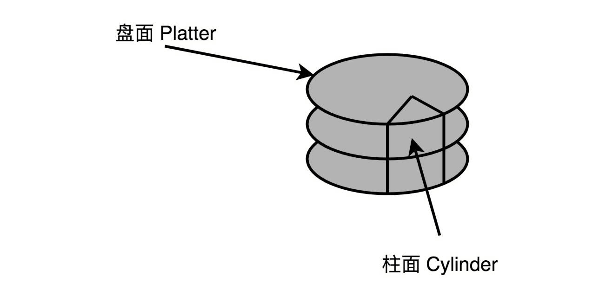

所以，进行一次硬盘上的随机访问，需要的时间由两个部分组成:

- 第一个部分，叫作**平均延时**(Average Latency)。这个时间，其实就是把盘面旋转，把几何扇区对准悬臂位置的时间。这个时间很容易计算，它其实就和机械硬盘的转速相关。随机情况下，平均找到一个几何扇区，需要旋转半圈盘面。7200 转的硬盘，一秒里面，就可以旋转 240 个半圈。那么，这个平均延时就是 `1s / 240 = 4.17ms`。

- 第二个部分，叫作**平均寻道时间**(Average Seek Time)，也就是在盘面旋转之后，悬臂定位到扇区的的时间。现在用的 HDD 硬盘的平均寻道时间一般在 4-10ms。
  这样，就能够算出来，如果随机在整个硬盘上找一个数据，需要 8-14 ms。硬盘是机械结构的，只有一个电机转轴，也只有一个悬臂，所以没有办法并行地去定位或者读取数据。那一块 7200 转的硬盘，一秒钟随机的 IO 访问次数，也就是 `1s / 8 ms = 125 IOPS 或者 1s / 14ms = 70 IOPS`。

如果不是去进行随机的数据访问，而是进行顺序的数据读写，可以选择把顺序存放的数据，尽可能地存放在同一个柱面上，来最大化读取效率。这样，只需要旋转一次盘面，进行一次寻道，就可以去写入或者读取，同一个垂直空间上的多个盘面的数据。如果一个柱面上的数据不够，也不要去动悬臂，而是通过电机转动盘面，这样就可以顺序读完一个磁道上的所有数据。所以，其实对于 HDD 硬盘的顺序数据读写，吞吐率还是很不错的，可以达到 200MB/s 左右。

#### 5.7.2 Partial Stroking：根据场景提升性能

只有 100 的 IOPS，是很难满足现在互联网海量高并发的请求。所以，今天的数据库，都会把数据存储在 SSD 硬盘上。不过，如果在 20 年前，可没有现在这么便宜的 SSD 硬盘。数据库里面的数据，只能存放在 HDD 硬盘上。

今天，即便是数据中心用的 HDD 硬盘，一般也是 7200 转的，因为如果要更快的随机访问速度，会选择用 SSD 硬盘。但是在当时，SSD 硬盘价格非常昂贵，还没有能够商业化。硬盘厂商们在不断地研发转得更快的硬盘。在数据中心里，往往会用上 10000 转，乃至 15000 转的硬盘。甚至直到 2010 年，SSD 硬盘已经开始逐步进入市场了，西数还在尝试研发 20000 转的硬盘。转速更高、寻道时间更短的机械硬盘，才能满足实际的数据库需求。

不过，10000 转，乃至 15000 转的硬盘也更昂贵。如果想要节约成本，提高性价比，那就得想点别的办法。这个方法，就叫作 **Partial Stroking** 或者 **Short Stroking**。可以翻译成"**缩短行程**"技术。

这个方法的思路很容易理解。既然访问一次数据的时间，是 "平均延时 + 寻道时间"，那么只要能缩短这两个之一，就可以提升 IOPS 了。

一般情况下，硬盘的寻道时间都比平均延时要长。缩短平均寻道时间最极端的办法就是不需要寻道，也就是说，把所有数据都放在一个磁道上。比如，始终把磁头放在最外道的磁道上。这样，寻道时间就基本为 0，访问时间就只有平均延时了。那样 IOPS，就变成了 `1s / 4ms = 250 IOPS`。

不过呢，只用一个磁道，能存的数据就比较有限了。这个时候，可能还不如把这些数据直接都放到内存里面呢。所以，实践当中，可以只用 1/2 或者 1/4 的磁道，也就是最外面 1/4 或者 1/2 的磁道。这样，硬盘可以使用的容量可能变成了 1/2 或者 1/4。但是，寻道时间，也变成了 1/4 或者 1/2，因为悬臂需要移动的"行程"也变成了原来的 1/2 或者 1/4，IOPS 就能够大幅度提升了。

比如说，一块 7200 转的硬盘，正常情况下，平均延时是 4.17ms，而寻道时间是 9ms。那么，它原本的 IOPS 就是 `1s / (4.17ms + 9ms) = 75.9 IOPS`。

如果只用其中 1/4 的磁道，那么，它的 IOPS 就变成了 `1s / (4.17ms + 9ms/4) = 155.8 IOPS`。

IOPS 提升了一倍，和一块 15000 转的硬盘的性能差不多了。不过，这个情况下，硬盘能用的空间也只有原来的 1/4 了。不过，在当时同样容量的 15000 转的硬盘的价格是 7200 转硬盘的 4 倍以上。所以，这样通过软件去格式化硬盘，只保留部分磁道让系统可用的情况，可以大大提升硬件的性价比。

在 2000-2010 年这 10 年间，正是这些奇思妙想，让海量数据下的互联网蓬勃发展起来的。在没有 SSD 的硬盘的时候，聪明的工程师们从硬件到软件，设计了各种有意思的方案解决了遇到的各类性能问题。而对于计算机底层知识的深入了解，也是能够找到这些解决办法的核心因素。

### 5.8 SSD 硬盘

无论是用 10000 转的企业级机械硬盘，还是用 Short Stroking 这样的方式进一步提升 IOPS，HDD 硬盘已经满足不了需求。这些优化措施，无非就是，把 IOPS 从 100 提升到 300、500 也就到头了。于是，SSD 硬盘在 2010 年前后，进入了主流的商业应用。一块普通的 SSD 硬盘，可以轻松支撑 10000 乃至 20000 的 IOPS。

#### 5.8.1 SSD 的读写原理与种类

SSD 没有像机械硬盘那样的寻道过程，所以它的随机读写都更快。下面这个表格，对比了一下 SSD 和机械硬盘的优缺点。

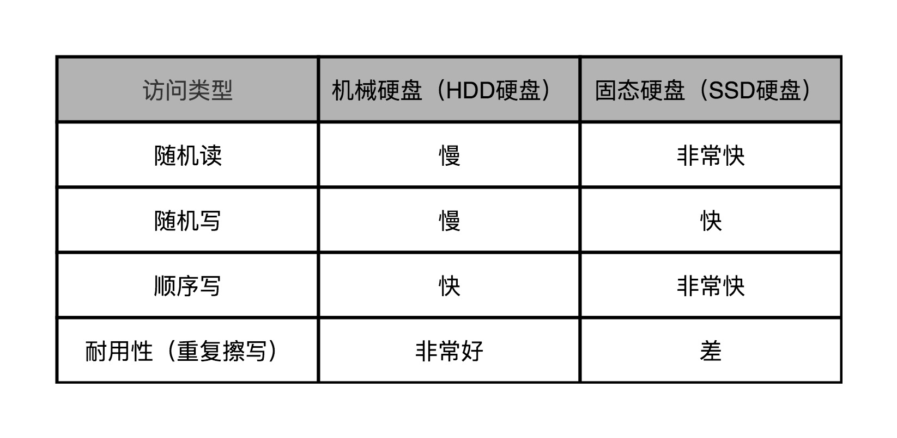

会发现，不管是机械硬盘不擅长的随机读写，还是它本身已经表现不错的顺序写入，SSD 在这些方面都要比 HDD 强。不过，有一点，机械硬盘要远强于 SSD，那就是耐用性。如果需要频繁地重复写入删除数据，那么机械硬盘要比 SSD 性价比高很多。

要想知道为什么 SSD 的耐用性不太好，先要理解 SSD 硬盘的存储和读写原理。CPU Cache 用的 SRAM 是用一个电容来存放一个比特的数据。对于 SSD 硬盘，也可以先简单地认为，它是由一个电容加上一个电压计组合在一起，记录了一个或者多个比特。

**SLC、MLC、TLC 和 QLC**
能够记录一个比特很容易理解。给电容里面充上电有电压的时候就是 1，给电容放电里面没有电就是 0。采用这样方式存储数据的 SSD 硬盘，一般称之为**使用了 SLC 的颗粒**，全称是 Single-Level Cell，也就是一个存储单元中只有一位数据。


但是，这样的方式会遇到和 CPU Cache 类似的问题，那就是，同样的面积下，能够存放下的元器件是有限的。如果只用 SLC，就会遇到，存储容量上不去，并且价格下不来的问题。于是呢，硬件工程师们就陆续发明了 MLC(Multi-Level Cell)、TLC(Triple-Level Cell)以及 QLC(Quad-Level Cell)，也就是能在一个电容里面存下 2 个、3 个乃至 4 个比特。

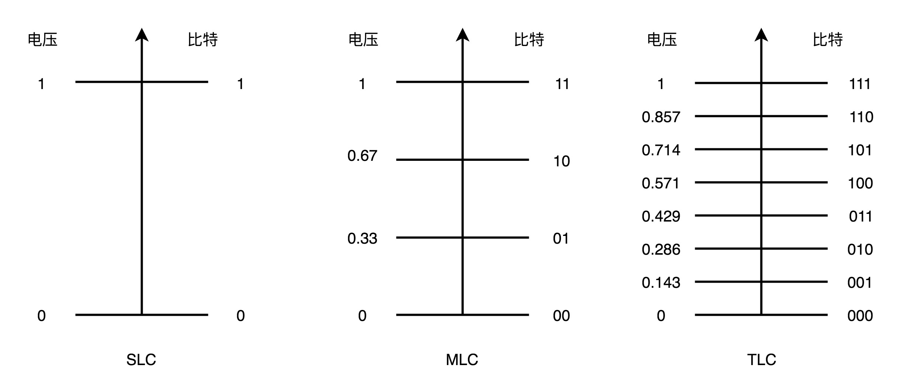

只有一个电容，怎么能够表示更多的比特呢？别忘了，这里还有一个电压计。4 个比特一共可以从 0000-1111 表示 16 个不同的数。那么，如果往电容里面充电的时候，充上 15 个不同的电压，并且电压计能够区分出这 15 个不同的电压。加上电容被放空代表的 0，就能够代表从 0000-1111 这样 4 个比特了。

不过，要想表示 15 个不同的电压，充电和读取的时候，对于精度的要求就会更高。这会导致充电和读取的时候都更慢，所以 QLC 的 SSD 的读写速度，要比 SLC 的慢上好几倍。可以去读这篇[文章](https://www.anandtech.com/show/5067/understanding-tlc-nand/2)来了解是什么样的物理原理导致 QLC 更慢。

#### 5.8.2 P/E 擦写问题

SSD 硬盘的硬件构造，大概是自顶向下是这么构成的。

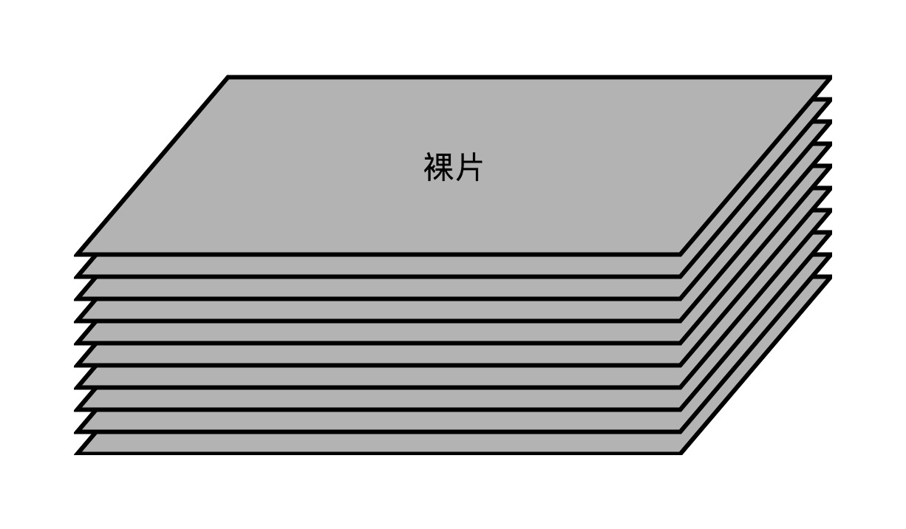

首先，和其他的 I/O 设备一样，它有对应的**接口和控制电路**。现在的 SSD 硬盘用的是 SATA 或者 PCI Express 接口。在控制电路里，有一个很重要的模块，叫作 **FTL**(Flash-Translation Layer)，也就是**闪存转换层**。这个可以说是 SSD 硬盘的一个核心模块，SSD 硬盘性能的好坏，很大程度上也取决于 FTL 的算法好不好。

接下来是**实际 I/O 设备**，它其实和机械硬盘很像。现在新的大容量 SSD 硬盘都是 3D 封装的了，也就是说，是由很多个裸片(Die)叠在一起的，就好像机械硬盘把很多个盘面(Platter)叠放再一起一样，这样可以在同样的空间下放下更多的容量。


接下来，一张裸片上可以放多个**平面**(Plane)，一般一个平面上的存储容量大概在 GB 级别。一个平面上面，会划分成很多个块(Block)，一般一个块(Block)的存储大小， 通常几百 KB 到几 MB 大小。一个块里面，还会区分很多个页(Page)，就和内存里面的页一样，一个页的大小通常是 4KB。

在这一层一层的结构里面，处在最下面的两层块和页非常重要。

对于 SSD 硬盘来说，数据的**写入**叫作 Program。写入不能像机械硬盘一样，通过**覆写**(Overwrite)来进行的，而是要先去**擦除**(Erase)，然后再写入。

SSD 的读取和写入的基本单位，不是一个比特(bit)或者一个字节(byte)，而是一个**页**(Page)。SSD 的擦除单位就更夸张了，不仅不能按照比特或者字节来擦除，连按照页来擦除都不行，必须按照块来擦除。

而且，SSD 的使用寿命，其实是每一个块(Block)的擦除的次数。可以把 SSD 硬盘的一个平面看成是一张白纸。在上面写入数据，就好像用铅笔在白纸上写字。如果想要把已经写过字的地方写入新的数据，先要用橡皮把已经写好的字擦掉。但是，如果频繁擦同一个地方，那这个地方就会破掉，之后就没有办法再写字了。

SLC 的芯片，可以擦除的次数大概在 10 万次，MLC 就在 1 万次左右，而 TLC 和 QLC 就只在几千次了。

#### 5.8.3 SSD 读写的生命周期

下图用三种颜色分别来表示 SSD 硬盘里面的页的不同状态，白色代表这个页从来没有写入过数据，绿色代表里面写入的是有效的数据，红色代表里面的数据，在操作系统看来已经是删除的了。


一开始，所有块的每一个页都是白色的。随着开始往里面写数据，里面的有些页就变成了绿色。

然后，因为删除了硬盘上的一些文件，所以有些页变成了红色。但是这些红色的页，并不能再次写入数据。因为 SSD 硬盘不能单独擦除一个页，必须一次性擦除整个块，所以新的数据，只能往后面的白色的页里面写。这些散落在各个绿色空间里面的红色空洞，就好像硬盘碎片。

如果有哪一个块的数据一次性全部被标红了，那就可以把整个块进行擦除。它就又会变成白色，可以重新一页一页往里面写数据。这种情况其实也会经常发生。毕竟一个块不大，也就在几百 KB 到几 MB。删除一个几 MB 的文件，数据又是连续存储的，自然会导致整个块可以被擦除。

随着硬盘里面的数据越来越多，红色空洞占的地方也会越来越多。于是，会发现，就要没有白色的空页去写入数据了。这个时候，要做一次类似于 Windows 里面"磁盘碎片整理"或者 Java 里面的"内存垃圾回收"工作。找一个红色空洞最多的块，把里面的绿色数据，挪到另一个块里面去，然后把整个块擦除，变成白色，可以重新写入数据。

不过，这个"磁盘碎片整理"或者"内存垃圾回收"的工作，不能太主动、太频繁地去做。因为 SSD 的擦除次数是有限的。如果动不动就搞个磁盘碎片整理，那么 SSD 硬盘很快就会报废了。

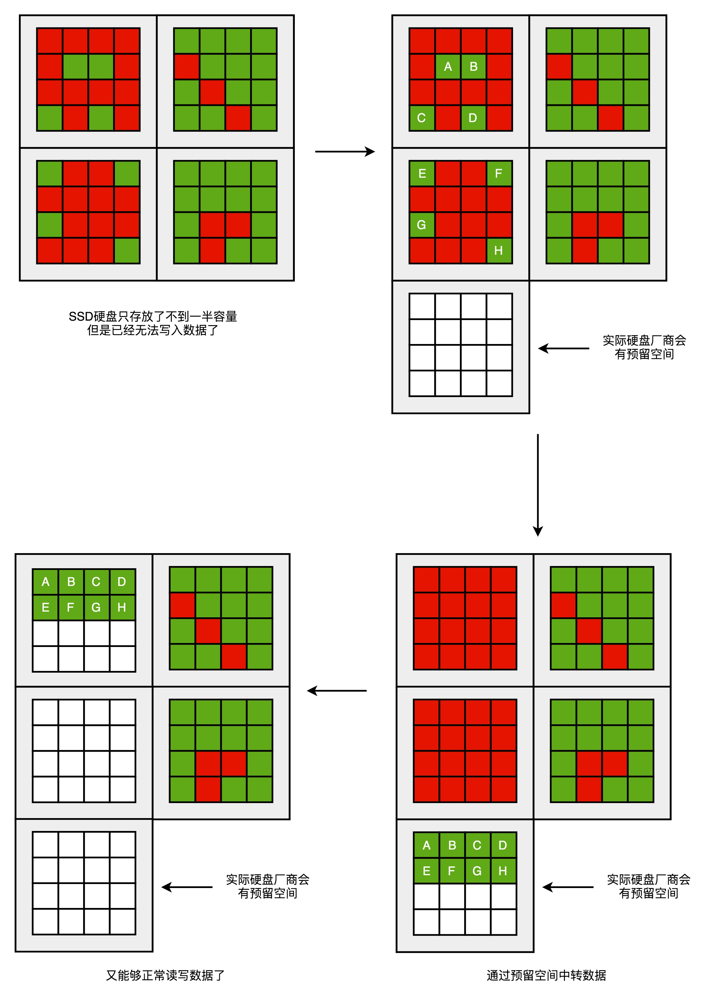

为了完成"磁盘碎片整理"工作，生产 SSD 硬盘的厂商，其实是预留了一部分空间，来专门用来做这个的。一块标成 240G 的 SSD 硬盘，往往实际有 256G 的硬盘空间。SSD 硬盘通过控制芯片电路，把多出来的硬盘空间，用来进行各种数据的闪转腾挪，让实际能够写满 240G 的空间。这个多出来的 16G 空间，叫作**预留空间**(Over Provisioning)，一般 SSD 的硬盘的预留空间都在 7%-15% 左右。

#### 5.8.4 磨损均衡、TRIM 和写入放大效应

##### 5.8.4.1 FTL 和磨损均衡

如果平时用的是 Windows 电脑会发现，用了 SSD 的系统盘，就不能用磁盘碎片整理功能。这是因为，一旦主动去运行磁盘碎片整理功能，就会发生一次块的擦除，对应块的寿命就少了一点点。这个 SSD 的擦除寿命的问题，不仅会影响像磁盘碎片整理这样的功能，其实也很影响日常使用。

操作系统上，并没有 SSD 硬盘上各个块目前已经擦写的情况和寿命，所以它对待 SSD 硬盘和普通的机械硬盘没有什么区别。日常使用 PC 进行软件开发的时候，会先在硬盘上装上操作系统和常用软件，比如 Office，或者工程师们会装上 VS Code、WebStorm 这样的集成开发环境。这些软件所在的块，写入一次之后，就不太会擦除了，所以就只有读的需求。

一旦开始开发，就会不断添加新的代码文件，还会不断修改已经有的代码文件。因为 SSD 硬盘没有覆写(Override)的功能，所以，这个过程中，其实是在反复地写入新的文件，然后再把原来的文件标记成逻辑上删除的状态。等 SSD 里面空的块少了，会用"垃圾回收"的方式，进行擦除。这样，擦除会反复发生在这些用来存放数据的地方。

有一天，这些块的擦除次数到了，变成了坏块。但是，安装操作系统和软件的地方还没有坏，而这块硬盘的可以用的容量变小了。

那么，可以匀出一些存放操作系统的块的擦写次数，给到这些存放数据的地方。让 SSD 硬盘各个块的擦除次数，均匀分摊到各个块上。这个策略就叫作**磨损均衡**(Wear-Leveling)。实现这个技术的核心办法，和虚拟内存一样，就是添加一个间接层。这个间接层，就是是 **FTL 闪存转换层**。


就像在管理内存的时候，通过一个页表映射虚拟内存页和物理页一样，在 FTL 里面，存放了**逻辑块地址**(Logical Block Address，简称 LBA)到**物理块地址**(Physical Block Address，简称 PBA)的映射。

操作系统访问的硬盘地址，其实都是逻辑地址。只有通过 FTL 转换之后，才会变成实际的物理地址，找到对应的块进行访问。操作系统本身，不需要去考虑块的磨损程度，只要和操作机械硬盘一样来读写数据就好了。

操作系统所有对于 SSD 硬盘的读写请求，都要经过 FTL。FTL 里面又有逻辑块对应的物理块，所以 FTL 能够记录下来，每个物理块被擦写的次数。如果一个物理块被擦写的次数多了，FTL 就可以将这个物理块，挪到一个擦写次数少的物理块上。但是，逻辑块不用变，操作系统也不需要知道这个变化。

> 这也是在设计大型系统中的一个典型思路，也就是各层之间是隔离的，操作系统不需要考虑底层的硬件是什么，完全交由硬件的控制电路里面的 FTL，来管理对于实际物理硬件的写入。

##### 5.8.4.2 文件删除: TRIM 指令的支持

不过，操作系统不去关心实际底层的硬件是什么，在 SSD 硬盘的使用上，也会带来一个问题。这个问题就是，操作系统的逻辑层和 SSD 的逻辑层里的块状态，是不匹配的。

在操作系统里面去删除一个文件，其实并没有真的在物理层面去删除这个文件，只是在文件系统里面，把对应的 inode 里面的元信息清理掉，这代表这个 inode 还可以继续使用，可以写入新的数据。这个时候，实际物理层面的对应的存储空间，在操作系统里面被标记成可以写入了。

所以，其实日常的文件删除，都只是一个操作系统层面的逻辑删除。这也是为什么，很多时候不小心删除了对应的文件，还可以通过各种恢复软件，把数据找回来。同样的，这也是为什么，如果想要删除干净数据，需要用各种"文件粉碎"的功能才行。

这个删除的逻辑在机械硬盘层面没有问题，因为文件被标记成可以写入，后续的写入可以直接覆写这个位置。但是，在 SSD 硬盘上就不一样了。

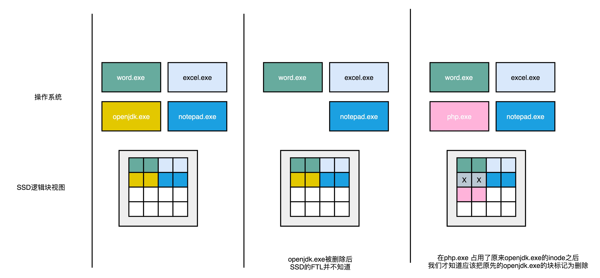

一开始，操作系统里面有好几个文件，不同的文件用不同的颜色标记。下面的 SSD 的逻辑块里面占用的页，也用同样的颜色标记出来文件占用的对应页。

当在操作系统里面，删除掉一个刚刚下载的文件，比如标记成黄色 openjdk.exe 这样一个 jdk 的安装文件，在操作系统里面，对应的 inode 里面，就没有文件的元信息。

但是，这个时候，SSD 的逻辑块层面，其实并不知道这个事情。所以在，逻辑块层面 openjdk.exe 仍然是占用了对应的空间。对应的物理页，也仍然被认为是被占用了的。

这个时候，如果需要对 SSD 进行垃圾回收操作，openjdk.exe 对应的物理页，仍然要在这个过程中，被搬运到其他的 Block 里面去。只有当操作系统，再在刚才的 inode 里面写入数据的时候，SSD 才会知道原来的黄色页，其实已经没有用了，才会把它标记成废弃。

所以，在使用 SSD 的硬盘情况下，会发现，操作系统对于文件的删除，SSD 硬盘其实并不知道。这就导致，为了磨损均衡，很多时候在都在搬运很多已经删除了的数据。这就会产生很多不必要的数据读写和擦除，既消耗了 SSD 的性能，也缩短了 SSD 的使用寿命。

为了解决这个问题，现在的操作系统和 SSD 的主控芯片，都支持 **TRIM** 命令。这个命令可以在文件被删除的时候，让操作系统去通知 SSD 硬盘，对应的逻辑块已经标记成已删除了。现在的 SSD 硬盘都已经支持了 TRIM 命令。无论是 Linux、Windows 还是 MacOS，这些操作系统也都已经支持了 TRIM 命令了。

##### 5.8.4.3 写入放大

其实，TRIM 命令的发明，也反应了一个使用 SSD 硬盘的问题，那就是，SSD 硬盘容易越用越慢。

当 SSD 硬盘的存储空间被占用得越来越多，每一次写入新数据，都可能没有足够的空白，不得不去进行垃圾回收，合并一些块里面的页，然后再擦除掉一些页，才能匀出一些空间来。

这个时候，从应用层或者操作系统层面来看，可能只是写入了一个 4KB 或者 4MB 的数据。但是，实际通过 FTL 之后，可能要去搬运 8MB、16MB 甚至更多的数据。

通过 "实际的闪存写入的数据量 / 系统通过 FTL 写入的数据量 = 写入放大"，可以得到，写入放大的倍数越多，意味着实际的 SSD 性能也就越差，会远远比不上实际 SSD 硬盘标称的指标。

而解决写入放大，需要在后台定时进行垃圾回收，在硬盘比较空闲的时候，就把搬运数据、擦除数据、留出空白的块的工作做完，而不是等实际数据写入的时候，再进行这样的操作。

#### 5.8.5 AeroSpike：最大化 SSD 的使用效率

想要把 SSD 硬盘用好，其实没有那么简单。如果只是简单地拿一块 SSD 硬盘替换掉原来的 HDD 硬盘，而不是从应用层面考虑任何 SSD 硬盘特性的话，多半还是没法获得想要的性能提升。

不过，既然清楚了 SSD 硬盘的各种特性，就可以依据这些特性，来设计应用。接下来，就来看一看，AeroSpike 这个专门针对 SSD 硬盘特性设计的 Key-Value 数据库(键值对数据库)，是怎么利用这些物理特性的。

首先，AeroSpike 操作 SSD 硬盘，并没有通过操作系统的文件系统。而是直接操作 SSD 里面的块和页。因为操作系统里面的文件系统，对于 KV 数据库来说，只是多了一层间接层，只会降低性能，并没有什么实际的作用。

其次，AeroSpike 在读写数据的时候，做了两个优化:

- 在写入数据的时候，AeroSpike 会尽可能去写一个较大的数据块，而不是频繁地去写很多小的数据块。这样，硬盘就不太容易频繁出现磁盘碎片。并且，一次性写入一个大的数据块，也更容易利用好顺序写入的性能优势。AeroSpike 写入的一个数据块，是 128KB，远比一个页的 4KB 要大得多。

- 另外，在读取数据的时候，AeroSpike 倒是可以读取 512 字节(Bytes)这样的小数据。因为 SSD 的随机读取性能很好，也不像写入数据那样有擦除寿命问题。而且，很多时候读取的数据是键值对里面的值的数据，这些数据要在网络上传输。如果一次性必须读出比较大的数据，就会导致网络带宽不够用。

因为 AeroSpike 是一个对于响应时间要求很高的实时 KV 数据库，如果出现了严重的写放大效应，会导致写入数据的响应时间大幅度变长。所以 AeroSpike 做了这样几个动作：

- 第一个是持续地进行磁盘碎片整理。AeroSpike 用了所谓的高水位(High Watermark)算法。其实这个算法很简单，就是一旦一个物理块里面的数据碎片超过 50%，就把这个物理块搬运压缩，然后进行数据擦除，确保磁盘始终有足够的空间可以写入。
- 第二个是在 AeroSpike 给出的最佳实践中，为了保障数据库的性能，建议只用到 SSD 硬盘标定容量的一半。也就是说，人为地给 SSD 硬盘预留了 50% 的预留空间，以确保 SSD 硬盘的写放大效应尽可能小，不会影响数据库的访问性能。

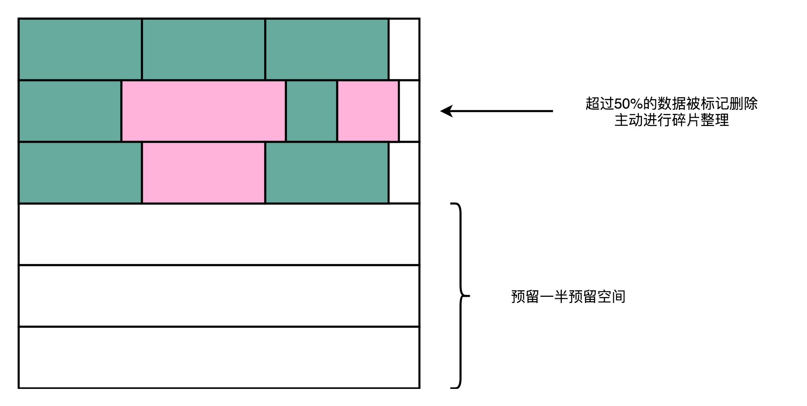

> 正是因为做了这种种的优化，在 NoSQL 数据库刚刚兴起的时候，AeroSpike 的性能把 Cassandra、MongoDB 这些数据库远远甩在身后，和这些数据库之间的性能差距，有时候会到达一个数量级。这也让 AeroSpike 成为了当时高性能 KV 数据库的标杆。

### 5.9 直接内存访问(DMA)

整个计算机产业界，都在尝试不停地提升 I/O 设备的速度。把 HDD 硬盘换成 SSD 硬盘，仍然觉得不够快；用 PCI Express 接口的 SSD 硬盘替代 SATA 接口的 SSD 硬盘，还是觉得不够快，所以，现在就有了傲腾(Optane)这样的技术。

但是，无论 I/O 速度如何提升，比起 CPU，总还是太慢。SSD 硬盘的 IOPS 可以到 2 万、4 万，但是 CPU 的主频有 2GHz 以上，也就意味着每秒会有 20 亿次的操作。

如果对于 I/O 的操作，都是由 CPU 发出对应的指令，然后等待 I/O 设备完成操作之后返回，那 CPU 有大量的时间其实都是在等待 I/O 设备完成操作。

但是，这个 CPU 的等待，在很多时候，其实并没有太多的实际意义。对于 I/O 设备的大量操作，其实都只是把内存里面的数据，传输到 I/O 设备而已。在这种情况下，其实 CPU 只是在傻等而已。特别是当传输的数据量比较大的时候，比如进行大文件复制，如果所有数据都要经过 CPU，实在是有点儿太浪费时间了。

因此，计算机工程师们，就发明了 DMA 技术，也就是**直接内存访问**(Direct Memory Access)技术，来减少 CPU 等待的时间。

#### 5.9.1 理解 DMA，一个协处理器

其实 DMA 技术很容易理解，本质上，DMA 技术就是在主板上放一块独立的芯片。在进行内存和 I/O 设备的数据传输的时候，不再通过 CPU 来控制数据传输，而直接通过 **DMA 控制器**(DMA Controller，简称 DMAC)。这块芯片，可以认为它其实就是一个**协处理器**(Co-Processor)。

DMAC 最有价值的地方体现在，当要传输的数据特别大、速度特别快，或者传输的数据特别小、速度特别慢的时候。

比如说，用千兆网卡或者硬盘传输大量数据的时候，如果都用 CPU 来搬运的话，肯定忙不过来，所以可以选择 DMAC。而当数据传输很慢的时候，DMAC 可以等数据到齐了，再发送信号，给到 CPU 去处理，而不是让 CPU 在那里忙等待。

这所以说 DMAC 是一块"协处理器芯片"，是因为，DMAC 是在"协助"CPU，完成对应的数据传输工作。在 DMAC 控制数据传输的过程中，还是需要 CPU 的。

除此之外，DMAC 其实也是一个特殊的 I/O 设备，它和 CPU 以及其他 I/O 设备一样，都是通过连接到总线来进行实际的数据传输。总线上的设备，其实有两种类型。一种称之为**主设备**(Master)，另外一种，称之为**从设备**(Slave)。

想要主动发起数据传输，必须要是一个主设备才可以，CPU 就是主设备。而从设备(比如硬盘)只能接受数据传输。所以，如果通过 CPU 来传输数据，要么是 CPU 从 I/O 设备读数据，要么是 CPU 向 I/O 设备写数据。

I/O 设备可以向主设备发起请求，不过这个发送的不是数据内容，而是控制信号。I/O 设备可以告诉 CPU，这里有数据要传输给你，但是实际数据是 CPU 拉走的，而不是 I/O 设备推给 CPU 的。

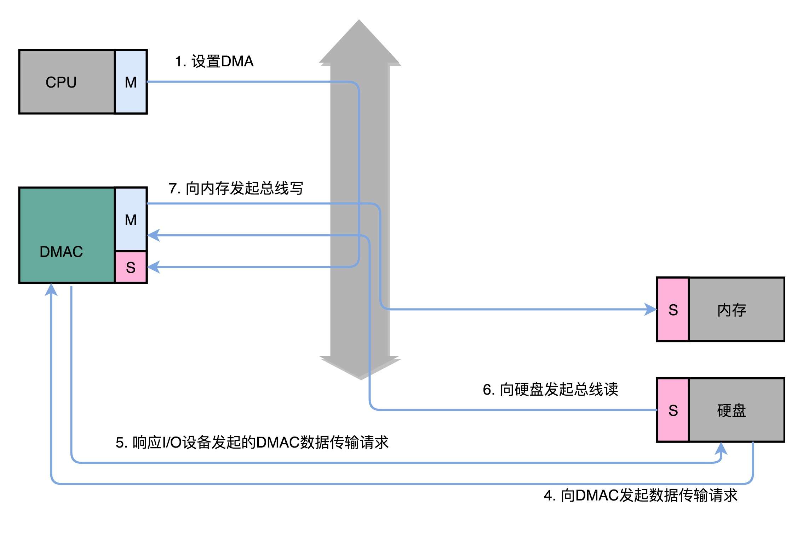

不过，DMAC 就很有意思了，它既是一个主设备，又是一个从设备。对于 CPU 来说，它是一个从设备；对于硬盘这样的 IO 设备来说呢，它又变成了一个主设备。下面是使用 DMAC 进行数据传输的过程：

1. 首先，CPU 作为一个主设备，向 DMAC 设备发起请求。这个请求，其实就是在 DMAC 里面修改配置寄存器。
2. CPU 修改 DMAC 的配置的时候，会告诉 DMAC 这样几个信息：

   - 首先是**源地址的初始值以及传输时候的地址增减方式**。
     所谓源地址，就是数据要从哪里传输过来。如果要从内存里面写入数据到硬盘上，那么就是要读取的数据在内存里面的地址。如果是从硬盘读取数据到内存里，那就是硬盘的 I/O 接口的地址。
     I/O 的地址可以是一个内存地址，也可以是一个端口地址。而地址的增减方式就是说，数据是从大的地址向小的地址传输，还是从小的地址往大的地址传输。
   - 其次是**目标地址初始值和传输时候的地址增减方式**。目标地址自然就是和源地址对应的设备，也就是数据传输的目的地。
   - 第三个自然是**要传输的数据长度**，也就是一共要传输多少数据。

3. 设置完这些信息之后，DMAC 就会变成一个空闲的状态（Idle）。
4. 如果要从硬盘上往内存里面加载数据，这个时候，硬盘就会向 DMAC 发起一个数据传输请求。这个请求并不是通过总线，而是通过一个额外的连线。
5. 然后，DMAC 需要再通过一个额外的连线响应这个申请。
6. 于是，DMAC 这个芯片，就向硬盘的接口发起要总线读的传输请求。数据就从硬盘里面，读到了 DMAC 的控制器里面。
7. 然后，DMAC 再向内存发起总线写的数据传输请求，把数据写入到内存里面。
8. DMAC 会反复进行上面第 6、7 步的操作，直到 DMAC 的寄存器里面设置的数据长度传输完成。
9. 数据传输完成之后，DMAC 重新回到第 3 步的空闲状态。

所以，整个数据传输的过程中，不是通过 CPU 来搬运数据，而是由 DMAC 这个芯片来搬运数据。但是 CPU 在这个过程中也是必不可少的。因为传输什么数据，从哪里传输到哪里，其实还是由 CPU 来设置的。这也是为什么，DMAC 被叫作"协处理器"。

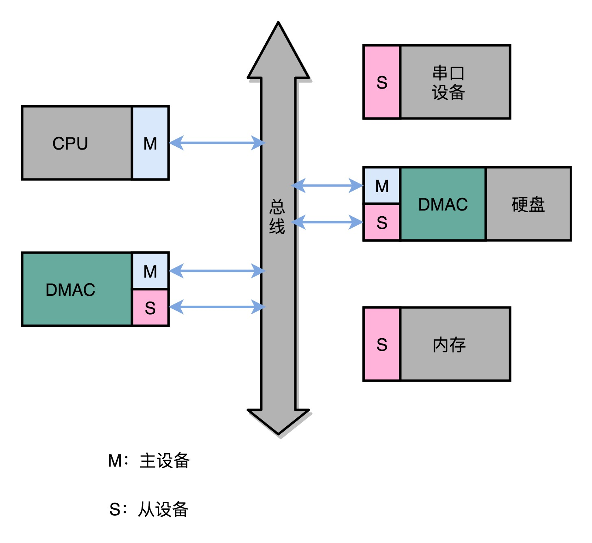

> 最早，计算机里是没有 DMAC 的，所有数据都是由 CPU 来搬运的。随着人们对于数据传输的需求越来越多，先是出现了主板上独立的 DMAC 控制器。到了今天，各种 I/O 设备越来越多，数据传输的需求越来越复杂，使用的场景各不相同。加之显示器、网卡、硬盘对于数据传输的需求都不一样，所以各个设备里面都有自己的 DMAC 芯片了。

#### 5.9.2 Kafka 项目的实现原理

过去几年的大数据浪潮里面，有一个开源项目很好地利用了 DMA 的数据传输方式，通过 DMA 的方式实现了非常大的性能提升。这个项目就是 **Kafka**。

Kafka 是一个用来处理实时数据的管道，常常用它来做一个消息队列，或者用来收集和落地海量的日志。作为一个处理实时数据和日志的管道，瓶颈自然也在 I/O 层面。

Kafka 里面会有两种常见的海量数据传输的情况：

- 一种是从网络中接收上游的数据，然后需要落地到本地的磁盘上，确保数据不丢失。
- 另一种情况，则是从本地磁盘上读取出来，通过网络发送出去。

后一种情况，从磁盘读数据发送到网络上去。如果写一个简单的程序，最直观的办法，自然是用一个文件读操作，从磁盘上把数据读到内存里面来，然后再用一个 Socket，把这些数据发送到网络上去。

```java
File.read(fileDesc, buf, len);
Socket.send(socket, buf, len);
```

在这个过程中，数据一共发生了四次传输的过程。其中两次是 DMA 的传输，另外两次，则是通过 CPU 控制的传输:

1. 第一次传输，是从硬盘上，读到操作系统内核的缓冲区里。这个传输是通过 DMA 搬运的。
2. 第二次传输，需要复制内核缓冲区里面的数据，到应用分配的内存里面。这个传输是通过 CPU 搬运的。
3. 第三次传输，要从应用的内存里面，再写到操作系统的 Socket 的缓冲区里面去。这个传输，还是由 CPU 搬运的。
4. 最后一次传输，需要再从 Socket 的缓冲区里面，写到网卡的缓冲区里面去。这个传输又是通过 DMA 搬运的。


只是要"搬运"一份数据，结果却整整搬运了四次。而且这里面，从内核的读缓冲区传输到应用的内存里，再从应用的内存里传输到 Socket 的缓冲区里，其实都是把同一份数据在内存里面搬运来搬运去，特别没有效率。

像 Kafka 这样的应用场景，其实大部分最终利用到的硬件资源，其实又都是在干这个搬运数据的事儿。所以，就需要尽可能地减少数据搬运的需求。

事实上，Kafka 做的事情就是，把这个数据搬运的次数，从上面的四次，变成了两次，并且只有 DMA 来进行数据搬运，而不需要 CPU。

```java
@Override
public long transferFrom(FileChannel fileChannel, long position, long count) throws IOException {
  return fileChannel.transferTo(position, count, socketChannel);
}
```

如果层层追踪 Kafka 的代码，会发现，最终它调用了 Java NIO 库里的 transferTo 方法。数据并没有读到中间的应用内存里面，而是直接通过 Channel，写入到对应的网络设备里。并且，对于 Socket 的操作，也不是写入到 Socket 的 Buffer 里面，而是直接根据描述符(Descriptor)写入到网卡的缓冲区里面。于是，在这个过程之中，只进行了两次数据传输。


1. 第一次，是通过 DMA，从硬盘直接读到操作系统内核的读缓冲区里面。
2. 第二次，则是根据 Socket 的描述符信息，直接从读缓冲区里面，写入到网卡的缓冲区里面。

这样，同一份数据传输的次数从四次变成了两次，并且没有通过 CPU 来进行数据搬运，所有的数据都是通过 DMA 来进行传输的。在这个方法里面，没有在内存层面去"复制(Copy)"数据，所以这个方法，也被称之为**零拷贝**(Zero-Copy)。

> IBM Developer Works 里面有一篇[文章](https://developer.ibm.com/articles/j-zerocopy/)，专门写程序来测试过，在同样的硬件下，使用零拷贝能够带来的性能提升。在文章的最后，可以看到，无论传输数据量的大小，传输同样的数据，使用了零拷贝能够缩短 65% 的时间。在使用了这样的零拷贝的方法之后，传输同样数据的时间，可以缩减为原来的 1/3，相当于提升了 3 倍的吞吐率。。这也是为什么，Kafka 是目前实时数据传输管道的标准解决方案。

### 5.10 数据完整性

#### 5.10.1 硬件错误与解决思路

**单比特翻转**
没有使用 ECC 内存，在大量的数据中，有些数据计算的结果，比如"34+23"，结果应该是"57"，但是却变成了一个美元符号"$"。这因为，内存中出现了**单比特翻转**(Single-Bit Flip)这个硬件错误。

"$"的出现，是由于内存中的一个整数字符，遇到了一次单比特翻转转化而来的。"$"的 ASCII 码二进制表示是 0010 0100，所以它完全可能来自 0011 0100 遇到一次在第 4 个比特的单比特翻转，也就是从整数"4"变过来的。

> **ECC 内存**的全称是 Error-Correcting Code memory，中文名字叫作纠错内存。顾名思义，就是在内存里面出现错误的时候，能够自己纠正过来。

**奇偶校验和校验位：捕捉错误的好办法**
其实，内存里面的单比特翻转或者错误，并不是一个特别罕见的现象。无论是因为内存的制造质量造成的漏电，还是外部的射线，都有一定的概率，会造成单比特错误。而内存层面的数据出错，软件工程师并不知道，而且这个出错很有可能是随机的。遇上随机且难以重现的错误，肯定受不了。所以，必须要有一个办法，避免这个问题。

其实，在 ECC 内存发明之前，工程师们已经开始通过**奇偶校验**的方式，来发现这些错误。

奇偶校验的思路很简单。把内存里面的 N 位比特当成是一组。常见的，比如 8 位就是一个字节。然后，用额外的一位去记录，这 8 个比特里面有奇数个 1 还是偶数个 1。如果是奇数个 1，那额外的一位就记录为 1；如果是偶数个 1，那额外的一位就记录成 0。那额外的一位，就称之为**校验码位**。

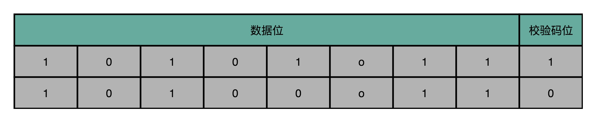

如果在这个字节里面，不幸发生了单比特翻转，那么数据位计算得到的校验码，就和实际校验位里面的数据不一样。内存就知道出错了。

除此之外，校验位有一个很大的优点，就是计算非常快，往往只需要遍历一遍需要校验的数据，通过一个 O(N) 的时间复杂度的算法，就能把校验结果计算出来。

校验码的思路，在很多地方都会用到。比方说，下载一些软件的时候，会看到，除了下载的包文件，还会有对应的 MD5 这样的哈希值或者循环冗余编码(CRC)的校验文件。这样，当把对应的软件下载下来之后，可以计算一下对应软件的校验码，和官方提供的校验码去做个比对，看看是不是一样。

如果不一样，就不能轻易去安装这个软件了。因为有可能，这个软件包是坏的。但是，还有一种更危险的情况，就是下载的这个软件包，可能是被人植入了后门的。安装上了之后，计算机的安全性就没有保障了。

不过，使用奇偶校验，还是有两个比较大的缺陷:

- 第一个缺陷，就是奇偶校验只能解决遇到单个位的错误，或者说奇数个位的错误。如果出现 2 个位进行了翻转，那么这个字节的校验位计算结果其实没有变，校验位自然也就不能发现这个错误。
- 第二个缺陷，是它只能发现错误，但是不能纠正错误。所以，即使在内存里面发现数据错误了，也只能中止程序，而不能让程序继续正常地运行下去。如果这个只是个人电脑，做一些无关紧要的应用，这倒是无所谓了。
  但是，如果在服务器上进行某个复杂的计算任务，这个计算已经跑了一周乃至一个月了，还有两三天就跑完了。这个时候，出现内存里面的错误，要再从头跑起。

所以，需要一个比简单的校验码更好的解决方案，一个能够发现更多位的错误，并且能够把这些错误纠正过来的解决方案，也就是工程师们发明的 ECC 内存所使用的解决方案。

不仅能捕捉到错误，还要能够纠正发生的错误。这个策略，通常叫作**纠错码**(Error Correcting Code)。它还有一个升级版本，叫作**纠删码**(Erasure Code)，不仅能够纠正错误，还能够在错误不能纠正的时候，直接把数据删除。无论是 ECC 内存，还是网络传输，乃至硬盘的 RAID，其实都利用了纠错码和纠删码的相关技术。

#### 5.10.2 最知名的纠错码: 海明码

最知名的纠错码就是海明码。海明码(Hamming Code)是以他的发明人 Richard Hamming(理查德·海明)的名字命名的。这个编码方式早在上世纪四十年代就被发明出来了。而直到今天，ECC 内存，也还在使用海明码来纠错。

最基础的海明码叫 **7-4 海明码**。这里的"7"指的是实际有效的数据，一共是 7 位(Bit)。而这里的"4"，指的是额外存储了 4 位数据，用来纠错。

首先，要明白一点，纠错码的纠错能力是有限的。不是说不管错了多少位，都能给纠正过来。事实上，在 7-4 海明码里面，只能纠正某 1 位的错误。

4 位的校验码，一共可以表示 2^4^ = 16 个不同的数。根据数据位计算出来的校验值，一定是确定的。所以，如果数据位出错了，计算出来的校验码，一定和确定的那个校验码不同。那可能的值，就是在 2^4^ - 1 = 15 那剩下的 15 个可能的校验值当中。

15 个可能的校验值，其实可以对应 15 个可能出错的位。既然数据位只有 7 位，那为什么要用 4 位的校验码呢？用 3 位不就够了吗？2^3^ - 1 = 7， 正好能够对上 7 个不同的数据位。

但是，单比特翻转的错误，不仅可能出现在数据位，也有可能出现在校验位。校验位本身也是可能出错的。所以，7 位数据位和 3 位校验位，如果只有单比特出错，可能出错的位数就是 10 位，2^3^ - 1 = 7 种情况是不能帮助找到具体是哪一位出错的。

事实上，如果数据位有 K 位，校验位有 N 位。那么需要 **K + N + 1 <= 2^N^** 这个不等式，才能确保能够对单比特翻转的数据纠错。

在有 7 位数据位，也就是 K=7 的情况下，N 的最小值就是 4。4 位校验位，其实最多可以支持到 11 位数据位。下面是一个简单的数据位数和校验位数的对照表。

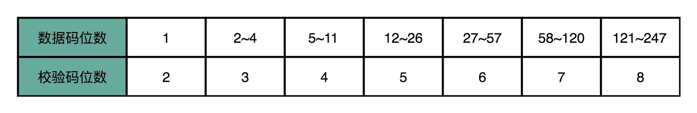

##### 5.10.2.1 海明码的纠错原理

在数据位数确定的情况下，来计算需要的校验位。为了算起来简单一点，来算一个 **4-3 海明码**(也就是 4 位数据位，3 位校验位)。把 4 位数据位，分别记作 d1、d2、d3、d4。这里的 d，取的是数据位 data bits 的首字母。把 3 位校验位，分别记作 p1、p2、p3。这里的 p，取的是校验位 parity bits 的首字母。

从 4 位的数据位里面，拿走 1 位，然后计算出一个对应的校验位。这个校验位的计算用奇偶校验就可以了。比如，用 d1、d2、d4 来计算出一个校验位 p1；用 d1、d3、d4 计算出一个校验位 p2；用 d2、d3、d4 计算出一个校验位 p3。就像下面这个对应的表格一样：

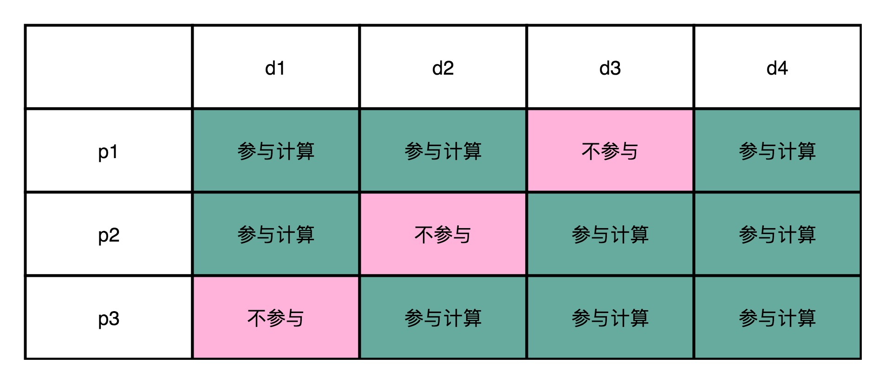

这个时候，如果 d1 这一位的数据出错了，会发现，p1 和 p2 和校验的计算结果不一样。d2 出错了，是因为 p1 和 p3 的校验的计算结果不一样；d3 出错了，则是因为 p2 和 p3；如果 d4 出错了，则是 p1、p2、p3 都不一样。会发现，当数据码出错的时候，至少会有 2 位校验码的计算是不一致的。

那倒过来，如果是 p1 的校验码出错了，这个时候，只有 p1 的校验结果出错。p2 和 p3 的出错的结果也是一样的，只有一个校验码的计算是不一致的。

所以校验码不一致，一共有 2^3^-1=7 种情况，正好对应了 7 个不同的位数的错误。对应表格在下面:

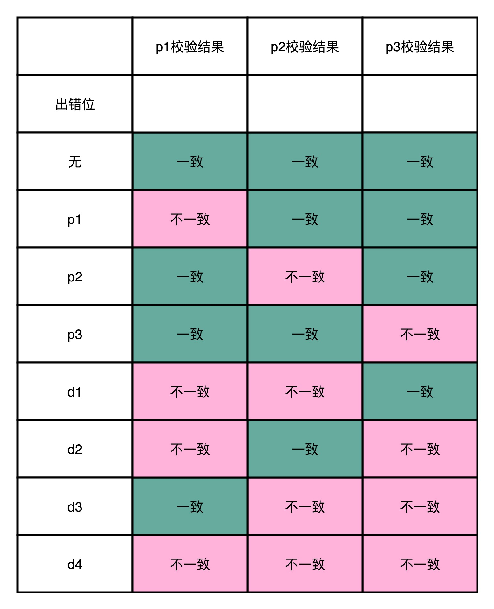

可以看到，海明码这样的纠错过程，有点儿像电影里面看到的推理探案的过程。通过出错现场的额外信息，一步一步条分缕析地找出，到底是哪一位的数据出错，还原出错时候的"犯罪现场"。

用一套程序或者规则来生成海明码的步骤并不复杂：

1. 首先，先确定编码后，要传输的数据是多少位。比如说，7-4 海明码，就是一共 11 位。
2. 然后，给这 11 位数据从左到右进行编号，并且也把它们的二进制表示写出来。
3. 接着，先把这 11 个数据中的二进制的整数次幂找出来。在这个 7-4 海明码里面，就是 1、2、4、8。这些数，就是校验码位，把他们记录做 p1 ～ p4。如果从二进制的角度看，它们是这 11 个数当中，唯四的，在 4 个比特里面只有一个比特是 1 的数值。那么剩下的 7 个数，就是 d1-d7 的数据码位了。
4. 然后，对于校验码位，还是用奇偶校验码。但是每一个校验码位，不是用所有的 7 位数据来计算校验码。而是 p1 用 3、5、7、9、11 来计算。也就是，在二进制表示下，从右往左数的第一位比特是 1 的情况下，用 p1 作为校验码。
5. 剩下的 p2，用 3、6、10、11 来计算校验码，也就是在二进制表示下，从右往左数的第二位比特是 1 的情况下，用 p2。那么，p3 自然是从右往左数，第三位比特是 1 的情况下的数字校验码。而 p4 则是第四位比特是 1 的情况下的校验码。

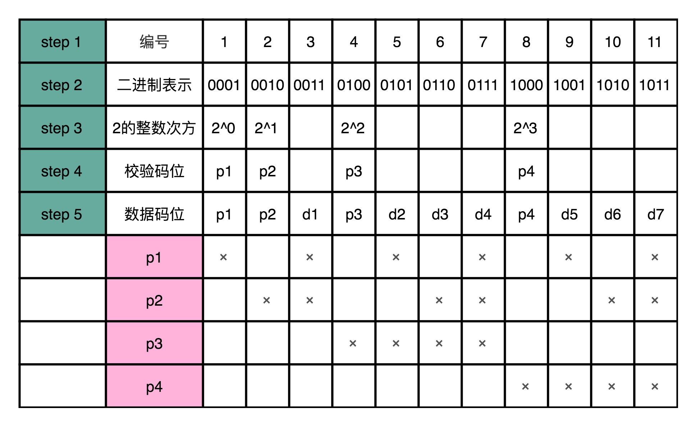

这个时候，会发现，任何一个数据码出错了，就至少会有对应的两个或者三个校验码对不上，这样就能反过来找到是哪一个数据码出错了。如果校验码出错了，那么只有校验码这一位对不上，就知道是这个校验码出错了。

> 上面这个方法，可以用一段确定的程序表示出来，意味着无论是几位的海明码，都不再需要人工去精巧地设计编码方案了。

##### 5.10.2.2 海明距离：形象理解海明码的作用

其实，还可以换一个角度来理解海明码的作用。对于两个二进制表示的数据，他们之间有差异的位数，称之为**海明距离**。比如 1001 和 0001 的海明距离是 1，因为他们只有最左侧的第一位是不同的。而 1001 和 0000 的海明距离是 2，因为他们最左侧和最右侧有两位是不同的。

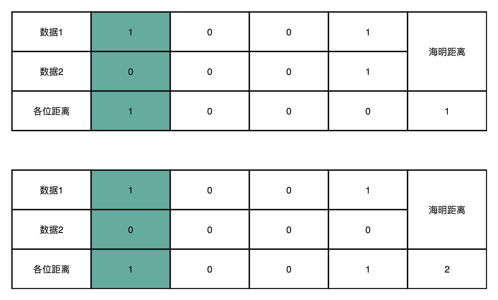

于是，很容易可以想到，所谓的进行一位纠错，也就是所有和要传输的数据的海明距离为 1 的数，都能被纠正回来。

而任何两个实际想要传输的数据，海明距离都至少要是 3。如果是 2 的话，那么就会有一个出错的数，到两个正确的数据的海明距离都是 1。当看到这个出错的数的时候，就不知道究竟应该纠正到那一个数了。

在引入了海明距离之后，就可以更形象地理解纠错码了。在没有纠错功能的情况下，看到的数据就好像是空间里面的一个一个点。这个时候，可以让数据之间的距离很紧凑，但是如果这些点的坐标稍稍有错，就可能搞错是哪一个点。

在有了 1 位纠错功能之后，就好像把一个点变成了以这个点为中心，半径为 1 的球。只要坐标在这个球的范围之内，都知道实际要的数据就是球心的坐标。而各个数据球不能距离太近，不同的数据球之间要有 3 个单位的距离。

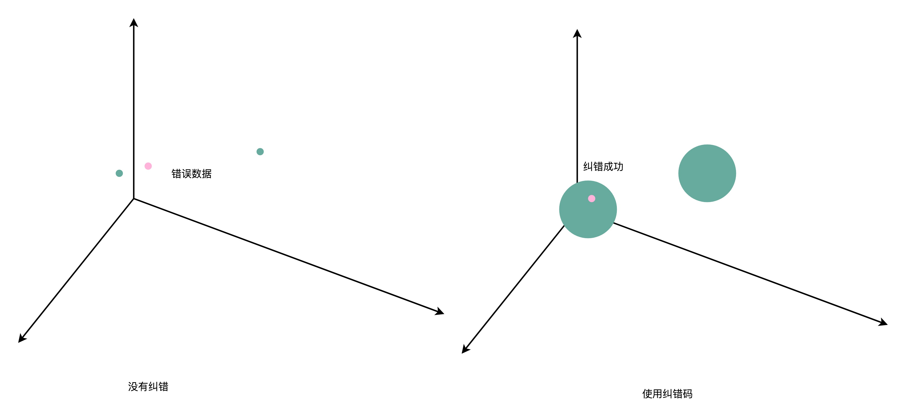

### 5.11 分布式计算

如果数据中心里只有一台计算机，会遇到三个核心问题。第一个核心问题，叫作**垂直扩展和水平扩展的选择问题**，第二问题叫作**如何保持高可用性**(High Availability)，第三个问题叫作**一致性问题**(Consistency)。

#### 5.11.1 从硬件升级到水平扩展

现在在云平台上，一个月花很少的钱，就可以租一台单核心服务器。当访问量上来后，这台单核心的服务器的性能有点不够用了。这个时候，就需要升级服务器。于是，就会面临两个选择:

- 第一个选择是升级现在这台服务器的硬件，变成 2 个 CPU 核心、7.5G 内存。这样的选择称之为**垂直扩展**(Scale Up)。
- 第二个选择则是再租用一台和之前一样的服务器。于是，有了 2 台 1 个 CPU 核心、3.75G 内存的服务器。这样的选择称之为**水平扩展**(Scale Out)。

在这个阶段，这两个选择，从成本上看起来没有什么差异。2 核心、7.5G 内存的服务器 和 2 台 1 核心、3.75G 内存的服务器价格，价格差异很小。

不过，垂直扩展和水平扩展看似是两个不同的选择，但是随着流量不断增长。到最后，只会变成一个选择。那就是既会垂直扩展，又会水平扩展，并且最终依靠水平扩展，来支撑 Google、Facebook、阿里、腾讯这样体量的互联网服务。

垂直扩展背后的逻辑和优势都很简单。一般来说，垂直扩展通常不需要去改造程序，也就是说，**没有研发成本**。

需要水平扩展的原因其实也很简单，因为没有办法不停地去做垂直扩展。单台服务器的性能是有极限的。如果访问量逐渐增大，最大的服务器也支撑不了了，那么就没有办法再去做垂直扩展了。这个时候，就不得不采用水平扩展的方案。

然而，一旦开始采用水平扩展，就会面临在软件层面改造的问题了。也就是需要开始进行**分布式计算**。需要引入**负载均衡**(Load Balancer)这样的组件，来进行流量分配。需要拆分应用服务器和数据库服务器，来进行垂直功能的切分。也需要不同的应用之间通过消息队列，来进行异步任务的执行。

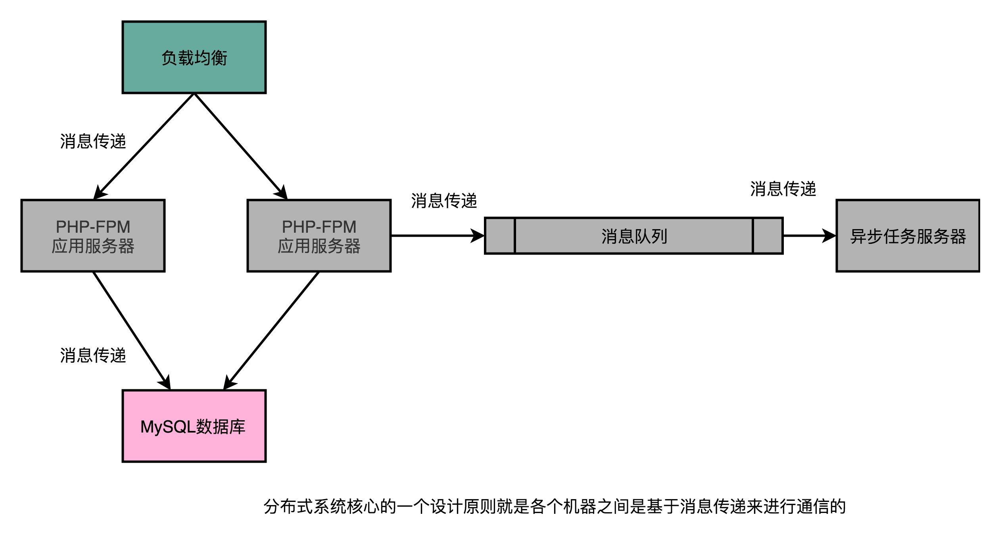

所有这些软件层面的改造，其实都是在做分布式计算的一个核心工作，就是通过消息传递(Message Passing)而不是共享内存(Shared Memory)的方式，让多台不同的计算机协作起来共同完成任务。而因为最终必然要进行水平扩展，需要在系统设计的早期就基于消息传递而非共享内存来设计系统。即使这些消息只是在同一台服务器上进行传递。

#### 5.11.2 高可用性和单点故障

尽管在 1 个 CPU 核心的服务器支撑不了访问量的时候，选择垂直扩展是一个最简单的办法。但还是建议第一次扩展选择水平扩展，有两个理由:

- 从开发的角度，尽早地让系统能够支持水平扩展，避免在真的流量快速增长的时候，垂直扩展的解决方案跟不上。
- 系统的可用性问题。
  单核变 2 核的垂直扩展的方式，扩展完之后，还是只有 1 台服务器。如果这台服务器出现了一点硬件故障，比如，CPU 坏了，那整个系统就坏了，就不可用了。
  如果采用了水平扩展，即便有一台服务器的 CPU 坏了，还有另外一台服务器仍然能够提供服务。负载均衡能够通过健康检测(Health Check)发现坏掉的服务器没有响应了，就可以自动把所有的流量切换到第 2 台服务器上，这个操作就叫作**故障转移**(Failover)，系统仍然是可用的。

系统的**可用性**(Avaiability)指的就是，系统可以正常服务的时间占比。无论是因为软硬件故障，还是需要对系统进行停机升级，都会损失系统的可用性。可用性通常是用一个百分比的数字来表示，比如 99.99%，系统每个月的可用性要保障在 99.99%，也就是意味着一个月里，服务宕机的时间不能超过 4.32 分钟。

有些系统可用性的损失，是在计划内的。比如上面说的停机升级，这个就是所谓的计划内停机时间(Scheduled Downtime)。有些系统可用性的损失，是在计划外的，比如一台服务器的硬盘忽然坏了，这个就是所谓的计划外停机时间(Unscheduled Downtime)。

系统是一定不可能做到 100% 可用的，特别是计划外的停机时间。从简单的硬件损坏，到机房停电、光缆被挖断，乃至于各种自然灾害，比如地震、洪水、海啸，都有可能使得系统不可用。要做的就是尽可能低成本地提高系统的可用性。

现在的服务器的可用性都已经很不错了，通常都能保障 99.99% 的可用性。如果有一个小小的三台服务器组成的小系统，一台部署了 Nginx 来作为负载均衡和反向代理，一台跑了 PHP-FPM 作为 Web 应用服务器，一台用来作为 MySQL 数据库服务器。每台服务器的可用性都是 99.99%。

那么整个系统的可用性是 99.99% × 99.99% × 99.99% = 99.97%。在这个系统当中，这个数字看起来似乎没有那么大区别。不过反过来看，是从损失了 0.01% 的可用性，变成了损失 0.03% 的可用性，不可用的时间变成了原来的 3 倍。

如果有 1000 台服务器，那么整个的可用性，就会变成 99.99% ^1000^ = 90.5%。也就是说，服务一年里有超过一个月是不可用的。

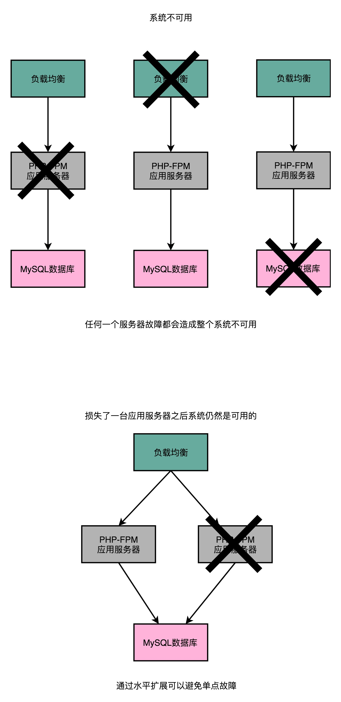

先来分析一下原因。之所以会出现这个问题，是因为在这个场景下，任何一台服务器出错了，整个系统就没法用了。这个问题就叫作**单点故障问题**(Single Point of Failure，SPOF)。

要解决单点故障问题，第一点就是要移除单点。其实移除单点最典型的场景，就是让两台服务器提供相同的功能，然后通过负载均衡把流量分发到两台不同的服务器去。即使一台服务器挂了，还有一台服务器可以正常提供服务。

不过光用两台服务器是不够的，单点故障其实在数据中心里面无处不在。现在用的是云上的两台虚拟机。如果这两台虚拟机是托管在同一台物理机上的，那这台物理机本身又成为了一个单点。那就需要把这两台虚拟机分到两台不同的物理机上。

不过这个还是不够。如果这两台物理机在同一个机架(Rack)上，那机架上的交换机(Switch)就成了一个单点。即使放到不同的机架上，还是有可能出现整个数据中心遭遇意外故障的情况。面对这种情况，就需要设计进行**异地多活**的系统设计和部署。所以，在现代的云服务，在买服务器的时候可以选择服务器的 area(地区)和 zone(区域)，而要不要把服务器放在不同的地区或者区域里，也是避免单点故障的一个重要因素。

只是能够去除单点，其实可用性问题还没有解决。比如，上面用负载均衡把流量均匀地分发到 2 台服务器上，当一台应用服务器挂掉的时候，的确还有一台服务器在提供服务。但是负载均衡会把一半的流量发到已经挂掉的服务器上，所以这个时候只能算作一半可用。

想要让整个服务完全可用，就需要有一套**故障转移**(Failover)机制。想要进行故障转移，就首先要能发现故障。

以 PHP-FPM 的 Web 应用为例，负载均衡通常会定时去请求一个 Web 应用提供的健康检测(Health Check)的地址。这个时间间隔可能是 5 秒钟，如果连续 2 ～ 3 次发现健康检测失败，负载均衡就会自动将这台服务器的流量切换到其他服务器上。于是，就自动地产生了一次故障转移。故障转移的自动化在大型系统里是很重要的，因为服务器越多，出现故障基本就是个必然发生的事情。而自动化的故障转移既能够减少运维的人手需求，也能够缩短从故障发现到问题解决的时间周期，提高可用性。

通过水平扩展相同功能的服务器来去掉单点故障，并且通过健康检查机制来触发自动的故障转移。在这种情况下，其实只要有任何一台服务器能够正常运转，就能正常提供服务。那么，可用性就是 100% - (100% - 99.99%) × (100% - 99.99%) = 99.999999% 可以看出，不能提供服务的时间就减少到了原来的万分之一。

> 当然，在实际情况中，可用性没法做到那么理想的地步。光从硬件的角度，从服务器到交换机，从网线连接到机房电力，从机房的整体散热到外部的光纤线路等等，可能出现问题的地方太多了。这也是为什么，需要从整个系统层面，去设计系统的高可用性。

## 六. 应用

下面通过两个应用系统的案例，串联起计算机组成原理的两大块知识点，一个是整个存储器系统，另一个是 CPU 和指令系统。

### 6.1 设计大型 DMP 系统

#### 6.1.1 DMP: 数据管理平台

DMP 系统的全称叫作**数据管理平台**(Data Management Platform)，目前广泛应用在互联网的广告定向(Ad Targeting)、个性化推荐(Recommendation)这些领域。

通常来说，DMP 系统会通过处理海量的互联网访问数据以及机器学习算法，给一个用户标注上各种各样的标签。然后，在做个性化推荐和广告投放的时候，再利用这些这些标签，去做实际的广告排序、推荐等工作。无论是 Google 的搜索广告、淘宝里千人千面的商品信息，还是抖音里面的信息流推荐，背后都会有一个 DMP 系统。

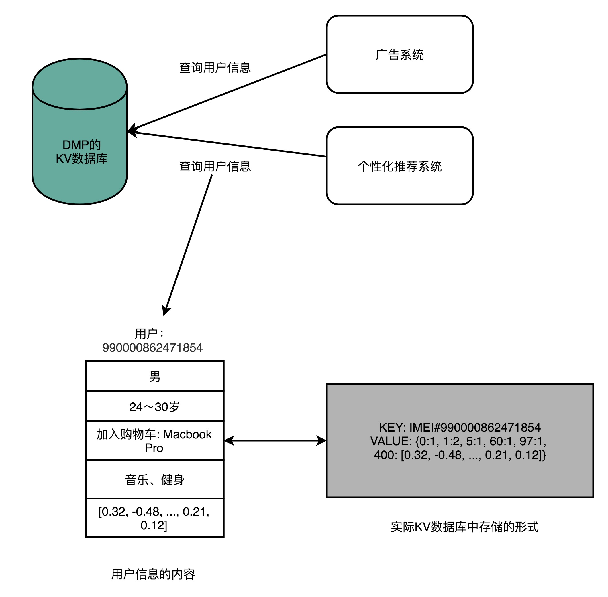

对于外部使用 DMP 的系统或者用户来说，可以简单地把 DMP 看成是一个键 - 值对(Key-Value)数据库。广告系统或者推荐系统，可以通过一个客户端输入用户的唯一标识(ID)，然后拿到这个用户的各种信息。

这些信息中，有些是用户的人口属性信息(Demographic)，比如性别、年龄；有些是非常具体的行为(Behavior)，比如用户最近看过的商品是什么，用户的手机型号是什么；有一些是通过算法系统计算出来的兴趣(Interests)，比如用户喜欢健身、听音乐；还有一些则是完全通过机器学习算法得出的用户向量，给后面的推荐算法或者广告算法作为数据输入。

基于此，对于这个 KV 数据库的期望也很清楚，如果用数字来衡量这些指标，那么期望就会具体化成下面这样:

- **低响应时间**：一般的广告系统留给整个广告投放决策的时间也就是 10ms 左右，所以对于访问 DMP 获取用户数据，预期的响应时间都在 1ms 之内。
- **高可用性**：DMP 常常用在广告系统里面。DMP 系统出问题，往往就意味着整个的广告收入在不可用的时间就没了，所以对于可用性的追求可谓是没有上限的。
- **高并发**：还是以广告系统为例，如果每天需要响应 100 亿次的广告请求，那么每秒的并发请求数就在 100 亿 / (86400) ~= 12K 次左右，所以 DMP 需要支持高并发。
- **海量数据**：如果产品针对中国市场，那么需要有 10 亿个 Key，对应的假设每个用户有 500 个标签，标签有对应的分数。标签和分数都用一个 4 字节(Bytes)的整数来表示，那么一共需要 10 亿 x 500 x (4 + 4) Bytes = 4 TB 的数据了。
- **低成本**：还是从广告系统的角度来考虑。广告系统的收入通常用 CPM(Cost Per Mille)，也就是千次曝光来统计。如果千次曝光的利润是 0.10 美元，那么每天 100 亿次的曝光就是 100 万美元的利润。这个利润听起来非常高了。但是反过来算一下，会发现，DMP 每 1000 次的请求的成本不能超过 0.10 美元。最好只有 0.01 美元，甚至更低，才能尽可能多赚到一点广告利润。

虽然从外部看起来，DMP 特别简单，就是一个 KV 数据库，但是生成这个数据库需要做的事情很多。


> 在这个系统中，关心的是蓝色的数据管道、绿色的数据仓库和 KV 数据库

为了能够生成这个 KV 数据库，需要有一个在客户端或者 Web 端的数据采集模块，不断采集用户的行为，向后端的服务器发送数据。服务器端接收到数据，就要把这份数据放到一个**数据管道**(Data Pipeline)里面。数据管道的下游，需要实际将数据落地到**数据仓库**(Data Warehouse)，把所有的这些数据结构化地存储起来。后续，就可以通过程序去分析这部分日志，生成报表或者或者利用数据运行各种机器学习算法。

除了这个数据仓库之外，还会有一个实时数据处理模块(Realtime Data Processing)，也放在数据管道的下游。它同样会读取数据管道里面的数据，去进行各种实时计算，然后把需要的结果写入到 DMP 的 KV 数据库里面去。

#### 6.1.2 KV 数据库、数据管道以及数据仓库最佳技术方案

面对这里的 KV 数据库、数据管道以及数据仓库，这三个不同的数据存储的需求，最合理的技术方案是什么呢？

MongoDB 的设计听起来特别厉害，不需要预先数据 Schema，访问速度很快，还能够无限水平扩展。作为 KV 数据库，可以把 MongoDB 当作 DMP 里面的 KV 数据库；除此之外，MongoDB 还能水平扩展、跑 MQL，可以把它当作数据仓库来用。至于数据管道，只要能够不断往 MongoDB 里面，插入新的数据就好了。从运维的角度来说，只需要维护一种数据库，技术栈也变得简单了。看起来，MongoDB 这个选择真是相当完美。

但是，所有的软件系统，都有它的适用场景，想通过一种解决方案适用三个差异非常大的应用场景，显然既不合理，又不现实。

在上面已经分析过 DMP 的 KV 数据库期望的应用场景和性能要求了，这里就来看一下**数据管道**和**数据仓库**的性能取舍。

对于数据管道来说，需要的是高吞吐量，它的并发量虽然和 KV 数据库差不多，但是在响应时间上，要求就没有那么严格了，1-2 秒甚至再多几秒的延时都是可以接受的。而且，和 KV 数据库不太一样，数据管道的数据读写都是顺序读写，没有大量的随机读写的需求。

数据仓库就更不一样了，数据仓库的数据读取的量要比管道大得多。管道的数据读取就是当时写入的数据，一天有 10TB 日志数据，管道只会写入 10TB。下游的数据仓库存放数据和实时数据模块读取的数据，再加上个 2 倍的 10TB，也就是 20TB 也就够了。

但是，数据仓库的数据分析任务要读取的数据量就大多了。一方面，可能要分析一周、一个月乃至一个季度的数据。这一次分析要读取的数据可不是 10TB，而是 100TB 乃至 1PB。一天在数据仓库上跑的分析任务也不是 1 个，而是成千上万个，所以数据的读取量是巨大的。另一方面，存储在数据仓库里面的数据，也不像数据管道一样，存放几个小时、最多一天的数据，而是往往要存上 3 个月甚至是 1 年的数据。所以，需要的是 1PB 乃至 5PB 这样的存储空间。

下面是一个 KV 数据库、数据管道和数据仓库的应用场景的表格:

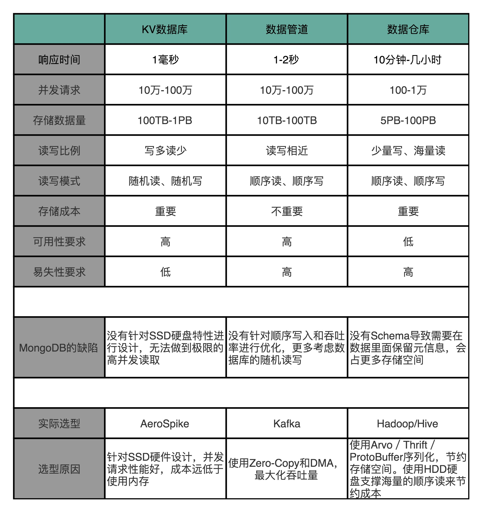

在 KV 数据库的场景下，需要支持高并发。那么 MongoDB 需要把更多的数据放在内存里面，但是这样存储成本就会特别高了。

在数据管道的场景下，需要的是大量的顺序读写，而 MongoDB 则是一个文档数据库系统，并没有为顺序写入和吞吐量做过优化，看起来也不太适用。

而在数据仓库的场景下，主要的数据读取时顺序读取，并且需要海量的存储。MongoDB 这样的文档式数据库也没有为海量的顺序读做过优化，仍然不是一个最佳的解决方案。而且文档数据库里总是会有很多冗余的字段的元数据，还会浪费更多的存储空间。

**最佳技术方案**
拿着应用场景去找方案，其实并不难找。对于 KV 数据库，最佳的选择方案自然是使用 SSD 硬盘，选择 AeroSpike 这样的 KV 数据库。高并发的随机访问并不适合 HDD 的机械硬盘，而 400TB 的数据，如果用内存的话，成本又会显得太高。

对于数据管道，最佳选择自然是 Kafka。因为追求的是吞吐率，采用了 Zero-Copy 和 DMA 机制的 Kafka 最大化了作为数据管道的吞吐率。而且，数据管道的读写都是顺序读写，所以也不需要对随机读写提供支持，用上 HDD 硬盘就好了。

到了数据仓库，存放的数据量更大了。在硬件层面使用 HDD 硬盘成了一个必选项。否则，存储成本就会差上 10 倍。这么大量的数据，在存储上需要定义清楚 Schema，使得每个字段都不需要额外存储元数据，能够通过 Avro/Thrift/ProtoBuffer 这样的二进制序列化的方存储下来，或者干脆直接使用 Hive 这样明确了字段定义的数据仓库产品。很明显，MongoDB 那样不限制 Schema 的数据结构，在这个情况下并不好用。

#### 6.1.3 关系型数据库: 不得不做的随机读写

一个最简单的关系型数据库，要把数据要存放在硬盘上，最简单的想法是，用一个 CSV 文件格式。一个文件就是一个数据表。文件里面的每一行就是这个表里面的一条记录。如果要修改数据库里面的某一条记录，那么要先找到这一行，然后直接去修改这一行的数据。读取数据也是一样的。

要找到这样数据，最笨的办法自然是一行一行读，也就是遍历整个 CSV 文件。不过这样的话，相当于随便读取任何一条数据都要扫描全表，太浪费硬盘的吞吐量了。可以试试给这个 CSV 文件加一个索引。比如，给数据的行号加一个索引。

索引里面没有一整行的数据，只有一个映射关系，这个映射关系可以让行号直接从硬盘的某个位置去读。所以，索引比起数据小很多。可以把索引加载到内存里面。即使不在内存里面，要找数据的时候快速遍历一下整个索引，也不需要读太多的数据。

加了索引之后，要读取特定的数据，就不用去扫描整个数据表文件了。直接从特定的硬盘位置，就可以读到想要的行。索引不仅可以索引行号，还可以索引某个字段。可以创建很多个不同的独立的索引。写 SQL 的时候，where 子句后面的查询条件可以用到这些索引。

不过，这样的话，写入数据的时候就会麻烦一些。不仅要在数据表里面写入数据，对于所有的索引也都需要进行更新。这个时候，写入一条数据就要触发好几个随机写入的更新。

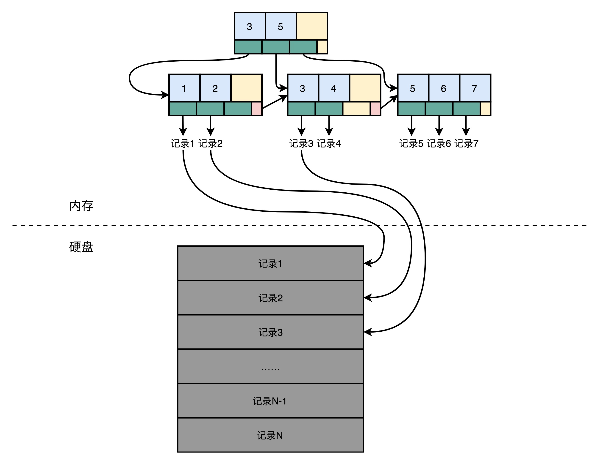

在这样一个数据模型下，查询操作很灵活。无论是根据哪个字段查询，只要有索引，就可以通过一次随机读，很快地读到对应的数据。但是，这个灵活性也带来了一个很大的问题，那就是无论干点什么，都有大量的随机读写请求。而随机读写请求，如果请求最终是要落到硬盘上，特别是 HDD 硬盘的话，就很难做到高并发了。毕竟 HDD 硬盘只有 100 左右的 QPS。

而这个随时添加索引，可以根据任意字段进行查询，表现出的灵活性，又是 DMP 系统里面不太需要的。DMP 的 KV 数据库主要的应用场景，是根据主键的随机查询，不需要根据其他字段进行筛选查询。数据管道的需求，则只需要不断追加写入和顺序读取就好了。即使进行数据分析的数据仓库，通常也不是根据字段进行数据筛选，而是全量扫描数据进行分析汇总。

后面的两个场景还好说，大不了让程序去扫描全表或者追加写入。但是，在 KV 数据库这个需求上，刚才这个最简单的关系型数据库的设计，就会面临大量的随机写入和随机读取的挑战。所以，在实际的大型系统中，都会使用专门的分布式 KV 数据库，来满足这个需求。

#### 6.1.4 Cassandra: 顺序写和随机读

**Cassandra 的数据模型**
作为一个分布式的 KV 数据库，Cassandra 的键一般被称为 Row Key。其实就是一个 16 到 36 个字节的字符串。每一个 Row Key 对应的值其实是一个哈希表，里面可以用键值对，再存入很多需要的数据。

Cassandra 本身不像关系型数据库那样，有严格的 Schema，在数据库创建的一开始就定义好了有哪些列(Column)。但是，它设计了一个叫作列族(Column Family)的概念，需要把经常放在一起使用的字段，放在同一个列族里面。比如，DMP 里面的人口属性信息，可以把它当成是一个列族。用户的兴趣信息，可以是另外一个列族。这样，既保持了不需要严格的 Schema 这样的灵活性，也保留了可以把常常一起使用的数据存放在一起的空间局部性。

往 Cassandra 的里面读写数据，其实特别简单，就好像是在一个巨大的分布式的哈希表里面写数据。指定一个 Row Key，然后插入或者更新这个 Row Key 的数据就好了。

**Cassandra 的写操作**
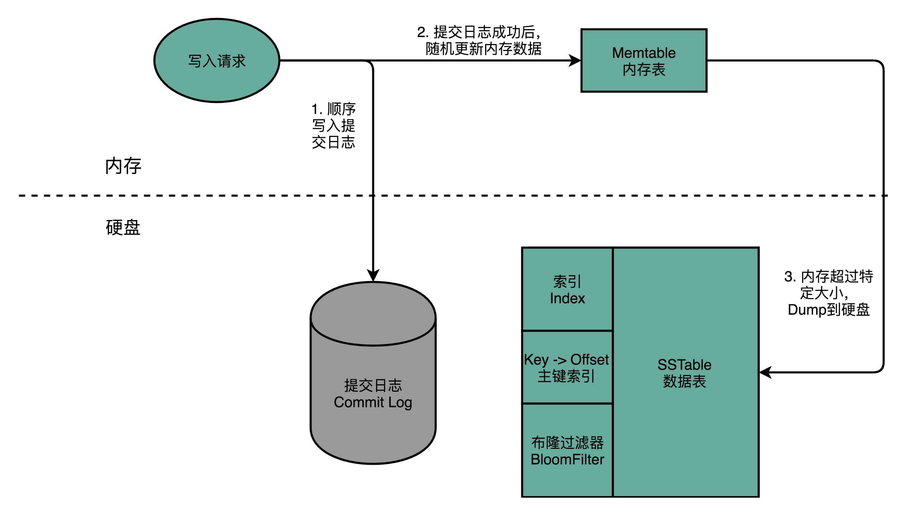

Cassandra 解决随机写入数据的解决方案，简单来说，就叫作"不随机写，只顺序写"。对于 Cassandra 数据库的写操作，通常包含两个动作和一个处理:

1. 首先是往磁盘上写入一条提交日志(Commit Log)。
2. 然后，直接在内存的数据结构上去更新数据。这个往内存的数据结构里面的数据更新，只有在提交日志写成功之后才会进行。
   每台机器上，都有一个可靠的硬盘可以去写入提交日志。写入提交日志都是顺序写(Sequential Write)，而不是随机写(Random Write)，这使得最大化了写入的吞吐量。
   无论是 HDD 硬盘还是 SSD 硬盘，顺序写入都比随机写入要快得多。

3. 内存的空间比较有限，一旦内存里面的数据量或者条目超过一定的限额，Cassandra 就会把内存里面的数据结构 dump 到硬盘上。这个 Dump 的操作，也是顺序写而不是随机写，所以性能也不会是一个问题。除了 Dump 的数据结构文件，Cassandra 还会根据 row key 来生成一个索引文件，方便后续基于索引来进行快速查询。

随着硬盘上的 Dump 出来的文件越来越多，Cassandra 会在后台进行文件的对比合并。在很多别的 KV 数据库系统里面，也有类似这种的合并动作，比如 AeroSpike 或者 Google 的 BigTable。这些操作一般称之为 Compaction。合并动作同样是顺序读取多个文件，在内存里面合并完成，再 Dump 出来一个新的文件。整个操作过程中，在硬盘层面仍然是顺序读写。

**Cassandra 的读操作**
Cassandra 的读请求，会**通过缓存、BloomFilter 进行两道过滤**，尽可能避免数据请求命中硬盘

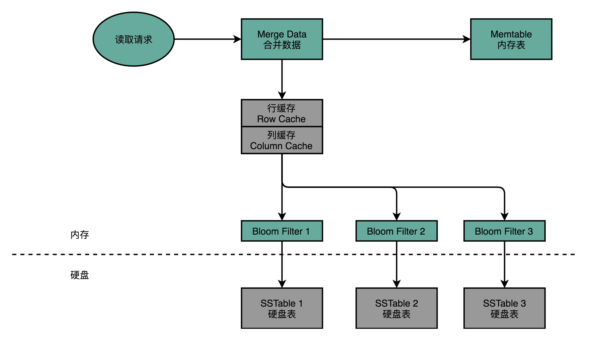

当要从 Cassandra 读数据的时候，会从内存里面找数据，再从硬盘读数据，然后把两部分的数据合并成最终结果。这些硬盘上的文件，在内存里面会有对应的 Cache，只有在 Cache 里面找不到，才会去请求硬盘里面的数据。

如果不得不访问硬盘，因为硬盘里面可能 Dump 了很多个不同时间点的内存数据的快照。所以，找数据的时候，也是按照时间从新的往旧的里面找。

这也就带来另外一个问题，可能要查询很多个 Dump 文件，才能找到想要的数据。所以，Cassandra 在这一点上又做了一个优化。那就是，它会为每一个 Dump 的文件里面所有 Row Key 生成一个 BloomFilter，然后把这个 BloomFilter 放在内存里面。这样，如果想要查询的 Row Key 在数据文件里面不存在，那么 99% 以上的情况下，它会被 BloomFilter 过滤掉，而不需要访问硬盘。

这样，只有当数据在内存里面没有，并且在硬盘的某个特定文件上的时候，才会触发一次对于硬盘的读请求。

#### 6.1.5 SSD: 解决 Cassandra 的数据读问题

Cassandra 是 Facebook 在 2008 年开源的。那个时候，SSD 硬盘还没有那么普及。可以看到，它的读写设计充分考虑了硬件本身的特性。在写入数据进行持久化上，Cassandra 没有任何的随机写请求，无论是 Commit Log 还是 Dump，全部都是顺序写。

在数据读的请求上，最新写入的数据都会更新到内存。如果要读取这些数据，会优先从内存读到。这相当于是一个使用了 LRU 的缓存机制。只有在万般无奈的情况下，才会有对于硬盘的随机读请求。即使在这样的情况下，Cassandra 也在文件之前加了一层 BloomFilter，把本来因为 Dump 文件带来的需要多次读硬盘的问题，简化成多次内存读和一次硬盘读。

这些设计，使得 Cassandra 即使是在 HDD 硬盘上，也能有不错的访问性能。因为所有的写入都是顺序写或者写入到内存，所以，写入可以做到高并发。HDD 硬盘的吞吐率还是很不错的，每秒可以写入 100MB 以上的数据，如果一条数据只有 1KB，那么 10 万的 WPS(Writes per seconds)也是能够做到的。这足够支撑 DMP 期望的写入压力了。

而对于数据的读，就有一些挑战了。如果数据读请求有很强的局部性，那内存就能搞定 DMP 需要的访问量。

但是，问题就出在这个局部性上。DMP 的数据访问分布，其实是缺少局部性的。DMP 里面的 Row Key 都是用户的唯一标识符。普通用户的上网时长怎么会有局部性呢？每个人上网的时间和访问网页的次数就那么多。上网多的人，一天最多也就 24 小时。大部分用户一天也要上网 2 ～ 3 小时。没办法说，把这些用户的数据放在内存里面，那些用户不放。


> DMP 系统，只有根据国家和时区不同有比较明显的局部性，是局部性不强的系统。

如果主要业务是在国内，那这个时间局部性就没有了。面临这个情况，是不可以通过优化程序来解决这个问题的。

因为缺少了时间局部性，内存的缓存能够起到的作用就很小了，大部分请求最终还是要落到 HDD 硬盘的随机读上。但是，HDD 硬盘的随机读的性能太差了，也就是 100QPS 左右。而如果全都放内存，那就太贵了，成本在 HDD 硬盘 100 倍以上。

不过，从 2010 年开始，SSD 硬盘的大规模商用帮助解决了这个问题。它的价格在 HDD 硬盘的 10 倍，但是随机读的访问能力在 HDD 硬盘的百倍以上。也就是说，用上了 SSD 硬盘，可以用 1/10 的成本获得和内存同样的 QPS。同样的价格的 SSD 硬盘，容量则是内存的几十倍，也能够满足需求，用较低的成本存下整个互联网用户信息。

回到 Cassandra 的读写设计，会发现，Cassandra 的写入机制完美匹配了[SSD 硬盘](#58-ssd-硬盘)的优缺点。

在数据写入层面，Cassandra 的数据写入都是 Commit Log 的顺序写入，也就是不断地在硬盘上往后追加内容，而不是去修改现有的文件内容。一旦内存里面的数据超过一定的阈值，Cassandra 又会完整地 Dump 一个新文件到文件系统上。这同样是一个追加写入。

数据的对比和紧凑化(Compaction)，同样是读取现有的多个文件，然后写一个新的文件出来。写入操作只追加不修改的特性，正好天然地符合 SSD 硬盘只能按块进行擦除写入的操作。在这样的写入模式下，Cassandra 用到的 SSD 硬盘，不需要频繁地进行后台的 Compaction，能够最大化 SSD 硬盘的使用寿命。这也是为什么，Cassandra 在 SSD 硬盘普及之后，能够获得进一步快速发展。

### 6.2 理解 Disruptor

Disruptor 是由一家专门做高频交易的公司 LMAX 开源出来的。有意思的是，Disruptor 的开发语言，并不是很多人心目中最容易做到性能极限的 C/C++，而是性能受限于 JVM 的 Java。其实只要通晓硬件层面的原理，即使是像 Java 这样的高级语言，也能够把 CPU 的性能发挥到极限。

#### 6.2.1 Padding Cache Line: 体验高速缓存的威力

先来看 Disruptor 里面一段神奇的代码。这段代码里，Disruptor 在 RingBufferPad 这个类里面定义了 p1，p2 一直到 p7 这样 7 个 long 类型的变量。

```java
abstract class RingBufferPad
{
  protected long p1, p2, p3, p4, p5, p6, p7;
}
```

这段代码的 p1-p7 这样的变量名没有明确的意义。不过，当深入了解了 Disruptor 的设计和源代码，就会发现这些变量名取得恰如其分。因为这些变量就是没有实际意义，只是帮助进行**缓存行填充**(Padding Cache Line)，使得能够尽可能地用上 CPU 高速缓存(CPU Cache)。

访问内置在 CPU 里的 L1 Cache 或者 L2 Cache，访问延时是内存的 1/15 乃至 1/100。而内存的访问速度，其实是远远慢于 CPU 的。想要追求极限性能，需要尽可能地多从 CPU Cache 里面拿数据，而不是从内存里面拿数据。

CPU Cache 装载内存里面的数据，不是一个一个字段加载的，而是加载一整个缓存行。举个例子，如果定义了一个长度为 64 的 long 类型的数组。那么数据从内存加载到 CPU Cache 里面的时候，不是一个一个数组元素加载的，而是一次性加载固定长度的一个缓存行。

现在的 64 位 Intel CPU 的计算机，缓存行通常是 64 个字节(Bytes)。一个 long 类型的数据需要 8 个字节，所以一下子会加载 8 个 long 类型的数据。也就是说，一次加载数组里面连续的 8 个数值。这样的加载方式使得遍历数组元素的时候会很快。因为后面连续 7 次的数据访问都会命中缓存，不需要重新从内存里面去读取数据。

但是，在不使用数组，而是使用单独的变量的时候，这里就会出现问题了。在 Disruptor 的 RingBuffer(环形缓冲区)的代码里面，定义了一个 RingBufferFields 类，里面有 indexMask 和其他几个变量，用来存放 RingBuffer 的内部状态信息。

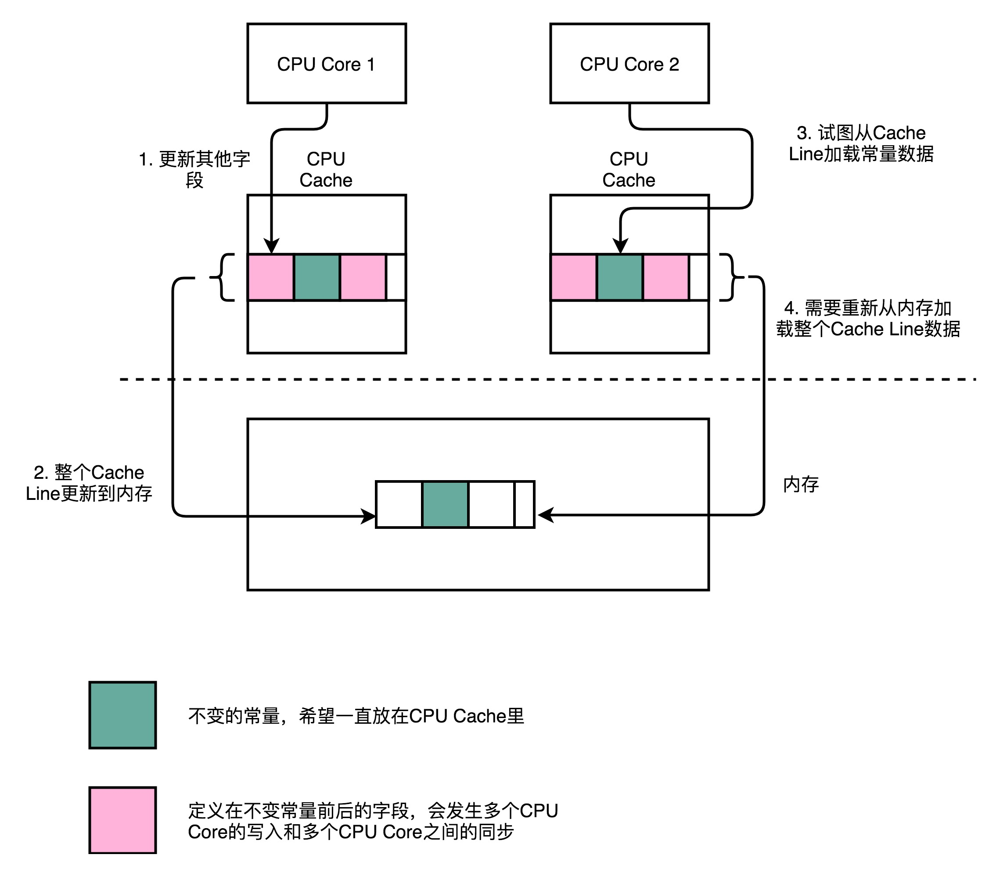

CPU 在加载数据的时候，自然也会把这个数据从内存加载到高速缓存里面来。不过，这个时候，高速缓存里面除了这个数据，还会加载这个数据前后定义的其他变量。这个时候，问题就来了。Disruptor 是一个多线程的服务器框架，在这个数据前后定义的其他变量，可能会被多个不同的线程去更新数据、读取数据。这些写入以及读取的请求，会来自于不同的 CPU Core。于是，为了保证数据的同步更新，不得不把 CPU Cache 里面的数据，重新写回到内存里面去或者重新从内存里面加载数据。

而刚刚说过，这些 CPU Cache 的写回和加载，都不是以一个变量作为单位的。这些动作都是以整个 Cache Line 作为单位的。所以，当 INITIAL_CURSOR_VALUE 前后的那些变量被写回到内存的时候，这个字段自己也写回到了内存，这个常量的缓存也就失效了。当要再次读取这个值的时候，要再重新从内存读取。这也就意味着，读取速度大大变慢了。

```java
......

abstract class RingBufferPad
{
    protected long p1, p2, p3, p4, p5, p6, p7;
}

abstract class RingBufferFields<E> extends RingBufferPad
{
    ......
    private final long indexMask;
  private final Object[] entries;
  protected final int bufferSize;
  protected final Sequencer sequencer;
    ......
}

public final class RingBuffer<E> extends RingBufferFields<E> implements Cursored, EventSequencer<E>, EventSink<E>
{
    ......
    protected long p1, p2, p3, p4, p5, p6, p7;
    ......
}
```

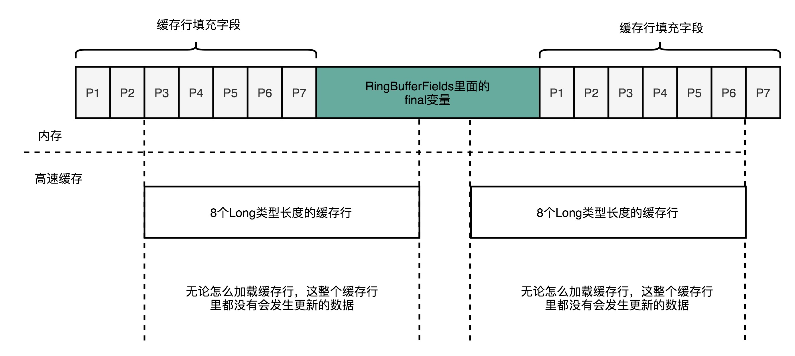

面临这样一个情况，Disruptor 里发明了一个神奇的代码技巧，这个技巧就是**缓存行填充**。Disruptor 在 RingBufferFields 里面定义的变量的前后，分别定义了 7 个 long 类型的变量。前面的 7 个来自继承的 RingBufferPad 类，后面的 7 个则是直接定义在 RingBuffer 类里面。这 14 个变量没有任何实际的用途。既不会去读他们，也不会去写他们。

而 RingBufferFields 里面定义的这些变量都是 final 的，第一次写入之后不会再进行修改。所以，一旦它被加载到 CPU Cache 之后，只要被频繁地读取访问，就不会再被换出 Cache 了。这也就意味着，对于这个值的读取速度，会是一直是 CPU Cache 的访问速度，而不是内存的访问速度。

#### 6.2.2 使用 RingBuffer，利用缓存和分支预测

其实上面这个利用 CPU Cache 的性能的思路，贯穿了整个 Disruptor。Disruptor 整个框架，其实就是一个高速的生产者 - 消费者模型(Producer-Consumer)下的队列。生产者不停地往队列里面生产新的需要处理的任务，而消费者不停地从队列里面处理掉这些任务。


如果要实现一个队列，最合适的数据结构应该是链表。只要维护好链表的头和尾，就能很容易实现一个队列。生产者只要不断地往链表的尾部不断插入新的节点，而消费者只需要不断从头部取出最老的节点进行处理就好了。可以很容易实现生产者 - 消费者模型。实际上，Java 自己的基础库里面就有 LinkedBlockingQueue 这样的队列库，可以直接用在生产者 - 消费者模式上。

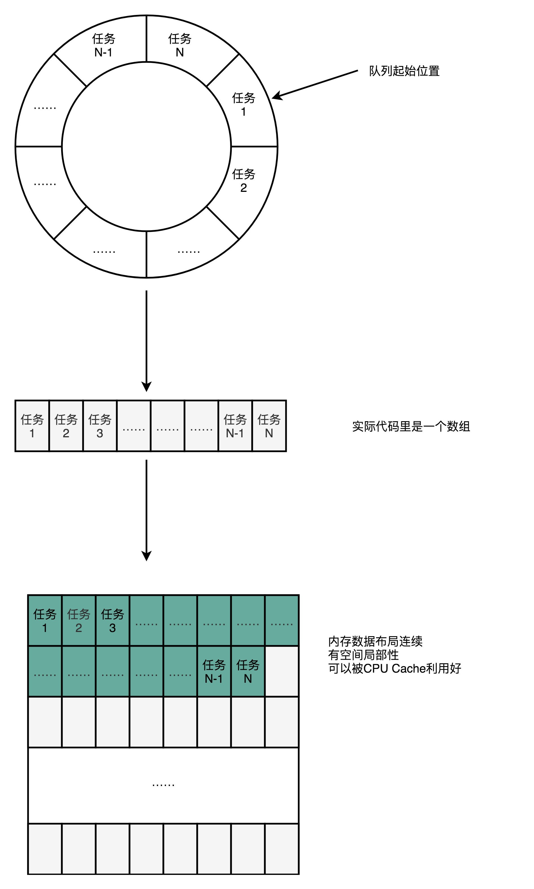

不过，Disruptor 里面并没有用 LinkedBlockingQueue，而是使用了一个 RingBuffer 这样的数据结构，这个 RingBuffer 的底层实现则是一个固定长度的数组。比起链表形式的实现，数组的数据在内存里面会存在空间局部性。

就像上面看到的，数组的连续多个元素会一并加载到 CPU Cache 里面来，所以访问遍历的速度会更快。而链表里面各个节点的数据，多半不会出现在相邻的内存空间，自然也就享受不到整个 Cache Line 加载后数据连续从高速缓存里面被访问到的优势。

除此之外，数据的遍历访问还有一个很大的优势，就是 CPU 层面的分支预测会很准确。这可以使得更有效地利用了 CPU 里面的多级流水线，程序就会跑得更快。

#### 6.2.3 缓慢的锁

利用 CPU 高速缓存，只是 Disruptor "快" 的一个因素，Disruptor 快的另一个因素，是 "无锁"，尽可能发挥 CPU 本身的高速处理性能。

Disruptor 作为一个高性能的生产者 - 消费者队列系统，一个核心的设计就是通过 RingBuffer 实现一个无锁队列。

Java 里面的基础库里，就有像 LinkedBlockingQueue 这样的队列库。但是，这个队列库比起 Disruptor 里用的 RingBuffer 要慢上很多。慢的第一个原因，是因为链表的数据在内存里面的布局对于高速缓存并不友好，而 RingBuffer 所使用的数组则不然。

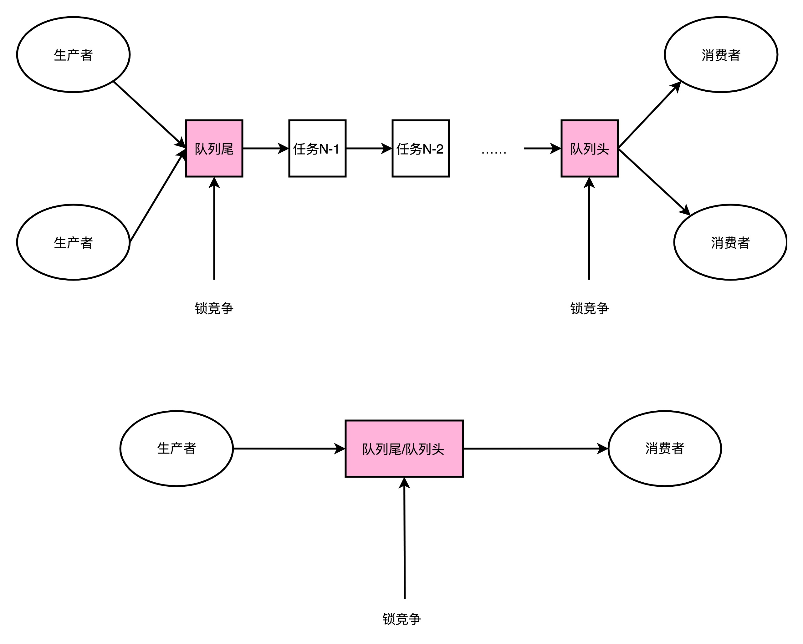

LinkedBlockingQueue 慢，有另外一个重要的因素，那就是它对于锁的依赖。在生产者 - 消费者模式里，可能有多个消费者，同样也可能有多个生产者。多个生产者都要往队列的尾指针里面添加新的任务，就会产生多个线程的竞争。于是，在做这个事情的时候，生产者就需要拿到对于队列尾部的锁。同样地，在多个消费者去消费队列头的时候，也就产生竞争。同样消费者也要拿到锁。

那只有一个生产者，或者一个消费者，是不是就没有这个锁竞争的问题了呢？答案还是否定的。一般来说，在生产者 - 消费者模式下，消费者要比生产者快。不然的话，队列会产生积压，队列里面的任务会越堆越多。

一方面，会发现越来越多的任务没有能够及时完成；另一方面，内存也会放不下。虽然生产者 - 消费者模型下，都有一个队列来作为缓冲区，但是大部分情况下，这个缓冲区里面是空的。也就是说，即使只有一个生产者和一个消费者者，这个生产者指向的队列尾和消费者指向的队列头是同一个节点。于是，这两个生产者和消费者之间一样会产生锁竞争。

在 LinkedBlockingQueue 上，这个锁机制是通过 ReentrantLock 这个 Java 基础库来实现的。这个锁是一个用 Java 在 JVM 上直接实现的加锁机制，这个锁机制需要由 JVM 来进行裁决。这个锁的争夺，会把没有拿到锁的线程挂起等待，也就需要经过一次上下文切换(Context Switch)。

这里的上下文切换要做的和异常和中断里的是一样的。上下文切换的过程，需要把当前执行线程的寄存器等等的信息，保存到线程栈里面。而这个过程也必然意味着，已经加载到高速缓存里面的指令或者数据，又回到了主内存里面，会进一步拖慢性能。

#### 6.2.4 无锁的 RingBuffer

加锁很慢，所以 Disruptor 的解决方案就是"无锁"。这个"无锁"指的是没有操作系统层面的锁。实际上，Disruptor 还是利用了一个 CPU 硬件支持的指令，称之为 CAS(Compare And Swap，比较和交换)。在 Intel CPU 里面，这个对应的指令就是 cmpxchg。

Disruptor 的 RingBuffer 是这么设计的，它和直接在链表的头和尾加锁不同。Disruptor 的 RingBuffer 创建了一个 Sequence 对象，用来指向当前的 RingBuffer 的头和尾。这个头和尾的标识，不是通过一个指针来实现的，而是通过一个**序号**。这也是为什么对应源码里面的类名叫 Sequence。

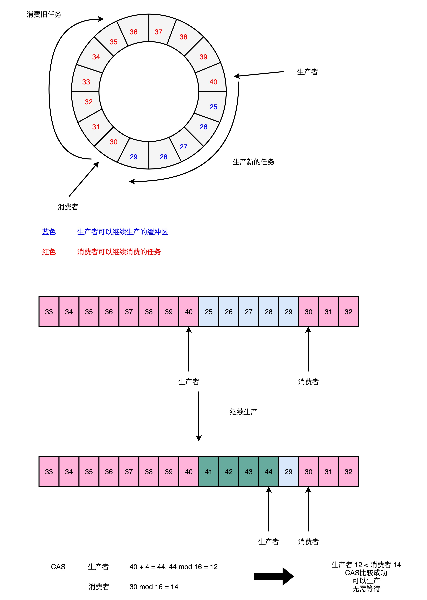

在这个 RingBuffer 当中，进行生产者和消费者之间的资源协调，采用的是对比序号的方式。当生产者想要往队列里加入新数据的时候，它会把当前的生产者的 Sequence 的序号，加上需要加入的新数据的数量，然后和实际的消费者所在的位置进行对比，看看队列里是不是有足够的空间加入这些数据，而不会覆盖掉消费者还没有处理完的数据。

在 Sequence 的代码里面，就是通过 compareAndSet 这个方法，并且最终调用到了 UNSAFE.compareAndSwapLong，也就是直接使用了 CAS 指令。

```java
public boolean compareAndSet(final long expectedValue, final long newValue)
{
  return UNSAFE.compareAndSwapLong(this, VALUE_OFFSET, expectedValue, newValue);
}

public long addAndGet(final long increment)
{
  long currentValue;
  long newValue;

  do
  {
    currentValue = get();
    newValue = currentValue + increment;
  }
  while (!compareAndSet(currentValue, newValue));

  return newValue;
}
```

> Sequence 源码中的 addAndGet，如果 CAS 的操作没有成功，它会不断忙等待地重试

这个 CAS 指令，也就是比较和交换的操作，并不是基础库里的一个函数。它也不是操作系统里面实现的一个系统调用，而是一个 CPU 硬件支持的机器指令。在服务器所使用的 Intel CPU 上，就是 cmpxchg 这个指令。

```shell
compxchg [ax] (隐式参数，EAX累加器), [bx] (源操作数地址), [cx] (目标操作数地址)
```

cmpxchg 指令，一共有三个操作数，第一个操作数不在指令里面出现，是一个隐式的操作数，也就是 EAX 累加寄存器里面的值。第二个操作数就是源操作数，并且指令会对比这个操作数和上面的累加寄存器里面的值。

如果值是相同的，那一方面，CPU 会把 ZF(也就是条件码寄存器里面零标志位的值)设置为 1，然后再把第三个操作数(也就是目标操作数)，设置到源操作数的地址上。如果不相等的话，就会把源操作数里面的值，设置到累加器寄存器里面。

单个指令是原子的，这也就意味着在使用 CAS 操作的时候，不再需要单独进行加锁，直接调用就可以了。没有了锁，CPU 这部高速跑车就像在赛道上行驶，不会遇到需要上下文切换这样的红灯而停下来。虽然会遇到像 CAS 这样复杂的机器指令，就好像赛道上会有 U 型弯一样，不过不用完全停下来等待，CPU 运行起来仍然会快很多。用一段 Java 代码来看一下，CAS 操作到底会有多快。

```java
package com.xuwenhao.perf.jmm;

import java.util.concurrent.atomic.AtomicLong;
import java.util.concurrent.locks.Lock;
import java.util.concurrent.locks.ReentrantLock;

public class LockBenchmark {

  public static void runIncrementAtomic()
  {
    AtomicLong counter = new AtomicLong(0);
    long max = 500000000L;
    long start = System.currentTimeMillis();
    while (counter.incrementAndGet() < max) {
    }
    long end = System.currentTimeMillis();
    System.out.println("Time spent is " + (end-start) + "ms with cas"); // Time spent is 3867ms with cas
  }


  public static void main(String[] args) {
    runIncrementAtomic();
  }
}
```

和上面的 counter 自增一样，只不过这一次，自增采用了 AtomicLong 这个 Java 类。里面的 incrementAndGet 最终到了 CPU 指令层面，在实现的时候用的就是 CAS 操作。可以看到，它所花费的时间，虽然要比没有任何锁的操作慢上一个数量级，但是比起使用 ReentrantLock 这样的操作系统锁的机制，还是减少了一半以上的时间。

---

<span id="Amdahl">1. **阿姆达尔定律**
: 是在性能优化中，经常用到的经验定律，对于一个程序进行优化之后，处理器并行运算效率提升之后的情况，具体可以用这样一个公式表达: **优化后的执行时间 = 受优化影响的执行时间 / 加速倍率 + 不受影响的执行时间**
</span>

<span id="LogicGates">2. **触发器和锁存器**
: 是两种不同原理的数字电路组成的逻辑门。
</span>

<span id="objdump">3. **objdump**
: objdump 命令是 Linux 下的反汇编目标文件或者可执行文件的命令，它以一种可阅读的格式打印出二进制文件可能带有的附加信息。</span>
