<!-- @import "[TOC]" {cmd="toc" depthFrom=1 depthTo=6 orderedList=false} -->

<!-- code_chunk_output -->

- [计算机组成原理](#计算机组成原理)
  - [一. 总论](#一-总论)
    - [1.1 概念](#11-概念)
    - [1.2 知识地图](#12-知识地图)
      - [1.2.1 计算机的基本组成](#121-计算机的基本组成)
      - [1.2.2 计算机的指令和计算](#122-计算机的指令和计算)
      - [1.2.3 处理器设计](#123-处理器设计)
      - [1.2.4 存储器和 I/O 设备](#124-存储器和-io-设备)
  - [二.计算机的基本组成](#二计算机的基本组成)
    - [2.1 基本硬件组成](#21-基本硬件组成)
      - [2.1.1 主要](#211-主要)
      - [2.1.2 次要](#212-次要)
    - [2.2 冯·诺依曼体系](#22-冯诺依曼体系)
    - [2.3 性能](#23-性能)
      - [2.3.1 指标](#231-指标)
      - [2.3.2 计算机的计时单位: `CPU时钟`](#232-计算机的计时单位-cpu时钟)
      - [2.3.3 性能提升思路](#233-性能提升思路)
      - [2.3.4 功耗](#234-功耗)
      - [2.3.5 提升性能的方法](#235-提升性能的方法)
  - [三. 计算机指令和运算](#三-计算机指令和运算)
    - [3.1 计算机指令 (Instruction Code)](#31-计算机指令-instruction-code)
      - [3.1.1 用来做什么](#311-用来做什么)
      - [3.1.2 计算机指令集 (Instruction Set)](#312-计算机指令集-instruction-set)
      - [3.1.3 存储程序型计算机 (Stored-program Computer)](#313-存储程序型计算机-stored-program-computer)
      - [3.1.4 程序如何变成计算机指令](#314-程序如何变成计算机指令)
      - [3.1.5 常见指令分类](#315-常见指令分类)
      - [3.1.6 汇编器把对应的汇编代码翻译成为机器码](#316-汇编器把对应的汇编代码翻译成为机器码)
      - [3.1.7 小结](#317-小结)
    - [3.2 指令跳转](#32-指令跳转)
      - [3.2.1 CPU 执行指令的过程](#321-cpu-执行指令的过程)
      - [3.2.2 寄存器种类与执行过程](#322-寄存器种类与执行过程)
      - [3.2.3 从 if…else 来看程序的执行和跳转](#323-从-ifelse-来看程序的执行和跳转)
      - [3.2.4 通过 if...else 和 goto 来实现循环](#324-通过-ifelse-和-goto-来实现循环)
      - [3.2.5 小结](#325-小结)
    - [3.3 函数调用](#33-函数调用)
      - [3.3.1 程序栈](#331-程序栈)
      - [3.3.2 利用函数内联进行性能优化](#332-利用函数内联进行性能优化)
    - [3.4 ELF 和静态链接](#34-elf-和静态链接)
      - [3.4.1 编译、链接和装载：拆解程序执行](#341-编译-链接和装载拆解程序执行)
      - [3.4.2 ELF 格式和链接：理解链接过程](#342-elf-格式和链接理解链接过程)
    - [3.5 程序装载](#35-程序装载)
    - [3.6 动态链接](#36-动态链接)
    - [3.7 二进制编码](#37-二进制编码)
      - [3.7.1 理解二进制的"逢二进一"](#371-理解二进制的逢二进一)
      - [3.7.2 字符串的表示，从编码到数字](#372-字符串的表示从编码到数字)
    - [3.8 理解电路](#38-理解电路)
      - [3.8.1 继电器](#381-继电器)
    - [3.9 加法器](#39-加法器)
      - [3.9.1 异或门和半加器](#391-异或门和半加器)
      - [3.9.2 全加器](#392-全加器)
    - [3.10 乘法器](#310-乘法器)
      - [3.10.1 顺序乘法的实现过程](#3101-顺序乘法的实现过程)

<!-- /code_chunk_output -->

# 计算机组成原理

---

## 一. 总论

### 1.1 概念

> 计算机组成原理的英文叫 Computer Organization。这里的 Organization 是"组织机构"的意思。
> 计算机是由很多个不同部件放在一起，变成了一个"组织机构"。这个组织机构最终能够进行各种计算、控制、读取输入，进行输出，达成各种强大的功能。
> 组成原理是计算机体系结构的入门课程。`冯·诺依曼体系`结构确立了现代计算机`硬件`的`基础架构`。因此，学习计算机组成原理，其实就是学习和拆解冯·诺依曼体系结构。

### 1.2 知识地图


从这张图可以看出，整个计算机组成原理，就是**围绕着计算机是如何组织运作展开的**，整个计算机组成原理的知识点被拆分成了 **四大部分**。

#### 1.2.1 计算机的基本组成

需要学习计算机是由哪些硬件组成的。这些硬件，又是怎么对应到经典的冯·诺依曼体系结构中的，也就是`运算器`、`控制器`、`存储器`、`输入设备`和`输出设备`这五大基本组件。除此之外，还需要了解计算机的两个==核心指标==，`性能`和`功耗`。性能和功耗也是应用和设计五大基本组件中需要 **重点** 考虑的因素。

#### 1.2.2 计算机的指令和计算

**指令**
: 需要搞明白，一行行 C、Java、PHP 程序，是怎么在计算机里面跑起来的。这里面，既需要==了解程序是怎么通过编译器和汇编器，变成一条条机器指令这样的编译过程==，还需要知道==操作系统是怎么链接、装载、执行这些程序的==。而这一条条指令执行的控制过程，就是由计算机五大组件之一的`控制器`来控制的。

**计算**
: 从二进制和编码开始，理解数据在计算机里的表示，以及是怎么从数字电路层面，实现加法、乘法这些基本的运算功能的。实现这些运算功能的算术逻辑单元(Arithmetic Logic Unit/ALU)，也就是计算机五大组件之一的`运算器`。

#### 1.2.3 处理器设计

**CPU 时钟** (CPU Clock)
: 可以用来构造寄存器和内存的锁存器和触发器，因此，CPU 时钟是学习 CPU 的前导知识。需要搞明白为什么需要 CPU 时钟，以及寄存器和内存是用什么样的硬件组成的。

**数据通路**
: 连接了整个`运算器`和`控制器`，并最终组成了 `CPU`。而出于对性能和功耗的考虑，需要进一步理解和掌握面向流水线设计的 CPU、数据和控制冒险，以及分支预测的相关技术。

**CPU**
: ==作为控制器要和输入输出设备通信==，那么就要知道异常和中断发生的机制。所以，在 CPU 设计部分的最后，会**学习指令的并行执行**，看看如何直接在 CPU 层面，通过 **SIMD** 来支持并行计算。

#### 1.2.4 存储器和 I/O 设备

- 通过存储器的层次结构作为基础的框架引导，需要掌握从上到下的 CPU 高速缓存、内存、SSD 硬盘和机械硬盘的工作原理，它们之间的性能差异，以及实际应用中利用这些设备会遇到的挑战。

- 存储器其实很多时候又扮演了输入输出设备的角色，所以需要进一步了解，CPU 和这些存储器之间是如何进行通信的，以及最重要的**性能问题**是怎么一回事。

- 对于存储器，不仅需要它们能够正常工作，还要确保里面的数据不能丢失。于是要掌握如何通过 RAID、Erasure Code、ECC 以及分布式 HDFS，这些不同的技术，来**确保数据的完整性和访问性能**。

- 理解什么是 `IO_WAIT`，如何通过 DMA 来提升程序性能。

## 二.计算机的基本组成

### 2.1 基本硬件组成

#### 2.1.1 主要

**CPU**
: 它是计算机**最重要的核心配件**，计算机的所有"计算"都是由 CPU 来进行的，全名是中央处理器(Central Processing Unit)。

**内存** (Memory)
: 撰写的程序、打开的浏览器、运行的游戏，都要加载到内存里才能运行。程序读取的数据、计算得到的结果，也都要放在内存里。内存越大，能加载的东西自然也就越多。存放在内存里的程序和数据，需要被 CPU 读取，CPU 计算完之后，还要把数据写回到内存。

**主板**
: 主板是一个有着各种各样，有时候多达数十乃至上百个插槽的配件。主要有以下作用:

      1. CPU 要插在主板上，内存也要插在主板上。
      2. 主板的芯片组(Chipset)和总线(Bus)解决了 CPU 和 内存 之间如何通信的问题。芯片组控制了数据传输的流转，也就是数据从哪里到哪里的问题。
      3. 总线则是实际数据传输的高速公路。因此，总线速度(Bus Speed)决定了数据能传输得多快。

#### 2.1.2 次要

**I/O 设备**
: 输入(Input)/ 输出(Output)设备，如: 显示器、键盘、鼠标等。

**硬盘**
: 长久保存数据。

**显卡(Graphics Card)**
: 使用图形界面操作系统的计算机，无论是 Windows、Mac OS 还是 Linux，显卡都是必不可少的。显卡之所以特殊，是因为显卡里有除了 CPU 之外的另一个"处理器"，也就是 `GPU`(Graphics Processing Unit，图形处理器)，GPU 一样可以做各种"计算"的工作。

**南桥(SouthBridge)**
: 主板上的南桥芯片组，来用来==控制 外部 I/O 设备 和 CPU 之间的通信==的。"南桥"芯片的名字很直观，一方面，它在主板上的位置，通常在主板的"南面"。另一方面，它的作用就是作为"桥"，来连接鼠标、键盘以及硬盘这些外部设备和 CPU 之间的通信。以前的主板上通常也有"北桥"芯片，用来作为"桥"，连接 CPU 和内存、显卡之间的通信。不过，随着时间的变迁，现在的主板上的"北桥"芯片的工作，已经被移到了 CPU 的内部，所以现在主板上，已经看不到北桥芯片了。

### 2.2 冯·诺依曼体系

概念
: 无论是电脑、手机、还是服务器，都遵循着同一个"计算机"的抽象概念。也就是，计算机祖师爷之一冯·诺依曼(John von Neumann)提出的 **冯·诺依曼体系结构** (Von Neumann architecture)，也叫`存储程序型计算机`。

历史
: 冯·诺依曼在 1945 年 6 月 30 日，基于当时在秘密开发的 EDVAC 写了一篇报告 **《First Draft of a Report on the EDVAC》** ，描述了他心目中的一台计算机应该长什么样。这篇报告在历史上有个很特殊的简称，叫 **First Draft**。
First Draft 里面说了一台计算机应该有哪些部分组成:

      1. 处理器单元: 一个包含算术逻辑单元(Arithmetic Logic Unit，ALU)和处理器寄存器(Processor Register)的处理器单元(Processing Unit)，用来完成各种算术和逻辑运算。因为它能够完成各种数据的处理或者计算工作，因此也有人把这个叫作数据通路(Datapath)或者运算器。

      2. 控制器单元: 一个包含指令寄存器(Instruction Register)和程序计数器(Program Counter)的控制器单元(Control Unit/CU)，用来控制程序的流程，通常就是不同条件下的分支和跳转。在现代计算机里，上面的算术逻辑单元和这里的控制器单元，共同组成了 CPU。

      3. 存储器: 用来存储数据(Data)和指令(Instruction)的内存。以及更大容量的外部存储，在过去，可能是磁带、磁鼓这样的设备，现在通常就是硬盘。

      4. I/O设备: 各种输入和输出设备，以及对应的输入和输出机制。现在无论是使用什么样的计算机，其实都是和输入输出设备在打交道。个人电脑的鼠标键盘是输入设备，显示器是输出设备。我们用的智能手机，触摸屏既是输入设备，又是输出设备。而跑在各种云上的服务器，则是通过网络来进行输入和输出。这个时候，网卡既是输入设备又是输出设备。

> **总结**: 任何一台计算机的任何一个部件都可以归到 `运算器`、 `控制器`、 `存储器`、 `输入设备` 和 `输出设备` 中，所有的现代计算机也都是基于这个基础架构来设计开发的。
>
> **扩展**: 所有的计算机程序，也都可以抽象为从输入设备读取输入信息，通过运算器和控制器来执行存储在存储器里的程序，最终把结果输出到输出设备中。而我们所有撰写的无论高级还是低级语言的程序，也都是基于这样一个抽象框架来进行运作的。

### 2.3 性能

一般把性能，定义成响应时间的倒数，也就是：`性能 = 1 / 响应时间`

#### 2.3.1 指标

计算机的性能，主要用两个 **标准指标** 来衡量:

**响应时间** (Response time) 或 执行时间 (Execution time)
: 执行一个程序，到底需要花多少时间。想要提升这个指标，可以理解为让计算机"跑得更快"。

**吞吐率** (Throughput) 或 带宽 (Bandwidth)
: 在一定的时间范围内，到底能处理多少事情。这里的"事情"，在计算机里就是处理的数据或者执行的程序指令。想要提升这个指标，可以理解为让计算机"搬得更多"。

> 提升吞吐率的办法有很多，大部分时候，只要多加一些机器，多堆一些硬件就好了。但是**响应时间的提升却没有那么容易**。

#### 2.3.2 计算机的计时单位: `CPU时钟`

虽然时间是一个很自然的用来 **衡量性能** 的指标，但是用时间来衡量时，有两个问题:

> **1. 时间不准** :
>
> > 统计时间是用类似于"掐秒表"一样，记录程序运行结束的时间减去程序开始运行的时间。
> > 计算机可能同时运行着好多个程序，CPU 实际上不停地在各个程序之间进行切换。在这些走掉的时间里面，很可能 CPU 切换去运行别的程序了。
> > 有些程序在运行的时候，可能要从网络、硬盘去读取数据，要等网络和硬盘把数据读出来，给到内存和 CPU。
>
> **解决思路** : 要想准确统计某个程序运行时间，进而去比较两个程序的实际性能，得把这些时间给刨除掉。
>
> **2. 会受到主板、内存这些其他相关硬件的影响** :
>
> **解决思路** : 因为会受到相关硬件的影响，所以需要对"时间"这个可以感知的指标进行 **拆解** ，把程序的 `CPU 执行时间` 变成 `CPU 时钟周期数` (CPU Cycles) 和 `时钟周期时间` (Clock Cycle) 的 `乘积`:
> **程序的 CPU 执行时间 = CPU 时钟周期数 × 时钟周期时间**

**时钟周期时间**
: 在 CPU 内部，有一个叫 **晶体振荡器** (Oscillator Crystal)的东西，简称为晶振。计算机把晶振当成 CPU 内部的电子表来使用。晶振带来的每一次"滴答"，就是时钟周期时间。CPU 是按照这个"时钟"提示的时间来进行自己的操作。 **时钟周期越短，CPU 也就越快**。

#### 2.3.3 性能提升思路

**思路**:
最简单的提升性能方案，自然是 **缩短时钟周期时间** ，也就是提升主频。不过，这个是软件控制不了的事情，但是，如果能够减少程序需要的 **CPU 时钟周期数量** ，一样能够提升程序性能。

对于 CPU 时钟周期数，可以再做一个分解，把它变成 **"指令数 × 每条指令的平均时钟周期数(Cycles Per Instruction，简称 CPI)"** 。不同的指令需要的 Cycles 是不同的，加法和乘法都对应着一条 CPU 指令，但是乘法需要的 Cycles 就比加法要多，自然也就慢。在这样拆分了之后，程序的 CPU 执行时间就可以变成这样三个部分的乘积:

> **程序的 CPU 执行时间 = 指令数 × CPI × 时钟周期时间**

**解决性能问题**，就是要优化这三者:

- **时钟周期时间** (计算机主频): 这个取决于计算机硬件。所熟知的摩尔定律就一直在不停地提高我们计算机的主频。

- **每条指令的平均周期数`CPI`**: 就是一条指令需要多少 CPU Cycles。现代的 CPU 通过 **流水线技术** (Pipeline)，让一条指令需要的 CPU Cycle 尽可能地少。因此，对于 CPI 的优化，也是计算机组成和体系结构中的重要一环。

- **指令数** : 代表执行程序到底需要多少条指令、用哪些指令。这个很多时候就把挑战交给了编译器。同样的代码，编译成计算机指令时候，就有各种不同的表示方式。

#### 2.3.4 功耗

**功耗的增加** :

CPU，一般都被叫作超大规模集成电路 (Very-Large-Scale Integration，VLSI) 。这些电路，实际上都是一个个晶体管组合而成的。CPU 在计算时，其实就是让晶体管里面的"开关"不断地去"打开"和"关闭"，来组合完成各种运算和功能。可从以下几个方面提升性能:

- **增加密度** : 在 CPU 里，同样的面积里面多放晶体管。
- **提升制程** : 同样的面积下，想要多放一点晶体管，就要把晶体管造得小一点。
- **提升主频** : 也就是让晶体管"打开"和"关闭"得更快一点。

但这三者，都会 **增加功耗** ，带来耗电和散热的问题。因此，在 CPU 里面，能够放下的 **晶体管数量** 和 **晶体管的"开关"频率** 也都是有限的。一个 CPU 的功率，可以用这样一个公式来表示:

> **功耗 ~= 1/2 × 负载电容 × 电压的平方 × 开关频率 × 晶体管数量**

**降低功耗方法** :

> **降低电压** : 在整个功耗的公式里面，功耗和电压的平方是成正比的。这意味着电压下降到原来的 `1/5`，整个的功耗会变成原来的 `1/25` ，**非常关键**。

#### 2.3.5 提升性能的方法

- **并行优化，理解 [阿姆达尔定律](#Amdahl)**

> **通过并行提高性能是最常见的提升性能的方式**。但是，并不是所有问题，都可以通过并行提高性能来解决。如果想要使用这种思想，需要满足这样几个条件:
>
> > 1.需要进行的计算，本身可以分解成几个可以并行的任务。 2.需要能够分解好问题，并确保结果能够汇总到一起。 3.在"汇总"这个阶段，是没有办法并行进行的，还是得顺序执行，一步一步来。

- **不受影响的执行时间** : 指的是汇总相加的时间，这部分时间是不能通过并行来优化的。

- **加速大概率事件**

- **通过流水线提高性能** : 把 CPU 指令执行的过程进行拆分，细化运行，也是现代 CPU 在主频没有办法提升那么多的情况下，性能仍然可以得到提升的重要原因之一。

- **通过预测提高性能** : 通过预先猜测下一步该干什么，而不是等上一步运行的结果，提前进行运算，也是让程序跑得更快一点的办法。典型的例子就是在一个循环访问数组的时候，凭经验，也会猜到下一步会访问数组的下一项。"分支和冒险"、"局部性原理"这些 CPU 和存储系统设计方法，其实都是在利用对于未来的"预测"，提前进行相应的操作，来提升程序性能。

## 三. 计算机指令和运算

### 3.1 计算机指令 (Instruction Code)

#### 3.1.1 用来做什么

从软件工程师的角度来讲，CPU 就是一个**执行各种计算机指令的逻辑机器**。这里的计算机指令，就好比一门 CPU 能够听得懂的语言，也可以把它叫作 **机器语言** (Machine Language) 。

#### 3.1.2 计算机指令集 (Instruction Set)

**计算机指令集** 是 CPU 支持的语言，不同的 CPU 能够听懂的语言不太一样。比如，个人电脑用的是 Intel 的 CPU，苹果手机用的是 ARM 的 CPU。这两者能听懂的语言就不太一样。

#### 3.1.3 存储程序型计算机 (Stored-program Computer)

一个计算机程序，不可能只有一条指令，而是由成千上万条指令组成的。但是 CPU 里不能一直放着所有指令，所以计算机程序平时是存储在存储器中的。这种程序指令存储在存储器里面的计算机，就叫作 **存储程序型计算机**。

#### 3.1.4 程序如何变成计算机指令

要让一段程序在操作系统上跑起来，需要把整个程序翻译成一个 **汇编语言** (ASM，Assembly Language) 程序，这个过程一般叫 **编译 (Compile) 成汇编代码**。
针对汇编代码，可以再用汇编器 (Assembler) 翻译成机器码 (Machine Code) 。这些机器码由"0"和"1"组成的机器语言表示。这一条条机器码，就是一条条的计算机指令。

**不直接编译成机器码的好处** :

- 方便优化和调试: 因为编译器也是工具，也是机器，毕竟是机器生成的程序，不是非常完美的，而汇编是机器指令的助记符，一个汇编指令就对应一条机器指令 (特殊指令除外) ，调试起来肯定会比机器指令方便，这样优化起来也方便。

- 从人脑可分析的粒度来减弱复杂性: 高级语言只需要编译成汇编代码就可以了，汇编代码到机器码的转换是由硬件实现的，实现这样的分层，可以有效地减弱编译器编写的复杂性，提高了效率。

#### 3.1.5 常见指令分类

**常见的指令可以分成以下五类** :

1. **算术类指令** : 加减乘除，在 CPU 层面，都会变成一条条算术指令。
2. **数据传输类指令** : 给变量赋值、在内存里读写数据，用的都是数据传输类指令。
3. **逻辑类指令** :逻辑上的与或非，都是这一类指令。
4. **条件分支类指令** : if/else、switch，都是套件分支类指令。
5. **无条件跳转指令** : 调用函数时，其实就是发起了一个无条件跳转指令。


#### 3.1.6 汇编器把对应的汇编代码翻译成为机器码

使用最简单的 `MIPS` 指令集，来演示机器码是如何生成的。


MISP 的指令是一个 `32位` 的整数，高 6 位叫 **操作码** (Opcode)，也就是代表这条指令具体是一条什么样的指令，剩下的 26 位有三种格式，分别是 R、I 和 J。

1. **R 指令** : 一般用来做 **算术和逻辑操作** ，里面有读取和写入数据的寄存器的地址。如果是逻辑位移操作，后面还有位移操作的位移量，而最后的功能码，则是在前面的操作码不够的时候，扩展操作码表示对应的具体指令的。
2. **I 指令** : 通常是用在 **数据传输、条件分支** ，以及在运算的时候使用的并非变量还是常数的时候。这个时候，没有了位移量和操作码，也没有了第三个寄存器，而是把这三部分直接合并成了一个地址值或者一个常数。
3. **J 指令** : **跳转指令** ，高 6 位之外的 26 位都是一个跳转后的地址。

> **例** :
> 以一个最简单的加法算术指令 `add t0,s1,$s2` 为例，下面都用十进制来表示对应的代码。
> 这个指令对应 MIPS 指令里 `opcode` 是 `0`，`rs` 代表第一个寄存器的地址是 `17`，`rt` 代表第二个寄存器的地址是 `18`， `rd` 代表目标的临时寄存器 `t0` 的地址是 **8**。因为不是位移操作，所以位移量是 **0**。把这些数字拼起来，就变成了一个 _MIPS_ 的加法指令。
> 为了读起来方便，一般把对应的二进制数，用 16 进制表示出来。这个例子是 **0X02324020**，这个数字也就是这条指令对应的机器码。
> 

#### 3.1.7 小结

> 除了 C 这样的编译型的语言之外，不管是 Python 这样的解释型语言，还是 Java 这样使用虚拟机的语言，其实最终都是由不同形式的程序，把代码，转换成 CPU 能够理解的 **机器码** 来执行的。
> 只是解释型语言，是通过解释器在程序运行的时候逐句翻译，而 Java 这样使用虚拟机的语言，则是由虚拟机对编译出来的中间代码进行解释，或者即时编译成为机器码来最终执行。

### 3.2 指令跳转

#### 3.2.1 CPU 执行指令的过程

实际上，一条条计算机指令执行起来非常复杂。CPU 在软件层面已经为做好了 **封装**。对于程序员来说，只要知道，写好的代码变成了指令之后，是 **一条一条顺序执行** 的就可以了。

逻辑上，可以认为，CPU 其实就是由一堆 **寄存器** 组成的。而寄存器就是 CPU 内部，**由多个 [触发器](#LogicGates) (Flip-Flop) 或 [锁存器](<(#LogicGates)>) (Latches) 组成的简单电路**。

**N** 个触发器或者锁存器，就可以组成一个 **N** 位 (Bit) 的 **寄存器** ，能够保存 **N** 位的数据。

#### 3.2.2 寄存器种类与执行过程


一个 CPU 里会有很多种 **不同功能** 的 **寄存器**。下面是三种比较特殊的:

1. **PC 寄存器** (Program Counter Register): 也叫 **指令地址寄存器** (Instruction Address Register)。顾名思义，就是用来存放下一条需要执行的计算机指令的内存地址。
2. **指令寄存器** (Instruction Register): 用来存放当前正在执行的指令。
3. **条件码寄存器** (Status Register): 用里面一个个标记位(Flag)，存放 CPU 进行算术或逻辑运算的结果。

除了这些特殊的寄存器，CPU 里面还有更多用来存储数据和内存地址的寄存器。这样的寄存器通常一类里面不止一个。通常根据存放的数据内容来给它们取名字，比如整数寄存器、浮点数寄存器、向量寄存器和地址寄存器等等。有些寄存器既可以存放数据，又能存放地址，就叫它 **通用寄存器**。


实际上，一个程序执行的时候，CPU 会根据 PC 寄存器里的地址，从内存里把需要执行的指令读取到指令寄存器里执行，然后根据指令长度自增，开始顺序读取下一条指令，一个程序的一条条指令，在内存里是连续保存的，也会一条条按顺序执行。

#### 3.2.3 从 if…else 来看程序的执行和跳转

```C
// test.c

int main()
{
  srand(time(NULL));
  // 用 rand 生成了一个随机数 r，r 要么是 0，要么是 1。当 r 是 0 的时候，把之前定义的变量 a 设成 1，否则就设成 2。
  int r = rand() % 2;
  int a = 10;
  if(r == 0)
  {
    a = 1;
  } else {
    a = 2;
  }
}
```

把这个程序编译成 **汇编代码** 。忽略前后无关的代码，只关注 **if…else** 条件判断语句。对应的汇编代码是这样的:

```C
// r == 0 的条件判断，被编译成了 cmp 和 jne 这两条指令
// cmp 指令比较了前后两个操作数的值，这里的 DWORD PTR 代表操作的数据类型是 32 位的整数，而[rbp-0x4]则是一个寄存器的地址。
// 所以，第一个操作数就是从寄存器里拿到的变量 r 的值。第二个操作数 0x0 就是设定的常量 0 的 16 进制表示。
// cmp 指令的比较结果，会存入到 条件码寄存器 当中去
// 如果比较的结果是 True，也就是 r == 0，就把 零标志条件码 (对应的条件码是 ZF，Zero Flag) 设置为 1。除了零标志之外，Intel 的 CPU 下还有 进位标志 (CF，Carry Flag) 、符号标志 (SF，Sign Flag) 以及 溢出标志 (OF，Overflow Flag) ，用在不同的判断条件下。
  if (r == 0)
// cmp 指令执行完成之后，PC 寄存器会自动自增，开始执行下一条 jne 的指令
3b:   83 7d fc 00             cmp    DWORD PTR [rbp-0x4],0x0
// 跟着的 jne 指令，是 jump if not equal 的意思，它会查看对应的零标志位。如果为 0，会跳转到后面跟着的操作数 4a 的位置。这个 4a，对应这里汇编代码的行号，也就是上面设置的 else 条件里的第一条指令。当跳转发生的时候，PC 寄存器就不再是自增变成下一条指令的地址，而是被直接设置成这里的 4a 这个地址。这个时候，CPU 再把 4a 地址里的指令加载到指令寄存器中来执行。
3f:   75 09                   jne    4a <main+0x4a>
  {
      a = 1;
41:   c7 45 f8 01 00 00 00    mov    DWORD PTR [rbp-0x8],0x1
48:   eb 07                   jmp    51 <main+0x51>
  }
  else
  {
      a = 2;
// 执行地址为 4a 的指令，实际是一条 mov 指令，第一个操作数和前面的 cmp 指令一样，是另一个 32 位整型的寄存器地址，以及对应的 2 的 16 进制值 0x2。mov 指令把 2 设置到对应的寄存器里去，相当于一个赋值操作。然后，PC 寄存器里的值继续自增，执行下一条 mov 指令。
4a:   c7 45 f8 02 00 00 00    mov    DWORD PTR [rbp-0x8],0x2
// 这条 mov 指令的第一个操作数 eax，代表累加寄存器，第二个操作数 0x0 则是 16 进制的 0 的表示。这条指令其实没有实际的作用，它的作用是一个占位符。
// 回过头去看前面的 if 条件，如果满足的话，在赋值的 mov 指令执行完成之后，有一个 jmp 的无条件跳转指令。跳转的地址就是这一行的地址 51。
// main 函数没有设定返回值，而 mov eax, 0x0 其实就是给 main 函数生成了一个默认的为 0 的返回值到累加器里面。if 条件里面的内容执行完成之后也会跳转到这里，和 else 里的内容结束之后的位置是一样的。
51:   b8 00 00 00 00          mov    eax,0x0
  }
```


#### 3.2.4 通过 if...else 和 goto 来实现循环

```C
int main()
{
  int a = 0;
  for (int i = 0;i < 3;i++)
  {
    a += i;
  }
}
```

对应的汇编代码:

```C
  for (int i = 0; i <= 2; i++)
  b:   c7 45 f8 00 00 00 00    mov    DWORD PTR [rbp-0x4],0x0
// 对应的循环也是用 1e 这个地址上的 cmp 比较指令，和紧接着的 jle 条件跳转指令 1e 来实现的。
12:   eb 0a                   jmp    1e
  {
      a += i;
14:   8b 45 f8                mov    eax,DWORD PTR [rbp-0x4]
17:   01 45 fc                add    DWORD PTR [rbp-0x8],eax

1a:   83 45 f8 01             add    DWORD PTR [rbp-0x4],0x1
1e:   83 7d f8 02             cmp    DWORD PTR [rbp-0x4],0x2
// 主要的差别在于，这里的 jle 跳转的地址，是在这条指令之前的地址 14，而非 if…else 编译出来的跳转指令之后。往前跳转使得条件满足的时候，PC 寄存器会把指令地址设置到之前执行过的指令位置，重新执行之前执行过的指令，直到条件不满足，顺序往下执行 jle 之后的指令，整个循环才结束。
22:   7e f0                   jle    14
24:   b8 00 00 00 00          mov    eax,0x0
  }
```

#### 3.2.5 小结

> 在单条指令的基础上，程序里的多条指令，是如何一条一条被执行的。
>
> > 1.简单地通过 PC **寄存器自增** 的方式顺序执行。 2.条件码寄存器会记录下当前执行指令的条件判断状态，然后通过跳转指令读取对应的条件码，修改 PC 寄存器内的下一条指令的地址，最终实现 `if…else` 以及 `for/while` 这样的程序控制流程。
>
> 虽然可以用高级语言，可以用不同的语法，比如 `if…else` 这样的条件分支，或者 `while/for` 这样的循环方式，来实现不同的程序运行流程，但是回归到计算机可以识别的机器指令级别，其实都只是一个简单的地址跳转而已，也就是一个类似于 `goto` 的语句。
> 想要在硬件层面实现这个 `goto` 语句，只需要三个寄存器:
>
> > **1**. 用来保存下一条指令地址的 **PC 寄存器** >> **2** .当前正要执行指令的 **指令寄存器** >> **3**. 保留条件判断状态的 **条件码寄存器**
>
> 这样三个寄存器，就可以实现 **条件判断** 和 **循环重复执行代码** 的功能。

### 3.3 函数调用

**内容**: 函数间的相互调用，在计算机指令层面是怎么实现的，以及什么情况下会发生栈溢出这个错误。

#### 3.3.1 程序栈

```C
// 这个程序定义了一个简单的函数 add，接受两个参数 a 和 b，返回值就是 a+b。
// 而 main 函数里则定义了两个变量 x 和 y，然后通过调用这个 add 函数，来计算 u=x+y，最后把 u 的数值打印出来。
// function_example.c
#include <stdio.h>
int static add(int a, int b)
{
    return a+b;
}


int main()
{
    int x = 5;
    int y = 10;
    int u = add(x, y);
}
```

```C
gcc -g -c function_example.c
objdump -d -M intel -S function_example.o
```

把这个程序编译之后，[objdump](#objdump) 出来。对应的汇编代码:

```C

int static add(int a, int b)
{
   0:   55                      push   rbp
   1:   48 89 e5                mov    rbp,rsp
   4:   89 7d fc                mov    DWORD PTR [rbp-0x4],edi
   7:   89 75 f8                mov    DWORD PTR [rbp-0x8],esi
    return a+b;
   a:   8b 55 fc                mov    edx,DWORD PTR [rbp-0x4]
   d:   8b 45 f8                mov    eax,DWORD PTR [rbp-0x8]
  10:   01 d0                   add    eax,edx
}
  12:   5d                      pop    rbp
  13:   c3                      ret
0000000000000014 <main>:
int main()
{
  14:   55                      push   rbp
  15:   48 89 e5                mov    rbp,rsp
  18:   48 83 ec 10             sub    rsp,0x10
    int x = 5;
  1c:   c7 45 fc 05 00 00 00    mov    DWORD PTR [rbp-0x4],0x5
    int y = 10;
  23:   c7 45 f8 0a 00 00 00    mov    DWORD PTR [rbp-0x8],0xa
    int u = add(x, y);
  2a:   8b 55 f8                mov    edx,DWORD PTR [rbp-0x8]
  2d:   8b 45 fc                mov    eax,DWORD PTR [rbp-0x4]
  30:   89 d6                   mov    esi,edx
  32:   89 c7                   mov    edi,eax
  // 函数调用的跳转，在对应函数的指令执行完了之后，还要再回到函数调用的地方，继续执行 call 之后的指令
  34:   e8 c7 ff ff ff          call   0 <add>
  39:   89 45 f4                mov    DWORD PTR [rbp-0xc],eax
  3c:   b8 00 00 00 00          mov    eax,0x0
}
  41:   c9                      leave
  42:   c3                      ret
```

函数调用的跳转需要回到调用函数的地方，但单独记录跳转回来的地址有诸多问题，所以，使用在内存里开辟一段空间，用栈这个 **后进先出** (LIFO，Last In First Out) 的数据结构。栈就像一个乒乓球桶，每次程序调用函数之前，把调用返回后的地址写在一个乒乓球上，然后塞进这个球桶。这个操作就是 **压栈**。如果函数执行完了，从球桶里取出最上面的那个乒乓球，这就是 **出栈**。

拿到出栈的乒乓球，找到上面的地址，把程序跳转过去，就返回到了函数调用后的下一条指令了。如果函数 A 在执行完成之前又调用了函数 B，那么在取出乒乓球之前，还需要往球桶里塞一个乒乓球。而从球桶最上面拿乒乓球的时候，拿的也一定是最近一次的，也就是最下面一层的函数调用完成后的地址。乒乓球桶的底部，就是 **栈底**，最上面的乒乓球所在的位置，就是 **栈顶**。

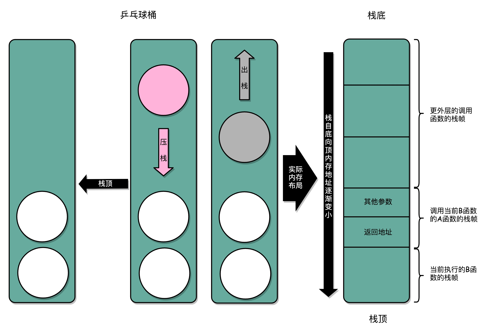

在真实的程序里，压栈的不只有函数调用完成后的返回地址。比如函数 A 在调用 B 的时候，需要传输一些参数数据，这些参数数据在寄存器不够用的时候也会被压入栈中。整个函数 A 所占用的所有内存空间，就是函数 A 的 **栈帧** (Stack Frame) 。

而实际的程序栈布局，顶和底与乒乓球桶相比是倒过来的。底在最上面，顶在最下面，这样的布局是因为栈底的内存地址是在一开始就固定的。而一层层压栈之后，栈顶的内存地址是在逐渐变小而不是变大。

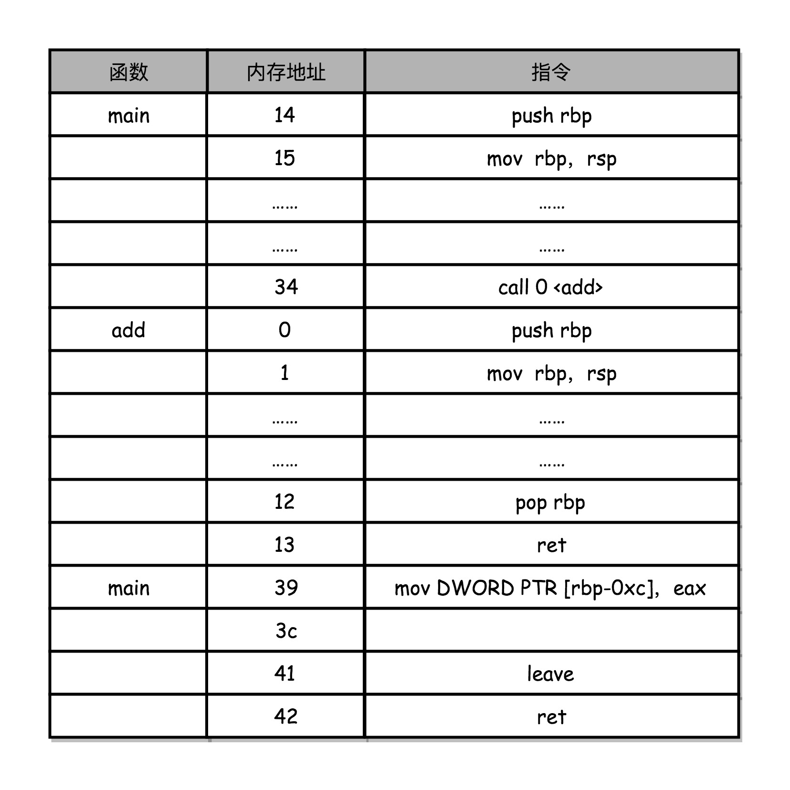

这张图，对应上面函数 add 的汇编代码，main 函数调用 add 函数时，add 函数入口在 0 ～ 1 行，add 函数结束之后在 12 ～ 13 行。

在调用第 34 行的 call 指令时，会把当前的 PC 寄存器里的下一条指令的地址压栈，保留函数调用结束后要执行的指令地址。而 add 函数的第 0 行，push rbp 这个指令，就是在进行压栈。这里的 rbp 又叫栈帧指针（Frame Pointer），是一个存放了当前栈帧位置的寄存器。push rbp 就把之前调用函数，也就是 main 函数的栈帧的栈底地址，压到栈顶。

接着，第 1 行的一条命令 mov rbp, rsp 里，则是把 rsp 这个栈指针（Stack Pointer）的值复制到 rbp 里，而 rsp 始终会指向栈顶。这个命令意味着，rbp 这个栈帧指针指向的地址，变成当前最新的栈顶，也就是 add 函数的栈帧的栈底地址了。

而在函数 add 执行完成之后，又会分别调用第 12 行的 pop rbp 来将当前的栈顶出栈，这部分操作维护好了整个栈帧。然后，可以调用第 13 行的 ret 指令，这时候同时要把 call 调用的时候压入的 PC 寄存器里的下一条指令出栈，更新到 PC 寄存器中，将程序的控制权返回到出栈后的栈顶。

#### 3.3.2 利用函数内联进行性能优化

如果被调用的函数里，没有调用其他函数，可以把这个实际调用的函数产生的指令，直接插入到调用的位置，来替换对应的函数调用指令。

事实上，这就是一个常见的编译器进行自动优化的场景，通常叫函数内联（Inline）。只要在 GCC 编译的时候，加上对应的一个让编译器自动优化的参数 -O，编译器就会在可行的情况下，进行这样的指令替换。

除了依靠编译器的自动优化，还可以在定义函数的地方，加上 inline 的关键字，来提示编译器对函数进行内联。

- 优点 : CPU 需要执行的指令数变少了，根据地址跳转的过程不需要了，压栈和出栈的过程也不用了。
- 缺点 : 内联把可以复用的程序指令在调用它的地方完全展开了。如果一个函数在很多地方都被调用了，那么就会展开很多次，整个程序占用的空间就会变大了。


这样没有调用其他函数，只会被调用的函数，一般称之为叶子函数（或叶子过程）。

### 3.4 ELF 和静态链接

#### 3.4.1 编译、链接和装载：拆解程序执行

C 语言程序是如何变成一个可执行程序的:

```c
// add_lib.c
int add(int a, int b)
{
  return a+b;
}

// link_example.c
#include <stdio.h>
int main()
{
  int a = 10;
  int b = 5;
  int c = add(a, b);
  printf("c = %d\n", c);
}
```

通过 `gcc` 来编译这两个文件，然后通过 `objdump` 命令看看它们的汇编代码。

```txt
gcc -g -c add_lib.c link_example.c
objdump -d -M intel -S add_lib.o
objdump -d -M intel -S link_example.o
```

```c
add_lib.o:     file format elf64-x86-64
Disassembly of section .text:
0000000000000000 <add>:
   0:   55                      push   rbp
   1:   48 89 e5                mov    rbp,rsp
   4:   89 7d fc                mov    DWORD PTR [rbp-0x4],edi
   7:   89 75 f8                mov    DWORD PTR [rbp-0x8],esi
   a:   8b 55 fc                mov    edx,DWORD PTR [rbp-0x4]
   d:   8b 45 f8                mov    eax,DWORD PTR [rbp-0x8]
  10:   01 d0                   add    eax,edx
  12:   5d                      pop    rbp
  13:   c3                      ret


link_example.o:     file format elf64-x86-64
Disassembly of section .text:
0000000000000000 <main>:
   0:   55                      push   rbp
   1:   48 89 e5                mov    rbp,rsp
   4:   48 83 ec 10             sub    rsp,0x10
   8:   c7 45 fc 0a 00 00 00    mov    DWORD PTR [rbp-0x4],0xa
   f:   c7 45 f8 05 00 00 00    mov    DWORD PTR [rbp-0x8],0x5
  16:   8b 55 f8                mov    edx,DWORD PTR [rbp-0x8]
  19:   8b 45 fc                mov    eax,DWORD PTR [rbp-0x4]
  1c:   89 d6                   mov    esi,edx
  1e:   89 c7                   mov    edi,eax
  20:   b8 00 00 00 00          mov    eax,0x0
  25:   e8 00 00 00 00          call   2a <main+0x2a>
  2a:   89 45 f4                mov    DWORD PTR [rbp-0xc],eax
  2d:   8b 45 f4                mov    eax,DWORD PTR [rbp-0xc]
  30:   89 c6                   mov    esi,eax
  32:   48 8d 3d 00 00 00 00    lea    rdi,[rip+0x0]        # 39 <main+0x39>
  39:   b8 00 00 00 00          mov    eax,0x0
  3e:   e8 00 00 00 00          call   43 <main+0x43>
  43:   b8 00 00 00 00          mov    eax,0x0
  48:   c9                      leave
  49:   c3                      ret
```

运行 ./link_example.o。文件没有执行权限，遇到一个 Permission denied 错误。通过 chmod 命令赋予 link_example.o 文件可执行的权限，运行./link_example.o 仍然只会得到一条 cannot execute binary file: Exec format error 的错误。

仔细看 objdump 出来的两个文件的代码，会发现两个程序的地址都是从 0 开始的。如果地址是一样的，程序如果需要通过 call 指令调用函数的话，它怎么知道应该跳转到哪一个文件里呢？
无论是这里的运行报错，还是 objdump 出来的汇编代码里面的重复地址，都是因为 add_lib.o 以及 link_example.o 并不是一个可执行文件（Executable Program），而是目标文件（Object File）。只有通过链接器（Linker）把多个目标文件以及调用的各种函数库链接起来，才能得到一个可执行文件。

通过 gcc 的 -o 参数，可以生成对应的可执行文件，对应执行之后，就可以得到这个简单的加法调用函数的结果。

```c
gcc -o link-example add_lib.o link_example.o
./link_example
c = 15
```

**"C 语言代码 - 汇编代码 - 机器码"** 这个过程，在计算机上进行的时候是由两部分组成的。

- 第一个部分，由编译（Compile）、汇编（Assemble）以及链接（Link）三个阶段组成。在这三个阶段完成之后，就生成了一个可执行文件。
- 第二部分，通过装载器（Loader）把可执行文件装载（Load）到内存中。CPU 从内存中读取指令和数据，来开始真正执行程序。


#### 3.4.2 ELF 格式和链接：理解链接过程

程序最终是通过装载器变成指令和数据的，所以生成的可执行代码也并不仅仅是一条条的指令。通过 objdump 指令，把可执行文件的内容拿出来看。

```c
link_example:     file format elf64-x86-64
Disassembly of section .init:
...
Disassembly of section .plt:
...
Disassembly of section .plt.got:
...
Disassembly of section .text:
...

 6b0:   55                      push   rbp
 6b1:   48 89 e5                mov    rbp,rsp
 6b4:   89 7d fc                mov    DWORD PTR [rbp-0x4],edi
 6b7:   89 75 f8                mov    DWORD PTR [rbp-0x8],esi
 6ba:   8b 55 fc                mov    edx,DWORD PTR [rbp-0x4]
 6bd:   8b 45 f8                mov    eax,DWORD PTR [rbp-0x8]
 6c0:   01 d0                   add    eax,edx
 6c2:   5d                      pop    rbp
 6c3:   c3                      ret
00000000000006c4 <main>:
 6c4:   55                      push   rbp
 6c5:   48 89 e5                mov    rbp,rsp
 6c8:   48 83 ec 10             sub    rsp,0x10
 6cc:   c7 45 fc 0a 00 00 00    mov    DWORD PTR [rbp-0x4],0xa
 6d3:   c7 45 f8 05 00 00 00    mov    DWORD PTR [rbp-0x8],0x5
 6da:   8b 55 f8                mov    edx,DWORD PTR [rbp-0x8]
 6dd:   8b 45 fc                mov    eax,DWORD PTR [rbp-0x4]
 6e0:   89 d6                   mov    esi,edx
 6e2:   89 c7                   mov    edi,eax
 6e4:   b8 00 00 00 00          mov    eax,0x0
 6e9:   e8 c2 ff ff ff          call   6b0 <add>
 6ee:   89 45 f4                mov    DWORD PTR [rbp-0xc],eax
 6f1:   8b 45 f4                mov    eax,DWORD PTR [rbp-0xc]
 6f4:   89 c6                   mov    esi,eax
 6f6:   48 8d 3d 97 00 00 00    lea    rdi,[rip+0x97]        # 794 <_IO_stdin_used+0x4>
 6fd:   b8 00 00 00 00          mov    eax,0x0
 702:   e8 59 fe ff ff          call   560 <printf@plt>
 707:   b8 00 00 00 00          mov    eax,0x0
 70c:   c9                      leave
 70d:   c3                      ret
 70e:   66 90                   xchg   ax,ax
...
Disassembly of section .fini:
...
```

可执行代码 dump 出来内容，和之前的目标代码长得差不多，但是长了很多。因为在 Linux 下，可执行文件和目标文件所使用的都是一种叫 **ELF**（Executable and Linkable File Format）的文件格式，中文名叫 **可执行与可链接文件格式**，这里面不仅存放了编译成的汇编指令，还保留了很多别的数据。
比如过去所有 objdump 出来的代码里，都可以看到对应的函数名称，像 add、main 等等，乃至定义的全局可以访问的变量名称，都存放在这个 ELF 格式文件里。这些名字和它们对应的地址，在 ELF 文件里面，存储在一个叫作符号表（Symbols Table）的位置里。符号表相当于一个地址簿，把名字和地址关联了起来。
先只关注和 add 以及 main 函数相关的部分。会发现，这里面，main 函数里调用 add 的跳转地址，不再是下一条指令的地址了，而是 add 函数的入口地址了，这就是 EFL 格式和链接器的功劳。


ELF 文件格式把各种信息，分成一个一个的 Section 保存起来。ELF 有一个基本的文件头（File Header），用来表示这个文件的基本属性，比如是否是可执行文件，对应的 CPU、操作系统等等。除了这些基本属性之外，大部分程序还有这么一些 Section：

1. 首先是 .text Section，也叫作**代码段**或者指令段（Code Section），用来保存程序的代码和指令
2. 接着是 .data Section，也叫作**数据段**（Data Section），用来保存程序里面设置好的初始化数据信息
3. 然后就是 .rel.text Section，叫作**重定位表**（Relocation Table）。重定位表里，保留的是当前的文件里面，哪些跳转地址其实是不知道的。比如上面的 link_example.o 里面，在 main 函数里面调用了 add 和 printf 这两个函数，但是在链接发生之前，并不知道该跳转到哪里，这些信息就会存储在重定位表里
4. 最后是 .symtab Section，叫作**符号表**（Symbol Table）。符号表保留了当前文件里面定义的函数名称和对应地址的地址簿。

链接器会扫描所有输入的目标文件，然后把所有符号表里的信息收集起来，构成一个全局的符号表。再根据重定位表，把所有不确定要跳转地址的代码，根据符号表里面存储的地址，进行一次修正。最后，把所有的目标文件的对应段进行一次合并，变成了最终的可执行代码。


在链接器把程序变成可执行文件之后，要装载器去执行程序就容易多了。装载器不再需要考虑地址跳转的问题，只需要解析 ELF 文件，把对应的指令和数据，加载到内存里面供 CPU 执行就可以了。

> 同样一个程序，在 Linux 下可以执行而在 Windows 下不能执行了。其中一个非常重要的原因就是，两个操作系统下可执行文件的格式不一样。
> Windows 的可执行文件格式是一种叫作 PE（Portable Executable Format）的文件格式。Linux 下的装载器只能解析 ELF 格式而不能解析 PE 格式。
> Linux 著名的开源项目 Wine，通过兼容 PE 格式的装载器，使得能直接在 Linux 下运行 Windows 程序。而微软的 Windows 也提供了 WSL，也就是 Windows Subsystem for Linux，可以解析和加载 ELF 格式的文件。
> 代码变成可执行文件，不仅仅是把所有代码放在一个文件里来编译执行，而是拆分成不同的函数库，最后通过一个静态链接的机制，使得不同的文件之间既有分工，又能通过静态链接来"合作"，变成一个可执行的程序。
> 对于 ELF 格式的文件，为了能够实现这样一个静态链接的机制，里面不只是简单罗列了程序所需要执行的指令，还会包括链接所需要的重定位表和符号表。

### 3.5 程序装载

装载到内存里面，装载器需要满足两个要求:

1. **可执行程序加载后占用的内存空间应该是连续的。**执行指令的时候，程序计数器是顺序地一条一条指令执行下去。这也就意味着，这一条条指令需要连续地存储在一起。

2. **需要同时加载很多个程序，并且不能让程序自己规定在内存中加载的位置。**虽然编译出来的指令里已经有了对应的各种各样的内存地址，但是实际加载的时候，其实没有办法确保，这个程序一定加载在哪一段内存地址上。因为现在的计算机通常会同时运行很多个程序，可能想要的内存地址已经被其他加载了的程序占用了。

要满足这两个基本的要求，可以在内存里面，找到一段连续的内存空间，然后分配给装载的程序，然后把这段连续的内存空间地址，和整个程序指令里指定的内存地址做一个映射。
指令里用到的内存地址叫作 **虚拟内存地址**（Virtual Memory Address），实际在内存硬件里面的空间地址，叫 **物理内存地址**（Physical Memory Address）。
程序里有指令和各种内存地址，**只需要关心虚拟内存地址**就行了。对于任何一个程序来说，它看到的都是同样的内存地址。维护一个虚拟内存到物理内存的映射表，这样实际程序指令执行的时候，会通过虚拟内存地址，找到对应的物理内存地址，然后执行。因为是连续的内存地址空间，所以只需要维护映射关系的起始地址和对应的空间大小就可以了。

**内存分段**
这种找出一段连续的物理内存和虚拟内存地址进行映射的方法，叫 **分段**（Segmentation）。这里的段，就是指系统分配出来的那个连续的内存空间。

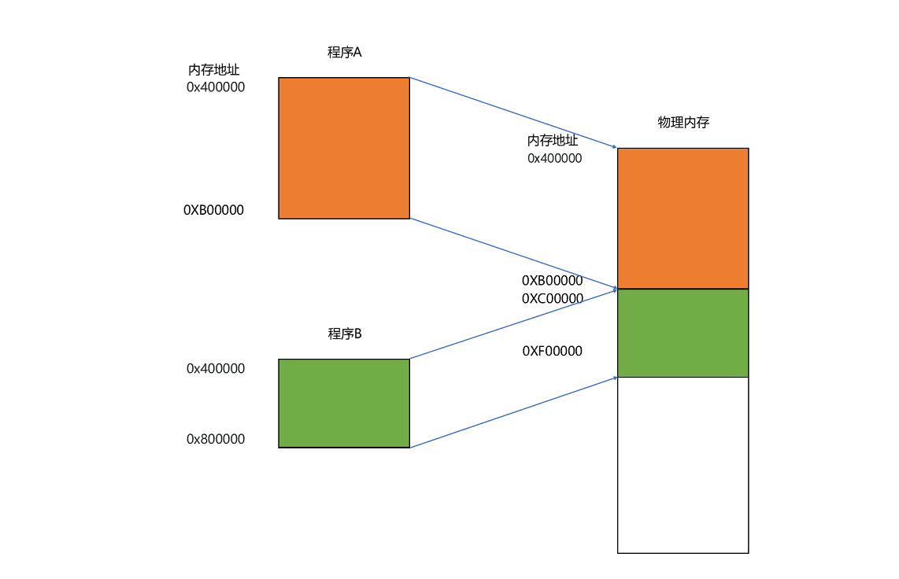

分段的办法很好，解决了程序本身不需要关心具体的物理内存地址的问题，但它也有一些不足之处:

- **内存碎片**（Memory Fragmentation）
  例：一台电脑，有 1GB 的内存。先启动一个图形渲染程序，占用了 512MB 的内存，接着启动一个 Chrome 浏览器，占用了 128MB 内存，再启动一个 Python 程序，占用了 256MB 内存。这个时候，关掉 Chrome，于是空闲内存还有 1024 - 512 - 256 = 256MB。按理来说，有足够的空间再去装载一个 200MB 的程序。但是，这 256MB 的内存空间不是连续的，而是被分成了两段 128MB 的内存。因此，实际情况是，程序没办法加载进来。
  
  - 解决的办法叫**内存交换**（Memory Swapping）
    可以把 Python 程序占用的那 256MB 内存写到硬盘上，然后再从硬盘上读回来到内存里面。不过读回来的时候，不再把它加载到原来的位置，而是紧紧跟在那已经被占用了的 512MB 内存后面。这样，就有了连续的 256MB 内存空间，就可以去加载一个新的 200MB 的程序。如果安装过 Linux 操作系统，应该遇到过分配一个 swap 硬盘分区的问题。这块分出来的磁盘空间，其实就是专门给 Linux 操作系统进行内存交换用的。
    - 内存交换的问题
      虚拟内存、分段，再加上内存交换，看起来似乎已经解决了计算机同时装载运行很多个程序的问题。不过，这三者的组合仍然会遇到一个性能瓶颈。硬盘的访问速度要比内存慢很多，而每一次内存交换，都需要把一大段连续的内存数据写到硬盘上。所以，如果内存交换的时候，交换的是一个很占内存空间的程序，这样整个机器都会显得卡顿。

**内存分页**
既然问题出在内存碎片和内存交换的空间太大上，那么解决问题的办法就是，少出现一些内存碎片。另外，当需要进行内存交换的时候，让需要交换写入或者从磁盘装载的数据更少一点，这样就可以解决这个问题。这个办法，在现在计算机的内存管理里面，就叫作 **内存分页**（Paging）。

**和分段这样分配一整段连续的空间给到程序相比，分页是把整个物理内存空间切成一段段固定尺寸的大小。而对应的程序所需要占用的虚拟内存空间，也会同样切成一段段固定尺寸的大小**。这样一个连续并且尺寸固定的内存空间，叫 **页**（Page）。从虚拟内存到物理内存的映射，不再是拿整段连续的内存的物理地址，而是按照一个一个页来的。页的尺寸一般远远小于整个程序的大小。在 Linux 下，通常只设置成 4KB。可以通过 `getconf PAGE_SIZE` 看看 Linux 系统设置的页的大小。
由于内存空间都是预先划分好的，也就没有了不能使用的碎片，而只有被释放出来的很多 4KB 的页。即使内存空间不够，需要让现有的、正在运行的其他程序，通过内存交换释放出一些内存的页出来，一次性写入磁盘的也只有少数的一个页或者几个页，不会花太多时间，让整个机器被内存交换的过程给卡住。


更进一步地，分页的方式使得在加载程序的时候，不再需要一次性都把程序加载到物理内存中。完全可以在进行虚拟内存和物理内存的页之间的映射之后，并不真的把页加载到物理内存里，而是只在程序运行中，需要用到对应虚拟内存页里面的指令和数据时，再加载到物理内存里面去。
实际上，操作系统，的确是这么做的。当要读取特定的页，却发现数据并没有加载到物理内存里的时候，就会触发一个来自于 CPU 的 **缺页错误**（Page Fault）。操作系统会捕捉到这个错误，然后将对应的页，从存放在硬盘上的虚拟内存里读取出来，加载到物理内存里。这种方式，使得计算机可以运行那些远大于实际物理内存的程序。同时，这样一来，任何程序都不需要一次性加载完所有指令和数据，只需要加载当前需要用到就行了。
**通过 虚拟内存、内存交换和内存分页 这三个技术的组合，最终得到了一个让程序不需要考虑实际的物理内存地址、大小和当前分配空间的解决方案**。这些技术和方法，对于程序的编写、编译和链接过程都是透明的。这也是在计算机的软硬件开发中常用的一种方法，就是**加入一个间接层**。
通过引入虚拟内存、页映射和内存交换，程序本身，就不再需要考虑对应的真实的内存地址、程序加载、内存管理等问题了。任何一个程序，都只需要把内存当成是一块完整而连续的空间来直接使用。

### 3.6 动态链接

程序的链接，是把对应的不同文件内的代码段，合并到一起，最后成为可执行文件。这个链接的方式，让代码的时候做到了"复用"。同样的功能代码只要写一次，然后提供给不同的程序进行链接就行了。
但是，如果有很多个程序都要通过装载器装载到内存里面，那里面链接好的同样的功能代码，也都需要再装载一遍，再占一遍内存空间。占用的内存空间就会特别大。

**链接可以分动、静，共享运行省内存**:

**最根本的问题其实就是内存空间不够用**。于是想到了，让同样功能的代码，在不同的程序里面，不需要各占一份内存空间，共享代码。
这个思路就引入一种新的链接方法，叫**动态链接**（Dynamic Link）。相应的，之前说的合并代码段的方法，就是静态链接（Static Link）。

在动态链接的过程中，想要"链接"的，不是存储在硬盘上的目标文件代码，而是加载到内存中的**共享库**（Shared Libraries）。顾名思义，这里的共享库重在"共享"这两个字。
这个加载到内存中的共享库会被很多个程序的指令调用到。在 Windows 下，这些共享库文件就是 .dll 文件，也就是 Dynamic-Link Library（DLL，动态链接库）。在 Linux 下，这些共享库文件就是 .so 文件，也就是 Shared Object（一般也称之为动态链接库）。这两大操作系统下的文件名后缀，一个用了"动态链接"的意思，另一个用了"共享"的意思，正好覆盖了两方面的含义。

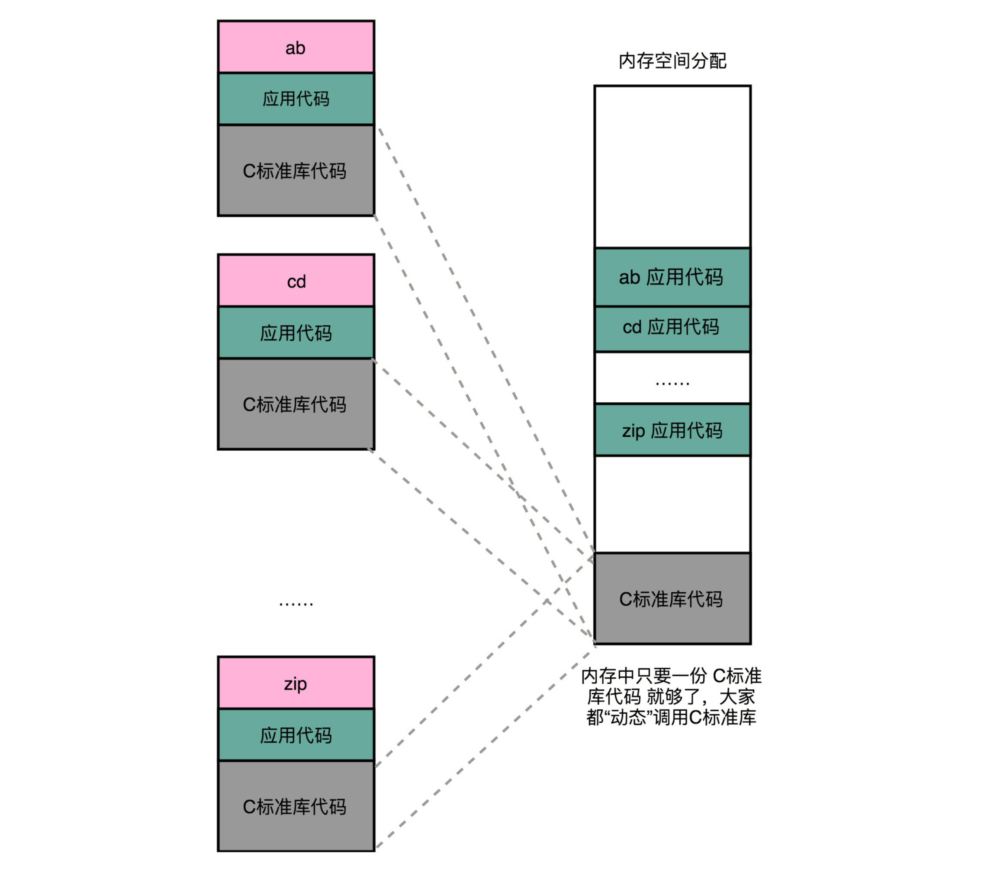

**地址无关很重要，相对地址解烦恼**:

不过，要想要在程序运行的时候共享代码，也有一定的要求，就是这些机器码必须是"地址无关"的。也就是说，编译出来的共享库文件的指令代码，是地址无关码（Position-Independent Code）。换句话说就是，这段代码，无论加载在哪个内存地址，都能够正常执行。如果不是这样的代码，就是地址相关的代码。
大部分函数库其实都可以做到地址无关，因为它们都接受特定的输入，进行确定的操作，然后给出返回结果就好了。无论是实现一个向量加法，还是实现一个打印的函数，这些代码逻辑和输入的数据在内存里面的位置并不重要。
而常见的地址相关的代码，比如绝对地址代码（Absolute Code）、利用重定位表的代码等等，都是地址相关的代码。重定位表。在程序链接的时候，就把函数调用后要跳转访问的地址确定下来了，这意味着，如果这个函数加载到一个不同的内存地址，跳转就会失败。


对于所有动态链接共享库的程序来讲，虽然共享库用的都是同一段物理内存地址，但是在不同的应用程序里，它所在的虚拟内存地址是不同的。没办法、也不应该要求动态链接同一个共享库的不同程序，必须把这个共享库所使用的虚拟内存地址变成一致。
动态代码库内部的变量和函数调用都很容易解决，只需要使用**相对地址**（Relative Address）就好了。各种指令中使用到的内存地址，给出的不是一个绝对的地址空间，而是一个相对于当前指令偏移量的内存地址。因为整个共享库是放在一段连续的虚拟内存地址中的，无论装载到哪一段地址，不同指令之间的相对地址都是不变的。

**PLT 和 GOT，动态链接的解决方案**:

要实现动态链接共享库，也并不困难，和前面的静态链接里的符号表和重定向表类似，首先，lib.h 定义了动态链接库的一个函数 show_me_the_money。

```c
// lib.h
#ifndef LIB_H
#define LIB_H

void show_me_the_money(int money);

#endif
```

lib.c 包含了 lib.h 的实际实现。

```c
// lib.c
#include <stdio.h>

void show_me_the_money(int money)
{
  printf("Show me USD %d from lib.c \n", money);
}
```

然后，show_me_poor.c 调用了 lib 里面的函数。

```c
// show_me_poor.c
#include "lib.h"
int main()
{
  int money = 5;
  show_me_the_money(money);
}
```

最后，把 lib.c 编译成了一个动态链接库，也就是 .so 文件。

```shell
gcc lib.c -fPIC -shared -o lib.so
gcc -o show_me_poor show_me_poor.c ./lib.so
```

可以看到，在编译的过程中，指定了一个 **-fPIC** 的参数。这个参数其实就是 Position Independent Code 的意思，也就是要把这个编译成一个地址无关代码。然后，再通过 gcc 编译 show_me_poor 动态链接了 lib.so 的可执行文件。在这些操作都完成了之后，把 show_me_poor 这个文件通过 objdump 出来看一下。

```shell
objdump -d -M intel -S show_me_poor
```

```shell
……
0000000000400540 <show_me_the_money@plt-0x10>:
  400540:       ff 35 12 05 20 00       push   QWORD PTR [rip+0x200512]        # 600a58 <_GLOBAL_OFFSET_TABLE_+0x8>
  400546:       ff 25 14 05 20 00       jmp    QWORD PTR [rip+0x200514]        # 600a60 <_GLOBAL_OFFSET_TABLE_+0x10>
  40054c:       0f 1f 40 00             nop    DWORD PTR [rax+0x0]

0000000000400550 <show_me_the_money@plt>:
  400550:       ff 25 12 05 20 00       jmp    QWORD PTR [rip+0x200512]        # 600a68 <_GLOBAL_OFFSET_TABLE_+0x18>
  400556:       68 00 00 00 00          push   0x0
  40055b:       e9 e0 ff ff ff          jmp    400540 <_init+0x28>
……
0000000000400676 <main>:
  400676:       55                      push   rbp
  400677:       48 89 e5                mov    rbp,rsp
  40067a:       48 83 ec 10             sub    rsp,0x10
  40067e:       c7 45 fc 05 00 00 00    mov    DWORD PTR [rbp-0x4],0x5
  400685:       8b 45 fc                mov    eax,DWORD PTR [rbp-0x4]
  400688:       89 c7                   mov    edi,eax
  40068a:       e8 c1 fe ff ff          call   400550 <show_me_the_money@plt>
  40068f:       c9                      leave
  400690:       c3                      ret
  400691:       66 2e 0f 1f 84 00 00    nop    WORD PTR cs:[rax+rax*1+0x0]
  400698:       00 00 00
  40069b:       0f 1f 44 00 00          nop    DWORD PTR [rax+rax*1+0x0]
……
```

可以看到，在 main 函数调用 show_me_the_money 的函数的时候，对应的代码是这样的

```shell
call   400550 <show_me_the_money@plt>
```

这里后面有一个 **@plt** 的关键字，代表了需要从 PLT，也就是程序链接表（Procedure Link Table）里面找要调用的函数。对应的地址，则是 400550 这个地址。
上面的 400550 这个地址，又会看到里面进行了一次跳转，这个跳转指定的跳转地址，可以在后面的注释里面可以看到，GLOBAL_OFFSET_TABLE+0x18。这里的 GLOBAL_OFFSET_TABLE，就是接下来的全局偏移表。

```shell
400550:       ff 25 12 05 20 00       jmp    QWORD PTR [rip+0x200512]        # 600a68 <_GLOBAL_OFFSET_TABLE_+0x18>
```

在动态链接对应的共享库，在共享库的 data section 里面，保存了一张全局偏移表（GOT，Global Offset Table）。**虽然共享库的代码部分的物理内存是共享的，但是数据部分是各个动态链接它的应用程序里面各加载一份的**。所有需要引用当前共享库外部的地址的指令，都会查询 GOT，来找到当前运行程序的虚拟内存里的对应位置。而 GOT 表里的数据，则是在加载一个个共享库的时候写进去的。
不同的进程，调用同样的 lib.so，各自 GOT 里面指向最终加载的动态链接库里面的虚拟内存地址是不同的。这样，虽然不同的程序调用的同样的动态库，各自的内存地址是独立的，调用的又都是同一个动态库，但是不需要去修改动态库里面的代码所使用的地址，而是各个程序各自维护好自己的 GOT，能够找到对应的动态库就好了。

.jpg>)

GOT 表位于共享库自己的数据段里。GOT 表在内存里和对应的代码段位置之间的偏移量，始终是确定的。这样，共享库就是地址无关的代码，对应的各个程序只需要在物理内存里面加载同一份代码。而又要通过各个可执行程序在加载时，生成的各不相同的 GOT 表，来找到它需要调用到的外部变量和函数的地址。
这是一个典型的、不修改代码，而是通过修改"地址数据"来进行关联的办法。它有点像在 C 语言里面用函数指针来调用对应的函数，并不是通过预先已经确定好的函数名称来调用，而是利用当时它在内存里面的动态地址来调用。

### 3.7 二进制编码

#### 3.7.1 理解二进制的"逢二进一"

二进制和平时用的十进制，其实并没有什么本质区别，只是平时是"逢十进一"，二进制变成了"逢二进一"而已。每一位，相比于十进制下的 0 ～ 9 这十个数字，只能用 0 和 1 这两个数字。

任何一个十进制的整数，都能通过二进制表示出来。把一个二进制数，对应到十进制，就是把从右到左的第 N 位，乘上一个 2 的 N 次方，然后加起来，就变成了一个十进制数。二进制是一个面向程序员的"语言"，这个从右到左的位置，自然是从 0 开始的。

比如 0011 这个二进制数，对应的十进制表示，就是 0×2^3^ + 0×2^2^ + 1×2^1^ + 1 × 2^0^ = 3，代表十进制的 3。

对应地，如果想要把一个十进制的数，转化成二进制，使用**短除法**就可以了。也就是，把十进制数除以 2 的余数，作为最右边的一位。然后用商继续除以 2，把对应的余数紧靠着刚才余数的右侧，这样递归迭代，直到商为 0 就可以了。
比如，想把 13 这个十进制数，用短除法转化成二进制，需要经历以下几个步骤：

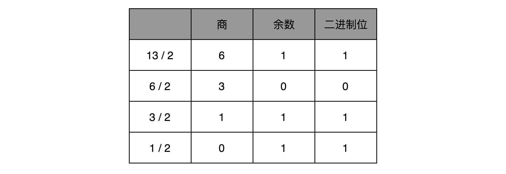

因此，对应的二进制数，就是 1101。

刚才举的例子都是正数，对于负数来说，情况也是一样的吗？可以把一个数最左侧的一位，当成是对应的正负号，比如 0 为正数，1 为负数，这样来进行标记。
这样，一个 4 位的二进制数， 0011 就表示为 +3。而 1011 最左侧的第一位是 1，所以它就表示 -3。这个其实就是整数的**原码表示法**。原码表示法有一个很直观的缺点就是，0 可以用两个不同的编码来表示，1000 代表 0， 0000 也代表 0。

于是，就有了另一种表示方法。仍然通过最左侧第一位的 0 和 1，来判断这个数的正负。但是，不再把这一位当成单独的符号位，在剩下几位计算出的十进制前加上正负号，而是在计算整个二进制值的时候，在左侧最高位前面加个负号。

比如，一个 4 位的二进制补码数值 1011，转换成十进制，就是 −1×2^3 + 0×2^2^ + 1×2^1^ + 1×2^0^ = −5。

如果最高位是 1，这个数必然是负数；最高位是 0，必然是正数。并且，只有 0000 表示 0，1000 在这样的情况下表示 -8。一个 4 位的二进制数，可以表示从 -8 到 7 这 16 个整数，不会白白浪费一位。

当然更重要的一点是，用补码来表示负数，使得整数相加变得很容易，不需要做任何特殊处理，只是把它当成普通的二进制相加，就能得到正确的结果。

拿一个 4 位的整数来算一下，比如 -5 + 1 = -4，-5 + 6 = 1。各自把它们转换成二进制。如果它们和无符号的二进制整数的加法用的是同样的计算方式，这也就意味着它们是同样的电路。
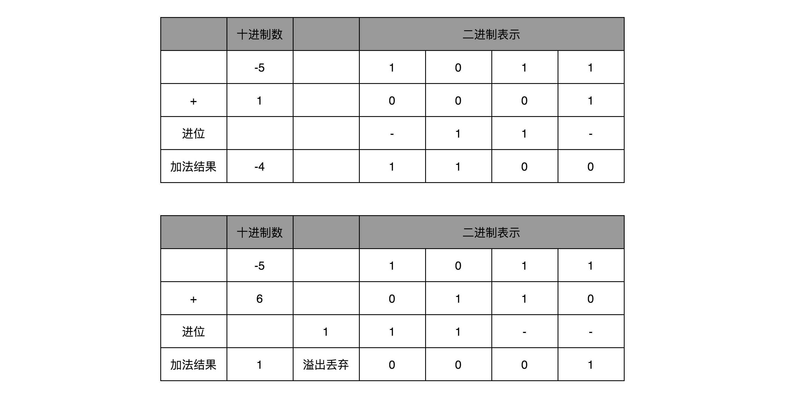

#### 3.7.2 字符串的表示，从编码到数字

不仅数值可以用二进制表示，字符乃至更多的信息都能用二进制表示。最典型的例子就是**字符串**（Character String）。最早计算机只需要使用英文字符，加上数字和一些特殊符号，然后用 8 位的二进制，就能表示日常需要的所有字符了，这个就是常用的 **ASCII 码**（American Standard Code for Information Interchange，美国信息交换标准代码）。

ASCII 码就好比一个字典，用 8 位二进制中的 128 个不同的数，映射到 128 个不同的字符里。比如，小写字母 a 在 ASCII 里面，就是第 97 个，也就是二进制的 0110 0001，对应的十六进制表示就是 61。而大写字母 A，就是第 65 个，也就是二进制的 0100 0001，对应的十六进制表示就是 41。

在 ASCII 码里面，数字 9 不再像整数表示法里一样，用 0000 1001 来表示，而是用 0011 1001 来表示。字符串 15 也不是用 0000 1111 这 8 位来表示，而是变成两个字符 1 和 5 连续放在一起，也就是 0011 0001 和 0011 0101，需要用两个 8 位来表示。

可以看到，最大的 32 位整数，就是 2147483647。如果用整数表示法，只需要 32 位就能表示了。但是如果用字符串来表示，一共有 10 个字符，每个字符用 8 位的话，需要整整 80 位。比起整数表示法，要多占很多空间。

这也是为什么，很多时候在存储数据的时候，要采用二进制序列化这样的方式，而不是简单地把数据通过 CSV 或者 JSON，这样的文本格式存储来进行序列化。**不管是整数也好，浮点数也好，采用二进制序列化会比存储文本省下不少空间**。

ASCII 码只表示了 128 个字符，一开始倒也堪用，然而随着越来越多的不同国家的人都用上了计算机，想要表示譬如中文这样的文字，128 个字符显然是不太够用的。于是，计算机工程师们开始，给自己国家的语言创建了对应的**字符集**（Charset）和**字符编码**（Character Encoding）。

**字符集**，表示的可以是字符的一个集合。比如"中文"就是一个字符集，不过这样描述一个字符集并不准确。想要更精确一点，可以说，"第一版《新华字典》里面出现的所有汉字"，这是一个字符集。这样，才能明确知道，一个字符在不在这个集合里面。比如，日常说的 Unicode，其实就是一个字符集，包含了 150 种语言的 14 万个不同的字符。
而**字符编码**则是对于字符集里的这些字符，怎么一一用二进制表示出来的一个字典。上面说的 Unicode，就可以用 UTF-8、UTF-16，乃至 UTF-32 来进行编码，存储成二进制。所以，有了 Unicode，其实可以用不止 UTF-8 一种编码形式，也可以自己发明一套 GT-32 编码。只要别人知道这套编码规则，就可以正常传输、显示这段代码。


> 同样的文本，采用不同的编码存储下来。如果另外一个程序，用一种不同的编码方式来进行解码和展示，就会出现乱码。在中文里，最典型的就是"锟斤拷" 和 "烫烫烫"。
> 如果想要用 Unicode 编码记录一些文本，特别是一些遗留的老字符集内的文本，但是这些字符在 Unicode 中可能并不存在。于是，Unicode 会统一把这些字符记录为 U+FFFD 这个编码。如果用 UTF-8 的格式存储下来，就是 \xef\xbf\xbd。如果连续两个这样的字符放在一起，\xef\xbf\xbd\xef\xbf\xbd，这个时候，如果程序把这个字符，用 GB2312 的方式进行 decode，就会变成"锟斤拷"。
> 而"烫烫烫"，则是因为用了 Visual Studio 的调试器，默认使用 MBCS 字符集。"烫"在里面是由 0xCCCC 来表示的，而 0xCC 又恰好是未初始化的内存的赋值。于是，在读到没有赋值的内存地址或者变量的时候，就变成"烫烫烫"了。

### 3.8 理解电路

电报传输的信号有两种，一种是短促的**点信号**（dot 信号），一种是长一点的**划信号**（dash 信号）。把"点"当成"1"，把"划"当成"0"。这样一来，电报信号就是另一种特殊的二进制编码了。电影里最常见的电报信号是"SOS"，这个信号表示出来就是 "点点点划划划点点点"。

比起灯塔和烽火台这样的设备，电报信号有两个明显的优势。

- 信号的传输距离迅速增加。因为电报本质上是通过电信号来进行传播的，所以从输入信号到输出信号基本上没有延时。
- 输入信号的速度加快了很多。电报机只有一个按钮，按下就是输入信号，按的时间短一点，就是发出了一个"点"信号；按的时间长一些，就是一个"划"信号。

而且，制造一台电报机也非常容易。电报机本质上就是一个"蜂鸣器 + 长长的电线 + 按钮开关"。蜂鸣器装在接收方手里，开关留在发送方手里。双方用长长的电线连在一起。当按钮开关按下的时候，电线的电路接通了，蜂鸣器就会响。短促地按下，就是一个短促的点信号；按的时间稍微长一些，就是一个稍长的划信号。

#### 3.8.1 继电器

有了电报机，只要铺设好电报线路，就可以传输需要的讯息了。但是这里面又出现了一个新的挑战，就是随着电线的线路越长，电线的电阻就越大。当电阻很大，而电压不够的时候，即使按下开关，蜂鸣器也不会响。

对于电报来说，电线太长了，使得线路接通也没有办法让蜂鸣器响起来。那么，就不要一次铺太长的线路，而把一小段距离当成一个线路。也可以跟驿站建立一个小电报站，在小电报站里面安排一个电报员。他听到上一个小电报站发来的信息，然后原样输入，发到下一个电报站去。这样，信号就可以一段段传输下去，而不会因为距离太长，导致电阻太大，没有办法成功传输信号。为了能够实现这样**接力传输信号**，在电路里面，工程师们造了一个叫作**继电器**（Relay）的设备。

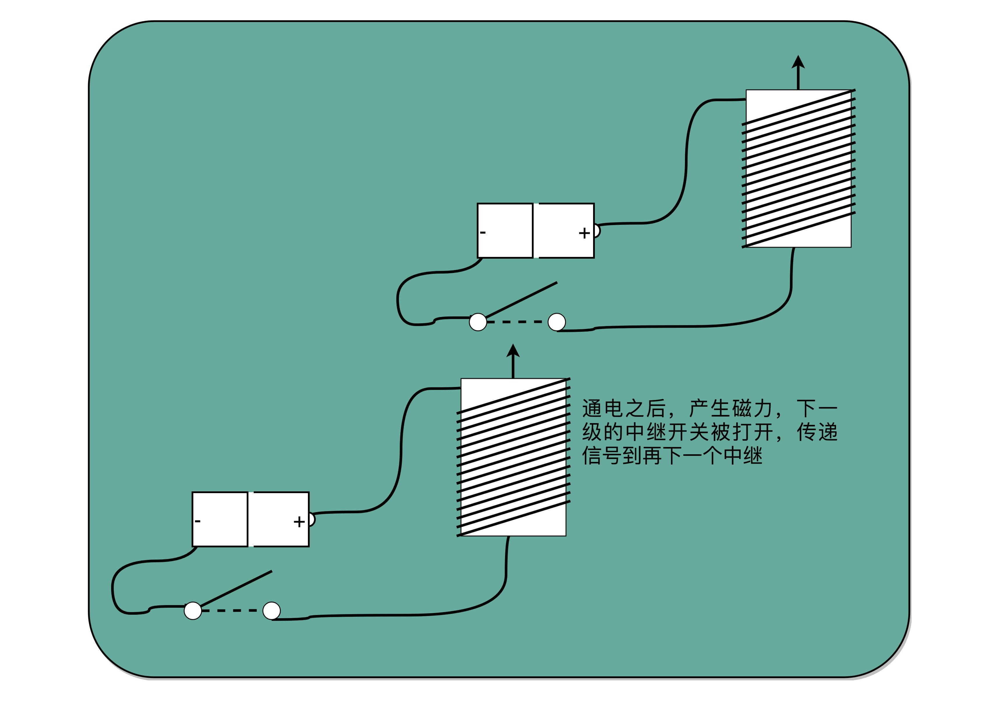

事实上，这个过程中，需要在每一阶段原样传输信号，相比使用人工听蜂鸣器的声音，来重复输入信号，利用电磁效应和磁铁，来实现这个事情会更容易。

把原先用来输出声音的蜂鸣器，换成一段环形的螺旋线圈，让电路封闭通上电。因为电磁效应，这段螺旋线圈会产生一个带有磁性的电磁场。原本需要输入的按钮开关，就可以用一块磁力稍弱的磁铁把它设在"关"的状态。这样，按下上一个电报站的开关，螺旋线圈通电产生了磁场之后，磁力就会把开关"吸"下来，接通到下一个电报站的电路。

如果在中间所有小电报站都用这个"螺旋线圈 + 磁性开关"的方式，来替代蜂鸣器和普通开关，而只在电报的始发和终点用普通的开关和蜂鸣器，就有了一个拆成一段一段的电报线路，接力传输电报信号。这样，就不需要中间安排人力来听打电报内容，也不需要解决因为线缆太长导致的电阻太大或者电压不足的问题了。只要在终点站安排电报员，听写最终的电报内容就可以了。
事实上，继电器还有一个名字就叫作**电驿**，这个"驿"就是驿站的驿。这个接力的策略不仅可以用在电报中，在通信类的科技产品中其实都可以用到。
比如，家里用 WiFi，如果屋子比较大，可能某些房间的信号就不好。可以选用支持"中继"的 WiFi 路由器，在信号衰减的地方，增加一个 WiFi 设备，接收原来的 WiFi 信号，再重新从当前节点传输出去。这种中继对应的英文名词和继电器是一样的，也叫 Relay。

有了继电器之后，不仅有了一个能够接力传输信号的方式，更重要的是，和输入端通过开关的"开"和"关"来表示"1"和"0"一样，在输出端也能表示"1"和"0"了。

输出端的作用，不仅仅是通过一个蜂鸣器或者灯泡，提供一个供人观察的输出信号，通过"螺旋线圈 + 磁性开关"，使得有"开"和"关"这两种状态，这个"开"和"关"表示的"1"和"0"，还可以作为后续线路的输入信号，通过最简单的电路，来组合形成需要的逻辑。

通过这些线圈和开关，也可以很容易地创建出 "与（AND）" "或（OR）" "非（NOT）" 这样的逻辑。在输入端的电路上，提供串联的两个开关，只有两个开关都打开，电路才接通，输出的开关也才能接通，这其实就是模拟了计算机里面的"与"操作。
在输入端的电路，提供两条独立的线路到输出端，两条线路上各有一个开关，那么任何一个开关打开了，到输出端的电路都是接通的，这其实就是模拟了计算机中的"或"操作。
当把输出端的"螺旋线圈 + 磁性开关"的组合，从默认关掉，只有通电有了磁场之后打开，换成默认是打开通电的，只有通电之后才关闭，就得到了一个计算机中的"非"操作。输出端开和关正好和输入端相反。这个在数字电路中，也叫作**反向器**（Inverter）。

反向器的电路，其实就是开关从默认关闭变成默认开启而已

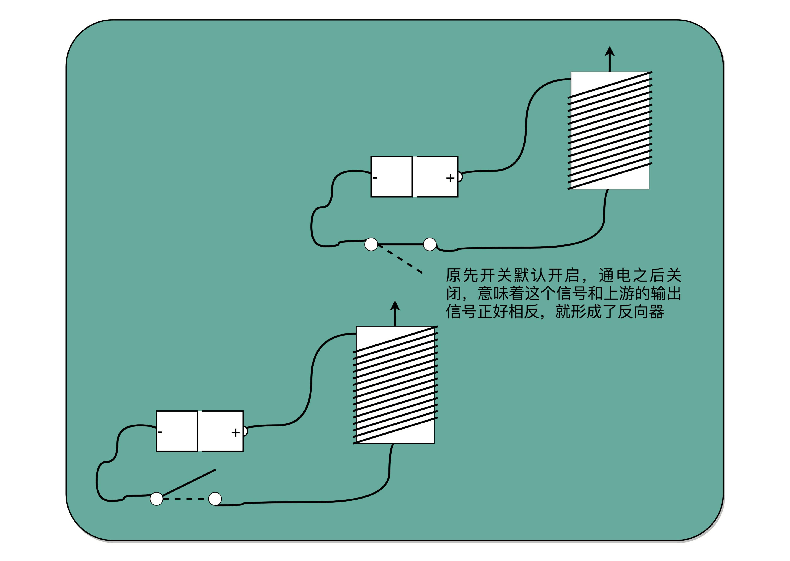

与、或、非的电路都非常简单，要想做稍微复杂一点的工作，需要很多电路的组合。不过，这也彰显了**现代计算机体系中一个重要的思想，就是通过分层和组合，逐步搭建起更加强大的功能**。

### 3.9 加法器


这些基本的门电路，是计算机硬件端的最基本的"积木"。

#### 3.9.1 异或门和半加器

基础门电路，都是输入两个单独的 bit，输出是一个单独的 bit。如果要对 2 个 8 位（bit）的数，计算与、或、非这样的简单逻辑运算。只要连续摆放 8 个开关，来代表一个 8 位数。这样的两组开关，从左到右，上下单个的位开关之间，都统一用"与门"或者"或门"连起来，就是两个 8 位数的 AND 或者 OR 的运算了。

比起 AND 或者 OR 这样的电路外，要想实现整数的加法，就需要组建稍微复杂一点儿的电路了。

先回归一个最简单的 8 位的无符号整数的加法。这里的"无符号"，表示并不需要使用补码来表示负数。无论高位是"0"还是"1"，这个整数都是一个正数。

要表示一个 8 位数的整数，简单地用 8 个 bit。那 2 个 8 位整数的加法，就是 2 排 8 个开关。加法得到的结果也是一个 8 位的整数，所以又需要 1 排 8 位的开关。要想实现加法，就要看一下，通过什么样的门电路，能够连接起加数和被加数，得到最后期望的和。


要做到这一点，可以用**列竖式**来计算。从右到左，一位一位进行计算，只是把从逢 10 进 1 变成逢 2 进 1。

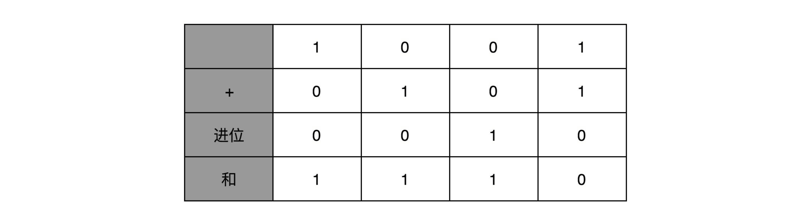

先看最简单的个位数加法。输入一共是 4 种组合，00、01、10、11。得到的结果，也不复杂。一方面，需要知道，加法计算之后的个位是什么，在输入的两位是 00 和 11 的情况下，对应的输出都应该是 0；在输入的两位是 10 和 01 的情况下，输出都是 1。

讲与、或、非门的时候，很容易就能和程序里面的 "AND（通常是 & 符号）" " OR（通常是 | 符号）" 和 " NOT（通常是 ! 符号）" 对应起来。那为什么会需要"异或（XOR）"，这样一个在逻辑运算里面没有出现的形式，作为一个基本电路。**其实，异或门就是一个最简单的整数加法，所需要使用的基本门电路**。

算完个位的输出还不算完，输入的两位都是 11 的时候，还需要向更左侧的一位进行进位。那这个就对应一个与门，也就是有且只有在加数和被加数都是 1 的时候，进位才会是 1。所以，通过一个异或门计算出个位，通过一个与门计算出是否进位，就通过电路算出了一个一位数的加法。于是，**把两个门电路打包，给它取一个名字，就叫作半加器**（Half Adder）。


#### 3.9.2 全加器

半加器可以解决个位的加法问题，但是如果放到二位上来说，就不够用了。这里的竖式是个二进制的加法，所以如果从右往左数，第二列不是十位，称之为"二位"。对应的再往左，就应该分别是四位、八位。

二位用一个半加器不能计算完成的原因也很简单。因为二位除了一个加数和被加数之外，还需要加上来自个位的进位信号，一共需要三个数进行相加，才能得到结果。

**解决方案**
用两个半加器和一个或门，就能组合成一个全加器。第一个半加器，用和个位的加法一样的方式，得到是否进位 X 和对应的二个数加和后的结果 Y，这样两个输出。然后，把这个加和后的结果 Y，和个位数相加后输出的进位信息 U，再连接到一个半加器上，就会再拿到一个是否进位的信号 V 和对应的加和后的结果 W。


这个 W 就是在二位上留下的结果。把两个半加器的进位输出，作为一个或门的输入连接起来，只要两次加法中任何一次需要进位，那么在二位上，就会向左侧的四位进一位。因为一共只有三个 bit 相加，即使 3 个 bit 都是 1，也最多会进一位。

这样，通过两个半加器和一个或门，就得到了一个，能够接受进位信号、加数和被加数，这样三个数组成的加法。这就是需要的全加器。

有了全加器，要进行对应的两个 8 bit 数的加法就很容易了。只要把 8 个全加器串联起来就好了。个位的全加器的进位信号作为二位全加器的输入信号，二位全加器的进位信号再作为四位的全加器的进位信号。这样一层层串接八层，就得到了一个支持 8 位数加法的算术单元。如果要扩展到 16 位、32 位，乃至 64 位，都只需要多串联几个输入位和全加器就好了。


> **注意**:
> 对于这个全加器，在个位，只需要用一个半加器，或者让全加器的进位输入始终是 0。因为个位没有来自更右侧的进位。而最左侧的一位输出的进位信号，表示的并不是再进一位，而是表示我们的加法是否溢出了。
> int 是 16 位的整数加法，结果也是 16 位数，那怎么知道加法最终是否溢出了呢？因为结果也只存得下加法结果的 16 位数。并没有留下一个第 17 位，来记录这个加法的结果是否溢出。
> 看到全加器的电路设计，就应该能明白，在整个加法器的结果中，其实有一个电路的信号，会标识出加法的结果是否溢出。可以把这个对应的信号，输出给到硬件中其他标志位里，让计算机知道计算的结果是否溢出。而现代计算机也正是这样做的。这就是为什么在撰写程序的时候，能够知道计算结果是否溢出在硬件层面得到的支持。

通过门电路来搭建算术计算的一个小功能，就好像搭积木一样。用两个门电路，搭出一个半加器，然后再用两个半加器和一个或电路，搭建一个全加器，再用全加器搭建出加法器，加法器并不关注半加器是怎么搭建的。这其实就是计算机中，无论软件还是硬件中一个很重要的设计思想，**分层**。

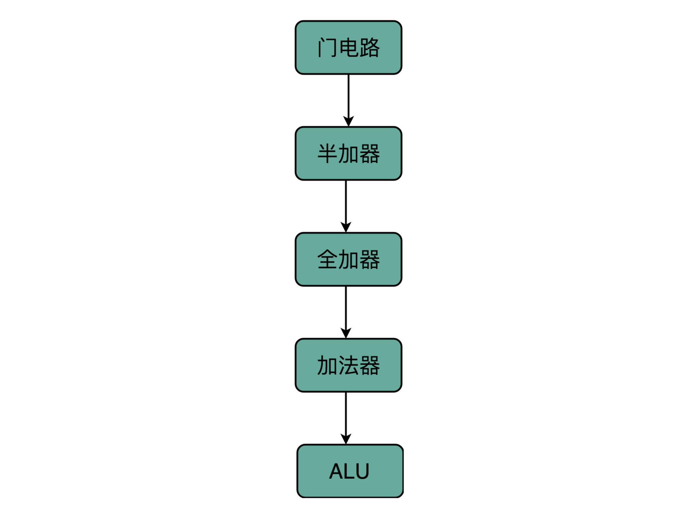

从简单到复杂，一层层搭出了拥有更强能力的功能组件。在上面的一层，只需要考虑怎么用下一层的组件搭建出自己的功能，而不需要下沉到更低层的其他组件。就像没有深入学习过计算机组成原理，一样可以直接通过高级语言撰写代码，实现功能。

在硬件层面，通过门电路、半加器、全加器一层层搭出了加法器这样的功能组件。把这些用来做算术逻辑计算的组件叫作 ALU，也就是算术逻辑单元。当进一步打造强大的 CPU 时，不会再去关注最细颗粒的门电路，只需要把门电路组合而成的 ALU，当成一个能够完成基础计算的黑盒子就可以了。

以此类推，理解 CPU 的设计和数据通路的时候，以 ALU 为一个基础单元来解释问题，也就够了。

> 出于性能考虑，实际 CPU 里面使用的加法器，比起以上电路还有些差别，会更复杂一些。真实的加法器，使用的是一种叫作 **超前进位加法器** 的东西。可以找到北京大学在 Coursera 上开设的《计算机组成》课程中的 Video-306 "加法器优化"一节，了解一下超前进位加法器的实现原理，以及为什么要使用它。

### 3.10 乘法器

十进制中的 13 乘以 9，计算的结果应该是 117。通过转换成二进制，然后列竖式的办法，来看整个计算的过程是怎样的。


#### 3.10.1 顺序乘法的实现过程

从列出竖式的过程中会发现，单个位置上，乘数只能是 0 或者 1，所以实际的乘法，就退化成了位移和加法。

在 13×9 这个例子里面，被乘数 13 表示成二进制是 1101，乘数 9 在二进制里面是 1001。最右边的个位是 1，所以个位乘以被乘数，就是把被乘数 1101 复制下来。因为二位和四位都是 0，所以乘以被乘数都是 0，那么保留下来的都是 0000。乘数的八位是 1，仍然需要把被乘数 1101 复制下来。不过这里和个位位置的单纯复制有一点小小的差别，那就是要把复制好的结果向左侧移三位，然后把四位单独进行乘法加位移的结果，再加起来，就得到了最终的计算结果。

对应到之前的 数字电路 和 ALU，可以看到，最后一步的加法，可以用上一讲的加法器来实现。乘法因为只有"0"和"1"两种情况，所以可以做成输入输出都是 4 个开关，中间用 1 个开关，同时来控制这 8 个开关的方式，这就实现了二进制下的单位的乘法。


可以用一个开关来决定，下面的输出是完全复制输入，还是将输出全部设置为 0

至于位移也不麻烦，只要不是直接连线，把正对着的开关之间进行接通，而是斜着错开位置去接就好了。如果要左移一位，就错开一位接线；如果要左移两位，就错开两位接线。


这样，并不需要引入任何新的、更复杂的电路，仍然用最基础的电路，只要用不同的接线方式，就能够实现一个"列竖式"的乘法。而且，因为二进制下，只有 0 和 1，也就是开关的开和闭这两种情况，所以计算机也不需要单独实现一个更复杂的电路，就能够实现乘法。

为了节约一点开关，也就是晶体管的数量。实际上，像 13×9 这样两个四位数的乘法，不需要把四次单位乘法的结果，用四组独立的开关单独都记录下来，然后再把这四个数加起来。因为这样做，需要很多组开关。如果顺序地来计算，只需要一组开关就好了。

先拿乘数最右侧的个位乘以被乘数，然后把结果写入用来存放计算结果的开关里面，然后，把被乘数左移一位，把乘数右移一位，仍然用乘数去乘以被乘数，然后把结果加到刚才的结果上。反复重复这一步骤，直到不能再左移和右移位置。这样，乘数和被乘数就像两列相向而驶的列车，仅仅需要简单的加法器、一个可以左移一位的电路和一个右移一位的电路，就能完成整个乘法。


乘法器硬件结构示意图里的控制测试，其实就是通过一个时钟信号，来控制左移、右移以及重新计算乘法和加法的时机。还是以计算 13×9，也就是二进制的 1101×1001 来具体看。


这个计算方式虽然节约电路了，但是也有一个很大的缺点，那就是慢。

在这个乘法器的实现过程里，其实就是把乘法展开，变成了 "加法 + 位移" 来实现。用的是 4 位数，所以要进行 4 组 "位移 + 加法" 的操作。而且这 4 组操作还不能同时进行。因为**下一组的加法要依赖上一组的加法后的计算结果，下一组的位移也要依赖上一组的位移的结果。这样，整个算法是"顺序"的，每一组加法或者位移的运算都需要一定的时间**。

所以，最终这个乘法的计算速度，其实和要计算的数的位数有关。比如，这里的 4 位，就需要 4 次加法。而现代 CPU 常常要用 32 位或者是 64 位来表示整数，那么对应就需要 32 次或者 64 次加法。比起 4 位数，要多花上 8 倍乃至 16 倍的时间。

用算法和数据结构中的术语来说就是，这样的一个顺序乘法器硬件进行计算的时间复杂度是 O(N)。这里的 N，就是乘法的数里面的**位数**。

#### 3.10.2 并行加速方法

研究数据结构和算法的时候，总是希望能够把 O(N) 的时间复杂度，降低到 O(logN)。和软件开发里面改算法一样，在涉及 CPU 和电路的时候，也可以改电路。

32 位数虽然是 32 次加法，但是可以让很多加法同时进行。把位移和乘法的计算结果加到中间结果里的方法，32 位整数的乘法，其实就变成了 32 个整数相加。

加速的办法，就是 32 个数两两相加后，可以得到 16 个结果。也就是 O(log2N) 的时间，就能得到计算的结果。但是这种方式要求得有 16 个球场。对应到 CPU 的硬件上，就是需要更多的晶体管开关，来放下中间计算结果。

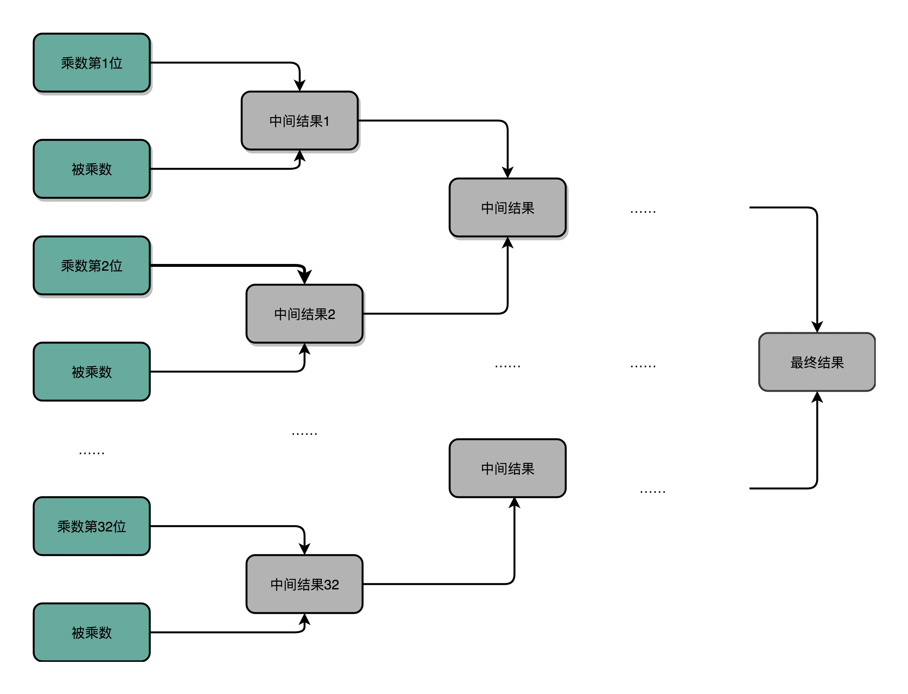

#### 3.10.3 电路并行

并行加速的办法，看起来还是有点儿笨。之所以计算会慢，核心原因其实是"顺序"计算，也就是说，要等前面的计算结果完成之后，才能得到后面的计算结果。

最典型的例子就是前面的加法器。每一个全加器，都要等待上一个全加器，把对应的进入输入结果算出来，才能算下一位的输出。位数越多，越往高位走，等待前面的步骤就越多，这个等待的时间有个专门的名词，叫作**门延迟**（Gate Delay）。

每通过一个门电路，就要等待门电路的计算结果，就是一层的门电路延迟，一般给它取一个"T"作为符号。一个全加器，其实就已经有了 3T 的延迟（进位需要经过 3 个门电路）。而 4 位整数，最高位的计算需要等待前面三个全加器的进位结果，也就是要等 9T 的延迟。如果是 64 位整数，那就要变成 63×3=189T 的延迟。

除了门延迟之外，还有一个问题就是**时钟频率**。在上面的顺序乘法计算里面，如果想要用更少的电路，计算的中间结果需要保存在寄存器里面，然后等待下一个时钟周期的到来，控制测试信号才能进行下一次移位和加法，这个延迟比上面的门延迟更可观。

**思路**
实际上，在进行加法的时候，如果相加的两个数是确定的，那高位是否会进位其实也是确定的。对于人本身去做计算都是顺序执行的，所以要一步一步计算进位。但是，计算机是连结的各种线路。不用让计算机模拟人脑的思考方式，来连结线路。
怎样才能让高位不需要等待低位的进位结果，而是把低位的所有输入信号都放进来，直接计算出高位的计算结果和进位结果呢？

**解决方法**
只要把进位部分的电路完全展开就好了。半加器到全加器，再到加法器，都是用最基础的门电路组合而成的。门电路的计算逻辑，可以像做数学里面的多项式乘法一样完全展开。在展开之后，可以把原来需要较少的，但是有较多层前后计算依赖关系的门电路，展开成需要较多的，但是依赖关系更少的门电路。

如果完全展开电路，高位的进位和计算结果，可以和低位的计算结果同时获得。这个的核心原因是电路是天然并行的，一个输入信号，可以同时传播到所有接通的线路当中。

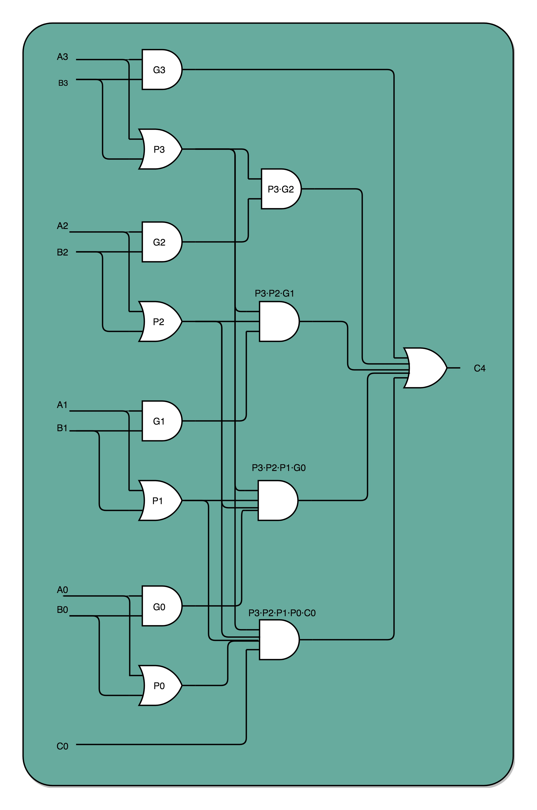

如果一个 4 位整数最高位是否进位，展开门电路图，会发现，只需要 3T 的延迟就可以拿到是否进位的计算结果。而对于 64 位的整数，也不会增加门延迟，只是从上往下复制这个电路，接入更多的信号而已。通过把电路变复杂，就解决了延迟的问题。

**这个优化，本质上是利用了电路天然的并行性**。电路只要接通，输入的信号自动传播到了所有接通的线路里面，**这其实也是硬件和软件最大的不同**。

无论是这里把对应的门电路逻辑进行完全展开以减少门延迟，还是上面的乘法通过并行计算多个位的乘法，都是把完成一个计算的电路变复杂了。而电路变复杂了，也就意味着晶体管变多了。

> 为什么晶体管的数量增加可以优化计算机的计算性能？实际上，这里的门电路展开和上面的并行计算乘法都是很好的例子。通过更多的晶体管，就可以拿到更低的门延迟，以及用更少的时钟周期完成一个计算指令。
> 硬件电路有一个很大的特点，那就是信号都是实时传输的。
> 通过精巧地设计电路，用较少的门电路和寄存器，就能够计算完成乘法这样相对复杂的运算。是用更少更简单的电路，但是需要更长的门延迟和时钟周期；还是用更复杂的电路，但是更短的门延迟和时钟周期来计算一个复杂的指令，这之间的权衡，其实就是计算机体系结构中 RISC 和 CISC 的经典历史路线之争。

### 3.11 浮点数和定点数

在日常的程序开发中，不只会用到整数。更多情况下，用到的都是实数。

**浮点数的不精确性**
在 Linux 下打开 Python 的命令行 Console，也可以在 Chrome 浏览器里面通过开发者工具，打开浏览器里的 Console，在里面输入“0.3 + 0.6”。

```js
0.3 + 0.9 = 0.8999999999999999
```

---

<span id="Amdahl">1. **阿姆达尔定律**
: 是在性能优化中，经常用到的经验定律，对于一个程序进行优化之后，处理器并行运算效率提升之后的情况，具体可以用这样一个公式表达: **优化后的执行时间 = 受优化影响的执行时间 / 加速倍率 + 不受影响的执行时间**
</span>

<span id="LogicGates">2. **触发器和锁存器**
: 是两种不同原理的数字电路组成的逻辑门。
</span>

<span id="objdump">3. **objdump**
: objdump 命令是 Linux 下的反汇编目标文件或者可执行文件的命令，它以一种可阅读的格式打印出二进制文件可能带有的附加信息。</span>
