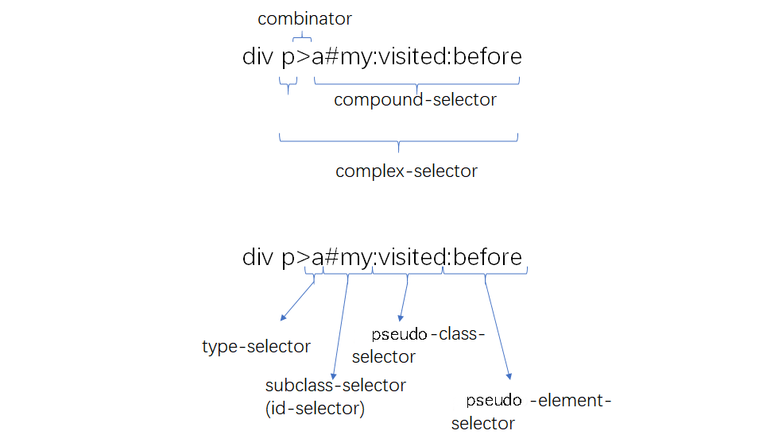

<!-- @import "[TOC]" {cmd="toc" depthFrom=1 depthTo=6 orderedList=false} -->

<!-- code_chunk_output -->

- [CSS 层叠样式表](#css-层叠样式表)
  - [一. CSS 语法](#一-css语法)
    - [1.1 at-rule](#11-at-rule)
    - [1.2 普通规则](#12-普通规则)
      - [1.2.1 选择器](#121-选择器)
        - [1.2.1.1 简单选择器](#1211-简单选择器)
          - [1.2.1.1.1 类型选择器和全体选择器](#12111-类型选择器和全体选择器)
          - [1.2.1.1.2 id 选择器与 class 选择器](#12112-id选择器与class选择器)
          - [1.2.1.1.3 属性选择器](#12113-属性选择器)
          - [1.2.1.1.4 伪类选择器](#12114-伪类选择器)
          - [1.2.1.1.5 伪元素选择器](#12115-伪元素选择器)
        - [1.2.1.2 复合选择器](#1212-复合选择器)
        - [1.2.1.3 复杂选择器](#1213-复杂选择器)
        - [1.2.1.4 选择器列表](#1214-选择器列表)
        - [1.2.1.5 选择器的优先级](#1215-选择器的优先级)
      - [1.2.2 声明: 属性和值](#122-声明-属性和值)
  - [二.CSS 排版](#二css排版)
    - [2.1 正常流](#21-正常流)
      - [2.1.1 正常流的行为](#211-正常流的行为)
      - [2.1.2 正常流的原理](#212-正常流的原理)
      - [2.1.3 正常流的使用技巧](#213-正常流的使用技巧)
  - [三. 排版方式](#三-排版方式)
    - [3.1 Flex 排版](#31-flex排版)
      - [3.1.1 flex 的原理](#311-flex的原理)
      - [3.1.2 Flex 的应用](#312-flex的应用)
    - [3.2 Grid 网格布局](#32-grid-网格布局)
      - [3.2.1 概述](#321-概述)
      - [3.2.2 基本概念](#322-基本概念)
  - [四. CSS 动画交互](#四-css动画交互)
    - [4.1 animation 属性 和 transition 属性](#41-animation属性-和-transition属性)
    - [4.2 贝塞尔曲线](#42-贝塞尔曲线)
  - [五. CSS 渲染](#五-css渲染)
    - [5.1 颜色的原理](#51-颜色的原理)
      - [5.1.1 RGB 颜色](#511-rgb颜色)
      - [5.1.2 CMYK 颜色](#512-cmyk颜色)
      - [5.1.3 HSL 颜色](#513-hsl颜色)
      - [5.1.4 RGBA 颜色](#514-rgba颜色)
    - [5.2 渐变](#52-渐变)
  - [六. 形状](#六-形状)

<!-- /code_chunk_output -->

# CSS 层叠样式表

---

## 一. CSS 语法

CSS 的顶层样式表由两种规则组成的规则列表构成，一种被称为 **at-rule**，就是 at 规则，另一种是 **qualified rule** 普通规则。

### 1.1 at-rule

at-rule 由一个 `@` 关键字和后续的一个区块组成，如果没有区块，则以分号结束。这些 at-rule 在开发中使用的机会远远小于普通规则。

> 这些 at 规则是掌握 CSS 的一些高级特性所必须的内容。

- **@charset**
  用于提示 CSS 文件使用的字符编码方式，它如果被使用，必须出现在最前面，这个规则只在给出语法解析阶段前使用，并不影响页面上的展示效果。

  ```css
  @charset "utf-8";
  ```

- **@import**
  用于引入一个 CSS 文件，除了 @charset 规则不会引入，@import 可以引入另一个文件的全部内容。

  ```css
  @import 'myStyle.css';
  @import url('myStyle.css');
  ```

  ```css
  @import [ <url> | <string> ] [ supports([ <supports-condition> | <declaration> ]) ]? <media-query-list>?;
  ```

  > 通过代码，可以看出，import 还支持 **supports** 和 **media query** 形式。

- **@media**
  media query 使用的规则，它能够对设备的类型进行一些判断。针对不同的屏幕尺寸设置不同的样式，适用于设计响应式页面。在 media 的区块内，是普通规则列表。

  ```css
  /*如果屏幕宽度小于600px则修改背景色*/
  @media screen and (max-width: 600px) {
    body {
      background-color: pink;
    }
  }
  ```

- **@page**
  用于分页媒体访问网页时的表现设置，页面是一种特殊的盒模型结构，除了页面本身，还可以设置它周围的盒。

  ```css
  @page {
    size: 8.5in 11in;
    margin: 10%;

    @top-left {
      content: 'Hamlet';
    }
    @top-right {
      content: 'Page ' counter(page);
    }
  }
  ```

- **@counter-style**
  产生一种数据，用于定义列表项的表现。

  ```css
  @counter-style circled-alpha {
    system: 'fixed';
    symbols: Ⓐ Ⓑ Ⓒ Ⓓ Ⓔ Ⓕ Ⓖ Ⓗ Ⓘ Ⓙ Ⓚ Ⓛ Ⓜ Ⓝ Ⓞ Ⓟ Ⓠ Ⓡ Ⓢ Ⓣ Ⓤ Ⓥ Ⓦ Ⓧ Ⓨ Ⓩ;
    suffix: ' ';
  }
  ul li {
    list-style: circled-alpha;
  }
  ```

- **@key-frames**
  产生一种数据，定义动画关键帧。

  ```css
  @keyframes diagonal-slide {
    from {
      left: 0;
      top: 0;
    }

    to {
      left: 100px;
      top: 100px;
    }
  }
  ```

- **@fontface**
  用于定义一种字体，icon font 技术就是利用这个特性实现的。

  ```css
  @font-face {
    font-family: Gentium;
    src: url(http://example.com/fonts/Gentium.woff);
  }
  p {
    font-family: Gentium, serif;
  }
  ```

- **@support**
  检查环境的特性，它与 media 比较类似。

  ```css
  /*如果浏览器支持display:flex;那么div的样式就是display:flex*/
  @supports (display: flex) {
    div {
      display: flex;
    }
  }
  /*如果浏览器不支持display:flex;且支持float:right;那么div的样式就是float:right;*/
  @supports (not (display: flex)) and (float: right) {
    div {
      float: right;
    }
  }
  ```

- **@namespace**
  用来定义使用在 CSS 样式表中的 XML 命名空间的@规则。定义的命名空间可以把通配、元素和属性选择器限制在指定命名空间里的元素。
  @namespace 规则通常在处理包含多个 namespaces 的文档时才有用，比如 HTML5 里内联的 SVG、MathML 或者混合多个词汇表的 XML。

  ```css
  @namespace url(http://www.w3.org/1999/xhtml);
  @namespace svg url(http://www.w3.org/2000/svg);
  /* 匹配所有的XHTML <a> 元素, 因为 XHTML 是默认无前缀命名空间 */
  a {
    color: #444;
  }
  /* 匹配所有的 SVG <a> 元素 */
  svg|a {
    color: #696;
  }
  /* 匹配 XHTML 和 SVG <a> 元素 */
  *|a {
    color: #444;
  }
  ```

  > 注意：任何 @namespace 规则都必须在所有的 @charset 和 @import 规则之后, 并且在样式表中，位于其他任何样式声明之前。

- **@viewport**
  用于设置视口的一些特性，不过兼容性目前不是很好，多数时候被 HTML 的 meta 代替。

### 1.2 普通规则

普通规则主要由 选择器 和 声明区块 构成。声明区块又由属性和值构成。

**语法的组成要点**：

- 普通规则
  - 选择器
  - 声明列表
    - 属性
    - 值
      - 值的类型
      - 函数

#### 1.2.1 选择器

从语法结构看，任何选择器都是由几个符号结构连接的：**空格、大于号、加号、波浪线、双竖线**。

> 注意：空格，即后代选择器的优先级较低。

对于每一个选择器来说，如果它不是伪元素，由几个可选的部分组成，标签类型选择器，id、class、属性和伪类，它们中只要出现一个，就构成了选择器。

如果是伪元素，则在这个结构后追加伪元素，只有伪类可以出现在伪元素之后。



选择器的基本意义是：根据一些特征选中元素树上的一批元素。

##### 1.2.1.1 简单选择器

针对某一特征判断是否选中元素


###### 1.2.1.1.1 类型选择器和全体选择器

它根据一个元素的标签名来选中元素。

> 注意：实际上，还需要考虑 HTML 或 XML 元素的命名空间问题，比如：svg 元素，实际上在：[http://www.w3.org/2000/svg](http://www.w3.org/2000/svg) 命名空间之下

例：[类型选择器-HTML 或 XML 元素的命名空间问题](./演示文件/类型选择器-HTML或XML元素的命名空间问题.html)

还有一个特殊的选择器 "\*"，它被称为全体选择器，可以选中任意元素，它的用法和类型选择器是完全一致的。

###### 1.2.1.1.2 id 选择器与 class 选择器

id 选择器和 class 选择器都是针对特定属性的选择器，id 选择器是"#"后面跟随 id 名，class 选择器是"."后面跟随 class 名。

###### 1.2.1.1.3 属性选择器

属性选择器根据 HTML 元素的属性来选中元素，属性选择器有以下几种形态：

- **[att]**
  直接在方括号中放入属性名，检查元素是否具有这个属性，只要元素具有这个属性，不论属性是什么值都可以被选中。

  ```css
  p[title] {
    color: red;
  }
  ```

- **[att=val]**
  精确匹配，检查一个元素属性的值是否为 val。

  ```css
  span[class='col'] {
    font-size: 10px;
  }
  ```

- **[att~=val]**
  多种匹配，检查一个元素的值是否是若干值之一，这里的 val 不是一个单一的值，可以是用空格分隔的一个序列。

  ```css
  p[class='col tool_div'] {
    border-radius: 1px;
  }
  ```

- **[att|=val]**
  选取属性值为 “val” 或是以 “val-” 为前缀（"-"为连字符，Unicode 编码为 U+002D）开头，val 必须是整个单词。典型的应用场景是用来来匹配语言简写代码（如 zh-CN，zh-TW 可以用 zh 作为 value）。
  有些 HTML 属性含有特殊字符，这个时候，可以把 val 用引号括起来，形成一个 CSS 字符串。CSS 字符串允许使用单双引号来规避特殊字符，也可以使用反斜杠转义。

- **[att^=val]**
  匹配属性值以指定值开头的元素。

- **[att$=val]**
  匹配属性值以指定值结束的元素。

- **[att*=val]**
  匹配属性值包含指定值的每个元素，只需要有 val，不需要是整个单词。

  ```css
  div[class*='test'] {
    background: #ffff00;
  }
  ```

###### 1.2.1.1.4 伪类选择器

伪类选择器是一系列由 CSS 规定好的选择器，它们以冒号开头。伪类选择器有普通型和函数型两种。
伪类选择器是很大的一类选择器，它是选择器能力的一种补充。

> 在实际使用中，尽量通过合适的 id 和 class 来标识元素，约束伪类的使用。最好只在不得不使用伪类的场景使用伪类，这对 CSS 代码的性能和可读性都有好处。

**树结构关系伪类选择器**:

- :root: 表示树的根元素，在选择器是针对完整的 HTML 文档情况下，一般用 HTML 标签即可选中根元素。但是随着 scoped css 和 shadow root 等场景出现，选择器可以针对某一子树来选择，这时候就很需要 root 伪类。

- :empty: 表示没有子节点的元素，这里有个例外就是 子节点为空白文本节点的情况。

- :nth-child: 这是个函数型的伪类，匹配父元素中的第 n 个子元素，元素类型没有限制。用的是 CSS 的 An+B 语法，An+B 语法设计的比较复杂

  ```css
  :nth-child(1){
    color:#0F0;
  }
  :nth-child(4n-1){ <!-- 选中第3个，第7个这样符合4的倍数减1的数字 -->
    font-size: 14px;
  }
  <!-- 使用odd关键字匹配奇数节点，even匹配偶数节点 -->
  :nth-child(odd){
    background-color:#00F;
  }
  ```

- :nth-last-child: 与:nth-child 的区别仅仅是从后往前数。

- :first-child, :last-child: 分别表示第一个和最后一个元素

- :only-child: 匹配属于父元素中唯一子元素的元素。

- of-type 系列伪类: 匹配同类型中的第 n 个同级兄弟元素。有 nth-of-type、nth-last-of-type、first-of-type、last-of-type、only-of-type。

**链接与行为伪类选择器**:

- :any-link: 表示任意的链接，包括 a、area 和 link 标签都可能匹配到这个伪类。
- :line: 表示未访问过的链接。
- :visited: 表示已访问过的链接。
- :hover: 表示鼠标悬停在上的元素。
- :active: 表示用户正在激活元素。如：用户按下按钮，鼠标还未抬起时，这个按钮就处于激活状态。
- :focus: 表示焦点在这个元素上。
- :target: 用于选取当前活动的目标元素。URL 带有后面跟有锚名称 #，指向文档内某个具体的元素。这个被链接的元素就是目标元素(target element)。

**逻辑伪类选择器**:

- :not(selector): 这是个函数型伪类。匹配非指定元素/选择器的所有元素。

###### 1.2.1.1.5 伪元素选择器

伪元素的语法跟伪类相似，但是实际产生的效果却是把不存在的元素选出来。
目前兼容性达到可用的伪元素有以下几种：

- ::first-line: 表示元素的第一行。

  > 这里的第一行指的是排版后显示的第一行，与 HTML 代码中的换行无关。
  > CSS 标准规定了这个选择器必须出现在最内层的块级元素内。

- ::first-letter: 表示元素的第一个字母。位置在所有标签之内。

  > 注意：CSS 标准只要求::first-line、::first-letter 实现有限的几个 CSS 属性，都是跟文本相关。

  

- ::before: 表示在元素内容之前插入一个虚拟的元素。

- ::after: 表示在元素内容之后插入一个虚拟的元素。

  > 注意：以上两个伪元素所在的 CSS 规则必须指定 content 属性才生效。content 属性还支持 counter。[before 和 after](./演示文件/before和after.html)

  :before 和 ::after 中支持所有的 CSS 属性。实际开发中，这两个伪元素非常有用，有了这两个伪元素，一些修饰性元素，可以使用纯粹的 CSS 代码添加进去，这能够很好地保持 HTML 代码中的语义，既完成了显示效果，又不会让 DOM 中出现很多无语义的空元素。

##### 1.2.1.2 复合选择器

连续写在一起的简单选择器，针对元素自身特征选择单个元素。

##### 1.2.1.3 复杂选择器

由"空格"、">"、"~"、"+"、"||"等符号连接的复合选择器，根据父元素或者前序元素检查单个元素。

- "空格": 后代，表示选中所有符合条件的后代节点。

- ">": 子代，表示选中所有符合条件的子节点。

- "~": 后继，表示选中所有符合条件的后继节点，后继节点即跟当前节点具有同一个父元素，并出现在它之后的兄弟节点。

- "+": 直接后继，表示选中符合条件的直接后继节点，直接后继节点即 下一个节点。

- "||": 列选择器，表示选中对应列中符合条件的单元格。
  空格和子代选择器可以用于组件化场景，当组件是独立开发时，很难完全避免重名的情况，如果为组件的最外层容器设置一个特别的 class 名，生成 CSS 规则时，则全部使用后代或子代选择器，可以有效避免 CSS 规则的命名污染问题。

- "," : 由逗号分隔的复杂选择器，表示"或"的关系

##### 1.2.1.4 选择器列表

选择器列表是用逗号分隔的复杂选择器序列，选择器列表的语法，选择器的连接方式可以理解为像四则运算一样有优先级

- 无连接符号
  - 空格
  - ~
  - `+`
  - `>`
  - ||
    - ,

##### 1.2.1.5 选择器的优先级

CSS 选择器是基于规则生效的，同一个元素命中多条规则是非常常见的，不同规则指定同一个属性为不同值时，就需要一个机制来解决冲突。

CSS 标准用一个三元组(a,b,c)来构成一个复杂选择器的优先级。

- id 选择器的数目记为 a
- 伪类选择器和 class 选择器的数目记为 b
- 伪元素选择器和标签选择器的数目记为 c
- "\*"不影响优先级

CSS 标准建议用一个足够大的进制，获取"a-b-c"来表示选择器优先级，即：

```txt
specificity = base * base * a + base * b + c; // 采用的是65536进制
```

> 行内属性的优先级用于高于 CSS 规则，浏览器提供了一个"口子"，就是在选择器 CSS 样式后上加"!important"。这个用法非常危险，因为它相当于一个新的优先级，而且优先级会高于行内属性。
> 同一优先级的选择器遵循"后面覆盖前面的"原则。

#### 1.2.2 声明: 属性和值

声明部分是一个由 "属性:值" 组成的序列。

1. 属性
   是由中划线、下划线、字母、数字等组成的标识符，CSS 还支持使用反斜杠转义。

   > 注意：属性不允许使用连续两个的中划线开头，这样的属性会被认为是 CSS 变量。

   以双中划线开头的属性被当做变量，与之配合的则是 var 函数：

   ```css
   :root {
     --main-color: #06c;
     --accent-color: #006;
   }
   #foo h1 {
     color: var(--main-color);
   }
   ```

2. 值
   值的部分，根据每个 CSS 属性可以取到不同的值，这里的值可能是以下类型：

   - CSS 范围的关键字: initial、unset、inherit，任何属性都可以的关键字
   - 字符串: 比如 content 属性。
   - URL: 使用 `url()` 函数的 URL 值。
   - 整数/实数: 比如 flex 属性。
   - 维度: 带单位的整数/实数，比如 width 属性。
   - 百分比: 大部分维度都支持。
   - 颜色: 比如 background-color 属性。
   - 图片: 比如 background-image 属性。
   - 2D 位置: 比如 background-position 属性。
   - 函数: 来自函数的值，比如 transform 属性，一些属性会要求产生函数类型的值，比如 easing-function 会要求 `cubic-bezier()` 函数的值。
     CSS 支持一批特定的计算型函数：
   - calc(): 是基本的表达式计算，支持加减乘除四则运算，在针对维度进行计算时，calc() 函数允许不同单位混合运算，非常有用。

     ```css
     section {
       float: left;
       margin: 1em;
       border: solid 1px;
       width: calc(100% / 3 - 2 * 1em - 2 * 1px);
     }
     ```

   - max(): 从一个逗号分隔的表示式列表中取最大的值作为属性值。

     ```css
     width: max(10vm, 4em, 80px);
     ```

   - min(): 从一个逗号分隔符表达式列表中选择一个最小值作为 CSS 的属性值。

     ```css
     width: min(1vm, 4em, 80px);
     ```

   - clamp(): 给一个值限定一个范围，超出范围则使用范围的最大值，最小值

     ```css
     font-size: clamp(1.5rem, 2.5vm, 4rem);
     ```

   - toggle(): 在规则选中多于一个元素时生效，它会在几个值之间按顺序切换，比如让一个列表项的样式圆点和方点间隔出现，可以使用以下代码：

     ```css
     ul {
       list-style-type: toggle(circle, square);
     }
     ```

   - attr(): 用来获取被选中元素的属性值，并且在样式文件中使用。它也可以被用在伪类元素里，在伪类元素里使用，它得到的是伪元素的原始元素的值。
     例: [css-attr().html](<./演示文件/css-attr().html>)

## 二.CSS 排版

### 2.1 正常流

总的来说，正常流布局主要是使用 `inline-block` 来作为内容的容器，利用块级格式化上下文的纵向排布和行内级格式化上下文的横向排布来完成布局的，需要根据需求的横向和纵向排布要求，来选择元素的 `display` 属性。

#### 2.1.1 正常流的行为

可以用一句话来描述正常流的行为：依次排列，排不下换行。

理解了正常流的基本概念，剩下的功能只需要在它的基础上延伸。

在正常流的基础上，有 float 相关规则，使得一些盒占据了正常流需要的空间，可以把 float 理解为"文字环绕"。

vertical-align 相关规则规定了如何在垂直方向对其盒。vertical-align 相关规则看起来复杂，但是实际上，基线、文字顶/底、行顶/底都是正常书写文字时需要的概念。


margin 可以理解为"一个元素规定了自身周围至少需要的空间"，这就非常容易理解为什么有 margin 折叠。

#### 2.1.2 正常流的原理

在 CSS 标准中，规定了如何排布每一个文字或盒的算法，这个算法依赖一个排版的"当前状态",CSS 把这个当前状态称为"格式化上下文（formatting context）"。

可以认为排版过程是：

> 格式化上下文 + 盒/文字 = 位置
> formatting context + boxes/characters = positions

需要排版的盒，分为块级盒和行内盒，所以排版需要分别为它们规定块级格式化上下文和行内格式化上下文。

块级格式化上下文：从上往下排，同一行内只能有一个块级格式化上下文。
行内格式化上下文：从左往右排，同一行内可以有多个行内格式化上下文。

> 注意：块级和行内级元素的排序，是受文字书写方向的影响。

**把正常流中的一个盒或文字排版，需要分成 3 种情况处理**：

- 当遇到块级盒: 排入块级格式化上下文
- 当遇到行内级盒或文字: 首先尝试排入行内级格式化上下文，如果排不下，那么创建一个行盒，先将行盒排版（行盒是块级，所以到第一种情况），再在行盒内创建一个行内级格式化上下文。
- 遇到 float 盒: 把盒的顶部跟当前行内级上下文上边缘对齐，然后根据 float 的方向把盒的对应边缘对到块级格式上下文的边缘，之后重新排当前行盒。

以上都是一个块级格式化上下文中的排版规则，实际上，页面中的布局没有这么简单，一些元素会在其内部创建新的块级格式化上下文，这些元素有：

- 浮动元素
- 绝对定位元素
- 非块级但仍能包含块级元素的容器: inline-block、table-cells、table-captions 等
- 块级的能包含块级元素的容器，且属性 overflow 不为 visible
  换个角度理解：自身为块级，且 overflow 为 visible 的块级元素容器，它的块级格式化上下文和外部的块级格式化上下文发生了融合，也就是说，如果不考虑盒模型相关的属性，这样的元素从排版的角度就好像根本不存在。

#### 2.1.3 正常流的使用技巧

**等分布局问题**
[正常流-等分布局问题.html](./演示文件/正常流-等分布局问题.html)

**自适应宽**
[正常流-自适应宽度问题.html](./演示文件/正常流-自适应宽度问题.html)

## 三. 排版方式

### 3.1 Flex 排版

Flex 排版的核心是 `display:flex` 和 `flex属性`，它们配合使用。具有 display:flex 的元素称为 flex 容器，它们的子元素或盒被称为 flex 项。

flex 项如果有 flex 属性，会根据 flex 方向代替 宽/高属性，形成"填补剩余尺寸"的特性，这是一种典型的"根据外部容器决定内部尺寸"的思路，也是最常用的 Windows 和 Apple 窗口系统的设计思路。

#### 3.1.1 flex 的原理

**如何实现**
Flex 布局支持横向和纵向，这样就需要做一个抽象，把 Flex 延伸的方向称为"主轴"，把跟它垂直的方向称为"交叉轴"。这样，flex 项的 width 和 height 被称为交叉轴尺寸或主轴尺寸。
而 Flex 又支持反向排布，这样，又需要抽象出交叉轴起点、交叉轴终点、主轴起点、主轴终点，它们可能是 top、left、bottom、right。
Flex 布局中有一种特殊情况，就是 flex 容器没有指定主轴尺寸，这个时候，实际上 Flex 属性完全没有用了，所有 flex 尺寸都可以被当做 0 来处理，flex 容器的主轴尺寸等于其他所有 flex 主轴尺寸之和。

1. **第一步：把 flex 项分行**
   把 flex 项分行，有 flex 属性的 flex 项可以暂且认为主轴尺寸为 0，所以，它一定可以放进当前行。接下来把 flex 项 逐个放入行，不允许换行的话，就一直把 flex 项放进同一行。允许换行的话，就先设定主轴剩余空间为 Flex 容器 主轴尺寸，每放入一个就把主轴剩余空间减掉它的主轴尺寸，直到某个 flex 项放不下为止，换下一行，重复前面动作。
   分行过程中，会顺便对每一行计算两个属性：

   - 交叉轴尺寸: 交叉轴尺寸本行所有交叉轴尺寸的最大值。
   - 主轴剩余空间: 允许换行的话，主轴剩余空间为 Flex 容器 主轴尺寸，每放入一个就把主轴剩余空间减掉它的主轴尺寸。

2. **第二步：计算每个 flex 项 主轴尺寸和位置**
   如果 Flex 容器 是不允许换行的，并且最后主轴尺寸超出了 Flex 容器，就要做等比缩放。
   如果 Flex 容器 有多行，那么根据前面的分行算法，必然有主轴剩余空间，这时候，找出本行所有的带 flex 属性的 flex 项，把剩余空间按 flex 比例分给它们即可。
   然后，根据主轴排布方向，确定每个 flex 项 的主轴位置坐标。
   如果本行完全没有带 flex 属性的 flex 项，justify-content 机制就会生效，它的几个不同的值会影响空白如何分配，在计算 flex 项坐标时，加上一个数值即可。（justify-content 需要在前面加浏览器标识[-webkit-、-moz-]，IE11 以上支持）
   例如，如果是 flex-start 就要加到第一个 flex 项身上，如果是 center 就给第一个 flex 项加一半的尺寸，如果是 space-between，就要给除了第一个以外的每个 flex 项加上"flex 项数减一分之一"

3. **第三步：计算 flex 项 的交叉轴尺寸和位置**
   交叉轴的计算首先根据 align-content 计算每一行的位置，这跟 justify-content 非常类似。
   再根据 alignItem 和 flex 项的 alignSelf 来确定每个元素在行内的位置。
   计算完主轴跟交叉轴，每个 flex 的坐标、尺寸就都确定了，完成了整个 Flex 布局。

#### 3.1.2 Flex 的应用

1. 垂直居中
   思路：创建只有一行的 flexBox，然后用 `align-content:center` 和 `align-items:center` 来保证行位于容器中，元素位于行中。

   ```html
   <div id="parent">
     <div id="child">垂直居中</div>
   </div>
   ```

   ```css
   #parent {
     display: flex;
     width: 300px;
     height: 300px;
     outline: 1px solid;
     justify-content: center;
     align-content: center;
     align-items: center;
     margin-bottom: 2rem;
   }
   #child {
     width: 100px;
     height: 100px;
     outline: 1px solid;
   }
   ```

2. 两列等高
   思路：创建只有一行的 flexBox，然后用 `align-items:stretch` 属性让每个元素高度都等于行高。

   ```html
   <div class="parent">
     <div class="child" style="height: 100px"></div>
     <div class="child">两列等高</div>
   </div>
   <br />
   <div class="parent">
     <div class="child"></div>
     <div class="child" style="height: 100px"></div>
   </div>
   ```

   ```css
   .parent {
     display: flex;
     width: 300px;
     justify-content: center;
     align-content: center;
     align-items: stretch;
     margin-bottom: 2em;
   }
   .child {
     width: 100px;
     outline: 1px solid;
   }
   ```

3. 自适应宽
   思路：flex 设计的基本能力，给要自适应的元素加 flex 属性即可。

   ```html
   <div class="parent2">
     <div class="child1"></div>
     <div class="child2">自适应宽</div>
   </div>
   ```

   ```css
   .parent2 {
     display: flex;
     width: 300px;
     height: 200px;
     background-color: skyblue;
   }
   .child1 {
     width: 100px;
     background-color: antiquewhite;
     outline: 1px solid;
   }
   .child2 {
     width: 100px;
     flex: 1;
     outline: 1px solid;
   }
   ```

### 3.2 Grid 网格布局

#### 3.2.1 概述

Grid 布局将网页划分成一个个网格，可以组合不同的网格，作出各种各样的布局。Grid 布局与 Flex 布局有一定的相似性，都可以指定容器内部多个项目的位置。但是，它们也存在重大区别。

Flex 布局是轴线布局，只能指定"项目"针对轴线的位置，可以看作是一维布局。Grid 布局则是将容器划分成"行"和"列"，产生单元格，然后指定"项目所在"的单元格，可以看作是二维布局。Grid 布局远比 Flex 布局强大。

#### 3.2.2 基本概念

## 四. CSS 动画交互

在 CSS 属性中，有一类属性，它负责的不是静态的展示，而是根据用户的行为产生交互。

### 4.1 animation 属性 和 transition 属性

- animation
  animation 是一个简写属性，它分为 6 个部分：

  - animation-name: 动画的名称。这是一个 keyframes 类型的值
    keyframes 的主体结构是一个名称和花括号中的定义，它按百分比来规定数值（这里的 0%和 100%可以写成 from 和 to），keyframes 需要配合@规则使用，产生一种数据，用来定义动画关键帧，关键帧之间使用 animation-timing-function 作为时间曲线。
  - animation-duration: 动画的时长
  - animation-timing-function: 动画的时间曲线
  - animation-delay: 动画开始前的延迟
  - animation-iteration-count: 动画的次数
  - animation-direction: 动画的方向

  例：[动画交互-animation 行 77](./演示文件/动画交互-animation.html)

- transition
  transition 是一个简写属性，用于设置四个过渡属性：

  - transition-property: 要变换的 CSS 属性名称
  - transition-duration: 完成过渡效果需要多少秒或毫秒
  - transition-timing-function: 时间曲线
  - transition-delay: 延迟

  例：[动画交互-animation 行 80](./演示文件/动画交互-animation.html)

  > 这四个属性可以重复多次，指定多个属性的变化规则，用逗号隔开。
  > transition 也可以和 animation 组合，抛弃 animation 的 timing-function，以编排不同段用不同的时间曲线。例：[动画交互-animation 行 83](./演示文件/动画交互-animation.html)

### 4.2 贝塞尔曲线

贝塞尔曲线是一种插值曲线，它描述了两个点之间差值来形成连续的曲线形状的规则。

一个量从一个值变化到另一个值，如果希望它按照一定时间平滑过渡，就必须对它进行插值。

贝塞尔曲线是一种被工业生产验证了很多年的曲线，它最大的特点就是“平滑”。时间曲线平滑，意味着较少突兀的变化，这是一般动画设计所追求的。

K 次贝塞尔插值算法需要 k+1 个控制点，最简单的一次贝塞尔插值就是线性插值，将时间表示为 0 到 1 的区间，一次贝塞尔插值公式是：


“二次贝塞尔插值”有 3 个控制点，相当于对 P0 和 P1，P1 和 P2 分别做贝塞尔插值，再对结果做一次贝塞尔插值计算：


“三次贝塞尔插值”则是“两次‘二次贝塞尔插值’的结果，再做一次贝塞尔插值”：


贝塞尔曲线的定义中带有一个参数 t，但是这个 t 并非真正的时间，实际上贝塞尔曲线的一个点 (x, y)，这里的 x 轴才代表时间。
这就造成了一个问题，如果使用贝塞尔曲线的直接定义，是没办法直接根据时间来计算出数值的，因此，浏览器中一般都采用了数值算法，其中公认做有效的是牛顿积分。

**贝塞尔曲线拟合**
理论上，贝塞尔曲线可以通过分段的方式拟合任意曲线，但是有一些特殊的曲线，是可以用贝塞尔曲线完美拟合的，比如抛物线。

例: 

## 五. CSS 渲染

### 5.1 颜色的原理

#### 5.1.1 RGB 颜色

计算中，最常见的颜色表示法是 RGB 颜色，它符合光谱三原色理论：红、绿、蓝，三种颜色的光可以构成一切颜色。


这跟人类的视觉神经系统有关，人类分别有对红、绿、蓝敏感的视觉细胞。现代计算机中，多用 0-255 的数字表示一种颜色，正好占据一个字节，每种颜色就占据 3 个字节。

#### 5.1.2 CMYK 颜色

美术的三原色是"红黄蓝"，因为，颜料显示颜色的原理是它吸收了所有其它的光，只反射一种颜色，所以颜料三原色其实是 "红黄蓝" 的补色，也就是 "品红、黄、青"。因为它们跟 "红黄蓝" 相近，所以有了这样的说法。


> 在印刷行业，使用的就是这样的三原色（品红、黄、青）来调配油墨，这种颜色的表示法叫做 CMYK，它用一个四元组来表示颜色。在印刷行业中，黑色颜料价格最低，而品红、黄、青颜料价格较贵，如果要用三原色调配黑色，经济上是不划算的，所以印刷时会单独指定黑色。
> 对 CMYK 颜色表示法来说，同一种颜色会有多种表示方案，但是参考印刷行业的习惯，会尽量优先使用黑色。

#### 5.1.3 HSL 颜色

上面两种颜色都是从人类视觉角度建模，但是人类对颜色的认识却并非来自自己的神经系统，当我们把阳光散射，可以得到七色光：红橙黄绿蓝靛紫，实际上，阳光接近白光，它包含了各种颜色的光，它散射之后，应该是个基本连续的。这说明对人的感知来说，颜色远远大于红、绿、蓝。

因此，HSL 这样的颜色模型被设计出来了，它用一个值表示人类认知中的颜色。用专业的术语叫做：色相(H)、颜色的纯度(S)和明度(L)，就构成了一种颜色的表示。


> 建议使用 HSL 颜色，这是一种语义化的颜色。当对一张图片改变色相时，人们感知到的是"图片的颜色变了"。

#### 5.1.4 RGBA 颜色

RGBA 是代表 Red、Green、Blue 和 Alpha 的色彩空间。RGBA 被用来表示带透明度的颜色，实际上，Alpha 通道类似一种颜色值的保留字。在 CSS 中，Alpha 通道被用来表示透明度，所以这种颜色表示方式叫 RGBA，而不是 RGBO（Opacity）。
为了方便使用，CSS 还内置了 140 种颜色名称。

### 5.2 渐变

在 CSS 中，background-image、list-style-image、border-image 这样的属性，可以设为渐变。CSS 支持以下两种渐变：

- 线性渐变

  ```css
  liner-gradient(direction, color-stop1, color-stop2, ...)
  ```

  direction 可以是方向、也可以是具体的角度，例如：

  ```txt
  to bottom
  to top
  to top left
  to bottom right
  120deg
  3.14rad
  100grad
  1turn
  ```

  color-stop 是一个颜色和一个区段，例如：

  ```txt
  rgba(255,0,0,0)
  orange
  yellow 10%
  lime 28px
  ```

  ```css
  <!-- 产生一个“真正的金色”的背景 -- > #grad1 {
    height: 200px;
    background: linear-gradient(45deg, gold 10%, yellow 50%, gold 90%);
  }
  ```

- 径向渐变

  ```css
  radial-gradient(shape size at position, start-color, ..., last-color)
  ```

  shape 确定圆的类型

  - ellipse(默认) : 椭圆形的径向渐变
  - circle : 圆形的径向渐变。

  size 定义渐变的大小：

  - farthest-corner(默认) : 指定径向渐变的半径长度为从圆心到离圆心最远的角
  - closest-side ： 指定径向渐变的半径长度为从圆心到离圆心最近的边
  - closest-corner ： 指定径向渐变的半径长度为从圆心到离圆心最近的角
  - farthest-side ： 指定径向渐变的半径长度为从圆心到离圆心最远的边

  position 定义渐变的位置，例如：

  ```txt
  circle at 50px 50px
  50% 40%
  bottom
  ellipse farthest-side at center
  ```

  start-color...last-color 是一个颜色和一个距中心点的位置区段

  例：[CSS 渲染-渐变](./演示文件/CSS渲染-渐变.html)

> 注释：CSS 中有四种角度单位
>
> deg: 度(Degrees)，一个圆有 360 度。
> grad: 梯度(gradients)，一个圆共 400 梯度。
> rad: 弧度(radians)，一个圆有 2π 弧度。
> turn: 圈(turns)，一个圆有一圈。
> 90deg = 200grad = 0.25turn ≈ 1.570796326794897rad

## 六. 形状

CSS 中的很多属性还会产生形状，比如常见的属性：

- border
- box-shadow
- border-radius

> 建议，仅仅把它们用于基本的用途，把 border 用于边框、把阴影用于阴影，把圆角用于圆角，所有其它的场景，都有一个更好的替代品：**dataUri+svg**。
