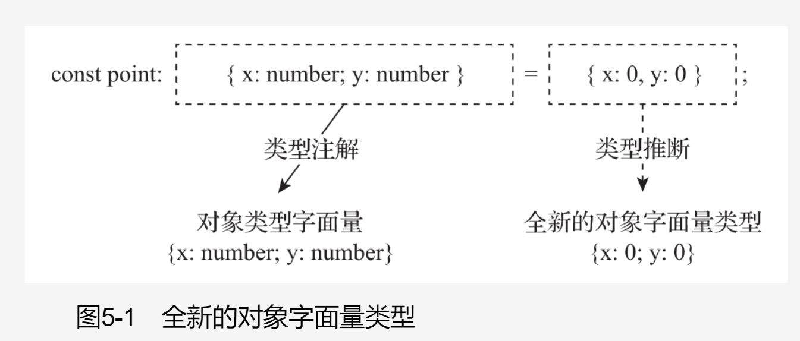
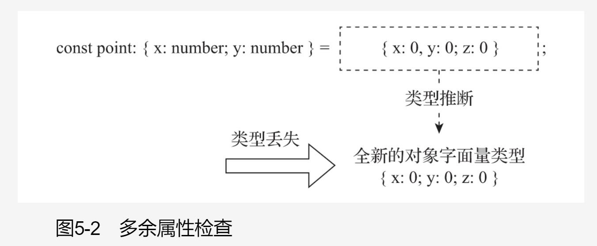

# TypeScript

<!-- @import "[TOC]" {cmd="toc" depthFrom=1 depthTo=6 orderedList=false} -->

<!-- code_chunk_output -->

- [TypeScript](#typescript)
  - [一. 介绍](#一-介绍)
    - [1.1 什么是 TypeScript](#11-什么是-typescript)
      - [1.1.1 始于 JS，终于 JS](#111-始于-js终于-js)
      - [1.1.2 TypeScript 特性](#112-typescript-特性)
    - [1.2 TypeScript 优势](#12-typescript-优势)
    - [2.1 tsconfig.json](#21-tsconfigjson)
  - [二. 类型基础](#二-类型基础)
    - [2.1 类型注解](#21-类型注解)
    - [2.2 类型检查](#22-类型检查)
    - [2.3 原始类型](#23-原始类型)
      - [2.3.1 symbol 和 unique symbol](#231-symbol-和-unique-symbol)
      - [2.3.2 Nullable](#232-nullable)
    - [2.4 枚举类型](#24-枚举类型)
      - [2.4.1 数值型枚举](#241-数值型枚举)
      - [2.4.2 字符串枚举](#242-字符串枚举)
      - [2.4.3 异构型枚举](#243-异构型枚举)
      - [2.4.4 枚举成员映射](#244-枚举成员映射)
      - [2.4.5 常量枚举成员与计算枚举成员](#245-常量枚举成员与计算枚举成员)
      - [2.4.6 联合枚举类型](#246-联合枚举类型)
      - [2.4.7 const 枚举类型](#247-const-枚举类型)
    - [2.5 字面量类型](#25-字面量类型)
    - [2.6 单元类型](#26-单元类型)
    - [2.7 顶端类型](#27-顶端类型)
      - [2.7.1 any](#271-any)
      - [2.7.1 unknown](#271-unknown)
    - [2.8 尾端类型](#28-尾端类型)
      - [2.8.1 never](#281-never)
      - [2.8.2 应用场景](#282-应用场景)
    - [2.9 数组类型](#29-数组类型)
      - [2.9.1 数组类型定义](#291-数组类型定义)
      - [2.9.2 数组元素类型](#292-数组元素类型)
      - [2.9.3 只读数组](#293-只读数组)
        - [2.9.3.1 注意事项](#2931-注意事项)
    - [2.10 元组类型](#210-元组类型)
      - [2.10.1 只读元组](#2101-只读元组)
      - [2.10.2 访问元组中的元素](#2102-访问元组中的元素)
      - [2.10.3 元组类型中的可选元素](#2103-元组类型中的可选元素)
      - [2.10.4 元组类型中的剩余元素](#2104-元组类型中的剩余元素)
      - [2.10.5 元组的长度](#2105-元组的长度)
    - [2.11 对象类型](#211-对象类型)
      - [2.11.1 Object](#2111-object)
      - [2.11.2 object](#2112-object)
      - [2.11.3 对象类型字面量](#2113-对象类型字面量)
        - [2.11.3.1 属性签名](#21131-属性签名)
        - [2.11.3.2 可选类型](#21132-可选类型)
        - [2.11.3.3 只读属性](#21133-只读属性)
        - [2.11.3.4 空对象类型字面量](#21134-空对象类型字面量)
      - [2.11.4 弱类型](#2114-弱类型)
      - [2.11.5 多余属性](#2115-多余属性)
        - [2.11.5.1 多余属性检查](#21151-多余属性检查)
        - [2.11.5.2 允许多余属性](#21152-允许多余属性)
    - [2.12 函数类型](#212-函数类型)
      - [2.12.1 常规参数类型](#2121-常规参数类型)
      - [2.12.2 可选参数类型](#2122-可选参数类型)
      - [2.12.3 默认参数类型](#2123-默认参数类型)
      - [2.12.4 剩余参数类型](#2124-剩余参数类型)
      - [2.12.5 解构参数类型](#2125-解构参数类型)
      - [2.12.6 返回值类型](#2126-返回值类型)
      - [2.12.7 函数类型字面量](#2127-函数类型字面量)
      - [2.12.8 调用签名](#2128-调用签名)
      - [2.12.9 构造函数类型字面量](#2129-构造函数类型字面量)
      - [2.12.10 构造签名](#21210-构造签名)
      - [2.12.11 调用签名与构造签名](#21211-调用签名与构造签名)
      - [2.12.12 重载函数](#21212-重载函数)
        - [2.12.12.1 函数重载](#212121-函数重载)
        - [2.12.12.2 函数实现](#212122-函数实现)
        - [2.12.12.3 函数重载解析顺序](#212123-函数重载解析顺序)
        - [2.12.12.4 重载函数的类型](#212124-重载函数的类型)
      - [2.12.13 函数中 this 值的类型](#21213-函数中-this-值的类型)
        - [2.12.13.1 --noImplicitThis](#212131-noimplicitthis)
        - [2.12.13.2 函数的 this 参数](#212132-函数的-this-参数)
    - [2.13 接口](#213-接口)
      - [2.13.1 接口声明](#2131-接口声明)
      - [2.13.2 方法签名](#2132-方法签名)
      - [2.13.3 索引签名](#2133-索引签名)
        - [2.13.3.1 字符串索引签名](#21331-字符串索引签名)
        - [2.13.3.2 数值索引签名](#21332-数值索引签名)
      - [2.13.4 可选属性与方法](#2134-可选属性与方法)
      - [2.13.5 只读属性与方法](#2135-只读属性与方法)
      - [2.13.6 接口的继承](#2136-接口的继承)
    - [2.14 类型别名](#214-类型别名)
      - [2.14.1 类型别名声明](#2141-类型别名声明)
      - [2.14.2 递归的类型别名](#2142-递归的类型别名)
      - [2.14.3 类型别名与接口的差别](#2143-类型别名与接口的差别)
    - [2.15 类](#215-类)
      - [2.15.1 类的定义](#2151-类的定义)
        - [2.15.1.1 类声明](#21511-类声明)
        - [2.15.1.2 类表达式](#21512-类表达式)
      - [2.15.2 成员变量](#2152-成员变量)
        - [5.15.2.1 --strictPropertyInitialization](#51521-strictpropertyinitialization)
        - [2.15.2.2 readonly 属性](#21522-readonly-属性)
      - [2.15.3 成员函数](#2153-成员函数)
      - [2.15.4 成员存取器](#2154-成员存取器)
      - [2.15.5 索引成员](#2155-索引成员)
      - [2.15.6 成员可访问性](#2156-成员可访问性)
        - [2.15.6.1 public](#21561-public)
        - [2.15.6.2 protected](#21562-protected)
        - [2.15.6.3 private](#21563-private)
        - [2.15.6.4 私有字段](#21564-私有字段)
      - [2.15.7 构造函数](#2157-构造函数)
      - [2.15.8 参数成员](#2158-参数成员)
      - [2.15.9 继承](#2159-继承)
        - [2.15.9.1 重写基类成员](#21591-重写基类成员)
        - [2.15.9.2 派生类实例化](#21592-派生类实例化)
        - [2.15.9.3 单继承](#21593-单继承)
        - [2.15.9.4 接口继承类](#21594-接口继承类)
      - [2.15.10 实现接口](#21510-实现接口)
      - [2.15.11 静态成员](#21511-静态成员)
        - [2.15.11.1 静态成员可访问性](#215111-静态成员可访问性)
        - [2.15.11.2 继承静态成员](#215112-继承静态成员)
      - [2.15.12 抽象类和抽象成员](#21512-抽象类和抽象成员)
        - [2.15.12.1 抽象类](#215121-抽象类)
        - [2.15.12.2 抽象成员](#215122-抽象成员)
      - [2.15.13 this 类型](#21513-this-类型)
      - [2.15.14 类类型](#21514-类类型)
  - [三. 类型进阶](#三-类型进阶)
    - [3.1 泛型](#31-泛型)
      - [3.1.1 泛型简介](#311-泛型简介)
      - [3.1.2 形式类型参数](#312-形式类型参数)
        - [3.1.2.1 形式类型参数声明](#3121-形式类型参数声明)
        - [3.1.2.2 类型参数默认类型](#3122-类型参数默认类型)
        - [3.1.2.3 可选的类型参数](#3123-可选的类型参数)
      - [3.1.3 实际类型参数](#313-实际类型参数)
      - [3.1.4 泛型约束](#314-泛型约束)
        - [3.1.4.1 泛型约束声明](#3141-泛型约束声明)
        - [3.1.4.2 泛型约束引用类型参数](#3142-泛型约束引用类型参数)
        - [3.1.4.3 基约束](#3143-基约束)
        - [3.1.4.4 常见错误](#3144-常见错误)
      - [3.1.5 泛型类型](#315-泛型类型)
        - [3.1.5.1 泛型函数定义](#3151-泛型函数定义)
        - [3.1.5.2 泛型函数示例](#3152-泛型函数示例)
        - [3.1.5.3 泛型函数类型推断](#3153-泛型函数类型推断)
        - [3.1.5.4 泛型函数注意事项](#3154-泛型函数注意事项)
      - [3.1.6 泛型接口](#316-泛型接口)
      - [6.1.7 泛型类型别名](#617-泛型类型别名)
        - [6.1.7.1 泛型类型别名定义](#6171-泛型类型别名定义)
        - [3.1.7.2 泛型类型别名示例](#3172-泛型类型别名示例)
      - [3.1.8 泛型类](#318-泛型类)
    - [3.2 局部类型](#32-局部类型)
    - [3.3 联合类型](#33-联合类型)
      - [3.3.1 联合类型字面量](#331-联合类型字面量)
      - [3.3.2 联合类型的类型成员](#332-联合类型的类型成员)
        - [3.3.2.1 属性签名](#3321-属性签名)
        - [3.3.2.2 索引签名](#3322-索引签名)
        - [3.3.2.3 调用签名与构造签名](#3323-调用签名与构造签名)
    - [3.4 交叉类型](#34-交叉类型)
      - [3.4.1 交叉类型字面量](#341-交叉类型字面量)
        - [3.4.1.1 成员类型的运算](#3411-成员类型的运算)
        - [3.4.1.2 原始类型](#3412-原始类型)
      - [3.4.2 交叉类型的类型成员](#342-交叉类型的类型成员)
        - [3.4.2.1 属性签名](#3421-属性签名)
        - [6.4.2.2 索引签名](#6422-索引签名)
        - [3.4.2.3 调用签名与构造签名](#3423-调用签名与构造签名)
      - [3.4.3 交叉类型与联合类型](#343-交叉类型与联合类型)
        - [3.4.3.1 优先级](#3431-优先级)
        - [3.4.3.2 分配律性质](#3432-分配律性质)
    - [3.5 索引类型](#35-索引类型)
      - [3.5.1 索引类型查询](#351-索引类型查询)
        - [3.5.1.1 索引类型查询解析](#3511-索引类型查询解析)
        - [3.5.1.2 联合类型](#3512-联合类型)
        - [3.5.1.3 交叉类型](#3513-交叉类型)
      - [3.5.2 索引访问类型](#352-索引访问类型)
      - [3.5.3 索引类型的应用](#353-索引类型的应用)
    - [3.6 映射对象类型](#36-映射对象类型)
      - [3.6.1 映射对象类型声明](#361-映射对象类型声明)
      - [3.6.2 映射对象类型解析](#362-映射对象类型解析)
      - [3.6.3 映射对象类型应用](#363-映射对象类型应用)
      - [3.6.4 同态映射对象类型](#364-同态映射对象类型)
        - [3.6.4.1 修饰符拷贝](#3641-修饰符拷贝)
        - [3.6.4.2 改进的修饰符拷贝](#3642-改进的修饰符拷贝)
        - [3.6.4.3 添加和移除修饰符](#3643-添加和移除修饰符)
        - [6.6.4.4 同态映射对象类型深入](#6644-同态映射对象类型深入)
    - [3.7 条件类型](#37-条件类型)
      - [3.7.1 条件类型的定义](#371-条件类型的定义)
      - [3.7.2 分布式条件类型](#372-分布式条件类型)
        - [3.7.2.1 裸类型参数](#3721-裸类型参数)
        - [3.7.2.2 分布式行为](#3722-分布式行为)
        - [3.7.2.3 过滤联合类型](#3723-过滤联合类型)
        - [3.7.2.4 避免分布式行为](#3724-避免分布式行为)
      - [3.7.3 infer 关键字](#373-infer-关键字)
    - [3.8 内置工具类型](#38-内置工具类型)
      - [3.8.1 `Partial<T>`](#381-partialt)
      - [3.8.2 `Required<T>`](#382-requiredt)
      - [3.8.3 `Readonly<T>`](#383-readonlyt)
      - [3.8.4 `Record<K,T>`](#384-recordkt)
      - [3.8.5 `Pick<T,K>`](#385-picktk)
      - [3.8.6 `Omit<T,K>`](#386-omittk)
      - [3.8.7 `Exclude<T,U>`](#387-excludetu)
      - [3.8.8 `Extract<T,U>`](#388-extracttu)
      - [3.8.9 `NonNullable<T>`](#389-nonnullablet)
      - [3.8.10 `Parameters<T>`](#3810-parameterst)
      - [3.8.11 `ConstructorParameters<T>`](#3811-constructorparameterst)
      - [63.8.12 `ReturnType<T>`](#63812-returntypet)
      - [3.8.13 `InstanceType<T>`](#3813-instancetypet)
      - [3.8.14 `ThisParameterType<T>`](#3814-thisparametertypet)
      - [3.8.15 `OmitThisParameter<T>`](#3815-omitthisparametert)
      - [3.8.16 `ThisType<T>`](#3816-thistypet)
    - [3.9 类型查询](#39-类型查询)
    - [3.10 类型断言](#310-类型断言)
      - [3.10.1 `<T>` 类型断言](#3101-t-类型断言)
      - [3.10.2 as T 类型断言](#3102-as-t-类型断言)
      - [3.10.3 类型断言的约束](#3103-类型断言的约束)
      - [3.10.4 const 类型断言](#3104-const-类型断言)
      - [3.10.5 !类型断言](#3105-类型断言)
    - [3.11 类型细化](#311-类型细化)
      - [3.11.1 类型守卫](#3111-类型守卫)
        - [3.11.1.1 typeof 类型守卫](#31111-typeof-类型守卫)
        - [3.11.1.2 instanceof 类型守卫](#31112-instanceof-类型守卫)
        - [3.11.1.3 in 类型守卫](#31113-in-类型守卫)
        - [3.11.1.4 逻辑与、或、非类型守卫](#31114-逻辑与-或-非类型守卫)
        - [3.11.1.5 等式类型守卫](#31115-等式类型守卫)
        - [3.11.1.6 自定义类型守卫函数](#31116-自定义类型守卫函数)
        - [3.11.1.7 this 类型守卫](#31117-this-类型守卫)
      - [3.11.2 可辨识联合类型](#3112-可辨识联合类型)
        - [3.11.2.1 判别式属性](#31121-判别式属性)
        - [3.11.2.2 判别式属性类型守卫](#31122-判别式属性类型守卫)
        - [3.11.2.3 可辨识联合完整性检查](#31123-可辨识联合完整性检查)
      - [3.11.3 赋值语句分析](#3113-赋值语句分析)
      - [3.11.4 基于控制流的类型分析](#3114-基于控制流的类型分析)
      - [3.11.5 断言类型](#3115-断言类型)
        - [3.11.5.1 asserts x is T](#31151-asserts-x-is-t)
        - [3.11.5.2 asserts X](#31152-asserts-x)
        - [3.11.5.3 断言函数的返回值](#31153-断言函数的返回值)
        - [3.11.5.4 断言函数的应用](#31154-断言函数的应用)
  - [四. 类型深入](#四-类型深入)
    - [4.1 子类型兼容性](#41-子类型兼容性)
      - [4.1.1 类型系统可靠性](#411-类型系统可靠性)
      - [4.1.2 子类型的基本性质](#412-子类型的基本性质)
        - [4.1.2.1 符号约定](#4121-符号约定)
        - [4.1.2.2 自反性](#4122-自反性)
        - [4.1.2.3 传递性](#4123-传递性)
      - [4.1.3 顶端类型与尾端类型](#413-顶端类型与尾端类型)
      - [4.1.4 原始类型](#414-原始类型)
      - [4.1.5 函数类型](#415-函数类型)
        - [4.1.5.1 变型](#4151-变型)
        - [4.1.5.2 函数参数数量](#4152-函数参数数量)
        - [4.1.5.3 函数参数类型](#4153-函数参数类型)
        - [4.1.5.4 函数返回值类型](#4154-函数返回值类型)
        - [4.1.5.5 函数重载](#4155-函数重载)
      - [4.1.6 对象类型](#416-对象类型)
        - [4.1.6.1 结构化子类型](#4161-结构化子类型)
        - [4.1.6.2 属性成员类型](#4162-属性成员类型)
        - [4.1.6.3 调用签名与构造签名](#4163-调用签名与构造签名)
        - [4.1.6.4 字符串索引签名](#4164-字符串索引签名)
        - [4.1.6.5 数值索引签名](#4165-数值索引签名)
        - [4.1.6.6 类实例类型](#4166-类实例类型)
      - [4.1.7 泛型](#417-泛型)
        - [4.1.7.1 泛型对象类型](#4171-泛型对象类型)

<!-- /code_chunk_output -->

## 一. 介绍

### 1.1 什么是 TypeScript

时间回到 2004 年，距离 HTML 版本(4.01)更新已有四年之久。就在这一年知名浏览器厂商（Apple、Mozilla、Opera 和 Google）集结在一起，其初衷是想要发展下一代 HTML 技术，从而使浏览器拥有更优的用户体验。与此同时，新一轮的浏览器大战也开了序幕。要拥有更好的用户体验，那么提供完善的功能与出色的性能这两点缺一不可。浏览器厂商们纷纷开始支新特性，并且在 JS 引擎优化方面展开了一场 “军备竞赛”。从那之后， JS 程序的运行速度有了数十倍的提升，这为使用 JS 语言开发大型应用程序提供了强有力的支撑。如今 JS 不仅能够用在网页端程序的开发，还被用在了服务器端应用的开发上。但有一个不争的事实 JS 语言不是为编写大型大型应用程序而设计的。例如：JS 语言在相当长的时间里都缺少对模块的支持。此外，在编写 JS 代码的过程中也缺少开发者工具的支持。因此，编写并维护大型 JS 程序是困难的。

微软公司有一部分产品是使用 JS 语言进行开发和维护

因此微软也面临同样的题。在微软技术院士 Steve Lucco 先生的带领下，微软公司组建了一个数十人的团队开始着手设计和实现一种 JS 开发工具，用以解决产品开发和维护中遇到的问题。随后，另一位重要成员也加入了这个团队，他就是 C# 和 Turbo pascal 编程语言之父、微软技术院 Anders Hejlsberg 先生。该团队决定推出一款新的编程语言来解决 JS 程序开发与维护过程中所面临的难题。凭借微软公司在编程语言设计与开发方面的丰富经验，在历经了约两年的开发后，2012 年 10 月 1 日，微软对外发布了 TypeScript 第一个公开预览版 v0.8。2014 年 4 月 2 日，TypeScript 1.0 版本发布；2016 年 9 月 22 日，TypeScript 2.0 版本发布；2018 年 7 月 30 日，TypeScript 3.0 版本发布

#### 1.1.1 始于 JS，终于 JS

TypeScript 是一门专为开发大规模 JS 应用程序而设计的编程语言，是 JS 的超集，包含了 JS 现有的全部功能，并且使用了与 JS 相同的语法和语义。因此，JS 程序本身已经是合法的 TypeScript 程序了。

开发者不但能够快速地将现有的 JS 程序迁移 TypeScript，而且能够继续使用依赖的 JS 库，比如 jQuery 等。因此，就算现有工程依赖的第三方代码库没有迁移到 TypeScript，它也不会阻碍程序开发。反之，TypeScript 能够更好地利用现有的 JS 代码库。

TypeScript 代码不能直接运行，它需要先被编译成 JS 代码 然后才能 TypeScript 编译器（tsc）将负责把 TypeScript 代码编译为 JS 代码。例如：

```ts
function sum(x: number, y: number): number {
  return x + y;
}
const total = sum(1, 2);
```

```js
'use strict';
function sum(x, y) {
  return x + y;
}
const total = sum(1, 2);
```

对比编译之前和之后的代码，能够看到编译器生成的 JS 代码既清晰又简洁，并且两者之间在代码结构上几乎没有明显变化。实际上这种行为是 TypeScript 语言的基本设计原则之一。TypeScript 语言的设计原则中包含了以下几个基本原则：

- 保留 JS 代码的运行时行为
- 避免增加表达式级别的语法，仅增加类型相关语法
- 与当前和未来版本的 ECMAScrip 规范保持—致
- 应该生成简洁、符合编写习惯并易于识别的 JS 代码
- 不应该进行激进的性能优化

_语法糖_
: 在计算机科学中，语法糖指的是编程语言里的某种语法，这种语法对语言的功能没有影响，但是会方便开发者的使用，能够让程序更加简洁，具有更高的可读性。

#### 1.1.2 TypeScript 特性

- **可选的静态类型**

  如 TypeScript 其名，类型系统是它的核心特性。TypeScript 为 JS 添加了静态类型的支持。可以使用类型注解为程序添加静态类型信息。

  同时，TypeScript 中的静态类型是**可选的**，它不强制要求为程序中的每一部分都添加类型注解。TypeScript 支持类型推断的功能，编译器能够自动推断出大部分表达式的类型信息，开发者只需要在程序中添加少量的类型注解便能拥有完整的类型信息。

- **开放与跨平台**

  TypeScript 语言是开放的。TypeScript 语言规范使用了 Open Web Foundations Final Specification Agreement（OWF 1.0）协议。开放 Web 基金会（ Open Web Foundation，OWF）是一个致力于开发和保护新兴网络技术规范的非营利组织。该基金会遵循类似 Apache 软件基金会的开源模式。微软公司实现的 TypeScript 编译器也是开源的，它的源代码托管在 Github 平台上并且使用了较为宽松的开源许可协议 Apache License 2.0，该协议允许使用者对源代码进行修改发行以及用于商业用途。

  TypeScript 语言是跨平台的。TypeScript 程序经过编译后可以在任意的浏览器、JS 宿主环境和操作系统上运行。

### 1.2 TypeScript 优势

- **易于发现代码的错误**

  不论使用哪种编程，编写高质量代码都是重中之重。JS 是一门具有动态类型和弱类型的编程语言。其特点是数据类型检查发生在程序运行时，并且允许（隐式地）数据类型转换。

  例如，JS 代码在真正运行前无法很好地检测代码中是否存在拼写错误，那么在编写的过程中 JS 无法识别出该错误。只有在程序运行时 JS 才能够发现这个错误并且可能终止程序的运行。如果使用了 TypeScript 语言，那么在编译程序时就能够发现拼写错误。如果使用了支持 TypeScript 的代码编辑器，那么在编写代码的过程中就能够检查出拼写错误。

- **提高生产力**

  如果开发者习惯了使用静态类型编程语言，例如 Java 和 c# 等进行开发，那么在开始使用 JS 语言编写程序时很可能会产生较大落差。因为会发现那些习以为常的开发者工具都没有被很好地支持，例如代码自动补全、跳转到定义和重命名标识符等。因为 TypeScript 为 JS 添加了静态类型的支持，所以 TypeScript 有能力提供这些便利的开发者工具。如：重命名符号名、提取到函数或方法、提取类型。

  TypeScript 还提供了一些代码快速修复工具，如：自动删除未使用的声明、自动删除执行不到的代码、自动添加缺少的模块导入语句。

- **支持 JS 的最新特性**

  JS 实现遵循了由 TC39 委员会制定 ECMAScript（ES）标准。同时，JS 语言也成了 ECMAScript 标准最知名的一个实现。两者的发展相辅相成。

  随着 JS 语言的应用越来广泛，人们也在积极地修订 ECMAScript 标准，不断加入新的特性，比如类、async 和 await 等。但由于兼容性问题，ECMAScript 标准中新引入的特性往往无法直接在实际项目中使用，因为 JS 运行环境通常不会很快支持新特性。

  在 TypeScript 程序中，可以直接使用这些新特性而不必过多担心兼容问题。TypeScript 编译器会负责把代码编译成兼容指定 ECMAScript 版本的 JS 代码。

### 2.1 tsconfig.json

<!--TODO-->

tsconfig.json 是 TypeScript 编译器默认使用的配置文件。下面的例子中指定模块类型为 CommonJS，并将输岀 JS 的版本指定为 ECMAScript2017：

```json
{
  "compilerOptions": {
    "target": "es2017",
    "module": "CommonJS"
  }
}
```

在 VSCode 中使用快捷键 `Ctrl + Shift + B` 或从菜单栏里选择 `终端 -> 运行生成任务` 打开并运行构建任务面板，然后选择 "tsc: -p tsconfig.json" 来编译 TypeScript 程序。编译完成后，会在当前文件目录下生成同名 JS 文件。

## 二. 类型基础

### 2.1 类型注解

在 TypeScript 中可以使用类型注解来明确标识类型。**类型注解的语法由一个冒号 “:" 和某种具体类型 “Type” 组成**，并且总是放在被修饰的实体之后：

```ts
const greeting: string = 'Hello，World';
```

TypeScript 中的类型注解是可选的，编译器在大部分情况下都能够自动推断岀表达式的类型。关于类型推断的详细介绍参考 7.3 节<!--TODO-->。

### 2.2 类型检查

类型检查是验证程序中类型约束是否正确的过程。类型检查既可以在程序编译时进行，即静态类型检査；也可以在程序运行时进行，即动态类型检查。TypeScript 支持静态类型检查，Javascrip 支持动态类型检查。

为了满足不同用户的需求，TypeScript 提供了两种静态类型检查模式：

- **非严格类型检查**（默认方式）

  严格类型检査是 TypeScript 默认的类型检査模式。在该模式下，类型检査的规则相对宽松。例如，在非严格类型检查模式下不会对 undefined 值和 null 值做过多限制，允许将 undefined 值和 null 值赋值给 string 类型的
  变量。当进行 JS 代码到 TypeScript 代码的迁移工作时，非严格类型检查是一个不错的选择，因为它能够帮助快速地完成迁移工作。

- **严格类型检查**

  该模式下的类型检査比较激进，会尽可能地发现代码中的错误。例如，在严格类型检査模式下不允许将 undefined 值和 null 值赋值给 string 类型的变量。启用严格类型检査模式能够最大限度地利用 TypeScript 静争态类型检査带来的益处。从长远来讲，使用严格类型检查模式对提高代码质量更加有利，因此建议在新的工程中启用。

  TypeScript 提供了若干个与严格类型检查相关的编译选项，例如：“-strictNullChecks” 和 “--noImplicitAny” 等。关于严格类型检查编译选项的详细介绍参考 8.2 <!--TODO-->节。

  也可以在工程的 tsconfig.json 配置文件中启用 “strict" 编译选项：

  ```json
  {
    "compilerOptions": {
      "strict": true
    }
  }
  ```

  将 “strict” 编译选项设置为 true 将开启所有的严格类型检査编译选项。它包含了前面提到的 “-strictNullChecks” 和 “--noImplicitAny” 编译选项。关于配置文件的详细介绍请参考 8.3 节<!--TODO-->

### 2.3 原始类型

JS 语言中的每种原始类型都有与之对应的 TypeScript 类型。除此之外，TypeScript 还对原始类型进行了细化与扩展，增加了枚举类型和字面量类型等。到目前为止，TypeScript 中的原始类型包含以下几种：

- **boolean**
  TypeScript 中的 boolean 类型对应于 JS 中的 Boolean 原始类型。该类型能够表示两个逻辑值：true 和 false。

- **string**
  TypeScript 中的 string 类型对应于 JS 中的 String 原始类型。该类型能够表示采用 Unicode UTF-16 编码格式存储的字符序列。

- **number**
  TypeScript 中的 number 类型对应于 JS 中的 Number 原始类型。该类型能够表示采用双精度 64 位二进制浮点数格式存储的数字。

- **bigint**
  TypeScript 中的 bigint 类型对应于 JS 中的 BigInt 原始类型。该类型能够表示仼意精度的整数，但也仅能表示整数。bigint 采用了特殊的对象数据结构来表示和存储一个整数。

- **[symbol 和 unique symbol](#2131-symbol-和-unique-symbol)**

- **[undefined 和 null](#2132-nullable)**

- **void**
  void 类型表示某个值不存在，该类型用作函数的返回值类型。若一个函数没有返回值，那么该函数的返回值类型为 void 类型。除了将 void 类型作为[函数返回值类型](#2126-返回值类型)外，在其他地方使用 void 类型是无意义的。

  > 当启用 strictNullChecks 编译选项时，只允许将 undefined 值赋值给 void 类型。没有启用 strictNullChecks 编译选项，那么允许将 undefined 和 null 赋值给 void 类型。

- **[枚举类型](#24-枚举类型)**

- **[字面量类型](#25-字面量类型)**

#### 2.3.1 symbol 和 unique symbol

TypeScript 中的 symbol 类型对应于 JS 中的 Symbol 原始类型。该类型能够表示任意的 Symbol 值。

字面量能够表示一个固定值。例如，数字字面量 3 表示固定数值 3；字符串字面量 "up" 表示固定字符串 "up"。symbol 类型不同于其他原始类型，它不存在字面量形式。symbol 类型的值只能通过 `Symbol()` 和 `Symbol.for()` 函数来创建或直接引用某个 “Well-Known Symbol” 值：

```ts
const s0: symbol = Symbol();
const s1: symbol = Symbol.for('foo');
const s2: symbol = Symbol.hasInstance;
const s3: symbol = s0;
```

为了能够将一个 Symbol 值视作表示固定值的字面量，TypeScript 引入了 `unique symbol` 类型。unique symbol 类型使用 `unique symbol` 关键字来表示。

**unique symbol 类型的主要用途是用作接口、类等类型中的可计算属性名**。因为如果使用可计算属性名在接口中添加了一个类型成员，那么必须保证该类型成员的名字是固定的，否则接口定义将失去意义。下例中，允许将 unique symbol 类型的常量 x 作为接口的类型成员，而 symbol 类型的常量 y 不能作为接口的类型成员，因为 symbol 类型不止包含一个可能值：

```ts
const x: unique symbol = Symbol();
const y: symbol = Symbol();

interface Foo {
  [x]: string; // 正确
  [y]: string; // 错误：接口中计算属性名称必须引用类型为字面量类型或 unique symbol 的表达式
}
```

实际上，unique symbol 类型的设计初衷是作为一种变通方法，让一个 Symbol 值具有字面量的性质，即仅表示一个固定的值。unique symbol 类型没有改变 Symbol 值没有字面量表示形式的事实。为了能够将某个 Symbol 值视作表示固定值的字面量，TypeScript 对 unique symbol 类型和 Symbol 值的使用施加了限制。

TypeScript 选择将一个 Symbol 值与声明它的标识符绑定在一起，并通过绑定了该 Symbol 值的标识符来表示 "Symbol 字面量"。这种设计的前提是要确保 Symbol 值与标识符之间的绑定关系是不可变的。因此，TypeScript 中只允许使用 const 声明或 readonly 属性声明来定义 unique symbol 类型的值：

```ts
// 必须使用 const 声明
const a: unique symbol = Symbol();
interface WithUniqueSymbol {
  // 必须使用 readonly 修饰
  readonly b: unique symbol;
}
class C {
  // 必须使用 static 和 readonly 修饰符
  static readonly C: unique symbol = Symbol();
}
```

上例第 1 行，常量 a 的初始值为 Symbol 值，其类型为 unique symbol 类型。在标识符 a 与其初始值 Symbol 值之间形成了绑定关系，并且该关系是不可变
的。这是因为常量的值是固定的，不允许再被赋予其他值。标识符 a 能够固定表示该 Symbol 值，标识符 a 的角色相当于该 Symbol 值的字面量形式。

如果使用 let 或 var 声明定义 unique symbol 类型的变量，那么将产生错误，因为标识符与 Symbol 值之间的绑定是可变的。

> **注意**：unique symbol 类型的值只允许使用 Symbolo() 函数或 Symbol.for() 方法的返回值进行初始化，因为只有这样才能够 “确保” 引用了唯一的 Symbol 值。但是，使用相同的参数调用 Symbol.for() 方法实际上返回的是相同的 Symbol 值。因此，可能出现多个 unique symbol 类型的值实际是同一个 Symbol 值的情况。由于设计上的局限性，TypeScript 目前无法识别岀这种情况，因此不会产生编译错误，必须要留意这种特殊情况。

在设计上，每一个 unique symbol 类型都是一种独立的类型。在不同的 unique symbol 类型之间不允许相互赋值；在比较两个 unique symbol 类型的值时，也将永远返回 false。

由于 unique symbol 类型是 symbol 类型的子类型，因此可以将 unique symbol 类型的值赋值给 symbol 类型。

如果程序中未使用类型注解来明确定义是 symbol 类型还是 unique symbol 类型，那么 TypeScript 会自动地推断类型：

```ts
// a 和b 均为 symbol 类型，因为没有使用 const 声明
let a = Symbol();
let b = Symbol.for();
// c 和 d 均为 unique symbol 类型
const c = Symbol();
const d = Symbol.for();
// e 和 f 为 symbol 类型，没有使用 Symbol 或 Symbol.for()
const e = a;
const f = a;
```

#### 2.3.2 Nullable

TypeScript 中的 Nullable 类型指的是值可以为 undefined 或 null 的类型。JS 中有两个比较特殊的原始类型，即 Undefined 类型和 Null 类型。两者分别仅包含一个原始值，即 undefined 值和 null 值。

在 TypeScript 早期的版本中，没有提供与 JS 中 Undefined 类型和 Null 类型相对应的类型。TypeScript 允许将 undefined 值和 null 值赋值给仼何其他类型。虽然在 TypeScript 语言的内部实现中确实存在这两种原始类型，但之前没有开放给开发者使用。

TypeScript 2.0 版本的一个改变就是增加了 undefined 类型和 null 类型供开发者使用。虽然看上去是一项普通的改进，但却有着非凡的意义。因为，不当地使用 undefined 值和 null 值是程序缺陷的主要来源之一。

现在，在 TypeScript 程序中能够明确地指定某个值的类型是否为 undefined 类型或 null 类型。TypeScript 编译器也能够对代码进行更加细致的检査以找出程序中潜在的错误。

**strictNullChecks**
TypeScript 2.0 还增加了新的编译选项 `strictNullchecks`，即严格的 null 检查模式。虽然该编译选项的名字中只提及了 null，但实际上它同时作用于 undefined 类型和 null 类型的类型检查。

在默认情况下，`strictNullchecks` 编译选项没有被启用。这时候，除尾端类型外的所有类型都是 Nullable 类型。也就是说，除[尾端类型](#28-尾端类型)外所有类型都能够接受 undefined 值和 null 值。

当启用了 `strictNullchecks` 编译选项时，undefined 值和 null 值不再能够赋值给不相关的类型。例如，undefined 值和 null 值不允许赋值给 string 类型。在该模式下，undefined 值只能够赋值给 undefined、顶端、void 类型；null 值只能赋值给 null 类型和顶端类型。

### 2.4 枚举类型

枚举类型由零个或多个枚举成员构成，每个枚举成员都是一个命名的常量。在 TypeScript 中，枚举类型是一种原始类型，它通过 `enum` 关键字来定义：

```ts
enum Season {
  Spring,
  Summer,
  Fall,
  Winter
}
```

按照枚举成员的类型可以将枚举类型划分为以下三类：

- 数值型枚举
- 字符串枚举
- 异构型枚举

#### 2.4.1 数值型枚举

数值型枚举是最常用的枚举类型，是 number 类型的子类型，它由一组命名的数值常量构成。定义数值型枚举的方法如下所示：

```ts
enum Direction {
  Up,
  Down,
  Left,
  Right
}

const direction: Direction = Direction.Up;
```

此例中，使用 enum 关键字定义了枚举类型 Direction，它包含了四个枚举成员 Up、Down、Left 和 Right。在使用枚举成员时，可以像访问对象属性一样访问枚举成员。

每个数值型枚举成员都表示一个具体的数字。如果在定义枚举时没有设置枚举成员的值，那么 TypeScript 将自动计算枚举成员的值。根据 TypeScript 语言的规则，第一个枚举成员的值为 0，其后每个枚举成员的值等于前一个枚举成员的值加 1。因此，Direction 枚举中 Up 的值为 0、Down 的值为 1，以此类推。

在定义数值型枚举时，可以为一个或多个枚举成员设置初始值。对于未指定初始值的枚举成员，其值为前一个枚举成员的值加 1：

```ts
enum Direction {
  Up = 1,
  Down, // 2
  Left = 10,
  Right // 11
}
```

数值型枚举是 number 类型的子类型，因此允许将数值型枚举类型赋值给 number 类型：

```ts
enum Direction {
  Up,
  Down,
  Left,
  Right
}
const direction: number = Direction.Up;
```

number 类型也能够赋值给枚举类型，即使 number 类型的值不在枚举成员值的列表中也不会产生错误：

```ts
enum Direction {
  Up,
  Down,
  Left,
  Right
}
const d1: Direction = 0; // Direction.Up
const d2: direction = 10; // 不会产生错误
```

#### 2.4.2 字符串枚举

字符串枚举与数值型枚举相似。在字符串枚举中，枚举成员的值为字符串。字符串枚举成员必须使用字符串字面量或另一个字符串枚举成员来初始化。字符串枚举成员没有自增长的行为：

```ts
enum Direction {
  Up = 'UP',
  Down = 'DOWN',
  Left = 'LEFT',
  Right = 'RIGHT',

  U = Up,
  D = Down,
  L = Left,
  R = Right
}
```

字符串枚举是 string 类型的子类型，因此允许将字符串枚举类型赋值给 string 类型。但是反过来，**不允许将 string 类型赋值给字符串枚举类型**，这点与数值型枚举是不同的。

#### 2.4.3 异构型枚举

TypeScript 允许在一个枚举中同时定义数值型枚举成员和字符串枚举成员，将这种类型的枚举称作异构型枚举。异构型枚举在实际代码中很少被使用，虽然在语法上允许定义昇构型枚举，但是**不推荐在代码中使用舁构型枚举**。可以尝试使用对象来代替异构型枚举：

```ts
enum Color {
  Black = 0,
  White = 'White'
}
```

**注意**：

1. 在定义异构型枚举时，不允许使用计算的值作为枚举成员的初始值。
2. 在异构型枚举中，必须为紧跟在字符串枚举成员之后的数值型枚举成员指定一个初始值。

#### 2.4.4 枚举成员映射

不论是哪种类型的枚举，都可以通过枚举成员名去访问枚举成员值。对于数值型枚举，不但可以通过枚举成员名来获取枚举成员值，也可以反过来通过枚举成员值去获取枚举成员名：

```ts
enum Bool {
  False = 0,
  True = 1
}

Bool.False; // 0
Bool[Bool.True]; // "True"
```

对于字符串枚举和异构型枚举，则不能够通过枚举成员值去获取枚举成员名。

#### 2.4.5 常量枚举成员与计算枚举成员

每个枚举成员都有一个值，根据枚举成员值的定义可以将枚举成员划分为以下两类：

- **常量枚举成员**

  若枚举类型的第一个枚举成员没有定义初始值，那么该枚举成员是常量枚举成员并且初始值为 0。

  若枚举成员没有定义初始值并且与之紧邻的前一个枚举成员值是数值型常量，那么该枚举成员是常量枚举成员并且初始值为紧邻的前枚举成员值加 1。如果紧邻的前一个枚举成员的值不是数值型常量，那么将产生错误。

  若枚举成员的初始值是常量枚举表达式，那么该枚举成员是常量枚举成员。常量枚举表达式是 TypeScript 表达式的子集，它能够在编译阶段被求值。常量枚举表达式的具体规则如下：

  - 可以是数字字面量、字符串字面量和不包含替换值的模板字面量。
  - 可以是对前面定义的常量枚举成员的引用。
  - 可以是用分组运算符包围起来的常量枚举表达。
  - 可以使用一元运算符操作数 "+" "-" "~"，操作数必须为常量枚举表达式。
  - 可以使用二元运算符 "+" "-" `"*"` `"**"` "/" "%" "<<" ">>" ">>>" "&" "|" "^"，两个操作数必须为常量枚举表达式。

  例如，下例中的枚举成员均为常量枚举成员：

  ```ts
  enum Foo {
    A = 0, // 数字字面量
    B = 'B', // 字符串字面量
    C = `C`, // 无替换值的模板字面量
    D = A // 引用前面定义的常量枚举成员
  }
  enum Bar {
    A = -1, // 一元运算符
    B = 1 + 2, // 二元运算符
    C = (4 / 2) * 3 // 分组运算符（小括号）
  }
  ```

  字面量枚举成员是常量枚举成员的子集。字面量枚举成员是指满足下列条件之一的枚举成员，具体条件如下：

  - 枚举成员没有定义初始值。
  - 枚举成员的初始值为数字字面量、字符串字面量和不包含替换值的模板字面量。
  - 枚举成员的初始值为对其他字面量枚举成员的引用。

  下例中，Foo 枚举的所有成员都是字面量枚举成员，同时它们也都是常量枚举成员：

  ```ts
  enum Foo {
    A,
    B = 1,
    C = -3,
    D = 'foo',
    E = `bar`,
    F = A
  }
  ```

- **计算枚举成员**

  除常量枚举成员之外的其他枚举成员都属于计算枚举成员：

  ```ts
  enum Foo {
    A = 'A'.length,
    B = Math.pow(2, 3)
  }
  ```

**使用示例**
**枚举表示一组有限元素的集合，并通过枚举成员名来引用集合中的元素**。有时候，程序中并不关注枚举成员值。在这种情况下，让 TypeScript 去自动计算枚举成员值是很方便的：

```ts
enum Direction {
  Up,
  Right,
  Left,
  Down
}

function move(direction: Direction) {
  switch (direction) {
    case Direction.Up:
      console.log('Up');
      break;
    case direction.Down:
      console.log('Down');
      break;
    case Direction.Left:
      console.log('Left');
    case Direction.Right:
      console.log('Right');
  }
}
move(Direction.Up); // 'Up'
```

**程序不依赖枚举成员值时，能够降低代码耦合度，使程序易于扩展**。例如，想给 Direction 枚举添加一个名为 None 的枚举成员来表示未知方向。按照惯例，None 应作为第一个枚举成员。因此，可以将代码修改如下：

```ts
enum Direction {
  None,
  Up,
  Right,
  Left,
  Down
}

function move(direction: Direction) {
  switch (direction) {
    case Direction.None:
      console.log('None');
      break;
    case Direction.Up:
      console.log('Up');
      break;
    case direction.Down:
      console.log('Down');
      break;
    case Direction.Left:
      console.log('Left');
    case Direction.Right:
      console.log('Right');
  }
}
move(Direction.None); // 'None'
```

此例中，枚举成员 Up、Down、Left 和 Right 的值已经发生了改变，Up 的值由 0 变为 1，以此类推。由于 move() 函数的行为不直接依赖枚举成员的值，因此本次代码修改对 move() 函数的已有功能不产生任何影响。但如果程序中依赖了枚举成员的具体值，那么这次代码修改就会破坏现有的代码。

#### 2.4.6 联合枚举类型

**当枚举类型中的所有成员都是字面量枚举成员时，该枚举类型成了联合枚举类型**。

**联合枚举成员类型**
联合枚举类型中的枚举成员除了能够表示一个常量值外，还能够表示一种类型，即联合枚举成员类型。**联合枚举成员类型是联合枚举类型的子类型，因此可以将联合枚举成员类型赋值给联合枚举类型**。

下例中，Direction 枚举是联合枚举类型，Direction 枚举成员 Up、DoWn、Le 和 Right 既表示数值常量，也表示联合枚举成员类型：

```ts
enum Direction {
  Up,
  Right,
  Left,
  Down
}
// 第一个 Direction.Up 表示联合枚举成员类型，第二个 Direction.Up 则表示数值常量 0
const up: Direction.Up = Direction.Up;
// 常量 up 的类型是联合枚举成员类型 Direction.Up，常量 direction 的类型是联合枚举类型 Direction。
// 由于 Direction.Up 类型是 Direction 类型的子类型，因此可以将常量 up 赋值给常量 direction
const direction: Direction = up;
```

**联合枚举类型**
联合枚举类型是由所有联合枚举成员类型构成的联合类型。示例如下

```ts
enum Direction {
  Up,
  Down,
  Left,
  Right
}

type UnionDirectionType = Direction.Up | Direction.Down | Direction.Left | Direction.Right;
```

上例中 Direction 枚举是联合枚举类型，它等同于联合类型 UnionDirectionType 其中 “|” 符号是定义联合类型的语法。关于联合类型的详细介绍请参考 6.3 节<!--TODO-->。

由于联合枚举类型是由固定数量的联合枚举成员类型构成的联合类型，因此编译器能够利用该性质对代码进行类型检査。示例如下：

```ts
enum Direction {
  Up,
  Down,
  Left,
  Right
}

// 编译器能够分析岀 Direction 联合枚举类型只包含四种可能的联合枚举成员类型。
function f(direction: Direction) {
  if (direction === Direction.Up) {
    //  Direction.Up
  } else if (direction === Direction.Down) {
    // Direction.Down
  } else if (direction === Direction.Left) {
    // Direction.Left
  } else {
    // 在 if-else 语句中，编译器能够根据控制流分析出最后的 else 分支中 Direction 的类型为 Direction.Right
    direction;
  }
}
```

下面再来看另外一个例子。Foo 联合枚举类型由两个联合枚举成员类型 Foo.A 和 Foo.B 构成。编译器能够检查出在第 7 行 if 条件判断语句中的条件表达式结果永远为 true，因此将产生编译错误：

```ts
enum Foo {
  A = 'A',
  B = 'B'
}

function bar(foo: Foo) {
  if (fool !== Foo.A || Foo !== Foo.B) {
    // 编译错误：该条件永远为 true
  }
}
```

下例中，由于 Foo 联合枚举类型等同于联合类型 Foo.A|Foo.B，因此它是联合类型 'A'|'B' 的子类型：

```ts
enum Foo {
  A = 'A',
  B = 'B'
}

enum Bar {
  A = 'A'
}

enum Baz {
  B = 'B',
  C = 'C'
}

// f1 接受 'A'|'B' 联合类型的参数
function f1(x: 'A' | 'B') {
  console.log(x);
}

function f2(foo: Foo, bar: Bar, baz: Baz) {
  // 允许使用 Foo 枚举类型的参数 foo 调用函数 f1，因为 Foo 枚举类型是 'A'|'B' 类型的子类型
  f1(foo);
  // 允许使用 Bar 枚举类型的参数 bar 调用函数 f1，因为 Bar 枚举类型是 'A' 类型的子类型，也是 'A'|'B' 类型的子类型
  f1(bar);
  // 不允许使用 Baz 枚举类型的参数 baz 调用函数 f1，因为 Baz 枚举类型是 'B'|'C' 类型的子类型
  // 错误：类型 'Baz' 不能赋值给参数类型 'A' | 'B'
  f1(baz);
}
```

关于子类型兼容性的详细介绍请参考 7.1 节

#### 2.4.7 const 枚举类型

枚举类型是 TypeScript 对 JS 的扩展，JS 语言本身并不支持枚举类型。在编译时，TypeScript 编译器会将枚举类型编译为 JS 对象。例如，定义如下的枚举：

```ts
enum Direction {
  Up,
  Down,
  Left,
  Right
}

const d: Direction = Direction.Up;
```

此例中的代码编译后生成的 JS 代码如下所示，为了支持枚举成员名与枚举成员值之间的正、反向映射关系，TypeScript 还生成了一些额外的代码：

```js
'use strict';
var Direction;
(function (Direction) {
  Direction[(Direction['Up'] = 0)] = 'Up';
  Direction[(Direction['Down'] = 1)] = 'Down';
  Direction[(Direction['Left'] = 2)] = 'Left';
  Direction[(Direction['Right'] = 3)] = 'Right';
})(Direction || (Direction = {}));

const d = Direction.Up;
```

有时候不会使用枚举成员值到枚举成员名的反向映射，因此没有必要生成额外的反向映射代码，只需要生成如下代码就能够满足需求：

```js
'use strict';
var Direction;
(function (Direction) {
  Direction['Up'] = 0;
  Direction['Down'] = 1;
  Direction['Left'] = 2;
  Direction['Right'] = 3;
})(Direction || (Direction = {}));

const d = Direction.Up;
```

更进一步讲，如果只关注枚举类型的使用方式就会发现，完全不需要生成与 Direction 对象相关的代码，只需要将 Direction.Up 替换为它所表示的常量 0 即可。经过此番删减后的代码量将大幅减少，并且不会改变程序的运行结果，如下所示：

```js
'usestrict';
const d = 0;
```

const 枚举类型具有相似的效果。**const 枚举类型将在编译阶段被完全删除，并且在使用了 const 枚举类型的地方会直接将 const 枚举成员的值内联到代码中**。const 枚举类型使用 `const enum` 关键字定义。

```ts
const enum Directions {
  Up,
  Down,
  Left,
  Right
}

const directions = [Directions.Up, Directions.Down, Directions.Left, Directions.Right];
```

TypeScript 编译器编译后生成的 JS 代码：

```js
'use strict';
const directions = [0 /*Up*/, 1 /*Down*/, 2 /*Left*/, 3 /*Right*/];
```

为了便于代码调试与保持代码的可读性，TypeScript 编译器在内联了 const 枚举成员的位置还额外添加了注释，注释的内容为枚举成员的名字。

### 2.5 字面量类型

TypeScript 支持将字面量作为类型使用，称之为字面量类型。每一个字面量类型都只有一个可能的值，即字面量本身。

- **boolean 字面量类型**

  boolean 字面量类型只有两种：true、false。原始类型 boolean 等同于由 true 字面量类型和 false 字面量类型构成的联合类型，即：

  ```ts
  type BooleanAlias = true | false;
  ```

  true 字面量类型只能接受 true 值；同理，false 字面量类型只能接受 false 值：

  ```ts
  const a: true = true;
  const b: false = false;
  ```

  boolean 字面量类型是 boolean 类型的子类型，因此可以将 boolean 字面量类型赋值给 boolean 类型。

- **string 字面量类型**

  字符串字面量和模板字面量都能够创建字符串。字符串字面量和不带参数的模板字面量可以作为 string 字面量类型使用：

  ```ts
  const a: 'hello' = 'hello';
  const b: `world` = `world`;
  ```

  string 字面量类型是 string 类型的子类型，因此可以将 string 字面量类型赋值给 string 类型。

- **数字字面量类型**

  数字字面量类型包含以下两类：

  - number 字面量类型
  - bigint 字面量类型

  所有的二进制、八进制、十进制和十六进制数字字面量都可以作为数字字面量类型：

  ```ts
  const a0: 0b1 = 1;
  const b0: 0o1 = 1;
  const c0: 1 = 1;
  const d0: 0x1 = 1;

  const a1: 0b1n = 1n;
  const b1: 0o1n = 1n;
  const c1: 1n = 1n;
  const d1: 0x1n = 1n;
  ```

  number 字面量类型和 bigint 字面量类型分别是 number 类型和 bigint 类型的子类型，因此可以进行赋值操作。

- **枚举成员字面量类型**

  在[枚举类型](#24-枚举类型)中介绍了联合枚举成员类型。也可以将其称作枚举成员字面量类型，因为联合枚举成员类型使用枚举成员字面量形式表示。

### 2.6 单元类型

单元类型（Unit Type）也叫作单例类型（Singleton Type），指的是仅包含一个可能值的类型。由于这个特殊的性质，编译器在处理单元类型时甚至不需要关注单元类型表示的具体值。TypeScript 中的单元类型有以下几种：

- undefined
- null
- unique symbol
- void
- 字面量类型
- 联合枚举成员类型

能够看到这些单元类型均只包含一个可能值。示例如下：

```ts
const a: undefined = undefined;
const b: null = null;
const c: unique symbol = Symbol();
const d: void = undefined;
const e: 'hello' = 'hello';

enum Foo {
  A,
  B
}
const f: Foo.A = Foo.A;
```

### 2.7 顶端类型

顶端类型（Top Type）源自于数学中的类型论，同时它也被广泛应用于计算机编程语言中。顶端类型是一种通用类型，有时也称为通用超类型，因为在类型系统中，所有类型都是顶端类型的子类型，或者说顶端类型是所有其他类型的父类型。顶端类型涵盖了类型系统中所有可能的值。TypeScript 中有以下两种顶端类型：

- any
- unknown

#### 2.7.1 any

any 类型是从 TypeScript 1.0 开始就支持的一种顶端类型。any 类型使用 `any` 关键字作为标识。在 TypeScript 中，所有类型都是 any 类型的子类型。可以将任何类型的值赋值给 any 类型。

> **注意**：虽然 any 类型是所有类型的父类型，但是 TypeScript 允许将 any 类型赋值给任何其他类型。

在 any 类型上**允许执行任意的操作而不会产生编译错误**。例如，可以读取 any 类型的属性或者将 any 类型当作函数调用，就算 any 类型的实际值不支持这些操作也不会产生编译错误。

在程序中，使用 any 类型来跳过编译器的类型检查。如果声明了某个值的类型为 any 类型，那么就相当于告诉编译器：“不要对这个值进行类型检查。”当 TypeScript 编译器看到 any 类型的值时，也会对它开启 “绿色通道”，让其直接通过类型检查。在将已有的 JS 程序迁移到 TypeScript 程序的过程中，使用 any 类型来暂时绕过类型检査是一项值得掌握的技巧。

从长远来看，应该**尽量减少在代码中使用 any 类型**。因为只有开发者精确地描述了类型信息，TypeScript 蝙编译器才能够更加准确有效地进行类型检查，这也是选择使用 TypeScript 语言的主要原因之一。

**--noImplicitAny**
TypeScript 中的类型注解是可选的。若一个值没有明确的类型注解，编译器又无法自动推断出它的类型，那么这个值的默认类型为 any 类型。示例如下：

```ts
function f1(x) {
  //  参数 x 的类型为 any
  console.log(x);
}

function f2(x: any) {
  console.log(x);
}
```

此例中，函数 f1 的参数 x 没有使用类型注解，编译器也无法从代码中推断出参数 x 的类型。于是，函数 f1 的参数 x 将隐式地获得 any 类型。最终，函数 f1 的类型等同于函数 f2 的类型。在这种情况下，编译器会默默地忽略对参数 x 的类型检査，这会导致编译器无法检查岀代码中可能存在的错误。

在大多数情况下，想要避免上述情况的发生。因此 TypeScript 提供了一个 `--noImplicitAny` 编译选项来控制该行为。当启用了该编译选项时，如果发生了隐式的 any 类型转换，那么会产生编译错误。关于配置文件的详细介绍参考 8.3 节<!--TODO-->。

#### 2.7.1 unknown

TypeScript 3.0 版本引入了另一种顶端类型 unknown。unknown 类型使用 `unknown` 关键字作为标识。

根据顶端类型的性质，任何其他类型都能够赋值给 unknown 类型，该行为与 any 类型是一致的。unknown 类型是比 any 类型更安全的顶端类型，因为 unknown 类型只允许赋值给 any 类型和 unknown 类型，而不允许赋值给任何其他类型，该行为与 any 类型是不同的。

```ts
let x: unknown;

// 正确
const a1: any = x;
const b1: unknown = x;
// 错误
const a2: boolean = x;
const b2: string = x;
const c2: number = x;
const d2: bigint = x;
const e2: symbol = x;
const f2: undefined = x;
const g2: null = x;
```

同时，在 unknown 类型上也**不允许执行绝大部分操作**。在程序中使用 unknown 类型时，必须将其细化为某种具体类型，否则将产生编译错误。

```ts
function f(message: unknown) {
  return message.length;
  // 编译错误！属性 length 不存在于 unknown 类型上
}
```

下面的例子中，使用 typeof 运算符去检查参数 message 是否为字符串，只有当 message 是一个字符串时，才会去读取其 length 属性。这样修改之后，既不会产生编译错误，也不会产生运行时错误。

```ts
function f2(message: unknown) {
  if (typeof message === 'string') {
    return message.length;
  }
}

t2(undefined);
```

### 2.8 尾端类型

在类型系统中，尾端类型（Bottom Type）是所有其他类型的子类型。由于一个值不可能同时属于所有类型，例如一个值不可能同时为数字类型和字符串类型，因此尾端类型中不包含任何值。尾端类型也称作 0 类型或者空类型。TypeScript 中只存在一种尾端类型，即 `never` 类型。

#### 2.8.1 never

TypeScript 2.0 版本引入了仅有的尾端类型 never 类型。never 类型使用 `never` 关键字来标识，不包含任何可能值。示例如下：

```ts
function f(): never {
  throw new Error();
}
```

根据尾端类型的定义，never 类型是所有其他类型的子类型。所以，**never 类型允许赋值给任何类型**，尽管并不存在 never 类型的值。正如尾端类型其名，它在类型系统中位于类型结构的最底层，没有类型是 never 类型的子类型。因此，**除 never 类型自身外，所有其他类型都不能够赋值给 never 类型**。

> **注意**：就算是类型约束最宽松的 any 类型也不能赋值给 never 类型。

#### 2.8.2 应用场景

never 类型主要有以下几种典型的应用场景：

1. never 类型**可以作为函数的返回值类型**，它表示该函数无法返回一个值。

   如果函数体中没有使用 return 语句，那在正常执行完函数代码后会返回一个 undefined 值。在这种情况下，函数的返回值类型是 void 类型而不是 never 类型。只有在函数根本无法返回一个值的时候，函数的返回值类型才是 never 类型。

   - 一种情况就是函数中抛出了异常，这会导致函数终止执行，从而不会返回任何值。在这种情况下，函数的返回值类型为 never 类型。

     ```ts
     function throwError(): never {
       throw new Error();
       // 该函数永远无法执行到末尾，返回值类型为 never
     }
     ```

     若函数中的代码不是直接抛出异常而是间接地抛出异常，那么函数的返回值类型也是 never 类型：

     ```ts
     function throwError(): never {
       throw new Error();
     }

     function fail(): never {
       return throwError();
     }
     ```

   - 另一种情况函数是：如果函数体中存在无限循环从而导致函数的执行永远也不会结束，那么在这种情况下函数的返回值类型也为 never 类型：

     ```ts
     function infiniteLoop(): never {
       while (true) {
         console.log('endless...');
       }
     }
     ```

2. **在 “条件类型” 中常使用 never 类型来帮助完成一些类型运算**。例如，`Exclude<T, U>` 类型是 TypeScript 内置的工具类型之一，它借助于 never 类型实现了从类型 T 中过滤掉类型 U 的功能：

   ```ts
   type EXclude<T, U> = T extends U ? never : T;
   ```

   下例中，使用 `Exclude<T, U>` 工具类型从联合类型 "boolean | string" 中剔除了 string 类型，最终得到的结果类型为 boolean 类型：

   ```ts
   type T = EXclude<boolean | string, string>; // boolean
   ```

   关于条件类型的详细介绍请参考 6.7 节<!--TODO-->。

3. 在 TypeScript 编译器**执行类型推断操作时，如果发现已经没有可用的类型**，那么推断结果为 never 类型：

   ```ts
   function getLength(message: string) {
     if (typeof message === 'string') {
       message; // string
     } else {
       message; // never
     }
   }
   ```

   在 else 分支中参数 message 的类型应该是非 string 类型。而函数声明中又定义了参数 message 的类型是 string 类型，因此 else 分支中已经不存在其他可选类型。在这种情况下，TypeScript 编译器会将参数 message 的类型推断为 never 类型，表示不存在这样的值。

### 2.9 数组类型

数组是十分常用的数据结构，它表示一组有序元素的结合。在 TypeScript 中，数组值的数据类型为数组类型。

#### 2.9.1 数组类型定义

TypeScript 提供了以下两种方式来定义数组类型：

- **简便数组类型表示法**

  简便数组类型表示法借用了数组字面量的语法，通过在数组元素类型之后添加一对方括号 "[]" 来定义数组类型：

  ```ts
  TElement[]
  ```

  该语法中，TElement 代表数组元素的类型，"[]" 代表数组类型。在 TElement 与 "[]" 之间不允许出现换行符号。

  下例中，使用 "number[]" 类型注解定义了常量 digits 的类型为 number 数组类型，它表示 digits 数组中元素的类型为 number 类型。

  ```ts
  const digits: number[] = [0, 1, 2, 3, 4, 5, 6, 7, 8, 9];
  ```

  如果数组中元素的类型为复合类型，则需要在数组元素类型上使用分组运算符，即小括号。例如，下例中的 red 数组既包含字符串元素也包含数字元素。因此，red 数组元素的类型为 string 类型和 number 类型构成的联合类型，即 "string|number"。在使用简便数组类型表示法时，必须先将联合类型放在分组运算符内，然后再在后面添加一对方括号：

  ```ts
  const red: (string | number)[] = ['f', 0, 0, 0, 0];
  ```

  此例中，若在类型注解里没有使用分组运算符，则表示 string 类型和 number 类型的联合类型，即 "string |(number[])"。该类型与实际数组类型不兼容，因此将产生编译错误。

- **泛型数组类型表示法**

  泛型数组类型表示法是另一种表示数组类型的方法。顾名思义，泛型数组类型表示法就是使用泛型来表示数组类型。它的语法如下所：

  ```ts
  Array<TElement>
  ```

  该语法中，Array 代表数组类型；`<TElement>` 是类型参数的语法，其中 Element 代表数组元素的类型。关于泛型的详细介绍请参考 6.1 节<!--TODO-->。

  下例中，使用 `Array<number>` 类型注解定义了常量 digits 的类型为 number 数组类型，它表示 digits 数组中元素的类型为 number 类型：

  ```ts
  const digits: Array<number> = [0, 1, 2, 3, 4, 5, 6, 7, 8, 9];
  ```

  在使用泛型数组类型表示法时，就算数组中元素的类型为复合类型也不需要使用分组运算符。还是以既包含字符串元素也包含数字元素的 red 数组为例：

  ```ts
  const red: Array<string | number> = ['f', 0, 0, 0, 0];
  ```

**简便数组类型表示法和泛型数组类型表示法在功能上没有任何差别，两者只是在编程风格上有所差别**。

在定义简单数组类型时，如数组元素为单一原始类型或类型引用，使用简便数组类型表示法更加清晰和简洁。如果数组元素是复杂类型，如对象类型和联合类型等，则可以选择使用泛型数组类型表示法。它也许能让代码看起来更加整洁一些。目前存在以下三种常见的编码风格参考：

- 始终使用简便数组类型表示法
- 始终使用泛型数组类型表示法
- 当数组元素类型为单一原始类型或类型引用时，始终使用简便数组类型表示法；在其他情况下不做限制。

#### 2.9.2 数组元素类型

在定义了数组类型之后，当访问数组元素时能够获得正确的元素类型信息：

```ts
const digits: number = [0, 1, 2, 3, 4, 5, 6, 7, 8, 9];
// number类型
const zero = digits[0];
```

此例中，虽然没有给常量 zero 添加类型注解，但是 TypeScript 编译器能够从数组类型中推断出 zero 的类型为 number 类型。知道，当访问数组中不存在的元素时将返回 undefined 值。TypeScript 的类型系统无法推断岀是否存在数组访问越界的情况，因此即使访问了不存在的数组元素，还是会得到声明的数组元素类型。

#### 2.9.3 只读数组

只读数组与常规数组的区别在于，只读数组仅允许程序读取数组元素而不允许修改数组元素。TypeScript 提供了以下三种方式来定义一个只读数组，这三种定义只读数组的方式只是语法不同，它们在功能上没有任何差别：

- 使用 `ReadonlyArray<T>` 内置类型
  在 TypeScript 早期版本中，提供了 `ReadonlyArray<T>` 类型专门用于定义只读数组。在该类型中，类型参数 T 表示数组元素的类型。

  ```ts
  const red: ReadonlyArray<number> = [255, 0, 0];
  ```

- 使用 `readonly` 修饰符
  TypeScript 3.4 版本中引入了一种新语法，使用 readonly 修饰符能够定义只读数组。在定义只读数组时，将 readonly 修饰符置于数组类型之前即可。

  ```ts
  const red: readonly number[] = [255, 0, 0];
  ```

  > **注意**：readonly 修饰符不允许与泛型数组类型表示法一起使用。

- 使用 `Readonly<T>` 工具类型
  `Readonly<T>` 是 TypeScript 提供的一个内置工具类型，用于定义只读对象类型。该工具类型能够将类型参数 T 的所有属性转换为只读属性，定义如下：

  ```ts
  type Readonly<T> = {
    readonly [P in keyof T]: T[P];
  };
  ```

  由于 TypeScript 3.4 支持了使用 readonly 修饰符来定义只读数组，所以从 TypeScript 3.4 开始可以使用 `Readonly<T>` 工具类型来定义只读数组。

  ```ts
  const red: Readonly<number[]> = [255, 0, 0];
  ```

  > **注意**：类型参数 T 的值为数组类型 number[]，而不是数组元素类型 number。

##### 2.9.3.1 注意事项

1. 可以通过数组元素索引来访问只读数组元素，但是不能修改只读数组元素。
2. 在只读数组上也不支持任何能够修改数组元素的方法，如 push 和 pop 方法等。
3. 在进行赋值操作时，允许将常规数组类型赋值给只读数组类型，但是不允许将只读数组类型赋值给常规数组类型。换句话说，不能通过赋值操作来放宽对只读数组的约束。

### 2.10 元组类型

**元组（Tuple）表示由有限元素构成的有序列表**。在 JS 中没有提供原生的元组数据类型。TypeScrip 对此进行了补充，提供了元组数据类型。由于元组与数组之间存在很多共性，因此 TypeScript 使用数组来表示元组。在 TypeScript 中，**元组类型是数组类型的子类型。元组是长度固定的数组，并且元组中每个元素都有确定的类型**。

定义元组类型的语法与定义数组字面量的语法相似，语法如下：

```ts
[T0, T1, ..., Tn]
```

该语法中的 T0、T1 和 Tn 表示元组中元素的类型，针对元组中每个位置上的元素都需要定义其数据类型。

下例中，使用元组来表示二维坐标系中的一个点。该元组中包含两个 number 类型的元素，分别表示点的横坐标和纵坐标：

```ts
const point: [number, number] = [0, 0];
```

元组中每个元素的类型不必相同。例如，可以定义一个表示考试成绩的元组，元组的第一个元素是 string 类型的科目名，第二个元素是 number 类型的分数：

```ts
const score: [string, number] = ['math', 100];
```

**注意**：

1. 元组的值实际上是一个数组，在给元组类型赋值时，数组中每个元素的类型都要与元组类型的定义保持兼容。
2. 若数组元素的类型与元组类型的定义不匹配，则会产生编译错误。
3. 在给元组类型赋值时，还要保证数组中元素的数量与元组类型定义中元素的数量保持一致，否则将产生编译错误。

#### 2.10.1 只读元组

元组可以定义为只读元组，这与只读数组是类似的。只读元组类型是只读数组类型的子类型。定义只读元组有以下两种方式：

- **使用 readonly 修饰符**
  TypeScript 3.4 版本中引入了一种新语法，使用 readonly 修饰符能够定义只读元组。在定义只读元组时，将 readonly 修饰符置于元组类型之前即可：

  ```ts
  const point: readonly [number, number] = [0, 0];
  ```

- **使用 `Readonly<T>` 工具类型**

  由于 TypeScript 3.4 支持了使用 readonly 修饰符来定义只读元组，所以从 TypeScript 3.4 开始可以使用 `Readonly<T>` 工具类型来定义只读元组：

  ```ts
  const point: Readonly<[number, number]> = [0, 0];
  ```

> 在进行赋值操作时，允许将常规元组类型赋值给只读元组类型，但是不允许将只读元组类型赋值给常规元组类型。换句话说，不能通过赋值操作来放宽对只读元组的约束。

#### 2.10.2 访问元组中的元素

由于元组在本质上是数组，所以可以使用访问数组元素的方法去访问元组中的元素。在访问元组中指定位置上的元素时，编译器能够推断出相应的元素类型。

当访问数组中不存在的元素时不会产生编译错误。与之不同的是当**访问元组中不存在的元素时会产生编译错误**。

修改元组元素值的方法与修改数组元素值的方法相同。

#### 2.10.3 元组类型中的可选元素

在定义元组时，可以将某些元素定义为可选元素。定义元组可选元素的语法是在元素类型之后添加一个问号 “?”：

```ts
[T0?, T1?, ..., Tn?]
```

该语法中的 T0、T1 和 Tn 表示元组中元素的类型。如果元组中同时存在可选元素和必选元素，那么可选元素必须位于必选元素之后。

#### 2.10.4 元组类型中的剩余元素

在定义元组类型时，可以将最后一个元素定义为剩余元素。定义元组剩余元素类型的语法如下所示：

```ts
[...T[]]
```

该语法中，元组的剩余元素是数组类型，T 表示剩余元素的类型。

下例中，在元组 tuple 的定义中包含了剩余元素。其中，元组的第一个元素为 number 类型，其余的元素均为 string 类型：

```ts
const tuple: [number, ...string[]] = [0, 'a', 'b'];
```

如果元组类型的定义中含有剩余元素，那么该元组的元素数量是开放的，它可以包含零个或多个指定类型的剩余元素。

#### 2.10.5 元组的长度

对于经典的元组类型，即不包含可选元素和剩余元素的元组而言，元组中元素的数量是固定的。也就是说，元组拥有一个固定的长度。TypeScript 编译器能够识别出元组的长度并充分利用该信息来进行类型检查。示例如下：

```ts
function f(point: [number, numbert]) {
  //  编译器推断出 length 的类型为数字字面量类型 2
  const length = point.length;

  // 编译错误!条件表达式永远为 false
  if (length === 3) {
    // ...
  }
}
```

当元组中包含了可选元素时，元组的长度不再是一个固定值。编译器能够根据元组可选元素的数量识别出元组所有可能的长度，进而构造出一个由数字字面量类型构成的联合类型来表示元组的长度。示例如下：

```ts
const tuple: [boolean, string?, ...?number] = [true, 'yes', 1];
let len = tuple.length; // 1 | 2 | 3

len = 1;
len = 2;
len = 3;
len = 4; // 编译错误！类型 4 不能赋值给 1 | 2 | 3
```

若元组类型中定义了剩余元素，那么该元组拥有不定数量的元素。因此，该元组 length 属性的类型将放宽为 number 类型。

### 2.11 对象类型

在 JS 中存在一种说法，就是 “一切皆为对象"。有这种说法是因为 JS 中的绝大多数值都可以使用对象来表示。例如，函数、数组和对象字面量等本质上都是对象。对于原始数据类型，如 String 类型，JS 提供了相应的构造函数来创建能够表示原始值的对象。

在某些操作中，原始值还会自动地执行封箱操作，将原始数据类型转换为对象数据类型。例如，在字符串字面量上直接调用内置的 `toUpperCase()` 方法时，JS 会先将字符串字面量转换为对象类型，然后再调用字符串对象上的 toUpperCase() 方法。

前面已经介绍过的数组类型、元组类型以及后面章节中将介绍的函数类型、接口等都属于对象类型。由于对象类型的应用非常广泛，因此 TypeScript 提供了多种定义对象类型的方式。在本节中，将首先介绍三种基本的对象类型：

- Object 长类型（首字母为大写字母 O）
- object 类型（首字母为小写字母 o）
- 对象类型字面量

#### 2.11.1 Object

这里的 Object 指的是 Object 类型，而不是 JS 内置的 Object() 构造函数。Object 类型表示一种类型，而 Object() 构造函数则表示一个值。因为 Object() 构造函数是一个值，因此它也有自己的类型。

接下来，深入分析一下 TypeScript 源码中对 Object 构造函数的类型定义。下面仅摘取一部分着重关注的类型定义：

```ts
interface ObjectConstructor {
  readonly prototype: Object;
  // 省略了其他成员
}
declare var Object: ObjectConstructor;
```

由该定义能够直观地了解到 Object() 构造函数的类型是 ObjectConstructor 类型而不是 Object 类型，它们是不同的类型。prototype 属性的类型为 Object 类型。构造函数的 prototype 属性值决定了实例对象的原型。此外，`Object.prototype` 是一个特殊的对象，它是 JS 中的公共原型对象。也就是说，如果程序中没有刻意地修改一个对象的原型，那么该对象的原型链上就会有 Object.prototype 对象，因此也会继承 Object.prototype 对象上的属性和方法。

现在，可以正式地引出 Object 类型。Object 类型是特殊对象 `Object.prototype` 的类型，该类型的主要作用是描述 JS 中几乎所有对象都共享（通过原型继承）的属性和方法。Object 类型里定义的方法都是通用的对象方法。

**兼容性**
Object 类型有一个特点，那就是**除了 undefined 值和 null 值外，其他任何值都可以赋值给 Object 类型**。

对象能够赋值给 Object 类型是理所当然的，但为什么原始值也同样能够赋值给 Object 类型呢？实际上，这样设计正是为了遵循 JS 语言的现有行为。前面介绍了 JS 语言中存在自动封箱操作。当在原始值上调用某个方法时，JS
会对原始值执行封箱操作，将其转换为对象类型，然后再调用相应方法。Object 类型描述了所有对象共享的属性和方法，而 JS 允许在原始值上直接访问这些方法，因此 TypeScript 允许将原始值赋值给 Object 类型。

**常见错误**
在使用 Object 类型时容易出现的一个错误是，将 Object 类型应用于自定义变量、参数或属性等的类型：

```ts
const point: Object = { x: 0, y: 0 };
```

此例中，将常量 point 的类型定义为 Object 类型。虽然该代码不会产生任何编译错误，但它是一个明显的使用错误。因为 Object 类型的用途是描述 Object.prototype 对象的类型，即所有对象共享的属性和方法。在描述自定乂对象类型时有很多更好的选择完全不需要使用 Object 长类型，例如接下来要介绍的 object 类型和对象字面量类型等。在 [TypeScript 官方文档](https://www.typescriptlang.org/docs/handbook/declaration-files/do-s-and-don-ts.html#number-string-boolean-symbol-and-object)中也明确地指出了不应该使用 Object 类型，而是应该使用 `object` 类型来代替。

#### 2.11.2 object

在 TypeScript 2.2 版本中，增加了一个新的 object 类型表示非原始类型。object 类型使用 `object` 关键字作为标识。

**object 类型的关注点在于类型的分类，它强调一个类型是非原始类型，即对象类型**。object 类型的关注点不是该对象类型具体包含了哪些属性，例如对象类型是否包含一个名为 name 的属性，因此，不允许读取和修改 object 类型上的自定义属性。示例如下：

```ts
const obj: object = { foo: 0 };

//  编译错误!属性 foo 不存在于类型 object 上
obj.foo;
// 编译错误!属性 foo 不存在于类型 object 上
obj.foo = 0;
```

在 object 类型上仅允许访问对象的公共属性和方法，也就是 Object 类型中定义的属性和方法。

**类型兼容性**
JS 中的数据类型可以划分为原始数据类型和对象数据类型两大类。针对 JS 中的每一种原始数据类型，TypeScript 都提供了对应的类型。但是在以前的版本中， TypeScript 唯独没有提供一种类型用来表示非原始类型，也就是对象类型。Object 类型无法表示非原始类型，因为允许将原始类型赋值给 Object 类型。

新的 object 类型填补了这个功能上的缺失。object 类型能够准确地表示非原始类型，因为原始类型不允许赋给 object 类型。只有非原始类型，也就是对象类型能够赋给 object 类型。

object 类型仅能够赋值给以下三种类型：

- **顶端类型 any 和 unknown**：由于所有类型都是顶端类型的子类型，所以 object 类型能够赋值给顶端类型 any 和 unknown。

- **Object 类型**：Object 长类型描述了所有对象都共享的属性和方法，所以很自然地表示对象类型的 object 类型能够赋值给 Object 类型。

- **[空对象类型字面量 `{}`](#21134-空对象类型字面量)**

**实例应用**
在 JS 中，有一些内置方法只接受对象作为参数。例如，Object.create() 方法，该方法的第一个参数必须传入对象或者 null 值作为新创建对象的原型。如果传入了原始类型的值，那么将产生运行时的类型错误。

在没有引入 object 类型之前，没有办法很好地描述 Object.create() 方法签名的类型。TypeScript 也只好将该方法第一个参数的类型定义为 any 类型。如此定义参数类型显然不够准确，而且对类型检查也没有任何帮助。

在引入了 object 类型之后，TypeScript 更新了 Object.create() 方法签名的类型，使用 object 类型来替换 any 类型。示例如下：

```ts
interface ObjectConstructor {
create(o: object | null, ... ): any;
// 省略了其他成员
}
```

现在，能够正确描述 Object.create() 方法的参数类型。如果传入了原始类型的参数，编译器在进行静态类型检査时就能够发现这个错误。

#### 2.11.3 对象类型字面量

对象类型字面量的语法与对象字面量的语法相似。在定义对象类型字面量时，需要将类型成员依次列出。在各个类型成员之间，不但可以使用分号 `;` 进行分隔，还可以使用逗号 `，` 进行分隔，这两种分隔符不存在功能上的差异。

```ts
const point: { x: number; y: number } = { x: 0, y: 0 }; // 对象类型字面量
```

对象类型字面量的类型成员可分为以下五类：

- 属性签名
- 调用签名
- 构造签名
- 方法签名
- 索引签名

下面将以属性签名为例来介绍对象类型字面量的使用方法，其他种类的类型成员将在 5.12 节和 5.13 节中进行详细介绍。<!--TODO-->

##### 2.11.3.1 属性签名

属性签名声明了对象类型中属性成员的名称和类型。语法如下：

```ts
{
  PropertyName: Type;
}
```

在该语法中，PropertyName 表示对象属性名，可以为标识符、字符串、数字和可计算属性名；Type 表示该属性的类型。

下例中，使用对象类型字面量定义了 Point 对象类型，该类型表示二维坐标系中的点。Point 对象类型包含两个属性签名类型成员，分别为表示横坐标的属性 x 和表示纵坐标的属性 y，两者的类型均为 number 类型。示例如下：

```ts
let point: { x: number; y: number } = { x: 0, y: 0 };
```

属性签名中的属性名可以为可计算属性名，但需要该可计算属性名满足以下条件之一：

- 可计算属性名的类型为 string 字面量类型或 number 字面量类型
- 可计算属性名的类型为 `unique symbol` 类型
- 可计算属性名符合 "Symbol.xx" 的形式。示例如下：

  ```ts
  let obj: {
    [Symbol.toStringTag]: string;
  };
  ```

在属性签名的语法中，**表示类型的 Type 部分是可以省略的，允许只列出属性名而不定义任何类型**。在这种情况下，该属性的类型默认为 any 类型。示例如下

```ts
{
  x;
  y;
}
// 等同于
{
  x: any;
  y: any;
}
```

> **注意**：此例中的代码仅在没有启用 `--noImplicitAny` 编译选项的情况下才能够正常编译。若启用了 `--noImplicitAny` 编译选项，则会产生编译错误，因为对象属性隐式地获得了 any 类型。在程序中，不推荐省略属性签名中的类型。

##### 2.11.3.2 可选类型

在默认情况下，通过属性签名定义的对象属性是必选属性。如果在属性签名中的属性名之后添加一个问号 `?`，那么将定义一个可选属性。在给对象类型赋值时，可选属性可以被忽略。下例中，修改了前面定义的 Point 对象类型，添加一个可选属性 z 来表示点的 Z 轴坐标。这样 Point 对象类型也能够表示三维坐标系中的点：

```ts
let point: { x: number; y: number; z?: number };
// Point 对象类型
point = { x: 0, y: 0 };
point = { x: 0, y: 0, z: 0 };
```

在 `--strictNullChecks` 模式下，TypeScript 会自动在可选属性的类型定义中添加 undefined 类型。因此，下例中两个 Point 对象类型的定义是等价的：

```ts
{
  x: number;
  y: number;
  z?: number;
}
// 等同于
{
  x: number;
  y: number;
  z?: number | undefined;
}
```

该行为的结果是可以为可选属性传入 undefined 值来明确地表示忽略该属性的值，示例如下：

```ts
let point: { x: number; y: number; z?: number };
point = { x: 0, y: 0 };
point = { x: 0, y: 0, z: undefined };
point = { x: 0, y: 0, z: 0 };
```

同时也要注意，在 `--strictNullChecks` 模式下，null 类型与 undefined 类型是区别对待的。下例中，不允许给属性 z 赋予 null 值：

```ts
let point: { x: number; y: number; z?: number };
point = { x: 0， y: 0， z: null };
// 编译错误!类型 null 不能赋值给类型 number| undefined"
```

在非 `--strictNullChecks` 模式下，null 值与 undefined 值均可以赋值给可选属性。因为在该模式下，null 值与 undefined 值几乎可以赋值给任意类型。

在操作对象类型的值时，只允许读写对象类型中已经定义的必选属性和可选属性。若访问了未定义的属性，则会产生编译错误。例如：下例中 point 的类型里没有定义属性 t，因此不允许读写属性 t：

```ts
let point: { x: number; y: number; z?: number };

// 正确
point = { x: 0, y: 0 };
point.x;
point.y;

// 正确
point = { x: 0, y: 0, z: 0 };
point.x;
point.y:
point.z;

point = { x: 0, y: 0, z: 0, t: 0 }; // 编译错误
point.t; // 编译错误
```

##### 2.11.3.3 只读属性

在属性签名定义中添加 `readonly` 修饰符能够定义对象只读属性。

```ts
{
  readonly PropertyName: Type;
}
```

下例中，我们将 Point 对象类型中的属性 x 和属性 y 定义为只读属性：

```ts
let point: {
  readonly x: number;
  readonly y: number;
};
point = { x: 0, y: 0 };
```

只读属性的值在初始化后不允许再被修改，示例如下：

```ts
let point: {
  readonly x: number;
};

// 正确，初始化
point = { x: 0 };
point.x = 1; // 编译错误！不允许给 x 赋值，因为它是只读属性
```

##### 2.11.3.4 空对象类型字面量

如果对象类型字面量没有定义任何类型成员，那么它就成了一种特殊的类型，即空对象类型字面量 `{}`。空对象类型字面量表示不带有任何属性的对象类型，因此不允许在 `{}` 类型上访问任何自定义属性。在空对象类型字面量 `{}` 上，允许访问对象公共的属性和方法也就是 Object 类型上定义的方法和属性。

现在，会发现空对象类型字面量 `{}` 与 Object 类型十分相似。而事实上也正是如此，**单从行为上来看两者是可以互换使用的**。例如，除了 undefined 值和 null 值外，其他仼何值都可以赋值给空对象类型字面量 `{}` 和 Object 类型。同时，空对象类型字面量和 Object 类型之间也允许互相赋值。

两者的区别主要在于语义上：

- 全局的 Object 类型用于描述对象公共的属性和方法，它相当于一种专用类型，因此程序中不应该将自定义变量、参数等类型直接声明为 Object 长类型。
- 空对象类型字面量 `{}` 强调的是不包含属性的对象类型，同时也可以作为 object 类型的代理来使用。

#### 2.11.4 弱类型

弱类型（Weak Type）是 TypeScript 2.4 版本中引入的一个概念。弱类型指的是同时满足以下条件的对象类型：

- 对象类型中至少包含一个属性。
- 对象类型中所有属性都是可选属性。
- 对象类型中不包含字符串索引签名、数值索引签名、调用签名和构造签名(详细介绍请参考 5.13 节<!--TODO-->)

```ts
let config: {
  url?: string;
  async?: boolean;
  timeout?: number;
};
```

#### 2.11.5 多余属性

对象多余属性可简单理解为多出来的属性。多余属性会对类型间关系的判定产生影响。例如，一个类型是否为另一个类型的子类型或父类型，以及一个类型是否能够赋值给另一个类型。显然，多余属性是一个相对的概念，只有在比较两个对象类型的关系时谈论多余属性才有意义。

假设存在源对象类型和目标对象类型两个对象类型，那么当满足以下条件时，说源对象类型相对于目标对象类型存在多余属性：

- 源对象类型是一个 "全新（Fresh）的对象字面量类型"
- 源对象类型中存在一个或多个在目标对象类型中不存在的属性。
- "全新的对象字面量类型" 指的是由对象字面量推断出的类型



此例中，由赋值语句右侧的对象字面量 `{x:0, y:0}` 推断出的类型为全新的对象字面量类型 `{x:0, y:0}`。同时也要注意区分，赋值语句左侧类型注解中的 `{x: number, y: number}` 不是全新的对象字面量类型。如果将赋值语句右侧的类型视作源对象类型，将赋值语句左侧的类型视作目标对象类型，那么不存在多余属性。

对这段代码稍加修改：

```ts
const point: { x: number; y: number } = {
  x: 0,
  y: 0,
  // z 是多余属性
  z: 0
};
```

为赋值语句右侧的对象字面量增加了一个 z 属性。这时，赋值语句右侧的类型仍为全新的对象字面量类型。若仍将 `{x: number, y: number}` 视为目标对象类型，那么源对象类型 `{x:0, y:0, z:0}` 存在一个多余属性 z。**目标对象类型中的可选属性与必选属性是被同等对待的**。

##### 2.11.5.1 多余属性检查

多余属性检查是 TypeScript 1.6 引入的功能。多余属性会影响类型间的子类型兼容性以及赋值兼容性，也就是说编译器不允许在一些操作中存在多余属性。例如，将对象字面量赋值给变量或属性时，或者将对象字面量作为函数参数来调用函数时，编译器会严格检查是否存在多余属性。若存在多余属性，则会产生编译错误。示例如下：

```ts
let point: {
  x: number;
  y: number;
} = { x: 0, y: 0, z: 0 };
// 编译错误！z 是多余属性
function f(point: { x: number; y: number }) {}
// 编译错误！z 是多余属性
f({ x: 0, y: 0, z: 0 });
```

在了解了多余属性检査的基本原理之后，来思考一下它背后的设计意图。在正常的使用场景中，如果直接将一个对象字面量赋值给某个确定类型的变量，那么通常没有理由去故意添加多余属性。

再换一个角度，从类型可靠性的角度来看待多余属性检查。当把对象字面量赋值给目标对象类型时，若存在多余属性，那么将意味着对象字面量本身的类型彻底丢失了。



上图中，将包含多余属性的对象字面量赋值给类型为 `{x: number; y: number}` 的 point 常量后，程序中就再也无法引用对象字面量 `{x:0, y:0, z:0}` 的类型了。从类型系统的角度来看，该赋值操作造成了类型信息的永久性丢失，因此编译器认为这是一个错误。

多余属性检査能够带来的最直接的帮助是发现属性名的拼写错误：

```ts
const task: { canceled?: boolean } = { cancelled: true };
// 编译错误！对象字面量只允许包含已知属性 cancelled 不存在于 { canceled?: boolean } 类型中是否指的是 canceled 属性
```

此例中，常量 task 的类型为 `{canceled?: boolean}`。其中 canceled 属性是可选属性，因此允许不设置该属性的值。在赋值语句右侧的 `{cancelled: true}` 对象字面量中，只包含 cancelled 属性。仔细査看该代码会发现，对象字面量 `{cancelled:true}` 与 `{canceled?: boolean}` 类型中的属性名拼 写相差了一个字母 "l"。如果编译器不进行多余属性检査，那么此例中的代码不会产生编译错误。更糟糕的是，常量 task 中的 canceled 属
性没有按照预期被设置为 true，而是使用默认值 undefined。undefined 是一个“假”值，它与想要设置的 true 正好相反。这就给程序注入了一个让人难以察觉的错误。

如果编译器能够执行多余属性检査，那么它能够识别出对象字面量中的 cancelled 属性是一个多余属性，从而产生编译错误。更好的是，编译器不但能够提示多余属性的错误，还能够根据 "Levenshtein distance" 算法来推测可能的属性名。这也是为什么在上例中，编译器能够提示出 _“是否指的是 canceled"属性_ 这条消息。

##### 2.11.5.2 允许多余属性

上一节，介绍了什么是多余属性以及为什么要进行多余属性检査。多余属性检査在绝大多数场景中都是合理的，因此推荐在程序中尽可能地利用这个功能。但如果确定不想让编译器对代码进行多余属性检査，那么有多种方式能够实现这个效果。以下面的代码为例来介绍每一种方法：

```ts
const point: { x: number } = { x: 0, y: 0 }; // y 是多余属性
```

能够忽略多余属性检查的方法如下：

- **使用类型断言**（推荐）
  类型断言能够对类型进行强制转换。例如，可以将对象字面量 `{x:0， y:0}` 的类型强制转换为 `{x: number}` 类型。关于类型断言的详细介绍请参考 6.10<!--TODO--> 节。类型断言能够绕过多余属性检查的真正原因是，**处于类型断言表达式中的对象字面量将不再是 “全新的对象字面量类型”**，因此编译器也就不会对其进行多余属性检査。

  ```ts
  // 无编译错误
  const p0: { x: number } = { x: 0, y: 0 } as { x: number };
  // 无编译错误
  const p1: { x: number } = { x: 0, y: 0 } as { x: 0; y: 0 };
  ```

- **启用 `--suppressExcessPropertyErrors` 编译选项**
  启用该编译选项能够完全禁用整个 TypeScript 工程的多余属性检查，但同时也将完全失去多余属性检査带来的帮助。可以在 tsconfig.json 配置文件中或命令行上启用该编译选项。关于配置文件的详细介绍请参考 8.3 节。<!--TODO-->

- **使用 "// @ts-ignore" 注释指令**

  该注释指令能够禁用针对某一行代码的类型检査。关于注释指令的详细介绍请参考 8.5.2 节。

- **为目标对象类型添加索引签名**

  若目标对象类型上存在索引签名，那么目标对象可以接受仼意属性，因此也就谈不上多余属性。关于索引签名的详细介绍请参考 5.13.6 节。示例如下：

  ```ts
  const point: {
    x: number;
    [prop: string]: number; // 索引签名
  } = { x: 0, y: 0 };
  ```

  最后一种方法也许不是很好理解。如果先将对象字面量赋值给某个变量，然后再将该变量赋值给目标对象类型，那么将不会执多余属性检査。这种方法能够生效的原理与类型断言类似，那就是令源对象类型不为 “全新的对象字面量类型”，于是编译器将不执多余属性检查。下面代码的第 4 行，赋值语句右侧不是对象字面量而是一个标识符，因此 temp 的类型不是 “全新的对象字面量类型”：

  ```ts
  const temp = { x: 0, y: 0 };
  // 无编译错误
  const point: { x: number } = temp;
  ```

### 2.12 函数类型

将介绍如何为函数添加类型，包括参数类型、返回值类型、this 类型以及函数重载等。

#### 2.12.1 常规参数类型

在函数形式参数列表中，为参数添加类型注解就能够定义参数的类型。例如，下例中将 add 函数声明中的参数 x 和参数 y 的类型都定义为 number 类型：

```ts
function add(x: number, y: number) {
  return x + y;
}
```

针对函数表达式和匿名函数，也可以使用相同的方法来定义参数的类型：

```ts
const f = function (x: number, y: number) {
  return x + y;
};
```

如果在函数形式参数列表中没有明确指定参数类型，并且编译器也无法推断参数类型，那么参数类型将默认为 any 类型：

```ts
function add(x, y) {
  // 参数 x 和 y 隐式地获得了any类型
  return x + y;
}
```

> **注意**：如果启用了 `--noImplicitAny` 编译选项，那么上例中的代码将会产生编译错误。必须指明参数的类型，如果期望的类型就是 any 类型，则需要使用类型注解来明确地标注。

#### 2.12.2 可选参数类型

在 JS 中，函数的每一个参数都是可选参数，而在 TypeScrip 中，默认情况下函数的每一个参数都是必选参数。在调用函数时，编译器会检查传入实际参数的个数与函数定义中形式参数的个数是否相等。如果两者不相等，则会产生编译错误。如果一个参数是可选参数，那么就需要在函数类型定乂中明确指定。在函数形式参数名后面添加一个问号 `?` 就可以将该参数声明为可选参数。

> **注意**：函数的可选参数必须位于函数参数列表的未尾位置。在可选参数之后不允许再出现必选参数，否则将产生编译错误。

在 `--strictNullChecks` 模式下，TypeScript 会自动为可选参数添加 undefined 类型。

TypeScript 允许给可选参数传入一个 undefined 值。为参数添加 undefined 类型不等同于该参数是可选参数。若省略了 `?` 符号，则参数将成为必选参数，在调用时必须传入一个实际参数值。

#### 2.12.3 默认参数类型

函数默认参数类型可以通过类型注解定义，也可以根据默认参数值自动地推断类型。例如，下例中函数默认参数 x 的类型通过类型注解明确定义，而默认参数 y 的类型则是根据默认值 0 推断岀的类型，最后两个参数的类型均为 number 类型：

```ts
function add(x: number, y = 0) {
  return x + y;
}
```

如果函数定义了默认参数，并且默认参数处于函数参数列表未尾的位置，那么该参数将被视为可选参数，在调用该函数时可以不传入对应的实际参数值。

**注意**：

1. 在语法上，同一个函数参数不允许同时声明为可选参数和默认参数，否则将产生编译错误。
2. 如果默认参数之后存在必选参数，那么该默认参数不是可选的参数，在调用函数时必须传入对应的实际参数值。

#### 2.12.4 剩余参数类型

必选参数、可选参数和默认参数处理的都是单个参数，而剩余参数处理的则是多个参数。如果函数定义中声明了剩余参数，那么在调用函数时会将多余的实际参数收集到剩余参数列表中。因此，剩余参数的类型应该为数组类型或元组类型。虽然剩余参数也可以定义为顶端类型或尾端类型，但是实际意义不大。

**数组类型的剩余参数**
最常见的做法是将剩余参数的类型声明为数组类型。例如，下例中的函数定义了 number[] 类型的剩余参数：

```ts
function f(...args: number[]) {}
```

在调用定义了剩余参数的函数时，剩余参数可以接受零个或多个实际参数。

**元组类型的剩余参数**
剩余参数的类型也可以定义为元组类型。例如，下例中剩余参数 args 的类型为包含两个元素的元组类型：

```ts
function f(...args: [boolean, number]) {}
```

如果剩余参数的类型为元组类型，那么编译器会将剩余参数展开为独立的形式参数声明，主要包括以下几种情况：

- **常规元组类型**

  ```ts
  function f0(...args: [boolean, number]) {}
  // 等同于
  function f1(args_0: boolean, args_1: number) {}
  ```

- **带有可选元素的元组类型**

  ```ts
  function f0(...args: [boolean, string?]) {}
  // 等同于
  function f1(args_0: boolean, args_1?: string) {}
  ```

- **带有剩余元素的元组类型**

  ```ts
  function f0(...args: [boolean, ...string[]]) {}
  // 等同于
  function f1(args_0: boolean, ...args_1: string[]) {}
  ```

  在了解了元组类型剩余参数的展开行为后，也就清楚了该如何参数对应的实际参数。

#### 2.12.5 解构参数类型

解构还可以应用在函数参数列表中。示例如下

```ts
function f0([x, y]) {}
f0([0, 1]);

function f1({ x, y }) {}
f1({ x: 0, y: 1 });
```

可以使用类型注解为解构参数添加类型信息：

```ts
function f0([x, y]: [number, number]) {}
f0(0, 1);

function f1({ x, y }: { x: number; y: number }) {}
f1({ x: 0, y: 1 });
```

#### 2.12.6 返回值类型

在函数形式参数列表之后，可以使用类型注解为函数添加返回值类型。例如，下例中定义了 add 函数的返回值类型为 number 类型：

```ts
function add(x: number, y: number): number {
  return x + y;
}
```

在绝大多数情况下，TypeScript 能够根据函数体内的 return 语句等自动推断出返回值类型，因此也可以省略返回值类型。

在 TypeScript 的原始类型里有一个特殊的空类型 `void`，该类型唯一有意义的使用场景就是作为函数的返回值类型。如果一个函数的返回值类型为 void，那么该函数只能返回 undefined 值。这意味着函数明确地返回了一个 undefined 值，或者函数没有调用 return 语句，在这种情况下函数默认返回 undefined 值。

> 如果没有启用 `--strictNullChecks` 编译选项，那么 void 返回值类型也允许返回 null 值。

#### 2.12.7 函数类型字面量

在前面几节中，介绍了如何为现有函数添加参数和返回值类型。在本节中，将介绍如何使用函数类型字面量来描述某个函数的类型。

函数类型字面量是定义函数类型的方法之一，它能够指定函数的参数类型、返回值类型以及将在 6.1 节<!--TODO-->中介绍的泛型类型参数。函数类型字面量的语法与箭头函数的语法相似，具体语法如下所示：

```ts
ParameterList => Type;
```

在该语法中，Parameterlist 表示可选的函数形式参数列表；Type 表示函数返回值类型；形式参数列表与返回值类型之间使用胖箭头 `=>` 连接。

下例中，变量 f 的类型为函数类型，这代表变量 f 的值是一个函数。该函数类型通过函数类型字面量进行定义，表示一个不接受任何参数且返回值类型为 void 的函数。示例如下：

```ts
let f: () => void; // 函数类型字面量
f = function () {
  /* no-op */
};
```

在函数类型字面量中定义函数参数的类型时，必须包含形式参数名，不允许只声明参数的类型。下例中，add 函数是正确的定义方式，而函数则是错误的定义方式。编译器会将 f 数参数列表中的 number 当作参数名，而不是参数类型。示例如下：

```ts
let add: (x: number, y: number) => number;
let f: (number) => number; // 编译错误
```

函数类型字面量中的形式参数名与实际函数值中的形式参数名不必相同。例如，下例中函数类型字面量中声明的形式参数名为 x，而实际函数值的形式参数名为 y：

```ts
let f: (x: number) => number;

f = function (y: number): number {
  return y;
};
```

函数类型字面量中的返回值类型必须明确指定，不允许省略。如果函数没有返回值，则需要指定 void 类型作为返回值类型：

```ts
let foo: () => void;
let bar: () => ; // 编译错误：未指定返回值类型
```

#### 2.12.8 调用签名

函数在本质上是一个对象，但特殊的地方在于函数是可调用的对象。因此，可以使用对象类型来表示函数类型。若在对象类型中定义了调用签名类型成员，那么称该对象类型为函数类型。调用签名的语法如下所示：

```ts
{
  (ParameterList): Type
}
```

在该语法中，ParameterList 表示函数形式参数列表类型，Type 表示函数返回值类型，两者都是可选的。

下例中，使用对象类型字面量和调用签名定义了一个函数类型，该函数类型接受两个 number 类型的参数，并返回 number 类型的值：

```ts
let add: { (x: number, y: number): number };

add = function (x: number, y: number): number {
  return x + y;
};
```

实际上，上一节介绍的函数类型字面量完全等同于仅包含一个类型成员并且是调用签名类型成员的对象类型字面量。换句话说，函数类型字面量是仅包含单个调用签名的对象类型字面量的简写形式，如下所示：

```ts
{(ParameterList): Type}
// 简写为
(ParameterList) => Type
```

例如，Math.abs() 是一个内置函数，它接受一个数字参数并返回该参数的绝对值。下面，分别使用函数类型字面量和带有调用签名的对象类型字面量来定义 Math.abs() 函数的类型：

```ts
const abs0: (x: number) => number = Math.abs;
const abs1: { (x: number): number } = Math.abs;
abs0(-1) === abs1(-1); // true
```

**函数类型字面量的优点是简洁，而对象类型字面量的优点是具有更强的类型表达能力**。知道函数是一种对象，因此函数可以拥有自己的属性。下例中，函数 f 除了可以被调用以外，还提供了一个 version 属性：

```ts
function f(x: number) {
  console.log(x);
}
f.version = '1.0';

f(1); // 1
f.version; // '1.0'
```

若使用函数类型字面量，则无法描述 string 类型的 version 属性，因此也就无法准确地描述函数 f 类型。示例如下：

```ts
function f(x: number) {
  console.log(x);
}
f.version = '1.0';

let foo: (x: number) => void = f;
const version = foo.version;
// 编译错误：(x: number) => void 类型上不存在 'version' 属性
```

在这种情况下，可以使用带有调用签名的对象类型字面量来准确地描述函数的类型。示例如下：

```ts
function f(x: number) {
  console.log(x);
}
f.version = '1.0';

let foo: { (x: number): void; version: string } = f;
const version = foo.version; // string 类型
```

#### 2.12.9 构造函数类型字面量

在面向对象编程中，构造函数是一类特殊的函数，它用来创建和始化对象。JS 中的函数可以作为构造函数使用，在调用构造函数时需要使用 new 运算符。例如，可以使用内置的 Date 构造函数来创建一个日期对象：

```ts
const date = new Date();
```

构造函数类型字面量是定义构造函数类型的方法之一，它能够指定构造函数的参数类型、返回值类型以及将在 6.1<!--TODO--> 节中介绍的泛型类型参数。构造函数类型字面量的具体语法如下所示：

```ts
new ParameterList() = Type;
```

在该语法中 `new` 是关键字，ParameterList 表示可选的构造函数形式参数列表类型，Type 表示构造函数返回值类型。

JS 提供了一个内置的 Error 构造函数，它接受一个可选的 message 作为参数并返回新创建的 Error。可以使用如下构造函数类型字面量来表示 Error 构造函数的类型。该构造函数有一个可选参数 message 并返回 Error 类型的对象。

```ts
let ErrorConstructor: new (message?: string) => Error;
```

#### 2.12.10 构造签名

构造签名的用法与调用签名类似。若在对象类型中定义了构造签名类型成员，那么称该对象类型为构造函数类型。构造签名的语法如下所示：

```ts
{
  new(ParameterList): Type;
}
```

在该语法中，`new` 是运算符关键字，Parameterlist 表示构造函数形式参数列表类型，Type 表示构造函数返回值类型，两者都是可选的。

下例中，使用对象类型字面量和构造签名定义了一个构造函数类型，该构造函数接受一个 string 类型的参数，并返回新创建的对象：

```ts
let Dog: { new (name: string): object };
Dog = class {
  private name: string;
  constructor(name: string) {
    this.name = name;
  }
};
let dog = new Dog('hua');
```

此例中，Dog 的类型为构造函数类型，它接受一个 string 类型的参数并返回 object 类型的值。

构造函数类型字面量完全等同于仅包含一个类型成员并且是构造签名类型成员的对象类型字面量。换句话说，构造函数类型字面量是仅包含单个构造签名的对象类型字面量的简写形式，如下所示：

```ts
{ new(ParameterList): Type }
// 简写为
new(ParameterList) => Type；
```

#### 2.12.11 调用签名与构造签名

有一些函数被设计为既可以作为普通函数使用，同时又可以作为构造函数来使用。例如，JS 内置的 Number() 函数和 String() 函数等都属于这类函数：

```ts
const a: number = Number(1);
const b: Number = new Number(1);
```

若在对象类型中同时定义调用签名和构造签名，则能够表示既可以被直接调用，又可以作为构造函数使用的函数类型。语法如下：

```ts
{
  new (x: number): Number; // 构造签名
  (x: number): number; // 调用签名
}
```

此例中，对象类型字面量定义了一个构造签名 `new (x: number): Number;`，它接受一个 number 类型的参数，并返回 Number 类型的值。同时，该对象类型字面量还定义了一个调用签名 `(x:number): number;`，它接受一个 number 类型的参数，并返回 number 类型的值。示例如下：

```ts
declare const F: {
  new (x: number): Number; // 构造签名
  (x: number): number; // 调用签名
};

// 作为普通函数调用
const a: number = F(1);
// 作为构造函数调用
const b: Number = new F(1);
```

此例中，函数 F 的类型既是函数类型又是构造函数类型。因此，允许直接调用 F 函数，或者以构造函数的方式调用 F 函数。

#### 2.12.12 重载函数

重载函数是指一个函数同时拥有多个同类的函数签名。例如，个函数拥有两个及以上的调用签名，或者一个构造函数拥有两个及以上的构造签名。当使用不同数量和类型的参数调用重载函数时，可以执行不同的函数实现代码。

TypeScript 中的重载函数与其他编程语言中的重载函数略有不同。首先，看一个重载函数的例子。下例中定义了一个重载函数 add。它接受两个参数，若两个参数的类型为 number，则返回它们的和；若两个参数的类型为数组，则返回合并后的数组。在调用 add 函数时，允许使用这两个调用签名之一并且能够得到正确的返回值类型：

```ts
function add(x: number, y: number): number;
function add(x: any[], y: any[]): any[];
function add(x: number | any[], y: number | any[]): any {
  if (typeof x === 'number' && typeof y === 'number') {
    return x + y;
  }

  if (Array.isArray(x) && Array.isArray(y)) {
    return [...x, ...y];
  }
}

const a: number = add(1, 2);
const b: number[] = add([1], [2]);
```

在使用函数声明定义函数时能够定义重载函数。重载函数的定义由以下两部分组成：

- 一条或多条函数重载语句
- 一条函数实现语句

##### 2.12.12.1 函数重载

不带有函数体的函数声明语句叫作函数重载。例如，下例中的 add 函数声明没有函数体，因此它属于函数重载：

```ts
function add(x: number, y: number): number;
```

函数重载的语法中不包含函数体，它只提供了函数的类型信息函数重载只存在于代码编译阶段，在编译生成 JS 代码时会被完全删除，因此在最终生成的 JS 代码中不包含函数重载的代码。

函数重载允许存在一个或多个，但只有多于一个的函数重载才有意义，因为若只有一个函数重载，则可以直接定义函数实现。在函数重载中，不允许使用默认参数。函数重载应该位于函数实现(<!--TODO-->将在下节中介绍)之前，每一个函数重载中的函数名和函数实现中的函数名必须一致：

```ts
function add(x: number, y: number): number;
function add(x: any[], y: any[]): any[];
function add(x: number | any[], y: number | any[]): any {
  // 省略了实现代码
}
```

> **注意**：在各个函数重载语句之间以及函数重载语句与函数实现语句之间不允许出现任何其他语句，否则将产生编译错误。

##### 2.12.12.2 函数实现

函数实现包含了实际的函数体代码，该代码不仅在编译时存在在编译生成的 JS 代码中同样存在。每一个重载函数只允许有一个函数实现，并且它必须位于所有函数重载语句之后，否则将产生编译错误。示例如下：

```ts
function add(x: number, y: number): number;
function add(x: any[], y: any[]): any[];
// 函数实现必须位于最后
function add(x: number | any[], y: number | any[]): any {
  // 省略了实现代码
}
```

TypeScript 中的重载函数最令人迷惑的地方在于，函数实现中的函数签名不属于重载函数的调用签名之一，只有函数重载中的函数签名能够作为重载函数的调用签名。因此，可以使用两个 number 类型的值来调用 add 函数，或者使用两个数组类型的值来调用 add 函数。但是，不允许使用一个 number 类型和一个数组类型的值来调用 add 函数，尽管在函数实现的函数签名中允许这种调用方式。

函数实现需要兼容每个函数重载中的函数签名，函数实现的函数签名类型必须能够赋值给函数重载的函数签名类型：

```ts
function foo(x: number): boolean;
// 编译错误：重载签名与实现签名的返回值类型不匹配
function foo(x: string): void;
// 编译错误：重载签名与实现签名的参数类型不匹配
function foo(x: number): void {
  // 省略函数体代码
}
```

此例中，重载函数 foo 可能的参数类型为 number 类型或 string 类型，同时返回值类型可能为 boolean 类型或 void 类型。因此，在函数实现中的参数 x 必须同时兼容 number 类型和 string 类型，而返回值类型则需要兼容 boolean 类型和 void 类型。可以使用联合类型来解决这些问题：

```ts
function foo(x: number): boolean;
function foo(x: string): void;
function foo(x: number | string): any {
  // 省略函数体代码
}
```

在其他一些编程语言中允许存在多个函数实现，并且在调用重载函数时编程语言负责选择合适的函数实现执行。在 TypeScript 中，重载函数只能存在一个函数实现，开发者需要在这个唯一的函数实现中实现所有函数重载的功能。这就需要开发者自行去检测参数的类型及数量，并根据判断结果去执行不同的操作：

```ts
function add(x: number, y: number): number;
function add(x: any[], y: any[]): any;
function add(x: number | any[], y: number | any[]): any {
  if (typeof x === number && typeof y === number) {
    return x + y;
  }

  if (Array.isArray(x) && Array.isArray(y)) {
    return [...x, ...y];
  }
}
```

TypeScript 不支持为不同的函数重载分别定义不同的函数实现。

##### 2.12.12.3 函数重载解析顺序

当程序中调用了一个重载函数时，编译器将首先构建出一个候选函数重载列表。一个函数重载需要满足如下条件才能成为本次函数调用的候选函数重载：

- 函数实际参数的数量不少于函数重载中定义的必选参数的数量
- 函数实际参数的数量不多于函数重载中定义的参数的数量
- 每个实际参数的类型能够赋值给函数重载定义中对应形式参数的类型

候选函数重载列表中的成员将以函数重载的声明顺序作为初始顺序，然后进行简单的排序，将参数类型中包含字面量类型的函数重载排名提前，如果构建的候选函数重载列表为空列表，则会产生编译错误：

```ts
function f(x: string): void; // 函数重载1
function f(y: 'specialized'): void; // 函数重载2
function f(x: string) {
  // 省略函数体代码
}

f('specialized');
```

使用字符串参数 'specialized' 调用重载函数 f，函数重载 1 和函数重载 2 都满足候选函数重载的条件，因此两者都在候选函数重载列表中。但是因为函数重载 2 的函数签名中包含字面量类型，所以比函数重载 1 的优先级更高。

通过以上的介绍能够知道，函数重载的解析顺序依赖于函数重载的声明顺序以及函数签名中是否包含字面量类型。因此，TypeScript 中的函数重载功能可能没有其他一些编程语言那么 “智能”。这就要求开发者在编写函数重载代码时一定要将最精确的函数重载定义放在最前面，因为它们定义的顺序将影响函数调用签名的选择：

```ts
function f(x: any): number; // 函数重载1
function f(x: string): 0 | 1; // 函数重载2
function f(x: any): any {
  // ...
}

const a: 0 | 1 = f('hi'); // 编译错误!类型 number 不能赋值给类型 0
```

此例中，函数重载 2 比函数重载 1 更加精确，但函数重载 2 是在函数重载 1 之后定义的。由于函数重载 2 的参数中不包含字面量类型，因此编译器不会对候选函数重载列表进行重新排序。当使用字符串调用函数是，函数重载 1 位于候选函数重载列表的首位，并被选为最终使用的函数重载。能看到 f('hi') 的返回值类型为 number 类型，而不是更精确的 "0|1" 联合类型。若想要修复这个问题，只需将函数重载 1 和函数重载 2 的位置互换即可。

到这里，已经介绍了重载函数的大部分功能。因为 TypeScript 语言的自身特点，所以它提供的函数重载功能可能不如其他编程语言那样便利。实际上在很多场景中并不需要声明重载函数，尤其是在函数返回值类型不变的情况下：

```ts
function foo(x: string): boolean;
function foo(x: string, y: number): boolean;
function foo(x: string, y?: number): boolean {
  // ...
}
const a = foo('hello');
const b = foo('hello', 2);

function bar(x: string, y?: number): boolean {
  // ...
}
const a = bar('hello');
const b = bar('hello', 2);
```

上例中，foo 函数是重载函数，而 bar 函数则为普通函数声明。两个函数在功能上以及可接受的参数类型和函数返回值类型都是相同的。但是，bar 函数的声明代码更少也更加清晰。

##### 2.12.12.4 重载函数的类型

重载函数的类型可以通过包含多个调用签名的对象类型来表示。例如，有以下重载函数定义：

```ts
function f(X: string): 0 | 1;
function f(x: any): number;
function f(X: any): any {}
```

可以使用如下对象类型字面量来表示重载函数 f 的类型。在该对象类型字面量中，定义了两个调用签名类型成员，分别对应于重载函数的两个函数重载。示例如下：

```ts
{
  (x: string): 0 | 1;
  (x: any): number;
}
```

在定义重载函数的类型时，有以下两点需要注意：

- 函数实现的函数签名不属于重载函数的调用签名之一
- 调用签名的书写顺序是有意义的，它决定了函数重载的解析顺序，一定要确保更精确的调用签名位于更靠前的位置

对象类型字面量以及后面会介绍的接口都能够用来定义重载函数的类型，但是函数类型字面量无法定义重载函数的类型，因为它只能够表示一个调用签名。

本节中，主要介绍了重载函数的定义和解析规则，以及如何描述重载函数的类型。实际上构造函数也支持重载并且与重载函数是类似的。关于重载构造函数的详细介绍请参考 5.15.7 节。<!--TODO-->

#### 2.12.13 函数中 this 值的类型

this 是 JS 中的关键字，它可以表示调用函数的对象或者实例对象等。本节将介绍函数声明和函数表达式中 this 值的类型。

在默认情况下，编译器会将函数中的 this 值设置为 any 类型，并允许程序在 this 值上执行任意的操作。因为，编译器不会对 any 类型进行类型检査。例如，下例中在 this 值上的所有访问操作都是允许的：

```ts
function f() {
  // 以下语句均没有错误
  this.a = true;
  this.b++;
  this.c = () => {};
}
```

##### 2.12.13.1 --noImplicitThis

将 this 值的类型设置为 any 类型对类型检查没有任何帮助。因此 TypeScript 提供了一个 `--noImplicitThis` 编译选项。当启用了该编译选项时，如果 this 值默认获得了 any 类型，那么将产生编译错淏；如果
函数体中没有引用 this 值，则没有任何影响。示例如下：

```ts
// --noImplicitThis = true

function f0() {
  this.a = tue; // 编译错误
  this.b++; // 编译错误
  this.c = () => {}; // 编译错误
}
```

函数中 this 值的类型可以通过一个特殊的 this 参数来定义。下面将介绍这个特殊的 this 参数。

##### 2.12.13.2 函数的 this 参数

TypeScript 支持在函数形式参数列表中定义一个特殊的 this 参数来描述该函数中 this 值的类型。示例如下：

```ts
function foo(this: { name: string }) {
  this.name = 'Patrick';
  this.name = 0; // 编译错误！类型 0 不能赋值给类型 'string'
}
```

this 参数固定使用 `this` 作为参数名。**this 参数是一个可选的参数，若存在，则必须作为函数形式参数列表中的第一个参数**。this 参数的类型即为函数体中 this 值的类型。this 参数不同于常规的函数形式参数，它只存在于编译阶段，在编译生成的 JS 代码中会被完全删除，在运行时的代码中不存在这个 this 参数。

如果想要定义一个纯函数或者是不想让函数代码依赖于 this 的值，那么在这种情况下可以明确地将 this 参数定义为 void 类型。这样做之后，在函数体中就不允许读写 this 的属性和方法。示例如下：

```ts
function add(this: void, x: number, y: number) {
  this.name = 'Patrick'; // 编译错误！属性 'name' 不存在与类型 'void'
}
```

当调用定义了 this 参数的函数时，若 this 值的实际类型与函数定义的期望类型不匹配，则会产生编译错误。示例如下：

```ts
function foo(this: { bar: string }, baz: numbert) {
  // ...
}

// 编译错误
// this 类型为 void，不能赋值给 {bar: string} 类型的 this
foo(0);
foo.call({ bar: 'hello' }, 0); // 正确
```

foo 函数 this 值的类型设置为对象类型 `{ bar: string }`。第一个调用 foo 时 this 值的类型为 void 类型，它与期望的类型不匹配，因此产生编译错误。第二个调用 foo 函数时指定了 this 值为 {bar:'hello'}，其类型符合 this 参数的类型定义，因此不会产生错误。

### 2.13 接口

类似于对象类型字面量，接口类型也能够表示任意的对象类型。不同的是，接口类型能够给对象类型命名以及定义类型参数。接口类型无法表示原始类型，如 boolean 类型等。

接口声明只存在于编译阶段，在编译后生成的 JS 代码中不包含任何接口代码。

#### 2.13.1 接口声明

通过接口声明能够定义一个接口类型。接口声明的基础语法如下：

```ts
interface InterfaceName {
  TypeMember;
  TypeMember;
  // ...
}
```

在该语法中，`interface` 是关键字，`InterfaceName` 表示接口名，它必须是合法的标识符，TypeMember 表示接口的类型成员，所有类型成员都置于一对大括号 `{}` 之内。

按照惯例，接口名的首字母需要大写。因为接口定义了一种类型而类型名的首字母通常需要大写。在接口名之后，由一对大括号 `{}` 包围起来的是接口类型中的类型成员。这部分的语法与[对象类型字面量](#2113-对象类型字面量)的语法完全相同。从语法的角度来看，接口声明就是在对象类型字面量之前添加了 `interface` 关键字和接口名。因此，[对象类型字面量](#2113-对象类型字面量)的语法规则同样适用于接口声明。例如，类型成员间的分隔符和类型成员的尾后分号、逗号。

同样地，接口类型的类型成员也分为以下五类：

- [属性签名](#21131-属性签名)
- [调用签名](#2128-调用签名)
- [构造签名](#21210-构造签名)
- 方法签名
- 索引签名

#### 2.13.2 方法签名

方法签名是声明函数类型的属性成员的简写。方法签名的语法如下所示：

```ts
Property Name(ParameterList): Type;
```

在该语法中，PropertyName 表示对象属性名，可以为标识符字符串、数字和可计算属性名；Parameterlist 表示可选的方法形式参数列表类型；Type 表示可选的方法返回值类型。从语法的角度来看，方法签名是在调用签名之前添加一个属性名作为方法名。

下例中定义了 Document 接口，它包含一个方法签名类型成员该方法的方法名为 getElementById，它接受一个 string 类型的参数并返回 "HTMLElement | null" 类型的值。示例如下：

```ts
interface Document {
  getElementById(elementId: string): HTMLElement | null;
}
```

之所以说方法签名是声明函数类型的属性成员的简写，是因为方法签名可以改写为具有同等效果但语法稍显复杂的属性签名：

```ts
PropertName(ParameterList): Type
// 同等效果的属性签名
PropertName:{(ParameterList): Type}
```

在改写后的语法中，属性名保持不变并使用对象类型字面量和调用签名来表示函数类型。由于该对象类型字面量中仅包含一个调用签名，因此也可以使用函数类型字面量来代替对象类型字面量：

```ts
PropertyName: ParameterList => Type;
```

下面通过一个真实的例子来演示这三种可以互换的接口定义方式：

```ts
interface A {
  f(x: boolean): string; // 方法签名
}
interface B {
  f: { (x: boolean): string }; // 属性签名和对象类型字面量
}
interface C {
  f: (x: boolean) => string; // 属性签名和函数类型字面量
}
```

此例中定义了三个接口 A、B 和 C，它们都表示同一种类型即定义了方法的对象类型，方法 f 接收一个 boolean 类型的参数并返回 string 类型的值。

方法签名中的属性名可以为[可计算属性名]#2113-对象类型字面量)，这一点与属性签名中属性名的规则是相同的。

若接口中包含多个名字相同但参数列表不同的方法签名成员，则表示该方法是重载方法。例如，下例中的方法穠是一个重载方法，它具有三种调用签名：

```ts
interface A {
  f(): number;
  f(x: boolean): boolean;
  f(x: string, y: string): string;
}
```

#### 2.13.3 索引签名

JS 支持使用索引去访问对象的属性，即通过方括号 `[]` 语法去访问对象属性：

```ts
const colors = ['red', 'green', 'blue'];
// 访问数组中的第一个元素
const red = colors[0];
// 访问数组对象的 length 属性
const len = colors['length'];
```

接口中的索引签名能够描述使用索引访问的对象属性的类型。索引签名只有以下两种 a 字符串索引签名。数值索引签名。

##### 2.13.3.1 字符串索引签名

字符串索引签名的语法如下所示：

```ts
[IndexName: string]: Type;
```

在该语法中，IndexName 表示索引名，它可以为任意合法的标识符。索引名只起到占位的作用，它不代表真实的对象属性名；在字符串索引签名中，索引名的类型必须为 string 类型；Type 表示索引值的类型，它可以为任意类型。示例如下：

```ts
interface A {
  [Prop: string]: number;
}
```

一个接口中最多只能定义一个字符串索引签名。**字符串索引签名会约束该对象类型中所有属性的类型**。例如，下例中的字符串索引签名定义了索引值的类型为 number 类型。那么，该接口中所有属性的类型必须能够赋值给 number 类型。示例如下：

```ts
interface A {
  [prop: string]: number;

  a: number;
  b: 0;
  c: 1 | 2;
}
```

此例中，属性 a、b 和 c 的类型都能够赋值给字符串索引签名中定义的 number 类型，因此不会产生错误。接下来，再来看一个错误的例子：

```ts
interface B {
  [prop: string]: number;

  a: boolean; // 编译错误
  b: () => number; // 编译错误
  c(): number; // 编译错误
}
```

此例中，字符串索引签名中定义的索引值类型依旧为 number 类型。属性 a 的类型为 boolean 类型，它不能赋值给 number 类型，因此产生编译错误。属性 b 和方法 c 的类型均为函数类型，不能赋值给 number 类型，因此也会产生编译错误。

##### 2.13.3.2 数值索引签名

数值索引签名的语法如下所示：

```ts
[IndexName: number]: Type;
```

在该语法中，IndexName 表示索引名，它可以为任意合法的标识符。索引名只起到占位的作用，它不代表真实的对象属性名；在数值索引签名中，索引名的类型必须为 number 类型；Type 表示索引值的类型，它可以为任意类型。示例如下：

```ts
interface A {
  [prop: number]: string;
}
```

一个接口中最多只能定义一个数值索引签名。数值索引签名约束了数值属性名对应的属性值的类型。示例如下：

```ts
interface A {
  [prop: number]: string;
}
const obj: A = ['a', 'b', 'c'];
obj[0]; // string
```

若接口中同时存在字符串索引签名和数值索引签名，那么**数值索引签名的类型必须能够赋值给字符串索引签名的类型**。因为在 JS 中，对象的属性名只能为字符串（或 Symbol）。虽然 JS 允许使用数字等其他值作为对象的索引，但最终它们都会被转换为字符串类型。因此，数值索引签名能够表示的属性集合是字符串索引签名能够表示的属性集合的子集。

下例中，字符串索引签名的类型为 number 类型，数值索引签名的类型为数字字面量联合类型 "0|1"。由于 "0|1" 类型能够赋值给 number 类型，因此该接口定义是正确的。示例如下：

```ts
interface A {
  [prop: string]: number;
  [prop: number]: 0 | 1;
}
```

但如果交换字符串索引签名和数值索引签名的类型，则会产生编译错误。示例如下：

```ts
interface A {
  [prop: string]: 0 | 1;
  [prop: number]: number; // 编译错误
}
```

#### 2.13.4 可选属性与方法

在默认情况下，接口中属性签名和方法签名定乂的对象属性都是必选的。在给接口类型赋值时，如果未指定必选属性则会产生编译错误：

```ts
interface Foo {
  x: string;
  y(): number;
}
 const a: Foo={x: 'hi'}
// 编译错误！缺少属性 y
const b: Foo = {y(): {return 0;}}
// 编译错误！缺少属性 x

// 正确
 const c: Foo = {
   x: 'hi',
   y(): {return 0; }
};
```

可以在属性名或方法名后添加一个问号 `?`，从而将该属性或方法定义为可选的。可选属性签名和可选方法签名的语法如下所：

```ts
PropertyName?: Type;
PropertyName?(ParameterList): Type;
```

下例中，接口 Foo 的属性 x 和方法 y 都是可选的：

```ts
interface Foo {
  x?: string;
  y?(): number;
}
const a: Foo = {};
const b: Foo = { x: 'hi' };
const c: Foo = {
  y() {
    return 0;
  }
};
const d: Foo = {
  x: 'hi',
  y() {
    return 0;
  }
};
```

如果接口中定义了重载方法，那么所有重载方法签名必须同时为必选的或者可选的。示例如下：

```ts
// 正确
interface Foo {
  a(): void;
  a(x: boolean): boolean;

  b?(): void;
  b?(x: boolean): boolean;
}

// 编译错误：重载签名必须全部为必选的或可选的
interface Bar {
  a(): void;
  a?(x: boolean): boolean;
}
```

#### 2.13.5 只读属性与方法

在接口声明中，使用 `readonly` 修饰符能够定义只读属性。readonly 修饰符只允许在属性签名和索引签名中使用，具体语法如下：

```ts
readonly propertyName: Type
readonly [IndexName: string]: Type
readonly [IndexName: number]: Type
```

例如，下例的接口 A 中定义了只读属性 a 和只读的索引签名：

```ts
interface A {
  readonly a: string;
  readonly [prop: string]: string;
  readonly [prop: number]: string;
}
```

若接口中定义了只读的索引签名，那么接口类型中的所有属性都是只读属性。示例如下：

```ts
interface A {
  readonly [prop: string]: number;
}

const a: A = { x: 0 };
a.x = 1; // 编译错误!不允许修改属性值
```

如果接口中既定义了只读索引签名，又定义了非只读的属性签名，那么非只读的属性签名定义的属性依旧是非只读的，除此之外的所有属性都是只读的。例如，下例的接口 A 中定义了只读索引签名和非只读属性 x。最终的结果为，属性 x 是非只读的，其余的属性为只读属性。示例如下

```ts
interface A {
  readonly [prop: string]: number;
  x: number;
}
const a: A = { x: 0, y: 0 };
a.x = 1; // 正确
a.y = 1; // 错误
```

#### 2.13.6 接口的继承

接口可以继承其他的对象类型，这相当于将继承的对象类型中的类型成员复制到当前接口中。接口可以继承的对象类型如下：

- 接口
- 对象类型的类型别名
- 类
- 对象类型的交叉类型

本节将通过接口与接口之间的继承来介绍接口继承的具体使用方法。关于类型别名的详细介绍请参考 5.14 节。关于类的详细介绍请参考 5.15 节。关于交叉类型的详细介绍请参考 6.4 节。<!--TODO-->

接口的继承需要使用 `extends` 关键字。下例中，Circle 接口继承了 Shape 接口。可以将 Circle 接口称作子接口，同时将 Shape 接口称作父接口。示例如下：

```ts
interface Shape {
  name: string;
}

interface Circle extends Shape {
  radius: number;
}
```

接口可以同时继承多个接口，父接口名之间使用逗号分隔。下例中，Circle 接口同时继承了 Style 接口和 Shape 接口：

```ts
interface Style {
  color: string;
}
interface Shape {
  name: string;
}

interface Circle extends style, Shape {
  radius: number;
}
```

当一个接口继承了其他接口后，子接口既包含了自身定义的类型成员，也包含了父接口中的类型成员。下例中，Circle 接口同时继承了 Style 接口和 Shape 接口，因此 Circle 接口中包含了 color、name 和 radius 属性：

```ts
interface Style {
  color: string;
}

interface Shape {
  name: string;
}

interface Circle extends Style, Shape {
  radius: number;
}

const c: Circle = {
  color: 'red',
  name: 'circle',
  radius: 1
};
```

如果子接口与父接口之间存在同名的类型成员，那么子接口中的类型成员具有更高的优先级。同时，子接口与父接口中的同名类型成员必须是类型兼容的。也就是说，子接口中同名类型成员的类型需要能够赋值给父接口中同名类型成员的类型，否则将产生编译错误：

```ts
interface Style {
  color: string;
}
interface Shape {
  name: string;
}

// 编译错误：color 类型不兼容，number 类型不能赋值给 string 类型
interface Circle extends Style, Shape {
  name: 'circle';
  color: number;
}
```

如果仅是多个父接口之间存在同名的类型成员，而子接口本身没有该同名类型成员，那么父接口中同名类型成员的类型必须是完全相同的，否则将产生编译错误：

```ts
interface Style {
  draw(): { color: string };
}
interface Shape {
  draw(): { x: number; y: number };
}

// 编译错误
interface Circle extends Style, Shape {}
```

两个 draw 方法返回值不同。所以，当 Circle 接口尝试将两个 draw 方法合并时发生冲突，因此产生了编译错误。

解决这个问题的一个办法是，在 Circle 接口中定义一个同名的 draw 方法。这样 Circle 接口中的 draw 方法会拥有更高的优先级，从而取代父接口中的 draw 方法。这时编译器将不再进行类型合并操作，因此也就不会发生合并冲突。但是，Circle 接口中定义的 draw 方法一定要与所有父接口中的 draw 方法是**类型兼容**的：

```ts
interface Style {
  draw(): { color: string };
}
interface Shape {
  draw(): { x: number; y: number };
}

interface Circle extends Style, Shape {
  draw(): { color: string; x: number; y: number };
}
```

此例中，Circle 接口中定义了一个 draw 方法，它的返回值类型为 `{ color: string;x: number;y: number}`。它既能赋值给 `{ color: string}` 类型，也能赋值给 `{x: number;y: number}` 类型，因此不会产生编译错误。

关于类型兼容性的详细介绍请参考 7.1 节。<!--TODO-->

### 2.14 类型别名

如同接口声明能够为对象类型命名，类型别名声明则能够为 TypeScript 中的任意类型命名。

#### 2.14.1 类型别名声明

类型别名声明能够定义一个类型别名，它的基本语法如下所示：

```ts
type AliasName = Type;
```

在该语法中，type 是声明类型别名的关键字；AliasName 表示类型别名的名称；Type 表示类型别名关联的具体类型。

类型别名的名称必须为合法的标识符。由于类型别名表示一种类型，因此类型别名的首字母通常需要大写。同时需要注意，不能使用 TypeScript 内置的类型名作为类型别名的名称，例如 boolean、number 和 any 等。下例中，声明了一个类型别名 Point，它表示包含两个属性的对象类型：

```ts
type Point = { x: number; y: number };
```

类型别名引用的类型可以为任意类型，例如原始类型、对象类型、联合类型和交叉类型等：

```ts
type Stringtype = string;

type BooleanType = true | false;

type Point = { x: number; y: number; z?: number };
```

在类型别名中，也可以引用其他类型别名：

```ts
type Numeric = number | bigint;
// string number bigint
type StringOrNumber = string | Numeric;
```

类型别名不会创建出一种新的类型，它只是给已有类型命名并接引用该类型。在程序中，使用类型别名与直接使用该类型别名引用的类型是完全等价的。因此，在程序中可以直接使用类型别名引用的类型来替换掉类型别名：

```ts
type Point = { x: number; y: number };

let a: Point;
// let a: { x: number; y: number }
```

在程序中，可能会有一些比较复杂的或者书写起来比较长的类型，这时就可以声明一个类型别名来引用该类型，这也便于对这个类型进行重用。例如，下例中的 DecimalDigit 类型比较长，如果在每个引用该类型的地方都完整地写出该类型会很不方便。使用类型别名不但能够简化代码，还能够给该类型起一个具有描述性的名字：

```ts
type DecimalDigit = 0 | 1 | 2 | 3 | 4 | 5 | 6 | 7 | 8 | 9;

const digit: DecimalDigit = 6;
```

#### 2.14.2 递归的类型别名

一般情况下，在类型别名声明中赋值运算符右侧的类型不允许引用当前定义的类型别名。因为类型别名对其引用的类型使用的是及早求值的策略，而不是惰性求值的策略。因此，如果类型别名引用了自身，那么在解析类型别名时就会出现无限递归引用的问题：

```ts
type T = T; // 编译错误!类型别名 T 存在循环的自身引用
```

在 TypeScript 3.7 版本中，编译器对类型别名的解析进行了一些优化。在类型别名所引用的类型中，使用惰性求值的策略来解析泛型类型参数。因此，允许在泛型类型参数中递归地使用类型别名。总结起来，目前允许在以下场景中使用递归的类型别名：

1. 若类型别名引用的类型为接口类型、对象类型字面量、函数类型字面量和构造函数类型字面量，则允许递归引用类型别名：

   ```ts
   type T0 = { name: T0 };
   type T1 = () => T1;
   type T2 = new () => T2;
   ```

2. 若类型别名引用的是数组类型或元组类型，则允许在元素类型中递归地引用类型别名：

   ```ts
   type T0 = Array<T0>;
   type T1 = T1[];
   type T3 = [number, T3];
   ```

3. 若类型别名引用的是泛型类或泛型接口，则允许在类型参数中递归的引用类型别名。关于泛型的详细介绍请参考 6.1 节：<!--TODO-->

   ```ts
   interface A<T> {
     name: T;
   }
   type T0 = A<T0>;

   class B<T> {
     name: T | undefined;
   }
   type T1 = B<T1>;
   ```

通过递归的类型别名能够定义一些特别常用的类型。TypeScript 官方文档中给出了使用递归的类型别名来定义 Json 类型的例子：

```ts
type Json = string | number | boolean | null | { [property: string]: Json } | Json[];

const data: Json = {
  name: 'TypeScript',
  version: { major: 3 }
};
```

#### 2.14.3 类型别名与接口的差别

类型别名与接口相似，它们都可以给类型命名并通过该名字来引用表示的类型。虽然在大部分场景中两者是可以互换使用的，但类型别名和接口之间还是存在一些差别：

1. **类型别名能够表示非对象类型，而接口则只能表示对象类型**。因此，当想要表示原始类型、联合类型和交叉类型等类型时只能使用类型别名：

   ```ts
   type NumericType = number | bigint;
   ```

2. **接口可以继承其他的接口、类等对象类型，而类型别名则不支持继承**：

   ```ts
   interface Shape {
     name: string;
   }
   interface Circle extends shape {
     radius: number;
   }
   ```

   若要对类型别名实现类似继承的功能，则需要使用一些变通方法。例如，当类型别名表示对象类型时，可以**借助于交叉类型来实现继承的效果**：

   ```ts
   type Shape = { name: string };
   type Circle = Shape & { radius: number };
   function foo(circle: Circle) {
     const name = circle.name;
     const radius = circle.radius;
   }
   ```

   此例中的方法只适用于表示对象类型的类型别名。如果类型别名表示非对象类型，则无法使用该方法。关于交叉类型的详细介绍请参考 6.4 节<!--TODO-->。

3. 接口名总是会显示在编译器的诊断信息（例如，错误提示和警告）和代码编辑器的智能提示信息中，而类型别名的名字只在特定情况下才会显示出来：

   ```ts
   type NumericType = number | bigint;
   interface Circle {
     radius: number;
   }

   function f(value: NumericType, circle: Circle) {
     // 编译错误! Type 'number | bigint' is not assignable to type boolean
     const bar: boolean = value;
     // 编译错误! Type 'Circle' is not assignable to type 'boolean'
     const baz: boolean = circle;
   }
   ```

   此例中，分别定义了 NumericType 类型别名和 Circle 接口。在 f 函数中，有意制造了两个和它们有关的类型错误。第一个与类型别名有关的错误消息没有显示出类型别名的名字，而是将类型别名表示的具体类型展开显示，即 "number | bigint" 联合类型。第二个在与接口有关的错误消息中直接显示了接口的名字 "Circle"。

   只有当类型别名表示数组类型、元组类型以及类或接口的泛型实例类型时，才会在相关提示信息中显示类型别名的名字：

   ```ts
   type Point = [number, number];

   function f(value: Point) {
     // 编译错误! Type 'Point' is not assignable to type 'boolean'
     const bar: boolean = value;
   }
   ```

4. **接口具有声明合并的行为，而类型别名则不会进行声明合并**：

   ```ts
   interface A {
     x: number;
   }
   interface A {
     y: number;
   }
   ```

   此例中，定义了两个同名接口 A，最终这两个接口中的类型成员会被合并。合并后的接口 A 如下所示：

   ```ts
   interface A {
     x: number;
     y: number;
   }
   ```

   关于声明合并的详细介绍请参考 7.10<!--TODO-->

### 2.15 类

JS 是一门面向对象的编程语言，它允许通过对象来建模和解决实际问题。同时，JS 支持基于原型链的对象继承机制。虽然大多数的面向对象编程语言都支持类，但是 JS 语在很长一段时间内都没有支持它。在 JS 程序中，需要使用函数来实现类的功能。

在 ECMAScript 2015 规范中正式地定义了类。同时，TypeScript 语言也对类进行了全面的支持。

#### 2.15.1 类的定义

虽然 JS 支持了类，但其本质上仍是函数，类是一种语法糖。TypeScript 语言对 JS 中的类进行了扩展，为其添加了类型支持，如实现接口、泛型类等。

定义一个类需要使用 `class` 关键字。类似于函数定义，类的定义也有以下两种方式：

- 类声明
- 类表达式

##### 2.15.1.1 类声明

类声明能够创建一个类，类声明的语法如下所示

```ts
class className {
  // ...
}
```

在该语法中，`class` 是关键字；ClassName 表示类的名字。在类声明中的类名是必选的。按照惯例，类名的首字母应该大写：

```ts
class Circle {
  radius: number;
}

const c = new Circle();
```

此例中，声明了一个 Circle 类，它包含一个 number 类型的 radius 属性。使用 `new` 关键字能够创建类的实例。

与函数声明不同的是，类声明不会被提升，因此必须先声明后使用：

```ts
const c0 = new Circle(); // 错误

class circle {
  radius: number;
}

const c1 = new Circle(); // 正确
```

在使用类声明时，不允许声明同名的类，否则将产生错误：

```ts
// 错误! 重复的类声明
class Circle {
  radius: number;
}
class Circle {
  radius: number;
}
```

##### 2.15.1.2 类表达式

类表达式是另一种定义类的方式，它的语法如下所示：

```ts
const Name = class className {
  // ...
};
```

在该语法中，`class` 是关键字；Name 表示引用了该类的变量名；ClassName 表示类的名字。在类表达式中，类名 ClassName 是可选的例如，下例中使用类表达式定义了一个匿名类，同时使用常量 Circle 引用了该匿名类：

```ts
const Circle = class {
  radius: number;
};
const a = new Circle();
```

如果在类表达式中定义了类名，则该类名只能够在类内部使用在类外不允许引用该类名：

```ts
const A = class B {
  name = B.name;
};
const b = new B(); // 错误
```

#### 2.15.2 成员变量

在类中定义成员变量的方法如下所示：

```ts
class Circle {
  radius: number = 1;
}
```

此例中，Circle 类只包含一个成员变量。其中，radius 是成员变量名，成员变量名之后的类型注解定义了该成员变量的类型。最后，将该成员变量的初始值设置为 1。除了在成员变量声明中设置初始值，还可以在类的构造函数中设置成员变量的初始值：

```ts
class Circle {
  radius: number;

  constructor() {
    this.radius;
  }
}
```

此例中，在构造函数里将 radius 成员变量的值初始化为 1。同时，在构造函数中引用成员变量时需要使用 `this` 关键字。

##### 5.15.2.1 --strictPropertyInitialization

虽然类的成员变量设置初始值是可选的，但是对成员变量进行初始化是一个好的编程实践，它能够有效避免使用未初始化的值而引发的错误。因此，TypeScript 提供了 `--strictPropertyInitialization` 编译选项来帮助严格检査未经初始化的成员变量。当启用了该编译选项时，成员变量必须在声明时进行初始化或者在构造函数中进行初始化，否则将产生编译错误。

> **注意**：`--strictPropertyInitialization` 编译选项必须与 `--strictNullChecks` 编译选项同时启用，否则 `--strictPropertyInitialization` 编译选项将不起作用。

```ts
class A {
  // 正确
  a: number = 0;

  // 正确，在构造函数中初始化
  b: number;
  // 错误！未初始化
  c: number;
  constructor() {
    this.b = 0;
  }
}
```

在此例中，类 A 的成员变量 a 在声明时进行了初始化，成员变量 b 在构造函数中进行了初始化，只有成员变量 c 始终没有进行初始化，因此将产生未初始化的编译错误。

若启用了 `--strictPropertyInitialization` 编译选项并且仅在构造函数中对成员变量迸行了初始化操作，那么需要在构造函数中直接进行赋值操作。如果通过在构造函数中调用某个方法，进而在该方法中间接地初始化成员变量，那么编译器将无法检测到该初始化操作，因此会产生编译错误。示例如下：

```ts
class a {
  // 编译错误！未初始化
  a: number;

  init() {
    this.a = 0;
  }

  constructor() {
    this.init();
  }
}
```

在一些场景中，确实想要通过调用某些方法来初始化类的成员变量。这时可以使用非空类型断言 `!` 来通知编译器该成员变量已经进行初始化，以此来避免产生编译错误：

```ts
class A {
  // 非空类型断言
  a!: number;
  init() {
    this.a = 0;
  }
  constructor() {
    this.init();
  }
}
```

##### 2.15.2.2 readonly 属性

在声明类的成员变量时，在成员变量名之前添加 `readonly` 修饰符能够将该成员变量声明为只读的。**只读成员变量必须在声明时初始化或在构造函数里初始化**：

```ts
class A {
  readonly a = 0;
  readonly b: number;
  readonly c: number; // 编译错误

  constructor() {
    this.b = 0;
  }
}
```

> 关于类只读成员变量的一个最佳实践是，若类的成员变量不应该被修改，那么应该为其添加 `readonly` 修饰符。就算不确定是否允许修改类的某个成员变量，也可以先将该成员变量声明为只读的，当发现需要对该成员变量进行修改时再将 `readonly` 修饰符去掉。

#### 2.15.3 成员函数

成员函数也称作方法，声明成员函数与在对象字面量中声明方法是类似的：

```ts
class Circle {
  radius: number = 1;

  area(): number {
    return Math.PI * this.radius * this.radius;
  }
}
```

此例中，area 是一个成员函数。在成员函数中，需要使用 `this` 关键字来引用类的其他成员。

#### 2.15.4 成员存取器

成员存取器由 `get` 和 `set` 方法构成，并且会在类中声明一个属性成员存取器的定义方式与对象字面量中属性存取器的定义方式是完全相同的。如果一个类属性同时定义了 get 方法和 set 方法，那么 get 方法的返回值类型必须与 set 方法的参数类型一致，否则将产生错误：

```ts
class C {
  // 正确
  private _foo: number = 0;
  get foo(): number {
    return this._foo;
  }
  set foo(value: number) {}

  // 错误! get 和 set 存取器必须具有相同的类型
  private _bar: string = '';
  get bar(): string {
    return this._bar;
  }
  set bar(value: number) {}
}
```

**如果一个类属性同时定义了 get 方法和 set 方法，那么 get 方法和 set 方法必须具有相同的可访问性**。例如，不允许将 get 方法定义为公有的，而将 set 方法定义为私有的。关于成员可访问性的详细介绍<!--TODO-->参考 5.15.6 节。

存取器是实现数据封装的一种方式，它提供了一层额外的访问控制。类可以将成员变量的访问权限制在类内部，在类外部通过存取器方法来间接地访问成员变量。在存取器方法中，还可以加入额外的访可控制等处理逻辑：

```ts
class Circle {
  private _radius: number = 0;
  get radius(): number {
    return this._radius;
  }
  set radius(value: number) {
    if (value >= 0) {
      this._radius = value;
    }
  }
}

const circle = new Circle();
circle.radius; // 0

circle.radius = -1;
circle.radius; // 0

circle.radius = 10;
circle.radius; // 10
```

#### 2.15.5 索引成员

类的索引成员会在类的类型中引入索引签名。索引签名包含两种：

- 字符串索引签名
- 数值索引签名

在实际应用中，定义类的索引成员并不常见。类中所有的属性和方法必须符合字符串索引签名定义的类型。同时，只有当类具有类似数组的行为时，数值索引签名才有意义。

类的索引成员与接口中的索引签名类型成员具有完全相同的语法和语义，这里不再重复。关于索引签名的详细介绍请参考 5136 节。示例如下:

```ts
 class A {
 x:number =0
 [prop: string]: number

 [prop: number]: number

```

在类的索引成员上不允许定义可访问性修饰符，如 public 和 private 等。

#### 2.15.6 成员可访问性

成员可访问性定义了类的成员允许在何处被访问。TypeScript 为类成员提供了以下三种可访问性修饰符：

- public
- protected
- private

这三种可访问性修饰符是 TypeScript 语言对 JS 语言的补充。在 JS 中不支持这三种可访问性修饰符。本节会涉及与继承相关的部分内容，关于继承的详细介绍参考 5.15.9 <!--TODO-->

##### 2.15.6.1 public

类的公有成员没有访问限制，可以在当前类的内部、外部以及派生类的内部访问。类的公有成员使用 `public` 修饰符标识：

```ts
class Base {
  public a: string = '';
}

class Derived extends Base {
  public b() {
    return this.a; // 允许访问
  }
}

const derived = new Derived();

derived.a; // 允许访问
derived.b(); // 允许访问
```

在默认情况下，类的所有成员都是公有成员。因此，在定义公有成员时也可以省略 `public` 修饰符。

##### 2.15.6.2 protected

类的受保护成员允许在当前类的内部和派生类的內部访问，但是不允许在当前类的外部访问。类的受保护成员使用 `protected` 修饰符标识。

```ts
class Base {
  protected x: string = '';
  a() {
    this.x; // 允许访问
  }
}
class Derived extends Base {
  b() {
    this.x; // 允许访问
  }
}

const base = new Base();
base.x; // 不允许访问
```

##### 2.15.6.3 private

类的私有成员只允许在当前类的内部被访问，在当前类的外部以及派生类的内部都不允许访问。类的私有成员使用 `private` 修饰符标识：

```ts
class Base {
  private x: string = '';

  a() {
    this.x; // 允许访问
  }
}
class Derived extends Base {
  b() {
    this.x; // 不允许访问
  }
}

const base = new Base();
base.x; // 不允许访问
```

##### 2.15.6.4 私有字段

ECMAScript 标准在 2020 年 1 月引入了一个新特性，那就是允许在类中定义私有字段。这意味着 JS 语言将原生地支持类的私有成员。TypeScript 也从 3.8 版本开始支持该特性。在 ECMAScript 标准中，类的私有字段使用一种新的语法来定义，即在字段标识符前添一个 `#` 符号。不论是在定义私有字段时还是在访问私有字段时都需要在私有字段名前添加一个 `#` 符号：

```ts
class Circle {
  #radius: number;

  construct() {
    this.#radius = 0;
  }
}
const circle = new Circle();
circle.#radius; // 不允许访问
```

在写作本书时，该特性还处于早期实现版本，所以这里只作简单介绍。关于在未来 TypeScript 是否会弃用 private 修饰符，仅支持标准的私有字段语法这一话题还在讨论当中，感兴趣的读者可以继续关注。

#### 2.15.7 构造函数

构造函数用于创建和初始化类的实例。当使用 new 运算符调用个类时，类的构造函数就会被调用。构造函数以 `constructor` 作为函数名：

```ts
class Circle {
  radius: number;

  constructor(r: number) {
    this.radius = r;
  }
}
const c = new Circle(1);
```

与普通函数相同，在构造函数中也可以定义可选参数、默认值参数和剩余参数。但是构造函数不允许定义返回值类型，因为构造函数的返回值类型永远为类的实例类型：

```ts
class a {
  constructor(a: number = 0, b?: boolean, ...c: string[]) {}
}

class B {
  constructor(): object {
    // 编译错误! 不允许指定构造函数的返回值类型
  }
}
```

在构造函数上也可以使用可访问性修饰符。它描述的是在何处允许使用该类来创建实例对象。在默认情况下，构造函数是公有的。如果将构造函数设置成私有的，则只允许在类的內部创建该类的对象。

```ts
class Singleton {
  private static instance?: Singleton;

  private constructor() {}

  static getInstance() {
    if (Singleton.instance) {
      // 允许访问
      Singleton.instance = new Singleton();
    }
    return new Singleton.instance();
  }
}

new Singleton(); // 编译错误
```

与[函数重载](#212121-函数重载)类似，构造函数也支持重载。将没有函数体的构造函数声明称为构造函数重载，同时将定义了函数体的构造函数声明称为构造函数实现。构造函数重载可以存在零个或多个，而构造函数实现只能存在一个：

```ts
class A {
  constructor(x: number, y: number);
  constructor(s: string);
  constructor(xs: number | string, y?: number) {}
}
const a = new A(0, 0);
const b = new A('foo');
```

#### 2.15.8 参数成员

TypeScript 提供了一种简洁语法能够把构造函数的形式参数声明为类的成员变量，它叫作参数成员。在构造函数参数列表中，为形式参数添加任何一个可访问性修饰符或者 readonly 修饰符，该形式参数就成了参数成员，进而会被声明为类的成员变量：

```ts
class A {
  constructor(public x: number, protected y: number, private z: number) {}
}
const a = new A(0);
a.x; // 0
```

readonly 修饰符也可以和任意一个可访问性修饰符结合使用来定义只读的参数成员。

```ts
class A {
  construct(public readonly x: number) {}
}
```

#### 2.15.9 继承

继承是面向对象程序设计的三个基本特征之一，TypeScript 中的类也支持继承。在定义类时可以使用 `extends` 关键字来指定要继承的类。

```ts
class DerivedClass extends BaseClass {}
```

在该语法中，将 Baseclass 叫作**基类**，将 DerivedClass 叫作**派生类**，派生类继承了基类。有时候，也将基类称作父类，将派生类称作子类。

当派生类继承了基类后，就自动继承了基类的非私有成员。例如下例中 Circle 类继承了 Shape 类。因此，Circle 类获得了 Shape 类的 coloR 和 switchColor 公有成员。可以在 Circle 类的实例对象上访问 color 成员变量和调用 switchColor 成员函数：

```ts
class Shape {
  color: string = 'black';

  switchColor() {
    this.color = this.color === 'black' ? 'white' : 'black';
  }
}
class Circle extends Shape {}

const circle = new Circle();
circle.color; // "black"
circle.switchColor();
circle.color; // "white"
```

##### 2.15.9.1 重写基类成员

在派生类中可以重写基类的成员变量和成员函数。在重写成员变量和成员函数时，需要在派生类中定义与基类中同名的成员变量和成员函数。

在派生类中，可以通过 `super` 关键字来访问基类中的非私有成员。当派生类和基类中存在同名的非私有成员时，在**派生类中只能通过 `super` 关键字来访问基类中的非私有成员**，无法使用 `this` 关键字来引用基类中的非私有成员。

若派生类重写了基类中的受保护成员，则可以将该成员的可访问性设置为受保护的或公有的。也就是说，在**派生类中只允许放宽基类成员的可访问性**。

由于派生类是基类的子类型，因此在**重写基类的成员时需要保证子类型兼容性 7.1 节**<!--TODO-->：

```ts
class Shape {
  color: string = 'black';
  switchColor() {
    this.color = this.color === 'black' ? 'white' : 'black';
  }
}

class Circle extends Shape {
  // 编译错误
  // 类型 '(color: string) =>void' 不能赋值给类型 '()=>void'
  switchColor(color: string) {}
}
```

##### 2.15.9.2 派生类实例化

在派生类的构造函数中必须调用基类的构造函数，否则将不能正确地实例化派生类。在派生类的构造函数中使用 `super()` 语句就能够调用基类的构造函数：

```ts
class Shape {
  color: string = 'black';
  constructor() {
    this.color = 'black';
  }
}

class Circle extends Shape {
  radius: number;
  constructor() {
    super();
    this.radius = 1;
  }
}
```

在派生类的构造函数中，引用了 `this` 的语句必须放在 `super()` 调用的语句之后，否则将产生编译错误，因为在基类初始化之前访问类的成员可能会产生错误。在实例化派生类时的初始化顺序如下：

1. 初始化基类的属性
2. 调用基类的构造函数
3. 初始化派生类的属性
4. 调用派生类的构造函数

```ts
class Shape {
  color: string = 'black'; // 1

  constructor() {
    // 2
    console.log(this.color);
    this.color = 'white';
    console.log(this.color);
  }
}

class Circle extends Shape {
  radius: number = 1; // 3

  constructor() {
    // 4
    super();
    console.log(this.radius);
    this.radius = 2;
    console.log(this.radius);
  }
}
const circle = new Circle();

// 输出结果为
// black
// white
// 1
// 2
```

##### 2.15.9.3 单继承

TypeScript 中的**类仅支持单继承，不支持多继承**。也就是说，在 `extends` 语句中只能指定一个基类。

##### 2.15.9.4 接口继承类

TypeScript 允许接口继承类。若接口继承了一个类，那么该接口会继承基类中所有成员的类型。例如，下例中接口 B 继承了类 A。因此，接口 B 中包含了 string 类型的成员 x 和方法类型 y：

```ts
class A {
  x: string;
  y(): boolean {
    return true;
  }
}

interface B extends A {}
declare const b: B;
b.x; // 类型为 string
b.y(); // 类型为 boolean
```

在接口继承类时，接口不但会继承基类的公有成员类型，还会继承基类的受保护成员类型和私有成员类型。如果接口从基类继承了非公有成员，那么该接口只能由基类或基类的子类来实现：

```ts
// 正确，A 可以实现接口 I，因为私有属性和受保护属性源自同一个类 A
class A implements I {
  private x: string = '';
  protected y: string = '';
}

// 接口 I 能够继承 A 的私有属性和受保护属性
interface I extends A {}

// 正确，B 可以实现接口 I，因为私有属性和受保护属性源自同一个类 A
class B extends A implements I {}

// 错误! C 不是 A 的子类，无法实现 A 的私有属性和受保护属性
class C implements I {}
```

#### 2.15.10 实现接口

虽然一个类只允许继承一个基类，但是可以实现一个或多个接口。在定义类时，使用 `implements` 语句能够声明类所实现的接口。当实现多个接口时，接口名之间使用逗号 `,` 分隔：

```ts
interface A {}
interface B {}
class C implements A, B {}
```

如果类的定义中声明了要实现的接口，那么这个类就需要实现接口中定义的类型成员。下例中，Circle 类声明了要实现 Shape 和 Color 两个接口。因此，在 Circle 类中需要实现两个接口中定义的类型成员 color 和 area：

```ts
interface Color {
  color: string;
}

interface Shape {
  area(): number;
}

class Circle implements Shape, Color {
  radius: number = 1;
  color: string = 'black';

  area(): number {
    return math.PI * this.radius * this.radius;
  }
}
```

#### 2.15.11 静态成员

类的定义中可以包含静态成员。类的静态成员不属于类的某个实例，而是属于类本身。类的静态成员使用 `static` 关键字定义，并且只允许通过类名来访问。

例如，下例中 Circle 类定义了静态成员变量 version，它只允许通过类名 Circle 进行访问：

```ts
class Circle {
  static version: string = '1.0';
}

// 正确，结果为 '1.0'
const version = Circle.version;

const circle = new Circle();
circle.version;
// 编译错误! 'version' 属性是 Circle 类的静态属性
```

##### 2.15.11.1 静态成员可访问性

类的静态成员也可以定义不同的可访问性，如 public、 private 和 protected。

- 类的 `public` 静态成员对访问没有限制，可以在当前类的内部、外部以及派生类的内部访问。
- 类的 `protected` 静态成员允许在当前类的内部和派生类的内部访问，但是不允许在当前类的外部访问。
- 类的 `private` 静态成员只允许在当前类的内部访问。

##### 2.15.11.2 继承静态成员

类的 `public` 静态成员和 `protected` 静态成员也可以被继承。例如，下例中派生类 Derived 继承了基类 Base 的静态成员 x 和 y：

```ts
class Base {
  public static x: string = '';
  protected static y: string = '';
}
class Derived extends Base {
  b() {
    // 继承了基类的静态成员 x
    Derived.x;
    // 继承了基类的静态成员 y
    Derived.y;
  }
}
```

#### 2.15.12 抽象类和抽象成员

前面介绍的类和类的成员都属于具体类和具体类成员。TypeScript 支持定义抽象类和抽象类成员。抽象类和抽象类成员都使用 `abstract` 关键字来定义。

##### 2.15.12.1 抽象类

定义抽象类时，只需要在 class 关键字之前添加 `abstract` 关键字即可：

```ts
abstract class A {}
```

抽象类与具体类的一个重要区别是，抽象类不能被实例化。也就是说，不允许使用 new 运算符来创建一个抽象类的实例：

```ts
abstract class A {}
const a = new A(); // 编译错误! 不能创建抽象类的实例
```

**抽象类的作用是作为基类使用，派生类可以继承抽象类**：

```ts
abstract class Base {}
class Derived extends Base {}

const derived = new Derived();
```

抽象类也可以继承其他抽象类：

```ts
abstract class Base {}
abstract class Derived extends Base {}
```

抽象类中允许（通常）包含抽象成员，也允许包含非抽象成员：

```ts
abstract class Base {
  abstract a: string;
  b: string;
}
```

##### 2.15.12.2 抽象成员

在抽象类中允许声明抽象成员，抽象成员不允许包含具体实现代码：

```ts
// 以下用法均为正确用法
abstract class A {
  abstract a: string;
  abstract b: number = 0;
  abstract method(): string;

  abstract get accessor(): string;
  abstract set accessor(value: string);
}

abstract class B {
  // 编译错误! 抽象方法不能带有具体实现
  abstract method() {}

  // 编译错误! 抽象存取器不能带有具体实现
  abstract get c(): string {
    return '';
  }
  abstract set c(value: string) {}
}
```

如果一个具体类继承了抽象类，那么在具体的派生类中必须实现抽象类基类中的所有抽象成员。因此，**抽象类中的抽象成员不能声明为 private**，否则将无法在派生类中实现该成员：

```ts
abstract class Base {
  abstract a: string;
  abstract get accessor(): string;
  abstract set accessor(value: string);

  abstract method(): boolean;
}

class Derived extends Base {
  // 实现抽象属性 a
  a: string = '';

  // 实现抽象存取器 accessor
  private _accessor: string = '';
  get accessor(): string {
    return this._accessor;
  }
  set accessor(value: string) {
    this._accessor = value;
  }

  // 实现抽象方法 method
  method(): boolean {
    return true;
  }
}
```

若没有正确地在具体的派生类中实现抽象成员，将产生编译错误。

#### 2.15.13 this 类型

在类中存在一种特殊的 this 类型，它表示当前 this 值的类型。可以在类的非静态成员的类型注解中使用 this 类型。例如，下例中 add() 方法和 subtract() 方法的返回值类型为 this 类型。下面可以链式调用 add() 方法和 subtract() 方法，因为它们返回的是当前实例对象：

```ts
class Counter {
  private count: number = 0;
  public add(): this {
    this.count++;
    return this;
  }
  public subtract(): this {
    this.count--;
    return this;
  }

  public getResult(): number {
    return this.count;
  }
}

const counter = new Counter();
counter.add().add().subtract().getResult(); // 结果为 1
```

需要强调的是，this 类型是动态的，表示当前 this 值的类型。当前 this 值的类型不一定是引用了 this 类型的那个类，该差别主要体现在类之间有继承关系的时候。示例如下：

```ts
class A {
  foo(): this {
    return this;
  }
}
class B extends A {
  bar(): this {
    return this;
  }
}

const b = new B();
const x = b.bar().foo(); // 类型为 B
```

> **注意**：this 类型不允许应用于类的静态成员。

#### 2.15.14 类类型

类声明将会引入一个新的命名类型，即与类同名的类类型。**类类型表示类的实例类型，它由类的实例成员类型构成**。例如，下例中 Circle 类声明同时也定义了 Circle 类类型，该类型包含 number 类型的 radius 属性和函数类型的 area 属性。该类类型与 CircleType 接口表示的对象类型是相同的类型：

```ts
class Circle {
  radius: number;
  area(): number {
    return math.PI * this.radius * this.radius;
  }
}

interface CircleType {
  radius: number;
  area(): number;
}

// 正确
const a: Circle = new Circle();
// 正确
const b: CircleType = new Circle();
```

在定义一个类时，实际上定义了一个构造函数。随后，可以使用 new 运算符和该构造函数来创建类的实例。可以将该类型称作类的构造函数类型，在该类型中也包含了类的静态成员类型。

例如，下例中常量 a 的类型是类类型 A，也就是类的实例类型。常量 b 的类型是类的构造函数类型，使用了包含构造签名的接口表示该类型，并将类 A 赋值给了常量 b。不难发现，类的静态成员 x 是类构造函数类型的一部分：

```ts
class A {
  static x: number = 0;
  y: number = 0;
}

// 类类型，即实例类型
const a: A = new A();
interface AConstructor {
  new (): A;
  x: number;
}
```

## 三. 类型进阶

主要内容：

- 带有类型参数的泛型
- 具有块级作用域的局部类型
- 常用的联合类型和交叉类型
- 实用的索引类型、映射对象类型以及条件类型
- TypeScript 内置的实用工具类型
- 能够获取表达式类型的类型查询
- 类型断言与类型细化

这些类型具有更加丰富的表达能力，并且在实际程序中是不可或缺的。本章中的大部分类型都是由基础类型构成的复合类型。

### 3.1 泛型

泛型程序设计是一种编程风格或编程范式，它允许在程序中定义形式类型参数，然后在泛型实例化时使用实际类型参数来替换形式类型参数。通过泛型，能够定义通用的数据结构或类型，这些数据结构或类型仅在它们操作的实际类型上有差别。泛型程序设计是实现可重用组件的一种手段。

#### 3.1.1 泛型简介

通过一个 identity 函数来介绍泛型的基本应用。identity 函数也叫作恒等函数，它的返回值永远等于传入的参数。

首先，定义一个非泛型版本的 identity 函数。将 identity 函数的参数类型和返回值类型都定义为 number 类型：

```ts
function identity(arg: number): number {
  return arg;
}
identity(0);
```

此例中，identity 函数的使用场景非常有限，它只能接受 number 类型的参数。如果想让 identity 函数能够接受任意类型的参数，那么就需要使用顶端类型。例如，下例中将 identic!函数的参数类型和返回值类型都声明为 unknown 类型，这样它就可以同时处理 number 类型、string 类型以及对象类型等的值：

```ts
function identity(arg: unknown): unknown {
  return arg;
}

identity(0);
identity('foo');
identity({ x: 0, y: 0 });
```

虽然 any 类型或 unknown 类型能够让 identity 函数变得通用，使其能够接受任意类型的参数，但是却失去了参数类型与返回值类型相同这个重要信息。从 identity 函数声明中只能了解到该函数接受任意类型的参数并返回任意类型的值，参数类型与返回值类型之间并无联系。那么，需要有一种方式既能够捕获传入参数的类型，又能够使用捕获的传入参数类型作为函数返回值的类型。这样一来，identity 函数不但能够接受仼意类型的参数，还能够保证参数类型与返回值类型是一致的：

接下来，尝试给 identity 函数添加一个类型参数：

```ts
function identity<T>(arg: T): T {
  return arg;
}
```

此例中，T 是 identity 函数的一个类型参数，它能够捕获 identity 函数的参数类型并用作返回值类型。从 identity 函数的类型注解中能够观察到，传入参数的类型与返回值类型是相同的类型，两者均为类型 T。称该版本的 identity 函数为泛型函数。

在调用 identity 泛型函数时，能够为类型参数 T 传入一个实际类型：

```ts
function identity<T>(arg: T): T {
  return arg;
}
const foo = identity<string>('foo'); // 能够推断出 'foo' 的类型为 string

const bar = identity<string>(true); // 编译错误!
```

在大部分情况下，程序中不需要显式地指定类型参数的实际类型。TypeScript 编译器能够根据函数调用的实际参数自动地推断岀类型参数的实际类型。例如，下例中在调用 identity 型函数时没有指定类型参数 T 的实际类型，但是编译器能够根据传入的实际参数的类型推断出泛型类型参数 T 的实际类型，进而又能够推断岀 identity 泛型函数的返回值类型。示例如下：

```ts
function identity<T>(arg: T): T {
  return arg;
}

const foo = identity('too'); // 能够推断出 foo 的类型为 string
const bar = identity(true); // 能够推断出 bar 的类型为 true
```

#### 3.1.2 形式类型参数

##### 3.1.2.1 形式类型参数声明

泛型类型参数能够表示绑定到泛型类型或泛型函数调用的某个实际类型。在类声明、接口声明、类型别名声明以及函数声明中都支持定义类型参数。泛型形式类型参数列表定义的具体语法如下所示：

```ts
<TypeParameter, TypeParameter, ...>
```

在该语法中，TypeParameter 表示形式类型参数名，形式类型参数需要置于 `<` 和 `>` 符号之间。当同时存在多个形式类型参数时，类型参数之间需要使用逗号 `,` 进行分隔。

形式类型参数名必须为合法的标识符。形式类型参数名通常以大写字母开头，因为它代表一个类型。在一些编程风格指南中，推荐给形式类型参数取一个具有描述性的名字，如 TResponse，同时还建议形式类型参数名以大写字母 T（Type 的首字母）作为前缀。另一种流行的命名方法是使用单个大写字母作为形式类型参数名。该风格的命名通常由字母 T 开始，并依次使用后续的 U、V 等大写字母。若形式类型参数列表中只存在一个或者少量的类型参数，可以考虑采用该风格，但前提是不能影响程序的可读性：

```ts
function assign<T, U>(target: T, source: U): T & U {
  // ...
}
```

##### 3.1.2.2 类型参数默认类型

在声明形式类型参数时，可以为类型参数设置一个默认类型，这类似于函数默认参数。语法如下：

```ts
<T = DefaultType>
```

该语法中，T 为形式类型参数，DefaultType 为类型参数 T 的默认类型，两者之间使用等号连接。

类型参数的默认类型也可以引用形式类型参数列表中的其他类型参数，但是只能引用在当前类型参数左侧（前面）定义的类型参数。例如，下例中类型参数 U 的默认类型为类型参数 T。因为类型参数 T 是在类型参数 U 之前定义的，所以是正确的定义方式：

```ts
<T, U = T>
```

##### 3.1.2.3 可选的类型参数

如果一个形式类型参数没有定义默认类型，那么它是一个必选类型参数；反之，如果一个形式类型参数定义了默认类型，那么它是一个可选的类型参数。在形式类型参数列表中，必选类型参数不允许出现在可选类型参数之后。

编译器以从左至右的顺序依次解析并设置类型参数的默认类型。若一个类型参数的默认类型引用了其左侧声明的类型参数，则没有问题；若一个类型参数的默认类型引用了其右侧声明的类型参数，则会产生编译错误，因为此时引用的类型参数处于未定义的状态。

#### 3.1.3 实际类型参数

在引用泛型类型时，可以传入一个实际类型参数作为形式类型参数的值，该过程称作泛型的实例化。传入实际类型参数的语法如下：

```ts
<Type, Type, ...>
```

在该语法中，实际类型参数列表置于 `<` 和 `>` 符号之间 Type 表示一个实际类型参数，如原始类型、接口类型等；多个实际类型参数之间使用逗号 `,` 分隔。示例如下：

```ts
function identity<T>(arg: T): T {
  return arg;
}

identity<number>(1);
identity<Date>(new Date());
```

当显式地传入实际类型参数时，只有必选类型参数是一定要提供的，可选类型参数可以被省略，这时可选类型参数将使用其默认类型，示例如下：

```ts
function f<T, U = boolean>() {}
f<string>();
f<string, string>();
```

#### 3.1.4 泛型约束

##### 3.1.4.1 泛型约束声明

在泛型的形式类型参数上允许定义一个约束条件，它能够限定类型参数的实际类型的最大范围。将类型参数的约束条件称为泛型约束。定义泛型约束的语法如下所示：

```ts
<TypeParameter extends ConstraintType>
```

该语法中，TypeParameter 表示形式类型参数名；extends 是关键字；ConstraintType 表示一个类型，该类型用于约束 TypeParameter 的可选类型范围。

下例使用 Point 类型来约束形式类型参数 T。这意味着实际类型参数必须是 Point 类型的子类型。关于类型兼容性的详细介绍请参考 7.1 <!--TODO-->节。示例如下：

```ts
interface Point {
  x: number;
  y: number;
}
function identity<T extends Point>(x: T): T {
  return x;
}

// 正确
identity({ x: 0, y: 0 });
identity({ x: 0, y: 0, z: 0 });
identity({ x: 0 }); // 编译错误!类型 {x: number;} 不能赋值给类型 Point
```

对于一个形式类型参数，可以同时定义泛型约束和默认类型，但默认类型必须满足泛型约束。具体语法如下：

```ts
<TypeParameter extends ConstraintType = DefaultType>
```

如果泛型形式类型参数定义了泛型约束，那么传入的实际类型参数必须符合泛型约束，否则将产生错误：

```ts
function f<T extends boolean>() {}

f<false>();
f<boolean>();
f<string>(); // 编译错误
```

##### 3.1.4.2 泛型约束引用类型参数

在泛型约束中，约束类型允许引用当前形式类型参数列表中的其他类型参数。例如，下例中形式类型参数 U 引用了在其左侧定义的形式类型参数 T 作为约束类型：

```ts
<T, U extend T>
```

下例中，形式类型参数 T 引用了在其右侧定义的形式类型参数 U：

```ts
<T extends U, U>
```

> **注意**：一个形式类型参数不允许直接或间接地将其自身作为约束类型，否则将产生循环引用的编译错误。

```ts
<T extends T> // 错误
<T extends U, U extends T> // 错误
```

##### 3.1.4.3 基约束

本质上，每个类型参数都有一个基约束（Base Constraint），它与是否在形式类型参数上定义了泛型约束无关。类型参数的实际类型一定是其基约束的子类型。对于任意的类型参数 T，其基约束的计算规则有三个：

1. 如果类型参数 T 声明了泛型约束，且泛型约束为另一个类型参数 U，那么类型参数 T 的基约束为类型参数 U：

   ```ts
   <T extends U> // 类型参数 T 的基约束为类型参数 U
   ```

2. 如果类型参数 T 声明了泛型约束，且泛型约束为某一具体类型 Type，那么类型参数 T 的基约束为类型 Type：

   ```ts
   <T extends boolean>
   ```

3. 如果类型参数 T 没有声明泛型约束，那么类型参数 T 的基约束为空对象类型字面量 `{}`。除了 undefined 类型和 null 类型外，其他任何类型都可以赋值给[空对象类型字面量](#21134-空对象类型字面量)：

   ```ts
   <T> // 类型参数 T 的基约束为 `{}` 类型
   ```

##### 3.1.4.4 常见错误

下面的代码演示了在使用泛型约束时容易岀现的一个错误：

```ts
interface Point {
  x: number;
  y: number;
}
function f<T extends Point>(arg: T): T {
  // 编译错误! 类型 {x: number, y: number} 不能赋值给类型 T
  return { x: 0, y: 0 };
}
```

第一感觉可能是这段代码没有错误，因为返回值 {x:0, y:0} 的类型是泛型约束 Point 类型的子类型。实际上，这段代码是错误的，因为 f 函数的返回值类型应该与传入参数 arg 的类型相同，而不能仅满足泛型约束。从下例中可以更容易地发现问题所在：

```ts
function f<T extends boolean>(obj: T): T {
  return true;
}
f<false>(false); // 返回值类型应该为 false
```

此例中，泛型函数的泛型约束为 boolean 类型，函数 f 参数类型和返回值类型相同，均为类型参数 T，函数体中直接返回了 true 值。f 函数调用泛型函数付传入了实际类型参数为 false 类型。因此，函数的参数类型和返回值类型均为 false 类型。但实际上根据泛型函数 f 的实现，其返回值类型为 true。

#### 3.1.5 泛型类型

若一个函数的函数签名中带有类型参数，那么它是一个泛型函数。泛型函数中的类型参数用来描述不同参数之间以及参数和函数返回值之间的关系。泛型函数中的类型参数既可以用于形式参数的类型，也可以用于函数返回值类型。

##### 3.1.5.1 泛型函数定义

函数签名分为[调用签名](#2128-调用签名)和[构造签名](#21210-构造签名)。这两种函数签名都支持定义类型参数。定义泛型调用签名的语法如下：

```ts
<T>(x: T): T
```

定义泛型构造签名的语法如下：

```ts
new<T>():T[];
```

##### 3.1.5.2 泛型函数示例

下面再列举一些泛型函数定义与使用的例子：

```ts
function f0<T>(x: T): T {
  return x;
}
const a: string = f0<string>('a');
const b: number = f0<number>(0);
```

```ts
// f1 函数接受两个相同类型的参数，函数返回值类型是数组并且数组元素类型与参数类型相同。
function f1<T>(X: T, y: T): T[] {
  return [x, y];
}

const a: number[] = f1<number>(0, 1);
const b: boolean[] = f1<boolean>(true, false);
```

```ts
// f2 函数接受两个不同类型的参数，并且返回值类型为对象类型。返回值对象类型中 x 属性的类型与参数 x 类型相同，y 属性的类型与参数 y 类型相同。
function f2<T, U>(x: T, y: U): { x: T; y: U } {
  return { x, y };
}

const a: { x: string; y: number } = f2<string, number>('a', 0);
const b: { x: string; y: string } = f2<string, string>('a', 'aa');
```

```ts
// f3 函数接受两个参数，参数 a 为任意类型的数组；参数是一个函数，该函数的参数类型与参数 a 的类型相同，并返回任意类型。f3 函数的返回值类型为参数回值类型的数组
function f3<T, U>(a: T[], f: (x: T) => U): U[] {
  return a.map(f);
}

const a: boolean[] = f3<number, boolean>([0, 1, 2], n => !!n);
```

##### 3.1.5.3 泛型函数类型推断

在上一节的所有示例中，在调用泛型函数时都显式地指定了实际类型参数。示例如下：

```ts
function f0<T>(x: T): T {
  return x;
}

// 显式地传入了 string 类型作为实际类型参数
const a: string = f0<string>('a');
```

在大部分情况下，TypeScript 编译器能够自动推断出泛型函数的实际类型参数。如果在上例中没有传入实际类型参数，编译器也能够推断出实际类型参数，甚至比显式指定实际类型参数更加精确：

```ts
function f0<T>(x: T): T {
  return x;
}
const a = f0('a'); // 推断出实际类型参数为：'a'
const b = f0('b'); // 推断出 b 的类型为 'b' 而不是 string
```

> **注意**：此例中编译器推断出的实际类型参数不是 string 类型，而是字符串字面量类型 “a” 和 “b”。因为 TypeScript 有一个原则，始终将字面量视为字面量类型，只在必要的时候才会将字面量类型放宽为某种基础类型，例如 string 类型。此例中，字符串字面量类型 “a” 是比 string 类型更加精确的类型。在实际使用中，也正是希望编译器能够尽可能地帮助细化类型。关于类型放宽的详细介绍请参考 7.4 节。<!--TODO-->

##### 3.1.5.4 泛型函数注意事项

有些泛型函数完全可以定义为非泛型函数，也就是说没有必要使用泛型函数。如果一个函数既可以定义为非泛型函数，又可以定义为泛型函数，那么推荐使用非泛型函数的形式，因为它会更简洁也更易于理解。

当泛型函数的类型参数只在函数签名中出现了一次（自身定义除外）时，该泛型函数是非必要的。示例如下：

```ts
function f<T>(x: T): void {
  console.log(x);
}
```

首先，函数个是一个合法的泛型函数。此例中，在类型参数声明 `<T>` 之外，类型参数 T 只出现了一次，即 "(x:T)"。在这种情况下，泛型函数就不是必需的，完全可以通过非泛型函数来实现相同的功能。示例如下：

```ts
function f0(x: string): void {
  console.log(x);
}
function f1(x: any): void {
  console.log(x);
}
```

该问题的实质是，**泛型函数的类型参数是用来关联多个不同值的类型的，如果一个类型参数只在函数签名中出现一次，则说明它与其他值没有关联，因此不需要使用类型参数，直接声明实际类型即可**。

从技术上讲，几乎任何函数都可以声明为泛型函数。**若泛型函数的类型参数不表示参数之间或参数与返回值之间的某种关系，那么使用泛型函数可能是一种反模式**。

#### 3.1.6 泛型接口

若接口的定义中带有类型参数，那么它是泛型接口。在泛型接口定义中，形式类型参数列表紧随接口名之后。泛型接口定义的语法如下所示：

```ts
interface MyArray<T> extends Array<T> {
  first: T | undefined;
  last: T | undefined;
}
```

此例中，定义了泛型接口 MyArray，它包含一个类型参数 T。类型参数既可以用在接口的 extends 语句中，如 `Array<T>`，也可以用在接口类型成员上，如 `first:T | undefined`。在引用泛型接口时，必须指定实际类型参数，除非类型参数定义了默认类型。示例如下：

```ts
const a: Array<number> = [0, 1, 2];
```

此例中，使用泛型声明了数组类型，常量 a 是一个数字数组。值得一提的是，另一种声明数组类型的方式为 `number[]`。

使用泛型是声明数组类型的两种方式之一，例如：`Array<number>`。`Array<T>` 是 TypeScript 内置的泛型数组类型，它的定义如下所示（从 TypeScript 源码中摘取部分代码）：

```ts
interface Array<T> {
  pop(): T | undefined;
  push(...items: T[]): number;
  reverse(): T[];
  [n: number]: T;
  // ...
}
```

在 `Array<T>` 泛型接口类型中，类型参数 T 表示数组元素类型。在接口中的方法签名和索引签名中都引用了类型参数 T。例如，reverse 方法会反转数组元素，它的返回值仍为由原数组元素构成的数组。因此，reverse 方法的返回值类型是 “T[]”，即由原数组元素类型构成的数组类型。

#### 6.1.7 泛型类型别名

若类型别名的定义中带有类型参数，那么它是泛型类型别名。

##### 6.1.7.1 泛型类型别名定义

在泛型类型别名定义中，形式类型参数列表紧随类型别名的名字之后。泛型类型别名定义的语法如下所示：

```ts
type Nullable<T> = T | undefined | null;
```

此例中，定义了一个名为 Nullable 的泛型类型别名，它有一个形式类型参数 T。该泛型类型别名表示可以为空的 T 类型，即 `Nullable<T>` 类型的值也可以为 undefined 或 null。

##### 3.1.7.2 泛型类型别名示例

在引用泛型类型别名表示的类型时，必须指定实际类型参数。接下来，再列举一些泛型类型别名定义与使用的例子。

```ts
// 使用泛型类型别名定义简单容器类型
type Container<T> = { value: T };
const a: Container<number> = { value: 0 };
const b: Container<string> = { value: 'b' };
```

```ts
// 使用泛型类型别名定义树形结构
type Tree<T> = {
  left: Tree<T> | null;
  right: Tree<T> | null;
};

const tree: Tree<number> = {
  value: 0,
  left: {
    value: 1,
    left: {
      value: 3,
      left: null,
      right: null
    },
    right: {
      value: 4,
      left: null,
      right: null
    }
  },

  right: {
    value: 2,
    left: null,
    right: null
  }
};
```

#### 3.1.8 泛型类

**若类的定义中带有类型参数，那么它是泛型类**。在泛型类定义中，形式类型参数列表紧随类名之后。定义泛型类的语法如下所示：

```ts
// 定义了泛型类 Container<T>，它有一个类型参数 T。
class Container<T> {
  constructor(private readonly data: T) {}
}
const a = new Container<boolean>(true);
const b = new Container<number>(0);
```

上例中，使用的是类声明，另一种定义类的方式是类表达式。同样地，类表达式也可以带有类型参数，语法如下所示：

```ts
const Container = class<T> {
  constructor(private readonly data: T);
};
const a = new Container<boolean>(true);
const b = new Container<number>(0);
```

泛型类中的类型参数允许在类的继承语句和接口实现语句中使用，即 extends 语句和 implements 语句。例如，下例中分别定义了泛型接口 A 和泛型类 Base、Derived。其中，泛型类 Derived 继承了泛型类 Base 并且实现了泛型接口 A。在泛型类 Derived 中定义的类型参数 T 允许在基类和实现的接口中引用。示例如下：

```ts
interface A<T> {
  a: T;
}
class Base<T> {
  b?: T;
}
class Derived<T> extends Base<T> implements A<T> {
  constructor(public readonly a: T);
}
```

[类类型](#21514-类类型)中介绍过，每个类声明都会创建两种类型，即类的实例类型和类的构造函数类型。泛型类描述的是类的实例类型。因为类的静态成员是类构造函数类型的一部分，所以泛型类型参数不能用于类的静态成员。也就是说，在类的静态成员中不允许引用类型参数：

```ts
class Container<T> {
  static version: T;
  // 编译错误！静态成员不允许引用类型参数
  constructor(private readonly data: T);
}
```

### 3.2 局部类型

TypeScript 同样支持声明具有块级作用域的局部类型，主要包括：

- 局部枚举类型
- 局部类类型
- 局部接口类型
- 局部类型别名

下例中在函数 f 内部分别声明了以上几种局部类型：

```ts
function f<T>() {
  enum E {
    A,
    B
  }

  class C {
    x: string | undefined;
  }

  // 允许带有泛型参数
  interface I<T> {
    x: T;
  }

  // 可以引用其他局部类型
  type A = E.A | E.B;
}
```

此例中，枚举类型 E、类类型 C、接口类型 I 和类型别名 A 都是局部类型。局部类型也允许带有类型参数，并且可以引用外层作用域中的类型参数。

类似于 let 和 const，局部类型拥有块级作用域。例如下例中在 if 和 else 支持中均声明了接口 T，它们仅在各自所处的块级作用域内生效。因此，这两个接口 T 不会相互影响，并且 if 分支中的代码也无法引用 else 分支中的接口 T。示例如下：

```ts
function f(x: boolean) {
  if (x) {
    interface T {
      x: number;
    }
    const v: T = { x: 0 };
  } else {
    interface T {
      x: string;
    }
    const v: T = { x: 'foo' };
  }
}
```

### 3.3 联合类型

**联合类型由一组有序的成员类型构成**。联合类型表示一个值的类型可以为若干种类型之一。例如，联合类型 "string|number" 表示一个值的类型既可以为 string 类型也可以为 number 类型。联合类型通过联合类型字面量来定义。

#### 3.3.1 联合类型字面量

联合类型由两个或两个以上的成员类型构成，各成员类型之间使用竖线符号 `|` 分隔：

```ts
// 定义了一个名为 NumericType 的联合类型。该联合类型由两个成员类型组成，即 number 类型和 bigint 类型。
// 若一个值既可能为 number 类型又可能为 bigint 类型，那么说该值的类型为联合类型 "number | bigint"
type NumericType = number | bigint;
```

联合类型的成员类型可以为任意类型，如原始类型、数组类型、对象类型，以及函数类型等：

```ts
type T = boolean | string[] | { x: number } | (() => void);
```

如果联合类型中存在相同的成员类型，那么相同的成员类型将被合并为单一成员类型。例如，下例中的类型别名 T0 和 T1 都表示 boolean 类型，类型别名 T2 和 T3 都表示同一种联合类型 "boolean | string"：

```ts
type T0 = boolean; // boolean
type T2 = boolean | string; // boolean | string
type T3 = boolean | string | boolean; // boolean | string
```

联合类型是有序的成员类型的集合。在绝大部分情况下，成员类型满足类似于数学中的 “加法交换律”，即改变成员类型的顺序不影响联合类型的结果类型。

联合类型的成员类型可以进行化简。假设有联合类型 "U = T0 | T1"，如果 T1 是 T0 的子类型，那么可以将类型成员 T1 从联合类型 U 中消去。最后，联合类型 U 的结果类型为 “U = T0”。例如，有联合类型 "boolean | true | false"。其中，true 类型和 false 类型是 boolean 类型的子类型，因此可以将 true 类型和 false 类型从联合类型中消去。最终，联合类型 "boolean | true | false" 的结果类型为 boolean 类型。示例如下：

```ts
// true 和 false 类型是 boolean 类型的子类型
type T0 = boolean | true | false;
// 所以 T0 等同于 T1
type T1 = boolean;
```

关于子类型的详细介绍请参考 7.1 节。<!--TODO-->

#### 3.3.2 联合类型的类型成员

像接口类型一样，联合类型作为一个整体也可以有类型成员，只不过联合类型的类型成员是由其成员类型决定的。

##### 3.3.2.1 属性签名

若联合类型 U 中的每个成员类型都包含一个同名的属性签名 M，那么联合类型 U 也包含属性签名 M。例如，有如下定义的 Circle 类型与 Rectangle 类型，以及由这两个类型构成的联合类型 Shape：

```ts
interface Circle {
  area: number;
  radius: number;
}

interface Rectangle {
  area: number;
  width: number;
  height: number;
}
type Shape = Circle | Rectangle;
```

此例中，因为 Circle 类型与 Rectangle 类型均包含名为 area 的属性签名类型成员，所以联合类型 Shape 也包含名为 area 的属性签名类型成员。因此，允许访问 Shape 类型上的 area 属性。而 radius、width 和 height 类型成员不是 Circle 类型和 Rectangle 类型的共同类型成员，因此它们不是 Shape 联合类型的类型成员：

```ts
type Shape = Circle | Rectangle;
declare const s: Shape;
s.area; // number
s.radius; // 错误
s.width; // 错误
```

对于联合类型的属性签名，其类型为所有成员类型中该属性类型的联合类型。例如，下例中联合类型 "Circle | Rectangle" 具有属性签名 area，其类型为 Circle 类型中 area 属性的类型和 Rectangle 类型中 area 属性的类型组成的联合类型，即 "bigint | number" 类型：

```ts
interface Circle {
  area: bigint;
}
interface Rectangle {
  area: number;
}

declare const s: Circle | Rectangle;
s.area; // bigint | number
```

如果联合类型的属性签名在某个成员类型中是可选属性签名，那么该属性签名在联合类型中也是可选属性签名；否则，该属性签名在联合类型中是必选属性签名：

```ts
interface Circle {
  area: bigint;
}
interface Rectangle {
  area?: number;
}

declare const s: Circle | Rectangle;

s.area; // bigint | number | undefined
```

##### 3.3.2.2 索引签名

索引签名包含两种，即字符串索引签名和数值索引签名。在联合类型中，这两种索引签名具有相似的行为。

如果联合类型中每个成员都包含字符串索引签名，那么该联合类型也拥有了字符串索引签名，字符串索引签名中的索引值类型为每个成员类型中索引值类型的联合类型；否则，该联合类型没有字符串索引签名：

```ts
interface T0 {
  [prop: string]: number;
}
interface T1 {
  [prop: string]: bigint;
}
// 联合类型 T 相当于接口类型 T0T1
type T = T0 | T1;

interface T0T1 {
  [prop: string]: number | bigint;
}
```

如果联合类型中每个成员都包含数值索引签名，那么该联合类型也拥有了数值索引签名，数值索引签名中的索引值类型为每个成员类型中索引值类型的联合类型；否则，该联合类型没有数值索引签名：

```ts
interface T0 {
  [prop: number]: number;
}

interface T1 {
  [prop: number]: bigint;
}

// 联合类型 T 相当于接口类型 T0T1
type T = T0 | T1;

interface T0T1 {
  [prop: number]: number | bigint;
}
```

##### 3.3.2.3 调用签名与构造签名

如果联合类型中每个成员类型都包含相同参数列表的调用签名，那么联合类型也拥有了该调用签名，其返回值类型为每个成员类型中调用签名返回值类型的联合类型；否则，该联合类型没有调用签名：

```ts
interface T0 {
  (name: string): number;
}
interface T1 {
  (name: string): bigint;
}
// 联合类型 T 相当于接口类型 T0T1
type T = T0 | T1;

interface T0T1 {
  (name: string): number | bigint;
}
```

同理，如果联合类型中每个成员都包含相同参数列表的构造签名，那么该联合类型也拥有了构造签名，其返回值类型为每个成员类型中构造签名返回值类型的联合类型；否则，该联合类型没有构造签名：

```ts
interface T0 {
  new (name: string): Date;
}
interface T1 {
  new (name: string): Error;
}
// 联合类型 T 相当于接口类型 T0T1
type T = T0 | T1;

interface T0T1 {
  new (name: string): Date | Error;
}
```

### 3.4 交叉类型

交叉类型在逻辑上与联合类型是互补的。联合类型表示一个值的类型为多种类型之一，而**交叉类型则表示一个值同时属于多种类型**。交叉类型通过交叉类型字面量来定义。

#### 3.4.1 交叉类型字面量

交叉类型由两个或多个成员类型构成，各成员类型之间使用 `&` 符号分隔：

```ts
interface Clickable {
  click(): void;
}

interface Focusable {
  focus(): void;
}
type T = Clickable & Focusable;
```

此例中，定义了一个名为 T 的交叉类型。该交叉类型由两个成员类型组成，即 Clickable 类型和 Focusable 类型。若一个值既是 Clickable 类型又是 Focusable 类型，那么该值的类型为交叉类型 "Clickable & Focusable"。

##### 3.4.1.1 成员类型的运算

与联合类型相似，如果交叉类型中存在多个相同的成员类型，那么相同的成员类型将被合并为单一成员类型：

```ts
type T0 = boolean;
type T1 = boolean & boolean;
type T2 = boolean & boolean & boolean;
```

交叉类型是有序的成员类型的集合。在绝大部分情况下，成员类型满足类似于数学中的 “加法交换律”，即改变成员类型的顺序不影响交叉类型的结果类型。

> **注意**：当交叉类型涉及调用签名重载或构造签名重载时便失去了 “加法交换律” 的性质。因为交叉类型中成员类型的顺序将决定重载签名的顺序，进而将影响重载签名的解析顺序。

```ts
interface Clickable {
  register(x: any): void;
}
interface Focusable {
  register(x: string): boolean;
}
// 使用不同的成员类型顺序定义了两个交叉类型
type ClickableAndFocusable = Clickable & Focusable;
type FocusableAndFocusable = Focusable & Clickable;

function foo(clickFocus: ClickableAndFocusable, focusClick: FocusableAndFocusable) {
  // 调用 register() 方法的返回值类型为 void，说明在 ClickableAndFocusable 类型中，Clickable 接口中定义的 register() 方法具有更高的优先级
  let a: void = clickFocus.register('foo');
  // 调用 register() 方法的返回值类型为 boolean，说明 FocusableAndFocusable 类型中 Focusable 接口中定义的 register() 方法具有更高的优先级
  let b: boolean = focusClick.register('foo');
  // 说明了调用签名重载的顺序与交叉类型中成员类型的定义顺序是一致的
}
```

交叉类型中的类型成员同样满足类似于数学中的 “加法结合律”。对部分类型成员使用分组运算符不影响交叉类型的结果类型：

```ts
interface Clickable {
  click(): void;
}
interface Focusable {
  focus(): void;
}
interface Scrollable {
  scroll(): void;
}

// T0 和 T1 类型是同一种类型
type T0 = (Clickable & Focusable) & Scrollable;
type T1 = Clickable & (Focusable & Scrollable);
```

##### 3.4.1.2 原始类型

交叉类型通常与对象类型一起使用。虽然在交叉类型中也允许使用原始类型成员，但结果类型将成为 never 类型，因此在实际代码中并不常见。示例如下：

```ts
type T = boolean & number & string;
```

此例中，类型 T 是 boolean、number 和 string 类型组成的交叉类型。根据交叉类型的定义，若一个值是 T 类型，那么该值既是 boolean 类型，又是 number 类型，还是 string 类型。显然，不存在这样一个值，所以 T 类型为 never 类型。never 类型是[尾端类型](#28-尾端类型)，是一种不存在可能值的类型。

#### 3.4.2 交叉类型的类型成员

##### 3.4.2.1 属性签名

只要交叉类型中任意一个成员类型包含了属性签名 M，那么交叉类型也包含属性签名 M。例如，有以下的接口类型 A 和 B：

```ts
interface A {
  a: boolean;
}
interface B {
  b: string;
}
```

那么，接口类型 A 和 B 的交叉类型 “A & B” 为如下对象类型：

```ts
{
  a: boolean;
  b: string;
}
```

对于交叉类型的属性签名，其类型为所有成员类型中该属性类型的交叉类型。例如，有以下接口类型 A 和 B：

```ts
interface A {
  x: { a: boolean };
}
interface B {
  x: { b: boolean };
}
```

那么，接口类型 A 和 B 的交叉类型 “A & B” 为如下对象类型：

```ts
{
  x: {a: boolean} & {b: boolean}
}
```

该类型也等同于如下类型：

```ts
{
  x: {
    a: boolean;
    b: boolean;
  }
}
```

若交叉类型的属性签名 M 在所有成员类型中都是可选属性，那么该属性签名在交叉类型中也是可选属性。否则，属性签名 M 是一个必选属性。例如，有以下接口类型 A 和 B：

```ts
interface A {
  x: boolean;
  y?: string;
}
interface B {
  x?: boolean;
  y?: string;
}
```

那么，接口类型 A 和 B 的交叉类型 "A&B" 为如下对象类型：

```ts
{
  x: boolean;
  y?: string;
}
```

##### 6.4.2.2 索引签名

如果交叉类型中任何一个成员类型包含了索引签名，那么该交叉类型也拥有了索引签名；否则，该交叉类型没有索引签名。例如，有以下接口类型 A 和 B：

```ts
interface A {
  [prop: string]: string;
}
interface B {
  [prop: number]: string;
}
```

那么，接口类型 A 和 B 的交叉类型 "A&B" 为如下对象类型，它同时包含了字符串索引签名和数值索引签名：

```ts
{
  [prop: string]: string;
  [prop: number]: string;
}
```

交叉类型索引签名中的索引值类型为每个成员类型中索引值类型的交叉类型。例如，有以下接口类型 A 和 B：

```ts
interface A {
  [prop: string]: { a: boolean };
}
interface B {
  [prop: string]: { b: boolean };
}
```

那么，接口类型 A 和 B 的交叉类型 “A&B” 为如下对象类型：

```ts
{
  [prop: string]: {a: boolean} & {b: boolean};
}
```

该类型也等同于如下类型：

```ts
{
  [prop: string]: {
    a: boolean;
    b: boolean;
  }
}
```

##### 3.4.2.3 调用签名与构造签名

若交叉类型的成员类型中含有调用签名或构造签名，那么这些调用签名和构造签名将以成员类型的先后顺序合并到交叉类型中。例如，有以下接口类型 A 和 B：

```ts
interface A {
  (x: number): number;
}
interface B {
  (x: string): string;
}
```

那么交叉类型 “A&B” 为如下对象类型：

```ts
{
  (x: boolean): boolean;
  (x: string): string;
}
```

同时，交叉类型 “B&A” 为如下对象类型：

```ts
{
  (x: string): string;
  (x: boolean): boolean;
}
```

通过这两个例子能够看到，交叉类型中调用签名的顺序与交叉类型类型成员的顺序相同，构造签名同理。**当交叉类型中存在重载签名时，需要特别留意类型成员的定义顺序**。

#### 3.4.3 交叉类型与联合类型

##### 3.4.3.1 优先级

当表示交叉类型的 `&` 符号与表示联合类型的 `|` 符号同时使用时，`&` 符号具有更高的优先级。`&` 符号如同数学中的乘法符号 "x"，而 `|` 符号则如同数学中的加法符号 "+"。例如，有如下复合类型：

```txt
A & B | C & D;
// 等同于
(A & B) | (C & D);
```

> **注意**：当表示交叉类型的 `&` 符号与表示联合类型的 `|` 符号与函数类型字面量同时使用时，`&` 符号和 `|` 符号拥有更高的优先级。

```ts
() => bigint | number;
// 该类型等同于如下类型，即返回值类型为联合类型 "bigint|number" 的函数类型
// () => (bigint | number);

// 而不是函数类型和 number 类型的联合类型，如下所示：
(() => bigint) | number;
```

在任何时候，都可以使用分组运算符 `()` 来明确指定优先级。

##### 3.4.3.2 分配律性质

由交叉类型和联合类型组成的类型满足类似于数学中乘法分配律的规则。表示交叉类型的 `&` 符号如同数学中的乘法符号 “×”，而表示联合类型的 `|` 符号则如同数学中的加法符号 “+”。下例中的 `≡` 符号是恒等号，表示符号两侧是恒等关系：

```ts
A & (B | C) ≡ (A & B) | (A & C)
```

另一个稍微复杂的示例如下所示：

```ts

(A | B) & (C | D) ≡ A & C | A & D | B & C | B & D
```

了解了交叉类型与联合类型的分配律性质后，就能够分析与理解一些复杂的类型。例如，有如下的复合类型：

```ts
T = (string | 0) & (number | 'a');
```

利用上文介绍的规则将该类型展开就能得到最终的结果类型，如下所示：

```ts
T = (string | 0) & (number | 'a') = (string & number) | (string & 'a') | (0 & number) | (0 & 'a');
// 没有交集的原始类型的交叉类型是 never 类型
= never | 'a' | 0 | never;
// never 尾端类型是所有类型的子类型，并且若某成员是其他成员的子类型，则可以从联合类型中消去
= 'a' | 0;
```

### 3.5 索引类型

对于一个对象而言，可以使用属性名作为索引来访问属性值。相似地，对于一个对象类型而言，可以使用属性名作为索引来访问属性类型成员的类型。TypeScript 引入了两个新的类型结构来实现索引类型：

- 索引类型查询
- 索引访问类型

#### 3.5.1 索引类型查询

通过索引类型查询能够获取给定类型中的属性名类型。索引类型查询的结果是由字符串字面量类型构成的联合类型，该联合类型中的每个字符串字面量类型都表示一个属性名类型。语法如下所示：

```ts
keyof Type
```

在该语法中，keyof 是关键字，Type 表示任意一种类型。示例如下：

```ts
interface Point {
  x: number;
  y: number;
}
type T = keyof Point; // 'x' | 'y'
```

此例中，对 Point 类型使用索引类型查询的结果类型为联合类型 `"x" | "y"`，即由 Point 类型的属性名类型组成的联合类型。

##### 3.5.1.1 索引类型查询解析

JS 中的对象是键值对的数据结构，它只允许将字符串和 Symbol 值作为对象的键。索引类型查询获取的是对象的键的类型因此索引类型查询的结果类型是联合类型 "string|symbol" 的子类型，因为只有这两种类型的值才能作为对象的键。但由于数组类型十分常用且其索引值的类型为 number 类型，因此编译器额外将 number 类型纳入了索引类型查询的结果类型范围。于是，索引类型查询的结果类型是联合类型 "string|number|symbol" 的子类型，这是编译器内置的类型约束。例如，有如下索引类型查询：

```ts
type KeyofT = keyof T;
```

解析该索引类型查询的详细解析步骤：

- 如果类型 T 中包含字符串索引签名，那么将 string 类型和 number 类型添加到结果类型 KeyofT。示例如下：

  ```ts
  interface T {
    [prop: string]: number;
  }

  // string|number
  type KeyofT = keyof T;
  ```

- 如果类型 T 中包含数值索引签名，那么将 number 类型添加到结果类型 KeyofT。示例如下：

  ```ts
  interface T {
    [prop: number]: number;
  }

  // number
  type KeyofT = keyof T;
  ```

- 如果类型 T 中包含属性名类型为 ["unique symbol"](#231-symbol-和-unique-symbol) 的属性，那么将该 "unique symbol" 类型添加到结果类型 KeyofT。

  > **注意**：如果想要在对象类型中声明属性名为 symbol 类型的属性，那么属性名的类型必须为 "unique symbol" 类型，而不允许为 symbol 类型。

  ```ts
  const s: unique symbol = Symbol();
  interface T {
    [s]: boolean;
  }
  // typeof s
  type KeyofT = keyof T;
  ```

  因为 "unique symbol" 类型是 symbol 类型的子类型，所以该索引类型查询的结果类型仍是联合类型 "string|number|symbol" 的子类型。

- 最后，如果类型 T 中包含其他属性成员，那么将表示属性名的字符串字面量类型和数字字面量类型添加到结果类型 KeyofT。例如，下例的类型 T 中包含三个属性成员，它们的属性名分别为数字 0、字符串 "a" 和字符串 "b"。因此，KeyofT 类型为联合类型 "0|'a'|'b'"。示例如下：

  ```ts
  interface T {
    0: boolean;
    a: string;
    b(): void;
  }
  // 0|'a'|'b'
  type KeyofT = keyof T;
  ```

以上介绍了在对象类型上使用索引类型查询的解析过程。虽然在对象类型上使用索引类型查询更有意义，但是索引类型查询也允许在非对象类型上使用，例如原始类型、顶端类型等。

- 当对 any 类型使用索引类型查询时，结果类型固定为联合类型 "string|number|symbol"。示例如下：

  ```ts
  type KeyofT = keyof any; // string | number | symbol
  ```

- 当对 unknown 类型使用索引类型查询时，结果类型固定为 never 类型。示例如下：

  ```ts
  type KeyofT = keyof unknown; // never
  ```

- 当对原始类型使用索引类型查询时，先查找与原始类型对应的内置对象类型，然后再进行索引类型查询。例如，与原始类型 boolean 对应的内置对象类型是 Boolean 对象类型，具体定义如下所示：

  ```ts
  interface Boolean {
    valueOf(): boolean;
  }

  type KeyofT = keyof boolean; // valueOf
  ```

##### 3.5.1.2 联合类型

在索引类型查询中，如果查询的类型为联合类型，那么先计算联合类型的结果类型，再执行索引类型查询。例如，有以下对象类型 A 和 B，以及索引类型查询 KeyofT：

```ts
type A = { a: string; z: boolean };
type B = { b: string; z: boolean };
type KeyofT = keyof (A | B); // 'z'
```

在计算 KeyofT 类型时，先计算联合类型 “A|B” 的结果类型：

```ts
type AB = A | B; // {z: boolean}
```

然后计算索引类型查询 KeyofT 的类型：

```ts
type KeyofT = keyof AB; // 'z'
```

##### 3.5.1.3 交叉类型

在索引类型查询中，如果查询的类型为交叉类型，那么会将原索引类型查询展开为子索引类型查询的联合类型，展开的规则类似于数学中的 “乘法分配律”：

```ts
keyof(A & B) = keyofA | keyofB;
```

例如，有以下对象类型 A 和 B,以及索引类型查询 KeyofT：

```ts
type A = { a: string; x: boolean };
type B = { b: string; y: number };
type KeyofT = keyof (A & B); // 'a' | 'x' | 'b'| 'y'
```

在计算 KeyofT 类型时，先将索引类型查询展开为如下类型：

```ts
type KeyofT = keyof A | keyof B;
```

然后计算索引类型查询 KeyofT 的类型：

```ts
type KeyofT = ('a' | 'x') | ('b' | 'y');
```

#### 3.5.2 索引访问类型

索引访问类型能够获取对象类型中属性成员的类型，语法如下所示：

```ts
T[K];
```

在该语法中，T 和 K 都表示类型，并且要求 K 类型必须能够赋值给 "keyof T" 类型。"T[K]" 的结果类型为 T 中 K 属性的类型。例如，有以下对象类型 T：

```ts
// 通过索引访问类型能够获取对象类型 T 中属性 x 和 y 的类型
type T = { x: boolean; y: string };
type Kx = 'x';
type T0 = T[Kx]; // boolean
type Ky = 'y';
type T1 = T[Ky]; // string
```

下面深入介绍索引访问类型的详细解析步骤。假设有如下索引访问类型：

```ts
T[K];
```

若 K 是字符串字面量类型、数字字面量类型、枚举字面量类型或 "unique symbol" 类型，并且类型 T 中包含名为 K 的公共属性，那么 “T[K]” 的类型就是该属性的类型。示例如下：

```ts
const s: unique symbol = Symbol();
enum E {
  A = 10
}

type T = {
  // 数字字面量属性名
  0: string;
  // 字符串字面量属性名
  x: boolean;
  // 枚举成员字面量属性名
  [E.A]: number;

  // unique symbol
  [s]: bigint;
};

type TypeOfNumberLikeName = T[0]; // string
type TypeOfStringLikeName = T['x']; // boolean
type TypeOfEnumName = T[E.A]; // number
type TypeOfSymbolName = T[typeof s]; // bigint
```

若 K 是联合类型 "K1|K2"，那么 "T[K]" 等于联合类型 "T[K1]|T[K2]"。例如，有以下类型 T 和 K，其中 K 是联合类型：

```ts
type T = { x: boolean; y: string };
type K = 'x' | 'y';
```

那么，索引访问类型 "T[K]" 为如下类型：

```ts
// string | boolean
type TK = T['x'] | T['y'];
```

若 K 类型能够赋值给 string 类型，且类型 T 中包含字符串索引签名，那么 “T[K]” 为字符串索引签名的类型。但如果类型 T 中包含同名的属性，那么同名属性的类型拥有更高的优先级：

```ts
interface T {
  a: true;
  [prop: string]: boolean;
}
type Ta = T['a']; // true
type Tb = T['b']; // boolean
```

若 K 类型能够赋值给 number 类型，且类型 T 中包含数值索引签名，若 K 类型能够赋值给 number 类型，且类型 T 中包含数值索引签名，那么 “T[K]” 为数值索引签名的类型。但如果类型 T 中包含同名的属性，那么同名属性的类型拥有更高的优先级：

```ts
interface T {
  0: true;
  [prop: number]: boolean;
}

type T0 = T[0]; // true
type T1 = T[1]; // boolean
```

#### 3.5.3 索引类型的应用

通过结合使用索引类型查询和索引访问类型就能够实现类型安全的对象属性访问操作。例如，下例中定义了工具函数 getProperty，它能够返回对象的某个属性值：

```ts
function getProperty<T, K extends keyof T>(obj: T, key: K): T[K] {
  return obj[key];
}

interface Circle {
  kind: 'circle';
  radius: number;
}

function f(circle: Circle) {
  // 正确，能够推断出 radius 的类型为 'Circle' 类型
  const kind = getProperty(circle, 'kind');
  // 正确，能够推断出 radius 的类型为 number 类型
  const radius = getProperty(circle, 'radius');
  // 编译错误：'unknown' 类型不能赋值给 'kind' | 'radius'
  const unknown = getProperty(circle, 'unknown');
}
```

### 3.6 映射对象类型

映射对象类型是一种独特的对象类型，它能够将已有的对象类型映射为新的对象类型。例如，想要将已有对象类型 T 中的所有属性修改为可选属性，那么可以直接修改对象类型 T 的类型声明，将每个属性都修改为可选属性。除此之外，更好的方法是使用映射对象类型将原对象类型 T 映射为一个新的对象类型 T'，同时在映射过程中将每个属性修改为可选属性。

#### 3.6.1 映射对象类型声明

映射对象类型是一个类型运算符，它能够遍历联合类型并以该联合类型的类型成员作为属性名类型来构造一个对象类型。映射对象类型声明的语法如下所示：

```ts
{ readonly[P in K]?: T}
```

在该语法中，`readonly` 是关键字，表示该属性是否为只读属性，该关键字是可选的；`?` 修饰符表示该属性是否为可选属性，该修饰符是可选的；`in` 是遍历语法的关键字；K 表示要遍历的类型，由于遍历的结果类型将作为对象属性名类型，因此类型 K 必须能够赋值给联合类型 "string|number|symbol"，因为只有这些类型的值才能作为对象的键；P 是类型变量，代表每次遍历出来的成员类型；T 是任意类型，表示对象属性的类型，并且在类型 T 中允许使用类型变量 P。

映射对象类型的运算结果是一个对象类型。映射对象类型的核心是它能够遍历类型 K 的所有类型成员，并针对每一个成员 P 都将它映射为类型 T：

```ts
type K = 'x' | 'y';
type T = number;
type MappedObjectType = { readonly [P in K]?: T };
// 相当于如下对象类型
type type = {
  readonly x?: number;
  readonly y?: number;
};
```

#### 3.6.2 映射对象类型解析

本节将深入映射对象类型的详细运算步骤。假设有如下映射对象类型：

```ts
{[P in K]: T}
```

首先要强调的是，类型 K 必须能够赋值给联合类型 "string|number|symbol"：

```ts
// 若当前遍历出来的类型成员 P 为字符串字面量类型，则在结果对象类型中创建一个新的属性成员，属性名类型为该字符串字面量类型且属性值类型为 T：
type MappedObjectType = { [P in 'x']: boolean }; // {x: boolean}

// 若当前遍历出来的类型成员 P 为数字字面量类型，则在结果对象类型中创建一个新的属性成员，属性名类型为该数字字面量类型且属性值类型为 T：
type MappedObjectType = { [P in 0]: boolean }; // {0: boolean}

// 若当前遍历出来的类型成员 P 为 "unique symbol" 类型，则在结果对象类型中创建一个新的属性成员，属性名类型为该 "unique symbol" 类型且属性值类型为 T：
const s: unique symbol = Symbol();
type MappedObjectType = { [P in typeof s]: boolean }; // {[s]: boolean}

// 若当前遍历出来的类型成员 P 为 string 类型，则在结果对象类型中创建字符串索引签名：
type MappedObjectType = { [P in string]: boolean }; // {[x: string]: boolean}

// 若当前遍历出来的类型成员 P 为 number 类型，则在结果对象类型中创建数值索引签名：
type MappedObjectType = { [P in number]: boolean }; // {[x: number]: boolean}
```

#### 3.6.3 映射对象类型应用

将映射对象类型与索引类型查询结合使用就能够遍历已有对象类型的所有属性成员，并使用相同的属性来创建一个新的对象类型：

```ts
type T = { a: string; b: number };
type M = { [P in keyof T]: boolean }; // {a: boolean; b: boolean;}
```

此例中，映射对象类型能够遍历对象类型 T 的所有属性成员，并在新的对象类型 M 中创建同名的属性成员 a 和 b，同时将每个属性成员的类型设置为 boolean 类型。使用了索引类型查询来获取类型 T 中所有属性名的类型并将其提供给映射对象类型进行遍历，两者能够完美地结合。

将映射对象类型、索引类型查询以及索引访问类型三者结合才能够最大限度地体现映射对象类型的威力：

```ts
type T = { a: string; b: number };
//{a:string;b:number;}
type M = { [P in keyof T]: T[P] };
```

此例中，将对象类型 T 按原样复制了一份！在定义映射对象类型中的属性类型时，不再使用固定的类型，例如 boolean。借助于类型变量 P 和索引访问类型，能够动态地获取对象类型 T 中每个属性的类型。有了这个模板后，可以随意发挥，创建出一些有趣的类型。

例如，将某个对象类型的所有属性成员修改为可选属性。借助于映射对象类型、索引类型查询以及索引访问类型可以很容易地创建出想要的对象类型：

```ts
type T = { a: string; b: number };
//{a?: string; b?: number;}
type OptionalT = { [P in keyof T]?: T[P] };
```

仅在映射对象类型中添加了 `?` 修饰符就实现了这个功能。由于这个功能十分常用，所以 TypeScript 内置了一个工具类型 `Partial<T>` 来实现这个功能，该工具类型是利用了映射对象类型的泛型类型别名，它有一个类型参数 T。该工具类型将传入的对象类型的所有属性标记为可选属性。内置的 `Partial<T>` 工具类型的定义如下所示：

```ts
/**
 * 将 T 中的所有属性标记为可选属性
 */
type Partial<T> = {
  [P in keyof T]?: T[P];
};
```

接下来，再创建一个对象类型，将已有对象类型中所有属性标记为只读属性：

```ts
type T = { a: string; b: number };
//{readonly a: string; readonly b: number;}
type ReadonlyT = { readonly [P in keyof T]: T[P] };
```

此例中，使用 readonly 修饰符将所有属性标记为只读属性。由于这个功能十分常用，所以 TypeScript 内置了一个工具类型 `Readonly<T>` 来实现这个功能，该工具类型是利用了映射对象类型的泛型类型别名，它有一个类型参数 T。该工具类型将传入的对象类型的所有属性标记为只读属性。内置的 `Readonly<T>` 工具类型 6.8 <!--TODO--> 的定义如下所示：

```ts
// 将 T 中的所有属性标记为只读属性
type Readonly<T> = {
  readonly [P in keyof T]: T[P];
};
```

#### 3.6.4 同态映射对象类型

不论是 `Partial<T>` 映射对象类型还是 `Readonly<T>` 映射对象类型，都是将源对象类型 T 中的属性一一对应地映射到新的对象类型中。映射后的对象类型结构与源对象类型 T 的结构完全一致，将这种映射对象类型称为**同态映射对象类型**。同态映射对象类型与源对象类型之间有着相同的属性集合。

如果映射对象类型中存在索引类型查询，那么 TypeScript 编译器会将该映射对象类型视为同态映射对象类型。更确切地说，同态映射对象类型具有如下语法形式：

```ts
{ readonly [P in keyof T]?: X}
```

在该语法中，`readonly` 关键字和 `?` 修饰符均为可选的：

```ts
type T = { a?: string; b: number };
type K = keyof T;
// 同态映射对象类型
type HMOT = { [P in keyof T]: T[P] };

// 非同态映射对象类型
type MOT = { [P in K]: T[P] };
```

##### 3.6.4.1 修饰符拷贝

同态映射对象类型的一个重要性质是，新的对象类型会默认拷贝源对象类型中所有属性的 readonly 修饰符和 `?` 修饰符：

```ts
type T = { a?: string; readonly b: number };
// {a?: string; readonly b: number;}
type HMOT = { [P in keyof T]: T[P] };
```

此例中，HMOT 是同态映射对象类型，它将源对象类型 T 的所有属性映射到新的对象类型 HMOT，同时保留了每个属性的修饰符。例如，HMOT 对象类型的属性 a 带有 `?` 修饰符，属性 b 带有 `readonly` 修饰符。

如果是非同态映射对象类型，那么新的对象类型不会拷贝源对象类型 T 中属性的 `readonly` 修饰符和 `?` 修饰符：

```ts
type T = { a?: string; readonly b: number };
type K = keyof T;

//{a: string | undefined; b: number;}
type MOT = { [P in K]: T[P] };
```

此例中，MOT 对象类型是映射对象类型但不是同态映射对象类型，因为它的语法中没有使用索引类型查询。非同态映射对象类型不会从源对象类型 T 中拷贝属性修饰符，因此在 MOT 对象类型中属性 a 和 b 都没有修饰符。

##### 3.6.4.2 改进的修饰符拷贝

为了改进映射对象类型中修饰符拷贝行为的一致性，TypeScript 特殊处理了映射对象类型中索引类型为类型参数的情况。假设有如下映射对象类型：

```ts
{[P in K]:X}
```

如果在该语法中，K 为类型参数且有泛型约束 "K extends keyof T"，那么编译器也会将对象类型 T 的属性修饰符拷贝到映射对象类型中，尽管该类型不是同态映射对象类型。换句话说，当映射对象类型在操作已知对象类型的所有属性或部分属性时会拷贝属性修饰符到映射对象类型中。例如，有如下定义的映射对象类型 Pick：

```ts
type Pick<T, K extends keyof T> = {
  [P in K]: T[P];
};
```

此例中，Pick 类型为非同态映射对象类型，因为它的语法中不包含索引类型查询。但是在 Pick 类型中，K 不是某一具体类型，而是一个类型参数，并且存在泛型约束 "K extends keyof T"。这时，TypeScript 会特殊处理这种形式的映射对象类型来保留属性修饰符：

```ts
type T = {
  a?: string;
  readonly b: number;
  c: boolean;
};
// {a?: string; readonly b:number}
type SomeOfT = Pick<T, 'a' | 'b'>;
```

此例中，SomeOfT 对象类型中的属性 a 和 b 保留了修饰符 `?` 和 `readonly`。

此例中的 Pick 类型是十分常用的类型，它能够从已有对象类型中挑选一个或多个指定的属性并保留它们的类型和修饰符，然后构造出一个新的对象类型。因此，TypeScript 内置了该工具类型。关于工具类型的详细介绍请参考 6.8 节。<!--TODO-->

##### 3.6.4.3 添加和移除修饰符

不论是同态映射对象类型的修饰符拷贝规则还是改进的映射对象类型修饰符拷贝规则，它们都无法删除属性已有的修饰符。因此，TypeScript 引入了两个新的修饰符用来精确控制添加或移除映射属性的 `?` 和 `readonly` 修饰符：

- `+`：为映射属性添加 `?` 或 `readonly` 修饰符
- `-`：为映射属性移除 `?` 或 `readonly` 修饰符

`+` 和 `-` 应用在 `?` 和 `readonly` 修饰符之前。语法如下所示：

```ts
{ -readonly [P in keyof T]-?: T[P]}
{ +readonly [P in keyof T]+?: T[P]}
```

如果要将已有对象类型的所有属性转换为必选属性，则可以使用 `Required<T>` 工具类型。`Required<T>` 类型的定义如下所示：

```ts
type Required<T> = { [P in keyof T]-?: T[P] };
```

`Required<T>` 类型创建了对象类型 T 的同态映射对象类型，并且移除了每个属性上的可选属性修饰符 `?`。因此，同态映射对象类型中每一个映射属性都是必选属性：

```ts
type T = {
  a?: string | undefined | null;
  readonly b: number | undefined | null;
};

//{
//  a: string | null;
//  readonly b: number | undefined | null;
//};
type RequiredT = Required<T>;
```

> **注意**：`-` 修饰符仅作用于带有 `?` 和 `readonly` 修饰符的属性。编译器在移除属性 a 的 `?` 修饰符时，同时会移除属性类型中的 undefined 类型，但是不会移除 null 类型，因此 RequiredT 类型中属性 a 的类型为 "string|null" 类型。由于属性 b 不带有 `?` 修饰符，因此此例中的 `-` 修饰符对属性 b 不起作用，也不会移除属性 b 中的 undefined 类型。

`Required<T>` 类型是 TypeScript 内置的工具类型之一。关于工具类型的详细介绍请参考 6.8 节。<!--TODO-->

对于 `+` 修饰符，明确地添加它与省略它的作用是相同的，因此通常省略。例如，"+readonly" 等同于 "readonly"：

```ts
type ReadonlyPartial<T> = {
  +readonly [P in keyof T]+?: T[P];
};
//等同于
type ReadonlyPartial<T> = {
  readonly [P in keyof T]?: T[P];
};
```

##### 6.6.4.4 同态映射对象类型深入

同态映射对象类型是一种能够维持对象结构不变的映射对象类型。同态映射对象类型 `{[P in keyof T]: X}` 与对象类型 T 是同态关系，它们包含了完全相同的属性集合。在默认情况下，同态映射对象类型会保留对象类型 T 中属性的修饰符。

假设有如下同态映射对象类型，其中 T 和 X 为类型参数：

```ts
type HMOT<T, X> = { [P in keyof T]: X };
```

现在来看看同态映射对象类型 `HMOT<T, X>` 的具体映射规则：

- 若 T 为原始类型，则不进行任何映射，同态映射对象类型 `HMOT<T, X>` 等于类型 T：

  ```ts
  type HMOT<T, X> = { [P in keyof T]: X };
  type T = string;
  type R = HMOT<T, boolean>; // 与 boolean 类型无关 = string
  ```

- 若 T 为联合类型，则对联合类型的每个成员类型求同态映射对象类型，并使用每个结果类型构造一个联合类型：

  ```ts
  type HMOT<T, X> = { [P in keyof T]: X };
  type T = { a: string } | { b: number };
  type R = HMOT<T, boolean>;
  // = HMOT<{a: string}, boolean> | HMOT<{b: number}, boolean>;
  // = {a: boolean} | {b: boolean};
  ```

- 若 T 为数组类型，则同态映射对象类型 `HMOT<T, X>` 也为数组类型：

  ```ts
  type HMOT<T, X> = { [P in keyof T]: X };
  type T = number[];
  type R = HMOT<T, string>; // = string[];
  ```

  此时，若映射属性类型 X 为索引访问类型 `T[P]`，则映射属性类型 X 等于数组 T 的成员类型：

  ```ts
  type HMOT<T> = { [P in keyof T]: T[P] };
  type T = number[];
  type R = HMOT<T>; // = number[];
  ```

- 若 T 为只读数组类型，则同态映射对象类型 `HMOT<T, X>` 也为只读数组类型：

  ```ts
  type HMOT<T, X> = { [P in keyof T]: X };
  type T = readonly number[];
  type R = HMOT<T, string>; // = readonly string[];
  ```

  此时，若映射属性类型 X 为索引访问类型 `T[P]`，则映射属性类型 X 等于数组 T 的成员类型：

  ```ts
  type HMOT<T> = { [P in keyof T]: T[P] };
  type T = readonly number[];
  type R = HMOT<T>; // = readonly number[];
  ```

- 若 T 为元组类型，则同态映射对象类型 `HMOT<T, X>` 也为元组类型：

  ```ts
  type HMOT<T, X> = { [P in keyof T]: X };
  type T = [string, number];
  type R = HMOT<T, boolean>; // = [boolean, boolean];
  ```

  此时，若映射属性类型 X 为索引访问类型 `T[P]`，则映射属性类型 X 等于元组 T 中对应成员的类型：

  ```ts
  type HMOT<T> = { [P in keyof T]: T[P] };
  type T = [string, number];
  type R = HMOT<T>; // = [string, number];
  ```

- 若 T 为只读元组类型，则同态映射对象类型 `HMOT<T, X>` 也为只读元组类型：

  ```ts
  type HMOT<T, X> = { [P in keyof T]: X };
  type T = readonly [string, number];
  type R = HMOT<T, boolean>; // = readonly [boolean, boolean];
  ```

  此时，若映射属性类型 X 为索引访问类型 `T[P]`，则映射属性类型 X 等于元组 T 中对应成员的类型：

  ```ts
  type HMOT<T>={[P in keyof T]:T[P]};
  type T = readonly [string, number];
  type R=HMOT<T>;
  = readonly [string, number];
  ```

- 若 T 为数组类型或元组类型，且同态映射对象类型中使用了 readonly 修饰符，那么同态映射对象类型 `HMOT<T, X>` 的结果类型为只读数组类型或只读元组类型：

  ```ts
  type HMOT<T> = { readonly [P in keyof T]: T[P] };
  type T0 = number[];
  type R0 = HMOT<TO>; // = readonly number[];
  type T1 = [string];
  type R1 = HMOT<T1>; // = readonly [string];
  ```

- 若 T 为只读数组类型或只读元组类型，且同态映射对象类型中使用了 `-readonly` 修饰符，那么同态映射对象类型 `HMOT<T, X>` 的结果类型为非只读数组类型或非只读元组类型：

  ```ts
  type HMOT<T> = { -readonly [P in keyof T]: T[P] };
  type T0 = readonly number[];
  type R0 = HMOT<T0>; // = number[];
  type T1 = readonly [string];
  type R1 = HMOT<T1>;
  ```

- 若 T 为只读数组类型或只读元组类型，且同态映射对象类型中使用了 `-readonly` 修饰符，那么同态映射对象类型 `HMOT<T, X>` 的结果类型为非只读数组类型或非只读元组类型：

  ```ts
  type HMOT<T> = { -readonly [P in keyof T]: T[P] };
  type T0 = readonly number[];
  type R0 = HMOT<TO>; // = number[];
  type T1 = readonly [string];
  type R1 = HMOT<T1>; // = [string];
  ```

### 3.7 条件类型

条件类型与条件表达式类似，它表示一种非固定的类型。条件类型能够根据条件判断从可选类型中选择其一作为结果类型。

#### 3.7.1 条件类型的定义

条件类型的定义借用了 JS 语言中的条件运算符，语法如下所示：

```ts
T extends U ? X : Y
```

在该语法中，`extends` 是关键字；T、U、X 和 Y 均表示一种类型。若类型 T 能够赋值给类型 U，则条件类型的结果为类型 X，否则条件类型的结果为类型 Y。条件类型的结果类型只可能为类型 X 或者类型 Y。

例如，在下例的 T0 类型中，true 类型能够赋值给 boolean 类型，因此 T0 类型的结果类型为 string 类型。在下例的 T1 类型中，string 类型不能赋值给 boolean 类型，因此 T1 类型的结果类型为 number 类型：

```ts
type T0 = true extends boolean ? string : number; // string
type T1 = string extends boolean ? string : number; // number
```

此例中的条件类型实际意义很小，因为条件类型中的所有类型都是固定的，因此结果类型也是固定的。在实际应用中，条件类型通常与类型参数结合使用。例如，下例中定义了泛型类型别名 `TypeName<T>`，它有一个类型参数 T。`TypeName<T>` 的值为条件类型，在该条件类型中根据不同的实际类型参数 T 将返回不同的类型：

```ts
type TypeName<T> = T extends string
  ? 'string'
  : T extends number
  ? 'number'
  : T extends boolear
  ? 'boolean'
  : T extends undefined
  ? 'undefined'
  : T extends Function
  ? 'function'
  : 'object';

type T0 = TypeName<'a'>; // 'string'
type T1 = TypeName<0>; // 'number'
type T2 = TypeName<true>; // 'boolean'
type T3 = TypeName<undefined>; // 'undefined'
type T4 = TypeName<() => void>; // 'function'
type T5 = TypeName<string[]>; // 'object'
```

#### 3.7.2 分布式条件类型

在条件类型 `T extends U ? X : Y` 中，如果**类型 T 是一个裸（Naked）类型参数，那么该条件类型也称作分布式条件类型**。下面先了解一下什么是裸类型参数。

##### 3.7.2.1 裸类型参数

从字面上理解，裸类型参数是指裸露在外的没有任何装饰的类型参数。如果**类型参数不是复合类型的组成部分而是独立出现，那么该类型参数称作裸类型参数**。

例如，在下例的 `T0<T>` 类型中，类型参数 T 是裸类型参数；但是在 `T1<T>` 类型中，类型参数 T 不是裸类型参数，因为它是元组类型的组成部分。因此，类型 `T0<T>` 是分布式条件类型，而类型 `T1<T>` 则不是分布式条件类型：

```ts
type TO<T> = T extends string ? true : false; // 裸类型参数
type T1<T> = [T] extends [string] ? true : false; // 非裸类型参数
```

##### 3.7.2.2 分布式行为

与常规条件类型相比，分布式条件类型具有一种特殊的行为，那就是在使用实际类型参数实例化分布式条件类型时，如果实际类型参数 T 为联合类型，那么会将分布式条件类型展开为由子条件类型构成的联合类型。

例如，有如下分布式条件类型，其中 T 是类型参数：

```ts
T extends U ? X : Y;
```

如果实际类型参数 T 是联合类型 "A|B"，那么分布式条件类型会被展开：

```ts
T ≡ A | B
T extends U ? X : Y ≡ (A extends U ? X : Y) | (B extends U ? X : Y)
```

前面介绍的 `TypeName<T>` 条件类型是分布式条件类型，因为其类型参数 T 是一个裸类型参数。因此，`TypeName<T>` 类型具有分布式行为：

```ts
type TypeName<T> = T extends string
  ? 'string'
  : T extends number
  ? 'number'
  : T extends boolean
  ? 'boolean'
  : T extends undefined
  ? 'undefined'
  : T extends Function
  ? 'function'
  : 'object';

// 使用联合类型 "string | number" 来实例化泛型类型别名 TypeName<T>，它表示的分布式条件类型会被展开为联合类型 "TypeName<string> | TypeName<number>
// 因此最终的结果类型为联合类型 "'string' | 'number'"
type T = TypeName<string | number>; // 'string' | 'number'
```

##### 3.7.2.3 过滤联合类型

在了解了分布式条件类型的分布式行为后，可以巧妙地利用它来过滤联合类型。在联合类型一节中介绍过，在联合类型 “U=U0|U1" 中，若 U1 是 U0 的子类型，那么联合类型可以化简为 "U=U0”。例如，true 类型和 false 类型都是 boolean 类型的子类型，因此联合类型最终可以化简为 boolean 类型。

never 类型是[尾端类型](#28-尾端类型)，它是任何其他类型的子类型。因此，当 never 类型与其他类型组成联合类型时，可以直接将 never 类型从联合类型中 “消掉”：

基于分布式条件类型和以上两个 “公式”，就能够从联合类型中过滤掉特定的类型。例如，下例中的 `Exclude<T,U>` 类型能够从联合类型 T 中删除符合条件的类型：

```ts
type Exclude<T, U> = T extends U ? never : T;
```

在分布式条件类型 `Exclude<T,U>` 中，若类型 T 能够赋值给类型 U，则返回 never 类型；否则，返回类型 T。这里巧妙地使用了 never 类型来从联合类型 T 中删除符合条件的类型。下面来详细分析 `Exclude<T,U>` 类型的实例化过程：

```ts
T = Exclude<string | undefined, null | undefined>
= (string extends null | undefined ? never : string) | (null extends null | undefined ? never : null)
= string | never
= string
```

在了解了 `Exclude<T,U>` 类型的工作原理后，能够很容易地创建一个与之相反的 `Extract<T,U>` 类型。该类型能够从联合类型 T 中挑选符合条件的类型。若类型 T 能够赋值给类型 U，则返回 T 类型；否则，返回类型 never：

```ts
type Extract<T, U> = T extends U ? T : never;
type T = Extract<string | number, number | boolean>; // 类型为 number
```

如果 `Exclude<T,U>` 类型中的类型参数 U 为联合类型 "null|undefined"，那么 `Exclude<T,U>` 类型就表示从联合类型 T 中去除 null 类型和 undefined 类型，也就是将类型 T 转换为一个非空类型。也可以直接创建一个非空类型 `NonNullable<T>`：

```ts
type NonNullable<T> = T extends null | undefined ? never : T;
```

事实上，上面介绍的三种分布式条件类型 `Exclude<T,U>`、`Extract<T,U>`、`NonNullable<T>` 都是 TypeScript 语言内置的工具类型。在 TypeScript 程序中允许直接使用而不需要自己定义。关于工具类型的详细介绍请参考 6.8 节。<!--TODO-->

##### 3.7.2.4 避免分布式行为

分布式条件类型的分布式行为通常是期望的行为，但也可能存在某些场景，想要禁用分布式条件类型的分布式行为。这就需要将分布式条件类型转换为非分布式条件类型。一种可行的方法是将分布式条件类型中的裸类型参数修改为非裸类型参数，这可以通过将 extends 两侧的类型包裹在元组类型中来实现。这样做之后，原本的分布式条件类型将变成非分布式条件类型，因此也就不再具有分布式行为。例如，有以下的分布式条件类型：

```ts
type CT<T> = T extends string ? true : false;
type T = CT<string | number>; // boolean
```

可以通过如下方式将此例中的分布式条件类型转换为非分布式条件类型：

```ts
type CT<T> = [T] extends [string] ? true : false;
type T = CT<string | number>; // false
```

#### 3.7.3 infer 关键字

条件类型的语法如下所示：

```ts
T extends U ? X : Y
```

**在 `extends` 语句中类型 U 的位置上允许使用 `infer` 关键字来定义可推断的类型变量，可推断的类型变量只允许在条件类型的 true 分支中引用**，即类型 X 的位置上使用：

```ts
T extends infer U ? U : Y;
```

此例中，使用 `infer` 声明定义了可推断的类型变量 U。当编译器解析该条件类型时，会根据 T 的实际类型来推断类型变量 U 的实际类型：

```ts
type CT<T> = T extends Array<infer U> ? U : never;
type T = CT<Array<number>>; // number
```

此例中，条件类型 `CT<T>` 定义了一个可推断的类型变量 U 它表示数组元素的类型。当使用数组类型 `Array<number>` 实例化 `CT<T>` 条件类型时，编译器将根据 `Array<number>` 类型来推断 `Array<infer U>`类型中类型变量 U 的实际类型，推断出来的类型变量 U 的实际类型为 number 类型。

接下来再来看一个例子，可以使用条件类型和 `infer` 类型变量来获取某个函数的返回值类型。该条件类型 `ReturnType<T>` 的定义如下所示：

```ts
Type ReturnType<T extends (...args: any ) => any> = T extends (...args: any) => infer R ? R : any;
```

`ReturnType<T>` 类型接受函数类型的类型参数，并返回函数的返回值类型：

```ts
type F = (x: number) => string;
type T = ReturnType<F>; // string
```

实际上，`ReturnType<T>` 类型是 TypeScript 语言的内置工具类型。在 TypeScript 程序中可以直接使用它。关于工具类型的详细介绍请参考 6.8 节。<!--TODO-->

在条件类型中，允许定义多个 `infer` 声明。例如，下例中存在两个 infer 声明，它们定义了同一个推断类型变量 U：

```ts
type CT<T> = T extends { a: infer U; b: infer U } ? U : never;
type T = CT<{ a: string; b: number }>; // string | number
```

同时，在多个 infer 声明中也可以定义不同的推断类型变量。例如，下例中的两个 infer 声明分别定义了两个推断类型变量 M 和 N：

```ts
type CT<T> = T extends { a: infer M; b: infer N } ? [M, N] : never;
type T = CT<{ a: string; b: number }>; // [string, number]
```

### 3.8 内置工具类型

在前面的章节中，已经陆续介绍了一些 TypeScript 内置的实用工具类型。这些工具类型的定义位于 TypeScript 语言安装目录下的 "lib/lib.es5.d.ts" 文件中。推荐去阅读这部分源代码，以便能够更好地理解工具类型，同时也能学习到一些类型定义的技巧。

目前，TypeScript 提供的所有内置工具类型如下：

- `Partial<T>`
- `Required<T>`
- `Readonly<T>`
- `Record<K,T>`
- `Pick<T,K>`
- `Omit<T,K>`
- `Exclude<T,U>`
- `Extract<T,U>`
- `NonNullable<T>`
- `Parameters<T>`
- `ConstructorParameters<T>`
- `ReturnType<T>`
- `InstanceType<T>`
- `ThisParameterType<T>`
- `OmitThisParameter<T>`
- `ThisType<T>`

#### 3.8.1 `Partial<T>`

该工具类型能够构造一个新类型，并将实际类型参数 T 中的所有属性变为可选属性：

```ts
interface A {
  y: number;
}

type T = Partial<A>; // {x?: number; y?: number;}
```

#### 3.8.2 `Required<T>`

该工具类型能够构造一个新类型，并将实际类型参数 T 中的所有属性变为必选属性：

```ts
interface A {
  x?: number;
  y: number;
}
type T0 = Required<A>; // {x: number; y: number;}
```

#### 3.8.3 `Readonly<T>`

该工具类型能够构造一个新类型，并将实际类型参数 T 中的所有属性变为只读属性：

```ts
interface A {
  x: number;
  y: number;
}
type T = Readonly<A>; // {readonly x: number; readonly y:number;}
```

#### 3.8.4 `Record<K,T>`

该工具类型能够使用给定的对象属性名类型和对象属性类型创建一个新的对象类型。`Record<K,T>` 工具类型中的类型参数 K 提供了对象属性名联合类型，类型参数 T 提供了对象属性的类型：

```ts
type K = 'x' | 'y';
type T = number;
type R = Record<K, T>; // {x: number; y: number;}
const a: R = { x: 0, y: 0 };
```

因为类型参数 K 是用作对象属性名类型的，所以实际类型参数 K 必须能够赋值给 "string|number|symbol" 类型，只有这些类型能够作为对象属性名类型。

#### 3.8.5 `Pick<T,K>`

该工具类型能够从已有对象类型中选取给定的属性及其类型，然后构建出一个新的对象类型。`Pick<T,K>` 工具类型中的类型参数 T 表示源对象类型，类型参数 K 提供了待选取的属性名类型，它必须为对象类型 T 中存在的属性：

```ts
interface A {
  x: number;
  y: number;
}
type T0 = Pick<A, 'x'>; // { x: number }
type T1 = Pick<A, 'y'>; // { y: number }
type T2 = Pick<A, 'x' | 'y'>; // {x: number; y: number}
type T3 = Pick<A, 'z'>; // 编译错误：类型'A'中不存在属性'z'
```

#### 3.8.6 `Omit<T,K>`

`Omit<T,K>` 工具类型与 `Pick<T,K>` 工具类型是互补的，它能够从已有对象类型中剔除给定的属性，然后构建出一个新的对象类型。`Omit<T,K>` 工具类型中的类型参数 T 表示源对象类型，类型参数 K 提供了待剔除的属性名类型，但它可以为对象类型 T 中不存在的属性：

```ts
interface A {
  x: number;
  y: number;
}
type T0 = Omit<A, 'x'>; // { y : number }
type T1 = Omit<A, 'y'>; // { x: number }
type T2 = Omit<A, 'x' | 'y'>; // {}
type T3 = Omit<A, 'z'>; // {x: number; y: number}
```

#### 3.8.7 `Exclude<T,U>`

该工具类型能够从类型 T 中剔除所有可以赋值给类型 U 的类型：

```ts
type T0 = Exclude<'a' | 'b' | 'c', 'a'>; // "b" | "c"
type T1 = Exclude<'a' | 'b' | 'c', 'a' | 'b'>; // "c"
type T2 = Exclude<string | (() => void), Function>; // string
```

#### 3.8.8 `Extract<T,U>`

`Extract<T,U>` 工具类型与 `Exclude<T,U>` 工具类型是互补的，它能够从类型 T 中获取所有可以赋值给类型 U 的类型：

```ts
type T0 = Extract<'a' | 'b' | 'c', 'a' | 'f'>; // 'a'
type T1 = Extract<string, () => void, Function>; // () => void
type T2 = Extract<string | number, boolean>; // never
```

#### 3.8.9 `NonNullable<T>`

该工具类型能够从类型 T 中剔除 null 类型和 undefined 类型并构造一个新类型，也就是获取类型 T 中的非空类型：

```ts
// string | number
type T0 = NonNullable<string | number | undefined>;
// string[]
type T1 = NonNullable<string[] | null | undefined>;
```

#### 3.8.10 `Parameters<T>`

该工具类型能够获取函数类型 T 的参数类型并使用参数类型构造一个元组类型：

```ts
type T0 = Parameters<() => string>; // []
type T1 = Parameters<(s: string) => void>; // [string]
type T2 = Parameters<<T>(arg: T) => T>; // [unknown]
type T4 = Parameters<(x: { a: number; b: string }) => void>; // [{ a: number, b: string}]
type T5 = Parameters<any>; // unknown[]
type T6 = Parameters<never>; // never
type T7 = Parameters<string>; // 编译错误！string 类型不符合约束 (...args: any) => any
type T8 = Parameters<Function>; // 编译错误！Function 类型不符合约束 (...args: any) => any
```

#### 3.8.11 `ConstructorParameters<T>`

该工具类型能够获取构造函数 T 中的参数类型，并使用参数类型构造一个元组类型。若类型 T 不是函数类型，则返回 never 类型：

```ts
// [string, number]
type T0 = ConstructorParameters<new (x: string, y: number) => object>;
// [(string | undefined)?]
type T1 = ConstructorParameters<new (x?: string) => object>;
type T2 = ConstructorParameters<string>; // 编译错误
type T3 = ConstructorParameters<Function>; // 编译错误
```

#### 63.8.12 `ReturnType<T>`

该工具类型能够获取函数类型 T 的返回值类型：

```ts
// string
type T0 = ReturnType<() => string>;
// {a: string; b: number}
type T1 = ReturnType<() => { a: string; b: number }>;
// void
type T2 = ReturnType<(s: string) => void>;
// {}
type T3 = ReturnType<<T>() => T>;
// number[]
type T4 = ReturnType<<T extends U, U extends number[]>() => T>;
// any
type T5 = ReturnType<never>;

type T6 = ReturnType<boolean>; //编译错误
type T7 = ReturnType<Function>; //编译错误
```

#### 3.8.13 `InstanceType<T>`

该工具类型能够获取构造函数的返回值类型，即实例类型：

```ts
class C {
  x = 0;
}
type T0 = InstanceType<typeof C>; // C
type T1 = InstanceType<new () => object>; // object
type T2 = InstanceType<any>; // any
type T3 = InstanceType<never>; // any
type T4 = InstanceType<string>; // 编译错误
type T5 = InstanceType<Function>; // 编译错误
```

#### 3.8.14 `ThisParameterType<T>`

该工具类型能够获取函数类型 T 中 this 参数的类型，若函数类型中没有定义 this 参数，则返回 unknown 类型。

> **注意**：在使用 `ThisParameterType<T>` 工具类型时需要启用 `--strictFunctionTypes` 编译选项。

```ts
function f0(this: object, x: number);
function f1(x: number);
type T0 = ThisParameterType<typeof f0>; // object
type T1 = ThisParameterType<typeof f1>; // unknown
type T2 = ThisParameterType<string>; // unknown
```

#### 3.8.15 `OmitThisParameter<T>`

该工具类型能够从类型 T 中剔除 this 参数类型，并构造一个新类型。

> **注意**：在使用 `OmitThisParameter<T>` 工具类型时需要启用 `--strictFunctionTypes` 编译选项。

```ts
function f0(this: object, x: number);
function f1(x: number) {}
// (x: number) => void
type T0 = OmitThisParameter<typeof f0>;
// (x: number) => void
type T1 = OmitThisParameter<typeof f1>;
// string
type T2 = OmitThisParameter<string>;
```

#### 3.8.16 `ThisType<T>`

该工具类型比较特殊，它不是用于构造一个新类型，而是用于定义对象字面量的方法中 this 的类型。如果对象字面量的类型是 `ThisType<T>` 类型或包含 `ThisType<T>` 类型的交叉类型，那么在对象字面量的方法中 this 的类型为 T。

> **注意**：在使用 `ThisType<T>` 工具类型时需要启用 `--noImplicitThis` 编译选项。

```ts
let obj: ThisType<{ x: number }> & { getX: () => number };

obj = {
  getX() {
    this; // {x: number; y: number;}
    return this.x;
  }
};
```

此例中，使用交叉类型为对象字面量 obj 指定了 `ThisType<T>` 类型，因此 obj 中 getX 方法的 this 类型为 `{x: number;}` 类型。

### 3.9 类型查询

`typeof` 是 JS 语言中的一个一元运算符，它能够获取操作数的数据类型。例如，当对一个字符串使用该运算符时，将返回固定的值 "string""：

```ts
typeof foo; // 'string'
```

TypeScript 对 JS 中的 typeof 运算符进行了扩展，使其能够在表示类型的位置上使用。当在表示类型的位置上使用 typeof 运算符时，它能够获取操作数的类型，称之为类型查询。语法如下：

```ts
typeof TypeQueryExpression;
```

在该语法中，typeof 是关键字；TypeQueryExpression 是类型查询的操作数，它必须为一个标识符或者为使用点号 `.` 分隔的多个标识符：

```ts
const a = { x: 0 };
function b(x: string, y: number): boolean {
  return true;
}

type T0 = typeof a; // {x: number}
type T1 = typeof a.x; // number
type T2 = typeof b; // (x: string, y: number) => boolean
```

每一个 "unique symbol" 类型都是唯一的，TypeScript 只允许使用 const 声明或 readonly 属性声明来定义 "unique symbol" 类型的值。若想要获取特定的 "unique symbol" 值的类型，则需要使用 typeof 类型查询，否则将无法引用其类型：

```ts
const a: unique symbol = Symbol();
const b: typeof a = a;
```

### 3.10 类型断言

TypeScript 程序中的每一个表达式都具有某种类型，编译器可以通过类型注解或者类型推断来确定表达式的类型。但有些时候，开发者比编译器更加清楚某个表达式的类型。例如，在 DOM 编程中经常会使用 `document.getElementById()` 方法，该方法用于获取网页中的某个元素。它的方法签名如下所示：

```ts
getElementById(elementId: string): HTMLElement | null;
```

假设有如下的 HTML 代码：

```html
<input type="text" id="username" name="username" />
```

当使用 getElementById 方法去查询并使用该 input 元素时可能会遇到一些麻烦。示例如下：

```ts
const username = document.getElementById('username');
if (username) {
  username.value; // 编译错误！属性 value 不存在于类型 'HTMLElement' 上
}
```

此例中，编译器不允许访问 username 上的 value 属性。因为 username 的类型为通用的 HTMLElement，而 HTMLElement 类型上不存在 value 属性。但实际上，input 元素是具有 value 属性的。在这种情况下，就可以使用类型断言来告诉编译器 username 的具体类型。

#### 3.10.1 `<T>` 类型断言

`<T>` 类型断言的语法如下所示：

```ts
<T>expr;
```

在该语法中，T 表示类型断言的目标类型；`expr` 表示一个表达式。`<T>` 类型断言尝试将 expr 表达式的类型转换为 T 类型。

例如，在上一节的例子中，username 的具体类型应该为表示 input 元素的 HTMLInputElement 类型。可以使用 `<T>` 类型断言将 username 的类型转换为 HTMLInputElement 类型。由于 HTMLInputElement 类型上定义了 value 属性，因此不再产生编译错误：

```ts
const username = document.getElementById('username');
if (username) {
  (<HTMLInputElement>username).value; // 正确
}
```

在使用 `<T>` 类型断言时，需要**注意运算符的优先级**。在上例中，必须使用分组运算符来对 username 进行类型断言。如果没有使用分组运算符，那么是在对 username.value 进行类型断言：

```ts
const username = document.getElementById('username');
if (username) {
  <HTMLInputElement>username.value; // 编译错误！属性 value 不存在于类型 'HTMLElement' 上
}
```

#### 3.10.2 as T 类型断言

as T 类型断言与 `<T>` 类型断言的功能完全相同，两者只是在语法上有所区别：

```ts
expr as T;
```

在该语法中，`as` 是关键字；T 表示类型断言的目标类型；expr 表示一个表达式。as T 类型断言尝试将 expr 表达式的类型转换为 T 类型。

还是以上一节的例子为例，通过 as T 类型断言来明确 username 的具体类型：

```ts
const username = document.getElementById('username');
if (username) {
  (username as HTMLInputElement).value; // 正确
}
```

> **注意**：此例中还是需要使用分组运算符，否则在访问 value 属性时会有语法错误。

最初，TypeScript 中只支持 `<T>` 类型断言。后来，React 框架开发团队在为 JSX 添加 TypeScript 支持时，发现 `<T>` 类型断言的语法与 JSX 的语法会产生冲突，因此，TypeScript 语言添加了新的 as T 类型断言语法来解决两者的冲突。

当在 TypeScript 中使用 JSX 时，仅支持 as T 类型断言语法。除此之外，两种类型断言语法均可使用，开发者可以根据个人习惯或团队约定选择其一。目前主流的编码风格规范推荐使用 as T 类型断言语法。

#### 3.10.3 类型断言的约束

类型断言不允许在两个类型之间随意做转换而是需要满足一定的前提。假设有如下 as T 类型断言（`<T>`断言同理）:

```ts
expr as T;
```

若想要该类型断言能够成功执行，则需要满足下列两个条件之一：

- expr 表达式的类型能够赋值给 T 类型
- T 类型能够赋值给 expr 表达式的类型

以上两个条件意味着，在执行类型断言时编译器会尝试进行双向的类型兼容性判定，允许将一个类型转换为更加精的类型或者更加宽泛的类型。例如，下例中定义了一个二维的点和一个三维的点。通过类型断言既允许将二维的点转换为三维的点，也允许将三维的点转换为二维的点：

```ts
interface Point2d {
  x: number;
  y: number;
}

interface Point3d {
  x: number;
  y: number;
  z: number;
}

const p2d: Point2d = { x: 0, y: 0 };
const p3d: Point3d = { x: 0, y: 0, z: 0 };

// 可以将 'Point2d' 类型转换为 'Point3d' 类型
const p0 = p2d as Point3d;
p0.x;
p0.y;
p0.z;

//可以将Point3d'类型转换为'Point2d类型
const p1 = p3d as Point2d;
p1.x;
p1.y;
```

此例中，将三维的点转换为二维的点可能不会有什么问题，但是编译器也允许将二维的点转换为三维的点，这可能导致产生错误的结果，因为在 Point2d 类型上不存在属性 z。在程序中使用类型断言时，就相当于开发者在告诉编译器 “我清楚我在做什么”，因此开发者也需要对类型断言的结果负责。

如果两个类型之间完全没有关联，也就是不满足上述的两个条件，那么编译器会拒绝执行类型断言：

```ts
let a: boolean = 'hello' as boolean; // 编译错误！'string' 类型与 'boolean' 类型没有关联
```

少数情况下，在两个复杂类型之间进行类型断言时，编译器可能会无法识别出正确的类型，因此错误地拒绝了类型断言操作，又或者因为某些特殊原因而需要进行强制类型转换。那么在这些特殊的场景中可以使用如下变通方法来执行类型断言。该方法先后进行了两次类型断言，先将 expr 的类型转换为顶端类型 unknown，而后再转换为目标类型。因为任何类型都能够赋值给顶端类型，它满足类型断言的条件，因此允许执行类型断言：

```ts
expr as unknown as T;
```

除了使用 unknown 类型外，也可以使用 any 类型。但因为 unknown 类型是更加安全的顶端类型，因此推荐优先使用 unknown 类型：

```ts
const a = 1 as unknown as number;
```

#### 3.10.4 const 类型断言

const 类型断言是一种特殊形式的 `<T>` 类型断言和 as T 类型断言，它能够将某一类型转换为不可变类型。const 类型断言有以下两种语法形式：

```ts
expr as const
<const>expr
```

在该语法中，`const` 是关键字，它借用了 const 声明的关键字；expr 则要求是以下字面量中的一种：

- boolean 字面量
- string 字面量
- number 字面量
- bigint 字面量
- 枚举成员字面量
- 数组字面量
- 对象字面量

const 类型断言会将 expr 表达式的类型转换为不可变类型，具体的规则如下：

- 如果 expr 为 boolean 字面量、string 字面量、number 字面量、bigint 字面量或枚举成员字面量，那么转换后的结果类型为对应的字面量类型：

  ```ts
  let a1 = true; // boolean
  let a2 = true as const; // true
  let b1 = 'hello'; // string
  let b2 = 'hello' as const; // 'hello'
  let c1 = 0; // number
  let c2 = 0 as const; // number
  let d1 = 1n; // number
  let d2 = 1n as const; // 1n
  enum Foo {
    X,
    Y
  }
  let e1 = Foo.X; // Foo
  let e2 = Foo.X as const; // Foo.X
  ```

- 如果 expr 为数组字面量，那么转换后的结果类型为只读元组类型：

  ```ts
  let a1 = [0, 0]; // number[]
  let a2 = [0, 0] as const; // readonly [0, 0]
  ```

- 如果 expr 为对象字面量，那么转换后的结果类型会将对象字面量中的属性全部转换成只读属性：

  ```ts
  //{x: number; y: number;}
  let a1 = { x: 0, y: 0 };
  //{ readonly x:0; readonly y:0;}
  let a2 = { x: 0, y: 0 } as const;
  ```

在可变值的位置上，编译器会推断出放宽的类型。例如，let 声明属于可变值，而 const 声明则不属于可变值；非只读数组和对象属于可变值，因为允许修改元素和属性：

```ts
function add(x: number, y: number) {
  return x + y;
}
const nums = [1, 2]; // 推断出的类型为 number[]
const total = add(...nums); // 编译错误：应有 2 个参数，但获得 0 个或多个
```

此例中，产生了一个编译错误，传入的实际参数数量与期望的参数数量不匹配。这是因为编译器推断出 nums 常量为 number[] 类型，而不是有两个固定元素的元组类型。展开 "number[]" 类型的值可能得到零个或多个元素，而 add 函数则明确声明需要两个参数，所以产生编译错误。若想要解决这个问题，只需让编译器知道 nums 是有两个元素的元组类型即可，使用 const 断言是一种简单可行的方案：

```ts
function add(x: number, y: number) {
  return x + y;
}
const nums = [1, 2] as const; // 推断出的类型为 readonly[1, 2]
const total = add(...nums); // 正确
```

使用 const 断言后，推断的 nums 类型为包含两个元素的元组类型，因此编译器有足够的信息能够判断出 add 函数调用是正确的。

#### 3.10.5 !类型断言

非空类型断言运算符 `!` 是 TypeScript 特有的类型运算符，它是非空类型断言的一部分。非空类型断言能够从某个类型中剔除 undefined 类型和 null 类型，语法如下：

```ts
expr!;
```

在该语法中，expr 表示一个表达式，非空类型断言尝试从 expr 表达式的类型中剔除 undefined 类型和 null 类型。

当代码中使用了非空类型断言时，相当于在告诉编译器 expr 的值不是 undefined 值和 null 值：

```ts
// --strictNullChecks=true
function getLength(v: string | undefined) {
  // 使用工具函数 isDefined 来判断参数 v 是否为 undefined 值或 null 值。
  // 如果参数 v 的值为 undefined 或 null，那么直接返回 0;否则，返回 v 的长度。
  if (!lisDefined(v)) {
    return 0;
  }
  // 由于一些限制，编译器无法识别出 v 的类型为 string 类型，而是仍然认为 v 的类型为 "string|undefined"。
  // 此时，需要使用非空类型断言来告诉编译器参数 v 的类型不是 undefined 类型，这样就可以避免编译器报错。
  return v!.length;
}
function isDefined(value: any) {
  return (value !== undefined) & (value !== null);
}
```

当编译器遇到非空类型断言时，就会无条件地相信表达式的类型不是 undefined 类型和 null 类型。因此，不应该滥用非空类型断言，应当只在确定一个表达式的值不为空时才使用它，否则将存在安全隐患。

虽然非空类型断言也允许在非 `--strictNullChecks` 模式下使用，但没有实际意义。因为在非严格模式下，编译器不会检查 undefined 值和 null 值。

### 3.11 类型细化

类型细化是指 TypeScript 编译器通过分析特定的代码结构，从而得出代码中特定位置上表达式的具体类型。细化后的表达式类型通常比其声明的类型更加具体。类型细化最常见的表现形式是从联合类型中排除若干个成员类型。例如，表达式的声明类型为联合类型 "string | number"，经过类型细化后其类型可以变得更加具体。

TypeScript 编译器主要能够识别以下几类代码结构并进行类型细化：

- 类型守卫
- 可辨识联合类型
- 赋值语句
- 控制流语句
- 断言函数

#### 3.11.1 类型守卫

类型守卫是一类特殊形式的表达式，具有特定的代码编写模式。编译器能够根据已知的模式从代码中识别出这些类型守卫表达式，然后分析类型守卫表达式的值，从而能够将相关的变量、参数或属性等的类型细化为更加具体的类型。实际上，类型守卫早已经融入代码当中，通常不需要为类型守卫做额外的编码工作，它们已经在默默地发挥作用。TypeScript 支持多种形式的类型守卫。

##### 3.11.1.1 typeof 类型守卫

typeof 运算符用于获取操作数的数据类型。typeof 运算符的返回值是一个字符串，该字符串表明了操作数的数据类型。由于支持的数据类型的种类是固定的，因此 typeof 运算符的返回值也是一个有限集合，具体如下图所示。


typeof 类型守卫能够根据 typeof 表达式的值去细化 typeof 操作数的类型。例如，如果 "typeof x" 的值为字符串 "number"，那么编译器就能够将 x 的类型细化为 number 类型。

从上图能够看到，对 null 值使用 typeof 运算符的返回值不是字符串 “null”，而是字符串 “object”。因此，typeof 类型守卫在细化运算结果为 "object" 的类型时，会包含 null 类型。

虽然函数也是一种对象类型，但函数特殊的地方在于它是可以调用的对象。typeof 运算符为函数类型定义了一个单独的 "function"返回值，使用了 “function” 的 typeof 类型守卫会将操作数的类型细化为函数类型。

##### 3.11.1.2 instanceof 类型守卫

`instanceof` 运算符能够检测实例对象与构造函数之间的关系。instanceof 运算符的左操作数为实例对象，右操作数为构造函数，若构造函数的 prototype 属性值存在于实例对象的原型链上，则返回 true；否则，返回 false。

instanceof 类型守卫会根据 instanceof 运算符的返回值将左操作数的类型进行细化。例如，下例中如果参数 x 是使用 Date 构造函数创建出来的实例，如 "new Date()"，那么将 x 的类型细化为 Date 类型。同理，如果参数 x 是一个正则表达式实例，那么将 x 的类型细化为 RegExp 类型：

```ts
function f(x: Date | RegExp) {
  if (x instanceof Date) {
    x; // Date
  }
  if (x instanceof RegExp) {
    x; // RegExp
  }
}
```

instanceof 类型守卫同样适用于自定义构造函数，并对其实例对象进行类型细化。例如，下例中定义了两个类 A 和 B，通过 instanceof 类型守卫能够将实例对象细化为类型 A 或 B：

```ts
class A {}
class B {}
function f(x: A | B) {
  if (x instanceof A) {
    x; // A
  }
  if (x instanceof B) {
    X; // B
  }
}
```

##### 3.11.1.3 in 类型守卫

`in` 运算符是 JS 中的关系运算符之一，用来判断对象自身或其原型链中是否存在给定的属性，若存在则返回 true，否则返回 false。in 运算符有两个操作数，左操作数为待测试的属性名，右操作数为测试对象。

in 类型守卫根据 in 运算符的测试结果，将右操作数的类型细化为具体的对象类型：

```ts
interface A {
  x: number;
}
interface B {
  y: string;
}

function f(x: A | B) {
  if ('x' in x) {
    x; // A
  } else {
    x; // B
  }
}
```

##### 3.11.1.4 逻辑与、或、非类型守卫

逻辑与表达式、逻辑或表达式和逻辑非表达式也可以作为类型守卫。逻辑表达式在求值时会判断操作数的真与假。如果一个值转换为布尔值后为 true，那么该值为真值；如果一个值转换为布尔值后为 false，那么该值为假值。

不仅是逻辑表达式会进行真假值比较，JS 中的很多语法结构也都会进行真假值比较。例如，if 条件判断语句。

逻辑非运算符 `!` 是一元运算符，它只有一个操作数。若逻辑非运算符的操作数为真，那么逻辑非表达式的值为 false；反之，若逻辑非运算符的操作数为假，则逻辑非表达式的值为 true。逻辑非类型守卫将根据逻辑非表达式的结果对操作数进行类型细化。

逻辑与运算符 `&&` 是二元运算符，它有两个操作数。若左操作数为假，则返回左操作数；否则，返回右操作数。逻辑与类型守卫将根据逻辑与表达式的结果对操作数进行类型细化。

逻辑或运算符 `||` 是二元运算符，它有两个操作数。若左操作数为真，则返回左操作数；否则，返回右操作数。同逻辑与类型守卫类似，逻辑或类型守卫将根据逻辑或表达式的结果对操作数进行类型细化。

逻辑与、或、非类型守卫也支持在操作数中使用对象属性访问表达式，并且能够对对象属性进行类型细化。

##### 3.11.1.5 等式类型守卫

等式表达式是十分常用的代码结构，同时它也是一种类型守卫，即等式类型守卫。等式表达式可以使用四种等式运算符 `===` `!==` `==` `!=`，它们能够将两个值进行相等性比较并返回一个布尔值编译器能够对等式表达式进行分析，从而将等式运算符的操作数进行类型细化。

当等式运算符的操作数之一是 undefined 值或 null 值时，该等式类型守卫也是一个空值类型守卫。空值类型守卫能够将一个值的类型细化为空类型或非空类型。

除了 undefined 值和 null 值之外，等式类型守卫还支持以下种类的字面量：

- boolean 字面量
- string 字面量
- number 字面量和 bigint 字面量
- 枚举成员字面量

当等式类型守卫中出现以上字面量时，会将操作数的类型细化为相应的字面量类型。

##### 3.11.1.6 自定义类型守卫函数

除了内置的类型守卫之外，TypeScript 允许自定义类型守卫函数。类型守卫函数是指在函数返回值类型中使用了类型谓词的函数。语法如下所示：

```ts
x is T
```

在该语法中，x 为类型守卫函数中的某个形式参数名；T 表示任意的类型。从本质上讲，类型谓词相当于 boolean 类型。

类型谓词表示一种类型判定，即判定 x 的类型是否为 T。当在 if 语句中或者逻辑表达式中使用类型守卫函数时，编译器能够将 x 的类型细化为 T 类型。例如，下例中定义了两个类型守卫函数 isTypeA 和 isTypeB，两者分别能够判定函数参数 x 的类型是否为类型 A 和 B：

```ts
type A = { a: string };
type B = { b: string };
function isTypeA(x: A | B): x is A {
  return (x as A).a !== undefined;
}

function isTypeB(x: A | B): x is B {
  return (x as B).b !== undefined;
}

function f(x: A | B) {
  if (isTypeA(x)) {
    x; // A
  } else {
    x; // B
  }
  if (isTypeB(x)) {
    x; // B
  } else {
    x; // A
  }
}
```

##### 3.11.1.7 this 类型守卫

在类型谓词 “x is T” 中，x 可以为关键字 `this`，这时它叫作 this 类型守卫。this 类型守卫主要用于类和接口中，它能够将方法调用对象的类型细化为 T 类型：

```ts
class Teacher {
  isStudent(): this is Student {
    return false;
  }
}

class Student {
  grade: string;
  isStudent(): this is Student {
    return true;
  }
}

function f(person: Teacher | Student) {
  if (person.isStudent()) {
    person.grade; // Student
  }
}
```

此例中，isStudent 方法是 this 类型守卫，能够判定 this 对象是否为 Student 类的实例对象。

> **注意**：类型谓词 “this is T” 只能作为函数和方法的返回值类型，而不能用作属性或存取器的类型。在 TypeScript 的早期版本中曾支持在属性上使用 "this is T" 类型谓词，但是在之后的版本中移除了该特性。

#### 3.11.2 可辨识联合类型

在程序中，通过结合使用联合类型、单元类型和类型守卫能够创建出一种高级应用模式，这称作**可辨识联合**。

可辨识联合也叫作标签联合或变体类型，是一种数据结构，该数据结构中存储了一组数量固定且种类不同的类型，还存在一个标签字段，该标签字段用于标识可辨识联合中当前被选择的类型，在同一时刻只有一种类型会被选中。

可辨识联合在函数式编程中比较常用，TypeScript 基于现有的代码结构和编码模式提供了对可辨识联合的支持。根据可辨识联合的定义，TypeScript 中的可辨识联合类型由以下几个要素构成：

- 一组数量固定且种类不同的对象类型。这些对象类型中含有共同的判别式属性，判别式属性就是可辨识联合定义中的标签属性。若一个对象类型中包含判别式属性，则该对象类型是可辨识对象类型。

- 由可辨识对象类型组成的联合类型即可辨识联合，通常会使用类型别名为可辨识联合类型命名。

- 判别式属性类型守卫。判别式属性类型守卫的作用是从可辨识联合中选取某一特定类型。

接下来，通过一个例子来介绍可辨识联合的构造及使用方式：

1. 第一步，先创建两个可辨识对象类型。下例中，使用接口定义了两个对象类型 Square 和 Circle。这两个对象类型中包含了共同的判别式属性 kind：

   ```ts
   interface Square {
     kind: 'square';
     size: number;
   }
   interface Circle {
     kind: 'circle';
     radius: number;
   }
   ```

2. 第二步，创建可辨识对象类型 Square 和 Circle 的联合类型，即可辨识联合。使用类型别名为该可辨识联合类型命名，以方便在程序中使用：

   ```ts
   type Shape = Square | Circle;
   ```

   此例中，类型别名 Shape 引用了可辨识联合类型。

3. 最后，将所有代码合并在一起。在程序中使用判别式属性类型守卫从可辨识联合类型中选取某一特定类型：

   ```ts
   interface Square {
     kind: 'square';
     size: number;
   }

   interface Circle {
     kind: 'circle';
     radius: number;
   }
   type Shape = Square | Circle;
   function f(shape: Shape) {
     // 使用了判别式属性类型守卫去检查判别式属性的值
     if (shape.kind === 'square') {
       shape; // 根据判别式属性值 square 呢能够将可辨识联合细化为具体的 Square 对象类型
     }
     if (shape.kind === 'circle') {
       shape; // Circle
     }
   }
   ```

##### 3.11.2.1 判别式属性

对于可辨识联合类型整体来讲，其判别式属性的类型是一个联合类型，该联合类型的成员类型是由每一个可辨识对象类型中该判别式属性的类型所组成。TypeScript 要求在**判别式属性的联合类型中至少有一个[单元类型](#26-单元类型)**。

按照判别式属性的定义，可辨识联合类型中**可以同时存在多个判别式属性**。

通常情况下，判别式属性的类型都是单元类型，因为这样做方便在判别式属性类型守卫中进行比较。但在实际代码中事情往往没有这么简单，有些时候判别式属性不全是单元类型。因此，TypeScript 也适当放宽了限制，不要求可辨识联合中每一个判别式属性的类型都为单元类型，而是要求至少存在一个单元类型的判别式属性。例如，下例中的 Result 是可辨识联合类型，判别式属性 error 的类型为联合类型 "null|Error"，其中，null 类型是单元类型，而 Error 类型不是单元类型：

```ts
interface Success {
  error: null;
  value: number;
}

interface Failure {
  error: Error;
}

type Result = Success | Failure;

function f(result: Result) {
  if (result.error) {
    result; // Failure
  }
  if (!result.error) {
    result; // Success
  }
}
```

##### 3.11.2.2 判别式属性类型守卫

判别式属性类型守卫表达式支持以下几种形式：

判别式属性类型守卫表达式支持以下几种形式：

- x.p
- !x.p
- x.p==v
- x.p===v
- x.p!=v
- x.p!==v

其中，x 代表可辨识联合对象；p 为判别式属性名；v 若存在，则为一个表达式。判别式属性类型守卫能够对可辨识联合对象 × 进行类型细化。

除了使用判别式属性类型守卫和语句之外，还可以使用 switch 语句来对可辨识联合类型进行类型细化。在每个 case 语句中，都会根据判别式属性的类型来细化可辨识联合类型：

##### 3.11.2.3 可辨识联合完整性检查

回到可辨识联合的定义，可辨识联合是由一组数量固定且种类不同的对象类型构成。编译器能够利用该性质并结合 switch 语句来对可辨识联合进行完整性检查。编译器能够分析出 switch 语句是否处理了可辨识联合中的所有可辨识对象。

例如，在下例的可辨识联合 Shape 中包含了 Circle 和 Square 两种类型。在 switch 语句中，两个 case 分支分别匹配了 Circle 和 Square 类型并返回。编译器能够检测出 switch 语句已经处理了所有可能的情况并退出函数，同时第 21 行的代码不可能被执行到。在这种情况下，编译器会给出提示 “存在执行不到的代码”：

```ts
interface Circle {
  kind: 'circle';
  radius: number;
}
interface Square {
  kind: 'square';
  size: number;
}
type Shape = Circle | Square;
function area(s: Shape): number {
  switch (s.kind) {
    case 'square':
      return s.size * s.size;
    case 'circle':
      return Math.Pl * s.radius * s.radius;
  }
  console.log(foo); // 检测到此行为不可达的代码
}
```

更通用的完整性检查方法是给 switch 语句添加 default 分支，并在 default 分支中使用一个特殊的辅助函数来帮助进行完整性检查：

```ts
interface Circle {
  kind: 'circle';
  radius: number;
}
interface Square {
  kind: 'square';
  size: number;
}
type Shape = Circle | Square;
function area(s: Shape): number {
  switch (s.kind) {
    case 'square':
      return s.size * s.size;
    default:
      assertNever(s); // 编译
  }
}

function assertNever(x: never): never {
  throw new Error('Unexpected object：' + x);
}
```

此例中的方法是一种变通方法，它需要定义一个额外的 assertNever() 函数并声明它的参数类型为 never 类型。该方法能够帮助进行完整性检查的原因是，如果 switch 语句的 case 分支没有匹配到所有可能的可辨识对象类型，那么在 default 分支中 s 的类型为某一个或多个可辨识对象类型，而对象类型不允许赋值给 never 类型，因此会产生编译错误。但如果 case 语句匹配了全部的可辨识对象类型，那么 default 分支中 s 的类型为 never 类型，因此也就不会产生编译错误。

#### 3.11.3 赋值语句分析

除了利用类型守卫去细化类型，TypeScript 编译器还能够分析代码中的赋值语句，并根据等号右侧操作数的类型去细化左侧操作数的类型。例如，当给变量赋予一个字符串值时，编译器可以将该变量的类型细化为 string 类型。

如果在变量或参数声明中包含了类型注解，那么在进行类型细化时同样会参考变量声明的类型。

#### 3.11.4 基于控制流的类型分析

TypeScript 编译器能够分析程序代码中所有可能的执行路径，从而得到在代码中某一特定位置上的变量类型和参数类型等，将这种类型分析方式叫作基于控制流的类型分析。常用的控制流语句有 if 语句、switch 语句以及 return 语句等。在使用类型守卫时，已经在使用基于控制流的类型分析了：

```ts
function f0(x: string | number | boolean) {
  if (typeof x === 'string') {
    x; //string
  }
  x; // number|boolean
}
function f1(x: string | number) {
  if (typeof x === 'number') {
    return;
  }
  x; // string
}
```

通过基于控制流的类型分析，编译器还能够对变量进行确切赋值分析。确切赋值分析能够对数据流进行分析，其目的是确保变量在使用之前已经被赋值：

```ts
function f(check: boolean) {
  x; // 编译错误！变量 'x' 在赋值之前使用
  if (check) {
    x = 1;
    x; // number
  }
}
```

#### 3.11.5 断言类型

在程序设计中，断言表示一种判定。如果对断言求值后的结果为 false，则意味着程序出错。TypeScript 3.7 引入了断言函数功能。断言函数用于检查实际参数的类型是否符合类型判定。若符合类型判定，则函数正常返回；若不符合类型判定，则函数抛出异常。基于控制流的类型分析能够识别断言函数并进行类型细化。

断言函数有以下两种形式：

```ts
function assert(x: unknown): asserts x is T {}
// 或
function assert(x: unknown): asserts x {}
```

在该语法中，"asserts x is T" 和 "asserts ×" 表示类型判定，它只能作为函数的返回值类型。`asserts` 和 `is` 是关键字；x 必须为函数参数列表中的一个形式参数名；T 表示任意的类型；"is T" 部分是可选的。若一个函数带有 asserts 类型判定，那么该函数就是一个断言函数。接下来将分别介绍这两种断言函数。

##### 3.11.5.1 asserts x is T

对于 "asserts x is T" 形式的断言函数，它只有在实际参数 x 的类型为 T 时才会正常返回，否则将抛出异常。例如，下例中定义了 assertsBoolean 断言函数，它的类型判定为 "asserts x is boolean"。这表示只有在参数 x 的值是 boolean 类型时，该函数才会正常返回，如果参数 x 的值不是 boolean 类型，那么 assertsBoolean 函数将抛出异常：

```ts
function assertsBoolean(x: unknown): asserts x is boolean {
  if (typeof x !== 'boolean') {
    throw new TypeError('Boolean type expected.');
  }
}
```

在 assertsBoolean 断言函数的函数体中，开发者需要按照约定的断言函数语义去实现断言函数。

##### 3.11.5.2 asserts X

对于 "asserts x" 形式的断言函数，它只有在实际参数 x 的值为真时才会正常返回，否则将抛出异常。例如，下例中定义了 assertTruthy 断言函数，它的类型判定为 "asserts x"。这表示只有在参数 × 是真值时，该函数才会正常返回，如果参数 × 不是真值，那么 assertTruthy 函数将抛出异常：

```ts
function assertTruthy(x: unknown): asserts x {
  if (!x) {
    throw new TypeError(`${x} should be a truthy value.`);
  }
}
```

在 assertTruthy 断言函数的函数体中，开发者需要按照约定的断言函数语义去实现断言函数。

##### 3.11.5.3 断言函数的返回值

在定义断言函数时，需要将函数的返回值类型声明为 asserts 类型判定。编译器将 asserts 类型判定视为 void 类型，这意味着断言函数的返回值类型是 void。从类型兼容性的角度来考虑：undefined 类型可以赋值给 void 类型；never 类型是尾端类型，也可以赋值给 void 类型；当然，还有无所不能的 any 类型也可以赋值给 void 类型。除此之外，任何类型都不能作为断言函数的返回值类型（在严格类型检查模式下）。

下例中，f0 断言函数和 f1 断言函数都是正确的使用方式。如果函数抛出异常，那么相当于函数返回值类型为 never 类型；如果函数没有使用 return 语句，那么在正常退出函数时相当于返回了 undefined 值。

f2 断言函数和 f3 断言函数是错误的使用方式，因为它们的返回值类型与 void 类型不兼容：

```ts
function f0(x: unknown): asserts x {
  if (!x) {
    // 相当于返回 never 类型，与 void 类型兼容
    throw new TypeError(`${x} should be a truthy value.`);
  }
  // 正确，隐式地返回 undefined 类型，与 void 类型兼容
}

function f1(x: unknown): asserts x {
  if (!x) {
    throw new TypeError(`${x} should be a truthy value.`);
  }
  // 正确
  return undefined; // 返回 undefined 类型，与 void 类型兼容
}

function f2(x: unknown): asserts x {
  if (!x) {
    throw new TypeError(`${x} should be a truthy value.`);
  }
  return false; // 编译错误！类型 false 不能赋值给类型 void
}
function f3(x: unknown): asserts x {
  if (!x) {
    throw new TypeError(`${x} should be a truthy value.`);
  }
  return null; // 编译错误！类型 null 不能赋值给类型 void
}
```

##### 3.11.5.4 断言函数的应用

当程序中调用了断言函数后，其结果一定为以下两种情况之一：

- 断言判定失败，程序抛出异常并停止继续向后执行代码
- 断言判定成功，程序继续向后执行代码

基于控制流的类型分析能够利用以上的事实对调用断言函数之后的代码进行类型细化：

```ts
function assertsNumber(x: unknown): asserts x is number {
  if (typeof x !== 'number') {
    throw new TypeError(`${x} should be a number.`);
  }
}
function f(x: any, y: any) {
  x; // any
  y; // any
  assertsNumber(x);
  assertsNumber(y);
  x; // number
  y; // number
}
```

如果一个函数抛出了异常或者陷入了死循环，那么该函数无法正常返回一个值，因此该函数的返回值类型为 [never 类型](#281-never)。如果程序中调用了一个返回值类型为 never 的函数，那么就意味着程序会在该函数的调用位
置终止，永远不会继续执行后续的代码。

类似于对断言函数的分析，编译器同样能够分析出返回值类型为 never 类型的函数对控制流的影响以及对变量或参数等类型的影响。例如，在下例的函数 f 中，编译器能够推断出在语句之外的参数 x 的类型为 string 类型。因为如果 x 的类型为 undefined 类型，那么函数将：

```ts
function neverReturns(): never {
  throw new Error();
}
function f(x: string | undefined) {
  if (x === undefined) {
    neverReturns();
  }
  x; // string
}
```

## 四. 类型深入

本章主要内容：

- TypeScript 中的两种兼容性，即子类型兼容性和赋值兼容性
- TypeScript 中的类型推断功能以及类型放宽行为
- 能够帮助组织代码的命名空间与模块
- TypeScript 声明文件的书写与应用
- TypeScript 模块解析流程
- TypeScript 特有的声明合并功能

本章将深入 TypeScript 类型系统的内部来探索类型的工作方式与原理。本章中的部分内容是在语言背后默默地发挥作用的，如兼容性、类型推断、类型放宽和声明合并等。这部分内容不包含新的语法，也不会直接影响编写的程序，

### 4.1 子类型兼容性

在编程语言理论中，子类型与超（父）类型是类型多态的一种表现形式。子类型与超类型都有其各自的数据类型，将两者关联在一起的是它们之间的可替换关系。面向对象程序设计中的里氏替换原则描述了**程序中任何使用了超类型的地方都可以用其子类型进行替换，并且在替换后程序的行为保持不变**。当使用子类型替换超类型时，不需要修改任何其他代码，程序依然能够正常工作。

#### 4.1.1 类型系统可靠性

如果一个类型系统能够识别并拒绝程序中所有可能的类型错误，那么称该类型系统是可靠的。TypeScript 中的类型系统允许一些未知操作通过类型检查。因此，TypeScript 的类型系统不总是可靠的。

例如，可以使用类型断言来改写一个值的类型，尽管提供的类型是错误的，编译器也不会报错：

```ts
const a: string = 1 as unknown as string;
```

TypeScript 类型系统中的不可靠行为大多经过了严格的设计考量来适配 JS 程序中早已广泛使用的编码模式。TypeScript 也提供了一些严格类型检查的编译选项，例如 `--strictNullChecks` 等，通过启用这些编译选项可以有选择地逐渐增强类型系统的可靠性。

#### 4.1.2 子类型的基本性质

##### 4.1.2.1 符号约定

在深入探讨子类型关系之前，先约定一下表示子类型和超类型关系的符号以便于之后的描述。若类型 A 是类型 B 的子类型，则记作：

```txt
A <: B
反之，若类型 A 是类型 B 的超类型，则记作：
A :> B
```

##### 4.1.2.2 自反性

**子类型关系与超类型关系具有自反性，即任意类型都是其自身的子类型和超类型**。自反性可以使用如下符号表示：

```txt
A <: A 且 A :> A
```

##### 4.1.2.3 传递性

子类型关系与超类型关系也具有传递性。若类型 A 是类型 B 的子类型，且类型 B 是类型 C 的子类型，那么类型 A 也是类型 C 的子类型。传递性可以使用如下符号表示：

```txt
如果：
A <: B <: C
那么：
A <: C
```

#### 4.1.3 顶端类型与尾端类型

顶端类型与尾端类型的概念来自类型论，它们是独立于编程语言而存在的。依据类型论中的描述，顶端类型是一种通用超类型，所有类型都是顶端类型的子类型；同时，尾端类型是所有类型的子类型。

TypeScript 中存在两种顶端类型，即 any 类型和 unknown 类型。因此，所有类型都是 any 类型和 unknown 类型的子类型。

TypeScript 中仅存在一种尾端类型，即 never 类型。因此，never 类型是所有类型的子类型。

#### 4.1.4 原始类型

TypeScript 中的原始类型有 number、bigint、boolean、string、symbol、 void、null、undefined、枚举类型以及字面量类型。原始类型间的子类型关系比较容易分辨。

- **字面量类型**

  字面量类型是其对应原始类型的子类型。例如，数字字面量类型是 number 类型的子类型，字符串字面量类型是 string 类型的子类型。

- **undefined 与 null**

  undefined 类型和 null 类型分别只包含一个值，即 undefined 值和 null 值。它们通常用来表示还未初始化的值。

  undefined 类型是除尾端类型 never 外所有类型的子类型，其中也包括 null 类型。

  null 类型是除尾端类型和 undefined 类型外的所有类型的子类型。

- **[枚举类型](#24-枚举类型)**

  在联合枚举类型中，每个枚举成员都能够表示一种类型，同时联合枚举成员类型是联合枚举类型的子类型。例如，有如下的联合枚举类型定义：

  ```ts
  enum E {
    A,
    B
  }
  ```

  可以得出如下子类型关系：

  ```ts
  E.A <: E
  E.B <: E
  ```

  在数值型枚举中，每个枚举成员都表示一个数值常量。因此，数值型枚举类型是 number 类型的子类型。

#### 4.1.5 函数类型

函数类型由参数类型和返回值类型构成。在比较两个函数类型间的子类型关系时要**同时考虑参数类型和返回值类型**。在了解函数类型间的子类型关系之前，需要先了解一个重要的概念，即变型。

##### 4.1.5.1 变型

变型与复杂类型间的子类型关系有着密不可分的联系。**变型描述的是复杂类型的组成类型是如何影响复杂类型间的子类型关系的**。例如，已知 Cat 类型是 Animal 类型的子类型，那么 Cat 数组类型是否是 Animal 数组类型的子类型？又或者有一个参数类型为 Cat 类型的函数以及参数类型为 Animal 类型的函数，这两个函数间的子类型关系又如何？为了确定复杂类型间的子类型关系，编译器需要根据某种变型关系进行判断。

现约定如果复杂类型 Complex 是由类型 T 构成，那么将其记作 Complex(T)。假设有两个复杂类型 Complex(A) 和 Complex(B)，变型关系主要有以下三种：

- **协变**

  如果由 A 是 B 的子类型能够得出 Complex(A) 是 Complex(B) 的子类型，那么将这种变型称作协变。协变关系维持了复杂类型与其组成类型间的子类型关系。子类型关系如下所示（符号“→”表示能够推导出）：

  ```ts
  A <: B → Complex(A) <: Complex(B)
  ```

- **逆变**

  如果由 A 是 B 的子类型能够得出 Complex(B) 是 Complex(A) 的子类型，那么将这种变型称作逆变。逆变关系反转了复杂类型与其组成类型间的子类型关系。子类型关系如下所示：

  ```ts
  A <: B → Complex(B) <: Complex(A)
  ```

- **双变**

  如果由 A 是 B 的子类型或者 B 是 A 的子类型能够得出 Complex(A) 是 Complex(B) 的子类型，那么将这种变型称作双变。双变同时具有协变关系与逆变关系。子类型关系如下所示：

  ```txt
  A <: B 或 B <: A → Complex(A) <: Complex(B)
  ```

最后，若类型间不存在上述变型关系，那么称之为不变。

##### 4.1.5.2 函数参数数量

在确定函数类型间的子类型关系时，编译器将检查函数的参数数量。

- **子类型的必选参数**

  若函数类型 S 是函数类型 T 的子类型，则 S 中的每一个必选参数必须能够在 T 中找到对应的参数，即 **S 中必选参数的个数不能多于 T 中的参数个数**。示例如下：

  ```ts
  type S = (a: number) => void;
  type T = (x: number, y: number) => void;
  ```

- **超类型中的可选参数和剩余参数**

  若函数类型 S 是函数类型 T 的子类型，则 T 中的可选参数会计入参数总数，也就是在**比较参数个数时不区分 T 中的可选参数和必选参数**。示例如下：

  ```ts
  type S = (a: number) => void;
  type T = (x?: number, y?: number) => void;
  ```

  若函数类型 S 是函数类型 T 的子类型，则 T 中的剩余参数会被视作无穷多的可选参数并计入参数总数。在这种情况下**相当于不进行参数个数检查**，因为 S 的参数个数不可能比无穷多还多。示例如下：

  ```ts
  type S = (a: number, b: number) => void;
  type T = (...x: number[]) => void;
  ```

  通过以上两个例子可以看到，当 T 中存在可选参数或剩余参数时，函数类型检查是不可靠的。因为当使用子类型 S 替换了超类型 T 之后，调用 S 时的实际参数个数可能少于必选参数的个数。例如，有如下的函数 s 和函数 t，其中 s 是 t 的子类型，使用一个实际参数调用函数 t 没有问题，但是将 t 替换为其子类型 s 后会产生错误，因为调用 s 需要两个实际参数。示例如下：

  ```ts
  function t(...x: number[]): void {}
  function s(a: number, b: number): void {}

  t(0);
  s(0); // 编译错误
  ```

- **子类型中的可选参数和剩余参数**

  若函数类型 S 是函数类型 T 的子类型，则 S 中的可选参数不计入参数总数，即允许 S 中存在多余的可选参数。示例如下：

  ```ts
  type S = (a: boolean, b?: boolean) => void;
  type T = (x: boolean) => void;
  ```

  若函数类型 S 是函数类型 T 的子类型，则 S 中的剩余参数也不计入参数总数。示例如下：

  ```ts
  type S = (a: boolean, ...b: boolean[]) => void;
  type T = (x: boolean) => void;
  ```

##### 4.1.5.3 函数参数类型

函数的参数类型会影响函数类型间的子类型关系。编译器在检查函数参数类型时有两种检查模式可供选择：

- **非严格函数类型检查模式**（默认模式）

  非严格函数类型检查是编译器默认的检查模式。在该模式下，函数参数类型与函数类型是**双变**关系。

  若函数类型 S 是函数类型 T 的子类型，那么 S 的参数类型必须是 T 中对应参数类型的子类型或者超类型。这意味着在对应位置上的两个参数只要存在子类型关系即可，而不强调哪一方应该是另一方的子类型。示例如下：

  ```ts
  type S = (a: 0 | 1) => void;
  type T = (x: number) => void;
  ```

  此例中，S 是 T 的子类型，同时 T 也是 S 的子类型。

  在默认的类型检查模式下，函数类型检查是不可靠的，因为编译器允许使用更具体的类型来替换宽松的类型。这会导致原本合法的函数调用在替换后变得不合法，因为替换后的函数参数类型要求更加严格。这个问题可以通过启用严格函数类型检查来解决。

- **严格函数类型检查模式**

  TypeScript 编译器提供了 `--strictFunctionTypes` 编译选项用来启用严格的函数类型检查。在该模式下，函数参数类型与函数类型是**逆变**关系，而非相对宽松的双变关系。

  若函数类型 S 是函数类型 T 的子类型，那么 S 的参数类型必须是 T 中对应参数类型的超类型。示例如下：

  ```ts
  type S = (a: number) => void;
  type T = (x: 0 | 1) => void;
  ```

  通过以上介绍能够了解到，在 `--strictFunctionTypes` 模式下函数参数类型检查是可靠的，因为它只允许使用更宽松的类型来替换具体的类型。

##### 4.1.5.4 函数返回值类型

在确定函数类型间的子类型关系时，编译器将检查函数返回值类型是否兼容。不论是否启用了 `--strictFunctionTypes` 编译选项，函数返回值类型与函数类型始终是**协变**关系。

若函数类型 S 是函数类型 T 的子类型，那么 S 的返回值类型必须是 T 的返回值类型的子类型。示例如下：

```ts
type S = () => 0 | 1;
type T = () => number;
```

此例中，函数类型 S 是函数类型 T 的子类型。编译器对函数返回值类型的检查是可靠的，因为在期望得到 number 类型的地方提供更加具体的 “0|1” 类型是合法的。

##### 4.1.5.5 函数重载

在确定函数类型间的子类型关系时，编译器将检查函数重载签名类型是否兼容。

若函数类型 S 是函数类型 T 的子类型，并且 T 存在函数重载，那么 T 的每一个函数重载必须能够在 S 的函数重载中找到与其对应的子类型。示例如下：

```ts
type S = {
  (x: string): string;
  (x: number): number;
};
type T = {
  (x: a): string;
  (x: 0): number;
};
```

#### 4.1.6 对象类型

对象类型由零个或多个类型成员组成，在比较对象类型的子类型关系时要分别考虑每一个类型成员。

##### 4.1.6.1 结构化子类型

在 TypeScript 中，对象类型间的子类型关系取决于对象的结构，称之为结构化子类型。在结构化子类型系统中仅通过比较两个对象类型的类型成员列表就能够确定它们的子类型关系。对象类型的名称完全不影响对象类型间的子类型关系。示例如下：

```ts
class Point {
  x: number = 0;
  y: number = 0;
}

class Position {
  x: number = 0;
  y: number = 0;
}

const point: Point = new Point();
const position: Position = new Position();
```

此例中，Position 是 Point 的子类型，反过来也成立。虽然两者是完全不同的类声明，但是它们具有相同的结构，都定义了 number 类型的属性 x 和 y。

##### 4.1.6.2 属性成员类型

若对象类型 S 是对象类型 T 的子类型，那么对于 T 中的每一个属性成员 M（如下例中的接口 T 及其成员 x 和 y）都能够在 S 中找到一个同名的属性成员 N（如下例中的接口 S 及其成员 x 和 y），并且 N 是 M 的子类型。由此可知，对象类型 T 中的属性成员数量不能多于对象类型 S 中的属性成员数量。示例如下：

```ts
interface T {
  x: string;
  y: string;
}
interface S {
  x: 'x';
  y: 'y';
  z: 'z';
}
```

若对象类型 S 是对象类型 T 的子类型，那么 T 中的必选属性成员（如下例中的接口 T 及其成员 x）在 S 中也必须为必选属性成员（如下例中的接口 S 及其成员 x）。示例如下：

```ts
interface T {
  x: string;
}
interface S0 {
  X: string;
  y: string;
}
interface S1 {
  x?: string;
  y: string;
}
```

此例中，S0 是 T 的子类型，但 S1 不是 T 的子类型。

##### 4.1.6.3 调用签名与构造签名

如果对象类型 S 是对象类型 T 的子类型，那么对于 T 中的每一个调用签名 M（如下例中的接口 T 及其调用签名 "(x:string):boolean;" 和 "(x:string,y:number):boolean;"）都能够在 S 中找到一个调用签名 N（如下例中的接口 S 及其调用签名 "(x:string,y?:number):boolean;"），且 N 是 M 的子类型。示例如下：

```ts
interface T {
  (x: string): boolean;
  (x: string, y: number): boolean;
}
interface S {
  (x: string, y?: number): boolean;
}
```

对象类型中的构造签名与调用签名有着相同的判断规则。如果对象类型 S 是对象类型 T 的子类型，那么对于 T 中的每一个构造签名 M（如下例中的接口 T 及其构造签名 "new(x:string):object;" 和 "new(x:string,y:number):object;"）都能够在 S 中找到一个构造签名 N（如下例中的接口 S 及其构造签名 "new(x:string,y?:number):object;"），且 N 是 M 的子类型。示例如下：

```ts
interface T {
  new (x: string): object;
  new (x: string, y: number): object;
}
interface S {
  new (x: string, y?: number): object;
}
```

##### 4.1.6.4 字符串索引签名

假设对象类型 S 是对象类型 T 的子类型，如果 T 中存在字符串索引签名（如下例中的接口 T 及其字符串索引签名 "[x:string]:boolean;"），那么 S 中也应该存在字符串索引签名（如下例中的接口 S 及其字符串索引签名 “[x:string]:true;"），并且是 T 中字符串索引签名的子类型。示例如下：

```ts
interface T {
  [x: string]: boolean;
}
interface S {
  [x: string]: true;
}
```

##### 4.1.6.5 数值索引签名

假设对象类型 S 是对象类型 T 的子类型，如果 T 中存在数值索引签名（如下例中的接口 T 及其数字索引签名 "[x:number]:boolean;"），那么 S 中应该存在字符串索引签名或数值索引签名（如下例中的接口 S0 及其字符串索引签名 “[x:string]:true;” 或者接口 S1 及其数字索引签名 “[x:number]:true;"），并且是 T 中数值索引签名的子类型。示例如下：

```ts
interface T {
  [x: number]: boolean;
}
interface S0 {
  [x: string]: true;
}
interface S1 {
  [x: number]: true;
}
```

##### 4.1.6.6 类实例类型

在确定两个类类型之间的子类型关系时仅检查类的实例成员类型，类的静态成员类型以及构造函数类型不进行检查。示例如下：

```ts
class Point {
  x: number;
  y: number;
  static t: number;
  constructor(x: number) {}
}

class Position {
  x: number;
  y: number;
  z: number;
  constructor(x: string) {}
}

const point: Point = new Position('');
```

此例中，Position 是 Point 的子类型，在确定子类型关系时仅检查 × 和 y 属性。

如果类中存在私有成员或受保护成员，那么在确定类类型间的子类型关系时要求私有成员和受保护成员来自同一个类，这意味着两个类需要存在继承关系。示例如下：

```ts
class Point {
  protected x: number;
}
class Position {
  protected x: number;
}
```

此例中，Point 和 Position 类型之间不存在子类型关系。虽然两者都定义了 number 类型的属性 x，但它们是受保护成员，因此要求属性 x 必须来自同一个类。再看下面这个例子：

```ts
class Point {
  protected x: number = 0;
}
class Position extends Point {
  protected y: number = 0;
}
```

#### 4.1.7 泛型

泛型指的是带有类型参数的类型，本节将介绍如何判断泛型间的子类型关系。

##### 4.1.7.1 泛型对象类型

对于泛型接口、泛型类和表示对象类型的泛型类型别名而言，实例化泛型类型时使用的实际类型参数不影响子类型关系，**真正影响子类型关系的是泛型实例化后的结果对象类型**。例如，对于下例中的泛型接口 Empty，不论使用什么实际类型参数来实例化都不影响子类型关系，因为实例化后的 Empty 类型始终为空对象类型 “0”。示例如下：

```ts
interface Empty<T> {}
// 对象类型 S 是对象类型 T 的子类型，同时对象类型 T 也是对象类型 S 的子类型。
type T = Empty<number>;
type S = Empty<string>;
```

在下例中，泛型实际类型参数 T 将影响实例化后的对象类型 NotEmpty。在比较子类型关系时，使用的是泛型实例化后的结果对象类型。示例如下：

```ts
interface NotEmpty<T> {
  data: T;
}
// 对象类型 S 是对象类型 T 的子类型。
type T = NotEmpty<boolean>;
type S = NotEmpty<true>;
```

##### 4.1.7.2 泛型函数类型

与检查函数类型相似，编译器在检查泛型函数类型时有两种检查模式可供选择：

- **非严格泛型函数类型检查**

  TypeScript 编译器提供了 `--noStrictGenericChecks` 编译选项用来启用或关闭严格泛型函数类型检查。

  在非严格泛型函数类型检查模式下，编译器先将所有的泛型类型参数替换为 any 类型，然后再确定子类型关系。这意味着泛型类型参数不影响泛型函数的子类型关系。例如，有以下两个泛型函数类型：

  ```ts
  type A = <T, U>(x: T, y: U) => [T, U];
  type B = <S>(x: S, y: S) => [S, S];
  ```

  首先，将所有的类型参数替换为 any 类型：

  ```ts
  type A = (x: any, y: any) => [any, any];
  type B = (x: any, y: any) => [any, any];
  ```

  在替换后，A 和 B 类型变成了相同的类型，因此 A 是 B 的子类型，同时 B 也是 A 的子类型。

- **严格泛型函数类型检查**

  在严格的泛型函数类型检查模式下，不使用 any 类型替换所有的类型参数，而是先通过类型推断来统一两个泛型函数的类型参数，然后再确定两者的子类型关系。例如，有如下的泛型函数类型 A 和 B：

  ```ts
  type A = <T, U>(x: T, y: U) => [T, U];
  type B = <S>(x: S, y: S) => [S, S];
  ```

  如果想要确定 A 是否为 B 的子类型，那么先尝试使用 B 的类型来推断 A 的类型。通过比较每个参数类型和返回值类型，能够得出类型参数 T 和 U 均为 S。接下来使用推断的结果来实例化 A 类型，即将类型 A 中的 T 和 U 均替换为 S，替换后的结果如下：

  ```ts
  type A = <S>(x: S, y: S) => [S, S];
  ```

  在统一了类型参数之后，再来比较泛型函数间的子类型关系。因为统一后的类型 A 和 B 相同，所以 A 是 B 的子类型。示例如下：

  ```ts
  type A = <S>(x: S, y: S) => [S, S];
  type B = <S>(x: S, y: S) => [S, S];
  ```

  至此，A 和 B 的子类型关系确定完毕。注意，这时不能确定 B 是否也为 A 的子类型，因为当前的推导过程是由 B 向 A 推导。

  现在反过来，如果最开始想要确定 B 是否为 A 的子类型，那么这时将由 A 向 B 来推断并统一类型参数的值。经推断，S 的类型为联合类型 “T|U"，然后使用"S=T|U" 来实例化 B 类型，结果如下：

  ```ts
  type B = <T, U>(x: T | U, y: T | U) => [[T | U, T | U]];
  ```

  在统一了类型参数之后，再来比较 A 和 B 之间的子类型关系。示例如下：

  ```ts
  type A = <T, U>(x: T, y: U) => [T, U];
  type B = <T, U>(x: T | U, y: T | U) => [T | U, T | U];
  ```

  此时，B 不是 A 的子类型，因为 B 的返回值类型不是 A 的返回值类型的子类型。

#### 4.1.8 联合类型

联合类型由若干成员类型构成，在计算联合类型的子类型关系时需要考虑每一个成员类型。

假设有联合类型 “S=S0|S1” 和任意类型 T，如果成员类型 S0 是类型 T 的子类型，并且成员类型 S1 是类型 T 的子类型，那么联合类型 S 是类型 T 的子类型：

```ts
type S = 0 | 1;
type T = number;
```

假设有联合类型 “S=S0|S1” 和任意类型 T，如果类型 T 是成员类型 S0 的子类型，或者类型 T 是成员类型 S1 的子类型，那么类型 T 是联合类型 S 的子类型：

```ts
type S = number | string;
type T = 0;
```

#### 4.1.9 交叉类型

交叉类型由若干成员类型构成，在计算交叉类型的子类型关系时需要考虑每一个成员类型。

假设有交叉类型 “S=S0&S1” 和任意类型 T，如果成员类型 S0 是类型 T 的子类型，或者成员类型 S1 是类型 T 的子类型，那么交叉类型 S 是类型 T 的子类型：

```ts
type S = { x: number } & { y: number };
type T = { x: number };
```

假设有交叉类型 “S=S0&S1” 和任意类型 T，如果类型 T 是成员类型 S0 的子类型，并且也是成员类型 S1 的子类型，那么类型 T 是交叉类型 S 的子类型：

```ts
type S = { x: number } & { y: number };
type T = { x: number; y: number; z: number };
```

### 4.2 赋值兼容性

TypeScript 中存在两种兼容性，即**子类型兼容性**和**赋值兼容性**。子类型兼容性与赋值兼容性有着密切的联系，若类型 S 是类型 T 的子类型，那么类型 S 能够赋值给类型 T。在赋值语句中，变量和表达式之间需要满足赋值兼容性；在函数调用语句中，函数形式参数与实际参数之间也要满足赋值兼容性。示例如下：

```ts
type T = { x: number };
type S = { x: number; y: number };
let t: T = { x: 0 };
let s: S = { x: 0, y: 0 };
t = s;

function f(t: T);
f(t);
f(s);
```

此例中，S 是 T 的子类型，那么 S 可以赋值给 T，同时可以使用 S 来调用接收 T 类型参数的函数。

**子类型兼容性**
在绝大多数情况下，如果类型 S 能够赋值给类型 T，那么也意味着类型 S 是类型 T 的子类型。针对这个规律只有以下几种例外情况。

- **any 类型**。在赋值兼容性中，any 类型能够赋值给任何其他类型，但 any 类型不是其他类型的子类型，因为 any 类型是顶端类型。

- **数值型枚举与 number 类型**。number 类型可以赋值给数值型枚举类型，但 number 类型不是数值型枚举的子类型，反而数值型枚举是 number 类型的子类型：

  ```ts
  enum E {
    B
  }
  const s: number = 0;
  const t: E = s;
  ```

- **带有可选属性的对象类型**。如果对象类型 T 中有可选属性 M，那么对象类型 S 也可以赋值给对象类型 T，即使 S 中没有属性 M：

  ```ts
  type T = { x: number; y?: number };
  type S = { x: number };
  const s: S = { x: 0 };
  const t: T = s;
  ```

  此例中，类型 S 能够赋值给类型 T，但是类型 S 不是类型 T 的子类型，因为类型 T 中的属性 y 不能够在类型 S 中找到对应定义。
