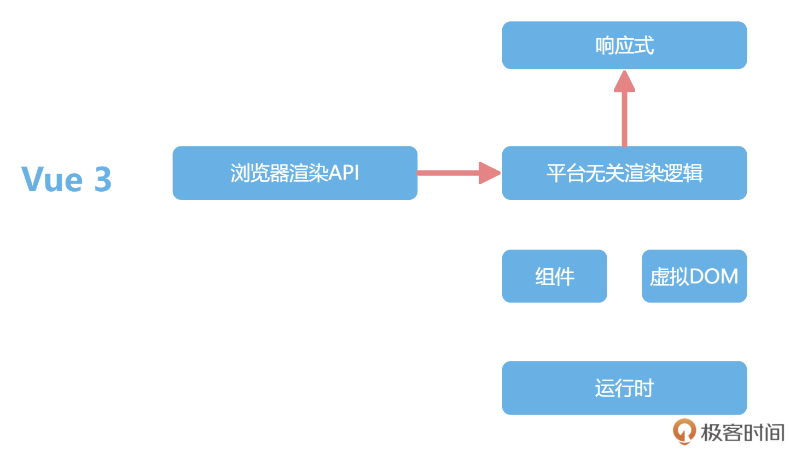
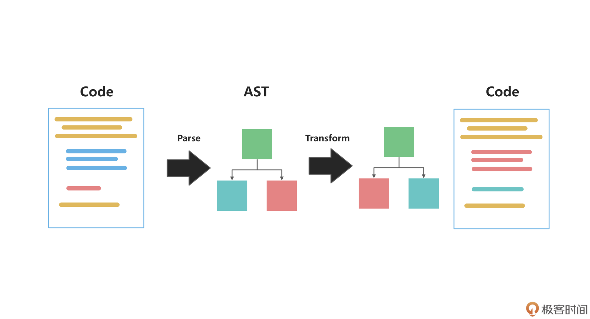
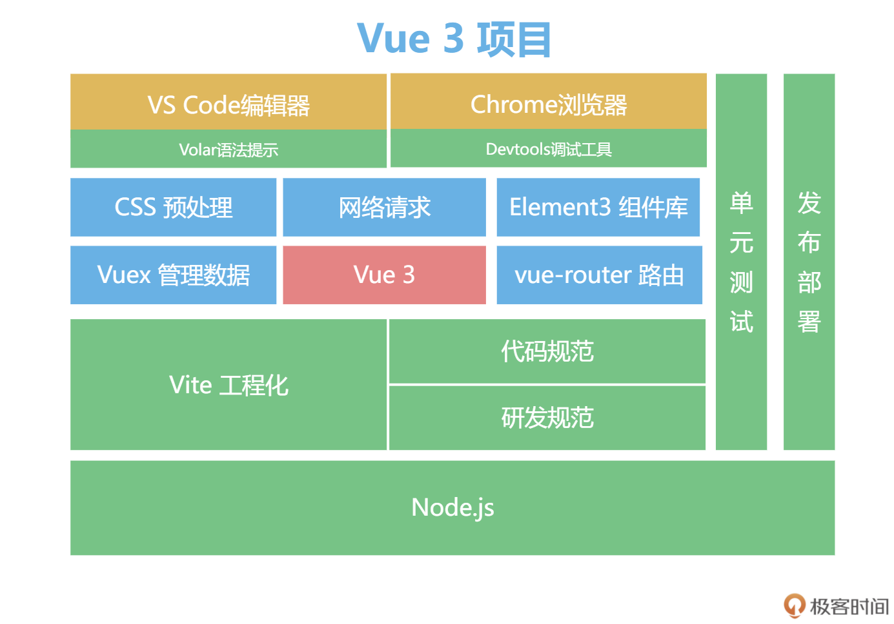
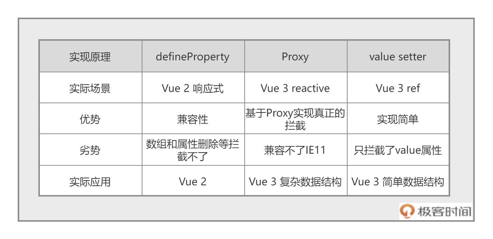
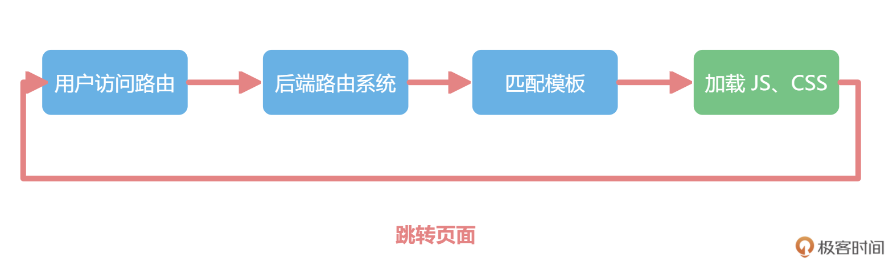
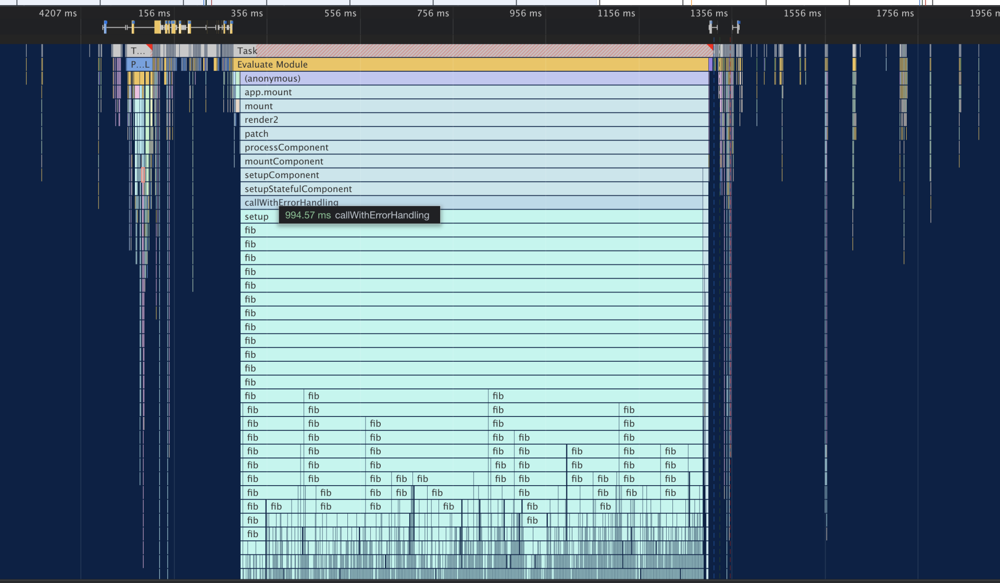

# Vue3

<!-- @import "[TOC]" {cmd="toc" depthFrom=1 depthTo=6 orderedList=false} -->

<!-- code_chunk_output -->

- [Vue3](#vue3)
  - [一. Vue2 To Vue3](#一-vue2-to-vue3)
    - [1.1 Vue 2 的历史遗留问题](#11-vue-2-的历史遗留问题)
    - [1.2 Vue3 新特性](#12-vue3-新特性)
    - [1.3 Vue2 升级到 Vue3](#13-vue2-升级到-vue3)
  - [二. Vue3 基础](#二-vue3-基础)
    - [2.1 项目启动](#21-项目启动)
    - [2.2 新的代码组织方式：Composition API + script setup](#22-新的代码组织方式composition-api-script-setup)
    - [2.3 巧妙的响应式](#23-巧妙的响应式)
      - [2.3.1 响应式原理](#231-响应式原理)
  - [三. 闭包组件](#三-闭包组件)
    - [3.1 路由](#31-路由)
      - [3.1.1 前后端开发模式的演变](#311-前后端开发模式的演变)
      - [3.1.2 前端路由的实现原理](#312-前端路由的实现原理)
    - [3.2 JSX](#32-jsx)
      - [3.2.1 h 函数](#321-h-函数)

<!-- /code_chunk_output -->


## 一. Vue2 To Vue3

### 1.1 Vue 2 的历史遗留问题

- 从开发维护的角度看，Vue 2 是使用 Flow.js 来做类型校验。但现在 Flow.js 已经停止维护了，整个社区都在全面使用 TypeScript 来构建基础库，Vue 团队也不例外。

- 从社区的二次开发难度来说，Vue 2 内部运行时，是直接执行浏览器 API 的。但这样就会在 Vue 2 的跨端方案中带来问题，要么直接进入 Vue 源码中，和 Vue 一起维护，比如 Vue 2 中就能见到 Weex 的文件夹。要么是要直接改为复制一份全部 Vue 的代码，把浏览器 API 换成客户端或者小程序的。比如 mpvue 就是这么做的，但是 Vue 后续的更新就很难享受到。

- 从普通开发者的角度来说，**Vue 2 响应式并不是真正意义上的代理，而是基于 Object.defineProperty() 实现的**。这个 API 并不是代理，而是对某个属性进行拦截，所以有很多缺陷，比如：删除数据就无法监听，需要 $delete 等 API 辅助才能监听到。并且，Option API 在组织代码较多组件的时候不易维护。对于 Option API 来说，所有的 methods、computed 都在一个对象里配置，这对小应用来说还好。但代码超过 300 行的时候，新增或者修改一个功能，就需要不停地在 data，methods 里跳转写代码。

### 1.2 Vue3 新特性


1. **RFC 机制**

   Vue 3 的第一个新特性和代码无关，而是 Vue 团队开发的工作方式。关于 Vue 的新语法或者新功能的讨论，都会先在 [GitHub](https://github.com/vuejs/rfcs) 上公开征求意见，邀请社区所有的人一起讨论。这个改变让 Vue 社区更加有活力。

2. **响应式系统**

   Vue 2 的响应式机制是基于 Object.defineProperty() 这个 API 实现的，此外，Vue 还使用了 Proxy，这两者看起来都像是对数据的读写进行拦截，但是 defineProperty 是拦截具体某个属性，Proxy 才是真正的“代理”。首先看 defineProperty 这个 API，defineProperty 的使用，要明确地写在代码里，下面是示例代码：

   ```js
   Object.defineProperty(obj, 'title', {
     get() {},
     set() {}
   });
   ```

   当项目里 “读取 obj.title” 和 “修改 obj.title” 的时候被 defineProperty 拦截，但 defineProperty 对不存在的属性无法拦截，所以 Vue 2 中所有数据必须要在 data 里声明。而且，如果 title 是一个数组的时候，对数组的操作，并不会改变 obj.title 的指向，虽然可以通过拦截 .push 等操作实现部分功能，但是对数组的长度的修改等操作还是无法实现拦截，所以还需要额外的 $set 等 API。

   而 Proxy 这个 API 就是真正的代理了，先看它的用法：

   ```js
   new Proxy(obj, {
     get() {},
     set() {}
   });
   ```

   > **注意**：虽然 Proxy 拦截 obj 这个数据，但 obj 具体是什么属性，Proxy 则不关心，统一都拦截了。而且 Proxy 还可以监听更多的数据格式，比如 Set、Map，这是 Vue 2 做不到的。当然，Proxy 存在一些兼容性问题，这也是为什么 Vue 3 不兼容 IE11 以下的浏览器的原因。

   **Proxy 代表一种方向，就是框架会越来越多的拥抱浏览器的新特性**。前端框架利用浏览器的新特性来完善自己，才会让前端这个生态更繁荣，抛弃旧的浏览器是早晚的事。

3. **自定义渲染器**

   Vue 2 内部所有的模块都是揉在一起的，这样做会导致不好扩展的问题。Vue 3 使用拆包解决了这个问题，使用最近流行的 monorepo 管理方式，响应式、编译和运行时全部独立了，变成下图所示的模样：

   

   **在 Vue 3 的组织架构中，响应式独立了出来**。Vue 2 的响应式只服务于 Vue，Vue 3 的响应式就和 Vue 解耦了。渲染的逻辑也拆成了**平台无关渲染逻辑**和**浏览器渲染 API** 两部分。

   在这个架构下，Node 的一些库，甚至 React 都可以依赖响应式。在任何时候，如果希望数据被修改了之后能通知，都可以单独依赖 Vue 3 的响应式。那么，在想使用 Vue 3 开发小程序、开发 canvas 小游戏以及开发客户端的时候，就不用全部 fork Vue 的代码，只需要实现平台的渲染逻辑就可以。

4. **全部模块使用 TypeScript 重构**

   大部分开源的框架都会引入类型系统，来对 JS 进行限制。这样做的原因是：

   - 类型系统带来了更方便的提示
   - 类型系统让代码更健壮

   Vue 2 那个时代基本只有两个技术选型，Facebook 家的 Flow.js 和微软家的 TypeScript。Vue 2 选 Flow.js 没问题，但是现在 Flow.js 被抛弃了。Vue 3 选择了 TypeScript，TypeScript 官方也对使用 TypeScript 开发 Vue 3 项目的团队也更加友好。

5. **Composition API 组合语法**

   先举个 Vue 2 中的简单例子，一个累加器，并且还有一个计算属性显示累加器乘以 2 的结果：

   ```html
   <div id="app">
     <h1 @click="add">{{ count }} * 2 = {{ double }}</h1>
   </div>
   <script src="https://unpkg.com/vue@next"></script>
   <script>
     let App = {
       data() {
         return {
           count: 1
         };
       },
       methods: {
         add() {
           this.count++;
         }
       },
       computed: {
         double() {
           return this.count * 2;
         }
       }
     };
     Vue.createApp(App).mount('#app');
   </script>
   ```

   在 Vue 3 中，除了上面这种这个写法，还可以采用下方的写法，新增一个 setup 配置：

   ```html
   <div id="app">
     <h1 @click="add">{{state.count}} * 2 = {{double}}</h1>
   </div>
   <script src="https://unpkg.com/vue@next"></script>
   <script>
     const { reactive, computed } = Vue;
     let App = {
       setup() {
         const state = reactive({
           count: 1
         });
         function add() {
           state.count++;
         }
         const double = computed(() => state.count * 2);
         return { state, add, double };
       }
     };
     Vue.createApp(App).mount('#app');
   </script>
   ```

   使用 Composition API 后，代码看起来很烦琐，没有 Vue 2 中 Options API 的写法简单好懂，但 Options API 的写法也有几个很严重的问题：

   - 由于所有数据都挂载在 this 之上，因而 Options API 的写法对 TypeScript 的类型推导很不友好，并且这样也不好做 Tree-shaking 清理代码。
   - 新增功能基本都得修改 data、method 等配置，并且代码上 300 行之后，会经常上下反复横跳，开发很痛苦。
   - 代码不好复用，Vue 2 的组件很难抽离通用逻辑，只能使用 mixin，还会带来命名冲突的问题。

   使用 Composition API 后，虽然看起来烦琐了一些，但是带来了诸多好处：

   - 所有 API 都是 import 引入的。用到的功能都 import 进来，对 Tree-shaking 很友好，没用到的功能，打包的时候会被清理掉，减小包的大小。
   - 不再上下反复横跳，可以把一个功能模块的 methods、data 都放在一起书写，维护更轻松。
   - 代码方便复用，可以把一个功能所有的 methods、data 封装在一个独立的函数里，复用代码非常容易。
   - Composotion API 新增的 return 等语句，在实际项目中使用 `<script setup>` 特性可以清除。

   Composition API 对开发 Vue 项目起到了巨大的帮助。下面这个示例图很好地说明了问题：每一个功能模块的代码颜色一样，左边是 Options API，一个功能的代码零散的分布在 data，methods 等配置内，维护起来很麻烦，而右边的 Composition API 就不一样了，每个功能模块都在一起维护。

   

   还可以更进一步，对每个颜色块代码，都拆分出去一个函数，就会写出类似上面右侧风格的代码，每个数据来源都清晰可见，而且每个功能函数都可以在各个地方复用。

6. **新的组件**

   Vue 3 还内置了 Fragment、Teleport 和 Suspense 三个新组件：

   - Fragment：Vue 3 组件不再要求有一个唯一的根节点，清除了很多无用的占位 div。
   - Teleport：允许组件渲染在别的元素内，主要开发弹窗组件的时候特别有用。
   - Suspense：异步组件，更方便开发有异步请求的组件。

7. **新一代工程化工具 vite**

   Vite 不在 Vue 3 的代码包内，和 Vue 也不是强绑定，Vite 的竞品是 Webpack，而且按照现在的趋势看，使用率超过 Webpack 也是早晚的事。

   Vite 主要提升的是开发的体验，Webpack 等工程化工具的原理，就是根据 import 依赖逻辑，形成一个依赖图，然后调用对应的处理工具，把整个项目打包后，放在内存里再启动调试。由于要预打包，所以复杂项目的开发，启动调试环境需要 3 分钟都很常见，Vite 就是为了解决这个时间资源的消耗问题出现的。

   现代浏览器已经默认支持了 ES6 的 import 语法，Vite 就是基于这个原理来实 d 现的。具体来说，在调试环境下，不需要全部预打包，只是把首页依赖的文件，依次通过网络请求去获取，整个开发体验得到巨大提升，做到了复杂项目的秒级调试和热更新。

   下图展示了 Webpack 的工作原理，Webpack 要把所有路由的依赖打包后，才能开始调试：

   

   而下图所示的是 Vite 的工作原理，一开始就可以准备联调，然后根据首页的依赖模块，再去按需加载，这样启动调试所需要的资源会大大减少：

   

### 1.3 Vue2 升级到 Vue3

Vue 2.7 会移植 Vue 3 的一些新特性，让在 Vue 2 的生态中，也能享受 Vue 3 的部分新特性。在 Vue 3 发布之前，Vue 2 项目中就可以基于 @vue/composition-api 插件，使用 Composition API 语法，Vue 2 会直接内置这个插件，在 Vue 2 中默认也可以用 Composition 来组合代码。

**Vue 3 不兼容的那些写法**
在 Vue 2 中，使用 new Vue() 来新建应用，有一些全局的配置会直接挂在 Vue 上，比如通过 Vue.use 来使用插件，通过 Vue.component 来注册全局组件。

```js
Vue.component('el-counter', {
  data() {
    return { count: 1 };
  },
  template: '<button @click="count++">Clicked {{ count }} times.</button>'
});

let VueRouter = require('vue-router');
Vue.use(VueRouter);
```

在上面的代码里，注册了一个 el-counter 组件，这个组件是全局可用的，它直接渲染一个按钮，并且在点击按钮的时候，按钮内的数字会累加。然后需要注册路由插件，这也是 Vue 2 中使用 vue-router 的方式。这种形式虽然很直接，但是由于全局的 Vue 只有一个，所以当在一个页面的多个应用中独立使用 Vue 就会非常困难。

看下面这段代码，在 Vue 上先注册了一个组件 el-counter，然后创建了两个 Vue 的实例。这两个实例都自动都拥有了 el-counter 这个组件，但这样做很容易造成混淆。

```js
Vue.component('el-counter',...)

new Vue({el:'#app1'})
new Vue({el:'#app2'})
```

为了解决这个问题，Vue 3 引入一个新的 API `createApp`，来解决这个问题，也就是新增了 App 的概念。全局的组件、插件都独立地注册在这个 App 内部，很好的解决了上面的两个实例容易造成混淆的问题。下面的代码是使用 createApp 的简单示例：

```js
const { createApp } = Vue
const app = createApp({})
app.component(...)
app.use(...)
app.mount('#app1')

const app2 = createApp({})
app2.mount('#app2')
```

createApp 还移除了很多常见的写法，比如在 createApp 中，就不再支持 filter、$on、$off、$set、$delete 等 API。在 Vue 3 中，v-model 的用法也有更改。Vue 3 还有很多小细节的更新，比如 slot 和 slot-scope 两者实现了合并，而 directive 注册指令的 API 等也有变化。

**Vue 3 生态现状介绍**
vue-router 是复杂项目必不可少的路由库，它也包含一些写法上的变化，比如从 new Router 变成 createRouter；使用方式上，也全面拥抱 Composition API 风格，提供了 useRouter 和 useRoute 等方法。

Vuex 4.0 也支持 Vue 3，不过变化不大。有趣的是 Vue 官方成员还发布了一个 Pinia，Pinia 的 API 非常接近 Vuex5 的设计，并且对 Composition API 特别友好，更优雅一些。其他生态诸如 Nuxt、组件库 Ant-design-vue、Element 等等，都有 Vue 3 的版本发布。

**使用自动化升级工具进行 Vue 的升级**
首先是在 Vue 3 的项目里，有一个 @vue/compat 的库，这是一个 Vue 3 的构建版本，提供了兼容 Vue 2 的行为。这个版本默认运行在 Vue 2 下，它的大部分 API 和 Vue 2 保持了一致。当使用那些在 Vue 3 中发生变化或者废弃的特性时，这个版本会提出警告，从而避免兼容性问题的发生，帮助很好地迁移项目。并且通过升级的提示信息，@vue/compat 还可以很好地帮助学习版本之间的差异。

1. 首先把项目依赖的 Vue 版本换成 Vue 3，并且引入了 @vue/compat。

   ```json
   "dependencies": {
    "vue": "^2.6.12",
    "vue": "^3.2.19",
    "@vue/compat": "^3.2.19"
   },
   "devDependencies": {
    "vue-template-compiler": "^2.6.12",
    "@vue/compiler-sfc": "^3.2.19"
   }
   ```

2. 然后给 vue 设置别名 @vue/compat，也就是以 compat 作为入口，代码如下：

   ```js
    // vue.config.js
    module.exports = {
      chainWebpack: config => {
        config.resolve.alias.set('vue', '@vue/compat')
        ......
      }
    }
   ```

   这时就会在控制台看到很多警告，以及很多优化的建议。参照建议，挨个去做优化就可以了。在 @vue/compat 提供了很多建议后，还是要慢慢做修改。

社区还有能够做自动化替换的工具，比较好用的就是 [gogocode](https://gogocode.io/zh/docs/vue/vue2-to-vue3)。

**自动化替换工具的原理很简单，和 Vue 的 Compiler 优化的原理是一样的，也就是利用编译原理做代码替换**。如下图所示，利用 babel 分析左边 Vue 2 的源码，解析成 AST，然后根据 Vue 3 的写法对 AST 进行转换，最后生成新的 Vue 3 代码。



对于替换过程的中间编译成的 AST，可以理解为用 JS 的对象去描述这段代码，这和虚拟 DOM 的理念有一些相似，基于这个对象去做优化，最终映射生成新的 Vue 3 代码。

## 二. Vue3 基础

### 2.1 项目启动

Vue3 推荐使用 [Vite](https://vitejs.bootcss.com/guide/) 创建项目，因为 vite 能够提供更好更快的调试体验。在使用 Vite 之前，要先安装 Node.js。

1. 在命令行窗口里，执行下面的命令，可以创建一个 Vite 的初始化项目。

   ```sh
   npm init vite@latest
   # 使用 PNPM
   pnpm create vite
   ```

2. 然后按照提示操作。生成后的项目目录，如下所示：

   ```sh
   ├── README.md
   ├── index.html 入口文件
   ├── package.json
   ├── public 资源文件
   │ └── favicon.ico
   ├── src 源码
   │ ├── App.vue 单文件组件
   │ ├── assets
   │ │ └── logo.png
   │ ├── components
   │ │ └── HelloWorld.vue
   │ └── main.js 入口
   └── vite.config.js vite 工程化配置文件
   ```

3. 在这之后，在项目文件夹内执行 npm install 命令，进行依赖的安装，然后执行 npm run dev 命令来启动项目。

   **所有工程化体系都是基于 Node.js 生态；使用 VS Code+Volar 编辑器 + 语法提示工具作为上层开发工具；使用 Vite 作为工程化工具；使用 Chrome 进行调试**，这些都是 Vue 3 工程化体系的必备工具。

4. 使用下面这段代码安装 Vuex 和 vue-router。

   ```sh
   npm install vue-router@next vuex@next
   ```

**规范**
下面是 src 目录的组织结构：

```sh
├── src
│   ├── api            数据请求
│   ├── assets         静态资源
│   ├── components     组件
│   ├── pages          页面
│   ├── router         路由配置
│   ├── store          vuex数据
│   └── utils          工具函数
```



### 2.2 新的代码组织方式：Composition API + script setup

Composition API 可以更好地组织代码结构，而 `<script setup>` 本质上是以一种更精简的方式来书写 Composition API。具体看 [vue3-demo](https://github.com/DuSenYao/vue3-demo)。

### 2.3 巧妙的响应式

响应式一直都是 Vue 的特色功能之一。与之相比，JS 里面的变量，是没有响应式这个概念的。但使用 JS 的某种机制，把 count 包裹一层，每当对 count 进行修改时，就去同步更新 double 的值，那么就有一种 double 自动跟着 count 的变化而变化的感觉，这就算是响应式的雏形了。


#### 2.3.1 响应式原理

Vue 中用过三种响应式解决方案，分别是 defineProperty、Proxy 和 value setter。首先来看 Vue 2 的 [defineProperty API](https://developer.mozilla.org/zh-CN/docs/Web/JavaScript/Reference/Global_Objects/Object/defineProperty)。

- **defineProperty**

  在下面的代码中，定义个一个对象 obj，使用 defineProperty 代理了 count 属性。这样就对 obj 对象的 value 属性实现了拦截，读取 count 属性的时候执行 get 函数，修改 count 属性的时候执行 set 函数，并在 set 函数内部重新计算了 double：

  ```js
  let getDouble = n => n * 2;
  let obj = {};
  let count = 1;
  let double = getDouble(count);

  Object.defineProperty(obj, 'count', {
    get() {
      return count;
    },
    set(val) {
      count = val;
      double = getDouble(val);
    }
  });
  console.log(double); // 2
  obj.count = 2;
  console.log(double); // 4 有种自动变化的感觉
  ```

  但 defineProperty API 作为 Vue 2 实现响应式的原理，它的语法中也有一些缺陷。比如在下面代码中，删除 obj.count 属性，set 函数就不会执行，double 还是之前的数值。这也是为什么在 Vue 2 中，需要 $delete 一个专门的函数去删除数据：

  ```js
  delete obj.count;
  console.log(double); // double 还是4
  ```

- **Proxy**

  Vue 3 的响应式机制是基于 Proxy 实现的。Proxy 的重要意义在于它解决了 Vue 2 响应式的缺陷。看下面的代码，在其中通过 new Proxy 代理了 obj 这个对象，然后通过 get、set 和 deleteProperty 函数代理了对象的读取、修改和删除操作，从而实现了响应式的功能：

  ```js
  let proxy = new Proxy(obj, {
    get(target, prop) {
      return target[prop];
    },
    set(target, prop, value) {
      target[prop] = value;
      if (prop === 'count') {
        double = getDouble(value);
      }
    },
    deleteProperty(target, prop) {
      delete target[prop];
      if (prop === 'count') {
        double = NaN;
      }
    }
  });
  console.log(obj.count, double);
  proxy.count = 2;
  console.log(obj.count, double);
  delete proxy.count;
  // 删除属性后，打印时，输出的结果就会是 undefined NaN
  console.log(obj.count, double);
  ```

  **Proxy 是针对对象来监听，而不是针对某个具体属性，所以不仅可以代理那些定义时不存在的属性，还可以代理更丰富的数据结构**，比如 Map、Set 等，并且也能通过 deleteProperty 实现对删除操作的代理。

- **value setter**

  有了 Proxy 后，响应式机制就比较完备了。但是在 Vue 3 中还有另一个响应式实现的逻辑，就是利用对象的 get 和 set 函数来进行监听，这种响应式的实现方式，只能拦截某一个属性的修改，这也是 Vue 3 中 ref 这个 API 的实现。在下面的代码中，拦截了 count 的 value 属性，并且拦截了 set 操作，也能实现类似的功能：

  ```js
  let getDouble = n => n * 2;
  let _value = 1;
  double = getDouble(_value);

  let count = {
    get value() {
      return _value;
    },
    set value(val) {
      _value = val;
      double = getDouble(_value);
    }
  };
  console.log(count.value, double);
  count.value = 2;
  console.log(count.value, double);
  ```



## 三. 闭包组件

### 3.1 路由

#### 3.1.1 前后端开发模式的演变

在 jQuery 时代，对于大部分 Web 项目而言，前端都是不能控制路由的，而是需要依赖后端项目的路由系统。通常，前端项目也会部署在后端项目的模板里，整个项目执行的示意图如下：



前端依赖后端，并且前端不需要负责路由的这种开发方式，有很多的优点，比如开发速度会很快、后端也可以承担部分前端任务等。当然，这种开发方式也有很多缺点，比如前后端项目无法分离、页面跳转由于需要重新刷新整个页面、等待时间较长等等，所以也会让交互体验下降。

为了提高页面的交互体验，很多前端工程师做了不同的尝试。在这个过程中，前端的开发模式发生了变化，项目的结构也发生了变化。下图所示的，是在目前的前端开发中，用户访问页面后代码执行的过程。


从上面的示意图中，可以看到：用户访问路由后，无论是什么 URL 地址，都直接渲染一个前端的入口文件 index.html，然后就会在 index.html 文件中加载 JS 和 CSS。之后，JS 获取当前的页面地址，以及当前路由匹配的组件，再去动态渲染当前页面即可。用户在页面上进行点击操作时，也不需要刷新页面，而是直接通过 JS 重新计算出匹配的路由渲染即可。

在前后两个示意图中，绿色的部分表示的就是前端负责的内容。而在后面这个架构下，前端获得了路由的控制权，在 JS 中控制路由系统。也因此，页面跳转的时候就不需要刷新页面，网页的浏览体验也得到了提高。**这种所有路由都渲染一个前端入口文件的方式，是单页面应用程序（SPA，single page application）应用的雏形**。

通过 JS 动态控制数据去提高用户体验的方式并不新奇，Ajax 让数据的获取不需要刷新页面，SPA 应用让路由跳转也不需要刷新页面。这种开发的模式在 jQuery 时代就出来了，浏览器路由的变化可以通过 pushState 来操作，这种纯前端开发应用的方式，以前称之为 Pjax（pushState+ Ajax）。之后，这种开发模式在 MVVM 框架的时代大放异彩，现在大部分使用 Vue/React/Angular 的应用都是这种架构。

SPA 应用相比于模板的开发方式，对前端更加友好，比如：前端对项目的控制权更大了、交互体验也更加丝滑，更重要的是，前端项目终于可以独立出来单独部署了。

#### 3.1.2 前端路由的实现原理

现在，通过 URL 区分路由的机制上，有两种实现方式，一种是 hash 模式，通过 URL 中 # 后面的内容做区分，称之为 hash-router；另外一个方式就是 history 模式，在这种方式下，路由看起来和正常的 URL 完全一致。这两个不同的原理，在 vue-router 中对应两个函数，分别是 createWebHashHistory 和 createWebHistory。


- **hash 模式**

  类似于服务端路由，前端路由实现起来其实也很简单，就是匹配不同的 URL 路径，进行解析，然后动态地渲染出区域 HTML 内容。但是这样存在一个问题，就是 URL 每次变化的时候，都会造成页面的刷新。解决这一问题的思路便是在改变 URL 的情况下，保证页面的不刷新。在 2014 年之前，都是通过 hash 来实现前端路由，URL hash 中的 # 就是类似于下面代码中的这种 #：

  ```txt
  http://www.xxx.com/#/login
  ```

  之后，在进行页面跳转的操作时，hash 值的变化并不会导致浏览器页面的刷新，只是会触发 hashchange 事件。在下面的代码中，通过对 hashchange 事件的监听，就可以在 fn 函数内部进行动态地页面切换。

  ```js
  window.addEventListener('hashchange', fn);
  ```

- **history 模式**

  2014 年之后，因为 **HTML5 标准发布，浏览器多了两个 API：pushState 和 replaceState。通过这两个 API 可以改变 URL 地址，并且浏览器不会向后端发送请求，就能用另外一种方式实现前端路由**。在下面的代码中，监听了 popstate 事件，可以监听到通过 pushState 修改路由的变化。并且在 fn 函数中，实现了页面的更新操作：

  ```js
  window.addEventListener('popstate', fn);
  ```

### 3.2 JSX

#### 3.2.1 h 函数

在 Vue 3 的项目开发中，template 是 Vue 3 默认的写法。虽然 template 长得很像 HTML，但 Vue 其实会把 template 解析为 render 函数，之后，组件运行的时候通过 render 函数去返回虚拟 DOM，可以在 Vue Devtools 中看到组件编译之后的结果。


在上面的示意图中，调试窗口右侧代码中的 _sfc_render_ 函数就是清单应用的 template 解析成 JS 之后的结果。所以除了 template 之外，在某些场景下，可以直接写 render 函数来实现组件。

举个例子：需要通过一个值的范围在数字 1 到 6 之间的变量，去渲染标题组件 h1~h6，并根据传递的 props 去渲染标签名，可以使用 Vue3 中的 [h 函数](https://v3.cn.vuejs.org/api/global-api.html#h)来实现：

由于 render 函数可以直接返回虚拟 DOM，因而就不再需要 template。可以新建一个文件 Heading.jsx ，要注意的是，这里 Heading 的结尾从 .vue 变成了 .jsx。

在下面的代码中，使用 defineComponent 定义一个组件，组件内部配置了 props 和 setup。这里的 setup 函数返回值是一个函数，就是 render 函数。render 函数返回 h 函数的执行结果，h 函数的第一个参数就是标签名，可以很方便地使用字符串拼接的方式，实现和上面代码一样的需求。像这种连标签名都需要动态处理的场景，就需要通过手写 h 函数来实现：

```jsx
import { defineComponent, h } from 'vue';

export default defineComponent({
  props: {
    level: {
      type: Number,
      required: true
    }
  },
  setup(props, { slots }) {
    return () =>
      h(
        'h' + props.level, // 标签名
        {}, // prop 或 attribute
        slots.default() // 子节点
      );
  }
});
```

然后，在文件 src/About.vue 中，使用下面代码中的 import 语法来引入 Heading，之后使用 level 传递标签的级别：

```vue
<template>
  <Heading :level="3">hello geekbang</Heading>
</template>

<script setup>
import Heading from './components/Heading.jsx';
</script>
```

手写的 h 函数，可以处理动态性更高的场景。但是**如果是复杂的场景，h 函数写起来就显得非常繁琐，需要自己把所有的属性都转变成对象**。并且组件嵌套的时候，对象也会变得非常复杂。不过，因为 h 函数也是返回虚拟 DOM 的，所以可以使用 JSX 去更方便的写 h 函数。

#### 3.2.2 JSX

JSX 来源自 React 框架，下面这段代码就是 JSX 的语法，给变量 title 赋值了一个 h1 标签。

```jsx
const title = <h1 id="heading">Hello</h1>;
```

**这种在 JS 里面写 HTML 的语法，就叫做 JSX**，算是对 JS 语法的一个扩展。上面的代码直接在 JS 环境中运行时，会报错。JSX 的本质就是下面代码的语法糖，h 函数内部也是调用 createVnode 来返回虚拟 DOM：

```jsx
const title = createVnode('h1', { id: 'app' }, 'Hello');
```

在从 JSX 到 createVNode 函数的转化过程中，需要安装一个 JSX 插件 `@vitejs/plugin-vue-jsx`。

插件安装完成后，打开 vite.config.js 文件去修改配置，加入下面的代码。这样，在加载 JSX 插件后，现在的页面中就可以支持 JSX 插件了。

```js
import vue from '@vitejs/plugin-vue';
import vueJsx from '@vitejs/plugin-vue-jsx';

export default defineConfig({
  plugins: [vue(), vueJsx()]
});
```

然后，进入 src/components/Heading.jsx 中，把 setup 函数的返回函数改成下面代码中所示的内容，这里使用变量 tag 计算出标签类型，直接使用渲染，使用一个大括号把默认插槽包起来就可以了。

```jsx
setup(props, { slots }) {
  const tag = 'h'+props.level
  return () => <tag>{slots.default()}</tag>
}
```

JSX 的语法详细要点在 [GitHub 文档](https://github.com/vuejs/babel-plugin-jsx/blob/dev/packages/babel-plugin-jsx/README-zh_CN.md)中也有全面的介绍。

进入到 src/components 下面新建文件 Todo.jsx，在下面的代码中，使用 JSX 实现了一个简单版本的清单应用。首先使用 defineComponent 的方式来定义组件，在 setup 返回的 JSX 中，使用单个大括号包裹的形式传入变量 title.value ，然后使用 onClick 取代 @click。循环渲染清单的时候，使用 .map 映射取代 v-for，使用三元表达式取代 v-if。

```jsx
import { defineComponent, ref } from 'vue';

export default defineComponent({
  name: 'TodoList',
  setup() {
    let title = ref('');
    let todos = ref([{ title: '学习Vue3', done: false }]);

    function addTodo() {
      todos.value.push({
        title: title.value,
        done: false
      });
      title.value = '';
    }

    return () => (
      <div>
        <input type="text" v-model={title.value} />
        <button onClick={addTodo}>click</button>
        <ul>
          {todos.value.length ? (
            todos.value.map(todo => {
              return <li>{todo.title}</li>;
            })
          ) : (
            <li>no data</li>
          )}
        </ul>
      </div>
    );
  }
});
```

**使用 JSX 的本质，还是在写 JS**。在 Element3 组件库设计中有很多组件需要用到 JSX，比如时间轴 Timeline、分页 Pagination、表格 Table 等等。

就像在 TimeLine 组件的[源码](https://github.com/hug-sun/element3/blob/master/packages/element3/packages/timeline/Timeline.vue#L35)中，有一个 reverse 的属性来决定是否倒序渲染，在下面写出了类似的代码。代码中的 Timeline 是一个数组，数组中的两个元素都是 JSX，可以通过数组的 reverse 方法直接进行数组反转，实现逆序渲染。类似这种动态性要求很高的场景，template 是较难实现的。

```jsx
export const Timeline = props => {
  const timeline = [<div className="start">8.21 开始自由职业</div>, <div className="online">10.18 专栏上线</div>];
  if (props.reverse) {
    timeline.reverse();
  }
  return <div>{timeline}</div>;
};
```

**JSX 和 Template**
template 的语法是固定的，只有 v-if、v-for 等等语法。也就是说，template 遇见条件渲染就是要固定的选择用 v-if。按照这种固定格式的语法书写，这样 Vue 在编译层面就可以很方便地去做静态标记的优化。

而 JSX 只是 h 函数的一个语法糖，本质就是 JS，想实现条件渲染可以用 if else，也可以用三元表达式，还可以用任意合法的 JS 语法。也就是说，**JSX 可以支持更动态的需求。而 template 则因为语法限制原因，不能够像 JSX 那样可以支持更动态的需求**。这是 JSX 相比于 template 的一个优势。

**JSX 相比于 template 还有一个优势，是可以在一个文件内返回多个组件**，可以像下面的代码一样，在一个文件内返回 Button、Input、Timeline 等多个组件。

```jsx
export const Button = (props, { slots }) => <button {...props}>slots.default()</button>;
export const Input = props => <input {...props} />;
export const Timeline = props => {
  // ...
};
```


上面的截图是使用 Vue 官方的 template 解析的一个 demo。在 demo 页面右侧是 template 代码编译的结果，相比于自己去写 h 函数，在 template 解析的结果中，有以下几个性能优化的方面：

- 首先，静态的标签和属性会放在 \_hoisted 变量中，并且放在 render 函数之外。这样，重复执行 render 的时候，代码里的 h1 这个纯静态的标签，就不需要进行额外地计算，并且静态标签在虚拟 DOM 计算的时候，会直接越过 Diff 过程。

- 然后是 @click 函数增加了一个 cache 缓存层，这样实现出来的效果也是和静态提升类似，尽可能高效地利用缓存。最后是，由于在下面代码中的属性里，那些带冒号的属性是动态属性，因而存在使用一个数字去标记标签的动态情况。

  比如在 p 标签上，使用 8 这个数字标记当前标签时，只有 props 是动态的。而在虚拟 DOM 计算 Diff 的过程中，可以忽略掉 class 和文本的计算，这也是 Vue 3 的虚拟 DOM 能够比 Vue 2 快的一个重要原因。

在 template 和 JSX 这两者的选择问题上，只是选择框架时角度不同而已。**实现业务需求的时候，也是优先使用 template，动态性要求较高的组件使用 JSX 实现，尽可能地利用 Vue 本身的性能优化**。

### 3.3 Vue 3 中使用 TypeScript

TypeScript 是微软开发的 JS 的超集，这里说的超集，意思就是 TypeScript 在语法上完全包含 JS。TypeScript 的主要作用是给 JS 赋予强类型的语言环境。现在大部分的开源项目都是用 TypeScript 构建的，并且 Vue 3 本身 TS 的覆盖率也超过了 95%。

**TypeScript 相当于在 JS 外面包裹了一层类型系统，这样可以帮助开发更健壮的前端应用**。


由于 TypeScript 中的每个变量都需要把类型定义好，因而对代码书写的要求也会提高。**Vue 2 中全部属性都挂载在 this 之上，而 this 可以说是一个黑盒子，完全没办法预先知道 this 上会有什么数据，这也是为什么 Vue 2 对 TypeScript 的支持一直不太好的原因**。

Vue 3 全面拥抱 Composition API 之后，没有了 this 这个黑盒，对 TypeScript 的支持也比 Vue2 要好很多。在下面的代码中，首先需要在 script 标签上加一个配置 lang="ts"，来标记当前组件使用了 TypeScript，然后代码内部使用 defineComponent 定义组件即可。

```vue
<script lang="ts">
import { defineComponent } from 'vue';
export default defineComponent({
  // 已启用类型推断
});
</script>
```

在 `<script setup>` 的内部，需要调整写法的内容不多。下面的代码使用 Composition API 的过程中，可以针对 ref 或者 reactive 进行类型推导。如果 ref 包裹的是数字，那么在对 count.value 进行 split 函数操作的时候，TypeScript 就可以预先判断 count.value 是一个数字，并且进行报错提示。

```js
const count = ref(1);
count.value.split(''); // => Property 'split' does not exist on type 'number'
```

也可以显式地去规定 ref、reactive 和 computed 输入的属性，下面代码中分别演示了 ref、reactive 和 computed 限制类型的写法，每个函数都可以使用默认的参数推导，也可以显式地通过泛型去限制。

```vue
<script setup lang="ts">
import { computed, reactive, ref } from '@vue/runtime-core';

interface Geek {
  name: string;
  price: number;
}

const msg = ref(''); //  根据输入参数推导字符串类型
const msg1 = ref<string>(''); //  可以通过范型显示约束

const obj = reactive({});
const course = reactive<Geek>({ name: '玩转Vue3全家桶', price: 129 });

const msg2 = computed(() => ''); // 默认参数推导
const course2 = computed<Geek>(() => {
  return { name: '玩转Vue3全家桶', price: 129 };
});
</script>
```

在 Vue 中，除了组件内部数据的类型限制，还需要对传递的属性 Props 声明类型。而在 `<script setup>` 语法中，只需要在 defineProps 和 defineEmits 声明参数类型就可以了。下面的代码中，声明了 title 属性必须是 string，而 value 的可选属性是 number 类型。

```ts
const props = defineProps<{
  title: string;
  value?: number;
}>();
const emit = defineEmits<{
  (e: 'update', value: number): void;
}>();
```

如果需要了解 Composition API 所有的类型设置，可以进入项目目录下面的 node_modules/@vue/reactivity/dist/reactivity.d.ts 中查看。

### 3.4 实战痛点

#### 3.4.1 指令的封装

常见的图片懒加载的需求，可以在 img 的标签之上，再加上一个 v-lazy 的属性。而图片懒加载和指令增强型组件的封装的关系在于，v-lazy 指令的使用方式是在 HTML 标签上新增一个属性。像图片懒加载这种**库和 DOM 绑定，但是又没有单独的组件渲染逻辑的情况，通常在 Vue 中以指令的形式存在**。

在 Vue 中注册指令和组件略有不同，下面的代码中注册实现了 v-focus 指令，然后在 input 标签中加上 v-focus 指令，在指令加载完毕后，鼠标会自动聚焦到输入框上，这个实现在登录注册窗口中很常见。

```js
// 注册一个全局自定义指令 `v-focus`
app.directive('focus', {
  // 当被绑定的元素挂载到 DOM 中时……
  mounted(el) {
    // 聚焦元素
    el.focus();
  }
});
```

指令的生命周期和组件类似，首先要让指令能够支持 Vue 的插件机制，所以需要在 install 函数内注册 lazy 指令。

```js
const lazyPlugin = {
  install(app, options) {
    app.directive('lazy', {
      mounted: {},
      updated: {},
      unmounted: {}
    });
  }
};
```

通过 lazy 指令获取到当前图片的标签，并且计算图片的位置信息，判断图片是否在首页显示。如果不在首页的话，图片就加载一个默认的占位符就可以了，并且在页面发生变化的时候，重新进行计算，这样就实现了页面图片的懒加载。

#### 3.4.2 引入第三方库的注意事项

- 无论是引用第三方库还是自己封装的底层库，在使用它们之初就要考虑到项目的长期可维护性。

- 尽可能不要因为排期等问题，一股脑地把第三方库堆在一起，虽然这样做可以让项目在早期研发进度上走得很快，但这样会导致项目中后期的维护成本远远大于重写一遍代码 xxx 的成本。

- Vue 中的 mixin，extends 机制能不用就不用，这两个 API 算是从 Vue 2 时代继承下来的产物，都是扩展和丰富 Vue 2 中 this 关键字，在项目复杂了之后，mixin 和 extends 隐式添加的 API 无从溯源，一旦多个 mixin 有了命名冲突，调试起来难度倍增。

- 项目中的全局属性也尽可能少用，全局变量是最原始的共享数据的方法，Vue 3 中使用 `app.config.globalProperties.x` 注册全局变量，要少用它的主要原因也是项目中的全局变量会极大的提高维护成本。有些监控场景必须要用到，就要把所有注册的全局变量放在一个独立的文件去管理。

- 引入第三方框架和库的时候一定要注意按需引入。

#### 3.4.3 性能优化


用户在输入 URL 并且敲击回车之后，浏览器会去查询当前域名对应的 IP 地址。对于 IP 地址来说，它就相当于域名后面的服务器在互联网世界的门牌号。然后，浏览器会向服务器发起一个网络请求，服务器会把浏览器请求的 HTML 代码返回给浏览器。

之后，浏览器会解析这段 HTML 代码，并且加载 HTML 代码中需要加载的 CSS 和 JS，然后开始执行 JS 代码。进入到项目的代码逻辑中，可以看到 Vue 中通过 vue-router 计算出当前路由匹配的组件，并且把这些组件显示到页面中，这样页面就显示出来了。而性能优化的主要目的，就是让页面显示过程的时间再缩短一些。

- **网络请求优化**

  对于前端来说，可以优化的点，首先就是在首页的标签中，使用标签去通知浏览器对页面中出现的其他域名去做 DNS 的预解析，比如页面中的图片通常都是放置在独立的 CDN 域名下，这样页面加载首页的时候就能预先解析域名并把结果缓存起来。以淘宝网的首页为例进行分析。可以在淘宝的首页源码中看到下图所示的一列 dns-prefetch 标签，这样首页再出现 img.alicdn.com 这个域名请求的时候，浏览器就可以从缓存中直接获取对应的 IP 地址。

  

  项目在整体流程中，会通过 HTTP 请求加载很多的 CSS、JS，以及图片等静态资源。为了让这些文件在网络加载中更快，可以从下面这几方面入手进行优化：

  1. 首先，浏览器在获取网络文件时，需要通过 HTTP 请求，HTTP 协议底层的 TCP 协议每次创建链接的时候，都需要三次握手，而三次握手会造成额外的网络损耗。如果浏览器需要获取的文件较多，那就会因为三次握手次数过多，而带来过多网络损耗的问题。所以，首先需要的是让文件尽可能地少，这就诞生出一些常见的优化策略，比如先给文件打包，之后再上线；使用 CSS 雪碧图来进行图片打包等等。文件打包这条策略在 HTTP2 全面普及之前还是有效的，但是在 HTTP2 普及之后，多路复用可以优化三次握手带来的网络损耗。

  2. 还可以想办法让这些文件尽可能地小一些，因为如果能减少文件的体积，那文件的加载速度自然也就会变快。这一环节也诞生出一些性能优化策略，比如 CSS 和 JS 代码会在上线之前进行压缩；在图片格式的选择上，对于大部分图片来说，需要使用 JPG 格式，精细度要求高的图片才使用 PNG 格式；优先使用 WebP 等等。也就是说，尽可能在同等像素下，选择体积更小的图片格式。

- **懒加载**

  在性能优化中，懒加载的方式也被广泛使用。图片懒加载的意思是，可以动态计算图片的位置，只需要正常加载首屏出现的图片，其他暂时没出现的图片只显示一个占位符，等到页面滚动到对应图片位置的时候，再去加载完整图片。

  除了图片，项目中也会做路由懒加载，现在项目打包后，所有路由的代码都在首页一起加载。但是，也可以把不常用的路由单独打包，在用户访问到这个路由的时候再去加载代码。下面的代码中，vue-router 也提供了懒加载的使用方式，只有用户访问了 /course/:id 这个页面后，对应页面的代码才会加载执行。

  ```js
  {
    path: '/course/:id',
    component: () => import('../pages/courseInfo'),
  }
  ```

- **文件大小优化**

  在文件大小的问题上，Lighthouse 已经给了比较详细的优化方法，比如控制图片大小、减少冗余代码等等，还可以在项目打包的时候，使用可视化的插件来查看包大小的分布。

  来到项目根目录下，通过执行 npm install 操作来安装插件 rollup-plugin-visualizer。使用这个插件后，就可以获取到代码文件大小的报告了。之后，进入到 vite.config.js 这个文件中，新增下列代码，就可以在 Vite 中加载可视化分析插件：

  ```js
  import { visualizer } from 'rollup-plugin-visualizer';
  export default defineConfig({
    plugins: [vue(), vueJsx(), visualizer()]
  });
  ```

  然后，在项目的根目录下执行 npm run build 命令后，项目就把项目代码打包在根目录的 dist 目录下，并且根目录下多了一个文件 stat.html。可以点开它查看文件大小分布情况。

  尽可能高效地利用浏览器的缓存机制，在文件内容没有发生变化的时候，做到一次加载多次使用。

- **代码效率优化**

  在浏览器加载网络请求结束后，页面开始执行 JS，因为 Vue 已经对项目做了很多内部的优化，所以在代码层面，需要做的优化并不多。很多 Vue 2 中的性能优化策略，在 Vue 3 时代已经不需要了，需要做的就是遵循 Vue 官方的最佳实践，其余的交给 Vue 自身来优化就可以了。

  比如 computed 内置有缓存机制，比使用 watch 函数好一些；组件里也优先使用 template 去激活 Vue 内置的静态标记，也就是能够对代码执行效率进行优化；v-for 循环渲染一定要有 key，从而能够在虚拟 DOM 计算 Diff 的时候更高效复用标签等等。然后就是 JS 本身的性能优化，或者说某些实现场景算法的选择了，这里需要具体问题具体分析，在通过性能监测工具发现代码运行的瓶颈后，依次对耗时过长的函数进行优化即可。

  下面的代码，实现了一个斐波那契数列，也就是说，在这个数列中，每一个数的值是前面两个数的值之和。使用简单的递归算法实现斐波那契数列后，在页面显示计算结果。

  ```js
  function fib(n) {
    if (n <= 1) return 1;
    return fib(n - 1) + fib(n - 2);
  }
  let count = ref(fib(38));
  ```

  上面的代码在功能上，虽然实现了斐波那契数列的要求，但是能够感觉到页面有些卡顿，所以来对页面的性能做一下检测。打开调试窗口中的 Performance 面板，使用录制功能后，便可得到下面的火焰图。通过这个火焰图，可以清晰地定位出这个项目中，整体而言耗时最长的 fib 函数，并且能看到这个函数被递归执行了无数次。到这里，不难意识到这段代码有性能问题。不过，定位到问题出现的地方之后，代码性能的优化就变得方向明确了。

  

  下面的代码中，使用递推的方式优化了斐波那契数列的计算过程，页面也变得流畅起来，这样优化就算完成了。其实对于斐波那契数列的计算而言，得到最好性能的方式是使用数学公式 + 矩阵来计算。不过在项目瓶颈到来之前，采用下面的算法已经足够了，这也是**性能优化另外一个重要原则，那就是不要过度优化**。

  ```js
  function fib(n) {
    let arr = [1, 1];
    let i = 2;
    while (i <= n) {
      arr[i] = arr[i - 1] + arr[i - 2];
      i++;
    }
    return arr[n];
  }
  ```

- **用户体验优化**

  性能优化的主要目的，还是为了能让用户在浏览网页的时候感觉更舒服，所有有些场景不能只考虑单纯的性能指标，还要结合用户的交互体验进行设计，**必要的时候，可以损失一些性能去换取交互体验的提升**。

  比如用户加载大量图片的同时，如果本身图片清晰度较高，那直接加载的话，页面会有很多图一直是白框。所以也可以预先解析出图片的一个模糊版本，加载图片的时候，先加载这个模糊的图作为占位符，然后再去加载清晰的版本。虽然额外加载了图片文件，但是用户在体验上得到了提升。

#### 3.4.4 部署

代码部署难点：
