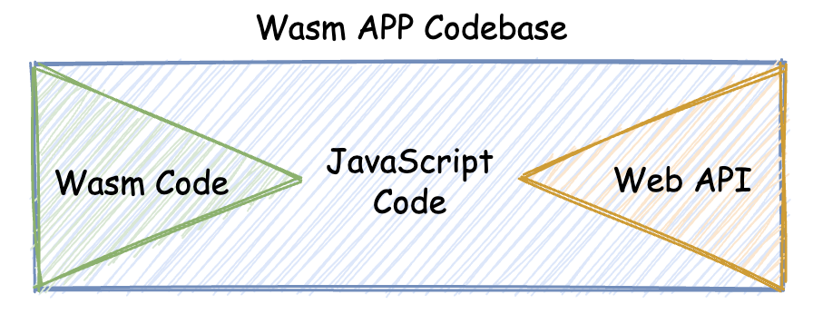
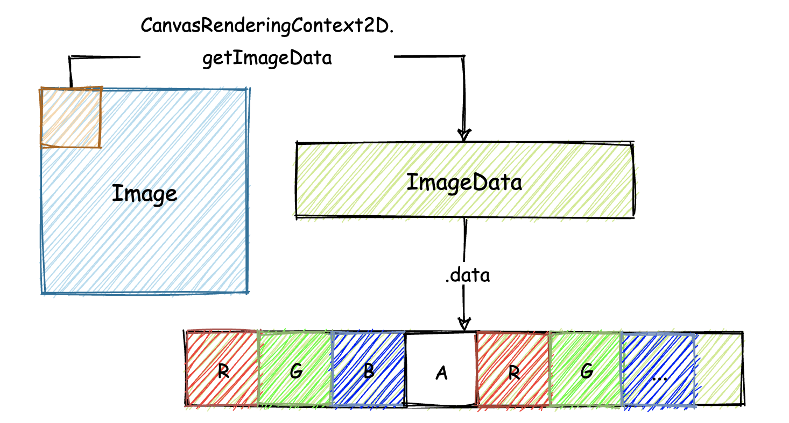

# WebAssembly

<!-- @import "[TOC]" {cmd="toc" depthFrom=1 depthTo=6 orderedList=false} -->

<!-- code_chunk_output -->

- [WebAssembly](#webassembly)
  - [一. 基础](#一-基础)
  - [二. 核心原理](#二-核心原理)
    - [2.1 堆栈机模型、寄存器机与累加器机](#21-堆栈机模型-寄存器机与累加器机)
      - [2.1.1 堆栈机模型](#211-堆栈机模型)
      - [2.1.2 累加器机](#212-累加器机)
      - [2.1.3 寄存器机](#213-寄存器机)
      - [2.1.4 三种计算模型对比](#214-三种计算模型对比)
    - [2.2 ISA 与 V-ISA](#22-isa-与-v-isa)
    - [2.3 Section 概览](#23-section-概览)
      - [2.3.1 通用头部结构字段](#231-通用头部结构字段)
      - [2.3.2 单体 Section](#232-单体-section)
      - [2.3.3 互补 Section](#233-互补-section)
      - [2.3.4 魔数和版本号](#234-魔数和版本号)
    - [2.4 Wasm 使用的数据编码方式](#24-wasm-使用的数据编码方式)
      - [2.4.1 字节序](#241-字节序)
      - [2.4.2 LEB-128 整数编码](#242-leb-128-整数编码)
        - [2.4.2.1 Unsigned LEB-128](#2421-unsigned-leb-128)
        - [2.4.2.2 Signed LEB-128](#2422-signed-leb-128)
      - [2.4.3 IEEE-754 浮点数编码](#243-ieee-754-浮点数编码)
      - [2.4.4 UTF-8 字符串编码](#244-utf-8-字符串编码)
      - [2.4.5 Wasm 数字类型](#245-wasm-数字类型)
    - [2.5 WAT（WebAssembly Text Format）](#25-watwebassembly-text-format)
      - [2.5.1 S- 表达式（S-Expression）](#251-s-表达式s-expression)
      - [2.5.2 源码、字节码与 Flat-WAT](#252-源码-字节码与-flat-wat)
      - [2.5.3 模块结构与 WAT](#253-模块结构与-wat)
      - [2.5.4 WAT 与 WAST](#254-wat-与-wast)
    - [2.6 WASI](#26-wasi)
      - [2.6.1 Capability-based Security](#261-capability-based-security)
      - [2.6.2 系统调用（System Call）](#262-系统调用system-call)
      - [2.6.3 WebAssembly 操作系统接口（WASI）](#263-webassembly-操作系统接口wasi)
    - [2.7 API](#27-api)
      - [2.7.1 Wasm 浏览器加载流程](#271-wasm-浏览器加载流程)
      - [2.7.2 Wasm JavaScript API](#272-wasm-javascript-api)
        - [2.7.2.1 模块对象](#2721-模块对象)
        - [2.7.2.2 导入对象](#2722-导入对象)
        - [2.7.2.3 错误对象](#2723-错误对象)
        - [2.7.2.4 模块实例化方法](#2724-模块实例化方法)
        - [2.7.2.5 模块编译方法](#2725-模块编译方法)
      - [2.7.3 Wasm Web API](#273-wasm-web-api)
        - [2.7.3.1 模块流式实例化方法](#2731-模块流式实例化方法)
        - [2.7.3.2 模块流式编译方法](#2732-模块流式编译方法)
    - [2.8 Wasm 运行时（Runtime）](#28-wasm-运行时runtime)
      - [2.8.1 Wasm 内存模型](#281-wasm-内存模型)
      - [2.8.2 局限性](#282-局限性)
  - [三. 应用](#三-应用)
    - [3.1 Wasm 与前端框架的融合方案](#31-wasm-与前端框架的融合方案)
    - [3.2 优秀的 WebAssembly 编译器与运行时](#32-优秀的-webassembly-编译器与运行时)
    - [3.3 将自定义的语言编译到 WebAssembly](#33-将自定义的语言编译到-webassembly)
      - [3.3.1 传统编译器链路](#331-传统编译器链路)
      - [3.3.2 LLVM](#332-llvm)
    - [3.4 WebAssembly Post-MVP 提案](#34-webassembly-post-mvp-提案)
      - [3.4.1 Wasm W3C 提案流程](#341-wasm-w3c-提案流程)
  - [四. Wasm DIP 应用](#四-wasm-dip-应用)
    - [4.1 滤镜的基本原理](#41-滤镜的基本原理)
    - [4.2 Emscripten 的基本用法](#42-emscripten-的基本用法)
    - [4.3](#43)

<!-- /code_chunk_output -->

## 一. 基础

**WebAssembly 是基于栈式虚拟机的虚拟二进制指令集（V-ISA），它被设计为高级编程语言的可移植编译目标，并且可以通过将其部署在 Web 平台上，以便为客户端及服务端应用程序提供服务**。

Web 前端正变得越来越开放。如今，不仅能够直接使用 HTML、JS 来编写各类跨端应用程序，Wasm 的出现更能够直接在 Web 平台上，使用那些业界已存在许久的众多优秀的 C/C++ 代码库。除此之外，Wasm 还能让 Web 应用具有更高的性能，甚至让 Web 应用能够与原生应用展开竞争。不仅如此，走出 Web，WASI 的出现更是为 Wasm 提供了更大的舞台。

自 2015 年 Wasm 一路走来，这期间经历的重要的发展节点：

- 2015 年 4 月，WebAssembly Community Group 成立。
- 2015 年 6 月，WebAssembly 第一次以 WCG 的官方名义向外界公布。
- 2016 年 8 月，WebAssembly 开始进入了漫长的 “Browser Preview” 阶段。
- 2017 年 2 月，WebAssembly 官方 LOGO 在 Github 上的众多讨论中被最终确定。
- 同年同月，一个历史性的阶段，四大浏览器（FireFox、Chrome、Edge、WebKit）在 WebAssembly 的 MVP（最小可用版本）标准实现上达成共识，这意味着 WebAssembly 在其 MVP 标准上的 “Browser Preview” 阶段已经结束。
- 2017 年 8 月，W3C WebAssembly Working Group 成立，意味着 WebAssembly 正式成为 W3C 众多技术标准中的一员。
- 2019 年 12 月，W3C 正式宣布，Wasm 将成为除现有的 HTML、CSS 以及 JS 之外的第四种，W3C 官方推荐在 Web 平台上使用的 “语言”。


实际上在 Wasm 真正出现之前，人们就已经开始尝试探索各类新型技术以赋予 Web 应用更高的运行效率。从 NaCl、PNaCl 到 ASM.js，它们主要有三点共同特征：

1. 源码中都使用了类型明确的变量。
2. 应用都拥有独立的运行时环境，并且与原有的 JS 运行时环境分离。
3. 支持将原有的 C/C++ 应用通过某种方式转换到基于这些技术的实现，并可以直接运行在 Web 浏览器中。

## 二. 核心原理

### 2.1 堆栈机模型、寄存器机与累加器机

#### 2.1.1 堆栈机模型

堆栈机，全称为 “堆栈结构机器（Stack Machine）”。堆栈机本身是一种常见的计算模型。基于堆栈机模型实现的计算机，无论是虚拟机还是实体计算机，都会使用 “栈” 这种结构来实现数据的存储和交换过程。栈是一种 “后进先出（LIFO）” 的数据结构，即最后被放入栈容器中的数据可以被最先取出。

大多数指令在执行时，都会从堆栈机的栈容器中取出若干个所需的操作数，然后根据指令所对应的功能，堆栈机会对取出的操作数进行一定的运算和处理。当这个过程结束后，若指令有需要返回的计算结果，这个值会被重新压入到栈容器中。

假设需要计算表达式 “1 + 2” 的值，编译器在实际进行编译时，假设在没有使用任何优化策略的情况下，通常会生成类似如下的这样几条指令：


如上图所示，这里将编译器生成的指令集合，按照指令从上到下的执行顺序放在左侧。堆栈机中栈容器的当前状态放置在右侧。可以看到，此时的栈容器为空，内部没有任何数据。下面，堆栈机开始执行第一条指令 “push 1”。push 指令会将紧随其后出现的操作数直接压入栈中。当该指令执行完毕后，此时栈容器的状态如下图所示：


将已经执行完毕的指令用红色进行标记。此时，栈容器的栈底存放着通过第一条 push 指令压入的操作数 “1”。以同样的方式，堆栈机继续执行第二条指令 “push 2”。该条指令执行完毕后，栈容器的状态如下图所示：


可以看到，目前栈容器中存放有通过前两条 push 指令压入的操作数 “1” 和 “2”。接下来，堆栈机继续执行第三条 “add” 指令。

执行这条指令需要两个操作数，因此在执行指令时，堆栈机会首先检查当前的栈容器，看其中存放的元素数量是否满足 “大于或等于 2 个”。如果这个条件成立，堆栈机会直接从栈容器的顶部取出两个操作数，然后将它们直接相加，所得到的结果会被再次压入到栈容器中。当最后一条 add 指令执行完毕后，此时栈容器的状态如下图所示：


当全部指令执行完毕后，在栈容器中，会存放有表达式 “1 + 2” 在经过堆栈机求值后的结果值。

#### 2.1.2 累加器机

顾名思义，累加器机是使用 “累加器”，来作为指令操作数的交换场所。累加器机实际上是一种较为古老的计算模型，它仅能够使用可存放单一值的累加器寄存器单元，来作为指令操作数的暂存场所。因此，基于累加器机模型设计的指令一般都仅支持一个操作数。

不仅如此，由于累加器的存储容量有限，因此对于一些需要进行暂存的中间数据，通常都只能够被存放到机器的线性内存中。又由于访问线性内存的速度，一般远远低于访问寄存器的速度，因此从某种程度上来讲，累加器机的指令整体执行效率会相对较低。

比如，对同样的表达式 “1 + 2” 进行求值，在累加器机中，对应的指令和执行情况，可以大致用如下图示来进行概括：


初始状态时，累加器中没有任何数据。接下来，指令按照类似从上到下的顺序开始执行。第一条指令 “load” 会将其后面跟随的立即数（根据指令设计不同，后面也可能会跟随一个线性内存的地址）放到累加器中。当该条指令执行完毕后，累加器机的整体状态如下图所示：


以上，便是累加器机模型下的指令设计特征，以及机器的整体运作模式。

#### 2.1.3 寄存器机

另一种常用的计算模型被称为 “寄存器机”。顾名思义，基于这种计算模型的机器，将使用特定的 CPU 寄存器组，来作为指令执行过程中数据的存储和交换容器。在寄存器机中，由于每一条参与到数据交换和处理的指令，都需要显式地标记操作数所在的寄存器（比如通过别名的方式），因此相较于堆栈机和累加器机，寄存器机模型下的指令相对更长。但相对地，数据的交换过程也变得更加灵活。

还是拿对表达式 “1 + 2” 进行求值这个例子，来看一看寄存器机在执行这句表达式时的具体流程。如下图所示，假设在这个机器的 CPU 中，有 “r0” 与 “r1” 两个通用寄存器。在初始情况下，这两个寄存器中没有存放任何内容：


第一条指令 “load r0, 1”。load 指令将接受两个操作数。第一个为目标寄存器的别名，第二个为一个立即数。当指令执行时，作为第二个操作数的立即数，将会被存放到由第一个操作数指定的寄存器中。该指令执行完毕时，对应的寄存器机整体状态如下图所示。此时，寄存器 r0 中存放有数值 1，而寄存器 r1 中没有存放任何内容。


第二条指令与第一条指令类似，这条 “add” 指令会将作为第二个操作数的立即数累加到，由第一个操作数所指定的寄存器中。当指令全部执行完毕后，对应的寄存器机终态将如下图所示。此时，寄存器 r0 中存放有表达式 “1 + 2” 的计算终值 “3”，而寄存器 r1 中仍然没有存放任何内容：


在上述整个指令的执行流程中，全程都没有使用到寄存器 r1，这也是寄存器机的一个优点。对于某些复杂的计算流程，寄存器机可以对执行流程进行优化。而优化策略的实施便得益于其拥有的众多数据暂存容器，也就是寄存器。

#### 2.1.4 三种计算模型对比

总的来看，包括 “堆栈机”、“累加器机” 以及 “寄存器机” 在内的三种计算模型，都有着不同的基本结构。比如指令可以接受的操作数个数、可操作数据所存放的位置，以及指令与指令之间交互方式的细微差别等等。它们都拥有其各自的特点与使用场景：

- 堆栈机使用栈结构作为数据的存储与交换容器，由于其 “后进先出” 的特性，使得无法直接对位于栈底的数据进行操作。因此在某些情况下，机器会使用额外的指令来进行栈数据的交换过程，从而损失了一定的执行效率。但另一方面，堆栈机模型最为简单且易于实现，对应生成的指令代码长短大小适中。

- 累加器机由于其内部只有一个累加器寄存器可用于暂存数据，因此在指令的执行过程中，可能会频繁请求机器的线性内存，从而导致一定的性能损耗。但另一方面，由于累加器模型下的指令最多只能有一个操作数，因此对应的指令较为精简。

- 寄存器机内大多数与数据操作相关的指令，都需要在执行时指定目标寄存器，这无疑增加了指令的长度。过于灵活的数据操作，也意味着寄存器的分配和使用规则变得复杂。但相对的，众多的数据暂存容器，给予了寄存器机更大的优化空间。因此，通常对于同样的一段计算逻辑，基于寄存器机模型，可以生成更为高效的指令执行结构。

### 2.2 ISA 与 V-ISA

通常来说，对于可以应用在诸如 i386、X86-64 等实际存在的物理系统架构上的指令集，一般称之为 ISA（Instruction Set Architecture，指令集架构）。而对另外一种使用在虚拟架构体系中的指令集，通常称之为 V-ISA，也就是 Virtual（虚拟）的 ISA。对这些 V-ISA 的设计，大多都是基于堆栈机模型进行的。而 Wasm 就是这样的一种 V-ISA。

Wasm 之所以会选择堆栈机模型来进行指令的设计，其主要原因是由于堆栈机本身的设计与实现较为简单。快速的原型实现可以为 Wasm 的未来发展预先试错。

另一个重要原因是，借助于堆栈机模型的栈容器特征，可以使得 Wasm 模块的指令代码验证过程变得更加简单。简单的实现易于 Wasm 引擎与浏览器的集成。基于堆栈机的结构化控制流，通过对 Wasm 指令进行 SSA（Static Single Assignment Form，静态单赋值形式）变换，可以保证即使是在堆栈机模型下，Wasm 代码也能够有着较好的执行性能。而堆栈机模型本身长短适中的指令长度，确保了 Wasm 二进制模块能够在相同体积下，拥有着更高密度的指令代码。

如下所示，是一段标准的 [Wasm 指令](https://webassembly.github.io/spec/core/appendix/index-instructions.html)：

```wasm
i32.const 1
i32.const 2
i32.add
```

前两条指令使用了 “i32.const”，这个指令会将紧随其后的立即数作为一个 i32 类型，也就是 32 位整数类型的值，压入到堆栈机的栈容器中。

最后一条指令 “i32.add”，会取出位于栈容器顶部的两个 i32 类型的值，并相加，然后再将计算结果重新放回到栈容器中。同样的，堆栈机在实际执行这条指令前，也会首先检查当前的栈容器顶部是否含有至少两个 i32 类型的值。可以看到，这段 Wasm 指令的执行方式，与堆栈机模型中的指令执行流程完全一样。

类比汇编语言与机器码。这里看到的诸如 “i32.const” 与 “i32.add” ，其实都是 Wasm 这个 V-ISA 指令集中，各个指令所对应的文本助记符（mnemonic）。实际当这些助记符被编译到 Wasm 二进制模块中时，会使用助记符所对应的二进制字节码（一般被称为 OpCode，可以简单地将其理解为一些二进制数字），并配合一些编码算法来压缩整个二进制模块文件的体积。

> Wasm 虽然有着类似汇编语言的这种 “助记符” 形式，但在大多数情况下，它仅被作为诸如 C/C++ 等高级编程语言的最终编译目标。编译器会自动处理从这些高级语言源代码到 Wasm 二进制指令的转换过程。

### 2.3 Section 概览

从整体上来看，同 ELF 二进制文件类似，Wasm 模块的二进制数据也是以 Section 的形式被安排和存放的。对于 Section，可以直接把它想象成，一个个具有特定功能的一簇二进制数据。

通常，为了能够更好地组织模块内的二进制数据，需要把具有相同功能，或者相关联的那部分二进制数据摆放到一起。而这些被摆放在一起，具有一定相关性的数据，便组成了一个个 Section。

换句话说，每一个不同的 Section 都描述了关于这个 Wasm 模块的一部分信息。而模块内的所有 Section 放在一起，便描述了整个模块在二进制层面的组成结构。在一个标准的 Wasm 模块内，以现阶段的 MVP 标准为参考，可用的 Section 有如下几种。


> **注意**：除了其中名为 “Custom Section”，也就是 “自定义段” 这个 Section 之外，其他的 Section 均需要按照每个 Section 所专有的 Section ID 按从小到大的顺序，在模块的低地址位到高地址位方向依次进行 “摆放”。

#### 2.3.1 通用头部结构字段

从整体上来看，每一个 Section 都由有着相同结构的 “头部” 作为起始，在这部分结构中描述了这个 Section 的一些属性字段，比如不同类型 Section 所专有的 ID、Section 的有效载荷长度。除此之外还有一些可选字段，比如当前 Section 的名称与长度信息等等。可以参考下面这张表：


表中第二列给出的一些类型，目前只需要将它们理解为一种特定的编码方式就可以了，关于这些编码方式和数据类型的具体信息，会在下一节课中进行讲解。<!-- TODO -->

“字段” 这一列中的 “name_len” 与 “name” 两个字段主要用于 Custom Section，用来存放这个 Section 名字的长度，以及名字所对应的字符串数据。

#### 2.3.2 单体 Section

这一类 Section 一般可以独自描述整个模块的一部分特征（或者说是功能），同时也可以与其他 Section 一起配合起来使用。

1. **Type Section**

   

   首先，第一个出现在模块中的 Section 是 “Type Section”。顾名思义，这个 Section **用来存放与 “类型” 相关的东西**。而这里的类型，主要是指 “函数类型”。

   与大部分编程语言类似，函数类型一般由函数的**参数**和**返回值**两部分组成。而只要知道了这两部分，就能够确定在函数调用前后，栈上数据的变化情况。因此，对于 “函数类型”，也可以将其直接理解为更加常见的一个概念 —— “函数签名”。

   接下来，来看这个 Section 在二进制层面的具体组成方式。可以将 Type Section 的组成内容分为如下两个部分，分别是：所有 Section 都具有的[通用头部结构](#231-通用头部结构字段)，以及各个 Section 所专有的、不同的有效载荷部分。

   对于 Type Section 来说，它的专有 ID 是 1。紧接着排在 “头部” 后面的便是这个 Section 相关的有效载荷信息（payload_data）。每个不同类型的 Section 其有效载荷的结构都不相同。比如，Type Section 的有效载荷部分组成如下表所示：

   

   可以看到，Type Section 的有效载荷部分是由一个 count 字段和多个 entries 字段数据组合而成的。其中要注意的是 entries 字段对应的 func_type 类型，该类型是一个复合类型，其具体的二进制组成结构又通过另外的一些字段来描述，具体可以参考下面这张表：

   

2. **Start Section**

   

   Start Section 的 ID 为 8。通过这个 Section，**可以为模块指定在其初始化过程完成后，需要首先被宿主环境执行的函数**。

   所谓的 “初始化完成后” 是指：模块实例内部的线性内存和 Table，已经通过相应的 Data Section 和 Element Section 填充好相应的数据，但导出函数还无法被宿主环境调用的这个时刻。关于 Data Section 和 Element Section <!-- TODO -->

   > **注意**：一个 Wasm 模块只能拥有一个 Start Section，也就是说只能调用一个函数。并且调用的函数也不能拥有任何参数，同时也不能有任何的返回值。

3. **Global Section**

   

   Global Section 的 ID 为 6。这个 Section 中**主要存放了整个模块中使用到的全局数据（变量）信息**。这些全局变量信息可以用来控制整个模块的状态。在这个 Section 中，对于每一个全局数据，都需要标记出它的值类型、可变性以及值对应的初始化表达式。

4. **Custom Section**

   Custom Section 的 ID 为 0。这个 Section **主要用来存放一些与模块本身主体结构无关的数据**，比如调试信息、source-map 信息等等。VM（Virtual Machine，虚拟机）在实例化并执行一个 Wasm 二进制模块中的指令时，对于可以识别的 Custom Section，将会以特定的方式为其提供相应的功能。而 VM 对于无法识别的 Custom Section 则会选择直接忽略。

   VM 对于 Custom Section 的识别，主要是通过它 “头部” 信息中的 “name” 字段来进行。在目前的 MVP 标准中，有且仅有一个标准中明确定义的 Custom Section，也就是 “Name Section”。这个 Section 对应的头部信息中，“name” 字段的值即为字符串 “name”。在这个 Section 中存放了有关模块定义中 “可打印名称” 的一些信息。

#### 2.3.3 互补 Section

下面每一组的两个 Section 共同协作，一同描述了整个 Wasm 模块的某方面特征。

1. **Import Section 和 Export Section**

   

   首先是 Import Section，它的 ID 为 2。Import Section **主要用于作为 Wasm 模块的 “输入接口”**。在这个 Section 中，定义了所有从外界宿主环境导入到模块对象中的资源，这些资源将会在模块的内部被使用。

   允许被导入到 Wasm 模块中的资源包括：函数（Function）、全局数据（Global）、线性内存对象（Memory）以及 Table 对象（Table）。

   Export Section 的 ID 为 7，通过它，可以**将一些资源导出到虚拟机所在的宿主环境中**。允许被导出的资源类型同 Import Section 的可导入资源一致。而导出的资源应该如何被表达及处理，则需要由宿主环境运行时的具体实现来决定。

2. **Function Section 和 Code Section**

   

   Function Section 的 ID 为 3，**其中存放了这个模块中所有函数对应的函数类型信息**。在 Wasm 标准中，所有模块内使用到的函数都会通过整型的 indicies 来进行索引并调用。可以想象这样一个数组，在这个数组中的每一个单元格内都存放有一个函数指针，当需要调用某个函数时，通过 “指定数组下标” 的方式来进行索引就可以了。

   而 Function Section 便描述了在这个数组中，从索引 0 开始，一直到数组末尾所有单元格内函数，所分别对应的函数类型信息。这些类型信息是由 [Type Section](#232-单体-section) 来描述的。

   Type Section 存放了 Wasm 模块使用到的所有函数类型（签名）；Function Section 存放了模块内每个函数对应的函数类型，即具体的函数与类型对应关系；而在 Code Section 中存放的则是每个函数的具体定义，也就是实现部分。

   Code Section 的 ID 为 10，它的组织结构从宏观上来看，同样可以将它理解成一个数组结构，这个数组中的每个单元格都**存放着某个函数的具体定义**，也就是函数体对应的一簇 Wasm 指令集合。每个 Code Section 中的单元格都对应着 Function Section 这个 “数组” 结构在相同索引位置的单元格。也就是说，Code Section 的 0 号单元格中存放着 Function Section 的 0 号单元格中所描述函数类型对应的具体实现。

   > 当然，上述提到的各种 “数组” 结构，其实并不一定真的是由编程语言中的数组来实现的。只是从各个 Section 概念上的协作和数据引用方式来看，可以通过数组来模拟这样的交互流程。具体实现需要依以各个 VM 为准。

3. **Table Section 和 Element Section**

   

   Table Section 的 ID 为 4。在 MVP 标准中，它的作用并不大，只需要知道可以在其对应的 Table 结构中存放类型为 “anyfunc” 的函数指针，并且还可以通过指令 “call_indirect” 来调用这些函数指针所指向的函数。Table Section 的结构与 Function Section 类似，也都是由 “一个个小格子” 按顺序排列而成的，可以用数组的结构来类比着进行理解。

   在实际的 VM 实现中，虚拟机会将模块的 Table 结构，初始化在独立于模块线性内存的区域中，这个区域无法被模块本身直接访问。因此 Table 中这些 “小格子” 内具体存放的值，对于 Wasm 模块本身来说是不可见的。

   所以在使用 call_indirect 指令时，只能通过 indicies，也就是 “索引” 的方式，来指定和访问这些 “小格子” 中的内容。这在某种程度上，保证了 Table 中数据的安全性。在默认情况下，Table Section 是没有与任何内容相关联的，也就是说从二进制角度来看，在 Table Section 中，只存放了用于描述某个 Table 属性的一些元信息。比如：Table 中可以存放哪种类型的数据？Table 的大小信息等等。

   那为了给 Table Section 所描述的 Table 对象填充实际的数据，还需要使用名为 Element Section 的 Section 结构。Element Section 的 ID 为 9，通过这个 Section，便可以为 Table 内部填充实际的数据。

4. **Memory Section 和 Data Section**

   

   Memory Section 的 ID 为 5。同 Table Section 的结构类似，借助 Memory Section，可以**描述一个 Wasm 模块内所使用的线性内存段的基本情况**，比如这段内存的初始大小、以及最大可用大小等等。

   **Wasm 模块内的线性内存结构，主要用来以二进制字节的形式，存放各类模块可能使用到的数据**，比如一段字符串、一些数字值等等。

   通过浏览器等宿主环境提供的比如 WebAssembly.Memory 对象，可以直接将一个 Wasm 模块内部使用的线性内存结构，以 “对象” 的形式从模块实例中导出。而被导出的内存对象，可以根据宿主环境的要求，做任何形式的变换和处理，或者也可以直接通过 Import Section，再次导入给其他的 Wasm 模块来进行使用。

   同样地，在 Memory Section 中，也只是存放了描述模块线性内存属性的一些元信息，如果要为线性内存段填充实际的二进制数据，还需要使用另外的 Data Section。Data Section 的 ID 为 11。

#### 2.3.4 魔数和版本号

Section 信息固然十分重要，但另一个更重要的问题是：如何识别一个二进制文件是不是一个合法有效的 Wasm 模块文件呢？其实同 ELF 二进制文件一样，Wasm 也同样使用 “魔数” 来标记其二进制文件类型。所谓**魔数，可以简单地将它理解为具有特定含义/功能的一串数字**。

一个标准 Wasm 二进制模块文件的头部数据是由具有特殊含义的字节组成的。其中开头的前四个字节分别为 “（高地址）0x6d 0x73 0x61 0x0（低地址）”，这四个字节对应的 ASCII 可见字符为 “asm”（第一个为空字符，不可见）。

接下来的四个字节，用来表示当前 Wasm 二进制文件所使用的 Wasm 标准版本号。就目前来说，所有 Wasm 模块该四个字节的值均为 “（高地址）0x0 0x0 0x0 0x1（低地址）”，即表示版本 1。在实际解析执行 Wasm 模块文件时，VM 也会通过这几个字节来判断，当前正在解析的二进制文件是否是一个合法的 Wasm 二进制模块文件。

```c
int add (int a, int b) {
  return a + b;
}
```

在这段代码中，定义了一个简单的函数 “add”。这个函数接收两个 int 类型的参数，并返回这两个参数的和。使用 [WasmFiddle](https://wasdk.github.io/WasmFiddle/) 在线 Wasm 编译工具，将上述代码编译成对应的 Wasm 二进制文件，并将它下载到本地。然后，可以使用 VSCode 的 Hex Editor 插件来查看这个二进制文件的字节码内容。可以参考下面的这张图：


可以看到，最开始红色方框内的前八个字节 “0x0 0x61 0x73 0x6d 0x1 0x0 0x0 0x0” 便是 Wasm 模块文件开头的 “魔数” 和版本号。

接下来的 “0x1” 是 Section 头部结构中的 “id” 字段，这里的值为 “0x1”，表明接下来的数据属于模块的 Type Section。紧接着绿色方框内的五个十六进制数字 “0x87 0x80 0x80 0x80 0x0” 是由 varuint32 编码的 “payload_len” 字段信息，经过解码，它的值为 “0x7”，表明这个 Section 的有效载荷长度为 7 个字节。

Type Section 的有效载荷是由一个 “count” 字段和多个 “entries” 类型数据组成的。因此可以进一步推断出，接下来的字节 “0x1” 便代表着，当前 Section 中接下来存在的 “entries” 类型实体的个数为 1 个。

根据同样的分析过程，可以知道，紧接着紫色方框内的六个十六进制数字序列 “0x60 0x2 0x7f 0x7f 0x1 0x7f” 便代表着 “一个接受两个 i32 类型参数，并返回一个 i32 类型值的函数类型”。

### 2.4 Wasm 使用的数据编码方式

在上面的例子的几十个十六进制数字中，看到了组成 Wasm 模块所不可或缺的 “魔数” 与 “版本号” 编码，以及组成了各个 Section 结构的专有编码。在这些字节码中，Wasm 会使用不同的编码方案来处理不同的字段数据。比如对于 Section 的通用头部结构来说，Wasm 会用名为 “varuint7” 的编码方式，来编码各个 Section 的专有 ID。

除此之外，对于字符串以及浮点数，Wasm 也会分别通过 UTF-8 以及 IEEE-754 编码来将这些字面量值转换为对应的二进制编码，并存储到最终的 Wasm 二进制模块文件中。

#### 2.4.1 字节序

字节序也就是指 “字节的排列顺序”。在计算机中，数据是以最原始的二进制 0 和 1 的方式被存储的。在大多数现代计算机体系架构中，计算机的最小可寻址数据为 8 位（bit)，即 1 个字节（byte）。

因此，通常将 1 字节定义为一个存储单元的大小。对于连续占用了多个存储单元的数据，通常称之为 “多字节数据”，组成这段数据的每个字节都会地址连续地进行存放。

比如，在 C/C++ 中，一个 short 类型的变量便是一个多字节数据。假设有一个该类型的变量，其值为 1000。如下图所示，将该值在内存中的实际二进制存放形式展示如下。


对于一个多字节数据，会将其在二进制形式下，用于组成该数字值的最低有效数字位与最高有效数字位，分别称为这个数据的 “最低有效位（LSB，Least Significant Bit）” 和 “最高有效位（MSB，Most Significant Bit）”。如上图所标记出的那样。

而当计算机将这个多字节数据存放到物理内存中时，一个对于存储方式的不同抉择便出现了。是应该选择将多字节数据的 LSB 位，存放到物理内存的低地址段（也就是相应地把 MSB 位存放到高地址段）；还是相反地，应该将多字节数据的 LSB 位，存放到物理内存的高地址段（即将 MSB 位相应地存放到低地址段）呢？实际上这两种方式均有被业界所使用，它们分别被称为 “小端模式” 与 “大端模式”。

- **小端模式（Little-Endian）**

  小端模式即 “将多字节数据的 LSB 位存放到内存的低地址位，相应地将 MSB 位存放到内存的高地址位”。下面的这张图是之前那个存储着值 1000 的 short 类型变量，在以 “小端模式” 进行存放时的内存结构图：

  

  可以看到，这个 short 类型变量值的 LSB 位所对应的低 8 位数据（0xe8），被存放到了内存的低地址位单元（a+1）中。 MSB 位对应的高 8 位数据（0x3）则被存放到了内存的高地址单元（a+2）中。而这便是 “小端模式” 所独有的特征。

- **大端模式（Big-Endian）**

  与小端模式相反，在大端模式下，多字节数据的 LSB 位所对应部分会被存放到内存的高地址位，而 MSB 对应的部分则会被存放到内存的低地址位。也就是说，将上图内存中两个存储单元所存放的数据 0x3 与 0xe8 的位置相互调换后，便是大端模式下的数据存储方式。

实际上，大端模式与小端模式两者并没有优劣之分，这两种模式均被广泛地应用在基于不同处理器架构的计算机和一些特殊的应用场景中。

#### 2.4.2 LEB-128 整数编码

LEB-128 的全称为 “Little Endian Base 128”，是一种用于整数的、基于小端模式的可变长编码。所谓 “可变长编码”，是指源数据在经过编码后，所得到的目标编码结果长度并不固定，依据不同的输入数据会得到不同长度的编码结果。

LEB-128 编码通常可以被分为两种更为具体的形式，即 “Unsigned LEB-128” 与 “Signed LEB-128”。其中前者仅用于编码无符号整数，后者主要用于编码有符号整数。

在无符号整数中，没有符号位，也就是说在该类型所对应大小范围内的所有比特位，都可以用来保存整数值的一部分。相反，在有符号整数中，类型首位会被用作符号位。

##### 2.4.2.1 Unsigned LEB-128

假设这里使用 Unsigned LEB-128 来编码一个正整数 123456。编码的具体步骤如下所示：

1. 首先将该十进制数转换为对应原码（与补码相同）的二进制表示方式。

   ```txt
   11110001001000000
   ```

2. 将该二进制数用额外的 “0” 位进行填充，直至其总位数达到最近的一个 7 的倍数。

   > **注意**：这里只能够在该数字最高位的左侧进行填充，这样才不会影响数字原本的值。这种为无符号数进行位数扩展的方式一般称之为 “**零扩展**”。

   ```txt
   000011110001001000000
   ```

3. 将该二进制数以每 7 个二进制位为一组进行分组，每组之间以空格进行区分。

   ```txt
   0000111 1000100 1000000
   ```

4. 在最高有效位所在分组的左侧填充一个值为 “0” 的二进制位。而在其他分组的最高位左侧填充一个值为 “1” 的二进制位。

   ```txt
   00000111 11000100 11000000
   ```

5. 将上述二进制位分组以每组为单位，转换成对应的十六进制值，即为编码所得结果。

   ```txt
   0x7 0xc4 0xc0
   ```

到这里，一次对无符号（Unsigned）整数进行的 LEB-128 编码过程便完成了。对于 Unsigned LEB-128 编码的解码过程，实质上与编码过程完全相反。

##### 2.4.2.2 Signed LEB-128

Signed LEB-128 的编码过程，实质上与 Unsigned LEB-128 十分类似。假设用它来编码一个有符号的负整数 -123456。编码的具体流程如下所示：

1. 首先，将该数字转换为对应的二进制表示形式。

   > **注意**：由于 -123456 为一个有符号数，因此在编码时需要使用它的补码形式。在下面这段二进制编码中，第一位是符号位，这里的 “1” 表示该二进制序列所对应的十进制数是一个负数。

   ```txt
   100001110111000000
   ```

2. 对这个有符号数进行 “符号扩展” 操作。

   所谓 “符号扩展” 是指对二进制数的最高位，也就是符号位，其左侧填充指定的二进制位来增加整个有符号数的总位数，并同时保证该二进制数本身的值不会被改变。因此，对于负整数来说，需要为其填充 “1”，而正整数则填充 “0”。与 Unsigned LEB-128 类似，这里对其进行符号扩展，直到这个二进制数的总位数达到最近的一个 7 的倍数。

   ```txt
   111100001110111000000
   ```

3. 将这个二进制数以每 7 个二进制位为一组进行分组，每组之间以空格进行区分。

   ```txt
   1111000 0111011 1000000
   ```

4. 在最高有效位所在分组的左侧填充一个值为 “0” 的二进制位。而在其他分组的最高位左侧填充一个值为 “1” 的二进制位。

   ```txt
   01111000 10111011 11000000
   ```

5. 将上述二进制分组以每组为单位，转换成对应的十六进制值，即为编码所得结果。

   ```txt
   0x78 0xbb 0xc0
   ```

可以看到，Signed LEB-128 与 Unsigned LEB-128 在编码规则上的不同，仅体现在整个编码流程的前两步。这两步的不同主要是由于无符号数与有符号数在计算机内的实际存储方式不同。

> **注意**：经过编码计算所得的结果，需要按照 “小端模式” 的方式存放在内存中，这也是 LEB-128 编码的一个重要特征。不仅如此，当在实际应用 LEB-128 编码时，有时由于所编码数字有着固定的大小（比如 64 位），因此会导致实际的编码结果中可能会含有特殊的 “填充字节”，比如 “0x80” 与 “0xff”。

#### 2.4.3 IEEE-754 浮点数编码

IEEE-754 是一种用于进行浮点数编码的行业标准。几乎可以在任何与浮点数编码有关的应用场景中看到它的存在。在 IEEE-754 标准中规定，一个浮点数由三个不同的部分组成，即 “符号位”、“指数位” 与 “小数位”。这里以 32 位浮点数 “1234.567” 为例，来看它在 IEEE-754 下的实际编码结构：

首先，32 位的最高位，也就是其 MSB 位会被**符号位**占用，以标记该浮点数的正负性。同整数一样，该位为 “0” 表示正数，为 “1” 则表示负数。因此对于 “1234.567” 来说，该位的值为 0。

紧接着符号位的是长度为 8 位的 “**指数位**”。该位用来记录的是，当以 “科学计数法” 形式表示一个浮点数时，其中**底数所对应的幂次值**。这里需要将小数编码成对应的二进制形式，因此所使用科学计数法的底数为 “2”。指数位采用了一种名为 “移码” 的值存储方法，以便能支持负数次幂。当计算该位的实际值时，会将从上一步中得到的幂次值与 127 相加，以得到该位的最终结果。对于 “1234.567”，可以按照如下步骤来计算对应的指数位值。

1. 将浮点数按照整数位和小数位，分别转换成对应的二进制表示形式（对于小数部分，采用 “循环乘 2” 的方式，来将其展开成二进制形式）。

   ```txt
   10011010010.10010001001001...
   ```

2. 将从上一步得到的二进制小数，以“科学计数法”的形式进行表示。

   ```txt
   1.001101001010010001001001... * 2^10
   ```

3. 计算指数位对应的十进制数值。即将上述 2 的幂次值 10，再加上 127，得到 137。换算成二进制序列即 “10001001”。

紧接着指数位的是剩下 23 位的 “**小数位**”，该位**主要用于存放浮点数在二进制科学计数法形式下，对应的小数部分序列**。

> **注意**：这部分只有 23 位大小，对于溢出的部分将会被直接截断。

最后，可以得到浮点数 1234.567 在 IEEE-754 编码下的完整组成形式：


实际上，在 Wasm 模块中，所有以字面量形式出现的浮点数值，都会通过 IEEE-754 进行编码。而经过编码生成的二进制序列，也将成为 Wasm 二进制模块组成的一部分。

#### 2.4.4 UTF-8 字符串编码

与 LEB-128 类似，UTF-8 也是一种可变长编码，即随着被编码内容的不同，实际产生的编码结果其长度也各不相同。如下图所示，UTF-8 的编码结果值可能会有着从最少 1 个字节到最多 4 个字节不等的长度。


UTF-8 的编码过程是基于 Unicode 字符集进行的。在 Unicode 字符集中，每一个字符都有其对应的码位值。比如对于汉字 “极”，它在 Unicode 字符集中的码位值为 “26497”，换算为十六进制即 “0x6781”。

Unicode 虽然规定了各个字符对应的码位值，但却没有规定这些值应该以怎样的格式被计算机存储。UTF-8 作为众多 Unicode 编码方式中的常用一种，通过上面这种方式巧妙地解决了这个问题。下面仍以汉字 “极” 为例，来介绍 UTF-8 编码的具体过程：

1. 先将该汉字对应的码位值展开成二进制序列的形式。

   ```txt
   01100111 10000001
   ```

2. 根据上图中第三行对应的规则（码位值位于 [U+0800, U+FFFF] 之间），替换出 UTF-8 编码对应的三个字节。在替换时，需要将从上一步获得的二进制序列中的各个二进制位，按照从左到右的顺序依次替换掉 UTF-8 编码中用于占位的 “x”。

   ```txt
   11100110 10011110 10000001
   ```

3. 将替换结果转换为对应的十六进制形式，即为 UTF-8 编码的最终结果。

   ```txt
   0xe6 0x9e 0x81
   ```

#### 2.4.5 Wasm 数字类型

上面是 Wasm 二进制模块中，可能会使用到的所有二进制编码方案。对于整数的编码，Wasm 并没有 “直接使用” LEB-128，而是在其基础之上又做了进一步的约束。

Wasm 将其模块内部所使用到的数字值分为以下三种类型：

- **uintN**（N = 8 / 16 / 32）

  该类型表示了一个占用 N 个 bit 的无符号整数。该整数由 N/8 个字节组成，并以小端模式进行存储。N 的可取值为 8、16 或 32。

- **varuintN**（N = 1 / 7 / 32）

  该类型表示一个使用 Unsigned LEB-128 编码，具有 N 个 bit 长度的可变长无符号整数。N 的可取值为 1、7 或 32，对应各类型的可取值范围为 [0, 2^N-1]。需要注意的是，当使用较大数据类型（比如 N 取 32）来存放较小的值，比如 12 时，在经过 Unsigned LEB-128 编码后的二进制序列中，可能会存在用于占位的字节 “0x80”。

- **varintN**（N = 7 / 32 / 64）

  该类型与上述的 varuintN 类似，只不过表示的是使用 Signed LEB-128 编码，具有 N 个 bit 长度的可变长有符号整数。N 的可取值为 7、32 或 64，对应各类型的取值范围为 [-2^(N-1), +2^(N-1)-1]。同样地，当在使用一个较大类型（比如 N 取 64）保存较小的整数值时，经过 Signed LEB-128 编码后的二进制序列中，可能会存在用于占位的字节 “0x80” 或 “0xff”。

### 2.5 WAT（WebAssembly Text Format）

假设有如下这样一段 C/C++ 源代码，在这段代码中，定义了一个函数 factorial，该函数接受一个 int 类型的整数 n，然后返回该整数所对应的阶乘。将它编译成对应的 WAT 代码：

```c++
int factorial(int n) {
  if (n == 0) {
    return 1;
  } else {
    return n * factorial(n-1);
  }
}
```

经过编译和转换后，该函数对应的 WAT 文本代码如下所示：

```wat
(func $factorial (; 0 ;) (param $0 i32) (result i32)
 (local $1 i32)
 (local $2 i32)
 (block $label$0
  (br_if $label$0
   (i32.eqz
    (get_local $0)
   )
  )
  (set_local $2
   (i32.const 1)
  )
  (loop $label$1
   (set_local $2
    (i32.mul
     (get_local $0)
     (get_local $2)
    )
   )
   (set_local $0
    (tee_local $1
     (i32.add
      (get_local $0)
      (i32.const -1)
     )
    )
   )
   (br_if $label$1
    (get_local $1)
   )
  )
  (return
   (get_local $2)
  )
 )
 (i32.const 1)
)
```

WAT 的全称 “WebAssembly Text Format”，一般称其为 “WebAssembly 可读文本格式”。它是一种与 Wasm 字节码格式完全等价，可用于编码 Wasm 模块及其相关定义的文本格式。

这种格式使用 “S- 表达式” 的形式来表达 Wasm 模块及其定义，将组成模块各部分的字节码用一种更加线性的、可读的方式进行表达。

这种文本格式可以被 Wasm 相关的编译工具直接使用，比如 WAVM 虚拟机、Binaryen 调试工具等。不仅如此，Web 浏览器还会在 Wasm 模块没有与之对应的 source-map 数据时（即无法显示模块对应的源语言代码，比如 C/C++ 代码），使用对应的 WAT 可读文本格式代码来作为代替，以方便开发者进行调试。

#### 2.5.1 S- 表达式（S-Expression）

“S- 表达式”，又被称为 “S-Expression”，或者简写为 “sexpr”，它是一种用于表达树形结构化数据的记号方式。最初，S- 表达式被用于 Lisp 语言，表达其源代码以及所使用到的字面量数据。比如，在 Common Lisp 这个 Lisp 方言中，有如下形式的一段代码：

```lisp
(print
 (* 2 (+ 3 4))
)
```

这段 Lisp 代码与之前生成的函数 factorial 所对应 WAT 可读文本代码，在结构上有着些许的相似。在这段代码中，调用了名为 print 的方法，将一个简单数学表达式 “2 \* (3 + 4)” 的计算结果值，打印到了系统的标准输出流（stdout）中。

在 “S- 表达式” 中，使用一对小括号 “()” 来定义每一个表达式的结构。而表达式之间的相互嵌套关系则表达了一定的语义规则。比如在上面的 Lisp 代码中，子表达式 “(\* 2 (+ 3 4))” 的值直接作为了 print 函数的输入参数。而对于这个子表达式本身，也通过内部嵌套的括号表达式及运算符，规定了求值的具体顺序和规则。

不仅如此，每一个表达式在求值时，都会将该表达式将要执行的 “操作”，作为括号结构的第一个元素，而对应该操作的具体操作 “内容” 则紧跟其后。

这里将 “操作” 和 “内容” 都加上了引号，因为 “S- 表达式” 可以被应用于多种不同的场景中，所以这里的操作可能是指一个函数、一个 V-ISA 中的指令，甚至是标识一个结构的标识符。而所对应的 “内容” 也可以是不同类型的元素或结构。

对一个 “S- 表达式” 的求值会从最内层的括号表达式开始。比如对于上述的 Lisp 代码，首先计算其最内层表达式 “(+ 3 4)” 的值。计算完毕后，该括号表达式的位置会由该表达式的计算结果进行替换。以此类推，从内到外，最后计算出整个表达式的值。当然，除了求值，对于诸如 print 函数来说，也会产生一些如 “与操作系统 IO 进行交互” 之类的副作用（Side Effect）。

可以参考下面这张图来理解 “S- 表达式” 的组成结构与求值方式（以上述 Lisp 代码为例）：


#### 2.5.2 源码、字节码与 Flat-WAT

为了能够更加直观地看清楚从源代码、Wasm 字节码再到 WAT 三者之间的对应关系，首先要做的第一件事就是将对应的 WAT 代码 “拍平（flatten）”，将其变成 “Flat-WAT”。这里还是以 “factorial” 函数对应生成的 WAT 可读文本代码为例。

“拍平” 的过程十分简单。正常在通过 “S- 表达式” 形式表达的 WAT 代码中，通过 “嵌套” 与 “小括号” 的方式指定了各个表达式的求值顺序。而 “拍平” 的过程就是将这些嵌套以及括号结构去掉，以 “从上到下” 的先后顺序，来表达整个程序的执行流程。

上述 WAT 代码在被 “拍平” 之后，可以得到如下所示的 Flat-WAT 代码：

```flat-wat
(func $factorial (param $0 i32) (result i32)
 block $label$0
  local.get $0
  i32.eqz
  br_if $label$0
  local.get $0
  i32.const 255
  i32.add
  i32.const 255
  i32.and
  call $factorial
  local.get $0
  i32.mul
  i32.const 255
  i32.and
  return
 end
 i32.const 1)
```

然后再将对应 “factorial” 函数的 C/C++ 源代码、Wasm 字节码以及上述 WAT 经过转换生成的 Flat-WAT 代码放到一起：


#### 2.5.3 模块结构与 WAT

WAT 除了可以通过 “S- 表达式” 的形式，来描述一个定义在 Wasm 模块内的函数定义以外，WAT 还可以描述与 Wasm 模块定义相关的其他部分，比如模块中各个 Section 的具体结构。如下所示，这是用于构成一个完整 Wasm 模块定义的其他字节码组成部分，所对应的 WAT 可读文本代码：

```txt
(module
 (table 0 anyfunc)
 (memory $0 1)
 (export "memory" (memory $0))
 (export "factorial" (func $factorial))
 ...
)
```

在这里，仍然使用 “S- 表达式” 的形式，通过为子表达式指定不同的 “操作” 关键字，进而赋予每个表达式不同的含义。比如带有 “table” 关键字的子表达式，定义了 Table Section 的结构。其中的 “0” 表示该 Section 的初始大小为 0，随后紧跟的 “anyfunc” 表示该 Section 可以容纳的元素类型为函数指针类型。其他的诸如 “memory” 表达式定义了 Memory Section，“export” 表达式定义了 Export Section，以此类推。

#### 2.5.4 WAT 与 WAST

在 Wasm 的发展初期，曾出现过一种以 “.wast” 为后缀的文本文件格式，这种文本文件经常被用来存放类似 WAT 的代码内容。

但实际上，以 “.wast” 为后缀的文本文件通常表示着 “.wat” 的一个超集。也就是说，在该文件中可能会包含有一些，基于 WAT 可读文本格式代码标准扩展而来的其他语法结构。比如一些与 “断言” 和 “测试” 有关的代码，而这部分语法结构并不属于 Wasm 标准的一部分。

相反的，以 “.wat” 为后缀结尾的文本文件，通常只能够包含有 Wasm 标准语法所对应的 WAT 可读文本代码。并且在一个文本文件中，也只能够定义单一的 Wasm 模块结构。

因此，在日常的 Wasm 学习、开发和调试过程中，更推荐使用 “.wat” 这个后缀，来作为包含有 WAT 代码的文本文件扩展名。这样可以保障该文件能够具有足够高的兼容性，能够适配大多数的编译工具，甚至是浏览器来进行识别和解析。

**WAT 相关工具**
需要安装名为 [WABT](https://github.com/WebAssembly/wabt#building-windows)（The WebAssembly Binary Toolkit）的 Wasm 工具集。

- **wasm2wat**：该工具主要用于将指定文件内的 Wasm 二进制代码转译为对应的 WAT 可读文本代码。
- **wat2wasm**：该工具的作用恰好与 wasm2wat 相反。它可以将输入文件内的 WAT 可读文本代码转译为对应的 Wasm 二进制代码。
- **wat-desugar**：该工具主要用于将输入文件内的，基于 “S- 表达式” 形式表达的 WAT 可读文本代码 “拍平” 成对应的 Flat-WAT 代码。

默认情况下，转译生成的目标代码将被输出到操作系统的标准输出流中。也可以通过 “-o” 参数来指定输出结果的保存文件。

### 2.6 WASI

WebAssembly 这个单词实际上是由两部分组成，也就是 “Web” 和 “Assembly”。“Web” 表明了 Wasm 的出身，也就是说它发明并最早应用于 Web 浏览器中， “Assembly” 则表明了 Wasm 的本质，这个词翻译过来的意思是 “汇编”，也就是指代它的 V-ISA 属性。

鉴于 Wasm 所拥有 “可移植”、“安全” 及 “高效” 等特性，Wasm 也被逐渐应用在 Web 领域之外的一些其他场景中。也就是可以用于将 Wasm 应用到 out-of-web 环境中的一项新的标准 —— WASI（WebAssembly System Interface，Wasm 操作系统接口）。通过这项标准，Wasm 将可以直接与操作系统打交道。

#### 2.6.1 Capability-based Security

“Capability-based Security” 是一个在 “计算机安全” 领域中十分重要的概念，翻译过来为 “基于能力的安全”。

Capability-based Security 是一种已知的、常用的安全模型。通常来讲，在计算机领域中，所提及的 capability 可以指代如 Token、令牌等概念。capability 是一种用于表示某种权限的标记，它可以在用户之间进行传递且无法被伪造。

在一个使用了 Capability-based Security 安全模型的操作系统中，任何用户对计算机资源的访问，都需要通过一个具体的 capability 来进行。

Capability-based Security 同时也指代了一种规范用户程序的原则。比如这些用户程序可以根据 “最小特权原则”（该原则要求计算环境中的各个模块仅能够访问当下所必需的信息或资源）来彼此直接共享 capability，这样可以使得操作系统仅分配用户程序需要使用的权限，并且可以做到 “一次分配，多次使用”。

Capability-based Security 这个安全模型，通常会跟另外的一种基于 “分级保护域” 方式实现的安全模型形成对比。

基于 “分级保护域” 实现的安全模型，被广泛应用于类 Unix 的各类操作系统中，比如下图所示的操作系统 Ring0 层和 Ring3 层（Ring1 / Ring2 一般不会被使用）便是 “分级保护域” 的一种具体实现形式：


在传统意义上，Ring0 层拥有着最高权限，一般用于内核模式；而 Ring3 层的权限则会被稍加限制，一般用于运行用户程序。当一个运行在 Ring3 层的用户程序，试图去调用只有 Ring0 层进程才有权限使用的指令时，操作系统会阻止调用。这就是“分级保护域”的大致概念。

反观 Capability-based Security，capability 通过替换在分级保护域中使用的 “引用”，来达到提升系统安全性的目的。这里的 “引用” 是指用于访问资源的一类 “定位符”，比如用于访问某个文件资源的 “文件路径字符串” 便是一个引用。

引用本身并没有指定实际对应资源的权限信息，以及哪些用户程序可以拥有这个引用。因此，每一次尝试通过该引用来访问实际资源的操作，都会经由操作系统来进行基于 “分级保护域” 的权限验证。比如验证发起访问的用户是否有权限持有该资源，这种方式便十分适合早期计算机系统的 “多用户” 特征（每个用户有不同的权限）。

在具有 capability 概念的操作系统中，只要用户程序拥有了这个 capability，那它就拥有足够的权限去访问对应的资源。从理论上来讲，基于 Capability-based Security 的操作系统，甚至不需要如 “权限控制列表（ACL）” 这类的传统权限控制机制。

当然，为了实现上述提到的 capability 的能力，每一个 capability 不再是单一的由 “字符串” 组成的简单数据结构。并且还需要保障，capability 的内部结构不会被用户程序直接访问和修改，以防止 capability 本身被伪造。

相对应的，用户程序只能够通过 capability 暴露出的特定 “入口”，来访问对应的系统资源。可以用操作系统中常见的一个概念 —— “文件描述符（File Descriptor）” 来类比 capability 的概念：


可以将文件描述符类比为 capability。举个例子，当应用程序在通过 C 标准库中的 “fopen” 函数去打开一个文件时，函数会返回一个非负整数，来表示一个特定文件资源对应的文件描述符。

在拥有了这个描述符后，应用程序便可以按照在调用 “fopen” 函数时所指定的操作（比如 “w”），来相应地对这个文件资源进行处理。当函数返回负整数时，则表示无法获得该资源。在这些返回的错误代码中，就包含有与 “权限不足” 相关的调用错误信息。

最为重要的一点是，拥有某个 capability 的用户程序，可以 “任意地” 处理这个 capability。比如，可以访问其对应的系统资源、可以将其传递给其他的应用程序来进行使用，或者也可以选择直接将这个 capability 删除。操作系统有义务确保某个特定的 capability 只能够对应系统中的某个特定的资源或操作，以保证安全策略的完备性。

#### 2.6.2 系统调用（System Call）

“使用 C 标准库中的 fopen 函数，来打开一个计算机本地文件”。当在调用这个 fopen 函数打开某个文件时，实际上发生了什么？fopen 函数是如何访问操作系统的文件资源的呢？

fopen 函数是 C 标准库中定义的一个函数，那么就从某个特定的 C 标准库实现所对应的源代码入手，来看看 fopen 函数的具体实现细节。这里以 musl 这个 libc 的实现为例。在它的源代码中，可以找到如下这段对 fopen 函数的定义代码（这里只列出了关键的部分）：

```C
FILE *fopen(const char *restrict filename, const char *restrict mode) {
  // ...
  /* Compute the flags to pass to open() */
  flags = __fmodeflags(mode);

  fd = sys_open(filename, flags, 0666);
  if (fd < 0) return 0;
  // ...
}
```

代码的具体实现流程和细节不做深究，唯一需要注意的，就是这句函数调用语句 `fd = sys_open(filename, flags, 0666);`。在这行语句中，musl 调用了一个名为 “sys_open” 的函数，而在这个函数的背后，就是 “系统调用”。

实际上，任何其他需要与操作系统资源打交道的 C ，甚至是 C++ 标准库函数（包括 fopen 函数在内），都需要通过 “系统调用” 来间接访问和使用这些系统资源。sys_open 函数其实是对系统调用进行了封装，在函数内部会使用内联的汇编代码，去实际调用某个具体的 “系统调用”。这里 sys_open 对应的，便是指 “用于打开本地文件资源” 的那个系统调用。

每一个系统调用，都对应着需要与操作系统打交道的某个特定功能，并且有着唯一的 “系统调用 ID” 与之相对应。在不同的操作系统中，对应同一系统调用的系统调用 ID 可能会发生变化。

而 C/C++ 标准库的作用，便是提供了一个统一、稳定的编程接口。让程序可以做到 “一次编写，到处编译”。从某种程度上来讲，标准库的出现为应用程序源代码提供了 “可移植性”。比如不再需要随着操作系统类型的变化，而硬编码不同的系统调用 ID。

除此之外，标准库还会帮助处理系统调用前后需要做的一些事情，比如简化函数参数的传递、对各种异常情况进行处理，以及 “关闭文件” 之类的 “善后” 工作。关于用户应用程序与操作系统调用之间的关系，可以参考下图：


#### 2.6.3 WebAssembly 操作系统接口（WASI）

Wasm 是一套新的 V-ISA（虚拟指令集架构），其中的这些虚拟指令便无法被真实的物理 CPU 硬件直接执行。所以如果想要在浏览器之外使用 Wasm，就需要提供一种基础设施，来解释并执行这些被存放在 Wasm 二进制模块中的虚拟指令。对于这样的基础设施，通常称之为 “虚拟机（Virtual Machine）”，或者是 “运行时引擎（Runtime Engine）”。

假设此时已经有了这样的一个虚拟机，可以用于执行 Wasm 的虚拟字节码指令。然后希望将一段 C/C++ 代码经过编译后，以 Wasm 的形式在这个虚拟机中运行。在这段 C/C++ 代码中，使用到了之前提到的 fopen 函数。

但是问题来了。在如 musl 这类 C 标准库的实现中，类似 fopen 这样的函数，最后会被编译为对某个特定平台（IA32、X86-64 等）系统调用的调用过程。这对于 Wasm 来说，会使自己丧失 “天生自带” 的可移植性。单纯对于某一个 Wasm 模块来讲，由于并不知道这个模块将会被运行在什么类型的操作系统上，因此无法将平台相关的具体信息放到 Wasm 模块中。那如何解决这个问题呢？WASI 给了答案。

WASI 在 Wasm 字节码与虚拟机之间，增加了一层 “系统调用抽象层”。比如对于在 C/C++ 源码中使用的 fopen 函数，当将这部分源代码与专为 WASI 实现的 C 标准库 “wasi-libc” 进行编译时，源码中对 fopen 的函数调用过程，其内部会间接通过调用名为 `__wasi_path_open` 的函数来实现。这个 `__wasi_path_open` 函数，便是对实际系统调用的一个抽象。

`__wasi_path_open` 函数的具体实现细节会交由各个虚拟机自行处理。也就是说，虚拟机需要在其 Runtime 运行时环境中提供，对 Wasm 模块字节码所使用到的 \_\_wasi_path_open 函数的解析和执行能力的支持。而虚拟机在实际实现这些系统调用抽象层接口时，也需要通过实际的系统调用来进行。只不过这些细节上的处理，对于 Wasm 二进制模块来讲，是完全透明的。

可以将上述提到的 wasi-libc、Wasm 二进制模块、WASI 系统调用抽象层，以及虚拟机基础设施之间的关系，通过下图来直观地展示：


实际上，类似 **wasi_path_open 的这类以 `**wasi` 开头的，用于抽象实际系统调用的函数，便是 WASI 的核心组成部分。WASI 根据不同系统调用所提供的不同功能，将这些系统调用对应的 WASI 抽象函数接口，分别划分到了不同的子集合中。

比如一个名为 “wasi-core” 的 WASI 标准子集合，包含有对应于 “文件操作” 与 “网络操作” 等相关系统调用的 WASI 抽象函数接口。其他如 “crypto”、“multimedia” 等子集合，甚至可以包含与实际系统调用无关的一系列 WASI 抽象系统调用接口。可以理解为 WASI 所描述的抽象系统调用，是针对 Wasm V-ISA 描述的抽象机器而言。针对这部分抽象系统的具体实现，则会依赖一部分实际的系统调用。

WASI 在设计和实现时，需要遵守 Wasm 的两个基本原则：

- **可移植性（Portability）**

  WASI 通过在 Wasm 二进制字节码与虚拟机基础设施之间，提供统一的 “系统调用抽象层” 来保证 Wasm 模块的可移植性。这样一来，上层的 Wasm 模块可以不用考虑平台相关的调用细节，统一将对实际系统调用的调用过程，转换为对 “抽象系统调用” 的调用过程。

  而 “抽象系统调用” 的实现细节，则由下层的相关基础设施来负责处理。基础设施会根据其所在操作系统类型的不同，将对应的抽象系统调用映射到真实的系统调用上。当然，并不是所有的抽象系统调用都需要被映射到真实的系统调用上，因为对于某些抽象系统调用而言，基础设施只是负责提供相应的实现即可。

  这样，一个经过编译生成的 Wasm 二进制模块便可以在浏览器之外也同样保证其可移植性。真正做到 “一次编译，到处运行”，“**抽象**” 便是解决这个问题的关键。

- **安全性（Security）**

  实际上，基础设施在真正实现 WASI 标准时，便会采用 “Capability-based Security” 的方式来控制每一个 Wasm 模块实例所拥有的 capability。

  举个例子，假设一个 Wasm 模块想要打开一个计算机本地文件，而且这个模块还是由使用了 fopen 函数的 C/C++ 源代码编译而来，那对应的虚拟机在实例化该 Wasm 模块时，便会将 fopen 对应的 WASI 系统调用抽象函数 “\_\_wasi_path_open” 以某种方式（比如通过包装后的函数指针），当做一个 capability 从模块的 Import Section 传递给该模块进行使用。

  通过这种方式，基础设施掌握了主动权。它可以决定是否要将某个 capability 提供给 Wasm 模块进行使用。若某个 Wasm 模块偷偷使用了一些不为开发者知情的系统调用，那么当该模块在虚拟机中进行实例化时，便会露出马脚。掌握这样的主动权，正适合如今基于众多不知来源的第三方库进行代码开发的现状。

  对于没有经过基础设施授权的 capability 调用过程，将会被基础设施拦截。通过相应的日志系统进行收集，这些 “隐藏的小伎俩” 便会在第一时间被开发者/用户感知，并进行相应的处理。

### 2.7 API

目前与 Wasm 相关的一系列标准中，主要分为两个部分：

- **Wasm 核心标准**（Core Interfaces）：主要定义了与 “Wasm 字节码”、“Wasm 模块结构”、“WAT 可读文本格式” 以及模块验证与指令执行细节等相关的内容。

- **嵌入接口标准**（Embedding interfaces）：定义了有关 Wasm 在 Web 平台上，在与浏览器进行交互时所需要使用的相关 Web 接口以及 JS 接口。

#### 2.7.1 Wasm 浏览器加载流程


1. **Fetch 阶段**

   作为一个客户端 Web 应用，在这个阶段中，需要将被使用到的 Wasm 二进制模块，从网络上的某个位置通过 HTTP 请求的方式，加载到浏览器中。这个 Wasm 二进制模块的加载过程，同 Web 应用在浏览器中加载 JS 脚本文件等静态资源的过程，没有任何区别。对于 Wasm 模块，也可以选择将它放置到 CDN 中，或者经由 Service Worker 缓存，以加速资源的下载和后续使用过程。

2. **Compile 阶段**

   在这个阶段中，浏览器会将从远程位置获取到的 Wasm 模块二进制代码，编译为可执行的平台相关代码和数据结构。这些代码可以通过 “postMessage()” 方法，在各个 Worker 线程中进行分发，以让 Worker 线程来使用这些模块，进而防止主线程被阻塞。此时，浏览器引擎只是将 Wasm 的字节码编译为平台相关的代码，而这些代码还并没有开始执行。

3. **Instantiate 阶段**

   在这个阶段中，浏览器引擎开始执行在上一步中生成的代码。Wasm 模块可以通过定义 “Import Section” 来使用外界宿主环境中的一些资源。浏览器引擎在执行 Wasm 模块对应的代码时，会将那些 Wasm 模块规定需要从外界宿主环境中导入的资源，导入到正在实例化中的模块，以完成最后的实例化过程。这一阶段完成后，便可以得到一个动态的、保存有状态信息的 Wasm 模块实例对象。

4. **Call 阶段**

   可以直接通过上一阶段生成的动态 Wasm 模块对象，来调用从 Wasm 模块内导出的方法。

#### 2.7.2 Wasm JavaScript API

##### 2.7.2.1 模块对象

首先就是如何在 JS 环境中表示 “Compile 编译” 与 “Instantiate 实例化” 这两个阶段的 “产物”。为此，Wasm 在 [JS API](https://developer.mozilla.org/zh-CN/docs/Web/JavaScript/Reference/Global_Objects/WebAssembly) 标准中提供了如下两个对象与之分别对应：

- [WebAssembly.Module](https://developer.mozilla.org/zh-CN/docs/Web/JavaScript/Reference/Global_Objects/WebAssembly/Module)
- [WebAssembly.Instance](https://developer.mozilla.org/zh-CN/docs/Web/JavaScript/Reference/Global_Objects/WebAssembly/Instance)

不仅如此，上面这两个 JS 对象本身也可以被作为类型构造函数使用，以用来直接构造对应类型的对象。也就是说，可以通过 “new” 的方式并传入相关参数，来构造这些类型的某个具体对象。比如，可以按照以下方式来生成一个 WebAssembly.Module 对象：

```js
// "..." 为有效的 Wasm 字节码数据；
bufferSource = new Int8Array([
  // ...
]);
let module = new WebAssembly.Module(bufferSource);
```

这里的 WebAssembly.Module 构造函数接受一个包含有效 Wasm 二进制字节码的 ArrayBuffer 或者 TypedArray 对象。WebAssembly.Instance 构造函数的用法与 WebAssembly.Module 类似，只不过是构造函数的参数有所区别。

##### 2.7.2.2 导入对象

通过 Import Section，Wasm 模块便可以在实例化时接收并使用来自宿主环境中的数据。

Web 浏览器作为 Wasm 模块运行时的一个宿主环境，通过 JS 的形式提供了可以被导入到 Wasm 模块中使用的数据类型，这些数据类型包括函数（Function）、全局数据（Global）、线性内存对象（Memory）以及 Table 对象（Table）。其中除 “函数” 类型外，其他数据类型分别对应着以下由 JS 对象表示的包装类型：

- [WebAssembly.Global](https://developer.mozilla.org/zh-CN/docs/Web/JavaScript/Reference/Global_Objects/WebAssembly/Global)
- [WebAssembly.Memory](https://developer.mozilla.org/zh-CN/docs/Web/JavaScript/Reference/Global_Objects/WebAssembly/Memory)
- [WebAssembly.Table](https://developer.mozilla.org/zh-CN/docs/Web/JavaScript/Reference/Global_Objects/WebAssembly/Table)

而对于函数类型，可以直接使用 JS 语言中的 “函数” 来作为代替。

同理，也可以通过 “直接构造” 的方式来创建上述这些 JS 对象。以 “WebAssembly.Memory” 为例，可以通过如下方式，来创建一个 WebAssembly.Memory 对象：

```js
let memory = new WebAssembly.Memory({
  initial: 10,
  maximum: 100
});
```

这里通过为构造函数传递参数的方式，指定了所生成 WebAssembly.Memory 对象的一些属性。比如该对象所表示的 Wasm 线性内存其初始大小为 10 页，其最大可分配大小为 100 页。

> **注意**：Wasm 线性内存的大小必须是 “Wasm 页” 大小的整数倍，而一个 “Wasm 页” 的大小在 MVP 标准中被定义为了 “64KiB”（注意和 64 KB 的区别。KiB 为 1024 字节，而 KB 为 1000 字节）。

##### 2.7.2.3 错误对象

除了上述几个比较重要的 JS WebAssembly 对象之外，还有另外几个与 “Error” 有关的表示某种错误的 “错误对象”。这些错误对象用以表示在整个 Wasm 加载、编译、实例化及函数执行流程中，在其各个阶段中所发生的错误。这些错误对象分别是：

- [WebAssembly.CompileError](https://developer.mozilla.org/en-US/docs/Web/JavaScript/Reference/Global_Objects/WebAssembly/CompileError)：表示在 Wasm 模块编译阶段（Compile）发生的错误，比如模块的字节码编码格式错误、魔数不匹配。
- [WebAssembly.LinkError](https://developer.mozilla.org/en-US/docs/Web/JavaScript/Reference/Global_Objects/WebAssembly/LinkError)：表示在 Wasm 模块实例化阶段（Instantiate）发生的错误，比如导入到 Wasm 模块实例 Import Section 的内容不正确。
- [WebAssembly.RuntimeError](https://developer.mozilla.org/en-US/docs/Web/JavaScript/Reference/Global_Objects/WebAssembly/RuntimeError)：表示在 Wasm 模块运行时阶段（Call）发生的错误，比如常见的 “除零异常”。

##### 2.7.2.4 模块实例化方法

这个 JS API 主要用来实例化一个 Wasm 模块对象：

- [WebAssembly.instantiate(bufferSource, importObject)](https://developer.mozilla.org/zh-CN/docs/Web/JavaScript/Reference/Global_Objects/WebAssembly/instantiate)

这个方法接受一个包含有效 Wasm 模块二进制字节码的 ArrayBuffer 或 TypedArray 对象，然后返回一个将被解析为 WebAssembly.Module 的 Promise 对象。这里返回的 WebAssembly.Module 对象，代表着一个被编译完成的 Wasm 静态模块对象。

整个方法接受两个参数。除第一个参数对应的 ArrayBuffer 或 TypedArray 类型外，第二个参数为一个 JS 对象，在其中包含有需要被导入到 Wasm 模块实例中的数据，这些数据将通过 Wasm 模块的 “Import Section” 被导入到模块实例中使用。

方法在调用完成后会返回一个将被解析为 ResultObject 的 Promise 对象。ResultObject 对象包含有两个字段：

- **module**：表示一个被编译好的 WebAssembly.Module 静态对象。

- **instance**：instance 表示一个已经完成实例化的 WebAssembly.Instance 动态对象。所有从 Wasm 模块中导出的方法，都被 “挂载” 在这个 ResultObject 对象上。

基于这个方法实现的 Wasm 模块初始化流程如下图所示。可以看到，整个流程是完全串行的。


> **注意**：WebAssembly.instantiate 方法还有另外的一个重载形式，也就是其第一个参数类型从含有 Wasm 模块字节码数据的 bufferSource，转变为已经编译好的静态 WebAssembly.Module 对象。这种重载形式通常用于 WebAssembly.Module 对象已经被提前编译好的情况。

##### 2.7.2.5 模块编译方法

WebAssembly.instantiate 方法，主要用于从 Wasm 字节码中一次性进行 Wasm 模块的编译和实例化过程，这是经常使用的一种形式。当然也以将编译和实例化两个步骤分开来进行。比如单独对于编译阶段，可以使用下面的 JS API：

- [WebAssembly.compile(bufferSource)](https://developer.mozilla.org/zh-CN/docs/Web/JavaScript/Reference/Global_Objects/WebAssembly/compile)

该方法接收一个含有有效 Wasm 字节码数据的 bufferSource，也就是 ArrayBuffer 或者 TypedArray 对象。返回的 Promise 对象在 Resolve 后，会返回一个编译好的静态 WebAssembly.Module 对象。

#### 2.7.3 Wasm Web API

Wasm 的 JS API 标准，主要定义了一些与 Wasm 相关的类型和操作，这些类型和操作与具体的平台无关。为了能够在最大程度上利用 Web 平台的一些特性，来加速 Wasm 模块对象的编译和实例化过程，Wasm 标准又通过添加 Wasm Web API 的形式，为 Web 平台上的 Wasm 相关操作提供了新的、高性能的编译和实例化接口。

##### 2.7.3.1 模块流式实例化方法

不同于 JS API 中的 WebAssembly.instantiate 方法，Web API 中定义的 “流式接口” 可以提前开始对 Wasm 模块进行编译和实例化过程，也可以称此方式为 “流式编译”。比如下面这个 API 便对应着 Wasm 模块的 “流式实例化” 接口：

- [WebAssembly.instantiateStreaming(source, importObject)](https://developer.mozilla.org/zh-CN/docs/Web/JavaScript/Reference/Global_Objects/WebAssembly/instantiateStreaming)

为了能够支持 “流式编译”，该方法的第一个参数，将不再需要已经从远程加载好的完整 Wasm 模块二进制数据（bufferSource）。取而代之的，是一个尚未 Resolve 的 Response 对象。

Response 对象（window.fetch 调用后的返回结果）是 Fetch API 的重要组成部分，这个对象代表了某个远程 HTTP 请求的响应数据。而该方法中第二个参数所使用的 Response 对象，则必须代表着对某个位于远程位置上的 Wasm 模块文件的请求响应数据。

通过这种方式，Web 浏览器可以在从远程位置开始加载 Wasm 模块文件数据的同时，也一并启动对 Wasm 模块的编译和初始化工作。相较于上一个 JS API 需要在完全获取 Wasm 模块文件二进制数据后，才能够开始进行编译和实例化流程的方式，流式编译无疑在某种程度上提升了 Web 端运行 Wasm 应用的整体效率。

基于流式编译进行的 Wasm 模块初始化流程如下图所示。可以看到，与之前 API 有所不同的是，Wasm 模块的编译和初始化可以提前开始，而不用再等待模块的远程加载完全结束。因此应用的整体初始化时间也会有所减少。


这是加载 wasm 代码一种非常有效的优化方式，同时返回 Module 及其第一个 Instance 实例。[例子](./example/instantiate-streaming.html)需要 Live Server 插件。

##### 2.7.3.2 模块流式编译方法

也存在着 “流式编译方法”。如下所示：

- [WebAssembly.compileStreaming(source)](https://developer.mozilla.org/zh-CN/docs/Web/JavaScript/Reference/Global_Objects/WebAssembly/compileStreaming)

该 API 的使用方式与 WebAssembly.instantiateStreaming 类似，第一个参数为 Fetch API 中的 Response 对象。API 调用后返回的 Promise 对象在 Resolve 之后，会返回一个编译好的静态 WebAssembly.Module 对象。同 Wasm 模块的 “流式实例化方法” 一样，“流式编译方法” 也可以在浏览器加载 Wasm 二进制模块文件的同时，提前开始对模块对象的编译过程。

### 2.8 Wasm 运行时（Runtime）

这里提到的 “运行时”，主要存在于流程图中的 “Call” 阶段。在这个阶段中，可以调用从 Wasm 模块对象中导出的函数。每一个经过实例化的 Wasm 模块对象，都会在运行时维护自己唯一的 “调用栈”。

所有模块导出函数的实际调用过程，都会影响着栈容器中存放的数据，这些数据代表着每条 Wasm 指令的执行结果。当然，这些结果也同样可以被作为导出函数的返回值。

调用栈一般是 “不透明” 的。也就是说，无法通过任何 API 或者方法直接接触到栈容器中存放的数据。因此，这也是 Wasm 保证执行安全的众多因素之一。

除了调用栈，每一个实例化的 Wasm 模块对象都有着自己的（在 MVP 下只能有一个）线性内存段。在这个内存段中，以二进制形式存放着 Wasm 模块可以使用的所有数据资源。

这些资源可以是来自于对 Wasm 模块导出方法调用后的结果，即通过 Wasm 模块内的相关指令对线性内存中的数据进行读写操作；也可以是在进行模块实例化时，将预先填充好的二进制数据资源以 WebAssembly.Memory 导入对象的形式，提前导入到模块实例中进行使用。

浏览器在为 Wasm 模块对象分配线性内存时，会将这部分内存与 JS 现有的内存区域进行隔离，并单独管理，可以参考下面这张图。在以往的 JS Memory 中，可以存放 JS 中的一些数据类型，这些数据同时也可以被相应的 JS/Web API 直接访问。而当数据不再使用时，它们便会被 JS 引擎的 GC 进行垃圾回收。


相反，图中绿色部分的 WebAssembly Memory 则有所不同。这部分内存可以被 Wasm 模块内部诸如 “i32.load” 与 “i32.store” 等指令直接使用，而外部浏览器宿主中的 JS/Web API 则无法直接进行访问。不仅如此，分配在这部分内存区域中的数据，受限于 MVP 中尚无 GC 相关的标准，因此需要 Wasm 模块自行进行清理和回收。

Wasm 的内存访问安全性是众多人关心的一个话题。事实上并不用担心太多，因为当浏览器在执行 “i32.load” 与 “i32.store” 这些内存访问指令时，会首先检查指令所引用的内存地址偏移，是否超出了 Wasm 模块实例所拥有的内存地址范围。若引用地址不在上图中绿色范围以内，则会终止指令的执行，并抛出相应的异常。这个检查过程一般称之为 “Bound Check”。

#### 2.8.1 Wasm 内存模型

每一个 Wasm 模块实例都有着自己对应的线性内存段。准确来讲，也就是由 “Memory Section” 和 “Data Section” 共同 “描述” 的一个线性内存区域。在这个区域中，以二进制形式存放着模块所使用到的各种数据资源。

事实上，每一个 Wasm 实例所能够合法访问的线性内存范围，仅限于上面讲到的这一部分内存段。对于宿主环境中的任何变量数据，如果 Wasm 模块实例想要使用，一般可以通过以下两种常见的方式：

- 对于简单（字符\数字值等）数据类型，可以选择将其视为全局数据，通过 “Import Section” 导入到模块中使用。
- 对于复杂数据，需要将其以 “字节” 的形式，拷贝到模块实例的线性内存段中来使用。

在 Web 浏览器这个宿主环境中，一个内存实例通常可以由 JS 中的 ArrayBuffer 类型来进行表示。ArrayBuffer 中存放的是原始二进制数据，因此在需要读写这段数据时，必须指定一个 “操作视图（View）”。可以把 “操作视图” 理解为，在对这些二进制数据进行读写操作时，数据的 “解读方式”。

假设想要将字符串 “Hello, world!” ，按照逐个字符的方式写入到线性内存段中，那么在进行写操作时，如何知道一个字符所应该占用的数据大小呢？

根据实际需要，一个字符可能会占用 1 个字节到多个字节不等的大小。而这个 “占用大小” 便是数据的 “解读方式”。在 JS 中，可以使用 TypedArray 以某个具体类型作为视图，来操作 ArrayBuffer 中的数据。

可以通过下面这张图，来理解 Wasm 模块线性内存与 Web 浏览器宿主环境，或者说与 JS 之间的互操作关系。


当拥有了填充好数据的 ArrayBuffer 或 TypedArray 对象时，便可以构造自己的 WebAssembly.Memory 导入对象。然后在 Wasm 模块进行实例化时，将该对象导入到模块中，来作为模块实例的线性内存段进行使用。

#### 2.8.2 局限性

MVP 全称为 “Minimum Viable Product”，翻译过来是 “最小可用产品”。那既然是 “最小可用”，当然也就意味着它还有很多的不足。目前的局限性主要集中在以下几个方面：

- **无法直接引用 DOM**

  在 MVP 标准下，无法直接在 Wasm 二进制模块内引用外部宿主环境中的 “不透明”（即数据内部的实际结构和组成方式未知）数据类型，比如 DOM 元素。

  因此目前通常的一种间接实现方式是使用 JS 函数来封装相应的 DOM 操作逻辑，然后将该函数作为导入对象，导入到模块中，由模块在特定时机再进行间接调用来使用。但相对来说，这种借助 JS 的间接调用方式，在某种程度上还是会产生无法弥补的性能损耗。

- **复杂数据类型需要进行编解码**

  还是类似的问题，对于除 “数字值” 以外的 “透明” 数据类型（比如字符串、字符），当想要将它们传递到 Wasm 模块中进行使用时，需要首先对这些数据进行编码（比如 UTF-8）。然后再将编码后的结果以二进制数据的形式存放到 Wasm 的线性内存段中。模块内部指令在实际使用时，再将这些数据进行解码。

  因此，就目前 MVP 标准而言，Wasm 模块的线性内存段是与外部宿主环境进行直接信息交换的最重要 “场所”。

## 三. 应用

### 3.1 Wasm 与前端框架的融合方案

根据 Wasm 现阶段所具有的这些能力以及 Wasm 与前端框架之间的可能融合程度，可以总结出如下四种方案：

- **使用 Wasm 完全重写现有框架使用**

  问题：

  1. 有无法剥离的 JS 代码
  2. 跨上下文频繁调用的开销

- **Wasm 重写现有框架的核心逻辑**

  在这种情况下，Web 应用的主要组成结构与使用 Wasm 完全重写现有框架使用类似，唯一的不同是增加了 Web 框架所对应的 JS 代码实现部分。

  

  相较于将整个框架都通过 Wasm 来实现，仅实现框架的核心逻辑部分，可以说更具有现实意义，而这也是现阶段大多数的框架开发者都在实践的方向。

  所谓 “核心逻辑”，其实依框架的具体实现不同，无法通过统一、准确的描述来定义。但可以遵循的原则是，这部分逻辑不会涉及与 DOM 或者 Web API 的频繁交互，但其本身却又是 “计算密集（compute-intensive）”的。

  这里的 “计算密集” 可以理解为：包含有大量的纯数学计算逻辑。Wasm 十分擅长处理这样的计算密集型逻辑。一个很具有代表性的，可以被 Wasm 重写的组件便是 React Fiber 架构中的 Reconciler（主要用来计算 React 中 VDOM 之间的差异）。

- **使用 Wasm 配合框架增强应用的部分功能**

  从本质上来看，框架本身的代码不会有任何的变化。而 Wasm 也不再着重于优化框架本身的性能。相对地，框架与 Wasm 将会配合起来使用，以优化整个应用的某一部分功能。下面这张图是在这个方案下，一个 Web 应用的基本组成结构。

  

  可以看到，这里 Wasm 本身只是作为一个模块，用于优化应用的某方面功能。而 Web 框架本身的源代码组成形式不会发生任何改变，应用仍然还是使用 JS 来构建其主体结构。

  事实上，这是 Wasm 在 Web 上的一种最为典型和常见的应用方式。Wasm 并不尝试取代 JS，而是通过利用其优势来补足或者加以提升 Web 应用在某方面的短板。一个最为常见的例子便是前端的 “数据编解码”。

  “编解码” 实际上是十分单纯的数学计算，那么这便是 Wasm 能够大显身手的地方。**通过替换 Web 应用中原有的基于 JS 实现的编解码逻辑，使用 Wasm 来实现这部分逻辑则会有着明显的性能提升**。而且由于这个过程不涉及与 Web API 的频繁交互，Wasm 所能够带来的性能提升程度更是显而易见的。

- **使用其他语言构建 Web 前端框架**

  在此方案下，将使用诸如 C++ 和 Rust 等静态类型语言来实现 Web 前端框架。不仅如此，也同样需要使用这些语言来编写 Web 应用。类似的框架有基于 Rust 语言的 Yew、Seed，以及基于 Go 语言 Vugu 等等。

### 3.2 优秀的 WebAssembly 编译器与运行时

**字节码联盟（Bytecode Alliance）**
“字节码联盟” 成立于 2019 年末，是一个由个人和公司组成的团体。最初的一批创始成员为 Mozilla、Fastly、Intel 以及 Red Hat。联盟旨在通过协作的方式，来共同实现 Wasm 及 WASI 相关标准，并通过提出新标准的方式来共同打造 Wasm 在浏览器之外的未来。

对于开发者来说，联盟希望能够为开发者提供健全的、基于各类安全策略构建的成熟开发工具链（虚拟机、编译器以及底层库）生态。这样开发者便可以将目光更多地专注于应用本身的设计与研发上，同时可以在各类环境中，快速地构建可运行在浏览器之外的 Wasm 应用，并且不用考虑安全性等基本问题。

**前端安全问题**
前端的安全性问题其主要原因在于，恶意代码拥有了本不该拥有的系统资源和系统接口访问权限。不能够 100% 地相信代码本身的行为方式，能够完全满足对安全性的要求。

但基于 Wasm，可以在一定程度上解决这个问题。类比于操作系统上每个原生应用在运行时的独立进程，实际上，每一个 Wasm 模块在 out-of-web 环境中实例化运行时，也都有着自己独立的运行时沙盒环境，并且对应着独立的可用内存资源以及调用栈。但 Wasm 模块之间的隔离却不一定需要通过独立进程的方式来实现，因此从运行模型上来看，Wasm 的方式会更加轻量且高效。

不仅如此，与传统操作系统中的 “进程” 不同，每一个实例化的 Wasm 模块，都只能够在实例化时使用被主动分配的系统资源（内存）与接口能力（系统调用），因此对于模块实例所拥有权限的控制力度会更为细腻。

而且，相对于传统进程需要通过 “序列化” 与 “反序列化” 才能够在进程间传递信息（IPC）的方式不同，Wasm 实例之间的消息传递可以通过更加轻量的方式来完成。

**解决方案 —— 纳米进程（Nano-Process）**
根据上面讲过的 Wasm 在资源及权限控制上的相对优势，提出了一种新的 Wasm 应用构建模式 —— “Wasm Nanoprocess”。

一般来说，一个完整的大型 Wasm 应用，可能会同时包含有多个相互依赖的底层 Wasm 模块。由于每一个模块实例都拥有着自己独立的数据资源及可用权限，因此可以称每一个实例化的模块为一个独立的 “nanoprocess”，翻译过来也就是 “纳米进程”。

当一个含有恶意代码的 Wasm 模块被 “链接” 到整个应用的依赖树中时，应用各依赖模块所能够使用的资源及系统接口权限，便全部来自于最上层的调用者。也就是说需要在应用运行的入口模块中被指定，然后再由该模块向下层依赖模块进行分发。

当恶意模块的内部代码需要使用某种未经授权的额外资源或能力时，整个模块依赖树的 “Import Section” 签名便会发生错误，这个错误会在运行时向上层用户抛出对应异常，提示某个模块的某些特定资源或者权限没有被导入。在这种情况下，特殊的权限调用便会引起注意。

即便恶意代码获得了特定操作系统接口的执行权限，但恶意代码想要从其他应用依赖模块的实例中，获取对应内存段中的敏感信息，也并非易事。由于每个 Wasm 模块实例都拥有独立、隔离的线性内存段来存储数据，因此只有在模块主动向外部暴露（通过 “Export Section” ）特定数据，或者直接调用（动态链接）目标模块内的方法时，才能够将自身内存段中的数据传递过去。

如下图所示，通过限制恶意代码对数据以及系统接口权限的访问和使用，“Wasm Nanoprocess” 这种应用构建模式，可以在最大程度上保证 Wasm 应用及其所依赖第三方模块的运行时安全性。


**虚拟机运行时**
为了能够基于 “Nanoprocess” 模式来构建安全可靠的 Wasm 应用，一定少不了在 out-of-web 领域提供 Wasm 字节码解析和执行能力的基础设施。并且在一定程度上，还需要它们提供的 WASI 系统接口的访问能力。而 “字节码联盟” 便负责培养和发展这样一批，能够提供这些能力的优秀基础设施及相关组件。它们主要包括：Wasm 运行时（虚拟机）、Wasm 运行时组件（实现）以及 Wasm 语言相关的工具。

- **[Wasmtime](https://github.com/bytecodealliance/wasmtime)**

  Wamtime 是字节码联盟旗下的一个独立的 Wasm 运行时，它可以被独立作为 CLI 命令行工具进行使用，或者是被嵌入到其他的应用程序或系统中。Wamtime 具有很高的可配置性和可扩展性，因此可以被应用到很多的场景中，譬如 IoT 与云原生领域。

  Wasmtime 基于优化的 Cranelift 引擎构建，因此它可以在运行时快速地生成高质量的机器码。Cranelift 是一个低层次的、可重定向的代码生成器。它可以将与目标无关的中间代码表示形式（IR）转换为可执行的机器代码。

  除此之外，Wasmtime 还支持部分的 WASI 系统接口以及 Wasm Post-MVP 提案，以及对于诸如 C 和 Python 等语言的运行时绑定。这样便可以在这些语言的代码中，直接使用 Wasmtime 所提供的能力。

- **[WAMR](https://github.com/bytecodealliance/wasm-micro-runtime)**

  WAMR（WebAssembly Micro Runtime）同样是一款字节码联盟旗下的独立 Wasm 运行时，它基于 C 语言开发。不过相较于 Wasmtime，它更倾向于被应用在诸如 IoT、嵌入式芯片等对功耗和硬件资源要求较为严格的 Wasm 场景中。

  WAMR 支持多种 Wasm 字节码的运行时 “翻译” 模式，比如 JIT 模式、AOT 模式以及解释器模式。其中在解释器模式下，整个运行时的大小仅有 85KB。在 AOT 模式下，仅有 50KB。不仅如此，它可以在将近 100 微秒的时间内启动应用，并在最小 100KB 的内存资源下，便可以启动一个 Wasm 实例。

  WAMR 也同样支持 WASI 以及部分的 Wasm Post-MVP 提案。同时附带地，它还提供了一个用于快速构建 Wasm 应用的 WAMR 应用框架。

- **[Wasmer](https://wasmer.io/)**

  Wasmer 是另外一款独立于字节码联盟优秀的 Wasm 运行时。不同于 Wasmtime 与 WAMR，Wasmer 基于 Rust 编写，它在支持 Wasm 核心标准、部分 WASI 系统接口以及部分 Wasm Post-MVP 标准的基础之上，还同时提供了对多达数十种编程语言的 Wasm 运行时绑定支持。这意味着，可以在其他编程语言中使用 Wasmer 的能力来解析和执行 Wasm 字节码。

  除此之外有一个很有趣的尝试， Wasmer 同时提供和维护 Wasm 包管理平台 —— Wapm。通过这个平台，可以发布新的或直接使用已有的 Wasm 包。这些包都借助于 WASI 抽象操作系统接口，提供了与本地应用相同的系统资源访问能力。

- **[SSVM](https://github.com/WasmEdge/WasmEdge)**

  它是一个专门针对云、AI 以及区块链应用程序设计的高性能、可扩展且经过硬件优化的 Wasm 虚拟机。SSVM 的 Wasm 运行时针对 ONNX AI 模型进行了硬件优化。同时也可以作为区块链平台的智能合约运行时引擎。

### 3.3 将自定义的语言编译到 WebAssembly

应用 Wasm 的常见方式的类型：

- 通过 Web 浏览器提供的 JS API 与 Web API ，来在 Web 应用中调用从 Wasm 模块中导出的函数。通过这种方式，可以充分利用 Wasm 的安全、高效及可移植性等优势。

- 通过 WASI 抽象系统调用接口，以便在 out-of-web 应用中使用 Wasm。这种使用方式与 Web 端大同小异，不过区别是可以借助底层运行时的能力，使得构建出的 Wasm 应用可以在 Web 浏览器外的 Native 环境中与操作系统打交道，并同样享受着 Wasm 本身所带来的安全、高效及可移植性。

假设想要设计开发一款自定义的静态编程语言，那么怎样才能够方便快捷地为它的编译器添加一个能力，可以让编译器支持将 Wasm 作为编译目标呢？

#### 3.3.1 传统编译器链路

对于传统的静态语言编译器来说，通常会采用较为流行的 “三段式” 链路结构。


三段式结构分别对应着整个编译器链路中三个最为重要的组成部分：

- **编译器前端**（Compiler Frontend）：主要用于对输入的源代码进行诸如：词法、语法及语义分析，并生成其对应的 AST 抽象语法树，然后再根据 AST 来生成编译器内部的中间代码表示形式（IR）。

- **中间代码优化器**（Optimizer）：主要用于对这些 IR 代码进行一定的优化，以减小最后生成的二进制文件大小，并同时提高二进制代码的执行效率。

- **编译器后端**（Compiler Backend）：负责进行与本地架构平台相关的代码生成工作，主要会根据优化后的 IR 代码来进行寄存器分配和调优之类的工作，并生成对应的机器码，存储在构建出的二进制可执行文件中。

流程的细节根据具体编程语言实现可能有所不同。这种分段式编译器链路的优势在于，当想要为其添加多种源语言或目标编译平台的支持时，只需要重新编写其中的一个 “分段”，便可以很轻松地复用整个编译链路中的其他部分。可以形象地通过下图来感受这种关系。


比如需要为编译器添加对另外一种源语言的支持时，只需要编写整个链路中的 “编译器前端” 部分即可。

但是满足这种 “链路可分离” 要求的一个前提，需要整个链路中用于对接各个阶段的 “中间产物（IR）”，其存在形式必须是确定且不变的。编译器前端 “输送” 给中间优化器的 IR 代码格式，必须对所有为各种源语言设计的编译器前端保持一致。同理，从中间优化器输入到编译器后端的 “中间产物” 也是如此。

然而一个现实的情况是，实际上在 LLVM 出现之前，在各类编程语言的编译器链路中，并没有采用完全统一的中间产物表示形式（包括 IR、AST 等在内）。因此如果想要对编译器链路中的某一部分进行重用，这个过程仍然会十分困难。

#### 3.3.2 LLVM

LLVM 的全称为 “Low Level Virtual Machine”，翻译成中文即 “低层次虚拟机”。最初的 LLVM 是 Chris Lattner 和 Vikram Adve 两人于 2000 年 12 月研发的一套综合性的软件工具链。在这套工具链中，包含了众多可用于开发者使用的相关组件，这些组件包括语言编译器、链接器、调试器等操作系统底层基础构建工具。

LLVM 在开发初期，被定位为一套具有良好接口定义的可重用组件库。这意味着，可以在所开发的第三方应用程序中，使用由 LLVM 提供的众多成熟高效的编译链路解决方案。大到 “中间代码优化器”，小到代码生成器中的一个 “SelectionDAG 图生成组件”。这些方案以 “组件化” 的形式被管理在整套 LLVM 工具集中，可用于支持整个编译链路中各个阶段遇到的各种问题。

除此之外，LLVM 还提供了众多可以直接使用的命令行工具。通过这些工具（如 llvm-as、llc、llvm-dis 等等），也可以快速地对经由 LLVM 组件生成的中间表示产物，进行一定的变换和处理，这极大地方便了应用开发和调试流程。

**LLVM-IR**
_在整个 LLVM 工具链体系中，最重要的组成部分，便是其统一的，用于表示编译器中间状态的代码格式 —— LLVM-IR_。在一个基于 LLVM 实现的编译器链路中，位于链路中间的优化器将会使用 LLVM-IR 来作为统一的输入与输出中间代码格式。

在整个 LLVM 项目中，扮演着重要角色的 LLVM-IR 被定义成为一类具有明确语义的轻量级、低层次的类汇编语言，其具有足够强的表现力和较好的可扩展性。通过更加贴近底层硬件的语义表达方式，它可以将高级语言的语法清晰地映射到其自身。不仅如此，通过语义中提供的明确变量类型信息，优化器还可以对 LLVM-IR 代码进行更进一步的深度优化。

因此，通过将 LLVM-IR 作为连接编译器链路各个组成部分的重要中间代码格式，开发者便可以以此为纽带，来利用整个 LLVM 工具集中的任何组件。唯一的要求是所接入的源语言需要被转换为 LLVM-IR 的格式（编译器前端）。同样，对任何新目标平台的支持，也都需要从 LLVM-IR 格式开始，再转换成具体的某种机器码（编译器后端）。

在 LLVM-IR 的基础上，分段式编译链路可以被描绘成下图的形式。


**命令行：基于 LLVM 生成 Wasm 字节码**
既然基于 LLVM-IR，可以方便快捷地为整个编译链路添加新的前端源语言，或者是后端目标平台。因此 Wasm 也同样可以作为一种目标平台，被实现在 LLVM 中（Wasm 作为一种 V-ISA，其实本身与 I386、X86-64 等架构平台没有太大的区别）。

### 3.4 WebAssembly Post-MVP 提案

Wasm 在 MVP 标准中定义了以下功能：

- **可编译目标**

  Wasm 实际上是一种新的 V-ISA 标准。“ISA” 翻译过来即 “指令集架构”。同 X86、ARM 等其他常见的物理指令集架构类似，这意味着可以将诸如 C/C++ 等高级静态编程语言的代码，编译为对应这些 (V)ISA 的机器代码。

  这里 ISA 的前缀 “V” ，代表着它是一种 “虚拟的” 指令集架构。也就是说，不同于 X86 和 ARM，Wasm 指令集架构中的指令并不是为真实的物理硬件设计的。相反，这些虚拟指令被设计和应用于一种 “概念性” 的机器。而对于这个概念性机器的具体实现细节，则交由各个 VM 虚拟机以及 Runtime 运行时来负责。

  而这便是 MVP 标准 “赋予” Wasm 的第一个能力 —— 可编译目标。作为一种指令集架构，MVP 标准下的 Wasm 仅提供了包括：“分支指令”、“内存操作指令”、“数学运算指令” 以及 “类型转换指令” 等几种最为常用的指令类型。因此，Wasm 这项技术在当前 MVP 标准下的能力是十分有限的，而 “数学密集计算” 这个场景便是它暂时所能够很好支持的几个重要的实践场景之一。

- **字节码格式**

  这是 Wasm MVP 标准中最为重要的一部分定义，即 “Wasm 字节码组成结构”。在其中定义了 Wasm 以 [“Section” 为单元的模块内部组成结构](#23-section-概览)，以及这些结构在[二进制层面的具体编码方式](#24-wasm-使用的数据编码方式)等。

- **Web 可交互性**

  MVP 标准中所定义的 “可交互性”，仅满足了 Web 与 Wasm 之间的最简单 “交流方式”。在这种交流方式下，JS 环境与 Wasm 环境之间仅能够传递最基本的数字值。

  而对于复杂数据类型的传递，则需要通过 Wasm 线性内存段进行中转。不仅如此，对于诸如 JS 引擎等宿主环境中的 “不透明数据“，也无法直接在 Wasm 模块中使用。而这便是 MVP 标准暂时所欠缺的部分。

#### 3.4.1 Wasm W3C 提案流程

事实上，同 TC39 对 ECMAScript 的提案流程一样，自 Wasm 成为 W3C 的一项 “官方” 标准之后，核心团队对 Wasm Post-MVP 提案的发布也有了相应的标准化流程。这个流程与 TC39 所使用的 “Stage0-4” 的 “分阶段式” 提案发布流程大同小异。

一项新的 Wasm 提案从想法的诞生到最后被正式加入标准，一共需要经历如下的[六个阶段](https://github.com/WebAssembly/meetings/blob/master/process/phases.md)：

0. Pre-Proposal [Individual Contributor]
1. Feature Proposal [Community Group]
2. Proposed Spec Text Available [Community + Woking Group]
3. Implementation Phase [Community + Working Group]
4. Standardize the Feature [Working Group]
5. The Feature is Standardized [Working Group]

wasm 所有的提案可以在[这里](https://github.com/WebAssembly/proposals)看到，然后浏览器的支持情况或者 node 的支持情况 可以使用[这个](https://github.com/GoogleChromeLabs/wasm-feature-detect) npm 库进行判断。

## 四. Wasm DIP 应用

Wasm 在 Web 多媒体资源处理领域具有的极大优势。因此，将尝试构建的应用，便是这样一个基于 Wasm 的[在线 DIP 应用](./example/DIP/node-wasm-server.js)。

DIP 的全称为 “Digital Image Processing”，即 “数字图像处理”。在将要构建的 Web 应用中，会为在线播放的流媒体资源，去添加一个特定的实时 “图像处理滤镜”，以改变视频本身的播放显示效果。由于添加实时滤镜需要在视频播放时，同步地对当前某一帧画面上的所有像素点，进行一定的像素值的数学处理变换，因此整个应用从某个角度来说，是一个 “计算密集型” 应用。首先，来看下这个应用在实际运行时的样子。


根据这张图，可以将整个应用的运行界面划分为三个部分：

- 上方的视频显示区域。在这个矩形的区域中，将循环播放一段视频，并根据用户是否选择添加滤镜，来实时动态地改变这里的视频显示效果。

- 紧接着视频下方的区域用来显示当前视频的实时播放帧率。通过显示播放帧率，将能够在应用运行时明显地看出，当在分别采用 JS 以及 Wasm 为视频资源 “添加” 滤镜时，两者在计算性能上的差异。

- 再往下的一部分，便是整个应用的控制区域。在这个区域中，可以控制是否选择为视频添加滤镜效果。以及是使用 JS 还是 Wasm 来处理滤镜的添加过程。

再来看整个应用的结构图：


应用被划分为几个部分。首先，为了能够实时地处理视频数据，需要将 HTML `<video>` 标签所承载视频的每一帧，都绘制在一个 Canvas 对象上，并通过 Web API — `requestAnimationFrame` 来让这些帧动起来。然后这些数据将会根据用户所选择的设置，分别传递给 Wasm 模块或 JS 进行相应的滤镜处理。

### 4.1 滤镜的基本原理

为了了解什么是滤镜，需要先学习 DIP 领域中的一个基本概念 —— “卷积”。从一个直观的角度来看，对图像进行卷积的过程，其实就是通过一个具有固定尺寸的矩阵（也可以理解为二维数组），来对该图像中的每一个像素点的值进行重新计算的过程。这个过程通常也被称为 “滤波”。而固定尺寸的矩阵，一般被称为 “卷积核”。每一种类型的卷积核都会对图像产生不同的滤镜效果。卷积的计算过程也十分简单，主要分为以下几个步骤：

1. 首先将卷积核矩阵翻转 180 度。
2. 然后将图像上除最外一圈（考虑到 “边缘效应”，选择直接忽略边缘像素）的其他各像素点的灰度值，与对应的卷积核矩阵上的数值相乘，然后对所有相乘后得到的值求和，并将结果作为卷积核中间像素点对应图像上像素的灰度值。（这里的 “灰度值” 也可以由每个像素点的各 RGB 分量值来进行代替）。
3. 重复上述步骤，直至图像中所有其他像素点均完成此计算过程。

举个例子。首先，给出一个 3 x 3 大小的卷积核矩阵：


按照步骤，第一步需要对该矩阵进行 180 度的旋转，但由于该矩阵是中心对称的，因此经过旋转后的矩阵与原矩阵相比，没有任何变化。接下来，有 4 x 4 像素大小的图像，并使用上述卷积核来对此图像进行滤波操作。该图像中各像素点的 RGB 分量值如下所示：


按照规则，对于 3 x 3 大小的卷积核矩阵，可以直接忽略图像最外层像素的卷积处理。需要从第二行第二列的像素点开始进行卷积计算。

首先，将之前翻转后的卷积核矩阵中心，与第二行第二列位置的这个像素点对齐，然后会发现，卷积核矩阵中的各个单元，正好与图像左上角 3 x 3 范围内的像素一一对应。这就是可以忽略对图像最外一层像素进行卷积处理的原因。因为在对这些像素点进行卷积计算时，卷积核矩阵覆盖的像素范围会超过图像的边界。


接着，开始计算。首先，把卷积核矩阵对应的 9 个单元格内，各像素点的 RGB 分量值与对应单元内的数值相乘，然后将这九个值进行求和。得到的结果值就是在卷积核矩阵中心单元格内，所对应像素的 RGB 分量值的卷积结果值。对于其他分量的卷积计算过程可以以此类推。

以图像中第二行第二列的像素点为例，计算这个像素点 R 分量的卷积结果 R(c)：

$$
R(c) = 2 x 0 + -1 x 0 + 2 x 0 + -1 x 0 + 2 x 10 + -1 x 255 + 2 x 0 + -1 x 0 + 2 x 100 = -35
$$

可以看到，这个分量值在经过卷积计算后的结果值为 -35，而一个 RGB 分量的有效取值范围为 [0, 255]。因此，在实际的卷积计算过程中，还需增加另外一个规则，也就是：对于小于 0 的计算结果，用 0 代替，大于 255 的计算结果，则用 255 进行代替。按照这个规则，该像素值经过卷积计算后的实际结果值应该为 0。

而在本次实践中，将会使用下面这个同样 3 x 3 大小的卷积核：


### 4.2 Emscripten 的基本用法

[Emscripten](https://emscripten.org/) 是一个 “源到源” 语言编译器工具集，这个工具集可以将 C/C++ 代码编译成对应 JS 代码。

既然是工具集，它便不是由单一的二进制可执行文件组成的，除了最为重要的编译器组件 emcc 以外，Emscripten 还同时提供了包含有特定功能宏定义的 C/C++ 头文件、一些 Python 脚本以及其他的附属命令行工具等。其中，emcc 的基本组成结构如下图所示：


可以看到，emcc 能够将输入的 C/C++ 代码，编译成对应的 JS 代码以及用于组成 Web 应用的 HTML 文件。

起初，Emscripten 主要用于将 C/C++ 代码编译成对应的 ASM.js 代码，而随着后来 Wasm 的逐渐发展和流行，Emscripten 也开始支持将这些输入代码编译成 Wasm 二进制代码。这部分代码的转换功能，主要依赖于 LLVM 为支持 Wasm 而特意添加的编译器后端。

因此，整个转换的大致流程可以简单归结为：C/C++ 源代码 -> LLVM IR -> Wasm。emcc 直接使用了 Clang 编译器的前端，把编译输入的 C/C++ 源代码转换到 LLVM-IR 中间代码。这些中间形式的代码有利于编译器进行特殊的优化，以便生成更加优质的目标代码。

接下来，将尝试使用 Emscripten 编译如下这段 C/C++ 代码：

```c++
// main.cc
#include <iostream>
#include <emscripten.h>

extern "C" {
  EMSCRIPTEN_KEEPALIVE
  int add(int x, int y) {
    return x + y;
  }
}
int main(int argc, char **argv) {
  std::cout << add(10, 20) << std::endl;
  return 0;
}
```

在这段代码中，声明了一个函数 “add”，该函数接收两个整型参数，并返回这两个参数的算数和。整个函数的定义被放置在 `extern "C" {}` 结构中，以防止函数名被 C++ Name Mangling 改变。这样做的目的主要在于，可以确保当在宿主环境（比如浏览器）中调用该函数时，可以用基本与 C/C++ 源代码中保持一致的函数名，来直接调用这个函数。

> **注意**：这里使用了名为 “EMSCRIPTEN_KEEPALIVE” 的宏标记了该函数。这个宏定义在头文件 “emscripten.h” 中，通过使用它，能够确保被 “标记” 的函数不会在编译器的编译过程中，被 DCE（Dead Code Elimination）过程处理掉。紧接着，定义了主函数 main，并在其中调用了该函数。最后通过 std::cout 将该函数的调用结果输出到 stdout。

在代码编写完成后，可以使用下面的命令行来编译这段代码：

```sh
emcc main.cc -O3 -o main.html
```

wasm 是默认编译的，不需要任何特殊标志。如果不想要 WebAssembly，可以用类似的东西来禁用它：

```sh
emcc [..args..] -sWASM=0
```

在这个应用中，包含了所有需要使用到的 Wasm 模块文件、JS 代码以及 HTML 代码。为了能够在本地运行这个简单的 Web 应用，还需要准备一个简单的 Web 服务器，这里直接使用 Node.js 创建了一个简易的版本：

```js
const http = require('http');
const url = require('url');
const fs = require('fs');
const path = require('path');

const PORT = 8888; // 服务器监听的端口号；

const mime = {
  html: 'text/html;charset=UTF-8',
  wasm: 'application/wasm' // 当遇到对 ".wasm" 格式文件的请求时，返回特定的 MIME 头；
};

http
  .createServer((req, res) => {
    let realPath = path.join(__dirname, `.${url.parse(req.url).pathname}`);
    // 检查所访问文件是否存在，且是否可读；
    fs.access(realPath, fs.constants.R_OK, err => {
      if (err) {
        res.writeHead(404, { 'Content-Type': 'text/plain' });
        res.end();
      } else {
        fs.readFile(realPath, 'binary', (err, file) => {
          if (err) {
            // 文件读取失败时返回 500；
            res.writeHead(500, { 'Content-Type': 'text/plain' });
            res.end();
          } else {
            // 根据请求的文件返回相应的文件内容；
            let ext = path.extname(realPath);
            ext = ext ? ext.slice(1) : 'unknown';
            let contentType = mime[ext] || 'text/plain';
            res.writeHead(200, { 'Content-Type': contentType });
            res.write(file, 'binary');
            res.end();
          }
        });
      }
    });
  })
  .listen(PORT);
console.log('Server is runing at port: ' + PORT + '.');
```

这其中最为重要的一个地方就是对 “.wasm” 格式文件请求的处理。可以看到，这里当服务器收到一个对 “.wasm” 格式文件的 HTTP 请求时，会返回特殊的 MIME 类型 “application/wasm”。

通过这种方式，明确告诉浏览器，这个文件是一个 Wasm 格式的文件，进而浏览器便可以允许应用使用针对 Wasm 文件的 “流式编译” 方式（也就是 WebAssembly.instantiateStreaming 这个 Web API），来加载和解析该文件，这种方式在加载的处理大体积 Wasm 文件时会有着非常明显的效率优势。

在 C/C++ 代码中，可以通过标准库提供的一系列 API 来直接访问主机上的文件，甚至也可以通过调用本地主机的系统调用来使用多线程等功能。那么，这部分代码是如何被编译到 Wasm 里，并允许在 Web 浏览器中使用的呢？这一切，都要归功于 Emscripten 提供的一个虚拟主机运行时环境。

如下面这张图所示，通常一个完整的 Wasm Web 应用，都会由三部分组成，即：Wasm 模块代码、JS 胶水代码以及一些对 Web API 的调用。



为了能够支持在 Web 浏览器中 “使用” 诸如 std::fopen 等 C/C++ 语言中，用于访问本机文件资源的标准库函数，Emscripten 会使用诸如 LocalStorage 之类的浏览器特性，来模拟完整的 POSIX 文件操作和相关的数据结构。当然，只不过这一切都是使用 JS 来模拟实现的。

同样，在这个例子中，对于发送到 stdout 的数据，Emscripten 会通过 JS 直接映射并输出到页面上的指定的 textarea 区域中。类似的，对于多线程甚至 TCP 网络访问（POSIX Socket），Emscripten 也会相应地通过浏览器上的 Web Worker 以及 Web Socket 等方式来进行模拟。

在上面的例子中，尝试了 Emscripten 最基本、最简单的，用于构建 Wasm Web 应用的一种方式。但该方法的弊端在于由 Emscripten 自动生成的 “胶水代码” 中，包含有通过 JS 模拟出的 POSIX 运行时环境的完整代码，因此在某些情况下，应用整体的体积可能还是稍显过大。在极端网络环境的情况下，Web 应用可能会显得力不从心。

### 4.3 JS 逻辑

#### 4.3.1 视频流的控制与显示逻辑

1. 实现将 video 标签所加载的视频资源，实时渲染到 canvas 标题签所代表的画布对象上。

   

   其中的核心逻辑是，通过 `CanvasRenderingContext2D.drawImage()` Web API，来将 video 标签所承载视频的当前帧内容，绘制到 canvas 上。这里使用到的 drawImage() 方法，支持设置多种类型的图像源，video 标签所对应的 “HTMLVideoElement” 便是其中的一种。

   CanvasRenderingContext2D 接口是 Web API 中，Canvas API 的一部分。通过这个接口，能够获得一个可以在对应 Canvas 上进行 2D 绘图的 “渲染上下文”。

   drawImage() 方法只能够绘制 video 标签对应视频流的 “当前帧” 内容，因此随着视频的播放，“当前帧” 内容也会随之发生改变。

   为了能够让绘制到 canvas 上的画面可以随着视频的播放来实时更新，这里将使用 `window.requestAnimationFrame` Web API，来实时更新绘制在 canvas 上的画面内容。

   ```js
   // 获取相关的 HTML 元素；
   let video = document.querySelector('.video');
   let canvas = document.querySelector('.canvas');

   // 使用 getContext 方法获取 <canvas> 标签对应的一个 CanvasRenderingContext2D 接口；
   let context = canvas.getContext('2d');

   // 自动播放 <video> 载入的视频；
   let promise = video.play();
   if (promise !== undefined) {
     promise.catch(error => {
       console.error('The video can not autoplay!');
     });
   }
   // 定义绘制函数；
   function draw() {
     // 调用 drawImage 函数绘制图像到 <canvas>；
     context.drawImage(video, 0, 0);
     // 获得 <canvas> 上当前帧对应画面的像素数组；
     pixels = context.getImageData(0, 0, video.videoWidth, video.videoHeight);
     // ...
     // 更新下一帧画面；
     requestAnimationFrame(draw);
   }
   // <video> 视频资源加载完毕后执行；
   video.addEventListener('loadeddata', () => {
     // 根据 <video> 载入视频大小调整对应的 <canvas> 尺寸；
     canvas.setAttribute('height', video.videoHeight);
     canvas.setAttribute('width', video.videoWidth);
     // 绘制函数入口；
     draw(context);
   });
   ```

#### 4.3.2 用户与网页的交互逻辑

这部分代码比较简单，主要流程就是监听用户做出的更改，然后将这些更改后的值保存起来。

```js
// 全局状态；
const STATUS = ['STOP', 'JS', 'WASM'];
// 当前状态；
let globalStatus = 'STOP';
// 监听用户点击事件；
document.querySelector('button').addEventListener('click', () => {
  globalStatus = STATUS[Number(document.querySelector("input[name='options']:checked").value)];
});
```

#### 4.3.3 实时帧率的计算逻辑

作为开始真正构建 JS 版滤镜函数前的最后一步，先来实现帧率的实时计算逻辑，然后观察在不开启任何滤镜效果时的 canvas 渲染帧率情况。

一个简单的帧率计算逻辑可以这样来实现：首先，把每一次从对画面像素开始进行处理，直到真正绘制到 canvas 这整个流程所耗费的时间，以毫秒为单位进行计算；然后用 1000 除以这个数值，即可得到一个估计的，在 1s 时间所内能够渲染的画面次数，也就是帧率。

```js
function calcFPS(vector) {
  // 提取容器中的前 20 个元素来计算平均值；
  const AVERAGE_RECORDS_COUNT = 20;
  if (vector.length > AVERAGE_RECORDS_COUNT) {
    vector.shift(-1); // 维护容器大小；
  } else {
    return 'NaN';
  }
  // 计算平均每帧在绘制过程中所消耗的时间；
  let averageTime =
    vector.reduce((pre, item) => {
      return pre + item;
    }, 0) / Math.abs(AVERAGE_RECORDS_COUNT);
  // 估算出 1s 内能够绘制的帧数；
  return (1000 / averageTime).toFixed(2);
}
```

这里，为了能够让帧率的估算更加准确，为 JS 和 Wasm 这两个版本的滤镜实现，分别单独准备了用来保存每帧计算时延的全局数组。这些数组会保存着在最近 20 帧里，每一帧计算渲染时所花费的时间。

然后，在上面代码中的函数 calcFPS 内，会通过对这 20 个帧时延记录取平均值，来求得一个更加稳定、相对准确的平均帧时延。最后，使用 1000 来除以这个平均帧时延，就能够得到一个估算出的，在 1s 时间内能够绘制的帧数，也就是帧率。

#### 4.3.4 JS 滤镜方法的实现

首先，根据规则，需要准备一个 3x3 大小的二维数组，来容纳 “卷积核” 矩阵。然后将该矩阵进行 180 度的翻转。最后得到的结果矩阵，将会在后续直接参与到各个像素点的滤镜计算过程：

```js
// 矩阵翻转函数；
function flipKernel(kernel) {
  const h = kernel.length;
  const half = Math.floor(h / 2);
  // 按中心对称的方式将矩阵中的数字上下、左右进行互换；
  for (let i = 0; i < half; ++i) {
    for (let j = 0; j < h; ++j) {
      let _t = kernel[i][j];
      kernel[i][j] = kernel[h - i - 1][h - j - 1];
      kernel[h - i - 1][h - j - 1] = _t;
    }
  }
  // 处理矩阵行数为奇数的情况；
  if (h & 1) {
    // 将中间行左右两侧对称位置的数进行互换；
    for (let j = 0; j < half; ++j) {
      let _t = kernel[half][j];
      kernel[half][j] = kernel[half][h - j - 1];
      kernel[half][h - j - 1] = _t;
    }
  }
  return kernel;
}
// 得到经过翻转 180 度后的卷积核矩阵；
const kernel = flipKernel([
  [-1, -1, 1],
  [-1, 14, -1],
  [1, -1, -1]
]);
```

在一切准备就绪后，来编写核心的 JS 滤镜处理函数 jsConvFilter。该处理函数一共接受四个参数。第一个参数是通过 getImageData 方法，从 canvas 对象上获取的当前帧画面的像素数组数据。

getImageData 在执行完毕后会返回一个 ImageData 类型的对象，在该对象中有一个名为 data 的属性。data 属性实际上是一个 Uint8ClampedArray 类型的 “Typed Array”，其中便存放着所有像素点按顺序排放的 RGBA 分量值。



jsConvFilter 处理函数的第二和第三个参数为视频帧画面的宽和高；最后一个参数为所应用滤镜对应的 “卷积核” 矩阵数组。至此，可以构造如下的 JS 版本 “滤镜函数”：

```js
function jsConvFilter(data, width, height, kernel) {
  const divisor = 4; // 分量调节参数；
  const h = kernel.length,
    w = h; // 保存卷积核数组的宽和高；
  const half = Math.floor(h / 2);
  // 根据卷积核的大小来忽略对边缘像素的处理；
  for (let y = half; y < height - half; ++y) {
    for (let x = half; x < width - half; ++x) {
      // 每个像素点在像素分量数组中的起始位置；
      const px = (y * width + x) * 4;
      let r = 0,
        g = 0,
        b = 0;
      // 与卷积核矩阵数组进行运算；
      for (let cy = 0; cy < h; ++cy) {
        for (let cx = 0; cx < w; ++cx) {
          // 获取卷积核矩阵所覆盖位置的每一个像素的起始偏移位置；
          const cpx = ((y + (cy - half)) * width + (x + (cx - half))) * 4;
          // 对卷积核中心像素点的 RGB 各分量进行卷积计算(累加)；
          r += data[cpx + 0] * kernel[cy][cx];
          g += data[cpx + 1] * kernel[cy][cx];
          b += data[cpx + 2] * kernel[cy][cx];
        }
      }
      // 处理 RGB 三个分量的卷积结果；
      data[px + 0] = r / divisor > 255 ? 255 : r / divisor < 0 ? 0 : r / divisor;
      data[px + 1] = g / divisor > 255 ? 255 : g / divisor < 0 ? 0 : g / divisor;
      data[px + 2] = b / divisor > 255 ? 255 : b / divisor < 0 ? 0 : b / divisor;
    }
  }
  return data;
}
```

**注意**：

1. 在整个方法的实现过程中，使用了名为 divisor 的变量，来控制滤镜对视频帧画面产生的效果强度。divisor 的值越大，滤镜的效果就越弱。
2. 在遍历整个帧画面的像素序列时（最外层的两个循环体），将循环控制变量 y 和 x 的初始值，设置为 `Math.floor(h/2)`，这样可以直接忽略对帧画面边缘像素的处理，进而也不用考虑图像卷积产生的 “边缘效应”。所谓 “边缘效应”，其实就是指当在处理帧画面的边缘像素时，由于卷积核其范围内的一部分 “单元格” 无法找到与之相对应的像素点，导致边缘像素实际上没有经过 “完整” 的滤镜计算过程，会产生与预期不符的滤镜处理效果。而这里为了简化流程，选择了直接忽略对边缘像素的处理过程。

### 4.4 编写 C/C++ 函数源码

首先，为了能够得到对应 Wasm 字节码格式的函数实现，需要首先准备由 C/C++ 等高级语言编写的源代码，然后再通过 Emscripten 将其编译到 Wasm 格式。这部分代码的主要逻辑，与 JS 版本滤镜函数其实现逻辑基本相同：

```c++

// dip.cc
// 引入必要的头文件；
#include <emscripten.h>
#include <cmath>
// 宏常量定义，表示卷积核矩阵的高和宽；
#define KH 3
#define KW 3
// 声明两个数组，分别用于存放卷积核数据与每一帧对应的像素点数据；
char kernel[KH][KW];
unsigned char data[921600];
// 将被导出的函数，放置在 extern "C" 中防止 Name Mangling；
extern "C" {
  // 获取卷积核数组的首地址；
  EMSCRIPTEN_KEEPALIVE auto* cppGetkernelPtr() { return kernel; }
  // 获取帧像素数组的首地址；
  EMSCRIPTEN_KEEPALIVE auto* cppGetDataPtr() { return data; }
  // 滤镜函数；
  EMSCRIPTEN_KEEPALIVE void cppConvFilter(
    int width,
    int height,
    int divisor) {
    const int half = std::floor(KH / 2);
    for (int y = half; y < height - half; ++y) {
      for (int x = half; x < width - half; ++x) {
        int px = (y * width + x) * 4;
        int r = 0, g = 0, b = 0;
        for (int cy = 0; cy < KH; ++cy) {
          for (int cx = 0; cx < KW; ++cx) {
            const int cpx = ((y + (cy - half)) * width + (x + (cx - half))) * 4;
            r += data[cpx + 0] * kernel[cy][cx];
            g += data[cpx + 1] * kernel[cy][cx];
            b += data[cpx + 2] * kernel[cy][cx];
          }
        }
        data[px + 0] = ((r / divisor) > 255) ? 255 : ((r / divisor) < 0) ? 0 : r / divisor;
        data[px + 1] = ((g / divisor) > 255) ? 255 : ((g / divisor) < 0) ? 0 : g / divisor;
        data[px + 2] = ((b / divisor) > 255) ? 255 : ((b / divisor) < 0) ? 0 : b / divisor;
      }
    }
  }
}
```

在这段代码中，将定义的所有函数均以 “cpp” 作为其前缀来命名，表明这个函数的实际定义来自于对应的 C/C++ 代码实现。其中，“cppConvFilter” 函数为主要的滤镜计算函数。在该函数中，保持着几乎与 JS 版滤镜函数同样的实现逻辑。

在代码的开始，首先以 `#include` 的方式，包含了很多需要使用到的 C/C++ 头文件。其中 “emscripten.h” 头文件便由 Emscripten 工具链提供，其中包含着众多与 Wasm 编译相关的宏和函数定义。

另外的 “cmath” 头文件，是原始 C 标准库中的 “math.h” 头文件在 C++ 中的对应。两者在所提供函数的功能上基本没有区别。将使用该头文件中提供的 “std::floor” 函数，去参与滤镜的计算过程。

接下来，使用 “#define” 定义了两个宏常量 “KH” 与 “KW”，分别表示卷积核的 “高” 与 “宽”。并同时使用这两个常量，定义了用来存放实际卷积核矩阵数据的二维数组 “kernel”。类似的，还定义了用来存放每一帧对应像素数据的一维数组 “data”。

由于在 C/C++ 中，无法声明全局的动态大小数组，因此需要提前计算出，由 Web API `CanvasRenderingContext2D.getImageData` 所返回的，存放有每一帧对应像素数据的那个 Uint8ClampedArray 数组，在 C/C++ 中对应到 unsigned char 类型数组时的大小。

由于这两个数组所存储的单个元素其类型完全相同，因此直接使用这个得到的 Uint8ClampedArray 数组的大小，来作为对应 C/C++ 中 “data” 数组的大小。经过实践，得到的数组大小为 “921600”。

在 extern "C" {} 结构中，声明了所有需要导出到外部宿主环境（这里为浏览器的 JS 环境）中使用的函数。其中除了 cppConvFilter 函数以外，还有另外的 cppGetkernelPtr 和 cppGetDataPtr 函数。这两个函数主要用来获取先前声明的数组 kernel 与 data 的首地址。通过这种方式，便可以在外部的 JS 环境中，向定义在 C/C++ 中的这两个数组结构填充实际的运行时数据了。

**使用 Emscripten 进行编译**
这次不需要它生成 JS 胶水文件以及 HTML 文件，需要的仅是一个根据 C/C++ 代码生成的 Wasm 二进制模块文件，这种仅生成 Wasm 模块文件的方式，通常将其称为 “Standalone 模式”。对应的编译命令如下所示：

```sh
emcc dip.cc -O3 --no-entry -o dip.wasm
```

相比于之前的编译命令，这里做了两个更改。首先，将 “-o” 参数所指定的输出文件格式由原来 “.html” 变更为 “.wasm”。这样，可以告诉 Emscripten 希望以 “Standalone” 的方式来编译输入的 C/C++ 源码。“–no-entry” 参数告诉编译器，Wasm 模块没有声明 “main” 函数，因此不需要与 CRT（C Runtime Library）相关的功能进行交互。

**整合上下文资源**
至此，便可以将这个通过 Emscripten 编译得到的名为 “dip.wasm” 的 Wasm 模块文件，整合到现阶段项目的 JS 代码中。这里使用 `WebAssembly.instantiateStreaming` 的方式来加载这个模块文件：

```js
let { instance } = await WebAssembly.instantiateStreaming(fetch('./dip.wasm'));
let { cppConvFilter, cppGetkernelPtr, cppGetDataPtr, memory } = instance.exports;
```

上面的代码除了从 instance.exports 对象中导出了定义在 Wasm 模块内的函数以外，还有另一个名为 memory 的对象。这个 memory 对象便代表着模块实例所使用到的线性内存段。线性内存段在 JS 中的表示形式，也就是一个 ArrayBuffer 对象。

当然，这里 memory 实际上是一个名为 WebAssembly.Memory 的包装类对象，而该对象上的 “buffer” 属性中，便实际存放着对应模块线性内存的 ArrayBuffer 对象。

下面，便可以通过调用相应的方法来完成 Wasm 滤镜函数与 Web 应用的整合。

首先，需要将在 JS 代码中获得到的卷积核矩阵数据，以及每一帧所对应的画面像素数据，填充到之前在 C/C++ 代码中定义的相应数组中。为了完成这一步，需要首先调用从模块实例中导出的 “cppGetDataPtr” 和 “cppGetkernelPtr” 两个方法，来分别获得这两个数组的首地址，也就是在模块实例线性内存段中的具体偏移位置。

然后，将使用 “Uint8Array” 与 “Int8Array” 这两个 TypedArray 类型来作为模块线性内存的操作视图，并向其中写入数据。

待数据填充完毕后，便可以调用从模块中导出的 “cppConvFilter” 方法来为原始的像素数据添加滤镜。

待方法调用完毕后，将通过 TypedArray 的 subarray 方法来返回一个，包含有已处理完毕像素数据的新的 TypedArray，这些数据随后将会通过名为 CanvasRenderingContext2D.putImageData() 的 API 被重新绘制在 Canvas 对象上，以实现画面的更新。

```js
// 获取 C/C++ 中存有卷积核矩阵和帧像素数据的数组，在 Wasm 线性内存段中的偏移位置；
const dataOffset = cppGetDataPtr();
const kernOffset = cppGetkernelPtr();
// 扁平化卷积核的二维数组到一位数组，以方便数据的填充；
const flatKernel = kernel.reduce((acc, cur) => acc.concat(cur), []);
// 为 Wasm 模块的线性内存段设置两个用于进行数据操作的视图，分别对应卷积核矩阵和帧像素数据；
let Uint8View = new Uint8Array(memory.buffer);
let Int8View = new Int8Array(memory.buffer);
// 填充卷积核矩阵数据；
Int8View.set(flatKernel, kernOffset);
// 封装的 Wasm 滤镜处理函数；
function filterWASM(pixelData, width, height) {
  const arLen = pixelData.length;
  // 填充当前帧画面的像素数据；
  Uint8View.set(pixelData, dataOffset);
  // 调用滤镜处理函数；
  cppConvFilter(width, height, 4);
  // 返回经过处理的数据；
  return Uint8View.subarray(dataOffset, dataOffset + arLen);
}
```

> **注意**：之前在 JS 中使用的卷积核矩阵数组，实际上是以二维数组的形式存在的。而为了能够方便地将这部分数据填充到 Wasm 线性内存中，这里将其扁平化成了一维数组，并存放到变量 flatKernel 中。另外，仅将那些在视频播放过程中可能会发生变化的部分（这里主要是指每一帧需要填充到 Wasm 模块实例线性内存的像素数据），都单独整和到了名为 filterWasm 的函数中，这样在动画的播放过程中，可以减少不必要的数据传递过程。

### 4.5 Wasm 应用的调试与分析

调试方案可以划分为：

- **Web**：对应于运行在 Web 浏览器中的 Wasm 应用，这些应用仅使用到了 Wasm 核心标准中的特性。

- **out-of-web**：对应于运行在如 Wasmtime 等 Wasm 运行时中的 Wasm 应用，这部分应用还将会使用到除 Wasm 核心标准之外的 WASI 抽象操作系统接口标准。

#### 4.5.1 编译时调试

作为开发 Wasm 应用的一个必不可少的流程，“编译” 是一个无论如何也要跨过去的 “槛”。但总是有着各种各样的原因，导致应用在编译阶段会出现问题。

Emscripten 作为构建可运行于 Web 浏览器上的 Wasm 应用的首选编译工具之一，它提供了众多的调试选项，可以在编译过程中输出详细的调试信息以供排错之用：

- **[EMCC_DEBUG](https://emscripten.org/docs/porting/Debugging.html?highlight=emcc_debug)**

  以上面的 DIP 应用为例，在实际使用 emcc 编译该项目时，可以通过为编译命令添加 “EMCC_DEBUG” 环境变量的方式，来让 emcc 以 “调试模式” 的方式来编译项目，修改后的编译命令如下所示：

  ```sh
  # Linux or macOS
  EMCC_DEBUG=1 emcc dip.cc -o hello.html

  # Windows
  set EMCC_DEBUG=1
  emcc dip.cc -O3 --no-entry -o dip.wasm
  set EMCC_DEBUG=0
  ```

  这里命令行中设置的环境变量 “EMCC_DEBUG” 支持三个值：0、1 与 2。其中 “0” 表示关闭调试模式，也就是默认不加该环境变量时的情况；“1” 表示输出编译时的调试性信息，同时生成包含有编译器各个阶段运行信息的中间文件。这些输出信息和文件可用于对整个 emcc 编译流程的各个步骤进行调试。以下为 emcc 的编译输出信息及所生成中间文件的截图。

  

  在编译时输出的调试性信息中，包含有 emcc 在实际编译源代码时其各个编译阶段所实际调用的命令行信息（命令 + 参数）。比如在编译阶段调用的 clang++、链接阶段调用的 wasm-ld，甚至在优化阶段还会调用的 node 等等。

  通过这些输出的详细命令行参数，就能够知道 emcc 在对源代码的实际编译过程中，使用了哪些编译器参数，以及哪些缺少或错误添加的参数会影响源代码的编译流程。通过这种方式，能够在一定程度上辅助你找到项目编译失败的 “根源”。

  而当为 “EMCC_DEBUG” 设置的值为 “2” 时，emcc 会生成更多的包含有中间调试性信息的文件，在这些文件中将包含有与 JavaScript 优化器相关的编译时信息。

- **-s [DEBUGGER_FLAG=VALUE]**

  除了 “EMCC_DEBUG” 之外，emcc 还有很多针对特定场景的编译器调试选项可以使用。而这些选项都需要以 “emcc -s [DEBUGGER_FLAG=VALUE]” 的方式，来将其应用到编译命令行中。

  比如 “ASSERTIONS” 选项。该选项可用于启用 emcc 对常见内存分配错误的运行时断言检查。其值可以被设置为 “0”，“1” 或 “2”。其中，“0” 表示禁用该选项，另外的 “1” 和 “2” 随着数字的逐渐增大，表示所启用相关测试集的增多。

  类似的，还有其他如 “SAFE_HEAP” 等[编译器调试选项](https://github.com/emscripten-core/emscripten/blob/master/src/settings.js)可以使用。

#### 4.5.2 运行时调试

为了能够调试运行在 Web 浏览器中的 Wasm 应用，需要在通过 Emscripten 编译应用时，为编译命令指定特殊的 “调试参数”，以保留这些与调试相关的信息。而这个参数就是 “-g”。

“-g” 参数控制了 emcc 的编译调试等级，每一个调试等级都会保留更多的相应调试性信息。整个等级体系被分为 0-4 五个级别。在其中 “-g4” 级别会保留最多的调试性信息。

不仅如此，在 “-g4” 这个级别下，emcc 还会生成可用于在 Web 浏览器中进行 “源码级” 调试的特殊 DWARF 信息。通过这些特殊格式的信息，便可以直接在 Web 浏览器中对 Wasm 模块编译之前的源代码进行诸如 “设置断点”、“单步跟踪” 等调试手段。

对于使用 Rust 语言编写的 Wasm 模块来说，可以通过类似地为 rustc 添加 “-g” 参数的方式，来让编译器将 DWARF 调试信息加入到生成的 Wasm 模块中。而对于直接使用 cargo 编译的 Wasm 项目来说，调试信息将会自动被默认加入到生成的模块中。

#### 4.5.3 Wasmtime

out-of-web 领域中的 Wasm 应用借助于 [WASI](#26-wasi)，可以在保证良好可移植性的情况下，进一步与各类操作系统资源打交道。而为了能够在 Web 浏览器之外的环境中执行 Wasm 模块中的字节码，则需要诸如 Wasmtime、Lucet 等各类 Wasm 运行时的支持。

对比于在 Native 环境中直接编译而成的可执行文件来说，这些基于 WASI 构建的 Wasm 模块可以具有与这些原生可执行程序同等的能力，前提是只要 WASI 标准中支持相应的操作系统调用抽象接口即可。

能力虽然可以相同，但两者的运行时环境却完全不同。对于原生可执行程序来说，它们的实际执行过程会交由操作系统来统一负责。而对于 Wasm 模块来说，无论是运行在 Web 平台之上，还是应用于 out-of-web 领域中的 Wasm 字节码，它们都需要通过 Wasm 运行时（引擎）来提供字节码的实际执行能力。这也就造成了两者在调试过程和方法上的区别。

为了能够尽量使两者的调试方式保持一致，Wasmtime（一个 Wasm 运行时）便提供了这样的一种能力，可以使用诸如 LLDB 与 GDB 等专用于原生可执行程序的调试工具，来直接调试 Wasm 的二进制模块文件。不过需要注意的是，为了能够确保这个特性具有最大的可用性，需要使用最新版的 LLDB、GDB 以及 Wasmtime。在此基础之上，便可以仅通过如下这行命令，来在 LLDB 中调试 Wasm 字节码。

```sh
lldb -- wasmtime -g app.wasm
```

#### 4.5.4 其他调试工具

对于其他的 Wasm 相关调试工具，主要推荐使用 “[WABT](https://github.com/WebAssembly/wabt)” 。WABT 内置了众多可以直接对 Wasm 字节码或者 WAT 可读文本代码进行转换和分析的工具。比如用于将 WAT 格式转换为 Wasm 字节码的工具 “wat2wasm”、用于将 WAT 转换为 Flat-WAT 的工具 “wat-desugar” 等等。

除此之外，还有一些可以针对 Wasm 字节码进行 “反编译” 的工具，比如 “wasm-decompile” 工具可以将 Wasm 字节码反向转换为 “类 C 语法格式” 的可读代码。其可读性相较于 WAT 来说可以说是又更近了一步。

### 4.6 应用 WASI 及其相关生态

WASI 本身作为一种抽象的操作系统调用接口，对上层的应用开发者来说，没有较为直接的影响。甚至对于同样的一段可以被编译为本地可执行应用程序的代码来说，只需要适当调整编译器的相关设置，就可以在不做任何代码更改的情况下，编译出所对应的 WASI 版本代码（也就是 Wasm 字节码）。然后再配合相应的 Wasm 虚拟机，就能够以 “另一种方式” 来执行这些代码了。

总的来说可以看到，相较于传统的可执行文件，WASI 应用程序的整个 “生命周期” 基本上只有 “编译” 与 “运行” 两个阶段会有所不同。

1. **编码**

   ```c++
   // wasi-app.c
   #include <stdio.h>
   #define BUF_SIZE 1024

   int main(int argc, char **argv) {
     size_t counter = 0;
     char buf[BUF_SIZE];
     int c;
     while ((c = getchar()) != '\n') {
       buf[counter++] = c;
     }
     if (counter > 0) {
       printf("The input content is: %s\n", buf);
       // write content to local file.
       FILE* fd;
       if ((fd = fopen("wasi-static.txt", "w"))) {
         fwrite(buf, sizeof(char), counter, fd);
       } else {
         perror("Open static file failed!");
       }
     }
     return 0;
   }
   ```

   这段代码所对应的功能是：程序在实际运行时，会首先要求用户输入一些随机的文本字符，而当用户输入 “回车键（\n）” 后，之前输入的所有内容都将会被回显到命令行中。

   除此之外，这些输入的文本字符也会被同时保存到当前目录下名为 “wasi-static.txt” 的文本文件中。而无论在程序运行时该文本文件是否存在，应用都将会重新创建或清空该文件，并写入新的内容。

   这里为了完成上面的功能，在代码中使用了诸如 “fopen” 与 “fwrite” 等用于操作系统文件资源的 C 标准库函数。这些函数在被编译至 Native 可执行文件后，会通过间接调用 “操作系统调用” 的方式，来实现与文件等系统资源的实际交互过程。

2. **Native 可执行程序**

   接下来，将上述这段代码编译为本地可执行文件，并尝试运行这个程序以观察应用的实际运行效果。对应的编译和运行命令如下所示：

   ```sh
   clang  wasi-app.c -o wasi-app && ./wasi-app
   ```

3. **交叉编译**

   接下来，将尝试把上面这段 C/C++ 代码编译成对应的 Wasm 字节码，并使用 Wasmtime 来执行它。而为了完成这个工作，首先需要了解整个编译链路的基本情况。

   LLVM 工具链已经具备可以将 LLVM-IR 编译为 Wasm 字节码的编译器后端能力。因此，基于 LLVM 构建的编译器 Clang，便也可以同样享受这个能力。而这里需要做的就是借助 Clang 来进行针对 WASI 的 “交叉编译”。

   那为什么说是 “交叉编译（Cross-Compilation）” 呢？其实无论是 Wasm32 还是 Wasm64，它们都是指一种 “指令集架构”，也就是 “(V)ISA”。而 ISA 本身只是规定了与指令相关的一些信息，比如：有哪些指令？指令的用法和作用？以及这些指令对应的 OpCode 编码是什么？等等。

   但回到 “WASI”。它是一种基于 Wasm 指令集的 “平台类型”。所谓 “平台”，可以用诸如 Linux、Windows 等各种不同的操作系统类型来进行类比。WASI 指定了一种自己独有的操作系统接口使用方式，那就如同 Linux 与 Windows 都有其各自不同的操作系统调用号一样。这将会影响着 C/C++ 代码应该如何与对应平台的不同操作系统调用进行编译整合。

   - 基于 Clang 的编译管道
     通常在 Clang 中，一个大致的交叉编译流程如下图所示。

     

     可以看到，其实同正常的编译流程十分类似，输入到编译器的 C/C++ 源代码会通过适用于对应目标平台的头文件，来引用诸如 “C 标准库” 中的函数。

     而在编译链路中，应用本身对应的对象文件将会与标准库对应的动态或静态库文件再进行链接，以提取所引用函数的实际定义部分。最后，再根据所指定的平台类型，将编译输出的内容转换为对应的平台代码格式。

     在上面的流程中，输入到编译链路的源代码，以及针对 WASI 平台适用的标准库头文件、静态库以及动态库则将需要由自行提供。在 Clang 中，将通过 “–sysroot” 参数来指定这些标准库相关文件的所在位置；参数 “–target” 则负责指定交叉编译的目标平台。接下来，将通过 WASI SDK 的帮助来简化上述流程。

   - [WASI SDK](https://github.com/WebAssembly/wasi-sdk)

     顾名思义，“WASI SDK” 是一套能够帮助简化 WASI 交叉编译的 “开发工具集”。但与其说它是开发工具集，不如说它整合了用于支持 WASI 交叉编译的一切文件和工具资源，其中包括：基于 “wasi-libc” 编译构建的适用于 WASI 平台的 C 标准库、可用于支持 WASI 交叉编译的最新版 Clang 编译器，以及其他的相关必要配置信息等等。

     它的安装过程十分简单，只需要将其下载到本地，然后解压缩即可。假设此时已经将 WASI SDK 下载到当前目录，并得到了解压缩后的文件夹（wasi-sdk-11.0）。

     首先来看看对应的交叉编译命令是怎样的：

     ```sh
     ./wasi-sdk-11.0/bin/clang \
     --target=wasm32-wasi \
     --sysroot=./wasi-sdk-11.0/share/wasi-sysroot \
     wasi-app.c -o wasi-app.wasm
     ```

     这里直接使用了由 WASI SDK 提供的 Clang 编译器来进行这次交叉编译。然后使用了 “–sysroot” 参数来指定适用于 WASI 的标准库相关文件其所在目录。这里可以看到，通过参数 “–target” 所指定的平台类型 “wasm32-wasi” 便是 LLVM 所支持的、针对于 WASI 的平台编译类型。编译完成后，便可以得到一个 Wasm 文件 “wasi-app.wasm”。最后，将使用 Wasmtime 来运行这个 Wasm 模块。如果一切顺利，可以看到同 Native 可执行程序一样的运行结果。

4. **Wamtime 运行**

   按照正常的思路，可能会通过下面的方式来尝试运行这个 Wasm 文件：

   ```sh
   wasmtime wasi-app.wasm
   ```

   而当命令实际执行时，会发现 Wasmtime 却给出了这样的一条错误提示：“Capabilities insufficient”，这便是 “Capability-based Security” 在 WASI 身上的体现。

   Wasmtime 在实际执行 “wasi-app.wasm” 文件中的字节码时，发现这个 WASI 应用使用到了文件操作相关的操作系统接口，而对于一个普通的 WASI 应用来说，这些接口在正常情况下是无法被直接使用的。换句话说，默认情况下的 WASI 应用是不具备 “文件操作” 相关的 Capability 的。这些 Capability 需要在实际运行应用时主动 “授予” 给应用，方式如下所示。

   ```sh
   wasmtime wasi-app.wasm --dir=.
   ```

   这里在通过 Wasmtime 运行 WASI 应用时，为其指定了一个额外的 “–dir=.” 参数。通过该参数，Wasmtime 可以将其所指定的文件路径（.）“映射” 到 WASI 应用中，以供其使用。

当然，对于其他的支持 WASI 的 Wasm 运行时来说，它们也会以类似的方式来实现 Capability-based Security 这一 WASI 最为重要的安全模型。而这一模型也是 WASI+Wasm 能够在一定程度上 “取代” Docker 进行应用沙盒化的基础。
