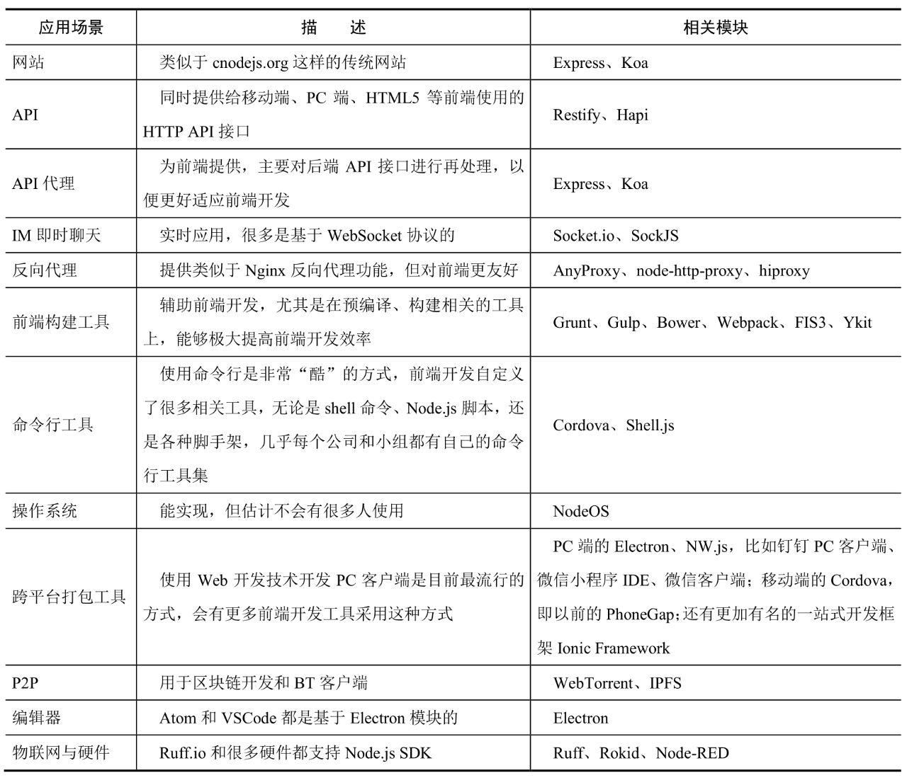

<!-- @import "[TOC]" {cmd="toc" depthFrom=1 depthTo=6 orderedList=false} -->

<!-- code_chunk_output -->

- [Node.js](#nodejs)
  - [一. Node.js 简介](#一-nodejs-简介)
    - [1.1 Node.js](#11-nodejs)
    - [1.2 JS 在 Node.js 和在 Chrome 的区别](#12-js-在-nodejs-和在-chrome-的区别)
    - [1.3 Node.js 特点](#13-nodejs-特点)
    - [1.4 Node.js 的应用场景](#14-nodejs-的应用场景)
    - [1.5 Node.js 作用](#15-nodejs-作用)
  - [二. Node.js 安装](#二-nodejs-安装)
    - [2.1 3m 安装法](#21-3m-安装法)
      - [2.1.1 nvm](#211-nvm)
        - [2.1.1.1 安装](#2111-安装)
        - [2.1.1.2 查看可安装版本](#2112-查看可安装版本)
        - [2.1.1.3 nvm 安装 Node.js](#2113-nvm-安装-nodejs)
        - [2.1.1.4 指定远端下载地址](#2114-指定远端下载地址)
      - [2.1.2 npm](#212-npm)
        - [2.1.2.1 使用 npm 安装模块](#2121-使用-npm-安装模块)
      - [2.1.3 nrm(不再维护)](#213-nrm不再维护)
  - [三 Node 编程](#三-node-编程)
    - [3.1 Node 基础](#31-node-基础)
      - [3.1.1 控制台输出](#311-控制台输出)
      - [3.1.2 命令行参数和环境变量](#312-命令行参数和环境变量)
      - [3.1.3 程序生命期](#313-程序生命期)
      - [3.1.4 Node 模块](#314-node-模块)
      - [3.1.5 Node 包管理器](#315-node-包管理器)
    - [3.2 Node 默认异步](#32-node-默认异步)
    - [3.3 缓冲区](#33-缓冲区)
    - [3.4 事件与 EventEmitter](#34-事件与-eventemitter)
    - [3.5 流](#35-流)
      - [3.5.1 管道](#351-管道)
    - [3.5.2 异步迭代](#352-异步迭代)
      - [3.5.3 写入流及背压处理](#353-写入流及背压处理)
      - [3.5.4 通过事件读取流](#354-通过事件读取流)
    - [3.6 进程、CPU 和操作系统细节](#36-进程-cpu-和操作系统细节)
    - [3.7 操作文件](#37-操作文件)
      - [3.7.1 路径、文件描述符和 FileHandle](#371-路径-文件描述符和-filehandle)
      - [3.7.2 读文件](#372-读文件)
      - [3.7.3 写文件](#373-写文件)
      - [3.7.4 文件操作](#374-文件操作)
      - [3.7.5 文件元数据](#375-文件元数据)
    - [3.7.6 操作目录](#376-操作目录)
    - [3.8 HTTP 客户端与服务器](#38-http-客户端与服务器)
    - [2.2 使用 Node.js](#22-使用-nodejs)
      - [2.2.1 CommonJS 规范](#221-commonjs-规范)
      - [2.2.2 创建一个最简单的 HTTP 服务](#222-创建一个最简单的-http-服务)

<!-- /code_chunk_output -->

# Node.js

---

## 一. Node.js 简介

### 1.1 Node.js

Node.js 是一个基于**Chrome V8 引擎**的 JS 运行时环境，同时结合 libuv（事件循环处理库） 扩展了 JS 库，使得 JS 能够支持浏览器 DOM 等操作，同时具有后端语言才有的**I/O** 、文件读写与操作数据库等能力，是目前最简单的全栈式环境。

Node 是 JS 与底层操作系统绑定的结合，因而可以让 JS 程序读写文件执行子进程，以及实现网络通信。为此，Node 得到了广泛应用：

- 首先是替代命令行脚本，因为它没有 bash 及其他 Unix 终端那样神秘的语法

- 其次是作为运行受信程序的通用编程语言，没有浏览器那种运行不受信代码带来的安全限制

- 最后它也是编写高效、高并发 Web 服务器的流行环境

Node.js 使用 npm 作为包管理器。Node.js 应用程序运行于**单个进程**中，无需为每个请求创建新的线程。Node.js 在其标准库中提供了一组**异步的 I/O 原生功能**（用以防止 JS 代码被阻塞），并且 Node.js 中的库通常是使用**非阻塞的范式**编写的（从而使阻塞行为成为例外而不是规范）。

当 Node.js 执行**I/O**操作时（例如从网络读取、访问数据库或文件系统），Node.js 会在响应返回时恢复操作，而不是阻塞线程并浪费 CPU 循环等待。

> Node.js 的目标是让并发编程更简单，**主要应用在以网络编程为主的 I/O 密集型应用中。轻量且高效，尤其在 I/O 处理方面**。

### 1.2 JS 在 Node.js 和在 Chrome 的区别

在 Node.js 里运行 JS 和在 Chrome 里运行 JS 区别在于：

1. Node.js 没有浏览器 API，即 document、window 等。

2. 加了许多 Node.js API


### 1.3 Node.js 特点

Node.js 是可扩展的适合用于构建高性能 Web 应用的最简单的解决方案：

- 适合构建 Web 应用

  1. 构建网站
     是指构建传统网站，不进行前后端分离，将视图渲染和数据库访问都放在同一项目中。用 Node.js 做入门开发，和传统的 Java、PHP 开发没什么区别。构建成功的应用是典型的单体式应用。

  2. 构建 API
     移动端包含 IOS、Android、HTML5 等多种客户端，导致为这些客户端提供可以复用的 API 接口变得更加困难。
     移动端 API 与前端 Ajax 调用、API 调用一样，一般以返回 JSON 或 XML 结构数据为主。API 的写法很多，推荐的写法是对返回的数据加壳。

  3. 构建 RPC 服务
     数据库访问，将返回的数据进行包裹，以 TCP 形式传输给调用方。

  4. **前后端分离**的应用场景大致有以下四个：

     - 前端页面静态化（Page Static）
     - 前端页面服务化（PaaS，Page as Service）
     - 服务端渲染（SSR，Server Side Render）
     - 渐进式 Web 应用（PWA，Progressive Web App）

  5. 适用于 Serverless
     有了 Serverless，前端就无须关心运维实现，写一个函数就能搞定 API、服务端渲染等，大幅优化了开发方式。无须关心运维（Serverless 平台自带运维功能，一般集成 Kubernetes 这种容器编排管理系统），无须关心流量（Serverless 平台自带服务网格功能），无须关心高并发（API 层有缓存）。

- 高性能

  - **执行速度快**：Node.js 是构建在 Chrome V8 引擎之上的，执行速度可能是动态语言运行时环境里最快的。
  - **天生异步**：事件驱动和非阻塞 I/O 特性决定了 Node.js 必须采用异步机制，每个 I/O 任务都是异步的，因此集成到 libuv 的事件循环里才能让开发者代码对并发操作无感知。
  - **适用于 I/O 密集的网络应用开发**：网络应用开发（包括 Web 应用开发）的瓶颈在于 I/O 处理，而这恰恰是 Node.js 的强项。对于 CPU 密集型应用而言，能够使用其他语言开发最好使用其他语言，如果必须使用 Node.js，可以通过 C/C++扩展机制来实现。合理采用其他技术栈，利用其优势部分，除了能够加快开发迭代的速度，对系统稳定性也是非常有帮助的。

- 简单

  - 语法简单：JS 语法简单易学。
  - 并发编程简单：有了事件驱动和非阻塞 I/O 机制，Node.js 可以使用非常少的资源处理非常多的连接和任务，处理低延时请求，完美应对实时及 I/O 密集型应用等高并发场景。
  - 部署运维简单：无需额外的服务器软件，不像 Java 需要用到 Tomcat 之类的 JavaEE 容器，在分布式集群中，负载均衡、多核系统方面都有完善的配套设施，现有的各种自动化运维工具（如 Ansible、SaltStack 等）都可以直接使用。
  - 开发简单：目前 Node.js 内置模块和 npm 上的模块都遵守 "小而美" 的设计哲学，相对比较简单，对开发、迭代、上线有明显帮助。

- 可扩展
  - 可以使用 npm 上的大量模块。
  - 可以通过编写 C/C++ 扩展实现 CPU 密集型任务。
  - 可以轻松搭建 Java、Rust 等语言使用。
  - 架构互补：在架构上以业务边界来进行服务拆分，外加各种 "组合"，可以让合适的轮子出现在合适的位置上，比如 Java 在基础平台建设及大数据等领域有非常深厚的基础，那么直接使用即可。

### 1.4 Node.js 的应用场景

Node.js 的应用场景主要分为一下四大类




### 1.5 Node.js 作用

1. 搜索引擎优化 + 浏览器首屏速度优化 = 服务端渲染
2. 服务端渲染 + 前后端同构 = Node.js
3. 构建工作流 webpack
4. 开发工具 Visual Studio Code
5. 可扩展性
   - 使用 Node.js 做复杂本地应用，可以利用 JS 的灵活性提供外部扩展
6. 客户端应用
   在已有网站的情况下需要新开发客户端应用，用 Node.js 客户端技术（electron）实现，最大限度复用现有工程

## 二. Node.js 安装

在实际生产环境中，推荐使用 Linux 服务器，常用的是 CentOS 或 Ubuntu，选用对应的 64 位 LTS（长期支持）版本。

### 2.1 3m 安装法

Node.js 的版本更新非常快，开发机器上可能需要同时存在几个 Node.js 的大版本，每个 Node.js 内置的 npm 又有版本的差异，而国内网络访问 npmjs.org 镜像的速度非常慢。所以推荐使用 3m 安装法。

> 安装完 Node.js 后，node 命令会存在于环境变量中，可以在终端的任何位置使用。node 命令是用于解释并执行 Node.js 代码的，由于 JS 是脚本语言，所以 node 命令实际上是 Node.js 代码的解释器。

- **nvm**（node version manager）： 用于开发阶段，解决多版本共存、切换、测试等问题。
- **npm**（node package manager）：解决 Node.js 模块安装问题，其本身也是一个 Node.js 模块，每次安装都会内置某个版本的 npm。
- **nrm**（node registry manager）：解决 npm 镜像访问慢的问题，提供测速、切换下载源（registry）功能。

#### 2.1.1 nvm

nvm 是一个开源的**Node.js 版本管理器** ，通过简单的 shell 脚本来管理和切换多个 Node.js 版本。nvm 中有 nvmw（现不再维护），可以支持 Window 系统，另外 nvs 默认支持 Windows 系统。

nvm 除了安装方便，可以随意切换需要安装的 Node.js 版本，还可以免除安装权限，通过 nvm 命令安装的 Node.js 位于用户目录下，而非系统目录下。在 npm 安装全局模块时，可以避免操作系统超级用户授权问题。

##### 2.1.1.1 安装

在安装 Node.js 之前，需要先安装 nvm，然后通过 nvm 命令去安装多个版本的 Node.js。nvm 本身是 shell 脚本，直接下载安装即可。首先在终端执行以下命令。

> `curl -o- https://raw.githubusercontent.com/creationix/nvm/v0.37.2/install.sh | bash`

安装完成后，脚本将 nvm 存储库克隆到 ~/.nvm，并尝试将下面代码段中的源代码行添加到正确的配置文件中（~/.bash_profile、~/.zshrc、~/.profile 或~/.bashrc）

> export NVM_DIR="$([ -z "${XDG_CONFIG_HOME-}" ] && printf %s "${HOME}/.nvm" || printf %s "${XDG_CONFIG_HOME}/nvm")"
> [ -s "$NVM_DIR/nvm.sh" ] && \. "$NVM_DIR/nvm.sh" # This loads nvm

查看是否存在以上源代码后，通过执行 source 命令，使系统环境变量生效

> source ~/.bashrc

在终端执行 `nvm --version` 后可以查看版本号。

##### 2.1.1.2 查看可安装版本

通过 `nvm ls-remote` 命令可列出当前 nvm 可安装的版本。

- **LTS 版本**：长期支持（Long-Term Support）版本，有官方支持，推荐给绝大多数用户使用，一般在生产环境中使用，对于 Bug 和 安全问题的修复相当及时。
- **Current 版本**：当前正在开发的尝鲜版本。它通常较新，具有大的功能变动，需要经过一段时间的测试、开发、修复 Bug 才可能编程 LTS 版本，一般用于开发者学习，基本不会用在线上生产环境中。

> Node.js 的可用版本非常多，一般奇数版本（v7.x，v9.x）都是尝试性的，其中包含最新的特性，而偶数版本（v8.x，v10.x）都是 LTS 版本，稳定且适合在线上生产环境中使用。

##### 2.1.1.3 nvm 安装 Node.js

1. 确定安装位置
   通过 nvm 安装的 Node.js 位于用户目录下，而非系统目录下。在 npm 安装全局模块时，可以避免操作系统超级用户授权问题。

2. 指定默认版本
   如果想要默认使用 Node.js v6.11.2 来编译代码，需要手动指定一个 default 别名，使用命令 `nvm alias default node`
   此时，输入 `node -v` ，以后再终端的任何地方使用的默认版本都会是设置的默认版本。

3. 切换版本
   先使用 `nvm install 10` 安装 Node.js ，然后切换到 10.x 版本 `nvm use 10` ，注意 Node.js 内置的 npm 版本。
   此时，Node.js 代码就可以在 10.x 版本下执行了，可以使用任何 10.x 版本支持的特性。像上面这样使用 `nvm use` 命令实现的切换版本，只在当前终端会话内有效，是一次性切换，要和设置默认别名区分开。

4. 列出本机版本 `nvm ls`

5. 重新安装全局模块
   nvm 提供了一键安装全局模块的 nvm reinstall-packages 命令。
   例：`nvm reinstall-packages 6`

##### 2.1.1.4 指定远端下载地址

nvm 的默认远端下载地址是 `https://nodejs.org/dist` ，大部分开发场景使用的 Node.js 都可以从这个地址下载。如果想安装自定义的 Node.js 版本，可以指定 nvm 的远程下载地址，比如一些正在测试的尝鲜版本

> `NVM_NODEJS_ORG_MIRROR-https://nodejs.org/download/test`

查看远端可用版本的命令 `nvm ls-remote`，获取到版本信息后，直接根据版本号安装即可 `nvm install version`。

#### 2.1.2 npm

npm，通常称为 Node.js 包管理器，它的主要功能是管理 Node.js 包，包括安装、卸载、更新、查看、搜索、发布等。可以实现 JS、React、移动开发、Angular、浏览器、JQuery、Cordova、Bower、Gulp、Gunt、Browserify、Docpad 等包或模块管理，是目前开源世界里最大、生态最健全的包管理器。

npm 是随 Node.js 一起安装的包管理器，能解决 Node.js 在模块管理上的许多问题，常见的应用场景有以下几种。

- 从 npm 镜像服务器下载第三方模块。
- 从 npm 镜像服务器下载并执行安装命令行程序到本地。
- 发布模块到 npm 镜像服务器供他人使用。

##### 2.1.2.1 使用 npm 安装模块

npm 默认安装源为 `https://registry.npmjs.org/`。

命令行永久更改使用指定镜像（淘宝）

```js
npm config set registry https://registry.npm.taobao.org
```

npm 的包安装是最核心的功能，分为本地安装 (local) 、全局安装 (global) 两种。


本地安装，具体说明:

- 将包放在 node_modules (运行 npm 命令时所在的目录)下，如果没有 node_module 目录，则会在当前执行 npm 命令的目录下生成。
- 可以通过 require() 来引入本地的包
  例 : 先安装常用的 Node.js 调试模块 `npm install debug`，安装好后，debug 包存在于工程目录下的 node_modules 目录中，因此在代码中只执行 `const debug = require('debug')`即可，无需指定第三方包路径。

全局安装，具体说明:

- 如果不是使用 nvm 安装的，安装包将放在 /user/local 下，安装全局模块需要超级用户授权。
- 不能通过 require() 来引入本地的包

> **注意**: 为避免引用模块缺失保证依赖模块都出现在 package.json 里，可以使用 `npm i --save`

#### 2.1.3 nrm(不再维护)

Node.js 和其他语言一样都提供了模块管理工具，默认将模块托管在 npmjs.org 下，其他组织和个人可以自建下载源，同步时间一般在 10 分钟左右，npm 官方源是在国外托管的，所以国内用户访问会比较慢。

nrm 可以简单、快速地在不同的 npm 之间进行切换，它默认内置了很多常用的源，包括 npm、cnpm、taobao、nj 等，也可以通过 `nrm add` 命令来维护自己的源。nrm 是工程复杂到一定程度的必然产物，也是最佳实践。

1. 安装
   nrm 本身是 node.js 命令行模块，需要使用 -g 参数来进行全局安装 `npm install -g nrm`
2. 测速
   可以使用 `nrm test` 测速
3. 查看源使用 `nrm ls` 命令即可
4. 使用 `nrm use cnpm` 就可以快速切换源
5. 增加源

> 例 : `nrm add project https://registry.npm.taobao.org/`

## 三 Node 编程

### 3.1 Node 基础

先来简单介绍一下 Node 程序的构成，看一看它们如何与操作系统交互。

#### 3.1.1 控制台输出

如果习惯于为浏览器编写 JS 代码，那么切换到 Node 编程时，要知道 console.log() 不仅可以用于调试，也是 Node 向用户显示消息的最简单方式，或者更宽泛地讲，是向标准输出流（stdout）发送输出的一种主要方式。

也有低级 API 可以写入标准输出，但是没有什么方式比调用 console.log() 更简单或者更正式。

在浏览器中，console.log()、console.warn() 和 console.error() 通常会在控制台中输出内容的前面显示一个小图标，表示不同类型的日志消息。Node 不会显示图标，但 console.error() 显示的输出与 console.log() 显示的输出仍然有区别，因为 console.error() 写入的是标准错误流（stderr）。如果写的 Node 程序要把标准输出重定向到个文件或管道，可以使用 console.error() 在控制台显示用户可以看到的文本，而 console.log() 打印的文本是不可见的。

#### 3.1.2 命令行参数和环境变量

如果之前写过在终端或其他命令行界面中执行的 Unix 风格的程序，就会知道这些程序的输入首先是从命令行参数获取，其次是从环境变量中获取的。

Node 也遵循了这些 Unix 惯例。Node 程序可以从字符串数组 `process.argv` 中读取其命令行参数。这个数组的第一个元素始终是 Node 可执行文件的路径。第二个参数是 Node 执行的 JS 代码文件的路径。数组中剩下的所有元素都是你在调用 Node 时，通过命令行传给它的空格分隔的参数。

例如，假设把这个极短的 Node 程序保存到文件 argv.js 中：

```js
console.log(process.argv);
```

执行这个程序并看到类似下面的输出:

```sh
$ node --trace-uncaught argv.js --arg1 --arg2 filename
[
  '/usr/local/bin/node',
  '/private/tmp/argv.js'
  '--arg1',
  '--arg2',
  'filename'
]
```

这里有几点需要说明：

- `process.argv` 的第一和第二个元素是 Node 可执行文件和被执行 JS 文件的完全限定的文件系统路径，无论是否这样输入它们。

- 有意提供给 Node 可执行文件且由它解释的命令行参数会被 Node 可执行文件使用，不会出现在 `process.argv` 中（前面例子中的命令行参数 --trace-uncaught 实际上没什么用，这里只是用来演示它不会出现在输出中）。出现在 JS 文件名之后的任何参数（如 --arg1 和 filename）都会出现在 `process.argv` 中。

Node 程序也会从 Unix 风格的环境变量中获取输入。Node 把这些变量保存在 `process.env` 对象中使用。这个对象的属性名是环境变量的属性名，而属性值（始终是字符串）是对应变量的值。

下面某电脑中的部分环境变量：

```sh
$ node -p -e process.env
{
  SHELL: '/bin/bash',
  USER: 'david',
  PATH: '/usr/local/bin:/usr/bin:/bin:/usr/sbin:/sbin',
  PWD: '/tmp',
  LANG: 'en_US.UTF-8',
  HOME: '/Users/david'
}
```

可以使用 `node -h` 或 `node --help` 查询命令行参数 -p 和 -e 的用途。提醒一下，可以把这行代码重写为 `node --eval process.env --print`。

#### 3.1.3 程序生命期

node 命令期待命令行参数指定要执行的 JS 文件。这个初始的文件通常会导入其他 JS 代码的模块，也可能定义它自己的类和函数。不过，Node 基本上是自顶向下执行指定文件中的 JS 代码。有多 Node 程序会在执行完文件的最后一行代码时退出。不过，很多 Node 程序在执行完初始文件之后还会持续运行更长时间。正如接下来几节要讨论的，Node 程序通常是异步的，并且基于回调和事件处理程序。Node 程序在运行完初始文件、调用完所有回调、不再有未决事件之前不会退出。基于 Node 的服务器程序监听到来的网络连接，理论上会永远运行，因为它始终要等待下一个事件。

程序通过调用 `process.exit()` 可以强制自己退出。用户通常需要在终端窗口中按 `Ctrl + C` 来终止运行中的 Node 程序。程序通过使用 `process.on("SIGINT"，()=>{})`注册信号处理函数可以忽略 `Ctrl + C`。

如果程序中的代码抛出异常，也没有 catch 子句捕获该异常，程序会打印栈追踪信息并退出。由于 Node 天生异步，发生在回调或事件处理程序中的异常必须局部处理，否则根本得不到处理。这意味着处理异步逻辑中的异常是一件麻烦事。如果不想让这些异常导致程序崩溃，可以注册一个全局处理程序，以备调用，防止崩溃：

```js
process.setUncaughtExceptionCaptureCallback(e => {
  console.error('Uncaught exception: ', e);
});
```

类似地，如果程序创建的一个期约被拒绝，而且没有 catch() 调用处理它，也会遇到这种问题。到 Node13 为止，这还不是导致程序退出的致命错误，但仍然会在控制台打印出大量错误消息。在 Node 某个未来的版本中，未处理的期约拒绝有可能变成致命错误。如果不希望出现未处理的拒绝，或者打印错误消息，甚至终止程序，那就要注册一个全局处理程序：

```js
process.on('unhandledRejection', (reason, promise) => {
  // reason是会传给 catch() 函数的拒绝理由
  // promise 是被拒绝的期约对象
});
```

#### 3.1.4 Node 模块

Node 是在 JS 有模块系统之前创造的，所以它必须自己创造一个模块系统。Node 的模块系统使用 `require()` 函数向模块中导入值，使用 exports 对象或 `module.exports` 属性从模块中导出值。

Node13 增加了对标准 ES6 模块的支持，同时支持基于 `require()` 的模块（Node 称其为 “CommonJS 模块”）。这两个模块系统并非完全兼容，因此两者并存有些棘手。Node 在加载模块前，需要知道该模块会使用 `require()` 和 `module.exports`，还是 `import` 和 `export`。Node 在把一个 JS 文件加载为 CommonJS 模块时，会自动定义 `require()` 函数以及标识符 `exports` 和 `module`，不会启用 `import` 和 `export` 关键字。另外，在把一个文件加载为 ES6 模块时，它必须启用 `import` 和 `export` 声明，同时必须不定义 `require`、`module` 和 `exports` 等额外的标识符。

告诉 Node 它要加载的是什么模块的最简单方式，就是将信息编码到不同的扩展名中。如果把 JS 代码保存在 _.mjs_ 结尾的文件中，那么 Node 始终会将它作为一个 ES6 模块来加载，假设其中使用了 `import` 和 `export`，并且不提供 `require()` 函数。如果把代码保存在 _.cjs_ 结尾的文件中，那么 Node 始终会将它作为一个 CommonJS 模块来对待，会提供 `require()` 函数，而如果其中使用了 `import` 或 `export` 声明，则会抛出 SyntaxError。

对于没有明确给出 _.mjs_ 或 _.cjs_ 扩展名的文件，Node 会在同级目录及所有包含目录中查找一个名为 _package.json_ 的文件。一旦找到最近的 _package.json_ 文件，Node 会检查其中 JSON 对象的顶级 `type` 属性。如果这个 `type` 属性的值是 module，Node 将该文件按 ES6 模块来加载。如果这个属性的值是 Commonjs，那么 Node 就按 CommonJS 模块来加载该文件。

> **注意**：运行 Node 程序并不需要有 _package.json_ 文件。如果没有找到这个文件（或找到该文件但它没有 `type` 属性），Node 默认会使用 CommonJS 模块。这个 packagejson 的招术只有想在 Node 中使用 ES6 模块，但又不希望使用 _.mjs_ 扩展名时才是必需的。

因为大量现有的 Node 代码使用的都是 CommonJS 模块格式，Node 允许 ES6 模块使用 `import` 关键字加载 CommonJs 模块。但反之则不可以：CommonJS 模块不能使用 `require()` 加载 ES6 模块。

#### 3.1.5 Node 包管理器

在安装 Node 的同时，也会得到一个名为 npm 的程序。这个程序就是 Node 的包管理器，它可以帮助下载和管理程序的依赖库。npm 通过位于程序根目录下的 _package.json_ 文件跟踪依赖（以及与程序相关的其他信息）。这个 _package.json_ 文件是由 npm 创建的如果想在项目中使用 ES6 模块，需要在其中添加 `"type":"module"`。

在通过 npm 安装一个包时，npm 会在 _package.json_ 文件中记录这个依赖。有了这个记录，就可以把自己的代码和 _package.json_ 复制一份发给其他程序员。他们只要运行 `npm install` 就可以自动下载并安装运行程序所需的全部依赖库。

### 3.2 Node 默认异步

JS 是一门通用的编程语言，因此完全可能用于计算大型矩阵乘法或执行复杂统计分析等占用 CPU 的程序。然而，Node 是针对 I/O 密集型程序（如网络服务器）进行设计和优化的。特别地，Node 的设计让实现高并发（同时处理大量请求的）服务器非常容易。

不过，与很多编程语言不同，Node 并不是通过线程来实现并发的。众所周知，多线程程序很难保证不出问题，而且难以调试。另外，线程也是相对较重的抽象，如果服务器需要并发处理几百个请求，使用几百个线程可能占用过多内存。为此，Node 采用了 Web 使用的单线程 JS 编程模型，使得创建网络服务器变得极其简单，只需常规操作，没有神秘可言。

---

**基于 Node 的真正并行**
Node 程序可以运行多个操作系统进程，而 Node10 及之后支持的 Worker 对象是一种借鉴自浏览器的线程。如果使用多个进程或者创建了一或多个 Worker 线程，并且程序运行在多核 CPU 的系统上，那么程序就不再是单线程，而是变成了真正的并行执行。这些技术对于 CPU 耗用大的操作很有用，但对于服务器这种 I/O 密集型程序并不常用。

不过必须指出一点，Node 的进程和 Worker 避免了典型多线程编程的复杂性。因为它的进程或线程间通信是通过消息传递实现的，相互之间很难共享内存。

---

Node 通过让其 API 默认异步和非阻塞实现了高层次的并发，同时保持了单线程的编程模型。Node 很严格地采用非阻塞并将其运用到了极致。可能觉得读写网络的函数应该是异步的，但可能想不到在 Node 中就连读写本地文件系统的函数也是异步非阻塞的。这是可以理解的，因为 Node API 诞生于机械硬盘还在广泛使用的年代。那时候，在开始操作文件之前，磁盘旋转导致的 “寻道时间” 确实有数毫秒之多。而在现代的数据中心，访问 “本地” 文件系统实际上可能除了驱动器延迟，还要再加上跨网络的延迟。在 Node 中即使像初始化网络连接和查询文件修改时间这种操作也都是非阻塞的。

Node API 中有些函数虽然是同步的但也不会阻塞。这些函数运行完成就立即返回，根本不需要阻塞。不过大多数常用的函数都涉及某种输入和输出，因此它们是异步函数，不会发生任何阻塞。Node 诞生于 JS 有 Promise 类之前，因此异步 Node API 是基于回调的。一般来说，传给异步 Node 函数的最后一个参数始终是一个回调。Node 使用错误在先的回调，而且通常调用时会传两个参数。如果没有发生错误，那么这个错误在先的回调的第一个参数通常是 null，第二个参数就是最初调用的异步函数产生的数据或返回的响应。之所以把错误参数放在第一位，是为了不可能忽略它，从而始终检查这个参数是否不是空值。如果它是一个 Error 对象，甚至是一个整数错误码或字符串错误消息，那么就说明一定出错了。这时候，回调函数的第二个参数可能就是 null。

以下代码演示了如何使用非阻塞的 readFile() 函数读取一个配置文件，作为 JSON 解析其内容，然后把解析得到的配置对象传给另一个回调：

```js
const fs = require('fs'); // 需要文件系统模块

// 读取一个配置文件，将其内容作为 JSON 解析，然后把解析结果传给 callback。
// 如果发生了任何错误，将错误消息打印到 stderr，并以 null 调用 callback
function readConfigFile(path, callback) {
  fs.readFile(path, 'utf8', (err, text) => {
    // 读取文件时出错了
    if (rer) {
      console.error(err);
      calLback(null);
      return;
    }
    let data = null;
    try {
      data = JSON.parse(text);
    } catch (e) {
      // 解析文件内容时出错了
      console.error(e);
    }
    callback(data);
  });
}
```

Node 虽然先于标准化的期约问世，但由于它错误在先的回调相当一致，所以使用 `util.promisify()` 包装函数能够轻易创建其基于回调 API 的期约版。下面演示了怎么把 readConfigFile() 函数重写为返回一个期约对象：

```js
const util = require('util');
const fs = require('fs'); // 需要文件系统模块
const pfs = {
  // fs 基于期约的变体
  readFile: util.promisify(fs.readFile)
};

function readConfigFile(path) {
  return pfs.readFile(path, 'utf-8').then(text => {
    return JSON.parse(text);
  });
}
```

也可以使用 `async` 和 `await` 简化前面这个基于期约的函数：

```js
async function readConfigFile(path) {
  let text = await pfs.readFile(path, 'utf-8');
  return JSON.parse(text);
}
```

`util.promisify()` 包装函数可以生成很多 Node 函数的基于期约的版本。在 Node 10 及之后，fs.promises 对象提供了一些预定义的基于期约的函数，用于操作文件系统。后面会讨论这些函数。对于前面的代码，可以把 pfs.readFile() 替换为 `fs.promises.readFile()`。

Node 的编程模型默认是异步的。但考虑到程序员的方便，Node 也为其很多函数定义了阻塞、同步的版本，特别是文件系统模块中的函数。这些函数的名字最后通常都有明确的 `Sync` 字样。

服务器在初次启动并读取配置文件时，还不能处理网络请求，几乎也没有并发执行的可能。因此这时候没有必要避免阻塞，可以放心地使用 `fs.readFileSync()` 等阻塞函数。可以从代码中删除 `async` 和 `await`，写一个纯同步版的 readConfigFile() 函数。这个同步函数不需要回调也不返回期约，而是直接返回解析得到的 JSON 值或抛出异常：

```js
const fs = require('fs');
function readConfigFileSync(path) {
  let text = fs.readFileSync(path, 'utf-8');
  return JSON.parse(text);
}
```

除了其错误在先的双参数回调，Node 也有一些 API 使用基于事件的异步机制，通常用于处理流数据。

介绍完了 Node 激进的非阻塞 API，接下来再回头说一说并发。Node 内置的非阻塞函数使用了操作系统的回调和事件处理程序。在调用一个异步函数时，Node 会启动操作，然后在操作系统中注册某种事件处理程序。这样，当操作完成时，它就能收到通知。传给 Node 函数的回调会被保存在内部，当操作系统向 Node 发送相应事件时，Node 就可以调用回调。

**这种并发通常被称为基于事件的并发。其核心是 Node 用单线程运行一个 “事件循环”**。当 Node 程序启动时，它会运行让它运行的代码。这些代码很可能会至少调用一个非阻塞函数，导致一个回调或事件处理程序被注册到操作系统中（如果没有调用非阻塞函数，那么写的就是同步 Node 程序，Node 在执行完毕后直接退出）。当 Node 执行到程序的末尾时，它会一直阻塞直到有事件发生，此时操作系统会再启动并运行它。Node 把操作系统事件映射到注册的 JS 回调，然后调用该函数。回调函数可能会调用更多非阻塞 Node 函数，导致注册更多事件处理程序。当回调函数运行完毕，Node 又会进入睡眠状态，如此循环。

对于 Web 服务器和其他主要把时间花在等待输入和输出的 I/O 密集型应用，这种基于事件的并发效率又高、效果又好。只要使用非阻塞 API，Web 服务器就可以并发处理来自 50 个客户端的请求，而无须 50 个不同的线程。网络套接口和 JS 函数保持着某种内部映射关系，一旦这些套接口有活动发生，相应的 JS 函数就会被调用。

### 3.3 缓冲区

Node 中有一个比较常用的数据类型就是 Buffer，常用于从文件或网络读取数据。Buffer 类（或称缓冲区）非常类似字符串，只不过它是字节序列而非字符序列。Node 是在核心 JS 支持定型数组之前诞生的，因此没有表示无符号字节的 Uin8Array。Node 的 Buffer 类就是为了满足这个需求而设计的。在 JS 语言支持 Uint8Array 之后，Node 的 Buffer 类就成为 Uint8Array 的子类。

Buffer 与其超类 Uint8Array 的区别在于，它是设计用来操作 JS 字符串的。因此缓冲区里的字节可以从字符串初始化而来，也可以转换为字符串。字符编码将某个字符集中的每个字符映射为一个整数。只要有字符串和字符编码，就可以将该字符串中的字符编码为字节序列。而只要有（正确编码的）字节序列和字符编码，就可以将这些字节解码为字符串。Node 的 Buffer 类有执行编码和解码的方法，这些方法都接收一个 `encoding` 参数，用于指定要使用的编码。

Node 中的编码是通过名字来指定的（指定为字符串）。以下是支持的编码：

_utf8_
: 这是不指定编码时的默认值，也是最可能使用的 Unicode 编码。

_utf16le_
: 双字节 Unicode 字符，使用小端字节序。\uffff 以上的码点会编码为双字节序列。"ucs2" 是这种编码的别名。

_latin1_
: 每字符单字节的 ISO-8859-1 编码，定义了适用于很多西欧语言的字符集。因为 latin-1 字符与字节是一对一的映射关系，因此这种编码也被称为 "binary"。

_ascii_
: 7 比特仅限英文的 ASCI 编码，是 "utf8" 编码的严格子集。

_hex_
: 这种编码把每个字节转换为一对 ASCII 十六进制数字。

_base64_
: 这种编码将每 3 个字节的序列转换为 4 个 ASCII 字符的序列。

以下是几个代码示例，展示了如何使用 Buffer，以及如何与字符串相互转换：

```js
let b = Buffer.fron([0x41, 0x42, 0x43]); // <Buffer 41 42 43>
b.toString(); // "ABC"；默认 "utf8"
b.toString('hex'); // "414243"

let computer = Buffer.from('IBM3111', 'ascii'); // 把字符串转换为缓冲区
for (let i = 0; i < computer.length; i++) {
  // 把缓冲区作为字节数组
  computer[i]--; // 缓冲区是可修改的
}
computer.toString('ascii'); // "HAL2000"
computer
  .subarray(0, 3)
  .map(x => x + 1)
  .toString(); // "IBM“

// 使用 Buffer.alloc() 创建一个 “空” 缓冲区
let zeros = Buffer.alloc(1024); // 1024 个 0
let ones = Buffer.alloc(128, 1); // 128 个 1
let dead = Buffer.alloc(1024, 'DEADBEEF', 'hex'); // 重复字节模式

// 缓冲区有方法可以从或者向缓冲区中，在任意指定偏移位置读取或写入多字节值。
dead.readUInt32BE(0); // 0xDEADBEEF
dead.readUInt32BE(1); // 0xADBEEFDE
dead.readBigUInt64BE(6); // 0xBEEFDEADBEEFDEADn
dead.readUInt32LE(1020); // 0xEFBEADDE
```

如果 Node 程序要操作二进制数据，那么一定会经常使用 Buffer 类。而如果只是操作与读取或写入文件或网络相关的文本，那么可能只会将 Buffer 作为数据的中间表示。很多 Node API 都可以接收或返回字符串或 Buffer 对象的输入或输出。一般来说，如果在使用这些 API 时，传递的是字符串，或者期待返回字符串，那么都需要指定要使用的文本编码的名字。而此时，通常根本不会使用 Buffer 对象。

### 3.4 事件与 EventEmitter

如前所述，所有 Node API 默认都是异步的。对其中很多 API 而言，这种异步性的表现形式为两个参数、错误在先的回调，当请求的操作完成时会被调用。但一些更复杂的 API 则是基于事件的。在 API 是围绕对象而非函数设计的，或者回调需要多次被调用，或者需要多种类型的回调时，通常会是这种情况。比如，以 net.Server 类为例，一个这种类型的对象就是一个服务器套接口，可以接收来自客户端的连接。它在首次开始监听连接时会发送一个 “监听” 事件，在每次客户端连接时都会发送一个 “连接” 事件，而在被关闭不再监听时会发送一个 “关闭” 事件。

在 Noe 中，发送事件的对象都是 EventEmitter 或其子类的实例：

```js
const EventEmitter = require('events'); // 模块名与类名不一致
const net = require('net');
let server = new net.Server(); // 创建一个 Server 对象
server instanceof EventEmitter; // true：Server 是 EventEmitters
```

EventEmitter 的主要功能是允许使用 `on()` 方法注册事件处理程序。EventEmitter 可以发送多种事件，而事件类型以名字作为标识。要注册一个事件处理程序，可以调用 `on()` 方法并传入事件类型的名字，以及在该类型事件发生时应该被调用的函数。EventEmitter 在调用回调处理程序时可能传任意数量的参数，要了解某个 EventEmitter 在发送某个事件时会传哪些参数，需要阅读相应的文档：

```js
const net = require('net');
let server = new net.Server(); // 创建一个 Server 对象
server.on('connection', socket => {
  // 监听 “connection” 事件
  // Server的 “connection” 事件回调会接收一个 socket 对象表示刚刚连接的客户端。
  // 这里向客户端发送了一些数据，然后就断开了连接
  socket.end('Hello World', 'utf8');
});
```

如果在注册事件监听器时喜欢使用更明确的方法名，也可以使用 `addListener()`。相应地，可以使用 `off()` 或 `removeListener()` 去掉之前注册的事件监听器。还有一种特殊情况，就是使用 `once()` 而非 `on()` 注册的事件监听器在被调用一次之后就会被自动清除。

当某个 EventEmitter 对象上发生特定的事件时，Node 会调用在该 EventEmitter 上针对该事件类型注册的所有处理程序。调用顺序是注册的顺序。如果有多个处理程序，它们会在一个线程上被顺序调用。

> **注意**：Node 没有并行调用。更重要的，事件处理程序会被同步调用，而非异步调用。这意味着 `emit()` 方法不会把事件处理程序排队到将来某个时刻再调用。`emit()` 会调用所有注册的处理程序（一个接一个），并且会在最后一个事件处理程序返回之后返回。

实际当中，这意味着当某个内置 Node API 发送一个事件时，该 API 基本上会阻塞执行事件处理程序。如果事件处理程序调用了 `fs.readFileSync()` 之类的阻塞函数，那么在该函数同步读完文件之前，不会执行后续的事件处理程序。如果程序需要实时响应（类似网络服务器），那么关键在于要让事件处理程序不阻塞，可以快速执行完。如果需要在某个事件发生时执行大量计算，最好在处理程序中使用 setTimeout() 将该计算调度为异步执行。Node 也定义了 `setImmediate()`，用于调度某个函数在所有待调用的回调和事件被处理之后立即执行。

EventEmitter 类也定义了一个 `emit()` 方法，可以导致注册的事件处理程序被调用。这个方法在定义自己基于事件的 API 时有用，如果只是使用已有的 API 则没什么用。调用 `emit()` 时必须在第一个参数传入事件类型的名字。而传给 `emit()` 的所有后续参数都会成为注册的事件处理程序的参数。事件处理程序被调用时，其 this 值也会被设置为 EventEmitter 对象，这通常都很方便（不过要记住，箭头函数始终会使用定义它们的上下文中的 this 值，而不能以任何其他 this 值来调用。但无论怎么说，箭头函数都是编写事件处理程序最方便的方式）。

事件处理程序返回的任何值都会被忽略。不过，如果某个事件处理程序抛出异常，则该异常会从 `emit()` 调用中传播出来，从而阻止在抛出异常的事件处理程序之后注册的其他处理程序的执行。

Node 基于回调的 API 使用了错误在先的回调，因此检查第一个参数判断是否发生了错误是很重要的。而对基于事件的 API，与之对应的是 “错误”（error）事件。因为基于事件的 API 经常用于网络和其他形式的流 I/O 处理，所以很容易发生意料之外的异步错误，为此大多数 EventEmitter 都会定义一个在发生此类错误时发送的 “错误” 事件。只要使用基于事件的 API，就应该习惯性地为这个 “错误” 事件注册处理程序。EventEmitter 类对这个 “错误” 事件进行了特殊处理。如果调用 `emit()` 发送的是 “错误” 事件，且如果该事件没有注册处理程序，那么就会抛出一个异常。由于这是异步发生的，无法在 catch 块中处理这个异常，所以这种错误通常会导致程序退出。

### 3.5 流

在实现处理数据的算法时，最简单的办法通常都是先把所有数据读到内存中，进行处理，然后再把数据写到某个地方。例如，可以像下面这样写一个复制文件的 Node 函数（实际开发中，可以使用 Node 定义的 `fs.copyFile()` 函数）：

```js
const fs = require('fs');

// 一个异步但非流式（因而低效）的函数
function copyFile(sourceFilename, destinationFilename, callback) {
  fs.readFile(sourceFilename, (err, buffer) => {
    if (err) {
      callback(e);
    } else {
      fs.writeFile(destinationFilename, buffer, callback);
    }
  });
}
```

这个 copyFile() 函数使用了异步函数和回调，因此不会阻塞，可用于服务器等并发程序。

> **注意**：这个函数要求必须分配足够的内存来保存文件的全部内容。在某些情况下这样可能没什么问题。但如果要复制的文件非常大，或者程序是高并发的因而会同时复制大量文件，那可能就会出现问题。这个 copyFile() 函数的实现还有一个缺点，就是它不能在读完旧文件之前就写新文件。

针对这些问题的解决方案是使用基于流的算法，让数据 “流入” 程序，经过处理之后再 “流出” 程序。基于流的算法，其本质就是把数据分割成小块，内存中不会保存全部数据。如果能够使用基于流的方案，则这种方案的内存利用率更高，处理速度也更快。Node 的网络 API 是基于流的，Node 的文件系统模块也定义了流 API 用于读写文件。因此在写 Node 程序时很有可能用到流 API。

Node 支持 4 种基本的流：

_可读流（readable）_
: 可读流是数据源。比如，`fs.createReadStream()` 就返回一个指定文件的流，可以通过它读取文件内容。`process.stdin` 也是一个可读流，可以从标准输入返回数据。

_可写流（writable）_
: 可写流是数据的接收地或目的地。比如，`fs.createWriteStream()` 返回的值是可写流，允许分块写入数据，并将所有数据输出到指定文件。

_双工流（duplex）_
: 双工流把可读流和可写流组合为一个对象。比如，`net.connect()` 和其他 Node 网络 API 返回的 Socket 对象就是双工流。如果写入套接口，数据就会通过网络发送到该套接口连接的计算机上。如果读取套接口，则可以访问由其他计算机写入的数据。

_转换流（transform）_
: 转换流也是可读和可写的，但与双工流有一个重要区别：写入转换流的数据在同一个流会变成可读的（通常是某种转换后的形式）。比如，`zlib.createGzip()` 函数返回一个转换流，可以（使用 gzip 算法）对写入其中的数据进行压缩。类似地，`crypto.createCipheriv()` 函数也返回一个转换流，可以对写入其中的数据进行加密或解密。

默认情况下，流读写的是缓冲区。如果调用了一个可读流的 `setEncoding()` 方法，它会返回解码后的字符串而非 Buffer 对象。如果向一个可写流中写入字符串，该字符串会自动以缓冲区的默认编码格式或指定的编码格式被编码。Node 的流 API 也支持 “对象模式”，即流会读写比缓冲区和字符串更复杂的对象。Node 的核心 API 都不使用这种对象模式，但可能会在其他库中遇到这种模式。

可读流必须从某个地方读取数据，而可写流必须把数据写到某个地方。因此每个流都有两端：输入端和输出端（或称来源和目标）。使用基于流的 API，最难的地方是流的这两端几乎总是以不同的速度流动。有时候从流中读取数据的代码想要比实际写入流更快地读取和处理数据。有时候又相反，即向流中写入数据的速度比从另一端读取和流出的速度更快。流的实现几乎总会包含一个内部缓冲区，用于保存已经写入但尚未读取的数据。缓冲有助于保证在读取时有数据，而在写入时有空间保存数据。但这两点都无法绝对保证，基于流编程的本质决定了读取器有时候必须要等待数据写入（因为缓冲区空了），而写入器有时候必须等待数据读取（因为缓冲区满了）。

在使用基于线程并发的编程环境中，流 API 通常存在阻塞调用。换句话说，读取数据的调用在数据到达流之前不会返回，而写入数据的调用在流的内部缓冲区有足够空间容纳新数据时才会终止阻塞。不过在基于事件的并发模型中，阻塞调用就没有意义了，而 Node 的流 API 是基于事件和回调的。**与其他 Node API 不同，后面描述的方法没有 “同步” 版**。

由于要通过事件来协调流的读取能力（缓冲区不空）和写入能力（缓冲区不满），Node 的流 API 比较复杂。而这些 API 随着时间的推移不断演进和变化让问题更加严重了。对于可读流，有两套完全不同的 API。且不论它有多复杂，理解和掌握 Node 的流 API 都是必要的，因为它们可以帮助在程序中实现高吞吐量的 I/O。

#### 3.5.1 管道

有时候，需要把从流中读取的数据写入另一个流。例如，要写一个 HTTP 服务器，提供对一个静态文件目录的访问。此时，需要从文件输入流读取数据，然后再将数据写入网络套接字。与其自己写代码来处理这里的读和写，不如把这两个接口连接为一个 “管道”，让 Node 帮助实现复杂的操作。只要把可写流简单地传给可读流的 `pipe()` 方法即可：

```js
const fs = require('fs');
function pipeFileToSocket(filename, socket) {
  fs.createReadStream(filename).pipe(socket);
}
```

下面这个实用函数通过管道把一个流导向另一个流，并在完成或发生错误时调用一个回调：

```js
function pipe(readable, writable, callback) {
  // 首先，设置错误处理
  function handleError(err) {
    readable.close();
    writable.close();
    callback(err);
  }

  // 接下来定义管道并处理正常终止的情况
  readable.on('error', handleError).pipe(writable).on('error', handleError).on('finish', callback);
}
```

转换流特别适合与管道一起使用，可以创建多个流的传输管道。下面这个示例函数实现了文件压缩：

```js
const fs = require('fs');
const zlib = require('zlib');
function gzip(filename, callback) {
  // 创建流
  let source = fs.createReadStream(filename);
  let destination = fs.createWriteStream(filename + '.gz');
  let zipper = zlib.createGzip();

  // 设置管道
  source
    .on('error', callback) // 读取出错时调用回调
    .pipe(zipper)
    .pipe(destination)
    .on('error', callback) // 写入出错时调用回调
    .on('finish', callback); // 写入完成时调用回调
}
```

使用 `pipe()` 方法从可读流向可写流复制数据很容易。不过在实践中，经常要对流经程序的数据做某些处理。为此，一种方式是实现自己的 Transform 流来完成相应处理，这种方式可以避免手工读取和写入流。例如，下面这个函数类似于 Unix 的 grep 命令，该函数从输入流读取文本行，但只写入与指定正则表达式匹配的行：

```js
const stream = require('stream');
class GrepStream extends stream.Transform {
  constructor(pattern) {
    super({ decodestrings: false }); // 不把字符串转换回缓冲区
    this.pattern = pattern; // 要匹配的正则表达式
    this.incompletely = ''; // 最后一个数据块的剩余数据
  }

  // 在一个字符串准备好可以转换时会调用这个方法
  // 它应该把转换后的数据传给指定的回调函数
  // 期待输入是字符串，因此这个流应该只被连接到，调用了 setEncoding() 方法的可读流
  _transform(chunk, encoding, callback) {
    if (typeof chunk !== 'string') {
      callback(new Error('Expected a string but got a buffer'));
      return;
    }

    // 把 chunk 添加到之前不完整的行，并将所有内容按换行符分割为数组
    let lines = (this.incompleteLine + chunk).split('\n');

    // 数组的最后一个元素是新的不完整行
    this.incompleteLine = lines.pop();

    // 查找所有匹配的行
    let output = lines // 从所有完整的行开始
      .filter(l => this.pattern.test(l)) // 筛选匹配的行
      .join('\n'); // 最后将它们拼接起来

    // 如果有匹配，在最后加一个换行符
    if (output) {
      output += '\n';
    }

    // 始终调用回调，即便没有输出
    callback(null, output);
  }

  // 这个方法会在流关闭前被调用，利用这个机会可以把最后的数据写出来
  _flush(callback) {
    // 如果还有不完整的行而且匹配，则把它传给回调函数
    if (this.pattern.test(this.incompleteLine)) {
      callback(null, this.incompleteLine + '\n');
    }
  }
}

// 现在使用这个类可以写一个类似 grep 的程序。
let pattern = new RegExp(process.argv[2]); // 从命令行取得正则表达式
process.stdin // 以标准输入作为起点
  .setEncoding('utf8') // 将内容作为 Unicode 字符串读取
  .pipe(new GrepStream(pattern)) // 通过管道把它传给 GrepStream
  .pipe(process.stdout) // 再用管道把结果传给标准输出
  .on('error', () => process.exit()); // 如果标准输出关闭，则退出
```

### 3.5.2 异步迭代

在 Node 12 及之后，可读流是异步迭代器，这意味着在一个 `async` 函数中可以使用 `for/await` 循环从流中读取字符串或 Buffer 块，而代码结构就像同步代码一样。

使用异步迭代器与使用 `pipe()` 方法一样简单，而在需要以某种方式处理每一块数据时可能更简单。下面是使用 async 函数和 for/await 循环重写上一节 grep 程序的例子：

```js
// 从来源流读取文本行，将匹配指定模式的行写入目标流
async function grep(source, destination, pattern, encoding = 'utf8') {
  // 设置来源流以读取字符串，而非缓冲区
  source.setEncoding(encoding);

  // 在目标流上设置错误处理程序，以防标准输出意外关闭（比如，通过管道输出到 “head” 等）
  destination.on('error', err => process.exit());

  // 读取的块不太可能以换行符结尾，因此每个块都可能包含不完整的行。在这里记录
  let incompleteLine = '';

  // 使用 for/await 循环异步从输入流读取块
  for await (let chunk of source) {
    // 把上一块的末尾加上这个块，然后分割成行
    let lines = (incompleteLine + chunk).split('\n');
    // 最后一行不完整
    incompleteLine = lines.pop();
    // 现在遍历每一行，把匹配的行写入目标
    for (let line of lines) {
      if (pattern.test(line)) {
        destination.write(line + '\n', encoding);
      }
    }
  }

  // 最后，检查末尾的文本
  if (pattern.test(incompleteLine)) {
    destination.write(incompleteLine + '\n', encoding);
  }
}

let pattern = new RegExp(process.argv[2]); // 从命令行取得正则表达式
grep(process.stdin, process.stdout, pattern) // 调用这个异步 grep() 函数
  // 处理异步错误
  .catch(err => {
    console.log(err);
    process.exit();
  });
```

#### 3.5.3 写入流及背压处理

前面的异步 grep() 函数演示了如何将一个可读流作为异步迭代器来使用，同时也演示了把数据简单地传给 `write()` 方法就可以将其写入可写流。这个 write() 方法：

- 以一个缓冲区或字符串作为第一个参数（对象流期待接收其他对象）。如果传入一个缓冲区，则该缓冲区的字节会被直接写入。如果传入一个字符串，则字符串在被写入前会被编码成字节缓冲区。可写流有默认编码，在给 write() 方法只传一个字符串参数时使用。这个默认编码通常是 “utf8”，不过通过调用可写流的 `setDefaultEncoding()` 方法可以显式地设置。

- 在给 `write()` 传入一个字符串作为第一个参数时，还可以同时传入一种编码的名字作为第二个参数。

- `write()` 可选地接收一个回调函数作为第三个参数。这个回调会在数据已经实际写入不再存在于可写流的内部缓冲区时被调用（发生错误时也可能会调用这个回调，但不保证。要发现错误，应该在可写流上注册 “error” 事件处理程序）。

这个 `write()` 方法有一个非常重要的返回值。在调用一个流的 `write()` 方法时，它始终会接收并缓冲传入的数据块。如果内部缓冲区未满，它会返回 true。如果内部缓冲区已满或太满，它会返回 false。这个返回值是建议性的，可以忽略它。**可写流会随着不断调用 `write()` 而按需增大它的内部缓冲区。但是，使用流 API 的原因首先就是避免一次性在内存中保存过多数据**。

**`write()` 方法返回 false 值是一种背压（backpressure）的表现。背压是一种消息，表示向流中写入数据的速度超过了它的处理能力**。对这种背压的正确反应是停止调用 `write()`，直到流发出 “drain”（耗尽）事件，表明缓冲区又有空间了。比如，下面这个函数会把数据写入流，而且会在可以写入更多数据时调用传入的回调：

```js
function write(stream, chunk, callback) {
  // 将指定的块写入指定的流
  let hasMoreRoom = stream.write(chunk);
  // 检查 write() 方法的返回值
  if (hasMoreRoom) {
    // 如果它返回 true，那么
    setImmediate(callback); // 异步调用回调
  } else {
    // 如果它返回 false，那么
    stream.once('drain', callback); // 在 “耗尽” 事件发生时调用回调
  }
}
```

手工处理背压面临一些**问题**：有时候可以连续调用 write()，而有时候每次调用 write() 都要先等待事件。这个问题导致很难编写通用的算法。而这也是很多人宁愿选择 `pipe()` 方法的一个原因。使用 pipe() 时，Node 会自动处理背压。

如果在程序里使用 await 和 async，将可读流作为异步迭代器使用，那么要实现上面这个处理背压的 write() 函数的期约版很简单。在刚刚看到的异步 grep() 函数中，没有处理背压。下面例子中的异步 copy() 函数演示了如何正确处理背压。

> **注意**：这个函数只实现了从来源流向目标流复制数据，调用 copy(source, destination) 很像是调用 source.pipe(destination)。

```js
// 这个函数将指定的块写入指定的流，并且返回一个期约，该期约将在可以再次写入时兑现
// 因为返回的是期约，所以可以使用 await
function write(stream, chunk) {
  // 将指定的块写入指定的流
  let hasMoreRoom = stream.write(chunk);
  if (hasMoreRoom) {
    // 如果缓冲区未满，返回
    return Promise.resolve(null); // 一个解决的期约对象
  } else {
    // 否则，返回一个在 “耗尽”
    return new Promise(resolve => {
      stream.once('drain', resolve); // 事件发生时解决的期约
    });
  }
}

// 从来源流向目标流复制数据，并且处理来自目标流的背压，非常类似调用 source.pipe(destination)
async function copy(source, destination) {
  // 在目标流上设置错误处理程序，以防标准输出意外关闭
  destination.on('error', err => process.exit());

  // 使用 for/await 循环异步从输入流读取块
  for await (let chunk of source) {
    // 写入块，并等到缓冲区有空间再继续
    await write(destination, chunk);
  }
}

// 从标准输入复制到标准输出
copy(process.stdin, process.stdout);
```

> **注意**：如果不能对背压作出反应，则在可写流的内部缓冲区溢出时，会导致程序占用过多内存，而且占用的内存会越来越多。如果写的是一个网络服务器，那么这可能就是一个可以被远程利用的安全问题。假设写了个 HTTP 服务器，可以通过网络发送文件，但没有使用 pipe()，也没有花时间处理 write() 方法的背压。攻击者可以写一个 HTTP 客户端，只请求大文件（如图片），但并不实际读取请求体。因为这个客户端不会通过网络读取数据，服务器又不会对背压作出反应，服务器上的缓冲区就可能溢出。只要攻击者的并发连接足够多，就会造成 DoS（Denial of Service，拒绝服务）攻击，导致服务器响应变慢，甚至崩溃。

#### 3.5.4 通过事件读取流

Node 可读流有两种模式，每种模式都有自己的读取 API。如果不能在程序中使用管道或异步迭代，那就需要从这两种基于事件的 API 中选择一种来处理流。关键在于只能使用其中一种 API，不能两种混用。

**流动模式**
在流动模式（flowing mode）下，当可读数据到达时，会立即以 “data” 事件的形式发送。要在这种模式下读取流，只要为 “data ”事件注册一个事件处理程序，流就会在可用时立即把数据块（缓冲区或字符串）推送。

> **注意**：在流动模式下无须调用 `read()` 方法，只需要处理 “data” 事件。另外，新创建的流并非一开始就处于流动模式。注册 “data” 事件处理程序会把流切换为流动模式。更方便的是，这意味着流在注册 “data” 事件处理程序之前，不会发送 “data” 事件。

如果使用流动模式从一个可读流读取数据、处理数据，然后再把数据写入一个可写流，那么可能需要处理可写流的背压。如果 write() 方法返回 false 明确表示写入缓冲区已满，那可以调用可读流的 `pause()` 方法暂时停止 “data” 事件。然后，当从可写流接收到 “耗尽” 事件时，可以调用可读流的 `resume()` 方法，再次启动 “data” 事件。处于流动模式的流会在到达流末尾时发出一个 “end” 事件。这个事件表示不会再发送 “data” 事件。另外，与所有流一样，如果有错误发生，也会发送一个 “error” 事件。

在本节开头，展示了一个非流式的 copyFile() 函数，并承诺会给出一个更好的版本。以下代码展示了如何实现基于流的 copyFile() 函数，使用了流动模式 API，并且处理了背压。如果使用 pipe() 调用，这个实现还可以更简单，但这个函数可以用来示范多个事件处理程序如何协作，完成从一个流向另一个流转移数据：

```js
const fs = require('fs');
// 流式的文件复制函数，使用了 “流动模式”
// 将指定名字的源文件的内容复制到指定名字的目标文件
// 成功，则以 null 参数调用回调。出错，则以 Error 对象作为参数调用回调
function copyFile(sourceFilename, destinationFilename, callback) {
  let input = fs.createReadStream(sourceFilename);
  let output = fs.createWriteStream(destinationFilename);
  input.on('data', chunk => {
    // 在取得新数据时
    let hasroom = output.write(chunk); // 将其写入输出
    if (!hasRoom) {
      // 如果输出流已满
      input.pause(); // 则暂停输入流
    }
  });

  input.on('end', () => {
    // 在到达输入末尾时
    output.end(); // 告知输出流结束
  });
  input.on('error', err => {
    // 如果输入流报错
    callback(err); // 以该错误调用回调
    process.exit(); // 然后退出
  });

  output.on('drain', () => {
    // 如果输出流有空间了,
    input.resume(); // 恢复输入流的“data”事件
  });

  output.on('error', err => {
    // 如果输出流报错
    callback(err); // 以该错误调用回调
    process.exit(); // 然后退出
  });

  output.on('finish', () => {
    // 在输出全部写完时
    callback(null); // 无错误调用回调
  });
}

// 下面是一个复制文件的简单的命令行调用
let from = process.argv[2],
  to = process.argv[3];
console.log(`Copying file ${from} to ${to}...`);
copyFile(from, to, err => {
  if (err) {
    console.error(err);
  } else {
    console.log('done');
  }
});
```

**暂停模式**
可读流的另一种模式是 “暂停模式”。这个模式是流开始时所处的模式。如果不注册 “data” 事件处理程序，也不调用 pipe() 方法，那么可读流就一直处于暂停模式。在暂停模式下，流不会以 “data” 事件的形式推送数据。相反，需要显式调用其 `read()` 方法从流中拉取数据。这个方法不是阻塞操作，且如果流中已经没有数据可读，它会返回 null。因为没有同步 API 等待数据，所以暂停模式 API 也是基于事件的。可读流在暂停模式下会发送 “readable” 事件，表示流中有可读数据。相应地，代码应该调用 `read()` 方法读取该数据。而且，必须在一个循环中反复调用 `read()`，直到它返回 null。只有这样才能完全耗尽流的缓冲区，从而在将来再次触发新的 “readable” 事件。如果在仍然有可读数据的情况下停止调用 `read()`，那么就不会再收到下一个 “readable” 事件，程序很可能会被挂起。

处于暂停模式的流会像处于流动模式的流一样发送 “end” 和 “error” 事件。如果程序从一个可读流读数据，向一个可写流写数据，那么暂停模式可能并非好的选择。为了正确处理背压，希望在输入流可读且输出流未满时读取数据。而在暂停模式下，这意味着读取和写入要持续到 `read()` 返回 null 或者 `write()` 返回 flase，然后在 “readable” 或 “drain” 事件中再次开始读取或写人。这样处理起来很麻烦，不如流动模式（或管道）更简单。

下面的代码演示了如何为指定文件的内容计算 SHA256 散列值。它使用了暂停模式的可读流以块的形式读取文件内容，然后把每个块传给计算散列值的对象。

> **注意**：在 Node 12 及之后，使用 for/await 循环实现这个函数会更简单。

```js
const fs = require('fs');
const crypto = require('crypto');

// 计算指定名字的文件内容的 sha256 散列值，并将散列值（以字符串形式）传给指定的错误在先的回调函数
function sha256(filename, callback) {
  let input = fs.createReadStream(filename); // 数据流
  let hasher = crypto.createHash('sha256'); //用于计算散列值

  input.on('readable', () => {
    // 在可以读取数据时
    let chunk;
    while ((chunk = input.read())) {
      // 读取一块，如果不返回 null
      hasher.update(chunk); // 把它传给 hasher
    } // 然后继续循环，直至没有数据可读
  });
  input.on('end', () => {
    // 到达流的末尾
    let hash = hasher.digest('hex'); // 计算散列值
    callback(null, hash); // 然后把它传回调
  });
  input.on('error', callback); // 出错时，调用回调
}

// 下面是一个计算文件散列值的简单的命令行调用
// 从命令行传入文件名
sha256(process.argv[2], (err, hash) => {
  // 如果出错
  if (err) {
    console.error(err.tostring()); // 把错误打印出来
  } else {
    // 否则
    console.log(hash); // 打印散列值字符串
  }
});
```

### 3.6 进程、CPU 和操作系统细节

**全局 Process 对象有很多有用的属性和函数，通常与当前运行的 Node 进程的状态相关**。Node 文档中有这些属性和函数的详细说明，不过下面这些是需要注意的：

```js
process.argv; // 包含命令行参数的数组
process.arch; // CPU 架构：如 x64
process.cwd(); // 返回当前工作目录
process.chdir(); // 设置当前工作目录
process.cpuUsage(); // 报告 CPU 使用情况
process.env; // 环境变量对象
process.execPath; // Node 可执行文件的绝对路径
process.exit(); // 终止当前程序
process.exitCode; // 程序退出时报告的整数编码
process.getuid(); // 返回当前用户的 Unix 用户 ID
process.hrtime.bigint(); // 返回 “高分辨率” 纳秒级时间戳
process.kill(); // 向另一个进程发送信号
process.memoryUsage(); // 返回一个包含内存占用细节的对象
process.nextTick(); // 类似于 setImmediate()，立刻调用一个函数
process.pid; // 当前进程的进程 ID
process.ppid; // 父进程 ID
process.platform; // 操作系统:如 Linux、Darwin 或 Win 32
process.resourceUsage(); // 返回包含资源占用细节的对象
process.setuid(); // 通过 ID 或名字设置当前用户
process.title; // 出现在 ps 列表中的进程名
process.umask(); // 设置或返回新文件的默认权限
process.uptime(); // 返回 Node 正常运行的时间（秒）
process.version; // Node 的版本字符串
process.versions; // Node 依赖库的版本字符串
```

**os 模块（与 process 不同，需要通过 `require()` 显式加载）提供对 Node 所在计算机和操作系统的类似的低级细节**。尽管可能永远用不到这些特性，但应该知道 Node 暴露了这些信息：

```js
const os = require('os');
os.arc(); // 返回 CPU 架构：如 x64 或 arm
os.constants; // 有用的常量，如 os.constants.signals.SIGINT
os.cpus(); // 关于系统 CPU 核心的数据，包括使用时间
os.endianness(); // CPU 的原生字节序：BE 或 LE
os.EOL; // 操作系统原生的行终止符：\n 或 \r\n
os.freemem(); // 返回自由 RAM 数量（字节）
os.getPriority(); // 返回操作系统调度进程的优先级
os.homedir(); // 返回当前用户的主目录
os.hostname(); // 返回计算机的主机名
os.loadavg(); // 返回 1、5 和 15 分钟的平均负载
os.networkInterfaces(); // 返回可用网络连接的细节
os.platform(); // 返回操作系统：例如 Linux、Darwin 或 win32
os.release(); // 返回操作系统的版本号
os.setPriority(); // 尝试设置进程的调度优先级
os.tmpdir(); // 返回默认的临时目录
os.totalmem(); // 返回 RAM 的总数（字节）
os.type(); // 返回操作系统：Linux、Darwin 或 Windows_NT 等
os.uptime(); // 返回系统正常运行的时间（秒）
os.userInfo(); // 返回当前用户的 uid、username、home 和 shell 程序
```

### 3.7 操作文件

Node 的 fs 模块是用于操作文件和目录的综合性 APl。path 模块是 fs 模块的补充，定义了操作文件和目录名的常用函数。fs 模块包含很多高级函数，可以方便读、写和复制文件。但该模块中的大多数函数都是对 Unix 系统调用（及其 Windows 对应操作）的低级绑定。如果之前（在 C 或其他语言中）使用过低级文件系统调用，那么对 Node API 不会感到陌生。如果没有，可能会发现 fs 中的有些 API 过于简洁、不够直观。例如，删除文件的函数叫 `unlink()`。

**fs 模块定义了大量 API，主要是因为每种基本操作都有很多变体**。正如本章一开始所说的，其中大多数函数都像 `fs.readFile()` 一样是非阻塞、基于回调的、异步的。不过，通常每个这样的函数都会有一个同步阻塞的变体，如 `fs.readFileSync()`。在 Node 10 及之后，很多这样的函数也有一个基于期约的异步变体，比如 `fs.promises.readFile()`。多数 fs 中的函数都以一个字符串作为第一个参数，用于指定要操作的文件的路径（文件名加上可选的目录名）。但其中某些函数也有变体支持以一个整数 “文件描述符” 而非字符串路径作为第一个参数。这样的变体会以字母 “f” 开头。例如，`fs.truncate()` 截取通过路径指定的文件，而 `fs.truncate()` 则截取通过文件描述符指定的文件。有一个基于期约的 `fs.promises.truncate()` 接收一个路径，还有一个基于期约的版本实现为 FileHandle 对象的一个方法（Filehandle 类在基于期约的 API 中等价于文件描述符）。最后，fs 模块中还有少量函数有名字前面加 “1” 的变量。这个带 “1” 的变体与基本函数类似，但不会跟踪文件系统中的符号链接，而是直接操作符号链接本身。

#### 3.7.1 路径、文件描述符和 FileHandle

为了使用 fs 模块操作文件，首先需要给要操作的文件命名。文件通常都是通过路径来指定的，也就是文件本身的名字再加上文件所在的目录层次。如果是绝对路径，那么路径就是从文件系统的根目录开始的。否则，就是相对路径，也就是该路径只有相对于其他某个路径（通常是当前工作路径）才有意义。由于不同操作系统使用不同的字符来分隔目录名，因此处理路径可能会有点棘手，很容易在拼接路径时意外造成这些分隔符重复，另外 `../` 父目录部分也需要特殊处理。Node 的 path 模块及其他一些重要的 Node 特性可以帮助处理路径：

```js
// 一些重要的路径
process.cwd(); // 当前工作目录的绝对路径
__filename; // 保存当前代码的文件的绝对路径
__dirname; // 保存 __filename 的目录的绝对路径
os.homedir(); // 用户的主目录
const path = require('path');
path.sep; // / 或者 \ ，取决于操作系统

// path 模块提供了简单的解析函数
let p = 'src/pkg/test.js'; // 示例路径
path.basename(p); // "test.js"
path.extname(p); // ".js"
path.dirname(p); // "src/pkg"
path.basename(path.dirname(p)); // "pkg"
path.dirname(path.dirname(p)); // "src"

// normalize() 清理路径:
path.normalize('a/b/c/../d/'); // "a/b/d/"：处理 ../ 部分
path.normalize('a/./b'); // "a/b"：去掉 ./ 部分
path.normalize('//a//b//'); // "/a/b/"：去除重复的 /

// join() 组合路径片段、添加分隔符，然后规范化
path.join('src', 'pkg', 't.js'); // "src/pkg/t.js"
// resolve() 接收一个或多个路径片段，返回一个绝对路径
// 从最后一个参数开始，反向处理，直到构建起绝对路径或者相对于 process.cwd() 解析得到绝对路径
path.resolve(); // process.cwd()
path.resolve('t.js'); // path.join(process.cwd(), "t.js")
path.resolve('/tmp', 't.js'); // "/tmp/t.js"
path.resolve('/a', '/b', 't.js'); // "/b/t.js"
```

> **注意**：`path.normalize()` 只是一个简单的字符串操作函数，并不实际访问文件系统。`fs.realpath()` 和 `fs.realpathSync()` 函数执行基于文件系统的规范化，它们会解析符号链接并相对于当前工作目录解释相对路径名。

在前面的例子中，假设代码运行在一个基于 Unix 的操作系统中，且 `path.sep` 是 “/”。如果想在 Windows 系统上也使用 Unix 风格的路径，可以使用 `path.posix` 代替 path。相应地，如果想在 Unix 系统中使用 Windows 路径，可以使用 `path.win32`。`path.posix` 和 `path.win32` 定义了与 path 相同的属性和函数。

接下来几节将要介绍的一些函数接收文件描述符，而不是文件名。文件描述符是操作系统级的整数引用，可以用来 “打开” 文件。调用 `fs.pen()`（或 `fs.openSync()` 函数可以得到一个指定文件的描述符。进程一次只能打开有限个数的文件，因此在完成操作后，一定要在文件描述符上调用 `fs.close()`。如果想使用低级的 `fs.read()` 和 `fs.write()` 函数，那么就需要打开文件，然后才能在文件中跳转，读取或写入内容。fs 模块中还有另外些函数也使用文件描述符，但这些函数都有基于名字的版本，而且只有在想打开文件再读或写的情况下，这些基于描述符的函数才有意义。

最后，在 `fs.promises` 定义的基于期约的 API 中，与 `fs.open()` 对应的是 `fs.promises.open()`。`fs.promises.open()` 返回一个期约，该期约会解决为一个 FileHandle 对象。这个 FileHandle 对象与文件描述符的作用相同。不过，除非需要使用 FileHandle 低级的 `read()` 和 `write()` 方法，否则没有必要去创建它。如果创建了 FileHandle，那应该记着完成操作后调用它的 `close()` 方法。

#### 3.7.2 读文件

Node 允许一次性读取文件的内容，可以通过流，也可以通过低级 API。

如果文件很小，或者内存占用或性能并非主要考虑的因素，那么通过一次调用读取文件的全部内容是最简单的。这时，可以使用同步方法加回调，也可以使用期约。默认情况下，读取的文件内容是缓冲区中的字节。不过，通过指定编码则可以得到解码后的字符串。

```js
const fs = require('fs');
let buffer = fs.readFileSync('test.data'); // 同步，返回缓冲区
let text = fs.readFileSync('data.csv', 'utf8'); // 同步，返回字符串

// 异步读取文件的字节
fs.readFile('test.data', (err, buffer) => {
  if (err) {
    // 在这里处理错误
  } else {
    // 在这里处理文件的字节
  }
});

// 基于期约的异步读取
fs.promises.readFile('data.csv', 'utf8').then(processFileText).catch(handleReadError);

// 或者在 async 函数中使用 await 和期约 API
async function processText(filename, encoding = 'utf8') {
  let text = await fs.promises.readFile(filename, encoding);
  // 在这里处理文本
}
```

如果可以顺序地处理文件内容，同时不需要把文件内容全都放到内存中，那通过流来读取文件可能是最有效的方式。下面这个函数展示了如何使用流和 pipe() 方法将一个文件内容写入标准输出：

```js
function printFile(filename, encoding = 'utf8') {
  fs.createReadStream(filename, encoding).pipe(process.stdout);
}
```

如果需要在更低层次上控制要读取文件的哪些字节，可以打开文件取得文件描述符，然后再使用 `fs.read()`、`f.readSync()` 或 `fs.promises.read()`，从文件中指定的来源位置将指定数量的字节读取到指定目标位置的指定缓冲区：

```js
const fs = require('fs');

// 读取数据文件的特定部分
fs.open('data', (err, fd) => {
  if (err) {
    return; // 报告错误
  }
  try {
    // 把字节 20 到 420 读到新分配的缓冲区
    fs.read(fd, Buffer.alloc(400), 0, 400, 20, (err, n, b) => {
      // 如果有的话，err 是错误，n 是实际读取的字节数，b 是读入字节的缓冲区
    });
  } finally {
    // 使用 finally 子句，以便任何情况下
    fs.close(fd); // 都可以关闭文件描述符
  }
});
```

如果要从文件中读取多个数据块，这个基于回调的 `read()` API 使用起来会很麻烦。如果可以使用同步 API（或基于期约的 AP 及 await），那从一个文件中读取多个数据块就简单了：

```js
const fs = require('fs');
function readData(filename) {
  let fd = fs.openSync(filename);
  try {
    //读取文件头部
    let header = Buffer.alloc(12); // 12 字节的缓冲区
    fs.readSync(fd, header, 0, 12, 0);

    // 验证文件的魔法数值
    let magic = header.readInt32LE(0);
    if (magic !== '0xDADAFEED') {
      throw new Error('File is of wrong type');
    }

    // 现在从头部取得数据的偏移和长度
    let offset = header.readInt32LE(4);
    let length = header.readInt32LE(8);

    // 并从文件中读取相应长度的字节
    let data = Buffer.alloc(length);
    fs.readSync(fd, data, 0, length, offset);
    return data;
  } finally {
    // 即使上面抛出异常，也要关闭文件
    fs.closeSync(fd);
  }
}
```

#### 3.7.3 写文件

在 Node 中写文件与读文件很相似，但需要了解一些额外的细节。其中之一就是通过写入一个并不存在的文件名，可以创建一个新文件。

与读文件一样，Node 中有 3 种写文件的基本方式。如果有字符串或缓冲区中全部的文件内容，可以调用 `fs.writeFile()`（基于回调）、`fs.writeFileSync()`（同步）或 `fs.promises.writeFile()`（基于期约）一次性写入全部内容：

```js
fs.writeFileSync(path.resolve(__dirname, 'settings.json'), JSON.stringify(settings));
```

如果要写入文件的数据是一个字符串，而且想使用非 “utf8” 编码，那么需要将该编码作为第三个参数传入。

相关函数 `fs.appendFile()`、`fs.appendFileSync()` 和 `fs.promises.appendFile()` 也类似，只不过它们会在指定文件存在时，把数据追加到已有数据的末尾，而不会重写已有的文件内容。

如果要写入文件的数据并不全在一个块中，或者如果在同一时刻并不全都在内存中，那么使用可写流是个好办法。假设想从头到尾写入数据，中间不会在文件内跳转：

```js
const fs = require('fs');
let output = fs.createWriteStream('numbers.txt');
for (let i = 0; i < 100; i++) {
  output.write(`${i}\n`);
  output.end();
}
```

如果想以多个块的形式将数据写入文件，并且想控制把每个块都写入文件中的确切位置，那么可以使用 `fs.open()`、`fs.openSync()` 或 `fs.promises.open()` 打开文件，然后把生成的文件描述符再传给 `fs.write()` 或 `fs.writeSync()` 函数。这两个函数对字符串和缓冲区有不同的变体。字符串变体接收一个文件描述符、字符串和文件中写入该字符串的位置（以及可选的编码作为第 4 个参数）。缓冲区变体接收一个文件描述符、缓冲区、偏移量、缓冲区中数据块的长度，以及在文件中写入该数据块字节的位置。如果有一个要写入的 Buffer 对象的数组，可以调用一次 `fs.writev()` 或 `fs.writevSync()` 完成操作。类似地，用 `fs.promises.open()` 及其产生的 FileHandle 对象也可以在更低层次写入缓冲区和字符串。

---

**文件模式字符串**
在前面使用低级 API 读取文件时，看到了 `fs.open()` 和 `fs.openSync()`。在那个用例中，只传入文件名就可以了。然而，在要写文件时，必须同时传入第二个字符串参数，用于指定准备如何使用这个文件描述符。可用的几个标志字符串如下：

**w**
: 为写入打开。

**w+**
: 为写入和读取打开

**wx**
: 为创建新文件打开。如果指定的文件存在则失败。

**wx+**
: 为创建文件打开，也允许读取。如果指定的文件存在则失败

**a**
: 为追加数据打开。原有内容不会被重写。

**a+**
: 为追加数据打开，但也允许读取。

如果没有给 `fs.open()` 或 `fs.openSync()· 传以上任何标志字符串，那它们会使用默认的 “r” 标志，返回只读文件描述符。

> **注意**：把这些标志传给其他文件写入方法同样有效。

```js
// 通过一次调用写入文件，但在原有内容基础上追加
// 这就像是调用 fs.appendFileSync()
fs.writeFileSync('messages.log', 'hello', { flag: 'a' });

// 打开一个写入流，如果文件存在则抛出错误，不想意外重写任何文件
// 注意：上面的选项是 “flag”，这里是 “flags”
fs.createWriteStream('messages.log', { flags: 'wx' });
```

---

可以通过 `fs.truncate()`、`fs.truncateSync()` 或 `fs.promises.truncate()` 截掉文件后面的内容。这几个函数以一个路径作为第一个参数，以一个长度作为第二个参数，将文件修改为指定的长度。如果省略长度参数，则使用默认值 0，结果文件会变空。不用管这些函数的名字，通过它们还可以扩展文件。如果指定的长度超出了当前文件大小，则文件会以 0 字节扩展到新大小。如果已经打开了要修改的文件，可以对文件描述符或 FileHandle 使用 `truncate()` 或 `ftruncateSync()`。

这里介绍的各种文件写入函数在数据已经 “写入” 时（对 Node 而言就是把数据交给了操作系统），会返回或调用它们的回调或解决它们的期约。但这不一定意味着数据已经事实上写入了持久存储系统。至少其中有些数据仍然缓存在操作系统或设备驱动的某个地方，等待写入磁盘。如果你调用了 `fs.writeSync()` 同步向文件中写入某些数据，刚好在这个函数返回时掉电了，那可能会丢失数据。如果想把数据强制写入磁盘，保证数据得到安全存储，可以使用 `fs.fsync()` 或 `fs.fsyncSync()`。这两个函数只接收文件描述符，没有接收路径的版本。

#### 3.7.4 文件操作

前面在讨论 Node 流相关的类时，提到了两个 copyFile() 函数的例子。在实际开发中应该不会使用它们，因为 fs 模块定义了自己的 `fs.copyFile()` 方法（当然还有 `fs.copyFileSync()` 和 `fs.promises.copyFile()`）。

这几个函数都接收原始文件的名字和副本的名字作为前两个参数。这两个参数可以是字符串、URL 或 Buffer 对象。它们还可以接收可选的第三个参数（即一个整数），该整数的位用于指定标志，以控制复制操作的细节。对于基于回调的 `fs.copyFile()`，最后个参数是一个回调函数，将在复制完成时被无参数调用或在复制出错时以错误参数调用。下面是两个例子：

```js
// 基本的同步文件复制
fs.copyFileSync('ch15.txt', 'h15.bak');

// COPYFILE_EXCL 参数表示只在新文件不存在时复制
// 这个参数可以防止复制操作重写已有的文件
fs.copyFile('ch15.txt', 'ch16.txt', fs.constants.COPYFILE_EXCL, err => {
  // 这个回调将在复制完成时被调用。如果出错，err 将为非空值
});

// 以下代码演示了 copyFile 函数基于期约的版本
// 两个标志以按位或操作符 | 组合。这个标志意味着已有的文件不会被重写
// 而且如果文件系统支持副本将是原始文件的一个 “写时复制” 的副本
// 这意味着如果原始内容或复本未被修改，则不需要占用额外的存储空间
fs.promises
  .copyFile(
    'Important data',
    `Important data ${new Date().toISOString()}`,
    fs.constants.COPYFILE_EXCL | fs.constants.COPYFILE_FICLONE
  )
  .then(() => {
    console.log('Backup complete');
  })
  .catch(err => {
    console.error('Backup failed', err);
  });
```

`fs.rename()` 函数（以及相应的同步和基于期约的变体）可以移动或重命名文件。调用它要传人当前文件路径和期望的新文件路径。没有标志参数，但基于回调的版本接收回调作为第三个参数：

```js
fs.renameSync('ch15.bak', 'backups/ch15.bak');
```

> **注意**：没有标志可以防止重命名的同时重写已有的文件。另外也要记住，文件只能在文件系统中被重命名。

函数 `fs.link()` 和 `fs.symlink()` 及其变体与 `fs.rename` 有相同的签名，行为则类似于 `fs.copyFile`()，只是它们将分别创建硬链接和符号链接，而非创建一个副本。

`fs.unlink()`、`fs.unlinkSync()` 和 `fs.promises.unlink()` 是 Node 用来删除文件的函数（这些不直观的名字继承于 Unix。在 Unix 中，删除文件基本上是为文件创建硬链接的反操作）。调用这些函数时可以传入字符串、缓冲区或要删除文件的 URL 路径，如果使用基于回调的版本，还要传入一个回调：

```js
fs.unlinkSync('backups/ch15.bak');
```

#### 3.7.5 文件元数据

`fs.stat()`、`fs.statSync()` 和 `fs.promises.stat()` 函数可以取得指定文件或目录的元数据。例如：

```js
const fs = require('fs');
let stats = fs.statSync('book/ch15.md');
stats.isFile(); // true：这是一个普通文件
stats.isDirectory(); // false：它不是一个目录
stats.size; // 文件大小（字节）
stats.atime; // 访问时间：最后读取的日期
stats.mtime; // 修改时间：最后写入的日期
stats.uid; // 文件所有者的用户 ID
stats.gid; // 文件所有者的组 ID
stats.mode.toString(8); // 八进制字符串形式的文件权限
```

返回的 Stats 对象还包含其他不那么直观的属性和方法，以上代码展示了其中最可能用到的。

`fs.lstat()` 及其变体与 `fs.stat()` 类似，只是在指定文件为符号链接时，Node 会返回链接本身的元数据，而不会跟踪链接。

如果已经打开一个文件并得到其文件描述符或 FileHandle 对象，那么可以使用 `fs.fstat()` 或其变体取得这个打开文件的元数据，而不必再指定文件名。

除了通过 `fs.stat()` 及其所有变体查询元数据，还有其他函数可以修改元数据。

`fs.chmod()`、`fs.lchmod()` 和 `fs.fchmod()`（以及相应的同步和基于期约的版本）用于设置文件或目录的 “模式” 或权限。模式值是整数，其中每一位都有特定的含义，而八进制表示方式最容易理解。例如，要让一个文件对其所有者只读且所有人都无权访问，可以使用 0o400：

```js
fs.chmodSync('ch15.md', 0o400); // 别意外删除了
```

`fs.chown()`、`fs.lchown()` 和 `fs.fchown()`（以及相应的同步和基于期约的版本）用于为文件或目录设置所有者和组（以 ID 形式）（这几个方法与通过 `fs.chmod()` 设置文件的权限有关系）。

可以使用 `fs.utimes()` 和 `fs.futimes()` 及其变体设置文件或目录的访问时间和修改时间。

### 3.7.6 操作目录

在 Node 中要创建新目录，可以使用 `fs.mkdir()`、`fs.mkdirSync()` 或 `fs.promise.mkdir()`。第一个参数是要创建的目录的路径。第二可参数是可选的，是一个整数，表示新目录的模式（权限位），或者也可以传入一个包含可选 `mode` 和 `recursive` 属性的对象。如果 `recursive` 为 true，则这个函数会创建路径中所有不存在的目录：

```js
// 确保 dist/ 和 dist/lib/ 都会存在
fs.mkdirSync('dist/lib', { recursive: true });
```

`fs.mkdtemp()` 及其变体接收一个传入的路径前缀，然后在后面追加一些随机字符（对于安全很重要），并以该名字创建一个目录，最后返回（或传给回调）这个目录的路径。要删除一个目录，使用 `fs.rmdir()` 或它的变体。注意，必须是空目录才能删除：

```js
// 创建一个随机临时目录并取得其路径
// 创建完成后再删除它
let tempDirPath;
try {
  tempDirPath = fs.mkdtempSync(path.join(os.tmpdir(), 'd'));
  // 在这里对这个目录执行某些操作
} finally {
  // 执行完操作之后删除这个临时目录
  fs.rmdirSync(tempDirPath);
}
```

fs 模块提供了两组不同的 API 用于列出目录的内容。首先，`fs.readdir()`、`fs.readdirSync()` 和 `fs.promises.readdir()` 一次性读取整个目录，然后返回一个字符串数组或个指定了名字和类型（文件或目录）的 Dirent 对象的数组。这些函数返回的文件名就是这些文件的本地名，而非完整路径。下面是例子：

```js
let tempFiles = fs.readdirSync('/tmp'); // 返回字符串数组

// 使用基于期约的 API 取得 Dirent 数组，然后打印出子目录的路径
fs.promises
  .readdir('/tmp', { withFileTypes: true })
  .then(entries => {
    entries
      .filter(entry => entry.isDirectory())
      .map(entry => entry.name)
      .forEach(name => console.log(path, join('/tmp/', name)));
  })
  .catch(console.error);
```

如果预计要列出可能会包含数千个条目的目录，可以使用基于流的 `fs.opendir()` 及其变体。这些函数返回一个 Dir 对象，表示指定的目录。可以使用这个 Dir 对象的 `read()` 或 `readSync()` 方法每次读取一个 Dirent 对象。如果给 `read()` 传了回调，那它会调用这个回调。如果省略了回调，那它会返回一个期约。在没有更多目录条目时，会得到 null 而不是一个 Dirent 对象。

使用 Dir 对象最简单的方式是将其作为异步迭代器，配合 for/await 循环。例如，下面这个函数会使用以上流 API 列出目录条目，调用每个条目的 `stat()` 方法，然后打印出文件和目录的名字及大小：

```js
const fs = require('fs');
const path = require('path');
async function listDirectory(dirpath) {
  let dir = await fs.promises.opendir(dirpath);
  for await (let entry of dir) {
    let name = entry.name;
    if (entry.isDirectory()) {
      name += '/'; // 在子目录末尾添加一个斜杠
    }
    let stats = await fs.promises.stat(path.join(dirpath, name));
    let size = stats.size;
    console.log(String(size).padStart(10), name);
  }
}
```

### 3.8 HTTP 客户端与服务器

Node 的 http、https 和 http2 模块是功能完整但相对低级的 HTTP 协议实现。这些模块定义了实现 HTTP 客户端和服务器的所有 API。因为这些 API 相对低级，本章没有那么多篇幅介绍所有相关特性。但接下来的例子将演示如何编写简单的客户端和服务器。

发送 HTTP GET 请求的最简单方式是使用 http.get() 或 https.get() 这两个函数的第一个参数是要获取的 URL（如果是一个 http://URL，必须使用 http 模块；如果是个 https://URL 必须使用 https 模块）。第二个参数是一个回调，当服务器响应开始到达时这个回调会以一个 IncomingMessage 对象被调用。调用回调时，HTTP 状态和头部已经可以读取，但响应体尚未就绪。IncomingMessage 对象是一个可读流，因此可以使用本章前面演示的技术从中读取响应体。

[getJSON() 函数](/front_end/JavaScript/JavaScript权威指南/JavaScript权威指南.md#1326-创建期约)在 Promise() 构造函数中使用了 http.get() 在了解了 Node 流以及更普遍的 Node 编程模型之后，有必要再回顾一下那个例子，看看它是如何使用 http.get() 的。

`http.get()` 和 `https.get()` 是更通用的 `http.request()` 和 `https.request()` 函数的稍微简化的变体。下面这个 postJSON() 函数演示了如何使用 `https.request()` 发送一个包含 JSON 请求体的 HTTPS POST 请求。这个函数也期待一个 JSON 响应并返回一个期约，该期约将兑现为解析后的响应：

```js
const https = require('https');

/**
 * 将 body 对象转换为 JSON 字符串，然后通过 HTTPS POST 发送到指定 host 的 指定 API 终端。
 * 当响应到达时，将响应体作为J50N解析，然后以解析后的值解决返回的期约
 */
function postJSON(host, endpoint, body, port, username, password) {
  // 立即返回期约对象，当 HTTPS 请求成功或失败时，再调用 resolve 或 reject
  return new Promise((resolve, reject) => {
    // 把 body 对象转换为字符串
    let bodyText = JSON.stringify(body);

    // 配置 HTTPS 请求
    let requestOptions = {
      method: 'POST', // 或 "GET" "PUT" "DELETE" 等
      host: host, // 要连接的主机
      path: endpoint, // URL 路径
      headers: {
        // 请求的 HTTP 头部
        'Content-Type': 'application/json',
        'Content-Length': Buffer.byteLength(bodyText)
      }
    };

    if (port) {
      // 如果指定了端口,
      requestOptions.port = port; // 在请求中使用端口
    }

    // 如果指定了凭据，则增加一个 Authorization 头部
    if (username & password) {
      requestOptions.auth = `${username}:${password}`;
    }

    // 现在根据配置对象创建请求
    let request = https.request(requestOptions);

    // 写入 POST 请求体并结束请求
    request.write(bodyText);
    request.end();

    // 请求出错时失败（如没有网络连接）
    request.on('error', e => reject(e));

    // 当响应到达时处理响应
    request.on('response', response => {
      if (response.statusCode !== 200) {
        reject(new Error(`HTTP status ${response.statusCode}`));

        // 这里我们并不关心响应体，但不希望它逗留在缓冲区里
        // 因此把流切换为流动模式，但不注册 “data” 处理程序，因此响应体会被丢弃
        response.resume();
        return;
      }

      // 想要文本，而非字节。假设文本是 JSON 格式，因此就不检查 Content-Type 头部了
      response.setEncoding('utf8');

      // Node 没有流式 JSON 解析器，因此这里要把整个响应体都读取到一个字符串中
      let body = '';
      response.on('data', chunk => {
        body + chunk;
      });

      // 接收完响应体再处理响应
      response.on('end', () => {
        // 接收完响应体
        try {
          // 尝试将其作为 JSON 来解析
          resolve(JSON.parse(body)); // 解决得到的结果
        } catch (e) {
          // 否则，如果出错
          reject(e); // 以错误拒绝
        }
      });
    });
  });
}
```

除了发送 HTTP 和 HTTPS 请求，http 和 https 模块也允许编写响应这些请求的服务器。基本流程如下：

- 创建一个新 Server 对象。

- 调用它的 listen() 方法，开始监听指定端口的请求。

- 为 “request” 事件注册处理程序，通过这个处理程序读取客户端请求（特别是 `url` 属性），然后写入响应。

下面的代码将创建一个简单的 HTTP 服务器，可以发送本地文件系统的静态文件，同时也实现了一个调试终端，可以将客户端请求再发送给客户端：

```js
// 这是一个简单的静态HTP服务器，从一个指定目录发送文件
// 另外，它也实现了一个特殊的测试终端：/test/mirror
// 该终端可以反传收到的请求，对客户端调试是有用的
const http = require('http'); // 如果有证书可以使用 https
const url = require('url'); // 用来解析 URL
const path = require('path'); // 用来操作文件系统路径
const fs = require('fs');
// 用来读取文件
// 通过监听指定端口的 HTTP 服务器，发送指定根目录下的文件
function serve(rootDirectory, port) {
  let server = new http.Server(); // 创建一个新的 HTTP 服务器
  server.listen(port); // 监听指定的端口
  console.log('Listening on port', port);

  // 当请求到来时，使用这个函数处理它们
  server.on('request', (request, response) => {
    // 取得请求URL的路径部分，忽略后跟的任何查询参数
    let endpoint = url.parse(request.url).pathname;

    // 如果请求路径是 “/test/mirror”，则把请求原封不动地发回去。在需要看到请求头和请求体时有用
    if (endpoint === '/test/mirror') {
      // 设置响应头
      response.setHeader('Content-Type', 'text/plain; charset=UTF-8');

      // 指定响应状态码
      response.writeHead(200); // 200 OK

      // 用请求设置响应体的开头
      response.write(`${request.method} ${request.url} Http/${request.httpVersion}\r\n`);

      // 输出请求头
      let headers = request.rawHeaders;
      for (let i = 0; i < headers.length; i += 2) {
        response.write(`${headers[i]}: ${headers[i + 1]}\r\n`);
      }
      // 以空行终止头部
      response.write('\r\n');

      // 现在需要把请求体复制到响应体，因为它们都是流，可以使用管道
      request.pipe(response);
    }
    // 否则，从本地目录发送一个文件
    else {
      // 将终端映射为一个本地文件系统的文件
      let filename = endpoint.substring(1); // 去掉开头的 /
      // 不允许路径出现 “../”，因为发送根目录外部的文件是一个安全漏洞
      filename = filename.replace(/\.\.\//g, '');
      // 接着把相对路径转换为绝对路径
      filename = path.resolve(rootDirectory, filename);

      // 现在根据扩展名猜测请求文件的类型
      let type;
      switch (path.extname(filename)) {
        case '.html':
        case '.htm':
          type = 'text/html';
          break;
        case '.js':
          type = 'text/javascript';
          break;
        case '.css':
          type = 'text/css';
          break;
        case '.png':
          type = 'image/png';
          break;
        case '.txt':
          type = 'text/plain';
          break;
        default:
          type = 'application/octet-steam';
          break;
      }

      let stream = fs.createReadStream(filename);
      stream.once('readable', () => {
        // 如果流变成可读了，则将 Content-Type 头部设置为 “200 OK” 状态。
        // 然后通过管道将文件读取器流引入响应流。这个管道将在流结束时自动调用 response.end()
        response.setHeader('Content-Type', type);
        response.whiteHead(200);
        stream.pipe(response);
      });

      stream.on('error', err => {
        // 如果在打开流时出错了，说明文件可能不存在
        // 或者没有读取权限。此时发送一个 “404 Not Found” 的纯文本响应并在响应中带上错误消息
        response.setHeader('Content-Type', 'text/plain; charset=UTF-8');
        response.whiteHead(404);
        response.end(err.message);
      });
    }
  });
}

// 在命令行中中调用 serve() 函数
serve(process.argv[2] || '/tmp', parseInt(process.argv[3]) || 8000);
```

Node 的内置模块可以用来编写简单的 HTTP 和 HTTPS 服务器。不过，产品级服务器通常并不直接构建于这些模块之上。多数常用的服务器都是使用外部库（如 Express 框架）实现的，这些外部库提供 “中间件” 及其他后端 Web 开发者期待的高级实用特性。

### 3.9 非 HTTP 网络服务器及客户端

Web 服务器和客户端的无所不在很容易让人忘记还可以写不使用 HTTP 的客户端和服务器。即便 Node 在编写 Web 服务器方面获得了美誉，但它也完全支持其他类型的网络服务器和客户端。

如果熟悉流的操作，那么网络这一块会相对简单，因为网络套接口就是一种双工流。net 模块定义了 Server 和 Socket 类。要创建服务器，调用 `net.createServer()`，然后调用返回对象的 `listen()` 方法告诉服务器监听哪个端口的连接。Server 对象会在客户端连接到该端口时生成 “connection” 事件，而传给事件监听器的值就是一个 Socket 对象。这个 Socket 对象是一个双工流，可以使用它从客户端读取数据和向客户端写入数据。在这个 Socket 对象上调用 `end()` 可以断开链接。

写客户端甚至更容易，只要给 `net.createConnection()` 传一个端口号和主机名，就可以创建一个套接口，与该主机上监听相应端口的服务器通信。然后使用这个套接口就可以从服务器读取数据或者向服务器写入数据了。

下面的代码演示了如何使用 net 模块写一个服务器。当客户端连接时，服务器会给它讲个 knock-knock 笑话：

```js
// 一个会讲 knock-knock 笑话的 TCP 服务器，监听端口 6789
const net = require('net');
const readline = require('readline');

// 创建 Server 对象，并开始监听连接
let server = net.create.Server();
server.listen(6789, () => console.log('Delivering Laughs on port 6789'));

// 当客户端连接时，给它讲一个 knock-knock 笑话
server.on('connection', socket => {
  tellJoke(socket)
    .then(() => socket.end()) // 讲完笑话，关闭套接口
    .catch(err => {
      console.error(err); // 打印发生的错误
      socket.end(); // 但还是要关闭套接口
    });
});

// 这些是讲的所有笑话
const jokes = {
  Boo: "Don't cry... it's only a joke!",
  Lettuce: "Let us in! It's freezing out here!",
  'A little old lady': "Wow, I didn't know you could yodel!"
};

// 通过套接口交互式表演 knock-knock 笑话，不阻塞
async function tellJoke(socket) {
  // 随机选一个笑话
  let randomELement = a => a[Math.floor(Math.randon() * a.length)];
  let who = randomELement(object.keys(jokes));
  let punchline = jokes[who];

  // 使用 readline 模块一次读取用户的一行输入
  let lineReader = readline.createInterface({
    input: socket,
    output: socket,
    prompt: '>>'
  });

  // 辅助函数，用于向客户端输出行文本，然后（默认）显示一个提示符
  function output(text, prompt = true) {
    socket.write(`${text}\r\n`);
    if (prompt) lineReader.prompt();
  }

  // knock-knock 笑话是一种呼叫回应式结构
  // 希望用户在不同阶段输入不同的内容，然后在不同阶段获取输入后执行不同的动作
  let stage = 0;

  // 以传统方式开始 knock-knock 笑话
  output('Knock knock!');

  // 现在异步从客户端读取行，直到讲完笑话
  for await (let inputLine of lineReader) {
    if (stage === 0) {
      if (inputLine.toLowerCase() === "who's there?") {
        // 如果用户在 stage 0 给出了正确的回应
        // 把笑话的第一部分讲出来，进 stage 1
        output(who);
        stage = 1;
      } else {
        // 否则，教用户如何回应 knock-knock 笑话
        output('Please type "Who\'s there?".');
      }
    } else if (stage === 1) {
      // 如果用户在 stage 1 的给出了正确的回应，发送双关语并返回，因为笑话已经讲完了
      if (inputLine.toLowerCase() === `${who.toLowerCase()} who?`) {
        output(`${punchline}`, false);
        return;
      } else {
        // 告诉用户应该怎么玩下去
        output(`Please type "${who} who?".`);
      }
    }
  }
}
```

像这样基于文本的简单服务器通常不需要再写一个自定义客户端。如果系统安装了 nc（即 netcat）程序，可以使用它像这样与服务器通信：

```txt
$ nc localhost 6789
Knock knock!
>> Who's there?
A little old lad
>> A little old lady who?
Wow, I didn't know you could yodel!
```

当然，用 Node 为这个笑话服务器写一个自定义客户端也很容易。只要连接到服务器，然后通过管道把服务器的输出引流至标准输出，把标准输入引流至服务器的输入即可：

```js
// 连接到命令行输入的服务器的笑话端口（6789）
let socket = require('net').createConnection(6789, process.argv[2]);
socket.pipe(process.stdout); // 把数据从套接口引流到标准输出
process.stdin.pipe(socket); // 把数据从标准输入引流至套接口
socket.on('close', () => process.exit()); // 套接口关闭时退出。
```

除了支持基于 TCP 的服务器，Node 的 net 模块也支持通过 “Unix 域套接口”（Unix domainsocket）的进程间通信，这种套接口使用文件系统路径而非端口号来标识。本章不会介绍这种套接口，但 Node 文档中有详细说明。其他本章不会涵盖的 Node 特性还有用于开发 UDP 客户端和服务器的 dgram 模块和 tls 模块。tls 模块相对于 net 模块，就像 https 模块相对于 http 模块。使用 tls Server 和 tls.TLSSocket 类可以创建像 HTTPS 服务器那样使用 SSL 加密连接的 TCP 服务器（比如 knock-knock 笑话服务器）。

### 3.10 操作子进程

除了编写高并发服务器，Node 也非常适合编写执行其他程序的脚本。Node 中的 chidprocess 模块定义了一些函数，用于在子进程中运行其他程序。本节展示其中一些函数，先从最简单的开始，之后再介绍较为复杂的。

#### 3.10.1 execSync() 与 execFileSync()

运行其他程序的最简单方式是使用 `child_process.execSync()`。这个函数的第一个参数是要运行的命令，它会创建一个子进程，并在该进程中运行一个命令行解释器（shell），并使用该解释器执行传入的命令。执行命令期间会阻塞，直到命令（及命令行解释器）退出。如果命令中存在错误，则 `execSync()` 会抛出异常。否则，`execSync()` 将返回该命令写入其标准输出流的任何内容。默认情况下，这个返回值是个缓冲区，但可以在可选的第二个参数中设置一个编码，从而得到一个字符串。如果命令向标准错误写入了任何输出，则该输出只会传给父进程的标准错误流。

因此，如果写了一个脚本，且性能不用考虑，那么可以使用 `child_process.execSync()` 运行一个熟悉的 Unix 命令行程序列出某个目录下的内容，而不是使用 `fs.readdirSync()` 函数：

```js
const child_process = require('child_process');
let listing = child_process.execSync('ls -l web/*.html', { encoding: 'utf8' });
```

可以通过 `execSync()` 调用 Unix 命令行解释器，这意味着传给它的字符串可以包含多个分号分隔的命令，而且可以利用命令行的其他特性，比如文件名通配符、管道和输出重定向。同样，这也意味着必须小心，不要给 `execSync()` 传入来自用户输入或类似不可信源的命令。命令行的复杂语法很容易被攻击者利用，运行任意代码。

如果不需要命令行的特性，可以使用 `child_process.execFileSync()` 来避免启动命令行的开销。这个函数直接执行程序，不调用命令行。不过由于不涉及命令行，因此也无法解析命令行，必须在它的第一个参数传入可执行文件，并在第二个参数传入命令行参数的数组：

```js
let listing = child_process.execFileSync('ls', ['-l', 'web/'], { encoding: 'utf8' });
```

**子进程选项**
`execSync()` 和其他很多 child_process 函数都有第二或第三个可选参数对象，用于指定子进程如何运行。前面使用了这个对象的 `encoding` 属性，指定希望命令的输出以字符串而非缓冲区形式发送。下面列出了其他可能使用的比较重要的属性：

> **注意**：并非所有选项都适用于所有子进程函数。

cwd
: 指定子进程的当前工作目录。如果省略这个选项，那么子进程会继承 `process.cwd()` 的值。

enν
: 指定子进程有权访问的环境变量。默认情况下，子进程简单地继承 `process.env`，但可以指定一个不同的对象。

input
: 指定应该作为子进程标准输入的输入数据的字符串或缓冲区。这个选项只能用于不返回 ChildProcess 对象的同步函数。

maxBuffer
: 指定 exec 函数可以收集的最大输出字节数（不适用于 `spawn()` 和 `fork()`，它们使用流）。如果子进程产生的输出超过这个值，那它会被杀死并以错误退出。

shell
: 指定命令行解释器可执行文件的路径或 true。对正常执行命令行程序的子进程函数，这个选项允许指定使用哪个命令行。对正常不使用命令行的函数，这个选项允许指定可以使用命令行（通过把这个属性设置为 true）或指定具体使用哪个命令行。

timeout
: 指定允许子进程运行的最长毫秒数。如果到了这个时间它没有退出，它会被杀死并以错误退出（这个选项适用于 `exec()` 函数，但不适用于 `spawn()` 或 `fork()`）。

uid
: 指定以哪个用户 ID（数值）来运行程序，如果父进程在一个特权账号下运行，可以可以使用这个选项以较低权限运行子进程。

#### 3.10.2 exec() 与 execFile()

顾名思义，`execSync()` 和 `execFileSync()` 函数都是同步执行的，它们会阻塞直到子进程退出才会返回。使用这两个函数非常像在终端窗口中输入 Unix 命令，每次只能运行个命令。但是，如果程序需要完成多个任务，而这些任务之间没有依赖关系，那可能希望它们可以并行运行，即同时运行多个命令。这时候可以使用异步函数 `child_process.exec()` 和 `child_process.execFile()`。

`exec()` 和 `execFile()` 与它们的同步变体相似，只不过会立即返回一个 ChildProcess 对象，表示正在运行的子进程，而且接收一个错误在先的回调作为最后的参数。这个回调会在子进程退出时被调用，调用时实际上会传 3 个参数。如果发生了错误，第一个参数就是错误；否则如果子进程正常终止，第一个参数就是 null。第二个参数是子进程收集的发送到子进程标准输出流的输出。而第三个参数是发送到子进程标准错误流的输出。

`exec()` 和 `execFile()` 返回的 ChildProcess 对象允许终止子进程，向它写入数据（进而可以从其标准输入读取）。

如果想同时执行多个子进程，那么最简单的方式可能就是使用 `exec()` 的期约版，它返回一个期约对象。如果子进程无错误退出，这个期约对象会解决为一个包含 stdout 和 stderr 属性的对象。例如，下面这个函数接收一个命令行程序的数组作为输入，返回一个解决为所有这些命令执行结果的期约：

```js
const child_process = require('child_process');
const util = require('util');
const execP = util.promisify(child_process.exec);
function parallelExec(commands) {
  // 使用命令数组创建一个期约数组
  let promises = commands.map(command => execP(command, { encoding: 'utf8' }));
  // 返回一个期约，将兑现为一个数组，包含每个期约的兑现值（不返回包含 stdout 和 stderr 属性的对象，只返回 stdout 属性的值）
  return Promise.all(promises).then(outputs => outputs.map(out => out.stdout));
}

module.exports = parallelExec;
```

#### 3.10.3 spawn()

此前介绍的各种 exec 函数，包括同步和异步函数，都是设计用来在子进程中执行简单且不产生太多输出的任务。即使异步的 `exec()` 和 `execFile()` 也不是流式的它们都在进程退出之后一次性返回进程输出。

`child_process.spawn()` 函数允许在子进程运行期间流式访问子进程的输出。同时，它也允许向子进程写入数据（子进程将该数据作为自己标准输入流的输入）。这意味着可以动态与子进程交互，基于它的输出向它发送输入。

`spawn()` 默认不使用命令行解释器，因此必须像 `execFile()` 一样传入可执行文件及要传给它的命令行参数数组来调用它。`spawn()` 与 `execFile()` 一样，也返回一个 ChildProcess 对象，但它不接收回调参数。虽然不使用回调，但可以监听这个 Childprocess 对象或它的流发出的事件。

`spawn()` 返回的 ChildProcess 对象是一个事件发送器（event emitter），可以监听子进程退出时发出的 “exit” 事件。ChildProcess 对象也有 3 个流属性。`stdout` 和 `stderr` 是可读流：当子进程写入自己的标准输出和标准错误流时，相应的输出通过 ChildProcess 流变成可读的。

> **注意**：这里命名的反转。在子进程中，“标准输出” 是可写的输出流，但在父进程中，ChildProcess 对象的 `stdout` 属性则是可读的输入流。

类似地，ChildProcess 对象的 `stdin` 属性是可写的流：写入这个流的任何数据都将进入子进程的标准输入。

ChildProcess 对象也定义了一个 `pid` 属性，用于指定子进程的进程 ID。另外，它还定义了 `kill()` 方法，用于终止子进程。

#### 3.10.4 fork()

`child_process.for()` 是一个特殊的函数，用于在一个 Node 子进程中运行一段 JS 代码。`fork()` 接收与 `spawn()` 相同的参数，但第一个参数应该是 JS 代码文件的路径而非可执行二进制文件的路径。

如前所述，使用 `fork()` 创建的子进程可以通过子进程的标准输入流和标准输出流与父进程通信。另外，`fork()` 还在父进程和子进程之间提供了一种更简单的通信方式。

在使用 `fork()` 创建子进程后，可以使用它返回的 ChildProcess 对象的 `send()` 方法向子进程发送一个对象的副本。可以监听这个 ChildProcess 的 “message” 事件，从子进程中接收消息。在子进程中运行的代码可以使用 `process.send()` 向父进程发送消息，也可以监听 process 的 “message” 事件，从父进程接收消息。

例如，下面的代码使用 `fork()` 创建了一个子进程，然后向子进程发送了一条消息并等待子进程回应：

```js
const child_process = require('child_process');

// 启用一个新的 Node 进程，运行目录中的 child.js
let child = child_process.fork(`${__dirname}/child.js`);

// 向子进程发送消息
child.send({ x: 4, y: 3 });

// 收到子进程回应后把它打印出来
child.on('message', message => {
  console.log(message.hypotenuse); // 这里应该打印 “5”
  // 因为只发送了一条消息，所以只期待一个回应
  // 收到回应后，调用 disconnect() 终止父进程与子进程的连接。这样两个进程都可以明确退出
  child.disconnect();
});
```

下面是子进程中运行的代码：

```js
// 等待父进程发来消息
process.on('message', message => {
  // 收到消息后，计算一个值，把结果发回父进程
  process.send({ hypotenuse: Math.hypot(message.x, message.y) });
});
```

启动子进程的代价是相当大的，如果子进程不能完成几个大数量级的计算，那么就不值得像这样使用 `fork()` 和进行进程间通信。如果程序需要保证对到来的事件快速响应，也需要执行耗时计算，那可以考虑使用一个独立的子进程去执行计算，从而不阻塞事件循环，也不影响父进程的响应速度（不过，在这种情况下，可能使用线程比使用进程更好，参见 16.11<!--TODO--> 节）。

`send()` 的第一个参数会被 `JSON.stringify()` 序列化，而在子进程中会被 `JSON.parse()` 反序列化。因此，传参的时候只要包含 JSON 格式的值就可以了。`send()` 有个特殊的第二个参数，通过这个参数可以把 Socket 和 Server 对象（来自 net 模块）转移给子进程。网络服务器一般是 IO 密集型而非计算密集型，但如果写的服务器需要做更多计算，一个 CPU 忙不过来，并且是在一个多核的机器上运行该服务器，那可以使用 `fork()` 创建多个子进程来处理请求。在父进程中，可以监听 Server 对象的 “connection” 事件，然后从这个事件中取得 Socket 对象并通过 `send()`（使用这个特殊的第二个参数）发送给其中一个子进程去处理（注意，这是一个罕见场景下的不靠谱方案。与其写一个服务器，再分出多个子进程，不如保持服务器单线程，然后在线上部署它的多个实例来分担负载）。

### 3.11 工作线程

正如本章开头所解释的，Node 的并发模型是单线程、基于事件的。但 Node 从第 10 版

### 2.2 使用 Node.js

> `node fileName.js` 可以直接运行 js 文件，在 JS 文件里，建议使用严格模式，如: [test.js](./sampleFolder/test.js)

#### 2.2.1 CommonJS 规范

Node.js 基于 CommonJS 规范的实现，即每个文件都是一个模块，每个模块内部代码都遵循 CommonJS 规范，**多文件调用的核心基于模块对外暴露接口和相互引用**。

- 使用 `module.exports` 定义模块 [commonjs_test1.js](./sampleFolder/CommonJS规范/commonjs_test1.js)
- 通过 `require` 关键字引入模块 [commonjs_test2.js](./sampleFolder/CommonJS规范/commonjs_test2.js)

#### 2.2.2 创建一个最简单的 HTTP 服务

> 例: [http_test.js](./sampleFolder/http_test.js)
