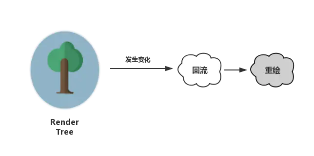
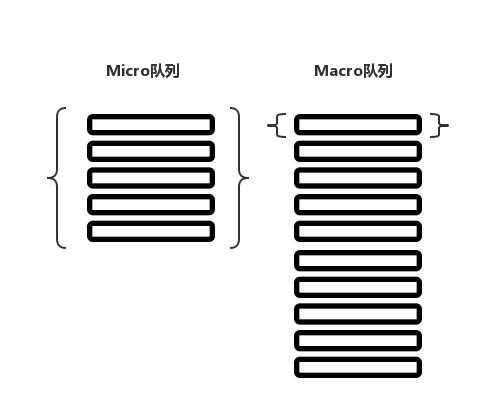
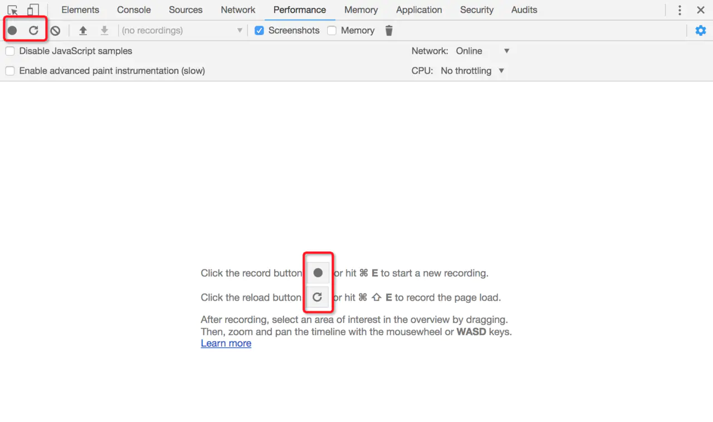
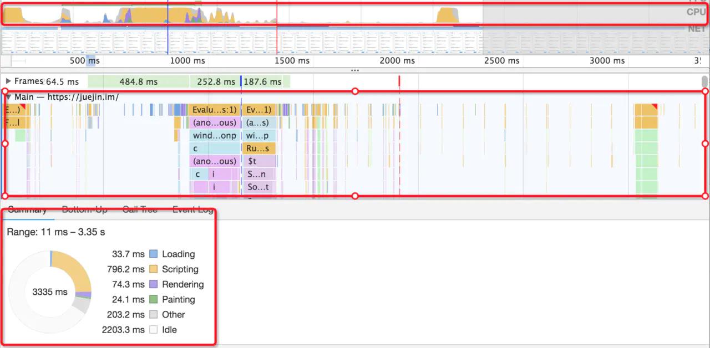
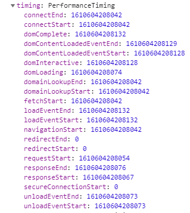

# 前端性能优化

<!-- @import "[TOC]" {cmd="toc" depthFrom=1 depthTo=6 orderedList=false} -->

<!-- code_chunk_output -->

- [前端性能优化](#前端性能优化)
  - [一. 浏览器](#一-浏览器)
    - [1.1 加载过程](#11-加载过程)
      - [1.1.1 浏览器加载过程中的阻塞渲染](#111-浏览器加载过程中的阻塞渲染)
        - [1.1.1.1 JS 的阻塞](#1111-js-的阻塞)
        - [1.1.1.2 CSS 的阻塞](#1112-css-的阻塞)
    - [1.2 缓存机制介绍与缓存策略剖析](#12-缓存机制介绍与缓存策略剖析)
      - [1.2.1 HTTP 缓存机制](#121-http-缓存机制)
        - [1.2.1.1 强缓存](#1211-强缓存)
        - [1.2.1.2 协商缓存](#1212-协商缓存)
        - [1.2.1.3 HTTP 缓存决策指南](#1213-http-缓存决策指南)
      - [1.2.2 Memory Cache](#122-memory-cache)
      - [1.2.3 Service Worker Cache](#123-service-worker-cache)
      - [1.2.4 Push Cache](#124-push-cache)
    - [1.3 本地存储](#13-本地存储)
      - [1.3.1 Cookie](#131-cookie)
      - [1.3.2 Web Storage](#132-web-storage)
      - [1.3.3 IndexedDB](#133-indexeddb)
    - [1.4 渲染](#14-渲染)
      - [1.4.1 渲染方式](#141-渲染方式)
        - [1.4.1.1 客户端渲染](#1411-客户端渲染)
        - [1.4.1.2 服务端渲染(SSR)](#1412-服务端渲染ssr)
      - [1.4.2 浏览器渲染](#142-浏览器渲染)
        - [1.4.2.1 基于渲染流程的 CSS 优化建议](#1421-基于渲染流程的-css-优化建议)
      - [1.4.3 DOM 优化原理与基本实践](#143-dom-优化原理与基本实践)
        - [1.4.3.1 优化实践 - 规避重排与重绘](#1431-优化实践-规避重排与重绘)
        - [1.4.3.2 优化实践 - DocumentFragment](#1432-优化实践-documentfragment)
        - [1.4.3.3 优化实践 - Event Loop 与 异步更新策略](#1433-优化实践-event-loop-与-异步更新策略)
  - [二. HTML](#二-html)
    - [2.1 避免空的 src 和 href](#21-避免空的-src-和-href)
    - [2.2 减少 DOM 元素数量](#22-减少-dom-元素数量)
    - [2.3 减少 iframe 数量](#23-减少-iframe-数量)
    - [2.4 减少 DOM 访问](#24-减少-dom-访问)
    - [2.5 打包组建成复合文档](#25-打包组建成复合文档)
    - [2.6 HTML 文档结构层次尽量少，最好不深于六层](#26-html-文档结构层次尽量少最好不深于六层)
    - [2.7 减少 Cookie 大小](#27-减少-cookie-大小)
    - [2.8 使用预加载](#28-使用预加载)
  - [三. CSS](#三-css)
    - [3.1 将 CSS 放在页面最上面](#31-将-css-放在页面最上面)
    - [3.2 避免在 CSS 中使用 Expressions](#32-避免在-css-中使用-expressions)
    - [3.3 优化 CSS Sprite](#33-优化-css-sprite)
  - [四. JS](#四-js)
    - [4.1 将 JS 放在页面的最下面](#41-将-js-放在页面的最下面)
    - [4.2 将 JS 和 CSS 放到外部文件](#42-将-js-和-css-放到外部文件)
    - [4.3 JS 和 CSS 压缩和模块打包](#43-js-和-css-压缩和模块打包)
    - [4.4 移除重复的脚本](#44-移除重复的脚本)
    - [4.5 在脚本中尽量减少 DOM 操作，尽量缓存访问 DOM 的样式信息，避免过度触发回流](#45-在脚本中尽量减少-dom-操作尽量缓存访问-dom-的样式信息避免过度触发回流)
    - [4.6 懒加载（Lazy Load）](#46-懒加载lazy-load)
      - [4.6.1 事件的节流（throttle）与防抖（debounce）](#461-事件的节流throttle与防抖debounce)
  - [五. 网络](#五-网络)
    - [5.1 尽量的减少 HTTP 的请求数](#51-尽量的减少-http-的请求数)
    - [5.2 使用 CDN（内容分发网络）](#52-使用-cdn内容分发网络)
    - [5.3 添加 Expire/Cache-Control 头](#53-添加-expirecache-control-头)
    - [5.4 减少 DNS 查询](#54-减少-dns-查询)
    - [5.5 使用 AJAX 缓存](#55-使用-ajax-缓存)
    - [5.6 避免 404](#56-避免-404)
    - [5.7 根据域名划分内容](#57-根据域名划分内容)
    - [5.8 Gzip](#58-gzip)
  - [六. 其他](#六-其他)
    - [6.1 图片优化](#61-图片优化)
      - [6.1.1 JPEG/JPG](#611-jpegjpg)
      - [6.1.2 PNG-8 与 PNG-24](#612-png-8-与-png-24)
      - [6.1.3 SVG](#613-svg)
      - [6.1.4 Base64](#614-base64)
      - [6.1.5 WebP](#615-webp)
    - [6.2 使用小且可缓存的 favicon.ico](#62-使用小且可缓存的-faviconico)
    - [6.3 移动客户端图片保持单个内容小于 25KB](#63-移动客户端图片保持单个内容小于-25kb)
    - [6.4 webpack 优化](#64-webpack-优化)
  - [七. 性能监测](#七-性能监测)
    - [7.1 常用的性能监测方案](#71-常用的性能监测方案)
      - [7.1.1 可视化方案](#711-可视化方案)
      - [7.1.2 可编程方案](#712-可编程方案)

<!-- /code_chunk_output -->

## 一. 浏览器

### 1.1 加载过程

1. DNS 解析
2. TCP 连接
3. HTTP 请求抛出
4. 服务端处理请求，HTTP 响应返回
5. 解析响应内容

   1. 解析 HTML 生成 DOM 树
      当浏览器接收到服务器响应来的 HTML 文档后，会遍历文档节点，生成 DOM 树。

      > **注意**：DOM 树的生成过程中可能会被 CSS 和 JS 的加载执行阻塞

   2. 解析 CSS 生成 CSSOM 规则树
      浏览器解析 CSS 文件并生成 CSS 规则树，每个 CSS 文件都被分析成一个 StyleSheet 对象，每个对象都包含 CSS 规则。CSS 规则对象包含对应于 CSS 语法的选择器和声明对象以及其他对象。

   3. 将 DOM 树与 CSSOM 规则树合并在一起生成渲染树
      通过 DOM 树和 CSS 规则树便可以构建渲染树。浏览器会先从 DOM 树的根节点开始遍历每个可见节点。对每个可见节点，找到其适配的 CSS 样式规则并应用。

   4. 遍历渲染树开始布局，计算每个节点的位置大小信息
      从渲染树的根节点开始遍历，然后确定每个节点对象在页面上的确切大小与位置，布局阶段的输出是一个盒子模型，它会精确地捕获每个元素在屏幕内的确切位置与大小。

   5. 将渲染树每个节点绘制到屏幕 将渲染树每个节点绘制到屏幕
      遍历渲染树，调用渲染器的 `paint()` 方法在屏幕上显示其内容。渲染树的绘制工作是由浏览器的 UI 后端组件完成的。

之后每当一个新元素加入 DOM 树当中，浏览器便会通过 CSS 引擎查询 CSS 样式表，找到符合该元素的样式规则应用到这个元素上，然后再重新去绘制它。

#### 1.1.1 浏览器加载过程中的阻塞渲染

HTML、CSS 和 JS，都具有**阻塞渲染**的特性。

##### 1.1.1.1 JS 的阻塞

JS 的作用在于修改，它帮助修改网页的方方面面：内容、样式以及它如何响应用户交互。这"方方面面"的修改，本质上都是对 DOM 和 CSSOM 进行修改。

因此，当浏览器遇到一个 script 标记时，DOM 构建将暂停，直至脚本完成执行，然后继续构建 DOM。每次去执行 JS 脚本都会严重地阻塞 DOM 树的构建，如果 JS 脚本还操作了 CSSOM，而正好这个 CSSOM 还没有下载和构建，浏览器甚至会延迟脚本执行和构建 DOM，直至完成其 CSSOM 的下载和构建。

浏览器之所以让 JS 阻塞其它的活动，是因为它不知道 JS 会做什么改变，担心如果不阻止后续的操作，会造成混乱。可以通过对它使用 `defer` 和 `async` 来避免不必要的阻塞，**外部 JS 有三种加载方式**：

- **正常模式**
  这种情况下 JS 会阻塞浏览器，浏览器必须等待 JS 加载和执行完毕才能去做其它事情。

  ```html
  <script src="index.js"></script>
  ```

- **async 模式**
  async 模式下，JS 不会阻塞浏览器做任何其它的事情。它的加载是异步的，当它加载结束，JS 脚本会**立即执行**。

  ```html
  <script async src="index.js"></script>
  ```

- **defer 模式**
  defer 模式下，JS 的加载是异步的，执行是**被推迟的**。等整个文档解析完成、DOMContentLoaded 事件即将被触发时，被标记了 defer 的 JS 文件才会开始依次执行。defer 属性对模块脚本没有作用 —— 它们默认 defer。

  ```html
  <script defer src="index.js"></script>
  ```

**应用场景**
从应用的角度来说，一般当脚本与 DOM 元素和其它脚本之间的依赖关系不强时，选用 async，当脚本依赖于 DOM 元素和其它脚本的执行结果时，会选用 defer。

通过审时度势地向 script 标签添加 async/defer，就可以告诉浏览器在等待脚本可用期间不阻止其它的工作，这样可以显著提升性能。

##### 1.1.1.2 CSS 的阻塞

DOM 和 CSSOM 合力才能构建渲染树。这一点会给性能造成严重影响：默认情况下，CSS 是阻塞的资源。浏览器在构建 CSSOM 的过程中，不会渲染任何已处理的内容。即便 DOM 已经解析完毕了，只要 CSSOM 不完成，那么渲染这个事情就不能进行（这主要是为了避免没有 CSS 的 HTML 页面丑陋地 "裸奔" 在用户眼前）。

CSS 是阻塞渲染的资源。需要将它尽早、尽快地下载到客户端，以便缩短首次渲染的时间。

**解决方法**：

- 将 CSS 放在 head 标签里
- 启用 CDN 实现静态资源加载速度的优化

### 1.2 缓存机制介绍与缓存策略剖析

缓存可以减少网络 IO 消耗，提高访问速度。浏览器缓存是一种操作简单、效果显著的前端性能优化手段。

> 通过网络获取内容既速度缓慢又开销巨大。较大的响应需要在客户端与服务器之间进行多次往返通信，这会延迟浏览器获得和处理内容的时间，还会增加访问者的流量费用。因此，缓存并重复利用之前获取的资源的能力成为性能优化的一个关键方面。

浏览器缓存机制有四个方面，它们按照获取资源时请求的优先级依次排列如下：

- [Memory Cache](#MemoryCache)
- Service Worker Cache
- HTTP Cache
- Push Cache

Network 面板 size 列截图


图中，形如 "(from xxx)" 这样的描述——对应的资源，这些资源就是通过缓存获取到的。其中，"from memory cache" 对标到 Memory Cache 类型，"from ServiceWorker" 对标到 Service Worker Cache 类型。至于 "Push Cache"，这个比较特殊，是 HTTP2 的新特性。

#### 1.2.1 HTTP 缓存机制

HTTP 缓存是日常开发中最为熟悉的一种缓存机制。它又分为**强缓存**和**协商缓存**。优先级较高的是强缓存，在命中强缓存失败的情况下，才会走协商缓存。

##### 1.2.1.1 强缓存

**特征**
强缓存是利用 http 头中的 Expires 和 Cache-Control 两个字段来控制的。强缓存中，当请求再次发出时，浏览器会根据其中的 expires 和 cache-control 判断目标资源是否"命中"强缓存，若命中则直接从缓存中获取资源，**不会再与服务端发生通信**。

> 命中强缓存的情况下，返回的 HTTP 状态码为 200

**强缓存的实现**：从 expires 到 cache-control

```txt
expires: Wed, 11 Sep 2019 16:12:18 GMT
```

可以看到，expires 是一个时间戳，接下来如果试图再次向服务器请求资源，浏览器就会先对比本地时间和 expires 的时间戳，如果本地时间小于 expires 设定的过期时间，那么就直接去缓存中取这个资源。由于时间戳是服务器来定义的，而本地时间的取值却来自客户端，因此 expires 的工作机制对客户端时间与服务器时间之间的一致性提出了极高的要求，若服务器与客户端存在时差，将带来意料之外的结果。

```txt
cache-control: max-age=31536000
```

在 `Cache-Control` 中，通过 `max-age` 来控制资源的有效期。max-age 不是一个时间戳，而是一个时间长度(单位: 秒)。在 HTTP1.1 标准试图将缓存相关配置收敛进 Cache-Control 这样的大背景下， `max-age` 可以视作是对 expires 能力的补位/替换。在当下的前端实践里，普遍会倾向于使用 `max-age`。

**注意**：

- max-age 是一个相对时间，这就意味着它有能力规避掉 expires 可能会带来的时差问题：max-age 机制下，资源的过期判定不再受服务器时间戳的限制。客户端会记录请求到资源的时间点，以此作为相对时间的起点，从而确保参与计算的两个时间节点 (起始时间和当前时间)都来源于客户端，由此便能够实现更加精准的判断。
- Cache-Control 的 max-age 配置项相对于 expires 的优先级更高。当 Cache-Control 与 expires 同时出现时，以 Cache-Control 为准

**Cache-Control 应用分析**
Cache-Control 不止于 max-age。如下的用法也非常常见：

```txt
cache-control: max-age=3600, s-maxage=31536000
```

**s-maxage 优先级高于 max-age，两者同时出现时，优先考虑 s-maxage。如果 s-maxage 未过期，则向代理服务器请求其缓存内容。**

在项目不是特别大的场景下，max-age 足够用了。但在依赖各种代理的大型架构中，不得不考虑代理服务器的缓存问题。s-maxage 就是用于表示 cache 服务器上 (比如 cache CDN)的缓存的有效时间的，并只对 public 缓存有效。

> s-maxage 仅在代理服务器中生效，客户端中只考虑 max-age。

**public 与 private**
public 与 private 是针对资源是否能够被代理服务缓存而存在的一组对立概念。

如果为资源设置了 public，那么它既可以被浏览器缓存，也可以被代理服务器缓存；如果设置了 private，则该资源只能被浏览器缓存。private 为默认值。但多数情况下，public 并不需要手动设置。

> 明确的缓存信息 (例如"max-age")已表示响应是可以缓存的。

**no-store 与 no-cache**
no-cache
: 为资源设置了 no-cache 后，每一次发起请求都不会再去询问浏览器的缓存情况，而是直接向服务端去确认该资源是否过期 (即走协商缓存的路线)。

no-store
: 不使用任何缓存策略。在 no-cache 的基础上，它连服务端的缓存确认也绕开了，只允许直接向服务端发送请求、并下载完整的响应。

##### 1.2.1.2 协商缓存

协商缓存依赖于服务端与浏览器之间的通信。协商缓存机制下，浏览器需要向服务器去询问缓存的相关信息，进而判断是重新发起请求、下载完整的响应，还是从本地获取缓存的资源。

如果服务端提示缓存资源未改动 (Not Modified)，资源会被重定向到浏览器缓存，这种情况下网络请求对应的状态码是 304。

**协商缓存的实现**：从 Last-Modified 到 Etag

Last-Modified 是一个时间戳，如果启用了协商缓存，它会在首次请求时随着 Response Headers 返回：

```txt
Last-Modified: Fri, 27 Oct 2017 06:35:57 GMT
```

随后每次请求时，会带上一个叫 `If-Modified-Since` 的时间戳字段，它的值正是上一次 response 返回给它的 last-modified 值：

服务器接收到这个时间戳后，会比对该时间戳和资源在服务器上的最后修改时间是否一致，从而判断资源是否发生了变化。如果发生了变化，就会返回一个完整的响应内容，并在 Response Headers 中添加新的 Last-Modified 值；否则，返回 304 响应，Response Headers 不会再添加 Last-Modified 字段。

使用 Last-Modified 存在一些弊端，这其中最常见的就是这样两个场景：

- 编辑了文件，但文件的内容没有改变。服务端并不清楚是否真正改变了文件，它仍然通过最后编辑时间进行判断。因此这个资源在再次被请求时，会被当做新资源，进而引发一次完整的响应——不该重新请求的时候，也会重新请求。
- 当修改文件的速度过快时 (比如花了 100ms 完成了改动)，由于 If-Modified-Since 只能检查到以秒为最小计量单位的时间差，所以它是感知不到这个改动的——该重新请求的时候，反而没有重新请求了。

> 这两个场景其实指向了同一个 bug——服务器并没有正确感知文件的变化。为了解决这样的问题，Etag 作为 Last-Modified 的补充出现了。

**Etag**
Etag 是由服务器为每个资源生成的唯一的标识字符串，这个标识字符串是基于文件内容编码的，只要文件内容不同，它们对应的 Etag 就是不同的，反之亦然。因此 Etag 能够精准地感知文件的变化。

Etag 和 Last-Modified 类似，当首次请求时，会在响应头里获取到一个最初的标识符字符串，它可以是这样的：

```txt
ETag: W/"2a3b-1602480f459"
```

那么下一次请求时，请求头里就会带上一个值相同的、名为 `if-None-Match` 的字符串供服务端比对了：

```txt
If-None-Match: W/"2a3b-1602480f459"
```

如果客户端接收到的 ETag 与服务器的 ETag 一致,那么服务器会返回 304

**缺点**：

- Etag 的生成过程需要服务器额外付出开销，会影响服务端的性能。因此启用 Etag 需要审时度势。
- ETags 的版本信息即使主流服务器也未能很好地支持跨服务器的判断，比如你从一个服务器集群中一台到 ETags，然后发送到了另一台那么校验很有可能会失败。

> Etag 并不能替代 Last-Modified，它只能作为 Last-Modified 的补充和强化存在。 Etag 在感知文件变化上比 Last-Modified 更加准确，优先级也更高。当 Etag 和 Last-Modified 同时存在时，以 Etag 为准。

##### 1.2.1.3 HTTP 缓存决策指南


1. 当资源内容不可复用时，直接为 `Cache-Control` 设置 `no-store`，拒绝一切形式的缓存
2. 否则考虑是否每次都需要向服务器进行缓存有效确认，如果需要，那么设 `Cache-Control` 的值为 `no-cache`
3. 否则考虑该资源是否可以被代理服务器缓存，根据其结果决定是设置为 `private` 还是 `public`
4. 然后考虑该资源的过期时间，设置对应的 `max-age` 和 `s-maxage` 值
5. 最后，配置协商缓存需要用到的 Etag、Last-Modified 等参数

**它的可行度非常高。**

#### 1.2.2 Memory Cache

MemoryCache，是指存在内存中的缓存。从优先级上来说，它是浏览器最先尝试去命中的一种缓存。从效率上来说，它是响应速度最快的一种缓存。

内存缓存是快的，也是"短命"的。它和渲染进程"生死相依"，当进程结束后，也就是 tab 关闭以后，内存里的数据也将不复存在。

内存是有限的，很多时候需要先考虑即时呈现的内存余量，再根据具体的情况决定分配给内存和磁盘的资源量的比重——资源存放的位置具有一定的随机性。

内存缓存划分规则可以总结出这样的规律：

- 资源存不存内存，浏览器秉承的是"节约原则"。Base64 格式的图片，几乎永远可以被塞进 memory cache，这可以视作浏览器为节省渲染开销的"自保行为"。
- 体积不大的 JS、CSS 文件，也有较大地被写入内存的几率——相比之下，较大的 JS、CSS 文件，它们往往被直接甩进磁盘。

#### 1.2.3 Service Worker Cache

Service Worker 是一种独立于主线程之外的 Javascript 线程。它脱离于浏览器窗体，因此无法直接访问 DOM。这样独立的个性使得 Service Worker 的 "个人行为" 无法干扰页面的性能，这个 "幕后工作者" 可以实现离线缓存、消息推送和网络代理等功能。借助 Service worker 实现的离线缓存就称为 Service Worker Cache。

Service Worker 的生命周期包括 install、active、working 三个阶段。一旦 Service Worker 被 install，它将始终存在，只会在 active 与 working 之间切换，除非主动终止它。这是它可以用来实现离线存储的重要先决条件。

**Service Worker 如何实现离线缓存**：

1. 首先在入口文件中插入这样一段 JS 代码，用以判断和引入 Service Worker：

   ```js
   window.navigator.serviceWorker
     .register('/test.js')
     .then(() => {
       console.log('注册成功');
     })
     .catch(err => {
       console.error('注册失败');
     });
   ```

   在 test.js 中，进行缓存的处理。假设需要缓存的文件分别是 test.html, test.css 和 test.js：

   ```js
   // Service Worker会监听 install事件，在其对应的回调里可以实现初始化的逻辑
   self.addEventListener('install', event => {
     event.waitUntil(
       // 考虑到缓存也需要更新，open内传入的参数为缓存的版本号
       caches.open('test-v1').then(cache => {
         return cache.addAll([
           // 此处传入指定的需缓存的文件名
           '/test.html',
           '/test.css',
           '/test.js'
         ]);
       })
     );
   });

   // Service Worker 会监听所有的网络请求，网络请求的产生触发的是 fetch 事件，可以在其对应的监听函数中实现对请求的拦截，进而判断是否有对应到该请求的缓存，实现从 Service Worker 中取到缓存的目的
   self.addEventListener('fetch', event => {
     event.respondWith(
       // 尝试匹配该请求对应的缓存值
       caches.match(event.request).then(res => {
         // 如果匹配到了，调用Server Worker缓存
         if (res) {
           return res;
         }
         // 如果没匹配到，向服务端发起这个资源请求
         return fetch(event.request).then(response => {
           if (!response || response.status !== 200) {
             return response;
           }
           // 请求成功的话，将请求缓存起来。
           caches.open('test-v1').then(function (cache) {
             cache.put(event.request, response);
           });
           return response.clone();
         });
       })
     );
   });
   ```

   > https 协议才能使用 Server Worker。

#### 1.2.4 Push Cache

Push Cache 是指 HTTP2 在 server push 阶段存在的缓存。HTTP2 是趋势、是未来，需要对 Push Cache 的关键特性有所了解。

- Push Cache 是缓存的最后一道防线。浏览器只有在 Memory Cache、HTTP Cache 和 Service Worker Cache 均未命中的情况下才会去询问 Push Cache。
- Push Cache 是一种存在于会话阶段的缓存，当 session 终止时，缓存也随之释放。
- 不同的页面只要共享了同一个 HTTP2 连接，那么它们就可以共享同一个 Push Cache。

### 1.3 本地存储

#### 1.3.1 Cookie

Cookie 的本职工作并非本地存储，而是 "维持状态"。在 Web 开发的早期，人们亟需解决的一个问题就是状态管理的问题：HTTP 协议是一个无状态协议，服务器接收客户端的请求，返回一个响应，故事到此就结束了，服务器并没有记录下关于客户端的任何信息。那么下次请求的时候，如何让服务器知道 "我是我" 呢？在这样的背景下，Cookie 应运而生。

Cookie 其实就是一个存储在浏览器里的小文本文件，它附着在 HTTP 请求上，在浏览器和服务器之间"飞来飞去"。它可以携带用户信息，当服务器检查 Cookie 的时候，便可以获取到客户端的状态。

关于 Cookie 的详细内容，可以在 Chrome 的 `Application` 面板中查看到，**Cookie 以键值对的形式存在**。

**缺点**：

- Cookie 不够大
  Cookie 最大只能有 4KB。当 Cookie 超过 4KB 时，它将被裁切。

- 过量的 Cookie 会带来巨大的性能浪费
  **Cookie 是紧跟域名的**。通过响应头里的 Set-Cookie 指定要存储的 Cookie 值。默认情况下，domain 被设置为设置 Cookie 页面的主机名，也可以手动设置 domain 的值：

  ```txt
  Set-Cookie: name=student; domain=student.me
  ```

  **同一个域名下的所有请求，都会携带 Cookie**。Cookie 虽然小，请求却可以有很多，随着请求的叠加，这样的不必要的 Cookie 带来的开销将是无法想象的。

#### 1.3.2 Web Storage

为了弥补 Cookie 的局限性，出现了 Web Storage，Web Storage 是 HTML5 专门为浏览器存储而提供的数据存储机制。它又分为 `Local Storage` 与 `Session Storage`，这两组概念非常相近。

**Local Storage 与 Session Storage 的区别**
两者的区别在于生命周期与作用域的不同。

- **生命周期**

  - Local Storage 是持久化的本地存储，存储在其中的数据是永远不会过期的，使其消失的唯一办法是手动删除
  - Session Storage 是临时性的本地存储，它是会话级别的存储，当会话结束（页面被关闭）时，存储内容也随之被释放。

- **作用域**
  - Local Storage、Session Storage 和 Cookie 都遵循同源策略。
  - Session Storage 特别的一点在于，即便是相同域名下的两个页面，只要它们不在同一个浏览器窗口中打开，那么它们的 Session Storage 内容便无法共享。

**Web Storage 的特性**：

- 存储容量大：Web Storage 根据浏览器的不同，存储容量可以达到 5-10M 之间。
- 仅位于浏览器端，不与服务端发生通信。

**Web Storage 核心 API 使用示例**
Web Storage 保存的数据内容和 Cookie 一样，是文本内容，以键值对的形式存在。Local Storage 与 Session Storage 在 API 方面无异，下面以 `localStorage` 为例：

- 存储数据：setItem()

  ```js
  localStorage.setItem('user_name', 'dsy');
  ```

- 读取数据：getItem()

  ```js
  localStorage.getItem('user_name');
  ```

- 删除某一键名对应的数据：removeItem()

  ```js
  localStorage.removeItem('user_name');
  ```

- 清空数据记录：clear()

  ```js
  localStorage.clear();
  ```

**应用场景**：

- Local Storage
  Local Storage 在存储方面没有什么特别的限制，理论上 Cookie 无法胜任的、可以用简单的键值对来存取的数据存储任务，都可以交给 Local Storage 来做。
  考虑到 Local Storage 的特点之一是**持久**，有时更倾向于用它来存储一些内容稳定的资源。比如图片内容丰富的电商网站会用它来存储 Base64 格式的图片字符串，有的网站还会用它存储一些不经常更新的 CSS、JS 等静态资源。

- Session Storage
  Session Storage 更适合用来存储生命周期和它同步的会话级别的信息。这些信息只适用于当前会话，当开启新的会话时，它也需要相应的更新或释放。比如微博的 Session Storage 就主要是存储本次会话的浏览足迹。

Web Storage 是一个从定义到使用都非常简单的东西。它使用键值对的形式进行存储，这种模式有点类似于对象，却甚至连对象都不是——它只能存储字符串，要想得到对象，还需要先对字符串进行一轮解析。

Web Storage 是对 Cookie 的拓展，它只能用于存储少量的简单数据。当遇到大规模的、结构复杂的数据时，Web Storage 也爱莫能助了。

#### 1.3.3 IndexedDB

IndexedDB 是一个运行在浏览器上的非关系型数据库。理论上来说，IndexedDB 是没有存储上限的（一般来说不会小于 250M）。它不仅可以存储字符串，还可以存储二进制数据。

接下来，遵循 MDN 推荐的操作模式，通过一个基本的 IndexedDB 使用流程，旨在对 IndexedDB 形成一个感性的认知：

1. 打开/创建一个 IndexedDB 数据库（当该数据库不存在时，open 方法会直接创建一个名为 mainDB 新数据库）

   ```js
   // 后面的回调中，可以通过 event.target.result 拿到数据库实例
   let db;
   // 参数1位数据库名，参数2为版本号
   const request = window.indexedDB.open('mainDB', 1);
   // 使用IndexedDB失败时的监听函数
   request.onerror = function (event) {
     console.log('无法使用IndexedDB');
   };
   // 成功
   request.onsuccess = function (event) {
     // 此处就可以获取到db实例
     db = event.target.result;
     console.log('你打开了IndexedDB');
   };
   ```

2. 创建一个 object store（object store 对标到数据库中的"表"单位）

   ```js
   // onupgradeneeded 事件会在初始化数据库/版本发生更新时被调用，在它的监听函数中创建 object store
   request.onupgradeneeded = function (event) {
     let objectStore;
     // 如果同名表未被创建过，则新建test表
     if (!db.objectStoreNames.contains('test')) {
       objectStore = db.createObjectStore('test', { keyPath: 'id' });
     }
   };
   ```

3. 构建一个事务来执行一些数据库操作，像增加或提取数据等

   ```js
   // 创建事务，指定表格名称和读写权限
   const transaction = db.transaction(['test'], 'readWrite');
   // 拿到 Object Store 对象
   const objectStore = transaction.objectStore('test');
   // 向表格写入数据
   objectStore.add({ id: 1, name: 'db' });
   ```

4. 通过监听正确类型的事件以等待操作完成

   ```js
   // 操作成功时的监听函数
   transaction.oncomplete = function (event) {
     console.log('操作成功');
   };
   // 操作失败时的监听函数
   transaction.onerror = function (event) {
     console.log('这里有一个Error');
   };
   ```

**IndexedDB 的应用场景**
在 IndexedDB 中，可以创建多个数据库，一个数据库中创建多张表，一张表中存储多条数据——这足以 hold 住复杂的结构性数据。IndexedDB 可以看做是 LocalStorage 的一个升级，当数据的复杂度和规模上升到了 LocalStorage 无法解决的程度，就可以使用 IndexedDB 来帮忙。

### 1.4 渲染

#### 1.4.1 渲染方式

##### 1.4.1.1 客户端渲染

客户端渲染模式下，服务端会把渲染需要的静态文件发送给客户端，客户端加载过来之后，在浏览器里跑一遍 JS，根据 JS 的运行结果，生成相应的 DOM。这种特性使得客户端渲染的源代码总是特别简洁：

```html
<!DOCTYPE html>
<html>
  <head>
    <title>我是客户端渲染的页面</title>
  </head>
  <body>
    <div id="root"></div>
    <script src="index.js"></script>
  </body>
</html>
```

根节点下是什么内容，只有浏览器把 index.js 跑过一遍后才知道，这就是典型的客户端渲染。

##### 1.4.1.2 服务端渲染（SSR）

服务端渲染的模式下，当用户第一次请求页面时，由服务器把需要的组件或页面渲染成 HTML 字符串，然后把它返回给客户端。客户端拿到手的，是可以直接渲染然后呈现给用户的 HTML 内容，不需要为了生成 DOM 内容再去跑一遍 JS 代码。

使用服务端渲染的网站，可以说是 "所见即所得"，页面上呈现的内容，在 html 源文件里也能找到。

**解决的问题**：

- SEO 问题，搜索引擎只会查找现成的内容，不会运行 JS 代码
- 首屏加载速度过慢

**服务端渲染的应用实例**
**React 实例**
使用 Express 搭建后端服务，项目中有一个叫做 VDom 的 React 组件，内容如下：

```js
// VDom.js:
import React from 'react';

const VDom = () => {
  return <div>这是一个被渲染为真实DOM的虚拟DOM</div>;
};

export default VDom;
```

在服务端的入口文件中，引入这个组件，对它进行渲染：

```js
import express from 'express';
import React from 'react';
import { renderToString } from 'react-dom/server';
import VDom from './VDom';

// 创建一个express应用
const app = express();
// renderToString 是把虚拟DOM转化为真实DOM的关键方法
const RDom = renderToString(<VDom />);
// 编写HTML模板，插入转化后的真实DOM内容
const Page = `
            <html>
              <head>
                <title>test</title>
              </head>
              <body>
                <span>服务端渲染出了真实DOM:  </span>
                ${RDom}
              </body>
            </html>
            `;

// 配置HTML内容对应的路由
app.get('/index', function (req, res) {
  res.send(Page);
});

// 配置端口号
const server = app.listen(8000);
```

根据路由配置，当访问 `http://localhost:8000/index` 时，就可以呈现出服务端渲染的结果了。

VDom 组件已经被 `renderToString` 转化为了一个内容为 `<div data-reactroot="">这是一个被渲染为真实DOM的虚拟DOM</div>` 的字符串，这个字符串被插入 HTML 代码，成为了真实 DOM 树的一部分。

**Vue 实例**
直接将 Vue 实例整合进了服务端的入口文件中：

```js
const Vue = require('vue');
// 创建一个 express 应用
const server = require('express')();
// 提取出 renderer 实例
const renderer = require('vue-server-renderer').createRenderer();

server.get('*', (req, res) => {
  // 编写Vue实例 (虚拟DOM节点)
  const app = new Vue({
    data: {
      url: req.url
    },
    // 编写模板HTML的内容
    template: `<div>访问的 URL 是： {{ url }}</div>`
  });

  // renderToString 是把Vue实例转化为真实DOM的关键方法
  renderer.renderToString(app, (err, html) => {
    if (err) {
      res.status(500).end('Internal Server Error');
      return;
    }
    // 把渲染出来的真实DOM字符串插入HTML模板中
    res.end(`
      <!DOCTYPE html>
      <html lang="en">
        <head><title>Hello</title></head>
        <body>${html}</body>
      </html>
    `);
  });
});

server.listen(8080);
```

实际项目比这些复杂很多，但万变不离其宗。强调的只有两点：

- `renderToString()` 方法
- 把转化结果"塞"进模板里

这两个操作是服务端渲染的灵魂操作。在虚拟 DOM"横行"的当下，它还要求这一端要具备将虚拟 DOM 转化为真实 DOM 的能力。与其说是 "把 JS 在服务器上先跑一遍"，不如说是 "把 Vue、React 等框架代码先在 Node 上跑一遍"。

**缺点**
提高了服务器压力，吃 CPU，内存等资源

**服务端渲染的应用场景**
服务器稀少而宝贵，但首屏渲染体验和 SEO 的优化方案却很多——最好先把能用的低成本 "大招" 都用完。除非网页对性能要求太高了，以至于所有的招式都用完了，性能表现还是不尽人意，再用服务端渲染。

#### 1.4.2 浏览器渲染

不同浏览器下代码渲染结果的有差异，是因为浏览器内核的不同而导致的——浏览器内核决定了浏览器解释网页语法的方式。浏览器内核可以分成两部分：

- 渲染引擎（Layout Engine 或 Rendering Engine）
- JS 引擎

早期渲染引擎和 JS 引擎并没有十分明确的区分，但随着 JS 引擎越来越独立，内核也成了渲染引擎的代称。渲染引擎又包括了 HTML 解释器、CSS 解释器、布局、网络、存储、图形、音视频、图片解码器等等零部件。

目前市面上常见的浏览器内核可以分为四种：Trident（IE）、Gecko（火狐）、Blink（Chrome、Opera）、Webkit（Safari）。

Chrome 内核早已从 Webkit 迭代为了 Blink。但是，Blink 也是基于 Webkit 衍生而来的一个分支，因此，Webkit 内核仍然是当下浏览器世界真正的霸主。

浏览器的渲染过程参看 [加载过程第五步](#11-加载过程)

##### 1.4.2.1 基于渲染流程的 CSS 优化建议

CSS 引擎查找样式表，对每条规则都是按从右到左的顺序去匹配：

```css
#myList li {
}
```

这样的写法其实很常见。平时习惯了从左到右阅读的文字阅读方式，会本能地以为浏览器也是从左到右匹配 CSS 选择器的，因此会推测这个选择器并不会费多少力气。

但事实上，**CSS 选择符是从右到左进行匹配的**。这个看似"没毛病"的选择器，实际开销相当高：浏览器必须遍历页面上每个 li 元素，并且每次都要去确认这个 li 元素的父元素 id 是不是 myList。

**优化建议**：

- 避免使用通配符，只对需要用到的元素进行选择
- 关注可以通过继承实现的属性，避免重复匹配、重复定义
- 少用标签选择器。尽量用类选择器替代
- 不要画蛇添足，id 和 class 选择器不应该被多余的标签选择器拖后腿
- 减少嵌套。后代选择器的开销是最高的，因此应该尽量将选择器的深度降到最低（最高不要超过三层），尽可能使用类来关联每一个标签元素。

#### 1.4.3 DOM 优化原理与基本实践

DOM 为什么这么慢，是因为收了 "过路费"。把 DOM 和 JS 各自想象成一个岛屿，它们之间用收费桥梁连接。

JS 是很快的，在 JS 中修改 DOM 对象也是很快的。但 DOM 操作并非 JS 一个人的独舞，而是两个模块之间的协作。

在[浏览器渲染](#142-浏览器渲染)中提到，JS 引擎和渲染引擎（浏览器内核）是独立实现的。当用 JS 去操作 DOM 时，本质上是 JS 引擎和渲染引擎之间进行了"跨界交流"。这个"跨界交流"的实现并不简单，它依赖了桥接接口作为"桥梁"。

过"桥"要收费——这个开销本身就是不可忽略的。每操作一次 DOM（不管是为了修改还是仅仅为了访问其值），都要过一次"桥"。过"桥"的次数一多，就会产生比较明显的性能问题。

**对 DOM 的修改引发样式的重排-重绘**
过桥很慢，到了桥对岸，对 DOM 的操作带来的结果也很慢。很多时候，对 DOM 的操作都不会局限于访问，而是为了修改它。当对 DOM 的修改会引发它外观（样式）上的改变时，就会触发回流或重绘。

这个过程本质上还是因为对 DOM 的修改触发了渲染树（Render Tree）的变化所导致的。这时就要提到两个重要概念：**repaint** 和 **reflow**。



- **repaint（重绘）**：当对 DOM 的修改导致了样式的变化、却并未影响其几何属性（比如修改了颜色或背景色）时，浏览器不需重新计算元素的几何属性、直接为该元素绘制新的样式（跳过了上图所示的回流环节）。这个过程叫做重绘。

- **reflow（重排）**：当对 DOM 的修改引发了 DOM 几何尺寸的变化（比如修改元素的宽、高或隐藏元素等）时，浏览器需要重新计算元素的几何属性（其他元素的几何属性和位置也会因此受到影响），然后再将计算的结果绘制出来。这个过程就是重排（也叫回流）。

> **重绘不一定导致回流，回流一定会导致重绘**。回流比重绘做的事情更多，带来的开销也更大。在开发中，要从代码层面出发，尽可能把重排和重绘的次数最小化。

DOM 优化，主要是**减少 DOM 操作，避免过度渲染**

##### 1.4.3.1 优化实践 - 规避重排与重绘

要避免重排与重绘的发生，最直接的做法是避免掉可能会引发回流与重绘的 DOM 操作。

**重绘的"导火索"**
只要是不触发回流，但又触发了样式改变的 DOM 操作，都会引起重绘，比如背景色、文字色、可见性(可见性这里特指形如 visibility: hidden 这样不改变元素位置和存在性的、单纯针对可见性的操作，注意与 display:none 进行区分)等。

**回流的"导火索"**：

- 最"贵"的操作：改变 DOM 元素的几何属性
  这个改变几乎可以说是"牵一发动全身"——当一个 DOM 元素的几何属性发生变化时，所有和它相关的节点（比如父子节点、兄弟节点等）的几何属性都需要进行重新计算，它会带来巨大的计算量。

- "价格适中"的操作：改变 DOM 树的结构
  主要指的是节点的增减、移动等操作。浏览器引擎布局的过程，顺序上可以类比于树的前序遍历——它是一个从上到下、从左到右的过程。通常在这个过程中，当前元素不会再影响其前面已经遍历过的元素。

- 最容易被忽略的操作：获取一些特定属性的值（需要通过即时计算得到），浏览器为了获取这些值，也会进行回流。
  如：offsetTop、offsetLeft、 offsetWidth、offsetHeight、scrollTop、scrollLeft、scrollWidth、scrollHeight、clientTop、clientLeft、clientWidth、clientHeight 时，
  除此之外，当调用了 `getComputedStyle` 方法，或者 IE 里的 `currentStyle` 时，也会触发回流。原理是一样的，都为求一个"即时性"和"准确性"。

**规避重排与重绘的方法**
了解了回流与重绘的“导火索”，就要尽量规避它们。但很多时候，不得不使用它们。当避无可避时，就要学会聪明地使用它们。

- 将“导火索”缓存起来，避免频繁改动
- 避免逐条改变样式，使用类名去合并样式
- 将 DOM “离线”
  一旦给元素设置 `display: none`，将其从页面上“拿掉”，那么后续操作，将无法触发回流与重绘——这个将元素“拿掉”的操作，就叫做 **DOM 离线化**。只适用于操作频繁的地方。

**Flush 队列**:

```js
let container = document.getElementById('container');
container.style.width = '100px';
container.style.height = '200px';
container.style.border = '10px solid red';
container.style.color = 'red';
```

这段代码，浏览器只进行了一次回流和一次重绘。因为现代浏览器是很智能的，它给自己缓存了一个 flush 队列，把触发的回流与重绘任务都塞进去，待到队列里的任务多起来、或者达到了一定的时间间隔，或者“不得已”的时候，再将这些任务一起出队。因此看到，上面就算进行了 4 次 DOM 更改，也只触发了一次 Layout 和一次 Paint。

> 这个“不得已”的时候指的是。当访问具有很强的“即时性”属性时，浏览器会为了获得此时此刻的、最准确的属性值，而提前将 flush 队列的任务出队。具体看上面的 回流的"导火索" - 最容易被忽略的操作。

**总结**
并不是所有的浏览器都是智能的。Chrome 里行得通的东西，到了别处（比如 IE）就不一定行得通了。而并不知道用户会使用什么样的浏览器。如果不手动做优化，那么一个页面在不同的环境下就会呈现不同的性能效果，这是非常不利的。因此，养成良好的编码习惯、从根源上解决问题，仍然是最周全的方法。

##### 1.4.3.2 优化实践 - DocumentFragment

因为，JS 的运行速度，比 DOM 快得多。所以，减少 DOM 操作的核心思路，就是让 JS 去给 DOM 分压。
这个思路，在 [DOM Fragment](https://developer.mozilla.org/zh-CN/docs/Web/API/DocumentFragment) 中体现得淋漓尽致。

> DocumentFragment 接口表示一个没有父级文件的最小文档对象。它被当做一个轻量版的 Document 使用，用于存储已排好版的或尚未打理好格式的 XML 片段。因为 DocumentFragment 不是真实 DOM 树的一部分，它的变化不会引起 DOM 树的重新渲染的操作（reflow），且不会导致性能等问题。

DOM Fragment 对象允许像操作真实 DOM 一样去调用各种各样的 DOM API。并且当试图将其 append 进真实 DOM 时，它会在交出自身缓存的所有后代节点后消失，而不会出现在真实的 DOM 结构中。
这种结构化、干净利落的特性，使得 DOM Fragment 作为经典的性能优化手段大受欢迎，这一点在 jQuery、Vue 等优秀前端框架的源码中均有体现。

##### 1.4.3.3 优化实践 - Event Loop 与 异步更新策略

**Micro-Task 与 Macro-Task**
事件循环中的异步队列有两种：

- 宿主发起的任务称为**宏观任务**（macro-task）：常见的如，setTimeout、setInterval、 setImmediate、script（整体代码）、I/O 操作、UI 渲染等。
- JS 引擎发起的任务称为**微观任务**（micro-task）：常见的如，process.nextTick、Promise、MutationObserver 等。

**Event Loop 过程解析**
一个完整的 Event Loop 过程，可以概括为以下阶段：

1. 初始状态：调用栈空。micro 队列空，macro 队列里有且只有一个 script 脚本（整体代码）。

2. 全局上下文（script 标签）被推入调用栈，同步代码执行。在执行的过程中，通过对一些接口的调用，可以产生新的 macro-task 与 micro-task，它们会分别被推入各自的任务队列里。同步代码执行完了，script 脚本会被移出 macro 队列，**这个过程本质上是队列的 macro-task 的执行和出队的过程。**

3. 上一步出队的是一个 macro-task，这一步处理的是 micro-task。

   > 注意 : 当 macro-task 出队时，任务是一个一个执行的；而 micro-task 出队时，任务是一队一队执行的（如下图所示）。因此，处理 micro 队列这一步，会逐个执行队列中的任务并把它出队，直到队列被清空。
   > 

4. 执行渲染操作，更新界面

5. 检查是否存在 Web worker 任务，如果有，则对其进行处理

6. 上述过程循环往复，直到两个队列都清空

**渲染的时机**
在异步任务里进行 DOM 更新，应该把它包装成 micro-task。用 Promise 来把 task 包装成是一个 micro 任务：

```js
Promise.resolve().then(task);
```

micro-task 处理完，DOM 修改好了，紧接着就可以走 render 流程了。因此，更新 DOM 的时间点，应该尽可能靠近渲染的时机。

**异步更新策略**
当使用 Vue 或 React 提供的接口去更新数据时，这个更新并不会立即生效，而是会被推入到一个队列里。待到适当的时机，队列中的更新任务会被**批量触发**。这就是异步更新。

> 异步更新可以帮助避免过度渲染。

**优点**
只看结果，因此渲染引擎不需要为过程买单，例子：

```js
// 任务一
this.content = '第一次测试';
// 任务二
this.content = '第二次测试';
// 任务三
this.content = '第三次测试';
```

在三个更新任务中对同一个状态修改了三次，如果采取传统的同步更新策略，那么就要操作三次 DOM。但本质上需要呈现给用户的目标内容其实只是第三次的结果，也就是说只有第三次的操作是有意义的——白白浪费了两次计算。

但如果把这三个任务塞进异步更新队列里，它们会先在 JS 的层面上被**批量执行**完毕。当流程走到渲染这一步时，它仅仅需要针对有意义的计算结果操作一次 DOM——这就是异步更新的妙处。

## 二. HTML

### 2.1 避免空的 src 和 href

### 2.2 减少 DOM 元素数量

网页中元素过多对网页的加载和脚本的执行都是沉重的负担，500 个元素和 5000 个元素在加载速度上会有很大差别。

> `document.getElementsByTagName("*").length` 获取页面中有多少的元素

### 2.3 减少 iframe 数量

使用 iframe 要注意理解 iframe 的优缺点

优点:

1. 可以用来加载速度较慢的内容，例如广告。
2. 安全沙箱保护。浏览器会对 iframe 中的内容进行安全控制。
3. 脚本可以并行下载
4. 相同的网页内容可避免代码重复

缺点:

1. 即使 iframe 内容为空也消耗加载时间
2. 会阻止页面加载
3. 没有语义

### 2.4 减少 DOM 访问

通过 Javascript 访问 DOM 元素没有想象中快，元素多的网页尤其慢，对于 Javascript 对 DOM 的访问要注意:

1. 缓存已经访问过的元素
2. Offline 更新节点然后再加回 DOM Tree
3. 避免通过 Javascript 修改 layout

### 2.5 打包组建成复合文档

把页面内容打包成复合文本就如同带有多附件的 Email，它能够使你在一个 HTTP 请求中取得多个组件。当你使用这条规则时，首先要确定用户代理是否支持 (iPhone 不支持)。

### 2.6 HTML 文档结构层次尽量少，最好不深于六层

### 2.7 减少 Cookie 大小

Cookie 被用来做认证或个性化设置，其信息被包含在 http 报文头中，对于 cookie 要注意以下几点，来提高请求的响应速度

1. 去除没有必要的 cookie，如果网页不需要 cookie 就完全禁掉
2. 将 cookie 的大小减到最小
3. 注意 cookie 设置的 domain 级别，没有必要情况下不要影响到 sub-domain
4. 设置合适的过期时间，比较长的过期时间可以提高响应速度。

### 2.8 使用预加载

预加载可以在真正需要之前，通过取得必需的资源和相关数据来改善访问用户的浏览体验，主要有 3 类预加载:

1. 链接预先获取
2. DNS 预先获取
3. 预先渲染
   在离开当前 web 页面之前，使用预先获取方式，对应每个链接的 URL 地址，CSS，图片和脚本都会被预先获取。这保证了访问者能在最短时间内使用链接在画面间切换。只需在网站 HTML 中的链接属性上增加 `rel="prefetch"`、`rel="dns-prefetch"` 或者 `rel="prerender"` 标记。

## 三. CSS

### 3.1 将 CSS 放在页面最上面

提高浏览器的渲染性能，避免浏览器出现空白和闪烁的问题，具体原因看 [CSS 的阻塞](#1112-css-的阻塞)

### 3.2 避免在 CSS 中使用 Expressions

在页面显示和缩放，页面滚动，移动鼠标时，CSS 中的 Expressions 都会重新计算

### 3.3 优化 CSS Sprite

1. Sprite 图中水平排列图片，垂直排列会增加文件大小
2. Sprite 图中把颜色较近的组合在一起可以降低颜色数，理想状况是低于 256 色以便适用 PNG8 格式
3. 不要在 Sprite 的图像中间留有较大空隙。这虽然不大会增加文件大小，但对于用户代理来说它需要更少的内存来把图片解压为像素地图。

## 四. JS

### 4.1 将 JS 放在页面的最下面

避免 JS 出错后页面不显示，加载效率高

### 4.2 将 JS 和 CSS 放到外部文件

### 4.3 JS 和 CSS 压缩和模块打包

使用打包工具压缩，打包

1. 去除不必要的空白符，格式符，注释符
2. 简写方法名，参数名，压缩 JS 脚本

### 4.4 移除重复的脚本

### 4.5 在脚本中尽量减少 DOM 操作，尽量缓存访问 DOM 的样式信息，避免过度触发回流

1. 减少通过 JS 代码修改元素样式，尽量使用修改 class 名方式操作样式或动画
2. 动画尽量使用在绝对定位或固定定位的元素上
3. 隐藏在屏幕外，或在页面滚动时，尽量停止动画

### 4.6 懒加载（Lazy Load）

资源（特别是图片）的按需加载或者说懒加载，可以有助于 Web 应用在整体上获得更好的性能。对于使用大量图片的页面来说懒加载有着显著的三个好处：

1. 减少向服务器发出的并发请求数量（页面的其他部分获得更快的加载时间）
2. 减少浏览器的内存使用率（更少的图片，更少的内存）
3. 减少服务器端的负载

**实现思路**
首屏加载时，只显示用户能看见的图片，屏幕外的图片设置 `background-image: none` 暂不加载，只占位，当图片出现在可视区域的瞬间，即时写入有效的 URL 显示图片。

**示例**
[lazy-load.html](./示例文件/lazy-load.html)

在懒加载的实现中，有两个关键的数值：

- 当前可视区域的高度

  ```js
  // 兼容IE9以下
  const viewHeight = window.innerHeight || document.documentElement.clientHeight;
  ```

- 元素距离可视区域顶部的高度
  选用 `getBoundingClientRect()` 方法来获取返回元素的大小及其相对于视口的位置。

  > `getBoundingClientRect()` 的返回值是一个 DOMRect 对象，这个对象是由该元素的 `getClientRects()` 方法返回的一组矩形的集合, 即：与该元素相关的 CSS 边框集合 。
  > DOMRect 对象包含了一组用于描述边框的只读属性——left、top、right 和 bottom，单位为像素。除了 width 和 height 外的属性都是相对于视口的左上角位置而言的。

#### 4.6.1 事件的节流（throttle）与防抖（debounce）

这两个东西都以**闭包**的形式存在。

它们通过对事件对应的回调函数进行包裹、以自由变量的形式缓存时间信息，最后用 setTimeout 来控制事件的触发频率。

**节流（throttle）**
在某段时间内，不管触发了多少次回调，都只认第一次，并在计时结束时给予响应。所谓的 “节流”，是通过在一段时间内无视后来产生的回调请求来实现的。

```js
// fn 是需要包装的事件回调, interval是时间间隔的阈值
function throttle(fn, interval) {
  // last为上一次触发回调的时间
  let last = 0;

  // 将throttle处理结果当作函数返回
  return function () {
    // 保留调用时的this上下文
    let context = this;
    // 保留调用时传入的参数
    let args = arguments;
    // 记录本次触发回调的时间
    // +new Date() 会调用 Date.prototype 上面的 valueOf 方法
    // new Date().getTime() === new Date().valueOf() // true
    let now = +new Date();

    // 判断上次触发的时间和本次触发的时间差是否小于时间间隔的阈值
    if (now - last >= interval) {
      // 如果时间间隔大于设定的时间间隔阈值，则执行回调
      last = now;
      fn.apply(context, args);
    }
  };
}

// 用throttle来包装scroll的回调
const better_scroll = throttle(() => console.log('触发了滚动事件'), 1000);

document.addEventListener('scroll', better_scroll);
```

**防抖（debounce）**
在某段时间内，不管触发了多少次回调，都只认最后一次。

```js
// fn是需要包装的事件回调, delay是每次推迟执行的等待时间
function debounce(fn, delay) {
  // 定时器
  let timer = null;

  // 将debounce处理结果当作函数返回
  return function () {
    // 保留调用时的this上下文
    let context = this;
    // 保留调用时传入的参数
    let args = arguments;

    // 每次事件被触发时，都去清除之前的旧定时器
    if (timer) {
      clearTimeout(timer);
    }
    // 设立新定时器
    timer = setTimeout(function () {
      fn.apply(context, args);
    }, delay);
  };
}

// 用debounce来包装scroll的回调
const better_scroll = debounce(() => console.log('触发了滚动事件'), 1000);

document.addEventListener('scroll', better_scroll);
```

**用 Throttle 来优化 Debounce**
debounce 的问题在于它 “太有耐心了”。

**解决方法**
借助 throttle 的思想，在 delay 时间内，可以重新生成定时器；但 delay 的时间到了，必须返回函数。

```js
// fn是需要包装的事件回调, delay是时间间隔的阈值
function throttle(fn, delay) {
  // last为上一次触发回调的时间, timer是定时器
  let last = 0,
    timer = null;

  // 将throttle处理结果当作函数返回
  return function () {
    // 保留调用时的this上下文
    let context = this;
    // 保留调用时传入的参数
    let args = arguments;
    // 记录本次触发回调的时间
    let now = +new Date();

    // 判断上次触发的时间和本次触发的时间差是否小于时间间隔的阈值
    if (now - last < delay) {
      // 如果时间间隔小于设定的时间间隔阈值，则为本次触发操作设立一个新的定时器
      clearTimeout(timer);
      timer = setTimeout(function () {
        last = now;
        fn.apply(context, args);
      }, delay);
    } else {
      // 如果时间间隔超出了设定的时间间隔阈值，那就不等了，无论如何要反馈给用户一次响应
      last = now;
      fn.apply(context, args);
    }
  };
}

// 用新的throttle包装scroll的回调
const better_scroll = throttle(() => console.log('触发了滚动事件'), 1000);

document.addEventListener('scroll', better_scroll);
```

## 五. 网络

### 5.1 尽量的减少 HTTP 的请求数

从客户端到服务器端的请求消息。包括消息首行中，对资源的请求方法，资源的标识符以及使用的协议

> 方法：压缩，打包

### 5.2 使用 CDN（内容分发网络）

CDN（Content Delivery Network，内容分发网络）指的是一组分布在各个地区的服务器。这些服务器存储着数据的副本，因此服务器可以根据哪些服务器与用户距离最近，来满足数据的请求。CDN 提供快速服务，较少受高流量影响。

**CDN 的核心功能**：

- **缓存**：把资源 copy 一份到 CDN 服务器上这个过程
- **回源**：CDN 发现自己没有这个资源（一般是缓存的数据过期了），转头向根服务器（或者它的上层服务器）去要这个资源的过程

**CDN 与前端性能优化**
CDN 往往被用来存放静态资源。"根服务器"本质上是业务服务器，它的核心任务在于生成动态页面或返回非纯静态页面，这两种过程都是需要计算的。业务服务器仿佛一个车间，车间产出所需的资源，相比之下，CDN 服务器则像一个仓库，它只充当资源的"栖息地"和"搬运工"。

"静态资源"，就是像 JS、CSS、图片等不需要业务服务器进行计算即得的资源。而"动态资源"，顾名思义是需要后端实时动态生成的资源，较为常见的就是 JSP、ASP 或者依赖服务端渲染得到的 HTML 页面。

“非纯静态资源” 是指需要服务器在页面之外作额外计算的 HTML 页面。具体来说，当打开某一网站之前，该网站需要通过权限认证等一系列手段确认身份、进而决定是否要把 HTML 页面呈现出来。这种情况下 HTML 确实是静态的，但它和业务服务器的操作耦合，把它丢到 CDN 上显然是不合适的。

**CDN 的实际应用**
静态资源本身具有访问频率高、承接流量大的特点，因此静态资源加载速度始终是前端性能的一个非常关键的指标。CDN 是静态资源提速的重要手段。

**CDN 优化细节**
如何让 CDN 的效用最大化？这是需要前后端程序员一起思考的庞大命题。它涉及到 CDN 服务器本身的性能优化、CDN 节点的地址选取等。

- CDN 的域名选取不一样的
  同一个域名下的请求都会地携带 Cookie，而静态资源往往并不需要 Cookie 携带信息。把静态资源和主页面置于不同的域名下，可以避免了不必要的 Cookie 的出现。

### 5.3 添加 Expire/Cache-Control 头

expire 的头内容是一个时间值,值就是资源在本地的过期时间,存在本地,在本地缓存阶段,找到一个本地的资源值,当前时间还没超过资源的过期时间,就直接使用这一个资源,不会发送 http 请求

Cache-Control 是 HTTP 协议中常用的头部之一,顾名思义,它是负责控制页面的缓存机制,如果该头部指示缓存,缓存的内容也会存在本地.操作流程和 expire 相似,但也有不同的地方,Cache-Control 有更多的选项和处理方式

### 5.4 减少 DNS 查询

> 方法:缓存
> 时间长时: 减少 DNS 的重复查找，节省时间
> 时间短时: 及时的检测网站服务器的变化，保证正确性

### 5.5 使用 AJAX 缓存

### 5.6 避免 404

404 代表服务器没有找到资源，要特别要注意 404 的情况

1. 客户端发送一个请求但是服务器却返回一个无用的结果，时间浪费。
2. 网页中需要加载一个外部脚本，结果返回一个 404，不仅阻塞了其他脚本下载，下载回来的内容(404)客户端还会将其当成 Javascript 去解析。

### 5.7 根据域名划分内容

浏览器一般对同一个域的下载连接数有所限制，按照域名划分下载内容可以使浏览器增大并行下载连接，但是注意控制域名使用在 2-4 个之间，不然 dns 查询也是个问题。

一般网站规划会将静态资源放在类似于 static.example.com，动态内容放在www.example.com上。这样做还有一个好处是可以在静态的域名上避免使用cookie。

### 5.8 Gzip

服务器启用 Gzip 压缩，Vue 可以使用 compression-webpack-plugin，版本使用 ^6.1.1，还需要在 vue.config.js 中启用：

```js
const CompressionPlugin = require('compression-webpack-plugin');
configureWebpack: {
  plugins: [
    new CompressionPlugin({
      algorithm: 'gzip', // 使用gzip压缩
      test: /\.js$|\.html$|\.css$/, // 匹配文件名
      minRatio: 0.8, // 压缩率小于0.8才会压缩
      threshold: 10240, // 对超过10k的数据压缩
      deleteOriginalAssets: false // 是否删除未压缩的源文件，谨慎设置，如果希望提供非gzip的资源，可不设置或者设置为false（比如删除打包后的gz后还可以加载到原始资源文件）
    })
  ];
}
```

> **注意**：pdf 文件可以从需要被压缩的类型中剔除，因为 pdf 文件本身已经压缩，gzip 对其效果不大。

HTTP 压缩是一种内置到网页服务器和网页客户端中以改进传输速度和带宽利用率的方式。在使用 HTTP 压缩的情况下，HTTP 数据在从服务器发送前就已压缩：兼容的浏览器将在下载所需的格式前宣告支持何种方法给服务器；不支持压缩方法的浏览器将下载未经压缩的数据。最常见的压缩方案包括 Gzip 和 Deflate。Gzip 的内核就是 Deflate。

## 六. 其他

### 6.1 图片优化

在计算机中，像素用二进制数来表示。不同的图片格式中像素与二进制位数之间的对应关系是不同的。一个像素对应的二进制位数越多，它可以表示的颜色种类就越多，成像效果也就越细腻，文件体积相应也会越大。

一个二进制位表示两种颜色（0|1 对应黑|白），如果一种图片格式对应的二进制位数有 n 个，那么它就可以呈现 2^n^ 种颜色。

#### 6.1.1 JPEG/JPG

有损压缩、体积小、加载快、不支持透明

**使用场景**
JPG 适用于呈现色彩丰富的图片，在日常开发中，JPG 图片经常作为大的背景图、轮播图或 Banner 图出现。使用 JPG 呈现大图，既可以保住图片的质量，又不会带来令人头疼的图片体积。

**优点**：

- JPG 最大的特点是**有损压缩**。这种高效的压缩算法使它成为了一种非常轻巧的图片格式。另一方面，即使被称为"有损"压缩，JPG 的压缩方式仍然是一种高质量的压缩方式：当把图片体积压缩至原有体积的 50% 以下时，JPG 仍然可以保持住 60% 的品质。

- JPG 格式以 24 位存储单个图，可以呈现多达 1600 万种颜色，足以应对大多数场景下对色彩的要求，这一点决定了它压缩前后的质量损耗并不容易被人类的肉眼所察觉——前提是用对了业务场景。

**缺点**：

- 当它处理**矢量图形**和 **Logo** 等线条感较强、颜色对比强烈的图像时，人为压缩导致的图片模糊会相当明显。
- JPEG 图像**不支持透明度处理**，透明图片需要 PNG 来呈现。

#### 6.1.2 PNG-8 与 PNG-24

无损压缩、质量高、体积大、支持透明

**使用场景**
考虑到 PNG 在处理线条和颜色对比度方面的优势，主要用它来呈现小的 Logo、颜色简单且对比强烈的图片或背景等。

**优缺点**：

- PNG（可移植网络图形格式）是一种无损压缩的高保真的图片格式。8 和 24，都是二进制数的位数。8 位的 PNG 最多支持 256 种颜色，而 24 位的可以呈现约 1600 万种颜色。
- PNG 图片具有比 JPG 更强的色彩表现力，对线条的处理更加细腻，对透明度有良好的支持。它弥补了 JPG 的局限性，**唯一的缺点就是体积太大**。

1. 检查 GIF 图片中图像颜色的数量是否和调色板规格一致。如果发现图片中只用到了 4 种颜色，而在调色板的中显示的 256 色的颜色槽，那么这张图片就还有压缩的空间
2. 尝试把 GIF 格式转换成 PNG 格式
3. 在所有的 PNG 图片上运行 pngcrush（或者其它 PNG 优化工具）
4. 在所有的 JPEG 图片上运行 jpegtran。这个工具可以对图片中的出现的锯齿等做无损操作，同时它还可以用于优化和清除图片中的注释以及其它无用信息

**PNG-8 与 PNG-24 的选择**
理论上来说，当追求最佳的显示效果、并且不在意文件体积大小时，是推荐使用 PNG-24 的。但实践当中，为了规避体积的问题，一般不用 PNG 去处理较复杂的图像。当遇到适合 PNG 的场景时，也会优先选择更为小巧的 PNG-8。

也可以把图片先按照这两种格式分别输出，看 PNG-8 输出的结果是否会带来肉眼可见的质量损耗，并且确认这种损耗是否在可接受的范围内，基于对比的结果去做判断。

#### 6.1.3 SVG

文本文件、体积小、不失真、兼容性好

SVG（可缩放矢量图形）是一种基于 XML 语法的图像格式。它和其它图片种类有着本质的不同：SVG 对图像的处理不是基于像素点，而是是基于对图像的形状描述。

**优点**：

- 和性能关系最密切的一点就是：SVG 与 PNG 和 JPG 相比，文件体积更小，可压缩性更强。
- 图片可无限放大而不失真。这使得 SVG 即使是被放到视网膜屏幕上，也可以一如既往地展现出较好的成像品质——1 张 SVG 足以适配 n 种分辨率。
- SVG 是文本文件。既可以像写代码一样定义 SVG，把它写在 HTML 里、成为 DOM 的一部分，也可以把对图形的描述写入以 `.svg` 为后缀的独立文件 (SVG 文件在使用上与普通图片文件无异)。这使得 SVG 文件可以被非常多的工具读取和修改，具有较强的灵活性。

**缺点**：

- 渲染成本比较高，这点对性能来说是很不利的。
- SVG 存在着其它图片格式所没有的学习成本（它是可编程的）。

**使用方式**：

- 将 SVG 写入 HTML

  ```html
  <svg xmlns="http://www.w3.org/2000/svg" width="200" height="200">
    <circle cx="50" cy="50" r="50" />
  </svg>
  ```

- 将 SVG 写入独立文件后引入 HTML

  ```html
  
  ```

#### 6.1.4 Base64

文本文件、依赖编码、小图标解决方案

Base64 并非一种图片格式，而是一种编码方式。**Base64 是作为 CSS Sprites 的补充而存在的**。Base64 是一种用于传输 8Bit 字节码的编码方式，通过对图片进行 Base64 编码，可以直接将编码结果写入 HTML 或者写入 CSS，从而减少 HTTP 请求的次数。

如果有一个小图标，可以对它进行 Base64 编码，将 url 地址转为以下形式：

```html

```

浏览器会自动将这个字符串解码为了一个图片，而不再去发送 HTTP 请求。

Base64 编码后，图片大小会膨胀为原文件的 4/3（这是由 Base64 的编码原理决定的）。如果将大图也编码到 HTML 或 CSS 文件中，后者的体积会明显增加，即便减少了 HTTP 请求，也无法弥补这庞大的体积带来的性能开销，得不偿失。

在传输非常小的图片的时候，Base64 带来的文件体积膨胀、以及浏览器解析 Base64 的时间开销，与它节省掉的 HTTP 请求开销相比，可以忽略不计，这时候才能真正体现出它在性能方面的优势。

**使用场景**
非常小的 Logo。在一张图片满足以下条件时会对它应用 Base64 编码：

- 图片的实际尺寸很小（不超过 2kb）
- 图片无法以雪碧图的形式与其它小图结合（合成雪碧图仍是主要的减少 HTTP 请求的途径，Base64 是雪碧图的补充）
- 图片的更新频率非常低

#### 6.1.5 WebP

年轻的全能型选手。WebP 于 2010 年被提出，是 Google 专为 Web 开发的一种旨在加快图片加载速度的图片格式，它支持有损压缩和无损压缩。

**优点**：

- WebP 像 JPEG 一样对细节丰富的图片信手拈来，像 PNG 一样支持透明，像 GIF 一样可以显示动态图片——它集多种图片文件格式的优点于一身。
- 与 PNG 相比，WebP 无损图像的尺寸缩小了 26％。在等效的 SSIM 质量指数下，WebP 有损图像比同类 JPEG 图像小 25-34％。
- 无损 WebP 支持透明度 (也称为 alpha 通道)，仅需 22％ 的额外字节。对于有损 RGB 压缩可接受的情况，有损 WebP 也支持透明度，与 PNG 相比，通常提供 3 倍的文件大小。

**缺点**：

- WebP 会增加服务器的负担——和编码 JPG 文件相比，编码同样质量的 WebP 文件会占用更多的计算资源。

### 6.2 使用小且可缓存的 favicon.ico

网站图标文件 favicon.ico，不管服务器有还是没有，浏览器都会去尝试请求这个图标。所以要确保这个图标：

1. 存在
2. 文件尽量小，最好小于 1k
3. 设置一个长的过期时间

### 6.3 移动客户端图片保持单个内容小于 25KB

这限制是因为 iPhone，他只能缓存小于 25K，注意这是解压后的大小。所以单纯 gzip 不一定够用，精简文件工具要用。

### 6.4 webpack 优化

webpack 的优化瓶颈，主要是两个方面：

- webpack 的构建过程太花时间
- webpack 打包的结果体积太大

## 七. 性能监测

性能监测是前端性能优化的重要一环。监测的目的是为了确定性能瓶颈，从而有的放矢地开展具体的优化工作。

### 7.1 常用的性能监测方案

#### 7.1.1 可视化方案

Performance 是 Chrome 提供的开发者工具，用于记录和分析应用在运行时的所有活动。**它呈现的数据具有实时性、多维度的特点**，可以很好地定位性能问题。

**开始记录**
打开开发者工具，选中的 Performance 面板：



- 当选中图中所标示的实心圆按钮，Performance 会开始记录后续的交互操作
- 当选中圆箭头按钮，Performance 会将页面重新加载，计算加载过程中的性能表现。

> 使用 Performance 工具时，为了规避其它 Chrome 插件对页面的性能影响，最好在无痕模式下打开页面


从上到下，依次为概述面板、详情面板。

先来观察概述面板，了解页面的基本表现：


右上角有三个栏目：FPS、CPU 和 NET。

- **FPS** : 这是一个和动画性能密切相关的指标，它表示每一秒的帧数。图中绿色柱状越高表示帧率越高，体验就越流畅。若出现红色块，则代表长时间帧，很可能会出现卡顿。

- **CPU** : 表示 CPU 的使用情况，不同的颜色片段代表着消耗 CPU 资源的不同事件类型。这部分的图像和下文详情面板中的 Summary 内容有对应。

- **NET** : 粗略的展示了各请求的耗时与前后顺序。这个指标一般来说帮助不大。

**挖掘性能瓶颈**
详情面板中的内容有很多。但一般来说，会主要去看 Main 栏目下的火焰图和 Summary 提供的饼图——这两者和概述面板中的 CPU 一栏结合，可以帮助迅速定位性能瓶颈。



先看 CPU 图表和 Summary 饼图。CPU 图表中，可以根据颜色填充的多寡程度，确定 CPU 的忙闲，进而了解该页面的总的任务量。而 Summary 饼图则以一种直观的方式告诉了，哪个类型的任务最耗时（从上图来看是脚本执行过程）。这样在优化的时候，就可以抓到“主要矛盾”，进而有的放矢地开展后续的工作。

再看 Main 提供的火焰图。这个火焰图非常关键，它展示了整个运行时主进程所做的每一件事情（包括加载、脚本运行、渲染、布局、绘制等）。x 轴表示随时间的记录。每个长条就代表一个活动。更宽的条形意味着事件需要更长时间。y 轴表示调用堆栈，可以看到事件是相互堆叠的，上层的事件触发了下层的事件。

CPU 图标和 Summary 图都是按照“类型”给提供性能信息，而 Main 火焰图则将粒度细化到了每一个函数的调用。到底是从哪个过程开始出问题、是哪个函数拖了后腿、又是哪个事件触发了这个函数，这些具体的、细致的问题都将在 Main 火焰图中得到解答。

> Performance 无疑可以提供很多有价值的信息，但它的展示作用大于分析作用。它要求使用者对工具本身及其所展示的信息有充分的理解，能够将晦涩的数据“翻译”成具体的性能问题。

**可视化监测 LightHouse**
Lighthouse 是一个开源的自动化工具，用于改进网络应用的质量，可以从命令行运行。为 Lighthouse 提供一个需要审查的网址，它将针对此页面运行一连串的测试，然后生成一个有关页面性能的报告。Lighthouse 已经集成在 Chrome Tools 里。

点击 “Generate report” 按钮，LightHouse 会自动运行生成一个性能报告。报告内容非常丰富，首先看到的是整体的跑分情况：


从左往右分别是页面性能、可访问性（无障碍）、最佳实践、SEO、PWA（渐进式 Web 应用）五项指标的跑分。

向下拉动 Report 页，还可以看到每一个指标的细化评估，在 “Opportunities” 中，LightHouse 甚至针对性能问题给出了可行的建议、以及每一项优化操作预期会节省的时间。这份报告的可操作性是很强的。

还可以通过命令行使用 LightHouse：

```sh
npm install -g lighthouse
lighthouse https://juejin.im/books
```

#### 7.1.2 可编程方案

W3C 规范提供了 Performance 相关的接口。它允许获取到用户访问一个页面的每个阶段的精确时间，从而对性能进行分析。可以将其理解为 Performance 面板的进一步细化与可编程化。

Performance 面板是数据可视化的典范。那么为什么要把已经可视化的数据再掏出来处理一遍呢？这是因为，需要这些数据的人不止前端——很多情况下，后端也需要性能信息。此外，Performance 提供的可视化结果并不一定能够满足实际的业务需求，只有拿到了真实的数据，才可以对它进行二次处理，去做一个更加深层次的可视化。

**访问 performance 对象**
performance 是一个全局对象。在控制台里输入 `window.performance`。


**关键时间节点**
在 performance 的 timing 属性中，可以查看到如下的时间戳：


这些时间戳与页面整个加载流程中的关键时间节点有着一一对应的关系：


通过求两个时间点之间的差值，可以得出某个过程花费的时间：

```js
const timing = window.performance.timing
// DNS查询耗时
timing.domainLookupEnd - timing.domainLookupStart

// TCP连接耗时
timing.connectEnd - timing.connectStart

// 内容加载耗时
timing.responseEnd - timing.requestStart

···
```

除了这些常见的耗时情况，更应该去关注一些**关键性能指标**：firstByte、fpt、tti、ready 和 load 时间。这些指标数据与真实的用户体验息息相关，是日常业务性能监测中不可或缺的一部分：

```js
// firstByte：首包时间
timing.responseStart – timing.domainLookupStart

// fpt：First Paint Time, 首次渲染时间 / 白屏时间
timing.responseEnd – timing.fetchStart

// tti：Time to Interact，首次可交互时间
timing.domInteractive – timing.fetchStart

// ready：HTML 加载完成时间，即 DOM 就位的时间
timing.domContentLoaded – timing.fetchStart

// load：页面完全加载时间
timing.loadEventStart – timing.fetchStart
```

以上这些通过 Performance API 获取到的时间信息都具有较高的准确度。可以对此进行一番格式处理之后上报给服务端，也可以基于此去制作相应的统计图表，从而实现更加精准、更加个性化的性能耗时统计。

此外，通过访问 performance 的 memory 属性，还可以获取到内存占用相关的数据；通过对 performance 的其它属性方法的灵活运用，还可以把它耦合进业务里，实现更加多样化的性能监测需求——灵活，是可编程化方案最大的优点。
