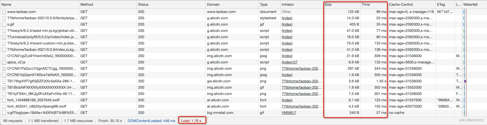
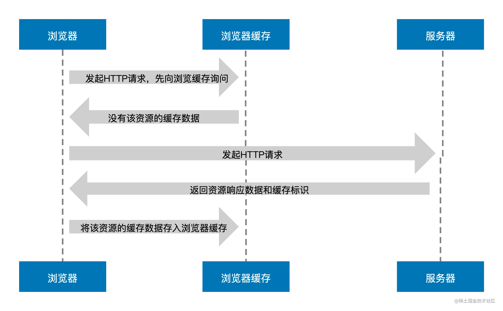
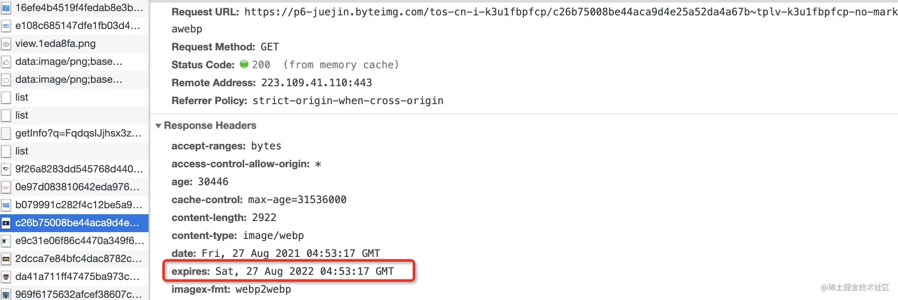
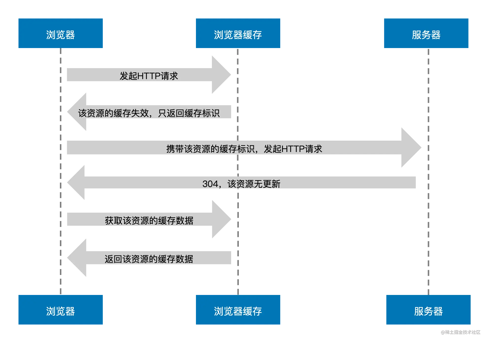
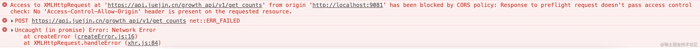
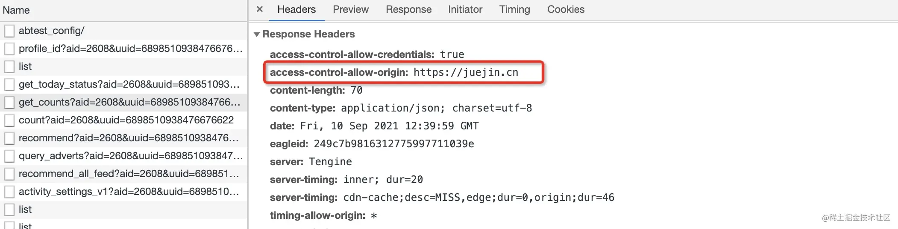

# 缓存

<!-- @import "[TOC]" {cmd="toc" depthFrom=1 depthTo=6 orderedList=false} -->

<!-- code_chunk_output -->

- [缓存](#缓存)
  - [一. 简介](#一-简介)
  - [二. HTTP 缓存](#二-http-缓存)
    - [2.1 请求相响应头](#21-请求相响应头)
      - [2.1.1 与缓存有关的首部字段名](#211-与缓存有关的首部字段名)
    - [2.2 强缓存](#22-强缓存)
      - [2.3.1 max-age 与 s-maxage](#231-max-age-与-s-maxage)
      - [2.3.2 expires 与 max-age](#232-expires-与-max-age)
      - [2.3.3 缓存新鲜度与使用期算法](#233-缓存新鲜度与使用期算法)
    - [2.3 协商缓存](#23-协商缓存)
      - [2.3.1 缓存标识 Last-Modified 与 ETag](#231-缓存标识-last-modified-与-etag)

<!-- /code_chunk_output -->

## 一. 简介

前端缓存可以直接看作是 **HTTP 缓存**和**浏览器缓存**的结合，两者是相辅相成的关系。

- **HTTP 缓存**
  是产生于客户端与服务器之间通信的一种缓存，利用这一缓存可以提升服务器资源的重复利用率，在有效的时间内不必每次都向服务器请求相同的资源，大大减少服务器的压力，HTTP 缓存按照失效策略划分可以分为：

  - 强缓存
  - 协商缓存

- **浏览器缓存**
  是浏览器提供的一种缓存机制，可以将服务器资源和网页访问产生的临时数据缓存到内存或本地，提升客户端的加载速度，按照缓存位置划分可以分为：

  - Service Worker Cache
  - 内存缓存（Memory Cache）
  - 磁盘缓存（Disk Cache）
  - Push Cache

  还有存储型缓存 Cookie、Web Storage、IndexedDB 等。

## 二. HTTP 缓存

超文本传输协议（Hyper Text Transfer Protocol，HTTP）是一个简单的请求-响应协议，它通常运行在 TCP 之上。它指定了客户端可能发送给服务器什么样的消息以及得到什么样的响应。

### 2.1 请求相响应头

HTTP 请求部分，它主要发生在客户端，请求是由 “报文” 的形式发送的，请求报文由三部分组成：

- 请求行
- 请求报头
- 请求正文

同样 HTTP 响应部分的响应报文也由三部分组成：

- 状态行
- 响应报头
- 响应正文

这里拎出关键与缓存有关的**请求报头**和**响应报头**，也正是浏览器 Network 面板中常见的 Request Headers 和 Response Headers 部分，以 Chrome 为例：


可以看到报头是由一系列中间用冒号 `:` 分隔的键值对组成，它被称为首部字段，其由首部字段名和字段值构成。如：

```txt
Content-Type: text/javascript
```

以上首部字段名为 Content-Type，首部字段值为 text/javascript，表示报文主体的对象类型。首部字段又分为四种类型：

- 通用首部字段（请求报头和响应报头都会用到的首部）
- 请求首部字段（请求报头用到的首部）
- 响应首部字段（响应报头用到的首部）
- 实体首部字段（针对请求报头和响应报头实体部分使用的首部）

#### 2.1.1 与缓存有关的首部字段名


上图中和**强缓存有关的首部字段名**主要有两个：

- `Expires`
  Expires 首部字段是 HTTP/1.0 中定义缓存的字段，其给出了缓存过期的**绝对时间**，即在此时间之后，响应资源过期，属于**实体首部字段**。

  ```txt
  Expires: Wed, 11 May 2022 03:50:47 GMT
  ```

  上述示例表示该资源将在以上时间之后过期，而在该时间之前浏览器可以直接从浏览器缓中读取数据，无需再次请求服务器。但是因为 Expires 设置的缓存过期时间是一个绝对时间，所以会受客户端时间的影响而变得不精准。

  > **注意**：这里无需再次请求服务器便是命中了强缓存。

- `Cache-Control`

  Cache-Control 首部字段是 HTTP/1.1 中定义缓存的字段，其用于控制缓存的行为，可以组合使用多种指令，多个指令之间可以通过 `,` 分隔，属于通用首部字段。常用的指令有：max-age、s-maxage、public/private、no-cache/no-store 等。

  ```txt
  Cache-Control: max-age:3600, s-maxage=3600, public
  Cache-Control: no-cache
  ```

  - `max-age`

    这个指令给出了缓存过期的相对时间，单位为秒数。当其与 Expires 同时出现时，max-age 的优先级更高。但往往为了做向下兼容，两者都会经常出现在响应首部中。

    同时 max-age 还可在请求首部中被使用，告知服务器客户端希望接收一个存在时间（age）不大于多少秒的资源。

  - `s-maxage`

    `s-maxage` 与 max-age 不同之处在于，其只适用于公共缓存服务器，比如资源从源服务器发出后又被中间的代理服务器接收并缓存。**当使用 s-maxage 指令后，公共缓存服务器将直接忽略 Expires 和 max-age 指令的值**。

  - `public`/`private`

    `public` 指令表示该资源可以被任何节点缓存（包括客户端和代理服务器），与其行为相反的 private 指令表示该资源只提供给客户端缓存，代理服务器不会进行缓存。同时**当设置了 private 指令后 s-maxage 指令将被忽略**。

  - `no-cache`/`no-store`

    > **注意**：这两个指令在请求和响应中都可以使用，两者看上去都代表不缓存，但在响应首部中被使用时，no-store 才是真正的不进行任何缓存。

    当 no-cache 在请求首部中被使用时，表示告知（代理）服务器不直接使用缓存，要求向源服务器发起请求，而当在响应首部中被返回时，表示客户端可以缓存资源，但每次使用缓存资源前都必须先向服务器确认其有效性，这对每次访问都需要确认身份的应用来说很有用。

    当然，也可以在代码里加入 meta 标签的方式来修改资源的请求首部：

    ```html
    <meta http-equiv="Cache-Control" content="no-cache" />
    ```

至此，已经基本了解了强缓存下请求响应的两个主要首部字段，那么，接着再来看看协商缓存中涉及的主要首部字段名：

- `Last-Modified`/`If-Modified-Since`

  Last-Modified 首部字段顾名思义，代表资源的最后修改时间，其属于响应首部字段。当浏览器第一次接收到服务器返回资源的 Last-Modified 值后，其会把这个值存储起来，并再下次访问该资源时通过携带 If-Modified-Since 请求首部发送给服务器验证该资源有没有过期。

  ```txt
  Last-Modified: Fri , 14 May 2021 17:23:13 GMT
  If-Modified-Since: Fri , 14 May 2021 17:23:13 GMT
  ```

  如果在 If-Modified-Since 字段指定的时间之后资源发生了更新，那么服务器会将更新的资源发送给浏览器（状态码 200）并返回最新的 Last-Modified 值，浏览器收到资源后会更新缓存的 If-Modified-Since 的值。

  如果在 If-Modified-Since 字段指定的时间之后资源都没有发生更新，那么服务器会返回状态码 304 Not Modified 的响应。

- `Etag`/`If-None-Match`

  Etag 首部字段用于代表资源的唯一性标识，服务器会按照指定的规则生成资源的标识，其属于响应首部字段。当资源发生变化时，Etag 的标识也会更新。同样的，当浏览器第一次接收到服务器返回资源的 Etag 值后，其会把这个值存储起来，并在下次访问该资源时通过携带 If-None-Match 请求首部发送给服务器验证该资源有没有过期。

  ```txt
  Etag: "29322-09SpAhH3nXWd8KIVqB10hSSz66"
  If-None-Match: "29322-09SpAhH3nXWd8KIVqB10hSSz66"
  ```

  如果服务器发现 If-None-Match 值与 Etag 不一致时，说明服务器上的文件已经被更新，那么服务器会发送更新后的资源给浏览器并返回最新的 Etag 值，浏览器收到资源后会更新缓存的 If-None-Match 的值。

### 2.2 强缓存

这里，模拟第一次打开某宝首页（浏览器未有缓存资源），打开开发者工具可以看到资源的加载情况。



重点关注 Size 和 Time 列的数据，Size 列表示浏览器从服务器获取资源的大小，Time 列表示资源加载耗时。因为几乎每一个资源都需要从服务器获取并加载，所以网页打开速度会受到影响，这里浏览器用了 1.76s 加载完了页面的所有资源（图片、脚本、样式等），1.1 MB 的数据被传输到了本地。

那么从强缓存的角度来看，其实第一次访问网页时浏览器已经开始在背后进行强缓存的判断和处理，可以通过下方流程图一探究竟。



图中，当浏览器发起 HTTP 请求时，会向浏览器缓存进行一次询问，若浏览器缓存没有该资源的缓存数据，那么浏览器便会向服务器发起请求，服务器接收请求后将资源返回给浏览器，浏览器会将资源的响应数据存储到浏览器缓存中，这便是强缓存的生成过程。

接下来第二次访问某宝，继续观察开发者工具中原来的几项指标。


发现 Size 一列大部分由原先的资源加载大小变成了 disk cache（磁盘缓存），而变成这一数据对应的 Time 列资源加载速度变快，加载总耗时由原来的 1.76s 变成了 1.10s，而传输到本地的数据降到了 44.3 KB，加载速度提升了 37.5%（受网速影响该数据每次都不一样，只用做对比参考）。这便是强缓存生效导致的现象。强缓存的生效流程如下图所示：


可以看到**浏览器并没有和服务器进行交互**，而是在发起请求时浏览器缓存告诉浏览器它有该资源的缓存数据并且还没有过期，于是浏览器直接加载了缓存中的数据资源。

开发者工具中的 Size 值变成了 disk cache 代表强缓存生效，也称为**命中强缓存**。除了 Disk cache，还有 Memory Cache（内存缓存）。这时候不关闭 Tab 页，重新刷新下某宝页面，再观察下 Network 面板中的变化。


此时，开发者工具中的 Size 列大部分变成了 memory Cache，其对应的 Time 列变成了 0ms。可见，memory Cache 比 disk cache 更快，快到不需要时间。加载总耗时缩短到了 766ms。

按照缓存位置的读取顺序，相比 disk cache，浏览器会优先读取 memory Cache。通过对以上开发者工具图例的对比不难得出，读取磁盘缓存会存在稍许的耗时，而读取内存缓存是及时性的，不存在耗时。

#### 2.3.1 max-age 与 s-maxage

响应报头中包含了两个与强缓存有关的首部字段：Expires 或 Cache-Control。有一个 CDN 资源，它的 Cache-Control 首部如下：

```txt
cache-control: max-age=2592000,s-maxage=3600
```

此资源将被浏览器缓存 2592000 秒（即 30 天），30 天之内再次访问，该资源都将从浏览器缓存中读取，这不难理解。但是需要注意图中首部值还包括了 s-maxage=3600：

- s-maxage 仅在代理服务器中生效
- 在代理服务器中 s-maxage 优先级高于 max-age，同时出现时 max-age 会被覆盖

CDN 资源，属于代理服务器资源，在其服务器中的缓存时间并不是 30 天，而是 3600 秒（1 个小时），所以当浏览器缓存 30 天之后重新向 CDN 服务器获取资源时，此时 CDN 缓存的资源也已经过期，会触发回源机制，即向源服务器发起请求更新缓存数据。


#### 2.3.2 expires 与 max-age

**Expires 设置的缓存过期时间是一个绝对时间，所以会受客户端时间的影响而变得不精准**，这句话可以以下图为例来理解：



该资源是一张图片，已经被浏览器缓存，其首部 expires 字段值表示浏览器可以将该资源缓存至 2022 年 8 月 27 日的上述时间点，那么在把图中 max-age 首部当做不存在的情况下（因为 max-age 会覆盖 expires 值），把电脑客户端时间修改为 2022 年 8 月 28 日，此时再次访问网页会发现浏览器重新向服务器获取了该资源，原来的缓存失效了。这便解释了 expires “不精准” 的概念。

expires “不精准” 是因为它的值是一个绝对时间，而 max-age 与其相反却是一个相对时间，还是拿上图举例，由于 max-age 优先级更高，表示浏览器可以将该资源缓存 3153600 秒（365 天），起始时间是从浏览器获取并缓存该资源的时间开始算起。那么此时修改电脑客户端时间为 1 年后，缓存还是会失效。

#### 2.3.3 缓存新鲜度与使用期算法

下面是强缓存新鲜度公式：

```txt
强缓存是否新鲜 = 缓存新鲜度 > 缓存使用期
```

按如上公式所示，**强缓存是否新鲜取决于两个关键词：缓存新鲜度和缓存使用期**。

- **缓存新鲜度**

  单位是时间长度。强缓存时涉及时间单位的首部字段主要有两个：max-age 和 expires。而缓存的新鲜度公式如下：

  ```txt
  缓存新鲜度 = max-age || (expires - date)
  ```

  当 max-age 存在时缓存新鲜度等于 max-age 的秒数。当 max-age 不存在时，缓存新鲜度等于 expires - date 的值，expires 是一个绝对时间，表示缓存过期的时间。

  首部字段 Date 表示创建报文的日期时间，可以理解为服务器（包含源服务器和代理服务器）返回新资源的时间，和 expires 一样是一个绝对时间，比如

  ```txt
  date：Wed, 25 Aug 2021 13:52:55 GMT
  ```

  那么过期时间（expires）减去创建时间（date）就可以计算出浏览器真实可以缓存的时间（默认已经转化为秒数），即缓存的保质期限（缓存新鲜度）。

- **缓存使用期**

  相对于缓存新鲜度，缓存使用期的计算就比较复杂了，根据字面意思，**缓存使用期可以理解为浏览器已经使用该资源的时间**。**缓存使用期主要与响应使用期、传输延迟时间和停留缓存时间有关**，计算公式如下：

  ```txt
  缓存使用期 = 响应使用期 + 传输延迟时间 + 停留缓存时间
  ```

  - 响应使用期

    响应使用期可以通过以下两种方式进行计算：

    - `max(0, response_time - date_value)`

      response_time（浏览器缓存收到响应的本地时间）是电脑客户端缓存获取到响应的本地时间，而 date_value（响应首部 date 值） 是服务器创建报文的时间，两者相减与 0 取最大值。

    - `age_value`

      直接获取 age_value（响应首部 age 值），Age 表示推算资源创建经过时间，可以理解为源服务器在多久前创建了响应或在代理服务器中存贮的时长，单位为秒。如下所示：

      ```txt
      age: 600
      ```

      Age 的值通常接近于 0。表示此对象刚刚从原始服务器获取不久；其他的值则是表示代理服务器当前的系统时间与此应答中的通用头 Date 的值之差。最终可以将以上两种方式进行组合，组合后的计算公式为：

      ```txt
      apparent_age = max(0, response_time - date_value)
      响应使用期 = max(apparent_age, age_value)
      ```

  - 传输延迟时间

    因为 HTTP 的传输是耗时的，所以传输延迟时间是存在的，传输延迟时间可以理解为浏览器缓存发起请求到收到响应的时间差，其计算公式为：

    ```txt
    传输延迟时间 = response_time - request_time
    ```

    response_time 代表浏览器缓存收到响应的本地时间，request_time 代表浏览器缓存发起请求的本地时间，两者相减便得到了传输延迟时间。

  - 停留缓存时间

    停留缓存时间表示资源在浏览器上已经缓存的时间，其计算公式为：

    ```txt
    停留缓存时间 = now - response_time
    ```

    now 代表电脑客户端的当前时间，response_time 代表浏览器缓存收到响应的本地时间，两者相减便得到了停留缓存时间。

通过上述字段及公式的介绍，最终总结出影响强缓存使用期的因素有以下几个：

- age_value：响应首部 age 值
- date_value：响应首部 date 值
- request_time：浏览器缓存发起请求的本地时间
- response_time：浏览器缓存收到响应的本地时间
- now：客户端当前时间

> **注意**：request_time、response_time 和 now 取的都是客户端本地时间，而 now 则是修改客户端本地时间直接导致强缓存失效的 “罪魁祸首”。

**因此一旦修改了电脑客户端本地时间为未来时间，缓存使用期的计算便会受到影响，主要是停留缓存时间会变大，从而导致缓存使用期超出缓存新鲜度范围（强缓存失效）**。 这便是 max-age 仍然受到本地时间影响的原因所在。

### 2.3 协商缓存

协商缓存可以看作是强制缓存失效后，浏览器携带缓存标识向服务器发起请求，由服务器根据缓存标识决定是否使用缓存的过程。

由此可知，**浏览器启用协商缓存的前提是强缓存失效**，但是反过来强缓存失效并不一定导致浏览器启用协商缓存。下面来了解下协商缓存的生效流程：



图中，先经历了一段强缓存的失效流程：浏览器发起 HTTP 请求后浏览器缓存发现该请求的资源失效，便将其缓存标识返回给浏览器，于是浏览器携带该缓存标识向服务器发起 HTTP 请求，之后服务器根据该标识判断这个资源其实没有更新过，最终返回 304 给浏览器，浏览器收到无更新的响应后便转向浏览器缓存获取数据。

#### 2.3.1 缓存标识 Last-Modified 与 ETag

除了强缓存失效外，浏览器判断是否要走协商缓存还得借助两个缓存标识：`last-modified`、`eTag`，这两个首部字段，它们是服务器响应请求时返回的报头首部。

eTag 的优先级要高于 last-modified，当两者同时出现时，只有 eTag 会生效。只要有这两个缓存标识之一，在强缓存失效后浏览器便会携带它们向服务器发起请求，携带方式如下图请求头所示：

```txt
if-modified-since: Thu,11 May 2017 14:08:10 GMT
if-none-match: "7de917acd3966b80654d5bd3b9d2ab26"
```

其中 if-modified-since 对应 last-modified 的值，if-none-match 对应 eTag 的值。服务器根据优先级高的缓存标识的值进行判断。

若 eTag 对应的 if-none-match 不存在，那么服务器会将 last-modified 对应的 if-modified-since 的时间值与服务器该资源的最后修改时间进行对比，最后判断是否走协商缓存。

**Last-Modified 缺点**
last-modified 是一个时间，最小单位为秒，如果资源的修改时间非常快，快到毫秒级别，那么服务器会误认为该资源仍然是没有修改的，这便导致了资源无法在浏览器及时更新的现象。另外还有一种情况，比如服务器资源确实被编辑了，但是其实资源的实质内容并没有被修改，那么服务器还是会返回最新的 last-modified 时间值，但是并不希望浏览器认为这个资源被修改而重新加载。

为了避免以上现象的发生，在特殊的场景下，需要使用 eTag。

**ETag 原理及实现**
不同的后端语言对 eTag 有着多种处理方式，这里将以 node 中下载量领先的 [etag](https://www.npmjs.com/package/etag) 包为例进行介绍。eTag 包的源码十分简洁明了，其生成 eTag 值的方式有两种：

- **使用文件大小和修改时间**

  ```js
  function stattag(stat) {
    var mtime = stat.mtime.getTime().toString(16);
    var size = stat.size.toString(16);
    return '"' + size + '-' + mtime + '"';
  }
  ```

  当判断所要处理的内容是文件 stats 对象时，将会采用上述方法生成 eTag 值，最后返回的值是由文件大小和文件最后一次修改时间组成的字符串。而当内容非文件 stats 对象时，将采用第二种方式。

- **使用文件内容的 hash 值和内容长度**

  ```js
  function entitytag(entity) {
    if (entity.length === 0) {
      // fast-path empty
      return '"0-2jmj715rSwoyVb/vLWAYKK/YBwk"';
    }
    // compute hash of entity
    var hash = crypto.createHash('sha1').update(entity, 'utf8').digest('base64').substring(0, 27);
    // compute length of entity
    var len = typeof entity === 'string' ? Buffer.byteLength(entity, 'utf8') : entity.length;
    return '"' + len.toString(16) + '-' + hash + '"';
  }
  ```

  通过对内容的 hash 转化和截取，最终返回内容长度与其 hash 值组合成的字符串。

通过上述方法生成的 eTag 也被称为**强 eTag 值**，其不论实体发生多么细微的变化都会改变它的值。那么与其对立的便是弱 eTag 值，在 eTag 包源码中可以发现通过传递第二个参数 weak 值为 true 时便可启用弱校验。

弱 ETag 值只适用于提示资源是否相同。只有资源发生了根本改变，产生差异时才会改变 ETag 值。这时会在字段值最开始处附加 W/。

```txt
ETag: W/"29322-09SpAhH3nXWd8KIVqB10hSSz66"
```

**优点**：
通过针对 eTag 原理及实现的分析，不难发现使用 eTag 服务器能够更加精准的分析资源的改变，同时浏览器也便能更加精准的控制缓存。

### 2.4 应用

目前最流行的前端框架比如 Vue、React 等都以单页应用（SPA）的开发模式著称，所谓单页应用指的是由一个 HTML 文件组成，页面之间的跳转通过异步加载 JS 等资源文件的形式进行渲染。

当访问首页时，浏览器率先加载的便是 HTML 文件，后续继续加载一些首页渲染需要以及公共的资源文件，当跳转页面时会异步加载下一个页面所需的资源，实现页面的组装及逻辑处理。

**刷新页面或再次访问时大部分资源都会命中了强缓存，但率先加载的 HTML 资源会走了协商缓存**，这是因为像 JS、CSS 等资源经过像 webpack 这样的打包工具打包后可以自动生成 hash 文件名，每次部署到服务器上后发生变化的资源 hash 名会更新，浏览器会当作一个新的资源去向服务器请求，没有更新的资源便会优先读取浏览器缓存。

而 HTML 不同，其文件名不会改变，一般会期望浏览器每次加载时都应该向服务器询问是否更新，否则会出现新版本发布后浏览器读取缓存 HTML 文件导致页面空白报错（旧资源被删除）或应用没有更新（读取了旧资源）的问题。

根据 HTTP 缓存的规则最终便可以总结出如下缓存方案：

- 频繁变动的资源，比如 HTML，采用协商缓存
- CSS、JS、图片资源等采用强缓存，使用 hash 命名

让 HTML 文件走协商缓存的前提是浏览器强缓存失效，可以设置如下服务器响应报头：

```txt
Cache-Control: max-age=0
Last-Modified: Sat, 04 Sep 2021 08:59:40 GMT
```

在资源 0 秒就失效的情况下存在协商缓存触发条件的 Last-Modified 标识，这样每次访问加载的 HTML 资源就会确保是最新的。

#### 2.4.1 Webpack 中的 Hash 模式

通过上述介绍的前端应用中 HTTP 缓存方案，从中了解了资源 hash 命名的重要性。然而这里所谓的 “hash” 其实是一个统称，在 webpack 中 hash 可以分为以下三种类型，每一种类型 hash 的生成规则和作用、使用也不同：

- **hash**
  hash 属于项目级别的 hash，意思就是整个项目中只要有文件改变该 hash 值就会变化，同时所有文件也都共用该 hash 值。webpack 的简单配置如下：

  ```js
  module.exports = {
    output: {
      path: config.build.assetsRoot,
      filename: utils.assetsPath('js/[name].[hash:8].js'),
      chunkFilename: utils.assetsPath('js/[name].[hash:8].min.js')
    },
    plugins: [
      // 将 js 中引入的 css 进行分离
      new ExtractTextPlugin({ filename: utils.assetsPath('css/[name].[hash:8].css'), allChunks: true })
    ]
  };
  ```

  最终打包输出的资源文件名 hash 值都一样，按照缓存策略进行分析，浏览器加载所有资源都将重新请求服务器，导致没有改动资源的加载浪费，因此不建议在项目中采用这种方式进行构建。

- **chunkhash**

  chunkhash 与 hash 不同，其属于入口文件级别的 hash，会根据入口文件（entry）的依赖进行打包，同时为了避免一些公共库、插件被打包至入口文件中，可以借助 CommonsChunkPlugin 插件进行公共模块的提取：

  ```js
  module.exports = {
    entry: utils.getEntries(),
    output: {
      path: config.build.assetsRoot,
      filename: utils.assetsPath('js/[name].[chunkhash:8].js'),
      chunkFilename: utils.assetsPath('js/[name].[chunkhash:8].min.js')
    },
    plugins: [
      // 将 js 中引入的 css 进行分离
      new ExtractTextPlugin({ filename: utils.assetsPath('css/[name].[chunkhash:8].css') }),
      // 分离公共 js 到 vendor 中
      new webpack.optimize.CommonsChunkPlugin({
        name: 'vendor', //文件名
        minChunks: function (module, count) {
          // 声明公共的模块来自 node_modules 文件夹，把 node_modules、common 文件夹以及使用了2次依赖的都抽出来
          return (
            module.resource &&
            (/\.js$/.test(module.resource) || /\.vue$/.test(module.resource)) &&
            (module.resource.indexOf(path.join(__dirname, '../node_modules')) === 0 ||
              module.resource.indexOf(path.join(__dirname, '../src/common')) === 0 ||
              count >= 2)
          );
        }
      }),
      // 将运行时代码提取到单独的 manifest 文件中，防止其影响 vendor.js
      new webpack.optimize.CommonsChunkPlugin({
        name: 'runtime',
        chunks: ['vendor']
      })
    ]
  };
  ```

  上述配置将需要抽离的公共模块提取到了 vendor.js 中，同时也将 webpack 运行文件提取到了 runtime.js 中，这些公共模块一般除了升级版本外永远不会改动，希望浏览器能够将其存入强缓存中，不受其他业务模块的修改导致文件 chunkhash 名称变动的影响。最终打包出的模块拥有不同的 chunkhash 名称，重新打包只会影响有变动的模块重新生成 chunkhash。

- **contenthash**

  contenthash 是属于文件内容级别的 hash，其会根据文件内容的变化而变化，一般用于解决以下问题：

  - 比如 home.js 中单独引入了 home.css 文件，那么当 js 文件被修改后，就算 css 文件并没有被修改，由于该模块发生了改变，同样会导致 css 文件也被重复构建。此时，针对 css 使用 contenthash 后，只要其内容不变就不会被重复构建。

    ```js
    module.exports = {
      output: {
        path: config.build.assetsRoot,
        filename: utils.assetsPath('js/[name].[chunkhash:8].js'),
        chunkFilename: utils.assetsPath('js/[name].[chunkhash:8].min.js')
      },
      plugins: [
        // 将 js 中引入的 css 进行分离，使用 contenthash 判断内容的改变
        new ExtractTextPlugin({ filename: utils.assetsPath('css/[name].[contenthash:8].css'), allChunks: true })
      ]
    };
    ```

  当在 module 中使用 loader 设置图片或者字体的文件名时，如包含 hash 或 chunkhash 都是不生效的，默认会使用 contenthash。

  ```js
  module.exports = {
    module: {
      rules: [
        {
          test: /\.(png|jpe?g|gif|svg)(\?.*)?$/,
          loader: 'url-loader',
          options: {
            limit: 5,
            name: utils.assetsPath('img/[name].[hash:8].[ext]') // 设置的 hash 值不会生效
          }
        },
        {
          test: /\.(woff2?|eot|ttf|otf)(\?.*)?$/,
          loader: 'url-loader',
          options: {
            limit: 2,
            name: utils.assetsPath('fonts/[name].[hash:8].[ext]') // 设置的 hash 值不会生效
          }
        }
      ]
    }
  };
  ```

将 chunkhash 和 contenthash 组合使用才能最大化的利用 HTTP 缓存中强缓存的优势，减少不必要的资源重复请求，提升网页的整体打开速度。

### 2.5 用户操作与 HTTP 缓存

**Chrome 的三种加载模式**
Chrome 具备三种加载模式，这三种模式只在开发者工具打开时才能够使用。打开开发者工具，在浏览器刷新按钮上右键鼠标便会展示。

- **正常重新加载**

  ```txt
  // 快捷键
  Mac: Command + R
  Windows: Ctrl + R（等同于直接按 F5）
  ```

  正常重新加载这种模式对于浏览器的用户来说都很熟悉，也是常说的 “刷新网页”，和直接点击浏览器上的刷新按钮效果一样，用户触发该模式在控制台可以看到大多数资源会命中强缓存，“正常重新加载” 模式会优先读取缓存。

- **硬性重新加载**

  ```txt
  // 快捷键
  Mac: Command + Shift + R
  Windows: Ctrl + Shift + R（等同于直接按 Ctrl + F5）
  ```

  硬性重新加载模式强调的是 “硬性”，可以理解为常说的 “强制刷新网页”，比如当代码部署到服务器上后仍然访问的是 “旧” 页面时，很多人会习惯性的强制刷新一下（Ctrl + F5）便好了，而使用 “正常重新加载” 却无法解决。于是会以为硬性重新加载会清空缓存重新向服务器请求，这是一个误区，来观察下硬性重新加载后的控制台：

  

  可以看到所有资源都重新向服务器获取，这个没有问题，但是检查下请求报头会发现，使用硬性重新加载后所有资源的请求首部都被加上了 `cache-control: no-cache` 和 `pragma: no-cache`，两者的作用都表示告知（代理）服务器不直接使用缓存，要求向源服务器发起请求，而 pragma 则是为了兼容 HTTP/1.0。

  因此**硬性重新加载并没有清空缓存，而是禁用缓存**，其效果类似于在开发者工具 Network 面板勾选了 Disable cache 选项。

- **清空缓存并硬性重新加载**

  该模式顾名思义，其比硬性重新加载多了清空缓存的操作，因此**触发该操作会将浏览器存储的本地缓存都清空掉后再重新向服务器发送请求**，同时其影响的并不是当前网站，所有访问过的网站缓存都将被清除。

**为什么 Ctrl + F5 还是有资源命中了缓存？**
上述介绍了硬性重新加载时资源请求报头会加上特定的两个首部来重新向服务器发起请求，从而绕过了读取浏览器缓存，那么换种思路，如果资源在硬性重新加载后还是命中缓存，是不是就说明请求报头上并没有加上特定的两个首部？

通过观察和分析后，发现那些命中缓存的资源都是随着页面渲染而加载的，而不走缓存的则是等待页面加载完通过脚本异步插入到 DOM 中去的。因为硬性重新加载并没有清空缓存，当异步资源在页面加载完后插入时，其加载时仍然优先读取缓存，如果使用清空缓存并硬性重新加载便不会出现这种现象。

> **注意**：如果采用开发者工具 Network 面板勾选 Disable cache 选项方式，那么异步资源也不会读取缓存，原因是缓存被提前禁用了，这与硬性重新加载不同。

还有一种资源比异步资源更加 “顽固”，几乎永远都是 from memory cache，不管是首次加载还是清空缓存都不奏效，它便是 base64 图片。

这一现象可以这样解释：从本质上看 base64 图片其实就是一堆字符串，其伴随着页面的渲染而加载，浏览器会对其进行解析，会损耗一定的性能。按照浏览器的 “节约原则”，可以得出以下结论：Base64 格式的图片被塞进 memory cache 可以视作浏览器为节省渲染开销的 “自保行为”。

### 2.6 Nginx 与跨域问题



以上是常见的浏览器跨域问题，从响应报头可以看出服务端做了访问限制：



`Access-Control-Allow-Origin` 表示指定允许访问的域名（白名单），上述因为设置了 juejin.cn 的域名，所以除了该域名外的任何访问都将是不被允许的。

因此如果前端访问后端跨域，首先要检查的便是服务端或者 Nginx 配置的 Access-Control-Allow-Origin 是否包含前端域名。

有些时候 Access-Control-Allow-Origin 被设置成 * 代表允许所有域名访问，但可能还会报如下跨域问题：
