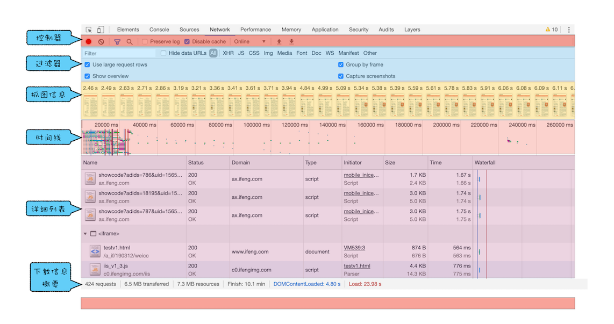
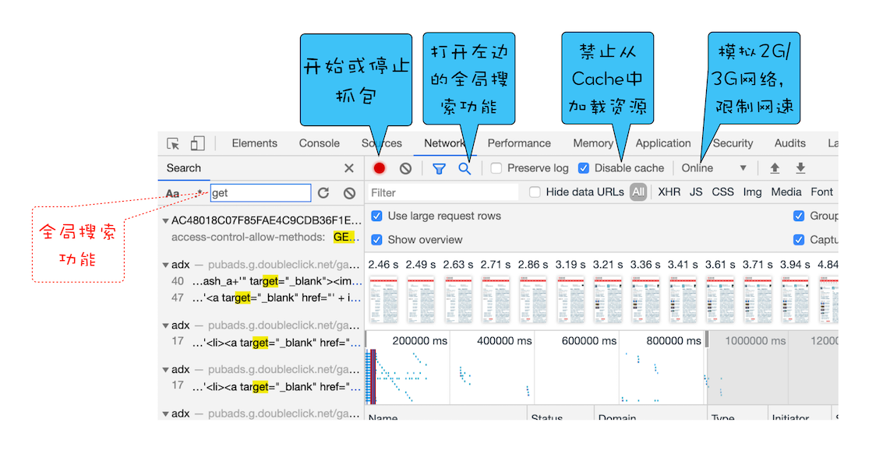
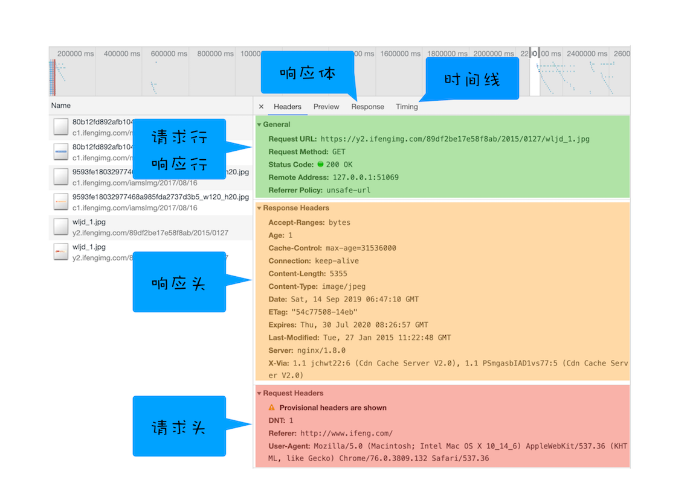
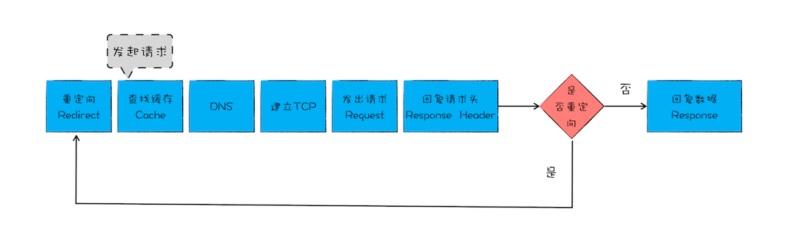
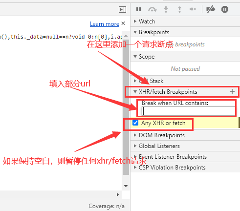

# Chrome DevTools

<!-- @import "[TOC]" {cmd="toc" depthFrom=1 depthTo=6 orderedList=false} -->

<!-- code_chunk_output -->

- [Chrome DevTools](#chrome-devtools)
  - [一. 简介](#一-简介)
    - [1.1 标签页](#11-标签页)
  - [二. 通用操作](#二-通用操作)
    - [2.1 copy(...)](#21-copy)
    - [2.2 Store Object as global variable（存储为全局变量）](#22-store-object-as-global-variable存储为全局变量)
    - [2.3. 保存堆栈信息（Save as...）](#23-保存堆栈信息save-as)
    - [2.4 快捷键](#24-快捷键)
      - [2.4.1 切换 `DevTools` 窗口的展示布局](#241-切换-devtools-窗口的展示布局)
      - [2.4.2 切换 `DevTools` 的面板](#242-切换-devtools-的面板)
      - [2.4.3 递增/递减](#243-递增递减)
      - [2.4.4 Elements，Console，Sources & Network 中的查找](#244-elementsconsolesources-network-中的查找)
      - [2.4.5 使用 Command](#245-使用-command)
      - [2.4.6 截屏](#246-截屏)
      - [2.4.7 切换面板布局](#247-切换面板布局)
      - [2.4.8 代码片段](#248-代码片段)
  - [三. Console 篇](#三-console-篇)
    - [3.1 Console 中的 `$`](#31-console-中的)
    - [3.2 异步的 `Console`](#32-异步的-console)
    - [3.3 Ninja console](#33-ninja-console)
    - [3.4 自定义格式转换器](#34-自定义格式转换器)
      - [3.4.1 自定义格式化转换器的应用实践](#341-自定义格式化转换器的应用实践)
    - [3.5 对象 & 方法](#35-对象-方法)
      - [3.5.1 queryObjects（对象查询）方法](#351-queryobjects对象查询方法)
      - [3.5.2 monitor（监听函数）方法](#352-monitor监听函数方法)
      - [3.5.3 monitorEvents（监听事件）方法](#353-monitorevents监听事件方法)
    - [3.6 Console 类中的各种方法](#36-console-类中的各种方法)
      - [3.6.1 console.assert](#361-consoleassert)
      - [3.6.2 增强 log 的阅读体验](#362-增强-log-的阅读体验)
      - [3.6.3 console.table](#363-consoletable)
      - [3.6.4 console.dir](#364-consoledir)
      - [3.6.5 给 logs 加上时间戳](#365-给-logs-加上时间戳)
      - [3.6.6 检测执行时间](#366-检测执行时间)
      - [3.6.7 让 `console.log` 基于调用堆栈自动缩进](#367-让-consolelog-基于调用堆栈自动缩进)
      - [3.6.8 直接在回调中使用 `console.log`](#368-直接在回调中使用-consolelog)
      - [3.6.9 给 `console.log` 加上 CSS 样式](#369-给-consolelog-加上-css-样式)
      - [3.6.10 实时表达式](#3610-实时表达式)
  - [四. NetWork 篇](#四-network-篇)
    - [4.1 网络面板中的详细列表](#41-网络面板中的详细列表)
      - [4.1.1 优化时间线上耗时项](#411-优化时间线上耗时项)
    - [4.2 Request initiator 显示调用堆栈信息](#42-request-initiator-显示调用堆栈信息)
    - [4.3 请求表过滤](#43-请求表过滤)
    - [4.4 自定义请求表](#44-自定义请求表)
    - [4.5 重新发送 `XHR` 的请求](#45-重新发送-xhr-的请求)
    - [4.6 XHR/fetch 断点](#46-xhrfetch-断点)
  - [五. Elements 篇](#五-elements-篇)
    - [5.1 技巧集合](#51-技巧集合)
      - [5.1.1 通过 h 键来隐藏元素](#511-通过-h-键来隐藏元素)
      - [5.1.2 拖动 & 放置 元素](#512-拖动-放置-元素)
      - [5.1.3 使用 控制按钮 来移动元素](#513-使用-控制按钮-来移动元素)
      - [5.1.4 元素面板中类似于基础编辑器的操作](#514-元素面板中类似于基础编辑器的操作)
      - [5.1.5 Shadow editor 阴影编辑器](#515-shadow-editor-阴影编辑器)
      - [5.1.6 Timing function editor 定时函数编辑器](#516-timing-function-editor-定时函数编辑器)
      - [5.1.7 在元素面板中展开所有的子节点](#517-在元素面板中展开所有的子节点)
      - [5.1.8 添加 `force state`（强制状态）](#518-添加-force-state强制状态)
      - [5.1.9 DOM 断点](#519-dom-断点)
    - [5.2 颜色选择器](#52-颜色选择器)
      - [5.2.1 只选择正在用的颜色](#521-只选择正在用的颜色)
      - [5.2.2 直观的选择字体颜色](#522-直观的选择字体颜色)
  - [六. Drawer 篇](#六-drawer-篇)
    - [6.1 常识](#61-常识)
      - [6.1.1 如何打开 Drawer](#611-如何打开-drawer)
      - [6.1.2 Drawer 设置选项列表](#612-drawer-设置选项列表)
    - [6.2 Drawer 列表项](#62-drawer-列表项)
      - [6.2.1 Sensors（控制传感器）](#621-sensors控制传感器)
      - [6.2.2 模拟网络状态](#622-模拟网络状态)
      - [6.2.3 快速 Source](#623-快速-source)
      - [6.2.4 检查代码 coverage](#624-检查代码-coverage)
      - [6.2.5 检查修改的 CSS 文件](#625-检查修改的-css-文件)
  - [七. WorkSpaces 篇](#七-workspaces-篇)
    - [7.1 workspace 技巧](#71-workspace-技巧)
      - [7.1.1 在 `Chrome` 中修改文件](#711-在-chrome-中修改文件)
      - [7.1.2 WorkSpace 支持即时样式同步](#712-workspace-支持即时样式同步)
      - [7.1.3 为新选择器选择目标位置](#713-为新选择器选择目标位置)

<!-- /code_chunk_output -->

---

## 一. 简介

**Chrome 开发者工具（简称 DevTools）是一组网页制作和调试的工具，内嵌于 Google Chrome 浏览器中**。如果想使用最新版本，可以使用 [Chrome Canary](https://www.google.com/intl/en/chrome/canary/)。

### 1.1 标签页

**Elements**
: 可以自由操作 DOM 和 CSS 来迭代布局和设计页面。

1. 检查和调整页面
2. 编辑样式
3. 编辑 DOM

**Console**
: 在开发期间，可以记录诊断信息，或者使用它作为 shell 在页面上与 JS 进行交互。

1. 使用控制台面板
2. 命令行交互

**Sources**
: 可以设置断点来调试 JS ，或者通过 Workspaces（工作区）连接本地文件来使用开发者工具的实时编辑器。

1. 断点调试
2. 调试混淆的代码
3. 使用开发者工具的 WorkSpaces 进行保存

**NetWork**
: 了解请求和下载的资源文件并优化网页加载性能。

1. 网络面板基础
2. 资源时间轴
3. 网络带宽限制

**Performance**
: 记录和查看网站生命周期内发生的各种事件和运行时间，了解并优化性能。

1. 记录和查看网站生命周期内发生的各种事件
2. 提高页面的运行时性能

**Memory**
: 用来查看运行过程中 JS 的占用堆内存情况，跟踪是否存在内存泄露情况。

1. 跟踪内存泄漏
2. JS CPU 分析器
3. 内存堆区分析器

**Application**
: 查看 Web 应用的数据存储情况。

1. 检查加载的所有资源
2. IndexedDB 与 Web SQL
3. 本地和会话存储，cookie
4. 应用程序缓存，图像，字体和样式表

**Security**
: 显示当前页面一些基础安全信息。

1. 证书问题
2. 安全相关问题

**Lighthouse**
: 对当前页面进行性能、SEO、PWA、最佳实践、可访问性（accessibility）等方面的分析，并给出优化建议。

**Layers**
: 展示一些渲染过程中分层的基础信息。

## 二. 通用操作

### 2.1 copy(...)

可以通过全局的方法 `copy()` 在 `Console` 里 `copy` 任何能拿到的资源。

### 2.2 Store Object as global variable（存储为全局变量）

在 `console` 中打印了一组数据，然后想对这些数据做一些额外的操作。那就可以将它转换成一个全局变量，只需要 **右击** 它，并选择 “`Store as global variable`”（保存为全局变量） 选项。

第一次使用的话，它会创建一个名为 temp1 的变量，第二次创建 temp2，以此类推。通过使用这些变量来操作对应的数据，不用再担心影响到他们原来的值。

### 2.3. 保存堆栈信息（Save as...）

对于 `Console` 面板上的信息，可以使用**右击**，选择 `Save as...`，把堆栈跟踪的信息保存为一个 `.log` 文件。

### 2.4 快捷键

#### 2.4.1 切换 `DevTools` 窗口的展示布局

快捷键 `Ctrl + Shift + D` 切换 DevTools 的位置

#### 2.4.2 切换 `DevTools` 的面板

快捷键 `Ctrl + [ | ]`，可以从当前面板分别向左向右切换。

#### 2.4.3 递增/递减

使用带修饰符或不带修饰键的 `上/下` 箭头，可以实现递增/递减 `数值` 类型的值。

- `Ctrl`：100
- `Shift`：10
- `Alt`：0.1

#### 2.4.4 Elements，Console，Sources & Network 中的查找

`DevTools` 中的前 4 个主要的面板，都支持 `Ctrl + f` 快捷方式，可以使用对应的查询方式来查找信息：

- 在 `Element` 面板中，通过 `string` 和 `XPath` 来查找。

- 在 `Console`，`Network` 以及 `Source` 面板，通过 `区分大小写` 或 `正则表达式`，来查找。

#### 2.4.5 使用 Command

可以使用 `Ctrl + Shift + P` 快捷键启用 Run Command。这个功能可以快速查找所有命令，下图是可供选择的命令列表，分为几个部分：


#### 2.4.6 截屏

当只想对某个 `DOM节点` 截屏时，可以在 `Elements` 界面，选中节点并在右键菜单中选择 `Capture node screenshot`，也可以选中节点后，使用 `Command` 查找命令。

还可以在 `Command` 查找 `Capture full size screenshot` 命令，进行**全页面截屏**。

#### 2.4.7 切换面板布局

Elements 使用双面板模式 `DOM 面板` + `CSS 面板`，它根据屏幕可用的部分自动应用横向或者纵向的排列，以适合阅读的方式展示出来。

打开 `Commands` 菜单并且输入 `layout` ，会看到 2 个可供选择的项（不显示已经激活的选项）：

- Use horizontal panel layout（使用横向面板布局）
- Use vertical panel layout（使用纵向面板布局）
- Use automatic panel layout（使用自动面板布局）

#### 2.4.8 代码片段

`Sources` 中的 `Snippets`，可以存放 `代码片段`，方便复用。


> 在 `Command Menu` 里，使用 `!`，就可以根据名字来筛选预设代码片段。

## 三. Console 篇

### 3.1 Console 中的 `$`

- `$0` 在 Chrome 的 Elements 面板中，是对当前选中的 html 节点的引用。`$1` 是对上一次选择的节点的引用，`$2` 是对在那之前选择的节点的引用，等等。一直到 `$4`。

- 如果没有在 `页面` 中定义过 `$` 变量（例如 jQuery）的话，它在 `Console` 中就是函数 `document.querySelector` 的别名。

- `$_` 是对上次执行结果的引用

### 3.2 异步的 `Console`

在 `Console` 面板中 `console` 默认被 `async` 包裹

- `Storage` 系统的**占用数** 和**空闲数**

  ```js
  console.table(await navigator.storage.estimate());
  ```

- 媒体能力

  ```js
  let query = { type: "file", audio: { contentType: "audio/ogg" } };
  console.table(await navigator.mediaCapabilities.decodingInfo(query));
  ```

### 3.3 Ninja console

- `Conditional breakpoints` 条件断点

  1. 在 `Source` 的 JS 文件中右击行号，选择 `Add conditional breakpoint...（添加条件断点）` 或右击一个已经设置的断点并且选择 `Edit breakpoint（编辑断点）`。
  2. 然后输入一个执行结果为 `true` 或者 `false` 的表达式（它的值其实不需要完全为 true 或者 false）。在这个表达式中可以使用任何这段代码可以获取到的值（当前行的作用域）。
  3. 如果条件成立，这个断点就会暂停代码的执行。

- The Ninja `console`
  得益于条件断点，`console` 也有了新玩法：

  1. 每一个条件都必须经过判断，当应用执行到这一行的时候进行判断并且如果条件返回的是 `falsy` 的值，它并不会暂停。
  2. 可以直接使用条件判断来将 `console.log/console.table/console.time` 等 "连接" 到 `Source` 面板中。
  3. 它们会一直执行，并且当不再需要它们的时候，在 `断点部分` 会清晰的列出它们，可以轻松移除。

### 3.4 自定义格式转换器

大多数的情况下，习惯使用 `DevTools` 的 `console` 默认对 Object 的转换，但还可以自定义输出对象的函数，它通常被称为 `Custom Formatter`。

> **注意**：在写之前，需要在 `Settings`（或按下 `F1`）中把对应的设置打开。
> 

`formatters` 是一个对象，最多包含三个方法：

- `header`：处理展示在 `Console` 的日志中的头部分
  header 方法返回了一个 JsonML（注：JsonML：JSON Markup Language - JSON 标记语言）数组，由这些组成：

  - 标签名
  - 属性对象
  - 内容（文本值或者其他元素）

- `hasBody`：返回是否显示用来展开对象的 `▶` 箭头

- `body`：定义显示在展开部分的内容。

#### 3.4.1 自定义格式化转换器的应用实践

每当遇到结构不寻常的对象时，或大量的日志（最好避免这样的情况，但是有时候很有用）而想从中做区分时，可以采用 `custom formatter` 来处理。

直接将不关心，不需要区别对待的对象过滤出来，直接在 `header` 方法里面 `return null`。让 `DevTools` 使用默认的格式化方式来处理这些值。自定义格式化转换器的示例：

```js
window.devtoolsFormatters = [
  {
    header(obj) {
      if (!obj.__clown) {
        return null;
      }
      delete obj.__clown;
      const style = `
        color: red;
        border: 2px dotted #ccc;
        border-radius: 5px;
        padding: 5px;
      `;
      const content = `${JSON.stringify(obj, null, 2)}`;

      try {
        return ["div", { style }, content];
      } catch (err) {
        return null; // use the default formatter
      }
    },
    hasBody() {
      return false;
    },
  },
];

console.clown = function (obj) {
  console.log({ ...obj, __clown: true });
};

console.clown({ message: "hello!" });
```

### 3.5 对象 & 方法

#### 3.5.1 queryObjects（对象查询）方法

`DevTools` 里的 `queryObjects` 函数，可以查询 `特定的时刻 + 特定的执行上下文` 有哪些对象：

```js
new String("example");
queryObjects(String);
```

#### 3.5.2 monitor（监听函数）方法

`monitor` 是 `DevTools` 的一个方法， 它能够 "监听" 到任何 `_function calls（方法的调用）` 中：每当一个 `被监听` 的方法运行的时候，`Console 控制台` 会把它的实例打印出来，包含 `函数名` 以及 `调用它的参数` 。取消监听函数的方法是 `unmonitor`。

在 `Source` 的 `Snippets` 中创建一个类，然后运行：

```js
class Person {
  constructor(name) {
    this.name = name;
  }

  greet() {
    return this.getMessage("greeting", "tom");
  }

  getMessage(type, js) {
    if (type === "greeting") {
      return `Hello, I'm ${this.name}!`;
    }
  }
}
```

控制台试验结果：


#### 3.5.3 monitorEvents（监听事件）方法

在上面是监听函数的方法，还可以使用 `monitorEvents` 方法，对 `events` 做同样的事，取消监听事件的方法是 `unmonitorEvents`。

### 3.6 Console 类中的各种方法

#### 3.6.1 console.assert

如果断言为 `false`，则将一个错误消息写入控制台。如果断言是 true，没有任何反应。通过它，可以摆脱累赘的 `if` 表达式，还可以获得堆栈信息。

参数：

- `assertion`：一个布尔表达式。如果 assertion 为假，消息就会被输出到控制台之中
- `obj1, ..., objN`：被用来输出的 JS 对象列表，最后输出的字符串是各个对象依次拼接的结果。
- `msg`：一个包含零个或多个子串的 JS 字符串。
- `subst1, ..., substN`：各个消息作为字串的 JS 对象。这个参数能够控制输出的格式。

```js
console.assert(assertion, obj1 [, obj2, ..., objN]);
console.assert(assertion, msg [, subst1, ..., substN]);
```

#### 3.6.2 增强 log 的阅读体验

`console.log` 可以通过 `{}` 将参数包装，可以将一组数据打印成一个对象，这是 `ECMAScript 2015` 引入的 `enhanced object literal（增强对象文字面量）`。

```js
const name = "tom";
let date = new Date();
var age = 18;
let isHealthy = true;

console.log({ name, date, age, isHealthy });
```

#### 3.6.3 console.table

如果有一个**数组**（或者是**类数组**的对象，或者就是一个**对象**）需要打印，可以使用 `console.table` 方法将它以一个漂亮的表格的形式打印出来。它不仅会根据数组中包含的对象的所有属性，去计算出表中的列名，而且这些列都可以**缩放**和**排序**。

如果觉得展示的列太多了，还可以使用第二个参数，传入想要展示的列的名字。`console.table` 还可以和 `{}` 的配合。

#### 3.6.4 console.dir

使用 `console.log` 打印元素，会将元素渲染成像是从 `Elements` 中剪切出来的一样。使用 `console.dir` 会将元素打印为这个节点所关联到的 `js对象`。

#### 3.6.5 给 logs 加上时间戳

给打印出来的信息加上时间戳，有两种方法：

1. Settings -> Preferences -> Console 中开启 `Show timestamps`

2. Ctrl + Shift + P 打开 Command，搜索 `timestamps`

#### 3.6.6 检测执行时间

可以使用以下两个 `console` 方法，来检测某段代码的执行时间：

```js
console.time("a"); // 开启一个计时器
console.timeEnd("a"); // 结束计时并且将结果在 console 中打印出来
```

#### 3.6.7 让 `console.log` 基于调用堆栈自动缩进

配合 `Error` 对象的 `stack` 属性，可以让 `log` 可以根据堆栈的调用自动缩进：

```js
function log(message) {
  console.log(
    // 这句话是重点。使用 new 出来的 Error 对象的 stack 信息中的换行符，换行符出现的次数 等同于 它在堆栈调用时的深度。
    "  ".repeat(new Error().stack.match(/\n/g).length - 2) + message
  );
}

function foo() {
  log("foo");
  return bar() + bar();
}

function bar() {
  log("bar");
  return baz() + baz();
}

function baz() {
  log("baz");
  return 17;
}

foo();
```

#### 3.6.8 直接在回调中使用 `console.log`

在确定要将什么传递给回调函数的情况下，可以在回调函数里面添加一个 `console.log` 来检查。有两种方式来实现:

- 在回调方法的内部使用 console.log
- 直接使用 console.log 来作为回调方法。推荐使用这种，因为这不仅减少了输入，还可能在回调中接收多个参数。

```js
function getInput(options, callback) {
  if (typeof callback == "function") {
    callback(options, "add");
  }
}
// console.log 是一个函数，可以作为回调函数
getInput([1, 2], console.log); // [1, 2] 'add'
```

#### 3.6.9 给 `console.log` 加上 CSS 样式

如果给打印文本加上 `%c` ，那么 `console.log` 的第二个参数就变成了 CSS 规则：

```js
console.log("%c999", "color:#f40;font-size:40px");
```

#### 3.6.10 实时表达式

在 `Console` 区域的上方，有一个 "眼睛" 的符号，点击眼睛符号，就可以在那里定义任何 JS 表达式。它会不断更新，所以表达的结果将永远是最新的。支持同时定义多个。

## 四. NetWork 篇

网络面板由控制器、过滤器、抓图信息、时间线、详细列表和下载信息概要这 6 个区域构成。



1. **控制器**
   其中有 4 个比较重要的功能。

   

   - 红色圆点的按钮，表示 “开始 / 暂停抓包”。
   - “全局搜索” 按钮，这个功能就非常重要了，可以在所有下载资源中搜索相关内容，还可以快速定位到某几个想要的文件上。
   - Disable cache，即 “禁止从 Cache 中加载资源” 的功能，它在调试 Web 应用的时候非常有用，因为开启了 Cache 会影响到网络性能测试的结果。
   - Online 按钮，是 “模拟 2G/3G” 功能，它可以限制带宽，模拟弱网情况下页面的展现情况，然后就可以根据实际展示情况来动态调整策略，以便让 Web 应用更加适用于这些弱网。

2. **过滤器**
   主要就是起过滤功能。通过过滤器模块来筛选想要的文件类型。

3. **抓图信息**
   抓图信息区域，可以用来分析用户等待页面加载时间内所看到的内容，分析用户实际的体验情况。（勾选面板上的 “Capture screenshots” 可启用屏幕截图。）

4. **时间线**
   时间线，主要用来展示 HTTP、HTTPS、WebSocket 加载的状态和时间的一个关系，用于直观感受页面的加载过程。如果是多条竖线堆叠在一起，那说明这些资源被同时被加载。

5. **详细列表**
   这个区域是最重要的，它详细记录了每个资源从发起请求到完成请求这中间所有过程的状态，以及最终请求完成的数据信息。通过该列表，就能很容易地去诊断一些网络问题。

6. **下载信息概要**
   下载信息概要中，要重点关注以下两个事件，以及这两个事件的**完成时间**：

   - **DOMContentLoaded**：这个事件发生后，说明页面已经构建好 DOM 了，这意味着构建 DOM 所需要的 HTML 文件、JS 文件、CSS 文件都已经下载完成了。
   - **Load**：说明浏览器已经加载了所有的资源（图像、样式表等）。

### 4.1 网络面板中的详细列表

1. **详细信息**
   如果选中详细列表中的一项，右边就会出现该项的详细信息：

   

2. **单个资源的时间线**

   

   那详细列表中是通过时间线面板表示出这个流程的：

   

   **第一个是 Queuing**，也就是排队的意思，当浏览器发起一个请求的时候，会有很多原因导致该请求不能被立即执行，而是需要排队等待。导致请求处于排队状态的原因有很多：

   - 首先，页面中的资源是有优先级的，比如 CSS、HTML、JS 等都是页面中的核心文件，所以优先级最高；而图片、视频、音频这类资源就不是核心资源，优先级就比较低。通常当后者遇到前者时，就需要 “让路”，进入待排队状态。
   - 其次，浏览器会为每个域名最多维护 6 个 TCP 连接，如果发起一个 HTTP 请求时，这 6 个 TCP 连接都处于忙碌状态，那么这个请求就会处于排队状态。
   - 最后，网络进程在为数据分配磁盘空间时，新的 HTTP 请求也需要短暂地等待磁盘分配结束。

   等待排队完成之后，就要进入发起连接的状态了。不过在发起连接之前，还有一些原因可能导致连接过程被推迟，这个推迟就表现在面板中的 **Stalled** 上，它表示停滞的意思。

   这里需要额外说明的是，如果使用了代理服务器，还会增加一个 Proxy Negotiation 阶段，也就是代理协商阶段，它表示代理服务器连接协商所用的时间。

   接下来，就到了 **Initial connection/SSL** 阶段了，也就是和服务器建立连接的阶段，这包括了建立 TCP 连接所花费的时间；不过如果你使用了 HTTPS 协议，那么还需要一个额外的 SSL 握手时间，这个过程主要是用来协商一些加密信息的。

   和服务器建立好连接之后，网络进程会准备请求数据，并将其发送给网络，这就是 **Request sent** 阶段。通常这个阶段非常快，因为只需要把浏览器缓冲区的数据发送出去就结束了，并不需要判断服务器是否接收到了，所以这个时间通常不到 1 毫秒。

   数据发送出去了，接下来就是等待接收服务器第一个字节的数据，这个阶段称为 **Waiting (TTFB)**，通常也称为 “第一字节时间”。TTFB 是反映服务端响应速度的重要指标，对服务器来说，TTFB 时间越短，就说明服务器响应越快。

   接收到第一个字节之后，进入陆续接收完整数据的阶段，也就是 **Content Download** 阶段，这意味着从第一字节时间到接收到全部响应数据所用的时间。

#### 4.1.1 优化时间线上耗时项

1. **排队（Queuing）时间过久**

   排队时间过久，大概率是由浏览器为每个域名最多维护 6 个连接导致的。那么基于这个原因，有两种解决方案：

   - **域名分片技术**：将 1 个站点下面的资源放在多个域名下面，比如放到 3 个域名下面，这样就可以同时支持 18 个连接了。
   - **站点升级到 HTTP2**：因为 HTTP2 已经没有每个域名最多维护 6 个 TCP 连接的限制了。

2. **第一字节时间（TTFB）时间过久**

   - **服务器生成页面数据的时间过久**。对于动态网页来说，服务器收到用户打开一个页面的请求时，首先要从数据库中读取该页面需要的数据，然后把这些数据传入到模板中，模板渲染后，再返回给用户。服务器在处理这个数据的过程中，可能某个环节会出问题。
   - **网络的原因**。比如使用了低带宽的服务器，或者用的是电信的服务器，联通的网络用户访问服务器，这样也会拖慢网速。
   - **发送请求头时带上了多余的用户信息**。比如一些不必要的 Cookie 信息，服务器接收到这些 Cookie 信息之后可能需要对每一项都做处理，这样就加大了服务器的处理时长。

   面对第一种服务器的问题，可以想办法去提高服务器的处理速度，比如通过增加各种缓存的技术；针对第二种网络问题，可以使用 CDN 来缓存一些静态文件；至于第三种，在发送请求时就去尽可能地减少一些不必要的 Cookie 数据信息。

3. **Content Download 时间过久**

   如果单个请求的 Content Download 花费了大量时间，有可能是字节数太多的原因导致的。这时候就需要减少文件大小，比如压缩、去掉源码中不必要的注释等方法。

### 4.2 Request initiator 显示调用堆栈信息

`Network` 面板中的 `initiator` 这一列显示了是哪个脚本的哪一行触发了请求。它显示了在调用堆栈中触发请求的最后一步。将鼠标悬停在显示的 `initiator`上，可以将看到完整的调用堆栈，包括文件。

### 4.3 请求表过滤

`Network` 面板中的过滤器输入框接受字符串或正则表达式，默认过滤 `name` 列。也可以使用它来过滤其他属性。

例如：输入 `method:GET`，只保留 `method` 中的 `GET`，最前面加 `-` 表示反过滤。

如果想要显示所有可能的关键字，在空白的输入框按下 `[ctrl]` + `[space]`

### 4.4 自定义请求表

在请求表中，可以看到有关每个请求的几条信息，例如：Status，Type，Initiator，Size 和 Time。同时也可以添加更多，有以下两种方式设置显示列：

1. 右键单击请求表标题上的任意位置
2. 请求表右键菜单中的 `Header Options`

### 4.5 重新发送 `XHR` 的请求

使用请求表右键菜单中的 `Replay XHR`，可以重新发送请求。

### 4.6 XHR/fetch 断点

如果，想要对已发送的 `ajax` 请求进行捕获可以使用 `XHR/fetch breakpoint`。这个只能在 `Source` 面板中设置



## 五. Elements 篇

### 5.1 技巧集合

#### 5.1.1 通过 h 键来隐藏元素

在元素面板中选择元素后，按一下 “h” 就可以隐藏，再次按下 “h” 可以使它出现。

#### 5.1.2 拖动 & 放置 元素

当想看页面的某一部分在 `DOM` 树的不同位置的显示效果时，只需要拖动放置它（到指定的位置）。

#### 5.1.3 使用 控制按钮 来移动元素

如果只是想移动当前选中的元素，在 `DOM` 结构中往上挪一点或者往下挪一点，可以使用`[Ctrl]` + `[⬆]` / `[Ctrl]` + `[⬇]`。

#### 5.1.4 元素面板中类似于基础编辑器的操作

可以在元素面板中拖动，放置，编辑，复制、粘贴，使用 `[Ctrl]` + `[Z]` / `[Ctrl]` + `[Y]` 来撤销或恢复上一步操作。

#### 5.1.5 Shadow editor 阴影编辑器

可以在 `Styles` 面板中点击在 `box-shadow` 属性或者 `text-shadow` 属性左边的 `阴影方形符号` 来打开它。

#### 5.1.6 Timing function editor 定时函数编辑器

也称为 `Cubic bezier（贝塞尔）` 编辑器。贝塞尔曲线是一串用来定义 `CSS` 的动画速度在整个动画过程中如何变化的 `数值` 。将其定义为 `transition-timing-function` 或者 `animation-timing-function` CSS 属性。

可以直接点击这两个属性（或者他们的简写形式: `transition`，`animation`）边上的曲线符号。

> **注意**：如果 `timing` 函数的值没有设置在这个简写的形式中，这个符号不会显示出来，可以点击左边的小箭头来找到 `Cubic bezier（贝塞尔）` 编辑器。

#### 5.1.7 在元素面板中展开所有的子节点

可以使用右击节点后的 `expand recursively` 命令来展开所有的子节点。

#### 5.1.8 添加 `force state`（强制状态）

使用右击节点后使用 `force state`，可以对相应的节点强制添加状态：

> :hover :active :focus :visited :focus-within :focus-visible

#### 5.1.9 DOM 断点

有时脚本修改了 `DOM`，想知道修改的是哪部分，什么时候修改的？可以添加一个 `DOM` 断点，监听节点被添加或移除/属性被改变：

1. 点击 "..." 符号或者右击想添加监听的元素。

2. 在 `Break on` 中选择：

   - `subtree modifications`：监听任何它内部的节点被 移除 或者 添加的事件。

   - `attribute modifications`：监听任何当前选中的节点被 添加，移除 或者 被修改值的事件。

   - `node removal`：监听被选中的元素被 移除 的事件。

页面重新加载时会记住断点。断点在 `Elements` 视图中有视觉提示，也在 `Sources` 右边的 `DOM Breakpoints` 有列表形式的显示。

### 5.2 颜色选择器

#### 5.2.1 只选择正在用的颜色

点击颜色选择器中的颜色列表的右上角，可以切换以下四种调色盘：

1. 一个有色调变化的 `Material` 调色板
2. 自定义，可以添加和删除颜色
3. 从 `CSS Variables` 中选择一个当前页面使用的样式表中存在的颜色。
4. 页面 `CSS` 中使用的所有颜色

#### 5.2.2 直观的选择字体颜色

打开一个文本的调色选择器（是 `color` 属性， 而不是 `background-color`）会看到 `“Contrast ratio（对比度）”` 部分。它显示了**文本的颜色**与**开发者工具认为这段文本应该有的背景颜色**之间的对比度。如果这个数值很高，那么文本相对于背景来说，更显而易见，但如果这个值接近 `1` ，那么文本的颜色几乎不能从背景色中区分。

- 在数字边上的 “🚫” 意味着对比度太低了。
- 一个 “✅” 意味着这个颜色遵从 [Web Content Accessibility Guidelines (WCAG) 2.0](https://www.w3.org/TR/UNDERSTANDING-WCAG20/conformance.html) 的 **AA** 声明，这意味着对比值至少为 `3`。
- “✅ ✅” 意味着满足了 **AAA** 声明。

还可以在 `对比度` 部分用 `吸管` 选择一个不同的颜色作为背景颜色进行对比，对应的 `color spectrum（色谱）` 部分会显示一个对比的边界线：如果背景颜色比这条线上面的颜色更深，代表兼容 AA ，如果背景颜色比这条线上面的更亮，需要在这条线的下面选择一个颜色。

## 六. Drawer 篇

### 6.1 常识

#### 6.1.1 如何打开 Drawer

在 `DevTools`（任何选项卡）中时，可以按 `[esc]` 来显隐它。默认情况下，会看到一个 `Console` 选项卡。与主面板的 `Console` 完全相同。

#### 6.1.2 Drawer 设置选项列表

`Drawer` 里隐藏着许多其他功能，大多数时候不需要用到它们。点击主页面在 `Drawer` 的 `Console` 面板前面的 `⋮` 图标来打开完整选项列表。还可以打开 `command Menu` ，然后输入 `Drawer` 来打开。

### 6.2 Drawer 列表项

#### 6.2.1 Sensors（控制传感器）

如果在应用中使用一些获取位置信息的 `API` 而且想要测试一下它。

`Drawer` 里的 `Sensors（传感器）` 面板可以模拟特定的位置：支持从预定义的位置中进行选择，添加位置，或者手动键入纬度/经度。选定的值将被 `navigator.geolocation.watchPosition`（或 `getCurrentPosition` ）报告。

```js
navigator.geolocation.watchPosition(console.log);
```

如果 `App` 有使用加速计，传感器面板也可以模拟设备在 3D 空间中的位置。


#### 6.2.2 模拟网络状态

就像伪造位置一样，可以使用 `Drawer` 里的 `Network conditions` 面板模拟特定的网络行为：模拟互联网为典型的 3G 网络甚至离线！这通常用来了解页面资源的大小。或者测试应用的离线功能。除此之外，`Network conditions` 面板还可以模拟特定的用户代理。

#### 6.2.3 快速 Source

`Quick Source` 可以 `快速查看代码` 和 `设置断点`，如果断点被触发，它不会显示在 `drawer` 的 `Quick sources` 中，而是显示在主 `Source` 中。是一个快速工具。

#### 6.2.4 检查代码 coverage

使用 `coverage` 面板可以跟踪当前加载的 `JS` 和 `CSS` 文件的 `哪些行正在被执行` ，并显示 `已使用与未使用字节的百分比`。它用 `灰蓝` 的线条标记 `运行` 和用 `红色` 的线条标记 `未运行`。

#### 6.2.5 检查修改的 CSS 文件

使用 `Drawer` 中的 `Changes` 可以将 `通过浏览器更改的CSS文件内容` 与 `最初加载的样式表` 进行比较。

> **注意**：只能比较 CSS 文件的内容，不能比较直接添加在节点上的 CSS 属性。

## 七. WorkSpaces 篇

### 7.1 workspace 技巧

#### 7.1.1 在 `Chrome` 中修改文件

可以将项目的文件夹直接拖到 `Source` 面板，`DevTools` 会将做出的修改同步到系统的文件中。

#### 7.1.2 WorkSpace 支持即时样式同步

在设置好了 `DevTools workspace`，就可以在 `Sources` 面板中编辑 `HTML` 和 `JS`（或 `TS`，需要有 `sourcemaps`）文件，按 `ctrl` + `s` 后它将被保存在文件系统中。

在样式方面它提供了更好的支持。因为即使只是在元素面板的样式部分中编辑样式规则，它也会**立即同步**。在文件系统更改保存后也会直接显示到浏览器上。

#### 7.1.3 为新选择器选择目标位置

当使用工作区时，在 `Elements` 的 `Styles` 面板添加新样式规则的默认定位为 - `"inspector-stylesheet：1"`，如果不想规则在这个文件添加，只需按住 `New Style Rule` 按钮，就可以看到一个列出所有 `CSS` 文件的选项。选择目的地，新规则就会保存在那里。
