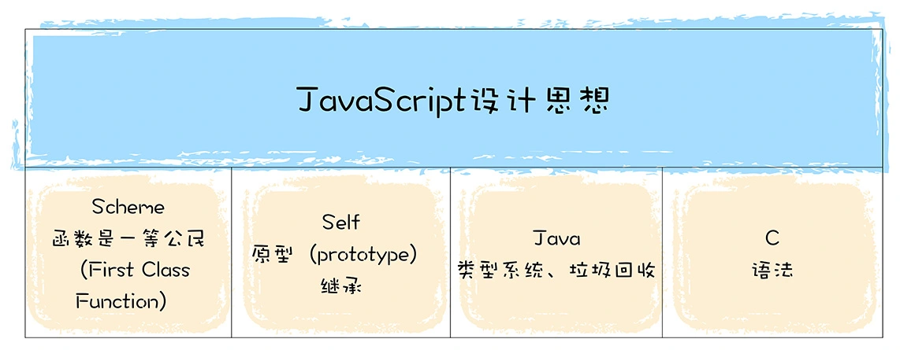

# 图解 GooleV8

<!-- @import "[TOC]" {cmd="toc" depthFrom=1 depthTo=6 orderedList=false} -->

<!-- code_chunk_output -->

- [图解 GooleV8](#图解goolev8)
  - [一. 宏观视角](#一-宏观视角)

<!-- /code_chunk_output -->

## 一. 宏观视角

V8 是 JS 虚拟机的一种。可以简单地把 JS 虚拟机理解成是一个翻译程序，将人类能够理解的编程语言 JS，翻译成机器能够理解的机器语言。如下图所示：

上图中，中间的 “黑盒” 就是 JS 引擎 V8。目前市面上有很多种 JS 引擎，诸如 SpiderMonkey、V8、JavaScriptCore 等。而由谷歌开发的开源项目 V8 是当下使用最广泛的 JS 虚拟机。

V8 之所以拥有如此庞大的生态圈，也和它许多革命性的设计是分不开的。在 V8 出现之前，所有的 JS 虚拟机所采用的都是解释执行的方式，这是 JS 执行速度过慢的一个主要原因。而 V8 率先引入了即时编译（JIT）的双轮驱动的设计，这是一种权衡策略，混合编译执行和解释执行这两种手段，给 JS 的执行速度带来了极大的提升。

V8 出现之后，各大厂商也都在自己的 JS 虚拟机中引入了 JIT 机制，所以可以看到目前市面上 JS 虚拟机都有着类似的架构。另外，V8 也是早于其他虚拟机引入了惰性编译、内联缓存、隐藏类等机制，进一步优化了 JS 代码的编译执行效率。

**V8 的主要职责是用来执行 JS 代码**的，那首先需要先了解 JS 这门语言的基本特性和设计思想。JS 借鉴了很多语言的特性，比如 C 语言的基本语法、Java 的类型系统和内存管理、Scheme 的函数作为一等公民，还有 Self 基于原型（prototype）的继承机制。毫无疑问，JS 是一门非常优秀的语言，特别是 “原型继承机制” 和 “函数是一等公民” 这两个设计。

不过 JS 也是一门处处是坑的语言，由于历史原因，很多错误的或者不合理的设计都被延续至今，比如使用 new 加构造函数来创建对象，这种方式的背后隐藏了太多的细节，非常容易增加代码出错概率，而且也大大增加了新手的学习成本；再比如初期的 JS 没有块级作用域机制，使得 JS 需要采取变量提升的策略，而变量提升又是非常反人性的设计。

V8 是 JS 的实现，在学习 V8 工作原理时，就要格外关注 JS 这些独特的设计思想和特性背后的实现。比如，为了实现函数是一等公民的特性，JS 采取了基于对象的策略；再比如为了实现原型继承，V8 为每个对象引入了 `__proto__` 属性。

V8 执行 JS 代码的完整流程被称之为 V8 的编译流水线，其完整流程如下图所示：

编译流水线本身并不复杂，但是其中涉及到了很多技术，诸如 JIT、延迟解析、隐藏类、内联缓存等等。这些技术决定着一段 JS 代码能否正常执行，以及代码的执行效率。比如 V8 中使用的隐藏类（Hide Class），这是将 JS 中动态类型转换为静态类型的一种技术，可以消除动态类型的语言执行速度过慢的问题，如果熟悉 V8 的工作机制，在编写 JS 时，就能充分利用好隐藏类这种强大的优化特性，写出更加高效的代码。

再比如，V8 实现了 JS 代码的惰性解析，目的是为了加速代码的启动速度，通过对惰性解析机制的学习，可以优化代码更加适应这个机制，从而提高程序性能。要想充分了解 V8 是怎么工作的，除了要分析编译流水线，还需要了解另外两个非常重要的特性：

- **事件循环系统**
  事件循环系统和 JS 中的难点与异步编程特性紧密相关。JS 是单线程的，代码都是在一个线程上执行，如果同一时间发送了多个 JS 执行的请求，就需要排队，也就是进行异步编程。V8 的事件循环系统会调度这些排队任务，保证 JS 代码被 V8 有序地执行。因此也可以说，事件循环系统就是 V8 的心脏，它驱动了 V8 的持续工作。

- **垃圾回收机制**
  JS 是一种自动垃圾回收的语言，V8 在执行垃圾回收时，会占用主线程的资源，如果编写的程序频繁触发垃圾回收，那么无疑会阻塞主线程，这也是经常会遇到的一个问题。需要知道 V8 是如何分配内存数据的，以及这些数据是如何被回收的，打通整个链路，建立完整的系统，当下次遇到内存问题时，就知道如何去排查了。

### 1.1 什么是 V8

V8 是一个由 Google 开发的开源 JS 引擎，目前用在 Chrome 浏览器和 Node.js 中，其核心功能是执行易于人类理解的 JS 代码。

其主要核心流程分为编译和执行两步。首先需要将 JS 代码转换为低级中间代码或者机器能够理解的机器代码，然后再执行转换后的代码并输出执行结果。

可以把 V8 看成是一个虚拟机，虚拟机通过模拟实际计算机的各种功能来实现代码的执行，如模拟实际计算机的 CPU、堆栈、寄存器等，虚拟机还具有它自己的一套指令系统。

所以对于 JS 代码来说，V8 就是它的整个世界，当 V8 执行 JS 代码时，并不需要担心现实中不同操作系统的差异，也不需要担心不同体系结构计算机的差异，只需要按照虚拟机的规范写好代码就可以了。

### 1.2 高级代码需要先编译再执行

可以把 CPU 看成是一个非常小的运算机器，可以通过二进制的指令和 CPU 进行沟通，比如给 CPU 发出 “1000100111011000” 的二进制指令，这条指令的意思是将一个寄存器中的数据移动到另外一个寄存器中，当处理器执行到这条指令的时候，便会按照指令的意思去实现相关的操作。

为了能够完成复杂的任务，工程师们为 CPU 提供了一大堆指令，来实现各种功能，这一大堆指令被称为**指令集**（Instructions），也就是机器语言。

> **注意**：CPU 只能识别二进制的指令，但是对程序员来说，二进制代码难以阅读和记忆，于是又将二进制指令集转换为人类可以识别和记忆的符号，这就是汇编指令集。

CPU 不能直接识别汇编语言，所以还需要一个汇编编译器，其作用是将汇编代码编程成机器代码：

虽然汇编语言对机器语言做了一层抽象，减少了程序员理解机器语言的复杂度，但是汇编语言依然是复杂且繁琐的，即便写一个非常简单的功能，也需要实现大量的汇编代码，这主要表现在以下两点。

1. **不同的 CPU 有着不同的指令集**，如果要使用机器语言或者汇编语言来实现一个功能，那么需要为每种架构的 CPU 编写特定的汇编代码，这会带来巨大的、枯燥繁琐的操作。

2. 在编写汇编代码时，还需要**了解和处理器架构相关的硬件知识**，比如寄存器、内存、操作 CPU 等。

因此需要一种屏蔽了计算机架构细节的语言，能适应多种不同 CPU 架构的语言，能专心处理业务逻辑的语言，诸如 C、C++、Java、C#、Python、JS 等，这些 “高级语言” 就应运而生了。

和汇编语言一样，处理器也不能直接识别由高级语言所编写的代码，通常，有两种方式来执行这些代码：

1. **解释执行**

   需要先将输入的源代码通过解析器编译成中间代码，之后直接使用解释器解释执行中间代码，然后直接输出结果。具体流程如下图所示：

   

2. **编译执行**

   采用这种方式时，也需要先将源代码转换为中间代码，然后编译器再将中间代码编译成机器代码。通常编译成的机器代码是以二进制文件形式存储的，需要执行这段程序的时候直接执行二进制文件就可以了。还可以使用虚拟机将编译后的机器代码保存在内存中，然后直接执行内存中的二进制代码。

   

但是针对不同的高级语言，实现方式还是有很大差异的，比如要执行 C 语言编写的代码，需要将其编译为二进制代码的文件，然后再直接执行二进制代码。而对于像 Java 语言、JS 语言等，则需要不同虚拟机，模拟计算机的这个编译执行流程。执行 Java 语言，需要经过 Java 虚拟机的转换，执行 JS 需要经过 JS 虚拟机的转换。

即便是 JS 一门语言，也有好几种流行的虚拟机，它们之间的实现方式也存在着一部分差异，比如苹果公司在 Safari 中就是用 JSCore 虚拟机，Firefox 使用了 TraceMonkey 虚拟机，而 Chrome 则使用了 V8 虚拟机。

### 1.3 V8 执行 JS 代码

V8 并没有采用某种单一的技术，而是混合编译执行和解释执行这两种手段，把这种混合使用编译器和解释器的技术称为 **JIT**（Just In Time）技术。

这是一种权衡策略，因为这两种方法都各自有各自的优缺点，解释执行的启动速度快，但是执行时的速度慢，而编译执行的启动速度慢，但是执行时的速度快。可以参考下面完整的 V8 执行 JS 的流程图：

上图中的最左边的部分，在 V8 启动执行 JS 之前，它还需要准备执行 JS 时所需要的一些基础环境，这些基础环境包括了 “堆空间” “栈空间” “全局执行上下文” “全局作用域” “消息循环系统” “内置函数” 等，这些内容都是在执行 JS 过程中需要使用到的。

1. 首先 V8 会接收到要执行的 JS 源代码，V8 并不能直接理解源代码的含义，它需要**结构化**[^1]这段字符串。

   [^1]: 结构化，是指信息经过分析后可分解成多个互相关联的组成部分，各组成部分间有明确的层次结构，方便使用和维护，并有一定的操作规范。

   V8 源代码的结构化之后，就生成了抽象语法树（AST）。在生成 AST 的同时，V8 还会生成相关的作用域，作用域中存放相关变量。

2. 有了 AST 和作用域之后，就可以生成**字节码**[^2]了。

   [^2]: 字节码，是介于 AST 和机器代码的中间代码。但是与特定类型的机器代码无关，解释器可以直接解释执行字节码，或者通过编译器将其编译为二进制的机器代码再执行。

3. 之后，解释器会按照顺序解释执行字节码，并输出执行结果。

在解释器有个监控，这是一个监控解释器执行状态的模块，在解释执行字节码的过程中，如果发现了某一段代码会被重复多次执行，那么监控机器人就会将这段代码标记为热点代码。

当某段代码被标记为热点代码后，V8 就会将这段字节码丢给优化编译器，优化编译器会在后台将字节码编译为二进制代码，然后再对编译后的二进制代码执行优化操作，优化后的二进制机器代码的执行效率会得到大幅提升。如果下面再执行到这段代码时，那么 V8 会优先选择优化之后的二进制代码，这样代码的执行速度就会大幅提升。

不过，和静态语言不同的是，JS 是一种非常灵活的动态语言，对象的结构和属性是可以在运行时任意修改的，而经过优化编译器优化过的代码只能针对某种固定的结构，一旦在执行过程中，对象的结构被动态修改了，那么优化之后的代码势必会变成无效的代码，这时候优化编译器就需要执行**反优化操作**，经过反优化的代码，下次执行时就会回退到解释器解释执行。

## 二. JS 设计思想

### 2.1 函数即对象
