<!-- @import "[TOC]" {cmd="toc" depthFrom=1 depthTo=6 orderedList=false} -->

<!-- code_chunk_output -->

- [浏览器工作原理与实践](#浏览器工作原理与实践)
  - [一. 浏览器发展方向与演进](#一-浏览器发展方向与演进)
    - [1.1 浏览器发展方向](#11-浏览器发展方向)
    - [1.2 浏览器工作原理的作用](#12-浏览器工作原理的作用)
    - [1.3 前端技术针对核心诉求做的演进](#13-前端技术针对核心诉求做的演进)
  - [二. 宏观视角下的浏览器](#二-宏观视角下的浏览器)
    - [2.1 Chrome 架构](#21-chrome-架构)
      - [2.1.2 进程和线程](#212-进程和线程)
    - [2.2 TCP 协议](#22-tcp-协议)
    - [2.3 HTTP 请求流程](#23-http-请求流程)
      - [2.3.1 浏览器端发起 HTTP 请求流程](#231-浏览器端发起-http-请求流程)
      - [2.3.2 服务器端处理 HTTP 请求流程](#232-服务器端处理-http-请求流程)
      - [2.3.3 浏览器资源缓存](#233-浏览器资源缓存)
      - [2.3.4 总结](#234-总结)
    - [2.4 导航流程](#24-导航流程)
    - [2.5 渲染流程](#25-渲染流程)
      - [2.5.1 相关概念](#251-相关概念)
  - [三. 浏览器中的 JS 执行机制](#三-浏览器中的-js-执行机制)
    - [3.1 变量提升和 JS 执行流程](#31-变量提升和-js-执行流程)
    - [3.2 调用栈：为什么 JS 代码会出现栈溢出？](#32-调用栈为什么-js-代码会出现栈溢出)
    - [3.3 var 缺陷与块级作用域](#33-var-缺陷与块级作用域)
    - [3.4 作用域链和闭包](#34-作用域链和闭包)
    - [3.5 从 JS 执行上下文的视角讲清楚 this](#35-从-js-执行上下文的视角讲清楚-this)
  - [四. V8 工作原理](#四-v8-工作原理)
    - [4.1 数据储存：栈空间和堆空间](#41-数据储存栈空间和堆空间)
    - [4.2 垃圾回收](#42-垃圾回收)

<!-- /code_chunk_output -->

# 浏览器工作原理与实践

## 一. 浏览器发展方向与演进

### 1.1 浏览器发展方向

浏览器的发展历程中有了三个大的发展方向：

1. **应用程序 Web 化**
   随着云计算的普及和 HTML5 技术的快速发展，越来越多的应用转向了浏览器 / 服务器（B/S）架构，这种改变让浏览器的重要性与日俱增，视频、音频、游戏几大核心场景也都在往 Web 的使用场景切换。

2. **Web 应用移动化**
   对于移动设备应用，Web 天生具有开放的基因，虽然在技术层面还有问题尚待解决（比如，渲染流程过于复杂且性能不及原生应用、离线时用户无法使用、无法接收消息推送、移动端没有一级入口），但 Google 推出了 PWA 方案来整合 Web 和本地程序各自的优势。

3. **Web 操作系统化**
   Web 操作系统有两层含义：

   1. 利用 Web 技术构建一个纯粹的操作系统，如 ChromeOS
   2. 浏览器的底层结构往操作系统架构方向发展，在整个架构演化的大背景下会牵涉诸多改变，下面列举一些相对重要的改变：

      - Chrome 朝着 SOA 的方向演化，未来很多模块都会以服务的形式提供给上层应用使用
      - 在浏览器中引入多种编程语言的支持，比如新支持的 WebAssembly
      - 简化渲染流程，使得渲染过程更加直接高效
      - 加大对系统设备特性的支持
      - 提供对复杂 Web 项目开发的支持

   也就是说，浏览器已经逐步演化成了操作系统之上的 “操作系统”。

### 1.2 浏览器工作原理的作用

1. **准确评估 Web 开发项目的可行性**
   随着 Web 特性的极大丰富和浏览器性能的提升，越来越多的项目可以用 Web 来开发。所以，了解浏览器是如何工作的，能够更加准确地决策是否可以采用 Web 来开发项目。

2. **从更高维度审视页面**
   作为一名合格的开发者，还要具备一项重要的技能，那就是：要能站在用户体验角度来考虑页面性能。下面是几个常见的用户体验指标：

   - 当用户请求一个网站时，如果在 1 秒内看不到关键内容，用户会产生任务被中断的感觉。
   - 当用户点击某些按钮时，如果 100ms 内无法响应，用户会感受到延迟。
   - 如果 Web 中的动画没有达到 60fps，用户会感受到动画的卡顿。

   这里的页面加载时长、用户交互反馈时长、Web 动画中的帧数都决定了用户体验的流畅度，并最终决定了用户体验的效果。在用户体验尤其重要的今天，必须能够有效地解决这些体验问题，以免给产品造成不可挽回的伤害。

   但通常，这些指标是由一系列的复杂因素导致的。如果要开发流畅的页面，或者诊断 Web 页面中的性能问题，那就需要了解 URL 是怎么变成页面的，只有弄懂这些之后，才可以站在全局的角度定位问题或者写出高效的代码。

3. **在快节奏的技术迭代中把握本质**
   从 2011 年到现在，前端技术出现了大爆炸式增长，各种新技术层出不穷。**Node.js 是前端发展的一个核心推动力**。Node.js 是基于 Chrome 的 JS 引擎 V8 来实现的，它的特点是可以脱离浏览器环境来执行 JS。Node.js 的诞生时间不长，但其周边已经形成了一个庞大的生态系统。与此同时，各种新标准、新技术纷至沓来，前端生态空前繁荣。

   为什么 Node.js 能如此快速地发展？根本原因还是浏览器功能以及整个前端的开发环境，不足以支撑日益增长的需求，所以 “变化” 是这段时期的主旋律。这种变化直接扩大了前端工程师的知识半径，这也导致很多前端开发工程师变成了全栈工程师。

   随着脚本执行效率的提高、页面渲染性能的提升和开发工具链的完善，接下来的前端会进入一个相对平稳的阶段。通俗地理解就是：等到核心技术足以支撑核心需求，那么前端生态会进入一个相对稳定的状态。

### 1.3 前端技术针对核心诉求做的演进

了解了浏览器的工作机制，那么可以梳理出来前端技术的发展脉络，更加深刻地理解当前的技术，同时也会清楚其不足之处，以及演化方向。

1. **首先是脚本执行速度问题**
   比如针对 JS 设计缺陷和执行效率的问题，可以从以下两个途径去解决：

   - 不断修订和更新语言本身，这样就应该知道 ES6、ES7、ES8，或者 TypeScript 出现的必要性。这种修订对目前生态环境的改动是最小的，所以推行起来会比较容易。

   - 颠覆性地使用新的语言，这就是 WebAssembly 出现的原因。WebAssembly 需要经过编译器编译，所以体积小、执行速度快，使用它能大幅提升语言的执行效率，但是语言本身的完善，和生态的构建都是需要花很长时间来打造的。

2. **其次是前端模块化开发**
   比如，随着 Web 应用在各个领域的深入，Web 工程的复杂程度也越来越高，这就产生了模块化开发的需求，于是相应出现了 WebComponents 标准。React 和 Vue 都在渐进地适应 WebComponents 标准，同时各种前端框架的最佳实践也会反过来影响 WebComponents 标准的制定。理解了浏览器工作原理，会对 WebComponents 中涉及的 Shadow DOM、HTML Templates 等技术有更深刻的理解。

3. **最后是渲染效率问题**
   目前页面的渲染依然存在很大缺陷。与此同时，Chrome 团队也在着手改善这些缺陷，比如正在开发的下一代布局方案 LayoutNG，还有渲染瘦身方案 Slim Paint，其目的都是让渲染变得更加简单和高效。

综上可以看出，触发这些改变的背后因素是当前技术制约了现实的需求。

## 二. 宏观视角下的浏览器

### 2.1 Chrome 架构

#### 2.1.2 进程和线程

多线程可以并行处理任务，但是**线程是不能单独存在的，它是由进程来启动和管理的**。

**一个进程就是一个程序的运行实例**。详细解释就是，启动一个程序的时候，操作系统会为该程序创建一块内存，用来存放代码、运行中的数据和一个执行任务的主线程，把这样的一个运行环境叫进程。


从图中可以看到，**线程是依附于进程的，而进程中使用多线程并行处理能提升运算效率**。

总结来说，进程和线程之间的关系有以下 4 个特点：

- 进程中的任意一线程执行出错，都会导致整个进程的崩溃。

- 线程之间共享进程中的数据。
  

- 当一个进程关闭之后，操作系统会回收进程所占用的内存。

- 进程之间的内容相互隔离。
  进程隔离是为保护操作系统中进程互不干扰的技术，每一个进程只能访问自己占有的数据。正是因为进程之间的数据是严格隔离的，所以一个进程如果崩溃了，或者挂起了，是不会影响到其他进程的。如果进程之间需要进行数据的通信，这时候，就需要使用用于进程间通信（IPC）的机制了。

**单进程浏览器**
单进程浏览器是指浏览器的所有功能模块都是运行在同一个进程里。缺点：不稳定，不流畅，不安全。

**多进程浏览器**：

- 早期多进程架构
  

  Chrome 的页面是运行在单独的渲染进程中的，同时页面里的插件也是运行在单独的插件进程之中，而进程之间是通过 IPC 机制进行通信。

  - 解决不稳定：由于进程是相互隔离的，所以当一个页面或者插件崩溃时，影响到的仅仅是当前的页面进程或者插件进程。
  - 解决不流畅：JS 也是运行在渲染进程中的，所以即使 JS 阻塞了渲染进程，影响到的也只是当前的渲染页面，而并不会影响浏览器和其他页面
  - 解决不安全：采用多进程架构的额外好处是可以**使用安全沙箱**，可以把沙箱看成是操作系统给进程上了一把锁，沙箱里面的程序可以运行，但是不能在硬盘上写入任何数据，也不能在敏感位置读取任何数据。Chrome 把插件进程和渲染进程锁在沙箱里面。

- 目前多进程架构
  

  包括：1 个浏览器（Browser）主进程、1 个 GPU 进程、1 个网络（NetWork）进程、多个渲染进程和多个插件进程。下面来分析下这几个进程的功能：

  - 浏览器进程：主要负责界面显示、用户交互、子进程管理，同时提供存储等功能。

  - 渲染进程：核心任务是将 HTML、CSS 和 JS 转换为用户可以与之交互的网页，排版引擎 Blink 和 JS 引擎 V8 都是运行在该进程中，默认情况下，Chrome 会为每个 Tab 标签创建一个渲染进程。出于安全考虑，渲染进程都是运行在沙箱模式下。

  - GPU 进程：其实，Chrome 刚开始发布的时候是没有 GPU 进程的。而 GPU 的使用初衷是为了实现 3D CSS 的效果，只是随后网页、Chrome 的 UI 界面都选择采用 GPU 来绘制，这使得 GPU 成为浏览器普遍的需求。最后，Chrome 在其多进程架构上也引入了 GPU 进程。

  - 网络进程：主要负责页面的网络资源加载，之前是作为一个模块运行在浏览器进程里面的，直至最近才独立出来，成为一个单独的进程。

  - 插件进程：主要是负责插件的运行，因插件易崩溃，所以需要通过插件进程来隔离，以保证插件进程崩溃不会对浏览器和页面造成影响。

  问题：

  - 更高的资源占用：因为每个进程都会包含公共基础结构的副本，这就意味着浏览器会消耗更多的内存资源。

  - 更复杂的体系架构：浏览器各模块之间耦合性高、扩展性差等问题，会导致现在的架构已经很难适应新的需求了。

**未来面向服务的架构**
为了解决多进程架构的问题，在 2016 年，Chrome 官方团队使用 “**面向服务的架构**”（Services Oriented Architecture，简称 SOA）的思想设计了新的 Chrome 架构。也就是说 Chrome 整体架构会朝向现代操作系统所采用的 “面向服务的架构” 方向发展，原来的各种模块会被重构成独立的服务（Service），每个服务（Service）都可以在独立的进程中运行，访问服务（Service）必须使用定义好的接口，通过 IPC 来通信，从而**构建一个更内聚、松耦合、易于维护和扩展的系统**，更好实现 Chrome 简单、稳定、高速、安全的目标。

Chrome 最终要把 UI、数据库、文件、设备、网络等模块重构为基础服务，类似操作系统底层服务：


同时 Chrome 还提供灵活的弹性架构，在强大性能设备上会以多进程的方式运行基础服务，但是如果在资源受限的设备上，Chrome 会将很多服务整合到一个进程中，从而节省内存占用。


### 2.2 TCP 协议

在衡量 Web 页面性能的时候有一个重要的指标叫 **“FP（First Paint）”，是指从页面加载到首次开始绘制的时长**。这个指标直接影响了用户的跳出率，其中一个重要的因素是**网络加载速度**。

**互联网，实际上是一套理念和协议组成的体系架构**。其中，协议是一套众所周知的规则和标准，互联网中的数据是通过数据包来传输的。如果发送的数据很大，那么该数据就会被拆分为很多小数据包来传输：

1. **IP：把数据包送达目的主机**

   数据包要在互联网上进行传输，就要符合网际协议（Internet Protocol，简称 IP）标准。互联网上不同的在线设备都有唯一的地址。

   **计算机的地址就称为 IP 地址，访问任何网站实际上只是你的计算机向另外一台计算机请求信息**。

   如果要想把一个数据包从主机 A 发送给主机 B，那么在传输之前，数据包上会被附加上主机 B 的 IP 地址信息，这样在传输过程中才能正确寻址。额外地，数据包上还会附加上主机 A 本身的 IP 地址，有了这些信息主机 B 才可以回复信息给主机 A。这些附加的信息会被装进一个叫 IP 头的数据结构里。IP 头是 IP 数据包开头的信息，包含 IP 版本、源 IP 地址、目标 IP 地址、生存时间等信息。

   先把网络简单分为三层结构：

   

2. **UDP：把数据包送达应用程序**

   IP 是非常底层的协议，只负责把数据包传送到对方电脑，但是对方电脑并不知道把数据包交给哪个程序。因此，需要基于 IP 之上开发能和应用打交道的协议，最常见的是 **“用户数据包协议（User Datagram Protocol）”，简称 UDP**。

   **UDP 中一个最重要的信息是端口号**，端口号其实就是一个数字，每个想访问网络的程序都需要绑定一个端口号。通过端口号 UDP 就能把指定的数据包发送给指定的程序了，所以 **IP 通过 IP 地址信息把数据包发送给指定的电脑，而 UDP 通过端口号把数据包分发给正确的程序**。和 IP 头一样，端口号会被装进 UDP 头里面，UDP 头再和原始数据包合并组成新的 UDP 数据包。UDP 头中除了目的端口，还有源端口号等信息。

   为了支持 UDP 协议，把前面的三层结构扩充为四层结构，在网络层和上层之间增加了传输层：

   

   在使用 UDP 发送数据时，有各种因素会导致数据包出错，虽然 UDP 可以校验数据是否正确，但是对于错误的数据包，UDP 并不提供重发机制，只是丢弃当前的包，而且 UDP 在发送之后也无法知道是否能达到目的地。

   虽说 **UDP 不能保证数据可靠性，但是传输速度却非常快**，所以 UDP 会应用在一些关注速度、但不那么严格要求数据完整性的领域，如在线视频、互动游戏等。

3. **TCP：把数据完整地送达应用程序**

   对于浏览器请求，或者邮件这类要求数据传输可靠性（reliability）的应用，如果使用 UDP 来传输会存在两个问题：

   - 数据包在传输过程中容易丢失。
   - 大文件会被拆分成很多小的数据包来传输，这些小的数据包会经过不同的路由，并在不同的时间到达接收端，而 UDP 协议并不知道如何组装这些数据包，从而把这些数据包还原成完整的文件。

   基于这两个问题，引入了 TCP。**TCP（Transmission Control Protocol，传输控制协议）是一种面向连接的、可靠的、基于字节流的传输层通信协议**。相对于 UDP，TCP 有下面两个特点：

   - 对于数据包丢失的情况，TCP 提供重传机制。
   - TCP 引入了数据包排序机制，用来保证把乱序的数据包组合成一个完整的文件。

   和 UDP 头一样，TCP 头除了包含了目标端口和本机端口号外，还提供了用于排序的序列号，以便接收端通过序号来重排数据包。

   下面看看 TCP 下的单个数据包的传输流程：

   

   下面再看下完整的 TCP 连接过程，通过这个过程可以明白 TCP 是如何保证重传机制和数据包的排序功能的。从下图可以看出，一个完整的 TCP 连接的生命周期包括了 “**建立连接**” “**传输数据**” 和 “**断开连接**” 三个阶段。

   

   1. 首先，建立连接阶段。这个阶段是通过 “三次握手” 来建立客户端和服务器之间的连接。TCP 提供面向连接的通信传输。面向连接是指在数据通信开始之前先做好两端之间的准备工作。所谓**三次握手，是指在建立一个 TCP 连接时，客户端和服务器总共要发送三个数据包以确认连接的建立**。

   2. 其次，传输数据阶段。在该阶段，**接收端需要对每个数据包进行确认操作**，也就是接收端在接收到数据包之后，需要发送确认数据包给发送端。所以当发送端发送了一个数据包之后，在规定时间内没有接收到接收端反馈的确认消息，则判断为数据包丢失，并触发发送端的重发机制。同样，一个大的文件在传输过程中会被拆分成很多小的数据包，这些数据包到达接收端后，接收端会按照 TCP 头中的序号为其排序，从而保证组成完整的数据。

   3. 最后，断开连接阶段。数据传输完毕之后，就要终止连接了，涉及到最后一个阶段 “四次挥手” 来保证双方都能断开连接。

### 2.3 HTTP 请求流程

HTTP 协议，是建立在 TCP 连接基础之上的。**HTTP 是一种允许浏览器向服务器获取资源的协议，是 Web 的基础，通常由浏览器发起请求，用来获取不同类型的文件**。此外，HTTP 也是浏览器使用最广的协议.

#### 2.3.1 浏览器端发起 HTTP 请求流程

在浏览器地址栏中键入地址后：

1. 构建请求
   首先，浏览器构建请求行信息，构建好后，浏览器准备发起网络请求。

   ```sh
   GET /index.html HTTP1.1
   ```

2. 查找缓存

   在真正发起网络请求之前，浏览器会先在浏览器缓存中查询是否有要请求的文件。其中，**浏览器缓存是一种在本地保存资源副本，以供下次请求时直接使用的技术**。

   当浏览器发现请求的资源已经在浏览器缓存中存有副本，它会拦截请求，返回该资源的副本，并直接结束请求，而不会再去源服务器重新下载。这样做的好处有：

   - 缓解服务器端压力，提升性能（获取资源的耗时更短了）；
   - 对于网站来说，缓存是实现快速资源加载的重要组成部分。

   如果缓存查找失败，就会进入网络请求过程。

3. 准备 IP 地址和端口

   在了解网络请求之前，需要先看看 HTTP 和 TCP 的关系。因为浏览器使用 HTTP 协议作为应用层协议，用来封装请求的文本信息；并使用 TCP/IP 作传输层协议将它发到网络上，所以在 HTTP 工作开始之前，浏览器需要通过 TCP 与服务器建立连接。也就是说 HTTP 的内容是通过 TCP 的传输数据阶段来实现的，可以结合下图更好地理解这二者的关系。

   

   数据包都是通过 IP 地址传输给接收方的。由于 IP 地址是数字标识，比如极客时间网站的 IP 是 39.106.233.176, 难以记忆，但使用极客时间的域名（time.geekbang.org）就好记多了，所以基于这个需求又出现了一个服务，负责把域名和 IP 地址做一一映射关系。这套域名映射为 IP 的系统就叫做 “**域名系统”，简称 DNS**（Domain Name System）。

   一路推导下来，会发现**在第一步浏览器会请求 DNS 返回域名对应的 IP**。当然浏览器还提供了 DNS 数据缓存服务，如果某个域名已经解析过了，那么浏览器会缓存解析的结果，以供下次查询时直接使用，这样也会减少一次网络请求。

   拿到 IP 之后，接下来就需要获取端口号了。通常情况下，如果 URL 没有特别指明端口号，那么 HTTP 协议默认是 80 端口。

4. 等待 TCP 队列

   Chrome 有个机制，同一个域名同时最多只能建立 6 个 TCP 连接，如果当前请求数量少于 6，会直接进入下一步，建立 TCP 连接。

5. 建立 [TCP 连接](#22-tcp-协议)

6. 发送 HTTP 请求

   一旦建立了 TCP 连接，浏览器就可以和服务器进行通信了。而 HTTP 中的数据正是在这个通信过程中传输的。

   

   首先浏览器会向服务器发送**请求行，它包括了请求方法、请求 URI（Uniform Resource Identifier）和 HTTP 版本协议**。

   发送请求行，就是告诉服务器浏览器需要什么资源，最常用的请求方法是 Get。另外一个常用的请求方法是 POST，它用于发送一些数据给服务器，比如登录一个网站，就需要通过 POST 方法把用户信息发送给服务器。如果使用 POST 方法，那么浏览器还要准备数据给服务器，这里准备的数据是**通过请求体来发送**。

   在浏览器发送请求行命令之后，还要**以请求头形式发送其他一些信息**，把浏览器的一些基础信息告诉服务器。比如包含了浏览器所使用的操作系统、浏览器内核等信息，以及当前请求的域名信息、浏览器端的 Cookie 信息，等等。

#### 2.3.2 服务器端处理 HTTP 请求流程

1. 返回请求
   一旦服务器处理结束，便可以返回数据给浏览器了。可以通过 curl 工具来查看返回请求数据，使用方法是在命令行中输入以下命令：

   ```sh
   curl -i  https://time.geekbang.org/
   ```

   > **注意**：这里加上了 `-i` 是为了返回响应行、响应头和响应体的数据，返回的结果如下图所示，可以结合这些数据来理解服务器是如何响应浏览器的。

   

   首先服务器会返回**响应行**，包括协议版本和状态码。但并不是所有的请求都可以被服务器处理的，一些无法处理或者处理出错的信息，服务器会通过请求行的状态码来告诉浏览器它的处理结果。

   随后，正如浏览器会随同请求发送请求头一样，服务器也会随同响应向浏览器发送**响应头**。响应头包含了服务器自身的一些信息，比如服务器生成返回数据的时间、返回的数据类型（JSON、HTML、流媒体等类型），以及服务器要在客户端保存的 Cookie 等信息。

   发送完响应头后，服务器就可以继续发送响应体的数据，通常，响应体就包含了 HTML 的实际内容。

2. 断开连接
   通常情况下，一旦服务器向客户端返回了请求数据，它就要关闭 TCP 连接。不过如果浏览器或者服务器在其头信息中加入了：

   ```sh
   Connection:Keep-Alive
   ```

   那么 TCP 连接在发送后将仍然保持打开状态，这样浏览器就可以继续通过同一个 TCP 连接发送请求。**保持 TCP 连接可以省去下次请求时需要建立连接的时间，提升资源加载速度**。

3. 重定向

   在浏览器中打开 geekbang.org 后，会发现最终打开的页面地址是 `https://www.geekbang.org`。这两个 URL 之所以不一样，是因为涉及到了一个重定向操作。在控制台输入如下命令：

   ```js
   curl -I geekbang.org
   ```

   > **注意**：这里输入的参数是 `-I`，和 `-i` 不一样，`-I` 表示只需要获取响应头和响应行数据，而不需要获取响应体的数据。

   

   从图中可以看到，响应行返回的状态码是 301，状态 301 就是告诉浏览器，需要重定向到另外一个网址，而需要重定向的网址正是包含在响应头的 `Location` 字段中，接下来，浏览器获取 `Location` 字段中的地址，并使用该地址重新导航，这就是一个完整重定向的执行流程。

#### 2.3.3 浏览器资源缓存

下面是缓存处理的过程：


从上图的第一次请求可以看出，当服务器返回 HTTP 响应头给浏览器时，浏览器是**通过响应头中的 `Cache-Control` 字段来设置是否缓存该资源**。通常，还需要为这个资源设置一个缓存过期时长，而这个时长是通过 `Cache-Control` 中的 `Max-age` 参数来设置的，比如上图设置的缓存过期时间是 2000 秒。

这也就意味着，在该缓存资源还未过期的情况下, 如果再次请求该资源，会直接返回缓存中的资源给浏览器。但如果缓存过期了，浏览器则会继续发起网络请求，并且在 HTTP 请求头中带上：

```http
If-None-Match:"4f80f-13c-3a1xb12a"
```

服务器收到请求头后，会根据 `If-None-Match` 的值来判断请求的资源是否有更新。

- 如果没有更新，就返回 304 状态码，相当于服务器告诉浏览器：“这个缓存可以继续使用，这次就不重复发送数据。”
- 如果资源有更新，服务器就直接返回最新资源给浏览器。

关于缓存的细节内容特别多，具体细节可以参考这篇 [HTTP 缓存](https://developer.mozilla.org/zh-CN/docs/Web/HTTP/Caching)。

#### 2.3.4 总结

从图中可以看到，浏览器中的 HTTP 请求从发起到结束一共经历了如下八个阶段：构建请求、查找缓存、准备 IP 和端口、等待 TCP 队列、建立 TCP 连接、发起 HTTP 请求、服务器处理请求、服务器返回请求和断开连接。


### 2.4 导航流程

从输入 URL 到页面展示完整流程示意图：


**整个过程需要各个进程之间的配合**，这个过程可以大致描述为如下：

- 首先，浏览器进程接收到用户输入的 URL 请求，浏览器进程便将该 URL 转发给网络进程。

- 然后，在网络进程中发起真正的 URL 请求。

- 接着网络进程接收到了响应头数据，便解析响应头数据，并将数据转发给浏览器进程。

- 浏览器进程接收到网络进程的响应头数据之后，发送 “提交导航（CommitNavigation）” 消息到渲染进程。

- 渲染进程接收到 “提交导航” 的消息之后，便开始准备接收 HTML 数据，接收数据的方式是直接和网络进程建立数据管道。

- 最后渲染进程会向浏览器进程 “确认提交”，这是告诉浏览器进程：“已经准备好接受和解析页面数据了”。

- 浏览器进程接收到渲染进程 “提交文档” 的消息之后，便开始移除之前旧的文档，然后更新浏览器进程中的页面状态。

这其中，**用户发出 URL 请求到页面开始解析的这个过程，就叫做导航**。

**从输入 URL 到页面展示**：

1. 用户输入
   当用户在地址栏中输入一个查询关键字时，地址栏会判断输入的关键字是搜索内容，还是请求的 URL。

   - 如果是搜索内容，地址栏会使用浏览器默认的搜索引擎，来合成新的带搜索关键字的 URL。

   - 如果判断输入内容符合 URL 规则，比如输入的是 time.geekbang.org，那么地址栏会根据规则，把这段内容加上协议，合成为完整的 URL，如 `https://time.geekbang.org`。

   当用户输入关键字并键入回车之后，这意味着当前页面即将要被替换成新的页面，不过在这个流程继续之前，浏览器还给了当前页面一次执行 `beforeunload` 事件的机会，`beforeunload` 事件允许页面在退出之前执行一些数据清理操作，还可以询问用户是否要离开当前页面，比如当前页面可能有未提交完成的表单等情况，因此用户可以通过 `beforeunload` 事件来取消导航，让浏览器不再执行任何后续工作。

   当前页面没有监听 `beforeunload` 事件或者同意了继续后续流程，标签页上的图标便进入了加载状态。但此时图中页面显示的依然是之前打开的页面内容，并没立即替换为新页面。因为需要等待提交文档阶段，页面内容才会被替换。

2. URL 请求

   接下来，便进入了页面资源请求过程。这时，浏览器进程会通过进程间通信（IPC）把 URL 请求发送至网络进程，网络进程接收到 URL 请求后，会在这里发起真正的 URL 请求流程。

   首先，网络进程会查找本地缓存是否缓存了该资源。如果有缓存资源，那么直接返回资源给浏览器进程；如果在缓存中没有查找到资源，那么直接进入网络请求流程。这请求前的第一步是要进行 DNS 解析，以获取请求域名的服务器 IP 地址。如果请求协议是 HTTPS，那么还需要建立 TLS 连接。

   接下来就是利用 IP 地址和服务器建立 TCP 连接。连接建立之后，浏览器端会构建请求行、请求头等信息，并把和该域名相关的 Cookie 等数据附加到请求头中，然后向服务器发送构建的请求信息。

   服务器接收到请求信息后，会根据请求信息生成响应数据，并发给网络进程。等网络进程接收了响应行和响应头之后，就开始解析响应头的内容了。

   - 重定向

     在接收到服务器返回的响应头后，网络进程开始解析响应头，如果发现返回的状态码是 301 或者 302，那么说明服务器需要浏览器重定向到其他 URL。这时网络进程会从响应头的 `Location` 字段里面读取重定向的地址，然后再发起新的 HTTP 或者 HTTPS 请求，一切又重头开始了。

     **在导航过程中，如果服务器响应行的状态码包含了 301、302 一类的跳转信息，浏览器会跳转到新的地址继续导航；如果响应行是 2xx，那么表示浏览器可以继续处理该请求**。

   - 响应数据类型处理

     在处理了跳转信息之后。URL 请求的数据类型，有时候是一个下载类型，有时候是正常的 HTML 页面，浏览器通过 `Content-Type` 区分。**`Content-Type` 是 HTTP 头中一个非常重要的字段，它告诉浏览器服务器返回的响应体数据是什么类型**，然后浏览器会根据 `Content-Type` 的值来决定如何显示响应体的内容。

     不同 `Content-Type` 的后续处理流程也截然不同。**如果 `Content-Type` 字段的值被浏览器判断为下载类型，那么该请求会被提交给浏览器的下载管理器，同时该 URL 请求的导航流程就此结束。但如果是 HTML，那么浏览器则会继续进行导航流程**。由于 Chrome 的页面渲染是运行在渲染进程中的，所以接下来就需要准备渲染进程了。

3. 准备渲染进程

   默认情况下，Chrome 会为每个页面分配一个渲染进程，也就是说，每打开一个新页面就会配套创建一个新的渲染进程。但是，在某些情况下，浏览器会让多个页面直接运行在同一个渲染进程中。

   **例外情况**
   在同一站点（same-site）。“同一站点” 定义为根域名（例如，geekbang.org）加上协议（例如，https:// 或者 http://），还包含了该根域名下的所有子域名和不同的端口，比如下面这三个：

   ```txt
   https://time.geekbang.org
   https://www.geekbang.org
   https://www.geekbang.org:8080
   ```

   **Chrome 的默认策略是，每个标签对应一个渲染进程。但如果从一个页面打开了另一个新页面，而新页面和当前页面属于同一站点的话，那么新页面会复用父页面的渲染进程**。官方把这个默认策略叫 process-per-site-instance。

   打开一个新页面采用的渲染进程策略就是：

   - 通常情况下，打开新的页面都会使用单独的渲染进程。

   - 如果从 A 页面打开 B 页面，且 A 和 B 都属于同一站点的话，那么 B 页面复用 A 页面的渲染进程；如果是其他情况，浏览器进程则会为 B 创建一个新的渲染进程。

   渲染进程准备好之后，还不能立即进入文档解析状态，因为此时的文档数据还在网络进程中，并没有提交给渲染进程，所以下一步就进入了提交文档阶段。

4. 提交文档

   **提交文档，就是指浏览器进程将网络进程接收到的 HTML 数据提交给渲染进程**，具体流程：

   - 首先当浏览器进程接收到网络进程的响应头数据之后，便向渲染进程发起 “提交文档” 的消息。

   - 渲染进程接收到 “提交文档” 的消息后，会和网络进程建立传输数据的 “管道”。

   - 等文档数据传输完成之后，渲染进程会返回 “确认提交” 的消息给浏览器进程。

   - 浏览器进程在收到 “确认提交” 的消息后，会更新浏览器界面状态，包括了安全状态、地址栏的 URL、前进后退的历史状态，并更新 Web 页面。

   其中，当渲染进程确认提交之后，更新内容如下图：

   

   到这里，一个完整的导航流程就 “走” 完了，这之后就要进入渲染阶段了。

5. 渲染阶段

   一旦文档被提交，渲染进程便开始页面解析和子资源加载了。

### 2.5 渲染流程


从图中可以看出，左边输入的是 HTML、CSS、JS 数据，这些数据经过中间渲染模块的处理，最终输出为屏幕上的像素。

由于渲染机制过于复杂，所以渲染模块在执行过程中会被划分为很多子阶段，输入的数据经过这些子阶段，最后输出像素。把这样的一个处理流程叫做渲染流水线，其大致流程如下图所示：

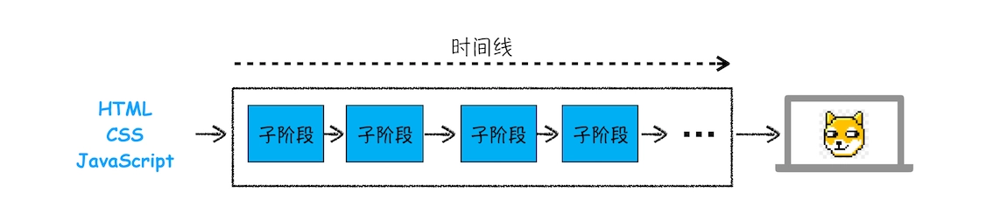

按照渲染的时间顺序，流水线可分为如下几个子阶段：构建 DOM 树、样式计算、布局阶段、分层、绘制、分块、光栅化和合成。在每个阶段的过程中，应该重点关注以下三点内容：

- 开始每个子阶段都有其**输入的内容**。

- 然后每个子阶段有其**处理过程**。

- 最终每个子阶段会生成**输出内容**。

**构建 DOM 树**
为什么要构建 DOM 树呢？**这是因为浏览器无法直接理解和使用 HTML，所以需要将 HTML 转换为浏览器能够理解的结构——DOM 树**。

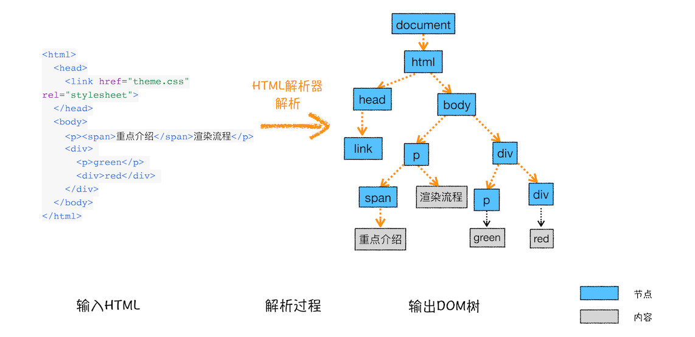

可以看到，DOM 和 HTML 内容几乎是一样的，但是和 HTML 不同的是，DOM 是保存在内存中树状结构，可以通过 JS 来查询或修改其内容。

**样式计算（Recalculate Style）**
样式计算的目的是为了计算出 DOM 节点中每个元素的具体样式，这个阶段大体可分为三步来完成。

1. 把 CSS 转换为浏览器能够理解的结构

   和 HTML 文件一样，浏览器也是无法直接理解这些纯文本的 CSS 样式，所以**当渲染引擎接收到 CSS 文本时，会执行一个转换操作，将 CSS 文本转换为浏览器可以理解的结构——styleSheets**。并且该结构同时具备了查询和修改功能。

2. 转换样式表中的属性值，使其标准化

   现在已经把现有的 CSS 文本转化为浏览器可以理解的结构了，那么接下来就要**对其进行属性值的标准化操作**。

   ```css
   body {
     font-size: 2em;
   }
   p {
     color: blue;
   }
   div {
     font-weight: bold;
   }
   ```

   可以看到上面的 CSS 文本中有很多属性值，如 2em、blue、bold，这些类型数值不容易被渲染引擎理解，所以**需要将所有值转换为渲染引擎容易理解的、标准化的计算值，这个过程就是属性值标准化**。

   

3. 计算出 DOM 树中每个节点的具体样式

   现在样式的属性已被标准化了，接下来就需要计算 DOM 树中每个节点的样式属性了，这就**涉及到 CSS 的继承规则和层叠规则**了。

   - 首先是 CSS 继承。**CSS 继承就是每个 DOM 节点都包含有父节点的样式**。

   - 样式计算过程中的第二个规则是样式层叠。**层叠是 CSS 的一个基本特征，它是一个定义了如何合并来自多个源的属性值的算法。它在 CSS 处于核心地位，CSS 的全称 “层叠样式表” 正是强调了这一点**。

   样式计算阶段的目的是为了计算出 DOM 节点中每个元素的具体样式，在计算过程中需要遵守 CSS 的继承和层叠两个规则。这个阶段最终输出的内容是每个 DOM 节点的样式，并被保存在 ComputedStyle 的结构内。

4. 布局阶段

   现在，有 DOM 树和 DOM 树中元素的样式，但这还不足以显示页面，因为还不知道 DOM 元素的几何位置信息。那么接下来就需要**计算出 DOM 树中可见元素的几何位置，这个计算过程叫做布局**。

   Chrome 在布局阶段需要完成两个任务：创建布局树和布局计算。

   1. 创建布局树

      DOM 树还含有很多不可见的元素，比如 head 标签，还有使用了 display:none 属性的元素。所以**在显示之前，还要额外地构建一棵只包含可见元素布局树**。

      

      从上图可以看出，DOM 树中所有不可见的节点都没有包含到布局树中。为了构建布局树，浏览器大体上完成了下面这些工作：

      - 遍历 DOM 树中的所有可见节点，并把这些节点加到布局树中。
      - 不可见的节点会被布局树忽略掉，如 head 标签下面的全部内容，再比如 body.p.span 这个元素，因为它的属性包含 dispaly:none，所以这个元素也没有被包进布局树。

   2. 布局计算

      在执行布局操作的时候，会把布局运算的结果重新写回布局树中，所以布局树既是输入内容也是输出内容，这是布局阶段一个不合理的地方，因为在布局阶段并没有清晰地将输入内容和输出内容区分开来。针对这个问题，Chrome 团队正在重构布局代码，下一代布局系统叫 LayoutNG，试图更清晰地分离输入和输出，从而让新设计的布局算法更加简单。

5. 分层

   页面中有很多复杂的效果，如一些复杂的 3D 变换、页面滚动，或者使用 z-index 做 z 轴排序等，为了更加方便地实现这些效果，渲染引擎还需要为特定的节点生成专用的图层，并生成一棵对应的图层树（LayerTree）。

   **浏览器的页面实际上被分成了很多图层，这些图层叠加后合成了最终的页面**。下面再来看看这些图层和布局树节点之间的关系：

   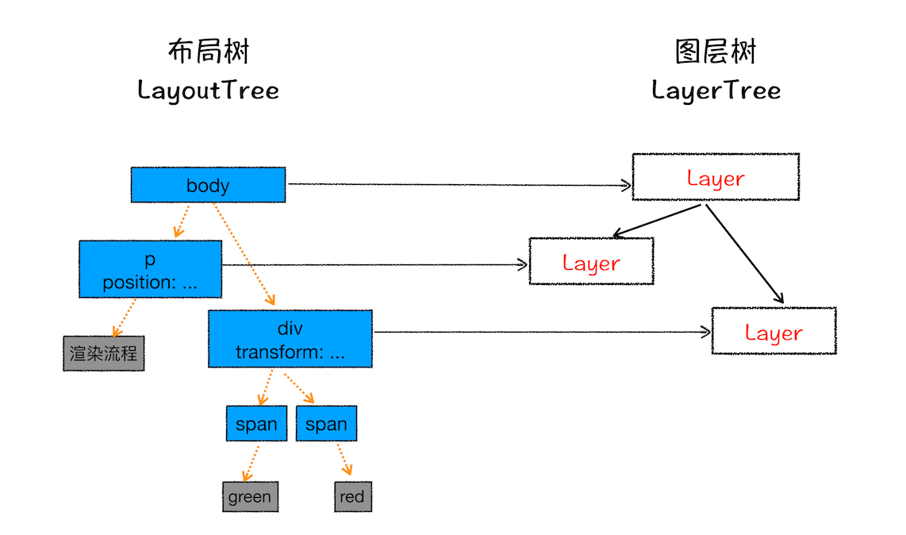

   通常情况下，**并不是布局树的每个节点都包含一个图层，如果一个节点没有对应的层，那么这个节点就从属于父节点的图层**。如上图中的 span 标签没有专属图层，那么它们就从属于它们的父节点图层。但不管怎样，最终每一个节点都会直接或者间接地从属于一个层。

   通常满足下面两点中任意一点的元素就可以被提升为单独的一个图层：

   - **拥有[层叠上下文](https://developer.mozilla.org/zh-CN/docs/Web/CSS/CSS_Positioning/Understanding_z_index/The_stacking_context)属性的元素会被提升为单独的一层**

     页面是个二维平面，但是层叠上下文能够让 HTML 元素具有三维概念，这些 HTML 元素按照自身属性的优先级分布在垂直于这个二维平面的 z 轴上。可以结合下图来直观感受下：

     

     从图中可以看出，明确定位属性的元素、定义透明属性的元素、使用 CSS 滤镜的元素等，都拥有层叠上下文属性。

   - **需要剪裁（clip）的地方也会被创建为图层**

     文字超出父元素范围，会根据 overflow 的值进行裁剪，渲染引擎会为文字部分单独创建一个层，如果出现滚动条，滚动条也会被提升为单独的层。

6. 图层绘制

   在完成图层树的构建之后，渲染引擎会对图层树中的每个图层进行绘制。渲染引擎实现图层的绘制，会**把一个图层的绘制拆分成很多小的绘制指令**，然后再把这些指令按照顺序组成一个待绘制列表：

   

   从图中可以看出，绘制列表中的指令其实非常简单，就是让其执行一个简单的绘制操作，比如绘制粉色矩形或者黑色的线等。而绘制一个元素通常需要好几条绘制指令，因为每个元素的背景、前景、边框都需要单独的指令去绘制。所以在图层绘制阶段，输出的内容就是这些待绘制列表。

7. 栅格化（raster）操作

   绘制列表只是用来记录绘制顺序和绘制指令的列表，而实际上绘制操作是由渲染引擎中的合成线程来完成的。可以结合下图来看下渲染主线程和合成线程之间的关系：

   

   当图层的绘制列表准备好之后，主线程会把该绘制列表提交（commit）给合成线程。那么接下来合成线程是怎么工作的呢？那得先知道是视口。通常一个页面可能很大，但是用户只能看到其中的一部分，把用户可以看到的这个部分叫做**视口**（viewport）。

   在有些情况下，图层很大，使用滚动条要滚动好久才能滚动到底部，但是通过视口，用户只能看到页面的很小一部分，所以在这种情况下，要绘制出所有图层内容的话，就会产生太大的开销，而且也没有必要。基于这个原因，**合成线程会将图层划分为图块（tile）**，这些图块的大小通常是 256x256 或者 512x512：

   

   然后**合成线程会按照视口附近的图块来优先生成位图，实际生成位图的操作是由栅格化来执行的。所谓栅格化，是指将图块转换为位图。而图块是栅格化执行的最小单位**。渲染进程维护了一个栅格化的线程池，所有的图块栅格化都是在线程池内执行的，运行方式如下图所示：

   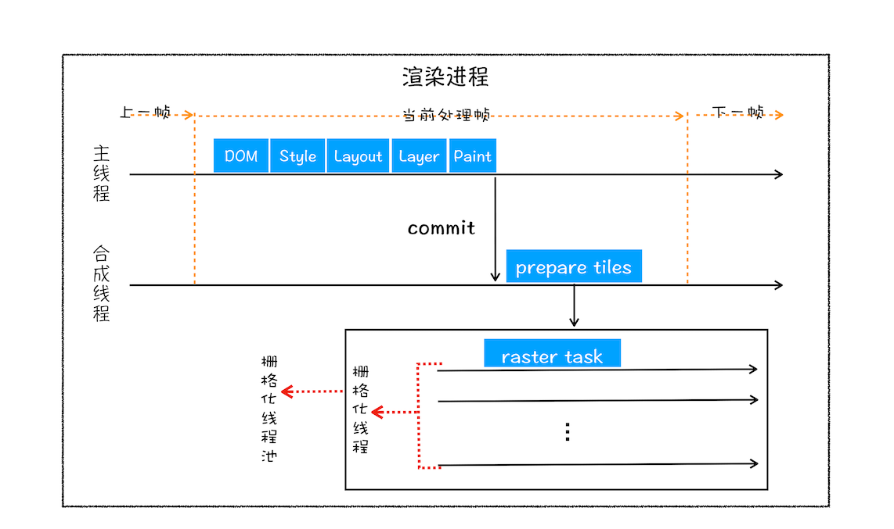

   通常，栅格化过程都会使用 GPU 来加速生成，使用 GPU 生成位图的过程叫快速栅格化，或者 GPU 栅格化，生成的位图被保存在 GPU 内存中。GPU 操作是运行在 GPU 进程中，如果栅格化操作使用了 GPU，那么最终生成位图的操作是在 GPU 中完成的，这就涉及到了跨进程操作。具体形式可以参考下图：

   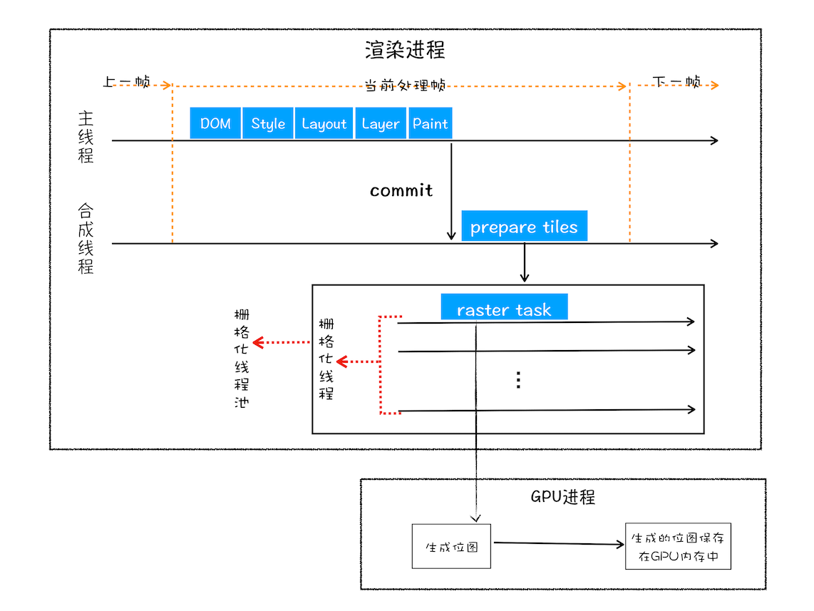

   从图中可以看出，渲染进程把生成图块的指令发送给 GPU，然后在 GPU 中执行生成图块的位图，并保存在 GPU 的内存中。

8. 合成和显示
   一旦所有图块都被光栅化，合成线程就会生成一个绘制图块的命令——“DrawQuad”，然后将该命令提交给浏览器进程。浏览器进程里面有一个叫 viz 的组件，用来接收合成线程发过来的 DrawQuad 命令，然后根据 DrawQuad 命令，将其页面内容绘制到内存中，最后再将内存显示在屏幕上。

**渲染流水线总结**：


一个完整的渲染流程大致可总结为如下：

1. 渲染进程将 HTML 内容转换为能够读懂的 **DOM 树**结构。
2. 渲染引擎将 CSS 样式表转化为浏览器可以理解的 **styleSheets**，计算出 DOM 节点的样式。
3. 创建**布局树**，并计算元素的布局信息。
4. 对布局树进行分层，并生成**分层树**。
5. 为每个图层生成**绘制列表**，并将其提交到合成线程。
6. 合成线程将图层分成**图块**，并在光栅化线程池中将图块转换成位图。
7. 合成线程发送绘制图块命令 **DrawQuad** 给浏览器进程。
8. 浏览器进程根据 DrawQuad 消息**生成页面**，并显示到显示器上。

#### 2.5.1 相关概念

1. **更新了元素的几何属性（重排）**

   

   从上图可以看出，如果通过 JS 或者 CSS 修改元素的几何位置属性，例如改变元素的宽度、高度等，那么浏览器会触发重新布局，解析之后的一系列子阶段，这个过程就叫重排。无疑，**重排需要更新完整的渲染流水线，所以开销也是最大的**。

2. **更新元素的绘制属性（重绘）**

   比如通过 JS 更改某些元素的背景颜色，渲染流水线会怎样调整呢？可以参考下图：

   

   从图中可以看出，如果修改了元素的背景颜色，那么布局阶段将不会被执行，因为并没有引起几何位置的变换，所以就直接进入了绘制阶段，然后执行之后的一系列子阶段，这个过程就叫重绘。**相较于重排操作，重绘省去了布局和分层阶段，所以执行效率会比重排操作要高一些**。

3. **直接合成**

   如果更改一个既不要布局也不要绘制的属性，渲染引擎将跳过布局和绘制，只执行后续的合成操作，把这个过程叫做合成。

   

   直接在非主线程上执行合成动画操作。这样的效率是最高的，因为是在非主线程上合成，并没有占用主线程的资源，另外也避开了布局和绘制两个子阶段，所以相对于重绘和重排，合成能大大提升绘制效率。

## 三. 浏览器中的 JS 执行机制

### 3.1 变量提升和 JS 执行流程

**变量提升，是指在 JS 代码执行过程中，JS 引擎把变量的声明部分和函数的声明部分提升到代码开头的 “行为”。变量被提升后，会给变量设置默认值，这个默认值是 undefined**。

**JS 代码的执行流程**
从概念的字面意义上来看，“变量提升” 意味着变量和函数的声明会在物理层面移动到代码的最前面。但，这并不准确。实际上变量和函数声明在代码里的位置是不会改变的，而且是在编译阶段被 JS 引擎放入内存中。一段 JS 代码在执行之前需要被 JS 引擎编译，编译完成之后，才会进入执行阶段。大致流程可以参考下图：


1. **编译阶段**
   可以把 JS 的执行流程细化，如下图所示：

   

   从上图可以看出，输入一段代码，经过编译后，会生成两部分内容：

   - **执行上下文**（Execution context）
     **执行上下文是 JS 执行一段代码时的运行环境**，比如调用一个函数，就会进入这个函数的执行上下文，确定该函数在执行期间用到的诸如 this、变量、对象以及函数等。

     在执行上下文中存在一个**变量环境的对象**（Variable Environment），该对象中保存了变量提升的内容，比如上面代码中的变量 myname 和函数 showName，都保存在该对象中。

   - **可执行代码**

   > 如果在编译阶段，存在两个相同的函数，那么最终存放在变量环境中的是最后定义的那个，这是因为后定义的会覆盖掉之前定义的。

2. **执行阶段**：JS 引擎开始执行 “可执行代码”，按照顺序一行一行地执行。

### 3.2 调用栈：为什么 JS 代码会出现栈溢出？

哪些情况下代码才算是 “一段” 代码，才会在执行之前就进行编译并创建执行上下文。一般说来，有这么三种情况：

- 当 JS 执行全局代码的时候，会编译全局代码并创建全局执行上下文，而且在整个页面的生存周期内，全局执行上下文只有一份。
- 当调用一个函数的时候，函数体内的代码会被编译，并创建函数执行上下文，一般情况下，函数执行结束之后，创建的函数执行上下文会被销毁。
- 当使用 eval 函数的时候，eval 的代码也会被编译，并创建执行上下文。

JS 中有很多函数，经常会出现在一个函数中调用另外一个函数的情况，**调用栈就是用来管理函数调用关系的一种数据结构**。因此明白调用栈，还要先弄明白**函数调用**和**栈结构**。

**函数调用**
函数调用就是运行一个函数

```js
var a = 2;
function add() {
  var b = 10;
  return a + b;
}
add();
```

函数调用过程：

- 在执行到函数 add() 之前，JS 引擎会为上面这段代码创建全局执行上下文，包含了声明的函数和变量。

  

  从图中可以看出，代码中全局变量和函数都保存在全局上下文的变量环境中。

- 执行上下文准备好之后，便开始执行全局代码，当执行到 add 这儿时，JS 判断这是一个函数调用，那么将执行以下操作：

  - 首先，从**全局执行上下文**中，取出 add 函数代码。
  - 其次，对 add 函数的这段代码进行编译，并创建该函数的执行上下文和可执行代码。
  - 最后，执行代码，输出结果。

  

就这样，当执行到 add 函数的时候，就有了两个执行上下文了——全局执行上下文和 add 函数的执行上下文。也就是说在执行 JS 时，可能会存在多个执行上下文，**JS 引擎通过一种叫栈的数据结构来管理执行上下文**。

**栈结构**
栈类似于一端被堵住的单行线，车子类似于栈中的元素，栈中的元素满足**后进先出**的特点。

JS 引擎正是利用栈的这种结构来管理执行上下文的。在执行上下文创建好后，JS 引擎会将执行上下文压入栈中，通常把这种用来管理执行上下文的栈称为**执行上下文栈**，又称**调用栈**。

**调用栈是 JS 引擎追踪函数执行的一个机制**，当一次有多个函数被调用时，通过调用栈就能够追踪到哪个函数正在被执行以及各函数之间的调用关系。

查看和利用调用栈：

1. **利用浏览器查看调用栈的信息**
   可以打开 “开发者工具”，点击 “Source” 标签，选择 JS 代码的页面，然后加上断点并执行到对应位置，执行流程中断，这时可以通过右边 “call stack” 来查看当前的调用栈的情况，如下图：

   

   在分析复杂结构代码，或者检查 Bug 时，调用栈都是非常有用的。除了通过断点来查看调用栈，还可以使用 `console.trace()` 来输出当前的函数调用关系，比如在示例代码中的 add 函数里面加上了 console.trace()，就可以看到控制台输出的结果，如下图：

   

2. **栈溢出**（Stack Overflow）

   **调用栈是有大小的**，当入栈的执行上下文超过一定数目，JS 引擎就会报错，这种错误叫做栈溢出。特别是在写递归代码的时候，就很容易出现栈溢出的情况。比如下面这段代码：

   ```js
   function division(a, b) {
     return division(a, b);
   }
   console.log(division(1, 2));
   ```

   当执行时，就会抛出栈溢出错误：超过了最大栈调用大小（Maximum call stack size exceeded）。这是因为当 JS 引擎开始执行这段代码时，它首先调用函数 division，并创建执行上下文，压入栈中；然而，这个函数是递归的，并且没有任何终止条件，所以它会一直创建新的函数执行上下文，并反复将其压入栈中，但栈是有容量限制的，超过最大数量后就会出现栈溢出的错误。

### 3.3 var 缺陷与块级作用域

**由于 JS 存在变量提升这种特性，从而导致了很多与直觉不符的代码，这也是 JS 的一个重要设计缺陷**。

**作用域**（scope）
**作用域是指在程序中定义变量的区域，该位置决定了变量的生命周期。通俗地理解，作用域就是变量与函数的可访问范围，即作用域控制着变量和函数的可见性和生命周期**。

在 ES6 之前，JS 的作用域只有两种：

- **全局作用域**中的对象在代码中的任何地方都能访问，其生命周期伴随着页面的生命周期。
- **函数作用域**就是在函数内部定义的变量或者函数，并且定义的变量或者函数只能在函数内部被访问。函数执行结束之后，函数内部定义的变量会被销毁。

相较而言，其他语言则都普遍支持块级作用域。**块级作用域就是使用一对大括号包裹的一段代码**，比如函数、判断语句、循环语句，甚至单独的一个 {} 都可以被看作是一个块级作用域。

如果一种语言支持块级作用域，那么其代码块内部定义的变量在代码块外部是访问不到的，并且等该代码块中的代码执行完成之后，代码块中定义的变量会被销毁。

ES6 之前是不支持块级作用域的，因为当初设计这门语言的时候，只是按照最简单的方式来设计。没有了块级作用域，再把作用域内部的变量统一提升无疑是最快速、最简单的设计，不过这也直接导致了函数中的变量无论是在哪里声明的，在编译阶段都会被提取到执行上下文的变量环境中，所以这些变量在整个函数体内部的任何地方都是能被访问的，这也就是 JS 中的变量提升。

**变量提升所带来的问题与解决方案**
由于变量提升作用，使用 JS 来编写和其他语言相同逻辑的代码，都有可能会导致不一样的执行结果：

1. 变量容易在不被察觉的情况下被覆盖掉
2. 本应销毁的变量没有被销毁

为了解决这些问题，ES6 引入了 let 和 const 关键字，从而使 JS 也能像其他语言一样拥有了块级作用域。这两者之间的区别是，使用 let 关键字声明的变量是可以被改变的，而使用 const 声明的变量其值是不可以被改变的。

let 和 const 关键字是支持块级作用域的，所以在编译阶段，JS 引擎并不会把作用域块中 let 声明的变量存放到变量环境中，并不会提升到全函数可见。**作用域块内声明的变量不影响块外面的变量**。

**JS 是如何支持块级作用域的**
JS 引擎是通过变量环境实现函数级作用域的，那么 ES6 又是如何在函数级作用域的基础之上，实现对块级作用域的支持呢？可以先看下面这段代码：

```js
function foo() {
  var a = 1;
  let b = 2;
  {
    let b = 3;
    var c = 4;
    let d = 5;
    console.log(a);
    console.log(b);
  }
  console.log(b);
  console.log(c);
  console.log(d);
}
foo();
```

当执行上面这段代码的时候，JS 引擎会先对其进行编译并创建执行上下文，然后再按照顺序执行代码：

1. 第一步是编译并创建执行上下文

   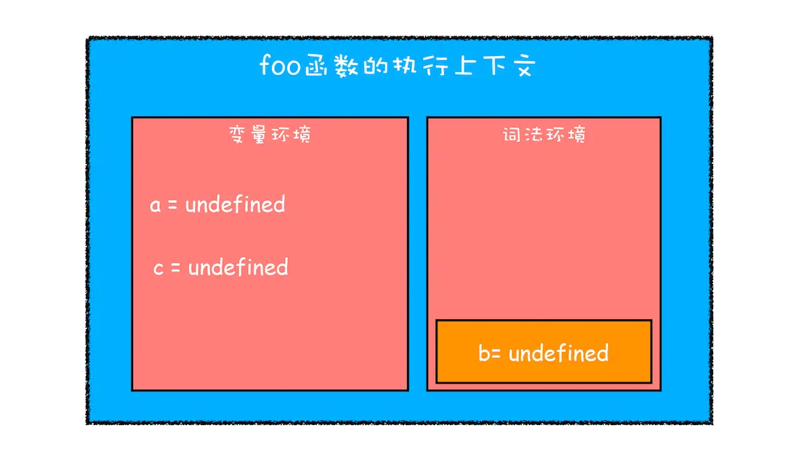

   通过上图，可以得出以下结论：

   - 函数内部通过 var 声明的变量，在编译阶段全都被存放到变量环境里面了。
   - 通过 let 声明的变量，在编译阶段会被存放到词法环境（Lexical Environment）中。
   - 在函数的作用域块内部，通过 let 声明的变量并没有被存放到词法环境中。

2. 第二步继续执行代码

   当执行到代码块里面时，变量环境中 a 的值已经被设置成了 1，词法环境中 b 的值已经被设置成了 2，这时候函数的执行上下文就如下图所示：

   

   从图中可以看出，当进入函数的作用域块时，作用域块中通过 let 声明的变量，会被存放在词法环境的一个单独的区域中，这个区域中的变量并不影响作用域块外面的变量。其实，在词法环境内部，维护了一个小型栈结构，栈底是函数最外层的变量，进入一个作用域块后，就会把该作用域块内部的变量压到栈顶；当作用域执行完成之后，该作用域的信息就会从栈顶弹出，这就是词法环境的结构。

   再接下来，当执行到作用域块中的 `console.log(a)` 这行代码时，就需要在词法环境和变量环境中查找变量 a 的值了，具体查找方式是：沿着词法环境的栈顶向下查询，如果在词法环境中的某个块中查找到了，就直接返回给 JS 引擎，如果没有查找到，那么继续在变量环境中查找。

   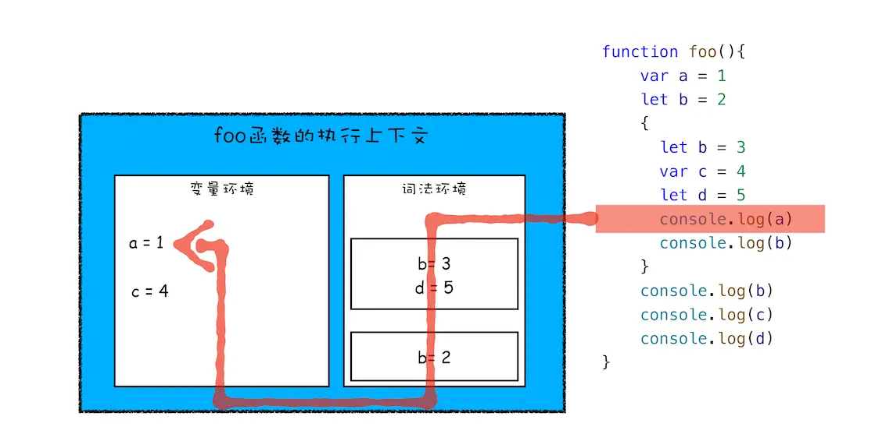

   当作用域块执行结束之后，其内部定义的变量就会从词法环境的栈顶弹出，最终执行上下文如下图所示：

   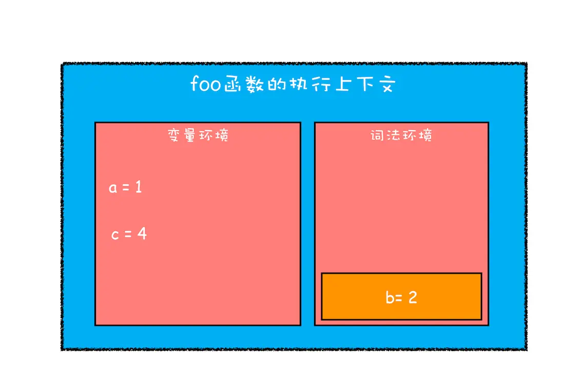

   块级作用域就是通过词法环境的栈结构来实现的，而变量提升是通过变量环境来实现，通过这两者的结合，JS 引擎也就同时支持了变量提升和块级作用域了。

### 3.4 作用域链和闭包

通过词法环境和变量环境来查找变量，这其中涉及到作用域链的概念。理解作用域链是理解闭包的基础，而闭包在 JS 中几乎无处不在，同时作用域和作用域链还是所有编程语言的基础。

```js
function bar() {
  console.log(myName);
}
function foo() {
  var myName = '极客邦';
  bar();
}
var myName = '极客时间';
foo();
```

当这段代码执行到 bar 函数内部时，其调用栈的状态图如下所示：

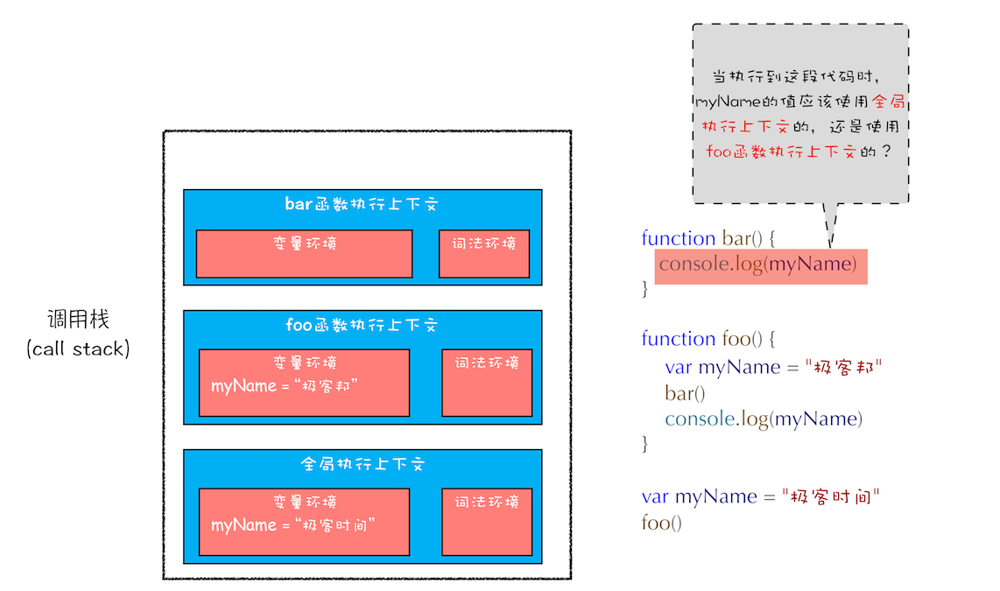

从图中可以看出，全局执行上下文和 foo 函数的执行上下文中都包含变量 myName，那 bar 函数里面 myName 的值到底该选择哪个呢？如果按照调用栈的顺序来查找变量，查找方式如下：

1. 先查找栈顶是否存在 myName 变量，但是这里没有，所以接着往下查找 foo 函数中的变量。
2. 在 foo 函数中查找到了 myName 变量，这时候就使用 foo 函数中的 myName。

那么最终执行 bar 函数打印出来的结果应该是 “极客邦”。但实际情况并非如此，如果执行上述代码，会发现打印出来的结果是 “极客时间”。

**作用域链**
**其实在每个执行上下文的变量环境中，都包含了一个外部引用，用来指向外部的执行上下文，这个外部引用被称为 outer**。

当一段代码使用了一个变量时，JS 引擎首先会在 “当前的执行上下文” 中查找该变量，比如上面那段代码在查找 myName 变量时，如果在当前的变量环境中没有查找到，那么 JS 引擎会继续在 outer 所指向的执行上下文中查找：


从图中可以看出，bar 函数和 foo 函数的 outer 都是指向全局上下文的，这也就意味着如果在 bar 函数或者 foo 函数中使用了外部变量，那么 JS 引擎会去全局执行上下文中查找。这个查找的链条就称为**作用域链**。

**词法作用域**
**词法作用域就是指作用域是由代码中函数声明的位置来决定的，所以词法作用域是静态的作用域，通过它就能够预测代码在执行过程中如何查找标识符**。

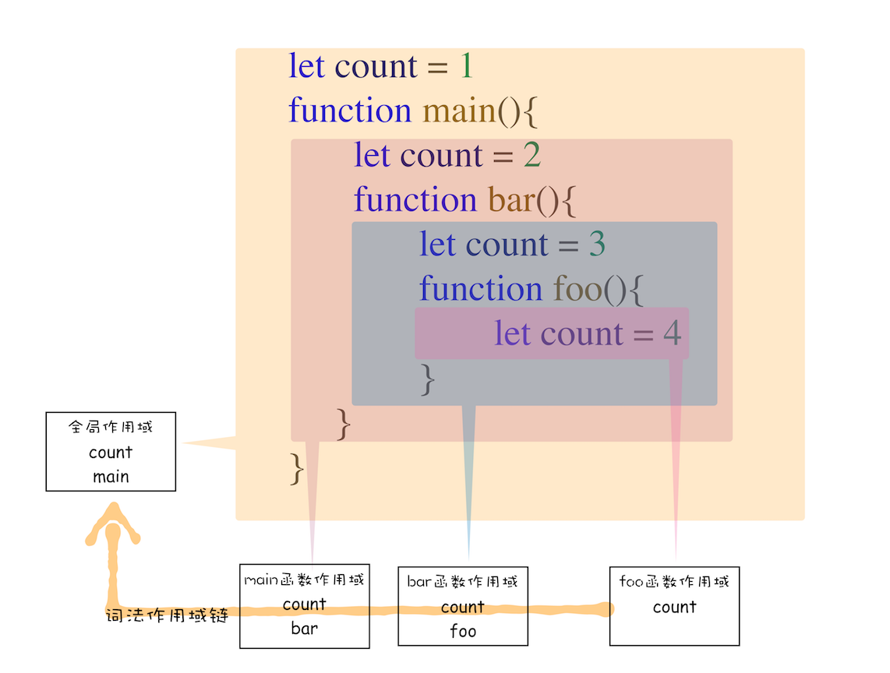

从图中可以看出，词法作用域就是根据代码的位置来决定的，其中 main 函数包含了 bar 函数，bar 函数中包含了 foo 函数，因为 JS 作用域链是由词法作用域决定的，所以整个词法作用域链的顺序是：foo 函数作用域 —> bar 函数作用域 —> main 函数作用域 —> 全局作用域。**词法作用域是代码编译阶段就决定好的，和函数是怎么调用的没有关系**。

**闭包**：

```js
function foo() {
  var myName = '极客时间';
  let test1 = 1;
  const test2 = 2;
  var innerBar = {
    getName: function () {
      console.log(test1);
      return myName;
    },
    setName: function (newName) {
      myName = newName;
    }
  };
  return innerBar;
}
var bar = foo();
bar.setName('极客邦');
bar.getName();
console.log(bar.getName());
```

从上面的代码可以看出，innerBar 是一个对象，包含了 getName 和 setName 的两个方法。可以看到，这两个方法都是在 foo 函数内部定义的，并且这两个方法内部都使用了 myName 和 test1 两个变量。

**根据词法作用域的规则，内部函数 getName 和 setName 总是可以访问它们的外部函数 foo 中的变量**，所以当 innerBar 对象返回给全局变量 bar 时，虽然 foo 函数已经执行结束，但是 getName 和 setName 函数依然可以使用 foo 函数中的变量 myName 和 test1。所以当 foo 函数执行完成之后，其整个调用栈的状态如下图所示：


从上图可以看出，foo 函数执行完成之后，其执行上下文从栈顶弹出了，但是由于返回的 setName 和 getName 方法中使用了 foo 函数内部的变量 myName 和 test1，所以这两个变量依然保存在内存中。这像极了 setName 和 getName 方法背的一个专属背包，无论在哪里调用了 setName 和 getName 方法，它们都会背着这个 foo 函数的专属背包。

之所以是专属背包，是因为除了 setName 和 getName 函数之外，其他任何地方都是无法访问该背包的，就可以把这个背包称为 foo 函数的闭包。**在 JS 中，根据词法作用域的规则，内部函数总是可以访问其外部函数中声明的变量，当通过调用一个外部函数返回一个内部函数后，即使该外部函数已经执行结束了，但是内部函数引用外部函数的变量依然保存在内存中，就把这些变量的集合称为闭包**。比如外部函数是 foo，那么这些变量的集合就称为 foo 函数的闭包。

执行到 bar.setName 方法中的 myName = "极客邦"这句代码时，JS 引擎会沿着 “当前执行上下文–>foo 函数闭包–> 全局执行上下文” 的顺序来查找 myName 变量，可以参考下面的调用栈状态图：


从图中可以看出，setName 的执行上下文中没有 myName 变量，foo 函数的闭包中包含了变量 myName，所以调用 setName 时，会修改 foo 闭包中的 myName 变量的值。也可以通过 “开发者工具” 来看看闭包的情况：

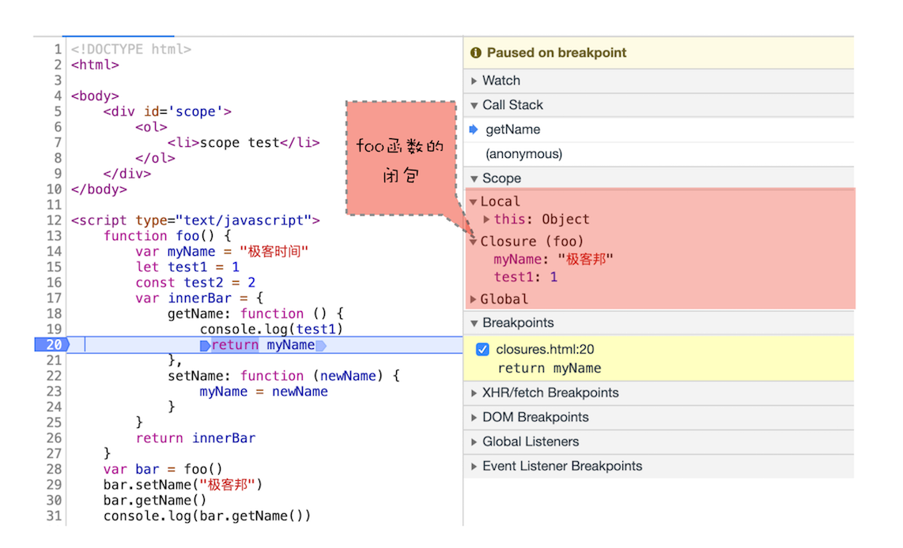

从图中可以看出来，当调用 bar.getName 的时候，右边 Scope 项就体现出了作用域链的情况：Local 就是当前的 getName 函数的作用域，Closure(foo) 是指 foo 函数的闭包，最下面的 Global 就是指全局作用域，从 “Local–>Closure(foo)–>Global” 就是一个完整的作用域链。

**闭包是怎么回收的**
通常，如果引用闭包的函数是一个全局变量，那么闭包会一直存在直到页面关闭；但如果这个闭包以后不再使用的话，就会造成内存泄漏。

如果引用闭包的函数是个局部变量，等函数销毁后，在下次 JS 引擎执行垃圾回收时，判断闭包这块内容如果已经不再被使用了，那么 JS 引擎的垃圾回收器就会回收这块内存。所以在使用闭包的时候，要尽量注意一个原则：**如果该闭包会一直使用，那么它可以作为全局变量而存在；但如果使用频率不高，而且占用内存又比较大的话，那就尽量让它成为一个局部变量**。

### 3.5 从 JS 执行上下文的视角讲清楚 this

在对象内部的方法中使用对象内部的属性是一个非常普遍的需求。但是 JS 的作用域机制并不支持这一点，基于这个需求，JS 又搞出来另外一套 **this 机制**。

**JS 中的 this 是什么**
关于 this，得先从执行上下文说起。执行上下文中包含了变量环境、词法环境、外部环境，但其实还有一个 this 没有提及，具体可以参考下图：

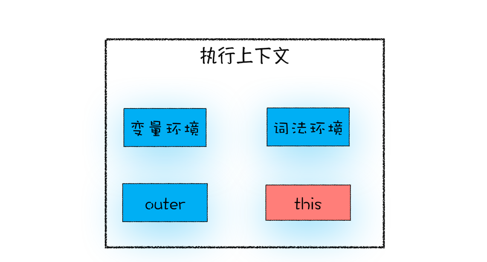

从图中可以看出，**this 是和执行上下文绑定的，也就是说每个执行上下文中都有一个 this**。前面提到过，执行上下文主要分为三种——全局执行上下文、函数执行上下文和 eval 执行上下文，所以对应的 this 也只有这三种——全局执行上下文中的 this、函数中的 this 和 eval 中的 this。eval 基本不使用。

- 全局执行上下文中的 this
  可以在控制台中输入 console.log(this) 来打印出来全局执行上下文中的 this，最终输出的是 window 对象。所以可以得出这样一个结论：**全局执行上下文中的 this 是指向 window 对象的。这也是 this 和作用域链的唯一交点，作用域链的最底端包含了 window 对象，全局执行上下文中的 this 也是指向 window 对象**。

- 函数执行上下文中的 this

  ```js
  function foo() {
    console.log(this);
  }
  foo();
  ```

  在 foo 函数内部打印出来 this 值，执行这段代码，打印出来的也是 window 对象，这说明在默认情况下调用一个函数，其执行上下文中的 this 也是指向 window 对象的。通常情况下，有下面三种方式来设置函数执行上下文中的 this 值：

  1. 通过函数的 call 方法设置

     ```js
     let bar = {
       myName: '极客邦',
       test1: 1
     };
     function foo() {
       this.myName = '极客时间';
     }
     foo.call(bar);
     console.log(bar);
     console.log(myName);
     ```

     执行这段代码，然后观察输出结果，就能发现 foo 函数内部的 this 已经指向了 bar 对象，因为通过打印 bar 对象，可以看出 bar 的 myName 属性已经由 “极客邦” 变为 “极客时间” 了，同时在全局执行上下文中打印 myName，JS 引擎提示该变量未定义。除了 call 方法，还可以使用 bind 和 apply 方法来设置函数执行上下文中的 this。

  2. 通过对象调用方法设置

     ```js
     var myObj = {
       name: '极客时间',
       showThis: function () {
         console.log(this);
       }
     };
     myObj.showThis();
     ```

     执行这段代码，可以看到，最终输出的 this 值是指向 myObj 的。所以，可以得出这样的结论：**使用对象来调用其内部的一个方法，该方法的 this 是指向对象本身的**。

     也可以认为 JS 引擎在执行 myObject.showThis() 时，将其转化为了：

     ```js
     myObj.showThis.call(myObj);
     ```

     接下来稍微改变下调用方式，把 showThis 赋给一个全局对象，然后再调用该对象，代码如下所示：

     ```js
     var myObj = {
       name: '极客时间',
       showThis: function () {
         this.name = '极客邦';
         console.log(this);
       }
     };
     var foo = myObj.showThis;
     foo();
     ```

     执行这段代码，会发现 this 又指向了全局 window 对象。所以通过以上两个例子的对比，可以得出下面这样两个结论：

     - **在全局环境中调用一个函数，函数内部的 this 指向的是全局变量 window**。
     - **通过一个对象来调用其内部的一个方法，该方法的执行上下文中的 this 指向对象本身**。

  3. 通过构造函数中设置

     ```js
     function CreateObj() {
       this.name = '极客时间';
     }
     var myObj = new CreateObj();
     ```

     在这段代码中，使用 new 创建了对象 myObj，当执行 new CreateObj() 的时候，JS 引擎做了如下四件事：

     - 首先创建了一个空对象 tempObj；
     - 接着调用 CreateObj.call 方法，并将 tempObj 作为 call 方法的参数，这样当 CreateObj 的执行上下文创建时，它的 this 就指向了 tempObj 对象；
     - 然后执行 CreateObj 函数，此时的 CreateObj 函数执行上下文中的 this 指向了 tempObj 对象；
     - 最后返回 tempObj 对象。

     这样，就通过 new 关键字构建好了一个新对象，并且构造函数中的 this 其实就是新对象本身。

**this 的设计缺陷以及应对方案**
this 并不是一个很好的设计，因为它的很多使用方法都冲击人的直觉，在使用过程中存在着非常多的坑。

1. 嵌套函数中的 this 不会从外层函数中继承

   ```js
   var myObj = {
     name: '极客时间',
     showThis: function () {
       console.log(this);
       function bar() {
         console.log(this);
       }
       bar();
     }
   };
   myObj.showThis();
   ```

   如果是刚接触 JS，那么可能会很自然地觉得，bar 中的 this 应该和其外层 showThis 函数中的 this 是一致的，都是指向 myObj 对象的，这很符合人的直觉。但实际情况却并非如此，执行这段代码后，会发现**函数 bar 中的 this 指向的是全局 window 对象，而函数 showThis 中的 this 指向的是 myObj 对象。这就是 JS 中非常容易让人迷惑的地方之一，也是很多问题的源头**。

   可以通过一个小技巧来解决这个问题，比如在 showThis 函数中声明一个变量 self 用来保存 this，然后在 bar 函数中使用 self，代码如下所示：

   ```js
   var myObj = {
     name: '极客时间',
     showThis: function () {
       console.log(this);
       var self = this;
       function bar() {
         self.name = '极客邦';
       }
       bar();
     }
   };
   myObj.showThis();
   console.log(myObj.name);
   console.log(window.name);
   ```

   执行这段代码，可以看到它输出了想要的结果，最终 myObj 中的 name 属性值变成了 “极客邦”。其实，**这个方法的的本质是把 this 体系转换为了作用域的体系**。

   也可以使用 ES6 中的箭头函数来解决这个问题，这是因为 **ES6 中的箭头函数并不会创建其自身的执行上下文，所以箭头函数中的 this 取决于它的外部函数**。

2. 普通函数中的 this 默认指向全局对象 window

   在默认情况下调用一个函数，其执行上下文中的 this 是默认指向全局对象 window 的。

   不过这个设计也是一种缺陷，因为在实际工作中，并不希望函数执行上下文中的 this 默认指向全局对象，因为这样会打破数据的边界，造成一些误操作。如果要让函数执行上下文中的 this 指向某个对象，最好的方式是通过 call 方法来显示调用。

   这个问题可以通过设置 JS 的 “严格模式” 来解决。**在严格模式下，默认执行一个函数，其函数的执行上下文中的 this 值是 undefined**，这就解决上面的问题了。

## 四. V8 工作原理

### 4.1 数据储存：栈空间和堆空间

```js
function foo() {
  var a = 1;
  var b = a;
  a = 2;
  console.log(a);
  console.log(b);
}
foo();
```

```js
function foo() {
  var a = { name: '极客时间' };
  var b = a;
  a.name = '极客邦';
  console.log(a);
  console.log(b);
}
foo();
```

执行第一段代码，打印出来 a 的值是 2，b 的值是 1。接着，再执行第二段代码，会发现，仅仅改变了 a 中 name 的属性值，但是最终 a 和 b 打印出来的值都是 {name: "极客邦"}。这就和预期的不一致了，因为想改变的仅仅是 a 的内容，但 b 的内容也同时被改变了。要彻底弄清楚这个问题，就得先从 “JS 是什么类型的语言” 讲起。

**在使用之前就需要确认其变量数据类型的称为静态语言**。相反地，把**在运行过程中需要检查数据类型的语言称为动态语言**。JS 就是动态语言，因为在声明变量之前并不需要确认其数据类型。

在 C 语言中，可以把其他类型数据赋予给一个声明好的变量，如：

```c
int a = 1;
bool c = true;
c = a;
```

这里把 int 型的变量 a 赋值给了 bool 型的变量 c，这段代码也是可以编译执行的，因为在赋值过程中，C 编译器会把 int 型的变量悄悄转换为 bool 型的变量，通常把这种**偷偷转换的操作称为隐式类型转换。而支持隐式类型转换的语言称为弱类型语言，不支持隐式类型转换的语言称为强类型语言**。在这点上，C 和 JS 都是弱类型语言。


**JS 是一种弱类型的、动态的语言**：

- **弱类型**：意味着不需要告诉 JS 引擎这个或那个变量是什么数据类型，JS 引擎在运行代码的时候自己会计算出来。
- **动态**：意味着可以使用同一个变量保存不同类型的数据。

**内存空间**
要理解 JS 在运行过程中数据是如何存储的，得先搞清楚其存储空间的种类：

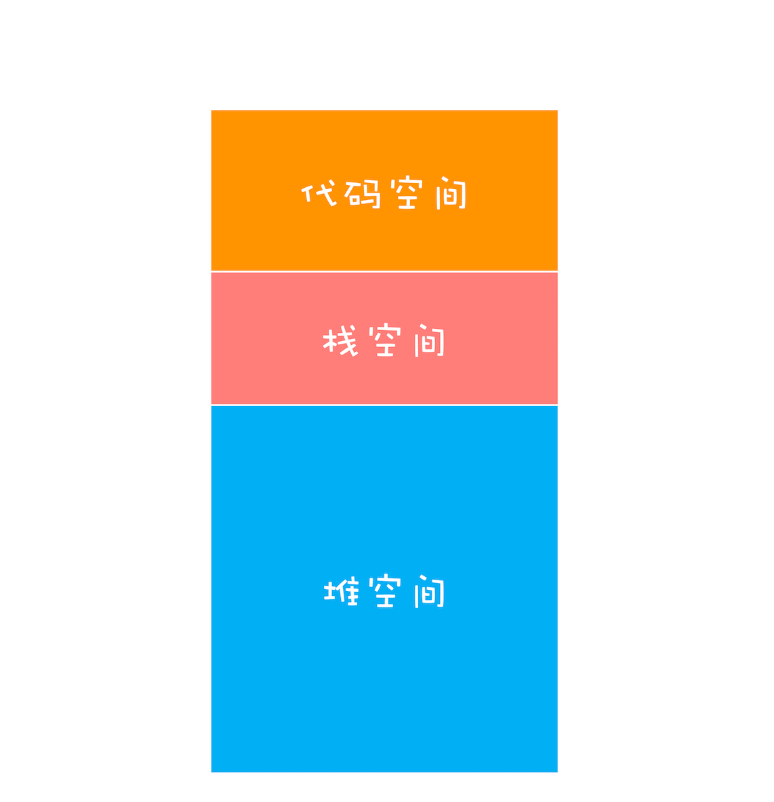

在 JS 的执行过程中，**主要有三种类型内存空间，分别是代码空间、栈空间和堆空间**。其中的代码空间主要是存储可执行代码的。

这里的栈空间就是之前反复提及的调用栈，是用来存储执行上下文的。看下面这段代码：

```js
function foo() {
  var a = '极客时间';
  var b = a;
  var c = { name: '极客时间' };
  var d = c;
}
foo();
```

当执行一段代码时，需要先编译，并创建执行上下文，然后再按照顺序执行代码。那当执行到第 3 行代码时，其调用栈的状态，可以参考下面这张调用栈状态图：


从图中可以看出来，当执行到第 3 行时，变量 a 和变量 b 的值都被保存在执行上下文中，而执行上下文又被压入到栈中，所以也可以认为变量 a 和变量 b 的值都是存放在栈中的。

继续执行第 4 行代码，由于 JS 引擎判断右边的值是一个引用类型，这时候处理的情况就不一样了，JS 引擎并不是直接将该对象存放到变量环境中，而是将它分配到堆空间里面，分配后该对象会有一个在 “堆” 中的地址，然后再将该数据的地址写进 c 的变量值，最终分配好内存的示意图如下所示：


对象类型是存放在堆空间的，在栈空间中只是保留了对象的引用地址，当 JS 需要访问该数据的时候，是通过栈中的引用地址来访问的，相当于多了一道转手流程。

从上可以知道**原始类型的数据值都是直接保存在 “栈” 中的，引用类型的值是存放在 “堆” 中的**。为什么一定要分 “堆” 和 “栈” 两个存储空间呢？这是因为 JS 引擎需要用栈来维护程序执行期间上下文的状态，如果所有的数据都存放在栈空间里，那么会影响到上下文切换的效率，进而又影响到整个程序的执行效率。

比如文中的 foo 函数执行结束了，JS 引擎需要离开当前的执行上下文，只需要将指针下移到上个执行上下文的地址就可以了，foo 函数执行上下文栈区空间全部回收，具体过程可以参考下图：

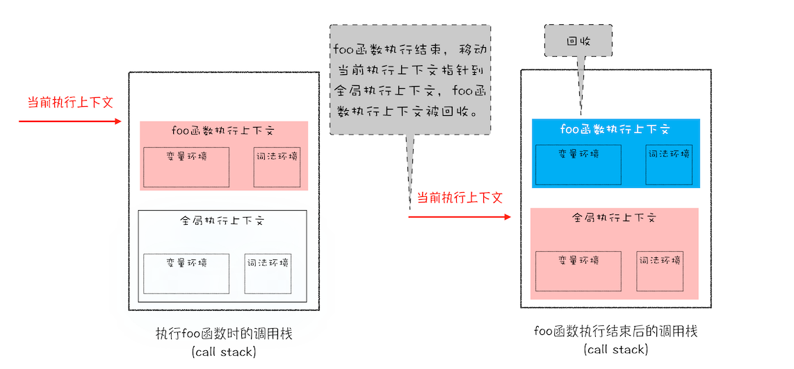

所以**通常情况下，栈空间都不会设置太大，主要用来存放一些原始类型的小数据**。而引用类型的数据占用的空间都比较大，所以这一类数据会被存放到堆中，**堆空间很大，能存放很多大的数据**，不过缺点是分配内存和回收内存都会占用一定的时间。

在 JS 中，赋值操作和其他语言有很大的不同，**原始类型的赋值会完整复制变量值，而引用类型的赋值是复制引用地址**。

### 4.2 垃圾自动回收

有些数据被使用之后，可能就不再需要了，这种数据被称为**垃圾数据**。如果这些垃圾数据一直保存在内存中，那么内存会越用越多，所以需要**对垃圾数据进行回收，以释放有限的内存空间**。

**不同语言的垃圾回收策略**
通常情况下，垃圾数据回收分为以下两种策略：

- **手动回收**

  如 C/C++ 就是使用手动回收策略，何时分配内存、何时销毁内存都是由代码控制的：

  ```c++
   // 在堆中分配内存
   char* p =  (char*)malloc(2048);  // 在堆空间中分配2048字节的空间，并将分配后的引用地址保存到p中
   //使用p指向的内存
   {
      //....
   }
   //使用结束后，销毁这段内存
   free(p)；
   p = NULL；
  ```

  从上面这段 C 代码可以看出来，要使用堆中的一块空间，需要先调用 mallco 函数分配内存，然后再使用；当不再需要这块数据的时候，就要手动调用 free 函数来释放内存。如果这段数据已经不再需要了，但是又没有主动调用 free 函数来销毁，那么这种情况就被称为**内存泄漏**。

- **自动回收**

  如 JS、Java、Python 等语言，**产生的垃圾数据是由垃圾回收器来释放**的，并不需要手动通过代码来释放。

**调用栈中的数据是如何回收的**
通过一段示例代码的执行流程来分析其回收机制：

```js
function foo() {
  var a = 1;
  var b = { name: '极客邦' };
  function showName() {
    var c = 2;
    var d = { name: '极客时间' };
  }
  showName();
}
foo();
```

当执行到第 6 行代码时，其调用栈和堆空间状态图如下所示：

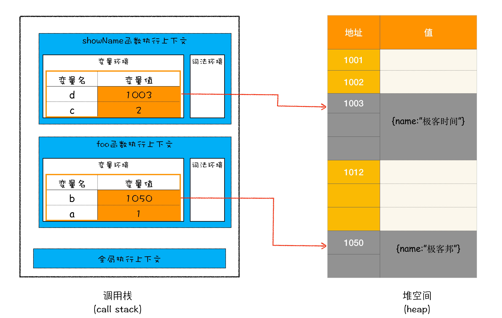

如果执行到 showName 函数时，那么 JS 引擎会创建 showName 函数的执行上下文，并将 showName 函数的执行上下文压入到调用栈中，最终执行到 showName 函数时，其调用栈就如上图所示。与此同时，还**有一个记录当前执行状态的指针（称为 ESP）**，指向调用栈中 showName 函数的执行上下文，表示当前正在执行 showName 函数。

接着，当 showName 函数执行完成之后，函数执行流程就进入了 foo 函数，这时就需要销毁 showName 函数的执行上下文了。ESP 这时候就帮上忙了，JS 会将 ESP 下移到 foo 函数的执行上下文，**这个下移操作就是销毁 showName 函数执行上下文的过程**。具体可以看下面这张移动 ESP 前后的对比图：


从图中可以看出，当 showName 函数执行结束之后，ESP 向下移动到 foo 函数的执行上下文中，上面 showName 的执行上下文虽然保存在栈内存中，但是已经是无效内存了。比如当 foo 函数再次调用另外一个函数时，这块内容会被直接覆盖掉，用来存放另外一个函数的执行上下文。

所以，**当一个函数执行结束之后，JS 引擎会通过向下移动 ESP 来销毁该函数保存在栈中的执行上下文**。

当上面那段代码的 foo 函数执行结束之后，ESP 是指向全局执行上下文的，那这样的话，showName 函数和 foo 函数的执行上下文就处于无效状态了，不过保存在堆中的两个对象依然占用着空间，**要回收堆中的垃圾数据，就需要用到 JS 中的垃圾回收器了**。

**代际假说和分代收集**
**代际假说**（The Generational Hypothesis）的内容，这是垃圾回收领域中一个重要的术语，后续垃圾回收的策略都是建立在该假说的基础之上的。代际假说有以下两个特点：

- 大部分对象在内存中存在的时间很短，简单来说，就是很多对象一经分配内存，很快就变得不可访问；
- 不死的对象，会活得更久。

其实这两个特点不仅仅适用于 JS，同样适用于大多数的动态语言，如 Java、Python 等。

通常，垃圾回收算法有很多种，但是并没有哪一种能胜任所有的场景，需要权衡各种场景，根据对象的生存周期的不同而使用不同的算法，以便达到最好的效果。所以，在 V8 中会把堆分为**新生代**和**老生代**两个区域，**新生代中存放的是生存时间短的对象，老生代中存放的生存时间久的对象**。

新生区通常只支持 1 ～ 8M 的容量，而老生区支持的容量就大很多了。对于这两块区域，V8 分别使用两个不同的垃圾回收器，以便更高效地实施垃圾回收。

- **副垃圾回收器，主要负责新生代的垃圾回收**。
- **主垃圾回收器，主要负责老生代的垃圾回收**。

**垃圾回收器的工作流程**
**不论什么类型的垃圾回收器，它们都有一套共同的执行流程**。

1. 第一步是标记空间中活动对象和非活动对象。所谓活动对象就是还在使用的对象，非活动对象就是可以进行垃圾回收的对象。
2. 第二步是回收非活动对象所占据的内存。其实就是在所有的标记完成之后，统一清理内存中所有被标记为可回收的对象。
3. 第三步是做内存整理。一般来说，频繁回收对象后，内存中就会存在大量不连续空间，这些不连续的内存空间称为**内存碎片**。当内存中出现了大量的内存碎片之后，如果需要分配较大连续内存的时候，就有可能出现内存不足的情况。所以最后一步需要整理这些内存碎片，但这步其实是可选的，因为有的垃圾回收器不会产生内存碎片，比如副垃圾回收器。

**副垃圾回收器**
副垃圾回收器主要负责新生区的垃圾回收。而通常情况下，大多数小的对象都会被分配到新生区，所以说这个区域虽然不大，但是垃圾回收还是比较频繁的。

新生代中用 Scavenge 算法来处理。所谓 Scavenge 算法，是把新生代空间对半划分为两个区域，一半是对象区域，一半是空闲区域，如下图所示：

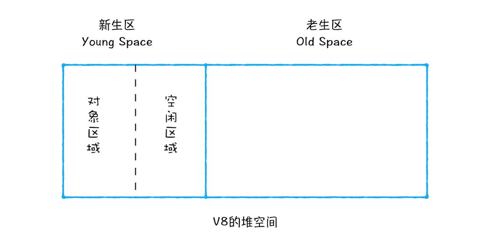

新加入的对象都会存放到对象区域，当对象区域快被写满时，就需要执行一次垃圾清理操作。

在垃圾回收过程中，首先要对对象区域中的垃圾做标记；标记完成之后，就进入垃圾清理阶段，副垃圾回收器会把这些存活的对象复制到空闲区域中，同时它还会把这些对象有序地排列起来，所以这个复制过程，也就相当于完成了内存整理操作，复制后空闲区域就没有内存碎片了。

完成复制后，对象区域与空闲区域进行角色翻转，也就是原来的对象区域变成空闲区域，原来的空闲区域变成了对象区域。这样就完成了垃圾对象的回收操作，同时**这种角色翻转的操作还能让新生代中的这两块区域无限重复使用下去**。

由于新生代中采用的 Scavenge 算法，所以每次执行清理操作时，都需要将存活的对象从对象区域复制到空闲区域。但复制操作需要时间成本，如果新生区空间设置得太大了，那么每次清理的时间就会过久，所以**为了执行效率，一般新生区的空间会被设置得比较小**。

也正是因为新生区的空间不大，所以很容易被存活的对象装满整个区域。为了解决这个问题，JS 引擎采用了**对象晋升策略**，也就是经过两次垃圾回收依然还存活的对象，会被移动到老生区中。

**主垃圾回收器**
主垃圾回收器主要负责老生区中的垃圾回收。除了新生区中晋升的对象，一些大的对象会直接被分配到老生区。因此老生区中的对象有两个特点：

- 对象占用空间大。
- 对象存活时间长。

由于老生区的对象比较大，若要在老生区中使用 Scavenge 算法进行垃圾回收，复制这些大的对象将会花费比较多的时间，从而导致回收执行效率不高，同时还会浪费一半的空间。因而，主垃圾回收器是采用**标记 - 清除**（Mark-Sweep）的算法进行垃圾回收的。

1. 首先是标记过程阶段。标记阶段就是从一组根元素开始，递归遍历这组根元素，在这个遍历过程中，能找到引用的元素称为**活动对象**，没有引用的元素就可以判断为**垃圾数据**。

2. 接下来就是垃圾的清除过程。它和副垃圾回收器的垃圾清除过程完全不同，可以理解这个过程是清除掉红色标记数据的过程，可参考下图大致理解下其清除过程：

   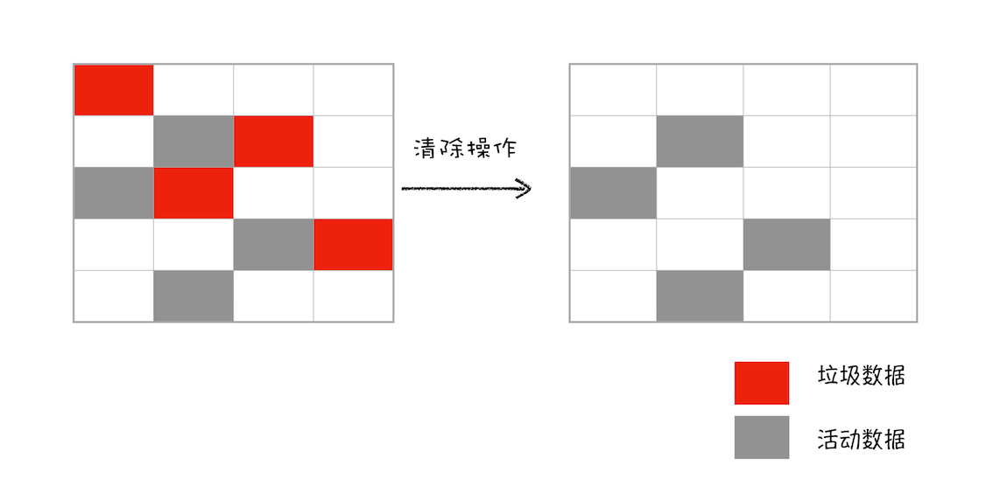

上面的标记过程和清除过程就是标记 - 清除算法，不过对一块内存多次执行标记 - 清除算法后，会产生大量不连续的内存碎片。而碎片过多会导致大对象无法分配到足够的连续内存，于是又产生了另外一种算法——**标记 - 整理**（Mark-Compact），这个标记过程仍然与标记 - 清除算法里的是一样的，但后续步骤不是直接对可回收对象进行清理，而是让所有存活的对象都向一端移动，然后直接清理掉端边界以外的内存。


**全停顿**
由于 JS 是运行在主线程之上的，一旦执行垃圾回收算法，都需要将正在执行的 JS 脚本暂停下来，待垃圾回收完毕后再恢复脚本执行。这种行为被叫做**全停顿**（Stop-The-World）。

比如堆中的数据有 1.5GB，V8 实现一次完整的垃圾回收需要 1 秒以上的时间，这也是由于垃圾回收而引起 JS 线程暂停执行的时间，若是这样的时间花销，那么应用的性能和响应能力都会直线下降。主垃圾回收器执行一次完整的垃圾回收流程如下图所示：

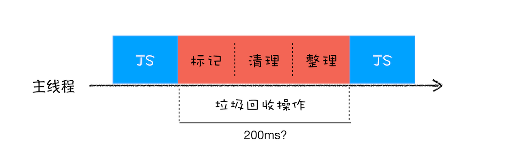

在 V8 新生代的垃圾回收中，因其空间较小，且存活对象较少，所以全停顿的影响不大，但老生代就不一样了。如果在执行垃圾回收的过程中，占用主线程时间过久，就像上面图片展示的那样，花费了 200 毫秒，在这 200 毫秒内，主线程是不能做其他事情的。比如页面正在执行一个 JS 动画，因为垃圾回收器在工作，就会导致这个动画在这 200 毫秒内无法执行的，这将会造成页面的卡顿现象。

**为了降低老生代的垃圾回收而造成的卡顿，V8 将标记过程分为一个个的子标记过程，同时让垃圾回收标记和 JS 应用逻辑交替进行**，直到标记阶段完成，这个算法被称为**增量标记（Incremental Marking）算法**。如下图所示：

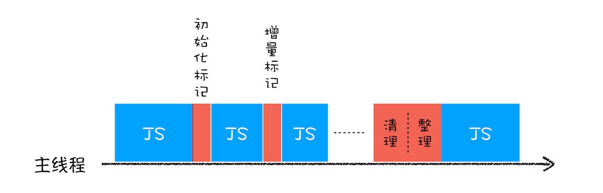

使用增量标记算法，可以把一个完整的垃圾回收任务拆分为很多小的任务，这些小的任务执行时间比较短，可以穿插在其他的 JS 任务中间执行。

### 4.3 编译器和解释器

要深入理解 V8 的工作原理，需要搞清楚一些概念和原理，比如**编译器**（Compiler）、**解释器**（Interpreter）、**抽象语法树**（AST）、**字节码**（Bytecode）、**即时编译器**（JIT）等概念。
