# CSS

<!-- @import "[TOC]" {cmd="toc" depthFrom=1 depthTo=6 orderedList=false} -->

<!-- code_chunk_output -->

- [CSS](#css)
  - [一. 基础知识](#一-基础知识)
    - [1.1 组织代码](#11-组织代码)
      - [1.1.1 可维护性](#111-可维护性)
      - [1.1.2 HTML 简史](#112-html-简史)
      - [1.1.3 渐进增强](#113-渐进增强)
    - [1.2 创建结构化/语义化富 HTML](#12-创建结构化语义化富-html)
      - [1.2.1 ID 和 c1ass 属性](#121-id-和-c1ass-属性)
      - [1.2.2 结构化元素](#122-结构化元素)
      - [1.2.3 div 和 span](#123-div-和-span)
      - [1.2.4 重新定义的表现性文本元素](#124-重新定义的表现性文本元素)
      - [1.2.5 扩展 HTML 语义](#125-扩展-html-语义)
      - [1.2.6 验证](#126-验证)
    - [1.3 长度单位](#13-长度单位)
    - [1.4 CSS 颜色](#14-css-颜色)
      - [1.4.1 RGB 颜色](#141-rgb-颜色)
      - [1.4.2 CMYK 颜色](#142-cmyk-颜色)
      - [1.4.3 HSL 颜色](#143-hsl-颜色)
      - [1.4.4 RGBA 颜色](#144-rgba-颜色)
    - [1.5 角度单位](#15-角度单位)
    - [1.6 CSS 变量](#16-css-变量)
      - [1.6.1 var()](#161-var)
      - [1.6.2 变量值的类型与作用域](#162-变量值的类型与作用域)
      - [1.6.3 JS 操作](#163-js-操作)
      - [1.6.4 应用场景](#164-应用场景)
        - [1.6.4.1 条形加载条](#1641-条形加载条)
        - [1.6.4.2 心形加载条](#1642-心形加载条)
        - [1.6.4.3 标签导航](#1643-标签导航)
        - [1.6.4.4 悬浮跟踪按钮](#1644-悬浮跟踪按钮)
  - [二. 添加样式](#二-添加样式)
    - [2.1 CSS 语法](#21-css-语法)
      - [2.1.1 at-rule](#211-at-rule)
      - [2.1.2 普通规则](#212-普通规则)
        - [2.1.2.1 声明：属性和值](#2121-声明属性和值)
      - [2.1.3 CSS 函数](#213-css-函数)
        - [2.1.3.1 颜色函数](#2131-颜色函数)
        - [2.1.3.2 属性函数](#2132-属性函数)
        - [2.1.3.3 数学函数](#2133-数学函数)
        - [2.1.3.4 图形函数](#2134-图形函数)
    - [2.2 层叠](#22-层叠)
    - [2.3 层叠上下文](#23-层叠上下文)
      - [2.3.1 层叠等级](#231-层叠等级)
      - [2.3.2 层叠顺序](#232-层叠顺序)
    - [2.4 特殊性](#24-特殊性)
      - [2.4.1 利用层叠次序](#241-利用层叠次序)
      - [2.4.2 控制特殊性](#242-控制特殊性)
    - [2.5 继承](#25-继承)
    - [2.6 为文档应用样式](#26-为文档应用样式)
      - [2.6.1 link 与 style 元素](#261-link-与-style-元素)
      - [2.6.2 性能](#262-性能)
  - [三. 可见格式化模型](#三-可见格式化模型)
    - [3.1 盒模型](#31-盒模型)
      - [3.1.1 盒子大小](#311-盒子大小)
      - [3.1.2 最大值和最小值](#312-最大值和最小值)
    - [3.2 可见格式化模型](#32-可见格式化模型)
      - [3.2.1 匿名盒子](#321-匿名盒子)
      - [3.2.2 外边距折叠](#322-外边距折叠)
      - [3.2.3 包含块](#323-包含块)
      - [3.2.4 相对定位](#324-相对定位)
      - [3.2.5 绝对定位](#325-绝对定位)
      - [3.2.6 固定定位](#326-固定定位)
      - [3.2.7 浮动](#327-浮动)
      - [3.2.8 格式化上下文](#328-格式化上下文)
      - [3.2.9 内在大小与外在大小](#329-内在大小与外在大小)
      - [3.2.10 正常流](#3210-正常流)
        - [3.2.10.1 正常流的使用技巧](#32101-正常流的使用技巧)
    - [3.3 文档流](#33-文档流)
    - [3.4 脱流文档流](#34-脱流文档流)
    - [3.5 其他 CSS 布局模块](#35-其他-css-布局模块)
      - [3.5.1 弹性盒布局](#351-弹性盒布局)
      - [3.5.2 网格布局](#352-网格布局)
      - [3.5.3 多栏布局](#353-多栏布局)
    - [3.6 Region](#36-region)
  - [四. 网页排版](#四-网页排版)
    - [4.1 CSS 的基本排版技术](#41-css-的基本排版技术)
      - [4.1.1 文本颜色](#411-文本颜色)
      - [4.1.2 字体族](#412-字体族)
      - [4.1.3 字型大小与行高](#413-字型大小与行高)
      - [4.1.4 行间距/对齐及行盒子的构造](#414-行间距对齐及行盒子的构造)
    - [4.1.5 文本粗细](#415-文本粗细)
      - [4.1.6 字体样式](#416-字体样式)
      - [4.1.7 大小写变换和小型大写变体](#417-大小写变换和小型大写变体)
      - [4.1.8 控制字母和单词间距](#418-控制字母和单词间距)
    - [4.2 版心宽度/律动和毛边](#42-版心宽度律动和毛边)
      - [4.2.1 文本缩进与对齐](#421-文本缩进与对齐)
      - [4.2.2 连字符](#422-连字符)
      - [4.2.3 多栏文本](#423-多栏文本)
    - [4.3 Web 字体](#43-web-字体)
      - [4.3.1 许可](#431-许可)
      - [4.3.2 @font-face 规则](#432-font-face-规则)
      - [4.3.3 Web 字体/浏览器/性能](#433-web-字体浏览器性能)
      - [4.3.4 使用 JS 加载字体](#434-使用-js-加载字体)
    - [4.4 高级排版特性](#44-高级排版特性)
      - [4.4.1 数字](#441-数字)
      - [4.4.2 字距选项及文本渲染](#442-字距选项及文本渲染)
    - [4.5 文本特效](#45-文本特效)
      - [4.5.1 合理使用文本阴影](#451-合理使用文本阴影)
      - [4.5.2 使用 JS 提升排版品质](#452-使用-js-提升排版品质)
  - [五. 漂亮的盒子](#五-漂亮的盒子)
    - [5.1 背景颜色](#51-背景颜色)
    - [5.2 背景图片](#52-背景图片)
      - [5.2.1 背景图片与内容图片](#521-背景图片与内容图片)
      - [5.2.3 加载图片（以及其他文件）](#523-加载图片以及其他文件)
      - [5.2.4 图片格式](#524-图片格式)
    - [5.3 背景图片语法](#53-背景图片语法)
      - [5.3.1 背景位置](#531-背景位置)
      - [5.3.2 背景裁剪与原点](#532-背景裁剪与原点)
      - [5.3.3 背景附着](#533-背景附着)
      - [5.3.4 背景大小](#534-背景大小)
      - [5.3.5 背景属性简写](#535-背景属性简写)
    - [5.4 多重背景](#54-多重背景)
    - [5.5 边框与圆角](#55-边框与圆角)
      - [5.5.1 边框半径圆角](#551-边框半径圆角)
      - [5.5.2 创建正圆和胶囊形状](#552-创建正圆和胶囊形状)
      - [5.5.3 边框图片](#553-边框图片)
    - [5.6 盒阴影](#56-盒阴影)
      - [5.6.1 扩展半径：调整阴影大小](#561-扩展半径调整阴影大小)
      - [5.6.2 内阴影](#562-内阴影)
      - [5.6.3 多阴影](#563-多阴影)
    - [5.7 渐变](#57-渐变)
      - [5.7.1 浏览器支持与浏览器前缀](#571-浏览器支持与浏览器前缀)
      - [5.7.2 线性渐变](#572-线性渐变)
      - [5.7.3 放射渐变](#573-放射渐变)
      - [5.7.4 重复渐变](#574-重复渐变)
      - [5.7.5 把渐变当作图案](#575-把渐变当作图案)
    - [5.8 为嵌入图片和元素添加样式](#58-为嵌入图片和元素添加样式)
      - [5.8.1 可伸缩的图片模式](#581-可伸缩的图片模式)
      - [5.8.2 控制对象大小的新方法](#582-控制对象大小的新方法)
      - [5.8.3 可保持宽高比的容器](#583-可保持宽高比的容器)
      - [5.8.4 减少图片大小](#584-减少图片大小)
  - [六. 内容布局](#六-内容布局)
    - [6.1 定位](#61-定位)
      - [6.1.1 绝对定位的应用场景](#611-绝对定位的应用场景)
      - [6.1.2 定位与 z-index：堆叠内容的陷阱](#612-定位与-z-index堆叠内容的陷阱)
    - [6.2 水平布局](#62-水平布局)
      - [6.2.1 使用浮动](#621-使用浮动)
      - [6.2.2 行内块布局](#622-行内块布局)
      - [6.2.3 使用表格显示属性实现布局](#623-使用表格显示属性实现布局)
      - [6.2.4 不同技术优缺点比较](#624-不同技术优缺点比较)
    - [6.3 Flexbox](#63-flexbox)
      - [6.3.1 浏览器支持与语法](#631-浏览器支持与语法)
      - [6.3.2 理解 Flex 方向：主轴与辅轴](#632-理解-flex-方向主轴与辅轴)
      - [6.3.3 对齐与空间](#633-对齐与空间)
      - [6.3.4 可伸缩的尺寸](#634-可伸缩的尺寸)
      - [6.3.5 Flexbox 布局](#635-flexbox-布局)
      - [6.3.6 列布局与个别排序](#636-列布局与个别排序)
      - [6.3.7 嵌套的 Flexbox 布局](#637-嵌套的-flexbox-布局)
      - [6.3.8 Flexbox 不可用怎么办](#638-flexbox-不可用怎么办)
      - [6.3.9 Flexbox 的 bug 与提示](#639-flexbox-的-bug-与提示)
      - [6.3.10 flex 原理](#6310-flex-原理)
  - [七. 页面布局与网格](#七-页面布局与网格)
    - [7.1 布局规划](#71-布局规划)
      - [7.1.1 网格](#711-网格)
      - [7.1.2 布局辅助类](#712-布局辅助类)
      - [7.1.3 使用现成的框架](#713-使用现成的框架)
      - [7.1.4 固定/流动/弹性布局](#714-固定流动弹性布局)
    - [7.2 创建灵活的页面布局](#72-创建灵活的页面布局)
      - [7.2.1 包装元素](#721-包装元素)
      - [7.2.2 行容器](#722-行容器)
      - [7.2.3 创建列](#723-创建列)
      - [7.2.4 流式空距](#724-流式空距)
      - [7.2.5 增强列：包装与等高](#725-增强列包装与等高)
      - [7.2.6 作为网页布局通用工具的 Flexbox](#726-作为网页布局通用工具的-flexbox)
    - [7.3 二维布局：CSS Grid Layout](#73-二维布局css-grid-layout)
      - [7.3.1 网格布局的术语](#731-网格布局的术语)
      - [7.3.2 定义行和列](#732-定义行和列)
      - [7.3.3 添加网格项](#733-添加网格项)
      - [7.3.4 自动网格定位](#734-自动网格定位)
      - [7.3.5 网格模板区](#735-网格模板区)
  - [八. 响应式 Web 设计](#八-响应式-web-设计)
    - [8.1 一个例子](#81-一个例子)
      - [8.1.1 简单上手](#811-简单上手)
      - [8.1.2 媒体查询](#812-媒体查询)
      - [8.1.3 加入更多断点](#813-加入更多断点)
    - [8.2 响应式 Web 设计的起源](#82-响应式-web-设计的起源)
    - [8.3 浏览器视口](#83-浏览器视口)
      - [8.3.1 视口定义的差别](#831-视口定义的差别)
      - [8.3.2 配置视口](#832-配置视口)
    - [8.4 媒体类型与媒体查询](#84-媒体类型与媒体查询)
      - [8.4.1 媒体类型](#841-媒体类型)
      - [8.4.2 媒体查询](#842-媒体查询)
    - [8.5 响应式设计与结构化 CSS](#85-响应式设计与结构化-css)
      - [8.5.1 移动优先的 CSS](#851-移动优先的-css)
      - [8.5.2 媒体查询放在何处](#852-媒体查询放在何处)
    - [8.6 几种响应式设计模式](#86-几种响应式设计模式)
      - [8.6.1 响应式文本列](#861-响应式文本列)
      - [8.6.2 没有媒体查询的响应式 Flexbox](#862-没有媒体查询的响应式-flexbox)
      - [8.6.3 响应式网格与网格模板区](#863-响应式网格与网格模板区)
    - [8.7 响应式布局之外](#87-响应式布局之外)
      - [8.7.1 响应式背景图片](#871-响应式背景图片)
      - [8.7.2 响应式嵌入媒体](#872-响应式嵌入媒体)
      - [8.7.3 响应式排版](#873-响应式排版)
  - [九. 表单与数据表](#九-表单与数据表)
    - [9.1 设计数据表](#91-设计数据表)
      - [9.1.1 表格专有元素](#911-表格专有元素)
      - [9.1.2 为表格应用样式](#912-为表格应用样式)
      - [9.1.3 响应式表格](#913-响应式表格)
    - [9.2 表单](#92-表单)
      - [9.2.1 简单的表单](#921-简单的表单)
      - [9.2.2 表单反馈与帮助](#922-表单反馈与帮助)
  - [十. 变换/过渡/动画](#十-变换过渡动画)
    - [10.1 概述](#101-概述)
    - [10.2 二维变换](#102-二维变换)
      - [10.2.1 变换原点](#1021-变换原点)
      - [10.2.2 平移](#1022-平移)
      - [10.2.3 多重变换](#1023-多重变换)
      - [10.2.4 缩放和变形](#1024-缩放和变形)
      - [10.2.5 二维矩阵变换](#1025-二维矩阵变换)
      - [10.2.6 变换与性能](#1026-变换与性能)
    - [10.3 过渡](#103-过渡)
      - [10.3.1 过渡计时函数](#1031-过渡计时函数)
      - [10.3.2 使用不同的正向和反向过渡](#1032-使用不同的正向和反向过渡)
      - [10.3.3 “粘着” 过渡](#1033-粘着-过渡)
      - [10.3.4 延迟过渡](#1034-延迟过渡)
      - [10.3.5 过渡的能与不能](#1035-过渡的能与不能)
    - [10.4 CSS 关键帧动画](#104-css-关键帧动画)
      - [10.4.1 动画与生命的幻象](#1041-动画与生命的幻象)
      - [10.4.2 曲线动画](#1042-曲线动画)
      - [10.4.3 贝塞尔曲线](#1043-贝塞尔曲线)
    - [10.5 三维变换](#105-三维变换)
      - [10.5.1 透视简介](#1051-透视简介)
      - [10.5.2 高级三维变换](#1052-高级三维变换)
  - [十一. 高级特效](#十一-高级特效)
    - [11.1 CSS Shapes](#111-css-shapes)
    - [11.2 剪切与蒙版](#112-剪切与蒙版)
      - [11.2.1 剪切](#1121-剪切)
      - [11.2.2 蒙版](#1122-蒙版)
      - [11.2.3 透明 JPEG 与 SVG 蒙版](#1123-透明-jpeg-与-svg-蒙版)
    - [11.3 混合模式与合成](#113-混合模式与合成)
      - [11.3.1 给背景图片上色](#1131-给背景图片上色)
      - [11.3.2 混合元素](#1132-混合元素)
    - [11.4 CSS 中的图像处理：滤镜](#114-css-中的图像处理滤镜)
      - [11.4.1 调色滤镜](#1141-调色滤镜)
      - [11.4.2 高级滤镜与 SVG](#1142-高级滤镜与-svg)
    - [11.5 应用特效的次序](#115-应用特效的次序)
  - [十二. 品控与流程](#十二-品控与流程)
    - [12.1 外部代码质量：调试 CSS](#121-外部代码质量调试-css)
      - [12.1.1 浏览器如何解析 CSS](#1211-浏览器如何解析-css)
      - [12.1.2 优化渲染性能](#1212-优化渲染性能)
    - [12.2 内部代码质量：以人为本](#122-内部代码质量以人为本)
      - [12.2.1 理解 CSS](#1221-理解-css)
      - [12.2.2 代码质量的例子](#1222-代码质量的例子)
      - [12.2.3 管理层叠](#1223-管理层叠)
      - [12.2.4 结构命名与 CSS 方法论](#1224-结构命名与-css-方法论)
      - [12.2.5 管理复杂性](#1225-管理复杂性)
  - [十三. 用户交互](#十三-用户交互)
    - [13.1 滚动捕捉 scroll-snap-type](#131-滚动捕捉-scroll-snap-type)

<!-- /code_chunk_output -->

## 一. 基础知识

### 1.1 组织代码

层叠样式表（CSS，cascading style sheets）的技术和概念，必须以结构良好且有效的 HTML 文档为前提。

#### 1.1.1 可维护性

可维护性可以说是所有优秀代码最重要的特点。相对来说，CSS 是随着代码量增加而最难保持可维护性的语言之一。现代编程语言都有内置的变量、函数和命名空间等特性，这些特性都有利于保持代码的结构和格式化。这些特性 CSS 都没有，所以要按照使用这种语言和组织代码的特殊方式来管理它。

#### 1.1.2 HTML 简史

Tim Berners-Lee 在 1990 年发明了 HTML，当时是为了规范科研文档的格式。HTML 是一种简单的标记语言，为文本赋予了基本的结构和意义，比如标题、列表、定义等。这些文档通常没有什么装饰性的元素，可以方便地通过计算机来检索，而人类可以使用文本终端、Web 浏览器，或者必要时使用屏幕阅读器来阅读它们。

然而，人类是视觉发达的生物。随着万维网被越来越多的人所接受，HTML 也逐渐增加了对展示效果的支持。除了用标题元素标记文档标题，还可以使用粗体标签和不同的字体来创建特殊的视觉效果。本来用于展示数据的表格（tab1e），却成了页面布局的手段；块引用（blockquote）也经常被用来缩进文本，而不是只用来标记引文。HTML 很快就偏离了为内容赋予结构和意义的初衷，变成了一堆字体和表格标签。Web 设计者给这种标记起了个名字，叫 “标签汤”。

正当 Web 变得一团糟之际，CSS 作为解决方案面世了。CSS 的初衷是把跟 HTML 混在一起的表现性标记提取出来，使其自成体系，达到结构与表现分离的目的。这就让有意义的标签或者说语义悄悄返回了 HTML 文档。font 之类的表现性标签可以不用了，而表格布局也可以被逐步取代。对大多数网站而言，CSS 都能提升其可访问性和加载速度。不仅如此，CSS 还给 Web 设计和开发人员带来了更多好处：

- 一种专用于控制视觉样式和布局的语言
- 在同一网站中更易于重用的样式
- 通过关注点分离得到了良好的代码结构

---

**关注点分离**
关注点分离（separation of concerns）是软件开发行业的一个常见概念。对 Web 开发而言，关注点分离不仅适用于标记和样式，同样也适用于编写样式的方式。事实上，**关注点分离也是确保代码可维护性的一种主要方法**。

Unix 开发社区有一句话很好地诠释了**关注点分离的思想，即 “分成小块，松散结合”**（small pieces，loosely joined）。其中，每一 “小块” 都是一个模块，专注于做好一件事。而且，因为这个模块跟其他组件是 “松散结合” 的，所以它可以方便地在系统的其他部分中重用。Unix 中的一 “小块” 可能是一个字数统计函数，可以应用于传入的任何文本片段。而在 Web 开发中，这一 “小块” 可能就是一个商品列表组件，如果能做到 “松散结合”，就可以在一个网站的多个页面或者在同一布局的不同区块中重用。

可以把代码中的这些 “小块” 想象成积木。每一块积木都很简单，但把很多块积木以不同方式组装起来，就可以创造出无比复杂的东西。

---

**HTML 和 CSS 的版本**
CSS 有很多版本，或者 “级别”。了解这些版本产生的背景，有助于了解应该或不应该使用哪些 CSS 特性。万维网联盟（W3C，World Wide Web Consortium）是制定 Web 技术标准的组织，该组织制定的每一个规范要经历几个阶段之后才能成为 W3C 推荐标准。CSS1 是在 1996 年底成为 W3C 推荐标准的，当时只包含字体、颜色和外边距等基本的属性。CSS2 在 1998 年成为推荐标准，增加了浮动和定位等高级特性，此外还有子选择符、相邻选择符和通用选择符等新选择符。

相比之下，CSS3 则采用了完全不同的模式。实际上不存在所谓的 CSS3 规范，因为 CSS3 指的是一系列级别独立的模块。如果规范模块是对之前 CSS 概念的改进，那就从 3 级开始命名。如果不是改进，而是一种全新的技术，那就从 1 级开始命名。而 CSS3，则是指所有足够新的 CSS 规范模块，比如 CSS Backgrounds and Borders Level3、Selectors level4 和 CSS Grid Layout Level 1。这种模块化的方式可以让不同的规范有自己的演进速度。有些 3 级规范，比如 CSS Color level3，已经成为推荐标准。而另外一些可能还处于候选推荐阶段，很多甚至还处于工作草案阶段。

虽然 CSS3 的制定工作在 CSS2 发布后就开始了，但这些新规范一开始的制定速度很缓慢。为此，W3C 在 2002 年发布了 CSS2 Revision 1。CSS 2.1 修正了 CSS2 中的一些错误，删掉了支持度不高或者并非所有浏览器都实现了的一些特性，总体来说就是把 CSS 规范做了一番清理，好为浏览器实现提供更精准的蓝图。CSS 2.1 在 2011 年 6 月成为推荐标准，此时距离 CSS3 启动已经有 10 多年了。由此可见，标准制定主体和浏览器开发商为了确保相应的特性得以原原本本地实现，需要花多么长的时间。不过，浏览器开发商经常会在标准还处于草案阶段时，就发布一些实验性的实现。这样，等到了候选推荐阶段，相应的实现就已经非常稳定了。换句话说，很多 CSS 特性早在相应模块成为推荐标准前就可以使用了。

HTML 的历史也很复杂。HTML4.01 在 1999 年成为推荐标准，与此同时 W3C 也把注意力转向了 XHTML1.0。本来接着要发布 XHTML1.1，但其严格程度在实践中暴露了无法落地的问题，最终被 Web 开发社区抛弃。于是，这个 Web 主要语言的发展停滞了。

2004 年，有几家公司共同组建了 Web 超文本应用技术工作组（WHATWG， Web Hypertext Application Technology Working Group），并致力于开发新的规范。2006 年，W3C 肯定了它们工作的必要性，并欣然加人该工作组。2009 年，W3C 完全放弃 XHTML，正式接纳 WHATWG 制定的新标准，这就是后来的 HTML5。起初，WHATWG 和 W3C 都基于标准调整自己的工作，但后来它们的关系又变得复杂起来。今天，它们分别在编辑两份标准。 WHATWG 那份就叫 HTML，而 W3C 那份则称为 HTML5。没错，这种分裂确实不好。但万幸的是，这两份标准的内容相当接近，因此只讲 HTML5 是没有问题的。

**应该使用哪个版本**
设计者和开发者经常问的一个问题就是应该使用 HTML 或 CSS 的哪个版本。这个问题不好回答。虽然规范反映了标准和 Web 技术开发的进度和焦点，但它其实跟设计者和开发者日常的工作关系不大。真正重要的是知道 HTML 和 CSS 的哪些部分已经在浏览器中实现了，以及这些实现是否稳健，有没有 bug。比如，浏览器提供的这些特性是不是实验性特性，使用时需谨慎?或者，这些特性到底靠不靠谱，是不是已经得到了多数浏览器的支持?

今天，使用 CSS 和 HTML 就要了解浏览器对其中特性的支持程度。要了解浏览器支持情况，推荐几个不错的地方。对于 CSS 属性，可以访问 [“Can I use” 网站](https://caniuse.com)。这个网站可以搜索属性或属性组，结果配有统计信息，显示支持它们的浏览器百分比，包括桌面浏览器和移动浏览器。此外，Mozilla 的开发者文档，即 [MDN](https://developer.mozilla.org/zh-CN/docs/Web)，也是个非常好的参考。

说到浏览器支持，关键要明白，并非所有浏览器都一样，实际上从来就没有完全一样的浏览器。某些 CSS3 特性只得到了少数浏览器的支持。比如，IE11 和 Safari6.1 之前的版本都没有正确支持 Flexbox（Flexible Box Layout）。不过，就算需要支持老版本的浏览器，也不意味着不能使用 Flexbox。核心布局上可以不用 Flexbox，但对于某些特定的组件，Flexbox 可能就非常合适。只要为不支持它的浏览器准备好可以接受的后备代码就行了。

#### 1.1.3 渐进增强

平衡向后兼容性与最新的 HTML 和 CSS 特性，涉及一种叫作**渐进增强**（progressive enhancement）的策略。所谓**渐进增强，大意就是 “首先为最小公分母准备可用的内容，然后再为支持新特性的浏览器添加更多交互优化”**。使用渐进增强策略，意味着代码要分层，每一层增强代码都只会在相应特性被支持或被认为适当的情况下应用。听起来有点复杂，而实际上 HTML 和 CSS 的实现已经部分内置了这一策略。

对 HTML 而言，这意味着浏览器在遇到未知元素或属性时并不会报错，而且也不会对页面产生什么影响。比如，可以在页面里使用 HTML5 定义的新 input 元素。假设表单中有一个电子邮件字段的标记如下：

```html
<input
  type="text"
  id="field-email"
  name="field-email"
/>
```

要使用新的 input 元素，应该把 type 属性改成这样

```html
<input
  type="email"
  id="field-email"
  name="field-email"
/>
```

尚未实现这个新字段类型的浏览器碰到它只会想：“这是啥意思呀?不明白。” 然后回退为默认的 text 类型，结果和上面的第一行代码一样。而实现了这个类型的新浏览器则知道 email 想让用户在这里填写什么样的数据。而在很多移动设备中，相应的软键盘还会针对输入电子邮件地址调整界面布局。假如还在这里使用了内置的表单验证，那么支持它的新浏览器也会帮助做验证。这样，既渐进增强了页面，也不会对旧版本浏览器产生不好的影响。

另外一个简单的变化就是，HTML5 把文档类型声明更新为新的简短形式。所谓文档类型，就是位于 HTML 文档第一行的代码，供机器识别当前文档使用的标记语言版本。以往的 HTML 和 XHTML 版本中，这行代码很长很复杂，但在 HTML5 中，它已经简化成 `<!DOCTYPE html>`。今后，只要这样声明 HTML 文档类型就好了，因为这个 HTML5 语法的 doctype 是向后兼容的。

CSS 中的渐进增强同样也反映在浏览器如何对待新属性上。任何浏览器无法识别的属性或值都会导致浏览器丢弃相应的声明。因此，只要同时提供合理的后备声明，使用新属性就不会带来不良后果。

举个例子，很多现代浏览器支持以 rgba 函数方式表示的颜色值。这种方式可以分别传入红绿、蓝通道，以及阿尔法（alpha，即透明度）通道的值。可以这样使用它

```css
.overlay {
  background-color: #000;
  background-color: rgba(0, 0, 0, 0.8);
}
```

这条规则定义了类名为 overlay 的元素背景为黑色，但随后又用 rgba 声明背景色应稍微透明。如果浏览器不支持 rgba，那么相应元素的背景色就是不透明的黑色。如果浏览器支持 rgba，那么第二条声明就会覆盖第一条。也就是说，即使并非所有浏览器都支持 rgba，也可以使用它，只是要先为它声明合适的后备代码。

**厂商前缀**
浏览器厂商也基于相同的原理为自家浏览器引入实验性特性。实验性特性的标准名称前面会加上一个特殊字符串，这样他们自己的浏览器就能识别该特性，而其他浏览器则会忽略该特性。有了这个方案，浏览器厂商就可以添加规范中没有或者尚不成熟的新特性，样式表作者也可以安心地试用这些新属性，不用担心浏览器因不认识它们而破坏页面。比如：

```css
.myThing {
  webkit-transform: translate(0, 10px);
  moz-transform: translate(0, 10px);
  ms-transform: translate(0, 10px);
  transform: translate(0, 10px);
}
```

这里使用了几个不同的前缀，给相应的元素应用了[变换](#102-二维变换)：

- 以 -webkit- 开头的适用于基于 WebKit 的浏览器，如 Safari Chrome 和 Opera 都基于 Blink 引擎，而 Blink 最初也是基于 WebKit 开发的，所以 -webkit- 前缀通常也适用于这 3 个浏览器。
- -moz- 前缀适用于基于 Mozilla 的浏览器，如 Firefox。
- -ms-前缀则适用于微软的 IE。

最后又加了一条不带前缀的声明，这样那些支持标准属性名称的浏览器就不会漏网了。

过去经常出现开发人员漏加不带前缀的标准声明的情况。为此，有些浏览器厂商也开始支持竞争对手引擎特定的前缀，以便让流行的网站能在自己的浏览器上打开。但这样做也造成了混乱，于是多数浏览器厂商抛弃了厂商前缀。那实验性特性呢？有的厂商选择把它们隐藏在 chrome://flags 中，有的选择只在特定的预览版中提供。

**条件规则与检测脚本**
如果希望根据浏览器是否支持某个 CSS 特性来提供完全不同的样式，那么可以选择 `@supports` 块。这个特殊的代码块称为条件规则，它会检测括号中的声明，并且仅在浏览器支持该声明的情况下，才会应用块中的规则：

```css
@supports (display: grid) {
  /* 在支持网格布局的浏览器中要应用的规则 */
}
```

条件规则的问题是其自身也很新，只能将它应用于新的浏览器中，因为旧版本浏览器不支持。此外，还可以通过 JS 来检测支持情况，比如使用 Modernize 这个库。Modernize 的原理是为 HTML 添加支持提示信息，然后可以依据这些信息来编写 CSS。

> 这里关键是要知道：渐进增强可以放下对版本号和规范的很多担忧。只要加点小心，就可以在适当的时候使用一些簇新的特性，同时又不会丢掉使用旧版浏览器的用户。

### 1.2 创建结构化/语义化富 HTML

**语义化标记是优秀 HTML 文档的基础。语义就是以系统方式表示的含义**。对于根据一个形式符号的集合人工创造出的语言（比如 HTML 语言，及其元素和属性）来说，语义指的就是通过使用某个符号想要表示的含义。简而言之，语义化标记意味着在正确的地方使用正确的元素，从而得到有意义的文档。

有意义的文档可以确保尽可能多的人都能够使用，无论用的是最新版本的 Chrome，还是 Lynx 这样只能处理文本的浏览器，甚至是屏幕阅读器或盲文点触设备之类的辅助技术。无论将来项目中会增加多么花哨的图形或交互，**文档的基础语义都应该永远—而且必须永远—不打折扣**。

结构良好的标记也意味着内容更对机器的胃口。机器对，特别是 Googlebot 这种搜索引擎爬虫，对它胃口的内容可以让页面在 Google 搜索结果中排名更靠前。这是因为，Googlebot 从页面中获得的相关数据越多，它对页面的索引和排名可能就越准确。于是，页面在搜索结果中出现的位置就可能更靠前。对于 CSS 来说更重要的是，有意义的标记本身为添加样式提供了方便。这些标记不仅描述了文档的结构，而且还为继续装扮它提供了底层的框架。

实际上，编写 CSS 的最新实践都建议先给网站一组 “基础” 样式。设立这么一套基础样式的价值非常之大。虽然实际设计和开发中，它们很快会被继承和覆盖，但有了这么一套基础样式，将来的工作就会有条不紊。这套样式也可以作为校准样式来使用。在不断修改 CSS 的过程中，可以时不时对照一下样式指南中的组件，检查自己是否无意中覆盖了某些不该覆盖的样式。

#### 1.2.1 ID 和 c1ass 属性

有意义的元素提供了不错的基础，却没有提供应用视觉效果所必需的全部 “接入点”。几乎总是要根据上下文来调整基础元素的样式。除了元素本身，还需要一种方式把样式 “接入” 到文档上，这就是 `ID` 和 `class` 属性。

为元素添加 ID 和 class 属性不一定能给文档增加含义或结构。这两个属性只是一种让其他因素来操作与解析文档的通用手段，CSS 也可以利用这一手段。

给属性起名字听起来简单，但在写代码时却是极其重要的（常常也是最难的）。“名不正则言不顺”，起什么名字意味着它是什么，或者应该怎么使用它。**写代码的时候，清晰和明确都是至关重要的原则**。下面就以一个链接列表为例，看看怎么给它的 class 属性一个既容易辨识又好用的值：

```html
<ul class="product-list">
  <li><a href="/product/1">Product 1</a></li>
  <li><a href="/product/2">Product 2</a></li>
  <li><a href="/product/3">Product 3</a></li>
</ul>
```

先利用 class 属性在文档中创造一个 product-list 模块。在 CSS 里，用类名来定义一类事物。这里的 product-list 就意味着它可以是任何商品列表换句话说，为 product-list 写好样式后，不仅可以用在这里，还可以用在网站的其他地方，就像蓝图或者模板一样可以重用。

给元素添加类名时，即使类名明确用于样式，也不要体现出其视觉效果（[第 12 章](#1224-结构命名与-css-方法论)会详细讨论这一点，包括什么情况下类名可以体现视觉效果）。**正确的做法是让类名表示组件的类型**。

前面的例子只给元素添加了 class 属性，并没有添加 ID 属性。对于添加样式而言，ID 与 class 属性有一些重要的区别，但针对这个例子而言，最主要的区别是一个 ID 只能应用到页面中的一个元素。也就是说，不能像 product-list 那样使用 ID 把页面中的模块定义为可重用的 “模板”。如果使用了 ID，那么相应的 product-list 在每个页面中只能出现一次。提倡使用 ID 来标识特定模块的特定实例。

实际开发中，一般不建议把 ID 属性作为 CSS 的 “接入点”。利用类来添加样式往往能够让代码更简单也更容易维护。ID 可以用于在文档中标识元素，但通常不用于添加样式。

#### 1.2.2 结构化元素

HTML5 新增了一批结构化元素：

- section
- header
- footer
- nav
- article
- aside
- main

**增加这些新元素是为了在 HTML 文档中创建逻辑性区块**。它们可以用于包含独立内容（article）、导航组件（nav）、特定区块的头部（header），等等。其中，main 元素是最新增加的，用于高亮页面中包含主要内容的区域。**除了 main 之外，所有其他新元素都可以在一个文档中多次出现**，以便让机器和人更好地理解文档。关于如何正确使用这些新元素，建议看看[这个网站](http://html5doctor.com)。

div 元素对文档而言并没有语义价值，只是借助类名作为添加样式的 “接入点” 而已。

#### 1.2.3 div 和 span

既然有了新语义元素，那么 div 元素是否就多余了呢？不是的。在没有合适的语义元素的情况下，div 仍然是给内容分组的一个不错的选择。有时候，会纯粹出于添加样式的目的而在文档中添加一个元素。比如，为实现居中布局而在整个页面外部包装一个元素。

如果有更具语义的结构化元素，那么务必使用它们，需要添加样式时再给它们一个适当的类名。但是，如果只需要一个无语义的元素作为额外的样式接入点，那就使用 div。

因此，**请确保只在额外提供样式接入的情况下才使用 div**，但也不要因为用了几个 div 就感到难为情。在后面介绍的几个具体的例子中，会看到，额外添加的无语义 div 元素对保证代码的清晰和可维护性非常重要。

与 div 元素类似的还有 span。同样，在无须表示语义、仅需添加样式的情况中，可以使用 span。与 div 不同，span 是文本级元素，可以用于在文本流中建立结构。不过在使用无语义的 span 之前，也一样要确保真的不需要使用任何语义元素。比如，使用 time 标记时间和日期，使用 q 标记引用，使用 em 标记需要强调的内容，使用 strong 标记需要重点强调的内容。

#### 1.2.4 重新定义的表现性文本元素

时至今日，`<b>` 和 `<i>` 可以算是幸存的表现性标记了，它们以前分别用于将文本标记为粗体（bold）和斜体（italic）。因为在旧有 Web 内容中，或者通过低水平 WYSIWYG 编辑器创建的内容中，这两个元素随处可见。HTML5 的编辑最终决定保留它们，但改变了它们的含义。

今天，`<i>` 元素用于标识与周围内容不一样的内容，一般在排版上会显示为斜体。HTML5 规范中给出的例子包括另一种语言中的习语，以及一艘船的名字。

`<b>` 元素的含义和 `<i>` 几乎一样，只是针对习惯上标记为粗体的内容。相关的例子包括商品或品类名。

这样的定义确实不够明确，但关键是要知道，**这两个元素与 `<em>` 及 `<strong>` 的区别在于，它们没有任何强调自己所包含内容的意味**。多数情况下，应该选择 `<em>` 或 `<strong>`，因为它们是用来强调及重点强调内容的语义正确的选择。

#### 1.2.5 扩展 HTML 语义

长时间以来，Web 开发者一直在探索给 HTML 有限的词汇表添加新的语义和结构的方式。为内容添加更丰富的语义，对 Web 和基于其构建的工具而言意义重大。虽然建设语义 Web 王国任重而道远，但不管怎么说，还是有了实质性的进步。利用这些成果，HTML 编写者可以为自己的文档添加更细粒度、更具表达性的语义。

**ARIA 的 role 属性**
很多新的 HTML5 元素都考虑到了无障碍访问的场景。比如，如果屏幕阅读器能够理解页面中的 nav 元素，那么它就可以利用这个元素帮助用户定位到相应的内容，或者在必要时返回导航。

另一种实现这个目标的方式是利用无障碍富因特网应用（ARIA，accessible rich Intermetapplication），它是对 HTML 规范的补充。ARIA 提供了针对辅助访问设备添加更多语义的手段，方式就是为文档中的不同元素指定其包含什么内容，或者说它们提供什么功能。比如，role="navigation" 这个 “地标角色” 属性用于声明一个元素具有导航的角色。其他角色有：

- banner
- form
- main
- search
- complementary
- contentinfo
- application

完整的 ARA 角色及其定义，参见 ARIA 规范。ARIA 还支持让开发人员指定更复杂的内容片段和界面元素。例如，在使用 HTML 创建一个音量滑动条部件时，应该包含值为 slider 的 role 属性：

```html
<div id="volume-label">Volume</div>
<div class="volume-rail">
  <a
    href="#"
    class="volume-handle"
    role="slider"
    aria-labelledby="volume-label"
    aria-valuemin="1"
    aria-valuemax="100"
    aria-valuenow="67"
  ></a>
</div>
```

属性 aria-labelledby、aria-valuemin、aria-valuemax 和 aria-valuenow 也分别提供了额外的信息，辅助阅读技术可以利用它们帮助残障用户使用这个滑动部件。

为 HTML 页面中的不同组件添加这些额外的语义属性，同样有助于为元素添加脚本和样式，是典型的多贏策略。

**微格式**
_目前最广泛采用的扩展 HTML 语义的方式是微格式_。微格式是一组标准的命名约定和标记模式，可用于表示特定的数据类型。微格式的命名约定是基于 vCard 和 iCalendar 等已有的数据格式制定的。比如下面的联系人信息就是以 hCard 格式标记的：

```html
<section class="h-card">
  <p>
    <a
      class="u-url p-name"
      href="http://andybudd.com/"
      >Andy Budd</a
    >
    <span class="p-org">Clearleft Ltd</span>
    <a
      class="u-email"
      href="mailto:info@andybudd.com"
      >info@andybudd.com</a
    >
  </p>
  <p class="p-adr">
    <span class="p-locality">Brighton</span>
    <span class="p-country-name">England</span>
  </p>
</section>
```

以微格式标记的联系人信息便于开发人员编写工具从中提取数据。比如可以编写一个浏览器插件，从浏览的页面中发现微格式，然后让你把联系人信息下载到通讯录，或者把活动信息添加到日历应用。目前微格式支持的数据类型包括联系人、活动、菜谱、博文、简历，等等。

微格式也可以用于表示关系，比如一段内容与链接到该内容的另一个 URL 之间的关系微格式得以流行的原因之一是容易实现，迄今已经被 Yahoo 和 Facebook 等内容平台采用，而且已经直接添加到了 WordPress8 和 Drupal 等内容发布工具中。2012 年一项关于结构化数据实现的研究发现，微格式在 Web 上的应用最为广泛。不过最近微数据异军突起，也不容小觑。

**微数据**
微数据是跟 HTM5 一起，作为给 HTML 添加结构化数据的另一种方式而推出的。它的目标与微格式非常相近，但在把微数据嵌入内容方面则有所不同。下面看一看用微数据标记同样的联系人信息会是什么样：

```html
<section
  itemscope
  itemtype="http://schema.org/person"
>
  <p>
    <a
      itemprop="name"
      href="http://thatemil.com/"
      >Emil B</a
    >
  </p>
  <span
    itemprop="affiliation"
    itemscope
    itemtype="http://schema.org/organization"
  >
    <span itemprop="name">inUse Experience AB</span>
  </span>
  <a
    itemprop="email"
    href="mailto:emil@thatemil.com"
    >emil@thatemil.com</a
  >
  <p
    itemprop="address"
    itemscope
    itemtype="http://schema.org/PostalAddress"
  >
    <span class="addressLocality">Malm?</span>,
    <span class="addressCountry">Sweden</span>
  </p>
</section>
```

通过这个例子可以看出，微数据的语法比微格式要烦琐一些，不过这是有原因的。由于微数据设计的时候考虑到了可扩展性，它可以用来表示任意类型的数据。微数据只定义一些语法来表示数据结构，但自身并未定义任何词汇表。相反，微格式则定义了具体的结构化数据，比如 hCard 和 hCalendar。

微数据把定义特定格式的事交给了使用者或第三方。上述例子中使用的格式就是由 Bing、Google 以及 Yahoo 等搜索引擎共同创建的一个[词汇表](https://schema.org)。这几家搜索引擎使用它来辅助索引和排名页面，当然搜索爬虫也会使用这些词汇表，从内容中更高效地提取丰富的信息。

#### 1.2.6 验证

即使经过深思熟虑，标记已经非常语义化了，其中也仍然存在输入或者格式错误的风险。这些隐患会带来无法预料的麻烦。这时候就要使用验证了。

现实中的多数 HTML 文档并不是真正有效的 HTML。用规范编写者的话说，就叫作 “未遵行”（nonconformant）。这些文档中存在的问题有元素嵌套不对、包含未经编码的和号（&），以及缺少必要的属性等。浏览器对这类错误非常宽容，总会尝试猜测作者的意图。事实上，HTML 规范中也包含了如何处理无效 HTML 的规定，以确保浏览器厂商以一致的方式处理错误。

总体来说，浏览器如此大度地处理错误是个好事，但不代表可以因此而放弃自己的职守。都应该尽力写出有效的 HTML 文档，这样有利于更快地查找问题，避免错误泛滥。假如碰到一个渲染或布局上的 bug，时又找不出问题所在，最好先验证一下 HTML，以保证样式应用到了格式正确的文档上。

验证 HTML 的工具有很多。比如，可以使用 W3C 网站上的 [HTML 验证器](http://validator.w3.org/)，或者与之相关的插件。其中的 Web Developer 扩展，Firefox、Opera 和 Chrome 都支持。此外，如果项目有自动构建或测试环节，最好在其中加上 HTML 验证。

CSS 也是可以验证的。W3C 的 [CSS 验证器](http://jigsaw.w3.org/css-validator/)。可能认为验证 CSS 没有验证 HTML 那么重要，毕竟 CSS 中的错误一般不会导致 JS 出错，或者导致屏幕阅读器无法打开页面。但是，还是建议重视 CSS，保证其中没有什么低级错误。

根据 CSS 验证器设置而定，验证结果中可能包含很多关于厂商前缀的警告或错误。这些属性或值是浏览器厂商在实验性地支持某些 CSS 特性时使用的一种临时命名约定。比如，webkit-flex 这个 display 属性的值，就是标准 flex 属性值在 WebKit 浏览器上的实验性版本。这些地方虽然会被验证器标记为警告甚至错误，但文件依然能正常使用。总之，只要明白验证器给出的这些标记的真正含义就行了。

验证并不是最终裁决，很多本身很好的页面也会验证失败，这是由于使用了来自第三方或低水准 CMS 的内容，或者使用了试验性 CSS 特性。此外，验证器本身也可能会跟不上标准更新和浏览器实现的步伐。因此不要过于激进，只要把验证当作事先帮助发现一些低级错误的手段即可。

### 1.3 长度单位

| 单位 | 定义         | 类型     | 描述                                 |
| ---- | ------------ | -------- | ------------------------------------ |
| px   | 像素         | 绝对单位 | -                                    |
| pt   | 点           | 绝对单位 | 1pt = 1/72in                         |
| pc   | 派           | 绝对单位 | 1pc = 12pt                           |
| mm   | 毫米         | 绝对单位 | -                                    |
| cm   | 厘米         | 绝对单位 | -                                    |
| in   | 英寸         | 绝对单位 | 1in = 96px = 2.54cm                  |
| %    | 百分比       | 相对单位 | 相对父节点，宽度对应，高度不一定对应 |
| em   | M 的宽度     | 相对单位 | 相对当前节点字体                     |
| rem  | M 的宽度     | 相对单位 | 相对根结点字体                       |
| ch   | 0 的宽度     | 相对单位 | 相对当前节点字体                     |
| ex   | x 的宽度     | 相对单位 | 相对当前节点字体                     |
| vw   | 1%视窗宽度   | 相对单位 | 相对视窗                             |
| vh   | 1%视窗高度   | 相对单位 | 相对视窗                             |
| vmin | vw/vh 最小者 | 相对单位 | 相对视窗                             |
| vmax | vw/vh 最大者 | 相对单位 | 相对视窗                             |

**区分**：
首先要知道一个概念，那就是屏幕分辨率。**屏幕分辨率**指横纵向上的像素点数，单位是 px。屏幕分辨率确定计算机屏幕上能显示多少信息的，以水平和垂直像素衡量。屏幕尺寸一致的情况下，屏幕分辨率越低在屏幕上显示的像素就越少，单个像素尺寸也比较大，屏幕分辨率越高在屏幕上显示的像素越多，单个像素尺寸也比较小。

屏幕分辨率就是屏幕上显示的像素个数，分辨率 1920×1080 意味着水平方向含有 1920 个像素数，垂直方向含有 1080 个像素数。屏幕尺寸一致的情况下，屏幕分辨率越高，显示效果就越细腻。所以在同一个网页里，以 px 作为长度单位时，在不同屏幕分辨率下显示的大小是不同的。在低屏幕分辨率下像素比较大，显示的页面元素也偏大偏模糊。实际上，**所有单位最终都是转化为 px 在屏幕上显示**。因此在设计和开发过程中都以 px 为准。

- **em/rem 区别**
  em 和 rem 是移动端布局上常用的长度单位，两者的后缀都一致。rem 全称是 root em，意思是相对根节点作为参考的长度单位。

  两者区别在于：em 相对父节点，rem 相对根节点。em 以当前节点字体宽度作为参考，rem 以根节点 html 字体宽度作为参考，默认是 16px。

  针对移动端，通常会结合 JS 依据屏幕宽度与设计图宽度的比例动态声明 html 的 font-size，以 rem 为长度单位声明所有节点的几何属性，这样就能做到大部分移动设备的页面兼容，兼容出入比较大的地方再通过媒体查询做特别处理。

  ```js
  function AutoResponse(width = 750) {
    const target = document.documentElement;
    if (target.clientWidth >= 600) {
      target.style.fontSize = '80px';
    } else {
      target.style.fontSize = (target.clientWidth / width) * 100 + 'px';
    }
  }

  AutoResponse();
  ```

  前提还需在 html 中声明以下代码，阻止用户缩放屏幕：

  ```html
  <meta
    name="viewport"
    content="width=device-width, user-scalable=no, initial-scale=1, minimum-scale=1, maximum-scale=1"
  />
  ```

- **视窗比例单位**

  在 CSS3 中增加了与 viewport 相关的四个长度单位，随着时间推移，目前大部分浏览器对这四个长度单位都有比较好的兼容，这也是未来最建议在伸缩方案中使用的长度单位：

  - 1vw 表示 1%视窗宽度
  - 1vh 表示 1%视窗高度
  - 1vmin 表示 1%视窗宽度和 1%视窗高度中最小者
  - 1vmax 表示 1%视窗宽度和 1%视窗高度中最大者

  视窗宽高在 JS 中分别对应 window.innerWidth 和 window.innerHeight。若不考虑低版本浏览器的兼容，完全可用一行 CSS 代码秒杀所有移动端的伸缩方案。

  ```css
  /* 基于 UI width=750px DPR=2 的页面 */
  html {
    font-size: calc(100vw / 7.5);
  }
  ```

### 1.4 CSS 颜色

#### 1.4.1 RGB 颜色

计算中，最常见的颜色表示法是 RGB 颜色，它符合光谱三原色理论：红、绿、蓝，三种颜色的光可以构成一切颜色。


这跟人类的视觉神经系统有关，人类分别有对红、绿、蓝敏感的视觉细胞。现代计算机中，多用 0~255 的数字表示一种颜色，正好占据一个字节，每种颜色就占据 3 个字节。

#### 1.4.2 CMYK 颜色

美术的三原色是 "红黄蓝"，因为，颜料显示颜色的原理是它吸收了所有其它的光，只反射一种颜色，所以颜料三原色其实是 "红黄蓝" 的补色，也就是 "品红、黄、青"。因为它们跟 "红黄蓝" 相近，所以有了这样的说法。


在印刷行业，使用的就是这样的三原色（品红、黄、青）来调配油墨，这种颜色的表示法叫做 CMYK，它用一个四元组来表示颜色。在印刷行业中，黑色颜料价格最低，而品红、黄、青颜料价格较贵，如果要用三原色调配黑色，经济上是不划算的，所以印刷时会单独指定黑色。

对 CMYK 颜色表示法来说，同一种颜色会有多种表示方案，但是参考印刷行业的习惯，会尽量优先使用黑色。

#### 1.4.3 HSL 颜色

上面两种颜色都是从人类视觉角度建模，但是人类对颜色的认识却并非来自自己的神经系统，当把阳光散射，可以得到七色光：红橙黄绿蓝靛紫，实际上，阳光接近白光，它包含了各种颜色的光，它散射之后，应该是个基本连续的。这说明对人的感知来说，颜色远远多于红、绿、蓝。

因此，HSL 这样的颜色模型被设计出来了，它用以下三个值表示人类认知中的颜色：

- **色相**（H）

  又名色盘，指色彩的基本属性。就是常说的颜色名称，例如红色、绿色等。色相的单位是 deg，值的范围在 0~360deg 间，若超过 360deg 则相当绕 N 圈再计算剩余的值。0deg 和 360deg 为红色，120deg 为绿色，240deg 为蓝色。

- **饱和度**（S）

  指色彩的纯度。越高色彩越纯，越低色彩越灰。饱和度的单位是 %，值的范围在 0~100% 间。0% 为灰色，100% 为全色。

- **亮度**（L）

  指色彩的发光强度。越高色彩越亮，越低色彩越暗。亮度的单位是 %，值的范围在 0~100% 间。0% 为最暗，100% 为最亮。


> **注意**：饱和度和亮度的单位即使是 0 也得写成 0%。

HSL 颜色其实是一种将 RGB 颜色中的点在圆柱坐标系中标记出来的表示法，该表示法试图做到比基于笛卡尔坐标系的几何结构 RGB 更直观。

> 建议使用 HSL 颜色，这是一种语义化的颜色。当对一张图片改变色相时，人们感知到的是 "图片的颜色变了"。

HSL 颜色还方便用 JS 来修改：[HSL 颜色应用](./example/HSL颜色应用.html)

#### 1.4.4 RGBA 颜色

RGBA 是代表 Red、Green、Blue 和 Alpha 的色彩空间。RGBA 被用来表示带透明度的颜色，实际上，Alpha 通道类似一种颜色值的保留字。在 CSS 中，Alpha 通道被用来表示透明度，所以这种颜色表示方式叫 RGBA，而不是 RGBO（Opacity）。为了方便使用，CSS 还内置了 140 种颜色名称。

### 1.5 角度单位

CSS 中有四种角度单位：

- `deg`：度（Degrees），一个圆有 360 度
- `grad`：梯度（gradients），一个圆共 400 梯度
- `turn`：圈（turns），一个圆有一圈
- `rad`：弧度（radians），一个圆有 2π 弧度

90deg = 200grad = 0.25turn ≈ 1.570796326794897rad

### 1.6 CSS 变量

CSS 变量又名 CSS 自定义属性，指可在整个文档中重复使用的值。它由自定义属性 `--var` 和函数 `var()` 组成，var() 用于引用自定义属性。

CSS 使用变量有如下好处：

- 减少样式代码的重复性
- 增加样式代码的扩展性
- 提高样式代码的灵活性
- 增多一种 CSS 与 JS 的通讯方式
- 不用深层遍历 DOM 改变某个样式
- 浏览器原生特性，无需经过任何转译可直接运行
- DOM 对象一员，极大便利了 CSS 与 JS 间的联系

#### 1.6.1 var()

var() 用于引用自定义属性，还可以使用第二个参数，表示变量的默认值。如果该变量不存在，就会使用这个默认值：

```css
.elem {
  color: var(--foo, #7f583f);
}
```

第二个参数不处理内部的逗号或空格，都视作参数的一部分。

var() 函数还可以用在变量的声明：

```css
:root {
  --primary-color: red;
  --logo-text: var(--primary-color);
}
```

> **注意**：变量值只能用作属性值，不能用作属性名。

#### 1.6.2 变量值的类型与作用域

- 如果变量值是一个字符串，可以与其他字符串拼接

- 如果变量值是数值，不能与数值单位直接连用

  ```css
  .foo {
    --gap: 20;
    margin-top: var(--gap) px; /* 无效 */
  }
  ```

  上面代码中，数值与单位直接写在一起，这是无效的。必须使用 calc() 函数，将它们连接：

  ```css
  .foo {
    --gap: 20;
    margin-top: calc(var(--gap) * 1px);
  }
  ```

- 如果变量值带有单位，就不能写成字符串

  ```css
  /* 无效 */
  .foo {
    --foo: '20px';
    font-size: var(--foo);
  }

  /* 有效 */
  .foo {
    --foo: 20px;
    font-size: var(--foo);
  }
  ```

**作用域**
同一个 CSS 变量，可以在多个选择器内声明。读取的时候，优先级最高的声明生效。这与 CSS 的 "层叠"（cascade）规则是一致的。也就是，变量的作用域就是它所在的选择器的有效范围。由于这个原因，全局的变量通常放在根元素 :root 里面，确保任何选择器都可以读取它们。

#### 1.6.3 JS 操作

JS 可以检测浏览器是否支持 CSS 变量：

```js
const isSupported = window.CSS && window.CSS.supports && window.CSS.supports('--a', 0);

if (isSupported) {
  /* supported */
} else {
  /* not supported */
}
```

JS 操作 CSS 变量的写法如下：

```js
// 设置变量
document.body.style.setProperty('--primary', '#7F583F');
// 读取变量
document.body.style.getPropertyValue('--primary').trim(); // '#7F583F'
// 删除变量
document.body.style.removeProperty('--primary');
```

这意味着，JS 可以将任意值存入样式表。下面是一个监听事件的例子，事件信息被存入 CSS 变量：

```js
const docStyle = document.documentElement.style;

document.addEventListener('mousemove', e => {
  docStyle.setProperty('--mouse-x', e.clientX);
  docStyle.setProperty('--mouse-y', e.clientY);
});
```

那些对 CSS 无用的信息，也可以放入 CSS 变量：

```js
--foo: if(x > 5) this.width = 10;
```

上面代码中，--foo 的值在 CSS 里面是无效语句，但是可以被 JS 读取。这意味着，可以把样式设置写在 CSS 变量中，让 JS 读取。所以，CSS 变量提供了 JS 与 CSS 通信的一种途径。

#### 1.6.4 应用场景

##### 1.6.4.1 条形加载条

一个条形加载条通常由几条线条组成，每条线条对应一个存在不同时延的相同动画，通过时间差运行相同动画，从而产生加载效果。一般会把代码编写成以下形式：

```html
<ul class="strip-loading">
  <li
    v-for="v in 6"
    :key="v"
  ></li>
</ul>
```

```scss
.strip-loading {
  display: flex;
  justify-content: center;
  align-items: center;
  width: 200px;
  height: 200px;
  li {
    border-radius: 3px;
    width: 6px;
    height: 30px;
    background-color: #f66;
    animation: beat 1s ease-in-out infinite;
    & + li {
      margin-left: 5px;
    }
    &:nth-child(2) {
      animation-delay: 200ms;
    }
    &:nth-child(3) {
      animation-delay: 400ms;
    }
    &:nth-child(4) {
      animation-delay: 600ms;
    }
    &:nth-child(5) {
      animation-delay: 800ms;
    }
    &:nth-child(6) {
      animation-delay: 1s;
    }
  }
}
@keyframes beat {
  0%,
  100% {
    transform: scaleY(1);
  }
  50% {
    transform: scaleY(0.5);
  }
}
```

分析代码发现，每个 li 只是 animation-delay 不同，其余代码则完全相同。显然这种方式不灵活也不易封装成组件，若能像 JS 那样封装成一个函数，并根据参数输出不同样式效果，那就更棒了。

对于 HTML 部分的修改，让每个 li 拥有一个自己作用域下的变量。对于 CSS 部分的修改，就需分析哪些属性是随着 index 递增而发生规律变化的，对规律变化的部分使用变量表达式代替即可。

```html
<ul class="strip-loading">
  <li
    v-for="v in 6"
    :key="v"
    :style="`--line-index: ${v}`"
  ></li>
</ul>
```

```scss
.strip-loading {
  display: flex;
  justify-content: center;
  align-items: center;
  width: 200px;
  height: 200px;
  li {
    --time: calc((var(--line-index) - 1) * 200ms);
    border-radius: 3px;
    width: 6px;
    height: 30px;
    background-color: #f66;
    animation: beat 1.5s ease-in-out var(--time) infinite;
    & + li {
      margin-left: 5px;
    }
  }
}
@keyframes beat {
  0%,
  100% {
    transform: scaleY(1);
  }
  50% {
    transform: scaleY(0.5);
  }
}
```

代码中的变量 --line-index 和 --time 使每个 li 拥有一个属于自己的作用域。这就是变量的作用范围所致（在当前节点块作用域及其子节点块作用域下有效）。

通过妙用变量，也把 CSS 代码缩减了很多，对于那些含有 List 集合越多的场景，效果就越明显。而且这样处理也更美观更容易维护，某天说加载效果的时间差不明显，直接将 `calc((var(--line-index) - 1) * 200ms)` 里的 200ms 调整成 400ms 即可，就无需修改每个 :nth-child(n)了。

##### 1.6.4.2 心形加载条

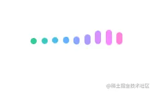

通过动图分析，发现每条线条的背景颜色和动画时延不同，另外动画运行时的高度也不同。第一条和第九条的高度一致，第二条和第八条的高度一致，依次类推，得到高度变换相同类的公式：对称 index = 总数 + 1 - index。背景颜色使用了滤镜的色相旋转 hue-rotate()，目的是为了使颜色过渡得更自然：

```html
<div class="heart-loading">
  <ul style="--line-count: 9">
    <li
      v-for="v in 9"
      :key="v"
      :class="`line-${v}`"
      :style="`--line-index: ${v}`"
    ></li>
  </ul>
</div>
```

```scss
.heart-loading {
  display: flex;
  justify-content: center;
  align-items: center;
  width: 200px;
  height: 200px;
  ul {
    display: flex;
    justify-content: space-between;
    width: 150px;
    height: 10px;
  }
  li {
    --Θ: calc(var(--line-index) / var(--line-count) * 0.5turn);
    --time: calc((var(--line-index) - 1) * 40ms);
    border-radius: 5px;
    width: 10px;
    height: 10px;
    background-color: #3c9;
    filter: hue-rotate(var(--Θ));
    animation-duration: 1s;
    animation-delay: var(--time);
    animation-iteration-count: infinite;
    &.line-1,
    &.line-9 {
      animation-name: beat-1;
    }
    &.line-2,
    &.line-8 {
      animation-name: beat-2;
    }
    &.line-3,
    &.line-7 {
      animation-name: beat-3;
    }
    &.line-4,
    &.line-6 {
      animation-name: beat-4;
    }
    &.line-5 {
      animation-name: beat-5;
    }
  }
}
@keyframes beat-1 {
  0%,
  10%,
  90%,
  100% {
    height: 10px;
  }
  45%,
  55% {
    height: 30px;
    transform: translate3d(0, -15px, 0);
  }
}
@keyframes beat-2 {
  0%,
  10%,
  90%,
  100% {
    height: 10px;
  }
  45%,
  55% {
    height: 60px;
    transform: translate3d(0, -30px, 0);
  }
}
@keyframes beat-3 {
  0%,
  10%,
  90%,
  100% {
    height: 10px;
  }
  45%,
  55% {
    height: 80px;
    transform: translate3d(0, -40px, 0);
  }
}
@keyframes beat-4 {
  0%,
  10%,
  90%,
  100% {
    height: 10px;
  }
  45%,
  55% {
    height: 90px;
    transform: translate3d(0, -30px, 0);
  }
}
@keyframes beat-5 {
  0%,
  10%,
  90%,
  100% {
    height: 10px;
  }
  45%,
  55% {
    height: 90px;
    transform: translate3d(0, -20px, 0);
  }
}
```

##### 1.6.4.3 标签导航

上述通过两个加载条演示了变量在 CSS 中的运用以及一些妙用技巧，现在通过标签导航演示变量在 JS 中的运用。效果中主要是使用变量标记每个 Tab 的背景颜色和切换 Tab 的显示状态。

```html
<div class="tab-navbar">
  <nav>
    <a
      v-for="(v, i) in list"
      :key="v"
      :class="{ active: index === i }"
      @click="select(i)"
      >标题{{i + 1}}</a
    >
  </nav>
  <div>
    <ul
      ref="tabs"
      :style="`--tab-count: ${list.length}`"
    >
      <li
        v-for="(v, i) in list"
        :key="v"
        :style="`--bg-color: ${v}`"
      >
        内容{{i + 1}}
      </li>
    </ul>
  </div>
</div>
```

```css
.tab-navbar {
  display: flex;
  overflow: hidden;
  flex-direction: column-reverse;
  border-radius: 10px;
  width: 300px;
  height: 400px;
  nav {
    display: flex;
    height: 40px;
    background-color: #f0f0f0;
    line-height: 40px;
    text-align: center;
    a {
      flex: 1;
      cursor: pointer;
      transition: all 300ms;
      &.active {
        background-color: #3c9;
        color: #fff;
      }
    }
  }
  div {
    flex: 1;
    ul {
      --tab-index: 0;
      --tab-width: calc(var(--tab-count) * 100%);
      --tab-move: calc(var(--tab-index) / var(--tab-count) * -100%);
      display: flex;
      flex-wrap: nowrap;
      width: var(--tab-width);
      height: 100%;
      transform: translate3d(var(--tab-move), 0, 0);
      transition: all 300ms;
    }
    li {
      display: flex;
      justify-content: center;
      align-items: center;
      flex: 1;
      background-color: var(--bg-color);
      font-weight: bold;
      font-size: 20px;
      color: #fff;
    }
  }
}
```

```js
export default {
  data() {
    return {
      index: 0,
      list: ['#f66', '#66f', '#f90', '#09f']
    };
  },
  methods: {
    select(i) {
      this.index = i;
      this.$refs.tabs.style.setProperty('--tab-index', i);
    }
  }
};
```

在 ul 上定义 --tab-index 表示 Tab 当前的索引，当点击按钮时重置 --tab-index 的值，可实现不操作 DOM 移动 ul 的位置显示指定的 Tab。不操作 DOM 而可移动 ul 是因为定义了 --tab-move，通过 calc() 计算 --tab-index 与 --tab-move 的关系，从而操控 transform:translate3d() 移动 ul。

另外在 li 上定义 --bg-color 表示 Tab 的背景颜色，也是一种比较简洁的模板赋值方式，总比写 `<li :style="backgroundColor:${color}">` 要好看。若多个属性依赖一个变量赋值，那么使用变量赋值到 style 上就更方便了，那些属性可在 css 文件里计算与赋值，这样可帮助 JS 分担一些属性计算工作。当然该标签导航也可通过纯 CSS 实现。

##### 1.6.4.4 悬浮跟踪按钮

思路是先对按钮布局和着色，然后使用伪元素标记鼠标的位置，定义 --x 和 --y 表示伪元素在按钮里的坐标，通过 JS 获取鼠标在按钮上的 offsetX 和 offsetY 分别赋值给 --x 和 --y，再对伪元素添加径向渐变的背景颜色。

```html
<a
  class="track-btn"
  @mousemove="move"
>
  <span>妙用CSS变量，让你的CSS变得更心动</span>
</a>
```

```css
.track-btn {
  overflow: hidden;
  position: relative;
  border-radius: 25px;
  width: 400px;
  height: 50px;
  background-color: #66f;
  cursor: pointer;
  line-height: 50px;
  text-align: center;
  font-weight: bold;
  font-size: 18px;
  color: #fff;
  span {
    position: relative;
    pointer-events: none;
  }
  &::before {
    --size: 0;
    position: absolute;
    left: var(--x);
    top: var(--y);
    width: var(--size);
    height: var(--size);
    background-image: radial-gradient(circle closest-side, #09f, transparent);
    content: '';
    transform: translate3d(-50%, -50%, 0);
    transition: width 200ms ease, height 200ms ease;
  }
  &:hover::before {
    --size: 400px;
  }
}
```

```js
export default {
  name: 'track-btn',
  methods: {
    move(e) {
      const x = e.pageX - e.target.offsetLeft;
      const y = e.pageY - e.target.offsetTop;
      e.target.style.setProperty('--x', `${x}px`);
      e.target.style.setProperty('--y', `${y}px`);
    }
  }
};
```

## 二. 添加样式

### 2.1 CSS 语法

CSS 的顶层样式表由两种规则组成的规则列表构成：

- at-rule
- 普通规则（qualified rule）

#### 2.1.1 at-rule

at-rule 由一个 `@` 关键字和后续的一个区块组成，如果没有区块，则以分号结束。这些 at-rule 在开发中使用的机会远远小于普通规则，但 at 规则是掌握 CSS 的一些高级特性所必须的内容。

- `@charset`
  用于提示 CSS 文件使用的字符编码方式，它如果被使用，必须出现在最前面，这个规则只在给出语法解析阶段前使用，并不影响页面上的展示效果。

  ```css
  @charset "utf-8";
  ```

- `@import`
  用于引入一个 CSS 文件，除了 @charset 规则不会引入，@import 可以引入另一个文件的全部内容。

  ```css
  @import 'myStyle.css';
  @import url('myStyle.css');
  ```

  ```css
  @import [ <url> | <string> ] [ supports([ <supports-condition> | <declaration> ]) ]? <media-query-list>?;
  ```

  通过代码，可以看出，@import 还支持 **supports** 和 **media query** 形式。

- `@media`
  能够对设备的类型进行一些判断。针对不同的屏幕尺寸设置不同的样式，适用于设计响应式页面。在 media 的区块内，是普通规则列表。

  ```css
  /* 如果屏幕宽度小于 600px 修改背景色 */
  @media screen and (max-width: 600px) {
    body {
      background-color: pink;
    }
  }
  ```

- `@page`
  用于在打印文档时修改某些 CSS 属性。不能用 @page 规则来修改所有的 CSS 属性，而是只能修改 margin,orphans,widow 和文档的分页符。对其他属性的修改是无效的。

  ```css
  @page {
    size: 8.5in 11in;
    margin: 10%;

    @top-left {
      content: 'Hamlet';
    }
  }
  ```

- `@counter-style`
  它让开发者可以自定义 counter 的样式。每个 [@counter-style](https://developer.mozilla.org/zh-CN/docs/Web/CSS/@counter-style) 有一个名称标识并具有一组描述符：

  ```css
  @counter-style circled-alpha {
    system: 'fixed';
    symbols: Ⓐ Ⓑ Ⓒ Ⓓ Ⓔ Ⓕ Ⓖ Ⓗ Ⓘ Ⓙ Ⓚ Ⓛ Ⓜ Ⓝ Ⓞ Ⓟ Ⓠ Ⓡ Ⓢ Ⓣ Ⓤ Ⓥ Ⓦ Ⓧ Ⓨ Ⓩ;
    suffix: ' ';
  }
  ul li {
    list-style: circled-alpha;
  }
  ```

- `@keyframes`
  关键帧 @keyframes 通过在动画序列中定义关键帧（或 waypoints）的样式来控制 CSS 动画序列中的中间步骤。和转换 transition 相比，@keyframes 可以控制动画序列的中间步骤。

  ```css
  @keyframes diagonal-slide {
    from {
      left: 0;
      top: 0;
    }

    to {
      left: 100px;
      top: 100px;
    }
  }
  ```

- `@font-face`
  指定一个用于显示文本的自定义字体；字体能从远程服务器或者用户本地安装的字体加载。如果提供了 local() 函数，从用户本地查找指定的字体名称，并且找到了一个匹配项，本地字体就会被使用。否则，字体就会使用 url() 函数下载的资源。icon font 技术就是利用这个特性实现的。

  ```css
  @font-face {
    font-family: Gentium;
    src: url(http://example.com/fonts/Gentium.woff);
  }
  p {
    font-family: Gentium, serif;
  }
  ```

- `@support`
  可以指定依赖于浏览器中的一个或多个特定的 CSS 功能的支持声明，这被称为特性查询。

  ```css
  /* 如果浏览器支持 display:flex; 那么div的样式就是 display:flex */
  @supports (display: flex) {
    div {
      display: flex;
    }
  }
  /* 如果浏览器不支持 display:flex; 且支持 float:right; 那么 div 的样式就是 float:right; */
  @supports (not (display: flex)) and (float: right) {
    div {
      float: right;
    }
  }
  ```

- `@namespace`
  用来定义使用在 CSS 样式表中的 XML 命名空间的 @ 规则。定义的命名空间可以把通配、元素和属性选择器限制在指定命名空间里的元素。@namespace 规则通常在处理包含多个 namespaces 的文档时才有用，比如 HTML5 里内联的 SVG、MathML 或者混合多个词汇表的 XML。

  ```css
  @namespace url(http://www.w3.org/1999/xhtml);
  @namespace svg url(http://www.w3.org/2000/svg);
  /* 匹配所有的XHTML <a> 元素, 因为 XHTML 是默认无前缀命名空间 */
  a {
    color: #444;
  }
  /* 匹配所有的 SVG <a> 元素 */
  svg|a {
    color: #696;
  }
  /* 匹配 XHTML 和 SVG <a> 元素 */
  *|a {
    color: #444;
  }
  ```

  > **注意**：任何 @namespace 规则都必须在所有的 @charset 和 @import 规则之后, 并且在样式表中，位于其他任何样式声明之前。

#### 2.1.2 普通规则

普通规则主要由选择器和声明区块构成。声明区块又由属性和值构成：

- 普通规则
  - [选择器](/frontend/CSS/CSS选择器/CSS选择器.md)
  - 声明列表
    - 属性
    - 值
      - 值的类型
      - 函数

从语法结构看，任何选择器都是由几个符号结构连接的：**空格、大于号、加号、波浪线、双竖线**。

对于每一个选择器来说，如果它不是伪元素，由几个可选的部分组成，标签类型选择器，id、class、属性和伪类，它们中只要出现一个，就构成了选择器。如果是伪元素，则在这个结构后追加伪元素，只有伪类可以出现在伪元素之后。


选择器的基本意义是：根据一些特征选中元素树上的一批元素。

##### 2.1.2.1 声明：属性和值

声明部分是一个由 "属性:值" 组成的序列。

1. **属性**：是由中划线、下划线、字母、数字等组成的标识符，CSS 还支持使用反斜杠转义。

   > **注意**：属性不允许使用连续两个的中划线开头，这样的属性会被认为是 CSS 变量。

   以双中划线开头的属性被当做变量，与之配合的则是 var 函数：

   ```css
   :root {
     --main-color: #06c;
     --accent-color: #006;
   }
   #foo h1 {
     color: var(--main-color);
   }
   ```

2. **值**：根据每个 CSS 属性可以取到不同的值，这里的值可能是以下类型：

   - CSS 范围的关键字：initial、unset、inherit，任何属性都可以的关键字
   - 字符串
   - URL：使用 `url()` 函数的 URL 值
   - 整数/实数：比如 flex 属性
   - 维度：带单位的整数/实数，比如 width 属性
   - 百分比：大部分维度都支持
   - 颜色：rgb()、rgba()、十六进制
   - 图片
   - 2D 位置
   - 函数：来自函数的值，比如 transform 属性，一些属性会要求产生函数类型的值，比如 easing-function 会要求 `cubic-bezier()` 函数的值

   CSS 支持一批特定的计算型函数：

   - `calc()`：是基本的表达式计算，支持加减乘除四则运算，在针对维度进行计算时，calc() 函数允许不同单位混合运算，非常有用。

     ```css
     section {
       float: left;
       margin: 1em;
       border: solid 1px;
       width: calc(100% / 3 - 2 * 1em - 2 * 1px);
     }
     ```

   - `max()`：从一个逗号分隔的表示式列表中取最大的值作为属性值

     ```css
     .cls {
       width: max(10vw, 4em, 80px);
     }
     ```

   - `min()`：从一个逗号分隔符表达式列表中选择一个最小值作为 CSS 的属性值

     ```css
     .cls {
       width: min(1vw, 4em, 80px);
     }
     ```

   - `clamp()`：给一个值限定一个范围，超出范围则使用范围的最大值，最小值

     ```css
     font-size: clamp(1.5rem, 2.5vw, 4rem);
     ```

   - `attr()`：用来获取被选中元素的属性值，并且在样式中使用。它也可以被用在伪类元素里，在伪类元素里使用，它得到的是伪元素的原始元素的值。

     [css-attr()](./example/css-attr.html)

#### 2.1.3 CSS 函数

CSS 函数指复杂类型或调用特殊处理的组件值类型。在 CSS 代码中，只要带有 () 的属性值都是函数。有了函数后，可将一系列相关计算交给浏览器处理，可减少大量人工计算甚至无需人工计算，大大提高了 CSS 代码的编写效率。

**分类**：

- **颜色函数**

  - rgb()：RGB 色彩模式
  - rgba()：RGBA 色彩模式
  - hsl()：HSL 色彩模式
  - hsla()：HSLA 色彩模式
  - color()：色彩模式，基于当前颜色衍生出其他颜色

- **属性函数**

  - attr()：属性
  - var()：变量

- **数学函数**

  - clamp()：区间范围值
  - counter()：计数器
  - counters()：嵌套计数器
  - calc()：计算
  - max()：最大值
  - min()：最小值

- **背景函数**

  - url()：图像路径
  - element()：图像映射，渲染指定元素为图像
  - image-set()：图像集合，根据屏幕分辨率匹配合适图像
  - linear-gradient()：线性渐变
  - radial-gradient()：径向渐变
  - conic-gradient()：锥形渐变
  - repeating-linear-gradient()：重复线性渐变
  - repeating-radial-gradient()：重复径向渐变
  - repeating-conic-gradient()：重复锥形渐变

- **滤镜函数**

  - blur()：模糊
  - brightness()：亮度
  - contrast()：对比度
  - drop-shadow()：阴影
  - grayscale()：灰度
  - hue-rotate()：色相旋转
  - invert()：反相
  - opacity()：透明度
  - saturate()：饱和度
  - sepia()：褐色

- **图像函数**

  - circle()：圆形
  - ellipse()：椭圆形
  - inset()：矩形
  - path()：路径
  - polygon()：多边行

- **变换函数**

  - matrix()：矩阵
  - matrix3d()：3D 矩阵
  - perspective()：视距
  - rotate()：旋转
  - rotate3d()：3D 旋转
  - rotateX()：X 轴旋转
  - rotateY()：Y 轴旋转
  - rotateZ()：Z 轴旋转
  - scale()：缩放
  - scale3d()：3D 缩放
  - scaleX()：X 轴缩放
  - scaleY()：Y 轴缩放
  - scaleZ()：Z 轴缩放
  - skew()：扭曲
  - skewX()：X 轴扭曲
  - skewY()：Y 轴扭曲
  - translate()：位移
  - translate3d()：3D 位移
  - translateX()：X 轴位移
  - translateY()：Y 轴位移
  - translateZ()：Z 轴位移

- **缓动函数**

  - cubic-bezier()：贝塞尔曲线
  - steps()：逐帧

##### 2.1.3.1 颜色函数

颜色函数是最常用的函数，没有之一。颜色函数可用在 border-color、outline-color、background-color、box-shadow、color、caret-color 等属性上使用。

- [RGB 色彩](#141-rgb-颜色)模式：rgb()、rgba()

  rgb() 里的 R 表示红色，G 表示绿色，B 表示蓝色，而 rgba() 多出来的 A 表示透明度，这个 A 与 opacity 声明的透明度不同，rgba() 声明的透明度不会应用到子节点上，而 opacity 声明的透明度会应用到子节点上。

  > **建议**：在声明普通颜色时使用 HEX 色彩模式（16 进制色彩模式），若颜色存在透明度的需求，可用 rgba()。

- [HSL 色彩](#143-hsl-颜色)模式：hsl()、hsla()

##### 2.1.3.2 属性函数

`attr(val)` 用于返回节点属性，通常结合伪元素的 content 使用。

```html
<h1
  class="hello"
  data-name=" World"
></h1>
<style>
  h1::before {
    content: attr(class);
  }
  h1::after {
    content: attr(data-name);
  }
</style>
```

::before 通过 attr() 获取 h1 class 的属性值并赋值到 content 上，::after 通过 attr() 获取 h1 data-name 的属性值并赋值到 content 上，最终 h1 的 innerText 是 hello World。

attr() 可灵活结合选择器返回节点属性并赋值到伪元素的 content 上，通过 attr() 结合 :hover 和 :empty 抓取节点需显示的内容是一个很不错的技巧。

##### 2.1.3.3 数学函数

- `counter()`/`counters()`

  counter() 用于返回计数器迭代值，必须结合伪元素的 content 使用。它以计数器名称作为参数，并作为值传递给 content。counters() 用于返回嵌套计数器迭代值，情况和 counter() 一致。

  在使用 counter() 和 counters() 时，必须与 counter-reset 和 counter-increment 一起使用。

  - `counter-reset`：重置计数器名称与初始值，编写形式为 counter-reset:name val;
  - `counter-increment`：对指定计数器累计其计数值，编写形式为 counter-increment:name，在使用到的地方声明就会累加

  对于一些迭代需求通常都会使用 HTML 模板，例如 Vue 模板等，所以 counter() 和 counters() 使用场景不多。以下就使用 counter() 巧妙搭配完成一个显示权重的迭代计数器。

  ```html
  <div class="iterative-counter">
    <ul>
      <li>
        <input
          id="angular"
          type="checkbox"
        />
        <label for="angular">Angular</label>
      </li>
      <li>
        <input
          id="react"
          type="checkbox"
        />
        <label for="react">React</label>
      </li>
      <li>
        <input
          id="vue"
          type="checkbox"
        />
        <label for="vue">Vue</label>
      </li>
    </ul>
    <p
      class="count"
      data-unit="个"
    >
      框架：
    </p>
    <p
      class="weight"
      data-unit="%"
    >
      权重：
    </p>
  </div>
  ```

  ```scss
  .iterative-counter {
    ul {
      counter-reset: index 0 count 0 weight 0;
    }
    li {
      display: flex;
      position: relative;
      align-items: center;
      counter-increment: index 1;
      &::before {
        content: counter(index) '、';
      }
      & + li {
        margin-top: 10px;
      }
    }
    input {
      overflow: hidden;
      position: absolute;
      width: 0;
      height: 0;
      opacity: 0;
      &:checked + label::before {
        color: #3c9;
        content: '\2713';
      }
    }
    label {
      display: flex;
      align-items: center;
      height: 20px;
      &::before {
        margin-right: 5px;
        border: 1px solid #3c9;
        width: 20px;
        height: 20px;
        cursor: pointer;
        line-height: 20px;
        text-align: center;
        color: transparent;
        content: '';
        transition: all 300ms;
      }
    }
    p {
      margin-top: 10px;
      &.count::after {
        content: counter(count) attr(data-unit);
      }
      &.weight::after {
        content: counter(weight) attr(data-unit);
      }
    }
  }
  #angular:checked {
    counter-increment: count 1 weight 20;
  }
  #react:checked {
    counter-increment: count 1 weight 50;
  }
  #vue:checked {
    counter-increment: count 1 weight 30;
  }
  ```

- `calc()`

  calc(exp) 用于动态计算单位，数值、长度、角度、时间和百分比都能作为参数。由于执行数学表达式后返回运算后的计算值，所以可减少大量人工计算甚至无需人工计算。所有计量单位都能作为参数参加整个动态计算：

  - 数值：整数、浮点数
  - 长度：px、em、rem、vw、vh 等
  - 角度：deg、turn
  - 时间：s、ms
  - 百分比：%

  **特点**：

  - 四则运算：只能使用 `+`、`-`、`*`、`/` 作为运算符号
  - 运算顺序：遵循加减乘除运算顺序，可用 () 提升运算等级
  - 符号连接：需要在加号和减号两侧加空格。这是为了让浏览器把操作符与数值中的符号（如 -10px 中的负号）区分开来。
  - 混合计算：可混合不同计量单位动态计算

  > **注意**：IE9 也支持 calc() 表示法，可惜与 background-position 一起使用时存在严重 bug，会导致浏览器崩渍。

  **应用**：

  - 非常适合某元素以百分比缩放或定位时与使用 em 或像素单位冲突的情况

  - 在 SPA 里因为有滚动条或没滚动条而导致页面路由在跳转过程中发生向左或向右的抖动，可以外部再嵌套一层 div 元素，再设置：

    ```css
    .elem {
      padding-right: calc(100vw - 100%);
    }
    ```

    100vw 是视窗宽度，100% 内容宽度，那么 100vw - 100% 就是滚动条宽度了，声明 padding-right 用于保留滚动条出现的位置，这样滚动条出不出现都不会让页面抖动了。

- `clamp()`/`max()`/`min()`

  clamp()/max()/min() 都和 calc() 类似，所有计量单位都能作为参数参加整个动态计算。这三个函数和 calc() 可互相嵌套使用的。

  ```css
  .elem {
    width: calc(min(1200px, 100%) / 5);
  }
  ```

  max() 用于返回最大值，min() 用于返回最小值，支持一个或多个值或数学表达式。虽然 max() 名称是最大值，但实质上是用来限制最大值的；min()名称是最小值，但实质上是用来限制最小值的。

  在响应式开发中，通常会声明内容宽度 100% 自适应且最大值不超过 1200px：

  ```css
  .elem {
    width: 100%;
    max-width: 1200px;
  }
  ```

  若用 min() 表示，只需一行声明即可：

  ```css
  .elem {
    width: min(1200px, 100%);
  }
  ```

  clamp(min, val, max) 用于返回区间范围值。val 在 min~max 间则返回 val，val 小于 min 则返回 min，val 大于 max 则返回 max，妥妥的响应式函数样子。

  clamp(min, val, max) 等价于 `max(min, min(val, max))`。clamp() 可用于响应式开发中，很好地履行了响应式的义务，让组件属性在特定条件下使用特定的值。

  ```css
  .elem {
    width: clamp(100px, 25vw, 300px);
  }
  ```

##### 2.1.3.4 图形函数

clip-path 用于创建一个只有节点的部分区域可显示的剪切区域。裁剪完成后，内部区域显示，外部区域隐藏。一般应用在 SVG 上，但是也可当作裁剪效果用在节点上。当节点使用 clip-path 声明裁剪路径时，可用以下 5 个图形函数裁剪区域了，除了 path()其他 4 个函数的兼容性还行。

- circle()：圆形
- ellipse()：椭圆形
- inset()：矩形
- path()：路径
- polygon()：多边行

整体来说很简单，在特定坐标上标记连线的点即可。可以使用一个裁剪路径的网站 [Clippy](https://bennettfeely.com/clippy/)，轻松绘制出各种由线条组成的裁剪区域。clip-path 有一个明显的限制，就是只能裁剪折线形成的图形，不能裁剪曲线形成的图形。

### 2.2 层叠

稍微复杂的样式表中都可能存在两条甚至多条规则同时选择一个元素的情况。CSS 通过一种叫作层叠（cascade）的机制来处理这种冲突。从 CSS 这个名字就可知这种机制有多重要，因为其中的 C 就是 cascade（SS 是 style sheet，即样式表）。

**层叠机制的原理是为规则赋予不同的重要程度**。最重要的是作者样式表，即由网站开发者所写的样式。其次是用户样式表，用户可以通过浏览器的设置选项，为网页应用自己的样式。排在最后的是浏览器（或用户代码）的默认样式表，它们一般都会被作者样式表覆盖掉。

为了给用户更高的优先权，CSS 允许用户使用 `!important`覆盖任何规则，包括网站作者使用 `!important` 标注的规则。`!important` 标注要放在属性声明的后面。

允许用户使用 `!important` 标注来覆盖规则，主要是出于无障碍交互的需要。比如，允许诵读困难的用户使用高对比度的用户样式表。归纳起来，层叠机制的重要性级别从高到底如下所示：

- 标注为 `!important` 的用户样式
- 标注为 `!important` 的作者样式
- 作者样式
- 用户样式
- 浏览器（或用户代理）的默认样式

在此基础上，规则再按选择符的特殊性进行排序。特殊性高的选择符会覆盖特殊性低的选择符。如果两条规则的特殊性相等，则后定义的规则优先。

### 2.3 层叠上下文

层叠上下文指盒模型在三维空间 Z 轴上所表现的行为。每个盒模型存在于一个三维空间中，分别是平面画布的 X 轴 Y 轴和表示层叠的 Z 轴。

通常情况下，节点在页面上沿着 X 轴和 Y 轴平铺，很难察觉它们在 Z 轴上的层叠关系。一旦节点发生堆叠，最终表现就是节点间互相覆盖。若一个节点包含层叠上下文，那么该节点就拥有绝对的制高点，最终表现就是离屏幕观察者更近。

#### 2.3.1 层叠等级

层叠等级又名层叠级别，指节点在三维空间 Z 轴上的上下顺序。在同一层叠上下文中，它描述了层叠上下文节点在 Z 轴上的上下顺序；在普通节点中，它描述普通节点在 Z 轴上的上下顺序。

普通节点的层叠等级优先由其所在的层叠上下文决定，层叠等级的比较只有在当前层叠上下文中才有意义，脱离当前层叠上下文的比较就变得无意义了。

**成因**：

- position 和 z-index
- html 根结点
- 声明 position:relative/absolute 和 z-index 不为 auto 的节点
- 声明 position:fixed/sticky 的节点
- Flex 布局下声明 z-index 不为 auto 的节点
- Grid 布局下声明 z-index 不为 auto 的节点
- 声明 mask/mask-image/mask-border 不为 none 的节点
- 声明 filter 不为 none 的节点
- 声明 mix-blend-mode 不为 normal 的节点
- 声明 opacity 不为 1 的节点
- 声明 clip-path 不为 none 的节点
- 声明 will-change 不为 initial 的节点
- 声明 perspective 不为 none 的节点
- 声明 transform 不为 none 的节点
- 声明 isolation 为 isolate 的节点
- 声明-webkit-overflow-scrolling 为 touch 的节点

#### 2.3.2 层叠顺序

层叠顺序指节点发生层叠时按照特定的顺序规则在 Z 轴上垂直显示。在同一个层叠上下文中，节点会按照 z-index 的大小从上到下层叠，若 z-index 一致则后面的节点层叠等级要大于前面。脱流元素的层叠顺序就是看 z-index 的大小。

**层叠顺序从低到高排列**：

- 层叠上下文的 border 和 background
- z-index < 0 的子节点
- 标准流内块级非定位的子节点
- 浮动非定位的子节点
- 标准流内行内非定位的子节点
- z-index:auto/0 的子节点
- z-index > 0 的子节点

### 2.4 特殊性

为了量化规则的特殊性，每种选择符都对应着一个数值。这样，一条规则的特殊性就表示为其每个选择符的累加数值。但这里的累加计算使用的并非十进制加法，而是基于位置累加，以保证 100 个类选择符（或更多的类选择符）累加的特殊性不会大于等于 1 个 ID 选择符的特殊性。这是为了避免 ID 这种高特殊性选择符被一堆低特殊性选择符（如类型选择符）的累加值所覆盖。如果某条规则中用到的选择符不足 10 个，为简单起见，也可以使用十进制来计算其特殊性。

任何选择符的特殊性都对应于如下 4 个级别，即 a、b、c、d：

- 行内样式，a 为 1;
- b 等于 ID 选择符的数目;
- c 等于类（class）选择符、伪类选择符及属性选择符的数目;
- d 等于类型（type）选择符和伪元素选择符的数目。

特殊性计算示例：

| 选择符            | 特殊性  | 十进制特殊性 |
| ----------------- | ------- | ------------ |
| style=""          | 1,0,0,0 | 1000         |
| #content .date {} | 0,1,1,0 | 200          |
| p.comment {}      | 0,0,1,1 | 11           |

> **注意**：通用选择符（`*`）的特殊性为 0，无论它在规则声明中出现多少次。

#### 2.4.1 利用层叠次序

如果两条规则特殊性相等，则优先应用后定义的规则，这一点非常重要。这意味着在写样式的时候，必须考虑规则在样式中的位置，以及选择符的次序。

对链接元素使用伪类，就是一个利用层叠次序的典型。如果每个选择符的特殊性都一样，那么它们的次序就很重要了。要是把 a:visited 选择符放在 a:hover 选择符后面，那么在访问过链接之后，悬停样式将不会起作用，因为已经被 a:visited 样式给覆盖了。

#### 2.4.2 控制特殊性

**理解特殊性是写好 CSS 的关键，而控制特殊性则是大型网站开发中最难处理的问题**。利用特殊性，可以先为公用元素设置默认样式，然后在更特殊的元素上覆盖这些样式。最好的做法是从一开始就简化选择符，降低特殊性，减少选择符之间的依赖。对样式进行更细粒度的控制。

### 2.5 继承

任何直接应用给元素的样式都会覆盖继承的样式。因为继承的样式没有任何特殊性，连 0 都算不上。继承是很有用的机制，有了它就可以避免给一个元素的所有后代重复应用相同的样式。合理利用继承有助于减少选择符的数量，降低复杂性。

### 2.6 为文档应用样式

为文档应用样式的方式不止一种，各有利弊。

#### 2.6.1 link 与 style 元素

可以把样式放在 style 元素中，直接放在文档的 head 部分。如果样式不多，又希望立刻应用它们，并且不愿意因为浏览器额外下载文件而耽误时间。可以使用这种方式。

不过，为了让样式表能在多个页面中重用，通常最好把它保存到一个外部文件中。如果样式在外部样式表中，那么有两种方式把它们链接到网页上。最常用的方式是使用 link 元素：

```html
<link
  href="/c/base.css"
  rel="stylesheet"
/>
```

除了 link 元素，还可以使用 `@import` 指令加载外部 CSS 文件：

```html
<style>
  @import url('/c/modules.css');
</style>
```

可以在 HTML 文档的 head 部分把 @import 指令放在 style 中，也可以在外部样式表中使用它。后一种用法意味着，如果网页记载外部样式表，那么浏览器后续可能还需要下载更多 CSS 文件。

表面上看，使用 link 和 @import 指令的结果没什么区别。实际上，link 是比 @import 指令更值得推荐的方法，背后有一些[非常重要的原因](#262-性能)。

使用 link 或 style 在 HTML 中添加多个样式表或样式块时，它们声明的次序就是它们在 HTML 源代码中出现的次序。

#### 2.6.2 性能

选择以什么方式把 CSS 加载到页面中，一定程度上决定了浏览器显示页面的速度。度量 Web 性能的一个重要指标就是网页内容实际显示在屏幕上需要多久。这个指标有时候也叫 “渲染时间” 或 “上屏时间”。现代浏览器在屏幕上渲染内容之前，至少需要两样东西：HTML 和 CSS 这意味着让浏览器尽快下载 HTML 和全部 CSS 极其重要。

不要把 CSS 放到 body 里或者放到页面底部，搞什么 “延迟加载”。浏览器只有掌握了布局页面的全部 CSS 信息，才能给出最佳响应。因为只有这样，它们才知道应该把页面渲染成什么样，从而一次性地把页面绘制到屏幕上，而非一边加载新样式一边重新调整页面。

1. **减少 HTTP 请求**
   在链接外部样式表时，保证链接的文件数量最少至关重要，因为每个文件都需要单独发送次 HTTP 请求。相应地，每次从服务器请求文件，浏览器都需要花一定的时间下载，然后还要花时间应用其中的样式。另外，额外的 HTTP 请求也意味着浏览器会向服务器发送多余的数据，比如 cookie 或请求首部。服务器也必须针对每个请求返回响应首部。两个文件要比一个包含相同 CSS 内容的文件在浏览器和服务器间传递的数据更多。

   线上网页最好把需要加载的 CSS 文件数量控制在 1 或 2 个。只用一个 link 元素加载 CSS 文件，然后在其中使用 @import，并不能把请求控制为 1 个，因为这意味着先需要 1 个请求下载链接的文件，此外还要发送额外的请求取得所有导人的文件。因此，在线上网页中尽量不要使用 `@import`。

2. **压缩和缓存内容**
   使用 GZIP 压缩线上资源也非常重要。CSS 压缩的比率很高，因为它的很多属性和值都是重复的。一般来说，CSS 文件压缩后会减少 70%~80%。这样显然可以减少带宽占用，从而为用户节省时间。多数 Web 服务器都会在浏览器支持的情况下启用自动压缩线上资源。

   类似地，让 Web 服务器帮设置一定的 CSS 文件缓存时间也很重要。理想情况下，浏览器应该只下载一次 CSS 文件，除非线上文件有变化。方法就是通过 HTTP 首部告诉浏览器，把文件缓存较长的一段时间，如果文件有修改，则通过文件名来 “清除缓存”。压缩和合理缓存内容是提升网站性能的最重要的两件事。

3. **不让浏览器渲染阻塞 JS**
   如果在 HTML 文档的 head 元素中加入了 script 元素，浏览器必须先把它链接的脚本下载下来，然后再向用户显示网页内容。换句话说，这种情况下的 HTML 和 CSS 解析完全被下载以及执行脚本阻断了，也就是所谓的 “渲染阻塞”。渲染阻塞会明显拖慢网站加载速度。为此，主流的做法是在 HTML 页面底部的结束标签 `</body>` 之前加载 JS。

   比较现代的做法是在 head 中使用 script 标签，但添加 `async` 和 `defer` 属性。给 script 标签加上 `async` 属性，会异步加载脚本，不阻塞 HTML 解析，但会在脚本加载完毕立即执行时阻断 HTML 解析。给 script 标签加上 `defer` 属性，同样会异步加载脚本，不同的是会在 HTML 解析完毕后再执行加载的脚本。这两个属性该用哪一个，还要看脚本本身的具体内容。

   使用以上方法加载 JS，可以确保浏览器首先解析 HTML 和 CSS，不受请求 JS 文件的影响。至于选择哪个方法，很大程度上取决于浏览器的支持情况：`async` 和 `defer` 属性是 HTML 中定义的，因此还比较新。IE10 和更早版本的 IE 并不支持或不完全支持它们。

## 三. 可见格式化模型

浮动、定位和盒模型是学习 CSS 需要掌握的几个最重要的概念。这几个概念决定了元素在页面是排布和显示的方式，是很多布局技术的举出。近年来，Web 标准也引入了专门用于控制布局的新规范。

### 3.1 盒模型

盒模型是 CSS 的核心概念，描述了元素如何显示，以及（在一定程度上）如何相互作用、相互影响。页面中的所有元素都被看做一个矩形盒子，这个盒子包含元素的内容、内边距、边框、外边距。

内边距（padding）是内容区周围的空间。给元素应用的背景会作用于元素内容和内边距。因此，内边距通常用于分隔内容，使其不至于散布到背景的边界。边框（border）会在内边距外侧增加一条框线，这条框线可以是实线、虚线或点划线。边框的外侧是外边距（margin），外边距是围绕在盒子可见部分之外的透明区域，用于在页面中控制元素之间的距离。

有一个与边框类似的属性，即轮廓线（outline）。这个属性可以在边框盒子外围画出一条线，但这条线不影响盒子的布局，也就是不影响盒子的宽度和高度。因此，outline 常用于调试复杂布局，或显示布局效果。

对元素盒子而言，内边距、边框和外边距不是必需的，因此它们的默认值都为 0。不过，用户代码样式表通常会给很多元素添加外边距和内边距。比如，标题通常就会带有一定的外边距，但外边距的值会因浏览器而异。

#### 3.1.1 盒子大小

默认情况下，元素盒子的 width 和 height 属性指的是内容盒子，也就是元素可渲染内容区的宽度和高度。这时候添加边框和内边距并不会影响内容盒子的大小，但会导致整个元素盒子变大。如果想给元素盒子的每一边都添加 5 像素的边框和 5 像素的内边距，同时又想让元素盒子的宽度为 100 像素，则应该把内容区宽度设置为 80 像素。如果这个元素盒子外围还有 10 像素的外边距，那么整个盒子占据空间的宽度就是 120 像素。

通过修改 box-sizing 属性可以改变计算盒子大小的方式。box-sizing 的默认值为 content-box，即把宽度值应用给内容区。通过修改 box-sizing 的值，设置元素的 width 和 height 属性，就可以影响元素盒子的不同区域，这对响应式布局非常有用。

如果把 box-sizing 的值修改为 **border-box**，那么 width 和 height 的值将会包含内边距和边框。此时，外边距仍然会影响盒子在页面中占据的整体空间，即它的宽度不会算到 width 中。这种计算盒子大小的方式更加直观。

#### 3.1.2 最大值和最小值

有时候，特别是在[响应式布局](#85-响应式设计与结构化-css)中，给一个元素应用 min-width 和 max-width 值很有用。因为这样一来，块级盒子就可以默认自动填充父元素的宽度，但不会收缩到比 min-width 指定的值更窄，或者扩展到比 max-width 指定的值更宽。

与此类似的是 min-height 和 max-height 属性。不过在 CSS 中，设置任何高度值的时候都应该慎重。这是因为元素的高度通常应该取决于所包含的内容，不需要明确设定。否则，万一内容增多，或者文本字号变大，内容就可能跑到高度固定的盒子之外去。即使出于种种原因，需要明确设定默认高度，也最好使用 min-height，因为这个属性允许盒子随内容扩展。

### 3.2 可见格式化模型

常说 p、h1 和 article 这些元素都是块级元素。意思就是说，它们作为元素，显示为内容块或块级盒子（block box）的形式。相对而言，strong、span 和 time 被称为行内元素，因为它们的内容会以行内盒子（inline box）的形式显示在行内。

可以使用 `display` 属性改变生成的盒子类型。如果把 display 属性设置为 none，还可以让浏览器不为相应的元素生成盒子。如果不生成盒子，那么元素及其包含的内容就不会显示出来，也不会占用文档中的空间。

CSS 中有几种不同的定位模型，包括浮动、绝对定位和相对定位。除非特别指定，否则所有盒子都会在常规文档流中生成，即 position 属性的默认值为 static。顾名思义，常规文档流中元素盒子的位置，由元素在 HTML 中的位置决定。

- 块级盒子会沿垂直方向堆叠，盒子在垂直方向上的间距由它们的上、下外边距决定。

- 行内盒子是沿文本流水平排列的，也会随文本换行而换行。它们之间的水平间距可以通过水平方向的内边距、边框和外边距来调节。但行内盒子的高度不受其垂直方向上的内边距、边框和外边距的影响。此外，给行内盒子明确设置高度和宽度也不会起作用。

- **由一行文本形成的水平盒子叫行盒子**（line box），而行盒子的高度由所包含的行内盒子决定。修改行盒子大小的唯一途径就是修改行高（line-height），或者给它内部的行内盒子设置水平方向的边框、内边距或外边距。

- 当然，也可以把元素的 display 属性设置为 `inline-block`。这样设置之后，该元素就会像一个行内盒子一样水平排列。但这个盒子的内部仍然像块级元素一样，能够设置宽度、高度、垂直外边距和内边距。

- 使用表格相关的标记（table、tr、th 等）时，表格本身表现为块级元素，但表格的内容会根据生成的行和列排布。还可以通过设置 display 属性让非表格元素采用表格的布局方式。只要正确地应用 table、table-row 和 table-cell 等值，就可以实现表格布局，无须在 HTML 标记中使用表格标签。

后面的 Flexible Box Layout（也称为 Flexbox）和 Grid Layout 等 CSS 模块，又进一步扩展了 display 属性。通常，这些新布局模式会在它们的外部上下文中创建类似块级的盒子，但会为内部显示内容创建新的规则。

#### 3.2.1 匿名盒子

HTML 元素可以嵌套，元素盒子当然也可以嵌套。多数盒子都是基于明确定义的元素生成的。不过有一种情况，就算不明确定义元素也会生成块级盒子。比如，像下面这样，在 section 这个块级元素的开头加人 “some text”。此时，“some text” 就算没有定义为块级元素，也会被当成块级元素。

```html
<section>
  some text
  <p>Some more text</p>
</section>
```

这种情况下，这个盒子被称为**匿名块盒子**（anonymous block box），因为这个盒子并不与任何特定的元素相关。

类似的情况也存在于块级元素内部的文本级行盒子。假设有一个段落中包含三行文本，这三行文本的每一行都构成了一个匿名行盒子（anonymous line box）除了使用 :first-line 伪元素来添加有限的排版和颜色相关的样式之外，不能直接给匿名块盒子或匿名行盒子应用样式。**关键要知道，在屏幕上看到一切，都会从属于某个盒子**。

#### 3.2.2 外边距折叠

常规块盒子有一种机制叫作外边距折叠。外边距折叠的概念很简单，简而言之，**垂直方向上的两个外边距相遇时，会折叠成一个外边距。折叠后外边距的高度等于两者中较大的那一个高度**。当两个元素垂直堆叠时，上方元素的下外边距会与下方元素的上外边距相折叠。

**外边距折叠只发生在文档常规文本流中块级盒子的垂直方向上**。行内盒子、浮动盒子或绝对定位盒子的外边距不会折叠。

#### 3.2.3 包含块

知道什么决定一个元素的包含块非常重要，将内边距和外边距的值设置为百分比，包含块就是这些百分比值的计算依据。

确定元素的包含块，要看元素是如何定位的。如果元素的定位方式是静态定位（即不指定 position 的值）或相对定位，则其包含块的边界就计算到一个最近的父元素，该元素的 display 属性值必须能够提供类似块级的上下文，如 block、inline-block、table-cell、list-item 等。

默认情况下，width、height、margin 和 padding 的值为百分比时，就以该父元素的尺寸为计算依据。如果当前元素的定位模型改成了 absolute 或 fixed，那么计算依据就会发生变化。

#### 3.2.4 相对定位

把一个元素的 position 属性设置为 relative，该元素仍然会呆在原来的地方。但此后，可以通过设置 top、right、bottom 和 left 属性，使该元素相对于初始位置平移一定距离。比如设置 top 属性为 20 像素，该元素就会相对于其初始位置垂直向下平移 20 像素。而设置 left 属性为 20 像素，则会将该元素向右移动 20 像素，其左侧会出现空白。

无论是否位移，相对定位的元素仍然会在文档流中占用初始的空间。因此，这样平移元素会导致它遮挡其他元素。

#### 3.2.5 绝对定位

相对定位事实上是常规文档流定位模型的一部分，因为元素还是相对于它在常规流中的初始位置来定位。绝对定位则会把元素拿出文档流，因此也就不会再占用原来的空间。与此同时，文档流中的其他元素会各自重新定位，仿佛绝对定位的那个元素没有存在过一样。

绝对定位元素的包含块是距离它最近的定位祖先，也就是 position 属性设置为 static 之外任意值的祖先元素。如果没有这么一个定位祖先，那么它就相对于文档的根元素即 html 元素定位。文档的根元素也叫作起始包含块（initial containing block）。

与相对定位的盒子类似，绝对定位的盒子也可以相对于其包含块向上、下、左、右方向平移。平移绝对定位的元素提供了极大的灵活性，因为可以把元素移动到页面的任意位置。

绝对定位的盒子是脱离了常规文档流的，因此可能会遮挡页面上的其他元素。为了控制这些盒子层叠的次序，可以设置一个叫 `z-index` 的属性。[z-index](#612-定位与-z-index堆叠内容的陷阱) 属性值越大，盒子在层叠中的次序就越靠近用户的眼睛。用 z-index 控制盒子的层叠有不少值得探讨之处。

尽管绝对定位对于在页面上任意摆放元素非常有用，但近来已经很少被用来构建整体布局了。绝对定位的盒子脱离了常规文档流，因此很难用它们创建随视口宽度和内容长度变化而变化的自适应或者响应式布局。Web 技术的特点决定了不太可能指定元素在页面上的确切位置和大小。随着对其他 CSS 布局技术掌握得越发熟练，会发现绝对定位在整体布局上几乎没人用了。

#### 3.2.6 固定定位

固定定位是由绝对定位衍生出来的，不同之处在于，固定定位元素的包含块是视口（viewport）。因此，固定定位可用来创建始终停留在窗口相同位置的浮动元素。很多网站都使用这个技术让导航区始终保持可见，有的固定侧栏，有的固定顶栏。这样能确保网站的可用性，因为用户不必再费事寻找了。

#### 3.2.7 浮动

另一种可见形式化模型是浮动模型。浮动盒子可以向左或向右移动，直到其外边沿接触包含块的外边沿，或接触另一个浮动盒子的外边沿。浮动盒子也会脱离常规文档流，因此常规文档流中的其他块级盒子的表现，**几乎**当浮动盒子不存在一样。

**行盒子与清除**
浮动元素会脱离文档流，因此不会再像非浮动元素一样影响其他元素。实际上，严格来讲并非如此。如果浮动元素后面跟着的是常规文档流中的元素，那么这个元素的盒子就会当浮动元素不存在一样。但是，这个元素盒子中的文本内容则会记住浮动元素的大小，并在排布时避开它，为其留出相应的空间。从技术角度来讲，就是跟在浮动元素后面的行盒子会缩短，从而为浮动元素留空，造成文本环绕浮动盒子的效果。事实上，浮动就是为了在网页中实现文本环绕图片的效果而引入的一种布局模型。

要阻止行盒子环绕在浮动盒子外面，需要给包含行盒子的应用 `clear` 属性。clear 属性的值有 left、right、both、none，用于指定盒子的哪一侧不应该紧挨着浮动盒子。清除一个元素时，浏览器会在这个元素上方添加足够大的外边距，从而将元素的上边沿垂直向下推移到浮动元素下方。因此，如果给 “已清除的” 元素添加外边距，那么除非添加的值超过浏览器自动添加的值，否则不会看到效果。

浮动元素除了会导致后面的行盒子缩短，从而造成文本环绕效果之外，不会对周围的元素有任何别的影响，毕竟它已经脱离了文档流。但清除一个元素本质上会为所有前面的浮动元素清理出一块垂直空间。这就为使用浮动布局创造了条件，因为周围的元素可以为浮动的元素腾出地方来。

浮动的元素会被拿出文档流，所以只包含浮动内容的元素，无法在文档流中生成高度。这时，需要在这个元素内部某处应用 clear，在清除的元素上方创造出足够的垂直外边距，从而为包住浮动元素创造出空间，可以使用 :after 伪元素来模拟额外的清除元素：

```css
.block:after {
  content: ' ';
  display: block;
  clear: both;
}
```

#### 3.2.8 格式化上下文

当元素在页面上水平或垂直排布时，它们之间如何相互影响，CSS 有几套不同的规则，其中一套规则叫作格式化上下文（formatting context）。

此外，有些规则规定了页面必须自动包含突出的浮动元素（否则浮动元素中的内容可能会跑到可滚动区域之外），而且所有块级盒子的左边界默认与包含块的左边界对齐（如果文字顺序是从右向左，那么与包含块的右边界对齐）。这组规则就是**块级格式化上下文**（block formatting context）。

格式化上下文由以下几部分组成：

- **块级格式化上下文（BFC）**
  BFC 是页面上一个独立且隔离的渲染区域，容器里的子节点不会在布局上影响到外面的节点，反之亦然。

  **规则**：

  - 节点在垂直方向上按顺序排列
  - 节点垂直方向距离由 margin 决定，相邻节点的 margin 会发生重叠，以最大 margin 为合并值
  - 节点的 margin-left/right 与父节点的左边/右边相接触，即使处于浮动也如此，除非自行形成 BFC
  - BFC 是一个隔离且不受外界影响的独立容器
  - BFC 不会与同级浮动区域重叠
  - 计算 BFC 高度时其浮动子节点也参与计算

- **行内格式化上下文（IFC）**
  IFC 的宽高由行内子元素中最大的实际高度确定，不受垂直方向的 margin 和 padding 影响。另外，IFC 中不能存在块元素，若插入块元素则会产生对应个数的匿名块并互相隔离，即产生对应个数的 IFC，每个 IFC 对外表现为块级元素，并垂直排列。

  **规则**：

  - 节点在水平方向上按顺序排列
  - 节点无法声明宽高，其 margin 和 padding 在水平方向有效在垂直方向无效
  - 节点在垂直方向上以不同形式对齐
  - 节点宽度由包含块与浮动决定，节点高度由行高决定

- **弹性格式化上下文（FFC）**

  声明 display 为 flex 或 inline-flex 时，节点会生成一个 FFC 的独立容器，主要用于响应式布局。

- **格栅格式化上下文（GFC）**

  声明 display 为 grid 或 inline-grid 时，节点会生成一个 GFC 的独立容器，主要用于响应式布局。

> **注意**：块级和行内级元素的排序，是受文字书写方向的影响。

还有些规则允许元素建立自己内部的块级格式化上下文，包括：

- display 属性值设置为 inline-block 或 table-cell 之类的元素，可以为内容创建类似块级的上下文

- float 属性值不是 none 的元素

- 绝对定位的元素

- overflow 属性值不是 visible 的元素

块边界接触其包含块边界的规则同样适用于前面是浮动元素的内容。浮动元素从页面流中移出后，通过触发其后的元素中行盒子的缩短行为，制造了为自身腾出四周空间的视觉效果。而其后的元素仍然会按照需要，在浮动元素下方拉伸。

当一个元素具备了触发新块级格式化上下文的条件，并且挨着一个浮动元素时，它就会忽略自己的边界必须接触自己的包含块边界的规则。此时，这个元素会收缩到适当大小；不仅行盒子如此，所有盒子都如此。尽量基于简单且可预测的行为来创建布局，这样可以降低代码复杂度，并提高布局稳健性。

#### 3.2.9 内在大小与外在大小

CSS 的 Intrinsic and Extrinsic Sizing Level3 模块定义了一组可以应用给（min- 和 max-）width 和 height 属性的关键字，而非像素或百分比这种长度值。这些关键字代表了明确的长度，要么继承自周围的上下文（外在大小），要么源于元素自身的内容（内在大小），具体数值由浏览器决定。这样可以代替以往使用的隐含值，比如把某个属性设置为 auto，或者使用浮动或块级格式化上下文，在不设置 width 的情况下达到收缩适应的目的。

目前，支持这个模块中定义的关键字的浏览器还很少。但无论如何，这种更稳健的指定尺寸的方式在未来一定非常有用，毕竟可以省掉同时使用多种技术的麻烦。

#### 3.2.10 正常流

总的来说，正常流布局主要是使用 `inline-block` 来作为内容的容器，利用块级格式化上下文的纵向排布和行内级格式化上下文的横向排布来完成布局的，需要根据需求的横向和纵向排布要求，来选择元素的 `display` 属性。

可以用一句话来描述正常流的行为：**依次排列，排不下换行**。理解了正常流的基本概念，剩下的功能只需要在它的基础上延伸。

在正常流的基础上，有 float 相关规则，使得一些盒占据了正常流需要的空间，可以把 float 理解为 "文字环绕"。

vertical-align 相关规则规定了如何在垂直方向对其盒。vertical-align 相关规则看起来复杂，但是实际上，基线、文字顶/底、行顶/底都是正常书写文字时需要的概念。


margin 可以理解为"一个元素规定了自身周围至少需要的空间"，这就非常容易理解为什么有 margin 折叠。

**原理**
在 CSS 标准中，规定了如何排布每一个文字或盒的算法，这个算法依赖一个排版的"当前状态（决定渲染区域里节点的排版、关系和相互作用的渲染规则）"，CSS 把这个当前状态称为"[格式化上下文](#328-格式化上下文)（formatting context）"。可以认为排版过程是：**格式化上下文 + 盒/文字 = 位置**。

**把正常流中的一个盒或文字排版，需要分成 3 种情况处理**：

- 当遇到块级盒: 排入块级格式化上下文
- 当遇到行内级盒或文字: 首先尝试排入行内级格式化上下文，如果排不下，那么创建一个行盒，先将行盒排版（行盒是块级，所以到第一种情况），再在行盒内创建一个行内级格式化上下文。
- 遇到 float 盒: 把盒的顶部跟当前行内级上下文上边缘对齐，然后根据 float 的方向把盒的对应边缘对到块级格式上下文的边缘，之后重新排当前行盒。

以上都是一个块级格式化上下文中的排版规则，实际上，页面中的布局没有这么简单，一些元素会在其内部创建新的块级格式化上下文，这些元素有：

- 浮动元素
- 绝对定位元素
- 非块级但仍能包含块级元素的容器: inline-block、table-cells、table-captions 等
- 块级的能包含块级元素的容器，且属性 overflow 不为 visible
  换个角度理解：自身为块级，且 overflow 为 visible 的块级元素容器，它的块级格式化上下文和外部的块级格式化上下文发生了融合，也就是说，如果不考虑盒模型相关的属性，这样的元素从排版的角度就好像根本不存在。

##### 3.2.10.1 正常流的使用技巧

**等分布局问题**
[正常流-等分布局问题.html](./example/正常流-等分布局问题.html)

**自适应宽**
[正常流-自适应宽度问题.html](./example/正常流-自适应宽度问题.html)

### 3.3 文档流

文档流指节点在排版布局过程中默认使用从左往右从上往下的流式排列方式。窗体从上往下分成一行行且每行按照从左往右的顺序排列节点，其显著特点就是从左往右从上往下。

**显隐影响**
在正常文档流排版过程中，经常会使用 display:none 和 visibility:hidden 控制节点的隐藏。

- `visibility:hidden`：占据空间，显隐时可过渡，不可点击

- `display:none`：不占据空间，可访问 DOM

- `opacity:0`：占据空间，可点击

- `position:absolute; opacity:0`：不占据空间，可点击

- `position:relative; z-index:-1`：占据空间，不可点击

- `position:absolute; z-index:-1`：不占据空间，不可点击

### 3.4 脱流文档流

脱流文档流指节点脱流正常文档流后，在正常文档流中的其他节点将忽略该节点并填补其原先空间。文档一旦脱流，计算其父节点高度时不会将其高度纳入，脱流节点不占据空间，因此添加浮动或定位后会对周围节点布局产生或多或少的影响。

文档流的脱流有两种方式：

- **浮动布局**：float:left/right

  节点使用 float 脱流时，会让其跳出正常文档流，其他节点会忽略该节点并填补其原先空间。但该节点文本可不参与这个脱流效果，却会认同该节点所占据的空间并围绕它布局，这个就是常说的文字环绕效果的原理。

- **定位布局**：position:absolute/fixed

  节点使用 position 脱流时（只有 absolute 和 fixed），会让其及其文本一起跳出正常文档流，其他节点会忽略该节点并填补其原先空间。absolute 绝对定位是相对往上遍历第一个包含 position:relative/absolute 的祖先节点定位，若无此节点则相对 body 定位；fixed 固定定位是相对浏览器窗口定位。

### 3.5 其他 CSS 布局模块

对于 CSS 这种视觉表现语言来说，稳健又灵活的布局模型无论如何都是必需的。虽然道理显而易见，但这种模型的诞生却并不容易。过去，曾想方设法地利用这门语言中可用的特性来达成自己的目标，哪怕那些特性并不好用。比如最早曾使用表格布局，但问题是代码臃肿、语义不当。近来又在使用浮动和绝对定位，但这些技术同样也并非为页面布局而设计。无论是表格还是浮动与定位，都有非常严重的局限性，使用它们只是不得已的选择。

最近出现了一些专门针对创建灵活、稳健页面布局的 CSS 模块。这些模块的进度快慢不一，有的甚至还没有得到较多浏览器支持。后面会详细介绍其中几个模块，此处先概览一下它们的主要功能。

#### 3.5.1 弹性盒布局

弹性盒布局模块（Flexible Box Layout Module），常被称为 Flexbox，是 CSS3 新引入的一种布局模型。Flexbox 支持对子元素水平或垂直布局，以及设置这些子元素的大小、间距和对齐方式。此外，Flexbox 还支持改变元素渲染到页面上的次序，可以跟它们在 HTML 中的次序不同。作为 CSS 常规流模型（行内和块）的升级版，无论是调整内容本身还是适应内容大小，Flexbox 都做到了既精确又灵活。

[Flexbox](#63-flexbox) 已经得到浏览器的广泛支持，只是在旧版本正中缺乏支持或支持不完整。好在可以将 Flexbox 与浮动等其他技术组合使用，以确保跨浏览器布局的稳健。

#### 3.5.2 网格布局

[网格布局](#73-二维布局css-grid-layout)（grid layout）是 CSS 中最早成熟的高层布局工具，目标是取代浮动和定位元素的布局方式。网格布局实现了源代码次序的完全分离，从内容结构和个别模块的表现中抽象出了网格系统。Flexbox 关注 “微观”，而网格系统关注 “宏观”，二者正好互补。

#### 3.5.3 多栏布局

多栏布局模块（Multi-column Layout Module）的用意很明确，就是实现内容的多栏布局。比如，要排成像报纸那样的多栏样式。可以先指定栏数，也可以先指定每一栏的宽度，然后让浏览器根据可用宽度自动确定栏数。当然，还可以控制栏间距，并在其中应用类似边框的视觉效果。因为多栏布局更倾向于排版而布局。

### 3.6 Region

CSS Regions Module Level 1 可以实现内容在不同元素间的灌文接排。可以把一个元素作为内容来源，但它不在常规文档流中，其内容可以灌排到页面中的其他占位元素。这意味着布局不再受 HTML 中元素次序的影响，也就是把布局表现从内容结构中解耦了出来。

使用 CSS Region 排出的板式，在以前是无法只用 CSS 实现的，它为将来在网页中再现印刷品的排版样式奠定了基础。不过，很少有浏览器厂商有兴趣实现 CSS Region，因此可能很长时间内都无法使用它。

## 四. 网页排版

排版是平面设计的基础。同样，排版在网页设计中也扮演着重要角色。

### 4.1 CSS 的基本排版技术

拿到一个页面时，所有设计师都会先考虑从基本的版式着手。从 body 元素开始，逐步细化，从而让整个页面具有基本的可读性、层次性和配色。浏览器有默认样式表，它为网页应用了一些必要的排版规则。

#### 4.1.1 文本颜色

对于网页而言，文本颜色也许是最基本的样式之一，但它的效果却很容易被忽视。默认情况下，浏览器会把绝大部分文本渲染为黑色（链接除外，它们的颜色是 “活力蓝”，白底黑字的对比度极高。足够高的对比度是确保网页阅读无障碍的关键，但也往往会被过分强调。事实上由于屏幕的高对比度，白底黑字会让大段文本显得过分密集，反而影响可读性。

#### 4.1.2 字体族

字体族（font-family）属性的值是一个备选字体的列表，用逗号分隔，按优先级从左到右排列。

这种后备机制是 font-family 属性的重要特性，因为不同的操作系统和移动设备可能安装了不同的字体。何况字体的选择也不仅仅是看某种字体是否存在。如果优先的字体中缺少文本中用到的字形，比如重读符号，浏览器会为缺失的符号向后查找其他字体。

关于什么操作系统中默认安装了哪些字体，有些人已经做过相关的[研究整理](https://www.cssfontstack.com)。

字体列表最后通常有 serif 和 sans-serif 被叫作**通用字体族**，充当没有选择的选择。此外，还有 cursive、fantasy 和 monospace 等通用字体族，只不过 serif 和 sans-serif 应该是最常用的两个。如果网页中要显示代码，应该首选 monospace 字体族，也叫“等宽字体”，因为 monospace 的每个字符的宽度都一样，不同行之间的字符可以完美对齐。fantasy 和 cursive 就没那么常用了，分别对应花式字体和手写字体。

> **注意**：列出包含空格的字体族名称时，引号不是非加不可，但最好加上。规范中只要求与通用字体族重名的字体族要加引号，但同时也建议给包含非标准符号的名称加引号，以防浏览器误判。

**字体与字型**
字型（typeface）、字体族（font-family）和字体（font）这 3 个术语经常有人分不清楚。所谓字型（也叫字体族），就是一组代表字母、数字及其他具有统一外观样式的字形（glyph）的集合字型包含的每种字形，通常有粗体、常规、细体、斜体等变体，能够以不同样式显示数值、连字等，还可能有其他变体。

最初，字体指的是一种字型中的某种特定变体所包含的所有字形的集合，由金属制成。这些选出来的字形会被装上印刷机。而在数字排版领域，字体通常指一个存有某种字型表示的文件。假设有一种字型叫 “CSS Mastery”，那么它可能只有一个字体文件，也可能包含多个字体文件，比如 “CSS Mastery 常规” “CSS Mastery 斜体” 或 “ CSS Mastery 细体” 等。

#### 4.1.3 字型大小与行高

几乎所有浏览器中 font-size 的默认大小都是 16 像素，除非用户修改过偏好设置。

`em` 单位用于 font-size 属性时，实际上是一个相应元素继承的 font-size 缩放因子。比如 h3 元素，字型大小就是 `1.314*16=21px`。虽然可以直接设置 21px，但 em 更灵活一些。多数浏览器都允许用户缩放整个页面，即使像素单位也可以缩放。而使用 em 之后，如果用户修改偏好中的默认 font-size 大小，那么相应元素的大小也会相应调整。

因为 em 单位基于继承的大小缩放，所以可以通过缩放父元素的 font-size 来修改页面局部的继承大小。但这样做也有问题（也是使用 em 经常出错的地方）：可能因为调整了某个元素在标记中的位置而意外改变其字型大小。因此，在使用相对长度值的时候，必须留意最终计算得到的值。

对于 font-size 属性，可用**百分比**代替 em。133.3% 在这里与 1.33em 没有区别，选择哪个完全取决于个人偏好。

而最灵活的方式则是使用 `rem` 单位。与 em 类似，rem 也是一个缩放因子，但它始终基于**根元素**的 em 大小缩放（根元素的 em，就是 root element em，即 rem），也就是基于 html 元素的 font-size 缩放。

当 em 用于计算盒模型的大小时，它不是基于继承的 font-size，而是基于元素自身计算的 font-size。因此，不同级别的标题对应的 font-size 是不一样的。为了得到一致的值（同时又要保证灵活），要么使用 rem，要么对每个标题级别都分别以 em 计算 margin-top 值。

rem 单位相对较新，但已经得到所有现代浏览器的支持。为了兼容 IE8 及更早版本的 IE，可以利用 CSS 的容错机制，在基于 rem 的声明之前再声明一个像素单位的值。

> 长度单位还有 mm、cm、in 和 pt 等**绝对物理长度**，这些主要是给打印样式准备的。网页设计不应该使用这些单位。本章不介绍打印样式表，但会在[媒体类型与媒体查询](#84-媒体类型与媒体查询)介绍如何针对不同的媒体类型应用样式。

**基于比例缩放字型大小**
font-size 到底应该选多大，其实没有硬性要求。总体来说，就是要让文本足够大，让人能轻松地看清楚，同时要保证字型大小在当前上下文中比较合适。有些人相信自己的眼睛，认为看着舒服最重要；有些人则相信缜密的数学计算，处处奉科学原理为圭臬。

下面标题的大小大致符合一个叫做 “纯四度”（perfect fourth）的数学比例，即上一级标题会比下一级标题的字型大自身尺寸的 1/4，这里的数值经过舍入，并保留了 3 位小数：

```css
h1 {
  font-size: 2.315em; /* 37px */
}
h2 {
  font-size: 1.75em; /* 28px */
}
h3 {
  font-size: 1.314em; /* 21px */
}
```

此类比例关系对于初始阶段的网页设计至关重要。即使最终还是凭感觉设置字型大小，尽量位置类似的比例关系也是必要的。可以试一试 [Modular Scale 计算器](https://www.modularscale.com/)。

#### 4.1.4 行间距/对齐及行盒子的构造

深入剖析 CSS 行内格式化模型，同时多理解一些排版术语。下图展示了构成一行文本的各个部分：


行内格式化，每行文本都会生成一个行盒子。行盒子还可以进一步拆分成表示行内元素（比如上面例子中的 `<strong>` 元素）的行内盒子，或者连接两个行内元素的匿名行内盒子。

行内盒子中的内容区显示文本。内容区的高度由 font-size 的测量尺度，即上图中 “Moon” 末尾那个 1em 见方的块，以及这个块与字形本身的关系来决定。西方传统排版术语 “em” 对应 CSS 中的 em 单位，这个概念最初指大写字母 “M” 的大小，但在网页排版中这个定义已经不适用了。

小写字母 “x” 的上边界决定了所谓的 “x 高度”。不同字体的 x 高度差异很大，因此很难就字体大小给出一个通用的建议。要想知道精确的字型大小，就必须分别测试。

然后，字形会被摆放在内容区中，每个字形都在垂直方向上不偏不倚，使得每个行内盒子的底边都默认对齐于靠近底部的共同水平线，这条线叫**基线**。内容区也不一定会限制住字形，比如某些字体中的小写字母 “g” 就会向下伸出内容区。

最后，**行高指的是行盒子的总高度。更通俗的叫法是行间距**，排版术语叫铅空，就是排字员用来隔开字符行的铅块。但与传统排版不同，CSS 中的 “铅空” 始终都会同时应用到行盒子的上方和下方。

计算方法如下：行盒子的整体行高减去 font-size，得到的值再平分成两份，也就是**半铅空**。如果 line-height 是 30 像素，而 font-size 是 21 像素，那么半铅空就是 4.5 像素。

> **注意**：如果行盒子中包含多个行高不一的行内盒子，那么这个行盒子的最终高度至少等于其中最高的行内盒子。

1. **设置行高**
   设置行高时，需要考虑当前字体大小。一般来说，行高取值在 1.2~1.5 范围内。关键是行与行之间既不能太密，也不能太疏。对于 x 高度较大的字体，行间距应该稍大一些。文本的长度和 font-size 也要考虑，短文本一般设置较小的 line-height。可以给 line-height 设置无单位数值、像素值、百分比值、rem 或 em 值。

   > **注意**：body 元素的所有子元素都会继承 line-height 的计算值。换句话说，就算 body 用的是百分比或 em，其子元素继承的都是计算后得到的像素值，但无单位的值就不会导致这个结果。因此，如果给 line-height 设置没有单位的值，那么子元素继承的是一个系数，永远与自己的 font-size 成比例。

2. **垂直对齐**
   除了 line-height，行内盒子也会受到 `vertical-align` 属性的影响。它的默认值是 baseline，即子元素的基线与父元素的基线对齐。

   其他关键字值有 sup、super、top、 bottom、text-top、text-bottom 和 middle。这些值或多或少都与内容区和父行盒子有着复杂的关系。仅举一例，text-top 或 text-bottom 会让当前元素的内容区与父行盒子的内容区顶部或底部对齐，但只有在行内盒子的 font-size 或 line-height 与其父元素不同时才会有影响。如前所述，关系复杂。

   或许通过设置长度值—无论是像素值，还是 font-size 的相对值（如 em 或 %）—让元素的基线偏离父元素基线是理解垂直对齐的最直观方式。

   > **注意**：影响文本行间距的值不只是 line-height。如果行盒子中有一个元素使用 vertical-align 调整了位置，那么它可能会扩展行盒子的高度。

> **注意**：与行内文本相比，[行内块和图片的垂直对齐行为](#622-行内块布局)稍有不同，因为它们不一定有自己的唯一基线。

### 4.1.5 文本粗细

使用 `font-weight` 属性来设置标题文本的粗细。有些字体的变体很多，比如 Helvetica Neue Light、Helvetica Neue Bold、Helvetica Neue Black。此时，可以不用给出变体的名字，而只使用关键字：normal、bold、 bolder 和 lighter。也可以直接给出数字值，都是 100 的整数倍：100、200、300、400，等等，最大为 900。

默认值 normal 对应 400，bold 对应 700，这两个粗细值是最常用的。关键字 bolder 和 lighter 的工作机制略有不同，它们的作用是在继承值的基础上把文本变粗或变细。

数字值 100~300 对应的字体名字中通常包含 “Thin” “Hairline” “Ultra Light” 和 “Light” 等字样。反之，数字值 800 或 900 对应的字体名字中可能包含 “Ultra Bold” “Heavy” 或 “Black"。500 或 600 则代表中等粗细。

Avenir Next 和 Segoe UI（都是首选字体）都包含很多粗细的变体。_如果某款字体缺少想要的粗细变体，浏览器会尽量模拟加粗效果，但无论如何不能模拟变细效果。这种模拟的结果往往差强人意_。

#### 4.1.6 字体样式

设置 `font-style: italic` 会从字型中选择斜体显示，前提是存在这个变体。如果不存在，浏览器会通过倾斜字体来模拟，但结果同样也不会太理想。斜体通常用于表示强调，或者表达一种不同的语气。除了 italic 和默认的 normal 以外，也可以给 font-style 设置 `oblique` 关键字（是倾斜文本的另一个变体），但它很少用，因为没有几款字体含有这种变体。

#### 4.1.7 大小写变换和小型大写变体

有时候，设计需要显示与 HTML 源码中不同的大小写。CSS 可以控制英文字母大小写，属性是 `text-transform`。在例子中，h1 元素中的文本是首字母大写的，但通过 CSS 强制把所有字母都显示为大写了：

```css
h1 {
  text-transform: uppercase;
}
```

除了 `uppercase` 这个值，还可以用 `lowercase` 把所有字母变成小写，用 `capitalize` 把每个单词的首字母变成大写，或者使用 `none` 显示 HTML 源码中的默认大小写形式。

**使用 font-variant**
CSS 还有一个属性 `font-variant`，可以通过值 `small-caps` 把英文文本转换成所谓的 “小型大写字母”。“小型大写字母” 也是一种字型的变体，虽然所有字母都大写，但只有首字母是正常大小，其他字母的大小跟原来小写时一样，就像缩小了似的。正确的 small-caps 变体很大程度上会依据字母的字形来变化，而不仅仅是简单地缩小字母。不过能做到这一点的多数是收费字体。浏览器会在没安装这些字体时尝试模拟类似的行为。可以通过 abbr 标签包含的首字母缩写来示范一下浏览器的行为：

```html
<abbr title="National Aeronautics and Space Administration">NASA</abbr>
```

同时还应用了 `text-transform: lowercase`，因为 HTML 源码中的 NASA 本来就大写了。还需要稍微缩小一点 line-height，因为 small-caps 会导致某些浏览器把内容盒子向下移动一点，从而影响整体行盒子的高度：

```css
abbr {
  text-transform: lowercase;
  font-variant: small-caps;
  line-height: 1.25;
}
```

CSS 2.1 只对 font-variant 属性规定了一个有效的值：small-caps。而 CSS Fonts Module Level 3 则大加扩展，增加了很多不同字形的输出选择。浏览器实现相对滞后，但好在有办法支持这些新选择。会在后面介绍[高级排版](#44-高级排版特性)技术时再讲。

#### 4.1.8 控制字母和单词间距

一般来说，控制字母和单词间距是字体设计师的事儿。不过 CSS 也提供了一些简陋的工具来控制这些。

首先是 `word-spacing` 属性，功能是控制词间距，很少用。它的值意味着在默认词间距基础上增加或减少一定的量，而默认词间距由当前字体中空白字符的宽度决定。

类似地，可以通过 `letter-spacing` 属性来控制字符间的距离。对于小写英文字母的文本来说，人为改变字母间距并不是好事，因为大多数字型的设计初衷都是让人更容易辨别整个单词，而随意调整字母间距可能导致文本难以辨别。对于大写字母（或小型大写字母）的文本而言，则要视情况而定。比如缩写词，稍微加大一点字母间距有助于阅读。

### 4.2 版心宽度/律动和毛边

接下来探讨一个对阅读体验有着重大影响的因素：行长。用排版的行话说，就是**版心宽度**。过长或过短的文本行会打断人的眼球移动，导致读者无法连续阅读，最后甚至读不下去。

一行文本到底多长才合适，并没有什么终极答案。字体不同、屏幕大小不同、文本内容不同，都会影响行长。只能根据过往的研究和专业人士的建议，在自己设计页面时定义尽量合适的长度。

Robert Bringhurst 的经典图书 _The Elements of Typographic Style_ 提到，主体内容的文本行长通常是 45~75 个字符，平均值为 66 个字符。排版专家 Richard rutter 发现这个建议同样适用于今天的网页，特别是大屏幕中的网页。对于小屏幕（或者远距离观看的大屏幕，如电影或投影）而言，行长至少也应该有 40 个字符。

**要控制行长，可以通过设定包含文本的段落、标题等元素的宽度来实现**。对于页面主体文本而言，Georgia 字体的字母相对较宽（因为其 x 高度较大），因此行长就要考虑使用前述范围的上限。为此，简单地将 article 元素的宽度设置为 36em（平均每个字符 0.5em），并令其在页面上居中。如果视口缩小到比这个值更窄，该元素会自动调整宽度。

```css
article {
  max-width: 36em;
  margin: 0 auto;
}
```

#### 4.2.1 文本缩进与对齐

默认情况下，文本都是左对齐的。文本左对齐有助于找到下一行，保持阅读节奏。对于连续的段落，或者为相邻段落设置 1 行的外边距，或设置段首缩进（`text-index`）。

段落的右边可能参差不齐。这种参差不齐的样式在排版上也有术语，叫做 “毛边”（rag）。在应用文本居中对齐时需要格外小心，除非行长很短。居中文本非常适合小型用户界面元素或短标题的布局，因为两端参差不齐会影响可读性。

`text-align` 属性可以接受下列任意一个关键字值：left、right、center 和 justify。CSS Text Level3 规范还额外定义了几个值，包括 start 和 end。这两个逻辑方向关键字与文本书写模式相对应：多数西方语言都是从左向右书写，因此如果文本语言是英语，那么 start 就代表左对齐，end 代表右对齐。而在从右向左书写的语言中（如阿拉伯语，就正好相反。如果给父元素设置了 dir="rtl" 属性，即从右向左显示，浏览器通常都会自动反转默认的文本方向。

给 `text-align` 属性应用 `justify` 值，可以在单词间平均分布间距，结果就是左右两端对齐消除毛边。这也是印刷业中经常采用的技术，原版包括连字符在内的字体特性都会被修整以适应页面空间。

网页又是另一种媒体，很多因素无法控制。屏幕大小不同、安装的字体不同、浏览器引擎不同，这些都会影响用户最终在页面上看到的结果。如果让文本两端对齐，可能会导致下图的结果，不易认读。由文本空白构成的 “串流”（river of whitespace）会出现，版心宽度越小就越严重。


浏览器处理文本两端对齐时使用的算法挺粗糙的，不如传统出版效果好。虽然可以通过 `text-justify` 属性修改使用的算法，但浏览器对其多个值的支持较弱，基本上只涉及调整非西方语言的字形和单词。

有意思的是，IE 支持这个属性的一个非标准值 newspaper，它好像使用了更聪明的算法。该算法会同时调整字母间距和单词间距。

#### 4.2.2 连字符

如果仍然打算在页面中让文本两端对齐，那么连字符可能会有助于减轻串流问题。为此，可以手工在 HTML 中插入一个表示连字符的实体，即所谓的软连字符 **&shy;**。只有当浏览器需要断词换行时才会显示这个连字符。

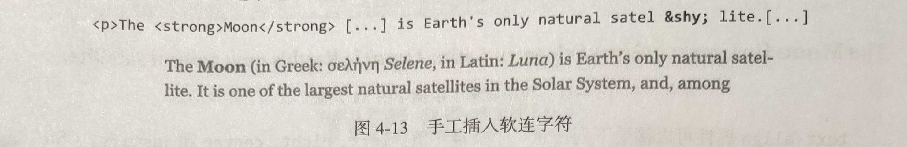

对于文章之类的长文本，手动逐个插入连字符并不现实。此时可以使用 `hyphens` 属性，让浏览器帮插入连字符。这个属性相对较新，因此一般要加上浏览器前缀才能生效。IE10 之前的版本、安卓设备中内置的 WebKit 浏览器，甚至连基于 Blink 的 Chrome 和 Opera 都基本不支持 `hyphens`。

要想使用自动连字符功能，需要保证两点：

1. 在网页 html 元素中设置语言代码

   ```html
   <html lang="en"></html>
   ```

2. 通过 CSS 将相关元素的 `hyphens` 属性值设为 auto。

   ```css
   p {
     hyphens: auto;
   }
   ```

要关闭连字符，可以将 `hyphens` 属性值设置为 manual，即手动模式。在手动模式下，软连字符机制会起作用。

#### 4.2.3 多栏文本

把整篇文章的宽度都限制为 36em 可以达到限制版心宽度的目的，但对于大屏幕而言，却又太浪费空间了，留着大片的空白很可惜！有时候，为了有效利用宽屏，可以把文本分成多栏，并对每栏的宽度加以限制。CSS Multi-column Layout Module 定义的属性可以把文本内容切分成多个等宽的栏。

“Multi-column Layout” 这个名字容易让人产生误会，以为使用它定义的属性，就可以在页面上创建带有栏和栏间距控制的网格布局。实际上并不是这样，这个模块定义的属性只是用来把网页中部分内容的版式转换成类似报纸上的分栏效果。当然，利用这些属性创建其他布局效果完全没问题，只是可能并非该模块的初衷罢了。

如果把之前设置的 max-width 增加到 70em，那么可以分成 3 栏。为此，要把 `columns` 属性设置为想要的最小宽度。栏间距通过 `colum-gap` 属性控制：

```css
article {
  max-width: 70em;
  columns: 20em;
  column-gap: 1.5em;
  margin: 0 auto;
}
```

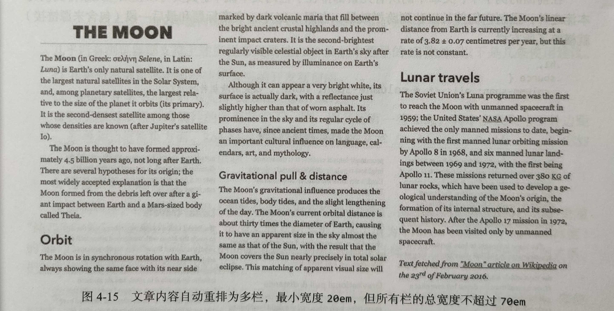

这里的 `columns` 属性是 `column-count` 和 `column-width` 属性的简写形式。如果只设置 `column-count` 属性，浏览器会严格生成指定数量的栏，不管宽度如何。如果同时设置了 `column-count` 和 `colum-width`，则前者会作为最大栏数，后者会作为最小栏宽。

```css
article {
  columns: 20em; /* 在保证最小宽度 20em 的前提下，自动设置栏数 */
  column-width: 20em; /* 同上 */

  columns: 3; /* 3栏，自动设置宽度 */
  column-count: 3; /* 同上 */

  columns: 3 20em; /* 至少3栏，每栏宽度至少 20em */
  /* 以下两条声明的組合相当于以上代码的简写形式：*/
  column-count: 3;
  column-width: 20em;
}
```

1. **后备宽度**

   为了在不支持多栏属性的浏览器中确保行长不会超过限度，可以在段落元素上应 max-width 属性。这样一来，旧版本浏览器只会显示一栏，但仍然能保证可读性：

   ```css
   article > p {
     max-width: 36em;
   }
   ```

2. **跨栏**

   在前面的例子中，文章中的所有元素都排在了栏内文本流中。其实可以让某些元素排到该本流之外，强制它们伸长以达到跨栏效果。下图中，文章标题和最后一段（包含来源链接）就横跨了所有栏：

   ```css
   h1,
   source {
     column-span: all; /* 或 column-span: none;，以关闭跨栏特性 */
   }
   ```

   

   如果让位于文本流中间的一个元素横跨所有栏，那么文本会按照垂直切分后的几栏流动。在下图中，为 h2 元素应用了前面的规则，结果该标题前面后的文本分别灌入了各自的几个分栏。

   

   几乎所有浏览器都支持上述多栏布局属性，IE9 及版本更早的 IE 除外。以下是几条使用建议：

   - 几乎所有浏览器都需要使用合适的开发商前缀。
   - 浏览器对多栏布局属性的实现存在不一致，而且还有一些 bug，其中多数集中于外边距折叠和边框渲染方面。

3. **垂直律动与基线网格**

   在排版时运用一些数学关系很有好处。比如，对于不同标题的大小，采用 “纯四度” 关系（比率约为 1.26）。同时，所有标题都应用了值为 1.5em（相当于一行正文高度）的 margin-top。此外，所有分栏的间距也是统一的。不少设计师非常信奉这种和谐的比例关系，把基本行高作为设计其他部分的基准。

   在印刷设计中，这种律动关系的应用非常普遍，结果就是正文文本都会排进基线网格。即使标题、引用或其他页面部件时不时会打破这种律动，大的格局也不会受影响。这样不仅有助于读者眼球移动时轻松对准文本，还可以在双面印刷时避免背面的文本透过纸面，因为两面都遵循相同的基线。

   在网页设计中，要保证基线准确可是麻烦多了，尤其是在视口会变、允许用户上传图片的情况下。不过在可能的情况下，还是有必要这样做的，比如使用多栏文本布局的时候。

### 4.3 Web 字体

目前为止，在示例中用到的都是用户电脑中安装的字体。Helvetica、Georgia 和 Times New Roman 等网页中常用的英文字体几乎每个电脑都有，因为 Windows 和 macOS X 操作系统多年来一直会预装它们。

多年来，设计师一直梦想着可以在网页中嵌入远程字体，就像在网页中插入图片一样。自 1997 年 IE4 面世以来，相应的技术就已经出现了，只不过到了 2009 年才被 Firefox、Safari 和 Opera 等浏览器普遍支持。

此后，Web 字体有了长足的发展。起初只是个人博客和网站的零星尝试，发展到今天，主流网站乃至政府机关的网站都开始采用定制的 Web 字体。

#### 4.3.1 许可

使用 Web 字体还有一个问题，那就是许可。最开始的时候，字体设计者在授权浏览器下载他们的字体方面非常谨慎，因为担心发生无法控制的侵权问题。这种担忧持续了几年才有所缓解。多数字体设计者都施加了安全限制。比如，只允许从指定的域名下载字体，或者要求定期改字体名，以防止盗链。

**Web 字体托管服务**
尝试 Web 字体最简单的方式，就是使用 Web 字体服务。有一些是收费的，比如 Adobe Typekit、Cloud.typography 以及 Fonts.com，它们会负责相关的一切。还有免费的 Google Fonts，是 Google 汇总并托管的一些免费字体。

这些在线服务会帮用户处理设计者的许可事宜、支持把字体转换为多种格式，确保下载字体包含正确的字符集以及一些优化。然后，通过它们的高速服务器把字体提供给使用者。

使用这些托管服务可以选择一次性许可，也可以选择长期租用。使用字体托管服务的好处是，复杂的事情不用考虑，只要关心如何在网站中使用这些字体就行了。

#### 4.3.2 @font-face 规则

嵌入 Web 字体的关键是 `@font-face` 规则。通过它可以指定浏览器下载 Web 字体的服务器地址，以及如何在样式表中引用该字体。

```css
@font-face {
  font-family: Vollkorn;
  font-weight: bold;
  src: url('fonts/vollkorn/Vollkorn-Bold.woff') format('woff');
}

h1 {
  font-family: Vollkorn, Georgia, serif;
  font-weight: bold;
}
```

前面的 `@font-face` 块声明了在 `font-family` 值为 Vollkorn 且为粗体时应用该规则。之后提供了一个 URL，供浏览器下载包含粗体字体的 Web 开放字体格式（WOFF，Web open font format）文件。

声明了新的字体 Vollkorn 后，就可以在随后的 CSS 中通过 `font-family` 属性正常使用它了。

1. **字体文件格式**
   虽然目前浏览器基本上都已经支持 Web 字体，但它们对字体文件格式的支持却不一致。字体格式的问题很复杂，涉及微软、苹果、Adobe 等公司的发展史。好在所有浏览器开发商都支持标准的 WOFF 格式，有的甚至支持较新的 WOFF2。如果项目需要支持 IE8 及更早版本的 IE、旧版本的 Safari 或早期的安卓设备，那么可能要多写几行代码，补足各种格式的字体文件，比如 SVG、EOT 和 TTF。

   > 如果获得了某款 Web 字体的使用许可，可以通过 Font Squirrel 生成其他格式。

   为了解决旧版本浏览器对字体格式支持的不一致问题，可以在 `@font-face` 规则中声明多个 src 值（与 font-family 很像），包括 `format()` 提示。然后，由浏览器来决定到底使用哪种格式。

   做到这一步，基本上就可以实现 Web 字体的跨浏览器支持了。比如以下的 `@font-face` 规则：

   ```css
   @font-face {
     font-family: Vollkorn;
     src: url('fonts/Vollkorn-Regular.eot#?ie') format('embedded-opentype'), url('fonts/Vollkorn-Regular.woff2') format('woff2'),
       url('fonts/Vollkorn-Regular.woff') format('woff'), url('fonts/Vollkorn-Regular.ttf') format('truetype'),
       url('fonts/Vollkorn-Regular.svg') format('svg');
   }
   ```

   以上例子涵盖了支持 EOT、WOFF（包括 WOFF2）、TTF 和 SVG 的所有浏览器，几乎是现在市面上能见到的所有浏览器了。而且，通过在 src 的值中使用查询字符串，甚至可以满足 IE6~8 的古怪行为。

2. **字体描述符**

   `@font-face` 规则可以接受几个声明，多数是可选的。最常见的列举如下：

   - font-family：必需，字体族的名称。
   - src：必需，URL 或 URL 列表，用于下载字体。
   - font-weight：可选的字体粗细，默认值为 normal。
   - font-style：可选的字体样式，默认值为 normal。

   > **注意**：这些声明与通常规则中的 font 属性不是一回事。这几个都不是属性，而是**字体描述符**（font descriptor）。它们不会改变字体，它们的值只是为了告诉浏览器在什么情况下可以触发使用这个特定的字体文件。

   如果这里的 font-weight 值为 bold，那么就是告诉浏览器：“如果 font-family 中字体的 font-weight 设置成了 bold，那么可以使用这里定义的字体文件。”此处有一个陷阱：假如 Vollkorn 只在这里定义了这么一次，那么其他粗细也可以使用这里的字体文件，无论是否匹配。这是由于标准规定的浏览器加载和选择字体的原则：正确的 font-family 优先于正确的粗细值。

   很多字型包含不同粗细、样式和变体的字体，因此可以在 `@font-face` 块中使用相同的 Vollkorn 名称，但引用不同的字体文件。在下面的例子中，加载了两种不同的字型，声明了具体的粗细值和样式对应的字体文件：

   ```css
   @font-face {
     font-family: AlegreyaSans;
     src: url('fonts/alegreya/AlegreyaSans-Regular.woff2') format('woff2'), url('fonts/alegreya/AlegreyaSans-Regular.woff')
         format('woff');
     /* 字体粗细和样式都为默认值 normal */
   }

   @font-face {
     font-family: Vollkorn;
     src: url('fonts/vollkorn/Vollkorn-Medium.woff2') format('woff2'), url('fonts/vollkorn/Vollkorn-Medium.woff') format('woff');
     font-weight: 500;
   }

   @font-face {
     font-family: Vollkorn;
     font-weight: bold;
     src: url('fonts/vollkorn/Vollkorn-Bold.woff2') format('woff2'), url('fonts/vollkorn/Vollkorn-Bold.woff') format('woff');
   }
   ```

   在随后的样式表中，通过声明不同的粗细值，就可以分别使用不同的字体文件：

   ```css
   body {
     font-family: AlegreyaSans, Helvetica, arial, sans-serif;
   }

   p {
     font-family: Vollkorn, Georgia, Times, 'Times New Roman', serif;
     font-weight: bold; /* 使用 Vollkorn bold 字体 */
   }

   h3 {
     font-weight: 500; /* 使用 Vollkorn Medium 字体 */
   }
   ```

#### 4.3.3 Web 字体/浏览器/性能

Web 字体给网页设计带来了很大的飞跃，但同时也给网页中的实际应用带来了一些麻烦。

首先，浏览器需要下载额外的字体文件，这显然会延长用户等待的时间。使用 Web 字体首先必须注意不要加载过多的字体文件。如果自己托管自己的自定义字体，那么要确保设置适当的缓存首部，以避免不必要的网络开销。除此之外，浏览器在渲染这些字体时也有一些问题。

在下载 Web 字体的时候，浏览器有两种方式处理相应的文本内容：

- 在字体下载完成前暂缓显示文本，术语叫 FOIT（flash of invisible text）。Safari、Chrome 和 IE 默认采用这种方式，问题是用户必须等待字体下载完成才能看到内容。如果用户的网络速度很慢，这个问题会非常明显。

- 在字体下载完成前，浏览器先用一种后备字体显示内容。这样可以避免因网速慢而引起的问题，但也会带来字体切换时的闪动问题。这个闪动有时候也被称为 FOUT（flash of unstyled text）。FOUT 影响用户感知的速度，特别是在后备字体与 Web 字体的大小相差较多的情况下。如果在字体下载完成并应用的瞬间，网页内容跳跃过大，用户可能会失去焦点。

如果想更好地控制浏览器处理 Web 字体的方式，包括如何显示 Web 字体和后备字体，那么可以选择使用 JS 加载字体。

#### 4.3.4 使用 JS 加载字体

最近的 CSS Font Loading 规范定义了一个用于加载字体的实验性 JS API，可惜这个 API 尚未得到浏览器的广泛支持。因此，需要借助第三方库来实现一致的字体加载体验。

Typekit 维护着一个开源 JS 工具，叫 Web Font Loader。这个库体积很小，在浏览器支持的情况下，它会使用原生的字体加载 API；在浏览器不支持的情况下，它会模拟相同的功能。这个库内置支持一些 Web 字体服务，比如 Typekit、Google Fonts 和 Fonts.com，同时也支持自托管的字体。

可以下载这个[库](https://developers.google.com/speed/libraries/#/web-font-loader)，也可以从 Google 的服务器上加载它。Web Font Loader 提供了很多有用的功能，其中最有用的就是确保字体加载的跨浏览器一致性。希望使用它达到的效果是，即使在网速慢的情况下也不会妨碍用户阅读内容。换句话说，想在目标浏览器中实现一致的 FOUT 行为。

Web Font Loader 为以下事件提供了接入点：

- loading：开始加载字体。
- active：字体加载完成。
- inactive：字体加载失败。

在下面例子中，需要把 `@font-face` 块中的所有代码转移到一个独立的样式表 alegreya-vollkorn.css，同时把它放在一个子文件夹 css 中。然后，需要在页面头部添加一小段 JS 代码：

```html
<script type="text/javascript">
  WebFontConfig = {
    custom: {
      families: ['AlegreyaSans:n4,i4', 'Vollkorn:n6,n5,n7'],
      urls: ['css/alegreya-vollkorn.css']
    }
  };

  void (() => {
    let wf = document.createElement('script');
    wf.src = 'https://ajax.googleapis.com/ajax/libs/webfont/1/webfont.js';
    wf.type = 'text/javascript';
    wf.async = true;
    let s = document.getElementsByTagName('script')[0];
    s.parentNode.insertBefore(wf, s);
  })();
</script>
```

这段代码既负责加载 Web Font loader 脚本，又负责配置后面要使用的字体变体。描述变体的代码在 font-family 名称后面，比如 n4 表示 “normal 样式，400 粗细”，以此类推。在这个样式表中的字体加载后，脚本会自动给 html 元素添加生成的类名。这样，就可以在 CSS 中提前编写加载新字体的规则：

```css
body {
  font-family: Helvetica, arial, sans-serif;
}

.wf-alegreya-n4-active body {
  font-family: Alegreya, Helvetica, arial, sans-serif;
}
```

这两条 CSS 规则的含义是，在 Alegreya 字体加载前，使用准备好的后备字体。而在 Alegreya 字体加载后，脚本会给 html 元素添加 wf-alegreya-n4-active 类，于是浏览器马上启用新下载的字体。这样不仅能保证跨浏览器加载字体的一致性，还有机会为后备字体和 Web 字体分别调整版式。

**匹配后备字体大小**
通过在字体加载期间应用类似的规则，可以控制因 Web 字体与后备字体大小不同带来的版式抖动。希望，在 Web 字体替代后备字体的瞬间，版式抖动尽可能细微且不易被用户察觉。

在下面例子中，Alegreya 字体的 x 高度明显小于 Helvetica 和 Arial（后两个字体的尺寸差不多）。通过微调 font-size 和 line-height，可以让它们的高度尽量接近。同理，还可以通过 word-spacing 来微调字符宽度。这样做的结果是，使用后备字体时的版式与切换为使用 Web 字体时会相差无几。

```css
.wf-alegreyasans-n4-loading p {
  font-size: 0.905em;
  word-spacing: -0.11em;
  line-height: 1.72;
}
```

使用 Web Font loader 要注意的另一件事是在 web 字体加载后设置 `font-size-adjust` 属性。这个属性用于指定 x 高度与 font-size 的比率。在某个字形缺少合适字体的情况下，后备字体会被调整为该比率。这个比率通常是高度的一半（值为 0.5），但也可能不是，有可能导致后备字体与 Web 字体的差异非常明显。在这里用不着测量并设置一个数值，可以直接设置一个关键字 auto，让浏览器替做这件事：

```css
.wf-alegreyasans-n4-active body {
  font-size-adjust: auto;
}
```

### 4.4 高级排版特性

微软和 Adobe 在 20 世纪 90 年代开发的 OpenType 字体格式，支持在字体文件中包含字体的额外设定和特性。如果使用的字体文件（.ttf、.otf 或 .woff/.woff2 都有可能）包含 OpenType 特性，那么在多数现代浏览器中都可以控制更多的 CSS 特性。这些特性包括字距调整（kerning）、连字（ligature）、替代数字（alternative numeral0，以及饰线（swash）等装饰性笔画。

CSS 字体规范中也有许多与 OpenType 对应的属性，比如 font-kerning、font-variant-numeric 和 font-variant-ligatures。浏览器对这些属性的支持并不一致，但可以通过另一个更低级的属性 `font-fearture-settings` 来控制相应的特性。不过最好是两个属性都使用，因为也有浏览器支持上述的对应属性而不支持这个低级属性。

`font-fearture-settings` 接受一些用于切换特性的值，就是 4 个字母的 OpenType 代码，其中也可以带有数值。比如，可以启用下图所示的连字特性。


字体设计者可以根据使用目的，为连字特性指定分类。为启用 Vollkorn 中内置的两种连字特性，标准连字（standard ligatures）和任意连字（discretionary ligatures），可以使用以下规则：

```css
p {
  font-variant-ligatures: common-ligatures discretionary-ligatures;
  font-feature-settings: 'liga', 'dlig';
}
```

对支持 OpenType 的浏览器，通过对应的 `font-variant-ligatures` 属性始终可以默认启用标准连字特性，因此前面第一条声明里就没有把标准连字特性写出来。有些浏览器支持 `font-feature-settings` 属性，但语法不一样。另外一些浏览器可能要求在这个属性前面加上开发商前缀。总之，启用常用（common）和任意（discretionary）连字特性的完整规则如下：

```css
p {
  font-variant-ligatures: discretionary-ligatures;
  -webkit-font-feature-settings: 'liga', 'dlig';
  -moz-font-feature-settings: 'liga', 'dlig';
  -moz-font-feature-settings: 'liga=1, dlig=1';
  font-feature-settings: 'liga', 'dlig';
}
```

下面稍微解释一下：

- 影响 OpenType 特性的标准方式是使用加引号的 4 个字符的代码，后接一个关键字 on 或 off（可选），也可以后接一个数字（可选）。代码表示特定的状态，如果不写，则使用默认值 on。

- 以数字 0 表示状态相当于关闭特性。如果特性只有 “开” 和 “关” 两个状态，那么 1 就表示 “开”。有的特性会包含多个 “状态”，可以通过相应的数字来选择，具体数字的含义取决于字体以及想启用的特性。

- 如果想一次性列出多个特性，值之间要用逗号隔开。

- 多数浏览器都以加前缀的属性实现这些特性，因此别忘了加上开发商前缀。

- 针对 Mozilla 浏览器的旧语法稍有不同：多个特性作为一个字符串写在一对引号中，特性之间以逗号隔开；每个特性的状态则以写在等号后面的数字表示。

完整的 OpenType 特性代码，可以在微软的[这个网页](https://docs.microsoft.com/zh-cn/typography/opentype/spec/featurelist)中找到。

#### 4.4.1 数字

有些字体中包含多种数字形式。Georgia 或 Vollkorn 等字体会默认使用老式的数字，也就是数字跟字母一样，有上伸部分（ascender）和下伸部分（descender）。Vollkorn 也包含线性数字，即所有数字都位于基线以上、具有与大写字母一样的高度。通过如下代码分别展示了老式数字和线性数字：

```css
.lining-nums {
  font-variant-numeric: lining-nums;
  font-feature-settings: 'lnum';
}
.old-style {
  font-variant-numeric: oldstyle-nums;
  font-feature-settings: 'onum';
}
```

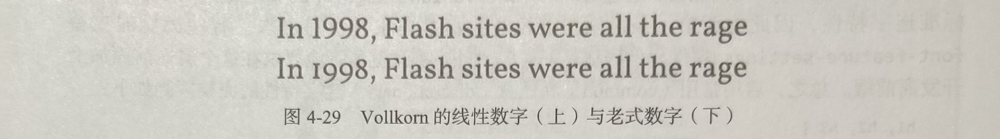

多数字体都有不同宽度的数字（比例数字），跟常规字母一样。如果想在表格或列表中垂直对齐数字，那么可能就需要表列数字。通过如下代码组合使用了下图中的表列数字和线性数字：

```css
table {
  font-variant-numeric: tabular-nums lining-nums;
  font-feature-settings: 'tnum', 'lnum';
}
```


#### 4.4.2 字距选项及文本渲染

高品质字体中通常包含用于调整某些字形间距的数据。这种微调间距的过程叫作**字距调整**（kerning）。换句话说，有些字母之间需要加大间隔才不会显得拥挤，而有些字母之间需要缩小间隔才不会显得疏远。

浏览器在渲染文本时通常会基于已知的尺寸自动处理字距，不过也可以手动设置现代浏览器读取字距调整数据。为此，可以设置 `font-kerning` 属性，或者启用 OpenType 的 kern 特性

```css
.kern {
  font-kerning: normal;
  font-feature-settings: 'kern';
}
```

关键字 normal 告诉浏览器从字体中读取字距调整数据（如果有的话）。而 auto 关键字则允许浏览器自作主张，只在它认为合适的时候开启字距调整。比如，在文本很小的情况下，浏览器可能就不会多此一举。最后，如果要明确告诉浏览器不进行字距调整，就使用 none。

> **注意**：在有些浏览器中，启用其他 OpenType 特性（如连字）可能自动触发字距调整。因此，如果希望连字但不调整字距，就需要明确告诉浏览器不进行字距调整。反之，启用 kern 特性也可能触发常见或标准连字特性。

**不要使用 text-rendering 属性**
设置 `text-rendering: optimizeLegibility` 是启用字距调整并同时启用连字的另一种方式。这不是 CSS 标准的方式，而是 SVG 规范中的一个属性，用于告诉浏览器选一种方法来渲染 SVG 中的字母。这个属性的值还有 optimizeSpeed（性能优先）、optimizeGeometricPrecision（更精确）或 optimizeLegibility（可读性）。

这个属性出现时间不短了，也得到了浏览器较好的支持，因此很多网站会采用。在 WebKit 浏览器支持 font-feature-settings 属性以前，这个属性是在旧版浏览器中激活相应特性的唯一方法。然而，这个属性存在一些严重的渲染问题，建议最好不使用它。

### 4.5 文本特效

#### 4.5.1 合理使用文本阴影

CSS 的 `text-shadow` 属性可以用来给文本绘制阴影。给大篇幅的正文文本加阴影不是什么好主意，因为会降低可读性。对于标题或短文本，阴影倒是大有用武之地，非常适合模拟凸版印刷或者喷涂效果。

`text-shadow` 属性的语法非常直观，需要指定相对于源文本 x 轴和 y 轴的偏移量（可正可负）、模糊距离（0 意味着完全不模糊）和颜色值，由空格分隔：

```css
h1 {
  text-shadow: -0.2em 0.4em 2em #ccc;
}
```

除此之外，还可通过用逗号分隔来给文本添加多组阴影。多组阴影会按先后次序堆叠，先定义的在上，后定义的在下。

为同一段文本添加多组阴影可以模拟出压印或浮雕的效果，方法就是在文本上方和下方加上偏暗或偏亮的阴影。偏亮或偏暗阴影的偏移取决于文本相对于背景的明度。暗文本上方加亮阴影且下方加暗阴影就是通常的压印效果，反之亦然。以下代码示例展示了两种不同的效果：

```css
.impressed {
  background-color: #6990e1;
  color: #31446b;
  text-shadow: 0 -1px 1px #b3d6f9, 0 1px 0 #243350;
}
.embossed {
  background-color: #3c5486;
  color: #92b1ef;
  text-shadow: 0 -1px 0 #243350, 0 1px 0 #def2fe;
}
```

进一步发挥想象力，还可以利用多组阴影创造出 3D 效果，比如仿手写广告牌字体。沿对角线每隔 1 像素叠加一个实心阴影就可以创造出这个效果：

```css
h1 {
  font-family: Nunito, 'Arial Rounded MT Bold', 'Helvetica Rounded', Arial, sans-serif;
  color: #d0bb78;
  text-transform: uppercase;
  font-weight: 700;
  /* 以 1px 为单位累加 */
  text-shadow: -1px 1px 0 #743132, -2px 2px 0 #743132, -3px 3px 0 #743132, /* ... */ -22px 22px 0 #743132,
    -23px 23px 0 #743132;
}
```

为了让文字的仿手写体效果更突出。首先，用一批白色阴影给文字加上轮廓。这是因为，广告画工为了在字母油漆未干时就可以继续画阴影，通常会在字母和阴影间留一些空隙。为了把文字边缘包住，得在各个方向上偏移，加上白色阴影。

其次，再运用一个技巧，让阴影颜色沿偏移方向渐变，从而更像 3D 效果。为此，需要亮阴影和暗阴影交错地偏移。这样，利用这些阴影的堆叠，就让一种颜色水平方向比较突出，另种颜色垂直方向比较突出。以下是实现技巧的代码：

```css
h1 {
  /* 省略了一些属性 */
  /* 首先，各个方向上的白色阴影构成轮廓 */
  text-shadow: -2px 2px 0 #fff, 0 -2px 0 #fff, 0 3px 0 #fff, 3px 0 0 #fff, -3px 0 0 #fff, 2px 2px 0 #fff,
    2px -2px 0 #fff, -2px -2px 0 #fff, /* 其次，交错叠加的阴影让颜色沿两个方向凸显 */ -3px 3px 0 #743b34, -4px 3px 0
      #a8564d, -4px 5px 0 #743b34, -5px 4px 0 #a8564d, -5px 6px 0 #743b34, /* 继续叠加 */ -22px 21px 0 #a8564d,
    -22px 23px 0 #743b34, -23px 22px 0 #a8564d, -23px 24px 0 #743b34;
}
```

几乎所有浏览器都支持 text-shadow 属性，只有 IE9 及更早的 IE 不行。对于支持它的浏览器而言，由于绘制阴影开销比较大，请不要滥用。

#### 4.5.2 使用 JS 提升排版品质

也有 CSS 不能完全胜任的情况，比如可以通过 `:first-letter` 伪元素选中一段文本的第一个字母，但没有选择符能单独选择其他字母。假如想让每个字母拥有不同的颜色，那唯一的办法就是把每个字母都单独包装在一个元素中，然后以元素为目标来选择。这个办法也不是十分可靠，特别是在无法手动控制标记的情况下。

好在可以通过 JS 来创建其他字母的接入点。jQuery 插件 lettering.js 可以帮上忙。

除了这个插件，还有海量的其他 JS 解决方案，可以帮助处理文本。下面推荐几个：

- fitText.js：由 Paravel 公司 lettering.js 开发团队开发的另一款 jQuery 插件，可以让文本随页面大小缩放。
- BitText.js：Filament Group 的 Zach Leatherman 写的脚本，可以让一行文本放大到尽可能与包含它的容器一般大。
- Widowtamer：Gridset.com 的 Nathan Ford 写的脚本，通过在一段的末尾每隔一定距离就在单词间插入非换行空白符，来防止出现意外的孤行。

## 五. 漂亮的盒子

HTML 文档中的所有元素都由矩形盒子构成的。

### 5.1 背景颜色

**颜色值与不透明值**
可以使用了十六进制表示法指定颜色。所谓十六进制表示法，就是一个 `#` 后面加上 6 位十六进制数字构成的字符串。这个字符串由 3 组数字（每组各 2 位）构成，每个数字的取值范围是 0-F。十六进制的意思就是每个数字都可能有 16 种不同的值，因此除了 0~9 这 10 个数，还要用 A~F 补足第 11-16 位数。

3 组数字分别表示颜色中的红、绿、蓝（RGB）通道的值。每种颜色通道的值有 256 种可能，也就是 2 位十六进制数所能表示的可能性（16×16=256）。如果 3 组数字中每组的 2 位数字相同，可以简写成 3 位数字，比如 `#aabbcc` 可以简写成 `#abc`。

> 颜色值也可以用预定义的关键字表示，比如 red、black、teal、goldenrod 或 darkseagreen。有些关键字的名字非常古怪，因为它们源自一个古老的图形处理系统，叫 X11。这个系统的开发者从一盒蜡笔的颜色中选取了这些关键字。实际上，除了有助于快速排错，好像没什么理由使用这些关键字。

RGB 值可以用另一种方式表示，即 rgb() 函数式表示法。RGB 的每个值可以是一个十进制数值，取值范围为 0-255；也可以是一个百分比值，取值范围为 0%~100%。用 rgb() 表示法表示 `rgb(186, 218, 85)`。

十六进制及 rgb() 函数表示法从 CSS1 诞生起就有了。CSS 规范之后又提供了新的表示颜色的方法：hsl()、rgba( )和 hsla()。

- **hsl() 函数式表示法**
  十六进制和 RGB 表示法反映的都是计算机如何在显示器上显示颜色，即红、绿、蓝三原色的混合。而 hsl() 函数表示法则反映了另一种描述颜色的方式：**色相-饱和度-亮度**（hue-saturation-lightness），即 HSL 模型。色相的值取自下图所示的色轮，在这个色轮上，颜色的融入关系取决于度数：红色在顶部（0 度），绿色在顺时针方向 1/3 圆的位置（120 度），而蓝色在 2/3 圆的位置（240 度）。

  

  使用 hsl() 语法需要传入三个参数，第一个是角度，第二和第三个是百分比值。这两个百分比值分别代表 “颜料” 的量（饱和度）和亮度。以下是 hsl() 表示法的示例：

  ```css
  .box {
    background-color: hsl(74, 64%, 59%);
  }
  ```

  > **注意**：使用哪种表示法来表示颜色没有本质区别，它们只是表示同一事物的不同方法而已。

- **rgba()**
  rgba() 是 RGB 的加强版。其中，末尾的 a 表示 alpha，是用于控制透明度的阿尔法通道。如果想设置同样颜色的背景，但透明度为 50%，可以这样做：

  ```css
  .box {
    background-color: rgba(186, 218, 85, 0.5);
  }
  ```

  第四个参数值表示透明度，取值范围为 0~1.0，1.0 表示完全不透明，0 表示完全透明。

- **hsla() 表示法**
  hsla() 表示法。它与 hsla() 的关系跟 rgba() 与 rgb() 之间的关系一样，都可以接受一个表示透明度的参数，用以设置颜色的透明程度：

  ```css
  .box {
    background-color: hsla(74, 64%, 59%, 0.5);
  }
  ```

知道了如何控制颜色的透明度之后，还应该知道 CSS 也提供另一种方式来控制透明度，那就是 `opacity` 属性：

```css
.box {
  background-color: #bada55;
  opacity: 0.5;
}
```

这样会让 .box 元素拥有和前面的例子相同的颜色和透明度。那么两者有什么不同呢？在前面的例子中，只让背景颜色变得透明；而这里让整个元素都变透明了，包括**元素中包含的内容**。使用 `opacity` 把一个元素设置为透明后，将无法再让其子元素变得不那么透明。

实践中，这意味着带透明度的颜色值非常适合半透明的背景和或文本，而较低的不透明度则会让整个元素有淡出效果。

### 5.2 背景图片

添加背景颜色可以让页面色彩更加丰富。但有时候，也想使用图片作为元素的背景。CSS 为实现这个提供了充足的工具。

#### 5.2.1 背景图片与内容图片

如果图片从网页中去掉之后，网页本身仍然有意义，那么该图片就可以当作背景图片。如果网站的观感完全变了，但图片本身仍然有意义，那么该图片就可以当作内容图片。

背景图片有一个相关属性 `background-repeat` 可以让图片平铺到整个元素盒子。`background-repeat` 属性的默认值为 repeat，意思是背景图片要沿 x 轴和 y 轴重复。这个特性对花纹图案的背景图片非常有用，但对照片可能就不合适了。可以明确声明 repeat-x 或 repeat-y 来限定图片只沿某个轴的方向重复，还可以通过 no-repeat 完全禁止重复。

Level3 Backgrounds and Borders 规范重新定义了这个属性，扩展了语法，并增加了关键字。首先，支持以空格分隔的针对两个方向的关键字声明语法。换句话说，以下声明等价于使用 repeat-x：

```css
.profile-box {
  background-repeat: repeat no-repeat;
}
```

其次，增加了新关键字。在支持的浏览器中，可以单独或一起设置 `space` 和 `round` 关键字：

- `space`的意思是，如果（未经裁剪和缩放的）背景图片可以在元素内部完全重复两次以上，那么它就会重复相应的次数，重复的图片之间填充空白，从而让第一张和最后一张图片都紧挨着元素的边缘。
- `round` 则意味着图片会被缩放，从而恰好能在元素中重复整数次。

说实话，这些新的重复特性没太大用处。如果想用符号或图案作为背景，从而让设计保持某种对称性，它们可能有用，但同时也会带来如何设置图片宽高比的难题。当然，浏览器的支持也参差不齐。

#### 5.2.3 加载图片（以及其他文件）

使用 url() 函数式表示法时，可以使用相对路径，如 url(img/cat.jpg)。浏览器此时会在保存当前样式表的目录的 img 子目标中寻找图片。如果路径以一个斜杠开头，如 /img/cat.jpg，则浏览器会在相对于 CSS 文件所在域的顶级目录的 img 子目录中寻找图片。

这里也可以使用绝对路径，那就要把协议、域名、路径和文件名都写全，比如：`http://example.com/img/my-background.jpg`。

除了相对路径和绝对路径，加载图片（或其他资源）也可以不指向文件，而是在样式表中直接嵌入数据。这时候要用到**数据 URI**（data URI），数据 URI 的值是由文件中二进制编码的数据转换而来的长字符串。有很多工具可以帮助实现这种转换。

拿到转换得到的结果后，可以将其直接粘贴到 url() 函数中，同时也将这些数据保存在样式表里。下面是一个使用数据 URI 的例子：

```css
.egg {
  background-image: url(data:image/png;base64,ivBORWOKGgoAAAANSUhEUgAAAC BAAAAOAQAAAACkhYXAAAAAJElEQVR4AWP/R.,and so on, random (? data for a long time.*/4DWIMtzFJs99p9xkoXfsddZ/hlhiY/AYib1vsSbdn+P9vf/1/hV8//oBIIICRZ///r3sPMqHSPCN9MLvn1s6SfIbbUWF 174HkdTB5rWw/w51nN8VZIbrgJDuI/PMTRP7+ByK//68HkeUg8v3//W]kWwJ5GOR+w5Wyv8P1gsxB2EmwhYAgeerNiRVNy EAAAAASUVORKSCYII-);
}
```

开头的 **data:image/png;base64** 告诉浏览器后面是什么文件的数据，接下来的内容则全部是转换为字符的实际像素数据。

使用嵌入的数据 URI 有好处也有坏处。使用它主要是**为了减少 HTTP 请求**，但与此同时也会增加样式表体积，因此请慎重使用，只使用在一些小图标上。

#### 5.2.4 图片格式

网页中可以使用的图片格式很多，既可以作为内容图片，也可以作为背景图片。以下是简单的列举：

- JPEG：一种位图格式，有损压缩，压缩率越高，损失细节越多，适合照片。不支持透明度设置。
- PNG：一种位图格式，无损压缩，不适合照片（因为文件会很大），适合图标、插图等小尺寸文件。支持阿尔法透明度设置。
- GIF：早期的位图格式，与 PNG 类似，主要用于动图。严格来讲，除动图外，GIF 基本已被 PNG 取代。实际上 PNG 也支持动图，只是浏览器支持落后。GIF 支持透明度设置，但不支持阿尔法分极，因此边缘会有 “锯齿”。
- SVG：一种矢量图形格式，本身也是一种标记语言。SVG 可以直接嵌入到网页中，也可以作为资源引用；可以作为背景图，也可以作为内容图。
- WebP：Google 开发的一种新图片格式，结合了 JPEG 的高压缩率和 PNG 的阿尔法透明特性。目前，浏览器对 WebP 的支持还参差不齐，但应该很快会普及。

以上除了 SVG 都是位图格式的。位图意味着文件会包含每个像素的数据，拥有内在的维度（宽度和高度）。对于细节丰富的图片，比如照片或详细示意图，位图很合适。但很多情况下，真正合适的则是 SVG 图形，其文件中包含的是如何在屏幕上绘制图形的指令。由于包含的是指令，SVG 图形可以任意缩放，也可以在任意像素密度的屏幕上清晰呈现。换句话说，**SVG 图形永远不会丢失细节，也不会出现 “锯齿”**。

### 5.3 背景图片语法

#### 5.3.1 背景位置

背景图片的位置由 `background-position` 属性控制。

```css
/* 把背景图片定位到元素中心 */
.profile-box {
  width: 100%;
  height: 100%;
  background-color: #8da9cf;
  background-image: url(img/big-cat.jpg);
  background-repeat: no-repeat;
  background-position: 50% 50%;
}
```

`background-position` 属性既可以使用关键字，也可以使用像素、em 或百分比。最简单的情况下，可以只给两个值：一个表示相对于左侧的偏移量，一个表示相对于顶部的偏移量。

> **注意**：有些浏览器支持 `background-position-x` 和 `background-position-y` 属性，这两个属性分别用于独立地在每个轴向上定位图片。这两个非标准属性是 IE 最早提出来的，目前正在标准化的过程中。

如果使用像素或 em 单位来设置背景图片的位置，那么图片的左上角会相对于元素的左上角定位，也就是会偏移指定的数值。比如，要是在水平和垂直方向都指定了 20 像素，那么图片左上角就会偏移到距元素左边和上边均为 20 像素的点。如果设置背景图片的位置时使用了百分比，那么情况就不一样了。百分比值不像绝对数值那样会定位背景图片的左上角，而是定位图片中对应的点。如果水平和垂直方向都设置为 20%，那么定位的实际上是距图片左边和上边各 20% 的点，而这个点会与距离父元素左边和上边各 20% 的点重合。

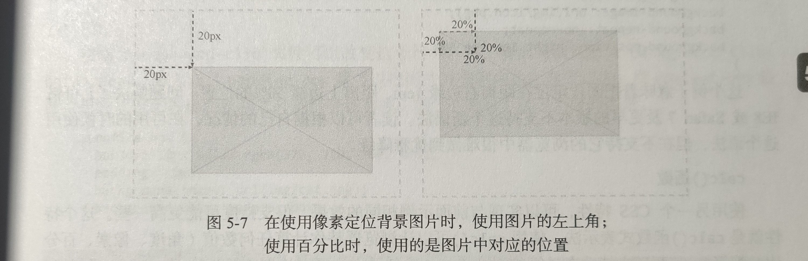

使用关键字来对齐背景图片，要在 x 轴上用 left、center 或 right，在 y 轴上用 top、center 或 bottom。顺序一般都是先 x 轴后 y 轴。这样既能保持一致，又能一目了然，还能避免错误。在只使用两个关键字的情况下，规范并没有限定顺序（如可以用 top left）但在一个关键字加上一个长度值的情况下，规则本身将无效，比如以下声明：

```css
.box {
  background-position: 50% left; /* 不要这样写 */
}
```

背景图片定位的这一限制一直是很多问题的来源。以下图为例，这里的文本内容长度不定，后面跟着一个图标，图标四周有空白。此时没办法使用像素或 em 来定位图标，因为不知道它距左边缘有多远。


以前的解决方案有两种：

- 给这个图标一个包装元素，然后定位该元素；
- 使用背景图片，把 x 轴定位设为 100%，而图片右侧以透明像素形式加入空白区。

其中使用 CSS 的后一个方案并不完美，因为不能通过 CSS 控制空白区。好在 Level3 Backgrounds and Borders 规范给出了新方案。新语法允许给 `background-position` 添加外边空声明，先写边界关键字，再写长度值。代码如下：

```html
<p>
  <a
    href="/activate"
    class="link-with-icon"
    >Activate flux capacitor</a
  >
</p>

<style>
  .link-with-icon {
    padding-right: 2em;
    background-image: url(img/icon.png);
    background-repeat: no-repeat;
    background-position: right 1em top 50%;
  }
</style>
```

这个例子意味着把图片定位在距离右边缘 1em、距离上边缘 50% 的位置。问题解决了！在 IE8 或 Safari7 及更早的版本不支持这个新语法。可以根据自己的情况，在可用的时候使用这个语法。

使用另一个 CSS 特性，可以实现与前面示例相同的效果，但支持度可能更高一些。这个特性就是 [`calc()`](#2133-数学函数) 函数式表示法。对于前面讨论的 “背景图片右侧定位” 问题，可以使用 calc() 表示法像下面这样表达同样的 x 轴定位：

```css
.link-with-icon {
  /* 为简洁起见，省略了其他属性 */
  background-position: calc(100%- 1em) 50%;
}
```

#### 5.3.2 背景裁剪与原点

默认情况下，背景图片是绘制在元素边框以内的。如果（使用下面介绍的 `background-origin`）把背景图片定位到边框下方，而边框又被设置为半透明，那么图片边缘就会出现半透明的边框。

使用 `background-clip` 属性可以改变这个行为。这个属性的默认值为 border-box，将其改为 padding-box 就可以把图片裁剪到内边距盒子以内。而 content-box 值则会把图片位于内边距及其之外的部分裁剪掉。

即使 background-clip 属性的值改变了，**背景定位默认的原点（开始定位背景图片的参照点）仍然在代码中声明的内边距盒子（padding-box）的左上角**。换句话说，定位值从元素边框内开始计算。

也可以使用 `background-origin` 属性控制原点的位置。这个属性与 `background-clip` 一样，也接受盒模型相关的几个值：border-box、padding-box、content-box。

`background-clip` 和 `background-origin` 都是 Level3 Backgrounds and Borders 规范定义的。

#### 5.3.3 背景附着

背景会附着在指定元素的后面，如果滚动页面，那么背景也会随着元素移动而移动。可以通过 `background-attachment` 属性改变这种行为。如果想让背景图在页面滚动时 “粘” 在页面上，可以使用以下代码：

```css
.protile {
  background-attachment: fixed;
}
```

除了 fixed 和默认值 scroll，还可以把 `background-attachment` 设为 local。这个属性值的效果不太容易通过纸面来展示。它与 scroll 的区别在于，scroll 会让背景图片相对于元素本身固定，而 local 则会让背景图片相对于元素中的内容固定。换句话说，如果元素设置了固定的大小，且 overflow 属性设置为 auto 或 scroll，因而其中的内容在超出元素范围时会出现滚动条，那么这种情况下，在元素内部滚动显示更多内容时，背景图片会随着内容移动。

桌面浏览器对 local 值的支持相对比较好，但相应的移动端浏览器则表现欠佳。当然，移动浏览器忽略这个属性（以及 fixed 值）是可以理解的。毕竟在触摸滚动的小屏幕上，元素内容滚动会造成可用性障碍。事实上，规范本身也允许在确实不合适的情况下忽略 `background-attachment` 属性。

#### 5.3.4 背景大小

如果使用了一张大图覆盖了整个元素。那么在小屏幕上，那么图片会被剪切掉。反之，如果屏幕特别大，那么元素边缘可能出现空白。要避免上述情况，不管页面如何缩放，都让内容保持自己的宽高比，就要使用 `background-size` 属性。

给 `background-size` 明确指定一个值，可以重新设置图片大小，也可以让它随元素大小缩放而缩放。要让图片随元素缩放而缩放，则必须使用百分比值。

> **注意**：百分比值并不是相对于图片固有大小，而是相对于容器大小。因此，简单地把图片宽度和高度都设置成百分比值，可能会因容器高度变化而导致图片变形。更好的做法是**只给一个维度设置百分比值**，另一个维度设置关键字值 auto。

百分比值赋予了控制的灵活度，但也不是任何情况下都适用。有时候，会希望背景图片的任何一边都不要被切掉。还有一种情况，希望背景图片始终都能完全覆盖元素。CSS 为此也提供了一些关键字值：

- **contain**
  可以把背景大小设置为 `contain`。这个值可以让浏览器尽可能保持图片最大化，同时不改变图片的宽高比。但浏览器会自动决定哪一边使用 auto 值，哪一边使用 100%。在高而窄的元素中，方形背景最多 100% 宽，因此垂直方向会出现空白；而在较宽的元素中，背景最多 100% 高，因此水平方向会出现空白。

- **cover**
  第二个关键字是 `cover`，意思是图片会缩放以保证覆盖元素的每一个像素，同时不会变形。在一个高而窄的元素中，元素高度会被填满，但图片左右两边会被切掉；而在一个较宽的元素中，元素宽度会被填满，但图片上下两边会被切掉。

#### 5.3.5 背景属性简写

CSS 背景有一个 `background` 简写属性，可以同时设置一堆背景相关的属性。通常，通过这个简写属性指定的具体属性值的顺序可以随意，浏览器会自己弄明白写的关键字和语法的含义。不过也有两点需要注意：

1. 因为两个长度值既可以用于 `background-position`，也可以用于 `background-size`，所以两个都需要声明，而且要先声明 background-position，后声明 background-size，值之间以斜杠（/）分隔。

2. 因为 `*-box` 关键字（border-box padding-box 或 content-box）既可以用于 background-origin，也可以用于 background-clip，所以有如下规则

   - 如果只存在一个 `*-box` 关键字，则 background-origin 和 background-clip 都取这个关键字值。
   - 如果存在两个 `*-box` 关键字，则第一个设置 background-origin，第二设置 background-clip。

下面是一个综合了各种背景属性的例子：

```css
.profile-box {
  background: url(img/cat.jpg) 50% 50% / cover no-repeat padding-box content-box #bada55;
}
```

> **注意**：使用 background 这个简写属性，它会把所有没有明确指出的属性都重置为其默认值。因此，如果要使用它，应该把它放在声明的第一位，然后再根据需要来覆盖特定的属性值。虽说使用简写属性可以少敲几下键盘，但一般而言，明确的代码更不容易出错，而且也更容易让人理解。

### 5.4 多重背景

一般来说只使用一张图片作为背景，但 Level3 Backgrounds and Borders 规范现在支持一个元素设置多个背景图片。因此，每个背景属性也就有了相应的多值语法，多个值由逗号分隔。下面就是一个例子，效果如下图所示：

```css
.multi-bg {
  background-image: url(img/spades.png), url(img/hearts.png), url(img/diamonds.png), url(img/clubs.png);
  background-position: left top, right top, left bottom, right bottom;
  background-repeat: no-repeat, no-repeat, no-repeat, no-repeat;
  background-color: pink;
}
```

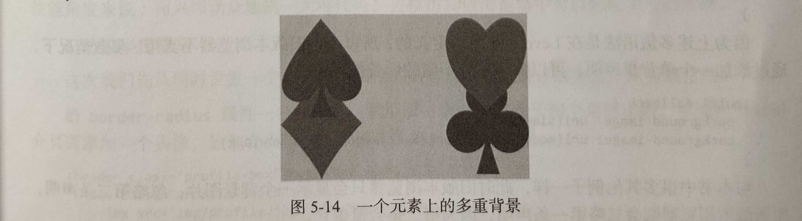

多重背景按声明的先后次序自上而下堆叠，最先声明的在最上面，最后声明的在最下面。背景颜色层在所有背景图片下面。


也可以使用简写属性来声明多个背景图片：

```css
.multi-bg-shorthand {
  background: url(img/spades.png) left top no-repeat, url(img/hearts.png) right top no-repeat,
    url(img/diamonds.png) left bottom no-repeat, url(img/clubs.png) right bottom no-repeat, pink;
}
```

但这种语法只能在最后一个背景层声明一种颜色。如果随后的背景属性值少于背景图片的个数，那么相应的值会循环使用。这就意味着，如果所有背景图片的当前属性值都一样，那么只需要声明一个；如果是两个值交替，那么只需要声明两个。因此，前面例子中重复出现的 no-repeat 值，就可以写成下面这样了：

```css
.multi-bg-shorthand {
  background: url(img/spades.png) left top, url(img/hearts.png) right top, url(img/diamonds.png) left bottom, url(img/clubs.png)
      right bottom, pink;

  background-repeat: no-repeat; /* 用于 4 张图片 */
}
```

因为上述多值语法是在 Level3 规范中定义的所以一些旧版本浏览器不支持。多数情况下，通过添加一个单背景声明，可以实现还算不错的后备效果：

```css
.multi-fallback {
  background-image: url(simple.jpg);
  background-image: url(modern.png), url(snazzy.png), url(wow.png);
}
```

此时旧版本浏览器只会显示一个背景图片，忽略第二条声明，而新版本浏览器则会忽略第一条声明，因为第二条会覆盖它。

### 5.5 边框与圆角

现代浏览器对盒模型的边框都提供了一定的控制，包括插入图片和圆角，让边框不再是简单的矩形：

- 可以分别为盒子的各边设置边框，也可以一次性为四边设置边框。
- 可以使用 `border-width` 一次性设置所有边框的宽度，也可以使用 `border-top-width` 这样的方位属性设置某条边框的宽度。除非明确指定 `box-sizing` 属性，否则边框宽度会影响盒子的尺寸。
- 同理，可以使用 `border-color` 设置所有边框的颜色，也可以使用 `border-left-color`这样的方位属性设置某条边框的颜色。
- 边框的样式可以使用 `border-style`（或 `border-right-style` 这样的方位属性设置），取值中最常用的是 solid、dashed 或 dotted 等关键字。当然也有不太常用的，比如 double（在 border-width 指定的宽度表面绘制两条平行线）、groove 和 inset。这几个很少有人用。一是它们看起来让人觉得怪模怪样，二是这样一来就只能靠浏览器来决定边框的模样了。因为这几个关键字到底解释成什么样，规范里也没说。另外，可以通过 `border-style:none` 删除全部边框。
- 可以使用 border 简写属性来设置所有边框属性。具体来说，可以把所有边设置成相同的宽度、样式、颜色，比如 `border:2px solid #006;`。

#### 5.5.1 边框半径圆角

1. **边框半径简写**
   给 `border-radius` 属性一个长度值，就可以一次性设置盒子四个角的半径。

2. **更复杂的圆角语法**
   也可以使用简写语法分别设置每个圆角的半径，即从左上角开始，按顺时针方向依次列出各个值：

   ```css
   .box {
     border-radius: 0.5em 2em 0.5em 2em;
   }
   ```

   以上声明中每个值本身其实也是简写，它们各自表示相应圆角水平和垂直方向拥有相同的半径。如果想把每个角设置成非对称的，也可以用两组值分别指定两个方向的半径，先水平再垂直，两组值以斜杠分隔：

   ```css
   .box {
     border-radius: 2em 0.5em 1em 0.5em / 0.5em 2em 0.5em 1em;
   }
   ```

   如果对角的值相同，那就可以省略右下和左下角的值，因为在只有两个或三个值的情况下，其他值会自动填入：

   ```css
   .box {
     border-radius: 2em 3em; /* 右下角和左下角重用前面的值  */
   }
   ```

3. **设置一个角的半径**

   也可以使用 `border-top-left-radius`、`border-top-right-radius` 等属性设置某个角的半径。可以像前面一样，给这些针对个别角的属性指定一个值，从而得到一个对称的角。或者指定两个值，以斜杠分隔，分别控制水平和垂直两个方向的半径。

#### 5.5.2 创建正圆和胶囊形状

设置圆角半径，实际上还可以使用百分比值。在给 `border-radius` 指定百分比值时，x 轴和 y 轴分别相对于元素的宽度和高度来计算实际值。换句话说，可以很容易地把一个正方形的元素变成圆形，只要把圆角半径设置成至少 50% 就好。

实际上确实没理由给任何一个角设置超过 50% 的值。不过，应该知道：如果两个圆角的弧线相交，那么两个轴向就会分别缩小半径，直到圆弧不再相交。对于方形元素的对称圆角而言，任何大于 50% 的值都会得到圆形。对于圆角半径相同的一个矩形元素而言，结果可能是一个椭圆形，因为圆角在两个方向上是按照宽度或长度比例缩小的。

圆形是比较常见的界面元素，但椭圆形就不那么受欢迎了。有时候，更希望看到 “胶囊形”，即一个矩形的两端各带一个半圆形。这种形状在工程上称为 “长圆形”（obround）。百分比值和绝对值都无法直接实现这种形状，除非知道元素的大小，而这在网页设计中并不常见。

不过，可以利用 `border-radius` 计算上的一个特性来达到目的。圆角弧线为保证不相交会自动缩小半径。而在使用长度值(而非百分比值)时，半径并不相对于元素大小而缩小，最终会得到对称的效果。因此，在创建胶囊两头的半圆形时，可以故意指定一个比所需半径大的值，以得到半圆形：

```css
.obround {
  border-radius: 999em; /* 任意非常大的值 */
}
```

首先，矩形的方角变成圆角后，元素对布局的影响跟没变成圆角前一样，这是没有改变的。其次，改变的是变成圆角后元素的可点击（或“可触摸”）区域，会以变化之后的圆角为准。因此，在使用圆角矩形按钮时，需要保证可点击的面积不要太小。

#### 5.5.3 边框图片

Level3 Backgrounds and Borders 规范还允许开发者为元素指定一张图片作为边框。`border-image` 属性支持把一张图片切成 9 块，只管定义切图规则，浏览器会自动把每一块应用到指定的边框位置。而且通过运用所谓的 “九宫格缩放” 技术，边框图片不会在图片缩放时发生变形。

演示边框图片的典型示例，非相框莫属了。构成相框的图片是正方形的，边长为 120 像素。从上、右、下、左各方向内推 40 像素画一条虚线，就把它分成了 9 块。


`border-image` 属性会自动把每一块中的图片作为背景应用到边框的相应位置：左上角的图片应用到元素左上角，上中部的图片应用到元素上方，右上角的图片应用到元素右上角，以此类推。默认情况下，中间那 1/9 会被忽略，也可以改变这个行为。

此外，也可以告诉浏览器让上、右、下、左方位的图片如何覆盖边框。比如，可以拉伸、重复或补白（即只重复能够完整显示的次数余下的空间以空白填充跟最新的 background-repeat 关键字很像）。默认情况下，每边中段的图片会拉伸。为了展示边框图片，必须设置适当的边框宽度，进而拉伸各个边框对应的图片。

```css
.motto {
  border: 40px solid #f9b256;
  border-image: url(picture-frame.png) 40;
  /* 与 border-image: url(picture-frame.png) 40 40 40 40 stretch; 效果相同 */
}
```

前面的代码会加载图片 picture-frame.png，在每边向内 40 像素的位置切开，拉伸上、右、下、左边中段的图片。

> **注意**：
>
> 1. 指定切片参考线位置的 “40 像素” 没有 px 单位，这是为了同时适应 SVG 和位图而使用的小技巧。
> 2. 必须把 border 简写（如果使用的话）放在 `border-image` 属性前面。这是因为规范规定简写语法会重置所有边框属性，不仅限于其自身指定的属性。

除了 border-image，还有针对每一边的边框图片属性。事实上，还有一堆属性可以用来控制边框图片。但开发者曾经非常期盼浏览器支持边框图片。究其原因，主要是可以借助它来创建圆角边框。既然已经有了 `border-radius`，那又何必舍近求远呢。

### 5.6 盒阴影

讲完了背景图片和边框，接下来再看一种给页面添加视觉效果的方式：阴影。CSS 属性 `box-shadow` 可以给元素添加阴影。`box-shadow` 属性的语法与 `text-shadow` 类似，但有一些新东西。

比如，下面的代码给用户头像加了一个阴影：

```css
.profile-photo {
  box-shadow: 0.25em 0.25em 0.5em rgba(0, 0, 0.3);
}
```

这个例子中代码的语法跟 text-shadow 完全一样：头两个值表示 x 轴和 y 轴的偏移；第三个值表示模糊半径（阴影边界的模糊程度）；最后是颜色，使用 rgba()。而且阴影的形状跟盒子的圆角也是一致的。

#### 5.6.1 扩展半径：调整阴影大小

box-shadow 比 text-shadow 稍微灵活一点。比如，可以在模糊半径的值后面再加一个表示扩展半径，用于扩展阴影的大小。这个值默认为，即阴影与所属元素一样大。增大这个值阴影相应增大，负值导致阴影缩小。

```css
.larger-shadow {
  box-shadow: 1em 1em 0.5em 0.5em rgba(0, 0, 0, 0.3);
}
.smaller-shadow {
  box-shadow: 1em 1em. 5em -0.5em rgba(0, 0, 0, 0.3);
}
```

#### 5.6.2 内阴影

box-shadow 的另一个比 text-shadow 更为灵活之处是可以使用 `inset` 关键字。这个关键字可以为元素应用内阴影，即把元素当成投影表面，可以创造一种背景被 “镂空” 的效果。比如，可以给个人页面顶部背景应用内阴影，制造一种在页面上凹陷或者被头像及其他页面内容并遮住的感觉。相应的代码如下

```css
.profile-box {
  box-shadow: inset 0 -0.5em 0.5 em rgba(0, 0, 0, 0.3);
}
```

#### 5.6.3 多阴影

与 text-shadow 类似，也可以给一个元素应用多个阴影，以逗号分隔多组值。下面这个例子中的阴影应用 “平铺” 技术，完全没有模糊半径。

如果省略模糊半径或者把它设置为 0，那么得到的阴影边界是清晰的。这样就可以摆脱原先伪装阴影的局限，把阴影当成不影响布局的 “额外盒子”，用于实现各种效果。

比如，考虑到 border 只能给元素添加一个边框（不算 double 关键字），可以利用这个技术给元素添加更多 “边框”。通过给阴影一个值为 0 的模糊半径，就可以通过不同的扩展半径值来生成多个类似边框的区域。由于阴影不影响布局，这个效果又类似 outline 属性。

```css
.profile-photo {
  box-shadow: 0 0 0 10px #1c318d, 0 0 0 20px #3955c7, 0 0 0 30px #546dc7, 0 0 0 40px #7284d8;
}
```

### 5.7 渐变

在背景上使用渐变色是一种常见设计，能给页面增加一种纵深感。要实现这种效果，可以使用带渐变的图片，但 CSS 也提供了一种绘制渐变图的机制。这个机制包含多种渐变方案，可以与任何接受图片的属性联合使用，包括 background-image。假设有一个个人主页，用户尚未上传背景图片，此时希望显示一个渐变背景：

```css
.profile-box {
  background-image: linear-gradient(to bottom, #cfdeee 0%, #8da9cf 100%);
}
```

#### 5.7.1 浏览器支持与浏览器前缀

现代浏览器都支持 CSS 渐变，但 IE9（及更早版本的 IE）和 Opera Mini 是例外。有些旧版本的 WebKit 浏览器只支持线性渐变。

> **注意**：自从被 Safari 作为非标准属性引入至今，渐变的语法也经历了几次变化。视需要支持的浏览器而定，可能需要同时用到 3 种不同的渐变语法，还有各种前缀。

#### 5.7.2 线性渐变

前面的例子使用了 `linear-gradient()` 函数，沿一条假想线，从元素顶部到底部绘制了一个渐变背景。这条线的角度由这个函数的第一对关键字（to bottom）表示，其后是由逗号分隔的色标。色标用于在渐变线上标出颜色发生变化的位置，在这个例子中，位置 0% 处的颜色是浅蓝灰色，而位置 100% 也就是元素底部的颜色是深蓝色。

渐变线的方向可以使用关键字 to，再加上一个表示边（top、right、bottom、left）或表示角（top left、top right、bottom left、bottom right）的关键字来指定，后者指定的是对角线。渐变线总是始于元素的一个边或一个角，然后穿过元素的中心区域。此外，还可以使用 deg 单位指定渐变线的角度，0deg 表示垂直向上，增大角度值就意味着沿顺时针方向旋转，直到 360 度，跟 HSL 色轮类似。此时，度数表示绘制渐变的方向，因此起点就在指定的相反方向。比如下面就是一个 45 度角的渐变：

```css
.profile-box {
  background-image: linear-gradient(45deg, #cfdfee, #4164aa);
}
```

此时，渐变线的起点并不是背景图片区域的边，而是自动延长到区域的角，即 0% 和 100% 恰好是背景图片区域的两个角的位置。

**默认值及色标位置**
线性渐变的默认方向是自上而下（to bottom），而 0% 和 100% 别表示第一个和最后一个色标的位置，因此前面第一个例子实际上可以简写如下：

```css
.profile-box {
  background-image: linear-gradient(#cfdfee, #8da9cf);
}
```

新增色标若未指定位置，则在 0% 100% 范围内取均值。比如，有 5 个未指定位置的色标那么它们的位置分别为 0%、25%、50%、75% 和 100%：

```css
.profile-box {
  background-image: linear-gradient(red, green, blue, yellow, purple);
}
```

除了百分比，还可以使用绝对值指定色标位置，比如：

```css
.profile-box {
  background-image: linear-gradient(#cfdfee, #8da9cf 100px);
}
```

这行代码生成的渐变是顶部从浅蓝色开始，往下到 100 像素位置时过渡到深蓝色，然后一直到背景图片区域底部都是同样的深蓝色。

#### 5.7.3 放射渐变

放射渐变从一个中心点开始向四周扩散，覆盖的范围可以是圆形或椭圆形。放射渐变的语法稍微复杂一些，涉及如下属性：

- 放射渐变的类型：圆形（circle）或椭圆形（ellipse）

- 射线半径决定渐变范围大小。圆形只接受一个半径值，而椭圆形接受 x 轴和 y 轴两个方向的半径值。椭圆形可以接受任意长度或百分比值，百分比值相对于对应轴向的背景图片大小。圆形只接受长度值，不接受百分比值。此外，还可以使用关键字，关键字代表渐变区域结束的位置：`closest-side` 和 `farthest-side` 分别表示渐变区域延伸至最近边还是最远边，`closest-corner` 和 `farthest-corner` 分别表示渐变区域边缘接触最近角还是最远角。

- 渐变区域中心的位置使用类似 background-position 属性的相对值，但前面要加 `at` 关键字，以说明它们不表示大小。

- 色标沿渐变扩展方向指定，以逗号分隔。

下面就是一个放射渐变的例子：

```css
.profile-box {
  background-image: radial-gradient(circle closest-corner at 20% 30%, #cfdfee, #2c56a1);
}
```

这样就会得到一个圆形放射渐变，中心点为 x 轴方向 20%、y 轴方向 30%，圆周范围到与最邻近的角接触为止。在圆周外部，由终点色标颜色覆盖整个背景图片区域(见图 5-28)。

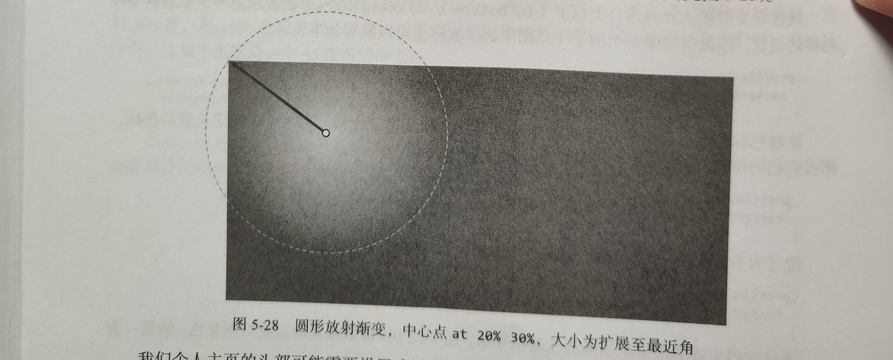

下面是一个居中的椭圆形放射渐变：

```css
.profile-box {
  background-image: radial-gradient(#cfdfee, #2c56a1, #cfdfee, #2c56a1, #cfdfee, #2c56a);
}
```

代码中并没出现声明椭圆、居中和覆盖整个元素（扩展至最远角）的关键字，因此使用的都是它们的默认值。但即便如此，重复多次的渐变色标也很冗余，于是就有了接下来要讲的重复渐变。

#### 5.7.4 重复渐变

重复渐变函数可以沿渐变直线（或射线）重复某个渐变色标组合，重复次数视其大小（由 background-size 决定）及允许的大小（元素大小）而定。以下代码是重复的线性渐变：

```css
.linear-repeat {
  background-image: repeating-linear-gradient(#cfdfee, #2c56a1 20px);
}
```

以下代码是重复的放射渐变：

```css
.radial-repeat {
  background-image: repeating-radial-gradient(#cfdfee, #2c56a1 20px);
}
```

#### 5.7.5 把渐变当作图案

渐变不一定需要很多像素来过渡，它也可以是突然的变化，从而形成锐利的线条或圆环。再搭配可以相互叠加的多重背景，就可以通过声明语法创造出简单的背景图案，甚至都无须打开图形处理软件。

创造边缘锐利的图案，关键在于正确地放置色标。比如，要绘制一条垂直线，就要把相邻的两个色标重叠在一起，让渐变无从发生。

```css
body {
  background-color: #fff;
  background-image: linear-gradient(transparent, transparent 50%, rgba(55, 118, 176, 0.3) 50%);
  background-size: 40px 40px;
}
```

在有些浏览器中，图案边缘也不是绝对锐利，而是每一侧都有 1 像素的模糊。随着浏览器渐变渲染性能的提升，这种现象也会有所改进，改进之后对追求细节的图案会有很大提升。

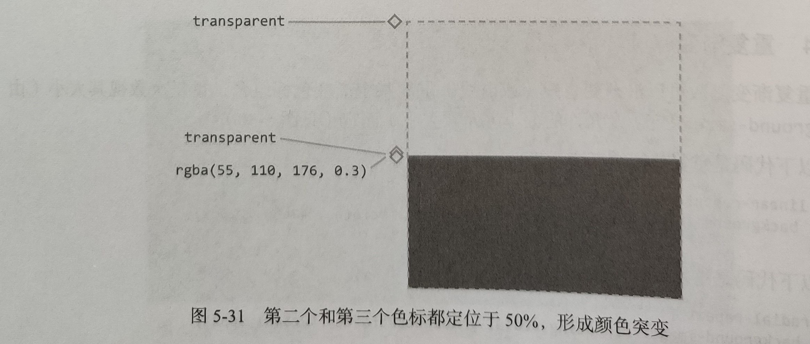

没有在整个元素上使用多个线性渐变，而是只使用了一个，然后通过背景相关的属性控制其大小和重复。这样不仅能控制线条的多少，还不影响色标。然后再添加一个类似的水平方向的渐变，就完成了一张 “桌布” 似的花格图案。

```css
.body {
  margin: 0;
  background-color: #fff;
  background-image: linear-gradient(transparent, transparent 50%, rgba(55, 110, 176, 0.3) 50%), linear-gradient(to right, transparent, transparent
        50%, rgba(55, 110, 176, 0.3) 50%);
  background-size: 40px 40px;
}
```

不难想象，通过组合线、角（填充了一半对角线的线性渐变）圆、椭圆等简单图形，就可以得到各种各样的图案。渐变图案、盒阴影以及伪元素，这些加起来完全可以代替图片来实现各种创意。

> **注意**：虽然渐变可以代替外部图片，但其本身也可能影响性能，特别是在资源有限的设备上，比如手机。放射性渐变尽量少用为妙。

### 5.8 为嵌入图片和元素添加样式

文档中的图片与其他元素不同，它本身是有像素宽度和高度的，而且宽度和高度的比例固定。在可伸缩的设计中，元素宽度要随浏览器窗口宽度变化而变化，此时也需要 CSS 来控制图片及其他嵌入的元素。

> **注意**：根据需要把图片渲染成不同大小（[响应式图片](#871-响应式背景图片)）对性能影响很大。

#### 5.8.1 可伸缩的图片模式

怎么做到让图片伸缩的同时，既不会超出其固有尺寸，又不会破坏其宽高比例?可以使用 Richard Rutter 最早提出的[方案](http://clagnut.com/blog/268)，该方案的核心如下所示：

```css
.img {
  max-width: 100%;
}
```

max-width 属性意味着图片会随着包含它的容器缩小而缩小，但在容器变大时，它不会大到超过自身的固有尺寸。在上述代码基础上稍加扩展，就可以涵盖更多的情况：

```css
img {
  width: auto;
  max-width: 100%;
  height: auto;
}
```

为什么要增加两条属性声明呢?这是因为有时候某些设计者或内容管理系统，会在 HTML 源代码中给图片添加 width 和 height 属性。这里把 width 和 height 设置为 auto，某种程度上可以覆盖之前的声明，同时也可以解决
IE8 在不声明 width 时无法正确缩放图片的问题。

#### 5.8.2 控制对象大小的新方法

有时候，可能需要根据显示容器设置 img 或其他嵌入对象（video 或 object 元素）的大小。举例来说，有一个矩形的图片，但希望通过 CSS 将其设置为方形。这时候可以使用一些最近标准化并被浏览器实现的新属性，这些新属性支持对上述类型元素更灵活的控制。比如使用 `object-fit` 属性，可以像使用 `background-size` 属性一样，保持元素的宽高比：

```css
img {
  width: 200px;
  height: 200px;
}
img.contain {
  object-fit: contain;
}
img.cover {
  object-fit: cover;
}
img.none {
  object-fit: none;
}
img.scaledown {
  object-fit: scale-down;
}
```

下图展示了 `object-fit` 属性的几个关键字对不能按固有大小显示的图片所产生的效果。


`object-fit` 属性的默认值为 fill，意味着图片内容会在必要时拉伸以填满容器，因此可能破坏宽高比。

cover 和 contain 则与 background-size 属性中对应的关键字作用相同。none 会采用图片固有大小，不管容器有多大。最后，scale-down 会自动从 none 和 contain 中选一个，哪个结果尺寸小就用哪一个。最终的图片会居中，但可以通过 `object-position` 重新设置，与定位背景图片时类似。

#### 5.8.3 可保持宽高比的容器

对于具有固定宽高比的位图，把高度设置为 auto，只改变宽度，或者把宽度设置为 auto，只改变高度，都是可以的。

但如果是没有固定宽高比的元素呢?如何使其在可伸缩的同时保持固定宽高比?iframe 和 object 元素就属于这种情形，某些情况下的 SVG 内容也是。常见的例子是在页面中通过 iframe 嵌入一段视频：

```html
<iframe
  width="420"
  height="315"
  src="https://www.youtube.com/embed/dqw4w9wgxce"
  frameborder="0"
  allowfullscreen
></iframe>
```

如果像这样给它设置一个可伸缩的宽度：

```css
iframe {
  width: 100%; /* 或者其他任何比例 */
}
```

就会导致 iframe 宽度为 100%，而高度始终是 315 像素。因为视频本身也有宽高比，所以希望这里的高度也可以自适应。

此时无论把 iframe 的高度设置为 auto 还是删除 height 属性都不管用，因为 iframe 本身没有固定的宽高比。此外，这样做很可能导致 iframe 的高度变成 150 像素。为什么是 150 像素?CSS 规范指出，对于没有指定大小的可替代内容（如 iframe、img、 object），最终的默认大小为 300 像素宽或 150 像素高。

要解决这个问题，需要借助一些巧妙的 CSS 技术。首先，把 iframe 包在一个元素里：

```html
<div class="object-wrapper">
  <iframe
    width="420"
    height="315"
    src="https:////www.youtube.com/embed/dqw4w9wgxcq"
    frameborder="0"
    allowfullscreen
  ></iframe>
</div>
```

然后，让这个包装元素的尺寸与要嵌入的对象具有相同的宽高比。简单计算一下，用原始高度 315 像素除以原始宽度 420 像素，结果是 0.75。换句话说，高度是宽度的 75%。

接下来，将包装元素的高度设置为 θ，但把 padding-bottom 设置为 75%：

```css
.object-wrapper {
  width: 100%;
  height: 0;
  padding-bottom: 75%;
}
```

内边距和外边距如果使用百分比值来设置，那它们的实际值是基于包含块的宽度来计算的。这里的宽度是 100%（与包含块宽度相等），因此内边距就是包含块的 75%。于是就创建了一个具有宽高比的元素。

最后，在这个包装元素中绝对定位嵌入对象。尽管包装元素的高度是 0，仍然可以通过绝对定位把嵌入对象放到一个 “可保持宽高比” 的内边距盒子里：

```css
.object-wrapper {
  width: 100%;
  height: 0;
  position: relative;
  padding-bottom: 75%;
}
.object-wrapper iframe {
  position: absolute;
  top: 0;
  left: 0;
  width: 100%;
  height: 100%;
}
```

这样就可以在页面中包含可伸缩的嵌入对象了。下边通过 3 张图解释了整个过程。


如果后来又不想让包装容器的宽度是 100%了，那么必须重新计算 padding-bottom。为此，再嵌套一层包装容器，就可以避免这种情况，进一步提升灵活性。这是因为只需要设置最外层的容器宽度即可，内部的包装容器还是 100%宽，不用改。

前面的技术是由 Thierry Koblentz 推而广之的，详细的技术分析请移步这个[链接](https://alistapart.com/article/creating-intrinsic-ratios-for-video)。

#### 5.8.4 减少图片大小

如果网页中要用到图片，一定要确保图片不会超出必要大小。没错，CSS 可以帮助缩放或裁剪，但每个多余的像素都会影响性能：下载时间会加长，电池消耗会增加，CPU 也会因缩放图片而浪费时间。

减少图片大小的第一步是优化图片。图片文件中经常包含一些元数据，它们对浏览器显示图片没有用处。有一些程序和服务可以帮剔除这些数据。

对于内容比较简单的 PNG 图片，可以通过减少图片中用到的色彩数量来有效压缩图片大小。如果图片中使用了半透明通道，那么多数图形处理软件都只允许导出为 PNG24 格式。实际上，更简单（也更小的）PNG8 格式也可以包含半透明通道，所以把 PNG24 转换成 PNG8 可以实现压缩效果。有一些在线服务，如 [TinyPNG](https://tinypng.com)，可以转换 PNG，还有支持不同操作系统的软件可以选择。Photoshop 的新版本也已内置这个转换功能。

如果使用 SVG 图形，那应该知道多数处理 SVG 的图形编辑器都会输出很多不必要的数据。Jake Archibald 的 OMGSVG 可以优化 SVG，通过调整一系列参数让文件瘦身，这个工具甚至离线也可以用!

## 六. 内容布局

网页是由不同内容块构成的：标题、段落、链接、列表、图片、视频，等等。这些元素可以按照主题组织起来，比如一个标题，几段文本，外加一张图片就是一篇新闻报道。通过控制每个组件内部元素的位置、大小、顺序，就可以更好地传达它们的功能与含义。所有内容块会进一步组织成整个页面的布局。本章仍然聚焦于个别的内容块，从而深入理解如何对每个内容块进行布局。

前几章也大致讲过使用定位和浮动来实现布局，这两种手段各有千秋。此外，也可以使用表格显示模式和行内块来实现布局，当然也各有各的优缺点 CSS 新增的 Flexible Box Layout Module（或 Flexbox）为内容块布局提供了一大批顺序、方向、对齐及尺寸相关的属性。Flexbox 是非常强大的布局功能。

### 6.1 定位

定位并不适合总体布局，因为它会把元素拉出页面的正常流。反过来看，这也正是定位在 CSS 中之所以重要的原因。本节将简单讨论一下定位在哪些情况下最合适。以下是第 3 章中相关内容的简单总结：

- 元素的初始定位方式为**静态定位**（static），意思是块级元素垂直堆叠。
- 可以把元素设置为**相对定位**（relative），然后可以相对于其原始位置控制该元素的偏移量，同时又不影响其周围的元素。与此同时，这也为该元素的后代元素创造了定位上下文。这一点也是相对定位真正的用处。
- **绝对定位**（absolute）支持精确定位元素，相对于其最近的定位上下文:或者是其非静态定位的祖先元素，或者是 html 元素。绝对定位的元素会脱离页面流，然后再相对于其定位上下文进行定位。默认情况下，它们会被浏览器定位于之前静态定位时所处的位置，但不会影响周围的元素。然后，可以相对于定位上下文来改变它们的位置。
- **固定定位**（fixed）与绝对定位基本类似，只不过定位上下文被自动设置为浏览器视口。

#### 6.1.1 绝对定位的应用场景

绝对定位非常适合创建弹出层、提示和对话框这类覆盖于其他内容之上的组件。它们的位置以通过 top、right、bottom 和 left 属性控制。关于绝对定位，了解以下知识可以写出更高效的代码：

1. 利用初始位置
   比如有一篇介绍太空飞船的文章，想添加一些行内的评注。这些评注最好以气泡图的样式显示在文章外部的空白区域。

   

   每个评注组件都是一个 aside 组件，实际位置在它们指向的段落后面：

   ```html
   <p>This is a fake article[...]</p>
   <aside class="comment">Ive never done this，Is that really true?</aside>
   <p>You may think[...]</p>
   ```

   为了让评注显示在段落之后，需要使其绝对定位。不必为了在垂直方向上准确地定位它们而给出确切的上偏移量。绝对定位的元素默认会待在自已静态定位时的地方，因此第一步是让评注显示在其初始位置。

   接下来需要把评注向左和向上偏移，把它定位到之前段落的旁边。这听起来像是要使用相对定位，但元素不能同时既是绝对定位又是相对定位。如果此时使用方向性偏移属性（top、right、left 和 bottom），那就既要用到定位上下文，又要设置确定的偏移量。但在这里完全可以通过负外边距来移动元素：

   ```css
   .comment {
     position: absolute;
     margin-left: -9.5em;
     margin-top: -2.5em;
   }
   ```

   在 CSS 中，负外边距是完全有效的，它们有如下有趣的行为：

   - 左边或上边的负外边距会把元素向左或向上拉，盖住其旁边的元素。
   - 右边或下边的负外边距会把相邻元素向左或向上拉，盖住设置了负外边距的元素
   - 在浮动的元素上，与浮动方向相反的负外边距会导致浮动区域缩小，使得相邻元素盖住浮动的元素。而与浮动方向相同的负外边距会在该方向上把浮动的元素向外拉。
   - 给未声明宽度的非浮动元素应用负外边距时，左、右负外边距会向外拉伸元素，导致元素扩张，有可能盖住相邻元素。

   对评注气泡组件而言，使用左和上负外边距把元素拉到位的做法，与使用相对定位很相似。

2. 创建三角形

   在评注气泡组件中，指向前面段落的小三角形又相对于评注气泡进行了绝对定位。它是通过伪元素创建的，使用了一种很古老的基于边框的技巧。

   ```css
   .comment:after {
     position: absolute;
     content: '';
     display: block;
     width: 0;
     height: 0;
     border: 0.5em solid #dcf0ff;
     border-bottom-color: transparent;
     border-right-color: transparent;
     right: -1em;
     top: 0.5em;
   }
   ```

   这里创建了一个 0 像素的块，其边框是 0.5em，而且边框也只显示左、上边框。结果浏览器就只渲染出一个三角形。然后再把三角形定位到评注气泡的右上角位置。

3. 利用偏移实现自动大小

   从另一个角度看，也有必要知道：在绝对定位的情况下，如果声明了多个或所有偏移值，那么结果会怎样。如果没有显式声明元素大小，那么绝对定位元素的大小由自身包含内容的多少来决定。如果相对于定位上下文的各个边声明偏移值，那么元素会被拉伸以满足设定的规则。

   比如，希望让某元素总是与其外部元素保持一定距离，但又不给任何元素设定大小。如下图所示，一张图片上有一个包含文本的元素。

   ```html
   <header class="photo-header">
     

     <div class="photo-header-plate">
       <h1>SpaceX unveil the Crew Dragon</h1>
       <p>photo from SpaceX on<a href="https://www.flickr.com/photos/spacexphotos/16787988882/">Flickr</a></p>
     </div>
   </header>
   ```

   

   假设不想给这个包含标题的盒子设定明确的宽度，那么可以只指定其右、下、左边的偏移，让它自己去计算上空距离：

   ```css
   .photo-header {
     position: relative;
   }
   .photo-header-plate {
     position: absolute;
     right: 4em;
     bottom: 4em;
     left: 4em;
     background-color: #fff;
     background-color: rgba(255, 255, 255, 0.7);
     padding: 2em;
   }
   ```

   无论图片多大，标题区始终都会位于距离底边及左、右两边 4em 的地方，而且会在标题折行的情况下自动调整高度，从而适应不同的屏幕大小。

#### 6.1.2 定位与 z-index：堆叠内容的陷阱

要用好定位，还有一个重点技术必须掌握，那就是 `z-index`，也就是堆叠元素的次序。[可见格式化模型](#三-可见格式化模型)介绍过基本原理：静态定位（static）以外的元素会根据它们在代码树中的深度依次叠放，就像打扑克发牌一样，后发的牌会压在先发的牌上面。它们的次序可以通过 z-index 来调整。

设置了 z-index 的元素，只要值是正值，就会出现在没有设置 z-index 的元素上方。尚未设置 z-index 的元素在 z-index 值为负的元素上方。

除了 z-index，还有其他影响元素堆叠次序的因素。这里也有一个概念，叫**堆叠上下文**。就像一盒扑克牌，每张牌本身也是一个上下文（牌盒），而牌只能相对当前的牌盒排定次序。有一个根堆叠上下文，所有 z-index 不是 auto 的定位元素都会在这个上下文中排序。随着其他上下文的建立，就会出现堆叠层级。

堆叠上下文是由特定属性和值创建的。比如，任何设定了 `position: absolute` 及值不是 auto 的 z-index 属性的元素，都会创建一个自己后代元素的堆叠上下文。

在一个堆叠上下文内部，无论 z-index 值多大或多小，都不会影响其他堆叠上下文，毕竟不能相对于别的堆叠上下文重新排序。


设置小于 1 的 opacity 值也可以触发新的堆叠上下文。opacity 小于 1 的元素需要独立渲染（包括它的所有后代元素），然后再放到页面上。这样就可以保证在把它们放到页面上时，原有的元素不会与半透明的元素发生交错。另外比如 transform 和 filter 属性，也会触发创建新的堆叠上下文。

### 6.2 水平布局

通常，页面会随内容增加沿垂直方向扩展。后来添加的任何块容器（div、article、h1~h6，等等）都会垂直堆放起来，因为块级元素的宽度是自动计算的。因此，在需要给内容块设置明确宽度，并让它们水平排列时，就会出现问题。

[可见格式化模型](#三-可见格式化模型)曾介绍过一个使用浮动来实现小型 “媒体组件” 布局的例子。这是一种基础的组件模式，即组件一边是图片（或其他媒体），另一边是文本，“左边是这个，右边是那个，二者相互关
联”。很多网站都在使用这种模式。

除此之外，还有很多通用模式的组件，可见于各类网站。其中很多都涉及水平布局。为此，CSS 引入了 Flexbox 来专门解决水平布局问题（以及其他问题），但在得到浏览器完全支持之前，可能还要借助浮动、inline-block 显示，或者表格显示模式，才能完美实现水平布局。

#### 6.2.1 使用浮动

在太空飞船那篇文章中，有一个使用浮动的例子。figure 浮动到了右侧，让行盒子对其四周环绕。同时通过 margin-right 的负外边距把图片向外推出去一点，以便与文本保持一些间距。

```html
<p>You may think[...]</p>
<figure>
  
  <figcaption>
    The "dragon" spaceship, created by SpaceX.image from
    <a href="https://www.flickr.com/photos/spacexphotos16787988882/">Flickr.com</a>
  </figcaption>
</figure>
<p>There's various [...]</p>

<style>
  figure {
    background-color: #eee;
    margin: 0;
    padding: 1em;
    float: right;
    max-width: 17em;
    margin-right: -8em; /* 向右推出 */
    margin-left: 1em;
  }
</style>
```

删除这个负外边距，并把插图宽度设置为文章宽度的一半，而且还增加了第二幅插图。此时，两幅插图会并肩而立。

```css
figure {
  float: right;
  width: 50%;
}
```

这种布局方式是很多 CSS 布局会用到的一种基本技术，即让浮动的元素构成一行中的列。浮动也会有一些问题。浮动的元素并不在页面流中，因此需要一个元素来包含浮动元素。为此，可以给容器内部的一个（伪）元素应用 clear，也可以通过规则让容器成为一个新的块级格式化上下文（BFC，block formating context）。必要时，浮动也可以包含多行，但如果上面的行有浮动元素，也可能会被卡住。

浮动也可以对有限的水平内容进行独立于源码次序的排序。比如，通过分别向左和向右浮动两个元素，可以调整两幅插图的次序。因为浏览器对浮动的支持极为普遍，所以浮动也成为了各种水平布局中的常用技术。

#### 6.2.2 行内块布局

文本行自身就是水平布局的，至少在从左往右和从右往左书写的语言中是如此。使用行内元素（如 span、time 或 a）时，它们会与文本沿相同方向水平对齐。也可以把行内块加入到文本流中，创造出水平对齐的元素，从视觉上看又是一个块。

比如，为太空飞船的文章末尾添加一些元数据，包括作者姓名、照片和电子邮件地址。为了添加样式，还使用了两个额外的 span 元素:

```html
<p class="author-meta">
  
  <span class="author-info">
    <span class="author-name">Written by Arthur C. Lark</span>
    <a
      class="author-email"
      href="mailto:arthur.c.lark@example.com"
      >arthur.c.lark@example.com</a
    >
  </span>
</p>
```

现在， author-meta 段落的底部会与图片底部及文本基线对齐。段落中的所有空白字符，包括图片和作者信息之间的换行符都被渲染为空格。这些空格的宽度取决于字体及其大小。

接下来，把图片和作者信息转换为行内块：

```css
.author-image,
.author-info {
  display: inline-block;
}
```

渲染之后，其实并没有什么可见的差别。差别只在于现在图片和作者信息都是块了。比如：可以把作者信息中包含的姓名和电子邮件地址分别列为两行，只要把它们修改为块级元素即可：

现在已经比较接近想要的水平布局了：左边是浮动的图片，右边是一个文本块，但还有一点，此时作者信息块最后一行的基线与图片底部是对齐的。可以通过 `vertical-align` 属性相对于图片来对齐作者信息。

1. 行内块的垂直居中

   假设设计是让作者信息块相对于图片垂直居中。可能会这么写：

   ```css
   .author-info {
     vertical-align: middle;
   }
   ```

   然而，结果可能并非你想要的。这里有一点需要澄清。关键字 `middle` 在应用给行内块时，其含义是 “将这个行内块的垂直中心点与这行文本 x 高度的中心点对齐”。例子中没有行内文本，（行内最高的）图片就成为决定行盒子高度以及基线位置的元素。而此时 x 高度的中心点就在图片底部（基线）靠上一点。

   要想将作者信息与图片一块垂直居中，需要让这两个元素都参照同一个 “中心点”：

   ```css
   .author-image,
   .author-info {
     vertical-align: middle;
   }
   ```

   因为图片此时也是行内块，所以它就与作者信息在同一个垂直点上居中对齐了，从而得到了想要的布局。

   如何确定行盒子的基线，以及这些规则如何影响行内及行内块元素，论述起来是比较复杂的。对于利用行内块创建水平布局而言，如果需要垂直对齐，有以下两个要点：

   - 要让行内块沿上方对齐（很像浮动），设置：`vertical-align:top;`
   - 要让两个元素的内容垂直对齐，先把它们都转换成行内块，再对它们应用 `vertical-algin: middle`。

2. 在容器元素中垂直居中

   前面的第二个要点告诉：可以在任意高度的容器内垂直居中内容。其实也不完全对。唯一的前提是把容器的高度设置为确切的高度。比如，假设想把作者元数据块设置为 10em 高，然后在其中居中放置作者图片和信息。首先，给 .author-meta 块应用这个高度。

   但作者信息和图片并没有相对于容器块垂直居中对齐，而是仍然沿原来那条假想的文本行对齐。为了实现与容器垂直对齐，还需要增加一个行内块元素，让它占据 100%的容器高度。这个元素会让 `middle` 关键字认为容器的垂直中点是对齐点。为此，可以借助伪元素。在引入了这个 “幽灵元素” 后，假想的基线就以它为准了。

   ```css
   .author-meta::before {
     content: '';
     display: inline-block;
     vertical-align: middle;
     height: 100%;
   }
   ```

   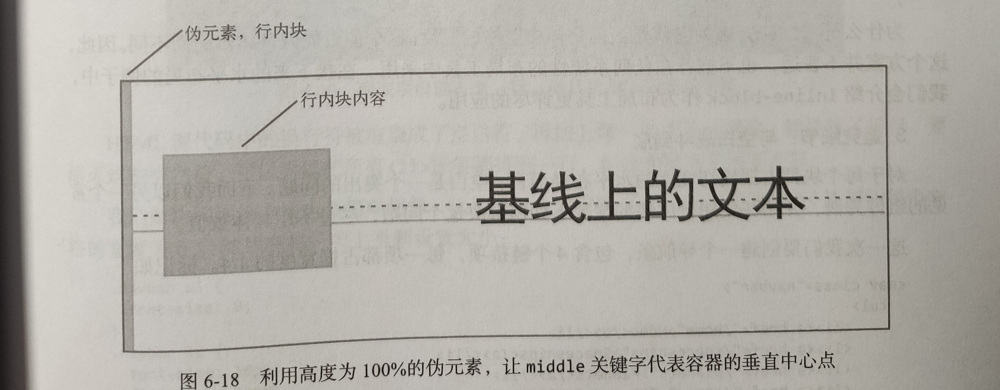

   此时，就好像整个 .author-meta 容器中只有一行文本，且高度与容器高度相同。因为这个

   伪元素是一个行内块，且其垂直对齐方式设置为 middle，所以其他行内块也就与容器的中心垂直对齐了。接下来要做的就是水平居中内容。因为行内块像文本一样对齐，所以这里使用 text-align。

   ```css
   .author-meta {
     height: 10em;
     text-align: center;
     border: 1px solid #ccc;
   }
   .author-info {
     text-align: left;
   }
   ```

   结果就是 .author-meta 既水平居中又垂直居中。确切来讲，这里的水平居中并不准确。这是因为行盒子内的任何空白符都会被渲染为一个空格。伪元素就会创建这么一个空格，导致内容向右偏移几个像素。通过给伪元素应用负外边距，可以抵消空格的宽度。

   ```css
   .author-info:before {
     margin-right: -0.25em;
   }
   ```

   > 为什么是 -0.25em？因为它就是当前字体中空格的宽度。这个值可能因字体不同而不同。因此，这个方案并不普适，也不推荐在任何系统性的布局工具中采用。

3. 追究细节：与空白战斗到底

   对于每个块都占据确切宽度的水平布局而言，空白是一个突出的问题。下面以另一个常见的组件为例，介绍在使用行内块的情况下如何解决这个问题，尽量不用具体数值。创建一个导航条，包含 4 个链接项，每一项都占据宽度的 1/4：

   ```html
   <nav class="navbar">
     <ul>
       <li><a href="/home">Home</a></li>
       <li><a href="/spaceships">Spaceships</a></li>
       <li><a href="/planets">Planets</a></li>
       <li><a href="/stars">Stars</a></li>
     </ul>
   </nav>
   ```

   以下 CSS 标记为导航条添加了基本的颜色及字体样式，并通过轮廓线突出了链接项的边界。这里将每一项设置为占据 25 %的宽度，4 项正好占据全部宽度。

   ```css
   .navbar ul {
     font-family: Avenir Next, Avenir, Century Gothic, sans-serif;
     list-style: none;
     padding: 0;
     background-color: #486a8e;
   }
   .navbar li {
     text-transform: uppercase;
     display: inline-block;
     text-align: center;
     box-sizing: border-box;
     width: 25%;
     background-color: #12459e;
     outline: 1px solid #fff;
   }
   .navbar li a {
     display: block;
     text-decoration: none;
     line-height: 1.75em;
     padding: 1em;
     color: #fff;
   }
   ```

   通过使用 `box-sizing: border-box;` 确保每一项的边框及内边距都包含在各自 25% 的宽度以内。导航条本身的背景颜色是蓝灰色，链接项的颜色是深蓝色，链接文本颜色是白色。

   HTML 源代码中的换行符被渲染成了空白符，再加上每一项 25% 的宽度，就导致了折行。要消灭这些空白符，可以尝试把所有 `<li>` 标签都排到一行，但这种要求显示不友好。解决问题的方法也很简单粗暴，就是把包含元素的 font-size 设置为 0（从而让每个空格的宽度为 0），然后在每一项上重新设置大小：

   ```css
   .navbar ul {
     font-size: 0;
   }
   .navbar li {
     font-size: 16px;
     font-size: 1rem;
   }
   ```

   这样就如期解决了空白问题，每一项都相互靠拢，只占据了一行。但这个技术也有缺点。首先与可以继承的 font-size 有关。假设在导航条上设置的是 16 像素的 font-size，那么就不能再使用 em 单位或比例，让每一项继承一个可伸缩的大小了。它会变成与 0 相乘。不过，可以通过使用 rem 单位，相对于根字体大小来保持可伸缩性。对于不支持 rem 单位的浏览器（主要是 IE8 及更早版本的 IE），还有一个像素值作为后备。

   其次，稍微早一点的 WebKit 浏览器不一定支持 font-size 值为 0。比如 Android4 早期版本中的 WebKit 浏览器。通常只把行内块作为兼容旧版本浏览器的后备手段，在此之上则会采用更现代的 Flexbox。随着这些浏览器慢慢开始支持 Flexbox，空白问题很可能就不再是问题了。

#### 6.2.3 使用表格显示属性实现布局

表格中的行恰好具有导航条例子中想要的特质：一组单元格恰好占满一行，而且永远不会折行。这也正是 HTML 表格在 Web 发展早期成为页面布局垄断技术的缘由。今天，可以通过 CSS 来借用表格的显示模式，不必求诸 HTML 表格标记。

如果将前面导航条的例子改为对 ul 元素使用的一种表格显示模式，并将其中的每一项设置为表格单元，那么也会得到与使用行内块一样的效果：

```css
.navbar ul {
  /* 为简洁起见，省略了部分属性 */
  width: 100%;
  display: table;
  table-layout: fixed;
}
.navbar li {
  width: 25%;
  display: table-cell;
}
```

> **注意**：这里将 ul 元素的宽度设置为 100%，是为了保证导航条能扩展到与父元素同宽。与常规块不同，不设置宽度的表格会 “收缩适应” 内容宽度，除非包含内容的单元把它撑开，让它的宽度足以填充父容器。

表格行中每一列的宽度有两种算法：

- 默认情况下，浏览器会使用 “自动” 算法。这是一种没有明确规定，但某种程度上又是事实标准的算法，基本上就是根据自身单元格内容所需的宽度来决定整个表格的宽度。
- 另一种算法是 “固定” 表格布局，即使用 `table-layout: fixed`。这种算法下的列宽由表格第一行的列决定。第一行中声明的列宽具有决定性，后续行如果遇到内容较多的情况，只能折行或者溢出。

在利用表格显示模式来创建布局时，必须清楚这样也会引入表格的问题。比如，渲染为表格单元的元素无法应用外边距，给表格单元应用定位时的行为也无法预料。还会在后面再讨论 [HTML 表格与 CSS 表格显示模式](#91-设计数据表)。

**表格单元中的垂直对齐**
使用表格显示模式时，表格单元中的垂直对齐效果无须借助任何额外的技术。只要给显示为 table-cell 的元素应用 `vertical-align: middle`，就可以令其中的内容在单元格中垂直居中，给表格显示模式下的列表设定高度后，只需一条声明就能让列表项垂直居中：

```css
.navbar ul {
  display: table;
  height: 100px;
}
.navbar li {
  display: table-cell;
  vertical-align: middle;
}
```

#### 6.2.4 不同技术优缺点比较

在实现水平布局以及垂直对齐时，浮动、行内块，以及表格显示模式，到底该用哪一个呢？以下总结了它们各自的优缺点：

- **浮动**与行内块一样，可以包装多行文本。浮动也会基于自己的内容来 “收缩适应”，有时候这种行为很有用。说到缺点，浮动的包含或清除，以及在被之前更高的浮动元素卡住时，可能会很头疼。另一方面，浮动某种程度上可以不依赖元素在代码中的次序，因为可以让一行中的某些元素向左浮动，其他元素则向右浮动。

- **行内块**有空白符问题，但可以解决，尽管有点黑科技的色彩。从好的方面来说，行内块也可能包含多行文本，而且支持控制垂直对齐。它们具有和浮动一样的 “收缩适应” 大小的特性。

- 使用**表格显示**模式进行水平布局同样很便捷，但仅支持不会发生折行的内容。表格有的问题，这种方案同样也有。比如，无法给它们应用外边距，内部的元素无法重新排序。但实现表格内容的垂直居中确实简便。

### 6.3 Flexbox

Flexbox，也就是 Flexible Box Layout 模块，是 CSS 提供的用于布局的一套新属性。这套属性包含针对容器（弹性容器，flex container）和针对其直接子元素（弹性项，flex item）的两类属性。Flexbox 可以控制弹性项的如下方面：

- 大小，基于内容及可用空间;
- 流动方向，水平还是垂直，正向还是反向;
- 两个轴向上的对齐与分布;
- 顺序，与源代码中的顺序无关。

#### 6.3.1 浏览器支持与语法

Flexbox 已经得到主流浏览器较新版本的广泛支持。对于某些需要兼容的旧版本浏览器，要调整一下语法或提供商前缀，基本上也没问题。具体而言，要支持 IE10 及更早版本的 WebKit 浏览器，需要在本章标准代码基础上补充提供商前缀属性和一些不同的属性，因为 Flexbox 规范本身在发展过程中也经过几次修改。

#### 6.3.2 理解 Flex 方向：主轴与辅轴

Flexbox 可以针对页面中某一区域，控制其中元素的顺序、大小、分布及对齐。这个区域内的盒子可以沿两个方向排列：默认水平排列（成一行），也可以垂直排列（成一列）。这个排列方向称为**主轴**（main axis）。

**与主轴垂直的方向称为辅轴**（cross axis），区域内的盒子可以沿辅轴发生位移或伸缩，如下图所示。**通常，Flexbox 布局中最重要的尺寸就是主轴方向的尺寸：水平布局时的宽度或垂直布局时的高度。称主轴方向的这个尺寸为主尺寸（main size）**。


回头再看看导航条（包含链接的无序列表和容器），它很容易转换成 Flex 容器。假设其他样式（颜色、字体、链接、边框）都一样，那么只要一行 CSS 代码即可。至于列表项，无须声明任何属性，而且也不必给每一项指明宽度：

```css
.navbar ul {
  display: flex;
  /* 除非另有声明，否则这行代码也相当于声明了 flex-direction: row; */
}
```

链接项是水平排列的，而且根据各自的内容进行了收缩适应。结果就好像是块级文档流被旋转了 90 度一样。所有链接项集中在左侧，是从左到右书写的语言环境下的默认行为。如果把 `flex-direction` 改成 `row-reverse`，那么所有链接项就会集中到右侧，而且变成从右向左排。

如果不指定大小，Flex 容器内的项目会自动收缩。也就是说，一行中的各项会收缩到各自的最小宽度，或者一列中的各项会收缩到各自的最小高度，以恰好可以容纳自身内容为限。

#### 6.3.3 对齐与空间

Flexbox 对子项的排列有多种方式。**沿主轴的排列叫排布**（justification），**沿辅轴的排列则叫对齐**（alignment）。

用于指定排布方式的属性是 `justify-content`，其默认值是 `flex-start`，表示按照当前文本方向排布（也就向左对齐）。如果改成 `flex-end`，所有项就都会挤到右侧（变成向右对齐）但顺序不变。还有另外 3 个关键字：center、space-between 和 space-around。

Flexbox 不允许通过以上这些关键字指定个别项的排布方式。然而，对 Flexbox 的子项指定值为 auto 的外边距在这里却有不同的含义。因此，可以利用这一点。具体来说，如果指定某项一侧的外边距值为 auto，而且在容器里那一侧还有空间，那么该外边距就会扩展占据可用空间。利用这一点，可以创造让一项位于一侧，其他项位于另一侧的布局。下图展示了第一项在左侧，其他项在右侧的布局。

```css
.navbar li:first-child {
  margin-right: auto;
}
```


本质上来说，像这样使用自动外边距抵消了其他项的排布效果，因为之后就没有多余空间可分了。尽管如此，对其他项仍然可以应用外边距。

1. 辅轴对齐

   前面通过 Flexbox 轻松解决了水平布局的基本问题。实际上，Flexbox 还支持对另一轴向的控制。如果增加 Flex 容器自身或其中一项的高度，会发现控制另一轴向属性的默认值会产生有趣的效果（默认情况下，Flex 子项会沿辅轴方向填满 Flex 容器）。

   实际上，控制辅轴对齐的属性 `align-items`，其默认值是 `stretch`（拉伸）。也就是说，子项默认拉伸，以填满可用空间。其他的关键字还有 flex-start、center 和 flex-end。这 3 个关键字都会把子项收
   缩成原有大小，然后再沿辅轴进行上、中、下对齐。

   最后，还可以使用 `baseline` 关键字，将子项中文本的基线与容器基线对齐，效果与行内块的默认行为类似。如果子项大小不一，而希望它们在辅轴上虽然位置不同，但本身对齐，那么就可以采用这种方法。

   添加一个类名表示当前活动的项：

   ```html
   <ul>
     <li><a href="/home">Home</a></li>
     <li class="navbar-active"><a href="/spaceships">Spaceships</a></li>
     <li><a href="/planets">Planets</a></li>
     <li><a href="/stars">Stars</a></li>
   </ul>
   ```

   这个活动项的 font-size 稍大一点，而且 z-index 值为 1：

   ```css
   .navbar.navbar-active {
     font-size: 1.25em;
   }
   ```

   现在，容器的基线由较大活动项的基线决定，其他项都自动与之对齐。

2. 对齐个别项

   除了同时对齐所有项，还可以在辅轴上指定个别项的对齐方式。比如，可以让第一项对齐到左上角，让其他项对齐到右下角：

   ```css
   .navbar ul {
     min-height: 100px;
     align-items: flex-end;
   }
   .navbar li:first-child {
     align-self: flex-start;
     margin-right: auto;
   }
   ```

   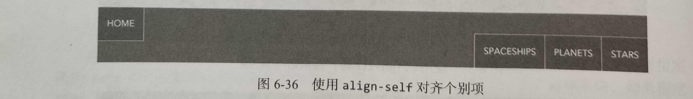

3. Flexbox 中的垂直对齐

   Flexbox 可以轻松解决垂直对齐问题。在容器里面只有一个元素时，只要将容器设置为 flex，再将需要居中的元素的外边距设置为 auto 就行了。这是因为 Flexbox 中各项的自动外边距会扩展 “填充” 相应方向的空间。

   ```html
   <div class="flex-container">
     <div class="flex-item">
       <h2>Not so lost in space</h2>
       <p>This item sits right in the middle of its container...</p>
     </div>
   </div>
   ```

   想要水平并且垂直居中，flex-item，仅需以下 CSS 代码，无论容器或其中元素有多大。在这个例子中，让容器与视口一样高（在 html、body 和 .flex-container 元素上都设置了 height:100%），就是为了让效果更明显：

   ```css
   html,
   body {
     height: 100%;
   }
   .flex-container {
     height: 100%;
     display: flex;
   }
   .flex-item {
     margin: auto;
   }
   ```

   如果 Flex 容器中有多个元素，就像前面作者元素数据的例子一样，那么可以使用对齐属性把它们聚拢到水平和垂直中心上。为此，把排布和对齐都设置为 center。（当然这也适用于单个元素的情况，只不过 margin:auto 的代码更少）。

   ```css
   .author-meta {
     display: flex;
     justify-content: center;
     align-items: center;
   }
   ```

#### 6.3.4 可伸缩的尺寸

Flexbox 支持对元素大小的灵活控制。这一点既是实现精确内容布局的关键，也是迄今为止 Flexbox 中最复杂的环节。可伸缩的尺寸在实现之前，确实是很难预测的。

1. **相关属性**

   Flex 的意思是 “可伸缩”，这体现在以下 3 个属性中：`flex-basis`、`flex-grow` 和 `flex-shrink`。这 3 个属性应用给每个可伸缩项，而不是容器。

   - **flex-basis**：控制项目在主轴方向上、经过修正之前的 “首选” 大小（width 或 height）。可以是长度值（如 18em）、百分比（相对于容器的主轴而言），也可以是关键字 auto（默认值）。

     关键字 auto 的意思好像是把 width 或 height 设置为自动，但实际上并不是那么回事。这里 auto 值的意思是这个项目可以从对应的属性（width 或 height）那里获得主尺寸，如果设置了相应属性的话。如果没有设置主尺寸，那么该项目就根据其内容确定大小，有点类似浮动元素或行内块。

     也可以设置 `content` 值，意思也是根据项目内容确定大小，但是会忽略通过 width 或 height 设置的主轴尺寸（与 auto 不同了）。

     > **注意**：content 关键字是后来才加入 Flexbox 的，支持程度可能不一致。

   - **flex-grow**：一个弹性系数（flex factor）。在通过 `flex-basis` 为每一项设置了首选大小之后，如果还有剩余空间，该系数表示该如何处理。其值是一个数值，表示剩余空间的一个比值。这个比值怎么算，稍后会解释。默认值是 θ，表示从 `flex-basis` 取得尺寸后就不再扩展。

   - **flex-shrink**：也是一个弹性系数，与 flex-grow 类似，但作用相反。换句话说，如果空间不够，该项如何收缩？增加了 `flex-shrink` 这个因素之后，计算过程更加复杂了，默认值是 1，表示如果空间不够，所有项都会以自己的首选尺寸为基准等比例收缩。

   Flexbox 使用了相当复杂的算法来计算各伸缩项的大小。但是，如果将计算过程简化为以下两个步骤，那么理解起来就容易多了：

   1. 检查 flex-basis，确定假想的主尺寸。
   2. 确定实际的主尺寸。如果按照假想的主尺寸把各项排布好之后，容器内还有剩余空间，那么它们可以伸展。伸展多少由 flex-grow 系数决定。相应地，如果容器装不下那么多项，则根据 flex-shrink 系数决定各项如何收缩。

   为了理解这些属性，来举一个例子。在这个例子中，假设容器宽度是 1000 像素。标记中，这个容器包含两个子元素。其中一个包含一个短单词（用 “Short” 表示），另一个包含一个长单词（用 “Looooooong” 表示）。因此，前者要占据 200 像素宽度，后者要占据 400 像素宽度。此时项目还没有放到容器中。

   如果这两项的 `flex-basis` 值都是默认的 auto，而且都没有设置 width 属性，那么当它们放到容器中时，它们会各自依据自身内容确定宽度，因此一共会占据 600 像素。这是 flex-basis 默认值的结果，与前面导航条中的例子一致。

   因为有剩余空间可分配，所以可以考虑 flex-grow 了。默认情况下，flex-grow 的值为 0，对各项的大小没有影响。假如此时把 flex-grow 的值设置成 1 会怎么样呢?

   默认的 0 和现在的 1 都代表什么？它们并不表示特定的大小，而**表示占整体的 “几份”**。这个例子里有两项，结果是两项会伸展相同的距离。它们的 “1 份” 表示各自分得剩余空间的一半，也就是 200 像素。换句话说，第一项最终的宽度是 400 像素，第二项最终的宽度是 600 像素。加在一起，正好是容器的宽度。

   假如给它们分别设置不同的 flex-grow，类似这样：

   ```css
   .navbar li:first-child {
     flex-grow: 3;
   }
   .navbar li:last-child {
     flex-grow: 1;
   }
   ```

   这会导致第一项分得剩余空间的 3/4，第二项分得 1/4。结果就是，两项各占 500 像素的宽度。

2. **纯粹按伸缩系数计算大小**

   在上一节用到的 “简化版 Flexbox 布局算法” 的第一个步骤中，是根据内容宽度来确定项目宽度的，因为 flex-basis 的值是默认的 auto，而且也没有给项目设定明确的宽度。假如第步中 flex-basis 的值是 0，那在这一步就不会给项目分配空间了。这种情况下，容器内部的全部空间都会留到第二步再分配，就是根据伸缩系数切分，然后将最终尺寸指定给具体的项目。

   在下图中，两个项目的 flex-basis 值为 0，flex-grow 值为 1。这意味着容器的全部空间要分成两部分，从而每个项目恰好占据可分配空间的一半。这个效果很接近使用百分比计算的布局，无论有多少项目，Flexbox 都会自动伸缩以适应整个宽度。

   

   接下来要使用 flex 这个简写属性一次性设置 flex-grow、flex-shrink 和 flex-basis 属性，顺序就是这样，值以空格分隔：

   ```css
   .navbar li {
     flex: 1 0 0%;
   }
   ```

   > **注意**：最后一个 flex-basis 值加了百分号。这是因为简写法中的 flex-basis 必须带单位，因此这里要么加百分号，要么就写成 px。

   如果想让第一个项目占据的空间是其他项目的 2 倍，就把其 flex-grow 值设置为 2：

   ```css
   .navbar li {
     flex: 1 0 0%;
   }

   .navbar li:first-child {
     flex-grow: 2;
   }
   ```

   将以上规则应用给包含 4 项的导航条标记后，第一项占据 2/5（40%）的宽度，后三项各占 1/5（20%）的宽度。

3. **收缩项目**

   当项目宽度总和超过容器宽度时，Flexbox 会按照 flex-shrink 属性来决定如何收缩它们。此时的收缩机制比 flex-grow 稍微麻烦一点。麻烦的根源在于，不能因为某个大项目导致总体宽度超出，就把小项目压缩得不可见了。让项目占据更多空间（比如前面的 flex-grow）比较容易理解，不过是按比例分配而已。但收缩的时候，情况就不一样了。

   再以之前 1000 像素宽的导航条为例，假设这一次两个子项目都通过 flex-basis 预先设置了宽度。两项宽度的总和超出了容器宽度 300 像素。

   ```css
   .navbar li:first-child {
     flex: 1 1 800px;
   }
   .navbar li:last-child {
     flex: 1 1 500px;
   }
   ```

   加在一起的首选宽度（800px + 500px = 1300px）超出了容器宽度 300 像素。而且两个项目的 flex-shrink 值都是 1。可能以为此时两个项目会分别收缩 150 像素，以便适应容器宽度。然而事实并非如此。它们会根据自己 flex-shrink 系数和 flex-basis 的值来按比例收缩。具体来说，每个项目先用自己的 flex-shrink 乘以自己的 flex-basis，然后再用乘积除以每一项的 flex-shrink 与 flex-basis 的乘积之和，最后再拿得到的比例系数去乘以超出的宽度（负空间），从而得到该项目要收缩的空间数量。

   再简化一下表达：首选尺寸大的项目比首选尺寸小的项目收缩得更多（相对于 flex-shrink 系数而言）。因此就算这里两个项目的 flex-shrink 系数都是 1，它们收缩的量也是不一样的。以下是求第一个项目要收缩的量的过程：`((800 * 1)/((800 * 1) + (500 * 1))) * 300 = 184.6`，第一项要收缩 184.6 像素。

   用同一个公式计算第二项的收缩量：`((500 * 1) / ((800 * 1) + (500 * 1))) * 30 = 115.4`，第二项要收缩 115.4 像素。两者相加，正好是为适应容器宽度而必须减少的 300 像素。

#### 6.3.5 Flexbox 布局

前面导航条和作者元数据的例子只涉及一行内容。与行内块和浮动类似，Flexbox 也支持让内容排布到多行（列），但具有更强的可控性。

这次来设计一组标签，表示星球的种类。这些标签是包含链接的一个无序列表，跟导航条例子中类似。但这里的列表项目可要多出好几倍，因此不可能让它们都挤在一行中。会给标签设置统一的背景颜色，并使用前面评注气泡中用到的伪元素技术，给它们应用实际标签的外观。

```html
<ul class="tags">
  <li><a href="/Binary planet">Binary planet</a></li>
  <li><a href="/Carbon_ _planet">Carbon planet</a></li>
  <!-- 还有更多 -->
</ul>
```

标签的样式有点多，但都是之前学过的：

```css
.tags {
  border: 1px solid #c9e1f4;
  margin: 0;
  padding: 1em;
  list-style: none;
}
.tags li {
  display: inline-block;
  margin: 0.5em;
}
.tags a {
  position: relative;
  display: block;
  padding: 0.25em 0.5em 0.25em 0.25em;
  background-color: #c9e1f4;
  color: #28448f;
  border-radius: 0 0.25em. 25em 0;
  line-height: 1.5;
  text-decoration: none;
  text-align: center;
}
.tags a:before {
  position: absolute;
  content: '';
  width: 0;
  height: 0;
  border: 1em solid transparent;
  border-right-width: 0.5em;
  border-right-color: #c9e1f4;
  left: -1.5em;
  top: 0;
}
```

应用前面的样式之后，标签都成了行内块，可以随时折行。接下来该 Flexbox 上场了。首先，把列表元素转换为 Flex 容器，再通过 `flex-wrap` 属性的 wrap 值告诉它允许子元素折行：

```css
.tags {
  display: flex;
  flex-wrap: wrap;
  margin: 0;
  padding: 0;
  list-style: none;
}
```

结果跟刚才差不多。但现在可以用 Flexbox 来控制方向、大小和行的对齐了。

1. **折行与方向**
   首先，可以反转行中标签的排布方向（跟导航条例子中一样）把 `flex-direction` 的值改为 row-reverse，所有标签一下子就变成了从右上角起从右向左排布，每一行都变成了右对齐。也可以反转垂直排布的方向，让第一行从底部开头，然后向上折行。`flex-direction` 还是 row-reverse，而 flex-wrap 设置成了 wrap-reverse。

   > **注意**：Flexbox 的方向是逻辑方向，即以文本方向决定哪里是边界的开头和末尾。如果在一个从右向左排版的阿拉伯语网站，水平方向将是相反的（假设在标记中设置了 dir 属性），但垂直方向还是从上向下。

2. **多行布局中可伸缩的大小**
   Flexbox 对多行布局的另一个好处就是，可以利用可伸缩的大小均匀填充每一行。flex-grow 的计算是以行为单位的，因此项目的可扩展空间以行的宽度为限。

   ```css
   .tags li {
     flex: 1 0 auto;
   }
   ```

   此时，稍微缩小一点浏览器窗口，就会导致最后一个标签折行，从而创建一个新行。然而，多行 Flexbox 布局中没有办法控制特定的某一行。换句话说，无法告诉这些项目，让它们到了最后一行就不再扩展了。要解决当前这个问题，可以给所有标签设置 max-width，限制可伸缩的范围。

   总体来说，**可以填充多余空间是 Flexbox 的核心优势**。通过综合使用 flex-grow 及 min-width 和 max-width，就能实现非常智能的多行 Flexbox 布局。无论屏幕多大，或者容器里项目有多少，所有项目都会有合理的大小。在[响应式 Web 设计](#862-没有媒体查询的响应式-flexbox)中还会深入讨论这项技术，以及如何让布局适应不同的环境。

3. **对齐所有行**
   在前面介绍辅轴对齐属性（`align-items` 和 `align-self`）时，知道 Flexbox 允许相对于一行的 flex-start、center、baseline 和 flex-end 这几个点来对齐项目。而在多行布局中，则可以相对于容器来对齐行或列。

   如果在标签列表容器中，设置了 min-height: 300px，就可以知道相对于容器对齐行或列的 `align-content` 属性的效果了。默认情况下，这个属性的值是 `stretch`，意思是每一行都会拉伸以填充自己应占的容器高度。如果通过浏览器右键菜单中 “检查” 来看一看标签，会发现每一个 li 元素都拉伸为容器高度的 1/3。

   ```css
   .tags {
     display: flex;
     flex-wrap: wrap;
     min-height: 300px;
     /* align-content: stretch; 在这里是默认值 */
   }
   ```

   `align-content` 对容器中多行的作用，与 `justify-content` 对主轴内容排布的作用非常相似。换句话说，通过 `align-content` 还可把多行排布到 flex-start（容器顶部）、flex-end（容器底部）、center（容器中部），还可以通过 `space-between` 或 `space-around` 让多行分隔开。

#### 6.3.6 列布局与个别排序

使用 Flexbox 的 `order` 属性，可以完全摆脱项目在源代码中顺序的约束。只要告诉浏览器这项目排第几就行了。默认情况下，每个项目的 order 值都为 0，意味着按照它们在源代码中的顺序出现。

通过 Flexbox 可以任意摆放项目顺序。在接下来的例子中，先放下水平布局技术，来创建一个小小的 “文章导读” 组件，其中包含飞船文章的节选，有标题、图片，还有一个阅读全文的链接。这个组件会以一列的形式出现。

首先从标记开始，组件内容的次序按照它们的重要性来排定：

1. 以文章标题为内容的标题;
2. 导读正文;
3. 与文本主题相关的插图;
4. 指向文章的链接。

```html
<div class="article-teaser">
  <h2>The Dragon and other spaceships</h2>
  <div class="article-teaser-text">
    <p>There are actual spaceships.</p>
  </div>
  
  <p class="article-teaser-more">
    <a href="/spaceships">Read the whole Spaceship article</a>
  </p>
</div>
```

从设计上说，把图片放在最前头可以抓住读者的眼球。但在标记中，把图片放在第一位不定合适。这是因为对屏幕阅读器而言，最好是一上来就拿到文章标题，然后播报给读者。

为了能让图片排在最前头，需要把 .article-teaser 容器转换成一个 Flexbox 列：

```css
.article-teaser {
  display: flex;
  flex-direction: column;
}
```

然后，给图片一个比默认值 0 小的 order 值，让它第一个出现。

如果仍然希望标题在前头，可以像这样设置它们的 order 值：

```css
.article-teaser h2 {
  order: -2;
}
.article-teaser img {
  order: -1;
}
```

其他项目的位置不会变，它们的 order 值仍然是 0。order 的值不一定要连续（标题和图片可以分别是 -99 和 -6），而且正、负值都可以。只要是可以比较大小的数值，相应的项就会调整次序。记住默认值为 0 即可。

> **注意**：通过 Flexbox 重排次序只影响呈现的结果。按 Tab 键切换键盘焦点和屏幕阅读器并不会受 `order` 属性的影响。

#### 6.3.7 嵌套的 Flexbox 布局

最后一个例子会展示可嵌套的 Flexbox 布局，以及一种非常实用的技术。重用文章导读组件的例子，但这次有两个组件，并排在一起。为此，给它们加一个包装元素，将 Flexbox 方向设置为 row：

```html
<div class="article-teaser-group">
  <div class="article-teaser">
    <!-- 第一个组件的内容 -->
  </div>
  <div class="article-teaser">
    <!--第二个组件的内容-->
  </div>
</div>
```

将包装元素设置为一个 Flexbox 行：

```css
.article-teaser-group {
  display: flex;
}
```

可以在下图中看见，两个可伸缩项在辅轴方向拉伸的熟悉效果：两个组件的高度相同。


之前也看到过等高的 Flexbox 可伸缩项。但在可伸缩项本身又是 Flexbox 容器时，比如本例的情况，还得再祭出一个 “终极大法”。因为两个组件虽然一样高，但它们的内容却不是。第二个组件明显短一截，“阅读详情” 按钮一个高一个低，视觉上明显不平衡。Flexbox 可以解决这个问题。只要在 “阅读详情” 元素上设置 `margin-top: auto`，就可以把它推到列的底部，让两个组件的元素在视觉上对齐。

如果使用之前的老技术，比如浮动、行内块和定位，那么实现这种动态内容布局肯定会相当麻烦。但如果 Flexbox 不可用呢？那么这两个组件会回退为更简单但绝对可用的设计。

#### 6.3.8 Flexbox 不可用怎么办

虽然 Flexbox 确实已经得到了浏览器的广泛支持，但难免也会有需要通过浮动或行内块来以防万一的时候。比如要支持旧版本的 IE（即 10 之前的版本），或者浏览器 bug 影响 Flexbox 功能，或者要保证 Web 设计在旧版本安卓机上也能表现一致。

实现 Flexbox 的后备方案，不少人已经总结过了。

首先，因为 Flexbox 只是一种显示模式，所以不理解 flex 关键字的浏览器会忽略它。也就是说，不支持 Flexbox 的浏览器仍然会按照一个常规块元素来显示原来的容器。

其次，给可伸缩项加上 float 声明，或者将其设置为 `display: inline-block`，都不会影响 Flexbox 布局。float 和 clear 关键字对可伸缩项没有影响，而设置不同的 display 值也不影响元素布局。这样的话，在水平布局中使用 Flexbox 就安全多了。首先写一个适合任何场景的布局，然后再通过 Flexbox 来增强外观。比如加入自动外边距、垂直对齐，以及其他锦上添花的改进。

有时候，可能需要明确区分支持和不支持 Flexbox 的浏览器。此时，推荐使用 Modernizr 这个 JS 库，它会检测浏览器的能力，为 HTML 标记加上相应的类名，作为应用样式的依据。

如果只关心新版浏览器对该规范最新特性的实现，可以使用 `@supports` 注解，从而基于浏览器支持情况设计差异化的样式。

```css
@supports (flex-wrap: wrap) {
  /* 这里写 Flexbox 规则 */
}
```

这里仅限于那些理解条件规则语法和 `flex-wrap: wrap` 声明的浏览器。应该有不少浏览器支持 Flexbox 但不支持 `@supports`，反之亦然。这类声明特别适合只应用某些新的 Flexbox 特性或者绕过早期实现的 bug。

至于 Flexbox 的后备方案，关键是先有一个基准，然后是在这个基准之上的增强。

#### 6.3.9 Flexbox 的 bug 与提示

Flexbox 总体来说还是一个新技术，但经过多次迭代，bug 或不一致问题已经不多了。要跟进 Flexbox 在旧版本浏览器中的 bug，可以参考 Philip Walton 的社区合作的 [Flexbugs 仓库](https://github.com/philipwalton/flexbugs)，其中既有 bug 也有解决方案。

除了纯粹的 bug，还有以下提示：

- 图片、视频，以及其他带有固定宽高比的对象，在作为可伸缩项时可能会有问题。这方面的规范也在不断改进，但最保险的方案是给这些对象加个包装元素，让包装元素作为可伸缩项。

- Flex 的可伸缩项也具有所谓的 “隐性最小宽度”（implied minimun width）。换句话说，即便通过属性指定可伸缩项要收缩，但它们可能也不会收缩到可容纳内容的大小之下。为此，可以覆盖 `min-width` 属性，明确指定一个主尺寸。

- `order` 属性的值决定了可伸缩项的绘制次序，但这个值可能会影响这些项的叠加次序，与 `z-index` 类似。

- 而且，与常规块不同，不用将可伸缩项设置为非 static 的定位值，也可以直接给它们一个 z-index 属性。如果给了 z-index 属性，它的值会覆盖堆叠次序。带 z-index 属性的可伸缩项也会创建一个新的堆叠上下文。

- 某些元素的渲染模型会与常规渲染模型有出入。比如，button 和 fieldset 元素的默认渲染并不会完全遵从 CSS 指定的常规模式。如果让这些元素成为可伸缩容器，会遇到非常多的麻烦。

#### 6.3.10 flex 原理

**如何实现**
Flex 布局支持横向和纵向，这样就需要做一个抽象，把 Flex 延伸的方向称为 "主轴"，把跟它垂直的方向称为 "交叉轴"。这样，flex 项的 width 和 height 被称为交叉轴尺寸或主轴尺寸。而 Flex 又支持反向排布，这样，又需要抽象出交叉轴起点、交叉轴终点、主轴起点、主轴终点，它们可能是 top、left、bottom、right。

Flex 布局中有一种特殊情况，就是 flex 容器没有指定主轴尺寸，这个时候，实际上 Flex 属性完全没有用了，所有 flex 尺寸都可以被当做 0 来处理，flex 容器的主轴尺寸等于其他所有 flex 主轴尺寸之和。

1. **第一步：把 flex 项分行**

   把 flex 项分行，有 flex 属性的 flex 项可以暂且认为主轴尺寸为 0，所以，它一定可以放进当前行。接下来把 flex 项 逐个放入行，不允许换行的话，就一直把 flex 项放进同一行。允许换行的话，就先设定主轴剩余空间为 Flex 容器 主轴尺寸，每放入一个就把主轴剩余空间减掉它的主轴尺寸，直到某个 flex 项放不下为止，换下一行，重复前面动作。

   分行过程中，会顺便对每一行计算两个属性：

   - 交叉轴尺寸：交叉轴尺寸本行所有交叉轴尺寸的最大值。
   - 主轴剩余空间：允许换行的话，主轴剩余空间为 Flex 容器 主轴尺寸，每放入一个就把主轴剩余空间减掉它的主轴尺寸。

2. **第二步：计算每个 flex 项 主轴尺寸和位置**

   - 如果 Flex 容器 是不允许换行的，并且最后主轴尺寸超出了 Flex 容器，就要做等比缩放。

   - 如果 Flex 容器 有多行，那么根据前面的分行算法，必然有主轴剩余空间，这时候，找出本行所有的带 flex 属性的 flex 项，把剩余空间按 flex 比例分给它们即可。

   然后，根据主轴排布方向，确定每个 flex 项的主轴位置坐标。如果本行完全没有带 flex 属性的 flex 项，justify-content 机制就会生效，它的几个不同的值会影响空白如何分配，在计算 flex 项坐标时，加上一个数值即可。

   例如，如果是 flex-start 就要加到第一个 flex 项身上，如果是 center 就给第一个 flex 项加一半的尺寸，如果是 space-between，就要给除了第一个以外的每个 flex 项加上 "flex 项数减一分之一"

3. **第三步：计算 flex 项 的交叉轴尺寸和位置**

   交叉轴的计算首先根据 align-content 计算每一行的位置，这跟 justify-content 非常类似。再根据 alignItem 和 flex 项的 alignSelf 来确定每个元素在行内的位置。计算完主轴跟交叉轴，每个 flex 的坐标、尺寸就都确定了，完成了整个 Flex 布局。

## 七. 页面布局与网格

本章介绍页面布局的系统性方法。上一章主要探讨的是个别页面组件的布局方式。了解页面布局最好先从个别组件开始。但与此同时，也会发现总体结构中有重复出现的模式。本章主要讨论如何以可重用的方式实现这些结构，也就是能够盛放内容的容器。

创建容器的时候，一般都需要一个包含预置尺寸和比例的网格系统。本章会介绍用 CSS 创建该系统的几种方法，首先介绍相对传统的方法，然后演进到使用 Flexbox。后半章还会介绍面向未来的 CSS Grid Layout 规范。

- 页面布局的系统手段
- 与页面网格相关的术语
- 通过浮动和行内块创建页面布局，再通过 Flexbox 增强
- 使用 Grid Layout 模块

### 7.1 布局规划

规划阶段的关键在于从设计方案中找出重复的模式，并识别出一些本质的东西。

#### 7.1.1 网格

说到一个网站的整体布局，经常会想到网格系统。网格系统是设计师在切分布局时作为参照的一组行和列。**行和列之间的空白叫作空距**（gutter）无论是设计师还是开发者对他们说 “一个元素占三列，左右各有一个空距”，谁都能明白。于是，网格系统就成为了页面布局常用的参照系。当然，也可以撇开网格系统来做非对称设计，但这不是主流。

**网格相关术语**
早在 Web 设计出现的几百年之前，网格系统就已经在图形设计领域广泛使用了。在 Web 设计中，常用的概念就是行、列、空距，而在传统的平面设计中，网格系统的概念更为丰富。

按照最传统的说法，行和列指的是网格中的横条或竖条，分别撑满网格的宽度或高度。**行与列相交的一个单元格，称为单元（unit）或模块**（module）。**多个单元按照某个比例可以构成更大的区块，比如三行两列。这些单元组合构成的区块，或水平或垂直，过去被称为区域（field）或范围**（region）。

每一维度的单元数量，常常与可以创建的比例相关。比如，24 列网格可以进一步分成 4 栏，每栏 6 列，或者 3 栏，每栏 8 列。

这些传统的术语对 Web 设计可能没啥用。但从另一方面来看，了解这些背景也没什么坏处，可能还有助于在编写代码时命名。一开始就有一套常用的命名方案，对编写结构化的代码非常有好处，比如可以参考它们命名一些辅助类。

#### 7.1.2 布局辅助类

类名用于为布局添加样式。对于简单的网站，几个类名就够用了。比如，用于控制两栏博客布局的类名大概这样就可以了：

```css
.main-content {
}
.secondary-content {
}
```

随着网站的复杂度提高，会发现一些规律：由于某些部分从属于特定的内容层级，类名无法清晰地传达其意图。这时候类名重用就成了一个问题。为了让样式可以重用，很多人尝试 “可视化” 的命名方式，比如：

```css
.column {
  /* 一般列的样式 */
}
.column-half {
  /* 占行宽的一半 */
}
.row {
  /* 一般行的样式 */
}
```

这几个类名严格来说是表现性的，也就是在 HTML 中要加入表现性信息。另外，这样命名目了然，方便重用，可以一次到位地解决布局问题。

另一种做法是把具有共用样式的选择符集中到一起：

```css
.thing,
.other-thing,
.third-thing,
.fourth-thing {
  /* 这里共用的样式 */
}
```

这样做的好处是不必为了应用这些样式而专门搞一个类名，只需要在这一个地方添加或删除即可。但如此一来，选择符可能会越来越多，变得难以维护。这也会给代码组织带来问题。而且像这样根据共用样式而非可重用组件来分割样式，还会让修改网站中特定部分的样式变得非常麻烦，因为不得不在很多样式块之间跳来跳去。

命名规范是高质量代码的重要组成部分，把表现与标记混在一起也是权衡的结果。本章将走条中间路线，一方面会使用一些辅助类，另一方面会尽可能少地与表现绑定起来。这是创建布局系统的简便方式，可以快速实现原型，同时还能保持样式的一致性。后面还会继续探讨[模块化及可重用的 CSS](#1224-结构命名与-css-方法论)。

无论是自己设计，还是实现别人的设计，都要三思而后行，做出可靠的实现。另外，给布局中的各个部分起个合适的名字也很重要，这样有助于跟设计师和开发团队沟通。如果设计很复杂，那么最好选择一个现成的 CSS 布局框架。

#### 7.1.3 使用现成的框架

CSS 布局需要考虑很多因素，而设计中用到的东西，很多别的网站中可能也有。因此，出现了一些现成的 CSS 框架或者库，能够提供某种网格系统。

很多 CSS 框架都非常可靠，通过它们能迅速做出一个原型，而且能兼容很多浏览器。这当然很好，因为可以节省大量的时间。特别是涉及尺寸关系复杂的布局时，Gridset 等工具能帮助生成 CSS。

使用现成框架的问题在于，很多大型的 CSS 框架会包含一整套布局规则，而其中很多都用不到。这意味着网站会包含占用带宽的无用代码。到底是该选择现成的框架还是自己写呢？视情况而定。如果要快速做一个原型以验证某
想法，当然要选现成的框架。如果网站复杂到要修改已有框架的很多代码，那自己写可能更好。

#### 7.1.4 固定/流动/弹性布局

固定/流动/弹性布局，指的是在某种布局下如何约束元素的尺寸：

- **固定布局**：指页面具有特定的宽度，比如 960 像素。固定布局已经流行很长时间了，因为这样设计师和开发者会轻松很多。但是，也有设计师质疑到底什么尺寸才是最好的。

- **弹性布局**：指布局元素的尺寸使用 em 单位。这样，即使用户缩放文本大小，布局的比例也不会变。再与最小和最大宽度结合使用，还能使页面更好地适应屏幕大小。虽然弹性布局在今天有点过时了，但其利用最大宽度限制 em 单位的思想是创建流动布局的关键。

- **流动布局**：也称为 “流式布局”，指页面元素会按比例缩放，但元素与元素之间的比率（有时候连元素之间的距离也）保持不变。这其实是 Web 的默认模式，即块级元素没有预置的宽度，其尺寸会随可用空间大小而变化。

固定布局现在仍然被广泛使用，因为设计师容易控制其中的元素。但是这种固定布局对网站访问者而言并不友好，同时也无法适应多种设备和屏幕尺寸。**建议尽量不要使用固定布局，最好使用流式布局，使其适应不同的设备。这种让设计能响应环境的设计方法叫作[响应式 Web 设计](#八-响应式-web-设计)**（responsive Web design）。

### 7.2 创建灵活的页面布局

本节会介绍几种实用的布局方法，可以用来创建可靠、灵活、可重用的页面布局。这里用到的很多技术和 CSS 属性都是[内容布局](#六-内容布局)学习过的相应属性的变化，只不过应用视角变成了页面布局级别。

创建一个如下图所示的页面布局，这个布局会随屏幕大小变化而展示不同的列数，同时水平的分节也会变化。


把这个页面的布局简化成线框图，可以得到下图所示的样子。本节后面就来讨论如何实现这个布局。


这个线框图中没有表现出布局整体是居中的，有一个最大宽度限制。就从这个限制宽度包装元素开始。

#### 7.2.1 包装元素

包装元素是页面布局中常用的一个盛放内容的元素，比如：

```html
<body>
  <div class="wrapper">
    <h1>My page content</h1>
  </div>
</body>
```

为什么不使用 body 作为包装元素呢。这是因为很多时候需要的不仅仅是一个包装元素。比如，包装元素外面可能会有一个宽度不同的网站级的导航条，或者几个跟屏幕一样宽的区块中分别包含一个居中的包装元素。

下面为这个包装元素添加一些样式。这些样式通过自动外边距，将包装元素设置为在页面上居中，同时使用了最大宽度。对于流动布局而言，使用百分比来设置一个稍微小于 100% 的宽度是很常见的。最大宽度则相对于文本大小来设置，单位是 em：

```css
.wrapper {
  width: 95%;
  max-width: 76em;
  margin: 0 auto;
}
```

body 元素默认是有外边距的，为避免不必要的干扰，得去掉它。推荐使用 Eric Meyer 的 CSS Reset 或 Nicolas Gallagher 的 Normalize.css 来重置浏览器默认样式，以提供一致的样式基准。

以上寥寥几行 CSS 样式反映了如下几个布局抉择：

- 主包装元素正常情况下应该是视口宽度的 95%。

- 通过简写的 `margin: 0 auto`，去掉了它的上下外边距，然后将水平剩余空间平均分配给左、右外边距（每一侧是 2.5%），这样就让它在页面上居中了。

- 但是，这个包装元素最宽不会超过 76em。按照每 em 默认为 16 像素计算，相当于 1216 像素。不过，如果用户通过浏览器缩放文本大小，包装元素的宽度也会同比例缩放。76em 不是谁规定的，只是觉得它比较适合当前的布局。

这里屏蔽了一些不可控因素，比如屏幕大小及用户的字体设置，因为不希望布局的宽度值固定。但应该知道，一个居中的布局两侧应该留出一些空白区域，这跟屏幕大小无关。而且希望布局的宽度有一个上限，以防止文本行的长度超出可读范围。假如用户的浏览器有不同的默认文本大小，那么布局的最大宽度应该也能自动缩放。

由于设计不同，选择的度量方式也可能不同，但原理都是一样的：首先大体上确定内容包装元素的限制条件，但又不能把它们的值写死。要让布局能随机应变。

“随机应变” 是软件设计的各种领域中经常能听到的一句话。在整体布局时不使用特定的像素值，就可以实现这一点。而这些样式一且写完，就可以应用给任何包装元素，只要给它们添加相应的类即可。

换句话说，现在只要应用 wrapper 类就行了。以下代码中有 3 个地方应用这个类。首先是页头部分，然后是导航条。这两个元素本身是与浏览器视口一样宽的，但通过在它们内部包含一个包装元素，就可以实现内容在布局层面上居中。这两个块之后的 main 元素也是包装元素，用于盛放特定于页面的内容：

```html
<header class="masthead">
  <div class="wrapper">
    <h1>Important News</h1>
  </div>
</header>
<nav
  role="navigation"
  class="navbar"
>
  <div class="wrapper">
    <ul class="navlist">
      <li><a href="/">Home</a></li>
      <!--还有更多-->
    </ul>
  </div>
</nav>
<main class="wrapper">
  <!--这里是主体内容-->
</main>
```

#### 7.2.2 行容器

接下来看看内容在水平方向上的分组。此时，唯一想让行组件做的事就是可以包含浮动元素。只要创建一个块级格式化上下文，就可以通过 overflow 属性来包含浮动元素。虽然对于较小的组件来说，使用 overflow 会比较容易实现包含，但这里使用的是一个设置了清除的伪元素。因为比较大的区块很可能会有定位内容被摆放到行容器之外，所以使用 overflow 可能不利。

```css
.row:after {
  content: '';
  display: block;
  clear: both;
  height: 0;
}
```

#### 7.2.3 创建列

行容器的样式写好了，下面就该把行分成列了。此时最重要的是确定使用哪种水平布局的方法。上一章介绍过水平布局的几种方法，其中浮动是最常用的，也是浏览器支持最好的技术。因此，这里用浮动创建列。对于从左到右书写的语言，默认的向左浮动应该是最佳选择。

考虑到将来可能会在不影响列宽度的前提下，直接给列容器添加边框和内边距，还应该把 box-sizing 属性设置为 border-box：

```css
.col {
float: left;
box-sizing: border-box;
```

下面又该确定如何设置列宽了。很多 CSS 库都使用直接表示宽度的类来指定列宽，比如：

```css
.col-1of4 {
  width: 25%;
}
.col-1of2 {
  width: 50%;
  /* 省略更多 */
}
```

这种方式非常适合面向台式电脑或笔记本电脑的快速原型。根据前面定义的规则，很容易在 HTML 中定义一个 3 列的、最左列占一半宽度的布局：

```html
<div class="row">
  <div class="col col-lof2"></div>
  <div class="col col-lof4"></div>
  <div class="col col-lof4"></div>
</div>
```

这种方式的缺点是过分强调某种布局。如果将来需要根据屏幕大小动态调整布局，那么这种命名方式就不太合适了。如果想通过可重用的类名来控制尺寸，就必须让标记与表现有一个结合点。可以给这个结合点换个名字，不使用特定的宽度或者比率，让它更加普适。用音乐来比喻的话，可以创建一条规则，让行容器在正常情况下包含 4 个宽度相等的部分（quartet，四重奏）：

```css
.row-quartet > * {
  width: 25%;
}
```

然后使用通用选择符，直接针对行容器的子元素，同时可以降低这条通用规则的特殊性。因为通用选择符的特殊性为 0，所以后面可以用一个特殊的类名来覆盖这个宽度。此时通过以下标记就可以创建一个包含 4 个等宽列的行：

```html
<div class="row row-quartet">
  <div class="col"></div>
  <div class="col"></div>
  <div class="col"></div>
  <div class="col"></div>
</div>
```

这样，.row- quartet 中的列如果想改变宽度，就可以应用覆盖宽度的一个类名，但这个类名并不与布局相关。于是前面的 3 列布局就可以这样来写：

```html
<div class="row row-quartet">
  <div class="col my-special-column"></div>
  <div class="col"></div>
  <div class="col"></div>
</div>

<style>
  .my-special-column {
    width: 50%;
  }
</style>
```

在前面的线框图中，两个子分类都有一个标题区，占布局区的 1/5，内容区占剩下的 4/5。而在第一个子分类中，还有一个更大的文章列，占内容区的 50%：

```css
.subcategory-content {
  width: 80%;
}
.subcategory-header {
  width: 20%;
}
.subcategory-featured {
  width: 50%;
}
```

HTML 代码如下：

```html
<section class="subcategory">
  <div class="row">
    <header class="col subcategory-header">
      <h2>Sub-section 1</h2>
    </header>
    <div class="col subcategory-content">
      <div class="row row-quartet">
        <div class="col subcategory-featured"></div>
        <div class="col"></div>
        <div class="col"></div>
      </div>
      <div class="row row-quartet">
        <div class="col"></div>
        <div class="col"></div>
        <div class="col"></div>
        <div class="col"></div>
      </div>
    </div>
  </div>
</section>
<section class="subcategory">
  <div class="row">
    <header class="col subcategory-header"></header>
    <div class="col subcategory-content">
      <div class="row row-trio"></div>
      <div class="col"></div>
      <div class="col"></div>
      <div class="col"></div>
    </div>
  </div>
</section>
```

**使用额外的包装元素**
在这个例子中，使用了额外的嵌套元素，即类名为 row 的元素，对 “内部” 列进行分组。为了让标记简洁，这里也可以将 row 类应用给 col 元素。但由于少了一层标记，万一规则发生冲突，也就会失去回旋余地。额外的元素可以降低冲突发生的可能性，当然代价就是标记会多一点。

#### 7.2.4 流式空距

现在显然该给列间添加一些空白了，这样布局才不会看起来紧绷绷的。没错，意思就是要添加空距（gutter）。

在流动布局中，空距可以是百分比，也可以是相对于字体大小的固定宽度。不管采用哪种方式，列元素两边的宽度都应该相等。换句话说，每一边的空距宽度都应该是预期空距宽度的一半。

**如果想给列添加背景颜色或图片，而且希望背景和图片也保持间距，那就应该以外边距作为空距**。这样，兼容不支持 box-sizing 的古老浏览器也是没问题的。对于流动布局，应该使用百分比定义外边距。这是因为，如果没有 calc()，那么百分比和其他长度单位混合使用会让调试变得很麻烦，而且旧版本浏览器也不支持 calc()。

但不管怎么样，都应该知道如何计算百分比外边距的实际值，这样才能保证空距与列宽相协调。在前面的例子中，文本大小为 16 像素，行高为 1.375em，即 22 像素。假设希望在一般的屏幕尺寸中，空距等于文本的行高，从而将排版与布局联系起来。先从布局的最宽点开始，即 76em 或 1216 像素。

因为外边距相对包含块来计算，所以计算空距与总宽度的比例与计算相对文本大小是一样的：预期的宽度除以总宽度。22 除以 1216 等于 0.018092105。也就是说，一个空距大约是总宽度的 1.8%。最后，这个百分比再除以 2，就是每一列的每侧的外边距，即 0.9%：

```css
.col {
  float: left;
  box-sizing: border-box;
  margin: 0 0.9% 1.375em;
}
```

这里也添加了一个下外边距，让两个内容行之间的距离等于行高。

> **注意**：这里的垂直空间用 em 设置，而不是百分比。这是因为行高和屏幕尺寸无关，既然以行高为依据，就应该沿用计算行高的参照物（即文本大小）。

此时看一下布局，会发现它乱了。这是给列添加了外边距所导致的。就算设置了 `box-sizing: border-box`，对外边距也是无能为力。因此，接下来需要重新定义列宽。

因为给每一列加了 1.8% 的空距，所以只要从原先的列宽中减去它就可以了：

```css
.row-trio > * {
  width: 31.53333%;
}
.row-quartet > * {
  width: 23.2%;
}
.subcategory-featured {
  width: 48.2%;
}
.subcategory-header {
  width: 18.2%;
}
.subcategory-content {
  width: 78.2%;
}
```

稍微拖窄了一点浏览器窗口，空距也会随之缩小。

1. **抵消最外侧的空距**
   现在，有了一个网格系统，可以表示行、流动的列和流式空距。接下来要做的是处理细节，尽量避免视觉效果冲突。

   首先，用于创建空距的外边距导致了外层容器左边和右边额外的缩进，这不是想要的。在内部行中嵌套的列也出现了同样的问题。应该去掉第一项的左外边距和最后一项的右外边距。但这样会导致列宽和空距的计算复杂化。运用另一个技巧来解决这个问题。**没有特定宽度的非浮动块级元素，会在左、右负外边距都设置的情况下扩展其宽度**。

2. **设置空距的替代方案**

   要想进一步简化列宽的计算，可以利用 `box-sizing` 属性，并使用内边距来设置空距。如果想继续使用流式空距，那么只要把外边距改成内边距即可。这样就可以重新以整个宽度的适当百分比来表示列宽，而不必考虑空距了：

   ```css
   .col {
     float: left;
     box-sizing: border-box;
     padding: 0.9% 1.375em;
   }
   .row-trio > * {
     width: 33.33333%;
   }
   .subcategory-featured {
     width: 50%;
   }
   /* 省略更多 */
   ```

   这样一来就可以使用排版的基准来设置空距了。换句话说，可以使用 em 来设置空距，而不用基于网格宽度的百分比。在下面的例子中，空距的大小与行高相同，在列之间创建了相同的垂直与水平间距，而这与网格的宽度无关：

   ```css
   .col {
     float: left;
     box-sizing: border-box;
     /* 左、右内边距各为行高的一半 */
     padding: 0.6875em 1.375em;
   }
   ```

#### 7.2.5 增强列：包装与等高

前面创建布局主要使用了浮动。除了浮动以外，还有很多其他布局方案。下面分别展示用其他方案创建同样布局的例子。掌握这些方法之后，可创造出更灵活的布局。

1. **用行内块包装行与列**

   仔细看一看图，会发现最多订阅区域的底部有两行是标题。在当前的布局中，只有一行稍微大一些的新闻预览。使用浮动块来包装这些行可能会有问题。比如，某个新闻的标题很长，导致该列非常高，就会出现难看的 “锯齿” 效果。

   为此，可以创建一个通用的类名，预期的应用场景就是包装多行。对添加了这个类名的容器，应用基于文本大小技术的 inline-block。此时，由于 font-size 是 0，在设置行容器的负外边距时要使用 rem 单位。考虑到向后兼容，这里还增加了像素单位的后备规则：

   ```css
   .row-wrapping {
     font-size: 0;
     margin: 0 -11px;
     margin: 0 -0.6875rem;
   }
   .row-wrapping > * {
     float: none;
     vertical-align: top;
     display: inline-block;
     font-size: 16px;
     font-size: 1rem;
   }
   ```

   有了这两条规则，就可以添加任意多个新闻预览，这些新闻预览会在填满一行四列后自动折行。在验证结果之前，先用 Flexbox 再打磨一下细节。

2. **使用 Flexbox 实现等高的列**

   Flexbox 可以用来创建等高的列。在创建一整套布局时，希望有些规则只在浏览器支持 Flexbox 时应用。为检测浏览器是否支持 Flexbox，要在页面上方引入一小段脚本。这里使用 Modernize，这个库会根据浏览器支持的特性，给 html 元素添加相应的类。可以在这个[网站](https://modernize.com/)定制需要的检测脚本。本例所需的定制脚本只包含检测各种 Flexbox 特性的代码，以保持其最小化。

   创建完检测脚本，把它复制到一个 JS 文件里，然后在 `<head>` 元素中引入，但次序定要先于所有引人 CSS 文件的元素。加载次序很重要，因为检测要在一开始加载时就进行，而此时还不能应用样式。然后就可以基于带前缀的类名来编写样式了。只有支持 Flexbox 的浏览器才会解析它们。

   flexbox 类表示浏览器支持 Flexbox，而 flexwrap 表示可伸缩项会折成多行或多列。在完整的示例代码中，会看到还使用了 flexboxtweener 类，这个类表示浏览器支持 IE10 中的 Flexbox。

   首先，把标准行转换成 Flexbox 行：

   ```css
   .flexbox .row {
     display: flex;
   }
   ```

   这样，就已经创建了等高的列，其实这也是可伸缩项会拉伸以填充父元素的默认行为。因为针对每一列的内容都使用了包装元素，所以需要对这些列应用更多的 Flexbox 属性，使其中的内容能均匀地填充这些列。这里每一列都会变身为一个列状的可伸缩容器，其子元素按照规则会均匀填充可分配的剩余空间：

   ```css
   .flexbox .col {
     display: flex;
     flex-direction: column;
   }
   .flexbox .col > * {
     flex: 1;
   }
   ```

   简写的 `flex: 1` 代表 flex-grow:1、flex-shrink:1、flex-basis: 0。最后，再对包装行进行增强，让它们也能利用 Flexbox 的等高机制。

   ```css
   .flexwrap .row-wrapping {
     display: flex;
     flex-wrap: wrap;
   }
   ```

   有了一组创建页面布局的规则。利用这组规则，只要组合运用一些类名，就可以控制行、列和空距。理解了这组规则，也就理解了 Bootstrap 和 Foundation 等 CSS 框架中的网格系统（当然，它们的类名是表现性的）根据本章介绍的布局思路，可以创建出适合自己项目的网格规则。同时，还可以做到代码最少和容易维护。

#### 7.2.6 作为网页布局通用工具的 Flexbox

[内容布局](#六-内容布局)中详细解说了 Flexbox，它是一种强大的设计工具，可以实现精细而又灵活的内容布局。本章在基于浮动的布局基础上又应用了 Flexbox，做到了最大限度的向后兼容。这种做法是非常靠谱的。

[内容布局](#六-内容布局)中也解释了为什么这种 “在浮动之上应用 Flexbox” 的策略非常重要。由于 Flexbox 夲身会忽略可伸缩项的浮动（float）和显示（display）属性，使用它能够轻松打磨基于浮动布局。可伸缩项从已经设置的属性中获取宽度、外边距、内边距等。但这就意味着 Flexbox 是用于创建整页布局以及类似网格结构的正确工具吗?

当然，没人能阻止你使用 Flexbox 进行页面布局（除非旧版本的浏览器不支持）。但 Flexbox 并非为此而创造出来的。浮动也不是！因此使用 Flexbox 作为整体布局工具同样有其利弊。

1. **利弊**

   **利**

   - Flexbox 性能出色，至少在实现最新规范的浏览器中是如此。现代 Flexbox 性能一般都比浮动要优越。早期 Flexbox 的实现性能并不好，因此在相应的旧版本浏览器中使用时要特别注意。

   - Flexbox 让页面布局变得非常简单，只需几行代码，就可以把元素切分成可伸缩的区块，而且可以通过扩展和收缩因子来控制。这种不用考虑组件数目就可以快速分布内容的能力，自然可以用于创建类似网格的布局。

   **弊**
   从不利的方面来看，Flexbox 会随着其中内容的加载而重新计算尺寸，因此在页面首次加载时会跳一下，体验不太好。比如，可伸缩项中的图片在加载完成后，会把其他项向四周推开。前面的例子中，因为使用基于 Flexbox 按行分布的默认值（元素不会自动扩展）和显式声明的宽度，所以将跳动最小化了。

2. **一维和二维布局**

   迄今为止，介绍的所有布局技术，包括 Flexbox 在内，都是基于把项目排成行或列的思路。虽然有的技术支持内容折行（从而在垂直方向上显示为堆叠），但本质上它们都是一维布局技术，即内容排列要么从左向右，要么从右向左，要么从上到下(见图 7-17)，却不能跨行或跨列。这就意味着必须借用包装元素来进一步切分布局。

   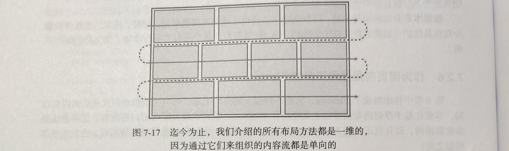

   在 Web 发展早期可用的布局技术很少，其中一项就是 HTML 表格。在 CSS 出现很久之后大家还一直 “坚持” 使用表格布局的一个重要原因就是，表格可以实现二维布局。换句话说，就是表格中的单元可通过 colspan 和 rowspan 实现复杂的布局。

   

   从使用 CSS 实现页面布局至今，都默默地接受了一个事：布局中任何嵌套的区块都需要一个自己的包装元素，而布局其实是分别控制单个元素得到的结果。现在，CSS Grid Layout 模块有望颠覆以往所有的做法。

### 7.3 二维布局：CSS Grid Layout

说到整体的页面布局，之前学习的任何技术都不是一个全面的解决方案，不能在二维空间里控制元素的顺序、位置和大小。不过，CSS Grid Layout 模块专门为此定义了一组 CSS 属性。

使用 Grid Layout 模块，可以抛开之前用到的很多辅助控制元素，从而大幅精简 HTML 标记。与此同时，这个模块也把基于元素本身来设置水平和垂直维度的负担，转移到了在页面中表示网格的一个包含元素上。

#### 7.3.1 网格布局的术语

下图展示了 CSS 规范中定义的网格。


下面来解释：

- 被设置为 `display: grid;` 的元素叫**网格容器**（grid container），即图中的粗线框区域。

- 容器进一步被**网格线**（grid line）划分为不同的区域，叫**网格单元**（grid cell）。

- 网格线之间的水平或垂直路径叫**网格轨道**（grid track）。具体来说，水平方向的网格轨道叫**网格行**（grid row），垂直方向网格轨道叫**网格列**（grid column）。

- 由相邻网格单元组合起来的矩形区块叫**网格区**（grid area）。

- 网格容器的直接子元素叫**网格项**（grid item），网格项可以放在网格区内。

本章开头提到的传统平面设计中的网格系统的术语，跟这里的术语概念几乎一样，但名字不同。规范的编写者认为，使用与电子表格和 HTML 表格有关的名字更容易得到开发者的认同。无论如何，都得接受这些术语。

#### 7.3.2 定义行和列

创建网格需要告诉浏览器网格行与网格列的数量和行为。要实现上图所示的 4×2 的网格，仍以 div 作为包装元素，需要将其显示模式设置为 grid。同时，再通过网格模板（grid template）指定行和列的数量及大小。

```css
.wrapper {
  display: grid;
  grid-template-rows: 300px 300px;
  grid-template-columns: 1fr 1fr 1fr 1fr;
}
```

前面的代码定义了一个 2 行 4 列的网格，行高 300 像素，4 列等宽。而且该网格中每行和每列的边缘都会生成网格线，后面会用到。

这里用于表示列宽的单位是 **fr，意思是可用空间中的部分**（fraction of available space）。这个单位跟 Flexbox 中的扩展系数（flex-grow）非常相似，只不过这里有特定的单位符号，应该是为了避免跟其他没有单位的值发生冲突。可用空间就是网格轨道（通过明确指定的长度值或根据自己的内容）确定尺寸后的剩余空间。

每个 fr 单位在这里都表示网格可用空间的 1/4。假如再添加一个 1fr，那么每个 fr 单位表示的就是可用空间的 1/5。

指定行和列的数量及大小时，可以混用不同的长度单位。比如，声明列时可以这样写：`200x 20% 1fr 200px`。这就是说，靠两边的两列宽度固定为 200 像素，左起第二列的宽度是总空间的 20%，而第三列则占据剩下的全部空间。换句话说，**fr 单位的大小会在计算完其他长度值之后再确定**，跟 Flexbox 一样。

**生成页面子区块的网格**
看一看前面例子中的页面布局，会发现每个子区块都可以转换为网格。每一个子区块对应的最简单网格应该是 3 行 5 列。每一列是总宽度的 15，而行的高度可以自动调整，完全取决于内容。


组织内容的标记瞬间就变得极其简单了。当然，为了分隔不同的子区块，最外层还是需要一个包装元素。而在包装元素内部，每篇新闻就可以直接用一个子元素来表示了。

```html
<section class="subcategory">
  <div class="grid-a">
    <header class="subcategory-header">
      <h2>Lorem ipsum</h2>
    </header>
    <article class="story story-featured">
      <!-- 此处是较大的 article -->
    </article>
    <article class="story">[...]</article>
    <article class="story">[...]</article>
    <!-- 此处是所有的 article，以下省略-->
  </div>
</section>
```

接下来定义这个网格的 CSS。从前面的切分图来看，3 行的高度应该是自动的，而 5 列则分别占 1/5 的宽度：

```css
.grid-a {
  display: grid;
  grid-template-rows: auto auto auto;
  grid-template-columns: repeat(5, 1fr);
  margin: 0 -0.6875em;
}
```

这里使用了网格布局模块提供的函数 repeat，可以用它为网格轨道指定重复的行或列声明，省去重复书写的麻烦。

因为网格轨道在 DOM 中并没有特定的元素表示，所以不能通过 max-width 或 min-width 之类的属性来为它们指定大小。如果想在声明网格轨道时使用同样的功能，可以使用 `minmax()` 函数。比如，可以声明最后两行至少 4em 高，除此之外还要占据相等的可用空间。

```css
.grid-a {
  display: grid;
  grid-template-rows: auto minmax(4em, 1fr) minmax(4em, 1fr);
  grid-template-columns: repeat(5, 1fr);
  margin: 0 -0.6875em;
}
```

此外，使用 `grid-template` 属性还可以把行和列的声明都放在一行上，前面是行的定义，后面是列的定义，中间以斜杠（`/`）分隔：

```css
.grid-a {
display: grid;
grid-template: auto minmax(4em, 1fr) minmax(4em, 1fr) / repeat(5, 1fr);
margin: 0 -.6875em;
```

#### 7.3.3 添加网格项

添加网格项要以其起止处的网格线作为参考。例如，子区块的标题区要占据左侧一整列。而添加相应网格项的最麻烦的方式，就是同时指定两个维度上起止的网格线编号：

```css
.subsection-header {
  grid-row-start: 1;
  grid-column-start: 1;
  grid-row-end: 4;
  grid-column-end: 2;
}
```

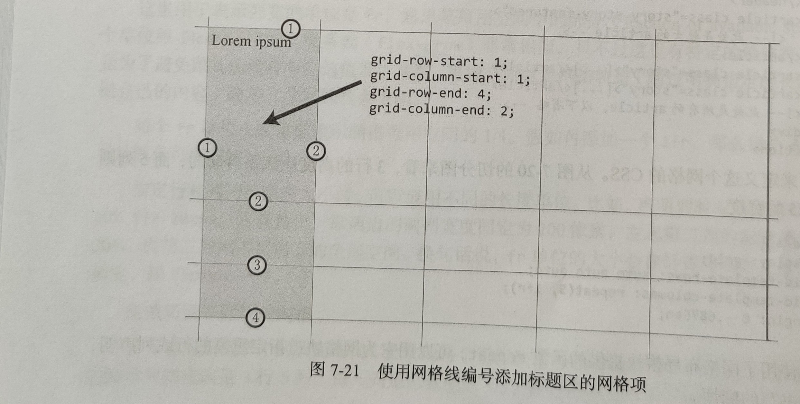

当然也可以简化为 `grid-row` 和 `grow-column` 属性，把行和列的起止网格线声明放在一行。起止网格线的编号以斜杠（`/`）分隔。

```css
.subsection-header {
  grid-row: 1/4;
  grid-column: 1/2;
}
```

假如只知道这个网格项应该跨所有行，但并不知道会有多少行，那么就需要一种方式来表示最后一行。Grid Layout 支持使用负值来反向表示行号。换句话说，-1 就是最后一个网格轨道的终止网格线的编号。另外，默认的跨度是一个网格单元，也就是说这里可以省略 `grid-colum` 值的最后一部分。

```css
.subsection-header {
  grid-row: 1/-1;
  grid-column: 1; /* 等价于 grid-colum:1/2 */
}
```

最后，还有一个终极的 `grid-area` 属性，可以进一步简化网格项的声明。这个属性的值最多 4 个，由斜杠分隔。4 个值全给出的话，分别表示 `grid-row-start`、`grid-column-start`、`grid-row-end` 和 `grid-column-end`。

```css
.subsection-header {
  grid-area: 1/1/-1;
}
```

这段代码里省略了第四个参数，也就是表示列方向终止位置的值。实际上，两个方向上的终止参数都是可以省略的。省略的话，网格定位时生成的网格项在两个方向上会默认跨一个网格轨道。

1. **对齐网格项**
   添加完网格项后，它们会自动撑满相应的网格区。这里的高度自动扩展与 Flexbox 中的可伸缩项非常相似。这并非巧合。

   Flexbox 和 Grid Layout 都是根据 CSS Box Alignment 规范确定其子项行为的。CSS Box Alignment 负责规范几种 CSS 上下文中元素的对齐与分布。

   与 Flexbox 中的行一样，网格项的垂直对齐也是通过 `align-items` 和 `align-self` 来控制的。这两个属性的默认值都是 `stretch`，也就是让网格项在垂直方向上扩展以填满相应网格区。其他关键字值也跟 Flexbox 的行一样，只不过没有 flex-前缀：start、end 和 center。下图解释了这几个值的差异。

   网格项与块级元素类似，会自动填充自己所在网格区的宽度，除非明确设置它的宽度。百分比值相对于网格项所在网格区（而非网格容器）的宽度来计算。

   如果网格项没有在水平方向填满网格区，可以通过 `justify-items` 和 `justify-self` 属性指定它的左、中、右分布。

   与 Flexbox 类似，`align-self` 和 `justify-self` 用于个别网格项。`align-items` 和 `justify-items` 则用于在网格容器上设置所有网格项的默认对齐。

   

2. **对齐网格轨道**
   在网格区没有占满的情况下可以对齐网格；同理，也可以在网格容器中对齐网格轨道。只要网格轨道的总和没有覆盖整个网格容器，就可以使用 `align-content`（垂直方向）和 `justify-content`（水平方向）来移动轨道。

   比如，下面这个网格中的列总和小于容器的尺寸：

   ```css
   .grid {
     width: 1000px;
     grid-template-columns: repeat(8, 100px); /* 共 800 像素 */
   }
   ```

   此时，可以控制剩余空间在容器里如何分配。默认情况下，`justify-content` 的计算结果是 start。下图展示了这个属性可能的值及效果。

   

   类似地，也可以在垂直方向上对齐（`align-content`）轨道（如果容器的高度是固定的），关键字一样。

3. **网格布局中的空距**

   在网格中创建空距的方法有很多。比如，给网格项声明外边距，利用网格轨道的不同对齐方式（如前面的 `space-between`），或者创建空的网格轨道来充当空距。

   如果希望所有轨道间的空距都是一个固定的值，那么最简单的方法是使用如下的 `column-gap` 和 `row-gap` 属性。通过它们可以创建固定宽度的空距，就好像网格线有了宽度一样：

   ```css
   .grid {
     display: grid;
     grid-template-columns: repeat(5, 1fr);
     column-gap: 1.5em;
     row-gap: 1.5em;
   }
   ```

#### 7.3.4 自动网格定位

在示例新闻网站的子区块中，最左边的列是为标题保留的，其他空间则全部由 .story 元素填充。如果像下面这样使用 `:nth-of-type()` 选择符来明确地定义它们的网格位置，那就太麻烦了。

```css
.story-featured {
  grid-area: 1/2/2/4;
}
.story:nth-of-type(2) {
  grid-area: 1/4/2/5;
}
/* ……还有更多 */
```

好在 Grid Layout 规范提供了一种自动定位（automatic placement）的机制。这种机制是 Grid Layout 中默认的，不会改变网格项的源代码次序。所有网格项自动从第一行第一个可用的网格单元开始，逐列填充。一行填满后，网格会自动开启一行并继续填充。

这就意味着，只要指定以下几点，Grid Layout 就会自动完成网格项的定位：

- 网格定义
- 标题区域
- 重点文章跨两列

剩下的元素会依序填充。实现之前基于浮动的布局的所有代码就这些：

```css
.grid-a {
  display: grid;
  grid-template-rows: auto auto auto;
  grid-template-columns: repeat(5, 1fr);
}
.subcategory-header {
  grid-row: 1/-1;
}
.story-featured {
  grid-column: span 2;
}
```

只有 5 条声明！完整的代码还会更多一些，因为还要设置网格项的间距什么的，但区区这几行代码就实现了之前基于浮动实现的布局。下图展示了 .story 元素填充网格的过程。


1. **自动定位的次序**

   自动定位机制就可以满足需求。在此之上，还可以控制一些东西，同时也不必明确指定网格项的起止位置。

   当前的例子中，网格项的次序与源代码次序一致。就像 Flexbox 一样，也可以使用 `order` 属性来控制摆放网格项的位置。每个网格项的默认次序是 0。整数值，包括负值在内，都是有效的。

   ```css
   .story:nth-of-type(2),
   .story:nth-of-type(3) {
     order: -2;
   }
   .story-featured {
     order: -1;
   }
   ```

   这样就把重点文章放到了第三项，原来的第二项和第三项（在网格容器中带有 .story 类名的第二个和第三个 article 元素）跑到了前头。此后，所有文章都按默认的 `order:0;` 排列。

   > **注意**：同一网格区可以放多个重叠的元素。此时，order 属性也会影响它们的绘制次序。而且与 Flexbox 中一样，可以通过 z-index 控制网格项的堆叠顺序，而无须设置任何定位属性。每个网格项分别构成自己的堆叠上下文。

2. **切换自动定位算法**

   默认的自动定位算法是逐行地填充网格项，也可以设置为逐列填充，通过 `grid-auto-flow` 属性来控制这一顺序：

   ```css
   .my-row-grid {
     grid-auto-flow: row; /* 默认值 */
   }
   .my-columnar-grid {
     grid-auto-flow: column;
   }
   ```

   这个默认定位算法很简单：从头开始，只跑一遍，逐个寻找要放置网格项的网格单元。如果网格项跨多个网格单元，那么网格中就会出现空洞。

   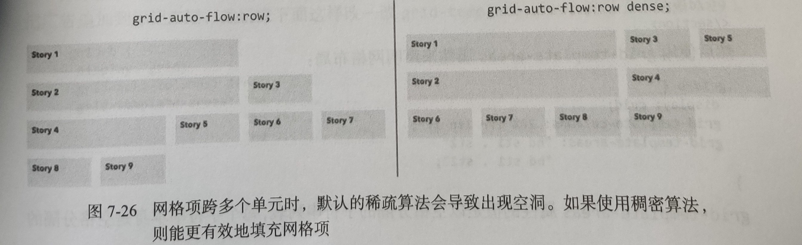

   如果改成使用稠密模式（默认为稀疏模式），自动定位算法会跑多遍，每次都从头开始，尽力找到最前面的空位置。结果就是网格会更稠密。

   ```css
   .grid {
     grid-auto-flow: row dense;
   }
   ```

#### 7.3.5 网格模板区

CSS Grid Layout 的 “命名模板区”（named template area）也许是其最不可思议的特性之一。通过这个特性，能够以可视化方式来指定如何排布项目。因为这个特性更适合简单的网格，所以以之前示例中的第二个子区块为例。假设想在这个区块中放两篇新闻和两个广告：

在标记中，按照内容的重要程度来排序，标题、新闻，最后是广告：

```html
<section class="subcategory">
  <div class="grid-b">
    <header class="subcategory-header"></header>
    <article class="story"></article>
    <article class="story"></article>
    <div class="ad ad1"></div>
    <div class="ad ad2"></div>
  </div>
</section>
```

然后使用 `grid-template-areas` 属性来声明网格布局：

```css
.grid-b {
  display: grid;
  grid-template-columns: 20% 1fr 1fr 1fr;
  grid-template-areas: 'hd st1 . st2' 'hd st1 . st2';
}
```

`grid-template-areas` 属性的值是以空格分隔的字符串列表，每个字符串本身是空格分隔的**自定义标识符**，表示网格中的一行，其中每个标识符表示一列。标签符的名字随便起，只要不跟 CSS 关键字冲突即可。

跨行或跨列相邻的同名网格单元构成所谓的命名网格区。命名网格区必须是矩形。用点号表示的区域是匿名单元，没有名字。

如下图所示的网格区中，使用了类似 ASCII 字符图的方式，可视化地声明了网格行如何从上往下排列（当然两行字符串写成一行也可以，不过写成两行更形象）。


列模板指定第一列宽度为 20%，其他列各占剩余宽度的 1/3。为了把网格项放到网格中，仍然使用 `grid-area` 属性，但这次使用自定义的网格区名：

```css
.grid-b .subcategory-header {
  grid-area: hd;
}
.grid-b .story:nth-child(2) {
  grid-area: st1;
}
.grid-b .story:nth-child(3) {
  grid-area: st2;
}
```

之所以没给广告指定命名网格区或具体位置，是因为对这个例子来说没必要。默认的自动定位算法就可以把它们放到剩余的空单元中。

如果现在在新闻的上头和下头再插入 5 条广告，只要把广告追加到标记末尾，然后像下面这样改一改 `grid-template-areas` 就行了：

```css
.grid-b {
  display: grid;
  grid-auto-columns: 1fr;
  grid-template-areas: 'hd ... ... ...' 'hd st1 ... st2' 'hd ... ... ...';
}
```

这个例子也展示了另一种表示未命名单元的点模式。规范允许用连续多个点表示一个匿名单元，因为这样更方便对齐多行模板字符串。

> 前面基本把 Grid Layout 模块最重要的特性都介绍完了，但还有更多内容没有。这个模块支持以多种方式表达网格结构，所以本身挺庞大也挺复杂的。

## 八. 响应式 Web 设计

iPhone 在 2007 年的首次亮相，标志着移动设备上网体验的巨大进步。于是人们争先恐后地针对手机和触屏分别设计独立的网站，由此造成了 “移动 Web” 和 “桌面 web” 的分野。

时至今日，浏览器的身影可谓无处不在。手机、平板电脑、台式电脑、智能电视、智能手表，以及各式各样的游戏机和游戏终端里，都可以看到它们。

专为这些设备和终端分别建立网站终究不现实，而且它们之间的界限其实也很模糊。于是，只创建一个能适配多种设备的网站，或者响应式网站，成为一种常规的套路。

响应式 Web 设计原理很简单，主要难在细节上。本章就来介绍相关的 CSS 和 HTML 技术：

- 响应式 Web 设计的历史和起源
- 视口、媒体类型及媒体査询的原理
- 响应式网站设计的 “移动优先” 法则
- 何时以及在何处创建断点
- 使用 Flexbox、网格布局及多列布局的响应式设计
- 响应式排版和响应式媒体内容

### 8.1 一个例子

从 CSS 的角度来看，响应式 Web 设计最核心的一点，就是可以适配不同视口大小的流式布局。本章就从改造上章中的新闻站点开始，目标是将其改造成响应式布局。

#### 8.1.1 简单上手

对于较窄的视口，比如手机屏幕，一个简单的布局通常就行了。这个布局只有一列，按照内容重要程度排列（也就是 HTML 源代码中的顺序），如图 8-1 所示。


第 7 章的示例代码则需要删除一部分。所有指定宽度的代码基本都得去掉，只保留行和列设置内、外边距的代码。同时，还要把列设置为浮动和 100% 宽度，以保证行可以包含浮动的子元素。

```css
.row {
  padding: 0;
  margin: 0 -0.6875em;
}
.row:after {
  content: '';
  display: block;
  clear: both;
  box-sizing: border-box;
  padding: 0 0.6875em 1.375em;
  float: left;
  width: 100%;
}
```

#### 8.1.2 媒体查询

如果视口更宽一些，那就有可能在一屏之内显示更多内容。比如，可以让第二篇和第三篇报道各占容器的一半。


通过缩放窗口来确定在什么情况下并排展示两篇报道，发现合适的最小宽度是 560 像素或 35em。这里需要添加所谓的**媒体查询**，让其中的规则只在满足最小宽度条件时才触发：

```css
@media only screen and (min-width: 35em) {
  .row-quartet > * {
    width: 50%;
  }
  .subcategory-featured {
    width: 100%;
  }
}
```

如果条件为真，就执行这些代码。媒体查询使用的 `@media` 规则与 `@supports` 规则相似，都是 CSS 中的 “if” 语句，针对的是显示网页的环境的能力。在这个例子中，条件就是浏览器视口至少 35em 宽。而像这样引入媒体查询的宽度值，就叫作**断点**。

> **注意**：断点相关的规则与设备类型无关，无论是手机还是其他什么设备都可以。换句话说，

对于这个断点，只要关心在这么大的空间里该如何有效地展示内容就行了。不建议基于特定的设备宽度来设置断点，因为新设备层出不穷。也不能通过更多的断点来区分 “移动 Web” 和 “桌面 Web”。

#### 8.1.3 加入更多断点

继续增大浏览器窗口，随着空间增大，可以找出更高效地利用空间的方式。在宽度约 800 像素（50em）的时候，可以并排放 4 篇报道，此时让重点报道占总宽度的一半。此时的布局就有点类似刚开始时 “非响应式的” 例子了，除了子分类的标签还在报道上方：

```css
@media only screen and (min-width: 50em) {
  .row-quartet > * {
    width: 25%;
  }
  .subcategory-featured {
    width: 50%;
  }
}
```


最后，发现在宽度约 70em 或 1120 像素时，可以把子分类标题放到一侧：

```css
@media only screen and(min-width: 70em) {
  .subcategory-header {
    width: 20%;
  }
  .subcategory-content {
    width: 80%;
  }
}
```

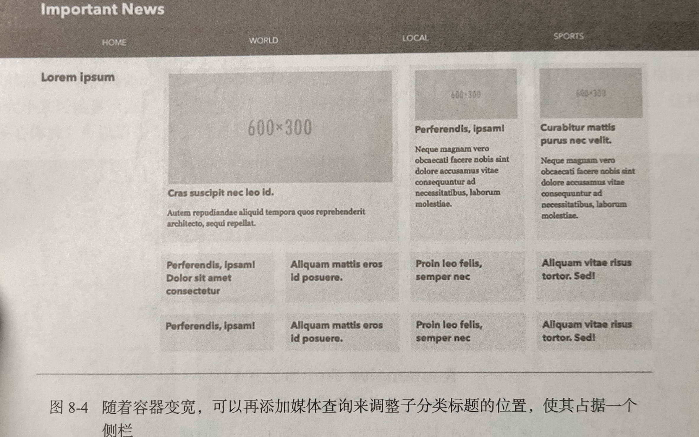

到现在为止，就完成了这个例子的响应式版本，涵盖了 4 种不同的布局。

前面的代码并不多，但是封装并体现了一些有用的技术和原理。首先，从一个纯粹的单列布局开始，然后使用媒体查询限定布局改变的条件，而这正是响应式 Web 设计的基础。在进一步探讨新内容之前，先来回顾一下响应式 Web 设计的起源。

### 8.2 响应式 Web 设计的起源

发明 “响应式 Web 设计” 一词的人叫 Ethan Marcotte，他是一位设计师兼开发者。2010 年他在 “A List Apart” 网站上写过一篇文章，名称就是《[响应式 web 设计](https://alistapart.com/article/responsive-web-design)》。文中使用 “响应式 Web 设计” 这一概念，描述综合了流动网格、弹性嵌入对象（图片或视频）及媒体查询适配，从而不受屏幕大小限制的布局模式。这篇文章后来被他扩展成一本小书，从此响应式 Web 设计就流行起来了。

虽然响应式 Web 设计作为一种设计思潮相对较新，但一套设计适配不同设备的想法则很早就有了。

从技术角度来看，响应式 Web 设计的构成要素其实早就存在了。媒体查询（及其前身，媒体类型）正是在有些人呼吁适配浏览器布局技术的背景下才得以成为标准的。事实上，Ethan 的文章也受到了 John Allsopp 在 2000 年表的文章 _A Dao of Web Design_ 的影响在这篇文章中，John 主张优秀的 Web 设计应该更多地迎合用户，而不是追求像素级控制。这个转变需要时间，但转变确实已经发生了。

到了 2010 年，媒体査询得到了浏览器的广泛支持。而且那时移动设备也开始普及，通过手机浏览器查看网页也变得习以为常。通过综合几种已有的技术并创造 “响应式 Web 设计” 的概念，Ethan 让这个 Web 设计期待已久的发展方向有了自己的名字。

响应式 Web 设计正在迅速成为网页设计约定俗成的方式，并可能在将来成为 “优秀 web 设计” 的代名词。不过在那之前，响应式 Web 设计一般指适配多种设备和多种屏幕尺寸的 web 设计。

**CSS 之外的响应性**
今天，响应式技术广泛应用于各种大大小小的网站。Ethan 响应式技术的 “三驾马车” 仍然是响应式 Web 设计的基础，但也得到了长足的发展和补充。其中最常见的就是通过 JS 根据不同设备为页面添加交互功能或改变展示外观。

比如现今已司空见惯的 “三明治菜单”。通常在大屏幕上，全局导航菜单会扩展开来，而在小屏幕上，它们会隐藏到 “三明治” 按钮后面。这里一般会用 JS 根据视口大小来切换显示方式。但关键在于，原本的内容和 HTML 标记没有变化，与设备无关。这种 “核心体验” 可以通过编程方式进行任意转换。

这里的模式想必大家都熟悉：先加载核心资源，之后再根据设备的能力决定是否加载更多资源。没错，响应式 web 设计也是渐进增强的一个例子。

本章侧重讲解 CSS 与响应式 Web 设计的关系，稍带讲一下响应式图片。如果希望深入了解更多响应式网站的高级模式，推荐看一下 Brad Frost 的 [This is Responsive](https://bradfrost.github.io/this-is-responsive/)，其中汇集了大量使用模式和案例。

掌握响应式 CSS 的第一步就是理解呈现网页的这块画布：视口。

### 8.3 浏览器视口

视口就是浏览器显示网页的矩形区域。这个区域对布局的影响，用 CSS 的话来说，就是 “有多少空间可用”。要恰当地使用视口进行响应式设计，需要理解视口的原理，以及如何操纵它。在桌面浏览器上，视口的概念很直观，就是通过 CSS 像素来合理利用视口中的空间。

> 这里有一点需要特别说明，那就是何为 CSS 像素。CSS 像素跟屏幕的物理像素不是一回事。**CSS 中说的像素与屏幕物理像素之间存在一种灵活的对应关系。这个关系取决于硬件、操作系统和浏览器，以及用户是否缩放了页面**。

如果页面的 body 元素中有两个 div。如果将第一个 div 设置为 width: 100%，第二个 div 设置为以像素为单位的宽度，那么这里设置为多少像素才能让两个 div 宽度相等?答案是当前视口的 CSS 像素数，而这与屏幕当前有多少物理像素无关。

来看一个具体的例子，iPhone5 的物理像素宽度为 640 像素，但在 CSS 中的视口宽度是 320 像素。这里有一个比例系数，也就是每个 CSS 像素相当于 2×2 个物理像素。

“虚拟的” CSS 像素与实际的硬件像素之间的比例系数，范围从 1（1 个 CSS 像素 = 1 个物理像素）到 4（1 个 CSS 像素 = 4×4 个物理像素）不等，视设备屏幕的分辨率不同而不同。

好消息是，对于响应式布局，要关心的只有 CSS 像素；至于它跟物理像素的比例，不用关心。坏消息是，必须就此深入理解视口的工作机制，以便让两者协调，来满足需求。

#### 8.3.1 视口定义的差别

触屏手机和其他移动设备把事情搞得有点复杂。在这些设备上，频繁缩放并不是査看网页的最佳方式。这就导致了设备制造商发明了一个新概念来影响视口。移动平台策略专家 Peter Paul Koch 深入研究过这些不同视口的差异，也曾试图给它们起一个好理解的名字。

1. **默认视口和理想视口**

   智能手机浏览器刚出现时，还没多少网站专门针对小屏幕做过优化。于是，多数移动设备（包括平板电脑）上的浏览器都会硬性呈现桌面大小的视口，从而让未经优化的网站能够显示。通常的做法是模拟一个大约 1000 像素宽的视口，然后在其中显示缩小后的页面。这种视口称为 “默认视口”，它是实现响应式设计的第一道 “关卡”。

   既然默认视口是一个模拟的视口，那就意味着还有一个与设备自身尺寸接近的视口。没错，这个视口就称为 “理想视口”。理想视口的大小因设备、操作系统和浏览器而异，但一般对手机而言，宽度大约在 300~500 CSS 像素之间；对平板电脑而言，宽度大约在 800~1400 CSS 像素之间。以 iPhone5 为例，其理想视口的宽度就是 320 像素。在响应式设计中，这才是设计要用的视口。

2. **可见视口和布局视口**

   明确了移动设备中默认视口和理想视口的差别，就可以从视口实际工作机制的角度来给它们一个共同的、直观的定义了。首先，显示网页的这个矩形区域，称其为 “可见视口”。这个视口等于浏览器窗口减去所有按钮、工作条、滚动条等组件之后，实际包含网页内容的空间（也称为 “浏览器骨架”，browser chrome）。

   放大网页时，网页的某些部分会跑到可见视口之外。此时，看到的仍然是可见视口，而假想的那个约束 “整个页面” 的矩形区域，称其为 “布局视口”。可见视口与布局视口的工作机制在桌面浏览器和移动浏览器中是一样的。

   视口并不简单。不过，对于响应式 Web 设计而言，只会基于每个设备的 “理想视口” 来适配页面。桌面浏览器不需要任何特殊对待，因为桌面浏览器的理想视口就是其默认视口。但在智能手机和平板电脑中，就需要拆解模拟的默认视口，令其等于理想视口。这需要通过 HTML 中的 meta 元素来做到。

#### 8.3.2 配置视口

要让具有不同默认视口的设备都使用各自的理想视口，只要在页面的头部元素中添加一个小小的视口 meta 标签即可。这个标签如下：

```html
<meta
  name="viewport"
  content="width=device-width, initial-scale=1"
/>
```

这行代码告诉浏览器，希望使用当前设备的理想尺寸（即 device-width）作为视口宽度的基准。这里同时还设置了 initial-scale=1，其作用是设置与理想视口匹配的缩放级别。这个配置也能帮避免 IOS 中一些奇怪的缩放行为。虽然在多数设备中，只要设置缩放级别，它们就会将视口宽度默认设置为 device-width，但为了确保跨设备和跨操作系统兼容，还是需要同时把这两项都设置上。

initial-scale 的值大于 1，表示要放大布局，实际会导致布局视口缩小，因为能显示的像素少了。相反，小于 1 的值会缩小布局，实际会导致布局视口中可容纳的 CSS 像素增多。

**其他可配置的值**
这里也可以将 width 设置为具体的像素值，而不是 device-width 关键字，这样实际上将布局视口设置为指定的宽度。如果此时还设置了 initial-scale 值，那么移动浏览器会选择应用其中较大的。

**不要禁用缩放！**
可以通过在视口 meta 标签中设置 maximum-scale 和 minimum-scale 属性（为数值）锁定缩放范围。通过设置 user-scalable=no 也可以完全禁用缩放。如下视口 meta 标签并不少见：

```html
<meta
  name="viewport"
  content="initial-scale=1.0, maximum-scale=1.0, minimum-scale=1.0, user-scalable=no"
/>
```

这样用户在移动设备上就不能缩放网页了，因此网页的适应性会变差。即使在设计网页时会考虑给文本和可操作的部分（如链接和按钮）应用较大和较明显的样式，视力或行动有障碍的用户可能仍然会感到不便。

有些开发者喜欢禁用缩放，以便让自己的 Web 应用看起来更像原生的移动应用。而且，这样也能在老平台上避免一些因缩放导致的奇怪问题，但随着平台发展，这些问题其实都已不复存在。

在响应式设计中禁用缩放，无异于把洗澡水和孩子一起倒掉。毕竟，通用、无障碍的访问才是 Web 最突出的优点之一。

### 8.4 媒体类型与媒体查询

#### 8.4.1 媒体类型

依据设备能力来分离样式的能力，始于媒体类型。HTML 4.01 和 CSS 2.1 定义了媒体类型，用于针对特定的环境应用样式，包括屏幕显示、打印和电视等。

通过给 link 元素添加 `media` 属性，可以指定在哪些设备上应用相关样式，比如：

```html
<link
  rel="stylesheet"
  href="main.css"
  media="screen, print"
/>
```

这段代码的意思是将相关的样式应用于（任意）屏幕显示和打印。如果不关心媒体类型，可以在这里使用 all 关键字，或者干脆不写 media 属性。逗号分隔的有效类型关键字列表，意味着只要其中一个匹配即可。如果一个都不匹配，则不应用该样式表。

除了在 HTML 中指定媒体类型，还可以在 CSS 文件中指定。最常见的方式就是使用 `@media` 语法，比如：

```css
@media print {
  /* 针对打印机的选择符和规则 */
  .smallprint {
    font-size: 11pt;
  }
}
```

除了 screen 和 print，还有一些常用的媒体类型，包括 handheld 和 tv。这两个貌似可以在响应式设计中使用，但其实不行。由于种种原因，浏览器开发商都不会明确给出某设备所属的媒体类型，因此用得上的类型就只剩 screen、print 和 all 了。

#### 8.4.2 媒体查询

因为不仅要指定设备类型，还要指定设备的能力，所以 CSS3 的 Media Queries 规范应运而生。

这个规范扩展了媒体类型，而且语法也是媒体类型加（包含在括号中指定媒体特性的）媒体条件。此外，在媒体选择语法中，也增加了新关键字，用于支持更复杂的逻辑。

在 link 元素中，媒体查询可以这样写：

```html
<link
  rel="stylesheet"
  href="main.css"
  media="screen and (min-width: 600px)"
/>
```

这样就声明了 main.css 应该用于屏幕媒体，而且媒体条件是视口至少 600 CSS 像素宽。

> **注意**：在媒体查询并不匹配的情况下，很多浏览器仍然会下载 CSS 文件。因此，不要过度使用带媒体查询的 link 标签，否则可能导致下载过多不必要的数据，影响性能。

同样的声明可以在 CSS 文件中通过 `@media` 规则写成如下格式：

```css
@media screen and(min-width: 600px) {
  /* 这里写规则 */
}
```

这里的 `and` 关键字负责把媒体类型与要测试的条件连接起来，因此可以同时测试多个条件：

```css
@media screen and (min-width: 600px) and (max-width: 1000px) {
}
```

多个媒体查询可以写成一连串，用逗号分隔，逗号相当于 “或”。此时，大括号中的规则会在任意媒体查询结果为真时应用。如果所有媒体查询结果均为假，则跳过。

也可以完全忽略媒体类型，只保留括号中的媒体条件：

```css
@media (min-width: 30em) {
  /* ... */
}
/* 这相当于: */
@media all and (min-width: 30em) {
  /* ...*/
}
```

另外，使用 `not` 关键字可以对媒体査询取反。比如下面的媒体査询匹配除屏幕媒体之外的任何媒体：

```css
@media not screen {
  /* 针对非屏幕媒体的样式 */
}
```

还有一个 `only` 关键字，其目的在于避免旧版本浏览器误解媒体查询。

正常情况下，不支持媒体查询的浏览器看到 `screen and (min-width:...` 时，会认为它是语法错误的媒体类型声明，从而忽略它。但是，有些旧版本浏览器可能会在读取完 screen 时停下来，认为它是一个有效的媒体类型，然后为所有屏幕媒体应用样式。

为此，Media Queries 规范特意引人了 only 关键字。这样，当前面提到的旧版本浏览器看到 only 时，就会跳过整个 @media 块，因为媒体类型中从未有过 only 这个关键字。所有支持媒体查询的浏览器则必须忽略掉 only 关键字，仿佛它不存在。

为防止旧版浏览器错误地应用样式，应该像下面这样声明只针对特定媒体类型的样式：

```css
@media only screen and(min-width: 30em) {
  /* ... */
}
```

如果不关心媒体类型，可以简化为：

```css
@media (min-width: 30em) {
  /* ... */
}
```

1. **尺度查询**

   在 width 和 height 中，width（以及 min-width 和 max-width）是响应式 Web 设计的主打属性。QuirksMode.org 的 Peter-Paul Koch 曾做过一次调查（Media Query/RWD/Viewport Survey Results），结果显示，与宽度相关的媒体查询占绝大多数。

   宽度之所以如此重要，是因为创建网页的默认方式就是水平布局最多只能跟视口一样宽。而在垂直方向上，可以让内容自动扩展，用户可以垂直滚动页面。因此，知道什么时候有多少水平空间可用于布局是非常必要的。

   **不要使用设备相关的尺寸**
   也可以让浏览器去比对 device-width 和 device-height，但这两个属性并不总能代表视口，其本质还是屏幕的尺寸。

   实际应用中，很多人混用 width 和 device-width，导致移动浏览器厂商跟风，以便让网站在他们的浏览器中正常展示。未来的 Media Queries 规范中也会废弃设备相关的关键字。无论如何， device- width 和 device- height 的含义很模糊，除非真的必要，否则不要使用它们。

2. **更多尺度：分辨率、宽高比和方向**

   虽然查询视口的尺寸占据了媒体查询的绝大多数，但还可以查询其他设备特性。比如，可以仅在设备的宽度小于高度时，也就是方向改变时，改变布局：

   ```css
   @media (orientation: portrait) {
     /* 竖向屏幕时的样式 */
   }
   ```

   类似地，可以只在视口匹配最小宽高比时应用规则：

   ```css
   @media (min-aspect-ratio: 16/9) {
     /* 宽高比至少为 16:9 时应用 */
   }
   ```

   前面说过，设备的像素比很大程度上并不重要。对于布局来说，这是没问题的。本章后面会使用 `min-resolution` 媒体査询来适配要加载的图片，那时候像素比就很重要了。媒体查询很可能在未来会被扩展，能够检测用户设备和环境的其他方面。

3. **浏览器对媒体查询的支持**

   几乎所有浏览器都已经支持了基本的媒体查询。可惜很多其他的 “CSS3” 特性，IE8 及更早版本的浏览器都不支持。因此，可以使用一些策略。对这些旧浏览器，要么提供一个固定宽度的布局，要么使用腻子脚本，也就是让这些浏览器假装支持新特性的脚本。

   比如 Scott Jehl 的 Respond.js。在不支持媒体查询的浏览器中，这个脚本会从链接的所有 CSS 文件中搜索媒体查询语法，然后根据屏幕大小应用或删除相应的样式，模拟原生媒体查询的机制。

   使用 Respond.js 有两个问题。比如，这个脚本对直接写在页面 style 元素中的媒体查询无效。此外，还有一些边界情况需要避免，因此在使用这个脚本前，需要仔细阅读一下其网站的说明。

   如果使用 JS 不能满足要求，那么可以通过条件注释包含特定的样式表，在旧版本 IE 中将其固定为特定的 “桌面” 宽度。

   条件注释是直至（但不含）IE10 都存在的一组特殊语法。在非 IE 浏览器中，条件注释就像正常的 HTML 注释一样，会被忽略掉。相应版本的却可以识别其中包含的机关。总之，这是能够针对特定版本或某组版本的引入资源的特殊语法。

   针对桌面 IE 应用宽屏样式的条件注释需要考虑旧版本 IE，同时不能针对旧版本 Windows Phone 中的 IE。写出来就像下面这样：

   ```css
    <!--[if (lt IE 9) & (!IEMobile)]>
    <link rel="stylesheet" href="oldIE.css" media="all">
    <![endif]-->
   ```

   这个策略的前提是，已经把其他样式放到了另一个样式表中，而且针对小屏幕的样式是 “默认样式”，针对宽屏的样式通过媒体查询来单独应用。这是一种推荐做法。

### 8.5 响应式设计与结构化 CSS

在本章开始时举的例子中，代码中删除了宽度和布局规则，又将它们添加到了 min-width 媒体查询块中。这种方式不仅有助于减少代码量，也是一个重要策略的一部分。

#### 8.5.1 移动优先的 CSS

“移动优先” 这是一种关于如何分配设计与开发资源的策略。移动设备的屏幕小，输入不便，通常处理器和内存等硬件配置比台式电脑要低一些。但这些设备也是很多人随身携带的。

通过在设计和开发中首先聚焦于这些设备，一开始就要考虑很多限制因素，从而能够着眼于数字产品的核心。而在面向其他设备开发更大型的网站或应用时，可以再引入扩展的能力。

如果采取相反的路线，那就要考虑怎么把已有的功能塞进一个有限的平台，难度会更大。同样的思考方式也适用于 CSS，即使在重构一个 “桌面” 网站。

CSS 文件中的第一批规则，既针对最小的屏幕，也针对那些不支持媒体查询的测览器。

- **基本的版式**：大小、颜色、行高、标题、段落、列表、链接，等等。
- **基本的 “盒子”**：特定的边框样式、内边距、弹性图片、背景颜色和一些背景图片。
- **基本的跳转和浏览组件**：导航、表单和按钮。

接下来在移动设备和各种浏览器中测试，通过调节窗口大小，会发现这些样式在某个点上需要调整:行的长度变得过长，内容之间离得太远，等等。这时就可以考虑添加媒体查询了，这个点就叫**断点**。重申一下，断点可以使用任何度量方式表达，但重点是让代码适应内容，而不是某个设备的像素尺寸。

```css
/* 开始时先写基本样式和小屏幕的样式 */
.myThing {
  font-size: 1em;
}
/* 然后在 min-width 媒体查询中调整 */
@media only screen and(min-width: 23.75em) {
  .meThing {
    width: 50%;
    float: left;
  }
}
/* 进一步调整 */
@media only screen and (min-width: 38 75em) {
  .myThing {
    width: 33.333%;
  }
}
```

看一看本章开始时那个例子的代码，就会发现也在使用这种方法。这是把 “移动优先” 策略落实到代码的结果。而且，这种方法也反映了移动优先、响应式 Web 设计及渐进增强等设计理念的相互融合。代码尽可能少，而适用的设备却尽可能多，这就说明方法对。

**媒体查询与 em 单位**
在媒体查询中使用 em 单位可以进一步强化设计，使其更能适应变化的环境。多数桌面浏览器会在用户放大页面时，基于像素单位的查询来缩放，但用户也可以不缩放网页，而是修改浏览器的基准字号。

使用 em 单位可以让布局在后一种情况下正常伸缩，因为 em 就是以文档的基准字号为参照的。

> **注意**：在媒体查询中使用的 em 始终相对于浏览器偏好中的基准字号，而不是可以通过调整的 html 元素的字号（1rem）。

**最大宽度查询与小屏幕样式**
以 `min-width` 查询作为主要工具，可以基于视口宽度渐进地应用调整。但是也不能忽略 `max-width` 查询。有时候可能会应用一些适合小屏幕，但不见得适合大屏幕的样式。此时如果使用 `min-width`，就要先写出样式，再对选择条件取反。使用 `max-width` 查询可以省点事。

比如，可能希望在小屏幕中给标题应用窄一点的字体，从而避免过多折行。使用 min-width 并应用 “移动优先” 策略，可以像下面这样写：

```css
body {
  font-family: 'Open Sans', Helvetica Neue, Arial, sans-serif;
}
h1,
h2,
h3 {
  font-family: 'Open Sans Condensed', 'Arial Narrow', Arial, sans-serif;
}
@media only screen and (min-width: 37.5em) {
  h1,
  h2,
  h3 {
    font-family: 'Open Sans,Helvetica Neue', Arial, sans-serif;
  }
}
```

由于小屏幕样式中要对窄字体标题取反，font-family 声明在这里不得不重复出现。如果在这里换成使用 max width，那么代码量会减少，维护也更方便：

```css
body {
  font-family: 'Open Sans', 'Helvetica Neue', Arial, sans-serif;
}
@media only screen and (max-width: 37.5em) {
  h1,
  h2,
  h3 {
    font-family: 'Open Sans Condensed', 'Arial Narrow', Arial, sans-serif;
  }
}
```

当然，还有一些可用的媒体查询可以改变网站设计。具体使用什么条件，要根据情况而定。但不管怎样，使用 `min-width` 作为主打属性，可以很好地将媒体查询作为渐进增强的一种方式。

#### 8.5.2 媒体查询放在何处

示例中的样式表，前头是基本的 “不限定范围” 样式，后头是 min-width 查询，可以看作包含媒体查询的样式表的简单范例。

媒体查询也可用于不同的目的：调整细节或重排布局。通常这两类媒体查询的条件也不太一样，因此有必要区别对待。

样式表的结构并没有硬性规定。不过，把不同用途的媒体查询分门别类会比较清晰。

- 影响整个页面布局的媒体查询通常涉及一堆类名，这些类名代表的是网站中的主要组件，另外会涵盖几种不同的屏幕尺寸。这类媒体查询一般建议放在与布局相关的规则附近。

- 如果有调整网站组件中某些细节的媒体查询，可以把它们放在定义该组件样式的规则旁边。

- 如果出现了在相同断点下对布局的很多修改，以及对个别组件的小修小补，那么把它们统一放到样式表最后可能比较好。这样做体现了先通用后具体的设计模式。

最重要的一点是，媒体查询放在哪里，并没有固定位置。这也意味着，可以按照自己团队和项目的需要来组织 CSS 代码。

> **注意**：媒体查询不会增加其选择符的特殊性，因此代码结构和顺序要确保它们不会在别处被覆盖。另外，把它们放在最后也不能保证它们可以覆盖前面的声明，它们仍然遵循正常的层叠规则。

### 8.6 几种响应式设计模式

“移动优先” 的 CSS 编写方式体现了响应式设计的一种基本模式。除此之外，还有很多模式可以让设计更灵活、适配性更强。而且随着新技术的出现，还会涌现出更多更好的模式。本节介绍几种值得推荐的模式。

#### 8.6.1 响应式文本列

第 4 章介绍的 CSS3 Multi-column Layout 规范是 CSS 中很早就以响应式设计为目标的一个规范，只不过当时还没有 “响应式” 这个词而已。这个规范使用列宽而不是列数，让内容能够在容器中分布到尽可能多的列中：

```html
<div class="multicol">
  <p>Lorem ipsum [...]</p>
  <!--省略其他代码-->
</div>
```

实现这个响应式文本列的 CSS 只有一行，用不着媒体查询：

```css
.multicol {
  column-width: 16em;
}
```

> 多栏文本在网页中应该尽量少用。这种模式的用武之地，就是文本内容本身不是特别长，无须让用户在很宽的屏幕上滚动很多的情况。此时，利用多列文本既可以避免声明过宽的容器，也可以有效利用水平空间。

#### 8.6.2 没有媒体查询的响应式 Flexbox

Flexbox 也是 CSS 中具有某种响应式特质的规范。无须使用媒体查询，Flexbox 本身就可以创建出能够有效利用空间的适配布局。

假设要创建一个购物工具，通过它来为时光机购买零件，只要单击按钮就可以增加或减少购物车中的零件数量：

这个零件列表是无序列表，每一项都有如下结构：

```html
<ul class="ordering-widget">
  <li class="item">
    <span class="item-name">Flux capacitor regulator</span>
    <span class="item-controls">
      <button
        class="item-control item-increase"
        aria-label="Increase"
      >
        +
      </button>
      <button
        class="item-control item-decrease"
        aria-label="Decrease"
      >
        -
      </button>
    </span>
  </li>
  <!-- 省略其他代码 -->
</ul>
```

给名称和按钮应用灵活的尺寸，这样在整个组件在一行里放不下时，便能够自动改变布局。

首先，给列表应用一些重置样式，以及一些基本的排版规则：

```css
.ordering-widget {
  list-style: none;
  margin: 0;
  padding: 0;
  font-family: 'Avenir Next', Avenir, SegoeUI, sans-serif;
}
```

然后把每一个列表项转换成一个 Flexbox 行：

```css
.item {
  color: #fff;
  background-color: #129490;
  display: flex;
  flex-wrap: wrap;
  font-size: 1.5em;
  padding: 0;
  margin-bottom: 0.25em;
}
```

为容纳最长的零件名，每一项至少 13em 宽，而超出的空间可以自动填充：

```css
.item-name {
  padding: 0.25em;
  flex: 1 0 13em;
}
```

然后，包含两个按钮的 span 也应该自动填充可用空间，且最少为 4em 宽。同时它们也作为按钮的 Flexbox 容器：

```css
.item-controls {
  flex: 1 0 4em;
  display: flex;
}
```

每个按钮都转换成 Flex 项，占据相同宽度。其他样式主要用于调整按钮的默认样式：

```css
.item-control {
  flex: 1;
  text-align: center;
  padding: 0.25em;
  cursor: pointer;
  width: 100%;
  margin: 0;
  border: 0;
  color: #fff;
  font-size: inherit;
}
```

最后就是按钮本身的背景颜色：

```css
.item-increase {
  background-color: #1e6f6d;
}
.item-decrease {
  background-color: #1c5453;
}
```

这些就是响应式购物界面的所有样式！其中最有意思的地方是，如果加减按钮控件（.item-controls 元素）不能跟固定宽度的 .item-name 元素共处一行，它们就会自动折行，共同占据第二行。因为 .item-controls 元素的 flex-grow 属性值默认为 1，所以它们会扩展并占据一整行，即每个按钮占半行。

**容器相关的响应式组件**
在前面的例子中，没有使用媒体查询，却也创建了一个响应式的组件，降低了 CSS 的复杂度。这种包装行为虽然简单，却是使用浮动或行内块无法实现的。

另外，这种基于 Flexbox 的组件并不能根据视口大小而变化，只能基于包含它们的容器中的可用空间而变化。这通常正是想要实现的效果。

媒体查询虽然是基于视口的创建响应式布局的主打方式，但它们并没考虑特定组件出现在多个可能的位置，以及渲染为不同宽度的情况。换句话说，如果一个组件出现在很窄的侧栏中，希望它能以匹配这种狹窄环境的方式来显示，而不是根据视口大小进行调整。在某种形式的 “容器查询”（已经有了[相关提议](https://github.com/WICG/cq-usecases)）出现之前，可以先使用 Flexbox。

#### 8.6.3 响应式网格与网格模板区

Grid Layout 提供的属性可以把之前属性承担的布局任务转移到网格容器。下面这个模式使用了[第 7 章](#七-页面布局与网格)介绍的命名模板区域语法，可以极大简化页面布局响应式的创建。

看看第 7 章新闻网站示例中的第二个子标题区，其实只要修改几个地方，就可以把它变成响应式布局。不过，先看看它的 HTML 代码：

```html
<section class="subcategory">
  <div class="grid-b">
    <header class="subcategory-header"></header>
    <article class="story"></article>
    <article class="story"></article>
    <div class="ad"></div>
    <div class="ad"></div>
  </div>
</section>
```

HTML 代码中包含这个区域的标题、两篇文章和两个广告。如果不应用任何布局样式（网格布局或其他布局样式），那么这几个块会垂直堆叠并填满页面。这在小视口中效果很不错。

代码中元素的顺序是按重要程度排列的，因此新闻报道在最前头，最后才是广告。如果广告销售团队担心广告都放在页面底部可能会被忽略掉，希望在移动设备上把广告插到新闻中间呢?

这可以通过网格布局属性来实现。首先，需要给标题和新闻定义网格区域名称：

```css
.grid-b .subcategory-header {
  grid-area: hd;
}
.grid-b .story:nth-of-type(1) {
  grid-area: st1;
}
.grid-b .story:nth-of-type(2) {
  grid-area: st2;
}
```

不用写媒体查询，只要定义网格容器以及其中行的顺序就行了。这样，网格模板就能自动摆好单列内容区中各个项目的次序。现在，广告自动跑到了未命名的区域（由一个点号表示），位于两篇报道中间：

```css
.grid-b {
  display: grid;
  grid-template-columns: 1fr;
  grid-template-areas: 'hd' 'st1' '.' 'st2' '.';
}
```

如果视口再宽一些，那就可以把新闻区修改为 2×2 的网格，只要通过媒体查询添加一个新模板即可：

```css
@media only screen and (min-width: 37.5em) {
  .grid-b {
    grid-template-columns: 1fr 1fr;
    grid-template-areas: 'hd hd ' 'st1 ...', '... st2';
  }
}
```

可以使用任意数量连续的点表示匿名网格区域，从而让代码中的值上下对齐。在更宽一些的视口中，标题还是在内容上方，但新闻和广告可以构成与第 7 章的示例相同的布局：

```css
@media only screen and( min-width: 55em) {
  .grid-b {
    grid-template-columns: 1fr 1fr 1fr;
    grid-template-areas: 'hd hd hd' 'st1 .. st2', 'st2 .. st2';
  }
}
```

最后，再切换到侧边标题加三列布局：

```css
@media only screen and (min-width: 70em) {
  .grid-b {
    grid-template-columns: 20% 1fr 1fr 1fr;
    grid-template-areas: 'hd st1 . st2', 'hd st1 . st2';
  }
}
```

由此可见，使用 Grid Layout 属性可以在某些断点重新定义整个布局，同时又不必去碰个别组件。当然，也可以使用其他网格定位方法来实现响应式布局，但网格模板区域在这里特别适合。只是要记住，不支持它的浏览器会回退为只有一列的布局，因此使用它之前要衡量项目的情况。

### 8.7 响应式布局之外

现在，已经学习了视口和媒体查询的机制，也通过例子展示了响应式布局技术。但响应式网站还有很多细节需要处理。本节就来介绍一些技术，以便网站的其他方面也能具有响应能力。从媒体开始，先介绍背景图片，再介绍嵌入式页面内容。

#### 8.7.1 响应式背景图片

在 CSS 中，让背景图片适配屏幕大小很简单，因为可以使用媒体查询。

```html
<header
  class="profile-box"
  role="banner"
></header>
```

这里要使用两个图片文件来当背景。小图宽度为 600 像素，剪切为一个正方形。大图宽度为 1200 像素，剪切方式是矩形。

在小视口中，使用小图的背景图片：

```css
.profile-box {
  height: 300px;
  background-size: cover;
  background-image: url(img/small-cat.jpg);
}
```

而在视口变大时，背景图片会自动变大（因为设置了 `background-size: cover`），不过如果尺寸过大，图片就会模糊了。此时，就要切换到大图：

```css
@media only screen and (min-width: 600px) {
  .profile-box {
    height: 600px;
    background-image: url(img/big-cat.jpg);
  }
}
```

这个简单的例子说明了两点。首先，可以使用媒体查询来应用最适合视口的图片。其次，不仅可以通过响应式背景加载不同大小的图片资源，还能基于视口对背景图片应用不同的剪切方式，产生更具艺术性的效果。

**使用分辨率查询切换图片**
在前面的例子中，基于视口的大小来改变图片。而有时候虽然视口大小相同，但希望能基于设备的像素比来加载不同分辨率的图片。对图片来说，其实际像素需要与 CSS 像素对应起来。如果一张固有大小为 400 像素 × 400 像素的图片，在高分辨率的屏幕上也显示为 400 CSS 像素 × 400 CSS 像素，就会导致图片被放大，从而失真、模糊。此时为保持清晰，就需要根据分辨率查询来加载一张更大、分辨率更高的图片。

假设想针对最小的屏幕加载一张叫 medium-cat.jpg 的图片，条件是像素比至少为 1.5。这个 medium-cat.jpg 也是正方形，不过大小为 800 像素 × 800 像素。1.5 这个数多少有点拍脑袋决定的意思，但它可以保证在高分辨率手机和平板上加载更大的图片，这些设备的像素比最低都是 1.5。当然也可以再继续针对更高的分辨率添加更多媒体查询（以及更多高分辨率图片），只要控制好图片的大小。

基于像素比改变图片，需要测试的标准媒体特性叫 `resolution`，因此这里检测的是 `min-resolution`，单位是 dppx（device-pixels per pixel，每像素的设备像素）。并非所有设备都支持这个标准的查询，因此这里还添加了 `-webkit-mindevice-pixel-ratio`，主要针对 Safari 它只有值，没有单位。

```css
@media (-webkit-min-device-pixel-ratio: 1.5), (min-resolution: 1.5dppx) {
  .profile-box {
    background-image: url(medium-cat.jpg);
  }
}
```

结合使用尺度及分辨率査询，就可以实现针对不同设备加载不同图片的优化策略。

**老式分辨率查询语法**
关于分辨率查询，之前还有几种不同的语法，包括最早的 Firefox 中使用的 `min--moz-device-pixel-ratio` 以及使用 dpi 为单位的 `min-resolution`。

只有一些老版本的实现才支持 dpi 为单位的 `min-resolution`，基本上就是 IE9~IE11。可是 IE 的实现把 dpi 的值搞错了，会导致在某些环境下错误地加载高分辨率图片。

像前面例子一样只使用 `-webkit-min-device-pixel-ratio` 和 `min-resolution`（及 dppx 单位），基本就可以涵盖大部分辨率设备了，代码也不多。虽然旧版本正并不支持，但还是推荐的。要了解这方面更多的信息，可以参考 W3C 的 Elika Etemad 的[文章](https://www.w3.org/blog/CSS/2012/06/14/unprefix-webkit-device-pixel-ratio/)。

#### 8.7.2 响应式嵌入媒体

恰当处理内容图片、视频及其他嵌入对象的可伸缩性，是响应式 Web 设计的难点之一。对于 CSS 背景图片，可以用媒体查询实现很多控制。但对于嵌入页面中的对象，CSS 有时候会显得力不从心。这方面有些内容超出了 CSS 的技术范畴，但它们可能会影响网站性能，因此掌握它们也很重要。

1. **响应式媒体基础**

   第 5 章介绍过实现图片、视频及其他对象弹性化的基本技术。通过设置 `max-width` 属性为 100% 让元素变得可以伸缩，同时又不会超过其固有大小：

   ```css
   img,
   object,
   video,
   embed {
     width: auto;
     max-width: 100%;
     height: auto;
   }
   ```

   这几行代码虽然简单，但能保证固定宽度的元素不会混入响应式设计。不过，不同的使用场景可能需要不同的方法来控制大小。

2. **响应式图片与 `reset` 属性**

   虽然控制图片大小比较直观，但如何加载合适的图片却是个大问题。图片大小在网页总量中占比很大，而且如今网页的体量还在飞速增长。

   响应式 Web 设计出现后，很多开发者不管什么设备，也不管屏幕大小，都一律使用相同的图片，这一做法也加重了这个问题。换句话说，即使小屏幕设备也会加载最大的图片，以便让图片看起来更清晰。这样不光会导致网页增大，缩放图片也会占用更多处理器时间和内存空间，而处理器和内存在手机上并不会有多富余。

   浏览器会对网页进行预处理，图片等资源会在浏览器构建完整个页面或运行 JS 之前就开始下载。这意味着不可能仅凭脚本就完美解决图片的响应式问题。这就是关于响应式图片的标准一直持续制定了好几年的原因。努力的结果之一就是诞生了一个主要的属性：`srcset`。

   `srcset` 及其对应的 `sizes` 属性，是对 img 元素最简单的扩展。通过它们可以设置与图片相关的不同选项。

   - 哪个是当前图片可替换的源文件，其宽度是多少像素?
   - 在各个断点中，它们的 CSS 宽度是多少?

   通过在 HTML 而非 CSS 中指定这个信息，浏览器的预解析器就能迅速决定下载哪个图片。

   WebKit 系浏览器最早实现了 `srcset` 的一个版本。这个版本能针对目标分辨率和物理像素与 CSS 像素的比例（x-descriptor）指定可替换的图片。对于新闻页面中的专题报道而言，可以让默认分辨率或不支持的浏览器加载 600 像素 × 300 像素的图片，但在像素比高的时候加载两倍大的图片。

   ```html
   
   ```

   根据分辨率只能切换图片，不能控制图片的显示尺寸。为此，可以添加 `sizes` 属性，声明图片显示宽度，而不是检测像素比。

   这时候，`srcset` 的语法又会出现变化。如果同一张图片有不同大小的版本（300 像素 × 150 像素到 1200 像素 × 600 像素不等），每个版本对应一个源文件，那么就要指定媒体查询加宽度。要精确表达宽度，可以使用从 CSS 中借鉴过来的视口相关的单位及 `calc()` 函数：

   ```html
   
   ```

   除了常规的 src 和 alt 属性，还有一个 `srcset` 属性。它的值是一组图片 URL 加一个实际像素宽度（不是 CSS 像素）这个**在宽度值后面加 w 字母的语法叫宽度描述符**。

   ```txt
   srcset="img/small.png 300w,
     img/small.png 400w,
     ..."
   ```

   接下来要告诉浏览器怎么使用这些图片。只需在 sizes 中对应着给出一组宽度值即可，每个值开头可以加上（或不加）媒体条件，就像在 CSS 媒体查询中一样。

   > **注意**：这里的媒体条件表达式不是 CSS 表达式，因此不会遵循层叠机制，即后声明的不会覆盖先声明的。相反，它的顺序是从前往后，找到匹配就退出，所以这里先声明最宽的媒体条件。最后一个宽度不需要条件，只是作为匹配最小屏幕之后兜底的值。

   ```txt
   sizes="(min-width: 70em) 12.6875em,
     (min-width: 50em) calc(25vw * 0.95 - 2.75em),
     (min-width: 35em) calc(95vw / 2 - 4.125em),
     calc(95vw - 1.375em)"
   ```

   媒体条件后面的宽度是根据图片在不同断点下的大致宽度而估算的。这是对响应式图片的折中利用，实际上是在 HTML 中声明了一些 CSS 样式规则。这里**不能用百分比值，因为百分比值是基于 CSS 样式计算的**。不过，可以使用视口相关单位，比如 vw 和 em。这里的 em 对应浏览器中默认的文本大小，和媒体查询中的一样。

   在有图片缓存的情况下，浏览器可能会选择加载较大的图片；而在网速慢或电量低时，会加载较小的图片。同理，浏览器也能知道当前设备是不是高分辨率屏幕，从而决定是否自动加载大图，而不需要在标记中指定。

3. **picture 元素**

   除了在多个不同分辨率的图片间切换，还有几个很重要的响应式图片的应用场景：

   - 响应式图片在小屏幕和大屏幕上分别需要不同的裁切方式，毕竞尺寸和浏览范围不一样，类似于背景图片的裁切。如果使用 `srcset/sizes`，那么浏览器也许会假定所有源文件的宽高比都相同，只是分辨率不同而已。

   - 根据浏览器的支持情况加载不同格式的图片。比如 JPEG2000（Safari 支持）和 JPEG-XR（IE 和 Edge 支持）等。相比于所有浏览器都支持的图片格式，这几种格式会小很多。

   这些问题的标准解决方案是 `picture` 元素，它作为 img 元素的容器，同时扩展了 `srcset` 和 `sizes` 属性的能力。比如，可以利用 `srcset` 给响应式新闻页面添加 webP 图片：

   ```html
   <picture>
     <source
       type="image/webp"
       srcset="img/xsmall.webp 300w, img/small.webp 400W, img/medium.webp 600w, img/large.webp 800w, img/xlarge.webp 1200w"
       sizes="(min-width: 70em) 28em, (min-width: 50em) calc(50vw * 0.95 - 2.75em), calc(95w - 1.375em)"
     />
     
   </picture>
   ```

   虽然代码看着有点长，但逻辑只复杂了一点点。`` 标签及其属性没有变。区别在于增加了一个 `picture` 容器和一个 `<source>` 标签，后者与 `` 很相似。

   首先，`picture` 元素中仍然要有 img；`picture` 与 `source` 元素的作用是选择哪个图片作为 img 的最终源文件。此外，img 也是不支持 picture 的浏览器的后备。

   img 元素上仍然有 `srcset` 和 `sizes` 属性，这里先不提。浏览器在碰到包含 img 的 picture 元素时，会尝试寻找 source 元素，并从中选出匹配的源文件，让 img 显示。虽然例子中只有一个 source 元素，但其实也可以有多个：

   ```html
   <source
     type="image/webp"
     ...
   />
   ```

   这里 source 元素的 type 属性值为 image/webp，如果浏览器支持该格式，那就会从中挑选匹配的图片。然后，source 元素与 img 元素拥有相同的 `srcset` 和 `sizes` 属性，只是 `srcset` 中给出的都是 WebP 文件：

   ```html
   <source
     type="image/webp"
     srcset="img/xsmall.webp 300w, img/small.webp 400w, ..."
     sizes="(min-width: 70em)28em, (min-width: 50em) calc(50vw * 0.95 - 2.75em)..."
   />
   ```

   如果浏览器匹配到一个文件，那么该文件就会作为 img 元素的源文件。如果 source 元素中没有匹配的元素，浏览器最终还会回到 img 元素，并检查它的属性。而 img 元素的 src 属性则是在前面没找到任何匹配文件（或浏览器不支持前面的图片语法）的情况下的兜底属性。

   这个例子既支持分辨率，又支持文件类型。如果此时在高分辨率屏幕上的 Firefox 和标准分辨率屏幕上的 Chrome 中打开页面，会发现它们分别选择了最合适的图片。

   前面的例子是在 `sizes` 属性中加入的媒体条件，用以匹配不同断点。如果想对文件来源拥有更多控制，也可以在 `source` 元素上使用 `media` 属性，在其中包含媒体查询：

   ```html
   <picture>
     <source
       media="(min-width: 70em) and (min-resolution: 3dppx)"
       srcset="..."
     />
     
   </picture>
   ```

   这样一来，就可以进一步控制何时加载哪些文件了。区别在于，浏览器不再代替选择用哪个 source 元素。`srcset` 属性内部的选择取决于浏览器，但它必须使用在 `media` 或 `type` 属性上匹配的第一个 source 元素。

   对开发者来说，可控性增加了。比如，对于一些艺术照，可以根据不同视口采用不同的裁切方式。但这样也让操作时不得不更加小心。无论如何，目标是要尽量减少不必要的下载。

   多数情况下 `srcset` 和 `sizes` 就够用了，如果还不够用，可以使用 picture。

#### 8.7.3 响应式排版

布局对响应式设计非常重要，这一点很容易理解。实际上，在考虑兼容所有设备的前提下，排版与布局也是同等重要的。不仅因为屏幕大小不一样，还因为不同设备上的交互方式也不一样。

1. **设备不同，大小不同**

   在大屏幕上阅读，一般每行 45~70 个字符比较舒服。而在手机上阅读，如果每行的字符达到 70 个，那可能字就看不太清楚了。这就意味着在小屏幕上，需要让每行包含的字符数在 35~45 个。

   随着每行字符数的减少，行高通常也可以减小。比如，台式机显示器上的行高如果是 1.5，那么移动设备上的行高差不多可以是 1.3。

   屏幕大小不同，排版的基准尺寸也要相应调整，两者之间密不可分。那么，怎样才能为网站主体内容设置合适的文字大小?

   一种简单的办法就是，与屏幕保持适当距离，然后拿一本实体的书或杂志，放到通常的阅读位置。这时，比较书中文字的大小和屏幕上文字的大小。感觉屏幕上的文字更大还是更小？一般来说，要将屏幕文字大小设置为 20 像素，才能让人感觉跟看书一样。

   常见的情况是网页中的文字偏小。这通常代表了设计师或开发人员个人的喜好，而不是文本实际应有的可读性。但这种情况在悄然改变，很多以阅读体验见长的网站正在引领着趋势。比如，Medium.com 的字体大小在桌面浏览器上的计算值是 21~22 像素。

   如果是手机屏幕，那会拿得比书更近一些。在这个距离关系下，字体大小差不多应该在 16~18 像素。

   要判断某种距离关系下的屏幕大小与字体大小是否匹配，可以使用设计师 Trent Walton 的一个技巧。他在可接受范围的起始位置上各加人了一个特殊字符，然后再到设备上[测试相应段落](https://trentwalton.com/2012/06/19/fluid-type/)。

   ```html
   <p>Lorem ipsum dolor sit amet, consectetur adip *isicing elit, sed do eius mod* tempor incidid.</p>
   ```

   上面段落中的星号所在位置是第 45 个和第 70 个字符。意思是，如果第一行出现了两个星号，那说明这一行太长了。而在移动设备上测试时，第一行折行的地方应该在第一个星号之前一点。在找到适合最小和最大屏幕的字体大小后，就可以在此基础上进行网站的其他响应式排版了。下一步就是实现，实现的方式当然不止一种，但其中有一些是相对比较灵活的。

2. **使用弹性字体大小**

   谈到排版，通常都会提到像素大小。但还有其他方式可以描述大小和距离。em、rem 及视口单位（vw、vh、vmin 和 vmax）等相对长度的字体大小很适合不同屏幕间的适配。有了这些单位，在宏观层面就可以通过字体大小及样式在元素间的层叠机制来适配不同的屏幕。

3. **设置基准字体大小**

   几乎每个浏览器的用户样式表都会设置一个 16 像素的基准字体大小。要想修改这个值，只要重新在 html 元素上设置 `font-size` 属性即可。基于 em 单位的媒体查询，就是以这个由浏览器设置的基准大小为参照值的。为保证 CSS 中的一致性，应该在 body 元素上重新设置这个基准大小。

   重新设置对小屏幕友好的基准大小，可以贯彻 “移动优先” 的策略。之后，就可以参照这基准来设置其他不同性质文本的大小，比如标题、列表、菜单，等等。可伸缩的字体大小在响式设计中很重要。想要实现可伸缩的排版让文本随屏幕变大而自动变大。

   假如字体大小以像素为单位来设置，那样式表可能是这样的：

   ```css
   p {
     font-size: 16px;
   }
   h1 {
     font-size: 36px;
   }
   /* ... */
   @media only screen and (min-width: 32.5em) {
     p {
       font-size: 18px;
     }
     h1 {
       font-size: 40px;
     }
     /* ... */
   }
   @media only screen and(min-width: 52em) {
     p {
       font-size: 20px;
     }
     h1 {
       font-size: 44px;
     }
     /* ... */
   }
   ```

   可以看到，基于像素字体大小很难实现自动适配的布局。而使用相对大小就可以让布局伸缩更容易：

   ```css
   p {
     font-size: 1em;
   }
   h1 {
     font-size: 2.25em;
   }
   h2 {
     font-size: 1.875em;
   }
   /* ... */
   @media only screen and (min-width: 32.5em) {
     body {
       font-size: 1.125em;
     }
   }
   @media only screen and(min-width: 52em) {
     body {
       font-size: 1.25em;
     }
   }
   ```

   这样不错，但还不够。一个可伸缩的版式系统，并非弄几个断点，改改基准字体大小那么简单。比如，想在大屏幕上加大标题字号，而在小屏幕上适当减小标题和正文的字号差距。

   可伸缩的基准大小便于通过媒体查询来放大和缩小字号（以及 margin、line-height、padding 等相对基准大小）。然后，可以把时间花在调整不能一致缩放的地方。相比于在每个断点中重复所有样式声明，这样显示效率更高。

4. **视口相关的单位**

   em 和 rem 单位可以伸缩，因为它们不表示具体的像素大小。下一步则是让字体大小适配视口大小，此时要用视口相关的单位。在视口相关的单位中，1 表示 1%，指占视口宽度或高度的百分比。

   - `vw`：表示视口宽度。
   - `vh`：表示视口高度。
   - `vmin`：表示宽度和高度中较小的。
   - `vmax`：表示宽度和高度中较大的。

   某种程度上，这几个单位赋予了在响应式排版方面极大的灵活性。其中文本不需要通过媒体查询来修改大小，而这又是视口相关单位的风险所在：不能控制极端的值。

   视口单位基本得到了浏览器的普遍支持。但某些实现也存在一些问题：

   - IE9 把 vmin 实现成了 vm
   - IE9、IE10 和 Safari6-7 落下了 vmax
   - iOS 上的 Safari6~7 存在一些 [bug](https://github.com/scottjehl/Device-Bugs/issues/36)

5. **测试与调整**

   响应式排版是版式设计的新思维。与响应式布局类似，任务是对排版进行系统的抽象，有了这个系统，就可以基于它针对各种屏幕进行转换。与此同时，还能够保证它们的版式大体一致。虽然调整样式、大小和距离有一些基本规则，但还是要针对具体情况来单独测试、调整、再测试。选择一种写 CSS 的方法很重要，但最终目标还是保证用户得到最佳的体验，无论在什么设备上。

## 九. 表单与数据表

表单在现代 Web 应用中占据着重要地位。通过表单，用户可以留言、评论、订机票酒店，等等。表单可以很简单，比如只包含填写电子邮件地址和留言的输入框；也可以非常复杂，要横跨几个页面。

除了从用户那里获得数据，Web 应用还需要以容易看懂的方式展示数据。表格是展示复杂数据的最佳方式，但需要精心设计以避免主次不分。构成表格的一系列元素在 HTML 里属于既复杂又容易搞错的。

表格和数据表的设计很长一段时间以来是不受重视的。然而，好的信息架构与交互设计才能够成就好的 Web 应用。

### 9.1 设计数据表

表列数据可以用行和列显示。日历就是数据表的一个典型示例。即使一些相对简单的数据，如果行和列多起来，也会变得难以看清。如果数据单元之间不做区分，信息就会混杂在一起，导致布局混乱。

数据单元的间距过大，同样会导致难以分辨行和列的关系。列间距过大时，这个问题尤其严重。这样的表格很容易就会看串行，特别是表格中间，即四周没有边框之类的视觉参照物的地方。

其实，只要应用几个基本的设计原则，就能大大提升这些数据表的可读性。比如，表格通过合理的行高和宽度设计，就能给人一种舒适感。这个表格中的表头有自己独特的文本样式和边框，当前日期及周末两天也都有容易辨识的标记。这就是一个清晰明了的日历小组件。

#### 9.1.1 表格专有元素

如果表格对视力正常的人来说都难以阅读，就更别提那些使用辅助技术的视力障碍用户了。

HTML 中的表格是通过 table 元素来创建的，表格由 tr（table row，行）和 td（table data cell 数据单元）组成。除此之外，HTML 还定义了更多元素和属性，以增强数据表的可读性。

1. **表题**

   表题就是表格的标题，用 `caption` 表示。虽然不是必须声明的元素，但还是要尽可能地去使用。在日历的例子中，通过表题来显示当前是几月：

   ```html
   <table class="cal">
     <caption>
       <strong>January</strong>
       2015
     </caption>
   </table>
   ```

2. **表头、表体、表脚**

   表头、表体和表脚分别用 thead、tbody 和 tfoot 来表示，这 3 个元素把表格按照逻辑分成 3 个区块。比如，可以把列标题放在 thead 中，单独给它们定义一种样式。如果使用 thead 或 tfoot，那至少也要使用一个 tbody。一个表中只能有一个 thead 或 tfoot，但可以有多个 tbody，以便把复杂的表切分成更小也更容易维护的数据块。

   列标题和行标题应该使用 th（而不是 td）来表示，然后通过 `scope` 属性的值说明它们是行标题（row）还是列标题（col）。`scope` 属性的值还可以是 rowgroup 或 colgroup，表示这个行标题或列标题的范围涵盖多行或多列。一周的每一天都对应一列，因此它们的 `scope` 属性值应为 col：

   ```html
   <thead>
     <tr>
       <th scope="col">Mon</th>
       <!--省略-->
       <th scope="col">Sun</th>
     </tr>
   </thead>
   ```

3. **col 与 colgroup**

   通过 tr 元素可以给某一行添加样式。但如果想给某一列添加样式呢?可以使用 `:nth-child` 选择表格单元，但这样做很容易乱套。col 和 colgroup 元素才是最合适的。colgroup 用于定义列组，每一列由一个 col 定义。col 元素本身不包含内容，只代表实际表格中的某一列。

   ```html
   <colgroup>
     <col class="cal-mon" />
     <col class="cal-tue" />
     <col class="cal-wed" />
     <col class="cal-thu" />
     <col class="cal-fri" />
     <col class="cal-sat cal-weekend" />
     <col class="cal-sun cal-weekend" />
   </colgroup>
   ```

   colgroup 要放在 table 里，位于 caption 的后面，thead、tfoot 或 tbody 的前面。

   然后，就可以给 col（或 colgroup）而不是特定列中的单元格应用样式了。比如日历中的周六和周日这两列，就要应用不同于其他列的样式。可以应用给列的样式非常有限，只有 background、border、width 和 visibility。

   对列而言，visibility 可用的值只有 visible 和 collapse 而且即使这样，也不是所有浏览器都支持。值 collapse 的意思不仅是隐藏，还会让表格对应的区域缩小，这在某些场景下非常有用。可惜某些浏览器没有实现这个功能，就像其他很多被忽略的功能一样。

#### 9.1.2 为表格应用样式

CSS 标准规定了两种表格边框模型：分离型和折叠型。在分离型模型中，每个单元四周都有边框，而在折叠型模型中，相邻单元会共享边框。这里希望单元格共享 1 像素宽的边框，因此将 `border-collapse` 属性设置为 `collapse`。

表格单元的大小也有不同的算法，可以通过 `table-layout` 属性来控制。默认情况下，这个属性的值是 auto，基本上是由浏览器按照单元格的内容来确定单元格的宽度。如果把这个属性的值改为 fixed，那么单元格的宽度就会基于表格第一行中每个单元格的宽度来确定，或者基于 col 或 colgroup 元素的宽度来确定。这样就可以更方便地通过 CSS 来控制单元格宽度。

接下来设置字体栈，并在表格中居中显示所有文本。最后，再设置宽度和最大宽度，以便让表格既能占据尽可能大的地方，又不至于宽到没法看。

```css
.cal {
  border-collapse: collapse;
  table-layout: fixed;
  width: 100%;
  max-width: 25em;
  font-family: 'Lucida Grande', Verdana, Arial, sans-serif;
  text-align: center;
}
```

**表格内容的样式**
底层的设置已经完成，接下来该给可见的内容添加样式了。为了让表格的标题看起来更像常规的标题，要增大其字号和行高。然后，让它朝左对齐并加上底部边框，从而让它跟下面的表头有明显区别。

```css
.cal caption {
  text-align: left;
  border-bottom: 1px solid #ddd;
  line-height: 2;
  font-size: 1.5em;
}
```

下面再通过 col 元素给周末两列设置粉色背景。

> **注意**：background 是为数不多的几个可以应用给一整列的 CSS 属性之一。给此处的背景色设置较高的透明度，让它能透出下层的背景颜色。此外，为兼容旧版本浏览器，还提供了一个后备的不透明色选项。

```css
.cal-weekend {
  background-color: #fef0f0;
  background-color: rgba(255, 0, 0, 0.05);
}
```

接下来是具体的单元格。所有单元格都要有一定的行高，而且宽度一致。默认情况下，表格的布局算法会根据单元格内容来分配单元格的空间。因为表头中表示周几的简写内容长度并不一样，所以每一列的宽度也会略有差异。这个问题可以通过把每一列的宽度设置为表格宽度的 1/7（14.285%）来解决。实际上，这里的宽度值只要至少是 1/7 即可。这是因为，如果所有单元格的宽度加起来超过宽度的 100%（在使用 fixed 表格布局模型的情况下），那么每个单元格都会按照同样的比例减少宽度，直至不超过 100% 假如不考虑有多少个单元格，让它们宽度一律相等，那就可以把它们的宽度都设置为 100%。虽然这样做很方便，但为了能让人看明白，还是使用全部宽度的 1/7。

在某些浏览器中，单元格也会有默认的内边距，这里要去掉。此外，还给单元格（不包括表头单元）添加了一个较细的边框。

```css
.cal th,
.cal td {
  line-height: 3;
  padding: 0;
  width: 14.285%;
}
.cal td {
  border: 1px solid #eee;
}
```

为区分表头和表格数据（实际的日期），给表头加上一个粗边框。很简单，就是给 thead 应用一个边框：

```css
.cal thead {
  border-bottom: 3px solid #666;
}
```

这样设置在多数浏览器中都没问题，但在 IE 和 Edge 中不行：表格中的边框，无论是单元格边框、行边框，还是行组（thead 或 tbody）边框，在选择的折叠型模型中都会被垂直边框盖住。好在多数浏览器都会用整行的边框盖住垂直边框。IE 和 Edge 中单元格的左、右边框都跑到了 thead 元素的边框上，导致边框有空隙。这个问题是可以绕过去的。比如，可以不使用折叠型模型，然后给个别单元格应用样式。

接下来是可以点击的日期。去掉链接的下划线，将链接设置为暗紫色，并让它们显示为块级元素。这样每个链接都会填满自己所在的单元格，让可点击区域变大。最后，给链接的悬停和聚焦状态应用样式，添加一个半透明的背景色（同样也用一个不透明色作为后备）：

```css
.cal a {
  display: block;
  text-decoration: none;
  color: #2f273c;
}

.cal a:hover,
.cal a:focus {
  background-color: #cde7ca;
  background-color: rgba(167, 240, 210, 0.3);
}
```

最后，给日历中日期的其他状态应用样式。比如不在当月的日期，给它们加上阴影，并设置不同的悬停光标样式，表示不能选中。

对于当前日期，将其背景色改为透明度较低的值。这样，不同透明度的颜色混合起来，能自然地区分当前日期、悬停时的当前日期，以及悬停时的当前日期为周末的情况，就不用再写别的规则了。

```css
.cal-inactive {
  background-color: #efefef;
  color: #aaa;
  cursor: not-allowed;
}
.cal-current {
  background-color: #7d5977;
  background-color: rgba(71, 14, 62, 0.6);
  color: #fff;
}
.cal-current a {
  color: #fff;
}
```

#### 9.1.3 响应式表格

表格会在空间不够时自动扩展。这是因为它有两个轴向的概念，会在列数增加时自然地占据更多空间。这会导致复杂的表格占据相当多的空间，从而违反响应式设计的目标，即在各种尺寸的屏幕上合理展示内容。

前面提到过，CSS 中的表格（以及表格的每个部分）有自己的显示模型。可以利用这点，让本身不是表格的元素具有 “网格性质”，从而实现想要的布局。不过，也可以反过来，让表格不显示为表格！在让表列数据适合小屏幕显示时，就会用到这个。

1. **表格线性化**

   在表格包含很多列的情况下，可以翻转表格，让原来的每一行变成一个块，其中包含原来的表头和该行对应的值。下面举一个例子，这个表格包含不同车型的诸多配置参数。

   

   而在小屏幕上，每一行都会自成一体。表头行隐藏，而列名分别显示在相应数据前面。

   ```html
   <table class="cars">
     <caption>
       Tesla car models
     </caption>
     <thead>
       <tr>
         <th scope="col">Model</th>
         <th scope="col">Top speed</th>
         <th scope="col">Range</th>
         <th scope="col">Length</th>
         <th scope="col">Width</th>
         <th scope="col">Weight</th>
         <th scope="col">Starting price</th>
       </tr>
     </thead>
     <tbody>
       <tr>
         <td>Model S</td>
         <td>201 km/h</td>
         <td>426 km</td>
         <td>4976m</td>
         <td>1 963 mm</td>
         <td>2 108 kg</td>
         <td>$6998</td>
       </tr>
       <tr>
         <td>Roadster</td>
         <td>201 km/h</td>
         <td>393 km</td>
         <td>3946mm</td>
         <td>1873m</td>
         <td>1235kg</td>
         <td>$169600</td>
       </tr>
     </tbody>
   </table>
   ```

   

   这个表格的样式涉及边框、字体和 “斑马条纹” 技术，即相邻行的背景颜色不同：

   ```css
   .cars {
     font-family: 'Lucida Sans', Verdana, Arial, sans-serif;
     width: 100%;
     border-collapse: collapse;
   }
   .cars caption {
     text-align: left;
     font-style: italic;
     border-bottom: 1px solid #ccc;
   }
   .cars tr:nth-child(even) {
     background-color: #eee;
   }
   .cars caption,
   .cars th,
   .cars td {
     text-align: left;
     padding: 0.5em;
     line-height: 2;
   }
   .cars thead {
     border-bottom: 2px solid;
   }
   ```

   缩放浏览器窗口，发现在约 760 像素宽时，表格就显得拥挤了。这里需要添加一个断点，并改变样式。

   表格有很多默认样式和显示模式。如果一上来就采用 “移动优先” 策略，用 min-width 条件在大屏幕下重置默认样式，那么会多写很多代码。为了简便，使用 max-width 条件，这样就把小屏幕作为一种特殊情况来处理：

   ```css
   @media only screen and (max-width: 760px) {
     .cars {
       display: block;
     }
     .cars thead {
       display: none;
     }
     .cars tr {
       border-bottom: 1px solid;
     }
     .cars td,
     .cars th {
       display: block;
       float: left;
       width: 100%;
       box-sizing: border-box;
     }
     .cars th {
       font-weight: 600;
       border-bottom: 2px solid;
       padding-top: 10px;
     }
     .cars td:before {
       width: 40%;
       display: inline-block;
       font-style: italic;
       content: attr(data-label);
     }
   }
   ```

   此时的单元格都成了块级元素，并占据 100% 宽度，结果就是在一行中上下堆叠起来。表格的标题完全隐藏。为体现列名与 td 元素中具体值的关系，要把每个列名添加为每个单元格的 data-label 属性：

   ```html
   <th scope="row">Model S</th>

   <td data-label="Top speed">201 km/h</td>
   <td data-label="Range">426 km</td>
   <td data-label="Length">4 976 mm</td>
   <!-- ... 还有更多 -->
   ```

   之后，就可以利用 `:before` 伪元素插入这些数据属性的值，并把它们显示在每个单元内容前面。要获得数据属性的值，可以使用 `attr()` 函数，然后将其作为 content 属性的值。这也是通过 CSS 显示 HTML 中隐藏信息的一个技巧。虽然 HTML 中的内容有点重复，但问题不大，这样可以避免在 CSS 中硬写入列名。

   除了保持表格可读性的其他样式之外，还有几处需要重点解释一下：

   首先，给表格自身设置了 display: block。这个设置对展示而言并非必要，但有助于无障碍访问。修改表格的显示模式不应该改变屏幕阅读器对表格的解释方式，但这里却改变了。这意味着，某些屏幕阅读器在发现表格中的单元格都（通过 CSS）显示为块级元素时会出现问题。把表格的显示模式也切换为块级元素，就可以让屏幕阅读器认为表格中包含的是文本流，从而保持阅读顺畅，不必考虑表格分割问题。Jason Kiss 文章 Responsive Data Tables and Screen Reader Accessibility 解释了不同屏幕阅读器的差异。

   其次，这个方案通过给单元格应用浮动声明达到了最终目的。实际上这个声明只在 IE9 中才有必要。这是因为 IE9 有一个 bug，它虽然支持媒体查询，却不接受在 `@media` 块中将单元格显示模式改为 b1ock。这里应用的虽然是浮动，实际却是利用了将单元格转换为块级元素这个副作用。把单元格宽度设置为 100% 是为了抵消浮动元素紧缩包裹（shrink-wrapping）的效果，从而保证它们像真正的块级元素一样垂直对齐。

2. **高级响应式表格**

   在小屏幕中线性化表格只是创建响应式表格的方式之一。其实还有其他方案，而且这个问题并没有多少人研究。虽然不能提供一个普适方案，但可以提供一些策略，以供参考，其中大部分有赖于 JS 在必要时操作 HTML 以及 CSS。但不管什么策略，归根结底都是一些基本机制的变体。

   - 在屏幕过小时，给表格列引入某种控制机制。比如，第一列固定在一个位置上，让人知道自己看的是哪一行，然后其他列可以滚动。
   - 在屏幕变小时隐藏一些列，只显示最重要的内容。
   - 如果用户必须放大才能看清，则链接到一个单独的窗口。
   - 提供切换控件，让用户可以决定隐藏或显示哪些列。

### 9.2 表单

表单是用户输入内容的地方。表单可以用来填写联系信息、发布文章、填写付款信息，或者点击 “购买” 按钮。这些显然都是非常有价值的活动，可是尽管表单如此重要，仍然有很多网页没有好好设计它。

一个原因可能是觉得表单不好设计。表单涉及的控件多，而且一直都很难给它们应用样式。这主要是由于很多表单控件是作为 “替代内容” 实现的，比如下拉菜单的箭头，在 HTML 中并没有标签与之对应。`<select>` 标签就像一个黑盒子。而这样实现主要是为了确保它们与用户操作系统的用户界面风格一致。

然而，至少还是可以设置一部分表单控制的外观的。无法控制样式的部分，则可以通过自定义控件来解决。表单的复杂性并不止于它所包含的控件，因此本节就来专门讨论怎么组织标记和给表单添加样式，让 HTML 表单更有吸引力。

#### 9.2.1 简单的表单

在短小又相对简单的表单中，把表单控件名称放在相应的控件上方最合适。用户向下滚动页面时，可以先看到控件的名称，然后再填写内容。联系方式表单就属于这种。除此之外，这种布局也非常适合在移动浏览器上显示表单。

1. **fieldset 与 legend**

   HTML 提供了不少用于增加表单结构和含义的元素。首先，就是可以分组相关信息块的 `fieldset`。为了表明每个 fieldset 的目的，可以使用一个 `legend` 元素。legend 有点类似 fieldset 的标题，通常会显示在 fieldset 上方，与边框垂直居中，而且略向右缩进。默认情况下，fieldset 会有一个双边框。这个不太常见的表现形式在不同浏览器中的实现方式也不一样。浏览器的渲染引擎好像会将它作为特例处理，因此通过常规的 CSS 属性重置它奇怪的位置，很难达到预期效果。后面讨论给表单添加样式时，再回来说这个事。

2. **字段名**

   字段名用 `label` 元素表示，它非常重要，用于给表单添加结构，并增强可用性和无障碍性。label 就像端口的标签一样，用于给每个表单元素添加一个有意义的描述性的名字。在多数浏览器中，点击 label 元素也会把输入焦点定位到相关的表单元素。

   **label 最大的作用是为使用辅助设备的人增强表单可用性**。如果表单添加了 label 元素，那么屏幕阅读器就可以正确地将其与表单元素关联起来。屏幕阅读器用户能通过语音播报快速听遍所有的字段名，就像视力正常的用户浏览表单中的各个字段一样。

   将 label 与具体表单元素相关联，有两种方式。第一种是隐式的，把表单控制嵌入到 label 元素中：

   ```html
   <label
     >Email
     <input
       name="comment-email"
       type="email"
   /></label>
   ```

   第二种是显式的，把 label 的 `for` 属性设为与相关表单控件的 id 属性相同的值：

   ```html
   <label for="comment-email">Email</label>
   <input
     name="comment-email"
     id="comment-email"
     type="email"
   />
   ```

   这里表单示例主要采用第二种方式，因此每个表单控件几乎都会有 name 和 id 属性。id 属性是在表单输入字段与 label 元素间建立联系的关键，name 属性则是表单正确地将数据提交给服务器的关键。id 和 name 的值可以不一样，但为了保持一致性，让它们相同比较好。

   在 HTML 中，通过 `for` 属性与表单控件关联的 label 元素不一定要紧挨着相关控件，它们可以离得很远。从结构的角度来看，把表单控件与相关的 label 元素分开并不明智，应该尽量避免这么做。

3. **输入字段与文本区**

   在前面简单的例子中，使用了两种表单控件：input 和 textarea。后者主要用于输人多行文本，比如留言。可以通过 cols 和 rows 设置文本区默认的宽度和高度，这两个属性可以近似对应期望内容的长度。通过 CSS 可以进一步控制文本区的样式：

   ```html
   <textarea
     name="comment-text"
     id="comment-text"
     cols="20"
     rows="10"
   ></textarea>
   ```

   input 元素是个多面手。默认情况下，它被浏览器渲染为一个单行文本输人框，即其 `type` 属性的默认值是 text。除了 text，`type` 属性还支持很多其他的值。比如，password 可以让输入框中的内容被其他符号代替，达到保密的效果，而 checkbox 顾名思义就是显示为复选框。HTML5 扩展了 `type` 属性，为它增加了很多值，其中一些主要是对文本输入框的扩展，但相应地在后台会有不同的交互行为，比如 email、url 和 search。还有一些值会让 input 显示为不同的界面控件，比如 checkbox、radio、color、range 和 file。除了 type 属性，输入字段还有些其他属性，用于说明期待的格式。

   不同的输入字段拥有不同的属性，以便进行客户端表单验证。现在先来讨论另一个重要问题。在有屏幕键盘的设备上，改变 type 的值会触发软键盘布局相应改变。如果给电子邮件和 URL 字段添加了正确的类型值，那么在点击该字段后，手机和平板上的键盘布局会自动切换为便于输入相应内容的形式。

   因为 type 属性的默认值是 text，所以不支持 HTML5 的浏览器会忽略这些新值，并回退为只显示文本输入框。这样就可以放心地在实际项目中使用新的类型值了。

4. **把 fieldset 整合起来**

   现在可以先尝试构建第一个 fieldset 中的表单布局。在这个表单中，又把 fieldset 包在了一个 div 中。每一组 label 和 input 也被包在一个 p 元素中。曾经 input 元素不允许作为 form 元素的直接子元素。HTML5 去掉了这个限制，但仍然推荐把 label 及相应的表单控件包在 p 这样的块级元素中，因为这样从语义上可以代表表单中的一项。

   还给这些段落添加了 field 类名，这样便于给它们应用样式，使其区分于表单中的其他段落。另外，还给包含文本输入组件的段落添加了 field-text 类：

   ```html
   <form
     id="comments form"
     action="/comments/"
     method="post"
   >
     <div class="fieldset-wrapper">
       <fieldset>
         <legend>Your Contact Details</legend>
         <p class="field field-text">
           <label for="comment-author ">Name: </label>
           <input
             name="comment-author"
             id="comment-author"
             type="text"
           />
         </p>
         <p class="field field-text">
           <label for="comment-email">Email Address: </label>
           <input
             name="comment-email"
             id="comment-email"
             type="email"
           />
         </p>
         <p class="field field-text">
           <label for="comment-url">Web Address: </label>
           <input
             name="comment-url"
             id="comment-ur1"
             type="url"
           />
         </p>
       </fieldset>
     </div>
   </form>
   ```

   如果想改变 fieldset 和 legend 的默认样式，最好不要直接给这两个元素添加样式。应该先尽可能去掉其默认样式，然后再给 fieldset 的包装元素应用样式。以下规则可以去掉 fieldset 的默认样式：

   ```css
   fieldset {
     border: 0;
     padding: 0.01px 0 0;
     margin: 0;
     min-width: 0;
     display: table-cell;
   }
   ```

   这里去掉了默认的边框和外边距，同时把内边距设置为 0，但保留了一点点上内边距（0.01 px）。这是因为在某些 webKit 浏览器里存在一些奇怪的行为，即 legend 后面元素的任何外边距都会传递到 fieldset 元素的上方。为 fieldset 添加一点上内边距可以避免这个 bug 发生。

   再看下一个奇怪的现象：某些（基于 WebKit 或 Blink 的）浏览器会给 fieldset 元素设置默认最小宽度，现在会覆盖掉它。如果不覆盖，那么 fieldset 有时候会在小屏幕上超出视口宽度，导致出现水平滚动条。Firefox 也给 fieldset 设置了最小宽度，但它是硬写的，覆盖 min-width 并不管用。解决方案是把显示模式改为 table-cell。但这时候 IE 又会出问题，因此需要使用 mozilla 特有的非标准规则块来应用这个声明：

   ```css
   @-moz-document url-prefix() {
     fieldset {
       display: table-cell;
     }
   }
   ```

   这个 `@-moz-document` 规则让 Mozilla 浏览器用户能够在自己的样式表中覆盖某些网站样式，但它在作者样式表里也可以使用。一般来说，需要在 `url-prefix()` 函数中传入一个 URL，而不传入任何参数则意味着对所有 URL 有效。没错，这样的代码很丑，但这是去掉 fieldset 默认样式的最后一段代码了。接下来给包装元素添加样式。

   首先为包装元素添加背景、外边距和内边距，再加点阴影。不支持 box-shadow 的浏览器只会显示边框。稍后会去掉这个边框，方法是以 `:root` 作为同一个选择符的前缀。`:root` 引用的其实就是 HTML 元素（文本的根元素），但 IE8 及其他不支持这个选择符的浏览器则会显示边框：

   ```css
   .fieldset-wrapper {
     padding: 1em;
     margin-bottom: 1em;
     border: 1px solid #eee;
     background-color: #fff;
     box-shadow: 0 0 4px rgba(0, 0, 0, 0.25);
   }
   :root .fieldset-wrapper {
     border: 0;
   }
   ```

   至于 legend 元素，只去掉其默认的内边距，并保留一点下内边距，以增加其与表单字段的距离。这里不能使用外边距，因为对 legend 元素应用外边距在不同浏览器中的结果不一样，所以就使用内边距。最后，把 display 模式改为 table。这个声明让它在 IE 中必要时能包含多行文本，其他方式是行不通的：

   ```css
   legend {
     padding: 0 0 0.5em 0;
     font-weight: bold;
     color: #777;
     display: table;
   }
   ```

5. **文本输入控件**

   接下来要添加规则，让表单控件继承文档其他部分的字体属性。这是为了覆盖浏览器的默认值，否则输入框中的文本就会比文档中的其他文本小一些。

   ```css
   input,
   textarea {
     font: inherit;
   }
   ```

   把字段名垂直定位于输入字段上方非常简单。默认情况下，labe1 就是一个行内元素。只要将其 display 属性设置为 block，就可让它成为一个独立的块盒子，从而把 input 元素挤到下一行。

   文本输入框的默认宽度取决于浏览器，不同的浏览器中的默认宽度并不一致，但可以通过 CSS 来控制。要实现可伸缩的输入字段，可以将其宽度设置为百分比，同时再用 em 单位给它设置一个最大宽度，不让它变得过宽。这样在多数屏幕中宽度就合适了。此外，还要再将其 `box-sizing` 属性设置为 border-box，从而在计算 100% 的宽度时把边框和内边距也包括在内。

   ```css
   .field-text {
     max-width: 20em;
   }
   .field-text label {
     cursor: pointer;
   }
   .field-text label,
   .field-text input {
     width: 100%;
     box-sizing: border-box;
   }
   ```

   通过 cursor 属性把 label 的光标设置为 pointer，提示用户这个区域也是可以用鼠标点击的。同时 label 也通过上面的规则设置了宽度，因此它与相关的输入元素宽度相同。

   最后稍微调整文本输入框的样式，加上细微的圆角边框，设置边框颜色，再添加一些内边距：

   ```css
   .field-text input {
     padding: 0.375em 0.3125em 0.3125em;
     border: 1px solid #ccc;
     border-radius: 0.25em;
     -webkit-appearance: none;
   }
   ```

   设置 border 属性通常会去掉操作系统默认添加的边框，以及文本输入框的内阴影。有些基于 WebKit 的浏览器（比如 ios 上的 Safari）仍然会显示内阴影，此时可以通过设置 `-webkit-appearance:none;` 把它去掉。

   > **注意**：并没有标准的 appearance 属性，但可以通过 `-webkit-appearance:none;`（WebKit、Blink 系浏览器）或 `-moz-appearance:none;`（Firefox）来去掉一些操作系统特定风格的渲染细节。正常情况下，都不建议这么做，但它们对去掉 input 元素的浏览器特定样式很有用。

6. **处理聚焦状态**

   修改了 input 元素的边框之后，还要关注这个元素在获得焦点时的样式。多数浏览器会在输入控件获得焦点时给它们添加某种轮廓线或光晕效果。这样可以让用户知道哪个字段是当前字段，而这些默认样式可以通过覆盖 outline 或 border 属性来去掉，具体用哪个要看浏览器。因此，只要改动过这两个属性的任意一个，就需要确认通过键盘来切换输入字段的机制没有被意外破坏。

   这意味着，为了确保跨浏览器兼容，必须自己来控制聚焦状态。可以通过 `:focus` 来添加一种不同的边框颜色，并通过 `box-shadow` 添加少量的光晕效果。此外，还可以再将聚焦状态下的 outline 属性值设置为 0，以确保某些浏览器下的聚焦状态不会出现重复的标记。

   ```css
   .field-text input:focus {
     box-shadow: 0 0 0.5em rgba(93, 162, 248, 0.5);
     border-color: #5da2f8;
     outline: 0;
   }
   ```

   以上规则通过 .field-text 选择符，始终只针对当前表单中的文本输入框来应用样式。这是为了避免不必要地给其他输入类型的控件设置样式，比如复选框。当然也可以使用属性选择符，但由于 type 属性可选的值很多，在父元素上添加一个实用类名可以让代码更清晰。

#### 9.2.2 表单反馈与帮助

反馈不到位和错误消息不明确，一直以来被视为 Web 设计中最普遍也最棘手的问题。设计表单不仅仅意味着让表单控件更美观，同时也要让帮助和错误消息也有恰当的表现形式。

可以通过 placeholder 属性为输入字段提供一个输入示例。浏览器会在该字段获得焦点或用户开始输入前显示该文本。占位符文本可以修改的样式有限，比如变成斜体。占位符文本没有对应的标准选择符，但各种浏览器都为它提供了不同的伪元素。因为每个伪元素只有相应的浏览器引擎能识别，所以它们不能共用一个值。浏览器如果看到不认识的选择符，就会忽略整个样式规则，因此针对每个浏览器都要将下面的工作重复一次：

```css
::-webkit-input-placeholder {
  font-style: italic;
}
-ms-input-placeholder {
  font-style: italic;
}
::-moz-placeholder {
  font-style: italic;
}
```

占位符文本是为了提供输入示例，因此绝对不能把它们当成字段名来用。占位符会在用户输入时消失，而用户需要在任何情况下都能看到字段名。

提供帮助文字的标签很简单，但为了保证无障碍体验，又添加了一些语义属性:

```html
<input
  placeholder="http://example.com"
  name="comment-url"
  aria-described-by="comment-url-help"
  id="comment-url"
  type="url"
/>
<span
  id="comment-url-help"
  role="tooltip"
  class="form-help"
>
  Fill in your URL if you have one Make sure to include the "http://"-part.
</span>
```

这个 aria-described-by 属性应该指向帮助文字元素的 id。这样，屏幕阅读器就能把帮助文字与当前字段关联起来。很多屏幕阅读器会在字段聚焦时先读取字段名，然后再读出相关的帮助文字。把帮助文字的 role 属性设置为 tooltip 可以进一步向屏幕阅读器表明，这段文字应该在用户激活当前字段时朗读。

如果同时在服务端和前端做表单验证，那么 HTML 中的错误消息也可以如法炮制，即使用 aria-described-by 属性把错误消息与当前表单控件关联起来。

支持 HTML5 的浏览器自带表单验证功能，相应地也有一批 CSS 伪类可用于辅助客户端验证。

**HTML5 表单验证与 CSS**
只要使用较新的 HTML5 表单属性，浏览器就会帮验证表单字段的值。比如，把 input 的 type 属性设置为 email 后，如果输入了无效的电子邮件地址并提交表单，浏览器就会显示一条错误消息。

支持 HTML5 验证的浏览器也会提供一些伪类，分别对应表单字段的不同状态。比如，可以使用以下代码高亮显示无效的文本输入字段，给它加上红边框和红光晕：

```css
.field-text :invalid {
  border-color: #e72633;
  box-shadow: 0 0 0.5em rgba(229, 43, 37, 0.5);
}
```

第 2 章中曾介绍过 `:required`、`:optional`、`:valid` 和 `:invalid` 这几个伪类。实际上，这样的伪类还有很多，分别对应不同的状态，应用于数值输入及滑动条等。基于这些伪类给输入字段应用样式没什么问题，但怎么给这些浏览器显示的错误消息添加样式呢？

这又是一个 CSS 无法企及的界面元素的例子。WebKit 系浏览器支持通过特定于浏览器的伪元素，比如：`-webkit-validation-bubble` 来给错误消息添加样式，但除此之外就没有别的办法了。

如果希望进一步设置这些错误消息，可以考虑使用 JS 插件，它们可以监听浏览器触发的表单事件。在相应事件触发时，它们会覆盖内置的验证机制，并让自定义包含错误消息的元素（以及错误消息本身的内容）。与此同时，它们还会支持旧版本浏览器的表单验证。Webshim 项目就是这样一个插件。

## 十. 变换/过渡/动画

变换并不是指通过定位或其他布局属性移动元素。事实上，某个元素的变换并不会影响页面布局。变换包括旋转、变形、平移和缩放元素，甚至在三维空间里！

元素动画可以通过 CSS Animation 属性实现。过渡是一种简化的动画。如果某个属性只有开和关两个状态（比如悬停在元素上），那么就可以使用过渡。这些属性相结合，为网页动起来提供了各种方式。不仅如此，它们的性能还很棒。

- 二维变换，包括平移、缩放、旋转和变形
- 简单与高级的过渡效果
- 什么可以过渡，什么不可以过渡
- 关键帧动画及动画属性
- 三维变换与透视

### 10.1 概述

CSS 变换用于在空间中移动物体，而 CSS 过渡和 CSS 关键帧动画用于控制元素随时间推移的变化。

虽然它们并不一样，但变换、过渡和关键帧动画经常被人们相提并论。这是因为在实践中通常把它们当成互补的技术来用。加个动画就意味着每秒要改变其外观 60 次。变换可以让浏览器根据对这种变化的描述，进行非常高效的计算。过渡和关键帧动画可以以巧妙的方式把这些变化转换成动画效果。因此，这些 CSS 特性就变得密不可分了。

### 10.2 二维变换

CSS 变换支持在页面中平移、旋转、变形和缩放元素。此外，还可以增加第三维。下图展示了二维变换的各种方式。


从技术角度说，变换改变的是元素所在的坐标系统。一种看待变换的角度是把它们看成 “畸变场”。任何落在元素渲染空间内的像素都会被畸变场捕获，然后再把它们传输到页面上的新位置，或改变大小。元素本身还在页面上原来的位置，但它们畸变之后的 “影像” 已经变换了。

假设页面上有一个 100 像素 ×100 像素的元素，其类名为 box。这个元素的位置受页面流中其他元素外边距、定位方式和大小的影响，当然它也会影响其他元素。不管这个元素最后在哪里，都可以用它在视口中的坐标来描述其位置。比如，距页面顶部 200 像素，距页面左边 200 像素。这就是视口坐标系统。

这个页面会为其保留 100 像素 × 100 像素的空间，以便渲染它。下面假设要对它执行变换，让它旋转 45 度角：

```css
.box {
  transform: rotate(45deg);
}
```

像这样给元素应用变换，会为元素最初所在的空间创建所谓的局部坐标系统。局部坐标系统就是畸变场，用于转换元素的像素。

页面上元素原来的位置仍然保留了 100 像素 × 100 像素的空间，但元素上所有的点都被畸变场给变换到了新位置。矩形所在的整个局部坐标系统都会被旋转，包括外边距。

旋转后的矩形也不会妨碍页面其他部分的布局，就好像根本没有变换过一样。如果把这个矩形旋转 90 度，让上外边距转到右边，也不会影响原来就在矩形右边的任何元素。

> **注意**：变换会影响页面的溢出。如果变换后的元素超出设置了 overflow 属性的元素，导致出现了滚动条，则变换后的元素会影响可滚动区域。在从左向右书写的语言中，这意味着可以利用向上或向左（不能是向下或向右）平移来隐藏元素。

#### 10.2.1 变换原点

默认情况下，变换是以元素边框盒子的中心作为原点的。控制原点的属性叫 `transform-origin`。可以给 `transform-origin` 设 1~3 个值，分别代表 x、y 和 z 轴坐标（其中 z 轴在三维变换时会用到）。如果只给了一个值，则第二个默认是关键字 `center`，与 background-position 类似。第三个值不影响二维变换。

```css
.box {
  transform-origin: 10px 10px;
  transform: rotate(45deg);
}
```

变换原点之后再旋转元素，就会得到完全不同的结果。

> **注意**：给 SVG 元素应用变换，有些地方不一样。比如，`transform-origin` 属性的默认值是元素左上角，而不是元素中心点。

#### 10.2.2 平移

平移就是元素移动到新位置。可以沿一个轴平移，使用 `translateX()` 或者 `translateY()`，也可以同时沿两个轴平移，使用 `translate()`。

使用 `translate()` 函数时，要给它传入两个坐标值，分别代表 x 轴和 y 轴平移的距离。这两个值可以是任何长度值，像素、em 或百分比都可以。但要注意，百分比这时候是相对于元素自身大小，而不是包含块的大小。因此，不必知道元素有多大，就可以让它向右移动自身宽度一倍的距离。

```css
.box {
  /* 等同于 transform: trans1ateX(100%); */
  transform: translate(100%, 0);
}
```

#### 10.2.3 多重变换

可以同时应用多重变换。多重变换的值以空格分隔的列表形式提供给 transform 属性，按照声明的顺序依次应用。

```css
.box {
  transform-origin: 100% 100%;
  transform: translate(-100%, -100%) rotate(-90deg);
}
```

> **注意**：这里调用变换函数的顺序非常重要。如果先旋转伪元素，那么变换会相对于后的坐标完成，结果 x 和 y 轴偏移的方向都会旋转 90 度。多个变换效果会叠加，因此需要提前规划好。

**修改变换**
声明多个变换以后，如果想增加新变换，不能直接在原来的基础上添加，而要重新声明整套变换。假设平移了一个元素，然后想在鼠标悬停时旋转它，那下面的规则并不会像想的那样起作用：

```css
.thing {
  transform: translate(0, 100px);
}
.thing:hover {
  /* 警告: 这条声明会删除平移效果 */
  transform: rotate(45deg);
}
```

必须重新声明整套变换，最后追加一个旋转变换：

```css
.thing:hover {
  /* 先平移，再旋转 */
  transform: translate(0, 100px) rotate(45deg);
}
```

#### 10.2.4 缩放和变形

缩放和变形的函数是 `scale()` 和 `skew()`。这两个函数都有对应 x 轴和 y 轴的变体：`scaleX()`、`scaleY()`、`skewX()`和 `skewY()`。

`scale()` 函数很简单，它的参数是没有单位的数值，可以是一个，也可以是两个。如果只传给它一个数值，就表示同时在 x 轴和 y 轴上缩放。比如传入数值 2，就会同时沿 x 轴和 y 轴放大一倍。传入数值 1 则意味着不会发生任何改变。

```css
.doubled {
  transform: scale(2);
  /* 等于 transform: scale(2, 2); */
  /* 也等于 transform: scaleX(2) scaleY(2); */
}
```

只沿一个方向缩放，会导致元素被压扁或拉长。

```css
.squashed-text {
  transform: scaleX(0.5);
  /* 等于 transform: scale(0.5, 1); */
}
```

变形是指水平或垂直方向平行的边发生相对位移，或偏移一定角度。x 轴变形可以理解为水平线在元素变形后仍然保持水平，而垂直线则会发生倾斜。关键在于想让哪个轴向的边发生相对位移。

```css
/* 2.5D 效果（学名叫 “轴侧投影构图”） */
.rules li {
  transform: skewX(15deg);
}
.rules li:nth-child(even) {
  transform: skewX(-15deg);
}
```

#### 10.2.5 二维矩阵变换

变换会计算被变换元素表面上的每一点，然后得到其在本地坐标系中的一个坐标。

在写 CSS 的时候，通常会这么想：“围绕中心点旋转这个元素，向上平移，再向左平移。”但对浏览器而言，所有这些变换都归于一个数学结构：**变换矩阵**。可以通过 `matrix()` 这个低级函数直接操纵变换矩阵的值，值一共有 6 个。

直接操纵变换矩阵没那么简单。要通过它实现比缩放或平移更复杂的变换，需要相当强的数学能力。

下面来看一个例子，这个例子中的元素会旋转 45 度，然后放大两倍，再沿 x 轴平移 100 像素，最后在 x 轴方向上变形 10 度。乍一看，输人 `matrix()` 函数的值（为节省空间已做舍入处理）与实现个别变换传入的值毫无共同点。

```css
.box {
  width: 100px;
  height: 100px;
  transform: matrix(1.41, 1.41, -1.16, 1.66, 70.7, 70.7);
  /* 等于 transform: rotate(45deg) translate(100px, 0) scale(2) skewX(10deg); */
}
```

总而言之，变换矩阵就像一个 “黑盒子”，它接受一批数值，生成最终的变换，这个变换是组合几个变换之后的结果。如果懂其中的数学原理，可以先计算好这些值，然后把它们传入 matrix() 函数。但单看这个函数的值，无法知晓它包含哪些个别的变换。

从数学角度说，一个矩阵就可以简洁地表达**任意数量变换的组合**。`matrix()` 函数的主要用途不是节省空间和展示数学能力，而是**通过 JS 编程调用**。事实上，当给一个元素应用了某种变换之后，通过 JS 读取变换后的计算样式，就可以得到相应的矩阵表达式。

矩阵可以通过脚本灵活操纵，然后再应用回 matrix() 函数，因此很多基于 JS 的动画库都大量使用它。如果手动编写 CSS，那还是使用一般的变换函数更简单（也更好理解）。

#### 10.2.6 变换与性能

浏览器在计算 CSS 效果时，会在某些情况下多花一些时间。比如，如果修改文本大小，那么生成的行盒子可能会随着文本折行而变化，而元素本身也会变高。元素变高会把下方的元素向页面下方推挤，这样一来又会迫使浏览器进一步重新计算布局。

在使用 CSS 变换时，相应的计算只会影响相关元素的坐标系统，既不会改变元素内部的布局，又不会影响外部的其他元素。而且，这时的计算基本上可以独立于页面上的其他计算（比如运行脚本或布局其他元素），因为变换不会影响它们。多数浏览器也都会尽量安排图形处理器（如果有的话）来做这些计算，毕竞图形处理器是专门设计来做这种数学计算的。

换句话说，变换从性能角度讲是很好的。如果想实现的效果可以用变换来做，那么变换的性能一定更好。连续多重变换的性能更佳，比如实现某个元素的动画或过渡效果。

变换的性能很好，而且也很容易实现。可是变换也有一些副作用：

- 有些浏览器会为变换的元素切换抗锯齿方法。这意味着什么呢？举个例子，如果动态应用了一个变换，那么文本可能会瞬间变得不一样。为避免这个问题，可以在页面加载时尝试只使用初始值应用变换，而不去动元素。这样，渲染模式会在最终变换应用前完成切换。

- 应用给元素的任何变换都会创建一个堆叠上下文。这意味着在使用变换时，要注意 z-index。这是因为变换后的元素有自己的堆叠上下文。换句话说，子元素上的 z-index 值再大，也不会出现在父元素上方。

- 对于固定定位，变换后的元素也会创建一个新的包含块。如果发生变换的元素中有一个元素使用了 `position: fixed`，那么它会将发生变换的元素当成自己的视口。

### 10.3 过渡

过渡是一种动画，可以从一种状态过渡到另一种状态，比如按钮从常规状态变成被按下的状态。正常情况下，这种变化是瞬间完成的，至少浏览器会尽快实现这种状态变换。在点击或按下按钮时，浏览器会计算页面的新外观，然后在几毫秒之内完成重绘。而应用过渡时，要告诉浏览器完成类似变换要花多长时间，然后浏览器再计算在此期间屏幕上该显示哪些过渡状态。

过渡会自动双向运行，因此只要状态一反转（比如释放鼠标按键），反向动画就会运行。

```css
button {
  border: 0;
  padding: 0.5em 1em;
  color: #fff;
  border-radius: 0.25em;
  background-color: #173b6d;
  box-shadow: 0.25em 0 rgba(23, 59, 109, 0.3), inset 0 1px 0 rgba(0, 0, 0, 0.3);
  transition: all 150ms;
}
.button:active {
  box-shadow: 0 0 0 rgba(23, 59, 109, 0.3), inset 0 1px 0 rgba(0, 0, 0, 0.3);
  transform: translateY(0.25em);
}
```

在按钮被激活时，把它沿 y 轴向下平移与 y 轴阴影相同的距离。同时，也把阴影偏移量减少为 0。为避免页面重新布局，这里使用 `transform` 来移动按钮。

前面的代码告诉按钮使用过渡来改变所有受影响的属性，而且要花 150 毫秒的时间，即 0.15 秒。使用动画就要涉及时间单位：毫秒（ms）和秒（s）用户界面组件的过渡多数都应该在 0.3 秒内完成，否则会让人觉得拖泥带水。其他视觉效果用时可以稍长。

`transition` 属性是一个简写形式，用于设置四个过渡属性：

- transition-property：要变换的 CSS 属性名称
- transition-duration：完成过渡效果需要多少秒或毫秒
- transition-timing-function：时间曲线
- transition-delay：延迟

告诉浏览器在两个状态间切换时动画所有属性也可以这样写：

```css
button {
  transition-property: all;
  transition-duration: 0.15s;
}
```

如果只在状态切换时让 `transform` 和 `box-shadow` 属性有动画，而其他属性的变化（如背景颜色变化）应该立即完成，那就必须分别指定个别属性，而非使用关键字 all。

单个简写的 transition 形式中无法指定多个属性，但可以指定多个不同的过渡，以逗号分隔。换句话说，可以重复相同的值，但分别针对不同的属性关键字：

```css
button {
  transition: box-shadow 0.15s, transform 0.15s;
}
```

> **注意**：必须对两个过渡重复指定持续时间。对于时间不能同步的过渡，这种重复是必要的。但**不重复自己也是写代码的一个基本要求**。随着过渡变得复杂为避免重复，还是使用 `transition-property` 更好。

```css
button {
  /* 首先，使用 transition-property 指定一组属性 */
  transition-property: transform, box-shadow;
  /* 然后，再给这些属性设置持续时间 */
  transition-duration: 0.15s;
}
```

在 `transition` 声明中指定多个逗号分隔的值时，效果与多重背景属性类似。而 `transition-property` 指定的值则决定了要应用的过渡数量，如果其他过渡列表持续时间更短，则会重复。

在前面的例子中，transition-duration 只有一个值，但定义了两个过渡属性，因此该持续时间是公共的。

#### 10.3.1 过渡计时函数

默认情况下，过渡变化的速度并不是每一帧都相同，而是开始时稍慢些，然后迅速加快，到接近最终值时再逐渐变慢。

这种速度的变化在动画术语中叫**缓动**，能让动画效果更自然和流畅。CSS 通过相应的数学函数控制这些变化，而这些函数由 `transition-timing-function` 属性来指定。

有一些关键字分别代表不同类型的缓动函数。前面提到的默认值对应的关键字是 `ease`。其他关键字还有 linear、ease-in、ease-out 和 ease-in-out。

`ease-in` 表示开始慢后来快。`ease-out` 相反，表示开始快后来慢。最后，二者合起来（`ease-in-out`）就是两头慢，中段快。

下图大致能传达一些信息。其中的矩形表示背景颜色在 1 秒钟内由黑到白的变化情况。


如果想使用 ease-in 函数来改变按钮动画，可以这样写：

```css
button {
  transition: all 0.25 ease-in;
  /* 也可以使用 transition-timing-function: ease-in; */
}
```

1. **三次贝塞尔函数和 “弹性” 过渡**

   在底层，控制速度变化的数学函数基于[三次贝塞尔函数](#1043-贝塞尔曲线)生成。每个关键字都是这些函数带特定参数的简写形式。通常，这些函数随时间变化的值可以绘制成一条曲线。

   三次贝塞尔函数需要 4 个参数来计算随时间的变化，在 CSS 变换中可以使用 `cubic-bezier()` 函数作为缓动值。换句话说，可以通过给这个函数传入自己的参数来自定义缓动函数。这 4 个参数是两对 x 和 y 坐标，分别代表调整曲线的两个**控制点**。

   与矩阵变换类似，自定义计时函数的参数也不需要手动输入，因为这样做需要数学背景。好在很多人基于数学原理写好了[工具](https://cubic-bezier.com)。

   使用自定义计时函数可以让过渡中段的值超出开始和结束值。实践中可以基于这一点实现目标的越界效果，也就是弹性过渡，让元素看似具备弹性。

2. **步进函数**

   除了可以通过预设的关键字和 `cubic-bezier()` 函数指定缓动效果，还可以指定过渡中每步的状态。这非常适合创建定格动画。比如，假设有一个元素，其背景图片由 7 个不同的图像组成，放在同一个文件里。通过定位，让元素每次只显示其中一个图像。

   在鼠标悬停于这个元素之上时，希望通过改变 background position 属性来实现背景动画。如果使用线性或缓动过渡，那么背景图片只会滑过，无法构成动画。为此，需要通过 6 个步骤来完成过渡：

   ```css
   .hello-box {
     width: 200px;
     height: 200px;
     transition: background-position 1s steps(6, start);
     background: url(steps-animation.png) no-repeat 0 -1200px;
   }
   .hello-box:hover {
     background-position: 0 0;
   }
   ```

   这里的 `transition-timing-function` 指定为 `steps(6, tart)`，意思就是 “把过渡过程切分为 6 个步骤，在每一次开始时改变属性”。总之，包括起始状态在内，就创建了 7 个不同的帧。

   默认情况下，steps(6) 会在每一步结束时改变属性，但也可以通过传人 start 或 end 作为第二个参数来明确指定。希望用户在悬停鼠标时直接看到变化，所以选择在每一步开始时启动过渡。

   在过渡中使用 `steps()` 函数有一个问题。如果在过渡完成前反转状态（比如鼠标快速移开)，过渡则会反向发生。这符合直觉，但不符合直觉的是反转过渡仍然有 6 个步骤。此时这几个步骤就不会与原来的背景位置吻合了，从而导致动画错乱。

   在当前规范中，这还是一个未定义的行为。好像所有浏览器都会以这种明显不合理的方式来处理步进函数。为避免这种情况发生，下面介绍两个有用的过渡技术。

#### 10.3.2 使用不同的正向和反向过渡

有时候，会希望某个方向的过渡快一些，而反方向的过渡慢一些，或者反之。在前面步进过渡的例子中，无法完美处理过渡完成前元素失焦的反向过渡。但是，可以让反向过渡直接完成。

为此，得定义不同的过渡属性集合：一个针对非悬停状态，另一个针对悬停状态。关键是要在正确的位置设置正确的过渡属性。

初始状态下，把过渡的持续时间设置为 0，然后在悬停状态下，再设置 “真实的” 持续时间。这样一来，悬停状态会触发动画，而悬停取消时背景会立即恢复初始状态。

```css
.hello {
  transition: background-position 0s steps(6);
}
.hello:hover {
  transition-duration: 0.6s;
}
```

#### 10.3.3 “粘着” 过渡

另一个方法是根本不让过渡反向，这与前面的例子相反。为了 “粘着” 过渡，可以指定一个非常大的持续时间。技术角度讲，反向还是会反向，只不过速度极慢，慢到浏览器标签页要保持打开数年时间才能看到一些变化。

```css
.hello {
  transition: background-position 9999999999s steps(6);
}
.hello:hover {
  transition-duration: 0.6s;
}
```

#### 10.3.4 延迟过渡

通常，过渡会随状态变化立即发生，比如类名被 JS 修改或按钮被按下。但是可以通过 `transition-delay` 属性来推迟过渡的发生。比如，让用户鼠标悬停于元素上超过 1 秒才开始定格动画。

简写的 transition 属性对于其值的顺序是非常宽容的，但延迟时间必须是第二个时间值，第一个始终是持续时间。

```css
.hello {
  transition: background-position 0s 1s steps(6);
  /* 等于添加了 transition-delay:1s; */
}
```

延迟时间也可以是负值。这样虽然不会实现时光穿越，却可以从一开始就直接跳到过渡的中段。如果在一个持续时间为 10 秒的过渡中使用了 transition-delay:-5s，那么过渡一开始就会跳到一半的位置。

#### 10.3.5 过渡的能与不能

前面几个过渡的例子涉及了 transform、box-shadow 和 background-position 等属性。并非所有 CSS 属性都可以拿来实现过渡动画。多数情况下，涉及长度和颜色的都是可以的，比如边框、宽度、高度、背景颜色、字体大小，等等。这取决于能否计算值的中间状态。比如，100 像素和 200 像素有中间状态，红和蓝也有但 display 属性的两个值 block 和 none 就没有中间状态。当然，这个规则本身其实也有例外。

1. **可插值**

   有些属性虽然没有明确的中间值，却可以实现动画。比如，在使用 z-index 时，不能指定值为 1.5，但 1 或 999 都没问题。很多属性，比如 z-index 或 column-count 只接受整数值，浏览器会自动插人整数值，类似 steps() 函数。

   有些可以插值的属性还有点怪。比如，可以对 visibility 属性实现过渡动画，但浏览器会在过渡经过中点后突变为两个终点值中的一个。

2. **过渡到内容高度**

   关于过渡，要注意的最后一个问题是，对于有些可以实现动画的属性，比如 height，只能在数值之间过渡。也就是说，像 auto 这样的关键字就不能用于表示要过渡到的一个状态。

   常见的一个应用是折叠后的元素过渡到完整高度，比如折叠列表。这时候浏览器不知道怎么从 0 过渡到 auto，甚至也不能过渡到 max-content 这种内置关键字。

### 10.4 CSS 关键帧动画

CSS 过渡是一种隐式动画。换句话说，给浏览器指定两个状态，让浏览器在元素从一个状态过渡到另一个状态的过程中，给指定的属性添加动画效果。有时候，动画的范围不仅限于两个状态，或者要实现动画的属性一开始也不一定存在。

CSS Animations 规范引入了**关键帧**的概念来实现这一类动画。此外，关键帧动画还支持对动画时间及方式的控制。

#### 10.4.1 动画与生命的幻象

动画的一个优点是通过展示而非讲述传达信息。可以通过它吸引注意力（比如动态的箭头告诉 “看这里，很重要”），解释刚刚发生了什么（比如使用淡入动画告诉增加了列表项），或者只是让网页看起来更有活力，以便跟用户建立起情感联系。

迪士尼动画工作室认为通过动画表达角色和个性有 12 个原理。这些原理后来被集合成一本书，叫《生命的幻象》。动画师 Vincezo Lodigiani 后来制作了一个动画片来解释这些[原理](https://vimeo.com/93206523)，其中以一个小立方体作为主角。

一个标题中包含几个 span 元素，分别用于包含文本和绘制方形。虽然使用空元素并不是提倡的表现手段，但稍后会明白这样做是有必要的。

```html
<h1 class="logo">
  <!-- 这是要做动画的正方形盒子 -->
  <span class="box-outer"><span class="box-inner"></span></span>
  <span class="logo-box">Box</span><span class="logo-model">model</span>
</h1>
```

基本的样式包括页面的背景颜色，标志的字体，以及方形的边距、颜色等。用两个 span 元素表示要动画的方形，把它们的显示属性设置为 inline-block，因为**行内文本不能转为动画**。

```css
body {
  background-color: #663399;
  margin: 2em;
}
.logo {
  color: #fff;
  font-family: Helvetica Neue, Arial, sans-serif;
  font-size: 2em;
  margin: 1em 0;
}
.box-outer {
  display: inline-block;
}
.box-inner {
  display: inline-block;
  width: 0.74em;
  height: 0.74em;
  background-color: #fff;
}
```

1. **创建动画关键帧块**

   接下来创建动画。模仿《生命的幻象》动画开场的一些帧，即方块在屏幕上费力地滚动前行。

   CSS 动画的语法有点古怪，需要使用 `@keyframes` 规则来定义并命名一个关键帧序列，然后再通过 `animation-*` 属性将该序列连接到一个或多个规则。以下是第一个关键帧块：

   ```css
   @keyframes roll {
     from {
       transform: translateX(-100%);
       animation-timing-function: ease-in-out;
     }
     20% {
       transform: translateX(-100%) skewX(15deg);
     }
     28% {
       transform: translateX(-100%) skewX(0deg);
       animation-timing-function: ease-out;
     }
     45% {
       transform: translateX(-100%) skewX(-5deg) rotate(20deg) scaleY(1.1);
       animation-timing-function: ease-in-out;
     }
     58% {
       transform: translateX(-100%) rotate(45deg) scaleY(1.1);
       animation-timing-function: ease-in;
     }
     60% {
       transform: translateX(-100%) rotate(90deg);
     }
     65% {
       transform: translateX(-100%) rotate(90deg) skewY(10deg);
     }
     78% {
       transform: translateX(-100%) rotate(90deg) skewY(0deg);
     }
     to {
       transform: translateX(-100%) rotate(90deg);
     }
   }
   ```

   首先，把这个关键帧序列命名为 roll。这个名字只要不是 CSS 预定义的关键字就行。这里并没有指定动画持续多长时间，因此这里通过关键帧选择符来选择时间点，即表示进度的百分比。

   此外也可以同时使用关键字 `from` 和 `to`，它们分别是 0% 和 100% 的别名。如果既没指定 from（或 0%），又没指定 to（或 100%），则浏览器会根据元素现有属性自动创建这两个值。关键帧选择符的值从 1 开始，没有上限。

   第一个关键帧（0%）设置了 `animation-timing-function` 属性。这个属性与过渡中相对应的那个属性类似，值是预设的关键字或 `cubic-bezier()` 函数。这里设置的计时函数用于控制这帧与下一帧之间的过渡变化。

   而且，在第一个关键帧里，还通过 `translateX(-100%)` 将方块向左移动了 100%。接下来，设置了所有关键帧，应用了不同的变换，个别帧还添加了计时函数。

   > **注意**：有些关键帧是一样的，比如最后两个帧，这是为了控制动画速度。

   这个元素首先会向后仰一点，好像在积聚力量，然后旋转并拉伸（在旋转到 45 度时几乎停止）最终完成 90 度的旋转，并在旋转轴上略有变形，停下时还有个缓冲。这就是第一个动画。

2. **将关键帧块连接到元素**

   定义了动画关键帧序列后，需要把它跟标志中的方块连接起来。跟使用过渡属性类似，关键帧动画也有相应的属性控制持续时间、延迟和计时函数，但可控制的方面更多一些：

   ```css
   .box-inner {
     animation-name: roll;
     animation-duration: 1.5s;
     animation-delay: 1s;
     animation-iteration-count: 3;
     animation-timing-function: linear;
     transform-origin: bottom right;
   }
   ```

   通过 `animation-name` 把元素的动画序列指定为 roll。再通过 `animation-duration` 设置动画的时长。而 `animation-delay` 属性告诉浏览器在运行动画前先等 1 秒。希望这个方块翻滚 3 次，因此 `animation- iteration-count` 的值设置为 3。

   计时函数可以在关键帧选择符中通过 `animation-timing-function` 来设置，也可以在要实现动画的元素上设置。这里把整个动画序列的计时函数设置为 linear，而前面在关键帧选择符中设置的计时函数可以覆盖这个设置。

   > **注意**：可以给同一个元素应用多个动画，就像过渡一样，只要用逗号分隔相应的名字即可。如果某一时刻两个动画都要加给同一个属性，则后声明的动画优先。

   最后，设置 `transform-origin` 属性为 `bottom right`，让方块的旋转中心点位于右下角。使用简写的 `animation` 属性，可以把前面的多行代码简化为一行，也跟过渡中的很像。

   ```css
   .box-inner {
     animation: roll 1.5s 1s 3 linear;
     transform-origin: bottom right;
   }
   ```

   目前，可以让方块原地旋转了。但希望方块能从视口外面进入并移动到其最终位置。这个动画也可以附加到前一个动画里实现，但那样的话关键帧有点多。因此再单独定义一个动画，对外部的 span 元素做一下变换。这个动画简单得多，只要它从左向右移动，距离大约是边长的 3 倍。

   ```css
   @keyframes shift {
     from {
       transform: translate(-300%);
     }
   }
   ```

   因为想让动画从某个值开始，到初始值结束，所以这里省略了 to 关键帧，只指定了 from 关键帧。

   现在可以通过步进计时函数，把 shift 序列应用给外部的 span 元素。这里有 3 步，以便每次旋转动画完成时，都可以把方块恢复到其初始位置，而步进函数会将它向前移动相同的距离。这样就会造成一种假象，好像方块滚过了整个屏幕。

   ```css
   .box-outer {
     display: inline-block;
     animation: shift 4.5s 1s steps(3, start) backwards;
   }
   ```

   最后一个关键字 `backwards`，设置的是动画序列的 `animation-fill-mode` 属性。这里的填充模式（fill mode）会告诉浏览器在动画运行之前或之后如何处理动画。默认情况下，第一个关键帧中的属性在动画运行前不会被应用。如果指定了关键字 `backwards`，那相应的属性就会反向填充，即第一个关键帧中的属性会立即应用，即使动画有延迟或一开始被暂停。关键字 `forward` 表示应用最后一个关键帧的计算样式。`both` 表示同时应用正向和反向填充。

   [本例](./example/keyframes.html)中，希望动画直接位于屏幕外部，但保持其最终值（因为与方块的初始位置相同）所以使用了 backwards。这样第一个关键帧动画就完成了。

#### 10.4.2 曲线动画

通常，元素在两点间的位移动画都是走直线的。通过多使用一些关键帧，每一帧稍微改变点方向，可以实现元素沿曲线运行。但更好的办法是以特殊方式组合旋转和平移。

有一个基于这种技术实现的文件加载动画，用于表示文件被上传到了服务器。文件会沿一个半圆形路径从计算机 “跳” 到服务器，而在服务器图标后面会稍微缩小一些。下面就是这个动画的关键帧代码：

```css
@keyframes jump {
  from {
    transform: rotate(0) translateX(-170px) rotate(0) scale(1);
  }
  78%,
  100% {
    transform: rotate(175deg) translateX(-170px) rotate(-175deg) scale(0.5);
  }
}
```

开始的关键帧将元素向左平移 170 像素。第二个关键帧把元素旋转了 175 度，同时也平移了相同的距离，然后再向相反方向旋转 175 度。因为这是在平移之后的位置上发生的，所以元素仍然保持竖直，不会因旋转而倾斜。最后把元素缩小一半。

接下来把这个动画连接到 file-icon 元素，同时设置持续时间和缓动函数。因为这是一个加载动画，所以将它设置为无限循环（大家都很熟悉吧），即把 `infinite` 作为 `animation-counter` 的值：

```css
.file-icon {
  animation: jump 2s ease-in-out infinite;
}
```

会发现最后的关键帧选择符同时选择了 70% 和 100% 两个点。这是因为希望动画在完成状态暂停一小会儿，然后再重新开始。这里没有专门的属性来设置延迟，因此让从 70% 到 100% 这段时间的状态保持相同。对于共享相同属性值的关键帧，都可以这样设置，就像组合多个普通选择符一样。

**动画事件、播放状态和方向**
添加了相应的按钮，用于模拟完成、重新开始和暂停动画。这两个按钮所做的只是把两个类之一添加给文件图标。这两个类将属性 `animation-play-state` 的值设置为 `paused`。这个属性有两个值：`paused` 和 `running`。其中 `running` 是默认值。

停止操作与暂停不同，停止是通过动画开始、停止或再次启动时触发的 JS 事件来实现的。当前动画完成后，文件图标会消失，然后服务器图标上会出现一个对勾。

最后，还可以通过 `animation-direction` 属性控制动画的方向。默认值是 `normal`，而 `reverse` 关键字可以让动画反向播放，可以用于实现 “下载” 的动画。此外还有 `alternate` 和 `alternate-reverse` 关键字，会在动画不同循环期间交替播放方向。它们的区别在于，`alternate` 开始是正常方向，而 `alternate-reverse` 开始是相反方向。

**动画的几点注意事项**
CSS 关键帧动画的实际使用中有不少问题和冲突。因此，应该注意下面几点：

- 有些动画会在页面加载后立即开始，也可能稍有延迟。但有些浏览器不能保证页面加载后能平滑流畅地启动动画。因此，最好等页面确实完全加载后，再通过 JS 去触发动画。

- 关键帧中的属性没有任何特殊性。那些选择符只会简单地改变元素的属性。但有的浏览器（不是全部）却允许动画中的属性覆盖普通规则中使用了 !important 的属性。这有时候会引起困惑。

- 关键帧中的属性不允许添加 `!important`，加了的会被忽略。

#### 10.4.3 贝塞尔曲线

贝塞尔曲线是一种插值曲线，它描述了两个点之间差值来形成连续的曲线形状的规则。

一个量从一个值变化到另一个值，如果希望它按照一定时间平滑过渡，就必须对它进行插值。

贝塞尔曲线是一种被工业生产验证了很多年的曲线，它最大的特点就是 “平滑”。时间曲线平滑，意味着较少突兀的变化，这是一般动画设计所追求的。

K 次贝塞尔插值算法需要 k+1 个控制点，最简单的一次贝塞尔插值就是线性插值，将时间表示为 0 到 1 的区间，一次贝塞尔插值公式是：


“二次贝塞尔插值”有 3 个控制点，相当于对 P0 和 P1，P1 和 P2 分别做贝塞尔插值，再对结果做一次贝塞尔插值计算：
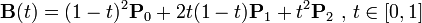

“三次贝塞尔插值” 则是 “两次‘二次贝塞尔插值’的结果，再做一次贝塞尔插值”：


贝塞尔曲线的定义中带有一个参数 t，但是这个 t 并非真正的时间，实际上贝塞尔曲线的一个点 (x, y)，这里的 x 轴才代表时间。这就造成了一个问题，如果使用贝塞尔曲线的直接定义，是没办法直接根据时间来计算出数值的，因此，浏览器中一般都采用了数值算法，其中公认做有效的是牛顿积分。

**贝塞尔曲线拟合**
理论上，贝塞尔曲线可以通过分段的方式拟合任意曲线，但是有一些特殊的曲线，是可以用贝塞尔曲线完美拟合的，比如抛物线。

例: 

### 10.5 三维变换

三维变可能是 CSS 中可能最令人激动的新特性。三维空间与二维空间中的基本变换和坐标系统，概念还是一样的，只不过要多考虑一个维度，也就是 z 轴。三维变换允许控制坐标系统，旋转、变形、缩放元素，以及向前或向后移动元素。想要实现这些效果，那就要先了解透视的概念。

#### 10.5.1 透视简介

提到三维，就意味着要在三个轴向上表示变换。其中 x 轴和 y 轴跟以前一样，而 z 轴表示的是用户到屏幕的方向。屏幕的表面通常被称为 “z 平面”（z-plane），也是 z 轴默认的起点位置。


这意味着离用户远的位置（z 轴负方向）上的元素，在屏幕上看起来应该小一些，离用户近的位置上的元素则应该大一些。而围绕 x 或 y 轴旋转，也会导致元素某一部分变大，而其余部分变小。

拿二维空间中的一个边长为 100 像素的元素为例，让它沿 y 轴旋转 60 度：

```css
.box {
  margin: auto;
  border: 2px solid;
  width: 100px;
  height: 100px;
  transform: rotate(60deg);
}
```

单纯一个轴的变换只会导致元素变窄（因为围绕 y 轴旋转），体现不出任何三维效果。

这是因为还没有定义 perspective（透视）。要定义透视，先得确定用户距离这个元素有多远。离得越近变化越大，离得越远变化越小。默认的距离是无穷远，因此不会发生明显的变化。因此，在要变换的元素的父元素上设置 `perspective` 属性：

```css
body {
  perspective: 800px;
}
```

这个数值表示观察点位于屏幕前方多远。恰当的距离一般是 600~1000 像素。

1. **透视原点**

   默认情况下，假定观察者的视线与应用透视的元素相交于元素的中心。用术语来说，这意味着 “消失点” 在元素的中心。可以通过 `perspective-origin` 属性来修改消失点的位置。该属性与 `transform-origin` 属性类似，可以接受 x 坐标值（带关键字 top、right、bottom 和 left）百分比或长度值。

   下图展示了给 body 元素设置 `perspective` 属性后的三维对象。其中所有元素都围绕 x 轴旋转 90 度（面朝前），但左右两幅图中的透视原点不同。

   

2. **perspective() 变换函数**

   在父元素上设置 `perspective` 属性，可以让其中所有元素的三维变换共享同样的透视关系。这通常都是希望的，因为它很接近现实效果。

   要设置个别变换元素的透视，可以使用 `perspective()` 函数。比如要实现之前的那个例子，可以使用如下代码，只不过透视只应用给它自己，不会被其他元素共享：

   ```css
   .box {
     transform: perspective(800px) rotate(60deg);
   }
   ```

#### 10.5.2 高级三维变换

本节介绍一些不太常用却值得玩味的三维变换特性。

1. **rotate3d()**

   除了 rotateX()、rotateY() 和 rotateZ()（以及二维版本 rotate()）这几个单维旋转函数之外，还有一个 rotate3d() 函数。这个函数可以围绕穿越三维空间的任意一条线翻转元素：

   ```css
   .box {
     transform: rotated(1, 1, 1, 45deg);
   }
   ```

   这个 rotate3d() 函数接受 4 个参数：前 3 个数值分别表示 x 轴、y 轴和 z 轴的向量坐标，最后一个是角度。其中坐标定义了一条线，作为翻转环绕的轴。比如，如果向量坐标是 `1,1,1`，那么翻转围绕的假想线会穿过 `transform-origin` 和另一点，另一点的三维坐标是 x 轴、y 轴和 z 轴各相对原点 1 个单位远。

   这里不用指定什么单位，因为点与点之间的位置是相对的。使用 `100,100,100` 的结果与上面的相同，因为假想线相同。

   实际上，这个三维旋转等价于每个轴上的某些旋转（0 度或更多）的叠加，至于每个轴旋转多少，那就有点复杂了。只要把它想像成可以围绕指定的线旋转元素就行了。如果确实需要同时指定每个轴旋转的度数，最好还是组合使用单维旋转函数。

2. **三维矩阵变换**

   与二维矩阵变换类似，也有一个 `matrix3d()` 函数可以组合多个轴向上的平移、缩放、变形和旋转。这个函数接受 16 个参数，以便计算最终呈现在坐标系中的对象。这个函数堪称 “有史以来最复杂的 CSS 属性”。与二维版本一样，三维矩阵也不是日常用来手工计算传参的，而是通过 JS 和 CSS 组合实现游戏等高性能交互体验时才用的。

## 十一. 高级特效

单靠 CSS 就写出创意十足的设计是很困难的。到目前为止，就创建视觉特效而言，CSS 这门语言还是存在诸多限制。想用 CSS 写出 Photoshop 般的效果，还差得很远，个别情况下仍需要各种奇奇怪怪的招术助阵。

以前，要绕过种种限制，不得不牺牲简洁性（加入大量元素，只为了展示效果的细节），或者牺牲性能（为了展现视觉效果，页面中放了太多图片及 JS）。

本章就来介绍几种能够通过 CSS 实现的特效。其中用到的一些 CSS 特性还很新，浏览器支持不充分，但也有非常成熟的。很多特性在 SVG 中已经存在很多年了，最近才加入到 CSS 中。

- CSS 形状
- 使用剪切路径和蒙版（包括 SVG）
- CSS 混合模式
- 滤镜（包括 SVG）


接下来就一这个 “观星指南” 页面作为例子，讲解其中涉及的技术点。

### 11.1 CSS Shapes

网页布局基本上都是由矩形构成的，因此 HTML 元素天生具有方形的特性。也可以使用图片和渐变引入更自然的元素，以及通过圆角实现柔和的形状，甚至圆形。

CSS Shapes 是一个新标准，旨在让 Web 设计者能使用各种形状。形状元素不仅会影响界面的外观，还会影响页面的内容流。

**细说形状**
CSS Shapes 包含两组新属性，一组用于设置影响盒子中内容的形状，另一组用于设置影响形状元素周边内容流的形状。在下图中，看到一个被设置为圆形的形状。其中左边的图形展示了外部形状如何影响周边的内容，而右边的图形展示了圆形中的内容如何受到内部形状的影响。


这两种形状分别由不同级别的 CSS Shapes 规范定义。其中 `shape-outside` 属性（在 CSS Shapes Level 1 中定义）是唯一相对比较成熟的。本节不涉及 `shape-inside`，因为目前还没有浏览器实现它。

`shape-outside` 属性只能应用给浮动元素。这个属性不改变元素自身的外观，只会通过设置形状影响其外部内容流。

在例子中的 “Moon” 部分，通过设置 `shape-outside: circle();` 实现了文本流环绕月亮图片的效果。

```css
.fig-moon {
  float: right;
  max-width: 40%;
  shape-outside: circle();
}
```


在解释形状构造原理之前，先了解一下 `shape-outside` 如何影响布局。图片文件本身的背景是黑色的，如果把这一区块的背景改成其他颜色，会看得更清楚。图片本身还是方形的，但文本流环绕着其中的圆形。在不支持 CSS 形状的浏览器中，文本会像往常一样环绕矩形。


> **注意**：如上图所示，文本流只绕排在浮动元素的左侧。只能让形状的一侧影响文本的行盒子。即使形状右侧有空间，文本也不会填进去。

1. **形状函数**

   前面例子中的 `shape-outside` 属性使用了一个值：`circle()`。这是一个形状函数，类似的形状函数还有 **ellipse()、polygon()、inset()**。前两个分别用于定义椭圆形和多边形，`inset()` 则表示嵌入在盒子边界内的矩形，也可以指定圆角，算是 CSS2.1 中 `clip` 属性的加强版，只是语法不同。

   此处圆形和椭圆形的语法，类似于放射性渐变的大小及位置的语法：

   ```css
   .shape-circle {
     /* 圆形接受一个半径值和一个位置值 */
     shape-outside: circle(150px at 50%);
   }
   .shape-ellipse {
     /* 椭圆形接受两个半径值和一个位置值 */
     shape-outside: ellipse(150px 40px at 50% 25%);
   }
   ```

   与渐变函数类似，圆形和椭圆形函数也有合理的默认值。前面月亮图片的 circle() 函数并未传入参数，而默认的参数是以元素中心为圆心，以最近边为半径。

   `inset()` 函数需要传入一组长度值，分别表示到上、右、下、左边的距离，很像 margin 和 padding 简写。同样，1~3 个值的外边距和内边距简写规则在这里也适用。此外，还可以通过 `round` 关键字指定圆角，随后是半径值，与 `border-radius` 属性的类似：

   ```css
   .shape-inset {
     /* 距离外部盒子的上、下边各 20 像素，距离外部盒子的左、右边各 30 像素，还有半径为10像素的圆角 */
     shape-outside: inset(20px 30px round 10px);
   }
   ```

   相对复杂一些的是 `polygon()` 函数。这个函数接受一系列坐标对，用于在盒子表面指定多个点，坐标相对于盒子的左上角，最终把各个点连接起来就是要创建的形状。在 “Planets” 部分，为土星创建了一个多边形。

   创建多边形最简单的一种方式就是使用 CSS Shapes Editor 插件，它支持 Chrome 和 Opera。Chrome 和 Opera 都支持 CSS Shapes，而且会在检查形状元素时给出预览。这个插件会添加额外的工具，因此既可以通过它看到形状如何影响页面，也可以通过创建并拖动控制点来创建新形状。

   

   然后就可以把得到的多边形复制粘贴到代码中：

   ```css
   .fig-planet {
     float: right;
     max-width: 65%;
     shape-outside: polygon(
       41.85% 108%,
       22.75% 92.85%,
       5.6% 73.3%,
       0.95% 52.6%,
       5.6% 35.05%,
       21.45% 17.15%,
       37.65% 12.35%,
       40% 0,
       100% 0%,
       100%1 00%
     );
   }
   ```

   多边形中每个点的坐标以百分比表示，这样可以保证最大的灵活度。当然也可以在这里使用任意长度值，比如像素、em，甚至 calc() 表达式。

2. **形状图片**

   基于复杂的图片创建多边形会非常麻烦。好在可以直接在图片的源文件上基于透明度来创建形状。比如，可以比照预期的形状新创建一张图片。但土星的图片已经是带透明度的 PNG 格式了，因此可以直接通过它来生成形状。要做的就是把 `shape-outside` 的值由 polygon() 函数修改为指向该图片的 url() 函数：

   ```css
   .fig-planet {
     float: right;
     max-width: 65%;
     shape-outside: url(img/saturn.png);
   }
   ```

   如果在 Chrome 开发者工具里检查这张图片，会看到如下图所示的模样。可以看到，图片的透明度数据被用于生成形状了。

   

   > **注意**：只通过浏览器打开 HTML 文件是不行的，就算浏览器支持 CSS Shapes 也不行。必须通过 Web 服务器取得这个页面，这样引用的图片才会带有合适的 HTTP 首部信息，告诉浏览器该图片与 CSS 来自同一个域。是为了防止引用的文件对计算机造成危害。

   默认情况下，形状轮廓会沿图片完全透明区域的边缘生成，但这个值可以通过 `shape-image-threshold` 属性来修改。默认值是 0.0（完全透明），而较大的值（最大为 1.0）意味着较高的不透明度也可以用于生成形状边界。比如，修改土星图片的不透明度阈值为 0.9，则半透明的土星环将不再被包含在形状内，结果文本会覆盖其上：

   ```css
   .fig-planet {
     float: right;
     max-width: 65%;
     shape-outside: url(img/saturn.png);
     shape-image-threshold: 0.9;
   }
   ```

3. **形状盒子与边距**

   除了使用形状函数或图片，还可以使用元素的参照盒子来生成形状。乍一听好像有点不对毕竟元素盒子都是方形的。不过，形状也能依照圆角生成。

   比如，以前面的月亮图片为例，如果想改变区块背景的颜色，同时也去掉图片周围的黑色区域，那么可以在图片上使用 `border-radius` 来创建圆形：

   ```css
   .fig-moon {
     float: right;
     max-width: 40%;
     border-radius: 50%;
   }
   ```

   仅有圆角边框还不能生成形状，还得通过 `shape-outside` 属性告诉浏览器，以 `border-box` 作为生成形状的依据：

   ```css
   .fig-moon {
     float: right;
     max-width: 40%;
     border-radius: 50%;
     shape-outside: border-box;
   }
   ```

   这样外部形状就变成了环绕元素边框盒子的圆形。其他能生成形状的参照盒子还有 content-box、padding-box 和 margin-box。margin-box 是个例外。因为形状是基于浮动区域的，浮动区域也包含外边距，所以这个关键字是专门为形状定义的，并没有 `box-sizing: margin-box;` 这种用法。

   对于形状而言，参照盒子为 margin-box 时，形状仍然会参照圆角边框，但这样一来就可以像定义常规的外边距一样，给月亮图片周围添加一些边距了。

   ```css
   .fig-moon {
     float: right;
     max-width: 40%;
     border-radius: 50%;
     shape-outside: margin-box;
     margin: 2em;
   }
   ```

   这样，文本会环绕着弧形的外边距形状排布。如果在 Chrome 开发者工具中检查图片，可以看到此时形状的样子，还有原始的外边距。

   如果想给更复杂的土星图片添加外边距，可以使用另一个属性 `shape-margin`，这个属性用于给整个形状添加外边距，与创建形状的方法无关。

   ```css
   .fig-planet {
     max-width: 65%;
     shape-outside: url(img/saturn.png);
     shape-margin: 1em;
   }
   ```

### 11.2 剪切与蒙版

CSS 形状虽然可以影响周围文本流，却不允许修改元素自身的外观。添加圆角边框只是视觉上改变元素形状的一种方式。实际上，通过把元素的部分区域变透明，是可以影响元素自身形状的。

**剪切**（clipping）使用路径形状定义硬边界，可以基于该边界完全切换元素的可见性。**蒙版**（masking）不太一样，它用于将元素的某些区域设置为更透明或更不透明。剪切会影响对象的响应区域，而蒙版不会。比如要触发悬停，鼠标必须移到剪切后元素的可见区域。而对于加了蒙版的元素无论鼠标下面的区域是否可见，只要位于该元素上，都会激活 :hover 状态。

#### 11.2.1 剪切

剪切最早是在 CSS2.1 中通过 `clip` 属性引入的。但这个属性只能应用给绝对定位的元素，而且只能把这些元素剪切为矩形（使用 rect() 函数）。

好在新的 `clip-path` 属性提供了更多选择。它可以使用 CSS 形状中的基本形状函数定义如何剪切元素。它还能使用 SVG 文档剪切元素，只要通过 URL 引用一个 `<clipPath>` 元素即可。

下面从使用形状函数定义剪切路径开始。

“观星指南” 页面中的所有区块都是被剪切过的，因此都有一些向对角线倾斜。每个区块都有一个 stacked 类，其中使用多边形函数指定了剪切路径:

```css
.stacked {
  clip-path: polygon(0 3vw, 100% 0, 100% calc(100%- 3vw), 0% 100%);
}
```

这个多边形没有前面土星的多边形复杂，因此可以稍微深入地讲解一下。多边形中的每一个点都对应着一对空格分隔的值，值对之间以逗号隔开。

先从左上角开始，0 3vw 表示 x 轴剪切长度为 0，y 轴剪切长度为 3vw。这里使用相对视口的单位保证角度以视口大小为参照。接下来的坐标是右上角坐标 100%。第三个 100% calc(100% - 3vw) 指距右下角 3vw，它不能使用百分比表示，因为这个 y 轴坐标是从上方开始计算的。最后左下角的坐标是 0 100%。

因为剪切路径只影响元素渲染后的外观，而不会影响页面流，所以剪切后的元素之间会出现透明间隙。为消除间隙，可以给每个堆叠的区块应用一个负外边距，而且要比 3vw 稍大一些，好让相邻的区块边缘能彼此重叠。但只希望在支持 `clip-path` 的浏览器中应用这个负外边距，这时候正好可以用上 `@supports` 规则。

```css
@supports ((clip-path: polygon(0 0)) or (-webkit-clip-path: polygon(0 0))) {
  .stacked {
    margin-bottom: -3.4vw;
  }
}
```

在 `@supports` 规则块中，测试了浏览器是否支持最小的多边形（只有一个点）。增加这些保障后，区块就可以完美地对齐了。而在不支持 `clip-path` 的浏览器中，区块也会像平常一样上下相接，不会重叠。

1. **使用 SVG**

   可以使用 `polygon()`、`circle()`、`ellipse()` 和 `inset()` 函数创建剪切路径，与创建 CSS 形状一样。对于复杂的形状，建议还是使用图片编辑器来创建，然后再将最终的图形作为剪切路径的源。

   使用图形作为剪切源，需要先使用 SVG 创建剪切路径，然后再通过一个 URL 引用到形状函数中。首先，要在图形编辑器中创建想要的形状。虽然不那么简单，但还是可行的。

   导航区块本身是一个包含页内链接的无序列表：

   ```html
   <nav class="stacked section nav-section inverted">
   <ul class="wrapper">
   <li><a href="#moon">The Moon</a></li>
   <li><a href="#sun">The Sun</a></li>
   <li><a href="#planets">Planets</ax/li>
   <li><a href="#milky-way">Galaxy</a></li>
   <li><a href="#universe">Universe</a></li>
   </ul>
   </nav>
   ```

   在此，就不涉及导航本身的样式了，只要知道这里用到了 Flexbox 水平布局导航项目，将它们固定为 100 像素见方的方块就够了。

   然后，在支持 SVG 的图形编辑器中创建一张图片。图片的大小也是 100 像素见方。其中的星球由两个黑色的形状构成，一个圆形和一个旋转后的椭圆形。接着把这个图片保存为 SVG 格式，命名为 clip.svg。

   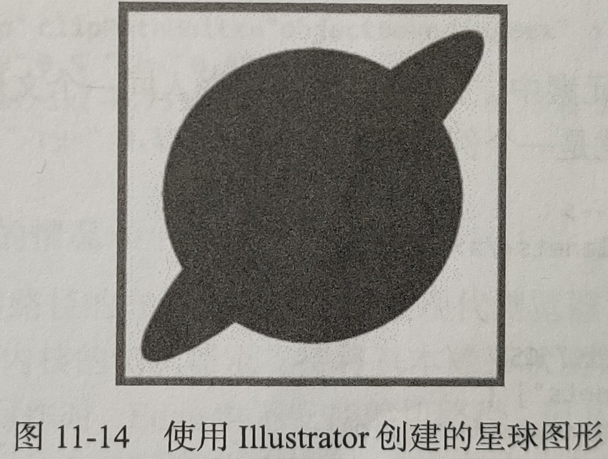

   下面在代码编辑器中打开生成的 SVG 文件，看上去大概是这样的：

   ```xml
   <svg xmlns="http://www.w3.org/2000/svg" width="100px" height="100px" viewbox="0 0 100 100">
     <circle cx="50" cy="50" r="45" />
     <ellipse transform="matrix(-0.7553 0.6554 -0.6554 -0.7553 -12.053 54.99)" cx="50" cy="50" rx="63.9" ry="12.8" />
   </svg>
   ```

   为了把这个图片转换为剪切路径，需要把其内容包装在一个 `<clipPath>` 元素中，并添加 ID 属性：

   ```xml
   <svg xmlns="http://www.w3.org/2000/svg" width="100px" height="100px" viewbox="0 0 100 100">
     <clipPath id="saturnclip">
       <circle cx="50" cy="50" r="45" />
       <ellipse transform="matrix(-0.7553 0.6554 -0.6554 -0.7553 -12.053 54.99)" cx="50" cy="50" rx="63.9" ry="12.8" />
     </clipPath>
   </svg>
   ```

   最后，就可以在 CSS 中引用 clip.svg 中的这个剪切路径了：

   ```css
   .nav-section [href='#planets'] {
     clip-path: url(img/clip.svg#saturnclip);
   }
   ```

   这样就可以把多个剪切源保存在一个 SVG 文件中，然后通过 URL 的片段 ID 分别引用。

   > **注意**：SVG 文件中 `<clipPath>` 的坐标会被解释为像素，因此剪切形状没有伸缩性，不能随着 HTML 内容的缩放而缩放。百分比值是有效的，但浏览器支持不好。

2. **行内 SVG 剪切源**

   不支持引用外部剪切源的浏览器其实支持 SVG 剪切路径，只不过 CSS、HML 和 SVG 都必须在一个文件中。

   如果把 CSS 放在 style 元素中，把 SVG 内容也嵌入同一个文件中，就可以直接通过 ID 用 `<clipPath>` 元素了。下面就是一个例子：

   ```html
   <!-- 以下是想要剪切的元素 -->
   <li><a href="#planets">Planets</a></li>

   <!-- 在同一个HTML文件中，包含了CSS -->
   <style>
     .nav-section [href='#planets'] {
       clip-path: url(img/clip.svg#saturnclip);
     }
   </style>

   <!-- 还是同一个HTML文件中，内嵌了SVG作为剪切路径 -->
   <svg
     xmlns="http://www.w3.org/2000/svg"
     width="100px"
     height="100px"
     viewbox="0 0 100 100"
   >
     <clipPath id="saturnclip">
       <circle
         cx="50"
         cy="50"
         r="45"
       />
       <ellipse
         transform="matrix(-0.7553 0.6554 -0.6554 -0.7553 -12.053 54.99)"
         cx="50"
         cy="50"
         rx="63.9"
         ry="12.8"
       />
     </clipPath>
   </svg>
   ```

   这样写具有更好的跨浏览器兼容性，但牺牲了 SVG 的复用性，HTML 也会显得乱一些。

   > **注意**：WebKit 内核的浏览器有一个相关的 bug，它们会认为剪切路径中点的坐标相对于页面，而不是相对于被剪切的元素。为确保准确定位，最终的示例还对被剪切元素应用了 `transform: translate(0, 0)`，表面上看不出什么，但可以解决这个问题。

3. **使用对象边界盒子控制剪切路径大小**

第二个问题是剪切路径不会随导航项目的缩放而自动缩放，因为它们的大小都硬编码了，就是 100 像素见方。

为了调整剪切路径的大小，可以使用两个坐标系。默认的坐标系叫 “当前用户空间”（user space on use），就是剪切路径要应用的内容。对这个例子而言，这意味着剪切路径中的一个单位会被解释为被剪切的 HTML 元素中的一个像素。

另一个坐标系是 “对象边界盒子”（object bounding box），这个坐标系会使用一个比例尺，动态地将剪切路径中的单位对应到被剪切内容的大小。这个比例尺中，x 轴的 0 表示被剪切内容边框盒子的最左边，1 表示最右边。类似地，y 轴的 0 表示这个盒子的最上边，1 表示最下边。

对于简单的图形，手动修改这些值就行了。比如 50 像素，在宽和高均为 100 像素的元素中，就要转换成 0.5。但是对于复杂的图形，手工修改很容易出错。更简单的办法是在图形编辑器中把图形边长缩小到 1 像素，然后再导出 SVG。

在最终的例子中，还使用了 `objectBoundingBox` 这个值作为行内 SvG 剪切路径。比如土星剪切路径的最终代码就是这样的：

```html
<clipPath
  id="staturnclip"
  clipPathUnits="objectBoundingBox"
>
  <circle
    cx="0.5"
    cy="0.5"
    r="0.45"
  />
  <ellipse
    transform="matrix(-0.7553 0.6554 -0.6554 -0.7553 1.2053 9.5499)"
    cx="8.5"
    cy="8.5"
    rx="0.639"
    ry="0.125"
  />
</clipPath>
```

#### 11.2.2 蒙版

“观星指南” 页面的标题好像半隐于地球大气层的后面。这种透明渐隐效果是通过蒙版实现的。


Safari 早在 2008 年就实现了蒙版，使用的是非标准属性 `-webkit-mask-image`。这个属性允许指定一张图片，并以这张图片作为加蒙版元素透明度层次的来源。作为蒙版的图片中，每个像素都有一个阿尔法级别（alpha level），也就是透明度。如果蒙版图片中的像素是透明的，那么加蒙版元素中对应的像素也不可见。相反，蒙版图片中完全不透明的区域，对应的加蒙版元素的区域也会完全可见。蒙版图片的颜色与此无关，因此灰度图常用作蒙版。

除了图片，还可以使用 CSS 渐变来创建蒙版。页面标题的蒙版效果就是这么做的：

```css
.header-title {
  mask-image: radial-gradient(ellipse 90% 30% at 50% 50%, rgba(0, 0, 0, 0) 45%, #000 76%);
  mask-size: 100% 200%;
}
```

`mask-image` 后面的值非常类似 background-image 属性的值，甚至也可以声明多个蒙版。除了指定蒙版图片，还可以指定蒙版的大小和位置。

在 WebKit 最初实现的基础上，蒙版相关的属性得以标准化和扩展，同时也支持了对应的 SVG 效果。没错，就像 `clip-path` 一样，SVG 中的蒙板也可以应用给 HTML 内容。

```css
.header-title {
  /* 嵌入页面中的 CSS，指向嵌入同一页面中的 SVG <mask> 元素 */
  mask: url(#ellipseMask);
}
```

与前面 CSS 渐变等价的 SVG 标记如下：

```xml
<mask id="ellipseMask" maskUnits="objectBoundingBox" maskContentUnits="objectBoundingBox">
  <radialGradient id="radialfill" r="0.9" cy="1.1">
    <stop offset="45%" stop-color="#000" />
    <stop offset="70%" stop-color="#fff" />
  </radialGradient>
</mask>
```

与剪切路径一样，这里也需要使用 objectBounding Box 坐标系，按照 0~1 的比例尺将蒙版缩放到与元素边界匹配。SVG 蒙版元素本身还有一个 maskContentUnits 属性，这里也将其设置为与蒙版形状相同的坐标系。

SVG 蒙版源使用明度值（luminance）而非阿尔法级别来应用蒙版。这意味着蒙版较暗的区域对应的加蒙版元素区域会较透明，而蒙版较亮的区域对应的加蒙版元素区域会较不透明。在前面 SVG 蒙版的例子中，使用了黑白渐变。

浏览器会在使用蒙版图片时使用阿尔法级别，在使用 SVG 蒙版时使用明度值。在对标准的建议中，有一个 `mask-type` 属性可以切换这个应用蒙版的依据值。

另外，-webkit- 前缀版与建议的标准版属性之间也有一些差异。可以参考 MDN 中 WebKit 实现的完整属性和语法。

#### 11.2.3 透明 JPEG 与 SVG 蒙版

页面头部有两个地方使用了蒙版，其中一个并不容易发现。除了标题文本之外，地球背景图片也有自己的蒙版。这是一个分辨率非常高的图片，而头部有一个平滑渐变的背景。在下图中，去掉了文本，同时高亮了渐变，让它看起来更明显。

带有透明度的图片一般会保存为 PNG 格式。PNG 格式的问题是文件相对较大，这张地球大图差不多得有 190KB。为减少文件大小，要通过蒙版使用 SVG，给 JPEG 格式的文件应用阿尔法透明度。使用 JPEG 格式后，文件大小约为 24KB。

1. **SVG 中的图片**

   首先要创建一张 JPEG 图片，仍然保留其背景。然后创建一个 SVG “包装” 文件并命名为 earth.svg，用于加载位图。SVG 是一种矢量图格式，但也可以通过 `<image>` 标签加载和使用位图。最终会在 CSS 中使用这个 SVG 文件作为头部背景。

   接下来要把 SVG 图形设置为跟位图一样大小，使用 viewBox、width 和 height 属性。其中 viewBox 属性负责设置图形中的坐标系统，width 和 height 属性则用于设置外部图片的大小。多数浏览器不需要后面两个属性，但在 IE 中如果没有它们，则会让 SVG 背景变形。相关代码如下：

   ```xml
   <svg
     xmlns="http://www.w3.org/2000/svg"
     width="1200"
     height="141"
     viewbox="0 0 1200 141"
     xmlns:xlink="http://www.w3.org/1999/xlink"
   >
     <image width="100%" height="100%" xlink:href="earth.jpg" />
   </svg>
   ```

2. **SVG 蒙版**

   下面创建蒙版。蒙版的形状可以通过放射性渐变来模拟，然后这个渐变经过大小和位置的调整会覆盖地球的天际线。放射线性渐变的四周稍微有些透明。要精确地找到坐标很难，因此可以使用图形编辑器。方便地获取渐变的尺寸信息。当然也可以绘制一个路径来创建模板，但放射性渐变的边缘过渡更平滑。

   很快就知道渐变的半径约为 1224 像素，坐标为 y 轴 1239 像素，x 轴 607 像素。下面在 carh.svg 文件中创建一个 SVG `<mask>` 元素，包含覆盖整个 SvG 视口的矩形，然后用放射性渐变填充

   ```xml
   <mask id="earthmask">
     <radialGradient gradientUnits="userspaceOnUse" id="earthfill" r="1224" cx="607" cy="1239">
       <stop offset="99.5%" stop-color="#fff" />
       <stop offset="100%" stop-color="#000" />
     </radialGradient>
     <rect width="1200" height="141" fill="url(#earthfill)" />
   </mask>
   ```

   渐变色标由白到黑，边缘有少许的羽化。渐变与剪切路径的尺寸应用算法不同，它们默认是基于 objectBoundingBox 的。因此，还需要添加 gradientUnits="userSpaceonUse" 属性。下面就可以让图片使用创建的蒙版了：

   ```xml
   <mask id="earthmask"><!--这里是蒙版的内容--></mask>
   <image width="100%" height="100%" xlink:href="earth.jpg" mask="url(#earthmask)"/>
   ```

3. **嵌入图片**

   此时，如果只将这个文件作为 SVG 图形单独使用，那就完事了。问题是这个 SVG 背景不能加载其他资源。要加载其他资源，还需要一步：把位图（earth.jpg）转换成 Base64 编码的数据 URI。最后，把原来的图片 URL 替换成这个编码字符串

   ```xml
   <image width="100%" height="100%" mask="url(#earthmask)" xlink:href="data:image/jpg;base64,/9j/4AAQSkZ..."/>
   ```

   > **注意**：这个编码字符串非常长。相比于二进制编码，Base64 编码会让图片文件增大 30%。

   现在可以把这个 SVG 图片作为头部的背景图片了，还要加上一点渐变：

   ```css
   .page-header {
     background-image: url(img/earth.svg), linear-gradient(to bottom, #000, #102133);
     background-repeat: no-repeat;
     background-size: 100% auto, cover;
     background-position: 50% bottom;
   }
   ```

   这个技术可以在几乎所有支持 SVG 的浏览器中使用。IE9 和一些根本不支持 SVG 蒙版的旧版安卓是例外。

4. **实现自动化**

   创建一个背景图片的工作量还是挺大的，但相比于 PNG 格式的图片，最终图片的大小只有原来的 1/10。对例子中的图形而言，放射性渐变作为蒙版很合适，虽然要做一些手动工作。

   对于更复杂的形状，推荐使用一个 Web 服务：ZorroSVG。可以上传透明的 PNG 图片，然后得到包含 JPEG 格式的 SVG 模板文件。这个服务的缺点是会把透明数据转换为一个位图蒙版，相比于将其绘制为 SVG 图形，前者占用的空间稍大一些。即便如此，文件瘦身效果也还是非常不错的。

### 11.3 混合模式与合成

在 Photoshop 等图形编辑软件中，设计师很早就可以选择两个设计元素叠加时的颜色如何混合了。而在 CSS 中，直到最近才能实现阿尔法混合，包括 PNG 文件、rgba 背景颜色、opacity 属性、蒙版，等等。

图层合并的术语是**合成**（compositing）。**混合模式**（blending mode）则是合成过程中可能最常遇到的场景。混合模式只要知道它们是在合成图片的颜色值时不同的数学算法就行了（合成图片时上方图片叫**源图片**，下方图片叫**目标图片**）。

最简单的混合模式可能就是 “正片叠加”（multiply）了，计算方法是源像素每个颜色通道的值乘以目标像素对应颜色通道的值，混合后的图片会变暗。可以借助灰阶来理解这种混合模式，在灰阶中 0 代表黑色，1 代表白色。假设源值为 0.8，目标值为 0.5，那最终相乘后值就是 `0.8 * 0.5=0.4`，偏暗了。

#### 11.3.1 给背景图片上色

另一个混合模式是 “明度”（luminosity），即从源像素取得亮度级别，将其应用到目标像素的色相和饱和度。示例页面中的银河部分有一个背景，其中的蓝色调非常夺目。这是因为给这个区块应用了偏紫色的背景颜色，然后又应用了 `background-blend-mode: luminosity`。这会给图片增加色彩，让全图的色调更统一。

```css
.section-milkyway {
  background-image: url(img/milkyway.jpg);
  background-color: #202d53;
  background-blend-mode: luminosity;
}
```

如果不涉及数学，很难说清楚全部 16 种混合模式的原理。其中有几个混合模式仅在特定场景下有用，比如通过与纯色图片进行明度混合，为图片增添色彩。在下图中，通过混合相对较暗的蓝色背景图和浅粉色背景色，展示了在两个图层差别很大时每种混合模式的效果。

一个元素可以有多个背景图片，这些背景会按照它们声明的次序逆序叠加在一起。如果有多个图层，那么就可以声明一个逗号分隔的背景混合模式列表，把它们依次应用到每一层（及其下一层）。

> **注意**：背景层不会与元素后面的内容混合，无论背景是否透明。如果只有一个背景颜色层，那么设置 `background-blend-mode` 也没用。如果要混合元素的内容，还要使用另外一个属性，

#### 11.3.2 混合元素

与混合背景层类似，也可以混合元素与它们的背景。元素的混合可能是静态定位的子元素与其父元素混合，也可能是绝对定位的元素与页面另一部分的叠加。

> **注意**：不同的堆叠上下文中的元素不能相互混合。

混合元素与混合背景层的语法类似，只不过属性是 `mix-blend-mode`：

```css
.fig-plane {
  mix-blend-mode: screen;
}
```

滤色（screen）也是一种比较有用的混合模式。这个名字源于把两张图片投影到同一块屏幕上，会得到整体偏亮的图像。如果一张图片不够亮，那么第二张图片上的光线会透过来，反之亦然，最后就是整体变亮。换句话说，白色的源会完全不透明，但黑色的源会变透明，因此很适合作为蒙版使用。利用这一点，可以实现有趣的 “镂空” 效果。

1. **文字镂空**

   示例页面的 “The Observable Universe” 标题实现了 “穿透” 效果。

   

   标题文字显示在白色背景上，白色背景定位于背景图片之上。这个效果也包含所谓的 “版式锁定” 效果，也就是通过加空和调整大小使文字适应容器大小。通过 CSS 实现这个效果有点麻烦。这是因为要用到视口相关的单位，但即使如此也做不到完美。比如，视口相关的单位并不相对于元素自身，因此还必须把它们锁定到最大断点。

   为此，在例子中使用了 SVG 文本来实现相对元素大小可伸缩的文本。标题中包含一小段 SVG 代码：

   ```html
   <h2 class="universe-title">
     <svg
       viewBox="0 0 400 120"
       role="presentation"
     >
       <text>
         <tspan
           class="universe-span-1"
           x="6"
           dy="0.8em"
         >
           The Observable
         </tspan>
         <tspan
           class="universe-span-2"
           x="3"
           dy="0.75em"
         >
           Universe
         </tspan>
       </text>
     </svg>
   </h2>
   ```

   SVG 文本自身也很复杂，但可以简单地分析一下这段代码：

   - SVG 文本很像图形对象，不会像 HTML 内容一样流动。换行也不是自动的，因此每行都要包含在相应的 `<tspan>` 元素中并手动定位。
   - 每个 `<tspan>` 元素都通过 x 属性相对于 SVG 视口的左侧水平定位。
   - 文本则相对于行盒子的底部垂直定位。要想保持文本的可伸缩性，就得相对于它们的大小垂直定位每一行，给它们一个相对偏移值，有点像行高一样，这就是 dy 属性的作用。
   - 行内 SVG 中的文本应该允许屏幕阅读器无障碍访问，理论上是这样的。而在实践中，某些辅助技术会存在问题，但添加 `role="presentation"` 能确保最大的可访问性。

   因为 `<svg>` 是在 HTML 中的，所以可以通过常规 CSS 给它添加样式。

   > **注意**：SVG 中的文本颜色是通过 `fill` 而非 color 属性控制的。

   ```css
   .universe-span-1 {
     font-size: 53.2px;
   }
   .universe-span-2 {
     font-size: 96.2px;
   }
   .universe-title text {
     fill: #682135;
     text-transform: uppercase;
   }
   ```

   每个 `<tspan>` 元素都通过像素指定为恰好能填充相应空间的大小。应该明确一下，这里的像素大小是相对于 SVG 片段的坐标系统而非 HTML 的坐标系统的。这意味着当 SVG 随页面伸缩时，其中文本的大小也会随之伸缩，保持锁定状态。最后，给标题应用混合模式:

   ```css
   @supports (mix-blend-mode: screen) {
     .universe-title {
       mix-blend-mode: screen;
     }
     .universe-title text {
       fill: #000;
     }
   }
   ```

   SVG 中的文本最开始是深红色的，这个颜色与它后面图片的颜色很搭。把这个颜色作为在不支持 mix-blend-mode 属性的浏览器中的一个后备选项。在 `@supports` 规则内，应用混合模式的同时，也将文本的填充颜色改为黑色，让它完全透明。

   一般来说，遵循渐进增强的原则，实际应用混合模式也没有那么难。但混合模式的效果多数情况下不会很明显，如果变化确实很大，那就考虑使用 @supports 规则。

2. **隔离**

   除了混合模式，合成中可以通过 CSS 控制的另一方面是**隔离**（isolation）。实际上，隔离就是创建元素分组，把混合控制在分组内部。位于不同堆叠上下文中的元素不会相互混合。

   下图中，有两组元素，都使用了 multiply 混合模式。这两组元素位于同一个背景图案之上。左边一组的混合模式是没有应用隔离的，因此每个元素同时也都跟背景混合在了一起。右边一组则应用了 opacity:0.999，这会强制生成一个新的堆叠上下文，从而隔离混合。

   ```css
   .item {
     mix-blend-mode: multiply;
   }
   .group-b {
     opacity: 0.999;
   }
   ```

   group-b 中的元素相互混合，但都没有跟背景混合。可以不必通过 opacity 属性间接地创建新堆叠上下文（从而隔离混合），而是使用新的 `isolation` 属性。像下面这样也可以实现同样的效果：

   ```css
   group-b {
     isolation: isolate;
   }
   ```

### 11.4 CSS 中的图像处理：滤镜

接下来要介绍的一个 CSS 工具同样源于图形编辑软件，即给元素应用图形滤镜。滤镜会应用给元素及其子元素。其效果很像给网页某一部分截图，然后将该图片放到 Photoshop 里做一番处理。（事实上，这个比喻还真与浏览器对这个过程的实现相差不多）

可用的滤镜有 10 种，还可以通过 SVG 自定义滤镜。下面先从 CSS 预定义的滤镜说起。

#### 11.4.1 调色滤镜

通过滤镜可以给元素（按序）应用一种或多种特效。其中一部分滤镜与颜色有关，可用于调整亮度、对比度和饱和度等。

```css
.universe-header {
  /* 将整个元素的颜色去掉了 70%，又将其亮度（从正常亮度 1）调低到 0.7，并将对比度提升为正常值的 2 倍。 */
  filter: grayscale(70%) brightness(0.7) contrast(2);
}
```

多数滤镜既可以接受百分比值，又可以接受数值。对于可双向调节大小的值，比如 `constrast()`、`brightness()` 和 `saturation()` 接受的值，默认值为 100% 或 1。而对于 `grayscale()`、`invert()` 和 `sepia()`，它们的默认值为 0，上限为 100% 或 1。任何大于上限值的值都会被截取为最大值。

还有一个 `opacity()` 滤镜，其默认值为 1（或 100%），最小值为 0。这个滤镜与 opacity 属性的区别在于，前者的实际效果取决于它在滤镜链条中的位置。相对而言，opacity 属性则总是在所有滤镜应用完之后才起作用。

最后，还有几个滤镜的原理没那么直白，下面通过 “观星指南” 页面中的例子来逐一说明

1. **色相旋转**

   太阳及其黑子的图片实际上是一张带黑色背景的黑白照片。这样的视觉效果并不理想，在把图片放到页面上之前，多数情况下都应该先用图形编辑器处理一下，就算考虑性能也该如此。但为了演示滤镜的使用，假设没有机会编辑图片，只能通过 CSS 处理它。用 CSS 给太阳图片上色，并让它更加明亮。下图展示了没有应用滤镜时的样子。

   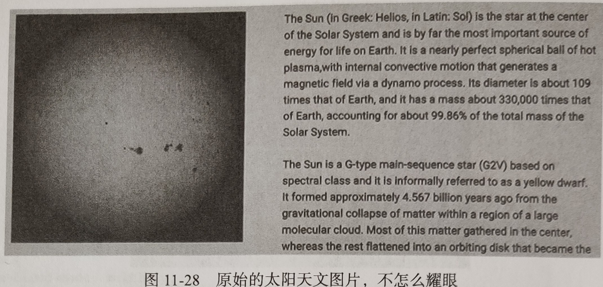

   可以通过给 `hue-rotate()` 滤镜传递一个度数值来旋转图片的整体色相，以标准色轮为参照。

   明黄色大约在色轮的 40 度位置（从顶部开始算），因此 `hue-rotate(40deg)` 就可以了。但问题在于，这张图片是黑白的，根本没有色相信息，色相旋转不会有任何效果!

   因此，可以先使用另一个滤镜 `sepia()`，通过它先用位于色轮大约 30 度位置的褐色给图片上色。然后再连缀使用一个 10 度左右的色相旋转，就可以得到想要的黄色。最后，还需要降低对比度，提高亮度，让太阳发光。这需要在色相操作之前完成，否则黄色会显得过于苍白。记住**滤镜的应用是有顺序的**。

   ```css
   .fig-sun {
     filter: contrast(0.34) brightness(1.6) sepia(1) hue-rotate(10deg);
   }
   ```

   接下来，通过前面介绍的 SVG 蒙版技术将黑色背景遮住。

   ```css
   .fig-sun {
     filter: contrast(0.34) brightness(1.6) sepia(1) hue-rotate(10deg);
     mask: url(#circlemask); /* 指向创建的圆形 SVG 蒙版 */
   }
   ```

   

2. **剪切形状的阴影**

   接下来要介绍的滤镜是 `drop-shadow()`。这个滤镜很像 `box-shadow` 和 `text-shadow` 属性，但也有局限和不同的花样。

   `box-shadow` 会应用到元素矩形的边框盒子，而 `drop-shaodw()` 滤镜则会应用到元素透明的轮廓。应用范围包括基于阿尔法透明度给图片应用阴影，保持阴影与轮廓吻合，或者给通过 clip-path 剪切的元素添加阴影。

   在 “观星指南” 页面的导航菜单中，每个导航项都被剪切成不同的形状，并通过 `drop-shadow()` 滤镜应用了阴影。其语法非常像 `text-shadow` 属性，要传入 x/y 轴偏移量、模糊半径和颜色。换句话说，`box-shadow` 属性中的范围（spread）参数在这里不见了。

   ```css
   .nav-section li {
     filter: drop-shadow(0 0 0.5em rgba(0，0，0，0.3));
   }
   ```

   在应用 CSS 滤镜效果时，浏览器会优先使用图形芯片（GPU）。这样 `drop-shadow()` 滤镜就有了性能优势。举例来说，如果要给阴影加动画，那最好不要使用 box-shadow，而要使用 `drop-shadow()` 滤镜。不过，接下来要介绍的滤镜在性能方面可以说乏善可陈。

3. **模糊滤镜**

   `blur()` 滤镜给元素应用高斯模糊，接受一个表示模糊半径范围的长度值。

   ```css
   .fig-planet {
     filter: blur(10px);
   }
   ```

   从性能方面来说，`blur()` 滤镜很不友好，因此要小心使用。通过模糊背景来突出焦点，是界面设计中常用的吸引注意力的技术。

4. **背景滤镜**

   说到背景，CSS 也提供了相关的滤镜。在示例页面的银河部分，使用了属性 `backdrop-filter`。`backdrop-filter` 的原理与 filter 属性相似，只不过是给元素背景及其后页面的合成结果应用滤镜。利用它可以实现类似 “毛玻璃” 的效果。

   ```css
   .section-milkyway .section-text {
     backdrop-filter: blur(5px);
     background-color: rgba(0, 0, 0, 0.5);
   }
   ```

5. **通过图片滤镜函数为背景图片应用滤镜**

   Filter Effects 规范规定，通过 CSs 加载的图片的时候也可以使用滤镜。要给背景图片加滤镜，可以把图片传给 `filter()` 函数。这个函数的参数与 `filter` 属性的值一样，可以连缀传递，只不过是在加载图片时使用。第一个参数是图片，然后是空格分隔的滤镜链：

   ```css
   .figure-filtered {
     background-image: filter(url(img/saturn.png), grayscale(1) opacity(0 4));
   }
   ```

#### 11.4.2 高级滤镜与 SVG

Instagram 等图片应用支持给照片应用预合成的滤镜，这些滤镜基本上就是颜色叠加和前面看到的滤镜函数的几次操作的组合。开发者兼设计师 Una Kravets 将 Instagram 滤镜整合为一个小型 CSS 库，即 CSSgram，其中巧妙地使用伪元素、CSS 渐变和混合模式实现了颜色叠加。

CSS 滤镜最强大的地方在于，可以使用 SVG 创建这些自定义滤镜，而且对滤镜效果的复杂度没有限制，CSS 代码量也不大。

CSS 版滤镜最初是在 SVG 中出现的。一开始的目标也是与 HTML 相结合。最早将其付诸实践的浏览器是 Firefox，可以让直接把 SvG 滤镜应用到 HTML 内容上，方法也和前面介绍的剪切和蒙版类似。之后直到 2011 年，CSS 滤镜的规范才出来，由 Adobe、Apple 和 Opera 共同编写。这个规范基于 SVG 滤镜，并加入了简单易用的简写滤镜函数。

事实上，所有 CSS 滤镜都是以对应的 SVG 滤镜作为范本实现的。比如，`filter:grayscale(100%);` 声明对应的就是下面这个 SVG 滤镜：

```xml
<filter id="grayscale">
<feColorMatrix type="matrix"
values=".213 .715 .072 0 0
 .213 .715 .072 0 0
.213 .715 .072 0 0
 0 0 0 1 0"/>
</filter>
```

前面的滤镜声明只包含一个滤镜原语（filter primitive），由一个 “颜色矩阵” 滤镜效果元素（`<feColorMatrix>`）表示。这个颜色矩阵滤镜是一个通用工具，支持将输入的颜色以多种方式映射为输出。其实不用知道具体每个值是如何转换的，只要知道 grayscale 本身并非底层机制，而是通常颜色操作的结果即可（至少对 SVG 来说是如此）。

还有其他几种滤镜原语，而多数滤镜效果都是这些原语组合的结果。比如，drop-shadow() 滤镜由高斯模糊（Gaussian Blur）、偏移（Offset）、泛光（Flod）、合成（Composite）和合并（Merge）等滤镜原语组成。

关键在于，现在可以创作自己的滤镜，并将其应用到 HTML 内容。换句话说，滤镜可以想要多复杂就有多复杂，只要通过 SVG 定义然后将其指定为滤镜源即可。指定滤镜源要在 filter 声明中使用 url() 函数，与剪切和蒙版类似。

### 11.5 应用特效的次序

为保证正确的结果，要遵循应用剪切、蒙版、混合和滤镜的标准次序。

所有剪切、蒙版、混合和滤镜都会在其他属性之后应用，包括 color、width、height、border 背景属性等设置元素基本外观的属性（opacity）。然后是 “后处理” 阶段，即应用特效，此时的元素及其内容会被当成一张图片。

首先，按声明次序应用滤镜。接着剪切元素，然后应用蒙版。

> **注意**：因为先应用滤镜之后才会应用剪切和蒙版，所以不能直接对剪切后的形状应用 drop-filter() 滤镜。

最后一步是合成，也就是应用混合模式。这一步同时会应用 `opacity` 属性，因为它实际上也是一种混合模式。

## 十二. 品控与流程

### 12.1 外部代码质量：调试 CSS

本节将解释浏览器如何处理 HTML 和 CSS，在此基础上就可以理解如何优化渲染性能。这方面通常可以归为 “外部代码质量”，也就是用户能体验到的最终结果，主要有以下几方面：

- **正确性**：代码是否如期运行?CSS 属性名都写对了吗?浏览器能否支持?
- **可用性**：代码运行后的结果不仅看起来没问题，而且还能使用?无障碍访问就是要解决这部分问题。
- **健壮性**：万一出错以后会怎么样?比如，可以声明两套属性，其中一套用作旧版浏览器的后备。
- **性能**：页面加载快不快?动画和滚动是否平滑?

#### 12.1.1 浏览器如何解析 CSS

以下步骤描述的是每次浏览器加载页面时都会经历的一个简化流程，不过有些（甚至全部）步骤也可能会在响应用户操作时发生：

1. **解析文件及构建对象模型**

   浏览器在加载一个网站时，首先会收到网址对应的一个 HTML 文件。然后浏览器把这个 HTML 文件解析为一个对象（节点）树，也就是文档对象模型（DOM，document object model）。

   

   浏览器在碰到 HTML 中指向 CSS 文件的链接时，会获取并解析 CSS 文件。类似于把 HTML 转换成 DOM，CSS 文件会被浏览器转换为 CSS 对象模型（CSSOM，CSS object model）不仅是外部 CSS，内部 style 元素或行内 sty1e 属性中的 CSS 也会被解析并添加到 CSSOM 中。和 DOM 类似，CSSOM 也是一个树形结构，包含页面中样式的层次结构。

   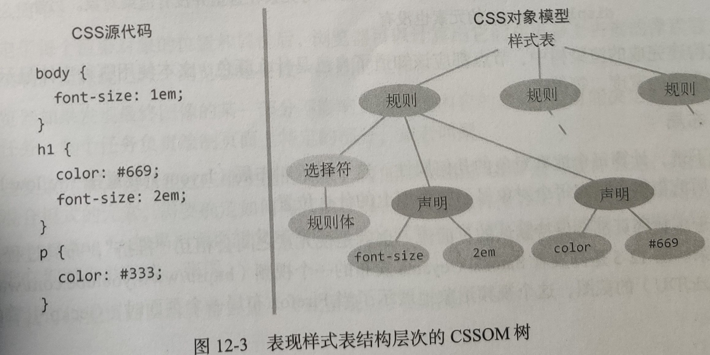

   每个 CSS 选择符都会匹配一个 DOM 节点，然后浏览器会基于层叠、继承和特殊性来计算每个 DOM 节点的最终样式。

   > DOM 和 CSSOM 都是标准化的，在任何浏览器中都应该相同。但在此之后，如何把数据转换成屏幕显示就由浏览器自己掌握了。当然，所有浏览器这时候也都遵循类似的步骤。

2. **渲染树**

   渲染页面的下一步是构建另外一个树结构，一般叫作 “渲染树”。在渲染树中，每个节点表示要渲染到屏幕上的信息。这个结构很像 DOM，但不完全一样。比如，被隐藏的 DOM 节点不会出现在这里，如：head、title、meta 等元素。而类似 :before 之类的伪元素则可能在这里有渲染对象，但在 DOM 里没有节点。除了节点，浏览器还会在这里保存其他表现性信息，比如滚动块或视口。

   

   在构建完成的渲染树中，节点都应该知道了自己是什么颜色、文本使用哪种字体显示，以及是否有明确的宽度，等等。

3. **布局**

   接下来，计算每个渲染对象的几何属性。这个过程叫布局（layout）或重排（reflow）。浏览器会遍历渲染树，确定每个对象显示在页面上的什么位置。

   由于多数网页都会保持默认的页面流，也就是说元素之间会相互 “推挤”，布局过程会变得非常复杂。有一个开发者 Satoshi Ueyama 发布的一个[视频](https://www.youtube.com/watch?v=dndeRnzkJDU)，这个视频形象地展示了当 Firefox 布局一个页面时，Gecko 引擎的重排操作。

   有时候，带有自己渲染属性的额外渲染对象需要在这个阶段构建出来。比如，文本在使用某种字体时会换行，因此原来的一个行盒子必须拆分两个匿名行盒子。而增加行盒子势必会影响父元素高度，以及它们周围的其他元素。

   最终，浏览器会计算出每个渲染对象的位置，接下来就是把它们显示在屏幕上了。

4. **绘制、合成与呈现**

   简单地说，这一步就是浏览器基于渲染树中的信息，把元素准确地呈现到屏幕上。但实际过程并没那么简单。

   确定了每个渲染对象的位置和属性后，浏览器可以计算出它们在屏幕上占据的像素数，这个过程叫**绘制**。但除此之外，浏览器还要做一些别的工作。

   浏览器如果发现最终图像的某一部分不影响页面其他内容的显示，也可能决定把绘制拆分成不同的任务，每个任务负责绘制页面上特定的部分，或者叫**层**。

   有些复杂元素，比如经过三维变换的元素，可能需要通过 GPU 进行硬件加速。其他应用了滤镜或混合模式的元素，需要确定如何与其他层混合。这个先拆分为层，再组合起来的过程就叫**合成**（compositing）。如果把页面想象成描图纸，合成就相当于先在不同的纸上画出各层内容，然后再把它们对齐并粘成一张图。

   最后就可以把页面发给屏幕去显示（或呈现）了。

#### 12.1.2 优化渲染性能

如果页面上有了任何变化，那么浏览器就需要重复之前的步骤。为保证屏幕上的页面能平滑变化，最好能在 16 毫秒以内完成重绘。16 毫秒对应的屏幕刷新率为 60Hz 有些变化几乎不会影响性能，比如滚动页面。这时候浏览器只要把整个渲染结果重新绘制到不同位置即可。如果某些变化会导致页面上的样式改变，那么就可能会影响性能。

如果通过 JS 改变了某个元素的 width 和 height，浏览器就需要重新布局、合成和绘制。只改变文本颜色不需要重新布局，只会触发绘制及合成。总之，最不会影响性能的操作，就是那些能在合成阶段完成的操作。

这个[网站](https://csstriggers.com/)其中给出了哪个属性对应哪个渲染阶段的表格，目前跟踪着 Blink、Gecko、WebKit 和 EdgeHTML 中的渲染操作。


还可以通过开发者工具看到浏览器执行以上步骤的过程，以及最终的性能如何。在 Chrome 开发者工具中打开 “性能”（Performance）面板，可以查看并记录交互操作是否会触发特定的渲染步骤。

### 12.2 内部代码质量：以人为本

作为开发者，应该首先考虑用户的感受，而不是自己方不方便。因此，始终要关注代码的外部质量。然而，也有人认为代码的内部质量其实更重要。那么代码的内部质量需要从哪几个方面来衡量呢?

- **复用性**（DRY，don't repeat yourself）：一个问题能否在一个地方解决掉?如果要修改某个方案，是不是需要修改很多地方
- **可读性**：其他人阅读代码时，是否能很快读懂?
- **可移植**：写的一段代码是可以独立使用，还是必须依赖项目的其他代码才能用?
- **模块化**：能否将代码以不言自明的方式组织起来，放到其他地方重用?

这些方面之所以如此重要，关键在于它们会影响一个人如何编写和修改代码。如果外部质量出了问题（如 bug），而又没人能看懂代码，找不到问题的根源，那么问题怎么修复?外部质量高往往是内部质量高的结果；反之，内部质量不高的话，外部质量也很难高到哪儿去。内部代码质量更主观，往往取决于个人偏好和项目特点。

#### 12.2.1 理解 CSS

CSS 的设计反映了几个设计原理，其中最重要的原理之一就是简单：CSS 很容易学会。换句话说，使用它不需要多高深的软件编写知识。

1. **把 CSS 当成软件**

   CSS 其实也是软件。作为软件，就不能仅仅停留在够用的层面。如果只是做一个原型草稿，那么代码质量倒无所谓，能用就行。然而，一且涉及线上的产品，代码质量就可能产生深远影响。它关系到维护成本的高低，出现 bug 的可能性，以及新人上手的难易。

   即使做的只是一个单人项目，那也应该假设是两个人在参与这个项目：你和未来的你。几个月甚至几年之后，当需要修复某个 bug 时，不可能还记得当初创造这些代码时都想过什么。

2. **自己引入结构**

   CSS 经常被称为**声明式**语言。简单点说，要通过它告诉计算机去做什么，而做什么由这门语言限定。相对而言，很多通用的编程语言都是**命令式**的，也就是会通过代码告诉计算机完成某个任务的每一步，或者说告诉计算机怎么做（以及按什么顺序去做）。

   很多命令式编程语言都会内置几种语法，以便能针对自己的代码写出相应的控制结构和逻辑。但 CSS 没有这些，它虽然提供可以调用的函数，如 url()，但不能在 CSS 里定义函数。

   所有 CSS 都会被汇集到一个文档中，而且共享同一个全局作用域。如果为选择符 p 定义了规则，那么这条规则就会被用于计算所有段落元素的样式，无论它来自哪里，也不管浏览器是怎么把它加载进来的。选择符决定了每条规则的作用域，而样式表与文档的联系始终是全局的。

   很多编程语言都有命名空间的概念，用于隔离代码，使其不影响其他代码或者不被其他代码影响，除非明确地将其导入或导出。这样就能方便组织代码，不至于出现意料之外的问题。

   CSS 本身的简单性意味着，想要给它增加结构，就必须从编写规则上做文章。下一节将通过一个简单例子归纳出几条编写高质量 CSS 的原则。

#### 12.2.2 代码质量的例子

有几条警告消息，它们长得都一样，但实现不同。看一看它们的源代码，前面关于代码质量的理论就会更加清晰易懂。

第一条警告消息使用了如下 HTML 和 CSS 代码：

```html
<div id="pink-box">
  <p>This is alert message implementation one</p>
</div>
<style>
  div#pink-box {
    border-radius: 0.5em;
    padding: 1em;
    border: 0.25em solid #d9c7cc;
    background-color: #ffeded;
    color: #373334;
  }
</style>
```

首先注意这里使用了 ID 选择符。ID 选择符是不能复用的，这个限制完全没必要。ID 属性本身没什么问题，但它们主要是用于页内链接，或作为 JS 的接入点。当然把它们用作 CSS 选择符也完全可行，但 ID 选择符的[高特殊性](#24-特殊性)导致难以覆盖它们的样式。像警告框这种消息组件，其样式很可能经常要被覆盖，因此这里的 ID 选择符绝对是个问题。

另外，选择符前面还加了 div，目的是限定 ID 选择符。但这个限定完全没必要，而且还增加了特殊性。这种元素与 ID 或类选择符共用的情形也很常见，但通常是用于覆盖某些太过特殊选择符的。通常，这种问题的解决方案不是一步步地提高特殊性，而是重新思考命名策略。

还有一个问题是 ID 属性的名字，#pink-box，它描述了警告消息框的特定属性。如果以后想把消息框改成白色背景，里面有一个红色图标，那这个名字就对不上了。

至于样式声明，其本身也没什么问题：相对于字体大小的 border、padding 和 border-radius 属性，以及给文本、边框、背景的颜色值。不过还可以改进，下面是第二个实现，看看有什么不同：

```html
<div class="warning-message">
  <p>This is alert message implementation two</p>
</div>
<style>
  .warning-message {
    border-radius: 0.5em;
    padding: 1em;
    border: 0.25em solid rgba(0, 0, 0, 0.15);
    background-color: #ffeded;
    color: rgba(0, 0, 0, 0.8);
  }
</style>
```

这里，类名的意思很清楚：这是一个警告（warning）消息组件。颜色的定义方式不同：文本和边框的阴影都通过半透明的黑色生成，再与粉色背景混合。这意味着以后要修改背景颜色，只要改一个地方就行了，另外两个阴影都不用动，也就是少修改一个地方。

可是这个类名还是只适合特定的消息框样式。如果想显示一条成功消息，并覆盖文本颜色，这个名字中的 warning 就不合适了。第三个实现解决了这个问题：

```html
<div class="message message-warning">
  <p>This is alert message implementation three</p>
</div>
<style>
  .message {
    border-radius: 0.5em;
    padding: 1em;
    border: 0.25em solid rgba(0, 0, 0, 0.15);
    background-color: #ffffed;
    color: rgba(0, 0, 0, 0.8);
  }

  .message-warning {
    background-color: #ffeded;
  }
</style>
```

乍一看，这个例子的代码多了一点。但仔细看看，这里的 .message 规则实际上已经变成中立的了，文本颜色是浅黄色。而 .message-warning 规则通过追加一个背景色，把通用的消息变成了警告消息。

这样，再创建其他类型的消息就简单了，只要另建一个特殊规则就行了。通过这样组织代码，可以获得如下的一系列好处：

- 半透明的文本和边框让创建新变体更容易，只要改一个地方就行。
- message 这个名字反映的是组件功能，而不是最终结果。而且，这个名字让新加入的开发者也可以一目了然。
- 想组件变体的命名以 .message 这个共享类名开头，并在 CSS 文件中把它们的规则放在一起，从而通过看代码就很容易发现它们的关系和作用。

#### 12.2.3 管理层叠

从前面消息框的例子中，可以归纳几条有助于提升代码质量的原则：

- 以类名作为应用样式的主要手段。
- 类名要能顾名思义，清晰明了。
- 通过拆分出单一用途的规则来避免不必要的重复。
- 不要把元素类型和样式规则绑定在一起。

这几条原则有一个共性，即**限制层叠效应，主要是通过控制特殊性实现的**。

为什么要限制 CSS 中这个强大的特性呢？某种意义上说，这个问题本身就是答案。正如很多工具使用说明中都会有一句: “使用时请远离身体。” 层叠在 CSS 中是有特定用途的，即用于混合不同来源（用户代理默认样式、作者样式和用户样式）的样式规则，从而得到文档的最终表现形式。

这里使用 “文档” 这个词是有原因的，因为在 CSS 刚刚问世时，网页主要被看作一种享文本文档的技术。通过层叠和继承机制，CSS 能够很好地保持文档外观的一致性。同时，CSS 也提出了用户样式表的概念。如果用户想要增强网页内容的对比度，可以用自己的样式表覆作者样式。

虽然网页底层仍然架构在文档模型基础上，但现在的 Web 应用已经需要支持非常高级的视觉设计和用户界面。在实践中，这意味着作者样式表的重要性日益增高。随着 CSS 复杂度的增加，就有了希望把样式表拆分开的呼声，让它们更方便重用、更自成一体，也更容易掌控。前面的几条原则只是实现这一目标的起点。

#### 12.2.4 结构命名与 CSS 方法论

在前面消息框的例子中，类名都以 .message 开头。这个 “前缀” 不光是为了让代码更容易理解，也是为了以类似命名空间的方式来组织代码。

不少个人和组织都在探索能把迄今为止公认的品质原则付诸实践的方法，以便为 CSS 作者提供指南，而这些方法往往都会涉及上述结构化的命名方案。比如 OOCSS、SMACSS 或 BEM。

1. **OOCSS**

   OOCSS 表示 object oriented CSS，即面向对象的 CSS，由 Nicole Sullivan 在 2009 年提出，是一种编写 CSS 的方法。这个方法的提出代表人们已经把 CSS 当成可维护软件的软件来看待了。Nicole 在 OOCSS 中借鉴了面向对象编程的思想，可重用的类名与 CSS 中恰当定义的规则成为创建层次化对象的手段。

   在 OOCSS 中，类名（在语义正确的 HTML 标记基础上）成为传达组件在 UI 中用途的主要载体。Nicole 称其为 “可视化语义”。

   OOCSS 中最有名的一个例子可能就是 “媒体对象” 了，即左边是图片、视频或其他媒体，右边是一段文本的这么一个组件。通过把这个模式提炼为一个对象，然后在必要的地方添加一些类名，很多重复的代码可以从 CSS 中剔除掉。Nicole 的工作就展示了这一点。

   OOCSS 包含 “**从结构中分离出皮肤**” 及 “**从内容中分离出容器**” 的建议。从结构中分离出皮肤，意味着尽量不要把字体、颜色（即皮肤）和定位、浮动（即结构）的样式写在一起。此时，最好给这两类样式分别创建规则和类名。比如，“媒体对象” 是一个包含浮动图片及相关文本的布局。字体和颜色可以追加到这个组件上。以下博客导读片段展示了标记中类的组合运用：

   ```html
   <article class="media-block post-teaser">
     <div class="media-body post-teaser-body">
       <h2 class="post-title">Media object</h2>
       <p>Article text goes here.</p>
     </div>
     
   </article>
   ```

   这里的 post- 类可以代表组件的 “皮肤”，而媒体对象模式则有自己的类名。

   “从内容中分离出容器” 的例子见于第 7 章的网格策略。通过给一个技术上显得多余的外部元素（.col）应用决定组件如何适应布局的样式，可以避免这些样式与组件本身的样式产生冲突：

   ```html
   <div class="row row-trio">
     <div class="col">
       <article class="media-block post-teaser">
         <div class="media-bost-teaser-body">
           <h2 class="post-title">Post teaser heading</h2>
           <p>Article text goes here.</p>
         </div>
         
       </article>
     </div>
     <!--其他 post-teaser -->
   </div>
   ```

2. **SMACSS**

   SMACSS 即 scalable and modular architecture for CSS（CSS 可伸缩及模块化的架构），是由 Jonathan Snook 在 Yahoo! 工作时创造出来的。SMACSS 与 OOCSS 有很多地方很类似，比如推崇以类名和专注组件的规则，并将其作为创建 UI 元素层级及避免特殊性冲突的主要手段。Jonathan 的 SMACSS 理论有自己的观点，主要是提出了一种如下的规则分类法：

   - **基本样式**：为 HTML 元素提供默认样式，同时基于元素属性提供不同版本。
   - **布局样式**：网格系统和其他布局的辅助。
   - **模块样式**：包含网站特定组件（产品、产品列表、网站头部等）的所有样式，大部分样式都属于这一类。
   - **状态**：用于改变已有模块的外观，如菜单项有激活和未激活状态。

   坚持这套分类法的同时，SMACSS 还提倡思考命名方式，而且要区分场景。正常情况下，以上规则应该按照上述顺序包含在样式表中，即从最通用到最具体。这是避免特殊性冲突以及合理应用层叠的另一方面。

   除了对样式进行分类，SMACSS 还提倡给类名加前缀，让类名能更清晰地传达其用意。在第 6 章中提到了布局辅助类，使用了.row 和 .col 这样的类名。SMACSS 推荐在这些类名前面加上能够反映其本质的前缀，比如用 .l- 表示布局（layout）。

   类似地，可以给状态加上 is- 前缀。这样，禁用状态的 .productlist 组件就会变成类似于 .is-productlist-disabled 或 .productlist-is-disabled 的形式。组件本身不使用前缀，但组件的名字可以充当子组件的前缀。

3. **BEM**

   如果说 OOCSS 和 SMACSS 更像一种结构化的 CSS 框架，同时融合了一些经验规则，那么 BEM（block element modifier）则更像一个严格的 CSS 编写和命名体系。

   BEM 最早源于搜索引擎公司 Yandex，是作为一个应用开发方法提出的。BEM 包含一些约定、库和工具，用于在大规模 Web 应用中实现结构化 UI 这些应用中使用的命名约定已经具有了 BEM 在 HTML 和 CSS 这个上下文中的含义。

   BEM 是 block、element 和 modifier 的首字母缩写。其中，块（block）是最高级抽象，对应于 SMACSS 中的模块或 OOCSS 中的对象。任何自成一体的东西都可以描述为块。元素（element）是块的子组件，不要跟 HTML 元素混淆，它们不是一样的概念。最后，修饰符（modifier）是块或元素的不同状态或变体。

   BEM 中的块、元素和修饰符全部小写，以连字符分隔：.product-list。块中的元素由两个下划线分隔 .product-list\_\_item。修饰符前面要加一个下划线，用于修饰块或元素。

#### 12.2.5 管理复杂性

前面介绍的所有指南或方法论，归根结底都是为了**管理复杂性**。任何不能一目了然的场景都可能迅速复杂化，因此可以实施大范围限制（只允许更简单的设计），也可以把复杂的部分化整为零。

使用命名模式及类名来表示 UI 行为，能让 CSS 更容易理解，但复杂性依然存在。这样做只不过把复杂性转移到了 HTML 上。转移的比例或许不同，转移的目标可能各异，但转移肯定会发生。要明白为什么会如此，需要沿时光轴往回移动，回溯到 CSS 问世的时候。

1. **关注点分离**

   在网页告别了 `<font>`、`<center>` 标签，迈入由 CSS 负责表现的时代后，有很多公司都致力于使用 CSS 来保证 HTML 的纯粹。仅凭 HTML 完全看不出来文档将会展示出来的效果。

   CSS Zen Garden 这一类的网站让很多设计师和开发者认同了语义标记和 CSS 的威力。将表现与底层文档的标记解耦，反映了软件设计中关注点分离（SoC，separation of concerns）的思想：标记中不应该包含表现性信息，也不应该依赖表现层，这两层之间的交集应该始终尽可能保持最小化。Web 本身就是这样：即使没有 CSS（包括 JS），网页本身也足以传达自身的信息。

   责任分离既有助于用户使用网站，也有助于构建网站。无论用户自身情况如何，也无论 CSS 能否有效加载，用户都应该能正常使用 HTML 中的内容。开发者应该只关注 CSS，不应该为更新设计而去修改某个特定的 HTML 元素。

   如果类名只涵盖一种特定的表现形式，比如水平布局中的 row 和 col：

   ```css
   .row {
     margin: 0 -0.9%;
     padding: 0;
   }
   .row:after {
     content: '';
     display: block;
     clear: both;
   }
   .col {
     float: left;
     box-sizing: border-box;
     margin: 0 0.9% 1.375em;
   }
   ```

   那么，即使把它们重命名为没那么形象的 group 或 block，也不会改变它们的用途，即作为应用样式的渠道。但这样做已经在 HTML 中添加了表现性信息，并且别无选择。这与 SoC 原则相悖，但可以接受，为什么？

   SoC 原则本身出现在 Web 诞生以前，由计算机界的传奇人物 Edsger Dijkstra 于 1974 年提出。他在一篇关于推动软件工程发展的文章 _On the Role of Scientific Thought_ 中首次提及了这原则。

   如何应对日益复杂的软件开发？Dijkstra 的文章指出，要 “把关注点放在某些方面”，而不是 “同时处理各个方面”。因为需要同时考虑 HTML 和 CSS，所以一上来就违背了这条原则。

   情况是这样的：可以在代码的不同层面上应用 “关注点分离” 原则，虽然一方面牺牲了理论上的纯粹性，但可以在另一方面弥补回来。

   类似，row 这种规则的单一目的，体现的正是 Dijkstra 所谓的 “聚焦”。在某个地方解决了基于列的布局这个通用问题之后，就算是大功告成了。即使将来有了更好的命名方案，也不必在 CSS 中替换所有使用了原方案的名称。

   有一个需要权衡的地方，即类名改变时，需要修改 HTML，或者代码中特定的部分，以便不再使用该方案。支持采用这种命名方案的人认为在 HTML 中替换类名比重构混乱的 CSS 文件更容易。

2. **找到平衡点**

   通过与表现无关的名字来降低样式与结构的耦合度，显然是个不错的努力方向。但即使类名表示 “可视化的语义”，也能将其表现性倾向控制在最低程度。

## 十三. 用户交互

### 13.1 滚动捕捉 scroll-snap-type

CSS 滚动捕捉可以让用户完成滚动之后将视口锁定到某个元素的位置，这种效果经常出现在某些官网的网站里。

实现滚动捕捉主要依靠两个属性：容器元素的 `scroll-snap-type` 属性，以及子元素的 `scroll-snap-align` 属性。

- `scroll-snap-type:mandatory`：告诉浏览器，在用户停止滚动时，浏览器必须滚动到一个捕捉点。
- `scroll-snap-align`：可以指定元素的哪一部分吸附到容器上，start 指的是元素的顶部边缘。如果水平滚动，它指的是左边缘。center 和 end 属性值与此同理。
