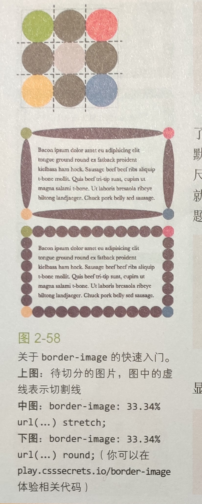
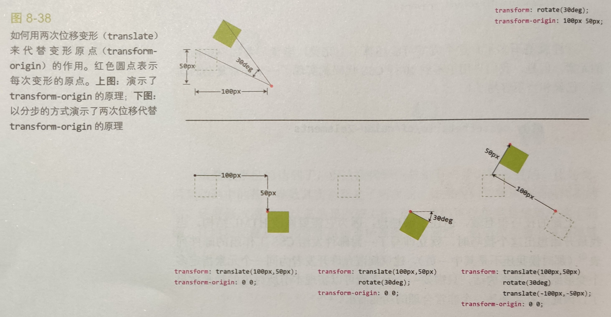

# CSS 揭秘

<!-- @import "[TOC]" {cmd="toc" depthFrom=1 depthTo=6 orderedList=false} -->

<!-- code_chunk_output -->

- [CSS 揭秘](#-css-揭秘-)
  - [一. 简介](#-一-简介-)
    - [1.1 Web 标准](#-11-web-标准-)
      - [1.1.1 标准的制定过程](#-111-标准的制定过程-)
      - [1.1.2 CSS3 CSS4 以及其他传说](#-112-css3-css4-以及其他传说-)
      - [1.1.3 冰与火之歌：浏览器前缀](#-113-冰与火之歌浏览器前缀-)
    - [1.2 CSS 编码技巧](#-12-css-编码技巧-)
      - [1.2.1 尽量减少代码重复](#-121-尽量减少代码重复-)
      - [1.2.2 相信眼睛，而不是数字](#-122-相信眼睛而不是数字-)
      - [1.2.3 关于响应式网页设计](#-123-关于响应式网页设计-)
      - [1.2.4 合理使用简写](#-124-合理使用简写-)
  - [二. 背景与边框](#-二-背景与边框-)
    - [2.1 半透明边框](#-21-半透明边框-)
    - [2.2 多重边框](#-22-多重边框-)
      - [2.2.1 box-shadow 方案](#-221-box-shadow-方案-)
      - [2.2.2 outline 方案](#-222-outline-方案-)
    - [2.3 伪随机背景](#-23-伪随机背景-)
    - [2.4 连续的图像边框](#-24-连续的图像边框-)
  - [三. 形状](#-三-形状-)
    - [3.1 平行四边形](#-31-平行四边形-)
      - [3.1.1 嵌套元素解决方案](#-311-嵌套元素解决方案-)
      - [3.1.2 伪元素方案](#-312-伪元素方案-)
    - [3.2 菱形图片](#-32-菱形图片-)
      - [3.2.1 基于变形的方案](#-321-基于变形的方案-)
      - [3.2.2 裁切路径方案](#-322-裁切路径方案-)
    - [3.3 切角效果](#-33-切角效果-)
      - [3.3.1 CSS 渐变](#-331-css-渐变-)
      - [3.3.2 弧形切角](#-332-弧形切角-)
      - [3.3.3 内联 SVG 与 border-image 方案](#-333-内联-svg-与-border-image-方案-)
    - [3.4 梯形标签页](#-34-梯形标签页-)
    - [3.5 简单的饼图](#-35-简单的饼图-)
  - [四. 视觉效果](#-四-视觉效果-)
    - [4.1 不规则投影](#-41-不规则投影-)
    - [4.2 染色效果](#-42-染色效果-)
      - [4.2.1 基于滤镜的方案](#-421-基于滤镜的方案-)
      - [4.2.2 基于混合模式的方案](#-422-基于混合模式的方案-)
    - [4.3 折角效果](#-43-折角效果-)
      - [4.3.1 45° 折角](#-431-45-折角-)
      - [4.3.2 其他角度的解决方案](#-432-其他角度的解决方案-)
    - [4.4 暗黑模式](#-44-暗黑模式-)
  - [五. 字体排印](#-五-字体排印-)
    - [5.1 连字符断行](#-51-连字符断行-)
    - [5.2 文本行的斑马条纹](#-52-文本行的斑马条纹-)
    - [5.3 连字](#-53-连字-)
    - [5.4 华丽的 & 符号](#-54-华丽的--符号-)
    - [5.5 自定义下划线](#-55-自定义下划线-)
    - [5.6 现实中的文字效果](#-56-现实中的文字效果-)
      - [5.6.1 凸版印刷效果](#-561-凸版印刷效果-)
      - [5.6.2 空心字效果](#-562-空心字效果-)
      - [5.6.3 文字外发光效果](#-563-文字外发光效果-)
      - [5.6.4 文字凸起效果](#-564-文字凸起效果-)
  - [六. 用户体验](#-六-用户体验-)
    - [6.1 放大镜](#-61-放大镜-)
  - [七. 结构与布局](#-七-结构与布局-)
    - [7.1 自适应内部元素](#-71-自适应内部元素-)
  - [八. 过渡与动画](#-八-过渡与动画-)
    - [8.1 缓动效果](#-81-缓动效果-)
      - [8.1.1 弹跳动画](#-811-弹跳动画-)
      - [8.1.2 弹性过渡](#-812-弹性过渡-)
    - [8.2 逐帧动画](#-82-逐帧动画-)
    - [8.3 闪烁效果](#-83-闪烁效果-)
    - [8.4 打字动画](#-84-打字动画-)
    - [8.5 状态平滑的滚动](#-85-状态平滑的滚动-)
    - [8.6 沿环形路径平移的动画](#-86-沿环形路径平移的动画-)
      - [8.6.1 需要两个元素的解决方案](#-861-需要两个元素的解决方案-)
      - [8.6.2 单个元素的解决方案](#-862-单个元素的解决方案-)

<!-- /code_chunk_output -->

下面的 JS 示例都是原生 JS，只会用到一个工具函数 $$()。它可以获取和遍历所有匹配特定 CSS 选择符的 DOM 元素，定义如下：

```js
function $$(selector, context) {
  let dom = context || document;
  let elements = dom.querySelectorAll(selector);
  return Array.prototype.slice.call(elements);
}
```

## 一. 简介

### 1.1 Web 标准

#### 1.1.1 标准的制定过程

与大众的理解大相径庭的是，W3C 并不 “生产” 标准。实际上，它扮演的是一个论坛的角色：W3C 以工作组的方式，把某项技术的相关各方聚集起来，最终由他们来产出标准。当然，W3C 并不只是一个观察者：它设定了整个平台的规则，监督整个进程。但这些技术规范（基本上）并不是由 W3C 的工作人员编写完成的。

工作组的绝大多数成员来自 W3C 会员公司。这些公司（比如浏览器厂商、主流网站、研究机构、常规技术公司等）都是 Web 标准兴旺发展的直接受益者。它们每年的会费也是 W3C 的主要资金来源，使得 W3C 能够免费、开放地发布所有技术规范，而不像其他标准制定组织那样不得不采取收费政策来维持运作。

**特邀专家**是指那些被邀请参与标准制定的 Web 开发者。在真正获得这样的殊荣之前，他们需要证明自己在解决难题时能够持续不断地投入，在参与讨论时能够体现出深厚的技术背景。

最后，同样不可忽视的是 W3C 工作人员。他们才是真正在 W3C 内工作的人，他们为工作组和 W3C 之间的交流提供便利。

对于哪些东西该进入标准，**浏览器厂商比 W3C 有更多的发言权**，上面列出的人员结构已经证明了这一点。

制定标准并不是闭门造车。CSS 工作组坚持透明原则，它内部所有的交流都是公开的，并邀请公众的关注和参与。

- 绝大多数的讨论都发生在工作组的邮件列表中：[www-style](https://lists.w3.org/Archives/Public/www-style/)。这个邮件列表是公开存档的，欢迎任何人的参与

- 每周都会召开一次电话会议，时长一小时，该会议并不向非工作组成员开放，但它会被实时记录在 W3C 的 [RC 服务器](https://irc.w3.org/)上的 #css 频道。这些会议记录会在几天内整理出来，并发
  布到邮件列表中。

- 还有每季度一次的面对面会议，也会以上述方式进行会议记录。在获得工作组主席的许可之后，这类会议也通常会对观察员开放（以旁听的方式）。

所有这些都是 W3C 进程的一部分，任何决定都是通过这样的方式来产生的。此外，那些真正负责把这些决定写成文字（即编撰规范）的人叫作规范编辑。规范编辑可能是 W3C 的工作人员、浏览器开发者、相关专业的特邀专家；也可能是会员公司的雇员，他们全职从事此工作，为了共同利益去推进标准。

每项规范从最初启动到最终成熟，都会经过以下阶段：

1. **编辑草案（ED）**：这是一项规范的初始阶段，可能非常粗糙，就像是编辑们想法的大杂烩。对这个阶段没有什么要求，也不保证它会被工作组批准。但它也是各个修订版本的必经阶段，每次变更都是先从一个 ED 中产生的，然后才会发布出来。

2. **首个公开工作草案（FPWD）**：一项规范的首个公开发布版本，它应该准备就绪，以接受工作组的公开反馈。

3. **工作草案（WD）**：在第一个 WD 之后，还会有更多的 WD 出来。这些 WD 会吸收来自工作组和更广阔的社区的反馈，一版接着一版小幅改进。浏览器的早期实现通常是从这个阶段开始的，厂商基本不太可能对更早阶段的草案提供实验性的支持。

4. **候选推荐规范（CR）**：这可以认为是一个相对稳定的版本。此时比较适合实现和测试。一项规范只有具备一套完整的测试套件和两个独立的实现之后，才有可能继续推进到下一阶段

5. **提名推荐规范（PR）**：这是 W3C 会员公司对这项规范表达反对意见的最后机会。实际上他们很少在这个阶段提出异议，因此每个 PR 推进到下一阶段只是时间问题。

6. **正式推荐规范（REC）**：一项 W3C 技术规范的最终阶段。

工作组中会有一到两位成员担任主席的角色。主席负责组织会议、协调讨论、控制时间，而且要从大局上斡旋整件事情。担任主席是一件耗时费神的工作，经常被比作养一大群猫。当然，所有接触过这项工作的人都知道这个比喻并不恰当—养猫比这要容易多了。

#### 1.1.2 CSS3 CSS4 以及其他传说

CSS1 的规范由 Hakon Wium Lie 和 Bert bos 发表于 1996 年，它非常短，而且比较简单。它的内容少到用一个 HTML 页面就足以呈现了，即使用 A4 纸打印出来也只需要 68 页。

CSS2 发表于 1998 年，它的定义更加严格，囊括了更多的功能，而且增加了两名编辑：Chris Lilley 和 Jan jacobs。此时，规范的篇幅暴增到了 480 页打印纸，人们已经无法把它完整地记忆下来了。

在 CSS2 之后，CSS 工作组意识到这门语言已经变得非常庞大，再也无法把它塞进单个规范中了。这样不仅阅读和编辑极其困难，而且限制了 CSS 本身的快速发展。别忘了，一项规范如果要推进到最终阶段，其中的每项特性都必须具备两个独立的实现和全面的测试。原先的那种方式已经玩不转了。因此，决定跨出一步，将 CSS 打散到多个不同的规范（模块）中，每个模块都可以独立更新版本。这其中，那些延续 CSS2.1 已有特性的模块会升级到 3 这个版本号。比如以下模块

- [CSS 语法](https://w3.org/TR/css-syntax-3)
- [CSS 层叠与继承](http://w3.org/TR/css-cascade-3)
- [CSS 颜色](https://w3.org/TR/css3-color)
- [选择符](https://w3.org/TR/selectors)
- [CSS 背景与边框](https://w3.org/TR/css3-background)
- [CSS 值与单位](https://w3.org/TR/css-values-3)
- [CSS 文本排版](https://w3.org/TR/css-text-3)
- [CSS 文本装饰效果](https://w3.org/TR/css-text-decor-3)
- [CSS 字体](https://w3.org/TR/css-fonts)
- [CSS 基本 UI 特性](http://w3.org/TR/css3-ui)

此外，如果某个模块是前所未有的新概念，那它的版本号将从 1 开始，比如下面这些：

- [CSS 变形](https://w3.org/TR/css-transforms-1)
- [图像混合效果](https:/w3.org/TR/compositing-1)
- [滤镜效果](https://w3.org/TR/filter-effects-1)
- [CSS 遮罩](https://w3.org/TR/css-masking-1)
- [CSS 伸缩盒布局](https://w3.org/TR/css-flexbox-1)
- [CSS 网格布局](https://w3.org/TR/css-grid-1)

尽管 “CSS3” 这个名词非常流行，但它实际上并没有在任何规范中定义过。这一点跟 CSS2 或更早的 CSS1 不一样。真正的情况是，绝大多数编辑在提到这个词时，指的是一个非正式的集合，它包括 CSS 规范第三版（Level3）再加上一些版本号还是 1 的新规范。尽管在哪些规范应该归入 CSS3 的问题上，编辑们达成了一定的共识，但也不得不面对现实：由于 CSS 的各个模块在近些年里以不同的速度在推进，已经越来越难以把这些规范以 CSS3、CSS4 这样的方式来划分了，而且这样也难以被大众理解和接受。

#### 1.1.3 冰与火之歌：浏览器前缀

在标准的开发过程中，总是有大大的 “第 22 条军规” 挡在面前：标准的工作组需要网页开发者这一端的输入，以确保各项规范可以处理真实的开发需求；但是开发者往往没有兴趣尝试那些在生产环境中还不能使用的东西。当实验性的技术被广泛应用到生产时，工作组就被这些技术早期的、实验性的版本捆住手脚了，因为一旦这些技术有变动，那些已经在用这些技术的网站就挂了。显然，这完全否定了让开发者尝试早期标准的好处。

这些年来，为了解决这个难题，许多方案被提了出来，但都不够完美。饱受诟病的浏览器前缀就是其中之一。这个方案是指每个浏览器都可以实现这些实验性的（甚至是私有的、非标准的）特性，但要在名称前面加上自己特有的前缀。最常见的前缀分别是 Firefox 的 -moz-、IE 的 -ms-、Opera 的 -o- 以及 Safari 和 Chrome 的 -webkit-。网页开发者可以自由地尝试这些加了前缀的特性，并把试用结果反馈给工作组，而工作组随后会将这些反馈吸收到规范之中，并且逐渐完善该项特性的设计。由于最终标准化的版本会有一个不同的名称（没有前缀），它在实际应用中就不会跟加前缀版本相冲突了。

但现实与期望往往有很大的落差。当开发者发现这些实验性的、加了前缀的属性可以轻而易举地实现以前大费周章才能达到的效果时，就开始滥用了。这些加了浏览器前缀的属性迅速成为 CSS 领域的一大潮流。网上的教程会写到它们，Stack Overflow 上的问答会提到它们……很快，几乎每个有上进心的 CSS 开发者都开始争先恐后地使用它们。

不久，网页开发者们就发现，在使用这些神奇的新特性时，如果只写出当下有效的浏览器前缀，就意味着以后要经常回来打补丁：每当又一个浏览器实现了这个新特性时，都需要多加一行。跟进各个特性在各个浏览器下是不是要加前缀，光是想想就让人头皮发麻。开发者会怎样应对？那就是先发制人地加上所有可能的浏览器前缀，再把无前缀的版本放在最后，以图一劳永逸。

由于网页开发者使用无前级的属性是想确保代码的向前兼容，那么工作组想要修改这些无前缀语法就变得不可能了。基本上就跟这些半生不熟的早期规范绑在一起了，只能通过极其有限的途径来修改它们。用不了多久，这个 “坑” 里的每个人就会意识到，浏览器前缀已是一场史诗般的失败。

最近，浏览器厂商已经很少以前缀的方式来实验性地实现新特性了。取而代之的是，这些实验性特性需要通过**配置开关**来启用，这可以有效防止开发者在生产环境中使用它们，因为不能要求用户为了正确地浏览网站而去修改浏览器设置。当然，这会导致一个后果：尝试这些实验性特性的开发者会减少；但仍然会得到足够多的反馈，甚至是更高质量的反馈，同时还避免了浏览器前缀的所有缺点。不过还需要很长的时间，才能从浏览器前缀所引发的涟漪效应中解脱出来。

### 1.2 CSS 编码技巧

#### 1.2.1 尽量减少代码重复

在软件开发中，保持代码的 DRY 和可维护性是最大的挑战之一，而这句话对 CSS 也是适用的。在实践中，代码可维护性的最大要素是**尽量减少改动时要编辑的地方**。举例来说，如果在放大一个按钮时需要在一堆规则中进行 10 处修改，那就很可能会漏改其中某处，当在给别人善后时更是如此。即使这些要修改的地方很明显，或者最终可以找齐它们，但还是浪费了时间。

而且，这还不仅仅是后期修改的问题。灵活的 CSS 通常更容易扩展：在写出基础样式之后，只用极少的代码就可以扩展出不同的变体，因为只需覆盖一些变量就可以了。先来看看下面这段 CSS，它给按钮添加了一些效果：

```css
.button {
  padding: 6px 16px;
  border: 1px solid #446d88;
  background: #58a linear-gradient(#77a0bb, #58a);
  border-radius: 4px;
  box-shadow: 0 1px 5px gray;
  color: white;
  text-shadow: 0-lpx 1px #335166;
  font-size: 20px;
  line-height: 30px;
}
```

这段代码在可维护性方面存在一些问题。最软的柿子应该是跟字体尺寸相关的部分了。如果决定改变字号，就得同时调整行高，因为这两个属性都写成了绝对值。更麻烦的是，行高并没有反映出它跟字号的关系，因此还得做些算术，算出字号改变之后的行高该是多少。**当某些值相互依赖时，应该把它们的相互关系用代码表达出来**。在这个例子中，行高是字号的 1.5 倍。因此，把代码改成下面这样会更易维护：

```css
.button {
  /* ... */
  font-size: 20px;
  line-height: 1.5;
}
```

绝对值很容易掌控，但每当想要修改它们的时候，它们都会回头反咬你口。比如说，如果决定把父级的字号加大，就不得不修改每一处使用绝对值作为字体尺寸的样式。如果改用百分比或 em 单位就好多了：

```css
font-size: 125%; /* 假设父级的字号是 16px */
line-height: 1.5;
```

现在，如果改变父级的字号，按钮的尺寸就会随之变化。但是，它看起来很不协调，因为所有其他效果都是为一个小按钮设计的，并没有跟着缩放。如果把这些长度值都改成 em 单位，那这些效果的值就都变成可缩放的了，而且是依赖字号进行缩放。按照这种方法，就可以在一处控制按钮的所有尺寸样式了：

```css
.button {
  padding: 0.3em 0.8em;
  border: 1px solid #446d88;
  background: #58a linear-gradient(#77a0bb, #58a);
  border-radius: 0.2em;
  box-shadow: 0 0.05em 0.25em gray;
  color: white;
  text-shadow: 0 -0.05em 0.05em #335166;
  font-size: 125%;
  line-height: 1.5;
}
```

> **注意**：还有一些长度值是绝对值。此时就**需要重新审视到底哪些效果应该跟着按钮一起放大，而哪些效果是保持不变的**。比如在这个例子中，希望按钮的边框粗细保持在 1px，不受按钮尺寸的影响。

不过，让按钮变大或变小并不是唯一想要改动的地方。颜色是另一个重要的变数。比如，假设要创建一个红色的取消按钮，或者一个绿色的确定按钮，可能需要覆盖四条声明（border、color、background、box-shadow 和 text-shadow），而且还有另一大难题：要根据按钮的亮面和暗面相对于主色调 #58a 变亮和变暗的程度来分别推导出其他颜色各自的亮色和暗色版本。此外，若想把按钮放在一个非白色的背景之上呢？显然使用灰色作投影只适用于纯白背景的情况。

其实只要把半透明的黑色或白色叠加在主色调上，即可产生主色调的亮色和暗色变体，这样就能简单地化解这个难题了：

```css
.button {
  padding: 0.3em 0.8em;
  border: 1px solid rgba(0, 0, 0, 1);
  background: #58a linear-gradient(hsla(0, 0%, 100%, 0.2), transparent);
  border-radius: 0.2em;
  box-shadow: 0 0.05em 0.25em rgba(0, 0, 0, 0.5);
  color: white;
  text-shadow: 0 -0.05em 0.05em rgba(0, 0, 0, 0.5);
  font-size: 125%;
  line-height: 1.5;
}
```

现在只要覆盖 background-color 属性，就可以得到不同颜色版本的按钮了。按钮现在已经非常灵活了。不过，这个例子并没有涵盖所有能让代码变得更 DRY 的方法。下面几节有更多的技巧。

1. **代码易维护 vs 代码量少**

   有时候，**代码易维护和代码量少不可兼得**。比如在上面的例子中，最终采用的代码甚至比一开始的版本略长。下面的代码片断，要为一个元素添加一道 10px 宽的边框，但左侧不加边框。

   ```css
   border-width: 10px 10px10px 0;
   ```

   只要这一条声明就可以搞定了，但如果日后要改动边框的宽度，需要同时改三个地方。如果把它拆成两条声明的话，改起来就容易多了，而且可读性或许更好一些

   ```css
   border-width: 10px;
   border-left-width: 0;
   ```

2. **currentColor**

   在 [CSS 颜色(第三版)](https://w3.org/TR/css3-color)规范中，增加了很多新的颜色关键字，比如 lightgoldenrodyellow 等，其实并不是很常用。但是，还得到了一个特殊的颜色关键字 `currentColor`，它是从 SVG 那里借鉴来的。这个关键字并没有绑定到一个固定的颜色值，而是一直被解析为 color。实际上，这个特性让它成为了 **CSS 中有史以来的第一个变量**。虽然功能很有限，但它真的是个变量。

   `currentColor` 关键字代表原始的 color 属性的计算值。它允许让继承自属性或子元素的属性颜色属性以默认值不再继承。它也能用于那些继承了元素的 color 属性计算值的属性，相当于在这些元素上使用 inherit 关键字，如果这些元素有该关键字的话。

   很多已有的属性也具有类似的行为。举例来说，如果没有给边框指定颜色，它就会自动地从文本颜色那里得到颜色。这是因为 `currentColor` 本身就是很多 CSS 颜色属性的初始值，比如 border-color 和 outline-color，以及 text-shadow 和 box-shadow 的颜色值，等等。

3. **继承**

   尽管绝大多数开发者都知道有 inherit 这个关键字，但还是很容易遗忘它。inherit 可以用在任何 CSS 属性中，而且它总是绑定到父元素的计算（对伪元素来说，则会取生成该伪元素的宿主元素）。举例来说，要把表单元素的字体设定为与页面的其他部分相同，并不需要重复指定字体属性，只需利用 inherit 的特性即可。

#### 1.2.2 相信眼睛，而不是数字

人的眼睛并不是一台完美的输入设备。有时候精准的尺度看起来并不精准，而设计需要顺应这种偏差。举一个在视觉设计领域广为人知的例子，眼睛在看到一个完美垂直居中的物体时，会感觉它并不居中。实际上，应该把这个物体从几何学的中心点再稍微向上挪一点，才能取得理想的视觉效果。

与此类似，在字体设计领域广为人知的是，圆形的字形（比如 0）与矩形字形相比，需要稍微放大一些，因为眼睛倾向于把圆形感知得比其实际尺寸更小一些。

**这些视觉上的错觉在任何形式的视觉设计中都普遍存在**，需要有针对性地进行调整。一个非常常见的例子是给一个文本容器设置内边距。不论内容文本有多长，是一个单词还是几个段落，这个问题都会出现。假如给容器的四边指定相同的内边距，则实际效果看起来并不相等。原因在于，**字母的形状在两端都比较整齐，而顶部和底部则往往参差不齐**，从而导致眼睛把这些参差不齐的空缺部分感知为多出来的内边距。因此，如果希望四边的内边距看起来是基本一致的，就需要减少顶部和底部的内边距。

#### 1.2.3 关于响应式网页设计

响应式网页设计（Responsive Web Design，RWD），比较常见的实践是用多种分辨率来测试一个网站，然后添加越来越多的媒体查询（Media Query）规则来修补网站在这些分辨率下出现的问题。然而对于今后的 CSS 改动来说，**每个媒体查询都会增加成本**，而这种成本是不应轻易上升的。未来每次对 CSS 代码的修改都要求逐一核对这些媒体查询是否需要配合修改，甚至可能要求反过来修改这些媒体查询的设置。这一点后患无穷。添加的媒体查询越多，CSS 代码就会变得越来越经不起折腾。

这并不是说媒体查询是一种不良实践。只要用对了，它就是利器。但是，只应该把它作为最后的手段。比如想把网站做得弹性灵活，但其他尝试全都失败了；或者希望在较大或较小的视口下完全改变网站的设计形态。原因在于，媒体查询不能以一种连续的方式来修复问题。它们的工作原理基于某几个特定的阶梯（亦称“断点”），如果大部分样式代码并不是以弹性的方式来编写的，那么媒体查询能做的只是修补某个特定分辨率下的特定问题一这本质上只是把灰尘扫到地毯下面而已。

媒体查询的断点不应该由具体的设备来决定，而应该根据设计自身来决定。这不仅是因为网站需要面向的设备太多了（尤其是考虑到未来的设备时），还因为一个网站在桌面端可能会以任意尺寸的窗口来显示。

遵从 “**尽量减少代码重复**” 所描述的原则对此也是有帮助的，因为不需要去覆盖媒体查询里同样数量的声明。这在本质上减轻了它们所产生的维护成本。

下面还有一些建议，可能会帮助避免不必要的媒体查询：

- 使用百分比长度来取代固定长度。如果实在做不到这一点，也应该尝试使用与视口相关的单位（vw、vh、vmin 和 vmax），它们的值解析为视口宽度或高度的百分比。

- 当需要在较大分辨率下得到固定宽度时，使用 max-width 而不是 width，因为它可以适应较小的分辨率，而无需使用媒体查询。

- 不要忘记为替换元素（比如 img、object、video、iframe 等）设置一个 max-width，值为 100%。

- 假如背景图片需要完整地铺满一个容器，不管容器的尺寸如何变化，`background-size: cover;` 这个属性都可以做到。但是，也要时刻牢记—带宽并不是无限的，因此在移动网页中通过 CSS 把一张大图缩小显示往往是不太明智的。

- 当图片（或其他元素）以行列式进行布局时，让视口的宽度来决定列的数量。弹性盒布局（即 Flexbox）或者 `display: inline-block` 加上常规的文本折行行为，都可以实现这一点。

- 在使用多列文本时，指定 column-width（列宽）而不是指定 column-count（列数），这样它就可以在较小的屏幕上自动显示为单列布局。

总的来说，思路是尽最大努力**实现弹性可伸缩的布局，并在媒体查询的各个断点区间内指定相应的尺寸**。当网页本身的设计足够灵活时，让它变成响应式应该只需要用到一些简短的媒体查询代码。

如果发现需要一大堆媒体查询才能让设计适应大大小小的屏幕，那么不妨后退一步，重新审视代码结构。因为在所有的情况下，响应式都不是唯一需要考虑的问题。

#### 1.2.4 合理使用简写

以下两行 CSS 代码并不是等价的：

```css
background: rebeccapurple;
background-color: rebeccapurple;
```

前者是简写，它可以确保得到 rebeccapurple 纯色背景；但如果用的是展开式的单个属性（background-color），那这个元素的背景最终有可能会显示为一个粉色的渐变图案、一张猫的图片或其他任何东西，因为同时可能会有一条 background-image 声明在起作用。在使用展开式属性的写法时，通常会遇到这样的问题：展开式写法并不会帮助清空所有相关的其他属性，从而可能会干扰想要达到的效果。

不要害怕使用简写属性。**合理使用简写是一种良好的防卫性编码方式，可以抵御未来的风险**。当然，如果要**明确地去覆盖某个具体的展开式属性**并保留其他相关样式，那就需要用展开式属性。

展开式属性与简写属性的配合使用也是非常有用的，可以让代码更加 DRY。对于那些接受一个用逗号分隔的列表的属性（比如 background），尤其如此。下面的例子可以很好地解释这一点：

```css
background: url(tr.png) no-repeat top right/ 2em 2em, url(br.png) no-repeat bottom right / 2em 2em,
  url(bl.png) no-repeat bottom left / 2em 2em;
```

background-size 和 background-repeat 的值被重复了三遍，尽管每层背景的这两个值确实是相同的。其实可以从 CSS 的 “列表扩散规则” 那里得到好处。它的意思是说，**如果只为某个属性提供一个值，那它就会扩散并应用到列表中的每一项**。因此，可以把这些重复的值从简写属性中抽出来写成一个展开式属性：

```css
background: url(tr.png) top right, url(br.png) bottom right, url(bl.png) bottom left;
background-size: 2em 2em;
background-repeat: no-repeat;
```

## 二. 背景与边框

### 2.1 半透明边框

默认情况下，背景会延伸到边框所在的区域下层。不会从半透明的白色边框处透上来，所以需要 `background-clip` 属性来调整，这个属性的初始值是 border-box，意味着背景会被元素的 border box（边框的外沿边）裁切掉。可以把它的值设为 padding-box，这样浏览器就会用内边距的外沿来把背景裁切掉。

```css
.translucent-border {
  border: 10px solid hsla(0, 0%, 100%, 0.5);
  background: #fff;
  background-clip: padding-box;
}
```

### 2.2 多重边框

#### 2.2.1 box-shadow 方案

box-shadow 的第四个参数（称作 “扩张半径”），通过指定正值或负值，可以让**投影面积加大或减小**。一个正值的扩张半径加上两个为零的偏移量以及为零的模糊值，得到的 “投影” 其实就像一道实线边框：

```css
background: yellowgreen;
box-shadow: 0 0 0 10px #655;
```

box-shadow 的好处在于，它**支持逗号分隔语法，可以创建任意数量的投影**。因此，可以非常轻松地在上面的示例中再加上一道 deeppink 颜色的 “边框”：

```css
background: yellowgreen;
box-shadow: 0 0 0 10px #655, 0 0 0 15px deeppink;
```

> **注意**：box-shadow 是层层叠加的，第一层投影位于最顶层，依次类推。因此，需要按此规律调整扩张半径。比如说，在前面的代码中，想在外圈再加一道 5px 的外框，那就需要指定扩张半径的值为 15px（10px+5px）。

多重投影解决方案在绝大多数场合都可以很好地工作，但有一些注意事项：

- 投影的行为跟边框不完全一致，因为它不会影响布局，而且也不会受到 box-sizing 属性的影响。不过，还是可以通过内边距或外边距（这取决于投影是内嵌和还是外扩的）来额外模拟出边框所需要占据的空间。

- 上述方法所创建出的假 “边框” 出现在元素的外圈。它们并不会响应鼠标事件，比如悬停或点击。如果这一点非常重要，可以给 box-shadow 属性加上 `inset` 关键字，来使投影绘制在元素的内圈。此时需要增加额外的内边距来腾出足够的空隙。

#### 2.2.2 outline 方案

在某些情况下，可能只需要两层边框，那就可以先设置一层常规边框，再加上 outline（描边）属性来产生外层的边框。这种方法的一大优点在于**边框样式十分灵活**，不像上面的 box-shadow 方案只能模拟实线边框。如果要得到的效果，代码可以这样写：

```css
background: yellowgreen;
border: 10px solid #655;
outline: 5px solid deeppink;
```

描边的另一个好处在于，可以通过 outline-offset 属性来控制它跟元素边缘之间的间距，这个属性甚至可以接受负值。这对于某些效果来说非常有用。

如上所述，它只适用于双层 “边框” 的场景，因为 outline 并不能接受用逗号分隔的多个值。

### 2.3 伪随机背景

为了更真实地模拟条纹的随机性，可以从一个平面拆散为多个图层：一种颜色作为底色，另三种颜色作为条纹，然后再让条纹以不同的间隔进行重复平铺。这一点不难做到，在色标中定好条纹的宽度，再用 background-size 来控制条纹的间距：

```css
.pseudorandom-background {
  background: hsl(20, 40%, 90%);
  background-image: linear-gradient(90deg, #fb3 10px, transparent 0), linear-gradient(90deg, #ab4 20px, transparent 0),
    linear-gradient(90deg, #655 20px, transparent 0);
  background-size: 80px 100%, 60px 100%, 40px 100%;
}
```

因为最顶层贴片的重复规律最容易被察觉（它没有被任何东西遮挡），应该把平铺间距最大的贴片安排在最顶层。

但如果仔细观察的话，仍然可以看出图案每隔 240px 就会重复一次。这个组合图案中第一个贴片的终点，就是**各层背景图像以不同间距重复数次后再次统一对齐的点**。如果有一些数字，那么可以同时整除所有数字的最小数字就叫作它们的*最小公倍数*。因此，这里贴片的尺寸实际上就是所有 background-size 的最小公倍数，而 40、60 和 80 的最小公倍数，正是 240。

根据这个逻辑，要让这种随机性更加真实，得把贴片的尺寸最大化。为了让最小公倍数最大化，这些数字最好是互质的。在这种情况下，它们的最小公倍数就是它们的乘积。要达成互质关系，最简单的办法就是尽量选择质数，因为质数跟其他任意（不是自己倍数的）数字都是互质的。

为了进一步增加随机性，甚至可以用质数来指定各组条纹的宽度。于是的代码变为：

```css
.pseudorandom-background {
  background: hsl(20, 40%, 90%);
  background-image: linear-gradient(90deg, #fb3 11px, transparent 0), linear-gradient(90deg, #ab4 23px, transparent 0),
    linear-gradient (90deg, #655 41px transparent 0);
  background-size: 41px 100%, 61px 100%, 83px 100%;
}
```

这个技巧被 Alex Walker 定名为 “蝉原则”，他最先提出了通过质数来增加随机真实性的想法。这个方法不仅适用于背景，还可以用于其他涉及有规律重复的情况。

- 在照片图库中，为每幅图片应用细微的伪随机旋转效果时，可以使用多个 :nth-chid(a) 选择符，且让 a 是质数。
- 如果要生成一个动画，而且想让它看起来不是按照明显的规律在循环时，可以应用多个时长为质数的动画。

### 2.4 连续的图像边框

有时，想把一张图片应用为边框，而不是背景，并且元素的尺寸在扩大或缩小时，这张图片都可以自动延伸并覆盖完整的边框区域。

可以针对特定的元素宽高和边框宽度使用 `border-image`，但无法适配尺寸有变化的情况。border-image 的原理基本上就是九宫格伸缩法：把图片切割成九块，然后把它们应用到元素边框相应的边和角。



可以使用 `background-clip`。主要的思路就是在背景图片之上，再叠加一层纯白的实色背景。为了让下层的图片背景透过边框区域显示出来，需要给两层背景指定不同的　`background-clip` 值。最后一个要点在于，只能在多重背景的最底层设置背景色，因此需要用一道从白色过渡到白色的 CSS 渐变来模拟出纯白实色背景的效果：

```css
.image {
  padding: 1em;
  border: 1em solid transparent;
  background: linear-gradient(white, white), url(stone-art.jpg);
  background-size: covers;
  background-clip: padding-box, border-box;
}
```

这个结果跟想要的已经非常接近了。但边框的图片有一种怪异的拼接效果。原因是 `background-origin` 的默认值是 `padding-box`，因此，图片的显示尺寸不仅取决于 padding box 的尺寸，而且被放置在了 padding box 的原点（左上角)。看到的实际上就是背景图片以平铺的方式蔓延到 border box 区域的效果。为了修正这个问题，只需把 background-origin 也设置为 border-box 就可以了：

```css
.image {
padding: 1em;
border: 1em solid transparent;
background: linear-gradient(white, white) padding-box, url(stone-art.jpg) border-box 0 0 / cover;
background-origin: border-box;
```

当然，这个技巧还可以用在渐变图案上。举个例子，下面这段代码可以生成一种老式信封样式的边框：

```css
.envelope {
  padding: 1em;
  border: 1em solid transparent;
  background: linear-gradient(white, white) padding-box, repeating-linear-gradient(
        -45deg,
        red 0,
        red 12.5%,
        transparent 0,
        transparent 25%,
        #58a 0,
        #58a 37.5%,
        transparent 0,
        transparent 50%
      ) 0 / 5em 5em;
}
```

可以通过 `background-size` 属性来改变条纹的宽度，通过 border 属性来改变整个边框的厚度。这个效果也可以通过 `border-image` 来实现。

```css
.envelope {
  padding: 1em;
  border: 16px solid transparent;
  border-image: 16 repeating-linear-gradient(-45deg, red 0, red 1em, transparent 0, transparent 2em, #58a 0, #58a 3em, transparent
        0, transparent 4em);
}
```

不过 `border-image` 方法存在一些问题：

- 每当改变 `border-image-slice` 时，都需要同时修改 `border-width` 来让它们相互匹配。
- 由于不能在 `border-image-slice` 属性中使用 em 单位，**只能把边框厚度指定为像素单位**。
- 条纹的宽度需要在色标的位置信息中写好，因此在改变条纹宽度时，需要修改四处。

这个技巧的另一个用武之地是生成好玩的蚂蚁行军边框！蚂蚁行军边框是一种虚线边框，看起在不断转动，就好像排队前进的蚂蚁一样。这个技巧在图形界面中有大量应用—几乎所有的图像编辑软件都会使用这个效果来标示选区。

为了创建[蚂蚁行军](./example/marching-ants.html)效果，将会用到 “老式信封” 技巧的一个变种。将把条纹转变为黑白两色，并把边框的宽度减少至 1px，然后再把 `background-size` 改为某个合适的值。最后，把 `background-position` 以动画的方式改变为 100%，就可以让它滚动起来了：

```css
@keyframes ants {
  to {
    background-position: 100%;
  }
}
.marching-ants {
  padding: 1em;
  border: 1px solid transparent;
  background: linear-gradient(white, white) padding-box, repeating-linear-gradient(
        -45deg,
        black 0,
        black 25%,
        white 0,
        white 50%
      ) 0 / 0.6em 0.6em;
  animation: ants 12s linear infinite;
}
```

这个技巧还可以创建出各种特殊样式的虚线框：不管是为虚线线段指定不同的颜色，还是自定义线段的长度和间隙的长度。

当前，如果要通过 border-image 来实现类似的效果，唯一的办法是为 border-image-source 指定一个 GIF 动画，当浏览器开始支持渐变插值的时候，还可以用渐变来实现它。

`border-image` 也有它强大的地方，尤其是在搭配渐变图案时更是威力倍增。举个例子，假设需要一个[顶部边框被裁切](./example/top-clip.html)的效果，就像一般的脚注那样。所需要的就是 border-image 属性再加上一条由渐变生成的垂直条纹，并把要裁切的长度在渐变中写好。边框线的粗细交给 border-width 来控制：

```css
.top-clip {
  border-top: 0.2em solid transparent;
  border-image: 100% 0 0 linear-gradient(90deg, currentColor 4em, transparent 0);
  padding-top: 1em;
}
```

由于把所有属性都指定为 em 单位，效果会根据 font-size 的变化而自动调整。另外，由于使用了 currentcolor，它也会根据 color 属性的变化而自动适应。

## 三. 形状

### 3.1 平行四边形

平行四边形其实是矩形的超集：它的各条边是两两平行，但各个角则不一定是直角。可以通过 `skew()` 的变形属性来对这个矩形进行斜向拉伸：

```css
transform: skewX(-45deg);
```

但这也导致其中的内容发生了斜向变形。

#### 3.1.1 嵌套元素解决方案

**可以对内容再应用一次反向的 skew() 变形，从而抵消容器的变形效果**。但需要额外加一层 HTML 包装元素。

#### 3.1.2 伪元素方案

另一种思路是**把所有样式应用到伪元素上，然后对伪元素进行变形**。因为内容不是在伪元素内，所以内容不会受到变形的影响。

如果希望伪元素保持良好的灵活性，可以自动继承其宿主元素的尺寸，甚至当宿主元素的尺寸是由其内容来决定时仍然如此。一个简单的办法是给宿主元素应用 position:relative 样式，并为伪元素设置 position:absolute，然后再把所有偏移量设置为零，以便让它在水平和垂直方向上都被拉伸至宿主元素的尺寸：

```css
.button {
  position: relative;
  /* 其他的文字颜色、内边距等样式 */
}
.button::before {
  content: '';
  position: absolute;
  top: 0;
  right: 0;
  bottom: 0;
  left: 0;
}
```

此时，用伪元素生成的方块是重叠在内容之上的，一旦给它设置背景，就会遮住内容。可以给伪元素设置 `z-index: -1;` 样式，这样它的堆叠层次就会被推到宿主元素之后。最后一步，就是对它设置变形样式：

```css
.button {
  position: relative;
  /* 其他的文字颜色、内边距等样式…… */
}
.button::before {
  content: ''; /* 用伪元素来生成一个矩形 */
  position: absolute;
  top: 0;
  right: 0;
  bottom: 0;
  left: 0;
  z-index: -1;
  background: #58a;
  transform: skew(-45deg);
}
```

这个技巧不仅对 skeX() 变形来说很有用，还适用于其他任何变形样式，当想变形一个元素而不想变形它的内容时就可以用到它。这个技巧的关键在于，**利用伪元素以及定位属性产生了一个方块，然后对伪元素设置样式，并将其放置在其宿主元素的下层**。

### 3.2 菱形图片

#### 3.2.1 基于变形的方案

把图片用一个 div 包裹起来，然后对其应用相反的 rotate() 和 scale() 变形样式：

```html
<div class="picture">
  
</div>
<style>
  .picture {
    width: 400px;
    transform: rotate(45deg);
    overflow: hidden;
  }
  .picture > img {
    max-width: 100%;
    transform: rotate(-45deg) scale(1.42);
  }
</style>
```

#### 3.2.2 裁切路径方案

可以使用 `clip-path` 属性，这个属性可以允许把元素裁剪成任何形状。在这里可以使用 `polygon()`（多边形）函数来指定一个菱形。它允许用一系列（以逗号分隔的）坐标点来指定任意多边形：

```css
clip-path: polygon(50% 0, 100% 50%, 50% 100%, 0 50%);
```

这个属性还可以参与动画，只要动画是在**同一种形状函数**之间进行的，而且点的数量是相同的。因此，如果希望图片在鼠标悬停时平滑地扩展为完整的面积，只需要这样做：

```css
img {
  clip-path: polygon(50% 0, 100% 50%, 50% 100%, 0 50%);
}
img:hover {
  clip-path: polygon(0 0, 100% 0, 100% 100%, 0 100%);
}
```

[示例](./example/diamond-image.html)

### 3.3 切角效果

[切角](./example/chamfer.html)最常见的形态是把元素的一个或多个角切成 45° 的缺口。

#### 3.3.1 CSS 渐变

第一种方案来自于无所不能的 CSS 渐变。假设只需要一个角被切掉的效果，以右下角为例。这其中最大的窍门在于充分利用渐变的一大特性：渐变可以接受一个角度（比如 45deg）作为方向，而且色标的位置信息也可以是绝对的长度值，这一点丝毫不受容器尺寸的影响。

综合以上这些想法，只需要一个线性渐变就可以达到目标。这个渐变需要把一个透明色标放在切角处，然后在相同位置设置另一个色标，并且把它的颜色设置为想要的背景色：

```css
background: #58a;
background: linear-gradient(-45deg, transparent 15px, #58a 0);
}
```

事实上，第一行声明并不是必需的，加上它是将其作为回退机制：如果某些浏览器不支持 CSS 渐变，那第二行声明会被丢弃。

现在，假设想要两个角被切掉的效果，以底部的两个角为例。只用一层渐变是无法做到这一点的，因此要再加一层。最初的想法可能是这样的：

```css
background: linear-gradient(-45deg, transparent 15px, #58a 0), linear-gradient(45deg, transparent 15px, #655 0);
```

但这样写是行不通的。默认情况下，这两层渐变都会填满整个元素，因此它们会相互覆盖。需要让它们都缩小一些，于是使用 `background-size` 让每层渐变分别只占据整个元素一半的面积，这时还需要把 `background-repeat` 关掉：

```css
background: linear-gradient(-45deg, transparent 15px, #58a 0) right, linear-gradient(45deg, transparent 15px, #655 0) left;
background-size: 50% 100%;
background-repeat: no-repeat;
```

如果把四个角都做出切角效果，需要四层渐变图案：

```css
background: linear-gradient(135deg, transparent 15px, #58a 0) top left, linear-gradient(
      -135deg,
      transparent 15px,
      #58a 0
    ) top right, linear-gradient(-45deg, transparent 15px, #58a 0) bottom right, linear-gradient(
      45deg,
      transparent 15px,
      #58a 0
    ) bottom left;
background-size: 50% 50%;
background-repeat: no-repeat;
```

上面这段代码有一个问题，它的可维护性并不理想。在改变背景色时需要修改五处；而在改变切角尺寸时需要修改四处。使用预处理器的 mixin 可以帮助减少代码的重复度。如果用 SCSS 来写：

```scss
@mixin beveled-corners($bg, $tl: 0, $tr: $tl, $br: $tl, $bl: $tr) {
  background: $bg;
  background: linear-gradient(135deg, transparent $tl, $bg 0) top left, linear-gradient(225deg, transparent $tr, $bg 0) top
      right, linear-gradient(-45deg, transparent $br, $bg 0) bottom right, linear-gradient(
        45deg,
        transparent $bl,
        $bg 0
      ) bottom left;
  background-size: 50% 50%;
  background-repeat: no-repeat;
}
```

然后，在需要的时候就可以直接调用它，并传入 2~5 个参数：

```scss
@include beveled-corners(#58a, 15px, 5px);
```

在上面这行代码中，元素的左上角和右下角会得到 15px 的切角效果，而右上角和左下角会得到 5px 的切角效果。如果提供的值少于四个，它的行为跟 border-radius 属性是类似的。这归功于在 SCSS 的 mixin 中为各个参数指定了默认值。

#### 3.3.2 弧形切角

上述渐变技巧还有一个变种，可以用来创建弧形切角（也称为“内凹圆角”，因为它看起来就像是圆角的反向版本）。唯一的区别在于，会用径向渐变来替代上述线性渐变：

```css
background: radial-gradient(circle at top left, transparent 15px, #58a 0) top left, radial-gradient(
      circle at top right,
      transparent 15px,
      #58a 0
    ) top right, radial-gradient(circle at bottom right, transparent 15px, #58a 0) bottom right, radial-gradient(
      circle at bottom left,
      transparent 15px,
      #58a 0
    ) bottom left;
background-size: 50% 50%;
background-repeat: no-repeat;
```

#### 3.3.3 内联 SVG 与 border-image 方案

虽然基于渐变的方案是行之有效的，但也不是完全没有问题：

- 它的代码还是非常烦琐冗长的。在常规设计中，四个角的切角尺寸往往是一致的，但在改变这个值时仍然需要修改四处。与此类似，在改变背景色的时候也需要修改四处，如果算上回退背景色的话就是五处。
- 它的烦琐导致完全不可能让各个切角的尺寸以动画的方式发生变化。

还有其他一些方法可供选择，具体采用哪种方法取决于实际需求。其中之一就是使用 `border-image`，并通过一个内联的 SVG 图像来产生切角效果。这基于 border-image 的工作原理。

由于尺寸无关紧要（border-image 会解决缩放问题，而 SVG 可以实现与尺寸完全无关的完美缩放—这就是矢量图的好处），每个切片的尺寸都可以设置为 1，以便理解和书写。切角的尺寸是 1，直线边缘也都是 1。

```css
border: 15px solid transparent;
border-image: 1
  url('data:image/svg+xml,<svg xmlns="http://www.w3.org/2000/svg" width="3" height="3" fill="%2358a"><polygon points="0,1 1,0 2,0 3,1 3,2 2,3 1,3 0,2"/></svg>');
```

> **注意**：使用的切片尺寸是 1。这并不表示 1 像素；它所对应的是 SVG 文件的坐标系统（因此不需要单位）。如果用百分比来指定这些长度，就只能采用 33.34% 这样的值来近似地获得图像尺寸的三分之一。近似值总是有风险的，因为不是所有的浏览器都使用相同的计算精度。但如果使用 SVG 文件的坐标系统作为度量单位，就不用为此头痛了。

这时切角效果出来了，但还缺少整片背景。有两种办法可以解决这个问题：要么提供一个背景色，要么给 border-image 属性值加上 fill 关键字—**这样它就不会丢掉 SVG 中央的那个切片**了。在这个例子中，决定指定一个背景色，因为它还可以发挥回退的作用。

但使用背景色会出现，背景色与切角边框混成一团的问题，这需要使用 `background-clip: padding-box;` 来修复，避免背景色蔓延到边框区域。

这样做出来切角跟前面的技巧相比要小一些，原因在于，在渐变中，这个 15px 是沿着渐变轴来度量的，它的方向与渐变推进的方向一致。边框宽度并不是斜向度量的，而是以水平或垂直方向来度量的。简而言之，为了得到相同的尺寸，需要把渐变中的尺寸乘以 √2，然后才能用在边框宽度属性中。在这个例子中，它实际上就是 15×√2≈21.213203436 像素；可以取近似值 20px，除非要求斜向尺寸严格接近 15px。

### 3.4 梯形标签页

可以使用 3D 旋转来模拟梯形。

```css
transform: perspective(0.5em) rotateX(5deg);
```

整个元素应用 3D 变形的，因此它上面的文字也变形了。对元素使用了 3D 变形之后，其内部的变形效应是 “不可逆转” 的，这一点跟 2D 变形不同（在 2D 变形的体系之下，内部的逆向变形可以抵消外部的变形效应）取消其内部的变形效应在技术上是有可能的，但非常复杂。因此，如果想发挥 3D 变形的功能来生成梯形，唯一可行的途径就是把变形效果作用在伪元素上：

```css
.tab {
  position: relative;
  display: inline-block;
  padding: 0.5em 1em 0.35em;
  color: white;
}
.tab::before {
  content: ''; /* 用伪元素来生成一个矩形 */
  position: absolute;
  top: 0;
  right: 0;
  bottom: 0;
  left: 0;
  z-index: -1;
  background: #58a;
  transform: perspective(0.5em) rotateX(5deg);
}
```

这个方法确实可以生成一个基本的梯形。但还有一个问题。当没有设置 `transform-origin` 属性时，应用变形效果会让这个元素以它自身的中心线为轴进行空间上的旋转。因此，元素投射到 2D 屏幕上的尺寸会发生多种变化：它的宽度会增加，它所占据的位置会稍稍下移，它在高度上会有少许缩减，等等。这些变化导致它在设计上很难控制。

为了让它的尺寸更好掌握，可以为它指定 `transform-origin: bottom;`，当它在 3D 空间中旋转时，可以把它的底边固定住。现在它只有高度会发生变化。可以同样通过变形属性来改变它的尺寸。这样一来，如果浏览器不支持 3D 变形，则所有的变形属性都会被丢弃，从而显示出它的本来面目。经过一番试验之后，会发现，垂直方向上的缩放程度（也就是 scaleY() 变形属性）在达到 130%左右时刚好可以补足它在高度上的缩水：

```css
transform: scaleY(1.3) perspective(0.5em) rotateX(5deg);
transform-origin: bottom;
```

不仅如此，只需要把 transform-origin 改成 bottom left 或 bottom right，就可以立即得到左侧倾斜或右侧倾斜的标签。

但这个技巧也不是完美无缺的。它存在一个非常大的缺点：**斜边的角度依赖于元素的宽度**。因此，当元素的内容长度不等时，想要得到斜度一致的梯形就很伤脑筋了。不过，对于宽度变化不大的多个元素来说，这个方法还是非常管用的。

### 3.5 简单的饼图

SVG 的出现让很多图形的制作变得简单。但这里并不打算用纯粹的矢量路径来绘制饼图，因为需要一些复杂的计算，首先先从一个圆形开始：

```svg
<svg width="100" height="100">
  <circle r="30" cx="50" cy="50" />
</svg>
```

然后，添加一些基本的样式：

```css
circle {
  fill: yellowgreen;
  stroke: #655;
  stroke-width: 40;
}
```

SVG 的描边效果并不仅仅由 stroke 和 stroke-width 组成。还有很多不那么为人所知的属性可以微调描边的效果，其中之一就是 `stroke-dasharray`，它是为虚线描边而准备的。举个例子：

```css
/* 让虚线的线段长度为 20 且间隙长度为 10 */
stroke-dasharray: 20 10;
```

当把这个虚线描边的线段长度指定为 0，并且把虚线间隙的长度设置为等于或大于整个圆周的长度时。可以看到，它完全去除了描边效果，只剩下绿色的圆形。不过，当开始增加第一个值时，可以看到：因为虚线的间隙太大，根本就看不到连续的虚线效果，只能得到虚线的第一段线段，而它在整个圆周上覆盖的长度正是给它指定的长度值。

如果把这个圆形的半径减小到一定程度，它就会被描边完全覆盖，而最终会得到一个非常接近饼图的图形。举例来说，当把圆形的半径设为 25 并且把 stroke-width 指定为 50 时：

```scg
<svg width="100" height="100">
<circle r="25" cx="50" cy="50" />
</svg>

circle {
  fill: yellowgreen;
  stroke: #655;
  stroke-width: 50;
  stroke-dasharray: 60 158;
}
```

只需要在描边的下层再绘制一个稍大些的圆形，然后把描边以逆时针方向旋转 90°，以便让扇区的起点出现在最顶部。由于 `<svg>` 元素本身也是一个 HTML 元素，可以给它设置样式：

```css
svg {
  transform: rotate(-90deg);
  background: yellowgreen;
  border-radius: 50%;
}
```

这个技巧还可以让饼图从 0 到 100% 的动画变得更加简单。只需要新建一个 CSS 动画，并把 `stroke-dasharray` 属性从 0 158 变化到 158 158 就可以了：

```css
@keyframes fillUp {
  to {
    stroke-dasharray: 158 158;
  }
}

circle {
  fill: yellowgreen;
  stroke: #655;
  stroke-width: 50;
  stroke-dasharray: 0 158;
  animation: fillUp 5s linear infinite;
}
```

接下来继续优化，可以给这个圆形指定一个特定的半径，从而让它的周长无限接近 100，这样就可以直接把比率的百分比值指定为 stroke-dasharray 的长度，不需要做任何计算了。因为周长是 2πr，半径就是 100/2π≈15.915494309，最终把这个值取整为 16。还可以在 SVG 的 viewBox 属性中指定其尺寸，而不再使用 width 和 height 属性，这样就可以让它自动适应容器的大小了：

```svg
<svg viewBox="0 0 32 32">
  <circle r="16" cx="16"cy="16"/>
</svg>
```

而 CSS 代码会变成这样：

```css
svg {
  width: 100px;
  height: 100px;
  transform: rotate(-90deg);
  background: yellowgreen;
  border-radius: 50%;
}
circle {
  fill: yellowgreen;
  stroke: #655;
  stroke-width: 32;
  stroke-dasharray: 38 100; /* 可得到比率为38%的扇区 */
}
```

在经过了这些简化之后，不希望每画一个饼图都要重复编写一次 SVG 标签。可以使用 JS 来处理类似下面这段简单的 HTML 结构：

```html
<div class="pie">20%</div>
<div class="pie">60%</div>
```

然后在每个 .pie 元素内部生成一个 SVG 图像，并添入所有必要的图形元件和属性。为确保可访问性，还可以在它内部增加 `<title>` 元素，这样屏幕阅读器的读者也可以知道这个图像显示的是什么比率了。这段脚本最终可能是这样的：

```js
$$('.pie').forEach(pie => {
  let p = parseFloat(pie.textContent);
  let NS = 'http://www.w3.org/2000/svg';
  let svg = document.createElementNS(NS, 'svg');
  let circle = document.createElementNS(NS, 'circle');
  let title = document.createElementNS(NS, 'title');
  circle.setAttribute('r', 16);
  circle.setAttribute('cx', 16);
  circle.setAttribute('cy', 16);
  circle.setAttribute('stroke-dasharray', p + '100');
  svg.setAttribute('viewBox', '0 0 32 32');
  title.textContent = pie.textContent;
  pie.textContent = '';
  svg.appendChild(title);
  svg.appendChild(circle);
  pie.appendChild(svg);
});
```

[完整示例](./example/SimplePieChart.html)

SVG 的方案具有不少优点，而这恰恰是纯 CSS 方案存在不足的地方：

- **增加第三种颜色是非常容易的**：只要增加另一个圆形，并设置虚线描边，再用 `stroke-dashoffset` 来推后描边线段的起始位置即可。把它的描边长度添加到它下面那层描边的长度，也可以做到。
- **不需要担心打印**，因为 SVG 元素本身被视为页面内容，是会被打印出来的，在这方面它跟 `` 元素类似。
- 可以**用内联样式来指定颜色**，这意味着可以很容易地通过脚本来控制颜色。

## 四. 视觉效果

### 4.1 不规则投影

当想给一个矩形或其他能用 border-radius 生成的形状加投影时，box-shadow 的表现都堪称完美。但是，当元素添加了一些伪元素或半透明的装饰之后，它就有些力不从心了，因为 box-shadow 会忽视透明部分。这类情况包括：

- 半透明图像、背景图像、或者 border-image
- 元素设置了点状、虚线或半透明的边框，但没有背景（或者当 background-clip 不是 border-box 时）
- 对话气泡，它的小尾巴通常是用伪元素生成的
- 切角形状
- 几乎所有的折角效果
- 通过 clip-path 生成的形状，比如菱形图像

[滤镜效果规范](https://w3.org/TR/filter-effects)为这个问题提供了一个解决方案。它引入了一个叫作 `filter` 的属性，这个属性也是从 SVG 那里借鉴过来的。尽管 CSS 滤镜基本上就是 SVG 滤镜，但并不需要掌握任何 SVG 知识。相反，只需要一些函数就可以很方便地指定滤镜效果了，比如 blur()、grayscale() 以及投影需要的 **drop-shadow()**，还可以把多个滤镜串连起来，只要用空格把它们分隔开就可以了。

`drop-shadow()` 滤镜可接受的参数基本上跟 box-shadow 属性是一样的，但不包括扩张半径，不包括 `inset` 关键字，也不支持逗号分割的多层投影语法。举个例子：

```css
box-shadow: 2px 2px 10px rgba(0, 0, 0, 0.5);
/* 等同于 */
filter: drop-shadow(2px 2px 10px rgba(0, 0, 0, 0.5));
```

CSS 滤镜最大的好处在于，它们可以平稳退化：当浏览器不支持时，不会出现问题，只不过没有任何效果而已。

### 4.2 染色效果

为一幅灰度图片（或是被转换为灰度模式的彩色图片）增加染色效果，可以给一系列风格迥异的照片带来视觉的一致性。通常会在静止状态下应用这个效果，当发生 :hover 或其他交互时再去除。

#### 4.2.1 基于滤镜的方案

由于没有一种现成的滤镜是专门为这个效果而设计的，所以需要花一些心思，把多个滤镜组合起来。

要使用的第一个滤镜是 `sepia()`，它会给图片**增加一种降饱和度的橙黄色染色效果**，几乎所有像素的色相值会被收敛到 35~40。

如果这种色调正是想要的，那就可以收工了。不过需求通常并非如此。如果想要的主色调的饱和度比这更高，可以用 `saturate()` 滤镜来给每个像素提升饱和度。假设想要的主色调是 hsl(335, 100%, 50%)，那就需要把饱和度提升一些，于是将饱和度参数设置为 4。具体取值取决于实际情况，通常需要用肉眼来观察和判断。这两个滤镜的组合会让图片具有一种暖金色的染色效果。

但并不希望把图片调为这种橙黄色调，而是稍深的亮粉色。因此，还需要再添加一个 `hue-rotate()` 滤镜，把每个像素的色相以指定的度数进行偏移。为了把原有的色相值 40 改变为 335，需要增加大约 295 度：

```css
filter: sepia(1) saturate(4) hue-rotate(295deg);
```

此时，就把这张图片的色调改变了。如果这个效果需要由 :hover 或其他状态来触发切换，还可以为这个变化增加过渡动画：

```css
img {
  transition: 0.5s filter;
  filter: sepia(1) saturate(4) hue-rotate(295deg);
}
img:hover,
img:focus {
  filter: none;
}
```

#### 4.2.2 基于混合模式的方案

滤镜方案是行之有效的，但它产生的结果与在图像处理软件中得到的效果不完全一致。即使想把图像调为一种很亮的颜色，结果仍然会显得像褪了色一般。如果尝试在 `saturate()` 滤镜中增加饱和度，又会得到一种不自然的、过度风格化的效果。不过，还有另一种更好的实现方法—混合模式!

当两个元素叠加时，**“混合模式” 控制了上层元素的颜色与下层颜色进行混合的方式**。用它来实现染色效果时，需要用到的混合模式是 luminosity。这种 luminosity 混合模式会**保留上层元素的 HSL 亮度信息，并从它的下层吸取色相和饱和度信息**。如果在下层准备好想要的主色调，并把待处理的图片放在上层并设置为这种混合模式，那本质上不就是在做染色处理吗？

要对一个元素设置混合模式，有两个属性可以派上用场：`mix-blend-mode` 可以为整个元素设置混合模式，`background-blend-mode` 可以为每层背景单独指定混合模式。这意味着，如果用这个方案来处理图片，实际上有两种选择。不过这两者各有所短：

- 第一种选择：需要把图片包裹在一个容器中，并把容器的背景色设置为想要的主色调。
- 第二种选择：不用图片元素，而是用 `<div>` 元素—把这个元素的第一层背景设置为要染色的图片，并把第二层的背景设置为想要的主色调。

针对不同的场景，可以选择这两者的其中之一。举个例子，如果希望对一个 `` 元素应用这个效果，就需要把它包含在另一个元素内部。不过如果已经有了这一层容器，比如 `<a>`，那就水到渠成了：

```html
<a href="#something">
  
</a>
<style>
  a {
    background: hsl(335, 100%, 50%);
  }
  img {
    mix-blend-mode: luminosity;
  }
</style>
```

和 CSS 滤镜类似，混合模式可以平稳退化：如果不被支持，效果只是不出现而已，图片本身还是完好可见的。

> **注意**：滤镜是可动画的，而混合模式则不是。一张图片只需要在 filter 属性上设置好 CSS 过渡之后就可以从全彩样式慢慢淡化为单色样式，但无法对混合模式做同样的事情。

这并不表示过渡动画是完全不可能的，只是意味着需要跳出框框来重新思考。如上面所解释的那样，`mix-blend-mode` 是把整个元素向下进行混合，而不管它的下层是什么。因此，如果把这个属性设置为 `luminosity` 混合模式，那图片就总是会跟某些东西进行混合。此外，使用 `background-blend-mode` 属性则可以让每层背景跟它的下层背景进行混合，但并不关心元素之外是什么情况。另外，当只有一个背景图像以及一个透明背景色时，不会出现任何混合效果。

接下来利用上述分析结果，采用 `background-blend-mode` 属性来达成动画效果。在此之前，HTML 代码需要稍作调整：

```html
<div
  class="tinted-image"
  style="background-image: url(tiger.jpg)"
></div>
```

这样一来，就只需要对一个 div 元素设置 CSS 了，因为这个技巧并不需要其他额外的元素：

```css
.tinted-image {
  width: 640px;
  height: 440px;
  background-size: cover;
  background-color: hsl(335, 100%, 50%);
  background-blend-mode: luminosity;
  transition: 0.5s background-color;
}
.tinted-image:hover {
  background-color: transparent;
}
```

不过，就像前面提到的那样，这两种方法都不够理想。它们的主要问题在于：

- 图片的尺寸需要在 CSS 代码中**写死**
- **在语义上**，这个元素并不是一张图片，因此并不会被读屏器之类的设备读出来

### 4.3 折角效果

#### 4.3.1 45° 折角

先从一个右上角具有斜面切角的元素开始，这个切角是由 [“切角效果”](#33-切角效果) 一节中的渐变方案实现的。要用这个技巧在右上角创建一个大小为 1em 的斜面切角，代码会是这样的：

```css
background: linear-gradient(-135deg, transparent 2em, #58a 0);
```

接下来所需要做的就是增加一个暗色的三角形来实现翻折效果。实现方法是增加另一层渐变来生成这个三角形并将其定位在右上角，这样就可以通过 background-size 来控制折角的大小。

为了生成这个三角形，需要的就是一个有角度的线性渐变，而这个渐变的两个色标需要在正中央重合：

```css
background: linear-gradient(225deg, transparent 50%, rgba(0, 0, 0, 0.4) 0) no-repeat 100% 0 / 2em 2em, linear-gradient(
    -135deg,
    transparent,
    2em,
    #58a 0
  );
```

但这时它们的尺寸不匹配，原因在于第二层渐变中的 2em 折角尺寸是写在色标中的，因此它是沿着渐变轴进行度量的，是对角线尺寸。另一方面，在 background-size 中的 2em 长度是背景贴片的宽度和高度，是在水平和垂直方向上进行度量的。为了将这两者对齐，需要选择以下任意一项进行调整，选择哪一项取决于最终想保留哪一方的尺寸设置：

- 如果要保留对角线的 2em 长度，就要将 background-size 乘以 √2。
- 如果要保留水平和垂直方向上的 2em 长度，就要用切角渐变的角标位置值除以 √2。

由于 background-size 需要把这个长度重复两次，而且绝大多数的 css 度量都不是在对角线上进行的，因此第二种方案更加合适。色标的位置值将变成 √2≈1.414213562，可以将其取整为 1.41em：

```css
background: #58a; /* 回退样式 */
background: linear-gradient(225deg, transparent 50%, rgba(0, 0, 0, 0.4) 0) no-repeat 100% 0 / 2em 2em, linear-gradient(
    -135deg,
    transparent,
    2em,
    #58a 0
  );
```

#### 4.3.2 其他角度的解决方案

现实生活中的折角往往不是精确的 45°。如果希望它看起来更真实些，可以稍稍改变一下角度，比如 -150deg 可以产生 30° 的切角。不过，如果只是改变斜面切角的角度，那么表示翻折部分的三角形并不会跟着改变，这将导致整体效果被破坏。此外，调整这个三角形的尺寸并不容易。它的尺寸并不是由角度来定义的，而是由宽度和高度来定义的。这回该请出三角函数了!

```css
.note {
  position: relative;
  background: #58a; /* 回退样式 */
  background: linear-gradient(-150deg, transparent 1.5em, #58a 0);
  border-radius: 0.5em;
}
.note::before {
  content: '';
  position: absolute;
  top: 0;
  right: 0;
  background: linear-gradient(to left bottom, transparent 50%, rgba(0, 0, 0, 0.2) 0, rgba(0, 0, 0, 0.4)) 100% 0 no-repeat;
  width: 1.73em;
  height: 3em;
  transform: translateY(-1.3em) rotate(-30deg);
  transform-origin: bottom right;
  border-bottom-left-radius: inherit;
  box-shadow: -0.2em 0.2em 0.3em -1em rgba(0, 0, 0, 0.15);
}
```

### 4.4 暗黑模式

```html
<div class="dark-theme">
  <input
    class="ios-switch"
    type="checkbox"
  />
  <iframe
    class="main"
    src="https://juejin.im"
  ></iframe>
</div>
```

```scss
.btn {
  border-radius: 31px;
  width: 102px;
  height: 62px;
  background-color: #e9e9eb;
}
.dark-theme {
  display: flex;
  .ios-switch {
    position: relative;
    appearance: none;
    cursor: pointer;
    transition: all 100ms;
    @extend .btn;
    &::before {
      position: absolute;
      content: '';
      transition: all 300ms cubic-bezier(0.45, 1, 0.4, 1);
      @extend .btn;
    }
    &::after {
      position: absolute;
      left: 4px;
      top: 4px;
      border-radius: 27px;
      width: 54px;
      height: 54px;
      background-color: #fff;
      box-shadow: 1px 1px 5px rgba(#000, 0.3);
      content: '';
      transition: all 300ms cubic-bezier(0.4, 0.4, 0.25, 1.35);
    }
    &:checked {
      background-color: #5eb662;
      &::before {
        transform: scale(0);
      }
      &::after {
        transform: translateX(40px);
      }
      & + .main {
        filter: invert(1) hue-rotate(180deg);
        img,
        video,
        .avatar,
        .image,
        .thumb {
          filter: invert(1) hue-rotate(180deg);
        }
      }
    }
  }
  .main {
    margin-left: 20px;
    border: 1px solid #3c9;
    width: 1000px;
    height: 400px;
    background-color: #fff;
    transition: all 300ms;
  }
}
```

## 五. 字体排印

### 5.1 连字符断行

设计师迷恋文本的两端对齐效果。看一眼杂志和书籍中的精美排版，就会发现这种效果无处不在。不过在网页中，两端对齐却极少使用，而且越是有经验的设计师就越少使用。从 CSS1 开始就已经有 `text-align: justify;` 了，为什么还会形成这个局面呢?

因为在对文本进行两端对齐处理时，需要调整单词的间距，此时会出现 “单词孤岛” 现象。这个结果不仅看起来很糟糕，而且损伤了可读性。在打印媒介中，两端对齐总是与连字符断行相辅相成的。因为连字符允许单词在音节分界处断开并折行，所以在处理对齐时所需要调整的间距就少得多了，文本看起来也自然很多。

**解决方案**
CSS 文本（第三版）引入了一个新的属性 `hyphens`。它接受三个值：none、manual 和 auto。manual 是它的初始值，其行为正好对应了现有的工作方式：可以在任何时候手工插入软连字符，来实现断词折行的效果。很显然 `hyphens:none;` 会禁用这种行为；而 auto 可以自动产生软连字符效果。

当然，为了确保它奏效，需要在 HTML 标签的 lang 属性中指定合适的语言。如果需要更细粒度地控制连字符的行为（比如在简短的引文中），仍然可以通过一些软连字符（&shy;）来辅助浏览器进行断词。这个 hyphens 属性会优先处理它们，然后再去计算其他可以断词的地方。CSS 连字符可以非常平稳地退化。

**文本折行的工作原理是怎样的**
与计算机科学中的很多事情类似，文本折行听起来简单易行，但实际上并非如此。这方面的算法有很多，最流行的方案主要是贪婪算法和 Knuth-Plass 算法。贪婪算法的工作原理是每次分析一行，把尽可能多的单词（当连字符可用时则以音节为单位）填充进该行；当遇到第一个装不下的单词或音节时，就移至下行继续处理。

Knuth-Plass 算法（得名于开发它的工程师）的工作方式就要高级很多。它会把整段文本纳入考虑的范畴，从而产生出美学上更令人愉悦的结果，但其计算性能要明显差一些。绝大多数桌面文字处理程序采用 Knuth-Plass 算法。不过出于性能考虑、浏览器目前采用的是贪婪算法，因此它们的两端对齐效果往往不尽如人意。

### 5.2 文本行的斑马条纹

表格的斑马条纹可以使用 :nth-child()/:nth-fo-type() 伪类解决。但想把表格行的这种效果应用进文本行，就有些力不从心了。

抛开以前那种给每一行套元素再加背景的做法，换一种思路来重新考虑这个问题。为什么不对整个元素设置统一的背景图像，一次性加上所有的斑马条纹呢？可以在 CSS 中用渐变直接生成背景图像，而且可以用 em 单位来设定背景尺寸，这样背景就可以自动适应 font-size 的变化了。

首先，创建出水平条纹背景。它的 `background-size` 需要设置为 `line-height` 的两倍，因为每个背景贴片需要覆盖两行代码：

```css
padding: 0.5em;
line-height: 1.5;
background: beige;
background-image: linear-gradient(rgba(0, 0, 0, 0.2) 50%, transparent 0);
background-size: auto 3em;
```

这时有一个问题：代码行和条纹是错位的，破坏了整体效果。这是因为，第一条条纹是从容器的最顶部开始的，这是背景图像最平常的表现。不过，文本并不是从那里开始的，因为那样排版会显得很局促。所以对容器应用了 .5em 的内边距，这个距离正是这些条纹与理想位置之间的偏差。

有一个办法可以解决这个问题，那就是用 `background-position` 把条纹向底部移动 .5em。不过，如果以后决定调整内边距，还需要相应地修改背景定位值，这显然不够 DRY。还有一个 `background-origin` 它可以告诉浏览器在解析 `background-position` 时以 content box 的外沿作为基准，还是默认的 padding box 外沿：

```css
padding: 0.5em;
line-height: 1.5;
background: beige;
background-size: auto 3em;
background-origin: content-box;
background-image: linear-gradient(rgba(0, 0, 0, 0.2) 50%, transparent 0);
```

### 5.3 连字

字形（glyph）与字形不都是和睦相处的。举个例子，大多数衬线字体中的 f 和 i 就是如此。i 的圆点往往会与 f 的升部（ender）发生冲突，导致两者都显示不清。

为了缓解这个问题，字体设计师通常会在字体中包含一些额外的字形，称作连字（ligature）。这些字形被设计为双字形或三字形的单一组合体，专门提供给排版软件使用，代为显示特定的字符组合。这些连字的显示效果比原有普通字形的组合效果好很多。

还有一种所谓的酌情连字（discretionary ligature），它纯粹是一种设计上的备选风格，并非是因为某些字符在相邻时会相互干扰。不过，浏览器在默认情况下永远也不会使用酌情连字（这种行为是正确的），而且往往不会使用通用连字（这就是个 bug 了）。

在 [CSS 字体(第三版)](https://w3.org/TR/css3-fonts)中，原有的 `font-variant` 被升级成了一个简写属性，由很多新的展开式属性组合而成。其中之一叫作 `font-variant-ligatures`，专门用来控制连字效果的开启和关闭。如果要启用所有可能的连字，需要同时指定这三个标识符：

```css
font-variant-ligatures: common-ligatures discretionary-ligatures historical-ligatures;
```

这个属性是可继承的。比如，发现酌情连字可能会干扰到正常文字的阅读效果时，可能希望把它单独关掉。在这种情况下，可能只想开启通用连字

```css
font-variant-ligatures: common-ligatures;
```

甚至可以显式地把其他两种连字关闭：

```css
font-variant-ligatures: common-ligatures no-discretionary-ligatures no-historical-ligatures;
```

> `font-variant-ligatures` 还接受 none 这个值，它会把所有的连字效果都关掉。千万不要使用 none，除非绝对清楚自己是在做什么。如果要把 `font-variant-ligatures` 属性复位为初始值，应该使用 normal 而不是 none。

### 5.4 华丽的 & 符号

可以用另一种字体来单独美化某个特定字符（或是某个区间内的多个字符），但其过程可能没有想像中那么简单明了。

通常会在 `font-family` 声明中同时指定多个字体（即字体队列）。这样，即使指定的最优先字体不可用，浏览器还可以回退到其他符合整体设计风格的字体。但是，很多开发者都忽略了一点：**这个机制对单个字符来说也是有效的**。如果某款字体可用，但仅包括某几个字符，那它就只会用来显示这几个字符；而在显示其他字符时，浏览器就会回退到其他字体。这个规则对本地字体和通过 `@font-face` 规则引入的嵌入字体都是有效的。

在这个规则之下，如果有一款字体只包含一个字符，那这款字体将只用于显示这个字符，其他字符会由字体队列中排在第二位、第三位或更后面的字体来显示。因此，只美化 **&** 符号的方法就浮出水面了：创建一种只包含 & 字形的 Web 字体，通过 @font-face 将其引入网页，然后把它排在字体队列中的第一位：

```css
@font-face {
  font-family: Ampersand;
  src: url('fonts/ampersand.woff');
}
h1 {
  font-family: Ampersand, Helvetica, sans-serif;
}
```

这个方法比较灵活，但如果只想用系统内建字体中的某一款来美化 & 符号，这个方法就不够理想了：不仅生成字体文件很麻烦，还会增加一个额外的 HTTP 请求。

`@font-face` 规则中的 `src` 描述符还可以接受 `local()` 函数，用于指定本地字体的名称。因此，不需要用到任何外部的 web 字体，就可以直接在字体队列中指定一款本地字体：

```css
@font-face {
  font-family: Ampersand;
  src: local('Baskerville'), local('Goudy old Style'), local('Garamond'), local('Palatino');
}
```

但是，如果想马上试试 Ampersand 字体，会发现整段文本都会被应用为指定的某款衬线字体，因为这些字体本身涵盖了这段这些字体被默认应用到整段文本的所有字符。不过这并不表示走错了路，只是表示漏了一步没有走：还需要**一个描述符来声明想用这几款本地字体来显示哪些字**。这个描述符确实是存在的，叫作 `unicode-range`。

这个 unicode-range 描述符只在 @font-face 规则内部生效（因此这里用了描述符这个术语；它并不是一个 CSS 属性），它可以把字体作用的字符范围限制在一个子集内。它对本地字体和远程字体都是有效的。某些智能的浏览器甚至可以做到当网页中的所有字符都用不到远程字体时就不去下载。

这个 unicode-range 在实践中非常实用，但在语法上却非常晦涩。它的语法是基于 “Unicode 码位” 的，而不是基于字符的字面形态。因此，在使用之前，需要查出想指定的这些字符的十六进制码位。有不少网上工具可以做到，你也可以在控制台试试下面这句 JS 代码：

```js
"&"，charCodeAt(0).tostring(16); // 返回 26
```

这样就得到了字符的十六进制码位，然后需要在码位前面加上 `U+` 作为前缀。这样一来，终于指定了一个字符。以 & 符号为例，需要这样来声明：

```css
unicode-range: U+26;
```

如果想指定一个字符区间，还是要加上 `U+` 前缀，比如 U+400-4FF。实际上对于这个区间来说，还可以使用通配符，以这样的方式来写 `U+4??`。同时指定多个字符或多个区间也是允许的，把它们用逗号隔开即可，比如 `U+26, U+4??, U+2665-2670`。在这个例子中，只要指定单个字符就足够了。代码现在变为：

```css
@font-face {
  font-family: Ampersand;
  src: local('Baskerville'), local('Goudy old Style'), local('Palatino'), local('Book Antiqua');
  unicode-range: U+26;
}
h1 {
  font-family: Ampersand, Helvetica, sans-serif;
}
```

### 5.5 自定义下划线

最佳方案来自于 background-image 及其相关属性。背景可以完美地跟随换行的文本，而且借助 CSS 背景与边框(第三版)中与背景相关的新属性，已经拥有了细粒度控制背景的能力。甚至不需要用到额外的 HTTP 请求来加载背景图片，因为可以通过 CSS 渐变来凭空生成所需的图像：

```css
background: linear-gradient(gray, gray) no-repeat;
background-size: 100% 1px;
background-position: 0 1.15em;
```

下划线会穿过某些字母（比如 p 和 y）的降部。如果下划线在遇到字母时会自动断开避让，那效果看起来岂不是更好?假如背景是一片实色，就可以设置两层与背景色相同的 `text-shadow` 来模拟这种效果：

```css
background: linear-gradient(gray, gray) no-repeat;
background-size: 100% 1px;
background-position: 0 1.15em;
text-shadow: 0.05em 0 white， -0.05em 0 white;
```

使用渐变来实现下划线的高明之处在于，这些线条极为灵活。举例来说，如果要生成一条虚线下划线，可以这样做：

```css
background: linear-gradient(90deg, gray 66%, transparent 0) repeat-x;
background-size: 0.2em 2px;
background-position: 0 1em;
```

然后，就可以通过色标的百分比位置值来微调虚线的虚实比例，还可以通过 `background-size` 来改变虚线的疏密。

### 5.6 现实中的文字效果

#### 5.6.1 凸版印刷效果

这种效果尤其适用于中等亮度北京配上深色文字的场景；但它也可用于深底色、浅底色的场景，只要文字不是黑色并且背景不是纯黑或纯白就行。

实际上，在最早期的图形界面中，为按钮生成按下或浮起效果就用到了类似的原理：出现在底部的浅色投影（或者出现在顶部的暗色投影）会让人产生物体是凹进平面内的错觉。同理，出现在底部的暗色投影（或者出现在顶部的浅色投影）会让人产生物体从平面上凸起的错觉。这种方法之所以奏效，是因为在现实世界中早已习惯了光源总是悬在头顶。在这样的环境里，凸起物的下方会产生阴影，而凹陷的底部边缘则会被打亮。

以文字的颜色 `hsl(210, 13%, 38%)` 背景色 `hsl(210, 13%, 60%)` 为例。当在浅色背景上使用深色文字时，在底部加上浅色投影通常效果最佳。到底要多浅，取决于用的是什么颜色，以及期望最终效果有多明显，因此需要反复尝试其透明度以达到满意效果：

```css
background: hsl(210, 13%, 60%);
color: hs1(218, 13%, 38%);
text-shadow: 0 1px 1px hsla(0, 0%, 100%, 0.8);
```

在这个例子中，用的是像素单位，而不是 em 单位。不过如果需要处理的文字字号跨度非常大，那么 em 单位可能更合适。

如果把文字和背景的颜色深度对调，样式看起来又会如何呢?在深色底、浅色文字的情况下，直接套用上述投影样式看起来会非常奇怪，会让文字显得模糊。在这种情况下，给文字顶部加深色投影是最佳方案：

```css
background: hsl(210, 13%, 40%);
color: hsl(210, 13%, 75%);
text-shadow: 0 -1px 1px black;
```

#### 5.6.2 空心字效果

可以使用多个 `text-shadow`，分别为这些投影加上不同方向的少量偏移：

```css
background: deeppink;
color: white;
text-shadow: 0.5px 0.5px black, -0.5px -0.5px black, 0.5px -0.5px black, -0.5px 0.5px black;
```

除此以外，还可以重叠多层轻微模糊的投影来模拟描边。这种方法不需要设置偏移量：

```css
text-shadow: 0 0 1px black, 0 0 1px black, 0 0 1px black, 0 0 1px black, 0 0 1px black, 0 0 1px black;
```

不过，这种方法并不总是可以得到完美的效果，而且性能消耗较高。这是因为用了模糊算法。不幸的是，需要的描边越粗，这两种方案产生的结果就越差。

不过别忘了，始终拥有 SVG 这个终极方案，不过它需要在结构代码中插入很多乱糟糟的东西。比如说，如果需要在一级标题中使用空心字效果，那 HTML 代码可能是这样的：

```svg
<h1><svg width="2em" height="1.2em">
<use xlink:href="#css"/>
<text id="css" y="1em">CSS</text>
</svg></h1>
```

然后在 CSS 中，需要添加以下代码：

```css
h1 {
  font: 500%/1 Rockwell, serif;
  background: deeppink;
  color: white;
}
h1 text {
  fill: currentColor;
}
h1 svg {
  overflow: visible;
}
h1 use {
  stroke: black;
  stroke-width: 6;
  stroke-linejoin: round;
}
```

显然这种方案也不够理想，但它的视觉效果确实是最好的,甚至在那些不支持 SVG 的旧版浏览器中，这些文本仍然是可读、可设置样式的，而且还可以被搜索引擎抓取。

#### 5.6.3 文字外发光效果

在某些类型的网站中，文字外发光效果常用于凸显标题，或给链接添加鼠标悬停效果。它是最容易生成的文字美化效果之一。这种方法有一个最简单的版本：只需要准备几层重叠的 text-shadow 即可，不需要考虑偏移量，颜色也只需跟文字保持一致：

```css
background: #203;
color: #ffc;
text-shadow: 0 0 0.1em, 0 0 0.3em;
```

如果是为鼠标悬停状态添加这种效果，加上一个过渡效果就更好了：

```css
a {
  background: #203;
  color: white;
  transition: 1s;
}
a:hover {
  text-shadow: 0 0 0.1em, 0 0 0.3em;
}
```

这个效果还可以做得更炫。如果在 :hover 状态下把文字本身隐藏掉，那它看起来真的就像在慢慢变模糊：

```css
a {
  background: #203;
  color: white;
  transition: 1s;
}
a:hover {
  color: transparent;
  text-shadow: 0 0 0.1em white, 0 0 0.3em white;
}
```

也可以使用 CSS 滤镜来实现文字的模糊效果：

```css
a {
  background: #203;
  color: white;
  transition: 1s;
}
a:hover {
  filter: blur(1em);
}
```

#### 5.6.4 文字凸起效果

另一种在拟物化风格的网站中流行（且被滥用）的效果是文字凸起（伪 3D）效果。这其中的主要思路就是使用一长串累加的投影，不设模糊并以 1px 的跨度逐渐错开，使颜色逐渐变暗，然后在底部加一层强烈模糊的暗投影，从而模拟完整的立体效果。

```css
background: #58a;
color: white;
text-shadow: 0 1px hsl(0, 0%, 85%), 0 2px hsl(0, 0%, 80%), 0 3px hsl(0, 0%, 75%), 0 4px hsl(0, 0%, 70%),
  0 5px hsl(0, 0%, 65%), 0 5px 10px black;
```

这种繁琐冗长的代码正是 CSS 预处理器的 mixin 功能所要解决的问题。在 SCSS 中可以这样来做：

```css
@mixin text-3d($color: white, $depth: 5) {
  $shadows: ();
  $shadow-color: $color;

  @for $i from 1 through $depth {
    $shadow-color: darken($shadow-color, 10%);
    $shadows: append($shadows, 0 ($i * 1px) $shadow-color, comma) ；;
  }

  color: $color;
  text-shadow: append($shadows, 0 ($depth * 1px) 10px black, comma);
}

h1 {
  @include text-3d(#eee, 4);
}
```

这种效果还有很多变种。比如把所有的投影都设成黑色，并且去掉最底层的投影：

```css
color: white;
background: hsl(0, 50%, 45%);
text-shadow: 1px 1px black, 2px 2px black, 3px 3px black, 4px 4px black, 5px 5px black, 6px 6px black, 7px 7px black, 8px
    8px black;
```

把这些代码转换成 mixin 甚至比前面的例子更加容易，不过在这个例子中用函数来组织代码可能更合适：

```scss
@function text-retro($color: black, $depth: 8) {
  $shadows: (1px 1px $color);

  @for $i from 2 through $dept {
    $shadows: append($shadows, ($i * 1px) ($i * 1px) $color, comma);
  }
  @return $shadows;
}

h1 {
  color: white;
  background: hsl(0, 50%, 45%);
  text-shadow: text-retro();
}
```

## 六. 用户体验

### 6.1 放大镜

传统的放大镜效果需依赖大部分 JS 逻辑，移动和显示的效果均依赖 JS，通过 JS 计算偏移量再渲染样式，可以使用变量和 calc() 简化这些 JS 逻辑，将计算偏移量的逻辑整合到变量中

```html
<div
  class="magnifier"
  @mousemove="move"
></div>
```

```js
export default {
  methods: {
    move(e) {
      e.target.style.setProperty('--x', `${e.offsetX}px`);
      e.target.style.setProperty('--y', `${e.offsetY}px`);
    }
  }
};
```

接下来使用 scss 构建放大镜效果。放大镜显示内容其实就是将原图像放大 N 倍，通过上述偏移量按照比例截取一定区域显示内容。

先定义相关的 scss 变量。设定放大倍率为 2 倍，那么被放大图像的宽高也是原来宽高的 2 倍。声明两个变量，分为为 --x 和 --y。

```scss
$ratio: 2;
$box-w: 600px;
$box-h: 400px;
$box-bg: 'https://static.yangzw.vip/codepen/gz.jpg';
$outbox-w: $box-w * $ratio;
$outbox-h: $box-h * $ratio;
.magnifier {
  --x: 0;
  --y: 0;
  overflow: hidden;
  position: relative;
  width: $box-w;
  height: $box-h;
  background: url($box-bg) no-repeat center/100% 100%;
  cursor: pointer;
}
```

放大镜在使用时宽高为 100px，不使用时宽高为 0px。通过绝对定位布局放大镜随鼠标移动的位置，即声明 left 和 top，再通过声明 transform:translate(-50%,-50%) 将放大镜补位，使放大镜中心与鼠标光标位置一致。由于声明 left 和 top 定位放大镜的位置，那么还需声明 will-change 改善 left 和 top 因改变而引发的性能问题。

```scss
.magnifier {
  &::before {
    --size: 0;
    position: absolute;
    left: var(--x);
    top: var(--y);
    border-radius: 100%;
    width: var(--size);
    height: var(--size);
    box-shadow: 1px 1px 3px rgba(#000, 0.5);
    content: '';
    will-change: left, top;
    transform: translate(-50%, -50%);
  }
  &:hover::before {
    --size: 100px;
  }
}
```

接下来使用 background 实现放大镜显示内容。依据放大倍率为 2 倍，那么声明 size:$outbox-w $outbox-h，通过声明 position-x 和 position-y 移动背景即可，最终连写成 background:#333 url($box-bg) no-repeat $scale-x $scale-y/$outbox-w $outbox-h，而 $scale-x 和 $scale-y 对应 position-x 和 position-y，用于随着鼠标移动而改变背景位置。

```txt
水平方向偏移量 = offsetX * 倍率 - 放大镜宽度 / 倍率
垂直方向偏移量 = offsetY * 倍率 - 放大镜高度 / 倍率
```

因为 background-position 正负值问题，上述两条公式还需乘以 -1，则变成以下公式：

```txt
水平方向偏移量 = 放大镜宽度 / 倍率 - offsetX _ 倍率
垂直方向偏移量 = 放大镜高度 / 倍率 - offsetY _ 倍率
```

此时将两条公式代入到 $scale-x 和 $scale-y 两个 scss 变量中，若在 calc()中使用 scss 变量，需使用#{}的方式包含 scss 变量，否则会按照字符串的方式解析。

```scss
$scale-x: calc(var(--size) / #{$ratio} - #{$ratio} * var(--x));
$scale-y: calc(var(--size) / #{$ratio} - #{$ratio} * var(--y));
```

最终的 scss 文件如下。

```scss
$ratio: 2;
$box-w: 600px;
$box-h: 400px;
$box-bg: 'https://static.yangzw.vip/codepen/gz.jpg';
$outbox-w: $box-w * $ratio;
$outbox-h: $box-h * $ratio;
.magnifier {
  --x: 0;
  --y: 0;
  overflow: hidden;
  position: relative;
  width: $box-w;
  height: $box-h;
  background: url($box-bg) no-repeat center/100% 100%;
  cursor: pointer;

  &::before {
    --size: 0;
    $scale-x: calc(var(--size) / #{$ratio} - #{$ratio} * var(--x));
    $scale-y: calc(var(--size) / #{$ratio} - #{$ratio} * var(--y));
    position: absolute;
    left: var(--x);
    top: var(--y);
    border-radius: 100%;
    width: var(--size);
    height: var(--size);
    background: #333 url($box-bg) no-repeat $scale-x $scale-y/$outbox-w $outbox-h;
    box-shadow: 1px 1px 3px rgba(#000, 0.5);
    content: '';
    will-change: left, top;
    transform: translate(-50%, -50%);
  }
  &:hover::before {
    --size: 100px;
  }
}
```

## 七. 结构与布局

### 7.1 自适应内部元素

众所周知，如果不给元素指定一个具体的 height，它就会自动适应其内容的高度。假如希望 width 也具有类似的行为，可能会有以下几种解决方式：

- 让元素浮动会让它得到正确的宽度，但同时也彻底改变了它的布局模式，这往往会导致不想要的结果。
- 对元素应用 `display: inline-block` 会让它根据内容来决定自身的尺寸，但跟想要的方式还是不一样。此外，即使它的宽度计算方式与期望一致，也很难完成水平居中。

[CSS 内部与外部尺寸模型(第三版)](https://w3.org/TR/css3-sizing)这个规范中，它为 width 和 height 属性定义了一些新的关键字，其中最有用的应该就是 **min-content** 了。这个关键字将解析为这个容器内部最大的不可断行元素的宽度（即最宽的单词、图片或具有固定宽度的盒元素）。使用以下两行简单的 CSS 代码就可以把元素设置为恰当的宽度，并让它水平居中：

```css
figure {
  width: min-content;
  margin: auto;
}
```

为了给那些旧版浏览器提供一个平稳的回退样式，需要在使用这个技巧的同时，提供一个固定的 max-width 值。

## 八. 过渡与动画

### 8.1 缓动效果

#### 8.1.1 弹跳动画

可以使用 CSS 动画，并设置如下关键帧：

```css
@keyframes bounce {
  60%,
  80%,
  to {
    transform: translateY(350px);
  }
  70% {
    transform: translateY(250px);
  }
  90% {
    transform: translateY(300px);
  }
}

.ball {
  animation: bounce 3s;
}
```

但是，如果过一遍这个动画，会发现它显得很不真实。主要原因在于，每当这个小球改变运动方向时，它的移动过程都是持续加速的，这看起来很不自然。产生这个结果的原因在于，它的调速函数在所有关键帧的衔接中都是一样的。

所有过渡和动画都是跟一条曲线有关的，**这条曲线指定了动画过程在整段时间中是如何推进的**（它在某些语境下也被称作 “缓动曲线”）。如果不指定调速函数，它就会得到一个默认值。这个默认的缓动效果并不是想像中的匀速效果，而是如下图所示。请注意（下图中粉色圆点所在的位置），当时间进行到一半时，这个过渡已经推进到 80% 了。


不论是在 animation/transition 简写属性中，还是在 animation-timing-function/transition-timing-function 展开式属性中，都可以把这个默认的调速函数显式指定为 `ease` 关键字。不过，由于 ease 本来就是默认值，这样做并没有什么实际用处。除此以外，还有四种内置的缓动曲线，可以用它们来改变动画的推进方式。


`ease-out` 是 `ease-in` 的反向版本。这一对组合正好是实现回弹效果所需要的：每当小球的运动方向相反时，希望调速函数也是相反的。因此，可以在 animation 属性中指定一个通用的调速函数，然后在关键帧中按需覆盖它。希望下落方向上的调速函数是加速的（ease-in），而弹起方向上是减速的（ease-out）：

```css
@keyframes bounce {
  60%,
  80%,
  to {
    transform: translateY(400px);
    animation-timing-function: ease-out;
  }
  70% {
    transform: translateY(300px);
  }
  90% {
    transform: translateY(360px);
  }
}
.ball {
  /* 其余样式写在这里 */
  animation: bounce 3s ease-in;
}
```

试着运行这段代码，就会发现，虽然这个改动很小，但明显让回弹效果变得真实起来。不过，这五种内置的缓动曲线明显不够用。如果可以按照自己的需要来选择任意的调速函数，那应该可以实现更加真实的效果。

所有这五种曲线都是通过（三次）贝塞尔曲线来指定的。可以在任意一种矢量绘图软件中处理贝塞尔曲线。这种曲线由一定数量的路径片断所组成，各个片断的每一端都可以由一个手柄来控制曲率（这些手柄通常也被称作控制锚点）。一条复杂的曲线可能包含很多个片断，这些片断的端点彼此相连构成了整条曲线。但 CSS 调速函数都是**只有一个片断的贝塞尔曲线**，因此每个调速函数只有两个控制锚点。

作为对上述五种预定义曲线的补充，CSS 提供了一个 `cubic-bezier()` 函数，允许指定自定义的调速函数。它接受四个参数，分别代表两个控制锚点的坐标值，通过这两个控制锚点来指定想要的贝塞尔曲线。语法形式是这
样的：`cubic-bezier(x1, y1, x2, y2)`，其中 `(x1, y1)` 表示第一个控制锚点的坐标，而 `(x2, y2)` 是第二个。曲线片断的两个端点分别固定在 (0, 0) 和 (1, 1)，前者是整个过渡的起点（时间进度为零，动画进度为零），后者是终点（时间进度为 100%，动画进度为 100%）。

> **注意**：固定曲线的两个端点并不是唯一的限制。另外，两个控制锚点的 x 值都被限制在 `[0, 1]` 区间内（即无法把手柄在水平方向上移出这个图形范围）。这个限制并不是随便加上的。由于（目前）无法穿越时间，因此无法指定这样一个过渡：在被触发之前就开始了，或者在时间用完之后仍然没有结束。这里真正的限制是节点的数量：曲线只能有两个节点，这明显限制了它的能力，但也让 `cubic-bezier()` 函数易于使用。尽管这些限制确实存在，但 `cubic-bezier()` 所能创造出的可能性已经相当可观了。

从逻辑上来说，只要把**控制锚点的水平坐标和垂直坐标互换，就可以得到任何调速函数的反向版本**。这一点对关键字也是适用的；上述所有五个关键字都有其对应的 `cubic-bezier()` 形式的值。举例来说，ease 等同于 `cubic-bezier(.25, .1, .25, 1)`，因此它的反向版本就是 `cubic-bezier(.1, .25, 1, .25)`。

可以借助类似 [cubic-bezier.com](https://cubic-bezier.com/) 的图形化工具，来反复尝试和优化，从而进一步改进动画：

```css
@keyframes bounce {
  60%,
  80%,
  to {
    transform: translateY(400px);
    animation-timing-function: cubic-bezier(0.215, 0.61, 0.355, 1);
  }
  70% {
    transform: translateY(300px);
  }
  90% {
    transform: translateY(360px);
  }
}
.ball {
  /* 外观样式 */
  animation: bounce 3s cubic-bezier(0.755, 0.05, 0.855, 0.06);
}
```

#### 8.1.2 弹性过渡

假设有一个文本输入框，每当它被聚焦时，都需要展示一个提示框。这个提示框用来向用户提供帮助信息，比如字段值的正确格式等。结构代码可能是这样的：

```html
<label>
  Your username: <input id="username" />
  <span class="callout"> Only letters，numbers，underscores (_) and hyphens (-) allowed! </span>
</label>
```

触发这个提示框（.callout）所需要的 CSS 代码如下所示：

```css
input:not(:focus) + .callout {
  transform: scale(0);
}
.callout {
  transition: 0.5s transform;
  transform-origin: 1.4em -0.4em;
}
```

目前，当用户聚焦到这个文本输入框时，会有一个半秒钟的过渡。这个过渡没有什么问题，但如果它在结尾时能再夸张一点的话，会显得更加自然和生动（比如，先扩大到 110% 的尺寸，然后再缩回 100%）。可以把这个过渡改成一个动画：

```css
@keyframes elastic-grow {
  from {
    transform: scale(0);
  }
  70% {
    transform: scale(1.1);
    animation-timing-function: cubic-bezier(0.1, 0.25, 1, 0.25); /* 反向的 ease */
  }
}
input:not(:focus) + .callout {
  transform: scale(0);
}
input:focus + .callout {
  animation: elastic-grow 0.5s;
}
.callout {
  transform-origin: 1.4em -0.4em;
}
```

动手尝试之后，就会看到这个改动确实发挥了作用。不过，这里其实只是需要一个过渡而已，而本质上使用了一个动画。动画确实更加强大，但在这个场景中，所需要的其实只是给这个过渡加入一些弹性的感觉，因此动画在这里显得大材小用了，有一种杀鸡用牛刀的感觉。

这个问题的解决方案仍然来自于自定义调速函数 `cubic-bezier()`。到目前为止，只是讨论了曲线的控制锚点处在 0~1 区间内的情况。前面曾经提到过，无法在水平方向上超越这个范围，但**可以在垂直方向上突破 0~1 区间**，从而让过渡达到低于 0 或高于 100% 的程度。它表示如果要从 scale(0) 的变形程度过渡到 scale(1)，就还将经历一个比最终值更大的状态，比如 scale(1.1) 或者更甚。

在这个例子中，只想加入一点弹性效果，因此希望调速函数可以先达到 110% 的程度（相当于 scale(1.1)），然后再过渡回 100%。从初始的调速函数 ease 开始，然后把第二个控制锚点向上移，直至调到类似 `cubic-bezier(.25, .1, .3, 1.5)` 的程度。

现在这个过渡会在总时长 50% 的时间点达到 100% 的变形程度。不过，过渡过程并不会停在那里；它会在超越最终值之后继续推进，在 70% 的时间点达到 110% 的变形程度峰值，然后在最后可用的 30% 时间里过渡回它的最终值。可见，整个过渡的推进过程非常接近前面的动画方案，但它只需要一行代码就可以实现整个效果：

```css
input:not(:focus) + .callout {
  transform: scale(0);
}
.callout {
  transform-origin: 1.4em -0.4em;
  transition: 0.5s cubic-bezier(0.25, 0.1, 0.3, 1.5);
}
```

尽管这个提示框在展示过程中的过渡效果看起来是符合预期的，但是当输入框失去焦点、提示框收缩并消失时，这个过渡过程就不是所期望的结果了。当把焦点从输入框中切出去的时候，所触发的过渡会以 scale(1) 作为起始值，并以 scale(0) 作为最终值。由于此时是相同的调速函数在起作用，这个过渡仍然会在 350ms 后到达 110% 的变形程度。只不过在这里，110% 变形程度的解析结果并不是 scale(1.1)，而是 scale(-0.1)。

不过修复这个问题不过是多加一行代码而已。假设只想给提示框的关闭过程指定普通的 ease 调速函数，那么可以在定义关闭状态的 CSS 规则中把当前的调速函数覆盖掉：

```css
input:not(:focus) + .callout {
  transform: scale(0);
  transition-timing-function: ease;
}
.callout {
  transform-origin: 1.4em -0.4em;
  transition: 0.5s cubic-bezier(0.25, 0.1, 0.3, 1.5);
}
```

这时提示框关闭的过程已经恢复到设置自定义 cubic-bezier() 函数之前的样子了，而它的展开过程仍然保留了想要的弹性效果。

还有另一个问题：提示框的关闭动作明显要迟钝一些。在提示框的展开过程中，当时间进行到 50% 时（即 250ms 之后），它就已经达到 100% 的完整尺寸了。但在收缩的过程中，从 0 到 100% 的变化会花费为过渡所指定的所有时间
（500ms），因此感觉上会慢一半。

要修复这个问题，只需同时覆盖过渡的持续时间即可：既可以单独覆盖 `transition-duration` 这一个属性，也可以用 transition 这个简写属性来覆盖所有的值。如果选择后者的话，就不需要显式指定 ease 了，因为它本来就是初始值。

```css
input:not(:focus) + .callout {
  transform: scale(0);
  transition: 0.25s;
}
.callout {
  transform-origin: 1.4em -0.4em;
  transition: 0.5s cubic-bezier(0.25, 0.1, 0.3, 1.5);
}
```


虽然弹性过渡在很多种类的过渡中都可以收到不错的效果，但在某些时候它产生的结果可能会相当糟糕。典型的反面案例出现在对颜色属性的弹性过渡中。尽管两种颜色发生弹性过渡的结果可能会相当有趣（如上图），但这种效果在 UI 场景下通常是不合适的。

为避免不小心对颜色设置了弹性过渡，可以尝试**把过渡的作用范围限制在某几种特定的属性上**，而不是什么都不指定。当在 transition 简写属性中不指定任何属性时，`transition-property` 就会得到它的初始值：all。这意味着只要是可以过渡的属性，都会参与过渡。因此，可以在提示框打开状态的样式规则中增加一行 background 声明，那么弹性过渡也会作用在这个属性上。所以最终完美版的代码应该是这样的：

```css
input:not(:focus) + .callout {
  transform: scale(0);
  transition: 0.25s transform;
}
.callout {
  transform-origin: 1.4em -0.4em;
  transition: 0.5s cubic-bezier(0.25, 0.1, 0.3, 1.5) transform;
}
```

### 8.2 逐帧动画

在很多时候，需要一个很难（或不可能）只通过某些 CSS 属性的过渡来实现的动画。比如一段卡通影片，或是一个复杂的进度指示框。在这种场景下，基于图片的逐帧动画才是完美的选择。

对大多数情况来说，GIF 动画可以完美胜任。但是，GIF 动画也有一些短板，在某些场景下可能会让整体效果大打折扣：

- GIF 图片的所能使用的颜色数量被限制在 256 色。
- GIF 不具备 Alpha 透明的特性。当不确定 GIF 动画的下层是什么时，这往往是一个大问题。比如对于加载提示来说，半透明效果是十分常见的。
- 无法在 CSS 层面修改动画的某些参数，比如动画的持续时间、循环次数、是否暂停等。GIF 动画一旦生成，上述所有参数就固定在文件内部了；如果想作修改，就只能动用图像处理软件去重新生成一个 GIF 文件。从可移植性的角度来看，这种特性确实不错，但对调试过程来说相当不便。

2004 年，Mozilla 发起了一个建议：**在 PNG 格式中增加对逐帧动画的支持**，就像 GIF 格式同时支持静态图像和动画一样。这种格式被称作 APNG。它在设计时就考虑到了如何向后兼容：它会把动画的第一帧画面以传统 PNG 文件的方式进行编码，因此对于那些不支持 APNG 特性的旧版看图软件来说，至少可以把第一帧正常显示出来。

网页开发者甚至动用过 JS 在浏览器中实现灵活的逐帧动画，比如用一张拼合图片（image sprite）作为背景，然后用 JS 动态地控制它的 `background-position`。

假设已经把动画中的所有帧全部拼合到一张 PNG 图片中了，然后用一个元素来容纳这个加载提示，并把它的宽高设置为单帧的尺寸：

```html
<div class="loader">Loading...</div>
<style>
  .loader {
    width: 100px;
    height: 100px;
    background: url(img/loader.png) 0 0;
    /*把文本隐藏起来*/
    text-indent: 200%;
    white-space: nowrap;
    overflow: hidden;
  }
</style>
```

目前它的效果是第一帧显示出来了，但还没有动画效果。如果尝试对它应用各种不同的 `background-position` 值，就会发现 -100px 0 会让它显示出第二帧，-200px 0 会显示第三帧，以此类推。于是第一反应就是用下面的方法来让它动起来：

```css
@keyframes loader {
  to {
    background-position: -800px 0;
  }
}
.loader {
  width: 100px;
  height: 100px;
  background: url(img/loader.png) 0 0;
  animation: loader 1s infinite linear;

  /* 把文本隐藏起来 */
  text-indent: 200%;
  white-space: nowrap;
  overflow: hidden;
}
```

但是，在实际运行中，发现这样其实是行不通的，它会形成横向移动的动画。但其实已经相当接近真正的答案了。这里的秘诀是采用 `steps()` 这个调速函数，而不是基于贝塞尔曲线的调速函数。

所有基于贝塞尔曲线的调速函数都会在关键帧之间进行插值运算，从而产生平滑的过渡效果。这个特性很棒，因为在通常情况下，平滑的过渡确实是使用 CSS 过渡和动画的原因。但在眼前的场景下，这种平滑特性恰恰毁掉了想实现的逐帧动画效果。

与贝塞尔曲线调速函数迥然不同的是，`steps()` 会根据指定的步进数量，把整个动画切分为多帧，而且整个动画会在帧与帧之间硬切，不会做任何插值处理。通常，这种硬切效果是极力避免的，因此很少听到关于 steps() 的讨论。

一旦把整个动画的代码修改为下面的形式，这个加载提示就瞬间变成想要的样子了：

```css
animation: loader 1s infinite steps(8);
```

`steps()` 还接受可选的第二个参数，其值可以是 start 或 end（默认值）。这个参数用于指定动画在每个循环周期的什么位置发生帧的切换动作（关于默认值 end 的行为，见下图），但实际上这个参数用得并不多。如果只需要一个单步切换效果，还可以使用 step-start 和 step-end 这样的简写属性，它们分别等同于 steps(1, start) 和 steps(1, end)。


### 8.3 闪烁效果

用 CSS 动画确实可以实现各种类型的闪烁效果，比如对整个元素进行闪烁（通过 opacity 属性），对文字的颜色进行闪烁（通过 color 属性），对边框进行闪烁（通过 border-color 属性），等等。在下面的内容中，将只讨论文字的闪烁效果，因为这是最常见的需求。不过，原理同样适用于元素其他部分的闪烁效果。

要实现一个平滑的闪烁效果其实很简单。迈出的第一步可能是这样的：

```css
@keyframes blink-smooth {
  to {
    color: transparent;
  }
}
.highlight {
  animation: 1s blink-smooth 3;
}
```

这段文字可以平滑地从它原来的颜色淡化为透明色，但随后会生硬地跳回原来的颜色。如果希望文字颜色的变化不仅是平滑隐去的，同时还是平滑显现的，可以修改关键帧，让状态切换发生在每个循环周期的中间：

```css
@keyframes blink-smooth {
  50% {
    color: transparent;
  }
}
.highlight {
  animation: 1s blink-smooth 3;
}
```

现在似乎就是所期望的效果了。不过这里还有一个问题，虽然在这个特定的动画中表现得不是很明显（因为颜色或透明度的过渡很难体现出各种调速函数的特征），但心里一定要明白：这个动画一直是处在加速过程中的，不论是在文字显现还是隐去时—这对某些动画来说可能会显得不太自然（比如类似脉搏跳动的动画）。在那种情况下，可以使用 `animation-direction`。

`animation-direction` 的唯一作用就是反转每一个循环周期（`reverse`），或第偶数个循环周期（`alternate`），或第奇数个循环周期（`alternate-reverse`）它的伟大之处在于，它会同时反转调整函数，从而产生更加逼真的动画效果。可以把它用在需要闪烁的元素上，比如：

```css
@keyframes blink-smooth {
  to {
    color: transparent;
  }
}
.highlight {
  animation: 0.5s blink-smooth 6 alterna;
}
```

> **注意**：必须把动画循环的次数翻倍（而不是把循环周期的时间长度翻倍），因为现在一次淡入淡出的过程是由两个循环周期组成的。基于同样的原因，也要把 animation-duration 减半。

如果想得到的是一个平滑的闪烁动画，现在就可以了。不过，假如只想得到最普通的那种闪烁效果呢?应该如何实现?首先想到的办法可能是：

```css
@keyframes blink {
  to {
    color: transparent;
  }
}
.highlight {
  animation: 1s blink 3 steps(1);
}
```

但是，这个尝试会失败：什么动静也没有。原因在于，steps(1) 本质上等同于 steps(1, end)，它表示当前颜色与 transparent 之间的过渡会在一次步进中完成，于是颜色值的切换只会发生在动画周期的末尾。因此，会看到起始值贯穿于整个动画周期，而终止值只在动画结尾的无限短的时间点处出现。如果改用 steps(1, start)，结果就完全相反了：颜色值的切换会发生在动画周期最开始，于是始终只能看到纯透明的文字，没有任何动画或闪烁效果。

以这个逻辑来看，接下来可以换用 steps(2) 来碰碰运气，两种步进方式（start 或 end）都可以试一下。现在终于可以看到闪烁效果了，但这个闪烁效果要么是由半透明切到纯透明，要么是由半透明切到实色，原因同上。由于无法通过配置 steps() 来让这个切换动作发生在动画周期的中间点（只能发生在起点或终点），唯一的解决方案是**调整动画的关键帧**，让切换动作发生在 50% 处：

```css
@keyframes blink {
  50% {
    color: transparent;
  }
}

.highlight {
  animation: 1s blink 3 steps(1);
}
```

### 8.4 打字动画

核心思路就是**让容器的宽度成为动画的主体**：把所有文本包裹在这个容器中，然后让它的宽度从 0 开始以步进动画的方式、一个字一个字地扩张到它应有的宽度。这个方法是有局限的：它并不适用于多行文本。

另外一件需要注意的事情是，**动画的持续时间越长，动画效果越差**：持续时间较短的动画会让界面显得更加精致，在某些场景下还是有益于可用性的。反之，动画的持续时间越长，越容易让用户感到厌烦。因此，**即使这个技巧可以用在大段文本身上，也不一定是个好主意**。

假设需要把这个动画效果应用到最顶级 CSS 的标题上，并且已经它把设置为等宽字体了，可以很容易地给它加上一个动画，让它的宽度从 0 变化到完整的宽度，就像这样：

```css
@keyframes typing {
  from {
    width: 0;
  }
}
h1 {
  width: 7.7em; /* 文本的宽度 */
  animation: typing 8s;
}
```

但它产生的结果简直就是车祸现场，跟想要的打字效果一点关系也没有。

首先，忘了用 `white-space: nowrap;` 来阻止文本折行，因此文本的行数会随着宽度的扩张不断变化。其次，忘了加上 `overflow: hidden;`，所以超出宽度的文本没有被裁切掉。不过，当修复了这两个小问题之后，真正的大问题才会浮出水面：

- 最明显的问题是整个动画是平滑连贯的，而不是逐字显现的。
- 另一个不那么明显的问题是，目前已经用 em 单位指定了宽度，虽然它比像素单位要好一些，但仍然不够理想。这个宽度为什么是 7.7?是怎么算出来的?

可以用 steps() 来修复第一个问题，就像 “逐帧动画” 和 “闪烁效果” 中所做的那样。但不幸的是，所需要的步进数量是由字符的数量来决定的，这显然是很难维护的，而且对于动态文字来说更是不可能维护的。不过，稍后将看到，可以用一小段 JS 代码来把这件事情自动化。

第二个问题可以通过 `ch` 单位来缓解。这个 **ch 单位是由 [CSS 值与单位(第三版)](https://w3.org/TR/css3-values)规范引入的一个新单位，表示 “0” 字形的宽度**。它应该是最不为人知的一个新单位，因为在绝大多数场景下，并不关心 0 这个字符显示出来到底有多宽。但对等宽字体来说，这是个例外。**在等宽字体中，“0” 字形的宽度和其他所有字形的宽度是一样的**。因此，如果用 ch 单位来表达这个标题的宽度，那取值实际上就是字符的数量。把上面的这些想法综合起来：

```css
@keyframes typing {
  from {
    width: 0;
  }
}
h1 {
  width: 15ch; /* 文本的宽度 */
  overflow: hidden;
  white-space: nowrap;
  animation: typing 6s steps(15);
}
```

终于得到了期望已久的效果：这段文字是逐字显现出来的。不过，它看起来还不够逼真。画龙点睛的最后一步，就是给它加上一个闪烁的光标。在这个例子中，可以用一个伪元素来生成光标，并通过 opacity 属性来实现闪烁效果；也可以用右边框来模拟光标效果，这样就可以把有限的伪元素资源节省下来留作他用：

```css
@keyframes typing {
  from {
    width: 0；;
  }
}
@keyframes caret {
  50% {
    border-color: transparent;
  }
}
h1 {
  width: 15ch; /* 文本的宽度 */
  overflow: hidden;
  white-space: nowrap;
  border-right: 0.05em solid;
  animation: typing 6s steps(15), caret 1s steps(1) infinite;
}
```

> **注意**：与文字逐个跳出的动画不同，光标的闪烁动画是需要无限循环的，因此需要用到 infinite 关键字。此外，这里并不需要指定边框的颜色，因为希望边框颜色自动与文字颜色保持一致。

这个动画现在的表现相当完美，不过还不是很易于维护：需要根据每个标题的字数来给它们分别指定不同的宽度样式，而且还需要在每次改变标题内容时同步更新这些宽度样式。显然，这种场景正是 JS 的用武之地：

```js
$$('h1').forEach(h1 => {
  let len = h1.textContent.length,
    s = h1.style;
  s.width = len + 'ch';
  s.animationTimingFunction = `steps(${len}), steps(1)`;
});
```

### 8.5 状态平滑的滚动

在默认情况下，动画只会立即停止播放，并生硬地跳回开始状态。这会产生非常生硬的用户体验。

假设有一张非常长的宽幅照片，但现在只能提供一个 150×150 的正方形区域来展示它。为了突破这种窘境，想到了动画的方法：在默认情况下只显示这张照片的左边缘，当用户跟它交互（比如鼠标悬停）的时候，让它滚动并显露出剩余的部分。只需要用到一个元素就可以显示这张图片了，稍后再给它的背景定位属性加上动画：

```css
.panoramic {
  width: 150px;
  height: 150px;
  background: url('img/naxos-greece.jpg');
  background-size: auto 100%;
}
```

改变它的 `background-position` 属性值。实际上当这个值从原本的 0 0 一直变化到 100% 0 时，就会看到这张图片从左侧一直滚动到右侧的完整过程。这就是需要的动画关键帧：

```css
@keyframes panoramic {
  to {
    background-position: 100% 0;
  }
}
.panoramic {
  width: 150px;
  height: 150px;
  background: url('img/naxos-greece.jpg');
  background-size: auto 100%;
  animation: panoramic 10s linear infinite alternate;
}
```

这个方法立竿见影。它的效果有些像全景视图，仿佛身临其境环顾左右。不过，这个动画是在页面加载后就立即触发的，在某些场景下这很可能会干扰到用户。如果动画是用户鼠标悬停时才开始播放的，那效果就更加理想了：

```css
.panoramic {
  width: 150px;
  height: 150px;
  background: url('img/naxos-greece.jpg');
  background-size: auto 100%;
}
.panoramic:hover,
.panoramic:focus {
  animation: panoramic 10s linear infinite alternate;
}
```

当把鼠标悬停到图片上时：它会从图片的最左侧区域开始，向右慢慢滚动，并逐渐显示出图片的右侧区域。不过，当把鼠标移出图片时，它就会生硬地跳回最左侧。

为了修复这个问题，需要换个角度来思考：在这里到底想要实现什么样的结果。需要的并不是在 :hover 时应用一个动画，因为这意味着动画被中断时的状态是无处保存的。需要的是当失去 :hover 状态时暂停动画。有一个属性正好是为暂停动画的需求专门设计的：`animation-play-state`。

因此，需要把动画加在 .panoramic 这条样式中，但是让它一开始就处于暂停状态，直到 :hover 时再启动动画。这再也不是添加和取消动画的间题了，而只是暂停和继续一个一直存在的动画，因此再也不会有生硬的跳回现象了。最终代码如下所示：

```css
@keyframes panoramic {
  to {
    background-position: 100% 0;
  }
}
.panoramic {
  width: 150px;
  height: 150px;
  background: url('img/naxos-greece.jpg');
  background-size: auto 100%;
  animation: panoramic 10s linear infinite alternate;
  animation-play-state: paused;
}
.panoramic:hover,
.panoramic:focus {
  animation-play-state: running;
}
```

### 8.6 沿环形路径平移的动画

#### 8.6.1 需要两个元素的解决方案

最主要的思路与 “平行四边形” 或者 “菱形图片” 中提到的 “嵌套的两层变形会相互抵消” 如出一辙：**用内层的变形来抵消外层的变形效果**。不过，这一次可不是静态的抵消了，这次的抵消作用是贯穿于整个动画的每一帧的。需要注意的是，需要两层元素：

```html
<div class="path">
  <div class="avatar">
    
  </div>
</div>
```

现在把旋转动画应用到 .avatar 这个容器身上，但是它会让头像沿着环形路径转动。不过，假设对头像元素**设置另一个旋转动画，让它以相反的方向自转一周**，会发生什么呢？这两层旋转的作用会在头像上相互抵消，只会看到父元素旋转所产生的环绕动作！

不过还有一个问题需要考虑：当前所面临的并不是一个可以抵消的静态旋转变形，而是一个在一定角度范围内连续运转的动画。举例来说，如果角度是固定的 60deg，可以用 -60deg（或 300deg）来抵消它，如果是 70deg，那可以用-70deg（或 290deg）来抵消。但现在它可能是 0~360deg（或 0~1turn）的任意角度，那该用什么来抵消它呢?答案比看起来要简单得多。只需把头像的动画设置为相反的角度范围（360~0deg）即可：

```css
@keyframes spin {
  to {
    transform: rotate(1turn);
  }
}
@keyframes spin-reverse {
  from {
    transform: rotate(1turn);
  }
}
.avatar {
  animation: spin 3s infinite linear;
  transform-origin: 50% 150px; /* 150px = 路径的半径 */
}
.avatar > img {
  animation: spin-reverse 3s infinite linear;
}
```

这样一来，在任意时间点上，假设第一套动画的旋转角度是 x，那么第二套动画的旋转角度就正好是 360-x，因为前者的角度值是不断增加的，而后者则是相应减少的。这正是所期望的。于是它终于产生了梦寐以求的效果。

虽然效果已经达到了，但这段代码仍然是有必要继续改进的。比如说，两套动画中的各个参数其实是重复了两次的。如果需要调整动画周期的话，还要修改两处，这显然是不够 DRY 的。可以很容易地解决这个问题，让内层动画从父元素那里继承所有的动画属性，然后把动画名覆盖掉就可以了：

```css
@keyframes spin {
  to {
    transform: rotate(1turn);
  }
}
@keyframes spin-reverse {
  from {
    transform: rotate(1turn);
  }
}
.avatar {
  animation: spin 3s infinite linear;
  transform-origin: 50% 150px; /* 150px = 路径的半径 */
}
.avatar > img {
  animation: inherit;
  animation-name: spin-reverse;
}
```

不过再想一想，如果只是为了反转第一套动画，就又建了一套新动画，有点浪费。可以使用 `animation-direction: reverse` ，它可以得到原始动画的反向版本，这样就可以利用一套关键帧实现两套旋转动画：

```css
@keyframes spin {
  to {
    transform: rotate(1turn);
  }
}
.avatar {
  animation: spin 3s infinite linear;
  transform-origin: 50% 150px; /* 150px = 路径的半径 */
}
.avatar > img {
  animation: inherit;
  animation-direction: reverse;
}
```

#### 8.6.2 单个元素的解决方案

上面的技巧很有效，但还不够理想，因为它需要修改 HTML 结构。

> transform-origin 只是一个语法糖而已。实际上总是可以用 translate() 来代替它。每个 transform-origin 都是可以被两个 translate() 模拟出来的。

比如，下面两段代码实际上是等效的：

```css
transform: rotate(30deg);
transform-origin: 200px 300px;

transform: translate(200px, 300px) rotate(30deg) translate(-200px, -300px);
transform-origin: 0 0;
```

这乍看起来确实有些费解，但只要牢记变形函数并不是彼此独立的，这个道理就会逐渐清晰起来。每个变形函数并不是只对这个元素进行变形，而且会把整个元素的坐标系统进行变形，从而影响所有后续的变形操作。这也说明了为什么变形函数的顺序是很重要的，变形属性中不同函数的顺序如果被打乱，可能会产生完全不同的结果。



因此，借助这个思路，就可以基于同一个 transform-origin 来实现前面用到的两个旋转动画（会再次把动画分成两套，因为现在它们的关键帧已经完全不一样了）：

```css
@keyframes spin {
  from {
    transform: translate(50%, 150px) rotate(0turn) translate(-50%, -150px);
  }
  to {
    transform: translate(50%, 150px) rotate(1turn) translate(-50%, -150px);
  }
}
@keyframes spin-reverse {
  from {
    transform: translate(50%, 50%) rotate(1turn) translate(-50%, -50%);
  }
  to {
    transform: translate(50%, 50%) rotate(0turn) translate(-50%, -50%);
  }
}
.avatar {
  animation: spin 3s infinite linear;
}
.avatar > img {
  animation: inherit;
  animation-name: spin-reverse;
}
```

这段代码看起来臃肿得可怕，但接下来会大幅度改进它的。请注意，现在已经不需要不同的变形原点了，而这正是先前需要动用两个元素（和两套动画）的唯一理由。由于现在所有变形函数所使用的都是相同的原点，可以把这两套动画合并为一套，并只用在 .avatar 这一个元素上：

```css
@keyframes spin {
  from {
    transform: translate(50%, 150px) rotate(0turn) translate(-50%, -150px) translate(50%, 50%) rotate(1turn) translate(
        -50%,
        -50%
      );
  }
  to {
    transform: translate(50%, 150px) rotate(1turn) translate(-50%, -150px) translate(50%, 50%) rotate(0turn) translate(
        -50%,
        -50%
      );
  }
}
.avatar {
  animation: spin 3s infinite linear;
}
```

代码质量显然已经上了一个台阶，但仍然比较冗长、难以理解。先从最简单的地方入手，把连续的 translate() 变形操作合并起来，尤其是 translate(-50%, 150px) 和 translate(50%, 50%) 这样的情况。但遗憾的是，百分比值和绝对长度是无法合并的（除非使用 calc()，但那样一来代码同样会相当臃肿）。尽管如此，单纯水平方向上的位移还是可以相互抵消的，因此这基本上相当于只在 Y 轴上做了两次位移操作（`translateYY(-150px) translateY(50%)`）。此外，由于同一关键帧内的两次旋转也会相互抵消，还可以把旋转之前和之后的水平位移动作去掉，再把垂直位移合并起来。这样一来就得到了如下的关键帧：

```css
@keyframes spin {
  from {
    transform: translateY(150px) translateY(-50%) rotate(0turn) translateY(-150px) translateY(50%) rotate(1turn);
  }
  to {
    transform: translateY(150px) translateY(-50%) rotate(1turn) translateY(-150px) translateY(50%) rotate(0turn);
  }
}
.avatar {
  animation: spin 3s infinite linear;
}
```

这样代码会稍短一些，重复度也稍低一些，但还不够好。还能更进步吗？如果把头像放在圆心并以此作为起点，就可以消除最开始的那两个位移操作了，而实际上这两个位移在本质上所做的就是把它放在圆心。然后，这个动画就会变为：

```css
@keyframes spin {
  from {
    transform: rotate(0turn) translateY(-150px) translateY(50%) rotate(1turn);
  }
  to {
    transform: rotate(1turn) translateY(-150px) translate(50%) rotate(0turn);
  }
}
.avatar {
  animation: spin 3s infinite linear;
}
```
