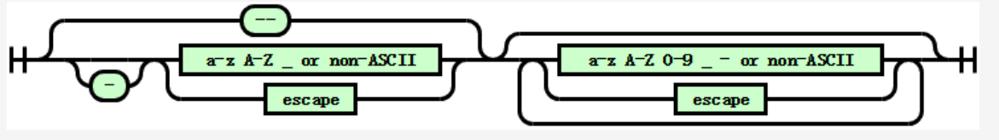
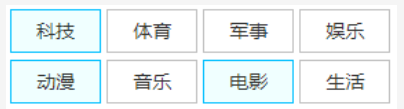

# CSS 选择器

<!-- @import "[TOC]" {cmd="toc" depthFrom=1 depthTo=6 orderedList=false} -->

<!-- code_chunk_output -->

- [CSS 选择器](#-css-选择器)
  - [一. 概述](#-一-概述)
    - [1.1 为什么 CSS 选择器很强](#-11-为什么-css-选择器很强)
    - [1.2 CSS 选择器世界的一些基本概念](#-12-css-选择器世界的一些基本概念)
      - [1.2.1 选择器/选择符/伪类/伪元素](#-121-选择器选择符伪类伪元素)
      - [1.2.2 CSS 选择器的作用域](#-122-css-选择器的作用域)
      - [1.2.3 CSS 选择器的命名空间](#-123-css-选择器的命名空间)
    - [1.3 无效 CSS 选择器特性与实际应用](#-13-无效-css-选择器特性与实际应用)
  - [二. CSS 选择器的优先级](#-二-css-选择器的优先级)
    - [2.1 CSS 优先级规则概览](#-21-css-优先级规则概览)
    - [2.2 深入 CSS 选择器优先级](#-22-深入-css-选择器优先级)
      - [2.2.1 CSS 选择器优先级的计算规则](#-221-css-选择器优先级的计算规则)
  - [三. CSS 选择器的命名](#-三-css-选择器的命名)
    - [3.1 CSS 选择器是否区分大小写](#-31-css-选择器是否区分大小写)
    - [3.2 CSS 选择器命名的合法性](#-32-css-选择器命名的合法性)
    - [3.3 CSS 选择器的命名](#-33-css-选择器的命名)
      - [3.3.1 长命名还是短命名](#-331-长命名还是短命名)
      - [3.3.2 单命名还是组合命名](#-332-单命名还是组合命名)
      - [3.3.3 面向属性的命名和面向语义的命名](#-333-面向属性的命名和面向语义的命名)
  - [四. CSS 选择符](#-四-css-选择符)
    - [4.1 后代选择符](#-41-后代选择符)
    - [4.2 子选择符（>）](#-42-子选择符)
    - [4.3 相邻兄弟选择符（+）](#-43-相邻兄弟选择符)
    - [4.4 通用兄弟选择符](#-44-通用兄弟选择符)
    - [4.5 列选择符（||）](#-45-列选择符)
  - [五. 元素选择器](#-五-元素选择器)
    - [5.1 元素选择器的级联语法](#-51-元素选择器的级联语法)
    - [5.2 标签选择器优化](#-52-标签选择器优化)
      - [5.2.1 标签选择器混合其他选择器的优化](#-521-标签选择器混合其他选择器的优化)
      - [5.2.2 标签选择器与自定义元素](#-522-标签选择器与自定义元素)
    - [5.3 特殊的标签选择器：通配选择器](#-53-特殊的标签选择器通配选择器)
  - [六. 属性选择器](#-六-属性选择器)
    - [6.1 ID 选择器和类选择器](#-61-id-选择器和类选择器)
    - [6.2 属性值直接匹配选择器](#-62-属性值直接匹配选择器)
      - [6.2.2 AMCSS 开发模式简介](#-622-amcss-开发模式简介)
    - [6.3 属性值正则匹配选择器](#-63-属性值正则匹配选择器)
      - [6.3.1 CSS 属性选择器搜索过滤技术](#-631-css-属性选择器搜索过滤技术)
    - [6.4 忽略属性值大小写的正则匹配运算符](#-64-忽略属性值大小写的正则匹配运算符)
  - [七. 用户行为伪类](#-七-用户行为伪类)
    - [7.1 手型经过伪类 :hover](#-71-手型经过伪类-hover)
      - [7.1.2 非子元素的 :hover 显示](#-712-非子元素的-hover-显示)
    - [7.2 激活状态伪类 :active](#-72-激活状态伪类-active)
      - [7.2.1 :active 伪类概述](#-721-active-伪类概述)
      - [7.2.2 按钮的通用 :active 样式技巧](#-722-按钮的通用-active-样式技巧)
      - [7.2.3 :active 伪类与 CSS 数据上报](#-723-active-伪类与-css-数据上报)
    - [7.3 焦点伪类 :focus](#-73-焦点伪类-focus)
      - [7.3.1 :focus 伪类匹配机制](#-731-focus-伪类匹配机制)
      - [7.3.2 :focus 伪类与 outline](#-732-focus-伪类与-outline)
      - [7.3.3 CSS :focus 伪类与键盘无障碍访问](#-733-css-focus-伪类与键盘无障碍访问)
    - [7.4 整体焦点伪类 :focus-within](#-74-整体焦点伪类-focus-within)
      - [7.4.1 :focus-within 和：focus 伪类的区别](#-741-focus-within-和focus-伪类的区别)
      - [7.4.2 :focus-within 实现无障碍访问的下拉列表](#-742-focus-within-实现无障碍访问的下拉列表)
    - [7.5 键盘焦点伪类 :focus-visible](#-75-键盘焦点伪类-focus-visible)
  - [八. URL 定位伪类](#-八-url-定位伪类)
    - [8.1 链接历史伪类 :link 和 :visited](#-81-链接历史伪类-link-和-visited)
      - [8.1.1 深入理解 :link](#-811-深入理解-link)
      - [8.1.2 怪癖最多的 CSS 伪类 :visited](#-812-怪癖最多的-css-伪类-visited)
    - [8.2 超链接伪类 :any-link](#-82-超链接伪类-any-link)
    - [8.3 目标伪类 :target](#-83-目标伪类-target)
      - [8.3.1 :target 与锚点](#-831-target-与锚点)
      - [8.3.2 :target 交互布局技术简介](#-832-target-交互布局技术简介)
    - [8.4 目标容器伪类 :target-within](#-84-目标容器伪类-target-within)
  - [九. 输入伪类](#-九-输入伪类)
    - [9.1 输入控件状态](#-91-输入控件状态)
      - [9.1.1 可用状态与禁用状态伪类 :enabled 和 :disabled](#-911-可用状态与禁用状态伪类-enabled-和-disabled)
      - [9.1.2 读写特性伪类 :read-only 和 :read-write](#-912-读写特性伪类-read-only-和-read-write)
      - [9.1.3 占位符显示伪类 :placeholder-shown](#-913-占位符显示伪类-placeholder-shown)
      - [9.1.4 默认选项伪类 :default](#-914-默认选项伪类-default)
    - [9.2 输入值状态](#-92-输入值状态)
      - [9.2.1 选中选项伪类 :checked](#-921-选中选项伪类-checked)
      - [9.2.2 不确定值伪类 :indeterminate](#-922-不确定值伪类-indeterminate)
    - [9.3 输入值验证](#-93-输入值验证)
      - [9.3.1 有效性验证伪类 :valid 和 :invalid](#-931-有效性验证伪类-valid-和-invalid)
      - [9.3.2 范围验证伪类 :in-range 和 :out-of-range](#-932-范围验证伪类-in-range-和-out-of-range)
      - [9.3.3 可选性伪类 :required 和 :optional](#-933-可选性伪类-required-和-optional)
      - [9.3.4 用户交互伪类 :user-invalid 和空值伪类 :blank](#-934-用户交互伪类-user-invalid-和空值伪类-blank)
  - [十. 树结构伪类](#-十-树结构伪类)
    - [10.1 :root 为类](#-101-root-为类)
      - [10.1.1 :root 伪类和 html 元素](#-1011-root-伪类和-html-元素)
      - [10.1.2 :root 伪类的应用场景](#-1012-root-伪类的应用场景)
    - [10.2 :empty 伪类](#-102-empty-伪类)
      - [10.2.1 对 :empty 伪类可能的误解](#-1021-对-empty-伪类可能的误解)
      - [10.2.2 超实用超高频使用的 :empty 伪类](#-1022-超实用超高频使用的-empty-伪类)
    - [10.3 子索引伪类](#-103-子索引伪类)
      - [10.3.1 ::first-child 伪类和 ::last-child 伪类](#-1031-first-child-伪类和-last-child-伪类)
      - [10.3.2 :only-child 伪类](#-1032-only-child-伪类)
      - [10.3.3 :nth-child() 伪类和 :nth-last-child() 伪类](#-1033-nth-child-伪类和-nth-last-child-伪类)
    - [10.4 匹配类型的子索引伪类](#-104-匹配类型的子索引伪类)
      - [10.4.1 :first-of-type 伪类和 :last-of-type 伪类](#-1041-first-of-type-伪类和-last-of-type-伪类)
      - [10.4.2 :only-of-type 伪类](#-1042-only-of-type-伪类)
      - [10.4.3 :nth-of-type() 伪类和 :nth-last-of-type() 伪类](#-1043-nth-of-type-伪类和-nth-last-of-type-伪类)
  - [十一. 逻辑组合伪类](#-十一-逻辑组合伪类)
    - [11.1 否定伪类 :not()](#-111-否定伪类-not)
    - [11.2 任意匹配伪类 :is()](#-112-任意匹配伪类-is)
      - [11.2.1 :is() 伪类与 :matches() 伪类及 :any() 伪类之间的关系](#-1121-is-伪类与-matches-伪类及-any-伪类之间的关系)
      - [11.2.2 :is() 伪类的语法与作用](#-1122-is-伪类的语法与作用)
    - [11.3 任意匹配伪类 :where()](#-113-任意匹配伪类-where)
    - [11.4 关联伪类 :has()](#-114-关联伪类-has)
  - [十二. 其他伪类选择器](#-十二-其他伪类选择器)
    - [12.1 与作用域相关的伪类](#-121-与作用域相关的伪类)
      - [12.1.1 参考元素伪类 :scope](#-1211-参考元素伪类-scope)
      - [12.1.2 Shadow 树根元素伪类 :host](#-1212-shadow-树根元素伪类-host)
      - [12.1.3 Shadow 树根元素匹配伪类 :host()](#-1213-shadow-树根元素匹配伪类-host)
      - [12.1.4 Shadow 树根元素上下文匹配伪类 :host-context()](#-1214-shadow-树根元素上下文匹配伪类-host-context)
    - [12.2 与全屏相关的伪类：fullscreen](#-122-与全屏相关的伪类fullscreen)
    - [12.3 了解语言相关伪类](#-123-了解语言相关伪类)
      - [12.3.1 方向伪类 :dir()](#-1231-方向伪类-dir)
      - [12.3.2 语言伪类 :lang()](#-1232-语言伪类-lang)
    - [12.4 了解资源状态伪类](#-124-了解资源状态伪类)

<!-- /code_chunk_output -->

## 一. 概述

CSS 选择器本身很简单，就是一些特定的选择符号，于是，很多开发者就认为 CSS 选择器的世界很简单，没什么好学的。实际上，CSS 选择器非常强大，它不
仅涉及视觉表现，而且与用户安全、用户体验有非常密切的联系。

### 1.1 为什么 CSS 选择器很强

CSS 选择器能够做的事情远比预想的多得多。CSS 是为样式服务的，它重表现，轻逻辑，如同人的思想一样，相互碰撞才能产生火花。尤其对于 CSS 选择器，它作为 CSS 世界的支柱，与 HTML 结构、浏览器行为、用户行为以及整个 CSS 世界相互依存、相互作用，这必然会产生很多碰撞，让 CSS 选择器变得非常强悍。同时，CSS 选择器本身也并非那么单纯。

### 1.2 CSS 选择器世界的一些基本概念

平常所说的 CSS 选择器实际上是一个统称，是很多基本概念的集合，有必要先了解一下这些基本概念。

#### 1.2.1 选择器/选择符/伪类/伪元素

CSS 选择器可以分为 4 类，即选择器、选择符、伪类和伪元素。

1. **选择器**
   这里的 “选择器” 指的就是平常使用的 CSS 声明块前面的标签、类名等。

2. **选择符**

   CSS 选择器中的选择符有 5 个，分别如下：

   ```css
   /* 后代关系 */
   .container img {
     object-fit: cover;
   }
   /*父子关系*/
   ol > li {
     margin: 5em 0;
   }
   /* 相邻兄弟关系 */
   button + button {
     margin-left: 10px;
   }
   /* 后续兄弟关系 */
   button ~ button {
     margin-left: 10px;
   }
   /*
    * 列选择符是规范中刚出现不久的新选择符，目前浏览器的兼容性还不足以让它在实际项目中得到应用
   */
   .col||td {
     background-color: skyblue;
   }
   ```

3. **伪类**

   伪类的特征是其前面会有一个冒号 `:`，通常与浏览器行为和用户行为相关联，可以看成是 CSS 世界的 JS。伪类和选择符相互配合可以实现非常多的纯 CSS 交互效果。

4. **伪元素**

   伪元素的特征是其前面会有两个冒号 `:`，常见的有 `::before`、`::after`、`::first-letter` 和 `::first-line` 等。

#### 1.2.2 CSS 选择器的作用域

以前 CSS 选择器只有一个全局作用域，也就是在网页任意地方的 CSS 都共用一个文档上下文。

如今 CSS 选择器是有局部作用域的概念的。伪类 `:scope` 的设计初衷就是匹配局部作用域下的元素。例如，对于下面的代码：

```html
<section>
  <style scoped>
    p {
      color: blue;
    }
    :scope {
      background-color: red;
    }
  </style>
  <p>在作用域内，背景色应该红色。</p>
</section>
<p>在作用域外，默认背景色。</p>
```

理论上，section 标签里面的 p 元素的背景色应该是红色，但目前没有任何浏览器表现为红色。因为目前尚无一种方法来显式建立作用域元素，所以**在样式表中使用时 [`:scope`](#1211-参考元素伪类-scope) 等效于 `:root`**。但是，它在 JS 中还是有效的。

另外，CSS 选择器的局部作用域在 Shadow DOM 中也是有效的。例如，有一个 div 元素：

```html
<div id="hostElement"></div>
```

然后使用 Shadow DOM 为这个 div 元素创建一个 p 元素并且控制其背景色的样式，如下：

```js
// 创建 Shadow DOM
var shadow = hostElement.attachShadow({ mode: 'open' });
// 给 Shadow DOM 添加文字
shadow.innerHTML = '<p>我是由Shadow DOM创建的&ltp&gt元素，我的背景色是？</p>';
// 添加 CSS，p 标签背景色变成黑色
shadow.innerHTML += '<style>p{background-color:#333;color:#fff;}</style>';
```

Shadow DOM 创建的 p 元素的背景色是黑色，而页面原本的 p 元素的背景色不受任何影响。

#### 1.2.3 CSS 选择器的命名空间

CSS 选择器中还有一个命名空间（namespace）的概念。命名空间可以让来自多个 XML 词汇表的元素的属性或样式彼此之间没有冲突，它的使用非常常见，例如 SVG 文件的命名空间：

```css
<svg xmlns="http://www.w3.org/2000/svg" />
```

上述代码中的 xmlns 属性值对应的 URL 地址就是一个简单的命名空间名称，其并不指向实际的在线地址，浏览器不会使用或处理这个 URL。

在 CSS 选择器世界中命名空间的作用也是避免冲突。例如，在 HTML 和 SVG 中都会用到 a 链接，此时就可能发生冲突，可以借助命名空间进行规避，具体方法是，使用 `@namespace` 规则声明命名空间：

```css
@namespace url(http://www.w3.org/1999/xhtml);
@namespace svg url(http://www.w3.org/2000/svg);
/* XHTML中的 <a> 元素 */
a {
}
/* SVG 中 <a> 元素 */
svg|a {
}
/* 同时匹配 XHTML 和 SVG 的 <a> 元素 */
*|a {
}
```

> **注意**：上述 CSS 代码中的 svg 也可以换成其他字符，这里的 svg 并不是表示 svg 标签的意思。

通过一个实际案例来直观地了解一下 CSS 选择器的命名空间。HTML 和 CSS 代码如下：

```html
<p>这是文字：<a href>点击刷新</a></p>
<p>
  这是SVG:
  <svg>
    <a xlink:href><path d="..." /></a>
  </svg>
</p>

<style>
  @namespace 'http://www.w3.org/1999/xhtml';
  @namespace svg 'http://www.w3.org/2000/svg';
  svg|a {
    color: black;
    fill: currentColor;
  }
  a {
    color: gray;
  }
</style>
```

svg|a 中有一个管道符 `|`，管道符前面的字符表示命名空间的代称，管道符后面的内容则是选择器。本例的代码表示在 `http://www.w3.org/2000/svg` 这个命名空间下所有 a 的颜色都是 black，由于 xhtml 的命名空间也被指定了，因此 SVG 中的 a 就不会受标签选择器 a 的影响，即便纯标签选择器 a 的优先级再高也无效。

CSS 选择器命名空间的兼容性很好，至少 10 年前浏览器就已支持，但是，却很少见人在项目中使用它，原因有二：

- 在 HTML 中直接内联 SVG 的应用场景并不多，它更多的是作为独立的 SVG 资源使用，即使内联，也很少有需要对特性 SVG 标签进行样式控制的需求
- 有其他更简单的替代方案

例如，如果希望 SVG 中所有的 a 元素的颜色都是 black，可以直接用：

```css
svg a {
  color: black;
}
```

无须掌握复杂的命名空间语法就能实现想要的效果，这样做的唯一缺点就是增加了 SVG 中 a 元素的优先级，但是在大多数场景下，这对实际开发没有任何影响。综合来看，这是一种性价比高很多的实现方式，几乎找不到需要使用命名空间的理由。

### 1.3 无效 CSS 选择器特性与实际应用

很多 CSS 伪类选择器是最近几年才出现的，浏览器并不支持，浏览器会把这些选择器当作无效选择器，这是没有任何问题的。但是当这些无效的 CSS 选择器和浏览器支持的 CSS 选择器写在一起的时候，会导致整个选择器无效，举个例子，有如下 CSS 代码：

```css
.example:hover,
.example:active,
.example:focus-within {
  color: red;
}
```

`:hover` 和 `:active` 是浏览器很早就支持的两个伪类，但是，由于 IE 浏览器并不支持 `:focus-within` 伪类，会导致 IE 浏览器无法识别整个语句，这就是无效 CSS 选择器特性。

因此，在使用一些新的 CSS 选择器时，出于渐进增强的目的，需要将它们分开书写：

```css
/* IE 浏览器可识别 */
.example:hover,
.example:active {
  color: red;
}
/* IE 浏览器不可识别 */
.example:focus-within {
  color: red;
}
```

不过，在诸多 CSS 选择器中，这种无效选择器特性出现了一个例外，那就是浏览器可以识别以 -webkit- 私有前缀开头的伪元素。

```css
span::-webkit-whatever {
  background: gray;
}
```

除了 IE 浏览器，其他浏览器均支持（Firefox63 及以上版本支持）识别这个 -webkit- 无效伪元素的特性。于是，就可以灵活运用这种特性来帮助完成实际开发。例如，对 IE 浏览器和其他浏览器进行精准区分：

```css
/* IE浏览器 */
.example {
  background: black;
}
/* 其他浏览器 */
.example::-webkit-whatever {
  background: gray;
}
```

当然，上面的无效伪类会导致整行选择器失效的特性也可以用来区分浏览器。

## 二. CSS 选择器的优先级

几乎所有的 CSS 样式冲突、样式覆盖等问题都与 CSS 声明的优先级错位有关。因此，在详细阐述 CSS 选择器的优先级规则之前，先快速了解一下 CSS 全部的优先级规则。

### 2.1 CSS 优先级规则概览

CSS 优先级有着明显的不可逾越的等级制度，其可以划分为 0~5 这 6 个等级，其中前 4 个等级由 CSS 选择器决定，后 2 个等级由书写形式和特定语法决定。

1. 0 级：通配选择器、选择符和逻辑组合伪类

   通配选择器写作星号 `*`。选择符指 `+`、`>`、`~`、`空格`和 `||`。逻辑组合伪类有 `:not()`、`:is()` 和 `:where` 等，这些伪类本身并不影响 CSS 优先级，影响优先级的是括号里面的选择器。

   > **注意**：只有逻辑组合伪类的优先级是 0，其他伪类的优先级并不是这样的。

2. 1 级：标签选择器

3. 2 级：类选择器、属性选择器和伪类

4. 3 级：ID 选择器

5. 4 级：style 属性内联

6. 5 级：!important

> !important 是顶级优先级，可以重置 JS 设置的样式，唯一推荐使用的场景就是使 JS 设置无效。对于其他场景，没有任何使用它的理由，切勿滥用。

不难看出，CSS 选择器的优先级（0 级至 3 级）属于 CSS 优先级的一部分，也是最重要、最复杂的部分，学会 CSS 选择器的优先级等同于学会了完整的 CSS 优先级规则。

### 2.2 深入 CSS 选择器优先级

#### 2.2.1 CSS 选择器优先级的计算规则

对于 CSS 选择器优先级的计算，业界流传甚广的是数值计数法。具体如下：

每一段 CSS 语句的选择器都可以对应一个具体的数值，数值越大优先级越高，其中的 CSS 语句将被优先渲染。其中，出现一个 0 级选择器，优先级数值 +0；出现一个 1 级选择器，优先级数值 +1；出现一个 2 级选择器，优先级数值 +10；出现一个 3 级选择器，优先级数值 +100。

1. 增加 CSS 选择器优先级的小技巧

   实际开发时，难免会遇到需要增加 CSS 选择器优先级的场景。例如，希望增加下面 .foo 类名选择器的权重：

   ```css
   foo {
     color: #333;
   }
   ```

   很多人的做法是增加嵌套，或者是增加一个标签选择器。但这些都不是最好的方法，因为这些方法增加了藕合，降低了可维护性。这里给大家介绍一个增加 CSS 选择器优先级的小技巧，那就是**重复选择器自身**。例如，可以像下面这样做，既提高了优先级，又不会增加藕合，实在是上上之选：

   ```css
   .foo.foo {
   }
   ```

   如果实在不喜欢这种写法，借助必然会存在的属性选择器也是不错的方法。

2. 对数值计数法的点评

   上面提到的 CSS 选择器优先级数值的计数法实际上是一个不严谨的方法，因为 1 和 10 之间的差距实在太小了，这也就意味着连续 10 个标签选择器的优先级就和 1 个类名选择器齐平了。然而事实并非如此，不同等级的选择器之间的差距是无法跨越的存在。但由于在实际开发中，是不会连续写上多达 10 个选择器的，因此不会影响在实际开发过程中计算选择器优先级。

   而且对于使用 CSS 选择器而言，书写习惯远比知识更重要，就算理论知识再扎实，如果平时书写习惯糟糕，也无法避免 CSS 样式覆盖问题、样式冲突等问题的出现。

**256 个选择器的越级现象**
实际上，在过去，Chrome 浏览器、Firefox 浏览器下都出现过 256 个选择器的优先级大于上一个选择器级别的现象，后来，大约 2015 年之后，Chrome 浏览器和 Firefox 浏览器都修改了策略，使得再多的选择器的优先级也无法超过上一级，因此，目前越级现象仅在 IE 浏览器中可见。

为什么会有这种有趣的现象呢？早些年查看 Firefox 浏览器的源代码，发现所有的类名都是以 8 字节字符串存储的，8 字节所能容纳的最大值就是 255，因此同时出现 256 个类名的时候，势必会越过其边缘，溢出到 D 区域。而现在采用了 16 字节的字符串存储，能容纳的类型数量足够多了，就不会出现这种现象。

## 三. CSS 选择器的命名

CSS 选择器的命名问题是最常困扰开发者的事情之一。究竟是面向 CSS 属性命名，还是面向 HTML 语义命名？是使用长命名，还是使用短命名？

### 3.1 CSS 选择器是否区分大小写

CSS 选择器有些区分大小写，有些不区分大小写，还有些可以设置为不区分。要搞清楚 CSS 选择器是否区分大小写的问题，还要从 HTML 说起。

在 HTML 中，标签和属性都是不区分大小写的，而属性值是区分大小写的。于是，相对应地，在 CSS 中，标签选择器不区分大小写，属性选择器中的属性也不区分大小写，而类选择器和 ID 选择器本质上是属性值，因此要区分大小写。

然而，随着各大浏览器支持[属性选择器中的属性值](#六-属性选择器)也不区分大小写（在 `]` 前面加一个 i），已经没有严格意义上的对大小写敏感的选择器了，因为类选择器和 ID 选择器本质上也是属性选择器，因此，如果希望 HTML 中的类名对大小写不敏感，可以这样：

```css
P {
  padding: 10px;
  background-color: black;
}
[CLASS] {
  color: white;
}
[CLASS~='CONTENT' i] {
  text-decoration: line-through;
}
```

### 3.2 CSS 选择器命名的合法性

这里主要讲一下类选择器和 ID 选择器的命名合法性问题，旨在纠正大家长久以来的错误认识。什么错误认识呢？最常见的就是类名选择器和 ID 选择器不能以数字开头，如下：

```css
.1-foo {
  border: 10px dashed;
  padding: 10px;
} /* 无效 */
```

对，上面这种写法确实无效，但这并不是因为不能以数字开头，而是不能直接写数字，需要将其转义一下，如下：

```css
.\31 -foo {
  border: 10px dashed;
  padding: 10px;
}
```

此时，下面的 HTML 就表现为黑底白字：

```html
<span class="1-foo">颜色是？</span>
```

为什么会有这么奇怪的表示？居然表示成 \31，而且后面还有一个空格！

其实 \31 外加空格是 CSS 中字符 1 的十六进制转码表示，也可以省略空格。其中 31 就是字符 1 的 Unicode 值，如下：

```js
console.log('1'.charCodeAt().toString(16)); // 结果是 31
```

字符 0 的 Unicode 值是 30，字符 9 的 Unicode 值是 39，0~9 这 10 个数字对应的 Unicode 值正好是 30~39。也可以用以下这种方法进行表示：

```css
.\000031-foo {
  border: 10px dashed;
  padding: 10px;
}
```

31 前面用 4 个 0 进行补全，这样 31 后面就不用加空格。类名或者 ID 甚至可以是纯数字。

**规范与更多字符的合法性**
首先，关于命名，看看规范是怎么说的。



图分左右两半，其中左边是选择器首字符，右边是选择器后面的字符。从图中可以清晰地看到，首字符支持的字符类型是 a~z、A~Z、`_` 以及非 ASCll 字符（中文、全角字符等），后面的字符支持的字符类型是 a~z、A~Z、0~9、`_`、`-` 以及非 ASCll 字符，后面的字符支持的字符类型多了数字和短横线。

很多人对选择器的合法性认识就停留在上面的内容，而忽略了图下面的 escape 方块。也就是说，对于其他没有出现的字符只要对它们执行转义重新编码一下也能使其成为支持的字符类型。

也就是说，选择器不仅可以以数字开头，也支持以其他字符开头。这些字符可以是下面的这些。

1. 不合法的 ASCll 字符，如 ！、"、#、$、%、&;、'、(、)、及 ~。
   严格来讲，上述字符也应该完全转码。例如，加号（+）的 Unicode 值是 2b，因此选择器需要写成 \2b 空格，或者 \00002b。但是，对于上述字符，还有一种更优雅的表示方式，那就是直接使用斜杠转义。示意如下：

   ```css
   .\+foo {
     color: red;
   }
   ```

   包括 IE 在内的浏览器都支持上面的斜杠转义写法，因此可以放心使用。唯一需要多提一句的就是冒号 `:`，在 IE7 浏览器下，直接使用 `\:` 是不被支持的，如果需要兼容这些浏览器，可以使用 \3a 加上空格代替。

2. 中文字符。下面的 CSS 也是有效的：

   ```css
   .我是 foo {
     color: red;
   }
   ```

3. 中文标点符号

4. emoji 表情：

   由于 emoji 字符在手机设备或者 OS X 系统上自动显示为 emoji 表情，因此有人会在实验性质的项目中使用 emoji 字符作为类名，这样，展示源代码的时候，会有一个一个的表情出现，这也挺有意思的。

上图中还有两个小圆框，其中一个里面是一根短横线 `-`，还有一个里面是连续两根短横线 `--`，它们是什么意思呢？

意思是，可以直接以短横线开头，如果是一根短横线 `-`，那么短横线后面必须有其他字符、字母或下划线或者其他编码字符；如果是连续两根短横线 `--`，则它的后面不跟任何字符也是合法的。因此，下面两个 CSS 语句都是合法的：

```css
.-- {
  color: red;
} /* 有效 */
.-a-b- {
  color: red;
} /*有效*/
```

对于一些需要特殊标记的元素，可以试试以短横线开头命名。

### 3.3 CSS 选择器的命名

#### 3.3.1 长命名还是短命名

对于使用长命名还是短命名的问题，请使用短命名。例如，一段介绍，类名可以这样：

```css
.some-intro {
  line-height: 1.75;
}
/* 没有必要这样 */
.some-introduction {
  line-height: 1.75;
}
```

后一种方式不仅增加了书写时间，也增加了 CSS 文件的大小。虽然这样做使语义更加准确了，也确实有一定价值，但价值很有限。要知道，日后维护代码时，人们只会关心这个类名有没有在其他地方使用过？改变、删除这个类名会不会出现问题？至于语义，人们真的不关心。

CSS 选择器的语义和 HTML 的语义是不一样的，前者只是为了方便人的识别，它对于机器而言没有任何区别，因此**价值很弱**；但是 HTML 的语义的重要作用是让机器识别，如搜索引擎或者屏幕阅读器等，它是与用户体验与产品价值密切相关的。因此，请使用短命名。

#### 3.3.2 单命名还是组合命名

单命名的优点是字符少、书写快，缺点是容易出现命名冲突的问题；组合命名的优点是不容易出现命名冲突，但写起来较烦琐。样式冲突的性质比书写速度慢严重得多，因此，理论上推荐使用组合命名，但在实际开发中，项目追求的往往是效益最大化，而不是完美的艺术品。因此，具体该如何取舍，不能一概而论，只能从经验层面进行阐述。

1. 对于多人合作、长期维护的项目，千万不要出现以常见单词命名的单命名选择器，因为后期非常容易出现命名冲突的问题，即使项目不会引入第三方的 CSS。

   如果要使用，一定要使用另外的前缀组合将它们保护起来，这个前缀可以是模块名称，或者场景名称。

2. 如果项目会使用第三方的 UI 组件，就算是全站公用的 CSS，也不要出现下面这样的单命名，因为说不定下面的命名就会与第三方 CSS 发生冲突：

   ```css
   .header {
   } /*不建议*/
   .aside {
   } /*不建议*/
   .success {
   } /*不建议*/
   .red {
   } /*不建议*/
   ```

   正确的做法是**加一个统一的前缀，使用组合命名的方式**。可以随意命名这个前缀，可以是项目代号的英文缩写，也可以是产品名称的拼音首字母，因为这个前缀的作用是避免冲突，它并不需要任何语义。但需要注意的是前缀最好不要超过 4 个字母，因为字母多了完全没有任何意义，只会徒增 CSS 文件的大小。

3. 如果项目百分百是自主研发的，以后维护此项目的人也不会盗取别人的 CSS 来充数，则与网站公用结构、颜色相关的这些 CSS 可以使用单命名。

   但对于非公用内容，如标题（.title）、盒子（.box）等就不能使用单命名，因为颜色这类样式是贯穿于整个项目的，具有高度的一致性，而标题（.title）会在很多地方出现，且样式各不相同，如大标题、小标题、弹框标题、模块标题等，容易产生命名冲突。

   对于网站 UI 组件，各个业务模块一定要采用多名称的组合命名方式，且最好都有一个统一的命名前缀。

4. 如果做的项目并不需要长期维护，也不需要多人合作，例如，只是一些运营活动，请务必添加统一的项目前缀，因为这次活动的某些功能和效果日后会被复用，有了统一的前缀，日后直接复制代码就能使用，没有后顾之忧，

但有一类基于 CSS 属性构建的单命名反而更安全，它们比颜色这些类名还要安全，即使项目会引入外部 CSS:

```css
.db {
  display: block;
}
.ml20 {
  margin-left: 20px;
}
.vt {
  vertical-align: top;
}
```

1. 这些选择器命名是面向 CSS 属性的，它们是超越具体项目的存在，只会被重复定义，但不会发生样式冲突。

2. 面向 CSS 属性的命名是机械的、反直觉的，而面向语义的命名符合人类直觉，也就是说，对于一个标题，将它命名为 title 的人很多，但抛弃语义，直接使用 tc 命名的人却廖廖无几。

总结一下，除了多人合作、长期维护、不会引入第三方 CSS 的项目的全站公用样式可以使用单命名，其他场景都需要组合命名。

然而，即使将命名做到极致，也无法完全避免冲突，因为 CSS reset 的冲突是防不胜防的。例如，对于 body 标签选择器的设置，每个网站都不一样，很多第三方 CSS 甚至喜欢使用通配符：

```css
*,
*:before,
*:after {
  box-sizing: border-box;
}
```

后面 2 个伪元素前面的星号是多余的，这不重要，重要的是这段 CSS 会给其他网站布局带来毁灭性的影响，导致大量错位和尺寸变化，因为所有元素默认的盒模型都被改变了。可以使用以下方式来改变 box-sizing，而不改变所有盒模型：

```css
html {
  box-sizing: border-box;
}

*,
*:before,
*:after {
  box-sizing: inherit;
}
```

#### 3.3.3 面向属性的命名和面向语义的命名

面向属性的命名指选择器的命名是跟着具体的 CSS 样式走的，与项目、页面、模块统统没有关系。例如，比较经典的清除浮动类名 .clearfix。

面向语义的命名则是根据应用元素所处的上下文来命名的。

```css
.logo {
}
```

上述两种命名方式各有优缺点：

面向属性的命名的优点在于 CSS 的重用率高，性能最佳，即插即用，方便快捷，开发也极为迅速，因为它省去了大量在 HTML 和 CSS 文件之间切换的时间；不足在于由于属性单一，其适用场景有限，另外因为使用方便，易被过度使用，从而带来更高的维护成本。

面向语义的命名的优点是应用场景广泛，可以实现非常精致的布局效果，扩展方便；不足在于代码唠峻，开发效率一般，因为所有 HTML 都需要命名，哪怕是一个 10 像素的间距。这就导致很多开发者要么选择直接使用标签选择器，要么就选择一个简单的类名，然后通过父子关系限定样式，结果带来了更糟糕的维护问题。

## 四. CSS 选择符

### 4.1 后代选择符

后代选择器又称为包含选择器，可以选择作为某元素后代的元素。

### 4.2 子选择符（>）

子选择符只会匹配第一代子元素，而后代选择符会匹配所有子元素。

**能不用子选择符就尽量不用**，虽然它的性能优于后代选择符，但与其日后带来的维护成本比，这实在不值一提。因为一旦使用了子选择符，元素的层级关系就被强制绑定了，日后需要维护或者需求发生变化的时候一旦调整了层级关系，整个样式就失效了，这时还要对 CSS 代码进行同步调整，增加了维护成本。

使用子选择符的主要目的是**避免冲突**。适合使用子选择符的场景通常有以下几个：

- **状态类名控制**

  例如使用 .active 类名进行状态切换，会遇到祖先和后代都存在 .active 切换的场景，此时子选择符是必需的，以免影响后代元素，例如：

  ```css
  .active > .cs-module-x {
    display: block;
  }
  ```

- **标签受限**

  例如当 li 标签重复嵌套，同时无法修改标签名称或者设置类名的时候，就需要使用子选择符进行精确控制。

- **层级位置与动态判断**

  例如一个时间选择组件的 HTML 通常会放在 body 元素下，作为 body 的子元素，以绝对定位浮层的形式呈现。但有时候其需要以静态布局嵌在页面的某个位置，这时如果不方便修改组件源码，则可以借助子选择符快速打一个补丁：

  ```css
  /** 当组件容器不是 body 子元素的时候取消绝对定位 **/
  :not(body) > .cs-date-panel-x {
    position: relative;
  }
  ```

子选择符就是把双刃剑，它通过限制关系使得结构更加稳固，但同时也失去了弹性和变化，需要审慎使用。

### 4.3 相邻兄弟选择符（+）

相邻兄弟选择符可以用于选择相邻的兄弟元素，但只能选择后面一个兄弟。

相邻兄弟选择符最硬核的应用还是配合诸多伪类低成本实现很多实用的交互效果，是众多高级选择器技术的核心。

举个简单的例子，当聚焦输入框的时候，如果希望后面的提示文字显示，则可以借助相邻兄弟选择符轻松实现，原理很简单，把提示文字预先埋在输入框的后面，当触发 focus 行为的时候，让提示文字显示即可，HTML 和 CSS 如下：

```html
用户名：<input /><span class="cs-tips">不超过10个字符</span>
<style>
  .cs-tips {
    color: gray;
    margin-left: 15px;
    position: absolute;
    visibility: hidden;
  }
  :focus + .cs-tips {
    visibility: visible;
  }
</style>
```

### 4.4 通用兄弟选择符

相邻兄弟选择符只会匹配它后面的第一个兄弟元素，而通用兄弟选择符会匹配后面的所有兄弟元素。

### 4.5 列选择符（||）

通过列合并符（||）链接两个元素时，它只会匹配被第二个 CSS 选择器匹配的元素，且此元素属于被第一个 CSS 选择器匹配的列元素.

```css
/* 属于"被选择"列的表单元格 */
col.selected||td {
  background: gray;
}
```

## 五. 元素选择器

### 5.1 元素选择器的级联语法

不同类型的 CSS 选择器的级联使用是非常常见的，但元素选择器的级联语法和其他选择器的级联语法有两个明显的不同之处：

1. **元素选择器是唯一不能重复自身的选择器**

   类选择器、ID 选择器和属性值匹配选择器都可以重复自身，例如：

   ```css
   .foo.foo {
   }
   #foo#foo {
   }
   [foo][foo] {
   }
   ```

   但是元素选择器却不能重复自身：因此，元素选择器无法像其他选择器那样通过重复自身提高优先级，不过好在由于其自身的一些特性，还有其他办法可以提高优先级。

   - 由于所有标准的 HTML 页面都有 html 和 body 元素，因此可以借助这些标签提高优先级：
   - 借助 :not() 伪类，括号里面是任意其他不一样的标签名称即可：

     ```css
     .foo:not(not-foo) {
     }
     .foo:not(a) {
     }
     .foo:not(_) {
     }
     ```

   上面两种提高优先级的方法均没有与其他选择器发生交集，是非常安全的方法，不会因为其他选择器发生变化而失效。

2. **级联使用的时候元素选择器必须写在最前面**

### 5.2 标签选择器优化

#### 5.2.1 标签选择器混合其他选择器的优化

很多开发者在使用属性选择器的时候习惯把标签选择器也带上，例如：

```css
input[type='radio'] {
}
```

实际上，这里的标签选择器是可以省略的，而且推荐省略。因此，很多原生属性是某些标签元素特有的。例如，radio 类型的单选框一定是 input 标签，因此，直接将它写成下面这样就可以了：

```css
[type='radio'] {
}
```

这样，选择器的优先级和类选择器保持一致，可维护性得到提高，同时性能也有提升。

#### 5.2.2 标签选择器与自定义元素

对于现代浏览器，我们可以直接使用自定义元素的标签控制自定义元素的样式，例如：

```html
<x-element>自定义元素</x-elememt>

<style>
x-element {
  color: red;
}
</style>
```

这样文字会呈现为红色。不过默认仅 IE9 及以上版本的浏览器才支持自定义元素标签选择器，如果需要兼容 IE8，需要在 `head` 创建如下所示的一段 JS 代码：

```html
<script>
  document.createElement('x-element');
</script>
```

### 5.3 特殊的标签选择器：通配选择器

通配选择器是一个特殊的标签选择器，它可以指代所有类型的标签元素，包括自定义元素，以及 script、style、title 等元素，但是不包括伪元素。

```css
* {
  box-sizing: border-box;
}
```

但上面的用法并不足以覆盖所有的元素，因为有些元素是无特征的，如 ::before 和 ::after 构成的伪元素，因此，很多人重置所有元素盒模型的时候会这样设置：

```css
*,
*::before,
*::after {
  box-sizing: border-box;
}
```

但后面两个星号是可以省略的，可以直接用：

```css
*,
::before,
::after {
  box-sizing: border-box;
}
```

当通配选择器和其他选择器级联使用的时候，星号都是可以省略的。只有当单独使用通配选择器的时候，才需要把 `*` 字符呈现出来。

由于通配选择器 `*` 匹配所有元素，因此它是比较消耗性能的一种 CSS 选择器，同时由于其影响甚广，容易出现一些意料之外的样式问题，因此请谨慎使用。

## 六. 属性选择器

平常提到的属性选择器指的是 `[type="radio"]` 这类选择器，实际上，这是一种简称，指的是 “属性值匹配选择器”。实际上，在正式文档中，类选择器和 ID 选择器都属于属性选择器，因为本质上类选择器是 HTML 元素中 class 的属性值，ID 选择器是 HTML 元素中 id 的属性值。

### 6.1 ID 选择器和类选择器

ID 选择器和类选择器都属于属性选择器，它们的身份看起来高贵而特殊，毕竟 HTML 原生属性那么多，就 id 和 class 两个属性有专门的选择器。实际上，正是因为它们足够普通才有此待遇，几乎所有的 HTML 元素都支持这两个属性。

ID 选择器和类选择器虽然性质一致，都属于属性选择器，但是它们的实际表现却有明显差异。

1. **语法不同**
   ID 选择器前面的字符是井号 `#`（U+0023），而类选择器前面的字符是点号 `.`（U+002E）。

2. **优先级不同**

   ID 选择器的优先级比类选择器的优先级高一个等级，由于实际开发中往往以类选择器为主，因此不到万不得已的时候不要使用 ID 选择器，以免带来较高的维护成本。

3. **唯一性与可重复性**

### 6.2 属性值直接匹配选择器

属性值直接匹配选择器包括下面 4 种：

```css
[attr]
[attr="val"]
[attr~="val"]
[attr|="val"]
```

1. `[attr]`
   `[attr]` 表示只要包含指定的属性就匹配，尤其适用于一些 HTML 布尔属性，这些布尔属性只要有属性值，无论值的内容是什么，都认为这些属性的值是 true。例如，下面所有的输入框的写法都是禁用的：

   ```html
   <input disabled />
   <input disabled="" />
   <input disabled="disabled" />
   <input disabled="true" />
   <input disabled="false" />
   ```

   此时，如果想用属性选择器判断输入框是否禁用，直接用下面的选择器就可以了，无须关心具体的属性值究竟是什么：

   ```css
   [disabled] {
   }
   ```

   说到 disabled,就不得不提另外一个常见的布尔属性 checked，两者看上去近似，实际上却有不小差异！

   checked 在浏览器下有一个很奇特的行为表现，那就是表单控件元素在 checked 状态变化的时候并不会同步修改 checked 属性的值，而 disabled 状态就不会这样。例如，已知 HTML 如下：

   ```html
   <input
     id="checkbox"
     type="checkbox"
     checked
     disabled
   />
   ```

   此时，使用 JS 代码修改复选框的状态：

   ```js
   checkbox.checked = false;
   checkbox.disabled = false;
   ```

   浏览器中的 HTML 会变成这样：

   ```html
   <input
     id="checkbox"
     type="checkbox"
     checked
   />
   ```

   disabled 消失了，但是 checked 属性却还在，也就是明明复选框已经取消了选择，但是 `[checked]` 依然在生效，这会导致严重的样式显示错误，因此实际开发不能使用 `[checked]` 进行状态控制，也正是由于这个原因，才有了 `:checked` 这些伪类。不仅原生属性支持属性选择器，自定义属性也是支持的。

2. `[attr="val"]`

   `[attr="val"]` 是属性值完全匹配选择器，例如，匹配单复选框：

   ```css
   [type='radio']
   [type='checkbox']
   ```

   **其他注意事项**

   1. 不区分单引号和双引号，单引号和双引号都是合法的。
   2. 引号是可以省略的。如果属性值包含空格，则需要转义。
   3. 有如下 HTML：

      ```html
      <input value="20" />
      ```

      此时，下面的选择器是可以匹配的，IE8 及以上版本的浏览器都没问题：

      ```css
      [value='20']
      ```

      此时，如果改变输入框的值为 10,无论是手动输入还是使用 JS 更改，属性选择器都依然按照 `[value="20"]` 渲染。除非，使用 setAtribute 方法改变属性值：

3. `[attr~="val"]`

   `[attr~="val"]` 是属性值单词完全匹配选择器，专门用来匹配属性中的单词，其中，`~=` 用来连接属性和属性值。有些属性值（如 class 属性、rel 属性或者一些自定义属性）包含多个关键词，这时可以使用空格分隔这些关键词，例如：

   ```html
   <a
     href
     rel="nofollow noopener"
     >链接</a
   >
   ```

   此时就可以借助该选择器实现匹配，例如：

   ```css
   [rel~="noopener"]
   [rel~="nofollow"]
   ```

   匹配的属性值不能是空字符串。如果匹配的属性值只是部分字符串，那么也是无效的。另外，属性值单词完全匹配选择器对非 ASCII 范围的字符（如中文）也是有效的。

4. `[attr|="val"]`

   `[attr|="val"]` 是属性值起始片段完全匹配选择器，表示具有 attr 属性的元素，其值要么正好是 val，要么以 val 外加短横线-（U+002D）开头，用于连接需要匹配的属性和属性内容。

   ```html
   <!--匹配-->
   <div attr="val"></div>
   <!-1-匹配-->
   <div attr="val-ue"></div>
   <!--匹配-->
   <div attr="val-ue bar"></div>
   <!--不匹配-->
   <div attr="value"></div>
   <!--不匹配-->
   <div attr="val bar"></div>
   <!--不匹配-->
   <div attr="bar val-ue"></div>
   ```

   可以看到，这个选择器必须严格遵循开头匹配的规则。另外，这个选择器设计的初衷是子语言匹配，用在 a 元素的 hreflang 属性或者任意元素的 lang 属性中。例如，同样是中文，它们也会有简体中文和繁体中文的差异，最新的标记如下：

   - 简体中文有 zh-cmn-Hans;
   - 繁体中文有 zh-cmn-Hant;
   - 英文则有 en-US、en-Latn-US、en-GB 等。

   于是，就可以借助该选择器来匹配中文类或英文类语言，这在多语言功能实现时比较有用：

   ```css
   /* 匹配中文类语言 */
   [lang|="zh"]
   /* 匹配英文类语言 */
   [lang|="en"]
   ```

   由于大多数的 Web 开发都用不到多语言，因此该选择器平时很少用到；再加上 `:lang` 伪类的存在，进一步减少了 lang 属性匹配语言的出场机会，更多的是匹配 hreflang 属性中的语言设置。

   其实，只要 HTML 的属性值是以短横线连接的，都可以使用该属性选择器，例如：

   ```html
   <!--旧语法-->
   <input type="datetime" />
   <!--新语法，推荐-->
   <input type="datetime-local" />
   <style>
     [type|='datetime'] {
     } /* 新旧语法全兼容 */
   </style>
   ```

#### 6.2.2 AMCSS 开发模式简介

AMCSS 是 Attribute Modules for CSS 的缩写，表示借助 HTML 属性来进行 CSS 相关开发。

目前主流的开发模式是多个模块由多个类名控制，例如：

```html
<button class="cs-button cs-button-large cs-button-blue">按钮</button>
```

而 AMCSS 则是基于属性控制的，例如：

```html
<button button="large blue">按钮</button>
```

为了避免属性名称冲突，可以给属性添加一个统一的前缀，如 am-，于是有：

```html
<button am-button="large blue">按钮</button>
```

然后借助 `[attr~="val"]` 这个属性值单词匹配选择器进行匹配。因此，主流类选择器

```txt
button
button-large
button-blue
```

可以转换成

```css
[am-button]
[am-button~="large"]
[am-button~="blue"]
```

这种开发模式的优点是：每个属性有效地声明了一个单独的命名空间，用于封装样式信息，从而产生更易于阅读和维护的 HTML 和 CSS。当布局或样式需要有一个专门的命名空间的时候，就采用 AMCSS 这种开发模式。而对于普通的定位与布局，还是采用类选择器最为合适。

### 6.3 属性值正则匹配选择器

属性值正则匹配选择器包括下面 3 种：

```css
[attr^="val"]
[attr$="val"]
[attr*="val"]
```

这 3 种属性选择器就完全是字符匹配了，而非单词匹配。其中，尖角符号 `^`、美元符号 `$` 以及星号 `*` 都是正则表达式中的特殊标识符，分别表示前匹配、后匹配和任意匹配。这几个选择器的兼容性不错，IE7 及以上版本的浏览器均支持。

1. `[attr^="val"]`

   `[attr~="val"]` 表示匹配 attr 属性值以字符 val 开头的元素。

   **细节**
   这种选择器可以匹配中文，如果匹配的中文没有包含特殊字符，如空格等，则中文外面的引号是可以省略的。

   实际开发中，开头正则匹配属性选择器用得比较多的地方是判断 a 元素的链接地址类型，也可以用来显示对应的小图标。

2. `[attr$="val"]`

   `[attr$="val"]` 表示匹配 attr 属性值以字符 val 结尾的元素。

   在实际开发中，结尾正则匹配属性选择器用得比较多的地方是判断 a 元素的链接的文件类型，然后是显示对应的小图标。

3. `[attr*="val"]`

   `[attr*="val"]` 表示匹配 attr 属性值包含字符 val 的元素。它也可以用来匹配链接元素是否是外网地址，例如：

   ```css
   a[href*="//"]: not([href * = 'example.com']);
   ```

   此外，它还可以用来匹配 style 属性值，这在实际开发中用得非常多。例如，想知道一个参与 JS 交互的元素是否隐藏，可以这么处理：

   ```css
   /* 该元素隐藏 */
   [style*="display:none"]
   ```

#### 6.3.1 CSS 属性选择器搜索过滤技术

可以借助属性选择器来辅助实现搜索过滤效果，如通讯录、城市列表，这样做性能高，代码少。HTML 结构如下：

```html
<input type="search"placeholder="输入城市名称或拼音" />
<li data-search="重庆市chongqing">重庆市</li>
<li data-search="哈尔滨市haerbin">哈尔滨市<//i>
<li data-search="长春市changchun">长春市<//i>
```

此时，当在输入框中输入内容的时候，只要根据输入内容动态创建一段 CSS 代码就可以实现搜索匹配效果了，无须自己写代码进行匹配验证。

```js
let eleStyle = document.createElement('style');
document.head.appendChild(eleStyle);
// 文本框输入
input.addEventListener('input', () => {
  let value = this.value.trim();
  eleStyle.innerHTML = value ? `[data-search]:not([data-search*="${value}"]){display:none;};";` : '';
});
```

### 6.4 忽略属性值大小写的正则匹配运算符

正则匹配运算符是属性选择器新增的运算符，它可以忽略属性值大小写，使用字符 i 或 I 作为运算符值，但约定俗成都使用小写字母 i 作为运算符。语法如下：

```css
[attr~='val' i] {
}
```

作用对比示意，假设有选择器 `[attr*="val"]`，则：

```html
<!--不匹配-->
<div attr="VAL"></div>
<!--匹配-->
<div attr="Textval"></div>
<!--不匹配-->
<div attr="Val-ue"></div>
```

如果选择器是 `[attr*="val"i]`，则：

```html
<!--匹配-->
<div attr="VAL"></div>
<!--匹配-->
<div attr="Textval"></div>
<!--匹配-->
<div attr="Val"></div>
```

可以看到，属性值的大小写被完全无视了。属性值大小写不敏感运算符目前在移动端可以放心使用，尤其在搜索匹配用户昵称或者账户名的时候非常有用，因为用户昵称大小写字母混杂的场景非常常见。

## 七. 用户行为伪类

用户行为伪类是指与用户行为相关的一些伪类，例如，:hover、:active 以及 :focus 等。

### 7.1 手型经过伪类 :hover

`:hover` 是各大浏览器最早支持的伪类之一，最早只能用在 a 元素上，目前可以用在所有 HTML 元素上，包括自定义元素。

:hover 不适用于移动端，虽然也能触发，但消失并不敏捷，体验反而奇怪。

:hover 在桌面端网页很常用，例如鼠标经过时改变链接的颜色，或者改变按钮的背景色等。除了这个基本用法，还可以利用 `:hover` 伪类实现 Tips 提示或者下拉列表效果。

#### 7.1.2 非子元素的 :hover 显示

当借助 :hover 伪类实现下拉列表效果的时候，可以通过父子选择器控制的。例如：

```css
.datalist {
  display: none;
}
.datalist-x:hover .datalist {
  display: block;
}
```

然而实际开发的时候，有时候并不方便嵌套标签，此时，也可以借助相邻兄弟选择符实现类似的效果。比如，实现一个鼠标经过链接来预览图片的交互效果。

```html
<a href=>图片链接</a>

```

目标是鼠标经过链接的时候图片一直保持显示，CSS 代码：

```css
img {
  display: none;
}
a:hover + img,
img:hover {
  /* 产鼠标经过链接或鼠标经过图片，图片自身都保持显示 */
  display: inline;
}
```

然而，上面的实现有一个缺陷，那就是如果浮层图片和触发 hover 的链接元素中间有间隙，则鼠标还没有移动到图片上，图片就隐藏起来，导致图片无法持续显示。可以借助 CSS transition 增加延时。

由于 transition 属性对 display 无过渡效果，而对 visibility 有过渡效果，因此，图片默认隐藏需要改成 visibility:hidden，CSS 代码如下：

```css
img {
  /* 拉开间隙 */
  margin-left: 20px;
  visibility: hidden;
  /* 设置延时 */
  transition: visibility 0.2s;
}
a:hover + img,
img:hover {
  visibility: visible;
}
```

### 7.2 激活状态伪类 :active

#### 7.2.1 :active 伪类概述

`:active` 伪类可以用于设置元素激活状态的样式，可以通过点击鼠标主键，也可以通过手指或者触控笔点击触摸屏触发激活状态。:active 伪类支持任意的 HTML 元素，甚至是自定义元素。

然而，落地到实践，:active 伪类并没有理论上那么完美，包括以下几点：

1. IE 浏览器下 :active 样式的应用是无法冒泡的，例如：

   ```css
   img:active {
     outline: 30px solid #ccc;
   }
   p:active {
     background-color: teal;
   }
   ```

   此时，点击 img 元素的时候，在 IE 浏览器下，p 元素是不会触发 :active 伪类样式的，实际上祖先元素的 :active 样式也应当被应用。在 Chrome 以及 Firefox 等浏览器下，其表现符合预期。

2. 在 IE 浏览器下，html、body 元素应用 :active 伪类设置背景色后，背景色是无法还原的。

   具体来说就是，鼠标按下确实应用了 :active 设置的背景色，但是鼠标抬起后背景色却没有还原，而且此时无论怎么点击鼠标，背景色都无法还原。这是一个很奇怪的 bug，普通元素不会有此问题。

3. 移动端 Safari 浏览器下，:active 伪类默认是无效的，需要设置任意的 touch 事件才支持。

   可以加这么一行 JS 代码：

   ```js
   documentbody.addEventListener('ontouchstart', function () {});
   ```

   然而，虽然此时 :active 伪类可以生效了，但是 :active 样式应用的时机还是有问题，因此，如果对细节的要求比较高，建议在 Safari 浏览器下还是使用原生的 -webkit-tap-highlight-color 实现触摸高亮反馈更好：

   ```css
   body {
     -webkit-tap-highlight-color: rgba(0, 0, 0, 0.5);
   }
   ```

4. 键盘访问无法触发 :active 伪类。例如，a 元素在 focus 状态下按下 Enter 键的事件行为与点击一致，但是，不会触发 :active 伪类。

5. :active 伪类的主要作用是反馈点击交互，让用户知道他的点击行为已经成功触发，这对于按钮和链接元素是必不可少的，否则会有体验问题。由于 :active 伪类作用在按下的那一段时间，因此不适合用来实现复杂交互。

#### 7.2.2 按钮的通用 :active 样式技巧

本技巧更适用的场景是移动端开发，因为桌面端可以通过 :hover 反馈状态变化，而移动端只能通过 :active 反馈。

- 使用 box-shadow 内阴影，例如：

  ```css
  [href]:active,
  button:active {
    box-shadow: inset 0 0 0 999px rgba(0, 0, 0.05);
  }
  ```

  这种方法的优点是它可以兼容到 IE9 浏览器，缺点是对非对称闭合元素无能为力，例如 input 按钮。

- 另外一种方法是使用 linear-gradient 线性渐变，例如：

  ```css
  [href]:active,
  button:active,
  [type='reset']:active,
  [type='button']:active,
  [type='submit']:active {
    background-image: linear-gradient(rgba(0, 0.05), rgba(0, 0.05));
  }
  ```

  这种方法的优点是它对 input 按钮这类非对称闭合元素也有效，缺点是 CSS 渐变是从 IE10 浏览器才开始支持的，如果项目还需要兼容 IE9 浏览器，就会有一定的限制。

- 最后再介绍一种在特殊场景下使用的方法。有时候，链接元素包裹的是一张图片，如果 a 四周没有 padding 留白，则此时上面两种通用技巧都没有效果，因为 :active 样式被图片挡住了。

  可能会想到使用 :before 伪元素在图片上覆盖一层半透明颜色模拟 :active 效果，但这种方法对父元素有依赖，无法作为通用样式使用，此时，可以试试 outline，如下：

  ```css
  [href] > img:only-child:active {
    outline: 999px solid rgba(0, 0.05);
    outline-offset: -999px;
    -webkit-clip-path: polygon(0 0, 100% 0, 100% 100%, 0 100%);
    clip-path: polygon(0 0, 100% 0, 100% 100%, 0 100%);
  }
  ```

  这种方法的优点是 CSS 的冲突概率极低，对非对称闭合元素也有效。缺点是不适合需要兼容 IE 浏览器的产品，因为虽然 IE8 浏览器就已经支持 outline 属性，但是 outline-offset 从 Edge 15 才开始被支持。还有另外一个缺点就是，outline 模拟的反馈浮层并不是位于元素的底层，而是位于元素的上方，且可以被绝对定位子元素穿透，因此不适合用在包含复杂 DOM 信息的元素中，但是特别适用于类似图片这样的单一元素。

#### 7.2.3 :active 伪类与 CSS 数据上报

如果想要知道两个按钮的点击率，可以使用 CSS：

```css
button-1:active::after {
  content: url(./pixel.gif?action=click&id=button1);
  display: none;
}
```

此时，当点击按钮的时候，相关行为数据就会上报给服务器，这种上报，就算把 JS 禁用掉也无法阻止，方便快捷，特别适合 A/B 测试。

### 7.3 焦点伪类 :focus

`:focus` 是一个从 IE8 浏览器开始支持的伪类，它可以匹配当前处于聚焦状态的元素。例如，高亮显示处于聚焦状态的 textarea 输入框的边框：

```css
textarea {
  border: 1px solid #ccc;
}
textarea:focus {
  border-color: HighLight;
}
```

#### 7.3.1 :focus 伪类匹配机制

与 :active 伪类不同，:focus 伪类默认只能匹配特定的元素，包括：

- 非 disabled 状态的表单元素，如 input 输入框、select 下拉框、button 按钮等
- 包含 href 属性的 a 元素
- area 元素，不过可以生效的 CSS 属性有限
- HTML5 中的 summary 元素

其他 HTML 元素应用 :focus 伪类是无效的。

如何让普通元素也能响应 :focus 伪类呢？设置了 HTML `contenteditable` 属性的普通元素可以应用 :focus 伪类。例如：

```html
<div contenteditable="true"></div>
<div contenteditable="plaintext-only"></div>
```

因为此时 div 元素是一个类似 textarea 元素的输入框。

设置了 HTML `tabindex` 属性的普通元素也可以应用 :focus 伪类。例如，下面 3 种写法都是可以的：

```html
<div tabindex="-1">内容</div>
<div tabindex="0">内容</div>
<div tabindex="1">内容</div>
```

如果期望 div 元素可以被 Tab 键索引，且被点击的时候可以触发 :focus 伪类样式，则使用 tabindex="0"；如果不期望 div 元素可以被 Tab 键索引，且只在它被点击的时候触发 :focus 伪类样式，则使用 tabindex="-1"。对于普通元素，没有使用自然数作为 tabindex 属性值的场景。

既然普通元素也可以响应 :focus 伪类，是不是就可以利用这种特性实现任意元素的点击下拉效果呢？如果纯展示下拉内容，无交互效果是可以的。例如，实现一个点击二维码图标显示完整二维码图片的交互效果：

```html


<style>
  .img-qrcode {
    position: absolute;
    display: none;
  }
  :focus + .img-qrcode {
    display: inline;
  }
</style>
```

但实际上，使用 :focus 控制元素的显隐并不完美，在 iOS Safari 浏览器下，元素一旦处于 focus 状态，除非点击其他可聚焦元素来转移 focus 焦点，否则这个元素会一直保持 focus 状态。各个桌面浏览器、Android 浏览器均无此问题。不过这个问题也好解决，只需要给祖先容器元素设置 tabindex="-1"，同时取消该元素的 outline 样式即可：

```html
<body>
  <div
    class="container"
    tabindex="-1"
  ></div>
</body>
<style>
  .container {
    outline: 0 none;
  }
</style>
```

这样，点击二维码图标以外的元素就会把焦点转移到 .container 元素上，iOS Safari 浏览器的交互就正常了。如果在使用 JS 进行开发的时候遇到 iOS Safari 浏览器不触发 blur 事件的问题，也可以用这种方法解决。

> **注意**：tabindex="-1" 设置在 body 元素上是无效的。

但这个方法只适用于纯展示的下拉效果，如果下拉浮层内部有其他交互效果，则此方法就有问题，要么失焦，要么焦点转移，都会导致下拉浮层的消失。遇到这种场景，可以使用整体焦点伪类 :focus-within。

最后一点，一个页面永远最多有一个焦点元素，这也就意味着一个页面最多只会有一个元素响应 :focus 伪类样式。

#### 7.3.2 :focus 伪类与 outline

本节将深入介绍 :focus 伪类与 outline 轮廓之间的关系。

1. 一个常见的糟糕的业余做法

   ```css
   * {
     outline: 0 none;
   }
   ```

   在很多年前的 IE 浏览器时代，点击任意的链接或者按钮都会出现一个虚框轮廓，影响美观，于是就有人想到设置 outline 为 none 来进行重置。但是现代浏览器早就优化了这种体验，鼠标点击链接是不会有虚框轮廓或者外发光轮廓的，因此完全没有任何理由重置 outline 属性，这反而带来了严重的体验问题，那就是完全无法使用键盘进行无障碍访问。

   使用键盘访问网页其实是很常见的，例如，鼠标没电或者鼠标坏了，使用智能电视的遥控器访问页面，使用键盘进行快捷操作。使用键盘访问网站的主要操作就是使用 Tab 键或者方向键遍历链接和按钮元素，使它们处于 focus 状态，此时浏览器会通过虚框或者外发光的形式进行区分和提示，这样用户就知道目前访问的是哪一个元素，按下确认键就可以达到自己想要的目标。但是，如果设置 outline:none，取消了元素的轮廓，用户就根本无法知道现在到底哪个元素处于 focus 状态，网站完全没法使用，这是极其糟糕的用户体验。

   如果对浏览器默认的轮廓效果不满意，想要重置它也是可以的，但是一定不要忘记设置新的 :focus 样式效果。例如，如果希望聚焦表单输入框的时候呈现的不是黑边框或是外发光效果，而是边框高亮显示，则可以：

   ```css
   textarea:focus {
     outline: 0 none;
     border-color: HighLight;
   }
   ```

   事情还没有结束，Chrome 浏览器下，当设置了背景的 button 元素、summary 元素以及设置了 tabindex 属性的普通元素被点击的时候，也会显示浏览器默认的外放光轮廓，从体验角度讲，点击行为不应该出现外放光轮廓，外放光轮廓应该只在键盘 focus 的时候才触发，Firefox 浏览器和 IE 浏览器在这一点上做得不错。

   问题来了，如果设置 outline 为 none，则使用键盘访问就有问题；如果不设置，则点击访问体验不佳。矛盾由此产生，对于占比最高的 Chrome 浏览器，如何兼顾点击的样式体验和键盘的可访问性呢？

   最好的方法就是使用 [:focus-visible 伪类](#75-键盘焦点伪类-focus-visible)，它是专门为这种场景设计的。

2. 模拟浏览器原生的 focus 轮廓

   在实际开发过程中难免会遇到需要模拟浏览器原生聚焦轮廓的场景，Chrome 浏览器下是外发光，IE 和 Firefox 浏览器下则是虚点，理论上讲，使用如下 CSS 代码是最准确的：

   ```css
   :focus {
     outline: 1px dotted;
     outline: 5px auto-webkit-focus-ring-color;
   }
   ```

   对于一些小图标，可能会设置 color:transparent，还有一些按钮的文字颜色是淡色，这会导致 IE 和 Firefox 浏览器下虚框轮廓不可见，因此，在实际开发的时候，会指定虚线颜色：

   ```css
   :focus {
     outline: 1px dotted HighLight;
     outline: 5px auto-webkit-focus-ring-color;
   }
   ```

#### 7.3.3 CSS :focus 伪类与键盘无障碍访问

`:focus` 伪类与键盘无障碍访问密切相关，因此，实际上需要使用 :focus 伪类的场景比预想的要多。

1. **不建议使用 span 或 div 按钮模拟按钮**

   span 或者 div 元素也能模拟按钮的 UI 效果，但并不建议使用。一来原生的 button 元素可以触发表单提交行为，使表单可以原生支持 Enter 键；二来原生的 button 天然可以被键盘 focus，保证页面可以纯键盘无障碍访问。

   但是 span 或者 div 按钮是没有上面这些行为的，如果要支持这些比较好的原生特性，要么需要额外的 JS 代码，要么需要额外的 HTML 属性设置。例如，tabindex="0" 支持 Tab 键索引，role="button" 支持屏幕阅读器识别等。

   总之，使用 span 或者 div 模拟按钮的 UI 效果是一件高成本低收益的事情，不到万不得已，没有使用 span 或者 div 模拟按钮的理由！如果是嫌弃按钮本身的兼容性不够好，可以使用 label 元素模拟，使用 for 属性进行关联。例如：

   ```html
   <input
     id="submit"
     type="submit"
   />
   <label
     class="button"
     for="submit"
     >提交</label
   >
   <style>
     [type='submit'] {
       position: absolute;
       clip: rect(0 0 0 0);
     }
     .button {
       /* 按钮样式... */
     }
     /* focus 轮廓转移 */
     :focus + .button {
       outline: 1px dotted HighLight;
       outline: 5px auto-webkit-focus-ring-color;
     }
   </style>
   ```

   使用 label 元素模拟按钮的效果既保留了语义和原生行为，视觉上又完美兼容。

2. **模拟表单元素的键盘可访问性**

   `[type="radio"]`、`[type="checkbox"]`、`[type="range"]` 类型的 input 元素的 UI 往往不符合网站的设计风格，需要自定义，常规实现一般都没问题，关键是很多开发者会忘了键盘的无障碍访问。

   以 `[type="checkbox"]` 复选框为例：

   ```html
   <input
     id="checkbox"
     type="checkbox"
   />
   <label
     class="checkbox"
     for="checkbox"
     >提交</label
   >
   ```

   需要隐藏原生的 `[type="checkbox"]` 多选框，使用关联的 label 元素自定义的复选框样式。关键 CSS 如下：

   ```css
   [type='checkbox'] {
     position: absolute;
     clip: rect(0 0 0 0);
   }
   .checkbox {
     border: 1px solid gray;
   }
   /* focus 时记得高亮显示自定义输入框 */
   :focus + .checkbox {
     border-color: skyblue;
   }
   ```

   这类自定义实现有两个关键点：

   1. 原始复选框元素的隐藏，要么设置透明度 opacity:0 隐藏，要么剪裁隐藏，千万不要使用 visibility:hidden 或者 display:none 进行隐藏，虽然 IE9 及以上版本的浏览器的功能是正常的，但是这两种隐藏是无法被键盘聚焦的，键盘的可访问性为 0。

   2. 不要忘记在原始复选框聚焦的时候高亮显示自定义的输入框元素，可以是边框高亮，或者外发光也行。通常都是使用相邻兄弟选择符（+）实现，特殊情况也可以使用兄弟选择符（~），如高亮多个元素时。

      市面上有不少 UI 框架，如何区分品质？很简单，使用 Tab 键索引页面元素，如果输入框有高亮，则这个 UI 框架比较专业，如果什么反应都没有，建议换另一种框架。

### 7.4 整体焦点伪类 :focus-within

整体焦点伪类 :focus-within 非常实用，且兼容性不错，目前已经可以在实际项目中使用，包括移动端项目和无须兼容 IE 浏览器的桌面端项目。

#### 7.4.1 :focus-within 和：focus 伪类的区别

CSS :focus-within 伪类和 :focus 伪类有很多相似之处，那就是伪类样式的匹配离不开元素聚焦行为的触发。区别在于 :focus 伪类样式只有在当前元素处于聚焦状态的时候才匹配，而 :focus-within 伪类样式在当前元素或者是当前元素的任意子元素处于聚焦状态的时候都会匹配。举个例子：

```css
form:focus {
  outline: solid;
}
```

表示仅当 form 处于聚焦状态的时候，form 元素的 outline（轮廓）才会出现。

```css
form:focus-within {
  outline: solid;
}
```

表示 form 元素自身，或者 form 内部的任意子元素处于聚焦状态时，form 元素的 outline（轮廓）都会出现。换句话说，子元素聚焦，可以让父级元素的样式发生变化。

这是 CSS 选择器世界中很了不起的革新，因为 :focus-within 伪类的行为本质上是一种 “父选择器” 行为，子元素的状态会影响父元素的样式。由于这种 “父选择器” 行为需要借助用户的行为触发，属于 “后渲染”，不会与现有的渲染机制相互冲突，因此浏览器在规范出现后不久就快速支持了。

#### 7.4.2 :focus-within 实现无障碍访问的下拉列表

:focus-within 伪类非常实用，一方面它可以用在表单控件元素上（无论是样式自定义还是交互布局）。例如输入框聚焦时高亮显示前面的描述文字，可以不用把描述文字放在输入框的后面，正常的 DOM 顺序即可：

```html
<div class="cs-normal"><label class="cs-label"></label><input class="cs-input" /></div>
<style>
  .cs-normal:focus-within .cs-label {
    color: darkblue;
    text-shadow: 0 0 1px;
  }
</style>
```

另一方面，它可以用于实现完全无障碍访问的下拉列表，即使下拉列表中有其他链接或按钮也能正常访问。

### 7.5 键盘焦点伪类 :focus-visible

:focus-visible 伪类是一个非常年轻的伪类，仅有一部分浏览器支持。但深入用户体验的开发者会觉得这个伪类实在是太有用了。

:focus-visible 伪类匹配的场景是：元素聚焦，同时浏览器认为聚焦轮廓应该显示。:focus-visible 的规范并没有强行约束匹配逻辑，而是交给了 UA（也就是浏览器）。

当希望点击访问时无轮廓，键盘访问时才出现轮廓。但是，又不能简简单单地设置 outline:none 来处理，因为这样会把使用键盘访问时应当出现的焦点轮廓给隐藏掉，从而带来严重的无障碍访问问题。

为了兼顾视觉体验和键盘无障碍访问，之前的做法是使用 JS 进行判断，如果元素的 :focus 触发是键盘访问触发，就给元素添加自定义的 outline 轮廓，否则，去除 outline，这样做成本颇高。现在有了 :focus-visible 伪类，所有问题迎刃而解。换句话说，:focus-visible 可以知道元素的聚焦行为到底是鼠标触发还是键盘触发。因此，如果希望去除鼠标点击时候的 outline，而保留键盘访问时候的 outline，只要一条短短的 CSS 规则就可以了：

```css
:focus:not(:focus-visible) {
  outline: 0;
}
```

## 八. URL 定位伪类

本章主要介绍与浏览器地址栏中地址相关的一些伪类，其中 CSS 选择器规范中的 :local-link 伪类（基于域名匹配）目前没有任何浏览器支持，也看不到日后会得到支持的迹象，因此不做介绍。

### 8.1 链接历史伪类 :link 和 :visited

#### 8.1.1 深入理解 :link

:link 伪类历史悠久，但如今开发实际项目的时候，很少使用这个伪类，:link 伪类用来匹配页面上 href 链接没有访问过的 a 元素。因此，可以用 :link 伪类来定义链接的默认颜色为天蓝色：

```css
a:link {
  color: skyblue;
}
```

乍一看这个定义没什么问题，但实际上有纰漏，那就是如果链接已经被访问过，那 a 元素的文字颜色又该是什么呢？结果是系统默认的链接色。这也就意味着，使用 :link 伪类必须指定已经访问过的链接的颜色，通常使用 :visited 伪类进行设置。例如：

```css
a:visited {
  color: lightskyblue;
}
```

也可以直接使用 a 标签选择器，但不推荐这么用，因为这一点也不符合语义：

```css
a {
  color: lightskyblue;
}
```

加上链接通常会设置 :hover 伪类，使得鼠标经过的时候变色，这就出现了优先级的问题。大家都是伪类，平起平坐，如果把表示默认状态的伪类放在最后，必然会导致其他状态的样式无法生效，因此，:link 伪类一定要放在最前面。这里不得不提一下著名的 "love-hate 顺序"，:link→:visited→:hover→:active，首字母连起来是 LVHA 取自 love-hate，爱恨情仇，很好记忆。

如果记不住也没关系，还有其他方法可以不需要记忆这几个伪类的顺序。HTML 中有 3 种链接元素，可以原生支持 href 属性，分别是 a、link、area，但 :link 只能匹配 a 元素，因此实际开发可以直接写作：

```css
:link {
  color: skyblue;
}
```

这样，就算 :link 伪类放在最后面，也不用担心优先级的问题：

```css
a:visited {
  color: lightskyblue;
}
a:hover {
  color: deepskyblue;
}
:link {
  color: skyblue;
}
```

下面该说说 :link 伪类落寞的原因了，归根结底就是竞争不过 a 标签选择器。例如：

```css
a {
  color: skyblue;
}
```

CSS 开发者一看，和使用 :link 伪类效果一样啊，而且比 :link 伪类更好用。 如果网站需要标记已访问的链接，再设置一下 :visited 伪类样式即可。如果网站不需要标记已访问的链接，则不需要再写任何多余的代码进行处理，这不仅节约了代码，而且还更容错，比 :link 伪类好用多 了。

于是，久而久之，大家也都约定俗成，使用优先级极低的 a 标签 选择器设置默认链接颜色，如果有其他状态需要处理，再使用伪类。但 :link 伪类与 a 标签选择器相比还是有优势的，那就是 :link 伪类可以识别真链接。例如：

```html
<a href>链接</a> <a name="example">非链接</a>
```

其中 `<a name="example">非链接</a>` 并不是一个链接元素，因为其中没有 href 属性，点击将无反应，也无法响应键盘访问。因此，这段 HTML 对应的文字颜色就不能是链接颜色，而应该是普通的文本颜色。 此时 a 标签选择器的问题就出现了，它会让不是链接的 a 元素也呈现为链接色，而 :link 伪类就不会出现此问题，它只会匹配 `<a href></a>` 这段 HTML 元素。从这一点来看，:link 伪类更合适，也更规范。

但是，a:link 带来的混乱要比收益高得多，而且也有更容易理解的替代方法来区分 a 元素的链接性质，那就是直接使用属性选择器代替 a 标签选择器：

```css
[href] {
  color: skyblue;
}
```

区分 a 元素按钮是否禁用可以用下面的方法：

```css
.cs-button:not([href]) {
  opacity: 0.6;
}
```

#### 8.1.2 怪癖最多的 CSS 伪类 :visited

CSS 伪类 `:visited` 是怪癖最多的伪类，这些怪癖设计的原因都是出于安全考虑。

1. **支持的 CSS 属性有限**
   :visited 伪类选择器支持的 CSS 很有限，目前仅支持下面这些 CSS: color, background-color, border-color, border-bottom-color, border-left-color, border-right-color, border-top-color, column-rule-color 和 outline-color。

   类似 ::before 和 ::after 这些伪元素则不支持。不过好在 :visited 伪类支持子选择器，但它所能控制的 CSS 属性和 :visited 一模一样，即那几个和颜色相关的 CSS 属性，也不支持 ::before 和 ::after 这些伪元素。

2. **没有半透明**

   使用 :visited 伪类选择器控制颜色时，虽然在语法上它支持半透明色，但是在表现上，则要么纯色，要么全透明。例如：

   ```css
   a {
     color: blue;
   }
   a:visited {
     color: rgba(255, 0, 0, 3);
   }
   ```

   结果不是半透明红色，而是纯红色，完全不透明。

3. **只能重置，不能凭空设置**

   对于下面这段代码，访问过的 a 元素有背景色吗？

   ```html
   <a href>有背景色吗？</a>
   <style>
     a {
       color: blue;
     }
     a:visited {
       color: red;
       background-color: gray;
     }
   </style>
   ```

   因为 :visited 伪类选择器中的色值只能重置，不能凭空设置。将前面的 CSS 修改成下面的 CSS 就可以了：

   ```css
   a {
     color: blue;
     background-color: white;
   }
   a:visited {
     color: red;
     background-color: gray;
   }
   ```

   此时文字的背景色就显现出来了。也就是说，默认需要有一个背景色，这样链接元素在匹配 :visited 的时候才会有背景色呈现。

4. **无法获取 :visited 设置和呈现的色值**

   当文字颜色值表现为 :visited 选择器设置的颜色值时，使用 JS 的 `getComputedStyle()` 方法将无法获取到这个颜色值，而是获取到未访问时的颜色。

### 8.2 超链接伪类 :any-link

本节将介绍一个后起之秀——伪类 `:any-link`。:any-link 伪类与 :link 伪类有很多相似之处，但比 :link 这种鸡肋伪类要实用得多，说它完全弥补了 :link 伪类的缺点也不为过。

**:any-link 相比 :link 的优点是什么**
:link 伪类的缺点是只能作用于 a 元素，和标签选择器 a 看起来没差别，完全竞争不过更简单有效的标签选择器 a，因而沦为鸡肋伪类。

正是因为 :link 伪类存在这些不足，所以 W3C 官方才推出了新的 :any-link 伪类，:any-link 伪类的实用性就完全发生了变化。:any-link 伪类有如下两大特性：

- 匹配所有设置了 href 属性的链接元素，包括 `<a>`、`<link>` 和 `<area>` 这 3 种元素。
- 匹配所有匹配 :link 伪类或者 :visited 伪类的元素。

:any-link 伪类的优点：与 a 标签选择器相比，:any-link 伪类可以更加准确地识别链接元素；与 :link 伪类相比，使用 :any-link 伪类无须担心 :visited 伪类对样式的干扰，它是真正意义上的链接伪类。

实际开发项目时，因为很少使用 area 元素，link 元素默认 display:none，所以可以直接使用伪类作为选择器：

```css
:any-link {
  color: skyblue;
}
:any-link:hover {
  color: deepskyblue;
}
```

**兼容性**
IE 浏览器并不支持 :any-link 伪类，但其他浏览器的支持良好，因此，移动端或者其他不需要兼容 IE 浏览器的项目都可以放心使用 :any-link 伪类。

### 8.3 目标伪类 :target

`:target` 是 IE9 及以上版本的浏览器全部支持的且已经支持了很多年的一个 CSS 伪类，它是一个与 URL 地址中的锚点定位强关联的伪类，可以用来实现很多原本需要 JS 才能实现的交互效果。

#### 8.3.1 :target 与锚点

假设浏览器地址栏中的地址是 `https://www.cssworld.cn/#cs-anchor`

则 `#cs-anchor` 就是 “锚点”，术语名称是哈希（hash 的音译），即 JS 中 `location.hash` 的返回值。URL 锚点可以和页面中 id 匹配的元素进行锚定，浏览器的默认行为是触发滚动定位，同时进行 :target 伪类匹配。举个例子，假设页面有如下 HTML：

```html
<ul>
  <li id="cs-first">第1行，id 是 cs-first</li>
  <li id="cs-anchor">第2行，id 是 cs-anchor</li>
  <li id="cs-last">第3行，id 是 cs-last</li>
</ul>
<style>
  li:target {
    font-weight: bold;
    color: skyblue;
  }
</style>
```

则呈现的效果是第二行列表的颜色为天蓝色，同时文字加粗显示。这就是 :target 伪类的作用——匹配 URL 锚点对应的元素。

**一些细节**
部分浏览器（如 IE 浏览器和 Firefox 浏览器）下，a 元素的 name 属性值等同于锚点值时，也会触发浏览器的滚动定位。例如：

```html
<a name="cs-anchor">a 元素，name 是 cs-anchor</a>
```

这种用法是否可以匹配：target 伪类呢？根据目前的测试，仅 Firefox 浏览器可以匹配，如果同时有其他 id 属性值等同于锚点值的元素，例如：

```html
<a name="cs-anchor">a元素，name是cs-anchor</a>
<ul>
  <li id="cs-first">第1行，id是cs-first</li>
  <li id="cs-anchor">第2行，id是cs-anchor</li>
  <li id="cs-last">第3行，id是cs-last</li>
</ul>
```

则浏览器会优先且唯一匹配 li#cs-anchor 元素，a`[name="cs-anchor"]` 元素被忽略。总而言之，由于兼容性等原因，不推荐使用 a 元素加 name 属性值进行锚点匹配。

如果页面有多个元素使用同一个 id，则 :target 只会匹配第一个元素。然而，IE 浏览器却不走寻常路，它会全部匹配到。因此，一定不要使用重复的 id 值，这既会造成不兼容，也不符合语义。如果想借助 :target 伪类匹配多个元素，请借助 CSS 选择符实现。

当使用 JS 改变 URL 锚点值的时候，也会触发 :target 伪类对元素的匹配。例如，执行如下 JS 代码，页面中对应的 #cs-anchor 元素就会匹配 :target 伪类并产生定位效果：

```js
location.hash = 'cs-anchor';
```

如果匹配锚点的元素是 display:none，则所有浏览器不会触发任何滚动，但是 display:none 元素依然匹配 :target 伪类。例如：

```html
<ul>
  <li id="cs-first">第1行，id是cs-first</li>
  <li
    id="cs-anchor"
    hidden
  >
    第2行，id是cs-anchor
  </li>
  <li id="cs-last">第3行，id是cs-last</li>
</ul>
<style>
  :target + li {
    font-weight: bold;
    color: skyblue;
  }
</style>
```

则第 3 行文字将表现为天蓝色同时被加粗。千万不要小看这种行为表现，设置元素 display:none 同时进行 :target 伪类匹配是所知道的实现诸多交互效果同时保证良好体验唯一有效的手段，具体参见下一节内容。

#### 8.3.2 :target 交互布局技术简介

:target 不仅可以标记锚点锚定的元素，还可以用来实现很多原本需要 JS 才能实现的效果。这里要介绍的这种技术实现不会有页面跳动（滚动重定位）的问题，可以直接落地实际开发。

1. **展开与收起效果**

   例如，一篇文章只显示了部分内容，需要点击 “阅读更多” 才显示剩余内容，HTML 如下：

   ```html
   文章内容，文章内容，文章内容，文章内容，文章内容，文章内容，文章内容…
   <div
     id="articleMore"
     hidden
   ></div>
   <a
     href="#articleMore"
     class="cs-button"
     data-open="true"
     >阅读更多</a
   >
   <p class="cs-more-p">更多文章内容，更多文章内容，更多文章内容，更多文章内容。</p>
   <a
     href="##"
     class="cs-button"
     data-open="false"
     >收起</a
   >
   ```

   这里依次出现了以下 4 个标签元素：

   - div#articleMore 元素是一直隐藏的锚链元素，用来匹配 :target 伪类
   - `a[data-open="true"]` 是 “阅读更多” 按钮，点击地址栏中的 URL 地址，锚点值会变成 #articleMore，从而触发 :target 伪类的匹配
   - p.cs-more-p 是默认隐藏的更多的文章内容
   - `a[data-open="false"]` 是收起按钮，点击后将重置锚点值，页面的所有元素都不会匹配 :target 伪类。

   相关 CSS 如下：

   ```css
   /* 默认 “更多文章内容” 和 “收起” 按钮隐藏 */
   .cs-more-p,
   [data-open='false'] {
     display: none;
   }
   /* 匹配后 “阅读更多” 按钮隐藏 */
   :target ~ [data-open='true'] {
     display: none;
   }
   /* 匹配后 “更多文章内容” 和 “收起” 按钮显示 */
   :target ~ .cs-more-p,
   :target ~ [data-open='false'] {
     display: block;
   }
   ```

   上述 CSS 的实现原理是把锚链元素放在最前面，然后通过兄弟选择符 ~ 来控制对应元素的显隐变化。

   传统实现是把锚链元素作为父元素使用的，但这样做有一个严重的体验问题：当 display 属性值不是 none 的元素被锚点匹配的时候，会触发浏览器原生的滚动定位行为，而传统实现方法中的父元素 display 的属性值显然不是 none，于是每当点击 “阅读更多” 按钮，浏览器都会把父元素瞬间滚动至浏览器窗口的顶部，这给用户的感觉就是页面突然跳动了一下，带来了很不好的体验。可以使用 `scroll-behavior: smooth` 来优化这种体验。

   于是，综合来看，最好的交互方案就是锚链元素 display:none，同时把锚链元素放在需要进行样式控制的 DOM 结构的前面，通过兄弟选择符进行匹配。这样做有一个巨大的好处，那就是可以借助 URL 地址记住当前页面的交互状态。

   移动端开发经常会有一些交互浮层，它们通过 :target 显隐技术实现，无须借助 localStorage 就能记住当前页面的浮层显示状态，成本低、效率高，可以在项目中试试，就算页面 JS 运行故障，此交互功能也依旧运行良好。

   类似的实用场景还有很多，例如常见的选项卡切换效果，借助 :target 伪类实现该效果时不仅不需要 JS 介入，同时还能记住选项卡的切换面板，下面就介绍如何实现它。

2. **选项卡效果**

   ```html
   <div class="cs-tab-x">
     <!-- 锚链元素 -->
     <i
       id="tabPanel2"
       class="cs-tab-anchor-2"
       hidden
     ></i>
     <i
       id="tabPanel3"
       class="cs-tab-anchor-3"
       hidden
     ></i>
     <!-- 以下HTML为标准选项卡DOM结构 -->
     <div class="cs-tab">
       <a
         href="#tabPanel1"
         class="cs-tab-li"
         >选项卡1</a
       >
       <a
         href="#tabPanel2"
         class="cs-tab-li"
         >选项卡2</a
       >
       <a
         href="#tabPanel3"
         class="cs-tab-i"
         >选项卡3</a
       >
     </div>
     <div class="cs-panel">
       <div class="cs-panel-i">面板内容1</div>
       <div class="cs-panel-i">面板内容2</div>
       <div class="cs-panel-li">面板内容3</div>
     </div>
   </div>
   ```

   锚点定位选项卡与普通选项卡的区别就在于，在选项卡元素的前面多了两个默认隐藏（通过 `hidden` 属性）的锚链元素，这几个元素的 id 属性值和选项卡按钮 a 元素的 href 属性值正好对应，以便点击按钮可以触发 :target 伪类匹配。相关 CSS 代码如下：

   ```css
   /* 默认选项卡按钮样式 */
   .cs-tab-li {
     display: inline-block;
     background-color: #f0f0f0;
     color: #333;
     padding: 5px 10px;
   }
   /* 选中后的选项卡按钮样式*/
   .cs-tab-anchor-2:not(:target) + :not(:target) ~ .cs-tab.cs-tab-li:first-child,
   .cs-tab-anchor-2:target ~ .cs-tab.cs-tab-li:nth-of-type(2),
   .cs-tab-anchor-3:target ~ .cs-tab.cs-tab-li:nth-of-type(3) {
     background-color: deepskyblue;
     color: #fff;
   }
   /*默认选项面板样式*/
   .cs-panel-li {
     display: none;
     padding: 20px;
     border: 1px solid #ccc;
   }
   /* 选中的选项面板显示 */
   .cs-tab-anchor-2:not(:target) + :not(:target) ~ .cs-panel.cs-panel-li:first-child,
   .cs-tab-anchor-2:target ~ .cs-panel.cs-panel-li:nth-of-type(2),
   .cs-tab-anchor-3:target ~ .cs-panel.cs-panel-li:nth-of-type(3) {
     display: block;
   }
   ```

   由于是纯 CSS 实现，因此，只要是选项卡样式呈现，就能进行内容切换交互。而传统的 JS 实现需要等 JS 加载完毕且初始化完毕才能进行交互，这样就很容易遇到明明选项卡渲染出来了，点击按钮却没有任何反应的糟糕的体验。

   :target 伪类交互技术其实出现很久了，只是一直没能普及，这是因为大家错误地把容器元素作为了锚链元素，因为这些元素不是 display:none，所以锚点匹配的时候浏览器会跳动，体验很不好。而在这里把 display:none 元素作为锚链元素，利用兄弟选择器控制状态变化，就没有这种糟糕的体验。

   于是，综合下来，用 :target 伪类实现交互是一种高性价比的方法，推荐在项目中尝试，尤其是在懒得写 JS 的场景下。

3. **双管齐下**

   :target 伪类交互技术也不是完美的：

   - 对 DOM 结构有要求，锚链元素需要放在前面
   - 它的布局效果并不稳定。接着上面的例子，由于 URL 地址中的锚点只有一个，因此，一旦页面其他什么地方有一个锚点链接，如 href 的属性值是 ##，用户一点击，原本选中的第二个选项卡就会莫名其妙地切换到第一个选项卡上去，因为锚点变化了。这可能并不是用户希望看到的。

   因此，在实际开发中，如果对项目要求很高，推荐使用双管齐下的实践策略，具体如下。

   1. 默认按照 :target 伪类交互技术实现，实现的时候与一个类名标志量关联。
   2. JS 也正常实现选项卡交互，当 JS 成功绑定后，移除类名标志量，交互由 JS 接手。

   这样，用户体验既保持了敏捷，也保持了健壮，这才是站在用户体验巅峰的实现。

### 8.4 目标容器伪类 :target-within

:target 伪类交互技术的一个不足就是目前只能借助兄弟关系实现，对 DOM 结构有要求。但现在有了 :target-within 伪类，DOM 结构要从容多了。

:target-within 伪类可以匹配 :target 伪类匹配的元素，或者匹配存在后代元素（包括文本节点）匹配 :target 伪类的元素。例如，假设浏览器的 URL 后面的锚点地址是 #cs-anchor，HTML 如下：

```html
<ul>
  <li id="cs-first">第1行，id是cs-first</li>
  <li id="cs-anchor">第2行，id是cs-anchor</li>
  <li id="cs-last">第3行，id是cs-last</li>
  <li id="cs-anchor">第4行，id同样是cs-last</li>
</ul>
```

则 :target 匹配的是 li#cs-anchor 元素，而 :target-within 不仅可以匹配 li#cs-anchor 元素，还可以匹配父元素 ul，因为 w 的后代元素 li#cs-anchor 匹配 :target 伪类。

:target-within 伪类的含义与 :focus-within 伪类的类似，只是一个是 :target 伪类的祖先匹配，一个是 :focus 伪类的祖先匹配。然而，这两个选择器的浏览器支持情况却大相径庭，:focus-within 伪类目前已经可以在实际项目中使用，而 :target-within 伪类却还没有浏览器支持。

## 九. 输入伪类

### 9.1 输入控件状态

#### 9.1.1 可用状态与禁用状态伪类 :enabled 和 :disabled

:enabled 伪类和 :disabled 伪类从 IE9 浏览器就已经开始支持，可以放心使用。

由于在实际项目中 :disabled 伪类用得较多，因此先从 :disabled 伪类说起。

1. **先从 :disabled 伪类说起**

   先来看看：disabled 伪类的基本用法。最简单的用法是实现禁用状态的输入框，HTML 如下：

   ```html
   <input disabled />
   ```

   此时，就可以使用 :disabled 伪类设置输入框的样式。例如，背景置灰：

   ```css
   :disabled {
     border: 1px solid lightgray;
     background-color: #f0f0d3;
   }
   ```

   实际上，直接使用属性选择器也能设置禁用状态的输入框的样式。例如：

   ```css
   [disabled] {
     border: 1px solid lightgray;
     background: #f0f0f3;
   }
   ```

   后一种方法兼容性更好，IE8 浏览器也支持。为何还要“多此一举”，设计一个新的 :disabled 伪类呢？与 [:checked 伪类](#921-选中选项伪类-checked)的设计原因有很多相似之处。

2. **:enabled 和 :disabled 若干细节知识**
   需要先搞明白 :enabled 伪类与 :disabled 伪类是否完全对立。对于常见的表单元素，:enabled 伪类与 :disabled 伪类确实是完全对立的，也就是说，如果这两个伪类样式同时设置，总会有一个伪类样式匹配。下面以输入框元素为例：

   ```html
   <style>
     :disabled {
       border: 1px solid lightgray;
       background: #f0f0f3;
     }
     :enabled {
       border: 1px solid deepskyblue;
       background: lightskyblue;
     }
   </style>
   <input
     disabled
     value="禁用"
   />
   <input
     readonly
     value="只读"
   />
   <input value="普通" />
   ```

   readonly 状态也认为是 :enabled。

   **注意**：

   1. 对于 select 下拉框元素，无论是 select 元素自身，还是后代 option 元素，都能匹配 :enabled 伪类和 :disabled 伪类，所有浏览器都匹配。

   2. 在 IE 浏览器下 fieldset 元素并不支持 :enabled 伪类与 :disabled 伪类，这是有问题的，但其他浏览器没有这个问题。因此，如果使用 fieldset 元素一次性禁用所有表单元素，就不能通过 :disabled 伪类识别（如果要兼容 IE），可以使用 `fieldset[disabled]` 选择器进行匹配。

   3. 设置 contenteditable="true" 的元素虽然也有输入特征，但是并不能匹配 :enabled 伪类，所有浏览器都不匹配。同样，设置 tabindex 属性的元素也不能匹配 :enabled 伪类。

   4. 元素设置 visibility:hidden 或者 display:none 依然能够匹配 :enabled 伪类和 :disabled 伪类。

3. **:enabled 伪类和 :disabled 伪类的实际应用**

   :enabled 伪类在 CSS 开发中是一个有点儿鸡肋的伪类，因为表单元素默认就是 enabled 状态的，不需要额外的 :enabled 伪类匹配。但是 :enabled 伪类在 JS 开发中却不鸡肋，例如，使用 `querySelectorAll` 这个 API 匹配可用元素的时候就很方便。另外，可以借助 :enabled 伪类敏捷区分 IE8 和 IE9 浏览器。例如：

   ```css
   /* IE8+ */
   .cs-example {
   }
   /* IE9+ */
   .any-class:enabled,
   .cs-example {
   }
   ```

   由于 IE8 浏览器不认识 :enabled 伪类，因此整行语句失效，浏览器版本自然就区分开了。与经典的 :root 伪类 hack 方法相比，这种方法的优点是不会增加 .cs-example 选择器的优先级：

   ```css
   /* IE8+ */
   .cs-example {
   }
   /* IE9+,会增加选择器优先级，不推荐 */
   :root.cs-example {
   }
   ```

   然后，:enabled 伪类在 JS 中的作用要比在 CSS 中大。例如，可以使用 `document.querySelectorAll('form :enabled')` 查询所有可用表单元素，以实现自定义的表单序列化方法。

   至于 :disabled 伪类，最常用的应该就是按钮了。只要网页项目不需要兼容很旧的 IE 浏览器，就可以使用原生的 button 按钮实现，这样做的优点非常多。以按钮禁用为例，点击按钮发送 Ajax 请求是一个异步过程，为了防止重复点击请求，通常的做法是设置标志量。实际上，如果按钮是原生的按钮（无论是 button 按钮还是 input 按钮），此时，只要设置按钮 disabled=true，点击事件自然就会失效，无须用额外的 JS 代码进行判断，同时语义更好，还可以使用 :disabled 伪类精确控制样式。例如：

   ```html
   <button
     id="csButton"
     class="cs-button"
   >
     删除
   </button>
   <style>
     /* 按钮处于禁用状态时的样式 */
     .cs-button:disabled {
     }
   </style>
   <script>
     csButton.addEventListener('click', function () {
       this.disabled = true;
       // 执行 ajax
       // ajax 完成后设置按钮 disabled 为 false
     });
   </script>
   ```

   充分利用浏览器内置行为会使代码更简洁，功能更健壮，语义更好，因此没有不使用它的理由！

#### 9.1.2 读写特性伪类 :read-only 和 :read-write

这两个伪类很好理解，它们用于匹配输入框元素是否只读，还是可读可写。这两个伪类中间都有短横线，由于 “只读” 的 HTML 属性是 readonly，中间没有短横线，因此很多人会记混。所以有短横线这一点大家可以注意一下。

另外，这两个伪类只作用于 input 和 textarea 这两个元素。现在，通过一个简单的例子，快速了解一下这两个伪类：

```html
<textarea>默认</textarea>
<textarea readonly>只读</textarea>
<textarea disabled>禁用</textarea>
<style>
  textarea {
    border: 1px dashed gray;
    background: white;
  }
  /* Firefox 还需要加 -moz- 私有前缀 */
  textarea:read-write {
    border: 1px solid black;
    background: gray;
  }
  textarea:read-only {
    border: 1px solid gray;
    background: lightgray;
  }
</style>
```

站在实用主义的角度，:read-write 出场机会很有限，因为输入框的默认状态就是 :read-write，很少会额外设置 :read-write 伪类给自己添堵，只会使用 :read-only 对处于 readonly 状态的输入框进行样式重置。

**readonly 和 disabled 的区别**
设置 readonly 的输入框不能输入内容，但它可以被表单提交；设置 disabled 的输入框不能输入内容，也不能被表单提交。readonly 输入框和普通输入框的样式类似，但是浏览器会将设置了 disabled 的输入框中的文字置灰来加以区分。

#### 9.1.3 占位符显示伪类 :placeholder-shown

:placeholder-shown 伪类的匹配和 placeholder 属性密切相关，顾名思义就是 “占位符显示伪类”，表示当输入框的 placeholder 内容显示的时候，匹配该输入框。例如：

```html
<input placeholder="输入任意内容" />
<style>
  input {
    border: 2px solid gray;
  }
  input:placeholder-shown {
    border: 2px solid black;
  }
</style>
```

默认状态下，输入框的值为空，placeholder 属性对应的占位符内容显示，此时匹配 :placeholder-shown 伪类，边框颜色表现为黑色；当输入任意的文字，由于占位符内容不显示，因此无法匹配 :placeholder-shown 伪类，边框颜色表现为灰色。

:placeholder-shown 伪类的浏览器兼容性非常好，除 IE 浏览器不支持之外，在其他场景下都能放心使用，目前最经典的应用就是纯 CSS 实现 Material Design 风格占位符交互效果。

1. **实现 Material Design 风格占位符交互效果**

   这种交互风格如下图所示，输入框处于聚焦状态时，输入框的占位符内容以动画形式移动到左上角作为标题存在。现在这种设计在移动端很常见，因为宽度较稀缺。

   

   以第一个“填充风格”的输入框为例，它的 HTML 结构如下：

   ```html
   <div class="input-fill-x">
     <input
       class="input-fill"
       placeholder="邮箱"
     />
     <label class="input-label">邮箱</label>
   </div>
   ```

   首先，让浏览器默认的 placeholder 效果不可见，只需将 color 设置为 transparent 即可，CSS 如下：

   ```css
   /* 默认 placeholder 颜色透明不可见 */
   .input-fill:placeholder-shown::placeholder {
     color: transparent;
   }
   ```

   然后，用下面的 .input-label 元素代替浏览器原生的占位符成为肉眼看到的占位符。可以采用绝对定位：

   ```css
   .input-fill-x {
     position: relative;
   }
   input-label {
     position: absolute;
     left: 16px;
     top: 14px;
     pointer-events: none;
   }
   ```

   最后，在输入框聚焦以及占位符不显示的时候对 label 元素进行重定位（缩小并位移到上方）：

   ```css
   .input-fill:not(:placeholder-shown) ~ .input-label,
   .input-fill:focus ~ .input-label {
     transform: scale(0.75) translate(0, -32px);
   }
   ```

2. **:placeholder-shown 与空值判断**

   由于 placeholder 内容只在空值状态的时候才显示，因此可以借助 :placeholder-shown 伪类来判断一个输入框中是否有值。例如：

   ```html
   <style>
     textarea:placeholder-shown + small:before,
     input:placeholder-shown + small:before {
       content: '尚未输入内容';
       color: red;
       font-size: 87.5%;
     }
   </style>
   <input placeholder="" /><small></small> <textarea placeholder=""></textarea><small> </small>
   ```

   可以看到输入框中没有输入内容的时候出现了空值提示信息。

#### 9.1.4 默认选项伪类 :default

`:default` 伪类选择器只能作用在表单元素上，表示处于默认状态的表单元素。

举个例子，一个下拉框可能有多个选项，默认让某个 option 处于 selected 状态，此时这个 option 可以看成是处于默认状态的表单元素，理论上可以匹配 :default 伪类选择器。

```html
<select multiple>
  <option>选项1</option>
  <option>选项2</option>
  <option>选项3</option>
  <option selected>选项4</option>
  <option>选项5</option>
  <option>选项6</option>
</select>
<style>
  option:default {
    color: red;
  }
</style>
```

则在 Chrome 浏览器下，可以看到 “选项 4” 是红色的。

1. **:default 伪类的作用与细节**

   :default 伪类设计的作用是让用户在选择一组数据时，依然知道默认选项是什么，否则一旦其他选项增多，就不知道默认选项是哪一个，算是一种体验增强策略。虽然作用不是特别强大，但是关键时刻却很有用。下面介绍 :default 伪类的一些细节知识。

   JS 的快速修改不会影响 :default 伪类。测试代码如下：

   ```html
   <style>
     :default {
       transform: scale(1.5);
     }
   </style>
   <input
     type="radio"
     name="city"
     value="0"
   />
   <input
     type="radio"
     name="city"
     value="1"
     checked
   />
   <input
     type="radio"
     name="city"
     value="2"
   />
   <script>
     document.querySelectorAll('[type="radio"]')[1].checked = true;
   </script>
   ```

   也就是说，HTML 是将第二个单选框放大 1.5 倍，然后瞬间将第三个单选框设置为选中，结果发现即使切换速度特别快，哪怕是几乎无延迟的 JS 修改，:default 伪类选择器的渲染依然不受影响。这是因为 JS 修改 checked 不会影响 HTML 上的 checked 属性，它仍然存在于第二个单选框。

2. **:default 伪类的实际应用**

   虽然说 :default 伪类是用来标记默认状态，以避免选择混淆的，但实际上看来，它更有实用价值的应用应该是 “推荐标记”。

   例如，某产品有多个支付选项，其中商家推荐使用微信支付。以前的做法是默认选中微信支付选项，并在后面加上 “（推荐）”。这样实现有一个缺点：如果以后要改变推荐的支付方式，需要修改单选框的 checked 属性和 “（推荐）” 文案的位置。有了 :default 伪类，可以让它变得更加简洁，也更容易维护。

### 9.2 输入值状态

下面的两个伪类是与单选框和复选框这两类表单元素密切相关的。

#### 9.2.1 选中选项伪类 :checked

:checked 伪类交互技术可以说是整个 CSS 伪类交互技术中最实用、满意度最高的技术。先通过一个简单的例子，快速了解一下这个伪类：

```html
<style>
  input:checked {
    box-shadow: 0 0 0 2px red;
  }
</style>
<input type="checkbox" />
<input
  type="checkbox"
  checked
/>
```

处于选中状态的复选框外多了 2 个像素的红色线框。

实际上，这里直接使用属性选择器也能得到一样的效果。

```css
input[checked] {
  box-shadow: 0 0 0 2px red;
}
```

那么问题来了，:checked 伪类的意义是什么呢？这个问题的答案和下面这两个问题的答案类似。

- 既然 `[disabled]` 也能匹配，那么 :disabled 伪类的意义是什么？
- 既然 `[readonly]` 也能匹配，那么 :read-only 伪类的意义是什么？

1. **为何不直接使用 `[checked]` 属性选择器**

   不直接使用 `[checked]` 属性选择器有以下重要原因：

   1. :checked 只能匹配标准表单控件元素，不能匹配其他普通元素，即使这个普通元素设置了 checked 属性。但是 `[checked]` 属性选择器却可以与任意元素匹配。

   2. JS 修改 checked 不会修改 HTML 上的 checked 属性，也就是 `[checked]` 只能一直匹配预先写好的 checked。这是不建议使用 `[checked]` 属性选择器控制单复选框选中状态样式最重要的原因。

   3. 伪类可以正确匹配从祖先元素那里继承过来的状态，但是属性选择器却不可以。例如：

      ```html
      <fieldset disabled>
        <input />
        <textarea> </textarea>
      </fieldset>
      ```

      如果 fieldset 元素设置 disabled 禁用，则内部所有的表单元素也会处于禁用状态，不管有没有设置 disabled 属性。此时，由于 input 元素没有设置 disabled 属性，因此 `input[disabled]` 以及 `textarea[disabled]` 选择器是不能正确匹配的，但是，:disabled 伪类选择器却可以正确匹配。

2. **单复选框元素显隐技术**

   由于单选框和复选框的选中行为是由点击事件触发的，因此配合兄弟选择符，可以选择不使用 JS 实现多种点击交互行为，如开关效果、自定义单复选框。

   1. 自定义单复选框

      浏览器原生的单复选框常常和设计风格不搭，需要自定义，最好的实现方法就是借助原生单复选框再配合其他伪类：

      ```html
      <!-- 原生单选框，写在前面 -->
      <input
        type="radio"
        id="radio"
      />
      <!-- label元素模拟单选框 -->
      <label
        for="radio"
        class="cs-radio"
      ></label>
      <!-- 单选文案 -->
      <label for="radio">单选项</label>
      <style>
        /* 设置单选框透明度为0并覆盖其他元素 */
        [type='radio'] {
          position: absolute;
          width: 20px;
          height: 20px;
          opacity: 0;
          cursor: pointer;
        }
        /* 自定义单选框样式*/
        .cs-radio {
        }
        /* 选中状态下的单选框样式*/
        :checked + .cs-radio {
        }
        /*聚焦状态下的单选框样式*/
        :focus + .cs-radio {
        }
        /* 禁用状态下的单选框样式*/
        :disabled + .cs-radio {
        }
      </style>
      ```

      自定义单选框很简单，使用 CSS border-radius 画个圆就可以了。复选框的实现与单选框类似。

   2. 开关效果

      开关效果的实现原理和自定义复选框类似：

      ```html
      <!-- 复选框，写在前面 -->
      <input
        type="checkbox"
        id="switch"
      />
      <!--label元素模拟开关状态-->
      <label class="cs-switch"></label>
      <style>
        [type='checkbox'] {
          width: 44px;
          height: 26px;
          position: absolute;
          opacity: 0;
          margin: 0;
          cursor: pointer;
        }
        /* 开关样式 */
        .cs-switch {
        }
        /*按下状态*/
        :active:not(:disabled) + .cs-switch {
        }
        /*选中状态*/
        :checked + .cs-switch {
        }
        /*键盘聚焦状态*/
        :focus-visible + .cs-switch {
        }
        /*禁用状态*/
        :disabled + .cs-switch {
        }
      </style>
      ```

      仔细观察上面展示的自定义单复选框效果和开关按钮效果的原生单复选框相关的 CSS 源码，会发现采用的是设置单复选框的透明度为 0 并覆盖其他元素的方法实现的。但这样的实现方法有一个不足，即不同模拟元素的尺寸是不一样的，所以这种覆盖方法的 CSS 代码无法在全局一次性设置，并非完美，除非外面包裹一层容器，百分之百覆盖，但这样增加了 DOM 复杂度。

      所以，实际开发建议有以下几条：

      - 如果开发的是移动端项目，设置透明度为 0 并覆盖其他元素的方法是上上之选，那就委屈点 HTML，让元素单复选框和模拟元素一起包裹在一个祖先容器中。设置祖先容器 position:relative 这样就可以实现单选框复选框隐藏代码整站通用 CSS 如下：

        ```css
        [type='checkbox'],
        [type='radio'] {
          position: absolute;
          left: 0;
          top: 0;
          width: 100%;
          height: 100%;
          opacity: 0;
          margin: 0;
        }
        ```

      - 如果开发的是桌面端传统网页，用户群对外且广泛，则可以使用下面整站通用的隐藏方法：

        ```css
        [type='checkbox'],
        [type='radio'] {
          position: absolute;
          clip: rect(0000);
        }
        ```

      - 如果开发的是中后台管理系统或者内部实验性质项目，这些项目不需要什么无障碍访问支持，则 CSS 都不需要，在写单复选框代码时直接加一个 hidden 属性隐藏就可以了，例如对于开关按钮效果：

        ```html
        <!-- 复选框，hidden 隐藏 -->
        <input
          type="checkbox"
          id="switch"
          hidden
        />
        <!-- label 元素模拟开关状态 -->
        <label
          class="cs-switch"
          for="switch"
        ></label>
        ```

   3. 标签/列表/素材的选择

      选择标签/列表/素材这类交互比较隐蔽，因为长相和单复选框的差异很大。实际上，无论是单选还是多选，无论是选择标签还是选择图案，都可以借助 :checked 伪类纯 CSS 实现。

      例如，一个常见的标签选择功能——新用户第一次使用某产品的时候会让用户选择自己感兴趣的话题，这本质上就是一些复选框，于是只需要将 label 作为标签元素，再通过 for 属性和隐藏的复选框产生关联就可以实现想要的交互效果了：

      ```html
      <input
        type="checkbox"
        id="topic1"
      />
      <label
        for="topic1"
        class="cs-topic"
        >科技</label
      >
      <input
        type="checkbox"
        id="topic2"
      />
      <label
        for="topic2"
        class="cs-topic"
        >体育</label
      >
      <!-- CSS实现原理如下： -->
      <style>
        /*默认*/
        .cs-topic {
          border: 1px solid silver;
        }
        /*标签元素选中后*/
        :checked + .cs-topic {
          border-color: deepskyblue;
          background-color: azure;
        }
      </style>
      ```

      

      这种基于 `[type="checkbox"]` 元素的实现除了实现简单外，还有另外一个好处就是，在想知道哪些元素被选中的时候，无须一个一个去遍历，直接利用 form 元素内置的或 JS 框架内置的表单序列化方法进行提交就可以了。

      不仅如此，配合 CSS 计数器，还可以不使用 JS 而直接显示选中的标签元素的个数，代码示意如下：

      ```html
      <p>您已选择<span class="cs-topic-counter"></span>个话题。</p>
      <style>
        body {
          counter-reset: topicCounter;
        }
        :checked + .cs-topic {
          counter-increment: topicCounter;
        }
        .cs-topic-counter:before {
          content: counter(topicCounter);
        }
      </style>
      ```

#### 9.2.2 不确定值伪类 :indeterminate

复选框元素除了选中和没选中的状态外，还有半选状态，半选状态多用在包含全选功能的列表中。没有原生的 HTML 属性可以设置半选状态，半选状态只能通过 JS 进行设置，这一点和全选不一样（全选有 checked 属性）。

```js
// 设置 checkbox 元素为半选状态
checkbox.indeterminate = true;
```

:indeterminate 伪类顾名思义就是 “不确定伪类”，由于平常只在复选框中有应用，因此很多人会误认为 :indeterminate 伪类只可以匹配复选框，但实际上还可以匹配单选框和进度条元素 progress。

下面一起看一下 :indeterminate 伪类在这 3 类元素中的表现。

1. **:indeterminate 伪类与复选框**

   不同浏览器下复选框的半选状态的样式是不一样的，Chrome 浏览器下是短横线，Firefox 浏览器下是蓝色渐变大方块，IE 浏览器下则是黑色小方块。短横线的形状就是一个矩形小方块，它的实现很简单，CSS 示意如下：

   ```css
   :indeterminate + .cs-checkbox::before {
     content: '';
     display: block;
     width: 8px;
     border-bottom: 2px solid;
     margin: 7px auto 0;
   }
   ```

2. **:indeterminate 伪类与单选框**

   对于单选框元素，当所有 name 属性值一样的单选框都没有被选中的时候会匹配 :indeterminate 伪类；如果单选框元素没有设置 name 属性值，则其自身没有被选中的时候也会匹配 :indeterminate 伪类。例如：

   ```html
   <style>
     :indeterminate + label {
       background: skyblue;
     }
   </style>
   <input
     type="radio"
     name="radio"
   /><label>文案1</label>
   <input
     type="radio"
     name="radio"
   /><label>文案2</label>
   <input
     type="radio"
     name="radio"
   /><label>文案3</label>
   <input
     type="radio"
     name="radio"
   /><label>文案4</label>
   ```

   此时总共有 4 个 name 属性值都是 "radio" 的单选框，默认没有一个被选中，此时这 4 个单选框都匹配 :indeterminate 伪类，label 元素的背景色表现为天蓝色。

   但单选框元素的 :indeterminate 伪类匹配有一个缺陷，那就是 IE 浏览器（包括 Edge）并不支持，使用时需要注意兼容性问题。

3. **:indeterminate 伪类与 progress 元素**

   对于 progress 元素，当没有设置值的时候，它会匹配 :indeterminate 伪类。

   progress 元素的 :indeterminate 伪类匹配是从 IE10 浏览器开始支持的。

### 9.3 输入值验证

#### 9.3.1 有效性验证伪类 :valid 和 :invalid

先看一段 HTML:

```html
验证码：<input
  required
  pattern="\w{4,6}"
/>
```

这是一个验证码输入框，这个输入框必填，同时要求验证码为 4~6 个常规字符。现在有如下 CSS:

```css
input:valid {
  background-color: green;
  color: #fff;
}
input:invalid {
  border: 2px solid red;
}
```

则默认状态下，由于输入框中没有值，这与 required 必填验证不符，将触发 :invalid 伪类匹配，输入框表现为 2px 大小的红色边框。

如果在输入框中输入任意 4 个数字，匹配 pattern 属性值中的正则表达式，则会触发 :valid 伪类匹配，输入框的背景色表现为绿色。

以上就是 :valid 伪类和 :invalid 伪类的作用，一看它们好像还挺实用的，但实际上这两个特性并没有想象中那么好用，因为 :valid 伪类的匹配页面一加载就会被触发，这对用户而言其实是不友好的。举个例子，用户刚进入一个登录界面，还没进行任何操作，就显示大大的红色警告，输入不合法，是会吓着用户的。

鉴于以上原因，现在新出了一个 :user-invalid 伪类，它需要用户的交互才触发匹配，不过目前 :user-invalid 伪类的规范还没有完全成熟，浏览器尚未支持，无法使用。但没关系，可以辅助 JS 优化 :invalid 伪类的验证体验。请看下面这个可以实际开发应用的案例，其 HTML 如下：

```html
<form
  id="csForm"
  novalidate
>
  <p>
    验证码：<input
      class="cs-input"
      placeholder=""
      required
      pattem="\w{4,6}"
    />
    <span class="cs-valid-tips"></span>
  </p>
  <input
    type="submit"
    value="提交"
  />
</form>
```

上述案例的实现逻辑为：默认不开启验证，当用户产生提交表单的行为后，通过给表单元素添加特定类名，触发浏览器内置验证开启，同时借助 :placeholder-shown 伪类细化提示文案。JS 示意代码如下：

```js
csForm.addEventListener('submit', function (event) {
  this.classList.add('valid');
  event.preventDefault();
});
```

CSS 如下：

```css
.cs-input {
  border: 1px solid gray;
}
/* 验证不合法时边框为红色 */
.valid.cs-input:invalid {
  border-color: red;
}
/* 验证全部通过标记 */
.valid.cs-input:valid + .cs-valid-tips::before {
  content: '√';
  color: green;
}
/* 验证不合法提示 */
.valid.cs-input:invalid + .cs-valid-tips::before {
  content: '不符合要求';
  color: red;
}
/* 空值提示 */
.valid.cs-input:placeholder-shown + .cs-valid-tips::before {
  content: '尚未输入值';
}
```

这个验证过程和状态变化都没有 JS 的参与，JS 的唯一作用就是赋予一个开始验证的标志量类名。

如何才能知道所有表单元素都验证通过呢？可以使用 form 元素原生的 `checkValidity()` 方法，返回整个表单是否验证通过的布尔值。

```js
CSForm.addEventListener('submit', function (event) {
  this.classList.add('valid');
  // 判断表单全部验证通过
  if (this.checkValidity && this.checkValidity()) {
    console.log('表单验证通过');
    // 这里可以执行表单 ajax 提交了
  }
  event.preventDefault();
});
```

另外，如果希望表单元素的验证效果是即时的，而非表单提交后再验证，给 form 元素绑定 input 输入事件，并给对应的 target 对象设置启动 CSS 验证标志量即可。例如：

```js
CSForm.addEventListener('input', function (event) {
  event.target.classList.add(valid);
});
```

IE 浏览器有一个严重的渲染 bug，对于输入框元素 :invalid 等伪类只会实时匹配输入框元素自身，而输入框后面的兄弟元素样式不会重绘，于是会发现，明明输入的值已经合法了，输入框的红色边框也消失了，但是输入框后面的错误提示文字却一直存在。

IE 浏览器下这类重绘 bug 屡见不鲜，但修复方法很简单，触发重绘即可。可以改变父元素的样式，或者设置无关紧要的类名，下面是补丁，将它放在页面的任意位置即可：

```js
// IE触发重绘的补丁
if (typeof document.msHidden !== 'undefined' || !history.pushState) {
  document.addEventListener('input', function (event) {
    if (event.target && /^input|textarea$/i.test(event.target.tagName)) {
      event.target.parentElement.className = event.target.parentElement.className;
    }
  });
}
```

最后一个小知识点就是 :invalid 伪类还可以直接匹配 form 元素。但是 IE 浏览器并不支持 form 元素匹配 :invalid 伪类。另外，:valid 和：invalid 伪类还可以用来区分 IE10 及其以上版本的浏览器。

#### 9.3.2 范围验证伪类 :in-range 和 :out-of-range

:in-range 和 :out-of-range 伪类与 min 属性和 max 属性密切相关，因此这两个伪类常用来匹配 number 类型的输入框或 range 类型的输入框。例如：

```html
<input
  type="number"
  min="1"
  max="100"
/>
<input
  type="range"
  min="1"
  max="100"
/>
```

即输入框的最小值是 1，最大值是 100。此时，如果输入框的值不在这个范围，则会匹配 :out-of-range 伪类；如果输入框的值在这个范围内，则匹配 :in-range 伪类。

但浏览器对 range 类型的输入框自动做了区域范围限制（因为涉及滑杆的定位），无论是 Chrome 浏览器还是 Firefox 浏览器，都是这种表现。因此，实际开发的时候，并不存在需要使用范围验证伪类匹配 range 类型输入框的场景，因为范围验证伪类一定会匹配。

#### 9.3.3 可选性伪类 :required 和 :optional

:required 伪类用来匹配设置了 required 属性的表单元素，表示这个表单元素必填或者必写。例如：

```html
<input required />
<select required>
  <option value="">请选择</option>
  <option value="1">选项1</option>
  <option value="2">选项2</option>
</select>
<input
  type="radio"
  required
/>
<input
  type="checkbox"
  required
/>
```

以上 4 个表单元素均可以匹配 :required 伪类。

:optional 伪类可以看成是 :required 伪类的对立面，只要表单元素没有设置 required 属性，都可以匹配 :optional 伪类，甚至 button 按钮也可以匹配。例如：

```html
<style>
  :optional {
    box-shadow: 0 0 0 2px red;
  }
</style>
<button>按钮</button>
<input
  type="submit"
  value="按钮"
/>
```

这两种写法的按钮元素都呈现出红色的线框。

还值得一提的是单选框元素的 :required 伪类匹配。虽然单选框元素的 :required 伪类匹配和 :invalid 伪类匹配机制有巨大差异，但很多人 会误认为它们是一样的。

对于 :invalid 伪类，只要其中一个单选框设置了 required 属性，整个单选框组中的所有单选框元素都会匹配 :invalid 伪类，这会导致同时验证通过或验证不通过；但是，如果是 :required 伪类，则只会匹配设置了 required 属性的单选框元素。

#### 9.3.4 用户交互伪类 :user-invalid 和空值伪类 :blank

:user-invalid 伪类和 :blank 伪类是非常新且尚未成熟的伪类。

:user-invalid 伪类用于匹配用户输入不正确的元素，但只有在用户与它进行了显著交互之后才进行匹配。:user-invalid 伪类必须在用户尝试提交表单和用户再次与表单元素交互之前匹配。

:blank 伪类的规范也是多变的，一开始是可以匹配空标签元素（可以有空格），现在变成匹配没有输入值的表单元素。如果想要匹配空值表单元素，可以使用 :placeholder-shown 伪类代替（设置 placeholder 属性值为空格）。

## 十. 树结构伪类

### 10.1 :root 为类

:root 伪类表示文档根元素，IE9 及以上版本的浏览器支持该伪类。

#### 10.1.1 :root 伪类和 html 元素

在 XHTML 或者 HTML 页面中，:root 伪类表示的就是 html 元素。

那么问题来了，html 标签选择器也匹配 html 元素，那这两个选择器有什么区别吗？

- 首先，:root 伪类的优先级更高，毕竟伪类的优先级比标签选择器的优先级要高一个层级
- 对于 :root，IE9 及以上版本的浏览器才支持，它的兼容性要逊于 html 标签选择器
- :root 指所有 XML 格式文档的根元素，XHTML 文档只是其中一种。例如，在 SVG 中，:root 就不等同于 html 标签了，而是其他标签。

在 Shadow DOM 中虽然也有根的概念（称为 shadowRoot），但并不能匹配 :root 伪类，也就是在 Shadow DOM 中，:root 伪类是无效的，应该使用专门为此场景设计的 :host 伪类。

#### 10.1.2 :root 伪类的应用场景

由于 html 标签选择器的兼容性更好，优先级更低，因此日常开发中没有必要使用 :root 伪类，直接使用 html 标签选择器即可。

但下面要介绍的这两个开发场景则更推荐使用 :root 伪类。

1. **滚动条出现页面不跳动**

   桌面端网页的主体内容多采用水平居中布局：

   ```css
   .layer {
     width: 1190px;
     margin: 0 auto;
   }
   ```

   则页面加载或者交互变化导致页面高度超过一屏的时候，页面就会有一个从无滚动条到有滚动条的变化过程。而在 Windows 系统下，所有浏览器的默认滚动条都占据 17px 宽度，滚动条的出现必然导致页面的可用宽度变小，需要重新计算主体模块的居中定位，导致内容发生偏移，页面会突然跳动，体验很不好。常见做法是下面这样的：

   ```css
   html {
     overflow-y: scroll;
   }
   ```

   但这会让高度不足一屏的页面的右侧也显示滚动条的轨道，并不完美。还有一种方法是外部再嵌套一层 div 元素，再设置：

   ```css
   .layer-outer {
     margin-left: calc(100vw - 100%);
   }
   ```

   或者

   ```css
   .layer-outer {
     padding-left: calc(100vw - 100%);
   }
   ```

   100vw 是包含滚动条的宽度，100% 宽度的计算值不包含滚动条，所以 calc(100vw - 100%) 的计算值就是页面的滚动条宽度。这样，layer 的左右居中定位一定是绝对居中的。不过这种方法还是有瑕疵，当浏览器宽度比较小的时候，左侧留的白明显比右边多，这会有些奇怪，但这一点可以通过查询语句进行优化：

   ```css
   @media screen and (min-width: 1190px) {
     .layer-outer {
       margin-left: calc(100vw - 100%);
     }
   }
   ```

   这种方法的另外一个不足就是需要调整 HTML 结构，一个网站有这么多页面，如果主体结构没有公用，修改的成本很高。现在，轮到另外一种更好的方法出场了：

   ```css
   /*IE8*/
   html {
     overflow-y: scroll;
   }
   /*IE9+*/
   :root {
     overflow-x: hidden;
   }
   :root body {
     position: absolute;
     width: 100vw;
     overflow: hidden;
   }
   ```

   上述 CSS 代码做的事情很简单，就是让 IE8 浏览器使用旧的直接预留滚动区域的方法，IE9 及以上版本的浏览器直接让居中定位计算宽度一直都不包含滚动条宽度，这样就一定不会发生跳动。

   因为 IE9 及以上版本的浏览器才支持 vw 单位，所以使用了 :root 伪类，一方面正好对页面滚动条进行设置，另一方面正好完美区分了 IE8 和 IE9 浏览器。在这个 CSS 技巧中，:root 伪类的性价比较高，比较适合使用。

2. **CSS 变量**
   现代浏览器都已经支持了 CSS 自定义属性（也就是 CSS 变量），其中有一些变量是全局的，如整站的颜色、主体布局的尺寸等。对于这些变量，业界约定俗成，都将它们写在 :root 伪类中，虽然将它们写在 html 标签选择器中也一样。

   之所以写在 :root 伪类中，是因为这样做代码的可读性更好。同样是根元素，html 选择器负责样式，:root 伪类负责变量，这一点是约定俗成的，它们互相分离，各司其职。例如：

   ```css
   :root {
     /* 颜色变量 */
     ---blue: #2486ff;
     ---red: #f4615c;
     /* 尺寸变量 */
     --layerWidth: 1190px;
   }
   html {
     overflow: auto;
   }
   ```

### 10.2 :empty 伪类

先来了解一下 :empty 伪类的基本匹配特性。

1. :empty 伪类用来匹配空标签元素。例如：

   ```html
   <div class="cs-empty"></div>
   <style>
     .cs-empty:empty {
       width: 120px;
       padding: 20px;
       border: 10px dashed;
     }
   </style>
   ```

   此时，div 元素就会匹配 :empty 伪类，呈现出虚线框。

2. :empty 伪类还可以匹配前后闭合的替换元素，如 button 元素和 textarea 元素。例如：

   ```html
   <textarea></textarea>
   <style>
     textarea:empty {
       border: 6px double deepskyblue;
     }
   </style>
   ```

   在所有浏览器下都呈现为双实线。

#### 10.2.1 对 :empty 伪类可能的误解

1. **:empty 伪类与空格**

   **如果元素内有注释、一个空格或标签有换行，是不可以匹配 :empty 伪类的**。因此，实际开发的时候，如果遇到 :empty 伪类无效的场景，要仔细查看 HTML 代码，看看标签内是否有空格或者换行。

   :empty 伪类忽略空格的特性不符合直观认知，W3C 官方也收集到了很多这样的意见，所以在 CSS 选择器 Level4 规范中已经开始明确 :empty 伪类可以匹配只有空格文本节点的元素，但是直到还没有任何浏览器支持，因此，安全起见，实际开发还是按照无空格标准来进行。

   Firefox 浏览器中有一个私有伪类可以让元素匹配空标签元素或带有空格的标签元素，这个伪类就是 `:-moz-only-whitespace`。例如：

   ```html
   <style>
     .cs-empty:-moz-only-whitespace {
       border: 10px dotted;
     }
   </style>
   <!-- Firefox 可以匹配 :empty 伪类 -->
   <div class="cs-empty"></div>
   ```

   最后一点，没有闭合标签的闭合元素也无法匹配 :empty 伪类，浏览器会自动补全 HTML 标签。

2. **:empty 伪类与 ::before/::after 伪元素**

   ::before 和 ::after 伪元素可以给标签插入内容、图形，这不会影响 :empty 伪类的匹配。

#### 10.2.2 超实用超高频使用的 :empty 伪类

:empty 伪类。主要有下面几种使用场景。

1. **隐藏空元素**

   例如，某个模块里面的内容是动态的，可能是列表，也可能是按钮，这些模块容器常包含影响布局的 CSS 属性，如 margin、padding 属性等。当然，这些模块里面有内容的时候，布局显示效果是非常好的，然而一旦这些模块里面的内容为空，页面上就会有一块很大的明显的空白，效果就不好，这种情况下使用 :empty 伪类控制一下就再好不过了：

   ```css
   .cs-module:empty {
     display: none;
   }
   ```

   无须额外的 JS 逻辑判断，直接使用 CSS 就可以实现动态样式效果，唯一需要注意的是，当列表内容缺失的时候，一定要把空格也去掉，否则 :empty 伪类不会匹配。

2. **字段缺失智能提示**

   例如，下面的 HTML：

   ```html
   <dl>
     <dt>姓名：</dt>
     <dd>张三</dd>
     <dt>性别：</dt>
     <dd></dd>
     <dt>手机：</dt>
     <dd></dd>
   </dl>
   ```

   直接使用 CSS 就可以处理这种情况：

   ```css
   dd:empty::before {
     content: '暂无';
     color: gray;
   }
   ```

   除此之外，还有一类典型场景需要用到 :empty 伪类，那就是动态 Ajax 加载数据为空的情况。当一个新用户进入一个产品的时候，很多模块内容是没有的。可以使用 :empty 伪类。例如：

   ```css
   .cs-search-module:empty::before {
     content: '没有搜索结果';
     display: block;
     line-height: 300px;
     text-align: center;
     color: gray;
   }
   ```

   总之，这种方法非常好用，可以节约大量的开发时间，同时体验更好，维护更方便。

### 10.3 子索引伪类

本节要介绍的伪类都是用来匹配子元素的，必须是独立标签的元素，文本节点、注释节点是无法匹配的。

如果想要匹配文字，只有 ::first-line 和 ::first-letter 两个伪元素可以实现，且只有部分 CSS 属性可以应用。

#### 10.3.1 ::first-child 伪类和 ::last-child 伪类

:first-child 伪类可以匹配第一个子元素，:last-child 伪类可以匹配最后一个子元素。例如：

```html
<style>
  ol > :first-child {
    font-weight: bold;
    color: deepskyblue;
  }
  ol > :last-child {
    font-style: italic;
    color: red;
  }
</style>
<ol>
  <li>内容</li>
  <li>内容</li>
  <li>内容</li>
</ol>
```

结果第一项内容表现为天蓝色加粗，最一项内容表现为倾斜红色。

虽然 :first-child 和 :last-child 伪类的含义首尾呼应，但这两个伪类并不是同时出现的，:first-child 的出现要早好多年，IE7 浏览器就开始支持，而 :last-child 伪类是在 CSS3 时代出现的，IE9 浏览器才开始支持。因此，对于桌面端项目，在 :first-child 伪类和 :last-child 伪类都可以使用的情况下，优先使用 :first-child 伪类。

#### 10.3.2 :only-child 伪类

:only-child 也是一个很给力的伪类，尤其在处理动态数据的时候，可以省去很多写 JS 逻辑的成本。

先来看一下这个伪类的基本含义，:only-child，顾名思义，就是匹配没有任何兄弟元素的元素。例如，下面的 p 元素可以匹配 :only-child 伪类，因为其前后没有其他兄弟元素：

```html
<div class="cs-confirm">
  <!-- 可以匹配 :only-child 伪类 -->
  <p class="cs-confirm-p">确定删除该内容？</p>
</div>
```

另外，:only-child 伪类在匹配的时候会忽略前后的文本内容。例如：

```html
<button class="cs-button">
  <!-- 可以匹配 :only-child 伪类 -->
  <i class="icon icon-delete"></i>删除
</button>
```

虽然 .icon 元素后面有 “删除” 文字，但由于没有标签嵌套，是匿名文本，因此不影响 .icon 元素匹配 :only-child 伪类。

尤其需要使用 :only-child 的场景是动态场景，也就是某个固定小模块，根据场景的不同，里面可能是一个子元素，也可能是多个子元素，元素个数不同，布局方式也不同，此时就是 :only-child 伪类大放异彩的时候。

#### 10.3.3 :nth-child() 伪类和 :nth-last-child() 伪类

:nth-last-child() 伪类和 :nth-child() 伪类的区别在于，:nth-last-child() 伪类是从后面开始按指定序号匹配，而 :nth-child() 伪类是从前面开始匹配。除此之外，两者没有其他区别，无论是在兼容性还是语法方面。

:nth-child() 伪类虽然功能很强大，但只适用于内容动态、无法确定的匹配场景。如果数据是纯静态的，哪怕是列表，都请使用类名或者属性选择器进行匹配。没有必要使用 :nth-child()，因为这样会增加选择器的优先级，且 DOM 结构严格匹配，无法随意调整，不利于维护。

:nth-child() 伪类可以匹配指定索引序号的元素，支持一个参数，且参数必须有，参数可以是关键字值或者函数符号这两种类型。

1. 关键字值的形式

   - odd：匹配第奇数个元素，如第 1 个元素，第 3 个元素，第 5 个元素……
   - even：匹配第偶数个元素，如第 2 个元素，第 4 个元素，第 6 个元素……

   奇偶匹配关键字多用在列表或者表格中，可以用来实现提升阅读体验的斑马线效果。

2. 函数符号的形式如下

   An+B：其中 A 和 B 都是固定的数值，且必须是整数；n 可以理解为从 1 开始的自然序列（0,1,2,3,...），n 前面可以有负号。第一个子元素的匹配序号是 1，小于 1 的计算序号都会被忽略。

### 10.4 匹配类型的子索引伪类

匹配类型的子索引伪类类似于子索引伪类，区别在于匹配类型的子索引伪类是在同级列表中相同标签元素之间进行索引与解析的。写 HTML 的时候要注意使用语义化标签，甚至可以使用自定义标签。

#### 10.4.1 :first-of-type 伪类和 :last-of-type 伪类

:first-of-type 表示当前标签类型元素的第一个。:last-of-type 伪类的语法和匹配规则与 :first-of-type 的类似，区别在于 :last-of-type 伪类是匹配最后一个同类型的标签元素。

#### 10.4.2 :only-of-type 伪类

:only-of-type 表示匹配唯一的标签类型的元素。匹配 :only-child 的元素一定匹配 :only-of-type 伪类，但匹配 :only-of-type 伪类的元素不一定匹配 :only-child 伪类。

#### 10.4.3 :nth-of-type() 伪类和 :nth-last-of-type() 伪类

:nth-of-type() 伪类匹配指定索引的当前标签类型元素，:nth-of-type() 伪类是从前面开始匹配，而 :nth-last-of-type() 伪类是从后面开始匹配。

1. **:nth-child() 伪类和 :nth-of-type() 伪类的异同**

   :nth-of-type() 伪类和 :nth-child() 伪类的相同之处是它们的语法是一模一样的。

   :nth-of-type() 伪类和 :nth-child() 伪类的不同之处是，:nth-of-type() 伪类的匹配范围是所有相同标签的相邻元素，而 :nth-child() 伪类会匹配所有相邻元素，而无视标签类型。

2. **:nth-of-type() 伪类的适用场景**

   :nth-of-type() 伪类适用于特定标签组合且这些组合会不断重复的场合。在整个 HTML 中，这样的组合元素并不多见，说得出来的也就是 "dt+dd" 组合以及 "details > summary" 组合。

## 十一. 逻辑组合伪类

本章将介绍 4 个逻辑组合伪类，分别是 :not()、:is()、:where() 和 :has()。这 4 个伪类自身的优先级都是 0，当伪类选择器自身和括号里的参数作为一个整体时，整个选择器的优先级各有差异，有的由参数选择器决定，如：not()，有的参数选择器的优先级也是 0，如：where()。

:not() 伪类从 IE9 浏览器就开始受到支持，非常实用。其他 3 个伪类目前还都处于不稳定的实验阶段，浏览器支持有限。

### 11.1 否定伪类 :not()

:not() 是否定伪类，如果当前元素与括号里面的选择器不匹配，则该伪类会进行匹配。例如：

```css
:not(p) {
}
```

会匹配所有标签不是 p 的元素，包括 html 元素和 body 元素。

**其他细节**：

1. :not() 伪类的优先级是 0，即它本身没有任何优先级，最终选择器的优先级是由括号里面的表达式决定的。

2. :not() 伪类可以不断级联。例如：

   ```css
   input:not(:disabled):not(:read-only) {
   }
   ```

   表示匹配所有不处于禁用状态，也不处于只读状态的 input 元素。

3. :not() 伪类目前尚未支持多个表达式，也不支持出现选择符。例如，下面这种写法目前是不受支持的：

   ```css
   /* 尚未支持 */
   .cs-li:not(li, dd) {
   }

   /* 可以使用下面的写法代替： */
   .cs-li:not(li):not(dd) {
   }

   /* 下面这几种写法也都不支持： */
   /* 尚未支持 */
   input:not(:disabled:read-only) {
   }
   /* 尚未支持 */
   input:not(p:read-only) {
   }
   /* 尚未支持 */
   input:not([id][title]) {
   }
   ```

**告别重置，全部交给 :not() 伪类**
**:not() 伪类最大的作用就是可以优化过去重置 CSS 样式的策略**。由于重置样式在 Web 开发中非常常见，因此 :not() 伪类的适用场景非常广泛。

举个例子，在实现选项卡切换效果的时候会默认隐藏部分选项卡面板，点击选项卡按钮后通过添加激活状态类名让隐藏的面板再显示，CSS 如下：

```css
.cs-panel {
  display: none;
}
.cs-panel.active {
  display: block;
}
```

实际上，这种效果有更好的实现方式，那就是使用 :not() 伪类，推荐使用下面的 CSS 代码：

```css
.cs-panel:not(.active) {
  display: none;
}
```

使用 :not() 伪类有如下优点：

1. 使代码更简洁
2. 更好理解
3. 保护了原类名的优先级，扩展性更强，更利于维护，这是最重要的一点。

### 11.2 任意匹配伪类 :is()

:is() 伪类可以把括号中的选择器依次分配出去，对于那种复杂的有很多逗号分隔的选择器非常有用。

在具体介绍 :is() 伪类之前，先来了解一下 :is() 伪类与 :matches() 伪类及 :any() 伪类之间的关系。

#### 11.2.1 :is() 伪类与 :matches() 伪类及 :any() 伪类之间的关系

2018 年 10 月底，:matches() 伪类改名为 :is() 伪类，因为 :is() 的名称更简短，且其语义正好和 :not() 相反。

也就是说，:matches() 伪类是 :is() 伪类的前身。然后很有趣的是 :matches() 还有一个被舍弃的前身，那就是 :any() 伪类，被舍弃的原因是选择器的优先级不准确，:any() 伪类会忽略括号里面选择器的优先级，而永远是普通伪类的优先级。

:any() 伪类名义上虽然被舍弃了，但是除了 IE/Edge 以外的浏览器都支持，而且很早就支持，现在也都支持，不过都需要添加私有前缀，如 -webkit-any() 以及 -moz-any()。

梳理一下就是，先有 :any() 伪类，不过其需要配合私有前缀使用，后来因为选择器的优先级不准确，:any() 伪类被舍弃，成为 :matches() 伪类，然后又因为 :matches() 伪类的名称不太好，最后又修改成了 :is() 伪类。但这 3 个伪类的语法都是一模一样的。

上面提到了 :any() 伪类的优先级，下面来说说 :is() 伪类的优先级，:is() 伪类的优先级解析才是正确的，具体如下：:is() 伪类本身的优先级为 0，整个选择器的优先级是由 :is() 伪类里面参数优先级最高的那个选择器决定的。例如：

```css
:is(.article, section) p {
}
/* 优先级等同于 .article p，又如： */
:is(#article, section) p {
}
/* 优先级等同于 #article p。这是由参数中优先级最高的选择器决定的。 */
```

#### 11.2.2 :is() 伪类的语法与作用

:is() 伪类由于是新伪类，没有历史包状，因此浏览器厂商直接按照最新的标准实现，参数可以是复杂选择器或复杂选择器列表，这一点和 :not() 伪类不同，:not() 伪类目前只支持简单选择器参数。

:is() 伪类的作用就是简化选择器。例如，平时开发经常会遇到类似下面的 CSS 代码：

```css
.cs-avatar-a > img,
.cs-avatar-b > img,
.cs-avatar-c > img,
.cs-avatar-d > img {
  display: block;
  width: 100%;
  height: 100%;
  border-radius: 50%;
}
```

此时就可以使用 :is() 伪类进行简化：

```css
:is(.cs-avatar-a, .cs-avatar-b, .cs-avatar-c, .cs-avatar-d) > img {
  display: block;
  width: 100%;
  height: 100%;
  border-radius: 50%;
}
```

这种简化只是一维的，:is() 伪类的优势并不明显，但如果选择器是交叉组合的，那 :is() 伪类就大放异彩了。例如，有序列表和无序列表可以相互嵌套，假设有两层嵌套关系，则最里面的 li 元素就存在下面 4 种可能场景：

```css
ol ol li,
ol ul li,
ul ul li,
ul ol li {
  margin-left: 2em;
}
```

如果使用 :is() 伪类进行强化，则只有下面这几行代码：

```css
:is(ol, ul):is(ol, ul)li {
  margin-left: 2em;
}
```

### 11.3 任意匹配伪类 :where()

:where() 伪类是和 :is() 伪类一同出现的，它们的含义、语法、作用一模一样。唯一的区别就是优先级不一样，:where() 伪类的优先级永远是 0。例如：

```css
/* 优先级等同于 p */
:where(.article, section) p {
}
```

### 11.4 关联伪类 :has()

:has() 伪类是一个规范制定得很早但浏览器却迟迟没有支持的伪类。如果浏览器能够支持，其功能会非常强大，因为它可以实现类似 “父选择器” 和 “前面兄弟选择器” 的功能，对 CSS 的开发会有颠覆性的影响。例如：

```css
a:has(< svg) {
}
```

表示匹配包含有 svg 元素的 a 元素，实现的就是 "父选择器" 的效果，即根据子元素选择父元素。又如：

```css
h1:has(+ p) {
}
```

表示匹配后面跟随 p 元素的 h1 元素，实现的就是 “前面兄弟选择器” 的效果，即根据后面的兄弟元素选择前面的元素。

## 十二. 其他伪类选择器

### 12.1 与作用域相关的伪类

#### 12.1.1 参考元素伪类 :scope

曾经有一段时间，部分浏览器曾经支持过 “在一个网页文档中支持多个 CSS 作用域”，语法是在 style 元素上设置 scoped 属性，如下：

```html
<style scoped>
  .your-css {
  }
</style>
```

在一番争论之后，这个特性被舍弃了，原本支持它的浏览器也不支持了，scoped 属性也被彻底移除了。

然而，:scope 伪类却被保留了下来，而且除了 IE/Edge，其他浏览器都支持。

虽然浏览器都支持 :scope，但已经完全变味了。在 CSS 世界中，:scope 伪类更像是一个摆设。因为如今的网页只有一个 CSS 作用域，所以 :scope 伪类等同于 :root 伪类。例如，设置：

```css
:scope {
  background-color: skyblue;
}

:root {
  background-color: skyblue;
}
```

最终的效果是一模一样的，都是网页的背景变成天蓝色。

当然，:scope 也不是一无是处，它是一个非常安全的用来区分 IE/Edge 和其他浏览器的利器，区分方法为：

```css
/* IE/Edge */
.cs-class {
}
/* Chrome/Firefox/Safari 等其他浏览器 */
:scope.cs-class {
}
/* 或者 */
/* IE/Edge */
.cs-class {
}
/* Chrome/Firefox/Safari 等其他浏览器 */
:scope,
.cs-class {
}
```

推荐使用后面一种方式，因为选择器的优先级更合理。

另外，虽然 :scope 伪类在 CSS 世界中的作用有限，但是它在一些 DOM API 中却表现出了真正的语义，这些 API 包括 querySelector()、querySelectorAll()、matches() 和 Element.closest()。此时 :scope 伪类匹配的是正在调用这些 API 的 DOM 元素。

已知 HTML 如下：

```html
<div id="myId">
  <div class="lonely">单身如我</div>
  <div class="outer">
    <div class="inner">内外开花</div>
  </div>
</div>
```

此时，执行如下 JS 代码：

```js
document.querySelector('#myId').querySelectorAll('div div');
```

在控制台输出的是 3 个 div 元素：

```sh
NodeList(3)[div.lonely,div.outer,div.inner]
```

因为选择器 'div div' 是相对于整个文档而言的，语义就是返回页面中既匹配 'div div' 选择器又是 #myId 子元素的元素。

如果修改一下运行的 JS 代码，增加 :scope 伪类：

```js
document.querySelector("#myId")querySelectorAll(":scope div div");
```

则输出结果就只有 1 个 div 元素了：

```sh
NodeList(1)[div.inner]
```

因为此时 :scope div div 中的 :scope 匹配的就是 #myId 元素，语义就是返回页面中既匹配 '#myId div div' 选择器又是 #myId 子元素的元素。

由于 :scope 伪类从原本的作用域特性变成了在 DOMAPI 中指代特别的元素，因此，现在称 :scope 伪类为参考元素伪类，而不是作用域伪类。

#### 12.1.2 Shadow 树根元素伪类 :host

要想让 CSS 不受全局 CSS 的影响，目前只有一个方法，就是创建 Shadow DOM，把样式写在其中，此时该 Shadow DOM 的根元素（ShadowRoot）就是使用 :host 伪类进行匹配的。

例如，自定义一个 square-img 元素，让图片永远以正方形显示，同时如果有 alt 属性值，则直接在图片上显示：

```html
<square-img
  src="/1.jpg"
  size="200"
  alt="提示信息"
></square-img>
```

如果创建如下所示的 Shadow DOM 结构：

```txt
square-img
  img
  span
```

此时，:host 伪类匹配的就是 square-img 这个元素。例如，为 Shadow DOM 结构创建如下所示的 CSS，相当于将 square-img 元素的字号设置为 12px，并将其颜色设置为白色：

```css
:host {
  display: inline-block;
  font-size: 12px;
  color: #fff;
  text-align: center;
  line-height: 24px;
  position: relative;
}
span:not(:empty) {
  position: absolute;
  background-color: rgba(0, 0, 0, 0.5);
  left: 0;
  right: 0;
  bottom: 0;
}
img {
  display: block;
  object-fit: cover;
}
```

#### 12.1.3 Shadow 树根元素匹配伪类 :host()

:host() 伪类对于浏览器原生 Web Components 开发非常重要，是务必要掌握的伪类。

:host() 伪类也是用来匹配 Shadow DOM 根元素的，区别在于 :host() 可以根据根元素的 ID、类名或者属性进行有区别的匹配。

例如，要使上面自定义的 square-img 元素支持圆角状态，也就是这个元素可以在 A 页面是直角，在 B 页面是圆角，就可以使用一个自定义属性 data-radius 外加 :host() 伪类非常方便地进行针对性开发。例如：

```html
<square-img
  src="/1.jpg"
  size="200"
  alt="直角头像"
></square-img>
<square-img
  src="/1.jpg"
  size="200"
  alt="圆角头像"
  data-radius
></square-img>
```

如果没有 :host() 伪类，只能借助 JS 判断是否有设置 data-radius 属性，然后根据判断结果设置不同的 CSS 样式，很麻烦。但有了 :host() 伪类，可以直接使用 CSS 样式进行区分，代码很简单也很干净，如下：

```css
:host {
  display: inline-block;
  font-size: 12px;
  color: #fff;
  text-align: center;
  line-height: 24px;
  position: relative;
}
:host([data-radius]) {
  border-radius: 50%;
  overflow: hidden;
}
```

该伪类的兼容性和 :host 伪类的是一样的，凡是支持 Shadow DOM(V1) 的浏览器均支持 :host() 伪类，包括 Chrome 浏览器、Firefox63 及以上版本的浏览器、Safari 浏览器等。

另外，:host() 伪类只能在 Shadow DOM 内部使用，在外部使用是没有效果的。

#### 12.1.4 Shadow 树根元素上下文匹配伪类 :host-context()

:host-context() 伪类也是用来匹配 Shadow DOM 根元素的，与 :host() 伪类的区别在于，:host-context() 伪类可以借助 Shadow DOM 根元素的上下文元素（也就是父元素）来匹配。

举个例子，还是正方形图像的圆角控制，可以借助 square-img 所在的父元素来控制，HTML 代码如下：

```html
<p>
  <square-img
    src="/1.jpg"
    alt="直角头像"
  ></square-img>
</p>
<p class="cs-radius">
  <square-img
    src="/1.jpg"
    alt="圆角头像"
  ></square-img>
</p>
```

下面这个 square-img 的圆角效果是通过父元素 .cs-radius 控制的，相关 CSS 如下：

```css
:host {
  display: inline-block;
  font-size: 12px;
  color: #fff;
  text-align: center;
  line-height: 24px;
  position: relative;
}
:host-context(.cs-radius) {
  border-radius: 50%;
  overflow: hidden;
}
```

同样，:host-context() 伪类只能在 Shadow DOM 内部使用，在外部使用是没有效果的。

### 12.2 与全屏相关的伪类：fullscreen

:fullscreen 伪类用来匹配全屏元素。桌面浏览器以及部分移动端浏览器是支持原生全屏效果的，通过 dom.requestFullScreen() 方法可让元素全屏显示，通过 document.cancelFullScreen() 方法可取消全屏。

:fullscreen 伪类是用来匹配处于全屏状态的 dom 元素的，::backdrop 伪元素是用来匹配浏览器默认的黑色全屏背景元素的。

举个简单的例子，如果希望一个普通的 img 元素全屏时绝对定位居中显示，就可以使用 :fullscreen 进行设置：

```html
<div
  id="img"
  class="cs-img-x"
>
  
</div>
<script>
  img.addEventListener('click', function () {
    if (document.fullscreen) {
      document.cancelFullScreen();
    } else {
      this.requestFullScreen();
    }
  });
</script>
```

当点击 img 元素进入全屏状态后，图片的父元素 #img 的尺寸会被拉伸到全屏状态，img 元素会挂在左上角，此时就可以使用 :fullscreen 伪类进行匹配与定位，CSS 如下：

```css
:fullscreen.cs-img {
  position: absolute;
  left: 50%;
  top: 50%;
  transform: translate(-50%, -50%);
}
```

### 12.3 了解语言相关伪类

#### 12.3.1 方向伪类 :dir()

在实际开发时，有时候希望布局的元素是从右往左排列的。例如，实现微信或者 QQ 这样的左右对话效果，右侧的对话布局就可以直接添加 HTML dir 属性控制实现。

用传统的实现方法，会使用属性选择器进行匹配。例如：

```css
[dir='rtl'].cs-avatar {
}
```

但是，`[dir="rtl"]` 选择器有一个比较明显的缺点，即它无法直接匹配没有设置 dir 属性的元素，也无法准确知道没有设置 dir 属性元素的准确的方向，因为 dir 带来的文档流方向变化是具有继承性的。例如，在 body 元素上设置 `[dir="rtl"]`，只靠属性选择器是无法知道某个具体的图片的方向是 "ltr" 还是 "rtl" 的。

:dir() 伪类就是为弥补这个缺点而设计的，无论元素有没有设置 dir 属性，抑或有没有直接使用 CSS 的 direction 属性从而改变了文档流方向，:dir() 伪类都可以准确匹配。例如：

```css
.cs-content:dir(rtl) {
  /* 处于从右往左的文档流中，内容背景色高亮为深天蓝色 */
  background-color: deepskyblue;
}
/* :dir()伪类的语法如下： */
:dir(ltr|rtl) {
}
```

其中 ltr 是 left-to-right 的缩写，表示图文从左往右排列；rtl 是 right-to-left 的缩写，表示图文从右往左排列。

#### 12.3.2 语言伪类 :lang()

:lang() 伪类用来匹配指定语言环境下的元素。一个标准的 XHTML 文档结构会在 html 元素上通过 HTML lang 属性标记语言类型，对于简体中文站点，建议使用 zh-cmn-Hans：

```html
<!DOCTYPE html>
<html lang="zh-cmn-Hans">
<head>
<meta charset="UTF-8">
<body>
</body>
</html>
```

对于英文站点或者海外服务器，常使用 en：

```html
<!DOCTYPE html>
<html lang="en">
<head>
<meta charset="UTF-8">
<body>
</body>
</html>
```

此时，页面上的任意标准 HTML 元素都可以使用 :lang() 伪类进行匹配。其中，括号内的参数是语言代码，如 en、fr、zh 等。例如：

```css
.cs-content:lang(en) {
  /* 匹配英文语言 */
}
.cs-content:lang(zh) {
  /* 匹配中文语言 */
}
```

:lang() 伪类的典型示例是 CSS quotes 属性的引号匹配。但是，如果着眼于实际开发，更常见的是使用 :lang() 伪类来实现资源控制。例如，如果是使用国内的 IP 访问，则页面输出的时候可以在 html 元素上设置 lang="zh-cmn-Hans"；如果是使用国外的 IP 访问，则可以设置 lang="en"。此时，就可以根据 :lang() 的不同使用不同的资源或者呈现不一样的布局了。

例如，国内的主要社交平台是微信、微博，国外的主要社交平台是脸书、推特。此时，可以借助 :lang() 伪类呈现不同的分享内容：

:lang() 伪类相对于 `[lang]` 属性选择器有以下优点：

- 即使当前元素没有设置 HTML lang 属性，也能够准确匹配。
- 伪类参数中使用的语言代码无须和 HTML lang 属性值一样，例如，lang="zh"、lang="zh-CN"、lang="zh-SG"、lang="zh-cmn-Hans" 都可以使用 :lang(zh) 这个选择器进行匹配。
- 兼容性非常好，:lang() 伪类是一个非常古老的伪类，IE8 浏览器就已经开始支持。

### 12.4 了解资源状态伪类

**Video/Audio 播放状态伪类 :playing 和 :paused**
:playing 伪类可以匹配正在播放的音视频元素，如果音视频因为缓存的原因而发生暂停，同样也是可以匹配 :playing 伪类的。

:paused 伪类可以匹配处于停止状态的音视频元素，包括处于明确的停止状态或者资源已加载但尚未激活的元素。

有了这两个伪类，自定义播放器的皮肤按钮的时候，开发成本会小很多，因为播放以及暂停的状态已经全部交给浏览器原生解决，需要做的就是通过 CSS 匹配对应的按钮显示即可。
