# 现代 Web 布局

<!-- @import "[TOC]" {cmd="toc" depthFrom=1 depthTo=6 orderedList=false} -->

<!-- code_chunk_output -->

- [现代 Web 布局](#现代-web-布局)
  - [一. 技术术语](#一-技术术语)
    - [1.1 Web 坐标轴](#11-web-坐标轴)
    - [1.2 容器和容器空间](#12-容器和容器空间)
    - [1.3 间距](#13-间距)
    - [1.4 书写模式](#14-书写模式)
    - [1.5 逻辑属性](#15-逻辑属性)
    - [1.6 对齐方式](#16-对齐方式)
  - [二. Flex 布局](#二-flex-布局)
    - [2.1 FlexBox 中的术语与概念](#21-flexbox-中的术语与概念)
      - [2.1.1 Flex 容器与项目](#211-flex-容器与项目)
      - [2.1.2 主轴和侧轴](#212-主轴和侧轴)
    - [2.2 Flexbox 布局模块相关特性](#22-flexbox-布局模块相关特性)
      - [2.2.1 Flex 项目排序](#221-flex-项目排序)
    - [2.3 Flex 布局中的对齐方式](#23-flex-布局中的对齐方式)
      - [2.3.1 Flex 中的溢出对齐](#231-flex-中的溢出对齐)
    - [2.4 flex 属性](#24-flex-属性)
      - [2.4.1 Flexbox 中的分配空间](#241-flexbox-中的分配空间)
      - [2.4.2 flex 基础使用](#242-flex-基础使用)
  - [三. Grid 布局](#三-grid-布局)
    - [3.1 Grid 布局基础知识](#31-grid-布局基础知识)
      - [3.1.1 网格布局术语](#311-网格布局术语)
        - [3.1.1.1 坐标轴](#3111-坐标轴)
        - [3.1.1.2 网格容器和网格项目](#3112-网格容器和网格项目)
        - [3.1.1.3 网格线](#3113-网格线)
        - [3.1.1.4 网格单元格](#3114-网格单元格)
        - [3.1.1.5 网格轨道](#3115-网格轨道)
        - [3.1.1.6 网格区域](#3116-网格区域)
        - [3.1.1.7 显式网格和隐式网格](#3117-显式网格和隐式网格)
        - [3.1.1.8 网格间距（沟槽）](#3118-网格间距沟槽)
        - [3.1.1.9 嵌套网格](#3119-嵌套网格)
        - [3.1.1.10 子网格](#31110-子网格)
      - [3.1.2 网格布局中的属性](#312-网格布局中的属性)
      - [3.1.3 网格容器尺寸](#313-网格容器尺寸)
      - [3.1.4 网格项目的尺寸](#314-网格项目的尺寸)
    - [3.2 定义网格布局](#32-定义网格布局)
      - [3.2.1 定义网格的类型](#321-定义网格的类型)
      - [3.2.2 使用 grid-template-columns 和 grid-template-rows 定义网格](#322-使用-grid-template-columns-和-grid-template-rows-定义网格)
      - [3.2.3 使用 grid-template-areas 定义网格](#323-使用-grid-template-areas-定义网格)
      - [3.2.4 使用 grid-auto-columns 和 grid-auto-rows 定义网格](#324-使用-grid-auto-columns-和-grid-auto-rows-定义网格)
      - [3.2.5 使用 grid-auto-flow 改变网格排列方向](#325-使用-grid-auto-flow-改变网格排列方向)
    - [3.3 Grid 布局中的计算](#33-grid-布局中的计算)
      - [3.3.1 网格中百分比的计算](#331-网格中百分比的计算)
      - [3.3.2 网格中 fr 的计算](#332-网格中-fr-的计算)
        - [3.3.2.1 网格项目中的最小尺寸](#3321-网格项目中的最小尺寸)
      - [3.3.3 可用于 Grid 布局中的函数](#333-可用于-grid-布局中的函数)
        - [3.3.3.1 repeat()](#3331-repeat)
          - [3.3.3.1.1 auto-fill vs auto-fit](#33311-auto-fill-vs-auto-fit)
        - [3.3.3.2 minmax()](#3332-minmax)
        - [3.3.3.3 min() 和 max() 和 clamp()](#3333-min-和-max-和-clamp)
        - [3.3.3.4 fit-content()](#3334-fit-content)
      - [3.3.4 网格项目的放置](#334-网格项目的放置)
        - [3.3.4.1 明确放置网格项目](#3341-明确放置网格项目)
        - [3.3.4.2 自动放置网格项目](#3342-自动放置网格项目)
      - [3.3.5 网格项目重叠](#335-网格项目重叠)
      - [3.3.6 Grid 布局中的对齐方式](#336-grid-布局中的对齐方式)
        - [3.3.6.1 网格布局中的轴线](#3361-网格布局中的轴线)
        - [3.3.6.2 网格布局中的对齐方式](#3362-网格布局中的对齐方式)
          - [3.3.6.2.1 网格项目对齐](#33621-网格项目对齐)
          - [3.3.6.3 网格轨道对齐](#3363-网格轨道对齐)
        - [3.3.6.3 网格项目的 margin:auto](#3363-网格项目的-marginauto)
      - [3.3.7 网格布局中的子网格和嵌套网格](#337-网格布局中的子网格和嵌套网格)
        - [3.3.7.1 嵌套网格](#3371-嵌套网格)
        - [3.3.7.2 子网格](#3372-子网格)
        - [3.3.7.3 嵌套网格 VS 子网格](#3373-嵌套网格-vs-子网格)
        - [3.3.7.4 创建子网格](#3374-创建子网格)

<!-- /code_chunk_output -->

## 一. 技术术语

### 1.1 Web 坐标轴

在 Web 中，默认原点是给定上下文的左上角，也就是元素盒子的左上角，它分为 x 轴（也称为水平轴），向右为正值，向左为负值；y 轴（垂直轴），向上为负值，向下为正值：


事实上，除了平面画布中的 x 和 y 轴之外，还有控制第三维度的 z 轴。比如使用 CSS 的 transform 绘制 3D 图形或使用第三维度从前往后对对象进行分层：


也会在定位元素（显式使用 position 属性值为非 static 的元素）上使用 z-index 控制其层叠的顺序（z 轴上的层叠顺序），它表示的是用户与屏幕的这条看不见的垂直线。

这只是最初的坐标系的定义。随着 CSS 的逻辑属性出现，CSS 的坐标系也随之改变。增加了**内联轴**（Inline Axis）和**块轴**（Block Axis）。

在 CSS 中，每个元素都是一个盒子，默认情况之下，盒子会根据元素类型分为块盒子（比如块元素 div）和内联盒子（比如 span）。其中块盒会在垂直方向从上往下堆叠，内联盒子将会按照书写方式从左往右排列。当 `writing-mode`（书写方式）改变时，块盒子和内联盒子也会有相应的变化。

简而言之，**块元素遵循流方向，内联元素遵循写入方向**：


如此一来，在 CSS 中就有**物理坐标系**和**逻辑坐标系**之分，它们的对应关系如下：

| 物理属性       | 逻辑属性（horizontal-tb） | 逻辑属性（vertical-lr） | 逻辑属性（vertical-rl） |
| -------------- | ------------------------- | ----------------------- | ----------------------- |
| x 轴（水平轴） | Inline 轴（内联轴）       | Block 轴（块轴）        | Block 轴（块轴）        |
| y 轴（垂直轴） | Block 轴（块轴）          | Inline 轴（内联轴）     | Inline 轴（内联轴）     |

### 1.2 容器和容器空间

HTML 的每一个元素在 CSS 中都是一个盒子，这个盒子又被称为**容器** 。只不过，这个容器会随着盒子的类型不同，容器的称呼也会有不同。它主要由 CSS 的 display 属性的值来决定，比如：

- **block**：块容器
- **inline**：内联容器
- **flex 或 inline-flex**：Flexbox 容器
- **grid 或 inline-grid**：Grid 容器（网格容器）

不管是什么类型的容器，它都有空间。只不过这个空间的大小是由 CSS 盒模型相关的属性来决定的：


只不过，Web 开发者习惯性以 `width`、`height`、`min-_` 或 `max-_` 以及它们对应的逻辑属性来显式指定一个容器空间的大小：


而且容器大小计算方式也会受 CSS 的 box-sizing 属性的值影响：


每个容器中都有可能会放置内容（文本内容或其他元素），随着容器中放置的内容多少，可能会造成指定大小的容器无法容纳嵌套的内容，造成内容溢出（超出指定容器的大小）；也有可能放置的内容较少，无法填充满整个容器。

按此呈现模式，每个容器的大小（空间）又有**可用空间**（剩余空间）和**不可用空间**（不足空间）：


### 1.3 间距

Web 是由很多个元素堆叠而成的，为了让 Web 页面给用户提供更好的体验，Web 设计师在设计时，会根据美学相关的理论来设计元素与元素之间，元素内容与元素盒子边缘之间的间距。

在 Web 布局中，常常使用 CSS 的 margin、padding 和 gap 三个属性来设置间距。不同的是：

- 元素与元素之间的间距一般采用 margin 或 gap 属性来设置，也常称为**外距**。
- 元素内容与元素框边缘之间的间距一般采用 padding 来设置，也常称为**内距**。

> **注意**：CSS 中的 margin 和 gap 表现形式是有较大差异的。因为 margin 有垂直合并（在当前文档流方向相垂直的方向上）。

### 1.4 书写模式

世界上有很多种语言，不同的语系，它们的书写模式（阅读模式）是有差异的：

- **拉丁语体系**：从左往右，比如英语、西班牙语、德语、法语等
- **阿拉伯语体系**：从右往左，比如阿拉伯语、希伯来语等
- **汉语体系**：有两种方式，有可能是从左往右，也有从上向往下，比如中文、日文、韩文等。

正因为语言的书写方式不同，在 Web 中呈现不同语系时，CSS 中的块（Block）和内联（Inline）表现的方式也会不同。

在 Web 布局中，尤其是针对多语言的 Web 布局，可以通过一下属性来控制：

- HTML 元素的 `dir` 属性
- CSS 的 `direction` 属性来控制书写模式

  - ltr（Left-To-Right，从左往右）
  - rtl（Right-To-Left，从右往左）

- CSS 的 `writing-mode` 属性

正因为语系不同书写模式不同，也将造成 CSS 中布局相关属性最终呈现给用户的效果有所差异，比如 Flexbox 中的 flex-direction 属性，CSS Box Alignment 模块中的属性以及 Grid 布局等。

### 1.5 逻辑属性

CSS 中有很多属性和值是遵循 TRBL（Top、Right、Bottom 和 Left）模式的，比如，元素位置会映射到 top、right、bottom 和 left，除此之外，像 border、margin、padding 和 border-radius 等属性的子属性也会映射到 TRBL 上，如 margin-top、margin-right、margin-bottom 和 margin-lef。它们带有明确的方向性。只不过，针对多语言布局时，它给布局带来很大的局限性，需要额外的处理：

```css
.thumb {
    margin-right: 1rem;
}
​
[dir="rtl"] .thumb {
    margin-left: 1rem;
}
```

为了解决类似的问题，2017 年 5 月 18 日，W3C 的 CSS 工作组（CSS Working Group） 发布了 [CSS 逻辑属性和值](https://www.w3.org/TR/css-logical-1/#intro)（CSS Logical Properties and Values Level 1） 的首份工作草案（First Public Working Draft）。

在这个模块中并没有方向性的概念，只有开始（**start**）、结束（**end**）、块（**block**）和内联（**inline**）的概念。这样一来，在从左到右的（ltr）中，start 对应的是 left ，但在从右到左（rtl）中，start 对应的是 right 。也就是说，逻辑属性更易于适应不同的书写模式。

逻辑属性出现之后，很多 CSS 属性和属性值也随之有了变化，在原有的物理属性的基础上映射了一份逻辑属性。尤其是 CSS 的盒模型相关的属性（比如 `width`、`height`、`min-_`、`max-_`、`border`、`margin`、`padding`）、定位位移相关的属性（比如 top、right、bottom 和 left）、排版方面的（比如 float 属性的值 left 和 right）以及圆角 border-radius 等：


而且映射关系与 CSS 的 `writing-mode` 属性值也有关系，对应关系如下图所示：


有了逻辑属性之后，构建多语言 Web 的布局就要方便得多：

```css
.thumb {
  margin-inline-end: 1rem;
}
```

### 1.6 对齐方式

这里所说的对齐方式指的是 [CSS Box Alignment 模块](https://www.w3.org/TR/css-align-3/)，该模块的出现可以说改善了 CSS 中非常有限的对齐能力。在以往，控制对齐方式主要是依赖于 CSS 的 text-align（水平方向文本对齐）和 vertical-align（垂直方向文本对齐）两个属性，对于块的对齐方式主要依赖于 float 属性。它们是无法满足 Web 布局中的对齐控制。

随着 CSS Flexbox 特性出现之后，CSS 新增了像 justify-content、align-content、align-items、justify-items 和 justify-self 以及 align-self 等属性，用来控制 Web 布局上的对齐方式。最初这些属性是在 Flexbox 相关规范中定义的，但随着 CSS Grid 布局出现之后，W3C 的 CSS 工作组将这些属性单独划分到一个模块中，即 CSS Box Alignment 模块。

> **注意**：CSS Box Alignment 模块中的属性同时可以运用于 CSS Flexbox 和 CSS Grid 布局中，在运用于 CSS Flexbox 和 CSS Grid 布局中时略有差异。

## 二. Flex 布局

Flexbox 布局是一种布局机制，用于在一个维度上为项目组设置布局。**可以明确地指明容器空间的分布方式、内容对齐和元素的视觉顺序**。可以轻易地实现横向或纵向布局，还可以沿着一个轴布局，或折断成多行。

另外，使用 Flexbox 布局还可以让 Web 内容的渲染不再受 HTML 文档源码顺序的限制。然而，这只是视觉上的调整，Flexbox 模块中的相关属性并不会改变屏幕阅读器对内容的读取顺序。

和以往的 Web 布局技术相比，Flexbox 布局所涉及的概念更多、更复杂，如下图所示：

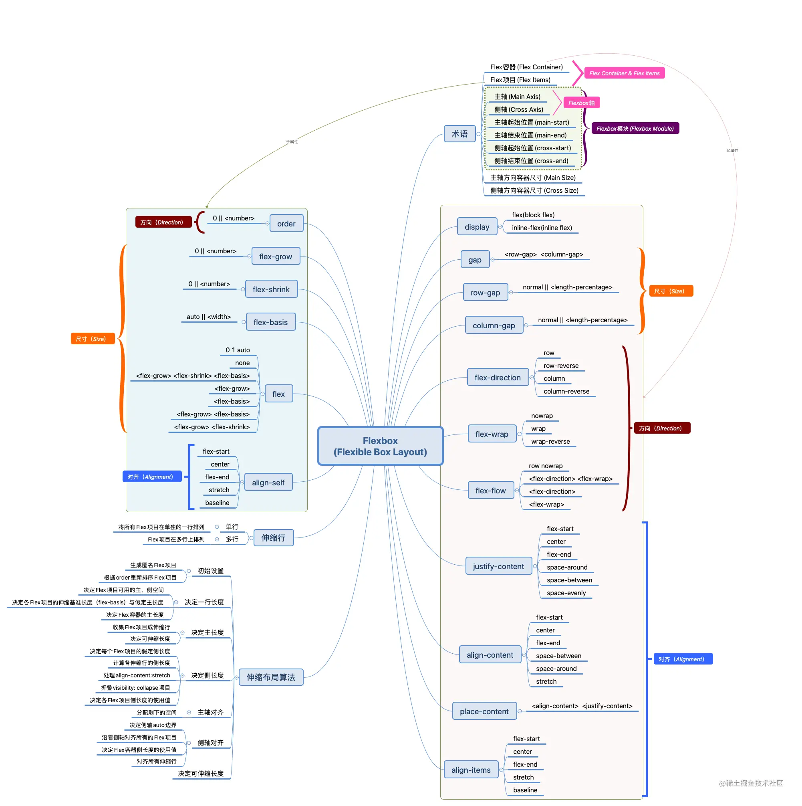

### 2.1 FlexBox 中的术语与概念


#### 2.1.1 Flex 容器与项目

- **Flex 容器**

  简单地说，HTML 上的大多数元素都可以是 Flex 容器，比如 div、ul、main 块元素，span、em 这样的内联元素。只需要在 HTML 元素上显式设置 display 的值为 flex 或 inline-flex 即可。

  > **注意**：HTML 中的可替代元素是无法成为 Flex 容器的，比如 img、input、select 等元素。

- **Flex 项目**

  当一个元素变成了 Flex 容器之后，它的子元素，包括其伪元素 ::before、::after 和文本节点都将成为 **Flex 项目**。

  **在 Flexbox 布局中，Flex 容器和 Flex 项目之间的关系永远是父子关系**。因此，Flex 项目也可以是它的子元素的 Flex 容器，即显式地在 Flex 项目设置 display 属性值为 flex 或 inline-flex ，该 Flex 项目就成为一个 Flex 容器，而它的子元素就成为 Flex 项目。但它将是一个单独的 Flex 容器，它不会继承祖辈的 Flex 容器上的属性（Flexbox 属性）。

#### 2.1.2 主轴和侧轴

在 Flexbox 中，Flex 容器内有两个轴，而且这两个轴只存在于 Flex 容器中：

- **主轴**（Main Axis）
- **侧轴**（Cross Axis）

Flexbox 中的主轴由 flex-direction 属性设置，默认情况下，主轴沿行方向（内联轴 Inline Axis）分布，如果该属性为 column，则主轴沿列方向（块轴 Block Axis）分布：


> **注意**：Flexbox 布局中的主轴、主方向、侧轴和侧方向不是固定不变的，它们会随着 writing-mode（书写模式）和 direction（阅读方向）而改变。

- **主轴和侧轴的起点终点**

  在 Flexbox 布局中，不管是主轴还是侧轴，都有方向性。既然有方向，就有起点和终点之分。Flex 容器中的每根轴又有**主轴起点**、**主轴终点**、**侧轴起点**和**侧轴终点**之分。而且每根轴的起点和终点是由 flex-direction 和 writing-mode（或 direction）来决定的。

  

- **主轴和侧轴尺寸**

  Flexbox 布局中的 Flex 容器和 Flex 项目是元素，它们有大小。对于 Flex 容器而言，它有：

  - **主轴尺寸**：指主轴起点到终点之间的距离
  - **侧轴尺寸**：指侧轴起点到终点之间的距离

  主轴尺寸和侧轴尺寸可以用来决定一个 Flex 容器的大小。但它们并不完全等同于 Flex 容器的宽高。这是因为 flex-direction 和 writing-mode 或 direction 属性值不同时，用于描述 Flex 容器的物理属性 width 和 height 有可能会互换的。比如：

  - `flex-direction` 为 row ，且书写模式和阅读模式是 LTR 时，主轴的尺寸对应的就是 Flex 容器的宽度，侧轴的尺寸对应的则是 Flex 容器的高度。
  - `flex-direction` 为 column ，且书写模式和阅读模式是 LTR 时，主轴的尺寸对应的就是 Flex 容器的高度，侧轴的尺寸对应的则是 Flex 容器的宽度。

  

  可以在 Flex 容器上显式使用 CSS 的物理属性 width 和 height，或使用 CSS 的逻辑属性 inline-size 和 block-size 设置 Flex 容器主轴和侧轴的尺寸，也可以使用 `min-_` 和 `max-_` 对 Flex 容器主轴和侧轴的尺寸加以限制。

  

  如果没有显式给 Flex 容器设置尺寸，则会根据所有 Flex 项目的大小来决定，或根据 Flex 容器的父容器来决定。

  Flexbox 布局中有一个强大的特性，当 Flex 容器有剩余空间时：

  - 可以使用主轴的对齐方式 `justify-content` 来分配主轴的剩余空间
  - 可以使用侧轴的对齐方式 `align-content` 来分配侧轴的剩余空间

  也可以使用 flex 属性中的 `flex-grow` 按比例因子来扩展 Flex 项目的尺寸；当 Flex 容器是不足空间，可以使用 flex 属性中的 `flex-shrink` 按比例因子来对 Flex 项目进行收缩。这个计算在 Flexbox 布局中是复杂的，而且会涉及一定的数学计算。

### 2.2 Flexbox 布局模块相关特性

Flexbox 布局的属性分为两个部分：

- 用于 Flex 容器的属性

  

- 用于 Flex 项目的属性

  

#### 2.2.1 Flex 项目排序

如果仅是单独对某个（或某几个）Flex 项目重新排序的话，可以使用 `order` 属性。此属性可用于对有序组中的项目进行排序。项目按照 flex-direction 指定的方向排列，最小值在最前面。如果多个项目具有相同的值，它将与具有该值的其他项目一起显示（按其在源码文档的顺序排列）。

order 初始值是 0，可以是正值，也可以是负值，属性值越大，越排在主轴的后面，反之越在主轴的前面。

> **注意**：order 在使用时对 Web 可访问性是不友好的。尽量不要使用，因为需要修复文档中的乱序问题。

### 2.3 Flex 布局中的对齐方式

Flexbox 布局中提供了多个用于对齐 Flex 项目以及 Flex 项目之间分配空间的属性。

这些属性可以分为两组：

- **空间分配属性**

  - **justify-content**：沿 Flex 容器的主轴分配 Flex 容器的剩余空间
  - **align-content**：沿 Flex 容器的侧轴分配 Flex 容器的剩余空间（只有当 flex-wrap 属性的值为非 nowrap 时才能生效）
  - **place-content**：justify-content 和 align-content 的简写属性

- **对齐属性**

  - **align-self**：沿 Flex 容器侧轴对齐单个 Flex 项目
  - **align-items**：将所有 Flex 项目作为一个组，沿 Flex 容器侧轴对齐。

`justify-` 开头的属性主要用于 Flex 容器的主轴方向；`align-` 开头的属性主要用于 Flex 容器侧轴方向；`-items` 结尾的属性主要用于对齐 Flex 项目，`-self` 结尾的属性主要用于 Flex 项目的自对齐，`-content` 结尾的属性主要用于容器空间分配。

| -                          | 主轴（`justify-*`） | 侧轴（`align-*`） |
| -------------------------- | ------------------- | ----------------- |
| 对齐 Flex 项目（`-items`） | ~~justify-items~~   | align-items       |
| Flex 项目自对齐（`-self`） | ~~justify-self~~    | align-self        |
| 空间分配（`*-content`）    | justify-content     | align-content     |

> **注意**：在 Flexbox 布局中是没有 justify-self 属性的，它是 Grid 布局中的。

在 Flex 布局对齐方式中有以下注意事项：

- Flex 项目彼此相邻。由于 Flexbox 是一个单维布局，因此 Flex 项目要么按行对齐，要么按列对齐（默认为行对齐）。并且 Flex 项目换行之后，也是在自己所在行的主轴方向上排列。

- 默认情况下，Flex 项目在侧轴上会被拉伸伸展，因为 Flex 容器 `align-items` 属性的默认值为 stretch。

- 当 align-self 碰上了 align-content 属性时，只有 align-content 属性值为 stretch 时，align-self 属性的值才有效。

- 在 Flex 项目上使用 margin: auto，会致使 Flex 项目上的 align-self 属性失效。

#### 2.3.1 Flex 中的溢出对齐

使用 CSS 来构建 Web 布局时，有一个最大的目标，即**保持 Web 页面的内容和元素对访问者（用户）是可见的**。容器会根据其内容自动扩展到右侧或底部。当内容溢出时，容器变为可滚动的，用户可以滚动来访问“不可见的内容”。除非在容器上使用 overflow:hidden。

但在 Flexbox 布局中，却无法保证这一点。当容器没有足够多的空间来容纳 Flex 项目的内容时，就会出现“数据丢失”的情况。在这种情况下，就需要使用到 [CSS Box Alignment Module Level 3](https://drafts.csswg.org/css-align-3/#overflow-values)（仍处于草案状态）定义**安全对齐**（在溢出情况下更改对齐模式，以避免数据丢失）。

给对齐属性新增了 `safe` 和 `unsafe` 两个关键词：

- `safe`：关键字会将因为对齐方式导致溢出时，将设置的对齐模式切换到 start 对齐模式下，目的是避免“数据丢失”，其中部分项目超出对齐容器的边界并且无法滚动到。
- `unsafe`：即使会导致此类数据丢失，也会遵守对齐方式。

### 2.4 flex 属性

Flexbox 的设计目的是在包含元素（Flex 容器）中沿着行或列分配元素（Flex 项目）和空间。而它的最大特性就是 Flex 项目可伸缩。而这一切都依赖于 `flex` 属性来完成。

一个 Flex 容器会按照各个 Flex 项目的扩展比率分配 Flex 容器剩余空间，也会按照收缩比率来收缩 Flex 项目，以免 Flex 项目溢出 Flex 容器。

#### 2.4.1 Flexbox 中的分配空间

首先浏览器必须**确定有多少空间可用**。一般情况，浏览器会按照下面的过程来分配空间：

- **计算 Flex 容器内的可用空间**

  ```txt
  Flex 容器的可用空间  = 主轴尺寸 - 内距 - 边框宽度 - 间距 - Flex 项目的外边距
  ```

- **计算每个 Flex 项目的伸缩基础大小和假设的主尺寸**

  即使用 `flex-basis`、`min-width`、`min-inline-size`、`width`、`inline-size` 或 Flex 项目内容大小（`min-content` 或 `max-content`）设定的大小。其中 `flex-basis` 是 Flex 项目所需的最小尺寸，假设的主尺寸是指应用伸缩因子之前 Flex 项目的尺寸。而且 Flex 项目的伸缩基础大小永远不会小于其内容的伸缩基础大小。

- **计算所有 Flex 项目的总假设主尺寸**

- **将所有 Flex 项目的假想主尺寸与 Flex 容器的可用空间进行比较**。当所有 Flex 项目的假想主尺寸总和大于 Flex 容器可用空间时，将会使用 `flex-shrink` 属性值作为 Flex 项目的收缩因子（收缩比率）来收缩 Flex 项目；当所有 Flex 项目的假想主尺寸总和小于 Flex 容器可用空间时，将会使用 `flex-grow` 属性值作为 Flex 项目的扩展因子（扩展比率）来扩展 Flex 项目。

也就是说，使用 Flexbox 布局时，浏览器会使用伸缩因子决定从每个 Flex 项目中增加或减去 Flex 容器的剩余空间，并且浏览器在循环中完成每个 Flex 项目的计算。

> 浏览器还会将确定的尺寸看作是 Flex 项目的已知尺寸。当一个 Flex 项目具有一定的尺寸时，它被认为是一个非弹性的 Flex 项目。没有明确尺寸的 Flex 项目则被认为是灵活的 Flex 项目。

#### 2.4.2 flex 基础使用

`flex` 是一个只能用于 Flex 项目的属性，它可以让 Flex 项目根据 Flex 容器的可用空间对自身做伸缩计算，包含三个子属性：

- `flex-grow`：初始值为 0，表示 Flex 项目不扩展
- `flex-shrink`：初始值为 1，表示 Flex 项目会收缩
- `flex-basis`：初始值为 auto，表示 Flex 项目的基本尺寸是 Flex 项目的最大内容尺寸（即 max-content）。

可以使用一个，两个或三个值来指定 flex 属性：

- **单值语法**：值必须为以下其中之一

  - 一个无单位的数值（number）：它会被当作 `flex-grow` 的值
  - 一个有效的宽度（width）值：它会被当作 `flex-basis` 的值
  - 关键字

    - initial（默认值）
    - `auto`：元素会根据自身的宽度与高度来确定尺寸，但是会伸长并吸收 flex 容器中额外的自由空间，也会缩短自身来适应 flex 容器。这相当于将属性设置为 "flex: 1 1 auto"。

    - `none`：元素会根据自身宽高来设置尺寸。它是完全非弹性的：既不会缩短，也不会伸长来适应 flex 容器。相当于将属性设置为"flex: 0 0 auto"。

- **双值语法**：第一个值必须为一个无单位数，并且它会被当作 `flex-grow` 的值。第二个值必须为以下之一：

  - 一个无单位数：它会被当作 `flex-shrink` 的值
  - 一个有效的宽度值：它会被当作 `flex-basis` 的值

- **三值语法**

  - 第一个值必须为一个无单位数，并且它会被当作 `flex-grow` 的值。
  - 第二个值必须为一个无单位数，并且它会被当作 `flex-shrink` 的值。
  - 第三个值必须为一个有效的宽度值，并且它会被当作 `flex-basis` 的值。

## 三. Grid 布局

Grid 布局指的是 CSS Grid Layout，**它是一个基于二维网格的布局系统**，与过去任何 Web 布局系统相比，它完全改变了设计用户界面的方式。它还具有以下这些特性：

- **固定的和弹性的轨道（行或列）尺寸**
  可以使用固定的轨道尺寸创建网格，比如 px，也可以使用百分比 % 或者网格系统中独有的弹性单位 fr 创建具有弹性尺寸的网格轨道，也可以两者相互结合来创建网格。

- **网格项目放置**
  可以使用网格线的数字索引号，或网格线名称，或者网格区域来精确放置网格项目。网格同时还使用一种算法来控制未给出明确网格位置的网格项目。

- **创建额外的网格轨道来放置网格项目**
  可以使用网格布局定义一个显式网格，但根据规范它会处理加在网格外的内容，当必要时它会自增网格轨道，来尽可能多地容纳所有网格项目。

- **对齐控制**
  网格布局系统中也涵盖了对齐（Box Alignment）模块的部分特性，便于控制网格项目或网格轨道在内联轴或块轴方向的对齐。

- **控制层叠内容**
  一个网格单元或网格区域中可以放置多个网格项目，并且它们可以部分相互重叠，而且可以通过 z-index 属性来控制它的层级权重。

- **网格的嵌套（或子网格）**
  网格布局和早期的表格布局非常的相似，在网格布局中还可以让网格与网格相互嵌套，甚至还可以使用子网格。

- **网格顺序**
  在网格布局中，除了通过网格线或网格区域来调整网格顺序之外，还可以像 Flexbox 布局中一样，使用 order 属性来调整网格项目的排列顺序。

### 3.1 Grid 布局基础知识

#### 3.1.1 网格布局术语

网格布局的出现，同时也给布局方面带来一堆新的技术术语。其中最为主要的原因是 Grid 布局才是真正意义上的 Web 布局。

##### 3.1.1.1 坐标轴

在 CSS 的网格布局中，主要以：

- **块轴**
  块方向的轴是采用块布局时块的排序方向。在 CSS 网格布局系统中，它被称为**列轴**（Column），因为这条轴的方向和列轨道的方向是一致的。

- **内联轴**
  行方向的轴与块方向的轴垂直，它的方向和普通文本的方向一致。在 CSS 网格布局中，很多时候也被称为**行轴**（Row），因为这条轴的方向和行轨道是一致的。

##### 3.1.1.2 网格容器和网格项目

在 CSS 的网格布局中，显式声明了 `display` 属性的值为 `grid` 或 `inline-grid` 的元素被称为**网格容器**（Grid 容器），该元素的直接子元素（包括其文本节点和伪元素）都被称为**网格项目**（Grid 项目）。

在网格项目上显式设置 display 的值为 grid 或 inline-grid ，它就既是一个网格容器也是一个网格项目。

> **注意**：默认情况下，设置 display 的值为 grid 或 inline-grid 时，就会自动创建一个 1 x N 的网格（一列 N 行的网格），其中 N 由网格容器的子元素、文本节点和伪元素决定。

##### 3.1.1.3 网格线

CSS 的网格是一组相交的**水平（行）**和**垂直（列）**的网格线组成，它将网格容器的空间划分为网格区域（最小的网格区域就是一个独立的网格单元格），可以将网格项目放入其中。可以说，网格线是网格布局中很重要的部分，它主要分为：

- **列网格线**：一组定义沿块轴（Block Axis）运行的列
- **行网格线**：一组定义沿内联轴（Inline Axis）运行的行

这两组网格线成正交的模式。这两组网格线也是构成网格结构的分界线，可以是水平的，也可以是垂直的。它们可以是位于行或列的任何一边。


CSS 网格布局中的网格线可以用数字索引（如上图中的数字）或开发者指定的名称来表示。比如下面这个示例，左侧的示例使用网格线来定位一个网格项；右侧的示例使用显式命名的网格线来定位一个网格项：


网格布局中未显式给网格线命名的情况下，默认是以数字索引号命名，并且从 1 开始叠加，同时它的反方向则从 -1 开发中命名。其默认索引号会受 CSS 的书写模式 writing-mode 影响，但不受 direction 属性的影响。

而且，网格线的数量是由网格轨道来决定的：

- 列网格线数量由 `grid-template-columns` 来决定
- 行网格线数量由 `grid-template-rows` 来决定

> **注意**：使用 `grid-template-columns`、`grid-template-rows` 以及 `grid-template-areas` 属性定义的网格线名称，都被称为显式网格线名称。也就是说，在 CSS 网格中还有隐式被命名的网格线名称。可以使用 `grid-row`、`grid-column` 或 `grid-area` 将网格项目放置在显式网格之外时创建的网格线，被称为隐式网格线名称，它们会在显式网格线上累加。

##### 3.1.1.4 网格单元格

网格中**相邻的两条行和列网格线所围绕着的区域，被称为网格单元格**，它是网格中的最基本单位（空间）。网格单元格可以被用来放置网格项目。如下图所示，行网格线 1 和 2 ，列网格线 1 和 2 相交构建的区域就是一个网格单元格（图中斜线区域）：


##### 3.1.1.5 网格轨道

网格轨道是 CSS Grid 布局中独有的一种术语，把**网格中的列和行统称为网格轨道**。它是两条相邻网格线之间的空间。每个网格轨道都有一个尺寸，它控制着网格的列宽或行高，从而控制着它的边界网格线（相邻两条网格线）之间的距离，这个网格距离也称为**网格轨道尺寸**。另外，相邻网格线可以用网格沟槽（即 gap 属性）来隔开，但在其他情况下，会被紧紧地贴在一起。


Grid 布局中的网格轨道尺寸是由 `grid-template-columns` 和 `grid-template-rows` 属性来指定的，其中：

- `grid-template-columns` 指定列网格轨道尺寸，即列宽
- `grid-template-rows` 指定行网格轨道尺寸，即行高

另外，还可以使用 `grid-auto-columns` 和 `grid-auto-rows` 属性来指定隐式网格轨道尺寸：

- `grid-auto-columns` 指定隐式列网格轨道尺寸
- `grid-auto-rows` 指定隐式行网格轨道尺寸

##### 3.1.1.6 网格区域

网格区域是由四条网格线所包围的空间构成，网格区域的每边各一条，并参与它所交汇的网格轨道的大小。简单地说，它是由一个或多个相邻的网格单元格组成。其中一个单元格是网格中最小的一个网格区域。

网格区域的作用和网格单元格一样，主要用来放置一个或多个网格项目的逻辑空间。它可以使用 `grid-template-areas` 属性显式命名，然后使用 `grid-area` 来引用已命名好的网格区域，还可以通过它的边界网格线隐式引用。比如下面这个[示例](https://codepen.io/airen/full/GRdYrpL)，左侧是由 grid-template-areas 命名定义的网格区域，右侧是由网格线隐式创建的网格区域：

```html
<div class="container">
  <header class="item header">Header Area</header>
  <main class="item main">Main Area</main>
  <nav class="item nav">Nav Area</nav>
  <aside class="item aside">Aside Area</aside>
  <footer class="item footer">Footer Area</footer>
</div>
```

```css
.container {
  display: grid;
}

/* 使用 grid-template-areas 命名网格区域 */
.container:nth-child(1) {
  grid-template-areas:
    'header header header'
    'aside  main   nav'
    'footer footer footer';
}

/* 根据网格区域名称放置网格项目 */
.container:nth-child(1) .header {
  grid-area: header;
}
.container:nth-child(1) .aside {
  grid-area: aside;
}
.container:nth-child(1) .main {
  grid-area: main;
}
.container:nth-child(1) .nav {
  grid-area: nav;
}
.container:nth-child(1) .footer {
  grid-area: footer;
}

/* 使用 grid-template-columns 定义一个网格, 由网格线隐式创建网格区域 */
.container:nth-child(2) {
  grid-template-columns: 150px 1fr 150px;
}

/* 根据网格线放置网格项目 */
.container:nth-child(2) .header {
  grid-area: 1 / 1 / 2 / 4;
}

.container:nth-child(2) .main {
  grid-area: 2 / 2 / 3 / 3;
}

.container:nth-child(2) .aside {
  grid-area: 2 / 1 / 3 / 2;
}

.container:nth-child(2) .footer {
  grid-area: 3 / 1 / 4 / 4;
}
```

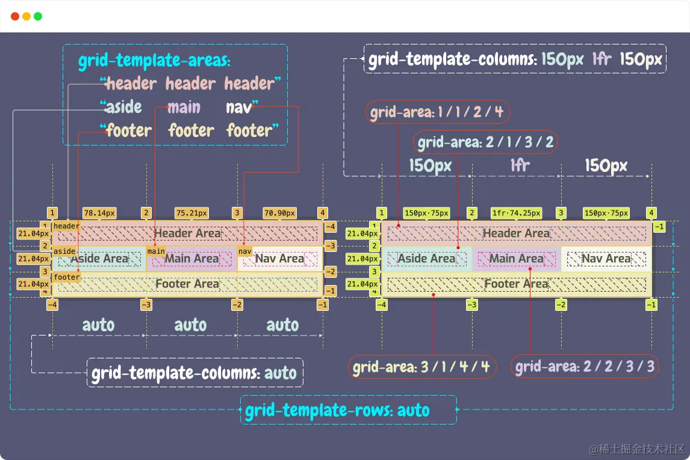

##### 3.1.1.7 显式网格和隐式网格

网格布局中的网格系统可以分为：

- **显式网格**：使用 `grid-template-rows`、`grid-template-columns` 或 `grid-template-areas` 属性创建的网格。

- **隐式网格**：上面三个属性创建的网格可能不是最终网格。它可能因为网格项目被放置到显式网格之外而变大，在这种情况下，将会自动创建隐式网格线，同时会生成隐式网格轨道（`grid-auto-rows`、`grid-auto-columns` 或 `grid-auto-flow` 等属性决定）。此时，新增的隐式网格轨道和最初已创建的显式网格轨道组合在一起，重新创建新的网格。

```html
<div class="container">
  <div class="item">1</div>
  <div class="item">2</div>
  <div class="item">3</div>
  <div class="item">4</div>
  <div class="item">5</div>
  <div class="item">6</div>
  <div class="item">7</div>
  <div class="item">8</div>
  <div class="item">9</div>
  <div class="item">10</div>
  <div class="item">11</div>
</div>
```

```css
.container {
  display: grid;
  grid-template-columns: repeat(3, 100px);
  grid-template-rows: repeat(2, 100px);
  grid-auto-rows: 60px;
  gap: 10px;
}

.item:nth-child(3) {
  grid-area: 1 / 4 / 4 / 5;
}

.item:nth-child(4) {
  grid-area: 1 / -5 / 4 / 1;
}
```

在这个示例中，通过 `grid-template-columns` 和 `grid-template-rows` 创建了一个两行三列的网格，并且行网格轨道和列网格轨道的尺寸都是 100px 。此时，这个两行三列的网格就是一个显式网格。

由于这个显式网格是一个两行三列（只有六个网格单元格）的网格，默认情况之下（即按照自动放置网格项目的算法）只能放置六个网格项目，但示例中有十一个网格项目，比默认多出五个网格项目。这个时候，浏览器会自动将多余的网格项目按行增加，这主要是因为 `grid-auto-flow` 属性的默认值为 row ，加上显式设置了 `grid-auto-rows` 值为 60px ，这样就告诉浏览器自动新增网格行轨道的尺寸是 60px 。

就该示例而言，此时自动新增了两个行网格轨道，即创建了一个“四行三列”的隐式网格：

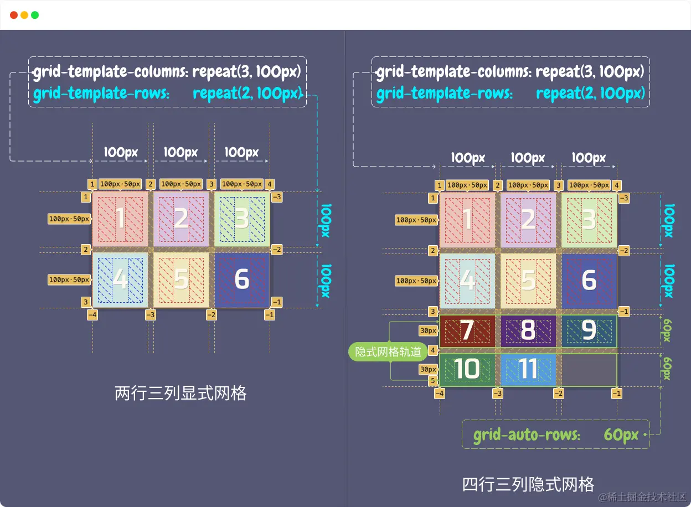

另外，该示例的第三个网格项目和第四个网格项目还使用了 `grid-area` 属性，将网格项目放置到显式网格之外：

```css
.item:nth-child(3) {
  grid-area: 1 / 4 / 4 / 5;
}

.item:nth-child(4) {
  grid-area: 1 / -5 / 4 / 1;
}
```

这样一来，grid-area 在原显式网格基础上又新增了两列（隐式的列），最终它们一起创建了一个“三行五列”的隐式网格：

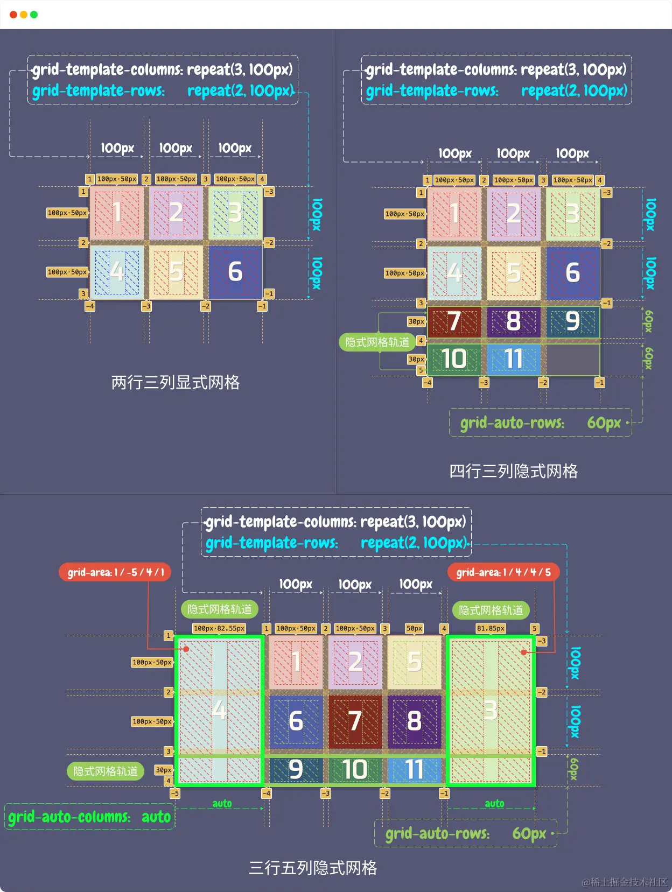

事实上，示例中提到的仅仅是创建隐式网格最常见的两种方式，除此之外还有其他的一些方式也可能创建隐式网格。如下图所示，图中黑色虚线是显式网格，红色虚线是隐式网格：

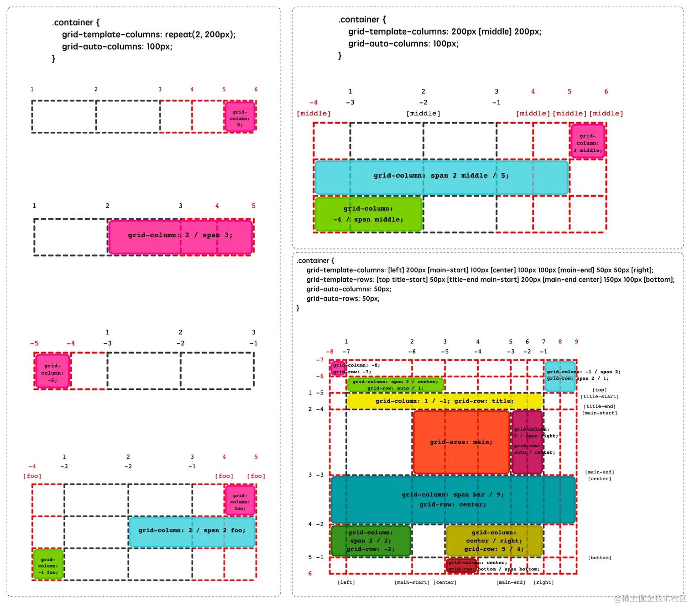

也就是说，在 CSS 网格布局中，网格容器的 `grid-template-rows`、`grid-template-columns` 和 `grid-template-areas` 属性，定义了显式网格的固定数量的网格轨道。当网格项目被定位在这些界限之外时，网格容器会通过向网格添加隐式网格线来生成隐式网格轨道。这些网格线与显式网格线一起构建了隐式网格。

另外，网格容器的 `grid-auto-rows` 和 `grid-auto-columns` 属性对这些隐式网格轨道以及由 `grid-template-areas` 创建但未被 `grid-template-rows` 和 `grid-template-columns` 明确调整大小的任何显式网格轨道进行调整。

同时，网格容器的 `grid-auto-flow` 属性控制没有明确位置的网格项目的自动放置。一旦显式网格被（网格项目）填满（或没有显式网格），自动放置也会创建隐式网格。或者可以这样来理解：

- `grid-template-rows`、`grid-template-columns` 和 `grid-template-areas` 定义显式网格
- `grid-template-rows` 和 `grid-template-columns` 可以用来指定显式网格轨道固定数量和网格轨道尺寸

- `grid-auto-rows`、`grid-auto-columns` 和 `grid-auto-flow` 定义隐式网格
- `grid-auto-rows` 和 `grid-auto-columns` 可以用来指定隐式网格轨道尺寸
- `grid-row`、`grid-column` 和 `grid-area` 将网格项目放置在显式网格之外，也会创建隐式网格

##### 3.1.1.8 网格间距（沟槽）

网格布局中，相邻两网格轨道之间有时候会有一定的间距，那么这个间距称之为**网格间距**，也称为**沟槽** 它主要分为：

- **行间距**：相邻的两个行网格轨道之间的间距
- **列间距**：相邻的两个列网格轨道之间的间距。

要以使用 `gap` 属性来设置网格轨道之间的间距，其中：

- `column-gap`：用来设置列网格轨道之间的间距
- `row-gap`：用来设置行网格轨道之间的间距

##### 3.1.1.9 嵌套网格

“嵌套网格” 就是网格中嵌套了网格。在网格布局中，网格项目也可以同时成为一个网格容器，即在网格项目上显式设置 display 属性的值为 grid 或 inline-grid 。比如：

```html
<div class="grid__container">
  <div class="grid__item"></div>
  <div class="grid__item grid__container--sub">
    <div class="grid__item grid__item--sub"></div>
    <!-- Sub Grid Item -->
    <div class="grid__item grid__item--sub"></div>
  </div>
  <!-- Grid Item -->
  <div class="grid__item"></div>
</div>
```

```css
.grid__container {
  display: grid;
  grid-template-columns: repeat(3, 1fr);
  gap: 10px;
}

.grid__item:nth-child(1) {
  grid-area: 1 / 1 / 4 / 2;
}

.grid__item:nth-child(2) {
  grid-area: 1 / 2 / 2 / 4;
}
```

在这个示例中，`.grid__container` 是一个网格容器，在其第二个网格项目中（`.grid__container--sub`）包含了几个子元素（`.grid__item--sub`），这几个元素并不是 `.grid__container` 的直接子元素，因此它们不是网格项目，也就不会参与到网格布局当中：

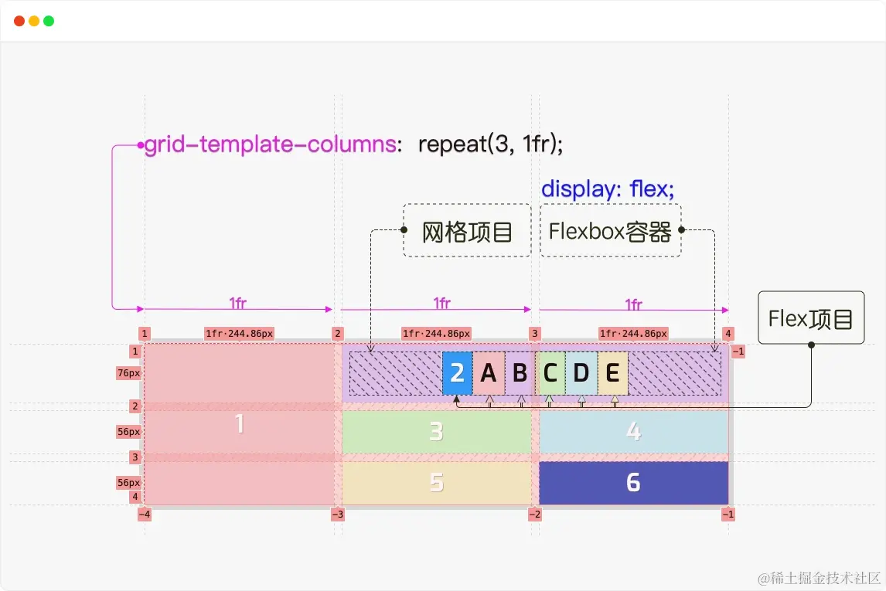

如果将 `.grid__container--sub` 设置的 `display: flex` 值更改为 `display: grid`（或 `inline-grid`）。这个时候，`.grid__container--sub` 就从当初的 Flexbox 容器变成了网格容器，其子元素 `.grid__item--sub` 就变成了网格项目（包括 `.grid__container--sub` 的伪元素）：

```css
.grid__container--sub {
  display: inherit; /* 继承其父元素的 display 属性的值 */
  grid-template-columns: inherit; /* 继承其父元素的 grid-template-columns 属性的值 */
  gap: 15px;
}
```

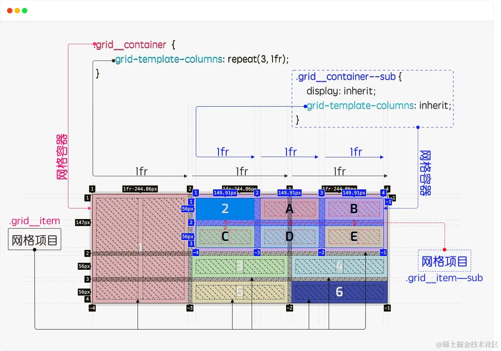

这个示例中，嵌套网格（`.grid__container--sub`）和它的父容器（`.grid__container`，也是一个网格容器）并没有关系。这两个网格容器是两个独立的网格，有自己的网格系统。其中 `.grid__container--sub` 既是网格项目，也是网格容器。

##### 3.1.1.10 子网格

> **注意**：网格布局中的**子网格**（Subgrid）和**嵌套网格**（Nested Grid）并不是同一个东西。

网格布局中的子网格是 `grid-template-rows` 和 `grid-template-columns` 属性的一个值，即 `subgrid`：

```css
.sub--grid {
  display: inherit;
  grid-template-columns: subgrid;
  grid-template-rows: subgrid;
}
```

**CSS 子网格（subgrid）是指跨越网格区域的网格项目显式地设置 `grid-template-rows` 或（和）`grid-template-columns` 属性的值是 `subgrid`**。这样一来，子网格就会继承父网格的特性，比如网格轨道尺寸、间距等。在 CSS 网格布局中，一般只将跨越网格区域的网格项目（即合并列或行的网格项目）定义成子网格，只有当网格项目跨越多个网格单元格时，子网格（subgrid）才有意义。

默认情况之下，网格项目的子项目（子元素）不是网格布局的一部分。如果没有子网格功能，就需要创建一个嵌套网格，如果想为嵌套网格复制网格布局，就需要重新计算网格轨道。这个新增的子网格功能和嵌套网格最大的不同之处是，**子网格继承了其父网格的网格轨道，并与之无缝对接，同时子网格功能还能增强网格项目的能力**。

下面是一个[子网格的示例](https://codepen.io/airen/full/oNdawEJ)：

```css
.grid__container {
  display: grid;
  grid-template-columns: repeat(3, 1fr);
  gap: 10px;
}

.grid__item.grid__container--sub {
  grid-area: 1 / 2 / 2 / 4;
}

.grid__container--sub {
  display: inherit; /* 继承其父元素 display 的值，这里相当于 display: grid */
  grid-template-columns: subgrid;
}
```

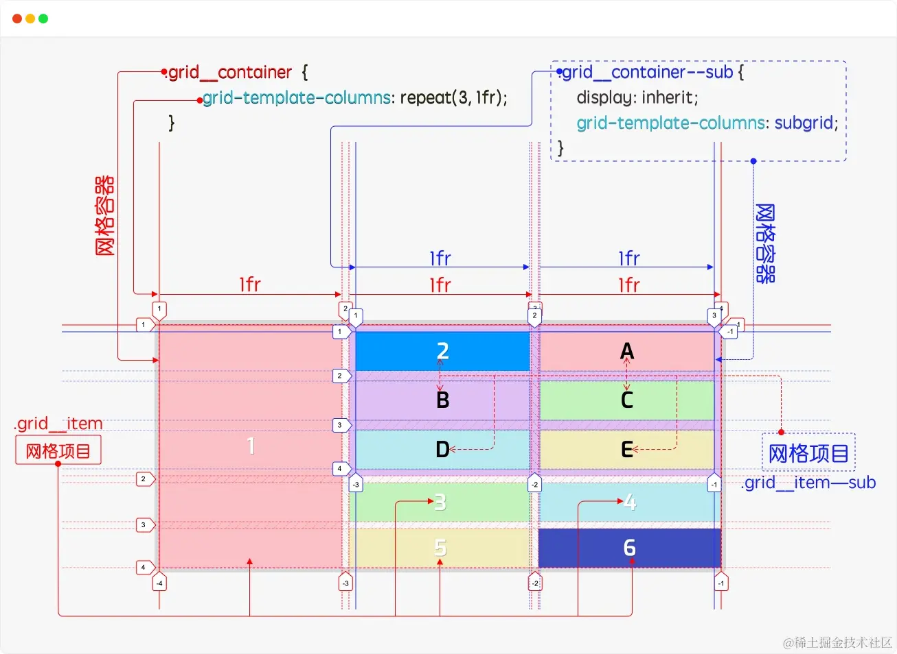

网格项目 `.grid_container--sub`（它同时是 `.grid__container` 子元素）中使用 `grid-area` 将两列合并成一个单元格（也可以使用 `grid-column` 和 `grid-row` 达到同等效果），同时在该元素上显式设置了 `display: inherit`，用来继承其父元素的 display 的值。

此时该元素也变成了一个网格容器，其所有子元素 `.grid__item--sub` 和 伪元素 ::before 就变成了网格项目，而且在该元素上显式设置了 `grid-template-columns: subgrid`。这样做可以让其继承父网格布局的特性，比如网格线名称、网格轨道等。

从渲染的结果会发现，相当于设置了 `grid-template-columns: repeat(2, 1fr)`。

事实上，子网格和嵌套网格有明显的差异，其中子网格具有以下特性：

- 继承父网格命名的网格线
- 继承父网格指定的网格区域
- 继承父网格的网格间距（网槽）（Chrome 浏览器表现很奇怪，只继承了 column-gap）
- 可以定义自己的命名网格线，并将其添加到父网格的命名网格线中
- 可以定义自己的命名网格区域，并将其添加到父网格的命名网格区域中
- 可以覆盖继承的网格间距

#### 3.1.2 网格布局中的属性

可用于网格布局中的 CSS 属性可以像 Flexbox 布局一样，分为：

- **可用于网格容器的属性**

  - display
  - grid-template-columns
  - grid-template-rows
  - grid-template-areas
  - grid-template①
  - gap
  - grid-auto-columns
  - grid-auto-rows
  - grid-auto-flow
  - grid
  - masonry-auto-flow
  - justify-items
  - align-items
  - place-items
  - justify-content
  - align-content
  - place-content
  - align-tracks
  - justify-tracks

  总体而言分为两个部分，其中一部分是用来创建（或定义）网格的，比如 `grid-template-_` 和 `grid-auto-_` 等；另外一部分是用来设置网格对齐方式的，比如 `justify-content`、`align-content` 等。

- **可用于网格项目的属性**

  用于网格项目的属性要少得多，主要有 `grid-row`（分为 `grid-row-start` 和 `grid-row-end`）、`grid-column`（分为 `grid-column-start` 和 `grid-column-end`）、`grid-area` 等属性，它们主要用来放置网格项目位置的。还有就是用来设置网格项目对齐方式的，比如 `justify-self` 和 `align-self` 等。

#### 3.1.3 网格容器尺寸

网格容器的尺寸，是使用它所参与的格式化上下文的规则来确定的：

- 作为一个块格式化上下文中的块级框，它的尺寸与建立格式化上下文的块级框一样，与非替换的块级框一样计算自动内联尺寸
- 作为一个内联格式化上下文中的内联级框，它的尺寸与原子内联级框（内联块）一样，在内联和块格式化上下文中，网格容器的自动块尺寸是其最大内容的大小（max-content）。

> 一个网格容器的最大内容尺寸（max-content）或最小内容尺寸（min-content）是该网格容器在适当的轴上的轨道尺寸（包括网格沟槽）的总和 。

简单地说，网格容器的尺寸可以像其它容器元素一样，使用尺寸相关的属性（比如 width、max-width、min-width、height、max-height、min-height 以及其对应的逻辑属性）来设置。比如：

```css
.grid__container {
  --grid: grid;
  --width: 40;
  --height: 30;
  display: var(--grid);
  grid-template-columns: repeat(3, 200px);
  gap: 10px;
  width: calc(var(--width) * 1vw);
  height: calc(var(--height) * 1vh);
  overflow: auto;
}
```

在网格容器上显式设置了 width 和 height，同时使用 grid-template-columns 指定了每列列宽是 200px，每行行高根据网格项目自身内容高度尺寸来决定。示例中的网格容器的 width 值有可能小于三列加沟槽的总和（此例是 620px），也有可能大于它们的总和：

- 当 width 小于 620px 时，网格容器会出现水平滚动条（因为容器显式设置了 overflow: auto）
- 当 width 大于 620px 时，网格容器会有空白空间留出

网格容器的高度和宽度类似，只不过没有使用 grid-template-rows 属性来显式指定每行的高度，而是由网格项目盒模型自身决定。

除此之外，还可以通过 grid-template-columns 和 grid-template-rows 以及 gap 等属性来控制网格容器的尺寸：

```css
.grid__container {
  --col-1: 100;
  --col-2: 100;
  --col-3: 100;
  --row-1: 50;
  --row-2: 50;
  --row-3: 50;

  display: grid;
  grid-template-columns: calc(var(--col-1) * 1px) calc(var(--col-2) * 1px) calc(var(--col-3) * 1px);
  grid-template-rows: calc(var(--row-1) * 1px) calc(var(--row-2) * 1px) calc(var(--row-3) * 1px);
  gap: 10px;
}
```

#### 3.1.4 网格项目的尺寸

在网格布局中，除了 `grid-template-columns`、`grid-template-rows` 和 `grid-template-areas`，以及 `grid-column`、`grid-row` 和 `grid-area` 等属性可以决定网格项目尺寸之外，还可以在网格项目中使用尺寸属性，比如 width 和 height 来设置网格项目的尺寸。

除此之外，网格项目的尺寸还会受设置在网格项目上的对齐属性，比如 `align-self` 和 `justify-self` 的影响。

### 3.2 定义网格布局

定义一个网格主要包含两个事情：

- **定义一个网格**
- **设置网格大小**

#### 3.2.1 定义网格的类型

CSS 中定义一个网格非常简单，只需要在一个元素上显式设置 display 的值为 `grid` 或 `inline-grid` 即可。这是一个最基础的网格，一个 “单列多行” 的网格，而且行数由网格容器的子元素（包括其伪元素和文本节点）来决定。

默认的网格往往不能满足所需，也就是说，要构建一个符合要求的网格，还需要依赖其他的一些属性，比如 `grid-template-_` （即 `grid-template-rows`、`grid-template-columns` 和 `grid-template-areas` 以及它们的简写属性 `grid-template`），或 `grid-auto-_` （即 `grid-auto-rows`、`grid-auto-columns` 和 `grid-auto-flow`）。根据不同的属性定义的网格又分为**显式网格**和**隐式网格**：

- `grid-template-_` 属性定义的网格是一个显式网格
- `grid-auto-_` 属性定义的网格是一个隐式网格

#### 3.2.2 使用 grid-template-columns 和 grid-template-rows 定义网格

先从定义一个显式网格开始。可以在网格容器上使用 grid-template-rows 和 grid-template-columns 属性来定义网格的行和列，它们都接受**用空格分隔开来的多个数值**，这些值同时代表网格轨道的大小，而且数值之间的空格代表网格线。

比如，在一个网格容器上显示设置了 grid-template-columns 属性的值是 180px 20% auto 1fr 10vw ，即：

```css
.container {
  display: grid; /* 或 inline-grid */
  grid-template-columns: 180px 20% auto 1fr 10vw;
}
```

它将会告诉浏览器，定义了一个五列 N 行的网格，即将网格容器分成五列（沿网格容器内联轴方向），而且每列的列宽分别是 180px、20%、auto、1fr 和 10vw：

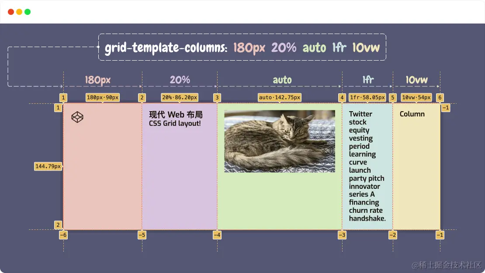

- **网格项目少于列数时**：同样会创建一个五列的网格，只不过最后一列是空的，因为没有相应的网格项目自动放置。
- **网格项目大于列数时**：默认情况下，会一个新增行网格轨道。依此类推，最终可能创建的是一个 5 x N 的网格（N 是行网格轨道数量）。

`grid-template-columns` 属性的值可以是各种不同类型的长度值，比如以 px 为单位的固定值，以 %、vw 为单位的相对值，还有像 auto 这样的关键词以及网格布局中独有的单位 fr 等。除此之外还可以是 CSS 的一些函数，比如 min()、minmax() 等。也就是说，可用于 grid-template-columns 的值类型大致可分为三种：

- **带有不同单位的长度值**：px、em、rem、vw、vh、%、ch、ex 和 fr 等
- **关键词**：none、auto、min-content 和 max-content 等
- **CSS 函数**：min()、max()、clamp()、calc()、fit-content()、minmax() 和 repeat() 等

上面这个示例中并没有显式使用 `grid-template-rows` 来指定行网格轨道尺寸，此时将会采用默认值 `auto`，即可根据内容来决定网格行轨道的尺寸。也可以像使用 grid-template-columns 那样来使用 `grid-template-rows`，即显示给网格定义行轨道的数量和尺寸：

```css
.container {
  display: grid;
  grid-template-columns: 180px 20% auto 1fr 10vw;
  grid-template-rows: auto 200px 10vh;
}
```

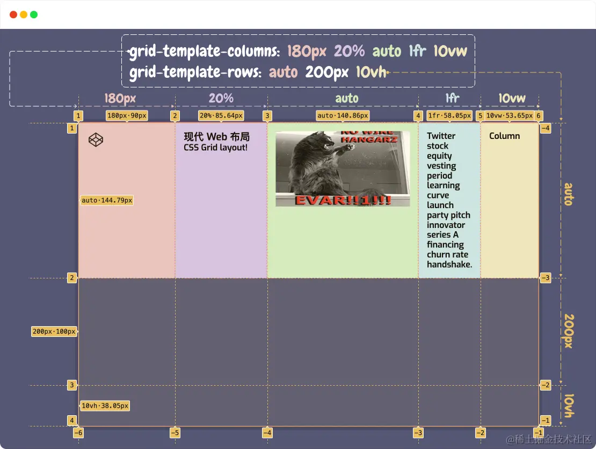

同样的，当网格项目超过 `grid-template-rows` 和 `grid-template-columns` 构建的网格单元格数量时，将会重新创建一个行网格轨道，并且以 auto 来计算行网格轨道尺寸。

从这两个示例中可以发现：

- 如果仅使用 `grid-template-columns` 属性来定义一个网格时，那么默认情况会创建一个一行单列（或多列） 的网格，即 N x 1 ，其中 N 对应的是 grid-template-columns 属性值的数量。当网格项目的数量超过 N 时，会自动创建新的行网格轨道。
- 如果同时使用 `grid-template-columns` 和 `grid-template-rows` 属性来定义一个网格时，那么默认创建一个 M x N 的网格，其中 M 对应的是 grid-template-rows 属性值的数量，N 对应的是 grid-template-columns 属性值的数量。当网格项目的数量超过 M x N 时，会自动创建新的行网格轨道。
- 如果仅使用 `grid-template-rows` 属性来定义一个网格时，那么默认情况会创建一个一行（或多行）单列 的网格，即 M x 1 ，其中 M 对应的是 grid-template-rows 属性值的数量。当网格项目的数量超过 M 时，会自动创建新的行网格轨道。

> **注意**：只有 `grid-template-rows` 和（或）`grid-template-columns` 属性值定义的网格才是一个显式网格，比如 M x N ，其中 M 是 grid-template-rows 属性值的数量，N 是 grid-template-columns 属性值的数量。如果因网格项目数量总和超过 M x N 而自动新创建行网格轨道，则会被称为是隐式网格。
> 多出的网格项目自动创建新的行网格轨道，主要原因是 `grid-auto-flow` 默认的值为 row ，而且网格项目自动放置的算法会首先根据 `grid-auto-flow` 属性值来决定流动的方向。

当使用 `grid-template-columns` 和 `grid-template-rows` 来创建一个网格时，它们主要做了三件事：

- 定义了网格线
- 定义了网格轨道数量
- 定义了网格轨道尺寸

grid-template-rows 和 grid-template-columns 相当于：

```css
grid-template-columns: [列网格线1] [列网格轨道1尺寸] [列网格线2] [列网格轨道2尺寸] [...] [列网格轨道N的尺寸] [列网格线N+1]
grid-template-rows: [行网格线1] [行网格轨道1尺寸] [行网格线2] [行网格轨道2尺寸] [...] [行网格道M的尺寸] [行网格线M+1]
```

```css
.container {
  display: grid;
  grid-template-columns: 180px 20% 10em 1fr 10vw;
  grid-template-rows: 10em 200px 10vh;
}
```

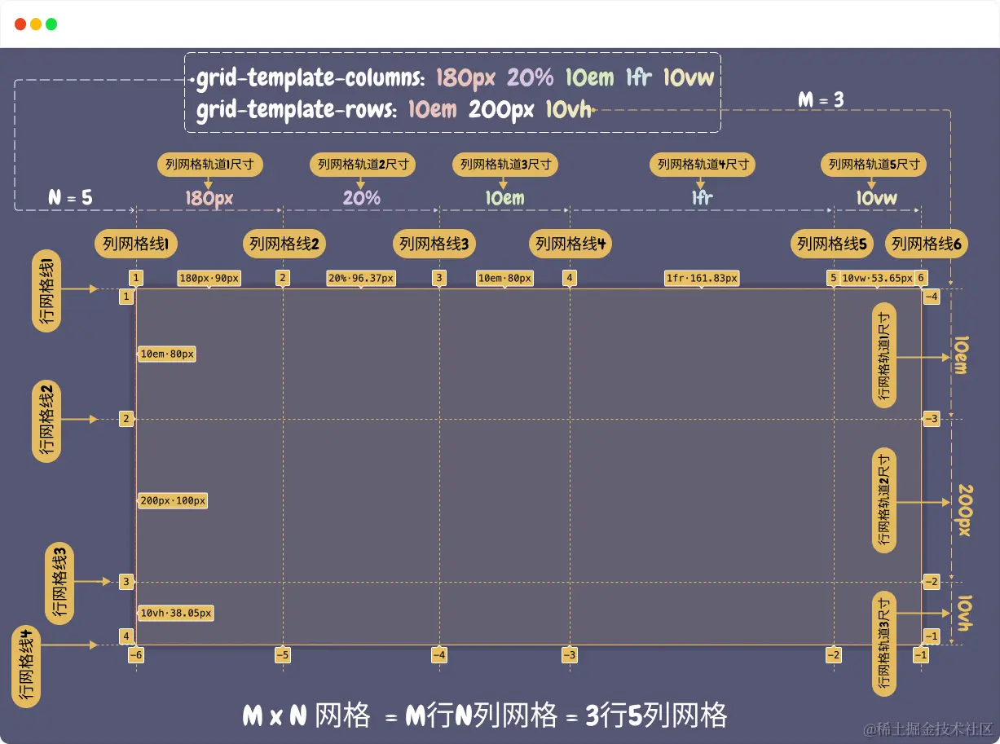

如上图所示，`grid-template-columns` 和 `grid-template-rows` 创建的网格线默认是以数字进行索引的：

- grid-template-columns 创建的列网格线，它从左往右是从 1 到 N+1 进行索引（比如上图中的 1 ~ 6），从右往左是从 -1 到 -(N+1) 进行索引（比如上图中的 -1 ~ -6）。
- grid-template-rows 创建的行网格线，它从上往下是从 1 到 M + 1 进行索引（比如上图中的 1 ~ 4），从下往上是从 -1 到 -(M+1) 进行索（比如上图中的 -1 ~ -4）。

默认是数字命名网格线名称，也可以显式给网格线命名。可以在 `grid-template-rows` 和 `grid-template-columns` 属性中定义网格轨道时给网格线命名。显式命名网格线名称时，网格线名称需要放置在中括号里（[]），即 `[line-name]` 。比如：

```css
/*
  grid-template-columns: [列网格线1] [列网格轨道1尺寸] [列网格线2] [列网格轨道2尺寸] [...] [列网格轨道N的尺寸] [列网格线N+1]
  grid-template-rows: [行网格线1] [行网格轨道1尺寸] [行网格线2] [行网格轨道2尺寸] [...] [行网格道M的尺寸] [行网格线M+1]
*/
.container {
  grid-template-columns: [col1] 180px [col2] 20% [col3] 10em [col4] 1fr [col5] 10vw [col6];
  grid-template-rows: [row1] 10em [row2] 200px [row3] 10vh [row4];
}
```

这样会在默认的网格线索引号上新增已命名的网格线名称：

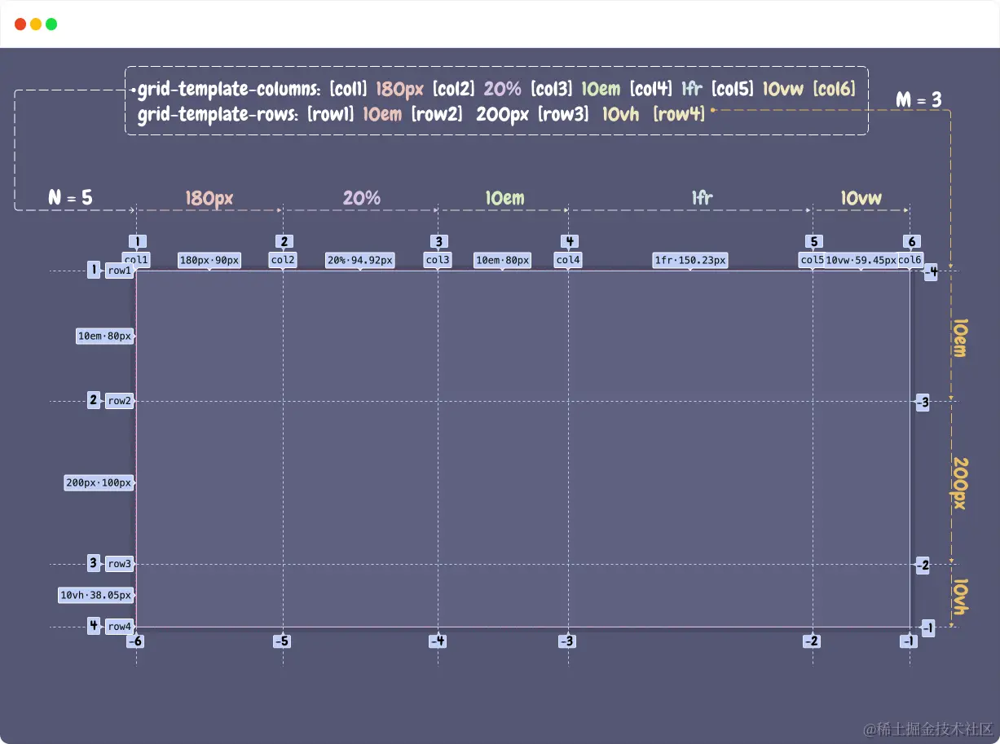

> **注意**：它们是相互叠加的关系，并不是相互替换的关系。

在网格容器中设置 gap 属性时，可以给网格轨道之间设置间距。如果使用浏览器调试工具查看带有 gap 设置的网格时，会发现相邻两个网格轨道有两条线网格线存在。其实它就是一条网格线，但是可以换一种思路来理解，它可以是两条网格线，只不过前者是以 `-end` 命名的网格线，后者是 `-start` 命名的网格线：

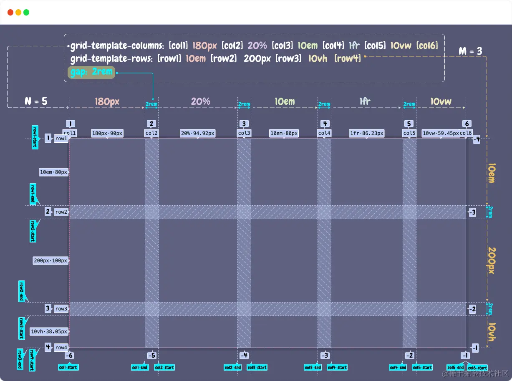

因此，可以以 `-end` 和 `-start` 给同一条网格线命名：

```css
grid-template-columns: [列网格线1 列网格线1-start] 列网格轨道1的尺寸 [列网格线1-end 列网格线2-start] 列网格轨道2尺寸 [列网格线2-end 列网格线N-start] 列网格轨道N的尺寸 [列网格线N-end 列网格线(N+1)-start]
grid-template-row: [行网格线1 行网格线1-start] 行网格轨道1的尺寸 [行网格线1-end 行网格线2-start] 行网格轨道2尺寸 [行网格线2-end 行网格线M-start] 行网格轨道M的尺寸 [行网格线M-end 行网格线(M+1)-start]
```

```css
.container {
  display: grid;
  grid-template-columns:
    [col1 col1-start] 180px
    [col1-end col2 col2-start] 20%
    [col2-end col3 col3-start] 10em
    [col3-end col4 col4-start] 1fr
    [col4-end col5 col5-start] 10vw
    [col5-end col6 col6-start];
  grid-template-rows:
    [row1 row1-start] 10em
    [row1-end row2 row2-start] 200px
    [row2-end row3 row3-start] 10vh
    [row3-end row4 row4-start];

  gap: 2rem;
}
```

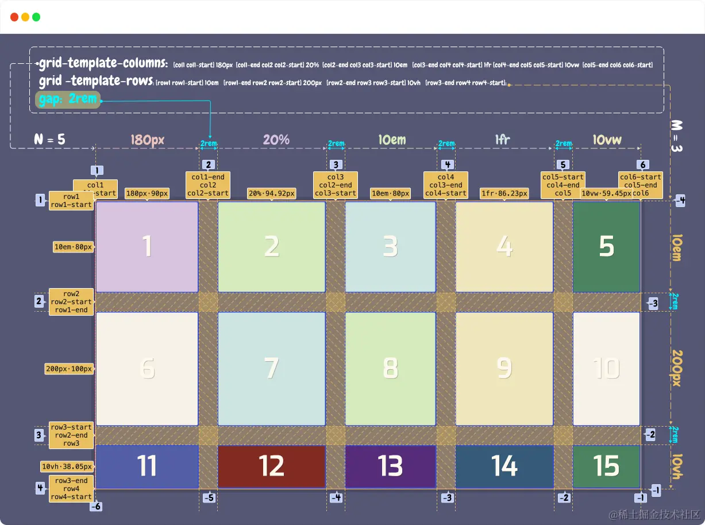

还可以在 `[]` 中放置任意数量的网格线名称，但它们之间需要用空格隔开。不过在给网格线命名的时候，建议尽可能使用具有语义化名称，更利于多人协作开发。还可以使用表情符（Emoji ）或 HTML 的实体符来命名。

在给网格线显式命名时，除了给网格线定义一个具有语义化的名称之外，还应该避免使用 CSS 的关键词给其命名，尤其是 span、auto、inherit、initial、unset、all、revert 等。因为使用这些关键词给网格线命名会令 grid-template-rows 和 grid-template-columns 属性失效。

用一个[常见的三列布局](https://codepen.io/airen/full/OJZaMxW)，来说明任意网格线名称的作用：

```css
.container {
  grid-template-columns:
    [header-start nav-start footer-start] 220px
    [nav-end main-start] 1fr
    [main-end aside-start] 220px
    [aside-end header-end footer-end];
  grid-template-rows:
    [header-start] auto
    [header-end nav-start main-start aside-start] 1fr
    [nav-end main-end aside-end footer-start] auto
    [footer-end];
}

header {
  grid-column: header-start / header-end;
  grid-row: header-start / header-end;
}

nav {
  grid-column: nav-start / nav-end;
  grid-row: nav-start / nav-end;
}

main {
  grid-column: main-start / main-end;
  grid-row: main-start / main-end;
}

aside {
  grid-column: aside-start / aside-end;
  grid-row: aside-start / aside-end;
}

footer {
  grid-column: footer-start / footer-end;
  grid-row: footer-start / footer-end;
}
```

这样一来，还可以使用 `grid-area` 来指定网格项目的位置：

```css
header {
  grid-area: header;
}

main {
  grid-area: main;
}

nav {
  grid-area: nav;
}

aside {
  grid-area: aside;
}

footer {
  grid-area: footer;
}
```

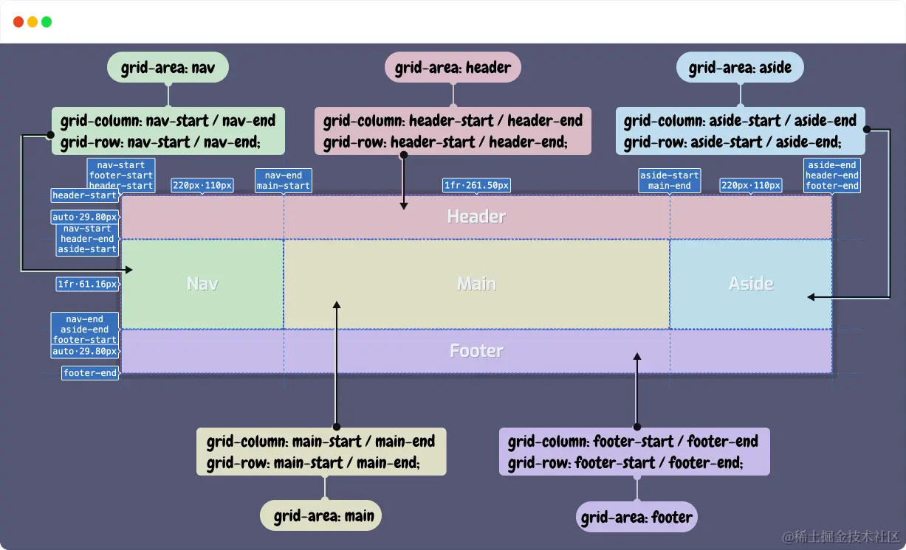

#### 3.2.3 使用 grid-template-areas 定义网格

网格布局中，除了使用 `grid-template-columns` 和 `grid-template-rows` 创建一个显式网格之外，还可以使用 `grid-template-areas` 来创建。

该属性可以用来给网格区域命名，并且指定了命名的网格区域不与任何特定的网格项目关联，但可以将已命名好的网格区域名称用在 `grid-row`、`grid-column` 和 `grid-area` 属性上，这些属性会按照网格区域名称来放置网格项目。它除了给网格区域命名之外，还提供了网格结构的可视化，使网格容器的整体布局更容易理解。该属性主要接受的值有：

- `none`：表示没有命名的网格区域，同样也没有显式的网格轨道被这个属性定义（显式的网格轨道仍然可以由 grid-template-columns 或 grid-template-rows 创建）。
- `<string>`：为 grid-template-areas 属性列出的每一个单独的字符串创建一行，用空格分隔的每一个字符串代表的是一个单元格，对应会创建一列网格轨道。多个同名的，跨越相邻行或列的单元格称为网格区域。非矩形的网格区域是无效的。

简单地说，grid-template-areas 中的每个字符串值都代表网格中的单元格，每行字符串（由多个空格隔开的字符串）代表网格中的行轨道，每个字符串中以空格分隔的一组值代表网格中的列轨道。比如下面这个示例：

```css
.container {
  grid-template-areas:
    'header  header  header'
    'nav     main    aside'
    'footer  footer  footer';
}
```

grid-template-areas 属性值等同于绘制了一个 3 x 3（三行三列）的网格：

```css
----------------------------------
|  header  |  header  |  header  |
----------------------------------
|  nav     |  main    |  aside   |
----------------------------------
| footer   |  footer  |  footer  |
----------------------------------
```

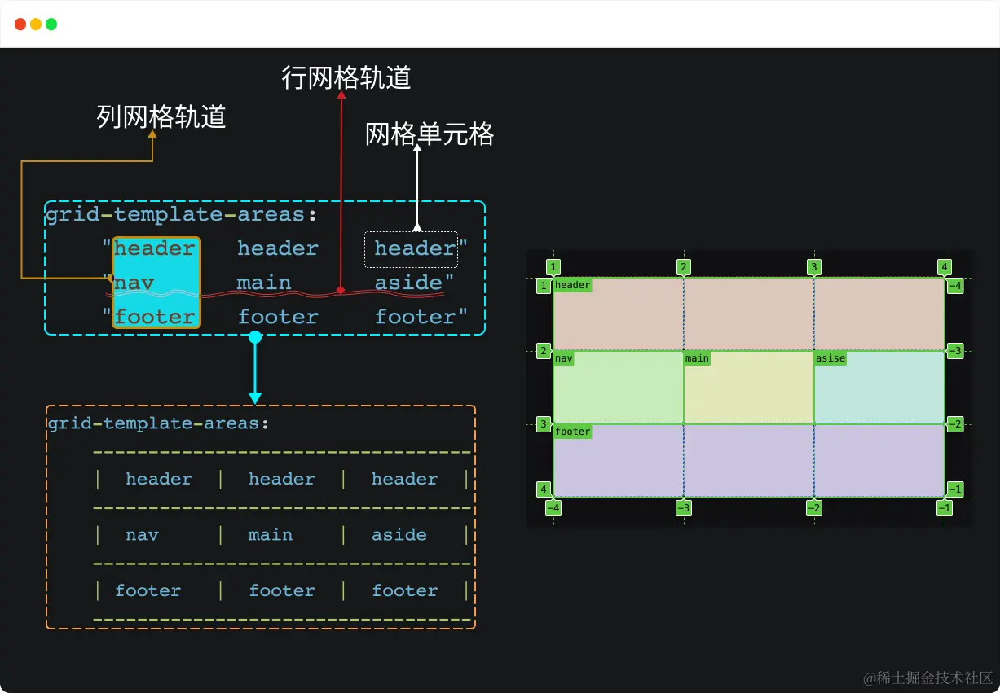

如此一来，可以使用 grid-template-areas 结构化（可视化）来构建 Web 布局，比如常见的一个 Web 布局：

```html
<div class="container">
  <header>Primary Navigation Or Tools</header>
  <nav>Secondary Navigation</nav>
  <main>Main Content Space</main>
  <aside>Tertiary Navigation</aside>
  <footer>Miscellaneous Information</footer>
</div>
```

```css
.container {
  display: grid;
  grid-template-areas:
    'header   header   header'
    'nav      main     aside'
    'nav      footer   footer';
}

header {
  grid-area: header;
}

nav {
  grid-area: nav;
}

main {
  grid-area: main;
}

aside {
  grid-area: aside;
}

footer {
  grid-area: footer;
}
```

在 CSS 网格布局中，使用 grid-template-areas 定义一个显式网格是很容易的，但使用它给网格区域命名时有一定的规则，如果在使用的时候违反了这些规则，将会造成 grid-template-areas 失效，或定义出来的网格不是所期望的网格。

下面是 `grid-template-areas` 属性给网格区域命名的六条规则：

1. 必须描述一个完整的网格，即网格上的每一个单元格都必须被填充。
2. 一连串的空白，代表什么都没有，将造成 `grid-template-areas` 语法错误。
3. 在网格命名中可以使用一个或多个 `.`（U+002E），代表一个空单元格。
4. 多个相同单元格命名（令牌）创建一个具有相同名称的命名网格区域。简单地说，跨行或列命名相同的网格区域名称，可以达到合并单元格的作用。

   通过给网格区域命名来达到合并多个单元格时，只能按行轨道或列轨道方向合并。一个命名的网格区域跨越多个网格单元格时，它们必须要形成一个单一的填充矩形，否则会造成 grid-template-areas 属性失效。

5. 任何其他字符的序列，会代表一个垃圾标记（Trash Token），会使声明无效。
6. 当序列化 grid-template-areas 的 `<string>` 值是指定值或计算值时，相邻两字符串（网格区域命名）被一个空格（U+0020）隔开，当两者之间有多个空格符时，会被视为一个，其他空格将会被忽略。

`grid-template-areas` 在显式给网格区域命名的同时，也隐式创建了相应的行网格线与列网格线，并且网格线的名称是以 `网格区域名称-start` 和 `网格区域名称-end` 方式命名。例如，网格区域的名称叫 header ，则围绕该区域会创建四条隐式网格线：

- 行网格线：`header-start` 和 `header-end`
- 列网格线：`header-start` 和 `header-end`。

#### 3.2.4 使用 grid-auto-columns 和 grid-auto-rows 定义网格

```css
.container {
  display: grid;
  grid-template-columns: repeat(2, 200px);
  gap: 4px;
}
```

grid-template-columns 告诉浏览器创建了一个两列（列宽是 200px）的网格，但并没有告诉浏览器，网格有几行以及行高是多少。这个时候浏览器会根据网格项目来创建行轨道。当网格容器只有一个或两个网格项目时，它创建的是一个 1 x 2（一行两列）的网格；当网格项目超过网格列轨道数量时，浏览器会新创建一个行轨道，并且以内容高度为行轨道高度。

浏览器会这样处理，是因为并没有明确地把网格项目放置到指定的网格单元格（或网格区域上），因此它会被**自动放置**（Auto Placement）。默认情况下，每个网格项目在行轴和列轴上的跨度（span）都是 1 ，所以它们都会被放置到下一个可用的网格单元格中。在网格中这个新增的行被称为**隐式行轨道** ，被自动创建的隐式行轨道的尺寸是自适应大小的，它会根据它所包含的内容来设定行轨道尺寸，以保证内容不溢出网格。

在网格布局中，有一个类似于 grid-template-rows 的属性 `grid-auto-rows`，该属性主要用来显式指定隐式行轨道的尺寸：

```css
.container {
  display: grid;

  /* 设置隐式行轨道尺寸 */
  grid-auto-rows: 200px;
  /* grid-auto-rows 可以设置多个值，并且每个值之间使用空格隔开 */
  /* grid-auto-rows 的值是不断循环的 */
  grid-auto-rows: 100px 160px 1fr;
}
```

`grid-auto-columns` 的使用和 `grid-auto-rows` 一样，不同的是它用来创建隐式列轨道和隐式列轨道尺寸。

> **注意**：`repeat()` 函数用于 `grid-auto-rows` 或 `grid-auto-columns` 时会失效。

#### 3.2.5 使用 grid-auto-flow 改变网格排列方向

在网格布局中，使用 `grid-auto-flow` 来控制流的方向。该属性可以接受的值主要有：

- `row`：自动放置算法，通过依次填充每一行来放置网格项目，必要时添加新行。如果既没有提供行也没有提供列，则假定是行。
- `column`：自动放置算法，通过依次填充每一列来放置网格项目，必要时添加新的列。
- `dense`：如果 grid-auto-flow 属性指定了该值，自动放置算法使用 dense（“密集”）包装算法，如果较小的网格项目出现在网格中，它将尝试在较早的时间内填入洞（“网格单元格”）。这可能会导致网格项目不按顺序出现，而这样做会填补大网格项目留下的洞（“单元格”）。如果省略了该值，则使用 sparse（“稀疏”）算法，自动放置算法在放置网格项目时，只在网格中“向前（forward）”移动，从不回溯以填补漏洞。这确保了所有自动放置的网格项目都是“按顺序”出现的，即使是留下了可以由后来的网格项目填补的洞（“网格单元格”）。

> **注意**：dense 只是改变了网格项目的视觉顺序，可能会导致它们出现失序，这对 Web 可访问性是不利的，但在创建图片墙时就很有用。

### 3.3 Grid 布局中的计算

#### 3.3.1 网格中百分比的计算

当元素的 width 值是个百分比值时，它是相对于其父容器的 width 计算的；同样，height 值是相对于父容器的 height 计算的。在网格布局中，如果网格轨道的值是一个百分比值时，它的计算是相对于网格容器的 width 或 height 来计算，其中：

- 列轨道的百分比（即 grid-template-columns 或 grid-auto-columns 属性的值是百分比值）是相对于网格容器宽度（width）计算，更为严格地说，它是相对网格容器的内联轴尺寸 `inline-size` 来计算。
- 行轨道的百分比（即 grid-template-rows 或 grid-auto-rows 属性的值是百分比值）是相对于网格容器高度（height）计算，更为严格地说，它是相对网格容器的块轴尺寸 `block-size` 来计算。

```css
.container {
  width: 800px;
  height: 400px;

  display: grid;
  grid-template-columns: 20% 50% 30%;
  grid-template-rows: repeat(2, 50%); /* 等同于 50% 50% */
}
```


当 width 值为 100% 且该元素显式设置了 padding 或 border-width 值时，并且 box-sizing 不是 border-box 时，设置宽度为 100% 的元素就会溢出容器；或者 width 为 100% 的元素碰到外边距 margin 也会引起元素溢出容器。

而在网格布局中同样会有类似的现象。当网格轨道的值都是百分比值，而且总值是 100% 时，要是加上 gap 设置网格轨道间距，就会造成总值超过网格容器，网格就会溢出。这是因为，网格轨道取值百分比时，它是基于网格容器的大小计算，并不会关心网格容器中的其他情况。

```css
.container {
  width: 800px;
  height: 400px;

  display: grid;
  grid-template-columns: 20% 50% 30%;
  grid-template-rows: repeat(2, 50%); /* 等同于 50% 50% */

  gap: 20px;
}
```

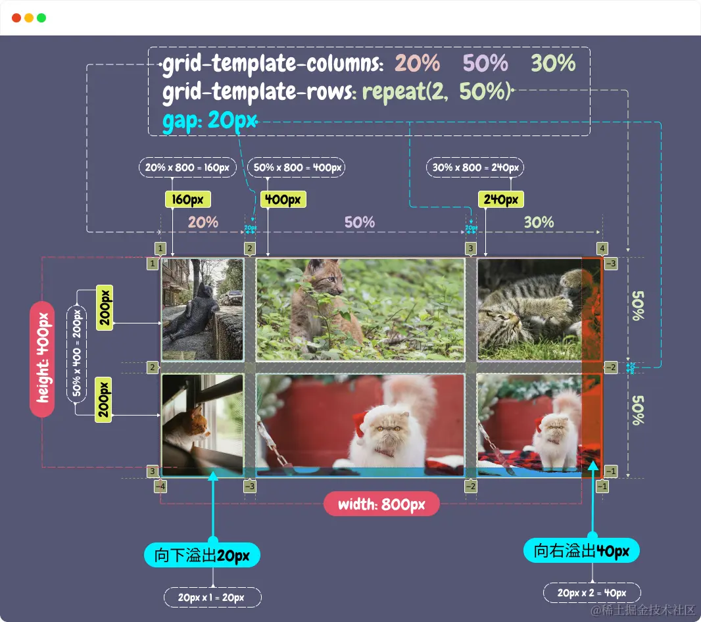

在 CSS 中，当容器子元素宽度总和是 100% 时，要是在任何子元素上设置 margin 值，也会造成子元素溢出容器，比如下面这个示例：

```html
<flex-container>
  <flex-item></flex-item>
  <!-- 总共有四个 Flex Item -->
</flex-container>
```

```css
.flex__container {
  width: 800px;
  height: 400px;

  display: flex;
  flex: 1 0 20%;
}

.flex__item {
  margin: 2rem;
}
```

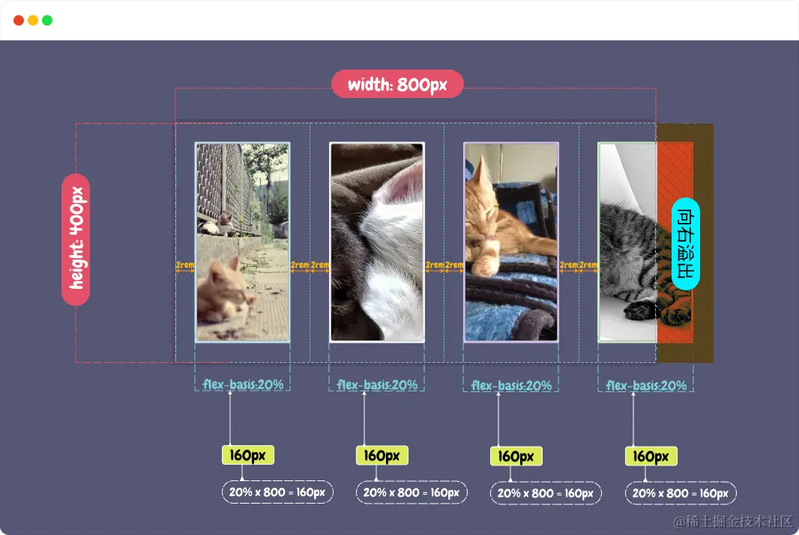

不过，这一现象在网格中的表现却有所不同。当网格轨道的尺寸值总和是 100%，这个时候在网格项目上设置 margin 值时，并不会致使网格溢出容器，只会让网格项目距所在单元格（或网格区域）四边有一定的间距。它表现出来的现象就像是网格项目向内收缩一样：

```css
.container {
  display: grid;
  grid-template-columns: 20% 50% 30%;
  grid-template-rows: repeat(2, 50%);
}

.item {
  margin: 20px;
}
```

#### 3.3.2 网格中 fr 的计算

`fr` 单位值仅能用于 CSS 网格布局中，即它只用于 `grid-template-rows`、`grid-template-columns`、`grid-auto-rows` 和 `grid-auto-columns` 属性上。它是一种特殊的大小调整方法，可以根据网格容器中可用空间份额比例来调整网格轨道大小。

> **`fr` 单位代表网格容器中可用空间的一等份**。

`fr` 的工作方式与 flex 中的 auto 非常类似。不过它的计算要比 Flexbox 中的 flex 简单得多。

```css
/* 使用 fr 单位的网格，设置 gap 为 20 px 也不会让网格溢出容器 */
.container {
  display: grid;
  grid-template-columns: 20fr 50fr 30fr;
  grid-template-rows: repeat(2, 50fr);
  gap: 20px;
}
```

网格轨道使用 `fr` 单位确定尺寸大小的话，该网格轨道就被称为**弹性网格轨道**，因为它会根据网格容器可用空间对网格轨道进行弹性缩放。网格轨道使用 fr 单位时，一般会按下面公式来计算：

$$
网格轨道弹性尺寸 = \frac{网格轨道弹性系数 × 网格容器可用空间}{所有网格轨道弹性系数总和}
$$

**会影响 fr 计算的因素**：

1. 网格轨道的尺寸最小不能小于其内容的最小尺寸，即 `min-content`。

   ```css
   .container {
     display: grid;
     width: 800px;
     height: 200px;

     /* 第三列最小为 220px，会导致其他几列重新计算 */
     grid-template-columns: repeat(4, 1fr);
   }
   ```

2. 在给网格轨道设置尺寸时，还可以将 fr 单位值和别的单位值混合使用：

   ```css
   .container {
     display: grid;
     width: 800px;
     height: 200px;

     /*
      * 步骤1 »» 网格容器内联轴可用空间 = 800px - 220px = 580px (第三列网格轨道尺寸是一个固定值，即 220px)
      * 步骤2 »» 总弹性系数 = 1fr × 3 = 3fr
      * 步骤3 »» 1fr = (800px - 220px) ÷ 3fr = (800 - 220) ÷ 3 = 193.33px
      */
     grid-template-columns: 1fr 1fr 220px 1fr;
   }
   ```

3. `gap` 属性的值也会影响 fr 计算。它也会占用网格容器的部分可用空间：

   ```css
   .container {
     display: grid;
     width: 800px;
     height: 200px;

     /*
      * 步骤1 »» 网格容器内联轴可用空间 = 800px - 220px - 20px × 3 = 520px (第三列网格轨道尺寸和网格沟槽会占用网格容器的可用空间)
      * 步骤2 »» 总弹性系数 = 1fr × 3 = 3fr
      * 步骤3 »» 1fr = （800px - 220px - 20px × 3） ÷ 3fr = (800 - 220 - 20 x 3) ÷ 3 = 173.33px
      */
     grid-template-columns: 1fr 1fr 220px 1fr;
     gap: 20px;
   }
   ```

在网格布局中，如果弹性网格系数总和小于 1，那计算 fr 的值时，所有网格轨道弹性系数总和应为 1。

```css
.container {
  display: grid;
  width: 800px;
  height: 200px;

  /*
   * 步骤1 »» 网格容器内联轴可用空间 = 800px - 220px - 20px × 3 = 520px (第三列网格轨道尺寸和网格沟槽会占用网格容器的可用空间)
   * 步骤2 »» 总弹性系数 = 0.3fr + 0.2fr + 0.2fr = 0.7fr (弹性系数总和是小于1的)
   * 步骤3 »» 每一个fr, 即 1fr = （800px - 220px - 20px × 3） ÷ 1fr = (800 - 220 - 20 x 3) ÷ 1 = 520px
   *
   * 网格列轨道1尺寸 = 0.3fr × (800px - 220px - 20px × 3) = 0.3 × 520 = 156px
   * 网格列轨道2尺寸 = 0.2fr × (800px - 220px - 20px × 3) = 0.2 × 520 = 104px
   * 网格列轨道3尺寸 = 220px，固定尺寸
   * 网格列轨道4尺寸 = 0.2fr × (800px - 220px - 20px × 3) = 0.2 × 520 = 104px
   */
  grid-template-columns: 0.3fr 0.2fr 220px 0.2fr;
  gap: 20px;
}
```

计算之后的所有列网格轨道的尺寸总和是 584px，即使加上列网格轨道之间的间距，总占用网格容器的空间是 644px，都小于网格容器的可用空间 800px。也就是说，**当所有网格轨道弹性系数（fr）之和小于 1 时，它们将占用小于 100% 的网格容器的可用空间，即网格容器会有剩余空间出现**。

网格轨道的弹性系数是一个小于 1 的值时，更易于触及网格轨道最小尺寸的边缘。

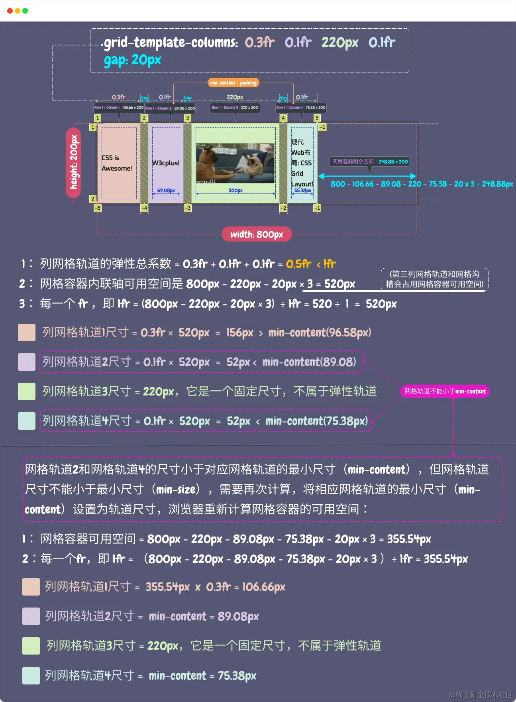

##### 3.3.2.1 网格项目中的最小尺寸

**设置 1fr 的网格轨道并不代表着网格轨道的列宽（或行高）都是相等的**。这是因为，它和网格轨道中的内容有着关联。换句话说，**只要内容是灵活的（网格项目大小会随着内容扩大或收缩），一个 fr 单位就是总量的一部分。意思是说，只要网格项目中的内容能够缩放以适合该网格轨道（列或行），设置 1fr 网格轨道的大小就相等**。

然而，一旦网格项目内容停止缩放以适应网格轨道，设置 fr 值的网格轨道就会被重新调整，使内容能更好的适配。比如，如果网格布局中有一列具有一个固定宽度的网格项目，该网格列轨道的宽度将永远不会小于这个网格项目的宽度。

因此，一个具有 1fr 的网格列轨道，其最小值等于内容的最小宽度（即 min-content），其中 min-content 可以是网格轨道中网格项目的一个固定尺寸的元素，比如图片的宽度，也可以是一个文本节点中最长的字。如果这种情况在网格布局中产生的话，那么其他设置 1fr 值的网格轨道就会相应地按比例缩小。

> **对于网格项目来说：最小值是自动设置的（相当于 min-content），最大值就是显式设置的值**（比如 1fr 等）。

1fr 的底层实现逻辑其实就是 `minmax(auto, 1fr)`，意味着 min=auto（即 min-width: min-content），max=1fr。

也就是说，如果真的需要均分列（所有设置 1fr 的列宽相等），就应该使用 `minmax(0, 1fr)` 来替代 1fr，将 1fr 的默认 min-width 从 min-content（即 auto）重置为 0。这样就允许网格轨道尺寸保持在 0 至 1f 范围内，从而创建保持相等的列。

fr 这个表现行为和 Flexbox 中的 flex:1 有点类似，除了使用 `minmax(0, 1fr)` 来替代 1fr 之外，可以在网格项目上显式设置 `min-width: 0` 来达到同等的效果：

```css
.container {
  display: grid;
  grid-template-columns: repeat(3, 1fr);
  gap: 1rem;
}

.item {
  min-width: 0;
}
```

在 CSS 网格布局中，fr 是一个非常有用的单位，也是 CSS 网格布局中独有的特性。虽然 fr 很强大，但也不能说随时随地都可以使用 fr。比如说：

- 在 calc() 表达式中使用 fr 就无效，因为 fr 的 `<flex>` 值类型，它和其他 `<length>` 值类型不兼容。
- gap 属性中也不能使用 fr，因为 fr 是用来指定网格轨道尺寸的，不是用来指定网格沟槽大小的。
- calc() 中使用 var() 和 fr 计算也是一种无效行为。

#### 3.3.3 可用于 Grid 布局中的函数

##### 3.3.3.1 repeat()

```css
.container {
  grid-template-columns: 1fr 1fr 1fr;
  /* 等同于 */
  grid-template-columns: repeat(3, 1fr);
}
```

网格中的 `repeat()` 函数主要用来设置网格轨道列表（`<track-lists>`）的重复片段，允许以更紧凑的形式写入大量显示重复模式的网格轨道（列或行）。该函数可以用于 `grid-template-columns` 和 `grid-template-rows` 属性，用来设置网格轨道尺寸大小，但它不能用于 `grid-auto-rows` 和 `grid-auto-columns`。

repeat() 函数具有一定的语法规则，它接受两个参数：

1. 第一个参数表示重复的次数，比如 repeat(3, 1fr) 中的 3，该参数除了可以是**正整数**之外，还可以是 `auto-fit` 和 `auto-fill` 两关键词。
2. 第二个参数是一个长度列表值，即重复的网格轨道的列表值，比如 repeat(3, 1fr) 中的 1fr；另外该参数的值还可以是一个复合值，比如 `repeat(3, 1fr 20px [col])` 中的 `1fr 20px [col]`。

repeat() 函数的第二个值除了可以是网格轨道列表值之外，也可以显式给网格线命名，比如：

```css
.container {
  grid-template-columns: repeat(3, 1fr [col]);
  /* 等同于 */
  grid-template-columns: 1fr [col] 1fr [col] 1fr [col];
}
```

要是在 repeat() 函数中重复网格线名称的话，结束的网格线名称最终会与下一条开始网格线名称共享同一个网格线名称。

另外，可用于设置网格轨道尺寸的值，都可以被用于 repeat() 函数的第二个参数，比如：

```css
.container {
  grid-template-columns: repeat(3, minmax(min(300px, 100%), 1fr));
  /* 等同于 */
  grid-template-columns:
    minmax(min(300px, 100%), 1fr)
    minmax(min(300px, 100%), 1fr)
    minmax(min(300px, 100%), 1fr);
}

.container {
  grid-template-columns: repeat(3, min-content auto max-content);
  /* 等同于 */
  grid-template-columns:
    min-content auto max-content
    min-content auto max-content
    min-content auto max-content;
}
```

> **注意**：repeat() 函数中不能嵌套 repeat() 函数。

###### 3.3.3.1.1 auto-fill vs auto-fit

前面几个示例中 repeat() 函数的第一个参数都是整数值。一般在已知网格轨道要重复的次数时才用，但很多时候，可能并不知道网格轨道重复的数量，更希望的是它能自动匹配。

repeat() 函数的第一个参数除了可以接受一个整数值之外，还可以接受 `auto-fit` 和 `auto-fill` 两个关键词。它们会告诉浏览器处理网格轨道的大小和断行（或断列），以便当容器空间不足以容纳元素时，元素会自动换行（或列）而不会造成溢出。但 `auto-fill` 和 `auto-fit` 两者之间还是有一些细微差异的。

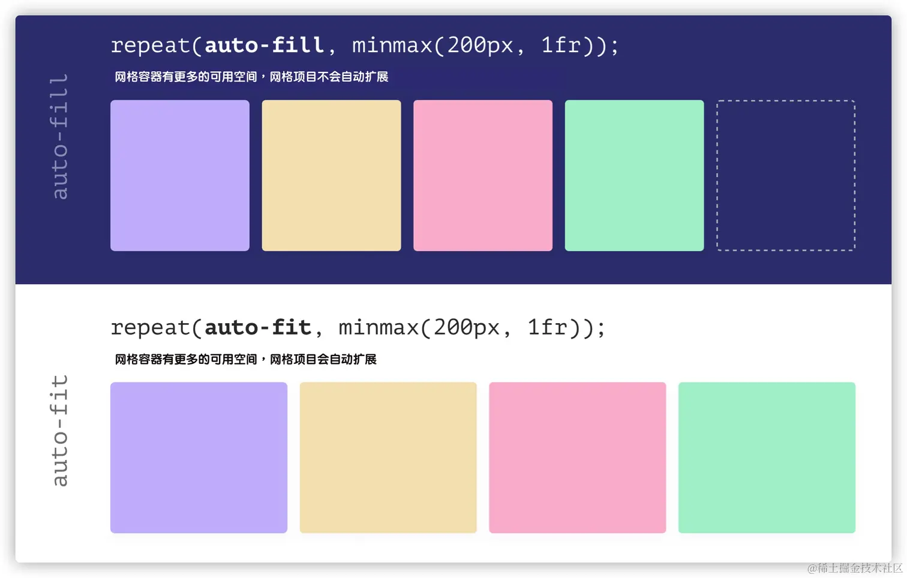

- `auto-fill`：在同一行中填充尽可能多的列。因此，只要能容纳新的列，就会自动创建隐式列，因为它试图在同一行中填充尽可能多的列。新添加的列（隐式列）可以是空的，但是它们仍然会在行中占据指定的空间。
- `auto-fit`：将当前可用的列扩展到空间中，以便它们占用容器可用空间。当容器有可用空间时，浏览器会将可用空间均分给列，让列自动变宽填满整个容器；当容器可用空间为负值时，会另起一行排列。

简单地说，**`auto-fit` 将扩展网格项目以填补可用空间，而 `auto-fill` 不会扩展网格项目。相反，`auto-fill` 将保留可用的空间，而不改变网格项目的宽度**。

下面以一个示例来演示 `auto-fit` 和 `auto-fill` 是如何工作的：

```html
<div class="container">
  <div class="item"></div>
  <div class="item"></div>
  <div class="item"></div>
  <div class="item"></div>
</div>
```

```css
.container {
  --width: 100%;
  --auto-size: auto-fit;

  display: grid;
  grid-template-columns: repeat(var(--auto-size), 120px);
  gap: 10px;

  width: var(--width); /* 它的父元素 width = 1000px */
  padding: 10px;
}
```

示例中网格容器的宽度是 1000px，并且设置了 10px 的内距（padding），grid-template-columns 指定的列网格轨道尺寸是 120px，网格沟槽（列网格轨道之间的间距）是 10px。

`repeat()` 函数的第一个参数不管是 auto-fit 还是 auto-fill，浏览器都会根据相关的参数（比如网格容器的宽度、网格轨道尺寸和网格沟槽等）创建出最适合于网格容器可用空间的网格列轨道数量，即，**在保证网格项目不溢出网格容器之下，创建最多数量的网格列（或行）轨道**。

```txt
网格容器宽度 = 网格列轨道尺寸 × 网格列轨道数量 + (网格列轨道数量 - 1) × 网格沟槽
980       =   120px      ×     ?          (     ?      - 1) × 10
```

浏览器计算出这个 “?” 大约会是 7.66667，所以浏览创建了一个七列的网格。不同的是 `auto-fit` 会把空的网格轨道折叠在一起（空网格轨道是指没有放置网格项目的网格轨道）。折叠的轨道尺寸大小会被视为 0px。浏览器为了找到自动重复的轨道数，会将轨道尺寸限制为用户代理指定的值（比如 1px），来避免被零除。

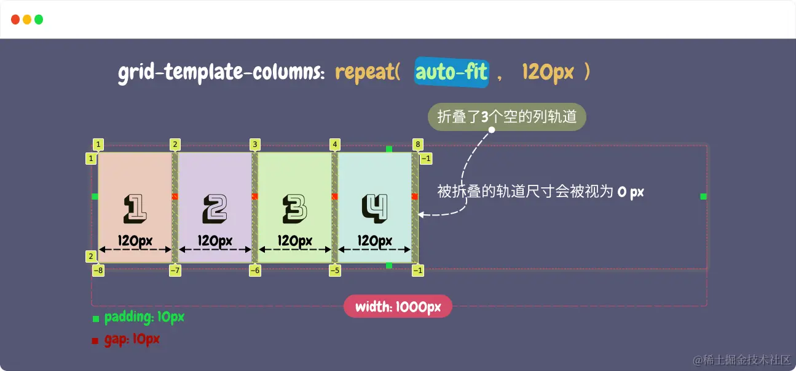

`auto-fill` 则不会将创建的空网格轨道折叠在一起：

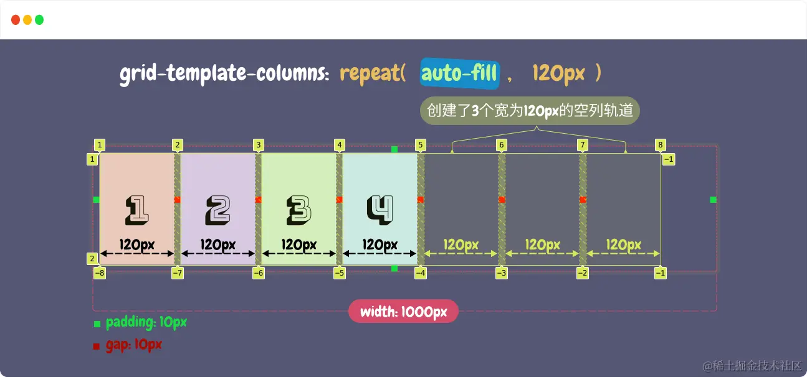

> repeat() 函数中使用 auto-fit 或 auto-fill 关键词替代重复的次数时，又被称为**自动换行**。当网格容器无法容纳网格轨道时（有网格项目的），就会自动创建新的一行。

虽然在 repeat() 函数中使用 auto-fit 或 auto-fill 都可能创建尽可能多的列，但每个网格轨道的尺寸是固定的，它并不是一个自动尺寸。不过，可以将 fr 单位值和 minmax() 函数结合在一起，让网格轨道尺寸是自动的 ，即网格轨道尺寸是自动匹配的（在一个范围内）。

把上面示例稍微调整一下，将 repeat(var(--auto-size), 120px) 中的 120px 替换成 minmax(120px, 1fr)：

```css
.container {
  --width: 100%;
  --auto-size: auto-fit;

  display: grid;
  grid-template-columns: repeat(var(--auto-size), minmax(120px, 1fr));
  gap: 10px;
  width: var(--width); /* 它的父元素 width = 1000px */
  padding: 10px;
}
```

- `auto-fit` 时，创建的重复轨道尺寸是 0，网格轨道的尺寸会介于 120px ~ 1fr 之间，最小是 120px，最大是 1fr，而且 1fr 会根据网格容器可用空间计算出网格轨道尺寸。由于创建的重复轨道尺寸是 0，所以网格容器可用空间更大（1000px - 10px × 2 - 10px × 3 = 950px），对应的 1fr = 1 / 4 = 25% × 950px = 237.5px ，所以看到的网格项目被拉伸了：

  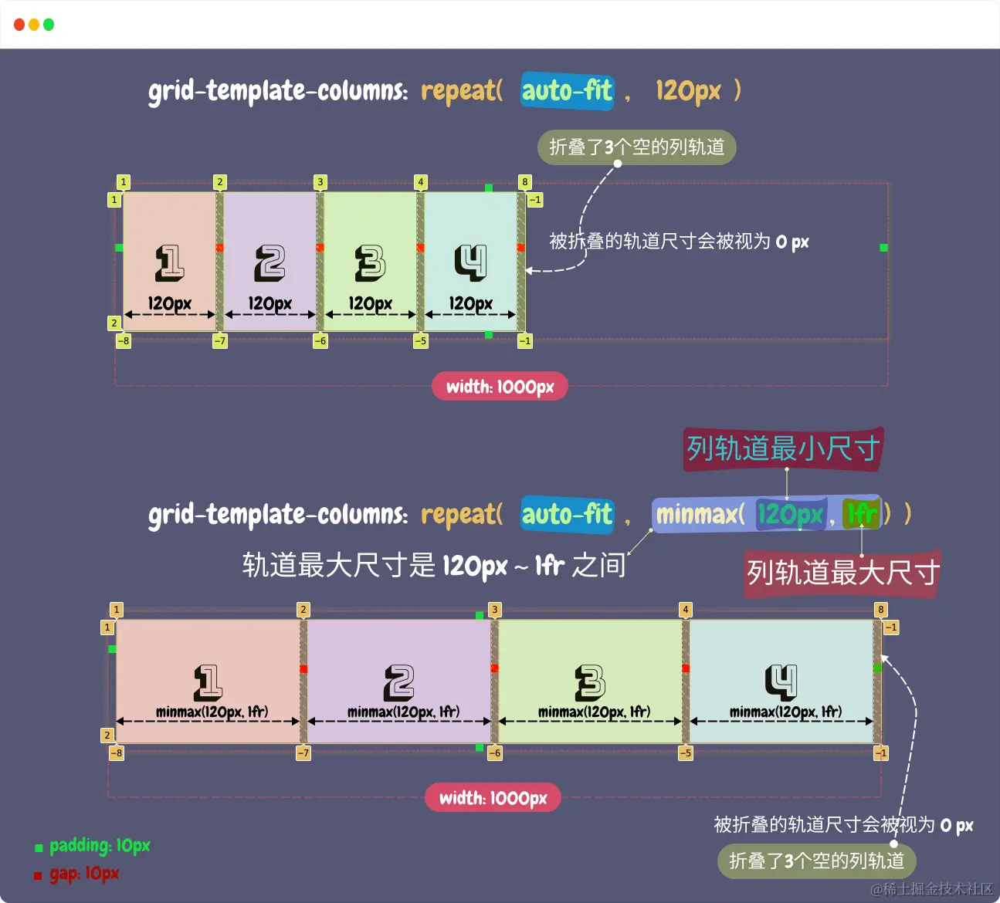

- `auto-fill` 创建的重复轨道尺寸也是 minmax(120px, 1fr)，而且不会被折叠，所以网格容器的可用空间分的等份就更多（因为创建的三个空网格轨道占着位置），即 7 个 fr。同时网格容器可用空间也更小 （1000px - 10px × 2 - 10px × 6 = 920px），对应的 1fr = 1 / 7 = 14.28% × 920px = 131.43px，即网格轨道尺寸是介于 120px ~ 1fr （相当于 120px ~ 131.43px）之间：

将 repeat() 函数和 minmax(min, max)、1fr 和 auto-fill（或 auto-fit）结合起来，可以很容易实现页面宽度变化时，子项目宽度自动在一定范围内改变，自动填满容器，同一列子项目数量自动随之变化。这种布局技术被称为 **RAM**（Repeat, Auto, Minmax）布局，一种无需依赖任何 CSS 媒体查询特性的响应式布局。

```css
.container {
  display: grid;
  grid-template-columns: repeat(auto-fill, minmax(250px, 1fr));
  gap: 20px;
}
```

##### 3.3.3.2 minmax()

`minmax()` 函数是用于设置网格轨道尺寸的另一个函数，它可以用于 `grid-template-columns`、`grid-template-rows`、`grid-auto-columns` 和 `grid-auto-rows` 属性上。该函数可以接受两个参数值，即 `MIN` 和 `MAX` 。每个参数都可以是：

- `<length-percentage>` 值，比如 px 和 %
- `<flex>` 值，比如 fr
- `关键词`，比如 auto、min-content、max-content
- `函数表达式`，比如 min()、max()、clamp() 和 calc()

`minmax(MIN, MAX)` 可以输出一个范围值，**它定义了一个大于或等于 MIN 值且小于或等于 MAX 值的尺寸范围**。

**minmax(MIN, MAX) 函数取不同类型值是如何工作的**：

- `<length>` 值类型

  ```css
  .container {
    grid-template-columns: minmax(100px, 220px) 1fr 1fr;
  }
  ```

  -length.webp>)

  使用 `minmax(100px, 220px)` 指定网格第一列的列宽保持在 100px 至 220px 之间，随着网格容器尺寸的变化，该列的宽度也会有改变，但总是在这两个值的范围内变化。

- `<percentage>`

  ```css
  .container {
    grid-template-columns: minmax(100px, 50%) 1fr 1fr;
  }
  ```

  -percentage.webp>)

  当 `minmax(MIN, MAX)` 的值为百分比值时，它们就是一个动态值，代表的范围值也会随着网格容器宽度而变化，并且计算出来的 MAX 值有可能会比 MIN 值小。

  > `minmax(MIN, MAX)` 函数，如果 MAX 小于 MIN 时，MAX 将会被忽略，最终 `minmax(MIN, MAX)` 函数将会返回 MIN 的值。

  `minmax(MIN, MAX)` 函数中的两个参数都可以取百分比（%）值，比如：

  ```css
  .container {
    grid-template-columns: minmax(30%, 50%) 1fr 1fr;
  }
  ```

  但是这样使用，有可能计算出来的值会比网格轨道中网格项目内容（元素）的最小尺寸（min-content）还会小，甚至网格列宽会趋于 0 ，将会造成网格项目溢出网格列轨道。

  因此，在使用 `minmax(MIN, MAX)` 函数设置网格轨道时，不建议 MIN 和 MAX 都取 `<percentage>`（%）值，更建议在 minmax(MIN, MAX) 中把 % 值和其他类型值结合起来使用，比如：

  ```css
  /* <inflexible-breadth>, <track-breadth> 值 */
  minmax(400px, 50%)
  minmax(30%, 300px)

  /* <fixed-breadth>, <track-breadth> 值 */
  minmax(1fr, 50%)
  minmax(400px, 50%)
  minmax(30%, 300px)
  minmax(50%, min-content)

  /* <inflexible-breadth>, <fixed-breadth> 值 */
  minmax(400px, 50%)
  minmax(30%, 300px)
  minmax(min-content, 50%)
  ```

  在 minmax(MIN, MAX) 函数中的参数值还可以是一个 `<flex>` 值（fr 单位值），如果该函数的有一个值是 fr 单位的值时，它会按 fr 计算来取值，而且和其他设置了 fr 单位值一起计算，分配网格容器可用空间。比如：

  ```css
  .container {
    grid-template-columns: minmax(100px, 1fr) 1fr 1fr;
  }
  ```

  当 minmax(100px, 1fr) 取 MIN 值时，则返回的是 100px；当它取 MAX 值时，则返回的是 1fr，此时 grid-template-columns 的值相当于 1fr 1fr 1fr。每个 fr 则等于网格容器可用空间的三分之一（因为总共有 3 个 fr，即 1fr + 1fr + 1fr）。

  > **注意**：minmax(MIN, MAX) 函数取 fr 单位值时，不能同时给 MIN 和 MAX 都设置 fr 单位的值，因为两个参数值都取 fr 单位值，浏览器会视该属性值无效：
  > 针对这一点，W3C 规范中有做过相应的描述：**在 `minmax(MIN, MAX)` 函数中使用 fr 单位值时，只能用于 MAX 值中**。

- `auto`

  ```css
  .container {
    grid-template-columns: minmax(auto, auto) 1fr 1fr;
  }
  ```

  在 `minmax(MIN, MAX)` 函数中使用关键词 `auto` 时：

  - **当 `auto` 作为 `MAX` 值 `（minmax(100px, auto)）`**

    auto 值相当于 max-content（minmax(100px, max-content)），即 `minmax(100px, auto)` 等同于 `minmax(100px, max-content)`。

  - **当 `auto` 作为 `MIN` 值 `（minmax(auto, 1fr)）`**

    它的值由对应网格轨道中内容的最小尺寸指定，`auto` 有时相当于 `min-content`（minmax(min-content, 1fr)），即 `minmax(auto, 1fr)` 等同于 `minmax(min-content, 1fr)`，但并非总是如此，因为有时候会受网格项目的 min-width（min-inline-size）或 min-height（min-block-size）值影响。如果显式指定网格项目的 min-width 或 min-inline-size，那么 min-content 等于 min-width 或 min-inline-size。

- `min-content`

  当 `minmax(MIN, MAX)` 函数取 min-content 值时，它的大小由相应网格轨道中的内容来决定，在网格列轨道中，min-content 的值将等同于所在列网格轨道中网格项目的内容最小尺寸。

- `max-content`

  minmax(MIN, MAX) 取 max-content 值时有点类似于 min-content，不同的是取最大长度，这个长度也称为“**理想大小**”，它可以容纳它包含的内容。比如网格项目是一个句子，那么理想长度就是这个句子长度，而且不用考虑长度，也不会换行。

  在 minmax(MIN, MAX) 函数中同时使用 `min-content` 和 `max-content` 时，可以得到一个响应式极强的布局效果，网格项目的内容永远不会溢出所在网格轨道：

  ```css
  .container {
    grid-template-columns: minmax(min-content, max-content) 1fr 1fr;
  }
  ```

##### 3.3.3.3 min() 和 max() 和 clamp()

> **`min()`、`max()` 和 `clamp()` 统称为 CSS 比较函数，可以给这些函数传入一个列表值，并对这些值做相应的比较，最终返回一个最适合的值。它们也可以像 calc() 函数，支持使用加法、减法、乘法和除法的数学表达式作为值**。

CSS 网格布局中，这些函数都可以用于设置网格轨道和网格沟槽的大小。

- `min()` 返回的是函数列表参数中最小的值，比如 min(100px, 200px) 返回的是 100px。

- `max()` 返回的是函数列表参数中最大的值，比如 max(100px, 200px) 返回的是 200px。

- `clamp(MIN, VAL, MAX)` 更类似于 minmax(MIN, MAX)，返回的是一个区间值。`clamp(MIN, VAL, MAX)`，其中 MIN 表示最小值，VAL 表示首选值，MAX 表示最大值。如果 VAL 在 MIN 和 MAX 之间（MIN < VAL < MAX），则使用 VAL 作为函数的返回值；如果 VAL 大于 MAX（VAL > MAX），则使用 MAX 作为函数的返回值；如果 VAL 小于 MIN（VAL < MIN，则使用 MIN 作为函数的返回值。

##### 3.3.3.4 fit-content()

-图一.webp>)

上图这样的两列布局是一种很常见的布局，即**侧边栏固定尺寸，主内容栏能随浏览器视窗尺寸进动调整**。可以像下面这样使用 CSS Grid 来构建：

```css
body {
  display: grid;
  gap: 1.5rem;
  grid-template-columns: 250px 1fr;
  grid-template-areas: 'sidebar  main';
}
```

但是，如果浏览器的视窗尺寸较小，有可能因为缺少足够的空间导致样式出现问题。为了避免这种情况发生，通常会在 CSS Grid 布局中使用媒体查询：

```css
body {
  display: grid;
  gap: 1.5rem;
  grid-template-areas:
    'sidebar'
    'main';
}

@media (min-width: 760px) {
  body {
    grid-template-columns: 250px 1fr;
    grid-template-areas: 'sidebar main';
  }
}
```

示例中的侧边栏（网格第一列）是一个固定尺寸，即 250px。不过，更希望它的尺寸能更灵活些：

- 当浏览器视窗足够宽的时候，它的宽度能大一些，比如是 250px。
- 当浏览器视窗比较窄时，它的宽度能小一些，比如根据内容来决定。

可能会想到使用 `minmax(min-content, 250px)` 来实现。在网格布局中除了使用 minmax(MIN, MAX) 函数之外，还可以使用 `fit-content()` 函数。可以给 fit-content() 函数传一个 `<length-percentage>`值，比如上面的示例，可以将 250px 换成 `fit-content(250px)`：

```css
body {
  /* 侧边栏宽度根据可用空间自动匹配，最大不超250px，最小不小于 min-content */
  grid-template-columns: fit-content(250px) 1fr;
  /* 相当于 */
  /* available-size 指的是网格中的可用宽度 */
  grid-template-columns: min(min(max-content, available-size), max(min-content, 250px));
}
```

除了上面之外，规范中还提供了另一种公式来描述 fit-content()：

```css
fit-content(<length-percentage>) = max(minimum, min(limit, max-content))
```

1. `minimum`：代表自动最小值（通常但不总是等于 min-content 最小值）
2. `limit`：是作为参数传给 fit-content() 参数，即 `<length-percentage>`
3. `min()`：返回 limit 和 max-content 中更小的值
4. `max()`：返回是 minimum 和 min(limit, max-content) 两个值中更大的一个。

#### 3.3.4 网格项目的放置

在 CSS 网格系统中，每个网格项目都与一个网格区域（一个单元格也可以称为是一个网格区域）相关联，即每个网格项目都会放置在四条网格线（两条行网格线和两条列网格线）围绕着的区域，这是一个由网格项目所占据的相邻网格单元格组成的矩形集合。

这个网格区域定义了网格项的包含块，其中的自我对齐属性（`justify-self` 和 `align-self`）决定了它们的实际位置。一个网格项目所占据的单元格也会影响网格的行和列的大小。

一个网格项目的网格区域在网格中的位置是由它的位置定义的，它由一个网格位置和一个网格跨度（网格跨度指的是合并网格单元格）组成。

- **网格位置**（Grid Position）：网格项目在网格中每个轴的位置。网格位置可以是明确指定的，也可以是自动放置的。
- **网格跨度**（Grid Span）：网格项目在每个轴上占据多少个网格轨道。默认情况之下，在网格系统中，一个网格项目跨度一个网格单元格，可以使用其他的方式来改变跨度（即将多个单元格合并成一个）。

如果不希望网格项目自动放置的话，可以使用 `grid-row`（或它的子属性 `grid-row-start` 和 `grid-row-end`）、`grid-column`（或它的子属性 `grid-column-start` 或 `grid-column-end` ）和 `grid-area` 等属性来明确指定网格项目在网格系统中的位置。另外，在 `grid-row` 和 `grid-column` 属性上，还可以使用关键词 `span`，用来合并网格单元格。

在网格布局中，可以使用下面六个信息中任何一种，来明确指定网格项目在网格系统中的位置：

|                   | **网格行轨道（Row）**                                  | **网格列轨道（Column）**                                  |
| ----------------- | ------------------------------------------------------ | --------------------------------------------------------- |
| **起点（Start）** | 行网格轨道开始的网格线，对应的是 `grid-row-start` 属性 | 列网格轨道开始的网格线，对应的是 `grid-column-start` 属性 |
| **终点（End）**   | 行网格轨道结束的网格线，对应的是 `grid-rows-end` 属性  | 列网格轨道结束的网格线，对应的是 `grid-column-end` 属性   |
| **跨度（Span）**  | 合并行网格轨道上的单元格，即合并行                     | 合并列网格轨道上的单元格，即合并列                        |

正如上表所示，在一个给定的维度中（网格的行或列），起点（Start）、终点（End）和跨度（Span）中任何两个的确定值都意味着第三个的值被确定。

另外，网格项目的位置和跨度是自动的还是指定的，是有相应条件的：

|              | **网格位置（Grid Position）** | **网格跨度（Grid Span）** | 备注                                 |
| ------------ | ----------------------------- | ------------------------- | ------------------------------------ |
| **明确指定** | 至少指定了一条网格线          | 显式、隐式或默认的跨度    | 指的是明确放置网格项目或网格项目跨度 |
| **自动**     | 没有明确指定的网格线          | 不适用                    | 指的是自动放置网格项目               |

CSS 网格布局中，网格项目的放置主要分为两种：

1. **由网格布局算法自动放置**（自动放置网格项目）
2. **由开发者指定的位置**（明确放置网格项目）

##### 3.3.4.1 明确放置网格项目

在 CSS 网格布局中，有很多种方式将网格项目明确地放置到指定的位置：

- 使用 grid-row-start、grid-row-end、grid-column-start 和 grid-column-end 指定网格线名称，放置网格项目
- 使用 grid-row-start、grid-row-end、grid-column-start 和 grid-column-end 的简写属性 grid-row 和 grid-column 指定网格线名称，放置网格项目
- 使用 grid-area 指定网格名称，或指定 grid-template-areas 定义的网格区域名称，放置网格项目
- 在 grid-row-start、grid-row-end、grid-column-start、grid-column-end 或 grid-row、grid-column 指定网格线名称，并且使用 span 来指定合并的网格单元格，它们的结合来放置网格项目
- 在 grid-row-start、grid-row-end、grid-column-start、grid-column-end（以及其简写属性 grid-row、grid-column）或 grid-area 中，指定 grid-template-rows、grid-template-columns 和 grid-template-areas 定义的网格线名称，放置网格项目
- 使用已命名的网格线名称和 span 关键词，放置网格项目
- 在 grid-area 指定 grid-template-areas 或 grid-template-rows 和 grid-template-columns 创建的网格区域名称，放置网格项目

```css
/* 方法一 */
.item {
  grid-column-start: 2;
  grid-column-end: 3;
  grid-row-start: 2;
  grid-row-end: 3;

  /* 等同于*/
  grid-column-start: 2;
  grid-row-start: 2;
}

/* 方法二 */
.item {
  grid-row: 2 / 4; /* grid-row-start / grid-row-end */
  grid-column: 2 / 4; /* grid-column-start / grid-column-end */
}

/* 方法三 */
.item {
  grid-area: 2 / 2 / 4 / 4; /* grid-row-start / grid-column-start / grid-row-end / grid-column-end */
}

/* 方法四 */
.item {
  grid-row: 1 / span 2; /* grid-row-start / span row-span-value */
  grid-column: 1 / span 2; /* grid-column-start / span col-span-value */
}

/* 方法五 */
.item {
  grid-column: head-col-start / head-col-end;
  grid-row: content-row-end / footer-row-end;
}

/* 方法六 */
.item {
  grid-row: row-name row-start-number/ row-name row-end-number;
  grid-column: col-name col-start-number / span col-name col-to-span;
}

/* 方法七 */
.item {
  grid-area: header;
}
```

正如上面代码所示，明确放置网格项目主要是有两种方式来指定：

- 根据网格线名称来指定网格项目放置的位置
- 根据网格区域名称来指定网格项目放置的位置

任何一个网格都会有默认的网格线名称，即数字编号的网格线，这些数字就是网格线的默认名称；或者是通过 `grid-template-rows`、`grid-template-columns` 或 `grid-template-areas` 显式命名的网格线。比如下面这个示例：

```css
.container {
  display: grid;
  gap: 1rem;

  grid-template-columns: repeat(3, 1fr);
  grid-template-rows: repeat(3, 1fr);
}
```

使用 grid-template-columns 和 grid-template-rows 创建了一个三行三列（3 x 3）的网格（显式网格），相应的也就给对应的网格线赋予了数字编号：

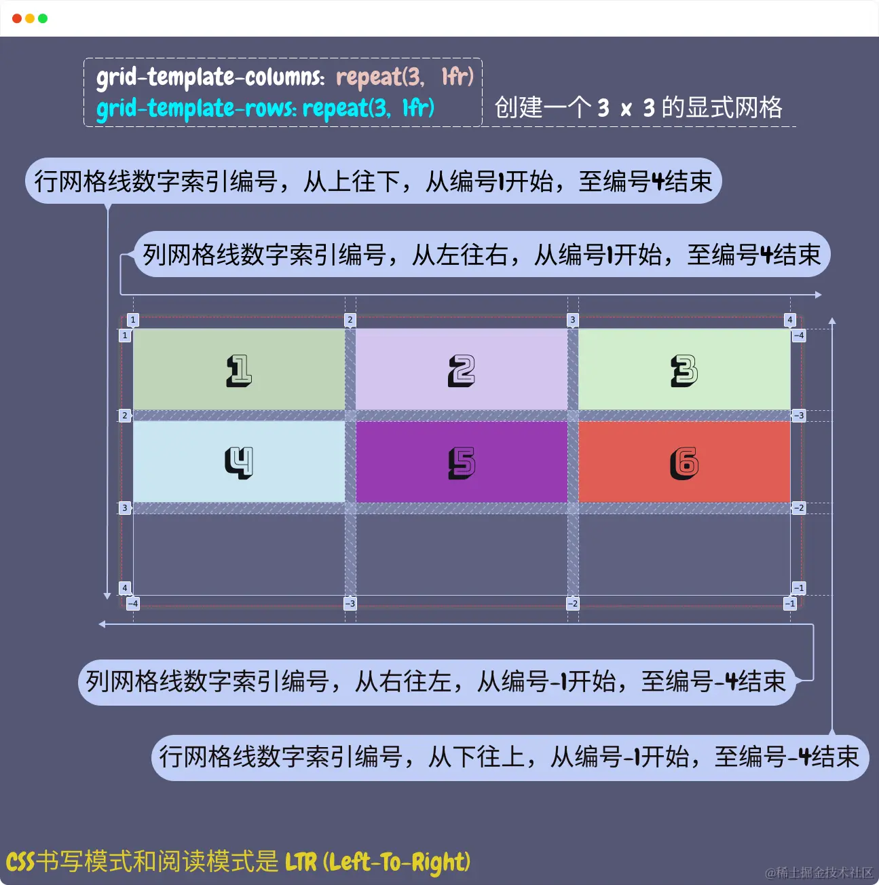

这样一来，就可以在 `grid-row`（它的子属性 grid-row-start 或 grid-row-end ）、`grid-column`（它的子属性 grid-column-start 或 grid-column-end）或 `grid-area` 指定相应的网格线数字编号（即默认的网格线名称）。比如：

```css
/*
 * 网格项目一从默认的位置（行 1，行 2，列 1 和列 2 围绕的单元格）变成横跨两列两行的新位置（行 1，行 3，列 1 和列 3 围绕的网格区域）
 */
.item:nth-child(1) {
  grid-row-start: 1;
  grid-row-end: 3;
  grid-column-start: 1;
  grid-column-end: 3;
}
```

也可以把 `-start` 和 `-end` 的网格线编号互换，也能达到相同的效果：

```css
.item:nth-child(1) {
  grid-row-start: 3;
  grid-row-end: 1;
  grid-column-start: 3;
  grid-column-end: 1;
}
```

> 但不建议这样使用，更建议和轴的方向相匹配，更不易于造成混乱。

还可以使用 grid-row-start、grid-row-end、grid-column-start 和 grid-column-end 的简写属性 `grid-row` 和 `grid-column` 来放置网格项目。在使用简写属性时，start 和 end 之间要用 `/` 来分隔，`/` 前面代表的是 start 网格线编号（名称），后面代表的是 end 网格线编号（名称）：

```css
.item:nth-child(1) {
  grid-row: 2 / 4;
  grid-column: 2 / 4;

  /* 等同于 */
  grid-row-start: 2;
  grid-row-end: 4;
  grid-column-start: 2;
  grid-column-end: 4;
}
```

在 CSS 网格布局中，可以使用不同的方式达到相同的效果。在这几个示例中，虽然都是以默认网格线名称指定网格项目一的位置，但它们都有一个共同的效果，就是网格项目一实际上合并了四个网格单元格，即行和列都合并了两个。

其实，在网格布局中，使用 `grid-row` 和 `grid-column`（或它们的子属性）时，还可以使用关键词 `span` 来合并网格单元格。`span` 后面紧跟一个正整数，这个正整数表示要合并的单元格数量。比如实现上面示例的效果：

```css
.item:nth-child(1) {
  grid-row: 2 / span 2;
  grid-column: 2 / span 2;

  /* 等同于 */
  grid-row-start: 2;
  grid-row-end: span 2;
  grid-column-start: 2;
  grid-column-end: span 2;
}
```

虽然没有在 grid-row-end 和 grid-column-end 显式指定网格线的名称，但其值 `span 2` 以及 `grid-row-start` 和 `grid-column-start` 隐式决定了相应的网格线位置：

- `grid-row: 2 / span 2`：网格项目一放置的位置，行起始位置是行 2，并向下合并两行（span 2）
- `grid-column: 2 / span 2`：网格项目一放置的位置，列起始位置是列 2，并向右合并两列（span 2）

在使用 `span` 关键词来合并网格单元格时，span 和其后面的正整数值 `<integer>` 之间要使用**空格符**分开。另外，在 grid-row 和 grid-column 中使用 `span` 来合并网格单元格时，`span` 关键词都放置在 `/` 之后，并且需要和它之间用空隔分隔。

这是 span 较佳的一种使用方式。它也可以用于它们的子属性 grid-row-start、 grid-row-end、grid-column-start 和 grid-column-end 上，只不过在这几个属性上使用 span 时，无法显式指定网格线编号（名称）：

```css
.item:nth-child(1) {
  grid-row-start: span 2;
  grid-row-end: span 3;
  grid-column-start: span 3;
  grid-column-end: span 4;
}
```

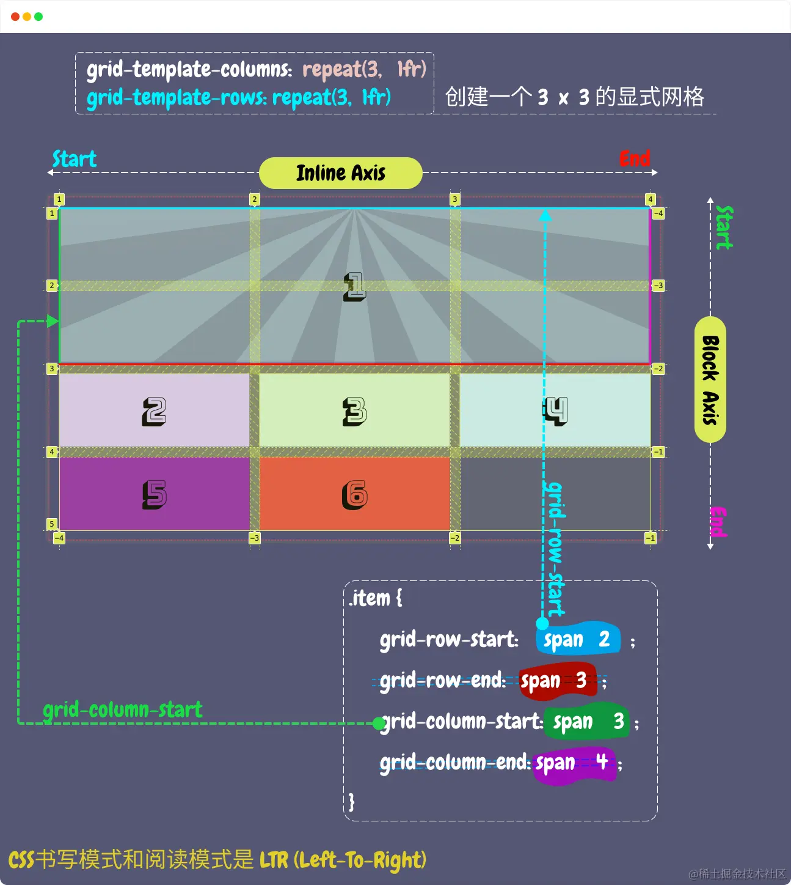

网格项目一合并了两行（grid-row-start: span 2）三列（grid-column-start: span 3），而且行和列的起始网格线都是它所处位置所对应的网格线（在这个示例中因为它是第一个网格项目，并且没有被其他网格项目推开，所以行和列默认的起始网格线都是 1）。如果第一个网格单元格被其他网格项目占用，那么它的行和列起始网格线就会有所变化：

```css
.container {
  display: grid;
  gap: 1rem;

  /* 定义显式网格轨道尺寸 */
  grid-template-columns: repeat(3, 1fr);
  grid-template-rows: repeat(3, 1fr);

  /* 定义隐式网格轨道尺寸 */
  grid-auto-columns: 150px;
  grid-auto-rows: 150px;

  /* 自动放置网格项目按照密集算法排列，避免网格洞 */
  grid-auto-flow: dense;
}

.item:nth-child(1) {
  grid-row-start: span 2;
  grid-row-end: span 3;
  grid-column-start: span 3;
  grid-column-end: span 4;
}

/* 网格项目1默认位置被网格项目2占用 */
.item:nth-child(2) {
  grid-row: 1 / 3;
}
```

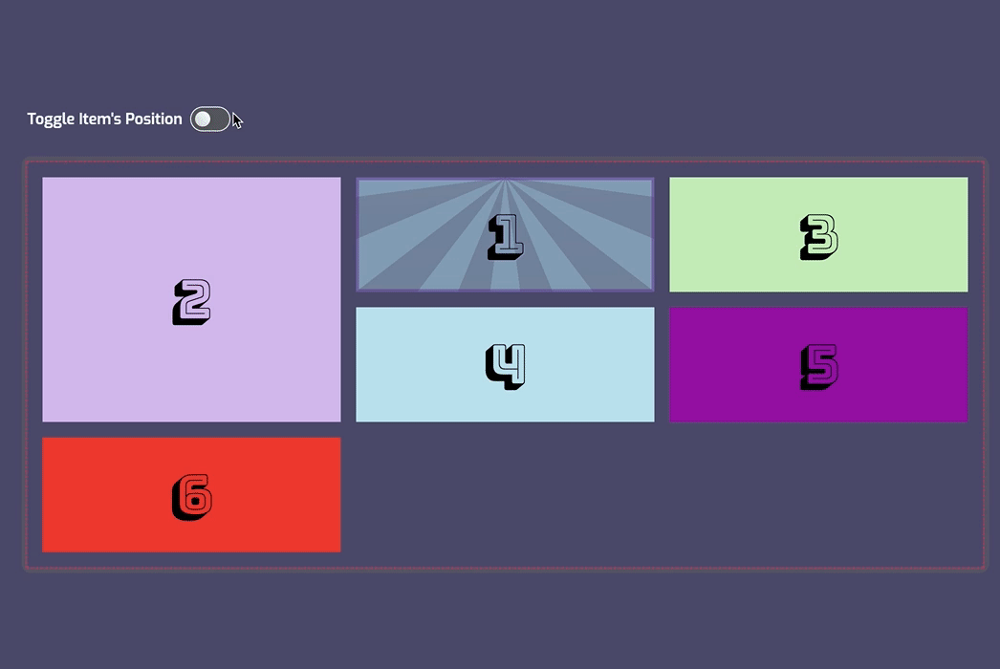

这两个示例中的网格项目一的 `grid-row-end: span 3` 和 `grid-column-end: span 4` 被忽略了（虽然是有效的属性，但未用于计算网格单元格的合并）。因此，**不建议同时在 `grid-*-start` 和 `grid-*-end` 属性上使用 `span` 来合并网格单元格**。

即使在单个属性上使用，也更建议在 `grid-*-start` 属性上指定网格项目起始网格线编号，在 `grid-*-end` 属性上使用 `span` 关键词，指定合并的行数或列数。所以，像下面这样使用是较佳的一种方式：

```css
.item:nth-child(1) {
  grid-row-start: 2; /* 显式指定起始行网格线编号 */
  grid-column-start: 2; /* 显式指定起始列网格线编号 */

  grid-row-end: span 2; /* 合并两行 */
  grid-column-end: span 2; /* 合并两列 */

  /* 等同于 */
  grid-row: 2 / span 2;
  grid-column: 2 / span 2;
}
```

要是想显式指定网格线起始位置，可以分组结合 `span` 来合并网格单元格：

- `grid-row-start` 和 `grid-column-start` 中使用 span
- `grid-row-end` 和 `grid-column-end` 中使用 span

```css
.container {
  display: grid;
  gap: 1rem;

  /* 定义显式网格轨道尺寸 */
  grid-template-columns: repeat(3, 1fr);
  grid-template-rows: repeat(3, 1fr);

  /* 定义隐式网格轨道尺寸 */
  grid-auto-columns: 150px;
  grid-auto-rows: 150px;

  /* 自动放置网格项目按照密集算法排列，避免网格洞 */
  grid-auto-flow: dense;
}

/* 网格项目1 合并两行三列 */
.item:nth-child(1) {
  grid-row-start: span 2;
  grid-column-start: span 3;
}

/* 网格项目2 合并三行四列 */
.item:nth-child(2) {
  grid-row-end: span 3;
  grid-column-end: span 4;
}
```

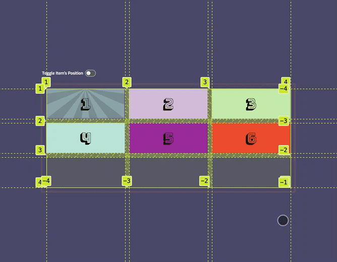

示例效果还展示了，**在网格布局时使用 `span` 除了可以合并网格单元格之外，还很容易创建一个隐式网格**。

这个示例中的 `grid-template-rows` 和 `grid-template-columns` 定义的只是一个三行三列（3 x 3）的网格，但由于网格项目一和网格项目二合并的行与列已经超出显式网格的范围，此时就会在显式网格基础上进行延伸，创建一个新的网格，也就是一个隐式网格，最终这个网格是一个六行四列（6 x 4）的网格，而且对应的隐式列网格轨道由 grid-auto-columns 属性指定大小（150px），隐式行网格轨道由 grid-auto-rows 属性指定大小（150px）：

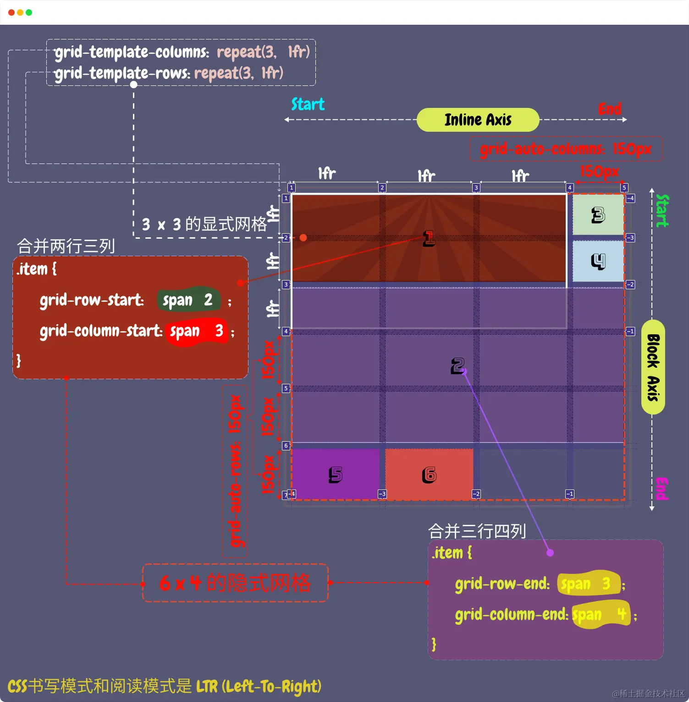

下面这两种组合方式都会被视为有效的：

- `<integer> span`，比如 2 span
- `span <integer>`，比如 span 2

> `<integer> span <integer>` 是无效的，比如 2 span 2。

**虽然 `<integer> span` 是一个有效值，但它无法指定起始网格线**，因此不建议这样使用。如果需要使用 span 来合并网格单元格，**建议使用 `span <integer>` 模式**。

在 CSS 网格中，网格单元格是最小单元体，同样有四条网格线围绕着，同时网格单元格也是最小网格区域。也就是说，grid-row-start、grid-column-start、grid-row-end 和 grid-column-end 四个属性指定的网格线围绕的区域就是一个网格区域（它有可能比网格单元格更大）。

还可以使用一个更简单的 grid-area 属性，可以接受 `/` 分隔的 1 ~ 4 个值，它是 grid-row-start、grid-column-start、grid-row-end 和 grid-column-end 四个属性的简写，即：`grid-area: grid-row-start / grid-column-start / grid-row-end / grid-column-end`。

省略的值对应的属性取值为 auto ，比如：

```css
/* grid-area 显式设置四个值 */
.item:nth-child(1) {
  grid-area: 2 / 2 / 4 / 4;

  /* 等同于 */
  grid-row-start: 2;
  grid-column-start: 2;
  grid-row-end: 4;
  grid-column-end: 4;
}

/* grid-area 显式设置三个值 */
.item:nth-child(1) {
  grid-area: 2 / 2 / 4;

  /* 等同于 */
  grid-row-start: 2;
  grid-column-start: 2;
  grid-row-end: 4;
  grid-column-end: auto;
}

/* grid-area 显式设置两个值 */
.item:nth-child(1) {
  grid-area: 2 / 2;

  /* 等同于 */
  grid-row-start: 2;
  grid-column-start: 2;
  grid-row-end: auto;
  grid-column-end: auto;
}

/* grid-area 显式设置一个值 */
.item:nth-child(1) {
  grid-area: 2;

  /* 等同于 */
  grid-row-start: 2;
  grid-column-start: auto;
  grid-row-end: auto;
  grid-column-end: auto;
}
```

`grid-area` 属性上也可以和 `span` 关键词结合起来使用，实现单元格合并的效果。虽然在每个值上都可以使用 `span` 关键词，但不建议这样使用。应该尽可能地在后面两个参数上使用 `span`，来实现单元格合并的效果。这样做的原因是：

- 前两个值可以用来指定行和列网格线的起始位置
- 后两个值可以用来指定行和列的合并数量

```css
.item:nth-child(2) {
  grid-area: 2 / 2 / span 2 / span 2;

  /* 等同于 */
  grid-row-start: 2; /* 指定行网格线的起始位置 */
  grid-column-start: 2; /* 指定列网格线的起始位置*/
  grid-row-end: span 2; /* 合并两行，同时确定行网格线的结束位置 */
  grid-column-end: span 2; /* 合并两列，同时确定列网格线的结束位置 */
}
```

`grid-area` 除了可以用数字索引变化外，还可以使用 `grid-template-rows` 和 `grid-template-columns` 定义网格轨道时给网格线的命名，或 `grid-template-areas` 定义网格区域时生成隐式的网格线名称。

使用 CSS 网格布局可以简单分两步：

1. 使用 `grid-template-*` 和（或）`grid-auto-*` 定义一个网格，在定义所需要的网格的同时，定义了网格轨道尺寸以及网格线
2. 使用 `grid-row`、`grid-column` 和（或）`grid-area` 将网格项目放置到指定的位置

##### 3.3.4.2 自动放置网格项目

在 CSS 网格布局中，只要在网格项目上使用 `grid-row`（grid-row-start 、grid-row-end）、`grid-column`（grid-column-start、grid-column-end）或 `grid-area` 属性指定具体的网格线名称或网格区域名称，那么网格项目就会被放置到明确指定的位置，这种方式被称为**明确放置网格项目**。

而没有使用这些属性指定明确位置的网格项目，就被称为**自动放置网格项目**。比如，网格项目根据 `grid-auto-flow` 指定的方向自动放置。在 CSS 网格布局中，自动放置网格项目是由一个算法机制来决定的：

> **将网格项目的自动位置解析为明确的位置，确保每个网格项目都有一个明确的网格区域来放置（一个网格单元格也可以称为是一个网格区域）**。

在网格项目自动放置的算法中，网格跨度是不需要特别解决的。因为未显式指定 span 的值，即是默认值 1。另外，如果在一个显式网格系统中没有空间放置明确指定的网格项目，就有可能根据网格自动放置算法创建隐式的网格轨道（创建隐式的行或列），从而创建一个隐式网格。

另外，网格系统中的每个网格单元格（在显式网格或隐式网格中）都可以被占用或不被占用。如果一个网格单元格被一个有明确网格位置的网格项目覆盖，该网格单元格就被占用；否则，该网格单元格就未被占用。在这个算法中，一个网格单元格的占用或未占用状态是可以被改变的。

简单地说，自动放置网格项目会按下面五个步骤来放置网格项目：

1. 匿名网格项目的生成
2. 使用显式网格线名称（或网格区域）明确放置网格项目
3. 仅明确指定行位置
4. 确定隐式网格中的列数
5. 放置剩余的网格项目

用一个简单的示例来解释自动放置网格项目的五个步骤：

```html
<div class="container">
  <div class="item"></div>
  <div class="item"></div>
  我是一个文本节点(TextNode)
  <!-- 文本节点被称为匿名网格项目 -->
  <div class="item"></div>
  <div class="item"></div>
</div>
```

1. **创建匿名网格项目**

   ```css
   .container {
     display: grid;
     gap: 1rem;
     grid-template-columns: repeat(4, 1fr);
   }
   ```

   当自动放置网格项目算法试图将所有网格项目放在一个网格系统内时，发生的第一件事就是**创建“匿名网格项目”**（这个和 Flexbox 布局是相似的）。在网格系统中，**网格容器内的文本节点，被称为匿名网格项目**。比如代码中的“我是一个文本节点(TextNode)” 是网格容器 .container 直接内容，所以这行文本也是网格容器中的一个网格项目（即匿名网格项目）。

   > **注意**：**网格容器的伪元素 `::before` 和 `::after` 生成的内容也被称为网格项目**，但它们不是匿名网格项目。

   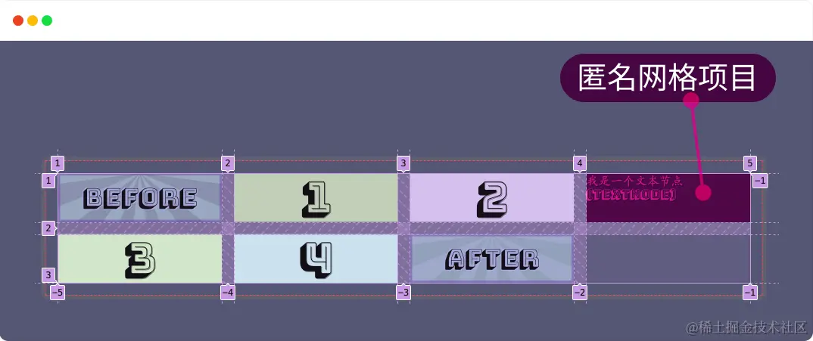

   CSS 中是没有相关的选择器可以选中网格容器中的“文本节点”的，因此，也无法使用网格项目相关的属性（比如 grid-row、grid-column 或 grid-area 等）来明确放置“匿名网格项目”。换句话说，网格中的“匿名网格项目”的位置，是按照网格系统中自动放置的算法来指定位置的。

2. **使用显式网格线名称（或网格区域）明确放置网格项目**

   在网格布局中，总是有网格项目会使用 `grid-row`、`grid-column` 或 `grid-area` 属性放置到指定的位置（根据网格线名称或网格区域名称），比如：

   ```css
   .item:nth-child(1) {
     grid-area: 1 / 2 / 2 / 4;
   }

   .item:nth-child(2) {
     grid-area: 2 / 1 / 4 / 3;
   }
   ```

   网格项目一和网格项目二各自的 grid-area 属性的值来定位（放置）：

   - 使用 grid-area 属性的第一个（grid-row-start）和第二个值（grid-column-start）来设置网格项目一和网格项目二的“左上角”的位置
   - 使用 grid-area 属性的第三个（grid-row-end）和第四个值（grid-column-end）来设置网格项目一和网格项目二的“右下角”的位置

   即网格项目一和网格项目二被放置到指定位置，其他网格项目未显式指定位置，它们会按自动放置算法来放置。

   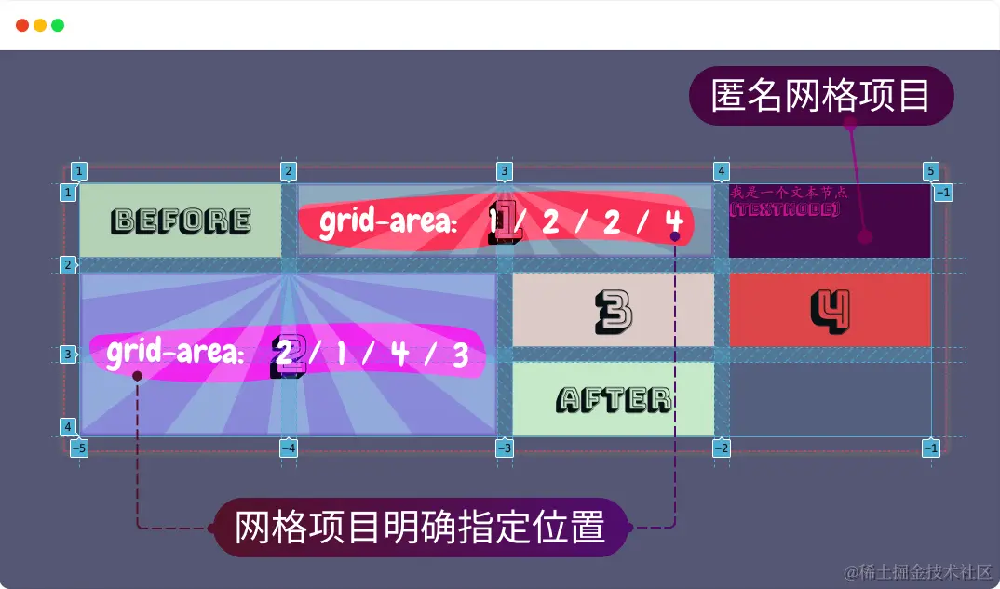

3. **仅明确指定行位置**

   即使是根据网格线名称来明确放置网格项目，也不一定会指定四条网格线名称，往往可能只是指定了行的网格线位置（名称），但没有指定列的网格线位置（名称）。

   ```css
   .container::before {
     grid-row: 1 / 4;
   }

   .item:nth-child(4) {
     grid-row: 3 / 5;
   }
   ```

   `::before` 伪元素和网格项目四使用 `grid-row` 指定了行网格线的起始和结束位置。

   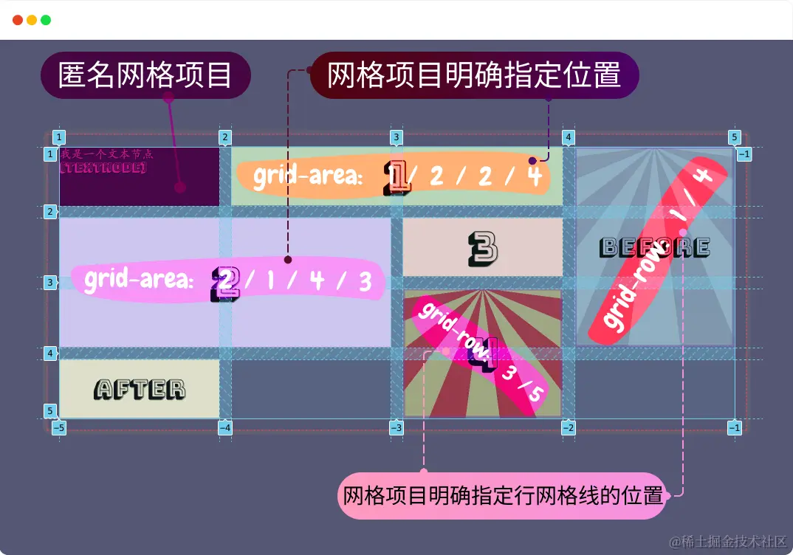

   对于每个有明确行位置的网格项目（即 grid-row-start、grid-row-end 或 grid-row 明确放置的网格项目）只确定行位置，但列的位置并没有确定。此时，网格项目将按照修改后的文档顺序放置。换句话说，为了确定没有明确设置的列的位置（即，没有显式使用 grid-column-start、grid-column-end 或 grid-column 放置网格项目），该算法根据下面模式来处理：

   - **稀疏算法**（Sparse，默认算法）：将其放置的列开始网格线设置为最早的（最小的正指数）网格线索引值，以确保此网格项目的网格区域不会与任何被占用的网格单元格重叠，并且该行超过了之前放置在此行的任何网格项目。
   - **密集算法**（Dense）：将其放置的列开始网格线设置为最早的（最小的正指数）网格线索引值，以确保这个网格项目的网格区域不会与任何占用的网格单元格重叠。

   默认的“稀疏算法（Sparse）”会产生网格洞（空的网格单元格）现象。比如下面这个示例：

   ```css
   .container {
     display: grid;
     gap: 1rem;
     grid-template-columns: repeat(3, 1fr);
     grid-template-rows: repeat(3, 80px);
     grid-auto-columns: 100px;
     grid-auto-rows: 100px;
   }

   .item:nth-child(1) {
     grid-area: 3 / 2 / 4 / 3;
   }

   .item:nth-child(2) {
     grid-area: 1 / 3 / 3 /4;
   }

   .item:nth-child(3) {
     grid-row: 3 / 5;
   }

   .item:nth-child(4) {
     grid-row: 3 / 5;
   }

   .item:nth-child(5) {
     grid-column-start: span 2;
   }

   .container::before {
     grid-row-start: 2;
   }
   ```

   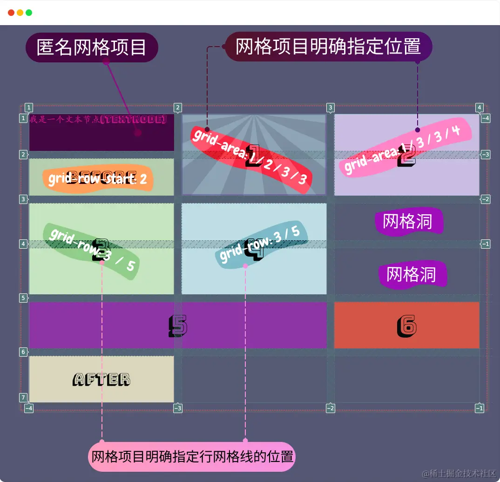

   而“**密集算法**（Dense）”不会出现该现象。如果在使用网格布局时，不想出现网格洞的现象，可以使用 `grid-auto-flow` 来改变，只需要在 `row` 或 `column` 的后面加上 `dense`：

   ```css
   .container {
     grid-auto-flow: row dense;
   }
   ```

   > 由于 grid-auto-flow 的默认值是 row，所以 grid-auto-flow 取 dense 和 row dense 的效果是一样的。

4. **确定隐式网格中的列数**

   接下来，该算法试图确定隐式网格中的列数。可以通过下面的步骤来完成：

   1. 该算法从显式网格中的列数开始
   2. 然后，它遍历所有有明确列位置的网格项目，并在隐式网格的开头和结尾增加列轨道，以容纳所有网格项目
   3. 最后，它通过所有没有明确列位置的网格项目。如果所有没有明确列位置的网格项目中最大的列跨度大于显式网格的宽度，则在网格的末端增加列以适应这个列跨度。

   在下面的示例中，grid-template-columns 和 grid-template-rows 创建了一个三行三列（3 x 3 ）的网格：

   ```css
   .container {
     display: grid;
     gap: 1rem;
     grid-template-columns: repeat(3, 1fr);
     grid-template-rows: repeat(3, 80px);
     grid-auto-columns: 100px;
     grid-auto-rows: 100px;
     grid-auto-flow: var(--auto-flow);
   }
   ```

   同时使用 `grid-auto-rows` 和 `grid-auto-columns` 指定了隐式网格轨道尺寸，示例中因个别网格项目放置的位置超出了显式网格区域，因此创建了部分隐式行网格轨道。

   ```css
   .item:nth-child(1) {
     grid-area: 1 / 3 / 2 / 3;
   }

   .item:nth-child(2) {
     grid-area: 2 / 2 / 4 / span 2;
   }

   .item:nth-child(3) {
     grid-row: 3 / 5;
   }

   .item:nth-child(4) {
     grid-row: 3 / 5;
     grid-column: 4 / span 2;
   }

   .item:nth-child(5) {
     grid-column-start: span 2;
   }

   .container::before {
     grid-row-start: 2;
   }
   .container::after {
     grid-column: span 2;
   }
   ```

   示例中，网格项目四明确指定了起始列网格线位置，即网格线编号是 4（grid-column-start: 4），同时使用 span 2 向右合并两列（grid-column-end: span 2）。这意味着网格项目四放置在显式网格之外，也会因该网格项目新增两列隐式列网格轨道。

   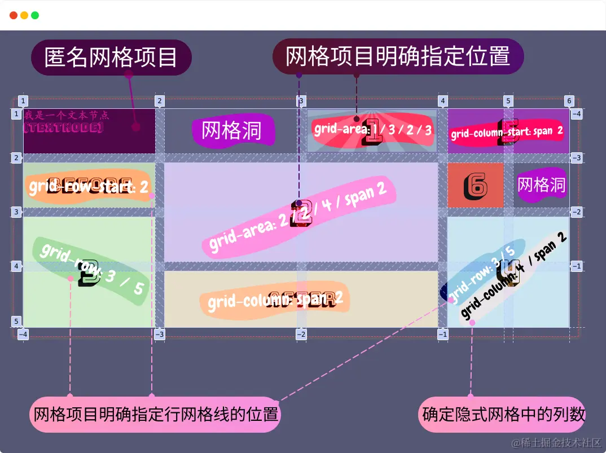

5. **放置剩余的网格项目**

   剩余的网格项目指的是没有显式使用 grid-row、grid-column、grid-area 属性放置的网格项目，同时也没有使用 span 合并网格单元格的项目。对于这些网格项目而言，最终位置是由 `grid-auto-flow` 属性来决定，该属性会确定网格项目的两个东西：

   - **方向**：row（默认）或 column，定义了在需要插入自动放置网格项目时，网格要增长的方向（增长行或列）
   - **模式**：稀疏（Sparse，默认）或 密集（Dense），根据打包模式，算法将在插入自动放置的网格项目时，尝试密集（填充）或稀疏（不填充）网格中的所有洞（没有被占用的网格单元格）。

   因此，`grid-auto-flow` 属性的值可以是 `row dense`、`column dense` 或 `dense` 等，用来决定网格项目自动放置的所需行为。

#### 3.3.5 网格项目重叠

到目前为止，所阐述的网格项目都是用不同的网格区域来放置网格项目，但网格布局中的网格项目有可能是会重叠在一起的。因为在放置网格项目或合并网格单元格时，可能会让网格项目位置位于同一个网格单元格，即**在同一个网格单元格或网格区域重叠**。

**欲让网格项目重叠，则必须把网格项目放置在相同的网格单元格中**。在 CSS 网格布局中有多种不同的方法可以达到这个目的：

- 使用网格线索引号
- 使用命名的网格线
- 使用命名的网格区域
- 合并网格单元格（即，跨越网格项目）

```css
.container {
  display: grid;
  gap: 16px;

  grid-template-columns: minmax(min-content, 220px) 1fr minmax(min-content, 220px);
  grid-template-rows: auto 1fr auto;
}

header {
  grid-row: 1;
  grid-column: 1 / -1;
}

nav {
  grid-column: 1;
  grid-row: 1 / -1;
}

main {
  grid-row: 2;
  grid-column: 2;
}

aside {
  grid-column: 3;
  grid-row: 1 / -1;
}

footer {
  grid-row: 3;
  grid-column: 1 / -1;
}
```

上面的代码，将：

- 网格项目 header 放置在第一行，并且跨三列
- 网格项目 footer 放置在第三行，并且跨三列
- 网格项目 nav 放置在第一列，并且跨三行，它和网格项目 header 在第一行第一列的位置相互重叠，和网格项目 footer 在第三行第一列的位置相互重叠
- 网格项目 main 放置在第二行第二列
- 网格项目 sidebar 放置在第三列，它和网格项目 header 在第一行和第三列的位置相互重叠，和网格项目 footer 在第三行第三列相互重叠

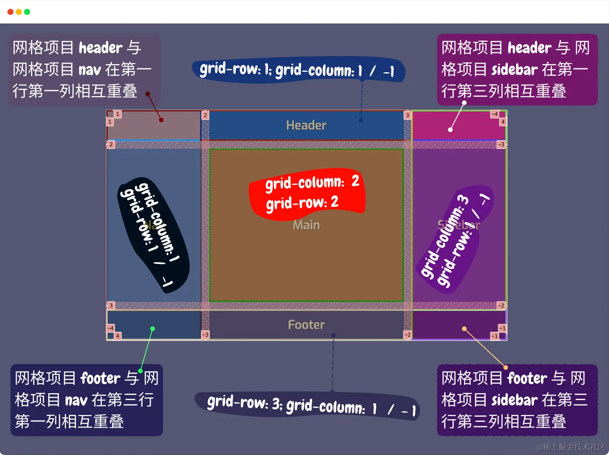

既然有网格项目相互重叠（z 轴上的重叠），就有必要控制其 z 轴的优先级。在网格布局中，网格项目的定位元素（position 值不是 static 的元素）相似，可以使用 CSS 的 z-index 属性来控制其在 z 轴上的层级。如果没有显式设置 z-index 值来改变 z 轴上的层级，将会由网格项目在文档中出现的先后顺序来决定，越往后出现，它在 z 轴的层级越高。

比如上面的示例中，网格项目 header 在 z 轴的最底下，网格项目 nav 和网格项目 sidebar 在 z 轴上比网格项目 header 更高（所以重叠部分会遮盖网格项目 header），但又比网格项目 footer 低，所以与网格项目 footer 重叠部分被网格项目 footer 遮盖了。

因此，使用 CSS 网格布局，可以轻易实现一些重叠的 Web 布局效果，比如下面这个效果：


```css
main {
  display: grid;
  grid-template-columns: 2fr 1fr 1fr 2fr;
  grid-template-rows: 2fr 1fr 1fr 2fr;
}

main:nth-child(1) header,
main:nth-child(1) section {
  grid-row: 2 / 4;
  padding: 2rem;
  grid-column: 2 / 4;
  align-self: center;
  z-index: 2;
}

main:nth-child(2) header {
  grid-row: 2 / 4;
  grid-column: 2 / 4;
  z-index: 2;
}

figure:nth-of-type(1) {
  grid-row: 1 / 3;
  grid-column: 1 / 3;
  align-self: end;
}

figure:nth-of-type(2) {
  grid-row: 1 / 3;
  grid-column: 3 / 5;
  align-self: end;
}

figure:nth-of-type(3) {
  grid-row: 3 / 5;
  grid-column: 1 / 3;
}

figure:nth-of-type(4) {
  grid-row: 3 / 5;
  grid-column: 3 / 5;
}

figure {
  margin: 0;
  padding: 0;
}
```


#### 3.3.6 Grid 布局中的对齐方式

CSS 网格布局除了提供定义网格和放置网格项目的相关属性之外，也提供了一些控制对齐方式的属性。这些控制对齐方式的属性，和 Flexbox 布局中的对齐属性 `justify-*`、`align-*`、`*-items`、`*-content`、`*-self` 等是相似的：

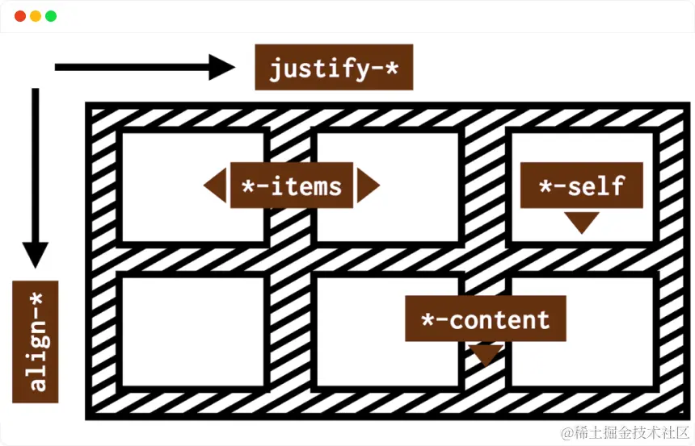

##### 3.3.6.1 网格布局中的轴线

Flexbox 中的主轴（Main Axis）和侧轴（Cross Axis）由 `flex-direction` 属性的值来决定：

```css
.main {
  /* x 轴是主轴 */
  flex-direction: row;

  /* y 轴是主轴 */
  flex-direction: column;
}
```

由于网格布局是唯一的二维布局，因此，网格布局中也有两条轴线，这两条轴线既不称为水平的 x 轴和垂直方向的 y 轴，也不像 Flexbox 布局中称为主轴和侧轴。它们有着新命名的两条轴线，即内联轴（Inline Axis）和块轴（Block Axis）：

- **内联轴**（Inline Axis）：主要定义网站的文本流方向，也就是文本的阅读方式，CSS 的 direction 或 HTML 的 dir 会影响内联轴的方向。
- **块轴**（Block Axis）：主要定义网站文档（元素块）流，CSS 的书写模式 writing-mode 会影响块轴的方向。

即，内联轴和块轴会受 CSS 的 `direction`、`writing-mode` 和 HTML 的 `dir` 属性值的影响，这个有点类似于 Flexbox 布局的主轴和侧轴，不是固定不变的：

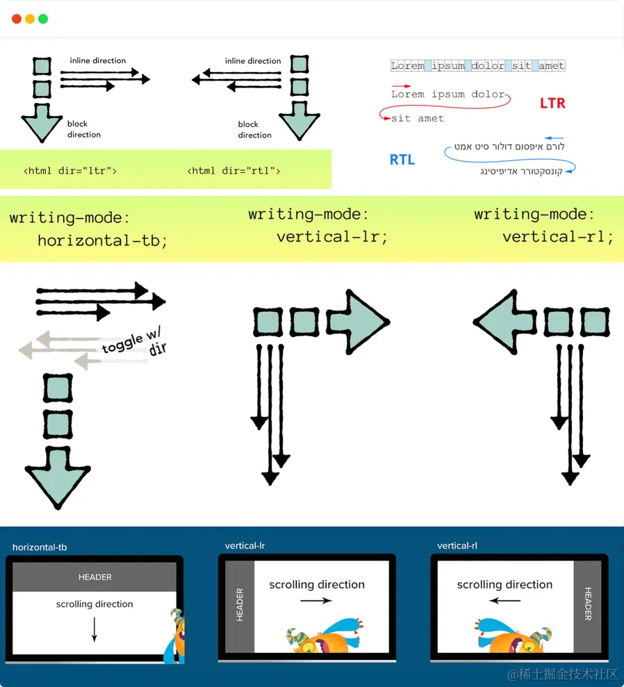

网格布局中的内联轴（Inline Axis）和块轴（Block Axis）可以和网格中的行与列相映射，比如书写模式和阅读模式是 ltr（Left-To-Right）时，内联轴也称为行轴（Row Axis），块轴也称为列轴（Column Axis）：

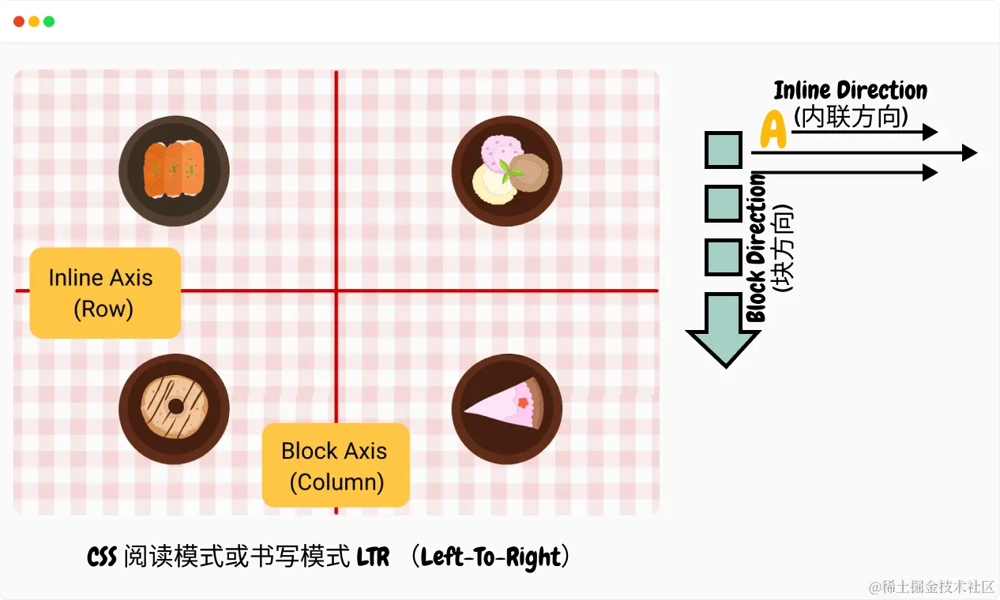

> **注意**：虽然内联轴（Inline Axis）和块轴（Block Axis）会因 CSS 的书写模式或文档的阅读模式改变，但网格中的行轴和列轴是始终不变的。
>
> 

网格布局中，就可以沿着这两条轴线来控制网格项目或网格轨道的对齐方式。

##### 3.3.6.2 网格布局中的对齐方式

在 Flexbox 布局中，可以在 Flex 容器的主轴和侧轴方向控制 Flex 项目的对齐方式。在 Grid 布局中，将按照内联轴和块轴两个方向来控制**网格轨道**和**网格项目**的对齐方式：

- **对齐网格项目**

  - 内联轴方向对齐：`justify-items` 和 `justify-self`
  - 块轴方向对齐：`align-items` 和 `align-self`

  - 网格容器：`justify-items` 和 `align-items`
  - 网格项目：`justify-self` 和 `align-self`

- **对齐网格轨道**

  `align-content` 沿着块轴方向对齐网格轨道，`justify-content` 沿着内联轴方向对齐网格轨道，它们都被运用于网格容器。

###### 3.3.6.2.1 网格项目对齐

控制网格项目的对齐方式的属性主要有：

- `justify-items` 和 `justify-self` 控制网格项目沿着内联轴（文本书写方向的行轴）方向对齐
- `align-items` 和 `align-self` 控制网格项目沿着块轴（块方向的列轴）方向的对齐

这几个属性都可以接受 `auto`、`normal`、`start`、`end`、`center`、`stretch`、`baseline`、`first baseline` 和 `last baseline` 值，但常用的值只有 `start`、`end`、`center` 和 `stretch`（默认值）。

> **注意**：这几个属性都是用来控制网格项目在所处网格区域内的内联轴或块轴方向的对齐，如果没有跨网格单元格，则在对应的网格单元格内的内联轴或块轴方向的对齐。

```html
<div class="container">
  <div class="item"></div>
  <!-- 此处省略四个 item -->
  <div class="item"></div>
</div>

<style>
  .container {
    display: grid;
    gap: 1rem;
    grid-template-columns: repeat(8, 1fr);
    grid-auto-rows: 80px;
    grid-auto-columns: 80px;
    grid-template-areas:
      'a a a a b b b b'
      'a a a a b b b b'
      'c c c c d d d d'
      'c c c c d d d d';
  }

  .item:nth-child(1) {
    grid-area: a;
  }

  .item:nth-child(2) {
    grid-area: b;
  }

  .item:nth-child(3) {
    grid-area: c;
  }

  .item:nth-child(4) {
    grid-area: d;
  }

  .item:nth-child(5) {
    grid-row: 1 / -1;
    grid-column: span 2;
  }
</style>
```

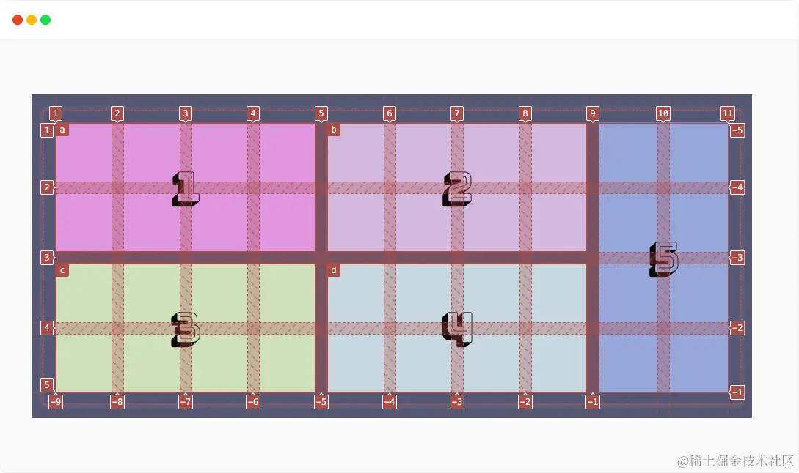

**`align-item` & `align-self`**

可以在网格容器上显式设置 `align-items` 属性的值：

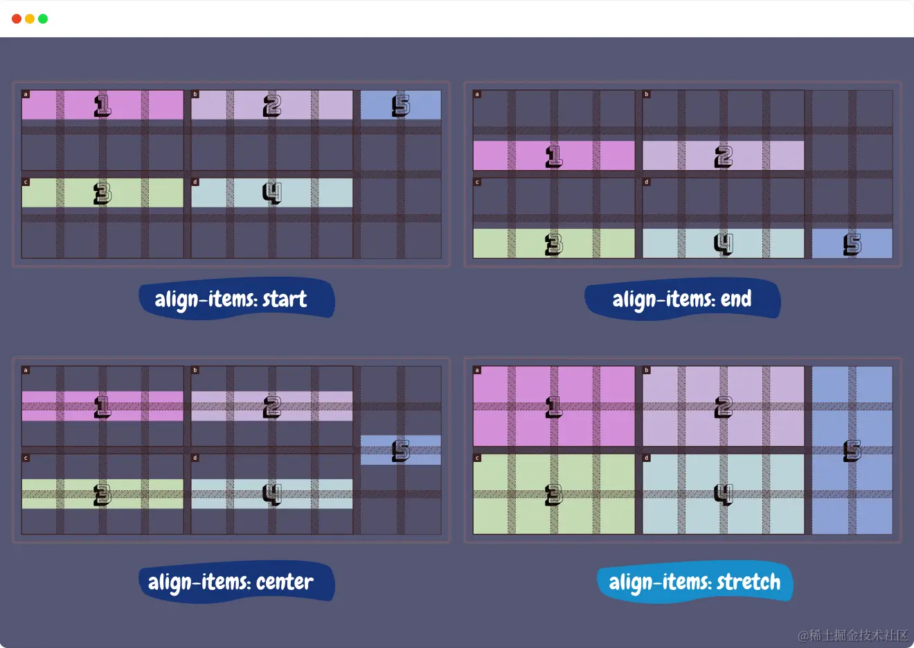

- `start`：将网格项目和所处网格区域在块轴的起始位置重叠
- `end`：将网格项目和所处网格区域在块轴的结束位置重叠
- `center`：将网格项目和所处网格区域在块轴中心位置重叠（类似垂直居中）
- `stretch`：将网格项目拉伸与所处网格区域高度相同，相当于与网格区域的块轴方向起始、结束位置同时重叠（类似垂直方向的拉伸）。

> 另外，align-items 取值为 `auto`、`normal` 和 `last baseline` 值时，与取值 `stretch` 值效果等同；`baseline` 和 `first baseline` 的效果与 `start` 等同：

一旦在网格容器上设置了 align-items 的值是 `stretch` 的其他值之后，所有网格项目的高度（块轴方向尺寸，block-size）都将会由其内容的高度决定。另外，在网格容器上显式设置了 align-items 的值，就相当于在所有网格项目上设置了 `align-self` 的值。比如：

```css
--align-items: start;

.container {
  align-items: var(--align-items, stretch);
}

/* 等同于 */
.container > * {
  align-self: var(--align-items, stretch) ；;
}
```

也可以在单个网格项目上显式设置 `align-self` 的值：

```css
.item:nth-child(1) {
  align-self: start;
}

.item:nth-child(2) {
  align-self: end;
}

.item:nth-child(3) {
  align-self: center;
}
```

可以同时显式设置网格容器的 `align-items` 和单个网格项目的 `align-self` 的值，只不过最终由网格项目上的 `align-self` 值来决定。

**`justify-items` & `justify-self`**

与 align-items 和 align-self 相似的是，可以在网格容器上设置 `justify-items` 属性和在网格项目上设置 `justify-self` 属性，控制网格项目在内联轴的对齐方式。比如：

```css
.container {
  justify-items: var(--justify-items, stretch);
}
```

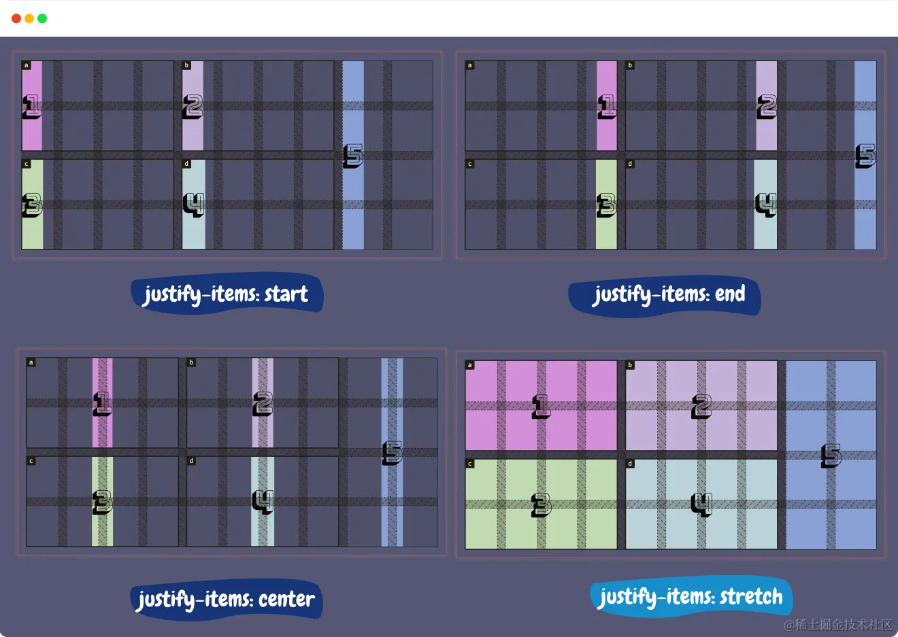

- `start`:将网格项目和所处网格区域在内联轴的起始位置重叠
- `end`：将网格项目和所处网格区域在内联轴的结束位置重叠
- `center`：将网格项目和所处网格区域在内联轴中心位置重叠（类似水平居中）
- `stretch`：将网格项目拉伸与所处网格区域宽度相同，相当于与网格区域的内联轴方向起始、结束位置同时重叠（类似水平方向的拉伸）

> `justify-items` 取值是 `auto`、`normal` 和 `last baseline` 时与 `stretch` 值效果等同；`baseline` 和 `first baseline` 的效果与 `start` 等同：

和 `align-items` 一样，当你在网格容器上设置了 `justify-items` 时，就等同于在所有网格项目上设置了 `justify-self`。

```css
--justify-items: start;

.container {
  justify-items: var(--justify-items, stretch);
}

/* 等同于 */
.container > * {
  justify-self: var(--justify-items, stretch);
}
```

也可以根据需要，在网格项目上单独设置 `justify-self` 属性的值，控制单独网格项目在内联轴方向的对齐。如果在网格容器上设置了 `justify-items` 属性的值，并且在网格项目上也显式设置了 `justify-self` 属性的值，那么最终网格项目在内联轴方向的对齐由 `justify-self` 属性的值来决定。

**`place-items` & `place-self`**

在网格布局中，`justify-items` 和 `align-items` 还可能简写成 `place-items`；`justify-self` 和 `align-self` 可以简写成 `place-self`：

```css
place-items: <align-items>  <justify-items>
place-self:  <align-self>  <justify-self>
```

当 place-items 和 place-self 只取一个值时，表示两个属性的值相同，否则第一个值用于 `align-*` ，第二个值则用于 `justify-*`，比如：

```css
.container {
  place-items: center end;

  /* 等同于 */
  align-items: center;
  justify-items: end;
}

.item:nth-child(1) {
  place-self: center end;

  /* 等同于 */
  align-self: center;
  justify-self: end;
}
```

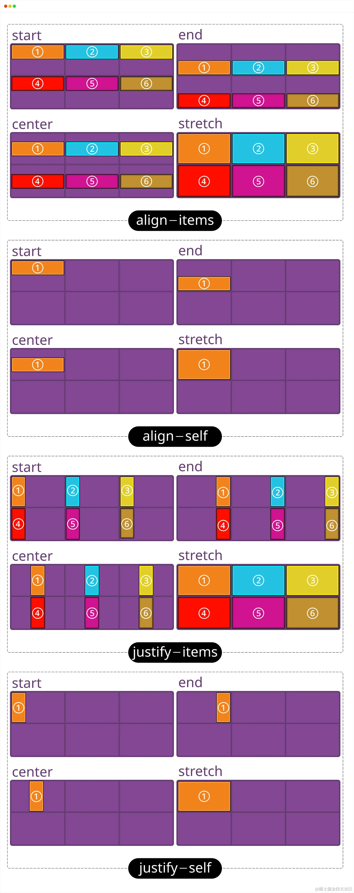

###### 3.3.6.3 网格轨道对齐

CSS Grid 布局中的对齐方式和 Flexbox 布局中的对齐方式最大的不同之处是：**在网格布局中，除了可以控制网格项目在内联轴和块轴的方向对齐之外，还可以控制网格轨道在内联轴和块轴方向的对齐**。

在网格布局中，所有网格轨道尺寸所占据的空间可能会小于网格容器空间：

- **内联轴方向**：所有列网格轨道的尺寸总和小于网格容器内联轴方向的尺寸（inline-size），即在 `grid-template-columns`（或 `grid-auto-columns`）定义的列轨道尺寸总和小于网格容器的宽度。
- **块轴方向**：所有行网格轨道的尺寸总和小于网格容器块轴方向的尺寸（block-size），即在 `grid-template-rows`（或 `grid-auto-rows`）定义的行轨道尺寸总和小于网格容器高度。

这样就可以分别在网格容器的：

- **内联轴方向**：`justify-content` 控制列网格轨道在内联轴方向的对齐方式，即控制网格列的对齐。
- **块轴方向**：`align-content` 控制行网格轨道在块轴方向的对齐方式，即控制网格行的对齐。

`justify-content` 和 `align-content` 可设置的值是：`normal`、`start`、`end`、`center`、`stretch`、`space-around`、`space-between`、`space-evenly`、`baseline`、`first baseline` 和 `last baseline`。

```css
.container {
  /* 内联轴尺寸 */
  inline-size: 500px;
  /* 块轴尺寸 */
  block-size: 500px;

  display: grid;
  gap: 10px;

  grid-template-columns: repeat(3, 100px);
  grid-template-rows: repeat(3, 100px);
}
```

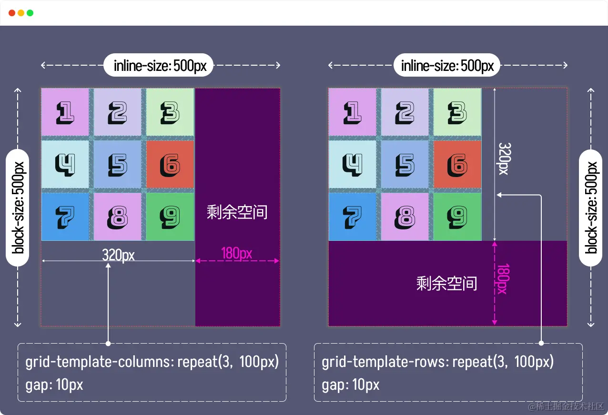

可以像 Flexbox 布局中的 `justify-content` 和 `align-content` 一样，将剩余空间分配到网格轨道之间。

**`align-content`**

在网格容器上将 `align-content` 设置不同值：

```css
.container {
  align-content: var(--align-content, start);
}
```

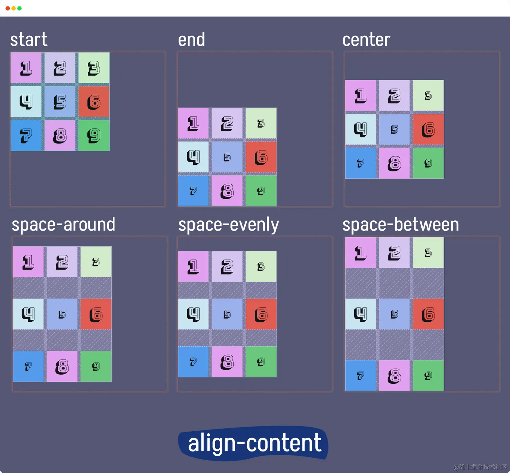

在这个[示例](https://codepen.io/airen/full/MWXKjVj)中，`align-content` 取值为 `normal`、`stretch`、`baseline`、`first baseline`、`last baseline` 的效果与 `start` 是等同的。事实上，`algin-content` 取值 `stretch` 时会对网格轨道进行拉伸，但并不是所有情景都是如此，它对网格轨道尺寸的设置是有一定要求的。

虽然说 `align-content` 是用来控制网格行轨道在网格容器块轴方向的对齐方式，但从另一个角度来说，也是将网格容器的剩余空间分配给网格轨道之间。比如：

- **`align-content` 取值为 `center`**

  网格容器的剩余空间将一分为二，第一行网格轨道在块轴的起始位置与网格容器块轴方向起始位置的距离等于最后一行网格轨道在块轴的结束位置与网格容器块轴方向结束位置的距离：

  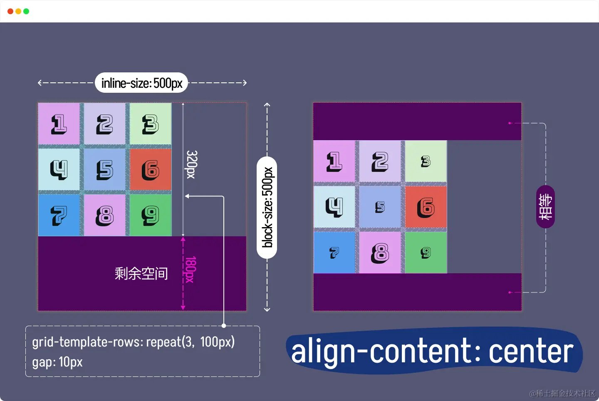

- **`align-content` 取值为 `space-around`**

  分配给相邻两行网格道之间的网格容器的剩余空间，是第一行网格轨道块轴起始位置距网格容器块轴方向起始位置之间距离的两倍，也是最后一行网格轨道块轴结束位置距网格容器块轴方向结束位置之间距离的两倍。

  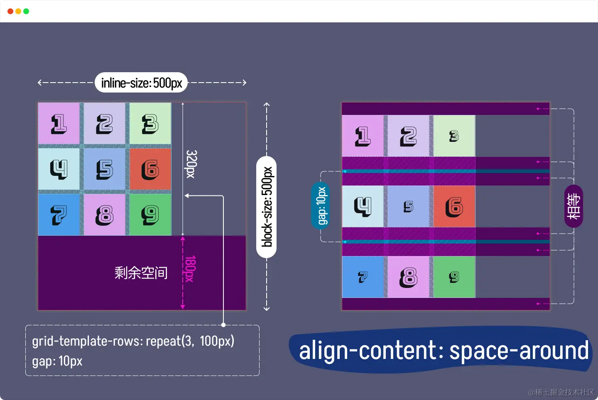

- **`align-content` 取值为 `space-evenly`**

  分配给相邻两行网格轨道之间的网格容器的剩余空间，和第一行网格轨道块轴方向起始位置与网格容器块轴方向起始位置之间的距离相等，也和最后一行网格轨道块轴方向结束位置与网格容器块轴方向结束位置之间的距离相等：

  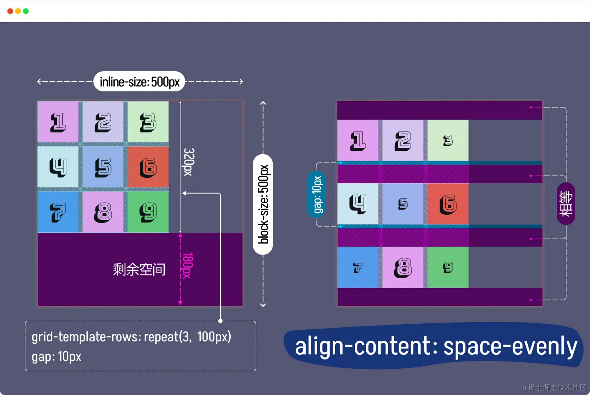

- **`align-content` 取值为 `space-between`**

  会令行网格轨道在网格容器块轴方向两端对齐，即网格容器的剩余空间会平均分配到相邻两行行网格轨道之间：

  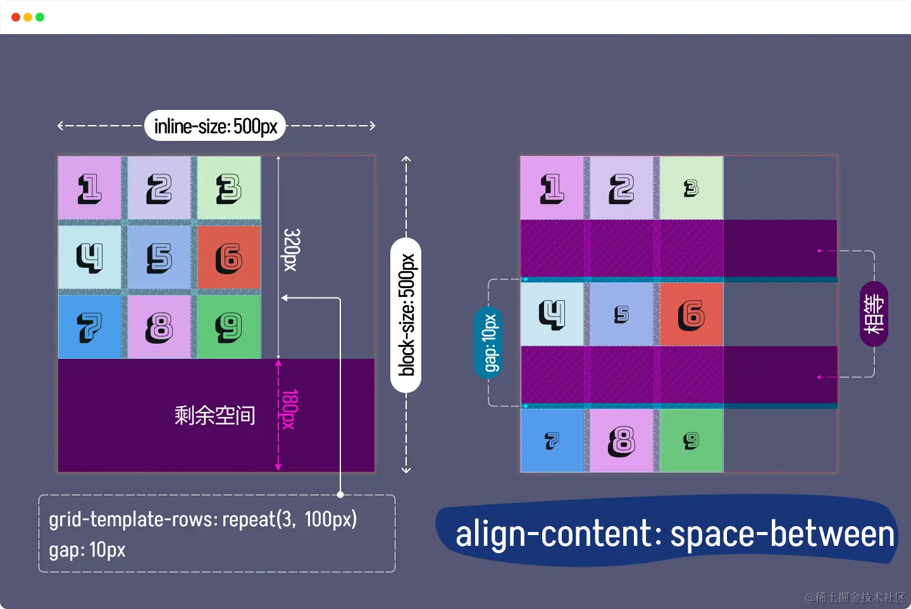

> **注意**：当行网格轨道的尺寸是 fr 值时，align-content 取任何值的效果都和其默认值 start 等同。
>
> ```css
> .container {
>   grid-template-rows: 1fr 100px 100px;
>
>   /* 或 */
>   grid-template-rows: minmax(100px, 1fr) 100px 100px;
>
>   /* 或 */
>   grid-auto-rows: 1fr;
> }
> ```
>
> 也就是说，**当网格容器没有剩余空间时，`align-content` 各值的效果都相同，即等同于 `align-content` 的 `start`（默认值效果）**。

网格容器有剩余空间，也就有可能会有不足空间出现，当网格项目溢出网格容器，`align-content` 取值不同时，溢出方向也有所差异：

- `start`：网格项目在网格容器块轴方向结束位置溢出
- `end`：网格项目在网格容器块轴方向起始位置溢出
- `center`：网格项目在网格容器块轴两个方向溢出
- `stretch`：与 start 等同
- `space-around`：与 center 等同
- `space-between`：与 start 等同
- `space-evenly`：与 center 等同

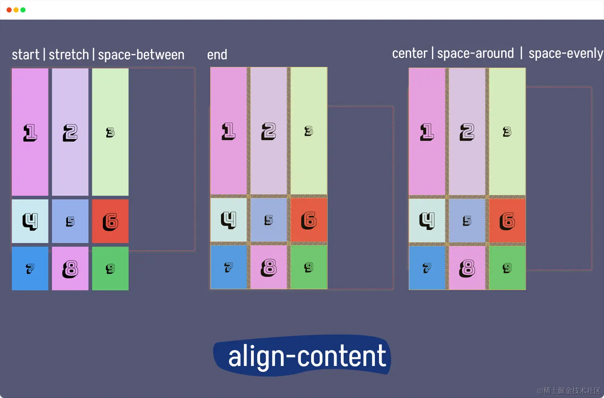

在网格容器上显式设置 `align-content` 值时，还有可能会造成网格区域变大。比如下面这个示例，网格项目一合并了两行两列。当 `align-content` 取值 `space-around`、`space-evenly` 和 `space-between` 时，行网格轨道之间的间距就会产生变化，这样对于合并多行的网格项目一来说，尺寸（块轴方向尺寸，block-size）也会产生相应变化：

```css
.container {
  inline-size: 500px;
  block-size: 500px;

  display: grid;
  gap: 10px;

  grid-template-columns: repeat(3, 100px);
  grid-template-rows: repeat(3, 100px);
}

.item:nth-child(1) {
  grid-row: 1 / span 2;
  grid-column: 1 / span 2;
}
```

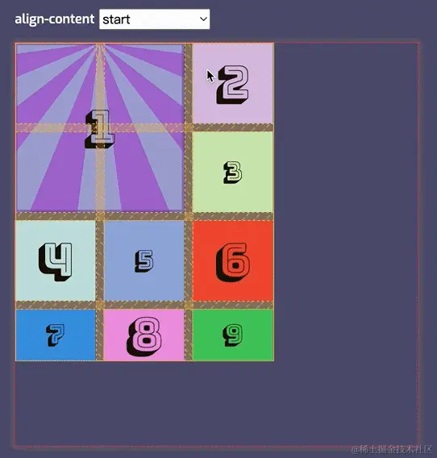

**`justify-content`**

`justify-content` 取值和 `align-content` 值效果是相同的，唯一不同的是，**`justify-content` 是用来控制列网格轨道在网格容器的内联轴方向的对齐方式，即分配网格容器内联轴方向的剩余空间**：

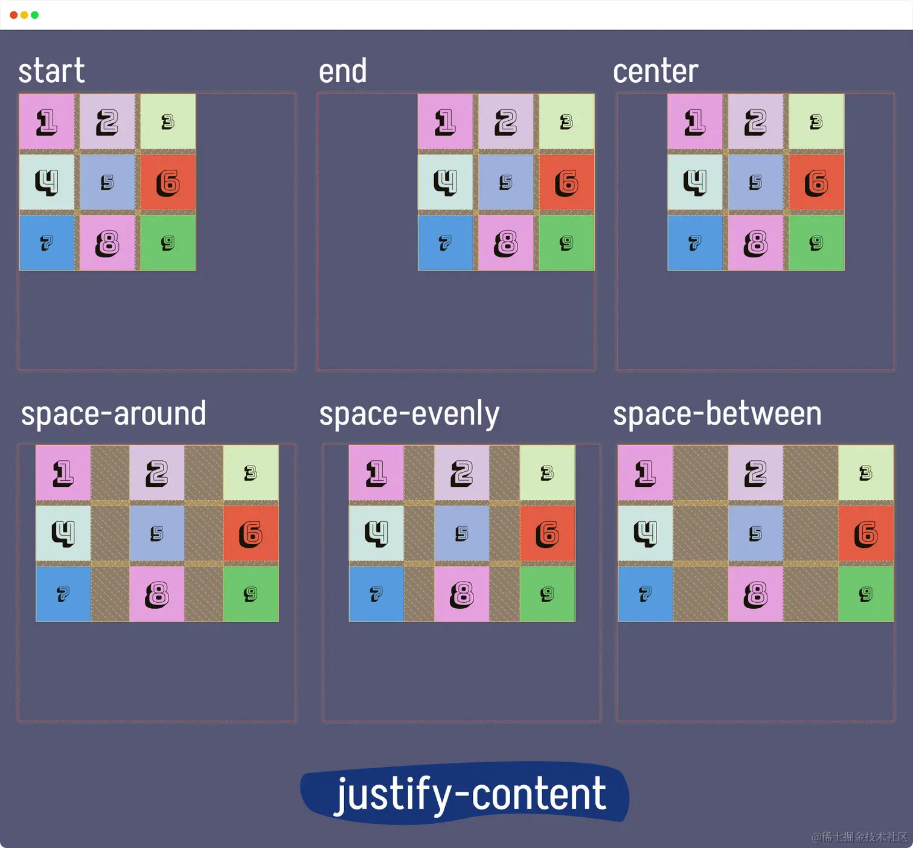

`justify-content` 取值为 `center`、`space-around`、`space-evenly` 和 `space-between` 分配网格容器内联轴方向剩余空间如下：


如果 `grid-template-columns` 或 `grid-auto-columns` 设置列网格轨道尺寸时，设置了 fr 单位值，那么 `justify-content` 取任何值的效果都与默认值 `start` 等同，和 `align-content` 的表现差不多，只是在方向上有所不同。

`justify-content` 在取值 `space-around`、`space-evenly` 和 `space-between` 时，也会影响合并多列的网格项目的内联尺寸方向的尺寸（inline-size），即宽度会变大。

`align-content` 和 `justify-content` 在示例中取值为 `stretch` 的效果和 `start` 是一样的。这主要是因为示例中的网格轨道尺寸是一个固定值，可以将示例中的 `grid-template-columns` 和 `grid-template-rows` 中的值调整为 `auto 100px auto`，即有些轨道尺寸由内容来决定：

```css
.container {
  grid-template-columns: auto 100px auto;
  grid-template-rows: auto 100px auto;
  justify-content: stretch;
  align-content: stretch;
}
```

- 当 `justify-content` 取值为 `stretch` 时，设置内在尺寸的列网格轨道在内联轴方向会被拉伸，网格项目会沿着网格容器的内联轴方向填满（整个网格容器内联轴方向可用空间）。
- 当 `align-content` 取值为 `stretch` 时，设置内在尺寸的行网格轨道在块轴方向被拉伸，网格项目会沿着网格容器块轴方向填满（整个网格容器块轴方向可用空间）。

另外，当网格项目因合并网格单元格创建了一个隐式网格，并且隐式网格轨道尺寸为 auto 时，justify-content 和 align-content 取值为 stretch 时，同样会对网格项目进行拉伸：

```css
.container {
  inline-size: 500px;
  block-size: 500px;

  display: grid;
  gap: 10px;

  grid-template-columns: repeat(3, 100px);
  grid-template-rows: repeat(3, 100px);
  grid-auto-flow: dense;

  justify-content: stretch;
  align-content: stretch;
}

.item:nth-child(1) {
  grid-row: 1 / span 2;
  grid-column: 1 / span 2;
}

.item:nth-child(5) {
  grid-column: 3 / span 2;
}
```

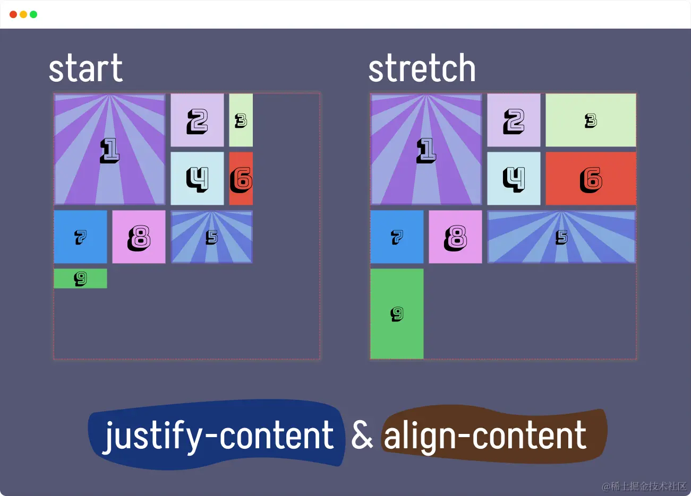

在使用的时候，还可以将 `justify-content` 和 `align-content` 简写成 `place-content` ，即：

```css
place-content: <align-content> <justify-content>;
```

当 `place-content` 只有一个值时，表示 `align-content` 和 `justify-content` 值相同。

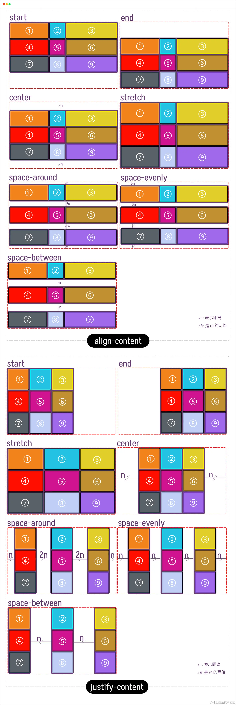

##### 3.3.6.3 网格项目的 margin:auto

网格布局中，在网格项目上设置 margin 的值为 auto 时可以实现水平垂直居中的效果。比如：

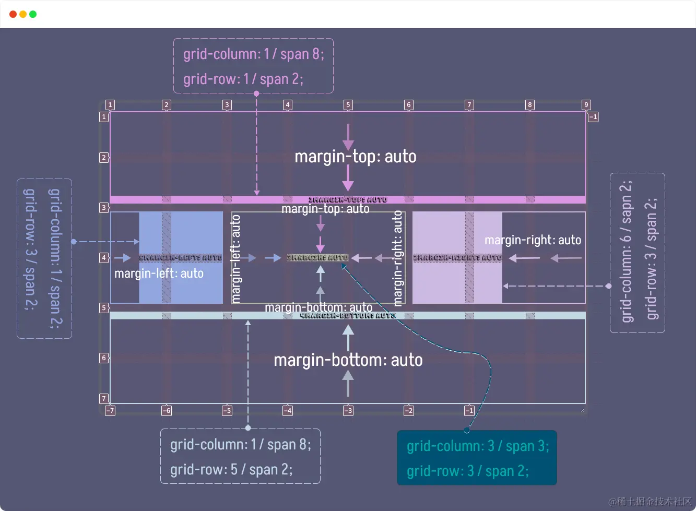

```css
.container {
  display: grid;
}

.item {
  grid-area: 1 / 1 / -1 / -1;
  margin: auto;
}
```

除了在网格项目上显式设置 margin 的值为 auto 之外，也可以将其设置为 `<length-percentage>` 值，用来控制网格项目之间的间距。它和网格容器上的 gap 属性的区别是：

- `gap` 是用来设置网格轨道之间的间距
- `margin` 是用来设置网格项目外侧边缘和网格区域边缘之间的间距

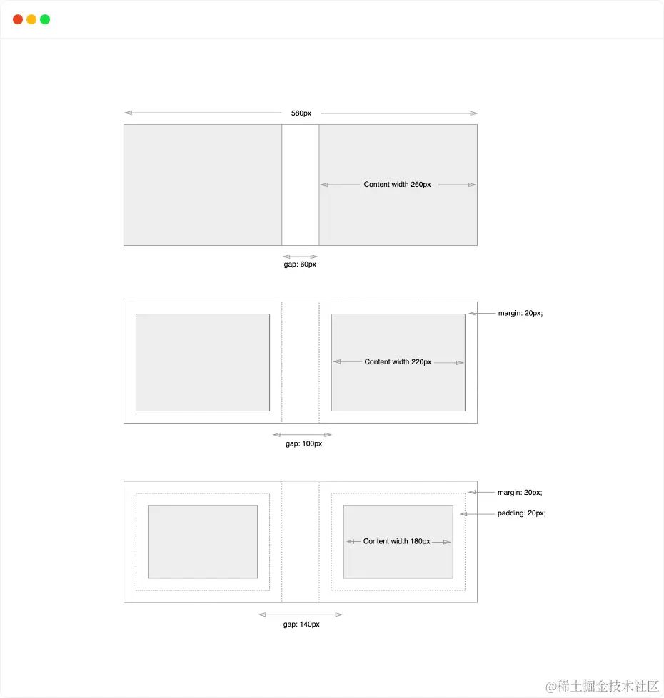

网格项目上设置 margin 值时，网格项目会向里收缩。另外，网格布局中网格项目或网格轨道的对齐都是沿着网格容器的块轴方向或内联轴方向，所以使用 margin 值为 auto 达到对齐效果时，更建议采用相应的逻辑属性，比如：

- `margin-inline-start` 替代 `margin-left`，相当于在网格项目上设置 `justify-self: end`。
- `margin-inline-end` 替代 `margin-right`，相当于在网格项目上设置 `justify-self: start`。
- `margin-inline` 的值为 `auto` 实现水平居中，等同于 `justify-self: center`。

- `margin-block-start` 替代 `margin-top`，相当于在网格项目上设置 `align-self: end`。
- `margin-block-end` 替代 `margin-bottom`，相当于在网格项目上设置 `align-self: start`。
- `margin-block` 的值为 `auto` 实现垂直居中，等同于 `align-self: center`。

#### 3.3.7 网格布局中的子网格和嵌套网格

CSS 网格缺少一个重要的东西，**元素无法从其父元素中继承列或行**。也就是说，**嵌套网格不能继承其父网格的特性**。但 CSS 的子网格可以做到这一点，而且该特性一直以来都被认为是一个很重要的功能。

##### 3.3.7.1 嵌套网格

**如果在网格项目显式设置了 `display` 属性的值为 `grid` 或 `inline-grid` ，那么该网格项目既是其父元素（网格容器）的一个网格项目了，同时也是其子元素的网格容器**。就实现了网格嵌套网格。

```html
<div class="container parent">
  <div class="item"></div>
  <div class="item subgrid">
    <div class="item"></div>
  </div>
</div>

<style>
  /* 创建父网格容器 */
  .parent {
    display: grid; /* 或 inline-grid */
    grid-template-columns: 1fr 2fr 3fr 2fr 1fr;
    grid-template-rows: 1fr 2fr 2fr 1fr;
    gap: 1rem;
  }

  /* 创建嵌套网格 */
  .subgrid {
    grid-column: 2 / 5;
    grid-row: 2 / 4;

    display: inherit;
    grid-template-columns: inherit;
    grid-template-rows: inherit;
    gap: inherit;

    /* 等同于 */
    display: grid; /* 或 inline-grid */
    grid-template-columns: 1fr 2fr 3fr 2fr 1fr;
    grid-template-rows: 1fr 2fr 2fr 1fr;
    gap: 1rem;
  }
</style>
```

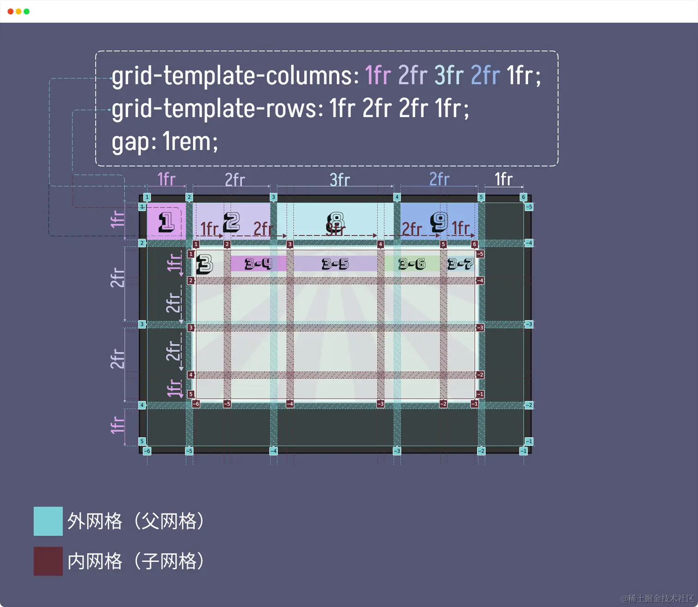

示例中，定义了元素 `.parent` 是一个四行五列（4 x 5）的网格。与此同时，在网格项目二上使用 grid-row 和 grid-column 将其放置在了 `2 / 2 / 4 / 5` 网格线围绕的一个区域（合并了三列两行）。除此之外，该元素（.subgrid）也显式设置了 display、grid-template-columns、grid-template-rows 和 gap 属性，并且都继承其父元素的相应属性的值。

所以 `.subgrid` 也是一个四行五列（4 x 5）的网格。即：.parent 网格中嵌套了一个 .subgrid 网格，并且两个网格的特性是相同的：相同数量的网格轨道（行网格轨道和列网格轨道）、相同单位值的网格尺寸和相同的网格线名称以及相同的网格轨道间距。

正如上图中所示，草绿色网格线构建的是父网格（即 .parent 元素），褐色网格线构建的是子网格（即 .subgrid 元素），这两个网格是相互嵌套的关系，**两个网格都有自己独立的网格系统**。

> **注意**：嵌套网格内所做的更改不会涉及父级容器，因此，在布局时需要考虑两个独立的网格，出错率就更大，维护更难，效率也变得更低。嵌套网格还存在的一个问题就是它的灵活性，在响应式设计中会产生一个问题，即里面的元素溢出了网格容器元素的边界之外。

当使用 CSS 网格来构建 Web 布局时，已经可以使用嵌套网格了。但因为嵌套网格自身不可避免的缺陷，往往会给使用带来诸多的麻烦，比如需要花时间去计算子网格轨道尺寸大小，而且可能要不断地去计算。另外，随着嵌套的层级越深，维护起来就越困难。**子网格**就是一种很好的解决方案。除此之外，`display: contents` 也是一种解决方案。<!-- TODO -->

##### 3.3.7.2 子网格

由于嵌套网格布局存在一定的缺陷，同时为了避免嵌套网格给布局带来的不利因素，[CSS Grid 布局模块 Level 2](https://www.w3.org/TR/css-grid-2/#subgrids) 新增了一个 `subgrid`（子网格）的新功能。

子网格也像嵌套网格一样，子网格存在于另一个网格当中。同样需要在子网格元素上显式设置 display 的值为 `grid` 或 `inline-grid`、或 `inherit` 关键词。

网格布局中的子网格（subgrid）不会使用 `grid-template-rows` 和 `grid-template-columns` 指定具体的网格轨道尺寸和数量，否则它又将是嵌套网格。只需要将子网格的 `grid-template-columns` 和（或）`grid-template-rows` 属性的值设置为 `subgrid` 。

具体的语法规则如下：

```css
grid-template-rows: subgrid <line-name-list>?
grid-template-columns: subgrid <line-name-list>?
<line-name-list>     = [ <line-names> | <name-repeat> ]+
```

当 `grid-template-rows`、`grid-template-columns` 显式设置了 `subgrid` 的值，嵌套网格将采用其父网格定义的网格轨道。子网格的项目将参与任何与父网格共享的网格轨道的内在尺寸计算。从本质上讲，子网格提供了通过嵌套元素向下传递网格参数的能力，以及将其基于内容信息向上传递到父网格的能力。

如果在 `subgrid` 后面指定了 `<line-name-list>` 参数的话，将允许对与父网格共享的网格线进行本地命名：如果给出了 `<line-name-list>`，指定的 `<line-name>`（网格线名称）将被分配给子网格的显式网格线，每条一个，从第一条网格线开始，并且多余的网格线名称会被忽略。

```css
.container {
  display: grid;
  grid-template-columns: 1fr 2fr 3fr 2fr 1fr;
  grid-template-rows: 1fr 2fr 2fr 1fr;
  gap: 1rem;
}

.grid__container--nested,
.grid__container--subgrid {
  grid-column: 2 / 5;
  grid-row: 2 / 4;
  gap: inherit;
}

/* 嵌套网格 */
.grid__container--nested {
  display: inherit;
  grid-template-columns: inherit;
  grid-template-rows: inherit;
}

/* 子网格 */
.grid__container--subgrid {
  display: inherit;
  grid-template-columns: subgrid;
  grid-template-rows: subgrid;
}
```

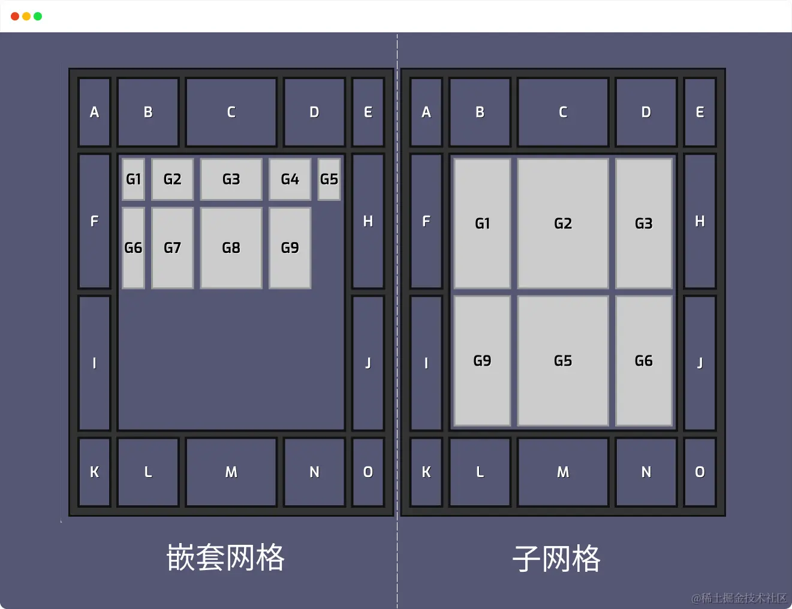

##### 3.3.7.3 嵌套网格 VS 子网格

**共同点**：

- 嵌套网格和子网格都存在于另一个网格之中。
- 嵌套网格和子网格只有在网格项目跨越多个网格单元格才有意义

**不同点**：

- 子网格，它将**继承外部网格（父网格）的网格轨道**。

  ```css
  .parent--grid {
    display: grid;
    grid-template-columns: repeat(5, 1fr);
    grid-template-rows: repeat(3, 1fr);
    gap: 1rem;
  }
  .subgrid {
    grid-column: 2 / 5;
    grid-row: 1 / 3;

    display: inherit; /* 或 grid 或 inline-grid */
    grid-template-columns: subgrid;
    grid-template-rows: subgrid;
  }
  ```

  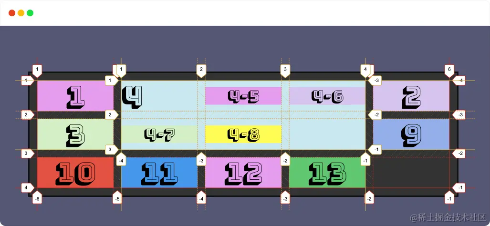

- 嵌套网格**不能继承父网格的网格轨道**，但在 grid-template-columns 和 grid-template-rows 以及 gap 属性值为 inherit 时可以复制父网格；也可以在 grid-template-columns、grid-template-rows 和 gap 设置独立的值，创建一个独立的网格。

##### 3.3.7.4 创建子网格

在 CSS 网格布局中，定义显式网格的 grid-template-columns 和 grid-template-rows 属性引入了一个新的属性值 `subgrid`。这个属性下的子网格将会继承父网格的相关特性，比如网格轨道的尺寸和网格之间的间距等。换句话说，子网格可以沿着单个轴（行或列）或沿两个轴采用其父网格的轨道尺寸。

比如下面这个示例，在 .parent 元素上使用 grid-template-columns 和 grid-template-rows 创建了一个三行六列（3 x 6）的父网格（外部网格）。同时子网格（内部嵌套的网格）是父网格的一个网格项目（.subgrid），它合并了四列两行，而且在子网格上显式设置 grid-template-columns 和 grid-template-rows 的值为 subgrid 。这意味着子网格（嵌套网格）现在是一个两行四列（2 x 4）的网格，并且网格轨道（行和列）的大小与父网格的网格轨道大小是相等的。

```css
.parent {
  display: grid;
  grid-template-columns: repeat(3, 1fr 2fr);
  grid-template-rows: auto auto auto;
  gap: 1rem;
}

.subgrid {
  grid-column: 2 / 6;
  grid-row: 1 / 3;

  display: inherit;
  grid-template-columns: subgrid;
  grid-template-rows: subgrid;
}
```

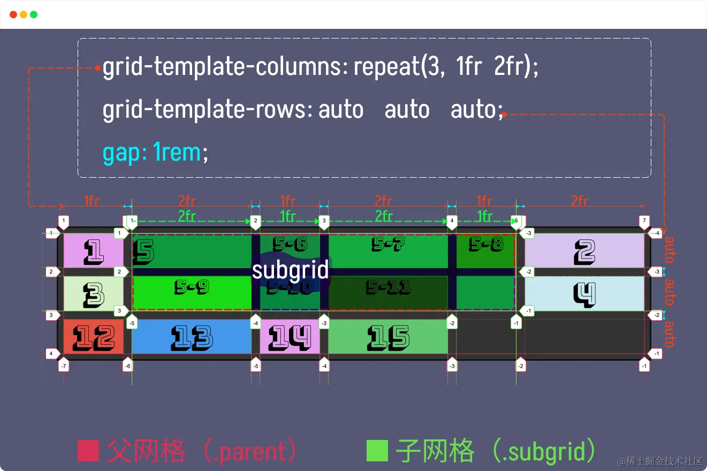

这意味着父网格中的网格轨道（或网格项目）尺寸的任何改变都会延伸到其子网格相应的网格轨道（网格项目）；同样，子网格的网格轨道的尺寸改变也会影响父网格轨道的尺寸。

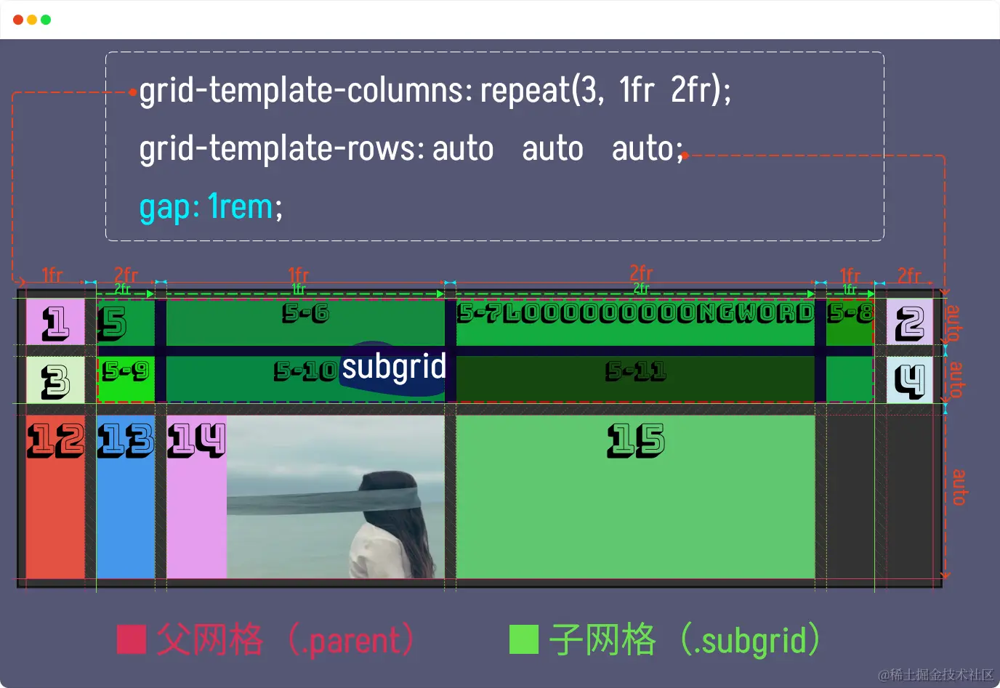

还可以只在一个维度中使用子网格，并在另一个维度中指定网格轨道数量和尺寸。只在 `grid-template-columns` 或 `grid-template-rows` 中的一个属性显式设置值为 `subgrid`，另一个设置其他的值。

比如下面这个示例，只在 `grid-template-columns` 属性上显式设置值为 `subgrid`，`grid-template-rows` 属性设置为其他值：

```css
.parent {
  display: grid;
  grid-template-columns: 1fr 2fr 1fr 2fr 1fr 2fr;
  grid-template-rows: auto auto auto;
}

.subgrid {
  grid-column: 2 / 6;
  grid-row: 1 / 3;

  display: inherit;
  grid-template-columns: subgrid;
  grid-template-rows: repeat(2, 100px 1fr);
}
```

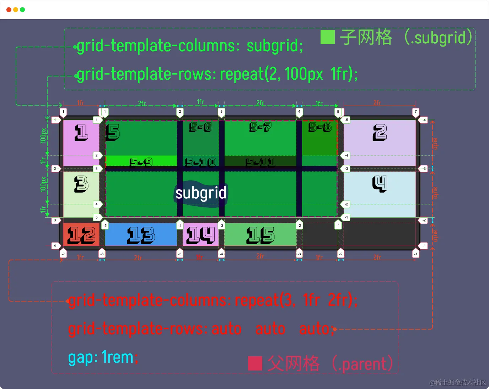

子网格（.subgrid）的列网格轨道和父网格（.parent）的列网格轨道是保持一致的（子网格继承了父网格的列网格轨道），大小会相互影响；但行网格轨道是独立于父网格的行网格轨道，这是因为子网格的 `grid-template-rows` 是一个重新设置的值。在此情况之下，子网格的行轨道之间的间距（gap）被视为 `0`，没有继承父网格的行网格轨道之间的间距 `1rem`。

同样，可以让子网格的行网格轨道继承父网格的行网格轨道，在子网格中单独为列网格轨道设置独立的值：

```css
.parent {
  display: grid;
  grid-template-columns: 1fr 2fr 1fr 2fr 1fr 2fr;
  grid-template-rows: auto auto auto;
}

.subgrid {
  grid-column: 2 / 6;
  grid-row: 1 / 3;

  display: inherit;
  grid-template-columns: repeat(2, 100px 1fr);
  grid-template-rows: subrid;
}
```

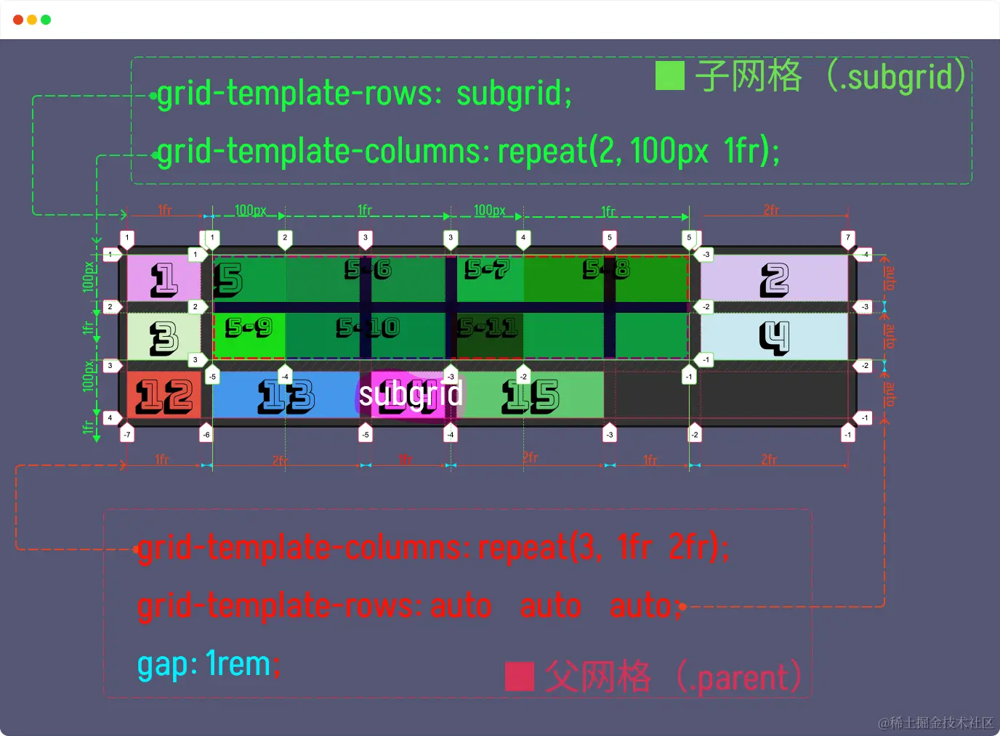

也可以在子网格中的其中一个维度设置子网格（`subgrid`），在另一个维度使用隐式网格轨道（`grid-auto-rows` 或 `grid-auto-columns`）。在下面这个示例中，没有显式指定任何行网格轨道（即没有显式设置 `grid-template-rows` 属性的值），而是使用 `grid-auto-rows` 为网格设置隐式行网格轨道尺寸：

```css
.parent {
  display: grid;
  grid-template-columns: 1fr 2fr 1fr 2fr 1fr 2fr;
  grid-template-rows: auto auto auto;
}

.subgrid {
  grid-column: 2 / 6;
  grid-row: 1 / 3;

  display: inherit;
  grid-template-columns: subgrid;
  grid-auto-rows: minmax(200px, auto);
}
```

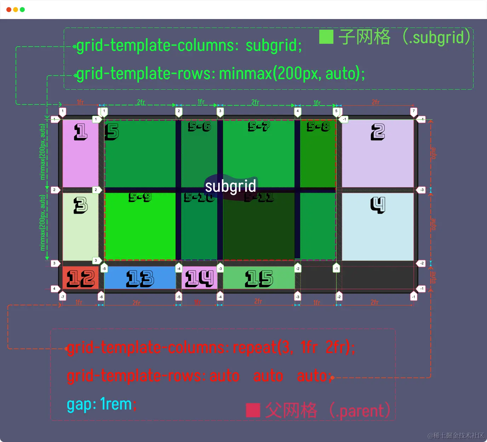

子网格（.subgrid）将会按照 `grid-auto-rows` 属性的值指定行网格轨道尺寸，并且会创建隐式的行网格轨道，也会像前面的示例一样，父网格将需要为这些行提供空间。

虽然子网格两个维度（`grid-template-columns` 和 `grid-template-rows`）都显式设置值为 `subgrid` 时，子网格会继承父网格轨道尺寸，但子网格的默认网格线编号（数字索引编号）不会继承父网格的，它将按照网格系统网格线编号进行编号。

```css
.parent {
  display: grid;
  grid-template-columns: 1fr 2fr 1fr 2fr 1fr 2fr;
  grid-template-rows: auto auto auto;
}

.subgrid {
  grid-column: 2 / 6;
  grid-row: 1 / 3;

  display: inherit;
  grid-template-columns: subgrid;
  grid-auto-rows: subgrid;
}
```

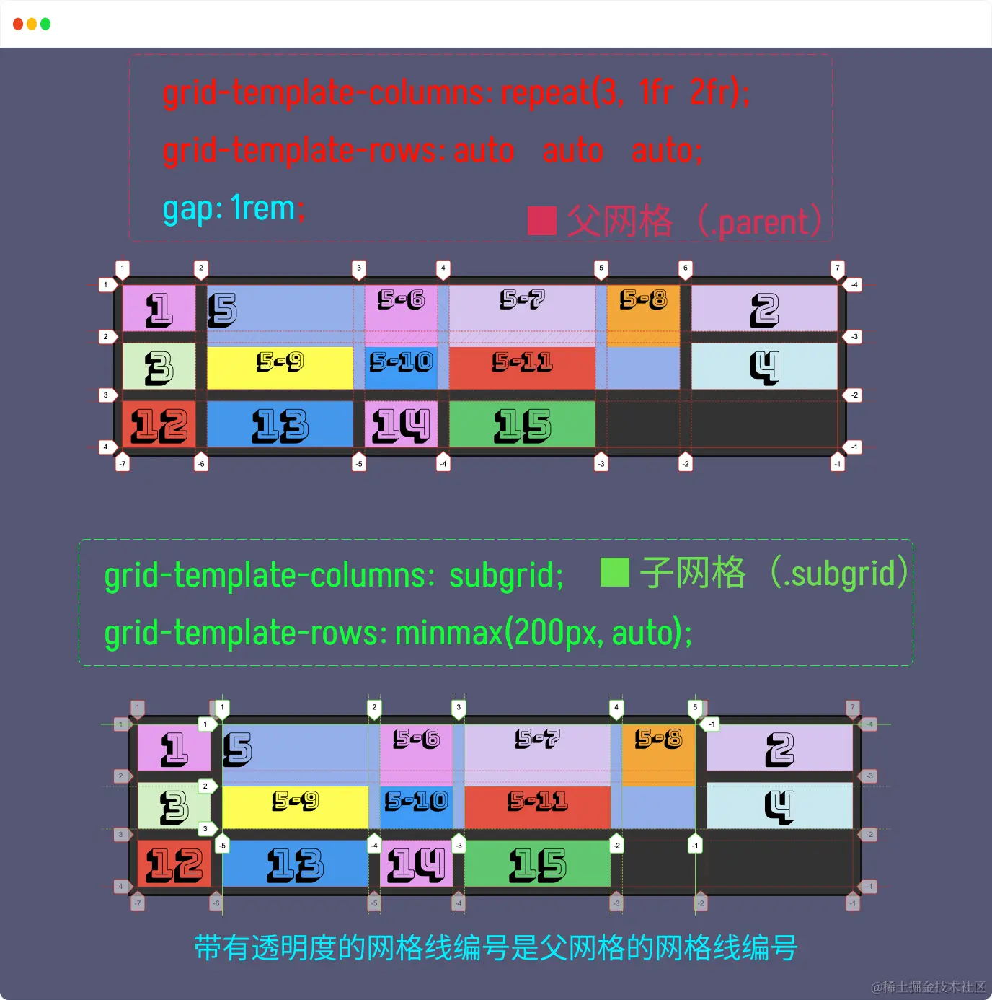

然而，如果父网格上有任何网格线名称（显式命名的网格线名称），它们将被子网格继承，但也可以提供子网格自己的网格线名称。父网格将不能使用子网格线命名的网格线名称。它们只适用于子网格。

```css
.parent {
  display: grid;
  grid-template-columns: [a] 1fr [b] 2fr [c] 1fr [d] 2fr [e] 1fr [f] 2fr [g];
  grid-template-rows: auto auto auto;
}

.subgrid {
  grid-column: 2 / 6;
  grid-row: 1 / 3;

  display: inherit;
  grid-template-columns: subgrid [sub-a] [sub-b] [sub-c] [sub-d] [sub-e];
  grid-template-rows: subgrid [sub-row-a] [sub-row-b] [sub-row-c];
}

.subitem {
  grid-column: c / e;
}
```

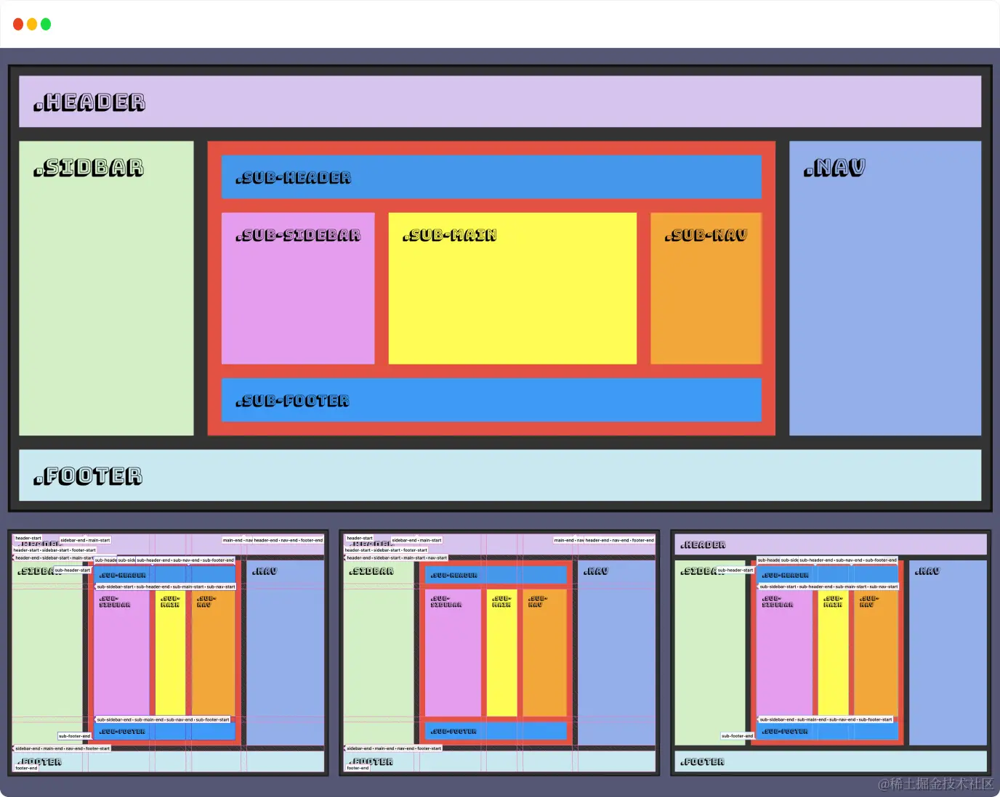

子网格除了可以继承父网格的网格轨道之外，当子网格的 `grid-template-columns` 和 `grid-template-rows` 都显式设置值为 `subgrid` 时，子网格也会继承父网格的 `gap` 值。

如果子网格只在一个维度显式设置值为 `subgrid` 时，那么只有在相对应的维度才会继承父网格的 `gap`，即子网格没有显式设置 `subgrid` 的维度是不会继承父网格的 `gap` 值。

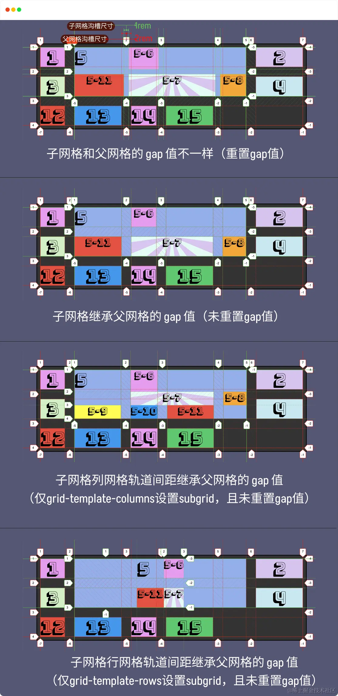

#### 3.3.8 使用子网格构建 Web 布局

##### 3.3.8.1 卡片组件的布局

卡片布局通常有两种：

1. [在块轴方向（垂直方向）堆叠](https://codepen.io/airen/full/zYaKmpZ)

   

   ```html
   <!-- grid -->
   <div class="cards">
     <!-- subgrid -->
     <div class="card">
       <h3>标题</h3>
       
       <p>描述文本</p>
       <span>列表1</span>
       <span>列表2</span>
       <span>列表3</span>
     </div>
   </div>

   <style>
     /* 卡片容器 .cards 分为五列 */
     .cards {
       display: grid;
       grid-template-columns:
         minmax(7em, 12em)
         repeat(3, max-content)
         1fr;
       row-gap: 2rem;
     }

     .cards .card {
       display: inherit;
       /* 继承父网格（.cards）的列轨道尺寸。另外在子网格上使用 grid-template-rows 重新定义自己的行网格轨道尺寸 */
       grid-template-columns: subgrid;
       grid-template-rows: min-content max-content min-content;
       column-gap: 1em;
     }

     /* 创建好网格之后，卡片中的标题（h3 ）、描述文本（p）、缩略图（img）和导航列表项（span）就可以根据子网格（.card）的网格线名称放置到指定位置： */
     .card h3 {
       grid-column: 1 / -1;
     }

     .card p {
       grid-column: 2 / -1;
     }

     .card img {
       grid-row: 2 / -1;
     }
   </style>
   ```

   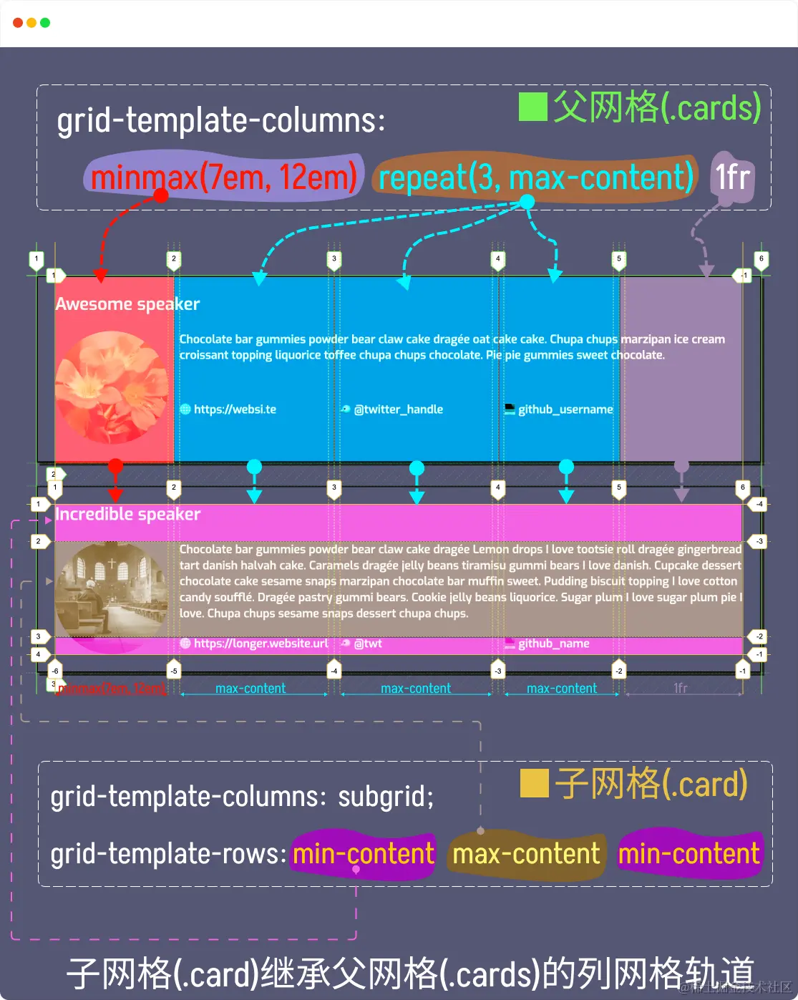

2. [在内联轴方向平铺](https://codepen.io/airen/full/abKmQWj)

   ```html
   <!-- grid -->
   <div class="cards">
     <!-- subgrid -->
     <div class="card">
       <!-- subgrid -->
       <div class="media">
         
         <p>Media Content</p>
       </div>
       <h3>Card Title</h3>
       
       <p>Card Describe</p>
       <svg>Like Icon</svg>
       <button>More Button</button>
     </div>
     <!-- 省略的 card -->
   </div>

   <style>
     .cards {
       display: grid;
       /* 在最外层的卡片容器上使用 RAM 布局技术，让卡片在卡片容器中能能够根据空间自动断行 */
       grid-template-columns: repeat(auto-fit, minmax(min(100% - 2rem, 18rem), 1fr));
       /* 根据卡片组件的需要，使用 grid-template-rows 定义行网格轨道尺寸和数量 */
       grid-template-rows: min-content min-content minmax(10rem, 14rem) auto auto;
       gap: 4rem;
     }

     .cards .card {
       /* .card 是父网格（.cards）的一个子网格，跨越父网格五行，并且继承父网格行网格轨道 */
       grid-row: span 5;
       display: inherit;
       /* 不同的是重新定义了网格列轨道数量和尺寸，同时为了让卡片中的每个元素更易于放置，使用 grid-template-areas 在子网格上显式定义了网格区域名称 */
       grid-template-columns: 1rem min-content 1fr min-content 1rem;
       grid-template-rows: subgrid;
       grid-template-areas:
         '.       media    media    media .'
         '.       title    title    title .'
         'figure  figure   figure   figure    figure'
         '.       describe describe describe  .'
         '.       like     .        button    .';
       /* 显式设置 gap 值为 0，重置了子网格轨道之间的间距 */
       gap: 0;
     }

     /* 卡片中的每个网格项目使用 grid-area 来指定位置 */
     .media {
       grid-area: 1 / 2 / 2 / 5; /* media */
     }

     h3 {
       grid-area: 2 / 2 / 3 / 5; /* title */
     }

     .card > img {
       grid-area: 3 / 1 / 4 / 6; /* figure */
     }

     .card > p {
       grid-area: 4 / 2 / 5 / 5; /* describe */
     }

     .card svg {
       grid-area: like;
     }

     .card button {
       grid-area: button;
     }
   </style>
   ```

   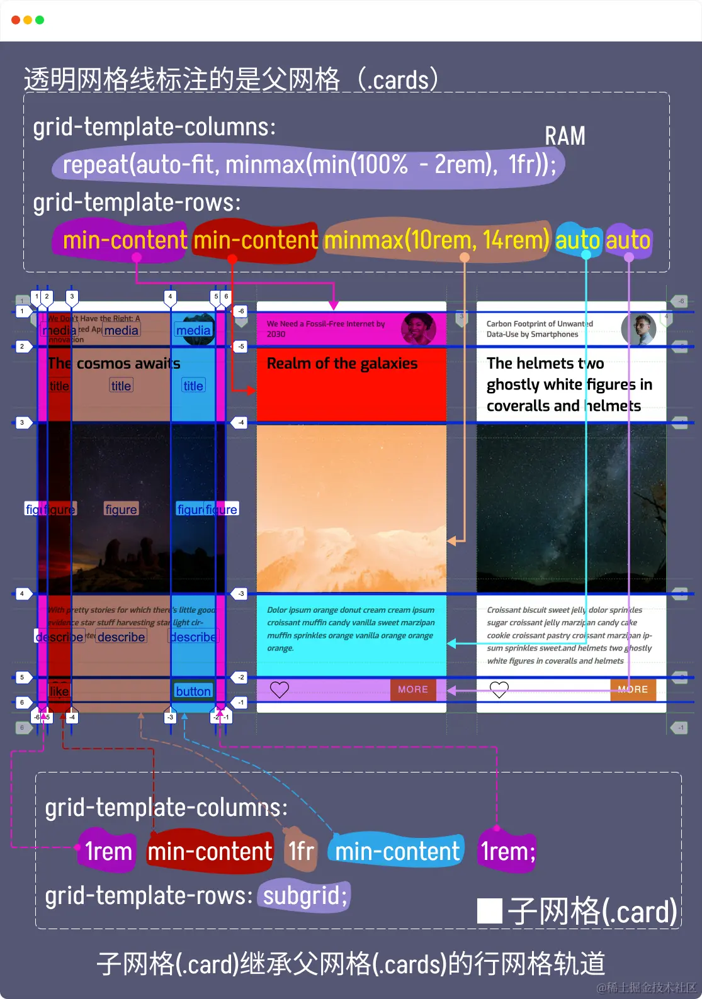

   在这个示例中，网格 .card 既是网格 .cards 的子网格，又是网格 .media 的父网格。因为，在 .media （网格项目）上也使用 display: inherit 定义了一个网格，同时继承其父网格 .card 的列网格轨道：

   ```css
   .media {
     display: inherit;
     grid-template-columns: subgrid;
     grid-template-areas: 'des des avatar';
     align-items: center;
   }

   .media p {
     grid-area: des;
   }

   .media img {
     grid-area: avatar;
     justify-self: end;
   }
   ```

   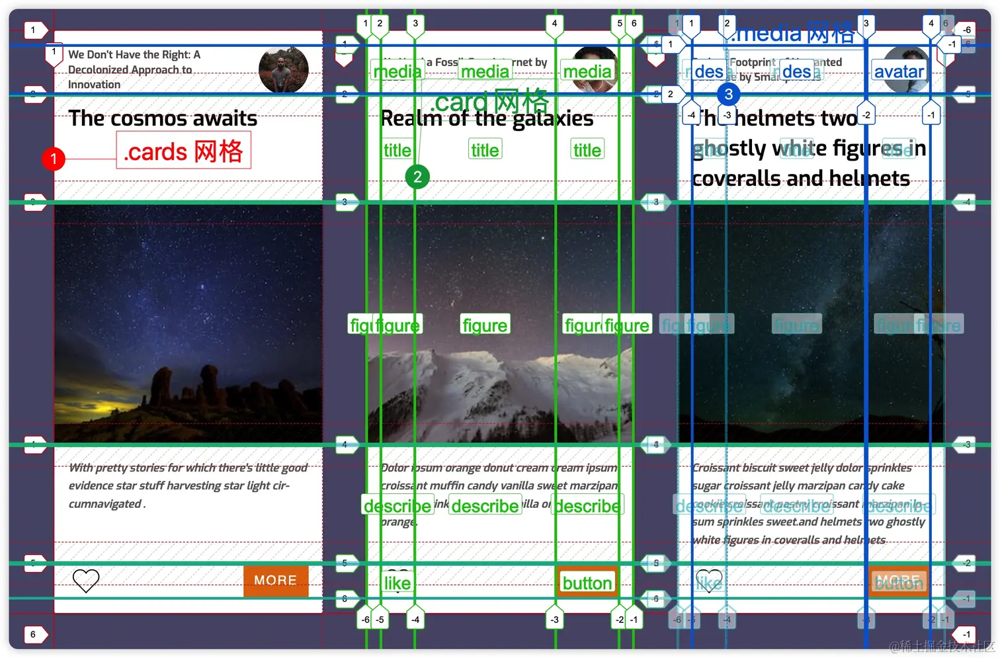

这种布局方式通常用适用于下面这种需求：

1. 列数能够根据视窗大小自动调整，即自动断行。
2. 同一行或列中的区域，其标题与标题对齐，菜单项与菜单项对齐。

##### 3.3.8.2 品牌页布局

在 Web 页面的设计中，常常会有通栏的横幅的设计效果，往往把这种效果称为 Branding 。如下图所示：


```html
<section class="branding">
  <!-- 标题 -->
  <div class="headline">
    <h3>主标题</h3>
    <h4>次标题</h4>
  </div>
  <!-- 特色产品 -->
  <div class="featured">
    <div class="featured__content">
      <!-- 内容区域 -->
      <h3>特色功能区域:标题</h3>
      <blockquote>特色功能区域：描述文本</blockquote>
    </div>
    <figure class="featured__thumbnail">
      
    </figure>
  </div>
  <!-- 卡片 -->
  <div class="card">
    <figure>
      
    </figure>
    <h3>卡片标题</h3>
    <p>卡片描述文本</p>
  </div>
</section>
```

假设设计师将整个 Branding 区域均分为五列 ，除了“特色功能区域（Featured Section）” 占了三列之外，其他两个区域（Headline 和 Card）只各占一列，如下图所示：

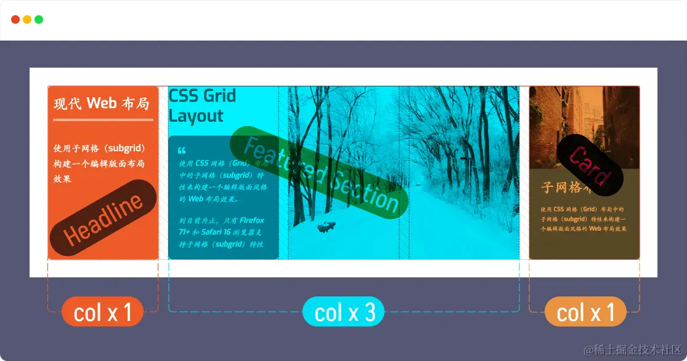

使用网格布局很容易就将它均分成五份，使用网格线可以将它们放置到指定的区域：

```css
.branding {
  display: grid;
  grid-template-columns: repeat(5, minmax(0, 1fr));
  gap: 1rem;
}

.featured {
  /* 放置在列网格线2（起始位置），并且向右合并三列（span 3），相当于 grid-column: 2 / 5 ，即从第二列起始网格线跨越到第五列起始网格线。 */
  grid-column: 2 / span 3;

  display: inherit;
  grid-template-columns: subgrid;
}

.card {
  grid-column: 5;
}
```
