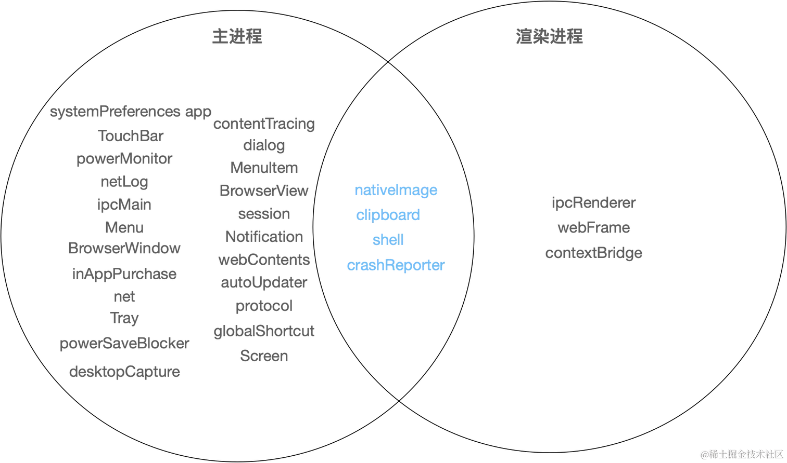

# Electron

<!-- @import "[TOC]" {cmd="toc" depthFrom=1 depthTo=6 orderedList=false} -->

<!-- code_chunk_output -->

- [Electron](#electron)
  - [一. 基础](#一-基础)
    - [1.1 安装方式](#11-安装方式)
    - [1.2 创建一个窗口需要的步骤](#12-创建一个窗口需要的步骤)
    - [1.3 主进程和渲染器进程](#13-主进程和渲染器进程)
      - [1.3.1 主进程 Main Process](#131-主进程-main-process)
      - [1.3.2 渲染器进程 Renderer Process](#132-渲染器进程-renderer-process)
    - [1.4 预加载脚本](#14-预加载脚本)
    - [1.5 进程间通信](#15-进程间通信)
      - [1.5.1 渲染器进程到主进程（单向）](#151-渲染器进程到主进程单向)
      - [1.5.2 渲染器进程到主进程（双向）](#152-渲染器进程到主进程双向)
      - [1.5.3 主进程到渲染器进程（单向）](#153-主进程到渲染器进程单向)
      - [1.5.4 渲染器进程到渲染器进程](#154-渲染器进程到渲染器进程)
    - [1.6 使用 nodeIntegration](#16-使用-nodeintegration)
    - [1.7 remote 模块（不推荐使用）](#17-remote-模块不推荐使用)
    - [1.8 Electron 的原生能力](#18-electron-的原生能力)
      - [1.8.1 Node.js 调用原生能力](#181-nodejs-调用原生能力)
  - [二. 打包](#二-打包)

<!-- /code_chunk_output -->

## 一. 基础

[官网](https://www.electronjs.org/zh)

### 1.1 安装方式

1. [Electron Forge](https://www.electronforge.io)

   ```sh
   npm init electron-app@latest my-app
   ```

2. 只下载 Electron

   ```sh
   npm i --save-dev electron@latest
   ```

**加速 Electron 下载**
打开用户根目录的 .npmrc 文件，添加：

```console
ELECTRON_MIRROR="https://npmmirror.com/mirrors/electron/"
```

### 1.2 创建一个窗口需要的步骤

1. 在根目录新建 [main.js](./examples/main.js) 文件

2. 导入 electron，并使用 electron 中的 app 监听各种事件。

3. 安装 nodemon

   ```sh
   // 全局
   npm install -g nodemon
   // 开发依赖
   npm install --save-dev nodemon
   ```

4. 在 package.json 中的 scripts 字段和 main 字段添加

   ```json
   {
     "main": "main.js",
     "scripts": {
       "electron": "nodemon --watch main.js --exec \"electron .\""
     }
   }
   ```

### 1.3 主进程和渲染器进程

#### 1.3.1 主进程 Main Process

每个 Electron 应用都有一个单一的主进程，作为应用程序的入口点。主进程在 Node.js 环境中运行，这意味着它具有 `require` 模块和使用所有 Node.js API 的能力。

- 窗口管理
- 应用程序生命周期
- 原生 API

主进程是 Electron 应用程序的核心，通常由一个主要的 JS 文件（如 main.js ）定义，可以在 package.json 中指定它：

```json
{
  "main": "main.js"
}
```

1. **管理应用程序生命周期**

   在 Electron 的主进程中，可以使用 [app](https://www.electronjs.org/zh/docs/latest/api/app) 模块来管理应用程序的生命周期，该模块提供了一整套的事件和方法，可以用来添加自定义的应用程序行为。

   app 的常用生命周期钩子如下：

   - `will-finish-launching`：在应用完成基本启动进程之后触发。
   - `ready`：当 electron 完成初始化后触发。
   - `window-all-closed`：所有窗口都关闭的时候触发，在 windows 和 linux 里，所有窗口都退出的时候通常是应用退出的时候。
   - `before-quit`：退出应用之前的时候触发。
   - `will-quit`：即将退出应用的时候触发。
   - `quit`：应用退出的时候触发。

   通常会在 `ready` 的时候执行创建应用窗口、创建应用菜单、创建应用快捷键等初始化操作。而在 `will-quit` 或者 `quit` 的时候执行一些清空操作，比如解绑应用快捷键。

   特别的，在非 `macOS` 的系统下，通常一个应用的所有窗口都退出的时候，也是这个应用退出之时。所以，可以配合 `window-all-closed` 这个钩子来实现：

2. **创建窗口**

   主进程的主要目的之一是使用 BrowserWindow 模块创建和管理应用程序窗口。窗口管理是指创建、控制和管理应用程序中的窗口。

   ```js
   const { BrowserWindow } = require('electron');

   // 创建窗口
   const win = new BrowserWindow({ width: 800, height: 1500 });
   win.loadURL(
     url.format({
       pathname: path.join(__dirname, './dist', 'index.html')
     })
   );

   // 窗口事件管理
   win.on('closed', () => {
     win = undefined;
   });

   win.once('ready-to-show', () => {
     win.show();
   });

   // 窗口的尺寸控制
   win.minimize();
   win.setSize({ width: 300, height: 100 });
   ```

   跟 app 模块一样，BrowserWindow 也有很多常用的事件钩子，比如：

   - `closed`：当窗口被关闭的时候。
   - `focus`：当窗口被激活的时候。
   - `show`：当窗口展示的时候。
   - `hide`：当窗口被隐藏的时候。
   - `maxmize`：当窗口最大化时。
   - `minimize`：当窗口最小化时。

3. **调用原生 API**

   为了使 Electron 的功能不仅仅限于对网页内容的封装，主进程也添加了自定义的 API 来与用户的操作系统进行交互。比如，和客户端 GUI 相关的右键菜单、窗⼝定制、系统托盘、Dock……，和桌⾯环境集成相关的系统通知、剪切板、系统快捷键、⽂件拖放……，和设备相关的电源监视、内存、CPU、屏幕等等。

   ```js
   const { clipboard, globalShortcut, Menu } = require('electron');

   // 向剪切板中写入文本
   clipboard.writeText('hello world', 'selection');
   console.log(clipboard.readText('selection'));

   // 注册全局快捷键
   globalShortcut.register('CommandOrControl+X', () => {
     console.log('CommandOrControl+X is pressed');
   });

   // Dock
   const dockMenu = Menu.buildFromTemplate([
     {
       label: '菜单一',
       click() {
         console.log('菜单一');
       }
     },
     {
       label: '菜单二',
       submenu: [{ label: '子菜单' }]
     },
     { label: '菜单三' }
   ]);
   ```

#### 1.3.2 渲染器进程 Renderer Process

出于安全原因，每个 Electron 应用都会为每个打开的 `BrowserWindow`（与每个网页嵌入）生成一个单独的渲染器进程。渲染器无权直接访问 require 或其他 Node.js API。

渲染进程与主进程是分开的，它们之间通过 IPC（进程间通信）来进行通信。渲染进程可以通过一些特定的 Electron API 来与主进程进行交互，以实现诸如向主进程发送消息、接收主进程的指令等功能。因为安全性等问题的考量，提供给渲染器进程可用的 API 是比较少的：



### 1.4 预加载脚本

**使用预加载脚本来增强渲染器**
为了将 Electron 的不同类型的进程桥接在一起，需要使用被称为**预加载**（preload）的特殊脚本。BrowserWindow 的预加载脚本运行在具有 HTML DOM 和 Node.js、Electron API 的有限子集访问权限的环境中。

| 可用的 API            | 详细信息                                                                                                                                                                                                                                                                                   |
| --------------------- | ------------------------------------------------------------------------------------------------------------------------------------------------------------------------------------------------------------------------------------------------------------------------------------------ |
| Electron 模块         | 渲染进程模块                                                                                                                                                                                                                                                                               |
| Node.js 模块          | [events](https://nodejs.org/api/events.html)、[timers](https://nodejs.org/api/timers.html)、[url](https://nodejs.org/api/url.html)                                                                                                                                                         |
| Polyfilled 的全局模块 | [Buffer](https://nodejs.org/api/buffer.html)、[process](https://www.electronjs.org/zh/docs/latest/api/process)、[clearImmediate](https://nodejs.org/api/timers.html#timers_clearimmediate_immediate)、[setImmediate](https://nodejs.org/api/timers.html#timers_setimmediate_callback_args) |

与 Chrome 扩展的[内容脚本](https://developer.chrome.com/docs/extensions/develop/concepts/content-scripts?hl=zh-cn)（Content Script）类似，预加载脚本在渲染器加载网页之前注入。 如果想为渲染器添加需要特殊权限的功能，可以通过 [contextBridge](https://www.electronjs.org/zh/docs/latest/api/context-bridge) 接口定义全局对象。

1. 新建一个 [preload.js](./examples/preload.js) 文件。该脚本通过 versions 这一全局变量，将 Electron 的 process.versions 对象暴露给渲染器。

2. 为了将脚本附在渲染进程上，在 BrowserWindow 构造器中使用 `webPreferences.preload` 传入脚本的路径。

   ```js
   // main.js
   const { app, BrowserWindow } = require('electron');
   const path = require('path');

   const createWindow = () => {
     const win = new BrowserWindow({
       width: 800,
       height: 600,
       webPreferences: {
         preload: path.join(__dirname, 'preload.js')
       }
     });

     win.loadFile('index.html');
   };

   app.whenReady().then(() => {
     createWindow();
   });
   ```

3. 在 html 文件中，可以通过 `window.versions` 来访问暴露出来的函数和变量。

Electron 的主进程和渲染进程有着清楚的分工并且不可互换。这代表着无论是从渲染进程直接访问 Node.js 接口，亦或者是从主进程访问 HTML 文档对象模型（DOM），都是不可能的。解决这一问题的方法是使用[进程间通信（IPC）](https://www.electronjs.org/zh/docs/latest/tutorial/ipc)。

### 1.5 进程间通信

进程间通信（IPC Inter-process communication）是在 Electron 中构建功能丰富的桌面应用程序的关键部分之一。

**IPC 通道名称**：

- [ipcMain](https://www.electronjs.org/zh/docs/latest/api/ipc-main)：仅在主进程中以异步方式工作的模块，用于与渲染进程交换消息。
- [ipcRenderer](https://www.electronjs.org/zh/docs/latest/api/ipc-renderer)：仅在渲染进程中以异步方式工作的模块，用于与主进程交换消息。

它们继承自 NodeJS 的 [EventEmitter](https://nodejs.org/api/events.html#events_class_eventemitter) 模块。在 EventEmitter 中允许向指定 `channel` 发送消息。`channel` 是一个字符串，在 Electron 中 `ipcMain` 和 `ipcRenderer` 使用它来发出和接收事件/数据。

#### 1.5.1 渲染器进程到主进程（单向）

要将单向 IPC 消息从渲染器进程发送到主进程，可以使用 [ipcRenderer.send](https://www.electronjs.org/zh/docs/latest/api/ipc-renderer) API 发送消息，然后使用 [ipcMain.on](https://www.electronjs.org/zh/docs/latest/api/ipc-main) API 接收。

> **注意**：参数将使用结构化克隆算法进行序列化，就像浏览器的 window.postMessage 一样，因此不会包含原型链。发送函数、Promise、Symbol、WeakMap 或 WeakSet 将会抛出异常。

1. 在 preload.js 中向主进程暴露方法

   ```js
   const { contextBridge, ipcRenderer } = require('electron');

   contextBridge.exposeInMainWorld('electron', {
     setTitle: (title) => ipcRenderer.send('set-title', title)
   });
   ```

2. 在渲染器进程中触发 setTitle 方法

   ```js
   window.electron.setTitle('title');
   ```

3. 在渲染进程创建前使用 `ipcMain.on`

   ```js
   app.whenReady().then(() => {
     ipcMain.on('set-title', (event, title) => {
       const webContents = event.sender; // 获取发送事件的 webContents
       const win = BrowserWindow.fromWebContents(webContents); // 通过 webContents 获取窗口
       win.setTitle(title); // 设置窗口标题
     });

     createWindow();
   });
   ```

#### 1.5.2 渲染器进程到主进程（双向）

- 使用 [ipcRender.invoke](https://www.electronjs.org/zh/docs/latest/api/ipc-renderer#ipcrendererinvokechannel-args) 进行发送

- 使用 [ipcMain.handle](https://www.electronjs.org/zh/docs/latest/api/ipc-main#ipcmainhandlechannel-listener) 来进行响应
  - 它的第二个函数被用作一个回调。然后，返回值将作为一个 Promise 返回到最初的 invoke 调用

1. 在 preload.js 中向主进程暴露方法

   ```js
   contextBridge.exposeInMainWorld('electron', {
     writeFile: (content) => ipcRenderer.invoke('write-file', content)
   });
   ```

2. 在渲染器进程中触发 writeFile 方法，并获取返回值

   ```js
   btn2.addEventListener('click', async () => {
     const content = contentInput.value;
     const len = window.electron.writeFile(content);
     info.innerHTML = `文件大小：${len} 字节`;
   });
   ```

3. 在渲染进程创建前使用 `ipcMain.handle`

   ```js
   app.whenReady().then(() => {
     ipcMain.handle('write-file', async function handleWriteFile(content) {
       await fs.promises.writeFile('test.txt', content); // 写入文件
       const stats = await fs.promises.stat('test.txt'); // 获取文件属性
       return stats.size; // 返回文件大小
     });

     createWindow();
   });
   ```

#### 1.5.3 主进程到渲染器进程（单向）

- 使用 [win.webContents.send](https://www.electronjs.org/zh/docs/latest/api/web-contents#contentssendchannel-args) 进行发送
- 使用 [ipcRenderer.on](https://www.electronjs.org/zh/docs/latest/api/ipc-renderer#ipcrendereronchannel-listener) 接收

1. 在 preload.js 中向主进程暴露方法

   ```js
   contextBridge.exposeInMainWorld('electron', {
     onUpdateCounter: (callback) => ipcRenderer.on('update-counter', (_event, counter) => callback(counter))
   });
   ```

2. 在渲染器进程中触发 onUpdateCounter 方法，获取主进程返回的值

   ```js
   const counter = document.getElementById('counter');
   window.electron.onUpdateCounter((count) => {
     counter.innerHTML = count;
   });
   ```

3. 在渲染进程创建后使用 `webContents.send`

   ```js
   app.whenReady().then(() => {
     const win = createWindow();

     let counter = 1;
     win.webContents.send('update-counter', counter);
     setInterval(() => {
       counter += 3;
       win.webContents.send('update-counter', counter);
     }, 3000);
   });
   ```

#### 1.5.4 渲染器进程到渲染器进程

没有直接的方法可以使用 ipcMain 和 ipcRenderer 模块在 Electron 中的渲染器进程之间发送消息。为此，有两种选择：

1. 将主进程作为渲染器之间的消息代理。这需要将消息从一个渲染器发送到主进程，然后主进程将消息转发到另一个渲染器。

2. 从主进程将一个 [MessagePort](https://www.electronjs.org/zh/docs/latest/tutorial/message-ports) 传递到两个渲染器。这将允许在初始设置后渲染器之间直接进行通信。

### 1.6 使用 nodeIntegration

进程可以在沙盒中执行，沙盒通过限制对大多数系统资源的访问来减少恶意代码可能造成的伤害。为了执行需要额外权限的操作，沙盒处的进程通过专用通信渠道将任务下放给更大权限的进程。

沙盒化应用于主进程以外的大多数进程。其中包括渲染器进程，以及功能性进程，如音频服务、GPU 服务和网络服务。

```js
new BrowserWindow({
  webPreferences: {
    nodeIntegration: true, // 是否集成 Node.js
    preload: path.join(__dirname, 'preload.js') // 预加载脚本
  }
});
```

> 禁用沙盒要特别注意安全性问题。

### 1.7 remote 模块（不推荐使用）

remote 模块提供了一个桥梁，可以在渲染进程中直接使用主进程中的属性和方法。需要使用 [@electron/remote](https://www.npmjs.com/package/@electron/remote)

```sh
npm install --save @electron/remote
```

```js
const remote = require('@electron/remote/main');
// 初始化
remote.initialize();

app.whenReady().then(() => {
  const win = createWindow();
  // 启用 electron > 10
  remote.enable(win.webContents);
});
```

```js
// 可以获取主进程的模块了
// 它做的其实就是在 require 上面的扩展，让它可以多一个模块可以使用
const { dialog, Browserwindow } = window.require('@electron/remote');
```

### 1.8 Electron 的原生能力

**原生 GUI 能力**
在 Electron 中，涉及到原生 GUI 的 API 主要有以下几个：

- [BrowserWindow 应用窗口](https://www.electronjs.org/zh/docs/latest/api/browser-window)
- [Tray 托盘](https://www.electronjs.org/zh/docs/latest/api/tray)
- [Notification 通知](https://www.electronjs.org/zh/docs/latest/api/notification)
- [Menu 菜单](https://www.electronjs.org/zh/docs/latest/api/menu)
- [dialog 原生弹窗](https://www.electronjs.org/zh/docs/latest/api/dialog)

对于开发者而言，这些原生 GUI API 都是可以跨平台的，Electron 底层会根据操作系统的不同，调用不同的原生 API，进而展示出不同的交互样式。

**操作系统底层能力的 API**
Electron 还提供了一些对操作系统底层能力的封装 API。常用的有：

- [clipboard 剪贴板](https://www.electronjs.org/zh/docs/latest/api/clipboard)
- [globalShortcut 全局快捷键](https://www.electronjs.org/zh/docs/latest/api/global-shortcut)
- [screen 屏幕](https://www.electronjs.org/zh/docs/latest/api/screen)
- [desktopCapturer 音视频捕捉](https://www.electronjs.org/zh/docs/latest/api/desktop-capturer)

**Node.js 的 API**
可以主进程中使用 Node.js 中所有的 API。但不同 Electron 版本集成的 Node.js 版本不一样，所以在使用 Node.js API 的时候要注意版本问题，可以通过 [Electron release](https://releases.electronjs.org/) 记录查询到对应的 Node 版本。

#### 1.8.1 Node.js 调用原生能力

1. 使用 C++ 构建 node 原生模块

   作为前端开发者而言，都或多或少依赖一些 native addon。在前端中比较常见的比如 node-sass、node-canvas、sharp 等。

## 二. 打包

一般使用 [electron-builder](https://github.com/electron-userland/electron-builder) 来打包应用程序。

### 2.1 打包步骤

1. 安装 electron-builder

   ```sh
   npm i electron-builder
   ```

2. 在 package.json 中添加命令和 build 属性：

   ```jsonc
   {
     "main": "main.js",
     "scripts": {
       "builder": "electron-builder"
     },
     "build": {
       "appId": "com.gcls.page.textbook", // 应用程序的唯一标识符（App ID），它在应用商店或其他平台上用于识别应用程序。通常，App ID 是一个反向域名的形式，确保它的唯一性以避免与其他应用程序冲突。
       "productName": "gcls_page_textbook", // 应用程序名称
       "directories": {
         "output": "out" // 用于指定构建输出的目录
       },
       "win": {
         "target": "nsis", // 指定了 Electron 应用程序的构建目标。在这里，"nsis" 表示使用 NSIS（Nullsoft Scriptable Install System）作为构建目标。NSIS 是一个用于创建 Windows 安装程序的工具。
         "icon": "./public/icon.png"
       },
       "linux": {
         "target": "AppImage",
         "icon": "./public/icon.png"
       },
       "mac": {
         "target": "dmg",
         "icon": "./public/icon.png"
       },
       "nsis": {
         "oneClick": false, // 是否启用一键安装。如果设置为 true，则安装程序将使用默认选项进行安装，而不会显示任何安装选项。如果设置为 false，则用户将能够选择安装选项。
         "allowToChangeInstallationDirectory": true, // 是否允许用户更改安装目录。如果设置为 true，则用户可以选择安装目录。如果设置为 false，则安装程序将使用默认安装目录。
         "createDesktopShortcut": true, // 是否在用户的桌面上创建快捷方式。如果设置为 true，则安装程序将在用户的桌面上创建一个快捷方式。如果设置为 false，则不会创建快捷方式。
         "createStartMenuShortcut": true, // 是否在用户的开始菜单中创建快捷方式。如果设置为 true，则安装程序将在用户的开始菜单中创建一个快捷方式。如果设置为 false，则不会创建快捷方式。
         "perMachine": true // 安装程序是以每台计算机为单位还是以每个用户为单位进行安装。如果设置为 true，则安装程序将以每台计算机为单位进行安装，需要管理员权限。如果设置为 false，则安装程序将以每个用户为单位进行安装，不需要管理员权限。
       }
     }
   }
   ```

3. 运行 `npm run builder`

   使用命令 `npm run builder` 时可能报错：

   ```sh
   ⨯ Get "https://registry.npmmirror.com/-/binary/electron/****": proxyconnect tcp: dial tcp :0: connectex: The requested address is not valid in its context.
   ```

   1. 将 electron-v29.2.0-win32-x64.zip 压缩包放到 `C:\Users\用户名\AppData\Local\electron\Cache` 下。

   2. 将 winCodeSign-2.6.0.7z 压缩包解压后，放到 `C:\Users\用户名\AppData\Local\electron-builder\Cache\winCodeSign` 下。

   3. 将 nsis-3.0.4.1 和 nsis-resources-3.4.1 压缩包解压后，放到 `C:\Users\用户名\AppData\Local\electron-builder\Cache\nsis` 下。
