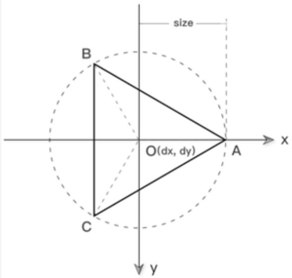

# Canvas

<!-- @import "[TOC]" {cmd="toc" depthFrom=1 depthTo=6 orderedList=false} -->

<!-- code_chunk_output -->

- [Canvas](#canvas)
  - [一. Canvas 概述](#一-canvas-概述)
    - [1.1 Canvas 与 SVG](#11-canvas-与-svg)
    - [1.2 Canvas 元素](#12-canvas-元素)
  - [二. Canvas 基础](#二-canvas-基础)
    - [2.1 直线图形](#21-直线图形)
      - [2.1.1 直线](#211-直线)
      - [2.1.2 矩形](#212-矩形)
        - [2.1.2.1 描边矩形](#2121-描边矩形)
        - [2.1.2.2 填充矩形](#2122-填充矩形)
        - [2.1.2.3 rect() 方法](#2123-rect-方法)
        - [2.1.2.4 清空矩形](#2124-清空矩形)
      - [2.1.3 多边形](#213-多边形)
    - [2.2 曲线图形](#22-曲线图形)
      - [2.2.1 圆形](#221-圆形)
      - [2.2.2 弧线](#222-弧线)
      - [2.2.3 椭圆](#223-椭圆)
      - [2.2.4 二次贝塞尔曲线](#224-二次贝塞尔曲线)
      - [2.2.5 三次贝塞尔曲线](#225-三次贝塞尔曲线)
    - [2.3 线条操作](#23-线条操作)
      - [2.3.1 lineWidth](#231-linewidth)
      - [2.3.2 lineCap](#232-linecap)
      - [2.3.3 lineJoin](#233-linejoin)
      - [2.3.4 setLineDash(segments)](#234-setlinedashsegments)
    - [2.4 文本操作](#24-文本操作)
      - [2.4.1 strokeText()](#241-stroketext)
      - [2.4.2 fillText()](#242-filltext)
      - [2.4.3 measureText()](#243-measuretext)
      - [2.4.4 font](#244-font)
      - [2.4.5 textAlign](#245-textalign)
      - [2.4.6 textBaseline](#246-textbaseline)
      - [2.4.7 direction](#247-direction)
    - [2.5 图片操作](#25-图片操作)
      - [2.5.1 drawImage()](#251-drawimage)
      - [2.5.2 平铺图片](#252-平铺图片)
      - [2.5.3 切割图片](#253-切割图片)
    - [2.6 变形操作](#26-变形操作)
      - [2.6.1 图形平移](#261-图形平移)
      - [2.6.2 图形缩放](#262-图形缩放)
      - [2.6.3 图形旋转](#263-图形旋转)
      - [2.6.4 变换矩阵](#264-变换矩阵)
    - [2.7 像素操作](#27-像素操作)
      - [2.7.1 getImageData() 和 putImageData()](#271-getimagedata-和-putimagedata)
      - [2.7.2 反转效果](#272-反转效果)
      - [2.7.3 黑白效果](#273-黑白效果)
      - [2.7.4 亮度效果](#274-亮度效果)
      - [2.7.5 复古效果](#275-复古效果)
      - [2.7.6 红色蒙版](#276-红色蒙版)
      - [2.7.7 透明处理](#277-透明处理)
      - [2.7.8 createImageData()](#278-createimagedata)
    - [2.8 渐变与阴影](#28-渐变与阴影)
      - [2.8.1 线性渐变](#281-线性渐变)
      - [2.8.2 径向渐变](#282-径向渐变)
      - [2.8.3 阴影](#283-阴影)
    - [2.9 Canvas 路径](#29-canvas-路径)
      - [2.9.1 beginPath()](#291-beginpath)
      - [2.9.2 closePath()](#292-closepath)
      - [2.9.3 isPointInPath()](#293-ispointinpath)
    - [2.10 Canvas 状态](#210-canvas-状态)
      - [2.10.1 clip()](#2101-clip)
      - [2.10.2 save() 和 restore()](#2102-save-和-restore)
    - [2.11 其他应用](#211-其他应用)
      - [2.11.1 Canvas 对象](#2111-canvas-对象)
      - [2.11.2 globalAlpha](#2112-globalalpha)
      - [2.11.3 globalCompositeOperation](#2113-globalcompositeoperation)
  - [三. Canvas 进阶](#三-canvas-进阶)
    - [3.1 事件操作](#31-事件操作)
      - [3.1.1 鼠标事件](#311-鼠标事件)
      - [3.1.2 键盘事件](#312-键盘事件)
      - [3.1.3 循环事件](#313-循环事件)
    - [3.2 物理动画](#32-物理动画)
      - [3.2.1 三角函数](#321-三角函数)
        - [3.2.1.1 追随鼠标指针旋转](#3211-追随鼠标指针旋转)
        - [3.2.1.2 两点间距离](#3212-两点间距离)
        - [3.2.1.3 圆周运动](#3213-圆周运动)
        - [3.2.1.4 波形运动](#3214-波形运动)
      - [3.2.2 匀速运动](#322-匀速运动)
        - [3.2.2.1 速度的合成与分解](#3221-速度的合成与分解)
      - [3.2.3 变速运动](#323-变速运动)
        - [3.2.3.1 加速度的合成和分解](#3231-加速度的合成和分解)
      - [3.2.4 重力](#324-重力)
      - [3.2.5 摩擦力](#325-摩擦力)
    - [3.3 边界检测](#33-边界检测)
      - [3.3.1 边界限制](#331-边界限制)
      - [3.3.2 边界环绕](#332-边界环绕)
      - [3.3.3 边界生成](#333-边界生成)
      - [3.3.4 边界反弹](#334-边界反弹)
    - [3.4 碰撞检测](#34-碰撞检测)
      - [3.4.1 外接矩形判定法](#341-外接矩形判定法)
      - [3.4.2 外接圆判定法](#342-外接圆判定法)
      - [3.4.3 多物体碰撞](#343-多物体碰撞)
    - [3.5 用户交互](#35-用户交互)
      - [3.5.1 捕获物体](#351-捕获物体)
      - [3.5.2 拖拽物体](#352-拖拽物体)
      - [3.5.3 抛掷物体](#353-抛掷物体)
    - [3.6 高级动画](#36-高级动画)
      - [3.6.1 缓动动画](#361-缓动动画)
      - [3.6.2 弹性动画](#362-弹性动画)
    - [3.7 游戏开发](#37-游戏开发)
      - [3.7.1 Box2D](#371-box2d)
      - [3.7.2 HTML5 游戏引擎](#372-html5-游戏引擎)

<!-- /code_chunk_output -->

## 一. Canvas 概述

在 HTML5 之前，为了让页面获得绚丽多彩的效果，在很多情况下都是借助 “图片” 来实现的。然而图片体积大、加载速度慢，使用图片的代价就是降低了页面的性能。为了应对日渐复杂的 Web 应用开发，W3C 在 HTML5 标准中引入了 Canvas 技术。

Canvas，又称 “画布”，是 HTML5 的核心技术之一。HTML5 中新增了一个 Canvas 元素，Canvas 技术，指的就是使用 Canvas 元素结合 JS 来绘制各种图形的技术。它可以用绘制图形、绘制图表、动画效果、游戏开发等。

### 1.1 Canvas 与 SVG

HTML5 有两个主要的 2D 图形技术：Canvas 和 SVG。这是两门完全不同的技术，两者具有以下区别：

- Canvas 是使用 JS 动态生成的，SVG 是使用 XML 静态描述的。

- Canvas 是基于 “位图” 的，适用于像素处理和动态渲染，放大图形会使图形失真。SVG 是基于 “矢量” 的，不适用于像素处理和适合静态描述，放大图形也不会使图形失真。

- 若发生修改，使用 Canvas 需要重绘，而使用 SVG 不需要重绘。

Canvas 与 SVG 的关系，简单来说，就像 “美术与几何” 的关系一样。

### 1.2 Canvas 元素

HTML5 Canvas，简单来说，就是一门使用 JS 来操作 Canvas 元素的技术。使用 Canvas 元素来绘制图形，需要以下 3 步：

1. 获取 canvas 对象。
2. 获取上下文环境对象 context。
3. 开始绘制图形。

```js
// 1. 获取canvas对象
let cnv = document.getElementById('canvas');
// 2. 获取上下文环境对象 context
let cxt = cnv.getContext('2d');
// 3. 开始绘制图形
cxt.moveTo(50, 100);
cxt.lineTo(150, 50);
cxt.stroke();
```

Canvas 是一个行内块元素，一般需要指定其 3 个属性：id、width 和 height。width 和 height 分别用于定义 Canvas 元素的宽度和高度。默认情况下，Canvas 元素的宽度为 300px，高度为 150px。

> **注意**：在实际开发中 Canvas 的宽度和高度，一定要在 HTML 属性中定义。

## 二. Canvas 基础

### 2.1 直线图形

在 Canvas 中，基本图形有两种：

- 直线图形：常见的直线图形有以下 3 种。

  - 直线
  - 矩形
  - 多边形

- 曲线图形

**Canvas 使用的坐标系是 W3C 坐标系**，它与经常见到的数学坐标系唯一的区别在于 y 轴正方向的不同：数学坐标系 y 轴正方向向上。W3C 坐标系，y 轴正方向向下。

#### 2.1.1 直线

可以将 `moveTo()` 和 `lineTo()` 这两个方法配合使用来画直线。利用这两个方法，可以画一条直线，也可以同时画多条直线。

```js
// 一条直线
// cxt 表示上下文环境对象 context。
// (x1, y1) 表示直线 “起点” 的坐标。moveTo(x1, y1) 的含义是 “将画笔移到点 (x1, y1) 位置，然后开始绘图”。
cxt.moveTo(x1, y1);
// (x2, y2) 表示直线 “终点” 的坐标。lineTo(x2, y2) 的含义是 “使用画笔从起点 (x1,y1) 开始画直线，一直画到终点（×2,y2）”。
cxt.lineTo(x2, y2);
// 上面两句代码仅仅是确定直线的 “起点坐标” 和 “终点坐标”，但是实际上画笔还没 “动”。因此，还需要调用上下文环境对象的 stroke() 方法才有效。
cxt.stroke();
```

```js
// 多条直线
cxt.moveTo(x1, y1);
cxt.lineTo(x2, y2);
cxt.lineTo(x3, y3);
// ......
cxt.stroke();
```

lineTo() 方法是可以重复使用的：第 1 次使用 lineTo() 后，画笔将自动移到终点；第 2 次使用 lineTo() 后，Canvas 会以 “上一个终点的坐标” 作为第 2 次调用的起点，然后再开始画直线，依此类推。

#### 2.1.2 矩形

对于绘制矩形，Canvas 另外为提供了独立的方法来实现。在 Canvas 中，矩形分为两种：

- 描边矩形
- 填充矩形

##### 2.1.2.1 描边矩形

使用 `strokeStyle` 属性和 `strokeRect()` 方法，可以画一个描边矩形。

```js
cxt.strokeStyle = '属性值';
cxt.strokeRect(x, y, width, height);
```

**strokeStyle 属性**
strokeStyle 属性取值有 3 种：颜色值、渐变色和图像。先来看一下 strokeStyle 属性取值为颜色值的几种情况：

```js
cxt.strokeStyle = '#FF0000'; // 十六进制颜色值
cxt.strokeStyle = 'red'; // 颜色关键字
cxt.strokeStyle = 'rgb(255, 0, 0)'; // rgb 颜色值
cxt.strokeStyle = 'rgba(255, 0, 0, 0.8)'; // rgba 颜色值
```

**strokeRect() 方法**
使用当前的绘画样式，描绘一个起点在 (x, y)、宽度为 w、高度为 h 的矩形的方法。

> **注意**：
>
> 1. strokeStyle 属性必须在使用 strokeRect() 方法之前定义，否则 strokeStyle 属性无效。
> 2. **此方法直接绘制到画布而不修改当前路径**，因此任何后续 fill() 或 stroke() 调用对它没有影响。

##### 2.1.2.2 填充矩形

使用 `fillStyle` 属性和 `fillRect()` 方法可以画一个填充矩形。

```js
cxt.fillStyle = '属性值';
cxt.fillRect(x, y, width, height);
```

fillStyle 属性跟 strokeStyle 属性一样，取值也有 3 种：颜色值、渐变色和图像。

fillRect() 是绘制填充矩形的方法，其中 (x, y) 为矩形左上角点的坐标，width 表示矩形的宽度，height 表示矩形的高度。

> **注意**：
>
> 1. 跟描边矩形一样，填充矩形的 fillStyle 属性也必须在使用 fillRect() 方法之前定义，否则 fillStyle 属性无效。
> 2. **此方法直接绘制到画布而不修改当前路径**，因此任何后续 fill() 或 stroke() 调用对它没有影响。

##### 2.1.2.3 rect() 方法

在 Canvas 中，如果想要绘制一个矩形，除了使用 strokeRect() 和 fillRect() 这两个方法之外，还可以使用 `rect()` 方法。

```js
// x 和 y 为矩形左上角点的坐标，width 表示矩形的宽度，height 表示矩形的高度。
rect(x, y, width, height);
```

使用 strokeRect()、fillRect() 和 rect() 这 3 种方法都可以画矩形。这 3 种方法的参数设置是相同的，不同之处在于实现效果。其中，strokeRect()和 fillRect()这两个方法在被调用之后，会立即把矩形绘制出来。而 rect() 方法在被调用之后，并不会立即把矩形绘制出来。只有在使用 rect() 方法之后再调用 `stroke()` 或 `fill()` 方法，才会把矩形绘制出来。

##### 2.1.2.4 清空矩形

使用 `clearRect()` 方法来清空 “指定矩形区域”。

```js
// x、y 分别表示被清空矩形区域左上角点的横、纵坐标，width 表示矩形的宽度，height 表示矩形的高度。
cxt.clearRect(x, y, width, height);

// 用于清空整个 Canvas
cxt.clearRect(0, 0, cnv.width, cnv.height);
```

> **注意**：请确保在调用 clearRect() 之后绘制新内容前调用 beginPath()。

#### 2.1.3 多边形

多边形也是使用 moveTo() 和 lineTo() 这两个方法画出来的。

- **箭头**
  对于绘制箭头，都是事先确定箭头的 7 个顶点坐标，然后使用 moveTo() 和 lineTo() 方法来绘制。

  ```js
  let cnv = document.getElementById('canvas');
  let cxt = cnv.getContext('2d');
  cxt.moveTo(40, 60);
  cxt.lineTo(100, 60);
  cxt.lineTo(100, 30);
  cxt.lineTo(150, 75);
  cxt.lineTo(100, 120);
  cxt.lineTo(100, 90);
  cxt.lineTo(40, 90);
  cxt.lineTo(40, 60);
  cxt.stroke();
  ```

- **正多边形**

  

  根据正三角形的特点，可以封装一个绘制正多边形的函数：createPolygon()。

  ```js
  /**
   * @param {Number} n n 边形
   * @param {Number} dx n 边形中心坐标 x 轴
   * @param {Number} dy n 边形中心坐标 y 轴
   * @param {Number} size n 边形的大小
   */
  function createPolygon(cxt, n, dx, dy, size) {
    cxt.beginPath();
    let degree = (2 * Math.PI) / n;
    for (let i = 0; i < n; i++) {
      let x = Math.cos(i * degree);
      let y = Math.sin(i * degree);
      cxt.lineTo(x * size + dx, y * size + dy);
      cxt.closePath();
    }
  }
  ```

  beginPath() 和 closePath() 一般都是配合使用的。其中，beginPath() 表示 “开始新路径”，closePath() 表示 “关闭路径”。

- **五角星**

  

  同样，也是先获取各个顶点的坐标，然后使用 moveTo() 和 lineTo() 把五角星绘制出来的。根据上面的分析图，可以知道 ∠BOA=36°、∠AOX=18°、∠BOX=54°，然后结合三角函数，很容易得出五角星各个顶点的坐标。

  ```js
  let cnv = document.getElementById('canvas');
  let cxt = cnv.getContext('2d');
  cxt.beginPath();
  for (let i = 0; i < 5; i++) {
    cxt.lineTo(
      Math.cos(((18 + i * 72) * Math.PI) / 180) * 50 + 100,
      -Math.sin(((18 + i * 72) * Math.PI) / 180) * 50 + 100
    );
    cxt.lineTo(
      Math.cos(((54 + i * 72) * Math.PI) / 180) * 25 + 100,
      -Math.sin(((54 + i * 72) * Math.PI) / 180) * 25 + 100
    );
  }
  cxt.closePath();
  cxt.stroke();
  ```

### 2.2 曲线图形

曲线图形，一般涉及两种情况：

- 曲线
- 弧线

曲线和弧线是两个不同的概念。简单来说，弧线是圆的一部分，曲线则不一定。弧线上的每个点都具有相同的曲率，曲线则不一定。也可以这样说，曲线包含弧线。

有关 Canvas 曲线图形，有以下几个：

- 圆形
- 弧线
- 椭圆
- 二次贝塞尔曲线
- 三次贝塞尔曲线

#### 2.2.1 圆形

使用 `arc()` 方法来画一个圆。

```js
cxt.beginPath();
cxt.arc(x, y, 半径, 开始角度, 结束角度, anticlockwise);
cxt.closePath();
```

> beginPath() 和 closePath() 用于封闭圆形。

对于 arc() 方法，其中参数说明如下：

%E6%96%B9%E6%B3%95%E5%8F%82%E6%95%B0%E8%AF%B4%E6%98%8E.png>)

- **x 和 y**：x 表示圆心横坐标，y 表示圆心纵坐标。(x, y) 表示圆心坐标。

- **开始角度、结束角度**：开始角度和结束角度都是以弧度为单位。例如 180 就应该写成 Math.PI，而 360 就应该写成 Math.PI\*2，依此类推。

  对于开始角度和结束角度，在实际开发中推荐这种写法：`度数 * Math.PI/180`。这种写法可以一眼就能看出角度是多少，如下。

  ```js
  (120 * Math.PI) / 180; // 120°
  (150 * Math.PI) / 180; // 150°
  ```

- **anticlockwise**：anticlockwise 是一个布尔值，当其值为 true 时，表示按逆时针方向绘制，为 false 时，表示按顺时针方向绘制。默认值为 false。

上面这个语法仅仅是对圆形的一个 “状态描述”，还需要对圆形进行 “描边” 和 “填充”，这样才会有实际效果。这一点跟矩形是一样的。

- **描边圆**

  可以使用 `stroke()` 方法来绘制一个 “描边的圆”：

  ```js
  // 状态描述
  cxt.beginPath();
  cxt.arc(x, y, 半径, 开始角度, 结束角度, anticlockwise);
  cxt.closePath();
  // 描边
  cxt.strokeStyle = '颜色值';
  cxt.stroke();
  ```

  strokeStyle 属性用于定义边框颜色，stroke() 方法用于执行描边动作。

- **填充圆**

  可以使用 `fill()` 方法来绘制一个“填充的圆”。

  ```js
  // 状态描述
  cxt.arc(x, 半径, 开始角度, 结束角度, anticlockwise);
  // 描边
  cxt.fillStyle = '颜色值';
  cxt.fill();
  ```

  fillStyle 属性用于定义填充的颜色，fill() 方法用于定义填充动作。

```js
/**
 * 绘制扇形
 * @param {CanvasRenderingContext2D} cxt
 * @param {Number} x 圆心x坐标
 * @param {Number} y 圆心y坐标
 * @param {Number} radius 半径
 * @param {Number} startAngle 起始角度
 * @param {Number} endAngle 结束角度
 * @param {String} fillStyle 填充颜色
 */
function createSector(cxt, x, y, radius, startAngle, endAngle, fillStyle) {
  cxt.beginPath();
  cxt.moveTo(x, y);
  cxt.arc(x, y, radius, (startAngle * Math.PI) / 180, (endAngle * Math.PI) / 180);
  cxt.closePath();
  cxt.fillStyle = fillStyle;
  cxt.fill();
}

window.onload = () => {
  let cnv = document.getElementById('canvas');
  let cxt = cnv.getContext('2d');
  createSector(cxt, 100, 100, 50, 0, 40, 'red');
  createSector(cxt, 100, 100, 50, 40, 180, '#369');
  createSector(cxt, 100, 100, 50, 180, 210, 'green');
  createSector(cxt, 100, 100, 50, 210, 360, 'yellow');
};
```

#### 2.2.2 弧线

在 Canvas 中，如果想要画弧线，常用以下两种方法：

- `arc()`

  arc() 方法不仅可以用于画圆形，还可以用于绘制弧线。

  ```js
  // 状态描述
  cxt.beginPath();
  cxt.arc(x, y, 半径, 开始角度, 结束角度, anticlockwise);
  // 描边
  cxt.strokeStyle = '颜色值';
  cxt.stroke();
  ```

  %E6%96%B9%E6%B3%95%E7%94%BB%E5%BC%A7%E7%BA%BF%E5%88%86%E6%9E%90.png>)

  > **注意**：使用 arc() 方法画弧线与画描边圆最大的不同在于：在使用 arc() 方法画弧线时不使用 closePath() 方法来关闭路径。因为弧线不是一个闭合图形。

- `arcTo()`

  ```js
  cxt.arcTo(cx, cy, x2, y2, radius);
  ```

  (cx, cy) 表示控制点的坐标，(x2, y2) 表示结束点的坐标，radius 表示圆弧的半径。

  方法画弧线分析.png>)

  想要画一条弧线，需要提供 3 个点坐标：开始点、控制点和结束点。其中，开始点一般由 moveTo() 或 lineTo() 提供，arcTo() 则提供了控制点和结束点。

  arcTo() 方法就是利用开始点、控制点和结束点所形成的夹角绘制一段与夹角的两边相切并且半径为 radius 的圆弧。其中，弧线的起点是 “开始点所在边与圆的切点”，而弧线的终点是 “结束点所在边与圆的切点”。

  使用 arcTo() 方法绘制的弧线是两个切点之间长度最短的那个圆弧。此外，如果开始点不是弧线起点，arcTo() 方法还将添加一条当前端点到弧线起点的直线线段。也就是说，开始点坐标并不一定是弧线的起点坐标。

  假设圆角矩形的圆角半径为 r，宽 width，高 height，圆角矩形相对于坐标原点的位置为：(offsetX, offsetY)，则从上边开始，起点位置为：(offsetX + r, offsetY)。

  4 条边连线的终点位置分别为：(offsetX + width - r, offsetY)、(offsetX + width, offsetY + height - r)、(offsetX + r, offsetY + height)和 (offsetX, offsetY + y)。

  4 段圆弧的终点分别为：(offsetX + width, offsetY + r)、(offsetX + width - r, offsetY + height)、(offsetX, offsetY + height - r) 和 (offsetX + r, offsetY)。

  ```js
  /**
   * 绘制圆角矩形
   * @param cxt canvas 的上下文
   * @param {Number} width 矩形的宽度
   * @param {Number} height 矩形的高度
   * @param {Number} r 圆角的半径
   * @param {Number} offsetX 矩形左上角顶点的横坐标
   * @param {Number} offsetY 矩形左上角顶点的纵坐标
   */
  function createRoundedRect(cxt, width, height, r, offsetX, offsetY) {
    cxt.beginPath();
    cxt.moveTo(offsetX + r, offsetY);
    cxt.lineTo(offsetX + width - r, offsetY);
    cxt.arcTo(offsetX + width, offsetY, offsetY + width, offsetY + r, r);
    cxt.lineTo(offsetX + width, offsetY + height - r);
    cxt.arcTo(offsetX + width, offsetY + height, offsetX + width - r, offsetY + height, r);
    cxt.lineTo(offsetX + r, offsetY + height);
    cxt.arcTo(offsetX, offsetY + height, offsetX, offsetY + height - r, r);
    cxt.lineTo(offsetX, offsetY + r);
    cxt.arcTo(offsetX, offsetY, offsetX + r, offsetY, r);
    cxt.closePath();
  }
  window.onload = () => {
    let cnv = document.getElementById('canvas');
    let cxt = cnv.getContext('2d');
    createRoundedRect(cxt, 100, 100, 20, 20, 20);
    cxt.fillStyle = 'HotPink';
    cxt.fill();
  };
  ```

#### 2.2.3 椭圆

ellipse() 是 Canvas 2D API 添加椭圆路径的方法。椭圆的圆心在（x,y）位置，半径分别是 radiusX 和 radiusY，按照 anticlockwise（默认顺时针）指定的方向，从 startAngle 开始绘制，到 endAngle 结束。

```js
ctx.ellipse(x, y, radiusX, radiusY, rotation, startAngle, endAngle, anticlockwise);
```

- **x**：椭圆圆心的 x 轴坐标。

- **y**：椭圆圆心的 y 轴坐标。

- **radiusX**：椭圆长轴的半径。

- **radiusY**：椭圆短轴的半径。

- **rotation**：椭圆的旋转角度，以弧度表示 (非角度度数)。

- **startAngle**：将要绘制的起始点角度，从 x 轴测量，以弧度表示 (非角度度数)。

- **endAngle**：椭圆将要绘制的结束点角度，以弧度表示 (非角度度数)。

- **anticlockwise**（可选）：Boolean 选项，如果为 true，逆时针方向绘制椭圆（逆时针），反之顺时针方向绘制。

#### 2.2.4 二次贝塞尔曲线

Canvas 中画曲线，一般都是使用贝塞尔曲线（应用于二维图形应用程序的数学曲线）来实现。

在 Canvas 中，常见的贝塞尔曲线有两种：

- 二次贝塞尔曲线
- 三次贝塞尔曲线

可以使用 `quadraticCurveTo()` 方法来画二次贝塞尔曲线。

```js
cxt.quadraticCurveTo(cx, cy, x2, y2);
```

(cx, cy) 表示控制点的坐标，(x2, y2) 表示结束点的坐标。绘制一条二次贝塞尔曲线，同样也需要 3 个点的坐标：开始点、控制点和结束点。其中，开始点一般由 moveTo() 或 lineTo() 提供，而控制点和结束点由 quadraticCurveTo() 提供。

%E6%96%B9%E6%B3%95%E5%88%86%E6%9E%90.png>)


```js
// 使用二次贝塞尔曲线画气泡
let cnv = document.getElementById('canvas');
let cxt = cnv.getContext('2d');
cxt.moveTo(75, 25);
cxt.quadraticCurveTo(25, 25, 25, 62);
cxt.quadraticCurveTo(25, 100, 50, 100);
cxt.quadraticCurveTo(50, 120, 30, 125);
cxt.quadraticCurveTo(60, 120, 65, 100);
cxt.quadraticCurveTo(125, 100, 125, 62);
cxt.quadraticCurveTo(125, 25, 75, 25);
cxt.stroke();
```

#### 2.2.5 三次贝塞尔曲线

可以使用 bezierCurveTo() 方法来绘制三次贝塞尔曲线。

```js
cxt.bezierCurveTo(cx1, cy1, cx2, cy2, x, y);
```

(cx1, cy1) 表示控制点 1 的坐标，(cx2, cy2) 表示控制点 2 的坐标，(x, y)表示结束点的坐标。

绘制一条三次贝塞尔曲线，需要 4 个点：开始点、控制点 1、控制点 2 和结束点。其中，开始点一般由 moveTo() 或 lineTo() 提供，bezierCurveTo() 提供控制点 1、控制点 2 和结束点。

%E6%96%B9%E6%B3%95%E5%88%86%E6%9E%90.png>)

三次贝塞尔曲线与二次贝塞尔曲线的唯一区别在于：**三次贝塞尔曲线有两个控制点，而二次贝塞尔曲线只有一个控制点**。

```js
// 三次贝塞尔曲线画心形
let cnv = document.getElementById('canvas');
let cxt = cnv.getContext('2d');
cxt.moveTo(75, 40);
cxt.bezierCurveTo(75, 37, 70, 25, 50, 25);
cxt.bezierCurveTo(20, 25, 20, 62.5, 20, 62.5);
cxt.bezierCurveTo(20, 80, 40, 102, 75, 120);
cxt.bezierCurveTo(110, 102, 130, 80, 130, 62.5);
cxt.bezierCurveTo(130, 62.5, 130, 25, 100, 25);
cxt.bezierCurveTo(85, 25, 75, 37, 75, 40);
cxt.stroke();
```

```js
/**
 * 使用三次贝塞尔曲线画绘制 N 叶草
 * @param cxt canvas 的上下文
 * @param {Number} n n片
 * @param {Number} dx 花朵中心位置的 x 坐标
 * @param {Number} dy 花朵中心位置的 y 坐标
 * @param {Number} size 花朵的大小
 * @param {Number} length 控制花瓣的长度
 */
function createLeaf(cxt, n, dx, dy, size, length) {
  cxt.beginPath();
  cxt.moveTo(dx, dy + size);
  let degree = (2 * Math.PI) / n;
  // 在一条路径中连续定义首尾相连的多段贝塞尔曲线，其中每段三次贝塞尔曲线的起点和终点都落在圆心为（dx, dy)、半径为 size 的圆弧上
  // 而每段圆弧的两个控制点都落在圆心为 (dx, dy)、半径为 length 的圆弧上，于是形成了 N 叶草的图形。起点、终点和控制点坐标是使用正弦和余弦函数计算出来的。
  for (let i = 1; i < n + 1; i++) {
    // 计算控制点的坐标
    let cx1 = Math.sin((i - 1) * degree) * length + dx;
    let cy1 = Math.cos((i - 1) * degree) * length + dy;
    let cx2 = Math.sin(i * degree) * length + dx;
    let cy2 = Math.cos(i * degree) * length + dy;
    // 计算结束点的坐标
    let x = Math.sin(i * degree) * size + dx;
    let y = Math.cos(i * degree) * size + dy;
    cxt.bezierCurveTo(cx1, cy1, cx2, cy2, x, y);
  }
  cxt.closePath();
}

window.onload = () => {
  let cnv = document.getElementById('canvas');
  let cxt = cnv.getContext('2d');
  createLeaf(cxt, 4, cnv.width / 2, cnv.height / 2, 20, 80);
  // 定义填充颜色为浅绿色
  cxt.fillStyle = '#00FF99';
  cxt.fill();
};
```

### 2.3 线条操作

Canvas 中，常见的线条操作属性和方法：

| 属性                  | 说明                   |
| --------------------- | ---------------------- |
| lineWidth             | 定义线条宽度           |
| lineCap               | 定义线条末端的样式     |
| lineJoin              | 定义两个线条交接处样式 |
| 方法                  | 说明                   |
| setLineDash(segments) | 定义线条的虚实样式     |

#### 2.3.1 lineWidth

在 Canvas 中，使用 lineWidth 属性来定义线条的宽度。

```js
context.lineWidth = 整数;
```

lineWidth 属性取值为整数，默认值为 1，默认单位为 px。

#### 2.3.2 lineCap

lineCap 属性定义线条开始处和结尾处的线帽样式。

```js
context.lineCap = '属性值';
```

lineCap 属性取值只有 3 个：

| 属性值 | 说明           | 线条处理                                                                         |
| ------ | -------------- | -------------------------------------------------------------------------------- |
| Butt   | 默认值，无线帽 | 每条线的开始处和结尾处都是长方形，也就是不做任何的处理                           |
| Round  | 圆形线帽       | 每条线的开始处和结尾处都增加一个半圆，半圆的直径为线宽                           |
| Square | 正方形线帽     | 每条线的开始处和结尾处都增加一个长方形，长方形的长度为线宽的一半，高度保持为线宽 |

> **注意**：round 值和 square 值会使线条稍微变长一点，这是因为它们给线条增加了线帽部分。

#### 2.3.3 lineJoin

lineJoin 是 Canvas 2D API 用来设置 2 个长度不为 0 的相连部分（线段、圆弧、曲线）如何连接在一起的属性（长度为 0 的变形部分，其指定的末端和控制点在同一位置，会被忽略）。

```js
cxt.lineJoin = '属性值';
```

lineJoin 属性取值：

| 属性值 | 说明         | 特点                                               |
| ------ | ------------ | -------------------------------------------------- |
| miter  | 默认值，尖角 | 线条在交接处延伸直至交于一点                       |
| round  | 圆角         | 交接处是一个圆角，圆角所在圆的直径等于线宽         |
| bevel  | 斜角         | 交接处是一个斜角，斜角所在正方形的对角线长等于线宽 |


> **注意**：当 lineJoin 属性取值为 miter（默认值）时，会受到 [miterLimit](https://developer.mozilla.org/zh-CN/docs/Web/API/CanvasRenderingContext2D/miterLimit) 属性的影响。miterLimit 属性在 Canvas 开发中几乎用不到。

#### 2.3.4 setLineDash(segments)

setLineDash() 方法在填充线时使用虚线模式。它使用一组值来指定描述模式的线和间隙的交替长度。

```js
cxt.setLineDash(segments);
```

**segments**
: 一个 Array 数组。一组描述交替绘制线段和间距（坐标空间单位）长度的数字。如果数组元素的数量是奇数，数组的元素会被复制并重复。例如，`[5, 15, 25]` 会变成 `[5, 15, 25, 5, 15, 25]`。

%E5%B8%B8%E8%A7%81%E7%9A%84%E6%95%B0%E7%BB%84%E7%BB%84%E5%90%88.png>)

### 2.4 文本操作

| 方法          | 属性         | 说明                             |
| ------------- | ------------ | -------------------------------- |
| fillText()    | fillStyle    | 绘制填充文本，对应属性是定义颜色 |
| strokeText()  | strokeStyle  | 绘制描边文本，对应属性是定义颜色 |
| measureText() | -            | 用于获取文本的长度               |
| -             | font         | 定义文本字体样式（大小、粗细等） |
| -             | textAlign    | 定义文本水平对齐方式             |
| -             | textBaseline | 定义文本垂直对齐方式             |

#### 2.4.1 strokeText()

对文本进行描边。

```js
strokeText(text, x, y, maxWidth);
```

- **text**：使用当前 [font](#244-font)，[textAlign](#245-textalign)，[textBaseline](#246-textbaseline) 和 [direction](#247-direction) 的值对文本进行渲染。
- **x**：文本起始点的 x 轴坐标。
- **y**：文本起始点的 y 轴坐标。
- **maxWidth**：可选参数，需要绘制的最大宽度（单位为 px）。如果指定了值，并且经过计算字符串的宽度比最大宽度还要宽，字体为了适应会使用一个水平缩小的字体（如果通过水平缩放当前的字体，可以进行有效的或者合理可读的处理）或者小号的字体。

#### 2.4.2 fillText()

对文本进行填充。

```js
fillText(text, x, y, maxWidth);
```

- **text**：使用当前 [font](#244-font)，[textAlign](#245-textalign)，[textBaseline](#246-textbaseline) 和 [direction](#247-direction) 的值对文本进行渲染。
- **x**：文本起始点的 x 轴坐标。
- **y**：文本起始点的 y 轴坐标。
- **maxWidth**：可选参数，需要绘制的最大宽度（单位为 px）。如果指定了值，并且经过计算字符串的宽度比最大宽度还要宽，字体为了适应会使用一个水平缩小的字体（如果通过水平缩放当前的字体，可以进行有效的或者合理可读的处理）或者小号的字体。

#### 2.4.3 measureText()

使用 measureText() 方法来返回一个关于被测量文本 [TextMetrics](https://developer.mozilla.org/zh-CN/docs/Web/API/TextMetrics) 对象包含的信息。

```js
let length = cxt.measureText(text).width;
```

- **text**：需要测量的 String

TextMetrics 对象中的 width 属性可以用于获取某个文本的长度，这个属性对于实现水平居中的文本效果是非常有用的。

```js
// 文本水平居中
let cnv = document.getElementById('canvas');
let cxt = cnv.getContext('2d');
let text = 'hello world';
cxt.font = '20px bold';
let textWidth = cxt.measureText(text).width;
let canvasWidth = cnv.width;
let xPosition = canvasWidth / 2 - textWidth / 2;
cxt.fillStyle = 'purple';
cxt.fillText(text, xPosition, 50);
```

#### 2.4.4 font

定义文本的字体样式。context.font 的用法与 CSS 中的 [font](https://developer.mozilla.org/zh-CN/docs/Web/CSS/font) 属性的用法是一样的。

```js
context.font = 'font-style font-weight font-size/line-height font-family';
```

- **font**：默认值为 10px sans-serif。

#### 2.4.5 textAlign

定义文本水平方向的对齐方式。

```js
cxt.textAlign = '属性值';
```

| 属性值 | 说明                                                                         |
| ------ | ---------------------------------------------------------------------------- |
| start  | 默认值，文本对齐界线开始的地方（左对齐指本地从左向右，右对齐指本地从右向左） |
| end    | 文本对齐界线结束的地方（左对齐指本地从左向右，右对齐指本地从右向左）         |
| left   | 文本左对齐                                                                   |
| right  | 文本右对齐                                                                   |
| center | 文本居中对齐                                                                 |

#### 2.4.6 textBaseline

在 Canvas 中，可以使用 textBaseline 属性来定义文本垂直方向的对齐方式。

```js
cxt.textBaseline = '属性值';
```

| 属性值      | 说明                                                                                                |
| ----------- | --------------------------------------------------------------------------------------------------- |
| alphabetic  | 默认值，文本基线是普通英文字母的基线                                                                |
| top         | 文本基线是 em 方框的顶端                                                                            |
| middle      | 文本基线是 em 方框的中心                                                                            |
| bottom      | 文本基线是 em 方框的底端                                                                            |
| hanging     | 文本基线是悬挂基线                                                                                  |
| ideographic | 文字基线是表意字基线；如果字符本身超出了 alphabetic 基线，那么 ideographic 基线位置在字符本身的底部 |


#### 2.4.7 direction

是 Canvas 2D API 用来在绘制文本时，描述当前文本方向的属性。

```js
ctx.direction = 'ltr' || 'rtl' || 'inherit';
```

| 属性    | 说明                                          |
| ------- | --------------------------------------------- |
| inherit | 默认值，根据情况继承 canvas 元素或者 Document |
| ltr     | 文本方向从左向右                              |
| rtl     | 文本方向从右向左                              |

### 2.5 图片操作

在 Canvas 中，不仅可以绘制各种形状的图形，还可以将图片导入 Canvas 进行各种操作，如平铺、切割、像素处理等。

无论开发的是应用程序还是游戏软件，都离不开图片。在开发 Canvas 游戏的时候，游戏中的地图、背景、人物、物品等都不是用 Canvas 绘制的，而是用导入的图片来实现的。因此图片的操作在 Canvas 开发中是非常重要的。

Canvas 提供了 drawImage() 方法来绘制图片。

#### 2.5.1 drawImage()

drawImage() 方法提供了多种在画布（Canvas）上绘制图像的方式。

```js
// 仅用于绘制一张图片
drawImage(image, dx, dy);
// 可以用于绘制大小不一样的图片（常用于Canvas游戏开发）
drawImage(image, dx, dy, dWidth, dHeight);
// 可以将部分图像复制到 Canvas 中，类似于 CSS Sprite 技术，从而使得图片只需要加载一次即可，这样可极大地提高页面的加载速度（常用于Canvas游戏开发）
drawImage(image, sx, sy, sWidth, sHeight, dx, dy, dWidth, dHeight);
```

**image**
: 绘制到上下文的元素。允许任何的画布图像源，例如：HTMLImageElement、SVGImageElement、HTMLVideoElement、HTMLCanvasElement、ImageBitmap、OffscreenCanvas 或 VideoFrame (en-US)。

**dx**
: image 的左上角在目标画布上 X 轴坐标。

**dy**
: image 的左上角在目标画布上 Y 轴坐标。

**dWidth**
: image 在目标画布上绘制的宽度。允许对绘制的 image 进行缩放。如果不说明，在绘制时 image 宽度不会缩放。

**dHeight**
: image 在目标画布上绘制的高度。允许对绘制的 image 进行缩放。如果不说明，在绘制时 image 高度不会缩放。

**sx**（可选）
: 需要绘制到目标上下文中的，image 的矩形（裁剪）选择框的左上角 X 轴坐标。可以使用 3 参数或 5 参数语法来省略这个参数。

**sy**（可选）
: 需要绘制到目标上下文中的，image 的矩形（裁剪）选择框的左上角 Y 轴坐标。可以使用 3 参数或 5 参数语法来省略这个参数。

**sWidth**（可选）
: 需要绘制到目标上下文中的，image 的矩形（裁剪）选择框的宽度。如果不说明，整个矩形（裁剪）从坐标的 sx 和 sy 开始，到 image 的右下角结束。可以使用 3 参数或 5 参数语法来省略这个参数。使用负值将翻转这个图像。

**sHeight**（可选）
: 需要绘制到目标上下文中的，image 的矩形（裁剪）选择框的高度。使用负值将翻转这个图像。

%E5%88%86%E6%9E%90.png>)

%E5%88%86%E6%9E%90.png>)

%E5%88%86%E6%9E%90.png>)

#### 2.5.2 平铺图片

可以使用 createPattern() 方法来定义图片的平铺方式。

```js
let pattern = cxt.createPattern(image, type);
cxt.fillStyle = pattern;
cxt.fillRect();
```

想要定义图片的平铺方式，需要 createPattern() 和 fillRect() 这两个方法配合使用。

**image**：作为重复图像源的 [CanvasImageSource](https://developer.mozilla.org/zh-CN/docs/Web/API/CanvasRenderingContext2D) 对象。可以是下列之一：

- HTMLImageElement（img）
- HTMLVideoElement（video）
- HTMLCanvasElement（canvas）
- CanvasRenderingContext2D
- ImageBitmap
- ImageData
- Blob

**type**：表示图像平铺的方式。

| 参数值    | 说明                                 |
| --------- | ------------------------------------ |
| repeat    | 默认值，在水平方向和垂直方向同时平铺 |
| repeat-x  | 只在水平方向平铺                     |
| repeat-y  | 只在重直方向平铺                     |
| no-repeat | 只显示一次（不平铺）                 |

```js
// 平铺 canvas 元素
let ctx = document.getElementById('canvas');
let canvas = document.createElement('canvas');
canvas.height = 40;
canvas.width = 40;
let _ctx = canvas.getContext('2d');
_ctx.fillStyle = '#bdbdbd';
_ctx.arc(20, 20, 1, 0, (360 * Math.PI) / 180, true);
_ctx.fill();
_ctx.fillRect(39, 39, 2, 2);
let pattern = ctx.createPattern(canvas, 'repeat');
ctx.fillStyle = pattern;
ctx.fillRect(0, 0, 500, 800);
```

#### 2.5.3 切割图片

可以使用 clip() 方法来切割 Canvas 中绘制的图片。

```js
cxt.clip();
```

想要使用 clip() 方法切割一张图片，需要以下 3 步：

1. 绘制基本图形
2. 使用 clip() 方法
3. 绘制图片

```js
let cnv = document.getElementById('canvas');
let cxt = cnv.getContext('2d');
// 第1步，绘制基本图形，用于切割
cxt.beginPath();
cxt.arc(70, 70, 50, 0, (360 * Math.PI) / 180, true);
cxt.closePath();
cxt.stroke();
// 第2步，使用clip()方法，使得切割区域为上面绘制的基本图形;
cxt.clip();
// 第3步，绘制图片
let image = new Image();
image.src = 'images/princess.png';
image.onload = () => {
  cxt.drawImage(image, 10, 20);
};
```

### 2.6 变形操作

在 Canvas 中，有时候需要实现文字或图片的各种变形效果，如位移、缩放、旋转、倾斜等，这个时候就涉及 Canvas 中的变形操作。

Canvas 提供了以下几种变形操作的方法：

| 方法                        | 说明     |
| --------------------------- | -------- |
| translate()                 | 平移     |
| scale()                     | 缩放     |
| rotate()                    | 旋转     |
| transform()、setTransform() | 变换矩阵 |

Canvas 中的变形操作，不仅可以用于图形，还可以用于图像和文字。

#### 2.6.1 图形平移

可以使用 translate() 方法来平移图形（可多次叠加）。

```js
cxt.translate(x, y);
```

- **x**：水平方向的移动距离。
- **y**：垂直方向的移动距离。

```js
let cnv = document.getElementById('canvas');
let cxt = cnv.getContext('2d');
// 平移图形
cxt.translate(110, 30);
cxt.fillStyle = 'red';
cxt.fillRect(0, 0, 80, 80);
// 重置变换矩阵
cxt.setTransform(1, 0, 0, 1, 0, 0);
// 未平移图形
cxt.fillStyle = 'gray';
cxt.fillRect(0, 0, 80, 80);
```

translate() 方法必须在 fillRect() 方法之前调用才有效。对于 Canvas 来说，**“状态” 都必须在 “动作” 之前定义**。

#### 2.6.2 图形缩放

可以使用 scale() 方法来对图形进行缩放操作。

```js
cxt.scale(x, y);
```

- **x**：水平方向的缩放因子。负值在垂直轴上翻转像素。值为 1 时不会产生水平缩放。
- **y**：垂直方向的缩放因子。负值在水平轴上翻转像素。值为 1 时不会产生垂直缩放。

```js
// 使用 scale 水平或竖直翻转
const canvas = document.getElementById('canvas');
const ctx = canvas.getContext('2d');

ctx.scale(-1, 1); // 水平翻转
// ctx.scale(1, -1); // 竖直翻转
ctx.font = '48px serif';
ctx.fillText('Hello world!', -280, 90);
ctx.setTransform(1, 0, 0, 1, 0, 0); // 重置变换矩阵
```

**scale() 的负作用**
它除了会改变图形的大小之外，还会改变其他属性，如线条宽度（即 lineWidth）、左上角坐标。在实际开发中要注意。

#### 2.6.3 图形旋转

可以使用 rotate() 方法来旋转图形。

```js
cxt.rotate(angle);
```

**angle**
: 顺时针旋转的弧度。如果想通过角度值计算，可以使用公式：`degree * Math.PI / 180`。当 angle < 0 时，图形逆时针旋转；当 angle > 0 时，图形顺时针旋转。

旋转中心点一直是 canvas 的起始点。如果想改变中心点，可以通过 translate() 方法移动 canvas。

```js
// 改变旋转中心点
let cnv = document.getElementById('canvas');
let cxt = cnv.getContext('2d');

let rectWidth = 100;
let rectHeight = 50;
cxt.save(); // 将当前状态放入栈中，保存 canvas 全部状态
cxt.translate(cnv.width / 2, cnv.height / 2); // 将旋转中心移动到图形中心
cxt.rotate((240 * Math.PI) / 180); // 累进旋转
cxt.fillStyle = 'HotPink';
cxt.fillRect(-rectWidth / 2, -rectHeight / 2, rectWidth, rectHeight); // 填充矩形
cxt.restore(); // 在绘图状态栈中弹出顶端的状态，将 canvas 恢复到最近的保存状态的方法。如果没有保存状态，此方法不做任何改变。
```

#### 2.6.4 变换矩阵

平移 translate()、缩放 scale()、旋转 rotate() 这 3 种方法，从本质上来说都是通过变换矩阵 transform() 这个方法来实现的。变换矩阵涉及线性代数的知识。

transform() 是 Canvas 2D API 使用矩阵多次叠加当前变换的方法，矩阵由方法的参数进行描述。可以缩放、旋转、移动和倾斜上下文。

> setTransform() 则是使用单位矩阵重新设置当前的变换并调用 transform() 的方法。

```js
ctx.transform(a, b, c, d, e, f);
```

- **a（m11）**：水平缩放
- **b（m12）**：垂直倾斜
- **c（m21）**：水平倾斜
- **d（m22）**：垂直缩放
- **e（dx）**：水平移动
- **f（dy）**：垂直移动


- **平移**

  假设图形开始坐标为 (x, y)，平移后的坐标为 (x1, y1)，在 x 轴和 y 轴的平移量分别为 e 和 f，那么就有以下公式。

  `x1 = x + e;`
  `y1 = y + f;`

  因此，可以得到以下矩阵公式：

  

  通过上面这个矩阵公式可以知道：**`translate(e, f)` 等价于 `transform(1, 0, 0, 1, e, f)`**。

- **缩放**

  假设图形开始坐标为 (x, y)，缩放后的坐标为 (x1, y1)，在 x 轴和 y 轴上缩放的倍数分别为 a 和 d，那么就有以下公式：

  `x1 = a * x;`
  `y1 = d * y;`

  因此，可以得到以下矩阵公式：

  

  可以知道：**`scale(a, d)` 等价于 `transform(a, 0, 0, d, 0, 0)`**。

- **旋转**

  假设图形开始坐标为 (x, y)，旋转后的坐标为 (x1, y1)，图形旋转的角度为，那么就有以下公式：

  `x1 = x*cos0 - y*sin0;`
  `y1 = x*sin0 + y*cos0;`

  因此，可以得到以下矩阵公式：

  

  从上面这个矩阵公式我们可以知道：**`rotate(0)` 等价于 `transform(cos0, sin0, -sin0, cos0, 0, 0)`**。

### 2.7 像素操作

在 Canvas 中，可以配合使用 getImageData() 和 putImageData() 方法来对图片像素进行操作。事实上，像素操作一直是 HTML5 Canvas 最令人称赞的一个方面。

#### 2.7.1 getImageData() 和 putImageData()

- **getImageData()**

  返回一个 [ImageData](https://developer.mozilla.org/zh-CN/docs/Web/API/ImageData) 对象，用来描述 canvas 区域隐含的像素数据，这个区域通过矩形表示，起始点为 (sx, sy)、宽为 sw、高为 sh。

  ```js
  let imgData = cxt.getImageData(x, y, width, height);
  ```

  - **sx**：将要被提取的图像数据矩形区域的左上角 x 坐标。

  - **sy**：将要被提取的图像数据矩形区域的左上角 y 坐标。

  - **sw**：将要被提取的图像数据矩形区域的宽度。

  - **sh**：将要被提取的图像数据矩形区域的高度。

  ImageData 对象有一个 data 属性，这个 data 属性是一个 Uint8ClampedArray 一维数组，包含以 RGBA 顺序的数据，数据使用 0 至 255（包含）的整数表示。

- **putImageData()**

  将数据从已有的 ImageData 对象绘制到位图的方法。如果提供了一个绘制过的矩形，则只绘制该矩形的像素。此方法不受画布转换矩阵的影响。

  ```js
  ctx.putImageData(imagedata, dx, dy);
  ctx.putImageData(imagedata, dx, dy, dirtyX, dirtyY, dirtyWidth, dirtyHeight);
  ```

  - **imageData**：包含像素值的数组对象。

  - **dx**：源图像数据在目标画布中的位置偏移量（x 轴方向的偏移量）。

  - **dy**：源图像数据在目标画布中的位置偏移量（y 轴方向的偏移量）。

  - **dirtyX**（可选）：在源图像数据中，矩形区域左上角的位置。默认是整个图像数据的左上角（x 坐标）。

  - **dirtyY**（可选）：在源图像数据中，矩形区域左上角的位置。默认是整个图像数据的左上角（y 坐标）。

  - **dirtyWidth**（可选）：在源图像数据中，矩形区域的宽度。默认是图像数据的宽度。

  - **dirtyHeight**（可选）：在源图像数据中，矩形区域的高度。默认是图像数据的高度。

getImageData() 和 putImageData() 都是配合使用的。一般都是先用 getImageData() 方法获取像素数据，然后利用一定的算法进行像素操作，最后使用 putImageData() 输出像素数据（即在 Canvas 中显示一张图片）。

#### 2.7.2 反转效果

反转效果，也叫“颜色反转”，指的是图片颜色颠倒的效果。实现算法：将红、绿、蓝 3 个通道的像素取各自的相反值。计算方法是：**255-原值**。

```js
for (let i = 0; i < data.length; i += 4) {
  data[i] = 255 - data[i];
  data[i + 1] = 255 - data[i + 1];
  data[i + 2] = 255 - data[i + 2];
}
```

反转效果是不需要对透明度进行操作的，也就是说不需要处理 `data[i+3]`。

#### 2.7.3 黑白效果

黑白效果，也叫“灰度图（average）"，是指将彩色图片转换成黑白图片。实现算法：首先取红、绿、蓝 3 个通道的平均值，也就是 `(data[i] + data[i+1] + data[i+2])/3`，然后将 `data[i] data[i+1] data[i+2]` 全部保存为这个平均值。

```js
for (let i = 0; i < data.length; i += 4) {
  let average = (data[i] + data[i + 1] + data[i + 2]) / 3;
  data[i] = average; // 红
  data[i + 1] = average; // 绿
  data[i + 2] = average; // 蓝
}
```

上面这种黑白效果有时并不是很好，还可以使用加权平均值的方式实现：

```js
for (let i = 0; i < data.length; i += 4) {
  let average = data[i] * 0.3 + data[i + 1] * 0.6 + data[i + 2] * 0.1; // 权值根据实际情况调整
  data[i] = average; // 红
  data[i + 1] = average; // 绿
  data[i + 2] = average; // 蓝
}
```

#### 2.7.4 亮度效果

亮度效果（brightness），是指让图片变得更亮或者更暗。实现算法：将红、绿、蓝 3 个通道值，分别同时加上一个正值或负值。

```js
for (let i = 0; i < data.length; i += 4) {
  let a = 50;
  data[i] += a;
  data[i + 1] += a;
  data[i + 2] += a;
}
```

#### 2.7.5 复古效果

复古效果（sepia），是指使得图片有一种古旧的效果。实现算法：分别取红、绿、蓝这 3 个通道值的某种加权平均值。

```js
for (let i = 0; i < data.length; i += 4) {
  let r = data[i];
  let g = data[i + 1];
  let b = data[i + 2];
  data[i] = r * 0.393 + g * 0.769 + b * 0.189;
  data[i + 1] = r * 0.349 + g * 0.686 + b * 0.168;
  data[i + 2] = r * 0.272 + g * 0.534 + b * 0.131;
}
```

#### 2.7.6 红色蒙版

红色蒙版，指的是让图片呈现一种偏红的效果。实现算法：将红通道（R）赋值为红、绿、蓝 3 个通道的平均值，并且将绿通道、蓝通道都赋值为 0。

```js
for (let i = 0; i < data.length; i += 4) {
  let r = data[i];
  let g = data[i + 1];
  let b = data[i + 2];
  let average = (r + g + b) / 3;
  data[i] = average;
  data[i + 1] = 0;
  data[i + 2] = 0;
}
```

通过这个算法，同样也可以实现类似效果的绿色蒙版、蓝色蒙版等。

#### 2.7.7 透明处理

在得到像素数组后，将该数组中每一个像素的透明度乘以 n，然后保存像素数组，最后使用 putImageData() 方法将图像重新绘制在画布上。

```js
for (let i = 0; i < data.length; i += 4) {
  data[i + 3] = data[i + 3] * n;
}
```

n 取值范围为 0.0~1.0。

#### 2.7.8 createImageData()

createImageData() 创建一个新的、空白的、指定大小的 ImageData 对象。所有的像素在新对象中都是透明的。可对这个区域进行像素操作。如果没有创建像素操作区域，是没办法进行像素操作的。

```js
ctx.createImageData(width, height);
ctx.createImageData(imagedata);
```

- **width**：ImageData 新对象的宽度。
- **height**：ImageData 新对象的高度。

- **imagedata**：从现有的 ImageData 对象中，复制一个和其宽度和高度相同的对象。图像自身不允许被复制。

配合使用 createImageData() 和 putImageData() 方法可以对“一个区域”进行像素操作。

```js
let cnv = document.getElementById('canvas');
let cxt = cnv.getContext('2d');
let imgData = cxt.createImageData(100, 100);
let data = imgData.data;
for (let i = 0; i < 100 * 100 * 4; i += 4) {
  data[i] = 0;
  data[i + 1] = 0;
  data[i + 2] = 255;
  data[i + 3] = 255;
}
cxt.putImageData(imgData, 20, 20);
```

### 2.8 渐变与阴影

#### 2.8.1 线性渐变

线性渐变，指的是沿一条直线进行的渐变。在 Canvas 中，可以配合使用 createLinearGradient() 和 addColorStop() 这两个方法来实现线性渐变。

```js
// x1、y1 分别表示渐变开始点的横、纵坐标，x2、y2 分别表示渐变结束点的横、纵坐标
let gnt = cxt.createLinearGradient(x1, y1, x2, y2);
// 参数 value 表示渐变位置的偏移量，取值为 0~1 的任意值。value1 表示渐变开始位置，value2 表示渐变结束位置。
// 参数 color 表示渐变颜色，取值为任意颜色值（如十六进制颜色值、RGB 等）。color1 表示渐变开始时的颜色，color2 表示渐变结束时的颜色。
gnt.addColorStop(value1, color1);
gnt.addColorStop(value2, color2);
cxt.fillStyle = gnt;
// 在线性渐变中，fill() 可以改为 fillRect() 或 fillText()。其中 fillRect() 表示图形渐变，fillText() 表示文字渐变。
cxt.fill();
```

在 Canvas 中，想要实现线性渐变，需要以下 3 步：

1. 调用 createLinearGradient() 方法创建一个 linearGradient 对象，并赋值给变量 gnt。
2. 调用 linearGradient 对象（即 gnt）的 addColorStop() 方法 n 次：第 1 次表示渐变开始时的颜色；第 2 次表示渐变结束时的颜色；第 3 次
   则以第 2 次渐变结束时的颜色作为开始进行颜色渐变，依次类推。
3. 把 linearGradient 对象赋值给 fillStyle 属性，并且调用 fill() 方法来绘制带有渐变色的图形。

`createLinearGradient(x1, y1, x2, y2)` 表示绘制从点 (x1, y1) 到点 (x2, y2) 的线性渐变。开始点坐标和结束点坐标之间有以下 3 种关系。

- 如果 y1 与 y2 相同，则表示沿着水平方向从左到右渐变。
- 如果 x1 与 x2 相同，则表示沿着垂直方向从上到下渐变。
- 如果 x1 与 x2 不相同，并且 y1 与 y2 也不相同，则表示渐变色沿着矩形对角线方向渐变。

#### 2.8.2 径向渐变

径向渐变，是一种颜色从内到外进行的圆形渐变（从中间向外拉，像圆一样）。径向渐变是圆形或椭圆形渐变，颜色不再沿着一条直线渐变，而是从一个起点向所有方向渐变。

在 Canvas 中，可以配合使用 createRadialGradient() 和 addColorStop() 两个方法来实现径向渐变。

```js
// (x1, y1) 表示渐变开始时圆心的坐标，r1 表示渐变开始时圆的半径。
// (x2, y2) 表示渐变结束时圆心的坐标，r2 表示渐变结束时圆的半径。
// 从圆心为 (x1, y1)、半径为 r1 的圆到圆心为 (x2, y2)、半径为 r2 的圆的径向渐变
let gnt = cxt.createRadialGradient(x1, y1, r1, x2, y2, r2);
// 参数 value 表示渐变位置，取值为 0~1 的任意值。value1 表示渐变开始位置，value2 表示渐变结束位置。
// 参数 color 表示渐变的颜色，取值为任意颜色值（如十六进制颜色值、RGBA 等）。color1 表示渐变开始时的颜色，color2 表示渐变结束时的颜色。
gnt.addColorStop(value1, color1);
gnt.addColorStop(value2, color2);
cxt.fillStyle = gnt;
cxt.fill();
```

在 Canvas 中，想要实现径向渐变，需要以下 3 步：

1. 调用 createLinearGradient() 方法创建一个 radialGradient 对象，并赋值给变量 gnt。
2. 调用 radialGradient 对象（即 gnt）的 addColorStop()方法 n 次：第 1 次表示渐变开始时的颜色；第 2 次表示渐变结束时的颜色；第 3 次则以第 2 次渐变结束时的颜色作为开始颜色进行渐变，依次类推。
3. 把 radialGradient 对象（即 gnt）赋值给 fillStyle 属性，并且调用 fill() 方法来绘制有渐变色的图形。


#### 2.8.3 阴影

在 Canvas 中，常见的阴影属性：

| 属性          | 说明                                                                     |
| ------------- | ------------------------------------------------------------------------ |
| shadowOffsetX | 阴影与图形的水平距离，默认值为 0。大于 0 时向右偏移，小于 0 时向上偏移， |
| shadowOffsetY | 阴影与图形的垂直距离，默认值为 0。大于 0 时向下偏移，小于 0 时向左偏移   |
| shadowColor   | 阴影的颜色，默认为黑色                                                   |
| shadowBlur    | 阴影的模糊值，默认值为 0，该值越大，模糊度越强；越小，模糊度越弱         |

```js
// 设置右下方向的阴影
cxt.shadowOffsetX = 5;
cxt.shadowOffsetY = 5;
cxt.shadowColor = 'LightSkyBlue';
cxt.shadowBlur = 10;
cxt.fillStyle = 'HotPink';
cxt.fillRect(100, 30, 50, 50);
```

```js
// 定义文字
let text = '绿叶学习网';
cxt.font = 'bold 60px 微软雅黑';
// 定义阴影
cxt.shadowOffsetX = 5;
cxt.shadowOffsetY = 5;
cxt.shadowColor = 'LightSkyBlue';
cxt.shadowBlur = 10;
// 填充文字
cxt.fillStyle = 'HotPink';
cxt.fillText(text, 10, 90);
```

### 2.9 Canvas 路径

在 Canvas 中，“路径” 是一个非常重要的概念。除了矩形，其他所有的 Canvas 基本图形，包括直线、多边形、圆形、弧线、贝塞尔曲线，都是以路径为基础的。

Canvas 提供了 3 种操作路径的方法：

| 方法            | 说明                             |
| --------------- | -------------------------------- |
| beginPath()     | 开始一条新的路径                 |
| closePath()     | 关闭当前路径                     |
| isPointInPath() | 判断某一个点是否存在于当前路径内 |

#### 2.9.1 beginPath()

通过清空子路径列表开始一个新路径的方法。当想创建一个新的路径时，调用此方法。

```js
ctx.beginPath();
```

Canvas 是基于[“状态”](#210-canvas-状态)来绘制图形的。每一次绘制（使用 stroke() 或 fill()），Canvas 会检测整个程序定义的所有状态，这些状态包括 strokeStyle、fillStyle 和 lineWidth 等。当一个状态值没有被改变时，Canvas 就一直使用最初的值。当一个状态值被改变时，分两种情况考虑：

- 如果使用 beginPath() 开始一个新的路径，则不同路径使用不同的值。
- 如果没有使用 beginPath() 开始一个新的路径，则后面的值会覆盖前面的值（“后来者居上”原则）。

beginPath() 有以下注意事项：

- 判断**是否属于同一路径的标准是是否使用了 beginPath() 方法，而不是视觉上是否有首尾连线**。
- 在 Canvas 中，只有 beginPath() 这一种方法可以开始新的路径。判断新路径的唯一标准为“是否使用 beginPath()”。
- 如果画出来的图形跟预期不一样，记得检查一下是否有合理地使用 beginPath()方法。
- 使用以下方法只是绘制图形，并不会开始新路径：moveTo()、lineTo()、strokeRect()、fillRect()、rect()、arc()、arcTo()、quadricCurveTo() 和 bezierCurveTo()。
- Canvas 中的绘制方法，如 stroke()、fill() 等，都是以“之前最近的 beginPath()”后面所有定义的状态为基础进行绘制的。

#### 2.9.2 closePath()

将笔点返回到当前子路径起始点的方法。它尝试从当前点到起始点绘制一条直线。如果图形已经是封闭的或者只有一个点，那么此方法不会做任何操作。

```js
ctx.closePath();
```

closePath() 方法，需要注意以下几点：

- closePath() 是关闭路径，并不是结束路径。关闭路径，指的是连接起点与终点；结束路径，指的是开始新的路径。
- closePath() 方法**主要用于实现“封闭图形”**，例如三角形、多边形、圆形、扇形等。然后，才能使用 fill() 方法来进行填充操作。

#### 2.9.3 isPointInPath()

用于判断在当前路径中是否包含检测点的方法。

```js
isPointInPath(x, y);
isPointInPath(x, y, fillRule);
isPointInPath(path, x, y);
isPointInPath(path, x, y, fillRule);
```

- **x**：检测点的 X 坐标

- **y**：检测点的 Y 坐标

- **fillRule**：用来决定点在路径内还是在路径外的算法。 允许的值：

  - nonzero：[非零环绕规则](https://en.wikipedia.org/wiki/Nonzero-rule)，默认的规则。
  - evenodd：[奇偶环绕原则](https://en.wikipedia.org/wiki/Even%E2%80%93odd_rule)

- **path**：[Path2D](https://developer.mozilla.org/zh-CN/docs/Web/API/Path2D) 应用的路径。

> **注意**：isPointInPath() 不支持 strokeRect() 和 fillRect()，而只支持 rect()，因为这两个方法直接绘制到画布而不修改当前路径。

### 2.10 Canvas 状态

除了路径，Canvas 中还有一个非常重要的概念：**状态**。路径和状态，这两个概念在 Canvas 中极其重要。

Canvas 是基于“状态”来绘制图形的。每一次绘制，Canvas 会检测整个程序定义的所有状态，这些状态包括 strokeStyle、fillStyle 和 lineWidth 等。当一个状态值没有被改变时，Canvas 就一直使用最初的值。当一个状态值被改变时，分两种情况考虑：

- 如果使用 beginPath() 方法开始一个新的路径，则不同路径使用不同的值。
- 如果没有使用 beginPath() 方法开始一个新的路径，则后面的值会覆盖前面的值（“后来者居上”原则）。

Canvas 提供了两个操作状态的方法：

- `save()`：保存当前状态。
- `restore()`：恢复之前保存的状态。

#### 2.10.1 clip()

将当前创建的路径设置为当前剪切路径的方法。

```js
ctx.clip();
ctx.clip(fillRule);
ctx.clip(path, fillRule);
```

- **fillRule**：用来决定点在路径内还是在路径外的算法。 允许的值：

  - nonzero：[非零环绕规则](https://en.wikipedia.org/wiki/Nonzero-rule)，默认的规则。
  - evenodd：[奇偶环绕原则](https://en.wikipedia.org/wiki/Even%E2%80%93odd_rule)

- **path**：[Path2D](https://developer.mozilla.org/zh-CN/docs/Web/API/Path2D) 应用的路径。

> **注意**：clip() 不支持 strokeRect() 和 fillRect()，而只支持 rect()，因为这两个方法直接绘制到画布而不修改当前路径。

```js
let cnv = document.getElementById('canvas');
let cxt = cnv.getContext('2d');
// 绘制一个描边圆，圆心为 (50, 50)，半径为 40
cxt.beginPath();
cxt.arc(50, 50, 40, 0, (360 * Math.PI) / 180, true);
cxt.closePath();
cxt.strokeStyle = 'HotPink';
cxt.stroke();
// 使用 clip()，使得描边圆成为一个剪切区域
cxt.clip();
// 绘制一个填充矩形
cxt.beginPath();
cxt.fillStyle = '#66CCFF';
cxt.fillRect(50, 50, 100, 80);
```

%E6%96%B9%E6%B3%95%E5%88%87%E5%89%B2%E5%9B%BE%E5%BD%A2.png>)

%E6%95%88%E6%9E%9C.png>)

从上面可以知道，使用 clip() 方法可以使得某一个基本图形成为一个“剪切区域”，从而使得后面绘制的图形都只限于这个剪切区域，超出剪切区域的部分就不会显示（也就是被剪切掉）。

#### 2.10.2 save() 和 restore()

如果取消剪切区域，然后绘制其他图形，就需要用到 save() 和 restore() 这两个方法了。

可以使用 save() 方法来保存当前状态，然后使用 restore() 方法来恢复之前保存的状态。save() 和 restore() 一般情况下都是成对使用的。

Canvas 状态的保存和恢复，主要用于以下 3 种场合：

- **图形或图片剪切**：在图形或图片中剪切可以分为 3 步：

  1. save() 方法来保存当前状态
  2. clip() 剪切
  3. restore() 方法恢复之前保存的状态

- **图形或图片变形**：在图形或图片中剪切可以分为 3 步：

  1. save() 方法来保存当前状态
  2. [变形操作](#26-变形操作)（平移、缩放、旋转）
  3. 使用 restore() 方法恢复之前保存的状态

- **改变状态属性的时候**：这些状态属性包括：填充效果、描边效果、线条效果、文本效果、阴影效果和全局属性。

  - 填充效果：fillStyle
  - 描边效果：strokeStyle
  - 线条效果：lineCap、lineJoin、lineWidth、miterLimit
  - 文本效果：font、textAlign、textBaseline
  - 阴影效果：shadowBlur、shadowColor、shadowOffsetX、shadowOffsetY
  - 全局属性：globalAlpha、globalCompositeOperation

### 2.11 其他应用

#### 2.11.1 Canvas 对象

Canvas 常用对象方法

| 属性             | 说明                               |
| ---------------- | ---------------------------------- |
| getContext('2d') | 获取 Canvas2D 上下文环境对象       |
| toDataURL()      | 获取 Canvas 对象产生的位图的字符串 |

可以使用 toDataURL()方法来将画布保存为一张图片。

```js
cnv.toDataURL(type, encoderOptions);
```

- **type**（可选）：图片格式，默认为 image/png。
- **encoderOptions**（可选）：在指定图片格式为 image/jpeg 或 image/webp 的情况下，可以从 0 到 1 的区间内选择图片的质量。如果超出取值范围，将会使用默认值 0.92。其他参数会被忽略。

#### 2.11.2 globalAlpha

用来描述在 canvas 上绘图之前，设置图形和图片透明度的属性。数值的范围从 0.0（完全透明）到 1.0（完全不透明）。

```js
ctx.globalAlpha = value;
```

#### 2.11.3 globalCompositeOperation

在 Canvas 中经常会看到不同图形交叉在一起。正常情况下，浏览器会按照图形绘制的顺序，依次显示每个图形，后面绘制的会覆盖前面绘制的，遵循“后来者居上”原则。改变交叉图形的显示方式，可以使用这个属性来实现。

```js
ctx.globalCompositeOperation = type;
```

| 属性值           | 说明                                                                 |
| ---------------- | -------------------------------------------------------------------- |
| source-over      | 默认值，新图形覆盖旧图形                                             |
| copy             | 只显示新图形，旧图形作透明处理                                       |
| darker           | 两种图形都显示，在重叠部分，颜色由两种图形的颜色值相减后形成         |
| destination-atop | 只显示新图形与旧图形重叠部分以及新图形的其余部分，其他部分作透明处理 |
| destination-in   | 只显示旧图形中与新图形重叠部分，其他部分作透明处理                   |
| destination-out  | 只显示旧图形中与新图形不重叠部分，其他部分作透明处理                 |
| destination-over | 与 source-over 属性相反，旧图形覆盖新图形                            |
| lighter          | 两种图形都显示，在图形重叠部分，颜色由两种图形的颜色值相加后形成     |
| source-ato       | 只显示旧图形与新图形重叠部分及旧图形的其余部分，其他部分作透明处理   |
| source-in        | 只显示新图形中与旧图形重费部分，其他部分作透明处理                   |
| source-out       | 只显示新图形中与旧图形不重叠部分，其他部分作透明处理                 |
| xor              | 两种图形都绘制，其中重叠部分作透明处理                               |


## 三. Canvas 进阶

### 3.1 事件操作

在 Canvas 中，常见的事件共有 3 种：

- 鼠标事件
- 键盘事件
- 循环事件

有了这些事件，就可以开发出交互性更强的动画，使得用户可以参与到 Canvas 动画交互中来。

#### 3.1.1 鼠标事件

在 Canvas 中，鼠标事件分为 3 种：

- **mousedown**：表示按下鼠标一瞬间所触发的事件
- **mouseup**：表示松开鼠标一瞬间所触发的事件
- **mousemove**：表示鼠标移动事件

在 Canvas 中，mousedown、mouseup 和 mousemove 这 3 种事件常用于实现拖拽功能。

#### 3.1.2 键盘事件

在 Canvas 中，常用的键盘事件共有 2 种：

- keydown
- keyup

> **注意**：元素本身不支持键盘事件，因此一般情况下都是使用 window.addEventListener 来实现对键盘事件的监听。

游戏方向按键对应 keyCode

| 按键    | keyCode |
| ------- | ------- |
| W（上） | 87      |
| S（下） | 83      |
| A（左） | 65      |
| D（右） | 68      |
| ↑       | 38      |
| ↓       | 40      |
| ←       | 37      |
| →       | 39      |

```js
let direction = '';
window.addEventListener('keydown', ({ code }) => {
  if (['ArrowUp', 'KeyW'].includes(code)) {
    direction = 'up';
  }
  if (['ArrowDown', 'KeyS'].includes(code)) {
    direction = 'down';
  }
  if (['ArrowLeft', 'KeyA'].includes(code)) {
    direction = 'left';
  }
  if (['ArrowRight', 'KeyD'].includes(code)) {
    direction = 'right';
  }
});
```

#### 3.1.3 循环事件

一般都使用 `requestAnimationFrame()` 方法来实现 Canvas 动画效果。

```js
window.requestAnimationFrame(callback);
```

- **callback**：下一次重绘之前更新动画帧所调用的函数。该回调函数会被传入 [DOMHighResTimeStamp](https://developer.mozilla.org/zh-CN/docs/Web/API/DOMHighResTimeStamp) 参数，该参数与 performance.now() 的返回值相同，它表示 requestAnimationFrame() 开始去执行回调函数的时刻。

```js
let cnv = document.getElementById('canvas');
let cxt = cnv.getContext('2d');
let x = 0;
(function frame() {
  window.requestAnimationFrame(frame);
  // 清空画布
  cxt.clearRect(0, 0, cnv.width, cnv.height);
  // 绘制圆
  cxt.beginPath();
  cxt.arc(x, 70, 20, 0, (360 * Math.PI) / 180, true);
  cxt.closePath();
  cxt.fillStyle = '#6699FF';
  cxt.fill();
  // 变量递增
  x += 1;
})();
```

### 3.2 物理动画

物理动画，简单来说，就是模拟现实世界的一种动画效果。主要有以下几个方面的内容：

- 三角函数
- 匀速运动
- 加速运动
- 重力
- 摩擦力

#### 3.2.1 三角函数

三角函数一般用于计算三角形中“未知长度的边”和“未知度数的角”。常见的三角函数有 3 种：

- 正弦函数 sin(θ)
- 余弦函数 cos(θ)
- 正切函数 tan(θ)


```js
let PI = Math.PI / 180;
Math.sin(θ * PI); // sin(θ)
Math.cos(θ * PI); // cos(θ)
Math.tan(θ * PI); // tan(θ)

Math.asin(x / R) * PI; // arcsin(x/R)
Math.acos(x / y) * PI; // arccos(y/R)
Math.atan(x / y) * PI; // arctan(x/y)
```

在三角函数中，可以使用反正切函数 `Math.atan()` 来求出两条边之间夹角的度数。不过反正切函数 Math.atan() 有一个很大的问题：使用 Math.atan() 可能会出现一个度数对应两个夹角的情况。也就是说，此时无法准确判断该度数对应的是哪一个夹角。如下图：


在图中有 4 个不同的三角形：A、B、C 与 D。其中 A、B 的 x 轴坐标为正值，C、D 的 x 轴坐标为负值，B、C 的 y 轴坐标为正值，A、D 的 y 轴坐标为负值。因此，对于 4 个内角来说，将会得到以下的正切值：

tan(A) = -0.5
tan(B) = 0.5
tan(C) = -0.5
tan(D) = 0.5

假如将 0.5 作为参数传入 Math.atan() 函数中，然后再将结果转化为度数，将会得到一个接近 26.57° 的值，但是 `Math.atan(1/2)`（B 的夹角的值）和 `Math.atan((-1)/(-2))`（D 的夹角）的值都是 26.57°。也就是说，此时没办法判断 26.57° 对应的三角形是 B 还是 D，因为这两个角对应的正切值都是 0.5。Math.atan() 方法对于这种情况就显得无能为力了。这个时候就需要用到 JS 中的另一个反正切函数：`Math.atan2()`。

在 Canvas 中，可以使用反正切函数 Math.atan2() 来求出两条边之间夹角的度数，并且准确判断该度数对应的是哪一个夹角。

```js
Math.atan2(y, x);
```

- **y**：表示对边的边长
- **×**：表示邻边的边长

%E5%87%BD%E6%95%B0%E7%9A%84%E5%88%86%E6%9E%90.jpg>)

对于反正切函数 Math.atan2() 来说，Math.atan2(1, 2) 和 Math.atan2(-1, -2) 的结果是不一样的：

```js
Math.atan2(1, 2) * (180 / Math.PI); // 26.56505117707799
Math.atan2(-1, -2) * (180 / Math.PI); // -153.434948822922
```


实际上，Math.atan2(1, 2) 对应角 D，而 Math.atan2(-1, -2) 对应角 D 的补角。从上图中可以看出，-153.43 是从 x 轴正方向开始，以逆时针方向计算的。这样就把两个角区分开了。

由此可知使用**反正切函数 Math.atan2() 求出两条边之间夹角的度数，并且能够准确判断该度数对应的是哪一个夹角**。在实际开发中，基本上用不到
Math.atan() 函数，反而是 Math.atan2() 函数用得较多。

##### 3.2.1.1 追随鼠标指针旋转

Math.atan2() 函数可以实现一个经典效果：[追随鼠标指针旋转](./examples/followMouseRotation.html)。


##### 3.2.1.2 两点间距离


假设有两点 (x1, y1) 和 (x2, y2)，求这两点之间的距离：

```js
let distance = Math.sqrt((x2 - x1) ** 2 + (y2 - y1) ** 2);
```

##### 3.2.1.3 圆周运动

在 Canvas 中，圆周运动共有两种形式：正圆运动和椭圆运动。

- **正圆运动**

  

  从上图可以看出，通过“圆的标准方程”的数学推理，可以得到圆上任意一点的坐标：

  ```js
  x = centerX + Math.cos(angle) * radius;
  y = centerY + Math.sin(angle) * radius;
  ```

  - **(centerX, centerY)**：圆心坐标
  - **angle**：角度（弧度制）
  - **radius**：圆的半径

  从上面两条公式可以得到当前点的坐标，分析思路如下图所示：

  

  接下来建立一个 [ball.js](./examples/utils/ball.js) 文件。并将它引入[示例文件](./examples/circularMotion.html)中。

- **椭圆运动**

  

  椭圆和正圆的不同之处在于：正圆的半径在 x 轴和 y 轴两个方向是相同的，而椭圆的半径在 x 轴和 y 轴两个方向是不同的。

  从上图中可以看出，可以通过“椭圆的标准方程”的数学推理得到楠圆上任意一点的坐标：

  ```js
  x = centerX + Math.cos(angle) * radiusX;
  y = centerY + Math.sin(angle) * radiusY;
  ```

  - **(centerX, centerY)**：圆心坐标
  - **angle**：角度（弧度制）
  - **radiusX**：椭圆在 x 轴方向的半径
  - **radiusY**：椭圆在 y 轴方向的半径

##### 3.2.1.4 波形运动


在 Canvas 中，根据正弦函数作用对象的不同，常见的波形运动可以分为 3 种：

- **作用于 x 轴坐标**

  当正弦函数作用于物体中心的 x 轴坐标时，物体会左右摇摆，类似于水草在水流中左右摇摆。

  ```js
  x = centerX + Math.sin(angle) * range;
  angle += speed;
  ```

  - **(centerX, centerY)**：物体中心坐标
  - **angle**：角度（弧度制）
  - **range**：振幅
  - **speed**：角度改变的大小

- **作用于 y 轴坐标**

  当正弦函数作用于物体中心的 y 轴坐标时，物体运动的轨迹刚好就是 sin 函数的波形。

  ```js
  y = centerY + Math.sin(angle) * range;
  angle += speed;
  ```

  - **(centerX, centerY)**：物体中心坐标
  - **angle**：角度（弧度制）
  - **range**：振幅
  - **speed**：角度改变的大小

- **作用于缩放属性（scaleX 或 scaleY）**

  当正弦函数作用于物体的缩放属性（scaleX 或 scaleY）时，物体会不断地放大然后缩小，从而呈现一种脉冲动画的效果。

  ```js
  scaleX = 1 + Math.sin(angle) * range;
  scaleY = 1 + Math.sin(angle) * range;
  angle += speed;
  ```

  - **scaleX**：物体在 x 轴方向缩放的倍数
  - **scaleY**：物体在 y 轴方向缩放的倍数
  - **angle**：角度（弧度制）
  - **range**：振幅
  - **speed**：角度改变的大小

[例子](./examples/waveformMotion.html)

#### 3.2.2 匀速运动

匀速运动，又称为“匀速直线运动”，指的是物体在一条直线上运动，并且在单位时间内位移的距离是相等的。匀速运动需要具备两个条件：

- 速度大小相同
- 速度方向相同

匀速运动是一种加速度为 0 的运动。匀速运动只有一种，那就是：匀速直线运动。

> 匀速圆周运动是匀速率圆周运动或匀角速度运动，它的加速度不为 0，因此匀速圆周运动并不是匀速直线运动。

```js
object.x += vx;
object.y += vy;
```

- **object.x**：物体 x 轴坐标
- **object.y**：物体 y 轴坐标
- **vx**：x 轴方向的速度大小
- **vy**：y 轴方向的速度大小

在匀速运动中，速度是有正反方向之分的，可以用正数表示正方向，用负数表示反方向。

```js
import { useCanvas } from './utils/tools.js';
import { Ball } from './utils/ball.js';

let { cnv, cxt } = useCanvas();
// 实例化一个小球
let ball = new Ball(cnv.width / 2, cnv.height / 2);
// 定义 x 轴速度为 2，也就是每帧向正方向移动 2 px
let vx = 2;
(function frame() {
  window.requestAnimationFrame(frame);
  cxt.clearRect(0, 0, cnv.width, cnv.height);
  ball.x += vx;
  ball.fill(cxt);
})();
```

##### 3.2.2.1 速度的合成与分解

如果想让小球沿着任意方向匀速运动，就需要用到速度的合成与分解了，如下图所示。


速度的分解很简单，只需要将该方向的速度分解为 x 轴和 y 轴两个方向的分速度，然后再分别进行处理即可。对于速度的分解，也需要用到三角函数。

```js
vx = speed * Math.cos((angle * Math.PI) / 180);
vy = speed * Math.sin((angle * Math.PI) / 180);
object.x += vx;
object.y += vy;
```

- **object.x**：物体 x 轴坐标
- **object.y**：物体 y 轴坐标
- **vx**：x 轴方向的速度大小
- **vy**：y 轴方向的速度大小
- **speed**：表示任意方向的速度大小
- **angle**：表示该速度的方向与 x 轴正方向的夹角

```js
import { useCanvas } from './utils/tools.js';
import { Ball } from './utils/ball.js';

let { cnv, cxt } = useCanvas();
// 实例化一个小球，球心坐标、半径以及颜色都采用默认值
let ball = new Ball();
let speed = 2;
// 速度方向与 x 轴正方向角度为 30°
let vx = speed * Math.cos((30 * Math.PI) / 180);
let vy = speed * Math.sin((30 * Math.PI) / 180);
(function drawFrame() {
  window.requestAnimationFrame(drawFrame);
  cxt.clearRect(0, 0, cnv.width, cnv.height);
  ball.x += vx;
  ball.y += vy;
  ball.fill(cxt);
})();
```

在前面有一个箭头跟随鼠标移动的[例子](./examples/followMouseRotation.html)，可在此基础上加入匀速运动，实现箭头跟随鼠标指针匀速运动的效果。

#### 3.2.3 变速运动

变速运动，指的是方向相同、速度大小变化的运动。速度递增的是加速运动，速度递减的是减速运动。加速运动分为两种：

- **匀加速运动**

  ```js
  vx += ax;
  vy += ay;
  object.x += vx;
  object.y += vy;
  ```

  - **object.x**：物体 x 轴坐标
  - **object.y**：物体 y 轴坐标
  - **vx**：x 轴方向的速度大小
  - **vy**：y 轴方向的速度大小
  - **ax**：x 轴方向的加速度（单位时间内速度改变的矢量）
  - **ay**：y 轴方向的加速度

  当 ax 大于 0 时，物体向右做匀加速运动；当 ax 小于 0 时，物体向左做匀加速运动；当 ax 等于 0 时，物体按原来速度运动。ay 跟 ax 同理。

- **变加速运动**

##### 3.2.3.1 加速度的合成和分解

如想让小球沿着任意方向进行加速运动，这个时候，需要对**加速度**进行分解。


```js
ax = a * Math.cos((angle * Math.PI) / 180);
ay = a * Math.sin((angle * Math.PI) / 180);
vx += ax;
vy += ay;
object.x += vx;
object.y += vy;
```

- **object.x**：物体 x 轴坐标
- **object.y**：物体 y 轴坐标
- **vx**：x 轴方向的速度大小
- **vy**：y 轴方向的速度大小
- **ax**：x 轴方向的加速度（单位时间内速度改变的矢量）
- **ay**：y 轴方向的加速度
- **a**：任意方向的加速度大小
- **angle**：该加速度的方向与 x 轴正方向的夹角

#### 3.2.4 重力

说起重力，不得不提重力加速度。重力加速度是加速度中比较特殊的一种。重力加速度其实是物体受地球引力形成的。

在地球上，任何一个物体从空中下落到地面，都有一个垂直向下的加速度。对于重力引起的运动，可以看成是沿着 y 轴正方向的加速运动。

```js
vy += gravity;
object.y += vy;
```

借助重力，可以实现很多有趣的效果。这个例子中有一个很常见的效果：小球从空中自由降落到地面，然后反弹，循环往复，直到它的最终速度为 0 而停止在地面。

#### 3.2.5 摩擦力

摩擦力，指的是阻碍物体相对运动的力。其中摩擦力的方向与物体相对运动的方向相反。摩擦力只会改变速度的大小而不会改变运动的方向。

```js
let friction = 0.95;
vx *= friction;
vy *= friction;
object.x += vx;
object.y += vy;
```

### 3.3 边界检测

边界检测，指的是检测一个物体所处“运动环境的范围”（也就是边界）。简单来说，就是给运动物体限定一个范围，从而实现某些动画效果。

在 Canvas 动画中，可以为物体设置一个运动范围。这个运动范围可以是整个画布，也可以是画布的一部分。大多数情况下，都会把物体运动范围设置为整个画布。

对于边界检测，主要有以下 4 个方面：

- 边界限制
- 边界环绕
- 边界生成
- 边界反弹

#### 3.3.1 边界限制

[边界限制](./examples/boundaryRestrictions.html)，指的是通过边界检测的办法来限制物体的运动范围使得其无法超出这个运动范围，而只能在范围内运动。

```js
const radius = ball.radius;
const maxY = cnv.height - radius;
const maxX = cnv.width - radius;
if (ball.x < radius) {
  // 小球 “碰到” 左边界时
} else if (ball.x > cnv.width - radius) {
  // 小球 “碰到” 右边界时
}

if (ball.y < radius) {
  // 小球 “碰到” 上边界时
} else if (ball.y > cnv.height - radius) {
  // 小球 “碰到” 下边界时
}
```

#### 3.3.2 边界环绕

[边界环绕](./examples/boundaryWrap.html)，指的是当物体从一个边界消失后，它就会从对面的边界重新出现，从而形成一种环绕效果。

```js
const radius = ball.radius;
const maxY = cnv.height + radius;
const maxX = cnv.width + radius;
if (ball.x < -radius) {
  // 小球 “完全超出” 左边界时
} else if (ball.x > maxX) {
  // 小球 “完全超出” 右边界时
}
if (ball.y < -radius) {
  // 小球 “完全超出” 上边界时
} else if (ball.y > maxY) {
  // 小球 “完全超出” 下边界时
}
```

#### 3.3.3 边界生成

[边界生成](./examples/boundaryGeneration.html)，指的是物体完全超出边界之后，会在最开始的位置重新生成。这种技巧非常实用，可用于创建喷泉效果以及各种粒子特效。例如在喷泉效果中，水滴不断地飞溅出来，飞出 Canvas 后会重新出现在水流的源头。

通过边界生成，可以源源不断地为 Canvas 提供运动物体，而又不用担心 Canvas 上的物体过多以至于影响浏览器性能，因为物体的数量是固定不变的。

```js
if (
  ball.x < -ball.radius ||
  ball.x > cnv.width + ball.radius ||
  ball.y < -ball.radius ||
  ball.y > cnv.height + ball.radius
) {
  // ......
}
```

这里使用与运算，列举了 “完全超出” 边界的 4 种情况。当这 4 种情况中的任何一种为 true 时，都表示物体已经完全超出了边界。

#### 3.3.4 边界反弹

[边界反弹](./examples/boundaryRebound.html)，指的是物体触碰到边界之后就会反弹回来。

物体触碰边界就反弹，说明需要判断物体什么时候碰到边界，这也就是需要进行边界检测。在物体碰到边界后，需要做两件事：保持它的位置不变；改变它的速度向量。也就是说，如果物体碰到左边界或右边界，就对 vx（x 轴方向速度）取反，而 vy 不变；如果物体碰到上边界或下边界，就对 vy（y 轴方向速度）取反，而 vx 不变。

```js
let radius = ball.radius;
let maxX = cnv.width - radius;
let maxY = cnv.height - radius;
// 碰到左边界
if (ball.x < radius) {
  ball.x = radius;
  vx = -vx;
  // 碰到右边界
} else if (ball.x > maxX) {
  ball.x = maxX;
  vx = -vx;
}
// 碰到上边界
if (ball.y < radius) {
  ball.y = radius;
  vy = -vy;
  // 碰到下边界
} else if (ball.y > maxY) {
  ball.y = maxY;
  vy = -vy;
}
```

### 3.4 碰撞检测

在边界检测中，检测的是 “物体与边界” 之间是否发生碰撞。不过在碰撞检测中，检测的是“物体与物体”之间是否发生碰撞。也就是说，边界检测与碰撞检测的区别在于检测对象的不同。碰撞检测比较常用的是以下 2 种方法：

- 外接矩形判定法
- 外接圆判定法

#### 3.4.1 外接矩形判定法

[外接矩形判定法](https://developer.mozilla.org/zh-CN/docs/Games/Techniques/2D_collision_detection#%E7%9F%A9%E5%BD%A2%E7%9B%B8%E4%BA%A4)，指的是如果检测物体是一个矩形或近似矩形，可以把这个物体抽象成一个矩形，然后用判断两个矩形是否碰撞的方法进行检测。简单来说，就是把物体看成一个矩形来处理。

对于外接矩形判定法，一般需要两步：

1. **找出物体的外接矩形**

   可以选择一个物体，在它周围画一个矩形。矩形的上边穿过物体最顶端的像素，下边穿过物体最底端的像素，然后左边穿过物体最左端的像素，右边穿过物体最右端的像素。

2. **[对外接矩形进行碰撞检测](./examples/collisionDetection.html)**

   判断两个矩形是否发生碰撞，只需要判断：两个矩形左上角顶点的坐标所处的范围。如果两个矩形左上角顶点的坐标满足一定条件，则可判定两个矩形发生了碰撞。

   ```js
   function checkRect(rectA, rectB) {
     return !(
       rectA.x + rectA.width < rectB.x ||
       rectB.x + rectB.width < rectA.x ||
       rectA.y + rectA.height < rectB.y ||
       rectB.y + rectB.height < rectA.y
     );
   }
   ```

可以用这种方式实现[类似俄罗斯方块的小游戏](./examples/tetris.html)。

#### 3.4.2 外接圆判定法

[外接圆判定法](./examples/collisionDetection.html)，指的是如果检测物体是一个圆或近似圆，可以把这个物体抽象成一个圆，然后用判断两个圆是否碰撞的方法进行检测。

对于外接圆判定法，一般也需要两步：

1. **找出物体的外接圆**

   判断两个圆是否发生碰撞，只需要判断 “两个圆心之间的距离”。如果两个圆心之间的距离大于或等于两个圆的半径之和，则两个圆没有发生碰撞；如果两个圆心之间的距离小于两个圆的半径之和，则两个圆发生了碰撞。

2. **对外接圆进行碰撞检测**

   ```js
   function checkCircle(circleB, circleA) {
     return Math.sqrt((circleB.x - circleA.x) ** 2 + (circleB.y - circleA.y) ** 2) < circleA.radius + circleB.radius;
   }
   ```

#### 3.4.3 多物体碰撞

当画布中只有两个物体时，只有一种碰撞情况：A-B。当画布中有 3 个物体时，共有 3 种情况：A-B、A-C、B-C。当画布中有 4 个物体时，共有 6 种情况：A-B、A-C、A-D、B-C、B-D、C-D。依次类推。

如果有 n 个物体，根据排列组合知识可以知道，此时共有 `n x (n-1)/2` 种碰撞情况，计算过程如下。

```math
(n-1) + (n-2) + ... + 1
= (n-1+1) x (n-1)/2
= n x (n-1) / 2
```

把上面的公式转为代码：

```js
balls.forEach((ballA, i) => {
  for (let j = i + 1; balls.length; j++) {
    let ballB = balls;
    if (checkCircle(ballA, ballB)) {
      // ......
    }
  }
});
```

[多物体碰撞示例](./examples/multiObjectCollisionDetection.html)

### 3.5 用户交互

所谓的用户交互，指的是用户借助鼠标或键盘参与到 Canvas 动画中，以实现一些互动效果。用户交互，往往借助两个事件来实现：

- **键盘事件**

  - 控制物体的移动
  - 根据不同的按键（或组合键）触发不同的效果（如释放技能）

- **鼠标事件**

  - 捕获物体
  - 拖拽物体
  - 抛掷物体

#### 3.5.1 捕获物体

想要拖拽一个物体或者抛一个物体，首先要知道怎样捕获一个物体。只有捕获了一个物体，才可以对该物体进行相应的操作。

Canvas 中图形的捕获，跟 DOM 元素的捕获是不一样的。在 Canvas 中，对于物体的捕获，分为以下 4 种情况来考虑。

- **矩形的捕获**

  在下图的画布中，存在一个矩形，矩形左上角坐标为 (x, y)，宽度为 width，高度为 height。可以通过获取点击鼠标时的坐标来判断是否捕获了矩形。如果点击鼠标时的坐标落在矩形上，就说明捕获了这个矩形；如果点击鼠标时的坐标没有落在矩形上，就说明没有捕获到这个矩形。

  

  ```js
  if (mouse.x > rect.x && mouse.x < rect.x + rect.width && mouse.y > rect.y && mouse.y < rect.y + rect.height) {
    // ...
  }
  ```

  当 mouse.x 和 mouse.y 同时满足以上条件，也就是这 4 个条件必须都为 true 时，则表示点击鼠标时的坐标就落在了矩形区域上，也就是捕获了该矩形。矩形的捕获，与碰撞检测中的外接矩形判定法是很相似的。

- **圆的捕获**

  对于圆来说，使用矩形那种方法来判定点击鼠标时的坐标是否落在圆上，也是可以的，但是这种方法的精度不高，会存在一定的误差。

  在 Canvas 中，对于圆来说，可以采用另外一种高精度的方法来捕获：判定鼠标指针与圆心之间的距离。如果距离小于圆的半径，则说明鼠标指针落在了圆上；如果距离大于或等于圆的半径，则说明鼠标指针落在了圆外。

  ```js
  let distance = Math.sqrt((mouse.x - ball.x) ** 2 + (mouse.y - ball.y) ** 2);
  if (distance < ball.radius) {
    // ......
  }
  ```

- 多边形的捕获
- 不规则图形的捕获

  多边形以及不规则图形的捕获非常复杂，采用的方法是分离轴定理（SAT）和最小平移向量（MTV）。

为 Ball 类再添加一个新的方法 checkMouse()，专门用来检测是否捕获了小球。

```js
class Ball {
  // 接收一个参数 mouse，然后计算出鼠标指针与圆心的距离，从而判断鼠标指针是否落在小球上
  checkMouse(mouse) {
    return Math.sqrt((mouse.x - this.x) ** 2 + (mouse.y - this.y) ** 2) < this.radius;
  }
}
```

对于捕获物体，分为两种情况来考虑：

- [捕获静止物体](./examples/captureStationaryObjects.html)
- [捕获运动物体](./examples/captureMovingObjects.html)

#### 3.5.2 拖拽物体

在 Canvas 中，想要[拖拽一个物体](./examples/drag.html)，一般情况下需要以下 3 步：

1. **捕获物体**：在按下鼠标时，判断鼠标指针的坐标是否落在物体上，如果是，就添加 mousemove 和 moveup、mouseout 这三个事件。

2. **移动物体**：在移动鼠标时，更新物体坐标为鼠标指针的坐标。

3. **松开物体**：在松开鼠标时，移除 mouseup 事件（自身事件也被移除）和 mousemove、mouseout 事件。

```js
cnv.addEventListener(
  'mousedown',
  () => {
    // 一般都是在 mousedown 事件内部处理 mousemove 和 mouseup 事件
    cnv.addEventListener('mousemove', onMouseMove, false);
    cnv.addEventListener('mouseup', onMouseUp, false);
    cnv.addEventListener('mouseout', onMouseUp, false);
  },
  false
);
```

#### 3.5.3 抛掷物体

用鼠标选中一个物体，拖拽着它向某个方向移动，松开鼠标后物体会沿着拖拽的方向继续前进。在[抛掷物体](./examples/throwingObjects.html)时，必须先在拖拽物体的过程中计算物体的速度向量，并且在释放物体时将这个速度向量赋给物体。

举个例子，如果以每帧 10 的速度向左拖拽小球，那么在释放小球时，它的速度向量应该是 vx=-10; 如果以每帧 10px 的速度向下拖拽小球，那么在释放小球时，它的速度向量应该为 vy=10。

在拖拽物体时，物体会在每一帧中拥有一个新的位置。用 “新的位置坐标” 减去 “旧的位置坐标” 就得到每一帧中物体的移动速度。

```js
vx = ball.x - oldX;
vy = ball.y - oldY;
```

### 3.6 高级动画

#### 3.6.1 缓动动画

**缓动动画，指的是带有一定缓冲效果的动画**。在缓动动画过程中，物体在某一段时间会渐进加速或渐进减速，从而让物体的运动看起来更为自然逼真。缓动动画分为两种：

- 缓入动画
- 缓出动画

在 Canvas 中，想要实现[缓动动画](./examples//slowMotionAnimation.html)，一般需要以下 5 步：

1. 定义一个 0~1 的缓动系数 easing。
2. 计算出物体与终点之间的距离
3. 计算出当前速度，其中当前速度=距离 × 缓动系数
4. 计算新的位置，其中新的位置=当前位置+当前速度
5. 重复执行第 2~4 步，直到物体达到目标

```js
let targetX = 任意位置;
let targetY = 任意位置;
// 动画循环
let vx = (targetX - object.x) * easing;
let vy = (targetY - object.y) * easing;
```

targetX 和 targetY 分别为目标的横坐标和纵坐标，easing 为缓动系数，vx 和 vy 分别为物体在 x 轴方向和 y 轴方向的速度。

在 Canvas 中，缓动动画不仅可以用于物体的运动，还可以[应用于物体的其他各种属性](./examples/useSlowMotion.html)，包括大小、颜色、透明度以及旋转等。不管缓动动画应用于什么方面，其实现思路是一样的，也就是以下两步：

1. 当前速度 = (最终值-当前值) × 缓动系数
2. 新的值 = 当前值 + 当前速度

#### 3.6.2 弹性动画

弹性动画和缓动动画是非常相似的，它们实现的都是“把一个物体从一个位置移动到另外一个位置”的动画效果。不过这两者也有明显区别：在缓动动画中，物体运动到终点就停下来了；但是在弹性动画中，物体运动到终点后还会来回反弹一会儿，直至停止。

从技术上来说，缓动动画和弹性动画有以下 3 个共同点：

- 需要设置一个终点
- 需要确定物体到终点的距离
- 运动和距离成正比

两者的不同在于“运动和距离成正比”的实现方式是不一样的：

- 在缓动动画中，跟距离成正比的是速度。物体离终点越远，速度就越快。当物体接近终点时，它就几乎停下来了。

- 在弹性动画中，跟距离成正比的是加速度。物体离终点越远，加速度越大。刚开始时，由于加速度的影响，速度会快速增大。当物体接近终点时，加速度变得很小，但是它还在加速运动。由于加速度的影响，物体会越过终点。然后随着距离的变大，反向加速度也随之变大，这就会把物体拉回来。物体在终点附近来回反弹一会儿，最终在摩擦力的作用下停止。

```js
ax = (targetX - object.x) * spring;
ay = (targetY - object.y) * spring;
vx = (vx + ax) * friction;
vy = (vy + ay) * friction;
object.x += vx;
object.y += vy;
```

弹性动画的语法，跟缓动动画的语法非常相似，只不过缓动动画操作的是速度，而弹性动画操作的是加速度。

弹性动画的应用也是非常广泛的，最经典的就是——[绳球运动](./examples/ropeBallMove.html)。所谓绳球运动，指的是弹性小绳的一端绑着一个小球，通过甩动绳子，小球在力的作用下来回弹动。

### 3.7 游戏开发

#### 3.7.1 Box2D

Box2D 是暴雪工程师 Erin Catto 使用 C++ 编写的一款非常优秀的物理引擎。在 Box2D 这个物理引擎中，可以模拟真实世界的运动情况，其中物体的运动、旋转和碰撞反应等，都会遵循牛顿运动三大定律。

Box2D 最初是用 C++ 编写的，由于它极大提高了游戏开发效率，因此后来又衍生出了 Flash、Java、Object-C 和 JavaScript 等多种语言的版本。

在 Box2D 的物理世界里，b2World 被称为一个世界。在这个世界里，每一个物体都有着自己的形状，并且所有物体都遵循牛顿运动定律。简单来说，使用 Box2D 之后，里面的物体就会变得跟现在生活中的物体一样，都会有对应的重力、摩擦力等。

这是因为在 Box2D 中，集成了大量的物理力学和运动学的计算。只需要调用 Box2D 引擎中相应的对象或函数，就可以模拟现实生活中的匀速、减速、摩擦力、碰撞反弹等各种真实的物理现象。简单来说，使用了 Box2D，可以少写大量的代码。

js 版本的物理引擎可以选择 [Matter.js](https://brm.io/matter-js/)。

#### 3.7.2 HTML5 游戏引擎

想要快速开发一款游戏，需要游戏引擎。游戏引擎，可以为开发者提供编写游戏所需的各种工具，从而相对轻松和快速地开发一款游戏。如：[Egret](https://www.egret.com/)、开源引擎 [LayaAir](https://ldc.layabox.com/)。
