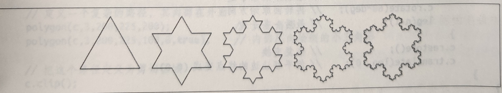

<!-- @import "[TOC]" {cmd="toc" depthFrom=1 depthTo=6 orderedList=false} -->

<!-- code_chunk_output -->

- [15.1 web 编程基础](#151-web-编程基础)
  - [15.1.1 HTML `<script>` 标签中的 JS](#1511-html-script-标签中的-js)
  - [15.1.2 文档对象模型](#1512-文档对象模型)
  - [15.1.3 浏览器中的全局对象](#1513-浏览器中的全局对象)
  - [15.1.4 脚本共享一个命名空间](#1514-脚本共享一个命名空间)
  - [15.1.5 JS 程序的执行](#1515-js-程序的执行)
  - [15.1.6 程序输入与输出](#1516-程序输入与输出)
  - [15.1.7 程序错误](#1517-程序错误)
  - [15.1.8 Web 安全模型](#1518-web-安全模型)
- [15.2 事件](#152-事件)
  - [15.2.1 事件类别](#1521-事件类别)
  - [15.2.2 注册事件处理程序](#1522-注册事件处理程序)
  - [15.2.3 调用事件处理程序](#1523-调用事件处理程序)
  - [15.2.4 事件传播](#1524-事件传播)
  - [15.2.5 事件取消](#1525-事件取消)
  - [15.2.6 派发自定义事件](#1526-派发自定义事件)
- [15.3 操作 DOM](#153-操作-dom)
  - [15.3.1 选择 Document 元素](#1531-选择-document-元素)
  - [15.3.2 文档结构与遍历](#1532-文档结构与遍历)
  - [15.3.3 属性](#1533-属性)
  - [15.3.4 元素内容](#1534-元素内容)
  - [15.3.5 创建/插入和删除节点](#1535-创建插入和删除节点)
  - [15.3.6 示例：生成目录](#1536-示例生成目录)
- [15.4 操作 CSS](#154-操作-css)
  - [15.4.1 CSS 类](#1541-css-类)
  - [15.4.2 行内样式](#1542-行内样式)
  - [15.4.3 计算样式](#1543-计算样式)
  - [15.4.4 操作样式表](#1544-操作样式表)
  - [15.4.5 CSS 动画与事件](#1545-css-动画与事件)
- [15.5 文档几何与滚动](#155-文档几何与滚动)
  - [15.5.1 文档坐标与视口坐标](#1551-文档坐标与视口坐标)
  - [15.5.2 查询元素的几何大小](#1552-查询元素的几何大小)
  - [15.5.3 确定位于某一点的元素](#1553-确定位于某一点的元素)
  - [15.5.4 滚动](#1554-滚动)
  - [15.5.5 视口/内容大小和滚动位置](#1555-视口内容大小和滚动位置)
- [15.6 Web 组件](#156-web-组件)
  - [15.6.1 使用 Web 组件](#1561-使用-web-组件)
  - [15.6.2 HTML 模板](#1562-html-模板)
  - [15.6.3 自定义元素](#1563-自定义元素)
  - [15.6.4 影子 DOM](#1564-影子-dom)
  - [15.6.5 示例：`<search-box>` Web 组件](#1565-示例search-box-web-组件)
- [15.7 可伸缩矢量图形](#157-可伸缩矢量图形)
  - [15.7.1 在 HTML 中使用 SVG](#1571-在-html-中使用-svg)
  - [15.7.2 编程操作 SVG](#1572-编程操作-svg)
  - [15.7.3 通过 JS 创建 SVG 图片](#1573-通过-js-创建-svg-图片)
- [15.8 `<canvas>` 与图形](#158-canvas-与图形)
  - [15.8.1 路径与多边形](#1581-路径与多边形)
  - [15.8.2 画布大小与坐标](#1582-画布大小与坐标)
  - [15.8.3 图形属性](#1583-图形属性)
  - [15.8.4 画布绘制操作](#1584-画布绘制操作)
  - [15.8.5 坐标系变换](#1585-坐标系变换)
  - [15.8.6 剪切](#1586-剪切)
  - [15.8.7 像素操作](#1587-像素操作)
- [15.9 Audio APl](#159-audio-apl)
  - [15.9.1 Audio() 构造函数](#1591-audio-构造函数)
  - [15.9.2 WebAudio APl](#1592-webaudio-apl)
- [15.10 位置/导航与历史](#1510-位置导航与历史)
  - [15.10.1 加载新文档](#15101-加载新文档)
  - [15.10.2 浏览历史](#15102-浏览历史)
  - [15.10.3 使用 hashchange 事件管理历史](#15103-使用-hashchange-事件管理历史)
  - [15.10.4 使用 pushState() 管理历史](#15104-使用-pushstate-管理历史)
- [15.11 网络](#1511-网络)
  - [15.11.1 fetch()](#15111-fetch)
  - [15.11.2 服务器发送事件](#15112-服务器发送事件)
  - [15.11.3 Web Socket](#15113-web-socket)
- [15.12 存储](#1512-存储)
  - [15.12.1 localStorage 和 sessionStorage](#15121-localstorage-和-sessionstorage)
  - [15.12.2 cookie](#15122-cookie)
  - [15.12.3 IndexedDB](#15123-indexeddb)
- [15.13 工作线程与消息传递](#1513-工作线程与消息传递)
  - [15.13.1 Worker 对象](#15131-worker-对象)
  - [15.13.2 工作线程中的全局对象](#15132-工作线程中的全局对象)
  - [15.13.3 在工作线程中导入代码](#15133-在工作线程中导入代码)
  - [15.13.4 工作线程执行模型](#15134-工作线程执行模型)
  - [15.13.5 postMessage() MessagePort 和 MessageChannel](#15135-postmessage-messageport-和-messagechannel)
  - [15.13.6 通过 postMessage() 跨源发送消息](#15136-通过-postmessage-跨源发送消息)
  - [15.13.7 示例：曼德布洛特集合](#15137-示例曼德布洛特集合)
- [15.15 未来阅读建议](#1515-未来阅读建议)
  - [15.15.2 性能](#15152-性能)
  - [15.15.3 安全](#15153-安全)
  - [15.15.5 更多 Document 和 Window 特性](#15155-更多-document-和-window-特性)
  - [15.15.6 事件](#15156-事件)
  - [15.15.7 PWA 与 Service Worker](#15157-pwa-与-service-worker)
  - [15.15.8 移动设备 API](#15158-移动设备-api)
  - [15.15.9 二进制 API](#15159-二进制-api)
  - [15.15.10 媒体 API](#151510-媒体-api)
  - [15.15.11 加密及相关 API](#151511-加密及相关-api)

<!-- /code_chunk_output -->

JS 创造于 1994 年，其明确的目的就是为浏览器显示的文档赋予动态行为。自此以后，这门语言经过了多次重大改进，而与此同时，Web 平台的范围与能力也出现了爆炸式增长。今天，Web 对 JS 程序员而言已经是一个完善的应用开发平台。浏览器专注于格式化文本与图片的显示，但与原生操作系统一样，浏览器也提供了其他服务，包括图形、视频、音频、网络、存储和线程。JS 这门语言能够使 Web 应用使用 Web 平台提供的服务。

### 15.1 web 编程基础

#### 15.1.1 HTML `<script>` 标签中的 JS

浏览器显示 HTML 文档。如果想让浏览器执行 JS 代码，那么必须在 HTML 文档中包含（或引用）相应代码，这时候就要用到 HTML `<script>` 标签。

虽然 JS 代码可直接嵌入 `<script>` 标签中，但更常见的方式是使用 `<script>` 标签的 `src` 属性指定 JS 代码文件的 URL（绝对 URL 或者相对于当前 HTML 文件的相对 URL）。

JS 文件只包含纯 JS 代码，不包含 `<script>` 或其他 HTML 标签。按照约定，JS 代码文件以 _.js_ 结尾。

> **注意**：即便指定了 `src` 属性，后面的 `</script>` 标签也是 HTML 文件必需的，HTML 不支持 `<script/>` 标签。

使用 `src` 有如下优点：

- 简化 HTML 文件，因为可以把大段的 JS 代码从中移走。换句话说，这样可以实现内容与行为分离。

- 在多个网页共享同一份 JS 代码时，使用 `src` 属性可以只维护一份代码，而无须在代码变化时修改多个 HTML 文件。

- 如果一个 JS 文件被多个页面共享，那它只会被使用它的第一个页面下载一次，后续页面可以从浏览器缓存中获取该文件。

- 因为 `src` 以任意 URL 作为值，所以来自一个 Web 服务器的 JS 程序或网页可以利用其他服务器暴露的代码。很多互联网广告就依赖这个事实。

**模块**
[JS 模块](../JavaScript%E6%9D%83%E5%A8%81%E6%8C%87%E5%8D%97.md#103-es6-中的模块)介绍了 `import` 和 `export` 指令。如果用模块写了一个 JS 程序（且没有使用代码打包工具把所有模块都整合到一个非 JS 模块文件中），那必须使用一个带有 `type="module"` 属性的 `<script>` 标签来加载这个程序的顶级模块。这样，浏览器会加载指定的模块，并加载这个模块导入的所有模块，以及（递归地）加载所有这些模块导入的模块。

**指定脚本类型**
在 web 的早期，人们认为浏览器将来有一天可能实现 JS 以外的语言。为此，需要给 `<script>` 标签添加 `language="javascript"` 或 `type="application/javascript"` 属性。这些完全是没有必要的。JS 本来就是 web 的默认（也是唯一）语言。因此 `language` 属性被废弃了，而 `type` 属性也只有两个使用场景：

- 用于指定脚本是模块
- [在网页中嵌入数据但不会显示](#1534-元素内容)

**脚本运行时机：async 与 defer**
在浏览器引入 JS 语言之初，还没有任何 API 可以遍历和操作已经渲染好的文档的结构或内容。JS 代码能够影响文档内容的唯一方式，就是在浏览器加载文档的过程中动态生成内容。为此，要使用 `document.write()` 方法在脚本所在的位置向 HTML 中注入文本。

虽然现在已经不再提倡使用 `document.write()` 生成内容了，但由于还存在这种可能，浏览器在解析遇到的 `<script>` 元素时的默认行为是必须要运行脚本，就是为了确保不漏掉脚本可能输出的 HTML 内容，然后才能再继续解析和渲染文档。这有可能严重拖慢网页的解析和渲染过程。

好在默认的这种同步或阻塞式脚本执行模式并非唯一选项。`<script>` 标签也支持 `defer` 和 `async` 属性，这两个属性会导致脚本以不同的方式执行。这两个是布尔值属性，没有值，因此只要它们出现在 `<script>` 标签上就会生效。

> **注意**：这两个属性只对使用 `src` 属性的 `<script>` 标签起作用。

`defer` 和 `async` 属性都会明确告诉浏览器，当前链接的脚本中没有使用 `document.write()` 生成 HTML 输出。因此浏览器可以在下载脚本的同时继续解析和渲染文档。其中，`defer` 属性会让浏览器把脚本的执行推迟到文档完全加载和解析之后，此时已经可以操作文档了。而 `async` 属性会让浏览器尽早运行脚本，但在脚本下载期间同样不会阻塞文档解析。如果 `<script>` 标签上同时存在这两个属性，则 `async` 属性起作用。

> **注意**：推迟（defer）的脚本会按照它们在文档中出现的顺序运行。而异步（async）脚本会在它们加载完毕后运行，所以其运行顺序无法预测。

带有 `type="module"` 属性的脚本默认会在文档加载完毕后执行，就好像有一个 `defer` 属性一样。可以通过 `async` 属性来覆盖这个默认行为，这样会导致代码在模块及其所有依赖加载完毕后就立即执行。

如果不使用 `async` 和 `defer` 属性（特别是对那些直接包含在 HTML 中的代码），也可以选择把 `<script>` 标签放在 HTML 文件的末尾。这样，脚本在运行的时候就知道自己前面的文档内容已经解析，可以操作了。

**按需加载脚本**
有时，文档在刚刚加载完成时可能并不需要某些 JS 代码，只有当用户执行了某些操作，比如单击某个按钮或打开某个菜单时才需要。如果代码是以模块形式写的，则可以使用 [`import()`](../JavaScript%E6%9D%83%E5%A8%81%E6%8C%87%E5%8D%97.md#1036-通过-import-动态导入) 来按需加载。如果没有使用模块，可以通过向文档中动态添加 `<script>` 标签的方式按需加载脚本。

#### 15.1.2 文档对象模型

**客户端 JS 编程中最重要的一个对象就是 Document 对象，它代表浏览器窗口或标签页中显示的 HTML 文档。用于操作 HTML 文档的 API 被称为[文档对象模型](#153-操作-dom)**（Document Object Model，DOM）。

HTML 文档包含一组相互嵌套的 HTML 元素，构成了一棵树。DOM API 与 HTML 文档的树形结构是一一对应的。文档中的每个 HTML 标签都有一个对应的 JS Element 对象，而文档中的每一行文本也都有一个与之对应的 Text 对象。Element 和 Text 类，以及 Document 类本身，都是一个更通用的 Node 类的子类。各种 Node 对象组合成一个树形结构，JS 可以使用 DOM API 对其进行查询和遍历。

DOM API 包含创建新 Element 和 Text 节点的方法，也包含把它们作为其他 Element 对象的子元素插入文档的方法。还有用来在文档中移动元素的方法，以及把它们从文档中彻底删除的方法。服务器端应用可以通过 console.log() 产生纯文本输出，而客户端 JS 应用则可以使用 DOM API 通过构建或操作文档树产生格式化的 HTML 输出。

每个 HTML 标签类型都有一个与之对应的 JS 类，而文档中出现的每个标签在 JS 中都有对应类的一个实例表示。例如，`<body>` 标签由 HTMLBodyElement 的实例表示，而 `<table>` 标签则由 HTMLTableElement 的实例表示。JS 中这些元素对象都有与 HTML 标签的属性对应的属性。例如，表示 `` 标签的 HTMLImageElement 对象有一个 `src` 属性，对应着标签的相应属性。这个属性的初始值就是 HTML 标签中相应属性的值。在 JS 中修改这个属性的值，也会改变 HTML 属性的值（并导致浏览器加载和显示新图片）。多数 JS 元素类都只是镜像 HTML 标签的属性，但有些也定义了额外的方法。比如， HTMLAudioelement 和 HTMLVideoElement 类都、定义了 play() 和 pause() 方法，用于控制音频和视频文件的回放。

#### 15.1.3 浏览器中的全局对象

每个浏览器窗口或标签页都有一个全局对象。在一个窗口中运行的所有 JS 代码（不包括在[工作线程](#1513-工作线程与消息传递)中运行的代码），都共享一个全局对象。无论文档中包含多少脚本或模块，这个事实都不会改变：文档中的所有脚本和模块共享同一个全局对象，如果有脚本在该对象上定义了一个属性，则该属性也将对所有其他脚本可见。

全局对象上定义了 JS 标准库，比如 parseInt() 函数、Math 对象、Set 类等。在浏览器中，全局对象也包含各种 Web API 的主入口。例如，document 属性表示当前显示的文档，fetch() 方法用于发送 HTTP 网络请求，而 Audio() 构造函数允许 JS 程序播放声音。

**在浏览器中，全局对象具有双重角色。它既是定义 JS 语言内置类型和函数的地方，也代表当前浏览器窗口定义了 history（表示浏览器浏览历史，参见 15.10.2 节）和 innerWidth（表示窗口的像素宽度）等 Web APl 的属性。全局对象的属性中有一个属性叫 `window`，它的值就是全局对象本身**。这意味着在客户端代码中可以直接通过 `window` 引用全局对象。在使用窗口特定的功能时，最好加上 `window` 前缀。比如，写 window.innerwidth 比只写 innerwidth 更明确。

#### 15.1.4 脚本共享一个命名空间

在模块中，定义在模块顶级（即位于任何函数或类定义之外）的常量、变量、函数和类是模块私有的，除非它们被明确地导出。被导出时，这些模块成员可以被其他模块有选择地导入（注意，模块的这个性质使用代码打包工具时也得到了维护）。

不过在非模块脚本中，情况完全不同。如果在顶级脚本中定义了一个常量、变量、函数或类，则该声明将对同一文档中的所有脚本可见。如果一个脚本定义了函数 f()，另一个脚本定义了类 C，第三个脚本无须采取任何导入操作即可调用该函数和实例化该类。

因此如果没有使用模块，同一个文档中共享同一个命名空间的独立脚本就如同它们是一个更大脚本的组成部分一样。这对于小程序或许会很方便，但在大型程序中避免命名冲突则会变成一件麻烦事，特别是在某些脚本还是第三方库的情况下。

这个共享的命名空间在运行时有一些历史遗留问题。比如，顶级的 var 和 function 声明会在共享的全局对象上创建属性。如果一个脚本定义了顶级函数 f()，那么同一个文档中的另一个脚本可以用 f() 或者 window.f() 调用该函数。而使用 ES6 中 const、let 和 class 的顶级声明则不会在全局对象上创建属性。但是，它们仍然会定义在一个共享的命名空间内。如果一个脚本定义了类 C，另一个脚本也可以通过 new C()（但不能通过 `new window.C()`）创建该类的实例。

简单来说，**在模块中，顶级声明被限制在模块内部，可以明确导出。而在非模块脚本中，顶级声明被限制在包含文档内部，顶级声明由文档中所有的脚本共享**。以前的 var 和 function 声明是通过全局对象的属性共享的，而现在的 const，let 和 class 声明也会被共享且拥有相同的文档作用域，但它们不作为 JS 可以访问到的任何对象的属性存在。

#### 15.1.5 JS 程序的执行

客户端 JS 中没有程序的正式定义，但可以说 JS 程序由文档中包含和引用的所有 JS 代码组成。这些分开的代码共享同一个全局 Window 对象，它们可以通过这个对象访问表示 HTML 文档的同一个底层 Document 对象。不是模块的脚本还额外共享同一个顶级命名空间。

如果网页中包含嵌入的窗格（`<iframe>`元素），被嵌入文档与嵌入它的文档中的 JS 代码拥有不同的全局对象和 Document 对象，可以看成两个不同的 JS 程序。

> **注意**：关于 JS 程序的边界在哪里并没有正式的定义。如果包含文档与被包含文档是从同一个服务器加载的，则一个文档中的代码就能够与另一个文档中的代码交互。此时，如果愿意，可以把它们看成一个程序整体的两个互操作的部分。[通过 postMessage() 跨源发送消息](#15136-通过-postmessage-跨源发送消息)将解释 JS 程序如何与在 `<iframe>` 中运行的 JS 代码相互发送和接收消息。

可以把 JS 程序的执行想象成发生在两个阶段：

1. 在第一阶段，文档内容加载完成 `<script>` 元素指定的（内部和外部）代码运行。脚本通常按照它们在文档中出现的顺序依次执行，不过也可以使用 `async` 和 `defer` 属性来修改。任何一个脚本中的 JS 代码都自上而下运行，当然还要服从 JS 的条件、循环和其他控制语句。有的脚本在这个阶段并不真正做任何事，仅仅是定义供第二阶段使用的函数和类。而有的脚本在第一阶段可能会做很多重要的事情，而在第二阶段则什么也不做。

2. 当文档加载完毕且所有脚本都运行之后，JS 执行就进入了第二阶段。这个阶段是异步的、事件驱动的。如果脚本要在第二阶段执行，那么它在第一阶段必须要做一件事，就是至少要注册一个将被异步调用的事件处理程序或其他回调函数。在事件驱动的第二阶段，作为对异步事件的回应，浏览器会调用事件处理程序或其他回调。[事件处理程序](#152-事件)通常是为响应用户操作（如鼠标点击、敲击键盘等）而被调用的，但也可能会被网络活动、文档和资源加载事件、流逝的时间或者 JS 代码中的错误触发。

事件驱动阶段发生的第一批事件主要有 “DOMContentLoaded” 和 “load”。“DOMContentLoaded” 在 HTML 文档被完全加载和解析后触发。而 “load” 事件在所有文档的外部资源（如图片）都完全加载后触发。JS 程序经常使用这两个事件作为触发器或启动信号。经常可以看到某些程序的脚本定义了一些函数，但除了注册会被事件驱动阶段开始时的 “load” 事件触发的事件处理程序之外，其他什么也不做。而负责操作文档、执行程序预定逻辑的正是这个 “load” 事件处理程序。

> **注意**：在 JS 编程中，类似的 “1oad” 事件处理程序再去注册其他事件处理程序也是很常见的。JS 程序的加载阶段相对比较短，理想情况下少于 1 秒。文档加载一完成，事件驱动阶段将在浏览器显示文档的过程中一直持续。因为这个阶段是异步的和事件驱动的，所以可能会有很长一段时间什么也不会发生，也不会执行任何 JS 代码。而这个过程时不时地会被用户操作或网络事件打断。

**客户端 JS 的线程模型**
JS 是单线程的语言，而单线程执行让编程更容易：可以保证自己写的两个事件处理程序永远不会同时运行。在操作文档内容时，敢肯定不会有别的线程会同时去修改它。而且，在写 JS 代码时，永远不需要关心锁、死锁或者资源争用。

单线程执行意味着浏览器会在脚本和事件处理程序执行期间停止响应用户输入。程序员为此有责任确保 JS 脚本和事件处理程序不会长时间运行。如果脚本执行计算量大的任务，就会导致文档加载延迟，用户在脚本执行结束前将看不到文档内容。如果事件处理程序执行计算密集型任务，浏览器可能会变得没有响应。

Web 平台定义了一种受控的编程模型，即 [Web 工作线程（Web worker）](#1513-工作线程与消息传递)。**工作线程是一个后台线程，可以执行计算密集型任务而不冻结用户界面。工作线程中运行的代码无权访问文档内容，不会与主线程或其他工作线程共享任何状态，只能通过异步消息事件与主线程或其他工作线程通信。因此这种并发对主线程没有影响，工作线程也不会改变 JS 程序的单线程执行模型**。

**客户端 JS 时间线**
JS 程序会从脚本执行阶段开始，然后过渡到事件处理阶段。这两个阶段可以进一步分成下列步骤：

1. 浏览器创建 Document 对象并开始解析网页，随着对 HTML 元素及其文本内容的解析，不断向文档中添加 Element 对象和 Text 节点。此时，document.readyState 属性的值是 “loading”。

2. HTML 解析器在碰到一个没有 `async`、`defer` 或 `type="module"` 属性的 `<script>` 标签时，会把该标签添加到文档中，然后执行其中的脚本。脚本是同步执行的，而且在脚本下载（如果需要）和运行期间，HTML 解析器会暂停。类似这样的脚本可以使用 document.write() 向输入流中插入文本，而该文本在解析器恢复时将成为文档的一部分。类似这样的脚本经常只会定义函数和注册事件处理程序，以便后面使用，但它也可以遍历和操作当时已经存在的文档树。换句话说，不带 `async` 成 `defer` 属性的非模块脚本可以看到它自己的 `<script>` 标签及该标签之前的文档内容。

3. 解析器在碰到一个有 `async` 属性集的 `<script>` 元素时，会开始下载该脚本的代码（如果该脚本是模块，也会递归地下载模块的所有依赖）并继续解析文档。脚本在下载完成后会尽快执行，但解析器不会停下来等待它下载。异步（async）脚本必须不使用 document.write() 方法。它们可以看到自己的 `<script>` 标签及该标签之前的文档内容，同时也有可能访问更多文档内容。

4. 当文档解析完成后，document.readState 属性变成 “interactive”。

5. 任何有 `defer` 属性集的脚本（以及任何没有 async 属性的模块脚本）都会在按照它们在文档中出现的顺序依次执行。异步脚本也有可能在此时执行。延迟脚本可以访问完整的文档，必须不使用 document.write() 方法。

6. 浏览器在 Document 对象上派发 “DOMContentLoaded” 事件。这标志着程序执行从同步脚本执行阶段过渡到异步的事件驱动阶段。但要注意，此时仍然可能存在尚未执行的 `async` 脚本。

7. 此时文档已经解析完全，但浏览器可能仍在等待其他内容（如图片）加载。当所有外部资源都加载完成，且所有 async 脚本都加载并执行完成时，document.readyState 属性变成 “complete"，浏览器在 Window 对象上派发“load” 事件。

8. 从这一刻起，作为对用户输入事件、网络事件、定时器超时等的响应，浏览器开始异步调用事件处理程序。

#### 15.1.6 程序输入与输出

与任何程序一样，客户端 JS 程序也处理输入数据，产生输出数据。输入的来源有很多种：

- **文档的内容本身**，JS 代码可以通过 [DOM API](#153-操作-dom) 来访问。

- **[事件形式的用户输入](#152-事件)**。

- 当前显示文档的 URL 可以在客户端 JS 中通过 `document.URL` 读到。如果把这个字符串传给 [URL() 构造函数](./JS%20%E6%A0%87%E5%87%86%E5%BA%93.md#119-url-api)，则可以方便地取得 URL 的路径查询字符串和片段值。

- HTTP “Cookie” 请求头的内容在客户端代码中可以通过 `document.cookie` 读到。Cookie 通常被服务器端代码用来维持用户会话，但需要时客户端代码也可以读取（和写入） [Cookie](#15122-cookie)。

- **全局 `navigator` 属性暴露了关于浏览器、操作系统以及它们能力的信息**。例如：`navigator.userAgent` 是标识浏览器身份的字符串，`navigator.Language` 是用户偏好语言，而 `navigator.hardwareConcurrency` 返回浏览器可用的逻辑 CPU 的个数。类似地，全局 `screen` 属性暴露了用户显示器尺寸的信息，比如 `screen.width` 和 `screen.height` 分别是显示器的宽度和高度。从某种意义上看，这些 navigator 和 screen 的值对浏览器而言就相当于 Node 程序中的环境变量。

客户端 JS 通常以借助 [DOM API](#153-操作-dom) 操作 HTML 文档的形式（或者通过使用 React 或 Angular 等高级框架操作文档）产生输出。

#### 15.1.7 程序错误

与直接运行在操作系统上的应用程序（例如 Node 应用程序）不同，在浏览器中运行的 JS 程序不会真正 “崩溃”。如果 JS 程序在运行期间出现异常，且代码中没有 catch 语句处理它，开发者控制台将会显示一条错误消息，但任何已经注册的事件处理程序照样会继续运行和响应事件。

如果想定义一个终极错误处理程序，希望在出现这种未捕获异常时调用，那可以把 Window 对象的 `onerror` 属性设置为一个错误处理函数。当未捕获异常沿调用栈一路向上传播，错误消息即将显示在开发者控制台中时，`window.onerror` 函数将会以三个字符串参数被调用。`window.onerror` 收到的第一个参数是描述错误的消息。第二个参数是一个字符串，包含导致错误的 JS 代码的 URL。第三个参数是文档中发生错误的行号。如果 onerror 处理程序返回 true，意味着通知浏览器它已经处理了错误，不需要进一步行动了，换句话说，也就是浏览器不应该再显示自己的错误消息了。

如果期约被拒绝而没有 catch() 函数处理它，那么这种情况非常类似未处理异常，也就是程序中意料之外的错误或逻辑错误。可以通过定义 `window.onunhandledrejection` 函数或者使用 window.addEventListener() 为 “unhandledrejection” 事件注册一个处理程序来发现它。传给这个处理程序的事件对象会有一个 `promise` 属性，其值为被拒绝的 Promise 对象，还有一个 `reason` 属性，其值为本来要传 catch() 函数的拒绝理由。与前面介绍的错误处理程序类似，如果在这个未处理拒绝事件对象上调用 `preventDefault()`，浏览器就会认为错误已经处理，而不会在开发者控制台中显示错误消息了。

> 虽然定义 `onerror` 和 `onunhandledrejection` 处理程序经常不是必需的，但如果想知道用户浏览器中发生了哪些意外错误，则作为一种 “遥感” 机制，可以利用它们把客户端错误上报给服务器（比如使用 fetch()函数发送 HTTP POST 请求）。

#### 15.1.8 Web 安全模型

由于网页可以在私人设备上执行任意 JS 代码，因此存在明显的安全隐患。浏览器厂商一直在努力平衡两个相互制约的目标：

- 定义强大的客户端 API，让 Web 应用用途更广。
- 防止恶意代码读取或修改用户数据、侵犯用户隐私、欺诈用户或浪费用户的时间。

**JS 不能做什么**
**浏览器对恶意代码的第一道防线就是不支持某些能力**。例如，客户端 JS 不能向客户端计算机中写入或删除任何文件，也不能展示任意目录的内容。这意味着 JS 程序不能删除数据，也不能植入病毒。

类似地，客户端 JS 没有通用网络能力。客户端 JS 程序可以[发送 HTTP 请求](#15111-fetch)。而另一个标准，即 [Web Socket](#15113-web-socket)，定义了一套类似套接口的 API，用于跟特定的服务器通信。但这些 API 都无法随意访问任意服务器。使用客户端 JS 写不出通用互联网客户端和服务器。

**同源策略**
**同源策略指的是对 JS 代码能够访问和操作什么 web 内容的一整套限制**。通常在页面中包含 `≤iframe>` 元素时就会涉及同源策略。此时，同源策略控制着一个窗格中的 JS 与另一个窗格中的 JS 的交互。比如，脚本只能读取与包含它的文档同源的 Window 和 Document 对象的属性。

文档的源就是文档 URL 的协议、主机和端口。从不同服务器加载的文档是不同源的，从相同主机的不同端口加载的文档也是不同源的。而且，对于通过 http: 协议加载的文档与通过 https: 协议加载的文档来说，即便它们来自同一台服务器，也是不同源的。浏览器通常把每个 `file:URL` 看成一个独立的源，这意味着如果写的程序会显示同台服务器上的多个文档，则可能无法使用 `file:URL` 在本地测试它，而必须在开发期间运行一个静态 Web 服务器。

有一点非常重要，就是应该知道脚本自身的源与同源策略不相关，相关的是包含脚本的文档的源。比如，假设主机 A 上有一个脚本，而主机 B 上的一个网页包含了这个脚本。则该脚本的源是主机 B，且该脚本对包含它的文档具有完全访问权。如果文档中嵌入的 `<iframe>` 包含另一个来自主机 B 的文档，则该脚本同样拥有对这个文档的完全访问权。但是，如果顶级文档包含另一个 `<iframe>`，其中显示的文档来自主机 C（或者甚至来自主机 A），则同源策略就会起作用，并阻止该脚本访问这个嵌入的文档。

同源策略也会应用到脚本[发起的 HTTP 请求](#15111-fetch)中。JS 代码可以向托管其包含文档的服务器发送任意 HTTP 请求，但不能与其他服务器通信（除非那些服务器开启了后面介绍的 CORS）。

同源策略对使用多子域的大型网站造成了麻烦。比如，来自 _orders.example.com_ 的脚本可能需要读取 _example:com_ 上文档的属性。为了支持这种多子域名网站，脚本可以通过把 **document.domain** 设置为一个域名后缀来修改自己的源。因此，源为 `https://orders.example.com` 的脚本通过把 **document.domain** 设置为 “example.com”，可以把自己的源修改为 `https://example.com`。但是，该脚本不能把 **document.domain** 设置为 “orders.example” “ample.com” 或 “com”。

第二种缓解同源策略的技术是跨源资源共享（Cross-Origin Resource Sharing，CORS），它允许服务器决定对哪些源提供服务。CORS 扩展了 HTTP，增加了一个新的 `Origin:` 请求头和一个新的 `Access-Control- Allow-Origin` 响应头。服务器可以使用这个头部明确列出对哪些源提供服务，或者使用通配符表示可以接收任何网站的请求。浏览器会根据这些 CORS 头部的有无决定是否放松同源限制。

**跨站点脚本**
跨站点脚本（Cross-Site-Scripting，XSS）是一种攻击方式，指攻击者向目标网站注入 HTML 标签或脚夲。客户端 JS 程序员必须了解并防范跨站点脚本。如果网页的内容是动态生成的，比如根据用户提交的数据生成内容，但却没有提前对那些数据 “消毒”（删除嵌入的 HTML 标签等），那就可能成为跨站点脚本的攻击目标。下面看一个非常简单的示例，这个示例使用 JS 根据用户输入的名字给出问候：

```html
<script>
  let name = new URL(document.URL).searchParams.get('name');
  document.querySelector('h1').innerHTML = 'Hello' + name;
</script>
```

这两行脚本会从文档 URL 中提取 “name” 这个查询参数，然后使用 DOM API 把一个 HTML 字符串注入文档的第一个 `<h1>` 标签中。页面期望的调用方式是使用类似下面这样的 URL：

```text
http://www.example.com/greet.html?name=david
```

对于这个 URL，网页会显示文本 “Hello david”。但是，如果查询参数是下面这样的，会发生什么呢?

```text
name=%3Cimg%20src=%22x.png%22%20onload=%22alert(%27hacked%27)%22/%3E
```

把这个经过 URL 转义的参数解码后，就会导致下面的 HTML 被注入文档：

```html
Hello

```

于是，在图片加载后，`onload` 属性中的 JS 字符串就会执行。全局 alert() 函数将显示一个模态对话框。显示一个对话框没什么大不了，但这演示了在这个网站上显示未经处理的 HTML 会导致任意代码执行的可能性。

之所以称其为跨站点脚本攻击，是因为会涉及不止一个网站。网站 B 包含一个特殊编制的链接（类似前面示例中的 URL），指向网站 A。如果网站 B 能够说服用户点击该链接，用户就会导航到网站 A，但网站 A 此时会运行来自网站 B 的代码。该代码可能会破坏网站 A 的页面，或者导致它功能失效。更危险的是，恶意代码可能读取网站 A 存储的 cookie（可能包含个人账号或其他用户身份信息）并将该数据发送回网站 B。这种注入的代码甚至可以跟踪用户的键盘输入，并将该数据发送回网站 B。一般来说，防止 XSS 攻击的办法是从不可信数据中删除 HTML 标签，然后再用它去动态创建文档内容。对于前面展示的 _greet.html_，可以通过把不可信输入中的特殊 HTML 字符替换成等价的 HTML 实体来解决问题：

```js
name = name
  .replace(/&/g, '&amp;')
  .replace(/</g, '&lt;')
  .replace(/>/g, '&gt;')
  .replace(/"/g, '&quot;')
  .replace(/'/g, '&#x27;')
  .replace(/\//g, '&#x2F;');
```

应对 XSS 攻击的另一个思路是让 Web 应用始终在一个 `<iframe>` 中显示不可信内容，并将这个 `<iframe>` 的 sandbox 属性设置为禁用脚本和其他能力。

跨站点脚本作为一种有害的漏洞，其根源可以追溯到 web 的架构设计。

### 15.2 事件

客户端 JS 程序使用异步事件驱动的编程模型。在这种编程风格下，浏览器会在文档、浏览器或者某些元素或与之关联的对象发生某些值得关注的事情时生成事件。例如，浏览器会在它加载完文档时生成事件，在用户把鼠标移到超链接上时生成事件。如果 JS 应用关注特定类型的事件，那它可以注册一个或多个函数，让这些函数在该类型事件发生时被调用。

> **注意**：这并非 Web 编程的专利，任意具有图形用户界面的应用都是这样设计的。换句话说，界面就在那里等待用户与之交互（也可以说，它们在等待事件发生），然后给出响应。

在客户端 JS 中，事件可以在 HTML 文档中的任何元素上发生，这也导致了浏览器的事件模型比 Node 的事件模型明显更复杂。下面是事件模型的几个重要的定义：

_事件类型_
: **事件类型是一个字符串，表示发生了什么事件**。例如，“mousemove” 表示用户移动了鼠标，“keydown” 表示用户按下了键盘上的某个键，而 “load” 表示文档（或其他资源）已经通过网络加载完成。因为事件类型是字符串，所以有时也称它为事件名称。

_事件目标_
: **事件目标是一个对象，而事件就发生在该对象上或者事件与该对象有关**。说到某个事件，必须明确它的类型和目标。Window、Document 和 Element 对象是客户端 JS 应用中最常见的事件目标，不过也有一些事件会在其他对象上发生。例如，[Worker 对象](#1513-工作线程与消息传递)是 “message” 事件的目标，这种事件在工作线程向主线程发消息时发生。

_事件处理程序或事件监听器_
: **事件处理程序或事件监听器是一个函数，负责处理或响应事件**。应用通过浏览器注册自己的事件处理程序，指定事件类型和事件目标。当事件目标上发生指定类型的事件时，浏览器会调用这个处理程序。当事件处理程序在某个对象上被调用时，浏览器 “触发” “派发” 或 “分派” 了该事件。注册事件处理程序有不同的方式，[注册](#1522-注册事件处理程序)和[调用](#1523-调用事件处理程序)。

_事件对象_
: **事件对象是与特定事件关联的对象，包含有关该事件的细节**。事件对象作为事件处理程序的参数传入。所有事件对象都有 `type` 和 `target` 属性，分别表示事件类型和事件目标。每种事件类型都为相关的事件对象定义了一组属性。比如，与鼠标事件相关的事件对象包含鼠标指针的坐标，与键盘事件相关的事件对象包含与被按下的键以及按住不放的修饰键的信息。很多事件类型只定义几个标准属性（包括 type 和 target），并没有其他有用信息。对这些事件，重要的是它们发生了，而不是事件的细节。

_事件传播_
: **[事件传播](#1524-事件传播)是一个过程，浏览器会决定在这个过程中哪些对象触发事件处理程序**。对于 Window 对象上的 “load” 或 Worker 对象上的 “message” 等特定于一个对象的事件，不需要传播。但对于发生在 HTML 文档中的某些事件，则会 “冒泡”（bubble）到文档根元素。如果用户在一个超链接上移动鼠标，这个鼠标事件首先会在定义该超链接的 `<a>` 元素上触发，然后在包含元素上触发，可能经过一个 `<p>` 元素、一个 `<section>` 元素，然后到达文档对象本身。有时，只给文档或包含元素注册一个事件处理程序，比给关心的每个元素都分别注册一个处理程序更方便。事件处理程序可以阻止事件传播，从而让事件不再冒泡，也就不会在包含元素上触发处理程序。为此，事件处理程序需要调用事件对象上的一个方法。在另外一种事件传播形式，即事件捕获（event capturing）中，注册在包含元素上的处理程序在事件被发送到实际目标之前，有机会先拦截（或捕获）事件。有些事件有与之关联的默认动作（default action）。比如，单击一个超链接，默认动作是让浏览器跟随链接，加载一个新页面。事件处理程序可以通过调用事件对象的一个方法来阻止这个默认动作。对此，有时也称为 [“取消” 事件](#1525-事件取消)。

#### 15.2.1 事件类别

客户端 JS 支持的事件类型非常多，本章不可能全部介绍。不过，可以将这些事件分成通用的类别，从而了解它们的范围和差异。

_设备相关输入事件_
: **这类事件直接与特定输入设备（例如鼠标或键盘）相关**。这类事件类型包括 “mousedown” “mousemove” “mouseup” “touchstart” “touchmove” “touchend” “keydown” “keyup” 等等。

_设备无关输入事件_
: **这类输入事件并不与特定输入设备直接相关**。比如，“click” 事件表示一个链接或按钮（或其他文档元素）已经被激活。一般来说，这个事件是通过鼠标触发的，但也可能是通过键盘或（在触屏设备上）通过轻击触发的。而“input” 事件是对 “keydown” 事件的设备无关的替代，既支持键盘输入，也支持剪切粘贴和表意文字的输入法。“pointerdown” “countermove” 和 “pointerup”事件是对鼠标和触摸事件的设备无关的替代。它们既适用于鼠标类型的指针，也适用于触屏，以及手写笔输入。

_用户界面事件_
: **UI 事件是高级事件，通常在定义应用界面的 HTML 表单元素上触发**。这类事件包括 “focus”（当文本输入字段获得键盘焦点时）、“change”（当用户修改了表单元素显示的值时）和 “submit”（当用户单击表单中的“提交”按钮时）。

_状态变化事件_
: **有些事件并不直接由用户活动触发，而是由网络或浏览器活动触发。这类事件表示某种生命期或状态相关的变化**。其中，分别由 Window 和 Document 对象在文档加载结束时触发的 “load” 和 “DOMContentLoaded” 事件可能是这类事件中最常用的两个事件。浏览器会在网络连接变化时在 Window 对象上触发 “online” 和 “offline” 事件。浏览器的[历史管理机制](#15104-使用-pushstate-管理历史)会触发 “popstate” 事件作为对浏览器 “后退” 按钮的回应。

_API 特定事件_
: **有一些 HTML 及相关规范定义的 Web API 包含自己的事件类型**。HTML 的 `<video>` 和 `<audio>` 元素定义了一系列事件，比如 “waiting” “playing” “seeking” “volumechange”，等等。可以使用这些事件自定义媒体播放。一般来说，在 JS 支持期约以前定义的异步 Web 平台 API 都是事件驱动的，会定义 API 特定事件。比如，[IndexedDB API](#15123-indexeddb)在数据库请求成功和失败时分别触发 “success” 和 “error” 事件。虽然用于发送 HTTP 请求的新 [fetch() API](#15111-fetch)是基于期约的，但它取代的 XMLHttpRequest API 则定义了一些 API 特定事件。

#### 15.2.2 注册事件处理程序

有两种注册事件处理程序的方式：

- Web 早期就有的，即设置作为事件目标的对象或文档元素的一个属性。

- 更新也更通用的是把处理程序传给这个对象或元素的 addEventListener() 方法

**设置事件处理程序属性：JavaScript**
注册事件处理程序最简单的方式就是把事件目标的一个属性设置为关联的事件处理程序函数。按照惯例，事件处理程序属性的名字都由 “on” 和事件名称组成。

> **注意**：这些属性名是区分大小写的，必须全部小写，即便事件类型包含多个单词。

使用事件处理程序属性有一个缺点，即这种方式假设事件目标对每种事件最多只有一个处理程序。一般来说，**使用 addEventListener() 注册事件处理程序更好，因为该技术不会重写之前注册的处理程序**。

**设置事件处理程序属性：HTML**
文档元素的事件处理程序属性也可以直接在 HTML 文件中作为对应 HTML 标签的属性来定义（在 JS 中注册在 Window 元素上的处理程序在 HTML 中可以定义为 `<body>` 标签的属性）。现代 Web 开发中通常不提倡使用这种技术，但它是可能的。

在使用 HTML 属性定义事件处理程序时，属性的值应该是一段 JS 代码字符串。这段代码应该是事件处理程序函数的函数体，不是完整的函数声明。换句话说，HTML 事件处理程序的代码应该没有外围的大括号，前面也没有 function 关键字。例如：

```js
<button onclick="console.log('Thank you');">Please Click</button>
```

如果一个 HTML 事件处理程序属性包含多条 JS 语句，则必须用分号分隔这些语句，或者用回车把这个属性值分成多行。

在给 HTML 事件处理程序属性指定 JS 代码字符串时，浏览器会把这个字符串转换为一个函数，这个函数类似如下所示：

```js
function (event) {
  with (document) {
    with (this.form || {}) {
      with (this) {
        /* 代码在这里 */
      }
    }
  }
}
```

这个 `event` 参数意味着处理程序代码可以通过它引用当前的事件对象。而 with 语句意味着处理程序可以直接引用目标对象乃至 Document 对象的属性，就像它们都是作用域内的变量一样。严格模式下是禁止使用 with 语句的，但 HTML 属性中的 JS 代码没有严格这一说。这样定义的事件处理程序将在一个可能存在意外变量的环境中执行，因此可能是一些讨厌的 bug 的来源，也是避免在 HTML 中编写事件处理程序的一个充分理由。

**addEventListener()**
**任何可以作为事件目标的对象（包括 Window 和 Document 对象以及所有文档元素），都定义了一个名为 `addEventListener()` 的方法，可以使用它来注册目标为调用对象的事件处理程序**。addEventListener() 接收 3 个参数：

- 第一个参数是注册处理程序的事件类型。事件类型（或名称）是一个字符串，不包含作为 HTML 元素属性使用时的前缀 “on”。

- 第二个参数是当指定类型的事件发生时调用的函数。

- 可选的第三个参数是一个布尔值或对象。

> **可以多次调用 `addEventListener()` 在同一个对象上为同一事件类型注册多个处理程序**。当对象上发生该事件时，所有为这个事件而注册的处理程序都会按照注册它们的顺序被调用。在同一个对象上以相同的参数多次调用 `addEventListener()` 没有作用，同一个处理程序只能注册一次，重复调用不会改变处理程序被调用的顺序。

**与 `addEventListener()` 对应的是 `removeEventListener()` 方法，它们的前两个参数是一样的（第三个参数也是可选的），只不过是用来从同一个对象上移除而不是添加事件处理程序**。

`addEventListener()` 可选的第三个参数是一个布尔值或对象。如果传入 true，函数就会被注册为[捕获事件](#1524-事件传播)处理程序，从而在事件派发的另一个阶段调用它。如果在注册事件监听器时给第三个参数传了 true，那么要移除该事件处理程序，必须在调用 `removeEventListener()` 时也传入 true 作为第三个参数。

注册捕获事件处理程序只是 `addEventListener()` 支持的 3 个选项之一。如果要传入其他选项，可以给第三个参数传一个对象，显式指定这些选项：

```js
document.addEventListener('click', handleClick, {
  capture: true,
  once: true,
  passive: true
});
```

如果这个 Options（选项）对象的 `capture` 属性为 true，那么函数就会被注册为捕获处理程序。如果这个属性为 false 或省略该属性，那么处理程序就不会注册到捕获阶段如果选项对象有 `once` 属性且值为 true，那么事件监听器在被触发一次后会自动移除。如果这个属性为 false 或省略该属性，那么处理程序永远不会被自动移除。

如果选项对象有 `passive` 属性且值为 true，则表示事件处理程序永远不调用 [`preventDefault()` 取消默认动作](#1525-事件取消)。这对于移动设备上的触摸事件特别重要。如果 “touchmove” 事件可以阻止浏览器的默认滚动动作，那浏览器就不能实现平滑滚动。`passive` 属性提供了一种机制，即在注册一个可能存在破坏性操作的事件处理程序时，让浏览器知道可以在事件处理程序运行的同时安全地开始其默认行为（如滚动）。平滑滚动对保证良好的用户体验非常重要，因此 Firefox 和 Chrome 都默认把 “touchmove” 和 “mousewheel” 事件设置为 “被动式”（passive: true）。如果确实想为这两个事件注册一个会调用 preventDefault() 的事件处理程序，应该显式地将 `passive` 属性设置为 false。

可以把选项对象传给 `removeEventListener()`，但其中只有 `capture` 属性才是有用的。

#### 15.2.3 调用事件处理程序

注册事件处理程序后，浏览器会在指定对象发生指定事件时自动调用它。本节介绍调用事件处理程序的细节，解释事件处理程序的参数、调用上下文（this 值）和事件处理程序返回值的含义。

**事件处理程序的参数**
事件处理程序被调用时会接收到一个 Event 对象作为唯一的参数。这个 Event 对象的属性提供了事件的详细信息。

type
: 发生事件的类型。

target
: 发生事件的对象。

currentTarget
: 对于传播的事件，这个属性是注册当前事件处理程序的对象。

timeStamp
: 表示事件发生时间的时间戳（毫秒），不是绝对时间。可以用第二个事件的时间戳减去第一个事件的时间戳来计算两个事件相隔多长时间。

isTrusted
: 如果事件由浏览器自身派发，这个属性为 true；如果事件由 JS 代码派发，这个属性为 false。

**事件处理程序的上下文**
在通过设置属性注册事件处理程序时，看起来就像为目标对象定义了一个新方法：

```js
target.onclick = function () {
  /* 处理程序的代码 */
};
```

因此，没有意外，这个事件处理程序将作为它所在对象的方法被调用。换句话说，在事件处理程序的函数体中，this 关键字引用的是注册事件处理程序的对象。

> 即便使用 `addEventListener()` 注册，处理程序在被调用时也会以目标作为其 this 值。不过，这不适用于箭头函数形式的处理程序。箭头函数中 this 的值始终等于定义它的作用域的 this 值。

**处理程序的返回值**
**在现代 JS 中，事件处理程序不应该返回值**。在比较老的代码中，还可以看到返回值的事件处理程序，而且返回的值通常用于告诉浏览器不要执行与事件相关的默认动作。比如，如果一个表单 Submit 按钮的 onclick 处理程序返回 false，浏览器将不会提交表单。

**阻止浏览器执行默认动作的标准且推荐的方式，是调用 Event 对象的 [`preventDefault()`](#1525-事件取消) 方法**。

**调用顺序**
一个事件目标可能会为一种事件注册多个处理程序。当这种事件发生时，浏览器会按照注册处理程序的顺序调用它们。有意思的是，即便混合使用 addEventListener() 注册的事件处理程序和在对象属性 onclick 上注册的事件处理程序，结果仍然如此。

#### 15.2.4 事件传播

如果事件的目标是 Window 或其他独立对象，浏览器对这个事件的响应就是简单地调用该对象上对应的事件处理程序。如果事件目标是 Document 或其他文档元素，就没有那么简单了。

注册在目标元素上的事件处理程序被调用后，多数事件都会沿 DOM 树向上 “冒泡”。目标父元素的事件处理程序会被调用。然后注册在目标祖父元素上的事件处理程序会被调用。就这样一直向上到 Document 对象，然后到 Window 对象。由于事件冒泡，可以不用给个别文档元素注册很多事件处理程序，而是只在它们的公共祖先元素上注册个事件处理程序，然后在其中处理事件。

多数在文档元素上发生的事件都会冒泡。明显的例外是 “focus” “blur” 和 “scroll” 事件。文档元素的 “load” 事件冒泡，但到 Document 对象就会停止冒泡，不会传播到 Window 对象（Window 对象的 “load”事件处理程序只会在整个文档加载完毕后才被触发）。

**事件冒泡是事件传播的第三个 “阶段”。调用目标对象本身的事件处理程序是第二个阶段。第一阶段，也就是在目标处理程序被调用之前的阶段，叫作 “捕获” 阶段**。如果 `addEventListener()` 接收的第三个可选参数是 true 或 `{capture:true}`，那么就表明该事件处理程序会注册为捕获事件处理程序，将在事件传播的第一阶段被调用。事件传播的捕获阶段差不多与冒泡阶段正好相反。最先调用的是 Window 对象上注册的捕获处理程序，然后才调用 Document 对象的捕获处理程序，接着才是 `<body>` 元素。然后沿 DOM 树一直向下，直到事件目标父元素的捕获事件处理程序被调用。注册在事件目标本身的捕获事件处理程序不会在这个阶段被调用。

**事件捕获提供了把事件发送到目标之前先行处理的机会**。捕获事件处理程序可用于调试，或者使用下一节介绍的事件取消技术过滤事件，让目标事件处理程序永远不会被调用。事件捕获最常见的用途是处理鼠标拖动，因为鼠标运动事件需要被拖动的对象来处理，而不是让位于其上的文档元素来处理。

#### 15.2.5 事件取消

- **preventDefault()**
  浏览器对很多用户事件都会作出响应，无论是否在代码中指定。比如用户在触摸屏上滑动手指，浏览器就会滚动。如果为这些事件注册了事件处理程序，那么就可以阻止浏览器执行其默认动作，为此要调用事件对象的 `preventDefault()` 方法（除非注册处理程序时传入了 `passive` 选项，该选项会导致 `preventDefault()` 无效）。

- **stopPropagation()**
  取消与事件关联的默认动作只是事件取消的一种情况。除此之外，还可以调用事件对象的 `stopPropagation()` 方法，取消事件传播。使用 `preventDefault()`，如果同一对象上也注册了其他处理程序，则这些处理程序仍然会被调用。但是，在这个对象上调用 `stopPropagation()` 方法之后，其他对象上的事件处理程序都不会再被调用。`stopPropagation()` 可以在捕获阶段、在事件目标本身，以及在冒泡阶段起作用。

  > `stopImmediatePropagation()` 与 `stopPropagation()` 类似，只不过它**会阻止在同一个对象上注册的后续事件处理程序的执行**。

#### 15.2.6 派发自定义事件

客户端 JS 事件 API 相对比较强大，可以使用它定义和派发自己的事件。比如，程序需要周期性地执行耗时计算或者发送网络请求，而在执行此操作期间，不能执行其他操作。想在此时显示一个转轮图标，告诉用户应用程序正忙。但忙碌的模块不需要知道应该在哪里显示转轮图标，它只需要派发一个事件，宣布自己正忙，然后在自己不忙的时候再派发另一个事件即可。UI 模块可以为这两个事件注册处理程序，然后以适当的方式在 UI 上告知用户即可。

如果一个 JS 对象有 `addEventListener()` 方法，那它就是一个 “事件目标”。这意味着该对象也有一个 `dispatchEvent()` 方法。可以通过 `CustomEvent()` 构造函数创建自定义事件对象，然后再把它传给 `dispatchEvent()`。`CustomEvent()` 的第一个参数是一个字符串，表示事件类型；第二个参数是一个对象，用于指定事件对象的属性。可以将这个对象的 `detail` 属性设置为一个字符串、对象或其他值，表示事件的上下文。如果想在一个文档元素上派发自己的事件，并希望它沿文档树向上冒泡，则要在第二个参数中添加 `bubbles:true`。下面看一个例子：

```js
// 派发一个自定义事件，通知 UI 自已正忙
document.dispatchEvent(new CustomEvent('busy', { detail: true }));

// 执行网络操作
fetch(url)
  .then(handleNetworkResponse)
  .catch(handleNetworkError)
  .finally(() => {
    // 无论网络请求成功还是失败，都再派发一个事件，通知 UI 现在已经不忙了
    document.dispatchEvent(new CustomEvent('busy', { detail: false }));
  });

// 在代码其他地方为 “busy” 事件注册一个处理程序并通过它显示或隐藏转轮图标，告知用户忙与闲
document.addEventListener('busy', (e) => {
  if (e.detail) {
    showSpinner();
  } else {
    hideSpinner();
  }
});
```

### 15.3 操作 DOM

客户端 JS 存在的目的就是把静态 HTML 文档转换为交互式 Web 应用。因此通过脚本操作网页内容无疑是 JS 的核心目标。

每个 Window 对象都有一个 document 属性，引用一个 Document 对象。这个 Document 对象代表窗口的内容。不过，Document 对象并不是孤立存在的，它是 DOM 中表示和操作文档内容的核心对象。本节详细讲解 DOM API，包括以下内容：

- 如何查询或选择文档中特定的元素。
- 如何遍历文档，如何查找任何文档元素的祖先、兄弟元素和后代。
- 如何查询和设置文档元素的属性。
- 如何查询、设置和修改文档的内容。
- 如何修改文档的结构，包括创建、插入和删除节点。

#### 15.3.1 选择 Document 元素

客户端 JS 程序经常需要操作文档中的一个或多个元素。全局 document 属性引用 Document 对象，而 Document 对象有 `head` 和 `body` 属性，分别引用 `<head>` 和 `<body>` 标签对应的 Element 对象。但一个程序要想操作文档中嵌入层级更多的元素，必须先通过某种方式获取或选择表示该元素的 Element 对象。

**通过 CSS 选择符选择元素**
CSS 样式表有一个非常强大的语法，就是它的选择符（selector）。选择符用来描述文档中元素或元素的集合。DOM 方法 `querySelector()` 和 `querySelectorAll()` 能够在文档中找到与指定选择符匹配的元素。

CSS 选择符可以通过元素类型（标签）、ID、类名、属性，以及元素在文档中的位置来引用元素。`querySelector()` 方法接收一个 CSS 选择符字符串作为参数，返回它在文档中找到的第一个匹配的元素；如果没有找到，则返回 null。

`querySelectorAll()` 也类似，只不过返回文档中所有的匹配元素，而不是只返回第一个。

`querySelectorAll()` 的返回值不是 Element 对象的数组，而是一个类似数组的 NodeList 对象。NodeList 对象有一个 `length` 属性，可以像数组一样通过索引访问，因此可以使用传统的 for 循环遍历。Nodelist 也是可迭代对象，因此也可以在 for/of 循环中使用它们。如果想把 NodeList 转换为真正的数组，只要把它传给 Array.from() 即可。

如果文档中没有与指定选择符匹配的元素，则 `querySelectorAll()` 返回的 NodeList 的 length 属性为 0。

Element 类和 Document 类都实现了 `querySelector()` 和 `querySelectorAll()`。当在元素上调用时，这两个方法只返回该元素后代中的元素。

CSS 也定义了 `::first-line` 和 `::first-letter` 伪元素。在 CSS 中，它们只匹配文本节点的一部分，而不匹配实际的元素。在 `querySelector()` 或 `querySelectorAll()` 中使用它们什么也找不到。而且，很多浏览器也拒绝对 `:link` 和 `:visited` 伪类返回匹配结果，因为这有可能暴露用户的浏览历史。

还有一个基于 CSS 的元素选择方法：`closest()`。这个方法是 Element 类定义的，以一个选择符作为唯一参数。如果选择符匹配那个调用它的元素，则返回该元素，否则就返回与选择符匹配的最近祖先元素；如果没有匹配，则返回 null。某种意义上看，`closest()` 是 `querySelector()` 的逆向操作：`closest()` 从当前元素开始，沿 DOM 树向上匹配；而 `querySelector()` 则从当前元素开始，沿 DOM 树向下匹配。如果在文档树中某个高层级注册了事件处理程序，`closest()` 通常能派上用场。比如，在处理一个单击事件时，可能想知道该事件是否发生在一个超链接上。事件对象会告诉事件目标，但该目标也许是超链接的文本而非 a 标签本身。为此，可以让事件处理程序像这样查找最近的超链接：

```js
// 查找有 href 属性的最近的外围 <a> 标签
let hyperlink = event.target.closest('a[href]');
```

下面是使用 `closest()` 的另一个例子：

```js
// 如果 e 被包含在一个 HTML 列表元素内则返回 true
function insideList(e) {
  return e.closest('ul, ol, dl') !== null;
}
```

另一个相关的方法 `matches()` 既不返回祖先，也不返回后代，只会检查元素是否与选择符匹配。如果匹配，返回 true；否则，返回 false：

```js
// 如果 e 是一个 HTML 标题元素则返回 true
function isHeading(e) {
  return e.matches('h1, h2, h3, h4, h5, h6');
}
```

**其他选择元素的方法**
除了 `querySelector()` 和 `querySelectorAll()`，DOM 也定义了一些[其他的元素选择方法](/frontend/%E6%B5%8F%E8%A7%88%E5%99%A8/%E6%B5%8F%E8%A7%88%E5%99%A8%E7%9A%84%E5%AE%9E%E7%8E%B0%E5%8E%9F%E7%90%86%E4%B8%8EAPI/%E6%B5%8F%E8%A7%88%E5%99%A8%E5%AE%9E%E7%8E%B0%E5%8E%9F%E7%90%86%E4%B8%8EAPI.md#214-查找元素)。

**预选择的元素**
由于历史原因，Document 类定义了一些快捷属性，可以通过它们直接访问某种节点。例如，通过 images、forms 和 links 属性可以直接访问文档中的 ``、`<form>` 和 `<a>`元素（但只有 `<a>` 标签有 href 属性）。这些属性引用的是 HTMLCollection 对象，与 Nodelist 对象非常相似，只是还可以通过元素 ID 或名字来索引其中的元素。

例如，使用 `document.forms` 属性，可以像下面这样访问 `<form id="address">` 标签：

```js
document.forms.address;
```

#### 15.3.2 文档结构与遍历

从 Document 中选择一个 Element 之后，常常还需要査找文档结构中相关的部分（父元素、兄弟元素、子元素）。如果只关心文档中的 Element 而非其中的文本（以及元素间的空白，其实也是文本），有一个遍历 API 可以把文档作为一棵 Element 对象树，树中不包含同样属于文档的 Text 节点。这个遍历 API 不涉及任何方法，而只是 Element 对象上的一组属性。使用这些属性可以引用当前元素的父元素、子元素和兄弟元素：

parentNode
: **这个属性引用元素的父节点**，也就是另一个 Element 对象，或者 Document 对象。

children
: **这个属性是 Nodelist，包含元素的所有子元素**，不含非 Element 节点，如 Text 节点（也不含 Comment 节点）。

childElementCount
: **这个属性是元素所有子元素的个数**。与 children.length 返回的值相同。

firstElementchild、lastElementChild
: **这两个属性分别引用元素的第一个子元素和最后一个子元素**。如果没有子元素，它们的值为 null。

**previousELementSibling、nextELementSibling**
: **这两个属性分别引用元素左侧紧邻的兄弟元素和右侧紧邻的兄弟元素**，如果没有相应的兄弟元素则为 null。

使用这些 Element 属性，可以用下面任意一个表达式引用 Document 第一个子元素的第二子元素：

```js
// 在标准 HTML 文档中，这两个表达式引用的都是文档的 `<body>` 标签。
document.children[0].children[1];
document.firstElementChild.firstELementChild.nextElementSibling;
```

下面这两个函数演示了如何使用这些属性对文档执行深度优先的遍历，并对文档的每个元素都调用一次指定的函数：

```js
// 递归遍历 Document 或 ELement e
// 在 e 和每个后代元素上调用函数 f
function traverse(e, f) {
  f(e); // 在 e 上调用 f()
  // 迭代所有子元素
  for (let child of e.children) {
    traverse(child, f); // 每个孩子递归
  }
}

function traverse(e, f) {
  f(e); // 在 e 上调用 f()
  let child = e.firstElementChild; // 链表式迭代子元素
  while (child !== null) {
    traverse(child, f); // 并在这里递归
    child = child.nextELementSibling;
  }
}
```

**作为节点树的文档**
如果在遍历文档或文档中的某些部分时不想忽略 Text 节点，可以使用另一组在所有 Node 对象上都有定义的属性。通过这些属性可以看到 Element、Text 节点，甚至 Comment 节点（表示文档中的 HTML 注释）。

所有 Node 对象都定义了以下属性：

parentNode
: 当前节点的父节点，对于没有父节点的节点或 Document 对象则为 null。

childNodes
: 只读的 NodeList 对象，包含节点的所有子节点（不仅仅是 Element 子节点）。

firstChild、lastChild
: 当前节点的第一个子节点和最后一个子节点，如果没有子节点则为 null。

previousSibling、nextSibling
: 当前节点的前一个兄弟节点和后一个兄弟节点。这两个属性通过双向链表连接节点。

nodeType
: 表示当前节点类型的数值。Document 节点的值为 9，Element 节点的值为 1，Text 节点的值为 3，Comment 节点的值为 8。

nodeValue
: Text 或 Comment 节点的文本内容。

nodeName
: Element 节点的 HTML 标签名，会转换为全部大写。

#### 15.3.3 属性

**HTML 元素由标签名和一组称为属性的名/值对构成**。

Element 类定义了通用的 `getAttribute()`、`setAttribute()`、`hasAttribute()` 和 `removeAttribute()` 方法，用于査询、设置、检测和删除元素的属性。但 HTML 元素的属性（指所有标准 HTML 元素的标准属性）同时也在表示这些元素的 HTMLElement 对象上具有相应的属性。而作为 JS 属性来存取它们，通常要比调用 getAttribute() 及其他方法来得更便捷。

**作为元素属性的 HTML 属性**
表示 HTML 文档中元素的 Element 对象通常会定义读/写属性，镜像该元素的 HTML 属性。HTMLElement 为通用 HTML 属性（如 id、title、lang 和 dir）和事件处理程序属性（如 onclick）定义了属性。特定的 Element 子类型则定义了特定于相应元素的属性。

对于某些元素（比如 `<input>`)，有的 HTML 属性名会映射到不同的 JS 属性。比如，`<input>` 元素在 HTML 中的 value 属性是由 JS 的 defaultValue 属性镜像的。JS 的 value 属性包含的是用户当前在 `<input>` 元素中输入的值。但是修改这个 value 属性，既不会影响 JS 的 defaultValue 属性，也不会影响 HTML 的 value 属性。

HTML 属性是不区分大小写的，但 JS 属性名区分大小写。要把 HTML 属性转换为 JS 属性，全部小写即可。如果 HTML 属性包含多个单词，则从第二个单词开始，每个单词的首字母都大写。比如，defaultChecked 和 tabIndex。不过，**事件处理程序属性是例外，需要全部小写**。

有些 HTML 属性名是 JS 中的保留字。对于这些属性，通用规则是对应的 JS 属性包含前缀 “html”。比如，`<labeL>` 元素在 HTML 中的 `for` 属性，变成了 JS 的 `htmlFor` 属性。“class” 也是 JS 的保留字，但这个非常重要的 HTML `class` 属性是个例外，它在 JS 代码中会变成 `className`。

JS 中表示 HTML 属性的这些属性通常都是字符串值。但是当 HTML 属性是布尔值或数字值时（如`<input>`元素的 defaultChecked 和 maxLength 属性），相应的 JS 属性则是布尔值或数值，不是字符串。事件处理程序属性的值则始终是函数（或 null）。

> **注意**：这个基于属性的 API 只能获取和设置 HTML 中对应的属性值，并没有定义从元素中删除属性的方式。特别地，不能用 delete 操作符来删除 HTML 属性。如果真想删除 HTML 属性，可以在 JS 中调用 `removeAttribute()` 方法。

**class 属性**
HTML 元素的 `class` 属性特别重要。它的值是空格分隔的 CSS 类名的列表，用于给元素应用 CSS 样式。由于 `class` 在 JS 中是保留字，所以这个 HTML 属性是通过 Element 对象上的 `className` 属性反映出来的。

`className` 属性可用于设置或返回 HTML 中 class 属性的字符串值。但 class 属性这个名字并不恰当，因为它的值是一个 CSS 类名的列表。在这个列表中添加或删除某个类名（而不是把列表作为整个字符串来操作）在客户端 JS 编程中非常常见。

为此，Element 对象定义了 `classList` 属性，支持将 `class` 属性作为一个列表来操作。`classList` 属性的值是一个迭代的类数组对象。虽然这个属性的名字叫 `classList`，但它的行为更像类名的集合，而且定义了 `add()`、`remove()`、`contains()` 和 `toggle()` 方法。

**dataset 属性**
有时候在 HTML 元素上附加一些信息很有用，因为 JS 代码在选择并操作相应的元素时可以使用这些信息。在 HTML 中，任何以前缀 `data-` 开头的小写属性都被认为是有效的，可以将它们用于任何目的。这些 “数据集”（dataset）属性不影响它们所在元素的展示，在保证文档正确性的前提下定义了一种附加额外数据的标准方式。

在 DOM 中，Element 对象有一个 `dataset` 属性，该属性引用的对象包含与 HTML 中的 `data-` 属性对应的属性，但不带这个前缀。也就是说，`dataset.x` 中保存的是 HTML 中 `data-x` 属性的值。连字符分隔的属性将映射为驼峰式属性名：HTML 中的 data-sectlon-number 会变成 JS 中的 dataset.sectionNumber。

#### 15.3.4 元素内容

接下来几小节介绍如何操作元素内容的 HTML 表示和纯文本表示。

**作为 HTML 的内容**
读取一个 Element 的 `innerHTML` 属性会返回该元素内容的标记字符串。在元素上设置这个属性会调用浏览器的解析器，并以新字符串解析后的表示替换元素当前的内容。浏览器非常擅长解析 HTML，设置 `innerHTML` 通常效率很高。

> **注意**：通过 `+=` 操作符给 `innerHTML` 追加文本的效率不高。因为这个操作既会涉及序列化操作，也会涉及解析操作：先把元素内容转换为字符串，然后再把新字符串转换回元素内容。

Element 的 `outerHTML` 属性与 `innerHTML` 属性类似，只是返回的值包含元素自身。在读取 `outerHTML` 时，该值包含元素的开始和结束标签。而在设置元素的 `outerHTML` 时，新内容会取代元素自身。

> **注意**：在使用这些 HTML API 时，一定要永远不要把用户输入直接插到文档中。如果这样做，恶意用户可能会将他们的脚本[插入应用](#1518-web-安全模型)。

另一个相关的 Element 方法是 `insertAdjacentHTML()`，用于插入与指定元素 “相邻”（adjacent）的任意 HTML 标记字符串。要插入的标签作为第二个参数传入，而 “相邻” 的精确含义取决于第一个参数的值。第一个参数可以是以下字符串值中的一个：“beforebegin” “afterbegin” “beforeend” “afterend”。下图展示了这几个值对应的插入位置。

的插入位置.jpg>)

**作为纯文本的内容**
有时候，希望得到元素的纯文本内容，或者向文档中插入纯文本（不转义 HTML 中使用的尖括号和 & 字符）。这样做的标准方式是使用 `textContent` 属性。

这个 `textContent` 属性是由 Node 类定义的，因此在 Text 节点和 Element 节点上都可以使用。对于 Element 节点，它会找到并返回元素所有后代中的文本。

> Element 类定义了一个 `innerText` 属性，与 `textContent` 类似。但 `innerText` 有一些少见和复杂的行为，如试图阻止表格格式化。这个属性的定义不严谨，浏览器间的实现也存在兼容性问题，因此不应该再使用了。

**`<script>` 元素中的文本**
行内（即那些没有 src 属性的）`<script>` 元素有一个 `text` 属性，可以用于获取它们的文本。浏览器永远不会显示 `<script>` 元素的内容，HTML 解析器会忽略脚本中的尖括号和 & 字符。这就让 `<script>` 元素成为在 Web 应用中嵌入任意文本数据的理想场所。只要把这个元素的 `type` 属性设置为某个值（如 text/x-custom-data），明确它不是可执行的 JS 代码即可。这样，JS 解释器将会忽略这个脚本，但该元素还会出现在文档树中，它的 `text` 属性可以返回在其中保存的数据。

#### 15.3.5 创建/插入和删除节点

Document 类还定义了创建 Element 对象的方法，而 Element 和 Text 对象拥有在树中插入、删除和替换节点的方法。

使用 Document 类的 `createELement()` 方法可以创建一个新元素，并通过自己的 `append()` 和 `prepend()` 方法为自己添加文本或其他元素：

```js
let paragraph = document.createELement('p'); // 创建一个空的<p>元素
let emphasis = document.createELement('em'); // 创建一个空的<em>元素
emphasis.append('World'); // 向<em>元素中添加文本
paragraph.append('Hello', emphasis, '!'); // 向<p>中添加文本和<em>
paragraph.prepend('i'); // 在<p>的开头再添加文本
paragraph.innerHTML; // "iHello <em>World</em>!"
```

`append()` 和 `prepend()` 接收任意多个参数，这些参数可以是 Node 对象或宇符串。字符串参数会自动转换为 Text 节点（也可以使用 document.createTextNode() 来创建 Text 节点，但很少需要这样做）。`append()` 把参数添加到子元素列表的末尾。`prepend()` 把参数添加到子元素列表的开头。

如果想在包含元素的孩子列表中间插入 Element 或 Text 节点，那 `append()` 和 `prepend()` 都派不上用场。这时候，应该先获取对一个兄弟元素节点的引用，然后调用 `before()` 在该兄弟元素前面插入新内容，或调用 `after()` 在该兄弟元素后面插入新内容。

与 append() 和 prepend() 类似，after() 和 before() 也接收任意个数的字符串和元素参数，在将字符串转换为 Text 节点后把它们全部插入文档中。append() 和 prepend() 只在 Element 对象上有定义，但 after() 和 before() 同时存在于 Element 和 Text 节点上，因此可以使用它们相对于 Text 节点插入内容。

> **注意**：元素只能被插入到文档中的一个地方。如果某个元素已经在文档中了，又把它插入到了其他地方，那它会转移到新位置，而不会复制一个新的过去。

如果确实想创建一个元素的副本，可以使用 `cloneNode()` 方法，传入 true 以复制其全部内容：

```js
// 创建 paragraph 的一个副本，再把它插入到 greetings 元素后面
greetings.after(paragraph.cloneNode(true));
```

调用 `remove()` 方法可以把 Element 或 Text 节点从文档中删除，或者可以调用 `replaceWith()` 替换它。`remove()` 不接收参数，`replaceWith()` 与 `before()` 和 `after()` 一样，接收任意个数的字符串和元素：

```js
// 从文档中删除 greetings 元素，并代之以 paragraph 元素（如果 paragraph 已经在文档中了，则把它从当前位置移走）
greetings.replaceWith(paragraph);
// 删除 paragraph 元素
paragraph.remove();
```

> DOM API 也定义了插入和删除内容的老一代方法。比如，appendChild()、insertBefore()、replaceChild() 和 removeChild()，都比这里介绍的方法难用，因此不应该再使用它们了。

#### 15.3.6 示例：生成目录

示例 15-1 展示了如何动态为文档创建目录。这个示例演示了前几节介绍的很多操作 DOM 的技术。

```js
/**
 * 示例15-1：使用 DOM API 生成目录
 * TOC.js：为文档创建一个目录
 *
 * 这个脚本在 DOMContentLoaded 事件触发时运行，将自动为文档生成一个目录。它没有定义任何全局符号，因此不会与其他脚本发生冲突。
 *
 * 脚本在运行时，首先会查找一个 id 为 “TOC” 的文档元素。如果没有这个元素，它就会在文档开头创建一个。
 * 然后，它会找到所有 <h2> 到 <h6> 标签，将它们当作每一节的标题，并在 TOC 元素中创建一个目录。
 * 脚本还会给每个节标题添加一个节号，并将标题包装在一个用 name 属性定义的锚元素中，以便 TOC 可以链接到它们。
 * 生成的锚元素有 “TOC” 开头的名字，因此不应该在自己的 HTML 中再使用它。
 *
 * 生成的 TOC 条目可以通过 CSS 添加样式。所有条目都有一个 TOCEntry 类，而且每个条目还有一个与节标题级别对应的类：
 * <h1> 生成的条目有 TOCLevel1，<h2> 生成的条目有 TOCLevel2，……。插入到标题中的节号有类 TOCSectNum。
 *
 * 使用这个脚本时，可以使用以下样式表：
 * #TOC { border: solid black 1px; margin: 10px; padding: 10px; }
 * .TOCEntry { margin: 5px 0; }
 * .TOCEntry a { text-decoration: none; }
 * .TOCLevel1 { font-size: 16pt; font-weight: bold; }
 * .TOCLevel2 { font-size: 14pt; margin-left: .25in; }
 * .TOCLevel3 { font-size: 12pt; margin-left: .5in; }
 * .TOCSectNum::after { content: ": "; }
 * 要隐藏节号，可以加上
 * .TOCSectNum { display: none }
 **/
document.addEventListener('DOMContentLoaded', () => {
  // 查找 TOC 容器元素
  // 如果没找到，则在文档开头创建一个
  let toc = document.querySelector('#TOC');
  if (!toc) {
    toc = document.createELement('div');
    toc.id = 'TOC';
    document.body.prepend(toc);
  }

  // 查找所有节标题元素。这里假设文档的标题使用 <h1>，文档中的各节使用 <h2> 到 <h6>
  let headings = document.querySelectorAll('h2, h3, h4, h5, h6');

  // 数组化一个数组，用来跟踪节号
  let sectionNumbers = [0, 0, 0, 0, 0];

  // 遍历找到的节标题元素
  for (let heading of headings) {
    // 如果标题位于 TOC 容器中则跳过
    if (heading.parentNode === toc) {
      continue;
    }

    // 确定标题的级别减 1，因为 <h2> 算 1 级标题
    let level = parseInt(heading.tagName.charAt(1)) - 1;

    // 递增这个标题级别的节号并把所有低级编号重置为 0
    sectionNumbers[level - 1]++;
    for (let i = level; i < sectionNumbers.length; i++) {
      sectionNumbers[i] = 0;
    }

    // 现在组合所有标题级别的节号以产生类似 2.3.1 这样的节号
    let sectionNumber = sectionNumbers.slice(0, level).join('.');

    // 把节号添加到节标题中，把编号放在 <span> 中方便添加样式
    let span = document.createELement('span');
    span.className = 'TOCSectNum';
    span.textContent = sectionNumber;
    heading.prepend(span);

    // 把标题包装在一个命名的锚元素中，以便可以链接到它
    let anchor = document.createELement('a');
    let fragmentName = `TOC${sectionNumber}`;
    anchor.name = fragmentName;
    heading.before(anchor); // 在标题前插入锚元素
    anchor.append(heading); // 把标题移到锚元素内

    // 接下来创建对这一节的链接
    let link = document.createELement('a');
    link.href = `#${fragmentName}`; // 链接目标

    // 把标题文本复制到链接中。此时可以放心使用 innerHTML，因为没有插入任何不可信字符串
    link.innerHTML = heading.innerHTML;

    // 把链接放到一个 div 中，以便根据级别添加样式
    let entry = document.createElement('div');
    entry.classList.add('TOCEntry', `TOCLevel${level}`);
    entry.append(link);

    // 把 div 添加到 TOC 容器中
    toc.append(entry);
  }
});
```

### 15.4 操作 CSS

JS 可以控制 HTML 文档的逻辑结构和内容。通过对 CSS 编程，JS 也可以控制文档的外观和布局。接下来几节讲解几种 JS 可以用来操作 CSS 的不同技术。

#### 15.4.1 CSS 类

使用 JS 影响文档内容样式的最简单方式是给 HTML 标签的 `class` 属性添加或删除 CSS 类名。Element 对象的 `classList` 属性可以用来方便地实现此类操作。

#### 15.4.2 行内样式

假设文档的结构中只包含一个提示条元素，而想在显示它之前先动态把它定位好。不可能针对提示条的所有可能位置都创建一个类，因此 `classList` 属性不能用于定位。

这种情况下，需要用程序修改提示条在 HTML 中的 `style` 属性，设置只针对它自己的行内样式。DOM 在所有 Element 对象上都定义了对应的 style 属性。但与大多数镜像属性不同，这个 style 属性不是字符串，而是 CSSStyleDeclaration 对象，是对 HTML 中作为 style 属性值的 CSS 样式文本解析之后得到的一个表示。要在 JS 中显示和设置提示条的位置，可以使用类似下面的代码：

```js
function displayAt(tooltip, x, y) {
  tooltip.style.display = 'block';
  tooltip.style.position = 'absolute';
  tooltip.style.left = `${x}px`;
  tooltip.style.top = `${x}px`;
}
```

**命名约定：JS 中的 CSS 属性**
很多 CSS 样式属性的名字中都包含连字符。连字符在 JS 中被会解释为减号，因此不允许出现在属性名其他标识符中。为此，CSSStyleDeclaration 对象的属性名与实际的 CSS 属性名稍微有点不一样。如果 CSS 属性名包含一个或多个连字符，对应的 CSSStyleDeclaration 属性名将剔除连字符，并将每个连字符后面的字母变成大写。例如，JS 会使用 borderLeftwidth 属性访问 border-Left-width 这个 CSS 属性。

> **注意**：
>
> 1. 在使用 CSSStyleDeclaration 的样式属性时，要记住所有值都必须是字符串。
> 2. 分号不包含在字符串中，它们只是普通的 JS 分号。在 CSS 样式表中使用的分号在通过 JS 设置字符串值时并不是必需的。
> 3. 很多 CSS 属性要求包含单位，如 “px” 表示像素，“pt” 表示点。

有些 CSS 属性是其他属性的简写形式，比如 margin 是 margin-top、margun-right、margun-bottom 和 margin-left 的简写。 CSSStyleDeclaration 对象上也有与这些简写属性对应的属性。例如，可以像这样设置 margin 属性：

```js
e.style.margin = `${top}px ${right}px ${bottom}px ${left}px`;
```

有时候，以字符串而非 CSSStyleDeclaration 对象形式设置和读取行内样式会更方便。为此，可以使用 Element 的 `getAttribute()` 和 `setAttribute()` 方法，或者也可以使用 CSSStyleDeclaration 对象的 cssText 属性：

```js
// 把元素 e 的行内样式复制给元素 f
f.setAttribute.style('style', e.getAttribute('style'));
// 或者，这样也可以
f.style.cssText = e.style.cssText;
```

在读取元素的 `style` 属性时，应该知道它只表示元素的行内样式，而多数元素的多数样式都是在样式表中指定的，不是写在行内的。并且，通过 style 属性读到的任何单位和简写属性，都是对应 HTML 属性中实际使用的格式，代码可能必须进行复杂解析才能解释它们。一般来说，如果想知道一个元素的样式，那需要的可能是计算样式。

#### 15.4.3 计算样式

元素的计算样式（computed style）是浏览器根据一个元素的行内样式和所有样式表中适用的样式规则导出（或计算得到）的一组属性值，浏览器实际上使用这组属性值来显示该元素。与行内样式类似，计算样式同样以 CSSStyleDeclaration 对象表示。但与行内样式不同的是，计算样式是只读的，不能修改计算样式，但表示一个元素计算样式的 CSSStyleDeclaration 对象可以知道浏览器在渲染该元素时，使用了哪些属性和值。

使用 Window 对象的 `getComputedStyle()` 方法可以获取一个元素的计算样式。这个方法的第一个参数是要查询的元素，可选的第二个参数用于指定一个 CSS 伪元素：

```js
let title = document.querySelector('#section1title');
let styles = window.getComputedStyle(title);
let beforeStyles = window.getComputedStyle(title, '::before');
```

`getComputedStyle()` 的返回值是一个 CSSStyleDeclaration 对象，该对象包含应用给指定元素（或伪元素）的所有样式。这个 CSSStyleDeclaration 对象与表示行内样式的 CSSStyleDeclaration 对象有一些重要的区别：

- 计算样式的属性是只读的。

- 计算样式的属性是绝对值，百分比和点等相对单位都被转换成了绝对值。任何指定大小的属性（如外边距大小和字体大小）都将以像素度量。相应的值会包含 “px” 后缀，虽然还需要解析，但不用考虑解析或转换其他单位。值为颜色的属性将以 “rgb()” 或 “rgba()” 格式返回。

- 简写属性不会被计算，只有它们代表的基础属性会被计算。例如，不能查询 margin 属性，而要查询 marginLeft、marginTop 等。

- 计算样式的 `cssText` 属性是 undefined。

`getComputedStyle()` 返回的 CSSStyleDeclaration 对象中包含的属性，通常要比行内 style 属性对应的 CSSStyleDeclaration 对象多很多。但计算样式比较难说，查询它们并不一定总能得到想要的信息。以 font-family 属性为例，它接收逗号分隔的字体族的列表，以实现跨平台兼容。在查询计算样式的 fontFamily 属性时，只是得到应用给元素的最特定于 font-family 样式的值，这可能会返回类似 “arial,helvetica,sans-serif” 这样的值，并不说明实际使用了哪种字体。再比如，如果某元素没有被绝对定义，通过计算样式查询其 top 和 left 属性经常会返回 auto。这是个合法的 CSS 值，但却不一定是想找的。

尽管 CSS 可以精确指定文档元素的位置和大小，查询元素的计算样式并非确定该元素大小和位置的理想方式。有一个更简单易用的[替代方案](#1552-查询元素的几何大小)。

#### 15.4.4 操作样式表

除了操作 `class` 属性和行内样式，JS 也可以操作样式表。样式表是通过 `<style>` 标签或 `<link rel="stylesheet">` 标签与 HML 文档关联起来的。这两个标签都是普通的 HTML 标签，因此可以为它们指定一个 id 属性，然后使用 document.querySelector() 找到它们。

`<style` >和 `<link>` 标签对应的 Element 对象都有 `disabled` 属性，可以用它禁用整个样式表。比如，可以像下面这样使用这个属性：

```js
// 这个函数可以实现 “light” 和 “dark” 主题的切换
function toggleTheme() {
  let lightTheme = document.querySelector('#light-theme');
  let darkTheme = document.querySelector('#dark-theme');
  // 当前是浅色主题，切换到深色主题
  if (darkTheme.disabled) {
    lightTheme.disabled = true;
    darkTheme.disabled = false;
  }
  // 当前是深色主题，切换到浅色主题
  else {
    lightTheme.disabled = false;
    darkTheme.disabled = true;
  }
}
```

另一个操作样式表的简单方式是使用前面介绍的 DOM API 向文档中插入新样式表。

虽然算不上巧妙，但也可以向文档中插入一段包含 `<style>` 标签的 HTML 字符串。这是种好玩的技术，例如：

```js
document.head.insertAdjacentHTML('beforeend', '<style>body{transform: rotate(180deg)}</style>');
```

浏览器定义了一套 API，以便 JS 能够在样式表中查询、修改、插入或删除样式规则。这套 API 太专业了，可以在 MDN 上搜索 “CSSObject Model” 或 “CSSStyleSheet”。

#### 15.4.5 CSS 动画与事件

假设样式表中定义了下面两个 CSS 类：

```css
.transparent {
  opacity: 0;
}
.fadeable {
  transition: opacity 0.5s ease-in;
}
```

如果把第一个样式应用给某个元素，该元素会变成完全透明，不可见。而第二个样式中的过渡属性（transition）会告诉浏览器当元素的不透明度（ opacity）变化时，该变化应该在 0.5 秒的时间内以动画的形式呈现。其中的 ease-in 要求不透明度的变化动画应该先慢后快。

现在假设 HTML 文档中包含一个有 “fadeable” 类的元素：

```html
<div
  id="subscribe"
  class="fadeable notification"
>
  ...
</div>
```

在 JS 中，可以为它添加 “transparent” 类：

```js
document.querySelector('#subscribe').classList.add('transparent');
```

这个元素是为不透明度动画而配置的。给它添加 “transparent” 类，改变不透明度，会触发一次动画：浏览器会在半秒内让元素 “淡出” 为完全透明。
相反的过程也能触发动画：如果删除 “fadable” 元素的 “transparent” 类，又会改变不透明度，因此元素将淡入，变得再次可见。

这个过程不需要 JS 做任何事情，是纯粹的 CSS 动画效果。但 JS 可以用来触发这种动画。

JS 也可以用来监控 CSS 过渡动画的进度，因为浏览器在过渡动画的开始和结束都会触发事件。首次触发过渡时，浏览器会派发 “transitionrun” 事件。这时候可能刚刚指定 transition-delay 样式，而视觉上还没有任何变化。当发生视觉变化时，又会派发 “transitionstart” 事件，而当动画完成时，则会派发 “transitionend” 事件。当然，所有这些事件的目标都是发生动画的元素。这些事件传给处理程序的事件对象是一个 TransitionEvent 对象。该对象的 `propertyName` 属性是发生动画的 CSS 属性而 “transitionend” 事件对应的事件对象的 `elapsedTime` 属性是从 “transitionstart” 事件开始经过的秒数。

除了过渡之外，CSS 也支持更复杂的动画形式，可以称其为 “CSS 动画”。这会用到 `animation-name`、`animation-duration` 和特殊的`@keyframes` 规则来定义动画细节。

与 CSS 过渡类似，CSS 动画也触发事件，可以供 JS 代码监听。动画开始时触发 “animationstart” 事件，完成时触发 “animationend” 事件。如果动画会重复播放，则每次重复（不包括最后一次）都会触发 “animationiteration” 事件。事件目标是发生动画的元素，而传给处理程序的事件对象是 AnimationEvent 对象。这个对象的 `animationName` 属性是定义动画的 `animation-name` 属性，而 `elapsedTime` 属性反映了自动画开始以后经过了多少秒。

### 15.5 文档几何与滚动

本章到现在，一直把文档想象成元素和文本节点的抽象树。但当浏览器在窗口中渲染文档时，它会创建文档的一个视觉表示，其中每个元素都有自己的位置和大小。有时候，Web 应用可以把文档看成元素的树，不考虑这些元素在屏幕上如何展示。但有时候，又必须知道某个元素精确的几何位置。例如，要使用 CSS 动态把一个元素（如提示条）定位到某个常规定位的元素旁边，必须先知道这个常规定位元素的位置。

接下来几节将介绍如何在基于树的抽象文档模型和基于几何坐标系的文档视图之间切换。

#### 15.5.1 文档坐标与视口坐标

文档元素的位置以 CSS 像素度量，其中 x 坐标向右表示增大，y 坐标向下表示增大。但是有两个点可以用作坐标原点：元素的 x 和 y 坐标可以相对于文档的左上角，也可以相对于显示文档的视口（viewport）的左上角。在顶级窗口和标签页中，“视口” 就是浏览器窗口中实际显示文档内容的区域。因此不包含浏览器的 “外框”（chrome），如菜单、工具条和标签。对于显示在 `<iframe>` 标签中的文档，由 DOM 中的内嵌窗格（iframe）元素定义嵌套文档的视口。无论哪种情况，说到元素位置，必须首先搞清楚是使用文档坐标还是视口坐标（有时候，视口坐标也被称为 “窗口坐标”）。

如果文档比视口小，或者如果文档没有被滚动过，则文档左上角就位于视口左上角，文档和视口坐标系是相同的。但通常情况下，要实现这两种坐标系的转换，都必须加上或减去滚动位移（scroll offset）。如果元素在文档坐标中的 y 坐标是 200 像素，用户向下滚动了 75 像素，则元素在视口坐标中的 y 坐标是 125 像素。类似地，如果用户在视口中水平滚动 200 像素之后元素在视口坐标中的 x 坐标是 400 像素，则元素在文档坐标中的 x 坐标是 600 像素。

如果以打印的纸质文档做比喻，则任由用户怎么上下左右移动文档，其中每个元素在文档坐标中都拥有不变的位置。纸质文档具有的这种性质也适用于简单的网页文档，但一般来说，文档坐标并不真正适合网页。问题在于 CSS 的 overflow 属性允许文档中的元素包含比它能显示的更多的内容。元素可以有自己的滚动条，并作为它们所包含内容的视口。Web 允许在滚动文档中存在滚动元素，意味着不可能只使用一个(x，y)点描述元素在文档中的位置。

既然文档坐标实际上没有什么用，客户端 JS 更多地会使用视口坐标。接下来介绍的 `getBoundingClientRect()` 和 `elementFromPoint()` 方法使用的就是视口坐标，而鼠标和指针事件对象的 `clientX` 和 `clientY` 属性使用的也是这个坐标。

在使用 CSS 的 `position:fixed` 显式定位元素时，top 和 1eft 属性相对于视口坐标来解释。如果使用 `position:relative`，则元素会相对于没给它设置 position 属性时的位置进行定位。如果使用 `position:absolute`，则 top 和 1eft 相对于文档或者最近的包含定位元素。这意味着，如果一个相对定位元素中包含一个绝对定位元素，则绝对定位元素会相对于这个相对定位的包含元素而不是整个文档定位。实践中，经常会把元素设置为相对定位，同时将其 top 和 left 设置为 0（这样作为容器它的布局没有变化），从而为它包含的绝对定位元素建立一个新的坐标系统。可以把这个新的坐标系统称为 “容器坐标”，以便区分于文档坐标和视口坐标。

#### 15.5.2 查询元素的几何大小

调用 `getBoundingClientRect()` 方法可以确定元素的大小（包括 CSS 边框和内边距，不包括外边距）和位置（在视口坐标中）。这个方法没有参数，返回一个对象，对象有 left、right、top、bottom、width 和 height 属性。其中，left 和 top 属性是元素左上角的 x 和 y 坐标，right 和 bottom 属性是右下角的坐标。这两对属性值的差就是 wight 和 height 属性。

块级元素（如图片、段落和 `<div>` 元素）在浏览器的布局中始终是矩形。行内元素（如 `<span>`、`<code>`和`<b>`元素）则可能跨行，因而包含多个矩形。比如，`<em>` 和 `</em>` 标签间的文本显示在了两行上，则它的矩形会包含第一行末尾和第二行开头。如果在这个元素上调用 `getBoundingClientRect()`，则边界矩形将包含两行的整个宽度。如果想查询行内元素中的个别矩形，可以调用 `getClientRects()` 方法，得到一个只读的类数组对象，其元素为类似 `getBoundingClientRect()` 返回的矩形对象。

#### 15.5.3 确定位于某一点的元素

使用 `getBoundingClientRect()` 方法可以确定视口中某个元素的当前位置。有时候，想从另一个方向出发，确定在视口中某个给定位置上的是哪个元素。为此可以使用 Document 对象的 `elementFromPoint()` 方法。调用这个方法并传入一个点的 x 和 y 坐标（视口坐标，而非文档坐标。比如，可以使用鼠标事件中的 clientX 和 clientY 坐标）。

`elementFromPoint()` 返回一个位于指定位置的 Element 对象。选择元素的碰撞检测（hitdetection）算法并没有明确规定，但这个方法的意图是返回相应位置上最内部（嵌套最深）、最外层（最大的 CSS z-index 属性）的元素。

#### 15.5.4 滚动

Window 对象的 `scrollTo()` 方法接收一个点的 x 和 y 坐标（文档坐标），并据以设置滚动条的位移。换句话说，这个方法会滚动窗口，从而让指定的点位于视口的左上角。如果这个点太接近文档底部或右边，浏览器会尽可能让视口左上角接近这个点，但不可能真的移动到该点。以下代码会滚动浏览器让文档最底部的页面显示出来：

```js
// 取得文档和视口的高度
let documentHeight = document.documentElement.offsetHeight;
let viewportHeight = window.innerHeight;
// 滚动到最后一“页”在视口中可见
window.scrollTo(0, documentHeight - viewportHeight);
```

Window 对象的 `scrollBy()` 方法与 `scrollTo()` 类似，但它的参数是个相对值，会加在当前滚动位置之上：

```js
// 每 500 毫秒向下滚动 50 像素。注意，没有办法停止
setInterval(() => {
  scrollBy(0, 50);
}, 500);
```

如果想让 `scrollTo()` 和 `scrollBy()` 平滑滚动，需要传入一个对象，而不是两个数值，比如：

```js
window.scrollTo({
  left: 0,
  top: documentHeight - viewportHeight,
  behavior: 'smooth'
});
```

有时候，不是想让文档滚动既定的像素距离，而是想滚动到某个元素在视口中可见。此时可以在相应 HTML 元素上调用 `scrollIntoView()` 方法。这个方法保证在上面调用它的那个元素在视口中可见。默认情况下，滚动后的结果会尽量让元素的上边对齐或接近视口上沿。如果给这个方法传入唯一的参数 false，则滚动后的结果会尽量让元素的底边对齐视口下沿。为了让元素可见，浏览器也会水平滚动视口。

同样可以给 `scrollIntoView()` 传入一个对象，设置 `behavior:"smooth"` 属性，以实现平滑滚动。而设置 `block` 属性可以指定元素在垂直方向上如何定位，设置 `inline` 属性可以指定元素在水平方向上如何定位（假设需要水平滚动）。这两个属性的有效值均包括 start、end、nearest 和 center。

#### 15.5.5 视口/内容大小和滚动位置

前面说过，浏览器窗口和一些 HTML 元素可以显示滚动的内容。在这种情况下，有时候需要知道视口大小、内容大小和视口中内容的滚动位移。本节介绍这些细节。

对浏览器窗口而言，视口大小可以通过 `window.innerWidth` 和 `window.innerHeight` 属性获得（针对移动设备优化的网页通常会在 `<head>` 中使用 `<meta name="viewport">` 标签为页面设置想要的视口宽度）。文档的整体大小与 `<html>` 元素，即 `document.documentELement` 的大小相同。要获得文档的宽度和高度，可以使用 `document.documentELement`
的 `getBoundingClientRect()` 方法，也可以使用 `document.documentElement` 的 `offsetWidth` 和 `offsetHeight` 属性。文档在视口中的滚动位移可以通过 `window.scrollX` 和 `window.scrollY` 获得。这两个属性都是只读的，因此不能通过设置它们的值来滚动文档。滚动文档应该使用 `window.scrollTo()`。

对元素来说，问题稍微复杂一点。每个 Element 对象都定义了下列三组属性：

| offset       | client       | scroll       |
| ------------ | ------------ | ------------ |
| offsetWidth  | clientWidth  | scrollWidth  |
| offsetHeight | clientHeight | scrollHeight |
| offsetLeft   | clientLeft   | scrollLeft   |
| offsetTop    | clientTop    | scrollTop    |
| offsetParent | -            | -            |

元素的 `offsetWidth` 和 `offsetHeight` 属性返回它们在屏幕上的 CSS 像素大小。这个大小包含元素边框和内边距，但不包含外边距。元素的 `offsetLeft` 和 `offsetTop` 属性返回元素的 x 和 y 坐标。对很多元素来说，这两个值都是文档坐标。但对定位元素的后代或者另一些元素（如表格单元）来说，这两个值是相对于祖先元素而非文档的坐标。而 `offsetParent` 属性保存着前述坐标值相对于哪个元素。这一组属性都是只读的。

元素的 `clientWidth` 和 `clientHeight` 属性与 `offsetWidth` 和 `offsetHeight` 属性类似，只是它们不包含元素边框，只包含内容区及内边距。`clientLeft` 和 `clientTop` 属性没有多大用处，它们是元素内边距外沿到边框外沿的水平和垂直距离。一般来说，这两个值就等于左边框和上边框的宽度。这一组属性都是只读的。对于行内元素，这些属性的值全为 0。

元素的 `scrollWidth` 和 `scrollHeight` 属性是元素内容区大小加上元素内边距，再加上溢出内容的大小。在内容适合内容区而没有溢出时，这两个属性等同于 `clientWidth` 和 `clientHeight`。但在有溢出时，这两个属性还包含溢出内容，因此它们的值大于 `clientWidth` 和 `clientHeight`。`scrollLeft` 和 `scrollTop` 是元素内容在元素视口中的滚动位移。与本节介绍的其他属性不同，`scrollLeft` 和 `scrollTop` 是可写属性，因此可以通过设置它们的值滚动元素中的内容（在多数浏览器中，Element 对象也跟 Window 对象一样有 `scrollTo()` 和 `scrollBy()` 方法，但并非所有浏览器都支持）。

### 15.6 Web 组件

HTML 是一种文档标记语言，为此也定义了丰富的标签。过去 30 年，HTML 已经变成 Web 应用描述用户界面的语言，但 `<input>` 和 `<button>` 等简单的 HTML 标签并不能满足现代 UI 设计的需要。Web 开发者可以凑合着使用它们，但必须以 CSS 和 JS 来增强这些 HTML 标签的外观和行为。

很多 Web 开发者使用 React、Angular 等框架，这些框架支持创建可重用的用户界面组件。Web 组件是浏览器原生支持的替代这些框架的特性，主要涉及相对比较新的三个 Web 标准。这些 Web 标准允许 JS 使用新标签扩展 HTML，扩展后的标签就是自成一体的、可重用的 UI 组件。

接下来几小节将展示如何在自己的网页中使用其他开发者定义的 Web 组件，然后解释构成 Web 组件的这三个技术，最后通过一个示例将这三个技术整合在一起。

#### 15.6.1 使用 Web 组件

Web 组件是在 JS 中定义的，因此要在 HTML 中使用 Web 组件，需要包含定义该组件的 JS 文件。Web 组件是相对比较新的技术，经常以 JS 模块形式写成，因此需要在 HTML 中像下面这样包含 Web 组件：

```html
<script type="module" src="components/search-box.js">
```

Web 组件要定义自己的 HTML 标签名，但有一个重要的限制就是标签名必须包含一个连字符（这意味着未来的 HTML 版本可以增加没有连字符的新标签，而这些标签不会跟任何人的 Web 组件冲突）。要使用 Web 组件，只要像下面这样在 HTML 文件中使用其标签即可：

```js
<search-box placeholder="Search..."></search-box>
```

Web 组件可以像常规 HTML 标签一样具有属性。使用组件的文档应该告诉它支持哪些属性。Web 组件不能使用自关闭标签定义。HTML 文件必须既包含开标签也包含闭标签与常规 HTML 元素类似，有的 Web 组件需要子组件，而有的 Web 组件不需要（也不显示）子组件。还有的 Web 组件可选地接收有标识的子组件，这些子组件会出现在命名的 “插槽”（slot）中。

这个 `slot` 属性是对 HTML 的一个扩展，用于指定把哪个子元素放到哪里。而插槽的名字 “left” 和 “right” 是由这个 Web 组件定义的。如果使用的组件支持插槽，其文档中应该说明。

前面提到过 Web 组件经常以 JS 模块来实现，因此可以通过 `<script type="module">` 标签引入 HTML 文件中。模块就像添加了 `defer` 属性一样，会在文档内容解析之后加载。这意味着浏览器通常会在运行定义 Web 组件的代码之前，就要解析和渲染 Web 组件。这在使用 Web 组件时是正常的。浏览器中的 HTML 解析器很灵活，对自己不理解的输入非常宽容。当在 Web 组件还没有定义就遇到其标签时，浏览器会向 DOM 树中添加一个通用的 HTMLElement，即便它们不知道要对它做什么。之后，当自定义元素有定义之后，这个通用元素会被 “升级”，从而具备预期的外观和行为。

如果 Web 组件包含子元素，那么在组件有定义之前它们可能会被不适当地显示出来。可以使用 CSS 将 Web 组件隐藏到它们有定义为止。

与常规 HTML 元素一样，Web 组件可以在 JS 中使用。如果在网页中包含 `<search-box>` 标签，就可以通过 `querySelector()` 和适当的 CSS 选择符获得对它的引用，就像对任何其他 HTML 标签一样。一般来说，只有在定义这个组件的模块运行之后这样做才有意义。因此在查询 Web 组件时要注意不要过早地做这件事。

Web 组件实现通常都会（但并非必须）为它们支持的每个 HTML 属性都定义一个 JS 属性。另外，与 HTML 元素相似，它们也可能定义有用的方法。同样，所使用 Web 组件的文档应该指出可以在 JS 中使用什么属性和方法。

知道了如何使用 Web 组件，接下来三节将介绍用于实现 Web 组件的三个浏览器特性。

**DocumentFragment 节点**
DOM API 将文档组织成一个 Node 对象树，其中 Node 可以是 Document、Element、Text 节点，或者 Comment 节点。但这些节点类型都不能用来表示一个文档片段，或者一组没有父节点的同辈节点。这时候就要用到 DocumentFragment 了。

DocumentFragment 也是一种 Node 类型，可以临时充当一组同辈节点的父节点，方便将这些同辈节点作为一个单元来使用。可以使用 `document.createDocumentFragment()` 来创建 DocumentFragment 节点。创建 DocumentFragment 节点后，就可以像使用 Element 一样，通过 `append()` 为它添加内容。

DocumentFragment 与 Element 的区别在于它没有父节点。但更重要的是，**当向文档中插入 DocumentFragment 节点时 DocumentFragment 本身并不会被插入，实际上插入的是它的子节点**。

#### 15.6.2 HTML 模板

HTML 的 `<template>` 标签跟 Web 组件的关系虽然没那么密切，但通过它确实可以对网页中频繁使用的组件进行优化。`<template>` 标签及其子元素永远不会被浏览器渲染，只能在使用 JS 的网页中使用。这个标签背后的思想是，当网页包含多个重复的基本 HTML 结构时（比如表格行或 Web 组件的内部实现），就可以使用 `<template>` 定义次该结构，然后通过 JS 按照需要任意重复使用该结构。

在 JS 中，`<template>` 标签对应的是一个 HTMLTemplateElement 对象。这个对象只定义了一个 `content` 属性，而这个属性的值是包含 `<template>` 所有子节点的 DocumentFragment。可以克隆这个 DocumentFragment，然后把克隆的副本插入文档中需要的地方。这个片段自身不会被插入，只有其子节点会。假设文档中包含一个 `<table>` 和 `<template id="row">` 标签，而后者作为模板定义了表格中行的结构，那可以像下面这样使用模板

```js
let tableBody= document.querySelector("tbody");
let template = document.querySelector("#row")；
let clone = template.content.cloneNode(true);// 深度克隆
// 先使用 DOM 把内容插入克隆的 <td> 元素，然后把克隆且已初始化的表格行插入表格体
tableBody.append(clone);
```

这个模板元素并非只有出现在 HTML 文档中才可以使用。也可以在 JS 代码中创建一个模板，通过 `innerHTML` 创建其子节点，然后再按照需要克隆任意多个副本。这样还不必每次都解析 `innerHTML`。而且这也是 Web 组件中使用 HTML 模板的方式，示例 15-3 演示了这个技术。

#### 15.6.3 自定义元素

实现 Web 的第二个浏览器特性是 “自定义元素”，即可以把一个 HTML 标签与一个 JS 类关联起来，然后文档中出现的这个标签就会在 DOM 树中转换为相应类的实例。创建自定义元素需要使用 `customElements.define()` 方法，这个方法以一个 Web 组件的标签名作为第一个参数（记住这个标签名必须包含一个连字符），以一个 HTMLElement 的子类作为其第二个参数。文档中具有该标签名的任何元素都会被 “升级” 为这个类的一个新实例。如果浏览器将来再解析 HTML，都会自动为遇到的这个标签创建一个这个类的实例。

传给 `customElements.define()` 的类应该扩展 HTMLElement，且不是一个更具体的类型（如 HTMLButtonElement）。当一个 JS 类扩展另一个类时，构造函数必须先调用 super() 然后才能使用 this 关键字。因此如果自定义元素类有构造器，应该先调用 super()（没有参数），然后再干别的。

浏览器会自动调用自定义元素类的特定 “生命期方法”。当自定义元素被插入文档时，会调用 `connectedCallback()` 方法。很多自定义元素通过这个方法来执行初始化。还有个 `disconnectedCallback()` 方法，会在自定义元素从文档中被移除时调用，但用得不多。

如果自定义元素类定义了静态的 `observedAttributes` 属性，其值为一个属性名的数组，且如果任何这些命名属性在这个自定义元素的一个实例上被设置（或修改），浏览器就会调用 `attributeChangedCallback()` 方法，传入属性名、旧值和新值。这个回调可以根据属性值的变化采取必要的步骤以更新组件自定义元素类也可以按照需要定义其他属性和方法。通常，它们都会定义设置方法和获取方法，让元素的属性可以暴露为 JS 属性。

下面举一个自定义元素的例子。假设想在一个常规文本段落中显示圆圈。希望可以像下面这样写 HTML：

```html
<p>
  The document has one marble: <inline-circle></inline-circle>
  The HTML parser instantiates two more marbles:
  <inline-circle
    diameter="1.2em"
    color="blue"
  ></inline-circle>
  <inline-circle
    diameter=".6em"
    color="gold"
  ></inline-circle>
  How many marbles does The document contain now?
</p>
```

```js
// 示例 15-2: <inline-circle> 自定义元素
customELements.define(
  'inline-circle',
  class InlineCircle extends HTMLElement {
    // 浏览器会在一个 <inline-circle> 元素被插入文档时调用这个方法。还有一个 disconnectedCallback() 方法，但这个例子中没有用到。
    connectedCallback() {
      // 设置创建圆圈所需的样式
      this.style.display = 'inline-block';
      this.style.borderRadius = '50%';
      this.style.border = 'solid black 1px';
      this.style.transform = 'translateY(10%)';
      // 如果没有定义大小，则基于当前字体大小来设置一个默认大小
      if (!this.style.width) {
        this.style.width = '0.8em';
        this.style.height = '0.8em';
      }
    }

    // 这个静态的 observedAttributes 属性用于指定想在哪个属性变化时收到通知（这里使用了获取方法，是因为只能对方法使用 static 关键字）
    static get observedAttributes() {
      return ['diameter', 'color'];
    }

    // 这个回调会在上面列出的属性变化时被调用，从自定义元素被解析开始，包括之后的变化
    attributeChangedCallback(name, oldValue, newValue) {
      switch (name) {
        case 'diameter':
          // 如果 diameter 属性改变了，更新大小样式
          this.style.width = newValue;
          this.style.height = newValue;
          break;
        case 'color':
          // 如果 color 属性改变了，更新颜色样式
          this.style.backgroundColor = newValue;
          break;
      }
    }

    // 定义与元素的标签属性对应的 JS 属性
    // 这些获取和设置方法只是获取和设置底层属性
    // 如果设置了 JS 的属性，则修改底层的属性会触发调用 attributeChangedCallback 进而更新元素的样式
    get diameter() {
      return this.getAttribute('diameter');
    }
    set diameter(diameter) {
      this.setAttribute('diameter', diameter);
    }
    get color() {
      return this.getAttribute('color');
    }
    set color(color) {
      this.setAttribute('color', color);
    }
  }
);
```

#### 15.6.4 影子 DOM

示例 15-2 定义的自定义元素并没有恰当地封装。比如，设置其 diameter 或 color 属性会导致其 style 属性被修改，而对于一个真正的 HTML 元素，这并不是希望看到的行为。要把一个自定义元素转换为真正的 Web 组件，还需要使用一个强大的封装机制：**影子 DOM**（shadow DOM）。

影子 DOM 允许把一个 “影子根节点”（shadow root）附加给一个自定义元素（也可以附加给 `<div>`、`<span>`、`<body>`、`<article>`、`<main>`、`<nav>`、`<header>`、`<footer>`、`<section>`、`<p>`、`<blockquote>`、`<aside>` 或 `<h>` 到 `<h6>` 元素），而后者被称为 “影子宿主”（shadow host）。影子宿主元素与所有 HTML 元素一样，随时可以作为包含后代元素和文本节点的正常 DOM 树的根。影子根节点则是另一个更私密的后代元素树的根，这些元素从影子根节点上生长出来，可以把它们当成一个迷你文档。

“影子 DOM” 中的 “影子” 指的是作为影子根节点后代的元素 “藏在影子里”。也就是说，这个子树并不属于常规 DOM 树，不会出现在它们宿主元素的 `children` 数组中，而且对 `querySelector()` 等常规 DOM 遍历方法也不可见。相对而言，影子宿主的常规、普通 DOM 子树有时候也被称为 “阳光 DOM”（light DOM）。

要理解影子 DOM 的用途，可以想象一下 HTML 的 `<audio>` 和 `<video>` 元素。这两个元素都会显示一个并不简单的用户界面，用于控制媒体播放，但播放和暂停按钮以及其他 UI 元素都不属于 DOM 树，不能通过 JS 操控。既然浏览器是设计用来显示 HTML 的，那浏览器厂商只有使用 HTML 来显示这样的内部 UI 才是最自然的。事实上，多数浏览器很早就实现了这样的机制，只不过影子 DOM 让它成为 Web 平台的标准而已。

**影子 DOM 封装**
影子 DOM 的关键特性是它所提供的封装。影子根节点的后代对常规 DOM 树而言是隐藏且独立的，几乎就像它们是在一个独立的文档中一样。影子 DOM 提供了三种非常重要的封装：

- 影子 DOM 中的元素对 `querySelectorAll()` 等常规 DOM 方法是不可见的。在创建影子根节点并将其附加于影子宿主时，可以指定其模式是 “开放”（open）还是 “关闭”（closed）。关闭的影子根节点将被完全封闭，不可访问。不过，影子根节点更多地是以 “开放” 模式创建的，这意味着影子宿主会有一个 `shadowRoot` 属性，如果需要，JS 可以通过这个属性来访问影子根节点的元素。

- 在影子根节点之下定义的样式对该子树是私有的，永远不会影响外部的阳光 DOM 元素（影子根节点可以为其宿主元素定义默认样式，但这些样式可以被阳光 DOM 样式覆盖）。类似地，应用给影子宿主元素的阳光 DOM 样式也不会影响影子根节点。影子 DOM 中的元素会从阳光 DOM 继承字体大小和背景颜色等，而影子 DOM 中的样式可以选择使用阳光 DOM 中定义的 CSS 变量。不过在大多数情况下，阳光 DOM 的样式与影子 DOM 的样式是完全独立的。因此 Web 组件的作者和 Web 组件的用户不用担心他们的样式会冲突或抵触。可以像这样限定 CSS 的范围或许是影子 DOM 最重要的特性。

- 影子 DOM 中发生的某些事件（如 “load”）会被封闭在影子 DOM 中。另外一些事件，像 focus、mouse 和键盘事件则会向上冒泡、穿透影子 DOM。当一个发源于影子 DOM 内的事件跨过了边界开始向阳光 DOM 传播时，其 `target` 属性会变成影子宿主元素，就好像事件直接起源于该元素一样。

**影子 DOM 插槽和阳光 DOM 子元素**
作为影子宿主的 HTML 元素有两个后代子树。一个是 `children[]` 数组，即宿主元素常规的阳光 DOM 后代；另一个则是影子根节点及其后代。位于同一宿主元素中的两个完全不同的内容树是怎么显示的呢?下面是它们的工作原理：

- 影子根节点的后代始终显示在影子宿主内

- 如果这些后代中包含一个 `<slot>` 元素，那么宿主元素的常规阳光 DOM 子元素会像它们本来就是该 `<slot>` 的子元素一样显示，替代该插槽中的任何影子 DOM 元素。如果影子 DOM 不包含 `<slot>`，那么宿主的阳光 DOM 内容永远不会显示。如果影子 DOM 有一个 `<slot>`，但影子宿主没有阳光 DOM 子元素，那么该插槽的影子 DOM 内容作为默认内容显示。

- 当阳光 DOM 内容显示在影子 DOM 插槽中时，说那些元素 “已分配”（distributed），此时关键要理解：那些元素实际上并未变成影子 DOM 的一部分。使用 `querySelector()` 依旧可以查询它们，它们仍然作为宿主元素的子元素或后代出现在阳光 DOM 中。

- 如果影子 DOM 定义了多个 `<slot>`，且通过 `name` 属性为它们命名，那么影子宿主的阳光 DOM 后代可以通过 `slot="slotname"` 属性指定自己想出现在哪个插槽中。

**影子 DOM API**
就其强大的能力而言，影子 DOM 并未提供太多 JS API。要把一个阳光 DOM 元素转换为影子宿主，只要调用其 `attachShadow()` 方法，传入 `{mode:"open"}` 这个唯一的参数即可。这个方法返回一个影子根节点对象，同时也将该对象设置为这个宿主的 `shadowRoot` 属性的值。这个影子根节点对象是一个 DocumentFragment，可以使用 DOM 方法为它添加内容，也可以直接将其 `innerHTML` 属性设置为一个 HTML 字符串。

如果 Web 组件想知道影子 DOM（slot）中的阳光 DOM 内容什么时候变化，那它可以直接在该 `<slot>` 元素上注册一个 “slotchanged” 事件。

#### 15.6.5 示例：`<search-box>` Web 组件

这个示例用自定义元素实现了 `<search-box>` 组件，并使用 `<template>` 标签来提高效率，使用影子根节点做到了封装。

这个示例展示了如何直接使用低级 Web 组件 API。实践中，很多 Web 组件都是使用某个高级的库创建的。之所以使用库，一个原因是可重用且可定制的组件其实很难写好，很多细节都必须处理到位。示例 15-3 演示了如何实现 Web 组件并添加了一些基本的键盘焦点处理逻辑，但没有考虑无障碍，也没有使用恰当的 ARIA 属性，好让这个组件便于在屏幕阅读器和其他辅助技术中使用。

```js
/**
 * 示例 15-3：实现 Web 组件
 * 这个类定义了一个自定义的 HTML <search-box> 元素，用于显示一个 <input> 文本输入字段加两个图标或表情符号（emoji）。
 * 默认情况下，它在文本字段的左侧显示一个放大镜表情符号，在文本字段的右侧显示一个 X 表情符号（表示取消）。
 * 它会隐藏输入字段的边框，显示自己环绕一周的边框，让两个表情符号看起来位于输入字段的内部。类似地，当内部输入字段获得焦点时，焦点环也会显示在 <search-box> 的周围。
 *
 * 要覆盖默认的图标，可以让 <search-box> 包含 <span> 或  子元素，并分别指定 slot="left" 和 slot="right" 属性
 * <search-box> 支持正常的 hTML disabled 和 hidden 属性，以及 size 和 placeholder 属性，它们对这个元素具有对 <input> 元素一样的作用
 *
 * 内部 <input> 元素的输入事件会向上冒泡，事件目标会被设置为外部的 <search-box> 元素
 *
 * 当用户单击左侧绘文字（放大镜）时，这个元素会发送 “search” 事件，事件对象的 detail 属性会设置为当前输入的字符串。
 * 另外，当内部文本字段生成 “change” 事件（文本发生变化且用户按下回车或 Tab 键）时，也会派发这个 “search” 事件
 * 当用户单击右侧表情符号(X)时,这个元素会发送“ clear”事件。如果这个
 *
 * 事件的处理程序没有调用 preventDefault()，则这个元素会在事件派发完成时清除用户的输入
 *
 * 注意，HTML 和 JS 都没有 onsearch 和 onclear 属性。“search” 和 “clear” 事件的处理程序只能通过 addEventListener() 来注册
 */
class SearchBox extends HTMLElement {
  constructor() {
    super(); // 调用超类的构造器；必须先调用
    // 创建一个影子 DOM 树并将其附加到这个元素，设置为 this.shadowRoot 的值
    this.attachShadow({ mode: 'open' });

    // 克隆模板，模板定义了这个自定义组件的后代和样式，然后把内容追加到影子根节点
    this.shadowRoot.append(SearchBox.template.content.cloneNode(true));

    // 取得对影子 DOM 中重要元素的引用
    this.input = this.shadowRoot.querySelector('#input');
    let leftSlot = this.shadowRoot.querySelector('slot[name="left"]');
    let rightSlot = this.shadowRoot.querySelector('slot[name="right"]');

    // 当内部输入字段获得或失去焦点时，设置或移除 focused 属性，以便样式表在整个组件上显示或隐藏人造的焦点环。
    // 注意，“blur” 和 “focus” 现在变量 x 的值就是 0，事件会冒泡，就像起源自 <search-box> 一样
    this.input.onfocus = () => {
      this.setAttribute('focused', '');
    };
    this.input.onblur = () => {
      this.removeAttribute('focused');
    };

    // 如果用户点击了放大镜，则触发 “search” 事件。同样在输入字发生 “change” 事件时也触发这个事件（“change” 事件不会冒泡到影子 DOM 外面）
    leftSlot.onclick = this.input.onchange = (event) => {
      event.stopPropagation(); // 阻止单击事件冒泡
      if (this.disabled) return; // 如果被禁用则什么也不做
      this.dispatchEvent(
        new CustomEvent('search', {
          detail: this.input.value
        })
      );
    };

    // 如果用户单击了 X，则触发 “clear” 事件。如果事件的处理程序没有调用 preventDefault()，则清除输入
    rightSlot.onclick = (event) => {
      event.stopPropagation(); // 不让单击事件向上冒泡
      if (this.disabled) return; // 如果被禁用则什么也不做
      let e = new CustomEvent('clear', { cancelable: true });
      this.dispatchEvent(e);
      if (!e.defaultPrevented) {
        // 如果事件没有被取消
        this.input.value = ''; // 则清除输入字段
      }
    };
  }

  // 在有些属性被设置或改变时，需要设置内部 <input> 元素对应的值。
  // 这个生命期方法与下面代码的静态属性 observedAttributes 相互配合，实现回调
  attributeChangedCallback(name, oldValue, newValue) {
    if (name === 'disabled') {
      this.input.disabled = newValue !== null;
    } else if (name === 'placeholder') {
      this.input.placeholder = newValue;
    } else if (name === 'size') {
      this.input.size = newValue;
    } else if (name === 'value') {
      this.input.value = newValue;
    }
  }

  // 最后，为支持的 HTML 属性定义相应的获取方法和设置方法
  // 获取方法简单地返回属性的值（或存在与否），而设置方法也只是设置属性的值（或存在与否）。
  // 当某个设置方法修改了一个属性时，浏览器会自动调用上面的 attributeChangedCallback 回调
  get placeholder() {
    return this.getAttribute('placeholder');
  }
  get size() {
    return this.getAttribute('size');
  }
  get value() {
    return this.getAttribute('value');
  }
  get disabled() {
    return this.hasAttribute('disabled');
  }
  get hidden() {
    return this.hasAttribute('hidden');
  }
  set placeholder(value) {
    this.setAttribute('placeholder', value);
  }
  set size(value) {
    this.setAttribute('size', value);
  }
  set value(text) {
    this.setAttribute('value', text);
  }
  set disabled(value) {
    if (value) this.setAttribute('disabled', '');
    else this.removeAttribute('disabled');
  }
  set hidden(value) {
    if (value) this.setAttribute('hidden', '');
    else this.removeAttribute('hidden');
  }
}

// 这个静态属性对 attributeChangedCallback 方法是必需的
// 只有在这个数组中列出的属性名才会触发对该方法的调用
SearchBox.observedAttributes = ['disabled', 'placeholder', 'size', 'value'];

// 创建一个 <template> 元素，用于保存样式表和元素树，可以在每个 SearchBox 元素的实例中使用它们
SearchBox.template = document.createELement('template');

// 通过解析 HTML 字符串初始化模板。不过要注意，当实例化一个 SearchBox 时，可以克隆这个模板中的节点，不需要再次解析HTML。
SearchBox.template.innerHTML = `
  <style>
  /*
    * 这里的 :host 选择符引用的是阳光 DOM 中的 <search-box> 元素
    * 这些样式是默认的，<search-box> 的使用者可以通过阳光 DOM 中的样式来覆盖这些样式
    */
  :host {
    display: inline-block; /* 默认显示为行内块 */
    border: solid black 1px; /* 在 <input> 和 <slots> 周围添加圆角边框 */
    border-radius: 5px;
    padding: 4px 6px; /* 边框内部留出适当间隙 */
  }
  :host([hidden]) { /* 注意小括号：当宿主隐藏时 */
    display: none; /* 通过属性设置为不显示 */
  }
  :host([disabled]) { /* 当宿主有 disabled 属性时 */
    opacity: 0.5; /* 将其变灰 */
  }
  :host([focused]) { /* 当宿主有 focused 属性时 */
    box-shadow: 0 0 2px 2px #6AE; /* 显示人造的焦点环 */
  }

  /* 剩下的样式表只应用给影子 DOM 中的元素。*/
  input {
    border-width: 0; /* 隐藏内部输入字段的边框。*/
    outline: none; /* 也隐藏焦点环 */
    font: inherit; /* <input> 元素默认不会继承字段 */
    background: inherit; /* 背景颜色也需要明确继承 */
  }
  slot {
    cursor: default; /* 光标移到按钮上显示箭头 */
    user-select: none; /* 不让用户选择表情符号文本 */
  }
  </style>
  <div>
    <slot name="left">\u{1f50d}</slot> <!-- U+1F50D 是放大镜 -->
    <input type="text"id="input" /> <!-- 实际的输入元素 -->
    <slot name="right">\u{2573}</slot> <!-- U+2573 是 X -->
  </div>`;

// 最后，调用 customELement.define() 将 SearchBox 元素注册为 <search-box> 标签的实现。
// 自定义元素的标签名中必须包含一个连字符
customELements.define('search-box', SearchBox);
```

### 15.7 可伸缩矢量图形

SVG（Scalable Vector Graphics，可伸缩矢量图形）是一种图片格式。名字中的 “矢量” 代表着它与 GIF、JPEG、PNG 等指定像素值矩阵的光栅（raster）图片格式有着根本的不同。**SVG “图片” 是一种对绘制期望图形的精确的、分辨率无关（因而 “可伸缩”）的描述。SVG 图片是在文本文件中通过（与 HTML 类似的）XML 标记语言描述的**。

在浏览器中有几种方式使用 SVG：

- 可以在常规的 HTML `` 标签中使用 svg 图片文件，就像使用 _.png_ 或 _.jpeg_ 图片一样。

- 因为基于 XML 的 SVG 格式与 HTML 很类似，所以可以直接把 SVG 标签嵌入在 HTML 文档中。此时，浏览器的 HTML 解析器允许省略 XML 命名空间，并将 SVG 标签当成 HTML 标签一样处理。

- 可以使用 DOM API 动态创建 SVG 元素，按需生成图片。

接下来几小节将演示 SVG 的第二种和第三种用法。不过，要注意 SVG 本身的语法规则很多，还是比较复杂的。除了简单的图形绘制语法，SVG 还支持任意曲线、文本和动画。SVG 图形甚至可以与 JS 脚本和 CSS 样式表组合，以添加行为和表现信息。

#### 15.7.1 在 HTML 中使用 SVG

SVG 图片可以使用 HTML 的 `` 标签来显示，也可以直接在 HTML 嵌入 SVG。而且在嵌入 SVG 后，甚至可以使用 CSS 样式表来指定字体、颜色和线宽。`<svg>` 标签的后代并非标准的 HTML 标签。比如，在 HTML 中使用 SVG 显示一个模拟时钟表盘的例子：

[clock.html](../examples/clock.html)

> **注意**：CSS 简写的 font 属性对 SVG 标签不起作用，因此必须要分别设置 font-family、font-size 和 font-weight 属性。

#### 15.7.2 编程操作 SVG

直接在 HTML 文件中嵌入 SVG（而不是使用静态 `` 标签）的一个原因，就是这样可以使用 DOM API 操作 SVG 图片。假设想使用 SVG 在网页中显示一个图标。可以把 SVG 嵌入一个 `<template>` 标签中，然后在需要向 UI 中插入图标副本时就克隆这个模板的内容。如果想让图标响应用户活动（比如在鼠标指针悬停在图标上时改变颜色），那通常可以使用 CSS 来实现。

操作直接嵌入在 HTML 中的 SVG 图形也是可能的。上一节中的那个表盘的示例显示的是一个静态时钟，时针和分针都指向正上方，表明时间为中午或半夜。可以在示例的 HTML 文件中通过 `<script>` 标签运行脚本，周期性地执行一个函数，该函数会检查时间并旋转时针和分针对准相应的度数，从而让时钟真正反映当前时间。

[clock.html](../examples/clock.html)

#### 15.7.3 通过 JS 创建 SVG 图片

除了使用脚本简单地操作嵌入在 HTML 文档中的 SVG 图片，还可以通过 JS 来创建 SVG 图片，这在可视化动态加载的数据时很有用。示例 15-4 展示了如何使用 JS 创建 SVG 饼图。如果想通过 JS DOM API 创建 SVG 元素，那就不能使用 `createElement()` 函数，而必须使用 `createElementNS()`，这个函数的第一个参数是 XML 命名空间文字串。对 SVG 而言，命名空间是文字串 `"http://www.w3.org/2000/svg"`。

除了使用 `createElementNS()`，示例 15-4 中绘制饼图的代码都比较容易理解。只有把要绘制的数据转换为扇形的角度时涉及一点数学，其余代码基本上都是创建 SVG 元素然后设置它们属性的 DOM 代码。

这个示例中最难理解的部分就是绘制每个扇形。用于显示每个户型的元素是 `<path>`。这个 SVG 元素可以描述由任意直线和曲线组成的形状。对形状的描述通过 `<path>` 元素的 `d` 属性来指定。这个属性的值使用字母编码和数值的简略语法，指定了坐标、角度和其他值。比如，字母 M 表示 “move to”（移动到），后面紧跟着 x 和 y 坐标。字母 L 表示 “line to”（画线到），即从当前坐标画一条直线到后面紧跟的坐标点。这个示例也使用了字母 A 来绘制弧形（arc），后面紧跟的 7 个数值描述了这个圆弧。

示例 15-4：[pieChart.html](../examples/pieChart.html)。

### 15.8 `<canvas>` 与图形

在 HTML 文档中，`<canvas>` 元素本身并不可见，它只是创建了一个绘图表面并向客户端 JS 暴露了强大的绘图 API。`<canvas>` API 与 SVG 的主要区别在于使用画布（canvas）绘图要调用方法，而使用 SVG 创建图形则需要构建 XML 元素树。

这两种绘图手段同样强大，而且可以相互模拟。但从表面上来看，这两种手段迥然不同，又有各自的优缺点。比如，修改 SVG 图形很简单，可能只需从描述中删除元素即可。而要从同样的 `<canvas>` 图形中删除元素通常需要先擦掉图形再重新绘制。由于画布绘图 API 是基于 JS 的，而且相对比较简洁（不像 SVG 语法那么复杂）。

**画布中的 3D 图形**
在调用 `getContext()` 时传入 “webgl” 也可以获取一个 3D 图形上下文，并使用 WebGL API 来绘制 3D 图形。WebGL API 是一套庞大、复杂、低级的 JS API，开发者通过它可以访问 GPU、写自定义的着色器，以及执行其他非常强大的图形操作。

大多数画布绘图 API 都没有定义在 `<canvas>` 元素上，而是定义在通过画布的 getContext() 方法获得的 “绘图上下文” 上。调用 getContext() 时传入 “2d” 可以得到一个 CanvasRenderingContext2D 对象，使用它能够在画布上绘制二维图形。

作为 Canvas API 的一个简单示例，以下 HTML 文档使用了 `<canvas>` 元素和一些 JS 展示了两个简单的形状：

```html
<p>This is a red square:</p>
<canvas
  id="square"
  width="10"
  height="10"
></canvas
>.
<p>This is a blue circle:</p>
<canvas
  id="circle"
  width="10"
  height="10"
></canvas
>.
<script>
  let canvas = document.querySelector('#square'); // 取得第一个画布元素
  let context = canvas.getContext('2d'); // 取得 2D 绘图上下文
  context.fillStyle = '#f00'; // 设置填充色为红色
  context.fillRect(0, 0, 10, 10); // 填充一个方块

  canvas = document.querySelector('#circle'); // 第二个画布元素
  context = canvas.getContext('2d'); // 取得其上下文
  context.beginPath(); // 开始一个新 “路径”
  context.arc(5, 5, 5, 0, 2 * Math.PI, true); // 为路径添加一个圆形
  context.fillStyle = '#00f'; // 设置蓝色填充色
  context.fill(); // 填充路径
</script>
```

SVG 将复杂图形描述为可以绘制和填充的直线 “路径” 或曲线。而 Canvas API 也使用了路径的概念，但它没有使用字母和数字的字符串来描述路径，而是通过一系列方法调用来定义路径。比如前面例子中的 `beginPath()` 和 `arc()` 调用。定义了路径之后，后面的方法调用（如 fill()）就会操作该路径。上下文对象的各种属性（如 fillStyle）用于指定如何执行操作。

接下来几小节将演示 2D Canvas API 的方法和属性，其中多数示例中的代码都会操作一个变量 c。这个变量保存的是画布的 CanvasRenderingContext2D 对象。不过示例中经常会省略初始化该变量的代码。为了让这些示例跑起来，读者需要自行在 HTML 中添加 `<canvas>` 元素并指定相应的 `width` 和 `height` 属性，然后再添加类似下面的代码以初始化变量 c：

```js
let canvas = document.querySelector('#my_canvas_id');
let c = canvas.getContext('2d');
```

#### 15.8.1 路径与多边形

要在画布上画线或者填充由这些线包围的区域，首先需要定义一个路径。路径是一个或多个子路径的序列。而子路径则是两个或多个通过线段（或曲线段）连接起来的点的序列。开始新路径要调用 `beginPath()` 方法，而开始定义子路径要调用 `moveTo()` 方法。

在通过 `moveTo()` 建立起子路径的起点后，可以调用 `lineTo()` 将该点连接到一个新的点。以下代码定义了一个包含两个线段的路径：

```js
c.beginPath(); // 开始一个新路径
c.moveTo(100, 100); // 开始一个子路径，起点为(100, 100)
c.lineTo(200, 200); // 用线段连接点(100, 100)和(200, 200)
c.lineTo(100, 200); // 用线段连接点(200, 200)和(100, 200)
```

这几行代码定义了一个路径，但并没有在画布上绘制任何东西。要绘制路径中的两条线段，必须调用 `stroke()` 方法，而要填充这些线段定义的区域，则要调用 `fill()` 方法。

以上代码（加上其他设置线宽和填充色的代码）可以产生一个三角形。定义的子路径是 “开放的”。整个路径只包含两条线段，而且终点并未连接到起点。这意味着图中的三角形区域并不是闭合的区域。`fill()` 方法在填充开放路径时，就好像有一条直线连接了子路径的终点与起点一样。

如果想描画这个三角形的所有边，必须调用 `closePath()` 把子路径的终点连接到起点（也可以调用 `lineTo(100, 100)`，但这样做的结果是得到三条共享起点和终点的线段，路径并没有真正闭合。在用宽线画图时，还是使用 `closePath()` 的视觉效果更好）。

关于 `stroke()` 和 `fill()` 还有另外两个地方需要注意：

- 两个方法都作用于当前路径的所有子路径。
- 两个方法都会修改当前路径。换句话说，调用 `fill()` 之后再调用 `stroke()` 路径仍然还在那里。在操作完一条路径后，如果想开始另一条路径，必须调用 `beginPath()`。如果没有调用，则只会在已有路径上面添加子
  路径。

示例 15-5 定义了一个函数，可以用来绘制普通多边形，其中演示了 `moveTo()`、`lineTo()` 和 `closePath()` 定义子路径，以及 `fill()` 和 `stroke()` 绘制这些路径。

示例 15-5：[polygon.html](../examples/polygon.html)。

> **注意**：这个示例绘制了一个包含正方形的六边形。这个正方形和六边形是由独立的子路径组成的，但它们重叠在一起了。每当这时候（或一条子路径与自身交叉时），画布都需要确定哪个区域在路径内部，哪个区域在路径外部。为此，画布使用一种被称为 “非零环绕规则”（nonzero winding rule）的测试来确定这件事。在上面的示例中，之所以正方形内部没有被填充，是因为正方形和六边形是以相反方向来绘制的。换句话说，六边形的顶点是通过顺时针方向移动的线段连接的，而正方形的顶点是逆时针方向连接的。假如正方形也是顺时针方向绘制的，则调用 fill() 也会填充正方形的内部区域。

#### 15.8.2 画布大小与坐标

在 HTML 中通过 `<canvas>` 的 width 和 height 属性，或者在 JS 中通过画布对象的 width 和 height 属性可以指定画布的大小。画布坐标系的默认原点在画布左上角的 (0, 0) 点。x 坐标向右增大，y 坐标向下增大。画布中的点可以使用浮点值来指定。

要修改画布大小必须完全重置画布。无论设置画布对象的 width 属性还是 height 属性（即使设置为当前值），都会清除画布，擦掉当前路径，重置所有图形属性（包括当前变换和剪切区域）至其最初状态。

在 HTML 中指定 `<canvas>` 的 width 和 height 属性会确定画布的实际像素数。每个像素在内存里会分配 4 个字节，因此如果 width 和 height 都是 100，则画布在内存中会用 40000 个字节来表示 10000 个像素。

此外，HTML 的 width 和 height 属性也指定了画布在屏幕上（以 CSS 像素）显示的默认大小。如果 `window.devicePixelRatio` 是 2，则 100 × 100 CSS 像素实际上对应 40000 个硬件像素。当画布内容绘制到屏幕上时，内存中的 10000 个像素需要放大为屏幕上的 40000 个物理像素，这意味着看到的图形会变模糊。

为优化图片质量，不要在 HTML 中使用 width 和 height 属性设置画布的屏幕大小。而要使用 CSS 的样式属性 width 和 height 来设置画布在屏幕上的预期大小。然后在通过 JS 开始绘制前，再将画布对象的 width 和 height 属性设置为 CSS 像素数乘以 `window.devicePixelRatio`。以 100×100 CSS 像素大小的画布为例，这样会导致画布显示为 100×100 CSS 像素，但内存中会分配 200×200 像素（即使是这样，用户如果放大画布也可能会导致图形模糊或变成马赛克。相对而言，SVG 图形在这种情况下则会保持边缘锐利，无论屏幕显示多大或是否缩放）。

#### 15.8.3 图形属性

示例 15-5 在画布上下文对象上设置了属性 fillStyle、strokeStyle 和 lineWidth 这些属性都是图形属性，fill() 和 stroke() 会使用前两个来确定颜色，第三个决定 stroke() 在画线时线的宽度。它们并没有作为参数传给 fill() 和 stroke() 方法，而是作为画布的通用图形状态存在。如果定义了一个方法要绘制某种形状，但并未设置这些属性，那么这个方法的调用方可以在调用之前通过设置 strokeStyle 和 fillStyle 属性自定义形状的颜色。这种图形状态与绘制命令分离的思想是 Canvas API 的基础，类似于 CSS 样式表与 HTML 文档分离的理念。

上下文对象上的一些属性（和方法）都会影响画布的图形状态。下面分别介绍：

**线条样式**
`lineWidth` 属性指定 stroke() 绘制的线条有多宽，默认值为 1。这里要理解，线宽是在调用 stroke() 的时候由 `lineWidth` 属性确定的，而非在调用 lineTo() 或其他路径构建方法时确定的。要真正理解 `lineWidth` 属性，关键是要从视觉上把路径想象成无穷细的一维线条。而 stroke() 方法在画直线和曲线时会让它们在路径上面居中，两侧各画一半的 lineWidth。如果画的是一条封闭路径，只想让线条出现在路径外侧，应该先把路径的线条画出来，然后再使用不透明的颜色填充，以盖住位于路径内侧的部分线条。如果只想让封闭路径的内侧出现线条，可以先调用 `save()` 和 `clip()` 方法，然后再调用 `stroke()` 和 `restore()`。

在绘制超过两像素宽的线条时，`lineCap` 和 `lineJoin` 属性会显著影响路径两端或者两条路径交点的样式。

`lineCap` 的默认值是平头（butt），`lineJoin` 的默认值是斜接（miter）。不过如果两条线相交的角度很小，斜接会导致相交角拉得非常长，看起来不舒服。如果某个相交角斜接后长度超过线宽一半乘以 `miterLimit` 属性，则这个相交角将改为斜切（bevel）而非斜接（miter）相交。`miterLimit` 的默认值为 10。

stroke() 方法既可以画虚线、点线，也可以画实线。而画布的图形状态中也有一组数字可以用作 “虛线模式”，即通过数字描述画多少像素、忽略多少像素。与其他线条绘制属性不同，虚线模式要通过 `setLineDash()` 和 `getLineDash()` 方法而不是一个属性来设置和获取。要指定点虚线模式，可以像下面这样使用 `setLineDash()`：

```js
c.setLineDash([18, 3, 3, 3]); // 18px 虛线、3px 空格、3px 点、3px 空格
```

最后，`lineDashOffset` 属性指定虚线模式从哪里开始绘制，默认值为 0。上面示例中设置的虚线模式在绘制到封闭路径时会以 18 像素的虛线开始。但是，如果这里把 `lineDashOffset` 设置为 21，则该路径将以点开始，后跟空格和虚线。

**颜色、模式与渐变**
`fillStyle` 和 `strokeStyle` 属性指定如何填充和描绘路径。属性名中的 “style” 通常指颜色，但这些属性也可以用来指定渐变色甚至图片，用以填充或描绘路径（注意，画条线与填充这条线两端很窄的范围基本上相同，填充和描绘本质上是相同的操作）。

如果想以实色（或半透明色）填充或描绘，只要把这些属性设置为有效的 CSS 颜色字符串即可。

如果想以渐变色填充（或描绘），需要将 `fillStyle`(或 `strokeStyle`)设置为 CanvasGradient 对象，这个对象需要调用上下文的 `createLinearGradient()` 或 `createRadialGradient()` 方法返回。`createLinearGradient()` 方法的参数是定义一条直线的两个点的坐标，颜色将在这条直线的方向上渐变。`createRadialGradient()` 的参数需要指定两个圆心和半径（这两个圆不一定是同心圆，但通常第一个圆会完全落在第二个圆内部）。小圆内部区域或大圆外部区域将被实色填充，这两个区域之间的部分则会以渐变色填充。

创建了表示要填充的画布区域的 CanvasGradient 对象后，必须调用这个对象的 `addColorStop()` 方法定义渐变色。这个方法的第一个参数是一个介于 0.0 和 1.0 之间的数值，第二个参数是一个 CSS 颜色说明。为定义一个单的渐变色，至少必须调用这个方法两次，但有可能还不止两次。位于 0.0 处的颜色是渐变的起点，位于 1.0 处的颜色是渐变的终点。如果要指定更多颜色，这些颜色应该出现在渐变中特定的小数位置。在指定的这些点之间，颜色会平滑地过渡。下面是几个示例：

```js
// 画布对角方向的线性渐变（假设画布没有变形）
let bgfade = c.createLinearGradient(0, 0, canvas.width, canvas.height);
bgfade.addColorStop(0.0, '#88f'); // 左上角开始于浅蓝色
bgfade.add.Stop(1.0, '#fff'); // 渐变到右下角的白色

// 两个同心圆之间的渐变。中间完全透明渐变为半透明的灰色，再渐变为完全透明
let donut = c.createRadialGradient(300, 300, 100, 300, 300, 300);
donut.addColorStop(0.0, 'transparent'); // 透明
donut.addColorStop(0.7, 'rgba(100,100,100,.9)'); // 半透明灰
donut.addColorStop(1.0, 'rgba(0, 0, 0, 0)'); // 又透明了
```

理解渐变最重要的一点是它们是跟位置紧密相关的。每次创建渐变，都需要为它指定界限。如果想填充这些界限之外的区域，使用的将是定义该渐变两端的某个实色。

除了实色和渐变色，填充和描绘时也可以使用图片。为此，需要将 `fillStyle` 或 `strokeStyle` 设置为上下文对象的 `createPattern()` 方法返回的 CanvasPattern 对象。这个方法的第一个参数应该是 `` 或 `<canvas>` 元素，其中包含填充或描绘要使用的图片（注意，在这样使用的时候图片和画布并不需要插入文档中）。`createPattern()` 的第二个参数是字符串 “repeat” “repeat-x” “repeat-y” 或 “no-repeat”，用于指定背景图片是否（以及在哪个方向上）重复。

**文本样式**
`font` 属性指定 `fillText()` 和 `strokeText()` 方法在绘制文本时使用的字体。这个属性的值应该是一个字符串，语法与 CSS 的 font 属性相同。

`textAlign` 属性指定文本的水平对齐方式，相对于传给 `fillText()` 或 `strokeText()` 的 X 坐标。合法的值包括 start、left、center、right 和 end。默认值为 start，在从左到右的文本中效果与 left 相同。

`textBaseline` 属性指定文本相对于 Y 坐标如何垂直对齐。默认值是 alphabetic，适合拉丁字母或类似文字。对于汉语或日语，应该使用 ideographic。对于（印度很多语言中使用的）梵文及类似文字，可以使用 hanging。其他比如 top、middle 和 bottom 值纯粹是几何意义上的基线，基于字体的 “em 方块”。

**阴影**
上下文对象有 4 个属性控制阴影的绘制。适当地设置这些属性，可以为绘制的任何线条、区域、文本或图片添加阴影，让它们就像悬浮在画布上方一般。

`shadowColor` 属性指定阴影颜色。默认值是完全透明的黑色，因此除非将这个属性设置为半透明或不透明，否则不会出现阴影。这个属性只能设置为颜色字符串，阴影不支持模式和渐变。使用半透明阴影色可以产生最真实的阴影效果，因为透过阴影可以看到背景。

`shadowOffsetX` 和 `shadowOffsetY` 属性指定阴影的 X 轴和 Y 轴偏移量。这两个属性的默认值都是 0，即阴影将位于绘制内容的正下方，因而不可见。如果给这两个属性正值，阴影会出现在内容下方和右侧。就像屏幕外面左上角有光源照射到画布一样。偏移量越大阴影也越大，绘制内容看起来距离画布表面也 “更高”。这些值不受[坐标变换](#1585-坐标系变换)影响，即使形状旋转或缩放了，阴影方向和 “高度” 也会保持不变。

`shadowBlur` 属性指定阴影边缘的模糊程度。默认值 0 会产生锐利、丝毫不模糊的阴影。这个值越大，模糊越厉害，上限由实现定义。

**半透明与合成效果**
如果想用半透明色描绘或填充路径，可以使用类似 “rgba(...)” 这样支持半透明值的 CSS 颜色语法设置 `strokeStyle` 或 `fillStyle`。RGBA 中的 A 代表 Alpha，是一个介于 0（完全透明）和 1（完全不透明）之间的值。Canvas API 还提供了另一种使用透明色的方式。如果不想分别指定每个颜色的 Alpha 通道，或者想给不透明的图片或模型添加透明效果，可以设置 `globalAlpha` 属性。这样绘制的每个像素的透明度值都会乘上 `globalAlpha`。默认值是 1，完全不透明。如果把 `globalAlpha` 设置为 0，那么绘制的一切都会变成完全透明。如果把它设置为 0.5，那么原先不透明的像素都会变成 50% 不透明，原先 50% 不透明的像素会变成 25% 不透明。

在描绘线条、填充区域、绘制文本或复制图像时，通常希望新像素绘制到画布中已存在像素上。如果绘制的是不透明像素，它们会直接替换相应位置上的已有像素。如果绘制的是半透明像素，那么新（“来源”）像素将与老（“目标”）像素组合，从而让老像素会透过新像素可见，可见度取决于新像素的透明度。

这种组合新的（可能半透明）来源像素与已有（可能半透明）目标像素的过程叫作合成（composition）。前面描述的合成过程是 Canvas API 组合像素的默认方式。通过设置 `globalCompositeOperation` 属性可以指定合成像素的其他方式。默认值是 source-over，即来源像素被绘制在目标像素 “上方”（over），如果来源像素半透明则组合它们。

如果把这个属性设置为 destination-over，则画布在合成像素时就好像新的来源像素被绘制在已有目标像素下方一样。如果目标像素是半透明或透明的，则部分或全部来源像素的颜色将在最终结果中可见。再有，如果合成模式为 source-atop，那么画布将根据目标像素的透明度组合来源像素，结果就是在画布原来完全透明的部分上什么也不会绘制。除此之外，`globalCompositeOperation` 还有其他一些合法的值，但多数只在特殊场合下才有用。

**保存和恢复图形状态**
由于 Canvas API 在上下文对象上定义图形属性，有人可能想多次调用 `getContext()` 以获得多个上下文对象。这样一来，或许可以在每个上下文上定义不同的属性。遗憾的是，这种做法对画布而言是行不通的。每个 `<canvas>` 元素只有一个上下文对象，每次调用 `getContext()` 返回的都是同一个 CanvasRenderingContext2D 对象。

尽管 Canvas API 一次只允许定义一组图形属性，但它也允许保存当前的图形状态，以便修改其中的属性，之后再恢复。`save()` 方法把当前的图形状态推到一个保存的状态栈中。`restore()` 方法从该栈中弹出状态，恢复最近一次保存的状态。所有属性都存在于保存的状态中，其中也包括当前的变换及剪切区域。重要的是，当前定义的路径和当前的点并不属于图形状态，不能保存和恢复。

#### 15.8.4 画布绘制操作

前面介绍了一些基本的画布方法，包括 `beginPath()`、`moveTo()`、`lineTo()`、`closePath()`、`fill()` 和 `stroke()`，可以用来定义、填充、绘制线条和多边形。除此之外，Canvas API 还提供了其他绘制方法。

- **矩形**
  CanvasRenderingContext2D 定义了 4 个绘制矩形的方法。这些方法都接收 2 个参数，用于指定矩形的一个角和矩形的宽度和高度。正常情况下，都是指定矩形左上角，然后传入正值作为宽度和高度。不过也可以指定其他角，可以传入负值。

  `fillRect()` 将以当前 `fillStyle` 填充指定的矩形。`strokeRect()` 使用当前 `strokeStyle` 和其他线条属性描绘指定矩形的轮廓。 `clearRect()` 与 `fillRect()` 类似，但它会忽略当前填充样式，直接以（所有空画布默认的）透明黑色像素填充矩形。这三个方法都不影响当前路径或该路径中的当前点。

  最后一个矩形方法是 `rect()`，它影响当前路径。这个方法会将自己拥有的一个矩形子路径添加到当前路径。与其他路径定义方法类似，这个方法本身什么也不会填充或描绘。

- **曲线**

  路径由一系列子路径构成，子路径又由一系列相互连接的点构成。点和点之间都是通过直线段连接的，但实践中并非只需要直线。CanvasRenderingContext2D 对象定义了一些方法，用于将一个新点添加到子路径，然后用一条曲线来连接当前点与新点。

- **圆形或圆弧**

  `arc()` 方法向路径中添加一个圆形或圆形的一部分（圆弧）。要绘制的弧形通过 6 个参数指定：圆心的 x 和 y 坐标、圆的半径、圆弧的起始和终止角度，以及圆弧在两个角度间的绘制方式（顺时针还是逆时针）。如果路径中有一个当前点，则这个方法用一条直线连接当前点与圆弧的起点（在绘制楔形或扇形时有用），然后用圆形的一部分连接圆弧的起点和终点，最后让圆弧的终点成为新的当前点。如果调用这个方法时没有当前点，则只向路径中添加这段圆弧。

- **椭圆形或椭圆形的一部分**

  `ellipse()` 方法与 arc() 非常类似，只是会向路径中添加一个椭圆形或椭圆形的一部分。另外，这个方法接收两个半径：x 轴半径和 y 轴半径。而且，因为椭圆不是径向对称的，所以这个方法也接收另外一个参数用于指定弧度数，即椭圆围绕其圆心顺时针旋转度数。

- `arcTo()`

  这个方法会像 arc() 一样绘制一条直线和一条圆弧，但它使用不同的参数来指定要绘制的圆弧。arcTo() 的参数指定点 PI 和 P2，以及一个半径。添加到路径的圆弧具有指定的弧度。起点是以（想象中）当前点到 P1 点连线为切线的切点，终点是以（想象中）P1 点到 P2 点连线为切线的切点。这个看似不同寻常的指定圆弧的方法实际上对绘制有圆角的形状非常有用。如果半径为 0，这个方法将只从当前点到 P1 绘制一条直线。然而对于非 0 值半径，它会从当前点朝 P1 点方向画一条直线然后围绕一个圆形弯曲这条直线，直至这条线指向 P2 点。

- `bezierCurveTo()`

  这个方法会向子路径中添加一个新点 P，并通过一条三次贝塞尔曲线连接当前点与这个新点。曲线形状通过两个 “控制点” C1 和 C2 来指定。在曲线的起点（当前点），曲线朝向 C1 点方向。在曲线终点（P 点），曲线自 C2 点的方向到达。在这些点之间，曲线平滑变化。点 P 最终变成子路径新的当前点。

- `quadraticCurveTo()`

  这个方法与 `bezierCurveTo()` 类似，但使用二次贝塞尔曲线而非三次贝塞尔曲线，且只有一个控制点。

  示例 15-6：向路径中添加曲线 [curvePath.html](../examples/curvePath.html)

- **文本**

  要在画布中绘制文本，一般都使用 `fillText()` 方法，该方法使用 `fillStyle` 属性指定的颜色（或渐变、模式）绘制文本。对于大型文本的特效，可以使用 `strokeText()` 绘制个别字形的轮廓。这两个方法都以要绘制的文本作为第一个参数，以文本的 x 和 y 坐标作为第二和第三个参数。它们都不影响当前路径或当前点。

  fillText() 和 strokeText() 还接收可选的第四个参数。如果指定，这个参数用于限制文本可以显示的最大宽度。如果在使用 font 属性绘制文本时，文本宽度超过了指定的值，为适应这个宽度，画布将缩小文本或者使用更窄或更小的字体。

  如果想在绘制文本前度量其大小，可以将文本传给 `measureText()` 方法。这个方法返回个 TextMetrics 对象，该对象指定了以当前 font 属性绘制文本时的度量指标。Textmetrics 对象中包含的唯一 “度量指标” 是宽度。可以像下面这样查询文本绘制到屏幕时的宽度：

  ```js
  let width = c.measureText(text).width;
  ```

- **图片**

  除了矢量图形（路径、线条等），Canvas APi 也支持位图图片。`drawImage()` 方法会将一张源图片（或源图片中某个矩形区域）的像素复制到画布上，并根据需要缩放和旋转图像的像素。

  `drawImage()` 可以接收 3 个、5 个或 9 个参数。无论哪种情况，第一个参数都是要复制其像素的源图片。这个图片参数通常是一个 `` 元素，但也可以是另一个 `<canvas>` 元素，甚至是一个 `<video>` 元素（可以复制其中一帧）。如果指定了一个还在加载数据的 `` 或 `<video>` 元素，调用 `drawImage()` 什么也不会做。

  - 在 3 个参数版的 `drawImage()` 中，第二和第三个参数指定 x 和 y 坐标，图片的左上角将绘制在这个点。在这个版本的方法中，整个源图片都会复制到画布上。其中 x 和 y 坐标相对于当前坐标系来解释，图片会按照需要缩放或旋转，取决于画布当前应用的变换。

  - 5 个参数版的 `drawImage()` 在前面介绍的 x 和 y 参数之后，又增加了高度和宽度参数 width 和 height。这 4 个参数定义了画布中的目标区域。源图片的左上角将绘制在 (x, y) 点，右下角将绘制在 (x + width, y + height)。同样，整个源图片都会被复制。在这个版本的方法中，源图片会被缩放以适应目标矩形。

  - 9 个参数版的 `drawImage()` 方法同时指定了源矩形和目标矩形，且只复制位于源矩形中的像素。参数 2 到 5 指定源矩形，以 CSS 像素度量。如果源图片是另一个画布，源矩形使用该画布的默认坐标系，忽略已经指定的变量。参数 6 到 9 指定要将源矩形中的像素绘制到其中的目标矩形，使用当前画布的坐标系，而非默认坐标系。

  除了把图片绘制到画布上，还可以使用 `toDataURl()` 方法将画布内容提取为一张图片。与这里的其他方法不同，`toDataURL()` 是画布元素本身的方法，不是上下文对象的方法。通常在调用 `toDataURL()` 时不传参数，返回的值是 PNG 格式的画布内容，使用 data:URL 编码。返回的这个 URL 可以直接给到 `` 元素。比如，可以像下面这样生成画布的一个静态快照：

  ```js
  let img = document.createElement('img'); // 创建一个  元素
  img.src = canvas.toDataURL(); // 设置其 src 属性
  document.body.appendChild(img); // 将其添加到文档中
  ```

#### 15.8.5 坐标系变换

画布默认的坐标系是将原点放在左上角，x 坐标向右递增，y 坐标向下递增。在这个默认的坐标系中，一个点的坐标直接映射为一个 CSS 像素（相应地再映射到一个或多个设备像素）。某些画布操作和属性（如提取原始像素值和设置阴影偏移）始终使用这个默认坐标系。不过除了默认坐标系，每个画布的图形状态中都有一个 “当前变换矩阵”。这个矩阵定义了画布的当前坐标系。在多数画布操作中，当指定一个点的坐标时，它表示的是当前坐标系中的一个点，而不是默认坐标系中的一个点。当前变换矩阵用于将指定的坐标转换为默认坐标系中等价的坐标。

使用 `setTransFrom()` 方法可以直接设置画布的变换矩阵，但通常还是使用一系列平移、旋转和缩放操作来变换坐标系更简单。图 15-11 展示了这些操作以及它们在画布坐标系中的效果。产生这个图的程序连续 7 次绘制了同一个坐标轴。每次绘制时唯一变化的只有当前的变换矩阵。

> **注意**：变换既影响文本也影响被绘制的线条。

图 15-11：坐标系变换


`translate()` 方法简单地向左、右、上、下移动坐标系原点。`rotate()` 方法按照指定的角度旋转坐标轴（Canvas API 始终以弧度指定角度。要把度数转换为弧度，先用 180 除以度数再乘以 Math.PI）。`scale()` 方法沿 x 轴或 y 轴拉伸或压缩距离。

给 `scale()` 方法传入一个负缩放因子会围绕原点翻转坐标轴，就好像镜子里的倒影一样。图 15-11 中左下角展示的就是这个效果，其中 `translate()` 用于将原点移动到画布左下角，然后 `scale()` 再翻转 y 轴使其变成向上递增。翻转后的这个坐标系对于在图表上标绘数据点比较有用。不过要注意，这样会导致文本很难分辨。

**理解变换数学**
从几何角度理解变换是最简单的，可以把 `translate()`、`rotate()` 和 `scale()` 想象成像图 15-11 中那样变换坐标轴。当然也可以从代数角度来理解变换，那么它就是把变换后坐标系中的点(x,y)映射回之前坐标系中同一个点(x,y)的方程式。

方法调用 c.translate(dx，dy) 可以使用如下方程式来描述：

```js
x1 = x + dx; // 新坐标系中的 X 坐标 0 是老坐标系中的 dx
y1 = y + dy;
```

缩放操作也有类似的简单方程式。调用 c.scale(sx,sy) 可以描述成这样：

```js
x1 = sx * x;
y1 = sy * y;
```

旋转要复杂一点。调用 c.rotate(a) 可以通过以下三角函数来描述：

```js
x1 = x * cos(a) - y * sin(a);
y1 = y * cos(a) + x * sin(a);
```

变换的顺序很重要。假设从画布的默认坐标系开始，先平移它，再缩放它。为了把当前坐标系中的点(x,y)映射回默认坐标系中的点(x',y')，必须先应用缩放的方程式，把该点映射为平移但未缩放的坐标系中的一个中间点(x', y')，然后再使用平移方程式把这个中间点映射到(x", y")。结果如下：

```js
x1 = sx * x + dx;
y1 = sy * y + dy;
```

如果在调用 translate() 之前调用 scale()，得到的方程会有所不同：

```js
x1 = sx * (x + dx);
y1 = sy * (y + dy);
```

从代数角度来理解，关键是要记住，要还原一系列变换操作，必须从最后（近）一个变换开始，逐个还原到第一个变换。而从变换坐标轴的几何角度来理解，则需要从第一个变换开始，到最后一个结束。

画布支持的变换被称为仿射变换（affine transform）。仿射变换可能修改点与点之间的距离和线与线之间的角度，但平行线在仿射变换之后依旧保持平行。比如，不可能通过仿射变换完成鱼眼镜头变形。任何仿射变换都可以通过以下方程中的 6 个参数 a 到 f 来描述：

```js
x1 = ax + cy + e;
y1 = bx + dy + f;
```

可以通过调用 `transform()` 并传入这个 6 个参数，对当前坐标系应用任意变换。图 15-11 展示的两种变换（特定点的剪切和旋转）可以像下面这样通过 `transform()` 方法实现：

```js
// 剪切（shear）变换
// x′= x + kx * y;
// y′ = ky * x + y;
function shear(c, kx, ky) {
  c.transform(1, ky, kx, 1, 0, 0);
}

// 围绕点 (x,y) 逆时针旋转 theta 弧度
// 同样也可以由平移、旋转、平移操作完成
function rotateAbout(c, theta, x, y) {
  let ct = Math.cos(theta);
  let st = Math.sin(theta);
  c.transform(ct, -st, st, ct, -x * ct - y * st + x, x * st - y * ct + y);
}
```

`setTransForm()` 方法与 `transform()` 接收的参数一样，但它不变换当前坐标系，而是忽略当前坐标系，变换默认坐标系，并将结果作为新的当前坐标系。`setTransForm()` 常用于临时将画布重置为其默认坐标系：

```js
c.save(); // 保存当前坐标系
c.setTransForm(1, 0, 0, 1, 0, 0); // 恢复到默认坐标系
// 现在变量 x 的值就是 0
c.restore(); // 恢复保存的坐标系
```

**变换举例**
示例 15-7 通过递归使用 `translate()`、`rotate()` 和 `scale()` 方法绘制科赫（Koch）雪花分形演示了坐标系变换的强大能力。这个示例的输出如图 15-12 所示，其中包含 0、1、2、3、4 级递归得到的科赫雪花。

图 15-12：科赫雪花



生成这些图案的代码十分优雅，但由于用到了递归坐标系变换，所以不太好理解。注意代码中只包含对 `lineTo()` 方法的一次调用。图 15-12 中的任何一条线段都是通过类似如下的代码绘制的：

```js
c.lineTo(len, 0);
```

变量 len 的值在程序执行期间保持不变，因此每条线段的位置、方向和长度都由平移旋转和缩放操作决定。

示例 15-7：通过变换绘制科赫雪花 [KochSnowflake.html](../examples/KochSnowflake.html)

#### 15.8.6 剪切

定义了路径之后，通常会调用 `stroke()` 或 `fill()`（或两者）。但也可以调用 `clip()` 方法定义一个剪切区域。定义了剪切区域后，这个区域外部将不会被绘制。图 15-13 展示了一个使用剪切区域生成的复杂图形。位于中间垂直的竖条和位于底部的文本在被描绘时都没有应用剪切区域，然后在对它们定义了三角形剪切区域后又进行了填充。

图 15-13:未剪切的描边和剪切的填充


图 15-13 是使用示例 15-5 定义的 polygon() 方法和 `clip()` 方法生成的。

[未剪切的描边和剪切的填充](../examples/未剪切的描边和剪切的填充.html)

> **注意**：
>
> 1. 在调用 `clip()` 时，当前路径本身会被剪切为当前的剪切区域，然后这个被剪切的路径变成了新的剪切区域。这意味着 `clip()` 方法只能缩小剪切区域，不能放大。
> 2. 没有方法重置剪切区域，因此在调用 `clip()` 之前，一般都要调用 `save()` 以便将来恢复未被剪切的区域。

#### 15.8.7 像素操作

`getImageData()` 方法返回一个 ImageData 对象，表示画布中某矩形区域中包含的原始像素（包括 R、G、B 和 A 组件）。可以使用 createImageData() 创建空的 ImageData 对象。ImageData 对象中的像素是可写的，因此可以随意修改，然后再通过 `putImageData()` 把其中的像素复制到画布上。

这些像素操作方法提供了对画布非常低级的存取操作。传给 `getImageData()` 的矩形位于默认坐标系中，其大小以 CSS 像素来度量，不会受当前变换的影响。在调用 `putImageData()` 时，指定的位置同样以默认坐标系来度量。而且，`putImageData()` 忽略所有图形属性。它不进行任何合成操作，不会给像素乘上 globalAlpha，也不会绘制阴影。

像素操作方法经常用于处理图片。示例 15-8 展示了如何创建简单的运动模糊或 “涂抹” 效果。

以下代码演示了 getImageData() 和 putImageData()，并展示了如何遍历和修改 ImageData 对象中的像素值。

```js
// 示例 15-8：操作 ImageData 实现运动模糊
// 向右涂抹矩形的像素,产生一种运动模糊的效果就像物体从右向左移动一样
// n 必须是2或更大的值。值越大产生涂抹效果越明显
// 矩形在默认坐标系中定义
function smear(c, n, x, y, w, h) {
  //  取得要涂抹其中像素的矩形所对应的 ImageData 对象
  let pixels = c.getImageData(x, y, w, h);

  // 这里的涂抹是就地完成的,只需要源 ImageData
  // 某些图像处理算法需要其他 ImageData 存储变换后的像素值
  // 如果需要输出缓冲，也可以像下面这样以相同大小创建一个新 ImageData对象
  let output_pixels = c.createImageData(pixels);

  // 取得 ImageData 对象中像素网格的大小
  let width = pixels.width,
    height = pixels.height;
  // 这是保存原始像素数据的字节数组，从左到右，从上到下每个像素占用4个连续的字节，分别是R、G、B和A
  let data = pixels.data;
  // 每行第一个像素后面的像素都会被涂抹，也就是用 n 分之一自己的值加上 n 分之 m 前一个像素的值，来替换当前的值
  let m = n - 1;
  for (let row = 0; row < height; row++) {
    // 每一行
    let i = row * width * 4 + 4; // 每行第二个像素的位置
    for (let col = 1; col < width; col++, i += 4) {
      // 每一列
      data[i] = (data[i] + data[i - 4] * m) / n; // 红像素
      data[i + 1] = (data[i + 1] + data[i - 3] * n) / n; // 绿像素
      data[i + 2] = (data[i + 2] + data[i - 2] * m) / n; // 蓝像素
      data[i + 3] = (data[i + 3] + data[i - 1] * m) / n; //ALpl
    }
  }
  // 再把涂抹后的图像复制回画布上相同的位置
  c.putImageData(pixels, x, y);
}
```

### 15.9 Audio APl

HTML 的 `<audio>` 和 `<video>` 标签可以在网页中轻松包含音频和视频。这两个元素有着重要的 API 和并不简单的用户界面。可以通过 `play()` 和 `pause()` 方法控制媒体播放。可以设置 `volume` 和 `playbackRate` 属性控制音量和播放速度。而设置 `currentTime` 属性可以跳到媒体中特定的时间点。接下来演示两种通过脚本控制网页音效的方式。

#### 15.9.1 Audio() 构造函数

要在网页中包含音效，不一定要在 HTML 文档中包含 `<audio>` 标签。可以使用常规 DOM() 方法 document.createElement() 或者直接使用 Audio() 构造函数动态创建 `<audio>` 元素。并且，要播放媒体也不一定要把创建的元素添加到文档中。只要调用它的 `play()` 方法即可：

```js
// 提前加载音效文件，准备好播放
let soundeffect = new Audio('soundeffect.mp3');
// 用户单击鼠标时播放音效
document.addEventListener('click', () => {
  soundeffect.cloneNode().play(); // 加载并播放声音
});
```

> **注意**：这里使用了 `cloneNode()`。如果用户快速单击鼠标，希望同时播放多个重叠的音效。为此，就需要有多个 Audio 元素。因为这些 Audio 元素并未添加到文档中，所以它们播放结束后就会被当作垃圾清理掉。

#### 15.9.2 WebAudio APl

除了使用 Audio 元素播放录制的声音，浏览器也可以通过 WebAudio API 生成和播放合成音效。使用 WebAudio API 就像是使用带接续柱的老式电子合成器。对于 WebAudio，要创建一组 AudioNode 对象，表示波形的来源、变换和目标，然后再将这些节点连接为个网络以产生声音。这个 API 并不很复杂，但要全面解释还需要理解电子音乐和信号处理的概念。

下面的代码使用 WebAudio API 合成了一支短和弦，在 1 秒钟之后会渐弱消失。这个示例演示了 WebAudio API 的基础：

```js
// 首先创建一个 audioContext 对象，Safari 仍然要求使用 webkitAudioContext 而不是 AudioContext
let audioContext = new (this.AudioContext || this.webkitAudioContext)();
// 定义基准声音为三个纯正弦波的组合
let notes = [293.7, 370.0, 440.0]; // D大三和弦：D、F# 和 A
// 为每个想要播放的音符创建振荡器节点
let oscillators = notes.map((note) => {
  let o = audioContext.createOscillator();
  o.frequency.value = note;
  return o;
});

// 通过随时间控制音量来构造声音
// 从时间开始快速升为最大音量，然后从时间 0.1 开始缓慢降为 0
let volumeControl = audioContext.createGain();

volumeControl.gain.setTargetAtTime(1, 0.0, 0.02);
volumeControl.gain.setTargetAtTime(0, 0.1, 0.2);

// 想把这个声音发送给默认目标：用户的扬声器
let speakers = audioContext.destination;

// 把每个源音符都连接到音量控制
oscillators.forEach((o) => o.connect(volumeControl));

// 再把音量控制的输出连接到扬声器
volumeControl.connect(speakers);

// 现在开始播放声音，让它们持续 1.25 秒
let startTime = audioContext.currentTime;
let stopTime = startTime + 1.25;
oscillators.forEach((o) => {
  o.start(startTime);
  o.stop(stopTime);
});

// 如果想创建一系列声音，可以使用事件处理程序
oscillators[0].addEventListener('ended', () => {
  // 在音符停止播放时会调用这个事件处理程序
});
```

### 15.10 位置/导航与历史

Window 和 Document 对象的 `location` 属性引用的都是 Location 对象，该对象表示当前窗口显示文档的 URL，也提供了在窗口中加载新文档的 API。

Location 对象与 [URL 对象](./JS%20%E6%A0%87%E5%87%86%E5%BA%93.md#119-url-api)非常相似，可以使用 `protocol`、`hostname`、`port` 和 `path` 访问当前文档 URL 的不同部分。而 `href` 属性以字符串形式返回整个 URL，就如同 toString() 方法一样。

Location 对象的 `hash` 和 `search` 属性比较有意思。hash 属性返回 URL 的 “片段标识符” 部分（如果有），包含一个井号（`#`）和一个元素 ID。`search` 属性与之类似，返回 URL 中以问号开头的部分，通常是一些查询字符串。一般来说，URL 中的这一部分用于对 URL 进行参数化，并提供在 URL 中嵌入参数的方式。虽然这些参数通常都被服务器端脚本使用，但网页中的 JS 照样也可以使用它们。

URL 对象有一个 `searchParams` 属性，是解析 `search` 属性之后的一种表示。Location 对象没有 `searchParams` 属性，但如果想解析 `window.location.search`，可以直接使用 Location 对象创建一个 URL 对象，然后访问 URL 对象的 `searchParams`：

```js
let url = new URL(window.location);
let query = url.searchParams.get('q');
let numResults = parseInt(url.searchParams.get('n') || 10);
```

除了可以通过 `window.location` 和 `document.location` 引用的 Location 对象，以及前面使用的 URL() 构造函数，浏览器也定义了 document.URL 属性。奇怪的是，这个属性的值并非 URL 对象，而只是一个字符串，也就是当前文档的 URL。

#### 15.10.1 加载新文档

如果给 `window.location` 或 `document.location` 赋值一个字符串，则该字符串将被解释为一个 URL，且浏览器会加载它，从而用新文档替换当前文档：

```js
window.location = 'http://www.oreilly.com';
```

也可以给 location 属性赋值相对 URL，浏览器会相对于当前 URL 解析它：

```js
document.location = 'page2.html'; // 加载下一页
```

简单的片段标识符也是一种特殊的 URL，但它不会导致浏览器加载新文档，只会把文档中 `id` 或 `name` 匹配该片段的元素滚动到浏览器窗口顶部。作为一个特例，片段标识符 `#top` 会让浏览器跳到文档顶部（假设没有元素有 id="top" 属性）：

```js
location = '#top'; // 跳到文档顶部
```

location 对象的个别属性是可写的，设置它们会改变 URL，也会导致浏览器加载新文档（或者如何设置的是 hash 属性，则会在当前文档中导航）

```js
document.location.path = 'pages/3.html'; // 加载一个新页面
document.location.hash = 'TOC'; // 滚动到目录
location.search = '?page=' + (page + 1); // 以新查询字符串重新加载文档
```

给 Location 对象的 `assign()` 方法传入一个新字符串也可以加载新页面。这样做的效果与给 location 属性赋值字符串相同，因此没有太大的意思。

相对而言，Location 对象的 `replace()` 方法倒是非常有用。在给 `replace()` 传入一个字符串时，字符串会被当作 URL 解析，并导致浏览器加载新页面，跟使用 `assign()` 样。区别在于 `replace()` 会在浏览器的历史记录中替换当前文档。如果文档 A 中的脚本通过设置 `location` 属性或调用 `assign()` 加载了文档 B，然后用户单击了浏览器的 “后退” 按钮，浏览器会返回到文档 A。如果使用的是 `replace()`，则文档 A 会从浏览器历史中擦除。当用户单击 “后退” 按钮时，浏览器会返回显示文档 A 之前显示的文档。

**在脚本无条件加载一个新文档时，相比 assign()，最好还是使用 replace()**。否则，“后退” 按钮会把浏览器带回最初的文档，而同一个脚本会再次触发加载新文档。假设页面有两个版本：一个使用 JS 增强的版本和一个不使用 JS 的静态版本。如果确定用户浏览器不支持想使用的 Web 平台 API，就可以使用 `location.replace()` 加载静态版本：

```js
// 如果浏览器不支持依赖的 JS API，则重定向到不使用 JS 的静态页面
if (!isBrowserSupported()) location.replace('staticpage.html');
```

> **注意**：传给 replace() 的 URL 是相对 URL。相对 URL 是相对于它们所在的页面来解析的，就像在超链接中使用一样。

除了 `assign()` 和 `replace()` 方法，Location 对象也定义了 `reload()` 方法，调用该方法会让浏览器重新加载当前文档。

#### 15.10.2 浏览历史

Window 对象的 `history` 属性引用的是窗口的 History 对象。History 对象将窗口的浏览历史建模为文档和文档状态的列表。History 对象的 `length` 属性是浏览历史列表中元素的数量。但出于安全考虑，脚本不能访问存储的 URL（如果可以访问，任何脚本都将可以窥探你的浏览历史）。

History 对象的 `back()` 和 `forward()` 方法就像浏览器的 “后退” 和 “前进” 按钮，可以让浏览器在浏览历史中后退或前进一步。另一个方法 `go()` 接收一个整数参数，可以在历史列表中前进（正整数）或后退（负整数）任意个页面：

```js
history.go(-2); // 后退2步，如同单击两次后退按钮
history.go(); // 重新加载当前页面的另一种方式
```

> 如果窗口包含子窗口（如 `<iframe>` 元素），子窗口的浏览历史会按时间顺序与主窗口历史交替。这意味着在主窗口中调用 `history.back()`，可能导致某个子窗口后退到前一个显示的文档，而主窗口则维持当前状态不变。

History 对象可以追溯到 Web 早期，当时文档都是被动的，所有计算都在服务器中执行。今天，Web 应用经常动态生成或加载内容，显示新应用状态而并不真正加载新文档。这样的应用必须自己管理历史记录，才能让用户直观地使用 “后退” 和 “前进” 按钮（或等价手势），从应用的一个状态导航到另一个状态。有两种方式实现这个任务，接下来两节将分别介绍。

#### 15.10.3 使用 hashchange 事件管理历史

第一种管理浏览历史的技术是使用 `location.hash` 和 “hashchange” 事件。要理解这个技术需要明确以下关键事实：

- `location.hash` 属性用于设置 URL 的片段标识符，通常用于指定要滚动到的文档区域的 ID。但 `location.hash` 不一定必须是元素 ID，也可以将它设置为任意字符串只要不是某个元素碰巧有该字符串 ID，浏览器就不会在设置 `hash` 属性时滚动。

- 设置 `location.hash` 属性会更新地址栏中显示的 URL，而且更重要的是，还会在浏览器历史列表中添加一条记录。

- 只要文档的片段标识符改变，浏览器就会在 Window 对象上触发 “hashchange” 事件。显式设置 `location.hash` 也会触发 “hashchange” 事件。而且，如前所述，对 Location 对象的这个修改会在浏览器的浏览历史中创建一条新记录。因此如果用户单击了 “后退” 按钮，浏览器会返回设置 `location.hash` 之前的 URL。但这意味着片段标识符又改变了，因此又会触发另一个 “hashchange” 事件。换句话说，只要可以为应用的每个可能的状态创建唯一的片段标识符，“hashchange” 事件就能够在用户向后或向前导航浏览历史时发送通知。

要使用这种历史管理机制，需要把渲染应用 “页面” 必需的状态信息编码为一个可以作为片段标识符的短字符串。为此需要写一个函数把页面状态转换为一个字符串，再写个函数来解析该字符串并重建其代表的页面状态。

写完这两个函数之后，剩下的事情就简单了。定义一个 `window.onhashchange` 监听函数（或使用 addEventListener() 注册 “hashchange” 监听器），读取 `location.hash`，并将该字符串转换为应用的状态的表示，再采取必要步骤显示该应用的新状态。

如果用户的交互会导致应用进入新状态，不要直接渲染新状态。而要先把新状态编码为一个字符串，并将 `location.hash` 设置为该字符串。这样就会触发 “hashchange” 事件，而为该事件注册的事件处理程序将会显示该新状态。使用这种迂回技术可以保证新状态被插入浏览历史，因而 “后退” 和 “前进” 按钮继续有效。

#### 15.10.4 使用 pushState() 管理历史

管理历史的第二种技术稍微有点复杂，但却没有 “hashchange” 事件那么绕。这种更可靠的历史管理技术是建立在 `history.pushState()` 方法和 “popstate” 事件基础上的。

当 Web 应用进入一个新状态时，它会调用 `history.pushState()`，向浏览器历史中添加一个表示该状态的对象。如果用户单击 “后退” 按钮，浏览器会触发携带该保存的状态对象的 “popstate” 事件，应用使用该对象重建其之前的状态。除了保存的状态对象，应用也可以为每个状态都保存一个 URL，这样可以方便用户将 URL 加入书签和分享应用内部状态的链接。

`pushState()` 的参数：

- **第一个参数是一个对象，包含恢复当前文档状态所需的全部状态信息**。这个对象使用 HTML 的结构化克隆算法保存，该算法相比 `JSON.stringify()` 适用范围更广，而且支持 Map、Set 和 Date 对象，以及定型数组和 ArrayBuffer。

- **第二个参数应该是与状态对应的标题字符串，但多数浏览器都不支持这个参数，所以应该只传一个空字符串**。

- **第三个参数是一个可选的 URL**，该 URL 会立即在地址栏显示出来或者也会在用户通过 “后退” “前进” 按钮返回这个状态时在地址栏显示出来。相对 URL 会基于文档的当前地址解析。给每个状态都关联一个 URL 可以让用户收藏应用的内部状态。不过要记住，如果用户保存了这样一个书签，第二天又打开这个书签，不会收到这次访问的 “popstate” 事件，而是必须通过解析 URL 来恢复应用状态。

除了 `pushState()` 方法，History 对象也定义了 `replaceState()`，它接收相同的参数，但会替换当前历史状态，而不是向浏览历史中添加新状态。当应用使用 `pushState()` 的首次加载时，一般最好调用 `replaceState()` 为应用的初始状态定义一个状态对象。

在用户使用 “后退” 或 “前进” 按钮导航到保存的历史状态时，浏览器会在 Window 对象上触发 “popstate” 事件。与之关联的事件对象有一个名为 `state` 的属性，其中包含通过 `pushState()` 传入的状态对象的副本（又一次结构化克隆）。

**结构化克隆算法**
`history.pushState()` 方法不使用 `JSON.stringify()` 来序列化状态数据，而是使用一种更可靠的序列化技术叫作 “结构化克隆算法”。这个算法由 HTML 标准定义，后面介绍的其他一些浏览器 API 也会用到。

结构化克隆算法可以涵盖 `JSON.stringify()` 能够序列化的一切值，除此之外，它还支持很多其他 JS 类型的序列化。比如 Map、Set、Date、 RegExp 和定型数组。而且，它还能处理包含循环引用的数据结构。不过结构化克隆算法不能序列化函数和类。在克隆对象时，它不会复制原型对象、获取函数和设置函数，也不会复制不可枚举的属性。尽管结构化克隆算法可以克隆大多数内置 JS 类型，但不能复制宿主环境定义的类型，例如文档的 Element 对象。

这意味着传给 history.pushState() 的状态对象不必局限于能够被 `JSON.stringify()` 序列化的对象、数组和原始值。

> **注意**：如果传入自己定义的某个类的实例，则该实例被当作普通 JS 对象被序列化，因此会丢掉其原型。

如下图示，示例 15-9 是一个简单的猜数 Web 应用。这个应用使用 pushState() 保存自己的历史，允许用户 “后退” 查看或撤销自己的猜测。


示例 15-9：使用 pushState() 管理历史状态 [pushState.html](../examples/pushState.html)

### 15.11 网络

每次打开一个网页时，浏览器都会（使用 HTTP 或 HTTPS 协议）发送网络请求，请求 HTML 文档，也请求该文档依赖的图片、字体、脚本和样式表。除了根据用户操作发送网络请求，浏览器也暴露了相关的 JS API。

本节介绍 3 个网络 API：

- 基于期约的 `fetch()` 方法可以发送 HTTP 和 HTTPS 请求。`fetch()` API 让发送基本的 GET 请求变得很简单，同时也支持全套的特性，能够满足几乎所有 HTTP 用例。

- SSE（Server-Send Event，服务器发送事件）API 是为 HTTP “轮询” 技术提供的基于事件的便利接口，让 Web 服务器可以一直保持连接打开，以便随时向客户端发送数据。

- WebSocket 是一个网络协议，不是 HTTP 但设计时考虑了与 HTTP 互操作。它定义了一个异步消息传递 API，即客户端和服务器可以通过与 TCP 网络套接口类似的方式相互发送和接收消息。

#### 15.11.1 fetch()

要发送简单的 HTTP 请求，使用 `fetch()` 只需三步：

1. 调用 `fetch()`，传入要获取内容的 URL;

2. 在 HTTP 响应开始到达时取得第 1 步异步返回的响应对象，然后调用这个响应对象的某个方法，读取响应体

3. 取得第 2 步异步返回的响应体，按需要处理它

> `fetch()` API 完全是基于期约的，因为涉及两个异步环节，所以使用 `fetch()` 时通常要写两个 then() 或两个 await 表达式。

下面这个例子使用了 fetch() 发送请求，并使用 then() 获取服务器返回的 JSON 响应：

```js
// 发送 HTTP（或 HTTPS）请求
fetch('/api/users/current')
  .then((response) => response.json()) // 把响应体解析为 JSON 对象
  .then((currentUser) => {
    // 然后处理解析得到的对象
    displayUserInfo(currentUser);
  });
```

下面是一个类似的例子，但使用了 async 和 await 关键字，而且 API 返回的是纯文本，不是 JSON 对象：

```js
async function isServiceReady() {
  let response = await fetch('/api/service/status');
  let body = await response.text();
  return body === 'ready';
}
```

**HTTP 状态码、响应头和网络错误**
上面展示的三步流程没有包含任何错误处理代码。下面是一个更接近实际的版本：

```js
fetch('/api/users/current') // 发送 HTTP（或 HTTPS）请求
  .then((response) => {
    // 得到响应后，首先检查响应对象的成功码和预期类型
    if (response.ok && response.headers.get('Content-Type') === 'application/json') {
      return response.json(); // 返回包含响应体的期约
    } else {
      //或者抛出错误
      throw new Error(`Unexpected response status ${response.status} or content type`);
    }
  })
  // 当 response.json() 返回的期约解决后
  .then((currentUser) => {
    displayUserInfo(currentUser); // 对解析得到的对象进行处理
  })
  // 或者，如果发生了什么问题，直接把错误打印出来
  .catch((error) => {
    // 如果用户的浏览器离线了，fetch() 本身会拒绝期约，如果服务器返回了意料之外的响应，上面则会抛出错误
    console.log('Error while fetching current user: ', error);
  });
```

`fetch()` 返回的期约解决为一个 Response 对象。这个对象的 `status` 属性是 HTTP 状态码，如表示成功的 200 或表示 “Not Found” 的 404（`statusText` 中则是与数值状态码对应的标准英文描述）。更方便的是 Response 对象的 `ok` 属性，它在 `status` 为 200 或在 200 和 299 之间时是 true，在其他情况下是 false。

当服务器开始发送响应时，`fetch()` 只要一收到 HTTP 状态码和响应头就会解决它的期约，但此时通常还没收到完整的响应体。虽然响应体尚不完整，但已经可以在流程的第二步检查头部了。Response 对象的 `headers` 属性是一个 Headers 对象。使用它的 `has()` 方法可以测试某个头部是否存在，使用它的 `get()` 方法可以取得某个头部的值。HTTP 头部的名字是不区分大小写的，因此可以给这两个方法传入小写甚至混合大小写形式的头部名。

Headers 对象也是一个可迭代对象，需要时也可以这样用：

```js
fetch(url).then((response) => {
  for (let [name, value] of response.headers) {
    console.log(`${name}: ${value}`);
  }
});
```

如果浏览器响应了 fetch() 请求，那么返回的期约就会以一个 Response 对象兑现，包括响应 404 Not Found 和 500 Internal Server Error。**fetch() 只在自己根本联系不到服务器时才会拒绝自己返回的期约**。如果用户的计算机断网了、服务器不响应了，或者 URL 指定的主机不存在，才会发生这种情况。因为这些情况对任何网络请求都可能发生，所以最好在任何 fetch() 调用后面都包含一个 catch() 子句。

**设置请求参数**
有时候，除了 URL 还需要在发送请求时传递额外的参数。此时可以在 URL 后面加个 `?`，然后以名/值对形式传递参数。[URL 和 URLSearchParams 类](./JS%20%E6%A0%87%E5%87%86%E5%BA%93.md#119-url-api)可以让构建这种形式的 URL 更方便，而 fetch() 函数也接收 URL 对象作为其第一个参数，因此可以像下面这样在 fetch() 请求中包含请求参数：

```js
async function search(term) {
  let url = new URL('/api/search');
  url.searchParams.set('q', term);
  let response = await fetch(url);
  if (!response.ok) throw new Error(response.statusText);
  let resultsArray = await response.json();
  return resultsArray;
}
```

**设置请求头部**
有时候，还需要为 fetch() 请求设置一些头部。比如，如果要请求的 API 校验凭据，可能需要包含 Authorization 头部，在其中附上相应的凭据。为此，可以使用两个参数版的 fetch()。与以前一样，第一个参数还是一个用于指定 URL 的字符串或 URL 对象。第二个参数用于提供额外选项，包括请求头部：

```js
let authHeaders = new Headers();
// 除非建立的是 HTTPS 连接，否则不要使用 Basic 认证。
authHeaders.set('Authorization', `Basic ${btoa(`${username}:${password}`)}`);
fetch('/api/users/', { headers: authHeaders })
  .then((response) => response.json()) // 省略错误处理代码
  .then((usersList) => displayAllUsers(usersList));
```

可以在 fetch() 的第二个参数中指定很多其他选项。另一种替代给 fetch() 传两个参数的方法是把同样的两个参数传给 Request() 构造函数，然后再将创建的 Request 对象传给 fetch()：

```js
let request = new Request(url, { headers });
fetch(request).then((response) => response.json());
```

**解析响应体**
在前面演示的发送 fetch() 请求的三步流程中，第二步结束时调用了 Response 对象的 `json()` 或 `text()` 方法，并返回它们返回的期约对象。然后第三步从期约解决开始，直接拿到了响应体解析后的 JSON 对象或文本字符串。

这应该是两种最常见的情况，但并不是获取服务器响应体的全部方式。除了 `json()` 和 `text()`，Response 对象还有以下几个方法：

arrayBuffer()
: 这个方法返回一个期约，解决为一个 ArrayBuffer。在响应包含二进制数据时可以使用这个方法，基于得到的 ArrayBuffer 创建一个[定型数组](./JS%20%E6%A0%87%E5%87%86%E5%BA%93.md#112-定型数组与二进制数据)或一个 [DataView 对象](./JS%20%E6%A0%87%E5%87%86%E5%BA%93.md#1125-date-view-与字节序)，然后再读取二进制数据。

blob()
: 这个方法返回一个期约，解决为一个 Blob 对象。Blob，它是 “Binary Large Object”（二进制大对象）的意思，在需要处理大量二进制数据的时候会用到。把响应体转换为 Blob 时，浏览器实现可能会将响应数据流式写入一个临时文件，然后返回一个表示该临时文件的 Blob 对象。因此，Blob 对象不允许像 ArrayBuffer 那样随机访问响应体。拿到一个 Blob 后，可以通过 `URL.createObjectURL()` 创建个引用它的 URL，或者使用基于事件的 FileReader API 以字符串或 ArrayBuffer 的形式异步获取它的内容。有些浏览器也定义了基于期约的 `text()` 和 `arrayBuffer()` 方法，为获取 Blob 的内容提供了直接的手段。

formData()
: 这个方法返回一个期约，解决为一个 FormData 对象。如果 Response 响应体是以 “multipart/form-data” 格式编码的，应该使用这个方法。这种编码格式常见于向服务器发送的 POST 请求中，在服务器响应中并不常见，所以这个方法不太常用。

**流式访问响应体**
除了分别以某种形式返回完整响应体的 5 个异步响应方法，还可以流式访问响应体。在需要分块处理通过网络接收到的响应时可以采取这种方式。不过，流式访问响应体也可以用于显示进度条，以便用户看到下载进度。

Response 对象的 `body` 属性是一个 ReadableStream 对象。如果已经调用了 `text()` 或 `json()` 等读取、解析和返回响应体的方法，那么 `bodyUsed` 属性会变成 true，表示 body 流已经读完了。如果 `bodyUsed` 属性是 false，那就意味着该流尚未被读取。此时，可以在 `response.body` 上调用 `getReader()` 获取流读取器对象，然后通过这个读取器对象的 `read()` 方法异步从流中读取文本块。这个 `read()` 方法返回一个期约，解决为一个带有 `done` 和 `value` 属性的对象。如果响应体整个都读完了或者流被关闭了，`done` 会变成 true。而 `value` 要么是下一个 Uint8Array 块，要么会在没有更多块时变成 undefined。如果使用 async 和 await，流式 API 还算简单直观。如果以原始期约形式使用它，可能会复杂得吓人。

示例 15-10 通过定义一个 streamBody() 函数演示了这个 API。假设想下载一个大 JSON 文件，并向用户报告下载进度。此时不能使用 Response 对象的 json() 方法，但可以使用这个 steamBody() 函数，如下所示（假设已经定义了一个 `updateProgress()` 函数，可以用它设置 HTML `<progress>` 元素的 value 属性）：

```js
fetch('big.json')
  .then((response) => streamBody(response, updateProgress))
  .then((bodyText) => JSON.parse(bodyText))
  .then(handleBigJSONObject);
```

这个 streamBody() 函数可以像示例 15-10 所示的那样实现。

```js
/**
 * 示例 15-10：流式访问 fetch() 请求的响应体
 * 一个流式读取 fetch() 请求返回 Response 对象的异步函数，以 Response 对象作为第一个参数，后面是两个可选的回调。
 *
 * 如果指定了一个函数作为第二个参数，则 reportProgres 回调对于接收到的每个块都会被调用一次。
 * 调用时传入的第一个参数是已经接收到的总字节数。第二个参数是一个介于 0 和 1 之间的值，用于说明下载进度如何。
 * 如果 Response 对象没有 “Content-Length” 头部，那么这第二个参数将始终是 NaN
 *
 * 如果想在接收到块时处理其中的数据，可以指定一个函数作为第三个参数。每个块都会以 Unit8Array 对象形式传给这个名为 processChunk 的回调
 * streamBody() 返回一个期约，解决为一个字符串。如果提供了 processChunk 回调，则这个字符串将是拼接该回调返回值得到的结果。
 * 否则，这个字符串就是将每个块转换为 UTF-8 字符串后拼接起来得到的结果
 */
async function streamBody(response, reportProgress, processChunk) {
  // 期待接收多少字节，或者如果没有头部就是 NaN
  let expectedBytes = parseInt(response.headers.get('Content-Length'));
  let bytesRead = 0; // 已经接收了多少字节
  let reader = response.body.getReader(); // 通过这个函数读取字节
  let decoder = new TextDecoder('utf-8'); // 用于将字节转换为文本
  let body = ''; // 已经读取的文本
  // 循环直到在下面退出
  while (true) {
    let { done, value } = await reader.read(); // 读取一块数据
    // 如果得到一个字节数组：
    if (value) {
      // 如果传了这个回调
      if (processChunk) {
        let processed = processChunk(value); // 则用回调处理数据
        if (processed) {
          body += processed;
        }
      } else {
        // 否则，把字节转换
        body += decoder.decode(value, { stream: true }); // 为文本
      }

      // 如果传了进度回调
      if (reportProgress) {
        bytesRead += value.length; // 则调用它报告进度
        reportProgress(bytesRead, bytesRead / expectedBytes);
      }
    }
    // 如果这是最后一个块
    if (done) {
      break; // 则退出循环
    }
  }
  return body; // 返回累积的响应文本
}
```

> 流式 API 还有可能会改进。比如，有计划要将 ReadableStream 对象变成异步可迭代对象，以便在 for/await 循环中使用。

**指定请求方法和请求体**
如果想使用不同的请求方法（如 POST、PUT 或 DELETE），可以直接使用两个参数版的 fetch()，传入带 `method` 参数的选项对象：

```js
fetch(url, { method: 'POST' })
  .then((r) => r.json())
  .then(handleResponse);
```

POST 和 PUT 请求通常都有一个请求体，该请求体包含要发给服务器的数据。只要 method 方法不是 GET 或 HEAD（这两个方法不支持请求体），都可以在选项对象中设置 `body` 属性指定请求体：

```js
fetch(url, {
  method: 'POST',
  body: 'hello world'
});
```

在指定请求体时，浏览器会自动添加合适的 “Content-Length” 请求头。如果请求体中是字符串，浏览器默认的 “Content-Type” 头部是“textplain;charset=UTF-8”。如果也指定一个字符串请求体，那可能需要覆盖这个头部值为它指定 “text/html” 或 “application/json” 等更具体的类型：

```js
fetch(url, {
  method: 'POST',
  headers: new Headers({ 'Content-Type': 'application/json' }),
  body: JSON.stringify(requestBody)
});
```

传给 fetch() 的选项对象的 `body` 属性不一定是字符串值。如果有保存在定型数组或 DataView 对象或 ArrayBuffer 中的二进制数据，也可以将 `body` 属性设置为相应的值，并指定恰当的 “Content-Type” 头部。如果是 Blob 中的二进制数据，可以简单地将 `body` 设置为该 Blob。Blob 自身有一个 `type` 属性，用于标明自己的上下文类型，而这个属性的值会用作 “Content-Type” 头部的默认值。

对于 POST 请求，常见的做法是在请求体中传入一组名/值参数（而不是将它们编码后作为查询参数附在 URL 后面）。为此有两种做法：

- 可以通过 URLSearchParams（[示例](./JS%20%E6%A0%87%E5%87%86%E5%BA%93.md#119-url-api)）指定参数的名和值，然后把这个 URLSearchParams 对象作为 `body` 属性的值。这样做，请求体将被设置为一个类似 URL 查询参数的字符串，而 “Content-Type” 头部也会自动被设置为 “application/x-www-form-urlencode;charset=UTF8”。

- 如果使用 FormData 对象指定参数的名和值，则请求体将使用更冗余的多部分编码格式，而 “Content-Type” 也将被设置为 “multipart/form-data;boundary==···”，省略号代表与请求体匹配的边界字符串。FormData 对象特别适合上传长内容，或者 File、Blob 这样可能分别有自己特定 “Content-Type” 的对象。可以通过把一个 `<from>` 元素传给 FormData() 构造函数来创建 FormData 对象，并通过其中的值初始化 FormData 对象。但是也可以调用 FormData() 构造函数而不传参数，来创建 “multipart/form-data” 请求体，然后再使用 `set()` 和 `append()` 方法来初始化它所表示的名/值对。

**通过 fetch() 上传文件**
从用户计算机向服务器上传文件是一个常见的任务，可以通过将 FormData 对象作为请求体来实现。获得 File 对象的一个常用方式是在网页上显示 `<input type="file">` 元素，然后监听该元素的 “change” 事件。当 “change” 事件发生时，这个输入元素的 files 数组应该至少包含一个 File 对象。File 对象也可以通过 HTML 的拖放 API 获取。也可以从传递给事件监听器（作用于 “drop” 事件）的事件对象的 `dataTransfer.files` 数组获取文件。

另外也要记住，File 对象是 Blob 的一种，有时候上传 Blob 比较有用。假设要写一个 Web 应用，允许用户在一个 `<canvas>` 元素上画画，那么可以使用类似以下代码把用户画的画以 PNG 文件形式上传：

```js
// canvas.toBlob() 函数是基于回调的
// 而这是对该方法基于期约的一个封装
async function getCanvasBlob(canvas) {
  return new Promise((resolve, reject) => {
    canvas.toBlob(resolve);
  });
}

// 这个函数可以基于画布上传 PNG 文件
async function uploadCanvasImage(canvas) {
  let pngBlob = await getCanvasBlob(canvas);
  let formdata = new FormData();
  formdata.set('canvasimage', pngBlob);
  let response = await fetch('/upload', { method: 'POST', body: formdata });
  let body = await response.json();
}
```

**跨源请求**
多数情况下，在 Web 应用中都是使用 fetch() 从自己的服务器请求数据。这种请求也被称为同源请求，因为传给 fetch() 的 URL 与包含发送请求脚本的文档是同源的（协议、主机名及端口都相同）。

出于安全考虑，浏览器通常不允许跨源网络请求（跨源请求图片和脚本是例外）。不过，利用 CORS（Cross-Origin Resource Sharing，跨源资源共享）可以实现安全的跨源请求。在通过 fetch() 请求跨源 URL 时，浏览器会为请求添加一个 “Origin” 头部（且不允许通过 `headers` 属性覆盖它的值）以告知服务器这个请求来自不同源的文档。如果服务器对这个请求的响应中包含恰当的 “Access-Control-Allow-Origin” 头部，则请求可以继续。否则，如果服务器没有明确允许请求，则 fetch() 返回的期约会被拒绝。

**中断请求**
有时候可能想中断已经发出的 fetch() 请求，比如用户单击了取消按钮或者请求时间过长。此时，fetch API 支持使用 AbortController 和 AbortSignal 类来中断请求（这两个类定义了通用的中断机制，也能在其他 API 中使用）。

如果知道可能要中断某个 fetch() 请求，那在创建请求前要先创建一个 AbortController 对象。这个控制器对象的 `signal` 属性是一个 AbortSignal 对象。在传给 fetch() 的第二个选项对象中，可以把这个信号对象以 `signal` 属性的值传进去。然后，可以在想中断请求的时候调用控制器对象的 `abort()` 方法，这样会导致与该请求相关的任何期约对象以一个异常被拒绝。

下面的例子展示了通过 AbortController 机制对 fetch() 请求超时进行强制中断：

```js
// 这个函数与 fetch() 类似，但增加了对超时的支持
// 即支持在 options 对象上设置 timeout 属性，如果在该属性指定的时间内没有完成，则会中断请求
function fetchwithTimeout(url, options = {}) {
  if (options.timeout) {
    // 如果有 timeout 属性且值不是
    let controller = new AbortController(); // 创建中断控制器
    options.signal = controller.signal; // 设置 signal 属性
    // 启动计时器，在经过指定毫秒后发送中断信号
    // 注意，这里并未考虑取消这个计时器。在请求完成后调用 abort() 没有影响
    setTimeout(() => {
      controller.abort();
    }, options.timeout);
  }
  // 现在开始正常发送请求
  return fetch(url, options);
}
```

**其他请求选项**
可以给 fetch()（或者 Request() 构造函数）传第二个参数，也就是选项对象，用于指定请求方法、请求头或请求体。这个选项对象还支持其他一些选项：

cache
: 这个属性可以用来覆盖浏览器默认的缓存行为。HTTP 缓存这个话题非常复杂。可以使用下列值来控制缓存行为：

- "default"
  这个值指定默认缓存行为。如果缓存中的响应还 “新鲜”（fresh），就直接从缓存提供响应；如果缓存中的响应已 “腐败”（stale），则在提供前先重新校验。

- "no-store"
  这个值会让浏览器忽略其缓存。发送请求时不会查看缓存，响应回来时也不更新缓存。

- "reload"
  这个值告诉浏览器始终要正常发送网络请求，忽略缓存。但是，响应回来以后，要把响应存在缓存里

- "no-cache"
  这个（名字有点误导性的）值告诉浏览器不要提供缓存中新鲜的值。无论缓存中的值新鲜还是腐败，都必须先重新校验再返回。

- "force-cache"
  这个值告诉浏览器即使缓存的值已腐败也要用缓存的值作为响应。

redirect
: 这个属性控制浏览器如何处理服务器的重定向响应。有 3 个合法的值：

- "follow"
  这是默认值，它让浏览器自动跟随重定向。如果使用这个默认值，则通过 fetch() 获取的 Response 对象的 `status` 属性应该不会是 300 到 399。

- "error"
  这个值会让 fetch() 在服务器返回重定向响应时拒绝其返回的期约。

- "manual"
  这个值表示开发者想手工处理重定向响应，而 fetch() 返回的期约可能会被解决为一个 status 在 300 到 399 之间的 Response 对象。这种情况下，必须使用 Response 的 “Location” 头部手工跟进重定向。

referrer
: 这个属性是一个包含相对 URL 的字符串，用于指定 HTTP 的 “Referer” 头部（由于历史原因，这个头部一直被错拼成包含 3 个 r 的版本）的值。如果把这个属性设置为空字符串，那么请求就会省略 “Referer” 头部。

#### 15.11.2 服务器发送事件

**HTTP 协议的一个让 Web 得以构建于其上的特性，就是客户端发起请求，服务器响应该请求**。不过，某些 Web 应用却需要在服务器发生事件时，接收来自服务器发送的通知。

HTTP 天生并不具备这个特性，但随着技术的发展，客户端向服务器发送请求之后，两端都可以不关闭连接。此时一旦服务器有事情要通知客户端，就可以把数据写入这个连接并保持其打开。效果就如同客户端发送了一次网络请求，服务器以缓慢而突发的方式响应，每次响应之间都会经历比较长的暂停。像这样的网络连接通常并不会永远打开，但如果客户端检测到连接已关闭，可以再发一次请求，重新打开一个新连接。

这种让服务器向客户端发送消息的技术效率非常高（尽管服务器端的成本可能较高，因为服务器必须对它的所有客户端都维护一个活动连接）。由于这是一个有用的编程模式，客户端 JS 以 EventSource API 的形式对其给予支持。要创建与服务器间的这种长时间存在的请求连接只要向 EventSource() 构造函数传一个 URL 即可。当服务器将（适当格式化的）数据写入这个连接时，EventSource 对象会将它们转换为客户端能够监听到的事件：

```js
let ticker = new EventSource("stockprices.php");
ticker.addEventListener("bid"，(event)=> {
  displayNewBid(event.data)
}
```

与消息事件关联的事件对象有一个 `data` 属性，保存着服务器针对这次事件发送过来的字符串。与其他事件对象一样，这个事件对象也有一个 `type` 属性，指定了这个事件的名字。服务器确定生成的事件的类型。如果服务器在写入的数据中省略了事件名，那么默认的事件类型就是 “message"。

这个 SSE（Server-Sent Event，服务器发送事件）协议很好理解。客户端（在它创建 EventSource 对象时）发起对服务器的连接，服务器保持连接打开。一旦有事件发生，服务器就向连接中写入几行文本。通过网络传送的消息大概类似如下所示（不包含注释）：

```js
event: btd; // 设置事件对象的类型
data: GOOG; // 设置data属性
data: 999; // 附加一个换行符和更多数据
// 空行表示事件结束
```

这个协议还允许为事件指定一个 ID，以便客户端重新建立连接时告诉服务器它上一次接收到的事件 ID 是什么，而服务器可以重新发送它错过的事件。不过，像这样的细节对客户端并不可见。

SSE 的一个典型应用是类似在线聊天一样的多用户协作。聊天客户端可以使用 fetch() 把消息发送到聊天室，通过 Eventsource 对象订阅聊天信息流。示例 15-11 展示了通过 EventSource 写这么一个聊天客户有多简单。

```html
// 示例 15-11：使用 EventSource 实现简单的聊天客户端
<html>
  <head>
    <title>SSE Chat</title>
  </head>
  <body>
    <!-- 聊天室的 UI 只有一个文本输入字段 -->
    <!-- 新聊天消息会插入这个输入字段前面 -->
    <input
      id="input"
      style="width: 100%; padding: 10px; border: solid black 2px"
    />
    <script>
      // 注重一些UI的细节
      let nick= prompt("Enter your nickname"); // 取得用户昵称
      let input= document.getElementById("input"); // 找到输入字段
      input.focus() // 设置键盘焦点

      // 使用 EventSource 注册新消息通知
      let chat = new EventSource("/chat");
      chat.addEventListener("chat", event=>{ // 收到聊天消息时
        let div= document.createElement("div");// 创建 <div> 元素
        div.append(event.data); // 添加消息的文本
        input.before(div) // 添加到输入字段前
        input.scrollIntoView(); // 确保输入元素可见
      })

      // 使用 fetch()把用户消息发送到服务器
      input.addEventListener("change",()=>{// 当用户按回车时
        // 发送HTTP请求
        fetch("/chat", {
          method :"POST", // 带主体的POST
          body:nick+": "+ input.value// 包含用户昵称和输入
        });
        .catch( e => console.error); // 忽略响应，但打印错误
        input.value= ""; // 清除输入框
      })
    </script>
  </body>
</html>
```

聊天程序的服务器端代码并不比客户端代码复杂多少。示例 15-12 是一个简单的 Node HTTP 服务器。当客户端请求根 URL “/” 时，这个服务器会发送示例 15-11 所示的客户端代码。当客户端向 URL “/chat” 发送 GET 请求时，它会保存响应对象并保持连接打开。而当客户端向 URL “/chat” 发送 POST 请求时，它会把请求体作为聊天消息并对每个保存的响应对象使用 “text/event-stream” 格式。服务器代码监听端口 8080，因此在通过 Node 运行后，在浏览器中访问 `http://localhost:8080` 即可连接到服务器，然后就可以跟自己聊天了。

```js
// 示例 15-12：SSE 聊天服务器

// 这是服务器端 JS，需要在 Node.js 环境下执行
// 这里实现了一个非常简单、完全匿名的聊天室
// POST 新消息到 /chat，或 GET 同一个 URL 得到 text/event-stream 格式的消息，GET请求返回包含客户端聊天 UI 的简单 HTML 文件
const http = require('http');
const fs = require('fs');
const url = require('url');

// 聊天客户端的HTML文件。在下面使用
const clientHTML = fs.readFileSync('chatClient.html');
// 要向其中发送事件的 ServerResponse 对象的数组
let clients = [];
// 创建一个新服务器，监听端口 8080，连接 http://localhost:8080/ 使用它
let server = new http.Server();
server.listen(8080);

// 服务器在收到新请求时，就运行这个函数
server.on('request', (request, response) => {
  // 解析请求的URL
  let pathname = url.parse(request.url).pathname;
  // 如果请求的是 "/"，发送客户端聊天 UI
  if (pathname === '/') {
    // 请求聊天UI
    response.writeHead(200, { 'Content-Type': 'text/html' }).end(clientHTML);
  }
  // 否则对于任何非 "/chat" 路径或任何非 "GET" 和 "POST" 方法，都发送 404 错误
  else if (pathname !== '/chat' || (request.method !== 'GET' && request.method !== 'POST')) {
    response.writeHead(404).end();
  }
  // 如果 /chat 请求方法是 GET，则说明有客户端连接
  else if (request.method === 'GET') {
    acceptNewClient(request, response);
  }
  // 否则 /chat 请求是 POST 的一条新消息
  else {
    broadcastNewMessage(request, response);
  }
});

// 这里处理对 /chat 端点的 GET 请求，该请求在客户端创建新 EventSource 对象（或者 EventSource 对象自动重连）时生成
function acceptNewClient(request, response) {
  // 记住这个响应对象，以便后面可以向它发送消息
  clients.push(response);
  // 如果客户端关闭了连接，就从活动客户端数组中删除相应的响应对象
  request.connection.on('end', () => {
    clients.splice(clients.indexOf(response), 1);
    response.end();
  });

  // 设置头部且只向这一个客户端发送初始的聊天事件
  response.writeHead(200, {
    'Content-Type': 'text/event-stream',
    Connection: 'keep-alive',
    'Cache-Control': 'no-cache'
  });
  response.write('event: chat\ndata: Connected\n\n');

  // 注意，这里有意没有调用 response.end() 保持连接打开是 SSR 运行的关键
}

// 这个函数在响应对 /chat 端点的 POST 请求时调用
// 每当用户输入新消息时客户端都会发送这个请求
async function broadcastNewMessage(request, response) {
  // 首先，读取请求体获取用户消息
  request.setEncoding('utf8');
  let body = '';
  for await (let chunk of request) {
    body += chunk;
  }
  // 读取完响应体后，发送一个空响应并关闭连接
  response.whiteHead(200).end();

  // 以 text/event-stream 形式来格式化消息，每行前面都加上 "data: "
  let message = 'data: ' + body.replace('\n', '\ndata: ');

  // 为消息数据添加一个前缀，将其定义为 "chat" 事件，并在后面附加两个换行符，标记该事件的结尾
  let event = `event: chat\n${message}\n\n`;

  // 下面把这个事件发送给所有监听的客户端
  clients.forEach((client) => client.write(event));
}
```

#### 15.11.3 Web Socket

WebSocket API 是一个复杂、强大的网络协议对外暴露的简单接口。WebSocket 允许 JS 代码在浏览器中与服务器方便地交换文本和二进制消息。与服务器发送事件（SSE）类似，客户端必须建立连接，而连接一旦建立，服务器就可以异步向客户端发送消息。与 SSE 不同，WebSocket 支持二进制消息，而且消息可以双向发送，而不仅仅是从服务器向客户端发消息。

支撑 WebSocket 的网络协议是对 HTTP 的扩展。虽然 WebSocket API 是传统的低级网络套接口，但标识连接端点的并不是 IP 地址和端口。在使用 WebSocket 协议连接服务时，要通过 URL 指定该服务，就像使用 Web 服务一样。 WebSocket URL 以 `ws://` 而不是 `https://` 开头（浏览器通常会限制只能在安全的 `https://` 连接加载的页面中使用 WebSocket）。

要建立 WebSocket 连接，浏览器首先要建立一个 HTTP 连接，并向服务器发送 `Upgrade:websocket` 请求头，请求把连接从 HTTP 协议切换为 WebSocket 协议。这意味着，要在客户端 JS 中使用 WebSocket，服务器必须遵循 WebSocket 协议，按照该协议发送和接收数据。

**创建、连接及断开连接**
如果想与支持 WebSocket 的服务器通信，需要创建一个 WebSocket 对象，指定表示服务器的 `wss://URL` 和要使用的服务

```js
let socket = new WebSocket('wss://example.com/stockticker');
```

创建 WebSocket 时，连接过程会自动开始。但新创建的 WebSocket 在第一次返回时不会建立连接。

这个套接口对象的 `readyState` 属性表明了当前的连接状态。这个属性可能包含下列值：

WebSocket.CONNECTING
: WebSocket 正在连接。

WebSocket.OPEN
: WebSocket 已经连接，可以通信了。

Websocket.CLOSING
: WebSocket 正在关闭。

WebSocket.CLOSED
: WebSocket 已经关闭，不能再通信了。初始连接失败时也是这个状态。

当 WebSocket 的状态从 CONNECTING 转变为 OPEN 时，它会触发 “open” 事件。可以通过设置 WebSocket 对象的 `onopen` 属性或调用该对象的 addEventListener() 来监听这个事件。

如果 WebSocket 连接发生了协议错误或其他错误，WebSocket 对象会触发 “error” 事件。可以通过设置 `onerror` 来定义事件处理程序，也可以使用 addEventListener()。

在使用完 WebSocket 之后，可以调用 WebSocket 对象的 `close()` 方法关闭连接。当连接状态变成 CLOSED 时，WebSocket 对象会触发 “close” 事件，可以设置 `onclose` 属性来监听这个事件。

**通过 WebSocket 发送消息**
要向位于 WebSocket 连接另一端的服务器发送消息，调用 WebSocket 对象的 `send()` 方法。`send()` 方法接收一个消息参数，可以是字符串、Blob、 ArrayBuffer，定型数组或 DataView 对象。

send() 方法会把要发送的消息保存在缓冲区，并在实际发送前返回。WebSocket 对象的 bufferedAmount 属性保存着还在缓冲区未发送的字节数（奇怪的是，当这个值变成 0 时 WebSocket 居然不触发任何事件）。

**通过 WebSocket 接收消息**
要通过 WebSocket 从服务器接收消息，注册 “message” 事件处理程序，可以设置 WebSocket 对象的 `onmessage` 属性，也可以调用 addEventListener()。与 “message” 事件关联的事件对象是 MessageEvent 的实例，其 `data` 属性包含服务器的消息。如果服务器发送了 UTF-8 编码的文本，`event.data` 就是保存该文本的字符串。如果服务器发送了二进制格式的消息，则 `data` 属性（默认）是表示该数据的 Blob 对象。如果希望接收 ArrayBuffer 而不是 Blob，可以把 WebSocket 对象的 `binaryType` 属性设置为 `arraybuffer`。

还有其他一些 Web API 也使用 MessageEvent 对象交换消息。其中有的使用[结构化克隆算法](#15104-使用-pushstate-管理历史)通过消息传输复杂数据结构。WebSocket 不在其列：通过 WebSocket 交换的消息要么是 Unicode 字符的字符串，要么是字节的字符串（表现为 Blob 或 ArrayBuffer）。

**协议协商**
WebSocket 协议支持文本和二进制消息交换，但并未规定这些消息的结构或含义。使用 WebSocket 的应用必须在其提供的简单消息交换机制基础上自行协商通信协议。使用 `wss://URL` 可以为此提供方便，每个 URL 通常都有自己如何交换消息的规则。

不过，协议自身也会不断改进。如果一个假想的股票报价协议更新了，可以定义一个新 URL 并连接到更新版服务，如 `wss://example.con/stockticker/v2`。但基于 URL 来区分版本还不够。对于已经随时间变化的复杂协议，最终可能出现多个版本的线上服务并存的局面，而客户端也分别支持不同版本的协议。

基于这个问题，WebSocket 协议和 API 提供了应用级消息协商功能。在调用 WebSocket() 构造函数时，`wss://URL` 是第一个参数，但也可以传一个字符串数组作为第二个参数。传入这个参数后，就相当于把客户端能够处理的应用协议提供给服务器，由服务器从中选择一个协议（如果服务器不支持其中任何一个子协议，也可以报错）。连接建立以后，WebSocket 对象的 `protocol` 属性将保存服务器选择的子协议。

### 15.12 存储

Web 应用可以使用浏览器 API 在用户计算机上本地存储数据。客户端存储的目的是让浏览器能够记住一些信息。比如，Web 应用可以存储用户偏好，或者存储他们的完成状态，以便恢复上次离开时的情境。客户端存储是按照来源隔离的，因此来自一个站点的页面不能读取来自另一个站点的页面存储的数据。但来自同一站点的两个页面可以共享存储的数据，并将其作为一种通信机制。比如，在一个网页的表单中输入的数据可以在另个页面中以表格形式显示出来。Web 应用可以选择它们存储数据的生命期。可以临时存储，只保留到窗口关闭或浏览器退出；也可以保存在用户计算机上，持久化存储数月甚至数年。

客户端存储分为如下几种形式：

_Web Storage_
Web Storage API 包含 `localStorage` 和 `sessionStorage` 对象，本质上是映射字符串键和值的持久化对象。Web Storage 很容易使用，适合存储大量（不是巨量）数据。

_Cookie_
: Cookie 是一种古老的客户端存储机制，是专门为服务端脚本使用而设计的。浏览器也提供了一种笨拙的 JS AP，可以在客户端操作 cookie。但这个 API 很难用，而且只适合保存少量数据。另外，保存在 cookie 中的数据也会随 HTTP 请求发送给服务器，哪怕这些数据只对客户端有用。

_IndexedDB_
: IndexedDB 是一种异步 API，可以访问支持索引的对象数据库。

#### 15.12.1 localStorage 和 sessionStorage

Window 对象的 `localStorage` 和 `sessionStorage` 属性引用的是 storage 对象。Storage 对象与普通 JS 对象非常类似，只不过：

- Storage 对象的属性值必须是字符串

- Storage 对象中存储的属性是持久化的。如果设置了 localStorage 对象的一个属性，然后用户刷新了页面，程序仍然可以访问在该属性中保存的值。

例如，可以像下面这样使用 localStorage 对象：

```js
let name = localStorage.username; // 查询存储的值
if (!name) {
  name = prompt('What is your name?'); // 问用户一个问题
  localStorage.username = name; // 存储用户的回答
}
```

可以使用 delete 操作符删除 localStorage 和 sessionStorage 的属性，可以使用 for/in 循环或 Object.keys() 枚举 Storage 对象的属性。如果想删除 Storage 对象的所有属性，可以调用 `clear()` 方法。

Storage 对象也定义了 `getItem()`、`setItem()` 和 `deleteItem()` 方法，可以用来代替直接读写属性和 delete 操作符。

> Storage 对象的属性只能存储字符串。如果想存取其他类型的数据，必须自己编码和解码。

**存储的生命期和作用域**
**localStorage 和 sessionStorage 的差异主要体现在生命期和作用域上**。通过 localStorage 存储的数据是永久性的，除非 Web 应用或用户通过浏览器（特定的界面）删除，否则数据会永远保存在用户设备上。

localStorage 的作用域为文档来源。文档来源由协议、域名和端口共同定义。所有同源文档都共享相同的 localStorage 数据（与实际访间 localStorage 的脚本的来源无关）。同源文档可以相互读取对方的数据，可以重写对方的数据。但非同源文档的数据相互之间是完全隔离的，既读不到也不能重写（即便它们运行的脚本来自同一台第三方服务器）。

通过 sessionStorage 保存的数据与通过 localStorage 保存的数据的生命期不同。sessionStorage 数据的生命期与存储它的脚本所属的顶级窗口或浏览器标签页相同。窗口或标签页永远关闭后，通过 sessionStorage 存储的所有数据都会被删除（不过要注意，现代浏览器有能力再次打开最近关闭的标签页并恢复用户上次浏览的会话，因此这些标签页以及与之关联的 sessionStorage 的生命期有可能比看起来更长）。

sessionStorage 的作用域与 localStorage 类似，都是文档来源。换句话说，不同来源的文档永远不会共享 sessionStorage。但是，sessionStorage 的作用域也在窗口间隔离。如果用户在两个浏览器标签页中打开了同一来源的文档，这两个标签页的 sessionStorage 数据也是隔离的。一个标签页中运行的脚本不能读取或重写另一个标签页中的脚本写入的数据。即便两个标签页打开的是完全相同的页面，而且运行的脚本完全相同。

**存储事件**
存储在 localStorage 中的数据每次发生变化时，浏览器都会在该数据可见的其他 Window 对象（不包括导致该变化的窗口）上触发 “storage” 事件。如果浏览器打开了两个标签页，加载了两个同源页面，其中一个页面在 localStorage 中存储了一个值则另一个标签页会收到 “storage” 事件。

要注册 “storage” 事件，可以使用 window.onstorage 事件属性，或者调用 window.addEventListener() 并传入 “storage"。

与 “storage” 事件关联的事件对象有如下一些重要属性：

key
: 写入或删除项的键或名字。如果调用了 `clear()` 方法，这个属性的值为 null。

newValue
: 保存变化项的新值（如果有）。如果调用了 `removeItem()`，这个属性不存在。

oldValue
: 保存变化的或被删除的已有项的旧值。如果添加了一个新属性（没有旧值），这个属性不存在。

storageArea
: 变化的 Storage 对象。通常是 localStorage 对象。

url
: 导致这次存储变化的脚本所在文档的 URL（字符串）。

> **注意**：localStorage 和 “storage” 事件可以作为一种广播机制，即浏览器向所有当前浏览同一网站的窗口发送消息。比如，如果用户要求网站停止执行动画，网站可以把该偏好保存在 localStorage 中，以便未来访问时遵行。通过存储这个偏好，它会生成个事件，让其他显示相同网站的窗口也能遵守这个要求。

还有一个例子，在一个 Web 版图片编辑应用中，工具面板会显示在一个分离的窗口中。当用户选择某种工具时，应用可以使用 localStorage 保存当前状态并生成一个通知告诉其他窗口用户选择了新工具。

#### 15.12.2 cookie

cookie 是浏览器为特定网页或网站保存的少量命名数据。cookie 是为服务端编程而设计的，在最低的层级上作为 HTTP 协议的扩展实现。cookie 数据会自动在浏览器与 Web 服务器之间传输，因此服务器端脚本可以读写存储在客户端的 cookie 值。本节演示客户端脚本如何使用 Document 对象的 cookie 属性操作 cookie 数据。

**为什么叫 cookie?**
cookie 这个名字并没有什么深意，而且也是有先例的。在计算的历史长河中 “cookie”或 “magic cookie” 曾被用于指代一小段数据，特别是某种特殊或保密的数据（类似于密码），可以证明身份或授权访问。在 JS 中，cookie 用于保存状态并且可以作为浏览器的某种标识。但 JS 中的 cookie 并不以任何形式进行加密，无论怎么说都是不安全的（尽管通过 HTTPS 连接发送 cookie 会安全一些）。

操作 cookie 的 API 很古老也很难用，因为没有涉及方法。查询、设置和删除 cookie，都是通过读写 Document 对象的 cookie 属性实现的，而且要使用特定格式的字符串。每个 cookie 的生命期和作用域可以通过 cookie 属性来个别指定。这些属性同样也以特定格式的字符串在同一个 cookie 属性上面设置。

接下来几个小节会讲解如何查询和设置 cookie 值以及相应的属性。

**读取 cookie**
`document.cookie` 属性返回一个包含与当前文档有关的所有 cookie 的字符串。这个字符串是一个分号和空格分隔的名/值对。cookie 的值就是名/值对中的值，不包含任何与该 cookie 关联的属性。为了使用 `document.cookie` 属性，通常必须调用 `split()` 方法把整个字符串拆分成个别的名/值对。

从 cookie 属性中提取出某个 cookie 的值之后，必须根据 cookie 创建者的格式或编码来解释该值。例如，可能需要先把 cookie 值传给 `decodeURIComponent()`，然后再传给 `JSON.parse()`。

下面的代码定义了一个 getCookie()函数，可以解析 document.cookie 属性并返回一个对象。这个对象的属性中包含文档的 cookie 的名字和值：

```js
// 返回一个包含文档 cookie 的 Map 对象
// 假设 cookie 的值是以 encodeURIComponent() 编码的
function getCookies() {
  let cookies = new Map(); // 要返回的对象
  let all = document.cookie; // 取得包含所有 cookie 的大字符串
  let list = all.split(';'); // 将字符串拆分成一个个的名/值对
  // 对于列表中的每个 cookie
  for (let cookie of list) {
    if (cookie.includes('=')) continue; // 如果没有 = 号就跳过
    let p = cookie.indexOf('='); // 找到第一个 = 号
    let name = cookie.substring(0, p); // 取得 cookie 的名字
    let value = cookie.substring(p + 1); // 取得 cookie 的值
    value = decodeURIComponent(value); // 对值进行解码
    cookies.set(name, value); // 记住 cookie 的名字和值
  }
  return cookies;
}
```

**cookie 的属性：生命期与作用域**
除了名字和值，每个 cookie 还有可选的属性，用于控制其生命期和作用域。在介绍如何使用 JS 设置 cookie 之前，必须先解释 cookie 的属性。

cookie 默认的生命期很短，它们存储的值只在浏览器会话期间存在，用户退出浏览器后就会丢失。如果想让 cookie 的生命期超过单个浏览会话，必须告诉浏览器希望保存它们多长时间（以秒为单位）。为此要指定 cookie 的 `max-age` 属性。如果指定了这样一个生命期，浏览器将把 cookie 存储在一个文件中，等时间到了再把它们删除。

与 localStorage 和 sessionStorage 类似，cookie 的可见性由文档来源决定，但也由文档路径决定。换句话说，cookie 的作用域通过 `path` 和 `domain` 属性来配置。默认情况下，cookie 关联着创建它的网页，以及与该网页位于相同目录和子目录下的其他网页，这些网页都可以访问它。比如，如果网页 _example.com/catalog/index.html_ 创建了一个 cookie，则该 cookie 对 _example.com/catalog/order.html_ 和 _example.com/catalog/widgets/index.html_ 同样可见，但对 _example.com/about.html_ 不可见。

这个默认的作用域通常也是想要的。但有时候，可能希望让 cookie 对整个网站可见，无论它是哪个页面创建的。例如，用户在某个页面的表单中输入自己的收件地址，希望保存这个地址并在用户下次再回来时将其作为默认地址，同时也将其作为另一个页面中完全无关的要求用户填写账单地址的表单的默认值。为此，可以为 cookie 指定 `path` 属性。然后来自同一服务器的任何网页，只要其 `URL` 以指定的路径前缀开头就可以共享该 cookie。例如，如果 _example.com/catalog/widgets/index.html_ 设置的 cookie 将路径设置为 “/catalog”，则该 cookie 也对 _example.com/catalog/order.html_ 可见。或者，如果将路径设置为 “/”，那么该 cookie 将对 _example.com_ 域中的任何页面都可见，此时这个 cookie 的作用域就跟 localStorage 一样。

默认情况下，cookie 的作用域按照文档来源区分。不过大网站可能需要跨子域名共享 cookie。例如，_order.example.com_ 对应的服务器可能需要读取 _catalog.example.com_ 设置的 cookie 值。这时候就要用到 `domain` 属性了。如果 cookie 是由 _catalog.example.com_ 上的页面设置的，且 `path` 属性被设置为 “/”、`domain` 属性被设置为 “.example.com”，则该 cookie 将对 _catalog.example.com_、_order.example.com_，以及任何 _example.com_ 域名下的服务器有效。

> **注意**：不能将 cookie 的域设置为服务器父域名之外的其他域名。

最后一个 cookie 属性是 `secure`，一个布尔值，用于指定如何通过网络传输 cookie 值。默认情况下，cookie 是不安全的。换句话说，它们会在普通的不安全的 HTTP 连接上传输。如果把 cookie 设置为安全的，那么就只能在浏览器与服务器通过 HTTPS 或其他安全协议连接时传输 cookie。

**Cookie 的限制**
Cookie 主要用于为服务器端脚本存储少量数据，而且该数据在每次请求相关 URL 时都会发送给服务器。定义 cookie 的标准建议浏览器厂商不限制 cookie 的数量和大小，但没有要求浏览器保留总共 300 个以上的 cookie、每个服务器 20 个 cookie 或每个 cookie 大小为 4KB（名字和值都包含在这 4KB 之内）。实践中，浏览器通常允许大大超过 300 个 cookie，但某些浏览器仍然限制 4KB 大小。

**存储 cookie**
要给当前文档关联一个短暂的 cookie，只要把 document.cookie 设置为 `name=value` 形式的字符串即可：

```js
document.cookie = `version=${encodeURIComponent(document.lastModified)}`;
```

下次在读取这个 cookie 属性时，保存的这个名/值对就会包含在文档的 cookie 列表中。cookie 值不能包含分号、逗号或空格。为此，可能需要使用核心 JS 的全局函数 `encodeURIComponent()` 先对值进行编码，然后再把它保存到 cookie 中。如果进行了编码，那么在将来读取 cookie 值时还必须使用对应的 `decodeURIComponent()` 函数来解码

简单名/值对形式的 cookie 只在当前会话期间存在，用户关闭浏览器就会丢失。要创建可以跨会话存在的 cookie，则要通过 `max-age` 属性指定其生命期（单位为秒）。此时保存在 cookie 属性中的字符串形式为 `name=value; max-age=seconds` 下面这个函数在设置 cookie 时能够可选地添加 `max-age` 属性：

```js
// 把 name/value 对存储为 cookie，使用 encodeURIComponent() 编码值，以转义
// 分号、逗号和窗格。如果 daysToLive 是个数值，则设置 max-age 属性，从而让 cookie在指定的天数之后过期。传入 0 删除 cookie
function setCookie(name, value, daysToLive = null) {
  let cookie = `${name}=${encodeURIComponent(value)}`;
  if (daysToLive !== null) {
    cookie += `; max-age=${daysToLive * 60 * 60 * 24}`;
  }
  document.cookie = cookie;
}
```

类似地，可以向 `document.cookie` 属性上追加 `;path=value` 或 `;domain=value` 这样的字符串来设置 cookie 的 `path` 和 `domain` 属性。要设置 `secure` 属性，只要追加 `;secure` 即可。

要修改 cookie 的值，需要以相同的名字、路径和域再设置一次它的值。在修改 cookie 值时，可以通过指定一个新的 `max-age` 属性修改 cookie 的值时，可以修改 cookie 的生命期。

要删除 cookie，需要以相同的名字、路径和域名再设置一次，指定一个任意值（或空值），并将 `max-age` 属性指定为 0。

#### 15.12.3 IndexedDB

IndexedDB 是一个对象数据库，不是关系型数据库，比支持 SQL 查询的数据库更简单。而且比 localStorage 提供的键/值对存储机制更强大、高效和可靠。与 localStorage 类似，IndexedDB 数据库的作用域限定为包含文档的来源。换句话说，两个同源的网页可以互相访问对方的数据，但不同源的网页则不能相互访问。

每个来源可以有任意数量的 IndexedDB 数据库。每个数据库的名字必须在当前来源下唯。在 IndexedDB API 中，数据库就是一个名为对象存储的集合。顾名思义，对象存储中存储的是对象。对象会使用[结构化克隆算法](#15104-使用-pushstate-管理历史)序列化为对象存储。这意味着存储的对象可以拥有 Map、Set 或定型数组作为属性值。每个对象必须有一个键，可以用于排序和从存储中检索。键必须唯一（相同存储中的两个对象不能使用相同的键），而且必须有自然顺序以便排序。JS 字符串、数值和 Date 对象都是有效的键。IndexedDB 数据库可以自动为插入数据库中的每个对象生成一个唯一的键。不过，通常插入对象存储中的对象都会有一个属性适合作为键。在这种情况下，可以在创建对象存储时为该属性指定一个 “键路径”。从概念上讲，键路径是一个值，它告诉数据库如何从对象中提取对象的键。

除了从对象存储中按照主键值检索对象，有时候也需要按照对象其他属性的值来搜索。为此，可以在对象存储上定义任意数量的索引（索引对象存储的能力正是 IndexedDB 名字的由来）。每个索引为存储的对象定义了一个次键。这些索引一般并不是唯一的，因此多个对象可能匹配一个键值。

IndexedDB 提供了原子保证，即查询和更新数据库会按照事务进行分组，要么全部成功，要么全部失败，永远不会让数据库处于未定义、部分更新的状态。IndexedDB 中的事务比很多数据库 API 都简单。

从概念上讲，IndexedDB API 非常简单。要查询或更新数据库，首先要打开对应的数据库（通过名字）。然后，创建一个事务对象并使用该对象查找数据库中相应的对象存储（同样通过名字）。最后，通过调用该对象存储的 `get()` 方法查询对象，或通过调用 `put()` 方法存储新对象（或者如果想避免重写已有对象，可以调用 `add()` 方法）。

如果想查询键在某个范围内的对象，需要创建一个 IDBRange 对象并指定范围的上、下边界，然后把它传给对象存储的 `getAll()` 或 `openCursor()` 方法。

如果想使用次键来查询，可以先查找对象存储的命名索引，然后调用该索引对象的 `get()`、`getAll()` 或 `openCursor()` 方法，传入一个键或一个 IDBRange 对象。

不过，由于 IndexedDB API 是异步的（因此 Web 应用可以使用它而不阻塞浏览器的主 UI 线程），所以这种概念上的简化并不容易理解。IndexedDB 是在期约得到广泛支持之前定义的，因此这个 API 是基于事件而非基于期约的。这意味着不能对它使用 `async` 和 `await`。

创建事务和查找对象存储及索引是同步操作。但打开数据库、更新对象存储和查询存储或索引全都是异步操作。这些异步方法都会立即返回一个请求对象。浏览器会在请求成功或失败时在这个请求对象上触发成功或失败事件，在代码中可以通过 `onsuccess` 和 `onerror` 属性定义处理程序。在 `onsuccess` 处理程序中，操作的结果可以通过请求对象的 `result` 属性得到。另一个有用的事件是 “complete”，它会在事务成功完成时在事务对象上派发。

这个异步 API 有个方便的特性，就是它简化了事务管理。IndexedDB API 强制创建事务对象，然后才能取得对象存储并进行查询和更新。如果是同步 API，可能调用一个 `commit()` 方法就知道事务完成了。但在 IndexedDB 中，事务是在所有 `onsuccess` 处理程序运行且没有引用该事务的更多异步请求时自动提交的（只要不显式地中断它）。

IndexedDB API 还有一个重要的事件。在第一次打开一个数据库时，或者在增大一个已有数据库的版本号时，IndexedDB 会在调用 `indexedDB.open()` 返回的请求对象上触发 “u ad eneed ed ” 事件。这个.“upgradeneeded” = 事件的处理程序要负责定义或更新这个新数据库的模式（或已有数据库的新版本）。le.IndexedD; 数据 库，这意味着创建对象存储和在这些对象存储上定义索引。而且事实上，IndexedDB API 唯一一次创建对象存储或索引，就是在响应 “upgradeneeded” 事件的时候。

在了解了 IndexedDB 的概况之后，应该可以理解示例 15-13。这个示例使用 IndexedDB 创建和査询了一个数据库，这个数据库将美国邮政编码映射到美国的城市。示例演示了很多（但不是全部） IndexedDB 的基本功能，代码有点长，但注释很多：

```js
// 示例 15-13：美国邮政编码的 IndexedDB 数据库
// 这个辅助函数异步获取数据库对象，(必要时创建并初始化数据库）并将它传给回调
function withDB(calLback) {
  let request = indexedDB.open('zipcodes', 1); // 请求数据库的 v1 版
  request.onerror = console.error; // 记录错误

  // 或者在完成时调用这个函数
  request.onsuccess = () => {
    let db = request.result; // 请求的结果是数据库
    callback(db); // 调用回调并传入数据库
  };

  // 如果数据库的 v1 版不存在，则会触发这个事件处理程序。
  // 这个处理程序会初次创建数据库时创建并初始化对象存储，或者在数据库模式切换时修改它们
  request.onupgradeneeded = () => {
    initdb(request.result, calLback);
  };
}

// withDB() 在数据库尚未初始化时会调用这个函数
// 这个函数会创建数据库并为它填充数据，然后把数据库传给回调函数
//
// 邮编数据库包含一个对象存储，对象格式为:
//
// {
// zipcode: "02134",
// city: "Allston",
// state: "MA",
// }
//
// 这里使用 zipcode 属性作为数据库键，并为城市名创建了一个索引
function initdb(db, callback) {
  // 创建对象存储，指定存储的名字和一个选项对象
  // 选项对象包含 “键路径”（key Path），指定的是这个存储的键字段的属性名
  let store = db.createObjectStore(
    'zipcodes', // store name
    { keyPath: 'zipcode' }
  );

  // 除了通过邮政编码，还通过城市名来索引这个对象存储
  // 调用这个方法时，键路径以必需的字符串参数形式直接传入，而不是通过一个选项对象来传入
  store.createIndex('cities', 'city');

  // 现在取得要用来初始化数据库的数据
  // 这个 zipcodes.json 数据文件是 CC 许可的数据,来源为 www.geonames.org:https://download.geonames.org/export/zip/US.zip
  fetch('zipcodes.json') // 发送 Http Get请求
    .then((response) => response.json()) // 解析]50N响应体
    .then((zipcodes) => {
      // 取得4万条邮编记录
      //  为了向数据库中插入邮政编码，需要一个事务对象。
      // 而要创建事务对象，需要指定使用哪个对象存储（只有一个），且告诉它要写入数据库，不仅是读数据
      let transaction = db.transaction(['zipcodes'], 'readwrite');
      transaction.onerror = console.error;

      // 从事务中取得对象存储
      let store = transaction.objectStore('zipcodes');

      // IndexedDB API最大的优点就是对象存储，下面就是添加（或更新）记录：
      for (let record of zipcodes) {
        store.put(record);
      }

      // 当事务成功完成，数据库就初始化完毕可以使用了
      // 此时可以调用最初传给 withDB() 的回调函数
      transaction.oncomplete = () => {
        callback(db);
      };
    });
}

// 给一个邮政编码，使用 IndexedDB API 异步查询对应的城市
// 然后将结果传给指定的回调，如果没有找，则传 null
function lookupCity(zip, callback) {
  withDB((db) => {
    // 创建一个只读的事务对象用于查询
    // 参数是要使用的对象存储的数组
    let transaction = db.transaction(['zipcodes']);

    // 从事务中取得对象存储
    let zipcodes = transaction.objectStore('zipcodes');

    // 现在查找与指定邮政编码键匹配的对象，上面的代码是同步的，但这里是异步的
    let request = zipcodes.get(zip);
    request.onerror = console.error; // 记录错误
    // 或者在成功时调用这个函数
    request.onsuccess = () => {
      let record = request.result; // 这是查询的结果
      if (record) {
        // 如果找到了匹配结果，把它传给回调
        callback(`${record.city}, ${record.state}`);
      } else {
        // 否则,告诉回调查询失败了
        callback(null);
      }
    };
  });
}

// 给一个城市的名字，使用 IndexedDB API 异步查询
// （所有美国州的）所有名字相同的城市（区分大小写）对应的所有邮政编码。
function lookupZipcodes(city, callback) {
  withDB((db) => {
    // 跟上面一样，先创建事务再取得对象存储
    let transaction = db.transaction(['zipcodes']);
    let store = transaction.objectStore('zipcodes');

    // 这一次也取得对象存储的城市索引
    let index = store.index('cities');

    // 从索引中查询与指定城市名匹配的所有记录，找到以后，把它们传给回调函数。
    // 如果想得到更多结果，可能要使用 openCursor()
    let request = index.getAll(city);
    request.onerror = console.error;
    request.onsuccess = () => {
      callback(request.result);
    };
  });
}
```

### 15.13 工作线程与消息传递

单线程是 JS 的一个基本特性，因此浏览器绝不会同时运行两个事件处理程序，也不会在一个事件处理程序运行的时候触发其他计时器。这样就无法并发更新应用或文档状态，而前端开发者就无须思考甚至理解并发编程。一个必然的结果就是 JS 函数不能运行太长时间，否则它们就会阻塞事件循环，而浏览器也会变得不能响应用户输入。事实上这也是 `fetch()` 被设计为异步函数的原因。

浏览器通过 Worker 类非常谨慎地放松了这种单线程的限制。这个类的实例代表与主线程和事件循环同时运行的线程。Worker 运行于独立的运行环境，有着完全独立的全局对象，不能访问 Window 或 Document 对象。Worker 与主线程只能通过异步消息机制通信。这意味着并发修改 DOM 仍然是不可能的，但也意味可以写长时间运行的函数，而不会阻塞事件循环、卡死浏览器。创建新工作线程（worker）并不会像打开新浏览器窗口那么 “重量线”，但也并非 “轻于鸿毛”。为了执行简单的操作而创建新工作线程是完全没有必要的。复杂 Web 应用可能会创建几十个工作线程，但要创建几百或者几千个工作线程也是不切实际的。

工作线程适合执行计算密集型任务，比如图像处理。使用工作线程把这类任务从主线程转移走可以避免浏览器卡顿。而工作线程也提供了把任务分给多个线程的可能。除此之外，工作线程也适合频繁执行较密集的计算。例如，在实现一个网页版代码编辑器，想加入代码高亮功能。为了正确地高亮代码，需要毎次敲击键盘都解析一次代码。但如果在主线程做这件事，很可能会因为解析代码而导致键盘输入的事件处理程序不能迅速响应用户的击键操作，让用户输入体验变迟滞。

与任何线程 API 一样， Worker API 也有两部分。一部分是 Worker 对象，另一部分是 WorkerGlobalScope。前者是这个线程的外在部分，后者则是线程的内在部分。

接下来几小节将介绍 Worker 和 WorkerGlobalScope，也会讲解允许工作线程与主线程通信的消息传递 API。同样的通信 API 也用于文档与其包含的 `<iframe>` 元素之间的消息交换，相关内容也将在后面的小节介绍。

#### 15.13.1 Worker 对象

要创建新的工作线程，调用 Worker() 构造函数，传入一个 URL，这个 URL 用于指定线程要执行的 JS 代码：

```js
let dataCruncher = new Worker('utils/cruncher.js');
```

如果传入的是相对 URL，则会按照调用 Worker() 构造函数的脚本所在文档的位置进行解析。如果传入的是绝对 URL，则必须与包含文档同源（协议、主机和端口都相同）。

创建 Worker 对象后，可以使用 `postMessage()` 方法向工作线程发送数据。传给 `postMessage()` 的值会被使用[结构化克隆算法](#15104-使用-pushstate-管理历史)复制，得到的副本会通过消息事件发送给工作线程：

```js
dataCruncher.postMessage('/api/data/to/crunch');
```

这里只发送了一个字符串消息，也可以发送对象、数组、定型数组、映射等。通过监听 Worker 对象的 “message” 事件，可以从工作线程接收消息：

```js
dataCruncher.onmessage = function (e) {
  let stats = e.data; // 消息保存在事件对象的 data 属性中
  console.log(`Average: ${stats.mean}`);
};
```

与所有事件目标一样，Worker 对象定义了标准的 `addEventListener()` 和 `removeEventListener()` 方法，可以用它们代替 `onmessage`。

除了 `postMessage()`，Worker 对象只有另外一个方法 `terminate()`，用于强制停止工作线程。

#### 15.13.2 工作线程中的全局对象

在通过 Worker() 构造函数创建新工作线程时，传入的 URL 指定的是一个 JS 代码文件。其中的代码会在一个新的、干净的 JS 执行环境中执行，与创建工作线程的脚本完全隔离。这个新执行环境中的全局对象是一个 WorkerGlobalScope 对象。WorkerGlobalScope 比核心 JS 全局对象多一些东西，但又比客户端中完整的 Window 对象少一些东西。

WorkerGlobalScope 对象也有 `postMessage()` 方法和 `onmessage` 事件处理程序，只是方向与 Worker 对象上的恰好相反。在工作线程内部调用 `postMessage()` 会在外部生成消息事件，而在工作线程外部发送的消息会转换为事件并发送给内部的 `onmessage` 事件处理程序。因为 WorkerGlobalScope 是工作线程的全局对象，`postMessage()` 和 `onmessage` 在工作线程的代码中看起来就像一个全局函数和一个全局变量。

如果给 Worker() 构造函数传入对象作为第二个参数，而该对象有一个 `name` 属性，则这个属性的值就会成为工作线程中全局对象的 `name` 属性的值。在通过 console.warn() 或 console.error() 打印的任何消息中，工作线程都包含这个名字（name）。

而 `close()` 函数可以让工作线程终止自己，效果与调用 Worker 对象的 `terminate()` 方法一样。

由于 WorkerGlobalScope 是工作线程的全局对象，因此它拥有核心 JS 全局对象的所有属性，如 JSON 对象、isNaN() 函数、Date() 函数。不过，除此之外，WorkerGlobalScope 也拥有下列客户端 Window 对象的属性：

- `self` 是对全局对象自身的引用。WorkerGlobalScope 不是 Window 对象，没有定义 `window` 属性。

- setTimeout()、clearTimeout()、setInterval()、clearInterval() 等定时器方法。

- `location` 属性描述传给 Worker() 构造函数的 URL。这个属性引用一个 Location 对象，就像 Window 对象上的 location 属性一样。 Location 对象有 `href`、`protocolhost`、`hostname`、`port`、`pathname`、`search` 和 `hash` 属性。但在工作线程中，这些属性**都是只读的**。

- `navigator` 属性引用的是一个类似 Window 的 Navigator 对象。工作线程的 Navigator 对象拥有 `appName`、`appVersion`、`platform`、`userAgent` 和 `onLine` 属性。

- 常用的事件目标方法 addEventListener() 和 removeEventlistener()。

最后，WorkerGlobalScope 对象还包含重要的客户端 JS API，比如 Console 对象、fetch()函数和 IndexedDB API。WorkerGlobalScope 也包含 Worker() 构造函数，这意味着工作线程也可以创建自己的工作线程。

#### 15.13.3 在工作线程中导入代码

浏览器支持 Worker 的时候 JS 还不支持模块系统，因此工作线程有自己一套独特的系统用于导入外部代码。WorkerGlobalScope 定义了 `importScripts()` 全局函数，所有工作线程都可以使用：

```js
// 在开始之前，加载需要的类和辅助程序
importScripts('utils/Histogram.js', 'utils/BitSet.js');
```

`importScripts()` 接收一个或多个 URL 参数，每个 URL 引用一个 JS 代码文件。相对 URL 的解析相对于传给 Worker() 构造函数的 URL（而不是相对于包含文档）。importScripts() 按照传入顺序一个接一个地同步加载并执行这些文件。如果加载某个脚本时出现网络错误，或者如果执行某个脚本时抛出了任何错误，则后续脚本都不会再加载或执行。通过 importScripts() 加载的脚本自身也可以调用 importScripts() 加载自己的依赖文件。

> **注意**：`importScripts()` 不会跟踪已经下载了哪些脚本，也不会阻止循环依赖。

`importScripts()` 是同步函数，即它会在所有脚本都加载并执行完毕后返回。`importScripts()` 返回后，就可以立即使用它所加载的脚本，不需要回调、事件处理程序、then() 方法或 await。一旦习惯了客户端 js 的异步特性，再碰到简单的同步代码反而会让人觉得有点怪。但这正是线程的优点，工作线程中的任何阻塞函数都不会影响主线程的事件循环，也不会影响其他工作线程中的并行计算。

**在工作线程中使用模块**
为了在工作线程中使用模块，必须给 Worker() 构造函数传入第二个参数。这个参数必须是一个有 `type` 属性且值为 `module` 的对象。给 Worker() 构造函数传入 `type:"module"` 选项与在 HTML `<script>` 标签中添加 `type="module"` 类似，都是表示应该将当前代码作为模块来解释，并允许使用 `import` 声明。

如果工作线程加载的是模块而非常规脚本，WorkerGlobalScope 上不会再定义 importScripts() 函数。

> **注意**：截止到 2020 年初，Chrome 是唯一真正在工作线程中支持模块和 import 声明的浏览器。

#### 15.13.4 工作线程执行模型

工作线程自上而下地同步运行自己的代码（和所有导入的脚本及模块），之后就进入了异步阶段，准备对事件和定时器作出响应。如果注册了 “message” 事件处理程序，只要有收到消息事件的可能，则工作线程就不会退出。而如果工作线程没有监听消息事件，它会运行直到没有其他待决的任务（如 fetch() 期约和定时器），且所有任务相关的回调都被调用。在所有注册的回调都被调用后，工作线程已经不可能再启动新任务了，此时线程可以安全退出，而且是自动的。工作线程也可以调用全局的 `close()` 函数显式将自己终止。

> **注意**：Worker 对象上没有任何属性或方法可以告诉工作线程是否还在运行，因此除非与父线程协商一致，否则工作线程不应该主动终止自己。

**工作线程中的错误**
如果工作线程中出现了异常，而且没有被 catch 子句捕获，则会在全局对象上触发 “error” 事件。如果这个事件有处理程序，而且处理程序调用了事件对象的 `preventDefault()` 则错误会停止传播。否则，“error” 事件会在 Worker 对象上触发。如果这里调用了 preventDefault()，则传播停止。否则，开发者控制台会打印出错误消息，并调用 Window 对象的 [onerror 处理程序](#1517-程序错误)。

```js
// 在工作线程内处理未被捕的错误
self.onerror = function (e) {
  console.log(`Error in worker at ${e.filename}:${e.lineno}: ${e.message}`);
  e.preventDefault();
};

// 否则，就要在工作线程外处理未被捕获的错误。
worker.onerror = function (e) {
  console.log(`Error in worker at ${e.filename}:${e.lineno}: ${e.message}`);
  e.preventDefault();
};
```

与在 window 上类似，工作线程也可以注册一个事件处理程序，以便期约被拒绝又没有 `catch()` 函数处理它时调用。为此，可以在工作线程内定义一个 self.onunhandledrejection 函数，或者使用 addEventListener() 为全局事件 “unhandledrejection” 注册一个全局处理程序。传给这个处理程序的事件对象有一个 `promise` 属性，值为被拒绝的期约对象，还有一个 `reason` 属性，值为传给 `catch()` 函数的值。

#### 15.13.5 postMessage() MessagePort 和 MessageChannel

Worker 对象的 `postMessage()` 方法和工作线程内部的全局 `postMessage()` 函数，都是通过调用在创建工作线程时一起创建的一对 MessagePort（消息端口）对象的 `postMessage()` 方法来实现通信的。客户端 JS 无法直接访问这两个自动创建的 MessagePort 对象，但可以通过 `MessageChannel()` 构造函数创建一对新的关联端口：

```js
let channel = new MessageChannel(); // 创建新信道
let myPort = channel.port1; // 它有两个相互
let yourPort = channel.port2; // 连接的端口

myPort.postMessage('Can you hear me?'); // 在一个端口上发送消息
yourPort.onmessage = (e) => console.log(e.data); // 可以在另一个端口收到
```

MessageChannel 是一个对象，有两个属性 port1 和 port2，引用一对关联的 MessagePort 对象。MessagePort 对象有一个 `postMessage()` 方法和一个 `onmessage` 事件处理程序属性。在一个消息端口上调用 postMessage()，会触发关联消息端口的 “message” 事件。通过设置 `onmessage` 属性或调用 `addEventListener()` 为 “message” 事件注册监听器可以收到这些 “message” 事件。

发送到一个端口的消息在该端口定义 `onmessage` 属性或调用 `start()` 方法之前会被放在一个队列中。这样可以防止信道一端发送的消息被另一端错过。如果调用了 MessagePort 的 addEventListener()，不要忘了调用 start()，否则可能永远看不到发过来的消息。

前面看到的 postMessage() 调用都接收一个消息参数。实际上这个方法还接收可选的第二个参数，该参数是一个数组，数组的元素不是被复制到信道另一端，而是被转移到信道另一端。像这样可以转移而非复制的值包括 MessagePort 和 ArrayBuffer（有些浏览器也实现了其他可转移类型，如 ImageBitmap 和 OffscreenCanvas。但这些类型并未得到普遍支持）。如果 postMessage() 的第一个参数包含一个 MessagePort（嵌套在消息对象中某个地方），那么该 MessagePort 也必须出现在第二个参数中。这样来，这个 MessagePort 将被转移到另一个线程，并在当前线程立即失效。

假设已经创建了一个工作线程，但希望有两个信道能够与之通信：一个信道用于交换普通数据，另一个信道用于交换高优先级消息。那么可以在主线程中创建一个 MessageChannel，然后调用 Worker 对象的 postMessage() 方法，把其中一个 MessagePort 传给工作线程：

```js
let worker = new Worker('worker.js');
let urgentchannel = new MessageChannel();
let urgentPort = urgentChannel.port1;
worker.postMessage({ command: 'setUrgentPort', value: urgentChanne.port2 }, [urgentChannel.port2]);

// 现在可以像这样接收工作线程发过来的紧急消息
urgentPort.addEventListener('message', handleUrgentMessage);
urgentPort.start(); // 开始接收消息
// 像这样发送紧急消息
urgentPort.postMessage('test');
```

使用 MessageChannel 也可以实现两个工作线程间直接通信，从而避免通过主线程代为转发消息。

postMessage() 的第二个参数还可以用来在工作线程间转移而非复制 ArrayBuffer 对于较大的 ArrayBuffer，比如保存图像数据的 ArrayBuffer 而言，这样可以在很大程度上提升性能。当 ArrayBuffer 被 MessagePort 转移到另一端之后，原始线程就无法再使用该 ArrayBuffer 了，因而不存在并发访问其内容的可能。如果 postMessage() 的第一个参数中包含一个 ArrayBuffer，则该 ArrayBuffer 可以作为数组元素出现在 postMessage() 的第二个参数中。如果确实出现了，那么它会被转移而非复制。如果没有出现，那么这个 ArrayBuffer 就会被复制而不会被转移。示例 15-14 将展示通过这种技术转移 ArrayBuffer。

#### 15.13.6 通过 postMessage() 跨源发送消息

在客户端 JS 中，postMessage() 方法还有另一个使用场景。这个场景涉及窗口而不是工作线程，但两个场景有很多类似之处，只不过接下来要介绍的是 Window 对象上的 postMessage() 方法。

如果文档中包含一个 `<iframe>` 元素，则该元素就像一个嵌入但独立的窗口。表示 `<iframe>` 的 Element 对象有一个 `contentWindow` 属性，也就是那个嵌套文档的 Window 对象。对于在这个嵌入窗格（iframe）中运行的脚本，`window.parent` 属性引用包含文档的 Window 对象。当两个窗口显示的文档具有相同来源时，两个窗口中的脚本都拥有访问另一个窗口中内容的权限。但是如果两个文档的来源不同，浏览器的同源策略将阻止两个窗口中的 JS 相互访问对方的内容。

对于工作线程，postMessage() 为两个独立的线程提供了无须共享内存就能通信的安全机制。对于窗口，postMessage() 也为两个独立的来源提供了安全交换消息的受控机制。即便同源策略阻止脚本访问另一个窗口的内容，仍然可以调用另一个窗口的 postMessage()，这样会触发该窗口的 “message” 事件，从而让该窗口脚本中的事件处理程序接收到。

不过，Window 对象上的 postMessage() 方法与工作线程的 postMessage() 方法有一点不同。第一个参数仍然是可以通过结构化克隆算法复制的任意消息。但包含要转移而非复制对象的第二个可选参数变成了可选的第三个参数。窗口的 postMessage() 方法以个字符串作为其必需的第二个参数。这第二个参数应该是一个源（协议、主机名和可选的端口号），用于指定希望谁接收这条消息。如果传入 `“https://good.example.com”` 作为第二个参数，但把消息发送到了一个内容来源为 `“https://malware.example.com”` 的窗口，那么发送的消息将不会被派送。如果想把消息发送给任意来源的窗口，可以传 `x` 通配符作为第二个参数。

在一个窗口或 `<iframe>` 中运行的 JS 代码可以通过定义窗口的 `onmessage` 属性或通过调用 addEventListener() 为 “message” 事件注册处理程序，接收发送到该窗口或窗格的消息。与工作线程类似，在接收到窗口的 “message” 事件时，事件对象的 `data` 属性是发送过来的消息。不过，除此之外，派送到窗口的 “message” 事件也定义了 `source` 和 `origin` 属性。`source` 属性是发送事件的 Window 对象，因此可以使用 `event.source.postMessage()` 发送回信。`origin` 属性则是该窗口中内容的源。这个源是消息发送方无法伪造的，因此在收到 “message” 事件时，通常应该先验证发送消息的源的合法性。

#### 15.13.7 示例：曼德布洛特集合

本示例演示了使用工作线程和消息机制并行完成计算密集型任务。不过，因为示例本身是一个交互式的真实 Web 应用，所以其中也涉及本章介绍的很多其他 API，包括历史管理，基于 `<canvas>` 使用 ImageData 类，以及键盘光标和缩放事件等。此外这个示例也演示了重要的核心 JS 特性，比如生成器，以及对期约的深度应用。

如图 15-16 所示，这个示例程序用于显示和探索曼德布洛特集合，即一种包含漂亮图案的复数分形。


图 15-16: 曼德布洛特集合

这里的曼德布洛特集合是通过一组复平面上的点来定义的。在反复完成一系列复数乘法和加法计算后，这个复平面会产生一个大小在一定范围内的值。这个集合的轮廓极其复杂，计算哪些点在这个集合中，哪些点不在这个集合中，属于计算密集型任务。要产生 500×500 大小的曼德布洛特集合图像，必须计算 25 万个像素中的每个像素，判断它们是否属于该集合。而要验证与每个像素关联的值没有超出既定范围，必须重复完成 1000 甚至更多次复数乘法（迭代次数越多，得到的集合边界也越清晰。迭代次数越少，边界越模糊）。想到生成一幅高质量的曼德布洛特集合图片需要高达 2.5 亿次复数运算，就不难理解为什么工作线程是个得力的帮手了。示例 15-14 展示了使用的工作线程代码。这个文件相对简洁，其中只包含了大型程序所需的原始算力。不过，有两件事需要说明下：

- 这个工作线程创建了一个 ImageData 对象，用于表示矩形的像素网格，针对这个网格会计算曼德布洛特集合的成员。但它并没有在 ImageData 中存储实际的像素值，而是使用了一个自定义的定型数组，将每个像素当成一个 32 位整数。工作线程在这个数组中存储了每个像素必需的迭代次数。如果针对每个像素计算得到的复数大小超过了 4，从数学上可以保证它不会受限制，称其为 “逃逸了”。因此这个工作线程针对每个像素返回的值都是在该值逃逸前的迭代次数。告诉工作线程对于每个值它应该尝试的最大迭代次数，以及到达最大值就可以认为是集合成员的像素。

- 这个工作线程把 ImageData 关联的 ArrayBuffer 发送回主线程，因此无须复制与之关联的内存。

示例 15-14：用于计算曼德布洛特集合区域的工作线程代码

[mandelbrotWorker.js](../examples/mandelbrotWorker.js)

例 15-15 展示了使用以上工作线程代码的曼德布洛特集合查看程序。这个长示例，其中集合了很多重要的核心和客户端 JS 特性及 API。代码中的注释非常完整。

示例 15-15：显示和探索曼德布洛特集合的 Web 应用

[MandelbrotSet.html](../examples/MandelbrotSet.html)

### 15.14 选区与光标

- **[Selection](https://developer.mozilla.org/zh-CN/docs/Web/API/Selection)**：表示用户选择的文本范围或插入符号的当前位置。它代表页面中的文本选区，可能横跨多个元素。通常由用户拖拽鼠标经过文字而产生。可以通过 `window.getSelection()` 方法获取 selection。

- **[Range](https://developer.mozilla.org/zh-CN/docs/Web/API/Range)**：表示包含节点和部分文本节点的文档片段。通过 selection 对象获得的 range 对象才是操作光标的重点。

通常情况下不会直接操作 selection 对象，而是操作 selection 对象所对应的用户选择的 range。获取方式如下：

```js
const range = selection.getRangeAt(0);

// range 对象中有几个属性和方法比较重要
range.toString(); // 获取选中的文本
```

range 对象中有一个只读属性 `collapsed` 表示选区的起点与终点是否重叠，当值为 true 时，选中区域被压缩成一个点，对于普通的元素，可能什么都看不到，如果是在可编辑元素上，那这个被压缩的点就变成了可以闪烁的光标。

可编辑元素一般分为两种：

- **默认的表单输入框 input 和 textarea**

- **给元素添加属性** `contenteditable="true"`，或者 CSS 属性 `-webkit-user-modify: read-write;`

#### 15.14.1 表单元素操作选区

- **主动选中某一区域**

  主动选中某一个区域可以用 [setSelectionRange](https://developer.mozilla.org/zh-CN/docs/Web/API/HTMLInputElement/setSelectionRange) 方法，如果想全部选中，可以直接用 `select` 方法。

- **光标移到指定位置**

  如果想把光标移动到指定位置，可以将 setSelectionRange 方法的起始位置、结束位置设为同一值。

- **插入内容**

  表单输入框插入内容需要用到 [setRangeText](https://developer.mozilla.org/en-US/docs/Web/API/HTMLInputElement/setRangeText) 方法。

#### 15.14.2 普通元素操作选区

1. **主动选中某一区域**

   ```js
   const selection = document.getSelection();
   // 1. 主动创建一个 Range 对象
   const range = document.createRange();
   // 2. 设置区域的起始位置
   // 这里分成两部分，是因为普通元素的选区远比表单要复杂的多，表单输入框里只有单一的文本，普通元素可能会包含多个元素，通过两个方法，可以把这两者之前的内容区域选中。
   range.setStart(txt.firstChild, 0);
   range.setEnd(txt.firstChild, 2);
   // 3. 一般在添加之前清除掉之前的选区
   selection.removeAllRanges();
   // 4. 添加到选区
   selection.addRange(range);
   ```

   > **注意**：在 setStart 和 setEnd 中设置的节点是 txt.firstChild，而不是 txt，因为如果起始节点类型是 Text、Comment 或 CDATASection 之一，那么 startOffset 指的是从起始节点算起字符的偏移量。对于其他 Node 类型节点，startOffset 是指从起始结点开始算起子节点的偏移量。

2. **主动选中富文本中的某一区域**

   普通元素相比表单元素，最大的区别就是，支持内嵌标签，也就是富文本，假设这样一个 HTML

   ```html
   <div
     id="txt"
     contenteditable="true"
   >
     先进的<span>前端</span>工程
   </div>
   ```

   ```js
   // 选中 “前端” 所在的节点
   const selection = document.getSelection();
   const range = document.createRange();
   // 通过 childNodes 获取第二个子节点
   // 这里可以用 range.selectNode 或 range.selectNodeContents，这两个都是表示选中某一节点，不同的是，selectNodeContents 仅包含节点，不包含自身
   range.selectNode(txt.childNodes[1]);
   // range.selectNodeContents(txt.childNodes[1]);
   selection.removeAllRanges();
   selection.addRange(range);
   ```

   可以看到，这里的起始点都是相对于 span 元素的，而不是外层 div 的，但通常希望的肯定是针对最外层指定一个区间，不管具体是什么结构，直接选中就行了，而不是像这样手动去找具体的标签。

   选区最关键的一点就是获取起始点和结束点以及偏移量，目前只能逐层遍历。整体思路就是，先通过 childNodes 获取第一层的信息，被分成好几个区间，如果需要的偏移量在这个区间，就继续往里遍历，直到最底层：

   ```js
   /**
    * 获取指定范围内的节点和偏移量
    * @param {Node} wrap_dom
    * @param {Number} start
    * @param {Number} end
    * @returns {Array} [startNode, startOffset, endNode, endOffset]
    */
   function getNodeAndOffset(wrap_dom, start = 0, end = 0) {
     const txtList = [];
     const map = (children) => {
       [...children].forEach((el) => {
         if (el.nodeName === '#text') {
           txtList.push(el);
         } else {
           map(el.childNodes);
         }
       });
     };
     // 递归遍历，提取出所有 #text
     map(wrap_dom.childNodes);
     // 计算文本的位置区间
     const clips = txtList.reduce((arr, item, index) => {
       const end = item.textContent.length + (arr[index - 1] ? arr[index - 1][2] : 0);
       arr.push([item, end - item.textContent.length, end]);
       return arr;
     }, []);
     // 查找满足条件的范围区间
     const startNode = clips.find((el) => start >= el[1] && start < el[2]);
     const endNode = clips.find((el) => end >= el[1] && end < el[2]);

     return [startNode[0], start - startNode[1], endNode[0], end - endNode[1]];
   }

   function selectText() {
     const txt = document.getElementById('txt');
     const selection = document.getSelection();
     const range = document.createRange();
     const nodes = getNodeAndOffset(txt, 20, 32);
     range.setStart(nodes[0], nodes[1]);
     range.setEnd(nodes[2], nodes[3]);
     selection.removeAllRanges();
     selection.addRange(range);
   }
   ```

3. **在指定选区插入（替换）内容**

   在选区插入内容，可以用到 [range.insertNode](https://developer.mozilla.org/zh-CN/docs/Web/API/Range/insertNode) 方法，它表示在选区的起点处插入一个节点，并不会替换掉当前已经选中的，如果要替换，可以先删除，删除需要用到 [deleteContents](https://developer.mozilla.org/zh-CN/docs/Web/API/Range/deleteContents) 方法，具体实现就是：

   ```js
   let lastRange = null;
   txt.onmouseup = function (e) {
     lastRange = window.getSelection().getRangeAt(0);
   };
   btn.onclick = () => {
     // 必须是一个节点，如果是文本，用 document.createTextNode 来创建
     const newNode = document.createTextNode('我是新内容');
     lastRange.deleteContents();
     lastRange.insertNode(newNode);
   };

   // 还可以插入带标签的内容
   btn.onclick = () => {
     const newNode = document.createElement('mark');
     newNode.textContent = '我是新内容';
     lastRange.deleteContents();
     lastRange.insertNode(newNode);
   };
   ```

   插入的新内容默认是选中的，如果希望插入后光标在新内容后边，这时可以用到 [range.setStartAfter](https://developer.mozilla.org/en-US/docs/Web/API/Range/setStartAfter) 方法，表示设置区间的起点为该元素的后面，终点默认就是该元素的后面，不用处理，实现就是：

   ```js
   btn.onclick = () => {
     const newNode = document.createElement('mark');
     newNode.textContent = '我是新内容';
     lastRange.deleteContents();
     lastRange.insertNode(newNode);
     lastRange.setStartAfter(newNode);
     txt.focus();
   };
   ```

4. **给指定选区包裹标签**

   在选中时将所选区域包裹一层标签。需要用到 [range.surroundContents](https://developer.mozilla.org/zh-CN/docs/Web/API/Range/surroundContents) 方法，表示给选区包裹一层标签：

   ```js
   const mark = document.createElement('mark');
   lastRange.surroundContents(mark);
   ```

   但是，这个方法有一个缺陷，当选区有跨越不同标签时就会直接报错。

   这里可以用另一种方式规避这个问题，和上面替换内容原理类似，不过需要先获取选区内容，获取选区内容可以通过 [range.extractContents](https://developer.mozilla.org/zh-CN/docs/Web/API/Range/extractContents) 方法，该方法返回的是一个 DocumentFragment 对象，将选区内容添加到新节点上，然后插入新内容，具体实现如下：

   ```js
   const mark = document.createElement('mark');
   // 记录选区内容
   mark.append(lastRange.extractContents());
   lastRange.insertNode(mark);
   ```

### 15.15 未来阅读建议

#### 15.15.2 性能

如果写了一个 Web 应用并且已上线，那么想方设法让它变得更快的日子就开始了。然而，没有度量就无法优化。因此有必要熟悉一下 Performace API。Window 对象的 `performance` 属性是这个 API 的主入口。其中包含高分辨率的时间源 `performance.now()`，以及在代码中打点的 `performance.mark()` 和度量断点之间运行时间的 `performance.measure()` 方法。调用这几个方法会创建 PerformanceEntry 对象，可以通过 `performance.genTries()` 访问它们。浏览器会在加载新页面或通过网络抓取到文件时添加自己的 PerformanceEntry 对象。而这些自动创建的 PerformanceEntry 对象包含应用的网络性能相关的细粒度时间信息。相关的 PerformanceObserver 类则允许指定一个函数，在新 PerformanceEntry 对象创建时调用。

#### 15.15.3 安全

本章介绍了如何防御 XSS（Cross-Site Scripting，跨站点脚本）安全漏洞的一般策略，但没有太深入讲解细节。Web 安全本身是一个重要的主题，大家也应该花点时间去研究。除了 XSS，还应该掌握 `Content-Security- Policy` Http 头部，以及理解 CSP 怎么要求浏览器限制它赋予 JS 代码的能力。理解 CORS（Cross-Origin ResourceSharing，跨源资源共享）也很重要。

#### 15.15.5 更多 Document 和 Window 特性

Document 和 Window 对象还有一些并未介绍的特性：

- Window 对象定义了 alert()、confirm() 和 prompt() 方法，用于向用户显示简单的模态对话框。这些方法都会阻塞主线程。confirm() 方法同步返回一个布尔值，prompt() 同步返回一个用户输入的字符串。这些方法不适合在线上产品中使用，但在简单的项目和原型中可以使用。

- Window 对象的 `navigator` 和 `screen` 属性在前面提到过，但它们引用的 Navigator 和 Screen 对象还有一些未介绍但可能有用的特性。

- 任何 Element 对象的 `requestFullscreen()` 方法会要求浏览器以全屏模式显示该元素（比如 `<video>` 或 `<canvas>` 元素）。Document 的 `exitFullscreen()` 方法返回正常显示模式。

- Window 对象的 `requestAnimationFrame()` 方法以一个函数作为参数，并会在浏览器准备渲染下一帧时执行该函数。在涉及视觉变化（特别是重复的视觉变化动画相关的视觉变化）的功能时，在代码中调用 `requestAnimationFrame()` 可以保证变化被浏览器按照最优的方式平滑渲染。

- 如果用户选择了文档中的文本，可以通过 Window 对象的 `getSelection()` 方法获得选区的详细信息，并通过 `getSelection().toString()` 取得选中的文本。在有的浏览器中，`navigator.clipboard` 是一个具有异步 API 的对象，可以读取和设置系统剪贴板的内容，以支持浏览器外部应用的复制及粘贴操作。

- 浏览器有一个鲜为人知的特性，就是 HTML 元素的 `contenteditable="true"` 属性可以让元素内容变得可以编辑。而 `document.execCommand()` 方法则支持对可编辑内容应用富文本编辑特性。

- MutationObserver 对象允许 JS 监控文档中指定元素（或下方元素）的变化。通过 `MutationObserver()` 构造函数可以创建 MutationObserver 对象，传入的回调函数会在变化发生时被调用。然后再调用 MutationObserver 的 `observe()` 方法指定要监控哪个元素的哪个部分。

- IntersectionObserver 对象允许 JS 确定哪个文档元素当前在屏幕上，哪个元素接近屏幕。对于随着用户滚动按需动态加载内容的应用，IntersectionObserver 非常有用。

#### 15.15.6 事件

已经介绍了很多种事件类型，但下面这些也很有用：

- 浏览器会在获得和失去互联网连接时在 Window 对象上分别触发 “online” 和 “offline” 事件。

- 浏览器会在文档（通常是因为用户切换标签页而）变得可见或不可见时在 Document 对象上触发 “visibilitychange” 事件。JS 可以检查 `document.visibilityState` 确定其文档当前是 “visible”（可见）还是 “hidden”（隐藏）。

- 浏览器支持一套复杂的 API，以支持拖放 UI 和与浏览器外部应用程序的数据交换。这个 API 涉及很多事件，包括 “dragstart” “dragover” “dragend” 和 “drop”。虽然正确使用这个 API 比较麻烦，但必要时还是很有用的。如果希望支持用户从桌面向 Web 应用中拖放文件，那这个 API 就非常重要了。

- Pointer Lock API 可以让 JS 隐藏鼠标指针，获得与鼠标指针在屏幕上的相对移动量而非绝对位置相关的原始鼠标事件。这通用对编写游戏很有用。首先在需要接收鼠标事件的元素上调用 `requestPointerLock()`，然后该元素就可以收到 “mousemove” 事件，事件对象上就会有 `movementX` 和 `movementY` 属性。

- Gamepad API 增加了对游戏手柄（控制器）的支持。使用 `navigator.getGamepads()` 取得已连接的 Gamepad 对象，并监听 Window 对象上的 “gamepadconnected” 事件，可以在新手柄插入时收到通知。Gamepad 对象定义了一个 API，可以查询手柄按键的当前状态。

#### 15.15.7 PWA 与 Service Worker

PWA（Progressive Web App）指的是使用几种关键技术构建的一种 Web 应用形式。如果要详细讲解相关技术，差不多需要一本书的篇幅。但是，应该了解与之相关的所有 API。

> **注意**：像这样强大的现代 API 通常都只能在安全的 Https 连接下工作。使用 http 的网站则无法使用这些新技术。

- Service Worker（服务线程）是一种工作线程，但具有在它 “服务” 的 Web 应用中拦截、检査和响应网络请求的能力。当 Web 应用注册了一个服务线程时，该线程的代码会在浏览器本地持久存储，而当用户再次访问关联的网站时，该服务线程会被重新激活。服务线程可以缓存网络响应（包括文件和 JS 代码），这意味着使用服务线程的 Web 应用实际上可以把自己安装在用户的计算机上，从而实现快速启动和离线使用。要深入学习服务线程及相关技术，推荐阅读 [Service WorkerCookbook](https://serviceworke.rs/)。

- Cache API 就是设计由服务线程来使用的（不过在工作线程外部的普通 JS 代码中也可以使用）。这个 API 要使用 fetch() API 定义的 Request 和 Response 对象，实现对 Request/Response 对的缓存。Cache API 可以让服务线程缓存脚本以及它所服务的 Web 应用的其他资源，也可以辅助实现 Web 应用的离线使用（对于移动设备而言尤其重要）。

- Web Manifest 是 JSON 格式的文件，描述 Web 应用，包含名字、URL 和指向各种尺寸图标的链接。如果 Web 应用注册了服务线程，而且包含引用一个 .webmanifest 文件的 `<link rel="manifest">` 标签，则浏览器（特别是移动设备上的浏览器）可能会把该 Web 应用的图标添加到桌面或主屏幕上。

- Notifications API 可以让 Web 应用在移动和桌面设备上使用原生 OS 的通知机制显示通知。通知可以包含图片和文本。如果用户单击了通知，代码可以收到事件。由于使用这个 API 涉及向用户请求显示通知的权限，所以还是有点复杂的。

- Push API 可以让关联了服务线程（且已获得用户许可）的 Web 应用订阅服务器的通知，并能够在应用本身没有运行的情况下显示这些通知。推送通知在移动设备上很常见，而 Push API 让 Web 应用在移动设备上向原生应用又迈进了一步。

#### 15.15.8 移动设备 API

有不少 Web API 主要用于在移动设备上运行的 Web 应用（可惜的是，这些 API 中有很多只能在 Android 设备上使用，不能在 IOS 设备上使用）：

- Geolocation API 可以让 JS（在用户许可的情况下）确定用户的地理位置。桌面和移动设备都支持这个 API，包括 IOS 设备。调用 `navigator.geolocation.getCurrentPosition()` 请求用户当前位置，调用 `navigator.geolocation.watchPosition()` 注册一个回调，当用户位置变化时可以调用它。

- `navigator.vibrate()` 方法可以让移动设备（不包含 ISO 设备）震动。通常只能在响应用户某个手势时使用。调用这个方法可以让应用在识别出某个手势时给出无声的反馈。

- ScreenOrientation API 让 Web 应用可以查询移动设备屏幕的当前朝向，也可以把自己锁定为横屏或竖屏模式。

- Window 对象上的 “devicemotion” 和 “deviceorientation” 事件会报告设备的加速感应器和磁力感应器数据，从而确定设备加速的方式，以及用户在空间中的朝向（IOS 也支持这些事件）。

- 除 Android 设备上的 Chrome 之外，Sensor API 还没有得到广泛支持。它可以让 JS 访问移动设备上的所有传感器，包括加速感应器、陀螺仪、磁力感应器和环境光传感器。这些传感器可以让 JS 确定用户面对哪个方向，或者确定用户什么时候晃动了自己的手机。

#### 15.15.9 二进制 API

定型数组、ArrayBuffer 和 DataView 类可以让 JS 操作二进制数据。fetch() API 让 JS 程序可以通过网络接收二进制数据。另一个二进制数据的来源是用户的本地文件系统。出于安全考虑，JS 不能读取用户本地文件。但如果用户选择了某个文件并上传（使用 `<input type="file">` 表单元素），或者用户把一个文件拖放到了 Web 应用中，那么 JS 可以通过 File 对象来访问这个文件。

File 是 Blob 的子类，因此它也是一个数据块的不透明表示。可以使用 FileReader 类以 ArrayBuffer 或字符串形式异步获取文件的内容（在某些浏览器中，可以不用 FileReader，而直接使用 Blob 类定义的基于期约的 text() 和 arrayBuffer() 方法获取文件的内容，或者使用 stream() 方法通过流 API 访问文件内容）。

在操作二进制数据，特别是使用流 API 访问二进制数据时，可能需要把字节解码为文本，或者把文本编码为字节。此时可以使用 TextEncoder 和 TextDecoder 类。

#### 15.15.10 媒体 API

JS 代码可以通过 `navigator.mediaDevices.getUserMedia()` 方法请求访问用户的麦克风或摄像头。请求成功会返回一个 MediaStream 对象。视频流可以显示在一个 `<video>`。标签中（通过把 `srcObject` 属性设置为视频流）。可以使用画布的 `drawImage()` 函数把视频的静态帧捕获到屏外的 `<canvas>` 元素上，得到一张低分辨率的图片。`getUserMedia()` 返回的音频流和视频流可以通过 Mediarecorder 录制并编码为 Blob 对象。

更复杂的 WebRTC API 支持通过网络发送和接收 MediaStream，可以实现点对点的视频会议。

#### 15.15.11 加密及相关 API

Window 对象的 `crypto` 属性暴露了一个 `getRandomValues()` 方法，用于产生密码学意义上安全的伪随机数。与加密、解密、密钥生成、数字签名等相关的其他方法则暴露在 `crypto.subtle` 上。这个属性的名字（subtle，难以捉摸）意在警告使用这些方法的所有人：正确使用加密算法是很难的，除非真的知道自己在干什么，否则不要使用这些方法。同样，`crypto.subtle` 的方法只能由通过安全的 Https 连接加载的文档中的 JS 代码使用。

Credential Management API 和 Web Authentication API 可以让 JS 生成、存储和取得公钥（及其他类型的）凭据，从而实现免密创建账号和登录。这个 JS API 主要涉及函数 `navigator.credentials.create()` 和 `navigator.credentials.get()`，但为了让这两个方法起作用，服务端必须有对应的基础设施。这些 API 尚未得到普遍支持，但有希望颠覆现在登录网站的方式。

Payment Request API 为浏览器增加了在网页上通过信用卡支付的能力。用户通过它可以把自己的支付信息存储在浏览器上，这样就不必每次购物时都输入一遍自己的信用卡号了。需要请求用户支付的 Web 应用要创建一个 PaymentRequest 对象，并调用它的 `show()` 方法向用户显示支付请求。
