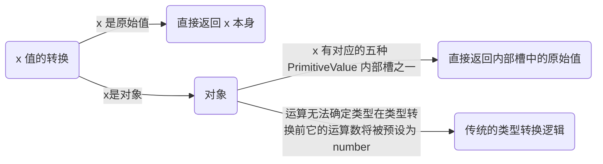

# JavaScript 核心原理解析

<!-- @import "[TOC]" {cmd="toc" depthFrom=1 depthTo=6 orderedList=false} -->

<!-- code_chunk_output -->

- [JavaScript 核心原理解析](#javascript-核心原理解析)
  - [一. JS 语言的基础](#一-js-语言的基础)
    - [1.1 规范引用](#11-规范引用)
      - [1.1.1 delete 删除的是表达式的引用类型的结果](#111-delete-删除的是表达式的引用类型的结果)
      - [1.1.2 规范中的引用](#112-规范中的引用)
      - [1.1.3 引用的作用](#113-引用的作用)
    - [1.2 声明语句与语法改变了 JS 语言核心性质](#12-声明语句与语法改变了-js-语言核心性质)
      - [1.2.1 声明](#121-声明)
      - [1.2.2 赋值](#122-赋值)
      - [1.2.3 变量泄露：向一个不存在的变量名赋值](#123-变量泄露向一个不存在的变量名赋值)
    - [1.3 表达式执行与语句声明之间的区别](#13-表达式执行与语句声明之间的区别)
    - [1.4 名字的使用](#14-名字的使用)
      - [1.4.1 解析 export](#141-解析-export)
      - [1.4.2 导出语句的处理逻辑](#142-导出语句的处理逻辑)
      - [1.4.3 导出名字和导出值的差异](#143-导出名字和导出值的差异)
      - [1.4.4 匿名函数表达式的执行结果](#144-匿名函数表达式的执行结果)
      - [1.4.5 知识补充](#145-知识补充)
    - [1.5 语句中的块级作用域](#15-语句中的块级作用域)
      - [1.5.1 块级作用域的特例](#151-块级作用域的特例)
      - [1.5.2 for 循环的代价](#152-for-循环的代价)
  - [二. JS 的执行过程](#二-js-的执行过程)
    - [2.1 中断语句](#21-中断语句)
      - [2.1.1 用中断（Break）代替跳转](#211-用中断break代替跳转)
      - [2.1.2 执行现场的回收](#212-执行现场的回收)
      - [2.1.3 语句执行的意义](#213-语句执行的意义)
      - [2.1.4 中断语句的特殊性](#214-中断语句的特殊性)
    - [2.2 JS 中特殊的可执行结构](#22-js-中特殊的可执行结构)
      - [2.2.1 参数表](#221-参数表)
      - [2.2.2 扩展风格的参数表](#222-扩展风格的参数表)
      - [2.2.3 模板赋值](#223-模板赋值)
      - [2.2.4 模板字面量](#224-模板字面量)
    - [2.3 函数式语言的核心抽象：函数与表达式的同一性](#23-函数式语言的核心抽象函数与表达式的同一性)
      - [2.3.1 函数的一体两面（一等公民）](#231-函数的一体两面一等公民)
      - [2.3.2 两个语义组件](#232-两个语义组件)
      - [2.3.3 参数类型](#233-参数类型)
      - [2.3.4 传入参数的处理](#234-传入参数的处理)
      - [2.3.5 非简单参数的无初值绑定](#235-非简单参数的无初值绑定)
    - [2.4 重构函数语义组件-执行体](#24-重构函数语义组件-执行体)
      - [2.4.1 递归与迭代](#241-递归与迭代)
      - [2.4.2 迭代对执行过程的重造和使用](#242-迭代对执行过程的重造和使用)
      - [2.4.3 内部迭代过程](#243-内部迭代过程)
      - [2.4.4 管理循环与异常处理](#244-管理循环与异常处理)
    - [2.5 重构函数语义组件-结果和参数](#25-重构函数语义组件-结果和参数)
      - [2.5.1 将迭代过程展开](#251-将迭代过程展开)
      - [2.5.2 逻辑的重现](#252-逻辑的重现)
      - [2.5.3 .next() 方法](#253-next-方法)
      - [2.5.4 对传入参数的改造](#254-对传入参数的改造)
    - [2.6 ECMAScript 规范](#26-ecmascript-规范)
      - [2.6.1 最简单语法榜](#261-最简单语法榜)
      - [2.6.2 在语句之外看语句](#262-在语句之外看语句)
      - [2.6.3 值的覆盖与读取](#263-值的覆盖与读取)
      - [2.6.4 引用的值](#264-引用的值)
      - [2.6.5 完成状态](#265-完成状态)
  - [三. JS 面向对象编程体系中最核心的一些设计](#三-js-面向对象编程体系中最核心的一些设计)
    - [3.1 JS 面向对象系统](#31-js-面向对象系统)
      - [3.1.1 JS 1.0~1.3 中的对象](#311-js-1013-中的对象)
      - [3.1.2 属性访问与可见性](#312-属性访问与可见性)
      - [3.1.3 从原型中继承来的属性](#313-从原型中继承来的属性)
      - [3.1.4 字面量与标识符](#314-字面量与标识符)
      - [3.1.5 属性存取的不确定性](#315-属性存取的不确定性)
    - [3.2 从构造器到类](#32-从构造器到类)
      - [3.2.1 基于对象的 JS](#321-基于对象的-js)
      - [3.2.2 类与构造器](#322-类与构造器)
      - [3.2.3 ES6 之后的类](#323-es6-之后的类)
      - [3.2.4 创建 this 的顺序问题](#324-创建-this-的顺序问题)
      - [3.2.5 隐式的构造方法](#325-隐式的构造方法)
      - [3.2.6 用户返回 new 的结果](#326-用户返回-new-的结果)
    - [3.3 super](#33-super)
      - [3.3.1 super 出现的原因](#331-super-出现的原因)
      - [3.3.2 super 指向父类](#332-super-指向父类)
      - [3.3.3 super.xxx() 中的 this 值](#333-superxxx-中的-this-值)
      - [3.3.4 super() 中的父类构造方法](#334-super-中的父类构造方法)
      - [3.3.5 构造方法不是静态的](#335-构造方法不是静态的)
    - [3.4 做框架设计的基本功：写一个根类](#34-做框架设计的基本功写一个根类)
      - [3.4.1 类的构建过程](#341-类的构建过程)
      - [3.4.2 非派生类是不用调用 super() 的](#342-非派生类是不用调用-super-的)
      - [3.4.3 定制的构造方法](#343-定制的构造方法)
    - [3.5 JS 中的对象本质](#35-js-中的对象本质)
      - [3.5.1 对象的历史](#351-对象的历史)
      - [3.5.2 两种数据结构](#352-两种数据结构)
      - [3.5.3 解构](#353-解构)
      - [3.5.4 两种数据结构的统一](#354-两种数据结构的统一)
    - [3.6 原子对象](#36-原子对象)
      - [3.6.1 null 值](#361-null-值)
      - [3.6.2 null 类型](#362-null-类型)
      - [3.6.3 属性表](#363-属性表)
      - [3.6.4 派生自原子的类](#364-派生自原子的类)
      - [3.6.5 一般函数 / 构造器](#365-一般函数--构造器)
      - [3.6.6 原子行为](#366-原子行为)
  - [四. JS 作为动态语言的主要特性](#四-js-作为动态语言的主要特性)
    - [4.1 动态类型系统](#41-动态类型系统)
      - [4.1.1 从值 x 到引用](#411-从值-x-到引用)
      - [4.1.2 从引用 x 到值](#412-从引用-x-到值)
      - [4.1.3 值与值的转换](#413-值与值的转换)
        - [4.1.3.1 简单的类型转换](#4131-简单的类型转换)
        - [4.1.3.2 隐式转换](#4132-隐式转换)
        - [4.1.3.3 两个操作数相加](#4133-两个操作数相加)
        - [4.1.3.4 预期](#4134-预期)
      - [4.1.4 其他转换](#414-其他转换)
        - [4.1.4.1 显式转换与隐式转换](#4141-显式转换与隐式转换)
        - [4.1.4.2 字符串在 “+” 号中的优先权](#4142-字符串在--号中的优先权)
        - [4.1.4.3 Date() 的特例](#4143-date-的特例)

<!-- /code_chunk_output -->

**JS 是一门多范型语言，也称为混合范型语言**。JS 的简单来自于此，复杂也来自于此；生存能力来自于此，抨击诟病也来自于此。

JS 主要包括 5 个方面的语言特性：

- 结构化编程
- 面向对象编程
- 动态语言
- 函数式语言
- 并行语言

所谓的语言特性，其实是对语言的核心抽象概念的语法表现。

## 一. JS 语言的基础

“物理到逻辑” 的映射。

### 1.1 规范引用

早期的 JS 在推广时，仍然采用传统的数据类型的分类方法，也就是说，它宣称自己同时支持值类型和引用类型的数据，并且，所谓值类型中的字符串是按照引用来赋值和传递引用（而不是传递值）的。

JS 强行定义了 “Object 和 Function 就是引用类型”。对象和函数也就可以理解为：它们按引用来传递和使用。绝大多数情况下，这样解释起来是行得通的。但是到了 `delete` 运算这里，就不行。

因为这样一来，`delete 0` 就是删除一个值，而 `delete x` 就既可能是删除一个值，也可能是删除一个引用。然而，当时 JS 又同时约定：那些在 global 对象上声明的属性，就 “等同于” 全局变量。于是，这就带来了第三个问题：`delete x` 还可能是删除一个 global 对象上的属性。而它在执行这个操作的时候，看起来却像是一个全局变量。

`delete` 这个运算的表面意思，是该运算试图销毁某种东西。然而，`delete 0` 中的 0 是一个具体的、字面量表示的 “值”。一个字面量值 “0” 如何在现实世界中销毁呢？假定它销毁了，那是不是说，在这个语言当前的运行环境中，就不能使用 0 这个值了呢？显然，这不合理。所以，JS 认为 “**所有删除值的 delete 就直接返回 true**”，表明该行为过程中没有异常。

`delete` 出现的时代并没有结构化异常处理（即 try/catch 语句）。所以，通过函数调用中返回 true 来表明 “没有异常”，其实是很常规的做法。然而，返回值只表明执行过程中没有异常，但实际的执行行为是 “什么也没发生”。显然不可能真的将 “0” 从执行系统中清理出去。

那么接下来，就还剩下删除变量和删除属性。由于全局变量实际上是通过全局对象的属性来实现的，因此删除变量也就存在识别这两种行为的必要性。例如：

```js
delete x;
```

出于 JS 是动态语言这项特性，从根本上来说，是没有办法在语法分析期来判断 x 的性质的。所以现在，需要有一种方法在运行期来标识 x 的性质，以便进一步地处理它。这就导致了一种新的 “引用” 类型呼之欲出。

#### 1.1.1 delete 删除的是表达式的引用类型的结果

对于一门编译型语言来说，所谓 “0”，就是上面所述的一个值，它可以是基础值（Primitive values），也可以是数值类型。但如果将这个问题上升到编译之前的、所谓语法分析的阶段，那么 “0” 就会被称为一个记号（Tokens）。一个记号是没有语义的，记号既可以是语言能识别的，也可以是语言不能识别的。唯有把这二者同时纳入语言范畴，那么这个语言才能识别所谓的 “语法错误”。

`delete` 不仅仅是要操作 0 或 x 这样的单个记号或标识符（例如变量）。因为这个语法实际起作用的是一个对象的属性，也就是 “删除对象的成员”。那么它真正需要的语法其实是：

```js
delete obj.x;
```

只不过因为全局对象的成员可以用全局变量的形式来存取，所以它才能这样写：

```js
delete x;
```

所以，这正好将之前所认识的倒转过来，是删除 x 这个成员，而不是删除 x 这个值。不过有一点是没错的：既然没办法表达异常，而 delete 0 又不产生异常，那么它自然就该返回 true。

然而，如果理解了 `delete obj.x`，那么就一定会想到：`obj.x` 既不是引用类型，也不是值类型，它与 `typeof(x)` 识别的所有类型都无关。因为，它是一个表达式。所以，**delete 这个操作的正式语法设计并不是 “删除某个东西”，而是 “删除一个表达式的结果”**：

**表达式的结果**
**在 JS 中表达式是一个很独特的东西，所有一切表达式运算的终极目的都是为了得到一个值**。然后再用另外一些操作将这个值输出出来，例如变成网页中的一个元素（element）。这是 JS 语言创生的原力，也是它的基础设计。也只是因为有了这种设计，它才变得既像面向对象的，又像函数式语言的样子。

这个表达式得到的值，才是 delete 这个操作要删除的东西。在 JS 中，有两个东西可以被执行并存在执行结果：

- **语句**

  比如用 eval() 来执行一个字符串，那么实际上，执行的是一个语句，并返回了语句的值。

- **表达式**

  如果使用一对括号来强制一个表达式执行，那么这个括号运算得到的，就是这个表达式的值。表达式的值，在 ECMAScript 的规范中，称为 “引用”。这是一种称为 “规范类型” 的东西。

#### 1.1.2 规范中的引用

实际上这个概念出现得很早。从 JS 1.3 开始，ECMAScript 规范就在语言定义的层面，正式地将上述的天坑补起来，推出了 “（真正的）引用类型”。

但是，由于这个时候规范的影响力在开发人员中并不那么大，所以开发人员还是习惯性地将对象和函数称为引用，而其它类型就称为值，并且继续按照传统的理解来解释 JS 中对数据的处理。

这种情况下，一个引用只是在语法层面上表达 “它是对某种语法元素的引用”，而与在执行层面的值处理或引用处理没关系。所以，下面这行简短的语句：

```js
delete 0;
```

实际上是在说：JS 将 0 视为一个表达式，并尝试删除它的求值结果。所以，现在这里的 0，不是值类型的数据，而是一个表达式运算的结果。而在进一步的删除操作之前，JS 需要检测这个 Result 的类型：

- 如果它是值，则按照传统的 JS 的约定返回 true。
- 如果它是一个引用，那么对该引用进行分析，以决定如何操作。

ECMAScript 约定：任何表达式计算的结果要么是一个值，要么是一个引用。并且需要留意的是，在这个描述中，所谓对象，其实也是值。准确地说，是 “非引用类型”。例如：

```js
delete {};
```

那么显然，这里要删除的一对大括号是表示一个字面量的对象，当它被作为表达式执行的时候，结果也是一个值。这也是这类表达式被称为 “单值表达式” 的原因，这里并没有所谓的 “引用”。

可以这样，非常细致而准确地解释这一行代码：_单值表达式的运算结果返回那个 “对象字面量” 的单值。然后，delete 运算发现它的操作数是 “值/非引用类型”，就直接返回了 true。所以，什么也没有发生。_

在 JS 的内部，“引用” 是可以转换为 “值”，以便参与值运算的。因为表达式的本质是求值运算，所以引用是不能直接作为最终求值的操作数的。这依赖于一个非常核心的、称为 “GetValue()” 的**内部操作**。所谓内部操作，也称为内部抽象操作（internal abstract operations），是 ECMAScript 描述一个符合规范的引擎在具体实现时应当处理的那些行为。

**GetValue() 是从一个引用中取出值来的行为**。比如说下面这行代码：

```js
x = x;
```

上面的表达式其实是一个赋值表达式， “引用 x 赋值给引用 x” 其实这在语法层面来解释是非常直接的：

> 所有赋值操作的含义，是将右边的 “值”，赋给左边用于包含该值的 “引用”。

上面的 x=x，其实就是被翻译成：

```js
x = GetValue(x);
```

JS 识别两个 x 的不同的方法被称为**手性**，即是所谓 “左手端（lhs, left hand side）” 和 “右手端（rhs）”。它本来是用来描述自然语言的语法中，一个修饰词应该是放在它的主体的前面或是后面的。而在程序设计语言中，它用来说明一个记号（Token）是放在了赋值符号（例如 “=” 号）的左边或是右边。

> x 放在左边作为 lhs，它是引用。放在右边作为 rhs，就是值。

所以 x=x 的语义并不是 “x 赋给 x”，而是 “**把值 x 赋给引用 x**”。因此 “delete x” 归根到底，**是在删除一个表达式的、引用类型的结果**，而不是在删除 x 表达式，或者这个删除表达式的值。

在 JS 中的 delete 是一个很罕见的、能直接操作 “引用” 的语法元素。由于这里的 “引用” 是在 ECMAScript 规范层面的概念，因此在 JS 语言中能操作它的语法元素其实非常少。

#### 1.1.3 引用的作用

“属性存取运算符（.）” 返回一个关于 “x” 的引用，然后它可以作为下一个操作符（例如函数调用运算 “()”）的左手端来使用，这才有了著名的 “对象方法调用” 运算：

```js
obj.x();
```

因为在对象方法调用的时候，函数 x() 是来自于 obj.x 这个引用的，所以这个引用将 obj 这个对象传递给 x()，这才会让函数 x() 内部通过 this 来访问到 obj。

根本上来说，如果 obj.x 只是值，或者它作为右手端，那么它就不能 “携带” obj 这个对象，也就完成不了后续的方法调用操作。

> 对象存取 + 函数调用 = 方法调用

这是 JS 通过连续表达式运算来实现新的语义/语法的经典示例。而 “连续运算” 其实是函数式运算范式的基本原则。也就是说，obj.x() 是在 JS 中集合了 “引用规范类型操作” “函数式” “面向对象” 和 “动态语言” 等多种特性于一体的一个简单语法。

而它对语言的基础特性的依赖，就在于：

- delete 0 中的这个 0 是一个表达式求值
- delete x 中的 x 是一个引用
- delete obj.x 中 obj.x 是一组表达式连续运算的结果/引用

当 x 是全局对象 global 的属性时，所谓 delete x 其实只需要返回 global.x 这个引用就可以了。而当它不是全局对象 global 的属性时，那么就需要从当前环境中找到一个名为 x 的引用。找到这两种不同的引用的过程，称为 ResolveBinding；而这两种不同的 x，称为不同环境下绑定的标识符/名字。

### 1.2 声明语句与语法改变了 JS 语言核心性质

#### 1.2.1 声明

至今为止，除标签声明之外，JS 中一共只有六条声明用的语句。

> **注意**：所有真正被定义 “声明” 的语法结构都一定是 “语句”，并且都用于声明一个或多个标识符。这里的标识符包括变量、常量等。

严格意义上讲，JS 只有变量和常量两种标识符，六条声明语句中：

- `let x`：声明变量 x。不可在赋值之前读。
- `const x`：声明常量 x。不可写。
- `var x`：声明变量 x。在赋值之前可读取到 undefined 值。
- `function x`：声明变量 x。该变量指向一个函数。
- `class x`：声明变量 x。该变量指向一个类（该类的作用域内部是处理严格模式的）。
- `import x`：导入标识符并作为常量（有多种声明标识符的模式和方法）。

除了这六个语句之外，还有两个语句有潜在的声明标识符的能力，不过它们并不是严格意义上的声明语句（声明只是它们的语法效果）。这两个语句是指：

- `for (var|let|const x)`：for 语句有多种语法来声明一个或多个标识符，用作循环变量。
- `try … catch (x)`：catch 子句可以声明一个或多个标识符，用作异常对象变量。

声明是在语法分析阶段就处理的，并且因此它会使得当前代码上下文在正式执行之前就拥有了被声明的标识符，例如 x。

这其实非常有趣，因为这表明 **JS 虽然被称为是 “动态语言”，但确实是拥有静态语义的**。而在 JS 的早期，这个静态语义其实并没有处理得太好，一个典型的问题就是所谓的 “变量提升”。也就是可以在变量声明之前访问该变量。例如：

```js
console.log(x); // undefined
var x = 100;
console.log(x); // 100
```

由于标识符是在用户代码执行之前就已经由静态分析得到，并且创建在环境中，因此 let 声明的变量和 var 声明的变量在这一点上没有不同：它们都是在读取一个 “已经存在的” 标识符名。

在 ES6 之后出现的 let/const 变量在 “声明（和创建）一个标识符” 这件事上，与 var 并没有什么不同，只是 JS 拒绝访问还没有绑定值的 let/const 标识符而已。

ES6 之前：JS 是允许访问还没有绑定值的 var 所声明的标识符的。这种标识符后来统一约定称为 “**变量声明**（varDecls）”，而 “let/const” 则称为 “**词法声明**（lexicalDecls）”。JS 环境在创建一个 “变量名（varName in varDecls）” 后，会为它初始化绑定一个 undefined 值，而 “词法名字（lexicalNames）” 在创建之后就没有这项待遇，所以它们在默认情况下就是 “还没有绑定值” 的标识符。

> 6 种声明语句中的函数是按变量声明的规则声明的；类的内部是处于严格模式中，它的名字是按 let 来处理的，而 import 导入的名字则是按 const 的规则来处理的。所以，**所有的声明本质上只有三种处理模式：var 变量声明、let 变量声明和 const 常量声明**。

#### 1.2.2 赋值

如果是在一门其它的（例如编译型的）语言中，“为变量 x 绑定一个初值” 就可能实现为 “在创建环境时将变量 x 指向一个特定的初始值”。这通常是静态语言的处理方法。JS 是门动态的语言，所以它的 “绑定初值” 的行为是通过动态的执行过程来实现的，也就是赋值操作。

在 JS 中，不是 `值 = 变量` 而是将右操作数（的值）赋给左操作数（的引用）：

```js
lRef = rValue;
```

它的严格语法表达是：

```txt
LeftHandSideExpression < = | AssignmentOperator >
AssignmentExpression
```

也就是说，在 JS 中，一个赋值表达式的左边和右边其实 “都是” 表达式。

#### 1.2.3 变量泄露：向一个不存在的变量名赋值

这是从 JS 1.0 开始就遗留下来的一个巨坑，也就是 “变量泄漏” 问题。这在早期的 JS 中的确是一个好用的特性：如果向一个不存在的变量名赋值，那么 JS 会在全局范围内创建它。

也就是说，代码中不需要显式地声明一个变量了，变量可以随用随声明，也不用像后来的 let 语句一样，还要考虑在声明语句之前能不能访问的问题了。这非常简单，在少量的代码中也相当易用。

但是，如果代码规模扩大，变成百千万行代码，那么 “一个全局变量是在哪里声明和创建的” 就变成一个非常要紧的问题。

如果随时都可能泄露一个代码给全局，或者随时都可能因为忘记本地的声明而读写了全局变量，那对调试除错将是一场灾难。另外，晚一些出现的运行期优化技术也不能很好地处理这种情况。所以从 ECMAScript5 开始的严格模式就禁止了这种特性，试图避免用户将变量泄露到全局环境。然而，即使在严格模式下这种漏露也未能避免，被称为 “**间接执行**”。

这种变量声明的发生是因为在早期设计中，JS 的全局环境是引擎使用一个称为 “**全局对象**” 东西管理起来的。

这个全局对象几乎类似或完全等同于一个普通对象。只不过，JS 引擎将全局的一些默认对象、运行期环境的原生对象等东西都初始化在这个全局对象的属性中，并使用这个对象创建了一个称为 “**全局对象闭包**” 的东西，从而得到了 JS 的全局环境。

早期的 JS 的引擎实现非常简洁，许多基础的技术组件都是直接复用的，例如这里的所谓全局环境、全局闭包，或者全局对象的实现方法，就与 “with 语句” 的效果完全相同——他们是相互复用的。

当向一个不存在的变量赋值的时候，由于全局对象的属性表是可以动态添加的，因此 JS 将变量名作为属性名添加给全局对象。而访问所谓全局变量时，就是访问这个全局对象的属性。因此，实际效果就变成了 “可以动态地向全局环境中添加一个变量”。并且，可以删除掉这个动态添加的 “变量”，因为本质上就是在删除全局对象的属性。

ES6 的全局环境为了兼容旧的 JS 语言设计，所以仍然是通过将全局对象初始化为这样的一个全局闭包来实现的。但是为了得到一个 “尽可能” 与其它变量环境相似的声明效果（varDecls），ECMAScript 规定在这个全局对象之外再维护一个变量名列表（varNames），所有在静态语法分析期或在 eval() 中使用 var 声明的变量名就被放在这个列表中。然后约定，这个变量名列表中的变量是 “直接声明的变量”，不能使用 delete 删除。

于是，得到了这样的一种结果：

```js
// a 和 x 都是 global 的属性
var a = 100;
x = 200;

Object.getOwnPropertyDescriptor(global, 'a'); // { value: 100, writable: true, enumerable: true, configurable: false }
Object.getOwnPropertyDescriptor(global, 'x'); // { value: 200, writable: true, enumerable: true, configurable: true }

// a 不能删除，x 可以被删除
delete a; // false
delete x; // true

// 检查
console.log(a); // 100
console.log(x); // ReferenceError: x is not defined
```

所以，表面看起来 “泄漏到全局的变量” 与使用 var 声明的都是全局变量，并且都实现为 global 的属性，但事实上它们是不同的。并且当 var 声明发生在 eval() 中的时候，这一特性又还有所不同，例如：

```js
// 使用eval声明
eval('var b = 300');

// 它的性质是可删除的
Object.getOwnPropertyDescriptor(global, 'b').configurable; // true

// 检测与删除
b; // 300
delete b; // true
b; // ReferenceError: b is not defined
```

这种情况下使用 var 声明的变量名尽管也会添加到 varNames 列表，但它也可以从 varNames 中移除（这是唯一一种能从 varNames 中移除项的特例，而 lexicalNames 中的项是不可移除的）。

### 1.3 表达式执行与语句声明之间的区别

JS 总是严格按照从左至右的顺序来计算表达式。

```js
w = x + y * z;
```

上面的代码中将首先计算子表达式 w，然后计算 x、y 和 z；然后，y 的值和 z 的值相乘，再加上 x 的值；最后将其赋值给表达式 w 所指代的变量或属性。

任何运算的操作数都是严格从左至右计算的，因此 x 先被处理，然后才会尝试对 y 和 z 求乘积。这里的 “x 先被处理” 是 JS 中的一个特异现象，即：**一切都是表达式，一切都是运算**。

这一现象在语言中是函数式的特性，类似 “一切被操作的对象都是函数求值的结果，一切操作都是函数”。

```js
var a = { n: 1 };
a.x = a = { n: 2 };
console.log(a.x); // undefined
```

上面代码中的第二行是两个连续赋值的表达式：

1. **a.x 总是最先被计算求值的**（从左至右）

   “a.x” 也是一个表达式，其结果是一个 “引用”。这个表达式 “a.x” 本身也要再计算它的左操作数，也就是 “a”。完整地讲，“a.x” 这个表达式的语义是：

   - 计算单值表达式 a，得到 a 的引用。
   - 将右侧的名字 x 理解为一个标识符，并作为 “.” 运算的右操作数。
   - 计算 “a.x” 表达式的结果。

   表达式 “a.x” 的计算结果是一个引用，因此通过这个引用保存了一些计算过程中的信息——例如它保存了 “a” 这个对象，以备后续操作中 “可能会” 作为 this 来使用。所以现在，在整行代码的表达式计算过程中，“a” 是作为一个**引用**被暂存下来了的。由第一行代码可知，这时保存在 “a.x” 这个引用中的 “a” 是当前的 “{n: 1}” 这个对象。

2. **再执行 `a =`**

   ```js
   var a = {n:1};
   a.x =     // <- `a` is {n:1}
         a = // <- `a` is {n:1}
   // ...
   ```

   这里的 “a = …” 中的 a 仍然是当前环境中的变量，与上一次暂存的值是相同的。

3. **第一次赋值**

   ```js
   // ...
   a.x = // <- `a` is {n:1}
     a =
       // <- `a` is {n:1}
       { n: 2 }; // 赋值，覆盖当前的左操作数（变量`a`）
   ```

   于是，左操作数 a 作为一个引用被覆盖了，这个引用仍然是当前上下文中的那个变量 a。因此，这里真实地发生了一次 `a = {n:2}`。

   但是，表达式最开始被保留在 “一个结果” 中的引用 a 不会更新。因为那是一个 “**运算结果**”，这个结果有且仅有引擎知道，它现在是一个引擎才理解的“**引用**（规范对象）”，对于它的可能操作只有：

   - 取值或置值（GetValue/PutValue）
   - 作为一个引用向别的地方传递等

4. **第二次赋值**

   现在，在整个语句行的最左侧 “空悬” 了一个已经求值过的 “a.x”。当它作为赋值表达式的左操作数时，它是一个被赋值的引用（这里是指将 a.x 的整体作为一个引用规范对象）。而它作为结果所保留的 “a”，可以从下面的代码看出来，是在被第一次赋值操作覆盖之前的、那个 “原始的变量 a”。

   ```js
   // 声明“原始的变量a”
   var a = { n: 1 };

   // 使它的属性表冻结（不能再添加属性）
   Object.freeze(a);

   try {
     a.x = a = { n: 2 };
   } catch (x) {
     // 异常发生，说明第二次赋值 “a.x = ...” 中操作的`a`正是原始的变量a
     console.log('第二次赋值导致异常.');
   }

   // 第一次赋值是成功的
   // a {n: 2}
   console.log(a.n); // 2
   ```

   而原始变量 a 在第一次赋值时被废弃了，所以第二次赋值是无意义的。最后 a 的值为 `{n: 2}`。

### 1.4 名字的使用

**ECMAScript 6 模块是静态装配的**，而传统的 Node.js 模块却是动态加载的。因而两种模块的实现效果与处理逻辑都大相径庭。

有且仅有六种[声明语法](#121-声明)，而本质上 export 也就只能导出这六种声明语法所声明的标识符，并且在导出时将它们统一称为 “名字”。

在语言设计中，所谓 “标识符” 与 “名字” 是有语义差别的，export 将之称为名字，就意味着这是一个标识符的子集。类似的其它子集也是存在的，例如 “保留字是标识符名，但不能用作标识符（A reserved word is an IdentifierName that cannot be used as an Identifier）”。

在 JS 语言的设计上，除了那些预设的标点符号（例如大括号、运算符之类），以及部分的保留字和关键字之外，事实上用户代码可以书写的只有三种东西。这包括：

- **标识符**：（通常是）一个**名字**。
- **字面量**：表明由它的字面含义所决定的一个**值**。
- **模板**：一个可计算结果的字符串**值**。

所以，如果在这个层面上解构一份 JS 代码，那么所能书写/声明的，就一定只有 “名字和值”。

这个结论是非常非常关键的。因为 export 事实上就只能导出 “名字和值”。然而一旦它能导出 “名字和值”，也就意味着它能导出一个模块中的 “全部内容”，因为如上所面所讲的：“名字和值” 正是所书写的代码的全部。

> 语言设计层面上来讲，代码就是文本，是没有应用逻辑的。而所写的代码绝大多数都是应用逻辑，当去除掉这些应用逻辑之后，那些剩下的死气沉沉的、纯粹的符号，才是语言层面的所谓 “代码文本”。去掉了执行逻辑所表达的那些行为、动作、结果和用户操作的代码，就是静态代码了。而事实上，ES6 中的模块就是用来理解程序中的那些静态代码的，也就是那些没有任何生气的字符和符号。因此它也就只能理解上面的 6 种声明，以及它们声明出来的那些 “名字和值”。

#### 1.4.1 解析 export

将所有 export 语法分类，其实也就只有两个大类。如下：

```js
// 导出 “（声明的）名字”
export <let/const/var> x ...;
export function x() ...
export class x ...
export {x, y, z, ...};

// 导出 “（重命名的）名字”
export { x as y, ...};
export { x as default, ... };

// 导出 “（其它模块的）名字”
export ... from ...;

// 导出 “值”
export default <expression>
```

对于最后这种形式，也就是 “（导出）值” 的形式，事实上是非常特殊的。因为如同在上面所讲过的，要导出一个模块的全部内容就必须导出 “（全部的）名字和值”，然而纯粹的值没有名字，于是也就没法访问了，所以这就与 “导出点什么东西” 的概念矛盾了。

因为这个东西要是没名字，也就连 “自己是什么” 都说不清楚，也就什么也不是了。

所以 ECMAScript 6 模块约定了一个称为 "default" 的名字，用于来导出当前模块中的一个 “值”。显然的，由于所谓 “值” 是表达式的运算结果，所以这里的语法形式就是：

```js
export default <expression>;
```

其中的 “expression” 就是用于求值的，以便得到一个结果（Result）并导出成为默认的名字 “default”。这里有两个便利的情况：

- 在 JS 中，一般的字面量也是值、也是单值表达式，因此导出这样一个字面量也是合法的：

  ```js
  export default 2;  // as state of the module, etc.
  export default "some messages"; // data or information
  ```

- 因为 JS 中对象也是字面量、也是值、也是单值表达式。而对象成员可以组合其它任何数据，所以通过上述的语法几乎可以导出当前模块中全部的 “值”（亦即是任何可以导出的数据）。例如：

  ```js
  var varName = 100;
  export default {
    varName, // 直接导出名字
    propName: 123, // 导出值
    funcName: function () {}, // 导出函数
    foo() {
      // 或导出与主对象相关联的方法
      // method
    }
  };
  ```

所以，事实上 `export default ...` 虽然简单，却是对 “导出名字” 的非常必要的补充。这样一来，用户既可以导出那些有名字的数据，也可以导出那些没有名字的数据，即一个模块中所有的数据都可以被导出了。

#### 1.4.2 导出语句的处理逻辑

一个 export 可以理解为这样两个步骤：

1. 导出一个名字
2. 为上述名字绑定一个值

这两个步骤其实与使用 “var x = 100” 来声明一个变量的过程是一致的。因此以如下代码为例（六种声明在名字处理上是类似的）：

```js
export var x = 100;
```

在导出的时候，其实是先在 “某个名字表” 中登记一个 “名字 x” 就可以了。这个过程也就是 JS 在模块装载之前对 export 所做的全部工作。不过如果是从另一端（亦即是 import 语句）的角度看过来，那么就会多出来一个步骤。import 语句会（例如 import {x} from ...）：

1. （与 export 类似）按照语法在当前模块中声明名字，例如上面的 x。
2. 添加一个当前模块对目标模块的依赖项。

有了上述的第二步操作，JS 就可以依据所有它能在静态文本中发现的 import 语句来形成模块依赖树，最后就可以找到这个模块依赖树最顶端的根模块，并尝试加载。

所以关键的是，在 “模块 export/import” 语法中，JS 是依赖 import 来形成依赖树的，与 export 无关。但是直到目前为止（意思是直到找到所有导入和导出的名字，并完成所有模块的装配的现在为止），没有任何一行用户的 JS 代码是被执行过的。至于原因，就是上面讲的：export/import 过程中，源代码只被理解为静态的、没有逻辑的 “代码文本”。那么既然 “没有逻辑”，就不可能执行类似于 `export default <expression>` 中的 expression。表达式就是程序的计算逻辑。

**在处理 export/import 语句的全程，没有表达式被执行**。

#### 1.4.3 导出名字和导出值的差异

```js
export default <expression>;
```

既然其中的 “expression” 在导入导出中完全不起作用（不执行），那么这行语句又能做什么呢？事实上，这行语句与直接 “导出一个名字” 并没有任何区别。它与这样的语法相同：

```js
export var x = 100;
```

它们都只是导出一个名字，只是前者导出的是 “default” 这个特殊名字，而后者导出的是一个变量名 “x”。它们都是确定的、符合语法规则的标识符，也可以表示为一个字符串的字面文本。它们的作用也完全一致：就是在前面所说的 “某个名字表” 中添加 “一个登记项” 而已。

所以，导出名字与导出值本质上并没有差异，在静态装配的阶段，它们都只是表达为一个名字而已。

然后，也正是如同 `var x = 100;` 在执行阶段需要有一个将 “值 100” 绑定给 “变量 x（的引用）” 的过程一样，这个 `export default ...;` 语句也需要有完全相同的一个过程来将它后面的表达式（expression）的结果绑定给 “default” 这个名字。如果不这么做，那么 “export default” 在语义上的就无法实现导出名字 “default” 了——在静态装配阶段，名字 “default” 只是被初始化为一个 “单次绑定的、未初始化的标识符”。

所以现在就可以在语义上模拟这样一个过程，即：

```js
export default function() {}

// 类似于如下代码
//（但并不在当前模块中声明名字 "default"）
export var default = function() {}
```

可以进一步地模拟 JS 后续的装配过程。这个过程其实非常简单：

- 找到并遍历模块依赖树的所有模块（这个树是排序的），然后
- 执行这些模块最顶层的代码（Top Level Module Evaluation）。

在执行到上述 var default ....（或类似对应的 export default ...）语句时，执行后面的表达式，并将执行结果（Result）绑定给左侧的那个变量就可以了。如此，直到所有模块的顶层代码都执行完毕，那么所有的导出名字和它们的值也都必然是绑定完成了的。

同样，由于 import 的名字与 export 的名字只是一个映射关系，所以 import 的名字（所对应的值）也就初始化完成了。

**所谓模块的装配过程，就是执行一次顶层代码而已**。

#### 1.4.4 匿名函数表达式的执行结果

function() {} 这个匿名函数表达式，按照 JS 的约定，可以理解为一个函数的 “字面量（值）”。理解 “字面量值” 这个说法是很有意义的，因为它意味着它没有名字。

“字面量（值）没有名字” 就意味着执行这个 “单值表达式” 不会在当前作用域中产生一个名字，即使这个函数是具名的，也必然是如此。所以，这才带来了 JS 中的经典示例，即：**具名函数作为表达式时，名字在块级作用域中无意义**。例如：

```js
// 具名函数作为表达式
var x1 = function x2() {
  // ...
};

// 具名函数（声明）
function x3() {
  // ...
}
```

上面的例子中，x1~3 都是具有不同的语义的。其中，x2 是不会在当前作用域（示例中是全局）中登记为名字。而使用下面的语法：

```js
export default function() { }
export default function x() { }
```

导出一个匿名函数，或者一个具名的函数的时候，这两种情况下是不同的。但无论它是否具名，它们都是不可能在当前作用域中绑定给 default 这个名字，作为这个名字对应的值的。

这段处理逻辑被添加在语法：ExportDeclaration: export default AnonymousFunctionDefinition;

> ECMAScript 是将这里导出的对象称为 _Expression_/AssignmentExpression，这里所谓 _AnonymousFunctionDefinition_ 则是其中 _AssignmentExpression_ 的一个具体实例。

的执行（Evaluation）处理过程中。也就是说当执行这行声明时，如果后面的表达式是匿名函数声明，那么它将强制在当前作用域中登记为 “default” 这样一个特殊的名字，并且在执行时绑定该匿名函数。所以，尽管语义上需要将它登记为类似 var default ...所声明的名字 “default”，但事实上它被处理成了一个不可访问的中间名字，然后影射给该模块的 “某个名字表”。

> **注意**：这是一个**匿名函数定义**（AnonymousFunctionDefinition），而不是一个匿名函数表达式（Anonymous FunctionExpression）。一般函数的语句则被称为声明（或更严谨地称为宣告，Function Declarations）。而所谓匿名函数定义，其本身是表述为：`aName = FunctionExpression`。
> 或类似于此的语法风格的。它可以用在一般的赋值表达式、变量声明的右操作数，以及对象声明的成员初始值等等位置。在这些位置上，该函数表达式总是被关联给一个名字。一方面，这种关联不是严格意义上的 “名字 -> 值” 的绑定语义；另一方面，当该函数关联给名字（aName）时，JS 又会反向地处理该函数（作为对象 f）的属性 f.name，使该名字指向 aName。

所以，“export default function() {}”，在严格意义上来说：**它并不是导出了一个匿名函数表达式，而是导出了一个匿名函数定义**（Anonymous Function Definition）。

因此，该匿名函数初始化时才会绑定给它左侧的名字 “default”，这会导致 import f from ... 之后访问 f.name 值会得到 “default” 这个名字。

#### 1.4.5 知识补充

关于 export 还有一些补充的知识点：

- export ... 语句通常是按它的词法声明来创建的标识符的，例如 `export var x = ...` 就意味着在当前模块环境中创建的是一个变量，并可以修改等等。但是当它被导入时，在 import 语句所在的模块中却是一个常量，因此总是不可写的。这是因为导出项（的名字）总是作为词法声明被声明在当前模块作用域中的，这意味着它不可删除，且不可重复导出。亦即是说即使是用 var x ... 来声明，这个 x 也是在 _lexicalNames_ 中，而不是在 _varNames_ 中。

- 由于 export default ... 没有显式地约定名字 “default” 应该按 let/const/var 的哪一种来创建，因此 JS 默认将它创建成一个普通的变量（var），但即使是在当前模块环境中，它事实上也是不可写的，因为无法访问一个命名为 “default” 的变量——它不是一个合法的标识符。

- 所谓匿名函数，仅仅是当它直接作为操作数（而不是具有上述 “匿名函数定义” 的语法结构）时，才是真正匿名的，例如：

  ```js
  console.log(function () {}.name); // ""
  ```

- 由于类表达式（包括匿名类表达式）在本质上就是函数，因此它作为 default 导出时的性质与上面是一致的。

- 所谓 “某个名字表”，对于 export 来说是模块的导出表，对于 import 来说就是名字空间（名字空间是用户代码可以操作的组件，它映射自内部的模块导入名字表）。不过，如果用户代码不使用 “import /\* as …” 的语法来创建这个名字空间，那么该名字表就只存在于 JS 的词法分析过程中，而不会（或并不必要）创建它在运行期的实例。这也是一直用 “某个名字表” 来称呼它的原因，它并不总是以实体形式存在的。

- 上述名字表简化了 ECMAScript 中对导入导出记录（ImportEntry/ExportEntry Record Fields）的理解。因此如果试图了解更多，建议阅读 ECMAScript 的具体章节。

- 没有模块会导出（传统意义上的）main()，因为 ECMAScript 为了维护模块的静态语义，而把执行过程及其入口的定义丢回给了引擎或宿主本身。

### 1.5 语句中的块级作用域

语句，是 JS 中组织代码的基础语法组件，包括函数声明等等在内的六种声明，其实都被归为 “语句” 的范畴。因此，如果将一份 JS 代码中的所有语句抽离掉，那么大概就只会剩下为数不多的、在全局范围内执行的表达式了。所以，理解 “语句” 在 JS 中的语义是重中之重。

尽管如此，实际上要了解的也无非是**顺序**、**分支**、**循环**这三种执行逻辑而已，相比于它们，其它语句在语义上的复杂性通常不值一提。而这三种逻辑中尤其复杂的就是循环。

在 ECMAScript 6 之后，JS 实现了块级作用域。但从语言设计的原则上来看，越少作用域的执行环境调度效率也就越高，执行时的性能也就越好。因此**绝大多数 JS 语句都并没有自己的块级作用域**。

基于这个原则，switch 语句被设计为有且仅有一个作用域，无论它有多少个 case 语句，其实都是运行在一个块级作用域环境中的。例如：

```js
var x = 100,
  c = 'a';
switch (c) {
  case 'a':
    console.log(x); // Uncaught ReferenceError: Cannot access 'x' before initialization
    break;
  case 'b':
    let x = 200;
    break;
}
```

在这个例子中，switch 语句内是无法访问到外部变量 x 的，即便声明变量 x 的分支 `case 'b'` 永远都执行不到。这是因为所有分支都处在同一个块级作用域中，所以任意分支的声明都会给该作用域添加这个标识符，从而覆盖了全局的变量 x。

一些简单的、显而易见的块级作用域包括：

```js
//** try/catch/finally **/
try {
  // 作用域1
} catch (e) {
  // 表达式 e 位于作用域2
  // 作用域2
} finally {
  // 作用域3
}

/** with 这里没有使用大括号 **/
with (x /* 作用域1 */); // 这里存在一个块级作用域

/** 块语句 **/
{
  // 作用域1
}
// if/else 中的 “块级作用域” 都是一对大括号表示的 “块语句” 自带的，与 if 语句本身无关。
if() {};
if (x) {}
else {};
```

除了这三个语句和一个循环语句 `for (<let/const>...) ...` 以及相同设计的：

- `for await (<let/const> x of ...) ...`
- `for (<let/const> x ... in ...) ...`
- `for (<let/const> x ... of ...) ...`

除了上面四种语句，所有其它的语句都是没有块级作用域的。并且可以看到上面的 for 循环语句中没有列出 `var` 关键字。

#### 1.5.1 块级作用域的特例

`for (<let/const>...) ...` 所有在语句内可以存在的东西只有四种：

- 表达式
- 其它语句
- 标识符声明（取决于声明语句或其它的隐式声明的方式）
- 特殊的语法元素，称为 “标签”。

所谓 “块级作用域”，本质上只包括一组标识符。因此，只有当存在潜在标识符冲突的时候，才有必要新添加一个作用域来管理它们。例如函数，由于函数存在 “重新进入” 的问题，所以它必须有一个作用域来管理 “重新进入之前” 的那些标识符。这个就是**闭包**。

在语言设计时，有三种需求会促使语句构建自己的作用域：

- 标识符管理
- 在语法上支持多语句（例如 try/catch/finally）
- 语句所表达的语义要求有一个块，例如 “{ }” 在语义上就要求它自己是一个块级作用域。

所以 _标签_、 _表达式_ 和 _其它语句_ 这三种东西都不需要使用一个 “独立作用域” 去管理起来。所谓 “其它语句” 当然存在这种冲突，不过显然这种情况下它们也应该自己管理这个作用域。所以，对于当前语句来说，就只需要考虑剩下的唯一一种情况，就是在 “语句中包含了标识符声明” 的情况下，需要创建块级作用域来管理这些声明出来的标识符。

在所有六种声明语句之外，只剩下 for 循环语句能在它的语法中去做这样的标识符声明。所以，它就成了块级作用域的这个唯一特例。

var 声明是特例中的特例。这一特性来自于 JS 远古时代的作用域设计。在早期的 JS 中，并没有所谓的块级作用域，那个时候的作用域设计只有 “函数内” 和 “函数外” 两种，如果一个标识符不在任何（可以多层嵌套的）函数内的话，那么它就一定是在 “全局作用域” 里。

而在这个时代，变量也就只有 var 声明的变量。由于作用域只有上面两个，所以任何一个 var 声明的标识符，要么是在函数内的，要么就是在全局的，没有例外。

按照这个早期设计，`for (var x = ...)` 这个语句中的变量 x，是不应该出现在 “for 语句所在的” 块级作用域中的。它应该出现其外层的某个函数作用域，或者全局作用域中。这种越过当前语法范围，而在更外围的作用域中登记名字行为就称为 “**提升**（Hoisting/Hoistable）”。

ECMAScript 6 在添加块级作用域特性时充分考虑了对旧有语法的兼容，因此当上述语法中出现 var 声明 时，它所声明的标识符是与该语句的块级作用域无关的。在 ECMAScript 中，这是两套标识符体系，也是使用两套作用域来管理的：

- 所有 var 声明和函数声明的标识符都登记为 varNames，使用 “**变量作用域**” 管理
- 其它情况下的标识符/变量声明，都作为 lexicalNames 登记，使用 “**词法作用域**” 管理。

所以，`for (<const/let> x ...) ...` 语法中的标识符 x 是一个词法名字，应该由 for 语句为它创建一个（块级的）词法作用域来管理。接下来，分析一下 for 语句中有几个作用域：

首先，必须要拥有至少一个块级作用域。这是出于管理标识符的必要性。下面的示例简单说明这个块级作用域的影响：

```js
var x = 100;
for (let x = 102; x < 105; x++) console.log('value:', x); // 显示 “value: 102~104”
console.log('outer:', x); // 显示 “outer: 100”
```

因为 for 语句的这个块级作用域的存在，导致循环体内访问了一个局部的 x 值（循环变量），而外部的变量 x 是不受影响的。

那么在循环体内是否需要一个新的块级作用域呢？这取决于在语言设计上是否支持如下代码：

```js
for (let x = 102; x < 105; x++)
  let x = 200;
```

也就是说，如果循环体（单个语句）允许支持新的变量声明，那么为了避免它影响到循环变量，就必须为它再提供另一个块级作用域。在这里，**JS 不允许声明新的变量**。上述的示例会抛出一个异常：“SyntaxError: Lexical declaration cannot appear in a single-statement context”。

这个语法错误并不常见，因为很少有人会尝试构建这样的特殊代码。然而事实上，它是一个普遍存在的语法禁例，例如以下语句语法：

```js

// if 语句中的禁例
if (false) let x = 100;

// while 语句中的禁例
while (false) let x = 200;

// with 语句中的禁例
with (0) let x = 300
```

所以，现在可以确定：**循环语句（对于支持 “let/const” 的 for 语句来说）“通常情况下” 只支持一个块级作用域**。

但是如果在 for 语句支持了 let/const 的情况下，仅仅只有一个块级作用域是不方便的。例如：

```js
for (let i in x)
  /* 代码 */
```

在这个例子中，“let i ...” 在语义上需要被执行多次——因为在静态结构中它的多次迭代都作用于同一个语法元素。而 let 语句的变量不能重复声明的。所以，这里就存在了一个冲突：“let/const” 语句的单次声明（不可覆盖）的设计，与迭代多次执行的现实逻辑矛盾了。

这个矛盾的起点，就是 “只有一个块级作用域”。所以，在 JS 引擎实现 “支持 let/const 的 for 语句” 时，就在这个地方做了特殊处理：为循环体增加一个作用域。

这样一来，“let i” 就可以只执行一次，然后将 “i in x” 放在每个迭代中来执行，这样避免了与 “let/const” 的设计冲突。然而，这个问题到了具体的运行环境中，变量又有些不同了。

#### 1.5.2 for 循环的代价

在 JS 的具体执行过程中，作用域是被作为环境的上下文来创建的。如果将 for 语句的块级作用域称为 **forEnv**，将为循环体增加的作用域称为 **loopEnv**，那么 loopEnv 它的外部环境就指向 forEnv。

于是在 loopEnv 看来，变量 i 其实是登记在父级作用域 forEnv 中，并且 loopEnv 只能访问变量 i，在本质上就是通过环境链回溯来查找标识符（Resolve identifier, or Get Identifier Reference）。

但是如果是下面这种情况。例如：

```js
for (let i in x) setTimeout(() => console.log(i), 1000);
```

这个例子创建了一些定时器。当定时器被触发时，函数会通过它的闭包（这些闭包处于 loopEnv 的子级环境中）来回溯，并试图再次找到那个标识符 i。然而，当定时器触发时，整个 for 迭代有可能都已经结束了。这种情况下，要么上面的 forEnv 已经没有了、被销毁了，要么它即使存在，那个 i 的值也已经变成了最后一次迭代的终值。

所以，要想使上面的代码符合预期，这个 loopEnv 就必须是 “随每次迭代变化的”。也就是说，需要为每次迭代都创建一个新的作用域副本，这称为**迭代环境**（iterationEnv）。因此，每次迭代在实际上都并不是运行在 loopEnv 中，而是运行在该次迭代自有的 iterationEnv 中。

也就是说，在语法上这里只需要两个 “块级作用域”，而实际运行时却需要为其中的第二个块级作用域创建无数个副本。这就是 for 语句中使用 “let/const” 这种块级作用域声明所需要付出的代价。

## 二. JS 的执行过程

语言体系的建立。

### 2.1 中断语句

#### 2.1.1 用中断（Break）代替跳转

在 Basic 语言还很流行的时代，许多语言的设计中都会让程序代码支持带地址的 “语句”。例如，Basic 就为每行代码提供一个标号，可以把它叫做 “**行号**”，但它又不是绝对物理的行号，通常为了增减程序的方便，会使用 “1，10，20…...” 等等这样的间隔。如果想在第 10 行后追加 1 行，就可以将它的行号命名为 “11”。

行号是一种很有历史的程序逻辑控制技术，更早一些可以追溯到汇编语言，或可以手写机器代码的时代。那时由于程序装入位置被标定成内存的指定位置，所以这个位置也通常就是个地址偏移量，可以用数字化或符号化的形式来表达。所有这些 “为代码语句标示一个位置” 的做法，其根本目的都是**为了实现 “GOTO 跳转”**，任何时候都可以通过 “GOTO 标号” 的语法来转移执行流程。

然而，这种黑科技在 20 世纪的 60~70 年代就已经普遍地被先辈们批判过了。这样的编程方式只会大大地降低程序的可维护性，其正确性或正确性验证都难以保障。所以，半个多世纪之前开始的 **“结构化” 运动**一直影响至今，包括现在 JS，都是 “结构化程序设计” 思想的产物。

简单地说：JS 中没有 GOTO 语句了。取而代之的，是**分块代码**，以及**基于代码分块的流程控制技术**。这些控制逻辑基于一个简单而明了的原则：如果代码分块中需要 GOTO 的逻辑，那么就为它设计一个 “自己的 GOTO”。这样一来，所有的 GOTO 都是 “块（或块所在语句）自己知道的”。这使得程序可以在 “自己知情的前提下自由地 GOTO”。

然而，问题是那些 “标号” 或 “程序地址” 之类的东西已经被没有了，因此人们想出两种方法来解决：

- **约定 “可以通过 GOTO 到达的位置”**

  在这种情况下，JS 将 GOTO 的 “离开某个语句” 这一行为理解为 “_中断（Break）该语句的执行_”。由于这个中断行为是明确针对于该语句的，所以 “GOTO 到达的位置” 也就可以毫无分歧地约定为该语句（作为代码块）的结束位置。这是 “break” 作为子句的由来。它用在某些 “_可中断语句_（BreakableStatement）” 的内部，用于中断并将程序流程 “跳转（GOTO）到语句的结束位置”。在语法上，这表示为**该语法只作用于对 “可中断语句” 的中断**。

  “可中断语句” 其实只有两种：

  - 全部的循环语句
  - switch 语句

  在这两种语句内部使用的 “break;”，采用的就是这种处理机制——**中断当前语句，将执行逻辑交给下一语句**。

- **可以中断 “任意的标签化语句”**

  所谓标签化语句，就是在一般语句之前加上 `xxx:` 这样的标签，用以指示该语句：

  ```js
  // 标签 aaa
  aaa: {
    // ...
  }

  // 标符 bbb
  bbb: if (true) {
    // ...
  }
  ```

  在标签 aaa 中，显然 aaa 指示的是后续的 “块语句” 的块级作用域；而在标签 bbb 中，if 语句是没有块级作用域的，那么 bbb 到底指示的是 “if 语句” 还是其后的 “块语句” 呢？

  这个问题本质上是在 “块级作用域” 与 “标签作用的（语句）范围” 之间撕裂了一条鸿沟。由于标签 bbb 在语义上只是要 “标识其后的一行语句”，因此这种指示是与 “块级作用域（或词法环境）” 没有关系的。简单地说，**标签化语句理解的是 “位置”，而不是 “（语句在执行环境中的）范围”**。

  因此，中断这种标签化语句的 “break” 的语法，也是显式地用 “标签” 来标示位置的。例如：

  ```js
  // 在 if 语句的两个分支中都可以使用 break;
  // （在分支中深层嵌套的语句中也是可以使用 break 的）
  aaa: if (true) {
    // ...
  } else {
    // ...
    break aaa;
  }

  // 在 try/catch/finally 中也可以使用 break;
  bbb: try {
    // ...
  } finally {
    break bbb;
  }
  ```

#### 2.1.2 执行现场的回收

break 将 “语句的‘代码块’” 理解为**位置**，而不是理解为作用域/环境，这是非常重要的前设。然而，程序代码中的 “位置” 已经被先辈们干掉了。他们用了半个世纪来证明了一件事情：**想要更好、更稳定和更可读的代码，那么就忘掉“（程序的）位置”这个东西吧！**

通过 “作用域” 来管理代码的确很好，但是作用域与 “语句的位置” 以及 “GOTO 到新的程序执行” 这样的理念是矛盾的。它们并不在同一个语义系统内，这也是**标签**与**变量**可以重名而不相互影响的根本原因。由于这个原因，在使用标签的代码上下文中，执行现场的回收就与传统的 “块” 以及 “块级作用域” 根本上不同。

JS 的执行机制包括 “执行权” 和 “数据资源” 两个部分，分别映射可计算系统中的 “逻辑” 与 “数据”。而块级作用域（也称为词法作用域）以及其他的作用域本质上就是一帧数据，以保存执行现场的一个瞬时状态（也就是每一个执行步骤后的现场快照）。而 JS 的运行环境被描述为一个后入先出的栈，这个栈顶永远就是当前 “执行权” 的所有者持用的那一帧数据，也就是代码活动的现场。

JS 的运行环境通过函数的 CALL/RETURN 来模拟上述 “数据帧” 在栈上的入栈与出栈过程。任何一次函数的调用，即是向栈顶压入该函数的上下文环境（也就是作用域、数据帧等等，它们在不同场合下的相同概念）。所以，包括那些在全局或模块全局中执行的代码，以及 Promise 中执行调度的那些内部处理，所有的这些 JS 内部过程或外部程序都统一地被封装成函数，通过 CALL/RETURN 来激活、挂起。

所以，“作用域”就是在上述过程中被操作的一个对象。

- 作用域退出，就是函数 RETURN。
- 作用域挂起，就是执行权的转移。
- 作用域的创建，就是一个闭包的初始化。
- ……

然而如之前所说的，“break labelName;” 这一语法独立于 “执行过程” 的体系，它表达一个位置的跳转，而不是一个数据帧在栈上的进出栈。这是 labelName 独立于标识符体系（也就是词法环境）所带来的附加收益。基于对 “语句” 的不同理解，JS 设计了一种全新方法，用来清除这个跳转所带来的影响（也就是回收跳转之前的资源分配）。而这多余出来的设计，其实也是上述收益所需要付出的代价。

#### 2.1.3 语句执行的意义

对于语句的跳转来说，“离开语句” 意味着清除语句所持有的一切资源，如同函数退出时回收闭包。但是，这也同样意味着 “语句” 中发生的一切都消失了，对于函数来说，return 和 yield 是唯二从这个现场发出信息的方式。那么语句呢？语句的执行现场从这个“程序逻辑的世界”中湮灭之后，又留下了什么呢？

语句执行与函数执行并不一样。函数是求值，所以返回的是对该函数求值的结果（Result），该结果或是值（Value），或是结果的引用（Reference）。而语句是命令，语句执行的返回结果是该命令得以完成的状态（Completion, Completion Record Specification Type）。

> **注意**：JS 是一门混合了函数式与命令式范型的语言，而这里对函数和语句的不同处理，正是两种语言范型根本上的不同抽象模型带来的差异。

在 ECMAScript 规范层面，本质上所有 JS 的执行都是语句执行（这很大程度上解释了为什么 eval 是执行语句）。因此，ECMAScript 规范中对执行的描述都称为 “运行期语义（Runtime Semantics）”，它描述一个 JS 内部的行为或者用户逻辑的行为的过程与结果。也就是说这些运行期语义都最终会以一个完成状态（Completion）来返回。例如：

- **一个函数的调用**：调用函数——执行函数体（EvaluateBody）并得到它的 “完成” 结果（result）。
- **一个块语句的执行**：执行块中的每行语句，得到它们的 “完成” 结果（result）。

这些结果（result）包括的状态有五种，称为完成的类型，可以分为以下两类：

- 包含了有效的、可用于计算的数据值（Value）：

  - 正常完成（normal）
  - 一个函数调用的返回（return）

- 是一个不可（像数据那样）用于计算或传递的纯粹状态：

  - 循环过程中的继续下次迭代（continue）
  - 中断（break）
  - 异常（throw）

所以当运行期出现了一这个称为 “中断（break）” 的状态时，JS 引擎需要找到这个 “break” 标示的目标位置（result.Target），然后与当前语句的标签（如果有的话）对比：

- 如果一样，则取 break 源位置的语句执行结果为值（Value）并以正常完成状态返回
- 如果不一样，则继续返回 break 状态

这与函数调用的过程有一点类似之处：由于对 “break 状态” 的拦截交给语句退出（完成）之后的下一个语句，因此如果语句是嵌套的，那么其后续（也就是外层的）语句就可以得到处理这个 “break 状态” 的机会。举例来说：

```js
console.log(
  eval(`
  aaa: {
    1+2;
    bbb: {
     3+4;
     break aaa;
    }
  }
`)
); // 输出值：7
```

在这个示例中，“break aaa” 语句是发生于 bbb 标签所示块中的。但当这个中断发生时：

- 标签化语句 bbb 将首先捕获到这个语句完成状态，并携带有标签 aaa。
- 由于 bbb 语句完成时检查到的状态中的中断目标（Target）与自己的标签不同，所以它将这个状态继续作为自己的完成状态，返回给外层的 aaa 标签化语句 aaa。
- 语句 aaa 得到上述状态，并对比标签成功，返回结果为语句 3+4 的值（作为完成状态传出）。

所以，语句执行总是返回它的完成状态，且如果这个完成状态是包含值（Value）的话，那么它是可以作为 JS 代码可访问的数据来使用的。例如，如果该语句被作为 eval() 来执行，那么它就是 eval() 函数返回的值。

#### 2.1.4 中断语句的特殊性

```js
x: break x;
```

这行语句有两个特殊之处：

- 它是最小化的 break 语句的用法，不可能写出更短的代码了。
- 这种所谓 “不会对其他任何代码构成任何影响” 的语句，也是 JS 中的特有设计。

首先，由于 “标签化语句” 必须作用于 “一个” 语句，而语句理论上的最小化形式是 “空语句”。但是将空语句作为 break 的目标标签语句是不可能的，因为还必须在标签语句所示的语句范围内使用 break 来中断。空语句以及其他一些单语句是没有这样的语句范围的，因此最小化的示例就只能是对 break 语句自身的中断。

其次，语句的返回与函数的返回有相似性。例如，函数可以不返回任何东西给外部，这种情况下外部代码得到的函数出口信息会是 undefined 值。

由于典型的函数式语言的 “函数” 应该是没有副作用的，所以这意味着该函数的执行过程不影响任何其他逻辑——也不在这个 “程序逻辑的世界” 中留下任何的状态。事实上，还可以用 “void” 运算符来阻止一个函数返回的值影响它的外部世界。函数是 “表达式运算” 这个体系中的，因此用一个运算符来限制它的逻辑，这很合理。

虽然 “break labelName” 的中止过程是可以传出 “最后执行语句” 的状态的，但是这个过程存在一个悖论：**任何被 break 的代码上下文中，最后执行语句必然会是 “break 语句” 本身**。所以，如果要在这个逻辑中实现 “语句执行状态” 的传递，那么就必须确保：

- “break 语句” 不返回任何值（ECMAScript 内部约定用 “Empty” 值来表示）
- 上述 “不返回任何值” 的语句，也不会影响任何语句的既有返回值。

所以，事实上已经探究了 **“break 语句” 返回值的两个关键特性**的由来：

- 它的类型必然是 “break”
- 它的返回值必然是 “空（Empty）”

对于 Empty 值，在 ECMAScript 中约定：**在多行语句执行时它可以被其他非 Empty 值更新（UpdateEmpty），而 Empty 不可以覆盖其他任何值**。这就是空语句等也同样 “不会对其他任何代码构成任何影响” 的原因了。

### 2.2 JS 中特殊的可执行结构

JS 中，有**语句**和**表达式**两种基本的可执行元素。这在语言设计的层面来讲，是很普通的，大多数语言都这么设计。少数的语言会省略掉语句这个语法元素，或者添加其它一些奇怪的东西，不过通常情况下它的结果就是让语言变得不那么人性。

就如 JS 中的模板，其实是**一种特殊的可执行结构**。所有特殊可执行结构都是来自于某种固定的、确定的逻辑。这些逻辑语义是非常明确的，输入输出都很确定，这样才能被设计成一个标准的、易于理解的可执行结构。并且，如果在一门语言中添加太多的、有特殊含义的执行结构，那么这门语言就会显得 “渐渐地有些奇怪了”。

如果抛开 JS 核心库或者标准语言运行时里面的那些东西，例如 Map、Set 等等，专门考察一下在语言及语法层面定义的特殊可执行结构的话，会有以下几种可执行结构。

#### 2.2.1 参数表

在 JS 语言的内核中，参数表其实是一个独立的语法组件：

- 对于函数来说，参数表就是在函数调用时传入的参数
- 对于构造器以及构造器的 new 运算来说，参数表就是 new 运算的一个运算数

这二者略微有一点区别，在远古时期的 JS 中，它们是很难区分的。然而在 ECMAScript 的规范中，这个参数表被统一成了标准的 List。这个 List 也是一种 ECMAScript 中的规范类型，与引用、属性描述符等等规范类型类似，它在相关的操作中是作为一个独立的部分参与运算的。

例如在 JS 的反射机制中，使用代理对象就能拿到一个函数调用的入参，或者 new 运算过程中传入的参数，它们都表示成一个标准的数组：

```js
handler.apply = function (target, thisArgument, argArray) {
  // ...
};
```

这里 argArray 表示为一个数组，但这只是参数表在传入后通过 “特殊可执行结构” 执行的结果。如果追究这个行为背后的逻辑，那么这个列表实际上是根据形式参数的样式（Formal of Parameters），按照传入参数逐一匹配出来的。这个所谓 **“逐一匹配”，就是 “特殊的可执行的逻辑”**。

任何实际参数在传入一个函数的形式参数时，都会经历这样的一个执行过程，它是 “**函数实例化（函数从源代码文本变成一个可以执行的、运行期的闭包的过程**）” 这个内部行为的一个处理阶段。

在这个过程中，参数表作为可执行结构，它的执行结果就是将传入的参数值变成与形式参数规格一致的实际参数，最终将这些参数中所有的值与它们 “在形式参数表中的名字” 绑定起来，作为函数闭包中可以访问的名字。

简单化地讲，就是**把参数放在 arguments 列表中，然后让 arguments 中的值与参数表中的名字对应起来**。而这就是对 “参数表（argArray）” 这个可执行结构的全部操作。

箭头函数也是采用与上述过程完全一致的处理逻辑，只是在最后没有向闭包绑定 arguments。而 JS 中有种形式参数的风格，称为 “简单参数（可以在形式参数表中可以明确数出参数个数的、没有使用扩展风格声明参数的参数表）”，这与 argArray 的使用存在莫大的关系。

#### 2.2.2 扩展风格的参数表

它与其它几种可执行结构有关，如**默认参数**：

```js
function foo(x = 100) {
  // ...
}
```

这意味着在语法分析期，JS 就得帮助该参数登记下 “100” 这个值。然后在实际处理这个参数时，至少需要一个赋值表达式的操作，用来将这个值与它的名字绑定起来。所以，foo() 函数调用时，总有一段执行逻辑来访问形式参数表以及执行这个赋值表达式。让问题变得更复杂的地方在于：这个值 “100” 可以是一个表达式的运算结果，由于表达式可以引用上下文中的其它变量，因此上面的所谓 “登记”，就不能只是记下一个字面量值那么简单，必须登记一个表达式，并且在运行期执行它。例如：

```js
let x = 0;
function foo(i = x++) {
  console.log(i);
}
foo(); // 1
foo(); // 2
```

这样每次调用 foo() 的时候，“x++”就都会得到执行了。所以，默认参数就是一种可执行结构，是参数表作为可执行结构的逻辑中的一部分。同样的，**剩余参数**和**参数展开**都具有类似的性质，也都是参数表作为可执行结构的逻辑中的一部分。

参数展开是唯一一个可以影响“传入参数个数”的语法。例如：

```js
foo(...args);
```

这个语法的关键处不在于形式参数的声明，而在于实际参数的传入。这里传入时实际只用到了一个参数，即 “args”，但是 `...` 语法对这个数组进行了展开，并且根据 args.length 来扩展了参数表的长度/大小。由于其它参数都是按实际个数计数的，所以这里的参数展开就成了唯一能动态创建和指定参数个数的语法。

> 在传统的 JS 中，这一语法是使用 foo.apply() 来替代的。历史中，“new Function()” 这个语法没有类似于 apply() 的创建和处理参数表的方式，所以早期的 JS 需要较复杂的逻辑，或者是调用 eval() 来处理动态的 new 运算。

**参数展开其实是数组展开的一种应用，而数组展开在本质上是依赖迭代器的**。可以在任何内置迭代器的对象（即是 Symbol.iterator 这个符号属性有值的对象上使用展开语法，使它们按迭代顺序生成相应多个 “元素（elements）”，并将这些元素用在需要的地方，而不仅仅是将它展开。例如 `yield*`，又例如模板赋值。迭代器是有一组界面约定的，那么这个迭代器界面本质上也是一种可执行结构。

#### 2.2.3 模板赋值

模板赋值是 ECMAScript 6 之后提供一种声明标识符的语法，该语法依赖一个简单的赋值过程，可以抽象地理解为下面这样：

```js
a = b;
```

等号的左侧称为赋值模板（AssignmentPattern），而右侧称为值（Value）。

在 JS 中，任何出现类似语法或语义过程的位置，本质上都可以使用模板赋值的。也就是说，即使没有这个 “赋值符号（等号）”，只要语义是 **“向左操作数（lhs）上的标识符，赋以右操作数（rhs）的值”**，那么它就适用于模板赋值。

前面说的 “向参数表中的形式参数（的名字），赋以实际参数的值”，也是这样的一个过程。所以，JS 在语法上很自然地就支持了在参数表中使用模板赋值，以及在任何能够声明一个变量或标识符的地方，来使用模板赋值。例如：

```js
function foo({x, y}) {
  ...
}

for (let {x, y} in obj) {
  ...
}
```

而所有这些地方的赋值模板，都是在语法解析期就被分析出来，并在 JS 内部作为一个可执行结构存放着。然后在运行期，会用它们来完成一个 “从右操作数按模板取值，并赋值给左操作数” 的过程。这与将函数的参数表作为**样式**（Formal）存放起来，然后在运行期逐一匹配传入值是异曲同工的。

所有上述的执行结构，都可以归为一个大类，称为 “**名字和值的绑定**”。

也就是说，所有这些执行的结果都是一个名字，执行的语义就是给这个名字一个值。显然这是不够的，因为除了给这个名字一个值之外，最终还得使用这个名字以便进行更多的运算。那么，这个 “找到名字并使用名字” 的过程，就称为 “**发现**（Resolve binding）”，而其结果，就称为 “**引用**（reference）”。

任何的名字，以及任何的字面量的值，本质上都可以作为一个被发现的对象，并且在实际应用中也是如此。在代码的语法分析阶段，发现一个名字与发现一个值本质上没有什么不同，所以如下的两行代码：

```js
a = 1
1 = 1
```

其实在 JS 中都可以通过语法解析，并且进入实际的代码执行阶段。所以 “1=1” 是一个运行期错误（ReferenceError），而不是语法错误（SyntaxError）。那么所谓的 “发现的结果——引用（Reference）”，也就不是简单的一个语法标识符，而是一个可执行结构了。更进一步地说，如下面这些代码，每一个都会导致一个引用（的可执行结构）：

```jst
a;
1;
'use strict';
obj.foo;
```

正是因此，所以上面的第三行代码才会成为一个 “可以导致当前作用域切换为严格模式” 的**指令**。因为它是引用，也是可执行结构。对待它，JS 只需要像调用函数一样，将它处理成一段确定逻辑就可以了。

这几个引用中有一个非常特殊的引用，就是 obj.foo，它被称为**属性引用**（Property Reference）。属性引用不是简单的标识符引用，而是一个属性存取运算的结果。所以，表达式运算的结果可以是一个引用。它是为数不多的、可以存储原表达式信息，并将该信息 “传递” 到后续表达式的特殊结构。严格地说，所有的引用都可以设计成这个样子，只不过属性引用是最常见到的。

为什么要用 “引用（Reference）” 这种结构来承担这一责任呢？这与 JS 中的 “方法调用” 这一语义的特殊实现有关。JS 并不是静态分析的，因此它无法在语法阶段确定 “obj.foo” 是不是一个函数，也不知道用户代码在得到 “obj.foo” 这个属性之后要拿来做什么用。

```js
obj.foo();
```

直到运行期处理到下一个运算（例如上面这样的运算时），JS 引擎才会意识到：这里要调用一个方法。

然而，方法调用的时候是需要将 obj 作为 foo() 函数的 this 值传入，这个信息只能在上一步的属性存取 “obj.foo” 中才能得到。所以 obj.foo 作为一个属性引用，就有责任将这个信息保留下来，传递给它的下一个运算。只有这样，才能完成一次 “将函数作为对象方法调用” 的过程。

引用作为函数调用（以及其它某些运算）的 “左操作数（lhs）” 时，是需要传递上述信息的。这也就是 “引用” 这种可执行结构的确定逻辑。

本质上来说，它就是要帮助 JS 的执行系统来完成 “发现/解析（Resolve）” 过程，并在必要时保留这个过程中的信息。在引擎层面，如果一个过程只是将 “查找的结果展示出来”，那么它最终就表现为值；如果包括这个过程信息，通常它就表现为引用。

而作为一个执行系统来讲，JS 执行的最终的结果是 “值”。因为没有办法将一个引用（包括它的过程信息）在屏幕上打印出来，而且即便打印出来，用户也没有兴趣。用户真正关心的是打印出来的那个结果。所以无论如何，JS 创建引用也好，处理这些引用或特殊结构的执行过程也好，最终目的，还是计算求值。

#### 2.2.4 模板字面量

```js
`${1}`;
```

模板字面量是上述所有这些可执行结构的集大成者。它本身是一个特殊的可执行结构，但是它调动了包括引用、求值、标识符绑定、内部可执行结构存储，以及执行函数调用在内的全部能力。这是 JS 厘清了所有基础的可执行结构之后，才在语法层面将它们融会如一的结果。

模板字面量关注的是值，它存储的是 “结果” 与 “结果的计算过程” 之间的关系。由于模板字面量的执行结果是一个字符串，所以当它作为值来读取时，就会激活它的运算求值过程，并返回一个字符串值。

```js
foo`${1}`;
```

模板字面量与所有其它字面量（能作为引用）相似，它也可以作为引用。所以上面这行代码在语法上也是成立的。因为在这个表达式中，`${1}` 使用的不是模板字面量的值，而是它的一个“（类似于引用的）结构”。

“**模板字面量调用**（TemplateLiteral Call）” 是唯一一个会使用模板字面量的引用形态（并且也没有直接引用它的内部结构）的操作。这种引用形态的模板字面量也被称为 “标签模板（Tagged Templates）”，主要包括模板的位置和那些可计算的标签的信息。例如：

```js
let x = 1;
foo = (...args) => console.log(...args);
foo`hello ${x} world`; // [ 'hello ', ' world' ] 1
```

模板字面量的内部结构中，主要包括将模板多段截开的一个数组，原始的模板文本（raw）等等。在引擎处理模板时，只会将该模板解析一次，并将这些信息作为一个可执行结构缓存起来（以避免多次解析降低性能），此后将只使用该缓存的一个引用。当它作为字面量被取值时，JS 会在当前上下文中计算各个分段中的表达式，并将表达式的结果填回到模板从而拼接成一个结果，最后返回给用户。

### 2.3 函数式语言的核心抽象：函数与表达式的同一性

语句执行是命令式范型的体现，而**函数执行**代表了 JS 中对函数式范型的理解。很多人会从对象的角度来理解 JS 中的函数，认为 “函数就是具有 `[[Call]]` 私有槽的对象”。这并没有错，但是这却是从静态视角来观察函数的结果。

要知道函数是执行结构，执行过程发生的事从对象的视角是既观察不到，也得不到答案的。并且，再稍稍深入一点，例如 “对象的方法是怎么执行的”，那么就必须要回到 “函数的视角”，或者运行期的、动态的角度来解释这一切。

#### 2.3.1 函数的一体两面（一等公民）

用静态的视角来看函数，函数的实例就是一个函数对象。如果不考虑它作为对象的那些特性，那么函数也无非就是 “用三个语义组件构成的实体”：

- **参数**：函数总是有参数的，即使它的形式参数表为空。
- **执行体**：函数总是有它的执行过程，即使是空的函数体或空语句。
- **结果**：函数总是有它的执行的结果，即使是 undefined。

在静态的语义分析阶段，函数的三个组件中的两个是显式的，例如在下面的声明中：

```js
function f() {
  // ...
}
```

语法( )指示了参数，而{ }指示了执行体，并且，隐式地知道该函数有一个结果。这也是 JS 设计经常被批判的一处：由于没有静态类型声明，所以也无法知道函数返回何种结果。当把这三个部分构成的一个整体看作执行体的时候：

```js
(function f() {
  // ...
});
```

那么它的结果是一个函数类型的 “数据”。这在函数式语言中称为 “[函数是一等公民](/frontend/浏览器/图解GoogleV8/图解GoogleV8.md#213-函数是一等公民)”，也就是说函数既是可以执行的**逻辑**，也同时是可以被逻辑处理的**数据**。

函数作为数据时，它是 “原始的函数声明” 的一个实例（注意这里并不强调它是对象实例）。这个实例必须包括上述三个语义组件中的两个，即**参数**与**执行体**。否则，它作为实例将是不完整的、不能准确复现原有的函数声明的。为了达到这个目的，JS 为每个实例创建了一个闭包，并且作为上述 “函数类型的‘数据’” 的实际结果。例如：

```js
let arr = new Array();
for (let i = 0; i < 5; i++) {
  arr.push(function f() {
    // ...
  });
}
arr[0] === arr[1]; // false
```

在这个例子中，静态的函数 f() 有且仅有一个，而在执行后，arr[] 中将存在该函数 f() 的 5 个实例，每一个称为该函数的一个运行期的闭包。它们各各不同。所以，任何时候只要用户代码引用一次这样的函数（的声明或字面量），那么它就会拿到该函数的一个闭包。

> **注意**：得到这个闭包的过程与是否调用它是无关的。

#### 2.3.2 两个语义组件

上一节的闭包有两个语义组件：参数和执行体。在创建这个闭包时，它们也将同时被实例化。这样做的目的，是为了保证每个实例/闭包都有一个自己独立的运行环境，也就是**运行期上下文**。JS 中的闭包与运行环境并没有明显的语义差别，唯一不同之处，仅在于这个 “运行环境” 中每次都会有一套新的 “参数”，且执行体的运行位置（如果有的话）被指向函数代码体的第一个指令。

将闭包与之前的 for 循环对照起来观察的话，就会发现一个事实：函数体和 for 的循环体（这些用来实现逻辑复用的执行结构）的创建技术，是完全一样的。也就是说，命令式语句和函数式语言，是采用相同的方式来执行逻辑的。只不过前者把它叫做 `_iteratorEnv_`，是 `_loopEnv_` 的实例；后者把它叫做闭包，是函数的实例。

再往源头探究一点：导致 for 循环需要多个 `_iteratorEnv_` 实例的原因，在于循环语句试图在多个迭代中复用参数（迭代变量），而函数这样做的目的，也同时是为了处理这些参数（形式参数表）的复用而已。所以，闭包的作用与实现方法都与 “for 循环” 中的迭代环境没有什么不同。

```js
(x) => x;
```

上面这行代码，它首先代表了这样两个语义组件：

- 参数 x
- 执行体 x

在闭包创建时，参数 x 将作为闭包（作用域/环境）中的名字被初始化——这个过程中 “参数 x” 只作为名字或标识符，并且将会在闭包中登记一个名为 x 的变量；按照约定，它的值是 undefined。并且，还需要强调的是，这个过程是引擎为闭包初始化的，发生于用户代码得到这个闭包之前。

#### 2.3.3 参数类型

```js
(x = x) => x;
```

在 ECMAScript 6 之前的函数声明中，它们的参数都是 “简单参数类型” 的。在 ECMAScript 6 之后，凡是在参数声明中使用了**默认参数**、**剩余参数**和**模板参数**之一的，都不再是 “简单的”（non-simple parameters）。在具体实现中，这些新的参数声明意味着它们会让函数进入一种特殊模式，由此带来三种限制：

- 函数无法通过显式的 "use strict" 语句来切换到严格模式，但能接受它被包含在一个严格模式的语法块中（从而隐式地切换到严格模式）。
- 无论是否在严格模式中，函数参数声明都将不接受 “重名参数”。
- 无论是否在严格模式中，形式参数与 arguments 之间都将解除绑定关系。

这样处理的原因在于：在使用传统的简单参数时，只需要将调用该参数时传入的实际参数与参数对象（arguments）绑定就可以了；而使用 “非简单参数” 时，**需要通过 “初始器赋值” 来完成名字与值的绑定**。同样，这也是导致形式参数与 arguments 之间解除绑定关系的原因。

> 两种绑定模式的区别在于：通常将实际参数与参数对象绑定时，只需要映射两个数组的下标即可，而 “初始器赋值” 需要通过名字来索引值（以实现绑定），因此一旦出现 “重名参数” 就无法处理了。

所以，所谓参数的登记过程，事实上还影响了它们今后如何绑定实际传入的参数。

#### 2.3.4 传入参数的处理

首先，JS 的函数是 “非惰性求值” 的，也就是说在函数界面上不会传入一个延迟计算的求值过程，而是 “积极地” 传入已经求值的结果。例如：

```js
// 一般函数声明
function f(x) {
  console.log(x);
}

// 表达式 a=100 是 “非惰性求值” 的
f((a = 100));
```

在这个示例中，传入函数 f() 的将是赋值表达式 a = 100 完成计算求值之后的结果。考虑到这个 “结果” 总是存在 “值和引用” 两种表达形式，所以 JS 在这里约定 “传值”。于是，上述示例代码最终执行到的将是 f(100)。

接下来才来到具体调用这个函数 f() 的步骤中。而直到这个时候，JS 才需要向环境中的那些名字（例如 function f(x) 中的形式参数名 x）“绑定实际传入的值”。对于这个 x 来说，由于参数与函数体使用同一个块作用域，因此如果函数参数与函数内变量同名，那么它们事实上将是同一个变量。例如：

```js
function f(x) {
  console.log(x);
  var x = 200;
}
// 由于 “非惰性求值”，所以下面的代码在函数调用上完全等义于 `f(a = 100)`
f(100);
```

在这个例子中，函数内的三个 x 实际将是同一个变量，因此这里的 console.log(x) 将显示变量 x 的传入参数值 100，而 var x = 200;并不会导致“重新声明”一个变量，仅仅是覆盖了既有的 x。

#### 2.3.5 非简单参数的无初值绑定

对在闭包中执行 “绑定实际传入的参数” 的过程来说，如果参数是简单的，那么 JS 引擎只需要简单地绑定它们的一个对照表就可以了。并且，由于所有被绑定的、传入的东西都是 “值”，所以没有任何需要引用其它数据的显式执行过程。“值” 是数据，而非逻辑。

所以，对于简单参数来说，是没有 “求值过程” 发生于函数的调用界面上的。然而，对于下面例子中这样的 “非简单参数” 函数声明来说：

```js
function foo(x = 100) {
  console.log(x);
}
foo();
```

在 “绑定实际传入的参数” 时，就需要执行一个 “x = 100” 的计算过程。不同于之前的 f(a = 100)，在这里的表达式 x = 100 将执行于这个新创建的闭包中。左侧的 “参数 x” 是闭包中的一个语法组件，是初始化创建在闭包中的一个变量声明，因此只有将表达式放在这个闭包中，它才可以正确地完成计算过程。

然而这样一来，在下面这个示例中，表达式右侧的 x 也将是该闭包中的 x：

```js
f = (x = x) => x;
f(); // Uncaught ReferenceError: Cannot access 'x' before initialization
```

这个异常提示其实并不准确，因为在这个上下文环境（闭包）中，x 显然是声明过的。事实上，这也是两种不同的登记过程（“直接 arguments 绑定” 与 “初始器赋值”）的主要区别之一。尽管在本质上，这两种登记过程所初始化的变量都是相同的，称为 “**可变绑定**（Mutable Binding）”。

“可变” 是指它们可以多次赋值，简单地说就是 let/var 变量。但显然地，上述的示例正好展示了 var/let 的两种不同性质。

由于 let 变量不能在它的声明语句之前（亦即是未初始化之前）访问。也就是说，在 `(x = x) => x` 中的三个 x 都是指向相同的变量，并且当函数在尝试执行 “初始器赋值” 时会访问第 2 个 x，然而此时由于变量 x 是未赋值的，因此它就如同 let 变量一样不可访问，从而触发异常。

对于 var/let 来说，一开始的时候它们其实都是 “无初值的绑定”。只不过 JS 在处理 var 语句声明的变量时，将这个 “绑定（Binding）” 赋了一个初值 undefined，因此才可以在代码中自由、提前地访问那些 “var 变量”。而对应的，let 语句声明的变量没有 “默认地” 赋这个初值，所以才不能在赋值语句之前访问它。

处理函数参数的过程与此完全相同：参数被创建成 “可变绑定”，如果它们是简单参数则被置以初值 undefined，否则它们就需要一个所谓的 “初始器” 来赋初值。也就是说，并非 JS 要刻意在这里将它作为 var/let 变量之一来创建，而只是用户逻辑执行到这个位置的时候，所谓的 “可变绑定” 还没有来得及赋初值罢了。

在 “默认参数” 的语法设计里面，undefined 正好是一个有意义的值，它用于表明参数表指定位置上的形式参数是否有传入，所以参数 undefined 也就不能作为初值来绑定，这就导致了使用 “初始器” 的参数表中，所对应那些变量是一个 “无初值的绑定”。

因此如果这个 “初始器”（它初始化的阶段里面）正好也要访问变量自身，那么就会导致出错了。而这个出错的过程和原因也就与上面示例的代码是一样的。

### 2.4 重构函数语义组件-执行体

函数是三个语义组件构成的分别是指参数、执行体和结果。最主要的价值就在于：**通过改造这三个语义组件的不同部分，可以得到不同的 “函数式的” 执行特征与效果**。换而言之，可以通过更显式的、特指的或与应用概念更贴合的语法来表达新的语义。与所谓 “特殊可执行结构” 一样，这些语义也用于映射某种固定的、确定的逻辑。_语言的设计，本质就是为确定的语义赋以恰当的语法表达_。

#### 2.4.1 递归与迭代

如果循环是一种确定的语义，那么有以下方式合适为它设计在函数执行中的语法表达：

- **递归**

  递归绝对是一个好的、经典的求解思路。递归将循环的次数直接映射成函数 “执行体” 的重复次数，将循环条件放在函数的参数界面中，并通过函数调用过程中的值运算来传递循环次数之间的数值变化。

  递归作为语义概念简单而自然，唯一与函数执行存在（潜在的）冲突的只是所谓栈的回收问题，亦即是尾递归的处理技巧等，但这些都是实现层面的要求，而与语言设计无关。

  由于递归并不改变函数的三个语义组件中的任何一个，因此它与函数执行过程完全没有冲突，也没有任何新的需求与设计。这句话的潜在意思是说，函数的三个语义组件都不需要为此作出任何的设计修改，例如：

  ```js
  const f = (x) => x && f(--x);
  ```

  在这段代码中，是没有出现任何特殊的语法和运算/操作符的，它只是对函数、（变量或常量的）声明、表达式以及函数调用等等的简单组合。

- **迭代**

  迭代也是循环语义的一种实现，它说明循环是 “函数体” 的重复执行，而不是 “递归” 所理解的 “函数调用自己” 的语义。这是一种可受用户代码控制的循环体。可以尝试创建这样一个简单的迭代函数：

  ```js
  // 迭代函数
  function foo(x = 5) {
    return {
      next: () => {
        return { done: !x, value: x && x-- };
      }
    };
  }
  ```

  在这个迭代函数中有 “值（value）和状态（done）” 两个控制变量，并且它的实际执行代码与上面的函数 f() 是一样的：

  ```js
  // in 函数f()
  x && f(--x);

  // in 迭代foo()
  x && x--;
  ```

  也就是说，递归函数“f()”和迭代函数“foo()”其实是在实现相同的过程。只是由于“递归完成与循环过程的结束”在这里是相同的语义，因此函数“f()”中不需要像迭代函数那样来处理“状态（done）”的传出。递归函数“f()”，要么结束，要么无穷递归。

#### 2.4.2 迭代对执行过程的重造和使用

在 JS 中，是通过一个中间对象来使用迭代过程 foo() 的。该中间对象称为**迭代器**，foo() 称为**迭代器函数**，用于返回该迭代器。例如：

```js
let tor = foo();
```

迭代器具有 .next() 方法用于一次（或每次）迭代调用。由于没有约定迭代调用的方式，因此可以用任何过程来调用它。例如：

```js
// 在循环语句中处理迭代调用
let tor = foo(5),
  result = tor.next();
while (!result.done) {
  console.log(result.value);
  result = tor.next();
}
```

根据约定，如果有一个对象“包含”这样一个迭代器函数（以返回一个迭代器），那么这个对象就是可迭代的。基于 JS 中“对象是属性集（所以所有包含的东西都必然是属性）”的概念，这个迭代函数被设计为称为“Symbol.iterator”的符号属性。例如：

```js
let x = {};
x[Symbol.iterator] = foo;
console.log(...x); // 5 4 3 2 1
```

`...` 是[可扩展操作符](/frontend/JavaScript/JavaScript权威指南/JavaScript权威指南.md#722-扩展操作符)，是仅在对象字面量中有效的一种特殊语法。

这个语法与函数的第三个语义组件——“值”是有关的。在 JS 中（也包括在绝大多数支持函数的语言中），函数只能返回一个值。与此类似，语句也只有一个这样的单值返回，所以批语句执行也仍然只是返回最后一行的结果。并且，一旦 ...x 被理解为语句，那么它就不能用作操作数，成为一个表达式的部分。这在概念上是不容许的。

所以，当在“函数”这个级别表达多次调用时，尽管它可以通过“对象（迭代对象）”来做形式上的封装，却无法有效地表达“多次调用的多个结果”。这才是展开语法被设计出来的原因。

如果可迭代对象表达的是“多个值”，那么可以作用于它的操作或运算通常应该是那些面向“值的集合（Collections）”的。更确切地说，它是**可以面向“索引集合（Indexed Collections）”和“键值集合（Keyed Collections）”设计的语法概念**。

#### 2.4.3 内部迭代过程

迭代的本质是多次函数调用，在 JS 内部实现这一机制，本质上就是管理这些多次调用之间的关系。这显然包括一个循环过程，和至少一个循环控制变量。

这个迭代有一个开启过程，简单的如展开语法（...），复杂的如 for…of 语句。

迭代是“一个执行过程”，既然是过程，那么就存在过程被中断的可能。简单的示例如下：

```js
while (!result.done) {
  break;
}
```

这个过程什么也不会发生。如果是在经典的 while 循环里面，那么它的 result 和 tor，以及 foo() 调用所开启的那个函数闭包都被当前上下文管理或回收。然而，如果在一个展开过程，或者 for…of 循环中，相应的“语法”管理上述这些组件的时候又需要怎样的处理，例如：

```js
function touch(x) {
  if (x === 2) throw new Error('hard break');
}

// 迭代函数
function foo2(x = 5) {
  return {
    next: () => {
      touch(x); // some process methods
      return { done: !x, value: x && x-- };
    }
  };
}

let x = {};
x[Symbol.iterator] = foo2;

console.log(...x); // Error: hard break
```

这个示例是一个简单异常，但如果这个异常发生于 for…of 中：

```js
for (let i of x) console.log(i);
// 5
// 4
// 3
// Error: hard break
```

在这两种示例中，异常都是发生于 foo2() 这个函数调用的一个外部处理过程中，而等到用户代码有机会操作时，已经处于 console.log() 调用或 for…of 循环中了，如果用户在这里设计异常处理过程，那么 foo2() 中的 touch(x) 管理和涉及的资源都无法处理。因此，ECMAScript 设计了另外两个方法来确保 foo2() 中的代码在“多次调用”中仍然是受控的。这包括两个回调方法：

- `tor.return()`：当迭代正常过程退出时回调
- `tor.throw()`：当迭代过程异常退出时回调

```js
Object.getOwnPropertyNames(tor.constructor.prototype); // [('constructor', 'next', 'return', 'throw')];
```

现在给 tor 的 return 属性加一个回调函数：

```js
function foo2(x = 5) {
  return {
    // 每次 .next() 都不会返回 done 状态，因此可列举无穷次
    next: () => {},
    return: () => console.log('RETURN!')
  };
}
let x = {};
x[Symbol.iterator] = foo2;

// 第一次迭代后即执行 break
for (let i of x) break; // RETURN!
```

#### 2.4.4 管理循环与异常处理

并且如果试图在 tor.throw 中去响应 foo() 迭代中的异常，却什么也得不到：

```js
// 迭代函数
function foo3(x = 5) {
  return {
    // 第一个.next()执行时即发生异常
    next: () => {
      throw new Error();
    },
    throw: () => console.log('THROW!')
  };
}
let x = {};
x[Symbol.iterator] = foo3;

// 异常直接被抛给了全局
console.log(...x); // throw Error
```

显然可以把这个例子跟最开始使用的 foo() 组合起来，foo() 迭代可以正确地得到 5 4 3 2 1，而上面的 return/throw 可以捕获过程的退出或异常。例如：

```js
function foo4(x = 5) {
  return {
    // foo() 中的 next
    next: () => {
      return { done: !x, value: x && x-- };
    },

    // foo2() 和 foo3() 中的 return 和 throw
    return: () => console.log('RETURN!'),
    throw: () => console.log('THROW!')
  };
}

let x = {};
x[Symbol.iterator] = foo4;
```

迭代过程并不是一个语法执行的过程，而是应该理解为一组函数执行的过程；对于这一批函数执行过程中的结束行为，也应该理解为函数内的异常或退出。因此，尽管在 for…of 的表面上看，是 break 发生了语句中的中止，而在迭代处理的内部发生的，却是“一个迭代过程的退出”。与此同样复杂的是，在这一批函数的多个执行上下文中，不论是在哪儿发生了异常，其实只有外层的第一个能捕获异常的环境能响应这个异常。

简单地说：“退出（RETURN）”是执行过程的，“异常（THROW）”是外部的。

JS 中，迭代被处理为两个实现用的组件，一个是（循环的）迭代过程，另一个是（循环的）迭代控制变量。表现在 tor 这个迭代对象上来看，就是（对于循环来说）“如果谁使用迭代变量 tor，那么就是谁管理迭代过程”。

这个“管理循环过程”意味着：

- 如果迭代结束（不论它因为什么结束），那么触发 tor.return 事件。
- 如果发现异常（只要是当前环境能捕获到的异常），那么触发 tor.throw 事件。

这两个过程总是发生在“管理循环过程”的行为框架中。例如在下面这个过程中：

```js
for (let i of x) {
  if (i == 2) break;
}
```

由于 for...of 语句将获得 x 对象的迭代变量 tor，那么它也将管理 x 对象的迭代过程。因此，在 for 语句 break 之后（在 for 语句将会退出自己的作用之前），它也就必须去通知 x 对象迭代过程也结束了，于是这个语句触发了 tor.return 事件。同样，如果是一个数组展开过程：

```js
console.log(...x);
```

那么将是 ...x 这个“展开语法”来负责上述的迭代过程的管理和“通知”，这个语法在它所在的位置上是无法响应异常的。该语法所在位置是一个表达式，不可能在它内部使用 try...catch 语句。

```js
function touch(x) {
  if (x === 2) throw new Error('hard break');
}

// 迭代函数
function foo5(x = 5) {
  return {
    next: () => {
      touch(x);
      return { done: !x, value: x && x-- };
    },

    return: () => console.log('RETURN!'),
    throw: () => console.log('THROW!')
  };
}

let x = {};
x[Symbol.iterator] = foo5;

try {
  console.log(...x);
} catch (e) {} // m
```

这段示例代码将 mute 掉一切：既没有 console.log() 输出，也没有异常信息，tor 的 return/throw 一个也没有发生。

对于 x 这个可迭代对象，以及 foo5() 这个迭代器函数来说，它既不知道自己发生了什么，也不知道它的外部世界发生了什么。因为 ...x 这个语法既没有管理迭代过程（因此不理解 tor 的退出行为），也没有在异常发生时向内通知 tor.throw 事件的能力。

### 2.5 重构函数语义组件-结果和参数

#### 2.5.1 将迭代过程展开

迭代器可以表达为一组函数的连续执行。那么，如果要把这一组函数展开来看的话，其实它们之间的相似性是极强的。

```js
// 迭代函数
function foo(x = 5) {
  return {
    next: () => {
      return { done: !x, value: x && x-- };
    }
  };
}

let x = new Object();
x[Symbol.iterator] = foo; // default `x` is 5
console.log(...x);

// 事实上相当于只调用了 5 次 return 语句，可以展开如下：
console.log(
  /* return */ { done: false, value: 5 }.value,
  /* return */ { done: false, value: 4 }.value,
  /* return */ { done: false, value: 3 }.value,
  /* return */ { done: false, value: 2 }.value,
  /* return */ { done: false, value: 1 }.value
);
```

事实上连续的 tor.next() 调用最终仅是为了获取它们的值（result.value），那么如果封装这些值的生成过程，就可以用一个新的函数来替代一批函数。这样的一个函数就称为**生成器函数**。

但是，由于函数只有一个出口（RETURN），所以用“函数的退出”是无法映射“函数包含一个多次生成值的过程”这样的概念的。如果要实现这一点，就必须让函数可以多次进入和退出。而这也就是 `yield` 运算符的作用。这些作用有两个方面：

- **逻辑上**：它产生一次函数的退出，并接受下一次 tor.next() 调用所需要的进入。
- **数据上**：它在退出时传出指定的值（结果），并在进入时携带传入的数据（参数）。

所以，yield 实际上就是在生成器函数中用较少的代价来实现一个完整“函数执行”过程所需的“参数和结果”。而至于“执行体”这个组件就是 tor.next() 所推动的那个迭代逻辑。

例如，上面的例子用生成器来实现就是：

```js
function* foo2(x = 5) {
  while (x--) yield x;
}

// 测试
let x = {};
x[Symbol.iterator] = foo2;
console.log(...x); // 4 3 2 1 0
```

#### 2.5.2 逻辑的重现

**生成器的关键在于如何产生 yield 运算所需要的两个逻辑：（函数的）退出和进入**。

事实上生成器内部是顺序的 5 行代码，还是一个循环逻辑，所以对于外部的使用者来说它是不可知的。生成器通过一个迭代器接口的界面与外部交互，只要 for..of 或 ...x 以及其他任何语法、语句或表达式识别该迭代器接口，那么它们就可以用 tor.next() 以及 result.done 状态来组织外部的业务逻辑，而不必在乎后面的（例如数据传入传出的）细节了。

然而，对于生成器来说，“（函数的）退出和进入”是如何实现的呢？前面提到过[“执行现场”](#212-执行现场的回收)这个东西，事实上它包括三个层面的概念：

- 块级作用域以及其他的作用域本质上就是一帧数据，交由所谓“环境”来管理。
- 函数是通过 CALL/RETURN 来模拟上述“数据帧”在栈上的入栈与出栈过程，也称为调用栈。
- 执行现场是上述环境和调用栈的一个瞬时快照（包括栈上数据的状态和执行的“位置”）。

其中的“位置”是一个典型的与“（逻辑的）执行过程”相关的东西。函数的进入（CALL）意味着数据帧的建立以及该数据帧压入调用栈，而退出（RETURN）意味着它弹出栈和数据帧的销毁。从这个角度上来说，yield 运算必然不能使该函数退出（或者说必须不能让数据帧从栈上移除和销毁）。因为 yield 之后还有其他代码，而一旦数据帧销毁了，那么其他代码就无法执行了。

所以，yield 是为数不多的能“挂起”当前函数的运算。但这并不是 yield 主要的、标志性的行为。yield 操作最大的特点是**它在挂起当前函数时，还将函数所在栈上的执行现场移出了调用栈**。由于 yield 可以存在于生成器函数内的第 n 层作用域中。

```js
function foo3() { // 块作用域1
  if (true) {  // 块作用域2
    while (true) { // 块作用域3
      yield 100
      // ...
    }
  }
}
```

所以，一个在多级的块作用域深处的 yield 运算发生时，需要向这个数据帧（作用域链）外层检索到第一个函数帧（即函数环境，FunctionEnvironment），挂起它以及它内部的全部环境。而执行位置，将会通过函数的调用关系，一次性地返回到上一次 tor.next() 的下一行代码。也就是说相当于在 tor.next() 内部执行了一次 return。

为了简化所谓“向外层检索”这一行为，JS 通常是使用所谓“执行上下文”来管理这些数据帧（环境）与执行位置的。执行上下文与函数或代码块的词法上下文不同，因为执行上下文只与“可执行体”相关，是 JS 引擎内部的数据结构，它总是被关联（且仅只关联）到一个函数入口。

由于 JS 引擎将 JS 代码理解为函数，因此事实上这个“执行上下文”能关联所有的用户代码文本。

“所有的代码文本”意味着“.js 文件”的全局入口也会被封装成一个函数，且全部的模块顶层代码也会做相同的封装。这样一来，所有通过文件装载的代码文本都会只存在于同一个函数中。由于在 Node.js 或其他一些具体实现的引擎中，无法同时使用标准的 ECMAScript 模块装载和.js 文件装载，因此事实上来说，这些引擎在运行 JS 代码时（通常地）也就只有一个入口的函数。

而所有的代码其实也就只运行在该函数的、唯一的一个“执行上下文”中。

如果用户代码——通过任意的手段——试图挂起这唯一的执行上下文，那么也就意味着整个的 JS 都停止了执行。因此，“挂起”这个上下文的操作是受限制的，被一系列特定的操作规范管理。

如果模块与文件装载机制分开，那么模块入口和文件入口就是二选一的。当然在不同的引擎中这也不尽相同。

**模块入口**是所有模块的顶层代码的顺序组合，它们被封装为一个称为“顶层模块执行（TopLevelModule Evaluation Job）”的函数，作为模块加载的第一个执行上下文创建。

类似的是，一般的 .js 文件装载也会创建一个称为“脚本执行（Script EvaluationJob）”的函数。后者，也是文件加载中所有全局代码块称为“Script 块”的原因。

除了这两种执行上下文之外，eval() 总是会开启一个执行上下文的。

JS 为 eval() 所分配的这个执行上下文，与调用 eval() 时的函数上下文享有同一个环境（包括词法环境和变量环境等等），并在退出 eval() 时释放它的引用，以确保同一个环境中“同时”只有一个逻辑在执行。

接下来，如果一个一般函数被调用，那么它也将形成一个对应的执行上下文，但是由于这个上下文是“被”调用而产生的，所以它会创建一个“调用者（caller）”函数的上下文的关联，并创建在 caller 之后。由于栈是后入先出的结构，因此总是立即执行这个“被调用者（callee）”函数的上下文。

这也是调用栈入栈“等义于”调用函数的原因。

但这个过程也就意味着这个“当前的（活动的）”调用栈是由一系列执行上下文以及它们所包含的数据帧所构成的。而且，就目前来说，这个调用栈的底部，要么是模块全局（TopLevelModuleEvaluationJob 任务），要么就是脚本全局（ScriptEvaluationJob 任务）。

了解了上面的，就能理解生成器的特殊之处了：**所有其他上下文都在执行栈上，而生成器的上下文（多数时间是）在栈的外面**。

#### 2.5.3 .next() 方法

```js
function* foo3() {
  yield 10;
}
// 获得迭代器对象，在语法形式上，貌似 foo3() 函数已经执行了一次。
let tor = foo3();

// 但是，事实上 foo3() 所声明的函数体并没有执行（因为它是生成器函数）
// 而是直到用户代码调用 tor.next() 迭代器方法的时候，foo3() 所声明的函数体才正式执行并直到那唯一的一行代码。
tor.next(); // { value: 10, done: false }
```

在代码 tor = foo3() 中，函数调用 “foo3()” 的实际执行效果是：**生成一个迭代过程，并将该过程交给了 tor 对象**。

换而言之：tor 是 foo3() 生成器（内部的）迭代过程的一个句柄。从引擎内的实现过程来说，tor（GeneratorFunction.prototype 的一个实例）其实包括：

- **状态**

  这个 tor 所代表的生成器在创建出来的时候将立即被挂起，因此状态值（state）初始化置为"启动时挂起（suspendedStart）"，而当在调用 tor.next() 因 yield 运算而导致的挂起称为"Yield 时挂起（suspendedYield）"。

- **执行上下文**（context）

  指向 tor 被创建时的上下文。所谓上下文一定指的是一个外部的、内部的或由全局/模块入口映射成的函数。

  接下来，当 tor.next() 执行时，tor 所包括的 context 信息被压到栈顶执行；当 tor.next() 退出时，这个 context 就被从栈上移除。这个过程与调用 eval() 是类似的，总是能保证指定栈是全局唯一活动的一个栈。如果活动栈唯一，那么系统就是同步的。因为只需要一个执行线程。

#### 2.5.4 对传入参数的改造

生成器对“函数执行”的执行体加以改造，使之变成由 tor.next() 管理的多个片断。用来映射多次函数调用的“每个 body”。除此之外，它还对传入参数加以改造，使执行“每个 body”时可以接受不同的参数。这些参数是通过 tor.next() 来传入，并作为 yield 运算的结果而使用的。

这里 JS 偷偷地更换了概念。也就是说，在：

```js
x = yield x
```

这行表达式中，从语法上看是表达式 yield x 求值，实际的执行效果是：yield 向函数外发送计算表达式 x 的值。而 x = ... 的赋值语义变成了：yield 接受外部传入的参数并作为结果赋给 x。

将 tor.next() 联合起来看，由于 tor 所对应的上下文在创建后总是挂起的，因此第一个 tor.next() 调用总是将执行过程“推进”到第一行 yield 并挂起。例如：

```js
function* foo4(x = 5) {
  console.log(x--);
  // ...

  x = yield x; // 传出 x 的值
  console.log(x); // 传入的arg
  // ...
}

let tor = foo4();
result = tor.next(); // 第一次调用.next()的参数将被忽略
console.log('result', result.value);
// 5
// result 4
```

而 foo4() 函数在 yield 表达式执行后将挂起。而当在下一次调用 tor.next(arg) 时，一个已经被 yield 挂起的生成器将恢复（resume），这时传入的参数 arg 就将作为 yield 表达式（在它的上下文中）的结果。也就是上例中第二个 console.log(x) 中的 x 值。例如：

```js
// 传入 100，将作为 foo4() 内的 yield 表达式求值结果赋给 `x = ...`
tor.next(100); // 100
```

### 2.6 ECMAScript 规范

在 ECMAScript 规范中，对 JS 语法的实现，尤其是语句、表达式，以及基础特性最核心的部分等等，都可以在对 “最简单的 JS 语法榜” 前三名的实现过程和渐次演进关系中展示出来。甚至可以说，**只要理解了最简单榜的前三名，也就理解了设计一门计算机语言的基础模型与逻辑**。

#### 2.6.1 最简单语法榜

throw 语句在 ECMAScript 规范描述中，它的执行实现逻辑只有三行：

```txt
ThrowStatement: throw Expression;
1.Let exprRef be the result of evaluating Expression.
2.Let exprValue be ? GetValue(exprRef).
3.Return ThrowCompletion(exprValue).
```

这三行代码描述包括两个 Let 语句，以及最后一个 Return 返回值。当然，这里的 Let/Return 是自然语言的语法描述，是 ECMAScript 规范中的写法，而不是某种语言的代码。

将这三行代码倒过来看，最后一行的 ThrowCompletion() 调用其实是一个简写，完整的表示法是一行用于返回完成记录的代码。这里的“记录”，也是一种在 ECMAScript 规范中的“规范类型”，是 ECMAScript 特有的。

```txt
Return Completion { [Type]: exprValue, [[Target]]: empty }
```

在 ECMAScript 规范的书写格式中，一对大括号“{ }”是记录的字面量（Record Literals）表示。也就是说，执行 throw 语句，在引擎层面的效果就是：**返回一个类型为"throw"的一般记录**。`[[target]]` 字段的作用，仅仅用作 “break labelName” 和 “continue labelName” 中的标签名。

这行代码也反映了 “JS 语句执行是有值（Result）的” 这一事实。也就是说，任何 JS 语句执行时总是会“返回”一个值，包括空语句。

空语句其实也是“最简单榜”的 Top 1，因为它在 ECMAScript 的实现代码有且仅有一行：

```txt
1.Return NormalCompletion(empty).
```

其中的 NormalCompletion() 也是一个简写，完整的表示法与上面的 ThrowCompletion() 也类似，不过其中的传入参数 argument 在这里是 empty。

```txt
Return Completion { [Type]: argument, [[Target]]: empty }
```

而传入参数 argument 在这里是 empty，这是 ECMAScript 规范类型中的一个特殊值，理解为规范层面可以识别的 Null 值就可以了（例如它也用来指没有 `[[Target]]`）。也就是说，所谓“空语句（Empty statement）”，就是返回结果为“空值（Empty）”的一般语句。

#### 2.6.2 在语句之外看语句

在 JS 中，除了 eval() 之外，从无 “如何执行语句” 一说。

这是因为任何情况下，“装载脚本 + 执行脚本” 都是引擎自身的行为，用户代码在引擎内运行时，如 “鱼不知水” 一般，是难以知道语句本身的执行情况的。并且，即使是 eval()，由于它的语义是 “语句执行并求值”，所以事实上从 eval() 的结果来看是无法了解语句执行的状态的。因为“求值”就意味着去除了“执行结果（Result）”中的状态信息。

ECMAScript 为 JS 提供语言规范，出于 ECMAScript 规范书写的特殊性，它也同时是引擎实现的一个规范。在 ECMAScript 中，所有语句都被解析成待处理的结点，最顶层的位置总是被称为 _Script_ 或 _Module_ 的一个块（块语句），其他的语句将作为它的一级或更深层级的、嵌套的子级结点，这些结点称为 _“Parse Node”_，它们构成的整个结构称为 _“Parse Tree”_。

无论如何，语句总是一个树或子树，而表达式可以是一个子树或一个叶子结点。

> 空语句可以是叶子结点，因为没有表达式做它的子结点。

执行语句与执行表达式在这样的结构中是没有明显区别的，而所谓“执行代码”，在实现上就被映射成执行这个树上的子树（或叶子结点）。

所谓“顺序执行的语句”表现在 _“Parse Tree”_ 这个树上，就是同一级的子树。它们之间平行（相同层级），并且相互之间没有“相互依赖的运算”，所以它们的值（也就是尝试执行它们共同的父结点所对应的语句）就将是最后一个语句的结果。所有顺序执行语句的结果向前覆盖，并返回最终语句的结果（Result）。

事实上在表达式中，也存在相同语句的执行过程。也就是如下两段代码在执行效果上其实没有什么差异：

```js
// 表达式的顺序执行
1, 2, 3, 4;

// 语句的顺序执行
// 1; 2; 3; 4;
```

更进一步地说，如下两种语法，其抽象的语义上也是一样的：

```js
// 通过分组来组合表达式
1, 2, 3, 4;

// 通过块语句来组合语句
// {1; 2; 3; 4;}
```

所以，从语法树的效果上来看，所谓“语句的执行者”，其实就是它外层的语句；而最外层的语句，总是被称为 _Script_ 或 _Module_ 的一个块，并且它会将结果返回给 shell、主进程或 eval()。

除了 eval() 之外，所有外层语句都并不依赖内层语句的返回值；除了 shell 程序或主进程程序之外，也没有应用逻辑来读取这些语句默认状态下的值。

#### 2.6.3 值的覆盖与读取

语句的五种完成状态（normal, break, continue, return, 以及 throw）中：

- “Normal（默认状态）”大多数情况下是不被读取的
- break 和 continue 用于循环和标签化语句
- return 则是用于函数的返回值

于是，所有的状态中，就只剩下 “异常抛出（throw）” 这个状态。

> 有且仅有 return 和 throw 两个状态是确保返回时携带有效值（包括 undefined）的。其他的完成类型则不同，可能在返回时携带“空（empty）”值，从而需要在语句外的代码（shell、主进程或 eval）进行特殊的处理。

return 语句总是显式地返回值或隐式地置返回值为 undefined，也就是说它总是返回值，而 break 和 continue 则是不携带返回值的。但 ECMAScript 语言约定，在块中的多个语句顺序执行时，遵从两条规则：

1. 在向前覆盖既有的语句完成值时，empty 值不覆盖任何值。

2. 部分语句在没有有效返回值，且既有语句的返回值是 empty 时，默认用 undefined 覆盖之。

   出现在 if、do…while、while、for/for…in/for…of、with、switch 和 try 语句块中。在 ECMAScript 6 之后，这些语句约定不会返回 empty，因此它的执行结果“至少会返回一个 undefined 值”，而在此之前，它们的执行结果是不确定的，既可能返回 undefined 值，也可能返回 empty，并导致上一行语句值不覆盖。

#### 2.6.4 引用的值

表达式的本质是求值运算，而引用是不能直接作为最终求值的操作数的。因此引用实际上不能作为语句结果来返回，并且它在表达式计算中也仅是作为中间操作数（而非表达最终值的操作数）。所以在语句返回值的处理中，总是存在一个“执行表达式并‘取值’”的操作，以便确保不会有“引用”类型的数据作为语句的最终结果。而这，也就是在 ECMAScript 规中的 throw 1 语句的第二行代码的由来：

> 2.Let exprValue be ? GetValue(exprRef).

事实上在这里的符号“? opName()”语法也是一个简写，在 ECMAScript 中它表示一个 ReturnIfAbrupt(x) 的语义：如果设一个“处理（opName()）”的结果是 x，那么：

1. 如果 x 是特殊的（非 normal 类型的）完成记录，则返回 x。
2. 否则返回一个以 `x.[[value]]` 为值的、normal 类型的完成记录。

简而言之，就是在 GetValue() 这个操作外面再封装一次异常处理。这往往是很有效的，例如一个 throw 语句，它自己的 throw 语义还没有执行到，结果在处理它的操作数时就遇到一个异常：

```js
throw 1 / 0;
```

那么 exprRef 作为表达式的计算结果，其本身就将是一个异常，于是 `? GetValue(exprRef)` 就可以返回这个异常对象（而不是异常的值）本身了。

类似地，所谓“表达式语句”（这是排在“最简单语句榜”的第二名的语句）就直接返回这个值：

```txt
ExpressionStatement: Expression;
1.Let exprRef be the result of evaluating Expression.
2.Return ? GetValue(exprRef).
```

#### 2.6.5 完成状态

```txt
1.Let exprRef be the result of evaluating Expression.
```

其中的 “result of evaluating…” 基本上算是 ECMAScript 中一个约定俗成的写法。不管是执行语句还是表达式，都是如此。这意味着引擎需要按之前的那些执行逻辑来处理对应的代码块、表达式或值（操作数），然后将结果作为 Result 返回。

ECMAScript 所描述的引擎，能够理解“执行一行语句”与“执行一个表达式”的不同，并且由此决定它们返回的是一个“引用记录”还是“完成记录”（规范类型）。当外层的处理逻辑发现是一个引用时，会再根据当前逻辑的需要将“引用”理解为左操作数（取引用）或右操作数（取值）；否则当它是一个完成记录时，就尝试检测它的类型，也就是语句的完成状态（throw、return、normal 或其他）。

所以，throw 语句也好，return 语句也罢，所有的语句与它“外部的代码块（或 Parse Tree 中的父级结点）”间其实都是通过这个**完成状态**来通讯的。而外部代码块是否处理这个状态，则是由外部代码自己来决定的。

而几乎所有的外部代码块在执行一个语句（或表达式）时，都会采用上述的 ReturnIfAbrupt(x) 逻辑来封装，也就是说，如果是 normal，则继续处理；否则将该完成状态原样返回，交由外部的、其他的代码来处理。所以，就有了下面这样一些语法设计：

1. 循环语句用于处理非标签化的 continue 与 break，并处理为 normal。
2. 否则，标签语句用于拦截那些“向外层返回”的 continue 和 break；且，如果能处理（例如是目标标签），则替换成 normal。
3. 函数的内部过程 `[[Call]]`，将检查“函数体执行”（将作为一个块语句执行）所返回状态是否是 return 类型，如果是，则替换成 normal。

显而易见，所有语句行执行结果状态要么是 normal，要么就是还未被拦截的 throw 类型的语句完成状态。try 语句用于处理那些漏网之鱼（throw 状态）：在 catch 块中替换成 normal，以表示 try 语句正常完成；或在 finally 中不做任何处理，以继续维持既有的完成状态，也就是 throw。

## 三. JS 面向对象编程体系中最核心的一些设计

### 3.1 JS 面向对象系统

#### 3.1.1 JS 1.0~1.3 中的对象

在 JS 1.0 的时候，对象是不支持继承的。那时的 JS 使用的是称为“**类抄写**”的技术来创建对象，就是“在一个函数中将 this 引用添加属性，并且使用 new 运算来创建对象实例”，例如：

```js
function Car() {
  this.name = 'Car';
  this.color = 'Red';
}

var x = new Car();
```

这样的“类 → 对象”的模型其实是很简单和粗糙的。但 JS 1.0 时代的对象就是如此，并且，重要的是，事实上直到现在 JS 的对象仍然如此。ECMAScript 规范明确定义了这样的一个概念：**对象是零到多个的属性的集合**。

> In ECMAScript, an object is a collection of zero or more properties.

JS 1.0 的对象系统是有类的，并且在语义上也是“对象创建自类”。这使得它在表面上“看起来”还是有一些继承性的。例如，一个对象必然继承了它的类所声明的那些性质，也就是“属性”。但是因为这个 1.0 版存在的时间很短，所以后来大多数人都不记得 JS “有类，而又不支持类的继承” 这件事情，从而将从 JS 1.1 才开始具有的**原型继承**作为它最主要的面向对象特征。

在这个阶段，JS 中有关全局环境和全局变量的设计也已经成熟了，简单地来说，就是：

1. 向没有声明的变量名赋值，会隐式地创建一个全局变量。
2. 全局变量会被绑定为全局对象（global）的属性。

这样一来，JS 的变量环境（或者全局环境）与对象系统就关联了起来。而接下来，由于 JS 也实现了带有闭包性质的函数，因此 “闭包” 也成了环境的管理组件。也就是说，闭包与对象都具有实现变量环境的能力。

因此，在这个阶段，JS 提出了“**对象闭包**”与“**函数闭包**”两个概念，并把它们用来实现的环境称为“**域**（Scope）”。这些概念和语言特性，一直支持 JS 走到 1.3 版本，并随着 ECMAScript ed3 确定了下来。

在这个时代，JS 语言的设计与发展还基本是以它的发明者布兰登·艾奇（Brendan Eich）为主导的，JS 的语言特性也处于一个较小的集合中，并且它的应用也主要是以浏览器客户端为主。这时代的 JS 深得早期设计与语言定义的精髓。这些东西，可以从后来布兰登·艾奇的一个开源项目中读到。这个项目称为 Narcissus，是用 JS 来实现的一个完整的 JS 1.3。在这个项目中，对象和函数所创建的闭包都统一由一个简单的对象表示，称为 scope，它包括“object”和“parent”两个成员，分别表示本闭包的对象，以及父一级的作用域。例如：

```txt
scope = {
  object: <创建本闭包的对象或函数>,
  parent: <父级的scope>
}
```

因此，所谓“**使用 with 语句创建一个对象闭包**”就简单地被实现为“向既有的作用域链尾加入一个新的 scope”。

```js
// code from $(narcissus)/src/jsexec.js
// ...
// 向x所代表的scope-chain表尾加入一个新的scope
x.scope = { object: t, parent: x.scope };
try {
  // n.body是with语句中执行的语句块
  execute(n.body, x); // 指在该闭包（链）`x`中执行上述语句
} finally {
  x.scope = x.scope.parent; // 移除链尾的一个scope
}
```

可见 JS 1.3 时代的执行环境，其实就是一个闭包链的管理。而且这种闭包既可以是对象的，也可以是函数的。尽管在静态语法说明或描述时，它们被称为**作用域**或**域**（Scope），或者在动态环境中它们被称为**上下文**（Context），但在本质上，它们是同样的一堆东西。

综合来看，**JS 中的对象本质上是属性集**，这可以视为一个**键值列表**，而对象继承是由这样的列表构成的、称为原型的链。另一方面，执行的上下文就是函数或全局的变量表，这同样可以表达为一个键值列表，而执行环境也可以视为一个由该键值列表构成的链。

于是，在 JS 1.3，以及 ECMAScript ed3 的整个时代，这门语言仅仅依赖键值列表和基于它们的链实现并完善了它最初的设计。

#### 3.1.2 属性访问与可见性

从一开始，JS 就有一个东西没有说清楚，那就是属性名的可见性。

这种可见性在 OOP（面向对象编程）中有专门的、明确的说法，但在早期的 JS 中，它可以简单地理解为“**一个属性是否能用 for…in 语句列举出来**”。如果它可以被列举，那么就是可见的，否则就称为隐藏的。

任何对象都有 `constructor` 这个属性，默认指向创建它的构造器函数，并且它应当是隐藏的属性。但是在早期的 JS 中，这个属性如何隐藏，却是没有规范来约定的。例如在 JScript 中，它就是一个特殊名字，只要是这个名字，就隐藏；而在 SpiderMonkey 中，当用户重写这个属性后，它就变成了可见的。

后来 ECMAScript 就约定了所谓的“**属性的性质**（attributes）”这样的东西，也就是现在的**可写性**、**可列举性**（可见性）和**可配置性**。ECMAScript 约定：

- “constructor” 默认是一个不可列举的属性
- 使用赋值表达式添加属性时，属性的可列举性默认为 true。

这样一来，“constructor” 在可见性（这里是指可列举性）上的行为就变得可预期了。

类似于此的，ECMAScript 约定了读写属性的方法，以及在属性中访问、操作性质的全部规则，并统一使用所谓“属性描述符”来管理这些规则。于是，这使得 ECMAScript 规范进入了 5.x 时代。相较于早期的 3.x，这个版本的 ECMAScript 规范并没有太多的改变，只是从语言概念层面上实现了“大一统”，所有浏览器厂商，以及引擎的开发者都遵循了这些规则，为后续的 JS 大爆发——ECMAScript 6 的发布铺平了道路。

到目前为止，JS 中的对象仍然是简单的、原始的、使用 JS 1.x 时代的基础设计的原型继承。而每一个对象，仍然都只是简简单单的一个所谓的“属性包”。

#### 3.1.3 从原型中继承来的属性

对于绝大多数对象来说，“constructor”是从它的原型继承来的一个属性，这有别于它“自有的（Own）”属性。在原型继承中，在子类实例重写属性时，实际发生的行为是“**在子类实例的自有属性表中添加一个新项**”。这并不改变原型中相同属性名的值，但子类实例中的**属性性质**以及**值**覆盖了原型中的。这是原型继承——几乎是公开的——所有的秘密所在。

在使用原型继承来的属性时，有两种可能的行为，这取决于属性的具体性质——属性描述符的类型：

- **数据描述符**（d）：那么 d.value 总是指向这个数据的值本身。

- **存取描述符**：那么 d.get() 和 d.set() 将分别指向属性的存取方法。

  存取方法（get/setter）并不一定关联到数据，也并不一定是数据的置值或取值。某些情况下，存取方法可能会用作特殊的用途，例如模拟在 VBScript 中常常出现的“无括号的方法调用”。

  ```js
  excel = Object.defineProperty(new Object(), 'Exit', {
    get() {
      process.exit();
    }
  });

  // 类似JScript/VBScript中的ActiveObject组件的调用方法
  excel.Exit;
  ```

当用户不使用属性赋值或 defineProperty() 等方法来添加自有的属性时，属性访问会（默认地）上溯原型链直到找到指定属性。这一定程度上成就了“包装类”这一特殊的语言特性。

**包装类**是 JS 从 Java 借鉴来的特性之一，它使得用户代码可以用标准的面向对象方法来访问普通的值类型数据。于是，所谓“一切都是对象”就在眨眼间变成了现实。例如，下面这个示例中使用的字符串常量 x，它的值是"abc"：

```js
x = 'abc';
console.log(x.toString());
```

当在使用 x.toString() 时，JS 会自动将“值类型的字符串（“abc”）”通过包装类变成一个字符串对象。这类似于执行下面的代码，使用函数 Object() 来“将这个值显式地转换为对象”。

```js
console.log(Object(x).toString());
```

这个包装的过程发生于**函数调用运算“( )”**的处理过程中，或者将“x.toString”作为整体来处理的过程中（例如作为一个 ECMAScript 规范引用类型来处理的过程）。也就是说，仅仅是“对象属性存取”这个行为本身，并不会触发一个普通“值类型数据”向它的包装类型转换。

除了 Undefined，基本类型中的所有值类型数据都有自己的包装类，包括符号，又或者布尔值。这使得这些值类型的数据也可以具有与之对应的包装类的原型属性或方法。这些属性与方法自己引用自原型，而不是自有数据。值类型数据本身并不是对象，因此也不可能拥有自有的属性表。

#### 3.1.4 字面量与标识符

通常情况下，开发人员会将标识符直接称为**名字**（在 ECMAScript 规范中，它的全称是“标识符名字（IdentifierName）”），而**字面量**是一个数据的文本表示。通常标识符就用作后者的名字标识。对于这两种东西，在 ECMAScript 中的处理机制并不太一样，并且在文本解析阶段就会把二者区分开来。

```js
// var x = 1;
1;
x;
```

比如在这个例子中，如果其中“1”是字面量值，JS 会直接处理它；而 x 是一个标识符（哪怕它只是一个值类型数据的变量名），就需要建立一个“引用”来处理了。但是接下来，如果是代码（假设下面的代码是成立的）：

```js
1.toString
```

那么它作为“整体”就需要被创建为一个引用，以作为后续计算的操作数（取成员值，或仅是引用该成员）。就它们同是“引用”这一事实而言，“1.toString”与“x”在引擎级别有些类似。

然而在数字字面量中，“1.xxxxx”这样的语法是有含义的。它是浮点数的表示法。所以“1.toString”这样的语法在 JS 中会报错，这个错误来自于浮点数的字面量解析过程，而不是“.作为存取运算符”的处理过程。在 JS 中，浮点数的小位数是可以为空的，因此“1.”和“1.0”将作为相同的浮点数被解析出来。

既然“1.”表示的是浮点数，那么 `1..constructor` 表示的就是该浮点数字面量的“.constructor”属性。`1 in 1..constructor` 其实是一个表达式。在语义上，“1..constructor” 与 “Object(1.0).constructor” 这样的表达式是等义的，且它们的使用效果也是一样的。

#### 3.1.5 属性存取的不确定性

除了存取器（get/setter）带来的不确定性之外，JS 的属性存取结果还受到原型继承（链）的影响。上例中的表达式值并不恒为 false，例如给 Number 加一个下标值为 1 的属性，那么表达式 `1 in 1..constructor` 的值就会是 true 了。

```js
// 修改原型链中的对象
Number[1] = 'scope';
// 1 in 1..constructor // true
```

因为 Object(1.) 意味着将数字“1.0”封装成它对应的包装类的一个对象实例（x），假设这个对象是 x，那么 `1..constructor` 也就指向 x.constructor。

```js
x = new Number(1.0);
```

而“x.constructor”不是自有属性，并且，由于 x 是“Number()”这个类/构造器的子类实例，因此该属性实际继承自原型链上的 “Number.prototype.constructor” 这个属性。然后，在默认情况下，“Function.prototype.constructor” 指向这个函数自身。

也就是说，“Number.prototype.constructor” 与 “1..constructor” 相同，且都指向 Number() 自身。

所以上面的示例中，当添加了 `Number[1]` 这个下标属性之后，表达式的值就变了。

### 3.2 从构造器到类

**构造器**是 JS 中面向对象系统的核心概念之一。跟“属性”相比，如果属性是静态的结构，那么“构造器”就是动态的逻辑。

没有构造器的 JS，就是一个充填了无数数据的、静态的对象空间。这些对象之间既没有关联，也不能衍生，更不可能发生交互。然而，这却真的就是 JS 1.0 那个时代的所谓“面向对象系统”的基本面貌。

#### 3.2.1 基于对象的 JS

JS 1.0 的时代，也就是最早最早的 JS 其实是没有继承的。

JS 1.0 已经可以将函数作为构造器，并且在函数中向它的实例（也就是 this 对象）抄写类声明的那些属性。在早期的面向对象理论里面，就已经可以称这个函数为**类**，而这个被创建出来的实例为**对象**了。

所以，有了类、对象，以及一个约定的构造过程，有了这三个东西，JS 就声称了自己是一门“面向对象”的语言，并且还是一门“有类语言”。

所以 JS 从 1.0 开始就有类，在这个类（也就是构造器）中采用的是所谓“类抄写”的方案，将类所拥有的属性声明一项一项地抄写到对象上面，而这个对象，就是现在的 this 引用。

这样一来，一段声明类和构造对象的代码，大概写出来就是下面这个样子，在一个函数里面不停地向 this 对象写属性，最后再用 new 运算符来创建一下它的实例就好了：

```js
function Car() {
  this.name = 'Car';
  this.color = 'Red';
}

var x = new Car();
// ...
```

#### 3.2.2 类与构造器

由于在这样的构造过程中，this 是作为 new 运算所构造出来的那个实例来使用的，因此 JS 1.0 约定全局环境中不能使用 this 的。因为全局环境与 new 运算无关，全局环境中也并不存在一个被 new 创建出来的实例。

然而随着 JS 1.1 的到来，JS 支持“**原型继承**”了，于是“类抄写”成为了一个过时的方案。对于继承性来说，它显得无用；对于一个具体的实例来说，它又具有“类‘说明了’实例的结构”这样的语义。

因此，从“原型继承”在 JS 中出现的第一天开始，“类继承 VS 原型继承”之间就存在不可调和的矛盾。在 JS 1.1 中，类抄写是可以与原型继承混合使用的。

例如，可以用类抄写的方式写一个 Device() 类，然后再写一个 Car() 类，最后将 Car() 类的原型指向 Device。这一切都是合理的、正常的写法。

```js
function Device() {
  this.id = 0;
}

function Car() {
  this.name = 'Car';
  this.color = 'Red';
}

Car.prototype = new Device();

var x = new Car();
console.log(x.id); // 0
```

于是现在，可以用 new 运算来创建子类 Car() 的实例了，例如按照以前的习惯，称这个实例为 x，这也仍然没有问题。

但是在面向对象编程（OOP）中，x 既是 Car() 的子类实例，也是“Device()”的子类实例，这是 OOP 的继承性所约定的基本概念。这正是这门语言很有趣的地方：**一方面使用了类继承的基础结构和概念，另一方面又要实现原型继承和基于原型链检查的逻辑**。例如，用 `x instanceof Device` 这样的代码来检查，就会看到 x 是 Device() 的子类实例。

于是，这里的 instanceof 运算被实现为一个**动态地访问原型链**的过程：它将从 Car.prototype 属性逆向地在原型链中查到指定的——“原型”。

首先，JS 从对象 x 的内部结构中取得它的原型。这个原型的存在，与 new 运算是直接相关的——在早期的 JS 中，有且仅有 new 运算会向对象内部写“原型”这个属性（称为"`[[Prototype]]`"内部槽）。由于 new 运算是依据它运算时所使用的构造器来填写这个属性的，所以这意味着它在实际实现时，将 Car.prototype 这个值，直接给填到 x 对象的内部属性去了。

```js
// x = new Car()
x.[[Prototype]] === Car.prototype; // true
```

在 instanceof 运算中，x instanceof AClass 表达式的右侧是一个类名（对于之前的例子来说，它指向构造器 Car），但实际上 JS 是使用 AClass.prototype 来做比对的，对于“Car() 构造器”来说，就是“Car.prototype”。但是，如果上一个例子需要检查的是 x instanceof Device，也就是“Device.prototype”，那么这二者显然是不等值的。

所以，instanceof 运算会再次取 `x.[[Prototype]].[[Prototype]]` 这个内部原型，也就是顺着原型链向上查找，并且将找到一个等值于“x 的内部原型”的东西。

```js
// 因为
x.[[Prototype]] === Car.prototype
// 且
Car.prototype = new Device()
// 所以
x.[[Prototype]].[[Prototype]] === Device.prototype
```

现在，由于在 x 的原型链上发现了“x instanceof Device”运算右侧的“Device.prototype”，所以这个表达式将返回 True 值，表明：_对象 x 是 Device() 或其子类的一个实例_。

#### 3.2.3 ES6 之后的类

在 ECMAScript 6 之前，JS 中的**函数**、**类**和**构造器**这三个概念是混用的。一般来说，它们都被统一为“函数 Car()”这个基础概念，而当它用作“x = new Car()”这样的运算，或从 x.constructor 这样的属性中读取时，它被理解为构造器；当它用作“x instanceof Car”这样的运算，或者讨论 OOP 的继承关系时，它被理解为类。

习惯上，如果程序要显式地、字面风格地说明一个函数是构造器、或者用作构造过程，那么它的函数名应该首字母大写。同时，如果一个函数要被明确声明为“静态类（也就不需要创建实例的类，例如 Math）”，那么它的函数名也应该首字母大写。

从 ECMAScript 6 开始，JS 有了使用 class 来声明“类”的语法。例如：

```js
class AClass {}
```

自此之后，JS 的“类”与“函数”有了明确的区别：**类只能用 new 运算来创建，而不能使用“()”来做函数调用**。

在 ECMAScript 6 之后，JS 内部是明确区分方法与函数的：**不能对方法做 new 运算**。如果尝试这样做，JS 会抛一个异常出来，提示“这个函数不是一个构造器（is not a constructor）”。

```js
// 声明一个带有方法的对象字面量
let obj = { foo() {} };

// 对方法使用 new 运算会导致异常
new obj.foo(); // TypeError: obj.foo is not a constructor
```

在 ECMAScript 6 之后，函数可以简单地分为三个大类：

- **类**：只可以做 new 运算。

- **方法**：只可以做调用“()”运算。在内部声明时，有三个主要特征：

  - 具有一个名为 “主对象`[[HomeObject]]`” 的内部槽
  - 没有名为 “构造器`[[Construct]]`” 的内部槽
  - 没有名为 “prototype” 的属性

  后两种特征（没有`[[Construct]]`内部槽和 prototype 属性）完全排除了一个普通方法用作构造器的可能。对照来看，所谓“类”其实也是作为方法来创建的，但它有独立的构造过程和原型属性。

- **一般函数**：（除部分函数有特殊限制外，）同时可以做 new 和调用运算。

  函数的 “.prototype” 的属性描述符中的设置比较特殊，它不能删除，但可以修改（‘writable’ is true）：

  - 当这个值被修改成 null 值时，它的子类对象是以 null 值为原型的。
  - 当它被修改成非对象值时，它的子类对象是以 Object.prototype 为原型的。
  - 否则，当它是一个对象类型的值时，它的子类才会使用该对象作为原型来创建实例。

  运算符“new”总是依照这一规则来创建对象实例 this。不过，对于“类”和一般的“构造器（函数）”，这个创建过程会略有不同。

#### 3.2.4 创建 this 的顺序问题

如前所述，如果对 ECMAScript 6 之前的构造器函数（例如 f）使用 new 运算，那么这个 new 运算会使用 f.prototype 作为原型来创建一个 this 对象，然后才是调用 f() 函数，并将这个函数的执行过程理解为“类抄写（向用户实例抄写类所声明的属性）”。从用户代码的视角上来看，这个新对象就是由当前 new 运算所操作的那个函数 f() 创建的。

这在语义上非常简洁明了：由于 f() 是 this 的类，因此 f.prototype 决定了 this 的原型，而 f() 执行过程决定了初始化 this 实例的方式。但是它带来了一个问题，一个从 JS 1.1 开始至今都困扰 JS 程序员的问题：**无法创建一个有特殊性质的对象，也无法声明一个具有这类特殊性质的类**。

比如说，所有的函数有一个公共的父类/祖先类，称为 Function()。所以可以用 new Function() 来创建一个普通函数，这个普通函数也是可以调用的，在 JS 中这是很正常的用法，例如：

```js
f = new Function();
f instanceof Function; // true
f(); // undefine
```

接下来，也确实可以用传统方法写一个 Function() 的子类，但这样的子类创建的实例就不能调用。例如：

```js
MyFunction = function () {};
MyFunction.prototype = new Function();
f = new MyFunction();
[f instanceof MyFunction, f instanceof Function]; // [ true, true ]

f(); // TypeError: f is not a function
```

JS 所谓的函数，其实是“一个有`[[Call]]`内部槽的对象”。而 Function() 作为 JS 原生的函数构造器，它能够在创建的对象（例如 this）中添加这个内部槽，而当使用上面的继承逻辑时，用户代码（例如 MyFunction()）就只是创建了一个普通的对象，因为用户代码没有能力操作 JS 引擎层面才支持的那些“内部槽”。

所以，有一些“类/构造器”在 ECMAScript 6 之前是不能派生子类的，例如 Function，又例如 Date。

而到了 ECMAScript 6，它的“类声明”采用了不同的构造逻辑。ECMAScript 6 要求所有子类的构造过程都不得创建这个 this 实例，并主动的把这个创建的权力“交还”给父类、乃至祖先类。这也就是 ECMAScript 6 中类的两个著名特性的由来，即，如果类声明中通过 extends 指定了父类，那么：

- 必须在构造器方法（constructor）中显式地使用 super() 来调用父类的构造过程
- 在上述调用结束之前，是不能使用 this 引用的。

显然，真实的 this 创建就通过层层的 super() 交给了父类或祖先类中支持创建这个实例的构造过程。这样一来，子类中也能得到一个“拥有父类所创建的带有内部槽的”实例，因此上述的 Function() 和 Date() 等等的子类也就可以实现了。例如，可以在 class MyFunction 的声明中直接用 extends 指示父类为 Function：

```js
class MyFunction extends Function {}
f = new MyFunction();
f(); // undefine
```

这样一来，即使 MyFunction() 的类声明中缺少了“constructor()”构造方法，这种情况下 JS 会在这种情况下为它自动创建一个，并且其内部也仅有一个“super()”代码。这个过程会带来一个必然结果：**ECMAScript 6 的类是由父类或祖先类创建 this 实例的**。

#### 3.2.5 隐式的构造方法

通常写一个类的时候，都不太会主动去声明构造方法 “constructor()”。因为多数情况下，类主要是定义它的实例的那些性质，例如方法或属性存取器。事实上 JS 初始化出来的这个 MyFunction 类，（它作为一个函数）就是指向 “constructor()” 方法的，两者是同一个东西。

不过，这一点不太容易证实。因为在“constructor()”方法内部无法访问它自身，不能写出类似“constructor===MyClass”这样的检测条件来。所以，只能在 ECMAScript 的规范文档中去确认这一点。

ECMAScript 规范约定，在这种情况下，引擎需要向用户代码中插入一段硬代码。也就是帮写一个缺省的构造方法，然后引擎为这个硬代码的代码文本动态地生成一个“构造方法”声明，最后再将它初始化为类 MyFunction()。这里的“硬代码”包括两个代码片断，分别对应于“有/没有”extends 声明的情况。如下：

```js
// 如果在 class 声明中有 extends XXX
class MyFunction extends XXX {
  // 自动插入的缺省构造方法
  constructor(...args) {
    super(...args);
  }
  // ...
}

// 如果在 class 声明中没有声明 extends
class MyFunction {
  // 自动插入的缺省构造方法
  constructor() {}
  // ...
}
```

如果类声明 class 中不带有 extends 子句，那么它所创建出来的类与传统 JS 的函数/构造器是一样的，也就是由自己来创建 this 对象。很显然，这是因为它无法找到一个显式指示的父类。不过关于这种情况，仍然隐藏了许多[实现细节](#33-super)。

#### 3.2.6 用户返回 new 的结果

在 JS 中关于 new 运算与构造函数的最后一个有趣的设计，就是**用户代码可以干涉 new 运算的结果**。默认情况下，这个结果就是上述过程所创建出来的 this 对象实例，但是用户可以通过在构造器函数/方法中使用 return 语句来显式地重置它。

这也是从 JS 1.0 就开始具有的特性。因为 JS 1.x 中的函数、类与构造器是混用的，所以用户代码在函数中“返回些什么东西”是正常的语法，也是正常的逻辑需求。但是 JS 要求在构造器中返回的数据必须是一个对象，否则就将抛出一个运行期的异常。

这个处理的约定，从 ECMAScript ed3 开始有了些变化。从 ECMAScript ed3 开始，检测构造器返回值的逻辑从 new 运算符中移到了 `[[Construct]]` 的处理过程中，并且重新约定：当构造器返回无效值（非对象值或 null）时，使用原有已经创建的 this 对象作为构造过程 `[[Construct]]` 的返回值。

因此到了 ECMAScript 6 之后，那些一般函数，以及非派生类，就延续了这一约定：**使用已经创建的 this 对象来替代返回的无效值**。这意味着它们总是能返回一个对象，要么是 new 运算按规则创建的 this，要么是用户代码返回的对象。

然而严格来说，引擎是不能理解“为什么用户代码会在构造器中返回一个一般的值类型数据”的。因为对于类的预期是返回一个对象，返回这种“无效值”是与预期矛盾的。因此，对于那些派生的子类（即声明中使用了 extends 子句的类），ECMAScript 要求严格遵循“不得在构造器中返回非对象值（以及 null 值）”的设计约定，并在这种情况下直接抛出异常。例如：

```js
// (注：ES3之前将抛出异常）
new (function () {
  return 1;
})(); // {}

// 非派生类的构造方法返回无效值
new (class {
  constructor() {
    return 1;
  }
})(); // {}

// 派生类的构造方法返回无效值
new (class extends Object {
  constructor() {
    return 1;
  }
})(); // TypeError: Derived constructors may only return object or undefine
```

### 3.3 super

JS 1.0 实现了以“类抄写”为基础的、基本的面向对象模型。而在此之后，JS 1.1 开始提出，并在后来逐渐完善了原型继承。这样一来，在 JS 中，从概念上来讲，所谓对象就是一个从原型对象衍生过来的实例，因此这个子级的对象也就具有原型对象的全部特征。

然而，既然是子级的对象，必然与它原型的对象有所不同。所以，有了原型继承带来的子级对象（这样的抽象层级），在这个子级对象上，就还需要有让它们跟原型表现得有所不同的方法。这时，JS 1.0 里面的那个“类抄写”的特性就跳出来了，它正好可以通过“抄写”往对象（也就是构造出来的那个 this）上面添加些东西，来制造这种不同。

也就是说，JS 1.1 的面向对象系统的设计原则就是：**用原型来实现继承，并在类（也就是构造器）中处理子一级的抽象差异**。所以，从 JS 1.1 开始，JS 有了自己的面向对象系统的完整方案，这个示例代码大概如下：

```js
// 这里用于处理“不同的东西”
function CarEx(color) {
  this.color = color;
  // ...
}

// 这里用于从父类继承“相同的东西”
CarEx.prototype = new Car('Eagle', 'Talon TSi', 1993);

// 创建对象
myCar = new CarEx('red');
```

这个方案基本上来说，就是两个解决思路的集合：使用构造器函数来处理一些“不同的东西”；使用原型继承，来从父类继承“相同的东西”。最后，new 运算符在创建对象的过程中分别处理“原型继承”和构造器函数中的“类抄写”，补齐了最后的一块木板。

一个对象系统既能处理继承关系中那些“相同的东西”，又能处理“不同的东西”，所以显而易见：**这个系统能处理基于对象的“全部的东西”**。正是因为这种概念上的完整性，所以从 JS 1.1 开始，一直到 ECMAScript 5 都在对象系统的设计上没能再有什么突破。

#### 3.3.1 super 出现的原因

对象继承有一个典型需求：**子级的对象除了要继承父级的“全部的东西”之外，它还要继承“全部的能力”**。

然而，传统的 JS 却做不到“继承全部的能力”。那个时候的 JS 其实是能够在一定程度上继承来自原型的“部分能力”的，譬如说原型有一个方法，那么子级的实例就可以使用这个方法，这时候子级也就继承了原型的能力。然而如果子级的对象重写了这个方法，在 ECMAScript 6 之前：**原型中的这个方法相对于子级对象来说，就失效了**。

原则上来讲，在子级对象中就再也找不到这个原型的方法了。这个问题非常地致命：这意味着子级对象必须重新实现原型中的能力，才能安全地覆盖原型中的方法。如果是这样，子级对象就等于要重新实现一遍原型，那继承性就毫无意义了。

这个问题追根溯源，还是要怪到 JS 1.0~1.1 的时候，设计面向对象模型时偷了的那一次懒。也就是直接将“类抄写”用于实现子级差异的这个原始设计，太过于简陋。“类抄写”只能处理那些显而易见的属性、属性名、属性性质，等等，却无法处理那些“方法/行为”背后的逻辑的继承。

由于这个缘故，JS 1.1 之后的各种大规模系统中，都有人不断地在跳坑和补坑，致力于解决这么一个简单的问题：**在“类抄写”导致的子类覆盖中，父类的能力丢失了**。

为了解决这种继承问题，ECMAScript 6 就提出了一个标准解决方案，这就是 `super` 这个关键字的由来。ECMAScript 6 约定，**如果父类中的名字被覆盖了，那么可以在子类中用 super 来找到它们**。

#### 3.3.2 super 指向父类

super 出现的目的是为了解决父类的能力丢失这一问题，于是也就有了一个特殊的语言设计：**在 JS 中，super 只能在方法中使用**。所谓方法，其实就是“类的，或者对象的能力”，super 正是用来弥补覆盖父类同名方法所导致的缺陷，因此只能出现在方法之中。

从语言内核的角度上来说，这里还存在着一个严重的设计限制：怎么找到父类？

在传统的 JS 中，所谓方法，就是函数类型的属性，也就是说它与一般属性并没有什么不同（可以被不同的对象抄写来抄写去）。其实，方法与普通属性没有区别，也是“类抄写”机制得以实现的核心依赖条件之一。然而，这也就意味着所谓“传统的方法”没有特殊性，也就没有“归属于哪个类或哪个对象”这样的性质。因此，这样的方法根本上也就找不到它自己所谓的类，进而也就找不到它的父类。

所以，实现 super 这个关键字的核心，在于为每一个方法添加一个“它所属的类”这样的性质，这个性质被称为“**主对象**（HomeObject）”。

所有在 ECMAScript 6 之后，通过方法声明语法得到的“方法”，虽然仍然是函数类型，但是与传统的“函数类型的属性（即传统的对象方法）”存在着一个根本上的不同：这些新的方法增加了一个内部槽，用来存放这个主对象，也就是 ECMAScript 规范中名为 `[[HomeObject]]` 的那个内部槽。这个主对象就用来对在类声明，或者字面量风格的对象声明中，（使用方法声明语法）所声明的那些方法的主对象做个登记。这有三种情况：

1. **类静态声明**：也就是使用 static 声明的方法，那么主对象就是这个类，例如 AClass。

2. **一般声明**：该方法的主对象就是该类所使用的原型，也就是 AClass.prototype。

3. **对象声明**：那么方法的主对象就是对象本身。

但这里就存在一个问题了：super 指向的是父类，但是对象字面量并不是基于类继承的，那么为什么字面量中声明的方法又能使用 super.xxx 呢？既然对象本身不是类，那么 super “指向父类”，或者“用于解决覆盖父类能力”的含义岂不是就没了？

这其实又回到了 JS 1.1 的那项基础设计中，也就是“用原型来实现继承”。

原型就是一个对象，也就是说本质上子类或父类都是对象；而所谓的类声明只是这种继承关系的一个载体，真正继承的还是那个原型对象本身。既然子类和父类都可能是，或者说必须是对象，那么对象上的方法访问“父一级的原型上的方法”就是必然存在的逻辑了。

出于这个缘故，在 JS 中，只要是方法——并且这个方法可以在声明时明确它的“主对象（HomeObject）”，那么它就可以使用 super。这样一来，对象方法也就可以引用到它父级原型中的方法了。这一点，其实也是“利用原型继承和类抄写”来实现面向对象系统时，在概念设计上的一个额外的负担。

但接下来所谓“怎么找到父类”的问题就变得简单了：当每一个方法都在其内部登记了它的主对象之后，ECMAScript 约定，**只需要在方法中取出这个主对象 HomeObject，那么它的原型就一定是所谓的父类**。这很明显，因为方法登记的是它声明时所在的代码块的 HomeObject，也就是声明时它所在的类或对象，所以这个 HomeObject 的原型就一定是父类。也就是把“通过原型继承得到子类”的概念反过来用一下，就得到了父类的概念。

#### 3.3.3 super.xxx() 中的 this 值

super.xxx 在语法上只是属性存取，但 super.xxx() 却是方法调用；而且，super.xxx() 是表达式计算中罕见的、在双表达式连用中传递引用的一个语法。

所以，关键不是在于 super.xxx 如何存取属性，而在于 super.xxx 存取到的属性在 JS 内核中是一个“引用”。按照语法设计，这个引用包括了左侧的对象，并且在它连用“函数调用 ()”语法的时候，将这个左侧的对象作为 this 引用传入给后者。

更确切地说，假如要问“在 super.xxx()调用时，函数 xxx() 中得到的 this 是什么”，那么按照传统的属性存取语法可以推论出来的答案是：这个 this 值应该是 super。但实际上，有一点出入。

super 总是在一个方法中才能引用：

```js
let obj = {
  foo() {
    super.xxx();
  }
};

// 调用foo方法
obj.foo();
```

这样，在调用这个 foo() 方法时，它总是会将 obj 传入作为 this，所以 foo() 函数内的 this 就是 obj。而其中的 super.xxx()，期望它调用父类的 xxx() 方法时，传入的当前实例正好在是在 foo() 函数内的那个 this。继承来的行为，应该是施加给现实中的当前对象的，施加给原型（也就是这里的 super）是没什么用的。所以，在这几个操作符的连续运算中，只需要把当前函数中的那个 this 传给父类 xxx() 方法就行了。

super.xxx 在语言内核上是一个“‘规范类型中的’引用”，ECMAScript 约定将这个语法标记成“Super 引用（SuperReference）”，并且为这个引用专门添加了一个 thisValue 域。这个域，其实在函数的上下文中也有一个（相同名字的，也是相同的含义）。然后，ECMAScript 约定了优先取 Super 引用中的 thisValue 值，然后再取函数上下文中的。

如此一来，在方法中取 super 的 this 值时，就得到了为 super 专门设置的这个 this 对象。而且，**事实上这个 thisValue 是在执行引擎发现 super 这个标识符（GetIdentifierReference）的时候，就从当前环境中取出来并绑定给 super 引用的**。

super.xxx() 这个调用中有两个细节需要注意：

1. super 关键字所代表的父类对象，是通过当前方法的 `[[HomeObject]]` 的原型链来查找的
2. this 引用是从当前环境所绑定的 this 中抄写过来，并绑定给 super 的。

在构造方法中，this 引用（也就是将要构造出来的对象实例）事实上是由祖先类创建的。那么，既然 this 是祖先类创建的，也就意味着在刚刚进入构造方法时，this 引用其实是没有值的，必须采用“继承父类的行为”的技术，让父类以及祖先类先把 this 构造出来才行。

所以这里就存在了一个矛盾：一方面构造方法中要调用父类构造方法，来得到 this；另一方面调用父类方法的 super.xxx() 需要先从环境中找到并绑定一个 this。

ECMAScript 为此约定：只能在调用了父类构造方法之后，才能使用 super.xxx 的方式来引用父类的属性，或者调用父类的方法，也就是访问 SuperReference 之前必须先调用父类构造方法（这称为 SuperCall，在代码上就是直接的 super() 调用这一语法）。这其中也隐含了一个限制：**在调用父类构造方法时，也就是 super() 这样的代码中，super 是不绑定 this 值的，也不在调用中传入 this 值的。因为这个阶段根本还没有 this**。

#### 3.3.4 super() 中的父类构造方法

以 new MyClass() 为例，类 MyClass 的 constructor() 方法声明时，它的主对象其实是 MyClass.prototype，而不是 MyClass。因为，后者是静态类方法的主对象，而显然 constructor() 方法只是一般方法，而不是静态类方法。所以，在 MyClass 的构造方法中访问 super 时，通过 HomeObject 找到的将是原型的**父级对象**。而这并不是父类构造器，例如：

```js
class MyClass extends Object {
  // [[HomeObject]] 指向 MyClass.prototype
  constructor() {
    // ...
  }
}
```

**super() 的语义是“调用父类构造方法”，也就应当是 extends 所指定的 Object()**。而上面讲述的意思是说，在当前构造方法中，无法通过 `[[HomeObject]]` 来找到父类构造方法。

在这种情况下 JS 会从当前调用栈上找到当前函数——也就是 new MyClass() 中的当前构造器，并且返回该构造器的原型作为 super。也就是说，类的原型就是它的父类。这就是把“通过原型继承得到子类”的概念反过来用一下，就得到了父类的概念。

#### 3.3.5 构造方法不是静态的

如果构造方法是静态方法，那其中的 `[[HomeObject]]` 就是 MyClass，这样就不必换个法子来找到 super 了。

但是，在构造方法 constructor() 中，也是可以使用 super.xxx() 的，与调用父类一般方法（即 MyClass.prototype 上的原型方法）的方式是类似的。因此，根本问题在于：

- super() 需要将父类构造器作为 super
- super.xxx 需要引用父类的原型上的属性

这两个需求是无法通过同一个 `[[HomeObject]]` 来实现的。这个问题只会出现在构造方法中，并且也只与 super() 冲突。所以 super() 中的 super 采用了别的方法（指在调用栈上查找当前函数的方式）来查找当前类以及父类，而且它也是作为特殊的语法来处理的。

现在，JS 通过当前方法的 `[[HomeObject]]` 找到了 super，也找到了它的属性 super.xxx，这个称为 Super 引用（SuperReference）；并且在背地里，为这个 SuperReference 绑定了一个 thisValue。于是，接下来它只需要做一件事就可以了，调用 super.xxx()。

### 3.4 做框架设计的基本功：写一个根类

#### 3.4.1 类的构建过程

JS 使用原型继承来搭建自己的面向对象的继承体系，在这个过程中诞生了两种方法：

1. 使用一般函数的构造器
2. 使用 ECMAScript 6 之后的类

从根底上来说，这两种方法的构建过程都是在 JS 引擎中事先定义好了的，例如在旧式风格的构造器中（以代码 new X 为例），对象 this 实际上是由 new 运算依据 X.prototype 来创建的。循此前例，ECMAScript 6 中的类，在创建 this 对象时也需要这个 X.prototype 来作为原型。

但是，按照 ECMAScript 6 的设计，创建这个 this 对象的行为与权力，将通过 super() 被层层转交，直到父类或祖先类中有能力创建该对象的那个构造器或类为止。而在这时，父类是不可能知道 new X 运算中的这个子类为何的，因为父类通常是更早先被声明出来的。既然它的代码一早就被决定了，那么对子类透明也就是正常的了。

于是真正的矛盾在这时候就出现了：**父类并不知道子类 X，却又需要 X.prototype 来为实例 this 设置原型**。

ECMAScript 为此提出了 [new.target](https://developer.mozilla.org/zh-CN/docs/Web/JavaScript/Reference/Operators/new.target) 这个东西，它就指向上面的 X，并且随着 super() 调用一层层地向上传递，以便最终创建者类可以使用它。也就是说，以 Date() 为例，它的构建过程必然包括“类似于”如下两行代码来处理 this：

```js
// JS 内置类 Date() 中可能的处理逻辑
function _Date() {
  this = Object.Create(Date.prototype, { _internal_slots });
  Object.setPrototypeOf(this, new.target.prototype);
  // ...
}
```

1. 依据父类的原型，也就是 Date.prototype 来创建对象实例 this，因为它是父类创建出来的。
2. 置 this 实例的原型为子类的 prototype，也就是 new.target.prototype，因为它最终是子类的实例。

这也就是为什么 Proxy() 类的 construct 句柄与 Reflect.construct() 方法中都需要传递一个称为 _newTarget_ 的额外参数的原因。new.target 这个元属性，事实上就是在构造过程中，在 super() 调用的参数界面上传递的。只不过**在构造方法中写 super() 的时候，是 JS 引擎隐式地传递了 new.target**。

#### 3.4.2 非派生类是不用调用 super() 的

[非派生类中 JS 引擎为它生成的就是一个空的构造方法](#325-隐式的构造方法)，也就是为了创建类所对应的那个函数体。并且，貌似别无它用。

这种非派生类的声明非常特别，本质上来说，它是兼容旧的 JS 构造器声明的一种语法。也就是说，如果“extends XXX”不声明，那么空的构造方法和空的函数一样；并且即使是声明了具体的构造方法，那么它的行为也与传统的构造函数一样。

为了这种一致性，当这种非派生类的构造方法返回无效值时，它和传统的构造函数也会发生相同的行为——“返回已创建的 this”。例如：

```js
class MyClass extends Object {
  constructor() {
    return 1;
  }
}
new MyClass(); // {}

function MyConstructor() {
  return 1;
}
new MyConstructor(); // {}
```

这样的相似性还包括一个重要的特性：**非派生类不需要调用 super()**。这是因为“创建 this 实例”的行为是由引擎隐式完成的，对于传统的构造器是这样，对于非派生类的构造方法，也是这样。二者的行为一致。

但是**在传统的构造函数和非派生类的构造方法中，一样是有 new.target 的**。new.target 虽然需要 super() 来传递且这两种函数与类的确不调用 super()，但这只说明它不需要向父类传递 new.target 而已。当它自已作为父类时，还是需要接受由它的子类传递来的那些 new.target 的。所以，**如果是不使用 super() 调用的类或构造器函数，那么可以让它做根类（祖先类）**。

#### 3.4.3 定制的构造方法

非派生类或构造器函数都是可以通过 return 来返回值的：

- 在这样的类中返回非对象值，那么就默认替换成已创建的 this
- 返回通过 return 传出的对象（也就是一个用户定制的创建过程）

所以如果是用户定制的创建过程，那么就回到了最开始的那个问题上：**父类并不知道子类 X，却又需要 X.prototype 来为实例 this 设置原型**。

因此事实上如果用户要在“根类/祖先类”的层级上实现一个定制过程，并且还需要返回一个子类所需要的实例，那么它除了自己创建 this 之外，还需要调用一个为实例 x 置它的类原型 X.prototype 的过程：

```js
Object.setPrototypeOf(x, X.prototype);
```

由于 X.prototype 是子类通过 super() 传递来的，因此作为父类的 MyClass 中通常需要处理的代码，就变成了为 this 引用置 new.target.prototype 这个原型。

```js
Object.setPrototypeOf(this, new.target.prototype);
```

然而还有一种更加特殊的情况：类的构造方法中也可能没有 this 这个引用。

```js
class MyClass extends null {
  constructor() {
    // ...
  }
}
```

例如，当为 extends 这个声明置 null 值时，由于 extends 声明 MyClass 派生自 null（也就是没有原型），那么在构造方法中也是不能调用 super() 的。并且由于没有原型，JS 引擎也不会缺省为这个 MyClass 创建 this 实例。所以，在这个“constructor()”构造方法中，既没有 this 也不能调用 super()。

必须确信这样的类只能用作根类（显然，它不是任何东西派生出来的子类）。因此，在语义上，它可以自己创建一个实例。也就是说，这样的根类之所以存在的目的，就是以为“它的子类创建一个 this 实例”为己任。因此，完整实现这一目的的最简单方式：

```js
class MyClass extends null {
  constructor() {
    return Object.create(new.target.prototype);
  }
}

// 测试
console.log(new MyClass()); // MyClass {}
console.log(new (class MyClassEx extends MyClass {})()); // MyClassEx {}
```

所以，仅仅是这样的一行代码，就几乎已经穷尽了 JS 类构建过程的全部秘密。

当然如果父类并不关心子类实例的原型，那么它返回任何的对象都是可以的，子类在 super() 的返回中并不检查原型继承链的维护情况。也就是说，确实存在“子类创建出非该类的实例”的情况。例如：

```js
class MyClass {
  constructor() {
    return new Date();
  }
}

class MyClassEx extends MyClass {
  constructor() {
    super();
  }
  foo() {
    console.log('check only');
  }
}

var x = new MyClassEx();
console.log(x instanceof MyClassEx); // false
console.log('foo' in x); // false
```

### 3.5 JS 中的对象本质

#### 3.5.1 对象的历史

在早期，面向对象技术其实并不太受待见，因为它的抽象层级比较高，也就意味着它离具体的机器编程比较远，没有哪种硬件编程技术（在当时）是需要所谓的面向对象的。最核心的那部分编程逻辑通常就是写寄存器、响应中断，或者是发送指令。这些行为都是面向机器逻辑的，与什么面向对象之类的都无关。

最早，大概是 1967 年的时候，艾伦（Alan Kay）提出了这么一个称为“对象”的抽象概念和基于它的面向对象编程（object-oriented programming），这也成为他所发明的 Smalltalk 这个语言中的核心概念之一。

然而，这个所谓的“对象”的抽象概念中，只包含了**数据**和**行为**两个部分，分别称为**状态保存**和**消息发送**，再进一步地说，也就是今天的“**属性**”和“**方法**”。并且，在这个基础上，有了这些状态（或称为数据）的局部保存、保护和隐藏等概念，也就是现在的**对象成员的可见性问题**。

这里没有继承，也没有多态。历史中，最早出现的所谓对象，其实只是对数据的封装。

所以看到最近十余年来，无数的业界大师、众多的语言流派对所谓的“继承”，以及与此相关的“多态”特性发起非难。追根溯源，就在于这两个概念并非是“面向对象”思想的必然产物，因而它们的存在将有可能增加系统抽象的复杂性。

最近这些年的新语言，除了使用类似“**字段**”“**记录**”这样的抽象概念来驱逐面向对象之外，还对**函数式编程**洞开怀抱。这既是流行的趋势，也确实是计算机编程语言进化的必然方向。但是，这也带来了更深层面的问题，使得面向对象的生存环境进一步恶化。

面向对象的**封装**、**继承**和**多态**三个核心概念中，多态有一部分是与继承性相关的，去掉继承性，多态就死了一半。而另一半，又被“接口（Interface）”这个概念给干掉了。于是，整个 OOP 的体系中就只剩下“封装”还算在概念上能独善其身。这也与上面说到的艾伦有关，毕竟他提出的“面向对象”的最初意图也就在于提高封装性。

然而，一旦引入“函数式编程”，情况就发生了变化。

函数式语言根本不考虑数据封装问题，逻辑之间的数据是由函数界面（也就是函数参数）来传递的，而函数自身又强调“无副作用”，也就意味着它不影响函数之外的数据——那函数外也就没有任何数据封装（例如隐蔽）的要求了。

所以，简单地说，函数式一出，面向对象的最后一根稻草——“封装”特性也就扑街了！

对象，其实是一个数据结构；解构赋值，就是将这个结构解构了，拿去赋值。

#### 3.5.2 两种数据结构

其实所谓的“某某编程思想”，本质上就是在说两个东西：

- 在编程中怎么管理数据
- 怎么组织逻辑

而结构化，又或者说具体到“数据结构”，无非是在说将系统中的数据用统一的、确切的、有限的数据样式给管理起来。这些样式，小到一个位（bit）、一个字节（byte），大到一个库（Database）、一个节点（Node），都是对数据加以规划的结果。编程的思想，在机器指令的编码与数据集群的管理里面，都是如出一辙的。在所有的这些思想的背后，都有一个核心的问题：**如何抽象“一堆”的数据，使得它们能被方便和有效地管理**。

在单机系统，或者说像 JS 这类应用环境的编程语言中，这些数据是假设被放在“有限的存储空间里面”的。这个假设模拟了内存和指令带宽的基本性能。

一个数据结构的抽象层次越是低级，那么对它的编程就越是复杂。例如说，如果需要面向“位（bit）”来编程，那么差不多就需要写机器指令，或者手工去搬动逻辑电路的开关了。所谓“最高的抽象层级”，在一个“有限的存储空间”里面，其实只能表达为一个“块”。简单地说，只能称呼“一堆数据”为“一堆数据”，因为当不了解它们的具体性质时，只能这样称呼它。而“块”其实是对“有限空间”的边界分解，设定了“有限空间”，那么对应的，也就出来了“块”这个概念。

块分成两个数据结构——一种是“连续的块”，另一种是“不连续的块”，它们都存在一种统一的“找到块的模式”，也就是：通过一个函数来找到块。

进一步阐释的话，对于索引数组来说，这个函数是取数组成员的“索引”；对于关联数组来说，这个函数是取数组成员的“名字”。其中“关联数组”是用一对“名/值”来创建的数组，在实现中为了将无穷尽的“名字”收敛在一个有限范围内，通常是用值的 HASH 作为名字。

所以，在“怎么管理数据”这个问题上，可以将所有数据看成只具有两种数据结构的构成：

- **索引数组**（对应于可索引的块）
- **关联数组**（对应于不可索引的块）

而究其根本来说，索引数组其实是关联数组的一个特例——被存取的数据所关联的名字就是它的索引。

**JS 中的“对象”，在本质上就是这样的一个关联数组。同时，所谓的“数组（Array）”——也就是索引数组（Index array），正是作为关联数组的一个特例来实现的**。

#### 3.5.3 解构

对象不过是 “稍微复杂一点的数据结构”，相比起来，它并不比稍早一点出现的“记录/结构体”更复杂。从抽象的演进过程来说，对象只是“没有顺序存储限制，以及添加了成员名字的”结构体而已。


算的本质是求“值”，因此几乎所有的引用类型，最终都会**将“与它的相关的运算结果”指向“值”**。至于这一切背后的原因，就是物理的计算系统最终也只能接收“字节、位”等等这样的值类型数据。但是在高级语言中，或者应用编程中，程序员又需要高层级的抽象来简化编程，所以才会有结构体，以及对象。

还原这个过程，也就意味着**结构是应用编程的必须，而解构是底层计算的必须**。从一个“结构（这里是指数据结构，或者对象等复杂的结构）”中把那些值数据取出来，就称为解构。

```js
[a, b] = { a, b };
```

等号右侧是一个对象的字面量，它的语义是将 a、b 两个数据变成“对象”这个数据结构中的两个成员。其中，由于 a、b 都是既已约定的名字，所以在作为对象成员的时候，“名字 + 值”就都已经具备了，完全符合“关联数组（或名/值数据对）”的语义要求。

而再看它的左侧，这称为一个“（数组）**赋值模板**”。所谓赋值模板，是“变量名字”和“它的值”之间的位置关系的一个“说明”，这个说明是描述型的、声明风格的。因此它事实上在 JS 语法解析阶段就完成了处理，根本不会“产生”任何运行期的执行过程。

所以左侧的“赋值模板”只是说明了一堆被声明的变量，也就是说，它们跟代码 let x, y, z = 100 中的 x,y,z 这样的名字声明没有任何差异，在处理上也是一样的。但是，这些赋值模板中声明的变量，每一个都“绑定”了一段赋值过程。这样的“赋值过程”，就是“[初始器赋值](#235-非简单参数的无初值绑定)”。在 ECMAScript 中，尽管它们调用的是相同的“赋值过程”，但这两者之间是有语义上的区别的。具体来说，就是：

- 当赋值模板用作声明（var/let/const）时，上面的“赋值过程”将作为值绑定的初始器
- 当该模板用作赋值运算的右操作数时，右操作数将作为“赋值过程”的传入参数。

因此，对于下面的代码来说，存在三种在语义上并不相同的逻辑：

```js
let a = 100;
let b = 200;
// 1. lhsKind is assignment, call DestructuringAssignmentEvaluation
[a, b] = { a, b };

// 2. lhsKind is varBinding, call BindingInitialization, and env will be current function scope.
var [a, b] = { a, b };

// 3. lhsKind is lexicalBinding, call BindingInitialization and current env
let [a, b] = { a, b };
```

当然，其结果都是一样的，也就是左侧的 a 和 b 都将被赋以左侧对象 {a, b} 所解构出来的“值”。但是，如果运行代码，会发现它与预期并不一样：

```js
[a, b] = { a, b }; // TypeError: {(intermediate value)(intermediate value)} is not iterable
```

这是因为对象是关联数组，与索引数组的查找过程不同，也就没有办法完成统一的赋值行为。

#### 3.5.4 两种数据结构的统一

对象和数组在本质上都是存放 “一堆数据” 的结构，而差异只是查找的过程不同。那么，模拟它们不同的查找过程，也就可以在这些结构之间完成统一的“赋值行为”。

“数组赋值模板”其实是引用了数组的下标索引过程，ECMAScript 将索引次序用专门的增序来管理，并将右操作数视作为“迭代器”来取值。重点在于：**“迭代器”的取值是序列的，但并没有确定使用数组的下标**（例如序号）。

所以，只要让右侧的对象成为一个“可迭代对象”，那么赋值表达式就可以知道如何将它赋给左侧的模板了：

```js
// 模拟成数组的迭代器
Object.prototype[Symbol.iterator] = () => {
  return Array.prototype[Symbol.iterator].call(Object.values(this));
};

let [a, b] = { a: 1, b: 2 };
console.log(a, b); // 1 2
```

也可以不借用数组的迭代器。这是一个更简单的版本：

```js
Object.prototype[Symbol.iterator] = function* () {
  yield* Object.values(this);
};
```

也就是说，只需要将“对象成员”的列举，变成“对象成员的值”的列举，那么关联数组就可以用作索引数组了。当然，在代码中也通常不需要这样写。只要写成下面这样就足够了：

```js
[a, b] = Object.values({ a, b });
```

既然将对象赋给数组（赋值模板）是可行的，那么将数组赋给“对象（赋值模板）”也是可行的。当然也得在模板中“描述”索引与名字之间的关系才行。例如：

```js
// 在对象赋值模板中声明变量名与索引的关系
({ 0: x, 1: y } = [a, b]);

console.log(x, y); // 1 2
```

如果不“描述”索引与名字之间的关系直接使用代码，例如：

```js
{a, b} = [a, b]
```

那么由于没有这种关系描述，所以右侧的数组被“强制地”作为一个对象来使用，因此变成了取 a、b 这两个成员的值。当然，它的结果就是不可预知的了。这种不可预知，来自于“将右侧数组作为对象”的并尝试取得具体的成员这样的行为，并且还受到它的原型对象的影响。

当然，也有使类似行为不受到原型影响的办法，就是展开语法。“对象展开（Object spread）”，以及与它相关的“剩余参数（Rest paraments）”这两种东西，都将只处理那些“可列举的、自有的”属性。因此，展开过程并不受对象原型的影响。例如：

```js
// 测试变量
let a = 100,
  b = 200;

// 将数组展开到一个对象（的成员）
obj = { ...[a, b] }; // {0: 100, 1: 200}

// 或，将对象展开到一个数组
obj[Symbol.iterator] = function* () {
  yield* Object.values(this);
};
arr = [...obj]; // [100, 200]
```

### 3.6 原子对象

#### 3.6.1 null 值

早期的 JS 一共有 6 种类型，其中 number、string、boolean、object 和 function 都是有一个确切的“值”的，而第 6 种类型 Undefined 定义了它们的反面，也就是“非值”。这样一来，”值 + 非值“就构成了一个完整的类型系统。

但是，JS 又是一种“面向对象”的语言。“对象”作为一个类型系统，在抽象上也有“非对象”这样的概念就是“null”，它的语义是：null 用于表达一个对象不存在，也就是“非对象”，例如在原型继承中上溯原型链直到根类——根类没有父类，因此它的原型就指向 null。

正如“undefined”是一个值类型一样，“null”值也是一个对象类型。这就是 JS 中存在两套类型系统的证明。也因此，才有了所谓的**值类型的包装类**，以及对象的 valueOf() 这个原型方法。`typeof(null) === 'object'` 这个设计的也就是合理的了。

#### 3.6.2 null 类型

Null 是一个类型，null 是它唯一的值且是一个原始值（Primitive values）。

但 null 又有以下特点：

```js
// null 是 对象
typeof null; // 'object'

// 类可以派生自 null
MyClass = class extends null {}; // [Function: MyClass]

// 对象可以创建自 null
x = Object.create(null); // {}
```

所以，Null 类型是一个“对象类型（也就是类）”，是所有对象类型的“元类型”。而 null 值，是一个连属性表没有的对象，它是“元类型”系统的第一个实例，可以称之为一个原子。

#### 3.6.3 属性表

没有属性表的对象称为 null。而一个原子级别的对象，意味着它只有一个属性表，它不继承自任何其他既有的对象，因此这个属性表的原型也就指向 null。

原子对象是“对象”的最原始的形态。它的唯一特点就是“原型为 null”，其中有一些典型示例，譬如：

- Object() 这个构造器的原型其实也是一个原子对象。——也就是所有一般对象的祖先类最终指向的，仍然是一个 null 值。

  ```js
  Object.getPrototypeOf(Object.prototype); // null
  ```

- 可以使用 Object.setPrototypeOf() 来将任何对象的原型指向 null 值，从而让这个对象“变成”一个原子对象。

  ```js
  Object.setPrototypeOf(new Object(), null); // {}
  ```

“对象”最真实的、最原始的、最基础抽象的形态就是：**关联数组**。所谓属性表，就是关联数组。一个空索引数组与空的关联数组在 JS 中是类似的（都是对象）：

```js
// 空索引数组
Object.setPrototypeOf(new Array(), null); // {}

// 空关联数组
Object.setPrototypeOf(new Object(), null); // {}
```

而且本质上来说，空的索引数组只是在它的属性表中默认有一个不可列举的属性，也就是 length。正因为如此，所以它才能被迭代器列举（以及适用于数组展开语法），因为迭代器需要“额外地维护一个值的索引”，这种情况下“length”属性成了有效的参考。

而一个原子的、支持迭代的索引数组也可通过添加“Symbol.iterator”属性来得到。例如：

```js
let a = Object.setPrototypeOf(new Array, null)
// 使索引数组支持迭代
a[Symbol.iterator] = Array.prototype[Symbol.iterator] // [Function: values]

// 展开语法（以及其他运算）
[...a]
```

现在，整个 JS 的对象系统被还原到了两张简单的属性表，它们是两个原子对象，一个用于表达索引数组，另一个用于表达关联数组。还有一个对象，也是所有原子对象的父类实例：null。

#### 3.6.4 派生自原子的类

JS 中的类，本质上是原型继承的一个封装。而原型继承，则可以理解为多层次的关联数组的链（原型链就是属性表的链）。之所以在这里说它是“多层次的”，是因为在面向对象技术出现的早期，在《结构程序设计》这本由三位图灵奖得主合写的经典著作中，“面向对象编程”就被称为“层次结构程序设计”。所以，“层次设计”其实是从数据结构的视角对面向对象中继承特性的一个精准概括。

类声明将“extends”指向 null 值，并表明该类派生自 null。为了使这样的类（例如 MyClass）能创建出具有原子特性的实例，JS 给它赋予了一个特性：MyClass.prototype 的原型指向 null。这个性质也与 JS 中的 Object() 构造器类似。例如：

```js
class MyClass extends null {}
Object.getPrototypeOf(MyClass.prototype); // null

Object.getPrototypeOf(Object.prototype); // null
```

也就是说，这里的 MyClass() 类可以作为与 Object() 类处于类似层次的“根类”。通常而言，称为“（所有对象的）祖先类”。这种类，是在 JS 中构建元类型继承体系的基础。

通过 “extends null” 来声明的类，是不能直接创建实例的，因为它的父类是 null，所以在默认构造器中的“SuperCall（也就是 super()）”将无法找到可用的父类来创建实例。因此，通常情况下使用“extends null”来声明的类，都由用户来声明一个自己的构造方法。

但是也有例外，如果 MyClass.prototype 指向 null，而 super 指向一个有效的父类，这样就得到了一个能创建“具有父类特性（例如父类的私有槽）”的原子对象。例如：

```js
class MyClass extends null {}

// 这是一个原子的函数类
Object.setPrototypeOf(MyClass, Function);

// f()是一个函数，并且是原子的
let f = new MyClass();
f(); // 可以调用
typeof f; // 是 "function" 类型

// 这是一个原子的日期类
Object.setPrototypeOf(MyClass, Date);

// d 是一个日期对象，并且也是原子的
let d = new MyClass();
Date.prototype.toString.call(d); // 它有内部槽用于存放日期值 'Mon Nov 04 2019 18:27:27 GMT+0800 (CST)'

// a 是一个原子的数组类
Object.setPrototypeOf(MyClass, Array);
let a = new MyClass();
```

#### 3.6.5 一般函数 / 构造器

由于一般函数可以直接作为构造器，这样的构造器也可以被称为“（传统的）类”，并且在 ECMAScript 6 中，所谓“非派生类（没有 extends 声明的类）”实际上也是用这样的函数/构造器来实现的。

这样的函数/构造器/非派生类其实是相同性质的东西，并且都是基于 ECMAScript 6 之前的构造器概念来实现类的实例化——也就是构造过程的。出于这样的原因，它们都不能调用 SuperCall（也就是 super()）来创建 this 实例。不过，旧式风格的构造过程将总是使用构造器的 `.prototype` 属性来创建实例。因而，让它们创建原子对象的方法也就变得非常简单：把它们的原型变成原子，就可以了。例如：

```js
// 非派生类（没有 extends 声明的类）
class MyClass {}
Object.setPrototypeOf(MyClass.prototype, null);
new MyClass(); // {}

// 一般函数/构造器
function AClass() {}
Object.setPrototypeOf(AClass.prototype, null);
new MyClass(); // {}
```

#### 3.6.6 原子行为

直接施加于原子对象上的最终行为，可以称为原子行为。如同 LISP 中的表只有 7 个基本操作符一样，原子行为的数量也是很少的。准确地说，对于 JS 来说，它只有 13 个，可以分成三类，其中包括：

- **操作原型**：3 个，分别用于读写内部原型槽，以及基于原型链检索。
- **操作属性表**：8 个，包括冻结、检索、置值和查找等（类似于数据库的增删查改）
- **操作函数行为**：2 个，分别用于函数调用和对象构造。

**代理对象**（Proxy）的陷阱方法，也正好就是这 13 个。这同样也可以理解为：代理对象就是接管一个对象的原子行为，将它转发给被代理行为处理。正因为 JS 的对象有且仅有这 13 个原子行为，所以代理才能“无缝且全面地”代理任何对象。

这也是在 ECMAScript 中的代理变体对象（proxy object is an exotic object ）只有 15 个内部槽的原因：包括上述 13 个原子行为的内部槽，其他两个内部槽分别指向被代理对象（ProxyTarget）和用户代码设置的陷阱列表（ProxyHandler）。总共 15 个，不多不少。

> 如果更详细地考察 13 个代理方法，其实严格地说来只有 8 个原子行为，其他 5 个行为是有相互依赖的，而非原子级别的操作。这 5 个“非原子行为”的代理方法是 DefineOwnProperty、HasProperty、Get、Set 和 Delete，它们会调用其他原子行为来检查原型或属性描述符。

## 四. JS 作为动态语言的主要特性

### 4.1 动态类型系统

**动态类型**是 JS 的动态语言特性中最有代表性的一种。动态执行与动态类型是天生根植于 JS 语言核心设计中的基础组件，它们相辅相成，导致了 JS 在学习上是易学难精，在使用中是易用易错。

从根底上来说，JS 有着两套类型系统，如果仅以此论，那么还算不上复杂。但是 ECMAScript 对语言类型的约定，又与 JS 原生的、最初的语言设计不同，这导致了各种解释纷至沓来，很难统一成一个说法。而且，ECMAScript 又为规范书写而订立了一套类型系统，并不停地演进它。这就如同雪上加霜，导致 JS 的类型系统越发地说不清楚了。

从根底里来说，JS 也就是 typeof() 所支持的 7 种类型，其中的“对象（object）”与“函数（function）”算一大类，合称为**引用类型**，而其他类型作为**值类型**。这样一来，JS 中的类型转换变得很简单、很干净，也很易懂，可以用两条规则概括：

- 从值 x 到引用

  - 调用 Object(x) 函数

- 从引用 x 到值

  - 调用 x.valueOf() 方法
  - 调用 4 种值类型的包装类函数

#### 4.1.1 从值 x 到引用

从值 x 到引用，可以调用 Object(x) 函数。主要的值类型都有对应的引用类型，因此 JS 可以用简单方法一一对应地将它们转换过去。

使用 Object(x) 来转换是很安全的方法，在用户代码中不需要特别关心其中的 x 是什么样的数据——它们可以是特殊值（例如 null、undefined 等），或是一般的值类型数据，又或者也可以是一个对象。所有使用 Object(x) 的转换结果，都将是一个尽可能接近预期的对象。例如，将数字值转换成数字对象：

```js
let x = 1234;
Object(x); // Number {1234}
```

类似的还包括字符串、布尔值、符号等。而 null、undefined 将被转换为一个一般的、空白的对象，与 new Object 或一个空白字面量对象（也就是{ }）的效果一样。这个运算非常好用的地方在于，如果 x 已经是一个对象，那么它只会返回原对象，而不会做任何操作。也就是说，它没有任何的副作用，对任何数据的预期效果也都是“返回一个对象”。而且在语法上，Object(x) 也类似于一个类型转换运算，表达的是将任意 x 转换成对象 x。

#### 4.1.2 从引用 x 到值

从引用 x 到值，有两种方式：

- x.valueOf() 方法
- 调用 4 种值类型的包装类函数，例如 Number(x)，或者 String(x) 等等。

任何对象都会有继承自原型的两个方法，称为 toString() 和 valueOf()，这是 JS 中“对象转换为值”的关键。

一般而言，可以认为“任何东西都是可以转换为字符串的”，比如 JSON.stringify() 就利用了这一个简单的假设，它“几乎”可以将 JS 中的任何对象或数据，转换成 JSON 格式的文本。

但实际上很多情况下是做不到的，比如，将下面这个 “符号对象” 转换成 “符号”：

```js
x = Object(Symbol()); // [Symbol: Symbol()]
```

在这些“无法完成转换”的情况下，JS 仍然会尝试给出一个有效的字符串值。基本上，这种转换只能保证“不抛出异常”，而无法完成任何有效的计算。例如，在通常情况下将对象转换为字符串，就只会得到一个“简单的描述”，仅能表示“这是一个对象”而没有任何其它实际意义。

```js
new Object().toString(); // '[object Object]'
```

为了将这个问题“一致化”——也就是将问题收纳成更小的问题，JS 约定，所有“对象 -> 值”的转换结果要尽量地趋近于 string、number 和 boolean 三者之一。不过这从来都不是“书面的约定”，而是因为 JS 在早期的作用，就是用于浏览器上的开发，而：

- 浏览器可以显示的东西，是 string
- 可以计算的东西，是 number
- 可以表达逻辑的东西，是 boolean

因此，在一个“最小的、可以被普通人理解的、可计算的程序系统中”，支持的“值类型数据”的最小集合，就应该是这三种。

所以，对于（ECMAScript 5 以及之前的）JS 来说，当它支持值转换向“对应的”对象时，或者反过来从这些对象转换回值的时候，所需要处理的也无非是这三种类型而已。而处理的具体方法也很简单，就是在使用 Object(x) 来转换得到的对象实例中添加一个内部槽，存放这个 x 的值。更确切地说，下面两行代码在语义上的效果是一致的（它是在一个称为 PrimitiveValue 的内部槽中置入这个值的）：

```js
obj = Object(x);

// 等效于（如果能操作内部槽的话）
obj.[[PrimitiveValue]] = x;
```

于是，当需要从对象中转换回来到值类型时，也就是把这个 PrimitiveValue 值取出来就可以了。而“**取出这个值，并返回给用户代码**”的方法，就称为 valueOf()。

到了 ES6 中，这个过程就稍稍有些不同，这个内部槽是区别值类型的，因此为每种值类型设计了一个独立的私有槽名字。加上 ES8 中出现的大整数类型（BigInt），一共就有了 5 个对应的私有槽：`[[BooleanData]、[[NumberData]]、[[StringData]、[[SymbolData]]、[[BigIntData]]`。其中除了 Symbol 类型之外，都是满足在上面所说的：一个“最小的、可以被普通人理解的、可计算的程序系统中”，支持的“值类型数据”的最小集合。

ECMAScript 6 之后还出现了 Symbol.toPrimitive 这个符号。而它，正是将原本的 `[[PrimitiveValue]]` 这个私有槽以及其访问过程标准化，然后暴露给 JS 用户编程的一个界面。

从 typeof(x) 的 7 种结果类型来看，其中 string、boolean、number、bigint 和 symbol 的值类型与对象类型转换，就是将该值存入私有槽，或者从私有槽中把相应的值取出来就好了。在语言中，这些对应的对象类型被称为“包装类”，与此相关的还有“装箱”与“拆箱”等等行为。

> 在 ECMAScript 6 之前，由于 `[PrimitiveValue]` 来存放对应的封装类。也就是说，只有当 `obj.[Class]` 存放着 false 值时，它才是 false 值所对应的对象实例。而 ECMAScript 6 将上述的依赖项变成了一个，也就是说只要有一个对象有内部槽 `[[BooleanData]]`，那么它就是某个 boolean 值对应的对象。这样处理起来就简便了，不必每次做两项判断。

#### 4.1.3 值与值的转换

##### 4.1.3.1 简单的类型转换

- **bigint**

  bigint 这个类型最好说，它跟 number 在语言特性上是一回事儿，所以它的转换没什么特殊性。

- **symbol**

  symbol 这个值类型，它其实既没有办法转换成别的类型，也没有办法从别的类型转换过来。无论是哪种方式转换，它在语义上都是丢失了的、是没有意义的。当然，现实中也可以这么用：

  ```js
  console.log(Symbol()); // Symbol()
  ```

  这里的确发生了一个“symbol -> string”的转换。但它的结果只能表示这是一个符号，至于是哪个符号，符号 a 还是符号 b，全都分不出来。类似于此，所有“符号 -> 其他值类型”的转换都是定值，所以可以做一张表格出来对照参考即可。当然，如果是“其他值类型 -> symbol”的这种转换，实际结果就是创建一个新符号，而没有“转换”的语义了。

- **boolean**

  ECMAScript 为了兼容旧版本的 JS，直接将 boolean 转换定义成了一张表格，这个表格在 ECMAScript 规范或者 MDN 上可以直接查到。简单地说，就是除了 undefined、null、0、NaN、""（empty string）以及 BigInt 中的 0n 返回 false 之外，其他的值转换为 boolean 时，都将是 true 值。

##### 4.1.3.2 隐式转换

由于函数的参数没有类型声明，所以用户代码可以传入任何类型的值。对于 JS 核心库中的一些方法或操作来说，这表明它们需要一种统一、一致的方法来处理这种类型差异。例如说，要么拒绝“类型不太正确的参数”，抛出异常；要么用一种方式来使这些参数“变得正确”。

后一种方法就是“隐式转换”。但是就这两种方法的选择来说，JS 并没有编码风格层面上的约定。基本上，早期 JS 以既有实现为核心的时候，倾向于让引擎吞掉类型异常（TypeError），尽量采用隐式转换来让程序在无异常的情况下运行；而后期，以 ECMAScript 规范为主导的时候，则倾向于抛出这些异常，让用户代码有机会处理类型问题。

隐式转换**最主要的问题就是会带来大量的“潜规则”**。

例如经典的 String.prototype.search(r) 方法，其中的参数从最初设计时就支持在 r 参数中传入一个字符串，并且将隐式地调用 r = new RegExp(r) 来产生最终被用来搜索的正则表达式。而 new RegExp(r) 这个运算中，由于 RegExp() 构造器又会隐式地将 r 从任何类型转换为字符串类型，因而在这整个过程中，向原始的 r 参数传入任何值都不会产生任何的异常。

```js
'aa1aa'.search(1); //2

'000false111'.search(0 > 5); // 3
```

隐式转换导致的“潜规则”很大程度上增加了理解用户代码的难度，也不利于引擎实现。因此，ECMAScript 在后期就倾向于抛弃这种做法，多数的“新方法”在发现类型不匹配的时候，都设计为显式地抛出类型错误。一个典型的结果就是，在 ECMAScript 3 的时代，TypeError 这个词在规范中出现的次数是 24 次；到了 ECMAScript 5，是 114 次；而 ECMAScript 6 开始就暴增到 419 次。

因此，越是早期的特性，越是更多地采用了带有“潜规则”的隐式转换规则。然而很不幸的是，几乎所有的“运算符”，以及大多数常用的原型方法，都是“早期的特性”。所以在类型转换方面，JS 成了“潜规则”最多的语言之一。

> **注意**：输出的结果，总是会“收敛”到两种类型：字符串，或者数值。“隐式转换” 其实只是表面现象，核心的问题是，**转换的结果总是倾向于 “string/number” 两种值类型**。

##### 4.1.3.3 两个操作数相加

```js
[] + {} // '[object Object]'

{} + [] // 0

{} + {} // NaN

[] + [] // ''
```

一般来说，运算符很容易知道操作数的类型，例如“a - b”中的减号，一看就知道是两个数值求差，所以 a 和 b 都应该是数值；又例如“obj.x”中的点号，一看也知道，是取对象 obj 的属性名字符串 x。

当需要引擎“推断目的”时，JS 设定推断结果必然是三种基础值（boolean、number 和 string）。由于其中的 boolean 是通过查表来进行的，所以就只剩下了 number 和 string 类型需要“自动地、隐式地转换”。

但是在 JS 中，“加号（+）”是一个非常特别的运算符。像上面那样简单的判断，在加号（+）上面就不行，因为它在 JS 中既可能是字符串连结，也可能是数值求和。另外还有一个与此相关的情况，就是 `object[x]` 中的 x，其实也很难明确地说它是字符串还是数值。因为计算属性（computed property）的名字并不能确定是字符串还是数值；尤其是现在，它还可能是符号类型（symbol）。

> 在讨论计算属性名（computed property name）时，JS 将它作为预期为字符串的一个值来处理，即 `r = ToPrimitive(x, String)`。但是这个转换的结果仍然可能是 5 种值类型之一，因此在得到最终属性名的时候，JS 还会再调用一次 ToString(r)。

由于“加号（+）”不能通过代码字面来判断意图，因此只能在运算过程中实时地检查操作数的类型。并且，这些类型检查都必须是基于“加号（+）运算必然操作两个值数据”这个假设来进行。于是，JS 会先调用 ToPrimitive() 内部操作来分别得到 “a 和 b 两个操作数” 可能的原始值类型。

所以，这个转换过程包括如下的步骤：



**值的转换**：

- 原始值

  JS 约定：如果 x 原本就是原始值，那么 ToPrimitive(x) 这个操作直接就返回 x 本身。

- 对象

  - **如果 x 是一个对象，且它有对应的五种 PrimitiveValue 内部槽之一，它们的 valueOf() 方法总是会忽略掉 “number” 这样的预设，直接返回这个内部槽中的原始值**。

    ```js
    Object(5).valueOf(); // 5

    // 为符号创建一个它的包装类对象实例，也可以在这种情况下解出它的值
    x = Symbol();
    obj = Object(x);
    obj.valueOf() === x; // true

    Object(5) + Object(5); // 10
    ```

  - 但是在处理上面的约定的时候，JS 有一项特别的设定，就是对“引擎推断目的”这一行为做一个预设。**如果某个运算没有预设目的（无法确定得到的类型），而 JS 也不能推断目的，那么 JS 就会强制将这个预设为 “number”，并进入“传统的”类型转换逻辑**。

    > 预设类型在 ECMAScript 称为 PreferredType，它可以为 undefined 或 "default"。但是“default”值是“传统的”类型转换逻辑所不能处理的，这种情况下，JS 会先将它重置为“number”。也就是说，在传统的转换模式中，“number”是优先的。
    > 事实上，只有对象的符号属性 Symbol.toPrimitive 所设置的函数才会被要求处理“default”这个预设。这也是在 Proxy/Reflect 中并没有与类型转换相关的陷阱或方法的原因。

    这需要利用到对象的 valueOf() 和 toString() 方法：当预期是“number”时，valueOf() 方法优先调用；否则就以 toString() 为优先。并且，重要的是，上面的预期只决定了上述的优先级，而当调用优先方法仍然得不到非对象值时，还会顺序调用另一方法。

    这带来了一个结果，即：如果用户代码试图得到“number”类型，但 x.valueOf() 返回的是一个对象，那么就还会调用 x.toString()，并最终得到一个字符串。

```js
[] + {}; // '[object Object]'
// 在预期是'number'时，先调用`valueOf()`方法，但得到的结果仍然是对象类型；
[typeof [].valueOf(), typeof {}.valueOf()]; // ['object', 'object']

// 由于上述的结果是对象类型（而非值），于是再尝试 `toString()` 方法来得到字符串
[[].toString(), {}.toString()]; // ['', '[object Object]']

[] + []; // 根据上面值为 '' + '' = ''
```

```js
// 它们的左侧是一对大括号，而当它们作为语句执行的时候，会被优先解析成——块语句！并且大括号作为结尾的时候，是可以省略掉语句结束符“分号（;）”的。
// {} + []; // 0
// {} + {}; // NaN

// 经过自动分号插入（ASI）
// {}; +[]
// {}; +{}
```

由于“+”号同时也是“正值运算符”，并且它很明显可以准确地预期后续操作数是一个数值，所以它并不需要调用 ToPrimitive() 内部操作来得到原始值，而是直接使用 “ToNumber(x)” 来尝试将 x 转换为数字值。“将对象转换为数字值，等效于使用它的包装类来转换，也就是 Number(x)”。所以，上述两种运算的结果就变成了下面的样子：

```js
// +[] 等义于
// + Number([]) // 0

// +{} 等义于
// + Number({}) // NaN
```

##### 4.1.3.4 预期

当使用“… + {}”时，ToPrimitive() 转换出来的，是字符串 `[object Object]`；而在使用“+ {}”时，ToNumber(x) 转换出来的是值 NaN。所以，在不同的预期下面，“对象 -> 值”转换的结果却并不相同。

JS 在以下情况中是不能确定用户代码的预期的：

1. “加号（+）”运算中，不能确定左、右操作数的类型。

2. “等值（==）”运算中，不能确定左、右操作数的类型（JS 认为，如果左、右操作数之一为 string、number、bigint 和 symbol 四种基础类型之一，而另一个操作数是对象类型，那么就需要将对象类型“转换成基础类型（ToPrimitive(x)）”来进行比较。操作数将尽量转换为数字来进行比较，即最终结果将等效于：Number(x) == Number(y)）。

3. “new Date(x)”中，如果 x 是一个非 Date() 实例的对象，那么将尝试把 x 转换为基础类型 x1；如果 x1 是字符串，尝试从字符串中 parser 出日期值；否则尝试 x2 = Number(x1)，如果能得到有效的数字值，则用 x2 来创建日期对象。

4. 同样是在 Date() 的处理中，（相对于缺省时优先 number 类型来说）JS 内部调整了 Date 在转换为值类型时的预期。一个 Date 类型的对象 (x) 转换为值时，将优先将它视为字符串，也就是先调用 x.toString()，之后再调用 x.valueOf()。

其他情况下，JS 不会为用户代码调整或假设预期值。这也就是说，按照 ECMAScript 内部的逻辑与处理过程，其他的运算（运算符或其他内置操作）对于“对象 x”，都是有目标类型明确的、流程确定的方法来转换为“（值类型的）值”的。

#### 4.1.4 其他转换

##### 4.1.4.1 显式转换与隐式转换

很大程度上来说，显式的转换其实只决定了“转换的预期”，而它内部的转换过程，仍然是需要“隐式转换过程”来参与的。例如，调用 Number() 函数来转换对象 x：

```js
x = new Object();
Number(x); // NaN
```

对于这样的一个显式转换，Number() 只决定它预期的目标是 ‘number’ 类型，并最终将调用 ToPrimitive(x, 'Number') 来得到结果。然而，一如之前所说的，ToPrimitive() 会接受任何一个“原始值”作为结果 x1 返回（并且要留意的是，在这里 null 值也是原始值），因此它并不保证结果符合预期'number'。

所以，最终 Number() 还会再调用一次转换过程，尝试将 x1 转换为数字。

##### 4.1.4.2 字符串在 “+” 号中的优先权

在“+”号运算中，由于可能的运算包括数据和字符串，所以按照隐式转换规则，在不确定的情况下，优先将运算数作为数字处理。那么就是默认“+”号是做求和运算的。但是，在实际使用中，结果往往会是字符串值。

这是因为字符串在“+”号运算中还有另一层面的优先级，这是由“+”号运算符自已决定的，因而并不是类型转换中的普遍规则。

“+”号运算符约定，对于它的两个操作数，在通过 ToPrimitive() 得到两个相应的原始值之后，二者之任一是字符串的话，就优先进行字符串连接操作。也就是说，这种情况下另一个操作数会发生一次“值 -> 值”的转换，并最终连接两个字符串以作为结果返回。

```js
let x = {
  valueOf() {
    console.log('Call valueOf');
    return Symbol();
  },
  toString() {
    console.log('Call toString');
    return 'abc';
  }
};
```

声明了一个对象 x，它带有两个定制的 toString() 和 valueOf() 方法，用来观察类型转换的过程；并且，其中 valueOf() 会返回一个 symbol 符号，也就是说，它是“值类型”，但既不是字符串，也不是数字值。

```js
// 例1：与非字符串做“+”运算时
true + x;
// Call valueOf
// TypeError: Cannot convert a Symbol value to a number
```

“+”号运算在处理这种情况（用对象与非字符串值做加号运算）时，会先调用 x 的 valueOf() 方法，然后由于“+”号的两个操作数都不是字符串，所以将再次尝试将它们转换成数字并求和。又例如：

```js
// 例2：与字符串做“+”运算时
'OK, ' + x;
// Call valueOf
// TypeError: Cannot convert a Symbol value to a string
```

这种情况下，由于存在一个字符串操作数，因此“字符串连接”运算被优先，于是会尝试将 x 转换为字符串。

> **注意**：上述两个操作中都并没有调用 x.toString()，而“都仅仅是”在 ToPrimitive() 内部操作中调用了 x.valueOf()。也就是说，在检测操作数的值类型“是否是字符串”之后，再次进行的“值 -> 值”的转换操作是基于 ToPrimitive() 的结果，而非原对象 x 的。

##### 4.1.4.3 Date() 的特例

Date() 在“调用 ToPrimitive()”这个阶段的处理顺序是反的，所以它会先调用 x.toString，从而产生不一样的效果。例如：

```js
// 创建 MyDate 类，覆盖 valueOf() 和 toString() 方法
class MyDate extends Date {
  valueOf() {
    console.log('Call valueOf');
    return Symbol();
  }
  toString() {
    console.log('Call toString');
    return 'abc';
  }
}
x = new MyDate();

// 与非字符串做“+”运算时
true + x;
// Call toString
// trueabc

// 与非字符串做“+”运算时
'OK, ' + x;
// Call toString
// OK, abc
```

Date 类为此重写了原型对象 Date.prototype 上的符号属性 Symbol.toPrimitive。任何情况下，如果用户代码重写了对象的 Symbol.toPrimitive 符号属性，那么 ToPrimitive() 这个转换过程就将由用户代码负责，而原有的顺序与规则就失效了。

由于调用 ToPrimitive(hint) 时的入口参数 hint 可能为 default/string/number 这三种值之一，而它要求返回的只是“值类型”结果，也就是说，结果可以是所有 5 种值类型之任一。因此，用户代码对 ToPrimitive(hint) 的重写可以“参考”这个 hint 值，也可以无视之，也可以在许可范围内返回任何一种值。

事实上，一旦用户代码声明了符号属性 Symbol.toPrimitive，那么 valueOf() 就失效了，ECMAScript 采用这个方式“一举”摧毁了原有的隐式转换的全部逻辑。这样一来，包括预期的顺序与重置，以及 toString 和 valueOf 调用等等都“不复存焉”。**定制的 Symbol.toPrimitive，需要返回值类型；否则抛出异常**。

> Date() 类中仍然是会调用 toString 或 valueOf 的，这是因为在它的 Symbol.toPrimitive 实现中仅是调整了两个方法的调用顺序，而之后仍然是调用原始的、内置的 ToPrimitive()方法的。对于用户代码来说，可以自行决定该符号属性（方法）的调用结果，无需依赖 ToPrimitive() 方法。

### 4.2 动态执行 eval

**动态执行**是 JS 最早实现的特性之一，eval() 这个函数是从 JS 1.0 就开始内置了的。并且，最早的 setTimeout() 和 setInterval() 也内置了动态执行的特性：它们的第 1 个参数只允许传入一个字符串，这个字符串将作为代码体动态地定时执行。

> setTimeout/setInterval 执行字符串的特性在 Node.js/Chrome 环境中并不被允许。而且，setTimeout/setInterval 并不是 ECMAScript 规范的一部分。

然而，这个特性从最开始就过度灵活，以至于后来许多新特性在设计中颇为掣肘，所以在 ECMAScript 5 的严格模式出现之后，它的特性受到了很多的限制。

#### 4.2.1 eval 执行 JS 代码

在代码 eval(x) 中，x 必须是一个字符串，不能是其他任何类型的值，也不能是一个字符串对象。如果尝试在 x 中传入其他的值，那么 eval() 将直接以该值为返回值，例如：

```js
eval(null); // null
eval(false); // false
eval(Object('1234')); // [String: '1234']
eval(Object('1234').toString()); // 1234
```

这里，eval() 会按照 JS 语法规则来尝试解析字符串 x，包括对一些特殊字面量（例如 8 进制）的语法解析。这样的解析会与 parseInt() 或 Number() 函数实现的类型转换有所不同，例如：对 8 进制的解析，在 eval() 的代码中就可以使用 `012` 来表示十进制的 10。而使用 parseInt() 或 Number() 函数，就不支持 8 进制，会忽略前缀字符 0，得到十进制的 12。

```js
// JS 在源代码层面支持8进制
eval('012'); // 10

// 但 parseInt() 不支持 8 进制（除非显式指定 radix 参数）
parseInt('012'); // 12

// Number() 也不支持 8 进制
Number('012'); // 12
```

另外，eval() 会将参数 x 强制理解为语句行，这样一来，当按照“语句 -> 表达式”的顺序解析时，“{ }”将被优先理解为语句中的大括号。于是，下面的代码就成了 JS 初学者的经典噩梦，也就是“尝试将一个对象字面量的字符串作为代码文本执行”所导致的问题。

```js
// 试图返回一个对象
eval('{abc: 1}'); // 1
```

在这种情况下，由于第一个字符被理解为块语句，那么“abc:”就将被解析成标签语句；接下来，"1"会成为一个“单值表达式语句”。所以，结果是返回了这个表达式的值，也就是 1，而不是一个字面量声明的对象。

#### 4.2.2 eval 在当前位置执行

eval 总是将代码执行在当前上下文的“当前位置”。这里的所谓的“当前上下文”并不是它字面意思中的“代码文本上下文”，而是指“（与执行环境相关的）执行上下文”。

严格地来讲，**环境**是 JS 在语言系统中的静态组件，而**上下文**是它在执行系统中的动态组件。

##### 4.2.2.1 环境

JS 中，环境可以细分为四种：

- 全局（Global）
- 函数（Function）
- 模块（Module）
- Eval 环境

并由两个类别的基础环境组件构成：

- 声明环境（Declarative Environment）
- 对象环境（Object Environment）

首先是两个类别，它们是所有其他环境的基础，是两种抽象级别最低的、基础的环境组件。声明环境就是名字表，可以是引擎内核用任何方式来实现的一个“名字 -> 数据”的对照表；对象环境是 JS 的一个对象，用来“模拟/映射”成上述的对照表的一个结果，也可以把它看成一个具体的实现：

- 概念：所有的“环境”本质上只有一个功能，就是用来管理“名字 -> 数据”的对照表。
- 应用：“对象环境”只为全局环境的 global 对象，或 with (obj)...语句中的对象 obj 创建，其他情况下创建的环境，都必然是“声明环境”。

所以，所谓四种环境，其实是上述的两种基础组件进一步应用的结果。其中，全局（Global）环境是一个复合环境，它由一对“对象环境 + 声明环境”组成；其他 3 种环境，都是一个单独的声明环境。

所有的四种环境都与执行相关——看起来它们“像是”为每种可执行的东西都创建了一个环境，但是它们事实上都不是可以执行的东西，也不是执行系统（执行引擎）所理解的东西。更加准确地说：上述四种环境，本质上只是为 JS 中的每一个“可以执行的语法块”创建了一个名字表的而已。

##### 4.2.2.2 执行上下文

JS 的执行系统由一个执行栈和一个执行队列构成，在执行队列中保存的是待执行的任务，称为 Job。这是一个抽象概念，它指明在“创建”这个执行任务时的一些关联信息，以便正式“执行”时可以参考它；而“正式的执行”发生在将一个新的上下文被“推入（push）”执行栈的时候。

所以，上下文是一个任务“执行 / 不执行”的关键。如果一个任务只是任务，并没有执行，那么也就没有它的上下文；如果一个上下文从栈中撤出，那么就必须有地方能够保存这个上下文，否则可执行的信息就丢失了；如果一个新上下文被“推入（push）”栈，那么旧的上下文就被挂起并压向栈底；如果当前活动上下文被“弹出（pop）”栈，那么处在栈底的旧上下文就被恢复了。

而每一个上下文只关心两个高度抽象的信息：其一是执行点（包括状态和位置），其二是执行时的参考，也就是 “名字的对照表”。

所以，重要的是：每一个执行上下文都需要关联到一个对照表。这个对照表，就称为“词法环境（Lexical Environment）”。显然，它可以是上述四种环境之任一；并且，更加重要的，也可是两种基础组件之任一。

如上是一般性质的执行引擎逻辑，对于大多数“通用的”执行环境来说，这是足够的。

但对于 JS 来说这还不够，因为 JS 早期有一个“能够超越词法环境”的东西存在，就是 “var 变量”。所谓词法环境，就是一个能够表示标识符在源代码（词法）中的位置的环境，由于源代码分块，所以词法环境就可以用“链式访问”来映射“块之间的层级关系”。但是“var 变量”突破了这个设计限制，例如，变量提升，也就是在一个变量赋值前就能访问它；又例如所有在同一个全局或函数内部的 var x 其实都是同一个，而无论它隔了多少层的块级作用域。于是可以写出这样一个示例来：

```js
var x = 1;
if (true) {
  var x = 2;

  with (new Object()) {
    var x = 3;
  }
}
```

无论是 var x 声明在 if 语句后面的块中，还是 with 语句后面的块中，“1、2、3”所在的“var 变量” x，都突破了它们所在的词法作用域（或对应的词法环境），而指向全局的 x。

于是，自 ECMAScript 5 开始约定，ECMAScript 的执行上下文将有两个环境，一个称为词法环境，另一个就称为**变量环境**（Variable Environment）；所有传统风格的“var 声明和函数声明”将通过“变量环境”来管理。

这个管理只是“概念层面”的，实际用起来，并不是这么回事。

##### 4.2.2.3 管理

ECMAScript 中，全局上下文（例如 Global Context）中的两个环境其实都指向同一个，也就是：

```js
// 示例不可执行
globalCtx.LexicalEnvironment === global; // true

globalCtx.VariableEnvironment === global; // true
```

对于 JS 来说，由于全局的特性就是“var 变量”和“词法变量”共用一个名字表，因此声明了“var 变量”，那么就不能声明“同名的 let/const 变量”。例如：

```js
var x = 100;
let x = 200; // SyntaxError: Identifier 'x' has already been declared
```

所以，事实上它们“的确就是”同一个环境。

而具体到“var 变量”本身，在传统中，JS 中只有函数和全局能够“保存 var 声明的变量”；而在 ECMAScript 6 之后，模块全局也是可以保存“var 声明的变量”的。因此，事实上也就只有它们的“变量环境（VariableEnvironment）”是有意义的，然而即使如此（也就是说即使从原理上来说它们都是“有用的”），它们仍然是指向同一个环境组件的。也就是说，之前的逻辑仍然是成立的：

```js
// 如下示例不可执行
functionCtx.LexicalEnvironment === functionCtx.VariableEnvironment; // true

moduleCtx.LexicalEnvironment === moduleCtx.VariableEnvironment; // true
```

但对于 eval() 来说，它的“词法环境”与“变量环境”存在着其他的可能性。

##### 4.2.2.4 不用于执行的环境

环境在本质上是“作用域的映射”。作用域如果不需要被上下文管理，那么它（所对应的环境）也就不需要关联到上下文。

在早期的 JS 中，作用域与执行环境是一对一的，所以也就常常混用，而到了 ECMAScript 5 之后，有一些作用域并没有对应用执行环境，所有就分开了。在 ECMAScript 5 之后，ECMAScript 规范中就很少使用“作用域（Scope）”这个名词，转而使用“环境”这个概念来替代它。

其实，一般的块级作用域都是不需要关联到上下文的：

```js
// 对象闭包
with (x) ...
```

很显然的，这里的 with 语句为对象 x 创建了一个对象闭包，就是对象作用域，也是上面讨论过的“对象环境”。然而，由于这个语句其实只需要执行在当前的上下文环境（函数/模块/全局）中，因此它不需要“被关联到”一个执行上下文，也不需要作为一个独立的可执行组件“推入（push）”到执行栈。所以，这时创建出来的环境，就是一个不用于执行的环境。

只有前面所说过的四种环境是用于执行的环境，而其他的所有环境（以及反过来对应的作用域）都是不用于执行的，它们与上下文无关。并且，既然与上下文没有关联，那么也就不存在“词法环境”和“变量环境”了。

从语法上，（在代码文本中）可以找到除了上述四种环境之外的其他任何一种块级作用域，事实上它们每个作用域都有一个对应的环境：with 语句的环境用“对象环境”创建出来，而其他的（例如 for 语句的迭代环境，又例如 switch/try 语句的块）是用“声明环境”创建出来的。

对于这些用于执行的环境中的其中三个，ECMAScript 直接约定了它们（也就是 Global/Module/Function）的创建过程。例如全局环境，就称为 NewGlobalEnvironment()。因为它们都可以在代码解析（Parser）的阶段得到，并且在代码运行之前由引擎创建出来。

而唯有一个环境，是没有独立创建过程，并且在程序运行过程中动态创建的，这就是“Eval 环境”。所以 Eval 环境是主要用于应对“动态执行”的环境。

##### 4.2.2.5 eval() 的环境

**“Eval 环境” 是主要用于应对“动态执行”的**，并且它的词法环境与变量环境“可能会不一样”。这二者其实是相关的，并且，这还与“严格模式”这一特殊机制存在紧密的关系。

当在 eval(x) 用一般的方式执行代码时，如果 x 字符串中存在着 var 变量声明，按照传统 JS 的设计，这意味着在它所在的函数作用域，或者全局作用域会有一个新的变量被创建出来。这也就是 JS 的“动态声明（函数和 var 变量）”和“动态作用域”的效果，例如：

```js
var x = 'outer';
function foo() {
  console.log(x); // 'outer'
  eval('var x = 100;');
  console.log(x); // '100'
}
foo();
```

如果按照传统的设计与实现，这就会要求 eval() 在执行时能够“引用”它所在的函数或全局的“变量作用域”。并且进一步地，这也就要求 eval 有能力“总是动态地”查找这个作用域，并且 JS 执行引擎还需要理解“用户代码中的 eval”这一特殊概念。正是为了避免这些行为，所以 ECMAScript 约定，在执行上下文中加上“变量环境（Variable Environment）”这个东西，以便在执行过程中，仅仅只需要查找“当前上下文”就可以找到这个能用来登记变量的名字表。

也就是说，“变量环境（VariableEnvironment）”存在的意义，就是动态地登记“var 变量”。

因此，它也仅仅只用在“Eval 环境”的创建过程中。“Eval 环境”是唯一一个将“变量环境”指向了与它自有的“词法环境”不同位置的环境。

> 其实函数中也存在一个类似的例外。但这个处理过程是在函数的环境创建之后，在函数声明实例化阶段来完成的，因此与这里的处理略有区别。由于是函数声明的实例化（FunctionDeclaration Instantiation）阶段来处理，因此这也意味着每次实例化（亦即是每次调用函数并导致闭包创建）时都会重复一次这个过程：在执行上下文的内部重新初始化一次变量环境与词法环境，并根据严格模式的状态来确定词法环境与变量环境是否是同一个。

对于 Eval 环境来说，它也需要一个自己的、独立的作用域，用来确保在“eval(x)”的代码 x 中存在的那些 const/let 声明有自己的名字表，而不影响当前环境。这与使用一对大括号来表示的一个块级作用域是完全一致的，并且也使用相同的基础组件（即声明环境、Declarative Environment）来创建得到。这就是在 eval() 中使用 const/let 不影响它所在函数或其他块级作用域的原因，例如：

```js
function foo() {
  var x = 100;
  eval('let x = 200; console.log(x);'); // 200
  console.log(x); // 100
}
foo();
```

而同样的示例，由于“变量环境”指向它在“当前上下文（也就是 foo 函数的函数执行上下文）”的变量环境，也就是：

```js
// 如下示例不可执行
evalCtx.VariableEnvironment === fooCtx.VariableEnvironment; // true

fooCtx.VariableEnvironment === fooCtx.LexicalEnvironment; // true

evalCtx.VariableEnvironment = evalCtx.LexicalEnvironment; // false
```

所以，当 eval 中执行代码“var x = …”时，就可以通过 evalCtx.VariableEnvironment 来访问到 fooCtx.VariableEnvironment 了。例如：

```js
function foo() {
  var x = 100;
  eval('var x = 200; console.log(x);'); // 200, x 指向 foo() 中的变量 x
  console.log(x); // 200
}
foo();
```

在“严格模式的 Eval 环境”对应的上下文中，变量环境与词法环境，都指向它们自有的那个词法环境。于是这样一来，在严格模式中使用 eval("var x...")和 eval("let x...")的名字都创建在同一个环境中，它们也就自然不能重名了；并且由于没有引用它所在的（全局或函数的）环境，所以也就不能改写这些环境中的名字了。

eval(x) 的严格模式要么继承自当前的环境，要么就是代码 x 的第一个指令是字符串“use strict”。对于后一种情况，由于 eval() 是动态 parser 代码 x 的，所以它只需要检查一下 parser 之后的 AST（抽象语法树）的第一个节点，是不是字符串“use strict”就可以了。这也是为什么“切换严格模式”的指示指令被设计成这个奇怪模样的原因了。

##### 4.2.2.6 最后一种情况

```js
(0, eval)('x = 100');
```

> 这是经典的“间接调用 eval”的写法，之所以称为“经典的”写法，是因为在 ECMAScript 规范的测试项目 test262 中，所有间接调用相关的示例都是采用这种写法的。

在这种情况下，代码文本将指向一个“未创建即赋值”的变量 x，按照 ECMAScript 的约定，在非严格模式中，向这样的变量赋值就意味着在全局环境中创建新的变量 x；而在严格模式中，这将不被允许，并因此而抛出异常。

由于 Eval 环境通过“词法环境与变量环境分离”来隔离了“严格模式”对它的影响，因此上述约定在两种模式下实现起来其实都比较简单。

对于非严格模式来说，代码可以通过词法环境的链表逆向查找，直到 global，并且因为无法找到 x 而产生一个“未发现的引用”。在非严格模式中，对“未发现的引用”的置值将实现为向全局对象“global”添加一个属性，于是间接地、动态地就实现了添加变量 x。对于严格模式，向“未发现的引用”的置值触发一个异常就可以了。

#### 4.2.3 在全局环境中的 eval

早期的 JS 是应用于浏览器环境中的，因此，当网页中使用 `<script>` 标签加载 .js 文件时候，代码就会在浏览器的全局环境中执行。但这个过程是同步的，将暂停整个网页的装载进度，因此有了 `defer` 这个属性来指示代码异步加载，将这个加载过程延迟到网页初始化结束之后。不过即使如此，JS 代码仍然是执行在全局环境中的。

在那个时代，`<script>` 标签还支持 for 和 event 属性，用于指定将 JS 代码绑定给指定的 HTML 元素或事件响应。当采用这种方式的时候，代码还是在全局环境中执行，只不过可能初始化为一个函数（的回调），并且 this 指向元素或事件。但有许多浏览器并不实现这些特性，尤其是 for 属性。

关于脚本的动态执行，还可以在 DOM 中动态地插入一个 script 标签来装载脚本，这在 Ajax 还没有那么流行的时候是唯二之选。另一种选择，是在 Document 初始化结束之前使用 document.write()。总而言之，为了动态执行一点什么，古典时代的 WEB 程序员是绞尽脑汁。

按照 JS 脚本的执行机制，所有的 .js 文件加载之后，它的全局代码只会执行一次。无论是在浏览器还是在 Node.js 环境中，以及它们的模块加载环境中，都是如此。这意味着放在这些全局代码中的 eval() 事实上也就只在初始化阶段执行一次而已。而 eval() 又有一个特别的性质，那就是它“总是在”当前上下文中执行代码。因此，所有其他的、放在函数中的 eval() 代码都只会影响函数内的、局部的上下文，而无法影响全局。

也就是说，**除了初始化，eval() 无法在全局执行**。

不同的浏览器都有各自的内置机制来解决这个问题。IE 会允许用户代码调用 window.execScript()，实现那些希望 eval() 执行在全局的需求。而 Firefox 采用了另外的一条道路，称为 window.eval()。这个从字面上就很好理解，就是“让 eval()代码执行在 window 环境中”。而 window 就是浏览器中的全局对象 global，也就是说，window.eval 与 global.eval 是等义的。

这带来了另外一个著名的、在 Firefox 早期实现的 JS 特性，称为“对象的 eval”。

如果试图执行 obj.eval(x)，那么就是将代码文本 x 执行在 obj 的对象闭包中（类似于 with (obj) eval(x)）。因为全局环境就是使用 global 来创建的“对象环境（对象闭包）”，所以这是在实现“全局 eval()”的时候“顺手”就实现了的特性。

但这意味着用户代码可以将 eval 函数作为一个方法赋给任何一个 JS 对象，以及任何一个属性名字。例如：

```js
let obj = { do: eval };
obj.do('alert("HI")');
```

现在，“名字” 成了一个问题，在任何地方、任何位置，任何对象以及任何函数的上下文中都能“以不同的名字”来 eval() 一段代码文本。

这意味着永远无法有效地判断、检测和优化用户代码。一方面，这对于程序员来说是灾难，另一方面，对引擎的实现者来说也非常绝望。

于是，从 ECMAScript 6 开始，ECMAScript 规定了“标准而规范地使用 eval()”的方法：仅仅只能直接使用一个字面文本为“eval”字符串的函数名字，并且作为普通函数调用的形式来调用 eval()，这样才算是“**直接调用的 eval()**”。

这个约定是非常非常罕见的。JS 历史上几乎从未有过在规范中如此强调一个名字“在字面文本上的规范性”。在 ECMAScript 5 之后，也只出现了两个：

- eval
- 严格模式

```js
// 只有这样的代码，才能被称为 直接调用
eval(x);
```

直接调用 eval() 意味着：**在代码所在位置上，临时地创建一个“Eval 环境”，并在该环境中执行代码 x**。而反过来，其他任何将 eval() 调用起来，或者执行到 eval() 函数的方式，都称为“间接调用”。

#### 4.2.4 严格模式是执行限制而不是环境属性

ECMAScript 5 中推出的严格模式是一项重大的革新之举，没有它，后来的众多新特征就无法形成定论，它**奠定了一个稳定的、有效的、多方一致的语言特性基础**，几乎被所有的引擎开发厂商欢迎、接受和实现。

但是，要是在 ECMAScript 规范层面，或者在 JS 引擎层面来看，会发现，所谓“严格模式”，其实从来都不是一种环境模式，或者说，没有一个环境是具有“严格模式”这样的属性的。所有的执行环境——所有在执行引擎层面使用的“执行上下文（ExecuteContext）”，以及它们所引用的“环境（Environment）”，都没有“严格模式”这样的模式，也没有这样的性质。

所有的代码都工作在非严格模式中，而“严格模式”不过是代码执行过程中的一个限制。

因为所有的四种执行环境（包括 Eval 环境），在它们创建和初始化时都并没有“严格模式”这样的性质。并且，在全局环境初始化之前，在宿主环境中初始化引擎时，引擎也根本不知道所谓“严格模式”的存在。严格模式这个特性，是在环境创建完之后，在执行代码之前，从源代码文本中获取的性质，例如：

```js
// (JavaScript引擎的初始化过程）

// 初始化全局，in InitializeHostDefinedRealm()
CALL SetRealmGlobalObject(realm, global, thisValue)
   -> CALL NewGlobalEnvironment(globalObj, thisValue)

// 执行全局任务（含解析源代码文本等），in ScriptEvaluationJob()
s = ParseScript(sourceText, realm, hostDefined)
CALL ScriptEvaluation(s)

// 执行全局代码，in ScriptEvaluation(s)
result = GlobalDeclarationInstantiation(scriptBody, globalEnv)
if (result.[[Type]] === normal) {
  result = ENGING_EVALUATING(scriptBody)
  ...
}
```

在这整个过程中，ParseScript() 解析源代码文本时，如果发现“严格模式的指示字符串”，那么就会将解析结果（例如抽象语法树 ast）的属性 ast.IsStrict 置为 true。但这个标记仅仅只作用于抽象语法树层面，而环境中并没有相关的标识——在模块中，这个过程是类似的，只是缺省就置为 true 而已。

而另一方面，例如函数，它的“严格模式的指示字符串”也是在**语法解析阶段**得到的，并作为函数对象的一个内部标记。但是函数环境创建时却并不使用它，因此也不能在环境中检测到它。

“严格模式”是它们相关的可执行对象的一个属性，但并不是与之对应的执行环境的属性。因此，当“执行引擎”通过“词法环境或变量环境”来查找时，是看不到这些属性的，也就是说，执行引擎所知道的环境并没有“严格/不严格”的区别。

绝大多数严格模式特性都是在“相关的可执行对象”创建或初始化阶段就被处理掉的。例如，严格模式约定“没有 arguments.caller 和 arguments.callee”，那么，就在初始化这个对象的时候不创建这两个属性就好了。

另外一部分特性是在**语法分析阶段**识别和处理的。例如“禁止掉 8 进制字面量”，由于“严格模式的指示字符串（‘use strict’）”总是在第一行代码，所以在其他代码 parser 之前，解析器就已经根据指示字符串配置好了解析逻辑，对“8 进制字面量”可以直接抛出异常了。

从等等类似于此的情况，能看到“严格模式”的所有限制特性，其实都并不需要执行引擎参与。进一步地来说，引擎设计者也并不愿意掺合这件事，因为这种模式识别将大幅度地降低引擎的执行效能，以及使引擎优化的逻辑复杂化。

#### 4.2.5 直接调用与间接调用

绝大多数严格模式的特性都与语法分析结束后在指定对象上置的“IsStrict”这样的标记有关，它们可以指导引擎如何创建、装配和调用代码。但是到了执行器内部，由于不可能从执行上下文开始反向查找环境，并进一步检测严格模式标识，所以 eval() 在原则上也不能知道“当前的”严格模式状态。

这有例外，因为“直接调用 eval()”是比较容易处理的，因为在使用 eval() 的时候，调用者（不是执行引擎）可以在当前自己的状态中得到严格模式的值，并将该值传入 eval() 的处理过程。这在 ECMAScript 中是如下的一段规范：

```txt
...
 - If strictCaller is true, let strictEval be true.
 - Else, let strictEval be IsStrict of script.
...
```

也就是说，如果 caller 的严格模式是 true，那么 eval(x) 就继承这个模式，否则就从 x（也就是 script）的语法解析结果中检查 IsStrict 标记。

而间接调用，是 JS 为了避免代码侵入，而对所有非词法方式的（即直接书写在代码文本中的）eval() 调用所做的定义。并且 ECMAScript 约定：

- **所有的“间接调用”的代码总是执行在“全局环境”中**

这样一来，就没有办法向函数内传入一个对象，并用该对象来“在函数内部”执行一堆侵入代码了。如果是间接调用，这里的 strictCaller 是不知道是谁的。因为当这样来引用全局的时候，上下文/环境中并没有全局的严格模式性质；反向查找源代码文本或解析过的 ast 树呢，既不经济也不可靠。所以，就有另外一个约定：

- **所有的“间接调用”的代码将默认执行在“非严格模式”中**

也就是说，间接调用将突破引擎对严格模式的任何设置，总是拥有一个“全局的非严格模式”并在其中执行代码。

### 4.3 动态函数的实现原理

#### 4.3.1 函数的动态创建

如果在代码中声明一个函数，那么这个函数必然是具名的。具名的、静态的函数声明有两个特性：

- 在所有代码运行之前被创建
- 作为语句的执行结果将是“空（Empty）”

这是早期 JS 中的一个硬性的约定，但是到了 ECMAScript 6 开始支持模块的时候，这个设计就成了问题。因为模块是静态装配的，这意味着它导出的内容“应该是”**一个声明的结果**或者**一个声明的名字**，因为只有声明才是静态装配阶段的特性。但是，所有声明语句的完成结果都是 Empty，是无效的，不能用于导出。

而声明的名字对具名函数来说没问题。但是对匿名函数就成了问题了。

因此，在支持匿名函数的“缺省导出（export default …）”时，ECMAScript 就引入了一个称为“函数定义（Function Definitions）”的概念。这种情况下，函数表达式是匿名的，但它的结果会绑定给一个名字，并且最终会导出那个名字。这样一来，函数表达式也就有了“类似声明的性质”，但它又不是静态声明（Declarations），所以概念上叫做**定义**（Definitions）。

在静态声明的函数、类，以及这里说到的函数定义之外，用户代码还可以创建自己的函数。这同样有好几种方式，如：使用 eval()、使用动态创建等。

#### 4.3.2 几种动态函数的构造器

在 JS 中，“动态创建”一个东西，意味着这个东西是一个对象，它创建自类/构造器。其中 Function() 是一切函数缺省的构造器（或类）。尽管内建函数并不创建自它，但所有的内建函数也通过简单的映射将它们的原型指向 Function。除非经过特殊的处理，所有 JS 中的函数原型均最终指向 Function()，它是所有函数的祖先类。

这种处理/设计使得 JS 中的函数有了“完整的”面向对象特性，函数的“类化”实现了 JS 在函数式语言和面向对象语言在概念上的大一统。于是，一个内核级别的概念完整性出现了，也就是所谓：对象创建自函数；函数是对象。如下图所示：


在 ECMAScript 6 之后，有赖于类继承体系的提出，JS 中的函数也获得了“子类化”的能力，于是用户代码也可以派生函数的子类了。例如：

```js
class MyFunction extends Function {
  // ...
}
```

但是用户代码无法重载“函数的执行”能力。很明显，这是执行引擎自身的能力。除了这种用户自定义的子类化的函数之外，JS 中一共只有四种可以动态创建的函数：

- **一般函数**（Function）
- **生成器函数**（GeneratorFunction）
- **异步生成器函数**（AsyncGeneratorFunction）
- **异步函数**（AsyncFunction）

又或者说，用户代码可以从这四种函数之任一开始来派生它们的子类，在保留它们的执行能力的同时，扩展接口或功能。

但是，这四种函数在 JS 中有且只有 Function() 是显式声明的，其他三种都没有直接声明它们的构造器，这需要用如下代码来得到：

```js
const GeneratorFunction = function* () {}.constructor;
const AsyncGeneratorFunction = async function* () {}.constructor;
const AsyncFunction = (async (x) => x).constructor;
// 示例
new AsyncFunction()().then(console.log); // promise print 'undefined'
```

#### 4.3.3 函数的三个组件

[函数的三个组件](#231-函数的一体两面一等公民)，包括：**参数**、**执行体**和**结果**。其中“结果（Result）”是由代码中的 return 子句负责的，而其他两个组件，则是“动态创建一个函数”所必须的。这也是上述四个函数（以及它们的子类）拥有如下相同界面的原因：

```js
Function (p1, p2, ..., pn, body)
```

其中，用户代码可以使用字符串来指定 p1…pn 的形式参数（Formals），并且使用字符串来指定函数的执行体（Body）。类似如下：

```js
f = new Function('x', 'y', 'z', 'console.log(x, y, z)');

// 测试
f(1, 2, 3); // 1 2 3
```

JS 也允许用户代码将多个参数合写为一个，也就是变成类似如下形式：

```js
f = new Function('x, y, z', 'console.log(x, y, z)');
```

或者在字符串声明中使用缺省参数等扩展风格，例如：

```js
f = new Function('x = 0, ...args', 'console.log(x, ...args)');
f(undefined, 200, 300, 400); // 0 200 300 400
```

#### 4.3.4 动态函数的创建过程

所有的四种动态函数的创建过程都是一致的，它们都将调用内部过程 [CreateDynamicFunction()](https://tc39.es/ecma262/#sec-createdynamicfunction) 来创建函数对象。但相对于静态声明的函数，动态创建（CreateDynamicFunction）却有自己不同的特点与实现过程。


JS 在创建函数对象时，会为它分配一个称为“allocKind”的标识。相对于静态创建，这个标识在动态创建过程中反而更加简单，正好与上述四种构造器一一对应，也就不再需要进行语法级别的分析与识别。其中除了 normal 类型（它所对应的构造器是 Function()）之外，其他的三种都不能作为构造器来创建和初始化。所以，只需要简单地填写它们的内部槽，并置相应的原型（原型属性 F.prototype 以及内部槽 `F.[[Prototype]]`）就可以了。

最后，当函数作为对象实例完成创建之后，引擎会调用一个称为“函数初始化（FunctionInitialize）”的内置过程，来初始那些与具体实例相关的内部槽和外部属性。

> 在 ECMAScript 6 中，动态函数的创建过程主要由 FunctionAllocate 和 FunctionInitialize 两个阶段完成。而到了 ECMAScript 9 中，ECMAScript 规范将 FunctionAllocate 的主要功能归入到 OrdinaryFunctionCreate 中（并由此规范了函数“作为对象”的创建过程），而原本由 FunctionInitialize 负责的初始化，则直接在动态创建过程中处理了。

在引擎层面，所谓的“动态函数创建”就是什么也没有发生，因为执行引擎并不理解“声明一个函数”与“动态创建一个函数”之间的差异。

通常情况下，接下来还需要一个变量来引用这个函数对象，或者将它作为表达式操作数，它才会有意义。如果它作为引用，那么它跟普通变量或其他类型的数据类似；如果它作为一般操作数，那么它应该转换成“值类型”才能进行运算。

所以，如果不讨论“动态函数创建”内在的特殊性，那么它的创建与其他数据并没有本质的不同：创建结果一样，对执行引擎或运行环境的影响也一样。而这种“没有差异”反而体现了“函数式语言”的一项基本特性：函数是数据。也就是说，函数可以作为一般数据来处理，例如对象，又例如值。

函数与其他数据不同之处，仅在于它是可以调用的。那么“动态创建的函数”与一般函数相比较，在调用/执行方面有也没有任何特殊性。

#### 4.3.5 唯一一点不同

在“函数初始化（FunctionInitialize）”这个阶段中，ECMAScript 破天荒地约定了几行代码，这段规范文字如下：

```txt
Let realmF be the value of F’s [[Realm]] internal slot.
Let scope be realmF.[[GlobalEnv]].
Perform FunctionInitialize(F, Normal, parameters, body, scope).
```

规范约定需要从函数对象所在的“域（即引擎的一个实例）”中取出全局环境，然后将它作为“父级的作用域（scope）”，传入 FunctionInitialize()来初始化函数 F。也就是说，所有的“动态函数”的父级作用域将指向全局。

绝不可能在“当前上下文（环境 / 作用域）”中动态创建动态函数。和间接调用模式下的 eval() 一样，**所有动态函数都将创建在全局**。

出于与“间接调用 eval()”相同的原因——即，在动态执行过程中无法有效地（通过上下文和对应的环境）检测全局的严格模式状态，所以动态函数在创建时只检测代码文本中的第一行代码是否为 use strict 指示字，而忽略它“外部 scope”是否处于严格模式中。

因此，即使在严格模式的全局环境中创建动态函数，它也是执行在非严格模式中的。它与“间接调用 eval()”的唯一差异，仅在于“多封装了一层函数”。例如：

```sh
# 让NodeJS在启动严格模式的全局
> node --use-strict

# （在上例启动的NodeJS环境中测试）
> x = "Hi"
ReferenceError: x is not defined

# 执行在全局，没有异常
> new Function('x = "Hi"')()
undefined

# `x`被创建
> x
'Hi'

# 使用间接调用的`eval`来创建`y`
> (0, eval)('y = "Hello"')
> y
'Hello'
```
