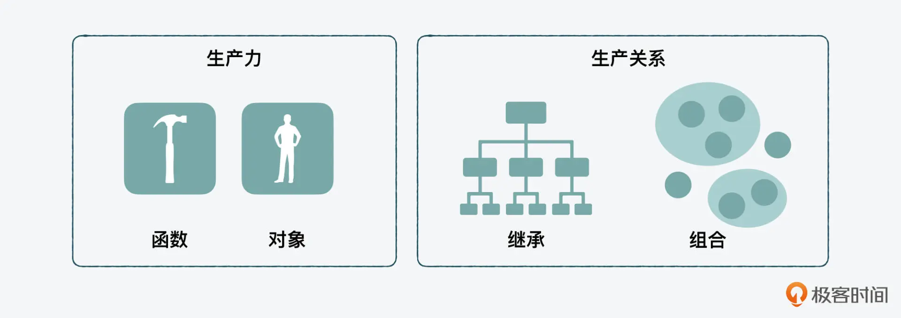

# JavaScript 进阶

<!-- @import "[TOC]" {cmd="toc" depthFrom=1 depthTo=6 orderedList=false} -->

<!-- code_chunk_output -->

- [JavaScript 进阶](#javascript-进阶)
  - [一. JavaScript 之道](#一-javascript-之道)
    - [1.1 函数式 vs 面向对象：响应未知和不确定](#11-函数式-vs-面向对象响应未知和不确定)
      - [1.1.1 函数式编程](#111-函数式编程)
        - [1.1.1.1 函数的副作用](#1111-函数的副作用)
        - [1.1.1.2 减少副作用：纯函数和不可变](#1112-减少副作用纯函数和不可变)
      - [1.1.2 面向对象编程](#112-面向对象编程)
        - [1.1.2.1 封装、重用和继承](#1121-封装-重用和继承)
    - [1.2 通过闭包对象管理程序中状态的变化](#12-通过闭包对象管理程序中状态的变化)

<!-- /code_chunk_output -->


## 一. JavaScript 之道

### 1.1 函数式 vs 面向对象：响应未知和不确定

编程模式（programming paradigm）可以说是编程语言的**元认知**。从编程模式的角度看 JS，它是结构化的、事件驱动的动态语言，且支持声明式和指令式两种模式。所以，JS 是一个多模式（multi-paradigm）的语言，也是一门“丰富”的语言。


在 JS 所支持的编程模式中，用得最多的是**面向对象**（OOP object oriented programming）和**函数式**（FP functional programming）两种。

> 函数式 + 响应式编程可以对抗**不确定性**。这个概念不只是在编程中，它也是一个跨学科的研究。比如在 AI、机械和航空航天工程这些硬科技的领域。其核心就是研究在动态情况下如何做到系统控制，其中很重要的一点就是**处理波动和干扰**。
> 在函数式编程中，通常会把各种干扰，就叫做**副作用**（Side effect）。

先从顶层来了解 JS 语言的核心思想，然后再看如何因地制宜地使用这两种编程模式来解决问题。


#### 1.1.1 函数式编程

一个函数由输入、函数和输出组成，**函数是数据集到目标的一种关系**，它所做的就是把行为封装起来，从而达到目标。


函数的输入值不仅可以是一个基础类型数据（primitive type），也可以是一个相对复杂些的对象类型数据（object type），包括对象本身和数组。甚至，函数本身作为对象，也可以是输入或输出值，把这种函数就叫做**高阶函数**（higher order functions）。


##### 1.1.1.1 函数的副作用

函数已经把算法封装了起来，那么函数里相对就是可控的，而比较不可控的是**外部环境**。可以把不可控的外部环境分为三大类：

- **全局变量**：这是函数中最常见的副作用

  ```js
  let x = 1;
  // 没法保证这些函数没有改变这个变量的值，也没法保证每次输出的结果是 1。所以从输入开始，这种不确定性就存在了。
  foo();
  console.log(x);
  bar();
  console.log(x);
  baz();
  console.log(x);
  ```

- **IO 影响**：这里的 IO 是类似前端浏览器中的用户行为，比如鼠标和键盘的输入，或者如果是服务器端的 Node 的话，就是文件系统、网络连接以及 stream 的 stdin（标准输入）和 stdout（标准输出）。

- **网络请求**：比如要针对一个用户下单的动作发起一个网络请求，需要先获得用户 ID，再连着用户的 ID 一起发送。如果在没获取到用户 ID 前，就发起下单请求，可能就会收到报错。

##### 1.1.1.2 减少副作用：纯函数和不可变

在函数式编程中，有两个核心概念：

- **纯函数**（pure function）

  **一个函数的返回结果的变化只依赖其参数，并且执行过程中没有副作用**。面对外界的复杂多变，要先保证函数封装的部分本身是稳固的。

- **不可变**（immutability）

  ```js
  const beforeList = [1, 2, 3, 4];
  console.log(beforeList.splice(0, 2)); // [1, 2]
  console.log(beforeList.splice(0, 2)); // [3, 4]

  const beforeList = [1, 2, 3, 4];
  console.log(beforeList.slice(0, 2)); // [1, 2]
  console.log(beforeList.slice(0, 2)); // [1, 2]
  ```

  可以看到，数组中的 splice 方法，在对数据进行了处理后，改变了全局中的 beforeList 的值，所以是可变的。而 slice 在执行之后的结果，没有影响全局中的 beforeList 的值，所以它是不可变的。也是因为这样，**在开发中，如果要保证不可变，就不能用 splice，而用 slice**。

  所以，不可变就是在减少程序被外界影响的同时，也减少对外界的影响。因为如果把一个外部变量作为参数作为输入，在函数里做了改变，作为输出返回。那么这个过程中，可能不知道这种变化会对整个系统造成什么样的结果。

  而且在数组中，还可以看到更多类似 splice 和 slice 这种纯函数、非纯函数，以及可变与不可变的例子。

  

另外，从纯函数和不可变的设计思想中，还可以抽象出一个概念。因为“副作用”首先是一个作用（effect），而作用遵循的是一个因果（cause and effect）关系。那么，从值的角度来看可以得到以下两个结论：

- **“纯函数” 对值只影响一次**

  这里有一个**幂等**（idempotence）的概念。

  - 在数学中，幂等的意思是不管把一个函数嵌套多少次来执行，它的结果都应该是一样的。

    ```js
    // 数学幂等
    // Math.round(((0.5)))
    ```

  - 在计算机中，幂等的意思是一个程序执行多次结果是一样的。

    ```js
    //计算机幂等
    adder(3, 4); // 7
    adder(3, 4); // 7
    ```

- **“不可变” 完全不影响**

  通过前面 array slice 和 splice 的例子，splice 让原始数组本身发生了变化。而 slice 在处理完后是形成了一个新的数组，但原始的数组完好无损。

可以看到函数式编程最核心的地方，就是**输入输出和中间的算法**，要解决的**核心问题就是副作用**。而为了解决副作用，需要掌握两个重要的概念，一个是**纯函数**，一个是**不可变**。纯函数强调的是自身的稳定性，对结果只影响一次；而不可变强调的是和外界的交互中，尽量减少相互间负面的影响。

#### 1.1.2 面向对象编程

对象是业务的主体，工具和方法通常是服务于对象的。

```js
class widget {
  widgetName = '微件';

  identify() {
    return `这是${this.widgetName}`;
  }
}
```

##### 1.1.2.1 封装、重用和继承

如果说函数加对象组成了**生产力**，那么封装、重用和继承则可以用来组成**生产关系**。



**封装**最常见的使用就是在做组件化设计的时候。

**重用**就是把可以重复使用的功能抽象到一个类里，每次只是创建一个它的实例对象来使用。

可以把通用功能放到抽象类；而一些特定的行为或属性，可以通过**继承**放到实现类中，这样在继承了基础的父类功能的基础上，能够在子类（child class）中作一些改动。

但是如果一个程序中，父子的层级过于复杂，也会变得“官僚化”，如果父类有了问题，就会牵一发动全身，而且抽象的层级过多，也会让代码难以理解。

实际上，在面向对象中，也有组合的概念，就是一个子类不是继承的某个父类，而是通过组合多个类，来形成一个类。

**面向对象编程最核心的点就是服务业务对象，最需要解决的问题就是封装、重用和继承**。在 JS 中，面向对象的特殊性是基于原型链的继承，这种继承更像是“授权”，而不是传统意义的“父子”继承。而且为了解决继承的层级过多的情况，在面向对象中，也有组合优于继承的思想。

### 1.2 通过闭包对象管理程序中状态的变化

函数式编程中存在副作用（side effect），而纯函数和不可变就是减少副作用的两个核心思想。那么按理说，要想把副作用降低到接近为零，就可以用纯函数，同时不接受任何参数。但是这样完全自我封闭的函数，也就几乎没有什么使用意义了。

所以，作为一个函数，还是要有输入、计算和输出，才能和外界有互动往来，系统也才能“活”起来。而一个活的系统，它的状态肯定是在不停变化的，如何才能在不可变的原则下，来管理这种变化。首先需要知道有哪些值是可变的、哪些不可变，以及如何能在状态更新的同时做到不可变。

- **值的（不）可变**
