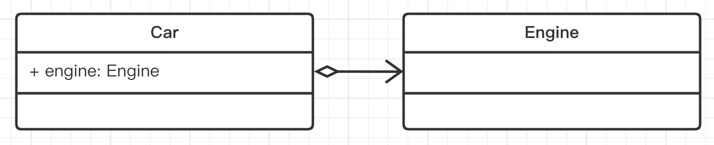
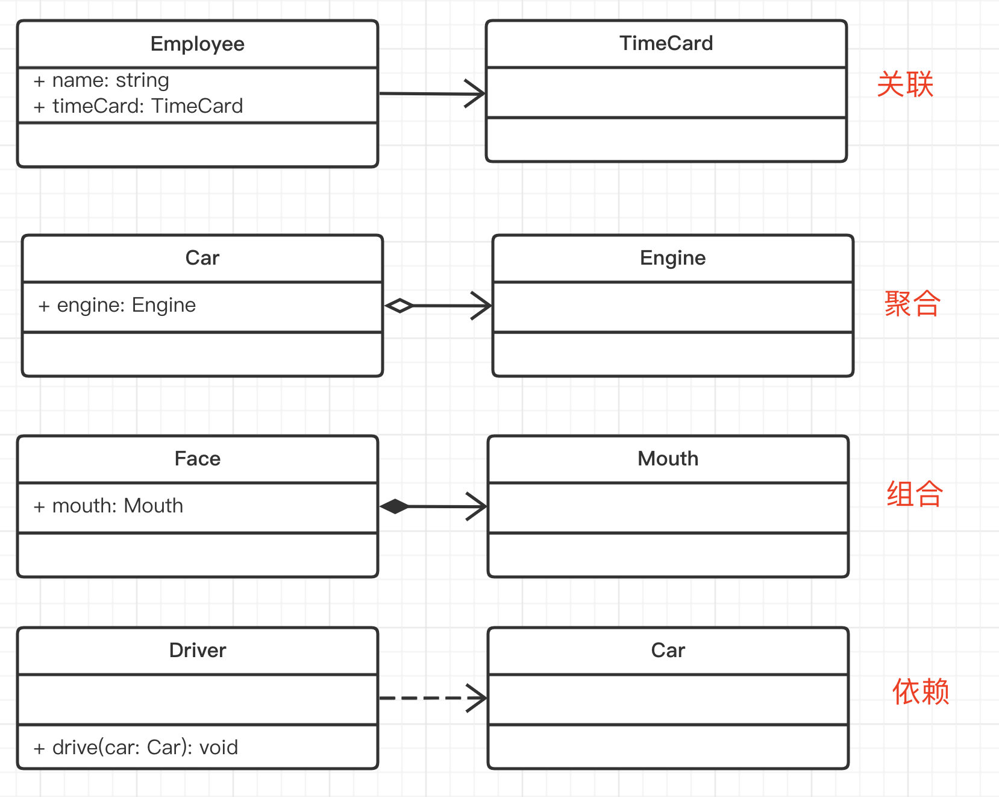

# 前端最常用的 7 种设计模式

<!-- @import "[TOC]" {cmd="toc" depthFrom=1 depthTo=6 orderedList=false} -->

<!-- code_chunk_output -->

- [前端最常用的 7 种设计模式](#-前端最常用的-7-种设计模式)
  - [一. 基础](#-一-基础)
    - [1.1 面向对象和 UML 类图](#-11-面向对象和-uml-类图)
      - [1.1.1 类和对象](#-111-类和对象)
    - [1.1.2 面向对象三要素](#-112-面向对象三要素)
    - [1.1.3 UML 类图](#-113-uml-类图)

<!-- /code_chunk_output -->

## 一. 基础

传统设计模式有 23 种，前端常用的有 7 种。下图是设计模式及其使用场景：


### 1.1 面向对象和 UML 类图

面向对象编程，Object-Oriented-Program（简称 OOP）是一种目前主流的编程思想。已有几十年的历史，1990 年代开始，和 Java 一起开始发展壮大。

编程本来是抽象的，像做数学题一样。一开始的汇编语言，直接操作寄存器、内存，写底层计算。后来的 C 语言，各种函数和指针。

而 OOP 引入了 “对象” 概念，对象即对应生活中的实物，这样就把编程具象化了。具象化之后学习成本就低了，也就随着计算机革命普及开来。设计模式就是基于 OOP 编程思想的，不适用于其他编程思想（如函数式编程）。

#### 1.1.1 类和对象

类，即模板：

```ts
class People {
  name: string;
  age: number;

  constructor(name: string, age: number) {
    this.name = name;
    this.age = age;
  }

  // 如果函数不写返回值类型，则默认为 void
  eat() {
    console.log(`${this.name} eat something`);
  }

  speak() {
    console.log(`My name is ${this.name}, age ${this.age}`);
  }
}
```

对象，即实例。一个类可以 `new` 出很多个对象：

```ts
// 创建实例
let tom = new People('tom', 20);
tom.eat();
tom.speak();

// 创建实例
let wang = new People('wang', 21);
wang.eat();
wang.speak();
```

### 1.1.2 面向对象三要素

- **封装**：高内聚，低耦合

  可见性修饰符

  - `public`：外部可访问，默认
  - `protected`：内部或子类可访问
  - `private`：只有内部可访问

  ```ts
  class People {
    name: string;
    age: string;
    protected weight: number = 100;
    private secret: object;

    constructor(name: string, age: number) {
      this.name = name;
      this.age = age;
    }
    eat() {
      console.log(`${this.name} eat something`);
    }
    speak() {
      console.log(`My name is ${this.name}, age ${this.age}`);
    }
  }
  ```

- **继承**：抽离公共代码，实现代码复用

  ```ts
  class Student extends People {
    school: string;

    constructor(name: string, age: number, school: string) {
      super(name, age);
      this.school = school;
    }
    study() {
      console.log(`${this.name} study`);
    }
  }
  // 可继续派生其他子类

  let tom = new Student('tom', 10, 'A小学');
  tom.study();
  console.log(tom.school);
  let tim = new Student('tim', 11, 'B小学');
  tim.study();
  ```

- **多态**：保证扩展性

  - **覆写**：覆盖父组件的方法

    ```ts
    class People {
      log() {
        console.log('people');
      }
    }

    class Programmer extends People {
      // 覆写
      log() {
        console.log('programmer');
      }
    }
    ```

  - **重载**：支持多种参数形式

    ```ts
    interface IStyleInfo {
      [key: string]: string;
    }

    class JQuery {
      // 函数重载
      css(key: string, value: string): void;
      css(styleInfo: IStyleInfo): void;
      css(keyOrStyleInfo: string | IStyleInfo, value?: string): void {
        // key-value 形式
        if (typeof keyOrStyleInfo === 'string') {
          const key = keyOrStyleInfo;
          console.log('Set CSS', key, value);
        }
        // object 形式
        if (typeof keyOrStyleInfo === 'object') {
          const styleInfo = keyOrStyleInfo;
          for (const key in styleInfo) {
            const value = styleInfo[key];
            console.log('Set CSS', key, value);
          }
        }
      }
    }

    const jquery = new JQuery();
    jquery.css('color', 'red');
    jquery.css({ color: 'red', 'font-size': '14px' });
    ```

### 1.1.3 UML 类图

UML（Unified Modeling Language，统一建模语言），软件工程（不仅是编程）中的任何设计都可以用它来表述，包含：

- **类图**
- 用例图
- 对象图
- 顺序图
- 协作图
- 状态图
- 活动图
- 组件图
- 配置图

**作用**：

- 需求指导设计，设计指导开发
- 开发之前，写技术方案设计文档，并评审
- UML 类图就是一个重要的工具和表达方式。如果同事之间都熟悉 UML 类图，那会减少很多沟通成本，不用看代码就可以知道代码结构，核心属性和方法

工具可以使用[在线工具](https://www.processon.com/)和 MS Visio。

**单个类**：

三个区域

- 类名
- 属性
- 方法

权限描述

- `+` public
- `#` protected
- `-` private


**类图的几种关系**：

- 实现 - 实现接口

  

- 泛化 - 继承

  

- 关联 - A 是 B 的一个属性

  

  - 单项关联 - 最常见
  - 双向关联
  - 自关联

  - 聚合 - 整体包含部分，部分可以脱离整体单独存在

    

  - 组合 - 整体包含部分，部分**不可**脱离整体

    

  - 依赖 - 不是属性，函数参数、返回值

    

  > **注意**：聚合、组合、依赖，**都属于关联关系**，更加细化了。日常工作中没必要区分那么细致，都当做关联关系即可。

**实现接口**：

> **注意**：TS 的 interface 和 Java 的不一样，TS 有属性，而 Java 的没有属性。而 UML 类图是依据 Java 语法而画的（没有属性区域）。

**总结**：

再次体会 UML 类图的作用

- 单个类
- 类之间的关系
- 关联关系的细分，不必过于较真



