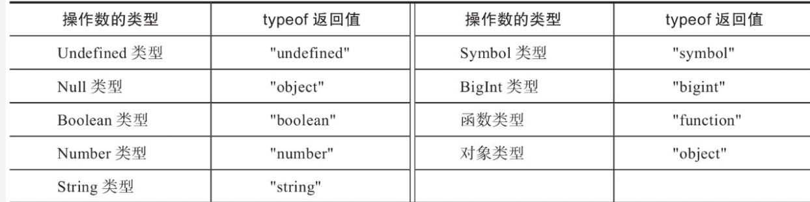

# TypeScript

<!-- @import "[TOC]" {cmd="toc" depthFrom=1 depthTo=6 orderedList=false} -->

<!-- code_chunk_output -->

- [TypeScript](#typescript)
  - [一. 介绍](#一-介绍)
    - [1.1 什么是 TypeScript](#11-什么是-typescript)
      - [1.1.1 始于 JS，终于 JS](#111-始于-js终于-js)
      - [1.1.2 TypeScript 特性](#112-typescript-特性)
    - [1.2 TypeScript 优势](#12-typescript-优势)
    - [1.3 类型系统](#13-类型系统)
  - [二. 类型基础](#二-类型基础)
    - [2.1 类型注解](#21-类型注解)
    - [2.2 类型检查](#22-类型检查)
    - [2.3 原始类型](#23-原始类型)
      - [2.3.1 symbol 和 unique symbol](#231-symbol-和-unique-symbol)
      - [2.3.2 Nullable](#232-nullable)
    - [2.4 枚举类型](#24-枚举类型)
      - [2.4.1 数值型枚举](#241-数值型枚举)
      - [2.4.2 字符串枚举](#242-字符串枚举)
      - [2.4.3 异构型枚举](#243-异构型枚举)
      - [2.4.4 枚举成员映射](#244-枚举成员映射)
      - [2.4.5 常量枚举成员与计算枚举成员](#245-常量枚举成员与计算枚举成员)
      - [2.4.6 联合枚举类型](#246-联合枚举类型)
      - [2.4.7 const 枚举类型](#247-const-枚举类型)
    - [2.5 字面量类型](#25-字面量类型)
      - [2.5.1 boolean 字面量类型](#251-boolean-字面量类型)
      - [2.5.2 字符串字面量类型和模板字面量](#252-字符串字面量类型和模板字面量)
        - [2.5.2.1 专用工具类型](#2521-专用工具类型)
        - [2.5.2.2 模板字符串类型与模式匹配](#2522-模板字符串类型与模式匹配)
      - [2.5.3 数字字面量类型](#253-数字字面量类型)
      - [2.5.4 枚举成员字面量类型](#254-枚举成员字面量类型)
    - [2.6 单元类型](#26-单元类型)
    - [2.7 顶端类型](#27-顶端类型)
      - [2.7.1 any](#271-any)
      - [2.7.1 unknown](#271-unknown)
    - [2.8 尾端类型](#28-尾端类型)
      - [2.8.1 never](#281-never)
      - [2.8.2 应用场景](#282-应用场景)
    - [2.9 数组类型](#29-数组类型)
      - [2.9.1 数组类型定义](#291-数组类型定义)
      - [2.9.2 数组元素类型](#292-数组元素类型)
      - [2.9.3 只读数组](#293-只读数组)
        - [2.9.3.1 注意事项](#2931-注意事项)
    - [2.10 元组类型](#210-元组类型)
      - [2.10.1 只读元组](#2101-只读元组)
      - [2.10.2 访问元组中的元素](#2102-访问元组中的元素)
      - [2.10.3 元组类型中的可选元素](#2103-元组类型中的可选元素)
      - [2.10.4 元组类型中的剩余元素](#2104-元组类型中的剩余元素)
      - [2.10.5 元组的长度](#2105-元组的长度)
      - [2.10.6 使用元组来规范参数类型](#2106-使用元组来规范参数类型)
      - [2.10.7 改善元组的类型推导](#2107-改善元组的类型推导)
      - [2.10.8 可变参元组类型](#2108-可变参元组类型)
      - [2.10.9 标签元组](#2109-标签元组)
    - [2.11 对象类型](#211-对象类型)
      - [2.11.1 Object](#2111-object)
      - [2.11.2 object](#2112-object)
      - [2.11.3 对象类型字面量](#2113-对象类型字面量)
        - [2.11.3.1 属性签名](#21131-属性签名)
        - [2.11.3.2 可选类型](#21132-可选类型)
        - [2.11.3.3 只读属性](#21133-只读属性)
        - [2.11.3.4 空对象类型字面量](#21134-空对象类型字面量)
      - [2.11.4 弱类型](#2114-弱类型)
      - [2.11.5 多余属性](#2115-多余属性)
        - [2.11.5.1 多余属性检查](#21151-多余属性检查)
        - [2.11.5.2 允许多余属性](#21152-允许多余属性)
    - [2.12 函数类型](#212-函数类型)
      - [2.12.1 常规参数类型](#2121-常规参数类型)
      - [2.12.2 可选参数类型](#2122-可选参数类型)
      - [2.12.3 默认参数类型](#2123-默认参数类型)
      - [2.12.4 剩余参数类型](#2124-剩余参数类型)
      - [2.12.5 解构参数类型](#2125-解构参数类型)
      - [2.12.6 返回值类型](#2126-返回值类型)
      - [2.12.7 函数类型字面量](#2127-函数类型字面量)
      - [2.12.8 调用签名](#2128-调用签名)
      - [2.12.9 构造函数类型字面量](#2129-构造函数类型字面量)
      - [2.12.10 构造签名](#21210-构造签名)
      - [2.12.11 调用签名与构造签名](#21211-调用签名与构造签名)
      - [2.12.12 abstract 构造签名](#21212-abstract-构造签名)
      - [2.12.13 重载函数](#21213-重载函数)
        - [2.12.13.1 函数重载](#212131-函数重载)
        - [2.12.13.2 函数实现](#212132-函数实现)
        - [2.12.13.3 函数重载解析顺序](#212133-函数重载解析顺序)
        - [2.12.13.4 重载函数的类型](#212134-重载函数的类型)
      - [2.12.14 函数中 this 值的类型](#21214-函数中-this-值的类型)
        - [2.12.14.1 noImplicitThis 编译选项](#212141-noimplicitthis-编译选项)
        - [2.12.14.2 函数的 this 参数](#212142-函数的-this-参数)
    - [2.13 接口](#213-接口)
      - [2.13.1 接口声明](#2131-接口声明)
      - [2.13.2 方法签名](#2132-方法签名)
      - [2.13.3 索引签名](#2133-索引签名)
        - [2.13.3.1 字符串索引签名](#21331-字符串索引签名)
        - [2.13.3.2 数值索引签名](#21332-数值索引签名)
        - [2.13.3.3 static 索引签名](#21333-static-索引签名)
        - [2.13.3.4 symbol 索引签名](#21334-symbol-索引签名)
        - [2.13.3.5 字符串模板索引签名](#21335-字符串模板索引签名)
        - [2.13.3.6 联合类型索引签名](#21336-联合类型索引签名)
      - [2.13.4 可选属性与方法](#2134-可选属性与方法)
      - [2.13.5 只读属性与方法](#2135-只读属性与方法)
      - [2.13.6 接口的继承](#2136-接口的继承)
    - [2.14 类型别名](#214-类型别名)
      - [2.14.1 类型别名声明](#2141-类型别名声明)
      - [2.14.2 递归的类型别名](#2142-递归的类型别名)
      - [2.14.3 类型别名与接口的差别](#2143-类型别名与接口的差别)
    - [2.15 类](#215-类)
      - [2.15.1 类的定义](#2151-类的定义)
        - [2.15.1.1 类声明](#21511-类声明)
        - [2.15.1.2 类表达式](#21512-类表达式)
      - [2.15.2 成员变量](#2152-成员变量)
        - [2.15.2.1 strictPropertyInitialization 编译选项](#21521-strictpropertyinitialization-编译选项)
        - [2.15.2.2 readonly 属性](#21522-readonly-属性)
      - [2.15.3 成员函数](#2153-成员函数)
      - [2.15.4 成员存取器](#2154-成员存取器)
        - [2.15.4.1 自动存取器](#21541-自动存取器)
      - [2.15.5 索引成员](#2155-索引成员)
      - [2.15.6 成员可访问性](#2156-成员可访问性)
        - [2.15.6.1 public](#21561-public)
        - [2.15.6.2 protected](#21562-protected)
        - [2.15.6.3 私有成员](#21563-私有成员)
        - [2.15.6.4 私有字段](#21564-私有字段)
      - [2.15.7 构造函数](#2157-构造函数)
      - [2.15.8 参数属性](#2158-参数属性)
      - [2.15.9 继承](#2159-继承)
        - [2.15.9.1 重写基类成员](#21591-重写基类成员)
        - [2.15.9.2 派生类实例化](#21592-派生类实例化)
        - [2.15.9.3 单继承](#21593-单继承)
        - [2.15.9.4 接口继承类](#21594-接口继承类)
      - [2.15.10 实现接口](#21510-实现接口)
      - [2.15.11 静态成员](#21511-静态成员)
        - [2.15.11.1 静态成员可访问性](#215111-静态成员可访问性)
        - [2.15.11.2 继承静态成员](#215112-继承静态成员)
        - [2.15.11.3 静态语句块](#215113-静态语句块)
      - [2.15.12 抽象类和抽象成员](#21512-抽象类和抽象成员)
        - [2.15.12.1 抽象类](#215121-抽象类)
        - [2.15.12.2 抽象成员](#215122-抽象成员)
      - [2.15.13 this 类型](#21513-this-类型)
      - [2.15.14 类类型](#21514-类类型)
      - [2.15.15 混入](#21515-混入)
      - [2.15.16 模拟 final 类](#21516-模拟-final-类)
      - [2.15.17 override 覆写](#21517-override-覆写)
    - [2.16 设计模式](#216-设计模式)
      - [2.16.1 工厂模式](#2161-工厂模式)
      - [2.16.2 建造者模式](#2162-建造者模式)
      - [2.16.3 伴生对象模式](#2163-伴生对象模式)
  - [三. 类型进阶](#三-类型进阶)
    - [3.1 泛型](#31-泛型)
      - [3.1.1 泛型简介](#311-泛型简介)
      - [3.1.2 形式类型参数](#312-形式类型参数)
        - [3.1.2.1 形式类型参数声明](#3121-形式类型参数声明)
        - [3.1.2.2 类型参数默认类型](#3122-类型参数默认类型)
        - [3.1.2.3 可选的类型参数](#3123-可选的类型参数)
      - [3.1.3 实际类型参数](#313-实际类型参数)
      - [3.1.4 泛型约束](#314-泛型约束)
        - [3.1.4.1 泛型约束声明](#3141-泛型约束声明)
        - [3.1.4.2 泛型约束引用类型参数](#3142-泛型约束引用类型参数)
        - [3.1.4.3 基约束](#3143-基约束)
        - [3.1.4.4 常见错误](#3144-常见错误)
      - [3.1.5 泛型类型](#315-泛型类型)
        - [3.1.5.1 泛型函数定义](#3151-泛型函数定义)
        - [3.1.5.2 泛型函数示例](#3152-泛型函数示例)
        - [3.1.5.3 泛型函数类型推断](#3153-泛型函数类型推断)
        - [3.1.5.4 泛型函数注意事项](#3154-泛型函数注意事项)
      - [3.1.6 泛型接口](#316-泛型接口)
      - [3.1.7 泛型类型别名](#317-泛型类型别名)
      - [3.1.8 泛型类](#318-泛型类)
    - [3.2 局部类型](#32-局部类型)
    - [3.3 联合类型](#33-联合类型)
      - [3.3.1 联合类型字面量](#331-联合类型字面量)
      - [3.3.2 联合类型的类型成员](#332-联合类型的类型成员)
        - [3.3.2.1 属性签名](#3321-属性签名)
        - [3.3.2.2 索引签名](#3322-索引签名)
        - [3.3.2.3 调用签名与构造签名](#3323-调用签名与构造签名)
    - [3.4 交叉类型](#34-交叉类型)
      - [3.4.1 交叉类型字面量](#341-交叉类型字面量)
        - [3.4.1.1 成员类型的运算](#3411-成员类型的运算)
        - [3.4.1.2 原始类型](#3412-原始类型)
      - [3.4.2 交叉类型的类型成员](#342-交叉类型的类型成员)
        - [3.4.2.1 属性签名](#3421-属性签名)
        - [6.4.2.2 索引签名](#6422-索引签名)
        - [3.4.2.3 调用签名与构造签名](#3423-调用签名与构造签名)
      - [3.4.3 交叉类型与联合类型](#343-交叉类型与联合类型)
        - [3.4.3.1 优先级](#3431-优先级)
        - [3.4.3.2 分配律性质](#3432-分配律性质)
    - [3.5 索引类型](#35-索引类型)
      - [3.5.1 索引类型查询](#351-索引类型查询)
        - [3.5.1.1 索引类型查询解析](#3511-索引类型查询解析)
        - [3.5.1.2 联合类型](#3512-联合类型)
        - [3.5.1.3 交叉类型](#3513-交叉类型)
      - [3.5.2 索引访问类型](#352-索引访问类型)
      - [3.5.3 索引类型的应用](#353-索引类型的应用)
    - [3.6 映射对象类型](#36-映射对象类型)
      - [3.6.1 映射对象类型声明](#361-映射对象类型声明)
      - [3.6.2 映射对象类型解析](#362-映射对象类型解析)
      - [3.6.3 映射对象类型应用](#363-映射对象类型应用)
      - [3.6.4 同态映射对象类型](#364-同态映射对象类型)
        - [3.6.4.1 修饰符拷贝](#3641-修饰符拷贝)
        - [3.6.4.2 改进的修饰符拷贝](#3642-改进的修饰符拷贝)
        - [3.6.4.3 添加和移除修饰符](#3643-添加和移除修饰符)
        - [3.6.4.4 同态映射对象类型深入](#3644-同态映射对象类型深入)
      - [3.6.5 在映射类型中更改映射的键](#365-在映射类型中更改映射的键)
    - [3.7 条件类型](#37-条件类型)
      - [3.7.1 条件类型的定义](#371-条件类型的定义)
      - [3.7.2 分布式条件类型](#372-分布式条件类型)
        - [3.7.2.1 裸类型参数](#3721-裸类型参数)
        - [3.7.2.2 分布式行为](#3722-分布式行为)
        - [3.7.2.3 过滤联合类型](#3723-过滤联合类型)
        - [3.7.2.4 避免分布式行为](#3724-避免分布式行为)
      - [3.7.3 infer 关键字](#373-infer-关键字)
        - [3.7.3.1 infer 类型参数上的 extends 约束](#3731-infer-类型参数上的-extends-约束)
    - [3.8 内置工具类型](#38-内置工具类型)
      - [3.8.1 `Partial<T>`](#381-partialt)
      - [3.8.2 `Required<T>`](#382-requiredt)
      - [3.8.3 `Readonly<T>`](#383-readonlyt)
      - [3.8.4 `Record<K,T>`](#384-recordkt)
      - [3.8.5 `Pick<T,K>`](#385-picktk)
      - [3.8.6 `Omit<T,K>`](#386-omittk)
      - [3.8.7 `Exclude<T,U>`](#387-excludetu)
      - [3.8.8 `Extract<T,U>`](#388-extracttu)
      - [3.8.9 `NonNullable<T>`](#389-nonnullablet)
      - [3.8.10 `Parameters<T>`](#3810-parameterst)
      - [3.8.11 `ConstructorParameters<T>`](#3811-constructorparameterst)
      - [3.8.12 `ReturnType<T>`](#3812-returntypet)
      - [3.8.13 `InstanceType<T>`](#3813-instancetypet)
      - [3.8.14 `ThisParameterType<T>`](#3814-thisparametertypet)
      - [3.8.15 `OmitThisParameter<T>`](#3815-omitthisparametert)
      - [3.8.16 `ThisType<T>`](#3816-thistypet)
      - [3.8.17 `ConstructorParameters<T>`](#3817-constructorparameterst)
      - [3.8.18 `Awaited<T>`](#3818-awaitedt)
      - [3.8.19 `NoInfer<T>`](#3819-noinfert)
    - [3.9 类型查询](#39-类型查询)
    - [3.10 类型断言](#310-类型断言)
      - [3.10.1 `<T>` 类型断言](#3101-t-类型断言)
      - [3.10.2 as T 类型断言](#3102-as-t-类型断言)
      - [3.10.3 类型断言的约束](#3103-类型断言的约束)
      - [3.10.4 const 类型断言](#3104-const-类型断言)
      - [3.10.5 非空断言](#3105-非空断言)
    - [3.11 类型细化](#311-类型细化)
      - [3.11.1 类型守卫](#3111-类型守卫)
        - [3.11.1.1 typeof 类型守卫](#31111-typeof-类型守卫)
        - [3.11.1.2 instanceof 类型守卫](#31112-instanceof-类型守卫)
        - [3.11.1.3 in 类型守卫](#31113-in-类型守卫)
        - [3.11.1.4 逻辑类型守卫](#31114-逻辑类型守卫)
        - [3.11.1.5 等式类型守卫](#31115-等式类型守卫)
        - [3.11.1.6 自定义类型守卫函数](#31116-自定义类型守卫函数)
        - [3.11.1.7 this 类型守卫](#31117-this-类型守卫)
      - [3.11.2 可辨识联合类型](#3112-可辨识联合类型)
        - [3.11.2.1 判别式属性](#31121-判别式属性)
        - [3.11.2.2 判别式属性类型守卫](#31122-判别式属性类型守卫)
        - [3.11.2.3 可辨识联合完整性检查](#31123-可辨识联合完整性检查)
      - [3.11.3 赋值语句分析](#3113-赋值语句分析)
      - [3.11.4 基于控制流的类型分析](#3114-基于控制流的类型分析)
      - [3.11.5 断言类型](#3115-断言类型)
        - [3.11.5.1 asserts x is T](#31151-asserts-x-is-t)
        - [3.11.5.2 asserts X](#31152-asserts-x)
        - [3.11.5.3 断言函数的返回值](#31153-断言函数的返回值)
        - [3.11.5.4 断言函数的应用](#31154-断言函数的应用)
    - [3.12 模拟名义类型](#312-模拟名义类型)
    - [3.13 安全的扩展原型](#313-安全的扩展原型)
    - [3.14 satisfies 运算符](#314-satisfies-运算符)
  - [四. 类型深入](#四-类型深入)
    - [4.1 子类型兼容性](#41-子类型兼容性)
      - [4.1.1 类型系统可靠性](#411-类型系统可靠性)
      - [4.1.2 子类型的基本性质](#412-子类型的基本性质)
        - [4.1.2.1 符号约定](#4121-符号约定)
        - [4.1.2.2 自反性](#4122-自反性)
        - [4.1.2.3 传递性](#4123-传递性)
      - [4.1.3 顶端类型与尾端类型](#413-顶端类型与尾端类型)
      - [4.1.4 原始类型](#414-原始类型)
      - [4.1.5 函数类型](#415-函数类型)
        - [4.1.5.1 变型](#4151-变型)
        - [4.1.5.2 函数参数数量](#4152-函数参数数量)
        - [4.1.5.3 函数参数类型](#4153-函数参数类型)
        - [4.1.5.4 函数返回值类型](#4154-函数返回值类型)
        - [4.1.5.5 函数重载](#4155-函数重载)
      - [4.1.6 对象类型](#416-对象类型)
        - [4.1.6.1 结构化子类型](#4161-结构化子类型)
        - [4.1.6.2 属性成员类型](#4162-属性成员类型)
        - [4.1.6.3 调用签名与构造签名](#4163-调用签名与构造签名)
        - [4.1.6.4 字符串索引签名](#4164-字符串索引签名)
        - [4.1.6.5 数值索引签名](#4165-数值索引签名)
        - [4.1.6.6 类实例类型](#4166-类实例类型)
      - [4.1.7 泛型](#417-泛型)
        - [4.1.7.1 泛型对象类型](#4171-泛型对象类型)
        - [4.1.7.2 泛型函数类型](#4172-泛型函数类型)
      - [4.1.8 联合类型](#418-联合类型)
      - [4.1.9 交叉类型](#419-交叉类型)
    - [4.2 赋值兼容性](#42-赋值兼容性)
    - [4.3 类型推断](#43-类型推断)
      - [4.3.1 常规类型推断](#431-常规类型推断)
      - [4.3.2 按上下文归类](#432-按上下文归类)
    - [4.4 类型放宽](#44-类型放宽)
      - [4.4.1 常规类型放宽](#441-常规类型放宽)
        - [4.4.1.1 非严格类型检查模式](#4411-非严格类型检查模式)
        - [4.4.1.2 严格类型检查模式](#4412-严格类型检查模式)
      - [4.4.2 字面量类型放宽](#442-字面量类型放宽)
        - [4.4.2.1 细分字面量类型](#4421-细分字面量类型)
        - [4.4.2.2 放宽的字面量类型](#4422-放宽的字面量类型)
        - [4.4.2.3 字面量类型放宽的场景](#4423-字面量类型放宽的场景)
        - [4.4.2.4 全新的字面量类型](#4424-全新的字面量类型)
    - [4.5 命名空间](#45-命名空间)
      - [4.5.1 命名空间声明](#451-命名空间声明)
      - [4.5.2 导出命名空间内的声明](#452-导出命名空间内的声明)
      - [4.5.3 别名导入声明](#453-别名导入声明)
      - [4.5.4 在多文件中使用命名空间](#454-在多文件中使用命名空间)
        - [4.5.4.1 文件间的依赖](#4541-文件间的依赖)
        - [4.5.4.2 tsconfig.json](#4542-tsconfigjson)
        - [4.5.4.3 三斜线指令](#4543-三斜线指令)
    - [4.6 模块](#46-模块)
      - [4.6.1 模块简史](#461-模块简史)
        - [4.6.1.1 CommonJS](#4611-commonjs)
        - [4.6.1.2 AMD](#4612-amd)
        - [4.6.1.3 UMD](#4613-umd)
        - [4.6.1.4 ESM](#4614-esm)
      - [4.6.2 ECMAScript 模块](#462-ecmascript-模块)
      - [4.6.3 模块导出](#463-模块导出)
        - [4.6.3.4 聚合模块](#4634-聚合模块)
      - [4.6.4 模块导入](#464-模块导入)
        - [4.6.4.1 导入命名模块导出](#4641-导入命名模块导出)
        - [4.6.4.2 导入整个模块](#4642-导入整个模块)
        - [4.6.4.3 导入默认模块导出](#4643-导入默认模块导出)
        - [4.6.4.4 空导入](#4644-空导入)
        - [4.6.4.5 导入属性（Import Attributes）](#4645-导入属性import-attributes)
      - [4.6.5 重命名模块导入和导出](#465-重命名模块导入和导出)
        - [4.6.5.1 重命名模块导出](#4651-重命名模块导出)
        - [4.6.5.2 重命名聚合模块](#4652-重命名聚合模块)
        - [4.6.5.3 重命名模块导入](#4653-重命名模块导入)
      - [4.6.6 针对类型的模块导入与导出](#466-针对类型的模块导入与导出)
        - [4.6.6.1 背景介绍](#4661-背景介绍)
        - [4.6.6.2 导入与导出类型](#4662-导入与导出类型)
        - [4.6.6.3 import type 上的 resolution-mode](#4663-import-type-上的-resolution-mode)
      - [4.6.7 动态模块导入](#467-动态模块导入)
      - [4.6.8 module 编译选项](#468-module-编译选项)
    - [4.7 外部声明](#47-外部声明)
      - [4.7.1 外部类型声明](#471-外部类型声明)
        - [4.7.1.1 外部变量声明](#4711-外部变量声明)
        - [4.7.1.2 外部函数声明](#4712-外部函数声明)
        - [4.7.1.3 外部类声明](#4713-外部类声明)
        - [4.7.1.4 外部枚举声明](#4714-外部枚举声明)
        - [4.7.1.5 外部命名空间声明](#4715-外部命名空间声明)
      - [4.7.2 外部模块声明](#472-外部模块声明)
    - [4.8 使用声明文件](#48-使用声明文件)
      - [4.8.1 语言内置的声明文件](#481-语言内置的声明文件)
      - [4.8.2 第三方声明文件](#482-第三方声明文件)
        - [4.8.2.1 含有内置声明文件](#4821-含有内置声明文件)
        - [4.8.2.2 typings 与 types](#4822-typings-与-types)
        - [4.8.2.3 typesVersions](#4823-typesversions)
      - [4.8.3 自定义声明文件](#483-自定义声明文件)
    - [4.9 模块解析](#49-模块解析)
      - [4.9.1 相对模块导入](#491-相对模块导入)
      - [4.9.2 非相对模块导入](#492-非相对模块导入)
      - [4.9.3 模块解析策略](#493-模块解析策略)
      - [4.9.4 模块解析策略之 Classic](#494-模块解析策略之-classic)
        - [4.9.4.1 解析相对模块导入](#4941-解析相对模块导入)
        - [4.9.4.2 解析非相对模块导入](#4942-解析非相对模块导入)
      - [4.9.5 模块解析策略之 Node](#495-模块解析策略之-node)
        - [4.9.5.1 解析相对模块导入](#4951-解析相对模块导入)
        - [4.9.5.2 解析非相对模块导入](#4952-解析非相对模块导入)
      - [4.9.6 baseUrl 编译选项](#496-baseurl-编译选项)
        - [4.9.6.1 解析 baseUrl](#4961-解析-baseurl)
      - [4.9.7 paths](#497-paths)
        - [4.9.7.1 设置 paths](#4971-设置-paths)
        - [4.9.7.2 使用通配符](#4972-使用通配符)
      - [4.9.8 rootDirs](#498-rootdirs)
      - [4.9.9 导入外部模块声明](#499-导入外部模块声明)
      - [4.9.10 traceResolution 编译选项](#4910-traceresolution-编译选项)
    - [4.10 声明合并](#410-声明合并)
      - [4.10.1 接口声明合并](#4101-接口声明合并)
      - [4.10.2 枚举声明合并](#4102-枚举声明合并)
      - [4.10.3 类声明合并](#4103-类声明合并)
      - [4.10.4 命名空间声明合并](#4104-命名空间声明合并)
        - [4.10.4.1 命名空间与命名空间合并](#41041-命名空间与命名空间合并)
        - [4.10.4.2 命名空间与函数合并](#41042-命名空间与函数合并)
        - [4.10.4.3 命名空间与类合并](#41043-命名空间与类合并)
        - [4.10.4.4 命名空间与枚举合并](#41044-命名空间与枚举合并)
      - [4.10.5 扩充模块声明](#4105-扩充模块声明)
      - [4.10.6 扩充全局声明](#4106-扩充全局声明)
    - [4.11 装饰器](#411-装饰器)
      - [4.11.1 装饰器元数据](#4111-装饰器元数据)
  - [五. TypeScript 配置管理](#五-typescript-配置管理)
    - [5.1 编译器](#51-编译器)
      - [5.1.1 安装编译器](#511-安装编译器)
      - [5.1.2 编译程序](#512-编译程序)
        - [5.1.2.1 编译单个文件](#5121-编译单个文件)
        - [5.1.2.2 编译多个文件](#5122-编译多个文件)
        - [5.1.2.3 观察模式](#5123-观察模式)
        - [5.1.2.4 preserveWatchOutput 编译选项](#5124-preservewatchoutput-编译选项)
    - [5.2 编译选项](#52-编译选项)
      - [5.2.1 编译选项风格](#521-编译选项风格)
      - [5.2.2 使用编译选项](#522-使用编译选项)
      - [5.2.3 严格类型检查](#523-严格类型检查)
        - [5.2.3.1 strict](#5231-strict)
        - [5.2.3.2 noImplicitAny](#5232-noimplicitany)
        - [5.2.3.3 strictNullChecks](#5233-strictnullchecks)
        - [5.2.3.4 strictFunctionTypes](#5234-strictfunctiontypes)
        - [5.2.3.5 strictBindCallApply](#5235-strictbindcallapply)
        - [5.2.3.6 strictPropertyInitialization](#5236-strictpropertyinitialization)
        - [5.2.3.7 noImplicitThis](#5237-noimplicitthis)
        - [5.2.3.8 alwaysStrict](#5238-alwaysstrict)
      - [5.2.4 编译选项列表](#524-编译选项列表)
    - [5.3 tsconfig.json](#53-tsconfigjson)
      - [5.3.1 使用配置文件](#531-使用配置文件)
        - [5.3.1.1 自动搜索配置文件](#5311-自动搜索配置文件)
        - [5.3.1.2 指定配置文件](#5312-指定配置文件)
      - [5.3.2 编译选项列表](#532-编译选项列表)
      - [5.3.3 编译文件列表](#533-编译文件列表)
        - [5.3.3.1 listFiles 编译选项](#5331-listfiles-编译选项)
        - [5.3.3.2 默认编译文件列表](#5332-默认编译文件列表)
        - [5.3.3.3 files 属性](#5333-files-属性)
        - [5.3.3.4 include 属性](#5334-include-属性)
        - [5.3.3.5 exclude 属性](#5335-exclude-属性)
      - [5.3.4 声明文件列表](#534-声明文件列表)
        - [5.3.4.1 typeRoots 编译选项](#5341-typeroots-编译选项)
        - [5.3.4.2 types 编译选项](#5342-types-编译选项)
      - [5.3.5 继承配置文件](#535-继承配置文件)
        - [5.3.5.1 showConfig 编译选项](#5351-showconfig-编译选项)
        - [5.3.5.2 使用相对路径](#5352-使用相对路径)
        - [5.3.5.3 使用非相对路径](#5353-使用非相对路径)
    - [5.4 工程引用](#54-工程引用)
      - [5.4.1 使用工程引用](#541-使用工程引用)
        - [5.4.1.1 references 顶层属性](#5411-references-顶层属性)
        - [5.4.1.2 composite 编译选项](#5412-composite-编译选项)
        - [5.4.1.3 declarationMap 编译选项](#5413-declarationmap-编译选项)
      - [5.4.2 工程引用示例](#542-工程引用示例)
        - [5.4.2.1 配置 references](#5421-配置-references)
        - [5.4.2.2 composite 编译选项](#5422-composite-编译选项)
      - [5.4.3 build 构建模式](#543-build-构建模式)
      - [5.4.4 solution 模式](#544-solution-模式)
    - [5.5 JS 类型检查](#55-js-类型检查)
      - [5.5.1 编译 JS](#551-编译-js)
      - [5.5.2 JS 类型检查](#552-js-类型检查)
        - [5.5.2.1 checkJs 编译选项](#5521-checkjs-编译选项)
        - [5.5.2.2 @ts-nocheck](#5522-ts-nocheck)
        - [5.5.2.3 @ts-check](#5523-ts-check)
        - [5.5.2.4 @ts-ignore](#5524-ts-ignore)
        - [5.5.2.5 @ts-expect-error](#5525-ts-expect-error)
      - [5.5.3 JSDoc 及其类型](#553-jsdoc-及其类型)
        - [5.5.3.1 @typedef](#5531-typedef)
        - [5.5.3.2 @type](#5532-type)
        - [5.5.3.3 @param](#5533-param)
        - [5.5.3.4 @return 和 @returns](#5534-return-和-returns)
        - [5.5.3.5 @extends 和修饰符](#5535-extends-和修饰符)
        - [5.5.3.6 @deprecated](#5536-deprecated)
        - [5.5.3.7 @see](#5537-see)
        - [5.5.3.8 @link](#5538-link)
        - [5.5.3.9 @satisfies](#5539-satisfies)
        - [5.5.3.10 @overload](#55310-overload)
    - [5.6 三斜线指令](#56-三斜线指令)
      - [5.6.1 reference path](#561-reference-path)
      - [5.6.2 reference types](#562-reference-types)
      - [5.6.3 reference lib](#563-reference-lib)
        - [5.6.3.1 target 编译选项](#5631-target-编译选项)
        - [5.6.3.2 lib 编译选项](#5632-lib-编译选项)
  - [六. 项目实践](#六-项目实践)
    - [6.1 TypeScript 和 Babel](#61-typescript-和-babel)
      - [6.1.1 Babel](#611-babel)
      - [6.1.2 TypeScript 编译器](#612-typescript-编译器)
        - [6.1.2.1 转译 TypeScript](#6121-转译-typescript)
        - [6.1.2.2 TypeScript 与 Babel 项目配置](#6122-typescript-与-babel-项目配置)
        - [6.1.2.3 关于编译器与转译器](#6123-关于编译器与转译器)
        - [6.1.2.4 注意事项](#6124-注意事项)
    - [6.2 TypeScript 与 webpack](#62-typescript-与-webpack)
      - [6.2.1 webpack 配置](#621-webpack-配置)
  - [七. 错误处理](#七-错误处理)
    - [7.1 返回 null](#71-返回-null)
    - [7.2 抛出异常](#72-抛出异常)
    - [7.3 返回异常](#73-返回异常)
    - [7.4 Option 类型](#74-option-类型)
  - [八. 异步编程的并发和并行](#八-异步编程的并发和并行)
    - [8.1 处理回调](#81-处理回调)
    - [8.2 异步流](#82-异步流)
    - [8.3 多线程类型安全](#83-多线程类型安全)
      - [8.3.1 在浏览器中：使用工作线程](#831-在浏览器中使用工作线程)
      - [8.3.2 在 NodeJS 中：使用子进程](#832-在-nodejs-中使用子进程)
  - [九. 新功能](#九-新功能)
    - [9.1 using 声明与显式资源管理](#91-using-声明与显式资源管理)

<!-- /code_chunk_output -->

内容升级到 5.4

## 一. 介绍

### 1.1 什么是 TypeScript

时间回到 2004 年，距离 HTML 版本(4.01)更新已有四年之久。就在这一年知名浏览器厂商（Apple、Mozilla、Opera 和 Google）集结在一起，其初衷是想要发展下一代 HTML 技术，从而使浏览器拥有更优的用户体验。与此同时，新一轮的浏览器大战也开了序幕。要拥有更好的用户体验，那么提供完善的功能与出色的性能这两点缺一不可。浏览器厂商们纷纷开始支新特性，并且在 JS 引擎优化方面展开了一场 “军备竞赛”。从那之后， JS 程序的运行速度有了数十倍的提升，这为使用 JS 语言开发大型应用程序提供了强有力的支撑。如今 JS 不仅能够用在网页端程序的开发，还被用在了服务器端应用的开发上。但有一个不争的事实 JS 语言不是为编写大型大型应用程序而设计的。例如：JS 语言在相当长的时间里都缺少对模块的支持。此外，在编写 JS 代码的过程中也缺少开发者工具的支持。因此，编写并维护大型 JS 程序是困难的。

微软公司有一部分产品是使用 JS 语言进行开发和维护

因此微软也面临同样的题。在微软技术院士 Steve Lucco 先生的带领下，微软公司组建了一个数十人的团队开始着手设计和实现一种 JS 开发工具，用以解决产品开发和维护中遇到的问题。随后，另一位重要成员也加入了这个团队，他就是 C# 和 Turbo pascal 编程语言之父、微软技术院 Anders Hejlsberg 先生。该团队决定推出一款新的编程语言来解决 JS 程序开发与维护过程中所面临的难题。凭借微软公司在编程语言设计与开发方面的丰富经验，在历经了约两年的开发后，2012 年 10 月 1 日，微软对外发布了 TypeScript 第一个公开预览版 v0.8。2014 年 4 月 2 日，TypeScript 1.0 版本发布；2016 年 9 月 22 日，TypeScript 2.0 版本发布；2018 年 7 月 30 日，TypeScript 3.0 版本发布。

#### 1.1.1 始于 JS，终于 JS

TypeScript 是一门专为开发大规模 JS 应用程序而设计的编程语言，是 JS 的超集，包含了 JS 现有的全部功能，并且使用了与 JS 相同的语法和语义。因此，JS 程序本身已经是合法的 TypeScript 程序了。

开发者不但能够快速地将现有的 JS 程序迁移 TypeScript，而且能够继续使用依赖的 JS 库，比如 jQuery 等。因此，就算现有工程依赖的第三方代码库没有迁移到 TypeScript，它也不会阻碍程序开发。反之，TypeScript 能够更好地利用现有的 JS 代码库。

TypeScript 代码不能直接运行，它需要先被编译成 JS 代码 然后才能 TypeScript 编译器（tsc）将负责把 TypeScript 代码编译为 JS 代码。例如：

```ts
function sum(x: number, y: number): number {
  return x + y;
}
const total = sum(1, 2);
```

```js
'use strict';
function sum(x, y) {
  return x + y;
}
const total = sum(1, 2);
```

对比编译之前和之后的代码，能够看到编译器生成的 JS 代码既清晰又简洁，并且两者之间在代码结构上几乎没有明显变化。实际上这种行为是 TypeScript 语言的基本设计原则之一。TypeScript 语言的设计原则中包含了以下几个基本原则：

- 保留 JS 代码的运行时行为
- 避免增加表达式级别的语法，仅增加类型相关语法
- 与当前和未来版本的 ECMAScrip 规范保持—致
- 应该生成简洁、符合编写习惯并易于识别的 JS 代码
- 不应该进行激进的性能优化

_语法糖_
: 在计算机科学中，语法糖指的是编程语言里的某种语法，这种语法对语言的功能没有影响，但是会方便开发者的使用，能够让程序更加简洁，具有更高的可读性。

#### 1.1.2 TypeScript 特性

- **可选的静态类型**

  如 TypeScript 其名，类型系统是它的核心特性。TypeScript 为 JS 添加了静态类型的支持。可以使用类型注解为程序添加静态类型信息。

  同时，TypeScript 中的静态类型是**可选的**，它不强制要求为程序中的每一部分都添加类型注解。TypeScript 支持类型推断的功能，编译器能够自动推断出大部分表达式的类型信息，开发者只需要在程序中添加少量的类型注解便能拥有完整的类型信息。

- **开放与跨平台**

  TypeScript 语言是开放的。TypeScript 语言规范使用了 Open Web Foundations Final Specification Agreement（OWF 1.0）协议。开放 Web 基金会（ Open Web Foundation，OWF）是一个致力于开发和保护新兴网络技术规范的非营利组织。该基金会遵循类似 Apache 软件基金会的开源模式。微软公司实现的 TypeScript 编译器也是开源的，它的源代码托管在 Github 平台上并且使用了较为宽松的开源许可协议 Apache License 2.0，该协议允许使用者对源代码进行修改发行以及用于商业用途。

  TypeScript 语言是跨平台的。TypeScript 程序经过编译后可以在任意的浏览器、JS 宿主环境和操作系统上运行。

### 1.2 TypeScript 优势

- **易于发现代码的错误**

  不论使用哪种编程，编写高质量代码都是重中之重。JS 是一门具有动态类型和弱类型的编程语言。其特点是数据类型检查发生在程序运行时，并且允许（隐式地）数据类型转换。

  例如，JS 代码在真正运行前无法很好地检测代码中是否存在拼写错误，那么在编写的过程中 JS 无法识别出该错误。只有在程序运行时 JS 才能够发现这个错误并且可能终止程序的运行。如果使用了 TypeScript 语言，那么在编译程序时就能够发现拼写错误。如果使用了支持 TypeScript 的代码编辑器，那么在编写代码的过程中就能够检查出拼写错误。

- **减少多人协作项目的成本，大型项目友好，省力**

- **提高生产力**

  如果开发者习惯了使用静态类型编程语言，例如 Java 和 c# 等进行开发，那么在开始使用 JS 语言编写程序时很可能会产生较大落差。因为会发现那些习以为常的开发者工具都没有被很好地支持，例如代码自动补全、跳转到定义和重命名标识符等。因为 TypeScript 为 JS 添加了静态类型的支持，所以 TypeScript 有能力提供这些便利的开发者工具。如：重命名符号名、提取到函数或方法、提取类型。

  TypeScript 还提供了一些代码快速修复工具，如：自动删除未使用的声明、自动删除执行不到的代码、自动添加缺少的模块导入语句。

- **支持 JS 的最新特性**

  JS 实现遵循了由 TC39 委员会制定 ECMAScript（ES）标准。同时，JS 语言也成了 ECMAScript 标准最知名的一个实现。两者的发展相辅相成。

  随着 JS 语言的应用越来广泛，人们也在积极地修订 ECMAScript 标准，不断加入新的特性，比如类、async 和 await 等。但由于兼容性问题，ECMAScript 标准中新引入的特性往往无法直接在实际项目中使用，因为 JS 运行环境通常不会很快支持新特性。

  在 TypeScript 程序中，可以直接使用这些新特性而不必过多担心兼容问题。TypeScript 编译器会负责把代码编译成兼容指定 ECMAScript 版本的 JS 代码。

### 1.3 类型系统

静态类型编程语言都有自己的类型系统，从简单到复杂可以分为 3 类：

- **简单类型系统**

  变量、函数、类等都可以声明类型，编译器会基于声明的类型做类型检查，类型不匹配时会报错。这是最基础的类型系统，能保证类型安全，但有些死板。比如一个 add 函数既可以做整数加法、又可以做浮点数加法，却需要声明两个函数：

  ```c++
  int add(int a, int b) {
    return a + b;
  }

  double add(double a, double b) {
      return a + b;
  }
  ```

  这个问题的解决思路很容易想到：如果类型能传参数就好了，传入 int 就是整数加法，传入 double 就是浮点数加法。所以，就有了第二种类型系统。

- **支持泛型的类型系统**

  泛型的英文是 Generic Type，通用的类型，它可以代表任何一种类型，也叫做**类型参数**。

  它给类型系统增加了一些灵活性，在整体比较固定，部分变量的类型有变化的情况下，可以减少很多重复代码。比如上面的 add 函数，有了泛型之后就可以这样写：

  ```c++
  T add<T>(T a, T b) {
    return a + b;
  }

  add(1, 2);
  add(1.111, 2.2222);
  ```

  声明时把会变化的类型声明成泛型，在调用的时候再确定类型。Java 就是这种类型系统。这确实是一个很好的增加类型系统灵活性的特性。

  但是，这种类型系统的灵活性对于 JS 来说还不够，因为 JS 太过灵活了。比如，在 Java 里，对象都是由类 new 出来的，不能凭空创建对象，但是 JS 却可以，它支持对象字面量。

- **支持类型编程的类型系统**

  **对传入的类型参数（泛型）做各种逻辑运算，产生新的类型，这就是类型编程**。

  ```ts
  function getPropValue<T extends object, Key extends keyof T>(obj: T, key: Key): T[Key] {
    return obj[key];
  }
  ```

  这里的 keyof T、`T extends object` 就是对类型参数 T 的类型运算。TypeScript 的类型系统就是第三种，支持对类型参数做各种逻辑处理，可以写很复杂的类型逻辑。

  TypeScript 的类型系统是**图灵完备**的，也就是能描述各种可计算逻辑。简单点来理解就是循环、条件等各种 JS 里面有的语法它都有，JS 能写的逻辑它都能写。

## 二. 类型基础

### 2.1 类型注解

在 TypeScript 中可以使用类型注解来明确标识类型。**类型注解的语法由一个冒号 `:` 和某种具体类型 Type 组成**，并且总是放在被修饰的实体之后：

```ts
const greeting: string = 'Hello，World';
```

TypeScript 中的类型注解是可选的，编译器在大部分情况下都能够[自动推断](#43-类型推断)岀表达式的类型。

### 2.2 类型检查

类型检查是验证程序中类型约束是否正确的过程。类型检查有两种：

- 在程序运行时进行，即**动态类型检查**。如：JS。

  动态类型检查在源码中不保留类型信息，对某个变量赋什么值、做什么操作都是允许的，写代码很灵活。但这也埋下了类型不安全的隐患，比如对 string 做了乘除，对 Date 对象调用了 exec 方法，这些都是运行时才能检查出来的错误。

- 在程序编译时进行，即**静态类型检査**。如：TypeScript。

  静态类型检查是在源码中保留类型信息，声明变量要指定类型，对变量做的操作要和类型匹配，会有专门的编译器在编译期间做检查。静态类型给写代码增加了一些难度，因为除了要考虑代码要表达的逻辑之外，还要考虑类型逻辑：变量是什么类型的、是不是匹配、要不要做类型转换等。不过，静态类型也消除了类型不安全的隐患，因为在编译期间就做了类型检查。

为了满足不同用户的需求，TypeScript 提供了两种静态类型检查模式：

- **非严格类型检查**（默认方式）

  严格类型检査是 TypeScript 默认的类型检査模式。在该模式下，类型检査的规则相对宽松。例如，在非严格类型检查模式下不会对 undefined 值和 null 值做过多限制，允许将 undefined 值和 null 值赋值给 string 类型的
  变量。当进行 JS 代码到 TypeScript 代码的迁移工作时，非严格类型检查是一个不错的选择，因为它能够帮助快速地完成迁移工作。

- **严格类型检查**

  该模式下的类型检査比较激进，会尽可能地发现代码中的错误。例如，在严格类型检査模式下不允许将 undefined 值和 null 值赋值给 string 类型的变量。启用严格类型检査模式能够最大限度地利用 TypeScript 静争态类型检査带来的益处。从长远来讲，使用严格类型检查模式对提高代码质量更加有利，因此建议在新的工程中启用。

  TypeScript 提供了若干个与[严格类型检查相关的编译选项](#523-严格类型检查)，例如：“--strictNullChecks” 和 “--noImplicitAny” 等。也可以在工程的 [tsconfig.json](#53-tsconfigjson) 配置文件中启用 `strict` 编译选项：

  ```json
  {
    "compilerOptions": {
      "strict": true
    }
  }
  ```

  将 strict 编译选项设置为 true 将开启所有的严格类型检査编译选项。它包含了前面提到的 --strictNullChecks 和 --noImplicitAny 编译选项。

### 2.3 原始类型

JS 语言中的每种原始类型都有与之对应的 TypeScript 类型。除此之外，TypeScript 还对原始类型进行了细化与扩展，增加了枚举类型和字面量类型等。到目前为止，TypeScript 中的原始类型包含以下几种：

- **boolean**
  TypeScript 中的 boolean 类型对应于 JS 中的 Boolean 原始类型。该类型能够表示两个逻辑值：true 和 false。

- **string**
  TypeScript 中的 string 类型对应于 JS 中的 String 原始类型。该类型能够表示采用 Unicode UTF-16 编码格式存储的字符序列。

- **number**
  TypeScript 中的 number 类型对应于 JS 中的 Number 原始类型。该类型能够表示采用双精度 64 位二进制浮点数格式存储的数字。

- **bigint**
  BigInt 类型在 TypeScript3.2 版本被内置，TypeScript 中的 bigint 类型对应于 JS 中的 BigInt 原始类型。该类型能够表示仼意精度的整数，但也仅能表示整数。bigint 采用了特殊的对象数据结构来表示和存储一个整数。

  > **注意**：在使用 BigInt 的时候，必须添加 ESNext 的编译辅助库。

- **[symbol 和 unique symbol](#231-symbol-和-unique-symbol)**

- **[undefined 和 null](#232-nullable)**

- **void**
  void 类型表示某个值不存在，该类型用作函数的返回值类型。若一个函数没有返回值，那么该函数的返回值类型为 void 类型。除了将 void 类型作为[函数返回值类型](#2126-返回值类型)外，在其他地方使用 void 类型是无意义的。

  > 当启用 strictNullChecks 编译选项时，只允许将 undefined 值赋值给 void 类型。没有启用 strictNullChecks 编译选项，那么允许将 undefined 和 null 赋值给 void 类型。

- **[枚举类型](#24-枚举类型)**

- **[字面量类型](#25-字面量类型)**

#### 2.3.1 symbol 和 unique symbol

TypeScript 中的 symbol 类型对应于 JS 中的 Symbol 原始类型。该类型能够表示任意的 Symbol 值。

字面量能够表示一个固定值。例如，数字字面量 3 表示固定数值 3；字符串字面量 "up" 表示固定字符串 "up"。symbol 类型不同于其他原始类型，它不存在字面量形式。symbol 类型的值只能通过 `Symbol()` 和 `Symbol.for()` 函数来创建或直接引用某个 “Well-Known Symbol” 值：

```ts
const s0: symbol = Symbol();
const s1: symbol = Symbol.for('foo');
const s2: symbol = Symbol.hasInstance;
const s3: symbol = s0;
```

为了能够将一个 Symbol 值视作表示固定值的字面量，TypeScript 引入了 `unique symbol` 类型。unique symbol 类型使用 `unique symbol` 关键字来表示。

**unique symbol 类型的主要用途是用作接口、类等类型中的可计算属性名**。因为如果使用可计算属性名在接口中添加了一个类型成员，那么必须保证该类型成员的名字是固定的，否则接口定义将失去意义。下例中，允许将 unique symbol 类型的常量 x 作为接口的类型成员，而 symbol 类型的常量 y 不能作为接口的类型成员，因为 symbol 类型不止包含一个可能值：

```ts
const x: unique symbol = Symbol();
const y: symbol = Symbol();

interface Foo {
  [x]: string; // 正确
  [y]: string; // 错误：接口中计算属性名称必须引用类型为字面量类型或 unique symbol 的表达式
}
```

实际上，unique symbol 类型的设计初衷是作为一种变通方法，让一个 Symbol 值具有字面量的性质，即仅表示一个固定的值。unique symbol 类型没有改变 Symbol 值没有字面量表示形式的事实。为了能够将某个 Symbol 值视作表示固定值的字面量，TypeScript 对 unique symbol 类型和 Symbol 值的使用施加了限制。

TypeScript 选择将一个 Symbol 值与声明它的标识符绑定在一起，并通过绑定了该 Symbol 值的标识符来表示 "Symbol 字面量"。这种设计的前提是要确保 Symbol 值与标识符之间的绑定关系是不可变的。因此，TypeScript 中只允许使用 const 声明或 readonly 属性声明来定义 unique symbol 类型的值：

```ts
// 必须使用 const 声明
const a: unique symbol = Symbol();
interface WithUniqueSymbol {
  // 必须使用 readonly 修饰
  readonly b: unique symbol;
}
class C {
  // 必须使用 static 和 readonly 修饰符
  static readonly C: unique symbol = Symbol();
}
```

上例第 1 行，常量 a 的初始值为 Symbol 值，其类型为 unique symbol 类型。在标识符 a 与其初始值 Symbol 值之间形成了绑定关系，并且该关系是不可变的。这是因为常量的值是固定的，不允许再被赋予其他值。标识符 a 能够固定表示该 Symbol 值，标识符 a 的角色相当于该 Symbol 值的字面量形式。

如果使用 let 或 var 声明定义 unique symbol 类型的变量，那么将产生错误，因为标识符与 Symbol 值之间的绑定是可变的。

> **注意**：unique symbol 类型的值只允许使用 Symbolo() 函数或 Symbol.for() 方法的返回值进行初始化，因为只有这样才能够 “确保” 引用了唯一的 Symbol 值。但是，使用相同的参数调用 Symbol.for() 方法实际上返回的是相同的 Symbol 值。因此，可能出现多个 unique symbol 类型的值实际是同一个 Symbol 值的情况。由于设计上的局限性，TypeScript 目前无法识别岀这种情况，因此不会产生编译错误，必须要留意这种特殊情况。

在设计上，每一个 unique symbol 类型都是一种独立的类型。在不同的 unique symbol 类型之间不允许相互赋值；在比较两个 unique symbol 类型的值时，也将永远返回 false。

由于 unique symbol 类型是 symbol 类型的子类型，因此可以将 unique symbol 类型的值赋值给 symbol 类型。

如果程序中未使用类型注解来明确定义是 symbol 类型还是 unique symbol 类型，那么 TypeScript 会自动地推断类型：

```ts
// a 和b 均为 symbol 类型，因为没有使用 const 声明
let a = Symbol();
let b = Symbol.for();
// c 和 d 均为 unique symbol 类型
const c = Symbol();
const d = Symbol.for();
// e 和 f 为 symbol 类型，没有使用 Symbol 或 Symbol.for()
const e = a;
const f = a;
```

#### 2.3.2 Nullable

TypeScript 中的 Nullable 类型指的是值可以为 undefined 或 null 的类型。JS 中有两个比较特殊的原始类型，即 Undefined 类型和 Null 类型。两者分别仅包含一个原始值，即 undefined 值和 null 值。

在 TypeScript 早期的版本中，没有提供与 JS 中 Undefined 类型和 Null 类型相对应的类型。TypeScript 允许将 undefined 值和 null 值赋值给仼何其他类型。虽然在 TypeScript 语言的内部实现中确实存在这两种原始类型，但之前没有开放给开发者使用。

TypeScript 2.0 版本的一个改变就是增加了 undefined 类型和 null 类型供开发者使用。虽然看上去是一项普通的改进，但却有着非凡的意义。因为，不当地使用 undefined 值和 null 值是程序缺陷的主要来源之一。

现在，在 TypeScript 程序中能够明确地指定某个值的类型是否为 undefined 类型或 null 类型。TypeScript 编译器也能够对代码进行更加细致的检査以找出程序中潜在的错误。

**strictNullChecks**
TypeScript 2.0 还增加了新的编译选项 `strictNullchecks`，即严格的 null 检查模式。虽然该编译选项的名字中只提及了 null，但实际上它同时作用于 undefined 类型和 null 类型的类型检查。

在默认情况下，`strictNullchecks` 编译选项没有被启用。这时候，除尾端类型外的所有类型都是 Nullable 类型。也就是说，除[尾端类型](#28-尾端类型)外所有类型都能够接受 undefined 值和 null 值。

当启用了 `strictNullchecks` 编译选项时，undefined 值和 null 值不再能够赋值给不相关的类型。例如，undefined 值和 null 值不允许赋值给 string 类型。在该模式下，undefined 值只能够赋值给 undefined、顶端、void 类型；null 值只能赋值给 null 类型和顶端类型。

### 2.4 枚举类型

枚举类型由零个或多个枚举成员构成，每个枚举成员都是一个命名的常量。在 TypeScript 中，枚举类型是一种原始类型，它通过 `enum` 关键字来定义：

```ts
enum Season {
  Spring,
  Summer,
  Fall,
  Winter
}
```

按照枚举成员的类型可以将枚举类型划分为以下三类：

- 数值型枚举
- 字符串枚举
- 异构型枚举

但是一般[不建议使用](/frontend/TypeScript/TypeScript实践方法/TypeScript实践方法.md#711-枚举)。

#### 2.4.1 数值型枚举

数值型枚举是最常用的枚举类型，是 number 类型的子类型，它由一组命名的数值常量构成。定义数值型枚举的方法如下所示：

```ts
enum Direction {
  Up,
  Down,
  Left,
  Right
}

const direction: Direction = Direction.Up;
```

此例中，使用 enum 关键字定义了枚举类型 Direction，它包含了四个枚举成员 Up、Down、Left 和 Right。在使用枚举成员时，可以像访问对象属性一样访问枚举成员。

每个数值型枚举成员都表示一个具体的数字。如果在定义枚举时没有设置枚举成员的值，那么 TypeScript 将自动计算枚举成员的值。根据 TypeScript 语言的规则，第一个枚举成员的值为 0，其后每个枚举成员的值等于前一个枚举成员的值加 1。因此，Direction 枚举中 Up 的值为 0、Down 的值为 1，以此类推。

在定义数值型枚举时，可以为一个或多个枚举成员设置初始值。对于未指定初始值的枚举成员，其值为前一个枚举成员的值加 1：

```ts
enum Direction {
  Up = 1,
  Down, // 2
  Left = 10,
  Right // 11
}
```

数值型枚举是 number 类型的子类型，因此允许将数值型枚举类型赋值给 number 类型：

```ts
enum Direction {
  Up,
  Down,
  Left,
  Right
}
const direction: number = Direction.Up;
```

number 类型也能够赋值给枚举类型，即使 number 类型的值不在枚举成员值的列表中也不会产生错误：

```ts
enum Direction {
  Up,
  Down,
  Left,
  Right
}
const d1: Direction = 0; // Direction.Up
const d2: direction = 10; // 不会产生错误
```

#### 2.4.2 字符串枚举

字符串枚举与数值型枚举相似。在字符串枚举中，枚举成员的值为字符串。字符串枚举成员必须使用字符串字面量或另一个字符串枚举成员来初始化。字符串枚举成员没有自增长的行为：

```ts
enum Direction {
  Up = 'UP',
  Down = 'DOWN',
  Left = 'LEFT',
  Right = 'RIGHT',

  U = Up,
  D = Down,
  L = Left,
  R = Right
}
```

字符串枚举是 string 类型的子类型，因此允许将字符串枚举类型赋值给 string 类型。但是反过来，**不允许将 string 类型赋值给字符串枚举类型**，这点与数值型枚举是不同的。

#### 2.4.3 异构型枚举

TypeScript 允许在一个枚举中同时定义数值型枚举成员和字符串枚举成员，将这种类型的枚举称作异构型枚举。异构型枚举在实际代码中很少被使用，虽然在语法上允许定义昇构型枚举，但是**不推荐在代码中使用舁构型枚举**。可以尝试使用对象来代替异构型枚举：

```ts
enum Color {
  Black = 0,
  White = 'White'
}
```

**注意**：

1. 在定义异构型枚举时，不允许使用计算的值作为枚举成员的初始值。
2. 在异构型枚举中，必须为紧跟在字符串枚举成员之后的数值型枚举成员指定一个初始值。

#### 2.4.4 枚举成员映射

不论是哪种类型的枚举，都可以通过枚举成员名去访问枚举成员值。对于数值型枚举，不但可以通过枚举成员名来获取枚举成员值，也可以反过来通过枚举成员值去获取枚举成员名：

```ts
enum Bool {
  False = 0,
  True = 1
}

Bool.False; // 0
Bool[Bool.True]; // "True"
```

对于字符串枚举和异构型枚举，则不能够通过枚举成员值去获取枚举成员名。

#### 2.4.5 常量枚举成员与计算枚举成员

每个枚举成员都有一个值，根据枚举成员值的定义可以将枚举成员划分为以下两类：

- **常量枚举成员**

  若枚举类型的第一个枚举成员没有定义初始值，那么该枚举成员是常量枚举成员并且初始值为 0。

  若枚举成员没有定义初始值并且与之紧邻的前一个枚举成员值是数值型常量，那么该枚举成员是常量枚举成员并且初始值为紧邻的前枚举成员值加 1。如果紧邻的前一个枚举成员的值不是数值型常量，那么将产生错误。

  若枚举成员的初始值是常量枚举表达式，那么该枚举成员是常量枚举成员。常量枚举表达式是 TypeScript 表达式的子集，它能够在编译阶段被求值。常量枚举表达式的具体规则如下：

  - 可以是数字字面量、字符串字面量和不包含替换值的模板字面量。
  - 可以是对前面定义的常量枚举成员的引用。
  - 可以是用分组运算符包围起来的常量枚举表达。
  - 可以使用一元运算符操作数 "+" "-" "~"，操作数必须为常量枚举表达式。
  - 可以使用二元运算符 "+" "-" `"*"` `"**"` "/" "%" "<<" ">>" ">>>" "&" "|" "^"，两个操作数必须为常量枚举表达式。

  例如，下例中的枚举成员均为常量枚举成员：

  ```ts
  enum Foo {
    A = 0, // 数字字面量
    B = 'B', // 字符串字面量
    C = `C`, // 无替换值的模板字面量
    D = A // 引用前面定义的常量枚举成员
  }
  enum Bar {
    A = -1, // 一元运算符
    B = 1 + 2, // 二元运算符
    C = (4 / 2) * 3 // 分组运算符（小括号）
  }
  ```

  字面量枚举成员是常量枚举成员的子集。字面量枚举成员是指满足下列条件之一的枚举成员，具体条件如下：

  - 枚举成员没有定义初始值。
  - 枚举成员的初始值为数字字面量、字符串字面量和不包含替换值的模板字面量。
  - 枚举成员的初始值为对其他字面量枚举成员的引用。

  下例中，Foo 枚举的所有成员都是字面量枚举成员，同时它们也都是常量枚举成员：

  ```ts
  enum Foo {
    A,
    B = 1,
    C = -3,
    D = 'foo',
    E = `bar`,
    F = A
  }
  ```

- **计算枚举成员**

  除常量枚举成员之外的其他枚举成员都属于计算枚举成员：

  ```ts
  enum Foo {
    A = 'A'.length,
    B = Math.pow(2, 3)
  }
  ```

**使用示例**
**枚举表示一组有限元素的集合，并通过枚举成员名来引用集合中的元素**。有时候，程序中并不关注枚举成员值。在这种情况下，让 TypeScript 去自动计算枚举成员值是很方便的：

```ts
enum Direction {
  Up,
  Right,
  Left,
  Down
}

function move(direction: Direction) {
  switch (direction) {
    case Direction.Up:
      console.log('Up');
      break;
    case direction.Down:
      console.log('Down');
      break;
    case Direction.Left:
      console.log('Left');
    case Direction.Right:
      console.log('Right');
  }
}
move(Direction.Up); // 'Up'
```

**程序不依赖枚举成员值时，能够降低代码耦合度，使程序易于扩展**。例如，想给 Direction 枚举添加一个名为 None 的枚举成员来表示未知方向。按照惯例，None 应作为第一个枚举成员。因此，可以将代码修改如下：

```ts
enum Direction {
  None,
  Up,
  Right,
  Left,
  Down
}

function move(direction: Direction) {
  switch (direction) {
    case Direction.None:
      console.log('None');
      break;
    case Direction.Up:
      console.log('Up');
      break;
    case direction.Down:
      console.log('Down');
      break;
    case Direction.Left:
      console.log('Left');
    case Direction.Right:
      console.log('Right');
  }
}
move(Direction.None); // 'None'
```

此例中，枚举成员 Up、Down、Left 和 Right 的值已经发生了改变，Up 的值由 0 变为 1，以此类推。由于 move() 函数的行为不直接依赖枚举成员的值，因此本次代码修改对 move() 函数的已有功能不产生任何影响。但如果程序中依赖了枚举成员的具体值，那么这次代码修改就会破坏现有的代码。

#### 2.4.6 联合枚举类型

**当枚举类型中的所有成员都是字面量枚举成员时，该枚举类型成了联合枚举类型**。

**联合枚举成员类型**
联合枚举类型中的枚举成员除了能够表示一个常量值外，还能够表示一种类型，即联合枚举成员类型。**联合枚举成员类型是联合枚举类型的子类型，因此可以将联合枚举成员类型赋值给联合枚举类型**。

下例中，Direction 枚举是联合枚举类型，Direction 枚举成员 Up、DoWn、Le 和 Right 既表示数值常量，也表示联合枚举成员类型：

```ts
enum Direction {
  Up,
  Right,
  Left,
  Down
}
// 第一个 Direction.Up 表示联合枚举成员类型，第二个 Direction.Up 则表示数值常量 0
const up: Direction.Up = Direction.Up;
// 常量 up 的类型是联合枚举成员类型 Direction.Up，常量 direction 的类型是联合枚举类型 Direction。
// 由于 Direction.Up 类型是 Direction 类型的子类型，因此可以将常量 up 赋值给常量 direction
const direction: Direction = up;
```

**联合枚举类型**
联合枚举类型是由所有联合枚举成员类型构成的联合类型。示例如下

```ts
enum Direction {
  Up,
  Down,
  Left,
  Right
}

type UnionDirectionType = Direction.Up | Direction.Down | Direction.Left | Direction.Right;
```

上例中 Direction 枚举是联合枚举类型，它等同于联合类型 UnionDirectionType 其中 `|` 符号是定义[联合类型](#33-联合类型)的语法。

由于联合枚举类型是由固定数量的联合枚举成员类型构成的联合类型，因此编译器能够利用该性质对代码进行类型检査。示例如下：

```ts
enum Direction {
  Up,
  Down,
  Left,
  Right
}

// 编译器能够分析岀 Direction 联合枚举类型只包含四种可能的联合枚举成员类型。
function f(direction: Direction) {
  if (direction === Direction.Up) {
    //  Direction.Up
  } else if (direction === Direction.Down) {
    // Direction.Down
  } else if (direction === Direction.Left) {
    // Direction.Left
  } else {
    // 在 if-else 语句中，编译器能够根据控制流分析出最后的 else 分支中 Direction 的类型为 Direction.Right
    direction;
  }
}
```

下面再来看另外一个例子。Foo 联合枚举类型由两个联合枚举成员类型 Foo.A 和 Foo.B 构成。编译器能够检查出在第 7 行 if 条件判断语句中的条件表达式结果永远为 true，因此将产生编译错误：

```ts
enum Foo {
  A = 'A',
  B = 'B'
}

function bar(foo: Foo) {
  if (fool !== Foo.A || Foo !== Foo.B) {
    // 编译错误：该条件永远为 true
  }
}
```

下例中，由于 Foo 联合枚举类型等同于联合类型 Foo.A|Foo.B，因此它是联合类型 'A'|'B' 的[子类型](#41-子类型兼容性)：

```ts
enum Foo {
  A = 'A',
  B = 'B'
}

enum Bar {
  A = 'A'
}

enum Baz {
  B = 'B',
  C = 'C'
}

// f1 接受 'A'|'B' 联合类型的参数
function f1(x: 'A' | 'B') {
  console.log(x);
}

function f2(foo: Foo, bar: Bar, baz: Baz) {
  // 允许使用 Foo 枚举类型的参数 foo 调用函数 f1，因为 Foo 枚举类型是 'A'|'B' 类型的子类型
  f1(foo);
  // 允许使用 Bar 枚举类型的参数 bar 调用函数 f1，因为 Bar 枚举类型是 'A' 类型的子类型，也是 'A'|'B' 类型的子类型
  f1(bar);
  // 不允许使用 Baz 枚举类型的参数 baz 调用函数 f1，因为 Baz 枚举类型是 'B'|'C' 类型的子类型
  // 错误：类型 'Baz' 不能赋值给参数类型 'A' | 'B'
  f1(baz);
}
```

#### 2.4.7 const 枚举类型

枚举类型是 TypeScript 对 JS 的扩展，JS 语言本身并不支持枚举类型。在编译时，TypeScript 编译器会将枚举类型编译为 JS 对象。例如，定义如下的枚举：

```ts
enum Direction {
  Up,
  Down,
  Left,
  Right
}

const d: Direction = Direction.Up;
```

此例中的代码编译后生成的 JS 代码如下所示，为了支持枚举成员名与枚举成员值之间的正、反向映射关系，TypeScript 还生成了一些额外的代码：

```js
'use strict';
var Direction;
(function (Direction) {
  Direction[(Direction['Up'] = 0)] = 'Up';
  Direction[(Direction['Down'] = 1)] = 'Down';
  Direction[(Direction['Left'] = 2)] = 'Left';
  Direction[(Direction['Right'] = 3)] = 'Right';
})(Direction || (Direction = {}));

const d = Direction.Up;
```

有时候不会使用枚举成员值到枚举成员名的反向映射，因此没有必要生成额外的反向映射代码，只需要生成如下代码就能够满足需求：

```js
'use strict';
var Direction;
(function (Direction) {
  Direction['Up'] = 0;
  Direction['Down'] = 1;
  Direction['Left'] = 2;
  Direction['Right'] = 3;
})(Direction || (Direction = {}));

const d = Direction.Up;
```

更进一步讲，如果只关注枚举类型的使用方式就会发现，完全不需要生成与 Direction 对象相关的代码，只需要将 Direction.Up 替换为它所表示的常量 0 即可。经过此番删减后的代码量将大幅减少，并且不会改变程序的运行结果，如下所示：

```js
'usestrict';
const d = 0;
```

const 枚举类型具有相似的效果。**const 枚举类型将在编译阶段被完全删除，并且在使用了 const 枚举类型的地方会直接将 const 枚举成员的值内联到代码中**。const 枚举类型使用 `const enum` 关键字定义。

```ts
const enum Directions {
  Up,
  Down,
  Left,
  Right
}

const directions = [Directions.Up, Directions.Down, Directions.Left, Directions.Right];
```

TypeScript 编译器编译后生成的 JS 代码：

```js
'use strict';
const directions = [0 /*Up*/, 1 /*Down*/, 2 /*Left*/, 3 /*Right*/];
```

为了便于代码调试与保持代码的可读性，TypeScript 编译器在内联了 const 枚举成员的位置还额外添加了注释，注释的内容为枚举成员的名字。

### 2.5 字面量类型

TypeScript 支持将字面量作为类型使用，称之为字面量类型。每一个字面量类型都只有一个可能的值，即字面量本身。

#### 2.5.1 boolean 字面量类型

boolean 字面量类型只有两种：true、false。原始类型 boolean 等同于由 true 字面量类型和 false 字面量类型构成的联合类型，即：

```ts
type BooleanAlias = true | false;
```

true 字面量类型只能接受 true 值；同理，false 字面量类型只能接受 false 值：

```ts
const a: true = true;
const b: false = false;
```

boolean 字面量类型是 boolean 类型的子类型，因此可以将 boolean 字面量类型赋值给 boolean 类型。

#### 2.5.2 字符串字面量类型和模板字面量

**字符串字面量**：

```ts
const a: 'hello' = 'hello';
```

字符串字面量类型是 string 类型的子类型，因此可以将字符串字面量类型赋值给 string 类型。

**模板字面量**
TypeScript 4.1 支持了模版字面量类型。它的语法与 JS 中的模版字面量的语法是一致的，但是是用在表示类型的位置上。当将其与具体类型结合使用时，它会将字符串拼接并产生一个新的字符串字面量类型。

```ts
type World = 'world';
type Greeting = `hello ${World}`; // "hello world"
```

如果在替换的位置上使用了联合类型，它将生成由各个联合类型成员所表示的字符串字面量类型的联合：

```ts
type Color = 'red' | 'blue';
type Quantity = 'one' | 'two';

type SeussFish = `${Quantity | Color} fish`; // "one fish" | "two fish" | "red fish" | "blue fish"
```

TS 在引入模板字符串类型时支持了一个叫做**重映射**（Remapping） 的新语法，基于模板字符串类型与重映射，可以实现 _在映射键名时基于原键名做修改_：

```ts
type CopyWithRename<T extends object> = {
  // 由于对象的合法键名类型包括了 symbol，而模板字符串类型插槽中并不支持 symbol 类型。因此使用 string & K 来确保了最终交由模板插槽的值，一定会是合法的 string 类型。
  [K in keyof T as `modified_${string & K}`]: T[K];
};

interface Foo {
  name: string;
  age: number;
}

// {
//   modified_name: string;
//   modified_age: number;
// }
type CopiedFoo = CopyWithRename<Foo>;
```

##### 2.5.2.1 专用工具类型

这些工具类型专用于字符串字面量类型，包括 `Uppercase`、`Lowercase`、`Capitalize` 与 `Uncapitalize`，看名字就能知道它们的作用：字符串大写、字符串小写、首字母大写与首字母小写：

```ts
type Heavy<T extends string> = `${Uppercase<T>}`;
type Respect<T extends string> = `${Capitalize<T>}`;

type HeavyName = Heavy<'tom'>; // "TOM"
type RespectName = Respect<'tom'>; // "Tom"
```

实际上，这是 TypeScript 中首次引入了**能直接改变类型本身含义**的工具类型。当跳转到源码定义时却会发现它们的定义是这样的：

```ts
type Uppercase<S extends string> = intrinsic;
type Lowercase<S extends string> = intrinsic;
type Capitalize<S extends string> = intrinsic;
type Uncapitalize<S extends string> = intrinsic;
```

`intrinsic` 代表了这一工具类型由 TypeScript 内部进行实现，如果去看内部的源码，会发现更神奇的部分：

```ts
function applyStringMapping(symbol: Symbol, str: string) {
  switch (intrinsicTypeKinds.get(symbol.escapedName as string)) {
    case IntrinsicTypeKind.Uppercase:
      return str.toUpperCase();
    case IntrinsicTypeKind.Lowercase:
      return str.toLowerCase();
    case IntrinsicTypeKind.Capitalize:
      return str.charAt(0).toUpperCase() + str.slice(1);
    case IntrinsicTypeKind.Uncapitalize:
      return str.charAt(0).toLowerCase() + str.slice(1);
  }
  return str;
}
```

在这里字符串字面量类型被作为一个字符串值一样进行处理，这些工具类型通过调用了字符串的 toUpperCase 等原生方法实现。而按照这个趋势来看，在未来很有可能实现对字面量类型的更多操作。

##### 2.5.2.2 模板字符串类型与模式匹配

模式匹配工具类型的核心理念就是对符合约束的某个类型结构，提取其某一个位置的类型，比如函数结构中的参数与返回值类型。而如果将一个字符串类型视为一个结构，就能够在其中也应用模式匹配相关的能力。模板插槽不仅可以声明一个占位的坑，也可以声明一个要提取的部分：

```ts
type ReverseName<Str extends string> = Str extends `${infer First} ${infer Last}`
  ? `${Capitalize<Last>} ${First}`
  : Str;
```

首先是在约束部分，希望传入的字符串字面量类型是 "Tom Hardy" 这样的形式。这里的空格也需要严格遵循，因为它也是一个字面量类型的一部分。对于符合这样约束的类型，使用模板插槽 + infer 关键字提取了其空格旁的两个部分（即名与姓）。然后在条件类型中，将 infer 提取出来的值，再次使用模板插槽注入到了新的字符串类型中：

```ts
type ReversedTomHardy = ReverseName<'Tom hardy'>; // "Hardy Tom"
```

除了显式使用 infer 进行模式匹配操作以外，由于模板字符串的灵活性，甚至可以直接声明一个泛型来进行模式匹配操作：

```ts
declare function handler<Str extends string>(arg: `Guess who is ${Str}`): Str;

handler(`Guess who is `); // ""
handler(`Guess who is  `); // " "

handler(`Guess who was`); // Error
handler(``); // Error
```

#### 2.5.3 数字字面量类型

数字字面量类型包含以下两类：

- number 字面量类型
- bigint 字面量类型

所有的二进制、八进制、十进制和十六进制数字字面量都可以作为数字字面量类型：

```ts
const a0: 0b1 = 1;
const b0: 0o1 = 1;
const c0: 1 = 1;
const d0: 0x1 = 1;

const a1: 0b1n = 1n;
const b1: 0o1n = 1n;
const c1: 1n = 1n;
const d1: 0x1n = 1n;
```

number 字面量类型和 bigint 字面量类型分别是 number 类型和 bigint 类型的子类型，因此可以进行赋值操作。

#### 2.5.4 枚举成员字面量类型

在[枚举类型](#24-枚举类型)中介绍了联合枚举成员类型。也可以将其称作枚举成员字面量类型，因为联合枚举成员类型使用枚举成员字面量形式表示。

### 2.6 单元类型

单元类型（Unit Type）也叫作单例类型（Singleton Type），指的是仅包含一个可能值的类型。由于这个特殊的性质，编译器在处理单元类型时甚至不需要关注单元类型表示的具体值。TypeScript 中的单元类型有以下几种：

- undefined
- null
- unique symbol
- void
- 字面量类型
- 联合枚举成员类型

能够看到这些单元类型均只包含一个可能值。示例如下：

```ts
const a: undefined = undefined;
const b: null = null;
const c: unique symbol = Symbol();
const d: void = undefined;
const e: 'hello' = 'hello';

enum Foo {
  A,
  B
}
const f: Foo.A = Foo.A;
```

### 2.7 顶端类型

顶端类型（Top Type）源自于数学中的类型论，同时它也被广泛应用于计算机编程语言中。顶端类型是一种通用类型，有时也称为通用超类型，因为在类型系统中，所有类型都是顶端类型的子类型，或者说顶端类型是所有其他类型的父类型。顶端类型涵盖了类型系统中所有可能的值。TypeScript 中有以下两种顶端类型：

- any
- unknown

#### 2.7.1 any

any 类型是从 TypeScript 1.0 开始就支持的一种顶端类型。any 类型使用 `any` 关键字作为标识。在 TypeScript 中，所有类型都是 any 类型的子类型。可以将任何类型的值赋值给 any 类型。

> **注意**：虽然 any 类型是所有类型的父类型，但是 TypeScript 允许将 any 类型赋值给任何其他类型。

在 any 类型上**允许执行任意的操作而不会产生编译错误**。例如，可以读取 any 类型的属性或者将 any 类型当作函数调用，就算 any 类型的实际值不支持这些操作也不会产生编译错误。

在程序中，使用 any 类型来跳过编译器的类型检查。如果声明了某个值的类型为 any 类型，那么就相当于告诉编译器：“不要对这个值进行类型检查。” 当 TypeScript 编译器看到 any 类型的值时，也会对它开启 “绿色通道”，让其直接通过类型检查。在将已有的 JS 程序迁移到 TypeScript 程序的过程中，使用 any 类型来暂时绕过类型检査是一项值得掌握的技巧。

从长远来看，应该**尽量减少在代码中使用 any 类型**。因为只有开发者精确地描述了类型信息，TypeScript 蝙编译器才能够更加准确有效地进行类型检查，这也是选择使用 TypeScript 语言的主要原因之一。

**--noImplicitAny**
TypeScript 中的类型注解是可选的。若一个值没有明确的类型注解，编译器又无法自动推断出它的类型，那么这个值的默认类型为 any 类型。示例如下：

```ts
function f1(x) {
  //  参数 x 的类型为 any
  console.log(x);
}

function f2(x: any) {
  console.log(x);
}
```

此例中，函数 f1 的参数 x 没有使用类型注解，编译器也无法从代码中推断出参数 x 的类型。于是，函数 f1 的参数 x 将隐式地获得 any 类型。最终，函数 f1 的类型等同于函数 f2 的类型。在这种情况下，编译器会默默地忽略对参数 x 的类型检査，这会导致编译器无法检查岀代码中可能存在的错误。

在大多数情况下，想要避免上述情况的发生。因此 TypeScript 提供了一个 [`--noImplicitAny` 编译选项](#5232-noimplicitany)来控制该行为。当启用了该编译选项时，如果发生了隐式的 any 类型转换，那么会产生编译错误。

#### 2.7.1 unknown

TypeScript 3.0 版本引入了另一种顶端类型 unknown。unknown 类型使用 `unknown` 关键字作为标识。

根据顶端类型的性质，任何其他类型都能够赋值给 unknown 类型，该行为与 any 类型是一致的。unknown 类型是比 any 类型更安全的顶端类型，因为 unknown 类型只允许赋值给 any 类型和 unknown 类型，而不允许赋值给任何其他类型，该行为与 any 类型是不同的。

```ts
let x: unknown;

// 正确
const a1: any = x;
const b1: unknown = x;
// 错误
const a2: boolean = x;
const b2: string = x;
const c2: number = x;
const d2: bigint = x;
const e2: symbol = x;
const f2: undefined = x;
const g2: null = x;
```

同时，在 unknown 类型上也**不允许执行绝大部分操作**。在程序中使用 unknown 类型时，必须将其细化为某种具体类型，否则将产生编译错误。

```ts
function f(message: unknown) {
  return message.length;
  // 编译错误！属性 length 不存在于 unknown 类型上
}
```

下面的例子中，使用 typeof 运算符去检查参数 message 是否为字符串，只有当 message 是一个字符串时，才会去读取其 length 属性。这样修改之后，既不会产生编译错误，也不会产生运行时错误。

```ts
function f2(message: unknown) {
  if (typeof message === 'string') {
    return message.length;
  }
}

t2(undefined);
```

### 2.8 尾端类型

在类型系统中，尾端类型（Bottom Type）是所有其他类型的子类型。由于一个值不可能同时属于所有类型，例如一个值不可能同时为数字类型和字符串类型，因此尾端类型中不包含任何值。尾端类型也称作 0 类型或者空类型。TypeScript 中只存在一种尾端类型，即 `never` 类型。

#### 2.8.1 never

TypeScript 2.0 版本引入了仅有的尾端类型 never 类型。never 类型使用 `never` 关键字来标识，不包含任何可能值。示例如下：

```ts
function f(): never {
  throw new Error();
}
```

根据尾端类型的定义，never 类型是所有其他类型的子类型。所以，**never 类型允许赋值给任何类型**，尽管并不存在 never 类型的值。正如尾端类型其名，它在类型系统中位于类型结构的最底层，没有类型是 never 类型的子类型。因此，**除 never 类型自身外，所有其他类型都不能够赋值给 never 类型**。

> **注意**：就算是类型约束最宽松的 any 类型也不能赋值给 never 类型。

#### 2.8.2 应用场景

never 类型主要有以下几种典型的应用场景：

1. never 类型**可以作为函数的返回值类型**，它表示该函数无法返回一个值。

   如果函数体中没有使用 return 语句，那在正常执行完函数代码后会返回一个 undefined 值。在这种情况下，函数的返回值类型是 void 类型而不是 never 类型。只有在函数根本无法返回一个值的时候，函数的返回值类型才是 never 类型。

   - 一种情况就是函数中抛出了异常，这会导致函数终止执行，从而不会返回任何值。在这种情况下，函数的返回值类型为 never 类型。

     ```ts
     function throwError(): never {
       throw new Error();
       // 该函数永远无法执行到末尾，返回值类型为 never
     }
     ```

     若函数中的代码不是直接抛出异常而是间接地抛出异常，那么函数的返回值类型也是 never 类型：

     ```ts
     function throwError(): never {
       throw new Error();
     }

     function fail(): never {
       return throwError();
     }
     ```

   - 另一种情况函数是：如果函数体中存在无限循环从而导致函数的执行永远也不会结束，那么在这种情况下函数的返回值类型也为 never 类型：

     ```ts
     function infiniteLoop(): never {
       while (true) {
         console.log('endless...');
       }
     }
     ```

2. **在[条件类型](#37-条件类型)中常使用 never 类型来帮助完成一些类型运算**。例如，`Exclude<T, U>` 类型是 TypeScript 内置的工具类型之一，它借助于 never 类型实现了从类型 T 中过滤掉类型 U 的功能：

   ```ts
   type EXclude<T, U> = T extends U ? never : T;
   ```

   下例中，使用 `Exclude<T, U>` 工具类型从联合类型 "boolean | string" 中剔除了 string 类型，最终得到的结果类型为 boolean 类型：

   ```ts
   type T = EXclude<boolean | string, string>; // boolean
   ```

3. 在 TypeScript 编译器**执行类型推断操作时，如果发现已经没有可用的类型**，那么推断结果为 never 类型：

   ```ts
   function getLength(message: string) {
     if (typeof message === 'string') {
       message; // string
     } else {
       message; // never
     }
   }
   ```

   在 else 分支中参数 message 的类型应该是非 string 类型。而函数声明中又定义了参数 message 的类型是 string 类型，因此 else 分支中已经不存在其他可选类型。在这种情况下，TypeScript 编译器会将参数 message 的类型推断为 never 类型，表示不存在这样的值。

### 2.9 数组类型

数组是十分常用的数据结构，它表示一组有序元素的结合。在 TypeScript 中，数组值的数据类型为数组类型。

#### 2.9.1 数组类型定义

TypeScript 提供了以下两种方式来定义数组类型：

- **简便数组类型表示法**

  简便数组类型表示法借用了数组字面量的语法，通过在数组元素类型之后添加一对方括号 `[]` 来定义数组类型：

  ```ts
  TElement[]
  ```

  该语法中，TElement 代表数组元素的类型，`[]` 代表数组类型。在 TElement 与 `[]` 之间不允许出现换行符号。

  下例中，使用 "number[]" 类型注解定义了常量 digits 的类型为 number 数组类型，它表示 digits 数组中元素的类型为 number 类型：

  ```ts
  const digits: number[] = [0, 1, 2, 3, 4, 5, 6, 7, 8, 9];
  ```

  如果数组中元素的类型为复合类型，则需要在数组元素类型上使用分组运算符，即小括号 `()`。例如，下例中的 red 数组既包含字符串元素也包含数字元素。因此，red 数组元素的类型为 string 类型和 number 类型构成的联合类型，即 "string|number"。在使用简便数组类型表示法时，必须先将联合类型放在分组运算符内，然后再在后面添加一对方括号：

  ```ts
  const red: (string | number)[] = ['f', 0, 0, 0, 0];
  ```

  此例中，若在类型注解里没有使用分组运算符，则表示 string 类型和 number 类型的联合类型，即 "string |(number[])"。该类型与实际数组类型不兼容，因此将产生编译错误。

- **泛型数组类型表示法**

  泛型数组类型表示法是另一种表示数组类型的方法。顾名思义，泛型数组类型表示法就是使用[泛型](#31-泛型)来表示数组类型。语法如下所：

  ```ts
  Array<TElement>;
  ```

  该语法中，Array 代表数组类型；`<TElement>` 是类型参数的语法，其中 Element 代表数组元素的类型。

  下例中，使用 `Array<number>` 类型注解定义了常量 digits 的类型为 number 数组类型，它表示 digits 数组中元素的类型为 number 类型：

  ```ts
  const digits: Array<number> = [0, 1, 2, 3, 4, 5, 6, 7, 8, 9];
  ```

  在使用泛型数组类型表示法时，就算数组中元素的类型为复合类型也不需要使用分组运算符。还是以既包含字符串元素也包含数字元素的 red 数组为例：

  ```ts
  const red: Array<string | number> = ['f', 0, 0, 0, 0];
  ```

**简便数组类型表示法和泛型数组类型表示法在功能上没有任何差别，两者只是在编程风格上有所差别**。

在定义简单数组类型时，如数组元素为单一原始类型或类型引用，使用简便数组类型表示法更加清晰和简洁。如果数组元素是复杂类型，如对象类型和联合类型等，则可以选择使用泛型数组类型表示法。它也许能让代码看起来更加整洁一些。目前存在以下三种常见的编码风格参考：

- 始终使用简便数组类型表示法
- 始终使用泛型数组类型表示法
- 当数组元素类型为单一原始类型或类型引用时，始终使用简便数组类型表示法；在其他情况下不做限制。

#### 2.9.2 数组元素类型

在定义了数组类型之后，当访问数组元素时能够获得正确的元素类型信息：

```ts
const digits: number = [0, 1, 2, 3, 4, 5, 6, 7, 8, 9];
// number类型
const zero = digits[0];
```

此例中，虽然没有给常量 zero 添加类型注解，但是 TypeScript 编译器能够从数组类型中推断出 zero 的类型为 number 类型。知道，当访问数组中不存在的元素时将返回 undefined 值。TypeScript 的类型系统无法推断岀是否存在数组访问越界的情况，因此即使访问了不存在的数组元素，还是会得到声明的数组元素类型。

#### 2.9.3 只读数组

只读数组与常规数组的区别在于，只读数组仅允许程序读取数组元素而不允许修改数组元素。TypeScript 提供了以下三种方式来定义一个只读数组，这三种定义只读数组的方式只是语法不同，它们在功能上没有任何差别：

- 使用 `ReadonlyArray<T>` 内置类型
  在 TypeScript 早期版本中，提供了 `ReadonlyArray<T>` 类型专门用于定义只读数组。在该类型中，类型参数 T 表示数组元素的类型。

  ```ts
  const red: ReadonlyArray<number> = [255, 0, 0];
  ```

- 使用 `readonly` 修饰符
  TypeScript 3.4 版本中引入了一种新语法，使用 readonly 修饰符能够定义只读数组。在定义只读数组时，将 readonly 修饰符置于数组类型之前即可。

  ```ts
  const red: readonly number[] = [255, 0, 0];
  ```

  > **注意**：readonly 修饰符不允许与泛型数组类型表示法一起使用。

- 使用 `Readonly<T>` 工具类型
  `Readonly<T>` 是 TypeScript 提供的一个内置工具类型，用于定义只读对象类型。该工具类型能够将类型参数 T 的所有属性转换为只读属性，定义如下：

  ```ts
  type Readonly<T> = {
    readonly [P in keyof T]: T[P];
  };
  ```

  由于 TypeScript 3.4 支持了使用 readonly 修饰符来定义只读数组，所以从 TypeScript 3.4 开始可以使用 `Readonly<T>` 工具类型来定义只读数组。

  ```ts
  const red: Readonly<number[]> = [255, 0, 0];
  ```

  > **注意**：类型参数 T 的值为数组类型 number[]，而不是数组元素类型 number。

##### 2.9.3.1 注意事项

1. 可以通过数组元素索引来访问只读数组元素，但是不能修改只读数组元素。
2. 在只读数组上也不支持任何能够修改数组元素的方法，如 push 和 pop 方法等。
3. 在进行赋值操作时，允许将常规数组类型赋值给只读数组类型，但是不允许将只读数组类型赋值给常规数组类型。换句话说，不能通过赋值操作来放宽对只读数组的约束。

### 2.10 元组类型

**元组（Tuple）表示由有限元素构成的有序列表**。在 JS 中没有提供原生的元组数据类型。TypeScript 对此进行了补充，提供了元组数据类型。由于元组与数组之间存在很多共性，因此 TypeScript 使用数组来表示元组。在 TypeScript 中，**元组类型是数组类型的子类型。元组是长度固定的数组，并且元组中每个元素都有确定的类型**。

定义元组类型的语法与定义数组字面量的语法相似，语法如下：

```ts
[T0, T1, ..., Tn]
```

该语法中的 T0、T1 和 Tn 表示元组中元素的类型，针对元组中每个位置上的元素都需要定义其数据类型。

下例中，使用元组来表示二维坐标系中的一个点。该元组中包含两个 number 类型的元素，分别表示点的横坐标和纵坐标：

```ts
const point: [number, number] = [0, 0];
```

元组中每个元素的类型不必相同。例如，可以定义一个表示考试成绩的元组，元组的第一个元素是 string 类型的科目名，第二个元素是 number 类型的分数：

```ts
const score: [string, number] = ['math', 100];
```

**注意**：

1. 元组的值实际上是一个数组，在给元组类型赋值时，数组中每个元素的类型都要与元组类型的定义保持兼容。
2. 若数组元素的类型与元组类型的定义不匹配，则会产生编译错误。
3. 在给元组类型赋值时，还要保证数组中元素的数量与元组类型定义中元素的数量保持一致，否则将产生编译错误。

#### 2.10.1 只读元组

元组可以定义为只读元组，这与只读数组是类似的。只读元组类型是只读数组类型的子类型。定义只读元组有以下两种方式：

- **使用 readonly 修饰符**
  TypeScript 3.4 版本中引入了一种新语法，使用 readonly 修饰符能够定义只读元组。在定义只读元组时，将 readonly 修饰符置于元组类型之前即可：

  ```ts
  const point: readonly [number, number] = [0, 0];
  ```

- **使用 `Readonly<T>` 工具类型**

  由于 TypeScript 3.4 支持了使用 readonly 修饰符来定义只读元组，所以从 TypeScript 3.4 开始可以使用 `Readonly<T>` 工具类型来定义只读元组：

  ```ts
  const point: Readonly<[number, number]> = [0, 0];
  ```

> 在进行赋值操作时，允许将常规元组类型赋值给只读元组类型，但是不允许将只读元组类型赋值给常规元组类型。换句话说，不能通过赋值操作来放宽对只读元组的约束。

#### 2.10.2 访问元组中的元素

由于元组在本质上是数组，所以可以使用访问数组元素的方法去访问元组中的元素。在访问元组中指定位置上的元素时，编译器能够推断出相应的元素类型。当访问数组中不存在的元素时不会产生编译错误。与之不同的是当**访问元组中不存在的元素时会产生编译错误**。

修改元组元素值的方法与修改数组元素值的方法相同。

#### 2.10.3 元组类型中的可选元素

在定义元组时，可以将某些元素定义为可选元素。定义元组可选元素的语法是在元素类型之后添加一个问号 `?`：

```ts
[T0?, T1?, ..., Tn?]
```

该语法中的 T0、T1 和 Tn 表示元组中元素的类型。如果元组中同时存在可选元素和必选元素，那么可选元素必须位于必选元素之后。

#### 2.10.4 元组类型中的剩余元素

在定义元组类型时，允许出现一个剩余元素，并且剩余元素之后不能有可选元素。定义元组剩余元素类型的语法如下所示：

```ts
[...T[]]
```

该语法中，元组的剩余元素是数组类型，T 表示剩余元素的类型。

下例中，在元组 tuple 的定义中包含了剩余元素。其中，元组的第一个元素为 number 类型，其余的元素均为 string 类型：

```ts
const tuple: [number, ...string[]] = [0, 'a', 'b'];
const tuple2: [number, ...string[], number];
```

如果元组类型的定义中含有剩余元素，那么该元组的元素数量是开放的，它可以包含零个或多个指定类型的剩余元素。

#### 2.10.5 元组的长度

对于经典的元组类型，即不包含可选元素和剩余元素的元组而言，元组中元素的数量是固定的。也就是说，元组拥有一个固定的长度。TypeScript 编译器能够识别出元组的长度并充分利用该信息来进行类型检查。示例如下：

```ts
function f(point: [number, number]) {
  //  编译器推断出 length 的类型为数字字面量类型 2
  const length = point.length;

  // 编译错误!条件表达式永远为 false
  if (length === 3) {
    // ...
  }
}
```

当元组中包含了可选元素时，元组的长度不再是一个固定值。编译器能够根据元组可选元素的数量识别出元组所有可能的长度，进而构造出一个由数字字面量类型构成的联合类型来表示元组的长度。示例如下：

```ts
const tuple: [boolean, string?, ...?number] = [true, 'yes', 1];
let len = tuple.length; // 1 | 2 | 3

len = 1;
len = 2;
len = 3;
len = 4; // 编译错误！类型 4 不能赋值给 1 | 2 | 3
```

若元组类型中定义了剩余元素，那么该元组拥有不定数量的元素。因此，该元组 length 属性的类型将放宽为 number 类型。

#### 2.10.6 使用元组来规范参数类型

有时候可能需要批量的来获取参数，并且每一个参数的类型还不一样，可以声明一个元组：

```ts
function query(...args: [string, number, boolean]) {
  const d: string = args[0];
  const n: number = args[1];
  const b: boolean = args[2];
}
```

#### 2.10.7 改善元组的类型推导

TypeScript 在推导元组的类型时会放宽要求，推导出的结果尽量宽泛，不在乎元组的长度和各位置的类型：

```ts
let a = [1, true]; // (number | boolean)[]
```

然而，有时希望推导的结果更严格一些，把上例中的 a 视作固定长度的元组，而不是数组。当然，可以使用类型断言把元组转换成元组类型，也可以使用 [as const 断言](#3104-const-类型断言)把元组标记为只读的，尽量收窄推导出的元组类型。

可是，如果希望元组的推导结果为元组类型，但不想使用类型断言，也不想使用 as const 收窄推导结果，并把元组标记为只读的呢？为此，可以利用 TypeScript 推导剩余参数的类型的方式：

```ts
// 声明 tuple 函数，用于构建元组类型（替代内置的 [] 句法）
function tuple<
  T extends unknown[] // 声明一个类型参数 T，它是 unknown[] 的子类型（表明 T 是任意类型的数组）
>(
  ...ts: T // tuple 函数接受不定数量的参数 ts。由于 T 描述的是剩余参数，因此 TypeScript 推导出的是一个元组类型
): T {
  // tuple 函数的返回类型与 ts 的推导结果相同
  return ts;
}
```

如果代码中大量使用元组类型，而又不想使用类型断言，可以利用这个技术。

#### 2.10.8 可变参元组类型

TypeScr 4.0 对展开元组类型的语法支持了泛型。

```ts
function tail<T extends any[]>(arr: readonly [any, ...T]) {
  const [_ignored, ...rest] = arr;
  return rest;
}

const myTuple = [1, 2, 3, 4] as const;
const myArray = ['hello', 'world'];

const r1 = tail(myTuple); // [2, 3, 4]
const r2 = tail([...myTuple, ...myArray] as const); // [2, 3, 4, ...string[]]
```

在 TypeScript 4.0 及以上的版本元组的展开元素可以出现在任意位置上：

```ts
type Strings = [string, string];
type Numbers = [number, number];

type StrStrNumNumBool = [...Strings, ...Numbers, boolean]; // [string, string, number, number, boolean]
```

如果展开一个长度未知的类型，那么后面的所有元素都将被纳入到剩余元素类型：

```ts
type Strings = [string, string];
type Numbers = number[];

type Unbounded = [...Strings, ...Numbers, boolean]; // [string, string, ...(number | boolean)[]]
```

结合使用这两种行为，能够为 concat 函数编写一个良好的类型签名：

```ts
type Arr = readonly any[];

function concat<T extends Arr, U extends Arr>(arr1: T, arr2: U): [...T, ...U] {
  return [...arr1, ...arr2];
}
```

#### 2.10.9 标签元组

```ts
function foo(...args: [string, number]): void {
  // ...
}
// 与下面的函数基本没有区别：

// function foo(arg0: string, arg1: number): void {
//   // ...
// }

foo('hello', 42, true); // Expected 2 arguments, but got 3.
foo('hello'); // Expected 2 arguments, but got 1.
```

如果从代码可读性的角度来看，在第一个例子中，参数的第一个元素和第二个元素都没有参数名。虽然这不影响类型检查，但是元组中元素位置上缺乏标签令它们难以使用 - 很难表达出代码的意图。

所以 TypeScript 4.0 的元组提供了标签。

```ts
type Range = [start: number, end: number];
```

为了加强参数列表和元组类型之间的联系，剩余元素和可选元素的语法采用了参数列表的语法。

```ts
type Foo = [first: number, second?: string, ...rest: any[]];
```

> 元组标签名不影响解构变量名，它们不必相同。元组标签仅用于文档和工具目的。

### 2.11 对象类型

在 JS 中存在一种说法，就是 “一切皆为对象"。有这种说法是因为 JS 中的绝大多数值都可以使用对象来表示。例如，函数、数组和对象字面量等本质上都是对象。对于原始数据类型，如 String 类型，JS 提供了相应的构造函数来创建能够表示原始值的对象。

在某些操作中，原始值还会自动地执行封箱操作，将原始数据类型转换为对象数据类型。例如，在字符串字面量上直接调用内置的 `toUpperCase()` 方法时，JS 会先将字符串字面量转换为对象类型，然后再调用字符串对象上的 toUpperCase() 方法。

前面已经介绍过的数组类型、元组类型以及后面章节中将介绍的函数类型、接口等都属于对象类型。由于对象类型的应用非常广泛，因此 TypeScript 提供了多种定义对象类型的方式。在本节中，将首先介绍三种基本的对象类型：

- Object 长类型（首字母为大写字母 O）
- object 类型（首字母为小写字母 o）
- 对象类型字面量

#### 2.11.1 Object

这里的 Object 指的是 Object 类型，而不是 JS 内置的 Object() 构造函数。Object 类型表示一种类型，而 Object() 构造函数则表示一个值。因为 Object() 构造函数是一个值，因此它也有自己的类型。

接下来，深入分析一下 TypeScript 源码中对 Object 构造函数的类型定义。下面仅摘取一部分着重关注的类型定义：

```ts
interface ObjectConstructor {
  readonly prototype: Object;
  // 省略了其他成员
}
declare var Object: ObjectConstructor;
```

由该定义能够直观地了解到 Object() 构造函数的类型是 ObjectConstructor 类型而不是 Object 类型，它们是不同的类型。prototype 属性的类型为 Object 类型。构造函数的 prototype 属性值决定了实例对象的原型。此外，`Object.prototype` 是一个特殊的对象，它是 JS 中的公共原型对象。也就是说，如果程序中没有刻意地修改一个对象的原型，那么该对象的原型链上就会有 Object.prototype 对象，因此也会继承 Object.prototype 对象上的属性和方法。

现在，可以正式地引出 Object 类型。Object 类型是特殊对象 `Object.prototype` 的类型，该类型的主要作用是描述 JS 中几乎所有对象都共享（通过原型继承）的属性和方法。Object 类型里定义的方法都是通用的对象方法。

**兼容性**
Object 类型有一个特点，那就是**除了 undefined 值和 null 值外，其他任何值都可以赋值给 Object 类型**。

对象能够赋值给 Object 类型是理所当然的，但为什么原始值也同样能够赋值给 Object 类型呢？实际上，这样设计正是为了遵循 JS 语言的现有行为。前面介绍了 JS 语言中存在自动封箱操作。当在原始值上调用某个方法时，JS
会对原始值执行封箱操作，将其转换为对象类型，然后再调用相应方法。Object 类型描述了所有对象共享的属性和方法，而 JS 允许在原始值上直接访问这些方法，因此 TypeScript 允许将原始值赋值给 Object 类型。

**常见错误**
在使用 Object 类型时容易出现的一个错误是，将 Object 类型应用于自定义变量、参数或属性等的类型：

```ts
const point: Object = { x: 0, y: 0 };
```

此例中，将常量 point 的类型定义为 Object 类型。虽然该代码不会产生任何编译错误，但它是一个明显的使用错误。因为 Object 类型的用途是描述 Object.prototype 对象的类型，即所有对象共享的属性和方法。在描述自定乂对象类型时有很多更好的选择完全不需要使用 Object 长类型，例如接下来要介绍的 object 类型和对象字面量类型等。在 [TypeScript 官方文档](https://www.typescriptlang.org/docs/handbook/declaration-files/do-s-and-don-ts.html#number-string-boolean-symbol-and-object)中也明确地指出了不应该使用 Object 类型，而是应该使用 `object` 类型来代替。

#### 2.11.2 object

在 TypeScript 2.2 版本中，增加了一个新的 object 类型表示非原始类型。object 类型使用 `object` 关键字作为标识。

**object 类型的关注点在于类型的分类，它强调一个类型是非原始类型，即对象类型**。object 类型的关注点不是该对象类型具体包含了哪些属性，例如对象类型是否包含一个名为 name 的属性，因此，不允许读取和修改 object 类型上的自定义属性。示例如下：

```ts
const obj: object = { foo: 0 };

//  编译错误!属性 foo 不存在于类型 object 上
obj.foo;
// 编译错误!属性 foo 不存在于类型 object 上
obj.foo = 0;
```

在 object 类型上仅允许访问对象的公共属性和方法，也就是 Object 类型中定义的属性和方法。

**类型兼容性**
JS 中的数据类型可以划分为原始数据类型和对象数据类型两大类。针对 JS 中的每一种原始数据类型，TypeScript 都提供了对应的类型。但是在以前的版本中， TypeScript 唯独没有提供一种类型用来表示非原始类型，也就是对象类型。Object 类型无法表示非原始类型，因为允许将原始类型赋值给 Object 类型。

新的 object 类型填补了这个功能上的缺失。object 类型能够准确地表示非原始类型，因为原始类型不允许赋给 object 类型。只有非原始类型，也就是对象类型能够赋给 object 类型。

object 类型仅能够赋值给以下三种类型：

- **顶端类型 any 和 unknown**：由于所有类型都是顶端类型的子类型，所以 object 类型能够赋值给顶端类型 any 和 unknown。

- **Object 类型**：Object 长类型描述了所有对象都共享的属性和方法，所以很自然地表示对象类型的 object 类型能够赋值给 Object 类型。

- **[空对象类型字面量 `{}`](#21134-空对象类型字面量)**

**实例应用**
在 JS 中，有一些内置方法只接受对象作为参数。例如，Object.create() 方法，该方法的第一个参数必须传入对象或者 null 值作为新创建对象的原型。如果传入了原始类型的值，那么将产生运行时的类型错误。

在没有引入 object 类型之前，没有办法很好地描述 Object.create() 方法签名的类型。TypeScript 也只好将该方法第一个参数的类型定义为 any 类型。如此定义参数类型显然不够准确，而且对类型检查也没有任何帮助。

在引入了 object 类型之后，TypeScript 更新了 Object.create() 方法签名的类型，使用 object 类型来替换 any 类型。示例如下：

```ts
interface ObjectConstructor {
  create(o: object | null, ... ): any;
  // 省略了其他成员
}
```

现在，能够正确描述 Object.create() 方法的参数类型。如果传入了原始类型的参数，编译器在进行静态类型检査时就能够发现这个错误。

#### 2.11.3 对象类型字面量

对象类型字面量的语法与对象字面量的语法相似。在定义对象类型字面量时，需要将类型成员依次列出。在各个类型成员之间，不但可以使用分号 `;` 进行分隔，还可以使用逗号 `，` 进行分隔，这两种分隔符不存在功能上的差异。

```ts
const point: { x: number; y: number } = { x: 0, y: 0 }; // 对象类型字面量
```

对象类型字面量的类型成员可分为以下五类：

- 属性签名
- [调用签名](#2128-调用签名)
- [构造签名](#21210-构造签名)
- [方法签名](#2132-方法签名)
- [索引签名](#2133-索引签名)

下面将以属性签名为例来介绍对象类型字面量的使用方法。

##### 2.11.3.1 属性签名

属性签名声明了对象类型中属性成员的名称和类型。语法如下：

```ts
{
  PropertyName: Type;
}
```

在该语法中，PropertyName 表示对象属性名，可以为标识符、字符串、数字和可计算属性名；Type 表示该属性的类型。

下例中，使用对象类型字面量定义了 Point 对象类型，该类型表示二维坐标系中的点。Point 对象类型包含两个属性签名类型成员，分别为表示横坐标的属性 x 和表示纵坐标的属性 y，两者的类型均为 number 类型。示例如下：

```ts
let point: { x: number; y: number } = { x: 0, y: 0 };
```

属性签名中的属性名可以为可计算属性名，但需要该可计算属性名满足以下条件之一：

- 可计算属性名的类型为 string 字面量类型或 number 字面量类型
- 可计算属性名的类型为 `unique symbol` 类型
- 可计算属性名符合 "Symbol.xx" 的形式。示例如下：

  ```ts
  let obj: {
    [Symbol.toStringTag]: string;
  };
  ```

在属性签名的语法中，**表示类型的 Type 部分是可以省略的，允许只列出属性名而不定义任何类型**。在这种情况下，该属性的类型默认为 any 类型。示例如下

```ts
{
  x;
  y;
}
// 等同于
{
  x: any;
  y: any;
}
```

> **注意**：此例中的代码仅在没有启用 `--noImplicitAny` 编译选项的情况下才能够正常编译。若启用了 `--noImplicitAny` 编译选项，则会产生编译错误，因为对象属性隐式地获得了 any 类型。在程序中，不推荐省略属性签名中的类型。

##### 2.11.3.2 可选类型

在默认情况下，通过属性签名定义的对象属性是必选属性。如果在属性签名中的属性名之后添加一个问号 `?`，那么将定义一个可选属性。在给对象类型赋值时，可选属性可以被忽略。下例中，修改了前面定义的 Point 对象类型，添加一个可选属性 z 来表示点的 Z 轴坐标。这样 Point 对象类型也能够表示三维坐标系中的点：

```ts
let point: { x: number; y: number; z?: number };
// Point 对象类型
point = { x: 0, y: 0 };
point = { x: 0, y: 0, z: 0 };
```

在 `--strictNullChecks` 模式下，TypeScript 会自动在可选属性的类型定义中添加 undefined 类型。因此，下例中两个 Point 对象类型的定义是等价的：

```ts
{
  x: number;
  y: number;
  z?: number;
}
// 等同于
{
  x: number;
  y: number;
  z?: number | undefined;
}
```

该行为的结果是可以为可选属性传入 undefined 值来明确地表示忽略该属性的值，示例如下：

```ts
let point: { x: number; y: number; z?: number };
point = { x: 0, y: 0 };
point = { x: 0, y: 0, z: undefined };
point = { x: 0, y: 0, z: 0 };
```

同时也要注意，在 `--strictNullChecks` 模式下，null 类型与 undefined 类型是区别对待的。下例中，不允许给属性 z 赋予 null 值：

```ts
let point: { x: number; y: number; z?: number };
point = { x: 0， y: 0， z: null };
// 编译错误!类型 null 不能赋值给类型 number| undefined"
```

在非 `--strictNullChecks` 模式下，null 值与 undefined 值均可以赋值给可选属性。因为在该模式下，null 值与 undefined 值几乎可以赋值给任意类型。

在操作对象类型的值时，只允许读写对象类型中已经定义的必选属性和可选属性。若访问了未定义的属性，则会产生编译错误。例如：下例中 point 的类型里没有定义属性 t，因此不允许读写属性 t：

```ts
let point: { x: number; y: number; z?: number };

// 正确
point = { x: 0, y: 0 };
point.x;
point.y;

// 正确
point = { x: 0, y: 0, z: 0 };
point.x;
point.y:
point.z;

point = { x: 0, y: 0, z: 0, t: 0 }; // 编译错误
point.t; // 编译错误
```

##### 2.11.3.3 只读属性

在属性签名定义中添加 `readonly` 修饰符能够定义对象只读属性。

```ts
{
  readonly PropertyName: Type;
}
```

下例中，我们将 Point 对象类型中的属性 x 和属性 y 定义为只读属性：

```ts
let point: {
  readonly x: number;
  readonly y: number;
};
point = { x: 0, y: 0 };
```

只读属性的值在初始化后不允许再被修改，示例如下：

```ts
let point: {
  readonly x: number;
};

// 正确，初始化
point = { x: 0 };
point.x = 1; // 编译错误！不允许给 x 赋值，因为它是只读属性
```

##### 2.11.3.4 空对象类型字面量

如果对象类型字面量没有定义任何类型成员，那么它就成了一种特殊的类型，即空对象类型字面量 `{}`。空对象类型字面量表示不带有任何属性的对象类型，因此不允许在 `{}` 类型上访问任何自定义属性。在空对象类型字面量 `{}` 上，允许访问对象公共的属性和方法也就是 Object 类型上定义的方法和属性。

现在，会发现空对象类型字面量 `{}` 与 Object 类型十分相似。而事实上也正是如此，**单从行为上来看两者是可以互换使用的**。例如，除了 undefined 值和 null 值外，其他仼何值都可以赋值给空对象类型字面量 `{}` 和 Object 类型。同时，空对象类型字面量和 Object 类型之间也允许互相赋值。

两者的区别主要在于语义上：

- 全局的 Object 类型用于描述对象公共的属性和方法，它相当于一种专用类型，因此程序中不应该将自定义变量、参数等类型直接声明为 Object 长类型。
- 空对象类型字面量 `{}` 强调的是不包含属性的对象类型，同时也可以作为 object 类型的代理来使用。

#### 2.11.4 弱类型

弱类型（Weak Type）是 TypeScript 2.4 版本中引入的一个概念。弱类型指的是同时满足以下条件的对象类型：

- 对象类型中至少包含一个属性
- 对象类型中所有属性都是可选属性
- 对象类型中不包含字符串索引签名、数值索引签名、调用签名和构造签名

```ts
let config: {
  url?: string;
  async?: boolean;
  timeout?: number;
};
```

#### 2.11.5 多余属性

对象多余属性可简单理解为多出来的属性。多余属性会对类型间关系的判定产生影响。例如，一个类型是否为另一个类型的子类型或父类型，以及一个类型是否能够赋值给另一个类型。显然，多余属性是一个相对的概念，只有在比较两个对象类型的关系时谈论多余属性才有意义。

假设存在源对象类型和目标对象类型两个对象类型，那么当满足以下条件时，说源对象类型相对于目标对象类型存在多余属性：

- 源对象类型是一个 "全新（Fresh）的对象字面量类型"
- 源对象类型中存在一个或多个在目标对象类型中不存在的属性。
- "全新的对象字面量类型" 指的是由对象字面量推断出的类型


此例中，由赋值语句右侧的对象字面量 `{x:0, y:0}` 推断出的类型为全新的对象字面量类型 `{x:0, y:0}`。同时也要注意区分，赋值语句左侧类型注解中的 `{x: number, y: number}` 不是全新的对象字面量类型。如果将赋值语句右侧的类型视作源对象类型，将赋值语句左侧的类型视作目标对象类型，那么不存在多余属性。

对这段代码稍加修改：

```ts
const point: { x: number; y: number } = {
  x: 0,
  y: 0,
  // z 是多余属性
  z: 0
};
```

为赋值语句右侧的对象字面量增加了一个 z 属性。这时，赋值语句右侧的类型仍为全新的对象字面量类型。若仍将 `{x: number, y: number}` 视为目标对象类型，那么源对象类型 `{x:0, y:0, z:0}` 存在一个多余属性 z。**目标对象类型中的可选属性与必选属性是被同等对待的**。

##### 2.11.5.1 多余属性检查

多余属性检查是 TypeScript 1.6 引入的功能。多余属性会影响类型间的子类型兼容性以及赋值兼容性，也就是说编译器不允许在一些操作中存在多余属性。例如，将对象字面量赋值给变量或属性时，或者将对象字面量作为函数参数来调用函数时，编译器会严格检查是否存在多余属性。若存在多余属性，则会产生编译错误。示例如下：

```ts
let point: {
  x: number;
  y: number;
} = { x: 0, y: 0, z: 0 };
// 编译错误！z 是多余属性
function f(point: { x: number; y: number }) {}
// 编译错误！z 是多余属性
f({ x: 0, y: 0, z: 0 });
```

在了解了多余属性检査的基本原理之后，来思考一下它背后的设计意图。在正常的使用场景中，如果直接将一个对象字面量赋值给某个确定类型的变量，那么通常没有理由去故意添加多余属性。

再换一个角度，从类型可靠性的角度来看待多余属性检查。当把对象字面量赋值给目标对象类型时，若存在多余属性，那么将意味着对象字面量本身的类型彻底丢失了。


上图中，将包含多余属性的对象字面量赋值给类型为 `{x: number; y: number}` 的 point 常量后，程序中就再也无法引用对象字面量 `{x:0, y:0, z:0}` 的类型了。从类型系统的角度来看，该赋值操作造成了类型信息的永久性丢失，因此编译器认为这是一个错误。

多余属性检査能够带来的最直接的帮助是发现属性名的拼写错误：

```ts
const task: { canceled?: boolean } = { cancelled: true };
// 编译错误！对象字面量只允许包含已知属性 cancelled 不存在于 { canceled?: boolean } 类型中是否指的是 canceled 属性
```

此例中，常量 task 的类型为 `{canceled?: boolean}`。其中 canceled 属性是可选属性，因此允许不设置该属性的值。在赋值语句右侧的 `{cancelled: true}` 对象字面量中，只包含 cancelled 属性。仔细査看该代码会发现，对象字面量 `{cancelled:true}` 与 `{canceled?: boolean}` 类型中的属性名拼 写相差了一个字母 "l"。如果编译器不进行多余属性检査，那么此例中的代码不会产生编译错误。更糟糕的是，常量 task 中的 canceled 属性没有按照预期被设置为 true，而是使用默认值 undefined。undefined 是一个 “假” 值，它与想要设置的 true 正好相反。这就给程序注入了一个让人难以察觉的错误。

如果编译器能够执行多余属性检査，那么它能够识别出对象字面量中的 cancelled 属性是一个多余属性，从而产生编译错误。更好的是，编译器不但能够提示多余属性的错误，还能够根据 "Levenshtein distance" 算法来推测可能的属性名。这也是为什么在上例中，编译器能够提示出 _“是否指的是 canceled"属性_ 这条消息。

##### 2.11.5.2 允许多余属性

上一节，介绍了什么是多余属性以及为什么要进行多余属性检査。多余属性检査在绝大多数场景中都是合理的，因此推荐在程序中尽可能地利用这个功能。但如果确定不想让编译器对代码进行多余属性检査，那么有多种方式能够实现这个效果。以下面的代码为例来介绍每一种方法：

```ts
const point: { x: number } = { x: 0, y: 0 }; // y 是多余属性
```

能够忽略多余属性检查的方法如下：

- **使用类型断言（推荐）**

  [类型断言](#310-类型断言)能够对类型进行强制转换。例如，可以将对象字面量 `{x:0， y:0}` 的类型强制转换为 `{x: number}` 类型。类型断言能够绕过多余属性检查的真正原因是，**处于类型断言表达式中的对象字面量将不再是 “全新的对象字面量类型”**，因此编译器也就不会对其进行多余属性检査。

  ```ts
  // 无编译错误
  const p0: { x: number } = { x: 0, y: 0 } as { x: number };
  // 无编译错误
  const p1: { x: number } = { x: 0, y: 0 } as { x: 0; y: 0 };
  ```

- **使用 "// @ts-ignore" 注释指令**

  该[注释指令](#5524-ts-ignore)能够禁用针对某一行代码的类型检査。

- **为目标对象类型添加索引签名**

  若目标对象类型上存在[索引签名](#2133-索引签名)，那么目标对象可以接受仼意属性，因此也就谈不上多余属性。示例如下：

  ```ts
  const point: {
    x: number;
    [prop: string]: number; // 索引签名
  } = { x: 0, y: 0 };
  ```

  最后一种方法也许不是很好理解。如果先将对象字面量赋值给某个变量，然后再将该变量赋值给目标对象类型，那么将不会执多余属性检査。这种方法能够生效的原理与类型断言类似，那就是令源对象类型不为 “全新的对象字面量类型”，于是编译器将不执多余属性检查。下面代码的第 4 行，赋值语句右侧不是对象字面量而是一个标识符，因此 temp 的类型不是 “全新的对象字面量类型”：

  ```ts
  const temp = { x: 0, y: 0 };
  // 无编译错误
  const point: { x: number } = temp;
  ```

### 2.12 函数类型

```ts
// 普通函数类型签名
function func(foo: number, bar: true): string;
const foo: (name: string) => number = function (name) {
  return name.length;
};

// 对于异步函数、Generator 函数、异步 Generator 函数的类型签名，其参数签名基本一致，而返回值类型则稍微有些区别。
async function asyncFunc(): Promise<void> {}

function* genFunc(): Generator<never, void, unknown> {}

async function* asyncGenFunc(): AsyncGenerator<never, void, unknown> {}
```

#### 2.12.1 常规参数类型

在函数形式参数列表中，为参数添加类型注解就能够定义参数的类型。例如，下例中将 add 函数声明中的参数 x 和参数 y 的类型都定义为 number 类型：

```ts
function add(x: number, y: number) {
  return x + y;
}
```

针对函数表达式和匿名函数，也可以使用相同的方法来定义参数的类型：

```ts
const f = function (x: number, y: number) {
  return x + y;
};
```

如果在函数形式参数列表中没有明确指定参数类型，并且编译器也无法推断参数类型，那么参数类型将默认为 any 类型：

```ts
function add(x, y) {
  // 参数 x 和 y 隐式地获得了any类型
  return x + y;
}
```

> **注意**：如果启用了 `--noImplicitAny` 编译选项，那么上例中的代码将会产生编译错误。必须指明参数的类型，如果期望的类型就是 any 类型，则需要使用类型注解来明确地标注。

#### 2.12.2 可选参数类型

在 JS 中，函数的每一个参数都是可选参数，而在 TypeScript 中，默认情况下函数的每一个参数都是必选参数。在调用函数时，编译器会检查传入实际参数的个数与函数定义中形式参数的个数是否相等。如果两者不相等，则会产生编译错误。如果一个参数是可选参数，那么就需要在函数类型定乂中明确指定。在函数形式参数名后面添加一个问号 `?` 就可以将该参数声明为可选参数。

> **注意**：函数的可选参数必须位于函数参数列表的未尾位置。在可选参数之后不允许再出现必选参数，否则将产生编译错误。

在 `--strictNullChecks` 模式下，TypeScript 会自动为可选参数添加 undefined 类型。

TypeScript 允许给可选参数传入一个 undefined 值。为参数添加 undefined 类型不等同于该参数是可选参数。若省略了 `?` 符号，则参数将成为必选参数，在调用时必须传入一个实际参数值。

#### 2.12.3 默认参数类型

函数默认参数类型可以通过类型注解定义，也可以根据默认参数值自动地推断类型。例如，下例中函数默认参数 x 的类型通过类型注解明确定义，而默认参数 y 的类型则是根据默认值 0 推断岀的类型，最后两个参数的类型均为 number 类型：

```ts
function add(x: number, y = 0) {
  return x + y;
}
```

如果函数定义了默认参数，并且默认参数处于函数参数列表未尾的位置，那么该参数将被视为可选参数，在调用该函数时可以不传入对应的实际参数值。

**注意**：

1. 在语法上，同一个函数参数不允许同时声明为可选参数和默认参数，否则将产生编译错误。
2. 如果默认参数之后存在必选参数，那么该默认参数不是可选的参数，在调用函数时必须传入对应的实际参数值。

#### 2.12.4 剩余参数类型

必选参数、可选参数和默认参数处理的都是单个参数，而剩余参数处理的则是多个参数。如果函数定义中声明了剩余参数，那么在调用函数时会将多余的实际参数收集到剩余参数列表中。因此，剩余参数的类型应该为数组类型或元组类型。虽然剩余参数也可以定义为顶端类型或尾端类型，但是实际意义不大。

**数组类型的剩余参数**
最常见的做法是将剩余参数的类型声明为数组类型。例如，下例中的函数定义了 number[] 类型的剩余参数：

```ts
function f(...args: number[]) {}
```

在调用定义了剩余参数的函数时，剩余参数可以接受零个或多个实际参数。

**元组类型的剩余参数**
剩余参数的类型也可以定义为元组类型。例如，下例中剩余参数 args 的类型为包含两个元素的元组类型：

```ts
function f(...args: [boolean, number]) {}
```

如果剩余参数的类型为元组类型，那么编译器会将剩余参数展开为独立的形式参数声明，主要包括以下几种情况：

- **常规元组类型**

  ```ts
  function f0(...args: [boolean, number]) {}
  // 等同于
  function f1(args_0: boolean, args_1: number) {}
  ```

- **带有可选元素的元组类型**

  ```ts
  function f0(...args: [boolean, string?]) {}
  // 等同于
  function f1(args_0: boolean, args_1?: string) {}
  ```

- **带有剩余元素的元组类型**

  ```ts
  function f0(...args: [boolean, ...string[]]) {}
  // 等同于
  function f1(args_0: boolean, ...args_1: string[]) {}
  ```

  在了解了元组类型剩余参数的展开行为后，也就清楚了该如何参数对应的实际参数。

#### 2.12.5 解构参数类型

解构还可以应用在函数参数列表中。示例如下

```ts
function f0([x, y]) {}
f0([0, 1]);

function f1({ x, y }) {}
f1({ x: 0, y: 1 });
```

可以使用类型注解为解构参数添加类型信息：

```ts
function f0([x, y]: [number, number]) {}
f0(0, 1);

function f1({ x, y }: { x: number; y: number }) {}
f1({ x: 0, y: 1 });
```

解构出来的变量可以使用下划线 `_` 将变量明确地标记为未使用的：

```ts
let [_first, second] = getValues();
```

在 TypeScript4.2 之前，如果 `_first` 未被使用，那么在启用了 noUnusedLocals 时 TypeScript 会产生一个错误。现在，TypeScript 会识别出使用了下划线的 `_first` 变量是有意的未使用的变量。

#### 2.12.6 返回值类型

在函数形式参数列表之后，可以使用类型注解为函数添加返回值类型。例如，下例中定义了 add 函数的返回值类型为 number 类型：

```ts
function add(x: number, y: number): number {
  return x + y;
}
```

在绝大多数情况下，TypeScript 能够根据函数体内的 return 语句等自动推断出返回值类型，因此也可以省略返回值类型。

在 TypeScript 的原始类型里有一个特殊的空类型 `void`，该类型唯一有意义的使用场景就是作为函数的返回值类型。如果一个函数的返回值类型为 void，那么该函数只能返回 undefined 值。这意味着函数明确地返回了一个 undefined 值，或者函数没有调用 return 语句，在这种情况下函数默认返回 undefined 值。

> 如果没有启用 `--strictNullChecks` 编译选项，那么 void 返回值类型也允许返回 null 值。

#### 2.12.7 函数类型字面量

在前面几节中，介绍了如何为现有函数添加参数和返回值类型。在本节中，将介绍如何使用函数类型字面量来描述某个函数的类型。

函数类型字面量是定义函数类型的方法之一，它能够指定函数的参数类型、返回值类型以及[泛型类型参数](#31-泛型)。函数类型字面量的语法与箭头函数的语法相似，具体语法如下所示：

```ts
(ParameterList) => Type;
```

在该语法中，Parameterlist 表示可选的函数形式参数列表；Type 表示函数返回值类型；形式参数列表与返回值类型之间使用胖箭头 `=>` 连接。

下例中，变量 f 的类型为函数类型，这代表变量 f 的值是一个函数。该函数类型通过函数类型字面量进行定义，表示一个不接受任何参数且返回值类型为 void 的函数。示例如下：

```ts
let f: () => void; // 函数类型字面量
f = function () {
  /* no-op */
};
```

在函数类型字面量中定义函数参数的类型时，必须包含形式参数名，不允许只声明参数的类型。下例中，add 函数是正确的定义方式，而函数则是错误的定义方式。编译器会将 f 数参数列表中的 number 当作参数名，而不是参数类型。示例如下：

```ts
let add: (x: number, y: number) => number;
let f: (number) => number; // 编译错误
```

函数类型字面量中的形式参数名与实际函数值中的形式参数名不必相同。例如，下例中函数类型字面量中声明的形式参数名为 x，而实际函数值的形式参数名为 y：

```ts
let f: (x: number) => number;

f = function (y: number): number {
  return y;
};
```

函数类型字面量中的返回值类型必须明确指定，不允许省略。如果函数没有返回值，则需要指定 void 类型作为返回值类型：

```ts
let foo: () => void;
let bar: () => ; // 编译错误：未指定返回值类型
```

#### 2.12.8 调用签名

函数在本质上是一个对象，但特殊的地方在于函数是可调用的对象。因此，可以使用对象类型来表示函数类型。若在对象类型中定义了调用签名类型成员，那么称该对象类型为函数类型。调用签名的语法如下所示：

```ts
{ (ParameterList): Type }
```

在该语法中，ParameterList 表示函数形式参数列表类型，Type 表示函数返回值类型，两者都是可选的。

下例中，使用对象类型字面量和调用签名定义了一个函数类型，该函数类型接受两个 number 类型的参数，并返回 number 类型的值：

```ts
let add: { (x: number, y: number): number };

add = function (x: number, y: number): number {
  return x + y;
};
```

实际上，上一节介绍的函数类型字面量完全等同于仅包含一个类型成员并且是调用签名类型成员的对象类型字面量。换句话说，函数类型字面量是仅包含单个调用签名的对象类型字面量的简写形式，如下所示：

```ts
{(ParameterList): Type}
// 简写为
(ParameterList) => Type
```

例如，Math.abs() 是一个内置函数，它接受一个数字参数并返回该参数的绝对值。下面，分别使用函数类型字面量和带有调用签名的对象类型字面量来定义 Math.abs() 函数的类型：

```ts
const abs0: (x: number) => number = Math.abs;
const abs1: { (x: number): number } = Math.abs;
abs0(-1) === abs1(-1); // true
```

**函数类型字面量的优点是简洁，而对象类型字面量的优点是具有更强的类型表达能力**。知道函数是一种对象，因此函数可以拥有自己的属性。下例中，函数 f 除了可以被调用以外，还提供了一个 version 属性：

```ts
function f(x: number) {
  console.log(x);
}
f.version = '1.0';

f(1); // 1
f.version; // '1.0'
```

若使用函数类型字面量，则无法描述 string 类型的 version 属性，因此也就无法准确地描述函数 f 类型。示例如下：

```ts
function f(x: number) {
  console.log(x);
}
f.version = '1.0';

let foo: (x: number) => void = f;
const version = foo.version;
// 编译错误：(x: number) => void 类型上不存在 'version' 属性
```

在这种情况下，可以使用带有调用签名的对象类型字面量来准确地描述函数的类型。示例如下：

```ts
function f(x: number) {
  console.log(x);
}
f.version = '1.0';

let foo: { (x: number): void; version: string } = f;
const version = foo.version; // string 类型
```

#### 2.12.9 构造函数类型字面量

在面向对象编程中，构造函数是一类特殊的函数，它用来创建和始化对象。JS 中的函数可以作为构造函数使用，在调用构造函数时需要使用 new 运算符。例如，可以使用内置的 Date 构造函数来创建一个日期对象：

```ts
const date = new Date();
```

构造函数类型字面量是定义构造函数类型的方法之一，它能够指定构造函数的参数类型、返回值类型以及[泛型类型参数](#31-泛型)。构造函数类型字面量的具体语法如下所示：

```ts
new ParameterList() = Type;
```

在该语法中 `new` 是关键字，ParameterList 表示可选的构造函数形式参数列表类型，Type 表示构造函数返回值类型。

JS 提供了一个内置的 Error 构造函数，它接受一个可选的 message 作为参数并返回新创建的 Error。可以使用如下构造函数类型字面量来表示 Error 构造函数的类型。该构造函数有一个可选参数 message 并返回 Error 类型的对象。

```ts
let ErrorConstructor: new (message?: string) => Error;
```

#### 2.12.10 构造签名

构造签名的用法与调用签名类似。若在对象类型中定义了构造签名类型成员，那么称该对象类型为构造函数类型。构造签名的语法如下所示：

```ts
{
  new(ParameterList): Type;
}
```

在该语法中，`new` 是运算符关键字，Parameterlist 表示构造函数形式参数列表类型，Type 表示构造函数返回值类型，两者都是可选的。

下例中，使用对象类型字面量和构造签名定义了一个构造函数类型，该构造函数接受一个 string 类型的参数，并返回新创建的对象：

```ts
let Dog: { new (name: string): object };
Dog = class {
  private name: string;
  constructor(name: string) {
    this.name = name;
  }
};
let dog = new Dog('hua');
```

此例中，Dog 的类型为构造函数类型，它接受一个 string 类型的参数并返回 object 类型的值。

构造函数类型字面量完全等同于仅包含一个类型成员并且是构造签名类型成员的对象类型字面量。换句话说，构造函数类型字面量是仅包含单个构造签名的对象类型字面量的简写形式，如下所示：

```ts
{ new(ParameterList): Type }
// 简写为
new(ParameterList) => Type；
```

#### 2.12.11 调用签名与构造签名

有一些函数被设计为既可以作为普通函数使用，同时又可以作为构造函数来使用。例如，JS 内置的 Number() 函数和 String() 函数等都属于这类函数：

```ts
const a: number = Number(1);
const b: Number = new Number(1);
```

若在对象类型中同时定义调用签名和构造签名，则能够表示既可以被直接调用，又可以作为构造函数使用的函数类型。语法如下：

```ts
{
  new (x: number): Number; // 构造签名
  (x: number): number; // 调用签名
}
```

此例中，对象类型字面量定义了一个构造签名 `new (x: number): Number;`，它接受一个 number 类型的参数，并返回 Number 类型的值。同时，该对象类型字面量还定义了一个调用签名 `(x:number): number;`，它接受一个 number 类型的参数，并返回 number 类型的值。示例如下：

```ts
declare const F: {
  new (x: number): Number; // 构造签名
  (x: number): number; // 调用签名
};

// 作为普通函数调用
const a: number = F(1);
// 作为构造函数调用
const b: Number = new F(1);
```

此例中，函数 F 的类型既是函数类型又是构造函数类型。因此，允许直接调用 F 函数，或者以构造函数的方式调用 F 函数。

#### 2.12.12 abstract 构造签名

```ts
abstract class Shape {
  abstract getArea(): number;
}

// 不能创建抽象类的实例
new Shape();

class Square extends Shape {
  #sideLength: number;

  constructor(sideLength: number) {
    super();
    this.#sideLength = sideLength;
  }

  getArea() {
    return this.#sideLength ** 2;
  }
}

// 没问题
new Square(42);
```

为了能够确保一贯的对 new 一个 abstract 类进行限制，不允许将 abstract 类赋值给接收构造签名的值。

```ts
abstract class Shape {
  abstract getArea(): number;
}

interface HasArea {
  getArea(): number;
}

// 不能将抽象构造函数类型赋值给非抽象构造函数类型。
let Ctor: new () => HasArea = Shape;
```

如果有代码调用了 new Ctor，那么上述的行为是正确的，但若想要编写 Ctor 的子类，就会出现过度限制的情况。

```ts
abstract class Shape {
  abstract getArea(): number;
}

interface HasArea {
  getArea(): number;
}

function makeSubclassWithArea(Ctor: new () => HasArea) {
  return class extends Ctor {
    getArea() {
      return 42;
    }
  };
}

// 不能将抽象构造函数类型赋值给非抽象构造函数类型。
let MyShape = makeSubclassWithArea(Shape);
```

TypeScript 4.2 允许在构造签名上指定 abstract 修饰符：

```ts
abstract class Shape {
  abstract getArea(): number;
}
// ---cut---
interface HasArea {
  getArea(): number;
}

let Ctor: abstract new () => HasArea = Shape; // Works!
```

在构造签名上添加 abstract 修饰符表示可以传入一个 abstract 构造函数。它不会阻止传入其它具体的类/构造函数 - 它只是想表达不会直接调用这个构造函数，因此可以安全地传入任意一种类类型。

这个特性允许编写支持抽象类的混入工厂函数。例如，在下例中，可以同时使用混入函数 withStyles 和 abstract 类 SuperClass：

```ts
abstract class SuperClass {
  abstract someMethod(): void;
  badda() {}
}

type AbstractConstructor<T> = abstract new (...args: any[]) => T;

function withStyles<T extends AbstractConstructor<object>>(Ctor: T) {
  abstract class StyledClass extends Ctor {
    getStyles() {
      // ...
    }
  }
  return StyledClass;
}

class SubClass extends withStyles(SuperClass) {
  someMethod() {
    this.someMethod();
  }
}
```

> **注意**：withStyles 展示了一个特殊的规则，若一个类（StyledClass）继承了被抽象构造函数所约束的泛型值，那么这个类也需要被声明为 abstract。由于无法知道传入的类是否拥有更多的抽象成员，因此也无法知道子类是否实现了所有的抽象成员。

#### 2.12.13 重载函数

重载函数是指一个函数同时拥有多个同类的函数签名。例如，一个函数拥有两个及以上的调用签名，或者一个构造函数拥有两个及以上的构造签名。当使用不同数量和类型的参数调用重载函数时，可以执行不同的函数实现代码。

TypeScript 中的重载函数与其他编程语言中的重载函数略有不同。首先，看一个重载函数的例子。下例中定义了一个重载函数 add。它接受两个参数，若两个参数的类型为 number，则返回它们的和；若两个参数的类型为数组，则返回合并后的数组。在调用 add 函数时，允许使用这两个调用签名之一并且能够得到正确的返回值类型：

```ts
function add(x: number, y: number): number;
function add(x: any[], y: any[]): any[];
function add(x: number | any[], y: number | any[]): any {
  if (typeof x === 'number' && typeof y === 'number') {
    return x + y;
  }

  if (Array.isArray(x) && Array.isArray(y)) {
    return [...x, ...y];
  }
}

const a: number = add(1, 2);
const b: number[] = add([1], [2]);
```

在使用函数声明定义函数时能够定义重载函数。重载函数的定义由以下两部分组成：

- 一条或多条函数重载语句
- 一条函数实现语句

##### 2.12.13.1 函数重载

不带有函数体的函数声明语句叫作函数重载。例如，下例中的 add 函数声明没有函数体，因此它属于函数重载：

```ts
function add(x: number, y: number): number;
```

函数重载的语法中不包含函数体，它只提供了函数的类型信息函数重载只存在于代码编译阶段，在编译生成 JS 代码时会被完全删除，因此在最终生成的 JS 代码中不包含函数重载的代码。

函数重载允许存在一个或多个，但只有多于一个的函数重载才有意义，因为若只有一个函数重载，则可以直接定义函数实现。在函数重载中，不允许使用默认参数。函数重载应该位于函数实现之前，每一个函数重载中的函数名和函数实现中的函数名必须一致：

```ts
function add(x: number, y: number): number;
function add(x: any[], y: any[]): any[];
function add(x: number | any[], y: number | any[]): any {
  // 省略了实现代码
}
```

> **注意**：在各个函数重载语句之间以及函数重载语句与函数实现语句之间不允许出现任何其他语句，否则将产生编译错误。

##### 2.12.13.2 函数实现

函数实现包含了实际的函数体代码，该代码不仅在编译时存在在编译生成的 JS 代码中同样存在。每一个重载函数只允许有一个函数实现，并且它必须位于所有函数重载语句之后，否则将产生编译错误。示例如下：

```ts
function add(x: number, y: number): number;
function add(x: any[], y: any[]): any[];
// 函数实现必须位于最后
function add(x: number | any[], y: number | any[]): any {
  // 省略了实现代码
}
```

TypeScript 中的重载函数最令人迷惑的地方在于，函数实现中的函数签名不属于重载函数的调用签名之一，只有函数重载中的函数签名能够作为重载函数的调用签名。因此，可以使用两个 number 类型的值来调用 add 函数，或者使用两个数组类型的值来调用 add 函数。但是，不允许使用一个 number 类型和一个数组类型的值来调用 add 函数，尽管在函数实现的函数签名中允许这种调用方式。

函数实现需要兼容每个函数重载中的函数签名，函数实现的函数签名类型必须能够赋值给函数重载的函数签名类型：

```ts
function foo(x: number): boolean;
// 编译错误：重载签名与实现签名的返回值类型不匹配
function foo(x: string): void;
// 编译错误：重载签名与实现签名的参数类型不匹配
function foo(x: number): void {
  // 省略函数体代码
}
```

此例中，重载函数 foo 可能的参数类型为 number 类型或 string 类型，同时返回值类型可能为 boolean 类型或 void 类型。因此，在函数实现中的参数 x 必须同时兼容 number 类型和 string 类型，而返回值类型则需要兼容 boolean 类型和 void 类型。可以使用联合类型来解决这些问题：

```ts
function foo(x: number): boolean;
function foo(x: string): void;
function foo(x: number | string): any {
  // 省略函数体代码
}
```

在其他一些编程语言中允许存在多个函数实现，并且在调用重载函数时编程语言负责选择合适的函数实现执行。在 TypeScript 中，重载函数只能存在一个函数实现，开发者需要在这个唯一的函数实现中实现所有函数重载的功能。这就需要开发者自行去检测参数的类型及数量，并根据判断结果去执行不同的操作：

```ts
function add(x: number, y: number): number;
function add(x: any[], y: any[]): any;
function add(x: number | any[], y: number | any[]): any {
  if (typeof x === number && typeof y === number) {
    return x + y;
  }

  if (Array.isArray(x) && Array.isArray(y)) {
    return [...x, ...y];
  }
}
```

TypeScript 不支持为不同的函数重载分别定义不同的函数实现。

##### 2.12.13.3 函数重载解析顺序

当程序中调用了一个重载函数时，编译器将首先构建出一个候选函数重载列表。一个函数重载需要满足如下条件才能成为本次函数调用的候选函数重载：

- 函数实际参数的数量不少于函数重载中定义的必选参数的数量
- 函数实际参数的数量不多于函数重载中定义的参数的数量
- 每个实际参数的类型能够赋值给函数重载定义中对应形式参数的类型

候选函数重载列表中的成员将以函数重载的声明顺序作为初始顺序，然后进行简单的排序，将参数类型中包含字面量类型的函数重载排名提前，如果构建的候选函数重载列表为空列表，则会产生编译错误：

```ts
function f(x: string): void; // 函数重载1
function f(y: 'specialized'): void; // 函数重载2
function f(x: string) {
  // 省略函数体代码
}

f('specialized');
```

使用字符串参数 'specialized' 调用重载函数 f，函数重载 1 和函数重载 2 都满足候选函数重载的条件，因此两者都在候选函数重载列表中。但是因为函数重载 2 的函数签名中包含字面量类型，所以比函数重载 1 的优先级更高。

通过以上的介绍能够知道，函数重载的解析顺序依赖于函数重载的声明顺序以及函数签名中是否包含字面量类型。因此，TypeScript 中的函数重载功能可能没有其他一些编程语言那么 “智能”。这就要求开发者在编写函数重载代码时一定要将最精确的函数重载定义放在最前面，因为它们定义的顺序将影响函数调用签名的选择：

```ts
function f(x: any): number; // 函数重载1
function f(x: string): 0 | 1; // 函数重载2
function f(x: any): any {
  // ...
}

const a: 0 | 1 = f('hi'); // 编译错误!类型 number 不能赋值给类型 0
```

此例中，函数重载 2 比函数重载 1 更加精确，但函数重载 2 是在函数重载 1 之后定义的。由于函数重载 2 的参数中不包含字面量类型，因此编译器不会对候选函数重载列表进行重新排序。当使用字符串调用函数是，函数重载 1 位于候选函数重载列表的首位，并被选为最终使用的函数重载。能看到 f('hi') 的返回值类型为 number 类型，而不是更精确的 "0|1" 联合类型。若想要修复这个问题，只需将函数重载 1 和函数重载 2 的位置互换即可。

到这里，已经介绍了重载函数的大部分功能。因为 TypeScript 语言的自身特点，所以它提供的函数重载功能可能不如其他编程语言那样便利。实际上在很多场景中并不需要声明重载函数，尤其是在函数返回值类型不变的情况下：

```ts
function foo(x: string): boolean;
function foo(x: string, y: number): boolean;
function foo(x: string, y?: number): boolean {
  // ...
}
const a = foo('hello');
const b = foo('hello', 2);

function bar(x: string, y?: number): boolean {
  // ...
}
const a = bar('hello');
const b = bar('hello', 2);
```

上例中，foo 函数是重载函数，而 bar 函数则为普通函数声明。两个函数在功能上以及可接受的参数类型和函数返回值类型都是相同的。但是，bar 函数的声明代码更少也更加清晰。

##### 2.12.13.4 重载函数的类型

重载函数的类型可以通过包含多个调用签名的对象类型来表示。例如，有以下重载函数定义：

```ts
function f(X: string): 0 | 1;
function f(x: any): number;
function f(X: any): any {}
```

可以使用如下对象类型字面量来表示重载函数 f 的类型。在该对象类型字面量中，定义了两个调用签名类型成员，分别对应于重载函数的两个函数重载。示例如下：

```ts
{
  (x: string): 0 | 1;
  (x: any): number;
}
```

在定义重载函数的类型时，有以下两点需要注意：

- 函数实现的函数签名不属于重载函数的调用签名之一
- 调用签名的书写顺序是有意义的，它决定了函数重载的解析顺序，一定要确保更精确的调用签名位于更靠前的位置

对象类型字面量以及后面会介绍的接口都能够用来定义重载函数的类型，但是函数类型字面量无法定义重载函数的类型，因为它只能够表示一个调用签名。

本节中，主要介绍了重载函数的定义和解析规则，以及如何描述重载函数的类型。实际上[构造函数](#2157-构造函数)也支持重载并且与重载函数是类似的。

#### 2.12.14 函数中 this 值的类型

this 是 JS 中的关键字，它可以表示调用函数的对象或者实例对象等。本节将介绍函数声明和函数表达式中 this 值的类型。

在默认情况下，编译器会将函数中的 this 值设置为 any 类型，并允许程序在 this 值上执行任意的操作。因为，编译器不会对 any 类型进行类型检査。例如，下例中在 this 值上的所有访问操作都是允许的：

```ts
function f() {
  // 以下语句均没有错误
  this.a = true;
  this.b++;
  this.c = () => {};
}
```

##### 2.12.14.1 noImplicitThis 编译选项

将 this 值的类型设置为 any 类型对类型检查没有任何帮助。因此 TypeScript 提供了一个 `--noImplicitThis` 编译选项。当启用了该编译选项时，如果 this 值默认获得了 any 类型，那么将产生编译错淏；如果函数体中没有引用 this 值，则没有任何影响。示例如下：

```ts
// --noImplicitThis = true

function f0() {
  this.a = tue; // 编译错误
  this.b++; // 编译错误
  this.c = () => {}; // 编译错误
}
```

函数中 this 值的类型可以通过一个特殊的 this 参数来定义。下面将介绍这个特殊的 this 参数。

##### 2.12.14.2 函数的 this 参数

TypeScript 支持在函数形式参数列表中定义一个特殊的 this 参数来描述该函数中 this 值的类型。示例如下：

```ts
function foo(this: { name: string }) {
  this.name = 'Patrick';
  this.name = 0; // 编译错误！类型 0 不能赋值给类型 'string'
}
```

this 参数固定使用 `this` 作为参数名。**this 参数是一个可选的参数，若存在，则必须作为函数形式参数列表中的第一个参数**。this 参数的类型即为函数体中 this 值的类型。this 参数不同于常规的函数形式参数，它只存在于编译阶段，在编译生成的 JS 代码中会被完全删除，在运行时的代码中不存在这个 this 参数。

如果想要定义一个纯函数或者是不想让函数代码依赖于 this 的值，那么在这种情况下可以明确地将 this 参数定义为 void 类型。这样做之后，在函数体中就不允许读写 this 的属性和方法。示例如下：

```ts
function add(this: void, x: number, y: number) {
  this.name = 'Patrick'; // 编译错误！属性 'name' 不存在与类型 'void'
}
```

当调用定义了 this 参数的函数时，若 this 值的实际类型与函数定义的期望类型不匹配，则会产生编译错误。示例如下：

```ts
function foo(this: { bar: string }, baz: numbert) {
  // ...
}

// 编译错误
// this 类型为 void，不能赋值给 {bar: string} 类型的 this
foo(0);
foo.call({ bar: 'hello' }, 0); // 正确
```

foo 函数 this 值的类型设置为对象类型 `{ bar: string }`。第一个调用 foo 时 this 值的类型为 void 类型，它与期望的类型不匹配，因此产生编译错误。第二个调用 foo 函数时指定了 this 值为 {bar:'hello'}，其类型符合 this 参数的类型定义，因此不会产生错误。

### 2.13 接口

类似于对象类型字面量，接口类型也能够表示任意的对象类型。不同的是，接口类型能够给对象类型命名以及定义类型参数。接口类型无法表示原始类型，如 boolean 类型等。

> 接口声明只存在于编译阶段，在编译后生成的 JS 代码中不包含任何接口代码。

#### 2.13.1 接口声明

通过接口声明能够定义一个接口类型。接口声明的基础语法如下：

```ts
interface InterfaceName {
  TypeMember;
  TypeMember;
  // ...
}
```

在该语法中，`interface` 是关键字，InterfaceName 表示接口名，它必须是合法的标识符，TypeMember 表示接口的类型成员，所有类型成员都置于一对大括号 `{}` 之内。

按照惯例，接口名的首字母需要大写。因为接口定义了一种类型而类型名的首字母通常需要大写。在接口名之后，由一对大括号 `{}` 包围起来的是接口类型中的类型成员。这部分的语法与[对象类型字面量](#2113-对象类型字面量)的语法完全相同。从语法的角度来看，接口声明就是在对象类型字面量之前添加了 `interface` 关键字和接口名。因此，[对象类型字面量](#2113-对象类型字面量)的语法规则同样适用于接口声明。例如，类型成员间的分隔符和类型成员的尾后分号、逗号。

同样地，接口类型的类型成员也分为以下五类：

- [属性签名](#21131-属性签名)
- [调用签名](#2128-调用签名)
- [构造签名](#21210-构造签名)
- 方法签名
- 索引签名

#### 2.13.2 方法签名

方法签名是声明函数类型的属性成员的简写。方法签名的语法如下所示：

```ts
PropertyName(ParameterList): Type;
```

在该语法中，PropertyName 表示对象属性名，可以为标识符字符串、数字和可计算属性名；Parameterlist 表示可选的方法形式参数列表类型；Type 表示可选的方法返回值类型。从语法的角度来看，方法签名是在调用签名之前添加一个属性名作为方法名。

下例中定义了 Document 接口，它包含一个方法签名类型成员该方法的方法名为 getElementById，它接受一个 string 类型的参数并返回 "HTMLElement | null" 类型的值。示例如下：

```ts
interface Document {
  getElementById(elementId: string): HTMLElement | null;
}
```

之所以说方法签名是声明函数类型的属性成员的简写，是因为方法签名可以改写为具有同等效果但语法稍显复杂的属性签名：

```ts
PropertName(ParameterList): Type;
// 同等效果的属性签名
PropertName:{(ParameterList): Type}
```

在改写后的语法中，属性名保持不变并使用对象类型字面量和调用签名来表示函数类型。由于该对象类型字面量中仅包含一个调用签名，因此也可以使用函数类型字面量来代替对象类型字面量：

```ts
PropertyName: (ParameterList) => Type;
```

下面通过一个真实的例子来演示这三种可以互换的接口定义方式：

```ts
interface A {
  f(x: boolean): string; // 方法签名
}
interface B {
  f: { (x: boolean): string }; // 属性签名和对象类型字面量
}
interface C {
  f: (x: boolean) => string; // 属性签名和函数类型字面量
}
```

此例中定义了三个接口 A、B 和 C，它们都表示同一种类型即定义了方法的对象类型，方法 f 接收一个 boolean 类型的参数并返回 string 类型的值。

方法签名中的属性名可以为[可计算属性名](#2113-对象类型字面量)，这一点与属性签名中属性名的规则是相同的。

若接口中包含多个名字相同但参数列表不同的方法签名成员，则表示该方法是重载方法。例如，下例中的方法穠是一个重载方法，它具有三种调用签名：

```ts
interface A {
  f(): number;
  f(x: boolean): boolean;
  f(x: string, y: string): string;
}
```

#### 2.13.3 索引签名

JS 支持使用索引去访问对象的属性，即通过方括号 `[]` 或 `.` 语法去访问对象属性：

```ts
const colors = ['red', 'green', 'blue'];
// 访问数组中的第一个元素
const red = colors[0];
// 访问数组对象的 length 属性
const len = colors.length;
```

> 可以使用 `noPropertyAccessFromIndexSignature` 编译选项强制只能使用 `[]` 语法。

接口中的索引签名能够描述使用索引访问的对象属性的类型。索引签名有以下几种：

- 字符串索引签名
- 数值索引签名
- static 索引签名
- symbol 索引签名
- 字符串模板索引签名
- 联合类型索引签名

##### 2.13.3.1 字符串索引签名

字符串索引签名的语法如下所示：

```ts
[IndexName: string]: Type;
```

在该语法中，IndexName 表示索引名，它可以为任意合法的标识符。索引名只起到占位的作用，它不代表真实的对象属性名；在字符串索引签名中，索引名的类型必须为 string 类型；Type 表示索引值的类型，它可以为任意类型。示例如下：

```ts
interface A {
  [Prop: string]: number;
}
```

一个接口中最多只能定义一个字符串索引签名。**字符串索引签名会约束该对象类型中所有属性的类型**。例如，下例中的字符串索引签名定义了索引值的类型为 number 类型。那么，该接口中所有属性的类型必须能够赋值给 number 类型。示例如下：

```ts
interface A {
  [prop: string]: number;

  a: number;
  b: 0;
  c: 1 | 2;
}
```

此例中，属性 a、b 和 c 的类型都能够赋值给字符串索引签名中定义的 number 类型，因此不会产生错误。接下来，再来看一个错误的例子：

```ts
interface B {
  [prop: string]: number;

  a: boolean; // 编译错误
  b: () => number; // 编译错误
  c(): number; // 编译错误
}
```

此例中，字符串索引签名中定义的索引值类型依旧为 number 类型。属性 a 的类型为 boolean 类型，它不能赋值给 number 类型，因此产生编译错误。属性 b 和方法 c 的类型均为函数类型，不能赋值给 number 类型，因此也会产生编译错误。

##### 2.13.3.2 数值索引签名

数值索引签名的语法如下所示：

```ts
[IndexName: number]: Type;
```

在该语法中，IndexName 表示索引名，它可以为任意合法的标识符。索引名只起到占位的作用，它不代表真实的对象属性名；在数值索引签名中，索引名的类型必须为 number 类型；Type 表示索引值的类型，它可以为任意类型。示例如下：

```ts
interface A {
  [prop: number]: string;
}
```

一个接口中最多只能定义一个数值索引签名。数值索引签名约束了数值属性名对应的属性值的类型。示例如下：

```ts
interface A {
  [prop: number]: string;
}
const obj: A = ['a', 'b', 'c'];
obj[0]; // 'a'
```

若接口中同时存在字符串索引签名和数值索引签名，那么**数值索引签名的类型必须能够赋值给字符串索引签名的类型**。因为在 JS 中，对象的属性名只能为字符串（或 Symbol）。虽然 JS 允许使用数字等其他值作为对象的索引，但最终它们都会被转换为字符串类型。因此，数值索引签名能够表示的属性集合是字符串索引签名能够表示的属性集合的子集。

下例中，字符串索引签名的类型为 number 类型，数值索引签名的类型为数字字面量联合类型 "0|1"。由于 "0|1" 类型能够赋值给 number 类型，因此该接口定义是正确的。示例如下：

```ts
interface A {
  [prop: string]: number;
  [prop: number]: 0 | 1;
}
```

但如果交换字符串索引签名和数值索引签名的类型，则会产生编译错误。示例如下：

```ts
interface A {
  [prop: string]: 0 | 1;
  [prop: number]: number; // 编译错误
}
```

##### 2.13.3.3 static 索引签名

索引签名在 TypeScript4.3 以后也可以声明为 static：

```ts
class Foo {
  static hello = 'hello';
  static world = 1234;

  static [propName: string]: string | number | undefined;
}

Foo['whatever'] = 42; // 没问题

let x = Foo['something']; // 类型为 'string | number | undefined'
```

##### 2.13.3.4 symbol 索引签名

ypeScript 4.4 允许 symbol 索引签名以及模版字符串。例如，TypeScript 允许声明一个接受任意 symbol 值作为键的对象类型：

```ts
interface Colors {
  [sym: symbol]: number;
}

const red = Symbol('red');
const blue = Symbol('blue');

let colors: Colors = {};

// 没问题
colors[red] = 255;
let redVal = colors[red];
//  ^ number

colors[blue] = 'da ba dee'; // 错误：'string' 不能赋值给 'number'
```

##### 2.13.3.5 字符串模板索引签名

可以定义带有模版字符串的索引签名。一个场景是用来免除对以 `data-` 开头的属性名执行的 TypeScript 额外属性检查。当传递一个对象字面量给目标类型时，TypeScript 会检查是否存在相比于目标类型的额外属性。

```ts
interface Options {
  width?: number;
  height?: number;
}

let a: Options = {
  width: 100,
  height: 100,
  'data-blah': true
};

interface OptionsWithDataProps extends Options {
  // 允许以 'data-' 开头的属性
  [optName: `data-${string}`]: unknown;
}

let b: OptionsWithDataProps = {
  width: 100,
  height: 100,
  'data-blah': true,

  // 使用未知属性会报错，不包括以 'data-' 开始的属性
  'unknown-property': true
};
```

##### 2.13.3.6 联合类型索引签名

索引签名支持联合类型，只要它们是无限域原始类型的联合 - 尤其是：

- string
- number
- symbol
- 模版字符串

带有以上类型的联合的索引签名会展开为不同的索引签名。

```ts
interface Data {
  [optName: string | symbol]: any;
}

// 等同于
interface Data {
  [optName: string]: any;
  [optName: symbol]: any;
}
```

#### 2.13.4 可选属性与方法

在默认情况下，接口中属性签名和方法签名定乂的对象属性都是必选的。在给接口类型赋值时，如果未指定必选属性则会产生编译错误：

```ts
interface Foo {
  x: string;
  y(): number;
}
 const a: Foo={x: 'hi'}
// 编译错误！缺少属性 y
const b: Foo = {y(): {return 0;}}
// 编译错误！缺少属性 x

// 正确
 const c: Foo = {
   x: 'hi',
   y(): {return 0; }
};
```

可以在属性名或方法名后添加一个问号 `?`，从而将该属性或方法定义为可选的。可选属性签名和可选方法签名的语法如下所：

```ts
PropertyName?: Type;
PropertyName?(ParameterList): Type;
```

下例中，接口 Foo 的属性 x 和方法 y 都是可选的：

```ts
interface Foo {
  x?: string;
  y?(): number;
}
const a: Foo = {};
const b: Foo = { x: 'hi' };
const c: Foo = {
  y() {
    return 0;
  }
};
const d: Foo = {
  x: 'hi',
  y() {
    return 0;
  }
};
```

如果接口中定义了重载方法，那么所有重载方法签名必须同时为必选的或者可选的。示例如下：

```ts
// 正确
interface Foo {
  a(): void;
  a(x: boolean): boolean;

  b?(): void;
  b?(x: boolean): boolean;
}

// 编译错误：重载签名必须全部为必选的或可选的
interface Bar {
  a(): void;
  a?(x: boolean): boolean;
}
```

#### 2.13.5 只读属性与方法

在接口声明中，使用 `readonly` 修饰符能够定义只读属性。readonly 修饰符只允许在属性签名和索引签名中使用，具体语法如下：

```ts
readonly propertyName: Type
readonly [IndexName: string]: Type
readonly [IndexName: number]: Type
```

例如，下例的接口 A 中定义了只读属性 a 和只读的索引签名：

```ts
interface A {
  readonly a: string;
  readonly [prop: string]: string;
  readonly [prop: number]: string;
}
```

若接口中定义了只读的索引签名，那么接口类型中的所有属性都是只读属性。示例如下：

```ts
interface A {
  readonly [prop: string]: number;
}

const a: A = { x: 0 };
a.x = 1; // 编译错误!不允许修改属性值
```

如果接口中既定义了只读索引签名，又定义了非只读的属性签名，那么非只读的属性签名定义的属性依旧是非只读的，除此之外的所有属性都是只读的。例如，下例的接口 A 中定义了只读索引签名和非只读属性 x。最终的结果为，属性 x 是非只读的，其余的属性为只读属性。示例如下

```ts
interface A {
  readonly [prop: string]: number;
  x: number;
}
const a: A = { x: 0, y: 0 };
a.x = 1; // 正确
a.y = 1; // 错误
```

#### 2.13.6 接口的继承

接口可以继承其他的对象类型，这相当于将继承的对象类型中的类型成员复制到当前接口中。接口可以继承的对象类型如下：

- 接口
- 对象类型的[类型别名](#214-类型别名)
- [类](#215-类)
- 对象类型的[交叉类型](#34-交叉类型)

本节将通过接口与接口之间的继承来介绍接口继承的具体使用方法。

接口的继承需要使用 `extends` 关键字。下例中，Circle 接口继承了 Shape 接口。可以将 Circle 接口称作子接口，同时将 Shape 接口称作父接口。示例如下：

```ts
interface Shape {
  name: string;
}

interface Circle extends Shape {
  radius: number;
}
```

接口可以同时继承多个接口，父接口名之间使用逗号分隔。下例中，Circle 接口同时继承了 Style 接口和 Shape 接口：

```ts
interface Style {
  color: string;
}
interface Shape {
  name: string;
}

interface Circle extends style, Shape {
  radius: number;
}
```

当一个接口继承了其他接口后，子接口既包含了自身定义的类型成员，也包含了父接口中的类型成员。下例中，Circle 接口同时继承了 Style 接口和 Shape 接口，因此 Circle 接口中包含了 color、name 和 radius 属性：

```ts
interface Style {
  color: string;
}

interface Shape {
  name: string;
}

interface Circle extends Style, Shape {
  radius: number;
}

const c: Circle = {
  color: 'red',
  name: 'circle',
  radius: 1
};
```

如果子接口与父接口之间存在同名的类型成员，那么子接口中的类型成员具有更高的优先级。同时，子接口与父接口中的同名类型成员必须是类型兼容的。也就是说，子接口中同名类型成员的类型需要能够赋值给父接口中同名类型成员的类型，否则将产生编译错误：

```ts
interface Style {
  color: string;
}
interface Shape {
  name: string;
}

// 编译错误：color 类型不兼容，number 类型不能赋值给 string 类型
interface Circle extends Style, Shape {
  name: 'circle';
  color: number;
}
```

如果仅是多个父接口之间存在同名的类型成员，而子接口本身没有该同名类型成员，那么父接口中同名类型成员的类型必须是完全相同的，否则将产生编译错误：

```ts
interface Style {
  draw(): { color: string };
}
interface Shape {
  draw(): { x: number; y: number };
}

// 编译错误
interface Circle extends Style, Shape {}
```

两个 draw 方法返回值不同。所以，当 Circle 接口尝试将两个 draw 方法合并时发生冲突，因此产生了编译错误。

解决这个问题的一个办法是，在 Circle 接口中定义一个同名的 draw 方法。这样 Circle 接口中的 draw 方法会拥有更高的优先级，从而取代父接口中的 draw 方法。这时编译器将不再进行类型合并操作，因此也就不会发生合并冲突。但是，Circle 接口中定义的 draw 方法一定要与所有父接口中的 draw 方法是[类型兼容](#41-子类型兼容性)的：

```ts
interface Style {
  draw(): { color: string };
}
interface Shape {
  draw(): { x: number; y: number };
}

interface Circle extends Style, Shape {
  draw(): { color: string; x: number; y: number };
}
```

此例中，Circle 接口中定义了一个 draw 方法，它的返回值类型为 `{ color: string;x: number;y: number}`。它既能赋值给 `{ color: string}` 类型，也能赋值给 `{x: number;y: number}` 类型，因此不会产生编译错误。

### 2.14 类型别名

如同接口声明能够为对象类型命名，类型别名声明则能够为 TypeScript 中的任意类型命名。

#### 2.14.1 类型别名声明

类型别名声明能够定义一个类型别名，它的基本语法如下所示：

```ts
type AliasName = Type;
```

在该语法中，type 是声明类型别名的关键字；AliasName 表示类型别名的名称；Type 表示类型别名关联的具体类型。类型别名的名称必须为合法的标识符。由于类型别名表示一种类型，因此类型别名的首字母通常需要大写。

> **注意**：不能使用 TypeScript 内置的类型名作为类型别名的名称，例如 boolean、number 和 any 等。

下例中，声明了一个类型别名 Point，它表示包含两个属性的对象类型：

```ts
type Point = { x: number; y: number };
```

类型别名引用的类型可以为任意类型，例如原始类型、对象类型、联合类型和交叉类型等：

```ts
type Stringtype = string;

type BooleanType = true | false;

type Point = { x: number; y: number; z?: number };
```

在类型别名中，也可以引用其他类型别名：

```ts
type Numeric = number | bigint;
// string number bigint
type StringOrNumber = string | Numeric;
```

类型别名不会创建出一种新的类型，它只是给已有类型命名并接引用该类型。在程序中，使用类型别名与直接使用该类型别名引用的类型是完全等价的。因此，在程序中可以直接使用类型别名引用的类型来替换掉类型别名：

```ts
type Point = { x: number; y: number };

let a: Point;
// let a: { x: number; y: number }
```

在程序中，可能会有一些比较复杂的或者书写起来比较长的类型，这时就可以声明一个类型别名来引用该类型，这也便于对这个类型进行重用。例如，下例中的 DecimalDigit 类型比较长，如果在每个引用该类型的地方都完整地写出该类型会很不方便。使用类型别名不但能够简化代码，还能够给该类型起一个具有描述性的名字：

```ts
type DecimalDigit = 0 | 1 | 2 | 3 | 4 | 5 | 6 | 7 | 8 | 9;

const digit: DecimalDigit = 6;
```

#### 2.14.2 递归的类型别名

一般情况下，在类型别名声明中赋值运算符右侧的类型不允许引用当前定义的类型别名。因为类型别名对其引用的类型使用的是及早求值的策略，而不是惰性求值的策略。因此，如果类型别名引用了自身，那么在解析类型别名时就会出现无限递归引用的问题：

```ts
type T = T; // 编译错误!类型别名 T 存在循环的自身引用
```

在 TypeScript 3.7 版本中，编译器对类型别名的解析进行了一些优化。在类型别名所引用的类型中，使用惰性求值的策略来解析泛型类型参数。因此，允许在泛型类型参数中递归地使用类型别名。总结起来，目前允许在以下场景中使用递归的类型别名：

1. 若类型别名引用的类型为接口类型、对象类型字面量、函数类型字面量和构造函数类型字面量，则允许递归引用类型别名：

   ```ts
   type T0 = { name: T0 };
   type T1 = () => T1;
   type T2 = new () => T2;
   ```

2. 若类型别名引用的是数组类型或元组类型，则允许在元素类型中递归地引用类型别名：

   ```ts
   type T0 = Array<T0>;
   type T1 = T1[];
   type T3 = [number, T3];
   ```

3. 若类型别名引用的是[泛型](#31-泛型)类或泛型接口，则允许在类型参数中递归的引用类型别名。

   ```ts
   interface A<T> {
     name: T;
   }
   type T0 = A<T0>;

   class B<T> {
     name: T | undefined;
   }
   type T1 = B<T1>;
   ```

通过递归的类型别名能够定义一些特别常用的类型。TypeScript 官方文档中给出了使用递归的类型别名来定义 Json 类型的例子：

```ts
type Json = string | number | boolean | null | { [property: string]: Json } | Json[];

const data: Json = {
  name: 'TypeScript',
  version: { major: 3 }
};
```

#### 2.14.3 类型别名与接口的差别

类型别名与接口相似，它们都可以给类型命名并通过该名字来引用表示的类型。虽然在大部分场景中两者是可以互换使用的，但类型别名和接口之间还是存在一些差别：

1. **类型别名能够表示非对象类型，而接口则只能表示对象类型**。因此，当想要表示原始类型、联合类型和交叉类型等类型时只能使用类型别名：

   ```ts
   type NumericType = number | bigint;
   ```

2. **接口可以继承其他的接口、类等对象类型，而类型别名则不支持继承**：

   ```ts
   interface Shape {
     name: string;
   }
   interface Circle extends shape {
     radius: number;
   }
   ```

   若要对类型别名实现类似继承的功能，则需要使用一些变通方法。例如，当类型别名表示对象类型时，可以**借助于[交叉类型](#34-交叉类型)来实现继承的效果**：

   ```ts
   type Shape = { name: string };
   type Circle = Shape & { radius: number };
   function foo(circle: Circle) {
     const name = circle.name;
     const radius = circle.radius;
   }
   ```

   此例中的方法只适用于表示对象类型的类型别名。如果类型别名表示非对象类型，则无法使用该方法。

3. 接口名总是会显示在编译器的诊断信息（例如，错误提示和警告）和代码编辑器的智能提示信息中，而类型别名的名字只在特定情况下才会显示出来：

   ```ts
   type NumericType = number | bigint;
   interface Circle {
     radius: number;
   }

   function f(value: NumericType, circle: Circle) {
     // 编译错误! Type 'number | bigint' is not assignable to type boolean
     const bar: boolean = value;
     // 编译错误! Type 'Circle' is not assignable to type 'boolean'
     const baz: boolean = circle;
   }
   ```

   此例中，分别定义了 NumericType 类型别名和 Circle 接口。在 f 函数中，有意制造了两个和它们有关的类型错误。第一个与类型别名有关的错误消息没有显示出类型别名的名字，而是将类型别名表示的具体类型展开显示，即 "number | bigint" 联合类型。第二个在与接口有关的错误消息中直接显示了接口的名字 "Circle"。

   只有当类型别名表示数组类型、元组类型以及类或接口的泛型实例类型时，才会在相关提示信息中显示类型别名的名字：

   ```ts
   type Point = [number, number];

   function f(value: Point) {
     // 编译错误! Type 'Point' is not assignable to type 'boolean'
     const bar: boolean = value;
   }
   ```

4. **接口具有[声明合并](#410-声明合并)的行为，而类型别名则不会进行声明合并**：

   ```ts
   interface A {
     x: number;
   }
   interface A {
     y: number;
   }
   ```

   此例中，定义了两个同名接口 A，最终这两个接口中的类型成员会被合并。合并后的接口 A 如下所示：

   ```ts
   interface A {
     x: number;
     y: number;
   }
   ```

### 2.15 类

JS 是一门面向对象的编程语言，它允许通过对象来建模和解决实际问题。同时，JS 支持基于原型链的对象继承机制。虽然大多数的面向对象编程语言都支持类，但是 JS 语在很长一段时间内都没有支持它。在 JS 程序中，需要使用函数来实现类的功能。

在 ECMAScript 2015 规范中正式地定义了类。同时，TypeScript 语言也对类进行了全面的支持。

#### 2.15.1 类的定义

虽然 JS 支持了类，但其本质上仍是函数，类是一种语法糖。TypeScript 语言对 JS 中的类进行了扩展，为其添加了类型支持，如实现接口、泛型类等。

定义一个类需要使用 `class` 关键字。类似于函数定义，类的定义也有以下两种方式：

- 类声明
- 类表达式

##### 2.15.1.1 类声明

类声明能够创建一个类，类声明的语法如下所示

```ts
class className {
  // ...
}
```

在该语法中，`class` 是关键字；ClassName 表示类的名字。在类声明中的类名是必选的。按照惯例，类名的首字母应该大写：

```ts
class Circle {
  radius: number;
}

const c = new Circle();
```

此例中，声明了一个 Circle 类，它包含一个 number 类型的 radius 属性。使用 `new` 关键字能够创建类的实例。

与函数声明不同的是，类声明不会被提升，因此必须先声明后使用：

```ts
const c0 = new Circle(); // 错误

class circle {
  radius: number;
}

const c1 = new Circle(); // 正确
```

在使用类声明时，不允许声明同名的类，否则将产生错误：

```ts
// 错误! 重复的类声明
class Circle {
  radius: number;
}
class Circle {
  radius: number;
}
```

##### 2.15.1.2 类表达式

类表达式是另一种定义类的方式，它的语法如下所示：

```ts
const Name = class className {
  // ...
};
```

在该语法中，`class` 是关键字；Name 表示引用了该类的变量名；ClassName 表示类的名字。在类表达式中，类名 ClassName 是可选的例如，下例中使用类表达式定义了一个匿名类，同时使用常量 Circle 引用了该匿名类：

```ts
const Circle = class {
  radius: number;
};
const a = new Circle();
```

如果在类表达式中定义了类名，则该类名只能够在类内部使用在类外不允许引用该类名：

```ts
const A = class B {
  name = B.name;
};
const b = new B(); // 错误
```

#### 2.15.2 成员变量

在类中定义成员变量的方法如下所示：

```ts
class Circle {
  radius: number = 1;
}
```

此例中，Circle 类只包含一个成员变量。其中，radius 是成员变量名，成员变量名之后的类型注解定义了该成员变量的类型。最后，将该成员变量的初始值设置为 1。除了在成员变量声明中设置初始值，还可以在类的构造函数中设置成员变量的初始值：

```ts
class Circle {
  radius: number;

  constructor() {
    this.radius;
  }
}
```

此例中，在构造函数里将 radius 成员变量的值初始化为 1。同时，在构造函数中引用成员变量时需要使用 `this` 关键字。

##### 2.15.2.1 strictPropertyInitialization 编译选项

虽然类的成员变量设置初始值是可选的，但是对成员变量进行初始化是一个好的编程实践，它能够有效避免使用未初始化的值而引发的错误。因此，TypeScript 提供了 `--strictPropertyInitialization` 编译选项来帮助严格检査未经初始化的成员变量。当启用了该编译选项时，成员变量必须在声明时进行初始化或者在构造函数中进行初始化，否则将产生编译错误。

> **注意**：`--strictPropertyInitialization` 编译选项必须与 `--strictNullChecks` 编译选项同时启用，否则 `--strictPropertyInitialization` 编译选项将不起作用。

```ts
class A {
  // 正确
  a: number = 0;

  // 正确，在构造函数中初始化
  b: number;
  // 错误！未初始化
  c: number;
  constructor() {
    this.b = 0;
  }
}
```

在此例中，类 A 的成员变量 a 在声明时进行了初始化，成员变量 b 在构造函数中进行了初始化，只有成员变量 c 始终没有进行初始化，因此将产生未初始化的编译错误。

若启用了 `--strictPropertyInitialization` 编译选项并且仅在构造函数中对成员变量迸行了初始化操作，那么需要在构造函数中直接进行赋值操作。如果通过在构造函数中调用某个方法，进而在该方法中间接地初始化成员变量，那么编译器将无法检测到该初始化操作，因此会产生编译错误。示例如下：

```ts
class a {
  // 编译错误！未初始化
  a: number;

  init() {
    this.a = 0;
  }

  constructor() {
    this.init();
  }
}
```

在一些场景中，确实想要通过调用某些方法来初始化类的成员变量。这时可以使用非空类型断言 `!` 来通知编译器该成员变量已经进行初始化，以此来避免产生编译错误：

```ts
class A {
  // 非空类型断言
  a!: number;
  init() {
    this.a = 0;
  }
  constructor() {
    this.init();
  }
}
```

##### 2.15.2.2 readonly 属性

在声明类的成员变量时，在成员变量名之前添加 `readonly` 修饰符能够将该成员变量声明为只读的。**只读成员变量必须在声明时初始化或在构造函数里初始化**：

```ts
class A {
  readonly a = 0;
  readonly b: number;
  readonly c: number; // 编译错误

  constructor() {
    this.b = 0;
  }
}
```

> 关于类只读成员变量的一个最佳实践是，若类的成员变量不应该被修改，那么应该为其添加 `readonly` 修饰符。就算不确定是否允许修改类的某个成员变量，也可以先将该成员变量声明为只读的，当发现需要对该成员变量进行修改时再将 `readonly` 修饰符去掉。

#### 2.15.3 成员函数

成员函数也称作方法，声明成员函数与在对象字面量中声明方法是类似的：

```ts
class Circle {
  radius: number = 1;

  area(): number {
    return Math.PI * this.radius * this.radius;
  }
}
```

此例中，area 是一个成员函数。在成员函数中，需要使用 `this` 关键字来引用类的其他成员。

#### 2.15.4 成员存取器

成员存取器由 `get` 和 `set` 方法构成，并且会在类中声明一个属性成员存取器的定义方式与对象字面量中属性存取器的定义方式是完全相同的：

```ts
class C {
  private _foo = 0;
  get foo(): number {
    return this._foo;
  }
  set foo(value: number) {}

  private _bar = 0;
  get bar(): string {
    return `bar: ${this._bar}`;
  }
  set bar(value: string) {
    this._bar = Number(value) * 2;
  }
}
```

**如果一个类属性同时定义了 get 方法和 set 方法，那么 get 方法和 set 方法必须具有相同的[可访问性](#2156-成员可访问性)**。例如，不允许将 get 方法定义为公有的，而将 set 方法定义为私有的。

存取器是实现数据封装的一种方式，它提供了一层额外的访问控制。类可以将成员变量的访问权限制在类内部，在类外部通过存取器方法来间接地访问成员变量。在存取器方法中，还可以加入额外的访可控制等处理逻辑：

```ts
class Circle {
  private _radius: number = 0;
  get radius(): number {
    return this._radius;
  }
  set radius(value: number) {
    if (value >= 0) {
      this._radius = value;
    }
  }
}

const circle = new Circle();
circle.radius; // 0

circle.radius = -1;
circle.radius; // 0

circle.radius = 10;
circle.radius; // 10
```

> **注意**：set 方法不允许进行返回值的类型批注。

##### 2.15.4.1 自动存取器

TypeScript 4.9 支持了 ECMAScript 即将引入的 “自动存取器” 功能。自动存取器的声明如同定义一个类的属性，只不过是需要使用 `accessor` 关键字。

```js
class Person {
  accessor name: string;

  constructor(name: string) {
    this.name = name;
  }
}
```

在底层实现中，自动存取器会被展开为 get 和 set 存取器，以及一个无法访问的私有成员。

```ts
class Person {
  #__name: string;

  get name() {
    return this.#__name;
  }
  set name(value: string) {
    this.#__name = name;
  }

  constructor(name: string) {
    this.name = name;
  }
}
```

#### 2.15.5 索引成员

类的索引成员会在类的类型中引入索引签名。索引签名包含两种：

- 字符串索引签名
- 数值索引签名

在实际应用中，定义类的索引成员并不常见。类中所有的属性和方法必须符合字符串索引签名定义的类型。同时，只有当类具有类似数组的行为时，数值索引签名才有意义。

类的索引成员与接口中的[索引签名](#2133-索引签名)类型成员具有完全相同的语法和语义，这里不再重复。示例如下:

```ts
 class A {
 x:number =0
 [prop: string]: number

 [prop: number]: number

```

在类的索引成员上不允许定义可访问性修饰符，如 public 和 private 等。

#### 2.15.6 成员可访问性

成员可访问性定义了类的成员允许在何处被访问。TypeScript 为类成员提供了以下三种可访问性修饰符：

- public
- protected
- private

这三种可访问性修饰符是 TypeScript 语言对 JS 语言的补充。在 JS 中不支持这三种可访问性修饰符。本节会涉及与[继承](#2159-继承)相关的部分内容。

##### 2.15.6.1 public

类的公有成员没有访问限制，可以在当前类的内部、外部以及派生类的内部访问。类的公有成员使用 `public` 修饰符标识：

```ts
class Base {
  public a: string = '';
}

class Derived extends Base {
  public b() {
    return this.a; // 允许访问
  }
}

const derived = new Derived();

derived.a; // 允许访问
derived.b(); // 允许访问
```

在默认情况下，类的所有成员都是公有成员。因此，在定义公有成员时也可以省略 `public` 修饰符。

##### 2.15.6.2 protected

类的受保护成员允许在当前类的内部和派生类的內部访问，但是不允许在当前类的外部访问。类的受保护成员使用 `protected` 修饰符标识。

```ts
class Base {
  protected x: string = '';
  a() {
    this.x; // 允许访问
  }
}
class Derived extends Base {
  b() {
    this.x; // 允许访问
  }
}

const base = new Base();
base.x; // 不允许访问
```

##### 2.15.6.3 私有成员

类的私有成员只允许在当前类的内部被访问，在当前类的外部以及派生类的内部都不允许访问。类的私有成员使用可以使用 `private` 修饰符标识声明：

```ts
class Base {
  private x: string = '';

  a() {
    this.x; // 允许访问
  }
}
class Derived extends Base {
  b() {
    this.x; // 不允许访问
  }
}

const base = new Base();
base.x; // 不允许访问
```

##### 2.15.6.4 私有字段

ECMAScript 标准在 2020 年 1 月引入了一个新特性，那就是允许在类中定义私有字段。这意味着 JS 语言将原生地支持类的私有字段。TypeScript 也从 3.8 版本开始支持该特性。在 ECMAScript 标准中，类的私有字段使用一种新的语法来定义，即在成员前添一个 `#` 符号。不论是在定义还是在访问时都需要在私有字段名前添加一个 `#` 符号：

```ts
class Foo {
  #x = '';

  #someMethod() {}

  get #someValue() {}

  static #someMethod() {}

  publicMethod() {
    // 可以在类内部访问私有命名成员。
    this.#someMethod();
    return this.#someValue;
  }
}

new Foo().#someMethod(); // 错误！属性 '#someMethod' 无法在类 'Foo' 外访问，因为它是私有的。
new Foo().#someValue; // 错误！属性 '#someValue' 无法在类 'Foo' 外访问，因为它是私有的。
```

TypeScript 4.5 支持了检查对象上是否存在某私有字段：

```ts
class Person {
  #name: string;
  constructor(name: string) {
    this.#name = name;
  }

  equals(other: unknown) {
    return (
      other &&
      typeof other === 'object' &&
      #name in other && // <- this is new!
      this.#name === other.#name
    );
  }
}
```

`#name in other` 隐含了 other 必须是使用 Person 构造的，因为只有在这种情况下才可能存在该字段。这是该提议中关键的功能之一，同时也是为什么这项提议叫作 “ergonomic brand checks” 的原因 - 因为私有字段通常作为一种 “商标” 来区分不同类的实例。 因此，TypeScript 能够在每次检查中细化 other 类型，直到细化为 Person 类型。

#### 2.15.7 构造函数

构造函数用于创建和初始化类的实例。当使用 new 运算符调用个类时，类的构造函数就会被调用。构造函数以 `constructor` 作为函数名：

```ts
class Circle {
  radius: number;
  diameter; // 推断为 number

  constructor(r: number) {
    this.radius = r;
    this.diameter = r * 2;
  }
}
const c = new Circle(1);
```

与普通函数相同，在构造函数中也可以定义可选参数、默认值参数和剩余参数。但是构造函数不允许定义返回值类型，因为构造函数的返回值类型永远为类的实例类型：

```ts
class a {
  constructor(a: number = 0, b?: boolean, ...c: string[]) {}
}

class B {
  constructor(): object {
    // 编译错误! 不允许指定构造函数的返回值类型
  }
}
```

在构造函数上也可以使用可访问性修饰符。它描述的是在何处允许使用该类来创建实例对象。在默认情况下，构造函数是公有的。如果将构造函数设置成私有的，则只允许在类的內部创建该类的对象。

```ts
class Singleton {
  private static instance?: Singleton;

  private constructor() {}

  static getInstance() {
    if (Singleton.instance) {
      // 允许访问
      Singleton.instance = new Singleton();
    }
    return new Singleton.instance();
  }
}

new Singleton(); // 编译错误
```

与[函数重载](#212131-函数重载)类似，构造函数也支持重载。将没有函数体的构造函数声明称为构造函数重载，同时将定义了函数体的构造函数声明称为构造函数实现。构造函数重载可以存在零个或多个，而构造函数实现只能存在一个：

```ts
class A {
  constructor(x: number, y: number);
  constructor(s: string);
  constructor(xs: number | string, y?: number) {}
}
const a = new A(0, 0);
const b = new A('foo');
```

**私有构造函数**
通常不会对类的构造函数进行访问性修饰，但有些场景下私有构造函数确实有奇妙的用法，比如把类作为 utils 方法时，此时 Utils 类内部全部都是静态成员，也并不希望真的有人去实例化这个类。此时就可以使用私有构造函数来阻止它被错误地实例化：

```ts
class Utils {
  public static identifier = 'tom';

  private constructor() {}

  public static makeUHappy() {}
}
```

或者在一个类希望把实例化逻辑通过方法来实现，而不是通过 new 的形式时，也可以使用私有构造函数来达成目的。

#### 2.15.8 参数属性

TypeScript 提供了一种简洁语法能够把构造函数的形式参数声明为类的成员变量，它叫作参数属性。在构造函数参数列表中，为形式参数添加任何一个可访问性修饰符或者 readonly 修饰符，该形式参数就成了参数属性，进而会被声明为类的成员变量：

```ts
class A {
  constructor(
    public x: number,
    protected y: number,
    private z: number
  ) {}
}
const a = new A(0);
a.x; // 0
```

readonly 修饰符也可以和任意一个可访问性修饰符结合使用来定义只读的参数属性。

```ts
class A {
  constructor(public readonly x: number) {}
}
```

一般[不建议使用，如果使用尽量避免通过混用参数和非参数属性来隐藏类的设计。](/frontend/TypeScript/TypeScript实践方法/TypeScript实践方法.md#712-参数属性)。

#### 2.15.9 继承

继承是面向对象程序设计的三个基本特征之一，TypeScript 中的类也支持继承。在定义类时可以使用 `extends` 关键字来指定要继承的类。

```ts
class DerivedClass extends BaseClass {}
```

在该语法中，将 Baseclass 叫作**基类**，将 DerivedClass 叫作**派生类**，派生类继承了基类。有时候，也将基类称作父类，将派生类称作子类。

当派生类继承了基类后，就自动继承了基类的非私有成员。例如下例中 Circle 类继承了 Shape 类。因此，Circle 类获得了 Shape 类的 coloR 和 switchColor 公有成员。可以在 Circle 类的实例对象上访问 color 成员变量和调用 switchColor 成员函数：

```ts
class Shape {
  color: string = 'black';

  switchColor() {
    this.color = this.color === 'black' ? 'white' : 'black';
  }
}
class Circle extends Shape {}

const circle = new Circle();
circle.color; // "black"
circle.switchColor();
circle.color; // "white"
```

##### 2.15.9.1 重写基类成员

在派生类中可以重写基类的成员变量和成员函数。在重写成员变量和成员函数时，需要在派生类中定义与基类中同名的成员变量和成员函数。

在派生类中，可以通过 `super` 关键字来访问基类中的非私有成员。当派生类和基类中存在同名的非私有成员时，在**派生类中只能通过 `super` 关键字来访问基类中的非私有成员**，无法使用 `this` 关键字来引用基类中的非私有成员。

若派生类重写了基类中的受保护成员，则可以将该成员的可访问性设置为受保护的或公有的。也就是说，在**派生类中只允许放宽基类成员的可访问性**。

由于派生类是基类的子类型，因此在**重写基类的成员时需要保证[子类型兼容性](#41-子类型兼容性)**：

```ts
class Shape {
  color: string = 'black';
  switchColor() {
    this.color = this.color === 'black' ? 'white' : 'black';
  }
}

class Circle extends Shape {
  // 编译错误
  // 类型 '(color: string) =>void' 不能赋值给类型 '()=>void'
  switchColor(color: string) {}
}
```

##### 2.15.9.2 派生类实例化

在派生类的构造函数中必须调用基类的构造函数，否则将不能正确地实例化派生类。在派生类的构造函数中使用 `super()` 语句就能够调用基类的构造函数：

```ts
class Shape {
  color: string = 'black';
  constructor() {
    this.color = 'black';
  }
}

class Circle extends Shape {
  radius: number;
  constructor() {
    super();
    this.radius = 1;
  }
}
```

在派生类的构造函数中，引用了 `this` 的语句必须放在 `super()` 调用的语句之后，否则将产生编译错误，因为在基类初始化之前访问类的成员可能会产生错误。在实例化派生类时的初始化顺序如下：

1. 初始化基类的属性
2. 调用基类的构造函数
3. 初始化派生类的属性
4. 调用派生类的构造函数

```ts
class Shape {
  color: string = 'black'; // 1

  constructor() {
    // 2
    console.log(this.color);
    this.color = 'white';
    console.log(this.color);
  }
}

class Circle extends Shape {
  radius: number = 1; // 3

  constructor() {
    // 4
    super();
    console.log(this.radius);
    this.radius = 2;
    console.log(this.radius);
  }
}
const circle = new Circle();

// 输出结果为
// black
// white
// 1
// 2
```

##### 2.15.9.3 单继承

TypeScript 中的**类仅支持单继承，不支持多继承**。也就是说，在 `extends` 语句中只能指定一个基类。

##### 2.15.9.4 接口继承类

TypeScript 允许接口继承类。若接口继承了一个类，那么该接口会继承基类中所有成员的类型。例如，下例中接口 B 继承了类 A。因此，接口 B 中包含了 string 类型的成员 x 和方法类型 y：

```ts
class A {
  x: string;
  y(): boolean {
    return true;
  }
}

interface B extends A {}
declare const b: B;
b.x; // 类型为 string
b.y(); // 类型为 boolean
```

在接口继承类时，接口不但会继承基类的公有成员类型，还会继承基类的受保护成员类型和私有成员类型。如果接口从基类继承了非公有成员，那么该接口只能由基类或基类的子类来实现：

```ts
// 正确，A 可以实现接口 I，因为私有属性和受保护属性源自同一个类 A
class A implements I {
  private x: string = '';
  protected y: string = '';
}

// 接口 I 能够继承 A 的私有属性和受保护属性
interface I extends A {}

// 正确，B 可以实现接口 I，因为私有属性和受保护属性源自同一个类 A
class B extends A implements I {}

// 错误! C 不是 A 的子类，无法实现 A 的私有属性和受保护属性
class C implements I {}
```

#### 2.15.10 实现接口

虽然一个类只允许继承一个基类，但是可以实现一个或多个接口。在定义类时，使用 `implements` 语句能够声明类所实现的接口。当实现多个接口时，接口名之间使用逗号 `,` 分隔：

```ts
interface A {}
interface B {}
class C implements A, B {}
```

如果类的定义中声明了要实现的接口，那么这个类就需要实现接口中定义的类型成员。下例中，Circle 类声明了要实现 Shape 和 Color 两个接口。因此，在 Circle 类中需要实现两个接口中定义的类型成员 color 和 area：

```ts
interface Color {
  color: string;
}

interface Shape {
  area(): number;
}

class Circle implements Shape, Color {
  radius: number = 1;
  color: string = 'black';

  area(): number {
    return math.PI * this.radius * this.radius;
  }
}
```

#### 2.15.11 静态成员

类的定义中可以包含静态成员。类的静态成员不属于类的某个实例，而是属于类本身。类的静态成员使用 `static` 关键字定义，并且只允许通过类名来访问。

例如，下例中 Circle 类定义了静态成员变量 version，它只允许通过类名 Circle 进行访问：

```ts
class Circle {
  static version: string = '1.0';
}

// 正确，结果为 '1.0'
const version = Circle.version;

const circle = new Circle();
circle.version;
// 编译错误! 'version' 属性是 Circle 类的静态属性
```

##### 2.15.11.1 静态成员可访问性

类的静态成员也可以定义不同的可访问性：

- `public`：静态成员对访问没有限制，可以在当前类的内部、外部以及派生类的内部访问。
- `protected`：静态成员允许在当前类的内部和派生类的内部访问，但是不允许在当前类的外部访问。
- `private`：静态成员只允许在当前类的内部访问。

##### 2.15.11.2 继承静态成员

类的 `public` 静态成员和 `protected` 静态成员也可以被继承。例如，下例中派生类 Derived 继承了基类 Base 的静态成员 x 和 y：

```ts
class Base {
  public static x: string = '';
  protected static y: string = '';
}
class Derived extends Base {
  b() {
    // 继承了基类的静态成员 x
    Derived.x;
    // 继承了基类的静态成员 y
    Derived.y;
  }
}
```

##### 2.15.11.3 静态语句块

TypeScript 4.4 支持了类中的 static 语句块，它能够帮助编写复杂的静态成员初始化代码：

```ts
declare function someCondition(): boolean;

class Foo {
  static count = 0;
  // 静态语句块：
  static {
    if (someCondition()) {
      Foo.count++;
    }
  }
}
```

在静态语句块中允许编写一系列语句，它们可以访问类中的私有字段。也就是说在初始化代码中能够编写语句，不会暴露变量，并且可以完全访问类的内部信息。

```ts
declare function loadLastInstances(): any[];

class Foo {
  static #count = 0;

  get count() {
    return Foo.#count;
  }

  static {
    try {
      const lastInstances = loadLastInstances();
      Foo.#count += lastInstances.length;
    } catch {}
  }
}
```

若不使用 static 语句块也能够编写上述代码，只不过需要使用一些折中的 hack 手段。

一个类可以有多个 static 语句块，它们的运行顺序与编写顺序一致。

#### 2.15.12 抽象类和抽象成员

前面介绍的类和类的成员都属于具体类和具体类成员。TypeScript 支持定义抽象类和抽象类成员。抽象类和抽象类成员都使用 `abstract` 关键字来定义。抽象类类只是用于继承，并且有些成员需要在子类中实现，以便能够真正地创建出实例。

> **使用**：如果多个类公用同一个实现，使用抽象类。如果需要一种轻量的方式表示这 “这类是 T 型”，使用[接口](#213-接口)。

##### 2.15.12.1 抽象类

定义抽象类时，只需要在 class 关键字之前添加 `abstract` 关键字即可：

```ts
abstract class A {}
```

抽象类与具体类的一个重要区别是，抽象类不能被实例化。也就是说，不允许使用 new 运算符来创建一个抽象类的实例：

```ts
abstract class A {}
const a = new A(); // 编译错误! 不能创建抽象类的实例
```

**抽象类的作用是作为基类使用，派生类可以继承抽象类**：

```ts
abstract class Base {}
class Derived extends Base {}

const derived = new Derived();
```

抽象类也可以继承其他抽象类：

```ts
abstract class Base {}
abstract class Derived extends Base {}
```

抽象类中允许（通常）包含抽象成员，也允许包含非抽象成员：

```ts
abstract class Base {
  abstract a: string;
  b: string;
}
```

> **注意**：抽象类成员不能被标记为 async。

##### 2.15.12.2 抽象成员

在抽象类中允许声明抽象成员，抽象成员不允许包含具体实现代码：

```ts
// 以下用法均为正确用法
abstract class A {
  abstract a: string;
  abstract b: number = 0;
  abstract method(): string;

  abstract get accessor(): string;
  abstract set accessor(value: string);
}

abstract class B {
  // 编译错误! 抽象方法不能带有具体实现
  abstract method() {}

  // 编译错误! 抽象存取器不能带有具体实现
  abstract get c(): string {
    return '';
  }
  abstract set c(value: string) {}
}
```

如果一个具体类继承了抽象类，那么在具体的派生类中必须实现抽象类基类中的所有抽象成员。因此，**抽象类中的抽象成员不能声明为 private**，否则将无法在派生类中实现该成员：

```ts
abstract class Base {
  abstract a: string;
  abstract get accessor(): string;
  abstract set accessor(value: string);

  abstract method(): boolean;
}

class Derived extends Base {
  // 实现抽象属性 a
  a: string = '';

  // 实现抽象存取器 accessor
  private _accessor: string = '';
  get accessor(): string {
    return this._accessor;
  }
  set accessor(value: string) {
    this._accessor = value;
  }

  // 实现抽象方法 method
  method(): boolean {
    return true;
  }
}
```

若没有正确地在具体的派生类中实现抽象成员，将产生编译错误。

#### 2.15.13 this 类型

在类中存在一种特殊的 this 类型，它表示当前 this 值的类型。可以在类的非静态成员的类型注解中使用 this 类型。例如，下例中 add() 方法和 subtract() 方法的返回值类型为 this 类型。下面可以链式调用 add() 方法和 subtract() 方法，因为它们返回的是当前实例对象：

```ts
class Counter {
  private count: number = 0;
  public add(): this {
    this.count++;
    return this;
  }
  public subtract(): this {
    this.count--;
    return this;
  }

  public getResult(): number {
    return this.count;
  }
}

const counter = new Counter();
counter.add().add().subtract().getResult(); // 结果为 1
```

需要强调的是，this 类型是动态的，表示当前 this 值的类型。当前 this 值的类型不一定是引用了 this 类型的那个类，该差别主要体现在类之间有继承关系的时候。示例如下：

```ts
class A {
  foo(): this {
    return this;
  }
}
class B extends A {
  bar(): this {
    return this;
  }
}

const b = new B();
const x = b.bar().foo(); // 类型为 B
```

> **注意**：this 类型不允许应用于类的静态成员。

#### 2.15.14 类类型

类声明将会引入一个新的命名类型，即与类同名的类类型。**类类型表示类的实例类型，它由类的实例成员类型构成**。例如，下例中 Circle 类声明同时也定义了 Circle 类类型，该类型包含 number 类型的 radius 属性和函数类型的 area 属性。该类类型与 CircleType 接口表示的对象类型是相同的类型：

```ts
class Circle {
  radius: number;
  area(): number {
    return math.PI * this.radius * this.radius;
  }
}

interface CircleType {
  radius: number;
  area(): number;
}

// 正确
const a: Circle = new Circle();
// 正确
const b: CircleType = new Circle();
```

在定义一个类时，实际上定义了一个构造函数。随后，可以使用 new 运算符和该构造函数来创建类的实例。可以将该类型称作类的构造函数类型，在该类型中也包含了类的静态成员类型。

例如，下例中常量 a 的类型是类类型 A，也就是类的实例类型。常量 b 的类型是类的构造函数类型，使用了包含构造签名的接口表示该类型，并将类 A 赋值给了常量 b。不难发现，类的静态成员 x 是类构造函数类型的一部分：

```ts
class A {
  static x: number = 0;
  y: number = 0;
}

// 类类型，即实例类型
const a: A = new A();
interface AConstructor {
  new (): A;
  x: number;
}
```

#### 2.15.15 混入

JS 和 TS 都没有 trait 或 mixin 关键字，不过实现也不难。这两个特性都用于模拟多重继承（一个类扩展两个以上的类），可做面向角色编程。这是一种编程风格，在这种风格中，不表述 “这是一个 Shape”，而是描述事物的属性，不再关心 “是什么” 关系，转而描述 “能做什么” 和 “有什么” 关系。

混入这种模式把行为和属性混合到类中看，按照惯例，混入有以下特性：

- 可以有状态（即实例属性）
- 只能提供具体方法（与抽象方法相反）
- 可以有构造方法，调用的顺序与混入类的顺序一致

TypeScript 没有内置混入的概念，不过可以手动实现。下面设计一个调试 TypeScript 类的库，命名为 EZDebug，它的作用是输出关于类的一些信息，方便在运行时审查类。用法如下：

```ts
class User {
  // ...
}

// 通过这个标准的 .debug 接口，用户可以调试任何类
User.debug(); // 求值结果为：'User({"id":3, "name": "Tom"})'
```

首先将通过一个混入实现这个接口，将其命名为 withEZdebug。混入其实就是一个函数，只不过这个函数接受一个类构造方法，而且返回一个类构造方法。这个混入的声明如下：

```ts
// 先声明类型 ClassConstructor，表示任意构造方法。由于 TypeScript 完全采用结构化类型，因此可以使用 new 运算符操作的就是构造方法。
// 不知道这个构造方法接受什么类型的参数，所以指明它可以接受任意个任意类型的参数
type ClassConstructor<T> = new (...args: any[]) => T;

// 声明 withEZdebug 混入，只接受一个类型参数 C。C 至少是类构造方法并至少定义了 getDebugValue 方法，使用 extends 子句表示这一要求。
// 让 TypeScript 推导 withEZdebug 的返回类型，结果是 C 与该匿名类的交集。
function withEZdebug<C extends ClassConstructor<{ getDebugValue(): object }>>(Class: C) {
  // 由于混入是接受一个构造方法并返回一个构造方法的函数，所以这里返回一个匿名类构造方法。
  return class extends Class {
    // 类构造方法至少要接受传入的类接受的参数。但是注意，由于事先不知道将传入什么类，所以要尽量放宽要求，允许传入任意个任意类型的参数
    // constructor(...args: any[]) {
    //   因为这个匿名类扩展自其他类，为了正确建立父子关系，调用 Class 的构造方法
    //   super(...args);
    // }

    debug() {
      const Name = Class.name;
      const value = this.getDebugValue();
      return `${Name}(${JSON.stringify(value)})`;
    }
  };
}
// 使用
class HardToDebugUser {
  private id: number;
  private firstName: string;
  private lastName: string;

  constructor(id: number, firstName: string, lastName: string) {
    this.id = id;
    this.firstName = firstName;
    this.lastName = lastName;
  }

  getDebugValue() {
    return {
      id: this.id,
      name: `${this.firstName} ${this.lastName}`
    };
  }
}

const User = withEZdebug(HardToDebugUser);
const user = new User(3, 'tom', 'Jie');
user.debug(); // HardToDebugUser({"id":3,"name":"tom Jie"})
```

可以把任意多个混入混合到类中，为类增添更丰富的行为，而且这一切在类型上都是安全的。混入有助于封装行为，是描述可重用行为的一种重要方式。

#### 2.15.16 模拟 final 类

虽然 TypeScript 的类和方法不支持 final 关键字，但是可以轻易模拟。final 关键字的作用：某些语言使用这个关键字把类标记为不可扩展，或者把方法标记为不可覆盖。

```ts
// 在 TypeScript 中，可以通过私有的构造方法模拟 final 类：
class MessageQueue {
  private constructor(private messages: string[]) {}
}

// 把 constructor 标记为 private 后，不能使用 new 运算符实例化类，也不能扩展类：
class BadQueue extends MessageQueue {} // Error
new MessageQueue([]); // Error
```

除了禁止扩展类以外，私有的构造方法还禁止直接实例化类。但是，如果希望 final 类能实例化，禁止扩展就行，那么可以：

```ts
class MessageQueue {
  private constructor(private message: string[]) {}

  static create(messages: string[]) {
    return new MessageQueue(messages);
  }
}

class BadQueue extends MessageQueue {} // Error
MessageQueue.create([]); // MessageQueue
```

#### 2.15.17 override 覆写

当一个方法被标记为 `override`，TypeScript 会确保在基类中存在同名的方法。

```ts
class Base {
  someHelperMethod() {}
}

class Derived extends Base {
  // 不是真正想覆写基类中的方法，只是想编写一个本地的帮助方法
  someHelperMethod() {}
}

class SomeComponent {
  setVisible(value: boolean) {}
}
class SpecializedComponent extends SomeComponent {
  override show() {}
  //       ~~~~
  //       此成员不能有 "override" 修饰符，因为它未在基类 "SomeComponent" 中声明。
}
```

因此，TypeScript 4.3 中还增加了一个 `--noImplicitOverride` 选项。当启用了该选项，如果覆写了父类中的方法但没有添加 override 关键字，则会产生错误。

### 2.16 设计模式

#### 2.16.1 工厂模式

工厂模式（factory pattern）是创建某种类型的对象的一种方式，这种方式把创建哪种具体对象留给创建该对象的工厂决定。下面构建一个造鞋工厂。首先定义 Shoe 类型，以及几种鞋：

```ts
// 也可以使用 interface
type Shoe = {
  purpose: string;
};
class BalletFlat implements Shoe {
  purpose = 'dancing';
}
class Boot implements Shoe {
  purpose = 'woodcutting';
}
class Sneaker implements Shoe {
  purpose = 'walking';
}
```

下面建造制鞋工厂：

```ts
const Shoe = {
  // 把 type 的值指定为一个并集类型有助于提升.create 的类型安全，以免使用方在编译时传入一个无效的 type。
  create(type: 'balletFlat' | 'boot' | 'sneaker'): Shoe {
    // 使用 switch 检查 type 的值，确保处理每一种 Shoe。
    switch (type) {
      case 'balletFlat':
        return new BalletFlat();
      case 'boot':
        return new Boot();
      case 'sneaker':
        return new Sneaker();
      default:
        return new Boot();
    }
  }
};
```

这个示例使用伴生对象模式声明类型 Shoe 和同名的值 Shoe（TypeScript 把值和类型放在不同的命名空间中），以此表明值提供了操作类型的方法。若想使用这个工厂，只需调用 .create：

```ts
Shoe.create('boot');
```

> **注意**：可以更明确一些，在 Shoe.create 的类型签名中指明，传入 'boot' 得到一个 Boot 实例，传入 'sneaker' 得到一个 Sneaker 实例等，但是这样做破坏了工厂模式所做的抽象（即使用方不知道将得到什么具体的类，知道的只是该类满足特定的接口）。

#### 2.16.2 建造者模式

建造者模式（builder pattern）把对象的建造方式与具体的实现方式区分开。

如果用过 jQuery，或者 ES6 的 Map 和 Set 等数据结构，对这种 API 风格应该不会陌生。下面举个例子：

```ts
new RequestBuilder().setURL('/users').setMethod('get').setData({ firstName: 'Anna' }).send();
```

实现 RequestBuilder 和其他几个方法：

```ts
class RequestBuilder {
  private data: object | null = null; // 把用户设置的 URL 保存在私有实例变量 url 中，其初始值为 null。
  private method: 'get' | 'post' | null = null;
  private url: string | null = null;

  // setURL 的返回类型是 this，即用户调用 setURL 的那个 RequestBuilder 实例。
  setMethod(method: 'get' | 'post'): this {
    this.method = method;
    return this;
  }
  setData(data: object): this {
    this.data = data;
    return this;
  }
  setURL(url: string): this {
    this.url = url;
    return this;
  }
  send() {
    // ...
  }
}
```

#### 2.16.3 伴生对象模式

伴生对象模式源自 [Scala](https://docs.scala-lang.org/tour/singleton-objects.html#companion-objects)，目的是把同名的对象和类配对在一起。TypeScript 中也有类似的模式，而且作用类似，即把同名类型和对象配对在一起。

```ts
type Currency = {
  unit: 'EUR' | 'GBP' | 'JPY' | 'USD';
  value: number;
};

const Currency = {
  DEFAULT: 'USD',
  from(value: number, unit = Currency.DEFAULT): Currency {
    return { unit, value };
  }
};
```

这种模式有几个不错的性质。首先，可以把语义上归属同一名称的类型和值放在一起。其次使用时可以一次性导入二者。

```ts
import { Currency } from './Currency';
let amountDue: Currency = {
  unit: 'JPY',
  value: 789.22
};
let otherAmountDue = Currency.from(330, 'EUR');
```

如果一个类型和一个对象在语义上有关联，就可以使用伴生对象模式，由对象提供操作类型的实用方法。

## 三. 类型进阶

主要内容：

- 带有类型参数的泛型
- 具有块级作用域的局部类型
- 常用的联合类型和交叉类型
- 实用的索引类型、映射对象类型以及条件类型
- TypeScript 内置的实用工具类型
- 能够获取表达式类型的类型查询
- 类型断言与类型细化

这些类型具有更加丰富的表达能力，并且在实际程序中是不可或缺的。本章中的大部分类型都是由基础类型构成的复合类型。

### 3.1 泛型

泛型程序设计是一种编程风格或编程范式，它允许在程序中定义形式类型参数，然后在泛型实例化时使用实际类型参数来替换形式类型参数。通过泛型，能够**定义通用的数据结构或类型**，这些数据结构或类型仅在它们操作的实际类型上有差别。泛型程序设计是实现可重用组件的一种手段。

优点：

1. 函数和类可以轻松的支持多种类型，增强程序的扩展性
2. 不必写多条函数重载，冗长的联合类型声明，增强代码的可读性
3. 灵活控制类型间的约束

#### 3.1.1 泛型简介

通过一个 identity 函数来介绍泛型的基本应用。identity 函数也叫作恒等函数，它的返回值永远等于传入的参数。首先，定义一个非泛型版本的 identity 函数。将 identity 函数的参数类型和返回值类型都定义为 number 类型：

```ts
function identity(arg: number): number {
  return arg;
}
identity(0);
```

此例中，identity 函数的使用场景非常有限，它只能接受 number 类型的参数。如果想让 identity 函数能够接受任意类型的参数，那么就需要使用顶端类型。例如，下例中将 identity 函数的参数类型和返回值类型都声明为 unknown 类型，这样它就可以同时处理 number 类型、string 类型以及对象类型等的值：

```ts
function identity(arg: unknown): unknown {
  return arg;
}

identity(0);
identity('foo');
identity({ x: 0, y: 0 });
```

虽然 any 类型或 unknown 类型能够让 identity 函数变得通用，使其能够接受任意类型的参数，但是却失去了参数类型与返回值类型相同这个重要信息。从 identity 函数声明中只能了解到该函数接受任意类型的参数并返回任意类型的值，参数类型与返回值类型之间并无联系。那么，需要有一种方式既能够捕获传入参数的类型，又能够使用捕获的传入参数类型作为函数返回值的类型。这样一来，identity 函数不但能够接受仼意类型的参数，还能够保证参数类型与返回值类型是一致的：

接下来，尝试给 identity 函数添加一个类型参数：

```ts
function identity<T>(arg: T): T {
  return arg;
}
```

此例中，T 是 identity 函数的一个类型参数，它能够捕获 identity 函数的参数类型并用作返回值类型。从 identity 函数的类型注解中能够观察到，传入参数的类型与返回值类型是相同的类型，两者均为类型 T。称该版本的 identity 函数为**泛型函数**。

在调用 identity 泛型函数时，能够为类型参数 T 传入一个实际类型：

```ts
function identity<T>(arg: T): T {
  return arg;
}

const foo = identity<string>('foo'); // 能够推断出 'foo' 的类型为 string
const bar = identity<string>(true); // 编译错误!
```

在大部分情况下，程序中不需要显式地指定类型参数的实际类型。TypeScript 编译器能够根据函数调用的实际参数自动地推断岀类型参数的实际类型。例如，下例中在调用 identity 型函数时没有指定类型参数 T 的实际类型，但是编译器能够根据传入的实际参数的类型推断出泛型类型参数 T 的实际类型，进而又能够推断岀 identity 泛型函数的返回值类型。示例如下：

```ts
function identity<T>(arg: T): T {
  return arg;
}

const foo = identity('too'); // 能够推断出 foo 的类型为 string
const bar = identity(true); // 能够推断出 bar 的类型为 true
```

#### 3.1.2 形式类型参数

##### 3.1.2.1 形式类型参数声明

泛型类型参数能够表示绑定到泛型类型或泛型函数调用的某个实际类型。在类声明、接口声明、类型别名声明以及函数声明中都支持定义类型参数。语法如下：

```ts
<TypeParameter, TypeParameter, ...>
```

在该语法中，TypeParameter 表示形式类型参数名，形式类型参数需要置于 `<` 和 `>` 符号之间。当同时存在多个形式类型参数时，类型参数之间需要使用逗号 `,` 进行分隔。

形式类型参数名必须为合法的标识符。形式类型参数名通常以大写字母开头，因为它代表一个类型。在一些编程风格指南中，推荐给形式类型参数取一个具有描述性的名字，如 TResponse，同时还建议形式类型参数名以大写字母 T（Type 的首字母）作为前缀。另一种流行的命名方法是使用单个大写字母作为形式类型参数名。该风格的命名通常由字母 T 开始，并依次使用后续的 U、V 等大写字母。若形式类型参数列表中只存在一个或者少量的类型参数，可以考虑采用该风格，但前提是不能影响程序的可读性：

```ts
function assign<T, U>(target: T, source: U): T & U {
  // ...
}
```

##### 3.1.2.2 类型参数默认类型

在声明形式类型参数时，可以为类型参数设置一个默认类型，这类似于函数默认参数。语法如下：

```ts
<T = DefaultType>
```

该语法中，T 为形式类型参数，DefaultType 为类型参数 T 的默认类型，两者之间使用等号连接。

类型参数的默认类型也可以引用形式类型参数列表中的其他类型参数，但是只能引用在当前类型参数左侧（前面）定义的类型参数。例如，下例中类型参数 U 的默认类型为类型参数 T。因为类型参数 T 是在类型参数 U 之前定义的，所以是正确的定义方式：

```ts
<T, U = T>
```

##### 3.1.2.3 可选的类型参数

如果一个形式类型参数没有定义默认类型，那么它是一个必选类型参数；反之，如果一个形式类型参数定义了默认类型，那么它是一个可选的类型参数。在形式类型参数列表中，必选类型参数不允许出现在可选类型参数之后。

编译器以从左至右的顺序依次解析并设置类型参数的默认类型。若一个类型参数的默认类型引用了其左侧声明的类型参数，则没有问题；若一个类型参数的默认类型引用了其右侧声明的类型参数，则会产生编译错误，因为此时引用的类型参数处于未定义的状态。

#### 3.1.3 实际类型参数

在引用泛型类型时，可以传入一个实际类型参数作为形式类型参数的值，该过程称作泛型的实例化。传入实际类型参数的语法如下：

```ts
<Type, Type, ...>
```

在该语法中，实际类型参数列表置于 `<` 和 `>` 符号之间 Type 表示一个实际类型参数，如原始类型、接口类型等；多个实际类型参数之间使用逗号 `,` 分隔。示例如下：

```ts
function identity<T>(arg: T): T {
  return arg;
}

identity<number>(1);
identity<Date>(new Date());
```

当显式地传入实际类型参数时，只有必选类型参数是一定要提供的，可选类型参数可以被省略，这时可选类型参数将使用其默认类型，示例如下：

```ts
function f<T, U = boolean>() {}
f<string>();
f<string, string>();
```

#### 3.1.4 泛型约束

##### 3.1.4.1 泛型约束声明

在泛型的形式类型参数上允许定义一个约束条件，它能够限定类型参数的实际类型的最大范围。将类型参数的约束条件称为泛型约束。定义泛型约束的语法如下所示：

```ts
<TypeParameter extends ConstraintType>
```

该语法中，TypeParameter 表示形式类型参数名；extends 是关键字；ConstraintType 表示一个类型，该类型用于约束 TypeParameter 的可选类型范围。

下例使用 Point 类型来约束形式类型参数 T。这意味着实际类型参数必须是 Point 类型的子类型。示例如下：

```ts
interface Point {
  x: number;
  y: number;
}
function identity<T extends Point>(x: T): T {
  return x;
}

// 正确
identity({ x: 0, y: 0 });
identity({ x: 0, y: 0, z: 0 });
identity({ x: 0 }); // 编译错误!类型 {x: number;} 不能赋值给类型 Point
```

对于一个形式类型参数，可以同时定义泛型约束和默认类型，但默认类型必须满足泛型约束。具体语法如下：

```ts
<TypeParameter extends ConstraintType = DefaultType>
```

如果泛型形式类型参数定义了泛型约束，那么传入的实际类型参数必须符合泛型约束，否则将产生错误：

```ts
function f<T extends boolean>() {}

f<false>();
f<boolean>();
f<string>(); // 编译错误
```

##### 3.1.4.2 泛型约束引用类型参数

在泛型约束中，约束类型允许引用当前形式类型参数列表中的其他类型参数。例如，下例中形式类型参数 U 引用了在其左侧定义的形式类型参数 T 作为约束类型：

```ts
<T, U extend T>
```

下例中，形式类型参数 T 引用了在其右侧定义的形式类型参数 U：

```ts
<T extends U, U>
```

> **注意**：一个形式类型参数不允许直接或间接地将其自身作为约束类型，否则将产生循环引用的编译错误。

```ts
<T extends T> // 错误
<T extends U, U extends T> // 错误
```

##### 3.1.4.3 基约束

本质上，每个类型参数都有一个基约束（Base Constraint），它与是否在形式类型参数上定义了泛型约束无关。类型参数的实际类型一定是其基约束的子类型。对于任意的类型参数 T，其基约束的计算规则有三个：

1. 如果类型参数 T 声明了泛型约束，且泛型约束为另一个类型参数 U，那么类型参数 T 的基约束为类型参数 U：

   ```ts
   <T extends U> // 类型参数 T 的基约束为类型参数 U
   ```

2. 如果类型参数 T 声明了泛型约束，且泛型约束为某一具体类型 Type，那么类型参数 T 的基约束为类型 Type：

   ```ts
   <T extends boolean>
   ```

3. 如果类型参数 T 没有声明泛型约束，那么类型参数 T 的基约束为空对象类型字面量 `{}`。除了 undefined 类型和 null 类型外，其他任何类型都可以赋值给[空对象类型字面量](#21134-空对象类型字面量)：

   ```ts
   <T> // 类型参数 T 的基约束为 `{}` 类型
   ```

##### 3.1.4.4 常见错误

下面的代码演示了在使用泛型约束时容易岀现的一个错误：

```ts
interface Point {
  x: number;
  y: number;
}
function f<T extends Point>(arg: T): T {
  // 编译错误! 类型 {x: number, y: number} 不能赋值给类型 T
  return { x: 0, y: 0 };
}
```

第一感觉可能是这段代码没有错误，因为返回值 {x:0, y:0} 的类型是泛型约束 Point 类型的子类型。实际上，这段代码是错误的，因为 f 函数的返回值类型应该与传入参数 arg 的类型相同，而不能仅满足泛型约束。从下例中可以更容易地发现问题所在：

```ts
function f<T extends boolean>(obj: T): T {
  return true;
}
f<false>(false); // 返回值类型应该为 false
```

此例中，泛型函数的泛型约束为 boolean 类型，函数 f 参数类型和返回值类型相同，均为类型参数 T，函数体中直接返回了 true 值。f 函数调用泛型函数付传入了实际类型参数为 false 类型。因此，函数的参数类型和返回值类型均为 false 类型。但实际上根据泛型函数 f 的实现，其返回值类型为 true。

#### 3.1.5 泛型类型

若一个函数的函数签名中带有类型参数，那么它是一个泛型函数。泛型函数中的类型参数用来描述不同参数之间以及参数和函数返回值之间的关系。泛型函数中的类型参数既可以用于形式参数的类型，也可以用于函数返回值类型。

##### 3.1.5.1 泛型函数定义

函数签名分为[调用签名](#2128-调用签名)和[构造签名](#21210-构造签名)。这两种函数签名都支持定义类型参数。定义泛型调用签名的语法如下：

```ts
<T>(x: T): T
```

定义泛型构造签名的语法如下：

```ts
new<T>():T[];
```

##### 3.1.5.2 泛型函数示例

下面再列举一些泛型函数定义与使用的例子：

```ts
function f0<T>(x: T): T {
  return x;
}
const a: string = f0<string>('a');
const b: number = f0<number>(0);
```

```ts
// f1 函数接受两个相同类型的参数，函数返回值类型是数组并且数组元素类型与参数类型相同。
function f1<T>(X: T, y: T): T[] {
  return [x, y];
}

const a: number[] = f1<number>(0, 1);
const b: boolean[] = f1<boolean>(true, false);
```

```ts
// f2 函数接受两个不同类型的参数，并且返回值类型为对象类型。返回值对象类型中 x 属性的类型与参数 x 类型相同，y 属性的类型与参数 y 类型相同。
function f2<T, U>(x: T, y: U): { x: T; y: U } {
  return { x, y };
}

const a: { x: string; y: number } = f2<string, number>('a', 0);
const b: { x: string; y: string } = f2<string, string>('a', 'aa');
```

```ts
// f3 函数接受两个参数，参数 a 为任意类型的数组；参数是一个函数，该函数的参数类型与参数 a 的类型相同，并返回任意类型。f3 函数的返回值类型为参数回值类型的数组
function f3<T, U>(a: T[], f: (x: T) => U): U[] {
  return a.map(f);
}

const a: boolean[] = f3<number, boolean>([0, 1, 2], (n) => !!n);
```

##### 3.1.5.3 泛型函数类型推断

在上一节的所有示例中，在调用泛型函数时都显式地指定了实际类型参数。示例如下：

```ts
function f0<T>(x: T): T {
  return x;
}

// 显式地传入了 string 类型作为实际类型参数
const a: string = f0<string>('a');
```

在大部分情况下，TypeScript 编译器能够自动推断出泛型函数的实际类型参数。如果在上例中没有传入实际类型参数，编译器也能够推断出实际类型参数，甚至比显式指定实际类型参数更加精确：

```ts
function f0<T>(x: T): T {
  return x;
}
const a = f0('a'); // 推断出实际类型参数为：'a'
const b = f0('b'); // 推断出 b 的类型为 'b' 而不是 string
```

> **注意**：此例中编译器推断出的实际类型参数不是 string 类型，而是字符串字面量类型 “a” 和 “b”。因为 TypeScript 有一个原则，始终将字面量视为字面量类型，只在必要的时候才会将字面量[类型放宽](#44-类型放宽)为某种基础类型，例如 string 类型。此例中，字符串字面量类型 “a” 是比 string 类型更加精确的类型。在实际使用中，也正是希望编译器能够尽可能地帮助细化类型。

##### 3.1.5.4 泛型函数注意事项

有些泛型函数完全可以定义为非泛型函数，也就是说没有必要使用泛型函数。如果一个函数既可以定义为非泛型函数，又可以定义为泛型函数，那么推荐使用非泛型函数的形式，因为它会更简洁也更易于理解。

当泛型函数的类型参数只在函数签名中出现了一次（自身定义除外）时，该泛型函数是非必要的。示例如下：

```ts
function f<T>(x: T): void {
  console.log(x);
}
```

首先，函数个是一个合法的泛型函数。此例中，在类型参数声明 `<T>` 之外，类型参数 T 只出现了一次，即 "(x:T)"。在这种情况下，泛型函数就不是必需的，完全可以通过非泛型函数来实现相同的功能。示例如下：

```ts
function f0(x: string): void {
  console.log(x);
}
function f1(x: any): void {
  console.log(x);
}
```

该问题的实质是，**泛型函数的类型参数是用来关联多个不同值的类型的，如果一个类型参数只在函数签名中出现一次，则说明它与其他值没有关联，因此不需要使用类型参数，直接声明实际类型即可**。

从技术上讲，几乎任何函数都可以声明为泛型函数。**若泛型函数的类型参数不表示参数之间或参数与返回值之间的某种关系，那么使用泛型函数可能是一种反模式**。

#### 3.1.6 泛型接口

若接口的定义中带有类型参数，那么它是泛型接口。在泛型接口定义中，形式类型参数列表紧随接口名之后。泛型接口定义的语法如下所示：

```ts
interface MyArray<T> extends Array<T> {
  first: T | undefined;
  last: T | undefined;
}
```

此例中，定义了泛型接口 MyArray，它包含一个类型参数 T。类型参数既可以用在接口的 extends 语句中，如 `Array<T>`，也可以用在接口类型成员上，如 `first:T | undefined`。在引用泛型接口时，必须指定实际类型参数，除非类型参数定义了默认类型。示例如下：

```ts
const a: Array<number> = [0, 1, 2];
```

此例中，使用泛型声明了数组类型，常量 a 是一个数字数组。值得一提的是，另一种声明数组类型的方式为 `number[]`。

使用泛型是声明数组类型的两种方式之一，例如：`Array<number>`。`Array<T>` 是 TypeScript 内置的泛型数组类型，它的定义如下所示（从 TypeScript 源码中摘取部分代码）：

```ts
interface Array<T> {
  pop(): T | undefined;
  push(...items: T[]): number;
  reverse(): T[];
  [n: number]: T;
  // ...
}
```

在 `Array<T>` 泛型接口类型中，类型参数 T 表示数组元素类型。在接口中的方法签名和索引签名中都引用了类型参数 T。例如，reverse 方法会反转数组元素，它的返回值仍为由原数组元素构成的数组。因此，reverse 方法的返回值类型是 “T[]”，即由原数组元素类型构成的数组类型。

#### 3.1.7 泛型类型别名

若类型别名的定义中带有类型参数，那么它是**泛型类型别名**。在泛型类型别名定义中，形式类型参数列表紧随类型别名的名字之后。语法如下所示：

```ts
type Nullable<T> = T | undefined | null;
```

此例中，定义了一个名为 Nullable 的泛型类型别名，它有一个形式类型参数 T。该泛型类型别名表示可以为空的 T 类型，即 `Nullable<T>` 类型的值也可以为 undefined 或 null。

在引用泛型类型别名表示的类型时，必须指定实际类型参数。接下来，再列举一些泛型类型别名定义与使用的例子：

```ts
// 使用泛型类型别名定义简单容器类型
type Container<T> = { value: T };
const a: Container<number> = { value: 0 };
const b: Container<string> = { value: 'b' };
```

```ts
// 使用泛型类型别名定义树形结构
type Tree<T> = {
  value: T;
  left: Tree<T> | null;
  right: Tree<T> | null;
};

const tree: Tree<number> = {
  value: 0,
  left: {
    value: 1,
    left: {
      value: 3,
      left: null,
      right: null
    },
    right: {
      value: 4,
      left: null,
      right: null
    }
  },

  right: {
    value: 2,
    left: null,
    right: null
  }
};
```

#### 3.1.8 泛型类

**若类的定义中带有类型参数，那么它是泛型类**。在泛型类定义中，形式类型参数列表紧随类名之后。定义泛型类的语法如下所示：

```ts
// 定义了泛型类 Container<T>，它有一个类型参数 T。
class Container<T> {
  constructor(private readonly data: T) {}
}
const a = new Container<boolean>(true);
const b = new Container<number>(0);
```

上例中，使用的是类声明，另一种定义类的方式是类表达式。同样地，类表达式也可以带有类型参数，语法如下所示：

```ts
const Container = class<T> {
  constructor(private readonly data: T);
};
const a = new Container<boolean>(true);
const b = new Container<number>(0);
```

泛型类中的类型参数允许在类的继承语句和接口实现语句中使用，即 extends 语句和 implements 语句。例如，下例中分别定义了泛型接口 A 和泛型类 Base、Derived。其中，泛型类 Derived 继承了泛型类 Base 并且实现了泛型接口 A。在泛型类 Derived 中定义的类型参数 T 允许在基类和实现的接口中引用。示例如下：

```ts
interface A<T> {
  a: T;
}
class Base<T> {
  b?: T;
}
class Derived<T> extends Base<T> implements A<T> {
  constructor(public readonly a: T);
}
```

[类类型](#21514-类类型)中介绍过，每个类声明都会创建两种类型，即类的实例类型和类的构造函数类型。泛型类描述的是类的实例类型。因为类的静态成员是类构造函数类型的一部分，所以泛型类型参数不能用于类的静态成员。也就是说，在类的静态成员中不允许引用类型参数：

```ts
class Container<T> {
  static version: T;
  // 编译错误！静态成员不允许引用类型参数
  constructor(private readonly data: T);
}
```

### 3.2 局部类型

TypeScript 同样支持声明具有块级作用域的局部类型，主要包括：

- 局部枚举类型
- 局部类类型
- 局部接口类型
- 局部类型别名

下例中在函数 f 内部分别声明了以上几种局部类型：

```ts
function f<T>() {
  enum E {
    A,
    B
  }

  class C {
    x: string | undefined;
  }

  // 允许带有泛型参数
  interface I<T> {
    x: T;
  }

  // 可以引用其他局部类型
  type A = E.A | E.B;
}
```

此例中，枚举类型 E、类类型 C、接口类型 I 和类型别名 A 都是局部类型。局部类型也允许带有类型参数，并且可以引用外层作用域中的类型参数。

类似于 let 和 const，局部类型拥有块级作用域。例如下例中在 if 和 else 支持中均声明了接口 T，它们仅在各自所处的块级作用域内生效。因此，这两个接口 T 不会相互影响，并且 if 分支中的代码也无法引用 else 分支中的接口 T。示例如下：

```ts
function f(x: boolean) {
  if (x) {
    interface T {
      x: number;
    }
    const v: T = { x: 0 };
  } else {
    interface T {
      x: string;
    }
    const v: T = { x: 'foo' };
  }
}
```

### 3.3 联合类型

**联合类型由一组有序的成员类型构成**。联合类型表示一个值的类型可以为若干种类型之一。例如，联合类型 "string|number" 表示一个值的类型既可以为 string 类型也可以为 number 类型。联合类型通过联合类型字面量来定义。

#### 3.3.1 联合类型字面量

联合类型由两个或两个以上的成员类型构成，各成员类型之间使用竖线符号 `|` 分隔：

```ts
// 定义了一个名为 NumericType 的联合类型。该联合类型由两个成员类型组成，即 number 类型和 bigint 类型。
// 若一个值既可能为 number 类型又可能为 bigint 类型，那么说该值的类型为联合类型 "number | bigint"
type NumericType = number | bigint;
```

联合类型的成员类型可以为任意类型，如原始类型、数组类型、对象类型，以及函数类型等：

```ts
type T = boolean | string[] | { x: number } | (() => void);
```

如果联合类型中存在相同的成员类型，那么相同的成员类型将被合并为单一成员类型。例如，下例中的类型别名 T0 和 T1 都表示 boolean 类型，类型别名 T2 和 T3 都表示同一种联合类型 "boolean | string"：

```ts
type T0 = boolean; // boolean
type T2 = boolean | string; // boolean | string
type T3 = boolean | string | boolean; // boolean | string
```

联合类型是有序的成员类型的集合。在绝大部分情况下，成员类型满足类似于数学中的 “加法交换律”，即改变成员类型的顺序不影响联合类型的结果类型。

联合类型的成员类型可以进行化简。假设有联合类型 "U = T0 | T1"，如果 T1 是 T0 的[子类型](#41-子类型兼容性)，那么可以将类型成员 T1 从联合类型 U 中消去。最后，联合类型 U 的结果类型为 “U = T0”。例如，有联合类型 "boolean | true | false"。其中，true 类型和 false 类型是 boolean 类型的子类型，因此可以将 true 类型和 false 类型从联合类型中消去。最终，联合类型 "boolean | true | false" 的结果类型为 boolean 类型。示例如下：

```ts
// true 和 false 类型是 boolean 类型的子类型
type T0 = boolean | true | false;
// 所以 T0 等同于 T1
type T1 = boolean;
```

#### 3.3.2 联合类型的类型成员

像接口类型一样，联合类型作为一个整体也可以有类型成员，只不过联合类型的类型成员是由其成员类型决定的。

##### 3.3.2.1 属性签名

若联合类型 U 中的每个成员类型都包含一个同名的属性签名 M，那么联合类型 U 也包含属性签名 M。例如，有如下定义的 Circle 类型与 Rectangle 类型，以及由这两个类型构成的联合类型 Shape：

```ts
interface Circle {
  area: number;
  radius: number;
}

interface Rectangle {
  area: number;
  width: number;
  height: number;
}
type Shape = Circle | Rectangle;
```

此例中，因为 Circle 类型与 Rectangle 类型均包含名为 area 的属性签名类型成员，所以联合类型 Shape 也包含名为 area 的属性签名类型成员。因此，允许访问 Shape 类型上的 area 属性。而 radius、width 和 height 类型成员不是 Circle 类型和 Rectangle 类型的共同类型成员，因此它们不是 Shape 联合类型的类型成员：

```ts
type Shape = Circle | Rectangle;
declare const s: Shape;
s.area; // number
s.radius; // 错误
s.width; // 错误
```

对于联合类型的属性签名，其类型为所有成员类型中该属性类型的联合类型。例如，下例中联合类型 "Circle | Rectangle" 具有属性签名 area，其类型为 Circle 类型中 area 属性的类型和 Rectangle 类型中 area 属性的类型组成的联合类型，即 "bigint | number" 类型：

```ts
interface Circle {
  area: bigint;
}
interface Rectangle {
  area: number;
}

declare const s: Circle | Rectangle;
s.area; // bigint | number
```

如果联合类型的属性签名在某个成员类型中是可选属性签名，那么该属性签名在联合类型中也是可选属性签名；否则，该属性签名在联合类型中是必选属性签名：

```ts
interface Circle {
  area: bigint;
}
interface Rectangle {
  area?: number;
}

declare const s: Circle | Rectangle;

s.area; // bigint | number | undefined
```

##### 3.3.2.2 索引签名

索引签名包含两种，即字符串索引签名和数值索引签名。在联合类型中，这两种索引签名具有相似的行为。

如果联合类型中每个成员都包含字符串索引签名，那么该联合类型也拥有了字符串索引签名，字符串索引签名中的索引值类型为每个成员类型中索引值类型的联合类型；否则，该联合类型没有字符串索引签名：

```ts
interface T0 {
  [prop: string]: number;
}
interface T1 {
  [prop: string]: bigint;
}
// 联合类型 T 相当于接口类型 T0T1
type T = T0 | T1;

interface T0T1 {
  [prop: string]: number | bigint;
}
```

如果联合类型中每个成员都包含数值索引签名，那么该联合类型也拥有了数值索引签名，数值索引签名中的索引值类型为每个成员类型中索引值类型的联合类型；否则，该联合类型没有数值索引签名：

```ts
interface T0 {
  [prop: number]: number;
}

interface T1 {
  [prop: number]: bigint;
}

// 联合类型 T 相当于接口类型 T0T1
type T = T0 | T1;

interface T0T1 {
  [prop: number]: number | bigint;
}
```

##### 3.3.2.3 调用签名与构造签名

如果联合类型中每个成员类型都包含相同参数列表的调用签名，那么联合类型也拥有了该调用签名，其返回值类型为每个成员类型中调用签名返回值类型的联合类型；否则，该联合类型没有调用签名：

```ts
interface T0 {
  (name: string): number;
}
interface T1 {
  (name: string): bigint;
}
// 联合类型 T 相当于接口类型 T0T1
type T = T0 | T1;

interface T0T1 {
  (name: string): number | bigint;
}
```

同理，如果联合类型中每个成员都包含相同参数列表的构造签名，那么该联合类型也拥有了构造签名，其返回值类型为每个成员类型中构造签名返回值类型的联合类型；否则，该联合类型没有构造签名：

```ts
interface T0 {
  new (name: string): Date;
}
interface T1 {
  new (name: string): Error;
}
// 联合类型 T 相当于接口类型 T0T1
type T = T0 | T1;

interface T0T1 {
  new (name: string): Date | Error;
}
```

### 3.4 交叉类型

交叉类型在逻辑上与联合类型是互补的。联合类型表示一个值的类型为多种类型之一，而**交叉类型则表示一个值同时属于多种类型**。交叉类型通过交叉类型字面量来定义。

#### 3.4.1 交叉类型字面量

交叉类型由两个或多个成员类型构成，各成员类型之间使用 `&` 符号分隔：

```ts
interface Clickable {
  click(): void;
}

interface Focusable {
  focus(): void;
}
type T = Clickable & Focusable;
```

此例中，定义了一个名为 T 的交叉类型。该交叉类型由两个成员类型组成，即 Clickable 类型和 Focusable 类型。若一个值既是 Clickable 类型又是 Focusable 类型，那么该值的类型为交叉类型 "Clickable & Focusable"。

##### 3.4.1.1 成员类型的运算

与联合类型相似，如果交叉类型中存在多个相同的成员类型，那么相同的成员类型将被合并为单一成员类型：

```ts
type T0 = boolean;
type T1 = boolean & boolean;
type T2 = boolean & boolean & boolean;
```

交叉类型是有序的成员类型的集合。在绝大部分情况下，成员类型满足类似于数学中的 “加法交换律”，即改变成员类型的顺序不影响交叉类型的结果类型。

> **注意**：当交叉类型涉及调用签名重载或构造签名重载时便失去了 “加法交换律” 的性质。因为交叉类型中成员类型的顺序将决定重载签名的顺序，进而将影响重载签名的解析顺序。

```ts
interface Clickable {
  register(x: any): void;
}
interface Focusable {
  register(x: string): boolean;
}
// 使用不同的成员类型顺序定义了两个交叉类型
type ClickableAndFocusable = Clickable & Focusable;
type FocusableAndFocusable = Focusable & Clickable;

function foo(clickFocus: ClickableAndFocusable, focusClick: FocusableAndFocusable) {
  // 调用 register() 方法的返回值类型为 void，说明在 ClickableAndFocusable 类型中，Clickable 接口中定义的 register() 方法具有更高的优先级
  let a: void = clickFocus.register('foo');
  // 调用 register() 方法的返回值类型为 boolean，说明 FocusableAndFocusable 类型中 Focusable 接口中定义的 register() 方法具有更高的优先级
  let b: boolean = focusClick.register('foo');
  // 说明了调用签名重载的顺序与交叉类型中成员类型的定义顺序是一致的
}
```

交叉类型中的类型成员同样满足类似于数学中的 “加法结合律”。对部分类型成员使用分组运算符不影响交叉类型的结果类型：

```ts
interface Clickable {
  click(): void;
}
interface Focusable {
  focus(): void;
}
interface Scrollable {
  scroll(): void;
}

// T0 和 T1 类型是同一种类型
type T0 = (Clickable & Focusable) & Scrollable;
type T1 = Clickable & (Focusable & Scrollable);
```

##### 3.4.1.2 原始类型

交叉类型通常与对象类型一起使用。虽然在交叉类型中也允许使用原始类型成员，但结果类型将成为 never 类型，因此在实际代码中并不常见。示例如下：

```ts
type T = boolean & number & string;
```

此例中，类型 T 是 boolean、number 和 string 类型组成的交叉类型。根据交叉类型的定义，若一个值是 T 类型，那么该值既是 boolean 类型，又是 number 类型，还是 string 类型。显然，不存在这样一个值，所以 T 类型为 never 类型。never 类型是[尾端类型](#28-尾端类型)，是一种不存在可能值的类型。

#### 3.4.2 交叉类型的类型成员

##### 3.4.2.1 属性签名

只要交叉类型中任意一个成员类型包含了属性签名 M，那么交叉类型也包含属性签名 M。例如，有以下的接口类型 A 和 B：

```ts
interface A {
  a: boolean;
}
interface B {
  b: string;
}
```

那么，接口类型 A 和 B 的交叉类型 “A & B” 为如下对象类型：

```ts
{
  a: boolean;
  b: string;
}
```

对于交叉类型的属性签名，其类型为所有成员类型中该属性类型的交叉类型。例如，有以下接口类型 A 和 B：

```ts
interface A {
  x: { a: boolean };
}
interface B {
  x: { b: boolean };
}
```

那么，接口类型 A 和 B 的交叉类型 “A & B” 为如下对象类型：

```ts
{
  x: {a: boolean} & {b: boolean}
}
```

该类型也等同于如下类型：

```ts
{
  x: {
    a: boolean;
    b: boolean;
  }
}
```

若交叉类型的属性签名 M 在所有成员类型中都是可选属性，那么该属性签名在交叉类型中也是可选属性。否则，属性签名 M 是一个必选属性。例如，有以下接口类型 A 和 B：

```ts
interface A {
  x: boolean;
  y?: string;
}
interface B {
  x?: boolean;
  y?: string;
}
```

那么，接口类型 A 和 B 的交叉类型 "A&B" 为如下对象类型：

```ts
{
  x: boolean;
  y?: string;
}
```

##### 6.4.2.2 索引签名

如果交叉类型中任何一个成员类型包含了索引签名，那么该交叉类型也拥有了索引签名；否则，该交叉类型没有索引签名。例如，有以下接口类型 A 和 B：

```ts
interface A {
  [prop: string]: string;
}
interface B {
  [prop: number]: string;
}
```

那么，接口类型 A 和 B 的交叉类型 "A&B" 为如下对象类型，它同时包含了字符串索引签名和数值索引签名：

```ts
{
  [prop: string]: string;
  [prop: number]: string;
}
```

交叉类型索引签名中的索引值类型为每个成员类型中索引值类型的交叉类型。例如，有以下接口类型 A 和 B：

```ts
interface A {
  [prop: string]: { a: boolean };
}
interface B {
  [prop: string]: { b: boolean };
}
```

那么，接口类型 A 和 B 的交叉类型 “A&B” 为如下对象类型：

```ts
{
  [prop: string]: {a: boolean} & {b: boolean};
}
```

该类型也等同于如下类型：

```ts
{
  [prop: string]: {
    a: boolean;
    b: boolean;
  }
}
```

##### 3.4.2.3 调用签名与构造签名

若交叉类型的成员类型中含有调用签名或构造签名，那么这些调用签名和构造签名将以成员类型的先后顺序合并到交叉类型中。例如，有以下接口类型 A 和 B：

```ts
interface A {
  (x: number): number;
}
interface B {
  (x: string): string;
}
```

那么交叉类型 “A&B” 为如下对象类型：

```ts
{
  (x: boolean): boolean;
  (x: string): string;
}
```

同时，交叉类型 “B&A” 为如下对象类型：

```ts
{
  (x: string): string;
  (x: boolean): boolean;
}
```

通过这两个例子能够看到，交叉类型中调用签名的顺序与交叉类型类型成员的顺序相同，构造签名同理。**当交叉类型中存在重载签名时，需要特别留意类型成员的定义顺序**。

#### 3.4.3 交叉类型与联合类型

##### 3.4.3.1 优先级

当表示交叉类型的 `&` 符号与表示联合类型的 `|` 符号同时使用时，`&` 符号具有更高的优先级。`&` 符号如同数学中的乘法符号 "x"，而 `|` 符号则如同数学中的加法符号 "+"。例如，有如下复合类型：

```txt
A & B | C & D;
// 等同于
(A & B) | (C & D);
```

> **注意**：当表示交叉类型的 `&` 符号与表示联合类型的 `|` 符号与函数类型字面量同时使用时，`&` 符号和 `|` 符号拥有更高的优先级。

```ts
() => bigint | number;
// 该类型等同于如下类型，即返回值类型为联合类型 "bigint|number" 的函数类型
// () => (bigint | number);

// 而不是函数类型和 number 类型的联合类型，如下所示：
(() => bigint) | number;
```

在任何时候，都可以使用分组运算符 `()` 来明确指定优先级。

##### 3.4.3.2 分配律性质

由交叉类型和联合类型组成的类型满足类似于数学中乘法分配律的规则。表示交叉类型的 `&` 符号如同数学中的乘法符号 “×”，而表示联合类型的 `|` 符号则如同数学中的加法符号 “+”。下例中的 `≡` 符号是恒等号，表示符号两侧是恒等关系：

```ts
A & (B | C) ≡ (A & B) | (A & C)
```

另一个稍微复杂的示例如下所示：

```ts

(A | B) & (C | D) ≡ A & C | A & D | B & C | B & D
```

了解了交叉类型与联合类型的分配律性质后，就能够分析与理解一些复杂的类型。例如，有如下的复合类型：

```ts
T = (string | 0) & (number | 'a');
```

利用上文介绍的规则将该类型展开就能得到最终的结果类型，如下所示：

```ts
T = (string | 0) & (number | 'a') = (string & number) | (string & 'a') | (0 & number) | (0 & 'a');
// 没有交集的原始类型的交叉类型是 never 类型
= never | 'a' | 0 | never;
// never 尾端类型是所有类型的子类型，并且若某成员是其他成员的子类型，则可以从联合类型中消去
= 'a' | 0;
```

### 3.5 索引类型

对于一个对象而言，可以使用属性名作为索引来访问属性值。相似地，对于一个对象类型而言，可以使用属性名作为索引来访问属性类型成员的类型。TypeScript 引入了两个新的类型结构来实现索引类型：

- 索引类型查询
- 索引访问类型

#### 3.5.1 索引类型查询

通过索引类型查询能够获取给定类型中的属性名类型。索引类型查询的结果是由字符串字面量类型构成的联合类型，该联合类型中的每个字符串字面量类型都表示一个属性名类型。语法如下所示：

```ts
keyof Type
```

在该语法中，keyof 是关键字，Type 表示任意一种类型。示例如下：

```ts
interface Point {
  x: number;
  y: number;
}
type T = keyof Point; // 'x' | 'y'
```

此例中，对 Point 类型使用索引类型查询的结果类型为联合类型 `"x" | "y"`，即由 Point 类型的属性名类型组成的联合类型。

##### 3.5.1.1 索引类型查询解析

JS 中的对象是键值对的数据结构，它只允许将字符串和 Symbol 值作为对象的键。索引类型查询获取的是对象的键的类型因此索引类型查询的结果类型是联合类型 "string|symbol" 的子类型，因为只有这两种类型的值才能作为对象的键。但由于数组类型十分常用且其索引值的类型为 number 类型，因此编译器额外将 number 类型纳入了索引类型查询的结果类型范围。于是，索引类型查询的结果类型是联合类型 "string|number|symbol" 的子类型，这是编译器内置的类型约束。例如，有如下索引类型查询：

```ts
type KeyofT = keyof T;
```

解析该索引类型查询的详细解析步骤：

- 如果类型 T 中包含字符串索引签名，那么将 string 类型和 number 类型添加到结果类型 KeyofT。示例如下：

  ```ts
  interface T {
    [prop: string]: number;
  }

  // string|number
  type KeyofT = keyof T;
  ```

- 如果类型 T 中包含数值索引签名，那么将 number 类型添加到结果类型 KeyofT。示例如下：

  ```ts
  interface T {
    [prop: number]: number;
  }

  // number
  type KeyofT = keyof T;
  ```

- 如果类型 T 中包含属性名类型为 ["unique symbol"](#231-symbol-和-unique-symbol) 的属性，那么将该 "unique symbol" 类型添加到结果类型 KeyofT。

  > **注意**：如果想要在对象类型中声明属性名为 symbol 类型的属性，那么属性名的类型必须为 "unique symbol" 类型，而不允许为 symbol 类型。

  ```ts
  const s: unique symbol = Symbol();
  interface T {
    [s]: boolean;
  }
  // typeof s
  type KeyofT = keyof T;
  ```

  因为 "unique symbol" 类型是 symbol 类型的子类型，所以该索引类型查询的结果类型仍是联合类型 "string|number|symbol" 的子类型。

- 最后，如果类型 T 中包含其他属性成员，那么将表示属性名的字符串字面量类型和数字字面量类型添加到结果类型 KeyofT。例如，下例的类型 T 中包含三个属性成员，它们的属性名分别为数字 0、字符串 "a" 和字符串 "b"。因此，KeyofT 类型为联合类型 "0|'a'|'b'"：

  ```ts
  interface T {
    0: boolean;
    a: string;
    b(): void;
  }
  // 0|'a'|'b'
  type KeyofT = keyof T;
  ```

以上介绍了在对象类型上使用索引类型查询的解析过程。虽然在对象类型上使用索引类型查询更有意义，但是索引类型查询也允许在非对象类型上使用，例如原始类型、顶端类型等。

- 当对 any 类型使用索引类型查询时，结果类型固定为联合类型 "string|number|symbol"。示例如下：

  ```ts
  type KeyofT = keyof any; // string | number | symbol
  ```

- 当对 unknown 类型使用索引类型查询时，结果类型固定为 never 类型。示例如下：

  ```ts
  type KeyofT = keyof unknown; // never
  ```

- 当对原始类型使用索引类型查询时，先查找与原始类型对应的内置对象类型，然后再进行索引类型查询。例如，与原始类型 boolean 对应的内置对象类型是 Boolean 对象类型，具体定义如下所示：

  ```ts
  interface Boolean {
    valueOf(): boolean;
  }

  type KeyofT = keyof boolean; // valueOf
  ```

##### 3.5.1.2 联合类型

在索引类型查询中，如果查询的类型为联合类型，那么先计算联合类型的结果类型，再执行索引类型查询。例如，有以下对象类型 A 和 B，以及索引类型查询 KeyofT：

```ts
type A = { a: string; z: boolean };
type B = { b: string; z: boolean };
type KeyofT = keyof (A | B); // 'z'
```

在计算 KeyofT 类型时，先计算联合类型 “A|B” 的结果类型：

```ts
type AB = A | B; // {z: boolean}
```

然后计算索引类型查询 KeyofT 的类型：

```ts
type KeyofT = keyof AB; // 'z'
```

##### 3.5.1.3 交叉类型

在索引类型查询中，如果查询的类型为交叉类型，那么会将原索引类型查询展开为子索引类型查询的联合类型，展开的规则类似于数学中的 “乘法分配律”：

```ts
keyof(A & B) = keyofA | keyofB;
```

例如，有以下对象类型 A 和 B,以及索引类型查询 KeyofT：

```ts
type A = { a: string; x: boolean };
type B = { b: string; y: number };
type KeyofT = keyof (A & B); // 'a' | 'x' | 'b'| 'y'
```

在计算 KeyofT 类型时，先将索引类型查询展开为如下类型：

```ts
type KeyofT = keyof A | keyof B;
```

然后计算索引类型查询 KeyofT 的类型：

```ts
type KeyofT = ('a' | 'x') | ('b' | 'y');
```

#### 3.5.2 索引访问类型

索引访问类型能够获取对象类型中属性成员的类型，语法如下所示：

```ts
T[K];
```

在该语法中，T 和 K 都表示类型，并且要求 K 类型必须能够赋值给 "keyof T" 类型。`T[K]` 的结果类型为 T 中 K 属性的类型。例如，有以下对象类型 T：

```ts
// 通过索引访问类型能够获取对象类型 T 中属性 x 和 y 的类型
type T = { x: boolean; y: string };
type Kx = 'x';
type T0 = T[Kx]; // boolean
type Ky = 'y';
type T1 = T[Ky]; // string
```

下面深入介绍索引访问类型的详细解析步骤。假设有如下索引访问类型：

```ts
T[K];
```

若 K 是字符串字面量类型、数字字面量类型、枚举字面量类型或 "unique symbol" 类型，并且类型 T 中包含名为 K 的公共属性，那么 `T[K]` 的类型就是该属性的类型。示例如下：

```ts
const s: unique symbol = Symbol();
enum E {
  A = 10
}

type T = {
  // 数字字面量属性名
  0: string;
  // 字符串字面量属性名
  x: boolean;
  // 枚举成员字面量属性名
  [E.A]: number;

  // unique symbol
  [s]: bigint;
};

type TypeOfNumberLikeName = T[0]; // string
type TypeOfStringLikeName = T['x']; // boolean
type TypeOfEnumName = T[E.A]; // number
type TypeOfSymbolName = T[typeof s]; // bigint
```

若 K 是联合类型 "K1|K2"，那么 `T[K]` 等于联合类型 `T[K1]|T[K2]`。例如，有以下类型 T 和 K，其中 K 是联合类型：

```ts
type T = { x: boolean; y: string };
type K = 'x' | 'y';
```

那么，索引访问类型 `T[K]` 为如下类型：

```ts
// string | boolean
type TK = T['x'] | T['y'];
```

若 K 类型能够赋值给 string 类型，且类型 T 中包含字符串索引签名，那么 `T[K]` 为字符串索引签名的类型。但如果类型 T 中包含同名的属性，那么同名属性的类型拥有更高的优先级：

```ts
interface T {
  a: true;
  [prop: string]: boolean;
}
type Ta = T['a']; // true
type Tb = T['b']; // boolean
```

若 K 类型能够赋值给 number 类型，且类型 T 中包含数值索引签名，若 K 类型能够赋值给 number 类型，且类型 T 中包含数值索引签名，那么 `T[K]` 为数值索引签名的类型。但如果类型 T 中包含同名的属性，那么同名属性的类型拥有更高的优先级：

```ts
interface T {
  0: true;
  [prop: number]: boolean;
}

type T0 = T[0]; // true
type T1 = T[1]; // boolean
```

#### 3.5.3 索引类型的应用

通过结合使用索引类型查询和索引访问类型就能够实现类型安全的对象属性访问操作。例如，下例中定义了工具函数 getProperty，它能够返回对象的某个属性值：

```ts
function getProperty<T, K extends keyof T>(obj: T, key: K): T[K] {
  return obj[key];
}

interface Circle {
  kind: 'circle';
  radius: number;
}

function f(circle: Circle) {
  // 正确，能够推断出 radius 的类型为 'Circle' 类型
  const kind = getProperty(circle, 'kind');
  // 正确，能够推断出 radius 的类型为 number 类型
  const radius = getProperty(circle, 'radius');
  // 编译错误：'unknown' 类型不能赋值给 'kind' | 'radius'
  const unknown = getProperty(circle, 'unknown');
}
```

### 3.6 映射对象类型

映射对象类型是一种独特的对象类型，它能够将已有的对象类型映射为新的对象类型。例如，想要将已有对象类型 T 中的所有属性修改为可选属性，那么可以直接修改对象类型 T 的类型声明，将每个属性都修改为可选属性。除此之外，更好的方法是使用映射对象类型将原对象类型 T 映射为一个新的对象类型 T'，同时在映射过程中将每个属性修改为可选属性。

#### 3.6.1 映射对象类型声明

映射对象类型是一个类型运算符，它能够遍历联合类型并以该联合类型的类型成员作为属性名类型来构造一个对象类型。映射对象类型声明的语法如下所示：

```ts
{ readonly[P in K]?: T}
```

在该语法中，`readonly` 是关键字，表示该属性是否为只读属性，该关键字是可选的；`?` 修饰符表示该属性是否为可选属性，该修饰符是可选的；`in` 是遍历语法的关键字；K 表示要遍历的类型，由于遍历的结果类型将作为对象属性名类型，因此类型 K 必须能够赋值给联合类型 "string|number|symbol"，因为只有这些类型的值才能作为对象的键；P 是类型变量，代表每次遍历出来的成员类型；T 是任意类型，表示对象属性的类型，并且在类型 T 中允许使用类型变量 P。

映射对象类型的运算结果是一个对象类型。映射对象类型的核心是它能够遍历类型 K 的所有类型成员，并针对每一个成员 P 都将它映射为类型 T：

```ts
type K = 'x' | 'y';
type T = number;
type MappedObjectType = { readonly [P in K]?: T };
// 相当于如下对象类型
type type = {
  readonly x?: number;
  readonly y?: number;
};
```

#### 3.6.2 映射对象类型解析

本节将深入映射对象类型的详细运算步骤。假设有如下映射对象类型：

```ts
{[P in K]: T}
```

首先要强调的是，类型 K 必须能够赋值给联合类型 "string|number|symbol"：

```ts
// 若当前遍历出来的类型成员 P 为字符串字面量类型，则在结果对象类型中创建一个新的属性成员，属性名类型为该字符串字面量类型且属性值类型为 T：
type MappedObjectType = { [P in 'x']: boolean }; // {x: boolean}

// 若当前遍历出来的类型成员 P 为数字字面量类型，则在结果对象类型中创建一个新的属性成员，属性名类型为该数字字面量类型且属性值类型为 T：
type MappedObjectType = { [P in 0]: boolean }; // {0: boolean}

// 若当前遍历出来的类型成员 P 为 "unique symbol" 类型，则在结果对象类型中创建一个新的属性成员，属性名类型为该 "unique symbol" 类型且属性值类型为 T：
const s: unique symbol = Symbol();
type MappedObjectType = { [P in typeof s]: boolean }; // {[s]: boolean}

// 若当前遍历出来的类型成员 P 为 string 类型，则在结果对象类型中创建字符串索引签名：
type MappedObjectType = { [P in string]: boolean }; // {[x: string]: boolean}

// 若当前遍历出来的类型成员 P 为 number 类型，则在结果对象类型中创建数值索引签名：
type MappedObjectType = { [P in number]: boolean }; // {[x: number]: boolean}
```

#### 3.6.3 映射对象类型应用

将映射对象类型与索引类型查询结合使用就能够遍历已有对象类型的所有属性成员，并使用相同的属性来创建一个新的对象类型：

```ts
type T = { a: string; b: number };
type M = { [P in keyof T]: boolean }; // {a: boolean; b: boolean;}
```

此例中，映射对象类型能够遍历对象类型 T 的所有属性成员，并在新的对象类型 M 中创建同名的属性成员 a 和 b，同时将每个属性成员的类型设置为 boolean 类型。使用了索引类型查询来获取类型 T 中所有属性名的类型并将其提供给映射对象类型进行遍历，两者能够完美地结合。

将映射对象类型、索引类型查询以及索引访问类型三者结合才能够最大限度地体现映射对象类型的威力：

```ts
type T = { a: string; b: number };
//{a:string;b:number;}
type M = { [P in keyof T]: T[P] };
```

此例中，将对象类型 T 按原样复制了一份！在定义映射对象类型中的属性类型时，不再使用固定的类型，例如 boolean。借助于类型变量 P 和索引访问类型，能够动态地获取对象类型 T 中每个属性的类型。有了这个模板后，可以随意发挥，创建出一些有趣的类型。

例如，将某个对象类型的所有属性成员修改为可选属性。借助于映射对象类型、索引类型查询以及索引访问类型可以很容易地创建出想要的对象类型：

```ts
type T = { a: string; b: number };
//{ a?: string; b?: number; }
type OptionalT = { [P in keyof T]?: T[P] };
```

仅在映射对象类型中添加了 `?` 修饰符就实现了这个功能。由于这个功能十分常用，所以 TypeScript 内置了一个工具类型 `Partial<T>` 来实现这个功能，该工具类型是利用了映射对象类型的泛型类型别名，它有一个类型参数 T。该工具类型将传入的对象类型的所有属性标记为可选属性。内置的 `Partial<T>` 工具类型的定义如下所示：

```ts
/**
 * 将 T 中的所有属性标记为可选属性
 */
type Partial<T> = {
  [P in keyof T]?: T[P];
};
```

接下来，再创建一个对象类型，将已有对象类型中所有属性标记为只读属性：

```ts
type T = { a: string; b: number };
//{readonly a: string; readonly b: number;}
type ReadonlyT = { readonly [P in keyof T]: T[P] };
```

此例中，使用 readonly 修饰符将所有属性标记为只读属性。由于这个功能十分常用，所以 TypeScript 内置了一个工具类型 `Readonly<T>` 来实现这个功能，该工具类型是利用了映射对象类型的泛型类型别名，它有一个类型参数 T。该工具类型将传入的对象类型的所有属性标记为只读属性。内置的 `Readonly<T>` [工具类型](#38-内置工具类型)的定义如下所示：

```ts
// 将 T 中的所有属性标记为只读属性
type Readonly<T> = {
  readonly [P in keyof T]: T[P];
};
```

#### 3.6.4 同态映射对象类型

不论是 `Partial<T>` 映射对象类型还是 `Readonly<T>` 映射对象类型，都是将源对象类型 T 中的属性一一对应地映射到新的对象类型中。映射后的对象类型结构与源对象类型 T 的结构完全一致，将这种映射对象类型称为**同态映射对象类型**。同态映射对象类型与源对象类型之间有着相同的属性集合。

如果映射对象类型中存在索引类型查询，那么 TypeScript 编译器会将该映射对象类型视为同态映射对象类型。更确切地说，同态映射对象类型具有如下语法形式：

```ts
{ readonly [P in keyof T]?: X}
```

在该语法中，`readonly` 关键字和 `?` 修饰符均为可选的：

```ts
type T = { a?: string; b: number };
type K = keyof T;
// 同态映射对象类型
type HMOT = { [P in keyof T]: T[P] };

// 非同态映射对象类型
type MOT = { [P in K]: T[P] };
```

##### 3.6.4.1 修饰符拷贝

同态映射对象类型的一个重要性质是，新的对象类型会默认拷贝源对象类型中所有属性的 readonly 修饰符和 `?` 修饰符：

```ts
type T = { a?: string; readonly b: number };
// {a?: string; readonly b: number;}
type HMOT = { [P in keyof T]: T[P] };
```

此例中，HMOT 是同态映射对象类型，它将源对象类型 T 的所有属性映射到新的对象类型 HMOT，同时保留了每个属性的修饰符。例如，HMOT 对象类型的属性 a 带有 `?` 修饰符，属性 b 带有 `readonly` 修饰符。

如果是非同态映射对象类型，那么新的对象类型不会拷贝源对象类型 T 中属性的 `readonly` 修饰符和 `?` 修饰符：

```ts
type T = { a?: string; readonly b: number };
type K = keyof T;

//{a: string | undefined; b: number;}
type MOT = { [P in K]: T[P] };
```

此例中，MOT 对象类型是映射对象类型但不是同态映射对象类型，因为它的语法中没有使用索引类型查询。非同态映射对象类型不会从源对象类型 T 中拷贝属性修饰符，因此在 MOT 对象类型中属性 a 和 b 都没有修饰符。

##### 3.6.4.2 改进的修饰符拷贝

为了改进映射对象类型中修饰符拷贝行为的一致性，TypeScript 特殊处理了映射对象类型中索引类型为类型参数的情况。假设有如下映射对象类型：

```ts
{[P in K]:X}
```

如果在该语法中，K 为类型参数且有泛型约束 "K extends keyof T"，那么编译器也会将对象类型 T 的属性修饰符拷贝到映射对象类型中，尽管该类型不是同态映射对象类型。换句话说，当映射对象类型在操作已知对象类型的所有属性或部分属性时会拷贝属性修饰符到映射对象类型中。例如，有如下定义的映射对象类型 Pick：

```ts
type Pick<T, K extends keyof T> = {
  [P in K]: T[P];
};
```

此例中，Pick 类型为非同态映射对象类型，因为它的语法中不包含索引类型查询。但是在 Pick 类型中，K 不是某一具体类型，而是一个类型参数，并且存在泛型约束 "K extends keyof T"。这时，TypeScript 会特殊处理这种形式的映射对象类型来保留属性修饰符：

```ts
type T = {
  a?: string;
  readonly b: number;
  c: boolean;
};
// {a?: string; readonly b:number}
type SomeOfT = Pick<T, 'a' | 'b'>;
```

此例中，SomeOfT 对象类型中的属性 a 和 b 保留了修饰符 `?` 和 `readonly`。

此例中的 Pick 类型是十分常用的类型，它能够从已有对象类型中挑选一个或多个指定的属性并保留它们的类型和修饰符，然后构造出一个新的对象类型。因此，TypeScript 内置了该[工具类型](#38-内置工具类型)。

##### 3.6.4.3 添加和移除修饰符

不论是同态映射对象类型的修饰符拷贝规则还是改进的映射对象类型修饰符拷贝规则，它们都无法删除属性已有的修饰符。因此，TypeScript 引入了两个新的修饰符用来精确控制添加或移除映射属性的 `?` 和 `readonly` 修饰符：

- `+`：为映射属性添加 `?` 或 `readonly` 修饰符
- `-`：为映射属性移除 `?` 或 `readonly` 修饰符

`+` 和 `-` 应用在 `?` 和 `readonly` 修饰符之前。语法如下所示：

```ts
{ -readonly [P in keyof T]-?: T[P]}
{ +readonly [P in keyof T]+?: T[P]}
```

如果要将已有对象类型的所有属性转换为必选属性，则可以使用 `Required<T>` 工具类型。`Required<T>` 类型的定义如下所示：

```ts
type Required<T> = { [P in keyof T]-?: T[P] };
```

`Required<T>` 类型创建了对象类型 T 的同态映射对象类型，并且移除了每个属性上的可选属性修饰符 `?`。因此，同态映射对象类型中每一个映射属性都是必选属性：

```ts
type T = {
  a?: string | undefined | null;
  readonly b: number | undefined | null;
};

//{
//  a: string | null;
//  readonly b: number | undefined | null;
//};
type RequiredT = Required<T>;
```

> **注意**：`-` 修饰符仅作用于带有 `?` 和 `readonly` 修饰符的属性。编译器在移除属性 a 的 `?` 修饰符时，同时会移除属性类型中的 undefined 类型，但是不会移除 null 类型，因此 RequiredT 类型中属性 a 的类型为 "string|null" 类型。由于属性 b 不带有 `?` 修饰符，因此此例中的 `-` 修饰符对属性 b 不起作用，也不会移除属性 b 中的 undefined 类型。

`Required<T>` 类型是 TypeScript 内置的[工具类型](#38-内置工具类型)之一。

对于 `+` 修饰符，明确地添加它与省略它的作用是相同的，因此通常省略。例如，"+readonly" 等同于 "readonly"：

```ts
type ReadonlyPartial<T> = {
  +readonly [P in keyof T]+?: T[P];
};
//等同于
type ReadonlyPartial<T> = {
  readonly [P in keyof T]?: T[P];
};
```

##### 3.6.4.4 同态映射对象类型深入

同态映射对象类型是一种能够维持对象结构不变的映射对象类型。同态映射对象类型 `{[P in keyof T]: X}` 与对象类型 T 是同态关系，它们包含了完全相同的属性集合。在默认情况下，同态映射对象类型会保留对象类型 T 中属性的修饰符。

假设有如下同态映射对象类型，其中 T 和 X 为类型参数：

```ts
type HMOT<T, X> = { [P in keyof T]: X };
```

现在来看看同态映射对象类型 `HMOT<T, X>` 的具体映射规则：

- 若 T 为原始类型，则不进行任何映射，同态映射对象类型 `HMOT<T, X>` 等于类型 T：

  ```ts
  type HMOT<T, X> = { [P in keyof T]: X };
  type T = string;
  type R = HMOT<T, boolean>; // 与 boolean 类型无关 = string
  ```

- 若 T 为联合类型，则对联合类型的每个成员类型求同态映射对象类型，并使用每个结果类型构造一个联合类型：

  ```ts
  type HMOT<T, X> = { [P in keyof T]: X };
  type T = { a: string } | { b: number };
  type R = HMOT<T, boolean>;
  // = HMOT<{a: string}, boolean> | HMOT<{b: number}, boolean>;
  // = {a: boolean} | {b: boolean};
  ```

- 若 T 为数组类型，则同态映射对象类型 `HMOT<T, X>` 也为数组类型：

  ```ts
  type HMOT<T, X> = { [P in keyof T]: X };
  type T = number[];
  type R = HMOT<T, string>; // = string[];
  ```

  此时，若映射属性类型 X 为索引访问类型 `T[P]`，则映射属性类型 X 等于数组 T 的成员类型：

  ```ts
  type HMOT<T> = { [P in keyof T]: T[P] };
  type T = number[];
  type R = HMOT<T>; // = number[];
  ```

- 若 T 为只读数组类型，则同态映射对象类型 `HMOT<T, X>` 也为只读数组类型：

  ```ts
  type HMOT<T, X> = { [P in keyof T]: X };
  type T = readonly number[];
  type R = HMOT<T, string>; // = readonly string[];
  ```

  此时，若映射属性类型 X 为索引访问类型 `T[P]`，则映射属性类型 X 等于数组 T 的成员类型：

  ```ts
  type HMOT<T> = { [P in keyof T]: T[P] };
  type T = readonly number[];
  type R = HMOT<T>; // = readonly number[];
  ```

- 若 T 为元组类型，则同态映射对象类型 `HMOT<T, X>` 也为元组类型：

  ```ts
  type HMOT<T, X> = { [P in keyof T]: X };
  type T = [string, number];
  type R = HMOT<T, boolean>; // = [boolean, boolean];
  ```

  此时，若映射属性类型 X 为索引访问类型 `T[P]`，则映射属性类型 X 等于元组 T 中对应成员的类型：

  ```ts
  type HMOT<T> = { [P in keyof T]: T[P] };
  type T = [string, number];
  type R = HMOT<T>; // = [string, number];
  ```

- 若 T 为只读元组类型，则同态映射对象类型 `HMOT<T, X>` 也为只读元组类型：

  ```ts
  type HMOT<T, X> = { [P in keyof T]: X };
  type T = readonly [string, number];
  type R = HMOT<T, boolean>; // = readonly [boolean, boolean];
  ```

  此时，若映射属性类型 X 为索引访问类型 `T[P]`，则映射属性类型 X 等于元组 T 中对应成员的类型：

  ```ts
  type HMOT<T>={[P in keyof T]:T[P]};
  type T = readonly [string, number];
  type R=HMOT<T>;
  = readonly [string, number];
  ```

- 若 T 为数组类型或元组类型，且同态映射对象类型中使用了 readonly 修饰符，那么同态映射对象类型 `HMOT<T, X>` 的结果类型为只读数组类型或只读元组类型：

  ```ts
  type HMOT<T> = { readonly [P in keyof T]: T[P] };
  type T0 = number[];
  type R0 = HMOT<TO>; // = readonly number[];
  type T1 = [string];
  type R1 = HMOT<T1>; // = readonly [string];
  ```

- 若 T 为只读数组类型或只读元组类型，且同态映射对象类型中使用了 `-readonly` 修饰符，那么同态映射对象类型 `HMOT<T, X>` 的结果类型为非只读数组类型或非只读元组类型：

  ```ts
  type HMOT<T> = { -readonly [P in keyof T]: T[P] };
  type T0 = readonly number[];
  type R0 = HMOT<T0>; // = number[];
  type T1 = readonly [string];
  type R1 = HMOT<T1>;
  ```

- 若 T 为只读数组类型或只读元组类型，且同态映射对象类型中使用了 `-readonly` 修饰符，那么同态映射对象类型 `HMOT<T, X>` 的结果类型为非只读数组类型或非只读元组类型：

  ```ts
  type HMOT<T> = { -readonly [P in keyof T]: T[P] };
  type T0 = readonly number[];
  type R0 = HMOT<TO>; // = number[];
  type T1 = readonly [string];
  type R1 = HMOT<T1>; // = [string];
  ```

#### 3.6.5 在映射类型中更改映射的键

在 TypeScript 4.1 以前映射类型只能使用提供给它的键来创建新的对象类型；然而，很多时候想要创建新的键，或者过滤掉某些键。因此 TypeScript 4.1 新增了一个 as 语句。

```ts
type MappedTypeWithNewKeys<T> = {
  [K in keyof T as NewKeyType]: T[K];
  //            ^^^^^^^^^^^^^
  //            这里是新的语法！
};
```

通过 as 语句，可以利用例如模版字面量类型，并基于原属性名来轻松地创建新属性名：

```ts
type Getters<T> = {
  [K in keyof T as `get${Capitalize<string & K>}`]: () => T[K];
};

interface Person {
  name: string;
  age: number;
  location: string;
}

type LazyPerson = Getters<Person>;
// type LazyPerson = {
//     getName: () => string;
//     getAge: () => number;
//     getLocation: () => string;
// }
```

此外，还可以巧用 never 类型来过滤掉某些键。也就是说，在某些情况下不必使用 Omit 工具类型：

```ts
// 删除 'kind' 属性
type RemoveKindField<T> = {
  [K in keyof T as Exclude<K, 'kind'>]: T[K];
};

interface Circle {
  kind: 'circle';
  radius: number;
}

type KindlessCircle = RemoveKindField<Circle>;
// type KindlessCircle = {
//     radius: number;
// }
```

### 3.7 条件类型

条件类型与条件表达式类似，它表示一种非固定的类型。条件类型能够根据条件判断从可选类型中选择其一作为结果类型。

#### 3.7.1 条件类型的定义

条件类型的定义借用了 JS 语言中的条件运算符：

```ts
T extends U ? X : Y
```

在该语法中，`extends` 是关键字；T、U、X 和 Y 均表示一种类型。若类型 T 能够赋值给类型 U，则条件类型的结果为类型 X，否则条件类型的结果为类型 Y。条件类型的结果类型只可能为类型 X 或者类型 Y。

例如，在下例的 T0 类型中，true 类型能够赋值给 boolean 类型，因此 T0 类型的结果类型为 string 类型。在下例的 T1 类型中，string 类型不能赋值给 boolean 类型，因此 T1 类型的结果类型为 number 类型：

```ts
type T0 = true extends boolean ? string : number; // string
type T1 = string extends boolean ? string : number; // number
```

此例中的条件类型实际意义很小，因为条件类型中的所有类型都是固定的，因此结果类型也是固定的。在实际应用中，条件类型通常与类型参数结合使用。例如，下例中定义了泛型类型别名 `TypeName<T>`，它有一个类型参数 T。`TypeName<T>` 的值为条件类型，在该条件类型中根据不同的实际类型参数 T 将返回不同的类型：

```ts
type TypeName<T> = T extends string
  ? 'string'
  : T extends number
    ? 'number'
    : T extends boolear
      ? 'boolean'
      : T extends undefined
        ? 'undefined'
        : T extends Function
          ? 'function'
          : 'object';

type T0 = TypeName<'a'>; // 'string'
type T1 = TypeName<0>; // 'number'
type T2 = TypeName<true>; // 'boolean'
type T3 = TypeName<undefined>; // 'undefined'
type T4 = TypeName<() => void>; // 'function'
type T5 = TypeName<string[]>; // 'object'
```

#### 3.7.2 分布式条件类型

在条件类型 `T extends U ? X : Y` 中，如果**类型 T 是一个裸（Naked）类型参数，那么该条件类型也称作分布式条件类型**。下面先了解一下什么是裸类型参数。

##### 3.7.2.1 裸类型参数

从字面上理解，裸类型参数是指裸露在外的没有任何装饰的类型参数。如果**类型参数不是复合类型的组成部分而是独立出现，那么该类型参数称作裸类型参数**。

例如，在下例的 `T0<T>` 类型中，类型参数 T 是裸类型参数；但是在 `T1<T>` 类型中，类型参数 T 不是裸类型参数，因为它是元组类型的组成部分。因此，类型 `T0<T>` 是分布式条件类型，而类型 `T1<T>` 则不是分布式条件类型：

```ts
type TO<T> = T extends string ? true : false; // 裸类型参数
type T1<T> = [T] extends [string] ? true : false; // 非裸类型参数
```

##### 3.7.2.2 分布式行为

与常规条件类型相比，分布式条件类型具有一种特殊的行为，那就是在使用实际类型参数实例化分布式条件类型时，如果实际类型参数 T 为联合类型，那么会将分布式条件类型展开为由子条件类型构成的联合类型。

例如，有如下分布式条件类型，其中 T 是类型参数：

```ts
T extends U ? X : Y;
```

如果实际类型参数 T 是联合类型 "A | B"，那么分布式条件类型会被展开：

```ts
T = A | B
T extends U ? X : Y ≡ (A extends U ? X : Y) | (B extends U ? X : Y)
```

前面介绍的 `TypeName<T>` 条件类型是分布式条件类型，因为其类型参数 T 是一个裸类型参数。因此，`TypeName<T>` 类型具有分布式行为：

```ts
type TypeName<T> = T extends string
  ? 'string'
  : T extends number
    ? 'number'
    : T extends boolean
      ? 'boolean'
      : T extends undefined
        ? 'undefined'
        : T extends Function
          ? 'function'
          : 'object';

// 使用联合类型 "string | number" 来实例化泛型类型别名 TypeName<T>，它表示的分布式条件类型会被展开为联合类型 "TypeName<string> | TypeName<number>
// 因此最终的结果类型为联合类型 "'string' | 'number'"
type T = TypeName<string | number>; // 'string' | 'number'
```

##### 3.7.2.3 过滤联合类型

在了解了分布式条件类型的分布式行为后，可以巧妙地利用它来过滤联合类型。在[联合类型](#33-联合类型)中介绍过，在联合类型 “U = U0 | U1" 中，若 U1 是 U0 的子类型，那么联合类型可以化简为 "U = U0”。例如，true 类型和 false 类型都是 boolean 类型的子类型，因此联合类型最终可以化简为 boolean 类型。

never 类型是[尾端类型](#28-尾端类型)，它是任何其他类型的子类型。因此，当 never 类型与其他类型组成联合类型时，可以直接将 never 类型从联合类型中 “消掉”：

基于分布式条件类型和以上两个 “公式”，就能够从联合类型中过滤掉特定的类型。例如，下例中的 `Exclude<T,U>` 类型能够从联合类型 T 中删除符合条件的类型：

```ts
type Exclude<T, U> = T extends U ? never : T;
```

在分布式条件类型 `Exclude<T,U>` 中，若类型 T 能够赋值给类型 U，则返回 never 类型；否则，返回类型 T。这里巧妙地使用了 never 类型来从联合类型 T 中删除符合条件的类型。下面来详细分析 `Exclude<T,U>` 类型的实例化过程：

```ts
T = Exclude<string | undefined, null | undefined>
= (string extends null | undefined ? never : string) | (null extends null | undefined ? never : null)
= string | never
= string
```

在了解了 `Exclude<T,U>` 类型的工作原理后，能够很容易地创建一个与之相反的 `Extract<T,U>` 类型。该类型能够从联合类型 T 中挑选符合条件的类型。若类型 T 能够赋值给类型 U，则返回 T 类型；否则，返回类型 never：

```ts
type Extract<T, U> = T extends U ? T : never;
type T = Extract<string | number, number | boolean>; // 类型为 number
```

如果 `Exclude<T,U>` 类型中的类型参数 U 为联合类型 "null|undefined"，那么 `Exclude<T,U>` 类型就表示从联合类型 T 中去除 null 类型和 undefined 类型，也就是将类型 T 转换为一个非空类型。也可以直接创建一个非空类型 `NonNullable<T>`：

```ts
type NonNullable<T> = T extends null | undefined ? never : T;
```

事实上，上面介绍的三种分布式条件类型 `Exclude<T,U>`、`Extract<T,U>`、`NonNullable<T>` 都是 TypeScript 语言内置的[工具类型](#38-内置工具类型)。在 TypeScript 程序中允许直接使用而不需要自己定义。

##### 3.7.2.4 避免分布式行为

分布式条件类型的分布式行为通常是期望的行为，但也可能存在某些场景，想要禁用分布式条件类型的分布式行为。这就需要将分布式条件类型转换为非分布式条件类型。一种可行的方法是将分布式条件类型中的裸类型参数修改为非裸类型参数，这可以通过将 extends 两侧的类型包裹在元组类型中来实现。这样做之后，原本的分布式条件类型将变成非分布式条件类型，因此也就不再具有分布式行为。例如，有以下的分布式条件类型：

```ts
type CT<T> = T extends string ? true : false;
type T = CT<string | number>; // boolean
```

可以通过如下方式将此例中的分布式条件类型转换为非分布式条件类型：

```ts
type CT<T> = [T] extends [string] ? true : false;
type T = CT<string | number>; // false
```

#### 3.7.3 infer 关键字

条件类型的语法如下所示：

```ts
T extends U ? X : Y
```

**在 `extends` 语句中类型 U 的位置上允许使用 `infer` 关键字来定义可推断的类型变量，可推断的类型变量只允许在条件类型的 true 分支中引用**，即类型 X 的位置上使用：

```ts
T extends infer U ? U : Y;
```

此例中，使用 `infer` 声明定义了可推断的类型变量 U。当编译器解析该条件类型时，会根据 T 的实际类型来推断类型变量 U 的实际类型：

```ts
type CT<T> = T extends Array<infer U> ? U : never;
type T = CT<Array<number>>; // number
```

此例中，条件类型 `CT<T>` 定义了一个可推断的类型变量 U 它表示数组元素的类型。当使用数组类型 `Array<number>` 实例化 `CT<T>` 条件类型时，编译器将根据 `Array<number>` 类型来推断 `Array<infer U>`类型中类型变量 U 的实际类型，推断出来的类型变量 U 的实际类型为 number 类型。

接下来再来看一个例子，可以使用条件类型和 `infer` 类型变量来获取某个函数的返回值类型。该条件类型 `ReturnType<T>` 的定义如下所示：

```ts
Type ReturnType<T extends (...args: any ) => any> = T extends (...args: any) => infer R ? R : any;
```

`ReturnType<T>` 类型接受函数类型的类型参数，并返回函数的返回值类型：

```ts
type F = (x: number) => string;
type T = ReturnType<F>; // string
```

实际上，`ReturnType<T>` 类型是 TypeScript 语言的[内置工具类型](#38-内置工具类型)。在 TypeScript 程序中可以直接使用它。

在条件类型中，允许定义多个 `infer` 声明。例如，下例中存在两个 infer 声明，它们定义了同一个推断类型变量 U：

```ts
type CT<T> = T extends { a: infer U; b: infer U } ? U : never;
type T = CT<{ a: string; b: number }>; // string | number
```

同时，在多个 infer 声明中也可以定义不同的推断类型变量。例如，下例中的两个 infer 声明分别定义了两个推断类型变量 M 和 N：

```ts
type CT<T> = T extends { a: infer M; b: infer N } ? [M, N] : never;
type T = CT<{ a: string; b: number }>; // [string, number]
```

##### 3.7.3.1 infer 类型参数上的 extends 约束

它允许匹配并依据类型结构进行推断，然后作出某种决定。例如，编写一个有条件类型，它返回元组类型的第一个元素如果它类似 string 类型的话。

```ts
type FirstIfString<T> = T extends [infer S, ...unknown[]] ? (S extends string ? S : never) : never;

type A = FirstIfString<[string, number, number]>; // string

type B = FirstIfString<['hello', number, number]>; // "hello"

type C = FirstIfString<['hello' | 'world', boolean]>; // "hello" | "world"

type D = FirstIfString<[boolean, number, string]>; // never
```

FirstIfString 匹配至少有一个元素的元组类型，将元组第一个元素的类型提取到 S。 然后检查 S 与 string 是否兼容，如果是就返回它。可以注意到必须使用两个有条件类型来实现它。也可以这样定义 FirstIfString：

```ts
type FirstIfString<T> = T extends [string, ...unknown[]]
  ? // 从 T 中抓取第一种类型
    T[0]
  : never;
```

它可以工作但要更多的 “手动” 操作且不够形象。如果处理的是比元组类型复杂得多的类型就会变得棘手，因此 infer 类型参数上的 extends 约束可以让事情变得简单：

```ts
type FirstIfString<T> = T extends [infer S extends string, ...unknown[]] ? S : never;
```

通过这种方式，在 TypeScript 去匹配 S 时，它也会保证 S 是 string 类型。如果 S 不是 string 就是进入到 false 分支。

### 3.8 内置工具类型

在前面的章节中，已经陆续介绍了一些 TypeScript 内置的实用工具类型。这些工具类型的定义位于 TypeScript 语言安装目录下的 "lib/lib.es5.d.ts" 文件中。推荐去阅读这部分源代码，以便能够更好地理解工具类型，同时也能学习到一些类型定义的技巧。

目前，TypeScript 提供的所有内置工具类型如下：

- **属性修饰工具类型**

  - `Partial<T>`
  - `Required<T>`
  - `Readonly<T>`

- **结构工具类型**

  - `Record<K,T>`
  - `Pick<T,K>`
  - `Omit<T,K>`

- **集合工具类型**

  - `Extract<T,U>`
  - `Exclude<T,U>`
  - `NonNullable<T>`

- **模式匹配工具类型**

  - `Parameters<T>`
  - `ConstructorParameters<T>`
  - `ReturnType<T>`
  - `InstanceType<T>`

- **this 工具类型**

  - `ThisParameterType<T>`
  - `OmitThisParameter<T>`
  - `ThisType<T>`

#### 3.8.1 `Partial<T>`

该工具类型能够构造一个新类型，并将实际类型参数 T 中的所有属性变为可选属性：

```ts
interface A {
  y: number;
}

type T = Partial<A>; // {x?: number; y?: number;}
```

#### 3.8.2 `Required<T>`

该工具类型能够构造一个新类型，并将实际类型参数 T 中的所有属性变为必选属性：

```ts
interface A {
  x?: number;
  y: number;
}
type T0 = Required<A>; // {x: number; y: number;}
```

#### 3.8.3 `Readonly<T>`

该工具类型能够构造一个新类型，并将实际类型参数 T 中的所有属性变为只读属性：

```ts
interface A {
  x: number;
  y: number;
}
type T = Readonly<A>; // {readonly x: number; readonly y:number;}
```

#### 3.8.4 `Record<K,T>`

该工具类型能够使用给定的对象属性名类型和对象属性类型创建一个新的对象类型。`Record<K,T>` 工具类型中的类型参数 K 提供了对象属性名联合类型，类型参数 T 提供了对象属性的类型：

```ts
type K = 'x' | 'y';
type T = number;
type R = Record<K, T>; // {x: number; y: number;}
const a: R = { x: 0, y: 0 };
```

因为类型参数 K 是用作对象属性名类型的，所以实际类型参数 K 必须能够赋值给 "string|number|symbol" 类型，只有这些类型能够作为对象属性名类型。

#### 3.8.5 `Pick<T,K>`

该工具类型能够从已有对象类型中选取给定的属性及其类型，然后构建出一个新的对象类型。`Pick<T, K>` 工具类型中的类型参数 T 表示源对象类型，类型参数 K 提供了待选取的属性名类型，它必须为对象类型 T 中存在的属性：

```ts
interface A {
  x: number;
  y: number;
}
type T0 = Pick<A, 'x'>; // { x: number }
type T1 = Pick<A, 'y'>; // { y: number }
type T2 = Pick<A, 'x' | 'y'>; // {x: number; y: number}
type T3 = Pick<A, 'z'>; // 编译错误：类型'A'中不存在属性'z'
```

#### 3.8.6 `Omit<T,K>`

`Omit<T,K>` 工具类型与 `Pick<T,K>` 工具类型是互补的，它能够从已有对象类型中剔除给定的属性，然后构建出一个新的对象类型。`Omit<T,K>` 工具类型中的类型参数 T 表示源对象类型，类型参数 K 提供了待剔除的属性名类型，但它可以为对象类型 T 中不存在的属性：

```ts
interface A {
  x: number;
  y: number;
}
type T0 = Omit<A, 'x'>; // { y : number }
type T1 = Omit<A, 'y'>; // { x: number }
type T2 = Omit<A, 'x' | 'y'>; // {}
type T3 = Omit<A, 'z'>; // {x: number; y: number}
```

#### 3.8.7 `Exclude<T,U>`

该工具类型能够从类型 T 中剔除所有可以赋值给类型 U 的类型：

```ts
type T0 = Exclude<'a' | 'b' | 'c', 'a'>; // "b" | "c"
type T1 = Exclude<'a' | 'b' | 'c', 'a' | 'b'>; // "c"
type T2 = Exclude<string | (() => void), Function>; // string
```

#### 3.8.8 `Extract<T,U>`

`Extract<T,U>` 工具类型与 `Exclude<T,U>` 工具类型是互补的，它能够从类型 T 中获取所有可以赋值给类型 U 的类型：

```ts
type T0 = Extract<'a' | 'b' | 'c', 'a' | 'f'>; // 'a'
type T1 = Extract<string, () => void, Function>; // () => void
type T2 = Extract<string | number, boolean>; // never
```

#### 3.8.9 `NonNullable<T>`

该工具类型能够从类型 T 中剔除 null 类型和 undefined 类型并构造一个新类型，也就是获取类型 T 中的非空类型：

```ts
// string | number
type T0 = NonNullable<string | number | undefined>;
// string[]
type T1 = NonNullable<string[] | null | undefined>;
```

#### 3.8.10 `Parameters<T>`

该工具类型能够获取函数类型 T 的参数类型并使用参数类型构造一个元组类型：

```ts
type T0 = Parameters<() => string>; // []
type T1 = Parameters<(s: string) => void>; // [string]
type T2 = Parameters<<T>(arg: T) => T>; // [unknown]
type T4 = Parameters<(x: { a: number; b: string }) => void>; // [{ a: number, b: string}]
type T5 = Parameters<any>; // unknown[]
type T6 = Parameters<never>; // never
type T7 = Parameters<string>; // 编译错误！string 类型不符合约束 (...args: any) => any
type T8 = Parameters<Function>; // 编译错误！Function 类型不符合约束 (...args: any) => any
```

#### 3.8.11 `ConstructorParameters<T>`

该工具类型能够获取构造函数 T 中的参数类型，并使用参数类型构造一个元组类型。若类型 T 不是函数类型，则返回 never 类型：

```ts
// [string, number]
type T0 = ConstructorParameters<new (x: string, y: number) => object>;
// [(string | undefined)?]
type T1 = ConstructorParameters<new (x?: string) => object>;
type T2 = ConstructorParameters<string>; // 编译错误
type T3 = ConstructorParameters<Function>; // 编译错误
```

#### 3.8.12 `ReturnType<T>`

该工具类型能够获取函数类型 T 的返回值类型：

```ts
// string
type T0 = ReturnType<() => string>;
// {a: string; b: number}
type T1 = ReturnType<() => { a: string; b: number }>;
// void
type T2 = ReturnType<(s: string) => void>;
// {}
type T3 = ReturnType<<T>() => T>;
// number[]
type T4 = ReturnType<<T extends U, U extends number[]>() => T>;
// any
type T5 = ReturnType<never>;

type T6 = ReturnType<boolean>; // 编译错误
type T7 = ReturnType<Function>; // 编译错误
```

#### 3.8.13 `InstanceType<T>`

该工具类型能够获取构造函数的返回值类型，即实例类型：

```ts
class C {
  x = 0;
}
type T0 = InstanceType<typeof C>; // C
type T1 = InstanceType<new () => object>; // object
type T2 = InstanceType<any>; // any
type T3 = InstanceType<never>; // any
type T4 = InstanceType<string>; // 编译错误
type T5 = InstanceType<Function>; // 编译错误
```

#### 3.8.14 `ThisParameterType<T>`

该工具类型能够获取函数类型 T 中 this 参数的类型，若函数类型中没有定义 this 参数，则返回 unknown 类型。

> **注意**：在使用 `ThisParameterType<T>` 工具类型时需要启用 `--strictFunctionTypes` 编译选项。

```ts
function f0(this: object, x: number);
function f1(x: number);
type T0 = ThisParameterType<typeof f0>; // object
type T1 = ThisParameterType<typeof f1>; // unknown
type T2 = ThisParameterType<string>; // unknown
```

#### 3.8.15 `OmitThisParameter<T>`

该工具类型能够从类型 T 中剔除 this 参数类型，并构造一个新类型。

> **注意**：在使用 `OmitThisParameter<T>` 工具类型时需要启用 `--strictFunctionTypes` 编译选项。

```ts
function f0(this: object, x: number);
function f1(x: number) {}
// (x: number) => void
type T0 = OmitThisParameter<typeof f0>;
// (x: number) => void
type T1 = OmitThisParameter<typeof f1>;
// string
type T2 = OmitThisParameter<string>;
```

#### 3.8.16 `ThisType<T>`

该工具类型比较特殊，它不是用于构造一个新类型，而是用于定义对象字面量的方法中 this 的类型。如果对象字面量的类型是 `ThisType<T>` 类型或包含 `ThisType<T>` 类型的交叉类型，那么在对象字面量的方法中 this 的类型为 T。

> **注意**：在使用 `ThisType<T>` 工具类型时需要启用 `--noImplicitThis` 编译选项。

```ts
let obj: ThisType<{ x: number }> & { getX: () => number };

obj = {
  getX() {
    this; // {x: number; y: number;}
    return this.x;
  }
};
```

此例中，使用交叉类型为对象字面量 obj 指定了 `ThisType<T>` 类型，因此 obj 中 getX 方法的 this 类型为 `{x: number;}` 类型。

#### 3.8.17 `ConstructorParameters<T>`

获取构造函数的参数类型：

```ts
class User {
  address: string;
  age: number;

  constructor(address: string, age: number) {
    this.address = address;
    this.age = age;
  }
}
type ConstructorParametersOfUser = ConstructorParameters<typeof User>; // type ConstructorParametersOfUser = [string, number]

// TypeScript 4.3 之后可以用于抽象类
abstract class C {
  constructor(a: string, b: number) {
    // ...
  }
}

type CParams = ConstructorParameters<typeof C>; // 类型为 '[a: string, b: number]'
```

#### 3.8.18 `Awaited<T>`

获取 promise 的返回值类型：

```ts
// A = string
type A = Awaited<Promise<string>>;

// B = number
type B = Awaited<Promise<Promise<number>>>;

// C = boolean | number
type C = Awaited<boolean | Promise<number>>;
```

Awaited 有助于描述现有 API，比如 JS 内置的 Promise.all，Promise.race 等等。

#### 3.8.19 `NoInfer<T>`

假设 createStreetLight 函数接收一系列颜色名，以及一个默认颜色名。

```ts
function createStreetLight<C extends string>(colors: C[], defaultColor?: C) {
  // ...
}

createStreetLight(['red', 'yellow', 'green'], 'red');

// 当传入的 defaultColor 不在 colors 数组里会发生什么
// 这是不可取，但也是允许的
// 在这个调用中，类型推断决定 "blue" 与 "red"、"yellow" 或 "green" 一样有效。因此，TypeScript 推断 C 的类型为 "red" | "yellow" | "green" | "blue"。
createStreetLight(['red', 'yellow', 'green'], 'blue');
```

目前处理这个问题的一种方式是添加一个独立的类型参数，该参数受现有类型参数的限制。

```ts
function createStreetLight<C extends string, D extends C>(colors: C[], defaultColor?: D) {}

createStreetLight(['red', 'yellow', 'green'], 'blue');
// error!
// Argument of type '"blue"' is not assignable to parameter of type '"red" | "yellow" | "green" | undefined'.
```

所以 TypeScript 5.4 引入了一个新的 `NoInfer<T>` 实用类型。 将一个类型包裹在 `NoInfer<...>` 中向 TypeScript 发出一个信号，告诉它不要深入匹配内部类型以寻找类型推断的候选项。

使用 `NoInfer`，可以将 createStreetLight 重写为以下形式：

```ts
function createStreetLight<C extends string>(colors: C[], defaultColor?: NoInfer<C>) {
  // ...
}

createStreetLight(['red', 'yellow', 'green'], 'blue');
// error!
// Argument of type '"blue"' is not assignable to parameter of type '"red" | "yellow" | "green" | undefined'.
```

排除对 defaultColor 类型进行推断的探索意味着 "blue" 永远不会成为推断的候选项，类型检查器可以拒绝它。

### 3.9 类型查询

`typeof` 是 JS 语言中的一个一元运算符，它能够获取操作数的数据类型。例如，当对一个字符串使用该运算符时，将返回固定的值 "string""：

```ts
typeof foo; // 'string'
```

TypeScript 对 JS 中的 typeof 运算符进行了扩展，使其能够在表示类型的位置上使用。当在表示类型的位置上使用 typeof 运算符时，它能够获取操作数的类型，称之为类型查询。语法如下：

```ts
typeof TypeQueryExpression;
```

在该语法中，typeof 是关键字；TypeQueryExpression 是类型查询的操作数，它必须为一个标识符或者为使用点号 `.` 分隔的多个标识符：

```ts
const a = { x: 0 };
function b(x: string, y: number): boolean {
  return true;
}

type T0 = typeof a; // {x: number}
type T1 = typeof a.x; // number
type T2 = typeof b; // (x: string, y: number) => boolean
```

每一个 "unique symbol" 类型都是唯一的，TypeScript 只允许使用 const 声明或 readonly 属性声明来定义 "unique symbol" 类型的值。若想要获取特定的 "unique symbol" 值的类型，则需要使用 typeof 类型查询，否则将无法引用其类型：

```ts
const a: unique symbol = Symbol();
const b: typeof a = a;
```

### 3.10 类型断言

TypeScript 程序中的每一个表达式都具有某种类型，编译器可以通过类型注解或者类型推断来确定表达式的类型。但有些时候，开发者比编译器更加清楚某个表达式的类型。例如，在 DOM 编程中经常会使用 `document.getElementById()` 方法，该方法用于获取网页中的某个元素。它的方法签名如下所示：

```ts
getElementById(elementId: string): HTMLElement | null;
```

假设有如下的 HTML 代码：

```html
<input
  type="text"
  id="username"
  name="username"
/>
```

当使用 getElementById 方法去查询并使用该 input 元素时可能会遇到一些麻烦。示例如下：

```ts
const username = document.getElementById('username');
if (username) {
  username.value; // 编译错误！属性 value 不存在于类型 'HTMLElement' 上
}
```

此例中，编译器不允许访问 username 上的 value 属性。因为 username 的类型为通用的 HTMLElement，而 HTMLElement 类型上不存在 value 属性。但实际上，input 元素是具有 value 属性的。在这种情况下，就可以使用类型断言来告诉编译器 username 的具体类型。

#### 3.10.1 `<T>` 类型断言

`<T>` 类型断言的语法如下所示：

```ts
<T>expr;
```

在该语法中，T 表示类型断言的目标类型；`expr` 表示一个表达式。`<T>` 类型断言尝试将 expr 表达式的类型转换为 T 类型。

例如，在上一节的例子中，username 的具体类型应该为表示 input 元素的 HTMLInputElement 类型。可以使用 `<T>` 类型断言将 username 的类型转换为 HTMLInputElement 类型。由于 HTMLInputElement 类型上定义了 value 属性，因此不再产生编译错误：

```ts
const username = document.getElementById('username');
if (username) {
  (<HTMLInputElement>username).value; // 正确
}
```

在使用 `<T>` 类型断言时，需要**注意运算符的优先级**。在上例中，必须使用分组运算符来对 username 进行类型断言。如果没有使用分组运算符，那么是在对 username.value 进行类型断言：

```ts
const username = document.getElementById('username');
if (username) {
  <HTMLInputElement>username.value; // 编译错误！属性 value 不存在于类型 'HTMLElement' 上
}
```

#### 3.10.2 as T 类型断言

as T 类型断言与 `<T>` 类型断言的功能完全相同，两者只是在语法上有所区别：

```ts
expr as T;
```

在该语法中，`as` 是关键字；T 表示类型断言的目标类型；expr 表示一个表达式。as T 类型断言尝试将 expr 表达式的类型转换为 T 类型。

还是以上一节的例子为例，通过 as T 类型断言来明确 username 的具体类型：

```ts
const username = document.getElementById('username');
if (username) {
  (username as HTMLInputElement).value; // 正确
}
```

> **注意**：此例中还是需要使用分组运算符，否则在访问 value 属性时会有语法错误。

最初，TypeScript 中只支持 `<T>` 类型断言。后来，React 框架开发团队在为 JSX 添加 TypeScript 支持时，发现 `<T>` 类型断言的语法与 JSX 的语法会产生冲突，因此，TypeScript 语言添加了新的 as T 类型断言语法来解决两者的冲突。

当在 TypeScript 中使用 JSX 时，仅支持 as T 类型断言语法。除此之外，两种类型断言语法均可使用，开发者可以根据个人习惯或团队约定选择其一。目前主流的编码风格规范推荐使用 as T 类型断言语法。

#### 3.10.3 类型断言的约束

类型断言不允许在两个类型之间随意做转换而是需要满足一定的前提。假设有如下 as T 类型断言（`<T>`断言同理）:

```ts
expr as T;
```

若想要该类型断言能够成功执行，则需要满足下列两个条件之一：

- expr 表达式的类型能够赋值给 T 类型
- T 类型能够赋值给 expr 表达式的类型

以上两个条件意味着，在执行类型断言时编译器会尝试进行双向的类型兼容性判定，允许将一个类型转换为更加精的类型或者更加宽泛的类型。例如，下例中定义了一个二维的点和一个三维的点。通过类型断言既允许将二维的点转换为三维的点，也允许将三维的点转换为二维的点：

```ts
interface Point2d {
  x: number;
  y: number;
}

interface Point3d {
  x: number;
  y: number;
  z: number;
}

const p2d: Point2d = { x: 0, y: 0 };
const p3d: Point3d = { x: 0, y: 0, z: 0 };

// 可以将 'Point2d' 类型转换为 'Point3d' 类型
const p0 = p2d as Point3d;
p0.x;
p0.y;
p0.z;

//可以将Point3d'类型转换为'Point2d类型
const p1 = p3d as Point2d;
p1.x;
p1.y;
```

此例中，将三维的点转换为二维的点可能不会有什么问题，但是编译器也允许将二维的点转换为三维的点，这可能导致产生错误的结果，因为在 Point2d 类型上不存在属性 z。在程序中使用类型断言时，就相当于开发者在告诉编译器 “我清楚我在做什么”，因此开发者也需要对类型断言的结果负责。

如果两个类型之间完全没有关联，也就是不满足上述的两个条件，那么编译器会拒绝执行类型断言：

```ts
let a: boolean = 'hello' as boolean; // 编译错误！'string' 类型与 'boolean' 类型没有关联
```

少数情况下，在两个复杂类型之间进行类型断言时，编译器可能会无法识别出正确的类型，因此错误地拒绝了类型断言操作，又或者因为某些特殊原因而需要进行强制类型转换。那么在这些特殊的场景中可以使用如下变通方法来执行类型断言。该方法先后进行了两次类型断言，先将 expr 的类型转换为顶端类型 unknown，而后再转换为目标类型。因为任何类型都能够赋值给顶端类型，它满足类型断言的条件，因此允许执行类型断言：

```ts
expr as unknown as T;
```

除了使用 unknown 类型外，也可以使用 any 类型。但因为 unknown 类型是更加安全的顶端类型，因此推荐优先使用 unknown 类型：

```ts
const a = 1 as unknown as number;
```

#### 3.10.4 const 类型断言

const 类型断言是一种特殊形式的 `<T>` 类型断言和 as T 类型断言，它能够将某一类型转换为不可变类型。const 类型断言有以下两种语法形式：

```ts
expr as const
<const>expr
```

在该语法中，`const` 是关键字，它借用了 const 声明的关键字；expr 则要求是以下字面量中的一种：

- boolean 字面量
- string 字面量
- number 字面量
- bigint 字面量
- 枚举成员字面量
- 数组字面量
- 对象字面量

const 类型断言会将 expr 表达式的类型转换为不可变类型，具体的规则如下：

- 如果 expr 为 boolean 字面量、string 字面量、number 字面量、bigint 字面量或枚举成员字面量，那么转换后的结果类型为对应的字面量类型：

  ```ts
  let a1 = true; // boolean
  let a2 = true as const; // true
  let b1 = 'hello'; // string
  let b2 = 'hello' as const; // 'hello'
  let c1 = 0; // number
  let c2 = 0 as const; // number
  let d1 = 1n; // number
  let d2 = 1n as const; // 1n
  enum Foo {
    X,
    Y
  }
  let e1 = Foo.X; // Foo
  let e2 = Foo.X as const; // Foo.X
  ```

- 如果 expr 为数组字面量，那么转换后的结果类型为只读元组类型：

  ```ts
  let a1 = [0, 0]; // number[]
  let a2 = [0, 0] as const; // readonly [0, 0]
  ```

- 如果 expr 为对象字面量，那么转换后的结果类型会将对象字面量中的属性全部转换成只读属性：

  ```ts
  //{x: number; y: number;}
  let a1 = { x: 0, y: 0 };
  //{ readonly x:0; readonly y:0;}
  let a2 = { x: 0, y: 0 } as const;
  ```

在可变值的位置上，编译器会推断出放宽的类型。例如，let 声明属于可变值，而 const 声明则不属于可变值；非只读数组和对象属于可变值，因为允许修改元素和属性：

```ts
function add(x: number, y: number) {
  return x + y;
}
const nums = [1, 2]; // 推断出的类型为 number[]
const total = add(...nums); // 编译错误：应有 2 个参数，但获得 0 个或多个
```

此例中，产生了一个编译错误，传入的实际参数数量与期望的参数数量不匹配。这是因为编译器推断出 nums 常量为 number[] 类型，而不是有两个固定元素的元组类型。展开 "number[]" 类型的值可能得到零个或多个元素，而 add 函数则明确声明需要两个参数，所以产生编译错误。若想要解决这个问题，只需让编译器知道 nums 是有两个元素的元组类型即可，使用 const 断言是一种简单可行的方案：

```ts
function add(x: number, y: number) {
  return x + y;
}
const nums = [1, 2] as const; // 推断出的类型为 readonly[1, 2]
const total = add(...nums); // 正确
```

使用 const 断言后，推断的 nums 类型为包含两个元素的元组类型，因此编译器有足够的信息能够判断出 add 函数调用是正确的。

#### 3.10.5 非空断言

非空类型断言运算符 `!` 是 TypeScript 特有的类型运算符，它是非空类型断言的一部分。非空类型断言能够从某个类型中剔除 undefined 类型和 null 类型，语法如下：

```ts
expr!;
```

在该语法中，expr 表示一个表达式，非空类型断言尝试从 expr 表达式的类型中剔除 undefined 类型和 null 类型。

当代码中使用了非空类型断言时，相当于在告诉编译器 expr 的值不是 undefined 值和 null 值：

```ts
// --strictNullChecks=true
function getLength(v: string | undefined) {
  // 使用工具函数 isDefined 来判断参数 v 是否为 undefined 值或 null 值。
  // 如果参数 v 的值为 undefined 或 null，那么直接返回 0;否则，返回 v 的长度。
  if (!lisDefined(v)) {
    return 0;
  }
  // 由于一些限制，编译器无法识别出 v 的类型为 string 类型，而是仍然认为 v 的类型为 "string|undefined"。
  // 此时，需要使用非空类型断言来告诉编译器参数 v 的类型不是 undefined 类型，这样就可以避免编译器报错。
  return v!.length;
}
function isDefined(value: any) {
  return (value !== undefined) & (value !== null);
}
```

当编译器遇到非空类型断言时，就会无条件地相信表达式的类型不是 undefined 类型和 null 类型。因此，不应该滥用非空类型断言，应当只在确定一个表达式的值不为空时才使用它，否则将存在安全隐患。

虽然非空类型断言也允许在非 `--strictNullChecks` 模式下使用，但没有实际意义。因为在非严格模式下，编译器不会检查 undefined 值和 null 值。

### 3.11 类型细化

类型细化是指 TypeScript 编译器通过分析特定的代码结构，从而得出代码中特定位置上表达式的具体类型。细化后的表达式类型通常比其声明的类型更加具体。类型细化最常见的表现形式是从联合类型中排除若干个成员类型。例如，表达式的声明类型为联合类型 "string | number"，经过类型细化后其类型可以变得更加具体。

TypeScript 编译器主要能够识别以下几类代码结构并进行类型细化：

- 类型守卫
- 可辨识联合类型
- 赋值语句
- 控制流语句
- 断言函数

#### 3.11.1 类型守卫

类型守卫是一类特殊形式的表达式，具有特定的代码编写模式。编译器能够根据已知的模式从代码中识别出这些类型守卫表达式，然后分析类型守卫表达式的值，从而能够将相关的变量、参数或属性等的类型细化为更加具体的类型。实际上，类型守卫早已经融入代码当中，通常不需要为类型守卫做额外的编码工作，它们已经在默默地发挥作用。TypeScript 支持多种形式的类型守卫。

##### 3.11.1.1 typeof 类型守卫

typeof 运算符用于获取操作数的数据类型。typeof 运算符的返回值是一个字符串，该字符串表明了操作数的数据类型。由于支持的数据类型的种类是固定的，因此 typeof 运算符的返回值也是一个有限集合，具体如下图所示。



typeof 类型守卫能够根据 typeof 表达式的值去细化 typeof 操作数的类型。例如，如果 "typeof x" 的值为字符串 "number"，那么编译器就能够将 x 的类型细化为 number 类型。

从上图能够看到，对 null 值使用 typeof 运算符的返回值不是字符串 “null”，而是字符串 “object”。因此，typeof 类型守卫在细化运算结果为 "object" 的类型时，会包含 null 类型。

虽然函数也是一种对象类型，但函数特殊的地方在于它是可以调用的对象。typeof 运算符为函数类型定义了一个单独的 "function" 返回值，使用了 “function” 的 typeof 类型守卫会将操作数的类型细化为函数类型。

##### 3.11.1.2 instanceof 类型守卫

`instanceof` 运算符能够检测实例对象与构造函数之间的关系。instanceof 运算符的左操作数为实例对象，右操作数为构造函数，若构造函数的 prototype 属性值存在于实例对象的原型链上，则返回 true；否则，返回 false。

instanceof 类型守卫会根据 instanceof 运算符的返回值将左操作数的类型进行细化。例如，下例中如果参数 x 是使用 Date 构造函数创建出来的实例，如 "new Date()"，那么将 x 的类型细化为 Date 类型。同理，如果参数 x 是一个正则表达式实例，那么将 x 的类型细化为 RegExp 类型：

```ts
function f(x: Date | RegExp) {
  if (x instanceof Date) {
    x; // Date
  }
  if (x instanceof RegExp) {
    x; // RegExp
  }
}
```

instanceof 类型守卫同样适用于自定义构造函数，并对其实例对象进行类型细化。例如，下例中定义了两个类 A 和 B，通过 instanceof 类型守卫能够将实例对象细化为类型 A 或 B：

```ts
class A {}
class B {}
function f(x: A | B) {
  if (x instanceof A) {
    x; // A
  }
  if (x instanceof B) {
    x; // B
  }
}
```

JS 的一个稍微晦涩的特性是可以覆盖 `instanceof` 运算符的行为。为此，`instanceof` 运算符右侧的值需要具有一个名为 `Symbol.hasInstance` 的特定方法。

```js
class Weirdo {
  static [Symbol.hasInstance](testedValue) {
    // wait, what?
    return testedValue === undefined;
  }
}

// false
console.log(new Thing() instanceof Weirdo);

// true
console.log(undefined instanceof Weirdo);
```

为了更好地支持 `instanceof` 的行为，TypeScript 现在会检查是否存在 `[Symbol.hasInstance]` 方法且被定义为类型判定函数。如果有的话，instanceof 运算符左侧的值会按照类型判定进行细化。

```ts
interface PointLike {
  x: number;
  y: number;
}

class Point implements PointLike {
  x: number;
  y: number;

  constructor(x: number, y: number) {
    this.x = x;
    this.y = y;
  }

  distanceFromOrigin() {
    return Math.sqrt(this.x ** 2 + this.y ** 2);
  }

  static [Symbol.hasInstance](val: unknown): val is PointLike {
    return (
      !!val &&
      typeof val === 'object' &&
      null !== val &&
      'x' in val &&
      'y' in val &&
      typeof val.x === 'number' &&
      typeof val.y === 'number'
    );
  }
}

function f(value: unknown) {
  if (value instanceof Point) {
    // 可以同时访问这两个-正确！
    value.x;
    value.y;

    // 无法访问
    value.distanceFromOrigin();
  }
}
```

能够看到例子中，Point 定义了自己的 `[Symbol.hasInstance]` 方法。它实际上充当了对称为 PointLike 的单独类型的自定义类型保护。在函数 f 中，能够使用 `instanceof` 将 value 细化为 PointLike，但不能细化到 Point。这意味着可以访问属性 x 和 y，但无法访问 distanceFromOrigin 方法。

##### 3.11.1.3 in 类型守卫

`in` 运算符是 JS 中的关系运算符之一，用来判断对象自身或其原型链中是否存在给定的属性，若存在则返回 true，否则返回 false。in 运算符有两个操作数，左操作数为待测试的属性名，右操作数为测试对象。

in 类型守卫根据 in 运算符的测试结果，将右操作数的类型细化为具体的对象类型：

```ts
interface A {
  x: number;
}
interface B {
  y: string;
}

function f(x: A | B) {
  if ('x' in x) {
    x; // A
  } else {
    x; // B
  }
}
```

##### 3.11.1.4 逻辑类型守卫

**逻辑与表达式**、**逻辑或表达式**和**逻辑非表达式**也可以作为类型守卫。逻辑表达式在求值时会判断操作数的真与假。如果一个值转换为布尔值后为 true，那么该值为真值；如果一个值转换为布尔值后为 false，那么该值为假值。

不仅是逻辑表达式会进行真假值比较，JS 中的很多语法结构也都会进行真假值比较。例如，if 条件判断语句。

逻辑非运算符 `!` 是一元运算符，它只有一个操作数。若逻辑非运算符的操作数为真，那么逻辑非表达式的值为 false；反之，若逻辑非运算符的操作数为假，则逻辑非表达式的值为 true。逻辑非类型守卫将根据逻辑非表达式的结果对操作数进行类型细化。

逻辑与运算符 `&&` 是二元运算符，它有两个操作数。若左操作数为假，则返回左操作数；否则，返回右操作数。逻辑与类型守卫将根据逻辑与表达式的结果对操作数进行类型细化。

逻辑或运算符 `||` 是二元运算符，它有两个操作数。若左操作数为真，则返回左操作数；否则，返回右操作数。同逻辑与类型守卫类似，逻辑或类型守卫将根据逻辑或表达式的结果对操作数进行类型细化。

逻辑与、或、非类型守卫也支持在操作数中使用对象属性访问表达式，并且能够对对象属性进行类型细化。

##### 3.11.1.5 等式类型守卫

等式表达式是十分常用的代码结构，同时它也是一种类型守卫，即等式类型守卫。等式表达式可以使用四种等式运算符 `===` `!==` `==` `!=`，它们能够将两个值进行相等性比较并返回一个布尔值编译器能够对等式表达式进行分析，从而将等式运算符的操作数进行类型细化。

当等式运算符的操作数之一是 undefined 值或 null 值时，该等式类型守卫也是一个空值类型守卫。空值类型守卫能够将一个值的类型细化为空类型或非空类型。

除了 undefined 值和 null 值之外，等式类型守卫还支持以下种类的字面量：

- boolean 字面量
- string 字面量
- number 字面量和 bigint 字面量
- 枚举成员字面量

当等式类型守卫中出现以上字面量时，会将操作数的类型细化为相应的字面量类型。

##### 3.11.1.6 自定义类型守卫函数

除了内置的类型守卫之外，TypeScript 允许自定义类型守卫函数。类型守卫函数是指在函数返回值类型中使用了**类型谓词**的函数。语法如下所示：

```ts
x is T
```

在该语法中，x 为类型守卫函数中的某个形式参数名；T 表示任意的类型。从本质上讲，类型谓词相当于 boolean 类型。

类型谓词表示一种类型判定，即根据函数返回的 boolean 值判定 x 的类型是否为 T。当在 if 语句中或者逻辑表达式中使用类型守卫函数时，编译器能够将 x 的类型细化为 T 类型。例如，下例中定义了两个类型守卫函数 isTypeA 和 isTypeB，两者分别能够判定函数参数 x 的类型是否为类型 A 和 B：

```ts
type A = { a: string };
type B = { b: string };
function isTypeA(x: A | B): x is A {
  return (x as A).a !== undefined;
}

function isTypeB(x: A | B): x is B {
  return (x as B).b !== undefined;
}

function f(x: A | B) {
  if (isTypeA(x)) {
    x; // A
  } else {
    x; // B
  }
  if (isTypeB(x)) {
    x; // B
  } else {
    x; // A
  }
}
```

##### 3.11.1.7 this 类型守卫

在类型谓词 “x is T” 中，x 可以为关键字 `this`，这时它叫作 this 类型守卫。this 类型守卫主要用于类和接口中，它能够将方法调用对象的类型细化为 T 类型：

```ts
class Teacher {
  isStudent(): this is Student {
    return false;
  }
}

class Student {
  grade: string;
  isStudent(): this is Student {
    return true;
  }
}

function f(person: Teacher | Student) {
  if (person.isStudent()) {
    person.grade; // Student
  }
}
```

此例中，isStudent 方法是 this 类型守卫，能够判定 this 对象是否为 Student 类的实例对象。

> **注意**：类型谓词 “this is T” 只能作为函数和方法的返回值类型，而不能用作属性或存取器的类型。在 TypeScript 的早期版本中曾支持在属性上使用 "this is T" 类型谓词，但是在之后的版本中移除了该特性。

#### 3.11.2 可辨识联合类型

在程序中，通过结合使用联合类型、单元类型和类型守卫能够创建出一种高级应用模式，这称作**可辨识联合**。

可辨识联合也叫作标签联合或变体类型，是一种数据结构，该数据结构中存储了一组数量固定且种类不同的类型，还存在一个标签字段，该标签字段用于标识可辨识联合中当前被选择的类型，在同一时刻只有一种类型会被选中。

可辨识联合在函数式编程中比较常用，TypeScript 基于现有的代码结构和编码模式提供了对可辨识联合的支持。根据可辨识联合的定义，TypeScript 中的可辨识联合类型由以下几个要素构成：

- 一组数量固定且种类不同的对象类型。这些对象类型中含有共同的判别式属性，判别式属性就是可辨识联合定义中的标签属性。若一个对象类型中包含判别式属性，则该对象类型是可辨识对象类型。

- 由可辨识对象类型组成的联合类型即可辨识联合，通常会使用类型别名为可辨识联合类型命名。

- 判别式属性类型守卫。判别式属性类型守卫的作用是从可辨识联合中选取某一特定类型。

接下来，通过一个例子来介绍可辨识联合的构造及使用方式：

1. 第一步，先创建两个可辨识对象类型。下例中，使用接口定义了两个对象类型 Square 和 Circle。这两个对象类型中包含了共同的判别式属性 kind：

   ```ts
   interface Square {
     kind: 'square';
     size: number;
   }
   interface Circle {
     kind: 'circle';
     radius: number;
   }
   ```

2. 第二步，创建可辨识对象类型 Square 和 Circle 的联合类型，即可辨识联合。使用类型别名为该可辨识联合类型命名，以方便在程序中使用：

   ```ts
   type Shape = Square | Circle;
   ```

   此例中，类型别名 Shape 引用了可辨识联合类型。

3. 最后，将所有代码合并在一起。在程序中使用判别式属性类型守卫从可辨识联合类型中选取某一特定类型：

   ```ts
   interface Square {
     kind: 'square';
     size: number;
   }

   interface Circle {
     kind: 'circle';
     radius: number;
   }
   type Shape = Square | Circle;
   function f(shape: Shape) {
     // 使用了判别式属性类型守卫去检查判别式属性的值
     if (shape.kind === 'square') {
       shape; // 根据判别式属性值 square 呢能够将可辨识联合细化为具体的 Square 对象类型
     }
     if (shape.kind === 'circle') {
       shape; // Circle
     }
   }
   ```

##### 3.11.2.1 判别式属性

对于可辨识联合类型整体来讲，其判别式属性的类型是一个联合类型，该联合类型的成员类型是由每一个可辨识对象类型中该判别式属性的类型所组成。TypeScript 要求在**判别式属性的联合类型中至少有一个[单元类型](#26-单元类型)**。

按照判别式属性的定义，可辨识联合类型中**可以同时存在多个判别式属性**。

通常情况下，判别式属性的类型都是单元类型，因为这样做方便在判别式属性类型守卫中进行比较。但在实际代码中事情往往没有这么简单，有些时候判别式属性不全是单元类型。因此，TypeScript 也适当放宽了限制，不要求可辨识联合中每一个判别式属性的类型都为单元类型，而是要求至少存在一个单元类型的判别式属性。例如，下例中的 Result 是可辨识联合类型，判别式属性 error 的类型为联合类型 "null|Error"，其中，null 类型是单元类型，而 Error 类型不是单元类型：

```ts
interface Success {
  error: null;
  value: number;
}

interface Failure {
  error: Error;
}

type Result = Success | Failure;

function f(result: Result) {
  if (result.error) {
    result; // Failure
  }
  if (!result.error) {
    result; // Success
  }
}
```

##### 3.11.2.2 判别式属性类型守卫

判别式属性类型守卫表达式支持以下几种形式：

判别式属性类型守卫表达式支持以下几种形式：

- x.p
- !x.p
- x.p == v
- x.p === v
- x.p != v
- x.p !== v

其中，x 代表可辨识联合对象；p 为判别式属性名；v 若存在，则为一个表达式。判别式属性类型守卫能够对可辨识联合对象 × 进行类型细化。

除了使用判别式属性类型守卫和语句之外，还可以使用 switch 语句来对可辨识联合类型进行类型细化。在每个 case 语句中，都会根据判别式属性的类型来细化可辨识联合类型：

##### 3.11.2.3 可辨识联合完整性检查

回到可辨识联合的定义，可辨识联合是由一组数量固定且种类不同的对象类型构成。编译器能够利用该性质并结合 switch 语句来对可辨识联合进行完整性检查。编译器能够分析出 switch 语句是否处理了可辨识联合中的所有可辨识对象。

例如，在下例的可辨识联合 Shape 中包含了 Circle 和 Square 两种类型。在 switch 语句中，两个 case 分支分别匹配了 Circle 和 Square 类型并返回。编译器能够检测出 switch 语句已经处理了所有可能的情况并退出函数，同时 console 方法不可能被执行到。在这种情况下，编译器会给出提示 “存在执行不到的代码”：

```ts
interface Circle {
  kind: 'circle';
  radius: number;
}
interface Square {
  kind: 'square';
  size: number;
}
type Shape = Circle | Square;
function area(s: Shape): number {
  switch (s.kind) {
    case 'square':
      return s.size * s.size;
    case 'circle':
      return Math.Pl * s.radius * s.radius;
  }
  console.log(foo); // 检测到此行为不可达的代码
}
```

更通用的完整性检查方法是给 switch 语句添加 default 分支，并在 default 分支中使用一个特殊的辅助函数来帮助进行完整性检查：

```ts
interface Circle {
  kind: 'circle';
  radius: number;
}
interface Square {
  kind: 'square';
  size: number;
}
type Shape = Circle | Square;
function area(s: Shape): number {
  switch (s.kind) {
    case 'square':
      return s.size * s.size;
    default:
      assertNever(s); // 编译
  }
}

function assertNever(x: never): never {
  throw new Error('Unexpected object：' + x);
}
```

此例中的方法是一种变通方法，它需要定义一个额外的 assertNever() 函数并声明它的参数类型为 never 类型。该方法能够帮助进行完整性检查的原因是，如果 switch 语句的 case 分支没有匹配到所有可能的可辨识对象类型，那么在 default 分支中 s 的类型为某一个或多个可辨识对象类型，而对象类型不允许赋值给 never 类型，因此会产生编译错误。但如果 case 语句匹配了全部的可辨识对象类型，那么 default 分支中 s 的类型为 never 类型，因此也就不会产生编译错误。

#### 3.11.3 赋值语句分析

除了利用类型守卫去细化类型，TypeScript 编译器还能够分析代码中的赋值语句，并根据等号右侧操作数的类型去细化左侧操作数的类型。例如，当给变量赋予一个字符串值时，编译器可以将该变量的类型细化为 string 类型。

如果在变量或参数声明中包含了类型注解，那么在进行类型细化时同样会参考变量声明的类型。

#### 3.11.4 基于控制流的类型分析

TypeScript 编译器能够分析程序代码中所有可能的执行路径，从而得到在代码中某一特定位置上的变量类型和参数类型等，将这种类型分析方式叫作基于控制流的类型分析。常用的控制流语句有 if 语句、switch 语句以及 return 语句等。在使用类型守卫时，已经在使用基于控制流的类型分析了：

```ts
function f0(x: string | number | boolean) {
  if (typeof x === 'string') {
    x; //string
  }
  x; // number|boolean
}
function f1(x: string | number) {
  if (typeof x === 'number') {
    return;
  }
  x; // string
}
```

通过基于控制流的类型分析，编译器还能够对变量进行确切赋值分析。确切赋值分析能够对数据流进行分析，其目的是确保变量在使用之前已经被赋值：

```ts
function f(check: boolean) {
  x; // 编译错误！变量 'x' 在赋值之前使用
  if (check) {
    x = 1;
    x; // number
  }
}
```

#### 3.11.5 断言类型

在程序设计中，断言表示一种判定。如果对断言求值后的结果为 false，则意味着程序出错。TypeScript 3.7 引入了断言函数功能。断言函数用于检查实际参数的类型是否符合类型判定。若符合类型判定，则函数正常返回；若不符合类型判定，则函数抛出异常。基于控制流的类型分析能够识别断言函数并进行类型细化。

断言函数有以下两种形式：

```ts
function assert(x: unknown): asserts x is T {}
// 或
function assert(x: unknown): asserts x {}
```

在该语法中，"asserts x is T" 和 "asserts ×" 表示类型判定，它只能作为函数的返回值类型。`asserts` 和 `is` 是关键字；x 必须为函数参数列表中的一个形式参数名；T 表示任意的类型；"is T" 部分是可选的。若一个函数带有 asserts 类型判定，那么该函数就是一个断言函数。接下来将分别介绍这两种断言函数。

##### 3.11.5.1 asserts x is T

对于 "asserts x is T" 形式的断言函数，它只有在实际参数 x 的类型为 T 时才会正常返回，否则将抛出异常。例如，下例中定义了 assertsBoolean 断言函数，它的类型判定为 "asserts x is boolean"。这表示只有在参数 x 的值是 boolean 类型时，该函数才会正常返回，如果参数 x 的值不是 boolean 类型，那么 assertsBoolean 函数将抛出异常：

```ts
function assertsBoolean(x: unknown): asserts x is boolean {
  if (typeof x !== 'boolean') {
    throw new TypeError('Boolean type expected.');
  }
}
```

在 assertsBoolean 断言函数的函数体中，开发者需要按照约定的断言函数语义去实现断言函数。

##### 3.11.5.2 asserts X

对于 "asserts x" 形式的断言函数，它只有在实际参数 x 的值为真时才会正常返回，否则将抛出异常。例如，下例中定义了 assertTruthy 断言函数，它的类型判定为 "asserts x"。这表示只有在参数 × 是真值时，该函数才会正常返回，如果参数 × 不是真值，那么 assertTruthy 函数将抛出异常：

```ts
function assertTruthy(x: unknown): asserts x {
  if (!x) {
    throw new TypeError(`${x} should be a truthy value.`);
  }
}
```

在 assertTruthy 断言函数的函数体中，开发者需要按照约定的断言函数语义去实现断言函数。

##### 3.11.5.3 断言函数的返回值

在定义断言函数时，需要将函数的返回值类型声明为 asserts 类型判定。编译器将 asserts 类型判定视为 void 类型，这意味着断言函数的返回值类型是 void。从类型兼容性的角度来考虑：undefined 类型可以赋值给 void 类型；never 类型是尾端类型，也可以赋值给 void 类型；当然，还有无所不能的 any 类型也可以赋值给 void 类型。除此之外，任何类型都不能作为断言函数的返回值类型（在严格类型检查模式下）。

下例中，f0 断言函数和 f1 断言函数都是正确的使用方式。如果函数抛出异常，那么相当于函数返回值类型为 never 类型；如果函数没有使用 return 语句，那么在正常退出函数时相当于返回了 undefined 值。

f2 断言函数和 f3 断言函数是错误的使用方式，因为它们的返回值类型与 void 类型不兼容：

```ts
function f0(x: unknown): asserts x {
  if (!x) {
    // 相当于返回 never 类型，与 void 类型兼容
    throw new TypeError(`${x} should be a truthy value.`);
  }
  // 正确，隐式地返回 undefined 类型，与 void 类型兼容
}

function f1(x: unknown): asserts x {
  if (!x) {
    throw new TypeError(`${x} should be a truthy value.`);
  }
  // 正确
  return undefined; // 返回 undefined 类型，与 void 类型兼容
}

function f2(x: unknown): asserts x {
  if (!x) {
    throw new TypeError(`${x} should be a truthy value.`);
  }
  return false; // 编译错误！类型 false 不能赋值给类型 void
}
function f3(x: unknown): asserts x {
  if (!x) {
    throw new TypeError(`${x} should be a truthy value.`);
  }
  return null; // 编译错误！类型 null 不能赋值给类型 void
}
```

##### 3.11.5.4 断言函数的应用

当程序中调用了断言函数后，其结果一定为以下两种情况之一：

- 断言判定失败，程序抛出异常并停止继续向后执行代码
- 断言判定成功，程序继续向后执行代码

基于控制流的类型分析能够利用以上的事实对调用断言函数之后的代码进行类型细化：

```ts
function assertsNumber(x: unknown): asserts x is number {
  if (typeof x !== 'number') {
    throw new TypeError(`${x} should be a number.`);
  }
}
function f(x: any, y: any) {
  x; // any
  y; // any
  assertsNumber(x);
  assertsNumber(y);
  x; // number
  y; // number
}
```

如果一个函数抛出了异常或者陷入了死循环，那么该函数无法正常返回一个值，因此该函数的返回值类型为 [never 类型](#281-never)。如果程序中调用了一个返回值类型为 never 的函数，那么就意味着程序会在该函数的调用位
置终止，永远不会继续执行后续的代码。

类似于对断言函数的分析，编译器同样能够分析出返回值类型为 never 类型的函数对控制流的影响以及对变量或参数等类型的影响。例如，在下例的函数 f 中，编译器能够推断出在语句之外的参数 x 的类型为 string 类型。因为如果 x 的类型为 undefined 类型，那么函数将：

```ts
function neverReturns(): never {
  throw new Error();
}
function f(x: string | undefined) {
  if (x === undefined) {
    neverReturns();
  }
  x; // string
}
```

### 3.12 模拟名义类型

虽然 TypeScript 是结构化类型系统，但有时名义类型确有用武之地。比如：应用中有几个 ID 类型，以不同方式确定系统中各种对象的类型：

```ts
type CompanyID = string;
type OrderID = string;
type UserID = string;
type ID = CompanyID | OrderID | UserID;

// 这是很好的文档，有助于其他人了解该传入哪个类型的 ID
function queryForUser(id: UserID) {
  // ...
}

// 但 UserID 只是 string 的别名，万一传错，类型系统也无可奈何
let id: CompanyID = 'bs23432';
queryForUser(id);
```

这是就体现名义类型的作用了。虽然 TypeScript 原生不支持名义类型，但可以使用类型烙印（type branding）技术模拟实现。使用类型烙印技术之前要稍微设置一下，而且在 TypeScript 中使用这个技术不像在原生支持名义类型别名的语言中那么平顺。但，带烙印的类型可以极大地提升程序的安全性。

首先，为各个名义类型合成类型烙印：

```ts
type CompanyID = string & { readonly brand: unique symbol };
type OrderID = string & { readonly brand: unique symbol };
type UserID = string & { readonly brand: unique symbol };
type ID = CompanyID | OrderID | UserID;
```

显然，使用 string 和 { readonly brand: unique symbol} 的交集显得有点乱，但是只能这么做，如果想创建这个类型的值，别无他法，只能使用断言。这就是带烙印的类型的一个重要性质：不太可能意外使用错误的类型。选择的 “烙印” 是 unique symbol，因为这是 TypeScript 中两个真正意义上是名义类型的类型之一（另一个是 enum)。之所以取这个烙印与 string 的交集，是为了通过断言指明给定的字符串属于这个带烙印的类型。

现在，要找到一种方式创建 CompanyID、OrderID 和 UserID 类型的值。为此，将使用[伴生对象模式](#2163-伴生对象模式)。将为每个带烙印的类型声明一个构造函数，使用类型断言构建各合成类型的值：

```ts
function CompanyID(id: string) {
  return id as CompanyID;
}
function OrderID(id: string) {
  return id as OrderID;
}
function UserID(id: string) {
  return id as UserID;
}
```

最后，看一下如何使用这些类型：

```ts
function queryForUser(id: UserID) {
  // ...
}
let companyId = CompanyID('8a6076cf');
let orderId = OrderID('789s7dfs');
let userId = UserID('d21b1dbf');
queryForUser(userId); // OK
queryForUser(companyId); // Error
```

这种方式的优点是，降低了运行时的开销，每构建一个 ID 只需调用一个函数，而且 JS VM 还有可能把函数放在行内。在运行时时，一个 ID 就是一个字符串，烙印纯粹是一种编译时结构。

同样，多数应用没必要费这么大事。不过，对大型应用来说，或处理容易混淆的类型时，带烙印的类型能极大地提升安全性。

### 3.13 安全的扩展原型

构建 JS 应用时，传统的观点是扩展内置类型的原型不安全。这个观点可追溯到 jQuery 出现之前的日子，那时 JS 高手在构建 MooTools 等库时都是直接扩展和覆盖内置的原型方法。但是，各路高手都在设法增强原型的功能，冲突随之而来。没有静态类型系统的管护，这些冲突只能在运行时暴露出来。

JS 是一门十分动态的语言，它允许在运行时修改内置的方法，每一个内置对象的原型都可以直接访问，包括 Array.prototype、Function.prototype、Object.prototype 等。

虽然过去认为扩展原型不安全，但是有了 TypeScript 提供的静态类型系统，现在可以放心扩展原型[^1]了。举个例子，为 Array 原型添加 zip 方法。为了安全扩展原型，要做两件事：

[^1]: 不建议扩展原型还有其他原因，例如代码可移植性、保持依赖图清晰明了，以及只加载真正使用的函数，提升性能。然而，安全性已经不在其列。

1. 首先，在一个 .ts 文件（比如 zip.ts）中扩展 Array 原型的类型；然后，新增 zip 方法，增强原型的功能。

   ```ts
   // 首先让 TypeScript 知道要为 Array 添加 zip 方法。利用接口合并特性增强全局接口 Array<T>，为这个全局定义的接口添加 zip 方法。
   interface Array<T> {
     zip<U>(list: U[]): [T, U][];
   }

   // 这个文件没有显式导入或导出，因此可以直接增强全局接口 Array。声明一个接口，与现有的 Array<T> 同名，TypeScript 将负责合并二者。如果文件在模块模式中（如果实现 zip 需要导入其他代码，便是这种情况），就要把全局扩展放在 declare global 类型声明中
   declare global {
     interface Array<T> {
       zip<U>(list: U[]): [T, U][];
     }
   }
   ```

2. 然后在 Array 的原型上实现 zip 方法。这里使用 this 类型，以便让 TypeScript 正确推导出调用 .zip 方法的数组的类型 T。

   ```ts
   // 实现 .zip 方法
   Array.prototype.zip = function <T, U>(this: T[], list: U[]): [T, U][] {
     // 由于 TypeScript 推导出的映射函数的返回类型是 (T|U)[]（TypeScript 没那么智能，意识不到这个元组的 0 索引始终是 T、1 索引始终是 U），所以使用 tuple 函数创建一个元组类型，而不使用类型断言。
     return this.map((v, k) => tuple(v, list[k]));
   };

   // 声明 tuple 函数，用于构建元组类型（替代内置的 [] 句法）
   function tuple<
     T extends unknown[] // 声明一个类型参数 T，它是 unknown[] 的子类型（表明 T 是任意类型的数组）
   >(
     ...ts: T // tuple 函数接受不定数量的参数 ts。由于 T 描述的是剩余参数，因此 TypeScript 推导出的是一个元组类型
   ): T {
     // tuple 函数的返回类型与 ts 的推导结果相同
     return ts;
   }
   ```

> **注意**：声明的 `interface Array<T>` 是对全局命名空间 Array 的增强，影响整个 TypeScript 项目，即便没有导入 zip.ts 文件，在 TypeScript 看来，[].zip 方法也可用。但是，为了增强 Array.prototype，要确保用到 zip 方法的文件都已经加载了 zip.ts 文件，这样才能让 Array.prototype 上的 zip 方法生效。

需要编辑 tsconfig.json 文件，把 zip.ts 排除在项目之外，这样使用方就必须先使用 import 语句将其导入：

```json
{
  "exclude": ["./zip.ts"]
}
```

现在可以随心使用 zip 方法了，而且完全安全：

```ts
import './zip';
[1, 2, 3]
  .map((n) => n * 2) // number[]
  .zip(['a', 'b', 'c']); // [number, string][]

// 运行上述代码，首先映射，然后拼凑，得到的结果如下：
// [
//   [2,'a'],
//   [4, 'b'],
//   [6,'c']
// ]
```

### 3.14 satisfies 运算符

TypeScript 开发者有时会感到进退两难：既想要确保表达式能够匹配某种类型，也想要表达式获得最确切的类型用作类型推断。

```ts
// 每个属性可能是 string 或 RGB 元组。
const palette = {
  red: [255, 0, 0],
  green: '#00ff00',
  bleu: [0, 0, 255]
  // ^^^^ 拼写错误
};

// 想要在 'red' 上调用数组的方法
const redComponent = palette.red.at(0);

// 或者在 'green' 上调用字符串的方法
const greenNormalized = palette.green.toUpperCase();
```

注意，这里写成了 bleu，但想写的是 blue。通过给 palette 添加类型注释就能够捕获 bleu 拼写错误，但同时也失去了属性各自的信息。

```ts
type Colors = 'red' | 'green' | 'blue';
type RGB = [red: number, green: number, blue: number];

const palette: Record<Colors, string | RGB> = {
  red: [255, 0, 0],
  green: '#00ff00',
  bleu: [0, 0, 255]
  //  ~~~~ 能够检测到拼写错误
};

// 意想不到的错误 - 'palette.red' 可能为 string
const redComponent = palette.red.at(0);
```

**satisfies 运算符可以验证表达式是否匹配某种类型，同时不改变表达式自身的类型**。例如，可以使用 satisfies 来检验 palette 的所有属性与 string | number[] 是否兼容：

```ts
type Colors = 'red' | 'green' | 'blue';
type RGB = [red: number, green: number, blue: number];

const palette = {
  red: [255, 0, 0],
  green: '#00ff00',
  bleu: [0, 0, 255]
  // ~~~~ 捕获拼写错误
} satisfies Record<Colors, string | RGB>;

// 依然可以访问这些方法
const redComponent = palette.red.at(0);
const greenNormalized = palette.green.toUpperCase();
```

satisfies 可以用来捕获许多错误。例如，检查一个对象是否包含了某个类型要求的所有的键，并且没有多余的：

```ts
type Colors = 'red' | 'green' | 'blue';

// 确保仅包含 'Colors' 中定义的键
const favoriteColors = {
  red: 'yes',
  green: false,
  blue: 'kinda',
  platypus: false
  // ~~~~~~~~ 错误 - "platypus" 不在 'Colors' 中
} satisfies Record<Colors, unknown>;

// 'red', 'green', and 'blue' 的类型信息保留下来
const g: boolean = favoriteColors.green;
```

## 四. 类型深入

这节将深入 TypeScript 类型系统的内部来探索类型的工作方式与原理。其中的部分内容是在语言背后默默地发挥作用的，如兼容性、类型推断、类型放宽和声明合并等。_这部分内容不包含新的语法，也不会直接影响编写的程序_，

### 4.1 子类型兼容性

在编程语言理论中，子类型与超（父）类型是类型多态的一种表现形式。子类型与超类型都有其各自的数据类型，将两者关联在一起的是它们之间的可替换关系。面向对象程序设计中的里氏替换原则描述了**程序中任何使用了超类型的地方都可以用其子类型进行替换，并且在替换后程序的行为保持不变**。当使用子类型替换超类型时，不需要修改任何其他代码，程序依然能够正常工作。

#### 4.1.1 类型系统可靠性

如果一个类型系统能够识别并拒绝程序中所有可能的类型错误，那么称该类型系统是可靠的。TypeScript 中的类型系统允许一些未知操作通过类型检查。因此，TypeScript 的类型系统不总是可靠的。

例如，可以使用类型断言来改写一个值的类型，尽管提供的类型是错误的，编译器也不会报错：

```ts
const a: string = 1 as unknown as string;
```

TypeScript 类型系统中的不可靠行为大多经过了严格的设计考量来适配 JS 程序中早已广泛使用的编码模式。TypeScript 也提供了一些严格类型检查的编译选项，例如 `--strictNullChecks` 等，通过启用这些编译选项可以有选择地逐渐增强类型系统的可靠性。

#### 4.1.2 子类型的基本性质

##### 4.1.2.1 符号约定

在深入探讨子类型关系之前，先约定一下表示子类型和超类型关系的符号以便于之后的描述。若类型 A 是类型 B 的子类型，则记作：

```txt
A <: B
反之，若类型 A 是类型 B 的超类型，则记作：
A :> B
```

##### 4.1.2.2 自反性

**子类型关系与超类型关系具有自反性，即任意类型都是其自身的子类型和超类型**。自反性可以使用如下符号表示：

```txt
A <: A 且 A :> A
```

##### 4.1.2.3 传递性

子类型关系与超类型关系也具有传递性。若类型 A 是类型 B 的子类型，且类型 B 是类型 C 的子类型，那么类型 A 也是类型 C 的子类型。传递性可以使用如下符号表示：

```txt
如果：
A <: B <: C
那么：
A <: C
```

#### 4.1.3 顶端类型与尾端类型

顶端类型与尾端类型的概念来自类型论，它们是独立于编程语言而存在的。依据类型论中的描述，顶端类型是一种通用超类型，所有类型都是顶端类型的子类型；同时，尾端类型是所有类型的子类型。

TypeScript 中存在两种顶端类型，即 any 类型和 unknown 类型。因此，所有类型都是 any 类型和 unknown 类型的子类型。

TypeScript 中仅存在一种尾端类型，即 never 类型。因此，never 类型是所有类型的子类型。

#### 4.1.4 原始类型

TypeScript 中的原始类型有 number、bigint、boolean、string、symbol、 void、null、undefined、枚举类型以及字面量类型。原始类型间的子类型关系比较容易分辨。

- **字面量类型**

  字面量类型是其对应原始类型的子类型。例如，数字字面量类型是 number 类型的子类型，字符串字面量类型是 string 类型的子类型。

- **undefined 与 null**

  undefined 类型和 null 类型分别只包含一个值，即 undefined 值和 null 值。它们通常用来表示还未初始化的值。

  undefined 类型是除尾端类型 never 外所有类型的子类型，其中也包括 null 类型。

  null 类型是除尾端类型和 undefined 类型外的所有类型的子类型。

- **[枚举类型](#24-枚举类型)**

  在联合枚举类型中，每个枚举成员都能够表示一种类型，同时联合枚举成员类型是联合枚举类型的子类型。例如，有如下的联合枚举类型定义：

  ```ts
  enum E {
    A,
    B
  }
  ```

  可以得出如下子类型关系：

  ```ts
  E.A <: E
  E.B <: E
  ```

  在数值型枚举中，每个枚举成员都表示一个数值常量。因此，数值型枚举类型是 number 类型的子类型。

#### 4.1.5 函数类型

函数类型由参数类型和返回值类型构成。在比较两个函数类型间的子类型关系时要**同时考虑参数类型和返回值类型**。在了解函数类型间的子类型关系之前，需要先了解一个重要的概念，即**变型**。

##### 4.1.5.1 变型

变型与复杂类型间的子类型关系有着密不可分的联系。**变型描述的是复杂类型的组成类型是如何影响复杂类型间的子类型关系的**。例如，已知 Cat 类型是 Animal 类型的子类型，那么 Cat 数组类型是否是 Animal 数组类型的子类型？又或者有一个参数类型为 Cat 类型的函数以及参数类型为 Animal 类型的函数，这两个函数间的子类型关系又如何？为了确定复杂类型间的子类型关系，编译器需要根据某种变型关系进行判断。

现约定如果复杂类型 Complex 是由类型 T 构成，那么将其记作 Complex(T)。假设有两个复杂类型 Complex(A) 和 Complex(B)，变型关系主要有以下三种：

- **协变**

  如果由 A 是 B 的子类型能够得出 Complex(A) 是 Complex(B) 的子类型，那么将这种变型称作协变。协变关系维持了复杂类型与其组成类型间的子类型关系。子类型关系如下所示（符号 “→” 表示能够推导出）：

  ```ts
  A <: B → Complex(A) <: Complex(B)
  ```

- **逆变**

  如果由 A 是 B 的子类型能够得出 Complex(B) 是 Complex(A) 的子类型，那么将这种变型称作逆变。逆变关系反转了复杂类型与其组成类型间的子类型关系。子类型关系如下所示：

  ```ts
  A <: B → Complex(B) <: Complex(A)
  ```

  > 协变（covariance）与逆变（contravariance）这两个单词最初来自于几何学领域中：**随着某一个量的变化，随之变化一致的即称为协变，而变化相反的即称为逆变**。

- **双变**

  如果由 A 是 B 的子类型或者 B 是 A 的子类型能够得出 Complex(A) 是 Complex(B) 的子类型，那么将这种变型称作双变。双变同时具有协变关系与逆变关系。子类型关系如下所示：

  ```txt
  A <: B 或 B <: A → Complex(A) <: Complex(B)
  ```

最后，若类型间不存在上述变型关系，那么称之为**不变**。

**变形注释**
在 TypeScript 4.7 以后，可以明确地声明类型参数上的变型关系。

```ts
interface Animal {
  animalStuff: any;
}
interface Dog extends Animal {
  dogStuff: any;
}

type Getter<T> = () => T;
type Setter<T> = (value: T) => void;
```

假设有两个不同的 Getter 实例。要想知道这两个 Getter 实例是否可以相互替换完全依赖于类型 T。例如要知道 `Getter<Dog> → Getter<Animal>` 是否允许，则需要检查 Dog → Animal 是否允许。因为对 T 与 `Getter<T>` 的判断是相同 “方向” 的，称 Getter 是协变的。相反的，判断 `Setter<Dog> → Setter<Animal>` 是否允许，需要检查 Animal → Dog 是否允许。当需要像这样翻转方向来比较 T 时，称 Setter 对于 T 是逆变的。

因此，现在如果想在 Getter 上明确地声明对于 T 的协变关系则可以使用 `out` 修饰符：

```ts
type Getter<out T> = () => T;
```

相似的，如果想要明确地声明 Setter 对于 T 是逆变关系则可以指定 in 修饰符：

```ts
type Setter<in T> = (value: T) => void;
```

使用 out 和 in 的原因是**类型参数的变型关系依赖于它们被用在输出的位置还是输入的位置**。若不思考变型关系，也可以只关注 T 是被用在输出还是输入位置上。

当然也有同时使用 out 和 in 的时候：

```ts
interface State<in out T> {
  get: () => T;
  set: (value: T) => void;
}
```

**使用变形注释的原因**：

- **可以让读者能够明确地知道类型参数是如何被使用的**。对于十分复杂的类型来讲，可能很难确定一个类型参数是用于输入或者输出再或者两者兼有。如果忘了说明类型参数是如何被使用的，TypeScript 也会提示。

- **有关精度和速度**。TypeScript 已经在尝试推断类型参数的变型并做为一项优化。这样做可以快速对大型的结构化类型进行类型检查。提前计算变型省去了深入结构内部进行兼容性检查的步骤，仅比较类型参数相比于一次又一次地比较完整的类型结构会快得多。但经常也会出现这个计算十分耗时，并且在计算时产生了环，从而无法得到准确的变型关系。

  ```ts
  type Foo<T> = {
    x: T;
    f: Bar<T>;
  };

  type Bar<U> = (x: Baz<U[]>) => void;

  type Baz<V> = {
    value: Foo<V[]>;
  };

  declare let foo1: Foo<unknown>;
  declare let foo2: Foo<string>;

  foo1 = foo2; // Should be an error but isn't ❌
  foo2 = foo1; // Error - correct ✅
  ```

  提供明确的类型注解能够加快对环状类型的解析速度，有利于提高准确度。例如，将上例的 T 设置为逆变可以帮助阻止有问题的赋值运算：

  ```ts
  type Foo<in out T> = {
    x: T;
    f: Bar<T>;
  };
  ```

##### 4.1.5.2 函数参数数量

在确定函数类型间的子类型关系时，编译器将检查函数的参数数量。

- **子类型的必选参数**

若函数类型 S 是函数类型 T 的子类型，则 S 中的每一个必选参数必须能够在 T 中找到对应的参数，即 **S 中必选参数的个数不能多于 T 中的参数个数**。示例如下：

```ts
type S = (a: number) => void;
type T = (x: number, y: number) => void;
```

- **超类型中的可选参数和剩余参数**

  若函数类型 S 是函数类型 T 的子类型，则 T 中的可选参数会计入参数总数，也就是在**比较参数个数时不区分 T 中的可选参数和必选参数**。示例如下：

  ```ts
  type S = (a: number) => void;
  type T = (x?: number, y?: number) => void;
  ```

  若函数类型 S 是函数类型 T 的子类型，则 T 中的剩余参数会被视作无穷多的可选参数并计入参数总数。在这种情况下**相当于不进行参数个数检查**，因为 S 的参数个数不可能比无穷多还多。示例如下：

  ```ts
  type S = (a: number, b: number) => void;
  type T = (...x: number[]) => void;
  ```

  通过以上两个例子可以看到，当 T 中存在可选参数或剩余参数时，函数类型检查是不可靠的。因为当使用子类型 S 替换了超类型 T 之后，调用 S 时的实际参数个数可能少于必选参数的个数。例如，有如下的函数 s 和函数 t，其中 s 是 t 的子类型，使用一个实际参数调用函数 t 没有问题，但是将 t 替换为其子类型 s 后会产生错误，因为调用 s 需要两个实际参数。示例如下：

  ```ts
  function t(...x: number[]): void {}
  function s(a: number, b: number): void {}

  t(0);
  s(0); // 编译错误
  ```

- **子类型中的可选参数和剩余参数**

  若函数类型 S 是函数类型 T 的子类型，则 S 中的可选参数不计入参数总数，即允许 S 中存在多余的可选参数。示例如下：

  ```ts
  type S = (a: boolean, b?: boolean) => void;
  type T = (x: boolean) => void;
  ```

  若函数类型 S 是函数类型 T 的子类型，则 S 中的剩余参数也不计入参数总数。示例如下：

  ```ts
  type S = (a: boolean, ...b: boolean[]) => void;
  type T = (x: boolean) => void;
  ```

##### 4.1.5.3 函数参数类型

函数的参数类型会影响函数类型间的子类型关系。编译器在检查函数参数类型时有两种检查模式可供选择：

- **非严格函数类型检查模式**（默认模式）

  非严格函数类型检查是编译器默认的检查模式。在该模式下，函数参数类型与函数类型是**双变**关系。

  若函数类型 S 是函数类型 T 的子类型，那么 S 的参数类型必须是 T 中对应参数类型的子类型或者超类型。这意味着在对应位置上的两个参数只要存在子类型关系即可，而不强调哪一方应该是另一方的子类型。示例如下：

  ```ts
  type S = (a: 0 | 1) => void;
  type T = (x: number) => void;
  ```

  此例中，S 是 T 的子类型，同时 T 也是 S 的子类型。

  在默认的类型检查模式下，函数类型检查是不可靠的，因为编译器允许使用更具体的类型来替换宽松的类型。这会导致原本合法的函数调用在替换后变得不合法，因为替换后的函数参数类型要求更加严格。这个问题可以通过启用严格函数类型检查来解决。

- **严格函数类型检查模式**

  TypeScript 编译器提供了 `--strictFunctionTypes` 编译选项用来启用严格的函数类型检查。在该模式下，函数参数类型与函数类型是**逆变**关系，而非相对宽松的双变关系。

  若函数类型 S 是函数类型 T 的子类型，那么 S 的参数类型必须是 T 中对应参数类型的超类型。示例如下：

  ```ts
  type S = (a: number) => void;
  type T = (x: 0 | 1) => void;
  ```

  通过以上介绍能够了解到，在 `--strictFunctionTypes` 模式下函数参数类型检查是可靠的，因为它只允许使用更宽松的类型来替换具体的类型。

##### 4.1.5.4 函数返回值类型

在确定函数类型间的子类型关系时，编译器将检查函数返回值类型是否兼容。不论是否启用了 `--strictFunctionTypes` 编译选项，函数返回值类型与函数类型始终是**协变**关系。

若函数类型 S 是函数类型 T 的子类型，那么 S 的返回值类型必须是 T 的返回值类型的子类型。示例如下：

```ts
type S = () => 0 | 1;
type T = () => number;
```

此例中，函数类型 S 是函数类型 T 的子类型。编译器对函数返回值类型的检查是可靠的，因为在期望得到 number 类型的地方提供更加具体的 “0|1” 类型是合法的。

##### 4.1.5.5 函数重载

在确定函数类型间的子类型关系时，编译器将检查函数重载签名类型是否兼容。

若函数类型 S 是函数类型 T 的子类型，并且 T 存在函数重载，那么 T 的每一个函数重载必须能够在 S 的函数重载中找到与其对应的子类型。示例如下：

```ts
type S = {
  (x: string): string;
  (x: number): number;
};
type T = {
  (x: 'a'): string;
  (x: 0): number;
};
```

#### 4.1.6 对象类型

对象类型由零个或多个类型成员组成，在比较对象类型的子类型关系时要分别考虑每一个类型成员。

##### 4.1.6.1 结构化子类型

在 TypeScript 中，对象类型间的子类型关系取决于对象的结构，称之为结构化子类型。在结构化子类型系统中仅通过比较两个对象类型的类型成员列表就能够确定它们的子类型关系。对象类型的名称完全不影响对象类型间的子类型关系。示例如下：

```ts
class Point {
  x: number = 0;
  y: number = 0;
}

class Position {
  x: number = 0;
  y: number = 0;
}

const point: Point = new Point();
const position: Position = new Position();
```

此例中，Position 是 Point 的子类型，反过来也成立。虽然两者是完全不同的类声明，但是它们具有相同的结构，都定义了 number 类型的属性 x 和 y。

##### 4.1.6.2 属性成员类型

若对象类型 S 是对象类型 T 的子类型，那么对于 T 中的每一个属性成员 M（如下例中的接口 T 及其成员 x 和 y）都能够在 S 中找到一个同名的属性成员 N（如下例中的接口 S 及其成员 x 和 y），并且 N 是 M 的子类型。由此可知，对象类型 T 中的属性成员数量不能多于对象类型 S 中的属性成员数量。示例如下：

```ts
interface T {
  x: string;
  y: string;
}
interface S {
  x: 'x';
  y: 'y';
  z: 'z';
}
```

若对象类型 S 是对象类型 T 的子类型，那么 T 中的必选属性成员（如下例中的接口 T 及其成员 x）在 S 中也必须为必选属性成员（如下例中的接口 S 及其成员 x）。示例如下：

```ts
interface T {
  x: string;
}
interface S0 {
  X: string;
  y: string;
}
interface S1 {
  x?: string;
  y: string;
}
```

此例中，S0 是 T 的子类型，但 S1 不是 T 的子类型。

##### 4.1.6.3 调用签名与构造签名

如果对象类型 S 是对象类型 T 的子类型，那么对于 T 中的每一个调用签名 M（如下例中的接口 T 及其调用签名 "(x:string):boolean;" 和 "(x:string,y:number):boolean;"）都能够在 S 中找到一个调用签名 N（如下例中的接口 S 及其调用签名 "(x:string,y?:number):boolean;"），且 N 是 M 的子类型。示例如下：

```ts
interface T {
  (x: string): boolean;
  (x: string, y: number): boolean;
}
interface S {
  (x: string, y?: number): boolean;
}
```

对象类型中的构造签名与调用签名有着相同的判断规则。如果对象类型 S 是对象类型 T 的子类型，那么对于 T 中的每一个构造签名 M（如下例中的接口 T 及其构造签名 "new(x:string):object;" 和 "new(x:string,y:number):object;"）都能够在 S 中找到一个构造签名 N（如下例中的接口 S 及其构造签名 "new(x:string,y?:number):object;"），且 N 是 M 的子类型。示例如下：

```ts
interface T {
  new (x: string): object;
  new (x: string, y: number): object;
}
interface S {
  new (x: string, y?: number): object;
}
```

##### 4.1.6.4 字符串索引签名

假设对象类型 S 是对象类型 T 的子类型，如果 T 中存在字符串索引签名（如下例中的接口 T 及其字符串索引签名 `[x:string]:boolean;`），那么 S 中也应该存在字符串索引签名（如下例中的接口 S 及其字符串索引签名 `[x:string]:true;`），并且是 T 中字符串索引签名的子类型。示例如下：

```ts
interface T {
  [x: string]: boolean;
}
interface S {
  [x: string]: true;
}
```

##### 4.1.6.5 数值索引签名

假设对象类型 S 是对象类型 T 的子类型，如果 T 中存在数值索引签名（如下例中的接口 T 及其数字索引签名 `[x:number]:boolean;`），那么 S 中应该存在字符串索引签名或数值索引签名（如下例中的接口 S0 及其字符串索引签名 `[x:string]:true;` 或者接口 S1 及其数字索引签名 `[x:number]:true;`），并且是 T 中数值索引签名的子类型。示例如下：

```ts
interface T {
  [x: number]: boolean;
}
interface S0 {
  [x: string]: true;
}
interface S1 {
  [x: number]: true;
}
```

##### 4.1.6.6 类实例类型

在确定两个类类型之间的子类型关系时仅检查类的实例成员类型，类的静态成员类型以及构造函数类型不进行检查。示例如下：

```ts
class Point {
  x: number;
  y: number;
  static t: number;
  constructor(x: number) {}
}

class Position {
  x: number;
  y: number;
  z: number;
  constructor(x: string) {}
}

const point: Point = new Position('');
```

此例中，Position 是 Point 的子类型，在确定子类型关系时仅检查 × 和 y 属性。

如果类中存在私有成员或受保护成员，那么在确定类类型间的子类型关系时要求私有成员和受保护成员来自同一个类，这意味着两个类需要存在继承关系。示例如下：

```ts
class Point {
  protected x: number;
}
class Position {
  protected x: number;
}
```

此例中，Point 和 Position 类型之间不存在子类型关系。虽然两者都定义了 number 类型的属性 x，但它们是受保护成员，因此要求属性 x 必须来自同一个类。再看下面这个例子：

```ts
class Point {
  protected x: number = 0;
}
class Position extends Point {
  protected y: number = 0;
}
```

#### 4.1.7 泛型

泛型指的是带有类型参数的类型，本节将介绍如何判断泛型间的子类型关系。

##### 4.1.7.1 泛型对象类型

对于泛型接口、泛型类和表示对象类型的泛型类型别名而言，实例化泛型类型时使用的实际类型参数不影响子类型关系，**真正影响子类型关系的是泛型实例化后的结果对象类型**。例如，对于下例中的泛型接口 Empty，不论使用什么实际类型参数来实例化都不影响子类型关系，因为实例化后的 Empty 类型始终为空对象类型 “0”。示例如下：

```ts
interface Empty<T> {}
// 对象类型 S 是对象类型 T 的子类型，同时对象类型 T 也是对象类型 S 的子类型。
type T = Empty<number>;
type S = Empty<string>;
```

在下例中，泛型实际类型参数 T 将影响实例化后的对象类型 NotEmpty。在比较子类型关系时，使用的是泛型实例化后的结果对象类型。示例如下：

```ts
interface NotEmpty<T> {
  data: T;
}
// 对象类型 S 是对象类型 T 的子类型。
type T = NotEmpty<boolean>;
type S = NotEmpty<true>;
```

##### 4.1.7.2 泛型函数类型

在严格的泛型函数类型检查模式下，不使用 any 类型替换所有的类型参数，而是先通过类型推断来统一两个泛型函数的类型参数，然后再确定两者的子类型关系。例如，有如下的泛型函数类型 A 和 B：

```ts
type A = <T, U>(x: T, y: U) => [T, U];
type B = <S>(x: S, y: S) => [S, S];
```

如果想要确定 A 是否为 B 的子类型，那么先尝试使用 B 的类型来推断 A 的类型。通过比较每个参数类型和返回值类型，能够得出类型参数 T 和 U 均为 S。接下来使用推断的结果来实例化 A 类型，即将类型 A 中的 T 和 U 均替换为 S，替换后的结果如下：

```ts
type A = <S>(x: S, y: S) => [S, S];
```

在统一了类型参数之后，再来比较泛型函数间的子类型关系。因为统一后的类型 A 和 B 相同，所以 A 是 B 的子类型。示例如下：

```ts
type A = <S>(x: S, y: S) => [S, S];
type B = <S>(x: S, y: S) => [S, S];
```

至此，A 和 B 的子类型关系确定完毕。注意，这时不能确定 B 是否也为 A 的子类型，因为当前的推导过程是由 B 向 A 推导。

现在反过来，如果最开始想要确定 B 是否为 A 的子类型，那么这时将由 A 向 B 来推断并统一类型参数的值。经推断，S 的类型为联合类型 “T|U"，然后使用"S=T|U" 来实例化 B 类型，结果如下：

```ts
type B = <T, U>(x: T | U, y: T | U) => [[T | U, T | U]];
```

在统一了类型参数之后，再来比较 A 和 B 之间的子类型关系。示例如下：

```ts
type A = <T, U>(x: T, y: U) => [T, U];
type B = <T, U>(x: T | U, y: T | U) => [T | U, T | U];
```

此时，B 不是 A 的子类型，因为 B 的返回值类型不是 A 的返回值类型的子类型。

#### 4.1.8 联合类型

联合类型由若干成员类型构成，在计算联合类型的子类型关系时需要考虑每一个成员类型。

假设有联合类型 “S=S0|S1” 和任意类型 T，如果成员类型 S0 是类型 T 的子类型，并且成员类型 S1 是类型 T 的子类型，那么联合类型 S 是类型 T 的子类型：

```ts
type S = 0 | 1;
type T = number;
```

假设有联合类型 “S=S0|S1” 和任意类型 T，如果类型 T 是成员类型 S0 的子类型，或者类型 T 是成员类型 S1 的子类型，那么类型 T 是联合类型 S 的子类型：

```ts
type S = number | string;
type T = 0;
```

#### 4.1.9 交叉类型

交叉类型由若干成员类型构成，在计算交叉类型的子类型关系时需要考虑每一个成员类型。

假设有交叉类型 “S = S0 & S1” 和任意类型 T，如果成员类型 S0 是类型 T 的子类型，或者成员类型 S1 是类型 T 的子类型，那么交叉类型 S 是类型 T 的子类型：

```ts
type S = { x: number } & { y: number };
type T = { x: number };
```

假设有交叉类型 “S = S0 & S1” 和任意类型 T，如果类型 T 是成员类型 S0 的子类型，并且也是成员类型 S1 的子类型，那么类型 T 是交叉类型 S 的子类型：

```ts
type S = { x: number } & { y: number };
type T = { x: number; y: number; z: number };
```

### 4.2 赋值兼容性

TypeScript 中存在两种兼容性，即**子类型兼容性**和**赋值兼容性**。子类型兼容性与赋值兼容性有着密切的联系，若类型 S 是类型 T 的子类型，那么类型 S 能够赋值给类型 T。在赋值语句中，变量和表达式之间需要满足赋值兼容性；在函数调用语句中，函数形式参数与实际参数之间也要满足赋值兼容性。示例如下：

```ts
type T = { x: number };
type S = { x: number; y: number };
let t: T = { x: 0 };
let s: S = { x: 0, y: 0 };
t = s;

function f(t: T);
f(t);
f(s);
```

此例中，S 是 T 的子类型，那么 S 可以赋值给 T，同时可以使用 S 来调用接收 T 类型参数的函数。

**子类型兼容性**
在绝大多数情况下，如果类型 S 能够赋值给类型 T，那么也意味着类型 S 是类型 T 的子类型。针对这个规律只有以下几种例外情况。

- **any 类型**。在赋值兼容性中，any 类型能够赋值给任何其他类型，但 any 类型不是其他类型的子类型，因为 any 类型是顶端类型。

- **数值型枚举与 number 类型**。number 类型可以赋值给数值型枚举类型，但 number 类型不是数值型枚举的子类型，反而数值型枚举是 number 类型的子类型：

  ```ts
  enum E {
    B
  }
  const s: number = 0;
  const t: E = s;
  ```

- **带有可选属性的对象类型**。如果对象类型 T 中有可选属性 M，那么对象类型 S 也可以赋值给对象类型 T，即使 S 中没有属性 M：

  ```ts
  type T = { x: number; y?: number };
  type S = { x: number };
  const s: S = { x: 0 };
  const t: T = s;
  ```

  此例中，类型 S 能够赋值给类型 T，但是类型 S 不是类型 T 的子类型，因为类型 T 中的属性 y 不能够在类型 S 中找到对应的属性定义。

### 4.3 类型推断

在 TypeScript 程序中，每一个表达式都具有一种类型，表达式类型的来源有以下两种：

- 类型注解
- 类型推断

类型注解是最直接地定义表达式类型的方式，而类型推断是指在没使用类型注解的情况下，编译器能够自动地推导出表达式的类型。

> TypeScript 采用的是基于流的类型推断，这是一种符号执行[^2]，类型检查器在检查代码的过程中利用流程语句（如 if、?、||）和类型查询（如 typeof、instanceof 和 in）细化类型，就像程序员阅读代码的流程一样。

[^2]: 符号执行是一种分析程序的方式，这种方式使用一个特殊的程序（称为符号求值程序）运行程序，过程与运行时运行程序一样，只是不为变量赋予具体的值，而使用符号建模变量，在程序运行的过程中约束变量的值。符号执行可以表达 “这个变量从未使用” “这个函数永不返回” 或 “在 if 语句的肯定分支中，第 102 行的变量 x 肯定不是 null”。

在绝大部分场景中，TypeScript 编译器都能够正确地推断出表达式的类型。类型推断在一定程度上简化了代码，避免了在程序中为每一个表达式添加类型注解。

#### 4.3.1 常规类型推断

当程序中声明了一个变量并且给它赋予了初始值，那么编译器能够根据变量的初始值推断出变量的类型。示例如下：

```ts
let x = 0; // 推断类型为：number
```

如果声明了一个常量，那么编译器能够推断出更加精确的类型。示例如下：

```ts
const x = 0; // 推断类型为：数字字面量类型 0
```

因为常量的值在初始化后不允许修改，因此编译器推断出常量 x 的类型为数字字面量类型 0，它比 number 类型更加精确。

如果声明变量时没有设置初始值，那么编译器将推断出变量的类型为 any 类型：

```ts
let x; // 推断类型为：any
```

推断函数返回值的类型是另一个典型的类型推断场景，编译器能够根据函数中的 return 语句来推断出函数的返回值类型：

```ts
function f() {
  return 0; // 推断返回值类型为：number
}
```

同时，如果将函数的返回值赋值给一个变量，编译器也能够推断出该变量的类型：

```ts
function f() {
  return 0; // 推断返回值类型为：number
}
let x = f(); // 推断类型为：number
```

**最佳通用类型**
在编译器进行类型推断的过程中，有可能推断出多个可能的类型。例如，有如下的数组定义，该数组中既有 number 类型的元素，也有 string 类型的元素。编译器在推断数组的类型时，会参考每一个数组元素的类型。因此，编译器最终推断出的数组类型为联合类型 "number|string"：

```ts
let x = [0, 'one']; // (number|string)[]
```

此例中，每一种可能的数组元素类型都会作为类型推断的候选类型。编译器会从所有的候选类型中计算出最佳通用类型作为类型推断的结果类型。此例中，number 类型和 string 类型的最佳通用类型是联合类型 "number|string"，因为这两个类型之间没有子类型关系。

下面的例子能够更好地体现最佳通用类型的计算。此例中，zoo 数组有三个元素，分别为 Dog、Cat 和 Animal 类的实例对象。其中，Dog 类和 Cat 类是 Animal 类的子类。最终，编译器推断出来的 zoo 数组的类型为 "Animal[]"类型。因为 Dog 和 Cat 的类型是 Animal 类型的子类型，因此 Animal 类型是最佳通用类型：

```ts
class Animal {}
class Dog extends Animal {}
class Cat extends Animal {}
const zoo = [new Dog(), new Cat(), new Animal()]; // 推断类型为：Animal[]
```

但如果 zoo 数组中只包含了 Dog 和 Cat 类的实例对象，而没有包含 Animal 类的实例对象，那么推断出来的 zoo 数组类型为联合类型 "(Dog|Cat)]"。这是因为最佳通用类型算法只会从候选类型中做出选择。如果数组中没有 Animal 类型的元素，那么候选类型中只有 Dog 类型和 Cat 类型，最佳通用类型算法只会从这两种类型中做出选择：

```ts
class Animal {}
class Dog extends Animal {}
class Cat extends Animal {}
const zoo = [new Dog(), new Cat()]; // 推断类型为：(Dog|Cat)[]
```

如果编译器自动推断出来的类型不是想要的类型，那么可以给表达式添加明确的类型注解或者使用类型断言：

```ts
class Animal {}
class Dog extends Animal {}
class Cat extends Animal {}
const zoo0: AnimalD = [new Dog(), new Cat()];
const zoo1 = [new Dog(), new Cat()] as Animal[];
```

#### 4.3.2 按上下文归类

在常规类型推断中，编译器能够在变量声明语句中由变量的初始值类型推断出变量的类型。这是一种由右向左或者自下而上的类型推断。反过来，编译器还能够由变量的类型来推断出变量初始值的类型。这是一种由左向右或者自上而下的类型推断。这种类型推断被称作**按上下文归类**。

下例中，AddFunction 接口带有调用签名，因此它表示函数类型。声明了 AddFunction 类型的常量 add，其类型是使用类型注解明确定义的。常量 add 的初始值是箭头函数 "(x,y)=>x+y"。编译器能够由 AddFunction 类型推断出箭头函数中参数 x 和 y 的类型以及其返回值类型均为 number 类型：

````ts
interface AddFunction {
  (a: number, b: number): number;
}
const add: AddFunction = (x, y) => x + y;
```1

在常规类型推断一节中，介绍了使用类型注解来 “修正” Animal 数组的类型推断结果，这正是按上下文归类的应用：

```ts
class Animal {}
class Dog extends Animal {}
class Cat extends Animal {}
const zoo: Animal[] = [new Dog(), new Cat()];
````

当给常量 zoo 添加了类型注解 "Animal[]" 后，由于按上下文归类的作用，Animal 类型也成了类型推断的候选类型之一。因此，由 Animal 类型、Dog 类型和 Cat 类型计算得出的最佳通用类型为 Animal 类型。

### 4.4 类型放宽

在编译器进行类型推断的过程中，有时会将放宽的源类型作为推断的结果类型。例如，源类型为数字字面量类型 0，放宽后的类型为原始类型 number：

```ts
let zero = 0; // 推断出的类型为放宽的 number 类型
```

类型放宽是 TypeScript 语言的内部行为，它并非是提供给开发者的某种功能特性，因此只需了解即可。TypeScript 语言内部的类型放宽分为以下两类：

- 常规类型放宽
- 字面量类型放宽

#### 4.4.1 常规类型放宽

常规类型放宽相对简单，是指编译器在进行类型推断时会将 undefined 类型和 null 类型放宽为 any 类型。常规类型放宽是在 TypeScript 语言早期版本中就已经存在的行为。在 TypeScript 2.0 版本之前，undefined 类型和 nul 类型是内部类型，没有开放给开发者使用，因此编译器需要将它们放宽为 any 类型来方便用户使用以及在面板中显示相关类型信息。但自从 TypeScript2.0 引入了 `--strictNullChecks` 模式后，常规类型放宽的规则也有所变化。

##### 4.4.1.1 非严格类型检查模式

在非严格类型检查模式下，即没有启用 `--strictNullChecks` 编译选项时，undefined 类型和 null 类型会被放宽为 any 类型。可以在 tsconfig.json 配置文件中禁用严格类型检查模式，如下所示：

```json
{
  "compilerOptions": {
    "strictNullChecks": false
  }
}
```

下例中，所有变量的推断类型均为 any 类型。需要理解的是即便在非严格类型检查模式下，undefined 值的类型依然是 undefined 类型（null 值同理），只是编译器在类型推断时将 undefined 类型放宽为了 any 类型：

```ts
let a = undefined; // any
const b = undefined; //any

let c = null; // any
const d = null; // any
```

##### 4.4.1.2 严格类型检查模式

在启用了 `--strictNullChecks` 编译选项时，编译器不再放宽 undefined 类型和 null 类型，它们将保持各自的类型。可以在 tsconfig.json 配置文件中启用严格类型检查模式，如下所示：

```json
{
  "compilerOptions": {
    "strictNullChecks": true
  }
}
```

下例中，变量 a 和 b 推断出的类型为 undefined 类型，变量 c 和 d 推断出的类型为 null 类型，编译器不会将它们的类型放宽：

```ts
let a = undefined; // undefined
const b = undefined; // undefined

let c = null; // null
const d = null; // null
```

#### 4.4.2 字面量类型放宽

字面量类型放宽是指编译器在进行类型推断时会将字面量类型放宽为基础原始类型，例如将数字字面量类型 0 放宽为原始类型 number。但实际上，字面量类型放宽远不是像描述的这样简单。

##### 4.4.2.1 细分字面量类型

对于每一个字面量类型可以再将其细分为两种：

- 可放宽的字面量类型
- 不可放宽的字面量类型

每个字面量类型都通过一些内部标识来表示其是否为可放宽的字面量类型。在一个字面量类型被创建时，就已经确定了其是否为可放宽的字面量类型，并且不能再改变。判断是否为可放宽的字面量类型的规则如下：

- 若字面量类型源自类型，那么它是不可放宽的字面量类型。
- 若字面量类型源自表达式，那么它是可放宽的字面量类型。

在下例中，常量 zero 的类型为数字字面量类型 0，该类型是通过类型注解定义的，即源自类型。因此，类型注解中的数字字面量类型 0 是不可放宽的字面量类型：

```ts
const zero: 0 = 0; // 类型为：数字字面量类型 0
```

下例中，赋值运算符右侧为数字字面量 0，它是一个表达式并且其类型为数字字面量类型 0。因为该数字字面量类型 0 源自表达式，所以它是可放宽的字面量类型：

```ts
const zero = 0; // 类型为：数字字面量类型 0
```

##### 4.4.2.2 放宽的字面量类型

放宽的字面量类型指的是对字面量类型执行放宽操作后得到的结果类型。若字面量类型是不可放宽的字面量类型，那么对其执行放宽操作的结果不变，仍为字面量类型本身；若字面量类型是可放宽的字面量类型，那么对其执行放宽操作的结果为相应的基础原始类型。

##### 4.4.2.3 字面量类型放宽的场景

当编译器进行类型推断时，如果当前表达式的值是可变的，那么将推断出放宽的字面量类型；反之，如果当前表达式的值是不可变的，那么不放宽字面量类型。

在 var 声明和 let 声明中，若给变量赋予了初始值，那么推断出的变量类型为放宽的初始值类型。下例中，变量 a 和变量 b 的初始值类型为可放宽的数字字面量类型 0。因为变量 a 和变量 b 的值是可变的，所以两者的推断类型为放宽的字面量类型，即 number 类型：

```ts
var a = 0; // 推断的类型为：number
let b = 0; // 推断的类型为：number
```

在 const 声明中，由于常量的值一经设置就不允许再修改，因此在推断 const 声明的类型时不会执行类型放宽操作。下例中，编译器在推断常量 a 的类型时不会执行类型放宽操作，而是直接使用初始值的类型作为常量 a 的类型：

```ts
const a = 0; // 推断的类型为：可放宽的数字字面量类型 0
```

数组字面量中的元素是可以修改的，因此数组字面量元素的推断类型为放宽的字面量类型。下例中，foo 数组元素 0 的推断类型为放宽的数字字面量类型，即 number 类型。因此，foo 数组的类型为 "number[]"。同理，bar 数组元素的推断类型为联合类型 "string|number"。因此，bar 数组的推断类型为 "(string|number)[]" 类型。

```ts
const foo = [0]; // 推断的类型为：number[]
const bar = ['foo', 0]; // 推断的类型为：(string|number)[]
```

在对象字面量中，属性值是可变的，因此对象字面量属性的推断类型为放宽的字面量类型。下例中，常量 foo 的值是对象字面量，属性 a 的推断类型为放宽的数字字面量类型，即 number 类型；属性 b 的推断类型为放宽的字符串字面量类型，即 string 类型。最终，推断的常量 foo 的类型为 "{a:number;b:string;}" 类型：

```ts
const foo = {
  a: 0, // 推断的类型为：number
  b: 'b' // 推断的类型为：string
};
```

在类的定义中，若非只读属性具有初始值，那么推断出的属性类型为初始值的放宽的字面量类型。下例中，Foo 类的属性 a 是非只读属性，并且带有初始值 0。因此，属性 a 的推断类型为放宽的数字字面量类型，即 number 类型。属性 b 是只读属性，在推断类型时不执行放宽操作，因此推断类型为其初始值的类型，即可放宽的数字字面量类型 0：

```ts
class Foo {
  a = 0; // 推断的类型为：number
  readonly b = 0; // 推断的类型为：0
}
```

在函数或方法的参数列表中，若形式参数定义了默认值，那么推断出的参数类型为默认值的放宽的字面量类型。下例中，foo 函数和 baz 方法都定义了一个形式参数 x 并且默认值为 0。因此参数 x 的推断类型为放宽的数字字面量类型，即 number 类型：

```ts
function foo(x = 0) {
  // 推断的类型为：number
}
const bar = {
  baz(x = 0) {
    // 推断的类型为：number
  }
};
```

在函数或方法中，若返回值的类型为字面量类型（不包含字面量类型的联合类型），那么推断的返回值类型为放宽的字面量类型。下例中，foo 函数返回值的类型为数字字面量类型 0。因此，foo 函数的推断返回值类型为放宽的数字字面量类型，即 number 类型。bar 函数的返回值类型为字面量类型联合类型 “0|1”。因此，bar 函数的推断返回值类型不进行放宽操作，仍为字面量类型联合类型 “0|1”：

```ts
function foo() {
  return 0; // 推断的返回值类型为：number
}
function bar() {
  return Math.random() < 0.5 ? 0 : 1; // 推断的返回值类型为：0|1
}
```

##### 4.4.2.4 全新的字面量类型

每个字面量类型都有一个内置属性表示其是否可以被放宽。在 TypeScript 语言的内部实现中，将源自表达式的字面量类型标记为全新的（fresh）字面量类型，只有全新的字面量类型才是可放宽的字面量类型。

当全新的字面量类型出现在代码中可变值的位置时才会执行类型放宽操作：

```ts
const a = 0; // 推断的类型为：0
// 常量 a 的类型为全新的可放宽的数字字面量类型 0 并且 let 声明属于可变的值。
// 因此，推断变量 b 的类型时将进行字面量类型放宽操作，变量 b 的推断类型为放宽的全新的可放宽数字字面量类型 0，即 number 类型。
let b = a; // 推断的类型为：number
```

下面再来看另一个例子，如下所示：

```ts
const c: 0 = 0; // 类型为：0
// 虽然 let 声明属于可变位置，但是常量c的类型为非全新的字面量类型
// 因此，推断变量 d 的类型时不进行字面量类型放宽操作，变量 d 的推断类型与常量 c 的类型相同，均为非全新的不可放宽的数字字面量类型 0。
let d = c; // 推断的类型为：0
```

如果在代码中可变的位置上使用了 "as const" 断言，那么可变位置将变成不可变位置，同时也不再进行字面量类型放宽操作：

```ts
let a = 0; // 推断的类型为：number
let b = 0 as const; // 推断的类型为：0
```

### 4.5 命名空间

在 ES6 之前，JS 语言没有内置的模块支持。在 JS 程序中，通常使用 “命名空间” 来组织并隔离代码以免产生命名冲突等问题。最为流行的实现命名空间的方法是使用立即执行的函数表达式。这是因为立即执行的函数表达式能够创建出一个新的作用域并且不会对外层作用域产生影响。

下例中，使用立即执行的函数表达式定义了两个命名空间，在这两个命名空间中定义的变量 x 不会相互冲突：

```ts
(function () {
  const x = 0;
})();
(function () {
  const x = { message: 'hello world' };
})();
```

TypeScript 利用了这个经典的命名空间实现方式并提供了声明命名空间的简便语法。

#### 4.5.1 命名空间声明

命名空间通过 `namespace` 关键字来声明，它相当于一种语法糖：

```ts
namespace Utils {
  function isString(value: any) {
    return typeof value === 'string';
  }
}
```

此例中，声明了一个名为 Utils 的命名空间。这段 TypeScript 代码在编译后将生成如下 JS 代码：

```ts
// output.js
'use strict';
var Utils;
(function (Utils) {
  function isString(value) {
    return typeof value === 'string';
  }
})(Utils || (Utils = {}));
```

能够看到命名空间被转换成了立即执行的函数表达式。在定义命名空间的名字时允许使用以点符号 `.` 分隔的名字，这与其他编程语言中的命名空间声明类似：

```ts
namespace System.Utils {
  function isString(value: any) {
    return typeof value === 'string';
  }
}
```

此例中定义的命名空间相当于两个嵌套的命名空间声明，它等同于如下的代码：

```ts
namespace System {
  export namespace Utils {
    function isString(value: any) {
      return typeof value === 'string';
    }
  }
}
```

在命名空间内部可以使用绝大多数语言功能，如变量声明、函数声明、接口声明和命名空间声明等。

#### 4.5.2 导出命名空间内的声明

默认情况下，在命名空间内部的声明只允许在该命名空间内部使用，在命名空间之外访问命名空间内部的声明会产生错误：

```ts
namespace Utils {
  function isString(value: any) {
    return typeof value === 'string';
  }
  isString('yes'); // 正确
}

Utils.isString('no'); // 编译错误！Utils 中不存在 isString 属性
```

如果查看由此例中的 TypeScript 代码生成的 JS 代码，那么就能够明白为什么这段代码会产生错误：

```ts
// output.js
var Utils;
(function (Utils) {
  function isString(value) {
    return typeof value === 'string';
  }
  isString('yes');
})(Utils || (Utils = {}));
Utils.isString('no'); // 运行错误
```

通过分析生成的 JS 代码能够发现 isString 仅存在于立即执行的函数表达式的内部作用域，在外部作用域不允许访问内部作用域中的声明。

如果想要让命名空间内部的某个声明在命名空间外部也能够使用，则需要使用导出声明语句明确地导出该声明。导出命名空间内的声明需要使用 `export` 关键字：

```ts
namespace Utils {
  export function isString(value: any) {
    return typeof value === 'string';
  }
  isString('yes'); // 正确
}
// 正确
Utils.isString('yes');
```

此例中，使用 `export` 关键字导出了 isString 函数声明。因此，在 Utils 外部也可以使用 isString 函数。此例中的代码生成的 JS 代码如下所示：

```ts
// output.js
var Utils;
(function (Utils) {
  function isString(value) {
    return typeof value === 'string';
  }
  Utils.isString = isString;
  isString('yes');
})(Utils || (Utils = {}));
Utils.isString('yes');
```

在访问导出的命名空间声明时，需要使用命名空间名和导出声明名并用点符号连接，这类似于对象属性访问的语法。

#### 4.5.3 别名导入声明

可以使用 `import` 语句为命名空间的导出声明起一个别名。当命名空间名字比较长时，使用别名能够有效地简化代码：

```ts
namespace Utils {
  export function isString(value: any) {
    return typeof value === 'string';
  }
}
namespace App {
  import isString = Utils.isString;
  isString('yes');
  Utils.isString('yes');
}
```

别名导入本质上 “相当于” 新声明了一个变量并将导出声明赋值给该变量。例如，上例中的代码编译后生成的 JS 代码如下所示：

```ts
'use strict';
var Utils;
(function (Utils) {
  function isString(value) {
    return typeof value === 'string';
  }
  Utils.isString = isString;
})(Utils || (Utils = {}));
var App;
(function (App) {
  var isString = Utils.isString; // 别名导入声明
  isString('yes');
  Utils.isString('yes');
})(App || (App = {}));
```

需要注意的是，别名导入只是相当于新声明了一个变量而已，实际上不完全是这样的，因为别名导入对类型也有效：

```ts
namespace Utils {
  export interface Point {
    x: number;
    y: number;
  }
}
namespace App {
  import Point = Utils.Point;
  const p: Point = { x: 0, y: 0 };
}
```

此例中的代码编译后生成的 JS 代码如下所示：

```ts
// output.js
'use strict';
var App;
(function (App) {
  const p = { x: 0, y: 0 };
})(App || (App = {}));
```

#### 4.5.4 在多文件中使用命名空间

在实际工程中，代码不可能都放在同一个文件中，一定会拆分到不同的源代码文件。也可以将同一个命名空间声明拆分到不同的文件中，TypeScript 最终会将同名的命名空间声明合并在一起。例如，在如下两个文件中声明了同名的命名空间：

```ts
// a.ts
namespace Utils {
  export function isString(value: any) {
    return typeof value === 'string';
  }
  export interface Point {
    x: number;
    y: number;
  }
}
```

```ts
// b.ts
namespace Utils {
  export function isNumber(value: any) {
    return typeof value === 'number';
  }
}
```

最终，合并后的 Utils 命名空间中存在三个导出声明 isString、isNumber 和 Point。

##### 4.5.4.1 文件间的依赖

当将命名空间拆分到不同的文件后，需要注意文件的加载顺序，因为文件之间可能存在依赖关系。例如，有两个拆分后的文件 a.ts 和 b.ts。

```ts
// a.ts
namespace App {
  export function isString(value: any) {
    return typeof value === 'string';
  }
}
```

```ts
// b.ts
namespace App {
  const a = isString('foo');
}
```

这两个文件中，"b.ts"依赖于"a.ts"。因为 "b.ts" 中调用了 "a.ts" 中定义的方法。需要保证 "a.ts" 先于 "b.ts" 被加载，否则在执行 “b.ts” 中的代码时将产生 isString 未定义的错误。

定义文件间的依赖关系有多种方式，本节将介绍以下两种：

- 使用 tsconfig.json 文件
- 使用三斜线指令

##### 4.5.4.2 tsconfig.json

通过 [tsconfig.json](#53-tsconfigjson) 配置文件能够定义文件间的加载顺序。例如，通过如下的配置文件能够定义 "a.ts" 先于 "b.ts" 被加载，这里主要配置了 `outFile` 和 `files` 两个选项：

```json
{
  "compilerOptions": {
    "strict": true,
    "target": "ESNext",
    "outFile": "main.js"
  },
  "files": ["a.ts ", "b.ts"]
}
```

首先，outFile 选项指定了编译后输出的文件名。在指定了该选项后，编译后的 "a.ts" 和 "b.ts" 文件将被合并成一个 "main.js" 文件。其次，files 选项指定了工程中包含的所有源文件。files 文件列表是有序列表，正是通过它来保证 "a.ts" 先于 "b.ts" 被加载。最终编译后输出的 "main.js" 内容如下：

```ts
'use strict';
//a.ts
var App;
(function (App) {
  function isString(value) {
    return typeof value === 'string';
  }
  App.isString = isString;
})(App || (App = {}));
// b.ts
var App;
(function (App) {
  const a = App.isString('foo');
})(App || (App = {}));
```

##### 4.5.4.3 三斜线指令

[不建议使用三斜线导入！](/frontend/TypeScript/TypeScript实践方法/TypeScript实践方法.md#713-命名空间和三斜线导入)

三斜线指令是 TypeScript 早期版本中就支持的一个特性，可以通过它来**定义文件间的依赖**。形式如下所示：

```ts
///<reference path="a.ts"/>
```

此例中的三斜线指令声明了对 "a.ts" 文件的依赖。

可以在 "b.ts" 中使用三斜线指令来声明对 "a.ts" 文件的依赖。

```ts
// a.ts
namespace App {
  export function isString(value: any) {
    return typeof value === 'string';
  }
}
```

```ts
// b.ts
///<reference path="a.ts"/>
namespace App {
  const a = isString('foo');
}
```

在使用了三斜线指令后，编译器能够识别出 “b.ts” 依赖于 "a.ts"。在编译 "b.ts" 之前，编译器会确保先编译 "a.ts"。就算在 tsconfig.json 配置文件的 files 选项中将 "b.ts" 放在了 "a.ts" 之前，编译器也能够识别出正确的依赖顺序。甚至都不需要在 files 选项中包含 "a.ts" 文件，只需要包含 "b.ts" 即可。因为在编译 "b.ts" 时，编译器将保证依赖的文件会一同被编译。

### 4.6 模块

模块化编程是一种软件设计方法，它强调将程序按照功能划分为独立可交互的模块。一个模块是一段可重用的代码，它将功能的实现细节封装在模块内部。模块也是一种组织代码的方式。一个模块可以声明对其他模块的依赖，且模块之间只能通过模块的公共 API 进行交互。在新的工程或代码中，应该优先使用模块来组织代码，因为**模块提供了更好的封装性和可重用性**。

#### 4.6.1 模块简史

自 1996 年 JS 诞生到 2015 年 ECMAScript 2015 发布，在将近 20 年的时间里 JS 语言始终缺少原生的模块功能。在这 20 年间，社区的开发者们设计了多种模块系统来帮助进行 JS 模块化编程。其中较为知名的模块系统有以下几种：

- CommonJS 模块
- AMD 模块
- UMD 模块

##### 4.6.1.1 CommonJS

CommonJS 是一个主要用于服务器端 JS 程序的模块系统。CommonJS 使用 `require` 语句来声明对其他模块的依赖，同时使用 `exports` 语句来导出当前模块内的声明。CommonJS 的典型应用场景是在 Node.js 程序中。在 Node.js 中，每一个文件都会被视为一个模块。例如，有如下目录结构的工程：

C:\app
|--index.js
`--utils.js

此例中，"utils.js" 和 "index.js" 是两个 CommonJS 模块文件。其中，"index.js" 模块文件声明了对 "utils.js" 模块文件的依赖：

```ts
// utils.js
exports.add = function (x, y) {
  return x + y;
};
```

```ts
// index.js
const utils = require('./utils');
const total = utils.add(1, 2);
console.log(total);
```

##### 4.6.1.2 AMD

CommonJS 模块系统在服务器端 JS 程序中取得了成功，但无法给浏览器端 JS 程序带来帮助。主要原因有以下两点：

- 浏览器环境中的 JS 引擎不支持 CommonJS 模块，因此无法直接运行使用了 CommonJS 模块的代码。

- CommonJS 模块采用同步的方式加载模块文件，这种加载方式不适用于浏览器环境。因为在浏览器中同步地加载模块文件会阻塞用户操作，从而带来不好的用户体验。

基于以上原因，CommonJS 的设计者又进一步设计了适用于浏览器环境的 AMD 模块系统。AMD 是 "Asynchronous Module Definition" 的缩写，表示异步模块定义。AMD 模块系统不是将一个文件作为一个模块，而是使用特殊的 `define` 函数来注册一个模块。因此，在一个文件中允许同时定义多个模块。AMD 模块系统中也提供了 `require` 函数用来声明对其他模块的依赖，同时还提供了 `exports` 语句用来导出当前模块内的声明。

例如，有如下目录结构的工程：

C:\app
|--index.js
`--utils.js

```js
// utils.js
define(['require', 'exports'], function (require, exports) {
  function add(x, y) {
    return x + y;
  }
  exports.add = add;
});
```

```js
// index.js
define(['require', 'exports', './utils'], function (require, exports, utils) {
  var total = utils.add(1, 2);
  console.log(total);
});
```

##### 4.6.1.3 UMD

虽然 CommonJS 模块和 AMD 模块有着紧密的内在联系和相似的定义方式，但是两者不能互换使用。CommonJS 模块不能在浏览器中使用，AMD 模块也不能在 Node.js 中使用。如果一个功能模块既要在浏览器中使用也要在 Node.js 环境中使用，就需要分别使用 CommonJS 模块和 AMD 模块的格式编写两次。

UMD 模块的出现解决了这个问题。UMD 是 "Universal Module Definition" 的缩写，表示通用模块定义。一个 UMD 模块既可以在浏览器中使用，也可以在 Node.js 中使用。UMD 模块是基于 AMD 模块的定义，并且针对 CommonJS 模块定义进行了适配。因此，编写 UMD 模块会稍显复杂。

例如，有如下目录结构的工程：

C:\app
--index.js
`--utils.js

```ts
// utils.js
(function (factory) {
  if ((typeof module === 'object') & (typeof module.exports === 'object')) {
    var v = factory(require, exports);
    if (v !== undefined) module.exports = V;
  } else if (typeof define === 'function' && define.amd) {
    define(['require', 'exports'], factory);
  }
})(function (require, exports) {
  function add(x, y) {
    return x + y;
  }
  exports.add = add;
});
```

```ts
// index.js
(function (factory) {
  if (typeof module === 'object' && typeof module.exports === 'object') {
    var v = factory(require, exports);
    if (v !== undefined) module.exports = v;
  } else if (typeof define === 'function' && define.amd) {
    define(['require', 'exports', '!/utils'], factory);
  }
})(function (require, exports) {
  var utils_1 = require('./utils');
  var total = utils_1.add(1, 2);
  console.log(total);
});
```

此例中，在 "utils.js" 和 "index.js" 文件中分别定义了两个 UMD 模块。其中，"index.js" 文件中的模块文件声明了对 "utils.js" 文件中的模块的依赖。

##### 4.6.1.4 ESM

在经过了将近 10 年的标准化设计后，JS 语言的官方模块标准终于确定并随着 ECMAScript 2015 一同发布。它就是 ECMAScript 模块，简称为 ES 模块或 ESM。ECMAScript 模块是正式的语言内置模块标准，而前面介绍的 CommonJS、AMD 等都属于非官方模块标准。在未来，标准的 ECMAScript 模块将能够在任何 JS 运行环境中使用，例如浏览器环境和服务器端环境等。实际上，在最新版本的 Chrome、Firefox 等浏览器上以及 Node.js 环境中已经能够支持 ECMAScript 模块。ECMAScript 模块使用 `import` 和 `export` 等关键字来定义。

例如，有如下目录结构的工程：

C:\app
|--index.js
`--utils.js

```js
// utils.js
export function add(x: number, y: number) {
  return x + y;
}
```

```js
// index.js
import { add } from './utils';
const total = add(1, 2);
```

#### 4.6.2 ECMAScript 模块

ECMAScript 模块是 JS 语言的标准模块，因此 TypeScript 也支持 ECMAScript 模块。

每个模块都拥有独立的模块作用域，模块中的代码在其独立的作用域内运行，而不会影响模块外的作用域（有副作用的模块除外，后文将详细介绍）。模块通过 `import` 语句来声明对其他模块的依赖；同时，通过 `export` 语句将模块内的声明公开给其他模块使用。

模块不是使用类似于 module 的某个关键字来定义，而是以文件为单位。一个模块对应一个文件，同时一个文件也只能表示一个模块，两者是一对一的关系。若一个 TypeScript 文件中带有顶层的 `import` 或 `export` 语句，那么该文件就是一个模块，术语为 "Module"。若一个 TypeScript 文件中既不包含 import 语句，也不包含 export 语句，那么该文件称作脚本，术语为 "Script"。脚本中的代码全部是全局代码，它直接存在于全局作用域中。因此，模块中的代码能够访问脚本中的代码，因为在模块作用域中能够访问外层的全局作用域。

#### 4.6.3 模块导出

默认情况下，在模块内部的声明不允许在模块外部访问。若想将模块内部的声明开放给模块外部访问，则需要使用模块导出语句将模块内的声明导出。模块导出语句包含以下两类：

- **命名模块导出**

  命名模块导出使用自定义的标识符名来区分导出声明。在一个模块中，可以同时存在多个命名模块导出。在常规的声明语句中添加 `export` 关键字，即可定义命名模块导出。

  进行命名模块导出时，一次只能导出一个声明，而命名模块导出列表能够一次性导出多个声明。命名模块导出列表使用 `export` 关键字和一对大括号将所有导出的声明名称包含在内：

  ```ts
  function f0() {}
  function f1() {}
  export { f0, f1 };
  ```

  在一个模块中，可以同时存在多个命名模块导出列表语句：

  ```ts
  const a = 0;
  const b = 0;
  export { a, b };
  function f0();
  function f1();
  export { f0, f1 };
  ```

  命名模块导出语句和命名模块导出列表语句也可以同时使用：

  ```ts
  export const a = 0;
  function f0() {}
  function f1() {}
  export { f0, f1 };
  ```

- **默认模块导出**

为了与现有的 CommonJS 模块和 AMD 模块兼容，ECMAScript 模块提供了默认模块导出的功能。对于一个 CommonJS 模块或 AMD 模块来讲，模块中的 `exports` 对象就相当于默认模块导出。

默认模块导出是一种特殊形式的模块导出，它等同于名字为 "default" 的命名模块导出。因此，一个模块中只允许存在一个默认模块导出。默认模块导出使用 `export default` 关键字来定义。

```ts
export default function f()
// 默认导出类声明
export default class C
```

因为默认模块导出不依赖于声明的名字而是统一使用 "default" 作为导出名，因此默认模块导出可以导出匿名的函数和类等。

```ts
// 默认导出匿名函数
export default function ();
// 默认导出匿名类
export default class {}
// 默认导出任意表达式的值
export default 0;
```

由于默认模块导出相当于名为 "default" 的命名模块导出，因此，默认模块导出也可以写为如下形式：

```ts
function f() {}
// as 关键字的作用是重命名模块导出，它将 f 重命名为 default
export { f as default };
// 等同于
export default function f() {}
```

##### 4.6.3.4 聚合模块

聚合模块是指将其他模块的模块导出作为当前模块的模块导出。聚合模块使用 `export ... from ...` 语法并包含以下形式：

- 从模块 mod 中选择部分模块导出作为当前模块的模块导出：

  ```ts
  export { a, b, c } from 'mod';
  ```

- 从模块 mod 中选择默认模块导出作为当前模块的默认模块导出。默认模块导出相当于名为 "default" 的命名模块导出：

  ```ts
  export { default } from 'mod';
  ```

- 从模块 mod 中选择某个非默认模块导出作为当前模块的默认模块导出。默认模块导出相当于名为 “default” 的命名模块导出：

  ```ts
  export { a as default } from ' mod';
  ```

- 从模块 mod 中选择所有非默认模块导出作为当前模块的模块导出：

  ```ts
  export * from 'mod';
  ```

- 从模块 mod 中选择所有非默认模块导出，并以 ns 为名作为当前模块的模块导出：

  ```ts
  export * as ns from 'mod';
  ```

> **注意**：在聚合模块时不会引入任何本地声明。例如，下例从模块 mod 中重新导出了声明 a，但是在当前模块中是不允许使用声明 a 的，因为没有导入声明 a：

```ts
export { a } from 'mod';
console.log(a); // 编译错误！找不到名字"a"
```

#### 4.6.4 模块导入

如果想要使用一个模块的导出声明，则需要使用 `import` 语句来导入它。

##### 4.6.4.1 导入命名模块导出

对于一个模块的命名模块导出，可以通过其导出的名称来导入它，具体语法如下所示：

```ts
import { a, b, c } from 'mod';
```

在该语法中，`import` 关键字后面的大括号中列出了 mod 模块中的命名模块导出；`from` 关键字的后面是模块名，模块名不包含文件扩展名，如 ".ts"。

例如，有如下目录结构的工程：

C:\app
|--index.ts
`--utils.ts

```ts
// utils.ts
export let a = 0;
export let b = 0;
export let c = 0;
```

```ts
// index.ts
import { a, b } from './utils';
console.log(a);
console.log(b);
```

此例中，在 "index.ts" 模块中导入了 "utils.ts" 模块中的导出变量声明 a 和 b。

##### 4.6.4.2 导入整个模块

可以将整个模块一次性地导入，语法如下所示：

```ts
import * as ns from ' mod ';
```

在该语法中，`from` 后面是要导入的模块名，它将模块 mod 中的所有命名模块导出导入到对象 ns 中。例如，有如下目录结构的工程：

C:\app
|--index.ts
`--utils.ts

```ts
// utils.ts
export let a = 0;
export let b = 0;
export let c = 0;
```

```ts
// index.ts
import * as utils from './utils';
console.log(utils.a);
console.log(utils.b);
```

此例中，在 "index.ts" 模块中将 "utils.ts" 模块中的命名模块导出 a 和 b 导入了对象 utils 中，然后通过访问 utils 对象的属性来访问 "utils.ts" 模块的命名模块导出。

##### 4.6.4.3 导入默认模块导出

导入默认模块导出需要使用如下语法：

```ts
import modDefault from 'mod';
```

在该语法中，modDefault 可以为任意标识符名，表示导入的默认模块导出在当前模块中所绑定的标识符。在当前模块中，将使用 modDefault 这个名字来访问 mod 模块中的默认模块导出。例如，有如下目录结构的工程：

C:\app
|--index.ts
`--utils.ts

```ts
// utils.ts
export default function () {
  console.log(0);
}
```

```ts
// index.ts
import utils from './utils';
utils();
```

此例中，在 "index.ts" 模块中导入了 "utils.ts" 模块中的默认模块导出并将其绑定到标识符 utils。在 "index.ts" 模块中，标识符 utils 表示 "utils.ts" 模块中默认导出的函数声明。

##### 4.6.4.4 空导入

空导入语句不会导入任何模块导出，它只是执行模块内的代码。空导入的用途是 “导入” 模块的副作用。

在计算机科学中，**“副作用” 指的是某个操作会对外部环境产生影响**。例如，有一个获取时间的函数，如果该函数除了会返回当前时间，同时还会修改操作系统的时间设置，那么可以说该函数具有副作用。对于模块来讲，模块有其独立的模块作用域，但是在模块作用域中也能够访问并修改全局作用域中的声明。有些模块从设计上就是用来与全局作用域进行交互的，如监听全局事件或设置某个全局变量等。除此之外，应尽量保持模块与外部环境的隔离，将模块的实现封闭在模块内部，并通过导入和导出语句与模块外部进行交互。空导入的语法如下所示：

```ts
import 'mod';
```

例如，有如下目录结构的工程：

C:\app
|--index.ts
`--utils.ts

```ts
// utils.ts
globalThis.mode = 'dev';
```

```ts
// index.ts
import './utils';
console.log(globalThis.mode);
```

此例中，使用空导入语句导入了 "utils.ts" 模块，这会执行 "utils.ts" 文件中的代码并设置全局作用域中 mode 属性的值。因此，在 "index.ts" 模块中能够读取并打印全局作用域中 mode 属性的值。

##### 4.6.4.5 导入属性（Import Attributes）

TypeScript 5.3 支持了最新的 [import attributes](https://github.com/tc39/proposal-import-attributes) 提案。

该特性的一个用例是为运行时提供期望的模块格式信息。

```ts
// 只想将其解释为 JSON
// 不是扩展名为 “.json” 的可运行/恶意 JS 文件
import obj from './something.json' with { type: 'json' };
```

TypeScript 不会检查属性内容，因为它们是宿主环境相关的。TypeScript 会原样保留它们，浏览器和运行时会处理它们。

```ts
// TypeScript 对此很好
// 但是浏览器呢？可能不会。
import * as foo from './foo.js' with { type: 'fluffy bunny' };
```

动态的 `import()` 调用也可以在第二个参数里使用该特性。

```ts
const obj = await import('./something.json', {
  with: { type: 'json' }
});
```

第二个参数的期望类型为 ImportCallOptions，默认只支持一个名为 with 的属性。

> **注意**：导入属性是之前提案“导入断言”的演进，该提案已在 TypeScript 4.5 中实现。最明显的区别是使用 `with` 关键字而不是 `assert` 关键字。但不太明显的区别是，现在运行时可以自由地使用属性来指导导入路径的解析和解释，而导入断言只能在加载模块后断言某些特性。

#### 4.6.5 重命名模块导入和导出

为了解决模块导入和导出的命名冲突问题，ECMAScript 模块允许重命名模块的导入和导出声明。重命名模块导入和导出通过 `as` 关键字来定义。

##### 4.6.5.1 重命名模块导出

重命名模块导出的语法如下所示：

```ts
export { oldName as newName };
```

例如，有如下目录结构的工程：

C:\app
|--index.ts
`--utils.ts

```ts
// utils.ts
const a = 0;
// 导出了常量声明 a，并将其重命名为 x
export { a as x };
```

```ts
// index.ts
import { x } from './utils';
console.log(x);
```

##### 4.6.5.2 重命名聚合模块

重命名聚合模块的语法如下所示：

```ts
export { oldName as newName } from 'mod';
```

在该语法中，将导出 mod 模块内的 oldName 声明，并将其重命名为 newName。例如，有如下目录结构的工程：

C:\app
|--index.ts
`--utils.ts

```ts
// utils.ts
export const a = 0;
```

```ts
// index.ts
export { a as utilsA } from './utils';
export const b = 0;
```

##### 4.6.5.3 重命名模块导入

重命名模块导入的语法如下所示：

```TS
import{oldName as newName}from"mod";
```

在该语法中，将导入 mod 模块内的 oldName 声明，并重命名为 newName。在当前模块中需要使用 newName 这个名字来访问 mod 模块中的 oldName 声明。

例如，有如下目录结构的工程：

C:\app
|-index.ts
`-utils.ts

```ts
// utils.ts
export const a = 0;
```

```ts
// index.ts
import { a as utilsA } from './utils';
utilsA.a;
```

#### 4.6.6 针对类型的模块导入与导出

类和枚举既能表示一个值也能表示一种类型。在使用 import 和 export 语句来导入和导出类和枚举时，会同时导入和导出它们所表示的值和类型。因此，在代码中可以将导入的类和枚举同时用作值和类型。在 TypeScript 3.8 版本中，引入了只针对类型的导入导出语句。当在类和枚举上使用针对类型的导入导出语句时，只会导入和导出类和枚举所表示的类型，而不会导入和导出它们表示的值。延伸来看，在变量声明、函数声明上使用针对类型的导入导出语句时只会导入导出变量类型和函数类型，而不会导入导出变量的值和函数值。

##### 4.6.6.1 背景介绍

TypeScript 为 JS 添加了额外的静态类型，与类型相关的代码在编译生成 JS 代码时会被完全删除，因为 JS 本身并不支持静态类型。例如，在 TypeScript 程序中定义了一个接口，那么该接口声明在编译生成 JS 时会被直接删除。该规则同样适用于模块导入导出语句。在默认情况下，如果模块的导入导出语句满足如下条件，那么在编译生成 JS 时编译器会删除相应的导入导出语句，具体的条件如下：

- 模块导入或导出的标识符仅被用在类型的位置上
- 模块导入或导出的标识符没有被用在表达式的位置上，即没有作为一个值使用

例如，有如下目录结构的工程：

C:\app
|--index.ts
`---utils.ts

```ts
// utils.ts
export const a = 0;
export interface Point {
  x: number;
  y: number;
}
```

```ts
// index.ts
import { Point } from './utils';
const p: Point = { x: 0, y: 0 };
```

使用 tsc 命令来编译以上两个文件，将生成 “utils.js” 和 “index.js” 文件。

```js
// utils.js
export const a = 0;
```

```js
// index.js
const p = { x: 0, y: 0 };
```

此例中，"utils.ts" 模块导出的 Point 接口在生成的 "utils.js" 文件中被删除，因为接口只能表示一种类型。在 "index.ts" 文件中，导入 Point 接口的语句在生成的 "index.js" 文件中也被删除了，因为在 "index.ts" 中 Point 作为类型来使用，它不影响生成的 JS 代码。

##### 4.6.6.2 导入与导出类型

总的来说，针对类型的模块导入导出语法是在前面介绍的模块导入导出语法中添加 `type` 关键字。

从模块中导出类型使用 `export type` 关键字，具体语法如下所示：

```ts
export type { Type };
export type { Type } from 'mod';
export type * from mod from 'mod';
```

该语法中，Type 表示类型名。从模块中导入默认模块导出类型的语法如下所示：

```ts
import type DefaultType from 'mod';

// 5.2 支持使用 TypeScript 文件扩展名 .ts, .mts, .cts 以及 .tsx
import type { JustAType } from './justTypes.ts';
```

该语法中，DefaultType 可以为任意的标识符名，表示导入的默认模块导出类型在当前模块中所绑定的标识符。在当前模块中，将使用 DefaultType 这个名字来访问 mod 模块中的默认模块导出类型。从模块中导入命名类型的语法如下所示：

```ts
import type { Type } from 'mod';
```

该语法中，Type 表示 mod 模块中导出的类型名。

从模块中导入所有导出的命名类型的语法如下所示：

```ts
import type * as TypeNS from 'mod';
```

该语法中，TypeNS 可以为任意标识符名，它将 mod 模块中的所有命名模块导出类型放在命名空间 TypeNS 下。例如，有如下目录结构的工程：

C:lapp
|--index.ts
`--utils.ts

```ts
// utils.ts
class Point {
  x: number;
  y: number;
}
export type { Point };
```

TypeScript 中的类既能表示一个值，又能表示一种类类型。此例中，只导出了 Point 类表示的类型。

```ts
// index.ts
import type { Point } from './utils';
const p: Point = { x: 0, y: 0 };
```

此例中，从 "utils.ts" 模块中导入了 Point 类型。需要注意的是，若将 Point 当作一个值来使用，则会产生编译错误：

```ts
import type { Point } from './utils';
const p = new Point(); // 编译错误：Point'不能作为值来使用，因为它使用了 import type 导入语句
```

此外，就算在 "index.ts" 文件中不是使用 "import type" 来导入 Point，而是使用常规的 import 语句，也不能将 Point 作为一个值来使用，因为在"utils.ts" 模块中只导出了 Point 类型，而没有导出 Point 值：

```ts
import { Point } from './utils';
const p = new Point(); // 编译错误：'Point'不能作为值来使用，因为它是由 export type 语句导出的
```

##### 4.6.6.3 import type 上的 resolution-mode

TypeScript 4.7 在 `/// <reference types="..." />` 里支持了 `resolution-mode` 属性，它用来控制一个描述符是使用 `import` 还是 `require` 语义来解析。

```ts
/// <reference types="pkg" resolution-mode="require" />

// or

/// <reference types="pkg" resolution-mode="import" />
```

TypeScript 5.3 在 import type 上支持了 resolution-mode。

```ts
// 将 “pkg” 解析为使用 “require()” 导入
import type { TypeFromRequire } from 'pkg' with { 'resolution-mode': 'require' };

// 将 “pkg” 解析为使用 “import” 进行导入
import type { TypeFromImport } from 'pkg' with { 'resolution-mode': 'import' };

export interface MergedType extends TypeFromRequire, TypeFromImport {}
```

这些导入属性也可以用在 import() 类型上。

```ts
export type TypeFromRequire = import('pkg').TypeFromRequire;

export type TypeFromImport = import('pkg').TypeFromImport;

export interface MergedType extends TypeFromRequire, TypeFromImport {}
```

#### 4.6.7 动态模块导入

动态模块导入允许在一定条件下按需加载模块，而不是在模块文件的起始位置一次性导入所有依赖的模块。因此，动态模块导入可能会提升一定的性能。动态模块导入通过调用特殊的 `import()` 函数来实现。该函数接受一个模块路径作为参数，并返回 Promise 对象。

如果能够成功加载模块，那么 Promise 对象的完成值为模块对象。动态模块导入语句不必出现在模块的顶层代码中，它可以被用在任意位置，甚至可以在非模块中使用。例如，有如下目录结构的工程：

C:\app
|--index.ts
`--utils.ts

```ts
// utils.ts
export function add(x: number, y: number) {
  return x + y;
}
```

```ts
// index.ts
setTimeout(() => {
  import('/utils')
    .then((utils) => {
      console.log(utils.add(1, 2));
    })
    .catch((error) => {
      console.log(error);
    });
}, 1000);
```

在 "index.ts" 中使用了 setTimeout 函数实现了在延迟 1 秒之后动态地导入 "utils.ts" 模块，然后调用了 "utils.ts" 模块中导出的 add 函数。

#### 4.6.8 module 编译选项

TypeScript 编译器提供了 `--module` 编译选项来设置编译生成的 JS 代码使用的模块格式。在 TypeScript 程序中，推荐使用标准的 ECMAScript 模块语法来进行编码，然后通过编译器来生成其他模块格式的代码。

该编译选项的可选值如下：

- None(非模块代码）
- CommonJS
- AMD
- System
- UMD
- ES6
- ES2015
- ES2020
- ESNext
- Preserve（TypeScript5.4 新增）：可以使用 `import ... = require(...)`

下面将配置编译器来生成符合 CommonJS 模块格式的代码。例如，有如下目录结构的工程：

C:\app
|--index.ts
`--utils.ts

```ts
// utils.ts
export function add(x: number, y: number) {
  return x + y;
}
```

```ts
// index.ts
import { add } from './utils';
const total = add(1, 2);
```

在 "C:\app" 目录下运行 tsc 命令并指定 "--module" 编译选项来编译 "index.ts"，示例如下：

```sh
tsc index.ts --module CommonJS
```

运行 [tsc 命令](#51-编译器)后，编译会分别生成 index.js 文件和 utils.js 文件，示例如下：

C:\app
|--index.js
|--index.ts
|--utils.js
`--utils.ts

```js
// utils.js
'use strict', Object.defineProperty(exports, '_esModule', { value: true });
function add(x, y) {
  return x + y;
}
exports.add = add;
```

```js
// index.js
'use strict', Object.defineProperty(exports, '_esModule', { value: true });
const utils_1 = require('./utils');
const total = utils_1.add(1, 2);
```

此例中，编译生成的"index.js"文件和"utils.js"文件都是符合 CommonJS 模块格式的代码。代码中的 "\_esModule" 属性表示该文件是由 ECMAScript 模块代码编译而来的。如果想要生成符合其他模块格式的代码，只需要传入不同的 `--module` 值即可。

### 4.7 外部声明

TypeScript 语言主要有两种类型的源文件：

- 文件扩展名为 ".ts" 或 ".tsx" 的文件
- 文件扩展名为 ".d.ts" 的文件

".ts" 或 ".tsx" 文件中包含了应用的实现代码，它也是开发者日常编写的代码。".ts" 和 ".tsx" 文件中既可以包含类型声明又可以包含可执行代码。在编译 TypeScript 程序的过程中，".ts" 和 ".tsx" 文件会生成对应的 ".js" 和 ".jsx" 文件。值得一提的是，".tsx"文件中包含了使用 JSX 语法编写的代码。JSX 采用了类似于 XML 的语法，JSX 因知名的 React 框架而流行，因为 React 框架推荐使用 JSX 来编写应用程序。

".d.ts" 文件是类型声明文件，其中字母 "d" 表示 "declaration"，即声明的意思。".d.ts" 文件只提供类型声明，不提供任何值，如字符串和函数实现等。因此，在编译 TypeScript 程序的过程中，".d.ts"文件不会生成对应的".js"文件。

假设有如下目录结构的工程：

C:\app
|--index.ts
|--typings.d.ts
`--tsconfig.json

在编译后，工程的目录结构如下：

C:\app
|--index.js
|--index.ts
|--typings.d.ts
`--tsconfig.json

能够看到，只有 "index.ts" 文件编译生成了对应的 "index.js" 文件，而 "typings.d.ts" 声明文件没有生成对应的 JS 文件。该行为与两个文件中是否包含代码无关。

可以将 “.d.ts” 文件称作外部声明文件或简称为**声明文件**。声明文件中的内容是外部声明。外部声明用于为已有代码提供静态类型信息以供 TypeScript 编译器使用。例如，jQuery 的外部声明文件提供了 jQuery API 的类型信息。TypeScript 编译器能够利用该类型信息进行代码静态类型检查以及代码自动补全等操作。

外部声明是 TypeScript 语言规范中使用的术语。不必纠结于如何划分外部和内部，它是一个相对概念。外部声明也可以出现在 ".ts" 文件中，只需明确**外部声明是类型声明而不是具体实现，外部声明在编译后不会输出任何可执行代码**即可。外部声明包含以下两类：

- 外部类型声明
- 外部模块声明

#### 4.7.1 外部类型声明

外部类型声明通过 `declare` 关键字来定义，包含外部变量声明、外部函数声明、外部类声明、外部枚举声明和外部命名空间声明。

##### 4.7.1.1 外部变量声明

外部变量声明定义了一个变量类型，语法如下所示：

```ts
declare var a: boolean;
declare let b: boolean;
declare const c: boolean;
```

此例中定义了三个外部变量声明。**外部变量声明不允许定义初始值**，因为它只表示一种类型，而不能够表示一个值。如果外部变量声明中没有使用类型注解，那么变量的类型为 any 类型。例如，有如下目录结构的工程：

C:\app
|--index.ts
|--typings.d.ts
`--tsconfig.json

```ts
// typings.d.ts
declare var Infinity: number;
```

```ts
// index.ts
const x = 10 ** 10000;
if (x === Infinity) {
  console.log('Infinity');
}
```

此例中，编译器能够从 “typings.d.ts” 文件中获取 Infinity 变量的类型。Infinity 是 JS 语言内置的一个全局属性，它表示一个无穷大的数值。

##### 4.7.1.2 外部函数声明

外部函数声明定义了一个函数类型，语法如下所示：

```ts
declare function f(a: string, b: boolean): void;
```

外部函数声明使用 `declare function` 关键字来定义。**外部函数声明中不允许带有函数实现，只能定义函数类型**。例如，有如下目录结构的工程：

C:\app
|--index.ts
|--typings.d.ts
`--tsconfig.json

```ts
// typings.d.ts
declare function alert(message?: any): void;
```

```ts
// index.ts
alert('Hello,World!');
```

此例中，编译器能够从 “typings.d.ts” 文件中获取 alert 函数的类型。alert 函数是 JS 语言内置的一个全局函数，它能够在浏览器中显示一个弹窗消息。

##### 4.7.1.3 外部类声明

外部类声明定义了一个类类型，语法如下所示：

```ts
declare class C {
  //静态成员声
  public static s0(): string;
  private static s1: string;
  // 属性声明
  public a: number;
  private b: number;
  // 构造函数声明
  constructor(arg: number);
  // 方法声明
  m(x: number, y: number): number;
  // 存取器声明
  get c(): number;
  set c(value: number);
  // 索引签名声明
  [index: string]: any;
}
```

外部类声明使用 `declare class` 关键字来定义。**外部类声明中的成员不允许带有具体实现，只允许定义类型**。例如，类的方法和构造函数不允许带有具体实现，类的属性声明不允许定义初始值等。例如，有如下目录结构的工程：

C:\app
|--index.ts
|--typings.d.ts
`--tsconfig.json

```ts
// typings.d.ts
declare class Circle {
  readonly radius: number;
  constructor(radius: number);
  area(): number;
}
```

```ts
// index.ts
const circle = new Circle(10);
const area: number = circle.area();
```

此例中，编译器能够从 "typings.d.ts" 文件中获取 Circle 类的类型。若想要实际运行此例中的代码，还需要给出 Circle 类的具体定义。"typings.d.ts" 中只声明了 Circle 类的类型，而没有提供具体定义。

##### 4.7.1.4 外部枚举声明

外部枚举声明定义了一个枚举类型。外部枚举声明与常规的枚举声明的语法是相同的，具体如下所示：

```ts
declare enum Foo {
  A,
  B
}
declare enum Bar {
  A = 0,
  B = 1
}
declare const enum Baz {
  A,
  B
}
declare const enum Qux {
  A = 0,
  B = 1
}
```

外部枚举声明与常规枚举声明主要有以下两点不同：

- 在外部枚举声明中，枚举成员的值必须为常量枚举表达式，例如数字字面量、字符串字面量或简单算术运算等。

- 在使用了 "declare enum" 的外部枚举中，若枚举成员省略了初始值，则会被视为计算枚举成员，因此不会被赋予一个自增长的初始值，如 0、1 和 2 等。

例如，有如下目录结构的工程：

C:\app
|--index.ts
|--typings.d.ts
·---tsconfig.json

```ts
// typings.d.ts
declare enum Direction {
  Up,
  Down,
  Left,
  Right
}
```

```ts
// index.ts
let direction: Direction = Direction.Up;
```

此例中，编译器能够从 "typings.d.ts" 文件中获取 Direction 枚举的类型。若想要实际运行此例中的代码，还需要给出 Direction 枚举的具体定义。"typings.d.ts" 中只声明了 Direction 枚举的类型，而没有提供具体定义。

##### 4.7.1.5 外部命名空间声明

外部命名空间声明定义了一个命名空间类型，语法如下所示：

```ts
declare namespace Foo {
  // 外部变量声明
  var a: boolean;

  // 嵌套的外部命名空间声明
  namespace inner {
    function foo(bar: string): void;
  }
}
```

外部命名空间的成员默认为导出成员，不需要使用 export 关键字来明确地导出它们，但使用了 export 关键字也没有错误。

#### 4.7.2 外部模块声明

外部模块声明定义了一个模块类型。**外部模块声明只能在文件的顶层定义，并且存在于全局命名空间当中**。语法如下所示：

```ts
declare module 'io' {
  export function readFile(filename: string): string;
}
```

在该语法中，`declare module` 是关键字，它后面跟着一个表示模块名的字符串，模块名中不能使用路径。例如，有如下目录结构的工程：

C:\app
|--index.ts
|--typings.d.ts
`--tsconfig.json

```ts
// typings.d.ts
declare module 'io' {
  export function readFile(filename: string): string;
}
```

```ts
// index.ts
import { readFile } from 'io';
const content: string = readFile('hello.ts');
```

### 4.8 使用声明文件

TypeScript 中的 ".d.ts" 声明文件主要有以下几种来源：

- TypeScript 语言内置的声明文件
- 安装的第三方声明文件
- 自定义的声明文件

#### 4.8.1 语言内置的声明文件

在计算机中安装了 TypeScript 语言后，同时也安装了一些语言内置的声明文件，它们位于 TypeScript 语言安装目录下的 lib 文件夹中。

TypeScript 语言内置的声明文件统一使用 `lib.[description].d.ts` 命名方式，其中，description 部分描述了该声明文件的内容。在这些声明文件中，既定义了标准的 JS API，如 Array API、MathAPI 以及 Date API 等，也定义了特定于某种 JS 运行环境的 API，如 DOM API 和 Web Workers API 等。

TypeScript 编译器在编译代码时能够自动加载内置的声明文件。因此，可以在代码中直接使用那些标准 API，而不需要进行特殊的配置。例如，可以在代码里直接使用标准的 DOM 方法，TypeScript 能够从内置的声明文件 "lib.dom.d.ts" 中获取该方法的类型信息并进行类型检查。示例如下：

```ts
const button = document getElementById('btn');
```

#### 4.8.2 第三方声明文件

如果工程中使用了某个第三方代码库，例如 jQuery，通常也想要安装该代码库的声明文件。这样，TypeScript 编译器就能够对代码进行类型检查，同时代码编辑器也能够根据声明文件中的类型信息来提供代码自动补全等功能。

在尝试安装某个第三方代码库的声明文件时，可能会遇到以下三种情况，下面以 jQuery 为例：

- 在安装 jQuery 时，jQuery 的代码包中已经内置了它的声明文件。
- 在安装 jQuery 时，jQuery 的代码包中没有内置的声明文件，但是可以在 [TypeScript 官方网站](https://www.typescriptlang.org/dt/search?search=)上搜索到声明文件。。
- 通过以上方式均找不到 jQuery 的声明文件，需要自定义 jQuery 的声明文件。

##### 4.8.2.1 含有内置声明文件

实际上，在 jQuery 的代码包中没有包含内置的声明文件。本节将以 RxJS 代码库为例，在 RxJS 的代码包中内置了 TypeScript 声明文件。RxJS 是一个支持响应式编程的代码库，主要用于处理基于事件的异步数据流。在开始之前需要安装 Node.js 并对工程进行简单的初始化。

假设当前工程目录结构如下：

C:\app
|--index.ts
|--package.json
`--tsconfig.json

在 “C:\app” 目录下运行 npm 命令来安装 RXJS。在安装后，工程目录结构如下：

C:\app
|--index ts
|--node_modules
|--rxjs
|--|--<省略了部分文件>
|--|--index.d.ts
|--|--index.js
|--package.json
`--tsconfig.json

在 “C:\app\node_modules\rxjs” 目录中存在一个 "index.d.ts" 文件，它就是 RxJS 代码库内置的 TypeScript 声明文件。通常来讲，若代码库的安装目录中包含 ".d.ts" 文件，则说明该代码库提供了内置的声明文件。

在 “C:\app\index.ts” 中使用 RxJS 时，编译器能够正确地进行类型检查并提供智能提示功能：

```ts
// 从 rxjs 模块中导入了 Observable 对象，编译器能够自动地从 “C:\app\node_modules\rxjs\index.d.ts” 文件中读取 Observable 的类型声明。
import { Observable } from 'rxjs';
const observable = new Observable((subscriber) => {
  subscriber.next(1);
  setTimeout(() => {
    subscriber.next(2);
    subscriber.complete();
  }, 1000);
});

observable.subscribe({
  next(x) {
    console.log('got value' + x);
  },
  error(err) {
    console.error('something wrong occurred:' + err);
  },
  complete() {
    console.log('done');
  }
});
```

[DefinitelyTyped](https://github.com/DefinitelyTyped/DefinitelyTyped)是一个公开的集中式的 TypeScript 声明文件代码仓库，该仓库中包含了数千个代码库的声明文件。DefinitelyTyped 托管在 GitHub 网站上，由开源社区和 TypeScript 开发团队共同维护。如果正在使用的第三方代码库没有内置的声明文件，那么可以尝试在 [TypeScript 官方网站](https://www.typescriptlang.org/dt/search?search=)中搜索声明文件。

##### 4.8.2.2 typings 与 types

每个 npm 包都有一个标准的 “package.json” 文件，该文件描述了当前 npm 包的基础信息。该文件中比较重要的属性有表示包名的 name 属性、表示版本号的 version 属性和表示入口脚本的 main 属性等。

TypeScript 扩展了 "package.json" 文件，增加了 `typings` 属性和 `types` 属性。虽然两者的名字不同，但是作用相同，它们都用于指定当前 npm 包提供的声明文件。假设有如下目录结构的工程：

C:\my-package
|--index.js
|--index.d.ts
`--package.json

"package.json" 文件的内容如下：

```json
{
  "name": "my-package",
  "main": "index.js",
  "typings": "index.d.ts"
}
```

此例中，使用 typings 属性定义了 "my-package" 包的声明文件为 "index.d.ts" 文件。当 TypeScript 编译器进行[模块解析](#49-模块解析)时，将会读取该属性的值并使用指定的 “index.d.ts” 文件作为声明文件。这里也可以将 typings 属性替换为 types 属性，两者是等效的。

如果一个 npm 包的声明文件为 "index.d.ts" 且位于 npm 包的根目录下，那么在 "package.json" 文件中也可以省略 typings 属性和 types 属性，因为编译器在进行模块解析时，若在 "package.json" 文件中没有找到 typings 属性和 types 属性，则将默认使用名为 "index.d.ts" 的文件作为声明文件。

##### 4.8.2.3 typesVersions

每个声明文件都有其兼容的 TypeScript 语言版本。例如，如果一个声明文件中使用了 TypeScript 3.0 才开始支持的 unknown 类型，那么在使用该声明文件时，需要安装 TypeScript 3.0 或以上的版本。

在 TypeScript 3.1 版本中，编译器能够根据当前安装的 TypeScript 版本来决定使用的声明文件，该功能是通过 package.json 文件中的 `typesVersions` 属性来实现的。假设有如下目录结构的工程：

C:\my-package
|--ts3.1
|--|--index.d.ts
|--ts3.7
|--|--index.d.ts
|--index.d.ts
`--index.js

"package.json" 文件的内容如下：

```json
{
  "name": "my-package",
  "version": "1.0.0",
  "main": "index.js",
  "typings": "index.d.ts",
  "typesVersions": {
    ">=3.7": {
      "*": ["ts3.7/*"]
    },
    ">=3.1": {
      "*": ["ts3.1/*"]
    }
  }
}
```

> **注意**：typesVersions 中的声明顺序很关键，编译器将从第一个声明（此例中为 “>=3.7”）开始尝试匹配，若匹配成功，则应用匹配到的值并退出。因此，若将此例中的两个声明调换位置，则会产生不同的结果。

此外，如果 typesVersions 中不存在匹配的版本，如当前安装的是 TypeScript 2.0 版本，那么编译器将使用 typings 属性和 types 属性中定义的声明文件。

#### 4.8.3 自定义声明文件

如果使用的第三方代码库没有提供内置的声明文件，而且在 DefinitelyTyped 仓库中也没有对应的声明文件，那么就需要开发者自己编写一个声明文件。

在[外部声明](#47-外部声明)中介绍了如何编写声明文件，但如果不想编写一个详尽的声明文件，而只是想要跳过对某个第三方代码库的类型检查，则可以使用下面介绍的方法。

以 jQuery 为例自定义一个 jQuery 声明文件，让编译器不对 jQuery 进行类型检查。假设当前工程目录结构如下：

C:\app
|--index.ts
|--package.json
`--tsconfig.json

接下来，在 “C:\app” 目录下创建一个 “.d.ts” 声明文件，例如 "jquery.d.ts"。"jquery.d.ts" 声明文件的内容如下：

```ts
 declare module jquery;
```

此例中的代码是外部模块声明，该声明会将 jquery 模块的类型设置为 any 类型。在 “C:\applindex.ts” 文件中，可以通过如下方式使用 jQuery 声明文件：

```ts
import * as $ from 'jquery';
$('p').show(); // 类型为：any
```

此例中，jquery 模块中所有成员的类型都成了 any 类型，这等同于不对 jQuery 进行类型检查。

### 4.9 模块解析

当在程序中导入了一个模块时，编译器会去查找并读取导入模块的定义，将该过程叫作模块解析。模块解析的过程受以下因素影响：

- 相对模块导入与非相对模块导入
- 模块解析策略
- 模块解析编译选项

本节将先介绍如何判断相对模块导入与非相对模块导入，然后介绍 TypeScript 中的两种模块解析策略是如何解析相对模块导入和非相对模块导入的，最后还会介绍一些与模块解析相关的编译选项，这些编译选项能够配置模块解析的具体行为。

#### 4.9.1 相对模块导入

在模块导入语句中，若模块名以下列符号开始，那么它就是相对模块导入:

- **/**：表示系统根目录
- **./**：表示当前目录
- **../**：表示上一级目录

在解析相对模块导入语句中的模块名时，将参照当前模块文件所在的目录位置。

#### 4.9.2 非相对模块导入

在模块导入语句中，若模块名不是以 “/”、“./” 和 “../” 符号开始，那么它就是非相对模块导入。例如，下面的两个导入语句都是非相对模块导入：

```ts
import { Observable } from 'rxjs';
import { Component } from '@angular/core';
```

#### 4.9.3 模块解析策略

TypeScript 提供了两种模块解析策略，分别是：

- Classic 策略。
- Node 策略。

模块解析策略可以使用 `--moduleResolution` 编译选项来指定，示例如下：

```sh
tsc --moduleResolution Classic
```

模块解析策略也可以在 “tsconfig.json” 配置文件中使用 `moduleResolution` 属性来设置，示例如下：

```json
{
  "compilerOptions": {
    "moduleResolution": "Node"
  }
}
```

当没有设置模块的解析策略时，默认的模块解析策略与 “--module" 编译选项的值有关。[--module](#468-module-编译选项) 编译选项用来设置编译生成的 JS 代码使用的模块格式。

若 "--module" 编译选项的值为 CommonJS，则默认的模块解析策略为 Node。示例如下：

```sh
tsc --module CommonJS
# 等同于：
tsc --module CommonJS --moduleResolution Node
```

若 "--module" 编译选项的值不为 CommonJS，则默认的模块解析策略为 Classic。示例如下：

```sh
tsc --module ES6
# 等同于：
tsc --module ES --moduleResolution Classic
```

> 当 TypeScript 的模块解析策略无法解析一个路径时，它现在会相对于 typeRoots 继续解析。

#### 4.9.4 模块解析策略之 Classic

Classic 模块解析策略是 TypeScript 最早提供的模块解析策略，它尝试将模块名视为一个文件进行解析。

##### 4.9.4.1 解析相对模块导入

在 Classic 模块解析策略下，相对模块导入的解析过程包含以下两个阶段：

1. 将导入的模块名视为文件，并在指定目录中查找 TypeScript 文件。

2. 将导入的模块名视为文件，并在指定目录中查找 JS 文件。

假设有如下目录结构的工程：

C:\app
`--a.ts

在 "a.ts" 模块文件中使用相对模块导入语句导入了模块 b：

```ts
import * as B from './b';
```

在 Classic 模块解析策略下，模块 b 的解析过程如下：

1. 查找 “C:/app/b.ts"
2. 查找 “C:/app/b.tsx"
3. 查找 “C:/app/b.d.ts"
4. 查找 “C:/app/b.js"
5. 查找 “C:/app/b.jsx"

在查找模块文件的过程中，一旦找到匹配的文件，就会停止搜索。

##### 4.9.4.2 解析非相对模块导入

在 Classic 模块解析策略下，非相对模块导入的解析过程包含以下三个阶段：

1. 将导入的模块名视为文件，从当前目录开始向上遍历至系统根目录，并查找 TypeScript 文件。
2. 将导入的模块名视为安装的声明文件，从当前目录开始向上遍历至系统根目录，并在每一级目录下的 "node_modules/@types" 文件夹中查找安装的声明文件。
3. 将导入的模块名视为文件，从当前目录开始向上遍历至系统根目录，并查找 JS 文件。

在 Classic 模块解析策略下，非相对模块导入的解析与相对模块导入的解析相比较有以下几点不同：

- 解析相对模块导入时只会查找指定的一个目录；解析非相对模块导入时会向上遍历整个目录树。
- 解析非相对模块导入比解析相对模块导入多了一步，即在每一层目录的 "node_modules/@types" 文件夹中查找是否安装了要导入的声明文件。

例如，有如下目录结构的工程：

C:\app
`--a.ts

在 “a.ts” 模块文件中使用非相对模块导入语句导入了模块 b，下面分别介绍在 Classic 模块解析策略下，模块 b 的解析过程：

1. 第一阶段，遍历目录树并查找 TypeScript 文件。具体步骤如下：

   1. 查找文件 "C:/app/b.ts"
   2. 查找文件 "C:/app/b.tsx"
   3. 查找文件 "C:/app/b.d.ts"
   4. 查找文件 "C:/b.ts"
   5. 查找文件 "C:/b.tsx"
   6. 查找文件 "C:/b.d.ts"

2. 第二阶段，遍历目录树并在每一级目录下查找是否在 "node_modules/@types" 文件夹中安装了要导入的声明文件。具体步骤如下：

   1. 查找文件 "C:/app/node_modules/@types/b.d.ts"
   2. 如果 "C:/app/node_modules/@types/b/package.json" 文件存在，且包含了 typings 属性或 types 属性（假设属性值为 "typings.d.ts"），那么：

      1. 查找文件 "C:/app/node_modules/@types/b/typings.d.ts"
      2. 查找文件 "C:/app/node_modules/@types/b/typings.d.ts.ts"（注意，尝试添加 “.ts” 文件扩展名）。
      3. 查找文件 "C:/app/node_modules/@types/b/typings.d.ts.tsx"（注意，尝试添加 “.tsx” 文件扩展名）。
      4. 查找文件 "C:/app/node_modules/@types/b/typings.d.ts.d.ts"（注意，尝试添加 ".d.ts" 文件扩展名）。
      5. 若存在目录 "C:/app/node_modules/@types/b/typings.d.ts/"，则：

      - 查找文件 "C:/app/node_modules/@types/b/typings.d.ts/index.ts"
      - 查找文件 "C:/app/node_modules/@types/b/typings.d.ts/index.tsx"
      - 查找文件 "C:/app/node_modules/@types/b/typings.d.ts/index.d.ts"

   3. 查找文件 "C:/app/node_modules/@types/b/index.d.ts"
   4. 查找文件 "C:/node_modules/@types/b.d.ts"（注意，第 4~6 步与第 1~3 步的流程相同，区别是在上一级目录 “C:/” 中继续搜索）
   5. 如果文件 "C:/node_modules/@types/b/package.json" 存在，且包含了 typings 属性或 types 属性（假设属性值为 "./typings.d.ts"），那么：
      1. 查找文件 "C:/node_modules/@types/b/typings.d.ts"
      2. 查找文件 "C:/node_modules/@types/b/typings.d.ts.ts"（注意，尝试添加 “.ts” 文件扩展名）。
      3. 查找文件 "C:/node_modules/@types/b/typings.d.ts.tsx"（注意，尝试添加 “.tsx” 文件扩展名）。
      4. 查找文件 "C:/node_modules/@types/b/typings.d.ts.d.ts"（注意，尝试添加 “.d.ts” 文件扩展名）。
      5. 若存在目录 "C:/node_modules/@types/b/typings.d.ts/"，则：
         - 查找文件 "C:/node_modules/@types/b/typings.d.ts/index.ts"
         - 查找文件 "C:/node_modules/@types/b/typings.d.ts/index.tsx"
         - 查找文件 "C:/node_modules/@types/b/typings.d.ts/index.d.ts"
   6. 查找文件 "C:/node_modules/@types/b/index.d.ts"

3. 第三阶段，遍历目录树并查找 JS 文件。具体步骤如下：

   1. 查找文件 "C:/app/b.js"
   2. 查找文件 "C:/app/b.jsx"
   3. 查找文件 "C:/b.js"
   4. 查找文件 "C:/b.jsx"

在查找模块文件的过程中，一旦找到匹配的文件，就会停止搜索。

#### 4.9.5 模块解析策略之 Node

Node 模块解析策略是 TypeScript1.6 版本中引入的，它因模仿了 Node.js 的模块解析策略而得名。在实际工程中，可能更想要使用 Node 模块解析策略，因为它的功能更加丰富。

##### 4.9.5.1 解析相对模块导入

在 Node 模块解析策略下，相对模块导入的解析过程包含以下几个阶段：

1. 将导入的模块名视为文件，并在指定目录中查找 TypeScript 文件
2. 将导入的模块名视为目录，并在该目录中查找 "package.json" 文件，然后解析 "package.json" 文件中的 typings 属性和 types 属性
3. 将导入的模块名视为文件，并在指定目录中查找 JS 文件
4. 将导入的模块名视为目录，并在该目录中查找 "package.json" 文件，然后解析 "package.json" 文件中的 main 属性。

假设有如下目录结构的工程：

C:\app
`--a.ts

在 “a.ts” 模块文件中使用相对模块导入语句导入了模块 b。示例如下：

```ts
import * as B from './b';
```

下面分别介绍在 Node 模块解析策略下，模块 b 的解析过程。

1. 第一阶段，将导入的模块名视为文件，并在指定目录中依次查找 TypeScript 文件。具体步骤如下：

   1. 查找文件 "C:/app/b.ts"
   2. 查找文件 "C:/app/b.tsx"
   3. 查找文件 "C:/app/b.d.ts"。

2. 第二阶段，将导入的模块名视为目录，并在该目录中查找 "package.json" 文件，然后解析 "package.json" 文件中的 typings 属性和 types 属性。具体步骤如下：

   1. 如果 "C:/app/b/package.json" 文件存在，且包含了 typings 属性或 types 属性（假设属性值为 "typings.d.ts"），那么：
      1. 查找文件 "C:/app/b/typings.d.ts"
      2. 查找文件 "C:/app/b/typings.d.ts.ts"（注意，尝试添加 ".ts" 文件扩展名）。
      3. 查找文件 "C:/app/b/typings.d.ts.tsx"（注意，尝试添加 ".tsx" 文件扩展名）。
      4. 查找文件 "C:/app/b/typings.d.ts.d.ts"（注意，尝试添加 ".d.ts" 文件扩展名）。
      5. 如果存在目录 "C:/app/b/typings.d.ts/"，那么：
         1. 查找文件 "C:/app/b/typings.d.ts/index.ts"。
         2. 查找文件 "C:/app/b/typings.d.ts/index.tsx"。
         3. 查找文件 "C:/app/b/typings.d.ts/index.d.ts"。
   2. 查找文件 "C:/app/b/index.ts"
   3. 查找文件 "C:/app/b/index.tsx"
   4. 查找文件 "C:/app/b/index.d.ts"

3. 第三阶段，将导入的模块名视为文件，并在指定目录中依次查找 JS 文件。具体步骤如下：

   1. 查找文件 "C:/app/b.js"
   2. 查找文件 "C:/app/b.jsx"

4. 第四阶段，将导入的模块名视为目录，并在该目录中查找 "package.json" 文件，然后解析 "package.json" 文件中的 main 属性，具体步骤如下：

   1. 如果 "C:/app/b/package.json" 文件存在，且包含了 main 属性（假设属性值为 "main.js"），那么：

      1. 查找文件 "C:/app/b/main.js"
      2. 查找文件 "C:/app/b/main.js.js"（注意，尝试添加 ".js" 文件扩展名）。
      3. 查找文件 "C:/app/b/main.js.jsx”（注意，尝试添加 ".jsx" 文件扩展名）。
      4. 查找文件 "C:/app/b/main.js”（注意，尝试删除文件扩展名后再添加 “js” 文件扩展名）。
      5. 查找文件 "C:/app/b/main.jsx"（注意，尝试删除文件扩展名后再添加 “jsx” 文件扩展名）。
      6. 如果存在目录 "C:/app/b/main.js/"，那么：
         1. 查找文件 "C:/app/b/main.js/index.js"
         2. 查找文件 "C:/app/b/main.js/index.jsx"

   2. 查找文件 "C:/app/b/index.js"
   3. 查找文件 "C:/app/b/index.jsx"

在查找模块文件的过程中，一旦找到匹配的文件，就会停止搜索。

##### 4.9.5.2 解析非相对模块导入

在 Node 模块解析策略下，非相对模块导入的解析过程包含以下几个阶段：

1. 将导入的模块名视为文件，并在当前目录下的 "node_modules" 文件夹中查找 TypeScript 文件。

2. 将导入的模块名视为目录，并在当前目录下的 "node_modules" 文件夹中查找给定目录下的 "package.json" 文件，然后解析 "package.json" 文件中的 typings 属性和 types 属性。

3. 将导入的模块名视为安装的声明文件，并在当前目录下的 "node_modules/@types" 文件夹中查找安装的声明文件。

4. 重复第 1~3 步的查找过程，从当前目录开始向上遍历至系统根目录。

5. 将导入的模块名视为文件，并在当前目录下的 "node_modules" 文件夹中查找 JS 文件。

6. 将导入的模块名视为目录，并在当前目录下的 "node_modules" 文件夹中查找给定目录下的"package.json"文件，然后解析"package.json"文件中的 main 属性。

7. 重复第 5~6 步的查找过程，从当前目录开始向上遍历至系统根目录。

假设有如下目录结构的工程：

C:\app
`--a.ts

在 "a.ts" 模块文件中使用非相对模块导入语句导入了模块 b。下面分别介绍在 Node 模块解析策略下，模块 b 的解析过程：

1. 第一阶段，将导入的模块名视为文件，并在当前目录下的 "node_modules" 文件夹中查找 TypeScript 文件。具体步骤如下：

   1. 查找文件 "C:/app/node_modules/b.ts"
   2. 查找文件 "C:/app/node_modules/b.tsx"
   3. 查找文件 "C:/app/node_modules/b.d.ts"

2. 第二阶段，将导入的模块名视为目录，并在当前目录下的 "node_modules" 文件夹中查找给定目录下的 "package.json" 文件，然后解析 “package.json” 文件中的 typings 属性和 types 属性。具体步骤如下：

   1. 如果 "C:/app/node_modules/b/package.json" 文件存在，且包含了 typings 属性或 types 属性（假设属性值为"typings.d.ts"），那么：
      1. 查找文件 "C:/app/node_modules/b/typings.d.ts"
      2. 查找文件 "C:/app/node_modules/b/typings.d.ts.ts"（注意，尝试添加 “.ts” 文件扩展名）。
      3. 查找文件 "C:/app/node_modules/b/typings.d.ts.tsx"（注意，尝试添加 “.tsx” 文件扩展名）。
      4. 查找文件 “C:/app/node_modules/b/typings.d.ts.d.ts"（注意，尝试添加 ".d.ts" 文件扩展名）。
      5. 若存在目录 "C:/app/node_modules/b/typings.d.ts/"，则：
         1. 查找文件 "C:/app/node_modules/b/typings.d.ts/index.ts"
         2. 查找文件 "C:/app/node_modules/b/typings.d.ts/index.tsx"
         3. 查找文件 "C:/app/node_modules/b/typings.d.ts/index.d.ts"
   2. 查找文件 "C:/app/node_modules/b/index.ts"
   3. 查找文件 "C:/app/node_modules/b/index.tsx"
   4. 查找文件 "C:/app/node_modules/b/index.d.ts"

3. 第三阶段，将导入的模块名视为安装的声明文件，并在当前目录下的 "node_modules/@types" 文件夹中查找安装的声明文件。具体步骤如下：

   1. 查找文件 "C:/app/node_modules/@types/b.d.ts"
   2. 如果 "C:/app/node_modules/@types/b/package.json" 文件存在，且包含了 typings 属性或 types 属性（假设属性值为 "typings.d.ts"），那么：
      1. 查找文件 "C:/app/node_modules/@types/b/typings.d.ts"
      2. 查找文件 "C:/app/node_modules/@types/b/typings.d.ts.ts"（注意，尝试添加 ".ts" 文件扩展名）。
      3. 查找文件 "C:/app/node_modules/@types/b/typings.d.ts.tsx"（注意，尝试添加 ".tsx" 文件扩名）。
      4. 查找文件 "C:/app/node_modules/@types/b/typings.d.ts.d.ts"（注意，尝试添加 ".d.ts" 文件扩展名）。
      5. 如果存在目录 "C:/app/node_modules/@types/b/typings.d.ts/"，那么
         1. 查找文件 "C:/app/node_modules/@types/b/typings.d.ts/index.ts"
         2. 查找文件 "C:/app/node_modules/@types/b/typings.d.ts/index.tsx"
         3. 查找文件“C:/app/node_modules/@types/b/typings.d.ts/index.d.ts"
   3. 查找文件 "C:/app/node_modules/@types/b/index.d.ts"

4. 第四阶段，重复第一阶段至第三阶段的查找步骤，只不过是在上一级目录 “C:/” 下继续搜索。

5. 第五阶段，将导入的模块名视为文件，并在当前目录中的 "node_modules" 文件夹下查找 JS 文件：

   1. 查找文件 "C:/app/node_modules/b.js"
   2. 查找文件 "C:/app/node_modules/b.jsx"

6. 第六阶段，将导入的模块名视为目录，并在当前目录下的 "node_modules" 文件夹中查找给定目录下的 "package.json" 文件，然后解析"package.json"文件中的 main 属性。具体步骤如下：

   1. 如果 "C:/app/node_modules/b/package.json" 文件存在，且包含了 main 属性（假设属性值为"main.js"），那么：
      1. 查找文件 "C:/app/node_modules/b/main.js"
      2. 查找文件 "C:/app/node_modules/b/main.js.js"（注意，尝试添加 ".js" 文件扩展名）。
      3. 查找文件 "C:/app/node_modules/b/main.js.jsx”（注意，尝试添加 ".jsx" 文件扩展名）。
      4. 查找文件 "C:/app/node_modules/b/main.js"（注意，尝试删除文件扩展名后再添加 “.js” 文件扩展名）。
      5. 查找文件 "C:/app/node_modules/b/main.jsx"（注意，尝试删除文件扩展名后再添加 “.jsx” 文件扩展名）。
      6. 如果存在目录 "C:/app/node_modules/b/main.js/"，那么：
         1. 查找文件 "C:/app/node_modules/b/main.js/index.js"
         2. 查找文件 "C:/app/node_modules/b/main.js/index.jsx"
   2. 查找文件 "C:/app/node_modules/b/index.js"
   3. 查找文件 "C:/app/node_modules/b/index.jsx"

7. 第七阶段，重复第五阶段至第六阶段的查找步骤，只不过是在上一级目录 “C:/” 下继续搜索。

在查找模块文件的过程中，一旦找到匹配的文件，就会停止搜索。

#### 4.9.6 baseUrl 编译选项

`--baseUrl` 编译选项用来设置非相对模块导入的基准路径。在解析相对模块导入时，将不受 `--baseUrl` 编译选项值的影响。

该编译选项既可以在命令行上指定，也可以在 "tsconfig.json" 配置文件中进行设置。

在命令行上使用 `--baseUrl` 编译选项，示例如下：

```ts
tsc --baseUrl ./
```

此例中，将 `--baseUrl` 编译选项的值设置为当前目录 "./"，参照的是执行 tsc 命令时所在的目录。

在 "tsconfig.json" 配置文件中使用 baseUrl 属性来设置 "--baseUrl" 编译选项：

```json
{
  "compilerOptions": {
    "baseUrl": "./"
  }
}
```

此例中，将 baseUrl 设置为当前目录 "./"，参照的是 "tsconfig.json" 配置文件所在的目录。

##### 4.9.6.1 解析 baseUrl

当设置了 --baseUrl 编译选项时，非相对模块导入的解析过程包含以下几个阶段：

1. 根据 "--baseUrl" 的值和导入的模块名，计算出导入模块的路径。
2. 将导入的模块名视为文件，并查找 TypeScript 文件。
3. 将导入的模块名视为目录，在该目录中查找 "package.json" 文件，然后解析 "package.json" 文件中的 typings 属性和 types 属性。
4. 将导入的模块名视为目录，在该目录中查找 "package.json" 文件，然后解析 "package.json" 文件中的 main 属性。
5. 忽略 "--baseUrl" 的设置并回退到使用 Classic 模块解析策略或 Node 模块解析策略来解析模块。

当设置了 "--baseUrl" 编译选项时，相对模块导入的解析过程不受影响，将使用设置的 Classic 模块解析策略或 Node 模块解析策略来解析模块。假设有如下目录结构的工程：

C:\app
|--bar
|--|--b.ts
|--foo
|--|--a.ts
`--tsconfig.json

"tsconfig.json" 文件的内容如下：

```json
{
  "compilerOptions": {
    "baseUrl": "./"
  }
}
```

此例中，将 "--baseUrl" 编译选项的值设置为 "tsconfig.json" 配置文件所在的目录，即 "C:\app"。

```ts
// a.ts
import * as B from 'bar/b';
```

在解析非相对模块导入 "bar/b" 时，编译器会使用 "--baseUrl" 编译选项设置的基准路径 “C:\app” 计算出目标路径 “C:\app\bar\b”，然后根据上文列出的具体步骤去解析该模块。因此，最终能够成功地将模块 "bar/b" 解析为 "C:\app\bar\b.ts"。

#### 4.9.7 paths

paths 编译选项用来设置模块名和模块路径的映射，用于设置非相对模块导入的规则。

##### 4.9.7.1 设置 paths

`paths` 编译选项只能在 "tsconfig.json" 配置文件中设置，不支持在命令行上使用。由于 paths 是基于 "--baseUrl" 进行解析的，所以必须同时设置 "--baseUrl" 和 paths 编译选项。

> 在 TypeScript4.1 及以后 `paths` 不必与 `baseUrl` 一起使用。

假设有如下目录结构的工程：

C:\app
|--bar
|--|--b.ts
|--foo
|--|--a.ts
`--tsconfig.json

"tsconfig.json" 文件的内容如下：

```json
{
  "compilerOptions": {
    "baseUrl": "./",
    "paths": {
      "b": ["bar/b"]
    }
  }
}
```

此例中的 paths 设置会将对模块 b 的非相对模块导入映射到 "C:\app\bar\b" 路径。"a.ts" 文件的内容如下：

```ts
import * as B from 'b';
```

编译器在解析非相对模块导入 b 时，发现存在匹配的 paths 路径映射，因此会使用路径映射中的地址 “C:\app\bar\b” 作为模块路径去解析模块 b。

##### 4.9.7.2 使用通配符

在设置 paths 时，还可以使用通配符 `*`，它能够匹配任意路径。

假设有如下目录结构的工程：

C:\app
|--bar
|--|--b.ts
|--foo
|--|--a.ts
`--tsconfig.json

"tsconfig.json" 文件的内容如下：

```json
{
  "compilerOptions": {
    "baseUrl": "./",
    "paths": {
      "@bar/": ["bar/*"]
    }
  }
}
```

此例中的 paths 设置会将对模块 “@bar/...” 的导入映射到 “C:\app\bar\...” 路径下。两个星号通配符代表相同的路径。"a.ts" 文件的内容如下：

```ts
import * as B from '@bar/b';
```

编译器在解析非相对模块导入 “@bar/b” 时，发现存在匹配的 paths 路径映射，因此会使用路径映射后的地址 “C:\app\bar\b” 作为模块路径去解析模块 b。

#### 4.9.8 rootDirs

`rootDirs` 编译选项能够使用不同的目录创建出一个虚拟目录，在使用时就好像这些目录被合并成了一个目录一样。在解析相对模块导入时，编译器会在 rootDirs 编译选项构建出来的虚拟目录中进行搜索。

rootDirs 编译选项需要在 "tsconfig.json" 配置文件中设置，它的值是由路径构成的数组。

假设有如下目录结构的工程：

C:\app
|--bar
|--|--b.ts
|--foo
|--|--a.ts
`--tsconfig.json

"tsconfig.json" 文件的内容如下：

```json
{
  "compilerOptions": {
    "rootDirs": ["bar", "foo"]
  }
}
```

此例中的 rootDirs 创建了一个虚拟目录，它包含了 "C:\app\bar" 和 "C:\app\foo" 目录下的内容。"a.ts"文件的内容如下：

```ts
// a.ts
import * as B from './b';
```

编译器在解析相对模块导入 "./b" 时，将会同时查找 “C:\app\bar” 目录和 “C:\app\foo” 目录。

#### 4.9.9 导入外部模块声明

在 Classic 模块解析策略和 Node 模块解析策略中，编译器都是在尝试查找一个与导入模块相匹配的文件。但如果最终未能找到这样的模块文件并且导入语句是非相对模块导入，那么编译器将继续在[外部模块声明](#47-外部声明)中查找导入的模块。

例如，有如下目录结构的工程：

C:\app
|--foo
|--|---a.ts
|--|--typings.d.ts
`--tsconfig.json

```ts
// typings.d.ts
declare module 'mod' {
  export function add(x: number, y: number): number;
}
```

```ts
// a.ts
// 使用非相对模块导入语句来导入外部模块 "mod"
import * as Mod from 'mod';
Mod.add(1, 2);
```

> **注意**：在 “a.ts” 文件中无法使用相对模块导入来导入外部模块 "mod"。

#### 4.9.10 traceResolution 编译选项

在启用了 `--traceResolution` 编译选项后，编译器会打印出模块解析的具体步骤。不论是在学习 TypeScript 语言的过程中还是在调试代码的过程中，都可以通过启用该选项来了解编译器解析模块时的具体行为。随着 TypeScript 版本的更新，模块解析算法也许会有所变化，而 `--traceResolution` 的输出结果能够真实反映当前使用的 TypeScript 版本中的模块解析算法。

该编译选项可以在命令行上指定，也可以在 "tsconfig.json" 配置文件中设置。

在命令行上使用 "--traceResolution" 编译选项：

```sh
tsc --traceResolution
```

在 "tsconfig.json" 配置文件中使用 `traceResolution` 属性来设置：

```json
{
  "compilerOptions": {
    "traceResolution": true
  }
}
```

### 4.10 声明合并

声明是编程语言中的基础结构，它描述了一个标识符所表示的含义。在 TypeScript 语言中，一个标识符总共可以有以下三种含义：

- 表示一个值
- 表示一个类型
- 表示一个命名空间

下例中，分别定义了值、类型和命名空间。其中，常量 zero 属于值，接口 Point 属于类型，而命名空间 Utils 则属于命名空间：

```ts
const zero = 0;
interface Point {
  x: number;
  y: number;
}
namespace Utils {}
```

对于同一个标识符而言，它可以同时具有上述多种含义。例如，有一个标识符 A，它可以同时表示一个值、一种类型和一个命名空间。

在同一声明空间内使用的标识符必须唯一。TypeScript 语言中的大部分语法结构都能够创建出新的声明空间，例如函数声明和类声明都能够创建出一个新的声明空间。最典型的声明空间是全局声明空间和模块声明空间。

当编译器**发现同一声明空间内存在同名的声明时，会尝试将所有同名的声明合并为一个声明，即声明合并**；若发现无法进行声明合并，则会产生编译错误。声明合并是 TypeScript 语言特有的行为。在进行声明合并时，编译器会按照标识符的含义进行分组合并，即值和值合并、类型和类型合并以及命名空间和命名空间合并。但是并非所有同名的声明都允许进行声明合并，例如，常量声明 a 和函数声明 a 之间不会进行声明合并。

接下来，将具体介绍 TypeScript 语言中的声明合并，包括接口声明、枚举声明、类声明、命名空间声明、扩充模块声明、扩充全局声明。

#### 4.10.1 接口声明合并

接口声明为标识符定义了类型含义。在同一声明空间内声明的多个同名接口会合并成一个接口声明。下例中，存在两个 A 接口声明，它们属于同一声明空间。编译器会将两个 A 接口声明中的类型成员合并到一起，合并后的接口 A 等同于接口 MergedA：

```ts
interface A {
  a: string;
}
interface A {
  b: number;
}
interface MergedA {
  a: string;
  b: number;
}
```

若待合并的接口中存在同名的属性签名类型成员，那么这些同名的属性签名必须是相同的类型，否则会因为合并冲突而产生编译错误。例如，在下例的两个接口 A 中，属性成员 a 的类型分别为 number 类型和 string 类型，在合并接口时会发生冲突。示例如下：

```ts
interface A {
  a: number;
}

interface A {
  a: string; // 编译错误
}
```

若待合并的接口中存在同名的方法签名类型成员，那么同名的方法签名类型成员会被视为函数重载，并且靠后定义的方法签名具有更高的优先级。例如，下例的两个 A 接口声明中都定义了方法签名类型成员 f。在合并后的接口 A 中，方法签名具有两个重载签名并且后声明的方法（第 6 行）具有更高的优先级。示例如下：

```ts
interface A {
  f(x: any): void;
}
interface A {
  f(x: string): boolean;
}
interface MergedA {
  f(x: string): boolean;
  f(x: any): void;
}
```

合并重载签名的基本原则是后声明的重载签名具有更高优先级。但也存在一个例外，若重载签名的参数类型中包含字面量类型，则该重载签名具有更高的优先级：

```ts
interface A {
  f(x: 'foo'): boolean;
}
interface A {
  f(x: any): void;
}

interface MergedA {
  f(x: 'foo'): boolean; // 先定义但有更高的优先级
  f(x: any): void;
}
```

若待合并的接口中存在多个调用签名类型成员或构造签名类型成员，那么它们将被视作函数重载和构造函数重载。与合并方法签名类型成员相同，后声明的调用签名类型成员和构造签名类型成员具有更高的优先级，同时也会参考参数类型中是否包含字面量类型：

```ts
interface A {
  new (x: any): object;
  (x: any): any;
}
interface A {
  new (x: string): Date;
  (x: string): string;
}
interface MergedA {
  new (x: string): Date;
  new (x: any): object;
  (x: string): string;
  (x: any): any;
}
```

当涉及重载时，接口合并的顺序变得尤为重要，因为它将影响重载的解析顺序。

若待合并的接口中存在多个字符串索引签名或数值索引签名，则将产生编译错误。在合并接口时，所有的接口中只允许存在一个字符串索引签名和一个数值索引签名：

```ts
interface A {
  [prop: string]: string;
}
interface A {
  [prop: number]: string;
}
interface MergedA {
  [prop: string]: string;
  [prop: number]: string;
}
```

若待合并的接口是泛型接口，那么所有同名接口必须有完全相同的类型参数列表。若待合并的接口存在继承的接口，那么所有继承的接口会被合并为单一的父接口。在实际程序中，应避免复杂接口的合并行为，因为这会让代码变得难以理解。

#### 4.10.2 枚举声明合并

多个同名的枚举声明会合并成一个枚举声明。在合并枚举声明时，只允许其中一个枚举声明的首个枚举成员省略初始值：

```ts
enum E {
  A // 首个枚举成员省略了初始值，因此 TypeScript会自动计算初始值
}

enum E {
  B = 1 // 必须为首个枚举成员定义初始值，否则将产生编译错误，因为编译器无法在多个同名枚举声明之间自动地计算枚举值
}

let e: E;
e = E.A;
e = E.B;
```

枚举声明合并的另外一点限制是，多个同名的枚举声明必须同时为 const 或非 const 声明，不允许混合使用。

#### 4.10.3 类声明合并

TypeScript 不支持合并同名的类声明，但是外部类声明可以与接口声明进行合并，合并后的类型为类类型：

```ts
declare class C {
  x: string;
}
interface C {
  y: number;
}

let c: C = new C();
c.x;
c.y;
```

#### 4.10.4 命名空间声明合并

命名空间的声明合并会稍微复杂一些，它可以与命名空间、函数、类和枚举进行合并。

##### 4.10.4.1 命名空间与命名空间合并

与合并接口类似，同名的命名空间也会进行合并。例如，编译器会将下例中的两个 Animals 命名空间进行合并，合并后的命名空间等同于命名空间 MergedAnimals：

```ts
namespace Animals {
  export class Bird {}
}
namespace Animals {
  export interface CanFly {
    canFly: boolean;
  }
  export class Dog {}
}

namespace MergedAnimals {
  export interface CanFly {
    canFly: boolean;
  }
  export class Bird {}
  export class Dog {}
}
```

如果存在嵌套的命名空间，那么在合并外层命名空间时，同名的内层命名空间也会进行合并：

```ts
namespace outer {
  export namespace inner {
    export var x = 10;
  }
}
namespace outer {
  export namespace inner {
    export var y = 20;
  }
}

namespace MergedOuter {
  export namespace inner {
    export var x = 10;
    export var y = 20;
  }
}
```

在**合并命名空间声明时，命名空间中的非导出成员不会被合并**，它们只能在各自的命名空间中使用：

```ts
namespace NS {
  const a = 0;
  export function foo() {
    a; // 正确
  }
}

namespace NS {
  export function bar() {
    foo(); // 正确
    a; // 编译错误，找不到 a
  }
}
```

##### 4.10.4.2 命名空间与函数合并

同名的命名空间声明与函数声明可以进行合并，但是要求函数声明必须位于命名空间声明之前，这样做能够确保先创建出一个函数对象。函数与命名空间合并就相当于给函数对象添加额外的属性：

```ts
function f() {
  return f.version;
}

namespace f {
  export const version = '1.0';
}

f(); // '1.0'
f.version; // '1.0'
```

##### 4.10.4.3 命名空间与类合并

同名的命名空间声明与类声明可以进行合并，但是要求类声明必须位于命名空间声明之前，这样做能够确保先创建出一个构造函数对象。命名空间与类的合并提供了一种创建内部类的方式：

```ts
class Outer {
  inner: Outer.Inner = new Outer.Inner();
}
namespace Outer {
  export class Inner {}
}
```

也可以利用命名空间与类的声明合并来为类添加静态属性和方法：

```ts
class A {
  foo: string = A.bar;
}
namespace A {
  export let bar = 'A';
  export function create() {
    return new A();
  }
}

const a: A = A.create();
a.foo; // 'A'
A.bar; // 'A'
```

##### 4.10.4.4 命名空间与枚举合并

同名的命名空间声明与枚举声明可以进行合并。这相当于将枚举成员与命名空间的导出成员进行合并：

```ts
enum E {
  A,
  B,
  C
}
namespace E {
  export function foo() {
    E.A;
    E.B;
    E.C;
  }
}

E.foo();
E.A;
```

> **注意**：枚举成员名与命名空间导出成员名不允许出现同名的情况。

#### 4.10.5 扩充模块声明

对于任意模块，通过模块扩充语法能够对模块内的已有声明进行扩展。例如，在 "a.ts" 模块中定义了一个接口 A，在 "b.ts" 模块中可以对 “a.ts” 模块中定义的接口 A 进行扩展，为其增加新的属性。假设有如下目录结构的工程：

C:\app
|--a.ts
`--b.ts

```ts
// a.ts
export interface A {
  x: number;
}
```

```ts
// b.ts
import { A } from './a';
// 使用模块扩充语法对导入模块 "./a" 进行了扩充
declare module './a' {
  interface A {
    y: number;
  }
}
// 接口 A 增加了一个属性成员 y
const a: A = { x: 0, y: 0 };
```

此例中，`declare module './a' {}` 是模块扩充语法。其中，"./a" 表示要扩充的模块名，它与第一行模块导入语句中的模块名一致。

在进行模块扩充时有以下两点需要注意：

- 不能在模块扩充语法中增加新的顶层声明，只能扩充现有的声明。也就是说，只能对 "./a" 模块中已经存在的接口 A 进行扩充，而不允许增加新的声明，例如新定义一个接口 B。

- 无法使用模块扩充语法对模块的默认导出进行扩充，只能对命名模块导出进行扩充，因为在进行模块扩充时需要依赖于导出的名字。

#### 4.10.6 扩充全局声明

与模块扩充类似，TypeScript 还提供了全局对象扩充语法 `declare global {}`。示例如下：

```ts
// 使用 "export {}" 空导出语句，是因为全局对象扩充语句必须在模块或外部模块声明中使用，当添加了空导出语句后，该文件就成了一个模块。
export {};
declare global {
  interface Window {
    myAppConfig: object;
  }
}

const config: object = window.myAppConfig;
```

此例中，"declare global {}" 是全局对象扩充语法，它扩展了全局的 Window 对象，增加了一个 myAppConfig 属性。全局对象扩充也具有和模块扩充相同的限制，不能在全局对象扩充语法中增加新的顶层声明，只能扩充现有的声明。

### 4.11 装饰器

装饰器是即将到来的 ECMAScript 特性，它**允许定制可重用的类以及类成员**。

```ts
class Person {
  name: string;
  constructor(name: string) {
    this.name = name;
  }

  greet() {
    console.log(`Hello, my name is ${this.name}.`);
  }
}

const p = new Person('Ron');
p.greet();
```

这里的 greet 方法很简单，在实际中它内部可能会跟复杂，比如需要执行异步逻辑，或者进行递归，亦或是有副作用等。那就可能需要使用 console.log 来调试 greet：

```ts
class Person {
  name: string;
  constructor(name: string) {
    this.name = name;
  }

  greet() {
    console.log('LOG: Entering method.');

    console.log(`Hello, my name is ${this.name}.`);

    console.log('LOG: Exiting method.');
  }
}
```

如果有一种方法可以为每种方法做到这一点，可能会很好。这就是装饰器的用武之地。可以编写一个名为 loggedMethod 的函数，如下所示：

```ts
function loggedMethod(originalMethod: any, _context: any) {
  function replacementMethod(this: any, ...args: any[]) {
    console.log('LOG: Entering method.');
    const result = originalMethod.call(this, ...args);
    console.log('LOG: Exiting method.');
    return result;
  }

  return replacementMethod;
}
```

这里，loggedMethod 需要传入一个参数（originalMethod）并返回一个函数。执行过程如下：

1. 打印：LOG: Entering method.
2. 将 this 及其所有参数传递给原始方法
3. 打印：LOG: Exiting method.
4. 返回原始方法的执行结果

现在就可以使用 loggedMethod 来修饰 greet 方法：

```ts
class Person {
  name: string;
  constructor(name: string) {
    this.name = name;
  }

  // 它会被原始方法和 context 对象调用。因为 loggedMethod 返回了一个新函数，该函数替换了 greet 的原始定义
  // loggedMethod 的第二个参数被称为 “context 对象”，它包含一些关于如何声明装饰方法的有用信息——比如它是 #private 成员还是静态成员，或者方法的名称是什么。
  @loggedMethod
  greet() {
    console.log(`Hello, my name is ${this.name}.`);
  }
}

const p = new Person('Ray');
p.greet();
// LOG: Entering method.
// Hello, my name is Ray.
// LOG: Exiting method.
```

下面来重写 loggedMethod 以利用它并打印出被修饰的方法的名称。

```ts
function loggedMethod(originalMethod: any, context: ClassMethodDecoratorContext) {
  const methodName = String(context.name);

  function replacementMethod(this: any, ...args: any[]) {
    console.log(`LOG: Entering method '${methodName}'.`);
    const result = originalMethod.call(this, ...args);
    console.log(`LOG: Exiting method '${methodName}'.`);
    return result;
  }

  return replacementMethod;
}
```

TypeScript 提供了一个名为 `ClassMethodDecoratorContext` 的类型，它对方法装饰器采用的 context 对象进行建模。除了元数据之外，方法的 context 对象还有一个有用的函数：addInitializer。这是一种挂接到构造函数开头的方法（如果使用静态方法，则挂接到类本身的初始化）。

举个例子，在 JavaScript 中，经常会写如下的模式：

```ts
class Person {
  name: string;
  constructor(name: string) {
    this.name = name;

    this.greet = this.greet.bind(this);
  }

  greet() {
    console.log(`Hello, my name is ${this.name}.`);
  }
}
```

或者，greet 可以声明为初始化为箭头函数的属性。

```ts
class Person {
  name: string;
  constructor(name: string) {
    this.name = name;
  }

  greet = () => {
    console.log(`Hello, my name is ${this.name}.`);
  };
}
```

编写这段代码是为了确保在 greet 作为独立函数调用或作为回调函数传递时不会重新绑定。

```js
const greet = new Person('Ray').greet;

greet();
```

可以编写一个装饰器，使用 addInitializer 在构造函数中调用 bind。

```ts
function bound(originalMethod: any, context: ClassMethodDecoratorContext) {
  const methodName = context.name;
  if (context.private) {
    throw new Error(`'bound' cannot decorate private properties like ${methodName as string}.`);
  }
  context.addInitializer(function () {
    this[methodName] = this[methodName].bind(this);
  });
}
```

bound 不会返回任何内容，所以当它装饰一个方法时，它会保留原来的方法。相反，它会在其他字段初始化之前添加逻辑。

```ts
class Person {
  name: string;
  constructor(name: string) {
    this.name = name;
  }

  @bound
  @loggedMethod
  greet() {
    console.log(`Hello, my name is ${this.name}.`);
  }
}

const p = new Person('Ray');
const greet = p.greet;

greet();
```

这里使用了两个装饰器：@bound 和 @loggedMethod。这些装饰是以“相反的顺序”运行的。也就是说 **@loggedMethod 修饰了原始方法 greet，@bound 修饰了 @loggedMethod 的结果**。在这个例子中，这没有关系——但如果装饰器有副作用或期望某种顺序，则可能有关系。

可以将这些装饰器放在同一行：

```ts
@bound @loggedMethod greet() {
  console.log(`Hello, my name is ${this.name}.`);
}
```

甚至可以创建返回装饰器函数的函数。这可以对最终的装饰器进行一些自定义。可以让 loggedMethod 返回一个装饰器，并自定义它记录消息的方式。

```ts
function loggedMethod(headMessage = 'LOG:') {
  return function actualDecorator(originalMethod: any, context: ClassMethodDecoratorContext) {
    const methodName = String(context.name);

    function replacementMethod(this: any, ...args: any[]) {
      console.log(`${headMessage} Entering method '${methodName}'.`);
      const result = originalMethod.call(this, ...args);
      console.log(`${headMessage} Exiting method '${methodName}'.`);
      return result;
    }

    return replacementMethod;
  };
}
```

如果这样做，必须在使用 loggedMethod 作为装饰器之前调用它。然后，可以传入任何字符串作为记录到控制台的消息的前缀。

```ts
class Person {
  name: string;
  constructor(name: string) {
    this.name = name;
  }

  @loggedMethod('LOG: ')
  greet() {
    console.log(`Hello, my name is ${this.name}.`);
  }
}

const p = new Person('Ray');
p.greet();
// LOG: Entering method 'greet'.
// LOG: Hello, my name is Ray.
// LOG: Exiting method 'greet'.
```

装饰器可不仅仅用于方法，还可以用于属性/字段、getter、setter 和自动存取器。甚至类本身也可以装饰成子类化和注册。

上面的 loggedMethod 和 bound 装饰器示例写的很简单，并省略了大量关于类型的细节。实际上，编写装饰器可能相当复杂。例如，上面的 loggedMethod 类型良好的版本可能看起来像这样：

```ts
function loggedMethod<This, Args extends any[], Return>(
  target: (this: This, ...args: Args) => Return,
  context: ClassMethodDecoratorContext<This, (this: This, ...args: Args) => Return>
) {
  const methodName = String(context.name);

  function replacementMethod(this: This, ...args: Args): Return {
    console.log(`LOG: Entering method '${methodName}'.`);
    const result = target.call(this, ...args);
    console.log(`LOG: Exiting method '${methodName}'.`);
    return result;
  }

  return replacementMethod;
}
```

必须使用 this、Args 和 return 类型参数分别建模 this、参数和原始方法的返回类型。

具体定义装饰器函数的复杂程度取决于想要保证什么。需要记住，装饰器的使用次数将超过它们的编写次数，所以类型良好的版本通常是更好的——但显然与可读性有一个权衡，所以请尽量保持简单。

#### 4.11.1 装饰器元数据

TypeScript 5.2 实现了 ECMAScript 即将引入的新功能 [Decorator Metadata](https://github.com/tc39/proposal-decorator-metadata)。

这个功能的**关键思想是使装饰器能够轻松地在它们所使用或嵌套的任何类上创建和使用元数据**。

在任意的装饰器函数上，现在可以访问上下文对象的 metadata 属性。metadata 属性是一个普通的对象。由于 JS 允许对其任意添加属性，它可以被用作可由每个装饰器更新的字典。或者，由于每个 metadata 对象对于每个被装饰的部分来讲是等同的，它可以被用作 Map 的键。当类的装饰器运行时，这个对象可以通过 Symbol.metadata 访问。

```ts
interface Context {
  name: string;
  metadata: Record;
}

function setMetadata(_target: any, context: Context) {
  context.metadata[context.name] = true;
}

class SomeClass {
  @setMetadata
  foo = 123;

  @setMetadata
  accessor bar = 'hello!';

  @setMetadata
  baz() {}
}

const ourMetadata = SomeClass[Symbol.metadata];

console.log(JSON.stringify(ourMetadata));
// { "bar": true, "baz": true, "foo": true }
```

它可以被应用在不同的场景中。Metadata 信息可以附加在调试、序列化或者依赖注入的场景中。由于每个被装饰的类都会生成 metadata 对象，框架可以选择用它们做为 key 来访问 Map 或 WeakMap，或者跟踪它的属性。

例如，想通过装饰器来跟踪哪些属性和存取器是可以通过 JSON.stringify 序列化的：

```ts
import { serialize, jsonify } from './serializer';

class Person {
  firstName: string;
  lastName: string;

  @serialize
  age: number;

  @serialize
  get fullName() {
    return `${this.firstName} ${this.lastName}`;
  }

  toJSON() {
    return jsonify(this);
  }

  constructor(firstName: string, lastName: string, age: number) {
    // ...
  }
}
```

此处的意图是，只有 age 和 fullName 可以被序列化，因为它们应用了 @serialize 装饰器。定义了 toJSON 方法来做这件事，但它只是调用了 jsonfy，它会使用 @serialize 创建的 metadata。

```ts
const serializables = Symbol();

type Context = ClassAccessorDecoratorContext | ClassGetterDecoratorContext | ClassFieldDecoratorContext;

export function serialize(_target: any, context: Context): void {
  if (context.static || context.private) {
    throw new Error('Can only serialize public instance members.');
  }
  if (typeof context.name === 'symbol') {
    throw new Error('Cannot serialize symbol-named properties.');
  }

  const propNames = ((context.metadata[serializables] as string[] | undefined) ??= []);
  propNames.push(context.name);
}

export function jsonify(instance: object): string {
  const metadata = instance.constructor[Symbol.metadata];
  const propNames = metadata?.[serializables] as string[] | undefined;
  if (!propNames) {
    throw new Error('No members marked with @serialize.');
  }

  const pairStrings = propNames.map((key) => {
    const strKey = JSON.stringify(key);
    const strValue = JSON.stringify((instance as any)[key]);
    return `${strKey}: ${strValue}`;
  });

  return `{ ${pairStrings.join(', ')} }`;
}
```

该方法有一个局部 symbol 名字为 serializables 用于保存和获取使用 @serializable 标记的属性。当每次调用 @serializable 时，它都会在 metadata 上保存这些属性名。当 jsonfy 被调用时，从 metadata 上获取属性列表，之后从实例上获取实际值，最后序列化名和值。

使用 symbol 意味着该数据可以被他人访问。 另一选择是使用 WeakMap 并用该 metadata 对象做为键。 这样可以保持数据的私密性，并且在这种情况下使用更少的类型断言，但其他方面类似。

```ts
const serializables = new WeakMap();

type Context = ClassAccessorDecoratorContext | ClassGetterDecoratorContext | ClassFieldDecoratorContext;

export function serialize(_target: any, context: Context): void {
  if (context.static || context.private) {
    throw new Error('Can only serialize public instance members.');
  }
  if (typeof context.name !== 'string') {
    throw new Error('Can only serialize string properties.');
  }

  let propNames = serializables.get(context.metadata);
  if (propNames === undefined) {
    serializables.set(context.metadata, (propNames = []));
  }
  propNames.push(context.name);
}

export function jsonify(instance: object): string {
  const metadata = instance.constructor[Symbol.metadata];
  const propNames = metadata && serializables.get(metadata);
  if (!propNames) {
    throw new Error('No members marked with @serialize.');
  }
  const pairStrings = propNames.map((key) => {
    const strKey = JSON.stringify(key);
    const strValue = JSON.stringify((instance as any)[key]);
    return `${strKey}: ${strValue}`;
  });

  return `{ ${pairStrings.join(', ')} }`;
}
```

由于该功能比较新，大多数运行时都没实现它。如果想要使用，则需要使用 Symbol.metadata 的 polyfill。 例如像下面这样就可以适用大部分场景：

```ts
Symbol.metadata ??= Symbol('Symbol.metadata');
```

还需要将编译 target 设为 es2022 或以下，配置 lib 为 "esnext" 或者 "esnext.decorators"。

```json
{
  "compilerOptions": {
    "target": "es2022",
    "lib": ["es2022", "esnext.decorators", "dom"]
  }
}
```

## 五. TypeScript 配置管理

主要内容：

- 安装并使用 TypeScript 编译器来编译 TypeScript 程序
- 如何使用编译选项
- 使用 "tsconfig.json" 配置文件来管理 TypeScript 工程
- 如何对 JS 代码进行类型检查
- 如何使用三斜线指令

将介绍如何组织和管理 TypeScript 工程。这其中包括了管理 TypeScript 工程中的文件，管理 TypeScript 工程的编译选项以及管理不同 TypeScript 工程之间的依赖关系。还会介绍如何编译由多个源文件组成的 TypeScript 工程。

### 5.1 编译器

TypeScript 编译器是一段 JS 程序，能够对 TypeScript 和 JS 代码进行静态类型检查，并且可以将 TypeScript 程序编译为可执行的 JS 程序。TypeScript 编译器是自托管编译器（self-hosting compiler），它使用 TypeScript 语言进行开发。

TypeScript 编译器程序位于 TypeScript 语言安装目录下的 lib 文件夹中。TypeScript 编译器对外提供了一个命令行工具用来编译 TypeScript 程序，它就是 tsc 命令。

tsc 编译的大致过程如下：

1. TypeScript 源码 -> TypeScript AST
2. 类型检查器检查 AST
3. TypeScript AST -> JS 源码

在这个过程中，第 1~2 步使用程序的类型，第 3 步不使用。类型只在类型检查这一步使用，这个特性确保可以随意改动、更新和改进程序中的类型，而无需担心会破坏应用的功能。

#### 5.1.1 安装编译器

安装 TypeScript 编译器最简单的方式是使用 npm 工具，即 Node.js 包管理器。Node.js 的安装包中内置了 npm 工具，因此安装 Node.js 的同时会自动安装 npm 工具。

安装了 Node.js 之后，在命令行窗口中运行下列命令来全局安装 TypeScript 语言：

```sh
npm install -g typescript
```

如果安装成功，那么该命令会打印出如下的输出信息（实际版本号与安装的版本有关）：

```sh
+typescript@3.8.3
```

在不同的操作系统中，全局安装的 TypeScript 会被安装到不同的目录下。例如，在 Windows 系统中 TypeScript 会被安装到 "%AppData%\npm”目录下。

根据 GNU 编码规范，每个命令行程序都应该提供 "--help" 和 "--version" 两个选项。TypeScript 编译器也提供了这两个标准的命令行选项。

#### 5.1.2 编译程序

在安装了 TypeScript 之后，就可以使用 tsc 命令来编译 TypeScript 工程了。

##### 5.1.2.1 编译单个文件

TypeScript 编译器最基本的使用方式是编译单个文件。假设，当前工程目录结构如下：

C:\app
`--index.ts

```ts
// index.ts
function add(x: number, y: number): number {
  return x + y;
}
```

在 "C:\app" 目录下运行 tsc 命令来编译 "index.ts" 文件：

```ts
tsc index.ts
```

默认情况下，编译器会在 “C:\app” 目录下生成编译后的 "index.js" 文件，其内容如下：

```js
function add(x, y) {
  return x + y;
}
```

当前工程目录结构如下：

C:\app
|--index.js
`--index.ts

如果待编译文件的文件名中带有空白字符，如空格，那么就需要使用转义符号 `\` 或者使用单、双引号将文件名包围起来。

假设当前工程目录结构如下：

C:\app
`--filename with spaces.ts

在 "C:\app" 目录下运行 tsc 命令来编译 "filename with spaces.ts" 文件。示例如下：

```sh
# 使用双引号
tsc "filename with spaces.ts"
# 使用单引号
tsc 'filename with spaces.ts'
# 使用转义符号
tsc filename\ with\ spaces.ts
```

##### 5.1.2.2 编译多个文件

TypeScript 编译器能够同时编译多个文件。可以在命令行上逐一列出待编译的文件，也可以使用通配符来模糊匹配待编译的文件。

假设当前工程目录结构如下：

C:\app
|--index.ts
`---utils.ts

在“C:\app”目录下运行 tsc 命令来编译 "index.ts" 和 "utils.ts" 文件。示例如下：

```sh
tsc index.ts utils.ts
```

除此之外，还可以使用通配符来匹配待编译的文件，支持的通配符包括：

- `*`：匹配零个或多个字符，但不包含目录分隔符。
- `?`：匹配一个字符，但不包含目录分隔符。
- `**/`：匹配任意目录及其子目录。

在 “C:\app” 目录下运行 tsc 命令并使用通配符来匹配当前目录下的所有 TypeScript 文件。示例如下：

```sh
tsc *.ts
```

不论使用以上哪种方式来指定待编译的文件，编译器都会在 "C:\app" 目录下生成编译后的 "index.js" 文件和 "utils.js" 文件，工程目录结构如下：

C:\app
|--index.js
|--index.ts
|--utils.js
`--utils.ts

##### 5.1.2.3 观察模式

TypeScript 编译器提供了一种特殊的编译模式，即观察模式。在观察模式下，编译器会监视文件的修改并自动重新编译文件。观察模式通过 `--watch`（简写为 `-W`）编译选项来启用。假设当前工程目录结构如下：

C:\app
`--index.ts

在 "C:\app" 目录下运行 tsc 命令来编译 "index.ts" 文件并启用观察模式。示例如下：

```sh
tsc index.ts --watch
```

运行 tsc 命令后，编译器会编译 "index.ts" 文件并进入观察模式。在命令行窗口中能够看到如下输出消息：

```sh
[1:00:00 PM] Starting compilation in watch mode.
[1:00:01 PM]Found 0 errors.Watching for file changes.
```

这时，如果修改 "index.ts" 文件并保存，编译器会自动重新编译 "index.ts" 文件。在命令行窗口中能够看到如下输出消息：

```sh
[1:00:10 PM] File change detected. Starting incremental compilation...
[1:00:11 PM] Found 0 errors. Watching for file changes.
```

编译器在重新编译了 "index.ts" 文件之后依然会继续监视文件的修改。

##### 5.1.2.4 preserveWatchOutput 编译选项

在观察模式下，编译器每次编译文件之前都会清空命令行窗口中的历史输出信息。如果想保留每一次编译的输出信息，则可以使用 `--preserveWatchOutput` 编译选项。示例如下：

```sh
tsc index.ts --watch --preserveWatchOutput
```

### 5.2 编译选项

编译选项是传递给编译器程序的参数，使用编译选项能够改变编译器的默认行为。在编译程序时，编译选项不是必须指定的。本节不会介绍完整的编译选项列表，而是会列举出部分常用的编译选项并介绍如何使用它们。在本节中，会着重介绍严格类型检查编译选项，因为这些编译选项能够帮助提高代码质量。

#### 5.2.1 编译选项风格

TypeScript 编译选项的命名风格包含以下两种：

- 长名字风格，如 "--help"。
- 短名字风格，如 "-h"。

每一个编译选项都有一个长名字，但是不一定有短名字。在 TypeScript 中，不论是长名字风格的编译选项还是短名字风格的编译选项均不区分大小写，即 "--help""--HELP""-h""-H" 表示相同的含义。

长名字风格的编译选项由两个连字符和一个单词词组构成。提供长名字风格的命令行选项是推荐的做法。它有助于在不同程序之间保持一致的、具有描述性的选项名，从而提高开发者的使用体验。

短名字风格的编译选项名由单个连字符和单个字母构成。TypeScript 编译器仅针对一小部分常用的编译选项提供了短名字。如果一个编译选项具有短名字形式，那么该短名字通常为其长名字的首字母，例如 “--help” 编译选项的短名字为“-h”。

由于提供了短名字的编译选项数量较少且十分常用，因此在下表中列出了所有支持短名字风格的编译选项。


#### 5.2.2 使用编译选项

在运行 tsc 命令时，可以在命令行上指定编译选项。有一些编译选项在使用时不必传入参数，只需要写出编译选项名即可，例如 “--version"。也可以使用 "--version" 编译选项的短名字形式 "-V"。

实际上，每一个编译选项都能够接受一个参数值，只不过有一些编译选项具有默认值，因此也可以省略传入参数。在给编译选项传入参数时，需要将参数写在编译选项名之后，并以空格字符分隔。例如，"--emitBOM" 编译选项接受 true 或 false 作为参数值。该编译选项设置了编译器在生成输出文件时是否插入 byte order mark（BOM）。

但如果编译选项的参数值不是布尔类型的 true 或 false，那么就不能省略参数值，必须在命令行上设置一个参数值。示例如下：

```sh
tsc --target ES5
```

如果想要同时使用多个编译选项，那么在编译选项之间使用空格分隔即可。示例如下：

```sh
tsc --version --locale zh-CN
```

此例中，同时使用了 "--version" 和 "--locale" 编译选项。"--locale" 编译选项能够设置显示信息时使用的区域和语言，它的可选值如下：

- 简体中文：zh-CN
- 英语：en
- 捷克语：cs
- 德语：de
- 西班牙语：es
- 法语：fr
- 意大利语：it
- 日语：ja
- 韩语：ko
- 波兰语：pl
- 葡萄牙语：pt-BR
- 俄语：ru
- 土耳其语：tr

#### 5.2.3 严格类型检查

TypeScript 编译器提供了两种类型检查模式，即严格类型检查和非严格类型检查。

非严格类型检查是默认的类型检查模式，该模式下的[类型检查](#22-类型检查)比较宽松。在将已有的 JS 代码迁移到 TypeScript 时，通常会使用这种类型检查模式，因为这样做可以让迁移工作更加顺利地进行，不至于一时产生过多的错误。

在严格类型检查模式下，编译器会进行额外的类型检查，从而能够更好地保证程序的正确性。严格类型检查功能使用一系列编译选项来开启。在开始一个新的工程时，强烈推荐启用所有严格检查编译选项。对于已有的工程，则可以逐步启用这些编译选项。因为只有如此才能够最大限度地利用编译器的静态类型检查功能。

##### 5.2.3.1 strict

`--strict` 编译选项是所有严格类型检查编译选项的 “总开关”。如果启用了 `--strict` 编译选项，那么就相当于同时启用了下列编译选项：

- --noImplicitAny
- --strictNullChecks
- --strictFunctionTypes
- --strictBindCallApply
- --strictPropertyInitialization
- --noImplicitThis
- ---alwaysStrict

在实际工程中，可以先启用 "--strict" 编译选项，然后再根据需求禁用不需要的某些严格类型检查编译选项。这样做有一个优点，那就是在 TypeScript 语言发布新版本时可能会引入新的严格类型检查编译选项，如果启用了 "--strict" 编译选项，那么就会自动应用新引入的严格类型检查编译选项。

"--strict" 编译选项既可以在命令行上使用，也可以在 "tsconfig.json" 配置文件中使用。

##### 5.2.3.2 noImplicitAny

若一个表达式没有明确的类型注解并且编译器又无法推断出一个具体的类型时，那么它将被视为 any 类型。编译器不会对 any 类型进行类型检查，因此可能存在潜在的错误。

例如，下例中的函数参数 str 既没有类型注解也无法推断出具体类型，因此它的类型为 any 类型。不论使用哪种类型调用函数都不会产生编译错误，但如果实际参数不是 string 类型，那么在代码运行时会产生错误：

```ts
/**
 * --noImplicitAny=false
 */
function f(str) {
  // 类型为：any
  console.log(str.substring(3));
}
f(42); // 运行时错误
```

如果启用了 "--noImplicitAny" 编译选项，那么当表达式的推断类型为 any 类型时将产生编译错误。该编译选项详细情况参考 [any](#271-any)。

##### 5.2.3.3 strictNullChecks

若没有启用 `--strictNullChecks` 编译选项，编译器在类型检查时将忽略 undefined 值和 null 值：

```ts
/**
 * --strictNullChecks=false
 */
function f(str: string) {
  console.log(str.substring(3));
}
// 以下均没有编译错误，但在运行时产生错误
f(undefined);
f(null);
```

此例中，函数期望传入 string 类型的参数，并且在传入 undefined 值和 null 值时，编译器没有产生错误。因为在没有启用 "--strictNullChecks" 编译选项的情况下，当编译器遇到 undefined 值和 null 值时会跳过类型检查。而实际上，此例中的代码在运行时会产生错误，因为在 undefined 值或 null 值上调用方法将抛出 "TypeError" 异常。

如果启用了 "--strictNullChecks" 编译选项，那么 undefined 值只能赋值给 undefined 类型（顶端类型、void 类型除外），null 值也只能赋值给 null 类型（顶端类型除外），两者都明确地拥有了各自的类型。

##### 5.2.3.4 strictFunctionTypes

该编译选项用于配置编译器对函数类型的类型检查规则：

- 如果启用了 `--strictFunctionTypes` 编译选项，那么函数参数类型与函数类型之间是逆变关系。
- 如果禁用了 `--strictFunctionTypes` 编译选项，那么函数参数类型与函数类型之间是相对宽松的双变关系。
- 不论是否启用了 `--strictFunctionTypes` 编译选项，函数返回值类型与函数类型之间始终是协变关系。

关于该编译选项的详细介绍参考[函数类型](#415-函数类型)。

##### 5.2.3.5 strictBindCallApply

"Function.prototype.call"、"Function.prototype.bind"、"Function.prototype.apply" 是 JS 语言中函数对象上的内置方法。这三个方法都能够绑定函数调用时的 this 值：

```ts
function f(this: { name: string }, x: number, y: number) {
  console.log(this.name);
  console.log(x + y);
}

f.apply({ name: 'ts' }, [1, 2]);
f.call({ name: 'ts' }, 1, 2);
f.bind({ name: 'ts' })(1, 2);
```

如果没有启用 `--strictBindCallApply` 编译选项，那么编译器不会对以上三个内置方法进行类型检查。虽然函数声明中定义了 this 的类型以及参数 x 和 y 的类型，但是传入任何类型的实际参数都不会产生编译错误：

```ts
/**
 *--strictBindCallApply=false
 */
function f(this: { name: string }, x: number, y: number) {
  console.log(this.name);
  console.log(x + y);
}

// 下列语句均没有编译错误
f.apply({}, ['param']);
f.call({}, 'param');
f.bind({})('param');
```

如果启用了 "--strictBindCallApply" 编译选项，那么编译器将对以上三个内置方法的 this 类型以及参数类型进行严格的类型检查。示例如下：

```ts
/**
 * --strictBindCallApply=true
 */
function f(this: Window, str: string) {
  return this.alert(str);
}
f.call(document, 'foo'); // 编译错误！'document' 类型的值不能赋值给 window 类型的参数
f.call(window, false); // 编译错误！false 类型的值不能赋值给 'string' 类型的参数
f.apply(document, ['foo']); // 编译错误！'document'类型的值不能赋值给 window 类型的参数
f.apply(window, [false]); // 编译错误！false 类型的值不能赋值给 'string' 类型的参数
f.bind(document); // 编译错误！'document' 类型的值不能赋值给 window 类型的参数

// 正确的用法
f.call(window, 'foo');
f.apply(window, ['foo']);
f.bind(window);
```

##### 5.2.3.6 strictPropertyInitialization

该编译选项用于配置编译器对[类属性](#2152-成员变量)的初始化检查。

如果启用了 `--strictPropertyInitialization` 编译选项，那么当类的属性没有进行初始化时将产生编译错误。类的属性既可以在声明时直接初始化，例如下例中的属性 x，也可以在构造函数中初始化，例如下例中的属性 y。如果一个属性没有使用这两种方式之一进行初始化，那么会产生编译错误，例如下例中的属性 z：

```ts
/**
 * --strictPropertyInitialization = true
 */
class Point {
  x: number = 0;
  y: number;
  z: number; // 编译错误！属性之没有初始值，也没有在构造函数中初始化
  constructor() {
    this.y = 0;
  }
}
```

若没有启用 "--strictPropertyInitialization" 编译选项，那么上例中的代码不会产生编译错误。也就是说，允许未初始化的属性 z 存在。

使用该编译选项时需要注意一种特殊情况，有时候会在构造函数中调用其他方法来初始化类的属性，而不是在构造函数中直接进行初始化。目前，编译器无法识别出这种情况，依旧会认为类的属性没有被初始化，进而产生编译错误。可以使用 `!` 类型断言来解决这个问题：

```ts
/**
 * --strictPropertyInitialization = true
 */
class Point {
  x: number; // 编译错误：属性 x 没有初始值，也没有在构造函数中初始化
  y!: number; // 正确
  constructor() {
    this.initX();
    this.initY();
  }
  private initX() {
    this.x = 0;
  }
  private initY() {
    this.y = 0;
  }
}
```

##### 5.2.3.7 noImplicitThis

与 `--noImplicitAny` 编译选项类似，在启用了 "--noImplicitThis" 编译选项时，如果程序中的 [this 值](#21214-函数中-this-值的类型)隐式地获得了 any 类型，那么将产生编译错误：

```ts
/**
 * --noImplicitThis=true
 */
class Rectangle {
  width: number;
  height: number;

  constructor(width: number, height: number) {
    this.width = width;
    this.height = height;
  }
  getAreaFunctionWrong() {
    return function () {
      return this.width * this.height; // 编译错误：this 隐式地获得了 any 类型，因为不存在类型注解
    };
  }
  getAreaFunctionCorrect() {
    return function (this: Rectangle) {
      return this.width * this.height;
    };
  }
}
```

##### 5.2.3.8 alwaysStrict

ECMAScript 5 引入了一个称为严格模式的新特性。在全局 JS 代码或函数代码的开始处添加 "use strict" 指令就能够启用 JS 严格模式。在模块和类中则会始终启用 JS 严格模式。JS 严格模式不是本节所讲的 TypeScript 严格类型检查模式。

在 JS 严格模式下，JS 有着更加严格的语法要求和一些新的语义。例如，implements、interface、let、package、private、protected、public、static 和 yield 都成了保留关键字；在函数的形式参数列表中，不允许出现同名的形式参数等。

若启用了 `--alwaysStrict` 编译选项，则编译器总是以 JS 严格模式的要求来检查代码，并且在编译生成 JS 代码时会在代码的开始位置添加 "use strict" 指令：

```ts
/**
 *--alwaysStrict=true
 */
function outer() {
  if (true) {
    function inner() {
      // 编译错误！当编译目标为 ES3 或 ES5 时
      // 在严格模式下的语句块中不允许使用函数声明
    }
  }
}
```

#### 5.2.4 编译选项列表

随着 TypeScript 版本的更新，提供的编译选项列表也会有所变化。例如，一些编译选项会被废弃，也会有一些新加入的编译选项。推荐到 TypeScript 官方网站上的 ["Compiler Options"](https://www.typescriptlang.org/docs/handbook/compiler-options.html) 页面中了解最新的编译选项列表。

### 5.3 tsconfig.json

在 TypeScript 1.5 版本之前缺少一种内置的方法能够管理 TypeScript 工程的配置。在 TypeScript 1.5 版本中，提供了使用 tsconfig.json 配置文件来管理 TypeScript 工程的功能，从而弥补了这个不足。

tsconfig.json 配置文件能够管理如下种类的工程配置：

- 编译文件列表
- 编译选项
- tsconfig.json 配置文件间的继承关系（TypeScript2.1）
- 工程间的引用关系（TypeScript 3.0）

本节中将介绍如何为 TypeScript 工程添加 tsconfig.json 配置文件，并使用该配置文件来管理工程中的编译文件列表和声明文件列表。在本节的最后将介绍 tsconfig.json 配置文件的继承，它允许重用配置文件，同时也遵循了 DRY（Don't repeat yourself）原则。

在 VSCode 中使用快捷键 `Ctrl + Shift + B` 或从菜单栏里选择 `终端 -> 运行生成任务` 打开并运行构建任务面板，然后选择 "tsc: -p tsconfig.json" 来编译 TypeScript 程序。编译完成后，会在当前文件目录下生成同名 JS 文件。

#### 5.3.1 使用配置文件

"tsconfig.json" 配置文件是一个 JSON 格式的文件。若一个目录中存在 "tsconfig.json" 文件，那么该目录将被编译器视作 TypeScript 工程的根目录。

假设当前工程目录结构如下：

C:\app
|--src
|--|--index.ts
`--tsconfig.json

此例中，"C:\app" 目录下包含了一个 "tsconfig.json" 文件，因此 "C:\app" 成了一个 TypeScript 工程，并且 "C:\app" 目录将被视为工程的根目录。

在编写好 "tsconfig.json" 配置文件之后，有以下两种方式来使用它：

- 运行 tsc 命令时，让编译器自动搜索"tsconfig.json"配置文件。
- 运行 tsc 命令时，使用"--project"或"-p"编译选项指定使用的 "tsconfig.json" 配置文件。

> **注意**：如果运行 tsc 命令时指定了输入文件，那么编译器将忽略 tsconfig.json 配置文件，既不会自动搜索配置文件，也不会使用指定的配置文件。

##### 5.3.1.1 自动搜索配置文件

在运行 tsc 命令时，若没有使用 "--project" 或 "-p" 编译选项，那么编译器将在 tsc 命令的运行目录下查找是否存在文件名为 "tsconfig.json" 的配置文件。若存在 "tsconfig.json" 配置文件，则使用该配置文件来编译工程；若不存在，则继续在父级目录下查找 tsconfig.json 配置文件，直到搜索到系统根目录为止；如果最终也未能找到一个可用的 tsconfig.json 配置文件，那么就会停止编译工程。假设当前工程目录结构如下：

C:\app
|--src
|--|--index.ts
·--tsconfig.json

当在 "C:\app\src" 目录下运行 tsc 命令时，编译器搜索 tsconfig.json 配置文件的流程如下：

1. 搜索 "C:\app\src\tsconfig.json"
2. 搜索 "C:\app\tsconfig.json"
3. 搜索 "C:\tsconfig.json"
4. 退出 tsc 编译命令，不进行编译

一旦编译器找到了匹配的 tsconfig.json 配置文件，就会终止查找过程并使用找到的配置文件。此例中，在第 2 步能够找到匹配的"tsconfig.json"配置文件，于是使用该配置文件来编译工程，并终止后续的查找。

##### 5.3.1.2 指定配置文件

在运行 tsc 命令时，可以使用 "--project" 编译选项（短名字为 "-p"）来指定使用的配置文件。"--project" 编译选项的参数是一个路径，它的值可以为：

- 指向某个具体的配置文件。在这种情况下，配置文件的文件名不限，例如可以使用名为 "app.config.json" 的配置文件。
- 指向一个包含了 "tsconfig.json" 配置文件的目录。在这种情况下，该目录中必须包含一个名为 tsconfig.json 的配置文件。

#### 5.3.2 编译选项列表

在 tsconfig.json 配置文件中使用顶层的 `compilerOptions` 属性能够设置编译选项。对于同一个编译选项而言，不论是在命令行上指定还是在 "tsconfig.json" 配置文件中指定，它们都具有相同的效果并且使用相同的名称：

```json
{
  "compilerOptions": {
    "strict": true,
    "target": "ES5"
  }
}
```

> **注意**：不是所有的编译选项都能够在 tsconfig.json 配置文件中指定。例如，"--help" 和 "--version" 编译选项不支持在 tsconfig.json 配置文件中使用。

TypeScript 提供了一个 `--init` 编译选项，在命令行上运行 tsc 命令并使用 --init 编译选项会初始化一个 "tsconfig.json" 配置文件。在生成的 "tsconfig.json" 配置文件中会自动添加一些常用的编译选项并将它们分类。假设当前工程目录结构如下：

C:\app
`--index.ts

在 "C:\app" 目录下运行 tsc 命令并使用 "--init" 编译选项：

```sh
tsc --init
```

tsc 命令的运行结果是在 "C:\app" 目录下新生成了一个 "tsconfig.json" 配置文件。该文件的内容如下：

```json
{
  "compilerOptions": {
    /* 基础选项 */
    "incremental": true,
    "target": "es5",
    "module": "commonjs",
    "lib": [],
    "allowJs": true,
    "checkJs": true,
    "jsx": "preserve",
    "declaration": true,
    "declarationMap": true,
    "sourceMap": true,
    "outDir ": "./",
    "rootDir": "./",
    "composite": true,
    "tsBuildInfoFile": "./",
    "removeComments": true,
    "noEmit": true,
    "importHelpers": true,
    "downLevelIteration": true,
    "isolatedModules": true,
    /* 严格类型检查选项 */
    "strict": true,
    "noImplicitAny": true,
    "strictNullChecks": true,
    "strictFunctionTypes": true,
    "strictBindCallApply": true,
    "noImplicitThis": true,
    "alwaysStrict": true,
    /* 额外检查选项 */
    "noUnusedLocals": true,
    "noUnusedParameters": true,
    "noImplicitReturns": true,
    "noFallthroughCasesInSwitch": true,
    /* 模块解析选项 */
    "moduleResolution": "node",
    "baseUrl": "./",
    "paths": {},
    "rootDirs": [],
    "typeRoots": [],
    "types": [],
    "allowSyntheticDefaultImports": true,
    "esModuleInterop": true,
    "preserveSymlinks": true,
    "allowUmdGlobalAccess": true,
    /* SourceMap 选项*/
    "sourceRoot": "",
    "mapRoot": "",
    "inlineSourceMap": true,
    "inlineSources": true,
    /*实验性选项*/
    "experimentalDecorators": true,
    "emitDecoratorMetadata": true,
    /*高级选项*/
    "forceConsistentCasingInFileNames": true
  }
}
```

#### 5.3.3 编译文件列表

"tsconfig.json" 配置文件的另一个主要用途是配置待编译的文件列表。

##### 5.3.3.1 listFiles 编译选项

TypeScript 提供了一个 `--listFiles` 编译选项，如果启用了该编译选项，那么在编译工程时，编译器将打印出参与本次编译的文件列表。该编译选项既可以在命令行上使用，也可以在 "tsconfig.json" 配置文件中使用。假设当前工程目录结构如下：

C:\app
|--src
|--|--a.ts
`--|--b.ts

在命令行上使用 "--listFiles" 编译选项，示例如下：

```sh
tsc --listFiles
```

在 "tsconfig.json" 配置文件中使用 "--listFiles" 编译选项，示例如下：

```json
{
  "compilerOptions": {
    "listFiles": true,
    "strict": true,
    "target": "ES5"
  }
}
```

在使用上例中的 "tsconfig.json" 配置文件编译工程时，编译器将输出编译文件列表。示例如下：

...\typescript\lib\lib.d.ts
...\typescript\lib\lib.es5.d.ts
...\typescript\lib\lib.dom.d.ts
...\typescript\lib\lib.webworker.importscripts.d.ts
...\typescript\lib\lib.scripthost.d.ts
C:\app\src\a.ts
C:\app\src\b.ts

通过以上运行结果能够看到，编译文件列表除了包含工程内的源文件外还包含了 TypeScript 内置的一些声明文件。

##### 5.3.3.2 默认编译文件列表

如果工程中含有一个 "tsconfig.json" 配置文件，那么在默认情况下 "tsconfig.json" 配置文件所在目录及其子目录下的所有 ".ts"、".d.ts"、".tsx" 文件都会被添加到编译文件列表。假设当前工程目录结构如下：

C:\app
|--a.ts
|--src
|--|--b.ts
|--|--c.ts
`--tsconfig.json

"tsconfig.json"配置文件内容如下：

```json
{
  "compilerOptions": {
    "listFiles": true
  }
}
```

在 “C:\app” 目录下运行 tsc 编译命令，示例如下：

```sh
tsc

```

tsc 命令的运行结果如下：

```txt
<此处省略了内置的声明文件列表>
C:\app\a.ts
C:\app\src\b.ts
C:\app\src\c.ts
```

通过以上运行结果能够看到，"C:\app" 目录与其子目录 "C:\app\src" 下的所有 TypeScript 源文件都参与了本次编译。

##### 5.3.3.3 files 属性

在 "tsconfig.json" 配置文件中，使用顶层的 `files` 属性能够定义编译文件列表。`files` 属性的值是由待编译文件路径所构成的数组。假设当前工程目录结构如下：

C:\app
|--a.ts
|--src
|--|--b.ts
|--|--c.ts
`--tsconfig.json

"tsconfig.json"配置文件内容如下：

```json
{
  "compilerOptions": {
    "listFiles": true,
    "files": ["src/b.ts", "src/c.ts"]
  }
}
```

在 "C:\app" 目录下运行 tsc 命令，运行结果如下：

```sh
<此处省略了内置的声明文件列表>
C:\app\src\b.ts
C:\app\src\c.ts
```

通过以上运行结果能够看到，只有 files 属性中指定的 "C:\app\src\b.ts" 和 "C:\app\src\c.ts" 文件参与了本次编译，而 "C:\app\a.ts" 文件则没有参与编译。

> 在使用 files 属性设置编译文件列表时必须逐一地列出每一个文件，该属性**不支持进行模糊的文件匹配**。因此，files 属性适用于待编译文件数量较少的情况。当待编译文件数量较多时，使用 `include` 和 `exclude` 属性是更好的选择。

##### 5.3.3.4 include 属性

在 tsconfig.json 配置文件中，使用顶层的 `include` 属性能够定义编译文件列表。include 属性的功能包含了 files 属性的功能，它既支持逐一地列出每一个待编译的文件，也支持使用通配符来模糊匹配待编译的文件。

`include` 属性支持使用三种通配符来匹配文件，具体参考[编译多个文件](#5122-编译多个文件)。假设当前工程目录结构如下：

C:\app
|--bar
|--|--c.ts
|--foo
|--|--a.spec.ts
|--|--a.ts
|--|--b.spec.ts
|--|--b.ts
`--tsconfig.json

如果 tsconfig.json 配置文件的内容如下：

```json
{
  "include": ["foo/*.spec.ts"]
}
```

那么只有 "C:\app\foo\a.spec.ts" 和 "C:\app\foo\b.spec.ts" 文件会被添加到编译文件列表。如果 tsconfig.json 配置文件的内容如下：

```json
{
  "include": ["foo/?.ts"]
}
```

那么只有 "C:\app\foo\a.ts" 和 "C:\app\foo\b.ts" 文件会被添加到编译文件列表。如果 tsconfig.json 配置文件的内容如下：

```json
{
  "include": ["bar/**/*.ts"]
}
```

那么只有 "C:\app\bar\c.ts" 文件会被添加到编译文件列表。

##### 5.3.3.5 exclude 属性

在 tsconfig.json 配置文件中，`exclude` 属性需要与 `include` 属性一起使用，它的作用是从 `include` 属性匹配到的文件列表中去除指定的文件。exclude 属性也支持和 include 属性相同的通配符。假设当前工程目录结构如下：

C:\app
|--bar
|--|--c.ts
|--foo
|--|--a.spec.ts
|--|--a.ts
|--|--b.spec.ts
|--|--b.ts
`--tsconfig.json

"tsconfig.json"配置文件的内容如下：

```json
{
  "compilerOptions": {
    "listFiles": true
  },
  "include": ["**/*"],
  "exclude": ["**/*.spec.ts"]
}
```

在 "C:\app" 目录下运行 tsc 命令，运行结果如下：

```txt
<此处省略了内置的声明文件列表>
C:\app\bar\c.ts
C:\app\foo\a.ts
C:\app\foo\b.ts
```

此例中，include 属性将 "C:\app" 目录下所有的 ".ts" 文件添加到编译文件列表，然后 exclude 属性则将所有的 ".spec.ts" 文件从编译文件列表中移除。

#### 5.3.4 声明文件列表

在 TypeScript 工程中 "node_modules/@types" 目录是一个特殊的目录，TypeScript 将其视为第三方声明文件的根目录，因为在安装 DefinitelyTyped 提供的声明文件时，它会被安装到 "node_modules/@types" 目录下。在默认情况下，编译器会将安装在 "node_modules/@types" 目录下的所有声明文件添加到编译文件列表。该默认行为可以使用 `--typeRoots` 和 `--types` 编译选项设置。

##### 5.3.4.1 typeRoots 编译选项

`--typeRoots` 编译选项用来设置声明文件的根目录。当配置了 --typeRoots 编译选项时，只有该选项指定的目录下的声明文件会被添加到编译文件列表，而 "node_modules/@types" 目录下的声明文件将不再被默认添加到编译文件列表。

"tsconfig.json"配置文件的内容如下：

```json
{
  "compilerOptions": {
    "listFiles": true,
    "typeRoots": ["./typings"]
  }
}
```

> **注意**：typeRoots 属性中的路径是相对于当前 tsconfig.json 配置文件的路径来进行解析的。

##### 5.3.4.2 types 编译选项

`--types` 编译选项也能够用来指定使用的声明文件。"--typeRoots" 编译选项配置的是含有声明文件的目录，而 --types 编译选项则配置的是**具体的声明文件**。

```json
{
  "compilerOptions": {
    "listFiles": true,
    "types": ["jquery"]
  }
}
```

这时只有 types 属性中定义的 jQuery 声明文件被添加到了编译文件列表。

#### 5.3.5 继承配置文件

一个 tsconfig.json 配置文件可以继承另一个 tsconfig.json 配置文件中的配置。当一个项目中包含了多个 TypeScript 工程时，可以将工程共同的配置提取到 tsconfig.base.json 配置文件中，其他的 tsconfig.json 配置文件继承 tsconfig.base.json 配置文件中的配置。这种方式避免了重复配置同一属性并且能够增强可维护性，当需要修改某一共通属性时，仅需要修改一处即可。

在 tsconfig.json 配置文件中，使用顶层的 `extends` 属性来设置要继承的 tsconfig.json 配置文件。在 `extends` 属性中指定的路径既可以是相对路径，也可以是绝对路径，但路径解析规则有所不同。

##### 5.3.5.1 showConfig 编译选项

在介绍配置文件的继承之前，先介绍一下 `--showConfig` 编译选项。在使用该编译选项后，编译器将显示出编译工程时使用的所有配置信息。当在调试工程配置的时候，该编译选项是非常有帮助的。

> **注意**：若启用了 --showConfig 编译选项，那么编译器将不会真正编译一个工程，而只是显示工程的配置。

假设当前工程目录结构如下：

C:\app
|--src
|--|--index.ts
`--tsconfig.json

tsconfig.json 配置文件的内容如下：

```json
{
  "compilerOptions": {
    "listFiles": true,
    "target": "ES6"
  }
}
```

在 "C:\app" 目录下运行 tsc 命令，运行结果如下：

```json
{
  "compilerOptions": {
    "target": "es6",
    "files": ["./src/index.ts"]
  }
}
```

该结果显示了在编译工程时最终使用的配置信息，它不但包含了 tsconfig.json 配置文件中的配置信息，还包含了待编译的文件列表。

> **注意**：`--showConfig` 编译选项只能在命令行上使用，在 tsconfig.json 配置文件中不能使用该编译选项。

##### 5.3.5.2 使用相对路径

若 extends 属性中指定的路径是以 `.` 或 `../` 作为起始的，那么编译器在解析相对路径时将参照当前 tsconfig.json 配置文件所在的目录。

假设当前工程目录结构如下：

C:\app
|--src
|--|--index.ts
|--tsconfig.app.json
|--tsconfig.base.json
`--tsconfig.spec.json

在 tsconfig.base.json 配置文件中包含了共同的配置，而 tsconfig.app.json 配置文件和 tsconfig.spec.json 配置文件继承了 tsconfig.base.json 配置文件中的配置。

tsconfig.base.json 文件的内容如下：

```json
{
  "compilerOptions": {
    "target": "ES6"
  }
}
```

tsconfig.app.json 文件的内容如下：

```json
{
  "extends": "./tsconfig.base.json",
  "compilerOptions": {
    "strict": true
  },
  "files": ["./src/index.ts"]
}
```

tsconfig.spec.json 文件的内容如下：

```json
{
  "extends": "./tsconfig.base.json",
  "compilerOptions": {
    "strict": false
  }
}
```

在 "C:\app" 目录下运行 tsc 命令，并使用 tsconfig.app.json 配置文件来编译该工程。示例如下：

```sh
tsc --showConfig -p tsconfig.app.json
```

运行结果如下：

```json
{
  "compilerOptions": {
    "target": "es6",
    "strict": true
  },
  "files": ["./src/index.ts"]
}
```

在 "C:\app" 目录下运行 tsc 命令，并使用 tsconfig.spec.json 配置文件来编译该工程。示例如下：

```sh
tsc--showConfig -p tsconfig.spec.json
```

运行结果如下：

```json
{
  "compilerOptions": {
    "target": "es6",
    "strict": false
  },
  "files": ["./src/index.spec.ts"]
}
```

通过以上运行结果能够看到，tsconfig.app.json 配置文件和 tsconfig.spec.json 配置文件都继承了 tsconfig.base.json 配置文件中的 target 编译选项。

##### 5.3.5.3 使用非相对路径

若 `extends` 属性指定的路径不是以 `.` 或 `../` 作为起始的，那么编译器将在 node_modules 目录下查找指定的配置文件。

编译器首先在 tsconfig.json 配置文件所在目录的 node_modules 子目录下查找，若该目录下包含了指定的配置文件，则使用该配置文件；否则，继续在父级目录下的 node_modules 子目录下查找，直到搜索到系统根目录为止。若最终未能找到指定的配置文件，则产生编译错误。

### 5.4 工程引用

随着工程规模的扩大，一个工程中的代码量可能会达到数十万行的级别。当 TypeScript 编译器对数十万行代码进行类型检查时可能会遇到性能问题。“分而治之” 是解决该问题的一种策略，可以将一个较大的工程拆分为独立的子工程，然后将多个子工程关联在一起。

工程引用是 TypeScript 3.0 引入的新功能。它允许一个 TypeScript 工程引用一个或多个其他的 TypeScript 工程。借助于工程引用，可以将一个原本较大的 TypeScript 工程拆分成多个 TypeScript 工程并设置它们之间的依赖关系。每个 TypeScript 工程都可以进行独立的配置与类型检查。当修改其中一个工程的代码时，会按需对其他工程进行类型检查，因此能够显著地提高类型检查的效率。同时，使用工程引用还能够更好地组织代码结构，从逻辑上将软件拆分为可以重用的组件，将实现细节封装在组件内部，并通过定义好的接口与外界交互。

本节将通过一个具体示例来介绍如何使用 tsconfig.json 配置文件来配置不同 TypeScript 工程之间的引用。在本节的最后会介绍一种 "solution 模式"，它能够帮助很好地管理包含多个 TypeScript 工程的项目。

#### 5.4.1 使用工程引用

若一个目录中包含 tsconfig.json 配置文件，那么该目录将被视为 TypeScript 工程的根目录。在使用工程引用时，需要在 tsconfig.json 配置文件中进行以下配置：

- 使用 `references` 属性配置当前工程所引用的其他工程
- 被引用的工程必须启用 `composite` 编译选项

##### 5.4.1.1 references 顶层属性

tsconfig.json 配置文件有一个顶层属性 `references`。它的值是对象数组，用于设置引用的工程：

```json
{
  "references": [{ "path": "../pkg1" }, { "path": "../pkg2/tsconfig.release.json" }]
}
```

其中，`path` 的值既可以是指向含有 tsconfig.json 配置文件的目录，也可以直接指向某一个配置文件，此时配置文件名可以不为 tsconfig.json。此例中的工程引用了两个工程。

##### 5.4.1.2 composite 编译选项

`--composite` 编译选项的值是一个布尔值。通过启用该选项，TypeScript 编译器能够快速地定位依赖工程的输出文件位置。如果一个工程被其他工程所引用，那么必须将该工程的 --composite 编译选项设置为 true。

当启用了该编译选项时，它会影响以下的配置：

- 如果没有设置 `--rootDir` 编译选项，那么它将会被设置为包含 tsconfig.json 配置文件的目录。
- 如果设置了 `include` 或 `files` 属性，那么所有的源文件必须被包含在内，否则将产生编译错误。
- 必须启用 `--declaration` 编译选项

##### 5.4.1.3 declarationMap 编译选项

`--declarationMap` 是推荐启用的编译选项。如果启用了该选项，那么在生成 ".d.ts" 声明文件时会同时生成对应的 Source Map 文件。这样在代码编辑器中使用 “跳转到定义” 的功能时，编辑器会自动跳转到代码实现的位置，而不是跳转到声明文件中类型声明的位置：

```json
{
  "compilerOptions": {
    "declaration": true,
    "declarationMap": true
  }
}
```

#### 5.4.2 工程引用示例

该示例项目由 "C:\app\src" 和 "C:\app\test" 两个工程组成，其目录结构如下：

C:\app
|--src
|--|--index.ts
|--|--tsconfig.json
|--test
|--|--index.spec.ts
`--|--tsconfig.json

```ts
// index.ts
export function add(x: number, y: number) {
  return x + y;
}
```

```ts
// index.spec.ts
import { add } from '../src/index';
if (add(1, 2) === 3) {
  console.log('pass');
} else {
  console.log('failed');
}
```

##### 5.4.2.1 配置 references

在该项目中，"C:\app\test" 工程依赖于 "C:\app\src" 工程中的模块。因此，"C:\app\test" 工程依赖于 "C:\app\src" 工程。

在 "C:\app\test" 工程的 tsconfig.json 配置文件中设置对 "C:\app\src" 工程的依赖。"C:\app\test\tsconfig.json" 配置文件的内容如下：

```json
{
  "references": [
    {
      "path": "../src"
    }
  ]
}
```

此例中，通过 references 属性设置了对 "C:\app\src" 工程的引用。

##### 5.4.2.2 composite 编译选项

在该项目中，"C:\app\src" 工程被 "C:\app\test" 工程所依赖。因此，必须在 "C:\app\src" 工程的 tsconfig.json 配置文件中将 "--composite" 编译选项设置为 true。

"C:\app\src\tsconfig.json" 配置文件的内容如下：

```json
{
  "compilerOptions": {
    "composite": true,
    "declarationMap": true
  }
}
```

至此，所有必须的工程引用配置已经设置完毕。

#### 5.4.3 build 构建模式

TypeScript 提供了一种新的构建模式来配合工程引用的使用，它就是 "--build" 模式（简写为 "-b"）。在该模式下，编译器能够进行增量构建。

当使用该命令构建 TypeScript 工程时，编译器会执行如下操作：

- 查找当前工程所引用的工程
- 检查当前工程和引用的工程是否有更新
- 若工程有更新，则根据依赖顺序重新构建它们；若没有更新，则不进行重新构建。

下面还是以上一节中的示例项目为例，目录结构如下：

C:\app
|--src
|--|--index.ts
|--tsconfig.app.json
|--tsconfig.base.json
`--tsconfig.spec.json

在 "C:\app" 目录下使用 "--build" 模式首次构建 "C:\app\test" 工程：

```sh
tsc --build test --verbose
```

tsc 命令的运行结果如下：

```sh
[6:00:00PM]Projectsinthisbuild:
          *src/tsconfig.json
          *test/tsconfig.json
[6:00:00PM]Project'src/tsconfig.json'is out of date because
          output file 'src/index.js' does not exist
[6:00:00 PM] Building project 'src/tsconfig.json'.
[6:00:00PM]Project'test/tsconfig.json'is out of date because
           output file 'test/index.spec.js' does not exist
[6:00:00 PM] Building project 'test/tsconfig.json'...
```

通过以上运行结果能够看到，当构建 "C:\app\test" 工程时，编译器先确定参与本次构建的所有工程，然后根据引用顺序对待编译的工程进行排序。此例中的顺序为先编译 "C:\app\src" 工程，后编译 "C:\app\test" 工程。接下来开始尝试编译 "C:\app\src" 工程。由于之前没有编译过该工程，它不处于最新状态，因此编译器会编译 "C:\app\src" 工程。同理，在编译完 "C:\app\src" 工程后会接着编译 "C:\app\test" 工程。

假设自上一次编译完 "C:\app\test" 工程之后，没有对 "C:\app\src" 工程和 "C:\app\test" 工程做任何修改。当再一次使用 --build 模式构建 "C:\app\test" 工程时，运行结果如下：

```sh
[6:00:01PM]Projectsinthisbuild:
          *src/tsconfig.json
          *test/tsconfig.json
[6:00:01PM]Project'src/tsconfig.json'is up to date because
         newest input 'src/index.ts' is older than oldest
         output'src/index.js'
[6:00:01 PM] Project test/tsconfig.json'is up to date because
         newest input test/index.spec.ts'is older than
         oldest output 'test/index.spec.js'
```

通过以上运行结果能够看到，编译器能够检测出 "C:\app\src" 工程和 "C:\app\test" 工程没有发生变化，因此也就没有重新编译这两个工程。

"C:\app\src" 工程和 "C:\app\test" 工程编译后的目录结构如下：

C:\app
|--src
|--|--index.d.ts
|--|--index.js
|--|--index.ts
|--|--tsconfig.tsbuildinfo
|--|--tsconfig.json
|--test
|--|--index.spec.ts
|--|--index.spec.js
`--|--tsconfig.json

在 "C:\app\src" 工程和 "C:\app\test" 工程中都编译生成了对应的 ".js" 文件。

在 "C:\app\src" 工程中，由于启用了 --composite 编译选项，它会自动启用 --declaration 编译选项，因此编译后生成了 index.d.ts 声明文件。

在 "C:\app\src" 工程中还生成了 "tsconfig.tsbuildinfo" 文件，它保存了该工程本次构建的详细信息，编译器正是通过查看该文件来判断当前工程是否需要重新编译。

TypeScript 还提供了以下一些仅适用于 --build 模式的编译选项：

- **--verbose**：打印构建的详细日志信息，可以与以下编译选项一起使用。
- **--dry**：打印将执行的操作，而不进行真正的构建。
- **--clean**：删除工程中编译输出的文件，可以与 `--dry` 一起使用。
- **--force**：强制重新编译工程，而不管工程是否有更新。
- **--watch**：观察模式，执行编译命令后不退出，等待工程有更新后自动地再次编译工程。

#### 5.4.4 solution 模式

当一个项目由多个工程组成时，可以新创建一个 "solution" 工程来管理这些工程。"solution" 工程本身不包含任何实际代码，它只是引用了项目中所有的工程并将它们关联在一起。在构建项目时，只需要构建 "solution" 工程就能够构建整个项目。

接下来，将之前的 "C:\app\src" 工程和 "C:\app\test" 工程重构为 "solution" 模式。修改后的目录结构如下：

C:\app
|--src
|--|--index.ts
|--|--tsconfig.json
|--test
|--|--index.spec.ts
|--|--tsconfig.json
`--tsconfig.json

在 "C:\app" 目录下新建了一个 "tsconfig.json" 配置文件，目的是让 "C:\app" 成为一个 "solution" 工程。tsconfig.json 配置文件的内容如下：

```json
{
  "files": [],
  "references": [{ "path": "src" }, { "path": "test" }]
}
```

在该配置文件中同时将 "C:\app\src" 工程和 "C:\app\test" 工程设置为引用工程。此外，必须将 `files` 属性设置为空数组，否则编译器将会重复编译 "C:\app\src" 工程和 "C:\app\test" 工程。

在 "C:\app" 目录下使用 "--build" 模式来编译该工程：

```sh
tsc --build --verbose
```

### 5.5 JS 类型检查

由于 TypeScript 语言是 JS 语言的超集，因此 JS 程序是合法的 TypeScript 程序。TypeScript 编译器能够像处理 TypeScript 程序一样去处理 JS 程序，例如对 JS 程序执行类型检查和编译 JS 程序。

本节将介绍如何配置 TypeScript 编译器，使其能够对 JS 程序执行类型检查以及编译 JS 程序。此外，还会介绍 TypeScript 编译器是如何从 JS 文档工具 JSDoc 中提供类型信息的。

#### 5.5.1 编译 JS

在一个工程中可能既存在 TypeScript 代码也存在 JS 代码。例如，一个 TypeScript 工程依赖于某个 JS 代码库，又或者一个工程正在从 JS 向 TypeScript 进行迁移。如果 TypeScript 工程中的 JS 程序也是工程的一部分，那么就需要使用 `--allowJs` 编译选项来配置 TypeScript 编译器。

在默认情况下，编译器只会将 ".ts" 和 ".tsx" 文件添加到编译文件列表，而不会将 ".js" 和 ".jsx" 文件添加到编译文件列表。如果想要让编译器去编译 JS 文件，那么就需要启用 `--allowJs` 编译选项。在启用 --allowJs 编译选项后，工程中的 "js" 和 ".jsx" 文件也会被添加到编译文件列表。

假设当前工程目录结构如下：

C:\app
|--src
`--|--index.js

在 "C:\app" 目录下，运行 tsc 命令来编译 "index.js" 文件。运行 tsc 命令时会出现如下错误，因为在默认情况下，编译器不支持编译 JS 文件。

在 "C:\app" 目录下，运行 tsc 命令来编译 "index.js" 文件，并启用 --allowJs 编译选项：

```sh
tsc src/index.js --allowJs --outDir dist
```

在启用了 --allowJs 编译选项后，编译器能够像编译 TypeScript 文件一样去编译 JS 文件。此例中，还必须指定一个除 "C:\app\src" 之外的目录作为输出文件目录，否则编译器将报错。因为如果在 "C:\app\src" 目录下生成编译后的 "index.js" 文件，那么它将会覆盖源 "index.js" 文件，这是不允许的。

#### 5.5.2 JS 类型检查

在默认情况下，TypeScript 编译器不会对 JS 文件进行类型检查。就算启用了 `--allowJs` 编译选项，编译器依然不会对 JS 代码进行类型检查。

##### 5.5.2.1 checkJs 编译选项

TypeScript 2.3 提供了一个 `--checkJs` 编译选项。当启用了该编译选项时，编译器能够对 ".js" 和 ".jsx" 文件进行类型检查。`checkJs` 默认启用 `allowJs` 编译选项。

假设当前工程目录结构如下：

C:\app
|--src
`--|--index.js

"index.js"文件的内容如下：

```js
// index.js
const element = document.getElementById(123); // 参数类型错误，应该为 string 类型
```

在此例的 JS 代码中存在一个类型错误，那就是 getElementById 方法的参数类型应该为字符串类型，而实际参数的类型为数字类型。

在 "C:\app" 目录下，运行 tsc 命令来编译 "index.js" 文件。若不启用 "--checkJs" 编译选项，则不会产生编译错误：

```sh
tsc src/index.js --allowJs --outDir dist
```

在 "C:\app" 目录下，运行 tsc 命令来编译 "index.js" 文件。若启用了 --checkJs 编译选项和 --allowJs 编译选项，则会产生编译错误：

```sh
tsc src/index.js --allowJs --checkJs --outDir dist
```

编译器能够检查出 "getElementById" 方法的参数类型错误。

##### 5.5.2.2 @ts-nocheck

`// @ts-nocheck` 是一个注释指令，如果为 JS 文件添加该注释，那么相当于告诉编译器不对该 JS 文件进行类型检查。此外，该指令也可以在 TypeScript 文件中使用。假设当前工程目录结构如下：

C:\app
|--src
`--|--index.js

```js
// index.js
// @ts-nocheck
const element = document.getElementById(123); // 参数类型错误，应该为 string 类型
```

在 "C:\app" 目录下，运行 tsc 命令来编译 "index.js" 文件，并启用 --checkJs 编译选项和 --allowJs 编译选项。虽然 "index.js" 存在类型错误，但是编译器不会报错。因为使用 "// @ts-nocheck" 注释指令禁用了对"index.js" 文件的类型检查。

##### 5.5.2.3 @ts-check

如果一个 JS 文件中添加了 `// @ts-check` 注释指令，那么编译器将对该 JS 文件进行类型检查，不论是否启用了 `--checkJs` 编译选项。假设当前工程目录结构如下：

C:\app
|--src
`--|--index.js

```js
// index.js
//@ts-check
const element = document.getElementById(123); // 参数类型错误，应该为string类型
```

在 "C:\app" 目录下，运行 tsc 命令来编译 "index.js" 文件，但不启用 --checkJs 编译选项。示例如下：

```sh
tsc src/index.js --allowJs --outDir dist
```

此例中，虽然没有启用 --checkJs 编译选项，但是编译器仍然会对 index.js 文件进行类型检查并显示错误提示。

##### 5.5.2.4 @ts-ignore

`// @ts-ignore` 注释指令的作用是忽略对某一行代码进行类型检查。当在代码中使用 `// @ts-ignore` 注释指令时，编译器不会对与该指令相邻的后面一行代码进行类型检查。此外，该指令也可以在 TypeScript 文件中使用。假设当前工程目录结构如下：

C:\app
|--src
`--|--index.js

```js
// index.js
// @ts-ignore
const element1 = document.getElementById(123); // 参数类型错误，应该为 string 类型，不会对此行进行类型检查
const element2 = document.getElementById(456); // 参数类型错误，应该为string类型
```

##### 5.5.2.5 @ts-expect-error

TypeScript 3.9 添加的显式忽略编译器错误。但如果该行代码没有错误，TypeScript 会提示没有必要使用 `@ts-expect-error`。

如果满足以下条件，选择 ts-expect-error：

- 在编写单元测试，并且想让类型系统提示错误
- 知道此处有问题，并且很快会回来改正它，只是暂时地忽略该错误
- 想要在代码回归正常后及时地删除忽略类型检查注释

如果满足以下条件，选择 ts-ignore：

- 项目规模较大，产生了一些错误但是找不到相应代码的负责人
- 正处于 TypeScript 版本升级的过程中，某些错误只在特定版本的 TypeScript 中存在，但是在其它版本中并不存在
- 没有足够的时间考虑究竟应该使用 `// @ts-ignore` 还是 `// @ts-expect-error`

#### 5.5.3 JSDoc 及其类型

JSDoc 是一款知名的为 JS 代码添加文档注释的工具。JSDoc 利用了 JS 语言中的多行注释语法并结合使用特殊的 "JSDoc 标签" 来为代码添加丰富的描述信息。

在使用 JSDoc 时，有以下两个基本要求：

- 代码注释必须以 `/**` 开始，其中 `*` 的数量必须为两个。若使用了 `\*`、`\***` 或其他形式的多行注释，则 JSDoc 会忽略该条注释。
- 代码注释与它描述的代码处于相邻的位置，并且注释在上，代码在下。

下例中，使用 JSDoc 描述了 "sayHello" 函数能够接受一个 string 类型的参数。其中，`@param` 是一个 JSDoc 标签，如下所示：

```js
/**
 * @param {string} somebody
 */
function sayHello(somebody) {
  alert('Hello' + somebody);
}
```

TypeScript 编译器既能够自动推断出大部分 JS 代码的类型信息，也能够从 JSDoc 中提取类型信息。接下来，将介绍 TypeScript 编译器支持的部分 JSDoc 标签。

##### 5.5.3.1 @typedef

`@typedef` 标签能够创建自定义类型。通过 @typedef 标签创建的自定义类型等同于 TypeScript 中的类型别名：

```js
/**
 * @typedef {(number|string)} NumberLike
 */
```

此例中，创建了一个名为 NumberLike 的类型，它是由 number 类型和 string 类型构成的联合类型。该类型等同于如下类型别名定义：

```ts
type NumberLike = string | number;
```

##### 5.5.3.2 @type

`@type` 标签能够定义变量的类型：

```js
/**
 * @type {string}
 */
let a;
```

此例中，定义了变量 a 的类型为 string。在 @type 标签中可以使用由 @typedef 标签创建的类型：

```js
/**
 * @typedef {(number|string)} NumberLike
 */
/**
 * @type {NumberLike}
 */
let a = 0;
```

在 @type 标签中允许使用 TypeScript 中的类型及其语法：

```js
/** @type{true|false}*/
let a;
/** @type {number[]} */
let b;
/** @type {Array<number>} */
let c;
/** @type {{ readonly x:number,y?:string}} */
let d;
/** @type {(s:string, b:boolean) => number} */
let e;
```

##### 5.5.3.3 @param

`@param` 标签用于定义函数参数类型：

```ts
/**
 * @param {string} x - A string param.
 */
function foo(x) {}
```

若函数参数是可选参数，则需要将参数名置于一对中括号 `[]` 中：

```ts
/**
 * @param {string} [x] - An optional param.
 */
function foo(x) {}
```

在定义可选参数时，还可以为它指定一个默认值：

```ts
/**
 * @param {string}[x="bar"] - An optional param
 */
function foo(x) {}
```

##### 5.5.3.4 @return 和 @returns

`@return` 和 `@returns` 标签的作用相同，两者都用于定义函数返回值类型。用法如下所示：

```ts
/**
 * @return { boolean }
 */
function foo() {
  return true;
}
/**
 * @returns { number }
 */
function bar() {
  return 0;
}
```

##### 5.5.3.5 @extends 和修饰符

`@extends` 标签用于定义继承的基类。`@public`、`@protected`、`@private` 标签分别用于定义类的公有成员、受保护成员和私有成员。`@readonly` 标签用于定义只读成员：

```ts
class Base {
  /**
   * @public
   * @readonly
   */
  x = 0;
  /**
   * @protected
   */
  y = 0;
}

/**
 * @extends { Base}
 */
class Derived extends Base {
  /**
   * @private
   */
  z = 0;
}
```

##### 5.5.3.6 @deprecated

标识方法、属性、函数、类已废弃，该信息会显示在自动补全列表中以及建议诊断信息，编辑器可以特殊处理它。在类似于 VSCode 的编辑器中，废弃的值会显示为删除线。

##### 5.5.3.7 @see

它允许使用像 “跳转到定义” 这样的功能。例如，在下例中的 JSDoc 里可以使用跳转到定义到 first 或 C：

```ts
// @filename: first.ts
export class C {}

// @filename: main.ts
import * as first from './first';

/**
 * @see first.C
 */
function related() {}
```

##### 5.5.3.8 @link

将鼠标悬停在 `@link` 标签声明的值上会得到一个快速提示，或者使用 “跳转到定义” 或 “查找全部引用” 命令。

```ts
/**
 * {@link plantCarrot}
 */
function harvestCarrot(carrot: Carrot) {}

function plantCarrot(seed: Seed) {}
```

##### 5.5.3.9 @satisfies

TypeScript 4.9 引入了 [satisfies](#314-satisfies-运算符) 操作符。它确保表达式的类型是兼容的，而不影响类型本身。

这对 TypeScript 用户很有帮助，但是很多人使用 JSDoc 注释对 TypeScript 代码进行类型检查。`/** @satisfies */` 可以捕获类型不匹配：

```ts
/**
 * @typedef CompilerOptions
 * @prop {boolean} [strict]
 * @prop {string} [outDir]
 */

/**
 * @satisfies {CompilerOptions}
 */
let myCompilerOptions = {
  outdir: '../lib'
  //  ~~~~~~ 应该是 outDir
};
```

`/** @satisfies */` 也可以内嵌在任何带括号的表达式上。可以这样写 myCompilerOptions：

```ts
let myConfigSettings = /** @satisfies {ConfigSettings} */ {
  compilerOptions: {
    strict: true,
    outDir: '../lib'
  },
  extends: ['@tsconfig/strictest/tsconfig.json', '../../../tsconfig.base.json']
};
```

这可能在函数调用时更有意义：

```ts
compileCode(
  /** @satisfies {CompilerOptions} */ {
    // ...
  }
);
```

##### 5.5.3.10 @overload

在 TypeScript 中，可以为函数指定重载。重载提供了一种方式，用不同的参数调用一个函数，并返回不同的结果。它可以限制调用者实际使用函数的方式，并优化将返回的结果。

```ts
// 重载:
function printValue(str: string): void;
function printValue(num: number, maxFractionDigits?: number): void;

// 实现:
function printValue(value: string | number, maximumFractionDigits?: number) {
  if (typeof value === 'number') {
    const formatter = Intl.NumberFormat('en-US', {
      maximumFractionDigits
    });
    value = formatter.format(value);
  }

  console.log(value);
}
```

这里，printValue 将字符串或数字作为第一个参数。如果它需要一个数字，它可以使用第二个参数来确定可以打印多少个小数位。

TypeScript 5.0 现在允许 JSDoc 使用新的 @overload 标签声明重载。 每个带有 @overload 标签的 JSDoc 注释都被视为以下函数声明的不同重载。

```ts
/**
 * @overload
 * @param {string} value
 * @return {void}
 */

/**
 * @overload
 * @param {number} value
 * @param {number} [maximumFractionDigits]
 * @return {void}
 */

/**
 * @param {string | number} value
 * @param {number} [maximumFractionDigits]
 */
function printValue(value, maximumFractionDigits) {
  if (typeof value === 'number') {
    const formatter = Intl.NumberFormat('en-US', {
      maximumFractionDigits
    });
    value = formatter.format(value);
  }

  console.log(value);
}
```

### 5.6 三斜线指令

三斜线指令是一系列指令的统称，它是从 TypeScript 早期版本就开始支持的编译指令。目前，已经**不推荐继续使用三斜线指令**，因为可以使用模块来取代它的大部分功能。

正如其名，三斜线指令是以三条斜线开始，并包含一个 XML 标签。从 JS 语法的角度上来看，三斜线指令相当于一条单行注释。

若一个文件中使用了三斜线指令，那么在**三斜线指令之前只允许使用单行注释、多行注释和其他三斜线指令**。若某个三斜线指令出现在可执行语句之后，那么该三斜线指令将不生效：

```ts
let count;
/// <reference path="lib.ts" />
// 三斜线指令不生效
count = add(1, 2);
```

#### 5.6.1 reference path

该指令用于声明 TypeScript 源文件之间的依赖关系。在编译一个文件时，编译器会同时将该文件中使用 `/// <reference path="" />` 三斜线指令引用的文件添加到编译文件列表。

在 `/// <reference path="" />` 三斜线指令中，`path` 属性定义了依赖文件的路径。若指定的路径是一个相对路径，则相对于的是当前文件的路径。

**--outFile 编译选项**
使用 `--outFile` 编译选项能够将编译生成的 ".js" 文件合并为一个文件。

> **注意**：该编译选项不支持合并使用了 CommonJS 模块和 ES6 模块模式的代码，只有将 --module 编译选项设置为 None、System 或 AMD 时才有效。

在合并生成代码的过程中，`/// <reference path="" />` 三斜线指令可以作为排序文件的一种手段。

```ts
/// <reference path="lib1.ts" />
/// <reference path="lib2.ts" />
const a;
```

**--noResolve 编译选项**
在默认情况下，编译器会检查三斜线指令中引用的文件是否存在，并将它们添加到编译文件列表。若启用了 `--noResolve` 编译选项，则编译器将忽略所有的三斜线指令。此时，三斜线指令中引用的文件既不会被添加到编译文件列表，也不会影响 --outFile 的结果。

**注意**：

- path 属性必须指向一个存在的文件，若文件不存在则会报错。
- path 属性不允许指向当前文件。

#### 5.6.2 reference types

该三斜线指令用来定义对某个 DefinitelyTyped 声明文件的依赖，或者说是对安装在 "node_modules/@types" 目录下的某个声明文件的依赖。在 `/// <reference types="" />` 三斜线指令中，`types` 属性的值是声明文件安装包的名称，也就是安装到 "node_modules/@types" 目录下的文件夹的名字。

```ts
/// <reference types="jquery" />
declare var settings: JQuery.AjaxSettings;
```

> **注意**：应该只在声明文件（.d.ts)中使用 `/// <reference types="">` 三斜线指令，而不应该在 ".ts" 文件中使用该指令。在 .ts 文件中，应该使用 `--types` 编译选项和 `--typeRoots` 编译选项来设置引用的声明文件。

#### 5.6.3 reference lib

该三斜线指令用于定义对语言内置的某个声明文件的依赖。在计算机中安装 TypeScript 语言时，也会同时安装一些内置的声明文件。这些声明文件位于 TypeScript 安装目录下的 lib 文件夹中，它们描述了 JS 语言的标准 API。

在 `/// <reference lib="" />` 三斜线指令中，`lib` 属性的值是内置声明文件的名称。内置声明文件统一使用 `lib.[description].d.ts` 命名方式，而 lib 属性的值就是文件名中的 description 这部分。

例如，对于内置的 "lib.es2015.symbol.wellknown.d.ts" 声明文件，应使用如下方式进行引用：

```ts
/// <reference lib="es2015.symbol.wellknown" />
```

##### 5.6.3.1 target 编译选项

`--target` 编译选项能够设置程序的目标运行环境，可选择的值为：

- ES3（默认值）（即将被弃用）
- ES5
- ES6/ES2015
- ES2016
- ES2017
- ES2018
- ES2019
- ES2020
- ESNext

如果将 --target 编译选项设置为 “ES5"，那么编译器会自动将适用于 “ES5” 的内置声明文件添加到编译文件列表。

另外，--target 编译选项还决定了对哪些语法进行降级处理。例如，在 ES5 环境中不支持箭头函数语法，因此当将 --target 设置为 “ES5” 时，编译后代码中的箭头函数将被替换为 “ES5” 环境中支持的函数表达式。

##### 5.6.3.2 lib 编译选项

--lib 编译选项与 `/// <reference lib="" />` 三斜线指令有着相同的作用，都是用来引用语言内置的某个声明文件。

如果将 `--target` 设置为 “ES6”，但是想使用 ES2017 环境中才开始支持的 `padStart()` 函数。那么，就需要引用内置的 "lib.es2017.string.d.ts" 声明文件，否则编译器将产生编译错误。

在 tsconfig.json 配置文件中使用"--lib"编译选项：

```json
{
  "compilerOptions": {
    "target": "ES6",
    "lib": ["ES6", "ES2017.String"]
  }
}
```

> **注意**：不但要传入 “ES2017.String”，还要传入 “ES6”，否则编译器将仅包含 “ES2017.String” 这一个内置声明文件。

使用 `/// <reference lib=""/>` 三斜线指令：

```ts
/// <reference lib="ES2017.String"/>
```

> **注意**：在将 "lib.es2017.string.d.ts" 内置声明文件添加到编译文件列表后，虽然编译器允许使用 padStart() 方法，但是实际的 JS 运行环境可能不支持该方法。因为该方法是在 ES2017 标准中定义的，而 JS 运行环境可能仍处于一个较旧的版本，因此不支持这个新方法。这样就会导致程序可以成功地编译，但是在运行时出错，因为找不到 padStart()方法的定义。

在实际项目中，通过引入 polyfill 脚本来解决这个常见问题。polyfill 已经成为了 Web 开发领域中的一个术语，在很多地方它被叫作 “腻子脚本”。polyfill 脚本是一段 JS 代码，它使用普遍支持的 JS 语法和 API 来实现新版本 JS 中才支持的 API。因此，它相当于用自定义代码来填充 JS 运行环境中缺失的 API，从而为 JS 运行环境打上了 “补丁”。

## 六. 项目实践

### 6.1 TypeScript 和 Babel

很多现有的 JS 项目已经在使用 Babel 作为代码转译工具，而 TypeScript 也具有代码转译的功能。在将现有的 JS 项目迁移到 TypeScript 时，开发者既可以选择继续使用 Babel 作为代码转译工具，也可以选择使用 TypeScript 来转译代码。

#### 6.1.1 Babel

Babel 是诞生于 2014 年的开源项目，它是一个比较流行的 JS 程序转译器。Babel 能够对输入的 JS 代码进行解析，并在保证功能不变的情况下重新生成 JS 代码。
Babel 的原名是 “6to5”。最初，它是用来将符合 ES6 标准的代码转译为符合 ES5 标准的代码。这样一来使用最新语言特性编写的程序也能够在低版本的运行环境中运行。

但自从 2015 年发布了 ES6 标准以来，每一年都会有新版本的 ECMAScript 标准发布并以年份命名。例如，ES6 也叫作 ES2015，还有之后的 ES2016、ES2017 等。于是，Babel 的功能也不仅限于转译 ES6 代码，它还能够转译其他 ECMAScript 版本的代码。与此同时， Babel 的架构也进行了演进，变得更加模块化并且提供了插件系统，开发者可以自定义代码转译的行为。基于以上种种原因，“6to5” 已经不再是一个恰当的名字，最终被更名为 Babel。

现如今，Babel 的主要用途是将 ES6 及以上版本的 JS 代码转译为兼容某一运行环境的 JS 代码。例如，它既可以将 ES6 代码转译为 ES5 代码，也可以将 ES7 代码转译为兼容某一浏览器的代码，如 IE 浏览器。从 Babel7 版本开始，Babel 内置了对 TypeScript 语言的支持，因此也能够将 TypeScript 代码转译为兼容某一运行环境的 JS 代码。

#### 6.1.2 TypeScript 编译器

TypeScript 编译器具有以下两个主要功能：

- 能够对 TypeScript 和 JS 代码进行静态类型检查
- 能够将 TypeScript 和 JS 代码转译为 JS 代码

由此可以看出，TypeScript 编译器与 Babel 的相同之处在于两者都能够将 TypeScript 和 JS 代码转译为 JS 代码，而两者的不同之处在于 TypeScript 编译器还能够对 TypeScript 和 JS 代码进行静态类型检查。

##### 6.1.2.1 转译 TypeScript

将 TypeScript 代码转译为 JS 代码是 TypeScript 编译器的主要功能之一。例如，index.ts 文件使用了 ES6 规范中定义的箭头函数语法：

```ts
[1, 2, 3].map((n: number) => n + 1);
```

通过运行以下 tsc 编译命令能够将上述 TypeScript 代码编译为符合 ES5 规范的 JS 代码：

```sh
tsc index.ts --target ES5
```

TypeScript 编译器还会对 TypeScript 代码进行类型检查，例如检查 map 方法的类型。此例中，经过 TypeScript 编译器处理后的 JS 代码与使用 Babel 转译后的 JS 代码是相同的。

如果在运行 tsc 编译命令时启用了 --allowJs 编译选项，那么 TypeScript 编译器也能够转译 JS 文件。

虽然 TypeScript 编译器包含了 Babel 的主要功能，但两者并不是对立的关系。TypeScript 和 Babel 可以结合使用，TypeScript 负责静态类型检查而 Babel 则负责转译 JS 代码。

该模式的一个应用场景是对现有项目进行改造。例如，有一个使用 JS 开发的 Web 应用，它已经在依赖于 Babel 将 JS 源码转译为兼容旧版本浏览器环境的代码。现在，想要为该程序添加静态类型检查。那么，只需要在原先的 Babel 工作流中增加一步，使用 TypeScript 编译器对代码进行静态类型检查即可。

##### 6.1.2.2 TypeScript 与 Babel 项目配置

```json
{
  "compilerOptions": {
    "target": "ES5",
    "outDir": "lib",
    "strict": true,
    "isolatedModules": true
  }
}
```

需要安装的 Babel 包：

- @babel/core 提供了 Babel 核心的转译代码的功能
- @babel/cli 提供了 Babel 命令行工具。
- @babel/preset-env 提供了自动检测待转译的语法以及自动导入填充脚本（polyfill）的功能
- @babel/preset-typescript 它是 Babel 与 TypeScript 结合的关键，它提供了从 TypeScript 代码中删除类型相关代码的功能，如类型注解。

.babelrc.json 是 Babel 配置文件：

```json
{
  "presets": ["@babel/env", "@babel/typescript"]
}
```

TypeScript 编译器提供了一个 `--noEmit` 编译选项。当启用该编译选项时，编译器只会对代码进行静态类型检查，而不会将 TypeScript 代码转译为 JS 代码。

```sh
npx tsc --noEmit
```

运行该命令能够对 TypeScript 代码进行类型检查，但不会生成任何 JS 文件。可以将该命令添加为 npm 脚本来方便之后进行调用。在 package.json 文件的 `scripts` 属性中定义一个 type-check 脚本：

```json
{
  "name": "ts-babel",
  "version": "1.0.0",
  "scripts": {
    "type-check": "tsc --noEmit"
  }
}
```

##### 6.1.2.3 关于编译器与转译器

**编译器指的是能够将高级语言翻译成低级语言的程序**。编译器的典型代表是 C 语言编译器，它能够将 C 语言程序翻译为低级的机器语言。

**转译器通常是指能够将高级语言翻译成高级语言的程序**，即在同一抽象层次上进行源代码的翻译。转译器的典型代表是 Babel，它能够将符合 ES6 规范的代码翻译为符合 ES5 规范的代码，其输入和输出均为 JS 语言的代码。

有时候 TypeScript 编译器也称作 TypeScript 转译器，因为它是在 TypeScript 语言与 JS 语言之间进行翻译的，而这两种编程语言拥有相近的抽象层次。

同理，也可以将 Babel 命令添加为 npm 脚本来方便之后进行调用。在 package.json 文件的 scripts 属性中定义一个 build 脚本：

```json
{
  "name": "ts-babel",
  "version": "1.0.0",
  "scripts": {
    "type- heck": "tsc--noEmit",
    "build": "babel src --out-dir lib --extensions \".ts,.tsx\" --source-maps inline"
  }
}
```

##### 6.1.2.4 注意事项

虽然 Babel 能够转译绝大部分的 TypeScript 代码，但仍存在一些语言结构无法很好地处理。例如：

- 命名空间
- `<T>` 类型断言语法，但可以使用 "x as T" 语法来代替。
- 常量枚举 const enum
- 跨文件声明的枚举，在 TypeScript 中会被合并为一个声明。
- 旧的导入导出语法，如：export=、import=

在编译 TypeScript 时，可以启用 `--isolatedModules` 编译选项，它的作用是当编译器发现无法被正确处理的语言结构时给出提示。

### 6.2 TypeScript 与 webpack

项目中的 TypeScript 源代码不会全部放在一个文件中，会根据组件、模块和功能等将源代码划分到不同的文件。在发布一个项目时，尤其 Web 前端应用，通常需要使用打包工具对源文件进行打包合并。使用打包工具至少有以下几个原因：

- 由于运行环境（浏览器）中不支持 TypeScript 代码中使用的模块格式（ES 模块），因此会导致无法加载代码。打包工具能够解析模块间的依赖关系并将多个模块文件合并为运行环境能够直接加载的单一文件。

- 在浏览器环境中减少加载的资源文件数量能够显著提升 Web 应用的性能。如果使用打包工具将多文件合并为一个文件，那么浏览器只需加载一个文件即可。

webpack 是一个流行的 JS 应用打包器。webpack 的主要用途是将多个 JS 文件打包成一个或多个 JS 文件。除此之外，webpack 还能够打包其他类型的资源文件，如图片和 CSS 等。

#### 6.2.1 webpack 配置

需要先安装 webpack 及相关工具：

```sh
npm install --save-dev webpack webpack-cli ts-loader
```

在默认情况下，webpack 会使用 webpack.config.js 作为配置文件。在 "C:\ts-webpack" 目录下创建一个 webpack.config.js 文件，它的内容如下：

```js
const path = require('path');

module.exports = {
  entry: '/src/index.ts',
  module: {
    rules: [{ test: /tsx?$/, use: 'ts-loader', exclude: /node_modules/ }]
  },
  resolve: {
    extensions: ['.tsx', '.ts', '.js']
  },
  output: {
    filename: 'bundle.js',
    path: path.resolve(__dirname, 'dist')
  }
};
```

在该配置文件中，`entry` 属性用来配置入口的模块文件，webpack 将搜索该模块文件直接或间接依赖的其他模块文件，并将此依赖关系保存在一种称作 “依赖图” 的数据结构中。

`module.rules` 属性用来配置文件加载器，文件加载器定义了如何解析一个文件以及如何打包该文件。webpack 从 “依赖图” 中读取要加载的文件，然后根据文件的类型选择对应的文件加载器。webpack 内置了 JS 文件和 JSON 文件的加载器，若想要打包其他类型的文件，则必须安装和配置使用的加载器。此例中，想要让 webpack 能够打包 TypeScript 文件，因此必须安装能够处理 TypeScript 文件加载器。其中：

- `use` 属性定义了文件加载器的名字。此例中，使用的是 ts-loader。
- `test` 属性定义了在哪些文件上使用 ts-loader 文件加载器。此例中，使用正则表达式匹配了以 ".ts" 或 ".tsx" 结尾的文件。

`resolve.extensions` 属性定义了在文件名相同但文件扩展名不同时选择文件的优先级，第一个数组元素的优先级最高。

`output` 属性定义了打包生成的文件名及存放的位置。此例中，将打包生成的 "bundle.js" 存放在 "C:\ts-webpack\dist" 目录下。

## 七. 错误处理

### 7.1 返回 null

编写一个程序，把用户输入的生日解析为 Date 对象：

```ts
function ask() {
  return prompt('When is your birthday?');
}

// 检查指定的日期是否有效
function isValid(date: Date) {
  return Object.prototype.toString.call(date) === '[object date]' && !Number.isNaN(date.getTime());
}

function parse(birthday: string): Date | null {
  let date = new Date(birthday);
  if (!isValid(date)) {
    return null;
  }
  return date;
}

let date = parse(ask());
// 强制要求先检查结果是否为 null，然后再使用
if (date) {
  console.info('Date is', date.toISOString(0));
} else {
  console.error('Error parsing date for some reason');
}
```

考虑到类型安全，返回 null 是处理错误最为轻量的方式。有效的用户输人到一个 Date 对象，无效的用户输人得到一个 null，类型系统会自动检査有没有涵盖这两种情况。

然而，这么做丢失了一些信息，parse 函数没有指出操作到底为什么失败，负责调试的工程师要梳理日志才能找出原因，用户看到弹出窗口中显示的是 “解析日期出错，原因未知”，而不是提示如何改正的消息，例如 “请输人 YYYY/MM/DD 格式的日期”。

返回 null 也不利于程序的编写，每次操作都检査结果是否为 null 太烦琐，不利于嵌套和串联操作。

### 7.2 抛出异常

把返回 null 改成抛出异常方便处理具体的问题，这样能获取关于异常的元数据，便于调试。

```ts
function parse(birthday: string): Date {
  let date = new Date(birthday);
  if (!isValid(date)) {
    throw new RangeError('Enter a date in the form YYYY/MM/DD');
  }
  return date;
}
```

现在使用上述代码时要捕获异常，以优雅的方式处理，免得整个应用崩溃：

```ts
try {
  let date = parse(ask());
  console.info('Date is', date.toISOString());
} catch (e) {
  e; // 在 TypeScript 4.0 以前为 any，4.0 及以后为 unknown
  console.error(e.message);
}
```

此外，也可以再次抛出其他异常，不放过任何一个错误：

```ts
try {
  let date = parse(ask());
  console.info('Date is', date.toISOString());
} catch (e) {
  if (e instanceof RangeError) {
    console.error(e.message);
  } else {
    throw e;
  }
}
```

可以使用错误的子类，更具体地表示问题的种类。如果其他人修改 parse 或 ask 函数，抛出其他 RangeError，可以更好地区分：

```ts
// 自定义错误类型
class InvalidDateFormatError extends RangeError {}
class DateIsInTheFutureError extends RangeError {}
function parse(birthday: string): Date {
  let date = new Date(birthday);
  if (!isValid(date)) {
    throw new InvalidDateFormatError('Enter a date in the form YYYY/MM/DD');
  }
  if (date.getTime() > Date.now()) {
    throw new DateIsInTheFutureError('Are you a timelord?');
  }
  return date;
}

try {
  let date = parse(ask());
  console.info('Date is', date.toISOString());
} catch (e) {
  if (e instanceof InvalidDateFormatError) {
    console.error(e.message);
  } else if (e instanceof DateIsInTheFutureError) {
    console.info(e.message);
  } else {
    throw e;
  }
}
```

不仅表明有什么地方出错了，还通过一个自定义的错误指出了失败的原因。抛出这些错误之后，加上服务器日志的辅助，可以更好地调试问题，还可以显示恰当的对话框，告诉用户什么地方做错了、该采取什么措施修正。另外，可以在一个 try/catch 结构中串联和嵌套一系列操作（不用像返回 null 时那样检查每个操作是否失败）。

这样的代码又该如何使用呢？假如把一大段 try/catch 结构放在一个文件中，余下的代码在一个库中，从别的地方导入。那么，怎么知道要捕获什么类型的错误呢（InvalidDateFormatError 和 DateIsInTheFutureError），或者直接检查常规的 RangeError 错误（注意，TypeScript 的函数签名中不含异常信息）。可以在函数的名称中指明（parseThrows），也可以在 docblock 中注明：

```ts
/**
 * @throws { InvalidDateFormatError } The user entered their birthday
 * @throws { DateIsInTheFutureError } The user entered a birthday in the correctly.
 */
function parse(birthday: string): Date {
  // ...
}
```

但实际上，有可能不会把代码放在 try/catch 结构中，根本不检查异常，而且类型系统不会指出缺少了什么情况要做处理。然而，有时代码希望处理异常，以免导致程序崩溃。可以使用返回异常的方式告诉使用方，成功和出错两种情况都要处理。

### 7.3 返回异常

TypeScript 与 Java 不同，不支持 throws 子句。不过可以使用并集类型近似实现这个特性：

```ts
function parse(birthday: string): Date | InvalidDateFormatError | DateIsInTheFutureError {
  let date = new Date(birthday);
  if (!isValid(date)) {
    return new InvalidDateFormatError('Enter a date in the form YYYY/MM/DD');
  }
  if (date.getTime() > Date.now()) {
    return new DateIsInTheFutureError('Are you a timelord?');
  }
  return date;
}
```

现在，使用方被迫处理所有情况，即 InvalidDateFormatError、DateIsInTheFutureError 和成功解析，否则在编译时将报错 TypeError：

```ts
let result = parse(ask()); // 返回一个日期或错误
if (result instanceof InvalidDateFormatError) {
  console.error(result.message);
} else if (result instanceof DateIsInTheFutureError) {
  console.info(result.message);
} else {
  console.info('Date is', result.toISOString());
}
```

这里，利用 TypeScript 的类型系统实现了以下三点：

- 在 parse 函数的签名中加入可能出现的异常。
- 告诉使用方可能抛出哪些异常。
- 迫使使用方处理（或再次抛出）每一个异常。

使用方太懒的话，可以不用逐一处理各个异常，但是要明确写出来：

```ts
let result = parse(ask()); // 一个日期或错误
if (result instanceof Error) {
  console.error(result.message);
} else {
  console.info('Date is', result.toISOString());
}
```

当然，程序可能还是会在内存不足或堆栈溢出时崩溃，但是对此无能为力。

这种方式比较轻量，不需要什么精巧的数据结构，但又提供了足够的信息，让使用方知道错误表示的是什么问题，在需要进一步了解情况时也知道该搜索什么。

这种方式的缺点是串联和嵌套可能出错的操作时容易让人觉得烦琐。如果一个函数返回 T | Error1，那么使用该函数的函数有两个选择：

1. 显式处理 Error1。

2. 处理 T（成功的情况），把 Error1 传给使用方处理。然而这样传来传去，使用方要处理的错误将越来越多：

   ```ts
   function x(): T | Error1 {
     //...
   }
   function y(): U | Error1 | Error2 {
     let a = x();
     if (a instanceof Error) {
       return a;
     }
     //对 a 执行一定的操作
   }

   function z(): U | Error1 | Error2 | Error3 {
     let a = y();
     if (a instanceof Error) {
       return a;
     }
     //对a执行一定的操作
   }
   ```

这种方式确实烦琐，但却极好地保证了安全。

### 7.4 Option 类型

除此之外，还可以使用专门的数据类型描述异常。这种方式与返回值和错误的并集相比是有缺点的（尤其是与不使用这些数据类型的代码互操作时），但是却便于串联可能出错的操作。在这方面，常用的三个选项是 Try、Option 和 Either 类型。这里只介绍 Option 类型，其他两个类型本质上基本相同。

> **注意**：Try、Option 和 Either 与 Array、Error、Map 或 Promise 不同，不是 JS 环境内置的数据类型。如果想使用，要在 NPM 中寻找实现，或者自己编写。

Option 类型源自 Haskell、OCaml、Scala 和 Rust 等语言，隐含的意思是，不返回一个值，而是返回一个容器，该容器中可能有一个值，也可能没有。这个容器有一些方法，即使没有值也能串联操作。容器几乎可以是任何数据结构，只要能在里面存放值。例如，可以使用数组作为容器：

```ts
function parse(birthday: string): Date[] {
  let date = new Date(birthday);
  if (lisValid(date)) {
    return [];
  }
  return [date];
}

let date = parse(ask());
date.map((_) => _.toIsostring()).forEach((_) => console.info('Date is', _));
```

Option 的缺点与返回 null 一样，只告诉使用方什么地方出错了，而未说明出错的原因。

**Option 真正发挥作用是在一次执行多个操作，而每个操作都有可能出错**。例如，之前一直假定 prompt 始终成功，而 parse 可能失败。但是，如果 prompt 也有可能失败呢？比如说，用户撤销了生日输入提示。这也是错误，不能放之不理。此时，仍然可以使用 Option。

```ts
function ask() {
  let result = prompt('When is your birthday?');
  if (result === null) {
    return [];
  }
  return [result];
}

// 把数组构成的数组整平为常规数组
function flatten<T>(array: T[][]): T[] {
  return Array.prototype.concat.apply([], array);
}

flatten(ask())
  .map(parse)
  .map((date) => date.toISOString()); // Error
```

这样有点不便。Option 类型没有告诉什么信息（一切都是常规的数组），很难一眼看出这段代码在做什么。为了改变这种局面，可以把整个过程（把一个值放入容器，提供操作那个值的方式，提供从容器中取回结果的方式）包装成一个特殊的数据结构，让一切一目了然。实现好以后，可以像下面这样使用该数据类型：

```ts
ask().flatMap(parse);
flatMap((date) => new Some(date.toISOString()));
flatMap((date) => new Some('Date is' + date)).getOrElse('Error parsing date for some reason');
```

将采用下述方式定义 Option 类型：

- Option 是一个接口，实现两个类：`Some<T>` 和 None。这是两种 Option。`Some<T>` 是包含一个 T 类型值的 Option，None 是没有值的 Option，表示失败。

- Option 既是类型也是函数。作为类型，它是一个接口，表示 Some 和 None 的超类型。作为函数，它是创建 Option 类型值的方式。

先拟出类型：

```ts
// Option<T> 是一个接口，Some<T> 和 None 都可以实现该接口。
interface Option<T> {}
// Some<T>表示操作成功，得到一个值。与前面使用的数组一样，Some<T> 是该值的容器。
class Some<T> implements Optic<T> {
  constructor(private value: T) {}
}
// None表示操作失败，不包含值。
class None implements Option<never> {}
```

这几个类型等效于下述通过数组实现的 Option：

- `Option<T>` 是 `[T] | []`
- `Some<T>` 是 `[T]`
- None 是 []

就目前的实现，只定义两个操作：

flatMap
: 串联操作可能为空的 Option。

getOrElse
: 从 Option 中取回值。

首先在 Option 接口中定义这两个操作，然后在 `Some<T>` 和 None 中具体实现：

```ts
interface Option<T> {
  flatMap(f: (value: T) => None): None;
  // flatMap 接受一个函数 f，该函数接受一个类型的值（option 内的值的类型），返回一个内含 U 类型值的 Option。
  flatMap<U>(f: (value: T) => Option<U>): Option<U>;
  // getOrElse 接受一个默认值，其类型与 Option 中值的类型相同，也是 T，返回的值为默认值（Option 为不含值的 None）或 Option 中的值（Option为 Some<T>）。
  getOrElse(value: T): T;
}

class Some<T> implements Option<T> {
  private value;
  constructor(value: T) {
    this.value = value;
  }
  flatMap(f: (value: T) => None): None;
  flatMap<U>(f: (value: T) => Some<U>): Some<U>;
  // 在 Some<T> 类型的值上调用 flatMap 时，传入函数 f，使用 Some<T> 中的值产出一个新类型的 Option。
  flatMap<U>(f: (value: T) => Option<U>): Option<U> {
    return f(this.value);
  }
  // 在 Some<T> 类型的值上调用 getOrElse，返回 Some<T> 中的值。
  getOrElse(): T {
    return this.value;
  }
}

class None implements Option<never> {
  // 由于 None 表示操作失败，因此在 None 上调用 flatMap 始终返回一个 None 值，毕竟操作失败后无法再恢复（至少对现在实现的 Option 来说是这样）。
  flatMap(): None {
    return this;
  }
  // 在 None 类型的值上调用 getOrElse 始终返回传给 getOrElse 的值。
  getOrElse<U>(value: U): U {
    return value;
  }
}

// 调用 Option 时，如果传入的是 null 或 undefined，返回一个 None 值。
function Option(value: null | undefined): None;
// 否则，返回一个 Some<T> 值
function Option<T>(value: T): Some<T>;
function Option<T>(value: T): Option<T> {
  if (value === null) {
    return new None();
  }
  return new Some(value);
}
```

现在得到了一个精简版的 Option 类型，可以安全地操作可能为 null 的值了。用法如下：

```ts
let result = Option(6); // Some<number>
.flatMap(n => Option(n*3)) // Some<number>
.flatMap(n => new None()) // None
.getOrElse(7) // 7
```

对一系列可能成功也可能失败的操作，Option 是一种强有力的执行方式，不仅保证了类型安全性，还通过类型系统向使用方指出了某个操作可能失败。

然而，Option 也不是没有缺点。Option 通过一个 None 值表示失败，没有关于失败的详细信息，也不知道失败的原因。另外，与不使用 Option 的代码无法互操作（要自己动手包装这些 API，让它们返回 Option）。

## 八. 异步编程的并发和并行

网络请求、数据库和文件系统交互、用户操作的响应，以及在单独的线程中执行 CPU 密集型运算，都要用到异步 API，比如说回调、promise 和流。这些异步任务才能真正突显 JS 的优势，才是与其他主流多线程语言（如 Java 和 C++）与众不同的特色。V8 和 SpiderMonkey 等流行的 JS 引擎使用一个线程完成传统上需要多个线程执行的任务，这些引擎十分聪明，在一个线程中多路复用任务，而其他任务则处于空闲状态。这种事件循环（event loop）是 JS 引擎的标准线程模型。

JS 采用事件循环式并发模型，规避了多线程编程令人深恶痛绝的顽疾，也不用再去辨别同步式数据类型、互斥对象、计数信号量等多线程术语了。即便使用多线程运行 JS，也很少使用共享内存，常见的做法是通过消息在线程之间传递和序列化数据。这种设计很像 Erlang、actor 系统，以及其他纯函数式并发模型，也正是因为这样的设计，JS 的多线程编程才十分简单易用。

尽管如此，异步编程还是会让程序难以理解。不能一行行分析程序，而要知道代码在何处暂停，移到其他地方执行，又在何时返回原处。

TypeScript 为理解异步程序提供了便利的工具，通过类型可以追踪异步操作，借助内置的 async/await 可以把熟悉的同步思想应用到异步程序上。使用 TypeScript 还可以为多线程程序指定严格的消息传递协议（听着复杂，其实很简单）。

### 8.1 处理回调

JS 异步程序的核心基础是回调。回调其实就是常规的函数，只是作为参数传给另一个函数。就像在同步程序中一样，另一个函数在做完操作（处理网络请求等）之后调用回调函数。异步代码调用的回调也是函数，而且类型签名中没有标明函数是异步调用的。

NodeJS 的原生 API，例如 fs.readFile（采用异步方式从磁盘中读取文件的内容）和 dns.resolveCname（采用异步方式解析 CNAME 记录），按照约定，回调的第一个参数是错误或 null，第二个参数是结果或 null。

readFile 的类型签名如下所示：

```ts
function readFile(
  path: string,
  options: { encoding: string; flag?: string },
  callback: (err: Error | null, data: string | null) => void
): void;
```

> **注意**：readFile 和 callback 的类型没有什么特别之处，都是常规的 JS 函数。签名中没有特别标明 readFile 是异步的，也没有指出在调用 readFile 之后控制权会立即传给下一行代码（不等待调用 readFile 的结果）。

这种传统回调可执行简单的异步任务，但如果不对异步任务的执行做更复杂的抽象，使用相互之间有依赖关系的多个回调很容易深陷 “回调金字塔”。

### 8.2 异步流

promise 对象是便于建模、排列和编排未来的值，但是如果有多个值在未来的不同时刻产出呢？这种情况并不少见，比如从文件系统中读取文件、填写表单时敲击的键盘。表面上看，这些事情没什么共同点，不过却都可以视作异步流，都
是在未来某个时刻发生的一系列事件。

这样的操作有多种不同的建模方式，最为常见的是事件发射器（例如 NodeJS 的 EventEmitter）或响应式编程库（例如 [RxJS](https://www.npmjs.com/package/rxjs)）。

**事件发射器**
概括来说，事件发射器提供的 API 用于在通道中发射事件，并监听该通道中的事件：

```ts
interface Emitter {
  // 发送事件
  emit(channel: string, value: unknown): void;
  // 发送事件后做些事情
  on(channel: string, f: (value: unknown) => void): void;
}
```

事件发射器是 JS 中一种常见的设计模式。在使用 DOM 事件、jQuery 事件或 NodeJS EventEmitter 模块的过程中，可能遇到过。

在多数语言中，像这样的事件发射器是不安全的。原因在于，value 的类型由具体的 channel 而定，而在多数语言中，无法使用类型表示二者之间的关系。如果使用的语言不同时支持重载函数签名和字面量类型，那就没法表达 “这
是在该通道中发射的某类型”。为了解决这个问题，经常采用宏，让宏生成发射事件的方法和监听各个通道的方法。然而，在 TypeScript 中，可以使用类型系统直接表述 value 的类型与 channel 之间的关系。

假设在使用 [NodeRedis 客户端](https://github.com/NodeRedis/node_redis)，这是内存数据存储器 Redis 的 NodeAPI。具体方法如下：

```ts
import Redis from 'redis';
// 创建一个 Redis 客户端实例
let client = redis.createClient();
// 监听该客户端发射的几个事件
client.on('ready', () => console.info('Client is ready'));
client.on('error', (e) => console.error('An error occurred!', e));
client.on('reconnecting', (params) => console.info('Reconnecting...', params));
```

作为使用这个 Redis 库的程序员，希望知道 on API 传给回调的参数是什么类型。可是，各参数的类型取决于 Redis 在哪个通道中发射事件，而不是具体某一个类型。为保安全，最简单的方式是使用重载类型：

```ts
type RedisClient = {
  on(event: 'ready', f: () => void): void;
  on(event: 'error', f: (e: Error) => void): void;
  on(event: 'reconnecting', f: (params: { attempt: number; delay: number }) => void): void;
};
```

这样做没问题，但是有点啰嗦。下面使用[映射类型](#36-映射对象类型)改写，把事件定义提出来，单声明一个类型 Events：

```ts
// 首先定义一个单独的对象类型，列举 Redis 客户端可能发射的每个事件，以及各事件的参数。
type Events = {
  ready: void;
  error: Error;
  reconnecting: { fattempt: number; delay: number };
};

// 映射 Events 类型，告诉 TypeScript，调用 on 时可以传入前面定义的任何事件。
type RedisClient = {
  on<E extends keyof Events>(event: E, f: (arg: Events[E]) => void): void;
};
```

现在，可以使用这个类型提升 Node-Redis 库的安全性，尽量增加 emit 和 on 两个方法的安全：

```ts
// ...
type RedisClient = {
  on<E extends keyof Events>(event: E, f: (arg: Events[E]) => void): void;
  emit<E extends keyof Events>(event: E, arg: Events[E]): void;
};
```

把事件名称和参数提取到结构中，然后映射该结构，生成监听器和发射器，这是 TypeScript 代码常见的模式。这样写出的代码简洁，而且非常安全。像这样指定发射器的类型，肯定不会拼错一个键、错误使用一个参数的类型，或者忘记传入参数。此外，使用代码的其他工程师还可以把这种方式当做文档，代码编辑器会给出建议的事件以及传入事件回调的参言数类型。

**TypeScript 实际发射器**
使用映射类型构建对类型安全的事件发射器是很常见的做法。例如，在 TypeScript 标准库中，DOM 事件的类型就是这样声明的。WindowEventMap 是事件名称到事件类型的映射，.addEventListener 和 .removeEventListener API 都通过映射生成更为具体的事件类型，而不是默认的 Event 类型：

```ts
// lib.dom.ts
interface WindowEventMap extends GlobalEventHandlersEventMap {
  // ...
  contextmenu: PointerEvent;
  dblclick: MouseEvent;
  devicelight: DeviceLightEvent;
  devicemotion: DeviceMotionEvent;
  deviceorientation: DeviceOrientationEvent;
  drag: DragEvent;
  // ...
}

interface Window
  extends EventTarget,
    WindowTimers,
    WindowSessionStorage,
    WindowLocalStorage,
    WindowConsole,
    GlobalEventHandlers,
    IDBEnvironment,
    WindowBase64,
    GlobalFetch {
  addEventListener<K extends keyof WindowEventMap>(
    type: K,
    listener: (this: Window, ev: WindowEventMap[K]) => any,
    options?: boolean | AddEventListenerOptions
  ): void;
  removeEventListener<K extends keyof WindowEventMap>(
    type: K,
    listener: (this: Window, ev: WindowEventMap[k]) => any,
    options?: boolean | EventListenerOptions
  ): void;
}
```

### 8.3 多线程类型安全

一些 CPU 密集型任务可能需要并行，把一项任务分到多个线程中。这么做可能是为了提升速度，也可能是想让主线程空闲出来，继续响应后续操作。

#### 8.3.1 在浏览器中：使用工作线程

浏览器大都支持使用工作线程（worker）处理多线程。为免某些操作（例如 CPU 密集型任务）阻塞主线程，导致 UI 无响应，可以在 JS 主线程中创建一些工作线程（严格受限的后台线程），把相关操作交给它们。工作线程真正在浏览器中采用并行方式运行代码，而 Promise 和 setTimeout 等异步 API 只是并发运行代码。工作线程在另一个 CPU 线程中并行运行代码。

工作线程可以处理网络请求、文件系统写入等操作，不过有一些小限制。工作线程是浏览器提供的 API，设计人员对安全性提出了更高的要求。这里的 “安全性” 并不是类型安全，而是内存安全。如果多个线程读写同一块内存，很容易遇到各种并发问题，例如不确定性、死锁等。

在浏览器中，代码必须安全，而且要降低崩溃的风险，以免导致糟糕的用户体验。鉴于此，主线程和工作线程之间，以及两个工作线程之间的主要通信手段是消息传递。消息传递 API 是这样使用的：

```ts
// MainThread.ts
// 首先，在主线程中派生一个工作线程：
let worker = new Worker('WorkerScript.ts');
// 然后，把消息传给该工作线程：
worker.postMessage('some data');
```

主线程在把数据交给工作线程之前会克隆数据。在工作线程这一端，使用全局可用的 onmessage API 监听入站事件：

```ts
// WorkerScript.ts
onmessage = (e) => {
  console.log(e.data); // 输出 'some data'
};
```

如果想反过来通讯，由工作线程发消息给主线程，使用全局可用的 postMessage 把消息发给主线程，在主线程中使用 .onmessage 方法监听入站消息。两个方向的通信综合如下：

```ts
// MainThread.ts
let worker = new Worker('WorkerScript.ts');
worker.onmessage = (e) => {
  console.log(e.data); // 输出 'Ack:"some data"'
};
worker.postMessage('some data');

// WorkerScript.ts
onmessage = (e) => {
  console.log(e.data); //输出 'some data'
  postMessage(`Ack:"${e.data}"`);
};
```

其实，这个 API 就是事件发射器，因此可以采用前面的方式加入类型。举个例子，下面为一个聊天客户端构建一个简单的消息层，运行在工作线程中。

这个消息层把更新推送给主线程，暂且不管错误处理、权限等。首先，定义一些入站和出站消息类型（主线程把 Commands 发给工作线程，工作线程把 Events 发给主线程）：

```ts
// MainThread.ts
type Message = string;
type ThreadID = number;
type UserID = number;
type Participants = UserID[];

type Commands = {
  sendMessageToThread: [ThreadID, Message];
  createThread: [Participants];
  addUserToThread: [ThreadID, UserID];
  removeUserFromThread: [ThreadID, UserID];
};

type Events = {
  receivedMessage: [ThreadID, UserID, Message];
  createdThread: [ThreadID, Participants];
  addedUserToThread: [ThreadID, UserID];
  removedUserFromThread: [ThreadID, UserID];
};
```

那么如何把这些类型应用到 Web 工作线程的消息 API 中呢？最简单的方法之一是定义一个并集类型，囊括所有消息类型，然后分别处理不同的消息类型。不过这样做十分麻烦。以 Command 类型为例，写出的代码如下所示：

```ts
// WorkerScript.ts
// 为主线程可能发给工作线程的所有命令定义一个并集类型，并且指定各命令的参数。
// 这就是一个常规的并集类型。在定义较长的并集类型时，以管道符号（|）开头利于理解。
type Command =
  | { type: 'sendMessageToThread'; data: [ThreadID, Message] }
  | { type: 'createThread'; data: [Participants] }
  | { type: 'addUserToThread'; data: [ThreadID, serID] }
  | { type: 'removeUserFromThread'; data: [ThreadID, UserID] };

// onmessage API 没有类型信息，那就把消息委托给有类型信息的 processCommandFromMainThread API 处理。
onmessage = (e) => processCommandFromMainThread(e.data);

// processCommandFromMainThread 对无类型信息的 onmessage API 进行包装，负责处理从主线程接收到的所有消息。
function processCommandFromMainThread(command: Command) {
  // Command 是可辨别的并集类型，可以使用 switch 穷尽主线程发来的每一种消息。
  switch (command.type) {
    case 'sendMessageToThread':
      const [threadID, message] = command.data;
      console.log(message);
    // ...
  }
}
```

下面，要对工作线程不那么直白的 API 进行抽象，使用 EventEmitter API 包装，简化入站消息和出站消息类型。

首先，对 NodeJS 的 EventEmitter API（在浏览器中可通过 NPM 中的 [events 包](https://www.npmjs.com/package/events)使用）做一层类型安全包装：

```ts
import EventEmitter from 'events';

// SafeEmitter 声明一个泛型 Events，以及一个从 PropertyKey（TypeScript 内置的类型，表示对象的有效键：string、number 或 Symbol）到参数列表的 Record 映射。
class SafeEmitter<Events extends Record<PropertyKey, unknown[]>> {
  // 把 emitter 声明为 SafeEmitter 的私有成员。没有扩展 SafeEmitter，因为 emit 和 on 的签名比在 EventEmitter 中更严格，而且作为参数的函数会逆变，TypeScript 不允许重载。
  private emitter = new EventEmitter();

  // emit 接受一个 channel，以及为 Events 类型定义的一组参数。
  emit<K extends keyof Events>(channel: K, ...data: Events[K]) {
    return this.emitter.emit(channel, ...data);
  }
  // 类似地，on 接受一个 channel 和一个 listener。listener 接受为 Events 类型定义的一组参数。
  on<K extends keyof Events>(channel: K, listener: (...data: Events[K]) => void) {
    return this.emitter.on(channel, listener);
  }
}
```

使用 SafeEmitter 可以极大地减少安全实现监听层所需的样板代码量。在工作线程端，把所有 onmessage 调用委托给发射器，向外开放一个便利且安全的监听器 API：

```ts
// WorkerScript.ts
type Commands = {
  sendMessageToThread: [ThreadID, Message];
  createThread: [Participants];
  addUserToThread: [ThreadID, UserID];
  removeUserFromThread: [ThreadID, UserID];
};
type Events = {
  receivedMessage: [ThreadID, UserID, Message];
  createdThread: [ThreadID, Participants];
  addedUserToThread: [ThreadID, UserID];
  removedUserFromThread: [ThreadID, UserID];
};

// 监听主线程发来的事件
const commandEmitter = new SafeEmitter<Commands>();
// 把事件发射回主线程
const eventEmitter = new SafeEmitter<Events>();
// 使用类型安全的事件发射器包装主线程发来的命令
onmessage = (command) => commandEmitter.emit(command.data.type, ...command.data.data);
// 监听工作线程触发的事件，发给主线程
eventEmitter.on('receivedMessage', (data) => postMessage({ type: 'receivedMessage', data }));
eventEmitter.on('createdThread', (data) => postMessage({ type: 'createdThread', data }));
// ...

// 回应主线程发来的 sendMessageToThread 命令
commandEmitter.on('sendMessageToThread', (threadID, message) =>
  console.log(`OK,I will send a message to threadID ${threadID}`)
);

// 把事件发回主线程
eventEmitter.emit('createdThread', 123, [456, 789]);
```

反过来，在主线程中也可以使用基于 EventEmitter 的 API 把命令发给工作线程。

> **注意**：如果想在自己的代码中采用这种模式，应该使用功能更完善的发射器（例如 [EventEmitter2](https://www.npmjs.com/package/eventemitter2)），最好支持通配监听器，这样就无需动手为每种事件添加监听器了。

**类型安全的协议**
现在，知道如何在两个线程之间传递消息了。那么，若想指明一个命令始终收到特定事件的响应该怎么做呢？

下面构建一个简单的调用-响应协议，在线程之间传递函数的求值结果。在线程之间传递函数不太容易，不过可以选择在工作线程中定义函数，把参数发给该函数，再把结果发送回来。假如想构建一个矩阵计算引擎，让它支持三种运算：求矩阵的行列式、计算两个矩阵的点积和求逆矩阵。下面先为这三种运算声明类型：

```ts
type Matrix = number[][];
type MatrixProtocol = {
  determinant: {
    in: [Matrix];
    out: number;
  };
  'dot-product': {
    in: [Matrix, Matrix];
    out: Matrix;
  };
  invert: {
    in: [Matrix];
    ut: Matrix;
  };
};
```

将在主线程中定义矩阵，运算则交给工作线程。总体思路与之前一样，对不安全的操作（工作线程发送和接收不带类型的消息）进行包装，把带类型的 API 开放给使用方。理想情况下，首先定义一个简单的请求响应协议 Protocol，列出工作线程可执行的操作，并为预期的输入和输出声明类型。然后，定义一个泛型函数 createProtocol，其参数为一个 Protocol 和一个工作线程文件的路径；返回结果为一个函数，其参数为传入的协议中的 command；该函数最终也返回一个函数，调用这个函数求值 command 处理参数的结果。代码如下：

> **注意**：这样实现针对的是理想情况，每执行一个命令都派生一个工作线程。实际使用中，或许会考虑维护一个工作线程池，让一些工作线程保持活跃，并回收空闲的工作线程。

```ts
// 首先定义一个多用途的 Protocol 类型，而不限于只能处理 MatrixProtocol。
type Protocol = {
  [command: string]: {
    in: unknown[];
    out: unknown;
  };
};

// 调用 createProtocol 时，传入工作线程文件的路径 script，以及特定的 Protocol。
function createProtocol<P extends Protocol>(script: string) {
  // createProtocol 返回一个匿名函数，其参数为一个 command，值为上面绑定的 Protocol 的键。
  return <K extends keyof P>(command: K) =>
    // 然后，使用 command 中通过 in 传入的命令类型调用该函数。
    (...args: P[K]['in']) =>
      // 得到的结果是一个 Promise，其类型为具体的协议定义的 out 类型。注意，要显式为 Promise 绑定一个类型参数，否则默认为 {}。
      new Promise<P[K]['out']>((resolve, reject) => {
        let worker = new Worker(script);
        worker.onerror = reject;
        worker.onmessage = (event) => resolve(event.data.data);
        worker.postMessage({ command, args });
      });
}
```

下面把 MatrixProtocol 类型和 Web 工作线程脚本的路径传给 createProtocol 得到一个函数，可在该协议中运行特定的命令：

```ts
let runWithMatrixProtocol = createProtocol<MatrixProtocol>('MatrixWorkerScript.js');
let parallelDeterminant = runWithMatrixProtocol('determinant');
parallelDeterminant([
  [1, 2],
  [3, 4]
]).then(
  (determinant) => console.log(determinant) // -2
);
```

把完全不安全的操作（在线程之间传递无类型的消息）抽象成了对类型绝对安全的请求-响应协议。协议支持的所有命令集中在一个地方（MatrixProtocol），而且核心逻辑（createProtocol）与协议的具体实现（runWithMatrixProtocol）是区分开的。

#### 8.3.2 在 NodeJS 中：使用子进程

在 NodeJS 中并行执行类型安全的操作，方式与在浏览器中使用工作线程一样。虽然消息传递层不安全，但是可以在此基础上自己动手构建类型安全的 API。NodeJS 的子进程 API 使用方法如下：

```ts
// MainThread.ts
import { fork } from 'child_process';
// 使用 NodeJS 的 forkAPI 派生子进程。
let child = fork('./ChildThread.ts');
// 使用 onAPI 监听子进程发来的消息。NodeJS 的子进程发给父进程的消息有好几种，这里只监听 'message' 消息。
child.on('message', (data) => console.info('Child process sent a message', data));
// 使用 send API 把消息发给子进程。
child.send({ type: 'syn', data: [3] });
```

在子线程中，使用 process.on API 监听主线程发来的消息，使用 process.send 把消息发给主线程：

```ts
// ChildThread.ts
// 在全局定义的 process 上调用 on API 监听父线程发来的消息。
process.on('message', (data) => console.info('Parent process sent a message', data));
// 在 process 上调用 send API 把消息发给父进程。
process.send({ type: 'ack', data: [3] });
```

可以看出，消息传递机制与 Web 中工作线程差不多。

## 九. 新功能

### 9.1 using 声明与显式资源管理

TypeScript 5.2 支持了 ECMAScript 即将引入的新功能[显式资源管理](https://github.com/tc39/proposal-explicit-resource-management)。

在创建对象之后需要进行某种形式的“清理”是很常见的。例如，可能需要关闭网络连接，删除临时文件，或者只是释放一些内存。比如一个函数，它创建一个临时文件，对它进行多种操作的读写，然后关闭并删除它。

```js
import * as fs from 'fs';

export function doSomeWork() {
  const path = '.some_temp_file';
  const file = fs.openSync(path, 'w+');

  // use file...

  // 1. 如果需要提前退出，则可以看到存在重复的容易忘记的清理代码。同时无法保证在代码抛出异常时，关闭和删除文件会被执行。
  if (someCondition()) {
    // do some more work...

    // 关闭文件并将其删除
    fs.closeSync(file);
    fs.unlinkSync(path);
    return;
  }

  // 2. 解决办法是用 try/finally 语句包裹整段代码。
  try {
    // use file...

    if (someCondition()) {
      // do some more work...
      return;
    }
  } finally {
    // 关闭文件并将其删除
    fs.closeSync(file);
    fs.unlinkSync(path);
  }

  // 关闭文件并将其删除
  fs.closeSync(file);
  fs.unlinkSync(path);
}
```

虽说使用 try/finally 写更加健壮，但是也为代码增加了一些“噪音”。如果在 finally 块中开始添加更多的清理逻辑，还可能遇到其他的自食其果的问题。例如，异常可能会阻止其他资源的释放。这些就是显式资源管理想要解决的问题。该提案的**关键思想是将资源释放（试图处理的清理工作）作为 JS 中的一等概念来支持**。

首先，增加了一个新的 symbol 名字为 `Symbol.dispose`，然后可以定义包含 Symbol.dispose 方法的对象。为了方便，TypeScript 为此定义了一个新的全局类型 Disposable。

```ts
class TempFile implements Disposable {
  #path: string;
  #handle: number;

  constructor(path: string) {
    this.#path = path;
    this.#handle = fs.openSync(path, 'w+');
  }

  // other methods

  [Symbol.dispose]() {
    // 关闭文件并将其删除
    fs.closeSync(this.#handle);
    fs.unlinkSync(this.#path);
  }
}
```

之后可以调用这些方法

```js
export function doSomeWork() {
  const file = new TempFile('.some_temp_file');

  try {
    // ...
  } finally {
    file[Symbol.dispose]();
  }
}
```

将清理逻辑移动到 TempFile 本身没有带来多大的价值；仅仅是将清理的代码从 finally 提取到方法而已。但如果该方法有一个众所周知的名字那么 JS 就可以基于此构造其它功能。

这将引出该功能的第一个亮点：**using 声明**。`using` 是一个新的关键字，支持声明新的不可变绑定，像 const 一样。**不同点是 using 声明的变量在即将离开其作用域时，它的 Symbol.dispose 方法会被调用**。

因此，可以这样编写代码：

```ts
export function doSomeWork() {
  using file = new TempFile('.some_temp_file');

  // use file...

  if (someCondition()) {
    // do some more work...
    return;
  }
}
```

这里没有 try/finally 代码块。从功能上讲，这些正是 using 声明要帮做的事。using 提供了一种明确的方式来“清理”对象，在它们即将离开作用域时。using 声明在其所在的作用域的最后才执行清理工作，或在“提前返回”（如 return 语句或 throw 错误）之前执行清理工作。 释放的顺序是先入后出，像栈一样。

```ts
function loggy(id: string): Disposable {
  console.log(`Creating ${id}`);

  return {
    [Symbol.dispose]() {
      console.log(`Disposing ${id}`);
    }
  };
}

function func() {
  using a = loggy('a');
  using b = loggy('b');
  {
    using c = loggy('c');
    using d = loggy('d');
  }
  using e = loggy('e');
  return;

  // 无法访问
  // 从未创建，从未处置
  using f = loggy('f');
}

func();
// Creating a
// Creating b
// Creating c
// Creating d
// Disposing d
// Disposing c
// Creating e
// Disposing e
// Disposing b
// Disposing a
```

`using` 声明对异常具有适应性；如果抛出了一个错误，那么在资源释放后会重新抛出错误。 另一方面，一个函数体可能正常执行，但是 Symbol.dispose 可能抛出异常。 这种情况下，异常会被重新抛出。

但如果释放之前的逻辑以及释放时的逻辑都抛出了异常会发生什么？为处理这类情况引入了一个新的类型 SuppressedError，它是 Error 类型的子类型。SuppressedError 类型的 suppressed 属性保存了上一个错误，同时 error 属性保存了最后抛出的错误。

```ts
class ErrorA extends Error {
  name = 'ErrorA';
}
class ErrorB extends Error {
  name = 'ErrorB';
}

function throwy(id: string) {
  return {
    [Symbol.dispose]() {
      throw new ErrorA(`Error from ${id}`);
    }
  };
}

function func() {
  using a = throwy('a');
  throw new ErrorB('oops!');
}

try {
  func();
} catch (e: any) {
  console.log(e.name); // SuppressedError
  console.log(e.message); // An error was suppressed during disposal.

  console.log(e.error.name); // ErrorA
  console.log(e.error.message); // Error from a

  console.log(e.suppressed.name); // ErrorB
  console.log(e.suppressed.message); // oops!
}
```

在这些例子中使用的都是同步方法。然而，很多资源释放的场景涉及到异步操作，需要等待它们完成才能进行后续的操作。

这就是为什么现在还有一个新的 `Symbol.asyncDispose`，它带来了另一个亮点 - `await using` 声明。 它与 `using` 声明相似，但关键是它查找需要 `await` 的资源。它使用名为 `Symbol.asyncDispose` 的方法，尽管它们也可以操作在任何具有 Symbol.dispose 的对象上操作。为了方便，TypeScript 引入了全局类型 AsyncDisposable 用来表示拥有异步 dispose 方法的对象。

```ts
async function doWork() {
  // Do fake work for half a second.
  await new Promise((resolve) => setTimeout(resolve, 500));
}

function loggy(id: string): AsyncDisposable {
  console.log(`Constructing ${id}`);
  return {
    async [Symbol.asyncDispose]() {
      console.log(`Disposing (async) ${id}`);
      await doWork();
    }
  };
}

async function func() {
  await using a = loggy('a');
  await using b = loggy('b');
  {
    await using c = loggy('c');
    await using d = loggy('d');
  }
  await using e = loggy('e');
  return;

  // Unreachable.
  // Never created, never disposed.
  await using f = loggy('f');
}

func();
// Constructing a
// Constructing b
// Constructing c
// Constructing d
// Disposing (async) d
// Disposing (async) c
// Constructing e
// Disposing (async) e
// Disposing (async) b
// Disposing (async) a
```

如果期望其他人能够一致地执行清理逻辑，通过使用 Disposable 和 AsyncDisposable 来定义类型可以使代码更易于使用。实际上，存在许多现有的类型，它们拥有 dispose() 或 close() 方法。例如，Visual Studio Code APIs 定义了 自己的 Disposable 接口。 在浏览器和诸如 Node.js 和 Bun 等运行时中，API 也可以选择对已经具有清理方法（如文件句柄、连接等）的对象使用 Symbol.dispose 和 Symbol.asyncDispose。

现在也许对于库来说这听起来很不错，但对于某些场景来说可能有些过于复杂。如果需要进行大量的临时清理，创建一个新类型可能会引入过度抽象和关于最佳实践的问题。 例如，再次以 TempFile 示例为例。

```ts
class TempFile implements Disposable {
  #path: string;
  #handle: number;

  constructor(path: string) {
    this.#path = path;
    this.#handle = fs.openSync(path, 'w+');
  }

  // other methods

  [Symbol.dispose]() {
    // Close the file and delete it.
    fs.closeSync(this.#handle);
    fs.unlinkSync(this.#path);
  }
}

export function doSomeWork() {
  using file = new TempFile('.some_temp_file');

  // use file...

  if (someCondition()) {
    // do some more work...
    return;
  }
}
```

只是想记住调用两个函数，但这是最好的写法吗？应该在构造函数中调用 openSync，创建一个 open() 方法，还是自己传递句柄？是否应该为每个需要执行的操作公开一个方法，还是只将属性公开？

这就引出了这个特性的最后亮点：`DisposableStack` 和 `AsyncDisposableStack`。这些对象非常适用于一次性的清理工作，以及任意数量的清理工作。`DisposableStack` 是一个对象，它具有多个方法用于跟踪 Disposable 对象，并且可以接受函数来执行任意的清理工作。还可以将它们分配给 `using` 变量，因为它们也是 Disposable。所以下面是可以编写原始示例的方式。

```ts
function doSomeWork() {
  const path = '.some_temp_file';
  const file = fs.openSync(path, 'w+');

  using cleanup = new DisposableStack();
  cleanup.defer(() => {
    fs.closeSync(file);
    fs.unlinkSync(path);
  });

  // use file...

  if (someCondition()) {
    // do some more work...
    return;
  }

  // ...
}
```

在这里，defer() 方法只需要一个回调函数，该回调函数将在 cleanup 释放后运行。通常，在创建资源后应立即调用 defer（以及其他 DisposableStack 方法，如 use 和 adopt）。顾名思义，DisposableStack 以类似堆栈的方式处理它所跟踪的所有内容，按照先进后出的顺序进行处理，因此在创建值后立即进行 defer 处理有助于避免奇怪的依赖问题。AsyncDisposableStack 的工作原理类似，但可以跟踪异步函数和 AsyncDisposable，并且本身也是 AsyncDisposable。

在许多方面，defer 方法与 Go、Swift、Zig、Odin 等语言中的 defer 关键字类似，因此其使用约定应该相似。由于这个特性非常新，大多数运行时环境不会原生支持它。要使用它，需要为以下内容提供运行时的 polyfills：

- Symbol.dispose
- Symbol.asyncDispose
- DisposableStack
- AsyncDisposableStack
- SuppressedError

然而，如果只对使用 `using` 和 `await using` 感兴趣，只需要为内置的 symbol 提供 polyfill，通常以下简单的方法可适用于大多数情况：

```ts
Symbol.dispose ??= Symbol('Symbol.dispose');
Symbol.asyncDispose ??= Symbol('Symbol.asyncDispose');
```

还需要将编译 target 设置为 es2022 或以下，配置 lib 为 "esnext" 或 "esnext.disposable"。

```json
{
  "compilerOptions": {
    "target": "es2022",
    "lib": ["es2022", "esnext.disposable", "dom"]
  }
}
```
