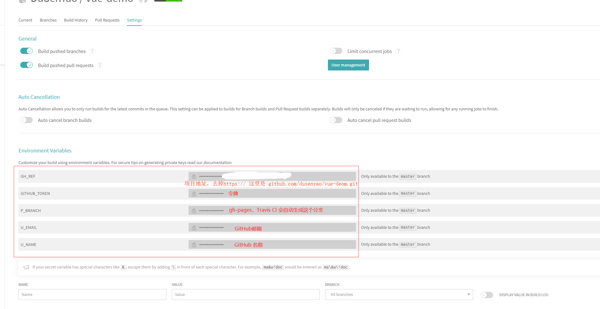

# Vue-CLI

<!-- @import "[TOC]" {cmd="toc" depthFrom=1 depthTo=6 orderedList=false} -->

<!-- code_chunk_output -->

- [Vue-CLI](#vue-cli)
  - [一. 介绍](#一-介绍)
    - [1.1 系统组件](#11-系统组件)
  - [二. 基础](#二-基础)
    - [2.1 安装](#21-安装)
      - [2.1.1 升级](#211-升级)
    - [2.2 快速原型开发](#22-快速原型开发)
      - [2.2.1 vue serve](#221-vue-serve)
      - [2.2.2 vue build](#222-vue-build)
    - [2.3 创建项目](#23-创建项目)
      - [2.3.1 vue create](#231-vue-create)
      - [2.3.2 使用图形化界面](#232-使用图形化界面)
    - [2.4 插件和 Preset](#24-插件和-preset)
      - [2.4.1 插件](#241-插件)
        - [2.4.1.1 在现有的项目中安装插件](#2411-在现有的项目中安装插件)
        - [2.4.1.2 项目本地的插件](#2412-项目本地的插件)
      - [2.4.2 Preset](#242-preset)
        - [2.4.2.1 Preset 插件的版本管理](#2421-preset-插件的版本管理)
        - [2.4.2.2 允许插件的命令提示](#2422-允许插件的命令提示)
        - [2.4.2.3 远程 Preset](#2423-远程-preset)
        - [2.4.2.4 加载文件系统中的 Preset](#2424-加载文件系统中的-preset)
    - [2.5 CLI 服务](#25-cli-服务)
      - [2.5.1 使用命令](#251-使用命令)
      - [2.5.2 vue-cli-service serve](#252-vue-cli-service-serve)
      - [2.5.3 vue-cli-service build](#253-vue-cli-service-build)
      - [2.5.4 vue-cli-service inspect](#254-vue-cli-service-inspect)
      - [2.5.5 查看所有的可用命令](#255-查看所有的可用命令)
      - [2.5.6 缓存和并行处理](#256-缓存和并行处理)
  - [三. 开发](#三-开发)
    - [3.1 浏览器兼容性](#31-浏览器兼容性)
      - [3.1.1 browserslist](#311-browserslist)
      - [3.1.2 Polyfill](#312-polyfill)
        - [3.1.2.1 useBuiltIns: 'usage'](#3121-usebuiltins-usage)
        - [3.1.2.2 构建库或是 Web Component 时的 Polyfills](#3122-构建库或是-web-component-时的-polyfills)
      - [3.1.3 现代模式](#313-现代模式)
    - [3.2 HTML 和静态资源](#32-html-和静态资源)
      - [3.2.1 HTML](#321-html)
        - [3.2.1.1 Index 文件](#3211-index-文件)
        - [3.2.1.2 插值](#3212-插值)
        - [3.2.1.3 Preload](#3213-preload)
        - [3.2.1.4 Prefetch](#3214-prefetch)
        - [3.2.1.5 不生成 index](#3215-不生成-index)
        - [3.2.1.6 构建一个多页应用](#3216-构建一个多页应用)
      - [3.2.2 处理静态资源](#322-处理静态资源)
        - [3.2.2.1 从相对路径导入](#3221-从相对路径导入)
        - [3.2.2.2 URL 转换规则](#3222-url-转换规则)
        - [3.2.2.3 `public` 文件夹](#3223-public-文件夹)
        - [3.2.2.4 何时使用 `public` 文件夹](#3224-何时使用-public-文件夹)
    - [3.3 CSS 相关](#33-css-相关)
      - [3.3.1 引用静态资源](#331-引用静态资源)
      - [3.3.2 预处理器](#332-预处理器)
        - [3.3.2.1 自动化导入](#3321-自动化导入)
      - [3.3.3 PostCSS](#333-postcss)
      - [3.3.4 CSS Modules](#334-css-modules)
        - [3.3.4.1 向预处理器 Loader 传递选项](#3341-向预处理器-loader-传递选项)
    - [3.4 webpack 相关](#34-webpack-相关)
      - [3.4.1 简单的配置方式](#341-简单的配置方式)
      - [3.4.2 链式操作 (高级)](#342-链式操作-高级)
        - [3.4.2.1 修改 Loader 选项](#3421-修改-loader-选项)
        - [3.4.2.2 添加一个新的 Loader](#3422-添加一个新的-loader)
        - [3.4.2.3 替换一个规则里的 Loader](#3423-替换一个规则里的-loader)
        - [3.4.2.4 修改插件选项](#3424-修改插件选项)
      - [3.4.3 审查项目的 webpack 配置](#343-审查项目的-webpack-配置)
      - [3.4.4 以一个文件的方式使用解析好的配置](#344-以一个文件的方式使用解析好的配置)
    - [3.5 模式和环境变量](#35-模式和环境变量)
      - [3.5.1 模式](#351-模式)
      - [3.5.2 环境变量](#352-环境变量)
      - [3.5.3 示例：Staging(模拟) 模式](#353-示例staging模拟-模式)
      - [3.5.4 在客户端侧代码中使用环境变量](#354-在客户端侧代码中使用环境变量)
      - [3.5.5 只在本地有效的变量](#355-只在本地有效的变量)
    - [3.6 构建目标](#36-构建目标)
      - [3.6.1 应用](#361-应用)
      - [3.6.2 库](#362-库)
        - [3.6.2.1 Vue vs. JS/TS 入口文件](#3621-vue-vs-jsts-入口文件)
      - [3.6.3 Web Components 组件](#363-web-components-组件)
        - [3.6.3.1 注册多个 Web Components 组件的包](#3631-注册多个-web-components-组件的包)
        - [3.6.3.2 异步 Web Components 组件](#3632-异步-web-components-组件)
      - [3.6.4 在构建时使用 vuex](#364-在构建时使用-vuex)
    - [3.7 部署](#37-部署)
      - [3.7.1 通用指南](#371-通用指南)
        - [3.7.1.1 本地预览](#3711-本地预览)
        - [3.7.1.2 使用 history.pushState 的路由](#3712-使用-historypushstate-的路由)
        - [3.7.1.3 CORS](#3713-cors)
        - [3.7.1.4 PWA](#3714-pwa)
      - [3.7.2 平台指南](#372-平台指南)
        - [3.7.2.1 云开发 CloudBase](#3721-云开发-cloudbase)
        - [3.7.2.2 混合部署](#3722-混合部署)
        - [3.7.2.3 GitHub Pages](#3723-github-pages)

<!-- /code_chunk_output -->

## 一. 介绍

Vue CLI 是一个基于 Vue.js 进行快速开发的完整系统，提供：

- 通过 `@vue/cli` 实现的交互式的项目脚手架。
- 通过 `@vue/cli` + `@vue/cli-service-global` 实现的零配置原型开发。
- 一个运行时依赖 (`@vue/cli-service`)，该依赖：
  - 可升级；
  - 基于 webpack 构建，并带有合理的默认配置；
  - 可以通过项目内的配置文件进行配置；
  - 可以通过插件进行扩展。
- 一个丰富的官方插件集合，集成了前端生态中最好的工具。
- 一套完全图形化的创建和管理 Vue.js 项目的用户界面。

Vue CLI 致力于将 Vue 生态中的工具基础标准化。它确保了各种构建工具能够基于智能的默认配置即可平稳衔接，这样可以专注在撰写应用上，而不必花好几天去纠结配置的问题。与此同时，它也为每个工具提供了调整配置的灵活性，无需 eject。

### 1.1 系统组件

Vue CLI 有几个独立的部分——如果看了源代码，会发现这个仓库里同时管理了多个单独发布的包。

**CLI**
CLI (`@vue/cli`) 是一个全局安装的 npm 包，提供了终端里的 `vue` 命令。它可以通过 `vue create` 快速搭建一个新项目，或者直接通过 `vue serve` 构建新想法的原型。也可以通过 `vue ui` 通过一套图形化界面管理所有项目。

**CLI 服务**
CLI 服务 (`@vue/cli-service`) 是一个开发环境依赖。它是一个 npm 包，局部安装在每个 @vue/cli 创建的项目中。

CLI 服务是构建于 `webpack` 和 `webpack-dev-server` 之上的。它包含了：

- 加载其它 CLI 插件的核心服务；
- 一个针对绝大部分应用优化过的内部的 webpack 配置；
- 项目内部的 `vue-cli-service` 命令，提供 `serve`、`build` 和 `inspect` 命令。

如果熟悉 `create-react-app` 的话，`@vue/cli-service` 实际上大致等价于 `react-scripts`，尽管功能集合不一样。

**CLI 插件**
CLI 插件是向 Vue 项目提供可选功能的 npm 包，例如 `Babel/TypeScript` 转译、ESLint 集成、单元测试和 `end-to-end` 测试等。Vue CLI 插件的名字以 `@vue/cli-plugin-` (内建插件) 或 `vue-cli-plugin-` (社区插件) 开头，非常容易使用。

当在项目内部运行 `vue-cli-service` 命令时，它会自动解析并加载 `package.json` 中列出的所有 CLI 插件。

插件可以作为项目创建过程的一部分，或在后期加入到项目中。它们也可以被归成一组可复用的 preset。

## 二. 基础

### 2.1 安装

可以使用下列任一命令安装这个新的包：

```sh
npm install -g @vue/cli
# OR
yarn global add @vue/cli
```

安装之后，就可以在命令行中访问 `vue` 命令。可以通过简单运行 vue，看看是否展示出了一份所有可用命令的帮助信息，来验证它是否安装成功。

还可以用这个命令来检查其版本是否正确：

```sh
vue --version
```

#### 2.1.1 升级

如需升级全局的 Vue CLI 包，请运行：

```sh
npm update -g @vue/cli
# 或者
yarn global upgrade --latest @vue/cli
```

**项目依赖**
上面列出来的命令是用于升级全局的 Vue CLI。如需升级项目中的 Vue CLI 相关模块（以 `@vue/cli-plugin-` 或 `vue-cli-plugin-` 开头），请在项目目录下运行 `vue upgrade`：

```sh
用法： upgrade [options] [plugin-name]

（试用）升级 Vue CLI 服务及插件

选项：
  -t, --to <version>    升级 <plugin-name> 到指定的版本
  -f, --from <version>  跳过本地版本检测，默认插件是从此处指定的版本升级上来
  -r, --registry <url>  使用指定的 registry 地址安装依赖
  --all                 升级所有的插件
  --next                检查插件新版本时，包括 alpha/beta/rc 版本在内
  -h, --help            输出帮助内容
```

### 2.2 快速原型开发

可以使用 `vue serve` 和 `vue build` 命令对单个 `*.vue` 文件进行快速原型开发，不过这需要先额外安装一个全局的扩展：

```sh
npm install -g @vue/cli-service-global
```

`vue serve` 的缺点就是它需要安装全局依赖，这使得它在不同机器上的一致性不能得到保证。因此这只适用于快速原型开发。

#### 2.2.1 vue serve

```sh
Usage: serve [options] [entry]

在开发环境模式下零配置为 .js 或 .vue 文件启动一个服务器

Options:

  -o, --open  打开浏览器
  -c, --copy  将本地 URL 复制到剪切板
  -p, --port <port> 服务器使用的端口 (默认: 8080 或下一个可用端口)
  -h, --help  输出用法信息
```

所需要的仅仅是一个 `App.vue` 文件，然后在这个 `App.vue` 文件所在的目录下运行：

```sh
vue serve
```

`vue serve` 使用了和 `vue create` 创建的项目相同的默认设置 (webpack、Babel、PostCSS 和 ESLint)。它会在当前目录自动推导入口文件——入口可以是 main.js、index.js、App.vue 或 app.vue 中的一个。也可以显式地指定入口文件：

```sh
vue serve MyComponent.vue
```

如果需要，还可以提供一个 index.html、package.json、安装并使用本地依赖、甚至通过相应的配置文件配置 Babel、PostCSS 和 ESLint。

#### 2.2.2 vue build

```sh
Usage: build [options] [entry]

在生产环境模式下零配置构建一个 .js 或 .vue 文件

Options:

  -t, --target <target>  构建目标 (app | lib | wc | wc-async, 默认值：app)
  -n, --name <name>      库的名字或 Web Components 组件的名字 (默认值：入口文件名)
  -d, --dest <dir>       输出目录 (默认值：dist)
  -h, --help             输出用法信息
```

也可以使用 `vue build` 将目标文件构建成一个生产环境的包并用来部署：

```sh
vue build MyComponent.vue
```

`vue build` 也提供了将组件构建成为一个库或一个 Web Components 组件的能力。查阅[构建目标](#242-preset)了解更多。

### 2.3 创建项目

#### 2.3.1 vue create

运行以下命令来创建一个新项目：

```sh
vue create hello-world
```

会被提示选取一个 preset。可以选默认的包含了基本的 Babel + ESLint 设置的 preset，也可以选“手动选择特性”来选取需要的特性。

这个默认的设置非常适合快速创建一个新项目的原型，而手动设置则提供了更多的选项，它们是面向生产的项目更加需要的。

如果决定手动选择特性，在操作提示的最后可以选择将已选项保存为一个将来可复用的 preset。

> `~/.vuerc`
> 被保存的 preset 将会存在用户的 home 目录下一个名为 `.vuerc` 的 JSON 文件里。如果想要修改被保存的 preset / 选项，可以编辑这个文件。
> 在项目创建的过程中，也会被提示选择喜欢的包管理器或使用淘宝 npm 镜像源以更快地安装依赖。这些选择也将会存入 `~/.vuerc`。

`vue create` 命令有一些可选项，可以通过运行以下命令进行探索：

```sh
vue create --help
```

```sh
用法：create [options] <app-name>

创建一个由 `vue-cli-service` 提供支持的新项目


选项：

  -p, --preset <presetName>       忽略提示符并使用已保存的或远程的预设选项
  -d, --default                   忽略提示符并使用默认预设选项
  -i, --inlinePreset <json>       忽略提示符并使用内联的 JSON 字符串预设选项
  -m, --packageManager <command>  在安装依赖时使用指定的 npm 客户端
  -r, --registry <url>            在安装依赖时使用指定的 npm registry
  -g, --git [message]             强制 / 跳过 git 初始化，并可选的指定初始化提交信息
  -n, --no-git                    跳过 git 初始化
  -f, --force                     覆写目标目录可能存在的配置
  -c, --clone                     使用 git clone 获取远程预设选项
  -x, --proxy                     使用指定的代理创建项目
  -b, --bare                      创建项目时省略默认组件中的新手指导信息
  -h, --help                      输出使用帮助信息
```

#### 2.3.2 使用图形化界面

也可以通过 `vue ui` 命令以图形化界面创建和管理项目：

```sh
vue ui
```

上述命令会打开一个浏览器窗口，并以图形化界面引导至项目创建的流程。

### 2.4 插件和 Preset

#### 2.4.1 插件

Vue CLI 使用了一套基于插件的架构。如果查阅一个新创建项目的 `package.json`，就会发现依赖都是以 `@vue/cli-plugin-` 开头的。插件可以修改 webpack 的内部配置，也可以向 vue-cli-service 注入命令。在项目创建的过程中，绝大部分列出的特性都是通过插件来实现的。

基于插件的架构使得 Vue CLI 灵活且可扩展。如果对开发一个插件感兴趣，请翻阅[插件开发指南](https://cli.vuejs.org/zh/dev-guide/plugin-dev.html)。

> 可以通过 `vue ui` 命令使用 GUI 安装和管理插件。

##### 2.4.1.1 在现有的项目中安装插件

每个 CLI 插件都会包含一个 (用来创建文件的) 生成器和一个 (用来调整 webpack 核心配置和注入命令的) 运行时插件。当使用 `vue create` 来创建一个新项目的时候，有些插件会根据选择的特性被预安装好。如果想在一个已经被创建好的项目中安装一个插件，可以使用 `vue add` 命令：

```sh
vue add @vue/eslint
```

> `vue add` 的设计意图是为了安装和调用 Vue CLI 插件。这不意味着替换掉普通的 npm 包。对于这些普通的 npm 包，仍然需要选用包管理器。
> 在运行 `vue add` 之前将项目的最新状态提交，因为该命令可能调用插件的文件生成器并很有可能更改现有的文件。

这个命令将 `@vue/eslint` 解析为完整的包名 `@vue/cli-plugin-eslint`，然后从 npm 安装它，调用它的生成器。

```sh
# 这个和之前的用法等价
vue add cli-plugin-eslint
```

如果不带 `@vue` 前缀，该命令会换作解析一个 `unscoped` 的包。例如以下命令会安装第三方插件 `vue-cli-plugin-apollo`：

```sh
# 安装并调用 vue-cli-plugin-apollo
vue add apollo
```

也可以基于一个指定的 scope 使用第三方插件。例如如果一个插件名为 `@foo/vue-cli-plugin-bar`，可以这样添加它：

```sh
vue add @foo/bar
```

可以向被安装的插件传递生成器选项 (这样做会跳过命令提示)：

```sh
vue add eslint --config airbnb --lintOn save
```

如果一个插件已经被安装，可以使用 `vue invoke` 命令跳过安装过程，只调用它的生成器。这个命令会接受和 `vue add` 相同的参数。

> **提示**
> 如果出于一些原因插件列在了该项目之外的其它 `package.json` 文件里，可以在自己项目的 `package.json` 里设置 `vuePlugins.resolveFrom` 选项指向包含其它 `package.json` 的文件夹。
> 例如，如果有一个 `.config/package.json` 文件：
>
> ```json
> {
>   "vuePlugins": {
>     "resolveFrom": ".config"
>   }
> }
> ```

##### 2.4.1.2 项目本地的插件

如果需要在项目里直接访问插件 API 而不需要创建一个完整的插件，可以在 `package.json` 文件中使用 `vuePlugins.service` 选项：

```json
{
  "vuePlugins": {
    "service": ["my-commands.js"]
  }
}
```

每个文件都需要暴露一个函数，接受插件 API 作为第一个参数。关于插件 API 的更多信息可以查阅[插件开发指南](https://cli.vuejs.org/zh/dev-guide/plugin-dev.html)。

也可以通过 `vuePlugins.ui` 选项添加像 UI 插件一样工作的文件:

```json
{
  "vuePlugins": {
    "ui": ["my-ui.js"]
  }
}
```

#### 2.4.2 Preset

一个 Vue CLI preset 是一个包含创建新项目所需预定义选项和插件的 JSON 对象，让用户无需在命令提示中选择它们。

在 `vue create` 过程中保存的 preset 会被放在用户的 home 目录下的一个配置文件中 (`~/.vuerc`)。可以通过直接编辑这个文件来调整、添加、删除保存好的 preset。

这里有一个 preset 的示例：

```json
{
  "useConfigFiles": true,
  "cssPreprocessor": "sass",
  "plugins": {
    "@vue/cli-plugin-babel": {},
    "@vue/cli-plugin-eslint": {
      "config": "airbnb",
      "lintOn": ["save", "commit"]
    },
    "@vue/cli-plugin-router": {},
    "@vue/cli-plugin-vuex": {}
  }
}
```

Preset 的数据会被插件生成器用来生成相应的项目文件。除了上述这些字段，也可以为集成工具添加配置：

```json
{
  "useConfigFiles": true,
  "plugins": {...},
  "configs": {
    "vue": {...},
    "postcss": {...},
    "eslintConfig": {...},
    "jest": {...}
  }
}
```

这些额外的配置将会根据 `useConfigFiles` 的值被合并到 `package.json` 或相应的配置文件中。例如，当 "useConfigFiles": true 的时候，configs 的值将会被合并到 vue.config.js 中。

##### 2.4.2.1 Preset 插件的版本管理

可以显式地指定用到的插件的版本：

```json
{
  "plugins": {
    "@vue/cli-plugin-eslint": {
      "version": "^3.0.0"
      // ... 该插件的其它选项
    }
  }
}
```

> 注意 : 对于官方插件来说这不是必须的——当被忽略时，CLI 会自动使用 registry 中最新的版本。不过**推荐为 preset 列出的所有第三方插件提供显式的版本范围**。

##### 2.4.2.2 允许插件的命令提示

每个插件在项目创建的过程中都可以注入它自己的命令提示，不过当使用了一个 preset，这些命令提示就会被跳过，因为 Vue CLI 假设所有的插件选项都已经在 preset 中声明过了。

在有些情况下可能希望 preset 只声明需要的插件，同时让用户通过插件注入的命令提示来保留一些灵活性。

对于这种场景可以在插件选项中指定 `"prompts": true` 来允许注入命令提示：

```json
{
  "plugins": {
    "@vue/cli-plugin-eslint": {
      // 让用户选取他们自己的 ESLint config
      "prompts": true
    }
  }
}
```

##### 2.4.2.3 远程 Preset

可以通过发布 `git repo` 将一个 preset 分享给其他开发者。这个 repo 应该包含以下文件：

- `preset.json` : 包含 preset 数据的主要文件（必需）。
- `generator.js` : 一个可以注入或是修改项目中文件的 Generator。
- `prompts.js` : 一个可以通过命令行对话为 generator 收集选项的 prompts 文件。

发布 repo 后，就可以在创建项目的时候通过 `--preset` 选项使用这个远程的 preset 了：

```sh
# 从 GitHub repo 使用 preset
vue create --preset username/repo my-project
```

GitLab 和 BitBucket 也是支持的。如果要从私有 repo 获取，请确保使用 `--clone` 选项：

```sh
vue create --preset gitlab:username/repo --clone my-project
vue create --preset bitbucket:username/repo --clone my-project

# 私有服务器
vue create --preset gitlab:my-gitlab-server.com:group/projectname --clone my-project
vue create --preset direct:ssh://git@my-gitlab-server.com/group/projectname.git --clone my-project
```

##### 2.4.2.4 加载文件系统中的 Preset

当开发一个远程 preset 的时候，必须不厌其烦的向远程 repo 发出 push 进行反复测试。为了简化这个流程，也可以直接在本地测试 preset。如果 `--preset` 选项的值是一个相对或绝对文件路径，或是以 `.json` 结尾，则 Vue CLI 会加载本地的 preset：

```json
# ./my-preset 应当是一个包含 preset.json 的文件夹
vue create --preset ./my-preset my-project

# 或者，直接使用当前工作目录下的 json 文件：
vue create --preset my-preset.json my-project
```

### 2.5 CLI 服务

#### 2.5.1 使用命令

在一个 Vue CLI 项目中，`@vue/cli-service` 安装了一个名为 `vue-cli-service` 的命令。可以在 `npm scripts` 中以 `vue-cli-service`、或者从终端中以 `./node_modules/.bin/vue-cli-service` 访问这个命令。

使用默认 preset 的项目的 package.json：

```json
{
  "scripts": {
    "serve": "vue-cli-service serve",
    "build": "vue-cli-service build"
  }
}
```

可以通过 npm 或 Yarn 调用这些 script：

```sh
npm run serve
# OR
yarn serve
```

如果可以使用 npx (最新版的 npm 应该已经自带)，也可以直接这样调用命令：

```sh
npx vue-cli-service serve
```

> 提示 : 可以通过 `vue ui` 命令使用 GUI 运行更多的特性脚本。

#### 2.5.2 vue-cli-service serve

```sh
用法：vue-cli-service serve [options] [entry]

选项：

  --open    在服务器启动时打开浏览器
  --copy    在服务器启动时将 URL 复制到剪切版
  --mode    指定环境模式 (默认值：development)
  --host    指定 host (默认值：0.0.0.0)
  --port    指定 port (默认值：8080)
  --https   使用 https (默认值：false)
```

`vue-cli-service serve` 命令会启动一个开发服务器 (基于 `webpack-dev-server`) 并附带开箱即用的模块热重载 (Hot-Module-Replacement)。

除了通过命令行参数，也可以使用 `vue.config.js` 里的 `devServer` 字段配置开发服务器。

命令行参数 `[entry]` 将被指定为唯一入口，而非额外的追加入口。尝试使用 `[entry]` 覆盖 `config.pages` 中的 `entry` 将可能引发错误。

#### 2.5.3 vue-cli-service build

```sh
用法：vue-cli-service build [options] [entry|pattern]

选项：

  --mode        指定环境模式 (默认值：production)
  --dest        指定输出目录 (默认值：dist)
  --modern      面向现代浏览器带自动回退地构建应用
  --target      app | lib | wc | wc-async (默认值：app)
  --name        库或 Web Components 模式下的名字 (默认值：package.json 中的 "name" 字段或入口文件名)
  --no-clean    在构建项目之前不清除目标目录
  --report      生成 report.html 以帮助分析包内容
  --report-json 生成 report.json 以帮助分析包内容
  --watch       监听文件变化
```

`vue-cli-service build` 会在 `dist/` 目录产生一个可用于生产环境的包，带有 JS/CSS/HTML 的压缩，和为更好的缓存而做的自动的 vendor chunk splitting。它的 chunk manifest 会内联在 HTML 里。

这里还有一些有用的命令参数：

- `--modern` : 使用[现代模式](#313-现代模式)构建应用，为现代浏览器交付原生支持的 ES2015 代码，并生成一个兼容老浏览器的包用来自动回退。

- `--target` : 允许将项目中的任何组件以一个库或 Web Components 组件的方式进行构建。更多细节请查阅[构建目标](#36-构建目标)。

- `--report` 和 `--report-json` : 会根据构建统计生成报告，它会帮助你分析包中包含的模块们的大小。

#### 2.5.4 vue-cli-service inspect

```sh
用法：vue-cli-service inspect [options] [...paths]

选项：

  --mode    指定环境模式 (默认值：development)
```

可以使用 `vue-cli-service inspect` 来审查一个 Vue CLI 项目的 webpack config。更多细节请查阅[审查 webpack config](#343-审查项目的-webpack-配置)。

#### 2.5.5 查看所有的可用命令

有些 CLI 插件会向 `vue-cli-service` 注入额外的命令。例如 `@vue/cli-plugin-eslint` 会注入 `vue-cli-service lint` 命令。可以运行以下命令查看所有注入的命令：

```sh
npx vue-cli-service help
```

也可以这样学习每个命令可用的选项：

```sh
npx vue-cli-service help [command]
```

#### 2.5.6 缓存和并行处理

- `cache-loader` : 会默认为 Vue/Babel/TypeScript 编译开启。文件会缓存在 `node_modules/.cache` 中——如果遇到了编译方面的问题，记得先删掉缓存目录之后再试试看。

- `thread-loader` : 会在多核 CPU 的机器上为 Babel/TypeScript 转译开启。

## 三. 开发

### 3.1 浏览器兼容性

#### 3.1.1 browserslist

`package.json` 文件里的 `browserslist` 字段 (或一个单独的 `.browserslistrc` 文件)，指定了项目的目标浏览器的范围。这个值会被 `@babel/preset-env` 和 `Autoprefixer` 用来确定需要转译的 JavaScript 特性和需要添加的 CSS 浏览器前缀。[了解如何指定浏览器范围](https://github.com/ai/browserslist)。

#### 3.1.2 Polyfill

##### 3.1.2.1 useBuiltIns: 'usage'

一个默认的 Vue CLI 项目会使用 `@vue/babel-preset-app`，它通过 `@babel/preset-env` 和 `browserslist` 配置来决定项目需要的 polyfill。

默认情况下，它会把 `useBuiltIns: 'usage'` 传递给 `@babel/preset-env`，这样它会根据源代码中出现的语言特性自动检测需要的 polyfill。这确保了最终包里 polyfill 数量的最小化。然而，这也意味着**如果其中一个依赖需要特殊的 polyfill，默认情况下 Babel 无法将其检测出来**。

如果有依赖需要 polyfill，有几种选择：

1. **如果该依赖基于一个目标环境不支持的 ES 版本撰写**: 将其添加到 `vue.config.js` 中的 `transpileDependencies` 选项。这会为该依赖同时开启语法转换和根据使用情况检测 polyfill。

2. **如果该依赖交付了 ES5 代码并显式地列出了需要的 polyfill**: 可以使用 `@vue/babel-preset-app` 的 polyfills 选项预包含所需要的 polyfill。**注意 `es.promise` 将被默认包含，因为现在的库依赖 Promise 是非常普遍的**。

   ```js
   // babel.config.js
   module.exports = {
     presets: [
       [
         '@vue/app',
         {
           polyfills: ['es.promise', 'es.symbol']
         }
       ]
     ]
   };
   ```

   > 提示 : 推荐以这种方式添加 polyfill 而不是在源代码中直接导入它们，因为如果这里列出的 polyfill 在 `browserslist` 的目标中不需要，则它会被自动排除。

3. **如果该依赖交付 ES5 代码，但使用了 ES6+ 特性且没有显式地列出需要的 polyfill (例如 Vuetify)：请使用 `useBuiltIns: 'entry'` 然后在入口文件添加 `import 'core-js/stable'`; `import 'regenerator-runtime/runtime'`。这会根据 `browserslist` 目标导入所有 polyfill**，这样就不用再担心依赖的 polyfill 问题了，但是因为包含了一些没有用到的 polyfill 所以最终的包大小可能会增加。

更多细节可查阅 [@babel/preset-env 文档](https://babeljs.io/docs/en/babel-preset-env.html#usebuiltins-usage)。

##### 3.1.2.2 构建库或是 Web Component 时的 Polyfills

当使用 Vue CLI 来构建一个库或是 Web Component 时，推荐给 `@vue/babel-preset-app` 传入 `useBuiltIns: false` 选项。这能够确保库或是组件不包含不必要的 polyfills。通常来说，打包 polyfills 应当是最终使用你的库的应用的责任。

#### 3.1.3 现代模式

有了 Babel 可以兼顾所有最新的 ES2015+ 语言特性，但也意味着需要交付转译和 polyfill 后的包以支持旧浏览器。这些转译后的包通常都比原生的 ES2015+ 代码会更冗长，运行更慢。现如今绝大多数现代浏览器都已经支持了原生的 ES2015，所以因为要支持更老的浏览器而为它们交付笨重的代码是一种浪费。

Vue CLI 提供了一个“现代模式”帮助解决这个问题。以如下命令为生产环境构建：

```sh
vue-cli-service build --modern
```

Vue CLI 会产生两个应用的版本：一个现代版的包，面向支持 ES modules 的现代浏览器，另一个旧版的包，面向不支持的旧浏览器。

最酷的是这里没有特殊的部署要求。其生成的 HTML 文件会自动使用 Phillip Walton 精彩的博文中讨论到的技术：

- 现代版的包会通过 `<script type="module">` 在被支持的浏览器中加载；它们还会使用 `<link rel="modulepreload">` 进行预加载。

- 旧版的包会通过 `<script nomodule>` 加载，并会被支持 ES modules 的浏览器忽略。

- 一个针对 Safari 10 中 `<script nomodule>` 的修复会被自动注入。

对于一个 Hello World 应用来说，现代版的包已经小了 16%。在生产环境下，现代版的包通常都会表现出显著的解析速度和运算速度，从而改善应用的加载性能。

> 提示
> `<script type="module">` [需要配合始终开启的 CORS 进行加载](https://jakearchibald.com/2017/es-modules-in-browsers/#always-cors)。这意味着服务器必须返回诸如 `Access-Control-Allow-Origin: *` 的有效的 CORS 头。如果想要通过认证来获取脚本，可使将 crossorigin 选项设置为 `use-credentials`。
>
> 同时，现代浏览器使用一段内联脚本来避免 Safari 10 重复加载脚本包，所以如果在使用一套严格的 CSP，需要这样显性地允许内联脚本：
>
> ```sh
> Content-Security-Policy: script-src 'self' 'sha256-4RS22DYeB7U14dra4KcQYxmwt5HkOInieXK1NUMBmQI='
> ```

### 3.2 HTML 和静态资源

#### 3.2.1 HTML

##### 3.2.1.1 Index 文件

`public/index.html` 文件是一个会被 `html-webpack-plugin` 处理的模板。在构建过程中，资源链接会被自动注入。另外，Vue CLI 也会自动注入 resource hint (`preload/prefetch`、manifest 和图标链接 (当用到 PWA 插件时) 以及构建过程中处理的 JavaScript 和 CSS 文件的资源链接。

##### 3.2.1.2 插值

因为 index 文件被用作模板，所以可以使用 `lodash template` 语法插入内容：

- <%= VALUE %> 用来做不转义插值；
- <%- VALUE %> 用来做 HTML 转义插值；
- <% expression %> 用来描述 JavaScript 流程控制。

除了被 `html-webpack-plugin` 暴露的默认值之外，所有客户端环境变量也可以直接使用。例如，`BASE_URL` 的用法：

```html
<link
  rel="icon"
  href="<%= BASE_URL %>favicon.ico"
/>
```

更多内容可以查阅：[publicPath](https://cli.vuejs.org/zh/config/#publicpath)

##### 3.2.1.3 Preload

`<link rel="preload">` 是一种 resource hint，用来指定页面加载后很快会被用到的资源，所以在页面加载的过程中，希望在浏览器开始主体渲染之前尽早 preload。

默认情况下，一个 Vue CLI 应用会为所有初始化渲染需要的文件自动生成 preload 提示。

这些提示会被 `@vue/preload-webpack-plugin` 注入，并且可以通过 `chainWebpack` 的 `config.plugin('preload')` 进行修改和删除。

##### 3.2.1.4 Prefetch

`<link rel="prefetch">` 是一种 resource hint，用来告诉浏览器在页面加载完成后，利用空闲时间提前获取用户未来可能会访问的内容。

默认情况下，一个 Vue CLI 应用会为所有作为 async chunk 生成的 JavaScript 文件 (通过动态 `import()` 按需 code splitting 的产物) 自动生成 prefetch 提示。

这些提示会被 `@vue/preload-webpack-plugin` 注入，并且可以通过 chainWebpack 的 config.plugin('prefetch') 进行修改和删除。

```js
// vue.config.js
module.exports = {
  chainWebpack: (config) => {
    // 移除 prefetch 插件
    config.plugins.delete('prefetch');

    // 或者
    // 修改它的选项：
    config.plugin('prefetch').tap((options) => {
      options[0].fileBlacklist = options[0].fileBlacklist || [];
      options[0].fileBlacklist.push(/myasyncRoute(.)+?\.js$/);
      return options;
    });
  }
};
```

当 prefetch 插件被禁用时，可以通过 webpack 的内联注释手动选定要提前获取的代码区块：

```js
import(/* webpackPrefetch: true */ './someAsyncComponent.vue');
```

webpack 的运行时会在父级区块被加载之后注入 prefetch 链接。

> 提示 : Prefetch 链接将会消耗带宽。如果应用很大且有很多 async chunk，而用户主要使用的是对带宽较敏感的移动端，那么可能需要关掉 prefetch 链接并手动选择要提前获取的代码区块。

##### 3.2.1.5 不生成 index

当基于已有的后端使用 Vue CLI 时，可能不需要生成 `index.html`，这样生成的资源可以用于一个服务端渲染的页面。这时可以向 `vue.config.js` 加入下列代码：

```js
// vue.config.js
module.exports = {
  // 去掉文件名中的 hash
  filenameHashing: false,
  // 删除 HTML 相关的 webpack 插件
  chainWebpack: (config) => {
    config.plugins.delete('html');
    config.plugins.delete('preload');
    config.plugins.delete('prefetch');
  }
};
```

然而这样做并不是很推荐，因为：

- 硬编码的文件名不利于实现高效率的缓存控制。
- 硬编码的文件名也无法很好的进行 code-splitting (代码分段)，因为无法用变化的文件名生成额外的 JavaScript 文件。
- 硬编码的文件名无法在现代模式下工作。

应该考虑换用 [indexPath](https://cli.vuejs.org/zh/config/#indexpath) 选项将生成的 HTML 用作一个服务端框架的视图模板。

##### 3.2.1.6 构建一个多页应用

不是每个应用都需要是一个单页应用。Vue CLI 支持使用 `vue.config.js` 中的 [pages](https://cli.vuejs.org/zh/config/#pages) 选项构建一个多页面的应用。构建好的应用将会在不同的入口之间高效共享通用的 chunk 以获得最佳的加载性能。

#### 3.2.2 处理静态资源

静态资源可以通过两种方式进行处理：

- 在 JavaScript 被导入或在 template/CSS 中通过相对路径被引用。这类引用会被 webpack 处理。

- 放置在 `public` 目录下或通过绝对路径被引用。这类资源将会直接被拷贝，而不会经过 webpack 的处理。

##### 3.2.2.1 从相对路径导入

当在 JavaScript、CSS 或 `*.vue` 文件中使用相对路径 (必须以 `.` 开头) 引用一个静态资源时，该资源将会被包含进入 webpack 的依赖图中。在其编译过程中，所有诸如 ``、`background: url(...)` 和 CSS `@import` 的资源 URL 都会被解析为一个模块依赖。

例如，`url(./image.png)` 会被翻译为 `require('./image.png')`，而：

```html

```

将会被编译到：

```js
h('img', { attrs: { src: require('./image.png') } });
```

在其内部，通过 `file-loader` 用版本哈希值和正确的公共基础路径来决定最终的文件路径，再用 `url-loader` 将小于 4kb 的资源内联，以减少 HTTP 请求的数量。

可以通过 `chainWebpack` 调整内联文件的大小限制。例如，下列代码会将其限制设置为 10kb：

```js
// vue.config.js
module.exports = {
  chainWebpack: (config) => {
    config.module
      .rule('images')
      .use('url-loader')
      .loader('url-loader')
      .tap((options) => Object.assign(options, { limit: 10240 }));
  }
};
```

##### 3.2.2.2 URL 转换规则

- 如果 URL 是一个绝对路径 (例如 `/images/foo.png`)，它将会被保留不变。

- 如果 URL 以 `.` 开头，它会作为一个相对模块请求被解释且基于文件系统中的目录结构进行解析。

- 如果 URL 以 `~` 开头，其后的任何内容都会作为一个模块请求被解析。这意味着甚至可以引用 Node 模块中的资源：

  ```html
  
  ```

- 如果 URL 以 `@` 开头，它也会作为一个模块请求被解析。它的用处在于 Vue CLI 默认会设置一个指向 `<projectRoot>/src` 的别名 `@`。**(仅作用于模版中)**

##### 3.2.2.3 `public` 文件夹

任何放置在 `public` 文件夹的静态资源都会被简单的复制，而不经过 webpack。**需要通过绝对路径来引用它们**。

> 注意 : 推荐将资源作为模块依赖图的一部分导入，这样它们会通过 webpack 的处理并获得如下好处：

- 脚本和样式表会被压缩且打包在一起，从而避免额外的网络请求。
- 文件丢失会直接在编译时报错，而不是到了用户端才产生 404 错误。
- 最终生成的文件名包含了内容哈希，因此不必担心浏览器会缓存它们的老版本。

`public` 目录提供的是一个**应急手段**，当通过绝对路径引用它时，留意应用将会部署到哪里。如果应用没有部署在域名的根部，那么需要为 URL 配置 [publicPath](https://cli.vuejs.org/zh/config/#publicpath) 前缀：

- 在 `public/index.html` 或其它通过 `html-webpack-plugin` 用作模板的 HTML 文件中，需要通过 `<%= BASE_URL %>` 设置链接前缀：

  ```html
  <link
    rel="icon"
    href="<%= BASE_URL %>favicon.ico"
  />
  ```

- 在模板中，首先需要向组件传入基础 URL：

  ```js
  data () {
    return {
      publicPath: process.env.BASE_URL
    }
  }
  ```

  然后

  ```html
  
  ```

##### 3.2.2.4 何时使用 `public` 文件夹

- 需要在构建输出中指定一个文件的名字。
- 有上千个图片，需要动态引用它们的路径。
- 有些库可能和 webpack 不兼容，这时除了将其用一个独立的 `<script>` 标签引入没有别的选择。

### 3.3 CSS 相关

Vue CLI 项目天生支持 PostCSS、CSS Modules 和包含 Sass、Less、Stylus 在内的预处理器。

#### 3.3.1 引用静态资源

所有编译后的 CSS 都会通过 `css-loader` 来解析其中的 `url()` 引用，并将这些引用作为模块请求来处理。这意味着可以根据本地的文件结构用相对路径来引用静态资源。另外要注意的是如果想要引用一个 npm 依赖中的文件，或是想要用 webpack alias，则需要在路径前加上 `~` 的前缀来避免歧义。更多细节参考[处理静态资源](#322-处理静态资源)。

#### 3.3.2 预处理器

可以在创建项目的时候选择预处理器 (Sass/Less/Stylus)。如果当时没有选好，内置的 webpack 仍然会被预配置为可以完成所有的处理。也可以手动安装相应的 webpack loader：

```sh
# Sass
npm install -D sass-loader sass

# Less
npm install -D less-loader less

# Stylus
npm install -D stylus-loader stylus
```

然后就可以导入相应的文件类型，或在 `*.vue` 文件中这样来使用：

```vue
<style lang="scss">
$color: red;
</style>
```

##### 3.3.2.1 自动化导入

如果想自动化导入文件 (用于颜色、变量、mixin……)，可以使用 `style-resources-loader`。这里有一个关于 Stylus 的在每个单文件组件和 Stylus 文件中导入 `./src/styles/imports.styl` 的例子：

```js
// vue.config.js
const path = require('path');

module.exports = {
  chainWebpack: (config) => {
    const types = ['vue-modules', 'vue', 'normal-modules', 'normal'];
    types.forEach((type) => addStyleResource(config.module.rule('stylus').oneOf(type)));
  }
};

function addStyleResource(rule) {
  rule
    .use('style-resource')
    .loader('style-resources-loader')
    .options({
      patterns: [path.resolve(__dirname, './src/styles/imports.styl')]
    });
}
```

也可以选择使用 vue-cli-plugin-style-resources-loader

#### 3.3.3 PostCSS

Vue CLI 内部使用了 PostCSS。

可以通过 `.postcssrc` 或任何 `postcss-load-config` 支持的配置源来配置 PostCSS。也可以通过 vue.config.js 中的 `css.loaderOptions.postcss` 配置 `postcss-loader`。

Vue 默认开启了 `autoprefixer`。如果要配置目标浏览器，可使用 `package.json` 的 `browserslist` 字段。

> **关于 CSS 中浏览器前缀规则的注意事项**
>
> 在生产环境构建中，Vue CLI 会优化 CSS 并基于目标浏览器抛弃不必要的浏览器前缀规则。因为默认开启了 `autoprefixer`，只使用无前缀的 CSS 规则即可。

#### 3.3.4 CSS Modules

可以通过 `<style module>` 以开箱即用的方式在 `*.vue` 文件中使用 [CSS Modules](./Vue-loader.md#六-css-modules)。

如果想在 JavaScript 中作为 CSS Modules 导入 CSS 或其它预处理文件，该文件应该以 `.module.(css|less|sass|scss|styl)` 结尾：

```js
import styles from './foo.module.css';
// 所有支持的预处理器都一样工作
import sassStyles from './foo.module.scss';
```

如果想去掉文件名中的 `.module`，可以设置 `vue.config.js` 中的 `css.requireModuleExtension` 为 false：

```js
// vue.config.js
module.exports = {
  css: {
    requireModuleExtension: false
  }
};
```

如果希望自定义生成的 CSS Modules 模块的类名，可以通过 `vue.config.js` 中的 `css.loaderOptions.css` 选项来实现。所有的 css-loader 选项在这里都是支持的，例如 `localIdentName` 和 `camelCase`：

```js
// vue.config.js
module.exports = {
  css: {
    loaderOptions: {
      css: {
        modules: {
          localIdentName: '[name]-[hash]'
        },
        localsConvention: 'camelCaseOnly'
      }
    }
  }
};
```

##### 3.3.4.1 向预处理器 Loader 传递选项

有的时候想要向 webpack 的预处理器 loader 传递选项。可以使用 `vue.config.js` 中的 `css.loaderOptions` 选项。比如可以这样向所有 Sass/Less 样式传入共享的全局变量：

```js
// vue.config.js
module.exports = {
  css: {
    loaderOptions: {
      // 给 sass-loader 传递选项
      sass: {
        // @/ 是 src/ 的别名
        // 所以这里假设有 `src/variables.sass` 这个文件
        // 注意：在 sass-loader v8 以下，这个选项名是 "additionalData"
        prependData: `@import "~@/variables.sass"`
      },
      // 默认情况下 `sass` 选项会同时对 `sass` 和 `scss` 语法同时生效
      // 因为 `scss` 语法在内部也是由 sass-loader 处理的
      // 但是在配置 `prependData` 选项的时候
      // `scss` 语法会要求语句结尾必须有分号，`sass` 则要求必须没有分号
      // 在这种情况下，可以使用 `scss` 选项，对 `scss` 语法进行单独配置
      scss: {
        prependData: `@import "~@/variables.scss";`
      },
      // 给 less-loader 传递 Less.js 相关选项
      less: {
        // http://lesscss.org/usage/#less-options-strict-units `Global Variables`
        // `primary` 是全局变量字段名称
        globalVars: {
          primary: '#fff'
        }
      }
    }
  }
};
```

Loader 可以通过 `loaderOptions` 配置，包括：

- css-loader
- postcss-loader
- sass-loader
- less-loader
- stylus-loader

> **提示** : 这样做比使用 `chainWebpack` 手动指定 loader 更推荐，因为这些选项需要应用在使用了相应 loader 的多个地方。

### 3.4 webpack 相关

#### 3.4.1 简单的配置方式

调整 `webpack` 配置最简单的方式就是在 `vue.config.js` 中的 `configureWebpack` 选项提供一个对象：

```js
// vue.config.js
module.exports = {
  configureWebpack: {
    plugins: [new MyAwesomeWebpackPlugin()]
  }
};
```

该对象将会被 webpack-merge 合并入最终的 webpack 配置。

> **注意**:
> 有些 webpack 选项是基于 `vue.config.js` 中的值设置的，所以不能直接修改。例如:
>
> - 应该修改 `vue.config.js` 中的 `outputDir` 选项而不是修改 `output.path`；
> - 应该修改 `vue.config.js` 中的 `publicPath` 选项而不是修改 `output.publicPath`。
>
> 这样做是因为 `vue.config.js` 中的值会被用在配置里的多个地方，以确保所有的部分都能正常工作在一起。

如果需要基于环境有条件地配置行为，或者想要直接修改配置，那就换成一个函数 (该函数会在环境变量被设置之后懒执行)。该方法的第一个参数会收到已经解析好的配置。在函数内，可以直接修改配置，或者返回一个将会被合并的对象：

```js
// vue.config.js
module.exports = {
  configureWebpack: (config) => {
    if (process.env.NODE_ENV === 'production') {
      // 为生产环境修改配置...
    } else {
      // 为开发环境修改配置...
    }
  }
};
```

#### 3.4.2 链式操作 (高级)

Vue CLI 内部的 webpack 配置是通过 `webpack-chain` 维护的。这个库提供了一个 webpack 原始配置的上层抽象，使其可以定义具名的 loader 规则和具名插件，并有机会在后期进入这些规则并对它们的选项进行修改。

它允许更细粒度的控制其内部配置。接下来有一些常见的在 `vue.config.js` 中的 `chainWebpack` 修改的例子。

> **提示** : 当打算链式访问特定的 loader 时，[vue inspect](#343-审查项目的-webpack-配置)会非常有帮助。

##### 3.4.2.1 修改 Loader 选项

```js
// vue.config.js
module.exports = {
  chainWebpack: (config) => {
    config.module
      .rule('vue')
      .use('vue-loader')
      .tap((options) => {
        // 修改它的选项...
        return options;
      });
  }
};
```

> **提示**
> 对于 CSS 相关 loader 来说，推荐使用 [css.loaderOptions](https://cli.vuejs.org/zh/config/#css-loaderoptions) 而不是直接链式指定 loader。这是因为每种 CSS 文件类型都有多个规则，而 `css.loaderOptions` 可以确保通过一个地方影响所有的规则。

##### 3.4.2.2 添加一个新的 Loader

```js
// vue.config.js
module.exports = {
  chainWebpack: (config) => {
    // GraphQL Loader
    config.module
      .rule('graphql')
      .test(/\.graphql$/)
      .use('graphql-tag/loader')
      .loader('graphql-tag/loader')
      .end()
      // 你还可以再添加一个 loader
      .use('other-loader')
      .loader('other-loader')
      .end();
  }
};
```

##### 3.4.2.3 替换一个规则里的 Loader

如果想要替换一个已有的基础 loader，例如为内联的 SVG 文件使用 `vue-svg-loader` 而不是加载这个文件：

```js
// vue.config.js
module.exports = {
  chainWebpack: (config) => {
    const svgRule = config.module.rule('svg');

    // 清除已有的所有 loader。
    // 如果不这样做，接下来的 loader 会附加在该规则现有的 loader 之后。
    svgRule.uses.clear();

    // 添加要替换的 loader
    svgRule.use('vue-svg-loader').loader('vue-svg-loader');
  }
};
```

##### 3.4.2.4 修改插件选项

```js
// vue.config.js
module.exports = {
  chainWebpack: (config) => {
    config.plugin('html').tap((args) => {
      return [
        /* 传递给 html-webpack-plugin's 构造函数的新参数 */
      ];
    });
  }
};
```

需要熟悉 `webpack-chain` 的 API 并阅读一些源码以便了解如何最大程度利用好这个选项，但是比起直接修改 webpack 配置，它的表达能力更强，也更为安全。

比方说想要将 `index.html` 默认的路径从 _/Users/username/proj/public/index.html_ 改为 _/Users/username/proj/app/templates/index.html_。通过参考 html-webpack-plugin 能看到一个可以传入的选项列表。可以在下列配置中传入一个新的模板路径来改变它：

```js
// vue.config.js
module.exports = {
  chainWebpack: (config) => {
    config.plugin('html').tap((args) => {
      args[0].template = '/Users/username/proj/app/templates/index.html';
      return args;
    });
  }
};
```

可以通过接下来要讨论的工具 `vue inspect` 来确认变更。

#### 3.4.3 审查项目的 webpack 配置

因为 `@vue/cli-service` 对 webpack 配置进行了抽象，所以理解配置中包含的东西会比较困难，尤其是打算自行对其调整的时候。

`vue-cli-service` 暴露了 `inspect` 命令用于审查解析好的 webpack 配置。那个全局的 `vue` 可执行程序同样提供了 `inspect` 命令，这个命令只是简单的把 `vue-cli-service inspect` 代理到了项目中。

该命令会将解析出来的 webpack 配置、包括链式访问规则和插件的提示打印到 stdout。

可以将其输出重定向到一个文件以便进行查阅：

```sh
vue inspect > output.js
```

> 注意 : 它输出的并不是一个有效的 webpack 配置文件，而是一个用于审查的被序列化的格式。

也可以通过指定一个路径来审查配置的一小部分：

```sh
# 只审查第一条规则
vue inspect module.rules.0
```

或者指向一个规则或插件的名字：

```sh
vue inspect --rule vue
vue inspect --plugin html
```

最后，可以列出所有规则和插件的名字：

```sh
vue inspect --rules
vue inspect --plugins
```

#### 3.4.4 以一个文件的方式使用解析好的配置

有些外部工具可能需要通过一个文件访问解析好的 webpack 配置，比如那些需要提供 webpack 配置路径的 IDE 或 CLI。在这种情况下可以使用如下路径：

```sh
<projectRoot>/node_modules/@vue/cli-service/webpack.config.js
```

该文件会动态解析并输出 `vue-cli-service` 命令中使用的相同的 webpack 配置，包括那些来自插件甚至是自定义的配置。

### 3.5 模式和环境变量

#### 3.5.1 模式

模式是 Vue CLI 项目中一个重要的概念。默认情况下，一个 Vue CLI 项目有三个模式：

- `development` 模式用于 `vue-cli-service serve`
- `test` 模式用于 `vue-cli-service test:unit`
- `production` 模式用于 `vue-cli-service build` 和 `vue-cli-service test:e2e`

可以通过传递 `--mode` 选项参数为命令行覆写默认的模式。例如，如果想要在构建命令中使用开发环境变量：

```sh
vue-cli-service build --mode development
```

当运行 `vue-cli-service` 命令时，所有的环境变量都从对应的环境文件中载入。如果文件内部不包含 `NODE_ENV` 变量，它的值将取决于模式，例如，在 production 模式下被设置为 "production"，在 test 模式下被设置为 "test"，默认则是 "development"。

`NODE_ENV` 将决定应用运行的模式，是开发，生产还是测试，因此也决定了创建哪种 webpack 配置。

例如，通过将 `NODE_ENV` 设置为 "test"，Vue CLI 会创建一个优化过后的，并且旨在用于单元测试的 webpack 配置，它并不会处理图片以及一些对单元测试非必需的其他资源。

同理，`NODE_ENV=development` 创建一个 webpack 配置，该配置启用热更新，不会对资源进行 hash 也不会打出 vendor bundles，目的是为了在开发的时候能够快速重新构建。

当运行 `vue-cli-service build` 命令时，无论要部署到哪个环境，应该始终把 NODE_ENV 设置为 "production" 来获取可用于部署的应用程序。

> **注意** : 如果在环境中有默认的 `NODE_ENV`，应该移除它或在运行 `vue-cli-service` 命令的时候明确地设置 `NODE_ENV`。

#### 3.5.2 环境变量

可以在项目根目录中放置下列文件来指定环境变量：

```sh
.env                # 在所有的环境中被载入
.env.local          # 在所有的环境中被载入，但会被 git 忽略
.env.[mode]         # 只在指定的模式中被载入
.env.[mode].local   # 只在指定的模式中被载入，但会被 git 忽略
```

一个环境文件只包含环境变量的“键=值”对：

```sh
FOO=bar
VUE_APP_NOT_SECRET_CODE=some_value
```

> **注意**:
>
> 1. 不要在应用程序中存储任何机密信息（例如私有 API 密钥）！环境变量会随着构建打包嵌入到输出代码，意味着任何人都有机会能够看到它。
> 2. 只有 `NODE_ENV`，`BASE_URL` 和以 `VUE_APP_` 开头的变量将通过 `webpack.DefinePlugin` 静态地嵌入到客户端侧的代码中。这是为了避免意外公开机器上可能具有相同名称的私钥。

想要了解解析环境文件规则的细节，请参考 dotenv。也使用 dotenv-expand 来实现变量扩展 (Vue CLI 3.5+ 支持)。例如：

```sh
FOO=foo
BAR=bar

CONCAT=$FOO$BAR # CONCAT=foobar
```

被载入的变量将会对 `vue-cli-service` 的所有命令、插件和依赖可用。

> **环境文件加载优先级**
>
> 为一个特定模式准备的环境文件 (例如 `.env.production`) 将会比一般的环境文件 (例如 `.env`) 拥有更高的优先级。
> 此外，Vue CLI 启动时已经存在的环境变量拥有最高优先级，并不会被 .env 文件覆写。
> `.env` 环境文件是通过运行 `vue-cli-service` 命令载入的，因此环境文件发生变化，需要重启服务。

#### 3.5.3 示例：Staging(模拟) 模式

通常一个 web 项目都需要一个 staging 环境，一来给客户做演示，二来可以作为 production server 的一个“预演”，正式发布新功能前能及早发现问题（特别是 gem 的依赖问题，环境问题等）。

假设有一个应用包含以下 `.env` 文件：

```sh
VUE_APP_TITLE=My App
```

和 `.env.staging` 文件：

```sh
NODE_ENV=production
VUE_APP_TITLE=My App (staging)
```

- `vue-cli-service build` 会加载可能存在的 `.env`、`.env.production` 和 `.env.production.local` 文件然后构建出生产环境应用。

- `vue-cli-service build --mode staging` 会在 staging 模式下加载可能存在的 `.env`、`.env.staging` 和 `.env.staging.local` 文件然后构建出生产环境应用。

这两种情况下，根据 `NODE_ENV`，构建出的应用都是生产环境应用，但是在 `staging` 版本中，`process.env.VUE_APP_TITLE` 被覆写成了另一个值。

#### 3.5.4 在客户端侧代码中使用环境变量

只有以 `VUE_APP_` 开头的变量会被 `webpack.DefinePlugin` 静态嵌入到客户端侧的包中。可以在应用的代码中这样访问它们：

```js
console.log(process.env.VUE_APP_SECRET);
```

在构建过程中，`process.env.VUE_APP_SECRET` 将会被相应的值所取代。在 `VUE_APP_SECRET=secret` 的情况下，它会被替换为 "secret"。

除了 `VUE_APP_*` 变量之外，在应用代码中始终可用的还有两个特殊的变量：

- `NODE_ENV` - 会是 "`development`"、"`production`" 或 "`test`" 中的一个。具体的值取决于应用运行的模式。
- `BASE_URL` - 会和 `vue.config.js` 中的 `publicPath` 选项相符，即应用会部署到的基础路径。

所有解析出来的环境变量都可以在 `public/index.html` 中以 HTML [插值](#3212-插值)中介绍的方式使用。

> 提示
> 可以在 `vue.config.js` 文件中计算环境变量。它们仍然需要以 `VUE_APP_` 前缀开头。这可以用于版本信息:
>
> ```js
> process.env.VUE_APP_VERSION = require('./package.json').version;
>
> module.exports = {
>   // config
> };
> ```

#### 3.5.5 只在本地有效的变量

有的时候可能有一些不应该提交到代码仓库中的变量，尤其是当项目托管在公共仓库时。这种情况下应该使用一个 `.env.local` 文件取而代之。本地环境文件默认会被忽略，且出现在 `.gitignore` 中。

`.local` 也可以加在指定模式的环境文件上，比如 `.env.development.local` 将会在 `development` 模式下被载入，且被 git 忽略。

### 3.6 构建目标

当运行 `vue-cli-service build` 时，可以通过 `--target` 选项指定不同的构建目标。它允许将相同的源代码根据不同的用例生成不同的构建。

#### 3.6.1 应用

应用模式是默认的模式。在这个模式中：

- `index.html` 会带有注入的资源和 resource hint
- 第三方库会被分到一个独立包以便更好的缓存
- 小于 4kb 的静态资源会被内联在 JavaScript 中
- public 中的静态资源会被复制到输出目录中

#### 3.6.2 库

> **关于 IE 兼容性的提醒**
>
> 在库模式中，项目的 `publicPath` 是根据主文件的加载路径动态设置的（用以支持动态的资源加载能力）。但是这个功能用到了 `document.currentScript`，而 IE 浏览器并不支持这一特性。所以如果网站需要支持 IE 的话，建议使用库之前先在页面上引入 `current-script-polyfill`。
>
> **注意对 Vue 的依赖**
>
> 在库模式中，Vue 是外置的。这意味着包中不会有 Vue，即便在代码中导入了 Vue。如果这个库会通过一个打包器使用，它将尝试通过打包器以依赖的方式加载 Vue；否则就会回退到一个全局的 `Vue` 变量。
> 要避免此行为，可以在 build 命令中添加 `--inline-vue` 标志。
>
> ```sh
> vue-cli-service build --target lib --inline-vue
> ```

可以通过下面的命令将一个单独的入口构建为一个库：

```sh
vue-cli-service build --target lib --name myLib [entry]
```

```sh
File                     Size                     Gzipped

dist/myLib.umd.min.js    13.28 kb                 8.42 kb
dist/myLib.umd.js        20.95 kb                 10.22 kb
dist/myLib.common.js     20.57 kb                 10.09 kb
dist/myLib.css           0.33 kb                  0.23 kb
```

这个入口可以是一个 `.js` 或一个 `.vue` 文件。如果没有指定入口，则会使用 `src/App.vue`。

构建一个库会输出：

- `dist/myLib.common.js` ：一个给打包器用的 CommonJS 包 (不幸的是，webpack 目前还并没有支持 ES modules 输出格式的包)

- `dist/myLib.umd.js` ：一个直接给浏览器或 AMD loader 使用的 UMD 包

- `dist/myLib.umd.min.js` ：压缩后的 UMD 构建版本

- `dist/myLib.css` ：提取出来的 CSS 文件 (可以通过在 `vue.config.js` 中设置 `css: { extract: false }` 强制内联)

> **警告**
> 如果在开发一个库或多项目仓库 (monorepo)，请注意**导入 CSS 是具有副作用的**。请确保在 `package.json` 中移除 `"sideEffects": false`，否则 CSS 代码块会在生产环境构建时被 webpack 丢掉。

##### 3.6.2.1 Vue vs. JS/TS 入口文件

当使用一个 `.vue` 文件作为入口时，库会直接暴露这个 Vue 组件本身，因为组件始终是默认导出的内容。

然而，当使用一个 `.js` 或 `.ts` 文件作为入口时，它可能会包含具名导出，所以库会暴露为一个模块。也就是说库必须在 UMD 构建中通过 `window.yourLib.default` 访问，或在 CommonJS 构建中通过 `const myLib = require('mylib').default` 访问。如果没有任何具名导出并希望直接暴露默认导出，可以在 `vue.config.js` 中使用以下 webpack 配置：

```js
module.exports = {
  configureWebpack: {
    output: {
      libraryExport: 'default'
    }
  }
};
```

#### 3.6.3 Web Components 组件

> Web Components 模式不支持 IE11 及更低版本。
> **注意对 Vue 的依赖**
> 在 Web Components 模式中，Vue 是外置的。这意味着包中不会有 Vue，即便在代码中导入了 Vue。这里的包会假设在页面中已经有一个可用的全局变量 Vue。

可以通过下面的命令将一个单独的入口构建为一个 Web Components 组件：

```sh
vue-cli-service build --target wc --name my-element [entry]
```

> 注意 : 这里的入口应该是一个 `*.vue` 文件。Vue CLI 将会把这个组件自动包裹并注册为 Web Components 组件，无需在 `main.js` 里自行注册。也可以在开发时把 main.js 作为 demo app 单独使用。

该构建将会产生一个单独的 JavaScript 文件 (及其压缩后的版本) 将所有的东西都内联起来。当这个脚本被引入网页时，会注册自定义组件 `<my-element>`，其使用 `@vue/web-component-wrapper` 包裹了目标的 Vue 组件。这个包裹器会自动代理属性、特性、事件和插槽。请查阅 [@vue/web-component-wrapper 的文档了解更多细节](https://github.com/vuejs/vue-docs-zh-cn/blob/master/vue-web-component-wrapper/README.md)。

> 注意 : 这个包依赖了在页面上全局可用的 Vue。

这个模式允许组件的使用者以一个普通 DOM 元素的方式使用这个 Vue 组件：

```html
<script src="https://unpkg.com/vue"></script>
<script src="path/to/my-element.js"></script>

<!-- 可在普通 HTML 中或者其它任何框架中使用 -->
<my-element></my-element>
```

##### 3.6.3.1 注册多个 Web Components 组件的包

当构建一个 Web Components 组件包的时候，也可以使用一个 glob 表达式作为入口指定多个组件目标：

```sh
vue-cli-service build --target wc --name foo 'src/components/*.vue'
```

当构建多个 web component 时，`--name` 将会用于设置前缀，同时自定义元素的名称会由组件的文件名推导得出。比如一个名为 `HelloWorld.vue` 的组件携带 `--name foo` 将会生成的自定义元素名为 `<foo-hello-world>`。

##### 3.6.3.2 异步 Web Components 组件

当指定多个 Web Components 组件作为目标时，这个包可能会变得非常大，并且用户可能只想使用包中注册的一部分组件。这时异步 Web Components 模式会生成一个 code-split 的包，带一个只提供所有组件共享的运行时，并预先注册所有的自定义组件小入口文件。一个组件真正的实现只会在页面中用到自定义元素相应的一个实例时按需获取：

```sh
vue-cli-service build --target wc-async --name foo 'src/components/*.vue'
```

```sh
File                Size                        Gzipped

dist/foo.0.min.js    12.80 kb                    8.09 kb
dist/foo.min.js      7.45 kb                     3.17 kb
dist/foo.1.min.js    2.91 kb                     1.02 kb
dist/foo.js          22.51 kb                    6.67 kb
dist/foo.0.js        17.27 kb                    8.83 kb
dist/foo.1.js        5.24 kb                     1.64 kb
```

现在用户在该页面上只需要引入 Vue 和这个入口文件即可：

```html
<script src="https://unpkg.com/vue"></script>
<script src="path/to/foo.min.js"></script>

<!-- foo-one 的实现的 chunk 会在用到的时候自动获取 -->
<foo-one></foo-one>
```

#### 3.6.4 在构建时使用 vuex

在构建 Web Components 组件或库时，入口点不是 `main.js` ，而是 `entry-wc.js` 文件，该文件由此生成： [resolveWcEntry.js](https://github.com/vuejs/vue-cli/blob/dev/packages/%40vue/cli-service/lib/commands/build/resolveWcEntry.js)

因此，要在 Web Components 组件的目标中使用 vuex ，需要在 `App.vue` 中初始化存储 (store):

```js
import store from './store';

// ...

export default {
  store,
  name: 'App'
  // ...
};
```

### 3.7 部署

#### 3.7.1 通用指南

如果用 Vue CLI 处理静态资源并和后端框架一起作为部署的一部分，那么需要的仅仅是确保 Vue CLI 生成的构建文件在正确的位置，并遵循后端框架的发布方式即可。

如果独立于后端部署前端应用——也就是说后端暴露一个前端可访问的 API，然后前端实际上是纯静态应用。那么可以将 dist 目录里构建的内容部署到任何静态文件服务器中，但要确保正确的 publicPath。

##### 3.7.1.1 本地预览

`dist` 目录需要启动一个 HTTP 服务器来访问 (除非已经将 `publicPath` 配置为了一个相对的值)，所以以 `file://` 协议直接打开 dist/index.html 是不会工作的。在本地预览生产环境构建最简单的方式就是使用一个 Node.js 静态文件服务器，例如 serve：

```sh
npm install -g serve
# -s 参数的意思是将其架设在 Single-Page Application 模式下
# 这个模式会处理即将提到的路由问题
serve -s dist
```

##### 3.7.1.2 使用 history.pushState 的路由

如果在 `history` 模式下使用 Vue Router，是无法搭配简单的静态文件服务器的。例如，如果使用 Vue Router 为 /todos/42/ 定义了一个路由，开发服务器已经配置了相应的 localhost:3000/todos/42 响应，但是一个为生产环境构建架设的简单的静态服务器会却会返回 404。

为了解决这个问题，需要配置生产环境服务器，将任何没有匹配到静态文件的请求回退到 `index.html`。Vue Router 的文档提供了[常用服务器配置指引](vue-router.md#110-html5-history-模式)。

##### 3.7.1.3 CORS

如果前端静态内容是部署在与后端 API 不同的域名上，需要适当地配置 [CORS](https://developer.mozilla.org/zh-CN/docs/Web/HTTP/CORS)。

##### 3.7.1.4 PWA

如果使用了 PWA 插件，那么应用必须架设在 HTTPS 上，这样 [Service Worker](https://developer.mozilla.org/zh-CN/docs/Web/API/Service_Worker_API) 才能被正确注册。

#### 3.7.2 平台指南

##### 3.7.2.1 云开发 CloudBase

[云开发 CloudBase](https://cloudbase.net/?site=vuecli) 是一个云原生一体化的 Serverless 云平台，支持静态网站、容器等多种托管能力，并提供简便的部署工具 [CloudBase Framework](https://cloudbase.net/framework.html?site=vuecli)) 来一键部署应用。

1. 安装云开发 CloudBase CLI

   CloudBase CLI 集成了 CloudBase Framework 的能力，全局安装 CloudBase CLI 请运行以下命令：

   ```sh
   npm install -g @cloudbase/cli
   ```

2. 一键部署

   在项目根目录运行以下命令部署 Vue CLI 创建的应用，在部署之前可以先 开通环境

   ```sh
   cloudbase init --without-template
   cloudbase framework:deploy
   ```

CloudBase CLI 首先跳转到控制台进行登录授权，然后将会交互式进行以下步骤

- 选择一个环境，如果没有可以选择新建环境
- 自动检测项目并确认构建脚本，输出目录、部署云端路径等信息

确认信息后会立即进行部署，部署完成后，可以获得一个自动 SSL，CDN 加速的网站应用，也可以搭配使用 Github Action 来持续部署 Github 上的 Vue 应用。

##### 3.7.2.2 混合部署

除了部署一个纯静态的 Vue CLI 项目之外，还可以快速一键部署混合的全栈 Vue 应用：

- 使用 `cloudbase init --template vue` 快速创建和部署一个包含 Serverless 云函数后端的 Vue 应用
- 使用 `cloudbase init --template nuxt-ssr` 快速创建和部署一个包含 SSR 和 Serverless 云函数后端的 Vue 应用

详细信息请查看 CloudBase Framework 的[部署项目示例](https://github.com/TencentCloudBase/cloudbase-framework?site=vuecli#%E9%A1%B9%E7%9B%AE%E7%A4%BA%E4%BE%8B)。

##### 3.7.2.3 GitHub Pages

**手动推送更新**:

1. 在 `vue.config.js` 中设置正确的 `publicPath`。

   如果打算将项目部署到 `https://<USERNAME>.github.io/` 上, `publicPath` 将默认被设为 `"/"`，可以忽略这个参数。

   如果打算将项目部署到 `https://<USERNAME>.github.io/<REPO>/` 上 (即仓库地址为 `https://github.com/<USERNAME>/<REPO>`)，可将 `publicPath` 设为 `"/<REPO>/"`。举个例子，如果仓库名字为“my-project”，那么 `vue.config.js` 的内容应如下所示：

   ```js
   module.exports = {
     publicPath: process.env.NODE_ENV === 'production' ? '/my-project/' : '/'
   };
   ```

2. 在项目目录下，创建内容如下的 deploy.sh (可以适当地取消注释) 并运行它以进行部署：

   ```sh
    #!/usr/bin/env sh

    # 当发生错误时中止脚本

    set -e

    # 构建

    npm run build

    # cd 到构建输出的目录下

    cd dist

    # 部署到自定义域域名
    # echo 'www.example.com' > CNAME

    git init
    git add -A
    git commit -m 'deploy'

    # 部署到 https://<USERNAME>.github.io、
    # git push -f git@github.com:<USERNAME>/<USERNAME>.github.io.git master

    # 部署到 https://<USERNAME>.github.io/<REPO>
    # git push -f git@github.com:<USERNAME>/<REPO>.git master:gh-pages

    cd -

   ```

**使用 Travis CI 自动更新**:

1. 仿照上面在 `vue.config.js` 中设置正确的 `publicPath`。

2. 进入 [travis-ci](https://www.travis-ci.com/) 官网，使用 GitHub 账号登录，添加自己的仓库

3. 生成一个拥有“repo”权限的 GitHub [访问令牌](https://help.github.com/cn/articles/creating-a-personal-access-token-for-the-command-line)。

4. 进入项目的设置页面，配置环境变量

   

5. 在项目根目录下创建一个 `.travis.yml` 文件。

   ```yaml
   language: node_js
   node_js:
     - 'node'

   cache:
     directories:
       - node_modules #缓存依赖

   # S: Build Lifecycle
   install:
     - npm i

   script: npm run build

   after_success:
     - cd ./dist
     - git init
     - git config --global user.name "${U_NAME}"
     - git config --global user.email "${U_EMAIL}"
     - git add .
     - git commit -m "Automatically update from travis-ci"
     - git push --quiet --force  "https://${GITHUB_TOKEN}@${GH_REF}" master:${P_BRANCH}

   deploy:
     provider: pages
     skip_cleanup: true
     github_token: $GITHUB_TOKEN # 在存储库的设置页面中设置为安全变量
     keep_history: true
     local_dir: dist
     only:
       branch: master

   notifications:
     email: false
   ```

6. 在 GitHub 对应项目的 settings 下，将分支设为 **gh-pages**。

7. 将 `.travis.yml` 文件推送到仓库来触发第一次构建。
