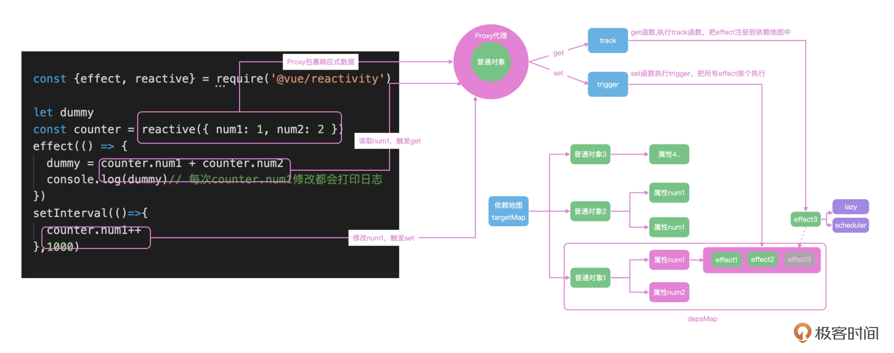
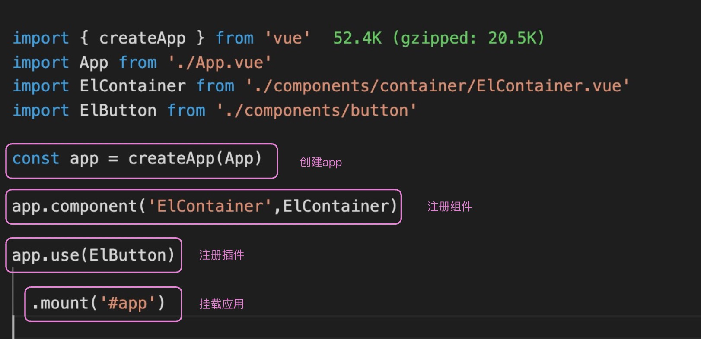
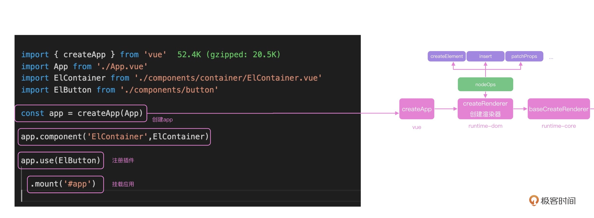

# 生态源码

<!-- @import "[TOC]" {cmd="toc" depthFrom=1 depthTo=6 orderedList=false} -->

<!-- code_chunk_output -->

- [生态源码](#生态源码)
  - [一. 响应式](#一-响应式)
  - [二. 运行时](#二-运行时)
  - [三. 虚拟 DOM](#三-虚拟-dom)
    - [3.1 Vue 虚拟 DOM 执行流程](#31-vue-虚拟-dom-执行流程)
    - [3.2 DOM 的创建](#32-dom-的创建)
    - [3.3 patch 函数](#33-patch-函数)
    - [3.4 patchElement 函数](#34-patchelement-函数)
    - [3.5 patchChildren 的实现](#35-patchchildren-的实现)
    - [3.6 执行逻辑](#36-执行逻辑)
    - [3.7 位运算](#37-位运算)
      - [3.7.1 为什么位运算性能更好](#371-为什么位运算性能更好)
      - [3.7.2 如何运用位运算](#372-如何运用位运算)
    - [3.8 最长递增子序列](#38-最长递增子序列)
      - [3.8.1 贪心 加 二分](#381-贪心-加-二分)
  - [四. 编译原理](#四-编译原理)
    - [4.1 整体流程](#41-整体流程)
      - [4.1.1 tokenizer 的迷你实现](#411-tokenizer-的迷你实现)
      - [4.1.2 生成抽象语法树](#412-生成抽象语法树)
      - [4.1.3 语义分析和优化](#413-语义分析和优化)
    - [4.2 Vue Compiler 模块解析](#42-vue-compiler-模块解析)
      - [4.2.1 入口分析](#421-入口分析)
      - [4.2.2 Vue 浏览器端编译的核心流程](#422-vue-浏览器端编译的核心流程)
      - [4.2.3 AST 的语义化分析](#423-ast-的语义化分析)
      - [4.2.4 template 到 render 函数的转化](#424-template-到-render-函数的转化)
  - [五. Vite 原理](#五-vite-原理)
    - [5.1 现在工程化的痛点](#51-现在工程化的痛点)
    - [5.2 Vite 原理](#52-vite-原理)
    - [5.3 Vite 的热更新](#53-vite-的热更新)
  - [六. Vuex & Pinia](#六-vuex-pinia)
    - [6.1 Vuex5 提案](#61-vuex5-提案)
    - [6.2 Pinia](#62-pinia)
    - [6.3 Pinia 源码](#63-pinia-源码)
  - [七. vue-router](#七-vue-router)
    - [7.1 入口分析](#71-入口分析)
    - [7.2 路由安装](#72-路由安装)
    - [7.3 路由更新](#73-路由更新)

<!-- /code_chunk_output -->

## 一. 响应式

Vue3 的组件之间是通过响应式机制来通知的，响应式机制可以自动收集系统中数据的依赖，并且在修改数据之后自动执行更新，极大提高开发的效率。

响应式机制的主要功能是，可以**把普通的 JS 对象封装成为响应式对象，拦截数据的获取和修改操作，实现依赖数据的自动化更新**。所以，一个最简单的响应式模型，可以通过 reactive 或者 ref 函数，把数据包裹成响应式对象，并且通过 effect 函数注册回调函数，然后在数据修改之后，响应式地通知 effect 去执行回调函数即可。

Vue3 的响应式是可以独立在其他平台使用的。比如可以新建 test.js，使用下面的代码在 node 环境中使用 Vue 响应。以 reactive 为例，使用 reactive 包裹 JS 对象之后，每一次对响应式对象 counter 的修改，都会执行 effect 内部注册的函数：

```js
const { watchEffect, reactive } = require('vue');

const counter = reactive({
  x: 1,
  y: 2
});

watchEffect(() => {
  const perimeter = (counter.x + counter.y) * 2;
  console.log(perimeter);
});

setTimeout(() => {
  counter.x += 1;
});
```

执行文件后，可以看到 watchEffect 内部的函数调用了两次。先来看一下响应式整体的流程图，上面的代码中使用 reactive 把普通的 JS 对象包裹成响应式数据了。

所以，在 effect 中获取 counter.num1 和 counter.num2 的时候，就会触发 counter 的 get 拦截函数；get 函数，会把当前的 effect 函数注册到一个全局的依赖地图中去。这样 counter.num1 在修改的时候，就会触发 set 拦截函数，去依赖地图中找到注册的 effect 函数，然后执行。



## 二. 运行时

前端框架需要处理的最核心的两个流程，就是首次渲染和数据更新后的渲染。先来看首次渲染的源码。

- **首次渲染**

  想要启动一个 Vue 项目，只需要从 Vue 中引入 createApp，传入 App 组件，并且调用 createApp 返回的 App 实例的 mount 方法，就实现了项目的启动。这个时候 Vue 也完成了首次渲染，代码逻辑如下：

  

  所以 createApp 就是项目的初始化渲染入口。可以在 Vue 中的 [runtime-dom](https://github.com/vuejs/core/blob/main/packages/runtime-dom/src/index.ts#L66) 中看到 createApp 的定义。

  首次查看源码的时候，可以先把一些无用的信息删除，方便梳理主体的逻辑。看 Vue 代码，和今天主题无关的无用信息有哪些，`__COMPAT__` 代码是用来兼容 Vue 2 的，`__DEV__` 代码是用来调试的，可以把这些代码删除之后，得到下面的简化版 createApp 源码：

  ```ts
  export const createApp = (...args) => {
    const app = ensureRenderer().createApp(...args);
    const { mount } = app;
    // 重写 mount
    app.mount = (containerOrSelector: Element | ShadowRoot | string): any => {
      const container = normalizeContainer(containerOrSelector);
      if (!container) return;

      const component = app._component;
      if (!isFunction(component) && !component.render && !component.template) {
        component.template = container.innerHTML;
      }
      container.innerHTML = '';
      const proxy = mount(container, false, container instanceof SVGElement);
      if (container instanceof Element) {
        container.removeAttribute('v-cloak');
        container.setAttribute('data-v-app', '');
      }
      return proxy;
    };
    return app;
  };
  // 内部的 normalizeContainer 就是把传递的参数统一变为浏览器的 DOM 元素
  function normalizeContainer(container) {
    if (isString(container)) {
      const res = document.querySelector(container);
    }
    return container;
  }
  ```

  再看思路就比较清晰了。使用 ensureRenderer 返回的对象去创建 app，并且重写了 app.mount 方法；在 mount 方法内部，查找 mount 传递的 DOM 元素，并且调用 ensureRenderer 返回的 mount 方法，进行初始化渲染。如下图所示：

  

  **这里 ensureRenderer 函数，内部通过 createRenderer 函数，创建了一个浏览器的渲染器，并且缓存了渲染器 renderer**，这种使用闭包做缓存的方式，在日常开发中也可以借鉴这种思路。

  createRenderer 函数传递的 rendererOptions 就是浏览器里面标签的增删改查 API：

  ```ts
  // 浏览器 dom 操作
  import { nodeOps } from './nodeOps';
  // 浏览器 dom 属性更新
  import { patchProp } from './patchProp';
  import { createRenderer } from '@vue/runtime-core';
  const rendererOptions = extend({ patchProp }, nodeOps);

  let renderer: Renderer<Element | ShadowRoot> | HydrationRenderer;

  function ensureRenderer() {
    return renderer || (renderer = createRenderer<Node, Element | ShadowRoot>(rendererOptions));
  }
  ```

  可以看到，createRenderer 函数传递的参数是 nodeOps 和 patchProp 的合并对象。继续进入 nodeOps 和 pathProp 也可以看到下面的代码，写了很多方法。通过 ensureRenderer 存储这些操作方法后，createApp 内部就可以脱离具体的渲染平台了，这也是 Vue 3 实现跨端的核心逻辑：

  ```ts
  export const nodeOps: Omit<RendererOptions<Node, Element>, 'patchProp'> = {
    insert: (child, parent, anchor) => {
      parent.insertBefore(child, anchor || null);
    },
    remove: child => {
      const parent = child.parentNode;
      if (parent) {
        parent.removeChild(child);
      }
    },
    createElement: (tag, isSVG, is, props): Element => {
      const el = isSVG ? doc.createElementNS(svgNS, tag) : doc.createElement(tag, is ? { is } : undefined);

      if (tag === 'select' && props && props.multiple != null) {
        (el as HTMLSelectElement).setAttribute('multiple', props.multiple);
      }
      return el;
    },

    createText: text => doc.createTextNode(text),

    createComment: text => doc.createComment(text),

    setText: (node, text) => {
      node.nodeValue = text;
    },

    setElementText: (el, text) => {
      el.textContent = text;
    },
    parentNode: node => node.parentNode as Element | null,
    nextSibling: node => node.nextSibling,
    querySelector: selector => doc.querySelector(selector)
    // ...
  };
  ```

## 三. 虚拟 DOM

### 3.1 Vue 虚拟 DOM 执行流程

在 Vue 中，使用虚拟 DOM 来描述页面的组件，比如下面的 template 虽然格式和 HTML 很像，但是在 Vue 的内部会解析成 JS 函数，这个函数就是用来返回虚拟 DOM：

```xml
<div id="app">
  <p>hello world</p>
  <Rate :value="4"></Rate>
</div>
```

上面的 template 会解析成下面的函数，最终返回一个 JS 的对象能够描述这段 HTML：

```js
function render(){
  return h('div',{id:"app"},children:[
    h('p',{},'hello world'),
    h(Rate,{value:4}),
  ])
}
```

### 3.2 DOM 的创建

上面的 mount 函数中，使用 createVNode 函数创建项目的虚拟 DOM，可以看到 **Vue 内部的虚拟 DOM，也就是 vnode，就是一个对象，通过 type、props、children 等属性描述整个节点**：

```ts
const vnode = createVNode(
  rootComponent as ConcreteComponent,
  rootProps
)
function _createVNode() {

  // 处理属性和 class
  if (props) {
    ...
  }

  // 标记vnode信息
  const shapeFlag = isString(type)
    ? ShapeFlags.ELEMENT
    : __FEATURE_SUSPENSE__ && isSuspense(type)
    ? ShapeFlags.SUSPENSE
    : isTeleport(type)
    ? ShapeFlags.TELEPORT
    : isObject(type)
    ? ShapeFlags.STATEFUL_COMPONENT
    : isFunction(type)
    ? ShapeFlags.FUNCTIONAL_COMPONENT
    : 0

  return createBaseVNode(
    type,
    props,
    children,
    patchFlag,
    dynamicProps,
    shapeFlag,
    isBlockNode,
    true
  )
}

function createBaseVNode(type,props,children,...){
    const vnode = {
    type,
    props,
    key: props && normalizeKey(props),
    ref: props && normalizeRef(props),
    children,
    shapeFlag,
    patchFlag,
    dynamicProps,
     ...
  } as VNode
  // 标准化子节点
  if (needFullChildrenNormalization) {
    normalizeChildren(vnode, children)
  } else if (children) {
    vnode.shapeFlag |= isString(children)
      ? ShapeFlags.TEXT_CHILDREN
      : ShapeFlags.ARRAY_CHILDREN
  }
  return vnode
}componentUpdateFn
```

createVNode 负责创建 Vue 中的虚拟 DOM，而 mount 函数的核心逻辑就是使用 setupComponent 执行写的 `<script setup>`，使用 setupRenderEffect 监听组件的数据变化。所以会到 setupRenderEffect 函数中，去完整地剖析 Vue 中虚拟 DOM 的更新逻辑。

给组件注册了 update 方法，这个方法使用 effect 包裹后，当组件内的 ref、reactive 包裹的响应式数据变化的时候就会执行 update 方法，触发组件内部的更新机制。

看下面的代码，在 setupRenderEffect 内部的 componentUpdateFn 中，updateComponentPreRenderer 更新了属性和 slots，并且调用 renderComponentRoot 函数创建新的子树对象 nextTree，然后内部依然是调用 patch 函数。可以看到，**Vue 源码中的实现首次渲染和更新的逻辑都写在一起，在递归的时候如果对一个标签实现更新和渲染，就可以用一个函数实现**。

```ts
const componentUpdateFn = ()=>{
  if (!instance.isMounted) {
    // 首次渲染
    instance,
    parentSuspense,
    isSVG
    // ...
  }else{
    let { next, bu, u, parent, vnode } = instance
    if (next) {
      next.el = vnode.el
      updateComponentPreRender(instance, next, optimized)
    } else {
      next = vnode
    }
    const nextTree = renderComponentRoot(instance)
      patch(
        prevTree,
        nextTree,
        // parent may have changed if it's in a teleport
        hostParentNode(prevTree.el!)!,
        // anchor may have changed if it's in a fragment
        getNextHostNode(prevTree),
        instance,
        parentSuspense,
        isSVG
      )
    }
}

// 注册effect函数
const effect = new ReactiveEffect(
  componentUpdateFn,
  () => queueJob(instance.update),
  instance.scope // track it in component's effect scope
)
const update = (instance.update = effect.run.bind(effect) as S      chedulerJob)
update()

  const updateComponentPreRender = (
    instance: ComponentInternalInstance,
    nextVNode: VNode,
    optimized: boolean
  ) => {
    nextVNode.component = instance
    const prevProps = instance.vnode.props
    instance.vnode = nextVNode
    instance.next = null
    updateProps(instance, nextVNode.props, prevProps, optimized)
    updateSlots(instance, nextVNode.children, optimized)

    pauseTracking()
    // props update may have triggered pre-flush watchers.
    // flush them before the render update.
    flushPreFlushCbs(undefined, instance.update)
    resetTracking()
  }
```

比较关键的就是上面代码中的 **effect 函数，负责注册组件，这个函数也是 Vue 组件更新的入口函数**。

### 3.3 patch 函数

数据更新之后就会执行 patch 函数，下图就是 patch 函数执行的逻辑图：


在 patch 函数中，会针对不同的组件类型执行不同的函数，组件会执行 processComponent，HTML 标签会执行 processElement：

```ts
function path(n1, n2, container) {
  const { type, shapeFlag } = n2;
  switch (type) {
    case Text:
      processText(n1, n2, container);
      break;
    // 还有注释，fragment之类的可以处理，这里忽略
    default:
      // 通过shapeFlag判断类型
      if (shapeFlag & ShapeFlags.ELEMENT) {
        processElement(n1, n2, container, anchor);
      } else if (shapeFlag & ShapeFlags.STATEFUL_COMPONENT) {
        processComponent(n1, n2, container);
      }
  }
}

function processComponent(n1, n2, container) {
  // 老规矩，么有n1就是mount
  if (!n1) {
    // 初始化 component
    mountComponent(n2, container);
  } else {
    updateComponent(n1, n2, container);
  }
}
```

由于更新之后不是首次渲染了，patch 函数内部会执行 updateComponent，看下面的 updateComponent 函数内部，shouldUpdateComponent 会判断组件是否需要更新，实际执行的是 instance.update：

```ts
const instance = (n2.component = n1.component)!;
if (shouldUpdateComponent(n1, n2, optimized)) {
  // 正常更新
  instance.next = n2;
  // 如果子组件也已排队，请将其删除，以避免在同一刷新中重复更新同一子组件。
  invalidateJob(instance.update);
  // instance.update is the reactive effect.
  instance.update();
} else {
  // 无需更新。只需复制属性
  n2.component = n1.component;
  n2.el = n1.el;
  instance.vnode = n2;
}
```

组件的子元素是由 HTML 标签和组件构成，组件内部的递归处理最终也是对 HTML 标签的处理，所以，最后组件的更新都会进入到 processElement 内部的 patchElement 函数中。

### 3.4 patchElement 函数

在函数 patchElement 中主要就做两件事：

- **节点自身属性的更新**

  这里就能体现出 Vue 3 中性能优化的思想，通过 patchFlag 可以做到按需更新：

  - 如果标记了 FULL_PROPS，就直接调用 patchProps。
  - 如果标记了 CLASS，说明节点只有 class 属性是动态的，其他的 style 等属性都不需要进行判断和 DOM 操作。

  这样就极大的优化了属性操作的性能。

  内部执行 hostPatchProp 进行实际的 DOM 操作，Vue 3 的虚拟 DOM 真正做到了按需更新，这也是相比于 React 的一个优势。

  ```ts
  const patchElement = (
    n1: VNode,
    n2: VNode,
    parentComponent: ComponentInternalInstance | null,
    parentSuspense: SuspenseBoundary | null,
    isSVG: boolean,
    slotScopeIds: string[] | null,
    optimized: boolean
  ) => {
    const el = (n2.el = n1.el!);
    let { patchFlag, dynamicChildren, dirs } = n2;
    patchFlag |= n1.patchFlag & PatchFlags.FULL_PROPS;

    const oldProps = n1.props || EMPTY_OBJ;
    const newProps = n2.props || EMPTY_OBJ;

    // full diff
    patchChildren(n1, n2, el, null, parentComponent, parentSuspense, areChildrenSVG, slotScopeIds, false);

    if (patchFlag > 0) {
      if (patchFlag & PatchFlags.FULL_PROPS) {
        patchProps(el, n2, oldProps, newProps, parentComponent, parentSuspense, isSVG);
      } else {
        // class是动态的
        if (patchFlag & PatchFlags.CLASS) {
          if (oldProps.class !== newProps.class) {
            hostPatchProp(el, 'class', null, newProps.class, isSVG);
          }
        }

        // style样式是动态的
        if (patchFlag & PatchFlags.STYLE) {
          hostPatchProp(el, 'style', oldProps.style, newProps.style, isSVG);
        }

        // 属性需要diff
        if (patchFlag & PatchFlags.PROPS) {
          //
          const propsToUpdate = n2.dynamicProps!;
          for (let i = 0; i < propsToUpdate.length; i++) {
            const key = propsToUpdate[i];
            const prev = oldProps[key];
            const next = newProps[key];
            // #1471 force patch value
            if (next !== prev || key === 'value') {
              hostPatchProp(
                el,
                key,
                prev,
                next,
                isSVG,
                n1.children as VNode[],
                parentComponent,
                parentSuspense,
                unmountChildren
              );
            }
          }
        }
      }
      //文本是动态的
      if (patchFlag & PatchFlags.TEXT) {
        if (n1.children !== n2.children) {
          hostSetElementText(el, n2.children as string);
        }
      }
    }
  };
  ```

- **更新子元素**

  子元素的更新是 [patchChildren 函数](#35-patchchildren-的实现)负责的，这个函数也是虚拟 DOM 中难度最高的一个函数，先理解它主要的实现思路。

  首先把子元素分成了文本、数组和空三个状态，新老子元素分别是这三种状态的一个，构成了不同的执行逻辑。这样 patchChildren 内部大致有五种情况需要处理：

  - 如果新的子元素是空，老的子元素不为空，直接卸载 unmount 即可。
  - 如果新的子元素不为空，老的子元素是空，直接创建加载即可。
  - 如果新的子元素是文本，老的子元素如果是数组就需要全部 unmount，是文本的话就需要执行 hostSetElementText。
  - 如果新的子元素是数组，比如是使用 v-for 渲染出来的列表，老的子元素如果是空或者文本，直接 unmount 后，渲染新的数组即可。

  - 最复杂的情况就是新的子元素和老的子元素都是数组。

    最朴实无华的思路就是把老的子元素全部 unmount，新的子元素全部 mount，这样虽然可以实现功能，但是没法复用已经存在的 DOM 元素。所以，需要判断出可以复用的 DOM 元素，如果一个虚拟 DOM 没有改动或者属性变了，不需要完全销毁重建，而是更新一下属性，最大化减少 DOM 的操作，这个任务就会交给 patchKeyedChildren 函数去完成。

    patchKeyedChildren 函数，做的事情就是尽可能高效地把老的子元素更新成新的子元素，如何高效复用老的子元素中的 DOM 元素是 patchKeyedChildren 函数的难点：

    ```ts
    const patchChildren: PatchChildrenFn = (
      n1,
      n2,
      container,
      anchor,
      parentComponent,
      parentSuspense,
      isSVG,
      slotScopeIds,
      optimized = false
    ) => {
      const c1 = n1 && n1.children;
      const prevShapeFlag = n1 ? n1.shapeFlag : 0;
      const c2 = n2.children;

      const { patchFlag, shapeFlag } = n2;
      // 快速路径
      if (patchFlag > 0) {
        if (patchFlag & PatchFlags.KEYED_FRAGMENT) {
          // 这可以是完全键控的，也可以是混合键控的（有些键控了，有些没有）patchFlag的存在意味着子级保证是数组
          patchKeyedChildren(
            c1 as VNode[],
            c2 as VNodeArrayChildren,
            container,
            anchor,
            parentComponent,
            parentSuspense,
            isSVG,
            slotScopeIds,
            optimized
          );
          return;
        } else if (patchFlag & PatchFlags.UNKEYED_FRAGMENT) {
          // unkeyed
          patchUnkeyedChildren(
            c1 as VNode[],
            c2 as VNodeArrayChildren,
            container,
            anchor,
            parentComponent,
            parentSuspense,
            isSVG,
            slotScopeIds,
            optimized
          );
          return;
        }
      }

      // children 有 3 种可能：文本、数组或无子级。
      if (shapeFlag & ShapeFlags.TEXT_CHILDREN) {
        // 文本子项快速路径
        if (prevShapeFlag & ShapeFlags.ARRAY_CHILDREN) {
          unmountChildren(c1 as VNode[], parentComponent, parentSuspense);
        }
        if (c2 !== c1) {
          hostSetElementText(container, c2 as string);
        }
      } else {
        if (prevShapeFlag & ShapeFlags.ARRAY_CHILDREN) {
          // prev children was array
          if (shapeFlag & ShapeFlags.ARRAY_CHILDREN) {
            // 两个数组，不能假设任何内容，执行完全差异
            patchKeyedChildren(
              c1 as VNode[],
              c2 as VNodeArrayChildren,
              container,
              anchor,
              parentComponent,
              parentSuspense,
              isSVG,
              slotScopeIds,
              optimized
            );
          } else {
            // 没有新的 children，就卸载旧的
            unmountChildren(c1 as VNode[], parentComponent, parentSuspense, true);
          }
        } else {
          // 上一个子项为文本或空
          // 新的 children 为 array 或 null
          if (prevShapeFlag & ShapeFlags.TEXT_CHILDREN) {
            hostSetElementText(container, '');
          }
          // mount new if array
          if (shapeFlag & ShapeFlags.ARRAY_CHILDREN) {
            mountChildren(
              c2 as VNodeArrayChildren,
              container,
              anchor,
              parentComponent,
              parentSuspense,
              isSVG,
              slotScopeIds,
              optimized
            );
          }
        }
      }
    };
    ```

    上面的代码执行逻辑如下图所示，根据 flags 判断子元素的类型后，执行不同的操作函数：

    

### 3.5 patchChildren 的实现

patchChildren 是各类虚拟 DOM 框架中最难实现的函数，需要实现**一个高效的更新算法，能够使用尽可能少的更新次数，来实现从老的子元素到新的子元素的更新**。

类似体育课站队的时候，大家一开始站一排，但是顺序是乱的，需要尽快把队伍按照个头左低右高排列。

在 React 中，这种场景的处理逻辑是先进行循环，使用的是单侧插入的算法，在排队的时候挨个对比，如果你站我右边，并且个头比我高一点，说明咱俩的相对位置和最终队伍的位置是一致的，暂时不需要变化，如果你比我个头矮，就需要去我左边找到一个正确的位置插队进去。由于都只向单侧插入，最后就会把所有的节点移动到正确的位置之上，这就是 React15 框架内虚拟节点 diff 的逻辑，初步实现了 DOM 的复用；而 Vue 2 借鉴了 snabbdom 的算法，在此基础上做了第一层双端对比的优化。

首先 Web 场景之下对一个数组元素的操作，很少有直接全部替换的，比如操作一个表格，大概率是更关心表格某一行的一个字段、新增一行、删除一行，或者是对表格某个字段进行排序，所以可以从纯算法的场景之中加入实际应用的场景。

如果只是在表格里新增一行，那么可以不要一开始就开始循环，而是可以先进行节点的预判。比如，在下面的例子中，新的节点就是在老的节点中新增和删除了几个元素，在循环之前，先进行头部元素的判断。在这个例子里，可以预判出头部元素的 a、b、c、d 是一样的节点，说明节点不需要重新创建，只需要进行属性的更新，然后进行队尾元素的预判，可以判断出 g、h 元素也是一样的：

```txt
a b c d e f g h
a b c d i f j g h
```

这样虚拟 DOM diff 的逻辑就变成了下面的结构, 现在只需要比较 ef 和 ifg 的区别：

```txt
(a b c d) e f (g h)
(a b c) d) i f j (g h)
```

相比于之前的对比场景，需要遍历的运算量就大大减小了。而且，有很多场景比如新增一行或者删除一行的简单场景，预判完毕之后，新老元素有一个处于没有元素的状态，就可以直接执行 mount 或者 unmount 完成对比的全过程，不需要再进行复杂的遍历：

### 3.6 执行逻辑

现在 Vue 执行逻辑全景图变成了下面的样子，新增了组件更新的逻辑：


Vue 响应式驱动了组件之间的数据通信机制，数据更新之后，组件会执行 instance.update 方法，update 方法内部执行 patch 方法进行新老子树的 diff 计算。

在更新函数中，主要做了两件事：

1. pathProps 更新节点自身的属性，这里面使用了 pathFlags 做到了按需更新
2. patchChildren 执行子元素的更新。其中 patch 函数内部会只对节点内部的动态属性做更新，这种按需更新的机制是 Vue 性能优秀的一个原因。

函数内部针对新老子元素不同的状态，执行不同的逻辑。根据子元素是否为空或者数组，以及新元素是否为空或者数组，分别执行对应的删除或者 mount 逻辑，其中最复杂的就是新的子元素和老的子元素都是数组。

为了最大化减少 DOM 操作，patchKeyedChildren 使用了[最长递增子序列](#38-最长递增子序列)来实现，并且相比于 React 的虚拟 DOM diff，新增了双端的预先判断 + 最长递增子序列算法来实现，这也是 Vue 性能比较优秀的另外一个原因。

### 3.7 位运算

在执行 diff 之前，要根据需要判断每个虚拟 DOM 节点有哪些属性需要计算，因为无论响应式数据怎么变化，静态的属性和节点都不会发生变化。

所以看每个节点 diff 的时候会做什么，在 renderer.ts 代码文件中就可以看到代码，主要就是**通过虚拟 DOM 节点的 patchFlag 树形判断是否需要更新节点**。

**方法就是使用 & 操作符来判断操作的类型**，比如 patchFlag & PatchFlags.CLASS 来判断当前元素的 class 是否需要计算 diff；shapeFlag & ShapeFlags.ELEMENT 来判断当前虚拟 DOM 是 HTML 元素还是 Component 组件。这个 `&` 其实就是位运算的按位与。

```ts
// class
// 当元素具有动态类绑定时，将匹配此标志。
if (patchFlag & PatchFlags.CLASS) {
  if (oldProps.class !== newProps.class) {
    hostPatchProp(el, 'class', null, newProps.class, isSVG);
  }
}

// style
// 当元素具有动态样式绑定时，匹配此标志
if (patchFlag & PatchFlags.STYLE) {
  hostPatchProp(el, 'style', oldProps.style, newProps.style, isSVG);
}
if (shapeFlag & ShapeFlags.ELEMENT) {
  processElement(n1, n2, container, anchor, parentComponent, parentSuspense, isSVG, slotScopeIds, optimized);
} else if (shapeFlag & ShapeFlags.COMPONENT) {
  processComponent(n1, n2, container, anchor, parentComponent, parentSuspense, isSVG, slotScopeIds, optimized);
}
```

上面的代码中 & 就是按位与的操作符，这其实是二进制上的计算符号。

日常使用的数字都是十进制数字，比如数字 13 就是 `1*10+3` 的运算结果，每个位置都是代表 10 的 n 次方。13 也可以使用二进制表达，因为二进制每个位置只能是 0 和 1 两个数字，每个位置代表的是 2 的 n 次方，13 在二进制里是 1101，就是 `1*8+1*4+0*2+1*1`。

在 JS 中可以很方便地使用 toString(2) 的方式，把十进制数字转换成二进制。运算的概念很简单，就是在二进制上的“与”和“或”运算：

```js
(13).toString(2); // 1101

0 & 0; // 0
0 & 1; // 0
1 & 0; // 0
1 & 1; // 1

0 | 0; // 0
0 | 1; // 1
1 | 0; // 1
1 | 1; // 1

1 << 2; // 1左移动两位，就是100  就是1*2平方 = 4
```

二进制中，每个位置只能是 0 或者 1，& 和 | 的概念和 JS 中的 && 和 || 保持一致。两个二进制的 & 运算就是只有两个二进制位置都是 1 的时候，结果是 1，其余情况运算结果都是 0；| 是按位置进行 “或” 运算，只有两个二进制位置都是 0 的时候，结果是 0，其余情况运算结果都是 1；并且，还可以通过左移 << 和右移 >> 操作符，实现乘以 2 和除以 2 的效果。

由于**这些都是在二进制上的计算，运算的性能通常会比字符串和数字的计算性能要好**，这也是很多框架内部使用位运算的原因。

#### 3.7.1 为什么位运算性能更好

下面是 LeetCode231 题，判断数字 n 是不是 2 的幂次方，也就是说，判断数字 n 是不是 2 的整次方，比如 2、4、8。写出 JS 的解答，n 一直除以 2，如果有余数就是 false，否则就是 true：

```js
let isPowerOfTwo = function (n) {
  if (n === 1) return true;
  while (n > 2) {
    n = n / 2;
    if (n % 2 !== 0) return false;
  }
  return n === 2;
};
```

不过上面的解答可以用位运算来优化。先来分析一下 2 的幂次方的特点。2 的幂次方就是数字 1 左移动若干次，其余位置全部都是 0，所以 n-1 就是最高位变成 0，其余位置都变成 1，就像十进制里的 10000-1 = 9999。这样，n 和 n-1 每个二进制位的数字都不一样，可以用按位 “与” 来判断这个题的答案，如果 n&n-1 是 0 的话，数字 n 就符合 2 的整次幂的特点：

```js
// 16
// 10000
// 16-1 = 15
// 01111
// 16&15 = 0
let isPowerOfTwo = function (n) {
  return n > 0 && (n & (n - 1)) === 0;
};
```

#### 3.7.2 如何运用位运算

在 diff 判断，如何根据位运算的特点，设计出权限的组合认证方案。比如 Vue 中的动态属性，有文本、class、style、props 几个属性，可以使用二进制中的一个位置来表示权限，看下面的代码，使用左移的方式分别在四个二进制上标记了 1，代表四种不同的权限，使用按位或的方式去实现权限授予。

比如，一个节点如果 TEXT 和 STYLE 都需要修改，只需要使用 | 运算符就可以得到 flag1 的权限表示，这就是为什么 Vue 3 中针对虚拟 DOM 类型以及虚拟 DOM 需要动态计算 diff 的树形都做了标记，可以在 [Vue 3 的源码](https://github.com/vuejs/vue-next/blob/master/packages/shared/src/patchFlags.ts#L28)中看到下面的配置：

```ts
const PatchFlags = {
  TEXT: 1, // 0001
  CLASS: 1 << 1, // 0010
  STYLE: 1 << 2, // 0100
  PROPS: 1 << 3 // 1000
};

const flag1 = PatchFlags.TEXT | PatchFlags.STYLE; // 0101

// 权限校验

flag1 & PatchFlags.TEXT; // 有权限，结果大于1
flag1 & PatchFlags.CLASS; // 没有权限是 0
```

### 3.8 最长递增子序列

在虚拟 diff 计算中，如果新老子元素都是数组的时候，需要先做首尾的预判，如果新的子元素和老的子元素在预判完毕后，未处理的元素依然是数组，那么就需要对两个数组计算 diff，最终找到最短的操作路径，能够让老的子元素通过尽可能少的操作，更新成为新的子元素。

Vue 3 借鉴了 infero 的算法逻辑，就像操场上需要按照个头从低到高站好一样，采用的思路是先寻找一个现有队列中由低到高的队列，让这个队列尽可能的长，它们的相对位置不需要变化，而其他元素进行插入和移动位置，这样就可以做到尽可能少的操作 DOM。

看 [LeetCode 第 300 题](https://leetcode.cn/problems/longest-increasing-subsequence/)，题目描述如下, 需要在数组中找到最长底层的自序列长度：

```txt
给你一个整数数组 nums，找到其中最长严格递增子序列的长度。

子序列是由数组派生而来的序列，删除（或不删除）数组中的元素而不改变其余元素的顺序。
例如，[3,6,2,7] 是数组 [0,3,1,6,2,2,7] 的子序列。

=
输入：nums = [10,9,2,5,3,7,101,18]
输出：4
解释：最长递增子序列是 [2,3,7,101]，因此长度为 4 。
```

首先可以使用动态规划的思路，通过每一步的递推，使用 dp 数组，记录出每一步操作的最优解，最后得到全局最优解。

在这个例子中，可以把 `dp[i]` 定义成 `nums[0]` 到 `nums[i]` 这个区间内，数组的最长递增子序列的长度，并且 dp 数组的初始值设为 1。

从左边向右递推，如果 `nums[i+1]>nums[i]`，`dp[i+1]` 就等于 `dp[i]+1`；如果 `nums[i+1] < nums[i]`，就什么都不需要干，这样在遍历的过程中，就能根据数组当前位置之前的最长递增子序列长度推导出 i+1 位置的最长递增子序列长度。

```js
/**
 * @param {number[]} nums
 * @return {number}
 */
const lengthOfLIS = nums => {
  let n = nums.length;
  if (n === 0) return 0;

  let dp = new Array(n).fill(1);
  for (let i = 0; i < n; i++) {
    for (let j = 0; j < i; j++) {
      if (nums[j] < nums[i]) {
        dp[i] = Math.max(dp[i], dp[j] + 1);
      }
    }
  }
  return Math.max(...dp);
};
```

由于需要两层循环，所以这个解法的时间复杂度是 n 的平方，这个解法其实已经不错了，但是还有更优秀的解法，也就是 Vue 3 中用到的算法：贪心 + 二分。

#### 3.8.1 贪心 加 二分

贪心的思路就是在寻找最长递增的序列，所以，`[1, 3]` 要比 `[1, 5]` 好，也就是说，在这个上升的序列中，要让上升速度尽可能变得慢，这样才有可能让后面的元素尽可能也递增。

可以创建一个 arr 数组，用来保存这种策略下的最长递增子序列。如果当前遍历的 `nums[i]` 大于 arr 的最后一个元素，也就是大于 arr 的最大值时，把 `nums[i]` 追加到后面即可，否则就在 arr 中寻找一个第一个大于 `num[i]` 的数字并替换它。因为是 arr 是递增的数列，所以在寻找插入位置的时候，可以使用二分查找的方式，把整个算法的复杂度变成 O(nlgn)。

下面的代码就是贪心 + 二分的解法，可以得到正确的最长递增子序列的长度：

```js
/**
 * @param {number[]} nums
 * @return {number}
 */
const lengthOfLIS = nums => {
  let len = nums.length;
  if (len <= 1) return len;

  let arr = [nums[0]];
  for (let i = 0; i < len; i++) {
    // nums[i] 大于 arr 尾元素时，直接追加到后面，递增序列长度+1
    if (nums[i] > arr[arr.length - 1]) {
      arr.push(nums[i]);
    } else {
      // 否则，查找递增子序列中第一个大于 nums[i] 的元素替换它
      // 递增序列，可以使用二分查找
      let left = 0;
      let right = arr.length - 1;
      while (left < right) {
        let mid = (left + right) >> 1;
        if (arr[mid] < nums[i]) {
          left = mid + 1;
        } else {
          right = mid;
        }
      }
      arr[left] = nums[i];
    }
  }
  return arr.length;
};
```

但是贪心 + 二分的这种解法，现在只能得到最长递增子序列的长度，但是最后得到的 arr 并不一定是最长递增子序列，因为移动的 num[i] 位置可能会不正确，只是得到的数组长度是正确的，所以需要对这个算法改造一下，把整个数组复制一份之后，最后也能得到正确的最长递增子序列。具体代码可以看 Vue 3 的 renderer.ts 文件中，函数 [getSequence](https://github.com/vuejs/core/blob/main/packages/runtime-core/src/renderer.ts#L2409) 就是用来生成最长递增子序列，看下面的代码：

```ts
// https://en.wikipedia.org/wiki/Longest_increasing_subsequence
function getSequence(arr: number[]): number[] {
  const p = arr.slice(); // 赋值一份 arr
  const result = [0];
  let i, j, u, v, c;
  const len = arr.length;
  for (i = 0; i < len; i++) {
    const arrI = arr[i];
    if (arrI !== 0) {
      j = result[result.length - 1];
      if (arr[j] < arrI) {
        p[i] = j; // 存储在 result 最后一个索引的值
        result.push(i);
        continue;
      }
      u = 0;
      v = result.length - 1;
      // 二分查找，查找比 arrI 小的节点，更新 result 的值
      while (u < v) {
        c = (u + v) >> 1;
        if (arr[result[c]] < arrI) {
          u = c + 1;
        } else {
          v = c;
        }
      }
      if (arrI < arr[result[u]]) {
        if (u > 0) {
          p[i] = result[u - 1];
        }
        result[u] = i;
      }
    }
  }
  u = result.length;
  v = result[u - 1];
  // 查找数组 p 找到最终的索引
  while (u-- > 0) {
    result[u] = v;
    v = p[v];
  }
  return result;
}
```

这段代码就是 Vue 3 里的实现，result 存储的就是长度是 i 的递增子序列最小末位置的索引，最后计算出最长递增子序列。得到 increasingNewIndexSequence 队列后，再去遍历数组进行 patch 操作就可以实现完整的 diff 流程了：

```ts
for (i = toBePatched - 1; i >= 0; i--) {
  const nextIndex = s2 + i;
  const nextChild = c2[nextIndex] as VNode;
  const anchor = nextIndex + 1 < l2 ? (c2[nextIndex + 1] as VNode).el : parentAnchor;
  if (newIndexToOldIndexMap[i] === 0) {
    // mount new
    patch(null, nextChild, container, anchor, parentComponent, parentSuspense, isSVG, slotScopeIds, optimized);
  } else if (moved) {
    // move if:
    // There is no stable subsequence (e.g. a reverse)
    // OR current node is not among the stable sequence
    if (j < 0 || i !== increasingNewIndexSequence[j]) {
      move(nextChild, container, anchor, MoveType.REORDER);
    } else {
      j--;
    }
  }
}
```

上面代码的思路，用下图演示。做完双端对比之后，a 和 g 已经计算出可以直接复用 DOM，剩下的队列中需要把 hbfdc 更新成 abdef。

1. 首先需要**使用 keyToNewIndexMap 存储新节点中每个 key 对应的索引**，比如下图中 key 是 c 的元素的索引就是 2
2. 然后**计算出 newIndexOldIndexMap 存储这个 key 在老的子元素中的位置**，可以根据 c 的索引是 2，在 newIndexOldIndexMap 中查询到在老的子元素的位置是 6


## 四. 编译原理

在 Vue 中，组件都是以虚拟 DOM 的形式存在，加载完毕之后注册 effect 函数。这样组件内部的数据变化之后，用 Vue 的响应式机制做到了通知组件更新，内部则使用 patch 函数实现了虚拟 DOM 的更新。那虚拟 DOM 是从哪来的？明明写的是 template 和 JSX，这就是 Vue 源码最后一个难点：Vue 中的 Compiler。下图就是 Vue 核心模块依赖关系图：


编译原理也属于计算机中的一个重要学科，Vue 的 compiler 是在 Vue 场景下的实现，目的就是实现 template 到 render 函数的转变。Vue 官方提供了模板编译的[在线演示](https://vue-next-template-explorer.netlify.app/#eyJzcmMiOiI8ZGl2IGlkPVwiYXBwXCI+XG4gICAgPGRpdiBAY2xpY2s9XCIoKT0+Y29uc29sZS5sb2coeHgpXCIgOmlkPVwibmFtZVwiPnt7bmFtZX19PC9kaXY+XG4gICAgPGgxIDpuYW1lPVwidGl0bGVcIj7njqnovax2dWUzPC9oMT5cbiAgICA8cCA+57yW6K+R5Y6f55CGPC9wPlxuPC9kaXY+XG4iLCJzc3IiOmZhbHNlLCJvcHRpb25zIjp7ImhvaXN0U3RhdGljIjp0cnVlLCJjYWNoZUhhbmRsZXJzIjp0cnVlLCJvcHRpbWl6ZUJpbmRpbmdzIjpmYWxzZX19)。

### 4.1 整体流程

转化的过程可以分为下面的示意图几步来实现：

首先，代码会被解析成一个对象，这个对象有点像虚拟 DOM 的概念，用来描述 template 的代码关系，这个对象就是抽象语法树（AST）。然后通过 transform 模块对代码进行优化，比如识别 Vue 中的语法，静态标记、最后通过 generate 模块生成最终的 render 函数。


用下面的代码就能实现上述的流程图里的内容。其中 parse 函数负责生成抽象语法树 AST，transform 函数负责语义转换，generate 函数负责最终的代码生成：

```js
function compiler(template) {
  const ast = parse(template);
  transform(ast);
  const code = generate(ast);
  return code;
}

let template = `<div id="app">
  <div @click="()=>console.log(xx)" :id="name">{{name}}</div>
  <h1 :name="title">玩转vue3</h1>
  <p>编译原理</p>
</div>
`;

const renderFunction = compiler(template);
console.log(renderFunction);
```

#### 4.1.1 tokenizer 的迷你实现

parse 函数首先，要对 template 进行词法分析，把模板中的 `<div>`, @click, {{}} 等语法识别出来，转换成一个个的 token。可以理解为把 template 的语法进行了分类，这一步叫 tokenizer。

下面的代码就是 tokenizer 的迷你实现。使用 tokens 数组存储解析的结果，然后对模板字符串进行循环，在 template 中，< > / 和空格都是关键的分隔符，如果碰见 < 字符，需要判断下一个字符的状态。如果是字符串就标记 tagstart；如果是 / 就知道是结束标签，标记为 tagend，最终通过 push 方法把分割之后的 token 存储在数组 tokens 中返回。

```ts
function tokenizer(input) {
  let tokens = [];
  let type = '';
  let val = '';
  // 粗暴循环
  for (let i = 0; i < input.length; i++) {
    let ch = input[i];
    if (ch === '<') {
      push();
      if (input[i + 1] === '/') {
        type = 'tagend';
      } else {
        type = 'tagstart';
      }
    }
    if (ch === '>') {
      if (input[i - 1] == '=') {
        //箭头函数
      } else {
        push();
        type = 'text';
        continue;
      }
    } else if (/[\s]/.test(ch)) {
      // 碰见空格截断一下
      push();
      type = 'props';
      continue;
    }
    val += ch;
  }
  return tokens;

  function push() {
    if (val) {
      if (type === 'tagstart') val = val.slice(1); // <div => div
      if (type === 'tagend') val = val.slice(2); //  </div  => div
      tokens.push({
        type,
        val
      });
      val = '';
    }
  }
}
```

#### 4.1.2 生成抽象语法树

下面的数组中，分别用 tagstart、props tagend 和 text 标记，用它们标记了全部内容。然后下一步需要把这个数组按照标签的嵌套关系转换成树形结构，这样才能完整地描述 template 标签的关系。

```ts
[
  { type: 'tagstart', val: 'div' },
  { type: 'props', val: 'id="app"' },
  { type: 'tagstart', val: 'div' },
  { type: 'props', val: '@click="()=console.log(xx)"' },
  { type: 'props', val: ':id="name"' },
  { type: 'text', val: '{{name}}' },
  { type: 'tagend', val: 'div' },
  { type: 'tagstart', val: 'h1' },
  { type: 'props', val: ':name="title"' },
  { type: 'text', val: '玩转vue3' },
  { type: 'tagend', val: 'h1' },
  { type: 'tagstart', val: 'p' },
  { type: 'text', val: '编译原理' },
  { type: 'tagend', val: 'p' },
  { type: 'tagend', val: 'div' }
];
```

然后分析 token 数组，看看它是如何转化成一个体现语法规则的树形结构的。就像用虚拟 DOM 描述页面 DOM 结构一样，使用树形结构描述 template 的语法，这个树称之为抽象语法树，简称 AST。

下面的代码中用 parse 函数实现 AST 的解析。过程是这样的，首先使用一个 AST 对象作为根节点。然后通过 walk 函数遍历整个 tokens 数组，根据 token 的类型不同，生成不同的 node 对象。最后根据 tagend 的状态来决定 walk 的递归逻辑，最终实现了整棵树的构建：

```ts
function parse(template) {
  const tokens = tokenizer(template);
  let cur = 0;
  let ast = {
    type: 'root',
    props: [],
    children: []
  };
  while (cur < tokens.length) {
    ast.children.push(walk());
  }
  return ast;

  function walk() {
    let token = tokens[cur];
    if (token.type == 'tagstart') {
      let node = {
        type: 'element',
        tag: token.val,
        props: [],
        children: []
      };
      token = tokens[++cur];
      while (token.type !== 'tagend') {
        if (token.type == 'props') {
          node.props.push(walk());
        } else {
          node.children.push(walk());
        }
        token = tokens[cur];
      }
      cur++;
      return node;
    }
    if (token.type === 'tagend') {
      cur++;
      // return token
    }
    if (token.type == 'text') {
      cur++;
      return token;
    }
    if (token.type === 'props') {
      cur++;
      const [key, val] = token.val.replace('=', '~').split('~');
      return {
        key,
        val
      };
    }
  }
}
```

上面的代码会生成抽象语法树 AST，这个树的结构如下面代码所示，通过 type 和 children 描述整个 template 的结构：

```json
{
  "type": "root",
  "props": [],
  "children": [
    {
      "type": "element",
      "tag": "div",
      "props": [
        {
          "key": "id",
          "val": "\"app\""
        }
      ],
      "children": [
        {
          "type": "element",
          "tag": "div",
          "props": [
            {
              "key": "@click",
              "val": "\"()"
            },
            {
              "key": ":id",
              "val": "\"name\""
            }
          ],
          "children": [
            {
              "type": "text",
              "val": "{{name}}"
            }
          ]
        },
        {
          "type": "element",
          "tag": "h1",
          "props": [
            {
              "key": ":name",
              "val": "\"title\""
            }
          ],
          "children": [
            {
              "type": "text",
              "val": "玩转vue3"
            }
          ]
        },
        {
          "type": "element",
          "tag": "p",
          "props": [],
          "children": [
            {
              "type": "text",
              "val": "编译原理"
            }
          ]
        }
      ]
    }
  ]
}
```

#### 4.1.3 语义分析和优化

有了抽象语法树之后，还要进行语义的分析和优化，也就是说，要在这个阶段理解语句要做的事。

1. 在 template 这个场景下，两个大括号包裹的字符串就是变量，@click 就是事件监听。下面的代码中使用 transform 函数实现这个功能，这一步主要是理解 template 中 Vue 的语法，并且为最后生成的代码做准备。使用 context 对象存储 AST 所需要的上下文，如果用到了变量 {{}}，就需要引入 toDisplayString 函数，上下文中的 helpers 存储的就是用到的工具函数。

   ```ts
   function transform(ast) {
     // 优化一下ast
     let context = {
       // import { toDisplayString , createVNode , openBlock , createBlock } from "vue"
       helpers: new Set(['openBlock', 'createVnode']) // 用到的工具函数
     };
     traverse(ast, context);
     ast.helpers = context.helpers;
   }
   ```

2. 然后使用 traverse 函数递归整个 AST，去优化 AST 的结构，并且在这一步实现简单的静态标记。当节点标记为 element 的时候，递归调用整个 AST，内部挨个遍历 AST 所有的属性，默认使用 ast.flag 标记节点的动态状态：

   - 如果属性是 @ 开头的，就认为它是 Vue 中的事件绑定，使用 arg.flag|= PatchFlags.EVENT 标记当前节点的事件是动态的，需要计算 diff。
   - 冒号开头的就是动态的属性传递，并且把 class 和 style 标记了不同的 flag。
   - 如果都没有命中的话，就使用 static:true，标记当前节点位是静态节点。

   ```ts
   function traverse(ast, context) {
     switch (ast.type) {
       case 'root':
         context.helpers.add('createBlock');
       // log(ast)
       case 'element':
         ast.children.forEach(node => {
           traverse(node, context);
         });
         ast.flag = 0;
         ast.props = ast.props.map(prop => {
           const { key, val } = prop;
           if (key[0] == '@') {
             ast.flag |= PatchFlags.EVENT; // 标记event需要更新
             return {
               key: 'on' + key[1].toUpperCase() + key.slice(2),
               val
             };
           }
           if (key[0] == ':') {
             const k = key.slice(1);
             if (k == 'class') {
               ast.flag |= PatchFlags.CLASS; // 标记class需要更新
             } else if (k == 'style') {
               ast.flag |= PatchFlags.STYLE; // 标记style需要更新
             } else {
               ast.flag |= PatchFlags.PROPS; // 标记props需要更新
             }
             return {
               key: key.slice(1),
               val
             };
           }
           if (key.startsWith('v-')) {
             // pass such as v-model
           }
           // 标记 static 是 true 静态节点
           return { ...prop, static: true };
         });
         break;
       case 'text':
         // transformText
         let re = /\{\{(.*)\}\}/g;
         if (re.test(ast.val)) {
           ast.flag |= PatchFlags.TEXT; // 标记 props 需要更新
           context.helpers.add('toDisplayString');
           ast.val = ast.val.replace(/\{\{(.*)\}\}/g, function (s0, s1) {
             return s1;
           });
         } else {
           ast.static = true;
         }
     }
   }
   ```

3. 经过上面的代码标记优化之后，项目在数据更新之后，浏览器计算虚拟 dom diff 运算的时候，就会执行类似下面的代码逻辑。

   **通过在 compiler 阶段的标记，让 template 产出的虚拟 DOM 有了更精确的状态，可以越过大部分的虚拟 DOM 的 diff 计算，极大提高 Vue 的运行时效率，这个思想日常开发中也可以借鉴学习**。

   ```js
   if (vnode.static) {
     return;
   }
   if (vnode.flag & patchFlag.CLASS) {
     // 遍历 class 计算 diff
   } else if (vnode.flag & patchFlag.STYLE) {
     // 计算 style 的 diff
   } else if (vnode.flag & patchFlag.TEXT) {
     // 计算文本的 diff
   }
   ```

4. 接下来，基于优化之后的 AST 生成目标代码，也就是 generate 函数要做的事：遍历整个 AST，拼接成最后要执行的函数字符串。

   下面的代码中，首先把 helpers 拼接成 import 语句，并且使用 walk 函数遍历整个 AST，在遍历的过程中收集 helper 集合的依赖。最后，在 createVnode 的最后一个参数带上 ast.flag 进行状态的标记：

   ```ts
   function generate(ast) {
     const { helpers } = ast;

     let code = `
   import {${[...helpers].map(v => v + ' as _' + v).join(',')}} from 'vue'\n
   export function render(_ctx, _cache, $props){
     return(_openBlock(), ${ast.children.map(node => walk(node))})}`;

     function walk(node) {
       switch (node.type) {
         case 'element':
           let { flag } = node; // 编译的标记
           let props =
             '{' +
             node.props
               .reduce((ret, p) => {
                 if (flag.props) {
                   //动态属性
                   ret.push(p.key + ':_ctx.' + p.val.replace(/['"]/g, ''));
                 } else {
                   ret.push(p.key + ':' + p.val);
                 }

                 return ret;
               }, [])
               .join(',') +
             '}';
           return `_createVnode("${node.tag}",${props}),[
             ${node.children.map(n => walk(n))}
           ],${JSON.stringify(flag)}`;
           break;
         case 'text':
           if (node.static) {
             return '"' + node.val + '"';
           } else {
             return `_toDisplayString(_ctx.${node.val})`;
           }
           break;
       }
     }
     return code;
   }
   ```

5. 最后执行一下代码，看下效果输出的代码。可以看到，它已经和 Vue 输出的代码很接近了，这个产出的 render 函数最终会和组件的 setup 函数一起组成运行时的组件对象。

   ```ts
   function compiler(template) {
     const ast = parse(template);
     transform(ast);

     const code = generate(ast);
     return code;
   }

   let template = `<div id="app">
      <div @click="()=>console.log(xx)" :id="name">{{name}}</div>
      <h1 :name="title">玩转vue3</h1>
      <p >编译原理</p>
    </div>
    `;

   const renderFunction = compiler(template);
   console.log(renderFunction);

   // 下面是输出结果
   import {
     openBlock as _openBlock,
     createVnode as _createVnode,
     createBlock as _createBlock,
     toDisplayString as _toDisplayString
   } from 'vue';

   export function render(_ctx, _cache, $props) {
     return (
       _openBlock(),
       _createVnode('div', { id: 'app' }),
       [
         _createVnode('div', { onClick: '()=>console.log(xx)', id: 'name' }),
         [_toDisplayString(_ctx.name)],
         24,
         _createVnode('h1', { name: 'title' }),
         ['玩转vue3'],
         8,
         _createVnode('p', {}),
         ['编译原理'],
         0
       ],
       0
     );
   }
   ```

### 4.2 Vue Compiler 模块解析

#### 4.2.1 入口分析

Vue 3 内部有 4 个和 compiler 相关的包。compiler-dom 和 compiler-core 负责实现浏览器端的编译，compiler-ssr 负责服务器端渲染，compiler-sfc 是编译 .vue 单文件组件的。

在 [vue-next/packages/compiler-dom/index.ts](https://github.com/vuejs/core/blob/main/packages/compiler-dom/src/index.ts#L40) 文件下，可以找到下面这段代码。

```ts
/**
 * @param {String} template 项目中的模板字符串
 * @param {Object} options 编译的配置
 * 内部调用了 baseCompile 函数，可以看到，这里的调用关系和 runtime-dom、runtime-core 的关系类似，compiler-dom 负责传入浏览器 Dom 相关的 API，实际编译的 baseCompile 是由 compiler-core 提供的。
 */
export function compile(template: string, options: CompilerOptions = {}): CodegenResult {
  return baseCompile(
    template,
    extend({}, parserOptions, options, {
      nodeTransforms: [
        // ignore <script> and <tag>
        // this is not put inside DOMNodeTransforms because that list is used
        // by compiler-ssr to generate vnode fallback branches
        ignoreSideEffectTags,
        ...DOMNodeTransforms,
        ...(options.nodeTransforms || [])
      ],
      directiveTransforms: extend({}, DOMDirectiveTransforms, options.directiveTransforms || {}),
      transformHoist: __BROWSER__ ? null : stringifyStatic
    })
  );
}
```

先来看看 compiler-dom 做了哪些额外的配置。首先，parserOption 传入了 parse 的配置，通过 parserOptions 传递的 isNativeTag 来区分 element 和 component。这里的实现也非常简单，把所有 html 的标签名存储在一个对象中，然后就可以很轻松地判断出 div 是浏览器自带的 element。baseCompile 传递的其他参数 nodeTransforms 和 directiveTransforms，它们做的也是和上面代码类似的事。

```ts
export const parserOptions: ParserOptions = {
  isVoidTag,
  isNativeTag: tag => isHTMLTag(tag) || isSVGTag(tag),
  isPreTag: tag => tag === 'pre',
  decodeEntities: __BROWSER__ ? decodeHtmlBrowser : decodeHtml,

  isBuiltInComponent: (tag: string): symbol | undefined => {
    if (isBuiltInType(tag, `Transition`)) {
      return TRANSITION;
    } else if (isBuiltInType(tag, `TransitionGroup`)) {
      return TRANSITION_GROUP;
    }
  }
  // ...
};
const HTML_TAGS =
  'html,body,base,head,link,meta,style,title,address,article,aside,footer,' +
  'header,h1,h2,h3,h4,h5,h6,nav,section,div,dd,dl,dt,figcaption,' +
  'figure,picture,hr,img,li,main,ol,p,pre,ul,a,b,abbr,bdi,bdo,br,cite,code,' +
  'data,dfn,em,i,kbd,mark,q,rp,rt,ruby,s,samp,small,span,strong,sub,sup,' +
  'time,u,var,wbr,area,audio,map,track,video,embed,object,param,source,' +
  'canvas,script,noscript,del,ins,caption,col,colgroup,table,thead,tbody,td,' +
  'th,tr,button,datalist,fieldset,form,input,label,legend,meter,optgroup,' +
  'option,output,progress,select,textarea,details,dialog,menu,' +
  'summary,template,blockquote,iframe,tfoot';
export const isHTMLTag = /*#__PURE__*/ makeMap(HTML_TAGS);
```

#### 4.2.2 Vue 浏览器端编译的核心流程

baseCompile 函数就是 Vue 浏览器端编译的核心流程。

1. 先通过 baseParse 把传递的 template 解析成 AST。
2. 然后通过 transform 函数对 AST 进行语义化分析。
3. 最后通过 generate 函数生成代码。

这个主要逻辑和 compiler 基本一致。

```ts
export function baseCompile(template: string | RootNode, options: CompilerOptions = {}): CodegenResult {
  const ast = isString(template) ? baseParse(template, options) : template;
  const [nodeTransforms, directiveTransforms] = getBaseTransformPreset(prefixIdentifiers);

  transform(
    ast,
    extend({}, options, {
      prefixIdentifiers,
      nodeTransforms: [
        ...nodeTransforms,
        ...(options.nodeTransforms || []) // user transforms
      ],
      directiveTransforms: extend(
        {},
        directiveTransforms,
        options.directiveTransforms || {} // user transforms
      )
    })
  );
  return generate(
    ast,
    extend({}, options, {
      prefixIdentifiers
    })
  );
}
```

Vue 的[在线模板编译环境](https://vue-next-template-explorer.netlify.app/#eyJzcmMiOiI8ZGl2IGlkPVwiYXBwXCI+XG4gICAgPGRpdiBAY2xpY2s9XCIoKT0+Y29uc29sZS5sb2coeHgpXCIgOmlkPVwibmFtZVwiPnt7bmFtZX19PC9kaXY+XG4gICAgPGgxIDpuYW1lPVwidGl0bGVcIj7njqnovax2dWUzPC9oMT5cbiAgICA8cCA+57yW6K+R5Y6f55CGPC9wPlxuPC9kaXY+XG4iLCJzc3IiOmZhbHNlLCJvcHRpb25zIjp7ImhvaXN0U3RhdGljIjp0cnVlLCJjYWNoZUhhbmRsZXJzIjp0cnVlLCJvcHRpbWl6ZUJpbmRpbmdzIjpmYWxzZX19)，可以在 console 中看到 Vue 解析得到的 AST。如下图所示，可以看到这个 AST 比迷你版多了很多额外的属性。**loc 用来描述节点对应代码的信息，component 和 directive 用来记录代码中出现的组件和指令等等**。


然后进入到 baseParse 函数中，这里的 createParserContext 和 createRoot 用来生成上下文，其实就是创建了一个对象，保存当前 parse 函数中需要共享的数据和变量，最后调用 parseChildren。children 内部开始判断 < 开头的标识符，判断开始还是闭合标签后，接着会生成一个 nodes 数组。其中，advanceBy 函数负责更新 context 中的 source 用来向前遍历代码，最终对不同的场景执行不同的函数。

```ts
export function baseParse(content: string, options: ParserOptions = {}): RootNode {
  const context = createParserContext(content, options);
  const start = getCursor(context);
  return createRoot(parseChildren(context, TextModes.DATA, []), getSelection(context, start));
}

function parseChildren(context: ParserContext, mode: TextModes, ancestors: ElementNode[]): TemplateChildNode[] {
  const parent = last(ancestors);
  // 依次生成node
  const nodes: TemplateChildNode[] = [];
  // 如果遍历没结束
  while (!isEnd(context, mode, ancestors)) {
    const s = context.source;
    let node: TemplateChildNode | TemplateChildNode[] | undefined = undefined;

    if (mode === TextModes.DATA || mode === TextModes.RCDATA) {
      if (!context.inVPre && startsWith(s, context.options.delimiters[0])) {
        // 处理 vue 的变量标识符，两个大括号
        node = parseInterpolation(context, mode);
      } else if (mode === TextModes.DATA && s[0] === '<') {
        // 处理 < 开头的代码，可能是 <div> 也有可能是 </div> 或者 <! 的注释
        if (s.length === 1) {
          // 长度是1，只有一个< 有问题 报错
          emitError(context, ErrorCodes.EOF_BEFORE_TAG_NAME, 1);
        } else if (s[1] === '!') {
          // html注释
          if (startsWith(s, '<!--')) {
            node = parseComment(context);
          } else if (startsWith(s, '<!DOCTYPE')) {
            // DOCTYPE
            node = parseBogusComment(context);
          }
        } else if (s[1] === '/') {
          //</ 开头的标签，结束标签
          // https://html.spec.whatwg.org/multipage/parsing.html#end-tag-open-state
          if (/[a-z]/i.test(s[2])) {
            emitError(context, ErrorCodes.X_INVALID_END_TAG);
            parseTag(context, TagType.End, parent);
            continue;
          }
        } else if (/[a-z]/i.test(s[1])) {
          // 解析节点
          node = parseElement(context, ancestors);
          // 2.x <template> with no directive compat
          node = node.children;
        }
      }
    }
    if (!node) {
      // 文本
      node = parseText(context, mode);
    }
    // node树数组，遍历 push
    if (isArray(node)) {
      for (let i = 0; i < node.length; i++) {
        pushNode(nodes, node[i]);
      }
    } else {
      pushNode(nodes, node);
    }
  }

  return removedWhitespace ? nodes.filter(Boolean) : nodes;
}
```

parseInterpolation 和 parseText 函数的逻辑比较简单：

- parseInterpolation 负责识别变量的分隔符 {{ 和 }} ，然后通过 parseTextData 获取变量的值，并且通过 innerStart 和 innerEnd 去记录插值的位置。
- parseText 负责处理模板中的普通文本，主要是把文本包裹成 AST 对象。

接着看看处理节点的 parseElement 函数都做了什么。首先要判断 pre 和 v-pre 标签，然后通过 isVoidTag 判断标签是否是自闭合标签，这个函数是从 compiler-dom 中传来的，之后会递归调用 parseChildren，接着再解析开始标签、解析子节点，最后解析结束标签。

```ts
const VOID_TAGS = 'area,base,br,col,embed,hr,img,input,link,meta,param,source,track,wbr';

export const isVoidTag = /*#__PURE__*/ makeMap(VOID_TAGS);
function parseElement(context: ParserContext, ancestors: ElementNode[]): ElementNode | undefined {
  // Start tag.
  // 是不是pre标签和v-pre标签
  const wasInPre = context.inPre;
  const wasInVPre = context.inVPre;
  const parent = last(ancestors);
  // 解析标签节点
  const element = parseTag(context, TagType.Start, parent);
  const isPreBoundary = context.inPre && !wasInPre;
  const isVPreBoundary = context.inVPre && !wasInVPre;

  if (element.isSelfClosing || context.options.isVoidTag(element.tag)) {
    // #4030 self-closing <pre> tag
    if (isPreBoundary) {
      context.inPre = false;
    }
    if (isVPreBoundary) {
      context.inVPre = false;
    }
    return element;
  }

  // Children.
  ancestors.push(element);
  const mode = context.options.getTextMode(element, parent);
  const children = parseChildren(context, mode, ancestors);
  ancestors.pop();
  element.children = children;

  // End tag.
  if (startsWithEndTagOpen(context.source, element.tag)) {
    parseTag(context, TagType.End, parent);
  } else {
    emitError(context, ErrorCodes.X_MISSING_END_TAG, 0, element.loc.start);
    if (context.source.length === 0 && element.tag.toLowerCase() === 'script') {
      const first = children[0];
      if (first && startsWith(first.loc.source, '<!--')) {
        emitError(context, ErrorCodes.EOF_IN_SCRIPT_HTML_COMMENT_LIKE_TEXT);
      }
    }
  }

  element.loc = getSelection(context, element.loc.start);

  if (isPreBoundary) {
    context.inPre = false;
  }
  if (isVPreBoundary) {
    context.inVPre = false;
  }
  return element;
}
```

最后，来看下解析节点的 parseTag 函数的逻辑，匹配文本标签结束的位置后，先通过 parseAttributes 函数处理属性，然后对 pre 和 v-pre 标签进行检查，最后通过 isComponent 函数判断是否为组件。isComponent 内部会通过 compiler-dom 传递的 isNativeTag 来辅助判断结果，最终返回一个描述节点的对象，包含当前节点所有解析之后的信息，tag 表示标签名，children 表示子节点的数组。

```ts
function parseTag(context: ParserContext, type: TagType, parent: ElementNode | undefined): ElementNode | undefined {
  // Tag open.
  const start = getCursor(context);
  //匹配标签结束的位置
  const match = /^<\/?([a-z][^\t\r\n\f />]*)/i.exec(context.source)!;
  const tag = match[1];
  const ns = context.options.getNamespace(tag, parent);
  // 向前遍历代码
  advanceBy(context, match[0].length);
  advanceSpaces(context);

  // save current state in case we need to re-parse attributes with v-pre
  const cursor = getCursor(context);
  const currentSource = context.source;

  // check <pre> tag
  if (context.options.isPreTag(tag)) {
    context.inPre = true;
  }
  // Attributes.
  // 解析属性
  let props = parseAttributes(context, type);
  // check v-pre
  // if (){
  // ...
  // }
  // Tag close.
  let isSelfClosing = false;
  if (type === TagType.End) {
    return;
  }

  let tagType = ElementTypes.ELEMENT;
  if (!context.inVPre) {
    if (tag === 'slot') {
      tagType = ElementTypes.SLOT;
    } else if (tag === 'template') {
      if (props.some(p => p.type === NodeTypes.DIRECTIVE && isSpecialTemplateDirective(p.name))) {
        tagType = ElementTypes.TEMPLATE;
      }
    } else if (isComponent(tag, props, context)) {
      tagType = ElementTypes.COMPONENT;
    }
  }

  return {
    type: NodeTypes.ELEMENT,
    ns,
    tag,
    tagType,
    props,
    isSelfClosing,
    children: [],
    loc: getSelection(context, start),
    codegenNode: undefined // to be created during transform phase
  };
}
```

parse 函数生成 AST 之后，就有了一个完整描述 template 的对象，它包含了 template 中所有的信息。

#### 4.2.3 AST 的语义化分析

transform 函数的执行流程分支很多，**核心的逻辑就是识别一个个的 Vue 的语法，并且进行编译器的优化，经常提到的静态标记就是这一步完成的**。进入到 transform 函数中，可以看到，内部通过 createTransformContext 创建上下文对象，这个对象包含当前分析的属性配置，包括是否 ssr，是否静态提升还有工具函数等等，这个对象的属性可以在 [GitHub](https://github.com/vuejs/core/blob/0dc521b9e15ce4aa3d5229e90d2173644529e92b/packages/compiler-core/src/transforms/transformElement.ts) 上看到。

```ts
export function transform(root: RootNode, options: TransformOptions) {
  const context = createTransformContext(root, options);
  traverseNode(root, context);
  if (options.hoistStatic) {
    hoistStatic(root, context);
  }
  if (!options.ssr) {
    createRootCodegen(root, context);
  }
  // finalize meta information
  root.helpers = [...context.helpers.keys()];
  root.components = [...context.components];
  root.directives = [...context.directives];
  root.imports = context.imports;
  root.hoists = context.hoists;
  root.temps = context.temps;
  root.cached = context.cached;

  if (__COMPAT__) {
    root.filters = [...context.filters!];
  }
}
```

然后通过 traverseNode 即可编译 AST 所有的节点。核心的转换流程是在遍历中实现，内部使用 switch 判断 node.type 执行不同的处理逻辑。比如如果是 Interpolation，就需要在 helper 中导入 toDisplayString 工具函数。

```ts
export function traverseNode(node: RootNode | TemplateChildNode, context: TransformContext) {
  context.currentNode = node;
  // apply transform plugins
  const { nodeTransforms } = context;
  const exitFns = [];
  for (let i = 0; i < nodeTransforms.length; i++) {
    // 处理exitFns
  }
  switch (node.type) {
    case NodeTypes.COMMENT:
      if (!context.ssr) {
        context.helper(CREATE_COMMENT);
      }
      break;
    case NodeTypes.INTERPOLATION:
      if (!context.ssr) {
        context.helper(TO_DISPLAY_STRING);
      }
      break;
    case NodeTypes.IF:
      for (let i = 0; i < node.branches.length; i++) {
        traverseNode(node.branches[i], context);
      }
      break;
    case NodeTypes.IF_BRANCH:
    case NodeTypes.FOR:
    case NodeTypes.ELEMENT:
    case NodeTypes.ROOT:
      traverseChildren(node, context);
      break;
  }

  // exit transforms
  context.currentNode = node;
  let i = exitFns.length;
  while (i--) {
    exitFns[i]();
  }
}
```

transform 中还会调用 transformElement 来转换节点，用来处理 props 和 children 的静态标记，transformText 用来转换文本。transform 函数参数中的 nodeTransforms 和 directiveTransforms 传递了 Vue 中 template 语法的配置，这个两个函数由 getBaseTransformPreset 返回。

下面的代码中，transformIf 和 transformFor 函数式解析 Vue 中 v-if 和 v-for 的语法转换，transformOn 和 transformModel 是解析 v-on 和 v-model 的语法解析，这里只关注 v- 开头的语法：

```ts
export function getBaseTransformPreset(prefixIdentifiers?: boolean): TransformPreset {
  return [
    [
      transformOnce,
      transformIf,
      transformMemo,
      transformFor,
      ...(__COMPAT__ ? [transformFilter] : []),
      ...(!__BROWSER__ && prefixIdentifiers
        ? [
            // order is important
            trackVForSlotScopes,
            transformExpression
          ]
        : __BROWSER__ && __DEV__
        ? [transformExpression]
        : []),
      transformSlotOutlet,
      transformElement,
      trackSlotScopes,
      transformText
    ],
    {
      on: transformOn,
      bind: transformBind,
      model: transformModel
    }
  ];
}
```

然后再来看看 transformIf 的函数实现。首先判断 v-if、v-else 和 v-else-if 属性，内部通过 createCodegenNodeForBranch 来创建条件分支，在 AST 中标记当前 v-if 的处理逻辑。这段逻辑标记结束后，在 generate 中就会把 v-if 标签和后面的 v-else 标签解析成三元表达式：

```ts
export const transformIf = createStructuralDirectiveTransform(/^(if|else|else-if)$/, (node, dir, context) => {
  return processIf(node, dir, context, (ifNode, branch, isRoot) => {
    const siblings = context.parent!.children;
    let i = siblings.indexOf(ifNode);
    let key = 0;
    while (i-- >= 0) {
      const sibling = siblings[i];
      if (sibling && sibling.type === NodeTypes.IF) {
        key += sibling.branches.length;
      }
    }
    return () => {
      if (isRoot) {
        ifNode.codegenNode = createCodegenNodeForBranch(branch, key, context) as IfConditionalExpression;
      } else {
        // attach this branch's codegen node to the v-if root.
        const parentCondition = getParentCondition(ifNode.codegenNode!);
        parentCondition.alternate = createCodegenNodeForBranch(branch, key + ifNode.branches.length - 1, context);
      }
    };
  });
});
```

transform 对 AST 分析结束之后，就得到了一个优化后的 AST 对象，最后需要调用 generate 函数最终生成 render 函数。

#### 4.2.4 template 到 render 函数的转化

结合下面的代码可以看到，generate 首先通过 createCodegenContext 创建上下文对象，然后通过 genModulePreamble 生成预先定义好的代码模板，然后生成 render 函数，最后生成创建虚拟 DOM 的表达式：

```ts
export function generate(ast, options): CodegenResult {
  const context = createCodegenContext(ast, options);
  const { mode, push, prefixIdentifiers, indent, deindent, newline, scopeId, ssr } = context;

  if (!__BROWSER__ && mode === 'module') {
    // 预设代码，module风格 就是import语句
    genModulePreamble(ast, preambleContext, genScopeId, isSetupInlined);
  } else {
    // 预设代码，函数风格 就是import语句
    genFunctionPreamble(ast, preambleContext);
  }
  // render还是ssrRender
  const functionName = ssr ? `ssrRender` : `render`;
  const args = ssr ? ['_ctx', '_push', '_parent', '_attrs'] : ['_ctx', '_cache'];
  if (!__BROWSER__ && options.bindingMetadata && !options.inline) {
    // binding optimization args
    args.push('$props', '$setup', '$data', '$options');
  }
  const signature = !__BROWSER__ && options.isTS ? args.map(arg => `${arg}: any`).join(',') : args.join(', ');

  if (isSetupInlined) {
    push(`(${signature}) => {`);
  } else {
    push(`function ${functionName}(${signature}) {`);
  }
  indent();

  // 组件，指令声明代码
  if (ast.components.length) {
    genAssets(ast.components, 'component', context);
    if (ast.directives.length || ast.temps > 0) {
      newline();
    }
  }
  if (ast.components.length || ast.directives.length || ast.temps) {
    push(`\n`);
    newline();
  }

  if (ast.codegenNode) {
    genNode(ast.codegenNode, context);
  } else {
    push(`null`);
  }

  if (useWithBlock) {
    deIndent();
    push(`}`);
  }

  deindent();
  push(`}`);

  return {
    ast,
    code: context.code,
    preamble: isSetupInlined ? preambleContext.code : ``,
    // SourceMapGenerator does have toJSON() method but it's not in the types
    map: context.map ? (context.map as any).toJSON() : undefined
  };
}
```

genModulePreamble 函数生成 import 风格的代码：通过遍历 helpers，生成 import 字符串：

```ts
// 生成这个
// import { toDisplayString as _toDisplayString, createElementVNode as _createElementVNode, openBlock as _openBlock, createElementBlock as _createElementBlock } from "vue"

function genModulePreamble(ast: RootNode, context: CodegenContext, genScopeId: boolean, inline?: boolean) {
  if (genScopeId && ast.hoists.length) {
    ast.helpers.push(PUSH_SCOPE_ID, POP_SCOPE_ID);
  }
  // generate import statements for helpers
  if (ast.helpers.length) {
    push(
      `import { ${ast.helpers
        .map(s => `${helperNameMap[s]} as _${helperNameMap[s]}`)
        .join(', ')} } from ${JSON.stringify(runtimeModuleName)}\n`
    );
  }
  // ...
}
```

接下来的步骤就是生成渲染函数 render 和 component 的代码，最后通过 genNode 生成创建虚拟的代码，执行 switch 语句生成不同的代码，一共有十几种情况。针对变量，标签，v-if 和 v-for 都有不同的代码生成逻辑，最终才实现了 template 到 render 函数的转化：

```ts
function genNode(node: CodegenNode | symbol | string, context: CodegenContext) {
  if (isString(node)) {
    context.push(node);
    return;
  }
  if (isSymbol(node)) {
    context.push(context.helper(node));
    return;
  }
  switch (node.type) {
    case NodeTypes.ELEMENT:
    case NodeTypes.IF:
    case NodeTypes.FOR:
      genNode(node.codegenNode!, context);
      break;
    case NodeTypes.TEXT:
      genText(node, context);
      break;
    case NodeTypes.SIMPLE_EXPRESSION:
      genExpression(node, context);
      break;
    case NodeTypes.INTERPOLATION:
      genInterpolation(node, context);
      break;
    case NodeTypes.TEXT_CALL:
      genNode(node.codegenNode, context);
      break;
    case NodeTypes.COMPOUND_EXPRESSION:
      genCompoundExpression(node, context);
      break;
    case NodeTypes.COMMENT:
      genComment(node, context);
      break;
    case NodeTypes.VNODE_CALL:
      genVNodeCall(node, context);
      break;

    case NodeTypes.JS_CALL_EXPRESSION:
      genCallExpression(node, context);
      break;
    case NodeTypes.JS_OBJECT_EXPRESSION:
      genObjectExpression(node, context);
      break;
    case NodeTypes.JS_ARRAY_EXPRESSION:
      genArrayExpression(node, context);
      break;
    case NodeTypes.JS_FUNCTION_EXPRESSION:
      genFunctionExpression(node, context);
      break;
    case NodeTypes.JS_CONDITIONAL_EXPRESSION:
      genConditionalExpression(node, context);
      break;
    case NodeTypes.JS_CACHE_EXPRESSION:
      genCacheExpression(node, context);
      break;
    case NodeTypes.JS_BLOCK_STATEMENT:
      genNodeList(node.body, context, true, false);
      break;

    /* istanbul ignore next */
    case NodeTypes.IF_BRANCH:
      // noop
      break;
  }
}
```


## 五. Vite 原理

### 5.1 现在工程化的痛点

现在前端开发项目的时候，工程化工具已经成为了标准配置，webpack 是现在使用率最高的工程化框架，它可以很好地帮助完成从代码调试到打包的全过程，但是随着项目规模的爆炸式增长，webpack 也带来了一些痛点问题。

最早 webpack 可以帮助在 JS 文件中使用 require 导入其他 JS、CSS、image 等文件，并且提供了 dev-server 启动测试服务器，极大地提高了我们开发项目的效率。

**webpack 的核心原理就是通过分析 JS 中的 require 语句，分析出当前 JS 文件所有的依赖文件，然后递归分析之后，就得到了整个项目的一个依赖图**。对图中不同格式的文件执行不同的 loader，比如会把 CSS 文件解析成加载 CSS 标签的 JS 代码，最后基于这个依赖图获取所有的文件。进行打包处理之后，放在内存中提供给浏览器使用，然后 dev-server 会启动一个测试服务器打开页面，并且在代码文件修改之后可以通过 WebSocket 通知前端自动更新页面，也就是热更新功能。

由于 webpack 在项目调试之前，要把所有文件的依赖关系收集完，打包处理后才能启动测试，很多大项目执行调试命令后需要等 1 分钟以上才能开始调试。而且热更新也需要等几秒钟才能生效，极大地影响了开发的效率。所以针对 webpack 这种打包 bundle 的思路，社区就诞生了 bundless 的框架，Vite 就是其中的佼佼者。

前端的项目之所以需要 webpack 打包，是因为浏览器里的 JS 没有很好的方式去引入其他文件。webpack 提供的打包功能可以帮助更好地组织开发代码，但是现在大部分浏览器都支持了 ES6 的 module 功能，在浏览器内使用 type="module" 标记一个 script 后，在 src/main.js 中就可以直接使用 import 语法去引入一个新的 JS 文件。这样其实可以不依赖 webpack 的打包功能，利用浏览器的 module 功能就可以重新组织代码。

### 5.2 Vite 原理

首先，浏览器的 module 功能有一些限制需要额外处理。浏览器识别出 JS 中的 import 语句后，会发起一个新的网络请求去获取新的文件，所以只支持 /、./ 和 ../ 开头的路径。

而在下面的 Vue 项目启动代码中，首先浏览器并不知道 Vue 是从哪来，第一个要做的，就是分析文件中的 import 语句。如果路径不是一个相对路径或者绝对路径，那就说明这个模块是来自 node_modules，需要去 node_modules 查找这个文件的入口文件后返回浏览器。然后 ./App.vue 是相对路径，可以找到文件，但是浏览器不支持 .vue 文件的解析，并且 index.css 也不是一个合法的 JS 文件。

```js
import { createApp } from 'vue';
import App from './App.vue';
import './index.css';

const app = createApp(App);
app.mount('#app');
```

**拦截请求**
首先需要使用 Koa 搭建一个 server，用来拦截浏览器发出的所有网络请求，才能实现上述功能。在下面代码中，使用 Koa 启动了一个服务器，并且访问首页内容读取 index.html 的内容。

```js
const fs = require('fs');
const path = require('path');
const Koa = require('koa');
const app = new Koa();

app.use(async ctx => {
  const {
    request: { url, query }
  } = ctx;
  if (url == '/') {
    ctx.type = 'text/html';
    let content = fs.readFileSync('./index.html', 'utf-8');

    ctx.body = content;
  }
});
app.listen(24678, () => {
  console.log('端口24678');
});
```

下面就是首页 index.html 的内容，一个 div 作为 Vue 启动的容器，并且通过 script 引入 src.main.js。访问首页之后，就会看到浏览器内显示的文本，并且发起了一个 main.js 的 HTTP 请求。

```html
<!DOCTYPE html>
<html lang="en">
  <head>
    <meta charset="UTF-8" />
    <link
      rel="icon"
      href="/favicon.ico"
    />
    <meta
      name="viewport"
      content="width=device-width, initial-scale=1.0"
    />
    <title>Vite App</title>
  </head>
  <body>
    <h1>geek time</h1>
    <div id="app"></div>
    <script
      type="module"
      src="/src/main.js"
    ></script>
  </body>
</html>
```

**路径解析**
首先 import { createApp } from Vue 这一步由于浏览器无法识别 Vue 的路径，就会直接抛出错误，所以要在 Koa 中把 Vue 的路径重写。为了方便可以直接使用 replace 语句，把 Vue 改成 /@modules/vue，使用 @module 开头的地址来告诉 Koa 这是一个需要去 node_modules 查询的模块。在下面的代码中，判断如果请求地址是 js 结尾，就去读取对应的文件内容，使用 rewriteImport 函数处理后再返回文件内容。在 rewriteImport 中实现了路径的替换，把 Vue 变成了 @modules/vue， 现在浏览器就会发起一个 `http://localhost:24678/@modules/vue` 的请求，下一步要在 Koa 中拦截这个请求，并且返回 Vue 的代码内容。

```js
const fs = require('fs');
const path = require('path');
const Koa = require('koa');
const app = new Koa();

function rewriteImport(content) {
  return content.replace(/ from ['|"]([^'"]+)['|"]/g, function (s0, s1) {
    // . ../ /开头的，都是相对路径
    if (s1[0] !== '.' && s1[1] !== '/') {
      return ` from '/@modules/${s1}'`;
    } else {
      return s0;
    }
  });
}

app.use(async ctx => {
  const {
    request: { url, query }
  } = ctx;
  if (url == '/') {
    ctx.type = 'text/html';
    let content = fs.readFileSync('./index.html', 'utf-8');

    ctx.body = content;
  } else if (url.endsWith('.js')) {
    // js文件
    const p = path.resolve(__dirname, url.slice(1));
    ctx.type = 'application/javascript';
    const content = fs.readFileSync(p, 'utf-8');
    ctx.body = rewriteImport(content);
  }
});
app.listen(24678, () => {
  console.log('端口24678');
});
```

然后在 Koa 中判断请求地址，如果是 @module 的地址，就把后面的 Vue 解析出来，去 node_modules 中查询，拼接出目标路径 ./node_modules/vue/package.json 去读取 Vue 项目中 package.json 的 module 字段，这个字段的地址就是 ES6 规范的入口文件。在读取到文件后，再使用 rewriteImport 处理后返回即可。

> 这里还要使用 rewriteImport 的原因是，Vue 文件内部也会使用 import 的语法去加载其他模块。然后就可以看到浏览器网络请求列表中多了好几个 Vue 的请求。

```js
if (url.startsWith('/@modules/')) {
  // 这是一个 node_module 里的东西
  const prefix = path.resolve(__dirname, 'node_modules', url.replace('/@modules/', ''));
  const module = require(prefix + '/package.json').module;
  const p = path.resolve(prefix, module);
  const ret = fs.readFileSync(p, 'utf-8');
  ctx.type = 'application/javascript';
  ctx.body = rewriteImport(ret);
}
```

这样就实现了 node_modules 模块的解析。

**Vue 文件处理**
.vue 文件是 Vue 中特有的文件格式，Vue 内部通过 @vue/compiler-sfc 来解析单文件组件，把组件分成 template、style、script 三个部分，现在要做的就是在 Node 环境下，把 template 的内容解析成 render 函数，并且和 script 的内容组成组件对象，再返回即可。在下面的代码中判断 .vue 的文件请求后，通过 compilerSFC.parse 方法解析 Vue 组件，通过返回的 descriptor.script 获取 JS 代码，并且发起一个 type=template 的方法去获取 render 函数。在 query.type 是 template 的时候，调用 compilerDom.compile 解析 template 内容，直接返回 render 函数。

```js
const compilerSfc = require('@vue/compiler-sfc'); // .vue
const compilerDom = require('@vue/compiler-dom'); // 模板

if (url.indexOf('.vue') > -1) {
  // vue单文件组件
  const p = path.resolve(__dirname, url.split('?')[0].slice(1));
  const { descriptor } = compilerSfc.parse(fs.readFileSync(p, 'utf-8'));

  if (!query.type) {
    ctx.type = 'application/javascript';
    // 借用vue自导的compile框架 解析单文件组件，其实相当于vue-loader做的事情
    ctx.body = `
  ${rewriteImport(descriptor.script.content.replace('export default ', 'const __script = '))}
  import { render as __render } from "${url}?type=template"
  __script.render = __render
  export default __script
      `;
  } else if (query.type === 'template') {
    // 模板内容
    const template = descriptor.template;
    // 要在server端吧compiler做了
    const render = compilerDom.compile(template.content, { mode: 'module' }).code;
    ctx.type = 'application/javascript';

    ctx.body = rewriteImport(render);
  }
}
```

上面的代码实现之后，就可以在浏览器中看到 App.vue 组件解析的结果。App.vue 会额外发起一个 App.vue?type=template 的请求，最终完成了整个 App 组件的解析。

**CSS 文件支持**
接下来再来实现对 CSS 文件的支持。下面的代码中，如果 url 是 CSS 结尾，就返回一段 JS 代码。这段 JS 代码会在浏览器里创建一个 style 标签，标签内部放入读取的 CSS 文件代码。这种对 CSS 文件的处理方式，让 CSS 以 JS 的形式返回，这样就实现了在 Node 中对 Vue 组件的渲染。

```js
if (url.endsWith('.css')) {
  const p = path.resolve(__dirname, url.slice(1));
  const file = fs.readFileSync(p, 'utf-8');
  const content = `
    const css = "${file.replace(/\n/g, '')}"
    let link = document.createElement('style')
    link.setAttribute('type', 'text/css')
    document.head.appendChild(link)
    link.innerHTML = css
    export default css
    `;
  ctx.type = 'application/javascript';
  ctx.body = content;
}
```

### 5.3 Vite 的热更新

热更新的目的就是在修改代码之后，浏览器能够自动渲染更新的内容，所以要在客户端注入一个额外的 JS 文件，这个文件用来和后端实现 WebSocket 通信。然后后端启动 WebSocket 服务，通过 chokidar 库监听文件夹的变化后，再通过 WebSocket 去通知浏览器即可。

下面的代码中，通过 chokidar.watch 实现了文件夹变更的监听，并且通过 handleHMRUpdate 通知客户端文件更新的类型：

```ts
export function watch() {
  const watcher = chokidar.watch(appRoot, {
    ignored: ['**/node_modules/**', '**/.git/**'],
    ignoreInitial: true,
    ignorePermissionErrors: true,
    disableGlobbing: true
  });
  watcher;

  return watcher;
}

export function handleHMRUpdate(opts: { file: string; ws: any }) {
  const { file, ws } = opts;
  const shortFile = getShortName(file, appRoot);
  const timestamp = Date.now();

  console.log(`[file change] ${chalk.dim(shortFile)}`);
  let updates;
  if (shortFile.endsWith('.css')) {
    updates = [
      {
        type: 'js-update',
        timestamp,
        path: `/${shortFile}`,
        acceptedPath: `/${shortFile}`
      }
    ];
  }

  ws.send({
    type: 'update',
    updates
  });
}
```

然后客户端注入一段额外的 JS 代码，判断后端传递的类型是 js-update 还是 css-update 去执行不同的函数即可：

```ts
async function handleMessage(payload: any) {
  switch (payload.type) {
    case 'connected':
      console.log(`[vite] connected.`);

      setInterval(() => socket.send('ping'), 30000);
      break;

    case 'update':
      payload.updates.forEach((update: Update) => {
        if (update.type === 'js-update') {
          fetchUpdate(update);
        }
      });
      break;
  }
}
```

## 六. Vuex & Pinia

### 6.1 Vuex5 提案

由于 Vuex 有模块化 namespace 的功能，所以模块 user 中的 mutation add 方法，需要使用 commit('user/add') 来触发。这样虽然可以让 Vuex 支持更复杂的项目，但是这种字符串类型的拼接功能，在 TypeScript4 之前的类型推导中就很难实现。然后就有了 [Vuex5 相关提案的讨论](https://github.com/vuejs/rfcs/pull/271)。

Vuex5 的提案相比 Vuex4 有很大的改进，解决了一些 Vuex4 中的缺点。Vuex5 能够同时支持 Composition API 和 Option API，并且去掉了 namespace 模式，使用组合 store 的方式更好地支持了 TypeScript 的类型推导，还去掉了容易混淆的 Mutation 和 Action 概念，只保留了 Action，并且支持自动的代码分割。

而 Pinia 正是基于 Vuex5 设计的框架。现在 Pinia 已经正式合并到 Vue 组织下，成为了 Vue 的官方项目，尤雨溪也在多次分享中表示 Pinia 就是未来的 Vuex。

### 6.2 Pinia

Pinia 具有类型安全、Vue 的 Devtools 支持、易扩展、只有 1KB 的体积等优点。

首先在项目根目录下执行下面的命令去安装 Pinia 的最新版本：

```sh
npm install pinia@next
```

然后在 src/main.js 中，导入 createPinia 方法，通过 createPinia 方法创建 Pinia 的实例后，再通过 app.use 方法注册 Pinia：

```js
import { createApp } from 'vue';
import { createPinia } from 'pinia';
import App from './App.vue';
const pinia = createPinia();
const app = createApp(App);
app.use(pinia).mount('#app');
```

然后可以在 store 文件夹中创建一个 count.js。下面的代码中通过 Pinia 的 defineStore 方法定义了一个 store，store 内部通过 state 返回一个对象，并且通过 Actions 配置修改数据的方法 add。这里使用的语法和 Vuex 比较类似，只是删除了 Mutation 的概念，统一使用 Actions 来配置：

```js
import { defineStore } from 'pinia';

export const useCounterStore = defineStore('count', {
  id: 'count',
  state: () => {
    return { count: 1 };
  },
  actions: {
    add() {
      this.count++;
    }
  }
});
```

然后可以使用 Composition 的方式在代码中使用 store。

> **注意**：上面的 store 返回的其实就是一个 Composition 风格的函数，使用 useCounterStore 返回 count 后，可以在 add 方法中直接使用 count.add 触发 Actions，实现数据的修改。

```js
import { useCounterStore } from '../stores/count';

const count = useCounterStore();
function add() {
  count.add();
}
```

也可以使用 Composition 风格的语法，去创建一个 store。使用 ref 或者 reactive 包裹后，通过 defineStore 返回，这样 store 就非常接近自己分装的 Composition 语法了，也去除了很多 Vuex 中特有的概念，学习起来更加简单：

```js
export const useCounterStore = defineStore('count', () => {
  const count = ref(0);
  function increment() {
    count.value++;
  }

  return { count, increment };
});
```

### 6.3 Pinia 源码

首先进入到 Pinia 的 GitHub 中，可以在 packages/pinia/src/createPinia.ts 中看到 createPinia 函数的实现。

下面的代码中，通过 effectScope 创建一个作用域对象，并且通过 ref 创建了响应式的数据对象 state。然后通过 install 方法支持了 app.use 的注册，内部通过 provide 的语法和全局的 $pinia 变量配置 Pinia 对象，并且通过 use 方法和 toBeInstalled 数组实现了 Pinia 的插件机制。最后还通过 pinia.use(devtoolsPlugin) 实现了对 VueDevtools 的支持：

```ts
export function createPinia(): Pinia {
  const scope = effectScope(true);
  // NOTE: here we could check the window object for a state and directly set it
  // if there is anything like it with Vue 3 SSR
  const state = scope.run(() => ref<Record<string, StateTree>>({}))!;

  let _p: Pinia['_p'] = [];
  // plugins added before calling app.use(pinia)
  let toBeInstalled: PiniaPlugin[] = [];

  const pinia: Pinia = markRaw({
    install(app: App) {
      // this allows calling useStore() outside of a component setup after
      // installing pinia's plugin
      setActivePinia(pinia);
      if (!isVue2) {
        pinia._a = app;
        app.provide(piniaSymbol, pinia);
        app.config.globalProperties.$pinia = pinia;
        toBeInstalled.forEach(plugin => _p.push(plugin));
        toBeInstalled = [];
      }
    },

    use(plugin) {
      if (!this._a && !isVue2) {
        toBeInstalled.push(plugin);
      } else {
        _p.push(plugin);
      }
      return this;
    },

    _p,
    _a: null,
    _e: scope,
    _s: new Map<string, StoreGeneric>(),
    state
  });
  if (__DEV__ && IS_CLIENT) {
    pinia.use(devtoolsPlugin);
  }

  return pinia;
}
```

通过上面的代码，可以看到 Pinia 实例就是 ref({}) 包裹的响应式对象，项目中用到的 state 都会挂载到 Pinia 这个响应式对象内部。然后去看下创建 store 的 defineStore 方法，defineStore 内部通过 useStore 方法去定义 store，并且每个 store 都会标记唯一的 ID。

首先通过 getCurrentInstance 获取当前组件的实例，如果 useStore 参数没有 Pinia 的话，就使用 inject 去获取 Pinia 实例，这里 inject 的数据就是 createPinia 函数中 install 方法提供的。然后设置 activePinia，项目中可能会存在很多 Pinia 的实例，设置 activePinia 就是设置当前活跃的 Pinia 实例。这个函数的实现方式和 Vue 中的 componentInstance 很像，每次创建组件的时候都设置当前的组件实例，这样就可以在组件的内部通过 getCurrentInstance 获取，最后通过 createSetupStore 或者 createOptionsStore 创建组件。

这就是上面代码中使用 Composition 和 Option 两种语法创建 store 的不同执行逻辑，最后通过 `pinia._s` 缓存创建后的 `store._s` 就是在 createPinia 的时候创建的一个 Map 对象，防止 store 多次重复创建。到这 store 创建流程就结束了。

```ts
export function defineStore(
  // add proper types from above
  idOrOptions: any,
  setup?: any,
  setupOptions?: any
): StoreDefinition {
  let id: string;
  let options: any;
  const isSetupStore = typeof setup === 'function';
  if (typeof idOrOptions === 'string') {
    id = idOrOptions;
    // the option store setup will contain the actual options in this case
    options = isSetupStore ? setupOptions : setup;
  } else {
    options = idOrOptions;
    id = idOrOptions.id;
  }

  function useStore(pinia?: Pinia | null, hot?: StoreGeneric): StoreGeneric {
    const currentInstance = getCurrentInstance();
    pinia =
      // in test mode, ignore the argument provided as we can always retrieve a
      // pinia instance with getActivePinia()
      (__TEST__ && activePinia && activePinia._testing ? null : pinia) || (currentInstance && inject(piniaSymbol));
    if (pinia) setActivePinia(pinia);

    pinia = activePinia!;

    if (!pinia._s.has(id)) {
      // creating the store registers it in `pinia._s`
      if (isSetupStore) {
        createSetupStore(id, setup, options, pinia);
      } else {
        createOptionsStore(id, options as any, pinia);
      }

      /* istanbul ignore else */
      if (__DEV__) {
        // @ts-expect-error: not the right inferred type
        useStore._pinia = pinia;
      }
    }

    const store: StoreGeneric = pinia._s.get(id)!;

    // save stores in instances to access them devtools
    if (
      __DEV__ &&
      IS_CLIENT &&
      currentInstance &&
      currentInstance.proxy &&
      // avoid adding stores that are just built for hot module replacement
      !hot
    ) {
      const vm = currentInstance.proxy;
      const cache = '_pStores' in vm ? vm._pStores! : (vm._pStores = {});
      cache[id] = store;
    }

    // StoreGeneric cannot be casted towards Store
    return store as any;
  }

  useStore.$id = id;

  return useStore;
}
```

在 Pinia 中 createOptionsStore 内部也是调用了 createSetupStore 来创建 store 对象。下面的代码中，通过 assign 方法实现了 setup 函数，这里可以看到 computed 的实现，内部就是通过 pinia.\_s 缓存获取 store 对象，调用 store 的 getters 方法来模拟，最后依然通过 createSetupStore 创建：

```ts
function createOptionsStore<Id extends string, S extends StateTree, G extends _GettersTree<S>, A extends _ActionsTree>(
  id: Id,
  options: DefineStoreOptions<Id, S, G, A>,
  pinia: Pinia,
  hot?: boolean
): Store<Id, S, G, A> {
  const { state, actions, getters } = options;

  const initialState: StateTree | undefined = pinia.state.value[id];

  let store: Store<Id, S, G, A>;

  function setup() {
    pinia.state.value[id] = state ? state() : {};
    return assign(
      localState,
      actions,
      Object.keys(getters || {}).reduce((computedGetters, name) => {
        computedGetters[name] = markRaw(
          computed(() => {
            setActivePinia(pinia);
            // it was created just before
            const store = pinia._s.get(id)!;
            return getters![name].call(store, store);
          })
        );
        return computedGetters;
      }, {} as Record<string, ComputedRef>)
    );
  }

  store = createSetupStore(id, setup, options, pinia, hot);

  return store as any;
}
```

最后看 createSetupStore 函数的实现。这个函数也是 Pinia 中最复杂的函数实现，内部的 $patch 函数可以实现数据的更新。如果传递的参数 partialStateOrMutator 是函数，则直接执行，否则就通过 mergeReactiveObjects 方法合并到 state 中，最后生成 subscriptionMutation 对象，通过 triggerSubscriptions 方法触发数据的更新：

```ts
function $patch(partialStateOrMutator: _DeepPartial<UnwrapRef<S>> | ((state: UnwrapRef<S>) => void)): void {
  let subscriptionMutation: SubscriptionCallbackMutation<S>;
  isListening = isSyncListening = false;
  // reset the debugger events since patches are sync
  /* istanbul ignore else */
  if (__DEV__) {
    debuggerEvents = [];
  }
  if (typeof partialStateOrMutator === 'function') {
    partialStateOrMutator(pinia.state.value[$id] as UnwrapRef<S>);
    subscriptionMutation = {
      type: MutationType.patchFunction,
      storeId: $id,
      events: debuggerEvents as DebuggerEvent[]
    };
  } else {
    mergeReactiveObjects(pinia.state.value[$id], partialStateOrMutator);
    subscriptionMutation = {
      type: MutationType.patchObject,
      payload: partialStateOrMutator,
      storeId: $id,
      events: debuggerEvents as DebuggerEvent[]
    };
  }
  nextTick().then(() => {
    isListening = true;
  });
  isSyncListening = true;
  // because we paused the watcher, we need to manually call the subscriptions
  triggerSubscriptions(subscriptions, subscriptionMutation, pinia.state.value[$id] as UnwrapRef<S>);
}
```

然后定义 partialStore 对象去存储 ID、$patch、Pinia 实例，并且新增了 subscribe 方法。再调用 reactive 函数把 partialStore 包裹成响应式对象，通过 pinia.\_s.set 的方法实现 store 的挂载。

最后通过 pinia.\_s.get 获取的就是 partialStore 对象，defineStore 返回的方法 useStore 就可以通过 useStore 去获取缓存的 Pinia 对象，实现对数据的更新和读取。这里也可以看到，除了直接执行 Action 方法，还可以通过调用内部的 count.$patch({count:count+1}) 的方式来实现数字的累加。

```ts
const partialStore = {
  _p: pinia,
  // _s: scope,
  $id,
  $onAction: addSubscription.bind(null, actionSubscriptions),
  $patch,
  $reset,
  $subscribe(callback, options = {}) {
    const removeSubscription = addSubscription(subscriptions, callback, options.detached, () => stopWatcher());
    const stopWatcher = scope.run(() =>
      watch(
        () => pinia.state.value[$id] as UnwrapRef<S>,
        state => {
          if (options.flush === 'sync' ? isSyncListening : isListening) {
            callback(
              {
                storeId: $id,
                type: MutationType.direct,
                events: debuggerEvents as DebuggerEvent
              },
              state
            );
          }
        },
        assign({}, $subscribeOptions, options)
      )
    )!;

    return removeSubscription;
  }
};

const store: Store<Id, S, G, A> = reactive(assign({}, partialStore));

// store the partial store now so the setup of stores can instantiate each other before they are finished without
// creating infinite loops.
pinia._s.set($id, store);
```

可以看出一个简单的 store 功能，真正需要支持生产环境的时候，也需要很多逻辑的封装。代码内部除了 `__dev__` 调试环境中对 Devtools 支持的语法，还有很多适配 Vue 2 的语法，并且同时支持 Option 风格和 Composition 风格去创建 store。createSetupStore 等方法内部也会通过 Map 的方式实现缓存，并且 setActivePinia 方法可以在多个 Pinia 实例的时候获取当前的实例。这些思路在 Vue、vue-router 源码中都能看到类似的实现方式，这种性能优化的思路和手段也值得学习，在项目开发中也可以借鉴。

## 七. vue-router

### 7.1 入口分析

vue-router 提供了 createRouter 方法来创建路由配置，传入每个路由地址对应的组件后，使用 app.use 在 Vue 中加载 vue-router 插件，并且给 Vue 注册了两个内置组件，router-view 负责渲染当前路由匹配的组件，router-link 负责页面的跳转。

先来看下 createRouter 如何实现，完整的代码可以在 [GitHub](https://github.com/vuejs/router/blob/main/packages/router/src/router.ts#L362) 上看到。这个函数比较长，可以先看下 createRouter 的参数。

在下面的代码中，参数 RouterOptions 是规范配置的路由对象，主要包含 history、routes 等数据。routes 就是需要配置的路由对象，类型是 RouteRecordRaw 组成的数组，并且 RouteRecordRaw 的类型是三个类型的合并。然后返回值的类型 Router 就是包含了 addRoute、push、beforeEnter、install 方法的一个对象，并且维护了 currentRoute 和 options 两个属性。并且每个类型方法还有详细的注释，这也极大降低了阅读源码的门槛，可以帮助在看到函数的类型时就知道函数大概的功能。

Vue 中 app.use 实际上执行的就是 router 对象内部的 install 方法，先进入到 install 方法看下是如何安装的。

```ts
// createRouter传递参数的类型
export interface RouterOptions extends PathParserOptions {
  history: RouterHistory;
  routes: RouteRecordRaw[];
  scrollBehavior?: RouterScrollBehavior;
  // ...
}
// 每个路由配置的类型
export type RouteRecordRaw = RouteRecordSingleView | RouteRecordMultipleViews | RouteRecordRedirect;

//... other config
// Router接口的全部方法和属性
export interface Router {
  readonly currentRoute: Ref<RouteLocationNormalizedLoaded>;
  readonly options: RouterOptions;

  addRoute(parentName: RouteRecordName, route: RouteRecordRaw): () => void;
  addRoute(route: RouteRecordRaw): () => void;
  Route(name: RouteRecordName): void;
  hasRoute(name: RouteRecordName): boolean;

  getRoutes(): RouteRecord[];
  resolve(to: RouteLocationRaw, currentLocation?: RouteLocationNormalizedLoaded): RouteLocation & { href: string };
  push(to: RouteLocationRaw): Promise<NavigationFailure | void | undefined>;
  replace(to: RouteLocationRaw): Promise<NavigationFailure | void | undefined>;
  back(): ReturnType<Router['go']>;
  forward(): ReturnType<Router['go']>;
  go(delta: number): void;
  beforeEach(guard: NavigationGuardWithThis<undefined>): () => void;
  beforeResolve(guard: NavigationGuardWithThis<undefined>): () => void;
  afterEach(guard: NavigationHookAfter): () => void;
  onError(handler: _ErrorHandler): () => void;
  isReady(): Promise<void>;
  install(app: App): void;
}

export function createRouter(options: RouterOptions): Router {}
```

### 7.2 路由安装

从下面的代码中可以看到，在 createRouter 的最后，创建了包含 addRoute、push 等方法的对象，并且 install 方法内部注册了 RouterLink 和 RouterView 两个组件。所以可以在任何组件内部直接使用 `<router-view>` 和 `<router-link>` 组件，然后注册全局变量 router 和 route，其中 router 就是通过 createRouter 返回的路由对象，包含 addRoute、push 等方法，route 使用 defineProperty 的形式返回 currentRoute 的值，可以做到和 currentRoute 值同步。

然后使用 computed 把路由变成响应式对象，存储在 reactiveRoute 对象中，再通过 app.provide 给全局注册了 route 和 reactive 包裹后的 reactiveRoute 对象。provide 提供的数据并没有做响应式的封装，**需要响应式的时候需要使用 ref 或者 reactive 封装为响应式对象**，最后注册 unmount 方法实现 vue-router 的安装。

```ts
export function createRouter(options: RouterOptions): Router {
  // ....
  let started: boolean | undefined;
  const installedApps = new Set<App>();
  // 路由对象
  const router: Router = {
    currentRoute,

    addRoute,
    removeRoute,
    hasRoute,
    getRoutes,
    resolve,
    options,

    push,
    replace,
    go,
    back: () => go(-1),
    forward: () => go(1),

    beforeEach: beforeGuards.add,
    beforeResolve: beforeResolveGuards.add,
    afterEach: afterGuards.add,

    onError: errorHandlers.add,
    isReady,
    // 插件安装
    install(app: App) {
      const router = this;
      // 注册全局组件 router-link 和 router-view
      app.component('RouterLink', RouterLink);
      app.component('RouterView', RouterView);

      app.config.globalProperties.$router = router;
      Object.defineProperty(app.config.globalProperties, '$route', {
        enumerable: true,
        get: () => unref(currentRoute)
      });
      if (isBrowser && !started && currentRoute.value === START_LOCATION_NORMALIZED) {
        // see above
        started = true;
        push(routerHistory.location).catch(err => {
          if (__DEV__) warn('Unexpected error when starting the router:', err);
        });
      }

      const reactiveRoute = {} as {
        [k in keyof RouteLocationNormalizedLoaded]: ComputedRef<RouteLocationNormalizedLoaded[k]>;
      };
      for (const key in START_LOCATION_NORMALIZED) {
        // @ts-expect-error: the key matches
        reactiveRoute[key] = computed(() => currentRoute.value[key]);
      }
      // 提供全局配置
      app.provide(routerKey, router);
      app.provide(routeLocationKey, reactive(reactiveRoute));
      app.provide(routerViewLocationKey, currentRoute);

      const unmountApp = app.unmount;
      installedApps.add(app);
      app.unmount = function () {
        installedApps.delete(app);
        // ...
        unmountApp();
      };

      if ((__DEV__ || __FEATURE_PROD_DEVTOOLS__) && isBrowser) {
        addDevtools(app, router, matcher);
      }
    }
  };

  return router;
}
```

路由对象创建和安装之后，下一步需要了解的就是 router-link 和 router-view 两个组件的实现方式。通过下面的代码可以看到，RouterView 的 setup 函数返回了一个函数，这个函数就是 RouterView 组件的 render 函数。大部分使用的方式就是一个 `<router-view>` 组件，没有 slot 情况下返回的就是 component 变量。component 使用 h 函数返回 ViewComponent 的虚拟 DOM，而 ViewComponent 是根据 matchedRoute.components[props.name]计算而来：

```ts
export const RouterViewImpl = /*#__PURE__*/ defineComponent({
  name: 'RouterView',
  props: {
    name: {
      type: String as PropType<string>,
      default: 'default'
    },
    route: Object as PropType<RouteLocationNormalizedLoaded>
  },
  // router-view组件源码
  setup(props, { attrs, slots }) {
    // 全局的reactiveRoute对象注入
    const injectedRoute = inject(routerViewLocationKey)!;

    const routeToDisplay = computed(() => props.route || injectedRoute.value);
    const depth = inject(viewDepthKey, 0);
    const matchedRouteRef = computed<RouteLocationMatched | undefined>(() => routeToDisplay.value.matched[depth]);
    // 嵌套层级
    provide(viewDepthKey, depth + 1);
    // 匹配的router对象
    provide(matchedRouteKey, matchedRouteRef);
    provide(routerViewLocationKey, routeToDisplay);

    const viewRef = ref<ComponentPublicInstance>();
    // 返回的render函数
    return () => {
      const route = routeToDisplay.value;
      const matchedRoute = matchedRouteRef.value;
      const ViewComponent = matchedRoute && matchedRoute.components[props.name];
      const currentName = props.name;

      if (!ViewComponent) {
        return normalizeSlot(slots.default, { Component: ViewComponent, route });
      }

      // props from route configuration
      const routePropsOption = matchedRoute!.props[props.name];
      const routeProps = routePropsOption
        ? routePropsOption === true
          ? route.params
          : typeof routePropsOption === 'function'
          ? routePropsOption(route)
          : routePropsOption
        : null;

      const onVnodeUnmounted: VNodeProps['onVnodeUnmounted'] = vnode => {
        // remove the instance reference to prevent leak
        if (vnode.component!.isUnmounted) {
          matchedRoute!.instances[currentName] = null;
        }
      };
      // 创建需要渲染组件的虚拟dom
      const component = h(
        ViewComponent,
        assign({}, routeProps, attrs, {
          onVnodeUnmounted,
          ref: viewRef
        })
      );

      return (
        // pass the vnode to the slot as a prop.
        // h and <component :is="..."> both accept vnodes
        normalizeSlot(slots.default, { Component: component, route }) || component
      );
    };
  }
});
```

### 7.3 路由更新

RouterView 渲染的组件是由当前匹配的路由变量 matchedRoute 决定的。接下来回到 createRouter 函数中，可以看到 matcher 对象是由 createRouterMatcher 创建，createRouterMatcher 函数传入 routes 配置的路由数组，并且返回创建的 RouterMatcher 对象，内部遍历 routes 数组，通过 addRoute 挨个处理路由配置：

```ts
export function createRouter(options: RouterOptions): Router {
  const matcher = createRouterMatcher(options.routes, options);
  // ....
}
export function createRouterMatcher(routes: RouteRecordRaw[], globalOptions: PathParserOptions): RouterMatcher {
  // matchers数组
  const matchers: RouteRecordMatcher[] = [];
  // matcher对象
  const matcherMap = new Map<RouteRecordName, RouteRecordMatcher>();
  globalOptions = mergeOptions({ strict: false, end: true, sensitive: false } as PathParserOptions, globalOptions);
  function addRoute() {}
  function remoteRoute() {}
  function getRoutes() {
    return matchers;
  }
  function insertMatcher() {}
  function resolve() {}
  // add initial routes
  routes.forEach(route => addRoute(route));

  return { addRoute, resolve, removeRoute, getRoutes, getRecordMatcher };
}
```

在下面的代码中可以看到 addRoute 函数内部通过 createRouteRecordMatcher 创建扩展之后的 matcher 对象，包括了 record、parent、children 等树形，可以很好地描述路由之间的嵌套父子关系。这样整个路由对象就已经创建完毕：

```ts
function addRoute(record: RouteRecordRaw, parent?: RouteRecordMatcher, originalRecord?: RouteRecordMatcher) {
  if ('alias' in record) {
    // 标准化alias
  }
  for (const normalizedRecord of normalizedRecords) {
    // ...
    matcher = createRouteRecordMatcher(normalizedRecord, parent, options);
    insertMatcher(matcher);
  }
  return originalMatcher
    ? () => {
        // since other matchers are aliases, they should be removed by the original matcher
        removeRoute(originalMatcher!);
      }
    : noop;
}

export function createRouteRecordMatcher(
  record: Readonly<RouteRecord>,
  parent: RouteRecordMatcher | undefined,
  options?: PathParserOptions
): RouteRecordMatcher {
  const parser = tokensToParser(tokenizePath(record.path), options);
  const matcher: RouteRecordMatcher = assign(parser, {
    record,
    parent,
    // these needs to be populated by the parent
    children: [],
    alias: []
  });

  if (parent) {
    if (!matcher.record.aliasOf === !parent.record.aliasOf) parent.children.push(matcher);
  }

  return matcher;
}
```

在 vue-router 中，路由更新可以通过 router-link 渲染的链接实现，也可以使用 router 对象的 push 等方法实现。下面的代码中，router-link 组件内部也是渲染一个 a 标签，并且注册了 a 标签的 onClick 函数，内部也是通过 router.replace 或者 router.push 来实现。

```ts
export const RouterLinkImpl = /*#__PURE__*/ defineComponent({
  name: 'RouterLink',
  props: {
    to: {
      type: [String, Object] as PropType<RouteLocationRaw>,
      required: true
    }
    // ...
  },
  // router-link源码
  setup(props, { slots }) {
    const link = reactive(useLink(props));
    const { options } = inject(routerKey)!;

    const elClass = computed(() => ({
      // ...
    }));

    return () => {
      const children = slots.default && slots.default(link);
      return props.custom
        ? children
        : h(
            'a',
            {
              href: link.href,
              onClick: link.navigate,
              class: elClass.value
            },
            children
          );
    };
  }
});
//  跳转
function navigate(e: MouseEvent = {} as MouseEvent): Promise<void | NavigationFailure> {
  if (guardEvent(e)) {
    return router[unref(props.replace) ? 'replace' : 'push'](
      unref(props.to)
      // avoid uncaught errors are they are logged anyway
    ).catch(noop);
  }
  return Promise.resolve();
}
```

现在回到 createRouter 函数中，可以看到 push 函数直接调用了 pushWithRedirect 函数来实现，内部通过 resolve(to) 生成 targetLocation 变量。这个变量会赋值给 toLocation，然后执行 navigate(toLocation) 函数。而这个函数内部会执行一系列的导航守卫函数，最后会执行 finalizeNavigation 函数完成导航：

```ts
function push(to: RouteLocationRaw | RouteLocation) {
  return pushWithRedirect(to);
}

function replace(to: RouteLocationRaw | RouteLocationNormalized) {
  return push(assign(locationAsObject(to), { replace: true }));
}
// 路由跳转函数
function pushWithRedirect(
  to: RouteLocationRaw | RouteLocation,
  redirectedFrom?: RouteLocation
): Promise<NavigationFailure | void | undefined> {
  const targetLocation: RouteLocation = (pendingLocation = resolve(to));
  const from = currentRoute.value;
  const data: HistoryState | undefined = (to as RouteLocationOptions).state;
  const force: boolean | undefined = (to as RouteLocationOptions).force;
  // to could be a string where `replace` is a function
  const replace = (to as RouteLocationOptions).replace === true;

  const toLocation = targetLocation as RouteLocationNormalized;

  return (failure ? Promise.resolve(failure) : navigate(toLocation, from))
    .catch((error: NavigationFailure | NavigationRedirectError) =>
      isNavigationFailure(error)
        ? error
        : // reject any unknown error
          triggerError(error, toLocation, from)
    )
    .then((failure: NavigationFailure | NavigationRedirectError | void) => {
      failure = finalizeNavigation(toLocation as RouteLocationNormalizedLoaded, from, true, replace, data);

      triggerAfterEach(toLocation as RouteLocationNormalizedLoaded, from, failure);
      return failure;
    });
}
```

在下面的代码中可以看到 finalizeNavigation 函数内部通过 routerHistory.push 或者 replace 实现路由跳转，并且更新 currentRoute.value。

currentRoute 就是在 install 方法中注册的全局变量 route，每次页面跳转 currentRoute 都会更新为 toLocation，在任意组件中都可以通过 route 变量来获取当前路由的数据，最后在 handleScroll 设置滚动行为。

routerHistory 在 createRouter 中通过 option.history 获取，就是创建 vue-router 应用时通过 createWebHistory 或者 createWebHashHistory 创建的对象。createWebHistory 返回的是 HTML5 的 history 模式路由对象，createWebHashHistory 是 Hash 模式的路由对象：

```ts
function finalizeNavigation(
  toLocation: RouteLocationNormalizedLoaded,
  from: RouteLocationNormalizedLoaded,
  isPush: boolean,
  replace?: boolean,
  data?: HistoryState
): NavigationFailure | void {
  const isFirstNavigation = from === START_LOCATION_NORMALIZED;
  const state = !isBrowser ? {} : history.state;

  if (isPush) {
    if (replace || isFirstNavigation) routerHistory.replace(toLocation.fullPath);
    else routerHistory.push(toLocation.fullPath, data);
  }

  // accept current navigation
  currentRoute.value = toLocation;
  handleScroll(toLocation, from, isPush, isFirstNavigation);

  markAsReady();
}

function markAsReady(err?: any): void {
  if (ready) return;
  ready = true;
  setupListeners();
  readyHandlers.list().forEach(([resolve, reject]) => (err ? reject(err) : resolve()));
  readyHandlers.reset();
}
```

下面的代码中可以看到 createWebHashHistory 和 createWebHistory 的实现，内部都是通过 useHistoryListeners 实现路由的监听，通过 useHistoryStateNavigation 实现路由的切换。useHistoryStateNavigation 会返回 push 或者 replace 方法来更新路由：

```ts
export function createWebHashHistory(base?: string): RouterHistory {
  base = location.host ? base || location.pathname + location.search : '';
  // allow the user to provide a `#` in the middle: `/base/#/app`
  if (!base.includes('#')) base += '#';
  return createWebHistory(base);
}

export function createWebHistory(base?: string): RouterHistory {
  base = normalizeBase(base);

  const historyNavigation = useHistoryStateNavigation(base);
  const historyListeners = useHistoryListeners(
    base,
    historyNavigation.state,
    historyNavigation.location,
    historyNavigation.replace
  );
  function go(delta: number, triggerListeners = true) {
    if (!triggerListeners) historyListeners.pauseListeners();
    history.go(delta);
  }

  const routerHistory: RouterHistory = assign(
    {
      // it's overridden right after
      location: '',
      base,
      go,
      createHref: createHref.bind(null, base)
    },

    historyNavigation,
    historyListeners
  );

  Object.defineProperty(routerHistory, 'location', {
    enumerable: true,
    get: () => historyNavigation.location.value
  });

  Object.defineProperty(routerHistory, 'state', {
    enumerable: true,
    get: () => historyNavigation.state.value
  });

  return routerHistory;
}
```
