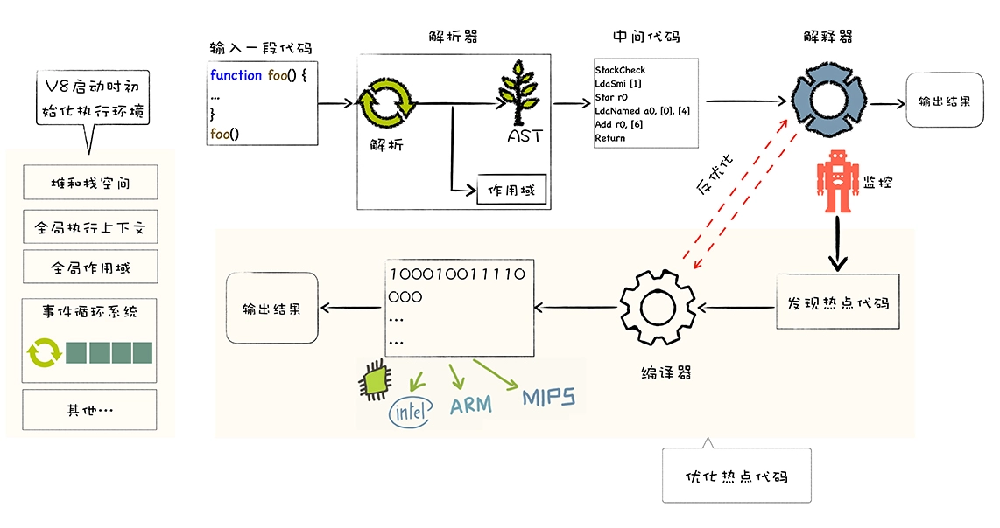

# 图解 GoogleV8

<!-- @import "[TOC]" {cmd="toc" depthFrom=1 depthTo=6 orderedList=false} -->

<!-- code_chunk_output -->

- [图解 GoogleV8](#-图解-googlev8)
  - [一. 宏观视角](#-一-宏观视角)
    - [1.1 什么是 V8](#-11-什么是-v8)
    - [1.2 高级代码需要先编译再执行](#-12-高级代码需要先编译再执行)
    - [1.3 V8 执行 JS 代码](#-13-v8-执行-js-代码)
    - [1.4 构建和使用 V8 的调试工具 d8](#-14-构建和使用-v8-的调试工具-d8)
  - [二. JS 设计思想](#-二-js-设计思想)
    - [2.1 函数即对象](#-21-函数即对象)
      - [2.1.1 JS 中的对象](#-211-js-中的对象)
      - [2.1.2 函数的本质](#-212-函数的本质)
      - [2.1.3 函数是一等公民](#-213-函数是一等公民)
    - [2.2 V8 如何提升对象属性访问速度](#-22-v8-如何提升对象属性访问速度)
      - [2.2.1 常规属性（properties）和排序属性（elements）](#-221-常规属性properties和排序属性elements)
      - [2.2.2 快属性和慢属性](#-222-快属性和慢属性)
      - [2.2.3 在 Chrome 中查看对象布局](#-223-在-chrome-中查看对象布局)
    - [2.3 函数表达式](#-23-函数表达式)
      - [2.3.1 函数声明与函数表达式的差异](#-231-函数声明与函数表达式的差异)
      - [2.3.2 V8 处理函数声明](#-232-v8-处理函数声明)
      - [2.3.3 V8 处理函数表达式](#-233-v8-处理函数表达式)
    - [2.4 原型链](#-24-原型链)
      - [2.4.1 原型继承的实现](#-241-原型继承的实现)
      - [2.4.2 利用 `__proto__` 实现继承](#-242-利用-__proto__-实现继承)
    - [2.5 作用域链](#-25-作用域链)
      - [2.5.1 全局作用域和函数作用域](#-251-全局作用域和函数作用域)
      - [2.5.2 作用域链的工作方式](#-252-作用域链的工作方式)
    - [2.6 类型转换](#-26-类型转换)
      - [2.6.1 类型系统](#-261-类型系统)
      - [2.6.2 v8 执行加法操作](#-262-v8-执行加法操作)
  - [三. V8 编译流水线](#-三-v8-编译流水线)
    - [3.1 运行 JS 代码的基石：运行时环境](#-31-运行-js-代码的基石运行时环境)
      - [3.1.1 构造数据存储空间：堆空间和栈空间](#-311-构造数据存储空间堆空间和栈空间)
      - [3.1.2 全局执行上下文和全局作用域](#-312-全局执行上下文和全局作用域)
      - [3.1.3 构造事件循环系统](#-313-构造事件循环系统)
    - [3.2 机器码](#-32-机器码)
      - [3.2.1 将源码编译成机器码](#-321-将源码编译成机器码)
      - [3.2.2 CPU 执行程序](#-322-cpu-执行程序)
    - [3.3 堆和栈](#-33-堆和栈)
      - [3.3.1 为何使用栈结构来管理函数调用](#-331-为何使用栈结构来管理函数调用)
      - [3.3.2 栈如何管理函数调用](#-332-栈如何管理函数调用)
      - [3.3.3 堆的优势](#-333-堆的优势)
    - [3.4 惰性解析](#-34-惰性解析)
      - [3.4.1 惰性解析的过程](#-341-惰性解析的过程)
      - [3.4.2 闭包的三个基础特性](#-342-闭包的三个基础特性)
      - [3.4.3 闭包给惰性解析带来的问题和解决方案](#-343-闭包给惰性解析带来的问题和解决方案)
    - [3.5 字节码](#-35-字节码)
      - [3.5.1 机器码的问题](#-351-机器码的问题)
      - [3.5.2 字节码的优势](#-352-字节码的优势)
      - [3.5.3 生成字节码](#-353-生成字节码)
      - [3.5.4 解释器的架构设计](#-354-解释器的架构设计)
    - [3.6 在内存中快速查找对象属性](#-36-在内存中快速查找对象属性)
      - [3.6.1 隐藏类](#-361-隐藏类)
      - [3.6.2 通过 d8 查看隐藏类](#-362-通过-d8-查看隐藏类)
      - [3.6.3 多个对象共用一个隐藏类](#-363-多个对象共用一个隐藏类)
      - [3.6.4 重新构建隐藏类](#-364-重新构建隐藏类)
      - [3.6.5 最佳实践](#-365-最佳实践)
    - [3.7 内联缓存](#-37-内联缓存)
      - [3.7.1 单态多态与超态](#-371-单态多态与超态)
  - [四. 事件循环和垃圾回收](#-四-事件循环和垃圾回收)
    - [4.1 回调函数的实现：消息队列](#-41-回调函数的实现消息队列)
      - [4.1.1 UI 线程的宏观架构](#-411-ui-线程的宏观架构)
      - [4.1.2 异步回调函数的调用时机](#-412-异步回调函数的调用时机)
    - [4.2 V8 实现微任务](#-42-v8-实现微任务)
      - [4.2.1 主线程 调用栈 消息队列](#-421-主线程-调用栈-消息队列)
      - [4.2.2 微任务解决了宏任务执行时机不可控的问题](#-422-微任务解决了宏任务执行时机不可控的问题)
      - [4.2.3 在微任务中循环地触发新的微任务会导致页面卡死](#-423-在微任务中循环地触发新的微任务会导致页面卡死)
    - [4.3 V8 实现 async/await](#-43-v8-实现-asyncawait)
      - [4.3.1 回调地狱](#-431-回调地狱)
      - [4.3.2 使用 Promise 解决回调地狱中编码不线性的问题](#-432-使用-promise-解决回调地狱中编码不线性的问题)
      - [4.3.3 使用 Generator 函数实现更加线性化逻辑](#-433-使用-generator-函数实现更加线性化逻辑)
      - [4.3.4 async/await：异步编程的 “终极” 方案](#-434-asyncawait异步编程的-终极-方案)
    - [4.4 V8 的两个垃圾回收器的工作方式](#-44-v8-的两个垃圾回收器的工作方式)
      - [4.4.1 垃圾数据的产生](#-441-垃圾数据的产生)
      - [4.4.2 垃圾回收算法](#-442-垃圾回收算法)
      - [4.4.3 副垃圾回收器](#-443-副垃圾回收器)
      - [4.4.4 主垃圾回收器](#-444-主垃圾回收器)
    - [4.5 V8 优化垃圾回收器执行效率](#-45-v8-优化垃圾回收器执行效率)
      - [4.5.1 并行回收](#-451-并行回收)
      - [4.5.2 增量回收](#-452-增量回收)
      - [4.5.3 并发（concurrent）回收](#-453-并发concurrent回收)
    - [4.6 Node 中的 readFile API 工作机制](#-46-node-中的-readfile-api-工作机制)
    - [4.7 几种常见内存问题的解决策略](#-47-几种常见内存问题的解决策略)
      - [4.7.1 内存泄露](#-471-内存泄露)
      - [4.7.2 内存膨胀](#-472-内存膨胀)
      - [4.7.3 频繁的垃圾回收](#-473-频繁的垃圾回收)

<!-- /code_chunk_output -->

## 一. 宏观视角

V8 是 JS 虚拟机的一种。可以简单地把 JS 虚拟机理解成是一个翻译程序，将人类能够理解的编程语言 JS，翻译成机器能够理解的机器语言。如下图所示：


上图中，中间的 “黑盒” 就是 JS 引擎 V8。目前市面上有很多种 JS 引擎，诸如 SpiderMonkey、V8、JavaScriptCore 等。而由谷歌开发的开源项目 V8 是当下使用最广泛的 JS 虚拟机。

V8 之所以拥有如此庞大的生态圈，也和它许多革命性的设计是分不开的。在 V8 出现之前，所有的 JS 虚拟机所采用的都是解释执行的方式，这是 JS 执行速度过慢的一个主要原因。而 V8 率先引入了即时编译（JIT）的双轮驱动的设计，这是一种权衡策略，混合编译执行和解释执行这两种手段，给 JS 的执行速度带来了极大的提升。

V8 出现之后，各大厂商也都在自己的 JS 虚拟机中引入了 JIT 机制，所以可以看到目前市面上 JS 虚拟机都有着类似的架构。另外，V8 也是早于其他虚拟机引入了惰性编译、内联缓存、隐藏类等机制，进一步优化了 JS 代码的编译执行效率。

**V8 的主要职责是用来执行 JS 代码**的，那首先需要先了解 JS 这门语言的基本特性和设计思想。JS 借鉴了很多语言的特性，比如 C 语言的基本语法、Java 的类型系统和内存管理、Scheme 的函数作为一等公民，还有 Self 基于原型（prototype）的继承机制。毫无疑问，JS 是一门非常优秀的语言，特别是 “原型继承机制” 和 “函数是一等公民” 这两个设计。


不过 JS 也是一门处处是坑的语言，由于历史原因，很多错误的或者不合理的设计都被延续至今，比如使用 new 加构造函数来创建对象，这种方式的背后隐藏了太多的细节，非常容易增加代码出错概率，而且也大大增加了新手的学习成本；再比如初期的 JS 没有块级作用域机制，使得 JS 需要采取变量提升的策略，而变量提升又是非常反人性的设计。

V8 是 JS 的实现，在学习 V8 工作原理时，就要格外关注 JS 这些独特的设计思想和特性背后的实现。比如，为了实现函数是一等公民的特性，JS 采取了基于对象的策略；再比如为了实现原型继承，V8 为每个对象引入了 [`__proto__`](/frontend/JavaScript/JavaScript权威指南/JavaScript权威指南.md#143-prototype-特性) 属性。

V8 执行 JS 代码的完整流程被称之为 V8 的编译流水线，其完整流程如下图所示：



编译流水线本身并不复杂，但是其中涉及到了很多技术，诸如 JIT、延迟解析、隐藏类、内联缓存等等。这些技术决定着一段 JS 代码能否正常执行，以及代码的执行效率。比如 V8 中使用的隐藏类（Hide Class），这是将 JS 中动态类型转换为静态类型的一种技术，可以消除动态类型的语言执行速度过慢的问题，如果熟悉 V8 的工作机制，在编写 JS 时，就能充分利用好隐藏类这种强大的优化特性，写出更加高效的代码。

再比如，V8 实现了 JS 代码的惰性解析，目的是为了加速代码的启动速度，通过对惰性解析机制的学习，可以优化代码更加适应这个机制，从而提高程序性能。要想充分了解 V8 是怎么工作的，除了要分析编译流水线，还需要了解另外两个非常重要的特性：

- **事件循环系统**
  事件循环系统和 JS 中的难点与异步编程特性紧密相关。JS 是单线程的，代码都是在一个线程上执行，如果同一时间发送了多个 JS 执行的请求，就需要排队，也就是进行异步编程。V8 的事件循环系统会调度这些排队任务，保证 JS 代码被 V8 有序地执行。因此也可以说，事件循环系统就是 V8 的心脏，它驱动了 V8 的持续工作。

- **垃圾回收机制**
  JS 是一种自动垃圾回收的语言，V8 在执行垃圾回收时，会占用主线程的资源，如果编写的程序频繁触发垃圾回收，那么无疑会阻塞主线程，这也是经常会遇到的一个问题。需要知道 V8 是如何分配内存数据的，以及这些数据是如何被回收的，打通整个链路，建立完整的系统，当下次遇到内存问题时，就知道如何去排查了。


### 1.1 什么是 V8

V8 是一个由 Google 开发的开源 JS 引擎，目前用在 Chrome 浏览器和 Node.js 中，其核心功能是执行易于人类理解的 JS 代码。

其主要核心流程分为编译和执行两步。首先需要将 JS 代码转换为低级中间代码或者机器能够理解的机器代码，然后再执行转换后的代码并输出执行结果。


可以把 V8 看成是一个虚拟机，虚拟机通过模拟实际计算机的各种功能来实现代码的执行，如模拟实际计算机的 CPU、堆栈、寄存器等，虚拟机还具有它自己的一套指令系统。

所以对于 JS 代码来说，V8 就是它的整个世界，当 V8 执行 JS 代码时，并不需要担心现实中不同操作系统的差异，也不需要担心不同体系结构计算机的差异，只需要按照虚拟机的规范写好代码就可以了。

### 1.2 高级代码需要先编译再执行

可以把 CPU 看成是一个非常小的运算机器，可以通过二进制的指令和 CPU 进行沟通，比如给 CPU 发出 “1000100111011000” 的二进制指令，这条指令的意思是将一个寄存器中的数据移动到另外一个寄存器中，当处理器执行到这条指令的时候，便会按照指令的意思去实现相关的操作。

为了能够完成复杂的任务，工程师们为 CPU 提供了一大堆指令，来实现各种功能，这一大堆指令被称为**指令集**（Instructions），也就是机器语言。

> **注意**：CPU 只能识别二进制的指令，但是对程序员来说，二进制代码难以阅读和记忆，于是又将二进制指令集转换为人类可以识别和记忆的符号，这就是汇编指令集。

CPU 不能直接识别汇编语言，所以还需要一个汇编编译器，其作用是将汇编代码编程成机器代码：


虽然汇编语言对机器语言做了一层抽象，减少了程序员理解机器语言的复杂度，但是汇编语言依然是复杂且繁琐的，即便写一个非常简单的功能，也需要实现大量的汇编代码，这主要表现在以下两点。

1. **不同的 CPU 有着不同的指令集**，如果要使用机器语言或者汇编语言来实现一个功能，那么需要为每种架构的 CPU 编写特定的汇编代码，这会带来巨大的、枯燥繁琐的操作。

2. 在编写汇编代码时，还需要**了解和处理器架构相关的硬件知识**，比如寄存器、内存、操作 CPU 等。

因此需要一种屏蔽了计算机架构细节的语言，能适应多种不同 CPU 架构的语言，能专心处理业务逻辑的语言，诸如 C、C++、Java、C#、Python、JS 等，这些 “高级语言” 就应运而生了。

和汇编语言一样，处理器也不能直接识别由高级语言所编写的代码，通常，有两种方式来执行这些代码：

1. **解释执行**

   需要先将输入的源代码通过解析器编译成中间代码，之后直接使用解释器解释执行中间代码，然后直接输出结果。具体流程如下图所示：

   

2. **编译执行**

   采用这种方式时，也需要先将源代码转换为中间代码，然后编译器再将中间代码编译成机器代码。通常编译成的机器代码是以二进制文件形式存储的，需要执行这段程序的时候直接执行二进制文件就可以了。还可以使用虚拟机将编译后的机器代码保存在内存中，然后直接执行内存中的二进制代码。

   

但是针对不同的高级语言，实现方式还是有很大差异的，比如要执行 C 语言编写的代码，需要将其编译为二进制代码的文件，然后再直接执行二进制代码。而对于像 Java 语言、JS 语言等，则需要不同虚拟机，模拟计算机的这个编译执行流程。执行 Java 语言，需要经过 Java 虚拟机的转换，执行 JS 需要经过 JS 虚拟机的转换。

即便是 JS 一门语言，也有好几种流行的虚拟机，它们之间的实现方式也存在着一部分差异，比如苹果公司在 Safari 中就是用 JSCore 虚拟机，Firefox 使用了 TraceMonkey 虚拟机，而 Chrome 则使用了 V8 虚拟机。

### 1.3 V8 执行 JS 代码

V8 并没有采用某种单一的技术，而是混合编译执行和解释执行这两种手段，把这种混合使用编译器和解释器的技术称为 **JIT**（Just In Time）技术。

这是一种权衡策略，因为这两种方法都各自有各自的优缺点，解释执行的启动速度快，但是执行时的速度慢，而编译执行的启动速度慢，但是执行时的速度快。可以参考下面完整的 V8 执行 JS 的流程图：


上图中的最左边的部分，在 V8 启动执行 JS 之前，它还需要准备执行 JS 时所需要的一些基础环境，这些基础环境包括了 “堆空间” “栈空间” “全局执行上下文” “全局作用域” “消息循环系统” “内置函数” 等，这些内容都是在执行 JS 过程中需要使用到的。

1. 首先 V8 会接收到要执行的 JS 源代码，V8 并不能直接理解源代码的含义，它需要**结构化**[^1]这段字符串。

   [^1]: 结构化，是指信息经过分析后可分解成多个互相关联的组成部分，各组成部分间有明确的层次结构，方便使用和维护，并有一定的操作规范。

   V8 源代码的结构化之后，就生成了抽象语法树（AST）。在生成 AST 的同时，V8 还会生成相关的作用域，作用域中存放相关变量。

2. 有了 AST 和作用域之后，就可以生成**字节码**[^2]了。

   [^2]: 字节码，是介于 AST 和机器代码的中间代码。但是与特定类型的机器代码无关，解释器可以直接解释执行字节码，或者通过编译器将其编译为二进制的机器代码再执行。

3. 之后，解释器会按照顺序解释执行字节码，并输出执行结果。

在解释器有个监控，这是一个监控解释器执行状态的模块，在解释执行字节码的过程中，如果发现了某一段代码会被重复多次执行，那么监控机器人就会将这段代码标记为热点代码。

当某段代码被标记为热点代码后，V8 就会将这段字节码丢给优化编译器，优化编译器会在后台将字节码编译为二进制代码，然后再对编译后的二进制代码执行优化操作，优化后的二进制机器代码的执行效率会得到大幅提升。如果下面再执行到这段代码时，那么 V8 会优先选择优化之后的二进制代码，这样代码的执行速度就会大幅提升。

不过，和静态语言不同的是，JS 是一种非常灵活的动态语言，对象的结构和属性是可以在运行时任意修改的，而经过优化编译器优化过的代码只能针对某种固定的结构，一旦在执行过程中，对象的结构被动态修改了，那么优化之后的代码势必会变成无效的代码，这时候优化编译器就需要执行**反优化操作**，经过反优化的代码，下次执行时就会回退到解释器解释执行。

### 1.4 构建和使用 V8 的调试工具 d8

[文档](https://time.geekbang.org/column/article/219418)

[编译好的 d8](https://storage.googleapis.com/chromium-v8/official/canary/v8-win64-dbg-8.4.109.zip)

## 二. JS 设计思想

### 2.1 函数即对象

JS 中的函数非常灵活，其根本原因在于 **JS 中的函数就是一种特殊的对象**，JS 中的函数被称为**一等公民**（First Class Function）。

基于函数是一等公民的设计，使得 JS 非常容易实现一些特性，比如闭包，还有函数式编程等，而其他语言要实现这些特性就显得比较困难，比如要在 C++ 中实现闭包需要实现大量复杂的代码，而且使用起来也异常复杂。

#### 2.1.1 JS 中的对象

JS 是一门**基于对象**（Object-Based）的语言，可以说 JS 中大部分的内容都是由对象构成的，诸如函数、数组，也可以说 JS 是建立在对象之上的语言。


而这些对象在运行时可以动态修改其内容，这造就了 JS 的超级灵活特性。不过，因为 JS 太灵活了，也加大了理解和使用这门语言的难度。

虽然 JS 是基于对象设计的，但是它却不是一门面向对象的语言（Object—Oriented Programming Language），因为**面向对象语言天生支持封装、继承、多态**，但是 JS 并没有直接提供多态的支持，因此要在 JS 中使用多态并不是一件容易的事。

除了对多态支持的不好，JS 实现继承的方式和面向对象的语言实现继承的方式同样存在很大的差异。

面向对象语言是由语言本身对继承做了充分的支持，并提供了大量的关键字，如 public、protected、friend、interface 等，众多的关键字使得面向对象语言的继承变得异常繁琐和复杂，而 JS 中实现继承的方式却非常简单清爽，只是在对象中添加了一个称为**原型**的属性，把继承的对象通过原型链接起来，就实现了继承，这种继承方式被称为**基于[原型链](#24-原型链)继承**。

JS 中的对象非常简单，每个对象就是由一组组属性和值构成的集合，比如：

```js
let person = new Object();
person.firstname = 'John';
person.lastname = 'Doe';
person.age = 50;
person.eyecolor = 'blue';
```

这个对象里面有四个属性：


上图展示了对象 person 的结构，可以看到蓝色的属性在左边，黄色的值在右边，有多组属性和值组成，这就是 JS 中的对象，虽然 JS 对象用途非常广泛，使用的方式也非常之多，但是万变不离其宗，其核心本质都就是由一组组属性和值组成的集合。

之所以 JS 中对象的用途这么广，是因为对象的值可以是任意类型的数据，可以改造下上面的那段代码：

```js
let person = new Object();
person.firstname = 'John';
person.lastname = 'Doe';
person.info = new Object();
person.info.age = 50;
person.info.eyecolor = 'blue';
person.showinfo = function () {
  console.log(/*...*/);
};
```

这段代码的内存布局，如下图所示：


观察上图，可以看出来，对象的属性值有三种类型：

1. **原始类型**（primitive）

   所谓的原始类型的数据，是指值本身无法被改变，比如 JS 中的字符串就是原始类型，如果修改了 JS 中字符串的值，那么 V8 会返回一个新的字符串，原始字符串并没有被改变，称这些类型的值为 “原始值”。

   JS 中的原始值主要包括 null、undefined、boolean、number、string、bigint、symbol 这七种。

2. **对象类型**（Object）：对象的属性值也可以是另外一个对象。

3. **函数类型**（Function）：如果对象中的属性值是函数，那么可以把这个属性称为**方法**，所以又说对象具备属性和方法。

#### 2.1.2 函数的本质

在 JS 中，函数是一种特殊的对象，它和对象一样可以拥有属性和值，函数和普通对象不同的是，函数可以被调用。V8 内部为了实现函数可调用特性，会为函数对象添加了两个隐藏属性：


也就是说，函数除了可以拥有常用类型的属性值之外，还拥有两个隐藏属性：

- `name`：隐藏 name 属性的值就是函数名称，如果某个函数没有设置函数名，默认是 `''`，表示该函数对象没有被设置名称。

- `code`：其值表示函数代码，以字符串的形式存储在内存中。当执行到一个函数调用语句时，V8 便会从函数对象中取出 code 属性值，也就是函数代码，然后再解释执行这段函数代码。

#### 2.1.3 函数是一等公民

因为函数是一种特殊的对象，所以在 JS 中，函数可以赋值给一个变量，也可以作为函数的参数，还可以作为函数的返回值。**如果某个编程语言的函数，可以和这个语言的数据类型做一样的事情，就把这个语言中的函数称为一等公民**。支持函数是一等公民的语言可以使得代码逻辑更加清晰，代码更加简洁。

但是由于函数的 “可被调用” 的特性，使得实现函数的可赋值、可传参和可作为返回值等特性变得有一点麻烦。

在执行 JS 函数的过程中，为了实现变量的查找，V8 会为其维护一个作用域链，如果函数中使用了某个变量，但是在函数内部又没有定义该变量，那么函数就会沿着作用域链去外部的作用域中查找该变量：


从图中可以看出，当函数内部引用了外部的变量时，使用这个函数进行赋值、传参或作为返回值，还需要保证这些被引用的外部变量是确定存在的，这就是让函数作为一等公民麻烦的地方，因为虚拟机还需要处理函数引用的外部变量。来看一段简单的代码：

```js
function foo() {
  let number = 1;
  function bar() {
    number++;
    console.log(number);
  }
  return bar;
}
let myBar = foo();
myBar();
```

在 foo 函数中定义了一个新的 bar 函数，并且 bar 函数引用了 foo 函数中的变量 number，当调用 foo 函数的时候，它会返回 bar 函数。

“函数是一等公民” 就体现在，如果要返回函数 bar 给外部，那么即便 foo 函数执行结束了，其内部定义的 number 变量也不能被销毁，因为 bar 函数依然引用了该变量。也把这种**将外部变量和和函数绑定起来的技术称为[闭包](#342-闭包的三个基础特性)**。V8 在实现闭包的特性时也做了大量的额外的工作。

### 2.2 V8 如何提升对象属性访问速度

JS 中的对象是由一组组属性和值的集合，从 JS 语言的角度来看，JS 对象像一个字典，字符串作为键名，任意对象可以作为键值，可以通过键名读写键值。

然而在 V8 实现对象存储时，并没有完全采用字典的存储方式，这主要是出于性能的考量。因为字典是非线性的数据结构，查询效率会低于线性的数据结构，V8 为了提升存储和查找效率，采用了一套复杂的存储策略。


#### 2.2.1 常规属性（properties）和排序属性（elements）

```js
function Foo() {
  this[100] = 'test-100';
  this[1] = 'test-1';
  this['B'] = 'bar-B';
  this[50] = 'test-50';
  this[9] = 'test-9';
  this[8] = 'test-8';
  this[3] = 'test-3';
  this[5] = 'test-5';
  this['A'] = 'bar-A';
  this['C'] = 'bar-C';
}
let bar = new Foo();

for (let key in bar) {
  console.log(`index:${key}  value:${bar[key]}`);
}
```

上面这段代码，利用构造函数 Foo 创建了一个 bar 对象，在构造函数中，给 bar 对象设置了很多属性，包括了数字属性和字符串属性，然后枚举出来了 bar 对象中所有的属性，并将其一一打印出来：

```txt
index:1  value:test-1
index:3  value:test-3
index:5  value:test-5
index:8  value:test-8
index:9  value:test-9
index:50  value:test-50
index:100  value:test-100
index:B  value:bar-B
index:A  value:bar-A
index:C  value:bar-C
```

发现打印出来的属性顺序并不是设置的顺序，设置属性的时候是乱序设置的，但是输出的内容却非常规律，总的来说体现在以下两点：

- 设置的数字属性被最先打印出来了，并且是按照数字大小的顺序打印的。
- 设置的字符串属性依然是按照之前的设置顺序打印的，比如是按照 B、A、C 的顺序设置的，打印出来依然是这个顺序。

之所以出现这样的结果，是因为在 ECMAScript 规范中定义了**数字属性应该按照索引值大小升序排列，字符串属性根据创建时的顺序升序排列**。

在这里把**对象中的数字属性称为排序属性**，在 V8 中被称为 elements，**字符串属性就被称为常规属性**，在 V8 中被称为 properties。

在 V8 内部，为了有效地提升存储和访问这两种属性的性能，*分别使用了两个线性数据结构*来分别保存排序属性和常规属性：


通过上图发现，bar 对象包含了两个隐藏属性：elements 属性和 properties 属性，elements 属性指向了 elements 对象，在 elements 对象中，会按照顺序存放排序属性，properties 属性则指向了 properties 对象，在 properties 对象中，会按照创建时的顺序保存了常规属性。

分解成这两种线性数据结构之后，如果执行索引操作，那么 V8 会先从 elements 属性中按照顺序读取所有的元素，然后再在 properties 属性中读取所有的元素，这样就完成一次索引操作。

#### 2.2.2 快属性和慢属性

将不同的属性分别保存到 elements 属性和 properties 属性中，无疑简化了程序的复杂度，但是在查找元素时，却多了一步操作，比如执行 bar.B 这个语句来查找 B 的属性值，那么在 V8 会先查找出 properties 属性所指向的对象 properties，然后再在 properties 对象中查找 B 属性，这种方式在查找过程中增加了一步操作，因此会影响到元素的查找效率。

基于这个原因，V8 采取了一个权衡的策略以加快查找属性的效率，这个策略是将部分常规属性直接存储到对象本身，这被称为**对象内属性**（in-object properties）：


采用对象内属性之后，常规属性就被保存到 bar 对象本身了，这样当再次使用 bar.B 来查找 B 的属性值时，V8 就可以直接从 bar 对象本身去获取该值就可以了，这种方式减少查找属性值的步骤，增加了查找效率。

不过**对象内属性的数量是固定的，默认是 10 个**，如果添加的属性超出了对象分配的空间，则它们将被保存在常规属性存储中。虽然属性存储多了一层间接层，但可以自由地扩容。

通常，**将保存在线性数据结构中的属性称之为 “快属性”**，因为线性数据结构中只需要通过索引即可以访问到属性，虽然访问线性结构的速度快，但是如果从线性结构中添加或者删除大量的属性时，则执行效率会非常低，这主要因为会产生大量时间和内存开销。

因此，如果一个对象的属性过多时，V8 就会采取另外一种存储策略，那就是 “慢属性” 策略，但慢属性的对象内部会有独立的非线性数据结构（词典）作为属性存储容器。所有的属性元信息不再是线性存储的，而是直接保存在属性字典中。


#### 2.2.3 在 Chrome 中查看对象布局

打开 Chrome 开发者工具，先选择控制台标签，然后在控制台中执行以下代码查看内存快照：

```js
function Foo(property_num, element_num) {
  // 添加可索引属性
  for (let i = 0; i < element_num; i++) {
    this[i] = `element${i}`;
  }
  // 添加常规属性
  for (let i = 0; i < property_num; i++) {
    let ppt = `property${i}`;
    this[ppt] = ppt;
  }
}
let bar = new Foo(12, 10);
```

创建了函数对象，接下来就来看看构造函数和对象在内存中的状态。将 Chrome 开发者工具切换到 Memory 标签，然后点击左侧的小圆圈（拍摄堆快照）就可以捕获当前的内存快照，然后在类过滤器中输入构造函数名称：


可以看到其中有 10 个对象内属性，另外的常用属性就被保存到 properties 中，10 个排序属性存放在 elements 中。

**其他属性**
观察上图，除了 elements 和 properties 属性，V8 还为每个对象实现了 `map` 属性和 `__proto__` 属性。`__proto__` 属性就是原型，是用来实现 JS 继承的。而 map 则是[隐藏类](#361-隐藏类)。

### 2.3 函数表达式

函数表达式在 JS 中非常基础也非常重要，使用函数表达式可以用来实现代码隐藏，还可以实现变量隔离，所以函数表达式被广泛地应用在各个项目中。

```js
// 函数声明
function foo() {
  // ...
}

// 函数表达式
let foo = function () {
  // ...
};
```

#### 2.3.1 函数声明与函数表达式的差异

```js
foo();
function foo() {
  console.log('foo');
}
```

在这段代码中，声明了一个 foo 函数，然后在 foo 函数之前调用了 foo 函数，执行这段代码，可以看到 foo 函数被正确执行了。

```js
foo();
var foo = function () {
  console.log('foo');
};
```

在下面的代码中，定义了一个变量 foo，然后将一个函数赋值给了变量 foo，也是在 foo 函数的前面调用 foo，执行这段代码，发现报错了，提示的错误信息如下所示：

```sh
VM130:1 Uncaught TypeError: foo is not a function
    at <anonymous>:1:1
```

第二段代码报错的主要原因是这两种定义函数的方式具有不同语义，不同的语义触发了不同的行为。


因为语义不同，所以给这两种定义函数的方式使用了不同的名称，第一种称之为**函数声明**，第二种称之为**函数表达式**。

#### 2.3.2 V8 处理函数声明

函数声明定义了一个具有指定参数的函数，其声明语法如下所示：

```js
function name([param,[, param,[..., param]]]) {
   [statements]
}
```

V8 在执行 JS 的过程中，会先对其进行编译，然后再执行：

```js
var x = 5;
function foo() {
  console.log('Foo');
}
```

V8 执行这段代码的流程大致如下图所示：


在编译阶段，如果解析到函数声明，那么 V8 会将这个函数声明转换为内存中的函数对象，并将其放到作用域中。同样，如果解析到了某个变量声明，也会将其放到作用域中，但是会将其值设置为 undefined，表示该变量还未被使用。

然后在 V8 执行阶段，如果使用了某个变量，或者调用了某个函数，那么 V8 便会去作用域查找相关内容。

#### 2.3.3 V8 处理函数表达式

在一个表达式中使用 function 来定义一个函数，那么就把该函数称为函数表达式。

```js
let foo = function () {
  console.log('foo');
};
```

函数表达式与函数声明的最主要区别有以下三点：

- 函数表达式是在表达式语句中使用 function 的，最典型的表达式是 “a=b” 这种形式，因为函数也是一个对象，把 “a = function (){}” 这种方式称为函数表达式。

- 在函数表达式中，可以省略函数名称，从而创建匿名函数（anonymous functions）。

- 一个函数表达式可以被用作一个即时调用的函数表达式——IIFE（Immediately Invoked Function Expression）。

### 2.4 原型链

**继承就是一个对象可以访问另外一个对象中的属性和方法**，比如有一个 B 对象，该对象继承了 A 对象，那么 B 对象便可以直接访问 A 对象中的属性和方法：


不同的语言实现继承的方式是不同的，其中最典型的两种方式：

- **基于类的设计**

  C++、Java、C# 这些语言都是基于经典的类继承的设计模式，这种模式最大的特点就是提供了非常复杂的规则，并提供了非常多的关键字，诸如 class、friend、protected、private、interface 等，通过组合使用这些关键字，就可以实现继承。

  使用基于类的继承时，如果业务复杂，那么需要创建大量的对象，然后需要维护非常复杂的继承关系，这会导致代码过度复杂和臃肿，另外引入了这么多关键字也给设计带来了更大的复杂度。

- **基于原型继承的设计**

  而 JS 的继承方式和其他面向对象的继承方式有着很大差别，JS 本身不提供一个 class 实现。虽然标准委员会在 ES2015/ES6 中引入了 class 关键字，但那只是语法糖，JS 的继承依然和基于类的继承没有一点关系。

  JS 仅仅在对象中引入了一个原型的属性，就实现了语言的继承机制，基于原型的继承省去了很多基于类继承时的繁文缛节，简洁而优美。

#### 2.4.1 原型继承的实现

**在 JS 中，通过原型和原型链的方式来实现了继承特性**。


有一个对象 C，它包含了一个属性 “type”，那么对象 C 可以直接访问它自己的属性 type。

上面从 V8 的内存快照看到，JS 的每个对象都包含了一个隐藏属性**原型** `__proto__`（prototype），`__proto__` 指向了内存中的另外一个对象，就把 `__proto__` 指向的对象称为该对象的**原型对象**，那么该对象就可以直接访问其原型对象的方法或者属性。

比如让 C 对象的原型指向 B 对象，那么便可以利用 C 对象来直接访问 B 对象中的属性或者方法：


当 C 对象将它的 `__proto__` 属性指向了 B 对象后，那么通过对象 C 来访问对象 B 中的 name 属性时，V8 会先从对象 C 中查找，但是并没有查找到，接下来 V8 继续在其原型对象 B 中查找，因为对象 B 中包含了 name 属性，那么 V8 就直接返回对象 B 中的 name 属性值，虽然 C 和 B 是两个不同的对象，但是使用的时候，B 的属性看上去就像是 C 的属性一样。

同样的方式，B 也是一个对象，它也有自己的 `__proto__` 属性，比如它的属性指向了内存中另外一块对象 A：

对象 A 有个属性是 color，那么通过 C.color 访问 color 属性时，V8 会先在 C 对象内部查找，但是没有查找到，接着继续在 C 对象的原型对象 B 中查找，但是依然没有查找到，那么继续去对象 B 的原型对象 A 中查找，因为 color 在对象 A 中，那么 V8 就返回该属性值。

使用 C.name 和 C.color 时，给人的感觉属性 name 和 color 都是对象 C 本身的属性，但实际上这些属性都是位于原型对象上，把这个查找属性的路径称为**原型链**，它像一个链条一样，将几个原型链接起来。查找属性的时候，JS 虚拟机会沿着原型一层一层向上查找，直至找到正确的属性。

> **注意**：不要将原型链接和作用域链搞混淆了，[作用域链](#25-作用域链)是沿着函数的作用域一级一级来查找变量的，而原型链是沿着对象的原型一级一级来查找属性的，虽然它们的实现方式是类似的，但是它们的用途是不同的。

#### 2.4.2 利用 `__proto__` 实现继承

```js
let animal = {
  type: 'Default',
  color: 'Default',
  getInfo: function () {
    return `Type is: ${this.type}，color is ${this.color}.`;
  }
};
let dog = {
  type: 'Dog',
  color: 'Black'
};
```

在这段代码中，创建了两个对象 animal 和 dog，想让 dog 对象继承于 animal 对象，那么最直观的方式就是将 dog 的原型指向对象 animal：

```js
dog.__proto__ = animal;
```

通常隐藏属性是不能使用 JS 来直接与之交互的。虽然现代浏览器都开了一个口子，让 JS 可以访问隐藏属性 `__proto__`，但是在实际项目中，不应该直接通过 `__proto__` 来[访问或者修改该属性](/frontend/JavaScript/JavaScript.md#232-js-的原形)，其主要原因有两个：

- 这是隐藏属性，并不是标准定义的。
- 使用该属性会造成严重的性能问题。

### 2.5 作用域链

**作用域链就是将一个个作用域串起来，实现变量查找的路径**。作用域就是存放变量和函数的地方，全局环境有全局作用域，全局作用域中存放了全局变量和全局函数。每个函数也有自己的作用域，函数作用域中存放了函数中定义的变量。

当在函数内部使用一个变量的时候，V8 便会去作用域中去查找：

```js
let name = '极客时间';
let type = 'global';

function foo() {
  let name = 'foo';
  console.log(`name: ${name}`);
  console.log(`type: ${type}`);
}

function bar() {
  let name = 'bar';
  let type = 'function';
  foo();
}

bar();
// name: foo
// type: global
```

#### 2.5.1 全局作用域和函数作用域

每个函数在执行时都需要查找自己的作用域，称为**函数作用域**，在执行阶段，在执行一个函数时，当该函数需要使用某个变量或者调用了某个函数时，便会优先在该函数作用域中查找相关内容。

```js
var x = 4;
var test;
function test_scope() {
  var name = 'foo';
  console.log(name);
  console.log(type);
  console.log(test);
  var type = 'function';
  test = 1;
  console.log(x);
}
test_scope();
```

在上面的代码中，定义了一个 test_scope 函数，在 V8 执行 test_scope 函数的时候，在编译阶段会为 test_scope 函数创建一个作用域，在 test_scope 函数中定义的变量和声明的函数都会丢到该作用域中，因为在 test_scope 函数中定了三个变量，那么常见的作用域就包含有这三个变量。

可以通过 Chrome 的控制台来直观感受下 test_scope 函数的作用域，先打开包含这段代码的页面，然后打开开发者工具，接着在 test_scope 函数中的第二段代码加上断点，然后刷新该页面。当执行到该断点时，V8 会暂停整个执行流程，这时候就可以通过右边的区域面板来查看当前函数的执行状态。


可以参考图中右侧的 Scope 项，然后点击展开该项，这个 Local 就是当前函数 test_scope 的作用域。在 test_scope 函数中定义的变量都包含到了 Local 中，如变量 name、type，另外系统还添加了另外一个隐藏变量 this，V8 会默认将隐藏变量 this 存放到作用域中。

在 test_scope 函数使用了变量 x，但是在 test_scope 函数的作用域中，并没有定义变量 x，V8 如果在当前函数作用域中没有查找到变量，那么 V8 会去全局作用域中去查找，这个查找的线路就称为作用域链。

全局作用域和函数作用域类似，也是存放变量和函数的地方，但是它们有点不一样：**全局作用域是在 V8 启动过程中就创建了，且一直保存在内存中不会被销毁的，直至 V8 退出。而函数作用域是在执行该函数时创建的，当函数执行结束之后，函数作用域就随之被销毁掉**。

全局作用域中包含了很多全局变量，比如全局的 this 值，如果是浏览器，全局作用域中还有 window、document、opener 等非常多的方法和对象，如果是 node 环境，那么会有 Global、File 等内容。

V8 启动之后就进入正常的消息循环状态，这时候就可以执行代码了，比如执行到上面那段时，V8 会先解析顶层（Top Level）代码，可以看到，在顶层代码中定义了变量 x，这时候 V8 就会将变量 x 添加到全局作用域中。

#### 2.5.2 作用域链的工作方式

1. 当 V8 启动时，会创建全局作用域，全局作用域中包括了 this、window 等变量，还有一些全局的 Web API 接口：

   

2. V8 启动之后，消息循环系统便开始工作，这时候，输入代码让其执行。V8 会先编译顶层代码，在编译过程中会将顶层定义的变量和声明的函数都添加到全局作用域中：

   

3. 全局作用域创建完成之后，V8 便进入了执行状态。

   当 V8 执行 bar 函数的时候，同样需要经历两个阶段：编译和执行。在编译阶段，V8 会为 bar 函数创建函数作用域，最终效果如下所示：

   

   然后进入了 bar 函数的执行阶段。在 bar 函数中，只是简单地调用 foo 函数，因此 V8 又开始执行 foo 函数。同样，在编译 foo 函数的过程中，会创建 foo 函数的作用域：

   

   **因为 JS 是基于词法作用域的，词法作用域就是指，查找作用域的顺序是按照函数定义时的位置来决定的**。bar 和 foo 函数的外部代码都是全局代码，所以无论是在 bar 函数中查找变量，还是在 foo 函数中查找变量，其查找顺序都是按照*当前函数作用域–> 全局作用域*这个路径来的。所以在 foo 函数中使用 type，最终打印出来的值就是全局作用域中的 type。

   

   因为词法作用域是根据函数在代码中的位置来确定的，作用域是在声明函数时就确定好了，所以也将词法作用域称为**静态作用域**。和静态作用域相对的是动态作用域，**动态作用域并不关心函数和作用域是如何声明以及在何处声明的，只关心它们从何处调用**。换句话说，作用域链是基于调用栈的，而不是基于函数定义的位置的。

### 2.6 类型转换

如果尝试在 Python 中使用数字和字符串进行相加操作，那么 Python 虚拟机会直接返回一个执行错误，错误提示是这样的：

```python
>>> 1+'2'
Traceback (most recent call last):
  File "<stdin>", line 1, in <module>
TypeError: unsupported operand type(s) for +: 'int' and 'str'
```

这段错误代码提示了这是个类型错误，表明 Python 并不支持数字类型和字符串类型相加的操作。

不过在 JS 中执行这段表达式，是可以返回一个结果的，最终返回的结果是字符串 “12”。

#### 2.6.1 类型系统

对机器语言来说，所有的数据都是一堆二进制代码，CPU 处理这些数据的时候，并没有类型的概念，CPU 所做的仅仅是移动数据，比如对其进行移位，相加或相乘。

而在高级语言中，都会为操作的数据赋予指定的类型，**类型可以确认一个值或者一组值具有特定的意义和目的**。所以，类型是高级语言中的概念。


比如在 C/C++ 中，需要为要处理的每条数据指定类型：

```c++
int counter = 100 // 赋值整型变量
float miles = 1000.0 // 浮点型
char* name = "John" // 字符串
```

C/C++ 编译器负责将这些数据片段转换为供 CPU 处理的正确命令，通常是二进制的机器代码。

在某些更高级的语言中，还可以根据数据推断出类型，比如在 Python 或 JS 中，就不必为数据指定专门的数据类型，在 Python 中定义变量：

```python
counter = 100 # 赋值整型变量
miles = 1000.0 # 浮点型
name = "John" # 字符串
```

在 JS 中定义变量：

```js
var counter = 100; // 赋值整型变量
let miles = 1000.0; // 浮点型
const name = 'John'; // 字符串
```

虽然 Python 和 JS 定义变量的方式不同，但是它们都不需要直接指定变量的类型，因为虚拟机会根据数据自动推导出类型。

通用的类型有数字类型、字符串、Boolean 类型等等，引入了这些类型之后，编译器或者解释器就可以根据类型来限制一些有害的或者没有意义的操作。比如在 Python 语言中，如果使用字符串和数字相加就会报错，因为 Python 觉得这是没有意义的。而在 JS 中，字符串和数字相加是有意义的，可以使用字符串和数字进行相加的。

每种语言都**定义了自己的类型，还定义了如何操作这些类型，另外还定义了这些类型应该如何相互作用，就把这称为类型系统**。一个语言的类型系统越强大，那编译器能帮程序员检查的东西就越多，程序员定义 “检查规则” 的方式就越灵活。

#### 2.6.2 v8 执行加法操作

当有两个值相加的时候，比如：

```js
a + b;
```

V8 会严格根据 ECMAScript 规范来执行操作。ECMAScript 是一个语言标准，JS 就是 ECMAScript 的一个实现，比如在 ECMAScript 就定义了怎么执行加法操作，如下所示：


具体细节也可以[参考规范](https://262.ecma-international.org/6.0/#sec-addition-operator-plus-runtime-semantics-evaluation)，标准定义的内容翻译如下：

1. 把第一个表达式（AdditiveExpression）的值赋值给左引用（lref）。
2. 使用 GetValue（lref）获取左引用（lref）的计算结果，并赋值给左值。
3. 使用 ReturnIfAbrupt（lval）如果报错就返回错误。
4. 把第二个表达式（MultiplicativeExpression）的值赋值给右引用（rref）。
5. 使用 GetValue（rref）获取右引用（rref）的计算结果，并赋值给 rval。
6. 使用 ReturnIfAbrupt（rval）如果报错就返回错误。
7. 使用 ToPrimitive（lval）获取左值（lval）的计算结果，并将其赋值给左原生值（lprim）。
8. 使用 ToPrimitive（rval）获取右值（rval）的计算结果，并将其赋值给右原生值（rprim）。
9. 如果 Type（lprim）和 Type（rprim）中有一个是 String，则：
   a. 把 ToString（lprim）的结果赋给左字符串（lstr）；
   b. 把 ToString（rprim）的结果赋给右字符串（rstr）；
   c. 返回左字符串（lstr）和右字符串（rstr）拼接的字符串。
10. 把 ToNumber（lprim）的结果赋给左数字（lnum）。
11. 把 ToNumber（rprim）的结果赋给右数字（rnum）。
12. 返回左数字（lnum）和右数字（rnum）相加的数值。

通俗地理解，V8 会提供了一个 ToPrimitive 方法，其作用是将 a 和 b 转换为原生数据类型，其转换流程如下：

1. 先检测该对象中是否存在 valueOf 方法，如果有并返回了原始类型，那么就使用该值进行强制类型转换。
2. 如果 valueOf 没有返回原始类型，那么就使用 toString 方法的返回值。
3. 如果 valueOf 和 toString 两个方法都不返回基本类型值，便会触发一个 TypeError 的错误。

将对象转换为原生类型的流程图如下所示：


当 V8 执行 `1 + "2"` 时，因为这是两个原始值相加，原始值相加的时候，如果其中一项是字符串，那么 V8 会默认将另外一个值也转换为字符串，相当于执行了下面的操作：

```js
Number(1).toString() + '2';
```

这里，把数字 1 偷偷转换为字符串 “1” 的过程也称为强制类型转换，因为这种转换是隐式的，所以如果不熟悉语义，那么就很容易判断错误。

## 三. V8 编译流水线

### 3.1 运行 JS 代码的基石：运行时环境

其实在执行 JS 代码之前，V8 就已经准备好了代码的运行时环境，这个环境包括了堆空间和栈空间、全局执行上下文、全局作用域、内置的内建函数、宿主环境提供的扩展函数和对象，还有消息循环系统。准备好运行时环境之后，V8 才可以执行 JS 代码，这包括解析源码、生成字节码、解释执行或者编译执行这一系列操作。


**宿主环境**
可以把 V8 和浏览器的渲染进程的关系看成病毒和细胞的关系，浏览器为 V8 提供基础的消息循环系统、全局变量、Web API，而 V8 的核心是实现了 ECMAScript 标准，这相当于病毒自己的 DNA 或者 RNA，V8 只提供了 ECMAScript 定义的一些对象和一些核心的函数，这包括了 Object、Function、String。除此之外，V8 还提供了垃圾回收器、协程等基础内容，不过这些功能依然需要宿主环境的配合才能完整执行。

如果 V8 使用不当，比如不规范的代码触发了频繁的垃圾回收，或者某个函数执行时间过久，这些都会占用宿主环境的主线程，从而影响到程序的执行效率，甚至导致宿主环境的卡死。

除了浏览器可以作为 V8 的宿主环境，Node.js 也是 V8 的另外一种宿主环境，它提供了不同的宿主对象和宿主的 API，但是整个流程依然是相同的，比如 Node.js 也会提供一套消息循环系统，也会提供一个运行时的主线程。


#### 3.1.1 构造数据存储空间：堆空间和栈空间

由于 V8 是寄生在浏览器或者 Node.js 这些宿主中的，因此，V8 也是被这些宿主启动的。比如，在 Chrome 中，只要打开一个渲染进程，渲染进程便会初始化 V8，同时初始化堆空间和栈空间。

**栈空间主要是用来管理 JS 函数调用的**，栈是内存中连续的一块空间，同时栈结构是 “先进后出” 的策略。在函数调用过程中，涉及到上下文相关的内容都会存放在栈上，比如原生类型、引用到的对象的地址、函数的执行状态、this 值等都会存在在栈上。当一个函数执行结束，那么该函数的执行上下文便会被销毁掉。

栈空间的最大的特点是**空间连续**，所以在栈中每个元素的地址都是固定的，因此栈空间的查找效率非常高，但是通常在内存中，很难分配到一块很大的连续空间，因此，V8 对栈空间的大小做了限制，如果函数调用层过深，那么 V8 就有可能抛出栈溢出的错误。可以在控制台执行下面这样一段代码：

```js
function factorial(n) {
  if (n === 1) {
    return 1;
  }
  return n * factorial(n - 1);
}
console.log(factorial(50000));
```

执行这段代码，便会报出这样的错误：

```js
VM68:1 Uncaught RangeError: Maximum call stack size exceeded
```

这段提示是说，调用栈超出了最大范围，因为这里求阶乘的函数需要嵌套调用 5 万层，而栈提供不了这么大的空间，所以就抛出了栈溢出的错误。

如果有一些占用内存比较大的数据，或者不需要存储在连续空间中的数据，使用栈空间就显得不是太合适了，所以 V8 又使用了堆空间。

**堆空间是一种树形的存储结构，用来存储对象类型的离散的数据**，JS 中除了原生类型的数据，其他的都是对象类型，诸如函数、数组，在浏览器中还有 window 对象、document 对象等，这些都是存在堆空间的。宿主在启动 V8 的过程中，会同时创建堆空间和栈空间，再继续往下执行，产生的新数据都会存放在这两个空间中。

#### 3.1.2 全局执行上下文和全局作用域

V8 初始化了基础的存储空间之后，接下来就需要**初始化全局执行上下文和全局作用域**了，这两个内容是 V8 执行后续流程的基础。

当 V8 开始执行一段可执行代码时，会生成一个执行上下文。V8 用执行上下文来维护执行当前代码所需要的变量声明、this 指向等。执行上下文中主要包含三部分：

- 变量环境
- 词法环境
- this 关键字

比如在浏览器的环境中，全局执行上下文中就包括了 window 对象，还有默认指向 window 的 this 关键字，另外还有一些 Web API 函数，诸如 setTimeout、XMLHttpRequest 等内容。而词法环境中，则包含了使用 let、const 等变量的内容。执行上下文所包含的具体内容，可以参考下图：


全局执行上下文在 V8 的生存周期内是不会被销毁的，它会一直保存在堆中，这样当下次在需要使用函数或者全局变量时，就不需要重新创建了。另外，当执行了一段全局代码时，如果全局代码中有声明的函数或者定义的变量，那么函数对象和声明的变量都会被添加到全局执行上下文中。

在 ES6 中，同一个全局执行上下文中，能存在多个作用域：

```js
var x = 5;
{
  let y = 2;
  const z = 3;
}
```

这段代码在执行时，就会有两个对应的作用域，一个是全局作用域，另外一个是括号内部的作用域，但是这些内容都会保存到全局执行上下文中。具体可以参考下图：


当 V8 调用了一个函数时，就会进入函数的执行上下文，这时候全局执行上下文和当前的函数执行上下文就形成了一个栈结构。比如执行下面这段代码：

```js
var x = 1;
function show_x() {
  console.log(x);
}
function bar() {
  show_x();
}
bar();
```

当执行到 show_x 的时候，其栈状态如下图所示：


#### 3.1.3 构造事件循环系统

有了堆空间和栈空间，生成了全局执行上下文和全局作用域之后，V8 还需要有一个主线程，用来执行 JS 和执行垃圾回收等工作。V8 是寄生在宿主环境中的，它并没有自己的主线程，而是使用宿主所提供的主线程，V8 所执行的代码都是在宿主的主线程上执行的。

只有一个主线程依然不行，因为如果开启一个线程，在该线程执行一段代码，那么当该线程执行完这段代码之后，就会自动退出了，执行过程中的一些栈上的数据也随之被销毁，下次再执行另外一个段代码时，还需要重新启动一个线程，重新初始化栈数据，这会严重影响到程序执行时的性能。

为了在执行完代码之后，让线程继续运行，线程实际上是事件驱动的，也就是说，如果没有任务，那么该线程将被挂起，一旦有新的任务到达了消息队列，那么系统会将这个挂起的线程激活，激活之后线程继续向下执行。

> **注意**：因为所有的任务都是运行在主线程的，在浏览器的页面中，V8 会和页面共用主线程，共用消息队列，所以如果 V8 执行一个函数过久，会影响到浏览器页面的交互性能。

### 3.2 机器码

准备好了运行时环境，V8 就可以执行 JS 代码了。在执行代码时，V8 需要先将 JS 编译成字节码，然后再解释执行字节码，或者将需要优化的字节码编译成二进制，并直接执行二进制代码。也就是说，V8 首先需要将 JS 编译成字节码或者二进制代码，然后再执行。

因为字节码的执行模式和 CPU 直接执行二进制代码的模式是类似的，所以先了解 CPU 执行二进制代码的过程，有利于分析字节码的执行流程。

#### 3.2.1 将源码编译成机器码

以一段 C 代码为例，来看一下代码被编译成二进制可执行程序之后，是如何被 CPU 执行的：

```c
int main()
{
  int x = 1;
  int y = 2;
  int z = x + y;
  return z;
}
```

CPU 并不能直接执行这段 C 代码，而是需要对其进行编译，将其转换为二进制的机器码，然后 CPU 才能按照顺序执行编译后的机器码。先通过 GCC 编译器将这段 C 代码编译成二进制文件，可以输入以下命令让其编译成目的文件：

```sh
gcc -O0 -o code_prog code.c
```

输入上面的命令之后回车，就可以在文件夹中生成名为 code_prog 的可执行程序，接下来再将编译出来的 code_prog 程序进行反汇编，这样就可以看到二进制代码和对应的汇编代码。可以使用 objdump 完成该任务，命令如下所示：

```js
objdump -d code_prog
```

最后编译出来的机器码如下图所示：


观察上图，左边就是编译生成的机器码，在这里它是使用十六进制来展示的，这主要是因为十六进制比较容易阅读，所以通常使用十六进制来展示二进制代码。可以观察到上图是由很多行组成的，每一行其实都是一个指令，该指令可以让 CPU 执行指定的任务。

中间的部分是汇编代码，汇编代码采用**助记符**（memonic）来编写程序，例如原本是二进制表示的指令，在汇编代码中可以使用单词来表示，比如 mov、add 就分别表示数据的存储和相加。汇编语言和机器语言是一一对应的，这一点和高级语言有很大的不同。

**通常将汇编语言编写的程序转换为机器语言的过程称为 “汇编”**；反之，**机器语言转化为汇编语言的过程称为 “反汇编”**，比如上图就是对 code_prog 进程进行了反汇编操作。

这一大堆指令按照顺序集合在一起就组成了程序，所以程序的执行，本质上就是 CPU 按照顺序执行这一大堆指令的过程。

#### 3.2.2 CPU 执行程序


这张图是比较通用的系统硬件组织模型图，从图中可以看出，它主要是由 CPU、主存储器、各种 IO 总线，还有一些外部设备，诸如硬盘、显示器、USB 等设备组成的。

1. 在程序执行之前，程序需要被装进内存。

   比如在 Windows 下面，可以通过鼠标点击一个可执行文件，当点击该文件的时候，系统中的程序加载器会将该文件加载到内存中。

2. 一旦二进制代码被装载进内存，CPU 便可以从内存中取出一条指令，然后分析该指令，最后执行该指令。

   **把取出指令、分析指令、执行指令这三个过程称为一个 CPU 时钟周期**。当它执行完成一条指令之后，会立即从内存中取出下一条指令，接着分析该指令，执行该指令，CPU 一直重复执行该过程，直至所有的指令执行完成。

### 3.3 堆和栈

#### 3.3.1 为何使用栈结构来管理函数调用

大部分高级语言都不约而同地采用栈这种结构来管理函数调用，这与函数的特性有关。通常函数有两个主要的特性：

- **函数可以被调用**

  可以在一个函数中调用另外一个函数，当函数调用发生时，执行代码的控制权将从父函数转移到子函数，子函数执行结束之后，又会将代码执行控制权返还给父函数。

- **函数具有作用域机制**

  作用域机制，是指函数在执行的时候可以将定义在函数内部的变量和外部环境隔离，在函数内部定义的变量也称为临时变量，临时变量只能在该函数中被访问，外部函数通常无权访问，当函数执行结束之后，存放在内存中的临时变量也随之被销毁。

可以看下面这段 C 代码：

```c
int getZ()
{
  return 4;
}
int add(int x, int y)
{
  int z = getZ();
  return x + y + z;
}
int main()
{
  int x = 5;
  int y = 6;
  int ret = add(x, y);
}
```

上面这段代码其中包含了多层函数嵌套调用，执行流程是这样的：

1. 当 main 函数调用 add 函数时，需要将代码执行控制权交给 add 函数。
2. 然后 add 函数又调用了 getZ 函数，于是又将代码控制权转交给 getZ 函数。
3. 接下来 getZ 函数执行完成，需要将控制权返回给 add 函数。
4. 同样当 add 函数执行结束之后，需要将控制权返还给 main 函数
5. 然后 main 函数继续向下执行。


通过上述分析，可以得出，**函数调用者的生命周期总是长于被调用者（后进），并且被调用者的生命周期总是先于调用者的生命周期结束（先出）**。

因为函数是有作用域机制的，作用域机制通常表现在函数执行时，会在内存中分配函数内部的变量、上下文等数据，在函数执行完成之后，这些内部数据会被销毁掉。**所以站在函数资源分配和回收角度来看，被调用函数的资源分配总是晚于调用函数（后进），而函数资源的释放则总是先于调用函数（先出）**。

通过观察函数的生命周期和函数的资源分配情况发现，它们都符合后进先出（LIFO）的策略，而栈结构正好满足这种后进先出（LIFO）的需求，所以选择栈来管理函数调用关系是一种很自然的选择。

#### 3.3.2 栈如何管理函数调用

首先来分析最简单的场景：当执行一个函数的时候，栈怎么变化？

当一个函数被执行时，函数的参数、函数内部定义变量都会依次压入到栈中，结合实际的代码来分析下这个过程，可以参考下图：


上图展示的是一段简单的 C 代码的执行过程，可以看到：

1. 当执行到函数的第一段代码的时候，变量 x 第一次被赋值，且值为 5，这时 5 会被压入到栈中。
2. 然后，执行第二段代码，变量 y 第一次被赋值，且值为 6，这时 6 会被压入到栈中。
3. 接着，执行到第三段代码，注意这里变量 x 是第二次被赋值，且新的值为 100，那么这时并不是将 100 压入到栈中，而是替换之前压入栈的内容，也就是将栈中的 5 替换成 100。
4. 最后，执行第四段代码，这段代码是 int z = x + y，会先计算出来 x+y 的值，然后再将 x+y 的值赋值给 z，由于 z 是第一次被赋值，所以 z 的值也会被压入到栈中。

**函数在执行过程中，其内部的临时变量会按照执行顺序被压入到栈中**。

分析更加复杂的场景：当一个函数调用另外一个函数时，栈的变化情况是怎样的？

```c
int add(num1, num2){
  int x = num1;
  int y = num2;
  int ret = x + y;
  return ret;
}

int main()
{
  int x = 5;
  int y = 6;
  x = 100;
  int z = add(x, y);
  return z;
}
```

1. 当执行到 int z = add(x, y) 时，当前栈的状态如下所示：

   时的栈状态.webp>)

2. 接下来，就要调用 add 函数了，理想状态下，执行 add 函数的过程是下面这样的：

   

   当执行到 add 函数时，会先把参数 num1 和 num2 压栈，接着再把变量 x、y、ret 的值依次压栈，不过执行这里，会遇到一个问题，那就是当 add 函数执行完成之后，需要将执行代码的控制权转交给 main 函数，这意味着需要将栈的状态恢复到 main 函数上次执行时的状态，这个过程被称为**恢复现场**。

   恢复现场的方法很简单，只要在寄存器中保存一个永远指向当前栈顶的指针，栈顶指针的作用就是告诉应该往哪个位置添加新元素，这个指针通常存放在 esp 寄存器中。如果想往栈中添加一个元素，那么需要先根据 esp 寄存器找到当前栈顶的位置，然后在栈顶上方添加新元素，新元素添加之后，还需要将新元素的地址更新到 esp 寄存器中。

   有了栈顶指针，就很容易恢复 main 函数的执行现场了，当 add 函数执行结束时，只需要将栈顶指针向下移动就可以了，具体可以参看下图：

   

   

   观察上图，将 esp 的指针向下移动到之前 main 函数执行时的地方就可以，不过新的问题又来了，CPU 是怎么知道要移动到这个地址呢？

   CPU 的解决方法是增加了另外一个 ebp 寄存器，用来保存当前函数的起始位置，把**一个函数的起始位置也称为栈帧指针**，ebp 寄存器中保存的就是当前函数的栈帧指针，如下图所示：

   

   在 main 函数调用 add 函数的时候，main 函数的栈顶指针就变成了 add 函数的栈帧指针，所以需要将 main 函数的栈顶指针保存到 ebp 中，当 add 函数执行结束之后，需要销毁 add 函数的栈帧，并恢复 main 函数的栈帧，那么只需要取出 main 函数的栈顶指针写到 esp 中即可（main 函数的栈顶指针是保存在 ebp 中的），这就相当于将栈顶指针移动到 main 函数的区域。

   因为 main 函数也有它自己的栈帧指针，所以在继续执行 main 函数之前，还需恢复它的栈帧指针。如何恢复 main 函数的栈帧指针呢？

   通常的方法是在 main 函数中调用 add 函数时，CPU 会将当前 main 函数的栈帧指针保存在栈中，如下图所示：

   

   当函数调用结束之后，就需要恢复 main 函数的执行现场了，首先取出 ebp 中的指针，写入 esp 中，然后从栈中取出之前保留的 main 的栈帧地址，将其写入 ebp 中，到了这里 ebp 和 esp 就都恢复了，可以继续执行 main 函数了。

#### 3.3.3 堆的优势

使用栈有非常多的优势：

1. 栈的结构和非常适合函数调用过程。
2. 在栈上分配资源和销毁资源的速度非常快，这主要归结于栈空间是连续的，分配空间和销毁空间只需要移动下指针就可以了。

虽然操作速度非常快，但是栈也是有缺点的，其中最大的缺点也是它的优点所造成的，那就是栈是连续的，所以要想在内存中分配一块连续的大空间是非常难的，因此栈空间是有限的。

因为栈空间是有限的，这就导致在编写程序的时候，经常一不小心就会导致栈溢出，比如函数循环嵌套层次太多，或者在栈上分配的数据过大，都会导致栈溢出，基于栈不方便存放大的数据，因此使用了另外一种数据结构用来保存一些大数据，这就是堆。

和栈空间不同，存放在堆空间中的数据是不要求连续存放的，从堆上分配内存块没有固定模式的，可以在任何时候分配和释放它，看下面这段代码是怎么执行的：

```c++
struct Point
{
  int x;
  int y;
};

int main()
{
  int x = 5;
  int y = 6;
  int *z = new int;
  *z = 20;


  Point p;
  p.x = 100;
  p.y = 200;


  Point *pp = new Point();
  pp->y = 400;
  pp->x = 500;
  delete z;
  delete pp;
  return 0;
}
```

可以看到代码中有 new int、new Point 这种语句，当执行这些语句时，表示要在堆中分配一块数据，然后返回指针，通常返回的指针会被保存到栈中，下面来看看当 main 函数快执行结束时，堆和栈的状态：


当使用 new 时，会在堆中分配一块空间，在堆中分配空间之后，会返回分配后的地址，会把该地址保存在栈中，如上图中 p 和 pp 都是地址，它们保存在栈中，指向了在堆中分配的空间。通常，当堆中的数据不再需要的时候，需要对其进行销毁，在 C 语言中可以使用 free，在 C++ 语言中可以使用 delete 来进行操作。

像 C/C++ 这种手动管理内存的语言，如果没有手动销毁堆中的数据，那么就会造成内存泄漏。不过 JS，Java 使用了自动垃圾回收策略，可以实现垃圾自动回收，但是事情总有两面性，垃圾自动回收也会给带来一些性能问题。所以不管是自动垃圾回收策略，还是手动垃圾回收策略，要想写出高效的代码，都需要了解内存的底层工作机制。

### 3.4 惰性解析

V8 执行 JS 代码，需要经过编译和执行两个阶段，其中编译过程是指 V8 将 JS 代码转换为字节码或者二进制机器代码的阶段，而执行阶段则是指解释器解释执行字节码，或者是 CPU 直接执行二进制机器代码的阶段。

在编译 JS 代码的过程中，V8 并不会一次性将所有的 JS 解析为中间代码，这主要是基于以下两点：

- 如果一次解析和编译所有的 JS 代码，过多的代码会增加编译时间，这会严重影响到首次执行 JS 代码的速度，让用户感觉到卡顿。因为有时候一个页面的 JS 代码都有 10 多兆，如果要将所有的代码一次性解析编译完成，那么会大大增加用户的等待时间。

- 解析完成的字节码和编译之后的机器代码都会存放在内存中，如果一次性解析和编译所有 JS 代码，那么这些中间代码和机器代码将会一直占用内存，特别是在手机普及的年代，内存是非常宝贵的资源。

基于以上的原因，所有主流的 JS 虚拟机都实现了**惰性解析**。所谓惰性解析是指解析器在解析的过程中，如果遇到函数声明，那么会跳过函数内部的代码，并不会为其生成 AST 和字节码，而仅仅生成顶层代码的 AST 和字节码。

#### 3.4.1 惰性解析的过程

```js
function foo(a, b) {
  var d = 100;
  var f = 10;
  return d + f + a + b;
}
var a = 1;
var c = 4;
foo(1, 5);
```

当把这段代码交给 V8 处理时，V8 会至上而下解析这段代码，在解析过程中首先会遇到 foo 函数，由于这只是一个函数声明语句，V8 在这个阶段只需要将该函数转换为函数对象，如下图所示：


> **注意**：这里只是将该函数声明转换为函数对象，但是并没有解析和编译函数内部的代码，所以也不会为 foo 函数的内部代码生成抽象语法树。

然后继续往下解析，由于后续的代码都是顶层代码，所以 V8 会为它们生成抽象语法树，最终生成的结果如下所示：


代码解析完成之后，V8 便会按照顺序自上而下执行代码，首先会先执行 “a=1” 和 “c=4” 这两个赋值表达式，接下来执行 foo 函数的调用，过程是从 foo 函数对象中取出函数代码，然后和编译顶层代码一样，V8 会先编译 foo 函数的代码，编译时同样需要先将其编译为抽象语法树和字节码，然后再解释执行。

上面就是惰性解析的一个大致过程，不过在 V8 实现惰性解析的过程中，需要支持 JS 中的闭包特性，这会使得 V8 的解析过程变得异常复杂。

#### 3.4.2 闭包的三个基础特性

JS 中的闭包有三个基础特性：

1. **允许在函数内部定义新的函数**

   ```js
   function foo() {
     function inner() {}
     inner();
   }
   ```

2. **可以在内部函数中访问父函数中定义的变量**

   ```js
   var d = 20;
   // inner 函数的父函数，词法作用域
   function foo() {
     var d = 55;
     // foo 的内部函数
     function inner() {
       return d + 2;
     }
     inner();
   }
   ```

   由于可以在函数中定义新的函数，所以很自然的，内部的函数可以使用外部函数中定义的变量。

   > **注意**：上面代码中的 inner 函数是在 foo 函数内部定义的，就称 inner 函数是 foo 函数的子函数，foo 函数是 inner 函数的父函数。这里的父子关系是针对词法作用域而言的，因为词法作用域在函数声明时就决定了。

3. **因为函数是一等公民，所以函数可以作为返回值**

   ```js
   function foo() {
     return function inner(a, b) {
       const c = a + b;
       return c;
     };
   }
   const f = foo();
   ```

#### 3.4.3 闭包给惰性解析带来的问题和解决方案

**问题**
下面是使用闭包的三个特性组装的一段经典的闭包代码：

```js
function foo() {
  let d = 20;
  return function inner(a, b) {
    const c = a + b + d;
    return c;
  };
}
const f = foo();
```

上面这段代码的执行过程是：

1. 当调用 foo 函数时，foo 函数会将它的内部函数 inner 返回给全局变量 f。
2. 然后 foo 函数执行结束，执行上下文被 V8 销毁。
3. 虽然 foo 函数的执行上下文被销毁了，但是依然存活的 inner 函数引用了 foo 函数作用域中的变量 d。

按照通用的做法，d 已经被 v8 销毁了，但是由于存活的函数 inner 依然引用了 foo 函数中的变量 d，这样就会带来两个问题：

- 当 foo 执行结束时，变量 d 该不该被销毁？如果不应该被销毁，那么应该采用什么策略？
- 如果采用了惰性解析，那么当执行到 foo 函数时，V8 只会解析 foo 函数，并不会解析内部的 inner 函数，那么这时候 V8 就不知道 inner 函数中是否引用了 foo 函数的变量 d。

下面就来看一下上面这段代码执行 foo 函数的时候堆栈的变化：


从上图可以看出来，在执行全局代码时，V8 会将全局执行上下文压入到调用栈中，然后进入执行 foo 函数的调用过程，这时候 V8 会为 foo 函数创建执行上下文，执行上下文中包括了变量 d，然后将 foo 函数的执行上下文压入栈中，foo 函数执行结束之后，foo 函数执行上下文从栈中弹出，这时候 foo 执行上下文中的变量 d 也随之被销毁。

但是这时候，由于 inner 函数被保存到全局变量中了，所以 inner 函数依然存在，最关键的地方在于 inner 函数使用了 foo 函数中的变量 d，按照正常执行流程，变量 d 在 foo 函数执行结束之后就被销毁了。

所以正常的处理方式应该是 foo 函数的执行上下文虽然被销毁了，但是 inner 函数引用的 foo 函数中的变量却不能被销毁，那么 V8 就需要为这种情况做特殊处理，需要保证即便 foo 函数执行结束，但是 foo 函数中的 d 变量依然保持在内存中，不能随着 foo 函数的执行上下文被销毁掉。

于是 V8 在执行 foo 函数的阶段，虽然采取了惰性解析，不会解析和执行 foo 函数中的 inner 函数，但是 V8 判断了 inner 函数是否引用了 foo 函数中的变量，负责处理这个任务的模块叫做**预解析器**。

**解决方案**
V8 引入预解析器，比如当解析顶层代码的时候，遇到了一个函数，那么预解析器并不会直接跳过该函数，而是对该函数做一次快速的预解析，其主要目的有两个：

1. **判断当前函数是不是存在一些语法上的错误**

   ```js
   function foo(a, b) {
     {/} //语法错误
   }
   var a = 1
   var c = 4
   foo(1, 5)
   ```

   在预解析过程中，预解析器发现了语法错误，那么就会向 V8 抛出语法错误，比如上面这段代码的语法错误是这样的：

   ```js
   Uncaught SyntaxError: Invalid regular expression: missing /
   ```

2. 检查函数内部是否引用了外部变量，如果引用了外部的变量，预解析器会将栈中的变量复制到堆中，在下次执行到该函数的时候，直接使用堆中的引用，这样就解决了闭包所带来的问题。

### 3.5 字节码

V8 在执行一段 JS 代码之前，需要将其编译为字节码，然后再解释执行字节码或者将字节码编译为二进制代码然后再执行。

所谓字节码，是指编译过程中的中间代码，可以把字节码看成是机器代码的抽象，在 V8 中，字节码有两个作用：

- 解释器可以直接解释执行字节码。
- 优化编译器可以将字节码编译为二进制代码，然后再执行二进制机器代码。

#### 3.5.1 机器码的问题

虽然目前的架构使用了字节码，不过早期的 V8 并不是这样设计的，那时候 V8 团队认为这种 “先生成字节码再执行字节码” 的方式，多了个中间环节，多出来的中间环节会牺牲代码的执行速度。于是在早期，V8 团队采取了非常激进的策略，直接将 JS 代码编译成机器代码。

当 JS 代码在浏览器中被执行的时候，需要先被 V8 编译，早期的 V8 会将 JS 编译成未经优化的二进制机器代码，然后再执行这些未优化的二进制代码，通常情况下，编译占用了很大一部分时间。


从图中可以看出，编译所消耗的时间和执行所消耗的时间是差不多的，如果在浏览器中再次打开相同的页面，当页面中的 JS 文件没有被修改，那么再次编译之后的二进制代码也会保持不变，这意味着编译这一步白白浪费了 CPU 资源，因为之前已经编译过一次了。

这就是 Chrome 浏览器引入二进制代码缓存的原因，通过把二进制代码保存在内存中来消除冗余的编译，重用它们完成后续的调用，这样就省去了再次编译的时间。

V8 使用两种代码缓存策略来缓存生成的代码：

- V8 第一次执行一段代码时，会编译源 JS 代码，并将编译后的二进制代码缓存在内存中，把这种方式称为**内存缓存**（in-memory cache）。然后通过 JS 源文件的字符串在内存中查找对应的编译后的二进制代码。这样当再次执行到这段代码时，V8 就可以直接去内存中查找是否编译过这段代码。如果内存缓存中存在这段代码所对应的二进制代码，那么就直接执行编译好的二进制代码。

- V8 除了采用将代码缓存在内存中策略之外，还会将代码缓存到硬盘上，这样即便关闭了浏览器，下次重新打开浏览器再次执行相同代码时，也可以直接重复使用编译好的二进制代码。

实践表明，在浏览器中采用了二进制代码缓存的方式，初始加载时分析和编译的时间缩短了 20%～ 40%。

不过随着移动设备的普及，V8 团队逐渐发现将 JS 源码直接编译成二进制代码存在两个致命的问题：

- 时间问题：编译时间过久，影响代码启动速度。
- 空间问题：缓存编译后的二进制代码占用更多的内存。

#### 3.5.2 字节码的优势

于是 V8 团队大规模重构代码，引入了中间的字节码。字节码的优势有如下三点：

- **解决启动问题**：生成字节码的时间很短。

  

  从图中可以看出，生成机器代码比生成字节码需要花费更久的时间，但是直接执行机器代码却比解释执行字节码要更高效，所以在快速启动 JS 代码与花费更多时间获得最优运行性能的代码之间，需要找到一个平衡点。

  解释器可以快速生成字节码，但字节码通常效率不高。相比之下，优化编译器虽然需要更长的时间进行处理，但最终会产生更高效的机器码，这正是 V8 在使用的模型。它的解释器叫 Ignition，（就原始字节码执行速度而言）是所有引擎中最快的解释器。V8 的优化编译器名为 TurboFan，最终由它生成高度优化的机器码。

- **解决空间问题**：字节码占用内存不多，缓存字节码会大大降低内存的使用。

  在早期，Chrome 做了两件事来提升 JS 代码的执行速度：

  - 运行时将二进制机器代码缓存在内存中。
  - 当浏览器退出时，缓存编译之后二进制代码到磁盘上。

  很明显，采用缓存是一种典型的以空间换时间的策略，以牺牲存储空间来换取执行速度，Chrome 的多进程架构已经非常吃内存了，而 Chrome 中每个页面进程都运行了一份 V8 实例，V8 在执行 JS 代码的过程中，会将 JS 代码转换为未经优化的二进制代码，可以对照下图中的 JS 代码和二进制代码的：

  

  可以看到，二进制代码所占用的内存空间是 JS 代码的几千倍，在移动设备流行起来之后，V8 过度占用内存的问题就充分暴露出来了。因为通常一部手机的内存不会太大，如果过度占用内存，那么会导致 Web 应用的速度大大降低。

  也可以看到，字节码虽然占用的空间比原始的 JS 多，但是相较于机器代码，字节码还是小了太多。有了字节码，无论是解释器的解释执行，还是优化编译器的编译执行，都可以直接针对字节来进行操作。由于字节码占用的空间远小于二进制代码，所以浏览器就可以实现缓存所有的字节码，而不是仅仅缓存顶层的字节码。

- **代码架构清晰**：采用字节码，可以简化程序的复杂度，使得 V8 移植到不同的 CPU 架构平台更加容易。

  早期的 V8 代码，无论是基线编译器还是优化编译器，它们都是基于 AST 抽象语法树来将代码转换为机器码的，不同架构的机器码是不一样的，而市面上存在不同架构的处理器又是非常之多。

  这意味着基线编译器和优化编译器要针对不同的体系的 CPU 编写不同的代码，这会大大增加代码量。引入了字节码，就可以统一将字节码转换为不同平台的二进制代码：

  

  因为字节码的执行过程和 CPU 执行二进制代码的过程类似，相似的执行流程，那么将字节码转换为不同架构的二进制代码的工作量也会大大降低，这就降低了转换底层代码的工作量。

#### 3.5.3 生成字节码

当 V8 执行一段 JS 代码时，会先对 JS 代码进行解析（Parser），并生成为 AST 和作用域信息，之后 AST 和作用域信息被输入到一个称为 Ignition 的解释器中，并将其转化为字节码，之后字节码再由 Ignition 解释器来解释执行。

```js
function add(x, y) {
  var z = x + y;
  return z;
}
console.log(add(1, 2));
```

V8 首先会将函数的源码解析为 AST，这一步由解析器（Parser）完成，可以在 d8 中通过 `–print-ast` 命令来查看 V8 内部生成的 AST。

```sh
[generating bytecode for function: add]
--- AST ---
FUNC at 12
. KIND 0
. LITERAL ID 1
. SUSPEND COUNT 0
. NAME "add"
. PARAMS
. . VAR (0x7fa7bf8048e8) (mode = VAR, assigned = false) "x"
. . VAR (0x7fa7bf804990) (mode = VAR, assigned = false) "y"
. DECLS
. . VARIABLE (0x7fa7bf8048e8) (mode = VAR, assigned = false) "x"
. . VARIABLE (0x7fa7bf804990) (mode = VAR, assigned = false) "y"
. . VARIABLE (0x7fa7bf804a38) (mode = VAR, assigned = false) "z"
. BLOCK NOCOMPLETIONS at -1
. . EXPRESSION STATEMENT at 31
. . . INIT at 31
. . . . VAR PROXY local[0] (0x7fa7bf804a38) (mode = VAR, assigned = false) "z"
. . . . ADD at 32
. . . . . VAR PROXY parameter[0] (0x7fa7bf8048e8) (mode = VAR, assigned = false) "x"
. . . . . VAR PROXY parameter[1] (0x7fa7bf804990) (mode = VAR, assigned = false) "y"
. RETURN at 37
. . VAR PROXY local[0] (0x7fa7bf804a38) (mode = VAR, assigned = false) "z"
```

可以将其图形化：


从图中可以看出，函数的字面量被解析为 AST 树的形态，这个函数主要拆分成四部分：

- **参数的声明**（PARAMS）：参数声明中包括了所有的参数，在这里主要是参数 x 和参数 y，可以在函数体中使用 arguments 来使用对应的参数。

- **变量声明节点**（DECLS）：参数部分可以使用 arguments 来调用，同样，也可以将这些参数作为变量来直接使用，这体现在 DECLS 节点下面也出现了变量 x 和变量 y，除了可以直接使用 x 和 y 之外，还有一个 z 变量也在 DECLS 节点下。在上面生成的 AST 数据中，参数声明节点中的 x 和变量声明节点中的 x 的地址是相同的，都是 0x7fa7bf8048e8，同样 y 也是相同的，都是 0x7fa7bf804990，这说明它们指向的是同一块数据。

- **x+y 的表达式节点**：可以看到，节点 add 下面使用了 var proxy x 和 var proxy x 的语法，它们指向了实际 x 和 y 的值。

- **RETURN 节点**：它指向了 z 的值，在这里是 `local[0]`。

V8 在生成 AST 的同时，还生成了 add 函数的作用域，可以使用 `–print-scopes` 命令来查看：

```js
Global scope:
function add (x, y) { // (0x7f9ed7849468) (12, 47)
  // will be compiled
  // 1 stack slots
  // local vars:
  VAR y;  // (0x7f9ed7849790) parameter[1], never assigned
  VAR z;  // (0x7f9ed7849838) local[0], never assigned
  VAR x;  // (0x7f9ed78496e8) parameter[0], never assigned
}
```

作用域中的变量都是未使用的，默认值都是 undefined，在执行阶段，作用域中的变量会指向堆和栈中相应的数据，作用域和实际数据的关系如下图所示：


在解析期间，所有函数体中声明的变量和函数参数，都被放进作用域中，如果是普通变量，那么默认值是 undefined，如果是函数声明，那么将指向实际的函数对象。

一旦生成了作用域和 AST，V8 就可以依据它们来生成字节码了。AST 之后会被作为输入传到字节码生成器（BytecodeGenerator），这是 Ignition 解释器中的一部分，用于生成以函数为单位的字节码。可以通过 `–print-bytecode` 命令查看生成的字节码。

```byte
[generated bytecode for function: add (0x079e0824fdc1 <SharedFunctionInfo add>)]
Parameter count 3
Register count 2
Frame size 16
         0x79e0824ff7a @    0 : a7                StackCheck
         0x79e0824ff7b @    1 : 25 02             Ldar a1
         0x79e0824ff7d @    3 : 34 03 00          Add a0, [0]
         0x79e0824ff80 @    6 : 26 fb             Star r0
         0x79e0824ff82 @    8 : 0c 02             LdaSmi [2]
         0x79e0824ff84 @   10 : 26 fa             Star r1
         0x79e0824ff86 @   12 : 25 fb             Ldar r0
         0x79e0824ff88 @   14 : ab                Return
Constant pool (size = 0)
Handler Table (size = 0)
Source Position Table (size = 0)
```

可以看到，生成的字节码第一行提示了 “Parameter count 3”，这是告诉这里有三个参数，包括了显式地传入了 x 和 y，还有一个隐式地传入了 this。将 JS 函数转换为字节码之后，只有 8 行：

```txt
StackCheck
Ldar a1
Add a0, [0]
Star r0
LdaSmi [2]
Star r1
Ldar r0
Return
```

#### 3.5.4 解释器的架构设计

字节码似乎和汇编代码有点像，这些字节码看起来似乎难以理解，但实际上它们非常简单，每一行表示一个特定的功能，把这些功能拼凑在一起就构成完整的程序。

下图是一些常用的字节码的指令集：


也可以去 [V8 的源码](https://github.com/v8/v8/blob/master/src/interpreter/bytecodes.h)中查看这些字节码。

阅读汇编代码，需要先理解 CPU 的体系架构，然后再分析特定汇编指令的具体含义，同样，要了解怎么阅读字节码，就需要理解 V8 解释器的整体设计架构，然后再来分析特定的字节码指令的含义。

因为解释器就是模拟物理机器来执行字节码的，比如可以实现如取指令、解析指令、执行指令、存储数据等，所以解释器的执行架构和 [CPU 处理机器代码](#322-cpu-执行程序)的架构类似。

通常有两种类型的解释器：

- **基于栈（Stack-based）**：基于栈的解释器使用栈来保存函数参数、中间运算结果、变量等。
- **基于寄存器（Register-based）**：基于寄存器的虚拟机则支持寄存器的指令操作，使用寄存器来保存参数、中间计算结果。

通常，基于栈的虚拟机也定义了少量的寄存器，基于寄存器的虚拟机也有堆栈，其区别体现在它们提供的指令集体系。

大多数解释器都是基于栈的，比如 Java 虚拟机，.Net 虚拟机，还有早期的 V8 虚拟机。基于堆栈的虚拟机在处理函数调用、解决递归问题和切换上下文时简单明快。

而现在的 V8 虚拟机则采用了基于寄存器的设计，它将一些中间数据保存到寄存器中，了解这点对于分析字节码的执行过程非常重要。

基于寄存器的解释器架构，具体可以参考下图：


解释器执行时主要有四个模块，内存中的字节码、寄存器、栈、堆。这和 CPU 执行二进制机器代码的模式是类似的。但是需要重点注意这里的累加器，它是一个非常特殊的寄存器，用来保存中间的结果，这体现在很多 V8 字节码的语义上面，比如下面这个字节码的指令：

```sh
Ldar a1
```

Ldar 表示将寄存器中的值加载到累加器中，可以把它理解为 LoaD Accumulator from Register，就是把某个寄存器中的值，加载到累加器中。那么上面这个指令的意思就是把 a1 寄存器中的值，加载到累加器中，可以参看下图：


再来看另外一个段字节码指令：

```sh
Star r0
```

Star 表示 Store Accumulator Register， 可以把它理解为 Store Accumulator to Register，就是把累加器中的值保存到某个寄存器中，上面这段代码的意思就是将累加器中的数值保存到 r0 寄存器中，具体流程可以参看下图：


再来看一个执行加法的字节码：

```sh
Add a0, [0]
```

`Add a0, [0]` 是从 a0 寄存器加载值并将其与累加器中的值相加，然后将结果再次放入累加器，最终操作如下图所示：

![Add a0, [0]](./image/Add%20a0,%20[0].webp)

add a0 后面还跟了一个 `[0]`，这个符号是被称之为 feedback vector slot，可以称为**反馈向量槽**，它是一个数组，解释器将解释执行过程中的一些数据类型的分析信息都保存在这个反馈向量槽中了，目的是为了给 TurboFan 优化编译器提供优化信息，很多字节码都会为反馈向量槽提供运行时信息。

在上面的字节码中，还有一个：

```sh
LdaSmi [2]
```

这是将小整数（Smi）2 加载到累加器寄存器中，操作流程可以参看下图：

![LdaSmi [2]](./image/LdaSmi%20[2].webp)

最后一个字节码是：

```sh
Return
```

Return 结束当前函数的执行，并将控制权传回给调用方。返回的值是累加器中的值。

**完整分析一段字节码**：

```sh
StackCheck
Ldar a1
Add a0, [0]
Star r0
LdaSmi [2]
Star r1
Ldar r0
Return
```

执行这段代码时，整体的状态如下图所示：


1. StackCheck

   - 参数对象 parameter 保存在栈中，包含了 a0 和 a1 两个值，在上面的代码中，这两个值分别是 1 和 2。

   - PC 寄存器指向了第一个字节码 StackCheck，V8 在执行一个函数之前，会判断栈是否会溢出，这里的 StackCheck 字节码指令就是检查栈是否达到了溢出的上限，如果栈增长超过某个阈值，将中止该函数的执行并抛出一个 RangeError，表示栈已溢出。

2. 然后继续执行下一条字节码，Ldar a1，这是将 a1 寄存器中的参数值加载到累加器中，这时候第一个参数就保存到累加器中了。

3. 接下来执行加法操作，Add a0, [0]，因为 a0 是第一个寄存器，存放了第一个参数，Add a0 就是将第一个寄存器中的值和累加器中的值相加，也就是将累加器中的 2 和通用寄存器中 a0 中的 1 进行相加，同时将相加后的结果 3 保存到累加器中。

4. 然后执行第四段字节码，Star r0，这是将累加器中的值，也就是 1+2 的结果 3 保存到寄存器 r0 中，那么现在寄存器 r0 中的值就是 3 了。

5. 然后将常数 2 加载到累加器中，又将累加器中的 2 加载到寄存器 r1 中，发现这里两段代码可能没实际的用途，不过 V8 生成的字节码就是这样。

6. 接下来 V8 将寄存器 r0 中的值加载到累加器中。

7. 然后执行最后一句 Return 指令，Return 指令会中断当前函数的执行，并将累加器中的值作为返回值。

### 3.6 在内存中快速查找对象属性

JS 是一门动态语言，其执行效率要低于静态语言，V8 为了提升 JS 的执行速度，借鉴了很多静态语言的特性，比如实现了 JIT 机制，为了提升对象的属性访问速度而引入了隐藏类，为了加速运算而引入了内联缓存。

**静态语言的效率更高**
通过下面两段代码，来对比一下动态语言和静态语言在运行时的一些特征，一段是动态语言的 JS，另外一段静态语言的 C++ 的源码：


JS 在运行时，对象的属性是可以被修改的，所以当 V8 使用了一个对象时，比如使用了 start.x 的时候，它并不知道该对象中是否有 x，也不知道 x 相对于对象的偏移量是多少，也可以说 V8 并不知道该对象的具体的形状。那么，当在 JS 中要查询对象 start 中的 x 属性时，V8 会按照具体的规则一步一步来查询，[这个过程非常的慢且耗时](#222-快属性和慢属性)。

这种动态查询对象属性的方式和 C++ 这种静态语言不同，C++ 在声明一个对象之前需要定义该对象的结构，也可以称为形状，比如 Point 结构体就是一种形状，可以使用这个形状来定义具体的对象。C++ 代码在执行之前需要先被编译，编译的时候，每个对象的形状都是固定的，也就是说，在代码的执行过程中，Point 的形状是无法被改变的。

那么在 C++ 中访问一个对象的属性时，自然就知道该属性相对于该对象地址的偏移值了，比如在 C++ 中使用 start.x 的时候，编译器会直接将 x 相对于 start 的地址写进汇编指令中，那么当使用了对象 start 中的 x 属性时，CPU 就可以直接去内存地址中取出该内容即可，没有任何中间的查找环节。

因此静态语言中，可以直接通过偏移量查询来查询对象的属性值，这也就是静态语言的执行效率高的一个原因。

#### 3.6.1 隐藏类

V8 将静态的特性引入的思路是将 JS 中的对象静态化，也就是 V8 在运行 JS 的过程中，会假设 JS 中的对象是静态的，具体地讲，V8 对每个对象做如下两点假设：

- 对象创建好了之后就不会添加新的属性
- 对象创建好了之后也不会删除属性

符合这两个假设之后，V8 就可以对 JS 中的对象做深度优化了。具体地讲，V8 会为每个对象创建一个隐藏类，对象的隐藏类中记录了该对象一些基础的布局信息，包括以下两点：

- 对象中所包含的所有的属性
- 每个属性相对于对象的偏移量

有了隐藏类之后，那么当 V8 访问某个对象中的某个属性时，就会先去隐藏类中查找该属性相对于它的对象的偏移量，有了偏移量和属性类型，V8 就可以直接去内存中取出对于的属性值，而不需要经历一系列的查找过程，那么这就大大提升了 V8 查找对象的效率。

通过下面一段代码来分析下隐藏类是怎么工作的：

```js
let point = { x: 100, y: 200 };
```

当 V8 执行到这段代码时，会先为 point 对象创建一个隐藏类，在 V8 中，把隐藏类又称为 **map**，每个对象都有一个 map 属性，其值指向内存中的隐藏类。

隐藏类描述了对象的属性布局，它主要包括了属性名称和每个属性所对应的偏移量，比如 point 对象的隐藏类就包括了 x 和 y 属性，x 的偏移量是 4，y 的偏移量是 8。


这是 point 对象的 map，它不是 point 对象本身。关于 point 对象和 map 之间的关系，可以参看下图：


左边的是 point 对象在内存中的布局，右边是 point 对象的 map，可以看到，point 对象的第一个属性就指向了它的 [map](#223-在-chrome-中查看对象布局)。

有了 map 之后，再次使用 point.x 访问 x 属性时，V8 会查询 point 的 map 中 x 属性相对 point 对象的偏移量，然后将 point 对象的起始位置加上偏移量，就得到了 x 属性的值在内存中的位置，有了这个位置也就拿到了 x 的值，这样就省去了一个比较复杂的查找过程。

这就是将动态语言静态化的一个操作，V8 通过引入隐藏类，模拟 C++ 这种静态语言的机制，从而达到静态语言的执行效率。

#### 3.6.2 通过 d8 查看隐藏类

了解了隐藏类的工作机制，可以使用 d8 提供的 API DebugPrint 来查看 point 对象中的隐藏类：

```js
let point = { x: 100, y: 200 };
%DebugPrint(point);
```

> **注意**：在使用 d8 内部 API 时，需要为 JS 代码加上分号，不然 d8 会报错。

```js
d8 --allow-natives-syntax test.js
```

执行这段命令，就可以打印出 point 对象的基础结构了，打印出来的结果如下所示：

```js
DebugPrint: 0x19dc080c5af5: [JS_OBJECT_TYPE]
 - map: 0x19dc08284d11 <Map(HOLEY_ELEMENTS)> [FastProperties]
 - prototype: 0x19dc08241151 <Object map = 0x19dc082801c1>
 - elements: 0x19dc080406e9 <FixedArray[0]> [HOLEY_ELEMENTS]
 - properties: 0x19dc080406e9 <FixedArray[0]> {
    #x: 100 (const data field 0)
    #y: 200 (const data field 1)
 }
0x19dc08284d11: [Map]
 - type: JS_OBJECT_TYPE
 - instance size: 20
 - inobject properties: 2
 - elements kind: HOLEY_ELEMENTS
 - unused property fields: 0
 - enum length: invalid
 - stable_map
 - back pointer: 0x19dc08284ce9 <Map(HOLEY_ELEMENTS)>
 - prototype_validity cell: 0x19dc081c0451 <Cell value= 1>
 - instance descriptors (own) #2: 0x19dc080c5b25 <DescriptorArray[2]>
 - prototype: 0x19dc08241151 <Object map = 0x19dc082801c1>
 - constructor: 0x19dc0824116d <JSFunction Object (sfi = 0x19dc081c55ad)>
 - dependent code: 0x19dc080401ed <Other heap object (WEAK_FIXED_ARRAY_TYPE)>
 - construction counter: 0
```

#### 3.6.3 多个对象共用一个隐藏类

V8 中，每个对象都有一个 map 属性，该属性值指向该对象的隐藏类。不过如果两个对象的形状是相同的，V8 就会为其复用同一个隐藏类，这样有两个好处：

- 减少隐藏类的创建次数，也间接加速了代码的执行速度。
- 减少了隐藏类的存储空间。

要满足以下两点，两个对象的形状才能判断为相同：

- 相同的属性名称
- 相等的属性个数

```js
let point = { x: 100, y: 200 };
let point2 = { x: 3, y: 4 };
%DebugPrint(point);
%DebugPrint(point2);
```

当 V8 执行到这段代码时，首先会为 point 对象创建一个隐藏类，然后继续创建 point2 对象。在创建 point2 对象的过程中，发现它的形状和 point 是一样的。这时候，V8 就会将 point 的隐藏类给 point2 复用，具体效果可以参看下图：


也可以使用 d8 来证实下，同样使用这个命令：

```sh
d8 --allow-natives-syntax test.js
```

打印出来的 point 和 point2 对象，会发现它们的 map 属性都指向了同一个地址，这也就意味着它们共用了同一个 map。

#### 3.6.4 重新构建隐藏类

V8 为了实现隐藏类，需要两个假设条件：

- 对象创建好了之后就不会添加新的属性
- 对象创建好了之后也不会删除属性

但是，JS 依然是动态语言，在执行过程中，对象的形状是可以被改变的，如果某个对象的形状改变了，隐藏类也会随着改变，这意味着 V8 要为新改变的对象重新构建新的隐藏类，这对于 V8 的执行效率来说，是一笔大的开销。

```js
let point = {};
%DebugPrint(point);
point.x = 100;
%DebugPrint(point);
point.y = 200;
%DebugPrint(point);
```

将这段代码保存到 test.js 文件中，然后执行：

```sh
d8 --allow-natives-syntax test.js
```

执行这段命令，d8 会打印出来不同阶段的 point 对象所指向的隐藏类，在这里只关心 point 对象 map 的指向，所以将其他的一些信息都省略了，最终打印出来的结果如下所示：

```js
DebugPrint: 0x986080c5b35: [JS_OBJECT_TYPE]
 - map: 0x0986082802d9 <Map(HOLEY_ELEMENTS)> [FastProperties]
 - ...


DebugPrint: 0x986080c5b35: [JS_OBJECT_TYPE]
 - map: 0x098608284ce9 <Map(HOLEY_ELEMENTS)> [FastProperties]
 - ...
 - properties: 0x0986080406e9 <FixedArray[0]> {
    #x: 100 (const data field 0)
 }


DebugPrint: 0x986080c5b35: [JS_OBJECT_TYPE]
 - map: 0x098608284d11 <Map(HOLEY_ELEMENTS)> [FastProperties]
 - p
 - ...
 - properties: 0x0986080406e9 <FixedArray[0]> {
    #x: 100 (const data field 0)
    #y: 200 (const data field 1)
 }
```

根据这个打印出来的结果，可以明显看到，每次给对象添加了一个新属性之后，该对象的隐藏类的地址都会改变，这也就意味着隐藏类也随着改变了。同样，如果删除了对象的某个属性，那么对象的形状也就随着发生了改变，这时 V8 也会重建该对象的隐藏类。

#### 3.6.5 最佳实践

1. **使用字面量初始化对象时，要保证属性的顺序是一致的**。

   ```js
   let point = { x: 100, y: 200 };
   let point2 = { y: 100, x: 200 };
   ```

   虽然创建时的对象属性一样，但是它们初始化的顺序不一样，这也会导致形状不同，所以它们会有不同的隐藏类，所以要尽量避免这种情况。

2. **尽量使用字面量一次性初始化完整对象属性**。

3. **尽量避免使用 delete 方法**。

   delete 方法会破坏对象的形状，同样会导致 V8 为该对象重新生成新的隐藏类。

### 3.7 内联缓存

```js
function loadX(o) {
  return o.x;
}
let o = { x: 1, y: 3 };
let o1 = { x: 3, y: 6 };
for (let i = 0; i < 90000; i++) {
  loadX(o);
  loadX(o1);
}
```

可以看到，函数 loadX 在一个 for 循环里面被重复执行了很多次，因此 V8 会想尽一切办法来压缩这个查找过程，以提升对象的查找效率。这个加速函数执行的策略就是**内联缓存**（Inline Cache），简称为 IC。

内联缓存是在 V8 执行函数的过程中，会**观察函数中一些调用点（CallSite）上的关键的中间数据**，然后将这些数据缓存起来，当下次再次执行该函数的时候，V8 就可以直接利用这些中间数据，节省了再次获取这些数据的过程，因此 V8 利用 IC，可以有效提升一些重复代码的执行效率。

IC 会为每个函数维护一个**反馈向量**（FeedBack Vector），反馈向量记录了函数在执行过程中的一些关键的中间数据。关于函数和反馈向量的关系可以参看下图：


反馈向量其实就是一个表结构，它由很多项组成的，每一项称为一个**插槽**（Slot），V8 会依次将执行 loadX 函数的中间数据写入到反馈向量的插槽中。

```js
function loadX(o) {
  o.y = 4;
  return o.x;
}
```

当 V8 执行这段函数的时候，它会判断 o.y = 4 和 return o.x 这两段是**调用点**（CallSite），因为它们使用了对象和属性，那么 V8 会在 loadX 函数的反馈向量中为每个调用点分配一个插槽。

每个插槽中包括了插槽的索引（slot index）、插槽的类型（type）、插槽的状态（state）、隐藏类（map）的地址、还有属性的偏移量，比如上面这个函数中的两个调用点都使用了对象 o，那么反馈向量两个插槽中的 map 属性也都是指向同一个隐藏类的，因此这两个插槽的 map 地址是一样的。

了解了反馈向量的大致结构，再来看下当 V8 执行 loadX 函数时，loadX 函数中的关键数据是如何被写入到反馈向量中。将 loadX 转换为字节码：

```byte
StackCheck # 检查栈是否溢出
LdaNamedProperty a0, [0], [0] # 取出参数 a0 的第一个属性值，并将属性值放到累加器中
Return # 返回累加器中的属性值
```

这里重点关注 LdaNamedProperty 这句字节码，它有三个参数。a0 就是 loadX 的第一个参数；第二个参数 [0] 表示取出对象 a0 的第一个属性值，这两个参数很好理解。第三个参数就和反馈向量有关了，它表示将 LdaNamedProperty 操作的中间数据写入到反馈向量中，方括号中间的 0 表示写入反馈向量的第一个插槽中。具体可以参看下图：


可以看出，在函数 loadX 的反馈向量中，已经缓存了数据：

- 在 map 栏，缓存了 o 的隐藏类的地址。
- 在 offset 一栏，缓存了属性 x 的偏移量。
- 在 type 一栏，缓存了操作类型，这里是 LOAD 类型。在反馈向量中，把这种通过 o.x 来访问对象属性值的操作称为 LOAD 类型。

V8 除了缓存 o.x 这种 LOAD 类型的操作以外，还会缓存**存储（STORE）类型**和**函数调用（CALL）类型**的中间数据。

为了分析后面两种存储形式，再来看下面这段代码：

```js
function foo() {}
function loadX(o) {
  o.y = 4;
  foo();
  return o.x;
}
loadX({ x: 1, y: 4 });
```

相应的字节码如下：

```byte
StackCheck
LdaSmi [4]
StaNamedProperty a0, [0], [0]
LdaGlobal [1], [2]
Star r0
CallUndefinedReceiver0 r0, [4]
LdaNamedProperty a0, [2], [6]
Return
```


从图中可以看出，o.y = 4 对应的字节码是：

```byte
LdaSmi [4]
StaNamedProperty a0, [0], [0]
```

这段代码是先使用 LdaSmi [4]，将常数 4 加载到累加器中，然后通过 StaNamedProperty 的字节码指令，将累加器中的 4 赋给 o.y，这是一个**存储（STORE）类型**的操作，V8 会将操作的中间结果存放到反馈向量中的第一个插槽中。

调用 foo 函数的字节码是：

```byte
LdaGlobal [1], [2]
Star r0
CallUndefinedReceiver0 r0, [4]
```

解释器首先加载 foo 函数对象的地址到累加器中，这是通过 LdaGlobal 来完成的，然后 V8 会将加载的中间结果存放到反馈向量的第 3 个插槽中，这是一个存储类型的操作。接下来执行 CallUndefinedReceiver0，来实现 foo 函数的调用，并将执行的中间结果放到反馈向量的第 5 个插槽中，这是一个**调用（CALL）类型**的操作。

最后就是返回 o.x，return o.x 仅仅是加载对象中的 x 属性，所以这是一个**加载（LOAD）类型**的操作。最终生成的反馈向量如下图所示：


当 V8 再次调用 loadX 函数时，比如执行到 loadX 函数中的 return o.x 语句时，它就会在对应的插槽中查找 x 属性的偏移量，之后 V8 就能直接去内存中获取 o.x 的属性值了。这样就大大提升了 V8 的执行效率。

#### 3.7.1 单态多态与超态

通过缓存执行过程中的基础信息，就能够提升下次执行函数时的效率，但是这有一个前提，那就是多次执行时，对象的形状是固定的，如果对象的形状不是固定的，那 V8 会怎么处理呢？

```js
function loadX(o) {
  return o.x;
}
let o = { x: 1, y: 3 };
let o1 = { x: 3, y: 6, z: 4 };
for (let i = 0; i < 90000; i++) {
  loadX(o);
  loadX(o1);
}
```

对象 o 和 o1 的形状是不同的，这意味着 V8 为它们创建的隐藏类也是不同的。

第一次执行时 loadX 时，V8 会将 o 的隐藏类记录在反馈向量中，并记录属性 x 的偏移量。那么当再次调用 loadX 函数时，V8 会取出反馈向量中记录的隐藏类，并和新的 o1 的隐藏类进行比较，发现不是一个隐藏类，那么此时 V8 就无法使用反馈向量中记录的偏移量信息了。

面对这种情况，V8 会选择将新的隐藏类也记录在反馈向量中，同时记录属性值的偏移量，这时，反馈向量中的第一个槽里就包含了两个隐藏类和偏移量。


当 V8 再次执行 loadX 函数中的 o.x 语句时，同样会查找反馈向量表，发现第一个槽中记录了两个隐藏类。这时，V8 需要额外做一件事，那就是拿这个新的隐藏类和第一个插槽中的两个隐藏类来一一比较，如果新的隐藏类和第一个插槽中某个隐藏类相同，那么就使用该命中的隐藏类的偏移量。如果没有相同的，同样将新的信息添加到反馈向量的第一个插槽中。

一个反馈向量的一个插槽中可以包含多个隐藏类的信息：

- **单态**（monomorphic）：一个插槽中只包含 1 个隐藏类。
- **多态**（polymorphic）：一个插槽中包含了 2 ～ 4 个隐藏类。
- **超态**（magamorphic）：一个插槽中超过 4 个隐藏类。

如果函数 loadX 的反馈向量中存在多态或者超态的情况，其执行效率肯定要低于单态的，比如当执行到 o.x 的时候，V8 会查询反馈向量的第一个插槽，发现里面有多个 map 的记录，那么 V8 就需要取出 o 的隐藏类，来和插槽中记录的隐藏类一一比较，如果记录的隐藏类越多，那么比较的次数也就越多，这就意味着执行效率越低。

比如插槽中包含了 2 ～ 4 个隐藏类，那么可以使用线性结构来存储，如果超过 4 个，那么 V8 会采取 hash 表的结构来存储，这无疑会拖慢执行效率。

## 四. 事件循环和垃圾回收

### 4.1 回调函数的实现：消息队列

在使用 JS 时，经常要用到大量的回调函数，比如在浏览器中可以使用 setTimeout 来设置定时器，使用 XMLHTTPRequest 来异步下载资源文件，在 Node 中可以使用 readFile 来读取文件，这些操作都有一个共同的特点，那就是需要给调用 API 传入回调函数，然后浏览器或者 Node 会将执行处理的结果通过回调函数来触发。

回调函数也是个函数，它具有函数的所有特征，它可以有参数和返回值。如果单独给出一个函数，是看不出来它是不是回调函数的。回调函数区别于普通函数，在于它的调用方式。**只有当某个函数被作为参数，传递给另外一个函数，或者传递给宿主环境，然后该函数在函数内部或者在宿主环境中被调用，才称为回调函数**。

具体地讲，回调函数有两种不同的形式：

- **同步回调**：在执行函数内部被执行。

- **异步回调**：在其他的位置和其他的时间点被执行。

先看一个同步回调的例子：

```js
let myArray = ['water', 'goods', '123', 'like'];
function handlerArray(indexName, index) {
  console.log(index + 1 + '. ' + indexName);
}
myArray.forEach(handlerArray);
```

在这段代码中，通过 forEach 方法来枚举数字中的每个项，这里的逻辑很简单：

- 调用 forEach 时，需要使用回调函数 handlerArray 作为其参数。
- 在 forEach 方法内部，会遍历 myArray 数组，每遍历一次都会调用一次回调函数 handlerArray。

因为 handlerArray 是 forEach 的参数，而且 handlerArray 是在 forEach 函数内部执行，所以这是一个同步回调。

和同步回调函数不同的是，异步回调函数并不是在它的执行函数内部被执行的，而是在其他的位置和其他的时间点被执行的，比如下面这段 setTimeout 代码：

```js
function foo() {
  alert('Hello');
}
setTimeout(foo, 3000);
```

异步回调函数在什么时机和什么位置被调用，这涉及到了消息队列，事件循环等概念，而这些概念都和线程模型是直接相关的。

#### 4.1.1 UI 线程的宏观架构

早期浏览器的页面是运行在一个单独的 UI 线程中的，所以要在页面中引入 JS，那么 JS 也必须要运行在和页面相同的线程上，这样才能方便使用 JS 来操纵 DOM，所以从一开始，JS 就被设计成了运行在 UI 线程中。

所谓 UI 线程，是指运行窗口的线程，当运行一个窗口时，无论该页面是 Windows 上的窗口系统，还是 Android 或者 iOS 上的窗口系统，它们都需要处理各种事件，诸如有触发绘制页面的事件，有鼠标点击、拖拽、放大缩小的事件，有资源下载、文件读写的事件，等等。

在页面线程中，当一个事件被触发时，比如用户使用鼠标点击了页面，系统需要将该事件提交给 UI 线程来处理。

在大部分情况下，UI 线程并不能立即响应和处理这些事件，比如在移动鼠标的过程中，每移动一个像素都会产生一个事件，所以鼠标移动的事件会频繁地被触发。在这种情况下，页面线程可能正在处理前一个事件，那么最新的事件就无法被立即执行。

针对这种情况，V8 为 UI 线程提供一个消息队列，并将这些待执行的事件添加到消息队列中，然后 UI 线程会不断循环地从消息队列中取出事件、执行事件。**把 UI 线程每次从消息队列中取出事件，执行事件的过程称为一个任务**。整个流程大致如下所示：


可以用一段 JS 代码来模拟下这个过程：

```js
function UIMainThread() {
  while (queue.waitForMessage()) {
    Task task = queue.getNext();
    processNextMessage(task);
  }
}
```

在这段代码中，queue 是消息队列，queue.waitForMessage() 会同步地等待消息队列中的消息到达，如果当前没有任何消息等待被处理，则这个函数会将 UI 线程挂起。如果消息队列中有消息，则使用 queue.getNext() 取出下一个要执行的消息，并交由 processNextMessage 函数来处理消息。

这就是通用的 UI 线程的结构，有消息队列，通过鼠标、键盘、触控板等产生的消息都会被添加进消息队列，主线程会循环地从消息队列中取出消息并执行。

#### 4.1.2 异步回调函数的调用时机


比如在页面主线程中正在执行 A 任务，在执行 A 任务的过程中调用 setTimeout(foo, 3000)，在执行 setTimeout 函数的过程中，宿主就会将 foo 函数封装成一个事件，并添加到消息队列中，然后 setTimeout 函数执行结束。

主线程会不间断地从消息队列中取出新的任务，执行新的任务，等到时机合适，便取出 setTimeout 设置的 foo 函数的回调的任务，然后就可以直接执行 foo 函数的调用了。

还有一类比较复杂一点的流程，最典型的是通过 XMLHttpRequest 所触发的回调，它和 setTimeout 有一些区别。

因为 XMLHttpRequest 是用来下载网络资源的，但是实际的下载过程却并不适合在主线程上执行，因为下载任务会消耗比较久的时间，如果在 UI 线程上执行，那么会阻塞 UI 线程，这就会拖慢 UI 界面的交互和绘制的效果。所以当主线程从消息队列中取出来了这类下载任务之后，会将其分配给网络线程，让其在网络线程上执行下载过程，这样就不会影响到主线程的执行了。


结合上图，通用的 UI 线程处理下载事件，大致可以分为以下几步：

1. UI 线程会从消息队列中取出一个任务，并分析该任务。
2. 分析过程中发现该任务是一个下载请求，那么主线程就会将该任务交给网络线程去执行。
3. 网络线程接到请求之后，便会和服务器端建立连接，并发出下载请求。
4. 网络线程不断地收到服务器端传过来的数据。
5. 网络线程每次接收到数据时，都会将设置的回调函数和返回的数据信息，如大小、返回了多少字节、返回的数据在内存中存放的位置等信息封装成一个新的事件，并将该事件放到消息队列中。
6. UI 线程继续循环地读取消息队列中的事件，如果是下载状态的事件，那么 UI 线程会执行回调函数，程序员便可以在回调函数内部编写更新下载进度的状态的代码；
7. 直到最后接收到下载结束事件，UI 线程会显示该页面下载完成。

这就是 XMLHttpRequest 所触发的回调流程，除了下载以外，JS 中获取系统设备信息、文件读取等都是采用了类似的方式来实现的。

### 4.2 V8 实现微任务

基于上面基础的 UI 框架，JS 又延伸出很多新的技术，其中应用最广泛的当属：

- **宏任务**

  宏任务是**指消息队列中的等待被主线程执行的事件**。每个宏任务在执行时，V8 都会重新创建栈，然后随着宏任务中函数调用，栈也随之变化，最终，当该宏任务执行结束时，整个栈又会被清空，接着主线程继续执行下一个宏任务。

- **微任务**

  可以把**微任务看成是一个需要异步执行的函数，执行时机是在主函数执行结束之后、当前宏任务结束之前**。

JS 中之所以要引入微任务，主要是由于主线程执行消息队列中宏任务的时间颗粒度太粗了，无法胜任一些对精度和实时性要求较高的场景，那么**微任务可以在实时性和效率之间做一个有效的权衡**。另外使用微任务，可以改变现在的异步编程模型，使得可以使用同步形式的代码来编写异步调用。


从图中可以看出，微任务是基于消息队列、事件循环、UI 主线程还有堆栈而来的，然后基于微任务，又可以延伸出协程、Promise、Generator、await/async 等现代前端经常使用的一些技术。也就是说，如果对消息队列、主线程还有调用栈理解的不够深入，在研究微任务时，就容易一头雾水。

#### 4.2.1 主线程 调用栈 消息队列

先从主线程和调用栈开始分析。调用栈是一种数据结构，用来管理在主线程上执行的函数的调用关系。接下来通过执行下面这段代码，来分析下调用栈是如何管理主线程上函数调用的。

```js
function bar() {}
function foo(fun) {
  fun();
}
foo(bar);
```

当 V8 准备执行这段代码时，会先将全局执行上下文压入到调用栈中，如下图所示：


然后 V8 便开始在主线程上执行 foo 函数，首先它会创建 foo 函数的执行上下文，并将其压入栈中，那么此时调用栈、主线程的关系如下图所示：


然后，foo 函数又调用了 bar 函数，那么当 V8 执行 bar 函数时，同样要创建 bar 函数的执行上下文，并将其压入栈中，最终效果如下图所示：


等 bar 函数执行结束，V8 就会从栈中弹出 bar 函数的执行上下文，此时的效果如下所示：


最后，foo 函数执行结束，V8 会将 foo 函数的执行上下文从栈中弹出，效果如下所示：


以上就是调用栈管理主线程上函数调用的方式，不过，这种方式会带来一种问题，那就是栈溢出。比如下面这段代码：

```js
function foo() {
  foo();
}
foo();
```

由于 foo 函数内部嵌套调用它自己，所以在调用 foo 函数的时候，它的栈会一直向上增长，但是由于栈空间在内存中是连续的，所以通常我们都会限制调用栈的大小，如果当函数嵌套层数过深时，过多的执行上下文堆积在栈中便会导致栈溢出，最终如下图所示：


可以使用 setTimeout 来解决栈溢出的问题，setTimeout 的本质是将同步函数调用改成异步函数调用，这里的异步调用是将 foo 封装成事件，并将其添加进消息队列中，然后主线程再按照一定规则循环地从消息队列中读取下一个任务。使用 setTimeout 改造后代码代码如下所示：

```js
function foo() {
  setTimeout(foo, 0);
}
foo();
```

现在从调用栈、主线程、消息队列这三者的角度来分析这段代码的执行流程了。

首先，主线程会从消息队列中取出需要执行的宏任务，假设当前取出的任务就是要执行的这段代码，这时候主线程便会进入代码的执行状态。这时关于主线程、消息队列、调用栈的关系如下图所示：


接下来 V8 就要执行 foo 函数了，同样执行 foo 函数时，会创建 foo 函数的执行上下文，并将其压入栈中，最终效果如下图所示：


当 V8 执行执行 foo 函数中的 setTimeout 时，setTimeout 会将 foo 函数封装成一个新的宏任务，并将其添加到消息队列中，在 V8 执行 setTimeout 函数时的状态图如下所示：


等 foo 函数执行结束，V8 就会结束当前的宏任务，调用栈也会被清空，调用栈被清空后状态如下图所示：


因为 foo 函数并不是在当前的父函数内部被执行的，而是封装成了宏任务，并丢进了消息队列中，然后等待主线程从消息队列中取出该任务，再执行该回调函数 foo，这样就解决了栈溢出的问题。

#### 4.2.2 微任务解决了宏任务执行时机不可控的问题

不过，对于栈溢出问题，虽然可以通过将某些函数封装成宏任务的方式来解决，但是宏任务需要先被放到消息队列中，如果某些宏任务的执行时间过久，那么就会影响到消息队列后面的宏任务的执行，而且这个影响是不可控的，因为无法知道前面的宏任务需要多久才能执行完成。

于是 JS 中又引入了微任务，微任务会在当前的任务快要执行结束时执行，利用微任务，就能比较精准地控制回调函数的执行时机。

通俗地理解，V8 会为每个宏任务维护一个微任务队列。当 V8 执行一段 JS 时，会为这段代码创建一个环境对象，微任务队列就是存放在该环境对象中的。当通过 Promise.resolve 生成一个微任务，该微任务会被 V8 自动添加进微任务队列，等整段代码快要执行结束时，该环境对象也随之被销毁，但是在销毁之前，V8 会先处理微任务队列中的微任务。

理解微任务的执行时机，需要记住以下两点：

- 首先，如果当前的任务中产生了一个微任务，通过 Promise.resolve() 或者 Promise.reject() 都会触发微任务，触发的微任务不会在当前的函数中被执行，所以执行微任务时，不会导致栈的无限扩张。

- 其次，和异步调用不同，微任务依然会在当前任务执行结束之前被执行，这也就意味着在当前微任务执行结束之前，消息队列中的其他任务是不可能被执行的。

因此在函数内部触发的微任务，一定比在函数内部触发的宏任务要优先执行。为了验证这个观点，来分析一段代码：

```js
function bar() {
  console.log('bar');
  Promise.resolve().then((str) => console.log('micro-bar'));
  setTimeout((str) => console.log('macro-bar'), 0);
}

function foo() {
  console.log('foo');
  Promise.resolve().then((str) => console.log('micro-foo'));
  setTimeout((str) => console.log('macro-foo'), 0);

  bar();
}
foo();
console.log('global');
Promise.resolve().then((str) => console.log('micro-global'));
setTimeout((str) => console.log('macro-global'), 0);
```

执行这段代码，最终打印出来的顺序是：

```txt
foo
bar
global
micro-foo
micro-bar
micro-global
macro-foo
macro-bar
macro-global
```

可以清晰地看出，微任务是处于宏任务之前执行的。接下来，详细分析下 V8 是怎么执行这段 JS 代码的：

1. **初始化**

   首先，当 V8 执行这段代码时，会将全局执行上下文压入调用栈中，并在执行上下文中创建一个空的微任务队列。那么此时：

   - 调用栈中包含了全局执行上下文
   - 微任务队列为空

   

2. **执行 foo 函数中的调用**

   V8 会先创建 foo 函数的执行上下文，并将其压入到栈中。接着执行 Promise.resolve，这会触发一个 micro-foo1 微任务，V8 会将该微任务添加进微任务队列。然后执行 setTimeout 方法。该方法会触发了一个 macro-foo1 宏任务，V8 会将该宏任务添加进消息队列。此时：

   - 调用栈中包含了全局执行上下文、foo 函数的执行上下文。
   - 微任务队列有了一个微任务，micro-foo。
   - 消息队列中存放了一个通过 setTimeout 设置的宏任务，macro-foo。

   此时的消息队列、主线程和调用栈的状态图如下所示：

   

3. **foo 函数调用了 bar 函数**

   V8 需要再创建 bar 函数的执行上下文，并将其压入栈中，接着执行 Promise.resolve，这会触发一个 micro-bar 微任务，该微任务会被添加进微任务队列。然后执行 setTimeout 方法，这也会触发一个 macro-bar 宏任务，宏任务同样也会被添加进消息队列。此时：

   - 调用栈中包含了全局执行上下文、foo 函数的执行上下文、bar 的执行上下文。
   - 微任务队列中的微任务是 micro-foo、micro-bar。
   - 消息队列中，宏任务的状态是 macro-foo、macro-bar。

   此时的消息队列、主线程和调用栈的状态图如下所示：

   

4. **bar 和 foo 函数执行结束并退出**

   先是 bar 函数执行结束并退出，bar 函数的执行上下文从栈中弹出，紧接着 foo 函数执行结束并退出，foo 函数的执行上下文也随之从栈中被弹出。此时：

   - 调用栈中包含了全局执行上下文
   - 微任务队列中的微任务同样还是 micro-foo、micro-bar
   - 消息队列中宏任务的状态同样还是 macro-foo、macro-bar

   此时的消息队列、主线程和调用栈的状态图如下所示：

   

5. **执行全局环境中的代码**

   主线程执行完了 foo 函数，紧接着就要执行全局环境中的 Promise.resolve 了，这会触发一个 micro-global 微任务，V8 会将该微任务添加进微任务队列。接着又执行 setTimeout 方法，该方法会触发了一个 macro-global 宏任务，V8 会将该宏任务添加进消息队列。此时：

   - 调用栈中包含的是全局执行上下文
   - 微任务队列中的微任务同样还是 micro-foo、micro-bar、micro-global
   - 消息队列中宏任务的状态同样还是 macro-foo、macro-bar、macro-global

   此时的消息队列、主线程和调用栈的状态图如下所示：

   

6. **执行微任务队列**

   等到这段代码即将执行完成时，V8 便要销毁这段代码的环境对象，此时环境对象的析构函数被调用（注意，这里的析构函数是 C++ 中的概念），这里就是 V8 执行微任务的一个检查点，这时候 V8 会检查微任务队列，如果微任务队列中存在微任务，那么 V8 会依次取出微任务，并按照顺行执行。因为微任务队列中的任务分别是：micro-foo、micro-bar、micro-global，所以执行的顺序也是如此。

   此时的消息队列、主线程和调用栈的状态图如下所示：

   

7. **重复执行宏任务**

   等微任务队列中的所有微任务都执行完成之后，当前的宏任务也就执行结束了，接下来主线程会继续重复执行取出任务、执行任务的过程。由于正常情况下，取出宏任务的顺序是按照先进先出的顺序，所有最后打印出来的顺序是：macro-foo、macro-bar、macro-global。

   等所有的任务执行完成之后，消息队列、主线程和调用栈的状态图如下所示：

   

微任务和宏任务的执行时机是不同的，微任务是在当前的任务快要执行结束之前执行的，宏任务是消息队列中的任务，主线程执行完一个宏任务之后，便会接着从消息队列中取出下一个宏任务并执行。

#### 4.2.3 在微任务中循环地触发新的微任务会导致页面卡死

```js
function foo() {
  return Promise.resolve().then(foo);
}
foo();
```

当执行 foo 函数时，由于 foo 函数中调用了 Promise.resolve()，这会触发一个微任务，那么此时，V8 会将该微任务添加进微任务队列中，退出当前 foo 函数的执行。

然后，V8 在准备退出当前的宏任务之前，会检查微任务队列，发现微任务队列中有一个微任务，于是先执行微任务。由于这个微任务就是调用 foo 函数本身，所以在执行微任务的过程中，需要继续调用 foo 函数，在执行 foo 函数的过程中，又会触发了同样的微任务。

那么这个循环就会一直持续下去，当前的宏任务无法退出，也就意味着消息队列中其他的宏任务是无法被执行的，比如通过鼠标、键盘所产生的事件。这些事件会一直保存在消息队列中，页面无法响应这些事件，具体的体现就是页面的卡死。

不过，由于 V8 每次执行微任务时，都会退出当前 foo 函数的调用栈，所以这段代码是不会造成栈溢出的。

### 4.3 V8 实现 async/await

JS 是基于单线程设计的，最终造成了 JS 中出现大量回调的场景。当 JS 中有大量的异步操作时，会降低代码的可读性, 其中最容易造成的就是回调地狱的问题。

#### 4.3.1 回调地狱

假设有个需求，要求从网络获取某个用户的用户名，获取用户名称的步骤是先通过一个 id_url 来获取用户 ID，然后再使用获取到的用户 ID 作为另外一个 name_url 的参数，以获取用户名。

最容易想到的方案是使用 XMLHttpRequest，并按照前后顺序异步请求这两个 URL。

```js
// result_callback：下载结果的回调函数
// url：需要获取URL的内容
const id_url = 'https://raw.githubusercontent.com/binaryacademy/geektime-v8/master/id';
const name_url = 'https://raw.githubusercontent.com/binaryacademy/geektime-v8/master/name';

function GetUrlContent(result_callback, url) {
  let request = new XMLHttpRequest();

  request.open('GET', url);

  request.responseType = 'text';

  request.onload = function () {
    result_callback(request.response);
  };

  request.send();
}

function IDCallback(id) {
  console.log(id);

  let new_name_url = name_url + '?id=' + id;

  GetUrlContent(NameCallback, new_name_url);
}

function NameCallback(name) {
  console.log(name);
}

GetUrlContent(IDCallback, id_url);
```

可以看到，每次请求网络内容，都需要设置一个回调函数，用来返回异步请求的结果，这些穿插在代码之间的回调函数打乱了代码原有的顺序，比如正常的代码顺序是先获取 ID，再获取用户名。但是由于使用了异步回调函数，获取用户名代码的位置，反而在获取用户 ID 的代码之上了，这就直接导致了代码逻辑的不连贯、不线性，非常不符合人的直觉。

因此，异步回调模式影响编码方式，如果在代码中过多地使用异步回调函数，会将整个代码逻辑打乱，从而让代码变得难以理解，这也就是回调地狱问题。

#### 4.3.2 使用 Promise 解决回调地狱中编码不线性的问题

为了解决回调地狱问题，JS 做了大量探索，最开始引入了 Promise 来解决部分回调地狱的问题，比如最新的 fetch 就使用 Promise 的技术，可以使用它来改造上面这段代码：

```js
fetch(id_url)
  .then((response) => {
    return response.text();
  })

  .then((response) => {
    let new_name_url = name_url + '?id=' + response;

    return fetch(new_name_url);
  })

  .then((response) => {
    return response.text();
  })

  .then((response) => {
    console.log(response); //输出最终的结果
  });
```

可以看到，改造后的代码是先获取用户 ID，等到返回了结果之后，再利用用户 ID 生成新的获取用户名称的 URL，然后再获取用户名，最终返回用户名。使用 Promise，就可以按照线性的思路来编写代码，非常符合人的直觉。所以说，**使用 Promise 可以解决回调地狱中编码不线性的问题**。

#### 4.3.3 使用 Generator 函数实现更加线性化逻辑

虽然使用 Promise 可以解决回调地狱中编码不线性的问题，但这种方式充满了 Promise 的 then() 方法，如果处理流程比较复杂的话，那么整段代码将充斥着大量的 then，异步逻辑之间依然被 then 方法打断了，因此这种方式的语义化不明显，代码不能很好地表示执行流程。

那么能不能更进一步，像编写同步代码的方式来编写异步代码，比如：

```js
function getResult() {
  let id = getUserID();
  let name = getUserName(id);
  return name;
}
```

由于 getUserID() 和 getUserName() 都是异步请求，如果要实现这种线性的编码方式，那么一个可行的方案就是**执行到异步请求的时候，暂停当前函数，等异步请求返回了结果，再恢复该函数**。

具体地讲，执行到 getUserID() 时暂停 GetResult 函数，然后浏览器在后台处理实际的请求过程，待 ID 数据返回时，再来恢复 GetResult 函数。接下来再执行 getUserName 来获取到用户名，由于 getUserName() 也是一个异步请求，所以在使用 getUserName() 的同时，依然需要暂停 GetResult 函数的执行，等到 getUserName() 返回了用户名数据，再恢复 GetResult 函数的执行，最终 getUserName() 函数返回了 name 信息。


可以看出，这个模型的关键就是实现**函数暂停执行**和**函数恢复执行**，而生成器就是为了实现暂停函数和恢复函数而设计的。

**生成器函数是一个带星号函数，配合 yield 就可以实现函数的暂停和恢复**，生成器的具体使用方式：

```js
function* getResult() {
  yield 'getUserID';
  yield 'getUserName';
  return 'name';
}

let result = getResult();

console.log(result.next().value);
console.log(result.next().value);
console.log(result.next().value);
```

执行上面这段代码，观察输出结果，会发现函数 getResult 并不是一次执行完的，而是全局代码和 getResult 函数交替执行。

这就是**生成器函数的特性，在生成器内部，如果遇到 yield 关键字，那么 V8 将返回关键字后面的内容给外部，并暂停该生成器函数的执行**。生成器暂停执行后，外部的代码便开始执行，外部代码如果想要恢复生成器的执行，可以使用 result.next 方法。

V8 使用**协程**实现了生成器函数的暂停执行和恢复执行。**协程是一种比线程更加轻量级的存在**。可以把协程看成是跑在线程上的任务，一个线程上可以存在多个协程，但是在线程上同时只能执行一个协程。比如，当前执行的是 A 协程，要启动 B 协程，那么 A 协程就需要将主线程的控制权交给 B 协程，这就体现在 A 协程暂停执行，B 协程恢复执行；同样，也可以从 B 协程中启动 A 协程。通常，如果从 A 协程启动 B 协程，就把 A 协程称为 B 协程的父协程。

正如一个进程可以拥有多个线程一样，一个线程也可以拥有多个协程。每一时刻，该线程只能执行其中某一个协程。最重要的是，协程不是被操作系统内核所管理，而完全是由程序所控制（也就是在用户态执行）。这样带来的好处就是性能得到了很大的提升，不会像线程切换那样消耗资源。

下面是上面那段代码的执行过程的 “协程执行流程图”，可以对照着代码来分析：


因为生成器可以暂停函数的执行，所以，可以将所有异步调用的方式，写成同步调用的方式，比如使用生成器来实现上面的需求，代码如下所示：

```js
function* getResult() {
  let id_res = yield fetch(id_url);
  console.log(id_res);
  let id_text = yield id_res.text();
  console.log(id_text);

  let new_name_url = name_url + '?id=' + id_text;
  console.log(new_name_url);

  let name_res = yield fetch(new_name_url);
  console.log(name_res);
  let name_text = yield name_res.text();
  console.log(name_text);
}

let result = getResult();
result
  .next()
  .value.then((response) => {
    return result.next(response).value;
  })
  .then((response) => {
    return result.next(response).value;
  })
  .then((response) => {
    return result.next(response).value;
  })
  .then((response) => {
    return result.next(response).value;
  });
```

这样，可以将同步、异步逻辑全部写进生成器函数 getResult 的内部，然后，在外面依次使用一段代码来控制生成器的暂停和恢复执行。以上，就是协程和 Promise 相互配合执行的大致流程。

通常，把执行生成器的代码封装成一个函数，这个函数驱动了 getResult 函数继续往下执行，把这个执行生成器代码的函数称为**执行器**（可参考著名的 co 框架），如下面这种方式：

```js
function* getResult() {
  let id_res = yield fetch(id_url);
  console.log(id_res);
  let id_text = yield id_res.text();
  console.log(id_text);

  let new_name_url = name_url + '?id=' + id_text;
  console.log(new_name_url);

  let name_res = yield fetch(new_name_url);
  console.log(name_res);
  let name_text = yield name_res.text();
  console.log(name_text);
}
co(getResult());
```

#### 4.3.4 async/await：异步编程的 “终极” 方案

由于生成器函数可以暂停，因此可以在生成器内部编写完整的异步逻辑代码，不过生成器依然需要使用额外的 co 函数来驱动生成器函数的执行，这一点非常不友好。

基于这个原因，**ES7 引入了 async/await，这是 JS 异步编程的一个重大改进，它改进了生成器的缺点，提供了在不阻塞主线程的情况下使用同步代码实现异步访问资源的能力**。可以参考下面这段使用 async/await 改造后的代码：

```js
async function getResult() {
  try {
    let id_res = await fetch(id_url);
    let id_text = await id_res.text();
    console.log(id_text);

    let new_name_url = name_url + '?id=' + id_text;
    console.log(new_name_url);

    let name_res = await fetch(new_name_url);
    let name_text = await name_res.text();
    console.log(name_text);
  } catch (err) {
    console.error(err);
  }
}
getResult();
```

整个异步处理的逻辑都是使用同步代码的方式来实现的，而且还支持 try/catch 来捕获异常，这就是完全在写同步代码，所以非常符合人的线性思维。

虽然这种方式看起来像是同步代码，但是实际上它又是异步执行的，也就是说，在执行到 await fetch 的时候，整个函数会暂停等待 fetch 的执行结果，等到函数返回时，再恢复该函数，然后继续往下执行。

其实 async/await 技术背后的秘密就是 Promise 和生成器应用，往底层说，就是微任务和协程应用。要搞清楚 async 和 await 的工作原理，就得对 async 和 await 分开分析。

根据 MDN 定义，async 是一个通过**异步执行并隐式返回 Promise 作为结果**的函数。这里需要重点关注异步执行这个词，简单地理解，如果在 async 函数里面使用了 await，那么此时 async 函数就会暂停执行，并等待合适的时机来恢复执行，所以说 async 是一个异步执行的函数。

暂停之后，什么时机恢复 async 函数的执行呢？要解释这个问题，先来看看，V8 是如何处理 await 后面的内容的。

通常，await 可以等待两种类型的表达式：

- 任何普通表达式
- 一个 Promise 对象的表达式

如果 await 等待的是一个 Promise 对象，它就会暂停执行生成器函数，直到 Promise 对象的状态变成 resolve，才会恢复执行，然后得到 resolve 的值，作为 await 表达式的运算结果。

```js
function NeverResolvePromise() {
  return new Promise((resolve, reject) => {});
}
async function getResult() {
  let a = await NeverResolvePromise();
  console.log(a);
}
getResult();
console.log(0);
```

这一段代码，使用 await 等待一个没有 resolve 的 Promise，那么这也就意味着，getResult 函数会一直等待下去。

和生成器函数一样，使用了 async 声明的函数在执行时，也是一个单独的协程，可以使用 await 来暂停该协程，由于 await 等待的是一个 Promise 对象，可以 resolve 来恢复该协程。

下面是协程视角的代码执行流程图，可以对照参考下：


如果 await 等待的对象已经变成了 resolve 状态，那么 V8 就会恢复该协程的执行。

如果 await 等待的是一个非 Promise 对象，比如 await 100，那么 V8 会隐式地将 await 后面的 100 包装成一个已经 resolve 的对象，其效果等价于下面这段代码：

```js
function ResolvePromise() {
  return new Promise((resolve, reject) => {
    resolve(100);
  });
}
async function getResult() {
  // let a = await 100;
  let a = await ResolvePromise();
  console.log(a);
}
getResult();
console.log(3);
```

### 4.4 V8 的两个垃圾回收器的工作方式

#### 4.4.1 垃圾数据的产生

无论是使用什么语言，都会频繁地使用数据，这些数据会被存放到栈和堆中，通常的方式是在内存中创建一块空间，使用这块空间，在不需要的时候回收这块空间。比如下面的代码：

```js
window.test = new Object();
window.test.a = new Uint16Array(100);
```

当 JS 执行这段代码的时候，会先为 window 对象添加一个 test 属性，并在堆中创建了一个空对象，并将该对象的地址指向了 window.test 属性。随后又创建一个大小为 100 的数组，并将属性地址指向了 test.a 的属性值。此时的内存布局图如下所示：


可以看到，栈中保存了指向 window 对象的指针，通过栈中 window 的地址，可以到达 window 对象，通过 window 对象可以到达 test 对象，通过 test 对象还可以到达 a 对象。

如果此时，将另外一个对象赋给了 a 属性：

```js
window.test.a = new Object();
```

那么此时的内存布局如下所示：


可以看到，a 属性之前是指向堆中数组对象的，现在已经指向了另外一个空对象，那么此时堆中的数组对象就成为了垃圾数据，因为无法从一个根对象遍历到这个 Array 对象。

#### 4.4.2 垃圾回收算法

垃圾回收大致可以分为以下几个步骤：

1. 通过 GC Root 标记空间中**活动对象**和**非活动对象**

   目前 V8 采用的**可访问性（reachability）算法**来判断堆中的对象是否是活动对象。具体地讲，这个算法是将一些 GC Root 作为初始存活的对象的集合，从 GC Roots 对象出发，遍历 GC Root 中的所有对象：

   - 通过 GC Root 遍历到的对象，就认为该对象是**可访问的**（reachable），那么必须保证这些对象应该在内存中保留，也称可访问的对象为活动对象。
   - 通过 GC Roots 没有遍历到的对象，则是**不可访问的**（unreachable），那么这些不可访问的对象就可能被回收，也称不可访问的对象为非活动对象。

   在浏览器环境中，GC Root 有很多，通常包括了以下几种（但是不止于这几种）：

   - 全局的 window 对象（位于每个 iframe 中）
   - 文档 DOM 树，由可以通过遍历文档到达的所有原生 DOM 节点组成。
   - 存放栈上变量

2. **回收非活动对象所占据的内存**

   其实就是在所有的标记完成之后，统一清理内存中所有被标记为可回收的对象。

3. **做内存整理**

   一般来说，频繁回收对象后，内存中就会存在大量不连续空间，**这些不连续的内存空间被称为内存碎片**。当内存中出现了大量的内存碎片之后，如果需要分配较大的连续内存时，就有可能出现内存不足的情况，所以最后一步需要整理这些内存碎片。但这步其实是可选的，因为有的垃圾回收器不会产生内存碎片，比如 JS 的副垃圾回收器。

以上就是大致的垃圾回收的流程。目前 V8 采用了两个垃圾回收器，**主垃圾回收器 -Major GC** 和**副垃圾回收器 -Minor GC (Scavenger)**。V8 之所以使用了两个垃圾回收器，主要是受到了**代际假说**（The Generational Hypothesis）的影响。

代际假说是垃圾回收领域中一个重要的术语，它有以下两个特点：

- 大部分对象都是 “朝生夕死” 的，也就是说大部分对象在内存中存活的时间很短，比如函数内部声明的变量，或者块级作用域中的变量，当函数或者代码块执行结束时，作用域中定义的变量就会被销毁。因此这一类对象一经分配内存，很快就变得不可访问。
- 不死的对象，会活得更久，比如全局的 window、DOM、Web API 等对象。

这两个特点不仅仅适用于 JS，同样适用于大多数的编程语言，如 Java、Python 等。

如果只使用一个垃圾回收器，在优化大多数新对象的同时，就很难优化到那些老对象，因此需要权衡各种场景，根据对象生存周期的不同，而使用不同的算法，以便达到最好的效果。

所以，在 V8 中，会把堆分为新生代和老生代两个区域，**新生代中存放的是生存时间短的对象，老生代中存放生存时间久的对象**。

新生代通常只支持 1 ～ 8M 的容量，而老生代支持的容量就大很多了。对于这两块区域，V8 分别使用两个不同的垃圾回收器，以便更高效地实施垃圾回收。

- 副垃圾回收器 -Minor GC (Scavenger)，主要负责新生代的垃圾回收。
- 主垃圾回收器 -Major GC，主要负责老生代的垃圾回收。

#### 4.4.3 副垃圾回收器

**副垃圾回收器主要负责新生代的垃圾回收**。通常情况下，大多数小的对象都会被分配到新生代，所以说这个区域虽然不大，但是垃圾回收还是比较频繁的。

新生代中的垃圾数据用 Scavenge 算法来处理。所谓 Scavenge 算法，是把新生代空间对半划分为两个区域，一半是**对象区域**（from-space），一半是**空闲区域**（to-space），如下图所示：


新加入的对象都会存放到对象区域，当对象区域快被写满时，就需要执行一次垃圾清理操作。

1. 首先要对对象区域中的垃圾做标记，标记完成之后，就进入垃圾清理阶段。

   副垃圾回收器会把这些存活的对象复制到空闲区域中，同时它还会把这些对象有序地排列起来，所以这个复制过程，也就相当于完成了内存整理操作，复制后空闲区域就没有内存碎片了。

   

2. 完成复制后，对象区域与空闲区域进行角色翻转。

   也就是原来的对象区域变成空闲区域，原来的空闲区域变成了对象区域。这样就完成了垃圾对象的回收操作，同时，这种角色翻转的操作还能让新生代中的这两块区域无限重复使用下去。

   

不过，副垃圾回收器每次执行清理操作时，都需要将存活的对象从对象区域复制到空闲区域，复制操作需要时间成本，如果新生区空间设置得太大了，那么每次清理的时间就会过久，所以**为了执行效率，一般新生区的空间会被设置得比较小**。

也正是因为新生区的空间不大，所以很容易被存活的对象装满整个区域，副垃圾回收器一旦监控对象装满了，便执行垃圾回收。同时，副垃圾回收器还会采用**对象晋升策略**，也就是移动那些经过两次垃圾回收依然还存活的对象到老生代中。

#### 4.4.4 主垃圾回收器

**主垃圾回收器主要负责老生代中的垃圾回收**。除了新生代中晋升的对象，一些大的对象会直接被分配到老生代里。因此，老生代中的对象有两个特点：

- 对象占用空间大
- 对象存活时间长

由于老生代的对象比较大，若要在老生代中使用 Scavenge 算法进行垃圾回收，复制这些大的对象将会花费比较多的时间，从而导致回收执行效率不高，同时还会浪费一半的空间。所以，主垃圾回收器是采用**标记 - 清除**（Mark-Sweep）的算法进行垃圾回收的。

1. **标记过程阶段**

   标记阶段就是从一组根元素开始，递归遍历这组根元素，在这个遍历过程中，能到达的元素称为活动对象，没有到达的元素就可以判断为垃圾数据。

2. **垃圾清除过程**

   它和副垃圾回收器的垃圾清除过程完全不同，主垃圾回收器会直接将标记为垃圾的数据清理掉。

   

对垃圾数据进行标记，然后清除，这就是标记 - 清除算法，不过对一块内存多次执行标记 - 清除算法后，会产生大量不连续的内存碎片。而碎片过多会导致大对象无法分配到足够的连续内存，于是又引入了另外一种算法——**标记 - 整理**（Mark-Compact）。

这个算法的标记过程仍然与标记 - 清除算法里的是一样的，先标记可回收对象，但后续步骤不是直接对可回收对象进行清理，而是让所有存活的对象都向一端移动，然后直接清理掉这一端之外的内存。可以参考下图：


### 4.5 V8 优化垃圾回收器执行效率

由于 JS 是运行在主线程之上的，因此，一旦执行垃圾回收算法，都需要将正在执行的 JS 脚本暂停下来，待垃圾回收完毕后再恢复脚本执行。把这种行为叫做**全停顿**（Stop-The-World）。

一次完整的垃圾回收分为标记和清理两个阶段，垃圾数据标记之后，V8 会继续执行清理和整理操作，虽然主垃圾回收器和副垃圾回收器的处理方式稍微有些不同，但它们都是主线程上执行的，执行垃圾回收过程中，会暂停主线程上的其他任务，具体全停顿的执行效果如下图所示：


可以看到，执行垃圾回收时会占用主线程的时间，如果在执行垃圾回收的过程中，垃圾回收器占用主线程时间过久，花费了 200 毫秒，在这 200 毫秒内，主线程是不能做其他事情的。比如，页面正在执行一个 JS 动画，因为垃圾回收器在工作，就会导致这个动画在这 200 毫秒内无法执行，造成页面的卡顿，用户体验不佳。

为了解决全停顿而造成的用户体验的问题，V8 团队经过了很多年的努力，向现有的垃圾回收器添加并行、并发和增量等垃圾回收技术，并且也已经取得了一些成效。这些技术主要是从两方面来解决垃圾回收效率问题的：

- **将一个完整的垃圾回收的任务拆分成多个小的任务**，这样就消灭了单个长的垃圾回收任务。
- **将标记对象、移动对象等任务转移到后台线程进行**，这会大大减少主线程暂停的时间，改善页面卡顿的问题，让动画、滚动和用户交互更加流畅。

#### 4.5.1 并行回收

既然执行一次完整的垃圾回收过程比较耗时，那么解决效率问题，第一个思路就是主线程在执行垃圾回收的任务时，引入多个辅助线程来并行处理，这样就会加速垃圾回收的执行速度，因此 V8 团队引入了并行回收机制。

所谓并行回收，是指垃圾回收器在主线程上执行的过程中，还会开启多个协助线程，同时执行同样的回收工作，其工作模式如下图所示：


采用并行回收时，垃圾回收所消耗的时间，等于总体辅助线程所消耗的时间（辅助线程数量乘以单个线程所消耗的时间），再加上一些同步开销的时间。这种方式比较简单，因为在执行垃圾标记的过程中，主线程并不会同时执行 JS 代码，因此 JS 代码也不会改变回收的过程。所以可以假定内存状态是静态的，因此只要确保同时只有一个协助线程在访问对象就好了。

V8 的副垃圾回收器所采用的就是并行策略，它在执行垃圾回收的过程中，启动了多个线程来负责新生代中的垃圾清理操作，这些线程同时将对象空间中的数据移动到空闲区域。由于数据的地址发生了改变，所以还需要同步更新引用这些对象的指针。

#### 4.5.2 增量回收

虽然并行策略能增加垃圾回收的效率，能够很好地优化副垃圾回收器，但是这**仍然是一种全停顿的垃圾回收方式**，在主线程执行回收工作的时候才会开启辅助线程，这依然还会存在效率问题。比如老生代存放的都是一些大的对象，如 window、DOM 这种，完整执行老生代的垃圾回收，时间依然会很久。这些大的对象都是主垃圾回收器的，所以在 2011 年，V8 又引入了增量标记的方式，把这种垃圾回收的方式称之为**增量式垃圾回收**。

所谓增量式垃圾回收，是指**垃圾收集器将标记工作分解为更小的块，并且穿插在主线程不同的任务之间执行**。采用增量垃圾回收时，垃圾回收器没有必要一次执行完整的垃圾回收过程，每次执行的只是整个垃圾回收过程中的一小部分工作：


增量标记的算法，比全停顿的算法要稍微复杂，这主要是因为**增量回收是并发的**（concurrent），要实现增量执行，需要满足两点要求：

- 垃圾回收可以被随时暂停和重启，暂停时需要保存当时的扫描结果，等下一波垃圾回收来了之后，才能继续启动。
- 在暂停期间，被标记好的垃圾数据如果被 JS 代码修改了，那么垃圾回收器需要能够正确地处理。

**V8 实现垃圾回收器的暂停和恢复执行**
在没有采用增量算法之前，V8 使用黑色和白色来标记数据。在执行一次完整的垃圾回收之前，垃圾回收器会将所有的数据设置为白色，用来表示这些数据还没有被标记，然后垃圾回收器在会从 GC Roots 出发，将所有能访问到的数据标记为黑色。遍历结束之后，被标记为黑色的数据就是活动数据，那些白色数据就是垃圾数据。如下图所示：


如果内存中的数据只有两种状态，非黑即白，那么当暂停了当前的垃圾回收器之后，再次恢复垃圾回收器，那么垃圾回收器就不知道从哪个位置继续开始执行了。

为了解决这个问题，V8 采用了**三色标记法**，除了黑色和白色，还额外引入了灰色：

- 黑色表示这个节点被 GC Root 引用到了，而且该节点的子节点都已经标记完成了。
- 灰色表示这个节点被 GC Root 引用到，但子节点还没被垃圾回收器标记处理，也表明目前正在处理这个节点。
- 白色表示这个节点没有被访问到，如果在本轮遍历结束时还是白色，那么这块数据就会被收回。

引入灰色标记之后，垃圾回收器就可以依据当前内存中有没有灰色节点，来判断整个标记是否完成，如果没有灰色节点了，就可以进行清理工作了。如果还有灰色标记，当下次恢复垃圾回收器时，便从灰色的节点开始继续执行。因此采用三色标记，可以很好地支持增量式垃圾回收。

接下来，再来分析下，标记好的垃圾数据被 JS 修改了，V8 是如何处理的。看下面这样的一个例子：

```js
window.a = Object();
window.a.b = Object();
window.a.b.c = Object();
```

执行到这段代码时，垃圾回收器标记的结果如下图所示：


然后又执行了另外一个代码：

```js
window.a.b = Object(); // d
```

执行完之后，垃圾回收器又恢复执行了增量标记过程，由于 b 重新指向了 d 对象，所以 b 和 c 对象的连接就断开了。这时候代码的应用如下图所示：


这就说明一个问题，当垃圾回收器将某个节点标记成了黑色，然后这个黑色的节点被续上了一个白色节点，那么垃圾回收器不会再次将这个白色节点标记为黑色节点了，因为它已经走过这个路径了。

但是这个新的白色节点的确被引用了，所以还是需要想办法将其标记为黑色。

为了解决这个问题，增量垃圾回收器添加了一个约束条件：**不能让黑色节点指向白色节点**。

通常使用**写屏障（Write-barrier）机制**实现这个约束条件，也就是说，当发生了黑色的节点引用了白色的节点，写屏障机制会强制将被引用的白色节点变成灰色的，这样就保证了黑色节点不能指向白色节点的约束条件。这个方法也被称为**强三色不变性**，它保证了垃圾回收器能够正确地回收数据，因为在标记结束时的所有白色对象，对于垃圾回收器来说，都是不可到达的，可以安全释放。

所以在 V8 中，每次执行如 window.a.b = value 的写操作之后，V8 会插入写屏障代码，强制将 value 这块内存标记为灰色。

#### 4.5.3 并发（concurrent）回收

虽然通过三色标记法和写屏障机制可以很好地实现增量垃圾回收，但是由于这些操作都是在主线程上执行的，如果主线程繁忙的时候，增量垃圾回收操作依然会增加主线程处理任务的吞吐量（throughput）。

结合并行回收可以将一些任务分配给辅助线程，但是并行回收依然会阻塞主线程，所以 V8 引入了**并发回收机制**。

**并发回收，是指主线程在执行 JS 的过程中，辅助线程能够在后台完成执行垃圾回收的操作**。并发标记的流程大致如下图所示：


并发回收的优势非常明显，主线程不会被挂起，JS 可以自由地执行，在执行的同时，辅助线程可以执行垃圾回收操作。

但是并发回收却是这三种技术中最难的一种，这主要由以下两个原因导致的：

- 当主线程执行 JS 时，堆中的内容随时都有可能发生变化，从而使得辅助线程之前做的工作完全无效。
- 主线程和辅助线程极有可能在同一时间去更改同一个对象，这就需要额外实现读写锁的一些功能了。

尽管并行回收要额外解决以上两个问题，但是权衡利弊，并行回收这种方式的效率还是远高于其他方式的。

不过，这三种技术在实际使用中，并不是单独的存在，通常会将其融合在一起使用，V8 的主垃圾回收器就融合了这三种机制，来实现垃圾回收：


可以看出来，主垃圾回收器同时采用了这三种策略：

- 首先主垃圾回收器主要使用并发标记，可以看到，在主线程执行 JS，辅助线程就开始执行标记操作了，所以说标记是在辅助线程中完成的。
- 标记完成之后，再执行并行清理操作。主线程在执行清理操作时，多个辅助线程也在执行清理操作。
- 另外，主垃圾回收器还采用了增量标记的方式，清理的任务会穿插在各种 JS 任务之间执行。

### 4.6 Node 中的 readFile API 工作机制

Node 中很多 API 都提供了同步和异步两种形式，下面有两段代码，通过这两段代码来分析下同步和异步读文件 API 的区别：

```js
// 同步
var fs = require('fs');
var data = fs.readFileSync('test.js');

// 异步
function fileHandler(err, data) {
  data.toString();
}
fs.readFile('test.txt', fileHandler);
```

在解答这个问题之前，先看看 Node 的体系架构。可以参考下图：


Node 是 V8 的宿主，它会给 V8 提供事件循环和消息队列。在 Node 中，事件循环是由 libuv 提供的，libuv 工作在主线程中，它会从消息队列中取出事件，并在主线程上执行事件。

同样，对于一些主线程上不适合处理的事件，比如消耗时间过久的网络资源下载、文件读写、设备访问等，Node 会提供很多线程来处理这些事件，这些线程被称为线程池。

通常，在 Node 中，认为读写文件是一个非常耗时的工作，因此主线程会将回调函数和读文件的操作一道发送给文件读写线程，并让实际的读写操作运行在读写线程中。

比如当在 Node 的主线程上执行 readFile 的时候，主线程会将 readFile 的文件名称和回调函数，提交给文件读写线程来处理，具体过程如下所示：


文件读写线程完成了文件读取之后，会将结果和回调函数封装成新的事件，并将其添加进消息队列中。比如文件线程将读取的文件内容存放在内存中，并将 data 指针指向了该内存，然后文件读写线程会将 data 和回调函数封装成新的事件，并将其丢进消息队列中，具体过程如下所示：


等到 libuv 从消息队列中读取该事件后，主线程就可以着手来处理该事件了。在主线程处理该事件的过程中，主线程调用事件中的回调函数，并将 data 结果数据作为参数，如下图所示：


然后在回调函数中，就可以拿到读取的结果来实现一些业务逻辑了。不过，有些人觉得异步读写文件操作过于复杂了，如果读取的文件体积不大或者项目瓶颈不在文件读写，那么依然使用异步调用和回调函数的模式就显得有点过度复杂了。

因此 Node 还提供了一套同步读写的 API。第一段代码中的 readFileSync 就是同步实现的，同步代码非常简单，当 libuv 读取到 readFileSync 的任务后，就直接在主线程上执行读写操作，等待读写结束，直接返回读写的结果，这也是同步回调的一种应用。当然在读写过程中，消息队列中的其他任务是无法被执行的。

所以在选择使用同步 API 还是异步 API 时，要看实际的场景，并不是非 A 即 B。

### 4.7 几种常见内存问题的解决策略

内存问题至关重要，因为通过内存而造成的问题很容易被用户察觉。总的来说，内存问题可以定义为下面这三类：

- **内存泄漏**（Memory leak），它会导致页面的性能越来越差。
- **内存膨胀**（Memory bloat），它会导致页面的性能会一直很差。
- **频繁垃圾回收**，它会导致页面出现延迟或者经常暂停。

#### 4.7.1 内存泄露

本质上，内存泄漏可以定义为：**当进程不再需要某些内存的时候，这些不再被需要的内存依然没有被进程回收**。在 JS 中，造成内存泄漏（Memory leak）的主要原因是不再需要（没有作用）的内存数据依然被其他对象引用着。

JS 是一门非常宽松的语言，甚至可以使用一个未定义的变量，比如下面这样一段代码：

```js
function foo() {
  // 创建一个临时的 temp_array
  temp_array = new Array(200000);
  // 等同 this.temp_array = new Array(200000);
  /**
   * 使用temp_array
   */
}
```

当执行这段代码时，由于函数体内的对象没有被 var、let、const 这些关键字声明，那么 V8 就会使用 this.temp_array 替换 temp_array。

在浏览器，默认情况下，this 是指向 window 对象的，而 window 对象是常驻内存的，所以即便 foo 函数退出了，但是 temp_array 依然被 window 对象引用了， 所以 temp_array 依然也会和 window 对象一样，会常驻内存。因为 temp_array 已经是不再被使用的对象了，但是依然被 window 对象引用了，这就造成了 temp_array 的泄漏。

为了解决这个问题，可以在 JS 文件头部加上 'use strict'，使用严格模式避免意外的全局变量，此时上例中的 this 指向 undefined。

另外，还要时刻警惕闭包这种情况，因为闭包会引用父级函数中定义的变量，如果引用了不被需要的变量，那么也会造成内存泄漏：

```js
function foo() {
  var temp_object = new Object();
  temp_object.x = 1;
  temp_object.y = 2;
  temp_object.array = new Array(200000);
  /**
   *   使用temp_object
   */
  return function () {
    console.log(temp_object.x);
  };
}
```

可以看到，foo 函数使用了一个局部临时变量 temp_object，temp_object 对象有三个属性，x、y，还有一个非常占用内存的 array 属性。最后 foo 函数返回了一个匿名函数，该匿名函数引用了 temp_object.x。那么当调用完 foo 函数之后，由于返回的匿名函数引用了 foo 函数中的 temp_object.x，这会造成 temp_object 无法被销毁，即便只是引用了 temp_object.x，也会造成整个 temp_object 对象依然保留在内存中。可以通过 Chrome 调试工具查看下：


从上图可以看出，仅仅是需要 temp_object.x 的值，V8 却保留了整个 temp_object 对象。

要解决这个问题，就需要根据实际情况，来判断闭包中返回的函数到底需要引用什么数据，不需要引用的数据就绝不引用，因为上面例子中，返回函数中只需要 temp_object.x 的值，因此可以这样改造下这段代码：

```js
function foo() {
  var temp_object = new Object();
  temp_object.x = 1;
  temp_object.y = 2;
  temp_object.array = new Array(200000);
  /**
   *   使用temp_object
   */
  let closure = temp_object.x;
  return function () {
    console.log(closure);
  };
}
```

当再次执行这段代码时，就可以看到闭包引用的仅仅是一个 closure 的变量，最终如下图所示：


再来看看由于 JS 引用了 DOM 节点而造成的内存泄漏的问题，只有同时满足 DOM 树和 JS 代码都不引用某个 DOM 节点，该节点才会被作为垃圾进行回收。 如果某个节点已从 DOM 树移除，但 JS 仍然引用它，称此节点为 “**detached**”。“detached” 节点是 DOM 内存泄漏的常见原因。比如下面这段代码：

```js
let detachedTree;
function create() {
  let ul = document.createElement('ul');

  for (let i = 0; i < 100; i++) {
    let li = document.createElement('li');
    ul.appendChild(li);
  }
  detachedTree = ul;
}

create();
```

通过 JS 创建了一些 DOM 元素，有了这些内存中的 DOM 元素，当有需要的时候，就快速地将这些 DOM 元素关联到 DOM 树上，一旦这些 DOM 元素从 DOM 上被移除后，它们并不会立即销毁，这主要是由于 JS 代码中保留了这些元素的引用，导致这些 DOM 元素依然会呆在内存中。所以在保存 DOM 元素引用的时候，需要非常小心谨慎。

#### 4.7.2 内存膨胀

内存膨胀和内存泄漏有一些差异，**内存膨胀主要表现在程序员对内存管理的不科学**，比如只需要 50M 内存就可以搞定的，有些程序员却花费了 500M 内存。

额外使用过多的内存有可能是没有充分地利用好缓存，也有可能加载了一些不必要的资源。通常表现为内存在某一段时间内快速增长，然后达到一个平稳的峰值继续运行。内存膨胀和内存泄漏的关系可以参看下图：


可以看到，内存膨胀是快速增长，然后达到一个平衡的位置，而内存泄漏是内存一直在缓慢增长。要避免内存膨胀，需要合理规划项目，充分利用缓存等技术来减轻项目中不必要的内存占用。

#### 4.7.3 频繁的垃圾回收

除了内存泄漏和内存膨胀，还有另外一类内存问题，那就是频繁使用大的临时变量，导致了新生代空间很快被装满，从而频繁触发垃圾回收。频繁的垃圾回收操作会让用户感觉到页面卡顿。比如下面这段代码：

```js
function strToArray(str) {
  let i = 0;
  const len = str.length;
  let arr = new Uint16Array(str.length);
  for (; i < len; ++i) {
    arr[i] = str.charCodeAt(i);
  }
  return arr;
}

function foo() {
  let i = 0;
  let str = 'test V8 GC';
  while (i++ < 1e5) {
    strToArray(str);
  }
}

foo();
```

这段代码就会频繁创建临时变量，这种方式很快就会造成新生代内存内装满，从而频繁触发垃圾回收。为了解决频繁的垃圾回收的问题，可以考虑将这些临时变量设置为全局变量。
