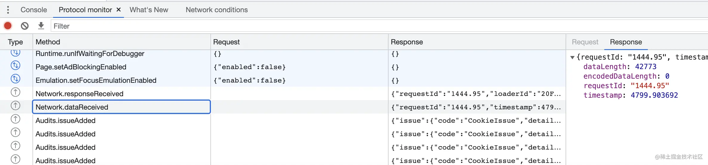
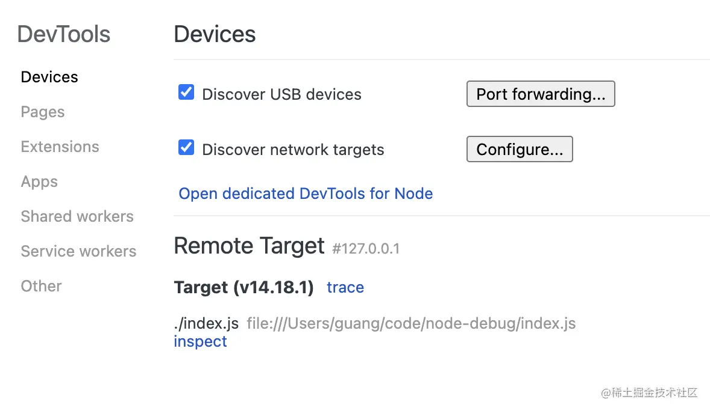
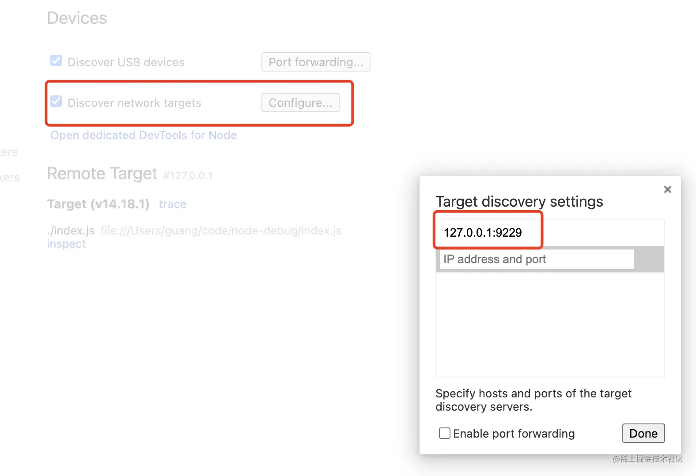
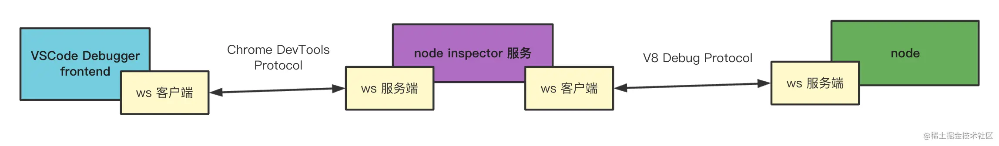

# 前端调试

<!-- @import "[TOC]" {cmd="toc" depthFrom=1 depthTo=6 orderedList=false} -->

<!-- code_chunk_output -->

- [前端调试](#前端调试)
  - [一. 常用调试工具原理](#一-常用调试工具原理)
    - [1.1 Chrome DevTools 原理](#11-chrome-devtools-原理)
      - [1.1.1 CDP](#111-cdp)
    - [1.2 VSCode Debugger 原理](#12-vscode-debugger-原理)
    - [1.3 Vue/React DevTools](#13-vuereact-devtools)
    - [1.4 调试工具四要素](#14-调试工具四要素)
    - [1.5 sourcemap](#15-sourcemap)
      - [1.5.1 什么是 sourcemap](#151-什么是-sourcemap)
      - [1.5.2 sourcemap 的生成](#152-sourcemap-的生成)
      - [1.5.3 webpack 的 sourcemap 配置](#153-webpack-的-sourcemap-配置)
  - [二. VSCode 网页调试](#二-vscode-网页调试)
    - [2.1 VSCode Chrome Debugger 断点映射的原理](#21-vscode-chrome-debugger-断点映射的原理)
  - [三. Node.js 调试](#三-nodejs-调试)
    - [3.1 用 Chrome DevTools 调试 node 代码](#31-用-chrome-devtools-调试-node-代码)
    - [3.2 用 VSCode Debugger 调试 node 代码](#32-用-vscode-debugger-调试-node-代码)
    - [3.3 node debugger 的历史](#33-node-debugger-的历史)
    - [3.4 调试 npm scripts](#34-调试-npm-scripts)
    - [3.5 调试命令行工具](#35-调试命令行工具)
  - [四. 远程调试移动端](#四-远程调试移动端)
    - [4.1 远程调试 android 网页](#41-远程调试-android-网页)
    - [4.2 远程调试 ios 网页](#42-远程调试-ios-网页)
  - [五. Charles 调试](#五-charles-调试)
    - [5.1 断点调试 https 请求](#51-断点调试-https-请求)

<!-- /code_chunk_output -->

## 一. 常用调试工具原理

代码在某个平台运行，把运行时的状态通过某种方式暴露出来，传递给开发工具做 UI 的展示和交互，辅助开发者排查问题、梳理流程、了解代码运行状态等，这个就是调试。

这里的某个平台，可以是浏览器、Node.js、Electron、小程序等任何能执行 JS 代码的平台。

暴露出的运行时状态，可能是调用栈、执行上下文，或者 DOM 的结构，React 组件的状态等。

暴露出这些数据的方式一般是通过基于 WebSocket 的调试协议，当然也会有别的方式。

### 1.1 Chrome DevTools 原理

传输协议数据的方式叫做**信道**（message channel），有很多种，比如 Chrome DevTools 嵌入在 Chrome 里时，两者通过全局的函数通信；当 Chrome DevTools 远程调试某个目标的代码时，两者通过 WebSocket 通信。

Chrome DevTools 分为两部分：

- `backend`：backend 和 Chrome 集成，负责把 Chrome 的网页运行时状态通过调试协议暴露出来。backend 可以是 Chromium，也可以是 Node.js 或者 V8，这些 JS 的运行时都支持 CDP 调试协议。

- `frontend`：frontend 是独立的，负责对接调试协议，做 UI 的展示和交互。

#### 1.1.1 CDP

Chrome DevTools backend 和 frontend 之间通过 WebSocket 通信，设计有专门的调试协议 Chrome DevTools Protocol，简称 **CDP**。


因为 Chrome DevTools 被设计成了和 Chrome 分离的架构，所以只要实现对接 CDP 协议的 ws 服务端，就可以用 Chrome DevTools 来调试，因此 Chrome DevTools 可以用来调试浏览器的网页、调试 Node.js，调试 Electron 等。

这个 CDP 的调试协议是 json 格式的，可以在 Chrome DevTools 的设置 -> 实验选项里开启 Protocol Monitor，然后在 more tools 里打开 Protocol Monitor 面板，就可以看到所有的 CDP 协议的数据交互：



### 1.2 VSCode Debugger 原理

VSCode Debugger 的原理和 Chrome DevTools 差不多，也是分为 frontend、backend、调试协议这几部分，只不过它多了一层适配器协议。


为了能直接用 Chrome DevTools 调试 Node.js 代码，Node.js 6 以上就使用 CDP 作为调试协议了，所以 VSCode Debugger 要调试 Node.js 也是通过这个协议。

因为 VSCode 不是 JS 专用编辑器，它可能用来调试 Python 代码、Rust 代码等等，不能和某一种语言的调试协议深度耦合，所以多了一个适配器层 Debug Adapter Protocol。


这样 VSCode Debugger 就可以用同一套 UI 和逻辑来调试各种语言的代码，只要对接不同的 Debug Adapter 做协议转换即可。

这样还有另一个好处，就是别的编辑器也可以用这个 Debug Adapter Protocol 来实现调试，这样就可以直接复用 VSCode 的各种语言的 Debug Adapter 了。

VSCode Debugger 的 UI 的部分算是 frontend，而调试的目标语言算是 backend 部分，中间也是通过 WebSocket 传递调试协议。

整体和 Chrome DevTools 的调试原理差不多，只不过为了支持 frontend 的跨语言复用，多了一层适配器层。

### 1.3 Vue/React DevTools

Vue DevTools 或者 React DevTools 都是以 Chrome 插件（Chrome Extension）的形式存在的，要搞懂它们的原理就得了解 Chrome 插件的机制。

**Chrome 插件机制**
Chrome 插件中可以访问网页的 DOM 的部分叫做 **Content Script**，随页面启动而生效，可以写一些操作 DOM 的逻辑。还有一部分是后台运行的，叫做 **Background**，浏览器启动就生效了，生命周期比较长，可以做一些常驻的逻辑。如果是扩展 DevTools 的 Chrome 插件，那还有一部分 DevTools Page，是在 DevTools 里显示的页面：


Content Script 部分可以操作 DOM，可以监听 DOM Event。

Background 部分可以访问 extension api，可以和 Content Script 还有 DevTools Page 通信。

DevTools Page 部分可以访问 devtools api，可以向当前 window 注入 JS 执行。

这就是 Chrome 插件的大概架构。Vue DevTools 和 React DevTools 就是基于这个架构来实现的调试功能。

看 [Vue DevTools 的源码目录](https://github.com/vuejs/devtools/tree/main/packages)会发现，它也是分为 backend 和 frontend 的

DevTools Page 可以向页面注入 JS 的，那就可以注入 backend 的代码。backend 的代码拿到 Vue 组件的信息，通过 window message 的方式传递给 Background。Background 可以和 DevTools Page 通信，从而实现消息转发。DevTools Page 根据拿到的数据，渲染组件的信息，实现交互功能。


### 1.4 调试工具四要素

Chrome DevTools、VSCode Debugger、Vue/React DevTools，都有 backend 部分负责拿到运行时的信息，有 frontend 部分负责渲染和交互，也有调试协议用来规定不同数据的格式，还有不同的信道，比如 WebSocket 、Chrome 插件的 background 转发等。

**frontend、backend、调试协议、信道，这是调试工具的四要素**。

不过，不同的调试工具都会有不同的设计，比如 VSCode Debugger 为了跨语言复用，多了一层 Debugger Adapter，React DevTools 有独立的 electron 应用，用自定义调试协议，可以调试 React Native 代码。

### 1.5 sourcemap

#### 1.5.1 什么是 sourcemap

**sourcemap 是通过一个个行列号的映射，关联编译后的代码和源码的。**。

比如编译后代码的第 3 行第 4 列，对应着源码里的第 8 行第 5 列这种，这叫做一个 **mapping**。sourcemap 的格式如下：

```js
{
　version : 3,
　file: "out.js",
　sourceRoot : "",
　sources: ["foo.js", "bar.js"],
　names: ["a", "b"],
　mappings: "AAgBC,SAAQ,CAAEA;AAAEA",
  sourcesContent: ['const a = 1; console.log(a)', 'const b = 2; console.log(b)']
}
```

file 是文件名，sourceRoot 是源码根目录，names 是转换前的变量名，sources 是源码文件，sourcesContent 是每个 sources 对应的源码的内容，mappings 就是一个个位置映射了。

因为可能编译产物是多个源文件合并的，比如打包，一个 bundle.js 就对应了 n 个 sources 源文件。

**重点是 mappings 部分**：mappings 部分是通过 `;` 和 `,` 分隔的：

```js
mappings: 'AAAAA,BBBBB;CCCCC';
```

一个分号就代表一行，这样就免去了行的映射。然后每一行可能有多个位置的映射，用 `,` 分隔。

上面的 mappings 中有 AAAAA 一共五位，分别有不同的含义：

- 转换后代码的第几列（行数通过分号 ; 来确定）
- 转换前的哪个源码文件，保存在 sources 里的，这里通过下标索引
- 转换前的源码的第几行
- 转换前的源码的第几列
- 转换前的源码的哪个变量名，保存在 names 里的，这里通过下标索引

然后经过编码之后，就成了 AAAAA 这种，这种编码方式叫做 **VLQ 编码**。

各种调试工具一般都支持 sourcemap 的解析，只要在文件末尾加上这样一行：

```js
//@ sourceMappingURL=/path/to/source.js.map
```

除了调试的时候会使用 sourcemap，线上报错定位源码也需要用到。开发时会使用 sourcemap 来调试，但是生产可不会，但是线上报错的时候确实也需要定位到源码，这种情况一般都是单独上传 sourcemap 到错误收集平台。

比如 sentry 就提供了一个 [@sentry/webpack-plugin](https://github.com/getsentry/sentry-webpack-plugin) 支持在打包完成后把 sourcemap 自动上传到 sentry 后台，然后把本地 sourcemap 删掉。还提供了 [@sentry/cli](https://github.com/getsentry/sentry-cli) 让用户可以手动上传。

sourcemap 只是位置的映射，可以用在任何代码上，比如 JS、TS、CSS 等，而且 TS 的类型也支持 sourcemap：

```json
{
  "compilerOptions": {
    "sourceMap": true,
    "outDir": "./out",
    "declaration": true,
    "declarationMap": true
  }
}
```

指定了 declaration 会生成 d.ts 的声明文件，还可以指定 declarationMap 来生成 sourcemap。这样在 VSCode 里就可以直接点击某个类型来跳转到源码里对应的地方了。这也算 sourcemap 应用的另一个场景，_用于生成的类型和源码中定义的关联_。

#### 1.5.2 sourcemap 的生成

编译工具在生成代码的时候也会生成 sourcemap：


sourcemap 就是由一个个位置的映射组成的，关键就是要知道源码的哪个位置对应到了编译后代码的哪个位置：通过 [astexplorer.net](https://astexplorer.net/#/gist/19042bfa06784d0e1b2dcb2ecd3559d5/50898c658d8129dbe520cc515af169331082036b) 可以看到，AST 中保留了源码中的位置，这是 parser 在 parse 源码的时候记录的。


然后进行 AST 的各种转换之后会打印成目标代码，打印的时候是一行行一列列的拼接字符串，这时候就有了目标代码中的位置。

```ts
export function ConditionaLExpression(node: Object) {
  this.print(node.test, node);
  this.space();
  this.token('?');
  this.space();
  this.print(node.consequent, node);
  this.space();
  this.token(':');
  this.space();
  this.print(node.alternate, node);
}
```

这两个位置一关联，就是一个 mapping。


这样就生成了 sourcemap。当然 sourcemap 有对应的格式和编码，自己生成还是挺麻烦的，一般会用 [source-map](https://github.com/mozilla/source-map) 这个包：source-map 可以用于生成和解析 sourcemap，它暴露了 SourceMapConsumer、SourceMapGenerator、SourceNode 3 个类，分别用于消费 sourcemap、生成 sourcemap、创建源码节点。

生成 sourcemap 的流程是：

1. 创建一个 SourceMapGenerator 对象
2. 通过 addMapping 方法添加一个映射
3. 通过 toString 转为 sourcemap 字符串

```js
let map = new SourceMapGenerator({
  file: 'source-mapped.js'
});

map.addMapping({
  generated: {
    line: 10,
    column: 35
  },
  source: 'foo.js',
  original: {
    line: 33,
    column: 2
  },
  name: 'christopher'
});

console.log(map.toString());
// '{"version":3,"file":"source-mapped.js",
//   "sources":["foo.js"],"names":["christopher"],"mappings":";;;;;;;;;mCAgCEA"}'
```

消费 sourcemap 用 `SourceMapConsumer` 的 api。可以调用 `originalPositionFor` 和 `generatedPositionFor` 分别用目标代码位置查源码位置和用源码位置查目标代码位置。还可以通过 `eachMapping` 遍历所有 mapping，对每个进行处理。

```js
const rawSourceMap = {
  version: 3,
  file: 'min.js',
  names: ['bar', 'baz', 'n'],
  sources: ['one.js', 'two.js'],
  sourceRoot: 'http://example.com/www/js/',
  mappings: 'CAAC,IAAI,IAAM,SAAUA,GAClB,OAAOC,IAAID;CCDb,IAAI,IAAM,SAAUE,GAClB,OAAOA'
};

const whatever = await SourceMapConsumer.with(rawSourceMap, null, consumer => {
  // 目标代码位置查询源码位置
  consumer.originalPositionFor({
    line: 2,
    column: 28
  });
  // { source: 'http://example.com/www/js/two.js',
  //   line: 2,
  //   column: 10,
  //   name: 'n' }

  // 源码位置查询目标代码位置
  consumer.generatedPositionFor({
    source: 'http://example.com/www/js/two.js',
    line: 2,
    column: 10
  });
  // { line: 2, column: 28 }

  // 遍历 mapping
  consumer.eachMapping(function (m) {
    // ...
  });

  return computeWhatever();
});
```

#### 1.5.3 webpack 的 sourcemap 配置

webpack 对 sourcemap 做了很多封装。比如：

- eval-nosources-cheap-module-source-map
- hidden-source-map

webpack 的配置是有规律的。当配置写错的时候，webpack 会提示一个正则：`^(inline-|hidden-|eval-)?(nosources-)?(cheap-(module-)?)?source-map$`。这个就是配置的规律，是几种基础配置的组合。搞懂了每一种基础配置，比如 eval、nosources、cheap、module，按照规律组合起来，也就搞懂了整体的配置。

- `eval`

  eval() 函数会将传入的字符串当做 JS 代码进行执行。但有个问题，eval 的代码打不了断点。所以浏览器支持了这样一种特性，只要在 eval 代码的最后加上 `//# sourceURL=xxx`，那就会以 xxx 为名字把这段代码加到 sources 里。这就可以打断点了。

  ```js
  eval(`
  function add(a,b){
    return a + b;
  }
  console.log(add(1, 2));
  //# sourceURL=光.js`);
  // 3
  ```

  执行以后，会发现 sources 多了光.js 的文件：

  的sourceURL.webp>)

  它是可以打断点的，比如在 add 里打个断点，然后再执行 eval。

  除了指定 source 文件外，还可以进一步指定 sourcemap 来映射到源码：

  ```js
  eval(`
  function add(a,b){
    return a + b;
  }
  console.log(add(1, 2));
  //# sourceURL=光.js
  //# sourceMappingURL= xxx`);
  ```

  这样，动态 eval 的代码也能关联到源码，并且能打断点了。

  webpack 就利用了 eval 这个特性来优化的 sourcemap 生成的性能，比如可以指定 `devtool` 为 eval：

  ```js
  module.exports = {
    devtool: 'eval'
  };
  ```

  生成的代码就是每个模块都被 eval 包裹的，并且有 sourceUrl 来指定文件名：

  

  这样做比较快，因为只要指定文件名就行，不用生成 sourcemap。sourcemap 的生成还是很慢的，要一个个 mapping 的处理，做编码之类的。

  每个模块的代码都被 eval 包裹，那么执行的时候就会在 sources 里生成对应的文件，这样就可以打断点了。不过这样只是把每个模块的代码分了出去，并没有做源码的关联，如果相关联源码，可以再开启 sourcemap：

  ```js
  module.exports = {
    devtool: 'eval-source-map'
  };
  ```

  会发现生成的代码也是用 eval 包裹的，但除了 sourceUrl 外，还有 sourceMappingUrl：

  

  再运行的时候除了 eval 的代码会生成文件放在 sources 外，还会做 sourcemap 的映射：

- `source-map`

  source-map 的配置是生成独立的 sourcemap 文件。

  ```js
  module.exports = {
    devtool: 'source-map'
  };
  ```

  

  可以关联，也可以不关联，比如加上 hidden，就是生成 sourcemap 但是不关联：

  ```js
  module.exports = {
    devtool: 'hidden-source-map'
  };
  ```

  生产环境就不需要关联 sourcemap，但是可能要生成 sourcemap 文件，把它上传到错误管理平台之类的，用来映射线上代码报错位置到对应的源码。

  此外，还可以配置成 inline 的：

  ```js
  module.exports = {
    devtool: 'inline-source-map'
  };
  ```

  这个就是通过 dataUrl 的方式内联在打包后的文件里：

  

- `cheap`

  sourcemap 慢主要是处理映射比较慢，很多情况下并不需要映射到源码的行和列，只要精确到行就行，这时候就可以用 cheap。

- `module`

  webpack 中对一个模块会进行多次处理，比如经过 loader A 做一次转换，再用 loader B 做一次转换，之后打包到一起。每次转换都会生成 sourcemap，那也就是有多个 sourcemap：

  

  默认 sourcemap 只是能从 bundle 关联到模块的代码，也就是只关联了最后那个 sourcemap。

  

  如果想调试最初的源码，那就把每一次的 loader 的 sourcemap 也关联起来，这就是 module 配置的作用。这样就能一次性映射回最初的源码：

  

- `nosources`

  sourcemap 里是有 sourceContent 部分的，也就是直接把源码贴在这里，这样的好处是根据文件路径查不到文件也可以映射，但这样会增加 sourcemap 的体积。如果确定根据文件路径能查找到源文件，那不生成 sourceContent 也行。

  比如 devtool 配置为 source-map，生成的 sourcemap 是这样的：

  

  当加上 nosources 之后，生成的 sourcemap 就没有 sourceContent 部分了：

  ```js
  module.exports = {
    devtool: 'nosources-source-map'
  };
  ```

可以根据上面的基础配置来自由组合，webpack 是按照这个正则来校验 devtool 的：`^(inline-|hidden-|eval-)?(nosources-)?(cheap-(module-)?)?source-map$`。

webpack 有这样一个插件 [SourceMapDevToolPlugin](https://webpack.docschina.org/plugins/source-map-dev-tool-plugin)，它有很多 option，比如 module、columns、noSources 等：

- `module = true (boolean)`：表示 loader 是否生成 source map。
- `columns = true (boolean)`：表示是否应该使用 column mapping。
- `noSources = false (boolean)`：防止源文件的内容被包含在 source map 中。

相当于是 devtool 的另一种配置方式，启用它需要把 devtool 设置为 false。而且它可以控制更多东西，比如修改 sourcemap 的 url 和文件名等：

```js
new webpack.SourceMapDevToolPlugin({
  append: '\n//# sourceMappingURL=https://example.com/sourcemap/[url]',
  filename: '[name].map'
});
```

当需要做更多的 sourcemap 生成方式的控制的时候，可以使用这个 webpack 插件。

## 二. VSCode 网页调试

网页调试就是把浏览器跑起来，访问目标网页，这时候会有一个 ws 的调试服务，用 frontend 的 ws 客户端连接上这个 ws 服务，就可以进行调试了。具体[调试皮配置](/public_knowledge/VSCode/VisualStudioCode.md#32-launchjson-属性)。


VSCode 的 Debugger 会多一层适配器协议的转换，但是原理差不多。

### 2.1 VSCode Chrome Debugger 断点映射的原理

VSCode 会记录在哪个文件哪行打了个[断点](/public_knowledge/VSCode/VisualStudioCode.md#33-断点的种类和使用)。在 breakpoints 里可以看到。

代码经过编译打包之后，可能会产生一个 bundle.js，网页里运行的就是这个 js 文件。断点最终还是在代码的运行时，也就是网页里断住的，所以在 VSCode 里打的断点会被传递给浏览器，通过 CDP 调试协议。

本地打的断点是一个绝对路径，也就是包含 ${workspaceFolder} 的路径，而网页里根本没有这个路径，可以成功是因为有的文件是关联了 sourcemap，也就是文件末尾的这行注释：


它会把文件路径映射到源码路径。如果映射到的源码路径直接就是本地的文件路径，那断点就生效了：


vite 的项目，sourcemap 都是这种绝对路径，所以断点直接就生效了：


但是 webpack 的项目，sourcemap 到的路径不是绝对路径，而是这种：


或


所以 VSCode Chrome Debugger 支持了 `sourceMapPathOverrides` 的配置：

```json
{
  "sourceMapPathOverrides": {
    "meteor://💻app/*": "${workspaceFolder}/*",
    "webpack:///./~/*": "${workspaceFolder}/node_modules/*",
    "webpack://?:*/*": "${workspaceFolder}/*"
  }
}
```

默认生成的三个配置，最后一个就是映射 webpack 路径的，其实是把以 `${workspaceFolder}` 开头的本地路径映射成了 webpack:// 开头的路径传给浏览器。


这样就和浏览器里的 sourcemap 后的文件路径对上了，那断点也就生效了。


具体怎么配，可以加个 debugger 看看 Chrome DevTools 里是什么路径，然后映射到本地的路径就行。

但上面都是把项目根目录映射到 url 的 / 的，有的时候映射的不是 /，会出现这种情况：

```txt
mobile/js/webpack:/src/pages/user-center/index.tsx
```

这就需要 webRoot 的配置了，默认是 `${workspaceFolder}`，也就是把项目根目录映射到 url 的 /。如果出现上面的情况，说明要把 /mobile/js/ 这个路径映射到项目根目录：

```json
{
  "webRoot": "${workspaceFolder}/mobile/js/"
}
```

综上，**如果 sourcemap 到的文件路径不是本地路径，那就映射不到本地文件，会导致断点打不上，这时候可以配置 sourceMapPathOverrides。如果映射之后路径开头多了几层目录，那就要配置 webRoot**。

## 三. Node.js 调试

```js
const fs = require('fs/promises');

(async function () {
  const fileContent = await fs.readFile('./package.json', {
    encoding: 'utf-8'
  });

  await fs.writeFile('./package2.json', fileContent);
})();
```

node 运行时加个 --inspect-brk 参数，以调试模式启动：

```sh
node --inspect-brk ./index.js
```

--inspect 是以调试模式启动，--inspect-brk 是以调试模式启动并且在首行断住。

然后就会发现它打印了 ws 的地址：

```sh
Debugger listening on ws://127.0.0.1:9229/42cba635-89f0-4d11-8057-073c8bcf467d
```

这就是调试的服务端。接下来找个对接它的调试协议的客户端连上就行了。

### 3.1 用 Chrome DevTools 调试 node 代码

打开 `chrome://inspect/#devices`，下面列出的是所有可以调试的目标，也就是 ws 服务端：



会发现这里列出了启动的 node 脚本。这是因为在网络端口里加上了 node 的 ws 调试服务的端口：



node 调试服务默认是跑在 9229 端口，但是也可以换：

```sh
node --inspect-brk=8888 ./index.js
```

只要把它的端口加入到配置里就可以了。点击 inspect 就可以调试这个 node 脚本了：


### 3.2 用 VSCode Debugger 调试 node 代码

在 vscode 的 launch.json 文件里添加一个 node 类型的 attach 的[调试配置](/public_knowledge/VSCode/VisualStudioCode.md)：

```json
{
  "name": "Attach",
  "port": 9229,
  "request": "attach",
  "skipFiles": ["<node_internals>/**"],
  "type": "node"
}
```

然后点击 debug 启动，VSCode Debugger 就会连接上 8888 的调试端口开始调试，可以边调试边修改代码。

还可以在创建调试配置的时候选择 launch program，指定 program 的路径：

```json
{
  "name": "Launch Program",
  "type": "node",
  "request": "launch",
  "skipFiles": ["<node_internals>/**"],
  "program": "${workspaceFolder}/index.js"
}
```

VSCode Debugger 就会自动以调试模式跑这个 node 脚本，并且自动 attach 上。

如果想首行断住，可以加一个 [stopOnEntry](/public_knowledge/VSCode/VisualStudioCode.md#32-launchjson-属性) 的配置。

VSCode Debugger 和 Chrome DevTools 都可以调试 node 代码，是因为都对接了 node 的 CDP 调试协议，只是实现了各自的 UI：


### 3.3 node debugger 的历史

Node.js 是基于 V8 的，V8 本身有调试协议 V8 Debug Protocol，所以 Node.js 最早的调试协议也就是 V8 Debug Protocol。

通过 node debug 来跑 js 文件，会在首行断住：

```sh
node debug./test.js
```

然后可以通过 run、cont、next、step 等命令来实现单步调试，通过 backtrace 打印调用栈，通过 setBreakPoint 等设置断点。

虽然该有的调试功能都有，但是这样调试还是比较费劲的。当时 Node 就瞄准了 Chrome DevTools，它的调试 UI 就很不错。

由于 Chrome DevTools 的调试协议是 Chrome DevTools Protocol，和 V8 Debug Protocol 有些差距，所以 Node 加了一个中间的服务来做转换：



这个服务是 node-inspector 这个包提供的。所以当时 node debug 服务跑起来之后，还要要再跑一个 node-inspector 服务，这样才能用 chrome devtools 来调试 Node.js 代码。

后来维护 Node.js 的那些人觉得这样也太麻烦了，要不让 Node.js 提供的调试协议就直接就是兼容 Chrome Devtools Protocol 的吧。当时就有了一个 pr，把 v8 inspector 集成到 Node.js 中。

这个 v8 inspector 就是从 chrome 的内核 blink 里剥离出来的让 v8 支持 chrome devtools protocol 的部分。很明显这需要 v8 团队的配合，所以说 Node.js 的发展还是很依赖 v8 团队的支持的。之后 Node.js 就在 v6.3 中加入了这个功能。

并且在成熟之后去掉了对 v8 debug protocol 的支持，也就是废弃了 node debug 命令，改为了 node inspect。

启动 ws 调试服务的方式就是 node --inspect 或者 node --inspect-brk。当然，之前作为两个协议的中转的服务 node-inspector 也就退出了历史舞台。

所以今天，可以轻易的用 Chrome DevTools 来调试 Node.js 代码。

**调试的原理就是 ws 客户端和服务器的通信，然后基于调试协议来完成不同的功能**。Node.js 是这样，其他语言也是这样。

VSCode 是一个通用的编辑器，是要支持多种语言的，也就是它的调试 UI 要支持多种调试协议。VSCode 加了一个中间层，VSCode 的调试 UI 只要支持这个中间的调试协议就可以了，其余的调试协议适配到这个调试协议上来：


这就是 DAP 协议，debugger adapter protocol。

Node.js 在把调试工具的协议换成 Chrome Devtools Protocol 之后，只要实现个 DAP 的 adapter 就可以对接到 VSCode 的调试工具了。

### 3.4 调试 npm scripts

命令行工具的 package.json 里都会有个 `bin` 字段，来指定各个内部命令对应的可执行文件的位置：

```json
{
  "bin": {
    "webpack": "bin/webpack.js"
  }
}
```

npm install 这个包以后，就会放到 node_modules/.bin 目录下，可以用 npx 来跑，比如 npx xx，它的作用就是执行 node_modules/.bin 下的本地命令，如果没有的话会从 npm 下载然后执行。

最常用的还是放到 npm scripts 里：

```json
{
  "scripts": {
    "lint": "eslint --ext .js,.ts frontend"
  }
}
```

这样就直接 npm run xxx 跑就行了。npm scripts 本质上还是用 node 来跑这些 script 代码，所以调试它们和调试其他 node 代码没啥区别。

也就是可以这样跑：在 .vscode/launch.json 的调试文件里，选择 node 的 launch program，用 node 执行 node_modules/.bin 下的文件，传入参数即可：

```json
{
  "name": "Launch Program",
  "program": "${workspaceFolder}/node_modules/.bin/eslint",
  "args": ["--ext", ".js,.ts"],
  "request": "launch",
  "skipFiles": ["<node_internals>/**"],
  "type": "node"
}
```

VSCode Debugger 对 npm scripts 调试的场景做了封装，还可以选择 node 的 Launch via npm，直接指定运行的命令即可：

```json
{
  "name": "Launch via NPM",
  "request": "launch",
  "runtimeArgs": ["run-script", "debug"],
  "runtimeExecutable": "npm",
  "skipFiles": ["<node_internals>/**"],
  "type": "node"
}
```

### 3.5 调试命令行工具

webpack、vite、babel、tsc、eslint 等各种命令行工具都提供了两种入口：命令行和 api。

平时会通过命令行的方式，比如 eslint xxx --fix 使用，但是别的工具集成这些工具的时候就会使用 api 了，它更灵活。所以，调试这些工具的时候也就有两种方式，通过命令行调试和通过 api 调试。

**命令行的方式调试 ESLint 源码**
创建一个 js 文件，随便写几个格式错误，安装 eslint 后配置下 .eslintrc.js。执行 `npx eslint ./*.js` 就会看到几个格式错误，执行 `npx eslint ./*.js --fix` 就会自动修复错误。

想探究下 fix 的原理，就要调试下源码了。用命令行的方式调试的话，就要添加一个这样的调试配置：

```json
{
  "name": "eslint 调试",
  "program": "${workspaceFolder}/node_modules/.bin/eslint",
  "args": ["./index.js", "--fix"],
  "skipFiles": ["<node_internals>/**"],
  "cwd": "${workspaceFolder}",
  "request": "launch",
  "type": "node"
}
```

**api 的方式调试 ESLint 源码**
通过命令行的方式调试 ESLint 源码的时候，知道了 ESLint 会创建 ESLint 实例，然后调用 lintText 方法来对代码 lint。

```js
const { ESLint } = require('eslint');

const engine = new ESLint({
  fix: false
});

(async function main() {
  const results = await engine.lintText(`
    function add (a, b)
{
  return a + b
}
  `);

  console.log(results[0].output);

  const formatter = await engine.loadFormatter('stylish');
  const resultText = formatter.format(results);
  console.log(resultText);
})();
```

首先直接 node 执行，可以看到打印出的错误和用命令行的方式是一样的，然后创建个 debug 配置来跑：

```json
{
  "name": "调试 eslint api",
  "program": "${workspaceFolder}/api-test.js",
  "request": "launch",
  "skipFiles": ["<node_internals>/**"],
  "console": "integratedTerminal",
  "type": "node"
}
```

可以直接从实现 lint 的部分开始调试，跳过了前面命令行参数解析的部分，这样更有针对性。

## 四. 远程调试移动端

### 4.1 远程调试 android 网页

1. 用数据线把安卓手机和电脑连接起来，在手机设置里打开 USB 调试。
2. 然后在 chrome 打开 chrome://inspect/#devices，勾选 Discover USB devices（默认是勾选的）。
3. 在手机上允许 USB 调试后，会在配置的下方列出所有可以调试的网页：

   

   浏览器里的网页、App 调试包的 webview 的网页、浏览器扩展的 frontend 都会列出来。

4. 点击网页下方 inspect 就可以调试了，各种调试 PC 网页的功能基本都支持。

如果遇到打开的窗口是空白的或者是 404，这是因为调试的目标可能是任意 chrome 版本，那么 Chrome DevTools 自然也要用相应的版本才行，所以就需要动态下载。而动态下载的 devtools 网页是在 google 域名下的，需要科学上网才行。

Android 下可以在开发者选项里打开显示布局边界，如果是原生的组件，就会显示边框，而没有边框的，就是网页。

### 4.2 远程调试 ios 网页

## 五. Charles 调试

Charles 是在 PC 端常用的网络封包截取工具，在做移动开发时，为了调试与服务器端的网络通讯协议，常常需要截取网络封包来分析。除了在做移动开发中调试端口外，Charles 也可以用于分析第三方应用的通讯协议。配合 Charles 的 SSL 功能，Charles 还可以分析 Https 协议。

Charles 通过将自己设置成系统的网络访问代理服务器，使得所有的网络访问请求都通过它来完成，从而实现了网络封包的截取和分析。

### 5.1 断点调试 https 请求

安装 [Charles](https://www.charlesproxy.com/download/latest-release/) 后，左上角的 start recording 是默认打开的。

浏览器访问一些页面，这时候左侧就会展示出抓到的 http/https 请求：


