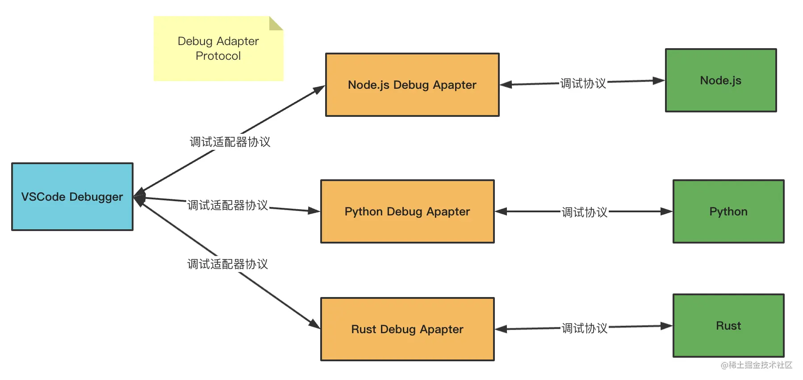

# 前端调试

<!-- @import "[TOC]" {cmd="toc" depthFrom=1 depthTo=6 orderedList=false} -->

<!-- code_chunk_output -->

- [前端调试](#前端调试)
  - [一. 用 VSCode 调试网页](#一-用-vscode-调试网页)
  - [二. 用 VSCode Debugger 调试 Node.js](#二-用-vscode-debugger-调试-nodejs)
  - [三. 用 Chrome DevTools 调试网页](#三-用-chrome-devtools-调试网页)
  - [四. 常用调试工具的原理和实现简易版调试工具](#四-常用调试工具的原理和实现简易版调试工具)
    - [4.1 Chrome DevTools 原理](#41-chrome-devtools-原理)
    - [4.2 VSCode Debugger 原理](#42-vscode-debugger-原理)
    - [4.3 Vue/React DevTools](#43-vuereact-devtools)

<!-- /code_chunk_output -->

代码在某个平台运行，把运行时的状态通过某种方式暴露出来，传递给开发工具做 UI 的展示和交互，辅助开发者排查问题、梳理流程、了解代码运行状态等，这个就是调试。

这里的某个平台，可以是浏览器、Node.js、Electron、小程序等任何能执行 JS 代码的平台。

暴露出的运行时状态，可能是调用栈、执行上下文，或者 DOM 的结构，React 组件的状态等。

暴露出这些数据的方式一般是通过基于 WebSocket 的调试协议，当然也会有别的方式。

## 一. 用 VSCode 调试网页

## 二. 用 VSCode Debugger 调试 Node.js

## 三. 用 Chrome DevTools 调试网页

## 四. 常用调试工具的原理和实现简易版调试工具

### 4.1 Chrome DevTools 原理

Chrome DevTools 分为两部分：

- **backend**：backend 和 Chrome 集成，负责把 Chrome 的网页运行时状态通过调试协议暴露出来。backend 可以是 Chromium，也可以是 Node.js 或者 V8，这些 JS 的运行时都支持 CDP 调试协议。

- **frontend**：frontend 是独立的，负责对接调试协议，做 UI 的展示和交互。

两者之间的调试协议叫做 Chrome DevTools Protocol，简称 **CDP**。

传输协议数据的方式叫做**信道**（message channel），有很多种，比如 Chrome DevTools 嵌入在 Chrome 里时，两者通过全局的函数通信；当 Chrome DevTools 远程调试某个目标的代码时，两者通过 WebSocket 通信。

### 4.2 VSCode Debugger 原理

VSCode Debugger 的原理和 Chrome DevTools 差不多，也是分为 frontend、backend、调试协议这几部分，只不过它多了一层适配器协议。

为了能直接用 Chrome DevTools 调试 Node.js 代码，Node.js 6 以上就使用 CDP 作为调试协议了，所以 VSCode Debugger 要调试 Node.js 也是通过这个协议。

因为 VSCode 不是 JS 专用编辑器，它可能用来调试 Python 代码、Rust 代码等等，不能和某一种语言的调试协议深度耦合，所以多了一个适配器层 Debug Adapter Protocol。

这样 VSCode Debugger 就可以用同一套 UI 和逻辑来调试各种语言的代码，只要对接不同的 Debug Adapter 做协议转换即可。

这样还有另一个好处，就是别的编辑器也可以用这个 Debug Adapter Protocol 来实现调试，这样就可以直接复用 VSCode 的各种语言的 Debug Adapter 了。

VSCode Debugger 的 UI 的部分算是 frontend，而调试的目标语言算是 backend 部分，中间也是通过 WebSocket 传递调试协议。

整体和 Chrome DevTools 的调试原理差不多，只不过为了支持 frontend 的跨语言复用，多了一层适配器层。

### 4.3 Vue/React DevTools

Vue DevTools 或者 React DevTools 都是以 Chrome 插件（Chrome Extension）的形式存在的，要搞懂它们的原理就得了解 Chrome 插件的机制。

#### 4.3.1 Chrome 插件机制

Chrome 插件中可以访问网页的 DOM 的部分叫做 **Content Script**，随页面启动而生效，可以写一些操作 DOM 的逻辑。还有一部分是后台运行的，叫做 **Background**，浏览器启动就生效了，生命周期比较长，可以做一些常驻的逻辑。如果是扩展 DevTools 的 Chrome 插件，那还有一部分 DevTools Page，是在 DevTools 里显示的页面：

Content Script 部分可以操作 DOM，可以监听 DOM Event。

Background 部分可以访问 extension api，可以和 Content Script 还有 DevTools Page 通信。

DevTools Page 部分可以访问 devtools api，可以向当前 window 注入 JS 执行。

这就是 Chrome 插件的大概架构。Vue DevTools 和 React DevTools 就是基于这个架构来实现的调试功能。
