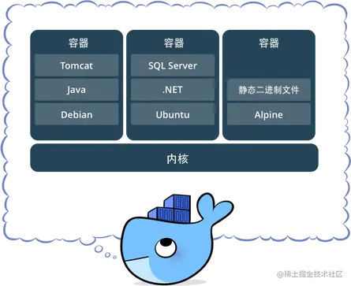

# CI/CD

<!-- @import "[TOC]" {cmd="toc" depthFrom=1 depthTo=6 orderedList=false} -->

<!-- code_chunk_output -->

- [CI/CD](#cicd)
  - [一. 简介](#一-简介)
    - [1.1 整体架构设计](#11-整体架构设计)
    - [1.2 服务器搭配方案](#12-服务器搭配方案)
  - [二. 安装与配置](#二-安装与配置)
    - [2.1 Docker](#21-docker)
      - [2.1.1 安装](#211-安装)
      - [2.1.2 配置阿里云镜像源](#212-配置阿里云镜像源)
    - [2.2 Jenkins](#22-jenkins)
      - [2.2.1 安装 Jenkins](#221-安装-jenkins)
      - [2.2.2 初始化 Jenkins 配置](#222-初始化-jenkins-配置)
        - [2.2.2.1 Unix Socket 权限问题](#2221-unix-socket-权限问题)
      - [2.2.4 安装 Nodejs 环境](#224-安装-nodejs-环境)
      - [2.2.5 使用 SSH 协议集成 Git 仓库源](#225-使用-ssh-协议集成-git-仓库源)

<!-- /code_chunk_output -->

## 一. 简介

`CI`
: **持续构建**。负责拉取代码库中的代码后，执行用户预置定义好的操作脚本，通过一系列编译操作构建出一个**制品**，并将制品推送至到制品库里面。常用工具有 Gitlab CI、Github CI、Jenkins 等。这个环节不参与部署，**只负责构建代码**，然后保存构建物。构建物被称为制品，保存制品的地方被称为 “制品库”。

`CD` 有 2 层含义：

- **持续交付**（Continuous Delivery）：将制品库的制品拿出后，部署在测试环境/交付给客户提前测试。
- **持续部署**（Continuous Deployment）：将制品部署在生产环境。可以进行持续部署的工具也有很多：Ansible 批量部署，Docker 直接推拉镜像等等。也包括 Kubernetes 集群部署。

### 1.1 整体架构设计

1. 写完了代码，提交到了 Git 代码库。
2. 随后，代码库配置的 WebHook 钩子或人工手动启动了 Jenkins 的构建流程。
3. Jenkins 启动构建流程。按照之前配置好的构建脚本，将代码编译成功。
4. 编译成功后，将编译后的文件打包为 docker 镜像，并将镜像上传到私有镜像库。
5. 随后，使用 kubectl 指定远程的 k8s 集群，发送镜像版本更新指令。
6. 远程的 k8s 集群接收到指令后，去镜像库拉取新镜像。
7. 镜像拉取成功，按照升级策略（滚动升级）进行升级，此时不会停机。
8. 升级完毕。

### 1.2 服务器搭配方案

系统选用 [CentOS 7](https://link.juejin.cn/?target=https%3A%2F%2Fmirrors.aliyun.com%2Fcentos%2F7.9.2009%2Fisos%2Fx86_64%2FCentOS-7-x86_64-Minimal-2009.iso)

| 配置    | 技术栈                   | 类型               | 标签              |
| ------- | ------------------------ | ------------------ | ----------------- |
| 2 核 4G | Jenkins + Nexus + Docker | 本地虚拟机 / Cloud | 构建机            |
| 2 核 4G | Docker + Kubernetes      | 本地虚拟机 / Cloud | Kubernetes Master |
| 1 核 1G | Docker + Kubernetes      | 本地虚拟机 / Cloud | Kubernetes Node   |

## 二. 安装与配置

### 2.1 Docker

Docker 是一个开源的应用容器引擎。开发者可以将自己的应用打包在自己的镜像里面，然后迁移到其他平台的 Docker 中。镜像中可以存放自己自定义的运行环境，文件，代码，设置等等内容，再也不用担心环境造成的运行问题。镜像共享运行机器的系统内核。

同样，Docker 也支持跨平台。镜像也可以加载在 Windows 和 Linux，实现快速运行和部署。



Docker 的优势在于 快速，轻量，灵活。开发者可以制作一个自己自定义的镜像，也可以使用官方或者其他开发者的镜像来启动一个服务。通过将镜像创建为容器，容器之间相互隔离资源和进程不冲突。但硬件资源又是共享的。 创建的镜像也可以通过文件快速分享，也可以上传到镜像库进行存取和管理。同时 Docker 的镜像有**分层策略** ，每次对镜像的更新操作，都会堆叠一个新层。当拉取/推送新版本镜像时，只推送/拉取修改的部分。大大加快了镜像的传输效率

#### 2.1.1 安装

在开始安装之前，需要安装 `device-mapper-persistent-data` 和 `lvm2` 两个依赖。

`device-mapper-persistent-data` 是 Linux 下的一个存储驱动，Linux 上的高级存储技术。`Lvm` 的作用则是创建逻辑磁盘分区。这里使用 CentOS 的 Yum 包管理器安装两个依赖：

```sh
yum install -y yum-utils device-mapper-persistent-data lvm2
```

依赖安装完毕后，将阿里云的 Docker 镜像源添加进去。可以加速 Docker 的安装：

```sh
sudo yum-config-manager --add-repo http://mirrors.aliyun.com/docker-ce/linux/centos/docker-ce.repo
yum install docker-ce -y
```

安装完毕，就可以使用 systemctl 启动来启动 Docker 了。systemctl 是 Linux 的进程管理服务命令，可以帮助启动 docker：

```sh
systemctl start docker
systemctl enable docker

docker -v #查看 Docker 安装的版本信息
```

#### 2.1.2 配置阿里云镜像源

在 Docker 安装完毕后，之后去拉取 docker 镜像时，一般默认会去 docker 官方源拉取镜像。但是国内出海网速实在是太慢，所以选择更换为阿里云镜像仓库源进行镜像下载加速。

登录阿里云官网，打开[阿里云容器镜像服务](https://link.juejin.cn/?target=https%3A%2F%2Fcr.console.aliyun.com)。点击左侧菜单最下面的镜像加速器，选择 CentOS。按照官网的提示执行命令，即可更换 docker 镜像源地址。

可以通过修改 daemon 配置文件/etc/docker/daemon.json 来使用加速器

```sh
sudo mkdir -p /etc/docker
sudo tee /etc/docker/daemon.json <<-'EOF'
{
  "registry-mirrors": ["https://gg7ywbt0.mirror.aliyuncs.com"]
}
EOF
sudo systemctl daemon-reload
sudo systemctl restart docker
```

### 2.2 Jenkins

#### 2.2.1 安装 Jenkins

1. 因为 Jenkins 是 Java 编写的持续构建平台，所以安装 Java 必不可少。

   ```sh
   yum install -y java-11-openjdk
   ```

2. 由于 Yum 源不自带 Jenkins 的安装源，于是需要导入一份 Jenkins 安装源进行安装。导入后，使用 Yum 命令安装即可。

   ```sh
   sudo wget -O /etc/yum.repos.d/jenkins.repo https://pkg.jenkins.io/redhat-stable/jenkins.repo
   sudo rpm --import https://pkg.jenkins.io/redhat-stable/jenkins.io.key
   yum install jenkins
   ```

3. Jenkins 安装完成后，使用下面的命令，修改其中的文件内容：

   ```SH
   vi /etc/syscofig/jenkins

   # JENKINS_USER ="root" 将 JENKINS_USER 修改的值为 root
   ```

4. Jenkins 安装后，会将启动命令注册到系统 Service 命令中。所以直接使用系统 `service` 命令启动 Jenkins 即可。有三个命令可以使用：

   ```sh
   service jenkins start # 启动Jenkins
   service jenkins restart # 重启 Jenkins
   service jenkins stop # 停止 Jenkins
   ```

5. 在启动 Jenkins 后，Jenkins 会开启它的默认端口 8080。但由于防火墙限制，需要手动让防火墙放行 8080 端口才能对外访问到界面。

   在 CentOS 下的 firewall-cmd 防火墙添加端口放行规则，添加完后重启防火墙：

   ```sh
   firewall-cmd --zone=public --add-port=8080/tcp --permanent
   firewall-cmd --zone=public --add-port=50000/tcp --permanent

   systemctl reload firewalld
   ```

6. 服务启动后，访问 `IP:8080`。

#### 2.2.2 初始化 Jenkins 配置

1. 访问 `IP:8080`，会自动跳转至 Jenkins 的解锁界面，需要输入存放在服务器的初始解锁密码才能进行下一步操作。

   该密码在服务器的文件内存放，可以进入服务器查看密码内容，将密码填写在 Jenkins 的管理员密码输入框内：

   ```sh
   cat /var/lib/jenkins/secrets/initialAdminPassword
   ```

2. 解锁后就来到了插件下载页面

   1. 先进入服务器，将 `/var/lib/jenkins/updates/default.json` 内的插件源地址替换成清华大学的源地址，将 google 替换为 baidu 即可。

      ```sh
      sed -i 's/http:\/\/updates.jenkins-ci.org\/download/https:\/\/mirrors.tuna.tsinghua.edu.cn\/jenkins/g' /var/lib/jenkins/updates/default.json && sed -i 's/http:\/\/www.google.com/https:\/\/www.baidu.com/g' /var/lib/jenkins/updates/default.json
      ```

   2. 接着点击*安装推荐的插件*即可。

3. 插件安装完毕后，接着是注册管理员账号。按照提示一路配置。

4. 测试安装

   1. 在 Jenkins 首页，点击左侧导航中的新建 Item -> Freestyle project

   2. 新建完毕后，找到 Build Steps -> 选择增加构建步骤 -> 选择执行 shell ，输入以下命令：

      ```sh
      docker -v
      docker pull node:latest
      ```

      该命令会去拉取一个 nodejs 稳定版的镜像，可以来测试 Docker 的可用性。

   3. 保存后，点击左侧菜单的立即构建，Jenkins 就会开始构建。选择左侧历史记录最新的一项，点击控制台输出，查看构建日志。

5. 执行后，发现提示无访问权限。这是 Linux 下的 Unix Socket 权限问题，可以执行以下命令：

   ```sh
   sudo groupadd docker          #新增docker用户组
   sudo gpasswd -a jenkins docker  #将当前用户添加至docker用户组
   newgrp docker                 #更新docker用户组
   ```

   加入后，重启 Jenkins：

   ```sh
   sudo service jenkins restart
   ```

   重启 Jenkins 后，再次执行脚本。此时执行成功。

##### 2.2.2.1 Unix Socket 权限问题

docker 的架构是 C/S 架构。在使用 docker 命令时，其实是命令使用 socket 与 docker 的守护进程进行通信，才能正常执行 docker 命令。而在 Linux 中，Unix socket 属于 root 用户，因此需要 root 权限才能访问。官方是这么解释的：

> Manage Docker as a non-root user The docker daemon binds to a Unix socket instead of a TCP port. By default that Unix socket is owned by the user root and other users can only access it using sudo. The docker daemon always runs as the root user. If you don’t want to use sudo when you use the docker command, create a Unix group called docker and add users to it. When the docker daemon starts, it makes the ownership of the Unix socket read/writable by the docker group.

但是在 docker 中，docker 提供了一个 用户组 的概念。可以将执行 Shell 的用户添加到名称为 docker 的用户组，则可以正常执行 docker 命令。

而在 Jenkins 中执行的终端用户做 jenkins ，所以只需要将 jenkins 加入到 docker 用户组即可：

```sh
sudo groupadd docker          #新增docker用户组
sudo gpasswd -a jenkins docker  #将当前用户添加至docker用户组
newgrp docker                 #更新docker用户组
```

#### 2.2.4 安装 Nodejs 环境

要安装 Node 环境，有以下两个办法：

- **源码编译**

  1. 在 [NodeJS](https://nodejs.org/zh-cn/download/) 下载 linux64 位的 xz 包。

  2. 使用 [Xftp](https://www.xshellcn.com/xiazai.html) 将包传到服务器 `/usr/local/` 目录下。

  3. 解压

     ```sh
     xz -d node-v16.18.1-linux-x64.tar.xz
     tar xvf node-v16.18.1-linux-x64.tar
     ```

  4. 创建配置文件 /etc/profile.d/node.sh：

     ```sh
     vi /etc/profile.d/node.sh

     export NODE_HOME=/usr/local/node-v14.19.1-linux-x64
     export PATH=${NODE_HOME}/bin:$PATH
     ```

     保存退出后，执行命令：

     ```sh
     chmod +x /etc/profile.d/node.sh
     source /etc/profile.d/node.sh

     node -v
     ```

  

- **使用 Jenkins Plugin 中 NodeJS 插件自动配置安装**

  **这种方法有可能在后面执行 Item 时，安装 Node 卡住**。

  1. 在 Jenkins 首页，Manager Jenkins -> 插件管理 -> 可选插件，搜索 Node 。选中 NodeJS 后，点击左下角的直接安装。

  2. 在 Manager Jenkins -> Global Tool Configuration -> NodeJS -> 新增 NodeJS

  

**任务中使用**
在任务的配置中，找到构建环境，选中 `Provide Node & npm bin/ folder to PATH`，选择刚才配置好的 NodeJS 即可。第一次执行会下载对应的 Node 版本，后续不会下载。


#### 2.2.5 使用 SSH 协议集成 Git 仓库源

##### 2.2.5.1 安装 Git

使用命令行安装的 Git 版本太低，需要使用源码编译的方式安装：

1. 在 [Git](https://github.com/git/git/tags) 选择最新的 tar.gz 包，通过 Xftp 工具将包上传到服务器 `/usr` 目录下。

2. 解压并进入解压后的文件夹

   ```sh
   tar -zxvf git-2.38.1.tar.gz
   cd git-2.38.1
   ll
   ```

3. 在编译源码前，需要安装编译所需要的依赖。

   ```sh
   yum install curl-devel expat-devel gettext-devel openssl-devel zlib-devel gcc perl-ExtUtils-MakeMaker
   ```

4. 安装编译源码所需依赖的时候，yum 自动安装了 git，需要先卸载这个旧版的 git。

   ```sh
   yum -y remove git
   ```

5. 编译 Git 源码

   ```sh
   make prefix=/usr/local/git all
   ```

6. 安装 git 至 `/usr/local/git` 路径

   ```sh
   make prefix=/usr/local/git install
   ```

7. 配置环境变量

   ```sh
   vi /etc/profile
   ```

   在最底部加上 `export PATH=$PATH:/usr/local/git/bin`，然后按 ESC 退出编辑模式并输入 `:wq!` 保存修改。（输入 i 打开编辑模式）

8. 刷新环境变量

   ```sh
   source /etc/profile

   git --version
   ```

安装完成后，到 Jenkins 的 Global Tool Configuration 配置 Git：


##### 2.2.5.2 生成公私钥并配置

1. [公私钥生成](/public_knowledge/Git/Git.md#211-配置公私钥)并配置 GitHub 的公钥。

2. 在 Jenkins 配置私钥

   在 Jenkins 中，私钥/密码 等认证信息都是以**凭据**的方式管理的，所以可以做到全局都通用。

   在右上角的用户菜单列表选择凭据 -> Store from parent -> 域 -> 添加凭据

   

   跳转后，选择类型中的 `SSH Username with private key` 这一项。接着填写信息即可：

   

   - ID：这条认证凭证在 Jenkins 中的名称是什么
   - 描述：描述信息
   - Username：用户名（邮箱）
   - Private Key：**填写私钥的地方**。点击 Add 按钮，将私钥文件内所有文件内容全部复制过去

   保存后，在任务配置 -> 源码管理 -> Credentials 下拉列表中选择添加的凭证。

   如果没有出现红色无权限提示，则代表身份校验成功，可以正常访问。

   如果报错 `stderr: command-line line 0: unsupported option "accept-new".`，可在 Configure Global Security -> Git Host Key Verification Configuration 项中选择 `No Verification` 并保存。
