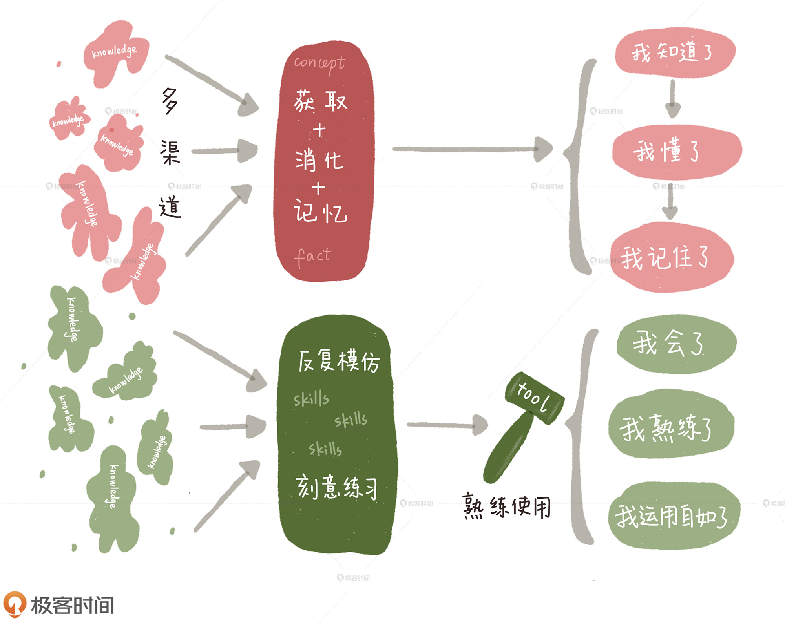
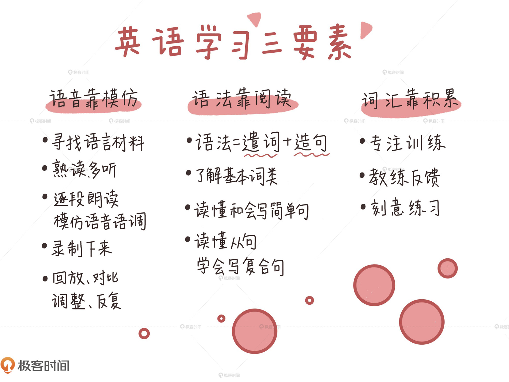

# 英语

<!-- @import "[TOC]" {cmd="toc" depthFrom=1 depthTo=6 orderedList=false} -->

<!-- code_chunk_output -->

- [英语](#英语)
  - [一. 学习方法](#一-学习方法)
    - [1.1 把英语当技能](#11-把英语当技能)
    - [1.2 英语学习三要素](#12-英语学习三要素)

<!-- /code_chunk_output -->

---

## 一. 学习方法

### 1.1 把英语当技能

KSA (Knowledge, Skills and Abilities framework) 即知识、技能和才华模型。这个模型阐述了 **知识** 和 **技能** 的区别和联系。

- **学习知识** (knowledge): 是多渠道获取、消化和记忆信息(information)的过程，主要通过 **理解概念** (concept)以及 **知悉事实** (fact)，最终达到"我知道了、我懂了、我记住了(know what)"的效果。
- **学习技能** (skills): 是在已有知识的基础上，通过反复模仿(repeated imitation)和刻意练习(deliberate practice)，最终能够娴熟使用某种工具(tool)，达到"我会了、我熟练了、我运用自如了(know how)"的效果。

学习语言仅仅停留在"我知道了、我懂了、我记住了"的层面肯定是不够的。语言，从本质上讲是一种技能，一种需要通过 **反复模仿** 和 **刻意练习** 才能娴熟使用的工具。

### 1.2 英语学习三要素

学习英语有三个关键要素: **语音** 、 **语法** 和 **词汇**

1. 语音靠模仿

   - 寻找有音频和文字的语言材料，熟读文字并仔细听几遍音频后，逐段朗读，无论语音还是语调，都要尽量模仿得和原声一模一样。朗读的同时用手机或录音笔把声音录下来，和原音频比较差别。

2. 语法靠阅读
   - **了解基本词类** : 主要是 **名词**（数、格、性）和 **动词**（时态、被动语态、助动词和情态动词，非限定动词、虚拟语气等），同时也会穿插代词、副词和形容词。
   - **读懂和会写简单句** : 结合文章介绍 **基本句型**，通过例句 **讲解搭配、断句、主谓一致等问题**，搞清楚句子的成分，慢慢能读懂句子，并模仿出清晰准确的句子。
   - **读懂从句，学会写复合句** : 逐步熟悉名词从句、定语从句、状语从句，融会贯通强调句、虚拟语气、倒装结构、直接和间接引语等语言现象。
3. 词汇靠积累
   - 词汇需要在生动活泼的文章和例句中去领悟，没有上下文、不了解词汇用法的单词记忆是非常低效的。
   - 需要专注训练和反馈，还要刻意练习。

领悟只是第一步，是学习知识的过程。更关键的是在理解之后，可以通过背诵段落、改写例句、用自己的语言写作相同的意思并与原文对照等方式，来逐步消化和积累常用的词汇和句式。

