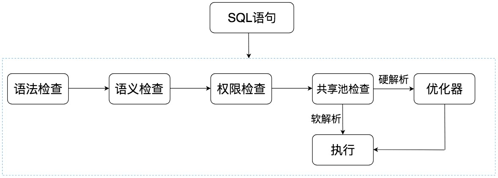
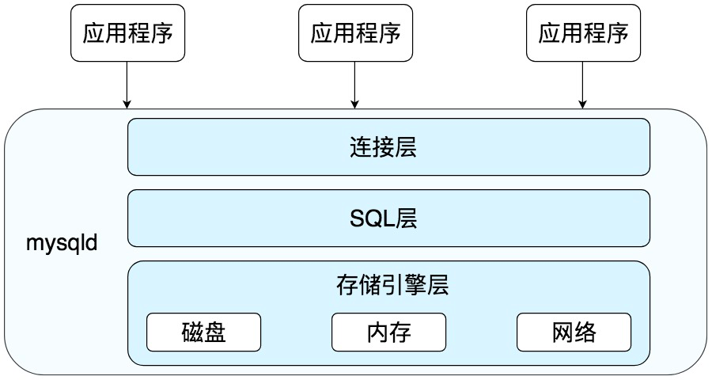
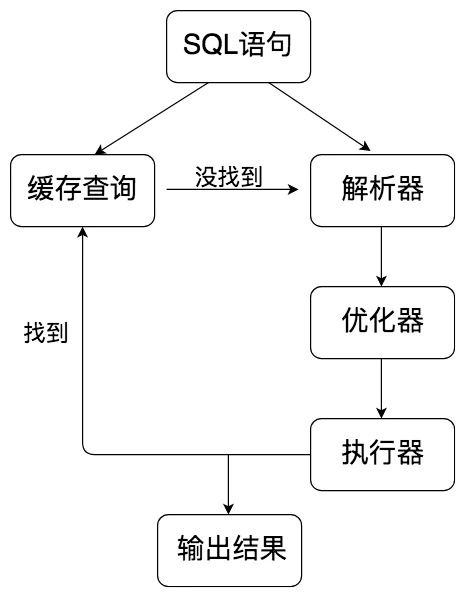
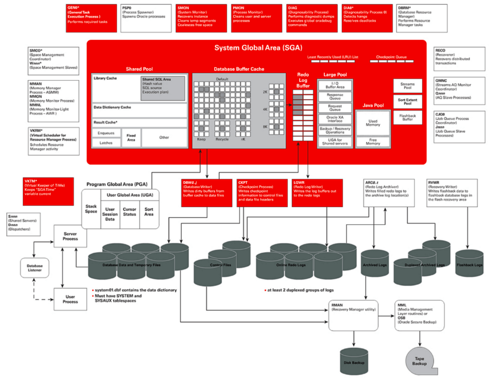
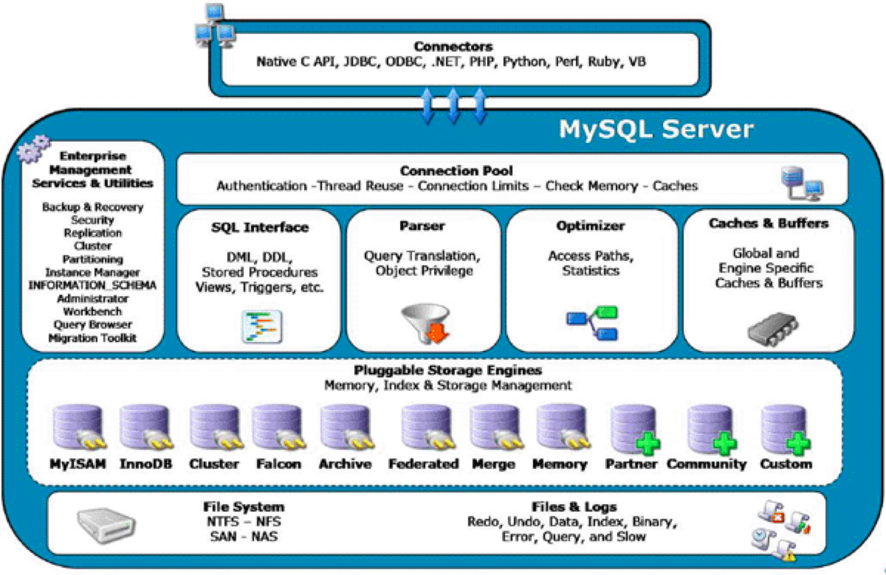
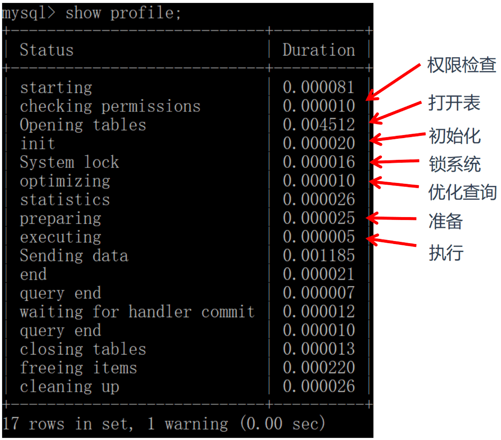
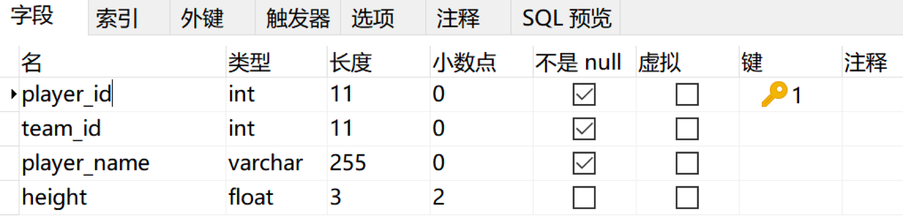

# SQL

<!-- @import "[TOC]" {cmd="toc" depthFrom=1 depthTo=6 orderedList=false} -->

<!-- code_chunk_output -->

- [SQL](#sql)
  - [一. 基础](#一-基础)
    - [1.1 SQL](#11-sql)
    - [1.2 数据库管理系统（DBMS）](#12-数据库管理系统dbms)
    - [1.3 SQL 与 NoSQL](#13-sql-与-nosql)
    - [1.4 SQL 的执行](#14-sql-的执行)
      - [1.4.1 Oracle 中的 SQL](#141-oracle-中的-sql)
      - [1.4.2 MySQL 中的 SQL](#142-mysql-中的-sql)
      - [1.4.3 数据库管理系统也是一种软件](#143-数据库管理系统也是一种软件)
    - [1.5 使用数据定义语言（DDL）创建数据库和数据表的注意事项](#15-使用数据定义语言ddl创建数据库和数据表的注意事项)
      - [1.5.1 DDL 的基础语法及设计工具](#151-ddl-的基础语法及设计工具)

<!-- /code_chunk_output -->

## 一. 基础

SQL 作为与数据直接打交道的语言，是与各种前端、后端语言进行交互的“中台”语言。

SQL 有两个重要的标准，分别是 SQL92 和 SQL99，它们分别代表了 92 年和 99 年颁布的 SQL 标准。

SQL 语言按照功能划分成以下的 4 个部分：

- **数据定义语言**（DDL，Data Definition Language）：它用来定义数据库对象，包括数据库、数据表和列。通过使用 DDL，可以创建，删除和修改数据库和表结构。
- **数据操作语言**（DML，Data Manipulation Language）：用它操作和数据库相关的记录，比如增加、删除、修改数据表中的记录。
- **数据控制语言**（DCL，Data Control Language）：用它来定义访问权限和安全级别。
- **数据查询语言**（DQL，Data Query Language）：用它查询想要的记录，它是 SQL 语言的重中之重。在实际的业务中，绝大多数情况下都是在和查询打交道。

SQL 是为数不多的声明性语言，这种语言的特点就是，只需要告诉计算机，想从原始数据中获取什么样的数据结果即可。

```sql
SELECT name, hp_max FROM heros WHERE role_main = 'soldier'
```

### 1.1 SQL

1. 用 ER 图设计 SQL

   SQL 是与 DBMS（数据库管理系统）交流的语言，在创建 DBMS 之前，还需要对它进行设计，对于 DBMS 来说采用的是 ER 图（Entity Relationship Diagram），即实体 - 关系图的方式进行设计。

   实体 - 关系图是用来描述现实世界的概念模型，在这个模型中有 3 个要素：**实体**、**属性**、**关系**。

   实体就是要管理的对象，属性是标识每个实体的属性，关系则是对象之间的关系。比如创建了“用户”这个实体，它下面的属性包括用户 ID、登录名、密码、性别和头像等。

2. 创建数据表

   ER 图评审通过后，再用 SQL 语句或者可视化管理工具（如 Navicat）创建数据表。

3. 使用 SQL 操作

   - 表名、表别名、字段名、字段别名等都小写
   - SQL 保留字、函数名、绑定变量等都大写

   ```sql
   SELECT name, hp_max FROM heros WHERE role_main = '战士'
   ```

### 1.2 数据库管理系统（DBMS）

在 1974 年两个 IBM 研究员发表了一篇有关结构化英语查询语言的论文，并将这门语言命名为 SEQUEL。SEQUEL 的语言标准是开放的，但是围绕它的商业化竞争却从来没有停止过。首先因为商标之争，SEQUEL 改名为 SQL，后来有一个重量级的公司基于那篇论文研发出了商业化的数据库管理软件，这就是 Oracle。自此之后，又诞生了一堆 DBMS，比如 MySQL、SQL Server、PostgreSQL、DB2 和 MongoDB 等。

- **数据库管理系统**（DBMS，DataBase Management System）：它可以对多个数据库进行管理，所以可以理解为 DBMS = 多个数据库（DB） + 管理程序。

  - 关系型数据库是 DBMS 的主流

    其中使用最多的 DBMS 分别是 Oracle、MySQL 和 SQL Server。关系型数据库（RDBMS）就是建立在关系模型基础上的数据库，SQL 就是关系型数据库的查询语言。

  - 非关系型数据库

    相比于 SQL，NoSQL 泛指非关系型数据库，包括键值型数据库、文档型数据库、搜索引擎和列存储等，除此以外还包括图形数据库。

    - 键值型数据库

      通过 Key-Value 键值的方式来存储数据，其中 Key 和 Value 可以是简单的对象，也可以是复杂的对象。Key 作为唯一的标识符，**优点是查找速度快**，在这方面明显优于关系型数据库，同时缺点也很明显，它**无法像关系型数据库一样自由使用条件过滤**（比如 WHERE），如果不知道去哪里找数据，就要遍历所有的键，这就会消耗大量的计算。键值型数据库典型的使用场景是**作为内容缓存**。Redis 是最流行的键值型数据库。

    - 文档型数据库

      用来管理文档，在数据库中文档作为处理信息的基本单位，一个文档就相当于一条记录，MongoDB 是最流行的文档型数据库。

    - 列式数据库

      相对于行式存储的数据库，Oracle、MySQL、SQL Server 等数据库都是采用的行式存储（Row-based），而列式数据库是将数据按照列存储到数据库中，这样做的好处是**可以大量降低系统的 I/O，适合于分布式文件系统，不足在于功能相对有限**。

    - 图形数据库

      利用了图这种数据结构存储了实体（对象）之间的关系。最典型的例子就是社交网络中人与人的关系，数据模型主要是以节点和边（关系）来实现，特点在于能**高效地解决复杂的关系问题**。

  搜索引擎也是数据库检索中的重要应用，常见的全文搜索引擎有 Elasticsearch、Splunk 和 Solr。虽然关系型数据库采用了索引提升检索效率，但是针对全文索引效率却较低。搜索引擎的优势在于采用了全文搜索的技术，核心原理是“倒排索引”。

- **数据库**（DB，DataBase）：数据库是存储数据的集合，可以把它理解为多个数据表。

- **数据库系统**（DBS，DataBase System）：它是更大的概念，包括了数据库、数据库管理系统以及数据库管理人员 DBA。

### 1.3 SQL 与 NoSQL

NoSQL 的分类很多，刚才提到的键值型、文档型、搜索引擎、列式存储和图形数据库等都属于 NoSQL 阵营。也只有用 NoSQL 一词才能将这些技术囊括进来。即便如此，在 DBMS 排名中，还是 SQL 阵营的比重更大。

由于 SQL 一直称霸 DBMS，因此许多人在思考是否有一种数据库技术能远离 SQL，于是 NoSQL 诞生了，但是随着发展却发现越来越离不开 SQL。到目前为止 NoSQL 阵营中的 DBMS 都会有实现类似 SQL 的功能。下面是“NoSQL”这个名词在不同时期的诠释，从这些释义的变化中可以看出 NoSQL 功能的演变：

1970：NoSQL = We have no SQL
1980：NoSQL = Know SQL
2000：NoSQL = No SQL!
2005：NoSQL = Not only SQL
2013：NoSQL = No, SQL!

NoSQL 对 SQL 做出了很好的补充，它可以在云计算时代，更好地使用数据库技术，比如快速读写，这样可以用低廉的成本，更方便进行扩展。

SQL 中主流的 DBMS 有：Oracle、MySQL 和 SQL Server。

### 1.4 SQL 的执行

#### 1.4.1 Oracle 中的 SQL



SQL 语句在 Oracle 中经历了以下的几个步骤：

1. **语法检查**：检查 SQL 拼写是否正确，如果不正确，Oracle 会报语法错误。
2. **语义检查**：检查 SQL 中的访问对象是否存在。比如在写 SELECT 语句的时候，列名写错了，系统就会提示错误。语法检查和语义检查的作用是保证 SQL 语句没有错误。
3. **权限检查**：看用户是否具备访问该数据的权限。
4. **共享池检查**：共享池（Shared Pool）是一块内存池，最主要的作用是缓存 SQL 语句和该语句的执行计划。Oracle 首先对 SQL 语句进行 Hash 运算，然后根据 Hash 值在库缓存（Library Cache）中查找：

   - 如果存在 SQL 语句的执行计划，就直接拿来执行，直接进入“执行器”的环节，这就是软解析。
   - 如果没有找到 SQL 语句和执行计划，Oracle 就需要创建解析树进行解析，生成执行计划，进入“优化器”这个步骤，这就是硬解析。

   共享池是 Oracle 中的术语，包括了库缓存，数据字典缓冲区等。库缓存区，它主要缓存 SQL 语句和执行计划。而数据字典缓冲区存储的是 Oracle 中的对象定义，比如表、视图、索引等对象。当对 SQL 语句进行解析的时候，如果需要相关的数据，会从数据字典缓冲区中提取。

5. **优化器**：优化器中就是要进行硬解析，也就是决定怎么做，比如创建解析树，生成执行计划。
6. **执行器**：当有了解析树和执行计划之后，就知道了 SQL 该怎么被执行，这样就可以在执行器中执行语句了。

为了提升 SQL 的执行效率，应该尽量避免硬解析，因为在 SQL 的执行过程中，创建解析树，生成执行计划是很消耗资源的。

在 Oracle 中，绑定变量是它的一大特色。绑定变量就是在 SQL 语句中使用变量，通过不同的变量取值来改变 SQL 的执行结果。这样做的好处是能提升软解析的可能性，不足之处在于可能会导致生成的执行计划不够优化，因此是否需要绑定变量还需要视情况而定。举个例子：

```sql
SQL> select * from player where player_id = 10001;
```

也可以使用绑定变量：

```sql
SQL> select * from player where player_id = :player_id;
```

这两个查询语句的效率在 Oracle 中是完全不同的。如果在查询 player_id = 10001 之后，还会查询 10002、10003 之类的数据，那么每一次查询都会创建一个新的查询解析。而第二种方式使用了绑定变量，那么在第一次查询之后，在共享池中就会存在这类查询的执行计划，也就是软解析。

因此可以通过使用绑定变量来减少硬解析，减少 Oracle 的解析工作量。但是这种方式也有缺点，**使用动态 SQL 的方式，因为参数不同，会导致 SQL 的执行效率不同，同时 SQL 优化也会比较困难**。

#### 1.4.2 MySQL 中的 SQL

MySQL 是典型的 C/S 架构，即 Client/Server 架构，服务器端程序使用的 mysql。整体的 MySQL 流程如下图所示：



MySQL 由三层组成：

- **连接层**：客户端和服务器端建立连接，客户端发送 SQL 至服务器端；

- **SQL 层**：对 SQL 语句进行查询处理

  

  1. **查询缓存**：Server 如果在查询缓存中发现了这条 SQL 语句，就会直接将结果返回给客户端；如果没有，就进入到解析器阶段。

     > 一旦数据表有更新，缓存都将清空，因此只有数据表是静态的时候，或者数据表很少发生变化时，使用缓存查询才有价值，否则如果数据表经常更新，反而增加了 SQL 的查询时间，所以在 MySQL8.0 之后就抛弃了这个功能。

  2. **解析器**：在解析器中对 SQL 语句进行语法分析、语义分析。

  3. **优化器**：在优化器中会确定 SQL 语句的执行路径，比如是根据全表检索，还是根据索引来检索等。

  4. **执行器**：在执行之前需要判断该用户是否具备权限，如果具备权限就执行 SQL 查询并返回结果。在 MySQL8.0 以下的版本，如果设置了查询缓存，这时会将查询结果进行缓存。

     SQL 语句在 MySQL 中的流程是：SQL 语句→缓存查询→解析器→优化器→执行器。在这一部分中，MySQL 和 Oracle 执行 SQL 的原理是一样的。

     与 Oracle 不同的是，MySQL 的存储引擎采用了插件的形式，每个存储引擎都面向一种特定的数据库应用环境。同时开源的 MySQL 还允许开发人员设置自己的存储引擎，下面是一些常见的存储引擎：

  - **InnoDB 存储引擎**：它是 MySQL 5.5 版本之后默认的存储引擎，最大的特点是支持事务、行级锁定、外键约束等。
  - **MyISAM 存储引擎**：在 MySQL 5.5 版本之前是默认的存储引擎，不支持事务，也不支持外键，最大的特点是速度快，占用资源少。
  - **Memory 存储引擎**：使用系统内存作为存储介质，以便得到更快的响应速度。不过如果 mysqld 进程崩溃，则会导致所有的数据丢失，因此只有当数据是临时的情况下才使用 Memory 存储引擎。
  - **NDB 存储引擎**：也叫做 NDB Cluster 存储引擎，主要用于 MySQL Cluster 分布式集群环境，类似于 Oracle 的 RAC 集群。
  - **Archive 存储引擎**：它有很好的压缩机制，用于文件归档，在请求写入时会进行压缩，所以也经常用来做仓库。

  > **注意**：数据库的设计在于表的设计，而在 MySQL 中每个表的设计都可以采用不同的存储引擎，可以根据实际的数据处理需要来选择存储引擎，这也是 MySQL 的强大之处。

- **存储引擎层**：与数据库文件打交道，负责数据的存储和读取。

#### 1.4.3 数据库管理系统也是一种软件

完整的 Oracle 和 MySQL 结构图要复杂得多：





如果只是简单地把 MySQL 和 Oracle 看成数据库管理系统软件，从外部看难免会觉得“晦涩难懂”。但其中最核心的部分：SQL 的执行原理在不同 DBMS 中是相通的，只是在不同的软件中，各有各的实现路径。

一条 SQL 语句会经历不同的模块，在不同的模块中，SQL 执行所使用的资源（时间）是怎样的：

1. 看下 profiling 是否开启，开启它可以让 MySQL 收集在 SQL 执行时所使用的资源情况，命令如下：

   ```sql
   select @@profiling;
   +-------------+
   | @@profiling |
   +-------------+
   |           0 |
   +-------------+
   ```

   profiling=0 代表关闭，需要把 profiling 打开，即设置为 1：

   ```sql
   set profiling=1;
   ```

2. 然后执行任意一个 SQL 查询，之后查看当前会话所产生的所有 profiles：

   ```sql
   show profiles;
   ```

   如果想要获取上一次查询的执行时间，可以使用：

   ```sql
   show profile;
   ```

   

   也可以查询指定的 Query ID，比如：

   ```sql
   show profile for query 2;
   ```

### 1.5 使用数据定义语言（DDL）创建数据库和数据表的注意事项

DDL 是 DBMS 的核心组件，也是 SQL 的重要组成部分，DDL 的正确性和稳定性是整个 SQL 运行的重要基础。

#### 1.5.1 DDL 的基础语法及设计工具

DDL 的英文全称是 Data Definition Language。它**定义了数据库的结构和数据表的结构**。在 DDL 中，常用的功能是增删改，分别对应的命令是 CREATE、DROP 和 ALTER。需要注意的是，在执行 DDL 的时候，不需要 COMMIT，就可以完成执行任务。

1. **对数据库进行定义**

   ```sql
   CREATE DATABASE nba; // 创建一个名为nba的数据库
   DROP DATABASE nba; // 删除一个名为nba的数据库
   ```

2. **对数据表进行定义**

   创建表结构的语法：

   ```sql
   CREATE TABLE [table_name](字段名 数据类型, ......)
   ```

   比如想创建一个球员表，表名为 player，里面有两个字段，一个是 player_id，它是 int 类型，另一个 player_name 字段是 varchar(255) 类型。这两个字段都不为空，且 player_id 是递增的：

   ```sql
   CREATE TABLE player  (
     player_id int(11) NOT NULL AUTO_INCREMENT,
     player_name varchar(255) NOT NULL
   );
   ```

   数据类型中 int(11) 代表整数类型，显示长度为 11 位，括号中的参数 11 代表的是最大有效显示长度，与类型包含的数值范围大小无关。varchar(255) 代表的是最大长度为 255 的可变字符串类型。NOT NULL 表明整个字段不能是空值，是一种数据约束。AUTO_INCREMENT 代表主键自动增长。

   > **注意**：语句最后以分号（;）作为结束符，最后一个字段的定义结束后没有逗号。

   实际上，通常很少自己写 DDL 语句，可以使用一些可视化工具来创建和操作数据库和数据表。比如：Navicat，它是一个数据库管理和设计工具，跨平台，支持很多种数据库管理软件，比如 MySQL、Oracle、MariaDB 等。

   假如还是针对 player 这张表，想设计以下的字段：

   | 字段        | 含义     | 类型                                                      |
   | ----------- | -------- | --------------------------------------------------------- |
   | player_id   | 球员 ID  | int 整数类型，最大显示长度 11                             |
   | team_id     | 球队 ID  | int 整数类型，最大显示长度 11                             |
   | player_name | 球员姓名 | varchar 字符串类型，最大长度 255                          |
   | height      | 身高     | float 浮点类型，一共存储 3 个有效数字，其中小数点长度为 2 |

   其中 player_id 是数据表 player 的主键，且自动增长。player_id、team_id、player_name 这三个字段均不为空，height 字段可以为空。

   按照上面的设计需求，可以使用 Navicat 软件进行设计，如下所示：

   

   然后，还可以对 player_name 字段进行索引，索引类型为 Unique。
