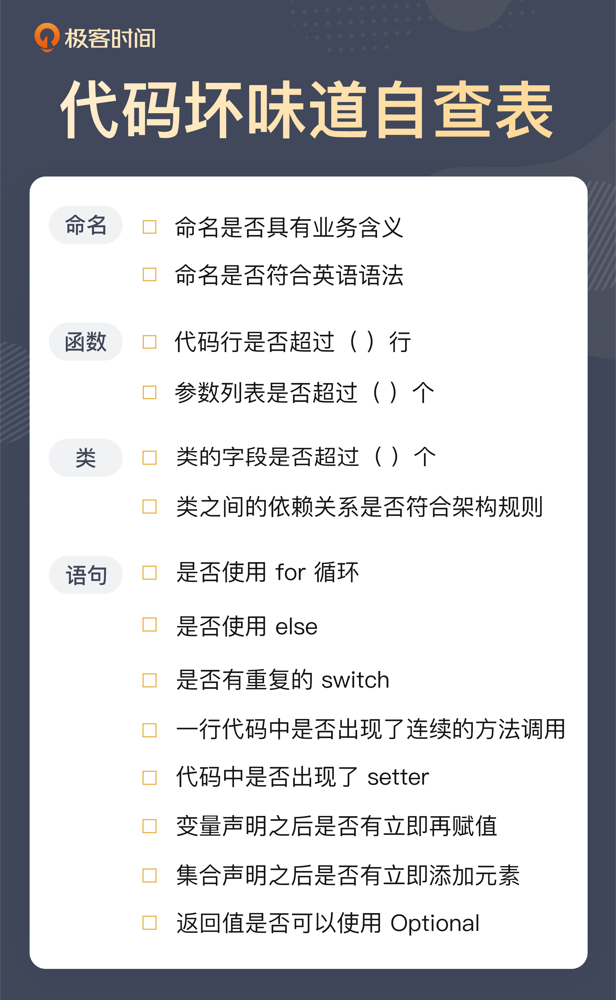
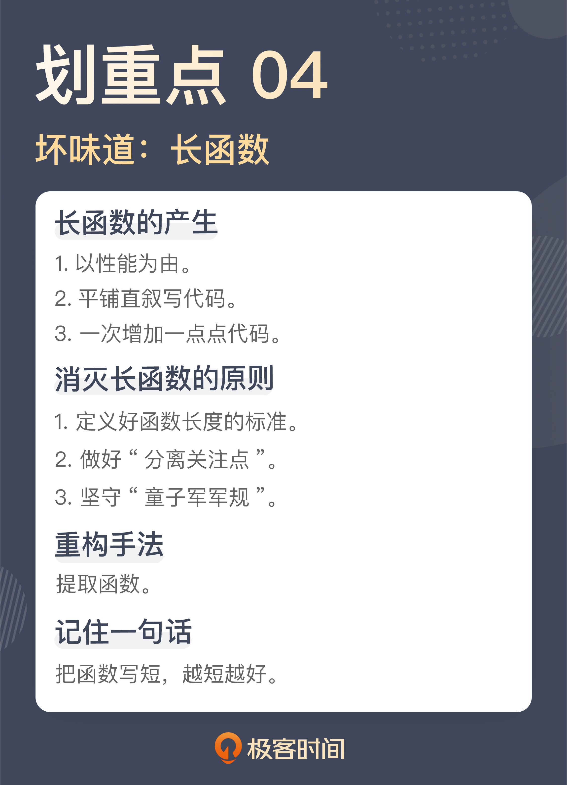

<!-- @import "[TOC]" {cmd="toc" depthFrom=1 depthTo=6 orderedList=false} -->

<!-- code_chunk_output -->

- [代码之丑](#代码之丑)
  - [13 类典型坏味道](#13-类典型坏味道)
    - [一. 缺乏业务含义的命名：如何精准命名？](#一-缺乏业务含义的命名如何精准命名)
      - [1.1 不精准的命名](#11-不精准的命名)
      - [1.2 用技术术语命名](#12-用技术术语命名)
      - [1.3 用业务语言写代码](#13-用业务语言写代码)
    - [二. 乱用英语：站在中国人的视角来看英文命名](#二-乱用英语站在中国人的视角来看英文命名)
      - [2.1 违反语法规则的命名](#21-违反语法规则的命名)
      - [2.2 不准确的英语词汇](#22-不准确的英语词汇)

<!-- /code_chunk_output -->

# 代码之丑

“写代码”有两个维度：**正确性**和**可维护性**，不要只关注正确性。能把代码写对，是每个程序员的必备技能，但**能够把代码写得更具可维护性，这是一个程序员从业余迈向职业的第一步**。



## 13 类典型坏味道

### 一. 缺乏业务含义的命名：如何精准命名？

#### 1.1 不精准的命名

先来看一段代码：

```java
public void processChapter(long chapterId) {
  Chapter chapter = this.repository.findByChapterId(chapterId);
  if (null == chapter) {
    throw new IllegalArgumentException("Unknown chapter [" + chapterId + "]");
  }

  chapter.setTranslationState(TranslationState.TRANSLATING);
  this.repository.save(chapter);
}
```

这是一段看上去还挺正常的代码，甚至以很多团队的标准来看，这段代码写得还不错。但如果我问你，这段代码是做什么的。你就需要调动全部注意力，去认真阅读这段代码，找出其中的逻辑。经过阅读发现，这段代码做的就是把一个章节的翻译状态改成翻译中。

问题来了，为什么你需要阅读这段代码的细节，才能知道这段代码是做什么的？

问题就出在函数名上。这个函数的名字叫 processChapter（处理章节），这个函数确实是在处理章节，但是，这个名字太过宽泛。如果各种场景都能够叫处理章节，那么处理章节就是一个过于宽泛的名字，没有错，但不精准。

这就是一类典型的命名问题，从表面上看，这个名字是有含义的，但实际上，它并不能有效地反映这段代码的含义。如果是在做的是一个信息处理系统，你根本无法判断，是一个电商平台，还是一个图书管理系统，从沟通的角度看，这就不是一个有效的沟通。要想理解它，你需要消耗大量认知成本，无论是时间，还是精力。

**命名过于宽泛，不能精准描述，这是很多代码在命名上存在的严重问题，也是代码难以理解的根源所在**。

如果它不叫“处理章节”，那应该叫什么呢？首先，**命名要能够描述出这段代码在做的事情**。这段代码在做的事情就是“将章节修改为翻译中”。那是不是它就应该叫 changeChapterToTranslating 呢？

不可否认，相比于“处理章节”，changeChapterToTranslating 这个名字已经进了一步，然而，它也不算是一个好名字，因为它更多的是在描述这段代码在做的细节。之所以要将一段代码封装起来，一个重要的原因就是，我们不想知道那么多的细节。如果把细节平铺开来，那本质上和直接阅读代码细节差别并不大。

所以，**一个好的名字应该描述意图，而非细节**。

就这段代码而言，为什么要把翻译状态修改成翻译中，这一定是有原因的，也就是意图。具体到这里的业务，把翻译状态修改成翻译中，是因为在这里开启了一个翻译的过程。所以，这段函数应该命名 startTranslation。

#### 1.2 用技术术语命名

```java
List<Book> bookList = service.getBooks();
```

可以说这是一段常见得不能再常见的代码了，但这段代码却隐藏另外一个典型得不能再典型的问题：**用技术术语命名**。

这个 bookList 变量之所以叫 bookList，原因就是它声明的类型是 List。这种命名在代码中几乎是随处可见的，比如 xxxMap、xxxSet。这是一种不费脑子的命名方式，但是，这种命名却会带来很多问题，因为它是一种基于实现细节的命名方式。

编程有一个重要的原则是面向接口编程，这个原则从另外一个角度理解，就是不要面向实现编程，因为**接口是稳定的，而实现是易变的**。虽然在大多数人的理解里，这个原则是针对类型的，但在命名上，也应该遵循同样的原则。为什么？举个例子就知道了。

比如，如果发现，现在需要的是一个不重复的作品集合，也就是说，需要把这个变量的类型从 List 改成 Set。变量类型你一定会改，但变量名你会改吗？这还真不一定，一旦出现遗忘，就会出现一个奇特的现象，一个叫 bookList 的变量，它的类型是一个 Set。这样，一个新的混淆就此产生了。

那有什么更好的名字吗？我们需要一个更面向意图的名字。其实，在这段代码里真正要表达的是拿到了一堆书，所以，这个名字可以命名成 books。也许你发现了，这个名字其实更简单，但从表意的程度上来说，它却是一个更有效的名字。

虽然这里只是以变量为例说明了以技术术语命名存在的问题，事实上，**在实际的代码中，技术名词的出现，往往就代表着它缺少了一个应有的模型**。

比如，在业务代码里如果直接出现了 Redis：

```java
public Book getByIsbn(String isbn) {
  Book cachedBook = redisBookStore.get(isbn);
  if (cachedBook != null) {
    return cachedBook;
  }

  Book book = doGetByIsbn(isbn);
  redisBookStore.put(isbn, book);
  return book;
}
```

通常来说，这里真正需要的是一个缓存。Redis 是缓存这个模型的一个实现：

```java
public Book getByIsbn(String isbn) {
  Book cachedBook = cache.get(isbn);
  if (cachedBook != null) {
    return cachedBook;
  }

  Book book = doGetByIsbn(isbn);
  cache.put(isbn, book);
  return book;
}
```

再进一步，缓存这个概念其实也是一个技术术语，从某种意义上说，它也不应该出现在业务代码中。这方面做得比较好的是 Spring。使用 Spring 框架时，如果需要缓存，通常是加上一个 Annotation（注解）：

```java
@Cacheable("books")
public Book getByIsbn(String isbn) {
  ...
}
```

程序员之所以喜欢用技术名词去命名，一方面是因为，这是大家习惯的语言，另一方面也是因为程序员学习写代码，很大程度上是参考别人的代码，而行业里面优秀的代码常常是一些开源项目，而这些开源项目往往是技术类的项目。**在一个技术类的项目中，这些技术术语其实就是它的业务语言。但对于业务项目，这个说法就必须重新审视了**。

如果这个部分的代码确实就是处理一些技术，使用技术术语无可厚非，但如果是在处理业务，就要尽可能把技术术语隔离开来。

#### 1.3 用业务语言写代码

无论是不精准的命名也好，技术名词也罢，归根结底，体现的是同一个问题：对业务理解不到位。**编写可维护的代码要使用业务语言**。怎么才知道自己的命名是否用的是业务语言呢？一种简单的做法就是，把这个词讲给产品经理，看他知不知道是怎么回事。

从团队的角度看，让每个人根据自己的理解来命名，确实就有可能出现千奇百怪的名字，所以，一个良好的团队实践是，建立团队的词汇表，让团队成员有信息可以参考。

团队对于业务有了共同理解，也许就可以发现一些更高级的坏味道，比如说下面这个函数声明：

```java
public void approveChapter(long chapterId, long userId) {
  ...
}
```

这个函数的意图是，确认章节内容审核通过。这里有一个问题，chapterId 是审核章节的 ID，这个没问题，但 userId 是什么呢？了解了一下背景，才知道，之所以这里要有一个 userId，是因为这里需要记录一下审核人的信息，这个 userId 就是审核人的 userId。

通过业务的分析，会发现，这个 userId 并不是一个好的命名，因为它还需要更多的解释，更好的命名是 reviewerUserId，之所以起这个名字，因为这个用户在这个场景下扮演的角色是审核人（Reviewer）。

```java
public void approveChapter(long chapterId, long reviewerUserId) {
  ...
}
```

从某种意义上来说，这个坏味道也是一种不精准的命名，但它不是那种一眼可见的坏味道，**而是需要在业务层面上再进行讨论**，所以，它是一种更高级的坏味道。


### 二. 乱用英语：站在中国人的视角来看英文命名

现在主流的程序设计语言都是以英语为基础的，且不说欧美人设计的各种语言，就连日本人设计的 Ruby、巴西人设计的 Lua，各种语法采用的也全都是英语。所以，想要成为一个优秀的程序员，会用英语写代码是必要的。

这里并不是说，程序员的英语一定要多好，但**最低限度的要求是写出来的代码要像是在用英语表达**。

#### 2.1 违反语法规则的命名

```java
public void completedTranslate(final List<ChapterId> chapterIds) {
  List<Chapter> chapters = repository.findByChapterIdIn(chapterIds);
  chapters.forEach(Chapter::completedTranslate);
  repository.saveAll(chapters);
}
```

初看之下，这段代码写得还不错，它要做的是将一些章节的信息标记为翻译完成。似乎函数名也能反映这个意思，但仔细一看你就会发现问题。

因为 completedTranslate 并不是一个正常的英语函数名。从这个名字你能看出，作者想表达的是“完成翻译”，因为是已经翻译完了，所以，他用了完成时的 completed，而翻译是 translate。这个函数名就成了 completedTranslate。由此，你可以看到，作者已经很用心了，但遗憾的是，这个名字还是起错了。

一般来说，**常见的命名规则是：类名是一个名词，表示一个对象，而方法名则是一个动词，或者是动宾短语，表示一个动作**。

以此为标准衡量这个名字，completedTranslate 并不是一个有效的动宾结构。如果把这个名字改成动宾结构，只要把“完成”译为 complete，“翻译”用成它的名词形式 translation 就可以了。所以，这个函数名可以改成 completeTranslation：

```java
public void completeTranslation(final List<ChapterId> chapterIds) {
  ...
}
```

这并不是一个复杂的坏味道，但这种坏味道在代码中却时常可以见到，比如，一个函数名是 retranslation，其表达的意图是重新翻译，**但作为函数名，它应该是一个动词**，所以，正确的命名应该是 retranslate。

其实，只要懂得最基本的命名要求，知道最基本的英语规则，就完全能够发现这里的坏味道。比如，判断函数名里的动词是不是动词，宾语是不是一个名词？这并不需要英语有多么好。自己实在拿不准的时候，你就把这个词放到字典网站中查一下，确保别用错词性就好。

#### 2.2 不准确的英语词汇

要实现一个章节审核的功能，一个同事先定义出了审核的状态:

```java
public enum ChapterAuditStatus {
  ...
}
```

你觉得这段代码有问题吗？如果看不出来，一点都不奇怪。如果你用审核作为关键字去字典网站上搜索，确实会得到 audit 这个词。所以，审核状态写成 AuditStatus 简直是再正常不过的事情了。

然而，看到这个词的时候，我的第一反应就是这个词好像不太对。因为之前我实现了一个作品审核的功能，不过我写的定义是这样的：

```java
public enum BookReviewStatus {
  ...
}
```

抛开前缀不看，同样是审核，一个用了 audit，一个用了 review。这显然是一种不一致。本着代码一致性的考虑，希望这两个定义应该采用同样的词汇。

于是，把 audit 和 review 同时放到了搜索引擎里查了一下。原来，audit 会有更官方的味道，更合适的翻译应该是审计，而 review 则有更多核查的意思，二者相比，review 更适合这里的场景。于是，章节的审核状态也统一使用了 review：

```java
public enum ChapterReviewStatus {
  ...
}
```

相比之下，这个坏味道是一个高级的坏味道，英语单词用得不准确。但这个问题确实是国内程序员不得不面对的一个尴尬的问题，我们的英语可能没有那么好，体会不到不同单词之间的差异。很多人习惯的做法就是把中文的词扔到字典网站，然后从诸多返回的结果中找一个自己看着顺眼的，而这也往往是很多问题出现的根源。这样写出来的程序看起来就像一个外国人在说中文，虽然你知道他在说的意思，但总觉得哪里怪怪的。

**在这种情况下，最好的解决方案还是建立起一个业务词汇表，千万不要臆想**。一般情况下，我们都可以去和业务方谈，共同确定一个词汇表，包含业务术语的中英文表达。这样在写代码的时候，你就可以参考这个词汇表给变量和函数命名。

下面是一个词汇表的示例，从这个词汇表中你不难看出：一方面，词汇表给出的都是业务术语，同时也给出了在特定业务场景下的含义；另一方面，它也给出了相应的英文，省得你费劲心思去思考。当你遇到了一个词汇表中没有的术语怎么办呢？那就需要找出这个术语相应的解释，然后，补充到术语表里。


建立词汇表的另一个关键点就是，**用集体智慧，而非个体智慧**。


### 三. 重复代码：简单需求到处修改，怎么办？

复制粘贴是最容易产生重复代码的地方，所以，一个最直白的建议就是，不要使用复制粘贴。**真正应该做的是，先提取出函数，然后，在需要的地方调用这个函数**。

其实，复制粘贴的重复代码是相对容易发现的，但有一些代码是有类似的结构，这也是重复代码，有些人对这类坏味道却视而不见。

#### 3.1 重复的结构

看一下下面的几段代码：

```java
@Task
public void sendBook() {
  try {
    this.service.sendBook();
  } catch (Throwable t) {
    this.notification.send(new SendFailure(t));
    throw t;
  }
}
```

```java
@Task
public void sendChapter() {
  try {
    this.service.sendChapter();
  } catch (Throwable t) {
    this.notification.send(new SendFailure(t));
    throw t;
  }
}
```

```java
@Task
public void startTranslation() {
  try {
    this.service.startTranslation();
  } catch (Throwable t) {
    this.notification.send(new SendFailure(t));
    throw t;
  }
}
```

这三段函数业务的背景是：一个系统要把作品的相关信息发送给翻译引擎。所以，结合着代码，就不难理解它们的含义，sendBook 是把作品信息发出去，sendChapter 就是把章节发送出去，而 startTranslation 则是启动翻译。这几个业务都是以后台的方式在执行，所以，它们的函数签名上增加了一个 Task 的 Annotation，表明它们是任务调度的入口。然后，实际的代码执行放到了对应的业务方法上，也就是 service 里面的方法。

这三个函数可能在许多人看来已经写得很简洁了，但是，这段代码的结构上却是有重复的，请把注意力放到 catch 语句里。

之所以要做一次捕获（catch），是为了防止系统出问题无人发觉。捕获到异常后，把出错的信息通过即时通讯工具发给相关人等，代码里的 notification.send 就是发通知的入口。相比于原来的业务逻辑，这个逻辑是后来加上的，所以，这段代码的作者不厌其烦地在每一处修改了代码。可以看到，虽然这三个函数调用的业务代码不同，但它们的结构是一致的，其基本流程可以理解为：

- 调用业务函数
- 如果出错，发通知。

当你能够发现结构上的重复，就可以把这个结构提取出来。从面向对象的设计来说，就是提出一个接口，就像下面这样：

```java
private void executeTask(final Runnable runnable) {
  try {
    runnable.run();
  } catch (Throwable t) {
    this.notification.send(new SendFailure(t));
    throw t;
  }
}
```

有了这个结构，前面几个函数就可以用它来改写了。对于支持函数式编程的程序设计语言来说，可以用语言提供的便利写法简化代码的编写，像下面的代码就是用了 Java 里的方法引用（Method Reference）：

```java
@Task
public void sendBook() {
  executeTask(this.service::sendBook);
}
```

```java
@Task
public void sendChapter() {
  executeTask(this.service::sendChapter);
}
```

```java
@Task
public void startTranslation() {
  executeTask(this.service::startTranslation);
}
```

经过这个例子的改写，如果再有一些通用的结构调整，比如，在任务执行前后要加上一些日志信息，这样的改动就可以放到 executeTask 这个函数里，而不用四处去改写了。

这个例子并不复杂，关键点在于，能不能发现结构上的重复。因为相比于直接复制的代码，结构上的重复看上去会有一些迷惑性。比如，在这个例子里，发送作品信息、发送章节、启动翻译看起来是三件不同的事，很难让人一下反应过来它也是重复代码。

一般来说，参数是名词，而函数调用，是动词。传统的程序设计教育中，对于名词是极度重视的，但我们必须认识到一点，动词也扮演着重要的角色，尤其是在函数式编程兴起之后。那你就需要知道，动词不同时，并不代表没有重复代码产生。

理解到这一点，就容易发现结构上的相似之处。比如在上面的例子中，发送作品信息、发送章节、启动翻译之所以看上去是三件不同的事，只是因为它们的动词不同，但是除了这几个动词之外的其它部分是相同的，所以，它们在结构上是重复的。

#### 3.2 做真正的选择

```java
if (user.isEditor()) {
  service.editChapter(chapterId, title, content, true);
} else {
  service.editChapter(chapterId, title, content, false);
}
```

这是一段对章节内容进行编辑的代码。这里有一个业务逻辑，章节只有在审核通过之后，才能去做后续的处理，比如，章节的翻译。所以，这里的 editChapter 方法最后那个参数表示是否审核通过。

在这段代码里面，目前的处理逻辑是，如果这个章节是由作者来编辑的，那么这个章节是需要审核的，如果这个章节是由编辑来编辑的，那么审核就直接通过了，因为编辑本身同时也是审核人。不过，这里的业务逻辑不是重点，只是帮助你理解这段代码。

问题来了，这个 if 选择的到底是什么呢？相信你和我一样，第一眼看到这段代码的感觉一定是，if 选择的一定是两段不同的业务处理。但只要你稍微看一下，就会发现，if 和 else 两段代码几乎是一模一样的。在经过仔细地“找茬”之后，才能发现，原来是最后一个参数不一样。

只有参数不同，是不是和前面说的重复代码是如出一辙的？没错，这其实也是一种重复代码。只不过，这种重复代码通常情况下是作者自己写出来的，而不是粘贴出来的。因为作者在写这段代码时，脑子只想到 if 语句判断之后要做什么，而没有想到这个 if 语句判断的到底是什么。但这段代码客观上也造就了重复。

**写代码要有表达性。把意图准确地表达出来，是写代码过程中非常重要的一环**。显然，这里的 if 判断区分的是参数，而非动作。所以，可以把这段代码稍微调整一下，会让代码看上去更容易理解：

```java
boolean approved = user.isEditor();
service.editChapter(chapterId, title, content, approved);
```

注意，这里把 user.isEditor() 判断的结果赋值给了一个 approved 的变量，而不是直接作为一个参数传给 editChapter，这么做也是为了提高这段代码的可读性。因为 editChapter 最后一个参数表示的是这个章节是否审核通过。通过引入 approved 变量，可以清楚地看到，一个章节审核是否通过的判断条件是“用户是否是一个编辑”，这种写法会让代码更清晰。

如果将来审核通过的条件改变了，变化的点全都在 approved 的这个变量的赋值上面。如果追求更有表达性的做法，甚至可以提取一个函数出来，这样，就把变化都放到这个函数里了，就像下面这样：

```java
boolean approved = isApproved(user);
service.editChapter(chapterId, title, content, approved);

private boolean isApproved(final User user) {
  return user.isEditor();
}
```

这个 if 语句的代码块里只有一个语句。在实际的工作中，if 语句没有有效地去选择目标是经常出现的，有的是参数列表比较长，有的是在 if 的代码块里有多个语句。所以，**只要看到 if 语句出现，而且 if 和 else 的代码块长得又比较像，多半就是出现了这个坏味道**。

重复是一个泥潭，对于程序员来说，时刻提醒自己不要重复是至关重要的。在软件开发里，有一个重要的原则叫做 Don't Repeat Yourself（不要重复自己，简称 DRY）。

**写代码要想做到 DRY，一个关键点是能够发现重复**。发现重复，一种是在泥潭中挣扎后，被动地发现，还有一种是提升自己识别能力，主动地发现重复。这种主动识别的能力，其实背后要有对软件设计更好的理解，尤其是对分离关注点的理解。


### 四. 长函数：为什么总是不可避免地写出长函数？

#### 4.1 多长的函数才算“长”？

**对于函数长度容忍度高，这是导致长函数产生的关键点**。

**一个好的程序员面对代码库时要有不同尺度的观察能力，看设计时，要能够高屋建瓴，看代码时，要能细致入微**。

这里的要点就是，看具体代码时，一定要能够看到细微之处。任务分解的关键点就是将任务拆解得越小越好，这个观点对代码同样适用。随着对代码长度容忍度的降低，对代码细节的感知力就会逐渐提升，才能看到那些原本所谓细枝末节的地方隐藏的各种问题。

回到具体的工作中，“越小越好”是一个追求的目标，不过，没有一个具体的数字，就没办法约束所有人的行为。所以，通常情况下，还是要定义出一个代码行数的上限，以保证所有人都可以按照这个标准执行。

像 Python、Ruby 这样表达能力比较强的动态语言，大多数情况下，一行代码（one-liner program）可以解决很多问题，所以，要求大约是 10 行左右，并且能够用一行代码解决的问题，就尽量会用一行代码解决；而像 Java 这样表达能力稍弱的静态类型语言，也争取在 20 行代码之内解决问题。

这不是一个说说就算的标准，应该把它变成一个可执行的标准。比如，在 Java 中，就可以把代码行的约束加到 CheckStyle 的配置文件中，就像下面这样：

```java
<module name="MethodLength">
  <property name="tokens" value="METHOD_DEF"/>
  <property name="max" value="20"/>
  <property name="countEmpty" value="false"/>
</module>
```

这样，在提交代码之前，执行本地的构建脚本，就可以把长函数检测出来。如果用的是其它的程序设计语言，不妨也找一下相应的静态检查工具，看看是否提供类似的配置。

具体的函数行数可以结合团队的实际情况来制定，但是，非常不建议把这个数字放得很大，如果放到 100 行，这个数字基本上是没有太多意义的，对团队也起不到什么约束作用。

#### 4.2 长函数的产生

不过，限制函数长度，是一种简单粗暴的解决方案。最重要的是要知道，长函数本身是一个结果，如果不理解长函数产生的原因，还是很难写出整洁的代码。

- **以性能为由**
  人们写长函数的历史由来已久。像 C 语言这种在今天已经是高性能的程序设计语言，在问世之初，也曾被人质疑性能不彰，尤其是函数调用。
  在一些写汇编语言的人看来，调用函数涉及到入栈出栈的过程，显然不如直接执行来得性能高。这种想法经过各种演变流传到今天，任何一门新语言出现，还是会以同样的理由被质疑。
  所以，在很多人看来，把函数写长是为了所谓性能。不过，这个观点在今天是站不住的。**性能优化不应该是写代码的第一考量**。
  一方面，一门有活力的程序设计语言本身是不断优化的，无论是编译器，还是运行时，性能都会越来越好；另一方面，可维护性比性能优化要优先考虑，当性能不足以满足需要时，再来做相应的测量，找到焦点，进行特定的优化。这比在写代码时就考虑所谓性能要更能锁定焦点，优化才是有意义的。

- **平铺直叙**
  除了以性能为由把代码写长，还有一种最常见的原因也会把代码写长，那就是写代码平铺直叙，把自己想到的一点点罗列出来。平铺直叙的代码存在的两个典型问题：
  - 把多个业务处理流程放在一个函数里实现
  - 把不同层面的细节放到一个函数里实现。

  长函数往往还隐含着一个**命名问题**。修改后的变量命名会明显比之前要短，理解的成本也相应地会降低。因为变量都是在这个短小的上下文里，也就不会产生那么多的命名冲突，变量名当然就可以写短一些。

  平铺直叙的代码，一个关键点就是没有把不同的东西分解出来。如果用设计的眼光衡量这段代码，这就是“分离关注点”没有做好，把不同层面的东西混在了一起，既有不同业务混在一起，也有不同层次的处理混在了一起。**关注点越多越好，粒度越小越好**。

- **一次加一点**
  有时，一段代码一开始的时候并不长，就像下面这段代码，它根据返回的错误进行相应地错误处理：

    ```java
    if (code == 400 || code == 401) {
      // 做一些错误处理
    }
    ```

  然后，新的需求来了，增加了新的错误码，它就变成了这个样子：

    ```java
    if (code == 400 || code == 401 || code == 402) {
      // 做一些错误处理
    }
    ```

  日积月累，它就成了让人不忍直视的代码。

    ```java
    if (code == 400 || code == 401 || code == 402 || ...
      || code == 500 || ...
      || ...
      || code == 10000 || ...) {
      // 做一些错误处理
    }
    ```

  **任何代码都经不起这种无意识的累积，每个人都没做错，但最终的结果很糟糕**。对抗这种逐渐糟糕腐坏的代码，应该看看自己对于代码的改动是不是让原有的代码变得更糟糕了，如果是，那就改进它。

至此，看到了代码变长的几种常见原因：

- 以性能为由
- 平铺直叙
- 一次加一点

> 会发现，代码变长根本是一个无意识的问题，写代码的人没有觉得自己把代码破坏了。但只要认识到长函数是一个坏味道，后面的许多问题就自然而然地会被发掘出来，至于**解决方案，大部分情况下，就是拆分成各种小函数**。



### 五. 大类：如何避免写出难以理解的大类？

类之所以成为了大类，一种表现形式就是上面讲到的长函数，一个类只要有几个长函数，那它就肯定是一眼望不到边了。大类还有一种表现形式，类里面有特别多的字段和函数，也许，每个函数都不大，但架不住数量众多啊，这也足以让这个类在大类中占有一席之地。

#### 5.1 分模块的程序

把代码写到一个文件里，一方面，相同的功能模块没有办法复用；另一方面，也是更关键的，把代码都写到一个文件里，其复杂度会超出一个人能够掌握的认知范围。简言之，**一个人理解的东西是有限的，没有人能同时面对所有细节**。

人类面对复杂事物给出的解决方案是分而治之。所以，看到几乎各种程序设计语言都有自己的模块划分方案，从最初的按照文件划分，到后来，使用面向对象方案按照类进行划分，本质上，它们都是一种模块划分的方式。这样，人们面对的就不再是细节，而是模块，模块的数量显然会比细节数量少，人们的理解成本就降低了。

对程序进行模块划分，本质上就是在把问题进行分解，而这种做法的背后原因，就是人类的认知能力是有限的。理解了这一点，再回过头来看大类这个坏味道，你就知道问题出在哪了。**如果一个类里面的内容太多，它就会超过一个人的理解范畴，顾此失彼就在所难免了**。

按照这个思路，解决大类的方法也就随之而来了，就是把大类拆成若干个小类。

#### 5.2 大类的产生

想要理解怎么拆分一个大类，先需要知道，这些类是怎么变成这么大的。

- **职责不单一**
  最容易产生大类的原因在于职责的不单一。先来看一段代码：

    ```java
    public class User {
      private long userId;
      private String name;
      private String nickname;
      private String email;
      private String phoneNumber;
      private AuthorType authorType;
      private ReviewStatus authorReviewStatus;
      private EditorType editorType;
      ...
    }
    ```

  这个 User 类拥有着一个大类的典型特征，其中包含着一大堆的字段。面对这样一个类时，要问的第一个问题就是，这个类里的字段都是必需的吗？

  来仔细地看一下这个类，用户 ID（userId）、姓名（name）、昵称（nickname） 之类应该是一个用户的基本信息，后面的邮箱（email）、电话号码（phoneNumber） 也算是和用户相关联的。今天的很多应用都提供使用邮箱或电话号码登录的方式，所以，这个信息放在这里，也算是可以理解。

  再往后看，作者类型（authorType），这里表示作者是签约作者还是普通作者，签约作者可以设置作品的付费信息，而普通作者不能。后面的字段是作者审核状态（authorReviewStatus），就是说，作者成为签约作者，需要有一个申请审核的过程，这个状态就是审核的状态。再往后，又出现了一个编辑类型（editorType），编辑可以是主编，也可以是小编，他们的权限是不一样的。

  这还不是这个 User 类的全部。但是，即便只看这些内容，也足以发现一些问题了。

  首先，普通的用户既不是作者，也不是编辑。作者和编辑这些相关的字段，对普通用户来说，都是没有意义的。其次，对于那些成为了作者的用户，编辑的信息意义也不大，因为作者是不能成为编辑的，反之亦然，编辑也不会成为作者，作者信息对成为编辑的用户也是没有意义的。

  在这个类的设计里面，总有一些信息对一部分人是没有意义，但这些信息对于另一部分人来说又是必需的。之所以会出现这样的状况，关键点就在于，这里只有“一个”用户类。

  普通用户、作者、编辑，这是三种不同角色，来自不同诉求的业务方关心的是不同的内容。只是因为它们都是这个系统的用户，就把它们都放到用户类里，造成的结果就是，任何业务方的需求变动，都会让这个类反复修改。这种做法实际上是违反了**单一职责原则**。

  单一职责原则把模块的变化纳入考量。它是衡量软件设计好坏的一把简单而有效的尺子，通常来说，很多类之所以巨大，大部分原因都是违反了单一职责原则。而想要**破解“大类”的谜题，关键就是能够把不同的职责拆分开来**。

  回到这个类上，虽然这是一个类，但其实，它把不同角色关心的东西都放在了一起，所以，它变得如此庞大。只要把不同的信息拆分开来，问题也就迎刃而解了。下面就是把不同角色拆分出来的结果：

    ```java
    public class User {
      private long userId;
      private String name;
      private String nickname;
      private String email;
      private String phoneNumber;
      ...
    }
    ```

    ```java
    public class Author {
      private long userId;
      private AuthorType authorType;
      private ReviewStatus authorReviewStatus;
      ...
    }
    ```

    ```java
    public class Editor {
      private long userId;
      private EditorType editorType;
      ...
    }
    ```

  这里，拆分出了 Author 和 Editor 两个类，把与作者和编辑相关的字段分别移到了这两个类里面。在这两个类里面分别有一个 userId 字段，用以识别这个角色是和哪个用户相关。这个大 User 类就这样被分解了。

- **字段未分组**
  大类的产生往往还有一个常见的原因，就是字段未分组。有时候，会觉得有一些字段确实都是属于某个类，结果就是，这个类还是很大。比如，看一下上面拆分的结果，那个新的 User 类：

    ```java
    public class User {
      private long userId;
      private String name;
      private String nickname;
      private String email;
      private String phoneNumber;
      ...
    }
    ```

  前面分析过，这些字段应该都算用户信息的一部分。但是，即便相比于原来的 User 类小了许多，这个类依然也不算是一个小类，原因就是，这个类里面的字段并不属于同一种类型的信息。比如，userId、name、nickname 几项，算是用户的基本信息，而 email、phoneNumber 这些则属于用户的联系方式。

  从需求上看，基本信息是那种一旦确定就不怎么会改变的内容，而联系方式则会根据实际情况调整，比如，绑定各种社交媒体的账号。所以，如果把这些信息都放到一个类里面，这个类的稳定程度就要差一些。所以，可以根据这个理解，把 User 类的字段分个组，把不同的信息放到不同的类里面。

    ```java
    public class User {
      private long userId;
      private String name;
      private String nickname;
      private Contact contact;
      ...
    }
    ```

    ```java
    public class Contact {
      private String email;
      private String phoneNumber;
      ...
    }
    ```

  这里引入了一个 Contact 类（也就是联系方式），把 email 和 phoneNumber 放了进去，后面再有任何关于联系方式的调整就都可以放在这个类里面。经过这次调整，把不同的信息重新组合了一下，但每个类都比原来要小。

对比一下，如果说前后两次拆分有什么不同，那就是：前面是根据职责，拆分出了不同的实体，后面是将字段做了分组，用类把不同的信息分别做了封装。

**所谓的将大类拆解成小类，本质上在做的工作是一个设计工作。分解的依据其实是单一职责这个重要的设计原则**。没错，很多人写代码写不好，其实是缺乏软件设计的功底，不能有效地把各种模型识别出来。所以，想要写好代码，还是要好好学学软件设计的。


### 六. 长参数列表：如何处理不同类型的长参数？
