# 代码之丑

<!-- @import "[TOC]" {cmd="toc" depthFrom=1 depthTo=6 orderedList=false} -->

<!-- code_chunk_output -->

- [代码之丑](#-代码之丑-)
  - [一. 缺乏业务含义的命名：如何精准命名？](#-一-缺乏业务含义的命名如何精准命名-)
    - [1.1 不精准的命名](#-11-不精准的命名-)
    - [1.2 用技术术语命名](#-12-用技术术语命名-)
    - [1.3 用业务语言写代码](#-13-用业务语言写代码-)
  - [二. 乱用英语：站在中国人的视角来看英文命名](#-二-乱用英语站在中国人的视角来看英文命名-)
    - [2.1 违反语法规则的命名](#-21-违反语法规则的命名-)
    - [2.2 不准确的英语词汇](#-22-不准确的英语词汇-)
  - [三. 重复代码：简单需求到处修改，怎么办？](#-三-重复代码简单需求到处修改怎么办-)
    - [3.1 重复的结构](#-31-重复的结构-)
    - [3.2 做真正的选择](#-32-做真正的选择-)
  - [四. 长函数：为什么总是不可避免地写出长函数？](#-四-长函数为什么总是不可避免地写出长函数-)
    - [4.1 多长的函数才算“长”？](#-41-多长的函数才算长-)
    - [4.2 长函数的产生](#-42-长函数的产生-)
  - [五. 大类：如何避免写出难以理解的大类？](#-五-大类如何避免写出难以理解的大类-)
    - [5.1 分模块的程序](#-51-分模块的程序-)
    - [5.2 大类的产生](#-52-大类的产生-)
  - [六. 长参数列表：如何处理不同类型的长参数？](#-六-长参数列表如何处理不同类型的长参数-)
    - [6.1 聚沙成塔](#-61-聚沙成塔-)
    - [6.2 动静分离](#-62-动静分离-)
    - [6.3 告别标记](#-63-告别标记-)
  - [七. 滥用控制语句](#-七-滥用控制语句-)
    - [7.1 嵌套的代码](#-71-嵌套的代码-)
    - [7.2 if 和 else](#-72-if-和-else-)
    - [7.3 重复的 Switch](#-73-重复的-switch-)
  - [八. 缺乏封装：如何应对火车代码和基本类型偏执问题？](#-八-缺乏封装如何应对火车代码和基本类型偏执问题-)
    - [8.1 火车残骸](#-81-火车残骸-)
    - [8.2 基本类型偏执](#-82-基本类型偏执-)
  - [九. 可变的数据：不要让代码“失控”](#-九-可变的数据不要让代码失控-)
    - [9.1 满天飞的 Setter](#-91-满天飞的-setter-)
    - [9.2 可变的数据](#-92-可变的数据-)
  - [十. 变量声明与赋值分离：普通的变量声明，怎么也有坏味道？](#-十-变量声明与赋值分离普通的变量声明怎么也有坏味道-)
    - [10.1 变量的初始化](#-101-变量的初始化-)
    - [10.2 集合初始化](#-102-集合初始化-)
  - [十一. 依赖混乱](#-十一-依赖混乱-)
    - [11.1 缺少防腐层](#-111-缺少防腐层-)
    - [11.2 业务代码里的具体实现](#-112-业务代码里的具体实现-)
  - [十二. 不一致的代码](#-十二-不一致的代码-)
    - [12.1 命名中的不一致](#-121-命名中的不一致-)
    - [12.2 方案中的不一致](#-122-方案中的不一致-)
    - [12.3 代码中的不一致](#-123-代码中的不一致-)
  - [十三. 落后的代码风格：使用“新”的语言特性和程序库升级你的代码](#-十三-落后的代码风格使用新的语言特性和程序库升级你的代码-)
    - [13.1 Optional](#-131-optional-)
    - [13.2 函数式编程](#-132-函数式编程-)
  - [十四. 代码评审](#-十四-代码评审-)
    - [14.1 多久进行一次代码评审最合适？](#-141-多久进行一次代码评审最合适-)
    - [14.2 什么代码应该被重构](#-142-什么代码应该被重构-)

<!-- /code_chunk_output -->

“写代码” 有两个维度：**正确性**和**可维护性**，不要只关注正确性。能把代码写对，是每个程序员的必备技能，但**能够把代码写得更具可维护性，这是一个程序员从业余迈向职业的第一步**。


## 一. 缺乏业务含义的命名：如何精准命名？

### 1.1 不精准的命名

先来看一段代码：

```java
public void processChapter(long chapterId) {
  Chapter chapter = this.repository.findByChapterId(chapterId);
  if (null == chapter) {
    throw new IllegalArgumentException("Unknown chapter [" + chapterId + "]");
  }

  chapter.setTranslationState(TranslationState.TRANSLATING);
  this.repository.save(chapter);
}
```

这是一段看上去还挺正常的代码，甚至以很多团队的标准来看，这段代码写得还不错。但如果我问你，这段代码是做什么的。你就需要调动全部注意力，去认真阅读这段代码，找出其中的逻辑。经过阅读发现，这段代码做的就是把一个章节的翻译状态改成翻译中。

问题来了，为什么你需要阅读这段代码的细节，才能知道这段代码是做什么的？

问题就出在函数名上。这个函数的名字叫 processChapter（处理章节），这个函数确实是在处理章节，但是，这个名字太过宽泛。如果各种场景都能够叫处理章节，那么处理章节就是一个过于宽泛的名字，没有错，但不精准。

这就是一类典型的命名问题，从表面上看，这个名字是有含义的，但实际上，它并不能有效地反映这段代码的含义。如果是在做的是一个信息处理系统，你根本无法判断，是一个电商平台，还是一个图书管理系统，从沟通的角度看，这就不是一个有效的沟通。要想理解它，你需要消耗大量认知成本，无论是时间，还是精力。

**命名过于宽泛，不能精准描述，这是很多代码在命名上存在的严重问题，也是代码难以理解的根源所在**。

如果它不叫“处理章节”，那应该叫什么呢？首先，**命名要能够描述出这段代码在做的事情**。这段代码在做的事情就是“将章节修改为翻译中”。那是不是它就应该叫 changeChapterToTranslating 呢？

不可否认，相比于 “处理章节”，changeChapterToTranslating 这个名字已经进了一步，然而，它也不算是一个好名字，因为它更多的是在描述这段代码在做的细节。之所以要将一段代码封装起来，一个重要的原因就是，不想知道那么多的细节。如果把细节平铺开来，那本质上和直接阅读代码细节差别并不大。

所以，**一个好的名字应该描述意图，而非细节**。

就这段代码而言，为什么要把翻译状态修改成翻译中，这一定是有原因的，也就是意图。具体到这里的业务，把翻译状态修改成翻译中，是因为在这里开启了一个翻译的过程。所以，这段函数应该命名 startTranslation。

### 1.2 用技术术语命名

```java
List<Book> bookList = service.getBooks();
```

可以说这是一段常见得不能再常见的代码了，但这段代码却隐藏另外一个典型得不能再典型的问题：**用技术术语命名**。

这个 bookList 变量之所以叫 bookList，原因就是它声明的类型是 List。这种命名在代码中几乎是随处可见的，比如 xxxMap、xxxSet。这是一种不费脑子的命名方式，但是，这种命名却会带来很多问题，因为它是一种基于实现细节的命名方式。

编程有一个重要的原则是面向接口编程，这个原则从另外一个角度理解，就是不要面向实现编程，因为**接口是稳定的，而实现是易变的**。虽然在大多数人的理解里，这个原则是针对类型的，但在命名上，也应该遵循同样的原则。为什么？举个例子就知道了。

比如，如果发现，现在需要的是一个不重复的作品集合，也就是说，需要把这个变量的类型从 List 改成 Set。变量类型你一定会改，但变量名你会改吗？这还真不一定，一旦出现遗忘，就会出现一个奇特的现象，一个叫 bookList 的变量，它的类型是一个 Set。这样，一个新的混淆就此产生了。

那有什么更好的名字吗？需要一个更面向意图的名字。其实，在这段代码里真正要表达的是拿到了一堆书，所以，这个名字可以命名成 books。也许你发现了，这个名字其实更简单，但从表意的程度上来说，它却是一个更有效的名字。

虽然这里只是以变量为例说明了以技术术语命名存在的问题，事实上，**在实际的代码中，技术名词的出现，往往就代表着它缺少了一个应有的模型**。

比如，在业务代码里如果直接出现了 Redis：

```java
public Book getByIsbn(String isbn) {
  Book cachedBook = redisBookStore.get(isbn);
  if (cachedBook != null) {
    return cachedBook;
  }

  Book book = doGetByIsbn(isbn);
  redisBookStore.put(isbn, book);
  return book;
}
```

通常来说，这里真正需要的是一个缓存。Redis 是缓存这个模型的一个实现：

```java
public Book getByIsbn(String isbn) {
  Book cachedBook = cache.get(isbn);
  if (cachedBook != null) {
    return cachedBook;
  }

  Book book = doGetByIsbn(isbn);
  cache.put(isbn, book);
  return book;
}
```

再进一步，缓存这个概念其实也是一个技术术语，从某种意义上说，它也不应该出现在业务代码中。这方面做得比较好的是 Spring。使用 Spring 框架时，如果需要缓存，通常是加上一个 Annotation（注解）：

```java
@Cacheable("books")
public Book getByIsbn(String isbn) {
  ...
}
```

程序员之所以喜欢用技术名词去命名，一方面是因为，这是大家习惯的语言，另一方面也是因为程序员学习写代码，很大程度上是参考别人的代码，而行业里面优秀的代码常常是一些开源项目，而这些开源项目往往是技术类的项目。**在一个技术类的项目中，这些技术术语其实就是它的业务语言。但对于业务项目，这个说法就必须重新审视了**。

如果这个部分的代码确实就是处理一些技术，使用技术术语无可厚非，但如果是在处理业务，就要尽可能把技术术语隔离开来。

### 1.3 用业务语言写代码

无论是不精准的命名也好，技术名词也罢，归根结底，体现的是同一个问题：对业务理解不到位。**编写可维护的代码要使用业务语言**。怎么才知道自己的命名是否用的是业务语言呢？一种简单的做法就是，把这个词讲给产品经理，看他知不知道是怎么回事。

从团队的角度看，让每个人根据自己的理解来命名，确实就有可能出现千奇百怪的名字，所以，一个良好的团队实践是，建立团队的词汇表，让团队成员有信息可以参考。

团队对于业务有了共同理解，也许就可以发现一些更高级的坏味道，比如说下面这个函数声明：

```java
public void approveChapter(long chapterId, long userId) {
  ...
}
```

这个函数的意图是，确认章节内容审核通过。这里有一个问题，chapterId 是审核章节的 ID，这个没问题，但 userId 是什么呢？了解了一下背景，才知道，之所以这里要有一个 userId，是因为这里需要记录一下审核人的信息，这个 userId 就是审核人的 userId。

通过业务的分析，会发现，这个 userId 并不是一个好的命名，因为它还需要更多的解释，更好的命名是 reviewerUserId，之所以起这个名字，因为这个用户在这个场景下扮演的角色是审核人（Reviewer）。

```java
public void approveChapter(long chapterId, long reviewerUserId) {
  ...
}
```

从某种意义上来说，这个坏味道也是一种不精准的命名，但它不是那种一眼可见的坏味道，**而是需要在业务层面上再进行讨论**，所以，它是一种更高级的坏味道。

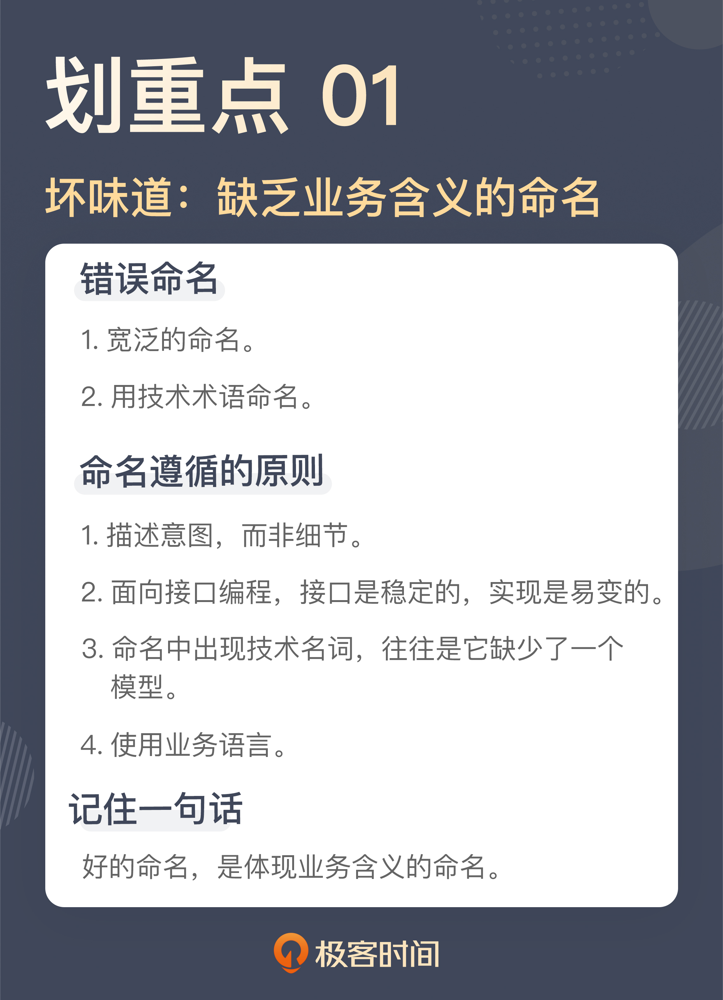

## 二. 乱用英语：站在中国人的视角来看英文命名

现在主流的程序设计语言都是以英语为基础的，且不说欧美人设计的各种语言，就连日本人设计的 Ruby、巴西人设计的 Lua，各种语法采用的也全都是英语。所以，想要成为一个优秀的程序员，会用英语写代码是必要的。

这里并不是说，程序员的英语一定要多好，但**最低限度的要求是写出来的代码要像是在用英语表达**。

### 2.1 违反语法规则的命名

```java
public void completedTranslate(final List<ChapterId> chapterIds) {
  List<Chapter> chapters = repository.findByChapterIdIn(chapterIds);
  chapters.forEach(Chapter::completedTranslate);
  repository.saveAll(chapters);
}
```

初看之下，这段代码写得还不错，它要做的是将一些章节的信息标记为翻译完成。似乎函数名也能反映这个意思，但仔细一看你就会发现问题。

因为 completedTranslate 并不是一个正常的英语函数名。从这个名字你能看出，作者想表达的是“完成翻译”，因为是已经翻译完了，所以，他用了完成时的 completed，而翻译是 translate。这个函数名就成了 completedTranslate。由此，你可以看到，作者已经很用心了，但遗憾的是，这个名字还是起错了。

一般来说，**常见的命名规则是：类名是一个名词，表示一个对象，而方法名则是一个动词，或者是动宾短语，表示一个动作**。

以此为标准衡量这个名字，completedTranslate 并不是一个有效的动宾结构。如果把这个名字改成动宾结构，只要把“完成”译为 complete，“翻译”用成它的名词形式 translation 就可以了。所以，这个函数名可以改成 completeTranslation：

```java
public void completeTranslation(final List<ChapterId> chapterIds) {
  ...
}
```

这并不是一个复杂的坏味道，但这种坏味道在代码中却时常可以见到，比如，一个函数名是 retranslation，其表达的意图是重新翻译，**但作为函数名，它应该是一个动词**，所以，正确的命名应该是 retranslate。

其实，只要懂得最基本的命名要求，知道最基本的英语规则，就完全能够发现这里的坏味道。比如，判断函数名里的动词是不是动词，宾语是不是一个名词？这并不需要英语有多么好。自己实在拿不准的时候，你就把这个词放到字典网站中查一下，确保别用错词性就好。

### 2.2 不准确的英语词汇

要实现一个章节审核的功能，一个同事先定义出了审核的状态:

```java
public enum ChapterAuditStatus {
  ...
}
```

你觉得这段代码有问题吗？如果看不出来，一点都不奇怪。如果你用审核作为关键字去字典网站上搜索，确实会得到 audit 这个词。所以，审核状态写成 AuditStatus 简直是再正常不过的事情了。

然而，看到这个词的时候，我的第一反应就是这个词好像不太对。因为之前我实现了一个作品审核的功能，不过我写的定义是这样的：

```java
public enum BookReviewStatus {
  ...
}
```

抛开前缀不看，同样是审核，一个用了 audit，一个用了 review。这显然是一种不一致。本着代码一致性的考虑，希望这两个定义应该采用同样的词汇。

于是，把 audit 和 review 同时放到了搜索引擎里查了一下。原来，audit 会有更官方的味道，更合适的翻译应该是审计，而 review 则有更多核查的意思，二者相比，review 更适合这里的场景。于是，章节的审核状态也统一使用了 review：

```java
public enum ChapterReviewStatus {
  ...
}
```

相比之下，这个坏味道是一个高级的坏味道，英语单词用得不准确。但这个问题确实是国内程序员不得不面对的一个尴尬的问题，英语可能没有那么好，体会不到不同单词之间的差异。很多人习惯的做法就是把中文的词扔到字典网站，然后从诸多返回的结果中找一个自己看着顺眼的，而这也往往是很多问题出现的根源。这样写出来的程序看起来就像一个外国人在说中文，虽然你知道他在说的意思，但总觉得哪里怪怪的。

**在这种情况下，最好的解决方案还是建立起一个业务词汇表，千万不要臆想**。一般情况下，都可以去和业务方谈，共同确定一个词汇表，包含业务术语的中英文表达。这样在写代码的时候，你就可以参考这个词汇表给变量和函数命名。

下面是一个词汇表的示例，从这个词汇表中你不难看出：一方面，词汇表给出的都是业务术语，同时也给出了在特定业务场景下的含义；另一方面，它也给出了相应的英文，省得你费劲心思去思考。当你遇到了一个词汇表中没有的术语怎么办呢？那就需要找出这个术语相应的解释，然后，补充到术语表里。

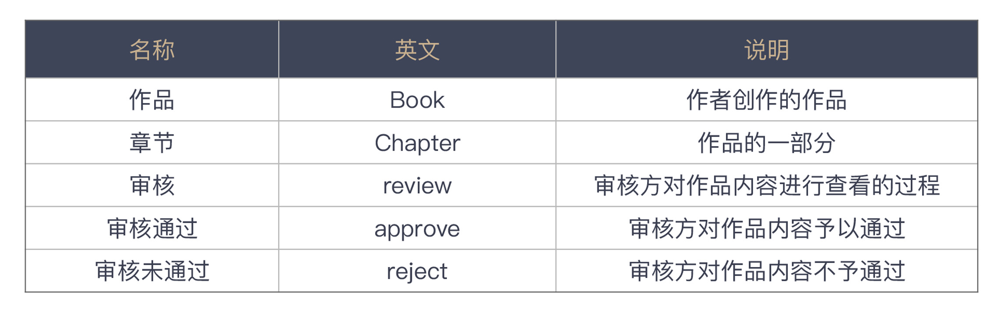

建立词汇表的另一个关键点就是，**用集体智慧，而非个体智慧**。

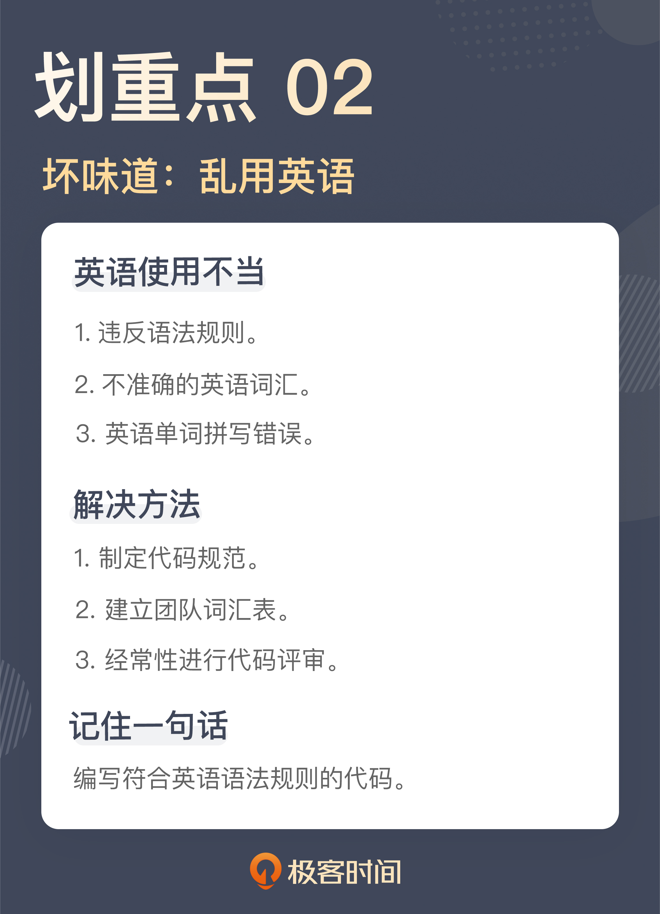

## 三. 重复代码：简单需求到处修改，怎么办？

复制粘贴是最容易产生重复代码的地方，所以，一个最直白的建议就是，不要使用复制粘贴。**真正应该做的是，先提取出函数，然后，在需要的地方调用这个函数**。

其实，复制粘贴的重复代码是相对容易发现的，但有一些代码是有类似的结构，这也是重复代码，有些人对这类坏味道却视而不见。

### 3.1 重复的结构

看一下下面的几段代码：

```java
@Task
public void sendBook() {
  try {
    this.service.sendBook();
  } catch (Throwable t) {
    this.notification.send(new SendFailure(t));
    throw t;
  }
}
```

```java
@Task
public void sendChapter() {
  try {
    this.service.sendChapter();
  } catch (Throwable t) {
    this.notification.send(new SendFailure(t));
    throw t;
  }
}
```

```java
@Task
public void startTranslation() {
  try {
    this.service.startTranslation();
  } catch (Throwable t) {
    this.notification.send(new SendFailure(t));
    throw t;
  }
}
```

这三段函数业务的背景是：一个系统要把作品的相关信息发送给翻译引擎。所以，结合着代码，就不难理解它们的含义，sendBook 是把作品信息发出去，sendChapter 就是把章节发送出去，而 startTranslation 则是启动翻译。这几个业务都是以后台的方式在执行，所以，它们的函数签名上增加了一个 Task 的 Annotation，表明它们是任务调度的入口。然后，实际的代码执行放到了对应的业务方法上，也就是 service 里面的方法。

这三个函数可能在许多人看来已经写得很简洁了，但是，这段代码的结构上却是有重复的，请把注意力放到 catch 语句里。

之所以要做一次捕获（catch），是为了防止系统出问题无人发觉。捕获到异常后，把出错的信息通过即时通讯工具发给相关人等，代码里的 notification.send 就是发通知的入口。相比于原来的业务逻辑，这个逻辑是后来加上的，所以，这段代码的作者不厌其烦地在每一处修改了代码。可以看到，虽然这三个函数调用的业务代码不同，但它们的结构是一致的，其基本流程可以理解为：

- 调用业务函数
- 如果出错，发通知。

当你能够发现结构上的重复，就可以把这个结构提取出来。从面向对象的设计来说，就是提出一个接口，就像下面这样：

```java
private void executeTask(final Runnable runnable) {
  try {
    runnable.run();
  } catch (Throwable t) {
    this.notification.send(new SendFailure(t));
    throw t;
  }
}
```

有了这个结构，前面几个函数就可以用它来改写了。对于支持函数式编程的程序设计语言来说，可以用语言提供的便利写法简化代码的编写，像下面的代码就是用了 Java 里的方法引用（Method Reference）：

```java
@Task
public void sendBook() {
  executeTask(this.service::sendBook);
}
```

```java
@Task
public void sendChapter() {
  executeTask(this.service::sendChapter);
}
```

```java
@Task
public void startTranslation() {
  executeTask(this.service::startTranslation);
}
```

经过这个例子的改写，如果再有一些通用的结构调整，比如，在任务执行前后要加上一些日志信息，这样的改动就可以放到 executeTask 这个函数里，而不用四处去改写了。

这个例子并不复杂，关键点在于，能不能发现结构上的重复。因为相比于直接复制的代码，结构上的重复看上去会有一些迷惑性。比如，在这个例子里，发送作品信息、发送章节、启动翻译看起来是三件不同的事，很难让人一下反应过来它也是重复代码。

一般来说，参数是名词，而函数调用，是动词。传统的程序设计教育中，对于名词是极度重视的，但我必须认识到一点，动词也扮演着重要的角色，尤其是在函数式编程兴起之后。那你就需要知道，动词不同时，并不代表没有重复代码产生。

理解到这一点，就容易发现结构上的相似之处。比如在上面的例子中，发送作品信息、发送章节、启动翻译之所以看上去是三件不同的事，只是因为它们的动词不同，但是除了这几个动词之外的其它部分是相同的，所以，它们在结构上是重复的。

### 3.2 做真正的选择

```java
if (user.isEditor()) {
  service.editChapter(chapterId, title, content, true);
} else {
  service.editChapter(chapterId, title, content, false);
}
```

这是一段对章节内容进行编辑的代码。这里有一个业务逻辑，章节只有在审核通过之后，才能去做后续的处理，比如，章节的翻译。所以，这里的 editChapter 方法最后那个参数表示是否审核通过。

在这段代码里面，目前的处理逻辑是，如果这个章节是由作者来编辑的，那么这个章节是需要审核的，如果这个章节是由编辑来编辑的，那么审核就直接通过了，因为编辑本身同时也是审核人。不过，这里的业务逻辑不是重点，只是帮助你理解这段代码。

问题来了，这个 if 选择的到底是什么呢？相信你和我一样，第一眼看到这段代码的感觉一定是，if 选择的一定是两段不同的业务处理。但只要你稍微看一下，就会发现，if 和 else 两段代码几乎是一模一样的。在经过仔细地“找茬”之后，才能发现，原来是最后一个参数不一样。

只有参数不同，是不是和前面说的重复代码是如出一辙的？没错，这其实也是一种重复代码。只不过，这种重复代码通常情况下是作者自己写出来的，而不是粘贴出来的。因为作者在写这段代码时，脑子只想到 if 语句判断之后要做什么，而没有想到这个 if 语句判断的到底是什么。但这段代码客观上也造就了重复。

**写代码要有表达性。把意图准确地表达出来，是写代码过程中非常重要的一环**。显然，这里的 if 判断区分的是参数，而非动作。所以，可以把这段代码稍微调整一下，会让代码看上去更容易理解：

```java
boolean approved = user.isEditor();
service.editChapter(chapterId, title, content, approved);
```

注意，这里把 user.isEditor() 判断的结果赋值给了一个 approved 的变量，而不是直接作为一个参数传给 editChapter，这么做也是为了提高这段代码的可读性。因为 editChapter 最后一个参数表示的是这个章节是否审核通过。通过引入 approved 变量，可以清楚地看到，一个章节审核是否通过的判断条件是“用户是否是一个编辑”，这种写法会让代码更清晰。

如果将来审核通过的条件改变了，变化的点全都在 approved 的这个变量的赋值上面。如果追求更有表达性的做法，甚至可以提取一个函数出来，这样，就把变化都放到这个函数里了，就像下面这样：

```java
boolean approved = isApproved(user);
service.editChapter(chapterId, title, content, approved);

private boolean isApproved(final User user) {
  return user.isEditor();
}
```

这个 if 语句的代码块里只有一个语句。在实际的工作中，if 语句没有有效地去选择目标是经常出现的，有的是参数列表比较长，有的是在 if 的代码块里有多个语句。所以，**只要看到 if 语句出现，而且 if 和 else 的代码块长得又比较像，多半就是出现了这个坏味道**。

重复是一个泥潭，对于程序员来说，时刻提醒自己不要重复是至关重要的。在软件开发里，有一个重要的原则叫做 Don't Repeat Yourself（不要重复自己，简称 DRY）。

**写代码要想做到 DRY，一个关键点是能够发现重复**。发现重复，一种是在泥潭中挣扎后，被动地发现，还有一种是提升自己识别能力，主动地发现重复。这种主动识别的能力，其实背后要有对软件设计更好的理解，尤其是对分离关注点的理解。

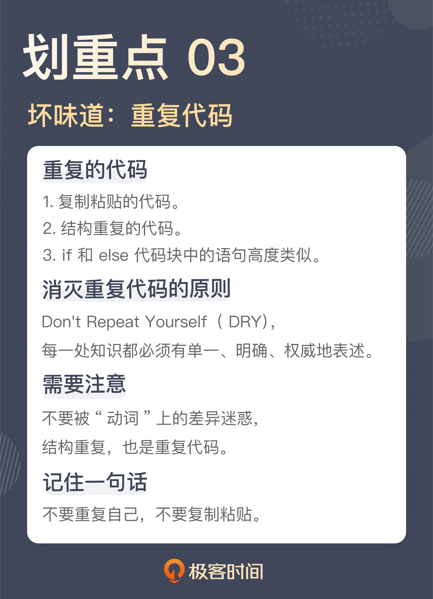

## 四. 长函数：为什么总是不可避免地写出长函数？

### 4.1 多长的函数才算“长”？

**对于函数长度容忍度高，这是导致长函数产生的关键点**。

**一个好的程序员面对代码库时要有不同尺度的观察能力，看设计时，要能够高屋建瓴，看代码时，要能细致入微**。

这里的要点就是，看具体代码时，一定要能够看到细微之处。任务分解的关键点就是将任务拆解得越小越好，这个观点对代码同样适用。随着对代码长度容忍度的降低，对代码细节的感知力就会逐渐提升，才能看到那些原本所谓细枝末节的地方隐藏的各种问题。

回到具体的工作中，“越小越好”是一个追求的目标，不过，没有一个具体的数字，就没办法约束所有人的行为。所以，通常情况下，还是要定义出一个代码行数的上限，以保证所有人都可以按照这个标准执行。

像 Python、Ruby 这样表达能力比较强的动态语言，大多数情况下，一行代码（one-liner program）可以解决很多问题，所以，要求大约是 10 行左右，并且能够用一行代码解决的问题，就尽量会用一行代码解决；而像 Java 这样表达能力稍弱的静态类型语言，也争取在 20 行代码之内解决问题。

这不是一个说说就算的标准，应该把它变成一个可执行的标准。比如，在 Java 中，就可以把代码行的约束加到 CheckStyle 的配置文件中，就像下面这样：

```java
<module name="MethodLength">
  <property name="tokens" value="METHOD_DEF"/>
  <property name="max" value="20"/>
  <property name="countEmpty" value="false"/>
</module>
```

这样，在提交代码之前，执行本地的构建脚本，就可以把长函数检测出来。如果用的是其它的程序设计语言，不妨也找一下相应的静态检查工具，看看是否提供类似的配置。

具体的函数行数可以结合团队的实际情况来制定，但是，非常不建议把这个数字放得很大，如果放到 100 行，这个数字基本上是没有太多意义的，对团队也起不到什么约束作用。

### 4.2 长函数的产生

不过，限制函数长度，是一种简单粗暴的解决方案。最重要的是要知道，长函数本身是一个结果，如果不理解长函数产生的原因，还是很难写出整洁的代码。

- **以性能为由**
  人们写长函数的历史由来已久。像 C 语言这种在今天已经是高性能的程序设计语言，在问世之初，也曾被人质疑性能不彰，尤其是函数调用。
  在一些写汇编语言的人看来，调用函数涉及到入栈出栈的过程，显然不如直接执行来得性能高。这种想法经过各种演变流传到今天，任何一门新语言出现，还是会以同样的理由被质疑。
  所以，在很多人看来，把函数写长是为了所谓性能。不过，这个观点在今天是站不住的。**性能优化不应该是写代码的第一考量**。
  一方面，一门有活力的程序设计语言本身是不断优化的，无论是编译器，还是运行时，性能都会越来越好；另一方面，可维护性比性能优化要优先考虑，当性能不足以满足需要时，再来做相应的测量，找到焦点，进行特定的优化。这比在写代码时就考虑所谓性能要更能锁定焦点，优化才是有意义的。

- **平铺直叙**
  除了以性能为由把代码写长，还有一种最常见的原因也会把代码写长，那就是写代码平铺直叙，把自己想到的一点点罗列出来。平铺直叙的代码存在的两个典型问题：

  - 把多个业务处理流程放在一个函数里实现
  - 把不同层面的细节放到一个函数里实现。

  长函数往往还隐含着一个**命名问题**。修改后的变量命名会明显比之前要短，理解的成本也相应地会降低。因为变量都是在这个短小的上下文里，也就不会产生那么多的命名冲突，变量名当然就可以写短一些。

  平铺直叙的代码，一个关键点就是没有把不同的东西分解出来。如果用设计的眼光衡量这段代码，这就是“分离关注点”没有做好，把不同层面的东西混在了一起，既有不同业务混在一起，也有不同层次的处理混在了一起。**关注点越多越好，粒度越小越好**。

- **一次加一点**
  有时，一段代码一开始的时候并不长，就像下面这段代码，它根据返回的错误进行相应地错误处理：

  ```java
  if (code == 400 || code == 401) {
    // 做一些错误处理
  }
  ```

  然后，新的需求来了，增加了新的错误码，它就变成了这个样子：

  ```java
  if (code == 400 || code == 401 || code == 402) {
    // 做一些错误处理
  }
  ```

  日积月累，它就成了让人不忍直视的代码。

  ```java
  if (code == 400 || code == 401 || code == 402 || ...
    || code == 500 || ...
    || ...
    || code == 10000 || ...) {
    // 做一些错误处理
  }
  ```

  **任何代码都经不起这种无意识的累积，每个人都没做错，但最终的结果很糟糕**。对抗这种逐渐糟糕腐坏的代码，应该看看自己对于代码的改动是不是让原有的代码变得更糟糕了，如果是，那就改进它。

至此，看到了代码变长的几种常见原因：

- 以性能为由
- 平铺直叙
- 一次加一点

> 会发现，代码变长根本是一个无意识的问题，写代码的人没有觉得自己把代码破坏了。但只要认识到长函数是一个坏味道，后面的许多问题就自然而然地会被发掘出来，至于**解决方案，大部分情况下，就是拆分成各种小函数**。


## 五. 大类：如何避免写出难以理解的大类？

类之所以成为了大类，一种表现形式就是上面讲到的长函数，一个类只要有几个长函数，那它就肯定是一眼望不到边了。大类还有一种表现形式，类里面有特别多的字段和函数，也许，每个函数都不大，但架不住数量众多啊，这也足以让这个类在大类中占有一席之地。

### 5.1 分模块的程序

把代码写到一个文件里，一方面，相同的功能模块没有办法复用；另一方面，也是更关键的，把代码都写到一个文件里，其复杂度会超出一个人能够掌握的认知范围。简言之，**一个人理解的东西是有限的，没有人能同时面对所有细节**。

人类面对复杂事物给出的解决方案是分而治之。所以，看到几乎各种程序设计语言都有自己的模块划分方案，从最初的按照文件划分，到后来，使用面向对象方案按照类进行划分，本质上，它们都是一种模块划分的方式。这样，人们面对的就不再是细节，而是模块，模块的数量显然会比细节数量少，人们的理解成本就降低了。

对程序进行模块划分，本质上就是在把问题进行分解，而这种做法的背后原因，就是人类的认知能力是有限的。理解了这一点，再回过头来看大类这个坏味道，你就知道问题出在哪了。**如果一个类里面的内容太多，它就会超过一个人的理解范畴，顾此失彼就在所难免了**。

按照这个思路，解决大类的方法也就随之而来了，就是把大类拆成若干个小类。

### 5.2 大类的产生

想要理解怎么拆分一个大类，先需要知道，这些类是怎么变成这么大的。

- **职责不单一**
  最容易产生大类的原因在于职责的不单一。先来看一段代码：

  ```java
  public class User {
    private long userId;
    private String name;
    private String nickname;
    private String email;
    private String phoneNumber;
    private AuthorType authorType;
    private ReviewStatus authorReviewStatus;
    private EditorType editorType;
    ...
  }
  ```

  这个 User 类拥有着一个大类的典型特征，其中包含着一大堆的字段。面对这样一个类时，要问的第一个问题就是，这个类里的字段都是必需的吗？

  来仔细地看一下这个类，用户 ID（userId）、姓名（name）、昵称（nickname） 之类应该是一个用户的基本信息，后面的邮箱（email）、电话号码（phoneNumber） 也算是和用户相关联的。今天的很多应用都提供使用邮箱或电话号码登录的方式，所以，这个信息放在这里，也算是可以理解。

  再往后看，作者类型（authorType），这里表示作者是签约作者还是普通作者，签约作者可以设置作品的付费信息，而普通作者不能。后面的字段是作者审核状态（authorReviewStatus），就是说，作者成为签约作者，需要有一个申请审核的过程，这个状态就是审核的状态。再往后，又出现了一个编辑类型（editorType），编辑可以是主编，也可以是小编，他们的权限是不一样的。

  这还不是这个 User 类的全部。但是，即便只看这些内容，也足以发现一些问题了。

  首先，普通的用户既不是作者，也不是编辑。作者和编辑这些相关的字段，对普通用户来说，都是没有意义的。其次，对于那些成为了作者的用户，编辑的信息意义也不大，因为作者是不能成为编辑的，反之亦然，编辑也不会成为作者，作者信息对成为编辑的用户也是没有意义的。

  在这个类的设计里面，总有一些信息对一部分人是没有意义，但这些信息对于另一部分人来说又是必需的。之所以会出现这样的状况，关键点就在于，这里只有“一个”用户类。

  普通用户、作者、编辑，这是三种不同角色，来自不同诉求的业务方关心的是不同的内容。只是因为它们都是这个系统的用户，就把它们都放到用户类里，造成的结果就是，任何业务方的需求变动，都会让这个类反复修改。这种做法实际上是违反了**单一职责原则**。

  单一职责原则把模块的变化纳入考量。它是衡量软件设计好坏的一把简单而有效的尺子，通常来说，很多类之所以巨大，大部分原因都是违反了单一职责原则。而想要**破解“大类”的谜题，关键就是能够把不同的职责拆分开来**。

  回到这个类上，虽然这是一个类，但其实，它把不同角色关心的东西都放在了一起，所以，它变得如此庞大。只要把不同的信息拆分开来，问题也就迎刃而解了。下面就是把不同角色拆分出来的结果：

  ```java
  public class User {
    private long userId;
    private String name;
    private String nickname;
    private String email;
    private String phoneNumber;
    ...
  }
  ```

  ```java
  public class Author {
    private long userId;
    private AuthorType authorType;
    private ReviewStatus authorReviewStatus;
    ...
  }
  ```

  ```java
  public class Editor {
    private long userId;
    private EditorType editorType;
    ...
  }
  ```

  这里，拆分出了 Author 和 Editor 两个类，把与作者和编辑相关的字段分别移到了这两个类里面。在这两个类里面分别有一个 userId 字段，用以识别这个角色是和哪个用户相关。这个大 User 类就这样被分解了。

- **字段未分组**
  大类的产生往往还有一个常见的原因，就是字段未分组。有时候，会觉得有一些字段确实都是属于某个类，结果就是，这个类还是很大。比如，看一下上面拆分的结果，那个新的 User 类：

  ```java
  public class User {
    private long userId;
    private String name;
    private String nickname;
    private String email;
    private String phoneNumber;
    ...
  }
  ```

  前面分析过，这些字段应该都算用户信息的一部分。但是，即便相比于原来的 User 类小了许多，这个类依然也不算是一个小类，原因就是，这个类里面的字段并不属于同一种类型的信息。比如，userId、name、nickname 几项，算是用户的基本信息，而 email、phoneNumber 这些则属于用户的联系方式。

  从需求上看，基本信息是那种一旦确定就不怎么会改变的内容，而联系方式则会根据实际情况调整，比如，绑定各种社交媒体的账号。所以，如果把这些信息都放到一个类里面，这个类的稳定程度就要差一些。所以，可以根据这个理解，把 User 类的字段分个组，把不同的信息放到不同的类里面。

  ```java
  public class User {
    private long userId;
    private String name;
    private String nickname;
    private Contact contact;
    ...
  }
  ```

  ```java
  public class Contact {
    private String email;
    private String phoneNumber;
    ...
  }
  ```

  这里引入了一个 Contact 类（也就是联系方式），把 email 和 phoneNumber 放了进去，后面再有任何关于联系方式的调整就都可以放在这个类里面。经过这次调整，把不同的信息重新组合了一下，但每个类都比原来要小。

对比一下，如果说前后两次拆分有什么不同，那就是：前面是根据职责，拆分出了不同的实体，后面是将字段做了分组，用类把不同的信息分别做了封装。

**所谓的将大类拆解成小类，本质上在做的工作是一个设计工作。分解的依据其实是单一职责这个重要的设计原则**。没错，很多人写代码写不好，其实是缺乏软件设计的功底，不能有效地把各种模型识别出来。所以，想要写好代码，还是要好好学学软件设计的。

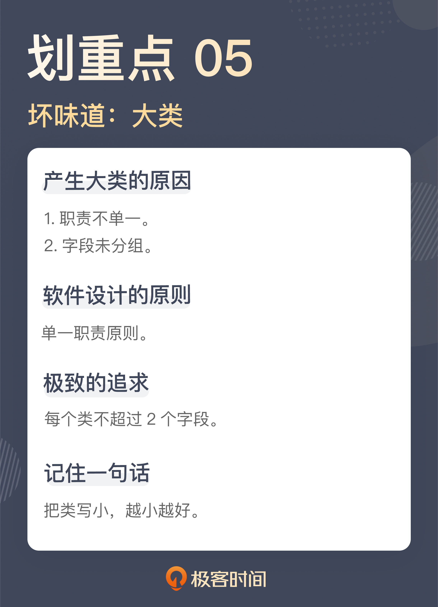

## 六. 长参数列表：如何处理不同类型的长参数？

不同函数之间需要共享信息，于是有了参数传递。

### 6.1 聚沙成塔

```java
public void createBook(final String title,
                       final String introduction,
                       final URL coverUrl,
                       final BookType type,
                       final BookChannel channel,
                       final String protagonists,
                       final String tags,
                       final boolean completed) {
  ...
  Book book = Book.builder
    .title(title)
    .introduction(introduction)
    .coverUrl(coverUrl)
    .type(type)
    .channel(channel)
    .protagonists(protagonists)
    .tags(tags)
    .completed(completed)
    .build();

  this.repository.save(book);
}
```

这是一个创建作品的函数，可以看到，这个函数的参数列表里，包含了一部作品所要拥有的各种信息，比如：作品标题、作品简介、封面 URL、作品类型、作品归属的频道、主角姓名、作品标签、作品是否已经完结等等。

如果阅读这段代码，只是想理解它的逻辑，或许会觉得这个函数的参数列表还挺合理，它把创建一部作品所需的各种信息都传给了函数，这是大部分人面对一段代码时理解问题的角度。不过，虽然这样写代码容易让人理解，但这不足以让你发现问题。

比如，如果你现在要在作品里增加一项信息，表明这部作品是否是签约作品，也就是这部作品是否可以收费，那你该怎么办？

顺着前面的思路，很自然地就会想到给这个函数增加一个参数。但正如前面说到的，很多问题都是这样，每次只增加一点点，累积起来，便不忍直视了。

再来看就会看到这里面的问题：这个函数的参数列表太长了。

这里所有的参数其实都是和作品相关的，也就是说，所有的参数都是创建作品所必需的。所以，可以做的就是将这些参数封装成一个类，一个创建作品的参数类：

```java
public class NewBookParameters {
  private String title;
  private String introduction;
  private URL coverUrl;
  private BookType type;
  private BookChannel channel;
  private String protagonists;
  private String tags;
  private boolean completed;
  ...
}
```

这样一来，这个函数参数列表就只剩下一个参数了，一个长参数列表就消除了：

```java
public void createBook(final NewBookParameters parameters) {
  ...
}
```

这里是一个典型的消除长参数列表的重构手法：**将参数列表封装成对象**。

站在设计的角度，这里引入的是一个新的模型。**一个模型的封装应该是以行为为基础的**。

之前没有这个模型，所以，想不到它应该有什么行为，现在模型产生了，它就应该有自己配套的行为，那这个模型的行为是什么呢？从上面的代码不难看出，它的行为应该是构建一个作品对象出来。理解了这一点，代码就可以进一步调整了：

```java
public class NewBookParameters {
  private String title;
  private String introduction;
  private URL coverUrl;
  private BookType type;
  private BookChannel channel;
  private String protagonists;
  private String tags;
  private boolean completed;

  public Book newBook() {
    return Book.builder
      .title(title)
      .introduction(introduction)
      .coverUrl(coverUrl)
      .type(type)
      .channel(channel)
      .protagonists(protagonists)
      .tags(tags)
      .completed(completed)
      .build();
  }
}
```

创建作品的函数就得到了极大的简化：

```java
public void createBook(final NewBookParameters parameters) {
  ...
  Book book = parameters.newBook();

  this.repository.save(book);
}
```

### 6.2 动静分离

把长参数列表封装成一个类，这能解决大部分的长参数列表，但并不等于所有的长参数列表都应该用这种方式解决，因为不是所有情况下，参数都属于一个类。

```java
public void getChapters(final long bookId,
                        final HttpClient httpClient,
                        final ChapterProcessor processor) {
  HttpUriRequest request = createChapterRequest(bookId);
  HttpResponse response = httpClient.execute(request);
  List<Chapter> chapters = toChapters(response);
  processor.process(chapters);
}
```

这个函数的作用是根据作品 ID 获取其对应的章节信息。如果，单纯以参数个数论，这个函数的参数数量并不算多。

如果只是看这个函数，可能很难发现直接的问题。即便认为有问题，也可以用一个类把这个函数的参数都封装起来。不过，绝对的数量并不是关键点，参数列表也应该是越少越好。针对这个函数，需要稍微分析一下这几个参数。

在这几个参数里面，每次传进来的 bookId 都是不一样的，是随着请求的不同而改变的。但 httpClient 和 processor 两个参数都是一样的，因为它们都有相同的逻辑，没有什么变化。

换言之，bookId 的变化频率同 httpClient 和 processor 这两个参数的变化频率是不同的。一边是每次都变，另一边是不变的。不同的数据变动方向也是不同的关注点。这里表现出来的就是典型的动数据（bookId）和静数据（httpClient 和 processor），它们是不同的关注点，应该分离开来。

具体到这个场景下，静态不变的数据完全可以成为这个函数所在类的一个字段，而只将每次变动的东西作为参数传递就可以了。按照这个思路，代码可以改成这个样子

```java
public void getChapters(final long bookId) {
  HttpUriRequest request = createChapterRequest(bookId);
  HttpResponse response = this.httpClient.execute(request);
  List<Chapter> chapters = toChapters(response);
  this.processor.process(chapters);
}
```

这个坏味道其实是一个软件设计问题，代码缺乏应有的结构，所以，原本应该属于静态结构的部分却以动态参数的方式传来传去，无形之中拉长了参数列表。

这个例子也给了一个提示，**长参数列表固然可以用一个类进行封装，但能够封装出这个类的前提条件是：这些参数属于一个类，有相同的变化原因**。

如果函数的参数有不同的变化频率，就要视情况而定了。对于静态的部分，前面已经看到了，它可以成为软件结构的一部分，而如果有多个变化频率，还可以封装出多个参数类来。

### 6.3 告别标记

```java
public void editChapter(final long chapterId,
                        final String title,
                        final String content,
                        final boolean apporved) {
  ...
}
```

这几个参数分别表示，待修改章节的 ID、标题和内容，最后一个参数表示这次修改是否直接审核通过。

前面几个参数是修改一个章节的必要信息，而这里的重点就在最后这个参数上。之所以要有这么个参数，从业务上说，如果是作者进行编辑，之后要经过审核，而如果编辑来编辑的，那审核就直接通过，因为编辑本身扮演了审核人的角色。所以，你发现了，这个参数实际上是一个标记，标志着接下来的处理流程会有不同。

使用标记参数，是程序员初学编程时常用的一种手法，不过，正是因为这种手法实在是太好用了，造成的结果就是代码里面彩旗（flag）飘飘，各种标记满天飞。不仅变量里有标记，参数里也有。很多长参数列表其中就包含了各种标记参数。这也是很多代码产生混乱的一个重要原因。

在实际的代码中，必须小心翼翼地判断各个标记当前的值，才能做好处理。

解决标记参数，一种简单的方式就是，将标记参数代表的不同路径拆分出来。回到这段代码上，这里的一个函数可以拆分成两个函数，一个函数负责“普通的编辑”，另一个负责“可以直接审核通过的编辑”。

```java
// 普通的编辑，需要审核
public void editChapter(final long chapterId,
                        final String title,
                        final String content) {
  ...
}

// 直接审核通过的编辑
public void editChapterWithApproval(final long chapterId,
                                    final String title,
                                    final String content) {
 ...
}
```

标记参数在代码中存在的形式很多，有的是布尔值的形式，有的是以枚举值的形式，还有的就是直接的字符串或者整数。无论哪种形式，都可以通过拆分函数的方式将它们拆开。**在重构中，这种手法叫做移除标记参数（Remove Flag Argument）**。

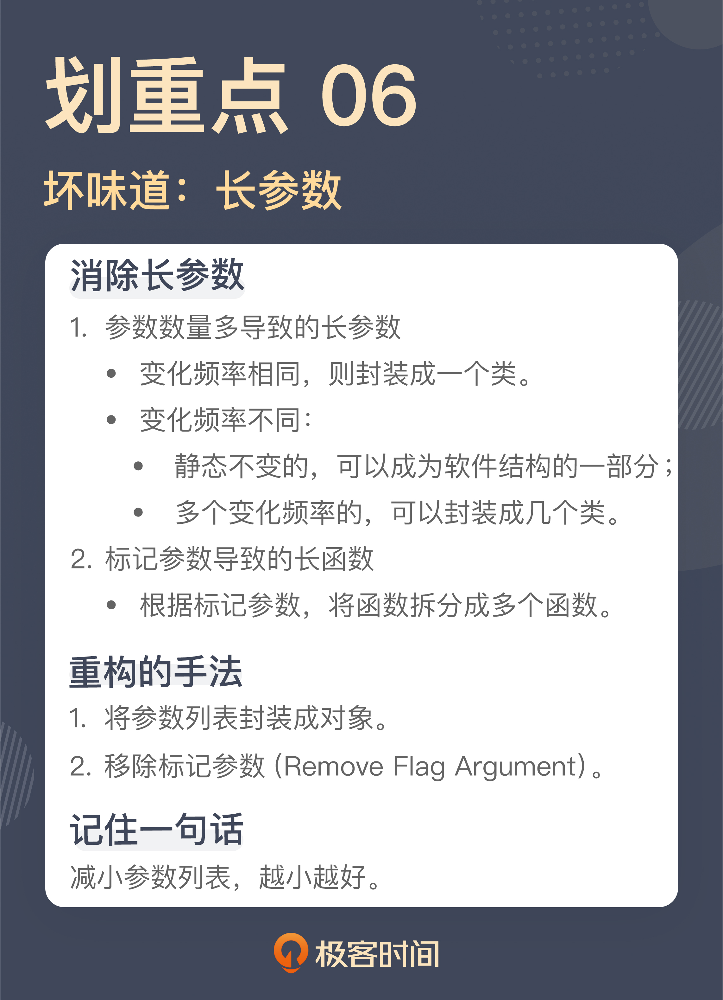

## 七. 滥用控制语句

### 7.1 嵌套的代码

```java
public void distributeEpubs(final long bookId) {
  List<Epub> epubs = this.getEpubsByBookId(bookId);
  for (Epub epub : epubs) {
    if (epub.isValid()) {
      boolean registered = this.registerIsbn(epub);
      if (registered) {
        this.sendEpub(epub);
      }
    }
  }
}
```

这是一段做 EPUB 分发的代码，EPUB 是一种电子书格式。这里，根据作品 ID 找到要分发的 EPUB，然后检查 EPUB 的有效性。对于有效的 EPUB，为它注册 ISBN 信息，注册成功之后，将这个 EPUB 发送出去。

代码逻辑并不是特别复杂，只不过，在这段代码中，看到了多层的缩进，for 循环一层，里面有两个 if ，又多加了两层。即便不是特别复杂的代码，也有这么多的缩进，可想而知，如果逻辑再复杂一点，缩进会成什么样子。

这段代码之所以会写成这个样子，其实就是“平铺直叙地写代码”。这段代码的作者只是按照需求一步一步地把代码实现出来了。从实现功能的角度来说，这段代码肯定没错，但问题在于，在把功能实现之后，没有把代码重新整理一下。

既然不喜欢缩进特别多的代码，那就要消除缩进。具体到这段代码，一个着手点是 for 循环，因为通常来说，for 循环处理的是一个集合，而循环里面处理的是这个集合中的一个元素。所以，可以把循环中的内容提取成一个函数，让这个函数只处理一个元素，就像下面这样：

```java
public void distributeEpubs(final long bookId) {
  List<Epub> epubs = this.getEpubsByBookId(bookId);
  for (Epub epub : epubs) {
    this.distributeEpub(epub)；
  }
}

private void distributeEpub(final Epub epub) {
  if (epub.isValid()) {
    boolean registered = this.registerIsbn(epub);
    if (registered) {
      this.sendEpub(epub);
    }
  }
}
```

这里已经有了一次拆分，分解出来 distributeEpub 函数每次只处理一个元素。拆分出来的两个函数在缩进的问题上，就改善了一点。

第一个函数 distributeEpubs 只有一层缩进，这是一个正常函数应有的样子，不过，第二个函数 distributeEpub 则还有多层缩进，可以继续处理一下。

### 7.2 if 和 else

在 distributeEpub 里，造成缩进的原因是 if 语句。通常来说，if 语句造成的缩进，很多时候都是在检查某个先决条件，只有条件通过时，才继续执行后续的代码。这样的代码可以使用卫语句（guard clause）来解决，也就是设置单独的检查条件，不满足这个检查条件时，立刻从函数中返回。这是一种典型的重构手法：**以卫语句取代嵌套的条件表达式（Replace Nested Conditional with Guard Clauses）**。

来看看改进后的 distributeEpub 函数：

```java
private void distributeEpub(final Epub epub) {
  boolean registered = this.registerIsbn(epub);
  if (!registered || !epub.isValid()) {
    return;
  }

  this.sendEpub(epub);
}
```

改造后的 distributeEpub 就没有了嵌套，也就没有那么多层的缩进了。经过改造之后，代码里只有一层的缩进。当代码里只有一层缩进时，代码的复杂度就大大降低了，理解成本和出现问题之后定位的成本也随之大幅度降低。

**函数至多有一层缩进**，这是“对象健身操（《ThoughtWorks 文集》书里的一篇）”里的一个规则。前面在“[大类](#五-大类如何避免写出难以理解的大类)”的时候，曾经提到过“对象健身操”这篇文章，其中给出了九条编程规则，下面再来看其中的一条：**不要使用 else 关键字**。

没错，else 也是一种坏味道。在大多数人印象中，if 和 else 是亲如一家的整体。来看看下面的代码：

```java
public double getEpubPrice(final boolean highQuality, final int chapterSequence) {
  double price = 0;
  if (highQuality && chapterSequence > START_CHARGING_SEQUENCE) {
    price = 4.99;
  } else if (sequenceNumber > START_CHARGING_SEQUENCE
        && sequenceNumber <= FURTHER_CHARGING_SEQUENCE) {
    price = 1.99;
  } else if (sequenceNumber > FURTHER_CHARGING_SEQUENCE) {
    price = 2.99;
  } else {
    price = 0.99;
  }

  return price;
}
```

这是一个根据 EPUB 信息进行定价的函数，它的定价逻辑正如代码中所示。

- 如果是高品质书，而且要是章节序号超过起始付费章节，就定价 4.99；
- 对一般的书而言，超过起始付费章节，就定价 1.99；超过进一步付费章节，就定价 2.99。
- 缺省情况下，定价 0.99。

就这段代码而言，如果想不使用 else，一个简单的处理手法就是让每个逻辑提前返回，这和前面提到的卫语句的解决方案如出一辙：

```java
public double getEpubPrice(final boolean highQuality, final int chapterSequence) {
  if (highQuality && chapterSequence > START_CHARGING_SEQUENCE) {
    return 4.99;
  }

  if (sequenceNumber > START_CHARGING_SEQUENCE
        && sequenceNumber <= FURTHER_CHARGING_SEQUENCE) {
    return 1.99;
  }


  if (sequenceNumber > FURTHER_CHARGING_SEQUENCE) {
    return 2.99;
  }

  return 0.99;
```

对于这种逻辑上还比较简单的代码，这么改造还是比较容易的，而对于一些更为复杂的代码，也许就要用到多态来改进代码了。不过在实际项目中，大部分代码逻辑都是逐渐变得复杂的，所以，最好在它还比较简单时，就把坏味道消灭掉。这才是最理想的做法。

无论是嵌套的代码，还是 else 语句，之所以要把它们视为坏味道，本质上都在追求简单，因为一段代码的分支过多，其复杂度就会大幅度增加。人脑能够理解的复杂度是有限的，分支过多的代码一定是会超过这个理解范围。

在软件开发中，有一个衡量代码复杂度常用的标准，叫做圈复杂度（Cyclomatic complexity，简称 CC），圈复杂度越高，代码越复杂，理解和维护的成本就越高。在圈复杂度的判定中，循环和选择语句占有重要的地位。圈复杂度可以使用工具来检查，比如，在 Java 世界中，有很多可以检查圈复杂度的工具，之前提到过的 CheckStyle 就可以做圈复杂度的检查，可以限制最大的圈复杂度，当圈复杂度大于某个值的时候，就会报错。

只要能够消除嵌套，消除 else，代码的圈复杂度就不会很高，理解和维护的成本自然也就会随之降低。

### 7.3 重复的 Switch

```java
public double getBookPrice(final User user, final Book book) {
  double price = book.getPrice();
  switch (user.getLevel()) {
    case UserLevel.SILVER:
      return price * 0.9;
    case UserLevel.GOLD:
      return price * 0.8;
    case UserLevel.PLATINUM:
      return price * 0.75;
    default:
      return price;
  }
}

public double getEpubPrice(final User user, final Epub epub) {
  double price = epub.getPrice();
  switch (user.getLevel()) {
    case UserLevel.SILVER:
      return price * 0.95;
    case UserLevel.GOLD:
      return price * 0.85;
    case UserLevel.PLATINUM:
      return price * 0.8;
    default:
      return price;
  }
}
```

这两段代码，分别计算了用户在网站上购买作品在线阅读所支付的价格，以及购买 EPUB 格式电子书所支付的价格。其中，用户实际支付的价格会根据用户在系统中的用户级别有所差异，级别越高，折扣就越高。

显然，这两个函数里出现了类似的代码，其中最类似的部分就是 switch，都是根据用户级别进行判断。事实上，这并不是仅有的根据用户级别进行判断的代码，各种需要区分用户级别的场景中都有类似的代码，而这也是一种典型的坏味道：**重复的 switch（Repeated Switch）**。

之所以会出现重复的 switch，通常都是缺少了一个模型。所以，应对这种坏味道，重构的手法是：**以多态取代条件表达式（Relace Conditional with Polymorphism）**。具体到这里的代码，可以引入一个 UserLevel 的模型，将 switch 消除掉：

```java
interface UserLevel {
  double getBookPrice(Book book);
  double getEpubPrice(Epub epub);
}

class RegularUserLevel implements UserLevel {
  public double getBookPrice(final Book book) {
    return book.getPrice();
  }

  public double getEpubPrice(final Epub epub) {
    return epub.getPrice();
}

class GoldUserLevel implements UserLevel {
  public double getBookPrice(final Book book) {
    return book.getPrice() * 0.8;
  }

  public double getEpubPrice(final Epub epub) {
    return epub.getPrice() * 0.85;
  }
}

class SilverUserLevel implements UserLevel {
  public double getBookPrice(final Book book) {
    return book.getPrice() * 0.9;
  }

  public double getEpubPrice(final Epub epub) {
    return epub.getPrice() * 0.85;
  }
}

class PlatinumUserLevel implements UserLevel {
  public double getBookPrice(final Book book) {
    return book.getPrice() * 0.75;
  }

  public double getEpubPrice(final Epub epub) {
    return epub.getPrice() * 0.8;
```

有了这个基础，前面的代码就可以把 switch 去掉了：

```java
public double getBookPrice(final User user, final Book book) {
  UserLevel level = user.getUserLevel()
  return level.getBookPrice(book);
}

public double getEpubPrice(final User user, final Epub epub) {
  UserLevel level = user.getUserLevel()
  return level.getEpubPrice(epub);
}
```

switch 其实就是一堆“ if..else” 的简化写法，二者是等价的，所以，这个重构手法，以多态取代的是条件表达式，而不仅仅是取代 switch。

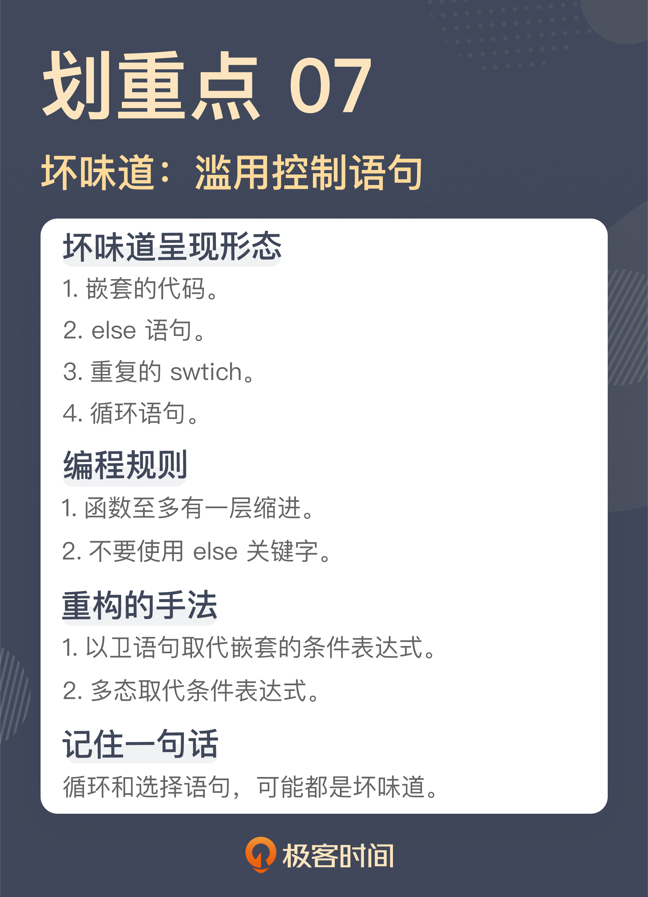

## 八. 缺乏封装：如何应对火车代码和基本类型偏执问题？

在程序设计中，一个重要的观念就是封装，将零散的代码封装成一个又一个可复用的模块。任何一个程序员都会认同封装的价值，但是，具体到写代码时，每个人对于封装的理解程度却天差地别，造成的结果就是：写代码的人认为自己提供了封装，但实际上，还是有许多的代码散落在那里。

### 8.1 火车残骸

```java
String name = book.getAuthor().getName();
```

这段代码表达的是“获得一部作品作者的名字”。作品里有作者信息，想要获得作者的名字，通过“作者”找到“作者姓名”，这就是很多人凭借直觉写出的代码，不过它是有问题的。

可以想一想，如果想写出上面这段代码，是不是必须得先了解 Book 和 Author 这两个类的实现细节？也就是说，必须得知道，作者的姓名是存储在作品的作者字段里的。这时就要注意了：**当必须得先了解一个类的细节，才能写出代码时，这只能说明一件事，这个封装是失败的**。

这段代码只是用来说明这种类型坏味道是什么样的，在实际工作中，这种在一行代码中有连续多个方法调用的情况屡见不鲜，数量上总会不断突破你的认知。

Martin Fowler 在《重构》中给这种坏味道起的名字叫**过长的消息链（Message Chains）**，而有人则给它起了一个更为夸张的名字：火车残骸（Train Wreck），形容这样的代码像火车残骸一般，断得一节一节的。

解决这种代码的重构手法叫**隐藏委托关系**（Hide Delegate），说得更直白一些就是，把这种调用封装起来：

```java
class Book {
  ...
  public String getAuthorName() {
    return this.author.getName();
  }
  ...
}

String name = book.getAuthorName();
```

火车残骸这种坏味道的产生是缺乏对于封装的理解，因为封装这件事并不是很多程序员编码习惯的一部分，他们对封装的理解停留在数据结构加算法的层面上。

在学习数据结构时，所编写的代码都是拿到各种细节直接操作，但那是在做编程练习，并不是工程上的编码方式。遗憾的是，很多人把这种编码习惯带到了工作中。

比如说，有人编写一个新的类，第一步是写出这个类要用到的字段，然后，就是给这些字段生成相应的 getter，也就是各种 getXXX。很多语言或框架提供的约定就是基于这种 getter 的，就像 Java 里的 JavaBean，所以相应的配套工具也很方便。现在写出一个 getter 往往是 IDE 中一个快捷键的操作，甚至不需要自己手工敲代码。

诸如此类种种因素叠加，让暴露细节这种事越来越容易，封装反而成了稀缺品。**要想摆脱初级程序员的水平，就要先从少暴露细节开始**。声明完一个类的字段之后，请停下生成 getter 的手，转而让大脑开始工作，思考这个类应该提供的行为。

在软件行业中，有一个编程的指导原则几乎就是针对这个坏味道的，叫做迪米特法则（Law of Demeter），这个原则是这样说的：

- 每个单元对其它单元只拥有有限的知识，而且这些单元是与当前单元有紧密联系的
- 每个单元只能与其朋友交谈，不与陌生人交谈
- 只与自己最直接的朋友交谈。

这个原则需要思考，哪些算是直接的朋友，哪些算是陌生人。火车残骸般的代码显然就是没有考虑这些问题而直接写出来的代码。

或许你会说，按照迪米特法则这样写代码，会不会让代码里有太多简单封装的方法？

确实有可能，不过，这也是单独解决这一个坏味道可能带来的结果。正如前面所说，这种代码的出现，根本的问题是缺乏对封装的理解，而一个好的封装是需要基于行为的，所以，如果把视角再提升一个角度，应该考虑的问题是类应该提供哪些行为，而非简简单单地把数据换一种形式呈现出来。

> **注意** : 有些内部 DSL 的表现形式也是连续的方法调用，但 DSL 是声明性的，是在说做什么（What），而这里的坏味道是在说怎么做（How），二者的抽象级别是不同的，不要混在一起。

### 8.2 基本类型偏执

```java
public double getEpubPrice(final boolean highQuality, final int chapterSequence) {
  ...
}
```

据章节信息获取 EPUB 的价格。这是一个看上去非常清晰的代码，难道这里也有坏味道吗？问题就出在返回值的类型上，也就是价格的类型上。

在数据库中存储价格的时候，就是用一个浮点数，这里用 double 可以保证计算的精度，这样的设计有什么问题吗？确实，这就是很多人使用基本类型（Primitive）作为变量类型思考的角度。但实际上，**这种采用基本类型的设计缺少了一个模型**。

虽然价格本身是用浮点数在存储，但价格和浮点数本身并不是同一个概念，有着不同的行为需求。比如，一般情况下，要求商品价格是大于 0 的，但 double 类型本身是没有这种限制的。

就以“价格大于 0”这个需求为例，如果使用 double 类型会怎么限制呢？通常会这样写：

```java
if (price <= 0) {
  throw new IllegalArgumentException("Price should be positive");
}
```

问题是，如果使用 double 作为类型，那要在使用的地方都保证价格的正确性，像这样的价格校验就应该是使用的地方到处写的。

如果补齐这里缺失的模型，可以引入一个 Price 类型，这样的校验就可以放在初始化时进行：

```java
class Price {
  private long price;

  public Price(final double price) {
    if (price <= 0) {
      throw new IllegalArgumentException("Price should be positive");
    }

    this.price = price;
  }
}
```

这种引入一个模型封装基本类型的重构手法，叫做**以对象取代基本类型（Replace Primitive with Object）**。一旦有了这个模型，还可以再进一步，比如，如果想要让价格在对外呈现时只有两位，在没有 Price 类的时候，这样的逻辑就会散落代码的各处，事实上，代码里很多重复的逻辑就是这样产生的。而现在可以在 Price 类里提供一个方法：

```java
public double getDisplayPrice() {
  BigDecimal decimal = new BigDecimal(this.price)；
  return decimal.setScale(2, BigDecimal.ROUND_HALF_UP).doubleValue();
}
```

其实，使用基本类型和使用继承出现的问题是异曲同工的。都学过这样一个设计原则：组合优于继承，也就是说，不要写出这样的代码：

```java
public Books extends List<Book> {
  ...
}
```

而应该写成组合的样子，也就是：

```java
public Books {
  private List<Book> books;
  ...
}
```

之所以有人把 Books 写成了继承，因为在代码作者眼中，Books 就是一个书的集合；而有人用 double 做价格的类型，因为在他看来，价格就是一个 double。这里的误区就在于，一些程序员**只看到了模型的相同之处，却忽略了差异的地方**。Books 可能不需要提供 List 的所有方法，价格的取值范围与 double 也有所差异。

但是，Books 的问题相对来说容易规避，因为产生了一个新的模型，有通用的设计原则帮助判断这个模型构建得是否恰当，而价格的问题却不容易规避，因为这里没有产生新的模型，也就不容易发现这里潜藏着问题。

**这种以基本类型为模型的坏味道称为基本类型偏执（Primitive Obsession）**。这里说的基本类型，不限于程序设计语言提供的各种基本类型，像字符串也是一个产生这种坏味道的地方。

这里稍微延伸一下，有很多人对于集合类型（比如数组、List、Map 等等）的使用也属于这种坏味道。“对象健身操（出自《ThoughtWorks 文集》）”这篇文章，里面有两个与此相关的条款，可以作为参考：

- 封装所有的基本类型和字符串
- 使用一流的集合

**封装之所以有难度，主要在于它是一个构建模型的过程**，而很多程序员写程序，只是用着极其粗粒度的理解写着完成功能的代码，根本没有构建模型的意识；还有一些人以为划分了模块就叫封装，所以，才会看到这些坏味道的滋生。

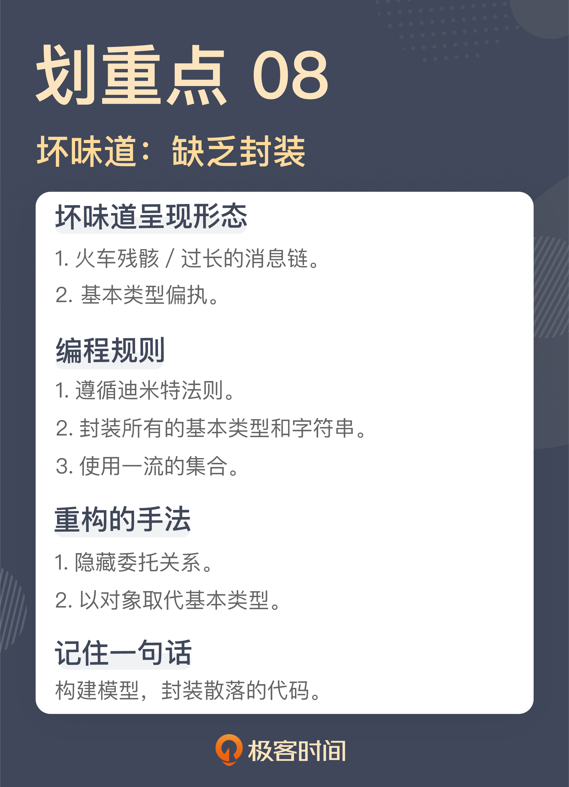

## 九. 可变的数据：不要让代码“失控”

对于程序，最朴素的一种认知是“程序 = 数据结构 + 算法”，所以，数据几乎是软件开发最核心的一个组成部分。在一些人的认知中，所谓做软件，就是一系列的 CRUD 操作，也就是对数据进行增删改查。再具体一点，写代码就把各种数据拿来，然后改来改去。学习编程时，首先学会的，也是给变量赋值，写出类似 a = b + 1 之类的代码。

改数据，几乎已经成了很多程序员写代码的标准做法。然而，这种做法也带来了很多的问题。

### 9.1 满天飞的 Setter

```java
public void approve(final long bookId) {
  ...
  book.setReviewStatus(ReviewStatus.APPROVED);
  ...
}
```

这是一段对作品进行审核的代码，通过 bookId，找到对应的作品，接下来，将审核状态设置成了审核通过。这里用了 setter。setter 往往是缺乏封装的一种做法。很多人在写代码时，写完字段就会利用 IDE 生成 getter，实际情况往往是，生成 getter 的同时，setter 也生成了出来。setter 同 getter 一样，反映的都是对细节的暴露。

这就意味着，不仅可以读到一个对象的数据，还可以修改一个对象的数据。**相比于读数据，修改是一个更危险的操作**。你不知道数据会在哪里被何人以什么方式修改，造成的结果是，别人的修改会让你的代码崩溃。与之相伴的还有各种衍生出来的问题，最常见的就是并发问题。

可变的数据是可怕，但是，**比可变的数据更可怕的是，不可控的变化**，而暴露 setter 就是这种不可控的变化。把各种实现细节完全交给对这个类不了解的使用者去修改，没有人会知道他会怎么改，所以，这种修改完全是不可控的。

针对代码给出的调整方案是，用一个函数替代了 setter，也就是把它用行为封装了起来：

```java
public void approve(final long bookId) {
  ...
  book.approve();
  ...
}
```

通过在 Book 类里引入了一个 approve 函数，将审核状态封装了起来。

```java
class Book {
  public void approve() {
    this.reviewStatus = ReviewStatus.APPROVED;
  }
}
```

作为这个类的使用者，并不需要知道这个类到底是怎么实现的。更重要的是，这里的变化变得可控了。虽然审核状态这个字段还是会修改，但所有的修改都要通过几个函数作为入口。有任何业务上的调整，都会发生在类的内部，只要保证接口行为不变，就不会影响到其它的代码。

setter 破坏了封装，相信你对这点已经有了一定的理解。不过，有时候你会说，这个 setter 只是用在初始化过程中，而并不需要在使用的过程去调用，就像下面这样：

```java
Book book = new Book();
book.setBookId(bookId);
book.setTitle(title);
book.setIntroduction(introduction);
```

实际上，对于这种只在初始化中使用的代码，压根没有必要以 setter 的形式存在，真正需要的是一个有参数的构造函数：

```java
Book book = new Book(bookId, title, introduction);
```

消除 setter ，有一种专门的重构手法，叫做**移除设值函数（Remove Setting Method）**。总而言之，setter 是完全没有必要存在的。

在今天的软件开发中，人们为了简化代码的编写做出了各种努力，用 IDE 生成的代码是一种，还有一种常见的做法就是，通过工具和框架生成相应代码的。在 Java 世界中，Lombok 就是这样的一种程序库，它可以在编译的过程中生成相应的代码，而需要做的，只是在代码上加上对应的 Annotation。它最大的优点是不碍眼，也就是不会产生大量可以看见的代码。因为它的代码是在编译阶段生成的，所以，那些生成的代码在源码级别上是不存在的。下面就是一个例子：

```java
@Getter
@Setter
class Book {
  private BookId bookId;
  private String title;
  private String introduction;
}
```

这里的 @Getter 表示为这个类的字段生成 getter，相应地，@Setter 表示生成 setter。也是因为这些 Annotation 的存在，让代码看上去清爽了不少。所以，像 Lombok 这样的程序库赢得了许多人的喜爱。

因为 @Setter 的存在，其它代码还是可以调用这个类的 setter，存在的问题并不会改变。所以，一个更好的做法是禁用 @Setter。下面是 lombok.config 的配置，通过它，就可以禁用 @Setter 了：

```java
lombok.setter.flagUsage = error
lombok.data.flagUsage = error
```

这里除了 @Setter，还禁用了 @Data，这是 Lombok 中另外一个 Annotation，表示的是同时生成 getter 和 setter。既然禁用 @Setter 是为了防止生成 setter，当然也要禁用 @Data 了。

### 9.2 可变的数据

反对使用 setter，一个重要的原因就是它暴露了数据，前面说过，暴露数据造成的问题就在于数据的修改，进而导致出现难以预料的 Bug。在上面的代码中，把 setter 封装成一个个的函数，实际上是把不可控的修改限制在一个有限的范围内。

那么，这个思路再进一步的话，如果数据压根不让修改，犯下各种低级错误的机会就进一步降低了。没错，在这种思路下，**可变数据（Mutable Data）就成了一种坏味道**，这是 Martin Fowler 在新版《重构》里增加的坏味道，它反映着整个行业对于编程的新理解。

这种想法源自函数式编程这种编程范式。在函数式编程中，数据是建立在不改变的基础上的，如果需要更新，就产生一份新的数据副本，而旧有的数据保持不变。随着函数式编程在软件开发领域中的地位不断提高，人们对于不变性的理解也越发深刻，不变性有效地解决了可变数据产生的各种问题。

所以，Martin Fowler 在《重构》第二版里新增了可变数据作为一种坏味道，这其实反映了行业的理解也是在逐渐推进的。不过，Martin Fowler 对于可变数据给出的解决方案，基本上是限制对于数据的更新，降低其风险，这与前面提到的对 setter 的封装如出一辙。

**解决可变数据，还有一个解决方案是编写不变类**。

函数式编程的不变性，其中的关键点就是设计不变类。Java 中的 String 类就是一个不变类，比如，把字符串中的一个字符替换成另一个字符，String 类给出的函数签名是这样的：

```java
String replace(char oldChar, char newChar);
```

其含义是，这里的替换并不是在原有字符串上进行修改，而是产生了一个新的字符串。

那么，在实际工作中，怎么设计不变类呢？要做到以下三点：

- 所有的字段只在构造函数中初始化
- 所有的方法都是纯函数
- 如果需要有改变，返回一个新的对象，而不是修改已有字段

回过头来看之前改动的“用构造函数消除 setter”的代码，其实就是朝着这个方向在迈进。如果按照这个思路改造前面提到的 approve 函数，同样也可以：

```java
class Book {
  public void approve() {
    return new Book(..., ReviewStatus.APPROVED, ...);
  }
}
```

这里，创建出了一个“其它参数和原有 book 对象一模一样，只是审核状态变成了 APPROVED ”的对象。

在 JDK 的演化中，可以看到一个很明显的趋势，新增的类越来越多地采用了不变类的设计，比如，用来表示时间的类。原来的 Date 类里面还有各种 setter，而新增的 LocalDateTime 则一旦初始化就不会再修改了。如果要操作这个对象，则会产生一个新的对象：

```java
LocalDateTime twoDaysLater = now.plusDays(2);
```

就目前的开发状态而言，想要完全消除可变数据是很难做到的，但可以尽可能地编写一些不变类。

一个更实用的做法是，**区分类的性质**。最核心要识别的对象分成两种，实体和值对象。**实体对象要限制数据变化，而值对象就要设计成不变类**。

如果还想进一步提升自己对于不变性的理解，可以回到函数式编程这个编程范式的本质，它其实是对程序中的赋值进行了约束。基于这样的理解，**连赋值本身其实都会被归入到坏味道的提示，这才是真正挑战很多人编程习惯的一点**。

不过，现在看到，越来越多的语言中开始引入值类型，也就是初始化之后便不再改变的值，比如，Java 的 Valhalla 项目，更有甚者，像 Rust 这样的语言中，缺省都是值类型，而如果需要一个可以赋值的变量，反而要去专门的声明。

Martin Fowler 在《重构》中还提到一个与数据相关的坏味道：**全局数据（Global Data）**。如果能够理解可变数据是一种坏味道，全局数据也就很容易理解了，它们处理手法基本上是类似的。


## 十. 变量声明与赋值分离：普通的变量声明，怎么也有坏味道？

### 10.1 变量的初始化

```java
EpubStatus status = null;
CreateEpubResponse response = createEpub(request);
if (response.getCode() == 201) {
  status = EpubStatus.CREATED;
} else {
  status = EpubStatus.TO_CREATE;
}
```

这段代码在做的事情是向另外一个服务发请求创建 EPUB，如果创建成功，返回值是 HTTP 的 201，也就表示创建成功，然后就把状态置为 CREATED；而如果没有成功，则把状态置为 TO_CREATE。后面对于 TO_CREATE 状态的作品，还需要再次尝试创建。

这里，暂且把是否要写 else 放下，这次的重点在 status 这个变量上，虽然 status 这个变量在声明的时候，就赋上了一个 null 值，但实际上，这个值并没有起到任何作用，因为 status 的变量值，其实是在经过后续处理之后，才有了真正的值。换言之，从语义上说，第一行的变量初始化其实是没有用的，这是一次假的初始化。

按照通常的理解，一个变量的初始化是分成了声明和赋值两个部分，而这里要说的就是，**变量初始化最好一次性完成**。这段代码里的变量赋值是在声明很久之后才完成的，也就是说，变量初始化没有一次性完成。

**这种代码真正的问题就是不清晰，变量初始化与业务处理混在在一起**。通常来说，这种代码后面紧接着就是一大堆更复杂的业务处理。当代码混在一起的时候，必须小心翼翼地从一堆业务逻辑里抽丝剥茧，才能把逻辑理清，知道变量到底是怎么初始化的。很多代码难读，一个重要的原因就是把不同层面的代码混在了一起。

这种代码在实际的代码库中出现的频率非常高，只不过，它会以各种变形的方式呈现出来。有的变量甚至是在相隔很远的地方才做了真正的赋值，完成了初始化，这中间已经夹杂了很多的业务代码在其中，进一步增加了理解的复杂度。

所以，编程时要有一个基本原则：**变量一次性完成初始化**。

有了这个理解，可以这样来修改上面这段代码：

```java
final CreateEpubResponse response = createEpub(request);
final EpubStatus status = toEpubStatus(response);

private EpubStatus toEpubStatus(final CreateEpubResponse response) {
  if (response.getCode() == 201) {
    return EpubStatus.CREATED;
  }

  return EpubStatus.TO_CREATE;
}
```

在这段改进的代码中，提取出了一个函数，将 response 转成对应的内部的 EPUB 状态。

在新的变量声明中，加上了 final，在 Java 的语义中，一个变量加上了 final，也就意味着这个变量不能再次赋值。对，需要的正是这样的限制。

上面讲了可变的数据会带来怎样的影响，其中的一个结论是，尽可能编写不变的代码。这里其实是这个话题的延伸，**尽可能使用不变的量**。

如果能够按照使用场景做一个区分，把变量初始化与业务处理分开，会发现，在很多情况下，变量只在初始化完成之后赋值，就足以满足需求了，在一段代码中，需要使用可变量的场景并不多。

这个原则其实可以推广一下，**在能够使用 final 的地方尽量使用 final，限制变量的赋值**。

这里说的“能够使用”，不仅包括普通的变量声明，还包含参数声明，还有类字段的声明，甚至还可以包括类和方法的声明。当然，这里改进的考量主要还是在变量上。可以尝试着调整自己现有的代码，给变量声明都加上 final，就会发现许多值得改进的代码。

对于 Java 程序员来说，还有一个特殊的场景，就是异常处理的场景，强迫你把变量的声明与初始化分开，就像下面这段代码：

```java
InputStream is = null;

try {
  is = new FileInputStream(...);
  ...
} catch (IOException e) {
  ...
} finally {
  if (is != null) {
    is.close();
  }
}
```

之所以要把 InputStream 变量 is 单独声明，是为了能够在 finally 块里面访问到。其实，这段代码写成这样，一个重要的原因是 Java 早期的版本只能写成这样，而如果采用 Java 7 之后的版本，采用 try-with-resource 的写法，代码就可以更简洁了：

```java
try (InputStream is = new FileInputStream(...)) {
  ...
}
```

这样一来，InputStream 变量的初始化就一次性完成了，原则就统一了，不需要在这种特殊的场景下纠结了。

### 10.2 集合初始化

```java
List<Permission> permissions = new ArrayList<>();
permissions.add(Permission.BOOK_READ);
permissions.add(Permission.BOOK_WRITE);
check.grantTo(Role.AUTHOR, permissions);
```

这是一段给作者赋予作品读写权限的代码，逻辑比较简单，但这段代码中也存在一些坏味道。把注意力放在 permissions 这个集合上。之所以要声明这样一个 List，是因为 grantTo 方法要用到一个 List 作为参数。

来看这个 List 是怎样生成的。这里先给 permission 初始化成了一个 ArrayList，这个时候，permissions 虽然存在了，但并不会把它传给 grantTo 方法，它还不能直接使用，因为它还缺少必要的信息。然后，将 BOOK_READ 和 BOOK_WRITE 两个枚举对象添加了进去，这样，这个 permissions 对象才是真正需要的那个对象。

这种代码是非常常见的，声明一个集合，然后，调用一堆添加的方法，将所需的对象添加进去。

不难发现，其实 permissions 对象一开始的变量声明，并没有完成这个集合真正的初始化，只有当集合所需的对象添加完毕之后，这个集合才是它应有的样子。换言之，只有添加了元素的集合才是需要的。

这和前面所说的变量先声明后赋值，本质上是一回事，都是从一个变量的声明到初始化成一个可用的状态，中间隔了太远的距离。之所以很多人习惯这么写，一个原因就是在早期的 Java 版本中，没有提供很好的集合初始化的方法。像这种代码，也是很多动态语言的支持者调侃 Java 啰嗦的一个靶子。

现如今，Java 在这方面早已经改进了许多，各种程序库已经提供了一步到位的写法，先来看看 Java 9 之后的写法：

```java
List<Permission> permissions = List.of(
  Permission.BOOK_READ,
  Permission.BOOK_WRITE
);
check.grantTo(Role.AUTHOR, permissions);
```

如果项目还没有升级 Java 9 之后的版本，使用 Guava（Google 提供的一个 Java 库）也是可以做成类似的效果：

```java
List<Permission> permissions = ImmutableList.of(
  Permission.BOOK_READ,
  Permission.BOOK_WRITE
);
check.grantTo(Role.AUTHOR, permissions);
```

经过改进，第二段代码里的 List 用的是一个 ImmutableList，也就是一个不可变的 List，实际上，查看第一段代码的实现就会发现，它也是一个不变的 List。这是什么意思呢？也就是说，这个 List 一旦创建好了，就是不能修改了，对应的实现就是各种添加、删除之类的方法全部都禁用了。

初看起来，这是限制了能力，但对比一下代码就不难发现，很多时候，对于一个集合的使用，除了声明时添加元素之外，后续就只是把它当作一个只读的集合。所以，在很多情况下，一个不变集合就够用了。

其实，这段代码，相对来说还是比较清晰的，稍微再复杂一些的，集合的声明和添加元素之间隔了很远，不注意的话，甚至不觉得它们是在完成一次初始化。

```java
private static Map<Locale, String> CODE_MAPPING = new HashMap<>();
...

static {
  CODE_MAPPING.put(LOCALE.ENGLISH, "EN");
  CODE_MAPPING.put(LOCALE.CHINESE, "CH");
}
```

这是一个传输时的映射方案，将不同的语言版本映射为不同的代码。这里 CODE_MAPPING 是一个类的 static 变量，而这个类的声明里还有其它一些变量。所以，隔了很远之后，才有一个 static 块向这个集合添加元素。如果能够用一次性声明的方式，这个单独的 static 块就是不需要的：

```java
private static Map<Locale, String> CODE_MAPPING = ImmutableMap.of(
  LOCALE.ENGLISH, "EN",
  LOCALE.CHINESE, "CH"
);
```

对比改造前后的代码，二者之间还有一个更关键的区别：前面的代码是命令式的代码，而后面的代码是声明式的代码。

命令式的代码，就是告诉你“怎么做”的代码，就像改造前的代码，声明一个集合，然后添加一个元素，再添加一个元素。而声明式的代码，是告诉你“做什么”的代码，改造后就是，我要一个包含了这两个元素的集合。

声明式的代码体现的意图，是更高层面的抽象，把意图和实现分开，从某种意义上来说，也是一种分离关注点。所以，**用声明式的标准来看代码，是一个发现代码坏味道的重要参考**。

> 学习编程不仅仅是要学习实现功能，编程的风格也要与时俱进。

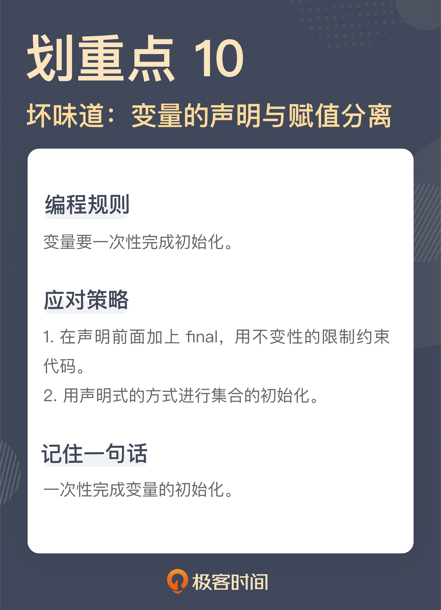

## 十一. 依赖混乱

前面讲过，为了避免同时面对所有细节，需要把程序进行拆分，分解成一个又一个的小模块。但随之而来的问题就是，需要把这些拆分出来的模块按照一定的规则重新组装在一起，这就是依赖的缘起。一个模块要依赖另外一个模块完成完整的业务功能，而到底怎么去依赖，这里就很容易产生问题。

### 11.1 缺少防腐层

```java
@PostMapping("/books")
public NewBookResponse createBook(final NewBookRequest request) {
  boolean result = this.service.createBook(request);
  ...
}
```

这段代码是创建一部作品的入口，也就是说，它提供了一个 REST 服务，只要对 /books 这个地址发出一个 POST 请求，就可以创建一部作品出来。

按照一般代码的分层逻辑，一个 Resource （有的团队称之为 Controller）调用一个 Service，这符合大多数人的编程习惯，所以看起来，这段代码简直是正常得不能再正常了。从 Resource 调用 Service，这几乎是行业里的标准做法，是没有问题的，但问题出在传递的参数上。请问，这个 NewBookRequest 的参数类应该属于哪一层，是 resource 层，还是 service 层呢？

一般来说，既然它是一个请求参数，通常要承载着诸如参数校验和对象转换的职责，按照通常的理解，它应该属于 resource 层。如果这个理解是正确的，问题就来了，它为什么会传递给 service 层呢？

按照通常的架构设计原则，service 层属于核心业务，而 resource 层属于接口。二者相较而言，核心业务的重要程度更高一些，所以，它的稳定程度也应该更高一些。同样的业务，可以用 REST 的方式对外提供，也可以用 RPC 的方式对外提供。

说到这，你就会发现一个问题，NewBookRequest 这个本来应该属于接口层的参数，现在成了核心业务的一部分，也就是说，即便将来提供了 RPC 的接口，它也要知道 REST 的接口长什么样子，显然，这是有问题的。

既然 NewBookRequest 属于 resource 层是有问题的，那假设它属于 service 层呢？正如前面所说，一般请求都要承担对象校验和转化的工作。如果说这个类属于 service 层，但它用在了 resource 的接口上，作为 resource 的接口，它会承载一些校验和对象转换的角色，而 service 层的参数是不需要关心这些的。如果 NewBookRequest 属于 service 层，那校验和对象转换的职责到底由谁来完成呢？

还有更关键的一点是，有时候 service 层的参数和 resource 层的参数并不是严格地一一对应。比如，创建作品时，需要一个识别作者身份的用户 ID，而这个参数并不是通过客户端发起的请求参数带过来，而是根据用户登录信息进行识别的。所以，用 service 层的参数做 resource 层的参数，就存在差异的参数如何处理的问题。

突然陷入了一种两难的境地，**如此一个简单的参数，放到哪个层里都有问题**。这是一种非常常见的代码，去翻看自己的代码仓库，也许就能找到类似的代码。

那这个问题该如何解呢？

其实，之所以这么纠结，一个关键点在于，缺少了一个模型。

NewBookRequest 之所以弄得如此“里外不是人”，主要就是因为它只能扮演一个层中的模型，所以，只要再引入一个模型就可以破解这个问题。

```java
class NewBookParameter {
  ...
}

class NewBookRequest {
  public NewBookParameters toNewBookRequest() {
    ...
  }
}

@PostMapping("/books")
public NewBookResponse createBook(final NewBookRequest request) {
  boolean result = this.service.createBook(request.toNewBookParameter());
  ...
}
```

这里引入了一个 NewBookParameter 类，把它当作 service 层创建作品的入口，而在 resource 中，将 NewBookRequest 这个请求类的对象转换成了 NewBookParameter 对象，然后传到 service 层。

在这个结构中，NewBookParameter 属于 service 层，而 NewBookRequest 属于 resource 层，二者相互独立，之前纠结的问题也就不复存在了。

通过增加一个模型，就破解了依赖关系上的纠结。比如，对于 resource 层的请求对象，因为它的主要作用是传输，所以，一般来说，约定请求对象的字段主要是基本类型。而 service 的参数对象，因为它已经是核心业务的一部分，就需要全部转化为业务对象。举个例子，比如，同样表示价格，在请求对象中，可以是一个 double 类型，而在业务参数对象中，它应该是 Price 类型。

再来解决 resource 层参数和 service 层参数不一致的情况，现在二者分开了，那就很清楚地知道，其实，就是在业务参数对象构造的时候，传入必需的参数即可。比如，需要传入 userId，可以这么做：

```java
class NewBookRequest {
  public NewBookParameters toNewBookRequest(long userId) {
    ...
  }
}

@PostMapping("/books")
public NewBookResponse createBook(final NewBookRequest request, final Authentication authentication) {
  long userId = getUserIdentity(authentication);
  boolean result = this.service.createBook(request.toNewBookParameter(userId));
  ...
}
```

实际上，这个问题也是一个典型的软件设计问题：缺少防腐层。通过防腐层将外部系统和核心业务隔离开来。

而很多人初见这个例子，可能压根想不到它与防腐层的关系，那只不过是因为你对这种结构太熟悉了。其实，resource 层就是外部请求和核心业务之间的防腐层。只要理解了这一点，就能理解这里要多构建出一个业务参数对象的意义了。那下面这段代码：

```java
@Entity
@Table(name = "user")
@JsonIgnoreProperties(ignoreUnknown = true)
class User {
  ...
}
```

这是一个 User 类的声明，它有 @Entity 这个 Annotation，表示它是一个业务实体的对象，但它的上面还出现了 @JsonIgnoreProperties，这是就是处理 JSON 的一个 Annotation。JSON 会在哪用到，通常都是在传输中。业务实体和传输对象应该具备的特质在同一个类中出现，显然，这也是没有构建好防腐层的结果，把两个职责混在了一起。

### 11.2 业务代码里的具体实现

```java
@Task
public void sendBook() {
  try {
    this.service.sendBook();
  } catch (Throwable t) {
    this.feishuSender.send(new SendFailure(t)));
    throw t;
  }
}
```

这是一个发送作品信息的函数，这里的重点在于，一旦发送过程出了问题，要通过即时通信工具发送给相关人等，以防系统出现问题无人发觉。只不过，这里给出的是它最初的样子，也就是通过飞书进行消息发送。

因为需求是通过飞书发送，所以，这里就写了飞书发送。这看上去简直是一个合理得不能再合理的做法了。

但是，这是一种符合直觉的做法，然而，它却不符合设计原则，它违反了**依赖倒置原则**。

- 高层模块不应依赖于低层模块，二者应依赖于抽象。
- 抽象不应依赖于细节，细节应依赖于抽象。

之所以会注意到这段代码，因为在一段业务处理中出现了一个具体的实现，也就是这里的 feishuSender。**业务代码中任何与业务无关的东西都是潜在的坏味道**。

在这里，飞书肯定不是业务的一部分，它只是当前选择的一个具体实现。换言之，是否选择飞书，与团队当前的状态是相关的，如果哪一天团队切换即时通信软件，这个实现就需要换掉。但是，团队是不可能切换业务的，一旦切换，那就是一个完全不同的系统了。

识别一个东西是业务的一部分，还是一个可以替换的实现，不妨问问自己，如果不用它，是否还有其它的选择？

就像这里，飞书是可以被其它即时通信软件替换的。另外，常见的中间件，比如，Kafka、Redis、MongoDB 等等，通常也都是一个具体的实现，其它中间件都可以把它替换掉。所以，它们在业务代码里出现，那一定就是一个坏味道了。

既然已经知道了，这些具体的东西是一种坏味道，那该怎么解决呢？可以引入一个模型，也就是这个具体实现所要扮演的角色，通过它，将业务和具体的实现隔离开来。

```java
interface FailureSender {
  void send(SendFailure failure);
}

class FeishuFailureSenderS implements FailureSender {
  ...
}
```

这里通过引入一个 FailureSender，业务层只依赖于这个 FailureSender 的接口就好，而具体的飞书实现可以通过依赖注入的方式注入进去。

依赖关系是软件开发中非常重要的一个东西，然而，很多程序员在写代码的时候，由于开发习惯的原因，常常会忽略掉依赖关系这件事本身。现在已经有一些工具，可以保证在写代码的时候，不会出现严重破坏依赖关系的情况，比如，像前面那种 service 层调用 resource 层的代码。

在 Java 世界里，就可以用 ArchUnit 来保证这一切。看名字就不难发现，它是把这种架构层面的检查做成了单元测试，下面就是这样的一个单元测试：

```java
@Test
public void should_follow_arch_rule() {
  JavaClasses clazz = new ClassFileImporter().importPackages("...");
  ArchRule rule = layeredArchitecture()
        .layer("Resource").definedBy("..resource..")
        .layer("Service").definedBy("..service..")
        .whereLayer("Resource").mayNotBeAccessedByAnyLayer()
        .whereLayer("Service").mayOnlyBeAccessedByLayers("Resource");

   rule.check(clazz);
}
```

在这里，定义了两个层，分别是 Resource 层和 Service 层，而且要求 Resource 层的代码不能被其它层访问，而 Service 层的代码只能由 Resource 层方法访问。这就是架构规则，一旦代码里有违反这个架构规则的代码，这个测试就会失败，问题也就会暴露出来。

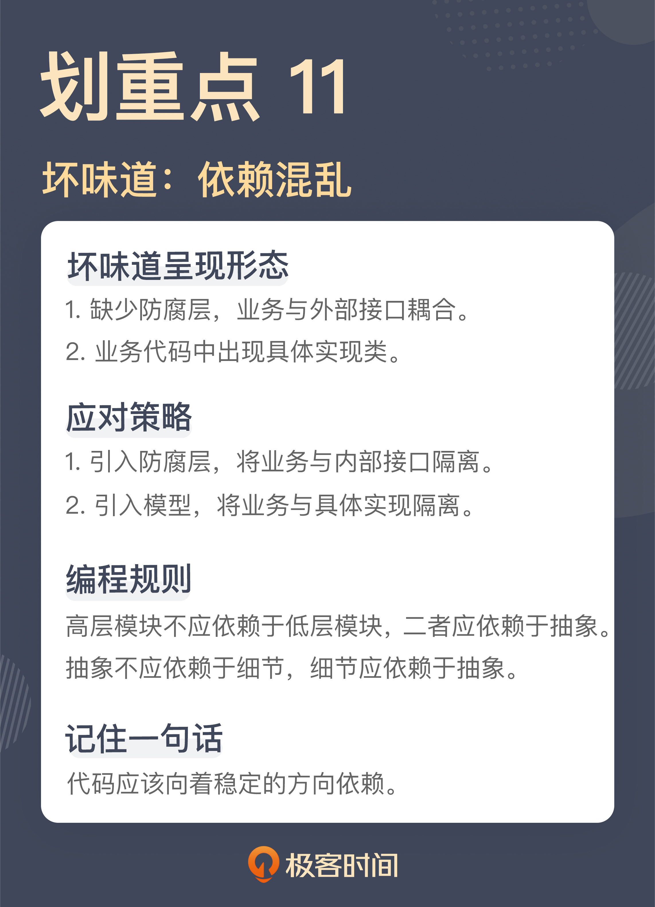

## 十二. 不一致的代码

大多数程序员都是在一个团队中工作，对于一个团队而言，一致性是非常重要的一件事。因为不一致会造成认知上的负担，在一个系统中，做类似的事情，却有不同的做法，或者起到类似作用的事物，却有不同的名字，这会让人产生困惑。所以，即便是不甚理想的标准，也比百花齐放要好。

大部分程序员对于一致性本身的重要性是有认知的。但通常来说，大家理解的一致性都表现在比较大的方面，比如，数据库访问是叫 DAO 还是叫 Mapper，抑或是 Repository，在一个团队内，这是有统一标准的，但编码的层面上，要求往往就不是那么细致了。所以，才会看到在代码细节上呈现出了各种不一致。

### 12.1 命名中的不一致

```java
enum DistributionChannel {
  ​WEBSITE
  ​KINDLE_ONLY
  ​AL
}
```

这段代码使用标记作品的分发渠道，从这段代码的内容上，可以看到，目前的分发渠道包括网站（WEBSITE）、只在 Kindle（KINDLE_ONLY），还是全渠道（ALL）。

这里的问题，主要的原因就是，在这里 WEBSITE 和 KINDLE_ONLY 两个名字的不一致。

**表示类似含义的代码应该有一致的名字**，比如，很多团队里都会把业务写到服务层，各种服务的命名也通常都是 XXXService，像 BookService、ChapterService 等等。而**一旦出现了不一致的名字，通常都表示不同的含义**，比如，对于那些非业务入口的业务组件，它们的名字就会不一样，会更符合其具体业务行为，像 BookSender ，它表示将作品发送到翻译引擎。

一般来说，枚举值表示的含义应该都有一致的业务含义，一旦出现不同，就需要确定不同的点到底在哪里。

显然，这段代码的作者给这两个枚举值命名时，只是分别考虑了它应该起什么名字，却忽略了这个枚举值在整体中扮演的角色。

理解这一点，改动是很容易，后来，代码被统一成了一个形式：

```java
enum DistributionChannel {
  ​WEBSITE
  ​KINDLE
  ​ALL
}
```

### 12.2 方案中的不一致

```java
public String nowTimestamp() {
  DateFormat format = new SimpleDateFormat("yyyy-MM-dd HH:mm:ss");
  Date now = new Date();
  return format.format(now);
}
```

这是一段生成时间戳的代码，当一个系统向另外一个系统发送请求时，需要带一个时间戳过去，这里就是把这个时间戳按照一定格式转成了字符串类型，主要就是传输用，便于另外的系统进行识别，也方便在开发过程中进行调试。这段代码本身的实现是没有问题的。它甚至考虑到了 SimpleDateFormat 这个类本身存在的多线程问题，所以，它每次去创建了一个新的 SimpleDateFormat 对象。

这种写法是 Java 8 之前的写法，而仙子用的 Java 版本是 Java 8 之后的。

在很长的一段时间里，Java 的日期时间解决方案一直是一个备受争议的设计，它的问题很多，有的是概念容易让人混淆（比如：Date 和 Calendar 什么情况下该用哪个），有的是接口设计的不直观（比如：Date 的 setMonth 参数是从 0 到 11），有的是实现容易造成问题（比如：前面提到的 SimpleDateFormat 需要考虑多线程并发的问题，需要每次构建一个新的对象出来）。

这种乱象存在了很长时间，有很多人都在尝试解决这个问题（比如 Joda Time）。从 Java 8 开始，Java 官方的 SDK 借鉴了各种程序库，引入了全新的日期时间解决方案。这套解决方案与原有的解决方案是完全独立的，也就是说，使用这套全新的解决方案完全可以应对所有工作。

现在的这个项目是一个全新的项目，使用的版本是 Java 11，这就意味着完全可以使用这套从 Java 8 引入的日期时间解决方案。所以，在项目里的约定就是所有的日期时间类型就是使用这套新的解决方案。

在这个项目里，要求是使用新的日期时间解决方案，而这里的 SimpleDateFormat 和 Date 是旧解决方案的一部分。所以，虽然这段代码本身的实现是没有问题的，然而，放在项目整体中，这却是一个坏味道，因为它没有和其它的部分保持一致。

后来，用新的解决方案改写了原来的代码：

```java
public String nowTimestamp() {
  ​LocalDateTime now = LocalDateTime.now()
  return now.format(DateTimeFormatter.ofPattern("yyyy-MM-dd HH:mm:ss"));
}
```

之所以会出现这样的问题，主要是因为一个项目中，应对同一个问题出现了多个解决方案，如果没有一个统一的约定，项目成员会根据自己写代码时的感觉随机选择一个方案，这样的结果就是出现方案上的不一致。

为什么一个项目中会出现多个解决方案呢？一个原因就是时间。随着时间流逝，人们会意识到原有解决方案存在的各种问题，于是，有人就会提出新的解决方案，像这里提到的 Java 日期时间的解决方案，就是 JDK 本身随时间演化造成的。有的项目时间比较长，也会出现类似的问题，尤其是像 C/C++ 这种自造轮子的重灾区。

有时，程序员也会因为自己的原因引入不一致。比如，在代码中引入做同一件事情类似的程序库。像判断字符串是否为空或空字符串，Java 里常用的程序库就有 Guava 和 Apache 的 Commons Lang，它们能做类似的事情，所以，程序员也会根据自己的熟悉程度选择其中之一来用，造成代码中出现不一致。

这两个程序库是很多程序库的基础，经常因为引入了其它程序库，相应的依赖就出现在代码中。所以，必须约定，哪种做法是在项目中的标准做法，以防出现各自为战的现象。比如，选择 Guava 作为基础库，因为相对来说，它的风格更现代，所以，团队就约定类似的操作都以 Guava 为准。

### 12.3 代码中的不一致

```java
public void createBook(final List<BookId> bookIds) throws IOException {
  ​List<Book> books = bookService.getApprovedBook(bookIds)
  ​CreateBookParameter parameter = toCreateBookParameter(books)
  ​HttpPost post = createBookHttpRequest(parameter)
  ​httpClient.execute(post)
}
```

这是一段在翻译引擎中创建作品的代码。首先，根据要处理的作品 ID 获取其中已经审核通过的作品，然后，发送一个 HTTP 请求在翻译引擎中创建出这个作品。

这段代码的问题就在于这些代码不是一个层次的代码。

首先是获取审核通过的作品，这是一个业务动作，接下来的三行其实是在做一件事，也就是发送创建作品的请求。具体到代码上，这三行代码分别是创建请求的参数，根据参数创建请求，最后，再把请求发送出去。这三行代码合起来完成了一个发送创建作品请求这么一件事，而这件事才是一个完整的业务动作。

所以，说这个函数里的代码并不在一个层次上，有的是业务动作，有的是业务动作的细节。理解了这一点，就可以把这些业务细节的代码提取到一个函数里：

```java
public void createBook(final List<BookId> bookIds) throws IOException {
  ​List<Book> books = bookService.getApprovedBook(bookIds)
  ​createRemoteBook(books)
}

private void createRemoteBook(List<Book> books) throws IOException {
  ​CreateBookParameter parameter = toCreateBookParameter(books)
  ​HttpPost post = createBookHttpRequest(parameter)
  ​httpClient.execute(post)
}
```

从结果上看，原来的函数（createBook）里面全都是业务动作，而提取出来的函数（createRemoteBook）则都是业务动作的细节，各自的语句都是在一个层次上了。

**能够分清楚代码处于不同的层次，基本功还是分离关注点**。

一旦将不同的关注点分解出来，还可以进一步调整代码的结构。像前面拆分出来的这个方法，已经知道它的作用是发出一个请求去创建作品，本质上并不属于这个业务类的一部分。所以，还可以通过引入一个新的模型，将这个部分调整出去：

```java
public void createBook(final List<BookId> bookIds) throws IOException {
  List<Book> books = this.bookService.getApprovedBook(bookIds);
  this.translationEngine.createBook(books);
}

class TranslationEngine {
  public void createBook(List<Book> books) throws IOException {
    ​CreateBookParameter parameter = toCreateBookParameter(books)
    ​HttpPost post = createBookHttpRequest(parameter)
    ​httpClient.execute(post)

  ​..
}
```

一说到分层，大多数人想到的只是模型的分层，很少有人会想到在函数的语句中也要分层。各种层次的代码混在一起，许多问题也就随之而来了，最典型莫过于之前讲过的长函数。

从本质上说，在做的依然是模型的分层，只不过，这次的出发点是函数的语句。这也是一直强调的“**分离关注点，越小越好**”的意义所在。观察代码的粒度足够小，很多问题自然就会暴露出来。

> 程序员开始写测试时，有一个典型的问题：如何测试一个私有方法。有人建议用一些特殊能力（比如反射）去测试。建议**不要测私有方法**。
> 之所以有测试私有方法的需求，一个重要的原因就是分离关注点没有做好，把不同层次的代码混在了一起。前面这段代码，如果要测试前面那个 createRemoteBook 方法还是有一定难度的，但调整之后，引入了 TranslationEngine 这个类，这个方法就变成了一个公开方法，就可以按照一个公开方法去测试了，所有的问题迎刃而解。
> **很多程序员纠结的技术问题，其实是一个软件设计问题**，不要通过奇技淫巧去解决一个本来不应该被解决的问题。

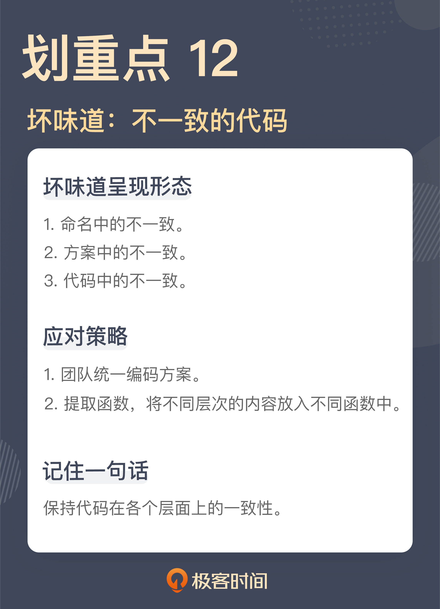

## 十三. 落后的代码风格：使用“新”的语言特性和程序库升级你的代码

从 C++ 11 开始，C++ 开始出现了大规模的演化，让之前学习 C++ 的人感觉自己就像没学过这门语言一样；Python 2 与 Python 3 甚至是不兼容的演化；Java 也是每隔一段时间就会出现一次大的语言演进。

也正是因为语言本身的演化，在不同时期接触不同版本的程序员写出来的程序，甚至不像是在用同一门语言在编程。所以，有机会看到在同一个代码库中，各种不同时期风格的代码并存。

通常来说，新的语言特性都是为了提高代码的表达性，减少犯错误的几率。所以，**在实践中，建议采用新的语言特性写代码的**。

### 13.1 Optional

```java
String name = book.getAuthor().getName();
```

这是在讲“[缺乏封装](#八-缺乏封装如何应对火车代码和基本类型偏执问题)”时用到的一个例子，这里暂且不考虑缺乏封装的问题。即便如此，严格地说，这段代码依然是有问题的。因为它没有考虑对象可能为 null 的场景。所以，这段代码更严谨的写法是这样：

```java
Author author = book.getAuthor();
String name = (author == null) ? null : author.getName();
```

然而，在很多真实的项目中，这种严格的写法却是稀有的，所以，在实际的运行过程中，总会惊喜地发现各种空指针异常。

对于这个如此常见的问题，Java 8 中已经给出了一个解决方案，它就是 Optional。Optional 提供了一个对象容器，需要从中“取出（get）”你所需要的对象，但在取出之前，需要判断一下这个对象容器中是否真的存在一个对象。用这个思路可以这样改写这段代码：

```java
class Book {
  public Optional<Author> getAuthor() {
    return Optional.ofNullable(this.author);
  }
  ...
}

Optional<Author> author = book.getAuthor();
String name = author.isPresent() ? author.get() : null;
```

这种做法和之前做法的最大差别在于，不会忘掉判断对象是否存在的过程，因为需要从 Optional 这个对象容器中取出存在里面的对象。正是这多出来的一步，减少了“忘了”的概率。

也是因为多了 Optional 这个类，这段代码其实还有更简洁的写法：

```java
Optional<Author> author = book.getAuthor();
String name = author.orElse(null);
```

有了 Optional，可以在项目中做一个约定，**所有可能为 null 的返回值，都要返回 Optional，以此减少犯错的几率**。事实上，鉴于空对象是一个普遍存在的问题，一些程序设计语言甚至为此专门设计了语法，比如，类似的代码用 Kotlin 或 Groovy 写出来的话，应该是这下面这样：

```Kotlin
val author = book.author
val name = author?.name
```

### 13.2 函数式编程

Optional 是 Java 8 引入的新特性，它的出现改变了编写 Java 代码的习惯用法。接下来，来看看另外一个改变代码习惯用法的特性。

```java
public ChapterParameters toParameters(final List<Chapter> chapters) {
  List<ChapterParameter> parameters = new ArrayList<>();
  for (Chapter chapter : chapters) {
    if (chapter.isApproved()) {
      parameters.add(toChapterParameter(chapter));
    }
  }

  return new ChapterParameters(parameters);
}
```

这是一段向翻译引擎发送章节信息前准备参数的代码，这里首先筛选出审核通过的章节，然后，再把章节转换成与翻译引擎通信的格式，最后，再把所有得到的单个参数打包成一个完整的章节参数。

如果按照 Java 8 之前的版本理解，这段代码是一段很正常的代码。当 Java 的时代进入到 8 之后，这段代码就成了有坏味道的代码。

Martin Fowler 在《重构》的第二版中新增的坏味道就包括了循环语句（Loops）。之所以循环语句成了坏味道，一个重要的原因就是函数式编程的兴起。**不是不需要遍历集合，而是有了更好的遍历集合的方式**。

函数式编程的一个重要洞见就是，大部分操作都可以归结成列表转换，其中，最核心的列表转换就是 map、filter 和 reduce。在函数式编程日益重要的今天，列表转换已经成为了每个程序员应该必备的基本功。

了解了这些，就知道为什么循环语句是坏味道了，**因为大部分循环语句都是在对一个元素集合进行操作，而这些操作基本上都可以用列表操作进行替代**。

再者，一般来说，采用列表转换写出来的代码相较于传统的循环语句写出来的代码，表达性更好，因为它们都是描述做什么，而传统的循环语句是在描述怎么做。这是两种不同的抽象层次，描述做什么比怎么做的代码，在表达性上要好得多。

有了这些基础，再来看这段代码。这段代码中有一个循环语句，正如前面所说，这个循环语句在处理的是一个集合中的元素，所以，这个循环语句是可以用列表转换的方式代替的。

具体怎么做呢？其实，这里的行为在前面已经分析过了，就是先筛选出审核通过的章节，这个过程对应着 filter，然后，把筛选出来的章节转换成通信中的参数，这个过程对应着 map，最后，把转换的结果搜集起来，这个过程对应着 reduce。所以，这段代码可以改写成这样：

```java
public ChapterParameters toParameters(final List<Chapter> chapters) {
  List<ChapterParameter> parameters = chapters.stream()
    .filter(Chapter::isApproved)
    .map(this::toChapterParameter)
    .collect(Collectors.toList());
  return new ChapterParameters(parameters);
}
```

经过这样的改造，一个循环语句就彻底被一个列表转换的操作替换掉了（这里的 collect 函数对应着 reduce 操作）。在这段代码中，用到了 Java 8 提供的一些基础设施，比如，Stream、lambda 和方法引用等等。

或许有人会说，这段代码看着还不如原来的循环语句简单。不过，要知道，两种写法根本的差别是侧重点不同，循环语句是在描述实现细节，而列表转换的写法是在描述做什么，二者的抽象层次不同。

对于理解这段代码的人来说，二者提供的信息量是完全不同的，循环语句必须要做一次“阅读理解”知晓了其中的细节才能把整个场景拼出来，而列表转换的写法则基本上和用语言叙述的过程一一对应。所以，理解的难度是完全不同的。

这段代码只是为了说明问题，而选择了简单的代码，但在实际工作中，需求会比这复杂得多。而且，如果要添加新的需求，循环语句里的代码会随之变得越来越复杂，原因就是循环语句里都是细节，而列表转换则是一段一段的描述，就像在阅读一篇文章。

很多人之所以更喜欢使用循环语句而不是列表转换，一个重要原因是对于列表转换的基础还不了解。只要多写几次 filter、map 和 reduce，理解它们就会像理解选择语句和循环语句一样自然。

到这里有人会说：“你说得有点道理，但为什么我的感觉和你不一样，在实践中，也使用了这种风格，为什么写出来的代码感觉更难理解了？”对于这一点，一个常见的原因就是，你在列表转换过程中写了太多代码。

自从 Java 里引入了 lambda，因为写起来实在是太容易了，很多人就直接在列表转换过程中写 lambda。lambda 本身相当于一个匿名函数，所以，很多人在写函数中犯的错误在 lambda 里也一样出现了，最典型的当然就是长函数。

在各种程序设计语言中，lambda 都是为了写短小代码提供的便利，所以，lambda 中写出大片的代码，根本就是违反 lambda 设计初衷的。最好的 lambda 应该只有一行代码。

那如果一个转换过程中有很多操作怎么办呢？很简单，提取出一个函数，就像前面代码中的 toChapterParameter，它负责完成从 Chapter 到 ChapterParameter 的转换。这样一来，**列表转换的本身就完全变成了一个声明，这样的写法才是能发挥出列表转换价值的写法**。

> 可以看到，代码风格有一个逐步演化的过程，每个程序员对此的理解程度都有所差异，所以，如果不加注意的话，各种代码风格会并存于代码之中，加剧代码的理解难度。
> 一种编程风格会过时，本质上是因为它存在问题，新代码风格就是用更好的方案解决它，就像 Optional。所以，要不断学习新引入的语言特性，了解它们给语言带来的“新”风格，而不要停留在原地。

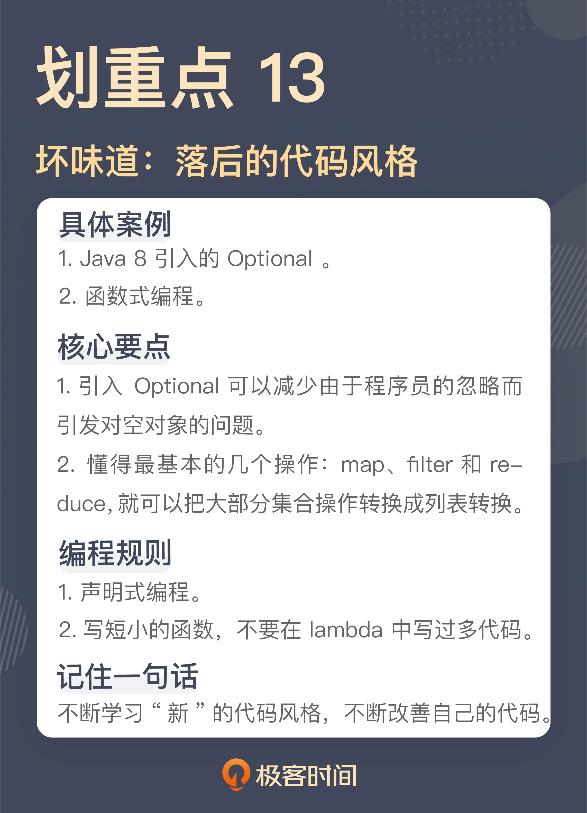

## 十四. 代码评审

### 14.1 多久进行一次代码评审最合适？

有一个发现坏味道的实践，就是代码评审，也就是很多人熟悉的 Code Review，Wikipedia 上定义是这样的：

> 代码评审，是指对计算机源代码系统化地审查，常用软件同行评审的方式进行，其目的是在找出及修正在软件开发初期未发现的错误，提升软件质量及开发者的技术。

大多数程序员都经历过代码评审，也都能够初步理解代码评审本身存在的价值，这也是差不多全行业都认为有价值的一个实践。只不过，每个团队在代码评审的实践差别还挺大的，有的团队是在一个完整的开发周期结束之后，做一次代码评审；有的是安排每周的代码评审；有的则是每天都要做代码评审。之所以会有这样的差异，主要就是团队对于代码评审本身的理解有差异。

**代码评审是一个沟通反馈的过程**
关于代码评审，第一个问题就是，为什么要做代码评审？

这个问题其实比较简单，没有人能够保证自己写出来的代码是没有问题的，而规避个体问题的主要方式就是使用集体智慧，也就是团队的力量。

这个答案是从个体的角度在看问题，其实，看待代码评审还有一个团队视角，代码评审的过程，也是一个知识分享的过程，保证一些细节的知识不再是隐藏在某一个人的头脑中，而是放置到了团队的层面。

不过，无论是从哪个角度看代码评审，它的本质，就是沟通反馈的过程。我把我对这段代码的理解分享给你，你把你对这段代码的想法共享给我。有人给出代码实现的知识，有人贡献出对技术的理解。

如果理解了代码评审是一个沟通反馈的过程，那就可以把沟通反馈的一些原则运用到代码评审中。希望沟通要尽可能透明，尽可能及时。把这样的理解放到代码评审中，就是要尽可能多暴露问题，尽可能多做代码评审。

**暴露问题**
先来说暴露问题。代码评审就是一个发现问题的过程，这是一个大家都能理解的事情。但问题就在于，要发现什么问题？

如果泛泛地回答，那自然就是代码实现中的各种问题。然而，这个答案还可以细化一下，做代码评审时，可以从下面几个角度来看代码：

- **实现方案的正确性**
- **算法的正确性**
- **代码的坏味道**

一个一个来看，先来说实现方案。理论上说，实现方案应该是设计评审中关注的内容，但在实际工作中，并不是所有团队都能够很好地执行设计评审，而且设计评审有时也关注不到特别细的点，所以，一些实现方案的问题只有在代码评审中才能发现。

在一次代码评审中，看到一个批量处理的 REST 接口，接到请求经过一些处理之后，它会调用另外一个服务，因为这个服务只支持单一的请求，所以，REST 接口只能一个一个地向这个服务发送请求。

如果一切正常的话，这个接口是没有问题的。但是，如果在处理过程中出现失败，没有把所有的请求发给另一个服务，这个接口的行为是什么样呢？是需要客户端重新发起请求，还是服务端本身重新调用接口？如果是服务端负责重试，那么，这个方案本身没有任何重试的机制，也就是说，一个请求一旦出错，它就丢了，业务不能顺利地完成。

当把这个问题抛了出来时，同事一下子愣住了。显然，他只考虑了正常的情况，而没有考虑出现失败的情况。把它做成一个完整的方案，很可能还需要做一个后台服务，负责替未能得到有效处理的任务善后，显然，这就不是代码调整，而是整个方案的调整。

这是很多程序员，尤其是经验比较少的程序员写程序经常会出现的问题：**正常情况一切顺利，异常情况却考虑不足**。

**算法正确性**
别看整个行业都十分重视算法，但那是在面试的过程中。真正到了实际工作里，算法复杂度常常被人忽略。

之前讲过嵌套的代码，对于循环语句，要把处理一个元素的代码提取出来。不过，这有时候也会带来一些意想不到的问题。

有一次代码评审，看到了一段写得很干净的代码，就是把循环里对于一个元素的处理拆了出去。然后，单个元素处理的代码，每次都要查询一次数据库，找出相应的元素，做修改之后再存回去。

就这样，单独看每段代码都是对的，但合在一起就出了问题，本来可以通过一次查询解决的问题变成了 N 次查询。

如果是算法练习，大多数都能够有效地解决这个问题，但放在工程里，就难免挂一漏万了。所以，算法正确性也是要在代码评审中关注的。

无论是实现方案的正确性，还是算法的正确性，对于大多数团队来说，都会关注到。但代码坏味道却是很多团队容易忽略的，这里面的关键点就是很多团队对于坏味道的标准太低了。

### 14.2 什么代码应该被重构

首先要明确的是，代码的好与坏不应当用个人好恶、“含混的代码美学”来表达，因为这会带来两个困难：

- 每个人对于“好”或“美”的观念可能相当不同；
- 对于坏代码缺乏明确的“症状”判断，也就很难提出明确的改进措施。

即便是一些经典的程序设计原则，也有同样的问题。例如“高内聚低耦合”，尽管这是所有人都赞同的设计原则，但究竟什么样的代码呈现了“低内聚”、什么样的代码呈现了“高耦合” 、“低内聚”与“高耦合”是否总是同时出现、应该以何种办法提高内聚降低耦合……这些问题仍然是悬而未决的。

但当去观察“低内聚高耦合”带来的问题时，事情就变得明朗了。比如，当仔细阅读《重构》第三章时，会发现，“低内聚”会直接引发的现象是“**霰弹式修改**（Shotgun Surgery）”：

> 每当需要对某个事情做出修改时，都必须在许多不同的类内做出许多小修改，那么就可以确定，所面临的坏味道是霰弹式修改。当需要修改的代码分散在多处，不但很难找到它们，也很容易忘记某个重要的修改。

而“高耦合”直接引发的现象则是有某种相似性、但又表现不同的“**发散式变化**（Divergent Change）”：

> 如果某个类经常因为不同的原因在不同的方向上发生变化，发散式变化就出现了。

“迪米特原则”也是常被提及的面向对象设计原则之一，然而知道这个名称是一回事，知道如何识别不符合迪米特原则的代码，则又需要更多的个人经验。《重构》第三章则把这个原则表述为两个非常直观的症状：“过长的消息链（Message Chains）”和“中间人（Middle Man）”。

> 如果看到用户向一个对象请求另一个对象，而后者再次请求另一个对象，然后再请求另一个对象……这就是消息链。在实际代码中，看到的可能是一长串取值函数，或者一长串临时变量。
> 人们可能过度运用委托。也许会看到某个类接口有一半的函数都委托给其他类，这样就是过度运用。

伴随着对具体症状的了解，对症的**解决办法**也变得明确。

- 对于“霰弹式修改”，解决的办法是使用“搬移函数”和“搬移字段”，把所有需要修改的代码放进同一个模块；
- 对于“发散式变化”，解决的办法是首先用“提炼函数”将不同用途的逻辑分开，然后用“搬移函数”将它们分别搬移到合适的模块；
- 对于“过长的消息链”，应该使用“隐藏委托关系”；对于“中间人”，对症的疗法则是“移除中间人”，甚至直接“内联函数”。

对于绝大多数程序员而言，阅读和使用《重构》这本书的正确方法应该是：

1. 打开任意一段代码（可以是刚写完的或者马上要动手修改的）
2. 翻开《重构》第三章，遍历其中的每个坏味道：
   - 识别这段代码中是否存在上述坏味道；
     - 如有，则遵循该坏味道所列的重构手法，对该段代码进行重构
     - 如无，则继续遍历代码

上述过程不需要玄妙的理论和含混的代码美学，只需要机械的重复和简单的模式匹配。正因为此，**重构才是一项完完全全具备可操作性、能够在任何遗留代码库上实践的技术**。

**培养对“坏味道”的判断力**:

1. 必须培养出自己的判断力，学会判断一个类内有多少实例变量算是太大、一个函数内有多少行代码才算太长。缺乏在受控环境下的刻意练习，很难通过工作中的自然积累提升判断力。
2. “正确的代码构造”并非无穷无尽，实际上在单线程编程中，几十个常见的模式已经几乎能够完全覆盖所有场景。
3. 从一开始就以合理的方式编程，从而使坏味道不要出现
   极限编程的各种实践，尤其是工程技术实践彼此紧密相关。例如自动化测试、持续集成、集体代码所有制的缺失，都会导致代码的坏味道更容易堆积。而从另一个角度来看，这些实践从任何一个切入，又都会自然地引导出其他相关的实践。
4. 极限编程是唯一合理且有效的软件开发方法
   只有采用以可工作的软件为核心的软件开发方法，才能得到高质量的可工作的软件
