<!-- @import "[TOC]" {cmd="toc" depthFrom=1 depthTo=6 orderedList=false} -->

<!-- code_chunk_output -->

- [支付宝网页支付](#支付宝网页支付)
  - [一. 介绍](#一-介绍)
  - [二. 接入准备](#二-接入准备)
    - [2.1 企业支付宝账号注册和实名认证](#21-企业支付宝账号注册和实名认证)
      - [2.1.1 注册企业支付宝账户](#211-注册企业支付宝账户)
      - [2.1.2 激活企业支付宝账户](#212-激活企业支付宝账户)
      - [2.1.3 认证企业支付宝账户](#213-认证企业支付宝账户)
        - [2.1.3.1 资料登记](#2131-资料登记)
        - [2.1.3.2 实名认证](#2132-实名认证)
    - [2.2 创建第三方应用](#22-创建第三方应用)
    - [2.3 配置并绑定应用](#23-配置并绑定应用)

<!-- /code_chunk_output -->

[alipay]: https://open.alipay.com/

# 支付宝网页支付

## 一. 简介

**准入条件**:

- 企业或个体工商户，具有真实有效的营业执照，且支付宝账户名称需与营业执照主体一致
- 提供能正常访问的网站地址且页面显示完整，网站通过ICP备案，有明确的运营内容与完整的商品和价格信息。

**计费模式**
电脑网站支付的签约费率如下表所示：

服务名称 | 费率 | 服务期限
---------|------|--------
单笔费率 | 0.6% | 1年

## 二. 接入准备

需要登录 [支付宝开放平台][alipay]，在开发者中心中创建应用，应用审核通过后会生成应用唯一标识（APPID），并且可以申请开通开放产品使用权限。通过 APPID 应用才能调用开放产品的接口能力。

### 2.1 企业支付宝账号注册和实名认证

**注册前需要的资料**:

- 营业执照影印件
- 对公银行账户，可以是基本户或一般户
- 法定代表人的身份证影印件

#### 2.1.1 注册企业支付宝账户

1. 准备一个从未注册过支付宝或淘宝的邮箱，点击进入 [注册企业支付宝](https://memberprod.alipay.com/account/reg/enterpriseIndex.htm)。

    > 注意：
    >
    > 1. 该邮箱不能是注册过的支付宝、淘宝或 1688 的已用登录名。
    > 2. 若提交后提示 不支持该邮箱 则更换邮箱，邮箱存在部分字符拦截。

2. 输入验证码，进行相关验证后，会发送一封激活邮件到填写的邮箱，注册步骤完成。

#### 2.1.2 激活企业支付宝账户

1. 登录邮箱查收支付宝发的邮件，点击邮件里的 **继续注册**。

2. 转跳页面设置账户的登录密码、支付密码和安全保护问题，设置好后点击 **下一步** 完成激活步骤。
  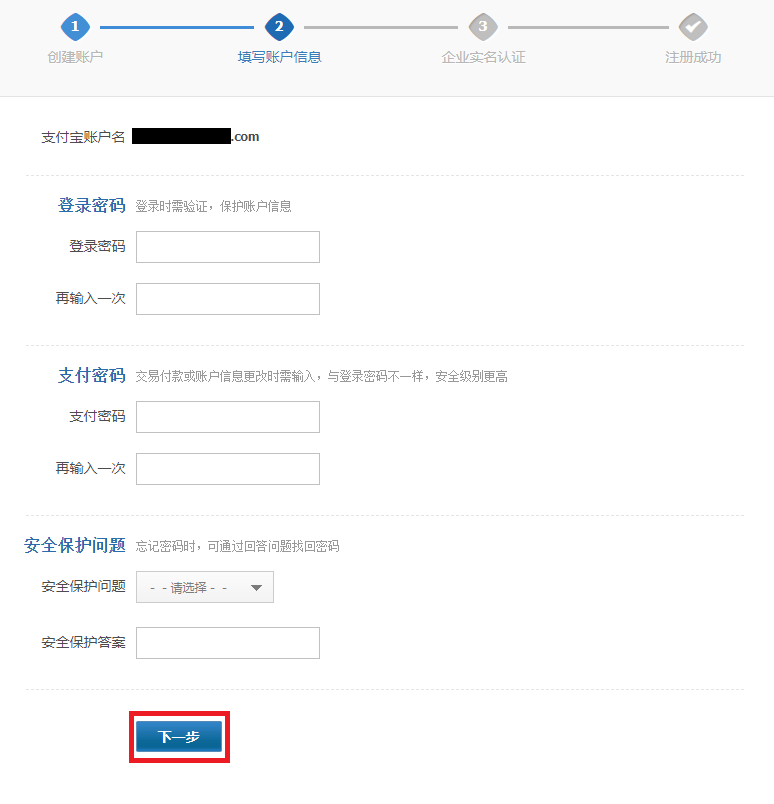

#### 2.1.3 认证企业支付宝账户

本步骤分为两大环节，**资料登记** 和 **实名认证**。

##### 2.1.3.1 资料登记

1. 完成激活后，在跳转的页面下点击 **企业实名信息填写** 进行认证的下一环节（需要使用企业支付宝账号登录支付宝平台）。
  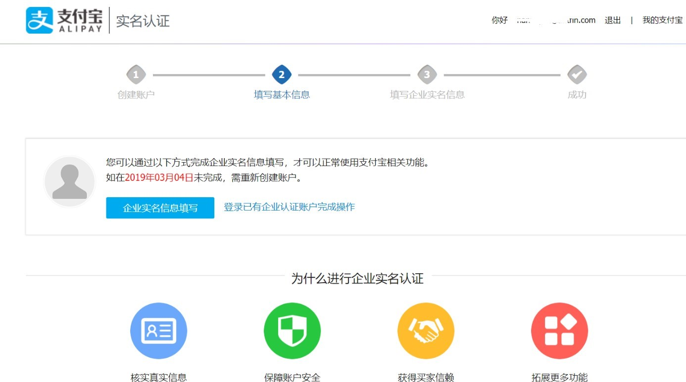

2. 填写信息
  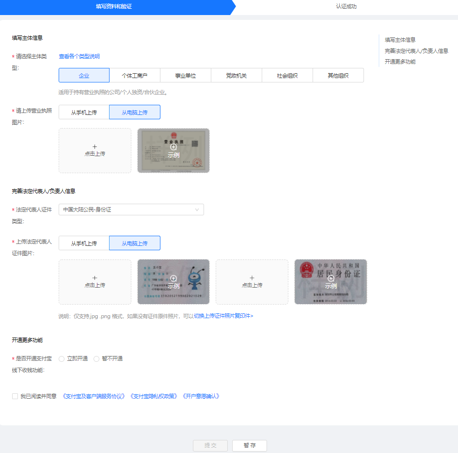

    1. 请选择主体类型：可选择的主体类型包括 企业、个体工商户、事业单位、党政机关、社会组织 和 其他组织 可以点击 查看各个类型说明 确认应选择的类型。
    2. 请上传营业执照图片：需上传企业营业执照，需保证图片内文字和其他内容清晰可见，仅支持.jpg .png 格式。营业执照上传后，系统会自动识别图片内的信息，确认信息的正确性并补全未识别的信息。
    3. 法定代表人证件类型：选择法人证件的类型。
    4. 上传法定代表人证件图片：可选择直接拍摄证件照片上传，或选择证件复印件照片上传，需保证图片内文字和其他内容清晰可见，仅支持.jpg .png 格式。法人证件照上传后，系统会自动识别图片内的信息，请确认信息的正确性。
    5. 是否开通支付宝线下收钱功能：若开通支付宝线下收钱，则需要选择企业的经营类型，需要行业资质的上传相应行业资质。

3. 填写好信息后，阅读并勾选同意相关协议点击提交。等待48小时人工审核，通过后进行最后一部分企业认证。

##### 2.1.3.2 实名认证

**认证方式为系统综合判断显示，无法人工修改。**
可以选择法人支付宝密码验证或对公账号转账验证。

法定代表人支付宝 账密认证/法人刷脸认证

1. 刷脸：可以通过 支付宝发送 也可以通过 保存图片发送 给 法定代表人，使用其个人支付宝打开服务提醒或者扫描二维码图片进行人脸核验。
2. 账密：点击 法人支付宝密码验证 进入输入账密进行核验。
3. 对公银行账户打款认证: 点击页面 对公账号转账验证，按照页面提示输入对公银行账户信息进行验证。

> 注意：
>
> 1. 使用与认证资料填写的同名对公银行账户进行打款，请勿使用个人银行账户进行企业打款认证。
> 2. 使用大陆银行卡，外资银行将存在认证失败风险。
> 3. 在使用网银操作时，可使用打款认证信息页面复制功能，确保信息填写正确，操作时务必核对。
> 4. 收款方开户行信息“浙江网商银行股份有限公司”也请务必填写完整，可以 点此 链接查看开户行信息在各网银系统的填写示例，请勿填错 “浙商银行”、“网商银行”、“浙江网商银行”等。
> 5. 收款账户仅用于认证账户，后续账户余额充值，请勿打款至该账户，避免金额无法退回。
> 6. 打款时，请务必将收款方信息填写正确，点击待打款页面收款方信息右方的复制按钮，可以粘贴填写至对应网银系统的收款方信息，请勿填错。
> 7. 支付宝收到资金后，认证状态实时更新，认证成功，则资金会退回支付宝账户。若打款后，对公银行账户收到退款，则说明认证失败，不成功原因一般为填写的收款方信息有误导致，可将打款的电子回单与待打款页面的收款方账户信息核对，填写正确信息再次打款。

### 2.2 创建第三方应用

1. 在创建应用前，先选择应用类型:
  选择第三方应用：适用于服务商，为商户开发应用，拓展商户使用，应用开发者和应用使用者不是同一个人。
  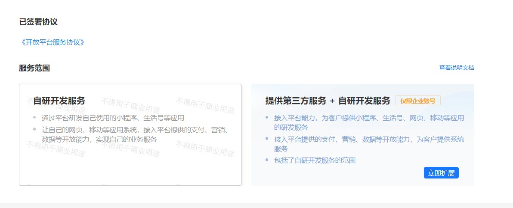
  **提供第三方服务条件**：仅支持企业账户，主要面向系统服务商，为他人开发应用，**必须为企业支付宝账号**。

2. 登录 **[支付宝开放平台][alipay] > 开发者中心** ，点击 **创建应用 > 第三方应用 > 自定义接入**。
  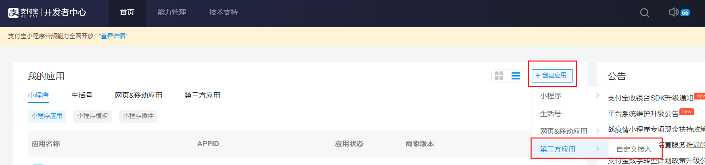
  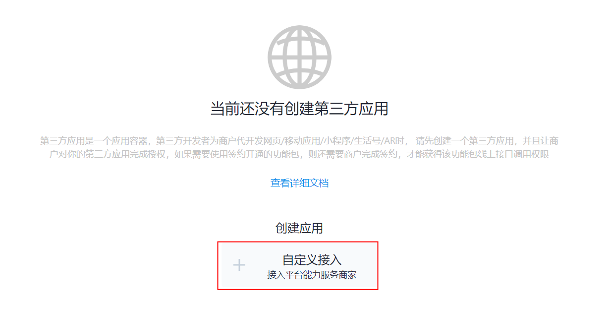

3. 填写第三方应用信息，选择 网页/移动应用。
  应用名称每月仅可修改一次。业务代理范围选中后，无法修改。
  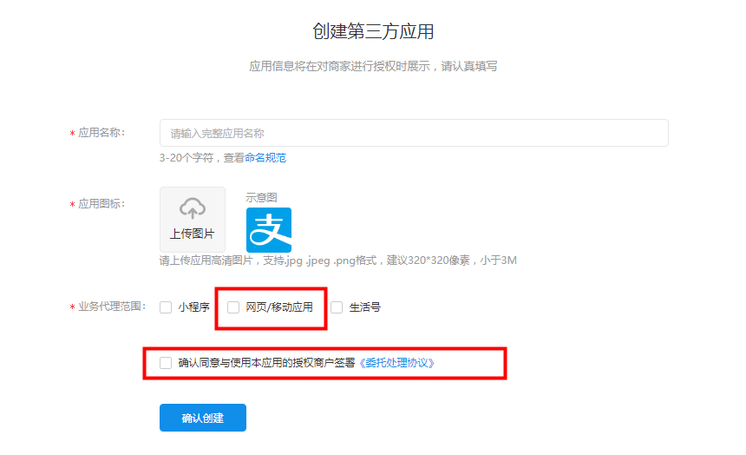

    > 注意：应用名称每月仅可修改一次。业务代理范围选中后，无法修改。

4. 创建成功，进入该第三方应用管理后台页面，并获取 **应用 ID**。
  在第三方应用代商家应用调用支付宝 Open API 时，初始化 SDK 的 AlipayClient 时，需传入第三方应用的 APPID（应用 ID）。
  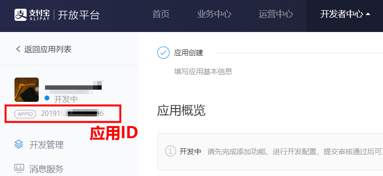

### 2.3 配置并绑定应用

1. 配置第三方应用的能力列表，在能力列表中添加将会接入的开放能力。
  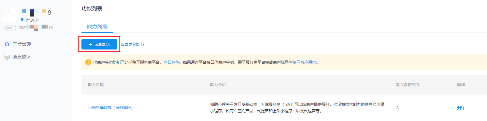

2. 完成网关、回调地址、加签方式等相关开发配置。
  应用网关、授权回调地址、加签方式 必填。
  
  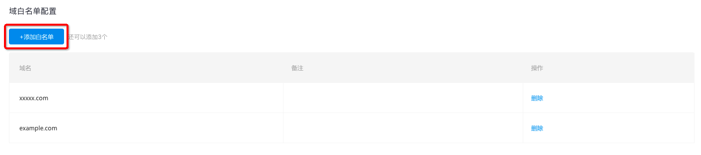

    配置项名称 | 描述
    ----------|-----
    接口加签方式 | （对应上图1）必填，要保证接口中使用的私钥与此处的公钥匹配，否则无法调用接口。可参考密钥的 [生成与配置](https://opendocs.alipay.com/open/291/105971/)，且接口参数 sign_type=RSA2。密钥和应用 APPID 一一对应，即需要为名下的每个应用分别设置密钥，且不同应用的密钥不能混用。
    IP 白名单 | （对应上图2）选填，为提高商户访问开放平台的安全性，避免商户因应用私钥泄漏等原因导致业务受损，开放平台提供 IP 白名单机制，详情可参考 [IP 白名单接入指南](https://opendocs.alipay.com/open/200/ipwhitelist)。IP 白名单旨在保证开发者的资金安全，视实际情况选用。
    应用网关 | （对应上图3）选填，用于接收支付宝异步通知，例如服务市场订购通知、授权通知。
    授权回调地址 |（对应上图4）选填，[第三方应用授权](https://opendocs.alipay.com/isv/10467/xldcyq) 或 [用户信息授权](https://opendocs.alipay.com/open/284/web#%E5%85%B3%E4%BA%8E%20redirect_uri%20%E7%9A%84%E8%AF%B4%E6%98%8E) 后回调地址。授权链接中配置的 redirect_uri 的值必须与此值保持一致 (如：`https://www.alipay.com`) ，用户成功授权后将在该 url 后携带授权码等信息并跳转至该页。注意：当填入该地址时，系统会自动进行安全检测，详情参考 [安全检测](https://opendocs.alipay.com/open/316/106274)。
    域白名单配置 | 第三方应用配置域白名单后，授权给该第三方应用的小程序的服务器域名白名单会使用此配置。

3. 完成应用配置后，即可提交应用审核。第三方应用审核通过后，第三方应用状态变更为 **已上线**，即完成第三方应用的创建流程。

4. 登录 [服务商平台](https://p.alipay.com/) ，进入 **账户中心 > 三方应用绑定**，点击 **新增APPID绑定**。
  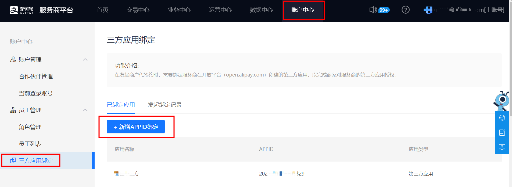

5. 输入需绑定的第三方应用 APPID，点击 立即绑定。
  
    > 注意：
    >
    > 1. 一个服务商 PID 可以绑定多个 APPID，但一个 APPID 只能绑定一个服务商 PID。可以绑定的应用类型包括生活号、小程序等，最多可绑定 50 个 APPID。服务商平台发起 APPID 绑定仅支持绑定第三方应用。
    > 2. 绑定第三方应用和解除绑定仅支持服务商主账号进行操作。
    > 3. 绑定规则：暂仅支持同支付宝账号进行绑定，即待绑定 APPID 所属支付宝账号与申请绑定的支付宝账号为同一账号。
